Nobara - Hardware Trends (Desktops)
-----------------------------------

A project to identify most popular hardware characteristics and track their change
over time based on data collected by Linux users at https://Linux-Hardware.org.

Anyone can contribute to this report by the [hw-probe](https://github.com/linuxhw/hw-probe) tool:

    sudo -E hw-probe -all -upload

This report is for one last month. Overall report since the beginning of time: [TestCoverage](https://github.com/linuxhw/TestCoverage)

Period: Oct, 2022.

Contents
--------

* [ System ](#system)
  - [ OS                       ](#os)
  - [ OS Family                ](#os-family)
  - [ Kernel                   ](#kernel)
  - [ Kernel Family            ](#kernel-family)
  - [ Kernel Major Ver.        ](#kernel-major-ver)
  - [ Arch                     ](#arch)
  - [ DE                       ](#de)
  - [ Display Server           ](#display-server)
  - [ Display Manager          ](#display-manager)
  - [ OS Lang                  ](#os-lang)
  - [ Boot Mode                ](#boot-mode)
  - [ Filesystem               ](#filesystem)
  - [ Part. scheme             ](#part-scheme)
  - [ Dual Boot with Linux/BSD ](#dual-boot-with-linuxbsd)
  - [ Dual Boot (Win)          ](#dual-boot-win)

* [ Board ](#board)
  - [ Vendor                   ](#vendor)
  - [ Model                    ](#model)
  - [ Model Family             ](#model-family)
  - [ MFG Year                 ](#mfg-year)
  - [ Form Factor              ](#form-factor)
  - [ Secure Boot              ](#secure-boot)
  - [ Coreboot                 ](#coreboot)
  - [ RAM Size                 ](#ram-size)
  - [ RAM Used                 ](#ram-used)
  - [ Total Drives             ](#total-drives)
  - [ Has CD-ROM               ](#has-cd-rom)
  - [ Has Ethernet             ](#has-ethernet)
  - [ Has WiFi                 ](#has-wifi)
  - [ Has Bluetooth            ](#has-bluetooth)

* [ Location ](#location)
  - [ Country                  ](#country)
  - [ City                     ](#city)

* [ Drives ](#drives)
  - [ Drive Vendor             ](#drive-vendor)
  - [ Drive Model              ](#drive-model)
  - [ HDD Vendor               ](#hdd-vendor)
  - [ SSD Vendor               ](#ssd-vendor)
  - [ Drive Kind               ](#drive-kind)
  - [ Drive Connector          ](#drive-connector)
  - [ Drive Size               ](#drive-size)
  - [ Space Total              ](#space-total)
  - [ Space Used               ](#space-used)
  - [ Malfunc. Drives          ](#malfunc-drives)
  - [ Malfunc. Drive Vendor    ](#malfunc-drive-vendor)
  - [ Malfunc. HDD Vendor      ](#malfunc-hdd-vendor)
  - [ Malfunc. Drive Kind      ](#malfunc-drive-kind)
  - [ Failed Drives            ](#failed-drives)
  - [ Failed Drive Vendor      ](#failed-drive-vendor)
  - [ Drive Status             ](#drive-status)

* [ Storage controller ](#storage-controller)
  - [ Storage Vendor           ](#storage-vendor)
  - [ Storage Model            ](#storage-model)
  - [ Storage Kind             ](#storage-kind)

* [ Processor ](#processor)
  - [ CPU Vendor               ](#cpu-vendor)
  - [ CPU Model                ](#cpu-model)
  - [ CPU Model Family         ](#cpu-model-family)
  - [ CPU Cores                ](#cpu-cores)
  - [ CPU Sockets              ](#cpu-sockets)
  - [ CPU Threads              ](#cpu-threads)
  - [ CPU Op-Modes             ](#cpu-op-modes)
  - [ CPU Microcode            ](#cpu-microcode)
  - [ CPU Microarch            ](#cpu-microarch)

* [ Graphics ](#graphics)
  - [ GPU Vendor               ](#gpu-vendor)
  - [ GPU Model                ](#gpu-model)
  - [ GPU Combo                ](#gpu-combo)
  - [ GPU Driver               ](#gpu-driver)
  - [ GPU Memory               ](#gpu-memory)

* [ Monitor ](#monitor)
  - [ Monitor Vendor           ](#monitor-vendor)
  - [ Monitor Model            ](#monitor-model)
  - [ Monitor Resolution       ](#monitor-resolution)
  - [ Monitor Diagonal         ](#monitor-diagonal)
  - [ Monitor Width            ](#monitor-width)
  - [ Aspect Ratio             ](#aspect-ratio)
  - [ Monitor Area             ](#monitor-area)
  - [ Pixel Density            ](#pixel-density)
  - [ Multiple Monitors        ](#multiple-monitors)

* [ Network ](#network)
  - [ Net Controller Vendor    ](#net-controller-vendor)
  - [ Net Controller Model     ](#net-controller-model)
  - [ Wireless Vendor          ](#wireless-vendor)
  - [ Wireless Model           ](#wireless-model)
  - [ Ethernet Vendor          ](#ethernet-vendor)
  - [ Ethernet Model           ](#ethernet-model)
  - [ Net Controller Kind      ](#net-controller-kind)
  - [ Used Controller          ](#used-controller)
  - [ NICs                     ](#nics)
  - [ IPv6                     ](#ipv6)

* [ Bluetooth ](#bluetooth)
  - [ Bluetooth Vendor         ](#bluetooth-vendor)
  - [ Bluetooth Model          ](#bluetooth-model)

* [ Sound ](#sound)
  - [ Sound Vendor             ](#sound-vendor)
  - [ Sound Model              ](#sound-model)

* [ Memory ](#memory)
  - [ Memory Vendor            ](#memory-vendor)
  - [ Memory Model             ](#memory-model)
  - [ Memory Kind              ](#memory-kind)
  - [ Memory Form Factor       ](#memory-form-factor)
  - [ Memory Size              ](#memory-size)
  - [ Memory Speed             ](#memory-speed)

* [ Printers & scanners ](#printers--scanners)
  - [ Printer Vendor           ](#printer-vendor)
  - [ Printer Model            ](#printer-model)
  - [ Scanner Vendor           ](#scanner-vendor)
  - [ Scanner Model            ](#scanner-model)

* [ Camera ](#camera)
  - [ Camera Vendor            ](#camera-vendor)
  - [ Camera Model             ](#camera-model)

* [ Security ](#security)
  - [ Fingerprint Vendor       ](#fingerprint-vendor)
  - [ Fingerprint Model        ](#fingerprint-model)
  - [ Chipcard Vendor          ](#chipcard-vendor)
  - [ Chipcard Model           ](#chipcard-model)

* [ Unsupported ](#unsupported)
  - [ Unsupported Devices      ](#unsupported-devices)
  - [ Unsupported Device Types ](#unsupported-device-types)

System
------

OS
--

Installed operating systems

| Name      | Desktops | Percent |
|-----------|----------|---------|
| Nobara 36 | 29       | 100%    |

OS Family
---------

OS without a version

| Name   | Desktops | Percent |
|--------|----------|---------|
| Nobara | 29       | 100%    |

Kernel
------

Version of the Linux kernel

| Version                       | Desktops | Percent |
|-------------------------------|----------|---------|
| 5.19.16-201.fsync.fc36.x86_64 | 7        | 24.14%  |
| 5.19.14-201.fsync.fc36.x86_64 | 7        | 24.14%  |
| 5.19.15-202.fsync.fc36.x86_64 | 4        | 13.79%  |
| 5.19.7-204.fsync.fc36.x86_64  | 3        | 10.34%  |
| 5.19.12-201.fsync.fc36.x86_64 | 3        | 10.34%  |
| 6.0.5-201.fsync.fc36.x86_64   | 2        | 6.9%    |
| 5.19.13-202.fsync.fc36.x86_64 | 1        | 3.45%   |
| 5.19.13-201.fsync.fc36.x86_64 | 1        | 3.45%   |
| 5.19.10-201.fsync.fc36.x86_64 | 1        | 3.45%   |

Kernel Family
-------------

Linux kernel without a distro release

| Version | Desktops | Percent |
|---------|----------|---------|
| 5.19.16 | 7        | 24.14%  |
| 5.19.14 | 7        | 24.14%  |
| 5.19.15 | 4        | 13.79%  |
| 5.19.7  | 3        | 10.34%  |
| 5.19.12 | 3        | 10.34%  |
| 6.0.5   | 2        | 6.9%    |
| 5.19.13 | 2        | 6.9%    |
| 5.19.10 | 1        | 3.45%   |

Kernel Major Ver.
-----------------

Linux kernel major version

| Version | Desktops | Percent |
|---------|----------|---------|
| 5.19    | 27       | 93.1%   |
| 6.0     | 2        | 6.9%    |

Arch
----

OS architecture (x86_64, i586, etc.)

| Name   | Desktops | Percent |
|--------|----------|---------|
| x86_64 | 29       | 100%    |

DE
--

Desktop Environment

| Name       | Desktops | Percent |
|------------|----------|---------|
| GNOME      | 20       | 68.97%  |
| KDE5       | 8        | 27.59%  |
| X-Cinnamon | 1        | 3.45%   |

Display Server
--------------

X11 or Wayland

| Name    | Desktops | Percent |
|---------|----------|---------|
| Wayland | 16       | 55.17%  |
| X11     | 13       | 44.83%  |

Display Manager
---------------

SDDM, LightDM, etc.

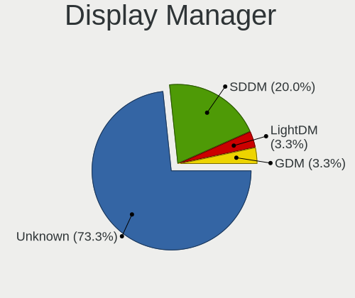

| Name    | Desktops | Percent |
|---------|----------|---------|
| Unknown | 24       | 82.76%  |
| GDM     | 3        | 10.34%  |
| SDDM    | 1        | 3.45%   |
| LightDM | 1        | 3.45%   |

OS Lang
-------

Language

| Lang  | Desktops | Percent |
|-------|----------|---------|
| en_US | 19       | 65.52%  |
| es_ES | 2        | 6.9%    |
| fr_FR | 1        | 3.45%   |
| es_MX | 1        | 3.45%   |
| es_GT | 1        | 3.45%   |
| en_GB | 1        | 3.45%   |
| en_CA | 1        | 3.45%   |
| en_AU | 1        | 3.45%   |
| cs_CZ | 1        | 3.45%   |
| C     | 1        | 3.45%   |

Boot Mode
---------

EFI or BIOS

| Mode | Desktops | Percent |
|------|----------|---------|
| EFI  | 21       | 72.41%  |
| BIOS | 8        | 27.59%  |

Filesystem
----------

Type of filesystem

| Type  | Desktops | Percent |
|-------|----------|---------|
| Btrfs | 16       | 55.17%  |
| Ext4  | 13       | 44.83%  |

Part. scheme
------------

Scheme of partitioning

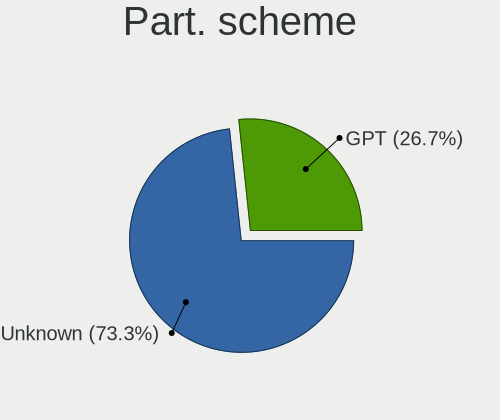

| Type    | Desktops | Percent |
|---------|----------|---------|
| Unknown | 22       | 75.86%  |
| GPT     | 5        | 17.24%  |
| MBR     | 2        | 6.9%    |

Dual Boot with Linux/BSD
------------------------

Hosting more than one Linux/BSD

| Dual boot | Desktops | Percent |
|-----------|----------|---------|
| No        | 26       | 89.66%  |
| Yes       | 3        | 10.34%  |

Dual Boot (Win)
---------------

Hosting Linux and Windows

| Dual boot | Desktops | Percent |
|-----------|----------|---------|
| No        | 26       | 89.66%  |
| Yes       | 3        | 10.34%  |

Board
-----

Vendor
------

Motherboard manufacturer

| Name                | Desktops | Percent |
|---------------------|----------|---------|
| ASUSTek Computer    | 7        | 24.14%  |
| MSI                 | 6        | 20.69%  |
| Gigabyte Technology | 5        | 17.24%  |
| Hewlett-Packard     | 3        | 10.34%  |
| Dell                | 3        | 10.34%  |
| ASRock              | 3        | 10.34%  |
| Intel               | 1        | 3.45%   |
| ECS                 | 1        | 3.45%   |

Model
-----

Motherboard model

| Name                                 | Desktops | Percent |
|--------------------------------------|----------|---------|
| Dell OptiPlex 390                    | 2        | 6.9%    |
| MSI MS-7D25                          | 1        | 3.45%   |
| MSI MS-7B86                          | 1        | 3.45%   |
| MSI MS-7B51                          | 1        | 3.45%   |
| MSI MS-7B17                          | 1        | 3.45%   |
| MSI MS-7A34                          | 1        | 3.45%   |
| MSI MS-7811                          | 1        | 3.45%   |
| Intel B75                            | 1        | 3.45%   |
| HP Pavilion Gaming Desktop TG01-0xxx | 1        | 3.45%   |
| HP EliteDesk 800 G1 SFF              | 1        | 3.45%   |
| HP Compaq dc5850 Small Form Factor   | 1        | 3.45%   |
| Gigabyte Z97-HD3                     | 1        | 3.45%   |
| Gigabyte Z590I VISION D              | 1        | 3.45%   |
| Gigabyte X570 I AORUS PRO WIFI       | 1        | 3.45%   |
| Gigabyte B450M DS3H                  | 1        | 3.45%   |
| Gigabyte 970A-DS3P                   | 1        | 3.45%   |
| ECS H61H2-CM                         | 1        | 3.45%   |
| Dell Precision WorkStation T3500     | 1        | 3.45%   |
| ASUS TUF Gaming X570-PRO WIFI II     | 1        | 3.45%   |
| ASUS TUF Gaming B450M-PLUS II        | 1        | 3.45%   |
| ASUS SABERTOOTH 990FX R2.0           | 1        | 3.45%   |
| ASUS ROG STRIX Z390-E GAMING         | 1        | 3.45%   |
| ASUS PRIME X370-PRO                  | 1        | 3.45%   |
| ASUS PRIME A320M-K                   | 1        | 3.45%   |
| ASUS H61M-K                          | 1        | 3.45%   |
| ASRock Z77 Pro4                      | 1        | 3.45%   |
| ASRock X570 Taichi                   | 1        | 3.45%   |
| ASRock B450M Steel Legend            | 1        | 3.45%   |

Model Family
------------

Motherboard model prefix

| Name               | Desktops | Percent |
|--------------------|----------|---------|
| Dell OptiPlex      | 2        | 6.9%    |
| ASUS TUF           | 2        | 6.9%    |
| ASUS PRIME         | 2        | 6.9%    |
| MSI MS-7D25        | 1        | 3.45%   |
| MSI MS-7B86        | 1        | 3.45%   |
| MSI MS-7B51        | 1        | 3.45%   |
| MSI MS-7B17        | 1        | 3.45%   |
| MSI MS-7A34        | 1        | 3.45%   |
| MSI MS-7811        | 1        | 3.45%   |
| Intel B75          | 1        | 3.45%   |
| HP Pavilion        | 1        | 3.45%   |
| HP EliteDesk       | 1        | 3.45%   |
| HP Compaq          | 1        | 3.45%   |
| Gigabyte Z97-HD3   | 1        | 3.45%   |
| Gigabyte Z590I     | 1        | 3.45%   |
| Gigabyte X570      | 1        | 3.45%   |
| Gigabyte B450M     | 1        | 3.45%   |
| Gigabyte 970A-DS3P | 1        | 3.45%   |
| ECS H61H2-CM       | 1        | 3.45%   |
| Dell Precision     | 1        | 3.45%   |
| ASUS SABERTOOTH    | 1        | 3.45%   |
| ASUS ROG           | 1        | 3.45%   |
| ASUS H61M-K        | 1        | 3.45%   |
| ASRock Z77         | 1        | 3.45%   |
| ASRock X570        | 1        | 3.45%   |
| ASRock B450M       | 1        | 3.45%   |

MFG Year
--------

Motherboard manufacture year

| Year | Desktops | Percent |
|------|----------|---------|
| 2019 | 6        | 20.69%  |
| 2018 | 4        | 13.79%  |
| 2021 | 3        | 10.34%  |
| 2017 | 3        | 10.34%  |
| 2013 | 3        | 10.34%  |
| 2011 | 3        | 10.34%  |
| 2014 | 2        | 6.9%    |
| 2012 | 2        | 6.9%    |
| 2020 | 1        | 3.45%   |
| 2010 | 1        | 3.45%   |
| 2008 | 1        | 3.45%   |

Form Factor
-----------

Physical design of the computer

| Name    | Desktops | Percent |
|---------|----------|---------|
| Desktop | 29       | 100%    |

Secure Boot
-----------

Enabled or disabled

| State    | Desktops | Percent |
|----------|----------|---------|
| Disabled | 29       | 100%    |

Coreboot
--------

Have coreboot on board

| Used | Desktops | Percent |
|------|----------|---------|
| No   | 29       | 100%    |

RAM Size
--------

Total RAM memory

| Size in GB | Desktops | Percent |
|------------|----------|---------|
| 16.01-24.0 | 11       | 37.93%  |
| 32.01-64.0 | 8        | 27.59%  |
| 8.01-16.0  | 5        | 17.24%  |
| 4.01-8.0   | 3        | 10.34%  |
| 3.01-4.0   | 2        | 6.9%    |

RAM Used
--------

Used RAM memory

| Used GB    | Desktops | Percent |
|------------|----------|---------|
| 4.01-8.0   | 18       | 62.07%  |
| 3.01-4.0   | 7        | 24.14%  |
| 8.01-16.0  | 2        | 6.9%    |
| 16.01-24.0 | 1        | 3.45%   |
| 1.01-2.0   | 1        | 3.45%   |

Total Drives
------------

Number of drives on board

| Drives | Desktops | Percent |
|--------|----------|---------|
| 3      | 10       | 34.48%  |
| 2      | 8        | 27.59%  |
| 1      | 6        | 20.69%  |
| 5      | 3        | 10.34%  |
| 10     | 1        | 3.45%   |
| 4      | 1        | 3.45%   |

Has CD-ROM
----------

Has CD-ROM on board

| Presented | Desktops | Percent |
|-----------|----------|---------|
| No        | 22       | 75.86%  |
| Yes       | 7        | 24.14%  |

Has Ethernet
------------

Has Ethernet on board

| Presented | Desktops | Percent |
|-----------|----------|---------|
| Yes       | 29       | 100%    |

Has WiFi
--------

Has WiFi module

| Presented | Desktops | Percent |
|-----------|----------|---------|
| Yes       | 15       | 51.72%  |
| No        | 14       | 48.28%  |

Has Bluetooth
-------------

Has Bluetooth module

| Presented | Desktops | Percent |
|-----------|----------|---------|
| Yes       | 15       | 51.72%  |
| No        | 14       | 48.28%  |

Location
--------

Country
-------

Geographic location (country)

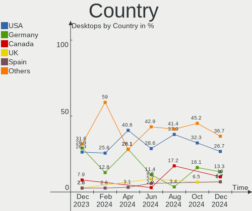

| Country      | Desktops | Percent |
|--------------|----------|---------|
| USA          | 10       | 34.48%  |
| Spain        | 2        | 6.9%    |
| Germany      | 2        | 6.9%    |
| France       | 2        | 6.9%    |
| Venezuela    | 1        | 3.45%   |
| South Africa | 1        | 3.45%   |
| Serbia       | 1        | 3.45%   |
| Netherlands  | 1        | 3.45%   |
| Mexico       | 1        | 3.45%   |
| Guatemala    | 1        | 3.45%   |
| Czechia      | 1        | 3.45%   |
| Croatia      | 1        | 3.45%   |
| Chile        | 1        | 3.45%   |
| Canada       | 1        | 3.45%   |
| Brazil       | 1        | 3.45%   |
| Belgium      | 1        | 3.45%   |
| Australia    | 1        | 3.45%   |

City
----

Geographic location (city)

| City         | Desktops | Percent |
|--------------|----------|---------|
| Philadelphia | 2        | 6.9%    |
| Zagreb       | 1        | 3.45%   |
| Wiesbaden    | 1        | 3.45%   |
| Waldorf      | 1        | 3.45%   |
| Villa Nueva  | 1        | 3.45%   |
| Santiago     | 1        | 3.45%   |
| San Jose     | 1        | 3.45%   |
| San Antonio  | 1        | 3.45%   |
| Prague       | 1        | 3.45%   |
| Paris        | 1        | 3.45%   |
| Marin        | 1        | 3.45%   |
| Loznica      | 1        | 3.45%   |
| Los Mochis   | 1        | 3.45%   |
| Johannesburg | 1        | 3.45%   |
| Goiânia     | 1        | 3.45%   |
| Gatineau     | 1        | 3.45%   |
| Gastonia     | 1        | 3.45%   |
| Fayetteville | 1        | 3.45%   |
| Fairbanks    | 1        | 3.45%   |
| Burlington   | 1        | 3.45%   |
| Burkburnett  | 1        | 3.45%   |
| Brisbane     | 1        | 3.45%   |
| Boom         | 1        | 3.45%   |
| Bochum       | 1        | 3.45%   |
| Barcelona    | 1        | 3.45%   |
| Arras        | 1        | 3.45%   |
| Amsterdam    | 1        | 3.45%   |
| Acarigua     | 1        | 3.45%   |

Drives
------

Drive Vendor
------------

Hard drive vendors

| Vendor                    | Desktops | Drives | Percent |
|---------------------------|----------|--------|---------|
| Samsung Electronics       | 12       | 20     | 19.67%  |
| WDC                       | 9        | 14     | 14.75%  |
| Crucial                   | 7        | 9      | 11.48%  |
| Toshiba                   | 6        | 6      | 9.84%   |
| Seagate                   | 4        | 6      | 6.56%   |
| SanDisk                   | 4        | 4      | 6.56%   |
| Phison Electronics        | 3        | 3      | 4.92%   |
| Kingston                  | 3        | 5      | 4.92%   |
| Verbatim                  | 1        | 1      | 1.64%   |
| SK hynix                  | 1        | 1      | 1.64%   |
| Silicon Motion            | 1        | 1      | 1.64%   |
| PNY                       | 1        | 1      | 1.64%   |
| Phison                    | 1        | 1      | 1.64%   |
| OCZ                       | 1        | 1      | 1.64%   |
| MyDigitalSSD              | 1        | 1      | 1.64%   |
| Micron/Crucial Technology | 1        | 1      | 1.64%   |
| JMicron Technology        | 1        | 1      | 1.64%   |
| Intel                     | 1        | 2      | 1.64%   |
| Hitachi                   | 1        | 1      | 1.64%   |
| China                     | 1        | 1      | 1.64%   |
| ADATA Technology          | 1        | 1      | 1.64%   |

Drive Model
-----------

Hard drive models

| Model                                          | Desktops | Percent |
|------------------------------------------------|----------|---------|
| Toshiba HDWD110 1TB                            | 3        | 3.95%   |
| Phison E12 NVMe Controller 2TB                 | 3        | 3.95%   |
| WDC WDS100T2B0A-00SM50 1TB SSD                 | 2        | 2.63%   |
| WDC WD5000BEVT-75ZAT0 500GB                    | 2        | 2.63%   |
| Toshiba DT01ACA100 1TB                         | 2        | 2.63%   |
| Samsung SSD 860 EVO 500GB                      | 2        | 2.63%   |
| Samsung SSD 850 EVO 500GB                      | 2        | 2.63%   |
| WDC WDS500G2B0A-00SM50 500GB SSD               | 1        | 1.32%   |
| WDC WDS240G2G0A-00JH30 240GB SSD               | 1        | 1.32%   |
| WDC WDBNCE5000PNC 500GB SSD                    | 1        | 1.32%   |
| WDC WD4005FZBX-00K5WB0 4TB                     | 1        | 1.32%   |
| WDC WD20EZAZ-00GGJB0 2TB                       | 1        | 1.32%   |
| WDC WD2002FAEX-007BA0 2TB                      | 1        | 1.32%   |
| WDC WD10EZRX-00A8LB0 1TB                       | 1        | 1.32%   |
| WDC WD10EZEX-60ZF5A0 1TB                       | 1        | 1.32%   |
| WDC WD10EZEX-00MFCA0 1TB                       | 1        | 1.32%   |
| WDC WD10EAVS-00D7B1 1TB                        | 1        | 1.32%   |
| Verbatim Vi560 SATA III M.2 SSD 256GB          | 1        | 1.32%   |
| Toshiba MD03ACA400V 4TB                        | 1        | 1.32%   |
| SK hynix PC711 NVMe 512GB                      | 1        | 1.32%   |
| Silicon Motion Asgard AN2 250NVMe-M.2-80 250GB | 1        | 1.32%   |
| Seagate ST3500413AS 500GB                      | 1        | 1.32%   |
| Seagate ST2000LX001-1RG174 2TB                 | 1        | 1.32%   |
| Seagate ST2000DX001-1NS164 2TB                 | 1        | 1.32%   |
| Seagate ST12000VN0008-2YS101 12TB              | 1        | 1.32%   |
| Seagate ST1000DX001-1NS162 1TB                 | 1        | 1.32%   |
| Seagate BarraCuda 120 SSD ZA250CM10003 250GB   | 1        | 1.32%   |
| SanDisk SSD PLUS 240GB                         | 1        | 1.32%   |
| SanDisk SSD PLUS 240 GB                        | 1        | 1.32%   |
| SanDisk SDSSDHII480G 480GB                     | 1        | 1.32%   |
| SanDisk SDSSDH3 1T00 1TB                       | 1        | 1.32%   |
| Samsung SSD 980 500GB                          | 1        | 1.32%   |
| Samsung SSD 970 EVO Plus 250GB                 | 1        | 1.32%   |
| Samsung SSD 970 EVO 1TB                        | 1        | 1.32%   |
| Samsung SSD 870 QVO 2TB                        | 1        | 1.32%   |
| Samsung SSD 870 EVO 1TB                        | 1        | 1.32%   |
| Samsung SSD 860 QVO 1TB                        | 1        | 1.32%   |
| Samsung SSD 850 EVO 250GB                      | 1        | 1.32%   |
| Samsung SSD 850 EVO 1TB                        | 1        | 1.32%   |
| Samsung Portable SSD T5 500GB                  | 1        | 1.32%   |

HDD Vendor
----------

Hard disk drive vendors

| Vendor              | Desktops | Drives | Percent |
|---------------------|----------|--------|---------|
| WDC                 | 6        | 9      | 30%     |
| Toshiba             | 6        | 6      | 30%     |
| Seagate             | 4        | 5      | 20%     |
| Samsung Electronics | 3        | 3      | 15%     |
| Hitachi             | 1        | 1      | 5%      |

SSD Vendor
----------

Solid state drive vendors

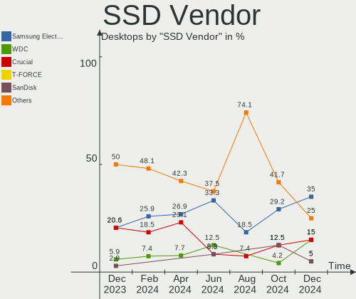

| Vendor              | Desktops | Drives | Percent |
|---------------------|----------|--------|---------|
| Samsung Electronics | 7        | 10     | 22.58%  |
| Crucial             | 7        | 9      | 22.58%  |
| WDC                 | 4        | 5      | 12.9%   |
| SanDisk             | 4        | 4      | 12.9%   |
| Kingston            | 3        | 5      | 9.68%   |
| Verbatim            | 1        | 1      | 3.23%   |
| Seagate             | 1        | 1      | 3.23%   |
| PNY                 | 1        | 1      | 3.23%   |
| OCZ                 | 1        | 1      | 3.23%   |
| MyDigitalSSD        | 1        | 1      | 3.23%   |
| China               | 1        | 1      | 3.23%   |

Drive Kind
----------

HDD or SSD

| Kind | Desktops | Drives | Percent |
|------|----------|--------|---------|
| SSD  | 22       | 39     | 43.14%  |
| HDD  | 16       | 24     | 31.37%  |
| NVMe | 13       | 18     | 25.49%  |

Drive Connector
---------------

SATA, SAS, NVMe, etc.

| Type | Desktops | Drives | Percent |
|------|----------|--------|---------|
| SATA | 27       | 62     | 65.85%  |
| NVMe | 12       | 17     | 29.27%  |
| SAS  | 2        | 2      | 4.88%   |

Drive Size
----------

Size of hard drive

| Size in TB | Desktops | Drives | Percent |
|------------|----------|--------|---------|
| 0.01-0.5   | 21       | 31     | 46.67%  |
| 0.51-1.0   | 17       | 23     | 37.78%  |
| 1.01-2.0   | 4        | 6      | 8.89%   |
| 3.01-4.0   | 2        | 2      | 4.44%   |
| 10.01-20.0 | 1        | 1      | 2.22%   |

Space Total
-----------

Amount of disk space available on the file system

| Size in GB     | Desktops | Percent |
|----------------|----------|---------|
| 251-500        | 8        | 27.59%  |
| 101-250        | 8        | 27.59%  |
| 1001-2000      | 5        | 17.24%  |
| 501-1000       | 4        | 13.79%  |
| 2001-3000      | 2        | 6.9%    |
| More than 3000 | 1        | 3.45%   |
| 21-50          | 1        | 3.45%   |

Space Used
----------

Amount of used disk space

| Used GB   | Desktops | Percent |
|-----------|----------|---------|
| 1-20      | 9        | 31.03%  |
| 21-50     | 8        | 27.59%  |
| 251-500   | 3        | 10.34%  |
| 101-250   | 3        | 10.34%  |
| 501-1000  | 2        | 6.9%    |
| 51-100    | 2        | 6.9%    |
| 2001-3000 | 1        | 3.45%   |
| 1001-2000 | 1        | 3.45%   |

Malfunc. Drives
---------------

Drive models with a malfunction

| Model                               | Desktops | Drives | Percent |
|-------------------------------------|----------|--------|---------|
| WDC WD5000BEVT-75ZAT0 500GB         | 2        | 2      | 50%     |
| Samsung Electronics SSD 970 EVO 1TB | 1        | 1      | 25%     |
| Samsung Electronics HD161GJ 160GB   | 1        | 1      | 25%     |

Malfunc. Drive Vendor
---------------------

Vendors of faulty drives

| Vendor              | Desktops | Drives | Percent |
|---------------------|----------|--------|---------|
| WDC                 | 2        | 2      | 50%     |
| Samsung Electronics | 2        | 2      | 50%     |

Malfunc. HDD Vendor
-------------------

Vendors of faulty HDD drives

| Vendor              | Desktops | Drives | Percent |
|---------------------|----------|--------|---------|
| WDC                 | 2        | 2      | 66.67%  |
| Samsung Electronics | 1        | 1      | 33.33%  |

Malfunc. Drive Kind
-------------------

Kinds of faulty drives

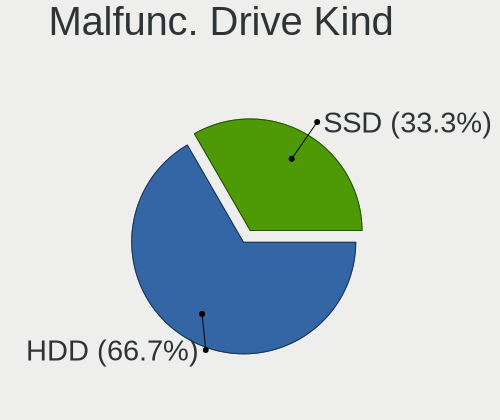

| Kind | Desktops | Drives | Percent |
|------|----------|--------|---------|
| HDD  | 3        | 3      | 75%     |
| NVMe | 1        | 1      | 25%     |

Failed Drives
-------------

Failed drive models

Zero info for selected period =(

Failed Drive Vendor
-------------------

Failed drive vendors

Zero info for selected period =(

Drive Status
------------

Number of failed and malfunc. drives

| Status   | Desktops | Drives | Percent |
|----------|----------|--------|---------|
| Detected | 22       | 65     | 70.97%  |
| Works    | 5        | 12     | 16.13%  |
| Malfunc  | 4        | 4      | 12.9%   |

Storage controller
------------------

Storage Vendor
--------------

Storage controller vendors

| Vendor                    | Desktops | Percent |
|---------------------------|----------|---------|
| Intel                     | 16       | 35.56%  |
| AMD                       | 13       | 28.89%  |
| Samsung Electronics       | 5        | 11.11%  |
| Phison Electronics        | 4        | 8.89%   |
| ASMedia Technology        | 3        | 6.67%   |
| SK hynix                  | 1        | 2.22%   |
| Silicon Motion            | 1        | 2.22%   |
| Micron/Crucial Technology | 1        | 2.22%   |
| ADATA Technology          | 1        | 2.22%   |

Storage Model
-------------

Storage controller models

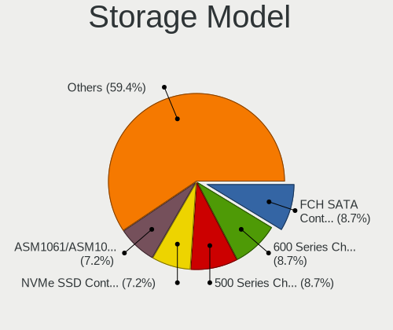

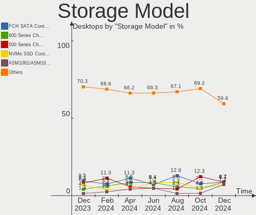

| Model                                                                                   | Desktops | Percent |
|-----------------------------------------------------------------------------------------|----------|---------|
| AMD FCH SATA Controller [AHCI mode]                                                     | 8        | 14.55%  |
| Intel Cannon Lake PCH SATA AHCI Controller                                              | 4        | 7.27%   |
| AMD 400 Series Chipset SATA Controller                                                  | 4        | 7.27%   |
| Samsung NVMe SSD Controller SM981/PM981/PM983                                           | 3        | 5.45%   |
| Phison E12 NVMe Controller                                                              | 3        | 5.45%   |
| ASMedia ASM1062 Serial ATA Controller                                                   | 3        | 5.45%   |
| Intel 8 Series/C220 Series Chipset Family 6-port SATA Controller 1 [AHCI mode]          | 2        | 3.64%   |
| Intel 7 Series/C210 Series Chipset Family 6-port SATA Controller [AHCI mode]            | 2        | 3.64%   |
| Intel 6 Series/C200 Series Chipset Family Desktop SATA Controller (IDE mode, ports 4-5) | 2        | 3.64%   |
| Intel 6 Series/C200 Series Chipset Family Desktop SATA Controller (IDE mode, ports 0-3) | 2        | 3.64%   |
| Intel 6 Series/C200 Series Chipset Family 6 port Desktop SATA AHCI Controller           | 2        | 3.64%   |
| AMD SB7x0/SB8x0/SB9x0 SATA Controller [AHCI mode]                                       | 2        | 3.64%   |
| SK hynix Gold P31 SSD                                                                   | 1        | 1.82%   |
| Silicon Motion SM2263EN/SM2263XT SSD Controller                                         | 1        | 1.82%   |
| Samsung NVMe SSD Controller SM951/PM951                                                 | 1        | 1.82%   |
| Samsung NVMe SSD Controller PM9A1/PM9A3/980PRO                                          | 1        | 1.82%   |
| Samsung NVMe SSD Controller 980                                                         | 1        | 1.82%   |
| Phison E16 PCIe4 NVMe Controller                                                        | 1        | 1.82%   |
| Micron/Crucial P2 NVMe PCIe SSD                                                         | 1        | 1.82%   |
| Intel SSD 660P Series                                                                   | 1        | 1.82%   |
| Intel Alder Lake-S PCH SATA Controller [AHCI Mode]                                      | 1        | 1.82%   |
| Intel 9 Series Chipset Family SATA Controller [AHCI Mode]                               | 1        | 1.82%   |
| Intel 82801JI (ICH10 Family) SATA AHCI Controller                                       | 1        | 1.82%   |
| Intel 500 Series Chipset Family SATA AHCI Controller                                    | 1        | 1.82%   |
| AMD X370 Series Chipset SATA Controller                                                 | 1        | 1.82%   |
| AMD SB7x0/SB8x0/SB9x0 SATA Controller [IDE mode]                                        | 1        | 1.82%   |
| AMD SB7x0/SB8x0/SB9x0 IDE Controller                                                    | 1        | 1.82%   |
| AMD FCH SATA Controller D                                                               | 1        | 1.82%   |
| AMD 300 Series Chipset SATA Controller                                                  | 1        | 1.82%   |
| ADATA ADATA XPG GAMMIXS1 1L Media                                                       | 1        | 1.82%   |

Storage Kind
------------

Kind of storage controller (IDE, SATA, NVMe, SAS, ...)

| Kind | Desktops | Percent |
|------|----------|---------|
| SATA | 27       | 64.29%  |
| NVMe | 12       | 28.57%  |
| IDE  | 3        | 7.14%   |

Processor
---------

CPU Vendor
----------

Processor vendors

| Vendor | Desktops | Percent |
|--------|----------|---------|
| Intel  | 16       | 55.17%  |
| AMD    | 13       | 44.83%  |

CPU Model
---------

Processor models

| Model                                       | Desktops | Percent |
|---------------------------------------------|----------|---------|
| Intel Core i9-9900K CPU @ 3.60GHz           | 2        | 6.9%    |
| Intel Core i5-9400F CPU @ 2.90GHz           | 2        | 6.9%    |
| AMD Ryzen 5 3600 6-Core Processor           | 2        | 6.9%    |
| Intel Xeon CPU W3530 @ 2.80GHz              | 1        | 3.45%   |
| Intel Xeon CPU E3-1240 V2 @ 3.40GHz         | 1        | 3.45%   |
| Intel Pentium CPU G640 @ 2.80GHz            | 1        | 3.45%   |
| Intel Core i7-4790 CPU @ 3.60GHz            | 1        | 3.45%   |
| Intel Core i7-4770K CPU @ 3.50GHz           | 1        | 3.45%   |
| Intel Core i7-4770 CPU @ 3.40GHz            | 1        | 3.45%   |
| Intel Core i7-2600 CPU @ 3.40GHz            | 1        | 3.45%   |
| Intel Core i3-3240 CPU @ 3.40GHz            | 1        | 3.45%   |
| Intel Core i3-3220 CPU @ 3.30GHz            | 1        | 3.45%   |
| Intel Core i3-2120 CPU @ 3.30GHz            | 1        | 3.45%   |
| Intel 12th Gen Core i5-12600K               | 1        | 3.45%   |
| Intel 11th Gen Core i5-11600 @ 2.80GHz      | 1        | 3.45%   |
| AMD Ryzen 9 5900X 12-Core Processor         | 1        | 3.45%   |
| AMD Ryzen 5 5600G with Radeon Graphics      | 1        | 3.45%   |
| AMD Ryzen 5 5500                            | 1        | 3.45%   |
| AMD Ryzen 5 3600X 6-Core Processor          | 1        | 3.45%   |
| AMD Ryzen 5 3400G with Radeon Vega Graphics | 1        | 3.45%   |
| AMD Ryzen 5 2600X Six-Core Processor        | 1        | 3.45%   |
| AMD Ryzen 5 2600 Six-Core Processor         | 1        | 3.45%   |
| AMD Ryzen 5 1400 Quad-Core Processor        | 1        | 3.45%   |
| AMD FX-8350 Eight-Core Processor            | 1        | 3.45%   |
| AMD FX-6300 Six-Core Processor              | 1        | 3.45%   |
| AMD Athlon Dual Core Processor 5600B        | 1        | 3.45%   |

CPU Model Family
----------------

Processor model prefix

| Model                | Desktops | Percent |
|----------------------|----------|---------|
| AMD Ryzen 5          | 9        | 31.03%  |
| Intel Core i7        | 4        | 13.79%  |
| Intel Core i3        | 3        | 10.34%  |
| Other                | 2        | 6.9%    |
| Intel Xeon           | 2        | 6.9%    |
| Intel Core i9        | 2        | 6.9%    |
| Intel Core i5        | 2        | 6.9%    |
| AMD FX               | 2        | 6.9%    |
| Intel Pentium        | 1        | 3.45%   |
| AMD Ryzen 9          | 1        | 3.45%   |
| AMD Athlon Dual Core | 1        | 3.45%   |

CPU Cores
---------

Number of processor cores

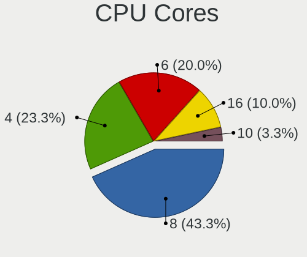

| Number | Desktops | Percent |
|--------|----------|---------|
| 6      | 10       | 34.48%  |
| 4      | 9        | 31.03%  |
| 2      | 5        | 17.24%  |
| 8      | 2        | 6.9%    |
| 12     | 1        | 3.45%   |
| 10     | 1        | 3.45%   |
| 3      | 1        | 3.45%   |

CPU Sockets
-----------

Number of sockets

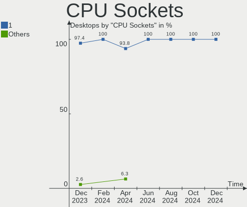

| Number | Desktops | Percent |
|--------|----------|---------|
| 1      | 29       | 100%    |

CPU Threads
-----------

Threads per core (Hyper-Threading)

| Number | Desktops | Percent |
|--------|----------|---------|
| 2      | 24       | 82.76%  |
| 1      | 5        | 17.24%  |

CPU Op-Modes
------------

CPU Operation Modes (32-bit, 64-bit)

| Op mode        | Desktops | Percent |
|----------------|----------|---------|
| 32-bit, 64-bit | 29       | 100%    |

CPU Microcode
-------------

Microcode number

| Number     | Desktops | Percent |
|------------|----------|---------|
| Unknown    | 4        | 13.79%  |
| 0x306c3    | 3        | 10.34%  |
| 0x306a9    | 3        | 10.34%  |
| 0x08701021 | 3        | 10.34%  |
| 0x906ec    | 2        | 6.9%    |
| 0x206a7    | 2        | 6.9%    |
| 0x0800820d | 2        | 6.9%    |
| 0x06000822 | 2        | 6.9%    |
| 0x906ea    | 1        | 3.45%   |
| 0x90672    | 1        | 3.45%   |
| 0x106a5    | 1        | 3.45%   |
| 0x0a50000d | 1        | 3.45%   |
| 0x0a50000c | 1        | 3.45%   |
| 0x0a201016 | 1        | 3.45%   |
| 0x08108109 | 1        | 3.45%   |
| 0x08001138 | 1        | 3.45%   |

CPU Microarch
-------------

Microarchitecture

| Name             | Desktops | Percent |
|------------------|----------|---------|
| KabyLake         | 4        | 13.79%  |
| Zen+             | 3        | 10.34%  |
| Zen 3            | 3        | 10.34%  |
| Zen 2            | 3        | 10.34%  |
| SandyBridge      | 3        | 10.34%  |
| IvyBridge        | 3        | 10.34%  |
| Haswell          | 3        | 10.34%  |
| Piledriver       | 2        | 6.9%    |
| Zen              | 1        | 3.45%   |
| Nehalem          | 1        | 3.45%   |
| K8 Hammer        | 1        | 3.45%   |
| Alderlake Hybrid | 1        | 3.45%   |
| Unknown          | 1        | 3.45%   |

Graphics
--------

GPU Vendor
----------

Vendors of graphics cards

| Vendor | Desktops | Percent |
|--------|----------|---------|
| Nvidia | 17       | 54.84%  |
| AMD    | 8        | 25.81%  |
| Intel  | 6        | 19.35%  |

GPU Model
---------

Graphics card models

| Model                                                                       | Desktops | Percent |
|-----------------------------------------------------------------------------|----------|---------|
| Nvidia TU106 [GeForce RTX 2070]                                             | 3        | 9.68%   |
| AMD Ellesmere [Radeon RX 470/480/570/570X/580/580X/590]                     | 3        | 9.68%   |
| Nvidia TU117 [GeForce GTX 1650]                                             | 2        | 6.45%   |
| Nvidia GP102 [GeForce GTX 1080 Ti]                                          | 2        | 6.45%   |
| Intel Xeon E3-1200 v3/4th Gen Core Processor Integrated Graphics Controller | 2        | 6.45%   |
| Intel 2nd Generation Core Processor Family Integrated Graphics Controller   | 2        | 6.45%   |
| Nvidia TU116 [GeForce GTX 1660]                                             | 1        | 3.23%   |
| Nvidia TU104 [GeForce RTX 2060]                                             | 1        | 3.23%   |
| Nvidia GP107 [GeForce GTX 1050 Ti]                                          | 1        | 3.23%   |
| Nvidia GP106 [GeForce GTX 1060 3GB]                                         | 1        | 3.23%   |
| Nvidia GM204 [GeForce GTX 970]                                              | 1        | 3.23%   |
| Nvidia GF108 [GeForce GT 630]                                               | 1        | 3.23%   |
| Nvidia GF106GL [Quadro 2000]                                                | 1        | 3.23%   |
| Nvidia GA106 [GeForce RTX 3060 Lite Hash Rate]                              | 1        | 3.23%   |
| Nvidia GA104 [GeForce RTX 3060 Ti Lite Hash Rate]                           | 1        | 3.23%   |
| Nvidia G96 [GeForce 9500 GS]                                                | 1        | 3.23%   |
| Intel Xeon E3-1200 v2/3rd Gen Core processor Graphics Controller            | 1        | 3.23%   |
| Intel AlderLake-S GT1                                                       | 1        | 3.23%   |
| AMD RS780C [Radeon 3100]                                                    | 1        | 3.23%   |
| AMD Oland XT [Radeon HD 8670 / R5 340X OEM / R7 250/350/350X OEM]           | 1        | 3.23%   |
| AMD Navi 23 [Radeon RX 6600/6600 XT/6600M]                                  | 1        | 3.23%   |
| AMD Navi 21 [Radeon RX 6800/6800 XT / 6900 XT]                              | 1        | 3.23%   |
| AMD Cezanne                                                                 | 1        | 3.23%   |

GPU Combo
---------

Combinations of graphics cards

| Name       | Desktops | Percent |
|------------|----------|---------|
| 1 x Nvidia | 17       | 58.62%  |
| 1 x AMD    | 8        | 27.59%  |
| 1 x Intel  | 4        | 13.79%  |

GPU Driver
----------

Free vs proprietary

| Driver      | Desktops | Percent |
|-------------|----------|---------|
| Free        | 16       | 55.17%  |
| Proprietary | 13       | 44.83%  |

GPU Memory
----------

Total video memory

| Size in GB | Desktops | Percent |
|------------|----------|---------|
| Unknown    | 11       | 37.93%  |
| 7.01-8.0   | 5        | 17.24%  |
| 3.01-4.0   | 5        | 17.24%  |
| 0.01-0.5   | 3        | 10.34%  |
| 0.51-1.0   | 2        | 6.9%    |
| 5.01-6.0   | 1        | 3.45%   |
| 2.01-3.0   | 1        | 3.45%   |
| 8.01-16.0  | 1        | 3.45%   |

Monitor
-------

Monitor Vendor
--------------

Monitor vendors

| Vendor               | Desktops | Percent |
|----------------------|----------|---------|
| Samsung Electronics  | 5        | 14.29%  |
| Dell                 | 5        | 14.29%  |
| BenQ                 | 4        | 11.43%  |
| Philips              | 3        | 8.57%   |
| Ancor Communications | 3        | 8.57%   |
| Sony                 | 2        | 5.71%   |
| Hewlett-Packard      | 2        | 5.71%   |
| Acer                 | 2        | 5.71%   |
| Vizio                | 1        | 2.86%   |
| ViewSonic            | 1        | 2.86%   |
| Toshiba              | 1        | 2.86%   |
| SNC                  | 1        | 2.86%   |
| SFX                  | 1        | 2.86%   |
| Sceptre Tech         | 1        | 2.86%   |
| MSI                  | 1        | 2.86%   |
| Goldstar             | 1        | 2.86%   |
| ASUSTek Computer     | 1        | 2.86%   |

Monitor Model
-------------

Monitor models

| Model                                                                 | Desktops | Percent |
|-----------------------------------------------------------------------|----------|---------|
| Vizio VX42L HDTV10A VIZ0030 1280x720 930x523mm 42.0-inch              | 1        | 2.5%    |
| ViewSonic XG2401 SERIES VSCBB31 1920x1080 531x299mm 24.0-inch         | 1        | 2.5%    |
| Toshiba LCD-MONITOR LCDE980 1440x900 408x255mm 18.9-inch              | 1        | 2.5%    |
| Sony TV SNY8F03 1360x768                                              | 1        | 2.5%    |
| Sony TV *00 SNYF303 1920x1080 1439x809mm 65.0-inch                    | 1        | 2.5%    |
| SNC SKP_E20-32 SNC3200 1920x1080 477x268mm 21.5-inch                  | 1        | 2.5%    |
| SFX HDMI2.0 KVM SFX0100 1920x1080 708x398mm 32.0-inch                 | 1        | 2.5%    |
| Sceptre Tech Sceptre P30 SPT0BCC 2560x1080 690x291mm 29.5-inch        | 1        | 2.5%    |
| Sceptre Tech Sceptre M27 SPT0ACD 1920x1080 598x336mm 27.0-inch        | 1        | 2.5%    |
| Samsung Electronics U28D590 SAM0B80 3840x2160 607x345mm 27.5-inch     | 1        | 2.5%    |
| Samsung Electronics SyncMaster SAM0422 1920x1200 518x324mm 24.1-inch  | 1        | 2.5%    |
| Samsung Electronics SyncMaster SAM0168 1280x1024 338x270mm 17.0-inch  | 1        | 2.5%    |
| Samsung Electronics S27F350 SAM0D22 1920x1080 598x336mm 27.0-inch     | 1        | 2.5%    |
| Samsung Electronics S24E650 SAM0C86 1920x1200 518x324mm 24.1-inch     | 1        | 2.5%    |
| Samsung Electronics LCD Monitor SAM0B7C 1920x1080 886x498mm 40.0-inch | 1        | 2.5%    |
| Samsung Electronics C27F390 SAM0D32 1920x1080 598x336mm 27.0-inch     | 1        | 2.5%    |
| Philips PHL 323E7 PHLC121 1920x1080 698x393mm 31.5-inch               | 1        | 2.5%    |
| Philips PHL 276E9Q PHLC17B 1920x1080 598x336mm 27.0-inch              | 1        | 2.5%    |
| Philips PHL 246V5 PHLC0C5 1920x1080 531x299mm 24.0-inch               | 1        | 2.5%    |
| MSI G24C MSI3EA0 1920x1080 521x293mm 23.5-inch                        | 1        | 2.5%    |
| Hewlett-Packard P204 HPN3631 1600x900 432x240mm 19.5-inch             | 1        | 2.5%    |
| Hewlett-Packard 22cwa HWP3183 1920x1080 476x268mm 21.5-inch           | 1        | 2.5%    |
| Goldstar QHD GSM772A 2560x1440 697x392mm 31.5-inch                    | 1        | 2.5%    |
| Goldstar LG HDR 4K GSM774F 3840x2160 700x400mm 31.7-inch              | 1        | 2.5%    |
| Dell U2711 DELA056 1920x1080 597x336mm 27.0-inch                      | 1        | 2.5%    |
| Dell S3220DGF DELD0F4 2560x1440 697x392mm 31.5-inch                   | 1        | 2.5%    |
| Dell S2721DGF DEL41D9 2560x1440 597x336mm 27.0-inch                   | 1        | 2.5%    |
| Dell P2714H DELD05E 1920x1080 598x336mm 27.0-inch                     | 1        | 2.5%    |
| Dell P2311H DEL4067 1920x1080 509x286mm 23.0-inch                     | 1        | 2.5%    |
| BenQ ZOWIE XL LCD BNQ7F33 1920x1080 531x298mm 24.0-inch               | 1        | 2.5%    |
| BenQ XL2430T BNQ7F3F 1920x1080 531x298mm 24.0-inch                    | 1        | 2.5%    |
| BenQ GL2460 BNQ78CE 1920x1080 531x299mm 24.0-inch                     | 1        | 2.5%    |
| BenQ GL2250 BNQ789B 1920x1080 477x268mm 21.5-inch                     | 1        | 2.5%    |
| ASUSTek Computer PA278QV AUS2700 2560x1440 597x336mm 27.0-inch        | 1        | 2.5%    |
| Ancor Communications VX228 ACI22C1 1920x1080 476x268mm 21.5-inch      | 1        | 2.5%    |
| Ancor Communications VG248 ACI24A5 1920x1080 531x299mm 24.0-inch      | 1        | 2.5%    |
| Ancor Communications ASUS VP228 ACI22C3 1920x1080 476x268mm 21.5-inch | 1        | 2.5%    |
| Ancor Communications ASUS MG24U ACI24AD 3840x2160 521x293mm 23.5-inch | 1        | 2.5%    |
| Acer X193W+ ACR0014 1680x1050 408x255mm 18.9-inch                     | 1        | 2.5%    |
| Acer KG271 ACR058F 1920x1080 598x336mm 27.0-inch                      | 1        | 2.5%    |

Monitor Resolution
------------------

Monitor screen resolution

| Resolution         | Desktops | Percent |
|--------------------|----------|---------|
| 1920x1080 (FHD)    | 19       | 54.29%  |
| 2560x1440 (QHD)    | 5        | 14.29%  |
| 3840x2160 (4K)     | 3        | 8.57%   |
| 2560x1080          | 1        | 2.86%   |
| 1920x1200 (WUXGA)  | 1        | 2.86%   |
| 1680x1050 (WSXGA+) | 1        | 2.86%   |
| 1600x900 (HD+)     | 1        | 2.86%   |
| 1440x900 (WXGA+)   | 1        | 2.86%   |
| 1366x768 (WXGA)    | 1        | 2.86%   |
| 1360x768           | 1        | 2.86%   |
| 1280x1024 (SXGA)   | 1        | 2.86%   |

Monitor Diagonal
----------------

Diagonal size in inches

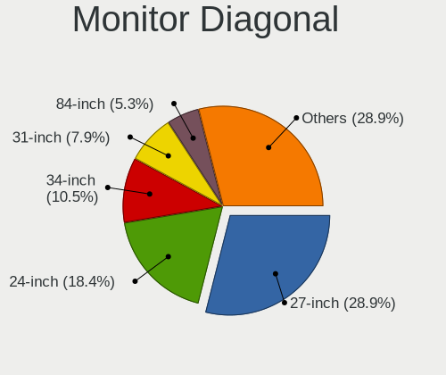

| Inches  | Desktops | Percent |
|---------|----------|---------|
| 27      | 10       | 26.32%  |
| 24      | 7        | 18.42%  |
| 21      | 4        | 10.53%  |
| 31      | 3        | 7.89%   |
| 23      | 3        | 7.89%   |
| 19      | 2        | 5.26%   |
| 75      | 1        | 2.63%   |
| 42      | 1        | 2.63%   |
| 40      | 1        | 2.63%   |
| 38      | 1        | 2.63%   |
| 32      | 1        | 2.63%   |
| 29      | 1        | 2.63%   |
| 18      | 1        | 2.63%   |
| 17      | 1        | 2.63%   |
| Unknown | 1        | 2.63%   |

Monitor Width
-------------

Physical width

| Width in mm | Desktops | Percent |
|-------------|----------|---------|
| 501-600     | 17       | 47.22%  |
| 401-500     | 7        | 19.44%  |
| 601-700     | 5        | 13.89%  |
| 801-900     | 2        | 5.56%   |
| 701-800     | 1        | 2.78%   |
| 301-350     | 1        | 2.78%   |
| 1501-2000   | 1        | 2.78%   |
| 901-1000    | 1        | 2.78%   |
| Unknown     | 1        | 2.78%   |

Aspect Ratio
------------

Proportional relationship between the width and the height

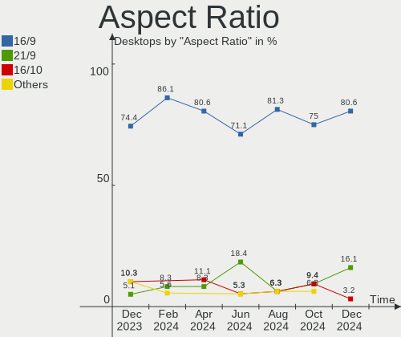

| Ratio | Desktops | Percent |
|-------|----------|---------|
| 16/9  | 24       | 82.76%  |
| 16/10 | 3        | 10.34%  |
| 5/4   | 1        | 3.45%   |
| 21/9  | 1        | 3.45%   |

Monitor Area
------------

Area in inch²

| Area in inch² | Desktops | Percent |
|----------------|----------|---------|
| 201-250        | 12       | 33.33%  |
| 301-350        | 10       | 27.78%  |
| 351-500        | 4        | 11.11%  |
| 151-200        | 3        | 8.33%   |
| 501-1000       | 3        | 8.33%   |
| More than 1000 | 1        | 2.78%   |
| 251-300        | 1        | 2.78%   |
| 141-150        | 1        | 2.78%   |
| Unknown        | 1        | 2.78%   |

Pixel Density
-------------

Pixels per inch

| Density | Desktops | Percent |
|---------|----------|---------|
| 51-100  | 19       | 57.58%  |
| 101-120 | 8        | 24.24%  |
| 1-50    | 2        | 6.06%   |
| 121-160 | 2        | 6.06%   |
| 161-240 | 1        | 3.03%   |
| Unknown | 1        | 3.03%   |

Multiple Monitors
-----------------

Total monitors connected

| Total | Desktops | Percent |
|-------|----------|---------|
| 1     | 17       | 58.62%  |
| 2     | 9        | 31.03%  |
| 3     | 2        | 6.9%    |
| 0     | 1        | 3.45%   |

Network
-------

Net Controller Vendor
---------------------

Controller vendors

| Vendor                | Desktops | Percent |
|-----------------------|----------|---------|
| Realtek Semiconductor | 17       | 45.95%  |
| Intel                 | 11       | 29.73%  |
| Qualcomm Atheros      | 2        | 5.41%   |
| TP-Link               | 1        | 2.7%    |
| Ralink                | 1        | 2.7%    |
| MediaTek              | 1        | 2.7%    |
| ICS Advent            | 1        | 2.7%    |
| Broadcom Limited      | 1        | 2.7%    |
| Broadcom              | 1        | 2.7%    |
| ASUSTek Computer      | 1        | 2.7%    |

Net Controller Model
--------------------

Controller models

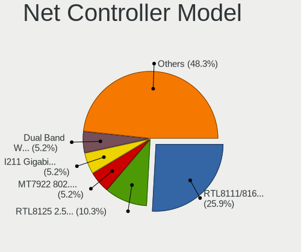

| Model                                                             | Desktops | Percent |
|-------------------------------------------------------------------|----------|---------|
| Realtek RTL8111/8168/8411 PCI Express Gigabit Ethernet Controller | 17       | 35.42%  |
| Intel Wi-Fi 6 AX200                                               | 5        | 10.42%  |
| Intel I211 Gigabit Network Connection                             | 3        | 6.25%   |
| Intel Ethernet Controller I225-V                                  | 3        | 6.25%   |
| Intel Ethernet Connection (7) I219-V                              | 3        | 6.25%   |
| TP-Link 802.11ac NIC                                              | 1        | 2.08%   |
| Realtek RTL8821CE 802.11ac PCIe Wireless Network Adapter          | 1        | 2.08%   |
| Realtek RTL8812AU 802.11a/b/g/n/ac 2T2R DB WLAN Adapter           | 1        | 2.08%   |
| Realtek RTL8812AE 802.11ac PCIe Wireless Network Adapter          | 1        | 2.08%   |
| Realtek RTL8188EUS 802.11n Wireless Network Adapter               | 1        | 2.08%   |
| Realtek RTL8150 Fast Ethernet Adapter                             | 1        | 2.08%   |
| Realtek 802.11ac NIC                                              | 1        | 2.08%   |
| Ralink RT5390 Wireless 802.11n 1T/1R PCIe                         | 1        | 2.08%   |
| Qualcomm Atheros Killer E220x Gigabit Ethernet Controller         | 1        | 2.08%   |
| Qualcomm Atheros AR9462 Wireless Network Adapter                  | 1        | 2.08%   |
| MediaTek MT7921K (RZ608) Wi-Fi 6E 80MHz                           | 1        | 2.08%   |
| Intel Ethernet Connection I217-LM                                 | 1        | 2.08%   |
| Intel Cannon Lake PCH CNVi WiFi                                   | 1        | 2.08%   |
| ICS Advent 10/100M LAN                                            | 1        | 2.08%   |
| Broadcom NetXtreme BCM5761 Gigabit Ethernet PCIe                  | 1        | 2.08%   |
| Broadcom Limited NetXtreme BCM5754 Gigabit Ethernet PCI Express   | 1        | 2.08%   |
| ASUS 802.11ac WLAN                                                | 1        | 2.08%   |

Wireless Vendor
---------------

Wireless vendors

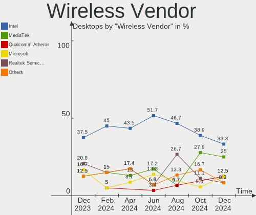

| Vendor                | Desktops | Percent |
|-----------------------|----------|---------|
| Intel                 | 6        | 37.5%   |
| Realtek Semiconductor | 5        | 31.25%  |
| TP-Link               | 1        | 6.25%   |
| Ralink                | 1        | 6.25%   |
| Qualcomm Atheros      | 1        | 6.25%   |
| MediaTek              | 1        | 6.25%   |
| ASUSTek Computer      | 1        | 6.25%   |

Wireless Model
--------------

Wireless models

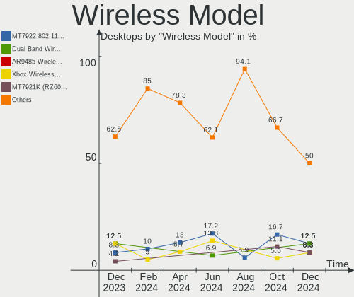

| Model                                                    | Desktops | Percent |
|----------------------------------------------------------|----------|---------|
| Intel Wi-Fi 6 AX200                                      | 5        | 31.25%  |
| TP-Link 802.11ac NIC                                     | 1        | 6.25%   |
| Realtek RTL8821CE 802.11ac PCIe Wireless Network Adapter | 1        | 6.25%   |
| Realtek RTL8812AU 802.11a/b/g/n/ac 2T2R DB WLAN Adapter  | 1        | 6.25%   |
| Realtek RTL8812AE 802.11ac PCIe Wireless Network Adapter | 1        | 6.25%   |
| Realtek RTL8188EUS 802.11n Wireless Network Adapter      | 1        | 6.25%   |
| Realtek 802.11ac NIC                                     | 1        | 6.25%   |
| Ralink RT5390 Wireless 802.11n 1T/1R PCIe                | 1        | 6.25%   |
| Qualcomm Atheros AR9462 Wireless Network Adapter         | 1        | 6.25%   |
| MediaTek MT7921K (RZ608) Wi-Fi 6E 80MHz                  | 1        | 6.25%   |
| Intel Cannon Lake PCH CNVi WiFi                          | 1        | 6.25%   |
| ASUS 802.11ac WLAN                                       | 1        | 6.25%   |

Ethernet Vendor
---------------

Ethernet vendors

| Vendor                | Desktops | Percent |
|-----------------------|----------|---------|
| Realtek Semiconductor | 17       | 54.84%  |
| Intel                 | 10       | 32.26%  |
| Qualcomm Atheros      | 1        | 3.23%   |
| ICS Advent            | 1        | 3.23%   |
| Broadcom Limited      | 1        | 3.23%   |
| Broadcom              | 1        | 3.23%   |

Ethernet Model
--------------

Ethernet models

| Model                                                             | Desktops | Percent |
|-------------------------------------------------------------------|----------|---------|
| Realtek RTL8111/8168/8411 PCI Express Gigabit Ethernet Controller | 17       | 53.13%  |
| Intel I211 Gigabit Network Connection                             | 3        | 9.38%   |
| Intel Ethernet Controller I225-V                                  | 3        | 9.38%   |
| Intel Ethernet Connection (7) I219-V                              | 3        | 9.38%   |
| Realtek RTL8150 Fast Ethernet Adapter                             | 1        | 3.13%   |
| Qualcomm Atheros Killer E220x Gigabit Ethernet Controller         | 1        | 3.13%   |
| Intel Ethernet Connection I217-LM                                 | 1        | 3.13%   |
| ICS Advent 10/100M LAN                                            | 1        | 3.13%   |
| Broadcom NetXtreme BCM5761 Gigabit Ethernet PCIe                  | 1        | 3.13%   |
| Broadcom Limited NetXtreme BCM5754 Gigabit Ethernet PCI Express   | 1        | 3.13%   |

Net Controller Kind
-------------------

Ethernet, WiFi or modem

| Kind     | Desktops | Percent |
|----------|----------|---------|
| Ethernet | 29       | 65.91%  |
| WiFi     | 15       | 34.09%  |

Used Controller
---------------

Currently used network controller

| Kind     | Desktops | Percent |
|----------|----------|---------|
| Ethernet | 22       | 75.86%  |
| WiFi     | 7        | 24.14%  |

NICs
----

Total network controllers on board

| Total | Desktops | Percent |
|-------|----------|---------|
| 1     | 17       | 58.62%  |
| 2     | 12       | 41.38%  |

IPv6
----

IPv6 vs IPv4

| Used | Desktops | Percent |
|------|----------|---------|
| No   | 16       | 55.17%  |
| Yes  | 13       | 44.83%  |

Bluetooth
---------

Bluetooth Vendor
----------------

Controller vendors

| Vendor                  | Desktops | Percent |
|-------------------------|----------|---------|
| Intel                   | 6        | 37.5%   |
| Realtek Semiconductor   | 2        | 12.5%   |
| Cambridge Silicon Radio | 2        | 12.5%   |
| TP-Link                 | 1        | 6.25%   |
| MediaTek                | 1        | 6.25%   |
| Foxconn / Hon Hai       | 1        | 6.25%   |
| Broadcom                | 1        | 6.25%   |
| ASUSTek Computer        | 1        | 6.25%   |
| Unknown                 | 1        | 6.25%   |

Bluetooth Model
---------------

Controller models

| Model                                               | Desktops | Percent |
|-----------------------------------------------------|----------|---------|
| Intel AX200 Bluetooth                               | 5        | 31.25%  |
| Cambridge Silicon Radio Bluetooth Dongle (HCI mode) | 2        | 12.5%   |
| TP-Link TPuLink UB500 Adapter                       | 1        | 6.25%   |
| Realtek  Bluetooth 4.2 Adapter                      | 1        | 6.25%   |
| Realtek Bluetooth Radio                             | 1        | 6.25%   |
| MediaTek Wireless_Device                            | 1        | 6.25%   |
| Intel Bluetooth 9460/9560 Jefferson Peak (JfP)      | 1        | 6.25%   |
| Foxconn / Hon Hai Bluetooth Device                  | 1        | 6.25%   |
| Broadcom Bluetooth Device                           | 1        | 6.25%   |
| ASUS ASUS USB-BT500                                 | 1        | 6.25%   |
| Unknown                                             | 1        | 6.25%   |

Sound
-----

Sound Vendor
------------

Sound card vendors

| Vendor                | Desktops | Percent |
|-----------------------|----------|---------|
| Nvidia                | 16       | 25%     |
| Intel                 | 15       | 23.44%  |
| AMD                   | 14       | 21.88%  |
| Samson Technologies   | 2        | 3.13%   |
| Razer USA             | 2        | 3.13%   |
| Plantronics           | 2        | 3.13%   |
| JMTek                 | 2        | 3.13%   |
| Focusrite-Novation    | 2        | 3.13%   |
| Creative Technology   | 2        | 3.13%   |
| C-Media Electronics   | 2        | 3.13%   |
| Realtek Semiconductor | 1        | 1.56%   |
| Kingston Technology   | 1        | 1.56%   |
| Elgato Systems        | 1        | 1.56%   |
| Creative Labs         | 1        | 1.56%   |
| Corsair               | 1        | 1.56%   |

Sound Model
-----------

Sound card models

| Model                                                                      | Desktops | Percent |
|----------------------------------------------------------------------------|----------|---------|
| Intel Cannon Lake PCH cAVS                                                 | 4        | 5.56%   |
| Intel 6 Series/C200 Series Chipset Family High Definition Audio Controller | 4        | 5.56%   |
| AMD Starship/Matisse HD Audio Controller                                   | 4        | 5.56%   |
| Nvidia TU106 High Definition Audio Controller                              | 3        | 4.17%   |
| AMD SBx00 Azalia (Intel HDA)                                               | 3        | 4.17%   |
| AMD Family 17h (Models 00h-0fh) HD Audio Controller                        | 3        | 4.17%   |
| AMD Ellesmere HDMI Audio [Radeon RX 470/480 / 570/580/590]                 | 3        | 4.17%   |
| Nvidia TU107 GeForce GTX 1650 High Definition Audio Controller             | 2        | 2.78%   |
| Nvidia GP102 HDMI Audio Controller                                         | 2        | 2.78%   |
| JMTek USB PnP Audio Device                                                 | 2        | 2.78%   |
| Intel Xeon E3-1200 v3/4th Gen Core Processor HD Audio Controller           | 2        | 2.78%   |
| Intel 8 Series/C220 Series Chipset High Definition Audio Controller        | 2        | 2.78%   |
| Intel 7 Series/C216 Chipset Family High Definition Audio Controller        | 2        | 2.78%   |
| AMD Renoir Radeon High Definition Audio Controller                         | 2        | 2.78%   |
| AMD Navi 21/23 HDMI/DP Audio Controller                                    | 2        | 2.78%   |
| AMD Family 17h/19h HD Audio Controller                                     | 2        | 2.78%   |
| Samson Technologies Q2U handheld mic with XLR                              | 1        | 1.39%   |
| Samson Technologies G-Track Pro microphone                                 | 1        | 1.39%   |
| Realtek Semiconductor Realtek Audio USB                                    | 1        | 1.39%   |
| Razer USA Razer USB Sound Card                                             | 1        | 1.39%   |
| Razer USA Razer Seiren Mini                                                | 1        | 1.39%   |
| Plantronics GameCom 818                                                    | 1        | 1.39%   |
| Plantronics BT600                                                          | 1        | 1.39%   |
| Nvidia TU116 High Definition Audio Controller                              | 1        | 1.39%   |
| Nvidia TU104 HD Audio Controller                                           | 1        | 1.39%   |
| Nvidia GP107GL High Definition Audio Controller                            | 1        | 1.39%   |
| Nvidia GP106 High Definition Audio Controller                              | 1        | 1.39%   |
| Nvidia GM204 High Definition Audio Controller                              | 1        | 1.39%   |
| Nvidia GF108 High Definition Audio Controller                              | 1        | 1.39%   |
| Nvidia GF106 High Definition Audio Controller                              | 1        | 1.39%   |
| Nvidia GA106 High Definition Audio Controller                              | 1        | 1.39%   |
| Nvidia GA104 High Definition Audio Controller                              | 1        | 1.39%   |
| Kingston Technology HyperX 7.1 Audio                                       | 1        | 1.39%   |
| Intel Alder Lake-S HD Audio Controller                                     | 1        | 1.39%   |
| Intel 9 Series Chipset Family HD Audio Controller                          | 1        | 1.39%   |
| Intel 82801JI (ICH10 Family) HD Audio Controller                           | 1        | 1.39%   |
| Focusrite-Novation Scarlett 2i2 Camera                                     | 1        | 1.39%   |
| Focusrite-Novation Clarett 2Pre USB                                        | 1        | 1.39%   |
| Elgato Systems Elgato Wave:3                                               | 1        | 1.39%   |
| Creative Technology SB X-Fi Surround 5.1 Pro                               | 1        | 1.39%   |

Memory
------

Memory Vendor
-------------

Memory module vendors

| Vendor              | Desktops | Percent |
|---------------------|----------|---------|
| Unknown             | 2        | 22.22%  |
| Team                | 1        | 11.11%  |
| Samsung Electronics | 1        | 11.11%  |
| Ramaxel Technology  | 1        | 11.11%  |
| G.Skill             | 1        | 11.11%  |
| Crucial             | 1        | 11.11%  |
| Corsair             | 1        | 11.11%  |
| Asgard              | 1        | 11.11%  |

Memory Model
------------

Memory module models

| Model                                                  | Desktops | Percent |
|--------------------------------------------------------|----------|---------|
| Unknown RAM Module 2GB DIMM DDR3 1066MT/s              | 1        | 11.11%  |
| Unknown RAM 2400 C15 Series 16384MB DIMM DDR4 2133MT/s | 1        | 11.11%  |
| Team RAM TEAMGROUP-UD3 8GB DIMM DDR3 1600MT/s          | 1        | 11.11%  |
| Samsung RAM M3 78T2863QZS-CF7 1GB DIMM DDR2 800MT/s    | 1        | 11.11%  |
| Ramaxel RAM RMR5030ED58E8W1600 2GB DIMM DDR3 1600MT/s  | 1        | 11.11%  |
| G.Skill RAM F4-3200C16-8GVKB 8GB DIMM DDR4 3866MT/s    | 1        | 11.11%  |
| Crucial RAM BL16G32C16U4B.16FE 16GB DIMM DDR4 3200MT/s | 1        | 11.11%  |
| Corsair RAM CMZ16GX3M4A2133C11 4GB DIMM DDR3 1600MT/s  | 1        | 11.11%  |
| Asgard RAM VMA45UG-MEC1U2AW2 8GB DIMM DDR4 2400MT/s    | 1        | 11.11%  |

Memory Kind
-----------

Memory module kinds

| Kind  | Desktops | Percent |
|-------|----------|---------|
| DDR4  | 4        | 50%     |
| DDR3  | 3        | 37.5%   |
| SDRAM | 1        | 12.5%   |

Memory Form Factor
------------------

Physical design of the memory module

| Name | Desktops | Percent |
|------|----------|---------|
| DIMM | 8        | 100%    |

Memory Size
-----------

Memory module size

| Size  | Desktops | Percent |
|-------|----------|---------|
| 8192  | 3        | 37.5%   |
| 16384 | 2        | 25%     |
| 4096  | 1        | 12.5%   |
| 2048  | 1        | 12.5%   |
| 1024  | 1        | 12.5%   |

Memory Speed
------------

Memory module speed

| Speed | Desktops | Percent |
|-------|----------|---------|
| 1600  | 3        | 33.33%  |
| 2400  | 2        | 22.22%  |
| 3866  | 1        | 11.11%  |
| 3200  | 1        | 11.11%  |
| 1066  | 1        | 11.11%  |
| 800   | 1        | 11.11%  |

Printers & scanners
-------------------

Printer Vendor
--------------

Printer device vendors

Zero info for selected period =(

Printer Model
-------------

Printer device models

Zero info for selected period =(

Scanner Vendor
--------------

Scanner device vendors

Zero info for selected period =(

Scanner Model
-------------

Scanner device models

Zero info for selected period =(

Camera
------

Camera Vendor
-------------

Camera device vendors

| Vendor    | Desktops | Percent |
|-----------|----------|---------|
| Logitech  | 4        | 57.14%  |
| Microsoft | 1        | 14.29%  |
| Lenovo    | 1        | 14.29%  |
| Apple     | 1        | 14.29%  |

Camera Model
------------

Camera device models

| Model                           | Desktops | Percent |
|---------------------------------|----------|---------|
| Logitech C922 Pro Stream Webcam | 2        | 28.57%  |
| Microsoft LifeCam Cinema        | 1        | 14.29%  |
| Logitech QuickCam Pro 9000      | 1        | 14.29%  |
| Logitech HD Pro Webcam C920     | 1        | 14.29%  |
| Lenovo 500 RGB Camera           | 1        | 14.29%  |
| Apple iPhone 5/5C/5S/6/SE       | 1        | 14.29%  |

Security
--------

Fingerprint Vendor
------------------

Fingerprint sensor vendors

Zero info for selected period =(

Fingerprint Model
-----------------

Fingerprint sensor models

Zero info for selected period =(

Chipcard Vendor
---------------

Chipcard module vendors

Zero info for selected period =(

Chipcard Model
--------------

Chipcard module models

Zero info for selected period =(

Unsupported
-----------

Unsupported Devices
-------------------

Total unsupported devices on board

| Total | Desktops | Percent |
|-------|----------|---------|
| 0     | 26       | 89.66%  |
| 1     | 3        | 10.34%  |

Unsupported Device Types
------------------------

Types of unsupported devices

| Type                     | Desktops | Percent |
|--------------------------|----------|---------|
| Net/wireless             | 2        | 66.67%  |
| Communication controller | 1        | 33.33%  |

