Nobara - Hardware Trends (Desktops)
-----------------------------------

A project to identify most popular hardware characteristics and track their change
over time based on data collected by Linux users at https://Linux-Hardware.org.

Anyone can contribute to this report by the [hw-probe](https://github.com/linuxhw/hw-probe) tool:

    sudo -E hw-probe -all -upload

This report is for one last month. Overall report since the beginning of time: [TestDays](https://github.com/linuxhw/TestDays)

Period: Oct, 2023.

Contents
--------

* [ System ](#system)
  - [ OS                       ](#os)
  - [ OS Family                ](#os-family)
  - [ Kernel                   ](#kernel)
  - [ Kernel Family            ](#kernel-family)
  - [ Kernel Major Ver.        ](#kernel-major-ver)
  - [ Arch                     ](#arch)
  - [ DE                       ](#de)
  - [ Display Server           ](#display-server)
  - [ Display Manager          ](#display-manager)
  - [ OS Lang                  ](#os-lang)
  - [ Boot Mode                ](#boot-mode)
  - [ Filesystem               ](#filesystem)
  - [ Part. scheme             ](#part-scheme)
  - [ Dual Boot with Linux/BSD ](#dual-boot-with-linuxbsd)
  - [ Dual Boot (Win)          ](#dual-boot-win)

* [ Board ](#board)
  - [ Vendor                   ](#vendor)
  - [ Model                    ](#model)
  - [ Model Family             ](#model-family)
  - [ MFG Year                 ](#mfg-year)
  - [ Form Factor              ](#form-factor)
  - [ Secure Boot              ](#secure-boot)
  - [ Coreboot                 ](#coreboot)
  - [ RAM Size                 ](#ram-size)
  - [ RAM Used                 ](#ram-used)
  - [ Total Drives             ](#total-drives)
  - [ Has CD-ROM               ](#has-cd-rom)
  - [ Has Ethernet             ](#has-ethernet)
  - [ Has WiFi                 ](#has-wifi)
  - [ Has Bluetooth            ](#has-bluetooth)

* [ Location ](#location)
  - [ Country                  ](#country)
  - [ City                     ](#city)

* [ Drives ](#drives)
  - [ Drive Vendor             ](#drive-vendor)
  - [ Drive Model              ](#drive-model)
  - [ HDD Vendor               ](#hdd-vendor)
  - [ SSD Vendor               ](#ssd-vendor)
  - [ Drive Kind               ](#drive-kind)
  - [ Drive Connector          ](#drive-connector)
  - [ Drive Size               ](#drive-size)
  - [ Space Total              ](#space-total)
  - [ Space Used               ](#space-used)
  - [ Malfunc. Drives          ](#malfunc-drives)
  - [ Malfunc. Drive Vendor    ](#malfunc-drive-vendor)
  - [ Malfunc. HDD Vendor      ](#malfunc-hdd-vendor)
  - [ Malfunc. Drive Kind      ](#malfunc-drive-kind)
  - [ Failed Drives            ](#failed-drives)
  - [ Failed Drive Vendor      ](#failed-drive-vendor)
  - [ Drive Status             ](#drive-status)

* [ Storage controller ](#storage-controller)
  - [ Storage Vendor           ](#storage-vendor)
  - [ Storage Model            ](#storage-model)
  - [ Storage Kind             ](#storage-kind)

* [ Processor ](#processor)
  - [ CPU Vendor               ](#cpu-vendor)
  - [ CPU Model                ](#cpu-model)
  - [ CPU Model Family         ](#cpu-model-family)
  - [ CPU Cores                ](#cpu-cores)
  - [ CPU Sockets              ](#cpu-sockets)
  - [ CPU Threads              ](#cpu-threads)
  - [ CPU Op-Modes             ](#cpu-op-modes)
  - [ CPU Microcode            ](#cpu-microcode)
  - [ CPU Microarch            ](#cpu-microarch)

* [ Graphics ](#graphics)
  - [ GPU Vendor               ](#gpu-vendor)
  - [ GPU Model                ](#gpu-model)
  - [ GPU Combo                ](#gpu-combo)
  - [ GPU Driver               ](#gpu-driver)
  - [ GPU Memory               ](#gpu-memory)

* [ Monitor ](#monitor)
  - [ Monitor Vendor           ](#monitor-vendor)
  - [ Monitor Model            ](#monitor-model)
  - [ Monitor Resolution       ](#monitor-resolution)
  - [ Monitor Diagonal         ](#monitor-diagonal)
  - [ Monitor Width            ](#monitor-width)
  - [ Aspect Ratio             ](#aspect-ratio)
  - [ Monitor Area             ](#monitor-area)
  - [ Pixel Density            ](#pixel-density)
  - [ Multiple Monitors        ](#multiple-monitors)

* [ Network ](#network)
  - [ Net Controller Vendor    ](#net-controller-vendor)
  - [ Net Controller Model     ](#net-controller-model)
  - [ Wireless Vendor          ](#wireless-vendor)
  - [ Wireless Model           ](#wireless-model)
  - [ Ethernet Vendor          ](#ethernet-vendor)
  - [ Ethernet Model           ](#ethernet-model)
  - [ Net Controller Kind      ](#net-controller-kind)
  - [ Used Controller          ](#used-controller)
  - [ NICs                     ](#nics)
  - [ IPv6                     ](#ipv6)

* [ Bluetooth ](#bluetooth)
  - [ Bluetooth Vendor         ](#bluetooth-vendor)
  - [ Bluetooth Model          ](#bluetooth-model)

* [ Sound ](#sound)
  - [ Sound Vendor             ](#sound-vendor)
  - [ Sound Model              ](#sound-model)

* [ Memory ](#memory)
  - [ Memory Vendor            ](#memory-vendor)
  - [ Memory Model             ](#memory-model)
  - [ Memory Kind              ](#memory-kind)
  - [ Memory Form Factor       ](#memory-form-factor)
  - [ Memory Size              ](#memory-size)
  - [ Memory Speed             ](#memory-speed)

* [ Printers & scanners ](#printers--scanners)
  - [ Printer Vendor           ](#printer-vendor)
  - [ Printer Model            ](#printer-model)
  - [ Scanner Vendor           ](#scanner-vendor)
  - [ Scanner Model            ](#scanner-model)

* [ Camera ](#camera)
  - [ Camera Vendor            ](#camera-vendor)
  - [ Camera Model             ](#camera-model)

* [ Security ](#security)
  - [ Fingerprint Vendor       ](#fingerprint-vendor)
  - [ Fingerprint Model        ](#fingerprint-model)
  - [ Chipcard Vendor          ](#chipcard-vendor)
  - [ Chipcard Model           ](#chipcard-model)

* [ Unsupported ](#unsupported)
  - [ Unsupported Devices      ](#unsupported-devices)
  - [ Unsupported Device Types ](#unsupported-device-types)

System
------

OS
--

Installed operating systems

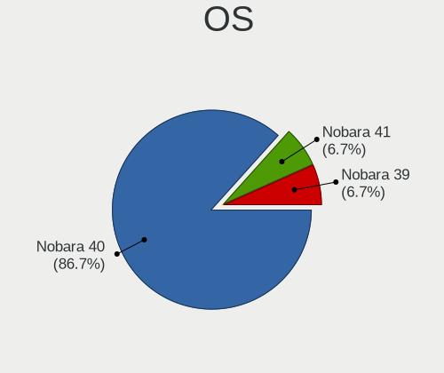

| Name      | Desktops | Percent |
|-----------|----------|---------|
| Nobara 38 | 19       | 86.36%  |
| Nobara 37 | 3        | 13.64%  |

OS Family
---------

OS without a version

| Name   | Desktops | Percent |
|--------|----------|---------|
| Nobara | 22       | 100%    |

Kernel
------

Version of the Linux kernel

| Version                      | Desktops | Percent |
|------------------------------|----------|---------|
| 6.5.6-200.fsync.fc38.x86_64  | 8        | 36.36%  |
| 6.5.9-200.fsync.fc38.x86_64  | 3        | 13.64%  |
| 6.5.5-201.fsync.fc38.x86_64  | 3        | 13.64%  |
| 6.5.3-200.fsync.fc37.x86_64  | 3        | 13.64%  |
| 6.5.8-200.fsync.fc38.x86_64  | 2        | 9.09%   |
| 6.5.5-200.fsync.fc38.x86_64  | 1        | 4.55%   |
| 6.4.10-202.fsync.fc38.x86_64 | 1        | 4.55%   |
| 6.3.9-200.fsync.fc38.x86_64  | 1        | 4.55%   |

Kernel Family
-------------

Linux kernel without a distro release

| Version | Desktops | Percent |
|---------|----------|---------|
| 6.5.6   | 8        | 36.36%  |
| 6.5.5   | 4        | 18.18%  |
| 6.5.9   | 3        | 13.64%  |
| 6.5.3   | 3        | 13.64%  |
| 6.5.8   | 2        | 9.09%   |
| 6.4.10  | 1        | 4.55%   |
| 6.3.9   | 1        | 4.55%   |

Kernel Major Ver.
-----------------

Linux kernel major version

| Version | Desktops | Percent |
|---------|----------|---------|
| 6.5     | 20       | 90.91%  |
| 6.4     | 1        | 4.55%   |
| 6.3     | 1        | 4.55%   |

Arch
----

OS architecture (x86_64, i586, etc.)

| Name   | Desktops | Percent |
|--------|----------|---------|
| x86_64 | 22       | 100%    |

DE
--

Desktop Environment

| Name  | Desktops | Percent |
|-------|----------|---------|
| GNOME | 16       | 72.73%  |
| KDE5  | 6        | 27.27%  |

Display Server
--------------

X11 or Wayland

| Name    | Desktops | Percent |
|---------|----------|---------|
| Wayland | 21       | 95.45%  |
| X11     | 1        | 4.55%   |

Display Manager
---------------

SDDM, LightDM, etc.

| Name    | Desktops | Percent |
|---------|----------|---------|
| Unknown | 18       | 81.82%  |
| SDDM    | 2        | 9.09%   |
| GDM     | 2        | 9.09%   |

OS Lang
-------

Language

| Lang  | Desktops | Percent |
|-------|----------|---------|
| en_US | 6        | 27.27%  |
| de_DE | 5        | 22.73%  |
| en_GB | 3        | 13.64%  |
| en_CA | 2        | 9.09%   |
| ru_RU | 1        | 4.55%   |
| pt_BR | 1        | 4.55%   |
| pl_PL | 1        | 4.55%   |
| es_MX | 1        | 4.55%   |
| es_CU | 1        | 4.55%   |
| en_NZ | 1        | 4.55%   |

Boot Mode
---------

EFI or BIOS

| Mode | Desktops | Percent |
|------|----------|---------|
| EFI  | 22       | 100%    |

Filesystem
----------

Type of filesystem

| Type  | Desktops | Percent |
|-------|----------|---------|
| Btrfs | 22       | 100%    |

Part. scheme
------------

Scheme of partitioning

| Type    | Desktops | Percent |
|---------|----------|---------|
| Unknown | 18       | 81.82%  |
| GPT     | 4        | 18.18%  |

Dual Boot with Linux/BSD
------------------------

Hosting more than one Linux/BSD

| Dual boot | Desktops | Percent |
|-----------|----------|---------|
| No        | 20       | 90.91%  |
| Yes       | 2        | 9.09%   |

Dual Boot (Win)
---------------

Hosting Linux and Windows

| Dual boot | Desktops | Percent |
|-----------|----------|---------|
| No        | 20       | 90.91%  |
| Yes       | 2        | 9.09%   |

Board
-----

Vendor
------

Motherboard manufacturer

| Name                | Desktops | Percent |
|---------------------|----------|---------|
| ASUSTek Computer    | 7        | 31.82%  |
| Gigabyte Technology | 6        | 27.27%  |
| MSI                 | 4        | 18.18%  |
| ASRock              | 2        | 9.09%   |
| Pegatron            | 1        | 4.55%   |
| Biostar             | 1        | 4.55%   |
| AOpen               | 1        | 4.55%   |

Model
-----

Motherboard model

| Name                            | Desktops | Percent |
|---------------------------------|----------|---------|
| Pegatron HPE-558de              | 1        | 4.55%   |
| MSI MS-7C37                     | 1        | 4.55%   |
| MSI MS-7C09                     | 1        | 4.55%   |
| MSI MS-7A34                     | 1        | 4.55%   |
| MSI MS-7971                     | 1        | 4.55%   |
| Gigabyte Z77-D3H                | 1        | 4.55%   |
| Gigabyte X570 AORUS ELITE       | 1        | 4.55%   |
| Gigabyte H77-D3H                | 1        | 4.55%   |
| Gigabyte B760 GAMING X DDR4     | 1        | 4.55%   |
| Gigabyte B550I AORUS PRO AX     | 1        | 4.55%   |
| Gigabyte B550 GAMING X V2       | 1        | 4.55%   |
| Biostar A320MH                  | 1        | 4.55%   |
| ASUS TUF Gaming X570-PLUS       | 1        | 4.55%   |
| ASUS TUF Gaming A620M-PLUS WIFI | 1        | 4.55%   |
| ASUS TUF B450M-PLUS GAMING      | 1        | 4.55%   |
| ASUS ROG STRIX X570-E GAMING    | 1        | 4.55%   |
| ASUS ROG Maximus XI HERO        | 1        | 4.55%   |
| ASUS PRIME B450M-GAMING/BR      | 1        | 4.55%   |
| ASUS P8H77-M                    | 1        | 4.55%   |
| ASRock X670E PG Lightning       | 1        | 4.55%   |
| ASRock B450M-HDV R4.0           | 1        | 4.55%   |
| AOpen DEX5350                   | 1        | 4.55%   |

Model Family
------------

Motherboard model prefix

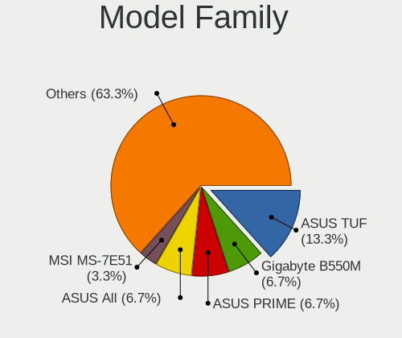

| Name               | Desktops | Percent |
|--------------------|----------|---------|
| ASUS TUF           | 3        | 13.64%  |
| ASUS ROG           | 2        | 9.09%   |
| Pegatron HPE-558de | 1        | 4.55%   |
| MSI MS-7C37        | 1        | 4.55%   |
| MSI MS-7C09        | 1        | 4.55%   |
| MSI MS-7A34        | 1        | 4.55%   |
| MSI MS-7971        | 1        | 4.55%   |
| Gigabyte Z77-D3H   | 1        | 4.55%   |
| Gigabyte X570      | 1        | 4.55%   |
| Gigabyte H77-D3H   | 1        | 4.55%   |
| Gigabyte B760      | 1        | 4.55%   |
| Gigabyte B550I     | 1        | 4.55%   |
| Gigabyte B550      | 1        | 4.55%   |
| Biostar A320MH     | 1        | 4.55%   |
| ASUS PRIME         | 1        | 4.55%   |
| ASUS P8H77-M       | 1        | 4.55%   |
| ASRock X670E       | 1        | 4.55%   |
| ASRock B450M-HDV   | 1        | 4.55%   |
| AOpen DEX5350      | 1        | 4.55%   |

MFG Year
--------

Motherboard manufacture year

| Year | Desktops | Percent |
|------|----------|---------|
| 2018 | 5        | 22.73%  |
| 2019 | 4        | 18.18%  |
| 2012 | 3        | 13.64%  |
| 2022 | 2        | 9.09%   |
| 2020 | 2        | 9.09%   |
| 2023 | 1        | 4.55%   |
| 2021 | 1        | 4.55%   |
| 2017 | 1        | 4.55%   |
| 2016 | 1        | 4.55%   |
| 2015 | 1        | 4.55%   |
| 2011 | 1        | 4.55%   |

Form Factor
-----------

Physical design of the computer

| Name    | Desktops | Percent |
|---------|----------|---------|
| Desktop | 22       | 100%    |

Secure Boot
-----------

Enabled or disabled

| State    | Desktops | Percent |
|----------|----------|---------|
| Disabled | 22       | 100%    |

Coreboot
--------

Have coreboot on board

| Used | Desktops | Percent |
|------|----------|---------|
| No   | 22       | 100%    |

RAM Size
--------

Total RAM memory

| Size in GB  | Desktops | Percent |
|-------------|----------|---------|
| 16.01-24.0  | 8        | 36.36%  |
| 32.01-64.0  | 7        | 31.82%  |
| 24.01-32.0  | 2        | 9.09%   |
| 64.01-256.0 | 2        | 9.09%   |
| 8.01-16.0   | 2        | 9.09%   |
| 3.01-4.0    | 1        | 4.55%   |

RAM Used
--------

Used RAM memory

| Used GB   | Desktops | Percent |
|-----------|----------|---------|
| 4.01-8.0  | 8        | 36.36%  |
| 3.01-4.0  | 5        | 22.73%  |
| 8.01-16.0 | 4        | 18.18%  |
| 2.01-3.0  | 3        | 13.64%  |
| 1.01-2.0  | 2        | 9.09%   |

Total Drives
------------

Number of drives on board

| Drives | Desktops | Percent |
|--------|----------|---------|
| 3      | 6        | 27.27%  |
| 1      | 6        | 27.27%  |
| 2      | 4        | 18.18%  |
| 4      | 3        | 13.64%  |
| 7      | 1        | 4.55%   |
| 6      | 1        | 4.55%   |
| 5      | 1        | 4.55%   |

Has CD-ROM
----------

Has CD-ROM on board

| Presented | Desktops | Percent |
|-----------|----------|---------|
| No        | 14       | 63.64%  |
| Yes       | 8        | 36.36%  |

Has Ethernet
------------

Has Ethernet on board

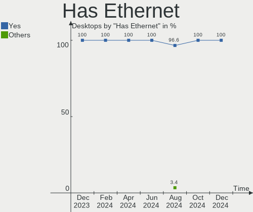

| Presented | Desktops | Percent |
|-----------|----------|---------|
| Yes       | 22       | 100%    |

Has WiFi
--------

Has WiFi module

| Presented | Desktops | Percent |
|-----------|----------|---------|
| Yes       | 15       | 68.18%  |
| No        | 7        | 31.82%  |

Has Bluetooth
-------------

Has Bluetooth module

| Presented | Desktops | Percent |
|-----------|----------|---------|
| No        | 13       | 59.09%  |
| Yes       | 9        | 40.91%  |

Location
--------

Country
-------

Geographic location (country)

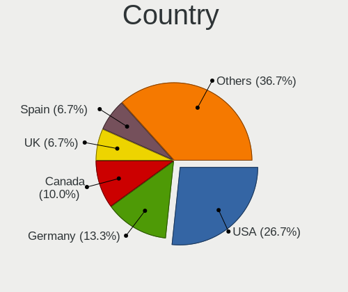

| Country     | Desktops | Percent |
|-------------|----------|---------|
| Germany     | 6        | 27.27%  |
| Canada      | 4        | 18.18%  |
| USA         | 2        | 9.09%   |
| UK          | 1        | 4.55%   |
| Russia      | 1        | 4.55%   |
| Romania     | 1        | 4.55%   |
| Poland      | 1        | 4.55%   |
| New Zealand | 1        | 4.55%   |
| India       | 1        | 4.55%   |
| France      | 1        | 4.55%   |
| Cuba        | 1        | 4.55%   |
| Brazil      | 1        | 4.55%   |
| Argentina   | 1        | 4.55%   |

City
----

Geographic location (city)

| City          | Desktops | Percent |
|---------------|----------|---------|
| St Petersburg | 1        | 4.55%   |
| Satna         | 1        | 4.55%   |
| Saluda        | 1        | 4.55%   |
| Praia Grande  | 1        | 4.55%   |
| Ortenberg     | 1        | 4.55%   |
| Nettetal      | 1        | 4.55%   |
| Nelson        | 1        | 4.55%   |
| Lübeck       | 1        | 4.55%   |
| Las Vegas     | 1        | 4.55%   |
| Kelowna       | 1        | 4.55%   |
| Havana        | 1        | 4.55%   |
| Glace Bay     | 1        | 4.55%   |
| Gdynia        | 1        | 4.55%   |
| Fordingbridge | 1        | 4.55%   |
| Düsseldorf   | 1        | 4.55%   |
| Cologne       | 1        | 4.55%   |
| Cluj-Napoca   | 1        | 4.55%   |
| Cambridge     | 1        | 4.55%   |
| Buenos Aires  | 1        | 4.55%   |
| Bron          | 1        | 4.55%   |
| Benzingerode  | 1        | 4.55%   |
| Auckland      | 1        | 4.55%   |

Drives
------

Drive Vendor
------------

Hard drive vendors

| Vendor                      | Desktops | Drives | Percent |
|-----------------------------|----------|--------|---------|
| Samsung Electronics         | 9        | 21     | 20.93%  |
| WDC                         | 5        | 8      | 11.63%  |
| Seagate                     | 5        | 5      | 11.63%  |
| Sandisk                     | 4        | 6      | 9.3%    |
| Crucial                     | 4        | 4      | 9.3%    |
| Realtek Semiconductor       | 3        | 3      | 6.98%   |
| Toshiba                     | 2        | 5      | 4.65%   |
| Micron/Crucial Technology   | 2        | 2      | 4.65%   |
| Silicon Motion              | 1        | 1      | 2.33%   |
| OCZ                         | 1        | 1      | 2.33%   |
| Lexar                       | 1        | 1      | 2.33%   |
| KIOXIA                      | 1        | 1      | 2.33%   |
| Kingston Technology Company | 1        | 1      | 2.33%   |
| Intel                       | 1        | 1      | 2.33%   |
| Corsair                     | 1        | 1      | 2.33%   |
| AMD                         | 1        | 1      | 2.33%   |
| A-DATA Technology           | 1        | 1      | 2.33%   |

Drive Model
-----------

Hard drive models

| Model                                                 | Desktops | Percent |
|-------------------------------------------------------|----------|---------|
| Samsung NVMe SSD Controller SM981/PM981/PM983 1TB     | 3        | 5%      |
| Samsung NVMe SSD Controller PM9A1/PM9A3/980PRO 1TB    | 3        | 5%      |
| Samsung SSD 860 EVO 500GB                             | 2        | 3.33%   |
| Samsung SSD 860 EVO 250GB                             | 2        | 3.33%   |
| Crucial CT1000BX500SSD1 1TB                           | 2        | 3.33%   |
| WDC WDS120G2G0B-00EPW0 120GB SSD                      | 1        | 1.67%   |
| WDC WDS100T2G0A-00JH30 1TB SSD                        | 1        | 1.67%   |
| WDC WD3000F9YZ-09N20L1 3TB                            | 1        | 1.67%   |
| WDC WD20EARS-00S8B1 2TB                               | 1        | 1.67%   |
| WDC WD10EZEX-22MFCA0 1TB                              | 1        | 1.67%   |
| WDC WD10EFRX-68FYTN0 1TB                              | 1        | 1.67%   |
| WDC WD1004FBYZ-01YCBB1 1TB                            | 1        | 1.67%   |
| Toshiba Q300. 480GB SSD                               | 1        | 1.67%   |
| Toshiba MK5076GSX 500GB                               | 1        | 1.67%   |
| Toshiba HDWR180 8TB                                   | 1        | 1.67%   |
| Toshiba HDWE160 6TB                                   | 1        | 1.67%   |
| Toshiba DT01ACA300 3TB                                | 1        | 1.67%   |
| Silicon Motion SM2263EN/SM2263XT SSD Controller 256GB | 1        | 1.67%   |
| Seagate ST3500630AS 500GB                             | 1        | 1.67%   |
| Seagate ST2000DM001-1ER164 2TB                        | 1        | 1.67%   |
| Seagate ST1000LM035-1RK172 1TB                        | 1        | 1.67%   |
| Seagate ST1000DM003-1SB10C 1TB                        | 1        | 1.67%   |
| Seagate BUP BK 4TB                                    | 1        | 1.67%   |
| Sandisk WD_BLACK SN850X 2000GB                        | 1        | 1.67%   |
| Sandisk WD_BLACK SN770 1TB                            | 1        | 1.67%   |
| Sandisk WD_BLACK SN750 SE 1TB                         | 1        | 1.67%   |
| Sandisk WD Blue SN570 2TB                             | 1        | 1.67%   |
| SanDisk SDSSDHP256G 256GB                             | 1        | 1.67%   |
| SanDisk SDSSDH3 1T00 1TB                              | 1        | 1.67%   |
| Samsung SSD 980 1TB                                   | 1        | 1.67%   |
| Samsung SSD 870 QVO 1TB                               | 1        | 1.67%   |
| Samsung SSD 870 EVO 250GB                             | 1        | 1.67%   |
| Samsung SSD 860 QVO 1TB                               | 1        | 1.67%   |
| Samsung SSD 860 EVO 1TB                               | 1        | 1.67%   |
| Samsung SSD 850 EVO 500GB                             | 1        | 1.67%   |
| Samsung SSD 750 EVO 500GB                             | 1        | 1.67%   |
| Samsung PSSD T7 1TB                                   | 1        | 1.67%   |
| Samsung HD103SI 1TB                                   | 1        | 1.67%   |
| Realtek XPG GAMMIX S5 256GB                           | 1        | 1.67%   |
| Realtek SPCC M.2 PCIe SSD 512GB                       | 1        | 1.67%   |

HDD Vendor
----------

Hard disk drive vendors

| Vendor              | Desktops | Drives | Percent |
|---------------------|----------|--------|---------|
| Seagate             | 5        | 5      | 41.67%  |
| WDC                 | 4        | 6      | 33.33%  |
| Toshiba             | 2        | 4      | 16.67%  |
| Samsung Electronics | 1        | 1      | 8.33%   |

SSD Vendor
----------

Solid state drive vendors

| Vendor              | Desktops | Drives | Percent |
|---------------------|----------|--------|---------|
| Samsung Electronics | 8        | 12     | 36.36%  |
| Crucial             | 4        | 4      | 18.18%  |
| WDC                 | 2        | 2      | 9.09%   |
| SanDisk             | 2        | 2      | 9.09%   |
| Toshiba             | 1        | 1      | 4.55%   |
| OCZ                 | 1        | 1      | 4.55%   |
| Lexar               | 1        | 1      | 4.55%   |
| Corsair             | 1        | 1      | 4.55%   |
| AMD                 | 1        | 1      | 4.55%   |
| A-DATA Technology   | 1        | 1      | 4.55%   |

Drive Kind
----------

HDD or SSD

| Kind | Desktops | Drives | Percent |
|------|----------|--------|---------|
| SSD  | 17       | 26     | 40.48%  |
| NVMe | 15       | 21     | 35.71%  |
| HDD  | 10       | 16     | 23.81%  |

Drive Connector
---------------

SATA, SAS, NVMe, etc.

| Type | Desktops | Drives | Percent |
|------|----------|--------|---------|
| SATA | 19       | 40     | 54.29%  |
| NVMe | 15       | 21     | 42.86%  |
| SAS  | 1        | 2      | 2.86%   |

Drive Size
----------

Size of hard drive

| Size in TB | Desktops | Drives | Percent |
|------------|----------|--------|---------|
| 0.01-0.5   | 12       | 17     | 42.86%  |
| 0.51-1.0   | 10       | 17     | 35.71%  |
| 2.01-3.0   | 2        | 3      | 7.14%   |
| 1.01-2.0   | 2        | 2      | 7.14%   |
| 3.01-4.0   | 1        | 1      | 3.57%   |
| 4.01-10.0  | 1        | 2      | 3.57%   |

Space Total
-----------

Amount of disk space available on the file system

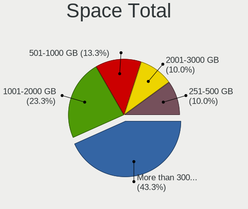

| Size in GB     | Desktops | Percent |
|----------------|----------|---------|
| 501-1000       | 7        | 31.82%  |
| More than 3000 | 6        | 27.27%  |
| 1001-2000      | 6        | 27.27%  |
| 251-500        | 1        | 4.55%   |
| 2001-3000      | 1        | 4.55%   |
| Unknown        | 1        | 4.55%   |

Space Used
----------

Amount of used disk space

| Used GB        | Desktops | Percent |
|----------------|----------|---------|
| 21-50          | 4        | 18.18%  |
| 1001-2000      | 4        | 18.18%  |
| More than 3000 | 3        | 13.64%  |
| 251-500        | 3        | 13.64%  |
| 101-250        | 2        | 9.09%   |
| 1-20           | 2        | 9.09%   |
| 2001-3000      | 1        | 4.55%   |
| 501-1000       | 1        | 4.55%   |
| 51-100         | 1        | 4.55%   |
| Unknown        | 1        | 4.55%   |

Malfunc. Drives
---------------

Drive models with a malfunction

Zero info for selected period =(

Malfunc. Drive Vendor
---------------------

Vendors of faulty drives

Zero info for selected period =(

Malfunc. HDD Vendor
-------------------

Vendors of faulty HDD drives

Zero info for selected period =(

Malfunc. Drive Kind
-------------------

Kinds of faulty drives

Zero info for selected period =(

Failed Drives
-------------

Failed drive models

Zero info for selected period =(

Failed Drive Vendor
-------------------

Failed drive vendors

Zero info for selected period =(

Drive Status
------------

Number of failed and malfunc. drives

| Status   | Desktops | Drives | Percent |
|----------|----------|--------|---------|
| Detected | 18       | 52     | 81.82%  |
| Works    | 4        | 11     | 18.18%  |

Storage controller
------------------

Storage Vendor
--------------

Storage controller vendors

| Vendor                      | Desktops | Percent |
|-----------------------------|----------|---------|
| AMD                         | 13       | 32.5%   |
| Intel                       | 9        | 22.5%   |
| Samsung Electronics         | 6        | 15%     |
| SanDisk                     | 3        | 7.5%    |
| Realtek Semiconductor       | 3        | 7.5%    |
| Micron/Crucial Technology   | 2        | 5%      |
| Silicon Motion              | 1        | 2.5%    |
| KIOXIA                      | 1        | 2.5%    |
| Kingston Technology Company | 1        | 2.5%    |
| ASMedia Technology          | 1        | 2.5%    |

Storage Model
-------------

Storage controller models

| Model                                                                         | Desktops | Percent |
|-------------------------------------------------------------------------------|----------|---------|
| AMD FCH SATA Controller [AHCI mode]                                           | 10       | 20.83%  |
| Samsung NVMe SSD Controller SM981/PM981/PM983                                 | 3        | 6.25%   |
| Samsung NVMe SSD Controller PM9A1/PM9A3/980PRO                                | 3        | 6.25%   |
| Realtek RTS5765DL NVMe SSD Controller (DRAM-less)                             | 3        | 6.25%   |
| AMD 400 Series Chipset SATA Controller                                        | 3        | 6.25%   |
| Intel 7 Series/C210 Series Chipset Family 6-port SATA Controller [AHCI mode]  | 2        | 4.17%   |
| AMD 500 Series Chipset SATA Controller                                        | 2        | 4.17%   |
| Silicon Motion SM2263EN/SM2263XT (DRAM-less) NVMe SSD Controllers             | 1        | 2.08%   |
| SanDisk WD Blue SN570 NVMe SSD 2TB                                            | 1        | 2.08%   |
| Sandisk WD Black SN850X NVMe SSD                                              | 1        | 2.08%   |
| SanDisk WD Black SN770 / PC SN740 256GB / PC SN560 (DRAM-less) NVMe SSD       | 1        | 2.08%   |
| SanDisk PC SN735 NVMe SSD (DRAM-less)                                         | 1        | 2.08%   |
| Samsung NVMe SSD Controller 980 (DRAM-less)                                   | 1        | 2.08%   |
| Micron/Crucial P5 Plus NVMe PCIe SSD                                          | 1        | 2.08%   |
| Micron/Crucial P2 [Nick P2] / P3 / P3 Plus NVMe PCIe SSD (DRAM-less)          | 1        | 2.08%   |
| KIOXIA NVMe SSD                                                               | 1        | 2.08%   |
| Kingston Company NV2 NVMe SSD SM2267XT                                        | 1        | 2.08%   |
| Intel Wildcat Point-LP SATA Controller [AHCI Mode]                            | 1        | 2.08%   |
| Intel SSD 660P Series                                                         | 1        | 2.08%   |
| Intel Q170/Q150/B150/H170/H110/Z170/CM236 Chipset SATA Controller [AHCI Mode] | 1        | 2.08%   |
| Intel Cannon Lake PCH SATA AHCI Controller                                    | 1        | 2.08%   |
| Intel 700 Series Chipset Family SATA AHCI Controller                          | 1        | 2.08%   |
| Intel 7 Series/C210 Series Chipset Family 4-port SATA Controller [IDE mode]   | 1        | 2.08%   |
| Intel 7 Series/C210 Series Chipset Family 2-port SATA Controller [IDE mode]   | 1        | 2.08%   |
| Intel 6 Series/C200 Series Chipset Family 6 port Desktop SATA AHCI Controller | 1        | 2.08%   |
| Intel 200 Series PCH SATA controller [AHCI mode]                              | 1        | 2.08%   |
| ASMedia ASM1062 Serial ATA Controller                                         | 1        | 2.08%   |
| AMD FCH SATA Controller D                                                     | 1        | 2.08%   |
| AMD 300 Series Chipset SATA Controller                                        | 1        | 2.08%   |

Storage Kind
------------

Kind of storage controller (IDE, SATA, NVMe, SAS, ...)

| Kind | Desktops | Percent |
|------|----------|---------|
| SATA | 21       | 56.76%  |
| NVMe | 15       | 40.54%  |
| IDE  | 1        | 2.7%    |

Processor
---------

CPU Vendor
----------

Processor vendors

| Vendor | Desktops | Percent |
|--------|----------|---------|
| AMD    | 13       | 59.09%  |
| Intel  | 9        | 40.91%  |

CPU Model
---------

Processor models

| Model                                       | Desktops | Percent |
|---------------------------------------------|----------|---------|
| AMD Ryzen 3 3200G with Radeon Vega Graphics | 3        | 13.64%  |
| Intel Core i7-3770 CPU @ 3.40GHz            | 2        | 9.09%   |
| AMD Ryzen 9 5950X 16-Core Processor         | 2        | 9.09%   |
| Intel Xeon CPU E3-1280 V2 @ 3.60GHz         | 1        | 4.55%   |
| Intel Core i9-9900K CPU @ 3.60GHz           | 1        | 4.55%   |
| Intel Core i7-6700K CPU @ 4.00GHz           | 1        | 4.55%   |
| Intel Core i7-2600 CPU @ 3.40GHz            | 1        | 4.55%   |
| Intel Core i5-9400 CPU @ 2.90GHz            | 1        | 4.55%   |
| Intel Core i3-5010U CPU @ 2.10GHz           | 1        | 4.55%   |
| Intel 13th Gen Core i5-13400F               | 1        | 4.55%   |
| AMD Ryzen 7 7800X3D 8-Core Processor        | 1        | 4.55%   |
| AMD Ryzen 7 5800X3D 8-Core Processor        | 1        | 4.55%   |
| AMD Ryzen 7 5800X 8-Core Processor          | 1        | 4.55%   |
| AMD Ryzen 7 5700G with Radeon Graphics      | 1        | 4.55%   |
| AMD Ryzen 5 7600X 6-Core Processor          | 1        | 4.55%   |
| AMD Ryzen 5 5600X 6-Core Processor          | 1        | 4.55%   |
| AMD Ryzen 5 4600G with Radeon Graphics      | 1        | 4.55%   |
| AMD Ryzen 5 2600 Six-Core Processor         | 1        | 4.55%   |

CPU Model Family
----------------

Processor model prefix

| Model         | Desktops | Percent |
|---------------|----------|---------|
| Intel Core i7 | 4        | 18.18%  |
| AMD Ryzen 7   | 4        | 18.18%  |
| AMD Ryzen 5   | 4        | 18.18%  |
| AMD Ryzen 3   | 3        | 13.64%  |
| AMD Ryzen 9   | 2        | 9.09%   |
| Other         | 1        | 4.55%   |
| Intel Xeon    | 1        | 4.55%   |
| Intel Core i9 | 1        | 4.55%   |
| Intel Core i5 | 1        | 4.55%   |
| Intel Core i3 | 1        | 4.55%   |

CPU Cores
---------

Number of processor cores

| Number | Desktops | Percent |
|--------|----------|---------|
| 4      | 8        | 36.36%  |
| 8      | 5        | 22.73%  |
| 6      | 5        | 22.73%  |
| 16     | 2        | 9.09%   |
| 10     | 1        | 4.55%   |
| 2      | 1        | 4.55%   |

CPU Sockets
-----------

Number of sockets

| Number | Desktops | Percent |
|--------|----------|---------|
| 1      | 22       | 100%    |

CPU Threads
-----------

Threads per core (Hyper-Threading)

| Number | Desktops | Percent |
|--------|----------|---------|
| 2      | 18       | 81.82%  |
| 1      | 4        | 18.18%  |

CPU Op-Modes
------------

CPU Operation Modes (32-bit, 64-bit)

| Op mode        | Desktops | Percent |
|----------------|----------|---------|
| 32-bit, 64-bit | 22       | 100%    |

CPU Microcode
-------------

Microcode number

| Number     | Desktops | Percent |
|------------|----------|---------|
| Unknown    | 9        | 40.91%  |
| 0x08108109 | 3        | 13.64%  |
| 0x0a601203 | 2        | 9.09%   |
| 0x0a50000d | 1        | 4.55%   |
| 0x0a20120a | 1        | 4.55%   |
| 0x0a201204 | 1        | 4.55%   |
| 0x0a201025 | 1        | 4.55%   |
| 0x0a201016 | 1        | 4.55%   |
| 0x0a201009 | 1        | 4.55%   |
| 0x08600106 | 1        | 4.55%   |
| 0x0800820d | 1        | 4.55%   |

CPU Microarch
-------------

Microarchitecture

| Name             | Desktops | Percent |
|------------------|----------|---------|
| Zen 3            | 6        | 27.27%  |
| Zen+             | 4        | 18.18%  |
| IvyBridge        | 3        | 13.64%  |
| KabyLake         | 2        | 9.09%   |
| Unknown          | 2        | 9.09%   |
| Zen 2            | 1        | 4.55%   |
| Skylake          | 1        | 4.55%   |
| SandyBridge      | 1        | 4.55%   |
| Broadwell        | 1        | 4.55%   |
| Alderlake Hybrid | 1        | 4.55%   |

Graphics
--------

GPU Vendor
----------

Vendors of graphics cards

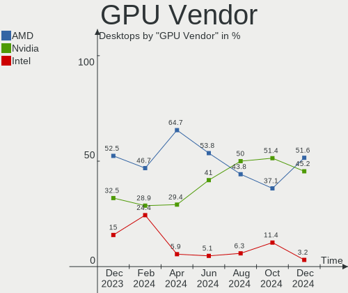

| Vendor | Desktops | Percent |
|--------|----------|---------|
| AMD    | 14       | 58.33%  |
| Nvidia | 8        | 33.33%  |
| Intel  | 2        | 8.33%   |

GPU Model
---------

Graphics card models

| Model                                                                     | Desktops | Percent |
|---------------------------------------------------------------------------|----------|---------|
| Nvidia GM206 [GeForce GTX 960]                                            | 2        | 7.41%   |
| AMD Raphael                                                               | 2        | 7.41%   |
| AMD Navi 22 [Radeon RX 6700/6700 XT/6750 XT / 6800M/6850M XT]             | 2        | 7.41%   |
| AMD Navi 21 [Radeon RX 6800/6800 XT / 6900 XT]                            | 2        | 7.41%   |
| AMD Ellesmere [Radeon RX 470/480/570/570X/580/580X/590]                   | 2        | 7.41%   |
| Nvidia GP107 [GeForce GTX 1050]                                           | 1        | 3.7%    |
| Nvidia GP104 [GeForce GTX 1070]                                           | 1        | 3.7%    |
| Nvidia GP102 [GeForce GTX 1080 Ti]                                        | 1        | 3.7%    |
| Nvidia GA104 [GeForce RTX 3060 Ti Lite Hash Rate]                         | 1        | 3.7%    |
| Nvidia GA102 [GeForce RTX 3080 Ti]                                        | 1        | 3.7%    |
| Nvidia AD103 [GeForce RTX 4080]                                           | 1        | 3.7%    |
| Intel HD Graphics 5500                                                    | 1        | 3.7%    |
| Intel 2nd Generation Core Processor Family Integrated Graphics Controller | 1        | 3.7%    |
| AMD Renoir [Radeon RX Vega 6 (Ryzen 4000/5000 Mobile Series)]             | 1        | 3.7%    |
| AMD Picasso/Raven 2 [Radeon Vega Series / Radeon Vega Mobile Series]      | 1        | 3.7%    |
| AMD Navi 32 [Radeon RX 7700 XT / 7800 XT]                                 | 1        | 3.7%    |
| AMD Navi 31 [Radeon RX 7900 XT/7900 XTX]                                  | 1        | 3.7%    |
| AMD Navi 23 [Radeon RX 6600/6600 XT/6600M]                                | 1        | 3.7%    |
| AMD Navi 21 [Radeon RX 6950 XT]                                           | 1        | 3.7%    |
| AMD Lexa PRO [Radeon 540/540X/550/550X / RX 540X/550/550X]                | 1        | 3.7%    |
| AMD Hawaii PRO [Radeon R9 290/390]                                        | 1        | 3.7%    |
| AMD Cypress PRO [Radeon HD 5850]                                          | 1        | 3.7%    |

GPU Combo
---------

Combinations of graphics cards

| Name         | Desktops | Percent |
|--------------|----------|---------|
| 1 x AMD      | 9        | 40.91%  |
| 1 x Nvidia   | 6        | 27.27%  |
| 2 x AMD      | 3        | 13.64%  |
| 1 x Intel    | 2        | 9.09%   |
| AMD + Nvidia | 2        | 9.09%   |

GPU Driver
----------

Free vs proprietary

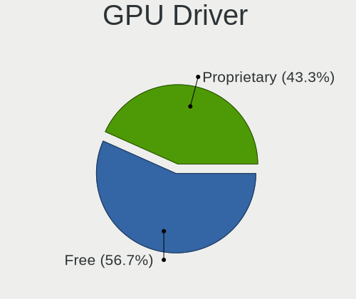

| Driver      | Desktops | Percent |
|-------------|----------|---------|
| Free        | 16       | 72.73%  |
| Proprietary | 6        | 27.27%  |

GPU Memory
----------

Total video memory

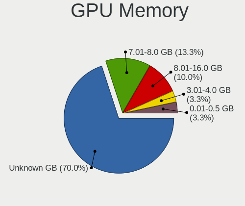

| Size in GB | Desktops | Percent |
|------------|----------|---------|
| 8.01-16.0  | 8        | 36.36%  |
| Unknown    | 6        | 27.27%  |
| 7.01-8.0   | 5        | 22.73%  |
| 1.01-2.0   | 1        | 4.55%   |
| 0.51-1.0   | 1        | 4.55%   |
| 0.01-0.5   | 1        | 4.55%   |

Monitor
-------

Monitor Vendor
--------------

Monitor vendors

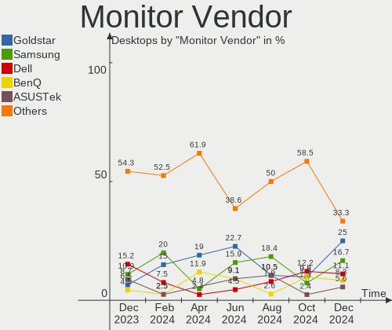

| Vendor               | Desktops | Percent |
|----------------------|----------|---------|
| Samsung Electronics  | 7        | 25%     |
| Acer                 | 4        | 14.29%  |
| Ancor Communications | 3        | 10.71%  |
| Hewlett-Packard      | 2        | 7.14%   |
| Goldstar             | 2        | 7.14%   |
| BenQ                 | 2        | 7.14%   |
| ASUSTek Computer     | 2        | 7.14%   |
| ViewSonic            | 1        | 3.57%   |
| Sceptre Tech         | 1        | 3.57%   |
| SANYO                | 1        | 3.57%   |
| Philips              | 1        | 3.57%   |
| HKC                  | 1        | 3.57%   |
| Dell                 | 1        | 3.57%   |

Monitor Model
-------------

Monitor models

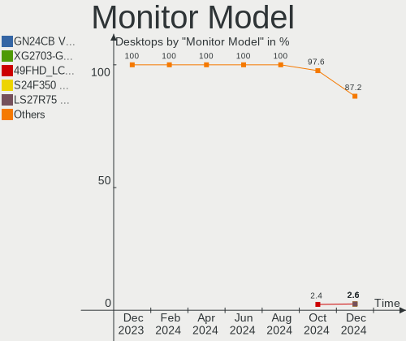

| Model                                                                 | Desktops | Percent |
|-----------------------------------------------------------------------|----------|---------|
| ViewSonic VX2458 series VSC0437 1920x1080 521x293mm 23.5-inch         | 1        | 3.33%   |
| ViewSonic VX2263 Series VSC692F 1920x1080 476x268mm 21.5-inch         | 1        | 3.33%   |
| Sceptre Tech Sceptre P30 SPT0BCC 2560x1080 690x291mm 29.5-inch        | 1        | 3.33%   |
| SANYO LCD-42S SAN0A28 1360x765 708x398mm 32.0-inch                    | 1        | 3.33%   |
| Samsung Electronics SMBX2431 SAM0771 1920x1080 531x299mm 24.0-inch    | 1        | 3.33%   |
| Samsung Electronics SMB2230H SAM0648 1920x1080                        | 1        | 3.33%   |
| Samsung Electronics S24C650 SAM0B13 1920x1200 518x324mm 24.1-inch     | 1        | 3.33%   |
| Samsung Electronics LCD Monitor SAM0D42 3840x2160 890x500mm 40.2-inch | 1        | 3.33%   |
| Samsung Electronics LC49G95T SAM7053 3840x1080 1193x336mm 48.8-inch   | 1        | 3.33%   |
| Samsung Electronics C27F390 SAM0D32 1920x1080 598x336mm 27.0-inch     | 1        | 3.33%   |
| Samsung Electronics C24F390 SAM0D2C 1920x1080 521x293mm 23.5-inch     | 1        | 3.33%   |
| Philips 185Vw PHL1851 1366x768 410x230mm 18.5-inch                    | 1        | 3.33%   |
| HKC 27E6QC HKC274F 2560x1440 597x336mm 27.0-inch                      | 1        | 3.33%   |
| Hewlett-Packard 27fw HPN354A 1920x1080 598x336mm 27.0-inch            | 1        | 3.33%   |
| Hewlett-Packard 2509 HWP283B 1920x1080 553x311mm 25.0-inch            | 1        | 3.33%   |
| Goldstar W2442 GSM56CC 1920x1080 531x299mm 24.0-inch                  | 1        | 3.33%   |
| Goldstar 31MU97 GSM76E7 3840x2160 621x341mm 27.9-inch                 | 1        | 3.33%   |
| Dell U2412M DELA07B 1920x1200 518x324mm 24.1-inch                     | 1        | 3.33%   |
| BenQ ZOWIE XL LCD BNQ7F83 1920x1080 544x303mm 24.5-inch               | 1        | 3.33%   |
| BenQ EX2710S BNQ7FA4 1920x1080 600x340mm 27.2-inch                    | 1        | 3.33%   |
| ASUSTek Computer VG27WQ AUS272B 2560x1440 597x336mm 27.0-inch         | 1        | 3.33%   |
| ASUSTek Computer VG27W AUS27E0 2560x1440 597x336mm 27.0-inch          | 1        | 3.33%   |
| Ancor Communications VG248 ACI24A4 1920x1080 531x299mm 24.0-inch      | 1        | 3.33%   |
| Ancor Communications ROG PG278Q ACI27B1 2560x1440 598x336mm 27.0-inch | 1        | 3.33%   |
| Ancor Communications ASUS VG23A ACI23D3 1920x1080 533x312mm 24.3-inch | 1        | 3.33%   |
| Ancor Communications ASUS PB278 ACI27A3 2560x1440 597x336mm 27.0-inch | 1        | 3.33%   |
| Acer XB271HU ACR0490 2560x1440 598x336mm 27.0-inch                    | 1        | 3.33%   |
| Acer X223W ACRADAD 1680x1050 474x296mm 22.0-inch                      | 1        | 3.33%   |
| Acer S271HL ACR02CA 1920x1080 598x336mm 27.0-inch                     | 1        | 3.33%   |
| Acer P236H ACR01A2 1920x1080 509x286mm 23.0-inch                      | 1        | 3.33%   |

Monitor Resolution
------------------

Monitor screen resolution

| Resolution         | Desktops | Percent |
|--------------------|----------|---------|
| 1920x1080 (FHD)    | 12       | 52.17%  |
| 2560x1440 (QHD)    | 4        | 17.39%  |
| 3840x2160 (4K)     | 1        | 4.35%   |
| 3840x1080          | 1        | 4.35%   |
| 2560x1080          | 1        | 4.35%   |
| 1920x540           | 1        | 4.35%   |
| 1920x1200 (WUXGA)  | 1        | 4.35%   |
| 1680x1050 (WSXGA+) | 1        | 4.35%   |
| 1366x768 (WXGA)    | 1        | 4.35%   |

Monitor Diagonal
----------------

Diagonal size in inches

| Inches  | Desktops | Percent |
|---------|----------|---------|
| 27      | 8        | 32%     |
| 24      | 4        | 16%     |
| 23      | 3        | 12%     |
| 84      | 1        | 4%      |
| 48      | 1        | 4%      |
| 40      | 1        | 4%      |
| 32      | 1        | 4%      |
| 29      | 1        | 4%      |
| 25      | 1        | 4%      |
| 22      | 1        | 4%      |
| 21      | 1        | 4%      |
| 18      | 1        | 4%      |
| Unknown | 1        | 4%      |

Monitor Width
-------------

Physical width

| Width in mm | Desktops | Percent |
|-------------|----------|---------|
| 501-600     | 15       | 60%     |
| 401-500     | 3        | 12%     |
| 601-700     | 2        | 8%      |
| 801-900     | 1        | 4%      |
| 701-800     | 1        | 4%      |
| 1501-2000   | 1        | 4%      |
| 1001-1500   | 1        | 4%      |
| Unknown     | 1        | 4%      |

Aspect Ratio
------------

Proportional relationship between the width and the height

| Ratio | Desktops | Percent |
|-------|----------|---------|
| 16/9  | 18       | 81.82%  |
| 16/10 | 2        | 9.09%   |
| 32/9  | 1        | 4.55%   |
| 21/9  | 1        | 4.55%   |

Monitor Area
------------

Area in inch²

| Area in inch² | Desktops | Percent |
|----------------|----------|---------|
| 301-350        | 9        | 34.62%  |
| 201-250        | 7        | 26.92%  |
| 251-300        | 4        | 15.38%  |
| 501-1000       | 2        | 7.69%   |
| More than 1000 | 1        | 3.85%   |
| 351-500        | 1        | 3.85%   |
| 141-150        | 1        | 3.85%   |
| Unknown        | 1        | 3.85%   |

Pixel Density
-------------

Pixels per inch

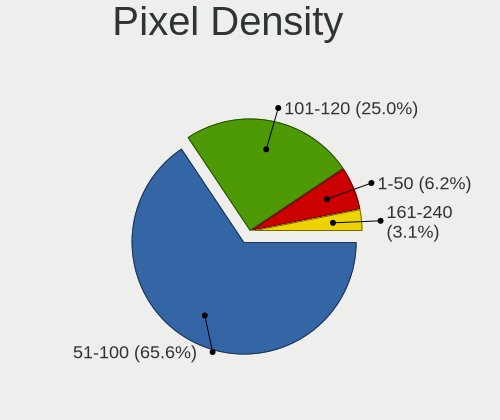

| Density | Desktops | Percent |
|---------|----------|---------|
| 51-100  | 17       | 70.83%  |
| 101-120 | 5        | 20.83%  |
| 121-160 | 1        | 4.17%   |
| Unknown | 1        | 4.17%   |

Multiple Monitors
-----------------

Total monitors connected

| Total | Desktops | Percent |
|-------|----------|---------|
| 1     | 14       | 63.64%  |
| 2     | 8        | 36.36%  |

Network
-------

Net Controller Vendor
---------------------

Controller vendors

| Vendor                | Desktops | Percent |
|-----------------------|----------|---------|
| Realtek Semiconductor | 19       | 45.24%  |
| Intel                 | 8        | 19.05%  |
| TP-Link               | 2        | 4.76%   |
| Qualcomm Atheros      | 2        | 4.76%   |
| Microsoft             | 2        | 4.76%   |
| MediaTek              | 2        | 4.76%   |
| Xiaomi                | 1        | 2.38%   |
| Samsung Electronics   | 1        | 2.38%   |
| Ralink Technology     | 1        | 2.38%   |
| Motorola PCS          | 1        | 2.38%   |
| D-Link System         | 1        | 2.38%   |
| Broadcom              | 1        | 2.38%   |
| Belkin Components     | 1        | 2.38%   |

Net Controller Model
--------------------

Controller models

| Model                                                                      | Desktops | Percent |
|----------------------------------------------------------------------------|----------|---------|
| Realtek RTL8111/8168/8411 PCI Express Gigabit Ethernet Controller          | 12       | 26.09%  |
| Realtek RTL8125 2.5GbE Controller                                          | 5        | 10.87%  |
| Qualcomm Atheros AR8151 v2.0 Gigabit Ethernet                              | 2        | 4.35%   |
| Intel Wi-Fi 6 AX200                                                        | 2        | 4.35%   |
| Intel I211 Gigabit Network Connection                                      | 2        | 4.35%   |
| Xiaomi Mi/Redmi series (RNDIS)                                             | 1        | 2.17%   |
| TP-Link Archer T2U PLUS [RTL8821AU]                                        | 1        | 2.17%   |
| TP-Link 802.11 NIC                                                         | 1        | 2.17%   |
| Samsung Galaxy series, misc. (tethering mode)                              | 1        | 2.17%   |
| Realtek RTL8814AU 802.11a/b/g/n/ac Wireless Adapter                        | 1        | 2.17%   |
| Realtek RTL8192EE PCIe Wireless Network Adapter                            | 1        | 2.17%   |
| Realtek 802.11ac NIC                                                       | 1        | 2.17%   |
| Ralink RT2870/RT3070 Wireless Adapter                                      | 1        | 2.17%   |
| Motorola PCS motorola one macro                                            | 1        | 2.17%   |
| Microsoft Xbox Wireless Adapter for Windows                                | 1        | 2.17%   |
| Microsoft Wireless XBox Controller Dongle                                  | 1        | 2.17%   |
| MediaTek Wi-Fi 6E MT7902 Wireless Network Adapter                          | 1        | 2.17%   |
| MediaTek MT7921K (RZ608) Wi-Fi 6E 80MHz                                    | 1        | 2.17%   |
| Intel Wireless-AC 9260                                                     | 1        | 2.17%   |
| Intel Ethernet Connection (7) I219-V                                       | 1        | 2.17%   |
| Intel Ethernet Connection (3) I218-LM                                      | 1        | 2.17%   |
| Intel Dual Band Wireless-AC 3168NGW [Stone Peak]                           | 1        | 2.17%   |
| Intel Centrino Wireless-N 135                                              | 1        | 2.17%   |
| Intel Centrino Advanced-N 6205 [Taylor Peak]                               | 1        | 2.17%   |
| Intel Cannon Lake PCH CNVi WiFi                                            | 1        | 2.17%   |
| D-Link System DWA-140 RangeBooster N Adapter(rev.B2) [Ralink RT3072]       | 1        | 2.17%   |
| Broadcom BCM4360 802.11ac Dual Band Wireless Network Adapter               | 1        | 2.17%   |
| Belkin Components F5D8053 N Wireless USB Adapter v6000 [Realtek RTL8192SU] | 1        | 2.17%   |

Wireless Vendor
---------------

Wireless vendors

| Vendor                | Desktops | Percent |
|-----------------------|----------|---------|
| Intel                 | 7        | 35%     |
| Realtek Semiconductor | 3        | 15%     |
| TP-Link               | 2        | 10%     |
| Microsoft             | 2        | 10%     |
| MediaTek              | 2        | 10%     |
| Ralink Technology     | 1        | 5%      |
| D-Link System         | 1        | 5%      |
| Broadcom              | 1        | 5%      |
| Belkin Components     | 1        | 5%      |

Wireless Model
--------------

Wireless models

| Model                                                                      | Desktops | Percent |
|----------------------------------------------------------------------------|----------|---------|
| Intel Wi-Fi 6 AX200                                                        | 2        | 10%     |
| TP-Link Archer T2U PLUS [RTL8821AU]                                        | 1        | 5%      |
| TP-Link 802.11 NIC                                                         | 1        | 5%      |
| Realtek RTL8814AU 802.11a/b/g/n/ac Wireless Adapter                        | 1        | 5%      |
| Realtek RTL8192EE PCIe Wireless Network Adapter                            | 1        | 5%      |
| Realtek 802.11ac NIC                                                       | 1        | 5%      |
| Ralink RT2870/RT3070 Wireless Adapter                                      | 1        | 5%      |
| Microsoft Xbox Wireless Adapter for Windows                                | 1        | 5%      |
| Microsoft Wireless XBox Controller Dongle                                  | 1        | 5%      |
| MediaTek Wi-Fi 6E MT7902 Wireless Network Adapter                          | 1        | 5%      |
| MediaTek MT7921K (RZ608) Wi-Fi 6E 80MHz                                    | 1        | 5%      |
| Intel Wireless-AC 9260                                                     | 1        | 5%      |
| Intel Dual Band Wireless-AC 3168NGW [Stone Peak]                           | 1        | 5%      |
| Intel Centrino Wireless-N 135                                              | 1        | 5%      |
| Intel Centrino Advanced-N 6205 [Taylor Peak]                               | 1        | 5%      |
| Intel Cannon Lake PCH CNVi WiFi                                            | 1        | 5%      |
| D-Link System DWA-140 RangeBooster N Adapter(rev.B2) [Ralink RT3072]       | 1        | 5%      |
| Broadcom BCM4360 802.11ac Dual Band Wireless Network Adapter               | 1        | 5%      |
| Belkin Components F5D8053 N Wireless USB Adapter v6000 [Realtek RTL8192SU] | 1        | 5%      |

Ethernet Vendor
---------------

Ethernet vendors

| Vendor                | Desktops | Percent |
|-----------------------|----------|---------|
| Realtek Semiconductor | 17       | 65.38%  |
| Intel                 | 4        | 15.38%  |
| Qualcomm Atheros      | 2        | 7.69%   |
| Xiaomi                | 1        | 3.85%   |
| Samsung Electronics   | 1        | 3.85%   |
| Motorola PCS          | 1        | 3.85%   |

Ethernet Model
--------------

Ethernet models

| Model                                                             | Desktops | Percent |
|-------------------------------------------------------------------|----------|---------|
| Realtek RTL8111/8168/8411 PCI Express Gigabit Ethernet Controller | 12       | 46.15%  |
| Realtek RTL8125 2.5GbE Controller                                 | 5        | 19.23%  |
| Qualcomm Atheros AR8151 v2.0 Gigabit Ethernet                     | 2        | 7.69%   |
| Intel I211 Gigabit Network Connection                             | 2        | 7.69%   |
| Xiaomi Mi/Redmi series (RNDIS)                                    | 1        | 3.85%   |
| Samsung Galaxy series, misc. (tethering mode)                     | 1        | 3.85%   |
| Motorola PCS motorola one macro                                   | 1        | 3.85%   |
| Intel Ethernet Connection (7) I219-V                              | 1        | 3.85%   |
| Intel Ethernet Connection (3) I218-LM                             | 1        | 3.85%   |

Net Controller Kind
-------------------

Ethernet, WiFi or modem

| Kind     | Desktops | Percent |
|----------|----------|---------|
| Ethernet | 22       | 59.46%  |
| WiFi     | 15       | 40.54%  |

Used Controller
---------------

Currently used network controller

| Kind     | Desktops | Percent |
|----------|----------|---------|
| Ethernet | 16       | 72.73%  |
| WiFi     | 6        | 27.27%  |

NICs
----

Total network controllers on board

| Total | Desktops | Percent |
|-------|----------|---------|
| 1     | 11       | 50%     |
| 2     | 10       | 45.45%  |
| 3     | 1        | 4.55%   |

IPv6
----

IPv6 vs IPv4

| Used | Desktops | Percent |
|------|----------|---------|
| No   | 15       | 68.18%  |
| Yes  | 7        | 31.82%  |

Bluetooth
---------

Bluetooth Vendor
----------------

Controller vendors

| Vendor                  | Desktops | Percent |
|-------------------------|----------|---------|
| Intel                   | 6        | 66.67%  |
| MediaTek                | 1        | 11.11%  |
| IMC Networks            | 1        | 11.11%  |
| Cambridge Silicon Radio | 1        | 11.11%  |

Bluetooth Model
---------------

Controller models

| Model                                               | Desktops | Percent |
|-----------------------------------------------------|----------|---------|
| Intel AX200 Bluetooth                               | 2        | 22.22%  |
| MediaTek Wireless_Device                            | 1        | 11.11%  |
| Intel Wireless-AC 9260 Bluetooth Adapter            | 1        | 11.11%  |
| Intel Wireless-AC 3168 Bluetooth                    | 1        | 11.11%  |
| Intel Centrino Bluetooth Wireless Transceiver       | 1        | 11.11%  |
| Intel Bluetooth 9460/9560 Jefferson Peak (JfP)      | 1        | 11.11%  |
| IMC Networks Wireless_Device                        | 1        | 11.11%  |
| Cambridge Silicon Radio Bluetooth Dongle (HCI mode) | 1        | 11.11%  |

Sound
-----

Sound Vendor
------------

Sound card vendors

| Vendor              | Desktops | Percent |
|---------------------|----------|---------|
| AMD                 | 16       | 36.36%  |
| Nvidia              | 8        | 18.18%  |
| Intel               | 8        | 18.18%  |
| C-Media Electronics | 4        | 9.09%   |
| SteelSeries ApS     | 1        | 2.27%   |
| Razer USA           | 1        | 2.27%   |
| Logitech            | 1        | 2.27%   |
| Focusrite-Novation  | 1        | 2.27%   |
| Edifier Technology  | 1        | 2.27%   |
| Creative Technology | 1        | 2.27%   |
| Creative Labs       | 1        | 2.27%   |
| Aisa Expert         | 1        | 2.27%   |

Sound Model
-----------

Sound card models

| Model                                                                      | Desktops | Percent |
|----------------------------------------------------------------------------|----------|---------|
| AMD Family 17h/19h HD Audio Controller                                     | 7        | 11.86%  |
| AMD Navi 21/23 HDMI/DP Audio Controller                                    | 6        | 10.17%  |
| AMD Starship/Matisse HD Audio Controller                                   | 4        | 6.78%   |
| Nvidia GM206 High Definition Audio Controller                              | 2        | 3.39%   |
| Intel 7 Series/C216 Chipset Family High Definition Audio Controller        | 2        | 3.39%   |
| C-Media Electronics USB Audio Device                                       | 2        | 3.39%   |
| AMD Renoir Radeon High Definition Audio Controller                         | 2        | 3.39%   |
| AMD Rembrandt Radeon High Definition Audio Controller                      | 2        | 3.39%   |
| AMD Navi 31 HDMI/DP Audio                                                  | 2        | 3.39%   |
| AMD Ellesmere HDMI Audio [Radeon RX 470/480 / 570/580/590]                 | 2        | 3.39%   |
| SteelSeries ApS SteelSeries Arctis 1 Wireless                              | 1        | 1.69%   |
| Razer USA Razer Kraken X USB                                               | 1        | 1.69%   |
| Nvidia GP107GL High Definition Audio Controller                            | 1        | 1.69%   |
| Nvidia GP104 High Definition Audio Controller                              | 1        | 1.69%   |
| Nvidia GP102 HDMI Audio Controller                                         | 1        | 1.69%   |
| Nvidia GA104 High Definition Audio Controller                              | 1        | 1.69%   |
| Nvidia GA102 High Definition Audio Controller                              | 1        | 1.69%   |
| Nvidia Audio device                                                        | 1        | 1.69%   |
| Logitech Yeti X                                                            | 1        | 1.69%   |
| Intel Wildcat Point-LP High Definition Audio Controller                    | 1        | 1.69%   |
| Intel Cannon Lake PCH cAVS                                                 | 1        | 1.69%   |
| Intel Broadwell-U Audio Controller                                         | 1        | 1.69%   |
| Intel 700 Series Chipset Family Precise Touch and Stylus Port #1           | 1        | 1.69%   |
| Intel 6 Series/C200 Series Chipset Family High Definition Audio Controller | 1        | 1.69%   |
| Intel 200 Series PCH HD Audio                                              | 1        | 1.69%   |
| Intel 100 Series/C230 Series Chipset Family HD Audio Controller            | 1        | 1.69%   |
| Focusrite-Novation Scarlett 2i2 Camera                                     | 1        | 1.69%   |
| Edifier Technology HECATE G1 GAMING HEADSET                                | 1        | 1.69%   |
| Creative Technology Sound Blaster X-Fi Surround 5.1                        | 1        | 1.69%   |
| Creative Labs CA0106/CA0111 [SB Live!/Audigy/X-Fi Series]                  | 1        | 1.69%   |
| C-Media Electronics CMI8788 [Oxygen HD Audio]                              | 1        | 1.69%   |
| C-Media Electronics Audio Adapter (Unitek Y-247A)                          | 1        | 1.69%   |
| AMD Raven/Raven2/Fenghuang HDMI/DP Audio Controller                        | 1        | 1.69%   |
| AMD Hawaii HDMI Audio [Radeon R9 290/290X / 390/390X]                      | 1        | 1.69%   |
| AMD Family 17h (Models 00h-0fh) HD Audio Controller                        | 1        | 1.69%   |
| AMD Cypress HDMI Audio [Radeon HD 5830/5850/5870 / 6850/6870 Rebrand]      | 1        | 1.69%   |
| AMD Baffin HDMI/DP Audio [Radeon RX 550 640SP / RX 560/560X]               | 1        | 1.69%   |
| Aisa Expert SOMIC STINCOO GS510                                            | 1        | 1.69%   |

Memory
------

Memory Vendor
-------------

Memory module vendors

| Vendor            | Desktops | Percent |
|-------------------|----------|---------|
| Corsair           | 2        | 50%     |
| Kingston          | 1        | 25%     |
| A-DATA Technology | 1        | 25%     |

Memory Model
------------

Memory module models

| Model                                                  | Desktops | Percent |
|--------------------------------------------------------|----------|---------|
| Kingston RAM KF560C36-16 16GB DIMM DDR5 6000MT/s       | 1        | 25%     |
| Corsair RAM CMK32GX5M2B5600C36 16GB DIMM DDR5 5800MT/s | 1        | 25%     |
| Corsair RAM CMK16GX4M2B3200C16 8GB DIMM DDR4 3600MT/s  | 1        | 25%     |
| A-DATA RAM DDR4 3200 8GB DIMM DDR4 3600MT/s            | 1        | 25%     |

Memory Kind
-----------

Memory module kinds

| Kind | Desktops | Percent |
|------|----------|---------|
| DDR5 | 2        | 50%     |
| DDR4 | 2        | 50%     |

Memory Form Factor
------------------

Physical design of the memory module

| Name | Desktops | Percent |
|------|----------|---------|
| DIMM | 4        | 100%    |

Memory Size
-----------

Memory module size

| Size  | Desktops | Percent |
|-------|----------|---------|
| 16384 | 2        | 50%     |
| 32768 | 1        | 25%     |
| 8192  | 1        | 25%     |

Memory Speed
------------

Memory module speed

| Speed | Desktops | Percent |
|-------|----------|---------|
| 3600  | 2        | 50%     |
| 6000  | 1        | 25%     |
| 5800  | 1        | 25%     |

Printers & scanners
-------------------

Printer Vendor
--------------

Printer device vendors

Zero info for selected period =(

Printer Model
-------------

Printer device models

Zero info for selected period =(

Scanner Vendor
--------------

Scanner device vendors

Zero info for selected period =(

Scanner Model
-------------

Scanner device models

Zero info for selected period =(

Camera
------

Camera Vendor
-------------

Camera device vendors

| Vendor                 | Desktops | Percent |
|------------------------|----------|---------|
| Logitech               | 2        | 50%     |
| lihappe8               | 1        | 25%     |
| AVerMedia Technologies | 1        | 25%     |

Camera Model
------------

Camera device models

| Model                           | Desktops | Percent |
|---------------------------------|----------|---------|
| Logitech HD Pro Webcam C920     | 2        | 50%     |
| lihappe8 USB 2.0 Camera         | 1        | 25%     |
| AVerMedia Live Streamer CAM 313 | 1        | 25%     |

Security
--------

Fingerprint Vendor
------------------

Fingerprint sensor vendors

Zero info for selected period =(

Fingerprint Model
-----------------

Fingerprint sensor models

Zero info for selected period =(

Chipcard Vendor
---------------

Chipcard module vendors

Zero info for selected period =(

Chipcard Model
--------------

Chipcard module models

Zero info for selected period =(

Unsupported
-----------

Unsupported Devices
-------------------

Total unsupported devices on board

| Total | Desktops | Percent |
|-------|----------|---------|
| 0     | 14       | 63.64%  |
| 1     | 8        | 36.36%  |

Unsupported Device Types
------------------------

Types of unsupported devices

| Type          | Desktops | Percent |
|---------------|----------|---------|
| Net/wireless  | 5        | 62.5%   |
| Sound         | 1        | 12.5%   |
| Graphics card | 1        | 12.5%   |
| Card reader   | 1        | 12.5%   |

