Nobara - Hardware Trends (Notebooks)
------------------------------------

A project to identify most popular hardware characteristics and track their change
over time based on data collected by Linux users at https://Linux-Hardware.org.

Anyone can contribute to this report by the [hw-probe](https://github.com/linuxhw/hw-probe) tool:

    sudo -E hw-probe -all -upload

This report is for one last month. Overall report since the beginning of time: [TestDays](https://github.com/linuxhw/TestDays)

Period: Dec, 2025.

Contents
--------

* [ System ](#system)
  - [ OS                       ](#os)
  - [ OS Family                ](#os-family)
  - [ Kernel                   ](#kernel)
  - [ Kernel Family            ](#kernel-family)
  - [ Kernel Major Ver.        ](#kernel-major-ver)
  - [ Arch                     ](#arch)
  - [ DE                       ](#de)
  - [ Display Server           ](#display-server)
  - [ Display Manager          ](#display-manager)
  - [ OS Lang                  ](#os-lang)
  - [ Boot Mode                ](#boot-mode)
  - [ Filesystem               ](#filesystem)
  - [ Part. scheme             ](#part-scheme)
  - [ Dual Boot with Linux/BSD ](#dual-boot-with-linuxbsd)
  - [ Dual Boot (Win)          ](#dual-boot-win)

* [ Board ](#board)
  - [ Vendor                   ](#vendor)
  - [ Model                    ](#model)
  - [ Model Family             ](#model-family)
  - [ MFG Year                 ](#mfg-year)
  - [ Form Factor              ](#form-factor)
  - [ Secure Boot              ](#secure-boot)
  - [ Coreboot                 ](#coreboot)
  - [ RAM Size                 ](#ram-size)
  - [ RAM Used                 ](#ram-used)
  - [ Total Drives             ](#total-drives)
  - [ Has CD-ROM               ](#has-cd-rom)
  - [ Has Ethernet             ](#has-ethernet)
  - [ Has WiFi                 ](#has-wifi)
  - [ Has Bluetooth            ](#has-bluetooth)

* [ Location ](#location)
  - [ Country                  ](#country)
  - [ City                     ](#city)

* [ Drives ](#drives)
  - [ Drive Vendor             ](#drive-vendor)
  - [ Drive Model              ](#drive-model)
  - [ HDD Vendor               ](#hdd-vendor)
  - [ SSD Vendor               ](#ssd-vendor)
  - [ Drive Kind               ](#drive-kind)
  - [ Drive Connector          ](#drive-connector)
  - [ Drive Size               ](#drive-size)
  - [ Space Total              ](#space-total)
  - [ Space Used               ](#space-used)
  - [ Malfunc. Drives          ](#malfunc-drives)
  - [ Malfunc. Drive Vendor    ](#malfunc-drive-vendor)
  - [ Malfunc. HDD Vendor      ](#malfunc-hdd-vendor)
  - [ Malfunc. Drive Kind      ](#malfunc-drive-kind)
  - [ Failed Drives            ](#failed-drives)
  - [ Failed Drive Vendor      ](#failed-drive-vendor)
  - [ Drive Status             ](#drive-status)

* [ Storage controller ](#storage-controller)
  - [ Storage Vendor           ](#storage-vendor)
  - [ Storage Model            ](#storage-model)
  - [ Storage Kind             ](#storage-kind)

* [ Processor ](#processor)
  - [ CPU Vendor               ](#cpu-vendor)
  - [ CPU Model                ](#cpu-model)
  - [ CPU Model Family         ](#cpu-model-family)
  - [ CPU Cores                ](#cpu-cores)
  - [ CPU Sockets              ](#cpu-sockets)
  - [ CPU Threads              ](#cpu-threads)
  - [ CPU Op-Modes             ](#cpu-op-modes)
  - [ CPU Microcode            ](#cpu-microcode)
  - [ CPU Microarch            ](#cpu-microarch)

* [ Graphics ](#graphics)
  - [ GPU Vendor               ](#gpu-vendor)
  - [ GPU Model                ](#gpu-model)
  - [ GPU Combo                ](#gpu-combo)
  - [ GPU Driver               ](#gpu-driver)
  - [ GPU Memory               ](#gpu-memory)

* [ Monitor ](#monitor)
  - [ Monitor Vendor           ](#monitor-vendor)
  - [ Monitor Model            ](#monitor-model)
  - [ Monitor Resolution       ](#monitor-resolution)
  - [ Monitor Diagonal         ](#monitor-diagonal)
  - [ Monitor Width            ](#monitor-width)
  - [ Aspect Ratio             ](#aspect-ratio)
  - [ Monitor Area             ](#monitor-area)
  - [ Pixel Density            ](#pixel-density)
  - [ Multiple Monitors        ](#multiple-monitors)

* [ Network ](#network)
  - [ Net Controller Vendor    ](#net-controller-vendor)
  - [ Net Controller Model     ](#net-controller-model)
  - [ Wireless Vendor          ](#wireless-vendor)
  - [ Wireless Model           ](#wireless-model)
  - [ Ethernet Vendor          ](#ethernet-vendor)
  - [ Ethernet Model           ](#ethernet-model)
  - [ Net Controller Kind      ](#net-controller-kind)
  - [ Used Controller          ](#used-controller)
  - [ NICs                     ](#nics)
  - [ IPv6                     ](#ipv6)

* [ Bluetooth ](#bluetooth)
  - [ Bluetooth Vendor         ](#bluetooth-vendor)
  - [ Bluetooth Model          ](#bluetooth-model)

* [ Sound ](#sound)
  - [ Sound Vendor             ](#sound-vendor)
  - [ Sound Model              ](#sound-model)

* [ Memory ](#memory)
  - [ Memory Vendor            ](#memory-vendor)
  - [ Memory Model             ](#memory-model)
  - [ Memory Kind              ](#memory-kind)
  - [ Memory Form Factor       ](#memory-form-factor)
  - [ Memory Size              ](#memory-size)
  - [ Memory Speed             ](#memory-speed)

* [ Printers & scanners ](#printers--scanners)
  - [ Printer Vendor           ](#printer-vendor)
  - [ Printer Model            ](#printer-model)
  - [ Scanner Vendor           ](#scanner-vendor)
  - [ Scanner Model            ](#scanner-model)

* [ Camera ](#camera)
  - [ Camera Vendor            ](#camera-vendor)
  - [ Camera Model             ](#camera-model)

* [ Security ](#security)
  - [ Fingerprint Vendor       ](#fingerprint-vendor)
  - [ Fingerprint Model        ](#fingerprint-model)
  - [ Chipcard Vendor          ](#chipcard-vendor)
  - [ Chipcard Model           ](#chipcard-model)

* [ Unsupported ](#unsupported)
  - [ Unsupported Devices      ](#unsupported-devices)
  - [ Unsupported Device Types ](#unsupported-device-types)

System
------

OS
--

Installed operating systems

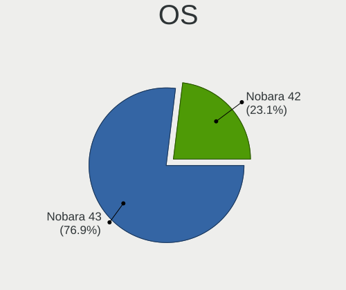

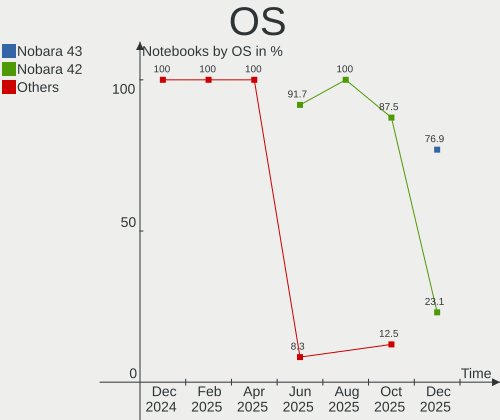

| Name      | Notebooks | Percent |
|-----------|-----------|---------|
| Nobara 43 | 10        | 76.92%  |
| Nobara 42 | 3         | 23.08%  |

OS Family
---------

OS without a version

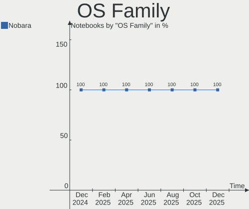

| Name   | Notebooks | Percent |
|--------|-----------|---------|
| Nobara | 13        | 100%    |

Kernel
------

Version of the Linux kernel

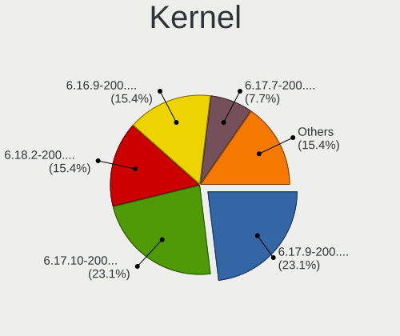

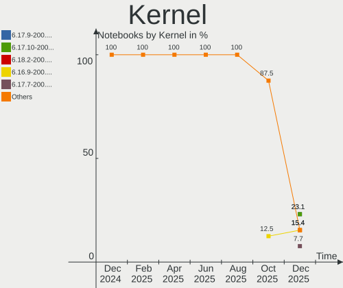

| Version                        | Notebooks | Percent |
|--------------------------------|-----------|---------|
| 6.17.9-200.nobara.fc43.x86_64  | 3         | 23.08%  |
| 6.17.10-200.nobara.fc43.x86_64 | 3         | 23.08%  |
| 6.18.2-200.nobara.fc43.x86_64  | 2         | 15.38%  |
| 6.16.9-200.nobara.fc42.x86_64  | 2         | 15.38%  |
| 6.17.7-200.nobara.fc42.x86_64  | 1         | 7.69%   |
| 6.17.12-200.nobara.fc43.x86_64 | 1         | 7.69%   |
| 6.15.6-201.nobara.fc42.x86_64  | 1         | 7.69%   |

Kernel Family
-------------

Linux kernel without a distro release

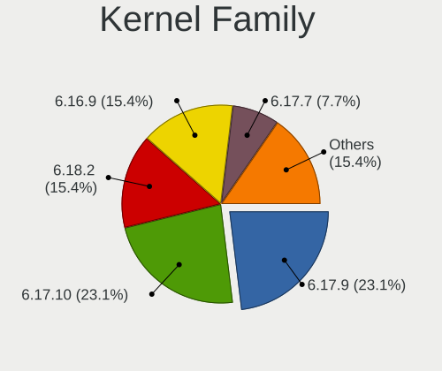

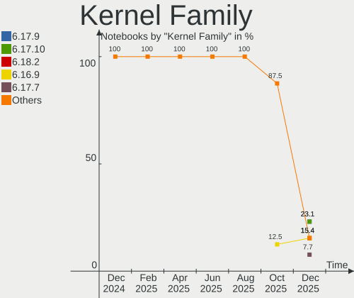

| Version | Notebooks | Percent |
|---------|-----------|---------|
| 6.17.9  | 3         | 23.08%  |
| 6.17.10 | 3         | 23.08%  |
| 6.18.2  | 2         | 15.38%  |
| 6.16.9  | 2         | 15.38%  |
| 6.17.7  | 1         | 7.69%   |
| 6.17.12 | 1         | 7.69%   |
| 6.15.6  | 1         | 7.69%   |

Kernel Major Ver.
-----------------

Linux kernel major version

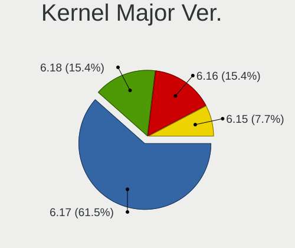

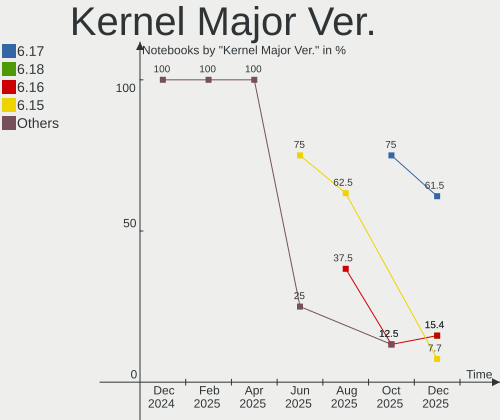

| Version | Notebooks | Percent |
|---------|-----------|---------|
| 6.17    | 8         | 61.54%  |
| 6.18    | 2         | 15.38%  |
| 6.16    | 2         | 15.38%  |
| 6.15    | 1         | 7.69%   |

Arch
----

OS architecture (x86_64, i586, etc.)

| Name   | Notebooks | Percent |
|--------|-----------|---------|
| x86_64 | 13        | 100%    |

DE
--

Desktop Environment

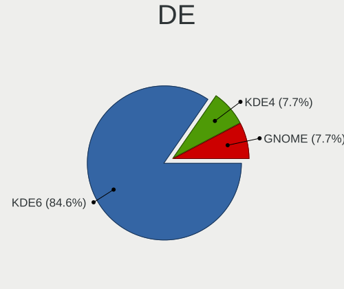

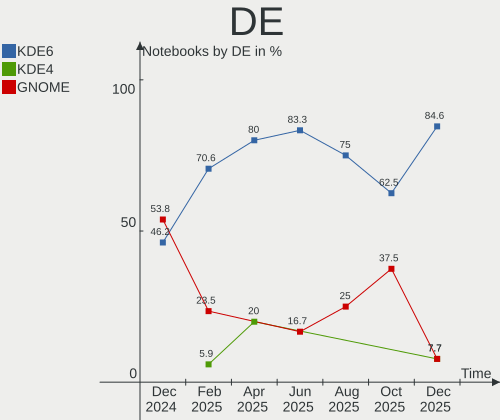

| Name  | Notebooks | Percent |
|-------|-----------|---------|
| KDE6  | 11        | 84.62%  |
| KDE4  | 1         | 7.69%   |
| GNOME | 1         | 7.69%   |

Display Server
--------------

X11 or Wayland

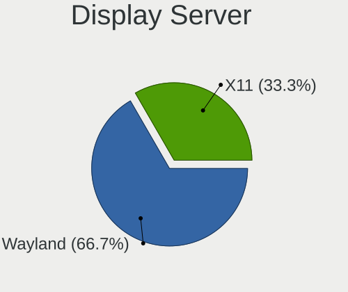

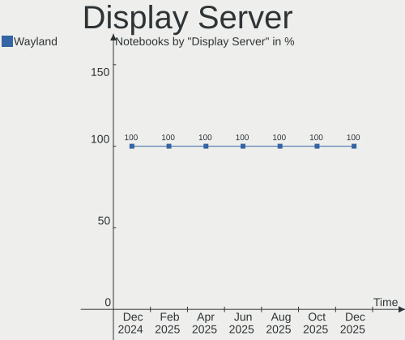

| Name    | Notebooks | Percent |
|---------|-----------|---------|
| Wayland | 13        | 100%    |

Display Manager
---------------

SDDM, LightDM, etc.

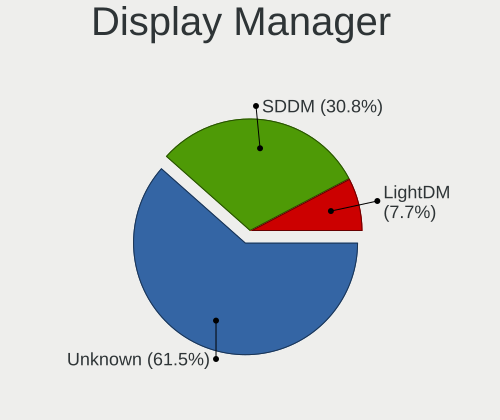

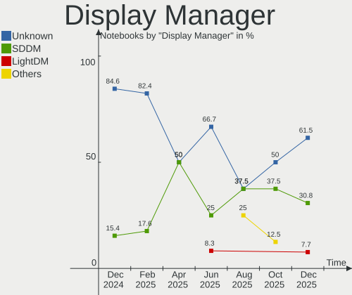

| Name    | Notebooks | Percent |
|---------|-----------|---------|
| Unknown | 8         | 61.54%  |
| SDDM    | 4         | 30.77%  |
| LightDM | 1         | 7.69%   |

OS Lang
-------

Language

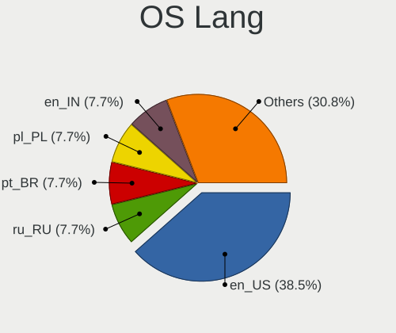

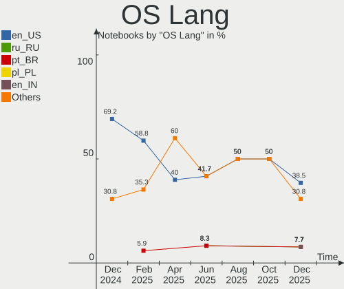

| Lang  | Notebooks | Percent |
|-------|-----------|---------|
| en_US | 5         | 38.46%  |
| ru_RU | 1         | 7.69%   |
| pt_BR | 1         | 7.69%   |
| pl_PL | 1         | 7.69%   |
| en_IN | 1         | 7.69%   |
| en_GB | 1         | 7.69%   |
| en_CA | 1         | 7.69%   |
| en_AU | 1         | 7.69%   |
| de_DE | 1         | 7.69%   |

Boot Mode
---------

EFI or BIOS

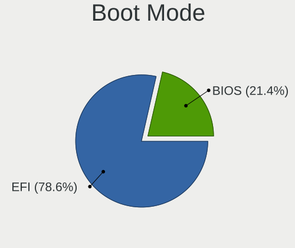

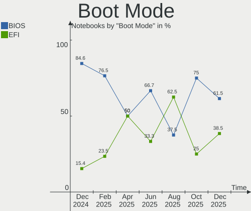

| Mode | Notebooks | Percent |
|------|-----------|---------|
| BIOS | 8         | 61.54%  |
| EFI  | 5         | 38.46%  |

Filesystem
----------

Type of filesystem

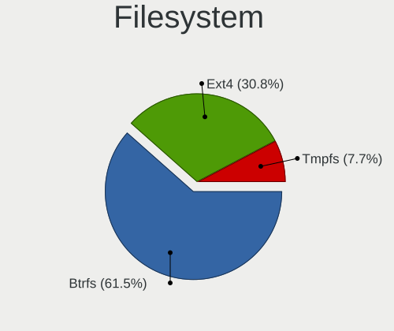

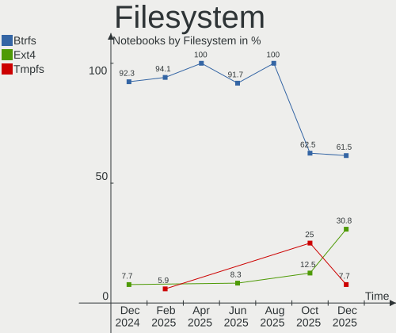

| Type  | Notebooks | Percent |
|-------|-----------|---------|
| Btrfs | 8         | 61.54%  |
| Ext4  | 4         | 30.77%  |
| Tmpfs | 1         | 7.69%   |

Part. scheme
------------

Scheme of partitioning

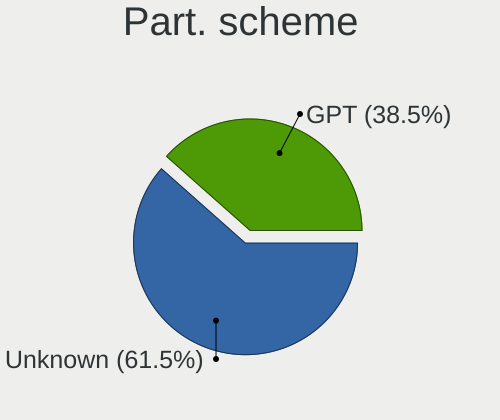

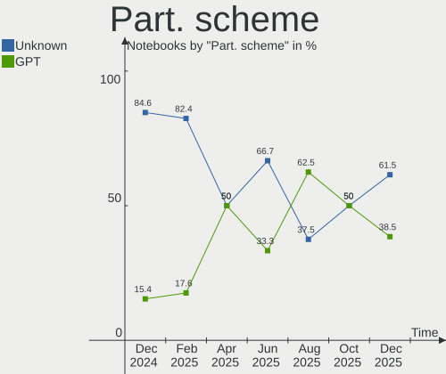

| Type    | Notebooks | Percent |
|---------|-----------|---------|
| Unknown | 8         | 61.54%  |
| GPT     | 5         | 38.46%  |

Dual Boot with Linux/BSD
------------------------

Hosting more than one Linux/BSD

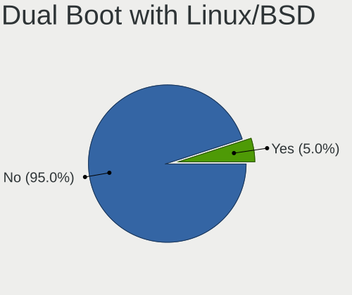

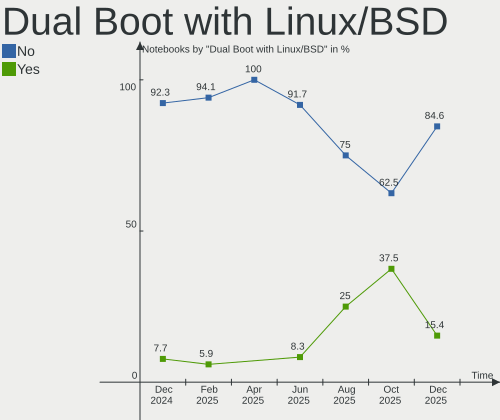

| Dual boot | Notebooks | Percent |
|-----------|-----------|---------|
| No        | 11        | 84.62%  |
| Yes       | 2         | 15.38%  |

Dual Boot (Win)
---------------

Hosting Linux and Windows

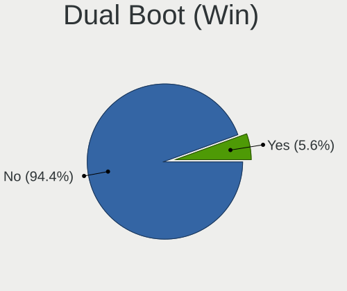

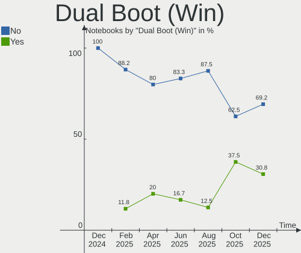

| Dual boot | Notebooks | Percent |
|-----------|-----------|---------|
| No        | 9         | 69.23%  |
| Yes       | 4         | 30.77%  |

Board
-----

Vendor
------

Motherboard manufacturer

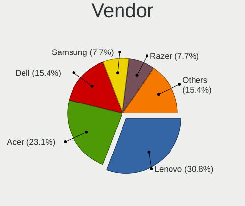

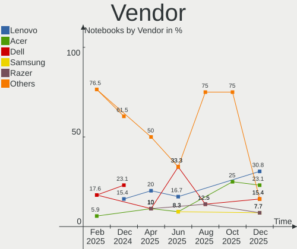

| Name                | Notebooks | Percent |
|---------------------|-----------|---------|
| Lenovo              | 4         | 30.77%  |
| Acer                | 3         | 23.08%  |
| Dell                | 2         | 15.38%  |
| Samsung Electronics | 1         | 7.69%   |
| Razer               | 1         | 7.69%   |
| MSI                 | 1         | 7.69%   |
| Medion              | 1         | 7.69%   |

Model
-----

Motherboard model

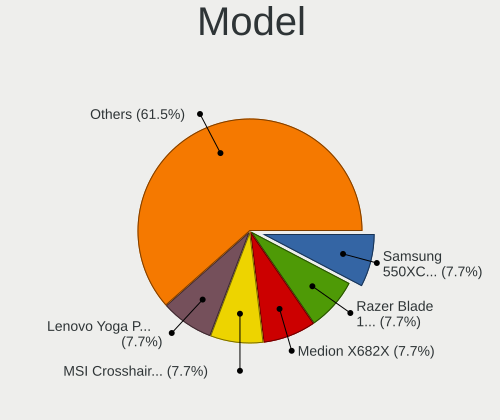

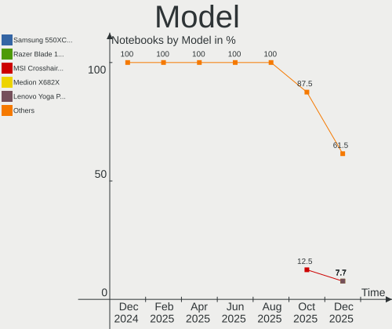

| Name                                               | Notebooks | Percent |
|----------------------------------------------------|-----------|---------|
| Samsung 550XCJ/550XCR                              | 1         | 7.69%   |
| Razer Blade 15 Base Model (Early 2021) - RZ09-0369 | 1         | 7.69%   |
| MSI Crosshair 16 HX MONSTER HUNTER EDITION D14VFKG | 1         | 7.69%   |
| Medion X682X                                       | 1         | 7.69%   |
| Lenovo Yoga Pro 9 16IMH9 83DN                      | 1         | 7.69%   |
| Lenovo ThinkPad T14 Gen 1 20UES1WC00               | 1         | 7.69%   |
| Lenovo LOQ 15IRX9 83DV                             | 1         | 7.69%   |
| Lenovo IdeaPad 5 15IIL05 81YK                      | 1         | 7.69%   |
| Dell Vostro 3580                                   | 1         | 7.69%   |
| Dell G5 5590                                       | 1         | 7.69%   |
| Acer Aspire V5-571P                                | 1         | 7.69%   |
| Acer Aspire E1-572P                                | 1         | 7.69%   |
| Acer Aspire A515-45G                               | 1         | 7.69%   |

Model Family
------------

Motherboard model prefix

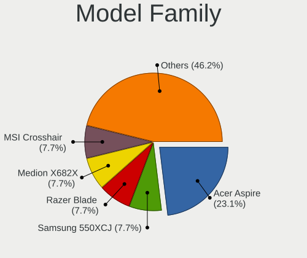

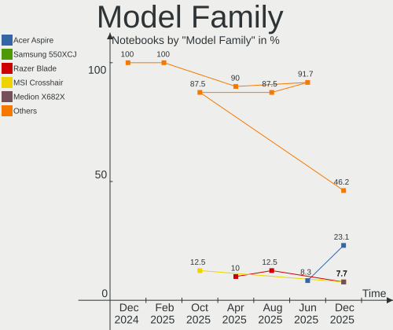

| Name            | Notebooks | Percent |
|-----------------|-----------|---------|
| Acer Aspire     | 3         | 23.08%  |
| Samsung 550XCJ  | 1         | 7.69%   |
| Razer Blade     | 1         | 7.69%   |
| MSI Crosshair   | 1         | 7.69%   |
| Medion X682X    | 1         | 7.69%   |
| Lenovo Yoga     | 1         | 7.69%   |
| Lenovo ThinkPad | 1         | 7.69%   |
| Lenovo LOQ      | 1         | 7.69%   |
| Lenovo IdeaPad  | 1         | 7.69%   |
| Dell Vostro     | 1         | 7.69%   |
| Dell G5         | 1         | 7.69%   |

MFG Year
--------

Motherboard manufacture year

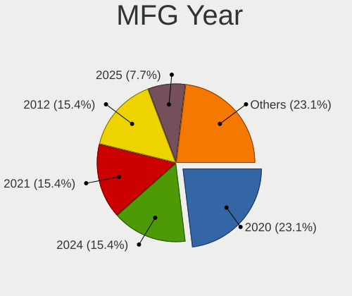

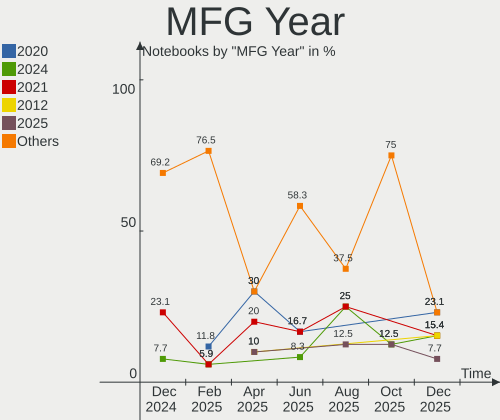

| Year | Notebooks | Percent |
|------|-----------|---------|
| 2020 | 3         | 23.08%  |
| 2024 | 2         | 15.38%  |
| 2021 | 2         | 15.38%  |
| 2012 | 2         | 15.38%  |
| 2025 | 1         | 7.69%   |
| 2019 | 1         | 7.69%   |
| 2018 | 1         | 7.69%   |
| 2013 | 1         | 7.69%   |

Form Factor
-----------

Physical design of the computer

| Name     | Notebooks | Percent |
|----------|-----------|---------|
| Notebook | 13        | 100%    |

Secure Boot
-----------

Enabled or disabled

| State    | Notebooks | Percent |
|----------|-----------|---------|
| Disabled | 13        | 100%    |

Coreboot
--------

Have coreboot on board

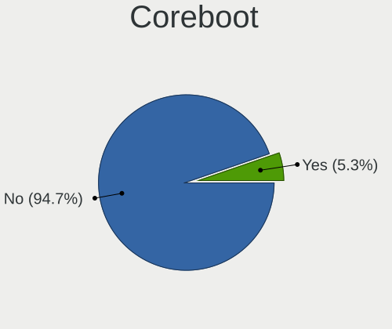

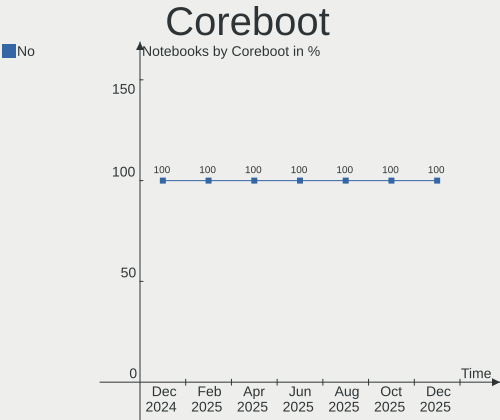

| Used | Notebooks | Percent |
|------|-----------|---------|
| No   | 13        | 100%    |

RAM Size
--------

Total RAM memory

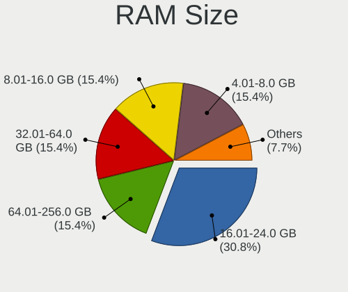

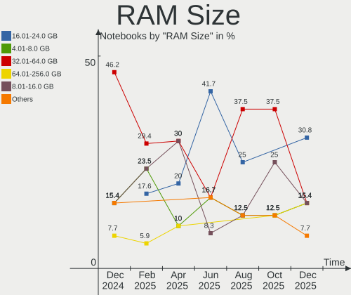

| Size in GB  | Notebooks | Percent |
|-------------|-----------|---------|
| 16.01-24.0  | 4         | 30.77%  |
| 4.01-8.0    | 2         | 15.38%  |
| 32.01-64.0  | 2         | 15.38%  |
| 64.01-256.0 | 2         | 15.38%  |
| 8.01-16.0   | 2         | 15.38%  |
| 24.01-32.0  | 1         | 7.69%   |

RAM Used
--------

Used RAM memory

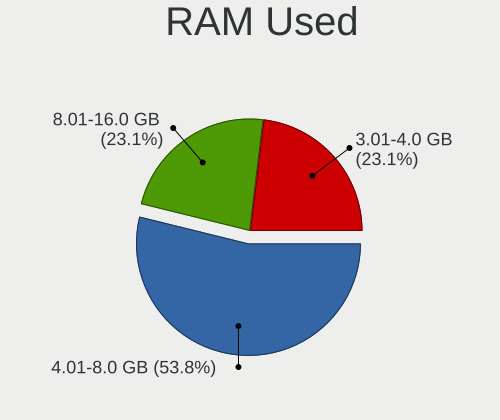

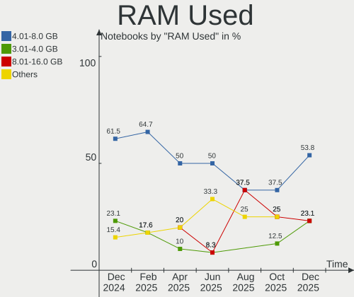

| Used GB   | Notebooks | Percent |
|-----------|-----------|---------|
| 4.01-8.0  | 7         | 53.85%  |
| 3.01-4.0  | 3         | 23.08%  |
| 8.01-16.0 | 3         | 23.08%  |

Total Drives
------------

Number of drives on board

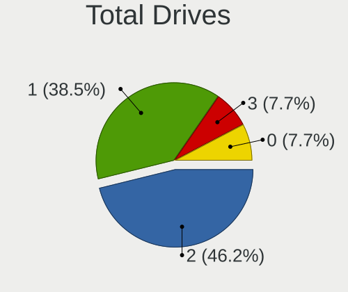

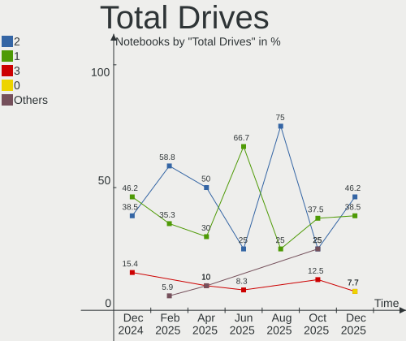

| Drives | Notebooks | Percent |
|--------|-----------|---------|
| 2      | 6         | 46.15%  |
| 1      | 5         | 38.46%  |
| 3      | 1         | 7.69%   |
| 0      | 1         | 7.69%   |

Has CD-ROM
----------

Has CD-ROM on board

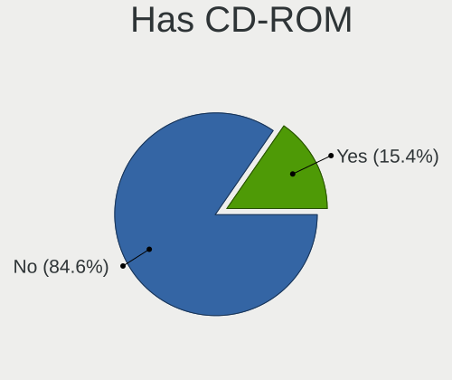

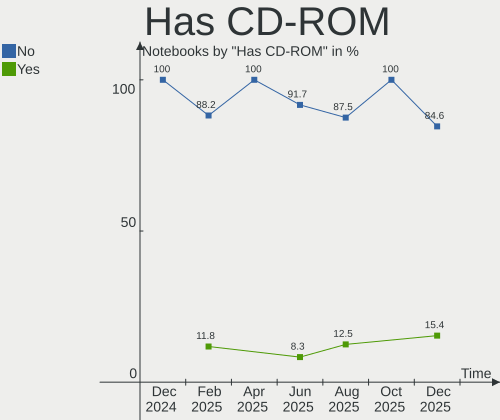

| Presented | Notebooks | Percent |
|-----------|-----------|---------|
| No        | 11        | 84.62%  |
| Yes       | 2         | 15.38%  |

Has Ethernet
------------

Has Ethernet on board

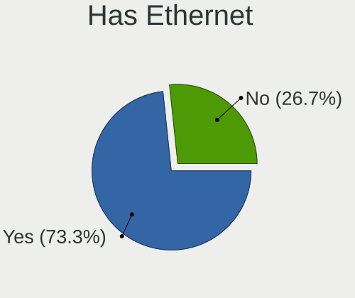

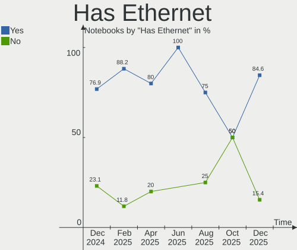

| Presented | Notebooks | Percent |
|-----------|-----------|---------|
| Yes       | 11        | 84.62%  |
| No        | 2         | 15.38%  |

Has WiFi
--------

Has WiFi module

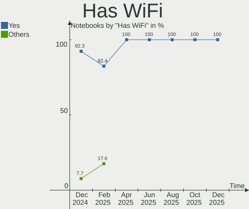

| Presented | Notebooks | Percent |
|-----------|-----------|---------|
| Yes       | 13        | 100%    |

Has Bluetooth
-------------

Has Bluetooth module

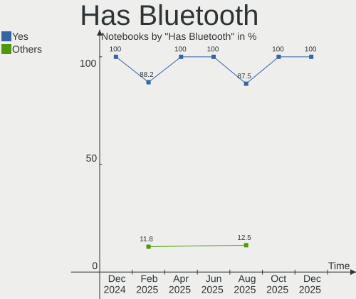

| Presented | Notebooks | Percent |
|-----------|-----------|---------|
| Yes       | 13        | 100%    |

Location
--------

Country
-------

Geographic location (country)

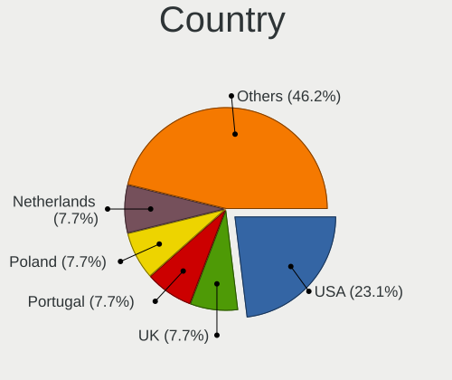

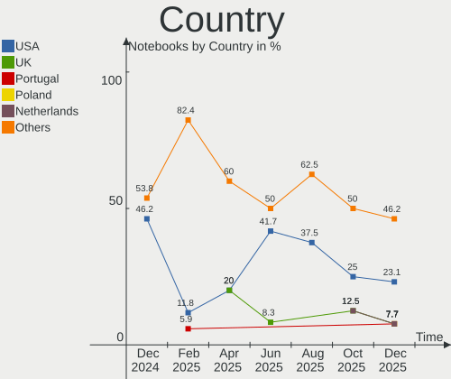

| Country     | Notebooks | Percent |
|-------------|-----------|---------|
| USA         | 3         | 23.08%  |
| UK          | 1         | 7.69%   |
| Portugal    | 1         | 7.69%   |
| Poland      | 1         | 7.69%   |
| Netherlands | 1         | 7.69%   |
| Lithuania   | 1         | 7.69%   |
| Israel      | 1         | 7.69%   |
| India       | 1         | 7.69%   |
| Germany     | 1         | 7.69%   |
| Brazil      | 1         | 7.69%   |
| Australia   | 1         | 7.69%   |

City
----

Geographic location (city)

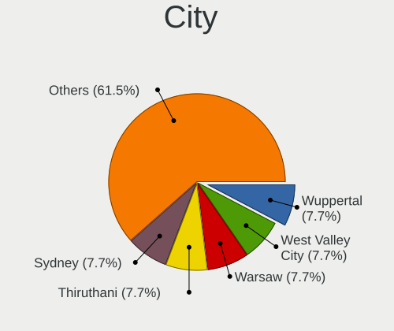

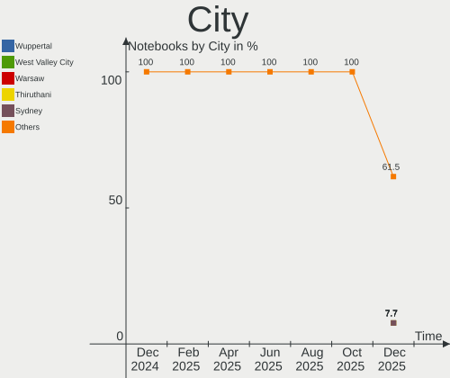

| City             | Notebooks | Percent |
|------------------|-----------|---------|
| Wuppertal        | 1         | 7.69%   |
| West Valley City | 1         | 7.69%   |
| Warsaw           | 1         | 7.69%   |
| Thiruthani       | 1         | 7.69%   |
| Sydney           | 1         | 7.69%   |
| Spokane          | 1         | 7.69%   |
| Rugby            | 1         | 7.69%   |
| Raanana          | 1         | 7.69%   |
| Lisbon           | 1         | 7.69%   |
| Kaunas           | 1         | 7.69%   |
| Brasília        | 1         | 7.69%   |
| Bingley          | 1         | 7.69%   |
| Amsterdam        | 1         | 7.69%   |

Drives
------

Drive Vendor
------------

Hard drive vendors

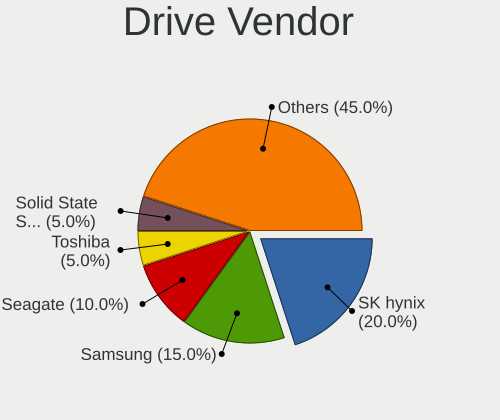

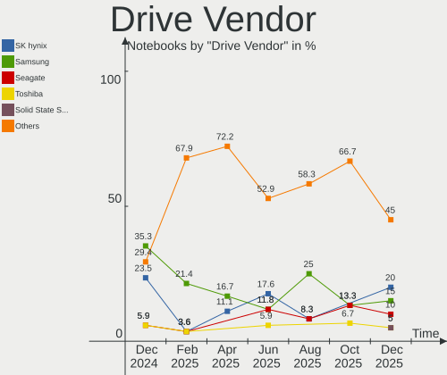

| Vendor                       | Notebooks | Drives | Percent |
|------------------------------|-----------|--------|---------|
| SK hynix                     | 4         | 4      | 20%     |
| Samsung Electronics          | 3         | 3      | 15%     |
| Seagate                      | 2         | 2      | 10%     |
| Toshiba                      | 1         | 1      | 5%      |
| Solid State Storage          | 1         | 1      | 5%      |
| Shenzhen Longsys Electronics | 1         | 1      | 5%      |
| Sandisk                      | 1         | 1      | 5%      |
| Phison Electronics           | 1         | 1      | 5%      |
| Micron Technology            | 1         | 1      | 5%      |
| KIOXIA                       | 1         | 1      | 5%      |
| Intenso                      | 1         | 1      | 5%      |
| INNOVATION IT                | 1         | 1      | 5%      |
| Crucial                      | 1         | 1      | 5%      |
| A-DATA Technology            | 1         | 1      | 5%      |

Drive Model
-----------

Hard drive models

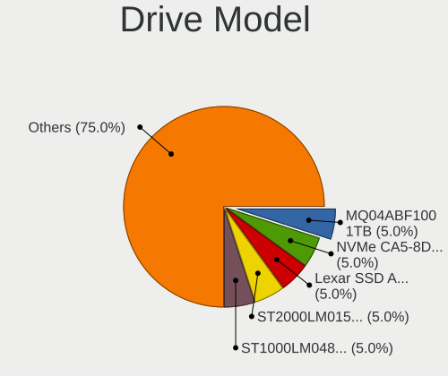

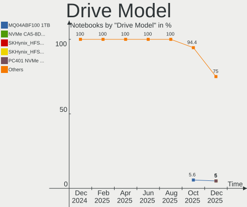

| Model                                       | Notebooks | Percent |
|---------------------------------------------|-----------|---------|
| Toshiba MQ04ABF100 1TB                      | 1         | 5%      |
| Solid State Storage NVMe CA5-8D512 512GB    | 1         | 5%      |
| SK hynix SKHynix_HFS001TEJ9X115N 1024GB     | 1         | 5%      |
| SK hynix SKHynix_HFS001TEJ4X112N 1024GB     | 1         | 5%      |
| SK hynix PC401 NVMe Solid State Drive 256GB | 1         | 5%      |
| SK hynix BC501 NVMe Solid State Drive 512GB | 1         | 5%      |
| Shenzhen Longsys Lexar SSD ARES PRO 2TB     | 1         | 5%      |
| Seagate ST2000LM015-2E8174 2TB              | 1         | 5%      |
| Seagate ST1000LM048-2E7172 1TB              | 1         | 5%      |
| Sandisk WD PC SN560 SDDPNQE-1T00-1032 1TB   | 1         | 5%      |
| Samsung SSD 870 QVO 2TB                     | 1         | 5%      |
| Samsung SSD 850 EVO 250GB                   | 1         | 5%      |
| Samsung PSSD T7 1TB                         | 1         | 5%      |
| Phison E12 NVMe Controller 1TB              | 1         | 5%      |
| Micron 2210_MTFDHBA512QFD 512GB             | 1         | 5%      |
| KIOXIA KBG40ZNS256G NVMe 256GB              | 1         | 5%      |
| Intenso External USB 3.0 500GB              | 1         | 5%      |
| INNOVATION IT IT 240GB                      | 1         | 5%      |
| Crucial CT500MX500SSD1 500GB                | 1         | 5%      |
| A-DATA SP550 120GB SSD                      | 1         | 5%      |

HDD Vendor
----------

Hard disk drive vendors

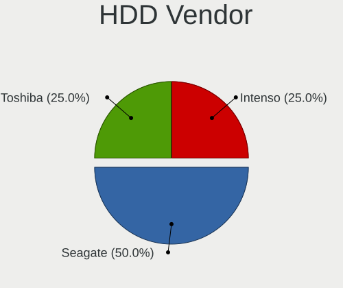

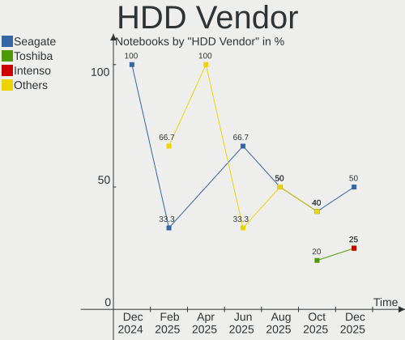

| Vendor  | Notebooks | Drives | Percent |
|---------|-----------|--------|---------|
| Seagate | 2         | 2      | 50%     |
| Toshiba | 1         | 1      | 25%     |
| Intenso | 1         | 1      | 25%     |

SSD Vendor
----------

Solid state drive vendors

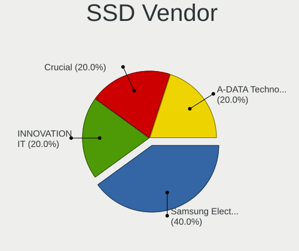

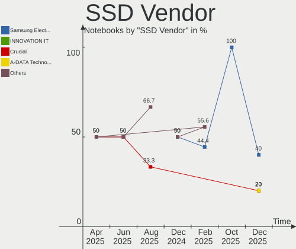

| Vendor              | Notebooks | Drives | Percent |
|---------------------|-----------|--------|---------|
| Samsung Electronics | 2         | 2      | 40%     |
| INNOVATION IT       | 1         | 1      | 20%     |
| Crucial             | 1         | 1      | 20%     |
| A-DATA Technology   | 1         | 1      | 20%     |

Drive Kind
----------

HDD or SSD

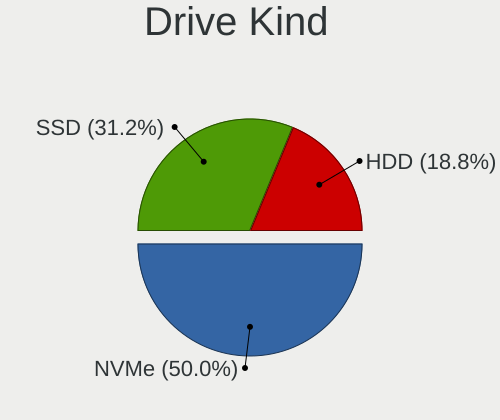

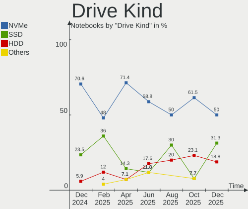

| Kind | Notebooks | Drives | Percent |
|------|-----------|--------|---------|
| NVMe | 8         | 11     | 50%     |
| SSD  | 5         | 5      | 31.25%  |
| HDD  | 3         | 4      | 18.75%  |

Drive Connector
---------------

SATA, SAS, NVMe, etc.

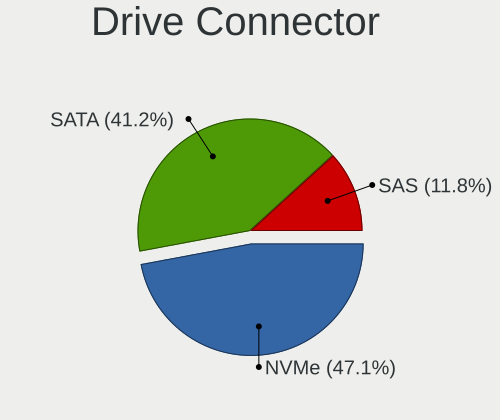

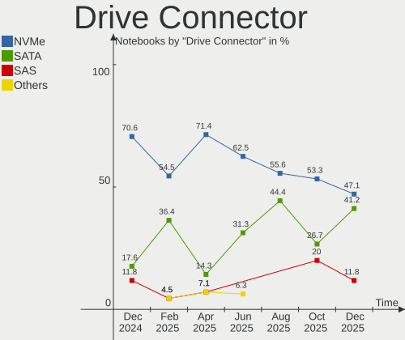

| Type | Notebooks | Drives | Percent |
|------|-----------|--------|---------|
| NVMe | 8         | 10     | 47.06%  |
| SATA | 7         | 8      | 41.18%  |
| SAS  | 2         | 2      | 11.76%  |

Drive Size
----------

Size of hard drive

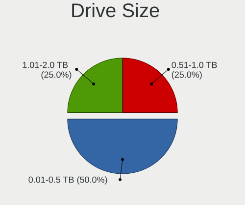

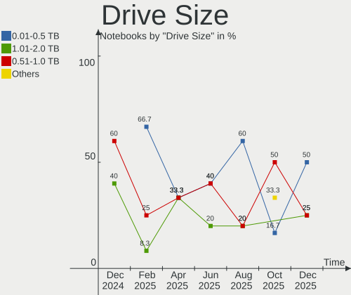

| Size in TB | Notebooks | Drives | Percent |
|------------|-----------|--------|---------|
| 0.01-0.5   | 4         | 5      | 50%     |
| 1.01-2.0   | 2         | 2      | 25%     |
| 0.51-1.0   | 2         | 2      | 25%     |

Space Total
-----------

Amount of disk space available on the file system

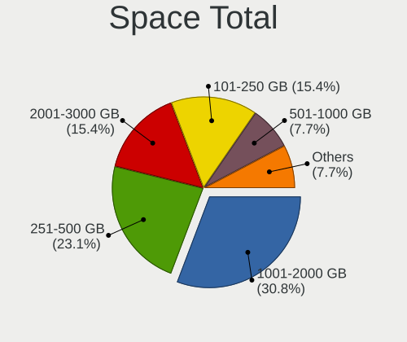

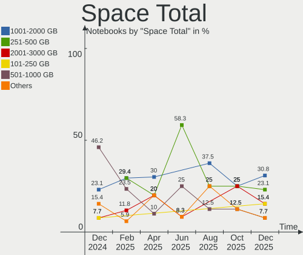

| Size in GB | Notebooks | Percent |
|------------|-----------|---------|
| 1001-2000  | 4         | 30.77%  |
| 251-500    | 3         | 23.08%  |
| 2001-3000  | 2         | 15.38%  |
| 101-250    | 2         | 15.38%  |
| 501-1000   | 1         | 7.69%   |
| Unknown    | 1         | 7.69%   |

Space Used
----------

Amount of used disk space

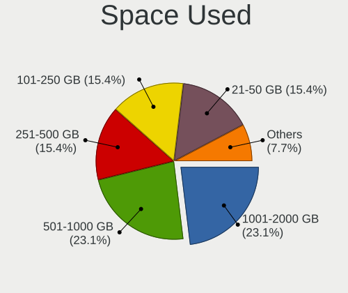

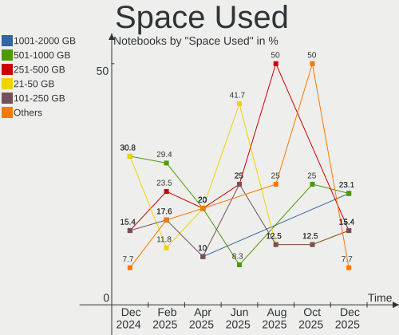

| Used GB   | Notebooks | Percent |
|-----------|-----------|---------|
| 1001-2000 | 3         | 23.08%  |
| 501-1000  | 3         | 23.08%  |
| 251-500   | 2         | 15.38%  |
| 21-50     | 2         | 15.38%  |
| 101-250   | 2         | 15.38%  |
| Unknown   | 1         | 7.69%   |

Malfunc. Drives
---------------

Drive models with a malfunction

Zero info for selected period =(

Malfunc. Drive Vendor
---------------------

Vendors of faulty drives

Zero info for selected period =(

Malfunc. HDD Vendor
-------------------

Vendors of faulty HDD drives

Zero info for selected period =(

Malfunc. Drive Kind
-------------------

Kinds of faulty drives

Zero info for selected period =(

Failed Drives
-------------

Failed drive models

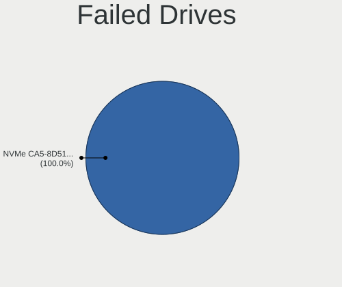

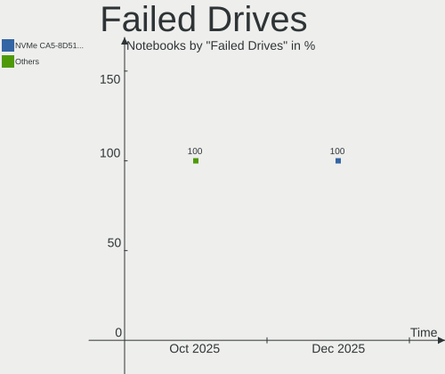

| Model                                    | Notebooks | Drives | Percent |
|------------------------------------------|-----------|--------|---------|
| Solid State Storage NVMe CA5-8D512 512GB | 1         | 1      | 100%    |

Failed Drive Vendor
-------------------

Failed drive vendors

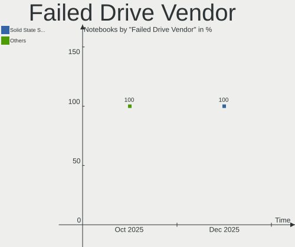

| Vendor              | Notebooks | Drives | Percent |
|---------------------|-----------|--------|---------|
| Solid State Storage | 1         | 1      | 100%    |

Drive Status
------------

Number of failed and malfunc. drives

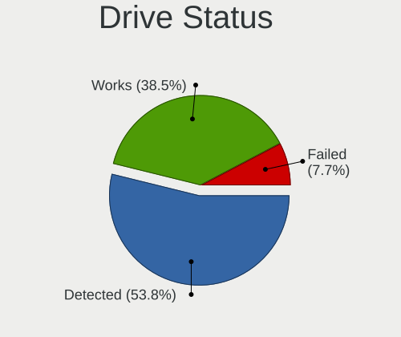

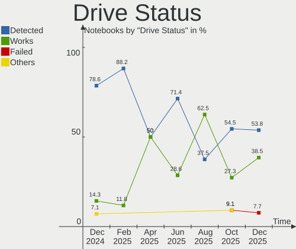

| Status   | Notebooks | Drives | Percent |
|----------|-----------|--------|---------|
| Detected | 7         | 12     | 53.85%  |
| Works    | 5         | 7      | 38.46%  |
| Failed   | 1         | 1      | 7.69%   |

Storage controller
------------------

Storage Vendor
--------------

Storage controller vendors

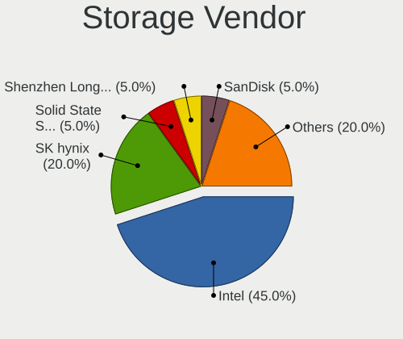

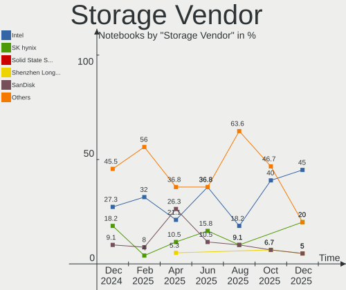

| Vendor                         | Notebooks | Percent |
|--------------------------------|-----------|---------|
| Intel                          | 9         | 45%     |
| SK hynix                       | 4         | 20%     |
| Solid State Storage Technology | 1         | 5%      |
| Shenzhen Longsys Electronics   | 1         | 5%      |
| SanDisk                        | 1         | 5%      |
| Phison Electronics             | 1         | 5%      |
| Micron Technology              | 1         | 5%      |
| KIOXIA                         | 1         | 5%      |
| AMD                            | 1         | 5%      |

Storage Model
-------------

Storage controller models

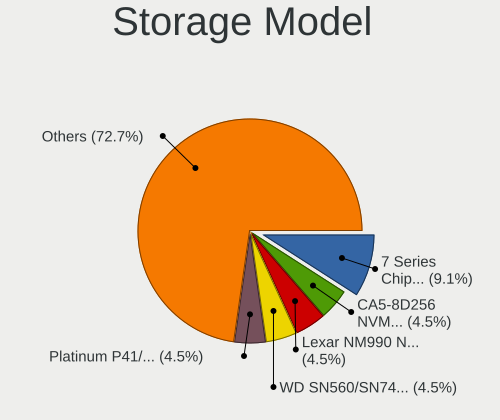

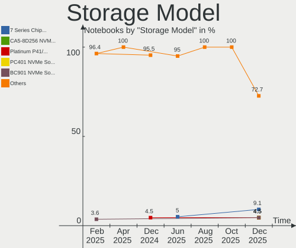

| Model                                                            | Notebooks | Percent |
|------------------------------------------------------------------|-----------|---------|
| Intel 7 Series Chipset Family 6-port SATA Controller [AHCI mode] | 2         | 9.09%   |
| Solid State Storage CA5-8D256 NVMe SSD M.2                       | 1         | 4.55%   |
| SK hynix Platinum P41/PC801 NVMe Solid State Drive               | 1         | 4.55%   |
| SK hynix PC401 NVMe Solid State Drive 256GB                      | 1         | 4.55%   |
| SK hynix BC901 NVMe Solid State Drive (DRAM-less)                | 1         | 4.55%   |
| SK hynix BC501 NVMe Solid State Drive                            | 1         | 4.55%   |
| Shenzhen Longsys Lexar NM990 NVMe SSD (DRAM-less)                | 1         | 4.55%   |
| SanDisk WD SN560/SN740/SN770/SN5000 NVMe SSD                     | 1         | 4.55%   |
| Phison E12 NVMe Controller                                       | 1         | 4.55%   |
| Micron 2210 NVMe SSD [Cobain]                                    | 1         | 4.55%   |
| KIOXIA NVMe SSD Controller BG4 (DRAM-less)                       | 1         | 4.55%   |
| Intel SATA controller                                            | 1         | 4.55%   |
| Intel RST Volume Management Device Controller                    | 1         | 4.55%   |
| Intel Ice Lake-LP SATA Controller [AHCI mode]                    | 1         | 4.55%   |
| Intel Comet Lake SATA AHCI Controller                            | 1         | 4.55%   |
| Intel Cannon Point-LP SATA Controller [AHCI Mode]                | 1         | 4.55%   |
| Intel Cannon Lake Mobile PCH SATA AHCI Controller                | 1         | 4.55%   |
| Intel 8 Series SATA Controller 1 [AHCI mode]                     | 1         | 4.55%   |
| Intel 7 Series Chipset Family 4-port SATA Controller [IDE mode]  | 1         | 4.55%   |
| Intel 7 Series Chipset Family 2-port SATA Controller [IDE mode]  | 1         | 4.55%   |
| AMD FCH SATA Controller [AHCI mode]                              | 1         | 4.55%   |

Storage Kind
------------

Kind of storage controller (IDE, SATA, NVMe, SAS, ...)

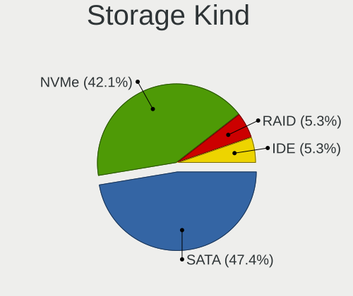

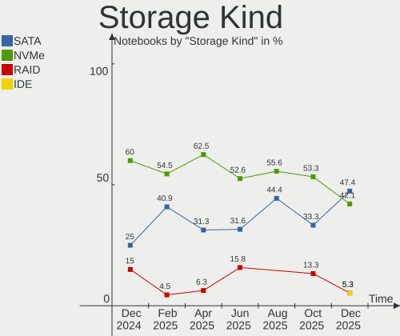

| Kind | Notebooks | Percent |
|------|-----------|---------|
| SATA | 9         | 47.37%  |
| NVMe | 8         | 42.11%  |
| RAID | 1         | 5.26%   |
| IDE  | 1         | 5.26%   |

Processor
---------

CPU Vendor
----------

Processor vendors

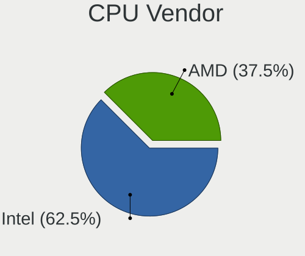

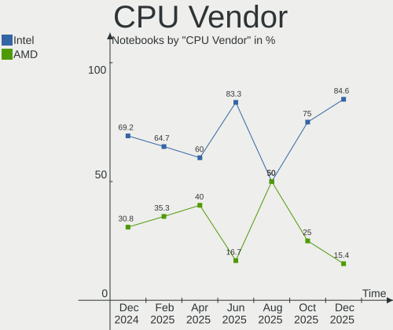

| Vendor | Notebooks | Percent |
|--------|-----------|---------|
| Intel  | 11        | 84.62%  |
| AMD    | 2         | 15.38%  |

CPU Model
---------

Processor models

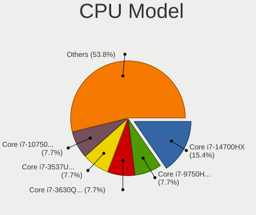

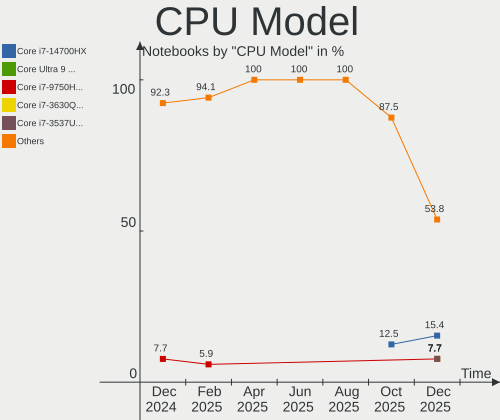

| Model                                      | Notebooks | Percent |
|--------------------------------------------|-----------|---------|
| Intel Core i7-14700HX                      | 2         | 15.38%  |
| Intel Core Ultra 9 185H                    | 1         | 7.69%   |
| Intel Core i7-9750H CPU @ 2.60GHz          | 1         | 7.69%   |
| Intel Core i7-3630QM CPU @ 2.40GHz         | 1         | 7.69%   |
| Intel Core i7-3537U CPU @ 2.00GHz          | 1         | 7.69%   |
| Intel Core i7-10750H CPU @ 2.60GHz         | 1         | 7.69%   |
| Intel Core i7-1065G7 CPU @ 1.30GHz         | 1         | 7.69%   |
| Intel Core i5-4200U CPU @ 1.60GHz          | 1         | 7.69%   |
| Intel Core i5-10210U CPU @ 1.60GHz         | 1         | 7.69%   |
| Intel Core i3-8145U CPU @ 2.10GHz          | 1         | 7.69%   |
| AMD Ryzen 5 PRO 4650U with Radeon Graphics | 1         | 7.69%   |
| AMD Ryzen 5 5500U with Radeon Graphics     | 1         | 7.69%   |

CPU Model Family
----------------

Processor model prefix

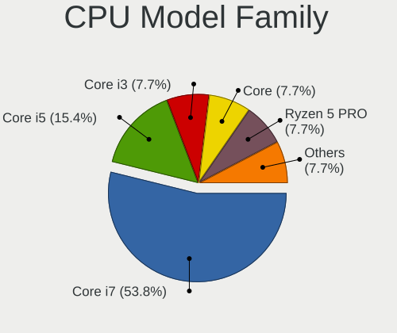

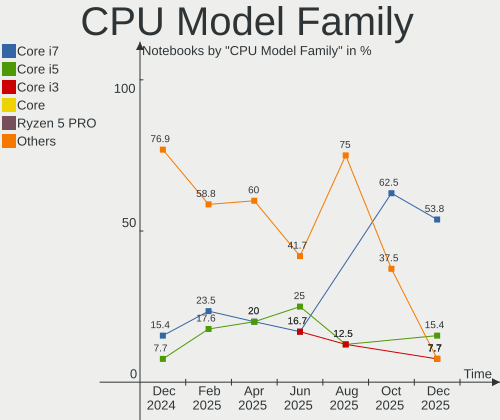

| Model           | Notebooks | Percent |
|-----------------|-----------|---------|
| Intel Core i7   | 7         | 53.85%  |
| Intel Core i5   | 2         | 15.38%  |
| Intel Core i3   | 1         | 7.69%   |
| Intel Core      | 1         | 7.69%   |
| AMD Ryzen 5 PRO | 1         | 7.69%   |
| AMD Ryzen 5     | 1         | 7.69%   |

CPU Cores
---------

Number of processor cores

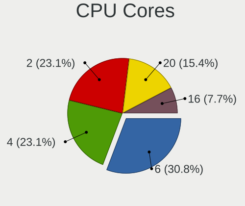

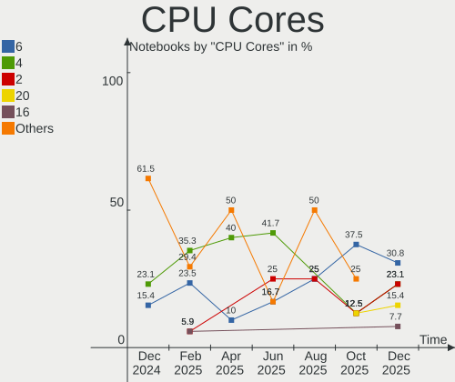

| Number | Notebooks | Percent |
|--------|-----------|---------|
| 6      | 4         | 30.77%  |
| 4      | 3         | 23.08%  |
| 2      | 3         | 23.08%  |
| 20     | 2         | 15.38%  |
| 16     | 1         | 7.69%   |

CPU Sockets
-----------

Number of sockets

| Number | Notebooks | Percent |
|--------|-----------|---------|
| 1      | 13        | 100%    |

CPU Threads
-----------

Threads per core (Hyper-Threading)

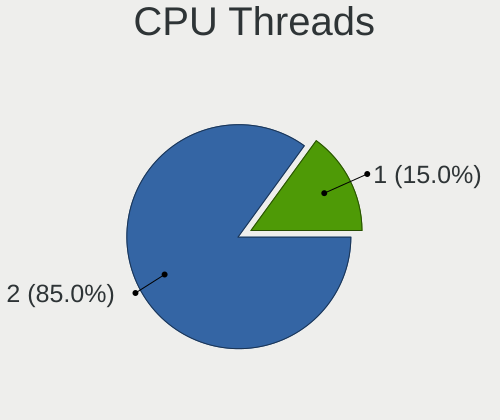

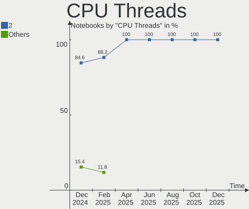

| Number | Notebooks | Percent |
|--------|-----------|---------|
| 2      | 13        | 100%    |

CPU Op-Modes
------------

CPU Operation Modes (32-bit, 64-bit)

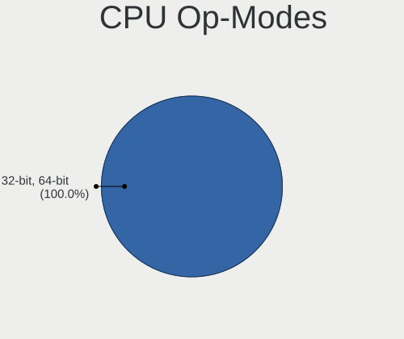

| Op mode        | Notebooks | Percent |
|----------------|-----------|---------|
| 32-bit, 64-bit | 13        | 100%    |

CPU Microcode
-------------

Microcode number

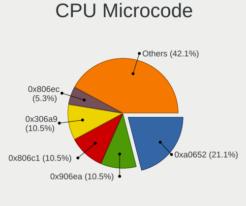

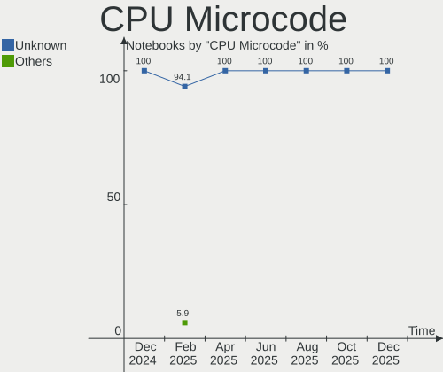

| Number  | Notebooks | Percent |
|---------|-----------|---------|
| Unknown | 13        | 100%    |

CPU Microarch
-------------

Microarchitecture

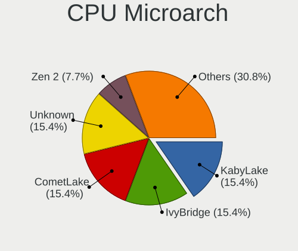

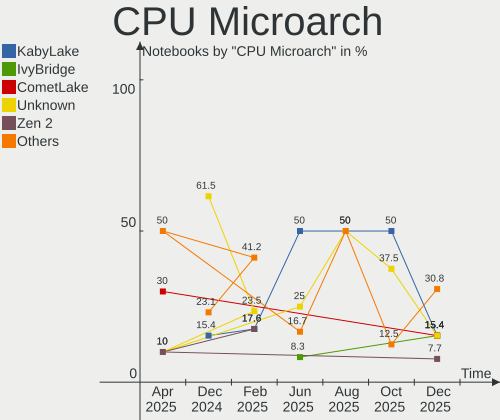

| Name              | Notebooks | Percent |
|-------------------|-----------|---------|
| KabyLake          | 2         | 15.38%  |
| IvyBridge         | 2         | 15.38%  |
| CometLake         | 2         | 15.38%  |
| Unknown           | 2         | 15.38%  |
| Zen 2             | 1         | 7.69%   |
| Meteorlake Hybrid | 1         | 7.69%   |
| IceLake           | 1         | 7.69%   |
| Haswell           | 1         | 7.69%   |
| Alderlake Hybrid  | 1         | 7.69%   |

Graphics
--------

GPU Vendor
----------

Vendors of graphics cards

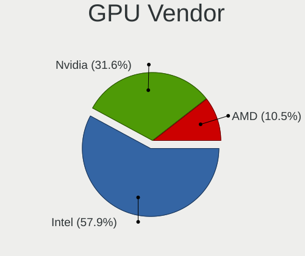

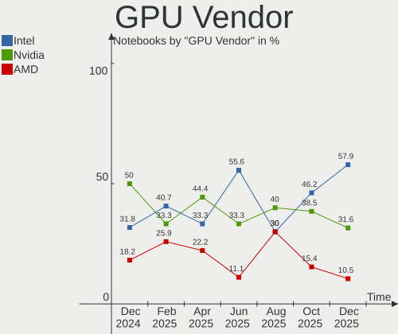

| Vendor | Notebooks | Percent |
|--------|-----------|---------|
| Intel  | 11        | 57.89%  |
| Nvidia | 6         | 31.58%  |
| AMD    | 2         | 10.53%  |

GPU Model
---------

Graphics card models

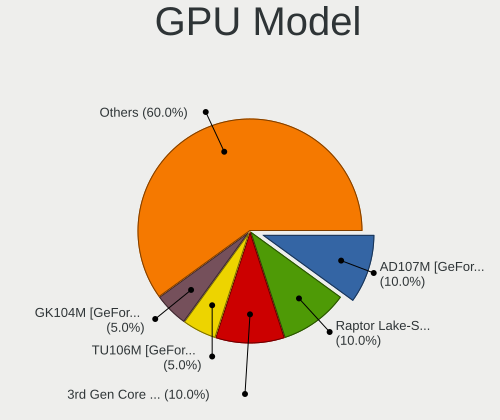

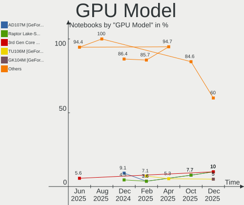

| Model                                                       | Notebooks | Percent |
|-------------------------------------------------------------|-----------|---------|
| Nvidia AD107M [GeForce RTX 4060 Max-Q / Mobile]             | 2         | 10%     |
| Intel Raptor Lake-S UHD Graphics                            | 2         | 10%     |
| Intel 3rd Gen Core processor Graphics Controller            | 2         | 10%     |
| Nvidia TU106M [GeForce RTX 2060 Mobile]                     | 1         | 5%      |
| Nvidia GK104M [GeForce GTX 680M]                            | 1         | 5%      |
| Nvidia GA106M [GeForce RTX 3060 Mobile / Max-Q]             | 1         | 5%      |
| Nvidia AD106M [GeForce RTX 4070 Max-Q / Mobile]             | 1         | 5%      |
| Intel WhiskeyLake-U GT2 [UHD Graphics 620]                  | 1         | 5%      |
| Intel Meteor Lake-P [Intel Arc Graphics]                    | 1         | 5%      |
| Intel Iris Plus Graphics G7                                 | 1         | 5%      |
| Intel Haswell-ULT Integrated Graphics Controller            | 1         | 5%      |
| Intel CometLake-H GT2 [UHD Graphics]                        | 1         | 5%      |
| Intel Comet Lake UHD Graphics                               | 1         | 5%      |
| Intel CoffeeLake-H GT2 [UHD Graphics 630]                   | 1         | 5%      |
| AMD Renoir [Radeon Vega Series / Radeon Vega Mobile Series] | 1         | 5%      |
| AMD Lucienne                                                | 1         | 5%      |
| AMD Lexa [Radeon 540X/550X/630 / RX 640 / E9171 MCM]        | 1         | 5%      |

GPU Combo
---------

Combinations of graphics cards

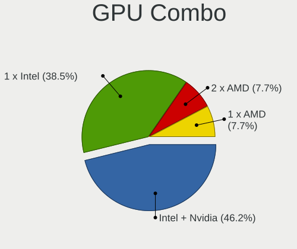

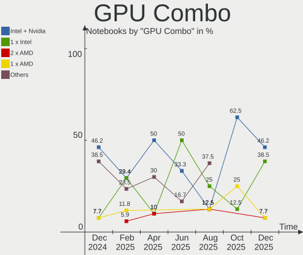

| Name           | Notebooks | Percent |
|----------------|-----------|---------|
| Intel + Nvidia | 6         | 46.15%  |
| 1 x Intel      | 5         | 38.46%  |
| 2 x AMD        | 1         | 7.69%   |
| 1 x AMD        | 1         | 7.69%   |

GPU Driver
----------

Free vs proprietary

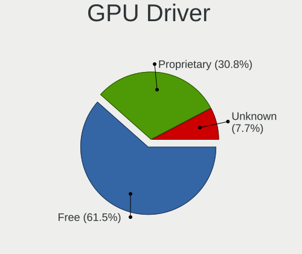

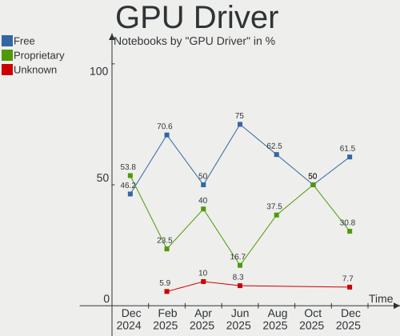

| Driver      | Notebooks | Percent |
|-------------|-----------|---------|
| Free        | 8         | 61.54%  |
| Proprietary | 4         | 30.77%  |
| Unknown     | 1         | 7.69%   |

GPU Memory
----------

Total video memory

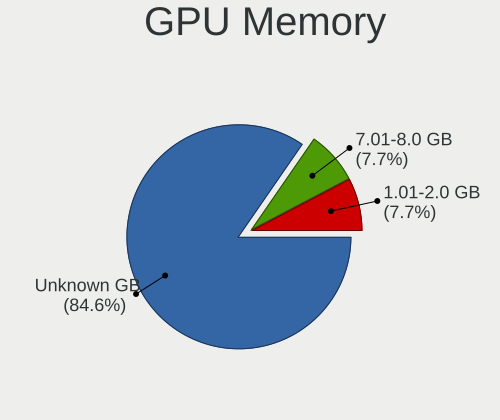

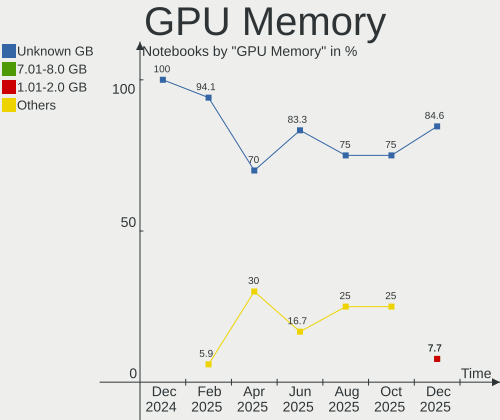

| Size in GB | Notebooks | Percent |
|------------|-----------|---------|
| Unknown    | 11        | 84.62%  |
| 7.01-8.0   | 1         | 7.69%   |
| 1.01-2.0   | 1         | 7.69%   |

Monitor
-------

Monitor Vendor
--------------

Monitor vendors

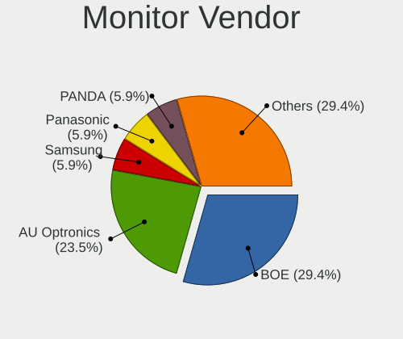

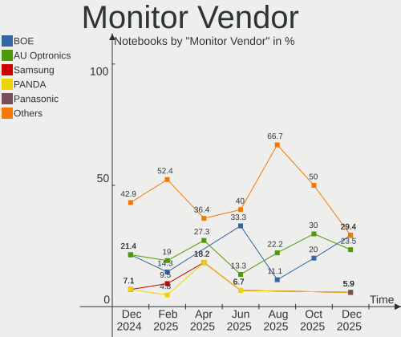

| Vendor               | Notebooks | Percent |
|----------------------|-----------|---------|
| BOE                  | 5         | 29.41%  |
| AU Optronics         | 4         | 23.53%  |
| Samsung Electronics  | 1         | 5.88%   |
| PANDA                | 1         | 5.88%   |
| Panasonic            | 1         | 5.88%   |
| Lenovo               | 1         | 5.88%   |
| Dell                 | 1         | 5.88%   |
| CSW                  | 1         | 5.88%   |
| Chimei Innolux       | 1         | 5.88%   |
| Ancor Communications | 1         | 5.88%   |

Monitor Model
-------------

Monitor models

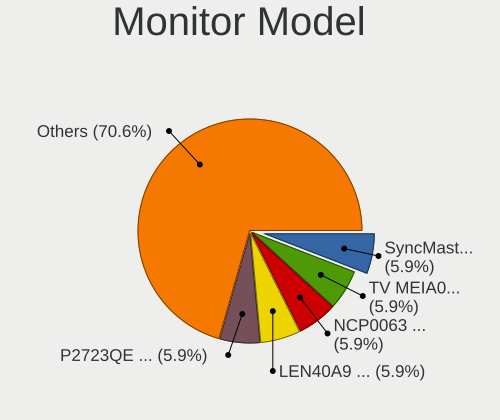

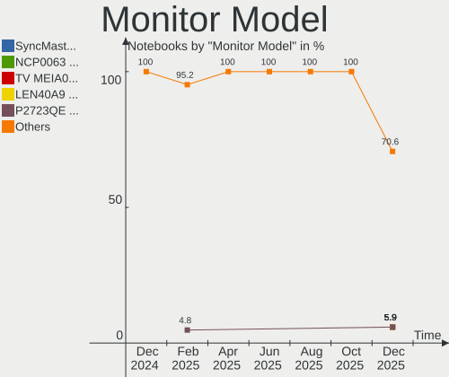

| Model                                                                 | Notebooks | Percent |
|-----------------------------------------------------------------------|-----------|---------|
| Samsung Electronics SyncMaster SAM0F4C 3840x2160 1210x680mm 54.6-inch | 1         | 5.88%   |
| PANDA LCD Monitor NCP0063 1920x1080 344x194mm 15.5-inch               | 1         | 5.88%   |
| Panasonic TV MEIA04B 1280x720 1434x806mm 64.8-inch                    | 1         | 5.88%   |
| Lenovo LCD Monitor LEN40A9 1920x1080 309x173mm 13.9-inch              | 1         | 5.88%   |
| Dell P2723QE DELF13C 3840x2160 597x336mm 27.0-inch                    | 1         | 5.88%   |
| CSW LCD Monitor CSW1640 3200x2000 344x215mm 16.0-inch                 | 1         | 5.88%   |
| Chimei Innolux LCD Monitor CMN162F 2560x1600 344x215mm 16.0-inch      | 1         | 5.88%   |
| BOE LCD Monitor BOE08EF 1366x768 344x194mm 15.5-inch                  | 1         | 5.88%   |
| BOE LCD Monitor BOE08BA 1920x1080 344x194mm 15.5-inch                 | 1         | 5.88%   |
| BOE LCD Monitor BOE084A 1920x1080 344x194mm 15.5-inch                 | 1         | 5.88%   |
| BOE LCD Monitor BOE0804 1920x1080 344x193mm 15.5-inch                 | 1         | 5.88%   |
| BOE LCD Monitor BOE0802 1920x1080 344x193mm 15.5-inch                 | 1         | 5.88%   |
| AU Optronics LCD Monitor AUO7EAD 1920x1080 344x193mm 15.5-inch        | 1         | 5.88%   |
| AU Optronics LCD Monitor AUO31EC 1366x768 344x193mm 15.5-inch         | 1         | 5.88%   |
| AU Optronics LCD Monitor AUO11EC 1366x768 344x193mm 15.5-inch         | 1         | 5.88%   |
| AU Optronics LCD Monitor AUO10ED 1920x1080 344x193mm 15.5-inch        | 1         | 5.88%   |
| Ancor Communications VS248 ACI2498 1920x1080 531x299mm 24.0-inch      | 1         | 5.88%   |

Monitor Resolution
------------------

Monitor screen resolution

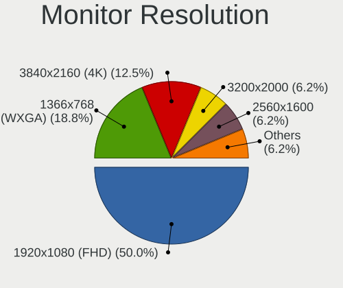

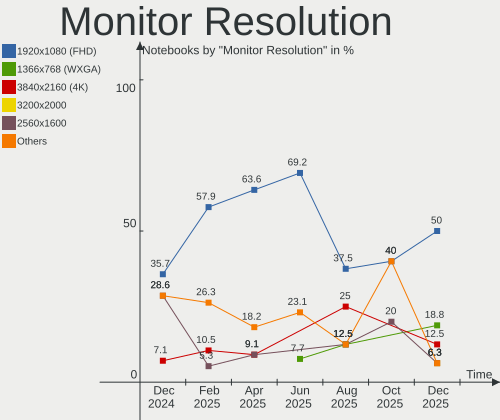

| Resolution      | Notebooks | Percent |
|-----------------|-----------|---------|
| 1920x1080 (FHD) | 8         | 50%     |
| 1366x768 (WXGA) | 3         | 18.75%  |
| 3840x2160 (4K)  | 2         | 12.5%   |
| 3200x2000       | 1         | 6.25%   |
| 2560x1600       | 1         | 6.25%   |
| 1280x720 (HD)   | 1         | 6.25%   |

Monitor Diagonal
----------------

Diagonal size in inches

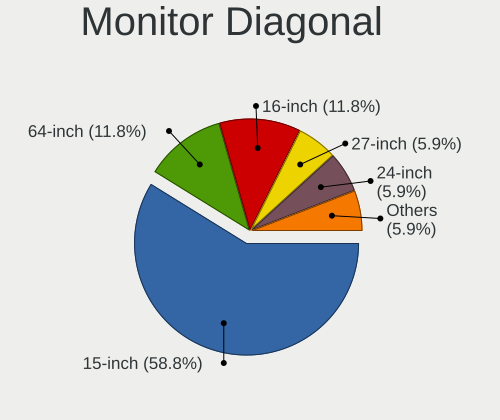

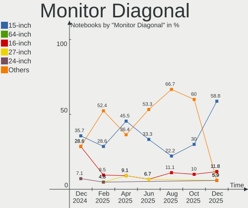

| Inches | Notebooks | Percent |
|--------|-----------|---------|
| 15     | 10        | 58.82%  |
| 64     | 2         | 11.76%  |
| 16     | 2         | 11.76%  |
| 27     | 1         | 5.88%   |
| 24     | 1         | 5.88%   |
| 14     | 1         | 5.88%   |

Monitor Width
-------------

Physical width

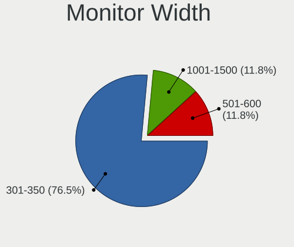

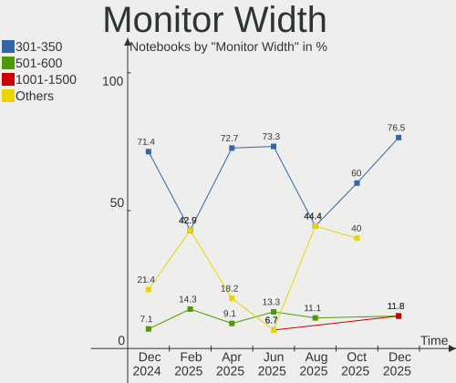

| Width in mm | Notebooks | Percent |
|-------------|-----------|---------|
| 301-350     | 13        | 76.47%  |
| 501-600     | 2         | 11.76%  |
| 1001-1500   | 2         | 11.76%  |

Aspect Ratio
------------

Proportional relationship between the width and the height

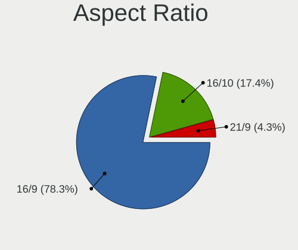

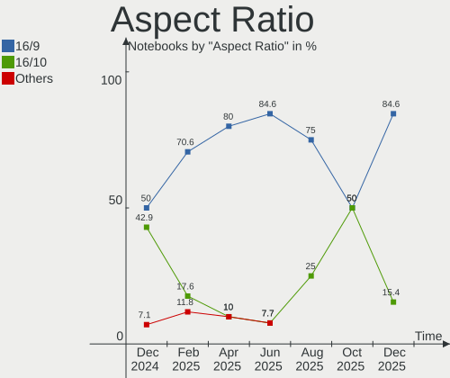

| Ratio | Notebooks | Percent |
|-------|-----------|---------|
| 16/9  | 11        | 84.62%  |
| 16/10 | 2         | 15.38%  |

Monitor Area
------------

Area in inch²

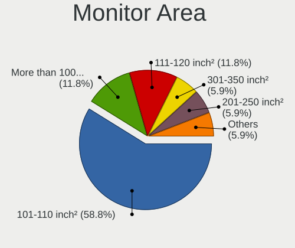

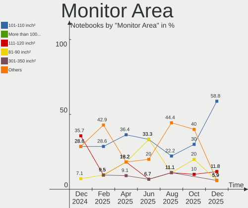

| Area in inch² | Notebooks | Percent |
|----------------|-----------|---------|
| 101-110        | 10        | 58.82%  |
| More than 1000 | 2         | 11.76%  |
| 111-120        | 2         | 11.76%  |
| 81-90          | 1         | 5.88%   |
| 301-350        | 1         | 5.88%   |
| 201-250        | 1         | 5.88%   |

Pixel Density
-------------

Pixels per inch

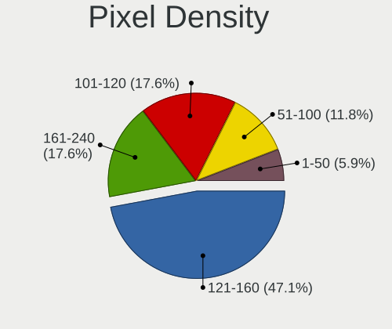

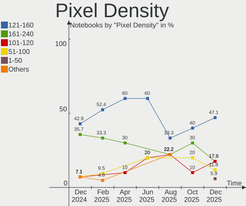

| Density | Notebooks | Percent |
|---------|-----------|---------|
| 121-160 | 8         | 47.06%  |
| 161-240 | 3         | 17.65%  |
| 101-120 | 3         | 17.65%  |
| 51-100  | 2         | 11.76%  |
| 1-50    | 1         | 5.88%   |

Multiple Monitors
-----------------

Total monitors connected

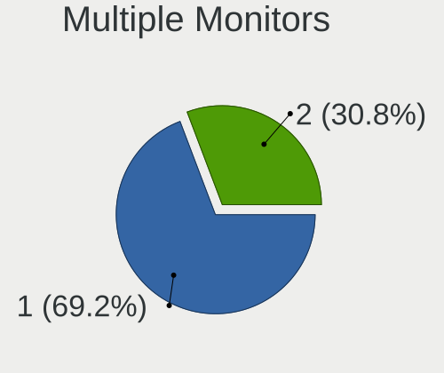

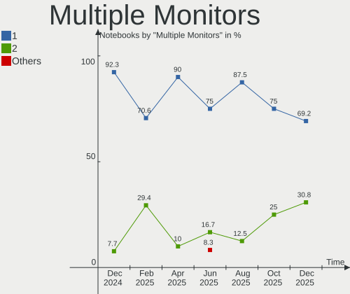

| Total | Notebooks | Percent |
|-------|-----------|---------|
| 1     | 9         | 69.23%  |
| 2     | 4         | 30.77%  |

Network
-------

Net Controller Vendor
---------------------

Controller vendors

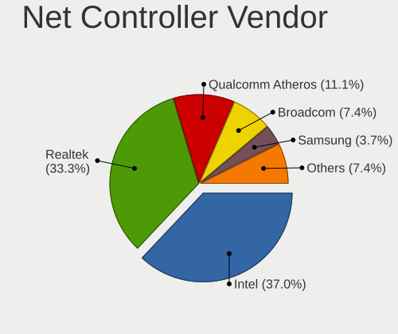

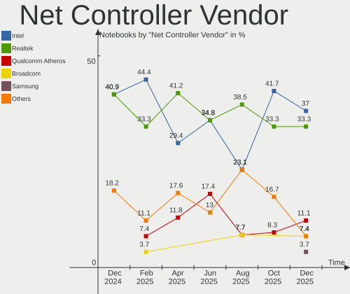

| Vendor                | Notebooks | Percent |
|-----------------------|-----------|---------|
| Intel                 | 10        | 37.04%  |
| Realtek Semiconductor | 9         | 33.33%  |
| Qualcomm Atheros      | 3         | 11.11%  |
| Broadcom              | 2         | 7.41%   |
| Samsung Electronics   | 1         | 3.7%    |
| Qualcomm              | 1         | 3.7%    |
| MediaTek              | 1         | 3.7%    |

Net Controller Model
--------------------

Controller models

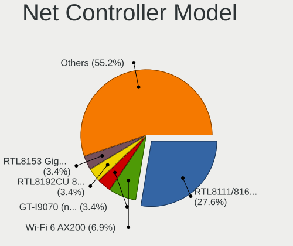

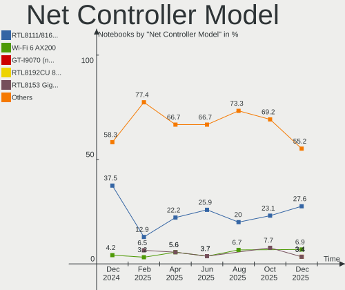

| Model                                                                  | Notebooks | Percent |
|------------------------------------------------------------------------|-----------|---------|
| Realtek RTL8111/8168/8211/8411 PCI Express Gigabit Ethernet Controller | 8         | 27.59%  |
| Intel Wi-Fi 6 AX200                                                    | 2         | 6.9%    |
| Samsung GT-I9070 (network tethering, USB debugging enabled)            | 1         | 3.45%   |
| Realtek RTL8192CU 802.11n WLAN Adapter                                 | 1         | 3.45%   |
| Realtek RTL8153 Gigabit Ethernet Adapter                               | 1         | 3.45%   |
| Realtek Killer E2500 Gigabit Ethernet Controller                       | 1         | 3.45%   |
| Qualcomm Nokia X30 5G                                                  | 1         | 3.45%   |
| Qualcomm Atheros QCA9565 / AR9565 Wireless Network Adapter             | 1         | 3.45%   |
| Qualcomm Atheros QCA9377 802.11ac Wireless Network Adapter             | 1         | 3.45%   |
| Qualcomm Atheros Killer E220x Gigabit Ethernet Controller              | 1         | 3.45%   |
| MediaTek MT7612U 802.11a/b/g/n/ac Wireless Adapter                     | 1         | 3.45%   |
| Intel Wi-Fi 7(802.11be) AX1775*/AX1790*/BE20*/BE401/BE1750* 2x2        | 1         | 3.45%   |
| Intel Meteor Lake PCH CNVi WiFi                                        | 1         | 3.45%   |
| Intel Ice Lake-LP PCH CNVi WiFi                                        | 1         | 3.45%   |
| Intel Comet Lake PCH-LP CNVi WiFi                                      | 1         | 3.45%   |
| Intel Comet Lake PCH CNVi WiFi                                         | 1         | 3.45%   |
| Intel Centrino Wireless-N 2230                                         | 1         | 3.45%   |
| Intel Cannon Lake PCH CNVi WiFi                                        | 1         | 3.45%   |
| Intel 700 Series Chipset CNVi WiFi                                     | 1         | 3.45%   |
| Broadcom NetXtreme BCM57786 Gigabit Ethernet PCIe                      | 1         | 3.45%   |
| Broadcom BCM43228 802.11a/b/g/n                                        | 1         | 3.45%   |

Wireless Vendor
---------------

Wireless vendors

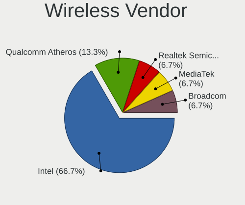

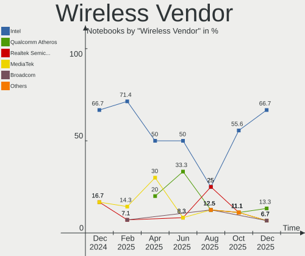

| Vendor                | Notebooks | Percent |
|-----------------------|-----------|---------|
| Intel                 | 10        | 66.67%  |
| Qualcomm Atheros      | 2         | 13.33%  |
| Realtek Semiconductor | 1         | 6.67%   |
| MediaTek              | 1         | 6.67%   |
| Broadcom              | 1         | 6.67%   |

Wireless Model
--------------

Wireless models

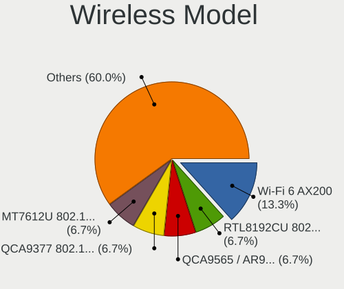

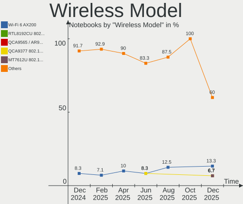

| Model                                                           | Notebooks | Percent |
|-----------------------------------------------------------------|-----------|---------|
| Intel Wi-Fi 6 AX200                                             | 2         | 13.33%  |
| Realtek RTL8192CU 802.11n WLAN Adapter                          | 1         | 6.67%   |
| Qualcomm Atheros QCA9565 / AR9565 Wireless Network Adapter      | 1         | 6.67%   |
| Qualcomm Atheros QCA9377 802.11ac Wireless Network Adapter      | 1         | 6.67%   |
| MediaTek MT7612U 802.11a/b/g/n/ac Wireless Adapter              | 1         | 6.67%   |
| Intel Wi-Fi 7(802.11be) AX1775*/AX1790*/BE20*/BE401/BE1750* 2x2 | 1         | 6.67%   |
| Intel Meteor Lake PCH CNVi WiFi                                 | 1         | 6.67%   |
| Intel Ice Lake-LP PCH CNVi WiFi                                 | 1         | 6.67%   |
| Intel Comet Lake PCH-LP CNVi WiFi                               | 1         | 6.67%   |
| Intel Comet Lake PCH CNVi WiFi                                  | 1         | 6.67%   |
| Intel Centrino Wireless-N 2230                                  | 1         | 6.67%   |
| Intel Cannon Lake PCH CNVi WiFi                                 | 1         | 6.67%   |
| Intel 700 Series Chipset CNVi WiFi                              | 1         | 6.67%   |
| Broadcom BCM43228 802.11a/b/g/n                                 | 1         | 6.67%   |

Ethernet Vendor
---------------

Ethernet vendors

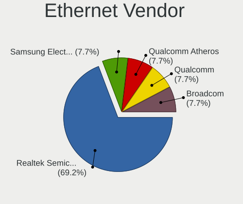

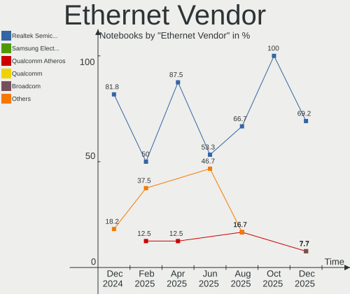

| Vendor                | Notebooks | Percent |
|-----------------------|-----------|---------|
| Realtek Semiconductor | 9         | 69.23%  |
| Samsung Electronics   | 1         | 7.69%   |
| Qualcomm Atheros      | 1         | 7.69%   |
| Qualcomm              | 1         | 7.69%   |
| Broadcom              | 1         | 7.69%   |

Ethernet Model
--------------

Ethernet models

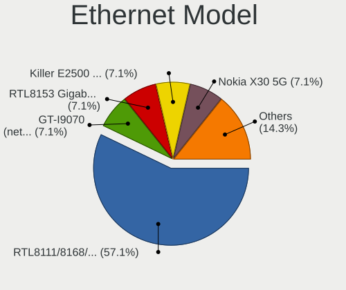

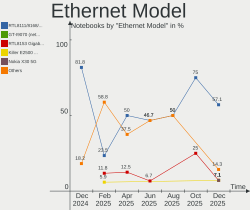

| Model                                                                  | Notebooks | Percent |
|------------------------------------------------------------------------|-----------|---------|
| Realtek RTL8111/8168/8211/8411 PCI Express Gigabit Ethernet Controller | 8         | 57.14%  |
| Samsung GT-I9070 (network tethering, USB debugging enabled)            | 1         | 7.14%   |
| Realtek RTL8153 Gigabit Ethernet Adapter                               | 1         | 7.14%   |
| Realtek Killer E2500 Gigabit Ethernet Controller                       | 1         | 7.14%   |
| Qualcomm Nokia X30 5G                                                  | 1         | 7.14%   |
| Qualcomm Atheros Killer E220x Gigabit Ethernet Controller              | 1         | 7.14%   |
| Broadcom NetXtreme BCM57786 Gigabit Ethernet PCIe                      | 1         | 7.14%   |

Net Controller Kind
-------------------

Ethernet, WiFi or modem

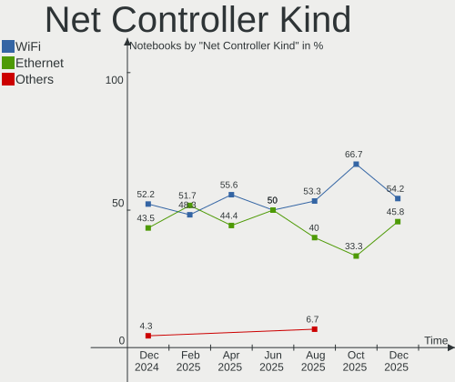

| Kind     | Notebooks | Percent |
|----------|-----------|---------|
| WiFi     | 13        | 54.17%  |
| Ethernet | 11        | 45.83%  |

Used Controller
---------------

Currently used network controller

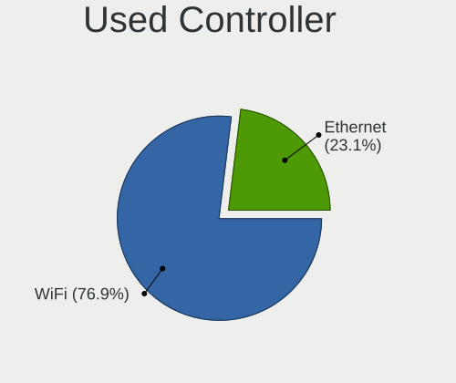

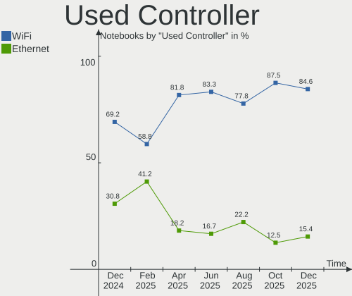

| Kind     | Notebooks | Percent |
|----------|-----------|---------|
| WiFi     | 11        | 84.62%  |
| Ethernet | 2         | 15.38%  |

NICs
----

Total network controllers on board

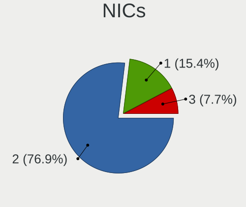

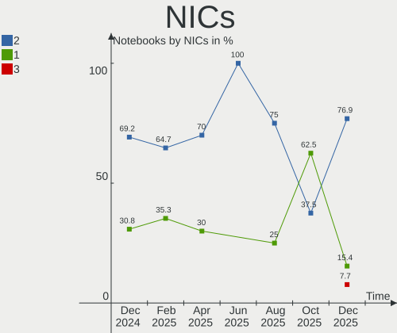

| Total | Notebooks | Percent |
|-------|-----------|---------|
| 2     | 10        | 76.92%  |
| 1     | 2         | 15.38%  |
| 3     | 1         | 7.69%   |

IPv6
----

IPv6 vs IPv4

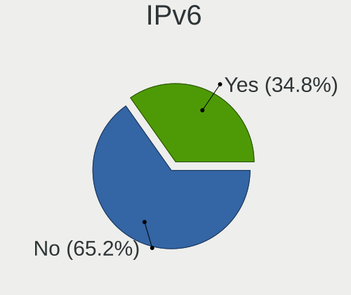

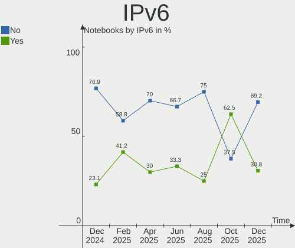

| Used | Notebooks | Percent |
|------|-----------|---------|
| No   | 9         | 69.23%  |
| Yes  | 4         | 30.77%  |

Bluetooth
---------

Bluetooth Vendor
----------------

Controller vendors

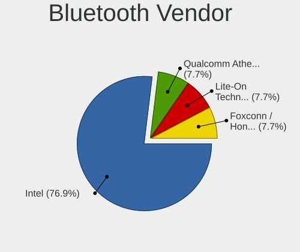

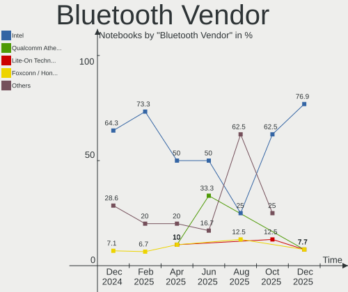

| Vendor                          | Notebooks | Percent |
|---------------------------------|-----------|---------|
| Intel                           | 10        | 76.92%  |
| Qualcomm Atheros Communications | 1         | 7.69%   |
| Lite-On Technology              | 1         | 7.69%   |
| Foxconn / Hon Hai               | 1         | 7.69%   |

Bluetooth Model
---------------

Controller models

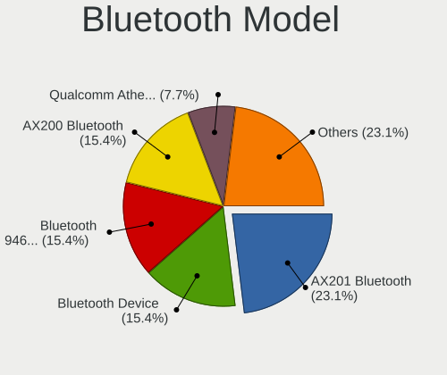

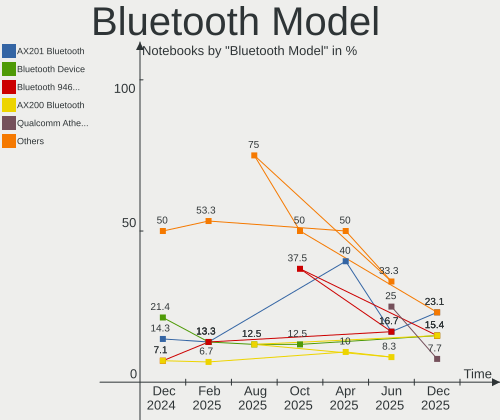

| Model                                          | Notebooks | Percent |
|------------------------------------------------|-----------|---------|
| Intel AX201 Bluetooth                          | 3         | 23.08%  |
| Intel Bluetooth Device                         | 2         | 15.38%  |
| Intel Bluetooth 9460/9560 Jefferson Peak (JfP) | 2         | 15.38%  |
| Intel AX200 Bluetooth                          | 2         | 15.38%  |
| Qualcomm Atheros  Bluetooth Device             | 1         | 7.69%   |
| Lite-On Atheros AR3012 Bluetooth               | 1         | 7.69%   |
| Intel Centrino Bluetooth Wireless Transceiver  | 1         | 7.69%   |
| Foxconn / Hon Hai BCM20702A0                   | 1         | 7.69%   |

Sound
-----

Sound Vendor
------------

Sound card vendors

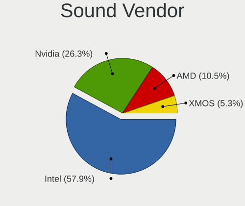

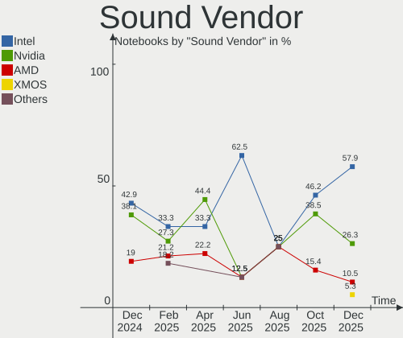

| Vendor | Notebooks | Percent |
|--------|-----------|---------|
| Intel  | 11        | 57.89%  |
| Nvidia | 5         | 26.32%  |
| AMD    | 2         | 10.53%  |
| XMOS   | 1         | 5.26%   |

Sound Model
-----------

Sound card models

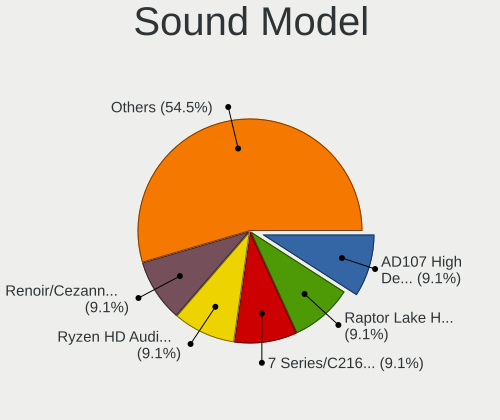

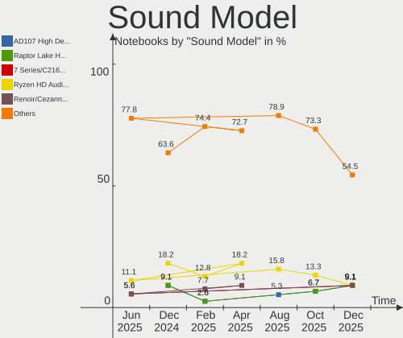

| Model                                                               | Notebooks | Percent |
|---------------------------------------------------------------------|-----------|---------|
| Nvidia AD107 High Definition Audio Controller                       | 2         | 9.09%   |
| Intel Raptor Lake High Definition Audio Controller                  | 2         | 9.09%   |
| Intel 7 Series/C216 Chipset Family High Definition Audio Controller | 2         | 9.09%   |
| AMD Ryzen HD Audio Controller                                       | 2         | 9.09%   |
| AMD Renoir/Cezanne HDMI/DP Audio Controller                         | 2         | 9.09%   |
| XMOS iFi (by AMR) HD USB Audio                                      | 1         | 4.55%   |
| Nvidia TU106 High Definition Audio Controller                       | 1         | 4.55%   |
| Nvidia GK104 HDMI Audio Controller                                  | 1         | 4.55%   |
| Nvidia GA106 High Definition Audio Controller                       | 1         | 4.55%   |
| Intel Meteor Lake-P HD Audio Controller                             | 1         | 4.55%   |
| Intel Ice Lake-LP Smart Sound Technology Audio Controller           | 1         | 4.55%   |
| Intel Haswell-ULT HD Audio Controller                               | 1         | 4.55%   |
| Intel Comet Lake PCH-LP cAVS                                        | 1         | 4.55%   |
| Intel Comet Lake PCH cAVS                                           | 1         | 4.55%   |
| Intel Cannon Point-LP High Definition Audio Controller              | 1         | 4.55%   |
| Intel Cannon Lake PCH cAVS                                          | 1         | 4.55%   |
| Intel 8 Series HD Audio Controller                                  | 1         | 4.55%   |

Memory
------

Memory Vendor
-------------

Memory module vendors

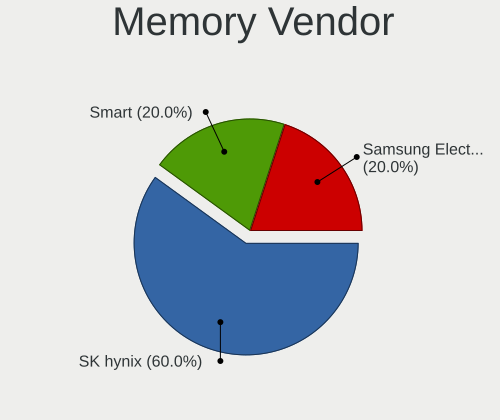

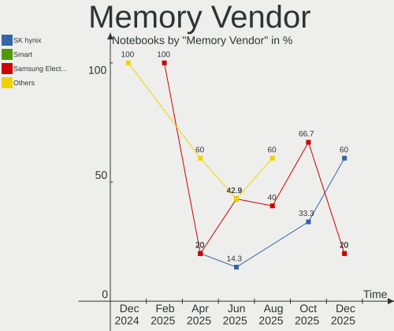

| Vendor              | Notebooks | Percent |
|---------------------|-----------|---------|
| SK hynix            | 3         | 60%     |
| Smart               | 1         | 20%     |
| Samsung Electronics | 1         | 20%     |

Memory Model
------------

Memory module models

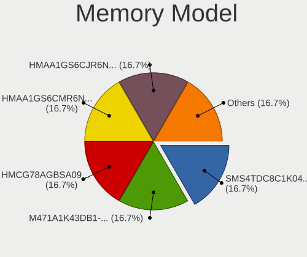

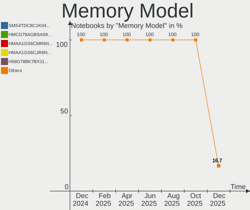

| Model                                                        | Notebooks | Percent |
|--------------------------------------------------------------|-----------|---------|
| Smart RAM SMS4TDC8C1K0446FCG 8GB DDR4 2667MT/s               | 1         | 16.67%  |
| SK hynix RAM HMCG78AGBSA092N 16GB SODIMM DDR5 5600MT/s       | 1         | 16.67%  |
| SK hynix RAM HMAA1GS6CMR6N-XN 8GB SODIMM DDR4 3200MT/s       | 1         | 16.67%  |
| SK hynix RAM HMAA1GS6CJR6N-XN 8GB SODIMM DDR4 3200MT/s       | 1         | 16.67%  |
| SK hynix RAM H58G78BK7BX114 8GB Row Of Chips LPDDR5 7467MT/s | 1         | 16.67%  |
| Samsung RAM M471A1K43DB1-CWE 8GB SODIMM DDR4 3200MT/s        | 1         | 16.67%  |

Memory Kind
-----------

Memory module kinds

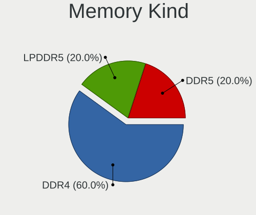

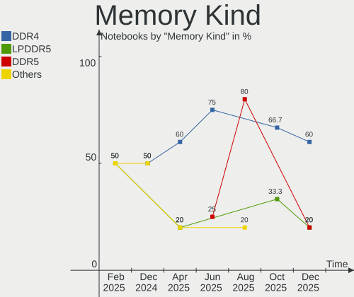

| Kind   | Notebooks | Percent |
|--------|-----------|---------|
| DDR4   | 3         | 60%     |
| LPDDR5 | 1         | 20%     |
| DDR5   | 1         | 20%     |

Memory Form Factor
------------------

Physical design of the memory module

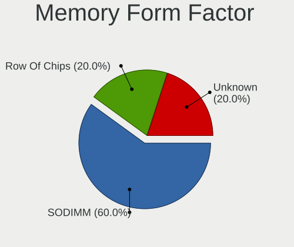

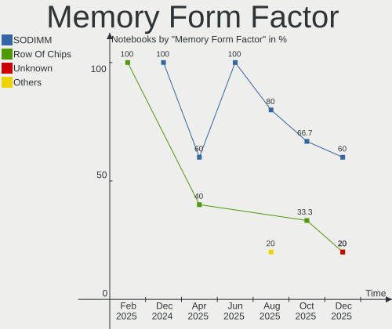

| Name         | Notebooks | Percent |
|--------------|-----------|---------|
| SODIMM       | 3         | 60%     |
| Row Of Chips | 1         | 20%     |
| Unknown      | 1         | 20%     |

Memory Size
-----------

Memory module size

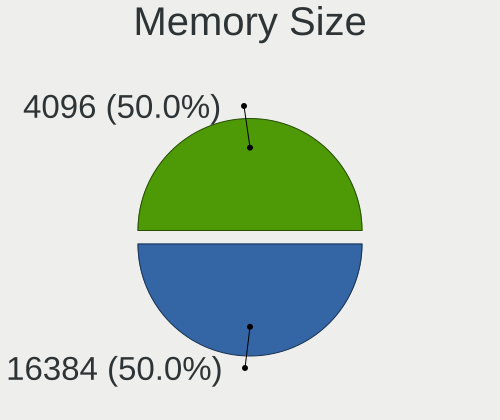

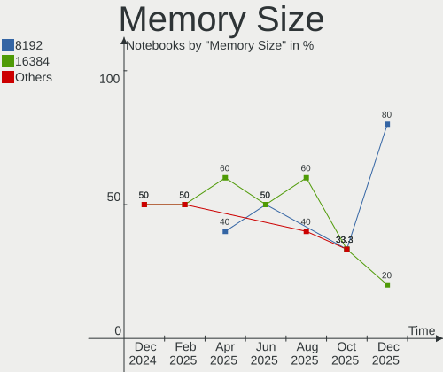

| Size  | Notebooks | Percent |
|-------|-----------|---------|
| 8192  | 4         | 80%     |
| 16384 | 1         | 20%     |

Memory Speed
------------

Memory module speed

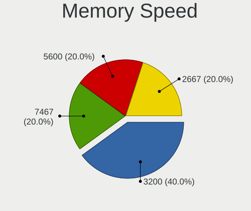

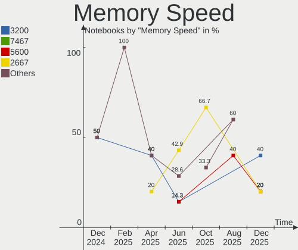

| Speed | Notebooks | Percent |
|-------|-----------|---------|
| 3200  | 2         | 40%     |
| 7467  | 1         | 20%     |
| 5600  | 1         | 20%     |
| 2667  | 1         | 20%     |

Printers & scanners
-------------------

Printer Vendor
--------------

Printer device vendors

Zero info for selected period =(

Printer Model
-------------

Printer device models

Zero info for selected period =(

Scanner Vendor
--------------

Scanner device vendors

Zero info for selected period =(

Scanner Model
-------------

Scanner device models

Zero info for selected period =(

Camera
------

Camera Vendor
-------------

Camera device vendors

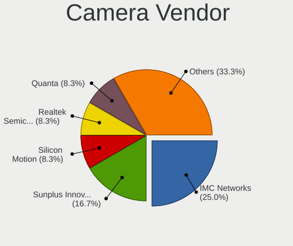

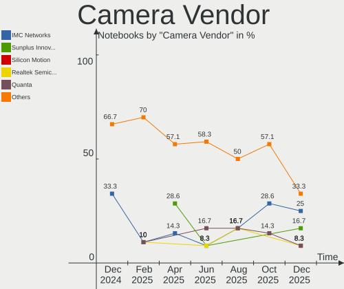

| Vendor                        | Notebooks | Percent |
|-------------------------------|-----------|---------|
| IMC Networks                  | 3         | 25%     |
| Sunplus Innovation Technology | 2         | 16.67%  |
| Silicon Motion                | 1         | 8.33%   |
| Realtek Semiconductor         | 1         | 8.33%   |
| Quanta                        | 1         | 8.33%   |
| Microdia                      | 1         | 8.33%   |
| Logitech                      | 1         | 8.33%   |
| Bison Electronics             | 1         | 8.33%   |
| Acer                          | 1         | 8.33%   |

Camera Model
------------

Camera device models

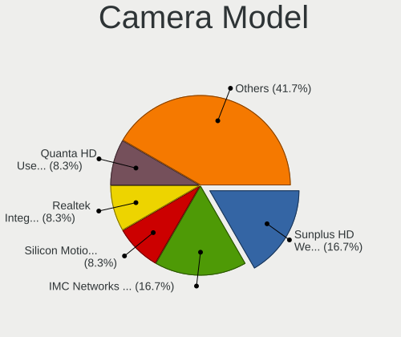

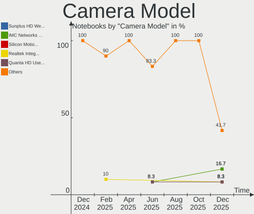

| Model                           | Notebooks | Percent |
|---------------------------------|-----------|---------|
| Sunplus HD WebCam               | 2         | 16.67%  |
| IMC Networks Integrated Camera  | 2         | 16.67%  |
| Silicon Motion Web Camera       | 1         | 8.33%   |
| Realtek Integrated_Webcam_HD    | 1         | 8.33%   |
| Quanta HD User Facing           | 1         | 8.33%   |
| Microdia Integrated_Webcam_HD   | 1         | 8.33%   |
| Logitech C922 Pro Stream Webcam | 1         | 8.33%   |
| IMC Networks USB Camera         | 1         | 8.33%   |
| Bison Integrated Camera         | 1         | 8.33%   |
| Acer Integrated Camera          | 1         | 8.33%   |

Security
--------

Fingerprint Vendor
------------------

Fingerprint sensor vendors

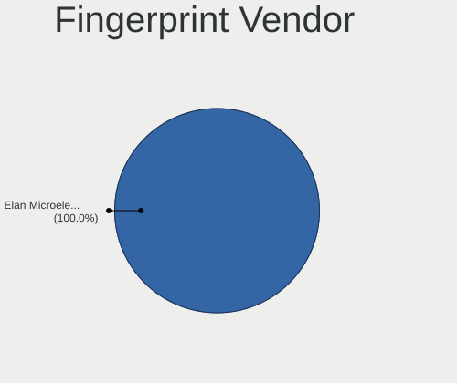

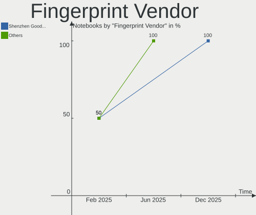

| Vendor                     | Notebooks | Percent |
|----------------------------|-----------|---------|
| Shenzhen Goodix Technology | 2         | 100%    |

Fingerprint Model
-----------------

Fingerprint sensor models

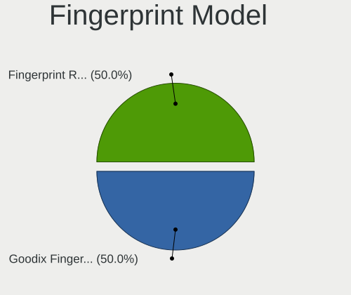

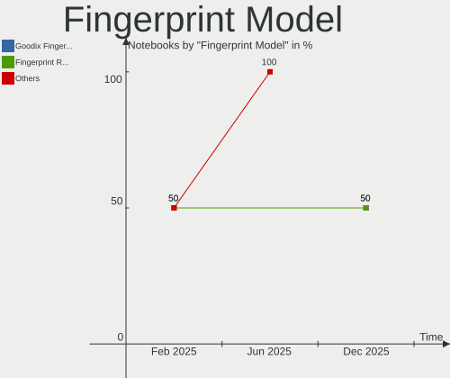

| Model                               | Notebooks | Percent |
|-------------------------------------|-----------|---------|
| Shenzhen Goodix  FingerPrint Device | 1         | 50%     |
| Shenzhen Goodix Fingerprint Reader  | 1         | 50%     |

Chipcard Vendor
---------------

Chipcard module vendors

Zero info for selected period =(

Chipcard Model
--------------

Chipcard module models

Zero info for selected period =(

Unsupported
-----------

Unsupported Devices
-------------------

Total unsupported devices on board

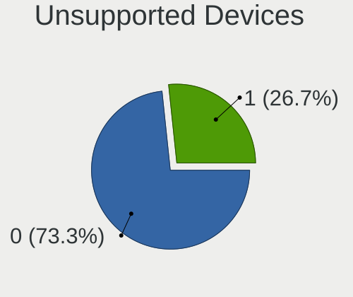

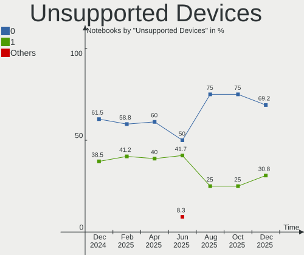

| Total | Notebooks | Percent |
|-------|-----------|---------|
| 0     | 9         | 69.23%  |
| 1     | 4         | 30.77%  |

Unsupported Device Types
------------------------

Types of unsupported devices

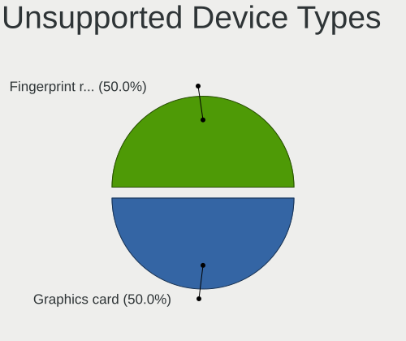

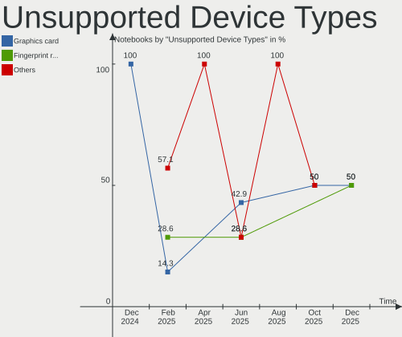

| Type               | Notebooks | Percent |
|--------------------|-----------|---------|
| Graphics card      | 2         | 50%     |
| Fingerprint reader | 2         | 50%     |

