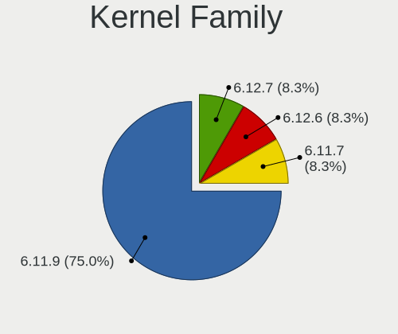
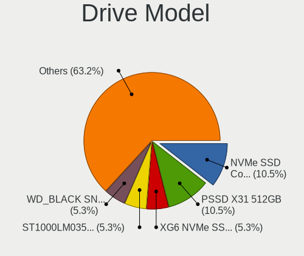
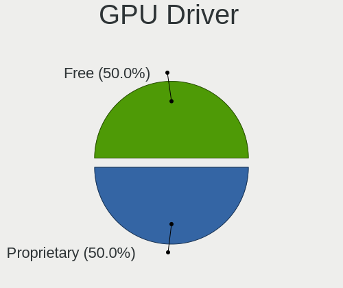
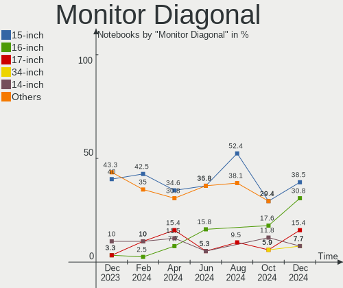
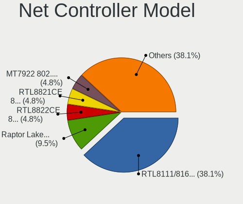
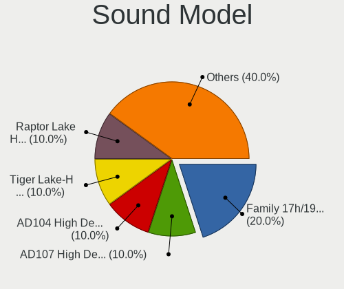
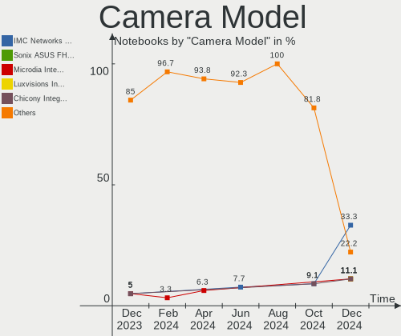

Nobara - Hardware Trends (Notebooks)
------------------------------------

A project to identify most popular hardware characteristics and track their change
over time based on data collected by Linux users at https://Linux-Hardware.org.

Anyone can contribute to this report by the [hw-probe](https://github.com/linuxhw/hw-probe) tool:

    sudo -E hw-probe -all -upload

This report is for one last month. Overall report since the beginning of time: [TestCoverage](https://github.com/linuxhw/TestCoverage)

Period: Jan, 2023.

Contents
--------

* [ System ](#system)
  - [ OS                       ](#os)
  - [ OS Family                ](#os-family)
  - [ Kernel                   ](#kernel)
  - [ Kernel Family            ](#kernel-family)
  - [ Kernel Major Ver.        ](#kernel-major-ver)
  - [ Arch                     ](#arch)
  - [ DE                       ](#de)
  - [ Display Server           ](#display-server)
  - [ Display Manager          ](#display-manager)
  - [ OS Lang                  ](#os-lang)
  - [ Boot Mode                ](#boot-mode)
  - [ Filesystem               ](#filesystem)
  - [ Part. scheme             ](#part-scheme)
  - [ Dual Boot with Linux/BSD ](#dual-boot-with-linuxbsd)
  - [ Dual Boot (Win)          ](#dual-boot-win)

* [ Board ](#board)
  - [ Vendor                   ](#vendor)
  - [ Model                    ](#model)
  - [ Model Family             ](#model-family)
  - [ MFG Year                 ](#mfg-year)
  - [ Form Factor              ](#form-factor)
  - [ Secure Boot              ](#secure-boot)
  - [ Coreboot                 ](#coreboot)
  - [ RAM Size                 ](#ram-size)
  - [ RAM Used                 ](#ram-used)
  - [ Total Drives             ](#total-drives)
  - [ Has CD-ROM               ](#has-cd-rom)
  - [ Has Ethernet             ](#has-ethernet)
  - [ Has WiFi                 ](#has-wifi)
  - [ Has Bluetooth            ](#has-bluetooth)

* [ Location ](#location)
  - [ Country                  ](#country)
  - [ City                     ](#city)

* [ Drives ](#drives)
  - [ Drive Vendor             ](#drive-vendor)
  - [ Drive Model              ](#drive-model)
  - [ HDD Vendor               ](#hdd-vendor)
  - [ SSD Vendor               ](#ssd-vendor)
  - [ Drive Kind               ](#drive-kind)
  - [ Drive Connector          ](#drive-connector)
  - [ Drive Size               ](#drive-size)
  - [ Space Total              ](#space-total)
  - [ Space Used               ](#space-used)
  - [ Malfunc. Drives          ](#malfunc-drives)
  - [ Malfunc. Drive Vendor    ](#malfunc-drive-vendor)
  - [ Malfunc. HDD Vendor      ](#malfunc-hdd-vendor)
  - [ Malfunc. Drive Kind      ](#malfunc-drive-kind)
  - [ Failed Drives            ](#failed-drives)
  - [ Failed Drive Vendor      ](#failed-drive-vendor)
  - [ Drive Status             ](#drive-status)

* [ Storage controller ](#storage-controller)
  - [ Storage Vendor           ](#storage-vendor)
  - [ Storage Model            ](#storage-model)
  - [ Storage Kind             ](#storage-kind)

* [ Processor ](#processor)
  - [ CPU Vendor               ](#cpu-vendor)
  - [ CPU Model                ](#cpu-model)
  - [ CPU Model Family         ](#cpu-model-family)
  - [ CPU Cores                ](#cpu-cores)
  - [ CPU Sockets              ](#cpu-sockets)
  - [ CPU Threads              ](#cpu-threads)
  - [ CPU Op-Modes             ](#cpu-op-modes)
  - [ CPU Microcode            ](#cpu-microcode)
  - [ CPU Microarch            ](#cpu-microarch)

* [ Graphics ](#graphics)
  - [ GPU Vendor               ](#gpu-vendor)
  - [ GPU Model                ](#gpu-model)
  - [ GPU Combo                ](#gpu-combo)
  - [ GPU Driver               ](#gpu-driver)
  - [ GPU Memory               ](#gpu-memory)

* [ Monitor ](#monitor)
  - [ Monitor Vendor           ](#monitor-vendor)
  - [ Monitor Model            ](#monitor-model)
  - [ Monitor Resolution       ](#monitor-resolution)
  - [ Monitor Diagonal         ](#monitor-diagonal)
  - [ Monitor Width            ](#monitor-width)
  - [ Aspect Ratio             ](#aspect-ratio)
  - [ Monitor Area             ](#monitor-area)
  - [ Pixel Density            ](#pixel-density)
  - [ Multiple Monitors        ](#multiple-monitors)

* [ Network ](#network)
  - [ Net Controller Vendor    ](#net-controller-vendor)
  - [ Net Controller Model     ](#net-controller-model)
  - [ Wireless Vendor          ](#wireless-vendor)
  - [ Wireless Model           ](#wireless-model)
  - [ Ethernet Vendor          ](#ethernet-vendor)
  - [ Ethernet Model           ](#ethernet-model)
  - [ Net Controller Kind      ](#net-controller-kind)
  - [ Used Controller          ](#used-controller)
  - [ NICs                     ](#nics)
  - [ IPv6                     ](#ipv6)

* [ Bluetooth ](#bluetooth)
  - [ Bluetooth Vendor         ](#bluetooth-vendor)
  - [ Bluetooth Model          ](#bluetooth-model)

* [ Sound ](#sound)
  - [ Sound Vendor             ](#sound-vendor)
  - [ Sound Model              ](#sound-model)

* [ Memory ](#memory)
  - [ Memory Vendor            ](#memory-vendor)
  - [ Memory Model             ](#memory-model)
  - [ Memory Kind              ](#memory-kind)
  - [ Memory Form Factor       ](#memory-form-factor)
  - [ Memory Size              ](#memory-size)
  - [ Memory Speed             ](#memory-speed)

* [ Printers & scanners ](#printers--scanners)
  - [ Printer Vendor           ](#printer-vendor)
  - [ Printer Model            ](#printer-model)
  - [ Scanner Vendor           ](#scanner-vendor)
  - [ Scanner Model            ](#scanner-model)

* [ Camera ](#camera)
  - [ Camera Vendor            ](#camera-vendor)
  - [ Camera Model             ](#camera-model)

* [ Security ](#security)
  - [ Fingerprint Vendor       ](#fingerprint-vendor)
  - [ Fingerprint Model        ](#fingerprint-model)
  - [ Chipcard Vendor          ](#chipcard-vendor)
  - [ Chipcard Model           ](#chipcard-model)

* [ Unsupported ](#unsupported)
  - [ Unsupported Devices      ](#unsupported-devices)
  - [ Unsupported Device Types ](#unsupported-device-types)

System
------

OS
--

Installed operating systems

| Name      | Notebooks | Percent |
|-----------|-----------|---------|
| Nobara 37 | 21        | 87.5%   |
| Nobara 36 | 3         | 12.5%   |

OS Family
---------

OS without a version

| Name   | Notebooks | Percent |
|--------|-----------|---------|
| Nobara | 24        | 100%    |

Kernel
------

Version of the Linux kernel

| Version                      | Notebooks | Percent |
|------------------------------|-----------|---------|
| 6.1.4-203.fsync.fc37.x86_64  | 7         | 29.17%  |
| 6.0.16-301.fsync.fc37.x86_64 | 5         | 20.83%  |
| 6.1.6-203.fsync.fc37.x86_64  | 3         | 12.5%   |
| 6.1.6-202.fsync.fc37.x86_64  | 2         | 8.33%   |
| 6.1.6-201.fsync.fc37.x86_64  | 2         | 8.33%   |
| 6.0.14-201.fsync.fc36.x86_64 | 2         | 8.33%   |
| 6.1.8-200.fsync.fc37.x86_64  | 1         | 4.17%   |
| 6.0.15-301.fsync.fc37.x86_64 | 1         | 4.17%   |
| 6.0.10-201.fc36.x86_64       | 1         | 4.17%   |

Kernel Family
-------------

Linux kernel without a distro release

| Version | Notebooks | Percent |
|---------|-----------|---------|
| 6.1.6   | 7         | 29.17%  |
| 6.1.4   | 7         | 29.17%  |
| 6.0.16  | 5         | 20.83%  |
| 6.0.14  | 2         | 8.33%   |
| 6.1.8   | 1         | 4.17%   |
| 6.0.15  | 1         | 4.17%   |
| 6.0.10  | 1         | 4.17%   |

Kernel Major Ver.
-----------------

Linux kernel major version

| Version | Notebooks | Percent |
|---------|-----------|---------|
| 6.1     | 15        | 62.5%   |
| 6.0     | 9         | 37.5%   |

Arch
----

OS architecture (x86_64, i586, etc.)

| Name   | Notebooks | Percent |
|--------|-----------|---------|
| x86_64 | 24        | 100%    |

DE
--

Desktop Environment

| Name  | Notebooks | Percent |
|-------|-----------|---------|
| GNOME | 16        | 66.67%  |
| KDE5  | 8         | 33.33%  |

Display Server
--------------

X11 or Wayland

| Name    | Notebooks | Percent |
|---------|-----------|---------|
| Wayland | 17        | 70.83%  |
| X11     | 7         | 29.17%  |

Display Manager
---------------

SDDM, LightDM, etc.

| Name    | Notebooks | Percent |
|---------|-----------|---------|
| Unknown | 19        | 79.17%  |
| GDM     | 3         | 12.5%   |
| SDDM    | 1         | 4.17%   |
| LightDM | 1         | 4.17%   |

OS Lang
-------

Language

| Lang  | Notebooks | Percent |
|-------|-----------|---------|
| en_US | 16        | 66.67%  |
| tr_TR | 1         | 4.17%   |
| ru_RU | 1         | 4.17%   |
| pt_BR | 1         | 4.17%   |
| pl_PL | 1         | 4.17%   |
| nb_NO | 1         | 4.17%   |
| fr_FR | 1         | 4.17%   |
| en_IE | 1         | 4.17%   |
| de_DE | 1         | 4.17%   |

Boot Mode
---------

EFI or BIOS

| Mode | Notebooks | Percent |
|------|-----------|---------|
| EFI  | 20        | 83.33%  |
| BIOS | 4         | 16.67%  |

Filesystem
----------

Type of filesystem

| Type  | Notebooks | Percent |
|-------|-----------|---------|
| Btrfs | 20        | 83.33%  |
| Ext4  | 4         | 16.67%  |

Part. scheme
------------

Scheme of partitioning

| Type    | Notebooks | Percent |
|---------|-----------|---------|
| Unknown | 19        | 79.17%  |
| GPT     | 4         | 16.67%  |
| MBR     | 1         | 4.17%   |

Dual Boot with Linux/BSD
------------------------

Hosting more than one Linux/BSD

| Dual boot | Notebooks | Percent |
|-----------|-----------|---------|
| No        | 23        | 95.83%  |
| Yes       | 1         | 4.17%   |

Dual Boot (Win)
---------------

Hosting Linux and Windows

| Dual boot | Notebooks | Percent |
|-----------|-----------|---------|
| No        | 22        | 91.67%  |
| Yes       | 2         | 8.33%   |

Board
-----

Vendor
------

Motherboard manufacturer

| Name                | Notebooks | Percent |
|---------------------|-----------|---------|
| Lenovo              | 6         | 25%     |
| Hewlett-Packard     | 4         | 16.67%  |
| ASUSTek Computer    | 4         | 16.67%  |
| MSI                 | 2         | 8.33%   |
| Samsung Electronics | 1         | 4.17%   |
| Positivo            | 1         | 4.17%   |
| Notebook            | 1         | 4.17%   |
| Monster             | 1         | 4.17%   |
| Medion              | 1         | 4.17%   |
| ASRock              | 1         | 4.17%   |
| Apple               | 1         | 4.17%   |
| Acer                | 1         | 4.17%   |

Model
-----

Motherboard model

| Name                                                     | Notebooks | Percent |
|----------------------------------------------------------|-----------|---------|
| Samsung R520/R522/R620                                   | 1         | 4.17%   |
| Positivo N1240                                           | 1         | 4.17%   |
| Notebook NP5x_NP6x_NP7xHP                                | 1         | 4.17%   |
| MSI Katana GF76 11UD                                     | 1         | 4.17%   |
| MSI GT680R/GX680R/GT683R/GT683DXR/GT685R/GT687R/GX660DXR | 1         | 4.17%   |
| Monster ABRA A7 V12.1                                    | 1         | 4.17%   |
| Medion GUARDIAN X10                                      | 1         | 4.17%   |
| Lenovo ThinkPad T460 20FMS79000                          | 1         | 4.17%   |
| Lenovo ThinkPad P51 20HJS02H00                           | 1         | 4.17%   |
| Lenovo Legion 5 17ACH6H 82JY                             | 1         | 4.17%   |
| Lenovo Legion 5 15ARH05 82B5                             | 1         | 4.17%   |
| Lenovo IdeaPad Gaming 3 15ARH05 82EY                     | 1         | 4.17%   |
| Lenovo IdeaPad 3 15ALC6 82KU                             | 1         | 4.17%   |
| HP ZBook 15u G3                                          | 1         | 4.17%   |
| HP Pavilion Notebook                                     | 1         | 4.17%   |
| HP Pavilion 15                                           | 1         | 4.17%   |
| HP EliteBook 840 G1                                      | 1         | 4.17%   |
| ASUS TUF Gaming FX505DT_FX505DT                          | 1         | 4.17%   |
| ASUS ROG Zephyrus G14 GA402RK_GA402RK                    | 1         | 4.17%   |
| ASUS ROG Strix G713RM_G713RM                             | 1         | 4.17%   |
| ASUS ROG Flow X13 GV301QE_GV301QE                        | 1         | 4.17%   |
| ASRock X570 Phantom Gaming-ITX/TB3                       | 1         | 4.17%   |
| Apple MacBook5,1                                         | 1         | 4.17%   |
| Acer Swift SFX14-51G                                     | 1         | 4.17%   |

Model Family
------------

Motherboard model prefix

| Name            | Notebooks | Percent |
|-----------------|-----------|---------|
| ASUS ROG        | 3         | 12.5%   |
| Lenovo ThinkPad | 2         | 8.33%   |
| Lenovo Legion   | 2         | 8.33%   |
| Lenovo IdeaPad  | 2         | 8.33%   |
| HP Pavilion     | 2         | 8.33%   |
| Samsung R520    | 1         | 4.17%   |
| Positivo N1240  | 1         | 4.17%   |
| Notebook NP5x   | 1         | 4.17%   |
| MSI Katana      | 1         | 4.17%   |
| MSI GT680R      | 1         | 4.17%   |
| Monster ABRA    | 1         | 4.17%   |
| Medion GUARDIAN | 1         | 4.17%   |
| HP ZBook        | 1         | 4.17%   |
| HP EliteBook    | 1         | 4.17%   |
| ASUS TUF        | 1         | 4.17%   |
| ASRock X570     | 1         | 4.17%   |
| Apple MacBook5  | 1         | 4.17%   |
| Acer Swift      | 1         | 4.17%   |

MFG Year
--------

Motherboard manufacture year

| Year | Notebooks | Percent |
|------|-----------|---------|
| 2021 | 5         | 20.83%  |
| 2022 | 4         | 16.67%  |
| 2020 | 4         | 16.67%  |
| 2019 | 3         | 12.5%   |
| 2016 | 2         | 8.33%   |
| 2013 | 2         | 8.33%   |
| 2009 | 2         | 8.33%   |
| 2017 | 1         | 4.17%   |
| 2012 | 1         | 4.17%   |

Form Factor
-----------

Physical design of the computer

| Name     | Notebooks | Percent |
|----------|-----------|---------|
| Notebook | 24        | 100%    |

Secure Boot
-----------

Enabled or disabled

| State    | Notebooks | Percent |
|----------|-----------|---------|
| Disabled | 24        | 100%    |

Coreboot
--------

Have coreboot on board

| Used | Notebooks | Percent |
|------|-----------|---------|
| No   | 24        | 100%    |

RAM Size
--------

Total RAM memory

| Size in GB | Notebooks | Percent |
|------------|-----------|---------|
| 16.01-24.0 | 6         | 25%     |
| 8.01-16.0  | 6         | 25%     |
| 32.01-64.0 | 5         | 20.83%  |
| 4.01-8.0   | 4         | 16.67%  |
| 3.01-4.0   | 2         | 8.33%   |
| 24.01-32.0 | 1         | 4.17%   |

RAM Used
--------

Used RAM memory

| Used GB   | Notebooks | Percent |
|-----------|-----------|---------|
| 4.01-8.0  | 12        | 50%     |
| 2.01-3.0  | 7         | 29.17%  |
| 3.01-4.0  | 4         | 16.67%  |
| 8.01-16.0 | 1         | 4.17%   |

Total Drives
------------

Number of drives on board

| Drives | Notebooks | Percent |
|--------|-----------|---------|
| 1      | 15        | 62.5%   |
| 2      | 9         | 37.5%   |

Has CD-ROM
----------

Has CD-ROM on board

| Presented | Notebooks | Percent |
|-----------|-----------|---------|
| No        | 20        | 83.33%  |
| Yes       | 4         | 16.67%  |

Has Ethernet
------------

Has Ethernet on board

| Presented | Notebooks | Percent |
|-----------|-----------|---------|
| Yes       | 19        | 79.17%  |
| No        | 5         | 20.83%  |

Has WiFi
--------

Has WiFi module

| Presented | Notebooks | Percent |
|-----------|-----------|---------|
| Yes       | 24        | 100%    |

Has Bluetooth
-------------

Has Bluetooth module

| Presented | Notebooks | Percent |
|-----------|-----------|---------|
| Yes       | 21        | 87.5%   |
| No        | 3         | 12.5%   |

Location
--------

Country
-------

Geographic location (country)

| Country   | Notebooks | Percent |
|-----------|-----------|---------|
| USA       | 6         | 25%     |
| Poland    | 3         | 12.5%   |
| Germany   | 3         | 12.5%   |
| Brazil    | 2         | 8.33%   |
| Turkey    | 1         | 4.17%   |
| Spain     | 1         | 4.17%   |
| Russia    | 1         | 4.17%   |
| Romania   | 1         | 4.17%   |
| Norway    | 1         | 4.17%   |
| Mexico    | 1         | 4.17%   |
| Ireland   | 1         | 4.17%   |
| Indonesia | 1         | 4.17%   |
| France    | 1         | 4.17%   |
| Bulgaria  | 1         | 4.17%   |

City
----

Geographic location (city)

| City                | Notebooks | Percent |
|---------------------|-----------|---------|
| Wroclaw             | 2         | 8.33%   |
| Vladivostok         | 1         | 4.17%   |
| Valladolid          | 1         | 4.17%   |
| Ulm                 | 1         | 4.17%   |
| Uhldingen-Muhlhofen | 1         | 4.17%   |
| Sosnowiec           | 1         | 4.17%   |
| Sofia               | 1         | 4.17%   |
| Sao Paulo           | 1         | 4.17%   |
| San Juan del Río   | 1         | 4.17%   |
| San Diego           | 1         | 4.17%   |
| Saint Paul          | 1         | 4.17%   |
| River Grove         | 1         | 4.17%   |
| Rejomulyo           | 1         | 4.17%   |
| Pantelimon          | 1         | 4.17%   |
| Oughterard          | 1         | 4.17%   |
| Oslo                | 1         | 4.17%   |
| Nanterre            | 1         | 4.17%   |
| Minneapolis         | 1         | 4.17%   |
| Mansfield           | 1         | 4.17%   |
| Isparta             | 1         | 4.17%   |
| Harrisburg          | 1         | 4.17%   |
| Fortaleza           | 1         | 4.17%   |
| Berlin              | 1         | 4.17%   |

Drives
------

Drive Vendor
------------

Hard drive vendors

| Vendor                    | Notebooks | Drives | Percent |
|---------------------------|-----------|--------|---------|
| Samsung Electronics       | 9         | 10     | 28.13%  |
| Sandisk                   | 3         | 3      | 9.38%   |
| Micron Technology         | 3         | 3      | 9.38%   |
| Kingston                  | 3         | 3      | 9.38%   |
| WDC                       | 2         | 2      | 6.25%   |
| Phison Electronics        | 2         | 2      | 6.25%   |
| Micron/Crucial Technology | 2         | 2      | 6.25%   |
| Toshiba                   | 1         | 1      | 3.13%   |
| SK hynix                  | 1         | 1      | 3.13%   |
| PNY                       | 1         | 1      | 3.13%   |
| Mushkin                   | 1         | 1      | 3.13%   |
| Intel                     | 1         | 1      | 3.13%   |
| HGST                      | 1         | 1      | 3.13%   |
| Emtec                     | 1         | 1      | 3.13%   |
| Apple                     | 1         | 1      | 3.13%   |

Drive Model
-----------

Hard drive models

| Model                                                | Notebooks | Percent |
|------------------------------------------------------|-----------|---------|
| Samsung NVMe SSD Controller PM9A1/PM9A3/980PRO 512GB | 2         | 6.06%   |
| Micron 2450_MTFDKBA1T0TFK 1TB                        | 2         | 6.06%   |
| Kingston SA400S37240G 240GB SSD                      | 2         | 6.06%   |
| WDC WD5000LPCX-00VHAT0 500GB                         | 1         | 3.03%   |
| WDC WD3200BEVT-22A0RT0 320GB                         | 1         | 3.03%   |
| Toshiba MQ01ABD100 1TB                               | 1         | 3.03%   |
| SK hynix BC511 512GB                                 | 1         | 3.03%   |
| Sandisk WDC PC SN530 SDBPTPZ-1T00-1002 1024GB        | 1         | 3.03%   |
| Sandisk WD Blue SN500 / PC SN520 NVMe SSD 512GB      | 1         | 3.03%   |
| SanDisk SDSSDH3 1T00 1TB                             | 1         | 3.03%   |
| Samsung SSD 980 1TB                                  | 1         | 3.03%   |
| Samsung SSD 860 EVO 500GB                            | 1         | 3.03%   |
| Samsung SSD 850 PRO 1TB                              | 1         | 3.03%   |
| Samsung SSD 850 EVO 250GB                            | 1         | 3.03%   |
| Samsung NVMe SSD Controller SM981/PM981/PM983 500GB  | 1         | 3.03%   |
| Samsung NVMe SSD Controller SM961/PM961/SM963 256GB  | 1         | 3.03%   |
| Samsung NVMe SSD Controller SM951/PM951 256GB        | 1         | 3.03%   |
| Samsung MZALQ512HALU-000L2 512GB                     | 1         | 3.03%   |
| PNY 1TB SATA SSD                                     | 1         | 3.03%   |
| Phison Force MP300 480GB                             | 1         | 3.03%   |
| Phison E12 NVMe Controller 1TB                       | 1         | 3.03%   |
| Mushkin MKNSSDS21TB                                  | 1         | 3.03%   |
| Micron/Crucial P2 NVMe PCIe SSD 500GB                | 1         | 3.03%   |
| Micron/Crucial CT500P5SSD8 500GB                     | 1         | 3.03%   |
| Micron 2210_MTFDHBA512QFD 512GB                      | 1         | 3.03%   |
| Kingston SNVS2000GB 2TB                              | 1         | 3.03%   |
| Intel SSDPEKNU010TZ 1024GB                           | 1         | 3.03%   |
| HGST HTS541010A9E680 1TB                             | 1         | 3.03%   |
| Emtec X150 240GB                                     | 1         | 3.03%   |
| Apple HDD HTS541010A9E662 1TB                        | 1         | 3.03%   |

HDD Vendor
----------

Hard disk drive vendors

| Vendor  | Notebooks | Drives | Percent |
|---------|-----------|--------|---------|
| WDC     | 2         | 2      | 40%     |
| Toshiba | 1         | 1      | 20%     |
| HGST    | 1         | 1      | 20%     |
| Apple   | 1         | 1      | 20%     |

SSD Vendor
----------

Solid state drive vendors

| Vendor              | Notebooks | Drives | Percent |
|---------------------|-----------|--------|---------|
| Samsung Electronics | 2         | 3      | 25%     |
| Kingston            | 2         | 2      | 25%     |
| SanDisk             | 1         | 1      | 12.5%   |
| PNY                 | 1         | 1      | 12.5%   |
| Mushkin             | 1         | 1      | 12.5%   |
| Emtec               | 1         | 1      | 12.5%   |

Drive Kind
----------

HDD or SSD

| Kind | Notebooks | Drives | Percent |
|------|-----------|--------|---------|
| NVMe | 16        | 19     | 57.14%  |
| SSD  | 7         | 9      | 25%     |
| HDD  | 5         | 5      | 17.86%  |

Drive Connector
---------------

SATA, SAS, NVMe, etc.

| Type | Notebooks | Drives | Percent |
|------|-----------|--------|---------|
| NVMe | 16        | 19     | 57.14%  |
| SATA | 12        | 14     | 42.86%  |

Drive Size
----------

Size of hard drive

| Size in TB | Notebooks | Drives | Percent |
|------------|-----------|--------|---------|
| 0.51-1.0   | 7         | 7      | 53.85%  |
| 0.01-0.5   | 6         | 7      | 46.15%  |

Space Total
-----------

Amount of disk space available on the file system

| Size in GB     | Notebooks | Percent |
|----------------|-----------|---------|
| 1001-2000      | 7         | 29.17%  |
| 101-250        | 5         | 20.83%  |
| 251-500        | 4         | 16.67%  |
| More than 3000 | 3         | 12.5%   |
| 501-1000       | 3         | 12.5%   |
| 2001-3000      | 1         | 4.17%   |
| Unknown        | 1         | 4.17%   |

Space Used
----------

Amount of used disk space

| Used GB        | Notebooks | Percent |
|----------------|-----------|---------|
| 21-50          | 9         | 37.5%   |
| 251-500        | 3         | 12.5%   |
| 101-250        | 3         | 12.5%   |
| 1-20           | 3         | 12.5%   |
| 501-1000       | 2         | 8.33%   |
| More than 3000 | 1         | 4.17%   |
| 1001-2000      | 1         | 4.17%   |
| 51-100         | 1         | 4.17%   |
| Unknown        | 1         | 4.17%   |

Malfunc. Drives
---------------

Drive models with a malfunction

Zero info for selected period =(

Malfunc. Drive Vendor
---------------------

Vendors of faulty drives

Zero info for selected period =(

Malfunc. HDD Vendor
-------------------

Vendors of faulty HDD drives

Zero info for selected period =(

Malfunc. Drive Kind
-------------------

Kinds of faulty drives

Zero info for selected period =(

Failed Drives
-------------

Failed drive models

Zero info for selected period =(

Failed Drive Vendor
-------------------

Failed drive vendors

Zero info for selected period =(

Drive Status
------------

Number of failed and malfunc. drives

| Status   | Notebooks | Drives | Percent |
|----------|-----------|--------|---------|
| Detected | 19        | 27     | 79.17%  |
| Works    | 5         | 6      | 20.83%  |

Storage controller
------------------

Storage Vendor
--------------

Storage controller vendors

| Vendor                      | Notebooks | Percent |
|-----------------------------|-----------|---------|
| Intel                       | 13        | 35.14%  |
| Samsung Electronics         | 7         | 18.92%  |
| AMD                         | 5         | 13.51%  |
| Micron Technology           | 3         | 8.11%   |
| SanDisk                     | 2         | 5.41%   |
| Phison Electronics          | 2         | 5.41%   |
| Micron/Crucial Technology   | 2         | 5.41%   |
| SK hynix                    | 1         | 2.7%    |
| Nvidia                      | 1         | 2.7%    |
| Kingston Technology Company | 1         | 2.7%    |

Storage Model
-------------

Storage controller models

| Model                                                                        | Notebooks | Percent |
|------------------------------------------------------------------------------|-----------|---------|
| AMD FCH SATA Controller [AHCI mode]                                          | 5         | 12.5%   |
| Micron Non-Volatile memory controller                                        | 3         | 7.5%    |
| Intel Volume Management Device NVMe RAID Controller                          | 3         | 7.5%    |
| Intel Sunrise Point-LP SATA Controller [AHCI mode]                           | 3         | 7.5%    |
| Samsung NVMe SSD Controller PM9A1/PM9A3/980PRO                               | 2         | 5%      |
| Samsung NVMe SSD Controller 980                                              | 2         | 5%      |
| Intel 8 Series SATA Controller 1 [AHCI mode]                                 | 2         | 5%      |
| Intel 500 Series Chipset Family SATA AHCI Controller                         | 2         | 5%      |
| Intel 400 Series Chipset Family SATA AHCI Controller                         | 2         | 5%      |
| SK hynix BC511                                                               | 1         | 2.5%    |
| SanDisk WD Blue SN500 / PC SN520 NVMe SSD                                    | 1         | 2.5%    |
| SanDisk Non-Volatile memory controller                                       | 1         | 2.5%    |
| Samsung NVMe SSD Controller SM981/PM981/PM983                                | 1         | 2.5%    |
| Samsung NVMe SSD Controller SM961/PM961/SM963                                | 1         | 2.5%    |
| Samsung NVMe SSD Controller SM951/PM951                                      | 1         | 2.5%    |
| Phison NVMe Storage Controller                                               | 1         | 2.5%    |
| Phison E12 NVMe Controller                                                   | 1         | 2.5%    |
| Nvidia MCP79 AHCI Controller                                                 | 1         | 2.5%    |
| Micron/Crucial P2 NVMe PCIe SSD                                              | 1         | 2.5%    |
| Micron/Crucial Non-Volatile memory controller                                | 1         | 2.5%    |
| Kingston Company Company Non-Volatile memory controller                      | 1         | 2.5%    |
| Intel Non-Volatile memory controller                                         | 1         | 2.5%    |
| Intel Celeron/Pentium Silver Processor SATA Controller                       | 1         | 2.5%    |
| Intel 82801IBM/IEM (ICH9M/ICH9M-E) 4 port SATA Controller [AHCI mode]        | 1         | 2.5%    |
| Intel 6 Series/C200 Series Chipset Family 6 port Mobile SATA AHCI Controller | 1         | 2.5%    |

Storage Kind
------------

Kind of storage controller (IDE, SATA, NVMe, SAS, ...)

| Kind | Notebooks | Percent |
|------|-----------|---------|
| SATA | 18        | 48.65%  |
| NVMe | 16        | 43.24%  |
| RAID | 3         | 8.11%   |

Processor
---------

CPU Vendor
----------

Processor vendors

| Vendor | Notebooks | Percent |
|--------|-----------|---------|
| Intel  | 15        | 62.5%   |
| AMD    | 9         | 37.5%   |

CPU Model
---------

Processor models

| Model                                         | Notebooks | Percent |
|-----------------------------------------------|-----------|---------|
| Intel Core i7-6500U CPU @ 2.50GHz             | 2         | 8.33%   |
| Intel 11th Gen Core i7-11800H @ 2.30GHz       | 2         | 8.33%   |
| Intel Pentium Dual-Core CPU T4200 @ 2.00GHz   | 1         | 4.17%   |
| Intel Core i7-7820HQ CPU @ 2.90GHz            | 1         | 4.17%   |
| Intel Core i7-2670QM CPU @ 2.20GHz            | 1         | 4.17%   |
| Intel Core i7-10750H CPU @ 2.60GHz            | 1         | 4.17%   |
| Intel Core i5-6300U CPU @ 2.40GHz             | 1         | 4.17%   |
| Intel Core i5-4300U CPU @ 1.90GHz             | 1         | 4.17%   |
| Intel Core i5-10300H CPU @ 2.50GHz            | 1         | 4.17%   |
| Intel Core i3-4030U CPU @ 1.90GHz             | 1         | 4.17%   |
| Intel Core 2 Duo CPU P7350 @ 2.00GHz          | 1         | 4.17%   |
| Intel Celeron N4000 CPU @ 1.10GHz             | 1         | 4.17%   |
| Intel 12th Gen Core i5-1240P                  | 1         | 4.17%   |
| AMD Ryzen 9 6900HS with Radeon Graphics       | 1         | 4.17%   |
| AMD Ryzen 9 5900HS with Radeon Graphics       | 1         | 4.17%   |
| AMD Ryzen 7 6800H with Radeon Graphics        | 1         | 4.17%   |
| AMD Ryzen 7 5800H with Radeon Graphics        | 1         | 4.17%   |
| AMD Ryzen 7 4800H with Radeon Graphics        | 1         | 4.17%   |
| AMD Ryzen 5 5600G with Radeon Graphics        | 1         | 4.17%   |
| AMD Ryzen 5 5500U with Radeon Graphics        | 1         | 4.17%   |
| AMD Ryzen 5 4600H with Radeon Graphics        | 1         | 4.17%   |
| AMD Ryzen 5 3550H with Radeon Vega Mobile Gfx | 1         | 4.17%   |

CPU Model Family
----------------

Processor model prefix

| Model                   | Notebooks | Percent |
|-------------------------|-----------|---------|
| Intel Core i7           | 5         | 20.83%  |
| AMD Ryzen 5             | 4         | 16.67%  |
| Other                   | 3         | 12.5%   |
| Intel Core i5           | 3         | 12.5%   |
| AMD Ryzen 7             | 3         | 12.5%   |
| AMD Ryzen 9             | 2         | 8.33%   |
| Intel Pentium Dual-Core | 1         | 4.17%   |
| Intel Core i3           | 1         | 4.17%   |
| Intel Core 2 Duo        | 1         | 4.17%   |
| Intel Celeron           | 1         | 4.17%   |

CPU Cores
---------

Number of processor cores

| Number | Notebooks | Percent |
|--------|-----------|---------|
| 2      | 8         | 33.33%  |
| 8      | 7         | 29.17%  |
| 6      | 4         | 16.67%  |
| 4      | 4         | 16.67%  |
| 12     | 1         | 4.17%   |

CPU Sockets
-----------

Number of sockets

| Number | Notebooks | Percent |
|--------|-----------|---------|
| 1      | 24        | 100%    |

CPU Threads
-----------

Threads per core (Hyper-Threading)

| Number | Notebooks | Percent |
|--------|-----------|---------|
| 2      | 21        | 87.5%   |
| 1      | 3         | 12.5%   |

CPU Op-Modes
------------

CPU Operation Modes (32-bit, 64-bit)

| Op mode        | Notebooks | Percent |
|----------------|-----------|---------|
| 32-bit, 64-bit | 24        | 100%    |

CPU Microcode
-------------

Microcode number

| Number     | Notebooks | Percent |
|------------|-----------|---------|
| 0x406e3    | 3         | 12.5%   |
| 0xa0652    | 2         | 8.33%   |
| 0x806d1    | 2         | 8.33%   |
| 0x40651    | 2         | 8.33%   |
| 0x0a50000c | 2         | 8.33%   |
| 0x906e9    | 1         | 4.17%   |
| 0x906a3    | 1         | 4.17%   |
| 0x706a1    | 1         | 4.17%   |
| 0x206a7    | 1         | 4.17%   |
| 0x1067a    | 1         | 4.17%   |
| 0x10676    | 1         | 4.17%   |
| 0x0a50000d | 1         | 4.17%   |
| 0x0a404102 | 1         | 4.17%   |
| 0x0a404101 | 1         | 4.17%   |
| 0x08608103 | 1         | 4.17%   |
| 0x08600104 | 1         | 4.17%   |
| 0x08108102 | 1         | 4.17%   |
| Unknown    | 1         | 4.17%   |

CPU Microarch
-------------

Microarchitecture

| Name             | Notebooks | Percent |
|------------------|-----------|---------|
| Zen 3            | 3         | 12.5%   |
| Skylake          | 3         | 12.5%   |
| Unknown          | 3         | 12.5%   |
| Zen 2            | 2         | 8.33%   |
| Penryn           | 2         | 8.33%   |
| Icelake          | 2         | 8.33%   |
| Haswell          | 2         | 8.33%   |
| CometLake        | 2         | 8.33%   |
| Zen+             | 1         | 4.17%   |
| SandyBridge      | 1         | 4.17%   |
| KabyLake         | 1         | 4.17%   |
| Goldmont plus    | 1         | 4.17%   |
| Alderlake Hybrid | 1         | 4.17%   |

Graphics
--------

GPU Vendor
----------

Vendors of graphics cards

| Vendor | Notebooks | Percent |
|--------|-----------|---------|
| Nvidia | 16        | 43.24%  |
| Intel  | 11        | 29.73%  |
| AMD    | 10        | 27.03%  |

GPU Model
---------

Graphics card models

| Model                                                                | Notebooks | Percent |
|----------------------------------------------------------------------|-----------|---------|
| Nvidia GA106M [GeForce RTX 3060 Mobile / Max-Q]                      | 3         | 7.69%   |
| Intel Skylake GT2 [HD Graphics 520]                                  | 3         | 7.69%   |
| Nvidia TU117M                                                        | 2         | 5.13%   |
| Nvidia GA107M [GeForce RTX 3050 Ti Mobile]                           | 2         | 5.13%   |
| Intel TigerLake-H GT1 [UHD Graphics]                                 | 2         | 5.13%   |
| Intel Haswell-ULT Integrated Graphics Controller                     | 2         | 5.13%   |
| Intel CometLake-H GT2 [UHD Graphics]                                 | 2         | 5.13%   |
| AMD Rembrandt [Radeon 680M]                                          | 2         | 5.13%   |
| AMD Cezanne [Radeon Vega Series / Radeon Vega Mobile Series]         | 2         | 5.13%   |
| Nvidia TU117M [GeForce GTX 1650 Ti Mobile]                           | 1         | 2.56%   |
| Nvidia TU117M [GeForce GTX 1650 Mobile / Max-Q]                      | 1         | 2.56%   |
| Nvidia TU104M [GeForce RTX 2070 SUPER Mobile / Max-Q]                | 1         | 2.56%   |
| Nvidia GM206GLM [Quadro M2200 Mobile]                                | 1         | 2.56%   |
| Nvidia GM108M [GeForce 940M]                                         | 1         | 2.56%   |
| Nvidia GM108M [GeForce 830M]                                         | 1         | 2.56%   |
| Nvidia GF114M [GeForce GTX 570M]                                     | 1         | 2.56%   |
| Nvidia GA107M [GeForce RTX 3050 Mobile]                              | 1         | 2.56%   |
| Nvidia GA102 [GeForce RTX 3090]                                      | 1         | 2.56%   |
| Nvidia C79 [GeForce 9400M]                                           | 1         | 2.56%   |
| Intel GeminiLake [UHD Graphics 600]                                  | 1         | 2.56%   |
| Intel Alder Lake-P Integrated Graphics Controller                    | 1         | 2.56%   |
| AMD RV710/M92 [Mobility Radeon HD 4330/4350/4550]                    | 1         | 2.56%   |
| AMD Renoir                                                           | 1         | 2.56%   |
| AMD Picasso/Raven 2 [Radeon Vega Series / Radeon Vega Mobile Series] | 1         | 2.56%   |
| AMD Opal XT [Radeon R7 M265/M365X/M465]                              | 1         | 2.56%   |
| AMD Navi 23 [Radeon RX 6650 XT]                                      | 1         | 2.56%   |
| AMD Navi 22 [Radeon RX 6700/6700 XT/6750 XT / 6800M]                 | 1         | 2.56%   |
| AMD Lucienne                                                         | 1         | 2.56%   |

GPU Combo
---------

Combinations of graphics cards

| Name               | Notebooks | Percent |
|--------------------|-----------|---------|
| Intel + Nvidia     | 6         | 25%     |
| AMD + Nvidia       | 5         | 20.83%  |
| 1 x Nvidia         | 4         | 16.67%  |
| 1 x Intel          | 3         | 12.5%   |
| 1 x AMD            | 3         | 12.5%   |
| 2 x AMD            | 1         | 4.17%   |
| Intel + 2 x Nvidia | 1         | 4.17%   |
| Intel + AMD        | 1         | 4.17%   |

GPU Driver
----------

Free vs proprietary

| Driver      | Notebooks | Percent |
|-------------|-----------|---------|
| Proprietary | 12        | 50%     |
| Free        | 11        | 45.83%  |
| Unknown     | 1         | 4.17%   |

GPU Memory
----------

Total video memory

| Size in GB | Notebooks | Percent |
|------------|-----------|---------|
| Unknown    | 11        | 45.83%  |
| 0.01-0.5   | 5         | 20.83%  |
| 3.01-4.0   | 3         | 12.5%   |
| 1.01-2.0   | 2         | 8.33%   |
| 7.01-8.0   | 1         | 4.17%   |
| 5.01-6.0   | 1         | 4.17%   |
| 8.01-16.0  | 1         | 4.17%   |

Monitor
-------

Monitor Vendor
--------------

Monitor vendors

| Vendor              | Notebooks | Percent |
|---------------------|-----------|---------|
| AU Optronics        | 6         | 22.22%  |
| BOE                 | 5         | 18.52%  |
| LG Display          | 3         | 11.11%  |
| Chimei Innolux      | 3         | 11.11%  |
| Samsung Electronics | 2         | 7.41%   |
| Goldstar            | 2         | 7.41%   |
| ViewSonic           | 1         | 3.7%    |
| Sharp               | 1         | 3.7%    |
| Eizo                | 1         | 3.7%    |
| Dell                | 1         | 3.7%    |
| CPT                 | 1         | 3.7%    |
| Apple               | 1         | 3.7%    |

Monitor Model
-------------

Monitor models

| Model                                                                 | Notebooks | Percent |
|-----------------------------------------------------------------------|-----------|---------|
| ViewSonic VX2452 Series VSCDE2E 1920x1080 521x293mm 23.5-inch         | 1         | 3.7%    |
| Sharp LQ134N1JW52 SHP151E 1920x1200 288x180mm 13.4-inch               | 1         | 3.7%    |
| Samsung Electronics U32R59x SAM0F94 3840x2160 697x392mm 31.5-inch     | 1         | 3.7%    |
| Samsung Electronics LCD Monitor SDC5344 1920x1080 344x194mm 15.5-inch | 1         | 3.7%    |
| LG Display LCD Monitor LGD065B 1920x1080 382x215mm 17.3-inch          | 1         | 3.7%    |
| LG Display LCD Monitor LGD05CF 1920x1080 344x194mm 15.5-inch          | 1         | 3.7%    |
| LG Display LCD Monitor LGD039F 1366x768 345x194mm 15.6-inch           | 1         | 3.7%    |
| Goldstar 27GN7 GSM5B8D 1920x1080 600x303mm 26.5-inch                  | 1         | 3.7%    |
| Goldstar 19EN33 GSM4C18 1366x768 410x230mm 18.5-inch                  | 1         | 3.7%    |
| Eizo EV2335W ENC2293 1920x1080 510x287mm 23.0-inch                    | 1         | 3.7%    |
| Dell G2422HS DELA1E7 1920x1080 527x296mm 23.8-inch                    | 1         | 3.7%    |
| CPT LCD Monitor CPT14BF 1366x768 344x193mm 15.5-inch                  | 1         | 3.7%    |
| Chimei Innolux LCD Monitor CMN175C 1920x1080 381x214mm 17.2-inch      | 1         | 3.7%    |
| Chimei Innolux LCD Monitor CMN1521 1920x1080 344x193mm 15.5-inch      | 1         | 3.7%    |
| Chimei Innolux LCD Monitor CMN14C3 1366x768 309x173mm 13.9-inch       | 1         | 3.7%    |
| BOE LCD Monitor BOE0A69 2560x1440 381x214mm 17.2-inch                 | 1         | 3.7%    |
| BOE LCD Monitor BOE0A1D 2560x1600 302x189mm 14.0-inch                 | 1         | 3.7%    |
| BOE LCD Monitor BOE08E8 1920x1080 344x194mm 15.5-inch                 | 1         | 3.7%    |
| BOE LCD Monitor BOE08DF 1920x1080 344x194mm 15.5-inch                 | 1         | 3.7%    |
| BOE LCD Monitor BOE08BE 1920x1080 382x215mm 17.3-inch                 | 1         | 3.7%    |
| AU Optronics LCD Monitor AUOCB9F 2240x1400 300x188mm 13.9-inch        | 1         | 3.7%    |
| AU Optronics LCD Monitor AUO978F 1920x1080 382x215mm 17.3-inch        | 1         | 3.7%    |
| AU Optronics LCD Monitor AUO369F 1920x1080 344x194mm 15.5-inch        | 1         | 3.7%    |
| AU Optronics LCD Monitor AUO333C 1366x768 309x173mm 13.9-inch         | 1         | 3.7%    |
| AU Optronics LCD Monitor AUO243D 1920x1080 309x173mm 13.9-inch        | 1         | 3.7%    |
| AU Optronics LCD Monitor AUO109D 1920x1080 380x210mm 17.1-inch        | 1         | 3.7%    |
| Apple LCD Monitor APP9C89 1280x800 286x179mm 13.3-inch                | 1         | 3.7%    |

Monitor Resolution
------------------

Monitor screen resolution

| Resolution        | Notebooks | Percent |
|-------------------|-----------|---------|
| 1920x1080 (FHD)   | 13        | 54.17%  |
| 1366x768 (WXGA)   | 5         | 20.83%  |
| 3840x2160 (4K)    | 1         | 4.17%   |
| 2560x1600         | 1         | 4.17%   |
| 2560x1440 (QHD)   | 1         | 4.17%   |
| 2240x1400         | 1         | 4.17%   |
| 1920x1200 (WUXGA) | 1         | 4.17%   |
| 1280x800 (WXGA)   | 1         | 4.17%   |

Monitor Diagonal
----------------

Diagonal size in inches

| Inches | Notebooks | Percent |
|--------|-----------|---------|
| 15     | 8         | 29.63%  |
| 17     | 6         | 22.22%  |
| 13     | 5         | 18.52%  |
| 23     | 3         | 11.11%  |
| 14     | 2         | 7.41%   |
| 31     | 1         | 3.7%    |
| 27     | 1         | 3.7%    |
| 18     | 1         | 3.7%    |

Monitor Width
-------------

Physical width

| Width in mm | Notebooks | Percent |
|-------------|-----------|---------|
| 301-350     | 12        | 44.44%  |
| 351-400     | 6         | 22.22%  |
| 501-600     | 3         | 11.11%  |
| 201-300     | 3         | 11.11%  |
| 601-700     | 2         | 7.41%   |
| 401-500     | 1         | 3.7%    |

Aspect Ratio
------------

Proportional relationship between the width and the height

| Ratio | Notebooks | Percent |
|-------|-----------|---------|
| 16/9  | 19        | 82.61%  |
| 16/10 | 4         | 17.39%  |

Monitor Area
------------

Area in inch²

| Area in inch² | Notebooks | Percent |
|----------------|-----------|---------|
| 101-110        | 8         | 29.63%  |
| 121-130        | 6         | 22.22%  |
| 81-90          | 5         | 18.52%  |
| 201-250        | 3         | 11.11%  |
| 71-80          | 2         | 7.41%   |
| 351-500        | 1         | 3.7%    |
| 301-350        | 1         | 3.7%    |
| 141-150        | 1         | 3.7%    |

Pixel Density
-------------

Pixels per inch

| Density | Notebooks | Percent |
|---------|-----------|---------|
| 121-160 | 13        | 50%     |
| 51-100  | 5         | 19.23%  |
| 161-240 | 4         | 15.38%  |
| 101-120 | 4         | 15.38%  |

Multiple Monitors
-----------------

Total monitors connected

| Total | Notebooks | Percent |
|-------|-----------|---------|
| 1     | 17        | 70.83%  |
| 2     | 5         | 20.83%  |
| 0     | 2         | 8.33%   |

Network
-------

Net Controller Vendor
---------------------

Controller vendors

| Vendor                   | Notebooks | Percent |
|--------------------------|-----------|---------|
| Realtek Semiconductor    | 15        | 38.46%  |
| Intel                    | 15        | 38.46%  |
| Broadcom                 | 3         | 7.69%   |
| Sierra Wireless          | 1         | 2.56%   |
| Samsung Electronics      | 1         | 2.56%   |
| Qualcomm Atheros         | 1         | 2.56%   |
| Nvidia                   | 1         | 2.56%   |
| MediaTek                 | 1         | 2.56%   |
| Marvell Technology Group | 1         | 2.56%   |

Net Controller Model
--------------------

Controller models

| Model                                                                   | Notebooks | Percent |
|-------------------------------------------------------------------------|-----------|---------|
| Realtek RTL8111/8168/8411 PCI Express Gigabit Ethernet Controller       | 9         | 20%     |
| Intel Wi-Fi 6 AX200                                                     | 5         | 11.11%  |
| Realtek RTL8822CE 802.11ac PCIe Wireless Network Adapter                | 2         | 4.44%   |
| Realtek RTL810xE PCI Express Fast Ethernet controller                   | 2         | 4.44%   |
| Intel Wireless 8260                                                     | 2         | 4.44%   |
| Intel Comet Lake PCH CNVi WiFi                                          | 2         | 4.44%   |
| Broadcom BCM43142 802.11b/g/n                                           | 2         | 4.44%   |
| Sierra Wireless EM7455                                                  | 1         | 2.22%   |
| Samsung Galaxy series, misc. (tethering mode)                           | 1         | 2.22%   |
| Realtek RTL8821CE 802.11ac PCIe Wireless Network Adapter                | 1         | 2.22%   |
| Realtek RTL8723BU 802.11b/g/n WLAN Adapter                              | 1         | 2.22%   |
| Realtek RTL8153 Gigabit Ethernet Adapter                                | 1         | 2.22%   |
| Realtek RTL8125 2.5GbE Controller                                       | 1         | 2.22%   |
| Qualcomm Atheros AR242x / AR542x Wireless Network Adapter (PCI-Express) | 1         | 2.22%   |
| Nvidia MCP79 Ethernet                                                   | 1         | 2.22%   |
| MediaTek WLAN controller                                                | 1         | 2.22%   |
| Marvell Group 88E8057 PCI-E Gigabit Ethernet Controller                 | 1         | 2.22%   |
| Intel Wireless 8265 / 8275                                              | 1         | 2.22%   |
| Intel Wireless 7260                                                     | 1         | 2.22%   |
| Intel Wi-Fi 6 AX210/AX211/AX411 160MHz                                  | 1         | 2.22%   |
| Intel Tiger Lake PCH CNVi WiFi                                          | 1         | 2.22%   |
| Intel I211 Gigabit Network Connection                                   | 1         | 2.22%   |
| Intel Ethernet Connection I219-LM                                       | 1         | 2.22%   |
| Intel Ethernet Connection I218-LM                                       | 1         | 2.22%   |
| Intel Ethernet Connection (5) I219-LM                                   | 1         | 2.22%   |
| Intel Centrino Wireless-N 130                                           | 1         | 2.22%   |
| Intel Alder Lake-P PCH CNVi WiFi                                        | 1         | 2.22%   |
| Broadcom BCM4322 802.11a/b/g/n Wireless LAN Controller                  | 1         | 2.22%   |

Wireless Vendor
---------------

Wireless vendors

| Vendor                | Notebooks | Percent |
|-----------------------|-----------|---------|
| Intel                 | 15        | 60%     |
| Realtek Semiconductor | 4         | 16%     |
| Broadcom              | 3         | 12%     |
| Sierra Wireless       | 1         | 4%      |
| Qualcomm Atheros      | 1         | 4%      |
| MediaTek              | 1         | 4%      |

Wireless Model
--------------

Wireless models

| Model                                                                   | Notebooks | Percent |
|-------------------------------------------------------------------------|-----------|---------|
| Intel Wi-Fi 6 AX200                                                     | 5         | 20%     |
| Realtek RTL8822CE 802.11ac PCIe Wireless Network Adapter                | 2         | 8%      |
| Intel Wireless 8260                                                     | 2         | 8%      |
| Intel Comet Lake PCH CNVi WiFi                                          | 2         | 8%      |
| Broadcom BCM43142 802.11b/g/n                                           | 2         | 8%      |
| Sierra Wireless EM7455                                                  | 1         | 4%      |
| Realtek RTL8821CE 802.11ac PCIe Wireless Network Adapter                | 1         | 4%      |
| Realtek RTL8723BU 802.11b/g/n WLAN Adapter                              | 1         | 4%      |
| Qualcomm Atheros AR242x / AR542x Wireless Network Adapter (PCI-Express) | 1         | 4%      |
| MediaTek WLAN controller                                                | 1         | 4%      |
| Intel Wireless 8265 / 8275                                              | 1         | 4%      |
| Intel Wireless 7260                                                     | 1         | 4%      |
| Intel Wi-Fi 6 AX210/AX211/AX411 160MHz                                  | 1         | 4%      |
| Intel Tiger Lake PCH CNVi WiFi                                          | 1         | 4%      |
| Intel Centrino Wireless-N 130                                           | 1         | 4%      |
| Intel Alder Lake-P PCH CNVi WiFi                                        | 1         | 4%      |
| Broadcom BCM4322 802.11a/b/g/n Wireless LAN Controller                  | 1         | 4%      |

Ethernet Vendor
---------------

Ethernet vendors

| Vendor                   | Notebooks | Percent |
|--------------------------|-----------|---------|
| Realtek Semiconductor    | 13        | 65%     |
| Intel                    | 4         | 20%     |
| Samsung Electronics      | 1         | 5%      |
| Nvidia                   | 1         | 5%      |
| Marvell Technology Group | 1         | 5%      |

Ethernet Model
--------------

Ethernet models

| Model                                                             | Notebooks | Percent |
|-------------------------------------------------------------------|-----------|---------|
| Realtek RTL8111/8168/8411 PCI Express Gigabit Ethernet Controller | 9         | 45%     |
| Realtek RTL810xE PCI Express Fast Ethernet controller             | 2         | 10%     |
| Samsung Galaxy series, misc. (tethering mode)                     | 1         | 5%      |
| Realtek RTL8153 Gigabit Ethernet Adapter                          | 1         | 5%      |
| Realtek RTL8125 2.5GbE Controller                                 | 1         | 5%      |
| Nvidia MCP79 Ethernet                                             | 1         | 5%      |
| Marvell Group 88E8057 PCI-E Gigabit Ethernet Controller           | 1         | 5%      |
| Intel I211 Gigabit Network Connection                             | 1         | 5%      |
| Intel Ethernet Connection I219-LM                                 | 1         | 5%      |
| Intel Ethernet Connection I218-LM                                 | 1         | 5%      |
| Intel Ethernet Connection (5) I219-LM                             | 1         | 5%      |

Net Controller Kind
-------------------

Ethernet, WiFi or modem

| Kind     | Notebooks | Percent |
|----------|-----------|---------|
| WiFi     | 24        | 55.81%  |
| Ethernet | 19        | 44.19%  |

Used Controller
---------------

Currently used network controller

| Kind     | Notebooks | Percent |
|----------|-----------|---------|
| WiFi     | 21        | 77.78%  |
| Ethernet | 6         | 22.22%  |

NICs
----

Total network controllers on board

| Total | Notebooks | Percent |
|-------|-----------|---------|
| 2     | 18        | 75%     |
| 1     | 5         | 20.83%  |
| 0     | 1         | 4.17%   |

IPv6
----

IPv6 vs IPv4

| Used | Notebooks | Percent |
|------|-----------|---------|
| No   | 15        | 62.5%   |
| Yes  | 9         | 37.5%   |

Bluetooth
---------

Bluetooth Vendor
----------------

Controller vendors

| Vendor                | Notebooks | Percent |
|-----------------------|-----------|---------|
| Intel                 | 15        | 71.43%  |
| Realtek Semiconductor | 2         | 9.52%   |
| Broadcom              | 2         | 9.52%   |
| IMC Networks          | 1         | 4.76%   |
| Apple                 | 1         | 4.76%   |

Bluetooth Model
---------------

Controller models

| Model                                            | Notebooks | Percent |
|--------------------------------------------------|-----------|---------|
| Intel AX200 Bluetooth                            | 5         | 23.81%  |
| Intel Bluetooth wireless interface               | 4         | 19.05%  |
| Intel Bluetooth Device                           | 4         | 19.05%  |
| Realtek Bluetooth Radio                          | 2         | 9.52%   |
| Intel Centrino Advanced-N 6230 Bluetooth adapter | 1         | 4.76%   |
| Intel AX210 Bluetooth                            | 1         | 4.76%   |
| IMC Networks Bluetooth Radio                     | 1         | 4.76%   |
| Broadcom BCM43142A0 Bluetooth Device             | 1         | 4.76%   |
| Broadcom BCM43142A0 Bluetooth 4.0                | 1         | 4.76%   |
| Apple Bluetooth Host Controller                  | 1         | 4.76%   |

Sound
-----

Sound Vendor
------------

Sound card vendors

| Vendor          | Notebooks | Percent |
|-----------------|-----------|---------|
| Intel           | 14        | 36.84%  |
| Nvidia          | 12        | 31.58%  |
| AMD             | 10        | 26.32%  |
| TTGK Technology | 1         | 2.63%   |
| Sony            | 1         | 2.63%   |

Sound Model
-----------

Sound card models

| Model                                                                      | Notebooks | Percent |
|----------------------------------------------------------------------------|-----------|---------|
| AMD Family 17h/19h HD Audio Controller                                     | 9         | 19.57%  |
| Nvidia TU107 GeForce GTX 1650 High Definition Audio Controller             | 4         | 8.7%    |
| Nvidia GA106 High Definition Audio Controller                              | 3         | 6.52%   |
| Intel Sunrise Point-LP HD Audio                                            | 3         | 6.52%   |
| AMD Renoir Radeon High Definition Audio Controller                         | 3         | 6.52%   |
| Intel Tiger Lake-H HD Audio Controller                                     | 2         | 4.35%   |
| Intel Haswell-ULT HD Audio Controller                                      | 2         | 4.35%   |
| Intel Comet Lake PCH cAVS                                                  | 2         | 4.35%   |
| Intel 8 Series HD Audio Controller                                         | 2         | 4.35%   |
| AMD Navi 21/23 HDMI/DP Audio Controller                                    | 2         | 4.35%   |
| TTGK Technology Audio                                                      | 1         | 2.17%   |
| Sony DualSense wireless controller (PS5)                                   | 1         | 2.17%   |
| Nvidia TU104 HD Audio Controller                                           | 1         | 2.17%   |
| Nvidia MCP79 High Definition Audio                                         | 1         | 2.17%   |
| Nvidia GM206 High Definition Audio Controller                              | 1         | 2.17%   |
| Nvidia GF114 HDMI Audio Controller                                         | 1         | 2.17%   |
| Nvidia GA102 High Definition Audio Controller                              | 1         | 2.17%   |
| Intel CM238 HD Audio Controller                                            | 1         | 2.17%   |
| Intel Celeron/Pentium Silver Processor High Definition Audio               | 1         | 2.17%   |
| Intel Alder Lake PCH-P High Definition Audio Controller                    | 1         | 2.17%   |
| Intel 82801I (ICH9 Family) HD Audio Controller                             | 1         | 2.17%   |
| Intel 6 Series/C200 Series Chipset Family High Definition Audio Controller | 1         | 2.17%   |
| AMD RV710/730 HDMI Audio [Radeon HD 4000 series]                           | 1         | 2.17%   |
| AMD Rembrandt Radeon High Definition Audio Controller                      | 1         | 2.17%   |

Memory
------

Memory Vendor
-------------

Memory module vendors

| Vendor              | Notebooks | Percent |
|---------------------|-----------|---------|
| Samsung Electronics | 2         | 33.33%  |
| Unknown (ABCD)      | 1         | 16.67%  |
| SK hynix            | 1         | 16.67%  |
| Micron Technology   | 1         | 16.67%  |
| Elpida              | 1         | 16.67%  |

Memory Model
------------

Memory module models

| Model                                                            | Notebooks | Percent |
|------------------------------------------------------------------|-----------|---------|
| Unknown (ABCD) RAM 123456789012345678 2GB SODIMM LPDDR4 2400MT/s | 1         | 16.67%  |
| SK hynix RAM HMA851S6DJR6N-XN 4GB SODIMM DDR4 3200MT/s           | 1         | 16.67%  |
| Samsung RAM M471B5173QH0-YK0 4GB SODIMM DDR3 1600MT/s            | 1         | 16.67%  |
| Samsung RAM M425R1GB4BB0-CQKOL 8GB SODIMM DDR5 4800MT/s          | 1         | 16.67%  |
| Micron RAM 8ATF1G64HZ-3G2J1 8GB SODIMM DDR4 3200MT/s             | 1         | 16.67%  |
| Elpida RAM EBJ40UG8EFU0-GN-F 4GB SODIMM DDR3 1600MT/s            | 1         | 16.67%  |

Memory Kind
-----------

Memory module kinds

| Kind   | Notebooks | Percent |
|--------|-----------|---------|
| DDR4   | 2         | 40%     |
| LPDDR4 | 1         | 20%     |
| DDR5   | 1         | 20%     |
| DDR3   | 1         | 20%     |

Memory Form Factor
------------------

Physical design of the memory module

| Name   | Notebooks | Percent |
|--------|-----------|---------|
| SODIMM | 5         | 100%    |

Memory Size
-----------

Memory module size

| Size | Notebooks | Percent |
|------|-----------|---------|
| 8192 | 3         | 60%     |
| 4096 | 2         | 40%     |

Memory Speed
------------

Memory module speed

| Speed | Notebooks | Percent |
|-------|-----------|---------|
| 3200  | 2         | 40%     |
| 4800  | 1         | 20%     |
| 2400  | 1         | 20%     |
| 1600  | 1         | 20%     |

Printers & scanners
-------------------

Printer Vendor
--------------

Printer device vendors

Zero info for selected period =(

Printer Model
-------------

Printer device models

Zero info for selected period =(

Scanner Vendor
--------------

Scanner device vendors

Zero info for selected period =(

Scanner Model
-------------

Scanner device models

Zero info for selected period =(

Camera
------

Camera Vendor
-------------

Camera device vendors

| Vendor                                 | Notebooks | Percent |
|----------------------------------------|-----------|---------|
| Chicony Electronics                    | 7         | 33.33%  |
| IMC Networks                           | 3         | 14.29%  |
| Cheng Uei Precision Industry (Foxlink) | 2         | 9.52%   |
| Apple                                  | 2         | 9.52%   |
| Acer                                   | 2         | 9.52%   |
| Z-Star Microelectronics                | 1         | 4.76%   |
| Syntek                                 | 1         | 4.76%   |
| Suyin                                  | 1         | 4.76%   |
| Silicon Motion                         | 1         | 4.76%   |
| Lite-On Technology                     | 1         | 4.76%   |

Camera Model
------------

Camera device models

| Model                                               | Notebooks | Percent |
|-----------------------------------------------------|-----------|---------|
| IMC Networks USB2.0 HD UVC WebCam                   | 3         | 14.29%  |
| Chicony Integrated Camera                           | 3         | 14.29%  |
| Chicony USB2.0 Camera                               | 2         | 9.52%   |
| Z-Star Namuga 1.3M Webcam                           | 1         | 4.76%   |
| Syntek Integrated Camera                            | 1         | 4.76%   |
| Suyin HP Truevision HD                              | 1         | 4.76%   |
| Silicon Motion 300k Pixel Camera                    | 1         | 4.76%   |
| Lite-On HP HD Camera                                | 1         | 4.76%   |
| Chicony HD Webcam                                   | 1         | 4.76%   |
| Chicony ACER FHD User Facing                        | 1         | 4.76%   |
| Cheng Uei Precision Industry (Foxlink) Webcam       | 1         | 4.76%   |
| Cheng Uei Precision Industry (Foxlink) HP HD Webcam | 1         | 4.76%   |
| Apple iPhone 5/5C/5S/6/SE                           | 1         | 4.76%   |
| Apple Built-in iSight                               | 1         | 4.76%   |
| Acer Integrated Camera                              | 1         | 4.76%   |
| Acer HD Webcam                                      | 1         | 4.76%   |

Security
--------

Fingerprint Vendor
------------------

Fingerprint sensor vendors

| Vendor           | Notebooks | Percent |
|------------------|-----------|---------|
| Validity Sensors | 4         | 100%    |

Fingerprint Model
-----------------

Fingerprint sensor models

| Model                                        | Notebooks | Percent |
|----------------------------------------------|-----------|---------|
| Validity Sensors VFS495 Fingerprint Reader   | 2         | 50%     |
| Validity Sensors VFS 5011 fingerprint sensor | 1         | 25%     |
| Validity Sensors Synaptics WBDI              | 1         | 25%     |

Chipcard Vendor
---------------

Chipcard module vendors

| Vendor      | Notebooks | Percent |
|-------------|-----------|---------|
| Alcor Micro | 1         | 100%    |

Chipcard Model
--------------

Chipcard module models

| Model                               | Notebooks | Percent |
|-------------------------------------|-----------|---------|
| Alcor Micro AU9540 Smartcard Reader | 1         | 100%    |

Unsupported
-----------

Unsupported Devices
-------------------

Total unsupported devices on board

| Total | Notebooks | Percent |
|-------|-----------|---------|
| 0     | 14        | 58.33%  |
| 1     | 9         | 37.5%   |
| 2     | 1         | 4.17%   |

Unsupported Device Types
------------------------

Types of unsupported devices

| Type                  | Notebooks | Percent |
|-----------------------|-----------|---------|
| Multimedia controller | 4         | 36.36%  |
| Fingerprint reader    | 4         | 36.36%  |
| Graphics card         | 3         | 27.27%  |

