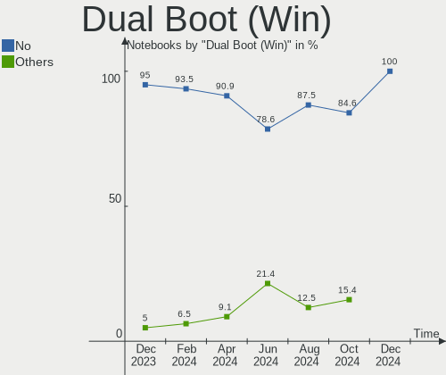
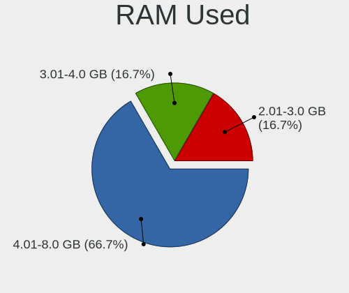
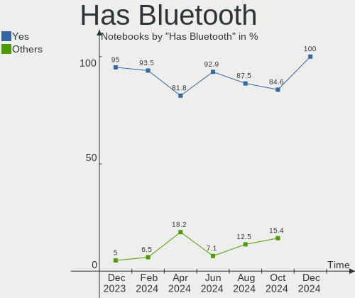
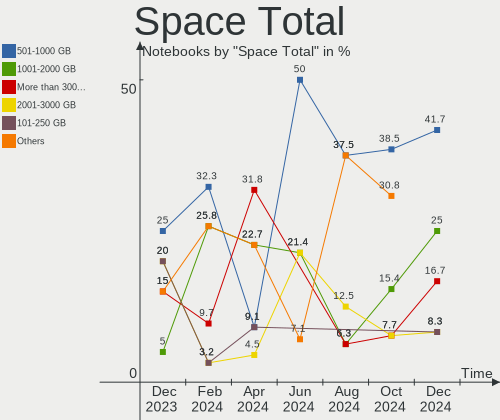
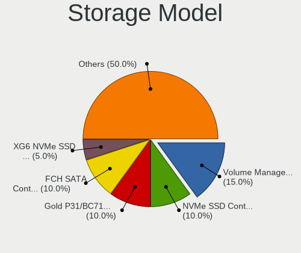
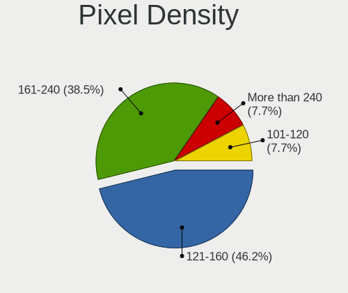
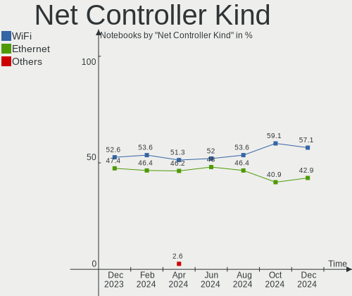
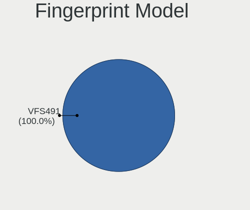

Nobara - Hardware Trends (Notebooks)
------------------------------------

A project to identify most popular hardware characteristics and track their change
over time based on data collected by Linux users at https://Linux-Hardware.org.

Anyone can contribute to this report by the [hw-probe](https://github.com/linuxhw/hw-probe) tool:

    sudo -E hw-probe -all -upload

This report is for one last month. Overall report since the beginning of time: [TestDays](https://github.com/linuxhw/TestDays)

Period: Jul, 2023.

Contents
--------

* [ System ](#system)
  - [ OS                       ](#os)
  - [ OS Family                ](#os-family)
  - [ Kernel                   ](#kernel)
  - [ Kernel Family            ](#kernel-family)
  - [ Kernel Major Ver.        ](#kernel-major-ver)
  - [ Arch                     ](#arch)
  - [ DE                       ](#de)
  - [ Display Server           ](#display-server)
  - [ Display Manager          ](#display-manager)
  - [ OS Lang                  ](#os-lang)
  - [ Boot Mode                ](#boot-mode)
  - [ Filesystem               ](#filesystem)
  - [ Part. scheme             ](#part-scheme)
  - [ Dual Boot with Linux/BSD ](#dual-boot-with-linuxbsd)
  - [ Dual Boot (Win)          ](#dual-boot-win)

* [ Board ](#board)
  - [ Vendor                   ](#vendor)
  - [ Model                    ](#model)
  - [ Model Family             ](#model-family)
  - [ MFG Year                 ](#mfg-year)
  - [ Form Factor              ](#form-factor)
  - [ Secure Boot              ](#secure-boot)
  - [ Coreboot                 ](#coreboot)
  - [ RAM Size                 ](#ram-size)
  - [ RAM Used                 ](#ram-used)
  - [ Total Drives             ](#total-drives)
  - [ Has CD-ROM               ](#has-cd-rom)
  - [ Has Ethernet             ](#has-ethernet)
  - [ Has WiFi                 ](#has-wifi)
  - [ Has Bluetooth            ](#has-bluetooth)

* [ Location ](#location)
  - [ Country                  ](#country)
  - [ City                     ](#city)

* [ Drives ](#drives)
  - [ Drive Vendor             ](#drive-vendor)
  - [ Drive Model              ](#drive-model)
  - [ HDD Vendor               ](#hdd-vendor)
  - [ SSD Vendor               ](#ssd-vendor)
  - [ Drive Kind               ](#drive-kind)
  - [ Drive Connector          ](#drive-connector)
  - [ Drive Size               ](#drive-size)
  - [ Space Total              ](#space-total)
  - [ Space Used               ](#space-used)
  - [ Malfunc. Drives          ](#malfunc-drives)
  - [ Malfunc. Drive Vendor    ](#malfunc-drive-vendor)
  - [ Malfunc. HDD Vendor      ](#malfunc-hdd-vendor)
  - [ Malfunc. Drive Kind      ](#malfunc-drive-kind)
  - [ Failed Drives            ](#failed-drives)
  - [ Failed Drive Vendor      ](#failed-drive-vendor)
  - [ Drive Status             ](#drive-status)

* [ Storage controller ](#storage-controller)
  - [ Storage Vendor           ](#storage-vendor)
  - [ Storage Model            ](#storage-model)
  - [ Storage Kind             ](#storage-kind)

* [ Processor ](#processor)
  - [ CPU Vendor               ](#cpu-vendor)
  - [ CPU Model                ](#cpu-model)
  - [ CPU Model Family         ](#cpu-model-family)
  - [ CPU Cores                ](#cpu-cores)
  - [ CPU Sockets              ](#cpu-sockets)
  - [ CPU Threads              ](#cpu-threads)
  - [ CPU Op-Modes             ](#cpu-op-modes)
  - [ CPU Microcode            ](#cpu-microcode)
  - [ CPU Microarch            ](#cpu-microarch)

* [ Graphics ](#graphics)
  - [ GPU Vendor               ](#gpu-vendor)
  - [ GPU Model                ](#gpu-model)
  - [ GPU Combo                ](#gpu-combo)
  - [ GPU Driver               ](#gpu-driver)
  - [ GPU Memory               ](#gpu-memory)

* [ Monitor ](#monitor)
  - [ Monitor Vendor           ](#monitor-vendor)
  - [ Monitor Model            ](#monitor-model)
  - [ Monitor Resolution       ](#monitor-resolution)
  - [ Monitor Diagonal         ](#monitor-diagonal)
  - [ Monitor Width            ](#monitor-width)
  - [ Aspect Ratio             ](#aspect-ratio)
  - [ Monitor Area             ](#monitor-area)
  - [ Pixel Density            ](#pixel-density)
  - [ Multiple Monitors        ](#multiple-monitors)

* [ Network ](#network)
  - [ Net Controller Vendor    ](#net-controller-vendor)
  - [ Net Controller Model     ](#net-controller-model)
  - [ Wireless Vendor          ](#wireless-vendor)
  - [ Wireless Model           ](#wireless-model)
  - [ Ethernet Vendor          ](#ethernet-vendor)
  - [ Ethernet Model           ](#ethernet-model)
  - [ Net Controller Kind      ](#net-controller-kind)
  - [ Used Controller          ](#used-controller)
  - [ NICs                     ](#nics)
  - [ IPv6                     ](#ipv6)

* [ Bluetooth ](#bluetooth)
  - [ Bluetooth Vendor         ](#bluetooth-vendor)
  - [ Bluetooth Model          ](#bluetooth-model)

* [ Sound ](#sound)
  - [ Sound Vendor             ](#sound-vendor)
  - [ Sound Model              ](#sound-model)

* [ Memory ](#memory)
  - [ Memory Vendor            ](#memory-vendor)
  - [ Memory Model             ](#memory-model)
  - [ Memory Kind              ](#memory-kind)
  - [ Memory Form Factor       ](#memory-form-factor)
  - [ Memory Size              ](#memory-size)
  - [ Memory Speed             ](#memory-speed)

* [ Printers & scanners ](#printers--scanners)
  - [ Printer Vendor           ](#printer-vendor)
  - [ Printer Model            ](#printer-model)
  - [ Scanner Vendor           ](#scanner-vendor)
  - [ Scanner Model            ](#scanner-model)

* [ Camera ](#camera)
  - [ Camera Vendor            ](#camera-vendor)
  - [ Camera Model             ](#camera-model)

* [ Security ](#security)
  - [ Fingerprint Vendor       ](#fingerprint-vendor)
  - [ Fingerprint Model        ](#fingerprint-model)
  - [ Chipcard Vendor          ](#chipcard-vendor)
  - [ Chipcard Model           ](#chipcard-model)

* [ Unsupported ](#unsupported)
  - [ Unsupported Devices      ](#unsupported-devices)
  - [ Unsupported Device Types ](#unsupported-device-types)

System
------

OS
--

Installed operating systems

| Name      | Notebooks | Percent |
|-----------|-----------|---------|
| Nobara 38 | 14        | 77.78%  |
| Nobara 37 | 4         | 22.22%  |

OS Family
---------

OS without a version

| Name   | Notebooks | Percent |
|--------|-----------|---------|
| Nobara | 18        | 100%    |

Kernel
------

Version of the Linux kernel

| Version                      | Notebooks | Percent |
|------------------------------|-----------|---------|
| 6.3.12-204.fsync.fc38.x86_64 | 8         | 44.44%  |
| 6.3.10-200.fsync.fc38.x86_64 | 4         | 22.22%  |
| 6.3.12-204.fsync.fc37.x86_64 | 2         | 11.11%  |
| 6.3.10-200.fsync.fc37.x86_64 | 2         | 11.11%  |
| 6.3.12-203.fsync.fc38.x86_64 | 1         | 5.56%   |
| 6.3.10-203.fsync.fc38.x86_64 | 1         | 5.56%   |

Kernel Family
-------------

Linux kernel without a distro release

| Version | Notebooks | Percent |
|---------|-----------|---------|
| 6.3.12  | 11        | 61.11%  |
| 6.3.10  | 7         | 38.89%  |

Kernel Major Ver.
-----------------

Linux kernel major version

| Version | Notebooks | Percent |
|---------|-----------|---------|
| 6.3     | 18        | 100%    |

Arch
----

OS architecture (x86_64, i586, etc.)

| Name   | Notebooks | Percent |
|--------|-----------|---------|
| x86_64 | 18        | 100%    |

DE
--

Desktop Environment

| Name    | Notebooks | Percent |
|---------|-----------|---------|
| GNOME   | 13        | 72.22%  |
| KDE5    | 4         | 22.22%  |
| Unknown | 1         | 5.56%   |

Display Server
--------------

X11 or Wayland

| Name    | Notebooks | Percent |
|---------|-----------|---------|
| Wayland | 13        | 72.22%  |
| X11     | 5         | 27.78%  |

Display Manager
---------------

SDDM, LightDM, etc.

| Name    | Notebooks | Percent |
|---------|-----------|---------|
| Unknown | 15        | 83.33%  |
| GDM     | 3         | 16.67%  |

OS Lang
-------

Language

| Lang  | Notebooks | Percent |
|-------|-----------|---------|
| en_US | 11        | 61.11%  |
| pl_PL | 2         | 11.11%  |
| en_GB | 2         | 11.11%  |
| ru_RU | 1         | 5.56%   |
| es_ES | 1         | 5.56%   |
| de_DE | 1         | 5.56%   |

Boot Mode
---------

EFI or BIOS

| Mode | Notebooks | Percent |
|------|-----------|---------|
| EFI  | 16        | 88.89%  |
| BIOS | 2         | 11.11%  |

Filesystem
----------

Type of filesystem

| Type  | Notebooks | Percent |
|-------|-----------|---------|
| Btrfs | 17        | 94.44%  |
| Ext4  | 1         | 5.56%   |

Part. scheme
------------

Scheme of partitioning

| Type    | Notebooks | Percent |
|---------|-----------|---------|
| Unknown | 14        | 77.78%  |
| GPT     | 4         | 22.22%  |

Dual Boot with Linux/BSD
------------------------

Hosting more than one Linux/BSD

| Dual boot | Notebooks | Percent |
|-----------|-----------|---------|
| No        | 17        | 94.44%  |
| Yes       | 1         | 5.56%   |

Dual Boot (Win)
---------------

Hosting Linux and Windows

| Dual boot | Notebooks | Percent |
|-----------|-----------|---------|
| No        | 17        | 94.44%  |
| Yes       | 1         | 5.56%   |

Board
-----

Vendor
------

Motherboard manufacturer

| Name             | Notebooks | Percent |
|------------------|-----------|---------|
| Lenovo           | 5         | 27.78%  |
| Dell             | 4         | 22.22%  |
| Hewlett-Packard  | 2         | 11.11%  |
| ASUSTek Computer | 2         | 11.11%  |
| Acer             | 2         | 11.11%  |
| Toshiba          | 1         | 5.56%   |
| MSI              | 1         | 5.56%   |
| Apple            | 1         | 5.56%   |

Model
-----

Motherboard model

| Name                                  | Notebooks | Percent |
|---------------------------------------|-----------|---------|
| Dell Inspiron 15 3520                 | 2         | 11.11%  |
| Toshiba Satellite S55t-C              | 1         | 5.56%   |
| MSI GT70 2PE                          | 1         | 5.56%   |
| Lenovo ThinkPad T470 20HES0FA03       | 1         | 5.56%   |
| Lenovo Legion 5 Pro 16ACH6H 82JQ      | 1         | 5.56%   |
| Lenovo Legion 5 15ARH05H 82B1         | 1         | 5.56%   |
| Lenovo IdeaPad Y700-15ISK 80NV        | 1         | 5.56%   |
| Lenovo IdeaPad 3 17ABA7 82RQ          | 1         | 5.56%   |
| HP Pavilion Gaming Laptop 15-ec2xxx   | 1         | 5.56%   |
| HP Pavilion Gaming Laptop 15-ec1xxx   | 1         | 5.56%   |
| Dell Latitude E5440                   | 1         | 5.56%   |
| Dell G7 7790                          | 1         | 5.56%   |
| ASUS X541SA                           | 1         | 5.56%   |
| ASUS ROG Zephyrus M16 GU603ZM_GU603ZM | 1         | 5.56%   |
| Apple MacBookPro5,4                   | 1         | 5.56%   |
| Acer Predator PH315-52                | 1         | 5.56%   |
| Acer Nitro AN515-54                   | 1         | 5.56%   |

Model Family
------------

Motherboard model prefix

| Name              | Notebooks | Percent |
|-------------------|-----------|---------|
| Lenovo Legion     | 2         | 11.11%  |
| Lenovo IdeaPad    | 2         | 11.11%  |
| HP Pavilion       | 2         | 11.11%  |
| Dell Inspiron     | 2         | 11.11%  |
| Toshiba Satellite | 1         | 5.56%   |
| MSI GT70          | 1         | 5.56%   |
| Lenovo ThinkPad   | 1         | 5.56%   |
| Dell Latitude     | 1         | 5.56%   |
| Dell G7           | 1         | 5.56%   |
| ASUS X541SA       | 1         | 5.56%   |
| ASUS ROG          | 1         | 5.56%   |
| Apple MacBookPro5 | 1         | 5.56%   |
| Acer Predator     | 1         | 5.56%   |
| Acer Nitro        | 1         | 5.56%   |

MFG Year
--------

Motherboard manufacture year

| Year | Notebooks | Percent |
|------|-----------|---------|
| 2020 | 4         | 22.22%  |
| 2019 | 3         | 16.67%  |
| 2022 | 2         | 11.11%  |
| 2021 | 2         | 11.11%  |
| 2015 | 2         | 11.11%  |
| 2017 | 1         | 5.56%   |
| 2016 | 1         | 5.56%   |
| 2014 | 1         | 5.56%   |
| 2013 | 1         | 5.56%   |
| 2009 | 1         | 5.56%   |

Form Factor
-----------

Physical design of the computer

| Name     | Notebooks | Percent |
|----------|-----------|---------|
| Notebook | 18        | 100%    |

Secure Boot
-----------

Enabled or disabled

| State    | Notebooks | Percent |
|----------|-----------|---------|
| Disabled | 18        | 100%    |

Coreboot
--------

Have coreboot on board

| Used | Notebooks | Percent |
|------|-----------|---------|
| No   | 18        | 100%    |

RAM Size
--------

Total RAM memory

| Size in GB | Notebooks | Percent |
|------------|-----------|---------|
| 16.01-24.0 | 8         | 44.44%  |
| 8.01-16.0  | 5         | 27.78%  |
| 32.01-64.0 | 2         | 11.11%  |
| 3.01-4.0   | 2         | 11.11%  |
| 4.01-8.0   | 1         | 5.56%   |

RAM Used
--------

Used RAM memory

| Used GB   | Notebooks | Percent |
|-----------|-----------|---------|
| 4.01-8.0  | 11        | 61.11%  |
| 3.01-4.0  | 2         | 11.11%  |
| 2.01-3.0  | 2         | 11.11%  |
| 8.01-16.0 | 2         | 11.11%  |
| 1.01-2.0  | 1         | 5.56%   |

Total Drives
------------

Number of drives on board

| Drives | Notebooks | Percent |
|--------|-----------|---------|
| 1      | 11        | 61.11%  |
| 2      | 5         | 27.78%  |
| 5      | 1         | 5.56%   |
| 3      | 1         | 5.56%   |

Has CD-ROM
----------

Has CD-ROM on board

| Presented | Notebooks | Percent |
|-----------|-----------|---------|
| No        | 14        | 77.78%  |
| Yes       | 4         | 22.22%  |

Has Ethernet
------------

Has Ethernet on board

| Presented | Notebooks | Percent |
|-----------|-----------|---------|
| Yes       | 15        | 83.33%  |
| No        | 3         | 16.67%  |

Has WiFi
--------

Has WiFi module

| Presented | Notebooks | Percent |
|-----------|-----------|---------|
| Yes       | 18        | 100%    |

Has Bluetooth
-------------

Has Bluetooth module

| Presented | Notebooks | Percent |
|-----------|-----------|---------|
| Yes       | 18        | 100%    |

Location
--------

Country
-------

Geographic location (country)

| Country  | Notebooks | Percent |
|----------|-----------|---------|
| USA      | 8         | 44.44%  |
| UK       | 2         | 11.11%  |
| Poland   | 2         | 11.11%  |
| Spain    | 1         | 5.56%   |
| Malaysia | 1         | 5.56%   |
| Italy    | 1         | 5.56%   |
| Germany  | 1         | 5.56%   |
| Estonia  | 1         | 5.56%   |
| Belarus  | 1         | 5.56%   |

City
----

Geographic location (city)

| City                   | Notebooks | Percent |
|------------------------|-----------|---------|
| Turek                  | 1         | 5.56%   |
| Staunton               | 1         | 5.56%   |
| San Jose               | 1         | 5.56%   |
| San Francisco          | 1         | 5.56%   |
| Saltara                | 1         | 5.56%   |
| Ryczowek               | 1         | 5.56%   |
| Pärnu                 | 1         | 5.56%   |
| Minsk                  | 1         | 5.56%   |
| Mannheim               | 1         | 5.56%   |
| Manchester             | 1         | 5.56%   |
| Liberty                | 1         | 5.56%   |
| Kuala Lumpur           | 1         | 5.56%   |
| Houston                | 1         | 5.56%   |
| Chicago                | 1         | 5.56%   |
| Calne                  | 1         | 5.56%   |
| Cadalso de los Vidrios | 1         | 5.56%   |
| Buford                 | 1         | 5.56%   |
| Bourbonnais            | 1         | 5.56%   |

Drives
------

Drive Vendor
------------

Hard drive vendors

| Vendor                      | Notebooks | Drives | Percent |
|-----------------------------|-----------|--------|---------|
| Samsung Electronics         | 7         | 9      | 28%     |
| Sandisk                     | 4         | 4      | 16%     |
| WDC                         | 2         | 2      | 8%      |
| Intel                       | 2         | 3      | 8%      |
| Toshiba                     | 1         | 2      | 4%      |
| SK hynix                    | 1         | 1      | 4%      |
| Realtek                     | 1         | 1      | 4%      |
| Plextor                     | 1         | 1      | 4%      |
| Micron Technology           | 1         | 1      | 4%      |
| KIOXIA                      | 1         | 1      | 4%      |
| Kingston Technology Company | 1         | 1      | 4%      |
| Kingston                    | 1         | 1      | 4%      |
| Intenso                     | 1         | 1      | 4%      |
| HGST                        | 1         | 1      | 4%      |

Drive Model
-----------

Hard drive models

| Model                                               | Notebooks | Percent |
|-----------------------------------------------------|-----------|---------|
| Samsung NVMe SSD Controller SM981/PM981/PM983 500GB | 3         | 11.11%  |
| Sandisk PC SN740 NVMe WD 512GB                      | 2         | 7.41%   |
| WDC WD5000BEVT-24A0RT0 500GB                        | 1         | 3.7%    |
| WDC WD10SPCX-24HWST1 1TB                            | 1         | 3.7%    |
| Toshiba THNSNJ128GMCU 128GB SSD                     | 1         | 3.7%    |
| SK hynix SKHynix_HFS001TDE9X084N 1TB                | 1         | 3.7%    |
| SanDisk X400 M.2 2280 512GB SSD                     | 1         | 3.7%    |
| Sandisk WD PC SN735 SDBPNHH-512G-1002 512GB         | 1         | 3.7%    |
| Samsung SSD 870 EVO 2TB                             | 1         | 3.7%    |
| Samsung SSD 860 EVO M.2 1TB                         | 1         | 3.7%    |
| Samsung SSD 830 Series 128GB                        | 1         | 3.7%    |
| Samsung NVMe SSD Controller PM9A1/PM9A3/980PRO 1TB  | 1         | 3.7%    |
| Samsung MZMTE256HMHP-00000 256GB SSD                | 1         | 3.7%    |
| Realtek RTL9210B-CG 256GB                           | 1         | 3.7%    |
| Plextor PH6-CE240-L 240GB SSD                       | 1         | 3.7%    |
| Micron MTFDHBA512QFD-1AX1AABHA 512GB                | 1         | 3.7%    |
| KIOXIA KBG40ZNT512G TOSHIBA MEMORY 512GB            | 1         | 3.7%    |
| Kingston Company SNV2S1000G 1TB                     | 1         | 3.7%    |
| Kingston SA400S37240G 240GB SSD                     | 1         | 3.7%    |
| Intenso Portable SSD 128GB                          | 1         | 3.7%    |
| Intel SSDPEKNW512GZL 512GB                          | 1         | 3.7%    |
| Intel H10 HBRPEKNX0203AO NVMe 32GB                  | 1         | 3.7%    |
| Intel H10 HBRPEKNX0203A NVMe 1TB                    | 1         | 3.7%    |
| HGST HTS721010A9E630 1TB                            | 1         | 3.7%    |

HDD Vendor
----------

Hard disk drive vendors

| Vendor | Notebooks | Drives | Percent |
|--------|-----------|--------|---------|
| WDC    | 2         | 2      | 66.67%  |
| HGST   | 1         | 1      | 33.33%  |

SSD Vendor
----------

Solid state drive vendors

| Vendor              | Notebooks | Drives | Percent |
|---------------------|-----------|--------|---------|
| Samsung Electronics | 4         | 5      | 44.44%  |
| Toshiba             | 1         | 2      | 11.11%  |
| SanDisk             | 1         | 1      | 11.11%  |
| Plextor             | 1         | 1      | 11.11%  |
| Kingston            | 1         | 1      | 11.11%  |
| Intenso             | 1         | 1      | 11.11%  |

Drive Kind
----------

HDD or SSD

| Kind | Notebooks | Drives | Percent |
|------|-----------|--------|---------|
| NVMe | 14        | 15     | 56%     |
| SSD  | 8         | 11     | 32%     |
| HDD  | 3         | 3      | 12%     |

Drive Connector
---------------

SATA, SAS, NVMe, etc.

| Type | Notebooks | Drives | Percent |
|------|-----------|--------|---------|
| NVMe | 13        | 14     | 54.17%  |
| SATA | 9         | 13     | 37.5%   |
| SAS  | 2         | 2      | 8.33%   |

Drive Size
----------

Size of hard drive

| Size in TB | Notebooks | Drives | Percent |
|------------|-----------|--------|---------|
| 0.01-0.5   | 6         | 8      | 54.55%  |
| 0.51-1.0   | 4         | 5      | 36.36%  |
| 1.01-2.0   | 1         | 1      | 9.09%   |

Space Total
-----------

Amount of disk space available on the file system

| Size in GB     | Notebooks | Percent |
|----------------|-----------|---------|
| 251-500        | 5         | 27.78%  |
| 1001-2000      | 4         | 22.22%  |
| 501-1000       | 4         | 22.22%  |
| More than 3000 | 2         | 11.11%  |
| Unknown        | 2         | 11.11%  |
| 101-250        | 1         | 5.56%   |

Space Used
----------

Amount of used disk space

| Used GB   | Notebooks | Percent |
|-----------|-----------|---------|
| 101-250   | 5         | 27.78%  |
| 1-20      | 3         | 16.67%  |
| 251-500   | 2         | 11.11%  |
| 21-50     | 2         | 11.11%  |
| 51-100    | 2         | 11.11%  |
| Unknown   | 2         | 11.11%  |
| 1001-2000 | 1         | 5.56%   |
| 501-1000  | 1         | 5.56%   |

Malfunc. Drives
---------------

Drive models with a malfunction

Zero info for selected period =(

Malfunc. Drive Vendor
---------------------

Vendors of faulty drives

Zero info for selected period =(

Malfunc. HDD Vendor
-------------------

Vendors of faulty HDD drives

Zero info for selected period =(

Malfunc. Drive Kind
-------------------

Kinds of faulty drives

Zero info for selected period =(

Failed Drives
-------------

Failed drive models

Zero info for selected period =(

Failed Drive Vendor
-------------------

Failed drive vendors

Zero info for selected period =(

Drive Status
------------

Number of failed and malfunc. drives

| Status   | Notebooks | Drives | Percent |
|----------|-----------|--------|---------|
| Detected | 14        | 25     | 77.78%  |
| Works    | 4         | 4      | 22.22%  |

Storage controller
------------------

Storage Vendor
--------------

Storage controller vendors

| Vendor                      | Notebooks | Percent |
|-----------------------------|-----------|---------|
| Intel                       | 12        | 41.38%  |
| AMD                         | 5         | 17.24%  |
| Samsung Electronics         | 4         | 13.79%  |
| Sandisk                     | 3         | 10.34%  |
| SK hynix                    | 1         | 3.45%   |
| Nvidia                      | 1         | 3.45%   |
| Micron Technology           | 1         | 3.45%   |
| KIOXIA                      | 1         | 3.45%   |
| Kingston Technology Company | 1         | 3.45%   |

Storage Model
-------------

Storage controller models

| Model                                                                            | Notebooks | Percent |
|----------------------------------------------------------------------------------|-----------|---------|
| AMD FCH SATA Controller [AHCI mode]                                              | 5         | 15.63%  |
| Samsung NVMe SSD Controller SM981/PM981/PM983                                    | 3         | 9.38%   |
| Intel Volume Management Device NVMe RAID Controller                              | 3         | 9.38%   |
| Intel Cannon Lake Mobile PCH SATA AHCI Controller                                | 3         | 9.38%   |
| Sandisk PC SN740 NVMe SSD (DRAM-less)                                            | 2         | 6.25%   |
| Intel Tiger Lake-LP SATA Controller                                              | 2         | 6.25%   |
| Intel HM170/QM170 Chipset SATA Controller [AHCI Mode]                            | 2         | 6.25%   |
| Intel 82801 Mobile SATA Controller [RAID mode]                                   | 2         | 6.25%   |
| SK hynix Gold P31/BC711/PC711 NVMe Solid State Drive                             | 1         | 3.13%   |
| SanDisk PC SN735 NVMe SSD (DRAM-less)                                            | 1         | 3.13%   |
| Samsung NVMe SSD Controller PM9A1/PM9A3/980PRO                                   | 1         | 3.13%   |
| Nvidia MCP79 AHCI Controller                                                     | 1         | 3.13%   |
| Micron 2210 NVMe SSD [Cobain]                                                    | 1         | 3.13%   |
| KIOXIA NVMe SSD Controller BG4 (DRAM-less)                                       | 1         | 3.13%   |
| Kingston Company Company Non-Volatile memory controller                          | 1         | 3.13%   |
| Intel SSD 670p Series [Keystone Harbor]                                          | 1         | 3.13%   |
| Intel Optane NVME SSD H10 with Solid State Storage [Teton Glacier]               | 1         | 3.13%   |
| Intel Atom/Celeron/Pentium Processor x5-E8000/J3xxx/N3xxx Series SATA Controller | 1         | 3.13%   |

Storage Kind
------------

Kind of storage controller (IDE, SATA, NVMe, SAS, ...)

| Kind | Notebooks | Percent |
|------|-----------|---------|
| SATA | 14        | 43.75%  |
| NVMe | 13        | 40.63%  |
| RAID | 5         | 15.63%  |

Processor
---------

CPU Vendor
----------

Processor vendors

| Vendor | Notebooks | Percent |
|--------|-----------|---------|
| Intel  | 13        | 72.22%  |
| AMD    | 5         | 27.78%  |

CPU Model
---------

Processor models

| Model                                   | Notebooks | Percent |
|-----------------------------------------|-----------|---------|
| Intel Core i7-9750H CPU @ 2.60GHz       | 2         | 11.11%  |
| Intel 11th Gen Core i5-1135G7 @ 2.40GHz | 2         | 11.11%  |
| Intel Pentium CPU N3710 @ 1.60GHz       | 1         | 5.56%   |
| Intel Core i7-6700HQ CPU @ 2.60GHz      | 1         | 5.56%   |
| Intel Core i7-4810MQ CPU @ 2.80GHz      | 1         | 5.56%   |
| Intel Core i5-9300H CPU @ 2.40GHz       | 1         | 5.56%   |
| Intel Core i5-7300U CPU @ 2.60GHz       | 1         | 5.56%   |
| Intel Core i5-6300HQ CPU @ 2.30GHz      | 1         | 5.56%   |
| Intel Core i5-4310U CPU @ 2.00GHz       | 1         | 5.56%   |
| Intel Core 2 Duo CPU P8700 @ 2.53GHz    | 1         | 5.56%   |
| Intel 12th Gen Core i7-12700H           | 1         | 5.56%   |
| AMD Ryzen 7 5800H with Radeon Graphics  | 1         | 5.56%   |
| AMD Ryzen 7 4800H with Radeon Graphics  | 1         | 5.56%   |
| AMD Ryzen 5 5625U with Radeon Graphics  | 1         | 5.56%   |
| AMD Ryzen 5 5600H with Radeon Graphics  | 1         | 5.56%   |
| AMD Ryzen 5 4600H with Radeon Graphics  | 1         | 5.56%   |

CPU Model Family
----------------

Processor model prefix

| Model            | Notebooks | Percent |
|------------------|-----------|---------|
| Intel Core i7    | 4         | 22.22%  |
| Intel Core i5    | 4         | 22.22%  |
| Other            | 3         | 16.67%  |
| AMD Ryzen 5      | 3         | 16.67%  |
| AMD Ryzen 7      | 2         | 11.11%  |
| Intel Pentium    | 1         | 5.56%   |
| Intel Core 2 Duo | 1         | 5.56%   |

CPU Cores
---------

Number of processor cores

| Number | Notebooks | Percent |
|--------|-----------|---------|
| 4      | 7         | 38.89%  |
| 6      | 5         | 27.78%  |
| 2      | 3         | 16.67%  |
| 8      | 2         | 11.11%  |
| 14     | 1         | 5.56%   |

CPU Sockets
-----------

Number of sockets

| Number | Notebooks | Percent |
|--------|-----------|---------|
| 1      | 18        | 100%    |

CPU Threads
-----------

Threads per core (Hyper-Threading)

| Number | Notebooks | Percent |
|--------|-----------|---------|
| 2      | 15        | 83.33%  |
| 1      | 3         | 16.67%  |

CPU Op-Modes
------------

CPU Operation Modes (32-bit, 64-bit)

| Op mode        | Notebooks | Percent |
|----------------|-----------|---------|
| 32-bit, 64-bit | 18        | 100%    |

CPU Microcode
-------------

Microcode number

| Number     | Notebooks | Percent |
|------------|-----------|---------|
| Unknown    | 13        | 72.22%  |
| 0x0a50000c | 3         | 16.67%  |
| 0x08600106 | 1         | 5.56%   |
| 0x08600104 | 1         | 5.56%   |

CPU Microarch
-------------

Microarchitecture

| Name       | Notebooks | Percent |
|------------|-----------|---------|
| KabyLake   | 4         | 22.22%  |
| Zen 3      | 3         | 16.67%  |
| Zen 2      | 2         | 11.11%  |
| TigerLake  | 2         | 11.11%  |
| Skylake    | 2         | 11.11%  |
| Haswell    | 2         | 11.11%  |
| Silvermont | 1         | 5.56%   |
| Penryn     | 1         | 5.56%   |
| Unknown    | 1         | 5.56%   |

Graphics
--------

GPU Vendor
----------

Vendors of graphics cards

| Vendor | Notebooks | Percent |
|--------|-----------|---------|
| Intel  | 12        | 44.44%  |
| Nvidia | 11        | 40.74%  |
| AMD    | 4         | 14.81%  |

GPU Model
---------

Graphics card models

| Model                                                                                    | Notebooks | Percent |
|------------------------------------------------------------------------------------------|-----------|---------|
| Intel CoffeeLake-H GT2 [UHD Graphics 630]                                                | 3         | 11.11%  |
| Nvidia TU106M [GeForce RTX 2060 Mobile]                                                  | 2         | 7.41%   |
| Nvidia GA106M [GeForce RTX 3060 Mobile / Max-Q]                                          | 2         | 7.41%   |
| Intel TigerLake-LP GT2 [Iris Xe Graphics]                                                | 2         | 7.41%   |
| Intel HD Graphics 530                                                                    | 2         | 7.41%   |
| AMD Cezanne [Radeon Vega Series / Radeon Vega Mobile Series]                             | 2         | 7.41%   |
| Nvidia TU117M [GeForce GTX 1650 Ti Mobile]                                               | 1         | 3.7%    |
| Nvidia TU117M                                                                            | 1         | 3.7%    |
| Nvidia TU116M [GeForce GTX 1660 Ti Mobile]                                               | 1         | 3.7%    |
| Nvidia GM107M [GeForce GTX 960M]                                                         | 1         | 3.7%    |
| Nvidia GM107M [GeForce GTX 950M]                                                         | 1         | 3.7%    |
| Nvidia GK104M [GeForce GTX 880M]                                                         | 1         | 3.7%    |
| Nvidia C79 [GeForce 9400M]                                                               | 1         | 3.7%    |
| Intel HD Graphics 620                                                                    | 1         | 3.7%    |
| Intel Haswell-ULT Integrated Graphics Controller                                         | 1         | 3.7%    |
| Intel Atom/Celeron/Pentium Processor x5-E8000/J3xxx/N3xxx Integrated Graphics Controller | 1         | 3.7%    |
| Intel Alder Lake-P Integrated Graphics Controller                                        | 1         | 3.7%    |
| Intel 4th Gen Core Processor Integrated Graphics Controller                              | 1         | 3.7%    |
| AMD Renoir                                                                               | 1         | 3.7%    |
| AMD Barcelo                                                                              | 1         | 3.7%    |

GPU Combo
---------

Combinations of graphics cards

| Name           | Notebooks | Percent |
|----------------|-----------|---------|
| Intel + Nvidia | 6         | 33.33%  |
| 1 x Intel      | 6         | 33.33%  |
| 1 x Nvidia     | 2         | 11.11%  |
| AMD + Nvidia   | 2         | 11.11%  |
| 1 x AMD        | 2         | 11.11%  |

GPU Driver
----------

Free vs proprietary

| Driver      | Notebooks | Percent |
|-------------|-----------|---------|
| Free        | 9         | 50%     |
| Proprietary | 8         | 44.44%  |
| Unknown     | 1         | 5.56%   |

GPU Memory
----------

Total video memory

| Size in GB | Notebooks | Percent |
|------------|-----------|---------|
| Unknown    | 13        | 72.22%  |
| 1.01-2.0   | 2         | 11.11%  |
| 0.01-0.5   | 2         | 11.11%  |
| 5.01-6.0   | 1         | 5.56%   |

Monitor
-------

Monitor Vendor
--------------

Monitor vendors

| Vendor                  | Notebooks | Percent |
|-------------------------|-----------|---------|
| LG Display              | 5         | 23.81%  |
| AU Optronics            | 5         | 23.81%  |
| BOE                     | 4         | 19.05%  |
| Samsung Electronics     | 1         | 4.76%   |
| Goldstar                | 1         | 4.76%   |
| CSO                     | 1         | 4.76%   |
| Chimei Innolux          | 1         | 4.76%   |
| Chi Mei Optoelectronics | 1         | 4.76%   |
| ASUSTek Computer        | 1         | 4.76%   |
| Ancor Communications    | 1         | 4.76%   |

Monitor Model
-------------

Monitor models

| Model                                                                     | Notebooks | Percent |
|---------------------------------------------------------------------------|-----------|---------|
| LG Display LCD Monitor LGD0738 1920x1080 344x194mm 15.5-inch              | 2         | 9.52%   |
| Samsung Electronics LCD Monitor SAM7103 3840x2160 700x390mm 31.5-inch     | 1         | 4.76%   |
| LG Display LCD Monitor LGD0533 1920x1080 344x194mm 15.5-inch              | 1         | 4.76%   |
| LG Display LCD Monitor LGD04E1 1366x768 344x194mm 15.5-inch               | 1         | 4.76%   |
| LG Display LCD Monitor LGD0470 1920x1080 345x194mm 15.6-inch              | 1         | 4.76%   |
| Goldstar M2350D GSM57F4 1920x1080 598x336mm 27.0-inch                     | 1         | 4.76%   |
| CSO LCD Monitor CSO1609 2560x1600 345x215mm 16.0-inch                     | 1         | 4.76%   |
| Chimei Innolux LCD Monitor CMN1515 1920x1080 344x193mm 15.5-inch          | 1         | 4.76%   |
| Chi Mei Optoelectronics LCD Monitor CMO1720 1920x1080 382x215mm 17.3-inch | 1         | 4.76%   |
| BOE LCD Monitor BOE0A6D 1920x1200 345x215mm 16.0-inch                     | 1         | 4.76%   |
| BOE LCD Monitor BOE094D 1920x1080 344x194mm 15.5-inch                     | 1         | 4.76%   |
| BOE LCD Monitor BOE0818 1920x1080 344x194mm 15.5-inch                     | 1         | 4.76%   |
| BOE LCD Monitor BOE05F6 1366x768 309x173mm 13.9-inch                      | 1         | 4.76%   |
| AU Optronics LCD Monitor AUOB78D 1920x1080 344x193mm 15.5-inch            | 1         | 4.76%   |
| AU Optronics LCD Monitor AUO82ED 1920x1080 344x193mm 15.5-inch            | 1         | 4.76%   |
| AU Optronics LCD Monitor AUO439D 1920x1080 382x215mm 17.3-inch            | 1         | 4.76%   |
| AU Optronics LCD Monitor AUO429D 1920x1080 382x215mm 17.3-inch            | 1         | 4.76%   |
| AU Optronics LCD Monitor AUO103D 1920x1080 309x173mm 13.9-inch            | 1         | 4.76%   |
| ASUSTek Computer VG247Q1A AUS242B 1920x1080 527x296mm 23.8-inch           | 1         | 4.76%   |
| Ancor Communications ASUS VE278 ACI27F6 1920x1080 598x336mm 27.0-inch     | 1         | 4.76%   |

Monitor Resolution
------------------

Monitor screen resolution

| Resolution        | Notebooks | Percent |
|-------------------|-----------|---------|
| 1920x1080 (FHD)   | 14        | 73.68%  |
| 1366x768 (WXGA)   | 2         | 10.53%  |
| 3840x2160 (4K)    | 1         | 5.26%   |
| 2560x1600         | 1         | 5.26%   |
| 1920x1200 (WUXGA) | 1         | 5.26%   |

Monitor Diagonal
----------------

Diagonal size in inches

| Inches | Notebooks | Percent |
|--------|-----------|---------|
| 15     | 10        | 47.62%  |
| 17     | 3         | 14.29%  |
| 27     | 2         | 9.52%   |
| 16     | 2         | 9.52%   |
| 13     | 2         | 9.52%   |
| 43     | 1         | 4.76%   |
| 23     | 1         | 4.76%   |

Monitor Width
-------------

Physical width

| Width in mm | Notebooks | Percent |
|-------------|-----------|---------|
| 301-350     | 14        | 66.67%  |
| 501-600     | 3         | 14.29%  |
| 351-400     | 3         | 14.29%  |
| 901-1000    | 1         | 4.76%   |

Aspect Ratio
------------

Proportional relationship between the width and the height

| Ratio | Notebooks | Percent |
|-------|-----------|---------|
| 16/9  | 16        | 88.89%  |
| 16/10 | 2         | 11.11%  |

Monitor Area
------------

Area in inch²

| Area in inch² | Notebooks | Percent |
|----------------|-----------|---------|
| 101-110        | 10        | 47.62%  |
| 121-130        | 3         | 14.29%  |
| 81-90          | 2         | 9.52%   |
| 301-350        | 2         | 9.52%   |
| 111-120        | 2         | 9.52%   |
| 201-250        | 1         | 4.76%   |
| 501-1000       | 1         | 4.76%   |

Pixel Density
-------------

Pixels per inch

| Density | Notebooks | Percent |
|---------|-----------|---------|
| 121-160 | 14        | 70%     |
| 51-100  | 3         | 15%     |
| 101-120 | 2         | 10%     |
| 161-240 | 1         | 5%      |

Multiple Monitors
-----------------

Total monitors connected

| Total | Notebooks | Percent |
|-------|-----------|---------|
| 1     | 13        | 72.22%  |
| 2     | 4         | 22.22%  |
| 0     | 1         | 5.56%   |

Network
-------

Net Controller Vendor
---------------------

Controller vendors

| Vendor                | Notebooks | Percent |
|-----------------------|-----------|---------|
| Realtek Semiconductor | 12        | 44.44%  |
| Intel                 | 10        | 37.04%  |
| Qualcomm Atheros      | 2         | 7.41%   |
| Nvidia                | 1         | 3.7%    |
| MediaTek              | 1         | 3.7%    |
| Broadcom              | 1         | 3.7%    |

Net Controller Model
--------------------

Controller models

| Model                                                             | Notebooks | Percent |
|-------------------------------------------------------------------|-----------|---------|
| Realtek RTL8111/8168/8411 PCI Express Gigabit Ethernet Controller | 7         | 21.21%  |
| Intel Wi-Fi 6 AX200                                               | 3         | 9.09%   |
| Realtek RTL88x2bu [AC1200 Techkey]                                | 1         | 3.03%   |
| Realtek RTL8852BE PCIe 802.11ax Wireless Network Controller       | 1         | 3.03%   |
| Realtek RTL8852AE 802.11ax PCIe Wireless Network Adapter          | 1         | 3.03%   |
| Realtek RTL8822CE 802.11ac PCIe Wireless Network Adapter          | 1         | 3.03%   |
| Realtek RTL8821CE 802.11ac PCIe Wireless Network Adapter          | 1         | 3.03%   |
| Realtek RTL8125 2.5GbE Controller                                 | 1         | 3.03%   |
| Realtek RTL810xE PCI Express Fast Ethernet controller             | 1         | 3.03%   |
| Realtek Killer E2500 Gigabit Ethernet Controller                  | 1         | 3.03%   |
| Qualcomm Atheros Killer E2500 Gigabit Ethernet Controller         | 1         | 3.03%   |
| Qualcomm Atheros Killer E220x Gigabit Ethernet Controller         | 1         | 3.03%   |
| Qualcomm Atheros AR9462 Wireless Network Adapter                  | 1         | 3.03%   |
| Nvidia MCP79 Ethernet                                             | 1         | 3.03%   |
| MediaTek MT7921 802.11ax PCI Express Wireless Network Adapter     | 1         | 3.03%   |
| Intel Wireless-AC 9260                                            | 1         | 3.03%   |
| Intel Wireless 8265 / 8275                                        | 1         | 3.03%   |
| Intel Wireless 8260                                               | 1         | 3.03%   |
| Intel Wireless 7265                                               | 1         | 3.03%   |
| Intel Wireless 7260                                               | 1         | 3.03%   |
| Intel Wi-Fi 6 AX201                                               | 1         | 3.03%   |
| Intel Ethernet Connection I218-LM                                 | 1         | 3.03%   |
| Intel Ethernet Connection (4) I219-LM                             | 1         | 3.03%   |
| Intel Alder Lake-P PCH CNVi WiFi                                  | 1         | 3.03%   |
| Broadcom BCM4322 802.11a/b/g/n Wireless LAN Controller            | 1         | 3.03%   |

Wireless Vendor
---------------

Wireless vendors

| Vendor                | Notebooks | Percent |
|-----------------------|-----------|---------|
| Intel                 | 10        | 55.56%  |
| Realtek Semiconductor | 5         | 27.78%  |
| Qualcomm Atheros      | 1         | 5.56%   |
| MediaTek              | 1         | 5.56%   |
| Broadcom              | 1         | 5.56%   |

Wireless Model
--------------

Wireless models

| Model                                                         | Notebooks | Percent |
|---------------------------------------------------------------|-----------|---------|
| Intel Wi-Fi 6 AX200                                           | 3         | 16.67%  |
| Realtek RTL88x2bu [AC1200 Techkey]                            | 1         | 5.56%   |
| Realtek RTL8852BE PCIe 802.11ax Wireless Network Controller   | 1         | 5.56%   |
| Realtek RTL8852AE 802.11ax PCIe Wireless Network Adapter      | 1         | 5.56%   |
| Realtek RTL8822CE 802.11ac PCIe Wireless Network Adapter      | 1         | 5.56%   |
| Realtek RTL8821CE 802.11ac PCIe Wireless Network Adapter      | 1         | 5.56%   |
| Qualcomm Atheros AR9462 Wireless Network Adapter              | 1         | 5.56%   |
| MediaTek MT7921 802.11ax PCI Express Wireless Network Adapter | 1         | 5.56%   |
| Intel Wireless-AC 9260                                        | 1         | 5.56%   |
| Intel Wireless 8265 / 8275                                    | 1         | 5.56%   |
| Intel Wireless 8260                                           | 1         | 5.56%   |
| Intel Wireless 7265                                           | 1         | 5.56%   |
| Intel Wireless 7260                                           | 1         | 5.56%   |
| Intel Wi-Fi 6 AX201                                           | 1         | 5.56%   |
| Intel Alder Lake-P PCH CNVi WiFi                              | 1         | 5.56%   |
| Broadcom BCM4322 802.11a/b/g/n Wireless LAN Controller        | 1         | 5.56%   |

Ethernet Vendor
---------------

Ethernet vendors

| Vendor                | Notebooks | Percent |
|-----------------------|-----------|---------|
| Realtek Semiconductor | 10        | 66.67%  |
| Qualcomm Atheros      | 2         | 13.33%  |
| Intel                 | 2         | 13.33%  |
| Nvidia                | 1         | 6.67%   |

Ethernet Model
--------------

Ethernet models

| Model                                                             | Notebooks | Percent |
|-------------------------------------------------------------------|-----------|---------|
| Realtek RTL8111/8168/8411 PCI Express Gigabit Ethernet Controller | 7         | 46.67%  |
| Realtek RTL8125 2.5GbE Controller                                 | 1         | 6.67%   |
| Realtek RTL810xE PCI Express Fast Ethernet controller             | 1         | 6.67%   |
| Realtek Killer E2500 Gigabit Ethernet Controller                  | 1         | 6.67%   |
| Qualcomm Atheros Killer E2500 Gigabit Ethernet Controller         | 1         | 6.67%   |
| Qualcomm Atheros Killer E220x Gigabit Ethernet Controller         | 1         | 6.67%   |
| Nvidia MCP79 Ethernet                                             | 1         | 6.67%   |
| Intel Ethernet Connection I218-LM                                 | 1         | 6.67%   |
| Intel Ethernet Connection (4) I219-LM                             | 1         | 6.67%   |

Net Controller Kind
-------------------

Ethernet, WiFi or modem

| Kind     | Notebooks | Percent |
|----------|-----------|---------|
| WiFi     | 18        | 54.55%  |
| Ethernet | 15        | 45.45%  |

Used Controller
---------------

Currently used network controller

| Kind     | Notebooks | Percent |
|----------|-----------|---------|
| WiFi     | 14        | 70%     |
| Ethernet | 6         | 30%     |

NICs
----

Total network controllers on board

| Total | Notebooks | Percent |
|-------|-----------|---------|
| 2     | 14        | 77.78%  |
| 1     | 4         | 22.22%  |

IPv6
----

IPv6 vs IPv4

| Used | Notebooks | Percent |
|------|-----------|---------|
| No   | 13        | 72.22%  |
| Yes  | 5         | 27.78%  |

Bluetooth
---------

Bluetooth Vendor
----------------

Controller vendors

| Vendor                          | Notebooks | Percent |
|---------------------------------|-----------|---------|
| Intel                           | 10        | 52.63%  |
| Realtek Semiconductor           | 4         | 21.05%  |
| Qualcomm Atheros Communications | 1         | 5.26%   |
| IMC Networks                    | 1         | 5.26%   |
| Foxconn / Hon Hai               | 1         | 5.26%   |
| Cambridge Silicon Radio         | 1         | 5.26%   |
| Apple                           | 1         | 5.26%   |

Bluetooth Model
---------------

Controller models

| Model                                               | Notebooks | Percent |
|-----------------------------------------------------|-----------|---------|
| Realtek Bluetooth Radio                             | 4         | 21.05%  |
| Intel Bluetooth wireless interface                  | 4         | 21.05%  |
| Intel AX200 Bluetooth                               | 3         | 15.79%  |
| Qualcomm Atheros AR3012 Bluetooth 4.0               | 1         | 5.26%   |
| Intel Wireless-AC 9260 Bluetooth Adapter            | 1         | 5.26%   |
| Intel Bluetooth Device                              | 1         | 5.26%   |
| Intel Bluetooth 9460/9560 Jefferson Peak (JfP)      | 1         | 5.26%   |
| IMC Networks Bluetooth Device                       | 1         | 5.26%   |
| Foxconn / Hon Hai MediaTek Bluetooth Adapter        | 1         | 5.26%   |
| Cambridge Silicon Radio Bluetooth Dongle (HCI mode) | 1         | 5.26%   |
| Apple Bluetooth Host Controller                     | 1         | 5.26%   |

Sound
-----

Sound Vendor
------------

Sound card vendors

| Vendor    | Notebooks | Percent |
|-----------|-----------|---------|
| Intel     | 12        | 44.44%  |
| Nvidia    | 8         | 29.63%  |
| AMD       | 5         | 18.52%  |
| Razer USA | 2         | 7.41%   |

Sound Model
-----------

Sound card models

| Model                                                                                             | Notebooks | Percent |
|---------------------------------------------------------------------------------------------------|-----------|---------|
| AMD Family 17h/19h HD Audio Controller                                                            | 5         | 17.24%  |
| Intel Cannon Lake PCH cAVS                                                                        | 3         | 10.34%  |
| Nvidia TU106 High Definition Audio Controller                                                     | 2         | 6.9%    |
| Nvidia GA106 High Definition Audio Controller                                                     | 2         | 6.9%    |
| Intel Tiger Lake-LP Smart Sound Technology Audio Controller                                       | 2         | 6.9%    |
| Intel 100 Series/C230 Series Chipset Family HD Audio Controller                                   | 2         | 6.9%    |
| Razer USA Razer BlackShark V2 Pro                                                                 | 1         | 3.45%   |
| Razer USA Kraken 7.1                                                                              | 1         | 3.45%   |
| Nvidia TU116 High Definition Audio Controller                                                     | 1         | 3.45%   |
| Nvidia TU107 GeForce GTX 1650 High Definition Audio Controller                                    | 1         | 3.45%   |
| Nvidia MCP79 High Definition Audio                                                                | 1         | 3.45%   |
| Nvidia GK104 HDMI Audio Controller                                                                | 1         | 3.45%   |
| Intel Sunrise Point-LP HD Audio                                                                   | 1         | 3.45%   |
| Intel Haswell-ULT HD Audio Controller                                                             | 1         | 3.45%   |
| Intel Atom/Celeron/Pentium Processor x5-E8000/J3xxx/N3xxx Series High Definition Audio Controller | 1         | 3.45%   |
| Intel Alder Lake PCH-P High Definition Audio Controller                                           | 1         | 3.45%   |
| Intel 8 Series/C220 Series Chipset High Definition Audio Controller                               | 1         | 3.45%   |
| Intel 8 Series HD Audio Controller                                                                | 1         | 3.45%   |
| AMD Renoir Radeon High Definition Audio Controller                                                | 1         | 3.45%   |

Memory
------

Memory Vendor
-------------

Memory module vendors

| Vendor              | Notebooks | Percent |
|---------------------|-----------|---------|
| Samsung Electronics | 2         | 40%     |
| SK hynix            | 1         | 20%     |
| Kingston            | 1         | 20%     |
| G.Skill             | 1         | 20%     |

Memory Model
------------

Memory module models

| Model                                                   | Notebooks | Percent |
|---------------------------------------------------------|-----------|---------|
| Samsung RAM M471A1G44AB0-CWE 8GB SODIMM DDR4 3200MT/s   | 2         | 40%     |
| SK hynix RAM HMA82GS6AFR8N-UH 16GB SODIMM DDR4 2667MT/s | 1         | 20%     |
| Kingston RAM ACR26D4S9S8ME-8 8GB SODIMM DDR4 2667MT/s   | 1         | 20%     |
| G.Skill RAM F4-3200C22-16GRS 16GB SODIMM DDR4 3200MT/s  | 1         | 20%     |

Memory Kind
-----------

Memory module kinds

| Kind | Notebooks | Percent |
|------|-----------|---------|
| DDR4 | 4         | 100%    |

Memory Form Factor
------------------

Physical design of the memory module

| Name   | Notebooks | Percent |
|--------|-----------|---------|
| SODIMM | 4         | 100%    |

Memory Size
-----------

Memory module size

| Size  | Notebooks | Percent |
|-------|-----------|---------|
| 8192  | 3         | 60%     |
| 16384 | 2         | 40%     |

Memory Speed
------------

Memory module speed

| Speed | Notebooks | Percent |
|-------|-----------|---------|
| 3200  | 2         | 50%     |
| 2667  | 2         | 50%     |

Printers & scanners
-------------------

Printer Vendor
--------------

Printer device vendors

Zero info for selected period =(

Printer Model
-------------

Printer device models

Zero info for selected period =(

Scanner Vendor
--------------

Scanner device vendors

Zero info for selected period =(

Scanner Model
-------------

Scanner device models

Zero info for selected period =(

Camera
------

Camera Vendor
-------------

Camera device vendors

| Vendor                | Notebooks | Percent |
|-----------------------|-----------|---------|
| Chicony Electronics   | 4         | 22.22%  |
| Realtek Semiconductor | 3         | 16.67%  |
| Quanta                | 3         | 16.67%  |
| IMC Networks          | 2         | 11.11%  |
| Apple                 | 2         | 11.11%  |
| Syntek                | 1         | 5.56%   |
| Samsung Electronics   | 1         | 5.56%   |
| Microdia              | 1         | 5.56%   |
| Intel                 | 1         | 5.56%   |

Camera Model
------------

Camera device models

| Model                                   | Notebooks | Percent |
|-----------------------------------------|-----------|---------|
| Realtek Integrated_Webcam_HD            | 3         | 16.67%  |
| Quanta HP TrueVision HD Camera          | 2         | 11.11%  |
| Chicony Integrated Camera               | 2         | 11.11%  |
| Syntek Integrated Camera                | 1         | 5.56%   |
| Samsung Galaxy series, misc. (MTP mode) | 1         | 5.56%   |
| Quanta HD User Facing                   | 1         | 5.56%   |
| Microdia Laptop_Integrated_Webcam_HD    | 1         | 5.56%   |
| Intel RealSense 3D Camera (Front F200)  | 1         | 5.56%   |
| IMC Networks USB2.0 VGA UVC WebCam      | 1         | 5.56%   |
| IMC Networks USB2.0 HD UVC WebCam       | 1         | 5.56%   |
| Chicony TOSHIBA Web Camera - HD         | 1         | 5.56%   |
| Chicony HD User Facing                  | 1         | 5.56%   |
| Apple iPhone 5/5C/5S/6/SE/7/8/X         | 1         | 5.56%   |
| Apple Built-in iSight                   | 1         | 5.56%   |

Security
--------

Fingerprint Vendor
------------------

Fingerprint sensor vendors

| Vendor           | Notebooks | Percent |
|------------------|-----------|---------|
| Validity Sensors | 2         | 100%    |

Fingerprint Model
-----------------

Fingerprint sensor models

| Model                                      | Notebooks | Percent |
|--------------------------------------------|-----------|---------|
| Validity Sensors VFS495 Fingerprint Reader | 1         | 50%     |
| Validity Sensors Synaptics WBDI            | 1         | 50%     |

Chipcard Vendor
---------------

Chipcard module vendors

Zero info for selected period =(

Chipcard Model
--------------

Chipcard module models

Zero info for selected period =(

Unsupported
-----------

Unsupported Devices
-------------------

Total unsupported devices on board

| Total | Notebooks | Percent |
|-------|-----------|---------|
| 0     | 11        | 61.11%  |
| 1     | 6         | 33.33%  |
| 3     | 1         | 5.56%   |

Unsupported Device Types
------------------------

Types of unsupported devices

| Type                  | Notebooks | Percent |
|-----------------------|-----------|---------|
| Multimedia controller | 4         | 44.44%  |
| Graphics card         | 3         | 33.33%  |
| Fingerprint reader    | 1         | 11.11%  |
| Camera                | 1         | 11.11%  |

