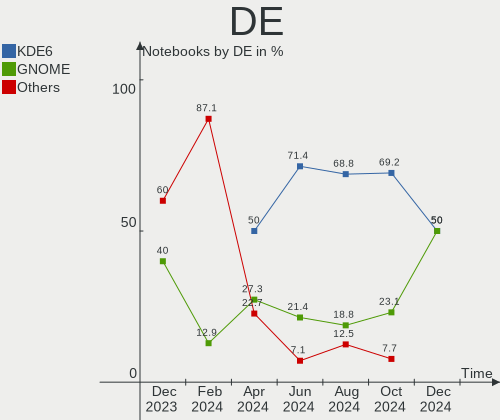
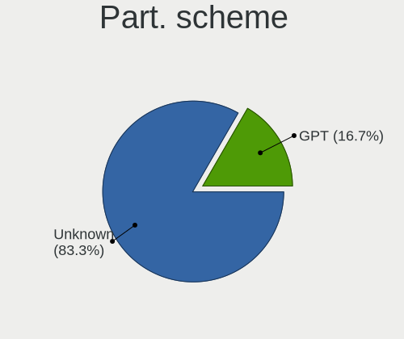
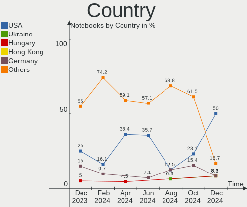
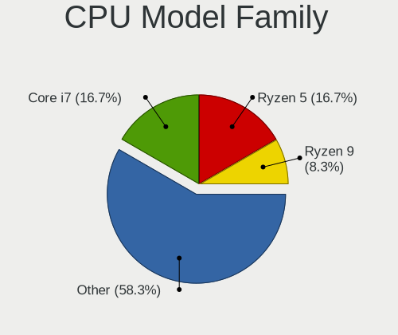
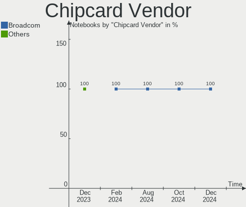
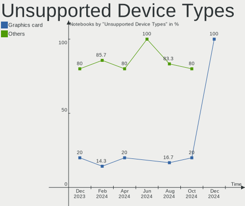

Nobara - Hardware Trends (Notebooks)
------------------------------------

A project to identify most popular hardware characteristics and track their change
over time based on data collected by Linux users at https://Linux-Hardware.org.

Anyone can contribute to this report by the [hw-probe](https://github.com/linuxhw/hw-probe) tool:

    sudo -E hw-probe -all -upload

This report is for one last month. Overall report since the beginning of time: [TestDays](https://github.com/linuxhw/TestDays)

Period: Dec, 2023.

Contents
--------

* [ System ](#system)
  - [ OS                       ](#os)
  - [ OS Family                ](#os-family)
  - [ Kernel                   ](#kernel)
  - [ Kernel Family            ](#kernel-family)
  - [ Kernel Major Ver.        ](#kernel-major-ver)
  - [ Arch                     ](#arch)
  - [ DE                       ](#de)
  - [ Display Server           ](#display-server)
  - [ Display Manager          ](#display-manager)
  - [ OS Lang                  ](#os-lang)
  - [ Boot Mode                ](#boot-mode)
  - [ Filesystem               ](#filesystem)
  - [ Part. scheme             ](#part-scheme)
  - [ Dual Boot with Linux/BSD ](#dual-boot-with-linuxbsd)
  - [ Dual Boot (Win)          ](#dual-boot-win)

* [ Board ](#board)
  - [ Vendor                   ](#vendor)
  - [ Model                    ](#model)
  - [ Model Family             ](#model-family)
  - [ MFG Year                 ](#mfg-year)
  - [ Form Factor              ](#form-factor)
  - [ Secure Boot              ](#secure-boot)
  - [ Coreboot                 ](#coreboot)
  - [ RAM Size                 ](#ram-size)
  - [ RAM Used                 ](#ram-used)
  - [ Total Drives             ](#total-drives)
  - [ Has CD-ROM               ](#has-cd-rom)
  - [ Has Ethernet             ](#has-ethernet)
  - [ Has WiFi                 ](#has-wifi)
  - [ Has Bluetooth            ](#has-bluetooth)

* [ Location ](#location)
  - [ Country                  ](#country)
  - [ City                     ](#city)

* [ Drives ](#drives)
  - [ Drive Vendor             ](#drive-vendor)
  - [ Drive Model              ](#drive-model)
  - [ HDD Vendor               ](#hdd-vendor)
  - [ SSD Vendor               ](#ssd-vendor)
  - [ Drive Kind               ](#drive-kind)
  - [ Drive Connector          ](#drive-connector)
  - [ Drive Size               ](#drive-size)
  - [ Space Total              ](#space-total)
  - [ Space Used               ](#space-used)
  - [ Malfunc. Drives          ](#malfunc-drives)
  - [ Malfunc. Drive Vendor    ](#malfunc-drive-vendor)
  - [ Malfunc. HDD Vendor      ](#malfunc-hdd-vendor)
  - [ Malfunc. Drive Kind      ](#malfunc-drive-kind)
  - [ Failed Drives            ](#failed-drives)
  - [ Failed Drive Vendor      ](#failed-drive-vendor)
  - [ Drive Status             ](#drive-status)

* [ Storage controller ](#storage-controller)
  - [ Storage Vendor           ](#storage-vendor)
  - [ Storage Model            ](#storage-model)
  - [ Storage Kind             ](#storage-kind)

* [ Processor ](#processor)
  - [ CPU Vendor               ](#cpu-vendor)
  - [ CPU Model                ](#cpu-model)
  - [ CPU Model Family         ](#cpu-model-family)
  - [ CPU Cores                ](#cpu-cores)
  - [ CPU Sockets              ](#cpu-sockets)
  - [ CPU Threads              ](#cpu-threads)
  - [ CPU Op-Modes             ](#cpu-op-modes)
  - [ CPU Microcode            ](#cpu-microcode)
  - [ CPU Microarch            ](#cpu-microarch)

* [ Graphics ](#graphics)
  - [ GPU Vendor               ](#gpu-vendor)
  - [ GPU Model                ](#gpu-model)
  - [ GPU Combo                ](#gpu-combo)
  - [ GPU Driver               ](#gpu-driver)
  - [ GPU Memory               ](#gpu-memory)

* [ Monitor ](#monitor)
  - [ Monitor Vendor           ](#monitor-vendor)
  - [ Monitor Model            ](#monitor-model)
  - [ Monitor Resolution       ](#monitor-resolution)
  - [ Monitor Diagonal         ](#monitor-diagonal)
  - [ Monitor Width            ](#monitor-width)
  - [ Aspect Ratio             ](#aspect-ratio)
  - [ Monitor Area             ](#monitor-area)
  - [ Pixel Density            ](#pixel-density)
  - [ Multiple Monitors        ](#multiple-monitors)

* [ Network ](#network)
  - [ Net Controller Vendor    ](#net-controller-vendor)
  - [ Net Controller Model     ](#net-controller-model)
  - [ Wireless Vendor          ](#wireless-vendor)
  - [ Wireless Model           ](#wireless-model)
  - [ Ethernet Vendor          ](#ethernet-vendor)
  - [ Ethernet Model           ](#ethernet-model)
  - [ Net Controller Kind      ](#net-controller-kind)
  - [ Used Controller          ](#used-controller)
  - [ NICs                     ](#nics)
  - [ IPv6                     ](#ipv6)

* [ Bluetooth ](#bluetooth)
  - [ Bluetooth Vendor         ](#bluetooth-vendor)
  - [ Bluetooth Model          ](#bluetooth-model)

* [ Sound ](#sound)
  - [ Sound Vendor             ](#sound-vendor)
  - [ Sound Model              ](#sound-model)

* [ Memory ](#memory)
  - [ Memory Vendor            ](#memory-vendor)
  - [ Memory Model             ](#memory-model)
  - [ Memory Kind              ](#memory-kind)
  - [ Memory Form Factor       ](#memory-form-factor)
  - [ Memory Size              ](#memory-size)
  - [ Memory Speed             ](#memory-speed)

* [ Printers & scanners ](#printers--scanners)
  - [ Printer Vendor           ](#printer-vendor)
  - [ Printer Model            ](#printer-model)
  - [ Scanner Vendor           ](#scanner-vendor)
  - [ Scanner Model            ](#scanner-model)

* [ Camera ](#camera)
  - [ Camera Vendor            ](#camera-vendor)
  - [ Camera Model             ](#camera-model)

* [ Security ](#security)
  - [ Fingerprint Vendor       ](#fingerprint-vendor)
  - [ Fingerprint Model        ](#fingerprint-model)
  - [ Chipcard Vendor          ](#chipcard-vendor)
  - [ Chipcard Model           ](#chipcard-model)

* [ Unsupported ](#unsupported)
  - [ Unsupported Devices      ](#unsupported-devices)
  - [ Unsupported Device Types ](#unsupported-device-types)

System
------

OS
--

Installed operating systems

| Name      | Notebooks | Percent |
|-----------|-----------|---------|
| Nobara 38 | 15        | 75%     |
| Nobara 37 | 3         | 15%     |
| Nobara 39 | 2         | 10%     |

OS Family
---------

OS without a version

| Name   | Notebooks | Percent |
|--------|-----------|---------|
| Nobara | 20        | 100%    |

Kernel
------

Version of the Linux kernel

| Version                      | Notebooks | Percent |
|------------------------------|-----------|---------|
| 6.6.4-202.fsync.fc38.x86_64  | 4         | 20%     |
| 6.6.7-203.fsync.fc38.x86_64  | 3         | 15%     |
| 6.6.7-203.fsync.fc39.x86_64  | 2         | 10%     |
| 6.6.6-200.fsync.fc38.x86_64  | 2         | 10%     |
| 6.6.2-201.fsync.fc38.x86_64  | 2         | 10%     |
| 6.6.3-203.fsync.fc38.x86_64  | 1         | 5%      |
| 6.6.3-201.fsync.fc38.x86_64  | 1         | 5%      |
| 6.5.9-201.fsync.fc38.x86_64  | 1         | 5%      |
| 6.4.10-202.fsync.fc38.x86_64 | 1         | 5%      |
| 6.4.10-202.fsync.fc37.x86_64 | 1         | 5%      |
| 6.3.9-200.fsync.fc37.x86_64  | 1         | 5%      |
| 6.2.14-300.fsync.fc37.x86_64 | 1         | 5%      |

Kernel Family
-------------

Linux kernel without a distro release

| Version | Notebooks | Percent |
|---------|-----------|---------|
| 6.6.7   | 5         | 25%     |
| 6.6.4   | 4         | 20%     |
| 6.6.6   | 2         | 10%     |
| 6.6.3   | 2         | 10%     |
| 6.6.2   | 2         | 10%     |
| 6.4.10  | 2         | 10%     |
| 6.5.9   | 1         | 5%      |
| 6.3.9   | 1         | 5%      |
| 6.2.14  | 1         | 5%      |

Kernel Major Ver.
-----------------

Linux kernel major version

| Version | Notebooks | Percent |
|---------|-----------|---------|
| 6.6     | 15        | 75%     |
| 6.4     | 2         | 10%     |
| 6.5     | 1         | 5%      |
| 6.3     | 1         | 5%      |
| 6.2     | 1         | 5%      |

Arch
----

OS architecture (x86_64, i586, etc.)

| Name   | Notebooks | Percent |
|--------|-----------|---------|
| x86_64 | 20        | 100%    |

DE
--

Desktop Environment

| Name  | Notebooks | Percent |
|-------|-----------|---------|
| KDE5  | 12        | 60%     |
| GNOME | 8         | 40%     |

Display Server
--------------

X11 or Wayland

| Name    | Notebooks | Percent |
|---------|-----------|---------|
| Wayland | 18        | 90%     |
| X11     | 2         | 10%     |

Display Manager
---------------

SDDM, LightDM, etc.

| Name    | Notebooks | Percent |
|---------|-----------|---------|
| Unknown | 16        | 80%     |
| SDDM    | 4         | 20%     |

OS Lang
-------

Language

| Lang  | Notebooks | Percent |
|-------|-----------|---------|
| en_US | 9         | 45%     |
| de_DE | 3         | 15%     |
| en_GB | 2         | 10%     |
| uk_UA | 1         | 5%      |
| nl_BE | 1         | 5%      |
| it_IT | 1         | 5%      |
| es_VE | 1         | 5%      |
| es_MX | 1         | 5%      |
| en_DK | 1         | 5%      |

Boot Mode
---------

EFI or BIOS

| Mode | Notebooks | Percent |
|------|-----------|---------|
| EFI  | 19        | 95%     |
| BIOS | 1         | 5%      |

Filesystem
----------

Type of filesystem

| Type  | Notebooks | Percent |
|-------|-----------|---------|
| Btrfs | 20        | 100%    |

Part. scheme
------------

Scheme of partitioning

| Type    | Notebooks | Percent |
|---------|-----------|---------|
| Unknown | 16        | 80%     |
| GPT     | 4         | 20%     |

Dual Boot with Linux/BSD
------------------------

Hosting more than one Linux/BSD

| Dual boot | Notebooks | Percent |
|-----------|-----------|---------|
| No        | 19        | 95%     |
| Yes       | 1         | 5%      |

Dual Boot (Win)
---------------

Hosting Linux and Windows

| Dual boot | Notebooks | Percent |
|-----------|-----------|---------|
| No        | 19        | 95%     |
| Yes       | 1         | 5%      |

Board
-----

Vendor
------

Motherboard manufacturer

| Name                | Notebooks | Percent |
|---------------------|-----------|---------|
| Hewlett-Packard     | 6         | 30%     |
| Dell                | 3         | 15%     |
| ASUSTek Computer    | 3         | 15%     |
| Lenovo              | 2         | 10%     |
| Acer                | 2         | 10%     |
| Monster             | 1         | 5%      |
| GPU Company         | 1         | 5%      |
| Gigabyte Technology | 1         | 5%      |
| Exo                 | 1         | 5%      |

Model
-----

Motherboard model

| Name                                     | Notebooks | Percent |
|------------------------------------------|-----------|---------|
| Monster ABRA A5 V13.4                    | 1         | 5%      |
| Lenovo ThinkPad L14 Gen 1 20U5002DUK     | 1         | 5%      |
| Lenovo IdeaPad Z500 20202                | 1         | 5%      |
| HP Pavilion Laptop 15-cs3xxx             | 1         | 5%      |
| HP Pavilion dv5                          | 1         | 5%      |
| HP OMEN by Laptop 16-c0xxx               | 1         | 5%      |
| HP Laptop 15-db0xxx                      | 1         | 5%      |
| HP Laptop 14s-fq0xxx                     | 1         | 5%      |
| HP Laptop 14-dk0xxx                      | 1         | 5%      |
| GPU Company GWNR71517                    | 1         | 5%      |
| Gigabyte G5 GE                           | 1         | 5%      |
| Exo Smart XQ7                            | 1         | 5%      |
| Dell G7 7700                             | 1         | 5%      |
| Dell G5 5505                             | 1         | 5%      |
| Dell G3 3590                             | 1         | 5%      |
| ASUS VivoBook_ASUSLaptop M3500QA_M3500QA | 1         | 5%      |
| ASUS ROG Strix G814JV_G814JV             | 1         | 5%      |
| ASUS ROG Strix G513QY_G513QY             | 1         | 5%      |
| Acer Aspire E5-473                       | 1         | 5%      |
| Acer Aspire A515-56T                     | 1         | 5%      |

Model Family
------------

Motherboard model prefix

| Name                  | Notebooks | Percent |
|-----------------------|-----------|---------|
| HP Laptop             | 3         | 15%     |
| HP Pavilion           | 2         | 10%     |
| ASUS ROG              | 2         | 10%     |
| Acer Aspire           | 2         | 10%     |
| Monster ABRA          | 1         | 5%      |
| Lenovo ThinkPad       | 1         | 5%      |
| Lenovo IdeaPad        | 1         | 5%      |
| HP OMEN               | 1         | 5%      |
| GPU Company GWNR71517 | 1         | 5%      |
| Gigabyte G5           | 1         | 5%      |
| Exo Smart             | 1         | 5%      |
| Dell G7               | 1         | 5%      |
| Dell G5               | 1         | 5%      |
| Dell G3               | 1         | 5%      |
| ASUS VivoBook         | 1         | 5%      |

MFG Year
--------

Motherboard manufacture year

| Year | Notebooks | Percent |
|------|-----------|---------|
| 2021 | 5         | 25%     |
| 2020 | 5         | 25%     |
| 2019 | 3         | 15%     |
| 2018 | 2         | 10%     |
| 2023 | 1         | 5%      |
| 2022 | 1         | 5%      |
| 2015 | 1         | 5%      |
| 2012 | 1         | 5%      |
| 2008 | 1         | 5%      |

Form Factor
-----------

Physical design of the computer

| Name     | Notebooks | Percent |
|----------|-----------|---------|
| Notebook | 20        | 100%    |

Secure Boot
-----------

Enabled or disabled

| State    | Notebooks | Percent |
|----------|-----------|---------|
| Disabled | 20        | 100%    |

Coreboot
--------

Have coreboot on board

| Used | Notebooks | Percent |
|------|-----------|---------|
| No   | 20        | 100%    |

RAM Size
--------

Total RAM memory

| Size in GB  | Notebooks | Percent |
|-------------|-----------|---------|
| 32.01-64.0  | 5         | 25%     |
| 4.01-8.0    | 4         | 20%     |
| 16.01-24.0  | 4         | 20%     |
| 8.01-16.0   | 4         | 20%     |
| 24.01-32.0  | 1         | 5%      |
| 2.01-3.0    | 1         | 5%      |
| 64.01-256.0 | 1         | 5%      |

RAM Used
--------

Used RAM memory

| Used GB   | Notebooks | Percent |
|-----------|-----------|---------|
| 4.01-8.0  | 9         | 45%     |
| 3.01-4.0  | 5         | 25%     |
| 2.01-3.0  | 2         | 10%     |
| 1.01-2.0  | 2         | 10%     |
| 8.01-16.0 | 2         | 10%     |

Total Drives
------------

Number of drives on board

| Drives | Notebooks | Percent |
|--------|-----------|---------|
| 1      | 11        | 55%     |
| 2      | 7         | 35%     |
| 4      | 1         | 5%      |
| 3      | 1         | 5%      |

Has CD-ROM
----------

Has CD-ROM on board

| Presented | Notebooks | Percent |
|-----------|-----------|---------|
| No        | 17        | 85%     |
| Yes       | 3         | 15%     |

Has Ethernet
------------

Has Ethernet on board

| Presented | Notebooks | Percent |
|-----------|-----------|---------|
| Yes       | 18        | 90%     |
| No        | 2         | 10%     |

Has WiFi
--------

Has WiFi module

| Presented | Notebooks | Percent |
|-----------|-----------|---------|
| Yes       | 20        | 100%    |

Has Bluetooth
-------------

Has Bluetooth module

| Presented | Notebooks | Percent |
|-----------|-----------|---------|
| Yes       | 19        | 95%     |
| No        | 1         | 5%      |

Location
--------

Country
-------

Geographic location (country)

| Country     | Notebooks | Percent |
|-------------|-----------|---------|
| USA         | 5         | 25%     |
| Germany     | 3         | 15%     |
| Venezuela   | 1         | 5%      |
| UK          | 1         | 5%      |
| Poland      | 1         | 5%      |
| Philippines | 1         | 5%      |
| Mexico      | 1         | 5%      |
| Italy       | 1         | 5%      |
| India       | 1         | 5%      |
| Hungary     | 1         | 5%      |
| Greece      | 1         | 5%      |
| Brazil      | 1         | 5%      |
| Belgium     | 1         | 5%      |
| Argentina   | 1         | 5%      |

City
----

Geographic location (city)

| City                   | Notebooks | Percent |
|------------------------|-----------|---------|
| Stamford               | 1         | 5%      |
| Sao Paulo              | 1         | 5%      |
| Michigan City          | 1         | 5%      |
| Mesquite               | 1         | 5%      |
| Lucknow                | 1         | 5%      |
| Leipzig                | 1         | 5%      |
| Gustavo Adolfo Madero  | 1         | 5%      |
| Grand Forks            | 1         | 5%      |
| Gdansk                 | 1         | 5%      |
| Dillingen an der Donau | 1         | 5%      |
| Dessel                 | 1         | 5%      |
| Davao City             | 1         | 5%      |
| Coro                   | 1         | 5%      |
| Conroe                 | 1         | 5%      |
| Cologne                | 1         | 5%      |
| Buenos Aires           | 1         | 5%      |
| Bologna                | 1         | 5%      |
| Bicske                 | 1         | 5%      |
| Avon                   | 1         | 5%      |
| Aigaleo                | 1         | 5%      |

Drives
------

Drive Vendor
------------

Hard drive vendors

| Vendor                      | Notebooks | Drives | Percent |
|-----------------------------|-----------|--------|---------|
| Seagate                     | 5         | 5      | 16.13%  |
| Samsung Electronics         | 5         | 5      | 16.13%  |
| SK hynix                    | 2         | 2      | 6.45%   |
| Sandisk                     | 2         | 2      | 6.45%   |
| Phison Electronics          | 2         | 2      | 6.45%   |
| Micron/Crucial Technology   | 2         | 2      | 6.45%   |
| KIOXIA                      | 2         | 2      | 6.45%   |
| Kingston                    | 2         | 2      | 6.45%   |
| Wibtek                      | 1         | 1      | 3.23%   |
| WDC                         | 1         | 1      | 3.23%   |
| Toshiba                     | 1         | 1      | 3.23%   |
| Realtek Semiconductor       | 1         | 1      | 3.23%   |
| MAXIO Technology (Hangzhou) | 1         | 1      | 3.23%   |
| Lenovo                      | 1         | 1      | 3.23%   |
| Intel                       | 1         | 1      | 3.23%   |
| ASMT                        | 1         | 2      | 3.23%   |
| Unknown                     | 1         | 1      | 3.23%   |

Drive Model
-----------

Hard drive models

| Model                                               | Notebooks | Percent |
|-----------------------------------------------------|-----------|---------|
| Samsung NVMe SSD Controller SM981/PM981/PM983 512GB | 3         | 9.68%   |
| Wibtek W800S 512GB SSD                              | 1         | 3.23%   |
| WDC WD10SPZX-24Z10T0 1TB                            | 1         | 3.23%   |
| Toshiba MQ04ABF100 1TB                              | 1         | 3.23%   |
| SK hynix SHPP41-2000GM 2TB                          | 1         | 3.23%   |
| SK hynix HFM001TD3JX013N 1024GB                     | 1         | 3.23%   |
| Seagate ST9120822AS 120GB                           | 1         | 3.23%   |
| Seagate ST1000LX015-1U7172 1TB                      | 1         | 3.23%   |
| Seagate ST1000LM035-1RK172 1TB                      | 1         | 3.23%   |
| Seagate ST1000LM014-1EJ164 1TB                      | 1         | 3.23%   |
| Seagate OneTouch HDD 2TB                            | 1         | 3.23%   |
| Sandisk WDC WDS480G2G0C-00AJM0 480GB                | 1         | 3.23%   |
| Sandisk WD PC SN560 SDDPNQE-1T00-1002 1024GB        | 1         | 3.23%   |
| Samsung MZVLQ1T0HBLB-00B00 1TB                      | 1         | 3.23%   |
| Samsung MZNLN128HAHQ-000H1 128GB SSD                | 1         | 3.23%   |
| Realtek M.2 2280 Gen 3x4 NVMe SSD1TB                | 1         | 3.23%   |
| Phison E16 PCIe4 NVMe Controller 2TB                | 1         | 3.23%   |
| Phison Corsair MP600 CORE XT 2TB                    | 1         | 3.23%   |
| Micron/Crucial P2 NVMe PCIe SSD 4TB                 | 1         | 3.23%   |
| Micron/Crucial CT2000P5PSSD8 2TB                    | 1         | 3.23%   |
| MAXIO (Hangzhou) NVMe SSD Controller MAP1202 256GB  | 1         | 3.23%   |
| Lenovo RPITJ256VFD2MWX 256GB                        | 1         | 3.23%   |
| KIOXIA KBG40ZNV512G 512GB                           | 1         | 3.23%   |
| KIOXIA KBG40ZNS512G NVMe 512GB                      | 1         | 3.23%   |
| Kingston SA400S37120G 120GB SSD                     | 1         | 3.23%   |
| Kingston OM8PCP3512F-AA 512GB                       | 1         | 3.23%   |
| Intel SSDPEKNU010TZ 1024GB                          | 1         | 3.23%   |
| ASMT ASM1156-PM 2TB                                 | 1         | 3.23%   |
| Unknown                                             | 1         | 3.23%   |

HDD Vendor
----------

Hard disk drive vendors

| Vendor  | Notebooks | Drives | Percent |
|---------|-----------|--------|---------|
| Seagate | 5         | 5      | 62.5%   |
| WDC     | 1         | 1      | 12.5%   |
| Toshiba | 1         | 1      | 12.5%   |
| ASMT    | 1         | 2      | 12.5%   |

SSD Vendor
----------

Solid state drive vendors

| Vendor              | Notebooks | Drives | Percent |
|---------------------|-----------|--------|---------|
| Wibtek              | 1         | 1      | 33.33%  |
| Samsung Electronics | 1         | 1      | 33.33%  |
| Kingston            | 1         | 1      | 33.33%  |

Drive Kind
----------

HDD or SSD

| Kind    | Notebooks | Drives | Percent |
|---------|-----------|--------|---------|
| NVMe    | 14        | 19     | 53.85%  |
| HDD     | 8         | 9      | 30.77%  |
| SSD     | 3         | 3      | 11.54%  |
| Unknown | 1         | 1      | 3.85%   |

Drive Connector
---------------

SATA, SAS, NVMe, etc.

| Type | Notebooks | Drives | Percent |
|------|-----------|--------|---------|
| NVMe | 14        | 19     | 53.85%  |
| SATA | 10        | 10     | 38.46%  |
| SAS  | 2         | 3      | 7.69%   |

Drive Size
----------

Size of hard drive

| Size in TB | Notebooks | Drives | Percent |
|------------|-----------|--------|---------|
| 0.51-1.0   | 6         | 6      | 54.55%  |
| 0.01-0.5   | 3         | 3      | 27.27%  |
| 1.01-2.0   | 2         | 3      | 18.18%  |

Space Total
-----------

Amount of disk space available on the file system

| Size in GB     | Notebooks | Percent |
|----------------|-----------|---------|
| 501-1000       | 5         | 25%     |
| 2001-3000      | 4         | 20%     |
| 101-250        | 4         | 20%     |
| More than 3000 | 3         | 15%     |
| 251-500        | 2         | 10%     |
| 1001-2000      | 1         | 5%      |
| Unknown        | 1         | 5%      |

Space Used
----------

Amount of used disk space

| Used GB   | Notebooks | Percent |
|-----------|-----------|---------|
| 101-250   | 5         | 25%     |
| 501-1000  | 4         | 20%     |
| 21-50     | 3         | 15%     |
| 251-500   | 2         | 10%     |
| 1001-2000 | 2         | 10%     |
| 1-20      | 2         | 10%     |
| 51-100    | 1         | 5%      |
| Unknown   | 1         | 5%      |

Malfunc. Drives
---------------

Drive models with a malfunction

Zero info for selected period =(

Malfunc. Drive Vendor
---------------------

Vendors of faulty drives

Zero info for selected period =(

Malfunc. HDD Vendor
-------------------

Vendors of faulty HDD drives

Zero info for selected period =(

Malfunc. Drive Kind
-------------------

Kinds of faulty drives

Zero info for selected period =(

Failed Drives
-------------

Failed drive models

Zero info for selected period =(

Failed Drive Vendor
-------------------

Failed drive vendors

Zero info for selected period =(

Drive Status
------------

Number of failed and malfunc. drives

| Status   | Notebooks | Drives | Percent |
|----------|-----------|--------|---------|
| Detected | 16        | 27     | 80%     |
| Works    | 4         | 5      | 20%     |

Storage controller
------------------

Storage Vendor
--------------

Storage controller vendors

| Vendor                      | Notebooks | Percent |
|-----------------------------|-----------|---------|
| Intel                       | 10        | 31.25%  |
| Samsung Electronics         | 4         | 12.5%   |
| AMD                         | 4         | 12.5%   |
| SK hynix                    | 2         | 6.25%   |
| SanDisk                     | 2         | 6.25%   |
| Phison Electronics          | 2         | 6.25%   |
| Micron/Crucial Technology   | 2         | 6.25%   |
| KIOXIA                      | 2         | 6.25%   |
| Realtek Semiconductor       | 1         | 3.13%   |
| MAXIO Technology (Hangzhou) | 1         | 3.13%   |
| Lenovo                      | 1         | 3.13%   |
| Kingston Technology Company | 1         | 3.13%   |

Storage Model
-------------

Storage controller models

| Model                                                                   | Notebooks | Percent |
|-------------------------------------------------------------------------|-----------|---------|
| Samsung NVMe SSD Controller SM981/PM981/PM983                           | 3         | 8.82%   |
| AMD FCH SATA Controller [AHCI mode]                                     | 3         | 8.82%   |
| KIOXIA NVMe SSD Controller BG4 (DRAM-less)                              | 2         | 5.88%   |
| Intel Cannon Lake Mobile PCH SATA AHCI Controller                       | 2         | 5.88%   |
| SK hynix Platinum P41/PC801 NVMe Solid State Drive                      | 1         | 2.94%   |
| SK hynix Gold P31/BC711/PC711 NVMe Solid State Drive                    | 1         | 2.94%   |
| SanDisk WD Green SN350 240GB (DRAM-less) / SN560E NVMe SSD              | 1         | 2.94%   |
| SanDisk WD Black SN770 / PC SN740 256GB / PC SN560 (DRAM-less) NVMe SSD | 1         | 2.94%   |
| Samsung NVMe SSD Controller 980 (DRAM-less)                             | 1         | 2.94%   |
| Realtek RTS5765DL NVMe SSD Controller (DRAM-less)                       | 1         | 2.94%   |
| Phison PS5021-E21 PCIe4 NVMe Controller (DRAM-less)                     | 1         | 2.94%   |
| Phison E16 PCIe4 NVMe Controller                                        | 1         | 2.94%   |
| Micron/Crucial P5 Plus NVMe PCIe SSD                                    | 1         | 2.94%   |
| Micron/Crucial P2 [Nick P2] / P3 / P3 Plus NVMe PCIe SSD (DRAM-less)    | 1         | 2.94%   |
| MAXIO (Hangzhou) NVMe SSD Controller MAP1202                            | 1         | 2.94%   |
| Lenovo LENSE30256GMSP34MEAT3TA                                          | 1         | 2.94%   |
| Kingston Company OM8PCP Design-In PCIe 3 NVMe SSD (DRAM-less)           | 1         | 2.94%   |
| Intel Wildcat Point-LP SATA Controller [AHCI Mode]                      | 1         | 2.94%   |
| Intel Volume Management Device NVMe RAID Controller                     | 1         | 2.94%   |
| Intel Tiger Lake-LP SATA Controller                                     | 1         | 2.94%   |
| Intel Sunrise Point-LP SATA Controller [AHCI mode]                      | 1         | 2.94%   |
| Intel SSD 670p Series [Keystone Harbor]                                 | 1         | 2.94%   |
| Intel Alder Lake-P SATA AHCI Controller                                 | 1         | 2.94%   |
| Intel 82801 Mobile SATA Controller [RAID mode]                          | 1         | 2.94%   |
| Intel 7 Series Chipset Family 6-port SATA Controller [AHCI mode]        | 1         | 2.94%   |
| Intel 400 Series Chipset Family SATA AHCI Controller                    | 1         | 2.94%   |
| AMD SB7x0/SB8x0/SB9x0 SATA Controller [AHCI mode]                       | 1         | 2.94%   |
| AMD SB7x0/SB8x0/SB9x0 IDE Controller                                    | 1         | 2.94%   |

Storage Kind
------------

Kind of storage controller (IDE, SATA, NVMe, SAS, ...)

| Kind | Notebooks | Percent |
|------|-----------|---------|
| NVMe | 14        | 48.28%  |
| SATA | 12        | 41.38%  |
| RAID | 2         | 6.9%    |
| IDE  | 1         | 3.45%   |

Processor
---------

CPU Vendor
----------

Processor vendors

| Vendor | Notebooks | Percent |
|--------|-----------|---------|
| Intel  | 10        | 50%     |
| AMD    | 10        | 50%     |

CPU Model
---------

Processor models

| Model                                         | Notebooks | Percent |
|-----------------------------------------------|-----------|---------|
| AMD Ryzen 7 5800H with Radeon Graphics        | 2         | 10%     |
| Intel Core i7-8750H CPU @ 2.20GHz             | 1         | 5%      |
| Intel Core i7-6660U CPU @ 2.40GHz             | 1         | 5%      |
| Intel Core i7-10750H CPU @ 2.60GHz            | 1         | 5%      |
| Intel Core i5-9300H CPU @ 2.40GHz             | 1         | 5%      |
| Intel Core i5-5200U CPU @ 2.20GHz             | 1         | 5%      |
| Intel Core i5-1035G1 CPU @ 1.00GHz            | 1         | 5%      |
| Intel Core i3-2370M CPU @ 2.40GHz             | 1         | 5%      |
| Intel 13th Gen Core i7-13650HX                | 1         | 5%      |
| Intel 12th Gen Core i5-12500H                 | 1         | 5%      |
| Intel 11th Gen Core i7-1165G7 @ 2.80GHz       | 1         | 5%      |
| AMD Ryzen 9 5900HX with Radeon Graphics       | 1         | 5%      |
| AMD Ryzen 7 PRO 4750U with Radeon Graphics    | 1         | 5%      |
| AMD Ryzen 7 4800H with Radeon Graphics        | 1         | 5%      |
| AMD Ryzen 7 3700U with Radeon Vega Mobile Gfx | 1         | 5%      |
| AMD Ryzen 3 4300U with Radeon Graphics        | 1         | 5%      |
| AMD Ryzen 3 3200U with Radeon Vega Mobile Gfx | 1         | 5%      |
| AMD Phenom II N660 Dual-Core Processor        | 1         | 5%      |
| AMD A6-9225 RADEON R4, 5 COMPUTE CORES 2C+3G  | 1         | 5%      |

CPU Model Family
----------------

Processor model prefix

| Model           | Notebooks | Percent |
|-----------------|-----------|---------|
| AMD Ryzen 7     | 4         | 20%     |
| Other           | 3         | 15%     |
| Intel Core i7   | 3         | 15%     |
| Intel Core i5   | 3         | 15%     |
| AMD Ryzen 3     | 2         | 10%     |
| Intel Core i3   | 1         | 5%      |
| AMD Ryzen 9     | 1         | 5%      |
| AMD Ryzen 7 PRO | 1         | 5%      |
| AMD Phenom II   | 1         | 5%      |
| AMD A6          | 1         | 5%      |

CPU Cores
---------

Number of processor cores

| Number | Notebooks | Percent |
|--------|-----------|---------|
| 2      | 6         | 30%     |
| 8      | 5         | 25%     |
| 4      | 5         | 25%     |
| 6      | 2         | 10%     |
| 14     | 1         | 5%      |
| 12     | 1         | 5%      |

CPU Sockets
-----------

Number of sockets

| Number | Notebooks | Percent |
|--------|-----------|---------|
| 1      | 20        | 100%    |

CPU Threads
-----------

Threads per core (Hyper-Threading)

| Number | Notebooks | Percent |
|--------|-----------|---------|
| 2      | 17        | 85%     |
| 1      | 3         | 15%     |

CPU Op-Modes
------------

CPU Operation Modes (32-bit, 64-bit)

| Op mode        | Notebooks | Percent |
|----------------|-----------|---------|
| 32-bit, 64-bit | 20        | 100%    |

CPU Microcode
-------------

Microcode number

| Number     | Notebooks | Percent |
|------------|-----------|---------|
| Unknown    | 10        | 50%     |
| 0x0a50000d | 2         | 10%     |
| 0x08600106 | 2         | 10%     |
| 0x08108109 | 2         | 10%     |
| 0x0a50000c | 1         | 5%      |
| 0x08600109 | 1         | 5%      |
| 0x06006705 | 1         | 5%      |
| 0x010000c8 | 1         | 5%      |

CPU Microarch
-------------

Microarchitecture

| Name             | Notebooks | Percent |
|------------------|-----------|---------|
| Zen 3            | 3         | 15%     |
| Zen 2            | 3         | 15%     |
| Zen+             | 2         | 10%     |
| KabyLake         | 2         | 10%     |
| TigerLake        | 1         | 5%      |
| Skylake          | 1         | 5%      |
| SandyBridge      | 1         | 5%      |
| K10              | 1         | 5%      |
| IceLake          | 1         | 5%      |
| Excavator        | 1         | 5%      |
| CometLake        | 1         | 5%      |
| Broadwell        | 1         | 5%      |
| Alderlake Hybrid | 1         | 5%      |
| Unknown          | 1         | 5%      |

Graphics
--------

GPU Vendor
----------

Vendors of graphics cards

| Vendor | Notebooks | Percent |
|--------|-----------|---------|
| Intel  | 10        | 37.04%  |
| AMD    | 10        | 37.04%  |
| Nvidia | 7         | 25.93%  |

GPU Model
---------

Graphics card models

| Model                                                                     | Notebooks | Percent |
|---------------------------------------------------------------------------|-----------|---------|
| AMD Renoir [Radeon RX Vega 6 (Ryzen 4000/5000 Mobile Series)]             | 3         | 9.68%   |
| AMD Cezanne [Radeon Vega Series / Radeon Vega Mobile Series]              | 3         | 9.68%   |
| Intel CoffeeLake-H GT2 [UHD Graphics 630]                                 | 2         | 6.45%   |
| AMD Picasso/Raven 2 [Radeon Vega Series / Radeon Vega Mobile Series]      | 2         | 6.45%   |
| Nvidia TU106M [GeForce RTX 2070 Mobile / Max-Q Refresh]                   | 1         | 3.23%   |
| Nvidia GP108M [GeForce MX250]                                             | 1         | 3.23%   |
| Nvidia GP107M [GeForce GTX 1050 Ti Mobile]                                | 1         | 3.23%   |
| Nvidia GP107M [GeForce GTX 1050 3 GB Max-Q]                               | 1         | 3.23%   |
| Nvidia GK208M [GeForce GT 740M]                                           | 1         | 3.23%   |
| Nvidia GA107M [GeForce RTX 3050 Mobile]                                   | 1         | 3.23%   |
| Nvidia AD107M [GeForce RTX 4060 Max-Q / Mobile]                           | 1         | 3.23%   |
| Intel TigerLake-LP GT2 [Iris Xe Graphics]                                 | 1         | 3.23%   |
| Intel Raptor Lake-S UHD Graphics                                          | 1         | 3.23%   |
| Intel Iris Plus Graphics G1 (Ice Lake)                                    | 1         | 3.23%   |
| Intel Iris Graphics 540                                                   | 1         | 3.23%   |
| Intel HD Graphics 5500                                                    | 1         | 3.23%   |
| Intel CometLake-H GT2 [UHD Graphics]                                      | 1         | 3.23%   |
| Intel Alder Lake-P GT2 [Iris Xe Graphics]                                 | 1         | 3.23%   |
| Intel 2nd Generation Core Processor Family Integrated Graphics Controller | 1         | 3.23%   |
| AMD Stoney [Radeon R2/R3/R4/R5 Graphics]                                  | 1         | 3.23%   |
| AMD RS880M [Mobility Radeon HD 4225/4250]                                 | 1         | 3.23%   |
| AMD Navi 23 [Radeon RX 6600/6600 XT/6600M]                                | 1         | 3.23%   |
| AMD Navi 22 [Radeon RX 6700/6700 XT/6750 XT / 6800M/6850M XT]             | 1         | 3.23%   |
| AMD Navi 10 [Radeon RX 5600 OEM/5600 XT / 5700/5700 XT]                   | 1         | 3.23%   |
| AMD Jet PRO [Radeon R5 M230 / R7 M260DX / Radeon 520/610 Mobile]          | 1         | 3.23%   |

GPU Combo
---------

Combinations of graphics cards

| Name           | Notebooks | Percent |
|----------------|-----------|---------|
| Intel + Nvidia | 6         | 30%     |
| 1 x AMD        | 6         | 30%     |
| 2 x AMD        | 4         | 20%     |
| 1 x Intel      | 3         | 15%     |
| 1 x Nvidia     | 1         | 5%      |

GPU Driver
----------

Free vs proprietary

| Driver      | Notebooks | Percent |
|-------------|-----------|---------|
| Free        | 13        | 65%     |
| Proprietary | 7         | 35%     |

GPU Memory
----------

Total video memory

| Size in GB | Notebooks | Percent |
|------------|-----------|---------|
| Unknown    | 10        | 50%     |
| 0.01-0.5   | 5         | 25%     |
| 7.01-8.0   | 1         | 5%      |
| 5.01-6.0   | 1         | 5%      |
| 1.01-2.0   | 1         | 5%      |
| 8.01-16.0  | 1         | 5%      |
| 0.51-1.0   | 1         | 5%      |

Monitor
-------

Monitor Vendor
--------------

Monitor vendors

| Vendor              | Notebooks | Percent |
|---------------------|-----------|---------|
| LG Display          | 5         | 17.24%  |
| BOE                 | 5         | 17.24%  |
| AU Optronics        | 4         | 13.79%  |
| Samsung Electronics | 3         | 10.34%  |
| Chimei Innolux      | 3         | 10.34%  |
| Sony                | 1         | 3.45%   |
| Roku                | 1         | 3.45%   |
| PANDA               | 1         | 3.45%   |
| LLL                 | 1         | 3.45%   |
| Lenovo              | 1         | 3.45%   |
| HKC                 | 1         | 3.45%   |
| DENON               | 1         | 3.45%   |
| ASUSTek Computer    | 1         | 3.45%   |
| AOC                 | 1         | 3.45%   |

Monitor Model
-------------

Monitor models

| Model                                                                 | Notebooks | Percent |
|-----------------------------------------------------------------------|-----------|---------|
| AU Optronics LCD Monitor AUO61ED 1920x1080 344x194mm 15.5-inch        | 2         | 6.67%   |
| Sony SIE HMD *08 SNYB403 1920x1080                                    | 1         | 3.33%   |
| Samsung Electronics T22B350 SAM0938 1920x1080 477x268mm 21.5-inch     | 1         | 3.33%   |
| Samsung Electronics LS32B30 SAM7246 1920x1080 698x393mm 31.5-inch     | 1         | 3.33%   |
| Samsung Electronics LCD Monitor SDC4161 1920x1080 344x194mm 15.5-inch | 1         | 3.33%   |
| Samsung Electronics C32F391 SAM0D35 1920x1080 698x393mm 31.5-inch     | 1         | 3.33%   |
| Roku TV RKU7814 3840x2160 800x450mm 36.1-inch                         | 1         | 3.33%   |
| PANDA LC156LF1L03 NCP001D 1920x1080 344x194mm 15.5-inch               | 1         | 3.33%   |
| LLL LRK40G45RQ LLL4200 1920x1080 983x576mm 44.9-inch                  | 1         | 3.33%   |
| LG Display LCD Monitor LGD066C 1920x1080 382x215mm 17.3-inch          | 1         | 3.33%   |
| LG Display LCD Monitor LGD060F 1920x1080 309x174mm 14.0-inch          | 1         | 3.33%   |
| LG Display LCD Monitor LGD05E4 1920x1080 344x194mm 15.5-inch          | 1         | 3.33%   |
| LG Display LCD Monitor LGD0454 1366x768 310x174mm 14.0-inch           | 1         | 3.33%   |
| LG Display LCD Monitor LGD03D6 1366x768 345x194mm 15.6-inch           | 1         | 3.33%   |
| Lenovo LEN L28u-30 LEN65FA 3840x2160 621x341mm 27.9-inch              | 1         | 3.33%   |
| HKC LCD Monitor HKC3CFB 1920x1080 344x194mm 15.5-inch                 | 1         | 3.33%   |
| DENON AVR DON0064 1920x1080                                           | 1         | 3.33%   |
| Chimei Innolux LCD Monitor CMN1609 1920x1080 355x199mm 16.0-inch      | 1         | 3.33%   |
| Chimei Innolux LCD Monitor CMN152B 1920x1080 344x193mm 15.5-inch      | 1         | 3.33%   |
| Chimei Innolux LCD Monitor CMN14D4 1920x1080 309x173mm 13.9-inch      | 1         | 3.33%   |
| BOE NE180QDM-NZ2 BOE0B35 2560x1600 388x242mm 18.0-inch                | 1         | 3.33%   |
| BOE LCD Monitor BOE0973 2560x1440 344x194mm 15.5-inch                 | 1         | 3.33%   |
| BOE LCD Monitor BOE0819 1920x1080 344x194mm 15.5-inch                 | 1         | 3.33%   |
| BOE LCD Monitor BOE06A5 1366x768 344x194mm 15.5-inch                  | 1         | 3.33%   |
| BOE LCD Monitor BOE059F 1366x768 309x173mm 13.9-inch                  | 1         | 3.33%   |
| AU Optronics LCD Monitor AUO80ED 1920x1080 344x193mm 15.5-inch        | 1         | 3.33%   |
| AU Optronics LCD Monitor AUO203C 1366x768 309x173mm 13.9-inch         | 1         | 3.33%   |
| ASUSTek Computer VP249 AUS24AF 1920x1080 527x296mm 23.8-inch          | 1         | 3.33%   |
| AOC 2590G4 AOC2590 1920x1080 544x303mm 24.5-inch                      | 1         | 3.33%   |

Monitor Resolution
------------------

Monitor screen resolution

| Resolution      | Notebooks | Percent |
|-----------------|-----------|---------|
| 1920x1080 (FHD) | 15        | 60%     |
| 1366x768 (WXGA) | 5         | 20%     |
| 3840x2160 (4K)  | 3         | 12%     |
| 2560x1600       | 1         | 4%      |
| 2560x1440 (QHD) | 1         | 4%      |

Monitor Diagonal
----------------

Diagonal size in inches

| Inches  | Notebooks | Percent |
|---------|-----------|---------|
| 15      | 12        | 40%     |
| 14      | 3         | 10%     |
| 31      | 2         | 6.67%   |
| 24      | 2         | 6.67%   |
| 13      | 2         | 6.67%   |
| 72      | 1         | 3.33%   |
| 44      | 1         | 3.33%   |
| 36      | 1         | 3.33%   |
| 27      | 1         | 3.33%   |
| 21      | 1         | 3.33%   |
| 18      | 1         | 3.33%   |
| 17      | 1         | 3.33%   |
| 16      | 1         | 3.33%   |
| Unknown | 1         | 3.33%   |

Monitor Width
-------------

Physical width

| Width in mm | Notebooks | Percent |
|-------------|-----------|---------|
| 301-350     | 17        | 56.67%  |
| 601-700     | 3         | 10%     |
| 351-400     | 3         | 10%     |
| 501-600     | 2         | 6.67%   |
| 701-800     | 1         | 3.33%   |
| 401-500     | 1         | 3.33%   |
| 1501-2000   | 1         | 3.33%   |
| 901-1000    | 1         | 3.33%   |
| Unknown     | 1         | 3.33%   |

Aspect Ratio
------------

Proportional relationship between the width and the height

| Ratio | Notebooks | Percent |
|-------|-----------|---------|
| 16/9  | 19        | 95%     |
| 16/10 | 1         | 5%      |

Monitor Area
------------

Area in inch²

| Area in inch² | Notebooks | Percent |
|----------------|-----------|---------|
| 101-110        | 13        | 43.33%  |
| 81-90          | 5         | 16.67%  |
| 351-500        | 2         | 6.67%   |
| 501-1000       | 2         | 6.67%   |
| More than 1000 | 1         | 3.33%   |
| 301-350        | 1         | 3.33%   |
| 251-300        | 1         | 3.33%   |
| 201-250        | 1         | 3.33%   |
| 151-200        | 1         | 3.33%   |
| 141-150        | 1         | 3.33%   |
| 121-130        | 1         | 3.33%   |
| Unknown        | 1         | 3.33%   |

Pixel Density
-------------

Pixels per inch

| Density | Notebooks | Percent |
|---------|-----------|---------|
| 121-160 | 13        | 46.43%  |
| 101-120 | 6         | 21.43%  |
| 51-100  | 4         | 14.29%  |
| 1-50    | 2         | 7.14%   |
| 161-240 | 2         | 7.14%   |
| Unknown | 1         | 3.57%   |

Multiple Monitors
-----------------

Total monitors connected

| Total | Notebooks | Percent |
|-------|-----------|---------|
| 1     | 12        | 60%     |
| 2     | 6         | 30%     |
| 3     | 2         | 10%     |

Network
-------

Net Controller Vendor
---------------------

Controller vendors

| Vendor                | Notebooks | Percent |
|-----------------------|-----------|---------|
| Realtek Semiconductor | 19        | 50%     |
| Intel                 | 11        | 28.95%  |
| Qualcomm Atheros      | 2         | 5.26%   |
| MediaTek              | 2         | 5.26%   |
| Qualcomm              | 1         | 2.63%   |
| Lenovo                | 1         | 2.63%   |
| Broadcom              | 1         | 2.63%   |
| ASIX Electronics      | 1         | 2.63%   |

Net Controller Model
--------------------

Controller models

| Model                                                             | Notebooks | Percent |
|-------------------------------------------------------------------|-----------|---------|
| Realtek RTL8111/8168/8411 PCI Express Gigabit Ethernet Controller | 15        | 35.71%  |
| Realtek RTL8821CE 802.11ac PCIe Wireless Network Adapter          | 3         | 7.14%   |
| Intel Wi-Fi 6 AX200                                               | 3         | 7.14%   |
| Qualcomm Atheros QCA9377 802.11ac Wireless Network Adapter        | 2         | 4.76%   |
| MediaTek MT7921 802.11ax PCI Express Wireless Network Adapter     | 2         | 4.76%   |
| Realtek RTL8153 Gigabit Ethernet Adapter                          | 1         | 2.38%   |
| Realtek RTL8152 Fast Ethernet Adapter                             | 1         | 2.38%   |
| Realtek RTL810xE PCI Express Fast Ethernet controller             | 1         | 2.38%   |
| Realtek Killer E2500 Gigabit Ethernet Controller                  | 1         | 2.38%   |
| Realtek 802.11ac NIC                                              | 1         | 2.38%   |
| Qualcomm CAPE-MTP _SN:14677F87                                    | 1         | 2.38%   |
| Lenovo USB-C Dock Ethernet                                        | 1         | 2.38%   |
| Intel Wi-Fi 6 AX210/AX211/AX411 160MHz                            | 1         | 2.38%   |
| Intel Wi-Fi 6 AX201                                               | 1         | 2.38%   |
| Intel Ice Lake-LP PCH CNVi WiFi                                   | 1         | 2.38%   |
| Intel Comet Lake PCH CNVi WiFi                                    | 1         | 2.38%   |
| Intel Centrino Wireless-N 2230                                    | 1         | 2.38%   |
| Intel Cannon Lake PCH CNVi WiFi                                   | 1         | 2.38%   |
| Intel Alder Lake-P PCH CNVi WiFi                                  | 1         | 2.38%   |
| Intel 700 Series Chipset Family Wi-Fi                             | 1         | 2.38%   |
| Broadcom BCM4313 802.11bgn Wireless Network Adapter               | 1         | 2.38%   |
| ASIX AX88179 Gigabit Ethernet                                     | 1         | 2.38%   |

Wireless Vendor
---------------

Wireless vendors

| Vendor                | Notebooks | Percent |
|-----------------------|-----------|---------|
| Intel                 | 11        | 55%     |
| Realtek Semiconductor | 4         | 20%     |
| Qualcomm Atheros      | 2         | 10%     |
| MediaTek              | 2         | 10%     |
| Broadcom              | 1         | 5%      |

Wireless Model
--------------

Wireless models

| Model                                                         | Notebooks | Percent |
|---------------------------------------------------------------|-----------|---------|
| Realtek RTL8821CE 802.11ac PCIe Wireless Network Adapter      | 3         | 15%     |
| Intel Wi-Fi 6 AX200                                           | 3         | 15%     |
| Qualcomm Atheros QCA9377 802.11ac Wireless Network Adapter    | 2         | 10%     |
| MediaTek MT7921 802.11ax PCI Express Wireless Network Adapter | 2         | 10%     |
| Realtek 802.11ac NIC                                          | 1         | 5%      |
| Intel Wi-Fi 6 AX210/AX211/AX411 160MHz                        | 1         | 5%      |
| Intel Wi-Fi 6 AX201                                           | 1         | 5%      |
| Intel Ice Lake-LP PCH CNVi WiFi                               | 1         | 5%      |
| Intel Comet Lake PCH CNVi WiFi                                | 1         | 5%      |
| Intel Centrino Wireless-N 2230                                | 1         | 5%      |
| Intel Cannon Lake PCH CNVi WiFi                               | 1         | 5%      |
| Intel Alder Lake-P PCH CNVi WiFi                              | 1         | 5%      |
| Intel 700 Series Chipset Family Wi-Fi                         | 1         | 5%      |
| Broadcom BCM4313 802.11bgn Wireless Network Adapter           | 1         | 5%      |

Ethernet Vendor
---------------

Ethernet vendors

| Vendor                | Notebooks | Percent |
|-----------------------|-----------|---------|
| Realtek Semiconductor | 17        | 85%     |
| Qualcomm              | 1         | 5%      |
| Lenovo                | 1         | 5%      |
| ASIX Electronics      | 1         | 5%      |

Ethernet Model
--------------

Ethernet models

| Model                                                             | Notebooks | Percent |
|-------------------------------------------------------------------|-----------|---------|
| Realtek RTL8111/8168/8411 PCI Express Gigabit Ethernet Controller | 15        | 68.18%  |
| Realtek RTL8153 Gigabit Ethernet Adapter                          | 1         | 4.55%   |
| Realtek RTL8152 Fast Ethernet Adapter                             | 1         | 4.55%   |
| Realtek RTL810xE PCI Express Fast Ethernet controller             | 1         | 4.55%   |
| Realtek Killer E2500 Gigabit Ethernet Controller                  | 1         | 4.55%   |
| Qualcomm CAPE-MTP _SN:14677F87                                    | 1         | 4.55%   |
| Lenovo USB-C Dock Ethernet                                        | 1         | 4.55%   |
| ASIX AX88179 Gigabit Ethernet                                     | 1         | 4.55%   |

Net Controller Kind
-------------------

Ethernet, WiFi or modem

| Kind     | Notebooks | Percent |
|----------|-----------|---------|
| WiFi     | 20        | 52.63%  |
| Ethernet | 18        | 47.37%  |

Used Controller
---------------

Currently used network controller

| Kind     | Notebooks | Percent |
|----------|-----------|---------|
| WiFi     | 17        | 89.47%  |
| Ethernet | 2         | 10.53%  |

NICs
----

Total network controllers on board

| Total | Notebooks | Percent |
|-------|-----------|---------|
| 2     | 17        | 85%     |
| 1     | 2         | 10%     |
| 0     | 1         | 5%      |

IPv6
----

IPv6 vs IPv4

| Used | Notebooks | Percent |
|------|-----------|---------|
| No   | 13        | 65%     |
| Yes  | 7         | 35%     |

Bluetooth
---------

Bluetooth Vendor
----------------

Controller vendors

| Vendor                          | Notebooks | Percent |
|---------------------------------|-----------|---------|
| Intel                           | 11        | 57.89%  |
| Realtek Semiconductor           | 3         | 15.79%  |
| IMC Networks                    | 2         | 10.53%  |
| Qualcomm Atheros Communications | 1         | 5.26%   |
| Foxconn / Hon Hai               | 1         | 5.26%   |
| Broadcom                        | 1         | 5.26%   |

Bluetooth Model
---------------

Controller models

| Model                                          | Notebooks | Percent |
|------------------------------------------------|-----------|---------|
| Intel Bluetooth Device                         | 4         | 21.05%  |
| Intel AX200 Bluetooth                          | 3         | 15.79%  |
| Realtek  Bluetooth 4.2 Adapter                 | 2         | 10.53%  |
| Intel Bluetooth 9460/9560 Jefferson Peak (JfP) | 2         | 10.53%  |
| IMC Networks Wireless_Device                   | 2         | 10.53%  |
| Realtek Bluetooth Radio                        | 1         | 5.26%   |
| Qualcomm Atheros  Bluetooth Device             | 1         | 5.26%   |
| Intel Centrino Bluetooth Wireless Transceiver  | 1         | 5.26%   |
| Intel AX210 Bluetooth                          | 1         | 5.26%   |
| Foxconn / Hon Hai Bluetooth Device             | 1         | 5.26%   |
| Broadcom BCM2070 Bluetooth 2.1 + EDR           | 1         | 5.26%   |

Sound
-----

Sound Vendor
------------

Sound card vendors

| Vendor              | Notebooks | Percent |
|---------------------|-----------|---------|
| Intel               | 10        | 31.25%  |
| AMD                 | 10        | 31.25%  |
| Nvidia              | 4         | 12.5%   |
| Sony                | 2         | 6.25%   |
| C-Media Electronics | 2         | 6.25%   |
| Logitech            | 1         | 3.13%   |
| Lenovo              | 1         | 3.13%   |
| BR23                | 1         | 3.13%   |
| Audio-Technica      | 1         | 3.13%   |

Sound Model
-----------

Sound card models

| Model                                                               | Notebooks | Percent |
|---------------------------------------------------------------------|-----------|---------|
| AMD Family 17h/19h HD Audio Controller                              | 8         | 17.39%  |
| AMD Renoir Radeon High Definition Audio Controller                  | 6         | 13.04%  |
| Nvidia GP107GL High Definition Audio Controller                     | 2         | 4.35%   |
| Intel Cannon Lake PCH cAVS                                          | 2         | 4.35%   |
| AMD Raven/Raven2/Fenghuang HDMI/DP Audio Controller                 | 2         | 4.35%   |
| AMD Navi 21/23 HDMI/DP Audio Controller                             | 2         | 4.35%   |
| Sony PlayStationÂVR                                                | 1         | 2.17%   |
| Sony DualShock 4 [CUH-ZCT2x]                                        | 1         | 2.17%   |
| Nvidia TU106 High Definition Audio Controller                       | 1         | 2.17%   |
| Nvidia Audio device                                                 | 1         | 2.17%   |
| Logitech G435 Wireless Gaming Headset                               | 1         | 2.17%   |
| Lenovo ThinkPad USB-C Dock Gen2 USB Audio                           | 1         | 2.17%   |
| Intel Wildcat Point-LP High Definition Audio Controller             | 1         | 2.17%   |
| Intel Tiger Lake-LP Smart Sound Technology Audio Controller         | 1         | 2.17%   |
| Intel Sunrise Point-LP HD Audio                                     | 1         | 2.17%   |
| Intel Ice Lake-LP Smart Sound Technology Audio Controller           | 1         | 2.17%   |
| Intel Comet Lake PCH cAVS                                           | 1         | 2.17%   |
| Intel Broadwell-U Audio Controller                                  | 1         | 2.17%   |
| Intel Alder Lake PCH-P High Definition Audio Controller             | 1         | 2.17%   |
| Intel 700 Series Chipset Family Precise Touch and Stylus Port #1    | 1         | 2.17%   |
| Intel 7 Series/C216 Chipset Family High Definition Audio Controller | 1         | 2.17%   |
| C-Media Electronics Maono Fairy                                     | 1         | 2.17%   |
| C-Media Electronics Blue Snowball                                   | 1         | 2.17%   |
| BR23 UACDemoV1.0                                                    | 1         | 2.17%   |
| Audio-Technica AT2020USB+                                           | 1         | 2.17%   |
| AMD SBx00 Azalia (Intel HDA)                                        | 1         | 2.17%   |
| AMD RS880 HDMI Audio [Radeon HD 4200 Series]                        | 1         | 2.17%   |
| AMD Navi 10 HDMI Audio                                              | 1         | 2.17%   |
| AMD High Definition Audio Controller                                | 1         | 2.17%   |
| AMD Family 15h (Models 60h-6fh) Audio Controller                    | 1         | 2.17%   |

Memory
------

Memory Vendor
-------------

Memory module vendors

| Vendor              | Notebooks | Percent |
|---------------------|-----------|---------|
| Samsung Electronics | 1         | 25%     |
| Ramaxel Technology  | 1         | 25%     |
| Micron Technology   | 1         | 25%     |
| Corsair             | 1         | 25%     |

Memory Model
------------

Memory module models

| Model                                                      | Notebooks | Percent |
|------------------------------------------------------------|-----------|---------|
| Samsung RAM M471A1K43DB1-CWE 8GB SODIMM DDR4 3200MT/s      | 1         | 25%     |
| Ramaxel RAM RMSA3330MJ78HBF-3200 16GB SODIMM DDR4 3200MT/s | 1         | 25%     |
| Micron RAM 4ATF51264HZ-2G6E1 4GB SODIMM DDR4 2667MT/s      | 1         | 25%     |
| Corsair RAM CMSX16GX4M1A3200C22 16GB SODIMM DDR4 3200MT/s  | 1         | 25%     |

Memory Kind
-----------

Memory module kinds

| Kind | Notebooks | Percent |
|------|-----------|---------|
| DDR4 | 4         | 100%    |

Memory Form Factor
------------------

Physical design of the memory module

| Name   | Notebooks | Percent |
|--------|-----------|---------|
| SODIMM | 4         | 100%    |

Memory Size
-----------

Memory module size

| Size  | Notebooks | Percent |
|-------|-----------|---------|
| 16384 | 2         | 50%     |
| 8192  | 1         | 25%     |
| 4096  | 1         | 25%     |

Memory Speed
------------

Memory module speed

| Speed | Notebooks | Percent |
|-------|-----------|---------|
| 3200  | 3         | 75%     |
| 2667  | 1         | 25%     |

Printers & scanners
-------------------

Printer Vendor
--------------

Printer device vendors

Zero info for selected period =(

Printer Model
-------------

Printer device models

Zero info for selected period =(

Scanner Vendor
--------------

Scanner device vendors

Zero info for selected period =(

Scanner Model
-------------

Scanner device models

Zero info for selected period =(

Camera
------

Camera Vendor
-------------

Camera device vendors

| Vendor                        | Notebooks | Percent |
|-------------------------------|-----------|---------|
| Chicony Electronics           | 3         | 15%     |
| Realtek Semiconductor         | 2         | 10%     |
| Quanta                        | 2         | 10%     |
| Microdia                      | 2         | 10%     |
| Lite-On Technology            | 2         | 10%     |
| Sunplus Innovation Technology | 1         | 5%      |
| Sonix Technology              | 1         | 5%      |
| Samsung Electronics           | 1         | 5%      |
| Luxvisions Innotech Limited   | 1         | 5%      |
| Logitech                      | 1         | 5%      |
| IMC Networks                  | 1         | 5%      |
| HRY                           | 1         | 5%      |
| Alcor Micro                   | 1         | 5%      |
| Acer                          | 1         | 5%      |

Camera Model
------------

Camera device models

| Model                                               | Notebooks | Percent |
|-----------------------------------------------------|-----------|---------|
| Realtek Integrated_Webcam_HD                        | 2         | 10%     |
| Sunplus HD WebCam                                   | 1         | 5%      |
| Sonix USB2.0 HD UVC WebCam                          | 1         | 5%      |
| Samsung Galaxy series, misc. (MTP mode)             | 1         | 5%      |
| Quanta HP TrueVision HD Camera                      | 1         | 5%      |
| Quanta HD User Facing                               | 1         | 5%      |
| Microdia USB Camera                                 | 1         | 5%      |
| Microdia Integrated_Webcam_HD                       | 1         | 5%      |
| Luxvisions Innotech Limited HP TrueVision HD Camera | 1         | 5%      |
| Logitech BRIO 4K Stream Edition                     | 1         | 5%      |
| Lite-On HP Wide Vision HD Camera                    | 1         | 5%      |
| Lite-On HP Webcam                                   | 1         | 5%      |
| IMC Networks USB2.0 HD UVC WebCam                   | 1         | 5%      |
| HRY USB Camera                                      | 1         | 5%      |
| Chicony Integrated Camera                           | 1         | 5%      |
| Chicony HP Wide Vision HD Camera                    | 1         | 5%      |
| Chicony HD Webcam                                   | 1         | 5%      |
| Alcor Micro USB 2.0 Camera                          | 1         | 5%      |
| Acer BisonCam,NB Pro                                | 1         | 5%      |

Security
--------

Fingerprint Vendor
------------------

Fingerprint sensor vendors

| Vendor             | Notebooks | Percent |
|--------------------|-----------|---------|
| Synaptics          | 1         | 50%     |
| Focal-systems.Corp | 1         | 50%     |

Fingerprint Model
-----------------

Fingerprint sensor models

| Model                                 | Notebooks | Percent |
|---------------------------------------|-----------|---------|
| Synaptics WBDI                        | 1         | 50%     |
| Focal-systems.Corp FT9201Fingerprint. | 1         | 50%     |

Chipcard Vendor
---------------

Chipcard module vendors

| Vendor      | Notebooks | Percent |
|-------------|-----------|---------|
| Alcor Micro | 1         | 100%    |

Chipcard Model
--------------

Chipcard module models

| Model                               | Notebooks | Percent |
|-------------------------------------|-----------|---------|
| Alcor Micro AU9540 Smartcard Reader | 1         | 100%    |

Unsupported
-----------

Unsupported Devices
-------------------

Total unsupported devices on board

| Total | Notebooks | Percent |
|-------|-----------|---------|
| 0     | 16        | 80%     |
| 1     | 3         | 15%     |
| 2     | 1         | 5%      |

Unsupported Device Types
------------------------

Types of unsupported devices

| Type                  | Notebooks | Percent |
|-----------------------|-----------|---------|
| Fingerprint reader    | 2         | 40%     |
| Multimedia controller | 1         | 20%     |
| Graphics card         | 1         | 20%     |
| Card reader           | 1         | 20%     |

