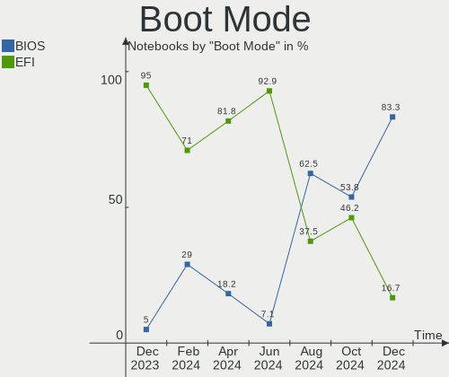
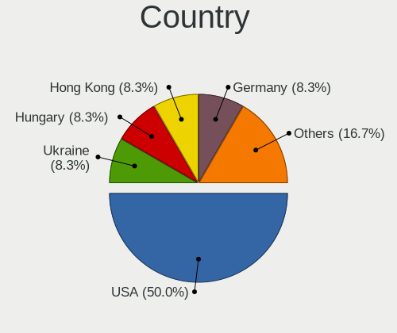
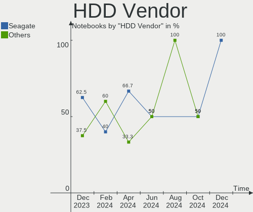
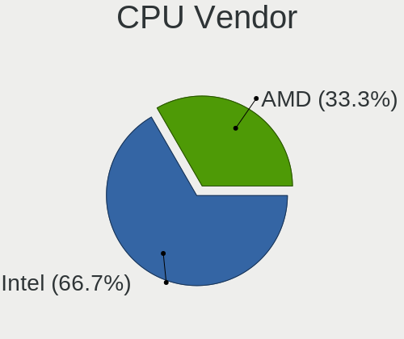
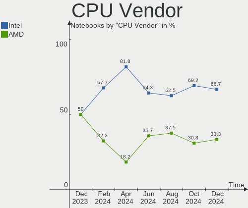
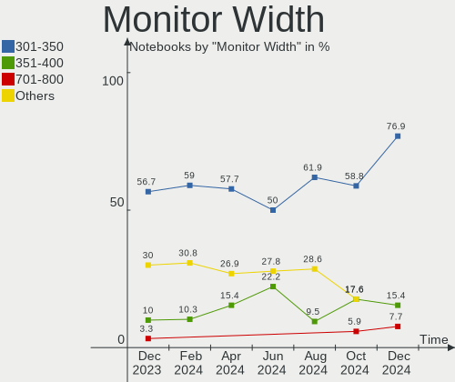
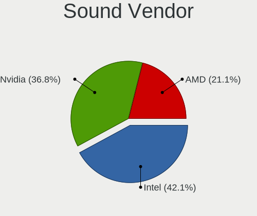

Nobara - Hardware Trends (Notebooks)
------------------------------------

A project to identify most popular hardware characteristics and track their change
over time based on data collected by Linux users at https://Linux-Hardware.org.

Anyone can contribute to this report by the [hw-probe](https://github.com/linuxhw/hw-probe) tool:

    sudo -E hw-probe -all -upload

This report is for one last month. Overall report since the beginning of time: [TestCoverage](https://github.com/linuxhw/TestCoverage)

Period: Oct, 2022.

Contents
--------

* [ System ](#system)
  - [ OS                       ](#os)
  - [ OS Family                ](#os-family)
  - [ Kernel                   ](#kernel)
  - [ Kernel Family            ](#kernel-family)
  - [ Kernel Major Ver.        ](#kernel-major-ver)
  - [ Arch                     ](#arch)
  - [ DE                       ](#de)
  - [ Display Server           ](#display-server)
  - [ Display Manager          ](#display-manager)
  - [ OS Lang                  ](#os-lang)
  - [ Boot Mode                ](#boot-mode)
  - [ Filesystem               ](#filesystem)
  - [ Part. scheme             ](#part-scheme)
  - [ Dual Boot with Linux/BSD ](#dual-boot-with-linuxbsd)
  - [ Dual Boot (Win)          ](#dual-boot-win)

* [ Board ](#board)
  - [ Vendor                   ](#vendor)
  - [ Model                    ](#model)
  - [ Model Family             ](#model-family)
  - [ MFG Year                 ](#mfg-year)
  - [ Form Factor              ](#form-factor)
  - [ Secure Boot              ](#secure-boot)
  - [ Coreboot                 ](#coreboot)
  - [ RAM Size                 ](#ram-size)
  - [ RAM Used                 ](#ram-used)
  - [ Total Drives             ](#total-drives)
  - [ Has CD-ROM               ](#has-cd-rom)
  - [ Has Ethernet             ](#has-ethernet)
  - [ Has WiFi                 ](#has-wifi)
  - [ Has Bluetooth            ](#has-bluetooth)

* [ Location ](#location)
  - [ Country                  ](#country)
  - [ City                     ](#city)

* [ Drives ](#drives)
  - [ Drive Vendor             ](#drive-vendor)
  - [ Drive Model              ](#drive-model)
  - [ HDD Vendor               ](#hdd-vendor)
  - [ SSD Vendor               ](#ssd-vendor)
  - [ Drive Kind               ](#drive-kind)
  - [ Drive Connector          ](#drive-connector)
  - [ Drive Size               ](#drive-size)
  - [ Space Total              ](#space-total)
  - [ Space Used               ](#space-used)
  - [ Malfunc. Drives          ](#malfunc-drives)
  - [ Malfunc. Drive Vendor    ](#malfunc-drive-vendor)
  - [ Malfunc. HDD Vendor      ](#malfunc-hdd-vendor)
  - [ Malfunc. Drive Kind      ](#malfunc-drive-kind)
  - [ Failed Drives            ](#failed-drives)
  - [ Failed Drive Vendor      ](#failed-drive-vendor)
  - [ Drive Status             ](#drive-status)

* [ Storage controller ](#storage-controller)
  - [ Storage Vendor           ](#storage-vendor)
  - [ Storage Model            ](#storage-model)
  - [ Storage Kind             ](#storage-kind)

* [ Processor ](#processor)
  - [ CPU Vendor               ](#cpu-vendor)
  - [ CPU Model                ](#cpu-model)
  - [ CPU Model Family         ](#cpu-model-family)
  - [ CPU Cores                ](#cpu-cores)
  - [ CPU Sockets              ](#cpu-sockets)
  - [ CPU Threads              ](#cpu-threads)
  - [ CPU Op-Modes             ](#cpu-op-modes)
  - [ CPU Microcode            ](#cpu-microcode)
  - [ CPU Microarch            ](#cpu-microarch)

* [ Graphics ](#graphics)
  - [ GPU Vendor               ](#gpu-vendor)
  - [ GPU Model                ](#gpu-model)
  - [ GPU Combo                ](#gpu-combo)
  - [ GPU Driver               ](#gpu-driver)
  - [ GPU Memory               ](#gpu-memory)

* [ Monitor ](#monitor)
  - [ Monitor Vendor           ](#monitor-vendor)
  - [ Monitor Model            ](#monitor-model)
  - [ Monitor Resolution       ](#monitor-resolution)
  - [ Monitor Diagonal         ](#monitor-diagonal)
  - [ Monitor Width            ](#monitor-width)
  - [ Aspect Ratio             ](#aspect-ratio)
  - [ Monitor Area             ](#monitor-area)
  - [ Pixel Density            ](#pixel-density)
  - [ Multiple Monitors        ](#multiple-monitors)

* [ Network ](#network)
  - [ Net Controller Vendor    ](#net-controller-vendor)
  - [ Net Controller Model     ](#net-controller-model)
  - [ Wireless Vendor          ](#wireless-vendor)
  - [ Wireless Model           ](#wireless-model)
  - [ Ethernet Vendor          ](#ethernet-vendor)
  - [ Ethernet Model           ](#ethernet-model)
  - [ Net Controller Kind      ](#net-controller-kind)
  - [ Used Controller          ](#used-controller)
  - [ NICs                     ](#nics)
  - [ IPv6                     ](#ipv6)

* [ Bluetooth ](#bluetooth)
  - [ Bluetooth Vendor         ](#bluetooth-vendor)
  - [ Bluetooth Model          ](#bluetooth-model)

* [ Sound ](#sound)
  - [ Sound Vendor             ](#sound-vendor)
  - [ Sound Model              ](#sound-model)

* [ Memory ](#memory)
  - [ Memory Vendor            ](#memory-vendor)
  - [ Memory Model             ](#memory-model)
  - [ Memory Kind              ](#memory-kind)
  - [ Memory Form Factor       ](#memory-form-factor)
  - [ Memory Size              ](#memory-size)
  - [ Memory Speed             ](#memory-speed)

* [ Printers & scanners ](#printers--scanners)
  - [ Printer Vendor           ](#printer-vendor)
  - [ Printer Model            ](#printer-model)
  - [ Scanner Vendor           ](#scanner-vendor)
  - [ Scanner Model            ](#scanner-model)

* [ Camera ](#camera)
  - [ Camera Vendor            ](#camera-vendor)
  - [ Camera Model             ](#camera-model)

* [ Security ](#security)
  - [ Fingerprint Vendor       ](#fingerprint-vendor)
  - [ Fingerprint Model        ](#fingerprint-model)
  - [ Chipcard Vendor          ](#chipcard-vendor)
  - [ Chipcard Model           ](#chipcard-model)

* [ Unsupported ](#unsupported)
  - [ Unsupported Devices      ](#unsupported-devices)
  - [ Unsupported Device Types ](#unsupported-device-types)

System
------

OS
--

Installed operating systems

| Name      | Notebooks | Percent |
|-----------|-----------|---------|
| Nobara 36 | 34        | 100%    |

OS Family
---------

OS without a version

| Name   | Notebooks | Percent |
|--------|-----------|---------|
| Nobara | 34        | 100%    |

Kernel
------

Version of the Linux kernel

| Version                       | Notebooks | Percent |
|-------------------------------|-----------|---------|
| 5.19.14-201.fsync.fc36.x86_64 | 15        | 44.12%  |
| 5.19.12-201.fsync.fc36.x86_64 | 5         | 14.71%  |
| 5.19.16-201.fsync.fc36.x86_64 | 4         | 11.76%  |
| 6.0.5-201.fsync.fc36.x86_64   | 3         | 8.82%   |
| 5.19.7-204.fsync.fc36.x86_64  | 3         | 8.82%   |
| 5.19.15-202.fsync.fc36.x86_64 | 2         | 5.88%   |
| 6.0.2-xm1.0.fc36.x86_64       | 1         | 2.94%   |
| 5.19.13-202.fsync.fc36.x86_64 | 1         | 2.94%   |

Kernel Family
-------------

Linux kernel without a distro release

| Version | Notebooks | Percent |
|---------|-----------|---------|
| 5.19.14 | 15        | 44.12%  |
| 5.19.12 | 5         | 14.71%  |
| 5.19.16 | 4         | 11.76%  |
| 6.0.5   | 3         | 8.82%   |
| 5.19.7  | 3         | 8.82%   |
| 5.19.15 | 2         | 5.88%   |
| 6.0.2   | 1         | 2.94%   |
| 5.19.13 | 1         | 2.94%   |

Kernel Major Ver.
-----------------

Linux kernel major version

| Version | Notebooks | Percent |
|---------|-----------|---------|
| 5.19    | 30        | 88.24%  |
| 6.0     | 4         | 11.76%  |

Arch
----

OS architecture (x86_64, i586, etc.)

| Name   | Notebooks | Percent |
|--------|-----------|---------|
| x86_64 | 34        | 100%    |

DE
--

Desktop Environment

| Name    | Notebooks | Percent |
|---------|-----------|---------|
| GNOME   | 24        | 70.59%  |
| KDE5    | 9         | 26.47%  |
| Unknown | 1         | 2.94%   |

Display Server
--------------

X11 or Wayland

| Name    | Notebooks | Percent |
|---------|-----------|---------|
| Wayland | 29        | 85.29%  |
| X11     | 4         | 11.76%  |
| Unknown | 1         | 2.94%   |

Display Manager
---------------

SDDM, LightDM, etc.

| Name    | Notebooks | Percent |
|---------|-----------|---------|
| Unknown | 28        | 82.35%  |
| SDDM    | 4         | 11.76%  |
| GDM     | 2         | 5.88%   |

OS Lang
-------

Language

| Lang  | Notebooks | Percent |
|-------|-----------|---------|
| en_US | 17        | 50%     |
| pt_PT | 3         | 8.82%   |
| pl_PL | 3         | 8.82%   |
| it_IT | 2         | 5.88%   |
| de_DE | 2         | 5.88%   |
| sv_SE | 1         | 2.94%   |
| pt_BR | 1         | 2.94%   |
| es_MX | 1         | 2.94%   |
| es_AR | 1         | 2.94%   |
| en_NZ | 1         | 2.94%   |
| en_GB | 1         | 2.94%   |
| en_CA | 1         | 2.94%   |

Boot Mode
---------

EFI or BIOS

| Mode | Notebooks | Percent |
|------|-----------|---------|
| EFI  | 26        | 76.47%  |
| BIOS | 8         | 23.53%  |

Filesystem
----------

Type of filesystem

| Type  | Notebooks | Percent |
|-------|-----------|---------|
| Ext4  | 19        | 55.88%  |
| Btrfs | 15        | 44.12%  |

Part. scheme
------------

Scheme of partitioning

| Type    | Notebooks | Percent |
|---------|-----------|---------|
| Unknown | 28        | 82.35%  |
| GPT     | 6         | 17.65%  |

Dual Boot with Linux/BSD
------------------------

Hosting more than one Linux/BSD

| Dual boot | Notebooks | Percent |
|-----------|-----------|---------|
| No        | 33        | 97.06%  |
| Yes       | 1         | 2.94%   |

Dual Boot (Win)
---------------

Hosting Linux and Windows

| Dual boot | Notebooks | Percent |
|-----------|-----------|---------|
| No        | 31        | 91.18%  |
| Yes       | 3         | 8.82%   |

Board
-----

Vendor
------

Motherboard manufacturer

| Name             | Notebooks | Percent |
|------------------|-----------|---------|
| Hewlett-Packard  | 8         | 23.53%  |
| ASUSTek Computer | 8         | 23.53%  |
| Lenovo           | 6         | 17.65%  |
| Toshiba          | 2         | 5.88%   |
| MSI              | 2         | 5.88%   |
| Dell             | 2         | 5.88%   |
| Apple            | 2         | 5.88%   |
| Positivo         | 1         | 2.94%   |
| EVOO             | 1         | 2.94%   |
| Casper           | 1         | 2.94%   |
| Acer             | 1         | 2.94%   |

Model
-----

Motherboard model

| Name                                     | Notebooks | Percent |
|------------------------------------------|-----------|---------|
| Toshiba Satellite L850                   | 1         | 2.94%   |
| Toshiba Satellite L650                   | 1         | 2.94%   |
| Positivo N1250                           | 1         | 2.94%   |
| MSI Pulse GL76 12UEK                     | 1         | 2.94%   |
| MSI GE60 0NC/GE60 0ND                    | 1         | 2.94%   |
| Lenovo Yoga Slim 7 Pro 14ACH5 OD 82NK    | 1         | 2.94%   |
| Lenovo ThinkPad E14 Gen 3 20Y7CTO1WW     | 1         | 2.94%   |
| Lenovo Legion 5 Pro 16IAH7H 82RF         | 1         | 2.94%   |
| Lenovo IdeaPad Y700-15ISK 80NV           | 1         | 2.94%   |
| Lenovo IdeaPad C340-14API 81N6           | 1         | 2.94%   |
| Lenovo IdeaPad 320-15IKB 80YH            | 1         | 2.94%   |
| HP ZBook 17 G6                           | 1         | 2.94%   |
| HP Pavilion Gaming Laptop 15-ec1xxx      | 1         | 2.94%   |
| HP OMEN Notebook PC 15                   | 1         | 2.94%   |
| HP Laptop 15-dw0xxx                      | 1         | 2.94%   |
| HP EliteBook 850 G2                      | 1         | 2.94%   |
| HP EliteBook 850 G1                      | 1         | 2.94%   |
| HP 240 G7 Notebook PC                    | 1         | 2.94%   |
| HP 2000                                  | 1         | 2.94%   |
| EVOO EG-LP10                             | 1         | 2.94%   |
| Dell Vostro 15 5510                      | 1         | 2.94%   |
| Dell Precision 5530                      | 1         | 2.94%   |
| Casper EXCALIBUR G770                    | 1         | 2.94%   |
| ASUS VivoBook_ASUS Laptop X509UA         | 1         | 2.94%   |
| ASUS TUF Gaming FX505DV_FX505DV          | 1         | 2.94%   |
| ASUS TUF Gaming FX504GD_FX80GD           | 1         | 2.94%   |
| ASUS S550CB                              | 1         | 2.94%   |
| ASUS ROG Zephyrus G14 GA401QM_GA401QM    | 1         | 2.94%   |
| ASUS GL503VD                             | 1         | 2.94%   |
| ASUS GL502VMK                            | 1         | 2.94%   |
| ASUS ASUS TUF Gaming A17 FA706IH_FA706IH | 1         | 2.94%   |
| Apple MacBookPro5,5                      | 1         | 2.94%   |
| Apple MacBookPro13,3                     | 1         | 2.94%   |
| Acer Nitro AN515-42                      | 1         | 2.94%   |

Model Family
------------

Motherboard model prefix

| Name               | Notebooks | Percent |
|--------------------|-----------|---------|
| Lenovo IdeaPad     | 3         | 8.82%   |
| Toshiba Satellite  | 2         | 5.88%   |
| HP EliteBook       | 2         | 5.88%   |
| ASUS TUF           | 2         | 5.88%   |
| Positivo N1250     | 1         | 2.94%   |
| MSI Pulse          | 1         | 2.94%   |
| MSI GE60           | 1         | 2.94%   |
| Lenovo Yoga        | 1         | 2.94%   |
| Lenovo ThinkPad    | 1         | 2.94%   |
| Lenovo Legion      | 1         | 2.94%   |
| HP ZBook           | 1         | 2.94%   |
| HP Pavilion        | 1         | 2.94%   |
| HP OMEN            | 1         | 2.94%   |
| HP Laptop          | 1         | 2.94%   |
| HP 240             | 1         | 2.94%   |
| HP 2000            | 1         | 2.94%   |
| EVOO EG-LP10       | 1         | 2.94%   |
| Dell Vostro        | 1         | 2.94%   |
| Dell Precision     | 1         | 2.94%   |
| Casper EXCALIBUR   | 1         | 2.94%   |
| ASUS VivoBook      | 1         | 2.94%   |
| ASUS S550CB        | 1         | 2.94%   |
| ASUS ROG           | 1         | 2.94%   |
| ASUS GL503VD       | 1         | 2.94%   |
| ASUS GL502VMK      | 1         | 2.94%   |
| ASUS ASUS          | 1         | 2.94%   |
| Apple MacBookPro5  | 1         | 2.94%   |
| Apple MacBookPro13 | 1         | 2.94%   |
| Acer Nitro         | 1         | 2.94%   |

MFG Year
--------

Motherboard manufacture year

| Year | Notebooks | Percent |
|------|-----------|---------|
| 2021 | 6         | 17.65%  |
| 2019 | 5         | 14.71%  |
| 2018 | 5         | 14.71%  |
| 2020 | 3         | 8.82%   |
| 2022 | 2         | 5.88%   |
| 2017 | 2         | 5.88%   |
| 2016 | 2         | 5.88%   |
| 2015 | 2         | 5.88%   |
| 2012 | 2         | 5.88%   |
| 2014 | 1         | 2.94%   |
| 2013 | 1         | 2.94%   |
| 2011 | 1         | 2.94%   |
| 2010 | 1         | 2.94%   |
| 2009 | 1         | 2.94%   |

Form Factor
-----------

Physical design of the computer

| Name     | Notebooks | Percent |
|----------|-----------|---------|
| Notebook | 34        | 100%    |

Secure Boot
-----------

Enabled or disabled

| State    | Notebooks | Percent |
|----------|-----------|---------|
| Disabled | 34        | 100%    |

Coreboot
--------

Have coreboot on board

| Used | Notebooks | Percent |
|------|-----------|---------|
| No   | 34        | 100%    |

RAM Size
--------

Total RAM memory

| Size in GB | Notebooks | Percent |
|------------|-----------|---------|
| 4.01-8.0   | 10        | 29.41%  |
| 16.01-24.0 | 8         | 23.53%  |
| 8.01-16.0  | 7         | 20.59%  |
| 3.01-4.0   | 6         | 17.65%  |
| 32.01-64.0 | 2         | 5.88%   |
| 24.01-32.0 | 1         | 2.94%   |

RAM Used
--------

Used RAM memory

| Used GB   | Notebooks | Percent |
|-----------|-----------|---------|
| 4.01-8.0  | 17        | 50%     |
| 2.01-3.0  | 9         | 26.47%  |
| 3.01-4.0  | 6         | 17.65%  |
| 8.01-16.0 | 2         | 5.88%   |

Total Drives
------------

Number of drives on board

| Drives | Notebooks | Percent |
|--------|-----------|---------|
| 1      | 25        | 73.53%  |
| 2      | 7         | 20.59%  |
| 3      | 2         | 5.88%   |

Has CD-ROM
----------

Has CD-ROM on board

| Presented | Notebooks | Percent |
|-----------|-----------|---------|
| No        | 28        | 82.35%  |
| Yes       | 6         | 17.65%  |

Has Ethernet
------------

Has Ethernet on board

| Presented | Notebooks | Percent |
|-----------|-----------|---------|
| Yes       | 26        | 76.47%  |
| No        | 8         | 23.53%  |

Has WiFi
--------

Has WiFi module

| Presented | Notebooks | Percent |
|-----------|-----------|---------|
| Yes       | 34        | 100%    |

Has Bluetooth
-------------

Has Bluetooth module

| Presented | Notebooks | Percent |
|-----------|-----------|---------|
| Yes       | 27        | 79.41%  |
| No        | 7         | 20.59%  |

Location
--------

Country
-------

Geographic location (country)

| Country     | Notebooks | Percent |
|-------------|-----------|---------|
| USA         | 7         | 20.59%  |
| Portugal    | 3         | 8.82%   |
| Poland      | 3         | 8.82%   |
| Mexico      | 3         | 8.82%   |
| Germany     | 3         | 8.82%   |
| Philippines | 2         | 5.88%   |
| Italy       | 2         | 5.88%   |
| Brazil      | 2         | 5.88%   |
| Sweden      | 1         | 2.94%   |
| Romania     | 1         | 2.94%   |
| Pakistan    | 1         | 2.94%   |
| New Zealand | 1         | 2.94%   |
| Morocco     | 1         | 2.94%   |
| Indonesia   | 1         | 2.94%   |
| Croatia     | 1         | 2.94%   |
| Canada      | 1         | 2.94%   |
| Argentina   | 1         | 2.94%   |

City
----

Geographic location (city)

| City          | Notebooks | Percent |
|---------------|-----------|---------|
| Schmalkalden  | 2         | 5.88%   |
| Guadalajara   | 2         | 5.88%   |
| Warsaw        | 1         | 2.94%   |
| Wabrzezno     | 1         | 2.94%   |
| Varaždin     | 1         | 2.94%   |
| Vagos         | 1         | 2.94%   |
| Tulsa         | 1         | 2.94%   |
| Tomah         | 1         | 2.94%   |
| Silves        | 1         | 2.94%   |
| Schenectady   | 1         | 2.94%   |
| Saltsjoebaden | 1         | 2.94%   |
| Salamanca     | 1         | 2.94%   |
| Saint-Jerome  | 1         | 2.94%   |
| Rome          | 1         | 2.94%   |
| Ramos Mejia   | 1         | 2.94%   |
| Quezon City   | 1         | 2.94%   |
| Prichsenstadt | 1         | 2.94%   |
| Nova Mutum    | 1         | 2.94%   |
| Milan         | 1         | 2.94%   |
| Long Lake     | 1         | 2.94%   |
| Islamabad     | 1         | 2.94%   |
| Hixson        | 1         | 2.94%   |
| Gelang        | 1         | 2.94%   |
| Fortaleza     | 1         | 2.94%   |
| Dasmarinas    | 1         | 2.94%   |
| Casablanca    | 1         | 2.94%   |
| Bucharest     | 1         | 2.94%   |
| Borzecin      | 1         | 2.94%   |
| Auckland      | 1         | 2.94%   |
| Atlanta       | 1         | 2.94%   |
| Ashburn       | 1         | 2.94%   |
| Anadia        | 1         | 2.94%   |

Drives
------

Drive Vendor
------------

Hard drive vendors

| Vendor                       | Notebooks | Drives | Percent |
|------------------------------|-----------|--------|---------|
| Samsung Electronics          | 8         | 8      | 18.18%  |
| Toshiba                      | 6         | 6      | 13.64%  |
| WDC                          | 4         | 4      | 9.09%   |
| Micron Technology            | 3         | 3      | 6.82%   |
| Intel                        | 3         | 3      | 6.82%   |
| SK hynix                     | 2         | 2      | 4.55%   |
| Seagate                      | 2         | 2      | 4.55%   |
| SanDisk                      | 2         | 2      | 4.55%   |
| KIOXIA                       | 2         | 2      | 4.55%   |
| Kingston                     | 2         | 2      | 4.55%   |
| Unknown                      | 2         | 2      | 4.55%   |
| Shenzhen Longsys Electronics | 1         | 1      | 2.27%   |
| Ramsta                       | 1         | 1      | 2.27%   |
| Phison Electronics           | 1         | 1      | 2.27%   |
| Micron/Crucial Technology    | 1         | 1      | 2.27%   |
| LITEON                       | 1         | 1      | 2.27%   |
| Hitachi                      | 1         | 1      | 2.27%   |
| HGST HTS                     | 1         | 1      | 2.27%   |
| Crucial                      | 1         | 1      | 2.27%   |

Drive Model
-----------

Hard drive models

| Model                                                | Notebooks | Percent |
|------------------------------------------------------|-----------|---------|
| Toshiba MQ04ABF100 1TB                               | 2         | 4.55%   |
| Samsung NVMe SSD Controller SM981/PM981/PM983 500GB  | 2         | 4.55%   |
| Unknown                                              | 2         | 4.55%   |
| WDC WDS500G3X0C-00SJG0 500GB                         | 1         | 2.27%   |
| WDC WD10SPCX-24HWST1 1TB                             | 1         | 2.27%   |
| WDC WD10JPVT-22A1YT0 1TB                             | 1         | 2.27%   |
| WDC PC SN520 SDAPNUW-512G-1006 512GB                 | 1         | 2.27%   |
| Toshiba TR200 240GB SSD                              | 1         | 2.27%   |
| Toshiba MQ01ABF050 500GB                             | 1         | 2.27%   |
| Toshiba MK3265GSXN 320GB                             | 1         | 2.27%   |
| Toshiba KXG5AZNV512G 512GB                           | 1         | 2.27%   |
| SK hynix SKHynix_HFS001TDE9X084N 1TB                 | 1         | 2.27%   |
| SK hynix SKHynix_HFM256GD3HX015N 256GB               | 1         | 2.27%   |
| Shenzhen Longsys Lexar SSD NM620 512GB               | 1         | 2.27%   |
| Seagate ST320LT012-9WS14C 320GB                      | 1         | 2.27%   |
| Seagate ST1000LX015-1U7172 1TB                       | 1         | 2.27%   |
| Sandisk WD Blue SN550 NVMe SSD 1TB                   | 1         | 2.27%   |
| SanDisk SD6PP4M-256G-1006 256GB SSD                  | 1         | 2.27%   |
| Samsung SSD 980 1TB                                  | 1         | 2.27%   |
| Samsung SSD 850 PRO 512GB                            | 1         | 2.27%   |
| Samsung NVMe SSD Controller SM961/PM961/SM963 250GB  | 1         | 2.27%   |
| Samsung NVMe SSD Controller PM9A1/PM9A3/980PRO 250GB | 1         | 2.27%   |
| Samsung MZVLQ1T0HBLB-00B00 1TB                       | 1         | 2.27%   |
| Samsung MZ7LN256HAJQ-000H1 256GB SSD                 | 1         | 2.27%   |
| Ramsta SSD S800 240GB                                | 1         | 2.27%   |
| Phison PS5013 E13 NVMe Controller 256GB              | 1         | 2.27%   |
| Micron/Crucial P2 NVMe PCIe SSD 500GB                | 1         | 2.27%   |
| Micron 2450_MTFDKBA512TFK 512GB                      | 1         | 2.27%   |
| Micron 2210_MTFDHBA512QFD 512GB                      | 1         | 2.27%   |
| Micron 2200V_MTFDHBA512TCK 512GB                     | 1         | 2.27%   |
| LITEON CV3-CE128-HP 128GB SSD                        | 1         | 2.27%   |
| KIOXIA NVMe SSD 500GB                                | 1         | 2.27%   |
| KIOXIA KBG40ZNS512G NVMe 512GB                       | 1         | 2.27%   |
| Kingston SA400S37240G 240GB SSD                      | 1         | 2.27%   |
| Kingston SA2000M8500G 500GB                          | 1         | 2.27%   |
| Intel SSDSCKKW180H6 180GB                            | 1         | 2.27%   |
| Intel SSDSC2BF180A5H REF 180GB                       | 1         | 2.27%   |
| Intel SSD 660P Series 1024GB                         | 1         | 2.27%   |
| Hitachi HTS547575A9E384 752GB                        | 1         | 2.27%   |
| HGST HTS 721010A9E630 1TB                            | 1         | 2.27%   |

HDD Vendor
----------

Hard disk drive vendors

| Vendor   | Notebooks | Drives | Percent |
|----------|-----------|--------|---------|
| Toshiba  | 4         | 4      | 40%     |
| WDC      | 2         | 2      | 20%     |
| Seagate  | 2         | 2      | 20%     |
| Hitachi  | 1         | 1      | 10%     |
| HGST HTS | 1         | 1      | 10%     |

SSD Vendor
----------

Solid state drive vendors

| Vendor              | Notebooks | Drives | Percent |
|---------------------|-----------|--------|---------|
| Samsung Electronics | 2         | 2      | 20%     |
| Intel               | 2         | 2      | 20%     |
| Toshiba             | 1         | 1      | 10%     |
| SanDisk             | 1         | 1      | 10%     |
| Ramsta              | 1         | 1      | 10%     |
| LITEON              | 1         | 1      | 10%     |
| Kingston            | 1         | 1      | 10%     |
| Crucial             | 1         | 1      | 10%     |

Drive Kind
----------

HDD or SSD

| Kind    | Notebooks | Drives | Percent |
|---------|-----------|--------|---------|
| NVMe    | 19        | 22     | 46.34%  |
| SSD     | 10        | 10     | 24.39%  |
| HDD     | 10        | 10     | 24.39%  |
| Unknown | 2         | 2      | 4.88%   |

Drive Connector
---------------

SATA, SAS, NVMe, etc.

| Type | Notebooks | Drives | Percent |
|------|-----------|--------|---------|
| NVMe | 19        | 22     | 48.72%  |
| SATA | 19        | 21     | 48.72%  |
| SAS  | 1         | 1      | 2.56%   |

Drive Size
----------

Size of hard drive

| Size in TB | Notebooks | Drives | Percent |
|------------|-----------|--------|---------|
| 0.01-0.5   | 12        | 12     | 60%     |
| 0.51-1.0   | 8         | 8      | 40%     |

Space Total
-----------

Amount of disk space available on the file system

| Size in GB | Notebooks | Percent |
|------------|-----------|---------|
| 251-500    | 14        | 41.18%  |
| 101-250    | 7         | 20.59%  |
| 501-1000   | 7         | 20.59%  |
| 51-100     | 4         | 11.76%  |
| 1001-2000  | 1         | 2.94%   |
| Unknown    | 1         | 2.94%   |

Space Used
----------

Amount of used disk space

| Used GB | Notebooks | Percent |
|---------|-----------|---------|
| 1-20    | 13        | 38.24%  |
| 21-50   | 10        | 29.41%  |
| 101-250 | 5         | 14.71%  |
| 51-100  | 3         | 8.82%   |
| 251-500 | 2         | 5.88%   |
| Unknown | 1         | 2.94%   |

Malfunc. Drives
---------------

Drive models with a malfunction

| Model                 | Notebooks | Drives | Percent |
|-----------------------|-----------|--------|---------|
| Ramsta SSD S800 240GB | 1         | 1      | 100%    |

Malfunc. Drive Vendor
---------------------

Vendors of faulty drives

| Vendor | Notebooks | Drives | Percent |
|--------|-----------|--------|---------|
| Ramsta | 1         | 1      | 100%    |

Malfunc. HDD Vendor
-------------------

Vendors of faulty HDD drives

Zero info for selected period =(

Malfunc. Drive Kind
-------------------

Kinds of faulty drives

| Kind | Notebooks | Drives | Percent |
|------|-----------|--------|---------|
| SSD  | 1         | 1      | 100%    |

Failed Drives
-------------

Failed drive models

Zero info for selected period =(

Failed Drive Vendor
-------------------

Failed drive vendors

Zero info for selected period =(

Drive Status
------------

Number of failed and malfunc. drives

| Status   | Notebooks | Drives | Percent |
|----------|-----------|--------|---------|
| Detected | 29        | 35     | 82.86%  |
| Works    | 5         | 8      | 14.29%  |
| Malfunc  | 1         | 1      | 2.86%   |

Storage controller
------------------

Storage Vendor
--------------

Storage controller vendors

| Vendor                       | Notebooks | Percent |
|------------------------------|-----------|---------|
| Intel                        | 22        | 44.9%   |
| Samsung Electronics          | 6         | 12.24%  |
| AMD                          | 4         | 8.16%   |
| SanDisk                      | 3         | 6.12%   |
| Micron Technology            | 3         | 6.12%   |
| SK hynix                     | 2         | 4.08%   |
| KIOXIA                       | 2         | 4.08%   |
| Toshiba America Info Systems | 1         | 2.04%   |
| Shenzhen Longsys Electronics | 1         | 2.04%   |
| Phison Electronics           | 1         | 2.04%   |
| Nvidia                       | 1         | 2.04%   |
| Micron/Crucial Technology    | 1         | 2.04%   |
| Marvell Technology Group     | 1         | 2.04%   |
| Kingston Technology Company  | 1         | 2.04%   |

Storage Model
-------------

Storage controller models

| Model                                                                            | Notebooks | Percent |
|----------------------------------------------------------------------------------|-----------|---------|
| Intel 82801 Mobile SATA Controller [RAID mode]                                   | 6         | 12%     |
| AMD FCH SATA Controller [AHCI mode]                                              | 4         | 8%      |
| Micron Non-Volatile memory controller                                            | 3         | 6%      |
| Intel Cannon Lake Mobile PCH SATA AHCI Controller                                | 3         | 6%      |
| Intel 7 Series Chipset Family 6-port SATA Controller [AHCI mode]                 | 3         | 6%      |
| SK hynix Gold P31 SSD                                                            | 2         | 4%      |
| Samsung NVMe SSD Controller SM981/PM981/PM983                                    | 2         | 4%      |
| Samsung NVMe SSD Controller 980                                                  | 2         | 4%      |
| Intel HM170/QM170 Chipset SATA Controller [AHCI Mode]                            | 2         | 4%      |
| Toshiba America Info Systems Toshiba America Info Non-Volatile memory controller | 1         | 2%      |
| Shenzhen Longsys Electronics Non-Volatile memory controller                      | 1         | 2%      |
| SanDisk WD Blue SN550 NVMe SSD                                                   | 1         | 2%      |
| SanDisk WD Blue SN500 / PC SN520 NVMe SSD                                        | 1         | 2%      |
| SanDisk WD Black SN750 / PC SN730 NVMe SSD                                       | 1         | 2%      |
| Samsung NVMe SSD Controller SM961/PM961/SM963                                    | 1         | 2%      |
| Samsung NVMe SSD Controller PM9A1/PM9A3/980PRO                                   | 1         | 2%      |
| Phison PS5013 E13 NVMe Controller                                                | 1         | 2%      |
| Nvidia MCP79 AHCI Controller                                                     | 1         | 2%      |
| Micron/Crucial P2 NVMe PCIe SSD                                                  | 1         | 2%      |
| Marvell Group 88SS9183 PCIe SSD Controller                                       | 1         | 2%      |
| KIOXIA NVMe SSD Controller BG4                                                   | 1         | 2%      |
| KIOXIA NVMe SSD                                                                  | 1         | 2%      |
| Kingston Company A2000 NVMe SSD                                                  | 1         | 2%      |
| Intel Wildcat Point-LP SATA Controller [AHCI Mode]                               | 1         | 2%      |
| Intel Volume Management Device NVMe RAID Controller                              | 1         | 2%      |
| Intel SSD 660P Series                                                            | 1         | 2%      |
| Intel Celeron/Pentium Silver Processor SATA Controller                           | 1         | 2%      |
| Intel Alder Lake-P SATA AHCI Controller                                          | 1         | 2%      |
| Intel 8 Series/C220 Series Chipset Family 6-port SATA Controller 1 [AHCI mode]   | 1         | 2%      |
| Intel 8 Series SATA Controller 1 [AHCI mode]                                     | 1         | 2%      |
| Intel 5 Series/3400 Series Chipset 4 port SATA AHCI Controller                   | 1         | 2%      |
| Intel 400 Series Chipset Family SATA AHCI Controller                             | 1         | 2%      |

Storage Kind
------------

Kind of storage controller (IDE, SATA, NVMe, SAS, ...)

| Kind | Notebooks | Percent |
|------|-----------|---------|
| SATA | 20        | 43.48%  |
| NVMe | 19        | 41.3%   |
| RAID | 7         | 15.22%  |

Processor
---------

CPU Vendor
----------

Processor vendors

| Vendor | Notebooks | Percent |
|--------|-----------|---------|
| Intel  | 25        | 73.53%  |
| AMD    | 9         | 26.47%  |

CPU Model
---------

Processor models

| Model                                         | Notebooks | Percent |
|-----------------------------------------------|-----------|---------|
| Intel Core i7-7700HQ CPU @ 2.80GHz            | 2         | 5.88%   |
| Intel 12th Gen Core i7-12700H                 | 2         | 5.88%   |
| AMD Ryzen 5 4600H with Radeon Graphics        | 2         | 5.88%   |
| Intel Core i7-9850H CPU @ 2.60GHz             | 1         | 2.94%   |
| Intel Core i7-8850H CPU @ 2.60GHz             | 1         | 2.94%   |
| Intel Core i7-8565U CPU @ 1.80GHz             | 1         | 2.94%   |
| Intel Core i7-7500U CPU @ 2.70GHz             | 1         | 2.94%   |
| Intel Core i7-6920HQ CPU @ 2.90GHz            | 1         | 2.94%   |
| Intel Core i7-6700HQ CPU @ 2.60GHz            | 1         | 2.94%   |
| Intel Core i7-5600U CPU @ 2.60GHz             | 1         | 2.94%   |
| Intel Core i7-4710HQ CPU @ 2.50GHz            | 1         | 2.94%   |
| Intel Core i7-4600U CPU @ 2.10GHz             | 1         | 2.94%   |
| Intel Core i7-3630QM CPU @ 2.40GHz            | 1         | 2.94%   |
| Intel Core i7-3610QM CPU @ 2.30GHz            | 1         | 2.94%   |
| Intel Core i7-3517U CPU @ 1.90GHz             | 1         | 2.94%   |
| Intel Core i5-8300H CPU @ 2.30GHz             | 1         | 2.94%   |
| Intel Core i5-10300H CPU @ 2.50GHz            | 1         | 2.94%   |
| Intel Core i5 CPU M 480 @ 2.67GHz             | 1         | 2.94%   |
| Intel Core i3-7020U CPU @ 2.30GHz             | 1         | 2.94%   |
| Intel Core i3-1005G1 CPU @ 1.20GHz            | 1         | 2.94%   |
| Intel Core 2 Duo CPU P7550 @ 2.26GHz          | 1         | 2.94%   |
| Intel Celeron N4020 CPU @ 1.10GHz             | 1         | 2.94%   |
| Intel 11th Gen Core i5-11400H @ 2.70GHz       | 1         | 2.94%   |
| Intel 11th Gen Core i5-11300H @ 3.10GHz       | 1         | 2.94%   |
| AMD Ryzen 9 5900HS with Radeon Graphics       | 1         | 2.94%   |
| AMD Ryzen 7 5800HS Creator Edition            | 1         | 2.94%   |
| AMD Ryzen 7 5700U with Radeon Graphics        | 1         | 2.94%   |
| AMD Ryzen 7 3700U with Radeon Vega Mobile Gfx | 1         | 2.94%   |
| AMD Ryzen 5 3550H with Radeon Vega Mobile Gfx | 1         | 2.94%   |
| AMD Ryzen 5 2500U with Radeon Vega Mobile Gfx | 1         | 2.94%   |
| AMD E-300 APU with Radeon HD Graphics         | 1         | 2.94%   |

CPU Model Family
----------------

Processor model prefix

| Model            | Notebooks | Percent |
|------------------|-----------|---------|
| Intel Core i7    | 14        | 41.18%  |
| Other            | 4         | 11.76%  |
| AMD Ryzen 5      | 4         | 11.76%  |
| Intel Core i5    | 3         | 8.82%   |
| AMD Ryzen 7      | 3         | 8.82%   |
| Intel Core i3    | 2         | 5.88%   |
| Intel Core 2 Duo | 1         | 2.94%   |
| Intel Celeron    | 1         | 2.94%   |
| AMD Ryzen 9      | 1         | 2.94%   |
| AMD E            | 1         | 2.94%   |

CPU Cores
---------

Number of processor cores

| Number | Notebooks | Percent |
|--------|-----------|---------|
| 4      | 14        | 41.18%  |
| 2      | 10        | 29.41%  |
| 6      | 5         | 14.71%  |
| 8      | 3         | 8.82%   |
| 14     | 2         | 5.88%   |

CPU Sockets
-----------

Number of sockets

| Number | Notebooks | Percent |
|--------|-----------|---------|
| 1      | 34        | 100%    |

CPU Threads
-----------

Threads per core (Hyper-Threading)

| Number | Notebooks | Percent |
|--------|-----------|---------|
| 2      | 31        | 91.18%  |
| 1      | 3         | 8.82%   |

CPU Op-Modes
------------

CPU Operation Modes (32-bit, 64-bit)

| Op mode        | Notebooks | Percent |
|----------------|-----------|---------|
| 32-bit, 64-bit | 34        | 100%    |

CPU Microcode
-------------

Microcode number

| Number     | Notebooks | Percent |
|------------|-----------|---------|
| 0x306a9    | 3         | 8.82%   |
| Unknown    | 3         | 8.82%   |
| 0x906ea    | 2         | 5.88%   |
| 0x906e9    | 2         | 5.88%   |
| 0x906a3    | 2         | 5.88%   |
| 0x806e9    | 2         | 5.88%   |
| 0x506e3    | 2         | 5.88%   |
| 0x0a50000c | 2         | 5.88%   |
| 0xa0652    | 1         | 2.94%   |
| 0x906ed    | 1         | 2.94%   |
| 0x806ec    | 1         | 2.94%   |
| 0x806d1    | 1         | 2.94%   |
| 0x806c1    | 1         | 2.94%   |
| 0x706e5    | 1         | 2.94%   |
| 0x40651    | 1         | 2.94%   |
| 0x306d4    | 1         | 2.94%   |
| 0x306c3    | 1         | 2.94%   |
| 0x20655    | 1         | 2.94%   |
| 0x1067a    | 1         | 2.94%   |
| 0x08608103 | 1         | 2.94%   |
| 0x08600104 | 1         | 2.94%   |
| 0x08108109 | 1         | 2.94%   |
| 0x08108102 | 1         | 2.94%   |
| 0x0500010d | 1         | 2.94%   |

CPU Microarch
-------------

Microarchitecture

| Name             | Notebooks | Percent |
|------------------|-----------|---------|
| KabyLake         | 8         | 23.53%  |
| IvyBridge        | 3         | 8.82%   |
| Zen+             | 2         | 5.88%   |
| Zen 3            | 2         | 5.88%   |
| Zen 2            | 2         | 5.88%   |
| Skylake          | 2         | 5.88%   |
| Icelake          | 2         | 5.88%   |
| Haswell          | 2         | 5.88%   |
| Alderlake Hybrid | 2         | 5.88%   |
| Zen              | 1         | 2.94%   |
| Westmere         | 1         | 2.94%   |
| TigerLake        | 1         | 2.94%   |
| Penryn           | 1         | 2.94%   |
| Goldmont plus    | 1         | 2.94%   |
| CometLake        | 1         | 2.94%   |
| Broadwell        | 1         | 2.94%   |
| Bobcat           | 1         | 2.94%   |
| Unknown          | 1         | 2.94%   |

Graphics
--------

GPU Vendor
----------

Vendors of graphics cards

| Vendor | Notebooks | Percent |
|--------|-----------|---------|
| Nvidia | 22        | 39.29%  |
| Intel  | 20        | 35.71%  |
| AMD    | 14        | 25%     |

GPU Model
---------

Graphics card models

| Model                                                                | Notebooks | Percent |
|----------------------------------------------------------------------|-----------|---------|
| Intel CoffeeLake-H GT2 [UHD Graphics 630]                            | 3         | 5.26%   |
| Nvidia TU117M [GeForce MX450]                                        | 2         | 3.51%   |
| Nvidia TU117M                                                        | 2         | 3.51%   |
| Nvidia GP107M [GeForce GTX 1050 Mobile]                              | 2         | 3.51%   |
| Nvidia GA106M [GeForce RTX 3060 Mobile / Max-Q]                      | 2         | 3.51%   |
| Intel Alder Lake-P Integrated Graphics Controller                    | 2         | 3.51%   |
| Intel 3rd Gen Core processor Graphics Controller                     | 2         | 3.51%   |
| AMD Renoir                                                           | 2         | 3.51%   |
| AMD Picasso/Raven 2 [Radeon Vega Series / Radeon Vega Mobile Series] | 2         | 3.51%   |
| AMD Cezanne                                                          | 2         | 3.51%   |
| AMD Baffin [Radeon RX 460/560D / Pro 450/455/460/555/555X/560/560X]  | 2         | 3.51%   |
| Nvidia TU117M [GeForce GTX 1650 Ti Mobile]                           | 1         | 1.75%   |
| Nvidia TU106M [GeForce RTX 2060 Mobile]                              | 1         | 1.75%   |
| Nvidia TU104GLM [Quadro RTX 5000 Mobile / Max-Q]                     | 1         | 1.75%   |
| Nvidia GP107GLM [Quadro P1000 Mobile]                                | 1         | 1.75%   |
| Nvidia GP106BM [GeForce GTX 1060 Mobile 6GB]                         | 1         | 1.75%   |
| Nvidia GM108M [GeForce MX130]                                        | 1         | 1.75%   |
| Nvidia GM108M [GeForce 940MX]                                        | 1         | 1.75%   |
| Nvidia GM107M [GeForce GTX 960M]                                     | 1         | 1.75%   |
| Nvidia GM107M [GeForce GTX 860M]                                     | 1         | 1.75%   |
| Nvidia GK107M [GeForce GTX 660M]                                     | 1         | 1.75%   |
| Nvidia GK107M [GeForce GT 740M]                                      | 1         | 1.75%   |
| Nvidia GA107M [GeForce RTX 3050 Mobile]                              | 1         | 1.75%   |
| Nvidia GA104M [Geforce RTX 3070 Ti Laptop GPU]                       | 1         | 1.75%   |
| Nvidia C79 [GeForce 9400M]                                           | 1         | 1.75%   |
| Intel WhiskeyLake-U GT2 [UHD Graphics 620]                           | 1         | 1.75%   |
| Intel TigerLake-LP GT2 [Iris Xe Graphics]                            | 1         | 1.75%   |
| Intel TigerLake-H GT1 [UHD Graphics]                                 | 1         | 1.75%   |
| Intel Kaby Lake-U GT2f HD 620 Graphics Controller                    | 1         | 1.75%   |
| Intel Iris Plus Graphics G1 (Ice Lake)                               | 1         | 1.75%   |
| Intel HD Graphics 630                                                | 1         | 1.75%   |
| Intel HD Graphics 620                                                | 1         | 1.75%   |
| Intel HD Graphics 5500                                               | 1         | 1.75%   |
| Intel HD Graphics 530                                                | 1         | 1.75%   |
| Intel Haswell-ULT Integrated Graphics Controller                     | 1         | 1.75%   |
| Intel GeminiLake [UHD Graphics 600]                                  | 1         | 1.75%   |
| Intel CometLake-H GT2 [UHD Graphics]                                 | 1         | 1.75%   |
| Intel 4th Gen Core Processor Integrated Graphics Controller          | 1         | 1.75%   |
| AMD Wrestler [Radeon HD 6310]                                        | 1         | 1.75%   |
| AMD Thames [Radeon HD 7500M/7600M Series]                            | 1         | 1.75%   |

GPU Combo
---------

Combinations of graphics cards

| Name           | Notebooks | Percent |
|----------------|-----------|---------|
| Intel + Nvidia | 15        | 44.12%  |
| 1 x AMD        | 6         | 17.65%  |
| AMD + Nvidia   | 5         | 14.71%  |
| 1 x Intel      | 3         | 8.82%   |
| 1 x Nvidia     | 2         | 5.88%   |
| Intel + AMD    | 2         | 5.88%   |
| 2 x AMD        | 1         | 2.94%   |

GPU Driver
----------

Free vs proprietary

| Driver      | Notebooks | Percent |
|-------------|-----------|---------|
| Proprietary | 17        | 50%     |
| Free        | 17        | 50%     |

GPU Memory
----------

Total video memory

| Size in GB | Notebooks | Percent |
|------------|-----------|---------|
| Unknown    | 18        | 52.94%  |
| 0.01-0.5   | 6         | 17.65%  |
| 0.51-1.0   | 4         | 11.76%  |
| 1.01-2.0   | 3         | 8.82%   |
| 7.01-8.0   | 1         | 2.94%   |
| 5.01-6.0   | 1         | 2.94%   |
| 3.01-4.0   | 1         | 2.94%   |

Monitor
-------

Monitor Vendor
--------------

Monitor vendors

| Vendor                  | Notebooks | Percent |
|-------------------------|-----------|---------|
| AU Optronics            | 7         | 19.44%  |
| Chimei Innolux          | 5         | 13.89%  |
| BOE                     | 5         | 13.89%  |
| Samsung Electronics     | 4         | 11.11%  |
| PANDA                   | 3         | 8.33%   |
| LG Display              | 3         | 8.33%   |
| Sharp                   | 2         | 5.56%   |
| Apple                   | 2         | 5.56%   |
| ___                     | 1         | 2.78%   |
| Unknown                 | 1         | 2.78%   |
| MLT                     | 1         | 2.78%   |
| Chi Mei Optoelectronics | 1         | 2.78%   |
| AOC                     | 1         | 2.78%   |

Monitor Model
-------------

Monitor models

| Model                                                                    | Notebooks | Percent |
|--------------------------------------------------------------------------|-----------|---------|
| ___ LCD TV ___9000 1360x768                                              | 1         | 2.78%   |
| Unknown LCDTV 9000 1360x768 1600x900mm 72.3-inch                         | 1         | 2.78%   |
| Sharp LQ140M1JW49 SHP1523 1920x1080 309x174mm 14.0-inch                  | 1         | 2.78%   |
| Sharp LCD Monitor SHP149A 1920x1080 344x194mm 15.5-inch                  | 1         | 2.78%   |
| Samsung Electronics LCD Monitor SEC334A 1366x768 344x194mm 15.5-inch     | 1         | 2.78%   |
| Samsung Electronics LCD Monitor SDC5344 1920x1080 344x194mm 15.5-inch    | 1         | 2.78%   |
| Samsung Electronics LCD Monitor SDC4152 2880x1800 302x189mm 14.0-inch    | 1         | 2.78%   |
| Samsung Electronics LCD Monitor SDC3752 1920x1080 344x194mm 15.5-inch    | 1         | 2.78%   |
| PANDA LCD Monitor NCP0058 1920x1080 344x194mm 15.5-inch                  | 1         | 2.78%   |
| PANDA LCD Monitor NCP004D 1920x1080 344x194mm 15.5-inch                  | 1         | 2.78%   |
| PANDA LCD Monitor NCP0029 1920x1080 344x194mm 15.5-inch                  | 1         | 2.78%   |
| MLT MN101 MLT0236 1920x1080 530x280mm 23.6-inch                          | 1         | 2.78%   |
| LG Display LCD Monitor LGD05D8 1920x1080 344x194mm 15.5-inch             | 1         | 2.78%   |
| LG Display LCD Monitor LGD046F 1920x1080 345x194mm 15.6-inch             | 1         | 2.78%   |
| LG Display LCD Monitor LGD0259 1920x1080 345x194mm 15.6-inch             | 1         | 2.78%   |
| Chimei Innolux LCD Monitor CMN175E 1920x1080 381x214mm 17.2-inch         | 1         | 2.78%   |
| Chimei Innolux LCD Monitor CMN15E6 1366x768 344x193mm 15.5-inch          | 1         | 2.78%   |
| Chimei Innolux LCD Monitor CMN15D5 1920x1080 344x193mm 15.5-inch         | 1         | 2.78%   |
| Chimei Innolux LCD Monitor CMN14D4 1920x1080 309x173mm 13.9-inch         | 1         | 2.78%   |
| Chimei Innolux LCD Monitor CMN14C4 1366x768 309x173mm 13.9-inch          | 1         | 2.78%   |
| Chi Mei Optoelectronics LCD Monitor CMO15A2 1366x768 344x193mm 15.5-inch | 1         | 2.78%   |
| BOE LCD Monitor BOE0A1F 2560x1600 344x215mm 16.0-inch                    | 1         | 2.78%   |
| BOE LCD Monitor BOE09DE 1920x1080 309x174mm 14.0-inch                    | 1         | 2.78%   |
| BOE LCD Monitor BOE07FF 1920x1080 344x194mm 15.5-inch                    | 1         | 2.78%   |
| BOE LCD Monitor BOE0700 1920x1080 344x194mm 15.5-inch                    | 1         | 2.78%   |
| BOE LCD Monitor BOE0697 1366x768 309x173mm 13.9-inch                     | 1         | 2.78%   |
| AU Optronics LCD Monitor AUOD0ED 1920x1080 344x193mm 15.5-inch           | 1         | 2.78%   |
| AU Optronics LCD Monitor AUO978F 1920x1080 382x215mm 17.3-inch           | 1         | 2.78%   |
| AU Optronics LCD Monitor AUO8294 1920x1080 382x215mm 17.3-inch           | 1         | 2.78%   |
| AU Optronics LCD Monitor AUO61ED 1920x1080 344x194mm 15.5-inch           | 1         | 2.78%   |
| AU Optronics LCD Monitor AUO4599 1920x1080 344x194mm 15.5-inch           | 1         | 2.78%   |
| AU Optronics LCD Monitor AUO35ED 1920x1080 344x193mm 15.5-inch           | 1         | 2.78%   |
| AU Optronics LCD Monitor AUO34ED 1920x1080 344x193mm 15.5-inch           | 1         | 2.78%   |
| Apple LCD Monitor APP9CBD 1280x800 286x179mm 13.3-inch                   | 1         | 2.78%   |
| Apple Color LCD APPA031 2880x1800 331x207mm 15.4-inch                    | 1         | 2.78%   |
| AOC 1943W AOC1943 1366x768 410x230mm 18.5-inch                           | 1         | 2.78%   |

Monitor Resolution
------------------

Monitor screen resolution

| Resolution       | Notebooks | Percent |
|------------------|-----------|---------|
| 1920x1080 (FHD)  | 23        | 65.71%  |
| 1366x768 (WXGA)  | 6         | 17.14%  |
| 2880x1800        | 2         | 5.71%   |
| 2560x1600        | 1         | 2.86%   |
| 1440x900 (WXGA+) | 1         | 2.86%   |
| 1360x768         | 1         | 2.86%   |
| 1280x800 (WXGA)  | 1         | 2.86%   |

Monitor Diagonal
----------------

Diagonal size in inches

| Inches  | Notebooks | Percent |
|---------|-----------|---------|
| 15      | 21        | 58.33%  |
| 13      | 4         | 11.11%  |
| 17      | 3         | 8.33%   |
| 14      | 3         | 8.33%   |
| 72      | 1         | 2.78%   |
| 23      | 1         | 2.78%   |
| 18      | 1         | 2.78%   |
| 16      | 1         | 2.78%   |
| Unknown | 1         | 2.78%   |

Monitor Width
-------------

Physical width

| Width in mm | Notebooks | Percent |
|-------------|-----------|---------|
| 301-350     | 28        | 77.78%  |
| 351-400     | 3         | 8.33%   |
| 501-600     | 1         | 2.78%   |
| 401-500     | 1         | 2.78%   |
| 201-300     | 1         | 2.78%   |
| 1501-2000   | 1         | 2.78%   |
| Unknown     | 1         | 2.78%   |

Aspect Ratio
------------

Proportional relationship between the width and the height

| Ratio | Notebooks | Percent |
|-------|-----------|---------|
| 16/9  | 28        | 87.5%   |
| 16/10 | 4         | 12.5%   |

Monitor Area
------------

Area in inch²

| Area in inch² | Notebooks | Percent |
|----------------|-----------|---------|
| 101-110        | 21        | 58.33%  |
| 81-90          | 7         | 19.44%  |
| 121-130        | 3         | 8.33%   |
| More than 1000 | 1         | 2.78%   |
| 201-250        | 1         | 2.78%   |
| 141-150        | 1         | 2.78%   |
| 111-120        | 1         | 2.78%   |
| Unknown        | 1         | 2.78%   |

Pixel Density
-------------

Pixels per inch

| Density       | Notebooks | Percent |
|---------------|-----------|---------|
| 121-160       | 23        | 63.89%  |
| 101-120       | 5         | 13.89%  |
| 51-100        | 3         | 8.33%   |
| 161-240       | 2         | 5.56%   |
| More than 240 | 1         | 2.78%   |
| 1-50          | 1         | 2.78%   |
| Unknown       | 1         | 2.78%   |

Multiple Monitors
-----------------

Total monitors connected

| Total | Notebooks | Percent |
|-------|-----------|---------|
| 1     | 29        | 85.29%  |
| 2     | 2         | 5.88%   |
| 0     | 2         | 5.88%   |
| 3     | 1         | 2.94%   |

Network
-------

Net Controller Vendor
---------------------

Controller vendors

| Vendor                | Notebooks | Percent |
|-----------------------|-----------|---------|
| Realtek Semiconductor | 22        | 42.31%  |
| Intel                 | 15        | 28.85%  |
| Qualcomm Atheros      | 8         | 15.38%  |
| Broadcom              | 3         | 5.77%   |
| MediaTek              | 2         | 3.85%   |
| Xiaomi                | 1         | 1.92%   |
| Nvidia                | 1         | 1.92%   |

Net Controller Model
--------------------

Controller models

| Model                                                             | Notebooks | Percent |
|-------------------------------------------------------------------|-----------|---------|
| Realtek RTL8111/8168/8411 PCI Express Gigabit Ethernet Controller | 19        | 31.15%  |
| Realtek RTL8822CE 802.11ac PCIe Wireless Network Adapter          | 4         | 6.56%   |
| Qualcomm Atheros AR9485 Wireless Network Adapter                  | 3         | 4.92%   |
| Qualcomm Atheros QCA9377 802.11ac Wireless Network Adapter        | 2         | 3.28%   |
| MediaTek MT7921 802.11ax PCI Express Wireless Network Adapter     | 2         | 3.28%   |
| Intel Wireless 8260                                               | 2         | 3.28%   |
| Intel Wireless 7260                                               | 2         | 3.28%   |
| Intel Alder Lake-P PCH CNVi WiFi                                  | 2         | 3.28%   |
| Xiaomi Mi/Redmi series (RNDIS)                                    | 1         | 1.64%   |
| Realtek RTL8852AE 802.11ax PCIe Wireless Network Adapter          | 1         | 1.64%   |
| Realtek RTL8822BE 802.11a/b/g/n/ac WiFi adapter                   | 1         | 1.64%   |
| Realtek RTL8821CE 802.11ac PCIe Wireless Network Adapter          | 1         | 1.64%   |
| Realtek RTL8723BU 802.11b/g/n WLAN Adapter                        | 1         | 1.64%   |
| Realtek RTL810xE PCI Express Fast Ethernet controller             | 1         | 1.64%   |
| Qualcomm Atheros QCA6174 802.11ac Wireless Network Adapter        | 1         | 1.64%   |
| Qualcomm Atheros Killer E220x Gigabit Ethernet Controller         | 1         | 1.64%   |
| Qualcomm Atheros AR8152 v1.1 Fast Ethernet                        | 1         | 1.64%   |
| Nvidia MCP79 Ethernet                                             | 1         | 1.64%   |
| Intel Wireless-AC 9260                                            | 1         | 1.64%   |
| Intel Wireless 8265 / 8275                                        | 1         | 1.64%   |
| Intel Wireless 7265                                               | 1         | 1.64%   |
| Intel Wi-Fi 6 AX201                                               | 1         | 1.64%   |
| Intel Wi-Fi 6 AX200                                               | 1         | 1.64%   |
| Intel Tiger Lake PCH CNVi WiFi                                    | 1         | 1.64%   |
| Intel Ethernet Connection I218-LM                                 | 1         | 1.64%   |
| Intel Ethernet Connection (7) I219-LM                             | 1         | 1.64%   |
| Intel Ethernet Connection (3) I218-LM                             | 1         | 1.64%   |
| Intel Comet Lake PCH CNVi WiFi                                    | 1         | 1.64%   |
| Intel Centrino Wireless-N 135                                     | 1         | 1.64%   |
| Intel Cannon Lake PCH CNVi WiFi                                   | 1         | 1.64%   |
| Broadcom BCM43602 802.11ac Wireless LAN SoC                       | 1         | 1.64%   |
| Broadcom BCM4322 802.11a/b/g/n Wireless LAN Controller            | 1         | 1.64%   |
| Broadcom BCM4313 802.11bgn Wireless Network Adapter               | 1         | 1.64%   |

Wireless Vendor
---------------

Wireless vendors

| Vendor                | Notebooks | Percent |
|-----------------------|-----------|---------|
| Intel                 | 15        | 44.12%  |
| Realtek Semiconductor | 8         | 23.53%  |
| Qualcomm Atheros      | 6         | 17.65%  |
| Broadcom              | 3         | 8.82%   |
| MediaTek              | 2         | 5.88%   |

Wireless Model
--------------

Wireless models

| Model                                                         | Notebooks | Percent |
|---------------------------------------------------------------|-----------|---------|
| Realtek RTL8822CE 802.11ac PCIe Wireless Network Adapter      | 4         | 11.76%  |
| Qualcomm Atheros AR9485 Wireless Network Adapter              | 3         | 8.82%   |
| Qualcomm Atheros QCA9377 802.11ac Wireless Network Adapter    | 2         | 5.88%   |
| MediaTek MT7921 802.11ax PCI Express Wireless Network Adapter | 2         | 5.88%   |
| Intel Wireless 8260                                           | 2         | 5.88%   |
| Intel Wireless 7260                                           | 2         | 5.88%   |
| Intel Alder Lake-P PCH CNVi WiFi                              | 2         | 5.88%   |
| Realtek RTL8852AE 802.11ax PCIe Wireless Network Adapter      | 1         | 2.94%   |
| Realtek RTL8822BE 802.11a/b/g/n/ac WiFi adapter               | 1         | 2.94%   |
| Realtek RTL8821CE 802.11ac PCIe Wireless Network Adapter      | 1         | 2.94%   |
| Realtek RTL8723BU 802.11b/g/n WLAN Adapter                    | 1         | 2.94%   |
| Qualcomm Atheros QCA6174 802.11ac Wireless Network Adapter    | 1         | 2.94%   |
| Intel Wireless-AC 9260                                        | 1         | 2.94%   |
| Intel Wireless 8265 / 8275                                    | 1         | 2.94%   |
| Intel Wireless 7265                                           | 1         | 2.94%   |
| Intel Wi-Fi 6 AX201                                           | 1         | 2.94%   |
| Intel Wi-Fi 6 AX200                                           | 1         | 2.94%   |
| Intel Tiger Lake PCH CNVi WiFi                                | 1         | 2.94%   |
| Intel Comet Lake PCH CNVi WiFi                                | 1         | 2.94%   |
| Intel Centrino Wireless-N 135                                 | 1         | 2.94%   |
| Intel Cannon Lake PCH CNVi WiFi                               | 1         | 2.94%   |
| Broadcom BCM43602 802.11ac Wireless LAN SoC                   | 1         | 2.94%   |
| Broadcom BCM4322 802.11a/b/g/n Wireless LAN Controller        | 1         | 2.94%   |
| Broadcom BCM4313 802.11bgn Wireless Network Adapter           | 1         | 2.94%   |

Ethernet Vendor
---------------

Ethernet vendors

| Vendor                | Notebooks | Percent |
|-----------------------|-----------|---------|
| Realtek Semiconductor | 20        | 74.07%  |
| Intel                 | 3         | 11.11%  |
| Qualcomm Atheros      | 2         | 7.41%   |
| Xiaomi                | 1         | 3.7%    |
| Nvidia                | 1         | 3.7%    |

Ethernet Model
--------------

Ethernet models

| Model                                                             | Notebooks | Percent |
|-------------------------------------------------------------------|-----------|---------|
| Realtek RTL8111/8168/8411 PCI Express Gigabit Ethernet Controller | 19        | 70.37%  |
| Xiaomi Mi/Redmi series (RNDIS)                                    | 1         | 3.7%    |
| Realtek RTL810xE PCI Express Fast Ethernet controller             | 1         | 3.7%    |
| Qualcomm Atheros Killer E220x Gigabit Ethernet Controller         | 1         | 3.7%    |
| Qualcomm Atheros AR8152 v1.1 Fast Ethernet                        | 1         | 3.7%    |
| Nvidia MCP79 Ethernet                                             | 1         | 3.7%    |
| Intel Ethernet Connection I218-LM                                 | 1         | 3.7%    |
| Intel Ethernet Connection (7) I219-LM                             | 1         | 3.7%    |
| Intel Ethernet Connection (3) I218-LM                             | 1         | 3.7%    |

Net Controller Kind
-------------------

Ethernet, WiFi or modem

| Kind     | Notebooks | Percent |
|----------|-----------|---------|
| WiFi     | 34        | 56.67%  |
| Ethernet | 26        | 43.33%  |

Used Controller
---------------

Currently used network controller

| Kind     | Notebooks | Percent |
|----------|-----------|---------|
| WiFi     | 32        | 88.89%  |
| Ethernet | 4         | 11.11%  |

NICs
----

Total network controllers on board

| Total | Notebooks | Percent |
|-------|-----------|---------|
| 2     | 26        | 76.47%  |
| 1     | 7         | 20.59%  |
| 0     | 1         | 2.94%   |

IPv6
----

IPv6 vs IPv4

| Used | Notebooks | Percent |
|------|-----------|---------|
| No   | 27        | 79.41%  |
| Yes  | 7         | 20.59%  |

Bluetooth
---------

Bluetooth Vendor
----------------

Controller vendors

| Vendor                          | Notebooks | Percent |
|---------------------------------|-----------|---------|
| Intel                           | 14        | 51.85%  |
| Realtek Semiconductor           | 4         | 14.81%  |
| IMC Networks                    | 3         | 11.11%  |
| Lite-On Technology              | 2         | 7.41%   |
| Toshiba                         | 1         | 3.7%    |
| Qualcomm Atheros Communications | 1         | 3.7%    |
| Foxconn / Hon Hai               | 1         | 3.7%    |
| Apple                           | 1         | 3.7%    |

Bluetooth Model
---------------

Controller models

| Model                                          | Notebooks | Percent |
|------------------------------------------------|-----------|---------|
| Intel Bluetooth wireless interface             | 6         | 22.22%  |
| Intel AX201 Bluetooth                          | 5         | 18.52%  |
| Realtek Bluetooth Radio                        | 3         | 11.11%  |
| Toshiba Askey Bluetooth Module                 | 1         | 3.7%    |
| Realtek RTL8822BE Bluetooth 4.2 Adapter        | 1         | 3.7%    |
| Qualcomm Atheros  Bluetooth Device             | 1         | 3.7%    |
| Lite-On Bluetooth Radio                        | 1         | 3.7%    |
| Lite-On Bluetooth Device                       | 1         | 3.7%    |
| Intel Wireless-AC 9260 Bluetooth Adapter       | 1         | 3.7%    |
| Intel Bluetooth 9460/9560 Jefferson Peak (JfP) | 1         | 3.7%    |
| Intel AX200 Bluetooth                          | 1         | 3.7%    |
| IMC Networks Wireless_Device                   | 1         | 3.7%    |
| IMC Networks Bluetooth Radio                   | 1         | 3.7%    |
| IMC Networks Bluetooth Device                  | 1         | 3.7%    |
| Foxconn / Hon Hai Wireless_Device              | 1         | 3.7%    |
| Apple Bluetooth Host Controller                | 1         | 3.7%    |

Sound
-----

Sound Vendor
------------

Sound card vendors

| Vendor                 | Notebooks | Percent |
|------------------------|-----------|---------|
| Intel                  | 24        | 46.15%  |
| AMD                    | 13        | 25%     |
| Nvidia                 | 12        | 23.08%  |
| Logitech               | 1         | 1.92%   |
| Generalplus Technology | 1         | 1.92%   |
| C-Media Electronics    | 1         | 1.92%   |

Sound Model
-----------

Sound card models

| Model                                                                   | Notebooks | Percent |
|-------------------------------------------------------------------------|-----------|---------|
| AMD Family 17h/19h HD Audio Controller                                  | 8         | 12.9%   |
| AMD Renoir Radeon High Definition Audio Controller                      | 4         | 6.45%   |
| Nvidia TU107 GeForce GTX 1650 High Definition Audio Controller          | 3         | 4.84%   |
| Intel Cannon Lake PCH cAVS                                              | 3         | 4.84%   |
| Intel 7 Series/C216 Chipset Family High Definition Audio Controller     | 3         | 4.84%   |
| Nvidia GA106 High Definition Audio Controller                           | 2         | 3.23%   |
| Intel Sunrise Point-LP HD Audio                                         | 2         | 3.23%   |
| Intel CM238 HD Audio Controller                                         | 2         | 3.23%   |
| Intel Alder Lake PCH-P High Definition Audio Controller                 | 2         | 3.23%   |
| Intel 100 Series/C230 Series Chipset Family HD Audio Controller         | 2         | 3.23%   |
| AMD Raven/Raven2/Fenghuang HDMI/DP Audio Controller                     | 2         | 3.23%   |
| Nvidia TU106 High Definition Audio Controller                           | 1         | 1.61%   |
| Nvidia TU104 HD Audio Controller                                        | 1         | 1.61%   |
| Nvidia MCP79 High Definition Audio                                      | 1         | 1.61%   |
| Nvidia GP106 High Definition Audio Controller                           | 1         | 1.61%   |
| Nvidia GK107 HDMI Audio Controller                                      | 1         | 1.61%   |
| Nvidia GA104 High Definition Audio Controller                           | 1         | 1.61%   |
| Nvidia Audio device                                                     | 1         | 1.61%   |
| Logitech PRO X Wireless Gaming Headset                                  | 1         | 1.61%   |
| Intel Xeon E3-1200 v3/4th Gen Core Processor HD Audio Controller        | 1         | 1.61%   |
| Intel Wildcat Point-LP High Definition Audio Controller                 | 1         | 1.61%   |
| Intel Tiger Lake-LP Smart Sound Technology Audio Controller             | 1         | 1.61%   |
| Intel Tiger Lake-H HD Audio Controller                                  | 1         | 1.61%   |
| Intel Ice Lake-LP Smart Sound Technology Audio Controller               | 1         | 1.61%   |
| Intel Haswell-ULT HD Audio Controller                                   | 1         | 1.61%   |
| Intel Comet Lake PCH cAVS                                               | 1         | 1.61%   |
| Intel Celeron/Pentium Silver Processor High Definition Audio            | 1         | 1.61%   |
| Intel Cannon Point-LP High Definition Audio Controller                  | 1         | 1.61%   |
| Intel Broadwell-U Audio Controller                                      | 1         | 1.61%   |
| Intel 8 Series/C220 Series Chipset High Definition Audio Controller     | 1         | 1.61%   |
| Intel 8 Series HD Audio Controller                                      | 1         | 1.61%   |
| Intel 5 Series/3400 Series Chipset High Definition Audio                | 1         | 1.61%   |
| Generalplus Technology USB Audio Device                                 | 1         | 1.61%   |
| C-Media Electronics USB Audio Device                                    | 1         | 1.61%   |
| AMD Wrestler HDMI Audio                                                 | 1         | 1.61%   |
| AMD Turks HDMI Audio [Radeon HD 6500/6600 / 6700M Series]               | 1         | 1.61%   |
| AMD Redwood HDMI Audio [Radeon HD 5000 Series]                          | 1         | 1.61%   |
| AMD Oland/Hainan/Cape Verde/Pitcairn HDMI Audio [Radeon HD 7000 Series] | 1         | 1.61%   |
| AMD FCH Azalia Controller                                               | 1         | 1.61%   |
| AMD Baffin HDMI/DP Audio [Radeon RX 550 640SP / RX 560/560X]            | 1         | 1.61%   |

Memory
------

Memory Vendor
-------------

Memory module vendors

| Vendor              | Notebooks | Percent |
|---------------------|-----------|---------|
| Samsung Electronics | 4         | 33.33%  |
| SK hynix            | 3         | 25%     |
| Micron Technology   | 2         | 16.67%  |
| Unknown (ABCD)      | 1         | 8.33%   |
| Transcend           | 1         | 8.33%   |
| Nanya Technology    | 1         | 8.33%   |

Memory Model
------------

Memory module models

| Model                                                            | Notebooks | Percent |
|------------------------------------------------------------------|-----------|---------|
| Micron RAM 4ATF1G64HZ-3G2E1 8GB SODIMM DDR4 3200MT/s             | 2         | 16.67%  |
| Unknown (ABCD) RAM 123456789012345678 2GB SODIMM LPDDR4 2400MT/s | 1         | 8.33%   |
| Transcend RAM JM2666HSH-4G 4GB SODIMM DDR4 2667MT/s              | 1         | 8.33%   |
| SK hynix RAM HMA851S6CJR6N-VK 4GB SODIMM DDR4 2667MT/s           | 1         | 8.33%   |
| SK hynix RAM HMA81GS6JJR8N-VK 8GB SODIMM DDR4 2667MT/s           | 1         | 8.33%   |
| SK hynix RAM HMA81GS6AFR8N-UH 8GB SODIMM DDR4 2667MT/s           | 1         | 8.33%   |
| Samsung RAM M474A2K43BB1-CPB 16GB SODIMM DDR4 2133MT/s           | 1         | 8.33%   |
| Samsung RAM M471A1K43CB1-CRC 8GB SODIMM DDR4 2667MT/s            | 1         | 8.33%   |
| Samsung RAM M471A1G44BB0-CWE 8GB SODIMM DDR4 3200MT/s            | 1         | 8.33%   |
| Samsung RAM M471A1G44AB0-CWE 8GB SODIMM DDR4 3200MT/s            | 1         | 8.33%   |
| Nanya RAM M2S4G64CB8HG4N-DI 4GB SODIMM DDR3 1600MT/s             | 1         | 8.33%   |

Memory Kind
-----------

Memory module kinds

| Kind   | Notebooks | Percent |
|--------|-----------|---------|
| DDR4   | 5         | 71.43%  |
| LPDDR4 | 1         | 14.29%  |
| DDR3   | 1         | 14.29%  |

Memory Form Factor
------------------

Physical design of the memory module

| Name   | Notebooks | Percent |
|--------|-----------|---------|
| SODIMM | 7         | 100%    |

Memory Size
-----------

Memory module size

| Size  | Notebooks | Percent |
|-------|-----------|---------|
| 8192  | 5         | 55.56%  |
| 4096  | 3         | 33.33%  |
| 16384 | 1         | 11.11%  |

Memory Speed
------------

Memory module speed

| Speed | Notebooks | Percent |
|-------|-----------|---------|
| 2667  | 3         | 37.5%   |
| 3200  | 2         | 25%     |
| 2400  | 1         | 12.5%   |
| 2133  | 1         | 12.5%   |
| 1600  | 1         | 12.5%   |

Printers & scanners
-------------------

Printer Vendor
--------------

Printer device vendors

Zero info for selected period =(

Printer Model
-------------

Printer device models

Zero info for selected period =(

Scanner Vendor
--------------

Scanner device vendors

Zero info for selected period =(

Scanner Model
-------------

Scanner device models

Zero info for selected period =(

Camera
------

Camera Vendor
-------------

Camera device vendors

| Vendor                                 | Notebooks | Percent |
|----------------------------------------|-----------|---------|
| IMC Networks                           | 7         | 23.33%  |
| Chicony Electronics                    | 3         | 10%     |
| Acer                                   | 3         | 10%     |
| Suyin                                  | 2         | 6.67%   |
| Quanta                                 | 2         | 6.67%   |
| Cheng Uei Precision Industry (Foxlink) | 2         | 6.67%   |
| Syntek                                 | 1         | 3.33%   |
| SunplusIT                              | 1         | 3.33%   |
| Sunplus Innovation Technology          | 1         | 3.33%   |
| Sonix Technology                       | 1         | 3.33%   |
| Samsung Electronics                    | 1         | 3.33%   |
| Realtek Semiconductor                  | 1         | 3.33%   |
| Microdia                               | 1         | 3.33%   |
| Luxvisions Innotech Limited            | 1         | 3.33%   |
| Intel                                  | 1         | 3.33%   |
| Importek                               | 1         | 3.33%   |
| Apple                                  | 1         | 3.33%   |

Camera Model
------------

Camera device models

| Model                                                                    | Notebooks | Percent |
|--------------------------------------------------------------------------|-----------|---------|
| IMC Networks USB2.0 HD UVC WebCam                                        | 4         | 13.33%  |
| Acer HD Webcam                                                           | 2         | 6.67%   |
| Syntek EasyCamera                                                        | 1         | 3.33%   |
| Suyin HP TrueVision HD Integrated Webcam                                 | 1         | 3.33%   |
| Suyin HP TrueVision Full HD                                              | 1         | 3.33%   |
| SunplusIT MTD camera                                                     | 1         | 3.33%   |
| Sunplus Integrated_Webcam_HD                                             | 1         | 3.33%   |
| Sonix USB2.0 HD UVC WebCam                                               | 1         | 3.33%   |
| Samsung Galaxy series, misc. (MTP mode)                                  | 1         | 3.33%   |
| Realtek USB Camera                                                       | 1         | 3.33%   |
| Quanta USB HD Webcam                                                     | 1         | 3.33%   |
| Quanta HD Webcam                                                         | 1         | 3.33%   |
| Microdia Integrated_Webcam_HD                                            | 1         | 3.33%   |
| Luxvisions Innotech Limited HP TrueVision HD Camera                      | 1         | 3.33%   |
| Intel RealSense 3D Camera (Front F200)                                   | 1         | 3.33%   |
| Importek Laptop Integrated Webcam                                        | 1         | 3.33%   |
| IMC Networks USB2.0 VGA UVC WebCam                                       | 1         | 3.33%   |
| IMC Networks Integrated Camera                                           | 1         | 3.33%   |
| IMC Networks HP TrueVision HD Camera                                     | 1         | 3.33%   |
| Chicony TOSHIBA Web Camera                                               | 1         | 3.33%   |
| Chicony Integrated Camera                                                | 1         | 3.33%   |
| Chicony HP HD Camera                                                     | 1         | 3.33%   |
| Cheng Uei Precision Industry (Foxlink) HP HD Webcam                      | 1         | 3.33%   |
| Cheng Uei Precision Industry (Foxlink) HP EliteBook integrated HD Webcam | 1         | 3.33%   |
| Apple Built-in iSight                                                    | 1         | 3.33%   |
| Acer Integrated Camera                                                   | 1         | 3.33%   |

Security
--------

Fingerprint Vendor
------------------

Fingerprint sensor vendors

| Vendor                     | Notebooks | Percent |
|----------------------------|-----------|---------|
| Validity Sensors           | 2         | 40%     |
| Synaptics                  | 1         | 20%     |
| Shenzhen Goodix Technology | 1         | 20%     |
| Elan Microelectronics      | 1         | 20%     |

Fingerprint Model
-----------------

Fingerprint sensor models

| Model                                                      | Notebooks | Percent |
|------------------------------------------------------------|-----------|---------|
| Validity Sensors VFS495 Fingerprint Reader                 | 2         | 40%     |
| Synaptics  VFS7552 Touch Fingerprint Sensor with PurePrint | 1         | 20%     |
| Shenzhen Goodix  FingerPrint Device                        | 1         | 20%     |
| Elan ELAN:ARM-M4                                           | 1         | 20%     |

Chipcard Vendor
---------------

Chipcard module vendors

Zero info for selected period =(

Chipcard Model
--------------

Chipcard module models

Zero info for selected period =(

Unsupported
-----------

Unsupported Devices
-------------------

Total unsupported devices on board

| Total | Notebooks | Percent |
|-------|-----------|---------|
| 0     | 22        | 64.71%  |
| 1     | 9         | 26.47%  |
| 2     | 3         | 8.82%   |

Unsupported Device Types
------------------------

Types of unsupported devices

| Type                  | Notebooks | Percent |
|-----------------------|-----------|---------|
| Graphics card         | 7         | 46.67%  |
| Fingerprint reader    | 5         | 33.33%  |
| Multimedia controller | 2         | 13.33%  |
| Modem                 | 1         | 6.67%   |

