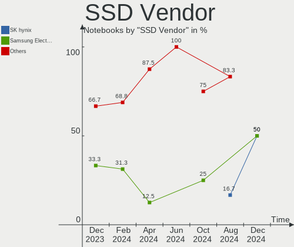
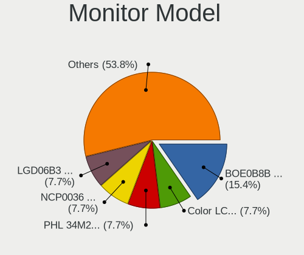
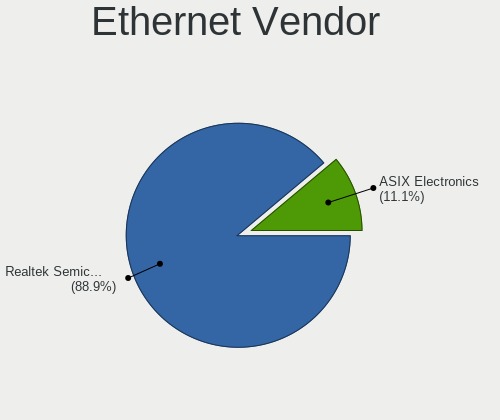
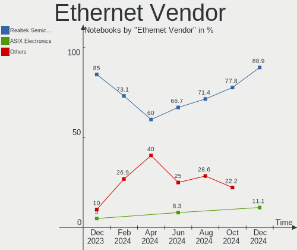
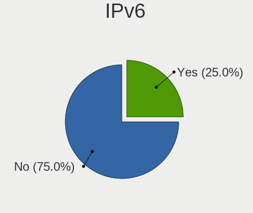
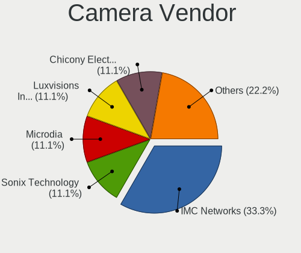

Nobara - Hardware Trends (Notebooks)
------------------------------------

A project to identify most popular hardware characteristics and track their change
over time based on data collected by Linux users at https://Linux-Hardware.org.

Anyone can contribute to this report by the [hw-probe](https://github.com/linuxhw/hw-probe) tool:

    sudo -E hw-probe -all -upload

This report is for one last month. Overall report since the beginning of time: [TestDays](https://github.com/linuxhw/TestDays)

Period: Oct, 2023.

Contents
--------

* [ System ](#system)
  - [ OS                       ](#os)
  - [ OS Family                ](#os-family)
  - [ Kernel                   ](#kernel)
  - [ Kernel Family            ](#kernel-family)
  - [ Kernel Major Ver.        ](#kernel-major-ver)
  - [ Arch                     ](#arch)
  - [ DE                       ](#de)
  - [ Display Server           ](#display-server)
  - [ Display Manager          ](#display-manager)
  - [ OS Lang                  ](#os-lang)
  - [ Boot Mode                ](#boot-mode)
  - [ Filesystem               ](#filesystem)
  - [ Part. scheme             ](#part-scheme)
  - [ Dual Boot with Linux/BSD ](#dual-boot-with-linuxbsd)
  - [ Dual Boot (Win)          ](#dual-boot-win)

* [ Board ](#board)
  - [ Vendor                   ](#vendor)
  - [ Model                    ](#model)
  - [ Model Family             ](#model-family)
  - [ MFG Year                 ](#mfg-year)
  - [ Form Factor              ](#form-factor)
  - [ Secure Boot              ](#secure-boot)
  - [ Coreboot                 ](#coreboot)
  - [ RAM Size                 ](#ram-size)
  - [ RAM Used                 ](#ram-used)
  - [ Total Drives             ](#total-drives)
  - [ Has CD-ROM               ](#has-cd-rom)
  - [ Has Ethernet             ](#has-ethernet)
  - [ Has WiFi                 ](#has-wifi)
  - [ Has Bluetooth            ](#has-bluetooth)

* [ Location ](#location)
  - [ Country                  ](#country)
  - [ City                     ](#city)

* [ Drives ](#drives)
  - [ Drive Vendor             ](#drive-vendor)
  - [ Drive Model              ](#drive-model)
  - [ HDD Vendor               ](#hdd-vendor)
  - [ SSD Vendor               ](#ssd-vendor)
  - [ Drive Kind               ](#drive-kind)
  - [ Drive Connector          ](#drive-connector)
  - [ Drive Size               ](#drive-size)
  - [ Space Total              ](#space-total)
  - [ Space Used               ](#space-used)
  - [ Malfunc. Drives          ](#malfunc-drives)
  - [ Malfunc. Drive Vendor    ](#malfunc-drive-vendor)
  - [ Malfunc. HDD Vendor      ](#malfunc-hdd-vendor)
  - [ Malfunc. Drive Kind      ](#malfunc-drive-kind)
  - [ Failed Drives            ](#failed-drives)
  - [ Failed Drive Vendor      ](#failed-drive-vendor)
  - [ Drive Status             ](#drive-status)

* [ Storage controller ](#storage-controller)
  - [ Storage Vendor           ](#storage-vendor)
  - [ Storage Model            ](#storage-model)
  - [ Storage Kind             ](#storage-kind)

* [ Processor ](#processor)
  - [ CPU Vendor               ](#cpu-vendor)
  - [ CPU Model                ](#cpu-model)
  - [ CPU Model Family         ](#cpu-model-family)
  - [ CPU Cores                ](#cpu-cores)
  - [ CPU Sockets              ](#cpu-sockets)
  - [ CPU Threads              ](#cpu-threads)
  - [ CPU Op-Modes             ](#cpu-op-modes)
  - [ CPU Microcode            ](#cpu-microcode)
  - [ CPU Microarch            ](#cpu-microarch)

* [ Graphics ](#graphics)
  - [ GPU Vendor               ](#gpu-vendor)
  - [ GPU Model                ](#gpu-model)
  - [ GPU Combo                ](#gpu-combo)
  - [ GPU Driver               ](#gpu-driver)
  - [ GPU Memory               ](#gpu-memory)

* [ Monitor ](#monitor)
  - [ Monitor Vendor           ](#monitor-vendor)
  - [ Monitor Model            ](#monitor-model)
  - [ Monitor Resolution       ](#monitor-resolution)
  - [ Monitor Diagonal         ](#monitor-diagonal)
  - [ Monitor Width            ](#monitor-width)
  - [ Aspect Ratio             ](#aspect-ratio)
  - [ Monitor Area             ](#monitor-area)
  - [ Pixel Density            ](#pixel-density)
  - [ Multiple Monitors        ](#multiple-monitors)

* [ Network ](#network)
  - [ Net Controller Vendor    ](#net-controller-vendor)
  - [ Net Controller Model     ](#net-controller-model)
  - [ Wireless Vendor          ](#wireless-vendor)
  - [ Wireless Model           ](#wireless-model)
  - [ Ethernet Vendor          ](#ethernet-vendor)
  - [ Ethernet Model           ](#ethernet-model)
  - [ Net Controller Kind      ](#net-controller-kind)
  - [ Used Controller          ](#used-controller)
  - [ NICs                     ](#nics)
  - [ IPv6                     ](#ipv6)

* [ Bluetooth ](#bluetooth)
  - [ Bluetooth Vendor         ](#bluetooth-vendor)
  - [ Bluetooth Model          ](#bluetooth-model)

* [ Sound ](#sound)
  - [ Sound Vendor             ](#sound-vendor)
  - [ Sound Model              ](#sound-model)

* [ Memory ](#memory)
  - [ Memory Vendor            ](#memory-vendor)
  - [ Memory Model             ](#memory-model)
  - [ Memory Kind              ](#memory-kind)
  - [ Memory Form Factor       ](#memory-form-factor)
  - [ Memory Size              ](#memory-size)
  - [ Memory Speed             ](#memory-speed)

* [ Printers & scanners ](#printers--scanners)
  - [ Printer Vendor           ](#printer-vendor)
  - [ Printer Model            ](#printer-model)
  - [ Scanner Vendor           ](#scanner-vendor)
  - [ Scanner Model            ](#scanner-model)

* [ Camera ](#camera)
  - [ Camera Vendor            ](#camera-vendor)
  - [ Camera Model             ](#camera-model)

* [ Security ](#security)
  - [ Fingerprint Vendor       ](#fingerprint-vendor)
  - [ Fingerprint Model        ](#fingerprint-model)
  - [ Chipcard Vendor          ](#chipcard-vendor)
  - [ Chipcard Model           ](#chipcard-model)

* [ Unsupported ](#unsupported)
  - [ Unsupported Devices      ](#unsupported-devices)
  - [ Unsupported Device Types ](#unsupported-device-types)

System
------

OS
--

Installed operating systems

| Name      | Notebooks | Percent |
|-----------|-----------|---------|
| Nobara 38 | 19        | 100%    |

OS Family
---------

OS without a version

| Name   | Notebooks | Percent |
|--------|-----------|---------|
| Nobara | 19        | 100%    |

Kernel
------

Version of the Linux kernel

| Version                      | Notebooks | Percent |
|------------------------------|-----------|---------|
| 6.5.6-200.fsync.fc38.x86_64  | 7         | 36.84%  |
| 6.5.5-202.fsync.fc38.x86_64  | 4         | 21.05%  |
| 6.5.9-200.fsync.fc38.x86_64  | 3         | 15.79%  |
| 6.5.8-200.fsync.fc38.x86_64  | 2         | 10.53%  |
| 6.5.5-200.fsync.fc38.x86_64  | 2         | 10.53%  |
| 6.4.10-202.fsync.fc38.x86_64 | 1         | 5.26%   |

Kernel Family
-------------

Linux kernel without a distro release

| Version | Notebooks | Percent |
|---------|-----------|---------|
| 6.5.6   | 7         | 36.84%  |
| 6.5.5   | 6         | 31.58%  |
| 6.5.9   | 3         | 15.79%  |
| 6.5.8   | 2         | 10.53%  |
| 6.4.10  | 1         | 5.26%   |

Kernel Major Ver.
-----------------

Linux kernel major version

| Version | Notebooks | Percent |
|---------|-----------|---------|
| 6.5     | 18        | 94.74%  |
| 6.4     | 1         | 5.26%   |

Arch
----

OS architecture (x86_64, i586, etc.)

| Name   | Notebooks | Percent |
|--------|-----------|---------|
| x86_64 | 19        | 100%    |

DE
--

Desktop Environment

| Name     | Notebooks | Percent |
|----------|-----------|---------|
| GNOME    | 10        | 52.63%  |
| KDE5     | 8         | 42.11%  |
| Hyprland | 1         | 5.26%   |

Display Server
--------------

X11 or Wayland

| Name    | Notebooks | Percent |
|---------|-----------|---------|
| Wayland | 19        | 100%    |

Display Manager
---------------

SDDM, LightDM, etc.

| Name    | Notebooks | Percent |
|---------|-----------|---------|
| Unknown | 15        | 78.95%  |
| GDM     | 4         | 21.05%  |

OS Lang
-------

Language

| Lang  | Notebooks | Percent |
|-------|-----------|---------|
| en_US | 9         | 47.37%  |
| en_GB | 2         | 10.53%  |
| uk_UA | 1         | 5.26%   |
| ru_RU | 1         | 5.26%   |
| it_IT | 1         | 5.26%   |
| fr_FR | 1         | 5.26%   |
| es_MX | 1         | 5.26%   |
| es_ES | 1         | 5.26%   |
| en_IE | 1         | 5.26%   |
| en_CA | 1         | 5.26%   |

Boot Mode
---------

EFI or BIOS

| Mode | Notebooks | Percent |
|------|-----------|---------|
| EFI  | 17        | 89.47%  |
| BIOS | 2         | 10.53%  |

Filesystem
----------

Type of filesystem

| Type  | Notebooks | Percent |
|-------|-----------|---------|
| Btrfs | 18        | 94.74%  |
| Ext4  | 1         | 5.26%   |

Part. scheme
------------

Scheme of partitioning

| Type    | Notebooks | Percent |
|---------|-----------|---------|
| Unknown | 15        | 78.95%  |
| GPT     | 4         | 21.05%  |

Dual Boot with Linux/BSD
------------------------

Hosting more than one Linux/BSD

| Dual boot | Notebooks | Percent |
|-----------|-----------|---------|
| No        | 19        | 100%    |

Dual Boot (Win)
---------------

Hosting Linux and Windows

| Dual boot | Notebooks | Percent |
|-----------|-----------|---------|
| No        | 18        | 94.74%  |
| Yes       | 1         | 5.26%   |

Board
-----

Vendor
------

Motherboard manufacturer

| Name             | Notebooks | Percent |
|------------------|-----------|---------|
| ASUSTek Computer | 6         | 31.58%  |
| Lenovo           | 3         | 15.79%  |
| MSI              | 2         | 10.53%  |
| Hewlett-Packard  | 2         | 10.53%  |
| Dell             | 2         | 10.53%  |
| Acer             | 2         | 10.53%  |
| Toshiba          | 1         | 5.26%   |
| System76         | 1         | 5.26%   |

Model
-----

Motherboard model

| Name                                     | Notebooks | Percent |
|------------------------------------------|-----------|---------|
| Toshiba Satellite C55D-C                 | 1         | 5.26%   |
| System76 Gazelle                         | 1         | 5.26%   |
| MSI Modern 14 B5M                        | 1         | 5.26%   |
| MSI GT72S 6QE                            | 1         | 5.26%   |
| Lenovo ThinkPad T450 20BUS1K50X          | 1         | 5.26%   |
| Lenovo Legion 5 15ACH6H 82JU             | 1         | 5.26%   |
| Lenovo IdeaPad Gaming 3 15ACH6 82K2      | 1         | 5.26%   |
| HP Pavilion Aero Laptop 13-be0xxx        | 1         | 5.26%   |
| HP Notebook                              | 1         | 5.26%   |
| Dell Latitude E5470                      | 1         | 5.26%   |
| Dell Inspiron 7375                       | 1         | 5.26%   |
| ASUS X541UV                              | 1         | 5.26%   |
| ASUS VivoBook_ASUSLaptop M6501RM_M6501RM | 1         | 5.26%   |
| ASUS ROG Zephyrus G14 GA402RK_GA402RK    | 1         | 5.26%   |
| ASUS ROG Strix G713RM_G713RM             | 1         | 5.26%   |
| ASUS ROG Strix G513RC_G513RC             | 1         | 5.26%   |
| ASUS GL502VSK                            | 1         | 5.26%   |
| Acer Aspire A315-42                      | 1         | 5.26%   |
| Acer Aspire A315-41                      | 1         | 5.26%   |

Model Family
------------

Motherboard model prefix

| Name              | Notebooks | Percent |
|-------------------|-----------|---------|
| ASUS ROG          | 3         | 15.79%  |
| Acer Aspire       | 2         | 10.53%  |
| Toshiba Satellite | 1         | 5.26%   |
| System76 Gazelle  | 1         | 5.26%   |
| MSI Modern        | 1         | 5.26%   |
| MSI GT72S         | 1         | 5.26%   |
| Lenovo ThinkPad   | 1         | 5.26%   |
| Lenovo Legion     | 1         | 5.26%   |
| Lenovo IdeaPad    | 1         | 5.26%   |
| HP Pavilion       | 1         | 5.26%   |
| HP Notebook       | 1         | 5.26%   |
| Dell Latitude     | 1         | 5.26%   |
| Dell Inspiron     | 1         | 5.26%   |
| ASUS X541UV       | 1         | 5.26%   |
| ASUS VivoBook     | 1         | 5.26%   |
| ASUS GL502VSK     | 1         | 5.26%   |

MFG Year
--------

Motherboard manufacture year

| Year | Notebooks | Percent |
|------|-----------|---------|
| 2021 | 4         | 21.05%  |
| 2016 | 4         | 21.05%  |
| 2022 | 3         | 15.79%  |
| 2023 | 2         | 10.53%  |
| 2018 | 2         | 10.53%  |
| 2019 | 1         | 5.26%   |
| 2017 | 1         | 5.26%   |
| 2015 | 1         | 5.26%   |
| 2014 | 1         | 5.26%   |

Form Factor
-----------

Physical design of the computer

| Name     | Notebooks | Percent |
|----------|-----------|---------|
| Notebook | 19        | 100%    |

Secure Boot
-----------

Enabled or disabled

| State    | Notebooks | Percent |
|----------|-----------|---------|
| Disabled | 19        | 100%    |

Coreboot
--------

Have coreboot on board

| Used | Notebooks | Percent |
|------|-----------|---------|
| No   | 18        | 94.74%  |
| Yes  | 1         | 5.26%   |

RAM Size
--------

Total RAM memory

| Size in GB | Notebooks | Percent |
|------------|-----------|---------|
| 8.01-16.0  | 9         | 47.37%  |
| 4.01-8.0   | 3         | 15.79%  |
| 16.01-24.0 | 3         | 15.79%  |
| 3.01-4.0   | 2         | 10.53%  |
| 32.01-64.0 | 1         | 5.26%   |
| 24.01-32.0 | 1         | 5.26%   |

RAM Used
--------

Used RAM memory

| Used GB    | Notebooks | Percent |
|------------|-----------|---------|
| 4.01-8.0   | 8         | 42.11%  |
| 2.01-3.0   | 5         | 26.32%  |
| 3.01-4.0   | 2         | 10.53%  |
| 1.01-2.0   | 2         | 10.53%  |
| 16.01-24.0 | 1         | 5.26%   |
| 8.01-16.0  | 1         | 5.26%   |

Total Drives
------------

Number of drives on board

| Drives | Notebooks | Percent |
|--------|-----------|---------|
| 1      | 14        | 73.68%  |
| 2      | 5         | 26.32%  |

Has CD-ROM
----------

Has CD-ROM on board

| Presented | Notebooks | Percent |
|-----------|-----------|---------|
| No        | 16        | 84.21%  |
| Yes       | 3         | 15.79%  |

Has Ethernet
------------

Has Ethernet on board

| Presented | Notebooks | Percent |
|-----------|-----------|---------|
| Yes       | 17        | 89.47%  |
| No        | 2         | 10.53%  |

Has WiFi
--------

Has WiFi module

| Presented | Notebooks | Percent |
|-----------|-----------|---------|
| Yes       | 18        | 94.74%  |
| No        | 1         | 5.26%   |

Has Bluetooth
-------------

Has Bluetooth module

| Presented | Notebooks | Percent |
|-----------|-----------|---------|
| Yes       | 18        | 94.74%  |
| No        | 1         | 5.26%   |

Location
--------

Country
-------

Geographic location (country)

| Country   | Notebooks | Percent |
|-----------|-----------|---------|
| USA       | 2         | 10.53%  |
| Russia    | 2         | 10.53%  |
| Italy     | 2         | 10.53%  |
| Indonesia | 2         | 10.53%  |
| Vietnam   | 1         | 5.26%   |
| Ukraine   | 1         | 5.26%   |
| UK        | 1         | 5.26%   |
| Spain     | 1         | 5.26%   |
| Mexico    | 1         | 5.26%   |
| Ireland   | 1         | 5.26%   |
| India     | 1         | 5.26%   |
| Greece    | 1         | 5.26%   |
| Germany   | 1         | 5.26%   |
| France    | 1         | 5.26%   |
| Canada    | 1         | 5.26%   |

City
----

Geographic location (city)

| City                    | Notebooks | Percent |
|-------------------------|-----------|---------|
| Zaragoza                | 1         | 5.26%   |
| Xalapa                  | 1         | 5.26%   |
| Villefranche-sur-Saône | 1         | 5.26%   |
| Tullamore               | 1         | 5.26%   |
| St Petersburg           | 1         | 5.26%   |
| South Tangerang         | 1         | 5.26%   |
| Rochester Hills         | 1         | 5.26%   |
| Noida                   | 1         | 5.26%   |
| Motherwell              | 1         | 5.26%   |
| Monte Sant'Angelo       | 1         | 5.26%   |
| Lviv                    | 1         | 5.26%   |
| Levis                   | 1         | 5.26%   |
| Jakarta                 | 1         | 5.26%   |
| Fort Walton Beach       | 1         | 5.26%   |
| Erkner                  | 1         | 5.26%   |
| Dolgoprudnyy            | 1         | 5.26%   |
| Dien Ban                | 1         | 5.26%   |
| Codroipo                | 1         | 5.26%   |
| Athens                  | 1         | 5.26%   |

Drives
------

Drive Vendor
------------

Hard drive vendors

| Vendor              | Notebooks | Drives | Percent |
|---------------------|-----------|--------|---------|
| Micron Technology   | 4         | 4      | 16.67%  |
| Toshiba             | 3         | 3      | 12.5%   |
| SK hynix            | 3         | 3      | 12.5%   |
| WDC                 | 2         | 2      | 8.33%   |
| V-GeN               | 1         | 1      | 4.17%   |
| Unknown             | 1         | 1      | 4.17%   |
| Team                | 1         | 1      | 4.17%   |
| Sandisk             | 1         | 1      | 4.17%   |
| Samsung Electronics | 1         | 1      | 4.17%   |
| Kingston            | 1         | 1      | 4.17%   |
| Intenso             | 1         | 1      | 4.17%   |
| Intel               | 1         | 1      | 4.17%   |
| HGST                | 1         | 1      | 4.17%   |
| Crucial             | 1         | 1      | 4.17%   |
| China               | 1         | 1      | 4.17%   |
| A-DATA Technology   | 1         | 1      | 4.17%   |

Drive Model
-----------

Hard drive models

| Model                                               | Notebooks | Percent |
|-----------------------------------------------------|-----------|---------|
| Micron 2450_MTFDKBA1T0TFK 1TB                       | 3         | 12.5%   |
| WDC WDS500G2B0B-00YS70 500GB SSD                    | 1         | 4.17%   |
| WDC WDS120G2G0B-00EPW0 120GB SSD                    | 1         | 4.17%   |
| V-GeN V-GEN01SM21AR256SDK 256GB                     | 1         | 4.17%   |
| Unknown MMC Card  64GB                              | 1         | 4.17%   |
| Toshiba NVMe Controller 512GB                       | 1         | 4.17%   |
| Toshiba MQ01ABF050 500GB                            | 1         | 4.17%   |
| Toshiba MQ01ABD100 1TB                              | 1         | 4.17%   |
| Team T253X2512G 512GB SSD                           | 1         | 4.17%   |
| SK hynix SKHynix_HFS512GDE9X084N 512GB              | 1         | 4.17%   |
| SK hynix BC711 HFM512GD3JX013N 512GB                | 1         | 4.17%   |
| SK hynix BC501 NVMe Solid State Drive 512GB         | 1         | 4.17%   |
| Sandisk WD Blue SN570 250GB                         | 1         | 4.17%   |
| Samsung NVMe SSD Controller SM961/PM961/SM963 121GB | 1         | 4.17%   |
| Micron MTFDHBA512QFD 512GB                          | 1         | 4.17%   |
| Kingston OM8PCP3512F-AI1 512GB                      | 1         | 4.17%   |
| Intenso SSD 240GB                                   | 1         | 4.17%   |
| Intel SSDPEKNU512GZ 512GB                           | 1         | 4.17%   |
| HGST HTS721010A9E630 1TB                            | 1         | 4.17%   |
| Crucial CT500MX500SSD1 500GB                        | 1         | 4.17%   |
| China Solid 512GB                                   | 1         | 4.17%   |
| A-DATA SU630 480GB SSD                              | 1         | 4.17%   |

HDD Vendor
----------

Hard disk drive vendors

| Vendor  | Notebooks | Drives | Percent |
|---------|-----------|--------|---------|
| Toshiba | 2         | 2      | 66.67%  |
| HGST    | 1         | 1      | 33.33%  |

SSD Vendor
----------

Solid state drive vendors

| Vendor            | Notebooks | Drives | Percent |
|-------------------|-----------|--------|---------|
| WDC               | 2         | 2      | 25%     |
| V-GeN             | 1         | 1      | 12.5%   |
| Team              | 1         | 1      | 12.5%   |
| Intenso           | 1         | 1      | 12.5%   |
| Crucial           | 1         | 1      | 12.5%   |
| China             | 1         | 1      | 12.5%   |
| A-DATA Technology | 1         | 1      | 12.5%   |

Drive Kind
----------

HDD or SSD

| Kind | Notebooks | Drives | Percent |
|------|-----------|--------|---------|
| NVMe | 12        | 12     | 52.17%  |
| SSD  | 7         | 8      | 30.43%  |
| HDD  | 3         | 3      | 13.04%  |
| MMC  | 1         | 1      | 4.35%   |

Drive Connector
---------------

SATA, SAS, NVMe, etc.

| Type | Notebooks | Drives | Percent |
|------|-----------|--------|---------|
| NVMe | 12        | 12     | 52.17%  |
| SATA | 9         | 10     | 39.13%  |
| SAS  | 1         | 1      | 4.35%   |
| MMC  | 1         | 1      | 4.35%   |

Drive Size
----------

Size of hard drive

| Size in TB | Notebooks | Drives | Percent |
|------------|-----------|--------|---------|
| 0.01-0.5   | 7         | 7      | 63.64%  |
| 0.51-1.0   | 4         | 4      | 36.36%  |

Space Total
-----------

Amount of disk space available on the file system

| Size in GB | Notebooks | Percent |
|------------|-----------|---------|
| 501-1000   | 8         | 42.11%  |
| 251-500    | 5         | 26.32%  |
| 1001-2000  | 2         | 10.53%  |
| 1-20       | 2         | 10.53%  |
| 101-250    | 1         | 5.26%   |
| 51-100     | 1         | 5.26%   |

Space Used
----------

Amount of used disk space

| Used GB  | Notebooks | Percent |
|----------|-----------|---------|
| 21-50    | 4         | 21.05%  |
| 101-250  | 4         | 21.05%  |
| 251-500  | 3         | 15.79%  |
| 501-1000 | 3         | 15.79%  |
| 51-100   | 3         | 15.79%  |
| 1-20     | 2         | 10.53%  |

Malfunc. Drives
---------------

Drive models with a malfunction

Zero info for selected period =(

Malfunc. Drive Vendor
---------------------

Vendors of faulty drives

Zero info for selected period =(

Malfunc. HDD Vendor
-------------------

Vendors of faulty HDD drives

Zero info for selected period =(

Malfunc. Drive Kind
-------------------

Kinds of faulty drives

Zero info for selected period =(

Failed Drives
-------------

Failed drive models

Zero info for selected period =(

Failed Drive Vendor
-------------------

Failed drive vendors

Zero info for selected period =(

Drive Status
------------

Number of failed and malfunc. drives

| Status   | Notebooks | Drives | Percent |
|----------|-----------|--------|---------|
| Detected | 15        | 20     | 78.95%  |
| Works    | 4         | 4      | 21.05%  |

Storage controller
------------------

Storage Vendor
--------------

Storage controller vendors

| Vendor                       | Notebooks | Percent |
|------------------------------|-----------|---------|
| Intel                        | 8         | 33.33%  |
| AMD                          | 5         | 20.83%  |
| Micron Technology            | 4         | 16.67%  |
| SK hynix                     | 3         | 12.5%   |
| Toshiba America Info Systems | 1         | 4.17%   |
| SanDisk                      | 1         | 4.17%   |
| Samsung Electronics          | 1         | 4.17%   |
| Kingston Technology Company  | 1         | 4.17%   |

Storage Model
-------------

Storage controller models

| Model                                                                            | Notebooks | Percent |
|----------------------------------------------------------------------------------|-----------|---------|
| AMD FCH SATA Controller [AHCI mode]                                              | 5         | 20.83%  |
| Micron 2450 NVMe SSD [HendrixV] (DRAM-less)                                      | 3         | 12.5%   |
| SK hynix Gold P31/BC711/PC711 NVMe Solid State Drive                             | 2         | 8.33%   |
| Intel Sunrise Point-LP SATA Controller [AHCI mode]                               | 2         | 8.33%   |
| Toshiba America Info Systems XG3 NVMe SSD Controller                             | 1         | 4.17%   |
| SK hynix BC501 NVMe Solid State Drive                                            | 1         | 4.17%   |
| SanDisk Ultra 3D / WD Blue SN570 NVMe SSD (DRAM-less)                            | 1         | 4.17%   |
| Samsung NVMe SSD Controller SM961/PM961/SM963                                    | 1         | 4.17%   |
| Micron 2210 NVMe SSD [Cobain]                                                    | 1         | 4.17%   |
| Kingston Company OM8PCP Design-In PCIe 3 NVMe SSD (DRAM-less)                    | 1         | 4.17%   |
| Intel Wildcat Point-LP SATA Controller [AHCI Mode]                               | 1         | 4.17%   |
| Intel SSD 670p Series [Keystone Harbor]                                          | 1         | 4.17%   |
| Intel Q170/Q150/B150/H170/H110/Z170/CM236 Chipset SATA Controller [AHCI Mode]    | 1         | 4.17%   |
| Intel HM170/QM170 Chipset SATA Controller [AHCI Mode]                            | 1         | 4.17%   |
| Intel Atom/Celeron/Pentium Processor x5-E8000/J3xxx/N3xxx Series SATA Controller | 1         | 4.17%   |
| Intel Alder Lake-P SATA AHCI Controller                                          | 1         | 4.17%   |

Storage Kind
------------

Kind of storage controller (IDE, SATA, NVMe, SAS, ...)

| Kind | Notebooks | Percent |
|------|-----------|---------|
| NVMe | 12        | 50%     |
| SATA | 12        | 50%     |

Processor
---------

CPU Vendor
----------

Processor vendors

| Vendor | Notebooks | Percent |
|--------|-----------|---------|
| AMD    | 12        | 63.16%  |
| Intel  | 7         | 36.84%  |

CPU Model
---------

Processor models

| Model                                         | Notebooks | Percent |
|-----------------------------------------------|-----------|---------|
| AMD Ryzen 7 6800H with Radeon Graphics        | 2         | 10.53%  |
| Intel Core i7-7700HQ CPU @ 2.80GHz            | 1         | 5.26%   |
| Intel Core i7-6820HK CPU @ 2.70GHz            | 1         | 5.26%   |
| Intel Core i5-6300U CPU @ 2.40GHz             | 1         | 5.26%   |
| Intel Core i5-6198DU CPU @ 2.30GHz            | 1         | 5.26%   |
| Intel Core i5-5300U CPU @ 2.30GHz             | 1         | 5.26%   |
| Intel Celeron CPU N3060 @ 1.60GHz             | 1         | 5.26%   |
| Intel 13th Gen Core i9-13900H                 | 1         | 5.26%   |
| AMD Ryzen 9 6900HX with Radeon Graphics       | 1         | 5.26%   |
| AMD Ryzen 9 6900HS with Radeon Graphics       | 1         | 5.26%   |
| AMD Ryzen 7 5800U with Radeon Graphics        | 1         | 5.26%   |
| AMD Ryzen 7 5800H with Radeon Graphics        | 1         | 5.26%   |
| AMD Ryzen 5 5600H with Radeon Graphics        | 1         | 5.26%   |
| AMD Ryzen 5 5500U with Radeon Graphics        | 1         | 5.26%   |
| AMD Ryzen 5 2500U with Radeon Vega Mobile Gfx | 1         | 5.26%   |
| AMD Ryzen 3 3200U with Radeon Vega Mobile Gfx | 1         | 5.26%   |
| AMD Ryzen 3 2200U with Radeon Vega Mobile Gfx | 1         | 5.26%   |
| AMD A4-7210 APU with AMD Radeon R3 Graphics   | 1         | 5.26%   |

CPU Model Family
----------------

Processor model prefix

| Model         | Notebooks | Percent |
|---------------|-----------|---------|
| AMD Ryzen 7   | 4         | 21.05%  |
| Intel Core i5 | 3         | 15.79%  |
| AMD Ryzen 5   | 3         | 15.79%  |
| Intel Core i7 | 2         | 10.53%  |
| AMD Ryzen 9   | 2         | 10.53%  |
| AMD Ryzen 3   | 2         | 10.53%  |
| Other         | 1         | 5.26%   |
| Intel Celeron | 1         | 5.26%   |
| AMD A4        | 1         | 5.26%   |

CPU Cores
---------

Number of processor cores

| Number | Notebooks | Percent |
|--------|-----------|---------|
| 8      | 6         | 31.58%  |
| 2      | 6         | 31.58%  |
| 4      | 4         | 21.05%  |
| 6      | 2         | 10.53%  |
| 14     | 1         | 5.26%   |

CPU Sockets
-----------

Number of sockets

| Number | Notebooks | Percent |
|--------|-----------|---------|
| 1      | 19        | 100%    |

CPU Threads
-----------

Threads per core (Hyper-Threading)

| Number | Notebooks | Percent |
|--------|-----------|---------|
| 2      | 17        | 89.47%  |
| 1      | 2         | 10.53%  |

CPU Op-Modes
------------

CPU Operation Modes (32-bit, 64-bit)

| Op mode        | Notebooks | Percent |
|----------------|-----------|---------|
| 32-bit, 64-bit | 19        | 100%    |

CPU Microcode
-------------

Microcode number

| Number     | Notebooks | Percent |
|------------|-----------|---------|
| Unknown    | 8         | 42.11%  |
| 0x0a50000c | 3         | 15.79%  |
| 0x0a404102 | 3         | 15.79%  |
| 0x08608103 | 1         | 5.26%   |
| 0x08108102 | 1         | 5.26%   |
| 0x0810100b | 1         | 5.26%   |
| 0x08101007 | 1         | 5.26%   |
| 0x07030105 | 1         | 5.26%   |

CPU Microarch
-------------

Microarchitecture

| Name             | Notebooks | Percent |
|------------------|-----------|---------|
| Unknown          | 5         | 26.32%  |
| Zen 3            | 3         | 15.79%  |
| Skylake          | 3         | 15.79%  |
| Zen              | 2         | 10.53%  |
| Zen+             | 1         | 5.26%   |
| Silvermont       | 1         | 5.26%   |
| Puma             | 1         | 5.26%   |
| KabyLake         | 1         | 5.26%   |
| Broadwell        | 1         | 5.26%   |
| Alderlake Hybrid | 1         | 5.26%   |

Graphics
--------

GPU Vendor
----------

Vendors of graphics cards

| Vendor | Notebooks | Percent |
|--------|-----------|---------|
| AMD    | 11        | 44%     |
| Nvidia | 9         | 36%     |
| Intel  | 5         | 20%     |

GPU Model
---------

Graphics card models

| Model                                                                                    | Notebooks | Percent |
|------------------------------------------------------------------------------------------|-----------|---------|
| AMD Rembrandt [Radeon 680M]                                                              | 4         | 15.38%  |
| Nvidia GA107M [GeForce RTX 3050 Mobile]                                                  | 3         | 11.54%  |
| Nvidia GA106M [GeForce RTX 3060 Mobile / Max-Q]                                          | 3         | 11.54%  |
| AMD Raven Ridge [Radeon Vega Series / Radeon Vega Mobile Series]                         | 2         | 7.69%   |
| AMD Cezanne [Radeon Vega Series / Radeon Vega Mobile Series]                             | 2         | 7.69%   |
| Nvidia GP104BM [GeForce GTX 1070 Mobile]                                                 | 1         | 3.85%   |
| Nvidia GM204M [GeForce GTX 980M]                                                         | 1         | 3.85%   |
| Nvidia GM108M [GeForce 920MX]                                                            | 1         | 3.85%   |
| Intel Skylake GT2 [HD Graphics 520]                                                      | 1         | 3.85%   |
| Intel Raptor Lake-P [Iris Xe Graphics]                                                   | 1         | 3.85%   |
| Intel HD Graphics 5500                                                                   | 1         | 3.85%   |
| Intel HD Graphics 510                                                                    | 1         | 3.85%   |
| Intel Atom/Celeron/Pentium Processor x5-E8000/J3xxx/N3xxx Integrated Graphics Controller | 1         | 3.85%   |
| AMD Picasso/Raven 2 [Radeon Vega Series / Radeon Vega Mobile Series]                     | 1         | 3.85%   |
| AMD Navi 23 [Radeon RX 6650 XT / 6700S / 6800S]                                          | 1         | 3.85%   |
| AMD Mullins [Radeon R3 Graphics]                                                         | 1         | 3.85%   |
| AMD Lucienne                                                                             | 1         | 3.85%   |

GPU Combo
---------

Combinations of graphics cards

| Name           | Notebooks | Percent |
|----------------|-----------|---------|
| 1 x AMD        | 6         | 31.58%  |
| AMD + Nvidia   | 4         | 21.05%  |
| 1 x Nvidia     | 3         | 15.79%  |
| 1 x Intel      | 3         | 15.79%  |
| Intel + Nvidia | 2         | 10.53%  |
| 2 x AMD        | 1         | 5.26%   |

GPU Driver
----------

Free vs proprietary

| Driver      | Notebooks | Percent |
|-------------|-----------|---------|
| Free        | 10        | 52.63%  |
| Proprietary | 9         | 47.37%  |

GPU Memory
----------

Total video memory

| Size in GB | Notebooks | Percent |
|------------|-----------|---------|
| Unknown    | 9         | 47.37%  |
| 0.01-0.5   | 7         | 36.84%  |
| 1.01-2.0   | 2         | 10.53%  |
| 0.51-1.0   | 1         | 5.26%   |

Monitor
-------

Monitor Vendor
--------------

Monitor vendors

| Vendor              | Notebooks | Percent |
|---------------------|-----------|---------|
| BOE                 | 6         | 22.22%  |
| Chimei Innolux      | 5         | 18.52%  |
| AU Optronics        | 4         | 14.81%  |
| LG Display          | 3         | 11.11%  |
| Samsung Electronics | 2         | 7.41%   |
| Hewlett-Packard     | 2         | 7.41%   |
| SNC                 | 1         | 3.7%    |
| MSI                 | 1         | 3.7%    |
| Lenovo              | 1         | 3.7%    |
| HKC                 | 1         | 3.7%    |
| BenQ                | 1         | 3.7%    |

Monitor Model
-------------

Monitor models

| Model                                                                | Notebooks | Percent |
|----------------------------------------------------------------------|-----------|---------|
| SNC G24-001 SKP SNC2409 1920x1080 600x330mm 27.0-inch                | 1         | 3.7%    |
| Samsung Electronics U32R59x SAM0F94 1680x1050 700x390mm 31.5-inch    | 1         | 3.7%    |
| Samsung Electronics LCD Monitor SDC314D 1366x768 309x174mm 14.0-inch | 1         | 3.7%    |
| MSI G32C4 MSI3DA6 1920x1080 698x393mm 31.5-inch                      | 1         | 3.7%    |
| LG Display LCD Monitor LGD06AD 2560x1600 286x179mm 13.3-inch         | 1         | 3.7%    |
| LG Display LCD Monitor LGD046F 1920x1080 345x194mm 15.6-inch         | 1         | 3.7%    |
| LG Display LCD Monitor LGD0469 1920x1080 382x215mm 17.3-inch         | 1         | 3.7%    |
| Lenovo C24-25 LEN66B0 1920x1080 527x296mm 23.8-inch                  | 1         | 3.7%    |
| HKC 24E4 HKC2413 1920x1080 526x296mm 23.8-inch                       | 1         | 3.7%    |
| Hewlett-Packard Pavilion32 HWP3338 2560x1440 708x399mm 32.0-inch     | 1         | 3.7%    |
| Hewlett-Packard 27ea HPN3395 1920x1080 527x296mm 23.8-inch           | 1         | 3.7%    |
| Chimei Innolux LCD Monitor CMN15F5 1920x1080 344x193mm 15.5-inch     | 1         | 3.7%    |
| Chimei Innolux LCD Monitor CMN15D5 1920x1080 344x193mm 15.5-inch     | 1         | 3.7%    |
| Chimei Innolux LCD Monitor CMN15C9 1366x768 344x193mm 15.5-inch      | 1         | 3.7%    |
| Chimei Innolux LCD Monitor CMN1545 1920x1080 344x193mm 15.5-inch     | 1         | 3.7%    |
| Chimei Innolux LCD Monitor CMN153C 1920x1080 344x193mm 15.5-inch     | 1         | 3.7%    |
| BOE LCD Monitor BOE0A1D 2560x1600 302x189mm 14.0-inch                | 1         | 3.7%    |
| BOE LCD Monitor BOE0A00 1920x1080 382x215mm 17.3-inch                | 1         | 3.7%    |
| BOE LCD Monitor BOE0910 1920x1080 344x194mm 15.5-inch                | 1         | 3.7%    |
| BOE LCD Monitor BOE06A7 1920x1080 294x165mm 13.3-inch                | 1         | 3.7%    |
| BOE LCD Monitor BOE0672 1366x768 344x194mm 15.5-inch                 | 1         | 3.7%    |
| BOE LCD Monitor BOE05F3 1366x768 309x173mm 13.9-inch                 | 1         | 3.7%    |
| BenQ GL2580 BNQ78E5 1920x1080 544x303mm 24.5-inch                    | 1         | 3.7%    |
| AU Optronics LCD Monitor AUOD1ED 1920x1080 344x193mm 15.5-inch       | 1         | 3.7%    |
| AU Optronics LCD Monitor AUO70EC 1366x768 344x193mm 15.5-inch        | 1         | 3.7%    |
| AU Optronics LCD Monitor AUO403D 1920x1080 309x173mm 13.9-inch       | 1         | 3.7%    |
| AU Optronics LCD Monitor AUO21ED 1920x1080 344x194mm 15.5-inch       | 1         | 3.7%    |

Monitor Resolution
------------------

Monitor screen resolution

| Resolution      | Notebooks | Percent |
|-----------------|-----------|---------|
| 1920x1080 (FHD) | 13        | 59.09%  |
| 1366x768 (WXGA) | 5         | 22.73%  |
| 2560x1600       | 2         | 9.09%   |
| 3840x2160 (4K)  | 1         | 4.55%   |
| 2560x1440 (QHD) | 1         | 4.55%   |

Monitor Diagonal
----------------

Diagonal size in inches

| Inches | Notebooks | Percent |
|--------|-----------|---------|
| 15     | 11        | 40.74%  |
| 14     | 3         | 11.11%  |
| 13     | 3         | 11.11%  |
| 31     | 2         | 7.41%   |
| 24     | 2         | 7.41%   |
| 23     | 2         | 7.41%   |
| 17     | 2         | 7.41%   |
| 32     | 1         | 3.7%    |
| 27     | 1         | 3.7%    |

Monitor Width
-------------

Physical width

| Width in mm | Notebooks | Percent |
|-------------|-----------|---------|
| 301-350     | 15        | 55.56%  |
| 501-600     | 5         | 18.52%  |
| 601-700     | 2         | 7.41%   |
| 351-400     | 2         | 7.41%   |
| 201-300     | 2         | 7.41%   |
| 701-800     | 1         | 3.7%    |

Aspect Ratio
------------

Proportional relationship between the width and the height

| Ratio | Notebooks | Percent |
|-------|-----------|---------|
| 16/9  | 18        | 90%     |
| 16/10 | 2         | 10%     |

Monitor Area
------------

Area in inch²

| Area in inch² | Notebooks | Percent |
|----------------|-----------|---------|
| 101-110        | 11        | 40.74%  |
| 81-90          | 4         | 14.81%  |
| 351-500        | 3         | 11.11%  |
| 201-250        | 3         | 11.11%  |
| 71-80          | 2         | 7.41%   |
| 121-130        | 2         | 7.41%   |
| 301-350        | 1         | 3.7%    |
| 251-300        | 1         | 3.7%    |

Pixel Density
-------------

Pixels per inch

| Density | Notebooks | Percent |
|---------|-----------|---------|
| 121-160 | 12        | 44.44%  |
| 51-100  | 7         | 25.93%  |
| 101-120 | 5         | 18.52%  |
| 161-240 | 3         | 11.11%  |

Multiple Monitors
-----------------

Total monitors connected

| Total | Notebooks | Percent |
|-------|-----------|---------|
| 1     | 11        | 57.89%  |
| 2     | 8         | 42.11%  |

Network
-------

Net Controller Vendor
---------------------

Controller vendors

| Vendor                | Notebooks | Percent |
|-----------------------|-----------|---------|
| Realtek Semiconductor | 15        | 45.45%  |
| MediaTek              | 6         | 18.18%  |
| Intel                 | 5         | 15.15%  |
| Qualcomm Atheros      | 3         | 9.09%   |
| Xiaomi                | 1         | 3.03%   |
| Ralink Technology     | 1         | 3.03%   |
| Qualcomm              | 1         | 3.03%   |
| Broadcom              | 1         | 3.03%   |

Net Controller Model
--------------------

Controller models

| Model                                                             | Notebooks | Percent |
|-------------------------------------------------------------------|-----------|---------|
| Realtek RTL8111/8168/8411 PCI Express Gigabit Ethernet Controller | 6         | 15.79%  |
| Realtek RTL8125 2.5GbE Controller                                 | 3         | 7.89%   |
| Realtek RTL810xE PCI Express Fast Ethernet controller             | 3         | 7.89%   |
| MediaTek MT7922 802.11ax PCI Express Wireless Network Adapter     | 3         | 7.89%   |
| Realtek RTL8723BE PCIe Wireless Network Adapter                   | 2         | 5.26%   |
| Realtek RTL8153 Gigabit Ethernet Adapter                          | 2         | 5.26%   |
| Qualcomm Atheros QCA9377 802.11ac Wireless Network Adapter        | 2         | 5.26%   |
| MediaTek MT7921 802.11ax PCI Express Wireless Network Adapter     | 2         | 5.26%   |
| Intel Wireless 8260                                               | 2         | 5.26%   |
| Xiaomi Mi/Redmi series (RNDIS)                                    | 1         | 2.63%   |
| Realtek RTL8852AE 802.11ax PCIe Wireless Network Adapter          | 1         | 2.63%   |
| Ralink RT2070 Wireless Adapter                                    | 1         | 2.63%   |
| Qualcomm SDM630-MTP _SN:0B9EB96E                                  | 1         | 2.63%   |
| Qualcomm Atheros QCA6174 802.11ac Wireless Network Adapter        | 1         | 2.63%   |
| Qualcomm Atheros Killer E2400 Gigabit Ethernet Controller         | 1         | 2.63%   |
| MediaTek MT7921K (RZ608) Wi-Fi 6E 80MHz                           | 1         | 2.63%   |
| Intel Wireless 8265 / 8275                                        | 1         | 2.63%   |
| Intel Wireless 7265                                               | 1         | 2.63%   |
| Intel Wi-Fi 6 AX210/AX211/AX411 160MHz                            | 1         | 2.63%   |
| Intel Ethernet Connection I219-LM                                 | 1         | 2.63%   |
| Intel Ethernet Connection (3) I218-LM                             | 1         | 2.63%   |
| Broadcom BCM43142 802.11b/g/n                                     | 1         | 2.63%   |

Wireless Vendor
---------------

Wireless vendors

| Vendor                | Notebooks | Percent |
|-----------------------|-----------|---------|
| MediaTek              | 6         | 31.58%  |
| Intel                 | 5         | 26.32%  |
| Realtek Semiconductor | 3         | 15.79%  |
| Qualcomm Atheros      | 3         | 15.79%  |
| Ralink Technology     | 1         | 5.26%   |
| Broadcom              | 1         | 5.26%   |

Wireless Model
--------------

Wireless models

| Model                                                         | Notebooks | Percent |
|---------------------------------------------------------------|-----------|---------|
| MediaTek MT7922 802.11ax PCI Express Wireless Network Adapter | 3         | 15.79%  |
| Realtek RTL8723BE PCIe Wireless Network Adapter               | 2         | 10.53%  |
| Qualcomm Atheros QCA9377 802.11ac Wireless Network Adapter    | 2         | 10.53%  |
| MediaTek MT7921 802.11ax PCI Express Wireless Network Adapter | 2         | 10.53%  |
| Intel Wireless 8260                                           | 2         | 10.53%  |
| Realtek RTL8852AE 802.11ax PCIe Wireless Network Adapter      | 1         | 5.26%   |
| Ralink RT2070 Wireless Adapter                                | 1         | 5.26%   |
| Qualcomm Atheros QCA6174 802.11ac Wireless Network Adapter    | 1         | 5.26%   |
| MediaTek MT7921K (RZ608) Wi-Fi 6E 80MHz                       | 1         | 5.26%   |
| Intel Wireless 8265 / 8275                                    | 1         | 5.26%   |
| Intel Wireless 7265                                           | 1         | 5.26%   |
| Intel Wi-Fi 6 AX210/AX211/AX411 160MHz                        | 1         | 5.26%   |
| Broadcom BCM43142 802.11b/g/n                                 | 1         | 5.26%   |

Ethernet Vendor
---------------

Ethernet vendors

| Vendor                | Notebooks | Percent |
|-----------------------|-----------|---------|
| Realtek Semiconductor | 14        | 73.68%  |
| Intel                 | 2         | 10.53%  |
| Xiaomi                | 1         | 5.26%   |
| Qualcomm Atheros      | 1         | 5.26%   |
| Qualcomm              | 1         | 5.26%   |

Ethernet Model
--------------

Ethernet models

| Model                                                             | Notebooks | Percent |
|-------------------------------------------------------------------|-----------|---------|
| Realtek RTL8111/8168/8411 PCI Express Gigabit Ethernet Controller | 6         | 31.58%  |
| Realtek RTL8125 2.5GbE Controller                                 | 3         | 15.79%  |
| Realtek RTL810xE PCI Express Fast Ethernet controller             | 3         | 15.79%  |
| Realtek RTL8153 Gigabit Ethernet Adapter                          | 2         | 10.53%  |
| Xiaomi Mi/Redmi series (RNDIS)                                    | 1         | 5.26%   |
| Qualcomm SDM630-MTP _SN:0B9EB96E                                  | 1         | 5.26%   |
| Qualcomm Atheros Killer E2400 Gigabit Ethernet Controller         | 1         | 5.26%   |
| Intel Ethernet Connection I219-LM                                 | 1         | 5.26%   |
| Intel Ethernet Connection (3) I218-LM                             | 1         | 5.26%   |

Net Controller Kind
-------------------

Ethernet, WiFi or modem

| Kind     | Notebooks | Percent |
|----------|-----------|---------|
| WiFi     | 18        | 51.43%  |
| Ethernet | 17        | 48.57%  |

Used Controller
---------------

Currently used network controller

| Kind     | Notebooks | Percent |
|----------|-----------|---------|
| WiFi     | 13        | 61.9%   |
| Ethernet | 8         | 38.1%   |

NICs
----

Total network controllers on board

| Total | Notebooks | Percent |
|-------|-----------|---------|
| 2     | 14        | 73.68%  |
| 1     | 5         | 26.32%  |

IPv6
----

IPv6 vs IPv4

| Used | Notebooks | Percent |
|------|-----------|---------|
| No   | 16        | 84.21%  |
| Yes  | 3         | 15.79%  |

Bluetooth
---------

Bluetooth Vendor
----------------

Controller vendors

| Vendor                          | Notebooks | Percent |
|---------------------------------|-----------|---------|
| Intel                           | 5         | 26.32%  |
| Foxconn / Hon Hai               | 4         | 21.05%  |
| Realtek Semiconductor           | 2         | 10.53%  |
| Lite-On Technology              | 2         | 10.53%  |
| Toshiba                         | 1         | 5.26%   |
| Qualcomm Atheros Communications | 1         | 5.26%   |
| MediaTek                        | 1         | 5.26%   |
| IMC Networks                    | 1         | 5.26%   |
| Cambridge Silicon Radio         | 1         | 5.26%   |
| Broadcom                        | 1         | 5.26%   |

Bluetooth Model
---------------

Controller models

| Model                                               | Notebooks | Percent |
|-----------------------------------------------------|-----------|---------|
| Intel Bluetooth wireless interface                  | 4         | 21.05%  |
| Foxconn / Hon Hai Wireless_Device                   | 4         | 21.05%  |
| Realtek Bluetooth Radio                             | 2         | 10.53%  |
| Lite-On Qualcomm Atheros QCA9377 Bluetooth          | 2         | 10.53%  |
| Toshiba Bluetooth Radio                             | 1         | 5.26%   |
| Qualcomm Atheros QCA61x4 Bluetooth 4.0              | 1         | 5.26%   |
| MediaTek Wireless_Device                            | 1         | 5.26%   |
| Intel AX210 Bluetooth                               | 1         | 5.26%   |
| IMC Networks Wireless_Device                        | 1         | 5.26%   |
| Cambridge Silicon Radio Bluetooth Dongle (HCI mode) | 1         | 5.26%   |
| Broadcom BCM43142A0 Bluetooth 4.0                   | 1         | 5.26%   |

Sound
-----

Sound Vendor
------------

Sound card vendors

| Vendor                     | Notebooks | Percent |
|----------------------------|-----------|---------|
| AMD                        | 12        | 41.38%  |
| Intel                      | 7         | 24.14%  |
| Nvidia                     | 6         | 20.69%  |
| Realtek Semiconductor      | 1         | 3.45%   |
| Razer USA                  | 1         | 3.45%   |
| PreSonus Audio Electronics | 1         | 3.45%   |
| Lenovo                     | 1         | 3.45%   |

Sound Model
-----------

Sound card models

| Model                                                                                             | Notebooks | Percent |
|---------------------------------------------------------------------------------------------------|-----------|---------|
| AMD Family 17h/19h HD Audio Controller                                                            | 11        | 27.5%   |
| Nvidia GA106 High Definition Audio Controller                                                     | 3         | 7.5%    |
| AMD Renoir Radeon High Definition Audio Controller                                                | 3         | 7.5%    |
| AMD Raven/Raven2/Fenghuang HDMI/DP Audio Controller                                               | 3         | 7.5%    |
| Intel Sunrise Point-LP HD Audio                                                                   | 2         | 5%      |
| AMD Rembrandt Radeon High Definition Audio Controller                                             | 2         | 5%      |
| Realtek Semiconductor USB Audio                                                                   | 1         | 2.5%    |
| Razer USA Nari Ultimate                                                                           | 1         | 2.5%    |
| PreSonus Audio Electronics AudioBox USB 96                                                        | 1         | 2.5%    |
| Nvidia GP104 High Definition Audio Controller                                                     | 1         | 2.5%    |
| Nvidia GM204 High Definition Audio Controller                                                     | 1         | 2.5%    |
| Nvidia Audio device                                                                               | 1         | 2.5%    |
| Lenovo ThinkPad USB-C Dock Audio                                                                  | 1         | 2.5%    |
| Intel Wildcat Point-LP High Definition Audio Controller                                           | 1         | 2.5%    |
| Intel Raptor Lake-P/U/H cAVS                                                                      | 1         | 2.5%    |
| Intel CM238 HD Audio Controller                                                                   | 1         | 2.5%    |
| Intel Broadwell-U Audio Controller                                                                | 1         | 2.5%    |
| Intel Atom/Celeron/Pentium Processor x5-E8000/J3xxx/N3xxx Series High Definition Audio Controller | 1         | 2.5%    |
| Intel 100 Series/C230 Series Chipset Family HD Audio Controller                                   | 1         | 2.5%    |
| AMD Navi 21/23 HDMI/DP Audio Controller                                                           | 1         | 2.5%    |
| AMD Kabini HDMI/DP Audio                                                                          | 1         | 2.5%    |
| AMD FCH Azalia Controller                                                                         | 1         | 2.5%    |

Memory
------

Memory Vendor
-------------

Memory module vendors

| Vendor              | Notebooks | Percent |
|---------------------|-----------|---------|
| Micron Technology   | 2         | 40%     |
| Unknown             | 1         | 20%     |
| SK hynix            | 1         | 20%     |
| Samsung Electronics | 1         | 20%     |

Memory Model
------------

Memory module models

| Model                                                    | Notebooks | Percent |
|----------------------------------------------------------|-----------|---------|
| Unknown RAM Module 4GB SODIMM DDR4 2133MT/s              | 1         | 20%     |
| SK hynix RAM HMAA1GS6CJR6N-XN 8GB SODIMM DDR4 3200MT/s   | 1         | 20%     |
| Samsung RAM M425R2GA3BB0-CQKOD 16GB SODIMM DDR5 4800MT/s | 1         | 20%     |
| Micron RAM MTC4C10163S1SC48BA1 8GB SODIMM DDR5 4800MT/s  | 1         | 20%     |
| Micron RAM 8ATF1G64HZ-2G3B1 8GB SODIMM DDR4 2400MT/s     | 1         | 20%     |

Memory Kind
-----------

Memory module kinds

| Kind | Notebooks | Percent |
|------|-----------|---------|
| DDR5 | 2         | 50%     |
| DDR4 | 2         | 50%     |

Memory Form Factor
------------------

Physical design of the memory module

| Name   | Notebooks | Percent |
|--------|-----------|---------|
| SODIMM | 4         | 100%    |

Memory Size
-----------

Memory module size

| Size  | Notebooks | Percent |
|-------|-----------|---------|
| 8192  | 3         | 60%     |
| 16384 | 1         | 20%     |
| 4096  | 1         | 20%     |

Memory Speed
------------

Memory module speed

| Speed | Notebooks | Percent |
|-------|-----------|---------|
| 4800  | 2         | 40%     |
| 3200  | 1         | 20%     |
| 2400  | 1         | 20%     |
| 2133  | 1         | 20%     |

Printers & scanners
-------------------

Printer Vendor
--------------

Printer device vendors

Zero info for selected period =(

Printer Model
-------------

Printer device models

Zero info for selected period =(

Scanner Vendor
--------------

Scanner device vendors

Zero info for selected period =(

Scanner Model
-------------

Scanner device models

Zero info for selected period =(

Camera
------

Camera Vendor
-------------

Camera device vendors

| Vendor                                 | Notebooks | Percent |
|----------------------------------------|-----------|---------|
| Chicony Electronics                    | 3         | 18.75%  |
| Bison Electronics                      | 3         | 18.75%  |
| Realtek Semiconductor                  | 2         | 12.5%   |
| Quanta                                 | 2         | 12.5%   |
| IMC Networks                           | 2         | 12.5%   |
| Sunplus Innovation Technology          | 1         | 6.25%   |
| Sonix Technology                       | 1         | 6.25%   |
| Ruision                                | 1         | 6.25%   |
| Cheng Uei Precision Industry (Foxlink) | 1         | 6.25%   |

Camera Model
------------

Camera device models

| Model                                                           | Notebooks | Percent |
|-----------------------------------------------------------------|-----------|---------|
| Quanta VGA WebCam                                               | 2         | 12.5%   |
| Sunplus Dell E5570 integrated webcam                            | 1         | 6.25%   |
| Sonix USB2.0 FHD UVC WebCam                                     | 1         | 6.25%   |
| Ruision UVC Camera                                              | 1         | 6.25%   |
| Realtek USB2.0 HD UVC WebCam                                    | 1         | 6.25%   |
| Realtek Integrated_Webcam_HD                                    | 1         | 6.25%   |
| IMC Networks USB2.0 HD UVC WebCam                               | 1         | 6.25%   |
| IMC Networks Integrated Camera                                  | 1         | 6.25%   |
| Chicony USB2.0 VGA UVC WebCam                                   | 1         | 6.25%   |
| Chicony TOSHIBA Web Camera - HD                                 | 1         | 6.25%   |
| Chicony HP TrueVision HD                                        | 1         | 6.25%   |
| Cheng Uei Precision Industry (Foxlink) HP Wide Vision HD Camera | 1         | 6.25%   |
| Bison Integrated Camera                                         | 1         | 6.25%   |
| Bison HD Webcam                                                 | 1         | 6.25%   |
| Bison BisonCam,NB Pro                                           | 1         | 6.25%   |

Security
--------

Fingerprint Vendor
------------------

Fingerprint sensor vendors

| Vendor                             | Notebooks | Percent |
|------------------------------------|-----------|---------|
| Realtek USB2.0 Finger Print Bridge | 1         | 50%     |
| Elan Microelectronics              | 1         | 50%     |

Fingerprint Model
-----------------

Fingerprint sensor models

| Model                                                           | Notebooks | Percent |
|-----------------------------------------------------------------|-----------|---------|
| Realtek USB2.0 Finger Print Bridge FocalTech Fingerprint Device | 1         | 50%     |
| Elan ELAN:ARM-M4                                                | 1         | 50%     |

Chipcard Vendor
---------------

Chipcard module vendors

| Vendor   | Notebooks | Percent |
|----------|-----------|---------|
| Broadcom | 1         | 100%    |

Chipcard Model
--------------

Chipcard module models

| Model         | Notebooks | Percent |
|---------------|-----------|---------|
| Broadcom 5880 | 1         | 100%    |

Unsupported
-----------

Unsupported Devices
-------------------

Total unsupported devices on board

| Total | Notebooks | Percent |
|-------|-----------|---------|
| 0     | 14        | 73.68%  |
| 1     | 5         | 26.32%  |

Unsupported Device Types
------------------------

Types of unsupported devices

| Type                  | Notebooks | Percent |
|-----------------------|-----------|---------|
| Fingerprint reader    | 2         | 50%     |
| Storage/nvme          | 1         | 25%     |
| Multimedia controller | 1         | 25%     |

