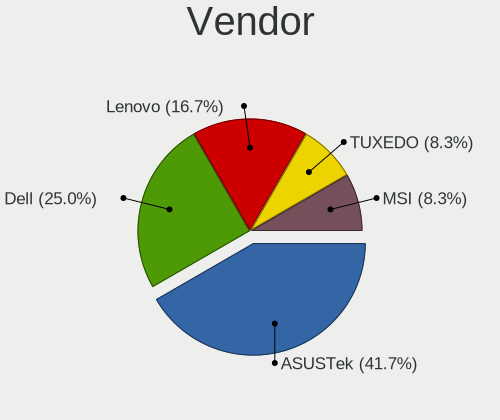
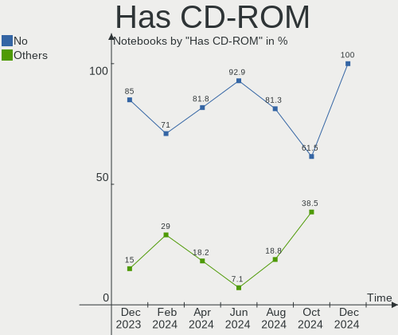
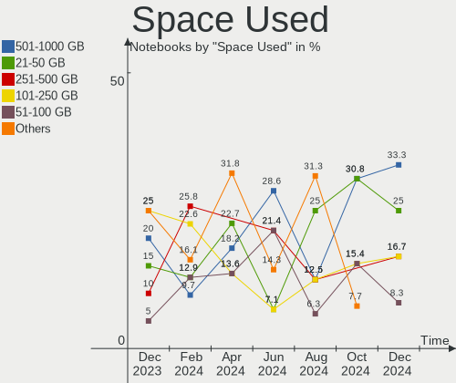
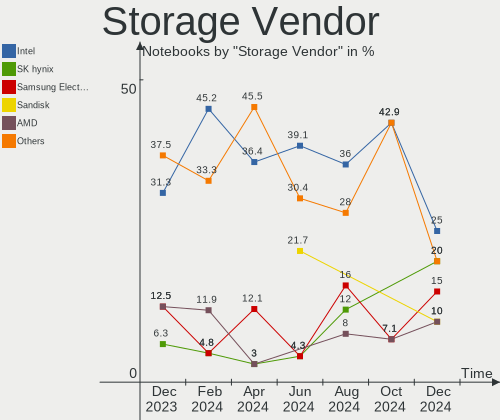
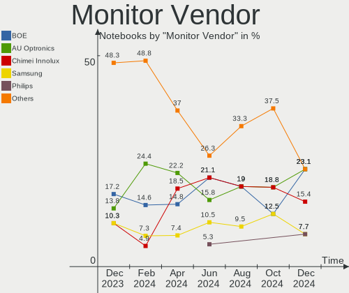
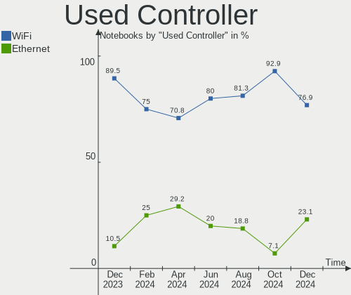
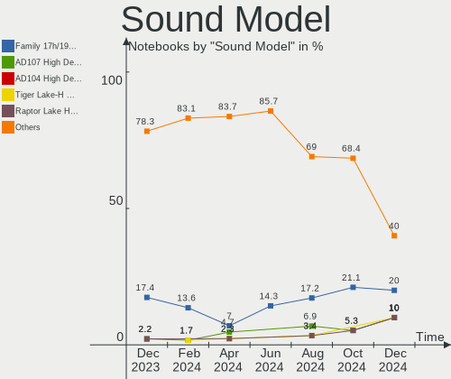
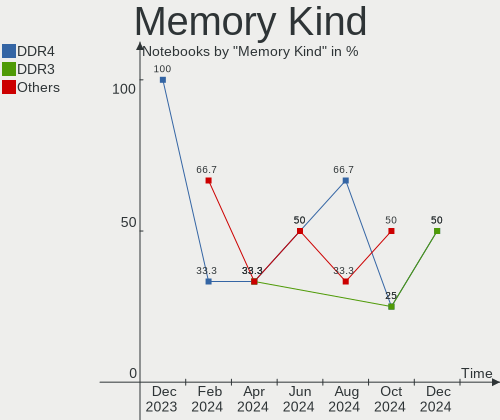

Nobara - Hardware Trends (Notebooks)
------------------------------------

A project to identify most popular hardware characteristics and track their change
over time based on data collected by Linux users at https://Linux-Hardware.org.

Anyone can contribute to this report by the [hw-probe](https://github.com/linuxhw/hw-probe) tool:

    sudo -E hw-probe -all -upload

This report is for one last month. Overall report since the beginning of time: [TestDays](https://github.com/linuxhw/TestDays)

Period: Dec, 2024.

Contents
--------

* [ System ](#system)
  - [ OS                       ](#os)
  - [ OS Family                ](#os-family)
  - [ Kernel                   ](#kernel)
  - [ Kernel Family            ](#kernel-family)
  - [ Kernel Major Ver.        ](#kernel-major-ver)
  - [ Arch                     ](#arch)
  - [ DE                       ](#de)
  - [ Display Server           ](#display-server)
  - [ Display Manager          ](#display-manager)
  - [ OS Lang                  ](#os-lang)
  - [ Boot Mode                ](#boot-mode)
  - [ Filesystem               ](#filesystem)
  - [ Part. scheme             ](#part-scheme)
  - [ Dual Boot with Linux/BSD ](#dual-boot-with-linuxbsd)
  - [ Dual Boot (Win)          ](#dual-boot-win)

* [ Board ](#board)
  - [ Vendor                   ](#vendor)
  - [ Model                    ](#model)
  - [ Model Family             ](#model-family)
  - [ MFG Year                 ](#mfg-year)
  - [ Form Factor              ](#form-factor)
  - [ Secure Boot              ](#secure-boot)
  - [ Coreboot                 ](#coreboot)
  - [ RAM Size                 ](#ram-size)
  - [ RAM Used                 ](#ram-used)
  - [ Total Drives             ](#total-drives)
  - [ Has CD-ROM               ](#has-cd-rom)
  - [ Has Ethernet             ](#has-ethernet)
  - [ Has WiFi                 ](#has-wifi)
  - [ Has Bluetooth            ](#has-bluetooth)

* [ Location ](#location)
  - [ Country                  ](#country)
  - [ City                     ](#city)

* [ Drives ](#drives)
  - [ Drive Vendor             ](#drive-vendor)
  - [ Drive Model              ](#drive-model)
  - [ HDD Vendor               ](#hdd-vendor)
  - [ SSD Vendor               ](#ssd-vendor)
  - [ Drive Kind               ](#drive-kind)
  - [ Drive Connector          ](#drive-connector)
  - [ Drive Size               ](#drive-size)
  - [ Space Total              ](#space-total)
  - [ Space Used               ](#space-used)
  - [ Malfunc. Drives          ](#malfunc-drives)
  - [ Malfunc. Drive Vendor    ](#malfunc-drive-vendor)
  - [ Malfunc. HDD Vendor      ](#malfunc-hdd-vendor)
  - [ Malfunc. Drive Kind      ](#malfunc-drive-kind)
  - [ Failed Drives            ](#failed-drives)
  - [ Failed Drive Vendor      ](#failed-drive-vendor)
  - [ Drive Status             ](#drive-status)

* [ Storage controller ](#storage-controller)
  - [ Storage Vendor           ](#storage-vendor)
  - [ Storage Model            ](#storage-model)
  - [ Storage Kind             ](#storage-kind)

* [ Processor ](#processor)
  - [ CPU Vendor               ](#cpu-vendor)
  - [ CPU Model                ](#cpu-model)
  - [ CPU Model Family         ](#cpu-model-family)
  - [ CPU Cores                ](#cpu-cores)
  - [ CPU Sockets              ](#cpu-sockets)
  - [ CPU Threads              ](#cpu-threads)
  - [ CPU Op-Modes             ](#cpu-op-modes)
  - [ CPU Microcode            ](#cpu-microcode)
  - [ CPU Microarch            ](#cpu-microarch)

* [ Graphics ](#graphics)
  - [ GPU Vendor               ](#gpu-vendor)
  - [ GPU Model                ](#gpu-model)
  - [ GPU Combo                ](#gpu-combo)
  - [ GPU Driver               ](#gpu-driver)
  - [ GPU Memory               ](#gpu-memory)

* [ Monitor ](#monitor)
  - [ Monitor Vendor           ](#monitor-vendor)
  - [ Monitor Model            ](#monitor-model)
  - [ Monitor Resolution       ](#monitor-resolution)
  - [ Monitor Diagonal         ](#monitor-diagonal)
  - [ Monitor Width            ](#monitor-width)
  - [ Aspect Ratio             ](#aspect-ratio)
  - [ Monitor Area             ](#monitor-area)
  - [ Pixel Density            ](#pixel-density)
  - [ Multiple Monitors        ](#multiple-monitors)

* [ Network ](#network)
  - [ Net Controller Vendor    ](#net-controller-vendor)
  - [ Net Controller Model     ](#net-controller-model)
  - [ Wireless Vendor          ](#wireless-vendor)
  - [ Wireless Model           ](#wireless-model)
  - [ Ethernet Vendor          ](#ethernet-vendor)
  - [ Ethernet Model           ](#ethernet-model)
  - [ Net Controller Kind      ](#net-controller-kind)
  - [ Used Controller          ](#used-controller)
  - [ NICs                     ](#nics)
  - [ IPv6                     ](#ipv6)

* [ Bluetooth ](#bluetooth)
  - [ Bluetooth Vendor         ](#bluetooth-vendor)
  - [ Bluetooth Model          ](#bluetooth-model)

* [ Sound ](#sound)
  - [ Sound Vendor             ](#sound-vendor)
  - [ Sound Model              ](#sound-model)

* [ Memory ](#memory)
  - [ Memory Vendor            ](#memory-vendor)
  - [ Memory Model             ](#memory-model)
  - [ Memory Kind              ](#memory-kind)
  - [ Memory Form Factor       ](#memory-form-factor)
  - [ Memory Size              ](#memory-size)
  - [ Memory Speed             ](#memory-speed)

* [ Printers & scanners ](#printers--scanners)
  - [ Printer Vendor           ](#printer-vendor)
  - [ Printer Model            ](#printer-model)
  - [ Scanner Vendor           ](#scanner-vendor)
  - [ Scanner Model            ](#scanner-model)

* [ Camera ](#camera)
  - [ Camera Vendor            ](#camera-vendor)
  - [ Camera Model             ](#camera-model)

* [ Security ](#security)
  - [ Fingerprint Vendor       ](#fingerprint-vendor)
  - [ Fingerprint Model        ](#fingerprint-model)
  - [ Chipcard Vendor          ](#chipcard-vendor)
  - [ Chipcard Model           ](#chipcard-model)

* [ Unsupported ](#unsupported)
  - [ Unsupported Devices      ](#unsupported-devices)
  - [ Unsupported Device Types ](#unsupported-device-types)

System
------

OS
--

Installed operating systems

| Name      | Notebooks | Percent |
|-----------|-----------|---------|
| Nobara 40 | 10        | 83.33%  |
| Nobara 41 | 2         | 16.67%  |

OS Family
---------

OS without a version

| Name   | Notebooks | Percent |
|--------|-----------|---------|
| Nobara | 12        | 100%    |

Kernel
------

Version of the Linux kernel

| Version                      | Notebooks | Percent |
|------------------------------|-----------|---------|
| 6.11.9-200.fsync.fc40.x86_64 | 9         | 75%     |
| 6.12.7-200.fsync.fc41.x86_64 | 1         | 8.33%   |
| 6.12.6-200.fsync.fc41.x86_64 | 1         | 8.33%   |
| 6.11.7-201.fsync.fc40.x86_64 | 1         | 8.33%   |

Kernel Family
-------------

Linux kernel without a distro release

| Version | Notebooks | Percent |
|---------|-----------|---------|
| 6.11.9  | 9         | 75%     |
| 6.12.7  | 1         | 8.33%   |
| 6.12.6  | 1         | 8.33%   |
| 6.11.7  | 1         | 8.33%   |

Kernel Major Ver.
-----------------

Linux kernel major version

| Version | Notebooks | Percent |
|---------|-----------|---------|
| 6.11    | 10        | 83.33%  |
| 6.12    | 2         | 16.67%  |

Arch
----

OS architecture (x86_64, i586, etc.)

| Name   | Notebooks | Percent |
|--------|-----------|---------|
| x86_64 | 12        | 100%    |

DE
--

Desktop Environment

| Name  | Notebooks | Percent |
|-------|-----------|---------|
| KDE6  | 6         | 50%     |
| GNOME | 6         | 50%     |

Display Server
--------------

X11 or Wayland

| Name    | Notebooks | Percent |
|---------|-----------|---------|
| Wayland | 12        | 100%    |

Display Manager
---------------

SDDM, LightDM, etc.

| Name    | Notebooks | Percent |
|---------|-----------|---------|
| Unknown | 10        | 83.33%  |
| SDDM    | 2         | 16.67%  |

OS Lang
-------

Language

| Lang  | Notebooks | Percent |
|-------|-----------|---------|
| en_US | 9         | 75%     |
| hu_HU | 1         | 8.33%   |
| en_HK | 1         | 8.33%   |
| de_DE | 1         | 8.33%   |

Boot Mode
---------

EFI or BIOS

| Mode | Notebooks | Percent |
|------|-----------|---------|
| BIOS | 10        | 83.33%  |
| EFI  | 2         | 16.67%  |

Filesystem
----------

Type of filesystem

| Type  | Notebooks | Percent |
|-------|-----------|---------|
| Btrfs | 11        | 91.67%  |
| Ext4  | 1         | 8.33%   |

Part. scheme
------------

Scheme of partitioning

| Type    | Notebooks | Percent |
|---------|-----------|---------|
| Unknown | 10        | 83.33%  |
| GPT     | 2         | 16.67%  |

Dual Boot with Linux/BSD
------------------------

Hosting more than one Linux/BSD

| Dual boot | Notebooks | Percent |
|-----------|-----------|---------|
| No        | 11        | 91.67%  |
| Yes       | 1         | 8.33%   |

Dual Boot (Win)
---------------

Hosting Linux and Windows

| Dual boot | Notebooks | Percent |
|-----------|-----------|---------|
| No        | 12        | 100%    |

Board
-----

Vendor
------

Motherboard manufacturer

| Name             | Notebooks | Percent |
|------------------|-----------|---------|
| ASUSTek Computer | 5         | 41.67%  |
| Dell             | 3         | 25%     |
| Lenovo           | 2         | 16.67%  |
| TUXEDO           | 1         | 8.33%   |
| MSI              | 1         | 8.33%   |

Model
-----

Motherboard model

| Name                                     | Notebooks | Percent |
|------------------------------------------|-----------|---------|
| Lenovo Legion Pro 7 16IRX8H 82WQ         | 2         | 16.67%  |
| TUXEDO W65_W67RC                         | 1         | 8.33%   |
| MSI Katana 15 B12VFK                     | 1         | 8.33%   |
| Dell XPS 15 7590                         | 1         | 8.33%   |
| Dell Precision 5560                      | 1         | 8.33%   |
| Dell Latitude 7640                       | 1         | 8.33%   |
| ASUS TUF Gaming FX505DT_FX505DT          | 1         | 8.33%   |
| ASUS TUF Gaming FX505DD                  | 1         | 8.33%   |
| ASUS ROG Zephyrus M16 GU603HM_GU603HM    | 1         | 8.33%   |
| ASUS ROG Strix G713PV_G713PV             | 1         | 8.33%   |
| ASUS ASUS TUF Gaming A14 FA401WV_FA401WV | 1         | 8.33%   |

Model Family
------------

Motherboard model prefix

| Name           | Notebooks | Percent |
|----------------|-----------|---------|
| Lenovo Legion  | 2         | 16.67%  |
| ASUS TUF       | 2         | 16.67%  |
| ASUS ROG       | 2         | 16.67%  |
| TUXEDO W65     | 1         | 8.33%   |
| MSI Katana     | 1         | 8.33%   |
| Dell XPS       | 1         | 8.33%   |
| Dell Precision | 1         | 8.33%   |
| Dell Latitude  | 1         | 8.33%   |
| ASUS ASUS      | 1         | 8.33%   |

MFG Year
--------

Motherboard manufacture year

| Year | Notebooks | Percent |
|------|-----------|---------|
| 2023 | 5         | 41.67%  |
| 2021 | 3         | 25%     |
| 2019 | 2         | 16.67%  |
| 2024 | 1         | 8.33%   |
| 2016 | 1         | 8.33%   |

Form Factor
-----------

Physical design of the computer

| Name     | Notebooks | Percent |
|----------|-----------|---------|
| Notebook | 12        | 100%    |

Secure Boot
-----------

Enabled or disabled

| State    | Notebooks | Percent |
|----------|-----------|---------|
| Disabled | 12        | 100%    |

Coreboot
--------

Have coreboot on board

| Used | Notebooks | Percent |
|------|-----------|---------|
| No   | 12        | 100%    |

RAM Size
--------

Total RAM memory

| Size in GB  | Notebooks | Percent |
|-------------|-----------|---------|
| 32.01-64.0  | 5         | 41.67%  |
| 4.01-8.0    | 2         | 16.67%  |
| 24.01-32.0  | 2         | 16.67%  |
| 8.01-16.0   | 2         | 16.67%  |
| 64.01-256.0 | 1         | 8.33%   |

RAM Used
--------

Used RAM memory

| Used GB  | Notebooks | Percent |
|----------|-----------|---------|
| 4.01-8.0 | 8         | 66.67%  |
| 3.01-4.0 | 2         | 16.67%  |
| 2.01-3.0 | 2         | 16.67%  |

Total Drives
------------

Number of drives on board

| Drives | Notebooks | Percent |
|--------|-----------|---------|
| 2      | 5         | 41.67%  |
| 1      | 5         | 41.67%  |
| 3      | 2         | 16.67%  |

Has CD-ROM
----------

Has CD-ROM on board

| Presented | Notebooks | Percent |
|-----------|-----------|---------|
| No        | 12        | 100%    |

Has Ethernet
------------

Has Ethernet on board

| Presented | Notebooks | Percent |
|-----------|-----------|---------|
| Yes       | 9         | 75%     |
| No        | 3         | 25%     |

Has WiFi
--------

Has WiFi module

| Presented | Notebooks | Percent |
|-----------|-----------|---------|
| Yes       | 12        | 100%    |

Has Bluetooth
-------------

Has Bluetooth module

| Presented | Notebooks | Percent |
|-----------|-----------|---------|
| Yes       | 12        | 100%    |

Location
--------

Country
-------

Geographic location (country)

| Country   | Notebooks | Percent |
|-----------|-----------|---------|
| USA       | 6         | 50%     |
| Ukraine   | 1         | 8.33%   |
| Hungary   | 1         | 8.33%   |
| Hong Kong | 1         | 8.33%   |
| Germany   | 1         | 8.33%   |
| Estonia   | 1         | 8.33%   |
| Bulgaria  | 1         | 8.33%   |

City
----

Geographic location (city)

| City         | Notebooks | Percent |
|--------------|-----------|---------|
| Tallinn      | 1         | 8.33%   |
| Syracuse     | 1         | 8.33%   |
| Sofia        | 1         | 8.33%   |
| Reno         | 1         | 8.33%   |
| Odesa        | 1         | 8.33%   |
| New York     | 1         | 8.33%   |
| Naperville   | 1         | 8.33%   |
| Munich       | 1         | 8.33%   |
| Jacksonville | 1         | 8.33%   |
| Gyal         | 1         | 8.33%   |
| Central      | 1         | 8.33%   |
| Brooklyn     | 1         | 8.33%   |

Drives
------

Drive Vendor
------------

Hard drive vendors

| Vendor                    | Notebooks | Drives | Percent |
|---------------------------|-----------|--------|---------|
| Samsung Electronics       | 5         | 7      | 31.25%  |
| SK hynix                  | 4         | 7      | 25%     |
| Sandisk                   | 2         | 2      | 12.5%   |
| Toshiba                   | 1         | 1      | 6.25%   |
| Seagate                   | 1         | 1      | 6.25%   |
| Phison Electronics        | 1         | 1      | 6.25%   |
| Micron/Crucial Technology | 1         | 1      | 6.25%   |
| Micron Technology         | 1         | 1      | 6.25%   |

Drive Model
-----------

Hard drive models

| Model                                                | Notebooks | Percent |
|------------------------------------------------------|-----------|---------|
| SK hynix PSSD X31 512GB                              | 2         | 10.53%  |
| Samsung NVMe SSD Controller PM9A1/PM9A3/980PRO 512GB | 2         | 10.53%  |
| Toshiba XG6 NVMe SSD Controller 1024GB               | 1         | 5.26%   |
| SK hynix SKHynix_HFS512GEJ9X115N 512GB               | 1         | 5.26%   |
| SK hynix SHGP31-2000GM 2TB                           | 1         | 5.26%   |
| SK hynix HFM001TD3JX013N 1024GB                      | 1         | 5.26%   |
| SK hynix BC501 NVMe Solid State Drive 512GB          | 1         | 5.26%   |
| Seagate ST1000LM035-1RK172 1TB                       | 1         | 5.26%   |
| Sandisk WD_BLACK SN850X 4000GB                       | 1         | 5.26%   |
| Sandisk WD Black SN750 / PC SN730 NVMe SSD 512GB     | 1         | 5.26%   |
| Samsung SSD 980 500GB                                | 1         | 5.26%   |
| Samsung SSD 870 EVO 1TB                              | 1         | 5.26%   |
| Samsung SSD 850 EVO M.2 1TB                          | 1         | 5.26%   |
| Samsung MZ7LN512HCHP-000H1 512GB SSD                 | 1         | 5.26%   |
| Phison PS5013 E13 NVMe Controller 512GB              | 1         | 5.26%   |
| Micron/Crucial CT2000P310SSD2 2TB                    | 1         | 5.26%   |
| Micron 2400_MTFDKBA1T0QFM 1TB                        | 1         | 5.26%   |

HDD Vendor
----------

Hard disk drive vendors

| Vendor  | Notebooks | Drives | Percent |
|---------|-----------|--------|---------|
| Seagate | 1         | 1      | 100%    |

SSD Vendor
----------

Solid state drive vendors

| Vendor              | Notebooks | Drives | Percent |
|---------------------|-----------|--------|---------|
| SK hynix            | 2         | 2      | 50%     |
| Samsung Electronics | 2         | 4      | 50%     |

Drive Kind
----------

HDD or SSD

| Kind | Notebooks | Drives | Percent |
|------|-----------|--------|---------|
| NVMe | 11        | 14     | 68.75%  |
| SSD  | 4         | 6      | 25%     |
| HDD  | 1         | 1      | 6.25%   |

Drive Connector
---------------

SATA, SAS, NVMe, etc.

| Type | Notebooks | Drives | Percent |
|------|-----------|--------|---------|
| NVMe | 11        | 14     | 68.75%  |
| SATA | 3         | 5      | 18.75%  |
| SAS  | 2         | 2      | 12.5%   |

Drive Size
----------

Size of hard drive

| Size in TB | Notebooks | Drives | Percent |
|------------|-----------|--------|---------|
| 0.51-1.0   | 5         | 7      | 100%    |

Space Total
-----------

Amount of disk space available on the file system

| Size in GB     | Notebooks | Percent |
|----------------|-----------|---------|
| 501-1000       | 5         | 41.67%  |
| 1001-2000      | 3         | 25%     |
| More than 3000 | 2         | 16.67%  |
| 2001-3000      | 1         | 8.33%   |
| 101-250        | 1         | 8.33%   |

Space Used
----------

Amount of used disk space

| Used GB  | Notebooks | Percent |
|----------|-----------|---------|
| 501-1000 | 4         | 33.33%  |
| 21-50    | 3         | 25%     |
| 251-500  | 2         | 16.67%  |
| 101-250  | 2         | 16.67%  |
| 51-100   | 1         | 8.33%   |

Malfunc. Drives
---------------

Drive models with a malfunction

| Model                               | Notebooks | Drives | Percent |
|-------------------------------------|-----------|--------|---------|
| Samsung Electronics SSD 870 EVO 1TB | 1         | 2      | 100%    |

Malfunc. Drive Vendor
---------------------

Vendors of faulty drives

| Vendor              | Notebooks | Drives | Percent |
|---------------------|-----------|--------|---------|
| Samsung Electronics | 1         | 2      | 100%    |

Malfunc. HDD Vendor
-------------------

Vendors of faulty HDD drives

Zero info for selected period =(

Malfunc. Drive Kind
-------------------

Kinds of faulty drives

| Kind | Notebooks | Drives | Percent |
|------|-----------|--------|---------|
| SSD  | 1         | 2      | 100%    |

Failed Drives
-------------

Failed drive models

Zero info for selected period =(

Failed Drive Vendor
-------------------

Failed drive vendors

Zero info for selected period =(

Drive Status
------------

Number of failed and malfunc. drives

| Status   | Notebooks | Drives | Percent |
|----------|-----------|--------|---------|
| Detected | 10        | 17     | 76.92%  |
| Works    | 2         | 2      | 15.38%  |
| Malfunc  | 1         | 2      | 7.69%   |

Storage controller
------------------

Storage Vendor
--------------

Storage controller vendors

| Vendor                       | Notebooks | Percent |
|------------------------------|-----------|---------|
| Intel                        | 5         | 25%     |
| SK hynix                     | 4         | 20%     |
| Samsung Electronics          | 3         | 15%     |
| Sandisk                      | 2         | 10%     |
| AMD                          | 2         | 10%     |
| Toshiba America Info Systems | 1         | 5%      |
| Phison Electronics           | 1         | 5%      |
| Micron/Crucial Technology    | 1         | 5%      |
| Micron Technology            | 1         | 5%      |

Storage Model
-------------

Storage controller models

| Model                                                                | Notebooks | Percent |
|----------------------------------------------------------------------|-----------|---------|
| Intel Volume Management Device NVMe RAID Controller                  | 3         | 15%     |
| SK hynix Gold P31/BC711/PC711 NVMe Solid State Drive                 | 2         | 10%     |
| Samsung NVMe SSD Controller PM9A1/PM9A3/980PRO                       | 2         | 10%     |
| AMD FCH SATA Controller [AHCI mode]                                  | 2         | 10%     |
| Toshiba America Info Systems XG6 NVMe SSD Controller                 | 1         | 5%      |
| SK hynix Platinum P41/PC801 NVMe Solid State Drive                   | 1         | 5%      |
| SK hynix BC501 NVMe Solid State Drive                                | 1         | 5%      |
| Sandisk WD Black SN850X NVMe SSD                                     | 1         | 5%      |
| SanDisk Extreme Pro / WD Black SN750 / PC SN730 / Red SN700 NVMe SSD | 1         | 5%      |
| Samsung NVMe SSD Controller 980 (DRAM-less)                          | 1         | 5%      |
| Phison PS5013-E13 PCIe3 NVMe Controller (DRAM-less)                  | 1         | 5%      |
| Micron/Crucial P310 NVMe PCIe SSD (DRAM-less)                        | 1         | 5%      |
| Micron 2400 NVMe SSD (DRAM-less)                                     | 1         | 5%      |
| Intel HM170/QM170 Chipset SATA Controller [AHCI Mode]                | 1         | 5%      |
| Intel Cannon Lake Mobile PCH SATA AHCI Controller                    | 1         | 5%      |

Storage Kind
------------

Kind of storage controller (IDE, SATA, NVMe, SAS, ...)

| Kind | Notebooks | Percent |
|------|-----------|---------|
| NVMe | 11        | 61.11%  |
| SATA | 4         | 22.22%  |
| RAID | 3         | 16.67%  |

Processor
---------

CPU Vendor
----------

Processor vendors

| Vendor | Notebooks | Percent |
|--------|-----------|---------|
| Intel  | 8         | 66.67%  |
| AMD    | 4         | 33.33%  |

CPU Model
---------

Processor models

| Model                                         | Notebooks | Percent |
|-----------------------------------------------|-----------|---------|
| Intel 13th Gen Core i9-13900HX                | 2         | 16.67%  |
| AMD Ryzen 5 3550H with Radeon Vega Mobile Gfx | 2         | 16.67%  |
| Intel Core i7-9750H CPU @ 2.60GHz             | 1         | 8.33%   |
| Intel Core i7-6700HQ CPU @ 2.60GHz            | 1         | 8.33%   |
| Intel 13th Gen Core i5-1345U                  | 1         | 8.33%   |
| Intel 12th Gen Core i7-12650H                 | 1         | 8.33%   |
| Intel 11th Gen Core i9-11950H @ 2.60GHz       | 1         | 8.33%   |
| Intel 11th Gen Core i9-11900H @ 2.50GHz       | 1         | 8.33%   |
| AMD Ryzen AI 9 HX 370 w/ Radeon 890M          | 1         | 8.33%   |
| AMD Ryzen 9 7845HX with Radeon Graphics       | 1         | 8.33%   |

CPU Model Family
----------------

Processor model prefix

| Model         | Notebooks | Percent |
|---------------|-----------|---------|
| Other         | 7         | 58.33%  |
| Intel Core i7 | 2         | 16.67%  |
| AMD Ryzen 5   | 2         | 16.67%  |
| AMD Ryzen 9   | 1         | 8.33%   |

CPU Cores
---------

Number of processor cores

| Number | Notebooks | Percent |
|--------|-----------|---------|
| 4      | 3         | 25%     |
| 24     | 2         | 16.67%  |
| 12     | 2         | 16.67%  |
| 10     | 2         | 16.67%  |
| 8      | 2         | 16.67%  |
| 6      | 1         | 8.33%   |

CPU Sockets
-----------

Number of sockets

| Number | Notebooks | Percent |
|--------|-----------|---------|
| 1      | 12        | 100%    |

CPU Threads
-----------

Threads per core (Hyper-Threading)

| Number | Notebooks | Percent |
|--------|-----------|---------|
| 2      | 11        | 91.67%  |
| 1      | 1         | 8.33%   |

CPU Op-Modes
------------

CPU Operation Modes (32-bit, 64-bit)

| Op mode        | Notebooks | Percent |
|----------------|-----------|---------|
| 32-bit, 64-bit | 12        | 100%    |

CPU Microcode
-------------

Microcode number

| Number  | Notebooks | Percent |
|---------|-----------|---------|
| Unknown | 12        | 100%    |

CPU Microarch
-------------

Microarchitecture

| Name     | Notebooks | Percent |
|----------|-----------|---------|
| Unknown  | 8         | 66.67%  |
| Zen+     | 2         | 16.67%  |
| Skylake  | 1         | 8.33%   |
| KabyLake | 1         | 8.33%   |

Graphics
--------

GPU Vendor
----------

Vendors of graphics cards

| Vendor | Notebooks | Percent |
|--------|-----------|---------|
| Nvidia | 10        | 47.62%  |
| Intel  | 7         | 33.33%  |
| AMD    | 4         | 19.05%  |

GPU Model
---------

Graphics card models

| Model                                                                | Notebooks | Percent |
|----------------------------------------------------------------------|-----------|---------|
| Nvidia TU117M [GeForce GTX 1650 Mobile / Max-Q]                      | 2         | 9.52%   |
| Nvidia AD107M [GeForce RTX 4060 Max-Q / Mobile]                      | 2         | 9.52%   |
| Nvidia AD104M [GeForce RTX 4080 Max-Q / Mobile]                      | 2         | 9.52%   |
| Intel TigerLake-H GT1 [UHD Graphics]                                 | 2         | 9.52%   |
| AMD Picasso/Raven 2 [Radeon Vega Series / Radeon Vega Mobile Series] | 2         | 9.52%   |
| Nvidia GP107M [GeForce GTX 1050 3 GB Max-Q]                          | 1         | 4.76%   |
| Nvidia GM107M [GeForce GTX 950M]                                     | 1         | 4.76%   |
| Nvidia GA107GLM [RTX A2000 Mobile]                                   | 1         | 4.76%   |
| Nvidia GA106M [GeForce RTX 3060 Mobile / Max-Q]                      | 1         | 4.76%   |
| Intel Raptor Lake-S UHD Graphics                                     | 1         | 4.76%   |
| Intel Raptor Lake-P [Iris Xe Graphics]                               | 1         | 4.76%   |
| Intel HD Graphics 530                                                | 1         | 4.76%   |
| Intel CoffeeLake-H GT2 [UHD Graphics 630]                            | 1         | 4.76%   |
| Intel Alder Lake-P GT1 [UHD Graphics]                                | 1         | 4.76%   |
| AMD Strix [Radeon 880M / 890M]                                       | 1         | 4.76%   |
| AMD Raphael                                                          | 1         | 4.76%   |

GPU Combo
---------

Combinations of graphics cards

| Name           | Notebooks | Percent |
|----------------|-----------|---------|
| Intel + Nvidia | 6         | 50%     |
| AMD + Nvidia   | 3         | 25%     |
| 1 x Nvidia     | 1         | 8.33%   |
| 1 x Intel      | 1         | 8.33%   |
| 1 x AMD        | 1         | 8.33%   |

GPU Driver
----------

Free vs proprietary

| Driver      | Notebooks | Percent |
|-------------|-----------|---------|
| Proprietary | 6         | 50%     |
| Free        | 6         | 50%     |

GPU Memory
----------

Total video memory

| Size in GB | Notebooks | Percent |
|------------|-----------|---------|
| Unknown    | 12        | 100%    |

Monitor
-------

Monitor Vendor
--------------

Monitor vendors

| Vendor              | Notebooks | Percent |
|---------------------|-----------|---------|
| BOE                 | 3         | 23.08%  |
| AU Optronics        | 3         | 23.08%  |
| Chimei Innolux      | 2         | 15.38%  |
| Samsung Electronics | 1         | 7.69%   |
| Philips             | 1         | 7.69%   |
| PANDA               | 1         | 7.69%   |
| LG Display          | 1         | 7.69%   |
| CSO                 | 1         | 7.69%   |

Monitor Model
-------------

Monitor models

| Model                                                               | Notebooks | Percent |
|---------------------------------------------------------------------|-----------|---------|
| BOE LCD Monitor BOE0B8B 2560x1600 345x215mm 16.0-inch               | 2         | 15.38%  |
| Samsung Electronics Color LCD SDCA029 2160x1440 252x168mm 11.9-inch | 1         | 7.69%   |
| Philips PHL 34M2C8600 PHLC29F 3440x1440 800x337mm 34.2-inch         | 1         | 7.69%   |
| PANDA LCD Monitor NCP0036 1920x1080 344x194mm 15.5-inch             | 1         | 7.69%   |
| LG Display LCD Monitor LGD06B3 1920x1200 336x210mm 15.6-inch        | 1         | 7.69%   |
| CSO MNH301CA3-1 CSO1702 2560x1440 381x214mm 17.2-inch               | 1         | 7.69%   |
| Chimei Innolux LCD Monitor CMN1735 1920x1080 382x215mm 17.3-inch    | 1         | 7.69%   |
| Chimei Innolux LCD Monitor CMN1612 1920x1200 344x215mm 16.0-inch    | 1         | 7.69%   |
| BOE NE140QDM-NX7 BOE0CA4 2560x1600 302x188mm 14.0-inch              | 1         | 7.69%   |
| AU Optronics LCD Monitor AUOD0ED 1920x1080 344x193mm 15.5-inch      | 1         | 7.69%   |
| AU Optronics LCD Monitor AUOD0A2 1920x1080 344x193mm 15.5-inch      | 1         | 7.69%   |
| AU Optronics LCD Monitor AUOC199 2560x1600 344x215mm 16.0-inch      | 1         | 7.69%   |

Monitor Resolution
------------------

Monitor screen resolution

| Resolution        | Notebooks | Percent |
|-------------------|-----------|---------|
| 2560x1600         | 4         | 30.77%  |
| 1920x1080 (FHD)   | 4         | 30.77%  |
| 1920x1200 (WUXGA) | 2         | 15.38%  |
| 3840x2160 (4K)    | 1         | 7.69%   |
| 3440x1440         | 1         | 7.69%   |
| 2560x1440 (QHD)   | 1         | 7.69%   |

Monitor Diagonal
----------------

Diagonal size in inches

| Inches | Notebooks | Percent |
|--------|-----------|---------|
| 15     | 5         | 38.46%  |
| 16     | 4         | 30.77%  |
| 17     | 2         | 15.38%  |
| 34     | 1         | 7.69%   |
| 14     | 1         | 7.69%   |

Monitor Width
-------------

Physical width

| Width in mm | Notebooks | Percent |
|-------------|-----------|---------|
| 301-350     | 10        | 76.92%  |
| 351-400     | 2         | 15.38%  |
| 701-800     | 1         | 7.69%   |

Aspect Ratio
------------

Proportional relationship between the width and the height

| Ratio | Notebooks | Percent |
|-------|-----------|---------|
| 16/9  | 6         | 46.15%  |
| 16/10 | 6         | 46.15%  |
| 21/9  | 1         | 7.69%   |

Monitor Area
------------

Area in inch²

| Area in inch² | Notebooks | Percent |
|----------------|-----------|---------|
| 101-110        | 5         | 38.46%  |
| 111-120        | 4         | 30.77%  |
| 121-130        | 2         | 15.38%  |
| 81-90          | 1         | 7.69%   |
| 351-500        | 1         | 7.69%   |

Pixel Density
-------------

Pixels per inch

| Density       | Notebooks | Percent |
|---------------|-----------|---------|
| 121-160       | 6         | 46.15%  |
| 161-240       | 5         | 38.46%  |
| More than 240 | 1         | 7.69%   |
| 101-120       | 1         | 7.69%   |

Multiple Monitors
-----------------

Total monitors connected

| Total | Notebooks | Percent |
|-------|-----------|---------|
| 1     | 11        | 91.67%  |
| 2     | 1         | 8.33%   |

Network
-------

Net Controller Vendor
---------------------

Controller vendors

| Vendor                | Notebooks | Percent |
|-----------------------|-----------|---------|
| Realtek Semiconductor | 8         | 42.11%  |
| Intel                 | 8         | 42.11%  |
| MediaTek              | 2         | 10.53%  |
| ASIX Electronics      | 1         | 5.26%   |

Net Controller Model
--------------------

Controller models

| Model                                                                  | Notebooks | Percent |
|------------------------------------------------------------------------|-----------|---------|
| Realtek RTL8111/8168/8211/8411 PCI Express Gigabit Ethernet Controller | 8         | 38.1%   |
| Intel Raptor Lake-S PCH CNVi WiFi                                      | 2         | 9.52%   |
| Realtek RTL8822CE 802.11ac PCIe Wireless Network Adapter               | 1         | 4.76%   |
| Realtek RTL8821CE 802.11ac PCIe Wireless Network Adapter               | 1         | 4.76%   |
| MediaTek MT7922 802.11ax PCI Express Wireless Network Adapter          | 1         | 4.76%   |
| MediaTek MT7921 802.11ax PCI Express Wireless Network Adapter          | 1         | 4.76%   |
| Intel Wireless 3165                                                    | 1         | 4.76%   |
| Intel Wi-Fi 6E(802.11ax) AX210/AX1675* 2x2 [Typhoon Peak]              | 1         | 4.76%   |
| Intel Wi-Fi 6 AX200                                                    | 1         | 4.76%   |
| Intel Tiger Lake PCH CNVi WiFi                                         | 1         | 4.76%   |
| Intel Raptor Lake PCH CNVi WiFi                                        | 1         | 4.76%   |
| Intel Alder Lake-P PCH CNVi WiFi                                       | 1         | 4.76%   |
| ASIX AX88179 Gigabit Ethernet                                          | 1         | 4.76%   |

Wireless Vendor
---------------

Wireless vendors

| Vendor                | Notebooks | Percent |
|-----------------------|-----------|---------|
| Intel                 | 8         | 66.67%  |
| Realtek Semiconductor | 2         | 16.67%  |
| MediaTek              | 2         | 16.67%  |

Wireless Model
--------------

Wireless models

| Model                                                         | Notebooks | Percent |
|---------------------------------------------------------------|-----------|---------|
| Intel Raptor Lake-S PCH CNVi WiFi                             | 2         | 16.67%  |
| Realtek RTL8822CE 802.11ac PCIe Wireless Network Adapter      | 1         | 8.33%   |
| Realtek RTL8821CE 802.11ac PCIe Wireless Network Adapter      | 1         | 8.33%   |
| MediaTek MT7922 802.11ax PCI Express Wireless Network Adapter | 1         | 8.33%   |
| MediaTek MT7921 802.11ax PCI Express Wireless Network Adapter | 1         | 8.33%   |
| Intel Wireless 3165                                           | 1         | 8.33%   |
| Intel Wi-Fi 6E(802.11ax) AX210/AX1675* 2x2 [Typhoon Peak]     | 1         | 8.33%   |
| Intel Wi-Fi 6 AX200                                           | 1         | 8.33%   |
| Intel Tiger Lake PCH CNVi WiFi                                | 1         | 8.33%   |
| Intel Raptor Lake PCH CNVi WiFi                               | 1         | 8.33%   |
| Intel Alder Lake-P PCH CNVi WiFi                              | 1         | 8.33%   |

Ethernet Vendor
---------------

Ethernet vendors

| Vendor                | Notebooks | Percent |
|-----------------------|-----------|---------|
| Realtek Semiconductor | 8         | 88.89%  |
| ASIX Electronics      | 1         | 11.11%  |

Ethernet Model
--------------

Ethernet models

| Model                                                                  | Notebooks | Percent |
|------------------------------------------------------------------------|-----------|---------|
| Realtek RTL8111/8168/8211/8411 PCI Express Gigabit Ethernet Controller | 8         | 88.89%  |
| ASIX AX88179 Gigabit Ethernet                                          | 1         | 11.11%  |

Net Controller Kind
-------------------

Ethernet, WiFi or modem

| Kind     | Notebooks | Percent |
|----------|-----------|---------|
| WiFi     | 12        | 57.14%  |
| Ethernet | 9         | 42.86%  |

Used Controller
---------------

Currently used network controller

| Kind     | Notebooks | Percent |
|----------|-----------|---------|
| WiFi     | 10        | 76.92%  |
| Ethernet | 3         | 23.08%  |

NICs
----

Total network controllers on board

| Total | Notebooks | Percent |
|-------|-----------|---------|
| 2     | 8         | 66.67%  |
| 1     | 4         | 33.33%  |

IPv6
----

IPv6 vs IPv4

| Used | Notebooks | Percent |
|------|-----------|---------|
| No   | 9         | 75%     |
| Yes  | 3         | 25%     |

Bluetooth
---------

Bluetooth Vendor
----------------

Controller vendors

| Vendor            | Notebooks | Percent |
|-------------------|-----------|---------|
| Intel             | 8         | 61.54%  |
| IMC Networks      | 3         | 23.08%  |
| Foxconn / Hon Hai | 1         | 7.69%   |
| Edimax Technology | 1         | 7.69%   |

Bluetooth Model
---------------

Controller models

| Model                              | Notebooks | Percent |
|------------------------------------|-----------|---------|
| Intel AX211 Bluetooth              | 3         | 23.08%  |
| Intel AX201 Bluetooth              | 2         | 15.38%  |
| IMC Networks Bluetooth Radio       | 2         | 15.38%  |
| Intel Bluetooth wireless interface | 1         | 7.69%   |
| Intel AX210 Bluetooth              | 1         | 7.69%   |
| Intel AX200 Bluetooth              | 1         | 7.69%   |
| IMC Networks Wireless_Device       | 1         | 7.69%   |
| Foxconn / Hon Hai Wireless_Device  | 1         | 7.69%   |
| Edimax Bluetooth Adapter           | 1         | 7.69%   |

Sound
-----

Sound Vendor
------------

Sound card vendors

| Vendor | Notebooks | Percent |
|--------|-----------|---------|
| Intel  | 8         | 42.11%  |
| Nvidia | 7         | 36.84%  |
| AMD    | 4         | 21.05%  |

Sound Model
-----------

Sound card models

| Model                                                           | Notebooks | Percent |
|-----------------------------------------------------------------|-----------|---------|
| AMD Family 17h/19h/1ah HD Audio Controller                      | 4         | 20%     |
| Nvidia AD107 High Definition Audio Controller                   | 2         | 10%     |
| Nvidia AD104 High Definition Audio Controller                   | 2         | 10%     |
| Intel Tiger Lake-H HD Audio Controller                          | 2         | 10%     |
| Intel Raptor Lake High Definition Audio Controller              | 2         | 10%     |
| Nvidia TU107 GeForce GTX 1650 High Definition Audio Controller  | 1         | 5%      |
| Nvidia GP107GL High Definition Audio Controller                 | 1         | 5%      |
| Nvidia GA106 High Definition Audio Controller                   | 1         | 5%      |
| Intel Raptor Lake-P/U/H cAVS                                    | 1         | 5%      |
| Intel Cannon Lake PCH cAVS                                      | 1         | 5%      |
| Intel Alder Lake PCH-P High Definition Audio Controller         | 1         | 5%      |
| Intel 100 Series/C230 Series Chipset Family HD Audio Controller | 1         | 5%      |
| AMD Rembrandt Radeon High Definition Audio Controller           | 1         | 5%      |

Memory
------

Memory Vendor
-------------

Memory module vendors

| Vendor   | Notebooks | Percent |
|----------|-----------|---------|
| Kingston | 1         | 50%     |
| Crucial  | 1         | 50%     |

Memory Model
------------

Memory module models

| Model                                                    | Notebooks | Percent |
|----------------------------------------------------------|-----------|---------|
| Kingston RAM KHX1866C11S3L/4G 4GB SODIMM DDR3 1867MT/s   | 1         | 50%     |
| Crucial RAM CT16G4SFRA32A.M8FB 16GB SODIMM DDR4 3200MT/s | 1         | 50%     |

Memory Kind
-----------

Memory module kinds

| Kind | Notebooks | Percent |
|------|-----------|---------|
| DDR4 | 1         | 50%     |
| DDR3 | 1         | 50%     |

Memory Form Factor
------------------

Physical design of the memory module

| Name   | Notebooks | Percent |
|--------|-----------|---------|
| SODIMM | 2         | 100%    |

Memory Size
-----------

Memory module size

| Size  | Notebooks | Percent |
|-------|-----------|---------|
| 16384 | 1         | 50%     |
| 4096  | 1         | 50%     |

Memory Speed
------------

Memory module speed

| Speed | Notebooks | Percent |
|-------|-----------|---------|
| 3200  | 1         | 50%     |
| 1867  | 1         | 50%     |

Printers & scanners
-------------------

Printer Vendor
--------------

Printer device vendors

Zero info for selected period =(

Printer Model
-------------

Printer device models

Zero info for selected period =(

Scanner Vendor
--------------

Scanner device vendors

Zero info for selected period =(

Scanner Model
-------------

Scanner device models

Zero info for selected period =(

Camera
------

Camera Vendor
-------------

Camera device vendors

| Vendor                      | Notebooks | Percent |
|-----------------------------|-----------|---------|
| IMC Networks                | 3         | 33.33%  |
| Sonix Technology            | 1         | 11.11%  |
| Microdia                    | 1         | 11.11%  |
| Luxvisions Innotech Limited | 1         | 11.11%  |
| Chicony Electronics         | 1         | 11.11%  |
| Bison Electronics           | 1         | 11.11%  |
| Acer                        | 1         | 11.11%  |

Camera Model
------------

Camera device models

| Model                                         | Notebooks | Percent |
|-----------------------------------------------|-----------|---------|
| IMC Networks USB2.0 HD UVC WebCam             | 3         | 33.33%  |
| Sonix ASUS FHD webcam                         | 1         | 11.11%  |
| Microdia Integrated_Webcam_HD                 | 1         | 11.11%  |
| Luxvisions Innotech Limited Integrated Camera | 1         | 11.11%  |
| Chicony Integrated Camera                     | 1         | 11.11%  |
| Bison HD Webcam                               | 1         | 11.11%  |
| Acer BisonCam, NB Pro                         | 1         | 11.11%  |

Security
--------

Fingerprint Vendor
------------------

Fingerprint sensor vendors

Zero info for selected period =(

Fingerprint Model
-----------------

Fingerprint sensor models

Zero info for selected period =(

Chipcard Vendor
---------------

Chipcard module vendors

| Vendor   | Notebooks | Percent |
|----------|-----------|---------|
| Broadcom | 1         | 100%    |

Chipcard Model
--------------

Chipcard module models

| Model          | Notebooks | Percent |
|----------------|-----------|---------|
| Broadcom 58200 | 1         | 100%    |

Unsupported
-----------

Unsupported Devices
-------------------

Total unsupported devices on board

| Total | Notebooks | Percent |
|-------|-----------|---------|
| 0     | 7         | 58.33%  |
| 1     | 5         | 41.67%  |

Unsupported Device Types
------------------------

Types of unsupported devices

| Type          | Notebooks | Percent |
|---------------|-----------|---------|
| Graphics card | 5         | 100%    |

