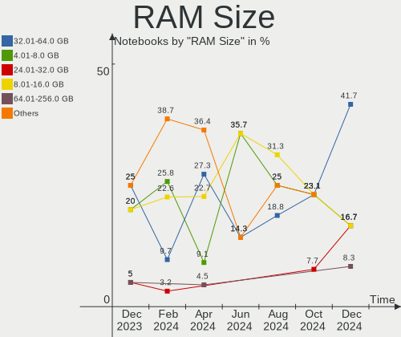
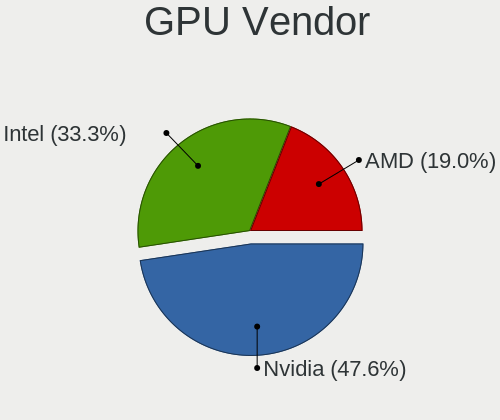
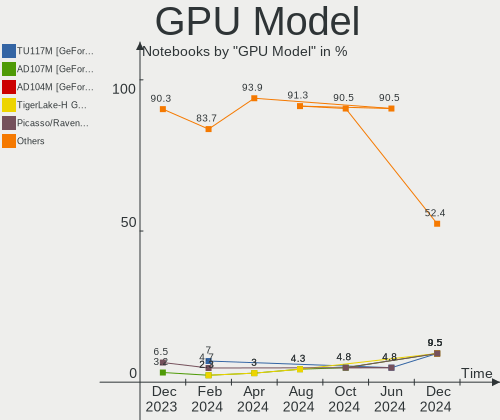
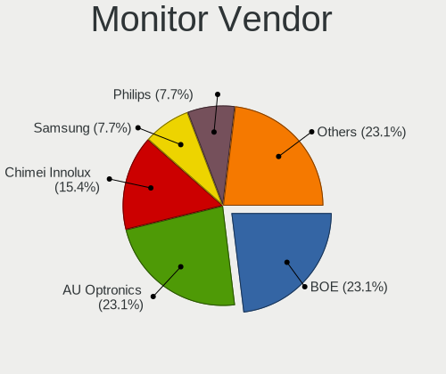
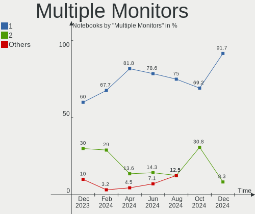
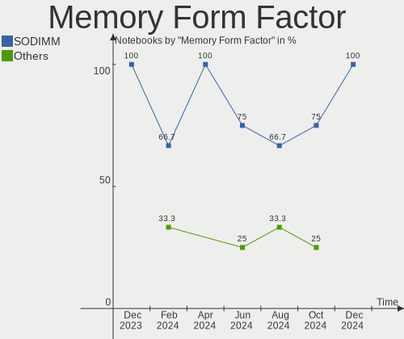
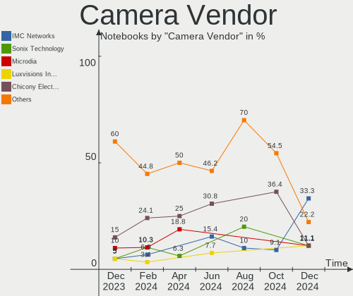

Nobara - Hardware Trends (Notebooks)
------------------------------------

A project to identify most popular hardware characteristics and track their change
over time based on data collected by Linux users at https://Linux-Hardware.org.

Anyone can contribute to this report by the [hw-probe](https://github.com/linuxhw/hw-probe) tool:

    sudo -E hw-probe -all -upload

This report is for one last month. Overall report since the beginning of time: [TestDays](https://github.com/linuxhw/TestDays)

Period: May, 2023.

Contents
--------

* [ System ](#system)
  - [ OS                       ](#os)
  - [ OS Family                ](#os-family)
  - [ Kernel                   ](#kernel)
  - [ Kernel Family            ](#kernel-family)
  - [ Kernel Major Ver.        ](#kernel-major-ver)
  - [ Arch                     ](#arch)
  - [ DE                       ](#de)
  - [ Display Server           ](#display-server)
  - [ Display Manager          ](#display-manager)
  - [ OS Lang                  ](#os-lang)
  - [ Boot Mode                ](#boot-mode)
  - [ Filesystem               ](#filesystem)
  - [ Part. scheme             ](#part-scheme)
  - [ Dual Boot with Linux/BSD ](#dual-boot-with-linuxbsd)
  - [ Dual Boot (Win)          ](#dual-boot-win)

* [ Board ](#board)
  - [ Vendor                   ](#vendor)
  - [ Model                    ](#model)
  - [ Model Family             ](#model-family)
  - [ MFG Year                 ](#mfg-year)
  - [ Form Factor              ](#form-factor)
  - [ Secure Boot              ](#secure-boot)
  - [ Coreboot                 ](#coreboot)
  - [ RAM Size                 ](#ram-size)
  - [ RAM Used                 ](#ram-used)
  - [ Total Drives             ](#total-drives)
  - [ Has CD-ROM               ](#has-cd-rom)
  - [ Has Ethernet             ](#has-ethernet)
  - [ Has WiFi                 ](#has-wifi)
  - [ Has Bluetooth            ](#has-bluetooth)

* [ Location ](#location)
  - [ Country                  ](#country)
  - [ City                     ](#city)

* [ Drives ](#drives)
  - [ Drive Vendor             ](#drive-vendor)
  - [ Drive Model              ](#drive-model)
  - [ HDD Vendor               ](#hdd-vendor)
  - [ SSD Vendor               ](#ssd-vendor)
  - [ Drive Kind               ](#drive-kind)
  - [ Drive Connector          ](#drive-connector)
  - [ Drive Size               ](#drive-size)
  - [ Space Total              ](#space-total)
  - [ Space Used               ](#space-used)
  - [ Malfunc. Drives          ](#malfunc-drives)
  - [ Malfunc. Drive Vendor    ](#malfunc-drive-vendor)
  - [ Malfunc. HDD Vendor      ](#malfunc-hdd-vendor)
  - [ Malfunc. Drive Kind      ](#malfunc-drive-kind)
  - [ Failed Drives            ](#failed-drives)
  - [ Failed Drive Vendor      ](#failed-drive-vendor)
  - [ Drive Status             ](#drive-status)

* [ Storage controller ](#storage-controller)
  - [ Storage Vendor           ](#storage-vendor)
  - [ Storage Model            ](#storage-model)
  - [ Storage Kind             ](#storage-kind)

* [ Processor ](#processor)
  - [ CPU Vendor               ](#cpu-vendor)
  - [ CPU Model                ](#cpu-model)
  - [ CPU Model Family         ](#cpu-model-family)
  - [ CPU Cores                ](#cpu-cores)
  - [ CPU Sockets              ](#cpu-sockets)
  - [ CPU Threads              ](#cpu-threads)
  - [ CPU Op-Modes             ](#cpu-op-modes)
  - [ CPU Microcode            ](#cpu-microcode)
  - [ CPU Microarch            ](#cpu-microarch)

* [ Graphics ](#graphics)
  - [ GPU Vendor               ](#gpu-vendor)
  - [ GPU Model                ](#gpu-model)
  - [ GPU Combo                ](#gpu-combo)
  - [ GPU Driver               ](#gpu-driver)
  - [ GPU Memory               ](#gpu-memory)

* [ Monitor ](#monitor)
  - [ Monitor Vendor           ](#monitor-vendor)
  - [ Monitor Model            ](#monitor-model)
  - [ Monitor Resolution       ](#monitor-resolution)
  - [ Monitor Diagonal         ](#monitor-diagonal)
  - [ Monitor Width            ](#monitor-width)
  - [ Aspect Ratio             ](#aspect-ratio)
  - [ Monitor Area             ](#monitor-area)
  - [ Pixel Density            ](#pixel-density)
  - [ Multiple Monitors        ](#multiple-monitors)

* [ Network ](#network)
  - [ Net Controller Vendor    ](#net-controller-vendor)
  - [ Net Controller Model     ](#net-controller-model)
  - [ Wireless Vendor          ](#wireless-vendor)
  - [ Wireless Model           ](#wireless-model)
  - [ Ethernet Vendor          ](#ethernet-vendor)
  - [ Ethernet Model           ](#ethernet-model)
  - [ Net Controller Kind      ](#net-controller-kind)
  - [ Used Controller          ](#used-controller)
  - [ NICs                     ](#nics)
  - [ IPv6                     ](#ipv6)

* [ Bluetooth ](#bluetooth)
  - [ Bluetooth Vendor         ](#bluetooth-vendor)
  - [ Bluetooth Model          ](#bluetooth-model)

* [ Sound ](#sound)
  - [ Sound Vendor             ](#sound-vendor)
  - [ Sound Model              ](#sound-model)

* [ Memory ](#memory)
  - [ Memory Vendor            ](#memory-vendor)
  - [ Memory Model             ](#memory-model)
  - [ Memory Kind              ](#memory-kind)
  - [ Memory Form Factor       ](#memory-form-factor)
  - [ Memory Size              ](#memory-size)
  - [ Memory Speed             ](#memory-speed)

* [ Printers & scanners ](#printers--scanners)
  - [ Printer Vendor           ](#printer-vendor)
  - [ Printer Model            ](#printer-model)
  - [ Scanner Vendor           ](#scanner-vendor)
  - [ Scanner Model            ](#scanner-model)

* [ Camera ](#camera)
  - [ Camera Vendor            ](#camera-vendor)
  - [ Camera Model             ](#camera-model)

* [ Security ](#security)
  - [ Fingerprint Vendor       ](#fingerprint-vendor)
  - [ Fingerprint Model        ](#fingerprint-model)
  - [ Chipcard Vendor          ](#chipcard-vendor)
  - [ Chipcard Model           ](#chipcard-model)

* [ Unsupported ](#unsupported)
  - [ Unsupported Devices      ](#unsupported-devices)
  - [ Unsupported Device Types ](#unsupported-device-types)

System
------

OS
--

Installed operating systems

| Name      | Notebooks | Percent |
|-----------|-----------|---------|
| Nobara 37 | 14        | 100%    |

OS Family
---------

OS without a version

| Name   | Notebooks | Percent |
|--------|-----------|---------|
| Nobara | 14        | 100%    |

Kernel
------

Version of the Linux kernel

| Version                      | Notebooks | Percent |
|------------------------------|-----------|---------|
| 6.2.14-300.fsync.fc37.x86_64 | 9         | 64.29%  |
| 6.2.12-200.fsync.fc37.x86_64 | 4         | 28.57%  |
| 6.3.4-201.fsync.fc37.x86_64  | 1         | 7.14%   |

Kernel Family
-------------

Linux kernel without a distro release

| Version | Notebooks | Percent |
|---------|-----------|---------|
| 6.2.14  | 9         | 64.29%  |
| 6.2.12  | 4         | 28.57%  |
| 6.3.4   | 1         | 7.14%   |

Kernel Major Ver.
-----------------

Linux kernel major version

| Version | Notebooks | Percent |
|---------|-----------|---------|
| 6.2     | 13        | 92.86%  |
| 6.3     | 1         | 7.14%   |

Arch
----

OS architecture (x86_64, i586, etc.)

| Name   | Notebooks | Percent |
|--------|-----------|---------|
| x86_64 | 14        | 100%    |

DE
--

Desktop Environment

| Name    | Notebooks | Percent |
|---------|-----------|---------|
| GNOME   | 12        | 85.71%  |
| KDE5    | 1         | 7.14%   |
| Unknown | 1         | 7.14%   |

Display Server
--------------

X11 or Wayland

| Name    | Notebooks | Percent |
|---------|-----------|---------|
| Wayland | 11        | 78.57%  |
| X11     | 3         | 21.43%  |

Display Manager
---------------

SDDM, LightDM, etc.

| Name    | Notebooks | Percent |
|---------|-----------|---------|
| Unknown | 10        | 71.43%  |
| GDM     | 4         | 28.57%  |

OS Lang
-------

Language

| Lang  | Notebooks | Percent |
|-------|-----------|---------|
| en_US | 7         | 50%     |
| zh_TW | 1         | 7.14%   |
| it_IT | 1         | 7.14%   |
| es_MX | 1         | 7.14%   |
| en_NZ | 1         | 7.14%   |
| en_IN | 1         | 7.14%   |
| en_GB | 1         | 7.14%   |
| en_CA | 1         | 7.14%   |

Boot Mode
---------

EFI or BIOS

| Mode | Notebooks | Percent |
|------|-----------|---------|
| EFI  | 11        | 78.57%  |
| BIOS | 3         | 21.43%  |

Filesystem
----------

Type of filesystem

| Type  | Notebooks | Percent |
|-------|-----------|---------|
| Btrfs | 13        | 92.86%  |
| Ext4  | 1         | 7.14%   |

Part. scheme
------------

Scheme of partitioning

| Type    | Notebooks | Percent |
|---------|-----------|---------|
| Unknown | 9         | 64.29%  |
| GPT     | 5         | 35.71%  |

Dual Boot with Linux/BSD
------------------------

Hosting more than one Linux/BSD

| Dual boot | Notebooks | Percent |
|-----------|-----------|---------|
| No        | 12        | 85.71%  |
| Yes       | 2         | 14.29%  |

Dual Boot (Win)
---------------

Hosting Linux and Windows

| Dual boot | Notebooks | Percent |
|-----------|-----------|---------|
| No        | 13        | 92.86%  |
| Yes       | 1         | 7.14%   |

Board
-----

Vendor
------

Motherboard manufacturer

| Name                | Notebooks | Percent |
|---------------------|-----------|---------|
| Lenovo              | 4         | 28.57%  |
| Hewlett-Packard     | 4         | 28.57%  |
| Samsung Electronics | 1         | 7.14%   |
| Packard Bell        | 1         | 7.14%   |
| Micro Electronics   | 1         | 7.14%   |
| ASUSTek Computer    | 1         | 7.14%   |
| Apple               | 1         | 7.14%   |
| Alienware           | 1         | 7.14%   |

Model
-----

Motherboard model

| Name                                    | Notebooks | Percent |
|-----------------------------------------|-----------|---------|
| Samsung 535U3C                          | 1         | 7.14%   |
| Packard Bell EasyNote LS11HR            | 1         | 7.14%   |
| Micro MG-VCP2-17A3070T                  | 1         | 7.14%   |
| Lenovo ThinkPad X140e 20BLS00400        | 1         | 7.14%   |
| Lenovo ThinkPad T480s 20L8S06Q00        | 1         | 7.14%   |
| Lenovo Legion Y530-15ICH 81FV           | 1         | 7.14%   |
| Lenovo IdeaPad 320-15ISK 80XH           | 1         | 7.14%   |
| HP Pavilion Gaming Laptop 15-ec2xxx     | 1         | 7.14%   |
| HP Pavilion Gaming Laptop 15-cx0xxx     | 1         | 7.14%   |
| HP Pavilion 15                          | 1         | 7.14%   |
| HP Laptop 17-ca1xxx                     | 1         | 7.14%   |
| ASUS VivoBook_ASUS Laptop X505ZA_X505ZA | 1         | 7.14%   |
| Apple MacBookPro8,1                     | 1         | 7.14%   |
| Alienware m17 R5 AMD                    | 1         | 7.14%   |

Model Family
------------

Motherboard model prefix

| Name                   | Notebooks | Percent |
|------------------------|-----------|---------|
| HP Pavilion            | 3         | 21.43%  |
| Lenovo ThinkPad        | 2         | 14.29%  |
| Samsung 535U3C         | 1         | 7.14%   |
| Packard Bell EasyNote  | 1         | 7.14%   |
| Micro MG-VCP2-17A3070T | 1         | 7.14%   |
| Lenovo Legion          | 1         | 7.14%   |
| Lenovo IdeaPad         | 1         | 7.14%   |
| HP Laptop              | 1         | 7.14%   |
| ASUS VivoBook          | 1         | 7.14%   |
| Apple MacBookPro8      | 1         | 7.14%   |
| Alienware m17          | 1         | 7.14%   |

MFG Year
--------

Motherboard manufacture year

| Year | Notebooks | Percent |
|------|-----------|---------|
| 2018 | 4         | 28.57%  |
| 2011 | 2         | 14.29%  |
| 2023 | 1         | 7.14%   |
| 2022 | 1         | 7.14%   |
| 2021 | 1         | 7.14%   |
| 2019 | 1         | 7.14%   |
| 2017 | 1         | 7.14%   |
| 2014 | 1         | 7.14%   |
| 2013 | 1         | 7.14%   |
| 2012 | 1         | 7.14%   |

Form Factor
-----------

Physical design of the computer

| Name     | Notebooks | Percent |
|----------|-----------|---------|
| Notebook | 14        | 100%    |

Secure Boot
-----------

Enabled or disabled

| State    | Notebooks | Percent |
|----------|-----------|---------|
| Disabled | 14        | 100%    |

Coreboot
--------

Have coreboot on board

| Used | Notebooks | Percent |
|------|-----------|---------|
| No   | 14        | 100%    |

RAM Size
--------

Total RAM memory

| Size in GB | Notebooks | Percent |
|------------|-----------|---------|
| 4.01-8.0   | 4         | 28.57%  |
| 16.01-24.0 | 4         | 28.57%  |
| 8.01-16.0  | 3         | 21.43%  |
| 32.01-64.0 | 2         | 14.29%  |
| 24.01-32.0 | 1         | 7.14%   |

RAM Used
--------

Used RAM memory

| Used GB   | Notebooks | Percent |
|-----------|-----------|---------|
| 2.01-3.0  | 6         | 42.86%  |
| 3.01-4.0  | 4         | 28.57%  |
| 4.01-8.0  | 2         | 14.29%  |
| 1.01-2.0  | 1         | 7.14%   |
| 8.01-16.0 | 1         | 7.14%   |

Total Drives
------------

Number of drives on board

| Drives | Notebooks | Percent |
|--------|-----------|---------|
| 1      | 9         | 64.29%  |
| 2      | 3         | 21.43%  |
| 3      | 2         | 14.29%  |

Has CD-ROM
----------

Has CD-ROM on board

| Presented | Notebooks | Percent |
|-----------|-----------|---------|
| No        | 10        | 71.43%  |
| Yes       | 4         | 28.57%  |

Has Ethernet
------------

Has Ethernet on board

| Presented | Notebooks | Percent |
|-----------|-----------|---------|
| Yes       | 14        | 100%    |

Has WiFi
--------

Has WiFi module

| Presented | Notebooks | Percent |
|-----------|-----------|---------|
| Yes       | 14        | 100%    |

Has Bluetooth
-------------

Has Bluetooth module

| Presented | Notebooks | Percent |
|-----------|-----------|---------|
| Yes       | 12        | 85.71%  |
| No        | 2         | 14.29%  |

Location
--------

Country
-------

Geographic location (country)

| Country     | Notebooks | Percent |
|-------------|-----------|---------|
| USA         | 5         | 35.71%  |
| UK          | 1         | 7.14%   |
| Spain       | 1         | 7.14%   |
| Portugal    | 1         | 7.14%   |
| New Zealand | 1         | 7.14%   |
| Mexico      | 1         | 7.14%   |
| Malaysia    | 1         | 7.14%   |
| India       | 1         | 7.14%   |
| Canada      | 1         | 7.14%   |
| Albania     | 1         | 7.14%   |

City
----

Geographic location (city)

| City           | Notebooks | Percent |
|----------------|-----------|---------|
| Wellington     | 1         | 7.14%   |
| Virginia Beach | 1         | 7.14%   |
| Valencia       | 1         | 7.14%   |
| Toronto        | 1         | 7.14%   |
| Tirana         | 1         | 7.14%   |
| Tijuana        | 1         | 7.14%   |
| Philadelphia   | 1         | 7.14%   |
| Patna          | 1         | 7.14%   |
| Lisbon         | 1         | 7.14%   |
| Kuala Lumpur   | 1         | 7.14%   |
| Houston        | 1         | 7.14%   |
| Halifax        | 1         | 7.14%   |
| Barre          | 1         | 7.14%   |
| Atlanta        | 1         | 7.14%   |

Drives
------

Drive Vendor
------------

Hard drive vendors

| Vendor                    | Notebooks | Drives | Percent |
|---------------------------|-----------|--------|---------|
| Samsung Electronics       | 4         | 4      | 19.05%  |
| Toshiba                   | 2         | 2      | 9.52%   |
| Seagate                   | 2         | 2      | 9.52%   |
| Sandisk                   | 2         | 2      | 9.52%   |
| Kingston                  | 2         | 2      | 9.52%   |
| A-DATA Technology         | 2         | 2      | 9.52%   |
| WDC                       | 1         | 1      | 4.76%   |
| SK hynix                  | 1         | 1      | 4.76%   |
| Micron/Crucial Technology | 1         | 1      | 4.76%   |
| KIOXIA                    | 1         | 1      | 4.76%   |
| HGST                      | 1         | 1      | 4.76%   |
| Crucial                   | 1         | 1      | 4.76%   |
| Apacer                    | 1         | 1      | 4.76%   |

Drive Model
-----------

Hard drive models

| Model                                               | Notebooks | Percent |
|-----------------------------------------------------|-----------|---------|
| WDC WD10JPVX-60JC3T0 1TB                            | 1         | 4.76%   |
| Toshiba MQ04ABF100 1TB                              | 1         | 4.76%   |
| Toshiba KXG50ZNV512G NVMe 512GB                     | 1         | 4.76%   |
| SK hynix BC511 256GB                                | 1         | 4.76%   |
| Seagate ST2000LM007-1R8174 2TB                      | 1         | 4.76%   |
| Seagate ST1000LM049-2GH172 1TB                      | 1         | 4.76%   |
| Sandisk WD Blue SN550 NVMe SSD 512GB                | 1         | 4.76%   |
| SanDisk SD9SN8W128G1002 128GB SSD                   | 1         | 4.76%   |
| Samsung SSD 860 EVO 1TB                             | 1         | 4.76%   |
| Samsung SSD 830 Series 64GB                         | 1         | 4.76%   |
| Samsung NVMe SSD Controller SM981/PM981/PM983 256GB | 1         | 4.76%   |
| Samsung NVMe SSD Controller PM9A1/PM9A3/980PRO 1TB  | 1         | 4.76%   |
| Micron/Crucial P2 NVMe PCIe SSD 1TB                 | 1         | 4.76%   |
| KIOXIA KXG70ZNV512G NVMe 512GB                      | 1         | 4.76%   |
| Kingston SA400S37240G 240GB SSD                     | 1         | 4.76%   |
| Kingston OM8SBP3512K-AH 512GB                       | 1         | 4.76%   |
| HGST HTS545050A7E380 500GB                          | 1         | 4.76%   |
| Crucial CT120BX500SSD1 120GB                        | 1         | 4.76%   |
| Apacer AS340 240GB SSD                              | 1         | 4.76%   |
| A-DATA SU800 512GB SSD                              | 1         | 4.76%   |
| A-DATA HD680 2TB SSD                                | 1         | 4.76%   |

HDD Vendor
----------

Hard disk drive vendors

| Vendor  | Notebooks | Drives | Percent |
|---------|-----------|--------|---------|
| Seagate | 2         | 2      | 40%     |
| WDC     | 1         | 1      | 20%     |
| Toshiba | 1         | 1      | 20%     |
| HGST    | 1         | 1      | 20%     |

SSD Vendor
----------

Solid state drive vendors

| Vendor              | Notebooks | Drives | Percent |
|---------------------|-----------|--------|---------|
| Samsung Electronics | 2         | 2      | 25%     |
| A-DATA Technology   | 2         | 2      | 25%     |
| SanDisk             | 1         | 1      | 12.5%   |
| Kingston            | 1         | 1      | 12.5%   |
| Crucial             | 1         | 1      | 12.5%   |
| Apacer              | 1         | 1      | 12.5%   |

Drive Kind
----------

HDD or SSD

| Kind | Notebooks | Drives | Percent |
|------|-----------|--------|---------|
| NVMe | 7         | 8      | 36.84%  |
| SSD  | 7         | 8      | 36.84%  |
| HDD  | 5         | 5      | 26.32%  |

Drive Connector
---------------

SATA, SAS, NVMe, etc.

| Type | Notebooks | Drives | Percent |
|------|-----------|--------|---------|
| SATA | 10        | 12     | 55.56%  |
| NVMe | 7         | 8      | 38.89%  |
| SAS  | 1         | 1      | 5.56%   |

Drive Size
----------

Size of hard drive

| Size in TB | Notebooks | Drives | Percent |
|------------|-----------|--------|---------|
| 0.51-1.0   | 5         | 5      | 41.67%  |
| 0.01-0.5   | 5         | 6      | 41.67%  |
| 1.01-2.0   | 2         | 2      | 16.67%  |

Space Total
-----------

Amount of disk space available on the file system

| Size in GB     | Notebooks | Percent |
|----------------|-----------|---------|
| 501-1000       | 4         | 28.57%  |
| More than 3000 | 2         | 14.29%  |
| 251-500        | 2         | 14.29%  |
| 101-250        | 2         | 14.29%  |
| 1001-2000      | 2         | 14.29%  |
| 2001-3000      | 1         | 7.14%   |
| Unknown        | 1         | 7.14%   |

Space Used
----------

Amount of used disk space

| Used GB   | Notebooks | Percent |
|-----------|-----------|---------|
| 1-20      | 4         | 28.57%  |
| 501-1000  | 3         | 21.43%  |
| 21-50     | 2         | 14.29%  |
| 51-100    | 2         | 14.29%  |
| 101-250   | 1         | 7.14%   |
| 1001-2000 | 1         | 7.14%   |
| Unknown   | 1         | 7.14%   |

Malfunc. Drives
---------------

Drive models with a malfunction

| Model                      | Notebooks | Drives | Percent |
|----------------------------|-----------|--------|---------|
| HGST HTS545050A7E380 500GB | 1         | 1      | 100%    |

Malfunc. Drive Vendor
---------------------

Vendors of faulty drives

| Vendor | Notebooks | Drives | Percent |
|--------|-----------|--------|---------|
| HGST   | 1         | 1      | 100%    |

Malfunc. HDD Vendor
-------------------

Vendors of faulty HDD drives

| Vendor | Notebooks | Drives | Percent |
|--------|-----------|--------|---------|
| HGST   | 1         | 1      | 100%    |

Malfunc. Drive Kind
-------------------

Kinds of faulty drives

| Kind | Notebooks | Drives | Percent |
|------|-----------|--------|---------|
| HDD  | 1         | 1      | 100%    |

Failed Drives
-------------

Failed drive models

Zero info for selected period =(

Failed Drive Vendor
-------------------

Failed drive vendors

Zero info for selected period =(

Drive Status
------------

Number of failed and malfunc. drives

| Status   | Notebooks | Drives | Percent |
|----------|-----------|--------|---------|
| Detected | 10        | 14     | 62.5%   |
| Works    | 5         | 6      | 31.25%  |
| Malfunc  | 1         | 1      | 6.25%   |

Storage controller
------------------

Storage Vendor
--------------

Storage controller vendors

| Vendor                       | Notebooks | Percent |
|------------------------------|-----------|---------|
| Intel                        | 6         | 31.58%  |
| AMD                          | 5         | 26.32%  |
| Samsung Electronics          | 2         | 10.53%  |
| Toshiba America Info Systems | 1         | 5.26%   |
| SK hynix                     | 1         | 5.26%   |
| SanDisk                      | 1         | 5.26%   |
| Micron/Crucial Technology    | 1         | 5.26%   |
| KIOXIA                       | 1         | 5.26%   |
| Kingston Technology Company  | 1         | 5.26%   |

Storage Model
-------------

Storage controller models

| Model                                                                        | Notebooks | Percent |
|------------------------------------------------------------------------------|-----------|---------|
| AMD FCH SATA Controller [AHCI mode]                                          | 5         | 26.32%  |
| Intel Cannon Lake Mobile PCH SATA AHCI Controller                            | 2         | 10.53%  |
| Intel 6 Series/C200 Series Chipset Family 6 port Mobile SATA AHCI Controller | 2         | 10.53%  |
| Toshiba America Info Systems XG5 NVMe SSD Controller                         | 1         | 5.26%   |
| SK hynix BC511                                                               | 1         | 5.26%   |
| SanDisk WD Blue SN550 NVMe SSD                                               | 1         | 5.26%   |
| Samsung NVMe SSD Controller SM981/PM981/PM983                                | 1         | 5.26%   |
| Samsung NVMe SSD Controller PM9A1/PM9A3/980PRO                               | 1         | 5.26%   |
| Micron/Crucial P2 NVMe PCIe SSD                                              | 1         | 5.26%   |
| KIOXIA Non-Volatile memory controller                                        | 1         | 5.26%   |
| Kingston Company Company Non-Volatile memory controller                      | 1         | 5.26%   |
| Intel Sunrise Point-LP SATA Controller [AHCI mode]                           | 1         | 5.26%   |
| Intel 8 Series SATA Controller 1 [AHCI mode]                                 | 1         | 5.26%   |

Storage Kind
------------

Kind of storage controller (IDE, SATA, NVMe, SAS, ...)

| Kind | Notebooks | Percent |
|------|-----------|---------|
| SATA | 11        | 61.11%  |
| NVMe | 7         | 38.89%  |

Processor
---------

CPU Vendor
----------

Processor vendors

| Vendor | Notebooks | Percent |
|--------|-----------|---------|
| Intel  | 7         | 50%     |
| AMD    | 7         | 50%     |

CPU Model
---------

Processor models

| Model                                         | Notebooks | Percent |
|-----------------------------------------------|-----------|---------|
| Intel Core i5-8300H CPU @ 2.30GHz             | 2         | 14.29%  |
| AMD Ryzen 9 6900HX with Radeon Graphics       | 2         | 14.29%  |
| Intel Core i7-4510U CPU @ 2.00GHz             | 1         | 7.14%   |
| Intel Core i5-8250U CPU @ 1.60GHz             | 1         | 7.14%   |
| Intel Core i5-2435M CPU @ 2.40GHz             | 1         | 7.14%   |
| Intel Core i3-6006U CPU @ 2.00GHz             | 1         | 7.14%   |
| Intel Core i3-2310M CPU @ 2.10GHz             | 1         | 7.14%   |
| AMD Ryzen 5 5600H with Radeon Graphics        | 1         | 7.14%   |
| AMD Ryzen 5 3500U with Radeon Vega Mobile Gfx | 1         | 7.14%   |
| AMD Ryzen 5 2500U with Radeon Vega Mobile Gfx | 1         | 7.14%   |
| AMD A6-4455M APU with Radeon HD Graphics      | 1         | 7.14%   |
| AMD A4-5000 APU with Radeon HD Graphics       | 1         | 7.14%   |

CPU Model Family
----------------

Processor model prefix

| Model         | Notebooks | Percent |
|---------------|-----------|---------|
| Intel Core i5 | 4         | 28.57%  |
| AMD Ryzen 5   | 3         | 21.43%  |
| Intel Core i3 | 2         | 14.29%  |
| AMD Ryzen 9   | 2         | 14.29%  |
| Intel Core i7 | 1         | 7.14%   |
| AMD A6        | 1         | 7.14%   |
| AMD A4        | 1         | 7.14%   |

CPU Cores
---------

Number of processor cores

| Number | Notebooks | Percent |
|--------|-----------|---------|
| 4      | 6         | 42.86%  |
| 2      | 4         | 28.57%  |
| 8      | 2         | 14.29%  |
| 6      | 1         | 7.14%   |
| 1      | 1         | 7.14%   |

CPU Sockets
-----------

Number of sockets

| Number | Notebooks | Percent |
|--------|-----------|---------|
| 1      | 14        | 100%    |

CPU Threads
-----------

Threads per core (Hyper-Threading)

| Number | Notebooks | Percent |
|--------|-----------|---------|
| 2      | 13        | 92.86%  |
| 1      | 1         | 7.14%   |

CPU Op-Modes
------------

CPU Operation Modes (32-bit, 64-bit)

| Op mode        | Notebooks | Percent |
|----------------|-----------|---------|
| 32-bit, 64-bit | 14        | 100%    |

CPU Microcode
-------------

Microcode number

| Number     | Notebooks | Percent |
|------------|-----------|---------|
| Unknown    | 7         | 50%     |
| 0x0a404102 | 2         | 14.29%  |
| 0x0a50000d | 1         | 7.14%   |
| 0x08108109 | 1         | 7.14%   |
| 0x08101007 | 1         | 7.14%   |
| 0x07000110 | 1         | 7.14%   |
| 0x0600110f | 1         | 7.14%   |

CPU Microarch
-------------

Microarchitecture

| Name        | Notebooks | Percent |
|-------------|-----------|---------|
| KabyLake    | 3         | 21.43%  |
| SandyBridge | 2         | 14.29%  |
| Unknown     | 2         | 14.29%  |
| Zen+        | 1         | 7.14%   |
| Zen 3       | 1         | 7.14%   |
| Zen         | 1         | 7.14%   |
| Skylake     | 1         | 7.14%   |
| Piledriver  | 1         | 7.14%   |
| Jaguar      | 1         | 7.14%   |
| Haswell     | 1         | 7.14%   |

Graphics
--------

GPU Vendor
----------

Vendors of graphics cards

| Vendor | Notebooks | Percent |
|--------|-----------|---------|
| AMD    | 8         | 38.1%   |
| Intel  | 7         | 33.33%  |
| Nvidia | 6         | 28.57%  |

GPU Model
---------

Graphics card models

| Model                                                                     | Notebooks | Percent |
|---------------------------------------------------------------------------|-----------|---------|
| Nvidia GP107M [GeForce GTX 1050 Mobile]                                   | 2         | 9.09%   |
| Intel CoffeeLake-H GT2 [UHD Graphics 630]                                 | 2         | 9.09%   |
| Intel 2nd Generation Core Processor Family Integrated Graphics Controller | 2         | 9.09%   |
| AMD Rembrandt [Radeon 680M]                                               | 2         | 9.09%   |
| Nvidia TU117M                                                             | 1         | 4.55%   |
| Nvidia GM108M [GeForce 920MX]                                             | 1         | 4.55%   |
| Nvidia GM108M [GeForce 840M]                                              | 1         | 4.55%   |
| Nvidia GA104 [Geforce RTX 3070 Ti Laptop GPU]                             | 1         | 4.55%   |
| Intel UHD Graphics 620                                                    | 1         | 4.55%   |
| Intel HD Graphics 520                                                     | 1         | 4.55%   |
| Intel Haswell-ULT Integrated Graphics Controller                          | 1         | 4.55%   |
| AMD Trinity [Radeon HD 7500G]                                             | 1         | 4.55%   |
| AMD Seymour [Radeon HD 6400M/7400M Series]                                | 1         | 4.55%   |
| AMD Raven Ridge [Radeon Vega Series / Radeon Vega Mobile Series]          | 1         | 4.55%   |
| AMD Picasso/Raven 2 [Radeon Vega Series / Radeon Vega Mobile Series]      | 1         | 4.55%   |
| AMD Navi 22 [Radeon RX 6700/6700 XT/6750 XT / 6800M/6850M XT]             | 1         | 4.55%   |
| AMD Kabini [Radeon HD 8330]                                               | 1         | 4.55%   |
| AMD Cezanne [Radeon Vega Series / Radeon Vega Mobile Series]              | 1         | 4.55%   |

GPU Combo
---------

Combinations of graphics cards

| Name           | Notebooks | Percent |
|----------------|-----------|---------|
| Intel + Nvidia | 4         | 28.57%  |
| 1 x AMD        | 4         | 28.57%  |
| 1 x Intel      | 2         | 14.29%  |
| AMD + Nvidia   | 2         | 14.29%  |
| 2 x AMD        | 1         | 7.14%   |
| Intel + AMD    | 1         | 7.14%   |

GPU Driver
----------

Free vs proprietary

| Driver      | Notebooks | Percent |
|-------------|-----------|---------|
| Free        | 8         | 57.14%  |
| Proprietary | 6         | 42.86%  |

GPU Memory
----------

Total video memory

| Size in GB | Notebooks | Percent |
|------------|-----------|---------|
| Unknown    | 5         | 35.71%  |
| 0.01-0.5   | 4         | 28.57%  |
| 0.51-1.0   | 2         | 14.29%  |
| 3.01-4.0   | 1         | 7.14%   |
| 1.01-2.0   | 1         | 7.14%   |
| 8.01-16.0  | 1         | 7.14%   |

Monitor
-------

Monitor Vendor
--------------

Monitor vendors

| Vendor              | Notebooks | Percent |
|---------------------|-----------|---------|
| Chimei Innolux      | 4         | 21.05%  |
| LG Display          | 3         | 15.79%  |
| Samsung Electronics | 2         | 10.53%  |
| BOE                 | 2         | 10.53%  |
| AU Optronics        | 2         | 10.53%  |
| Panasonic           | 1         | 5.26%   |
| InfoVision          | 1         | 5.26%   |
| Hewlett-Packard     | 1         | 5.26%   |
| Dell                | 1         | 5.26%   |
| Apple               | 1         | 5.26%   |
| Acer                | 1         | 5.26%   |

Monitor Model
-------------

Monitor models

| Model                                                                | Notebooks | Percent |
|----------------------------------------------------------------------|-----------|---------|
| Samsung Electronics SyncMaster SAM00D2 1280x1024 338x270mm 17.0-inch | 1         | 5.26%   |
| Samsung Electronics LCD Monitor SEC3246 1366x768 293x165mm 13.2-inch | 1         | 5.26%   |
| Panasonic TV MEIA0CF 1280x720 698x392mm 31.5-inch                    | 1         | 5.26%   |
| LG Display LCD Monitor LGD05E5 1920x1080 344x194mm 15.5-inch         | 1         | 5.26%   |
| LG Display LCD Monitor LGD056E 1920x1080 344x194mm 15.5-inch         | 1         | 5.26%   |
| LG Display LCD Monitor LGD046A 1366x768 344x194mm 15.5-inch          | 1         | 5.26%   |
| InfoVision LCD Monitor IVO0489 1366x768 256x144mm 11.6-inch          | 1         | 5.26%   |
| Hewlett-Packard E233 HPN3460 1920x1080 509x286mm 23.0-inch           | 1         | 5.26%   |
| Dell AW3423DW DELA1E3 3440x1440 809x354mm 34.8-inch                  | 1         | 5.26%   |
| Chimei Innolux LCD Monitor CMN175E 1920x1080 381x214mm 17.2-inch     | 1         | 5.26%   |
| Chimei Innolux LCD Monitor CMN15E6 1366x768 344x193mm 15.5-inch      | 1         | 5.26%   |
| Chimei Innolux LCD Monitor CMN153B 1920x1080 344x193mm 15.5-inch     | 1         | 5.26%   |
| Chimei Innolux LCD Monitor CMN14C9 1920x1080 309x173mm 13.9-inch     | 1         | 5.26%   |
| BOE LCD Monitor BOE0A8F 2560x1440 381x214mm 17.2-inch                | 1         | 5.26%   |
| BOE LCD Monitor BOE0729 1920x1080 344x193mm 15.5-inch                | 1         | 5.26%   |
| AU Optronics LCD Monitor AUOAD9E 1920x1080 382x215mm 17.3-inch       | 1         | 5.26%   |
| AU Optronics LCD Monitor AUO139E 1600x900 382x214mm 17.2-inch        | 1         | 5.26%   |
| Apple LCD Monitor APP9CC5 1280x800 286x179mm 13.3-inch               | 1         | 5.26%   |
| Acer G236HL ACR02EB 1920x1080 509x286mm 23.0-inch                    | 1         | 5.26%   |

Monitor Resolution
------------------

Monitor screen resolution

| Resolution         | Notebooks | Percent |
|--------------------|-----------|---------|
| 1920x1080 (FHD)    | 7         | 41.18%  |
| 1366x768 (WXGA)    | 3         | 17.65%  |
| 3440x1440          | 1         | 5.88%   |
| 2560x1440 (QHD)    | 1         | 5.88%   |
| 1680x1050 (WSXGA+) | 1         | 5.88%   |
| 1600x900 (HD+)     | 1         | 5.88%   |
| 1280x800 (WXGA)    | 1         | 5.88%   |
| 1280x720 (HD)      | 1         | 5.88%   |
| 1280x1024 (SXGA)   | 1         | 5.88%   |

Monitor Diagonal
----------------

Diagonal size in inches

| Inches | Notebooks | Percent |
|--------|-----------|---------|
| 15     | 8         | 44.44%  |
| 17     | 4         | 22.22%  |
| 23     | 2         | 11.11%  |
| 13     | 2         | 11.11%  |
| 34     | 1         | 5.56%   |
| 31     | 1         | 5.56%   |

Monitor Width
-------------

Physical width

| Width in mm | Notebooks | Percent |
|-------------|-----------|---------|
| 301-350     | 10        | 52.63%  |
| 351-400     | 4         | 21.05%  |
| 501-600     | 2         | 10.53%  |
| 801-900     | 1         | 5.26%   |
| 601-700     | 1         | 5.26%   |
| 201-300     | 1         | 5.26%   |

Aspect Ratio
------------

Proportional relationship between the width and the height

| Ratio | Notebooks | Percent |
|-------|-----------|---------|
| 16/9  | 13        | 76.47%  |
| 16/10 | 2         | 11.76%  |
| 5/4   | 1         | 5.88%   |
| 21/9  | 1         | 5.88%   |

Monitor Area
------------

Area in inch²

| Area in inch² | Notebooks | Percent |
|----------------|-----------|---------|
| 101-110        | 8         | 42.11%  |
| 121-130        | 4         | 21.05%  |
| 81-90          | 2         | 10.53%  |
| 351-500        | 2         | 10.53%  |
| 201-250        | 2         | 10.53%  |
| 141-150        | 1         | 5.26%   |

Pixel Density
-------------

Pixels per inch

| Density | Notebooks | Percent |
|---------|-----------|---------|
| 121-160 | 8         | 42.11%  |
| 101-120 | 6         | 31.58%  |
| 51-100  | 3         | 15.79%  |
| 1-50    | 1         | 5.26%   |
| 161-240 | 1         | 5.26%   |

Multiple Monitors
-----------------

Total monitors connected

| Total | Notebooks | Percent |
|-------|-----------|---------|
| 1     | 9         | 64.29%  |
| 2     | 5         | 35.71%  |

Network
-------

Net Controller Vendor
---------------------

Controller vendors

| Vendor                          | Notebooks | Percent |
|---------------------------------|-----------|---------|
| Realtek Semiconductor           | 11        | 45.83%  |
| Intel                           | 5         | 20.83%  |
| Qualcomm Atheros                | 2         | 8.33%   |
| Broadcom                        | 2         | 8.33%   |
| TP-Link                         | 1         | 4.17%   |
| Qualcomm Atheros Communications | 1         | 4.17%   |
| MediaTek                        | 1         | 4.17%   |
| Broadcom Limited                | 1         | 4.17%   |

Net Controller Model
--------------------

Controller models

| Model                                                             | Notebooks | Percent |
|-------------------------------------------------------------------|-----------|---------|
| Realtek RTL8111/8168/8411 PCI Express Gigabit Ethernet Controller | 8         | 27.59%  |
| Realtek RTL8125 2.5GbE Controller                                 | 2         | 6.9%    |
| Intel Wi-Fi 6 AX210/AX211/AX411 160MHz                            | 2         | 6.9%    |
| TP-Link AC600 wireless Realtek RTL8811AU [Archer T2U Nano]        | 1         | 3.45%   |
| Realtek RTL8852AE 802.11ax PCIe Wireless Network Adapter          | 1         | 3.45%   |
| Realtek RTL8821CE 802.11ac PCIe Wireless Network Adapter          | 1         | 3.45%   |
| Realtek RTL8821AE 802.11ac PCIe Wireless Network Adapter          | 1         | 3.45%   |
| Realtek RTL810xE PCI Express Fast Ethernet controller             | 1         | 3.45%   |
| Qualcomm Atheros AR9271 802.11n                                   | 1         | 3.45%   |
| Qualcomm Atheros AR9462 Wireless Network Adapter                  | 1         | 3.45%   |
| Qualcomm Atheros AR8151 v2.0 Gigabit Ethernet                     | 1         | 3.45%   |
| MediaTek MT7921 802.11ax PCI Express Wireless Network Adapter     | 1         | 3.45%   |
| Intel Wireless 8265 / 8275                                        | 1         | 3.45%   |
| Intel Wi-Fi 6 AX200                                               | 1         | 3.45%   |
| Intel Ethernet Connection (4) I219-V                              | 1         | 3.45%   |
| Intel Cannon Lake PCH CNVi WiFi                                   | 1         | 3.45%   |
| Broadcom NetXtreme BCM57765 Gigabit Ethernet PCIe                 | 1         | 3.45%   |
| Broadcom Limited BCM43228 802.11a/b/g/n                           | 1         | 3.45%   |
| Broadcom BCM4331 802.11a/b/g/n                                    | 1         | 3.45%   |
| Broadcom BCM43142 802.11b/g/n                                     | 1         | 3.45%   |

Wireless Vendor
---------------

Wireless vendors

| Vendor                          | Notebooks | Percent |
|---------------------------------|-----------|---------|
| Intel                           | 5         | 33.33%  |
| Realtek Semiconductor           | 3         | 20%     |
| Broadcom                        | 2         | 13.33%  |
| TP-Link                         | 1         | 6.67%   |
| Qualcomm Atheros Communications | 1         | 6.67%   |
| Qualcomm Atheros                | 1         | 6.67%   |
| MediaTek                        | 1         | 6.67%   |
| Broadcom Limited                | 1         | 6.67%   |

Wireless Model
--------------

Wireless models

| Model                                                         | Notebooks | Percent |
|---------------------------------------------------------------|-----------|---------|
| Intel Wi-Fi 6 AX210/AX211/AX411 160MHz                        | 2         | 13.33%  |
| TP-Link AC600 wireless Realtek RTL8811AU [Archer T2U Nano]    | 1         | 6.67%   |
| Realtek RTL8852AE 802.11ax PCIe Wireless Network Adapter      | 1         | 6.67%   |
| Realtek RTL8821CE 802.11ac PCIe Wireless Network Adapter      | 1         | 6.67%   |
| Realtek RTL8821AE 802.11ac PCIe Wireless Network Adapter      | 1         | 6.67%   |
| Qualcomm Atheros AR9271 802.11n                               | 1         | 6.67%   |
| Qualcomm Atheros AR9462 Wireless Network Adapter              | 1         | 6.67%   |
| MediaTek MT7921 802.11ax PCI Express Wireless Network Adapter | 1         | 6.67%   |
| Intel Wireless 8265 / 8275                                    | 1         | 6.67%   |
| Intel Wi-Fi 6 AX200                                           | 1         | 6.67%   |
| Intel Cannon Lake PCH CNVi WiFi                               | 1         | 6.67%   |
| Broadcom Limited BCM43228 802.11a/b/g/n                       | 1         | 6.67%   |
| Broadcom BCM4331 802.11a/b/g/n                                | 1         | 6.67%   |
| Broadcom BCM43142 802.11b/g/n                                 | 1         | 6.67%   |

Ethernet Vendor
---------------

Ethernet vendors

| Vendor                | Notebooks | Percent |
|-----------------------|-----------|---------|
| Realtek Semiconductor | 11        | 78.57%  |
| Qualcomm Atheros      | 1         | 7.14%   |
| Intel                 | 1         | 7.14%   |
| Broadcom              | 1         | 7.14%   |

Ethernet Model
--------------

Ethernet models

| Model                                                             | Notebooks | Percent |
|-------------------------------------------------------------------|-----------|---------|
| Realtek RTL8111/8168/8411 PCI Express Gigabit Ethernet Controller | 8         | 57.14%  |
| Realtek RTL8125 2.5GbE Controller                                 | 2         | 14.29%  |
| Realtek RTL810xE PCI Express Fast Ethernet controller             | 1         | 7.14%   |
| Qualcomm Atheros AR8151 v2.0 Gigabit Ethernet                     | 1         | 7.14%   |
| Intel Ethernet Connection (4) I219-V                              | 1         | 7.14%   |
| Broadcom NetXtreme BCM57765 Gigabit Ethernet PCIe                 | 1         | 7.14%   |

Net Controller Kind
-------------------

Ethernet, WiFi or modem

| Kind     | Notebooks | Percent |
|----------|-----------|---------|
| WiFi     | 14        | 50%     |
| Ethernet | 14        | 50%     |

Used Controller
---------------

Currently used network controller

| Kind     | Notebooks | Percent |
|----------|-----------|---------|
| WiFi     | 12        | 75%     |
| Ethernet | 4         | 25%     |

NICs
----

Total network controllers on board

| Total | Notebooks | Percent |
|-------|-----------|---------|
| 2     | 13        | 92.86%  |
| 1     | 1         | 7.14%   |

IPv6
----

IPv6 vs IPv4

| Used | Notebooks | Percent |
|------|-----------|---------|
| No   | 10        | 71.43%  |
| Yes  | 4         | 28.57%  |

Bluetooth
---------

Bluetooth Vendor
----------------

Controller vendors

| Vendor                | Notebooks | Percent |
|-----------------------|-----------|---------|
| Intel                 | 5         | 41.67%  |
| Realtek Semiconductor | 3         | 25%     |
| Broadcom              | 2         | 16.67%  |
| Foxconn / Hon Hai     | 1         | 8.33%   |
| Apple                 | 1         | 8.33%   |

Bluetooth Model
---------------

Controller models

| Model                                          | Notebooks | Percent |
|------------------------------------------------|-----------|---------|
| Intel AX210 Bluetooth                          | 2         | 16.67%  |
| Realtek RTL8821A Bluetooth                     | 1         | 8.33%   |
| Realtek  Bluetooth 4.2 Adapter                 | 1         | 8.33%   |
| Realtek Bluetooth Radio                        | 1         | 8.33%   |
| Intel Bluetooth wireless interface             | 1         | 8.33%   |
| Intel Bluetooth 9460/9560 Jefferson Peak (JfP) | 1         | 8.33%   |
| Intel AX200 Bluetooth                          | 1         | 8.33%   |
| Foxconn / Hon Hai Wireless_Device              | 1         | 8.33%   |
| Broadcom BCM43142A0 Bluetooth Device           | 1         | 8.33%   |
| Broadcom BCM20702A0                            | 1         | 8.33%   |
| Apple Bluetooth Host Controller                | 1         | 8.33%   |

Sound
-----

Sound Vendor
------------

Sound card vendors

| Vendor              | Notebooks | Percent |
|---------------------|-----------|---------|
| Intel               | 7         | 35%     |
| AMD                 | 7         | 35%     |
| Nvidia              | 4         | 20%     |
| Tenx Technology     | 1         | 5%      |
| Creative Technology | 1         | 5%      |

Sound Model
-----------

Sound card models

| Model                                                                      | Notebooks | Percent |
|----------------------------------------------------------------------------|-----------|---------|
| AMD Family 17h/19h HD Audio Controller                                     | 5         | 18.52%  |
| Nvidia GP107GL High Definition Audio Controller                            | 2         | 7.41%   |
| Intel Sunrise Point-LP HD Audio                                            | 2         | 7.41%   |
| Intel Cannon Lake PCH cAVS                                                 | 2         | 7.41%   |
| Intel 6 Series/C200 Series Chipset Family High Definition Audio Controller | 2         | 7.41%   |
| AMD Raven/Raven2/Fenghuang HDMI/DP Audio Controller                        | 2         | 7.41%   |
| AMD FCH Azalia Controller                                                  | 2         | 7.41%   |
| Tenx Technology USB AUDIO                                                  | 1         | 3.7%    |
| Nvidia TU107 GeForce GTX 1650 High Definition Audio Controller             | 1         | 3.7%    |
| Nvidia GA104 High Definition Audio Controller                              | 1         | 3.7%    |
| Intel Haswell-ULT HD Audio Controller                                      | 1         | 3.7%    |
| Intel 8 Series HD Audio Controller                                         | 1         | 3.7%    |
| Creative Technology Sound BlasterX G6                                      | 1         | 3.7%    |
| AMD Trinity HDMI Audio Controller                                          | 1         | 3.7%    |
| AMD Rembrandt Radeon High Definition Audio Controller                      | 1         | 3.7%    |
| AMD Navi 21/23 HDMI/DP Audio Controller                                    | 1         | 3.7%    |
| AMD Kabini HDMI/DP Audio                                                   | 1         | 3.7%    |

Memory
------

Memory Vendor
-------------

Memory module vendors

| Vendor              | Notebooks | Percent |
|---------------------|-----------|---------|
| SK hynix            | 3         | 30%     |
| Samsung Electronics | 2         | 20%     |
| Unknown             | 1         | 10%     |
| Micron Technology   | 1         | 10%     |
| G.Skill             | 1         | 10%     |
| Crucial             | 1         | 10%     |
| A-DATA Technology   | 1         | 10%     |

Memory Model
------------

Memory module models

| Model                                                     | Notebooks | Percent |
|-----------------------------------------------------------|-----------|---------|
| Unknown RAM Module 8GB SODIMM DDR3 1333MT/s               | 1         | 10%     |
| SK hynix RAM HMCG78MEBSA092N 16GB SODIMM DDR5 4800MT/s    | 1         | 10%     |
| SK hynix RAM HMA851S6AFR6N-UH 4GB SODIMM DDR4 2667MT/s    | 1         | 10%     |
| SK hynix RAM HMA81GS6CJR8N-VK 8GB SODIMM DDR4 2667MT/s    | 1         | 10%     |
| Samsung RAM M471B5173DB0-YK0 4GB SODIMM DDR3 1600MT/s     | 1         | 10%     |
| Samsung RAM M471A5244CB0-CRC 4GB SODIMM DDR4 2667MT/s     | 1         | 10%     |
| Micron RAM 16JSF51264HZ-1G4D1 4096MB SODIMM DDR3 1334MT/s | 1         | 10%     |
| G.Skill RAM F3-1600C11-8GSL 8GB SODIMM DDR3 1600MT/s      | 1         | 10%     |
| Crucial RAM CT8G4SFS8266.M8FE 8GB SODIMM DDR4 2667MT/s    | 1         | 10%     |
| A-DATA RAM AM1L16BC8R2-B1QS 8GB SODIMM DDR3 1600MT/s      | 1         | 10%     |

Memory Kind
-----------

Memory module kinds

| Kind   | Notebooks | Percent |
|--------|-----------|---------|
| DDR3   | 3         | 42.86%  |
| DDR4   | 2         | 28.57%  |
| LPDDR4 | 1         | 14.29%  |
| DDR5   | 1         | 14.29%  |

Memory Form Factor
------------------

Physical design of the memory module

| Name   | Notebooks | Percent |
|--------|-----------|---------|
| SODIMM | 6         | 100%    |

Memory Size
-----------

Memory module size

| Size  | Notebooks | Percent |
|-------|-----------|---------|
| 8192  | 4         | 57.14%  |
| 4096  | 2         | 28.57%  |
| 16384 | 1         | 14.29%  |

Memory Speed
------------

Memory module speed

| Speed | Notebooks | Percent |
|-------|-----------|---------|
| 2667  | 2         | 28.57%  |
| 1600  | 2         | 28.57%  |
| 4800  | 1         | 14.29%  |
| 1334  | 1         | 14.29%  |
| 1333  | 1         | 14.29%  |

Printers & scanners
-------------------

Printer Vendor
--------------

Printer device vendors

Zero info for selected period =(

Printer Model
-------------

Printer device models

Zero info for selected period =(

Scanner Vendor
--------------

Scanner device vendors

Zero info for selected period =(

Scanner Model
-------------

Scanner device models

Zero info for selected period =(

Camera
------

Camera Vendor
-------------

Camera device vendors

| Vendor                                 | Notebooks | Percent |
|----------------------------------------|-----------|---------|
| Realtek Semiconductor                  | 2         | 13.33%  |
| Chicony Electronics                    | 2         | 13.33%  |
| Cheng Uei Precision Industry (Foxlink) | 2         | 13.33%  |
| Syntek                                 | 1         | 6.67%   |
| Suyin                                  | 1         | 6.67%   |
| Silicon Motion                         | 1         | 6.67%   |
| Luxvisions Innotech Limited            | 1         | 6.67%   |
| Logitech                               | 1         | 6.67%   |
| Lite-On Technology                     | 1         | 6.67%   |
| IMC Networks                           | 1         | 6.67%   |
| Apple                                  | 1         | 6.67%   |
| Acer                                   | 1         | 6.67%   |

Camera Model
------------

Camera device models

| Model                                                           | Notebooks | Percent |
|-----------------------------------------------------------------|-----------|---------|
| Syntek EasyCamera                                               | 1         | 6.67%   |
| Suyin 1.3M HD WebCam                                            | 1         | 6.67%   |
| Silicon Motion WebCam SC-13HDL12131N                            | 1         | 6.67%   |
| Realtek Integrated_Webcam_HD                                    | 1         | 6.67%   |
| Realtek HP "Truevision HD" laptop camera                        | 1         | 6.67%   |
| Luxvisions Innotech Limited HP TrueVision HD Camera             | 1         | 6.67%   |
| Logitech C922 Pro Stream Webcam                                 | 1         | 6.67%   |
| Lite-On Integrated Camera                                       | 1         | 6.67%   |
| IMC Networks USB2.0 VGA UVC WebCam                              | 1         | 6.67%   |
| Chicony Integrated Camera (1280x720@30)                         | 1         | 6.67%   |
| Chicony FHD Webcam                                              | 1         | 6.67%   |
| Cheng Uei Precision Industry (Foxlink) HP Wide Vision HD Camera | 1         | 6.67%   |
| Cheng Uei Precision Industry (Foxlink) HP TrueVision HD Camera  | 1         | 6.67%   |
| Apple FaceTime HD Camera                                        | 1         | 6.67%   |
| Acer Lenovo Integrated Webcam                                   | 1         | 6.67%   |

Security
--------

Fingerprint Vendor
------------------

Fingerprint sensor vendors

Zero info for selected period =(

Fingerprint Model
-----------------

Fingerprint sensor models

Zero info for selected period =(

Chipcard Vendor
---------------

Chipcard module vendors

Zero info for selected period =(

Chipcard Model
--------------

Chipcard module models

Zero info for selected period =(

Unsupported
-----------

Unsupported Devices
-------------------

Total unsupported devices on board

| Total | Notebooks | Percent |
|-------|-----------|---------|
| 0     | 11        | 78.57%  |
| 1     | 3         | 21.43%  |

Unsupported Device Types
------------------------

Types of unsupported devices

| Type                  | Notebooks | Percent |
|-----------------------|-----------|---------|
| Net/wireless          | 1         | 33.33%  |
| Multimedia controller | 1         | 33.33%  |
| Graphics card         | 1         | 33.33%  |

