Nobara - Hardware Trends (Notebooks)
------------------------------------

A project to identify most popular hardware characteristics and track their change
over time based on data collected by Linux users at https://Linux-Hardware.org.

Anyone can contribute to this report by the [hw-probe](https://github.com/linuxhw/hw-probe) tool:

    sudo -E hw-probe -all -upload

This report is for one last month. Overall report since the beginning of time: [TestDays](https://github.com/linuxhw/TestDays)

Period: Apr, 2024.

Contents
--------

* [ System ](#system)
  - [ OS                       ](#os)
  - [ OS Family                ](#os-family)
  - [ Kernel                   ](#kernel)
  - [ Kernel Family            ](#kernel-family)
  - [ Kernel Major Ver.        ](#kernel-major-ver)
  - [ Arch                     ](#arch)
  - [ DE                       ](#de)
  - [ Display Server           ](#display-server)
  - [ Display Manager          ](#display-manager)
  - [ OS Lang                  ](#os-lang)
  - [ Boot Mode                ](#boot-mode)
  - [ Filesystem               ](#filesystem)
  - [ Part. scheme             ](#part-scheme)
  - [ Dual Boot with Linux/BSD ](#dual-boot-with-linuxbsd)
  - [ Dual Boot (Win)          ](#dual-boot-win)

* [ Board ](#board)
  - [ Vendor                   ](#vendor)
  - [ Model                    ](#model)
  - [ Model Family             ](#model-family)
  - [ MFG Year                 ](#mfg-year)
  - [ Form Factor              ](#form-factor)
  - [ Secure Boot              ](#secure-boot)
  - [ Coreboot                 ](#coreboot)
  - [ RAM Size                 ](#ram-size)
  - [ RAM Used                 ](#ram-used)
  - [ Total Drives             ](#total-drives)
  - [ Has CD-ROM               ](#has-cd-rom)
  - [ Has Ethernet             ](#has-ethernet)
  - [ Has WiFi                 ](#has-wifi)
  - [ Has Bluetooth            ](#has-bluetooth)

* [ Location ](#location)
  - [ Country                  ](#country)
  - [ City                     ](#city)

* [ Drives ](#drives)
  - [ Drive Vendor             ](#drive-vendor)
  - [ Drive Model              ](#drive-model)
  - [ HDD Vendor               ](#hdd-vendor)
  - [ SSD Vendor               ](#ssd-vendor)
  - [ Drive Kind               ](#drive-kind)
  - [ Drive Connector          ](#drive-connector)
  - [ Drive Size               ](#drive-size)
  - [ Space Total              ](#space-total)
  - [ Space Used               ](#space-used)
  - [ Malfunc. Drives          ](#malfunc-drives)
  - [ Malfunc. Drive Vendor    ](#malfunc-drive-vendor)
  - [ Malfunc. HDD Vendor      ](#malfunc-hdd-vendor)
  - [ Malfunc. Drive Kind      ](#malfunc-drive-kind)
  - [ Failed Drives            ](#failed-drives)
  - [ Failed Drive Vendor      ](#failed-drive-vendor)
  - [ Drive Status             ](#drive-status)

* [ Storage controller ](#storage-controller)
  - [ Storage Vendor           ](#storage-vendor)
  - [ Storage Model            ](#storage-model)
  - [ Storage Kind             ](#storage-kind)

* [ Processor ](#processor)
  - [ CPU Vendor               ](#cpu-vendor)
  - [ CPU Model                ](#cpu-model)
  - [ CPU Model Family         ](#cpu-model-family)
  - [ CPU Cores                ](#cpu-cores)
  - [ CPU Sockets              ](#cpu-sockets)
  - [ CPU Threads              ](#cpu-threads)
  - [ CPU Op-Modes             ](#cpu-op-modes)
  - [ CPU Microcode            ](#cpu-microcode)
  - [ CPU Microarch            ](#cpu-microarch)

* [ Graphics ](#graphics)
  - [ GPU Vendor               ](#gpu-vendor)
  - [ GPU Model                ](#gpu-model)
  - [ GPU Combo                ](#gpu-combo)
  - [ GPU Driver               ](#gpu-driver)
  - [ GPU Memory               ](#gpu-memory)

* [ Monitor ](#monitor)
  - [ Monitor Vendor           ](#monitor-vendor)
  - [ Monitor Model            ](#monitor-model)
  - [ Monitor Resolution       ](#monitor-resolution)
  - [ Monitor Diagonal         ](#monitor-diagonal)
  - [ Monitor Width            ](#monitor-width)
  - [ Aspect Ratio             ](#aspect-ratio)
  - [ Monitor Area             ](#monitor-area)
  - [ Pixel Density            ](#pixel-density)
  - [ Multiple Monitors        ](#multiple-monitors)

* [ Network ](#network)
  - [ Net Controller Vendor    ](#net-controller-vendor)
  - [ Net Controller Model     ](#net-controller-model)
  - [ Wireless Vendor          ](#wireless-vendor)
  - [ Wireless Model           ](#wireless-model)
  - [ Ethernet Vendor          ](#ethernet-vendor)
  - [ Ethernet Model           ](#ethernet-model)
  - [ Net Controller Kind      ](#net-controller-kind)
  - [ Used Controller          ](#used-controller)
  - [ NICs                     ](#nics)
  - [ IPv6                     ](#ipv6)

* [ Bluetooth ](#bluetooth)
  - [ Bluetooth Vendor         ](#bluetooth-vendor)
  - [ Bluetooth Model          ](#bluetooth-model)

* [ Sound ](#sound)
  - [ Sound Vendor             ](#sound-vendor)
  - [ Sound Model              ](#sound-model)

* [ Memory ](#memory)
  - [ Memory Vendor            ](#memory-vendor)
  - [ Memory Model             ](#memory-model)
  - [ Memory Kind              ](#memory-kind)
  - [ Memory Form Factor       ](#memory-form-factor)
  - [ Memory Size              ](#memory-size)
  - [ Memory Speed             ](#memory-speed)

* [ Printers & scanners ](#printers--scanners)
  - [ Printer Vendor           ](#printer-vendor)
  - [ Printer Model            ](#printer-model)
  - [ Scanner Vendor           ](#scanner-vendor)
  - [ Scanner Model            ](#scanner-model)

* [ Camera ](#camera)
  - [ Camera Vendor            ](#camera-vendor)
  - [ Camera Model             ](#camera-model)

* [ Security ](#security)
  - [ Fingerprint Vendor       ](#fingerprint-vendor)
  - [ Fingerprint Model        ](#fingerprint-model)
  - [ Chipcard Vendor          ](#chipcard-vendor)
  - [ Chipcard Model           ](#chipcard-model)

* [ Unsupported ](#unsupported)
  - [ Unsupported Devices      ](#unsupported-devices)
  - [ Unsupported Device Types ](#unsupported-device-types)

System
------

OS
--

Installed operating systems

| Name      | Notebooks | Percent |
|-----------|-----------|---------|
| Nobara 39 | 20        | 86.96%  |
| Nobara 38 | 3         | 13.04%  |

OS Family
---------

OS without a version

| Name   | Notebooks | Percent |
|--------|-----------|---------|
| Nobara | 23        | 100%    |

Kernel
------

Version of the Linux kernel

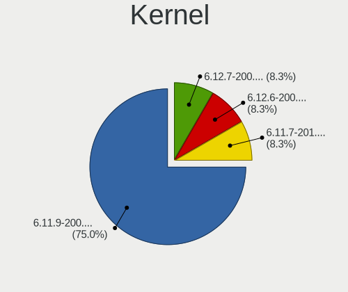

| Version                      | Notebooks | Percent |
|------------------------------|-----------|---------|
| 6.8.5-201.fsync.fc39.x86_64  | 7         | 30.43%  |
| 6.8.2-201.fsync.fc39.x86_64  | 4         | 17.39%  |
| 6.7.6-201.fsync.fc39.x86_64  | 3         | 13.04%  |
| 6.7.0-204.fsync.fc39.x86_64  | 2         | 8.7%    |
| 6.4.10-202.fsync.fc38.x86_64 | 2         | 8.7%    |
| 6.8.7-201.fsync.fc39.x86_64  | 1         | 4.35%   |
| 6.8.7-200.fsync.fc39.x86_64  | 1         | 4.35%   |
| 6.7.0-200.fsync.fc39.x86_64  | 1         | 4.35%   |
| 6.6.8-200.fsync.fc39.x86_64  | 1         | 4.35%   |
| 6.3.12-203.fsync.fc38.x86_64 | 1         | 4.35%   |

Kernel Family
-------------

Linux kernel without a distro release

| Version | Notebooks | Percent |
|---------|-----------|---------|
| 6.8.5   | 7         | 30.43%  |
| 6.8.2   | 4         | 17.39%  |
| 6.7.6   | 3         | 13.04%  |
| 6.7.0   | 3         | 13.04%  |
| 6.8.7   | 2         | 8.7%    |
| 6.4.10  | 2         | 8.7%    |
| 6.6.8   | 1         | 4.35%   |
| 6.3.12  | 1         | 4.35%   |

Kernel Major Ver.
-----------------

Linux kernel major version

| Version | Notebooks | Percent |
|---------|-----------|---------|
| 6.8     | 13        | 56.52%  |
| 6.7     | 6         | 26.09%  |
| 6.4     | 2         | 8.7%    |
| 6.6     | 1         | 4.35%   |
| 6.3     | 1         | 4.35%   |

Arch
----

OS architecture (x86_64, i586, etc.)

| Name   | Notebooks | Percent |
|--------|-----------|---------|
| x86_64 | 23        | 100%    |

DE
--

Desktop Environment

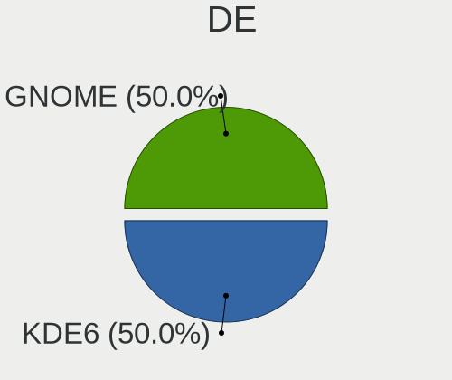

| Name  | Notebooks | Percent |
|-------|-----------|---------|
| KDE6  | 12        | 52.17%  |
| GNOME | 6         | 26.09%  |
| KDE5  | 5         | 21.74%  |

Display Server
--------------

X11 or Wayland

| Name    | Notebooks | Percent |
|---------|-----------|---------|
| Wayland | 21        | 91.3%   |
| X11     | 2         | 8.7%    |

Display Manager
---------------

SDDM, LightDM, etc.

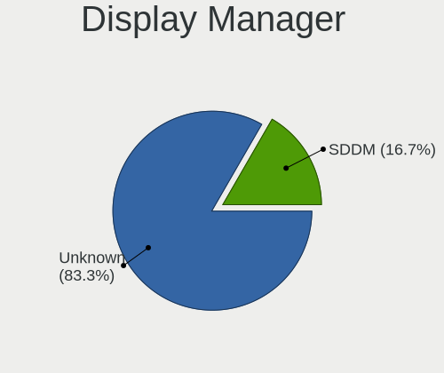

| Name    | Notebooks | Percent |
|---------|-----------|---------|
| Unknown | 19        | 82.61%  |
| SDDM    | 2         | 8.7%    |
| GDM     | 2         | 8.7%    |

OS Lang
-------

Language

| Lang  | Notebooks | Percent |
|-------|-----------|---------|
| en_US | 15        | 65.22%  |
| hu_HU | 2         | 8.7%    |
| es_MX | 2         | 8.7%    |
| en_GB | 1         | 4.35%   |
| en_DK | 1         | 4.35%   |
| en_CA | 1         | 4.35%   |
| da_DK | 1         | 4.35%   |

Boot Mode
---------

EFI or BIOS

| Mode | Notebooks | Percent |
|------|-----------|---------|
| EFI  | 19        | 82.61%  |
| BIOS | 4         | 17.39%  |

Filesystem
----------

Type of filesystem

| Type  | Notebooks | Percent |
|-------|-----------|---------|
| Btrfs | 21        | 91.3%   |
| Ext4  | 2         | 8.7%    |

Part. scheme
------------

Scheme of partitioning

| Type    | Notebooks | Percent |
|---------|-----------|---------|
| Unknown | 19        | 82.61%  |
| GPT     | 4         | 17.39%  |

Dual Boot with Linux/BSD
------------------------

Hosting more than one Linux/BSD

| Dual boot | Notebooks | Percent |
|-----------|-----------|---------|
| No        | 21        | 91.3%   |
| Yes       | 2         | 8.7%    |

Dual Boot (Win)
---------------

Hosting Linux and Windows

| Dual boot | Notebooks | Percent |
|-----------|-----------|---------|
| No        | 21        | 91.3%   |
| Yes       | 2         | 8.7%    |

Board
-----

Vendor
------

Motherboard manufacturer

| Name              | Notebooks | Percent |
|-------------------|-----------|---------|
| Lenovo            | 4         | 17.39%  |
| Hewlett-Packard   | 4         | 17.39%  |
| ASUSTek Computer  | 4         | 17.39%  |
| Dell              | 2         | 8.7%    |
| Apple             | 2         | 8.7%    |
| System76          | 1         | 4.35%   |
| Notebook          | 1         | 4.35%   |
| MSI               | 1         | 4.35%   |
| Alienware         | 1         | 4.35%   |
| Acer              | 1         | 4.35%   |
| A-DATA Technology | 1         | 4.35%   |
| Unknown           | 1         | 4.35%   |

Model
-----

Motherboard model

| Name                                     | Notebooks | Percent |
|------------------------------------------|-----------|---------|
| System76 Gazelle                         | 1         | 4.35%   |
| Notebook W330SU2                         | 1         | 4.35%   |
| MSI GF65 Thin 10UE                       | 1         | 4.35%   |
| Lenovo ThinkPad T430 2347GU8             | 1         | 4.35%   |
| Lenovo ThinkBook 16 G6 IRL 21KH          | 1         | 4.35%   |
| Lenovo IdeaPad L340-15IRH Gaming 81LK    | 1         | 4.35%   |
| Lenovo IdeaPad 1 14IGL7 82V6             | 1         | 4.35%   |
| HP OMEN by Laptop 15-dc0xxx              | 1         | 4.35%   |
| HP Laptop 15-fd0xxx                      | 1         | 4.35%   |
| HP EliteBook 8570p                       | 1         | 4.35%   |
| HP 8876 11                               | 1         | 4.35%   |
| Dell Latitude E6440                      | 1         | 4.35%   |
| Dell G15 5530                            | 1         | 4.35%   |
| ASUS ROG Zephyrus G14 GA401QM_GA401QM    | 1         | 4.35%   |
| ASUS ROG Strix G513QY_G513QY             | 1         | 4.35%   |
| ASUS G751JM                              | 1         | 4.35%   |
| ASUS ASUS TUF Gaming A15 FA507NU_FA507NU | 1         | 4.35%   |
| Apple MacBookPro16,1                     | 1         | 4.35%   |
| Apple MacBookPro14,1                     | 1         | 4.35%   |
| Alienware 17 R4                          | 1         | 4.35%   |
| Acer Nitro AN517-52                      | 1         | 4.35%   |
| A-DATA XENIA 15                          | 1         | 4.35%   |
| Unknown                                  | 1         | 4.35%   |

Model Family
------------

Motherboard model prefix

| Name               | Notebooks | Percent |
|--------------------|-----------|---------|
| Lenovo IdeaPad     | 2         | 8.7%    |
| ASUS ROG           | 2         | 8.7%    |
| System76 Gazelle   | 1         | 4.35%   |
| Notebook W330SU2   | 1         | 4.35%   |
| MSI GF65           | 1         | 4.35%   |
| Lenovo ThinkPad    | 1         | 4.35%   |
| Lenovo ThinkBook   | 1         | 4.35%   |
| HP OMEN            | 1         | 4.35%   |
| HP Laptop          | 1         | 4.35%   |
| HP EliteBook       | 1         | 4.35%   |
| HP 8876            | 1         | 4.35%   |
| Dell Latitude      | 1         | 4.35%   |
| Dell G15           | 1         | 4.35%   |
| ASUS G751JM        | 1         | 4.35%   |
| ASUS ASUS          | 1         | 4.35%   |
| Apple MacBookPro16 | 1         | 4.35%   |
| Apple MacBookPro14 | 1         | 4.35%   |
| Alienware 17       | 1         | 4.35%   |
| Acer Nitro         | 1         | 4.35%   |
| A-DATA XENIA       | 1         | 4.35%   |
| Unknown            | 1         | 4.35%   |

MFG Year
--------

Motherboard manufacture year

| Year | Notebooks | Percent |
|------|-----------|---------|
| 2023 | 5         | 21.74%  |
| 2021 | 3         | 13.04%  |
| 2020 | 3         | 13.04%  |
| 2022 | 2         | 8.7%    |
| 2017 | 2         | 8.7%    |
| 2014 | 2         | 8.7%    |
| 2012 | 2         | 8.7%    |
| 2024 | 1         | 4.35%   |
| 2019 | 1         | 4.35%   |
| 2018 | 1         | 4.35%   |
| 2013 | 1         | 4.35%   |

Form Factor
-----------

Physical design of the computer

| Name     | Notebooks | Percent |
|----------|-----------|---------|
| Notebook | 23        | 100%    |

Secure Boot
-----------

Enabled or disabled

| State    | Notebooks | Percent |
|----------|-----------|---------|
| Disabled | 23        | 100%    |

Coreboot
--------

Have coreboot on board

| Used | Notebooks | Percent |
|------|-----------|---------|
| No   | 22        | 95.65%  |
| Yes  | 1         | 4.35%   |

RAM Size
--------

Total RAM memory

| Size in GB  | Notebooks | Percent |
|-------------|-----------|---------|
| 32.01-64.0  | 7         | 30.43%  |
| 16.01-24.0  | 6         | 26.09%  |
| 8.01-16.0   | 5         | 21.74%  |
| 4.01-8.0    | 2         | 8.7%    |
| 3.01-4.0    | 2         | 8.7%    |
| 64.01-256.0 | 1         | 4.35%   |

RAM Used
--------

Used RAM memory

| Used GB   | Notebooks | Percent |
|-----------|-----------|---------|
| 4.01-8.0  | 8         | 34.78%  |
| 2.01-3.0  | 8         | 34.78%  |
| 3.01-4.0  | 4         | 17.39%  |
| 8.01-16.0 | 2         | 8.7%    |
| 1.01-2.0  | 1         | 4.35%   |

Total Drives
------------

Number of drives on board

| Drives | Notebooks | Percent |
|--------|-----------|---------|
| 1      | 11        | 47.83%  |
| 2      | 8         | 34.78%  |
| 4      | 2         | 8.7%    |
| 3      | 2         | 8.7%    |

Has CD-ROM
----------

Has CD-ROM on board

| Presented | Notebooks | Percent |
|-----------|-----------|---------|
| No        | 19        | 82.61%  |
| Yes       | 4         | 17.39%  |

Has Ethernet
------------

Has Ethernet on board

| Presented | Notebooks | Percent |
|-----------|-----------|---------|
| Yes       | 19        | 82.61%  |
| No        | 4         | 17.39%  |

Has WiFi
--------

Has WiFi module

| Presented | Notebooks | Percent |
|-----------|-----------|---------|
| Yes       | 22        | 95.65%  |
| No        | 1         | 4.35%   |

Has Bluetooth
-------------

Has Bluetooth module

| Presented | Notebooks | Percent |
|-----------|-----------|---------|
| Yes       | 19        | 82.61%  |
| No        | 4         | 17.39%  |

Location
--------

Country
-------

Geographic location (country)

| Country     | Notebooks | Percent |
|-------------|-----------|---------|
| USA         | 9         | 39.13%  |
| Canada      | 2         | 8.7%    |
| UK          | 1         | 4.35%   |
| Thailand    | 1         | 4.35%   |
| Switzerland | 1         | 4.35%   |
| Russia      | 1         | 4.35%   |
| Netherlands | 1         | 4.35%   |
| Mexico      | 1         | 4.35%   |
| Hungary     | 1         | 4.35%   |
| El Salvador | 1         | 4.35%   |
| Denmark     | 1         | 4.35%   |
| Brazil      | 1         | 4.35%   |
| Belgium     | 1         | 4.35%   |
| Austria     | 1         | 4.35%   |

City
----

Geographic location (city)

| City                     | Notebooks | Percent |
|--------------------------|-----------|---------|
| Zwolle                   | 1         | 4.35%   |
| Wheat Ridge              | 1         | 4.35%   |
| Valby                    | 1         | 4.35%   |
| Szombathely              | 1         | 4.35%   |
| Steyr                    | 1         | 4.35%   |
| Spring                   | 1         | 4.35%   |
| South Holland            | 1         | 4.35%   |
| Sion                     | 1         | 4.35%   |
| San Miguel Ingenio       | 1         | 4.35%   |
| Phra Nakhon Si Ayutthaya | 1         | 4.35%   |
| Peru                     | 1         | 4.35%   |
| Oconomowoc               | 1         | 4.35%   |
| Mexico City              | 1         | 4.35%   |
| Metter                   | 1         | 4.35%   |
| Merced                   | 1         | 4.35%   |
| Krasnodar                | 1         | 4.35%   |
| Guarapari                | 1         | 4.35%   |
| Fayetteville             | 1         | 4.35%   |
| Cold Lake                | 1         | 4.35%   |
| Brussels                 | 1         | 4.35%   |
| Bournemouth              | 1         | 4.35%   |
| Boucherville             | 1         | 4.35%   |
| Bluemont                 | 1         | 4.35%   |

Drives
------

Drive Vendor
------------

Hard drive vendors

| Vendor                       | Notebooks | Drives | Percent |
|------------------------------|-----------|--------|---------|
| Samsung Electronics          | 6         | 7      | 16.22%  |
| Sandisk                      | 5         | 5      | 13.51%  |
| Seagate                      | 3         | 3      | 8.11%   |
| Micron Technology            | 3         | 3      | 8.11%   |
| Crucial                      | 3         | 4      | 8.11%   |
| Apple                        | 2         | 3      | 5.41%   |
| XPG                          | 1         | 1      | 2.7%    |
| Unknown                      | 1         | 1      | 2.7%    |
| SK hynix                     | 1         | 1      | 2.7%    |
| Shenzhen Longsys Electronics | 1         | 1      | 2.7%    |
| Realtek Semiconductor        | 1         | 1      | 2.7%    |
| Realtek                      | 1         | 1      | 2.7%    |
| PNY                          | 1         | 1      | 2.7%    |
| Phison Electronics           | 1         | 1      | 2.7%    |
| Micron/Crucial Technology    | 1         | 1      | 2.7%    |
| Kingston Technology Company  | 1         | 1      | 2.7%    |
| Kingston                     | 1         | 1      | 2.7%    |
| KingSpec                     | 1         | 2      | 2.7%    |
| HGST                         | 1         | 1      | 2.7%    |
| G-DRIVE                      | 1         | 1      | 2.7%    |
| ADATA Technology             | 1         | 1      | 2.7%    |

Drive Model
-----------

Hard drive models

| Model                                                           | Notebooks | Percent |
|-----------------------------------------------------------------|-----------|---------|
| Samsung NVMe SSD Controller SM981/PM981/PM983 1TB               | 2         | 5%      |
| XPG NVMe SSD Drive 1024GB                                       | 1         | 2.5%    |
| Unknown MMC Card  128GB                                         | 1         | 2.5%    |
| SK hynix BC901 NVMe 1024GB                                      | 1         | 2.5%    |
| Shenzhen Longsys Lexar SSD NM790 4TB                            | 1         | 2.5%    |
| Seagate Expansion+ Desk 4TB                                     | 1         | 2.5%    |
| Seagate BUP Slim 2TB                                            | 1         | 2.5%    |
| Seagate BarraCuda Q1 SSD ZA960CV10001 960GB                     | 1         | 2.5%    |
| Sandisk WD_BLACK SN770 2TB                                      | 1         | 2.5%    |
| Sandisk WD_BLACK SN770 1TB                                      | 1         | 2.5%    |
| Sandisk WD PC SN740 SDDPMQD-512G-1101 512GB                     | 1         | 2.5%    |
| Sandisk WD Blue SN570 250GB                                     | 1         | 2.5%    |
| Sandisk WD Blue SN550 NVMe SSD 2TB                              | 1         | 2.5%    |
| Samsung SSD 990 PRO 2TB                                         | 1         | 2.5%    |
| Samsung SSD 870 EVO 4TB                                         | 1         | 2.5%    |
| Samsung SSD 860 EVO 1TB                                         | 1         | 2.5%    |
| Samsung MZVLQ1T0HBLB-00B00 1024GB                               | 1         | 2.5%    |
| Samsung MZVL4512HBLU-00BH1 512GB                                | 1         | 2.5%    |
| Realtek SPCC M.2 PCIe SSD 1TB                                   | 1         | 2.5%    |
| Realtek RTL9210B-CG 512GB                                       | 1         | 2.5%    |
| PNY CS900 1TB SSD                                               | 1         | 2.5%    |
| Phison Force MP300 480GB                                        | 1         | 2.5%    |
| Micron/Crucial P2 NVMe PCIe SSD 4TB                             | 1         | 2.5%    |
| Micron MTFDDAK128MAM-1J1 128GB SSD                              | 1         | 2.5%    |
| Micron 2400_MTFDKBA512QFM 512GB                                 | 1         | 2.5%    |
| Micron 2210_MTFDHBA512QFD 512GB                                 | 1         | 2.5%    |
| Kingston Company SNV2S1000G 1TB                                 | 1         | 2.5%    |
| Kingston SA400S37480G 480GB SSD                                 | 1         | 2.5%    |
| KingSpec P3-2TB                                                 | 1         | 2.5%    |
| KingSpec NT-2TB                                                 | 1         | 2.5%    |
| HGST HTS721010A9E630 1TB                                        | 1         | 2.5%    |
| G-DRIVE USB 1TB                                                 | 1         | 2.5%    |
| Crucial CT525MX300SSD1 528GB                                    | 1         | 2.5%    |
| Crucial CT512M550SSD4 512GB                                     | 1         | 2.5%    |
| Crucial CT250MX200SSD3 250GB                                    | 1         | 2.5%    |
| Crucial CT240BX500SSD1 240GB                                    | 1         | 2.5%    |
| Apple S3X NVMe Controller 121GB                                 | 1         | 2.5%    |
| Apple ANS2 NVMe Controller 500GB                                | 1         | 2.5%    |
| ADATA XPG SX8200 Pro PCIe Gen3x4 M.2 2280 Solid State Drive 1TB | 1         | 2.5%    |

HDD Vendor
----------

Hard disk drive vendors

| Vendor  | Notebooks | Drives | Percent |
|---------|-----------|--------|---------|
| Seagate | 2         | 2      | 66.67%  |
| HGST    | 1         | 1      | 33.33%  |

SSD Vendor
----------

Solid state drive vendors

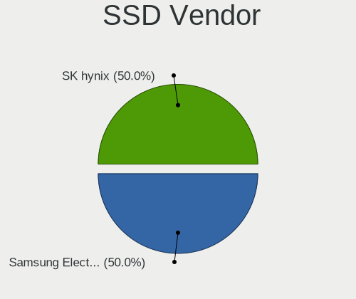

| Vendor              | Notebooks | Drives | Percent |
|---------------------|-----------|--------|---------|
| Crucial             | 3         | 4      | 30%     |
| Samsung Electronics | 2         | 2      | 20%     |
| Seagate             | 1         | 1      | 10%     |
| PNY                 | 1         | 1      | 10%     |
| Micron Technology   | 1         | 1      | 10%     |
| Kingston            | 1         | 1      | 10%     |
| KingSpec            | 1         | 2      | 10%     |

Drive Kind
----------

HDD or SSD

| Kind    | Notebooks | Drives | Percent |
|---------|-----------|--------|---------|
| NVMe    | 16        | 24     | 53.33%  |
| SSD     | 9         | 12     | 30%     |
| HDD     | 3         | 3      | 10%     |
| MMC     | 1         | 1      | 3.33%   |
| Unknown | 1         | 1      | 3.33%   |

Drive Connector
---------------

SATA, SAS, NVMe, etc.

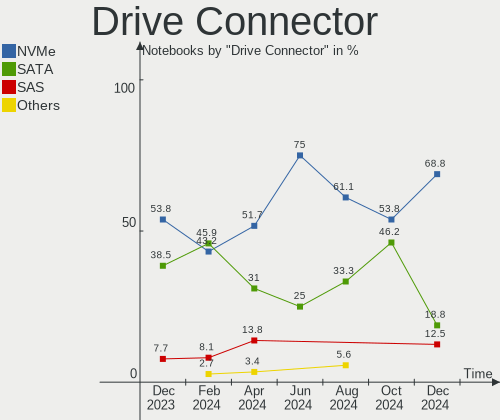

| Type | Notebooks | Drives | Percent |
|------|-----------|--------|---------|
| NVMe | 16        | 23     | 51.61%  |
| SATA | 10        | 13     | 32.26%  |
| SAS  | 4         | 4      | 12.9%   |
| MMC  | 1         | 1      | 3.23%   |

Drive Size
----------

Size of hard drive

| Size in TB | Notebooks | Drives | Percent |
|------------|-----------|--------|---------|
| 0.51-1.0   | 6         | 6      | 42.86%  |
| 0.01-0.5   | 4         | 4      | 28.57%  |
| 3.01-4.0   | 2         | 2      | 14.29%  |
| 1.01-2.0   | 2         | 3      | 14.29%  |

Space Total
-----------

Amount of disk space available on the file system

| Size in GB     | Notebooks | Percent |
|----------------|-----------|---------|
| More than 3000 | 8         | 34.78%  |
| 1001-2000      | 5         | 21.74%  |
| 251-500        | 2         | 8.7%    |
| 21-50          | 2         | 8.7%    |
| 101-250        | 2         | 8.7%    |
| 501-1000       | 2         | 8.7%    |
| 2001-3000      | 1         | 4.35%   |
| 51-100         | 1         | 4.35%   |

Space Used
----------

Amount of used disk space

| Used GB        | Notebooks | Percent |
|----------------|-----------|---------|
| 21-50          | 5         | 21.74%  |
| 501-1000       | 4         | 17.39%  |
| 101-250        | 3         | 13.04%  |
| 1001-2000      | 3         | 13.04%  |
| 1-20           | 3         | 13.04%  |
| 51-100         | 3         | 13.04%  |
| More than 3000 | 1         | 4.35%   |
| 2001-3000      | 1         | 4.35%   |

Malfunc. Drives
---------------

Drive models with a malfunction

Zero info for selected period =(

Malfunc. Drive Vendor
---------------------

Vendors of faulty drives

Zero info for selected period =(

Malfunc. HDD Vendor
-------------------

Vendors of faulty HDD drives

Zero info for selected period =(

Malfunc. Drive Kind
-------------------

Kinds of faulty drives

Zero info for selected period =(

Failed Drives
-------------

Failed drive models

Zero info for selected period =(

Failed Drive Vendor
-------------------

Failed drive vendors

Zero info for selected period =(

Drive Status
------------

Number of failed and malfunc. drives

| Status   | Notebooks | Drives | Percent |
|----------|-----------|--------|---------|
| Detected | 20        | 38     | 86.96%  |
| Works    | 3         | 3      | 13.04%  |

Storage controller
------------------

Storage Vendor
--------------

Storage controller vendors

| Vendor                       | Notebooks | Percent |
|------------------------------|-----------|---------|
| Intel                        | 12        | 34.29%  |
| SanDisk                      | 5         | 14.29%  |
| Samsung Electronics          | 4         | 11.43%  |
| Micron Technology            | 2         | 5.71%   |
| Apple                        | 2         | 5.71%   |
| AMD                          | 2         | 5.71%   |
| SK hynix                     | 1         | 2.86%   |
| Shenzhen Longsys Electronics | 1         | 2.86%   |
| Realtek Semiconductor        | 1         | 2.86%   |
| Phison Electronics           | 1         | 2.86%   |
| Micron/Crucial Technology    | 1         | 2.86%   |
| Kingston Technology Company  | 1         | 2.86%   |
| INNOGRIT                     | 1         | 2.86%   |
| ADATA Technology             | 1         | 2.86%   |

Storage Model
-------------

Storage controller models

| Model                                                                          | Notebooks | Percent |
|--------------------------------------------------------------------------------|-----------|---------|
| SanDisk WD Black SN770 / PC SN740 256GB / PC SN560 (DRAM-less) NVMe SSD        | 2         | 5.41%   |
| Samsung NVMe SSD Controller SM981/PM981/PM983                                  | 2         | 5.41%   |
| Intel 82801 Mobile SATA Controller [RAID mode]                                 | 2         | 5.41%   |
| SK hynix BC901 NVMe Solid State Drive (DRAM-less)                              | 1         | 2.7%    |
| Shenzhen Longsys Lexar NM790 NVME SSD (DRAM-less)                              | 1         | 2.7%    |
| Sandisk WD PC SN740 NVMe SSD 512GB (DRAM-less)                                 | 1         | 2.7%    |
| SanDisk Ultra 3D / WD Blue SN570 NVMe SSD (DRAM-less)                          | 1         | 2.7%    |
| SanDisk Ultra 3D / WD Blue SN550 NVMe SSD                                      | 1         | 2.7%    |
| Samsung NVMe SSD Controller S4LV008[Pascal]                                    | 1         | 2.7%    |
| Samsung NVMe SSD Controller PM9B1 (DRAM-less)                                  | 1         | 2.7%    |
| Samsung NVMe SSD Controller 980 (DRAM-less)                                    | 1         | 2.7%    |
| Realtek RTS5765DL NVMe SSD Controller (DRAM-less)                              | 1         | 2.7%    |
| Phison E8 PCIe3 x2 NVMe Controller                                             | 1         | 2.7%    |
| Micron/Crucial P2 [Nick P2] / P3 / P3 Plus NVMe PCIe SSD (DRAM-less)           | 1         | 2.7%    |
| Micron 2400 NVMe SSD (DRAM-less)                                               | 1         | 2.7%    |
| Micron 2210 NVMe SSD [Cobain]                                                  | 1         | 2.7%    |
| Kingston Company NV2 NVMe SSD SM2267XT (DRAM-less)                             | 1         | 2.7%    |
| Intel Volume Management Device NVMe RAID Controller Intel Corporation          | 1         | 2.7%    |
| Intel Q170/Q150/B150/H170/H110/Z170/CM236 Chipset SATA Controller [AHCI Mode]  | 1         | 2.7%    |
| Intel Celeron/Pentium Silver Processor SATA Controller                         | 1         | 2.7%    |
| Intel Cannon Lake Mobile PCH SATA AHCI Controller                              | 1         | 2.7%    |
| Intel Alder Lake-P SATA AHCI Controller                                        | 1         | 2.7%    |
| Intel 8 Series/C220 Series Chipset Family 6-port SATA Controller 1 [AHCI mode] | 1         | 2.7%    |
| Intel 8 Series SATA Controller 1 [AHCI mode]                                   | 1         | 2.7%    |
| Intel 7 Series Chipset Family 6-port SATA Controller [AHCI mode]               | 1         | 2.7%    |
| Intel 7 Series Chipset Family 4-port SATA Controller [IDE mode]                | 1         | 2.7%    |
| Intel 7 Series Chipset Family 2-port SATA Controller [IDE mode]                | 1         | 2.7%    |
| Intel 400 Series Chipset Family SATA AHCI Controller                           | 1         | 2.7%    |
| INNOGRIT NVMe SSD Controller IG5236                                            | 1         | 2.7%    |
| Apple S3X NVMe Controller                                                      | 1         | 2.7%    |
| Apple ANS2 NVMe Controller                                                     | 1         | 2.7%    |
| AMD FCH SATA Controller [AHCI mode]                                            | 1         | 2.7%    |
| AMD 500 Series Chipset SATA Controller                                         | 1         | 2.7%    |
| ADATA XPG SX8200 Pro PCIe Gen3x4 M.2 2280 Solid State Drive                    | 1         | 2.7%    |

Storage Kind
------------

Kind of storage controller (IDE, SATA, NVMe, SAS, ...)

| Kind | Notebooks | Percent |
|------|-----------|---------|
| NVMe | 16        | 53.33%  |
| SATA | 10        | 33.33%  |
| RAID | 3         | 10%     |
| IDE  | 1         | 3.33%   |

Processor
---------

CPU Vendor
----------

Processor vendors

| Vendor | Notebooks | Percent |
|--------|-----------|---------|
| Intel  | 18        | 78.26%  |
| AMD    | 5         | 21.74%  |

CPU Model
---------

Processor models

| Model                                    | Notebooks | Percent |
|------------------------------------------|-----------|---------|
| Intel Pentium Silver N5030 CPU @ 1.10GHz | 1         | 4.35%   |
| Intel Core i7-9750H CPU @ 2.60GHz        | 1         | 4.35%   |
| Intel Core i7-8750H CPU @ 2.20GHz        | 1         | 4.35%   |
| Intel Core i7-7820HK CPU @ 2.90GHz       | 1         | 4.35%   |
| Intel Core i7-4710HQ CPU @ 2.50GHz       | 1         | 4.35%   |
| Intel Core i7-3520M CPU @ 2.90GHz        | 1         | 4.35%   |
| Intel Core i7-10750H CPU @ 2.60GHz       | 1         | 4.35%   |
| Intel Core i5-9300H CPU @ 2.40GHz        | 1         | 4.35%   |
| Intel Core i5-7360U CPU @ 2.30GHz        | 1         | 4.35%   |
| Intel Core i5-4300M CPU @ 2.60GHz        | 1         | 4.35%   |
| Intel Core i5-4210U CPU @ 1.70GHz        | 1         | 4.35%   |
| Intel Core i5-3320M CPU @ 2.60GHz        | 1         | 4.35%   |
| Intel Core i5-10500H CPU @ 2.50GHz       | 1         | 4.35%   |
| Intel 13th Gen Core i9-13900H            | 1         | 4.35%   |
| Intel 13th Gen Core i7-13700H            | 1         | 4.35%   |
| Intel 13th Gen Core i7-13650HX           | 1         | 4.35%   |
| Intel 13th Gen Core i7-1355U             | 1         | 4.35%   |
| Intel 11th Gen Core i7-11800H @ 2.30GHz  | 1         | 4.35%   |
| AMD Ryzen 9 5900HX with Radeon Graphics  | 1         | 4.35%   |
| AMD Ryzen 9 5900HS with Radeon Graphics  | 1         | 4.35%   |
| AMD Ryzen 7 7735HS with Radeon Graphics  | 1         | 4.35%   |
| AMD Ryzen 5 5600X 6-Core Processor       | 1         | 4.35%   |
| AMD Ryzen 5 5600G with Radeon Graphics   | 1         | 4.35%   |

CPU Model Family
----------------

Processor model prefix

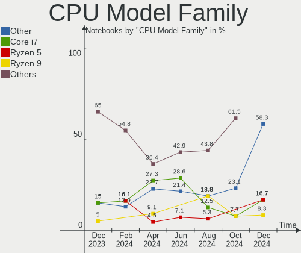

| Model                | Notebooks | Percent |
|----------------------|-----------|---------|
| Intel Core i7        | 6         | 26.09%  |
| Intel Core i5        | 6         | 26.09%  |
| Other                | 5         | 21.74%  |
| AMD Ryzen 9          | 2         | 8.7%    |
| AMD Ryzen 5          | 2         | 8.7%    |
| Intel Pentium Silver | 1         | 4.35%   |
| AMD Ryzen 7          | 1         | 4.35%   |

CPU Cores
---------

Number of processor cores

| Number | Notebooks | Percent |
|--------|-----------|---------|
| 6      | 6         | 26.09%  |
| 2      | 5         | 21.74%  |
| 8      | 4         | 17.39%  |
| 4      | 4         | 17.39%  |
| 14     | 3         | 13.04%  |
| 10     | 1         | 4.35%   |

CPU Sockets
-----------

Number of sockets

| Number | Notebooks | Percent |
|--------|-----------|---------|
| 1      | 23        | 100%    |

CPU Threads
-----------

Threads per core (Hyper-Threading)

| Number | Notebooks | Percent |
|--------|-----------|---------|
| 2      | 22        | 95.65%  |
| 1      | 1         | 4.35%   |

CPU Op-Modes
------------

CPU Operation Modes (32-bit, 64-bit)

| Op mode        | Notebooks | Percent |
|----------------|-----------|---------|
| 32-bit, 64-bit | 23        | 100%    |

CPU Microcode
-------------

Microcode number

| Number  | Notebooks | Percent |
|---------|-----------|---------|
| Unknown | 23        | 100%    |

CPU Microarch
-------------

Microarchitecture

| Name             | Notebooks | Percent |
|------------------|-----------|---------|
| KabyLake         | 5         | 21.74%  |
| Zen 3            | 4         | 17.39%  |
| Alderlake Hybrid | 4         | 17.39%  |
| Haswell          | 3         | 13.04%  |
| IvyBridge        | 2         | 8.7%    |
| CometLake        | 2         | 8.7%    |
| Icelake          | 1         | 4.35%   |
| Goldmont plus    | 1         | 4.35%   |
| Unknown          | 1         | 4.35%   |

Graphics
--------

GPU Vendor
----------

Vendors of graphics cards

| Vendor | Notebooks | Percent |
|--------|-----------|---------|
| Intel  | 16        | 48.48%  |
| Nvidia | 12        | 36.36%  |
| AMD    | 5         | 15.15%  |

GPU Model
---------

Graphics card models

| Model                                                         | Notebooks | Percent |
|---------------------------------------------------------------|-----------|---------|
| Intel Raptor Lake-P [Iris Xe Graphics]                        | 3         | 8.82%   |
| Nvidia GA106M [GeForce RTX 3060 Mobile / Max-Q]               | 2         | 5.88%   |
| Intel CometLake-H GT2 [UHD Graphics]                          | 2         | 5.88%   |
| Intel 4th Gen Core Processor Integrated Graphics Controller   | 2         | 5.88%   |
| Intel 3rd Gen Core processor Graphics Controller              | 2         | 5.88%   |
| AMD Navi 22 [Radeon RX 6700/6700 XT/6750 XT / 6800M/6850M XT] | 2         | 5.88%   |
| AMD Cezanne [Radeon Vega Series / Radeon Vega Mobile Series]  | 2         | 5.88%   |
| Nvidia TU106M [GeForce RTX 2060 Mobile]                       | 1         | 2.94%   |
| Nvidia GP107M [GeForce GTX 1050 3 GB Max-Q]                   | 1         | 2.94%   |
| Nvidia GP104BM [GeForce GTX 1080 Mobile]                      | 1         | 2.94%   |
| Nvidia GP104BM [GeForce GTX 1070 Mobile]                      | 1         | 2.94%   |
| Nvidia GM107M [GeForce GTX 860M]                              | 1         | 2.94%   |
| Nvidia GA107M [GeForce RTX 3050 Mobile]                       | 1         | 2.94%   |
| Nvidia GA106 [GeForce RTX 3060 Lite Hash Rate]                | 1         | 2.94%   |
| Nvidia GA104M [GeForce RTX 3070 Mobile / Max-Q]               | 1         | 2.94%   |
| Nvidia AD107M [GeForce RTX 4060 Max-Q / Mobile]               | 1         | 2.94%   |
| Nvidia AD107M [GeForce RTX 4050 Max-Q / Mobile]               | 1         | 2.94%   |
| Intel TigerLake-H GT1 [UHD Graphics]                          | 1         | 2.94%   |
| Intel Raptor Lake-S UHD Graphics                              | 1         | 2.94%   |
| Intel Iris Plus Graphics 640                                  | 1         | 2.94%   |
| Intel HD Graphics 630                                         | 1         | 2.94%   |
| Intel Haswell-ULT Integrated Graphics Controller              | 1         | 2.94%   |
| Intel GeminiLake [UHD Graphics 605]                           | 1         | 2.94%   |
| Intel CoffeeLake-H GT2 [UHD Graphics 630]                     | 1         | 2.94%   |
| AMD Rembrandt [Radeon 680M]                                   | 1         | 2.94%   |
| AMD Navi 14 [Radeon RX 5500/5500M / Pro 5500M]                | 1         | 2.94%   |

GPU Combo
---------

Combinations of graphics cards

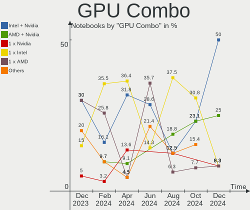

| Name           | Notebooks | Percent |
|----------------|-----------|---------|
| 1 x Intel      | 8         | 34.78%  |
| Intel + Nvidia | 7         | 30.43%  |
| 1 x Nvidia     | 3         | 13.04%  |
| AMD + Nvidia   | 2         | 8.7%    |
| 1 x AMD        | 2         | 8.7%    |
| 2 x AMD        | 1         | 4.35%   |

GPU Driver
----------

Free vs proprietary

| Driver      | Notebooks | Percent |
|-------------|-----------|---------|
| Free        | 14        | 60.87%  |
| Proprietary | 9         | 39.13%  |

GPU Memory
----------

Total video memory

| Size in GB | Notebooks | Percent |
|------------|-----------|---------|
| Unknown    | 16        | 69.57%  |
| 7.01-8.0   | 2         | 8.7%    |
| 8.01-16.0  | 2         | 8.7%    |
| 5.01-6.0   | 1         | 4.35%   |
| 3.01-4.0   | 1         | 4.35%   |
| 0.01-0.5   | 1         | 4.35%   |

Monitor
-------

Monitor Vendor
--------------

Monitor vendors

| Vendor              | Notebooks | Percent |
|---------------------|-----------|---------|
| AU Optronics        | 6         | 21.43%  |
| Chimei Innolux      | 5         | 17.86%  |
| BOE                 | 4         | 14.29%  |
| LG Display          | 3         | 10.71%  |
| Samsung Electronics | 2         | 7.14%   |
| Goldstar            | 2         | 7.14%   |
| Apple               | 2         | 7.14%   |
| TMX                 | 1         | 3.57%   |
| HKC                 | 1         | 3.57%   |
| Gigabyte Technology | 1         | 3.57%   |
| Dell                | 1         | 3.57%   |

Monitor Model
-------------

Monitor models

| Model                                                               | Notebooks | Percent |
|---------------------------------------------------------------------|-----------|---------|
| TMX TL140BDXP01-0 TMX1400 2560x1440 310x174mm 14.0-inch             | 1         | 3.57%   |
| Samsung Electronics LS27C36x SAM7315 1920x1080 598x336mm 27.0-inch  | 1         | 3.57%   |
| Samsung Electronics LS27AG55x SAM71E0 2560x1440 597x336mm 27.0-inch | 1         | 3.57%   |
| LG Display LCD Monitor LGD05C0 1920x1080 344x194mm 15.5-inch        | 1         | 3.57%   |
| LG Display LCD Monitor LGD046C 1920x1080 382x215mm 17.3-inch        | 1         | 3.57%   |
| LG Display LCD Monitor LGD0362 1600x900 309x174mm 14.0-inch         | 1         | 3.57%   |
| HKC GF40 HKC2413 1920x1080 521x297mm 23.6-inch                      | 1         | 3.57%   |
| Goldstar ULTRAGEAR GSM7765 2560x1440 697x392mm 31.5-inch            | 1         | 3.57%   |
| Goldstar M2362D GSM5758 1920x1080 510x290mm 23.1-inch               | 1         | 3.57%   |
| Gigabyte Technology M27Q GBT270D 2560x1440 596x335mm 26.9-inch      | 1         | 3.57%   |
| Dell S2421HN DEL41F2 1920x1080 527x296mm 23.8-inch                  | 1         | 3.57%   |
| Chimei Innolux LCD Monitor CMN162B 1920x1200 344x215mm 16.0-inch    | 1         | 3.57%   |
| Chimei Innolux LCD Monitor CMN152A 2560x1440 344x193mm 15.5-inch    | 1         | 3.57%   |
| Chimei Innolux LCD Monitor CMN14D6 1366x768 309x173mm 13.9-inch     | 1         | 3.57%   |
| Chimei Innolux LCD Monitor CMN1489 1366x768 309x173mm 13.9-inch     | 1         | 3.57%   |
| Chimei Innolux LCD Monitor CMN1343 1920x1080 282x165mm 12.9-inch    | 1         | 3.57%   |
| BOE LCD Monitor BOE0A17 1920x1080 344x194mm 15.5-inch               | 1         | 3.57%   |
| BOE LCD Monitor BOE0974 2560x1440 344x194mm 15.5-inch               | 1         | 3.57%   |
| BOE LCD Monitor BOE0910 1920x1080 344x194mm 15.5-inch               | 1         | 3.57%   |
| BOE LCD Monitor BOE085E 1920x1080 344x194mm 15.5-inch               | 1         | 3.57%   |
| AU Optronics LCD Monitor AUOAF90 1920x1080 344x193mm 15.5-inch      | 1         | 3.57%   |
| AU Optronics LCD Monitor AUOAA9F 1920x1080 344x193mm 15.5-inch      | 1         | 3.57%   |
| AU Optronics LCD Monitor AUO479D 1920x1080 382x215mm 17.3-inch      | 1         | 3.57%   |
| AU Optronics LCD Monitor AUO1496 2560x1440 382x214mm 17.2-inch      | 1         | 3.57%   |
| AU Optronics LCD Monitor AUO11EE 1600x900 344x193mm 15.5-inch       | 1         | 3.57%   |
| AU Optronics B156HAN15.H AUOD2A2 1920x1080 344x193mm 15.5-inch      | 1         | 3.57%   |
| Apple Color LCD APPA044 3072x1920 345x215mm 16.0-inch               | 1         | 3.57%   |
| Apple Color LCD APPA034 2880x1800 286x179mm 13.3-inch               | 1         | 3.57%   |

Monitor Resolution
------------------

Monitor screen resolution

| Resolution        | Notebooks | Percent |
|-------------------|-----------|---------|
| 1920x1080 (FHD)   | 13        | 52%     |
| 2560x1440 (QHD)   | 6         | 24%     |
| 1366x768 (WXGA)   | 2         | 8%      |
| 3072x1920         | 1         | 4%      |
| 2880x1800         | 1         | 4%      |
| 1920x1200 (WUXGA) | 1         | 4%      |
| 1600x900 (HD+)    | 1         | 4%      |

Monitor Diagonal
----------------

Diagonal size in inches

| Inches | Notebooks | Percent |
|--------|-----------|---------|
| 15     | 9         | 33.33%  |
| 17     | 4         | 14.81%  |
| 14     | 3         | 11.11%  |
| 13     | 3         | 11.11%  |
| 31     | 2         | 7.41%   |
| 27     | 2         | 7.41%   |
| 23     | 2         | 7.41%   |
| 16     | 2         | 7.41%   |

Monitor Width
-------------

Physical width

| Width in mm | Notebooks | Percent |
|-------------|-----------|---------|
| 301-350     | 15        | 55.56%  |
| 501-600     | 4         | 14.81%  |
| 351-400     | 4         | 14.81%  |
| 601-700     | 2         | 7.41%   |
| 201-300     | 2         | 7.41%   |

Aspect Ratio
------------

Proportional relationship between the width and the height

| Ratio | Notebooks | Percent |
|-------|-----------|---------|
| 16/9  | 21        | 87.5%   |
| 16/10 | 3         | 12.5%   |

Monitor Area
------------

Area in inch

| Area in inch | Notebooks | Percent |
|----------------|-----------|---------|
| 101-110        | 9         | 33.33%  |
| 81-90          | 5         | 18.52%  |
| 121-130        | 4         | 14.81%  |
| 351-500        | 2         | 7.41%   |
| 301-350        | 2         | 7.41%   |
| 201-250        | 2         | 7.41%   |
| 111-120        | 2         | 7.41%   |
| 71-80          | 1         | 3.7%    |

Pixel Density
-------------

Pixels per inch

| Density       | Notebooks | Percent |
|---------------|-----------|---------|
| 121-160       | 12        | 44.44%  |
| 161-240       | 6         | 22.22%  |
| 51-100        | 5         | 18.52%  |
| 101-120       | 3         | 11.11%  |
| More than 240 | 1         | 3.7%    |

Multiple Monitors
-----------------

Total monitors connected

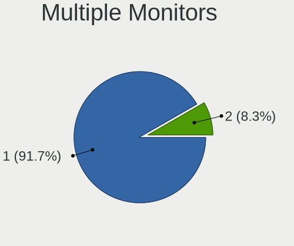

| Total | Notebooks | Percent |
|-------|-----------|---------|
| 1     | 19        | 82.61%  |
| 2     | 3         | 13.04%  |
| 3     | 1         | 4.35%   |

Network
-------

Net Controller Vendor
---------------------

Controller vendors

| Vendor                | Notebooks | Percent |
|-----------------------|-----------|---------|
| Realtek Semiconductor | 14        | 36.84%  |
| Intel                 | 14        | 36.84%  |
| Broadcom              | 3         | 7.89%   |
| Qualcomm Atheros      | 2         | 5.26%   |
| MediaTek              | 2         | 5.26%   |
| Hewlett-Packard       | 1         | 2.63%   |
| DisplayLink           | 1         | 2.63%   |
| ASUSTek Computer      | 1         | 2.63%   |

Net Controller Model
--------------------

Controller models

| Model                                                                  | Notebooks | Percent |
|------------------------------------------------------------------------|-----------|---------|
| Realtek RTL8111/8168/8211/8411 PCI Express Gigabit Ethernet Controller | 9         | 20%     |
| Realtek RTL8852BE PCIe 802.11ax Wireless Network Controller            | 4         | 8.89%   |
| MediaTek MT7921 802.11ax PCI Express Wireless Network Adapter          | 2         | 4.44%   |
| Intel Wi-Fi 6 AX200                                                    | 2         | 4.44%   |
| Intel Comet Lake PCH CNVi WiFi                                         | 2         | 4.44%   |
| Intel Cannon Lake PCH CNVi WiFi                                        | 2         | 4.44%   |
| Intel 82579LM Gigabit Network Connection (Lewisville)                  | 2         | 4.44%   |
| Realtek RTL8153 Gigabit Ethernet Adapter                               | 1         | 2.22%   |
| Realtek RTL8152 Fast Ethernet Adapter                                  | 1         | 2.22%   |
| Realtek Killer E2600 GbE Controller                                    | 1         | 2.22%   |
| Qualcomm Atheros QCA8171 Gigabit Ethernet                              | 1         | 2.22%   |
| Qualcomm Atheros Killer E2500 Gigabit Ethernet Controller              | 1         | 2.22%   |
| Intel Wireless 7265                                                    | 1         | 2.22%   |
| Intel Wireless 7260                                                    | 1         | 2.22%   |
| Intel Wi-Fi 6E(802.11ax) AX210/AX1675* 2x2 [Typhoon Peak]              | 1         | 2.22%   |
| Intel Tiger Lake PCH CNVi WiFi                                         | 1         | 2.22%   |
| Intel Raptor Lake-S PCH CNVi WiFi                                      | 1         | 2.22%   |
| Intel I211 Gigabit Network Connection                                  | 1         | 2.22%   |
| Intel Ethernet Controller I225-V                                       | 1         | 2.22%   |
| Intel Ethernet Connection I217-LM                                      | 1         | 2.22%   |
| Intel Ethernet Connection (23) I219-V                                  | 1         | 2.22%   |
| Intel Centrino Ultimate-N 6300                                         | 1         | 2.22%   |
| Intel Centrino Advanced-N 6205 [Taylor Peak]                           | 1         | 2.22%   |
| HP hs2350 HSPA+ MobileBroadband                                        | 1         | 2.22%   |
| DisplayLink Dell D3100 Docking Station                                 | 1         | 2.22%   |
| Broadcom BCM4364 802.11ac Wireless Network Adapter                     | 1         | 2.22%   |
| Broadcom BCM4352 802.11ac Dual Band Wireless Network Adapter           | 1         | 2.22%   |
| Broadcom BCM4350 802.11ac Wireless Network Adapter                     | 1         | 2.22%   |
| ASUS 802.11ac NIC                                                      | 1         | 2.22%   |

Wireless Vendor
---------------

Wireless vendors

| Vendor                | Notebooks | Percent |
|-----------------------|-----------|---------|
| Intel                 | 13        | 56.52%  |
| Realtek Semiconductor | 4         | 17.39%  |
| Broadcom              | 3         | 13.04%  |
| MediaTek              | 2         | 8.7%    |
| ASUSTek Computer      | 1         | 4.35%   |

Wireless Model
--------------

Wireless models

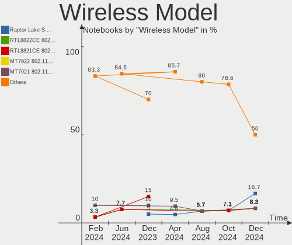

| Model                                                         | Notebooks | Percent |
|---------------------------------------------------------------|-----------|---------|
| Realtek RTL8852BE PCIe 802.11ax Wireless Network Controller   | 4         | 17.39%  |
| MediaTek MT7921 802.11ax PCI Express Wireless Network Adapter | 2         | 8.7%    |
| Intel Wi-Fi 6 AX200                                           | 2         | 8.7%    |
| Intel Comet Lake PCH CNVi WiFi                                | 2         | 8.7%    |
| Intel Cannon Lake PCH CNVi WiFi                               | 2         | 8.7%    |
| Intel Wireless 7265                                           | 1         | 4.35%   |
| Intel Wireless 7260                                           | 1         | 4.35%   |
| Intel Wi-Fi 6E(802.11ax) AX210/AX1675* 2x2 [Typhoon Peak]     | 1         | 4.35%   |
| Intel Tiger Lake PCH CNVi WiFi                                | 1         | 4.35%   |
| Intel Raptor Lake-S PCH CNVi WiFi                             | 1         | 4.35%   |
| Intel Centrino Ultimate-N 6300                                | 1         | 4.35%   |
| Intel Centrino Advanced-N 6205 [Taylor Peak]                  | 1         | 4.35%   |
| Broadcom BCM4364 802.11ac Wireless Network Adapter            | 1         | 4.35%   |
| Broadcom BCM4352 802.11ac Dual Band Wireless Network Adapter  | 1         | 4.35%   |
| Broadcom BCM4350 802.11ac Wireless Network Adapter            | 1         | 4.35%   |
| ASUS 802.11ac NIC                                             | 1         | 4.35%   |

Ethernet Vendor
---------------

Ethernet vendors

| Vendor                | Notebooks | Percent |
|-----------------------|-----------|---------|
| Realtek Semiconductor | 12        | 57.14%  |
| Intel                 | 6         | 28.57%  |
| Qualcomm Atheros      | 2         | 9.52%   |
| DisplayLink           | 1         | 4.76%   |

Ethernet Model
--------------

Ethernet models

| Model                                                                  | Notebooks | Percent |
|------------------------------------------------------------------------|-----------|---------|
| Realtek RTL8111/8168/8211/8411 PCI Express Gigabit Ethernet Controller | 9         | 42.86%  |
| Intel 82579LM Gigabit Network Connection (Lewisville)                  | 2         | 9.52%   |
| Realtek RTL8153 Gigabit Ethernet Adapter                               | 1         | 4.76%   |
| Realtek RTL8152 Fast Ethernet Adapter                                  | 1         | 4.76%   |
| Realtek Killer E2600 GbE Controller                                    | 1         | 4.76%   |
| Qualcomm Atheros QCA8171 Gigabit Ethernet                              | 1         | 4.76%   |
| Qualcomm Atheros Killer E2500 Gigabit Ethernet Controller              | 1         | 4.76%   |
| Intel I211 Gigabit Network Connection                                  | 1         | 4.76%   |
| Intel Ethernet Controller I225-V                                       | 1         | 4.76%   |
| Intel Ethernet Connection I217-LM                                      | 1         | 4.76%   |
| Intel Ethernet Connection (23) I219-V                                  | 1         | 4.76%   |
| DisplayLink Dell D3100 Docking Station                                 | 1         | 4.76%   |

Net Controller Kind
-------------------

Ethernet, WiFi or modem

| Kind     | Notebooks | Percent |
|----------|-----------|---------|
| WiFi     | 22        | 52.38%  |
| Ethernet | 19        | 45.24%  |
| Modem    | 1         | 2.38%   |

Used Controller
---------------

Currently used network controller

| Kind     | Notebooks | Percent |
|----------|-----------|---------|
| WiFi     | 19        | 76%     |
| Ethernet | 6         | 24%     |

NICs
----

Total network controllers on board

| Total | Notebooks | Percent |
|-------|-----------|---------|
| 2     | 17        | 73.91%  |
| 1     | 6         | 26.09%  |

IPv6
----

IPv6 vs IPv4

| Used | Notebooks | Percent |
|------|-----------|---------|
| No   | 13        | 56.52%  |
| Yes  | 10        | 43.48%  |

Bluetooth
---------

Bluetooth Vendor
----------------

Controller vendors

| Vendor                | Notebooks | Percent |
|-----------------------|-----------|---------|
| Intel                 | 11        | 57.89%  |
| IMC Networks          | 4         | 21.05%  |
| Realtek Semiconductor | 3         | 15.79%  |
| Broadcom              | 1         | 5.26%   |

Bluetooth Model
---------------

Controller models

| Model                                          | Notebooks | Percent |
|------------------------------------------------|-----------|---------|
| Intel AX201 Bluetooth                          | 4         | 21.05%  |
| Realtek Bluetooth Radio                        | 3         | 15.79%  |
| Intel Bluetooth wireless interface             | 2         | 10.53%  |
| Intel Bluetooth 9460/9560 Jefferson Peak (JfP) | 2         | 10.53%  |
| Intel AX200 Bluetooth                          | 2         | 10.53%  |
| IMC Networks Wireless_Device                   | 2         | 10.53%  |
| Intel AX210 Bluetooth                          | 1         | 5.26%   |
| IMC Networks Bluetooth Radio                   | 1         | 5.26%   |
| IMC Networks BCM20702A0                        | 1         | 5.26%   |
| Broadcom HP Portable SoftSailing               | 1         | 5.26%   |

Sound
-----

Sound Vendor
------------

Sound card vendors

| Vendor                      | Notebooks | Percent |
|-----------------------------|-----------|---------|
| Intel                       | 17        | 43.59%  |
| Nvidia                      | 10        | 25.64%  |
| AMD                         | 6         | 15.38%  |
| XMOS                        | 1         | 2.56%   |
| SteelSeries ApS             | 1         | 2.56%   |
| Sony                        | 1         | 2.56%   |
| Goldvish                    | 1         | 2.56%   |
| FiiO Electronics Technology | 1         | 2.56%   |
| Apple                       | 1         | 2.56%   |

Sound Model
-----------

Sound card models

| Model                                                               | Notebooks | Percent |
|---------------------------------------------------------------------|-----------|---------|
| AMD Family 17h/19h HD Audio Controller                              | 4         | 8.33%   |
| Nvidia GA106 High Definition Audio Controller                       | 3         | 6.25%   |
| Intel Raptor Lake-P/U/H cAVS                                        | 3         | 6.25%   |
| AMD Renoir Radeon High Definition Audio Controller                  | 3         | 6.25%   |
| Nvidia GP104 High Definition Audio Controller                       | 2         | 4.17%   |
| Nvidia Audio device                                                 | 2         | 4.17%   |
| Intel Xeon E3-1200 v3/4th Gen Core Processor HD Audio Controller    | 2         | 4.17%   |
| Intel Comet Lake PCH cAVS                                           | 2         | 4.17%   |
| Intel Cannon Lake PCH cAVS                                          | 2         | 4.17%   |
| Intel 8 Series/C220 Series Chipset High Definition Audio Controller | 2         | 4.17%   |
| Intel 7 Series/C216 Chipset Family High Definition Audio Controller | 2         | 4.17%   |
| AMD Navi 21/23 HDMI/DP Audio Controller                             | 2         | 4.17%   |
| XMOS iFi (by AMR) HD USB Audio                                      | 1         | 2.08%   |
| SteelSeries ApS SteelSeries Arctis 1 Wireless                       | 1         | 2.08%   |
| Sony DualSense wireless controller (PS5)                            | 1         | 2.08%   |
| Nvidia TU106 High Definition Audio Controller                       | 1         | 2.08%   |
| Nvidia GP107GL High Definition Audio Controller                     | 1         | 2.08%   |
| Nvidia GA104 High Definition Audio Controller                       | 1         | 2.08%   |
| Intel Tiger Lake-H HD Audio Controller                              | 1         | 2.08%   |
| Intel Sunrise Point-LP HD Audio                                     | 1         | 2.08%   |
| Intel Raptor Lake High Definition Audio Controller                  | 1         | 2.08%   |
| Intel Haswell-ULT HD Audio Controller                               | 1         | 2.08%   |
| Intel CM238 HD Audio Controller                                     | 1         | 2.08%   |
| Intel Celeron/Pentium Silver Processor High Definition Audio        | 1         | 2.08%   |
| Intel 8 Series HD Audio Controller                                  | 1         | 2.08%   |
| Goldvish H210                                                       | 1         | 2.08%   |
| FiiO Electronics Technology Q3                                      | 1         | 2.08%   |
| Apple Audio Device                                                  | 1         | 2.08%   |
| AMD Starship/Matisse HD Audio Controller                            | 1         | 2.08%   |
| AMD Rembrandt Radeon High Definition Audio Controller               | 1         | 2.08%   |
| AMD Navi 10 HDMI Audio                                              | 1         | 2.08%   |

Memory
------

Memory Vendor
-------------

Memory module vendors

| Vendor             | Notebooks | Percent |
|--------------------|-----------|---------|
| SK hynix           | 1         | 33.33%  |
| Ramaxel Technology | 1         | 33.33%  |
| Kingston           | 1         | 33.33%  |

Memory Model
------------

Memory module models

| Model                                                     | Notebooks | Percent |
|-----------------------------------------------------------|-----------|---------|
| SK hynix RAM HMT41GS6AFR8A-PB 8GB SODIMM DDR3 1600MT/s    | 1         | 33.33%  |
| Ramaxel RAM RMSA3320KE78HAF-3200 8GB SODIMM DDR4 3200MT/s | 1         | 33.33%  |
| Kingston RAM 9905789-093.A00G 32GB SODIMM DDR5 5200MT/s   | 1         | 33.33%  |

Memory Kind
-----------

Memory module kinds

| Kind | Notebooks | Percent |
|------|-----------|---------|
| DDR5 | 1         | 33.33%  |
| DDR4 | 1         | 33.33%  |
| DDR3 | 1         | 33.33%  |

Memory Form Factor
------------------

Physical design of the memory module

| Name   | Notebooks | Percent |
|--------|-----------|---------|
| SODIMM | 3         | 100%    |

Memory Size
-----------

Memory module size

| Size  | Notebooks | Percent |
|-------|-----------|---------|
| 8192  | 2         | 66.67%  |
| 32768 | 1         | 33.33%  |

Memory Speed
------------

Memory module speed

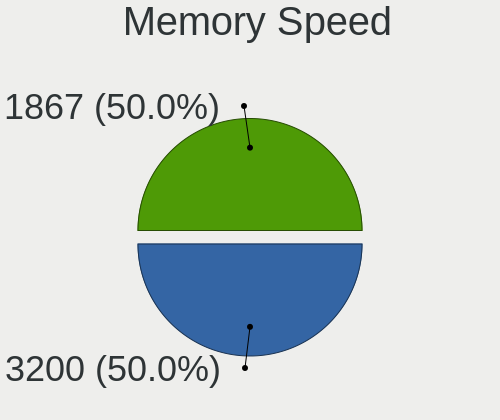

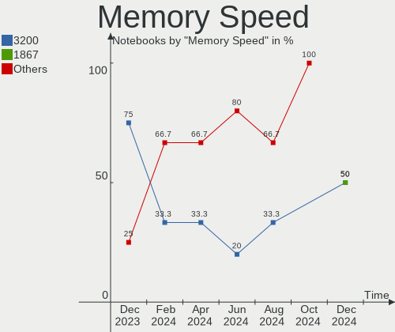

| Speed | Notebooks | Percent |
|-------|-----------|---------|
| 5200  | 1         | 33.33%  |
| 3200  | 1         | 33.33%  |
| 1600  | 1         | 33.33%  |

Printers & scanners
-------------------

Printer Vendor
--------------

Printer device vendors

Zero info for selected period =(

Printer Model
-------------

Printer device models

Zero info for selected period =(

Scanner Vendor
--------------

Scanner device vendors

Zero info for selected period =(

Scanner Model
-------------

Scanner device models

Zero info for selected period =(

Camera
------

Camera Vendor
-------------

Camera device vendors

| Vendor              | Notebooks | Percent |
|---------------------|-----------|---------|
| Chicony Electronics | 4         | 25%     |
| Microdia            | 3         | 18.75%  |
| Syntek              | 2         | 12.5%   |
| Lite-On Technology  | 2         | 12.5%   |
| Bison Electronics   | 2         | 12.5%   |
| Tobii Technology AB | 1         | 6.25%   |
| Sonix Technology    | 1         | 6.25%   |
| Quanta              | 1         | 6.25%   |

Camera Model
------------

Camera device models

| Model                                | Notebooks | Percent |
|--------------------------------------|-----------|---------|
| Syntek Integrated Camera             | 2         | 12.5%   |
| Tobii AB EyeChip                     | 1         | 6.25%   |
| Sonix USB2.0 HD UVC WebCam           | 1         | 6.25%   |
| Quanta HD User Facing                | 1         | 6.25%   |
| Microdia Laptop_Integrated_Webcam_HD | 1         | 6.25%   |
| Microdia Integrated_Webcam_HD        | 1         | 6.25%   |
| Microdia Integrated_Webcam_FHD       | 1         | 6.25%   |
| Lite-On Integrated Camera            | 1         | 6.25%   |
| Lite-On HP Wide Vision HD Camera     | 1         | 6.25%   |
| Chicony USB2.0 HD UVC WebCam         | 1         | 6.25%   |
| Chicony Integrated IR Camera         | 1         | 6.25%   |
| Chicony Integrated HP HD Webcam      | 1         | 6.25%   |
| Chicony HP True Vision HD Camera     | 1         | 6.25%   |
| Bison BisonCam,NB Pro                | 1         | 6.25%   |
| Bison BisonCam, NB Pro               | 1         | 6.25%   |

Security
--------

Fingerprint Vendor
------------------

Fingerprint sensor vendors

| Vendor           | Notebooks | Percent |
|------------------|-----------|---------|
| Validity Sensors | 1         | 100%    |

Fingerprint Model
-----------------

Fingerprint sensor models

| Model                   | Notebooks | Percent |
|-------------------------|-----------|---------|
| Validity Sensors VFS491 | 1         | 100%    |

Chipcard Vendor
---------------

Chipcard module vendors

Zero info for selected period =(

Chipcard Model
--------------

Chipcard module models

Zero info for selected period =(

Unsupported
-----------

Unsupported Devices
-------------------

Total unsupported devices on board

| Total | Notebooks | Percent |
|-------|-----------|---------|
| 0     | 14        | 60.87%  |
| 1     | 8         | 34.78%  |
| 2     | 1         | 4.35%   |

Unsupported Device Types
------------------------

Types of unsupported devices

| Type                  | Notebooks | Percent |
|-----------------------|-----------|---------|
| Multimedia controller | 3         | 30%     |
| Net/wireless          | 2         | 20%     |
| Graphics card         | 2         | 20%     |
| Sound                 | 1         | 10%     |
| Fingerprint reader    | 1         | 10%     |
| Camera                | 1         | 10%     |

