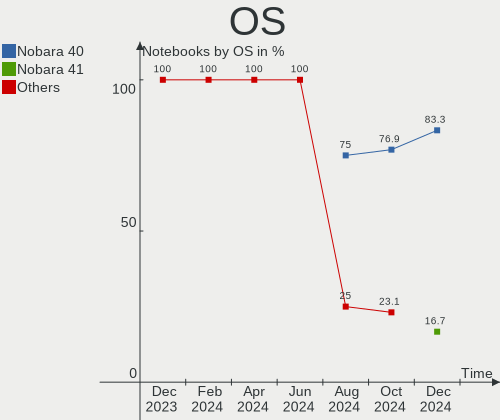
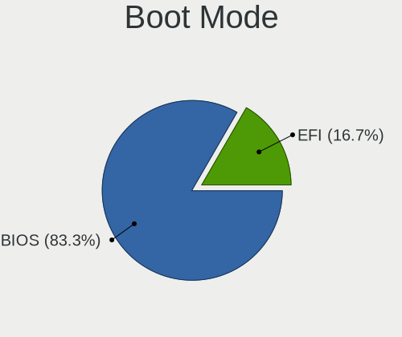
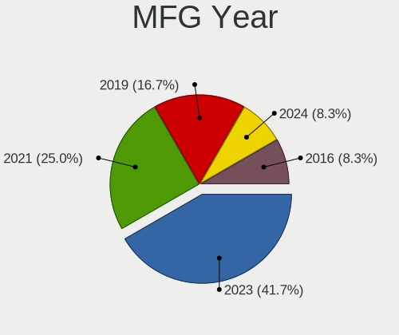
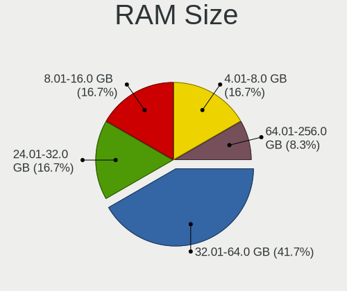
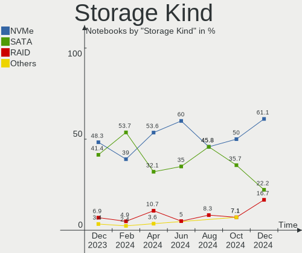
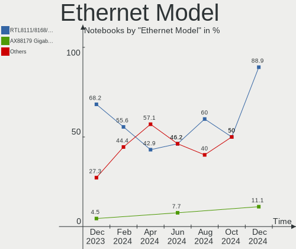
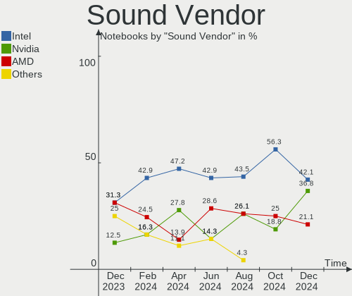
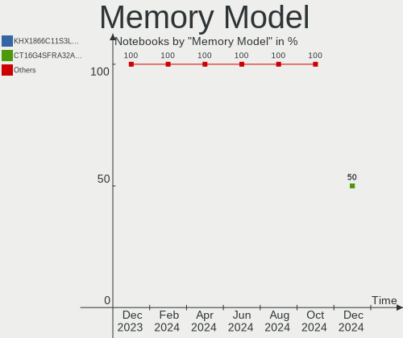
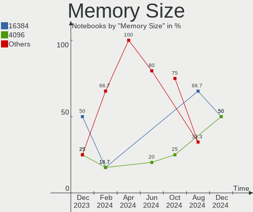

Nobara - Hardware Trends (Notebooks)
------------------------------------

A project to identify most popular hardware characteristics and track their change
over time based on data collected by Linux users at https://Linux-Hardware.org.

Anyone can contribute to this report by the [hw-probe](https://github.com/linuxhw/hw-probe) tool:

    sudo -E hw-probe -all -upload

This report is for one last month. Overall report since the beginning of time: [TestDays](https://github.com/linuxhw/TestDays)

Period: Nov, 2023.

Contents
--------

* [ System ](#system)
  - [ OS                       ](#os)
  - [ OS Family                ](#os-family)
  - [ Kernel                   ](#kernel)
  - [ Kernel Family            ](#kernel-family)
  - [ Kernel Major Ver.        ](#kernel-major-ver)
  - [ Arch                     ](#arch)
  - [ DE                       ](#de)
  - [ Display Server           ](#display-server)
  - [ Display Manager          ](#display-manager)
  - [ OS Lang                  ](#os-lang)
  - [ Boot Mode                ](#boot-mode)
  - [ Filesystem               ](#filesystem)
  - [ Part. scheme             ](#part-scheme)
  - [ Dual Boot with Linux/BSD ](#dual-boot-with-linuxbsd)
  - [ Dual Boot (Win)          ](#dual-boot-win)

* [ Board ](#board)
  - [ Vendor                   ](#vendor)
  - [ Model                    ](#model)
  - [ Model Family             ](#model-family)
  - [ MFG Year                 ](#mfg-year)
  - [ Form Factor              ](#form-factor)
  - [ Secure Boot              ](#secure-boot)
  - [ Coreboot                 ](#coreboot)
  - [ RAM Size                 ](#ram-size)
  - [ RAM Used                 ](#ram-used)
  - [ Total Drives             ](#total-drives)
  - [ Has CD-ROM               ](#has-cd-rom)
  - [ Has Ethernet             ](#has-ethernet)
  - [ Has WiFi                 ](#has-wifi)
  - [ Has Bluetooth            ](#has-bluetooth)

* [ Location ](#location)
  - [ Country                  ](#country)
  - [ City                     ](#city)

* [ Drives ](#drives)
  - [ Drive Vendor             ](#drive-vendor)
  - [ Drive Model              ](#drive-model)
  - [ HDD Vendor               ](#hdd-vendor)
  - [ SSD Vendor               ](#ssd-vendor)
  - [ Drive Kind               ](#drive-kind)
  - [ Drive Connector          ](#drive-connector)
  - [ Drive Size               ](#drive-size)
  - [ Space Total              ](#space-total)
  - [ Space Used               ](#space-used)
  - [ Malfunc. Drives          ](#malfunc-drives)
  - [ Malfunc. Drive Vendor    ](#malfunc-drive-vendor)
  - [ Malfunc. HDD Vendor      ](#malfunc-hdd-vendor)
  - [ Malfunc. Drive Kind      ](#malfunc-drive-kind)
  - [ Failed Drives            ](#failed-drives)
  - [ Failed Drive Vendor      ](#failed-drive-vendor)
  - [ Drive Status             ](#drive-status)

* [ Storage controller ](#storage-controller)
  - [ Storage Vendor           ](#storage-vendor)
  - [ Storage Model            ](#storage-model)
  - [ Storage Kind             ](#storage-kind)

* [ Processor ](#processor)
  - [ CPU Vendor               ](#cpu-vendor)
  - [ CPU Model                ](#cpu-model)
  - [ CPU Model Family         ](#cpu-model-family)
  - [ CPU Cores                ](#cpu-cores)
  - [ CPU Sockets              ](#cpu-sockets)
  - [ CPU Threads              ](#cpu-threads)
  - [ CPU Op-Modes             ](#cpu-op-modes)
  - [ CPU Microcode            ](#cpu-microcode)
  - [ CPU Microarch            ](#cpu-microarch)

* [ Graphics ](#graphics)
  - [ GPU Vendor               ](#gpu-vendor)
  - [ GPU Model                ](#gpu-model)
  - [ GPU Combo                ](#gpu-combo)
  - [ GPU Driver               ](#gpu-driver)
  - [ GPU Memory               ](#gpu-memory)

* [ Monitor ](#monitor)
  - [ Monitor Vendor           ](#monitor-vendor)
  - [ Monitor Model            ](#monitor-model)
  - [ Monitor Resolution       ](#monitor-resolution)
  - [ Monitor Diagonal         ](#monitor-diagonal)
  - [ Monitor Width            ](#monitor-width)
  - [ Aspect Ratio             ](#aspect-ratio)
  - [ Monitor Area             ](#monitor-area)
  - [ Pixel Density            ](#pixel-density)
  - [ Multiple Monitors        ](#multiple-monitors)

* [ Network ](#network)
  - [ Net Controller Vendor    ](#net-controller-vendor)
  - [ Net Controller Model     ](#net-controller-model)
  - [ Wireless Vendor          ](#wireless-vendor)
  - [ Wireless Model           ](#wireless-model)
  - [ Ethernet Vendor          ](#ethernet-vendor)
  - [ Ethernet Model           ](#ethernet-model)
  - [ Net Controller Kind      ](#net-controller-kind)
  - [ Used Controller          ](#used-controller)
  - [ NICs                     ](#nics)
  - [ IPv6                     ](#ipv6)

* [ Bluetooth ](#bluetooth)
  - [ Bluetooth Vendor         ](#bluetooth-vendor)
  - [ Bluetooth Model          ](#bluetooth-model)

* [ Sound ](#sound)
  - [ Sound Vendor             ](#sound-vendor)
  - [ Sound Model              ](#sound-model)

* [ Memory ](#memory)
  - [ Memory Vendor            ](#memory-vendor)
  - [ Memory Model             ](#memory-model)
  - [ Memory Kind              ](#memory-kind)
  - [ Memory Form Factor       ](#memory-form-factor)
  - [ Memory Size              ](#memory-size)
  - [ Memory Speed             ](#memory-speed)

* [ Printers & scanners ](#printers--scanners)
  - [ Printer Vendor           ](#printer-vendor)
  - [ Printer Model            ](#printer-model)
  - [ Scanner Vendor           ](#scanner-vendor)
  - [ Scanner Model            ](#scanner-model)

* [ Camera ](#camera)
  - [ Camera Vendor            ](#camera-vendor)
  - [ Camera Model             ](#camera-model)

* [ Security ](#security)
  - [ Fingerprint Vendor       ](#fingerprint-vendor)
  - [ Fingerprint Model        ](#fingerprint-model)
  - [ Chipcard Vendor          ](#chipcard-vendor)
  - [ Chipcard Model           ](#chipcard-model)

* [ Unsupported ](#unsupported)
  - [ Unsupported Devices      ](#unsupported-devices)
  - [ Unsupported Device Types ](#unsupported-device-types)

System
------

OS
--

Installed operating systems

| Name      | Notebooks | Percent |
|-----------|-----------|---------|
| Nobara 38 | 19        | 100%    |

OS Family
---------

OS without a version

| Name   | Notebooks | Percent |
|--------|-----------|---------|
| Nobara | 19        | 100%    |

Kernel
------

Version of the Linux kernel

| Version                      | Notebooks | Percent |
|------------------------------|-----------|---------|
| 6.4.10-202.fsync.fc38.x86_64 | 10        | 52.63%  |
| 6.5.9-201.fsync.fc38.x86_64  | 8         | 42.11%  |
| 6.5.11-201.fsync.fc38.x86_64 | 1         | 5.26%   |

Kernel Family
-------------

Linux kernel without a distro release

| Version | Notebooks | Percent |
|---------|-----------|---------|
| 6.4.10  | 10        | 52.63%  |
| 6.5.9   | 8         | 42.11%  |
| 6.5.11  | 1         | 5.26%   |

Kernel Major Ver.
-----------------

Linux kernel major version

| Version | Notebooks | Percent |
|---------|-----------|---------|
| 6.4     | 10        | 52.63%  |
| 6.5     | 9         | 47.37%  |

Arch
----

OS architecture (x86_64, i586, etc.)

| Name   | Notebooks | Percent |
|--------|-----------|---------|
| x86_64 | 19        | 100%    |

DE
--

Desktop Environment

| Name  | Notebooks | Percent |
|-------|-----------|---------|
| GNOME | 17        | 89.47%  |
| KDE5  | 2         | 10.53%  |

Display Server
--------------

X11 or Wayland

| Name    | Notebooks | Percent |
|---------|-----------|---------|
| Wayland | 16        | 84.21%  |
| X11     | 3         | 15.79%  |

Display Manager
---------------

SDDM, LightDM, etc.

| Name    | Notebooks | Percent |
|---------|-----------|---------|
| Unknown | 16        | 84.21%  |
| GDM     | 3         | 15.79%  |

OS Lang
-------

Language

| Lang  | Notebooks | Percent |
|-------|-----------|---------|
| en_US | 8         | 42.11%  |
| de_DE | 4         | 21.05%  |
| en_GB | 3         | 15.79%  |
| it_IT | 2         | 10.53%  |
| fr_FR | 1         | 5.26%   |
| es_MX | 1         | 5.26%   |

Boot Mode
---------

EFI or BIOS

| Mode | Notebooks | Percent |
|------|-----------|---------|
| EFI  | 16        | 84.21%  |
| BIOS | 3         | 15.79%  |

Filesystem
----------

Type of filesystem

| Type  | Notebooks | Percent |
|-------|-----------|---------|
| Btrfs | 19        | 100%    |

Part. scheme
------------

Scheme of partitioning

| Type    | Notebooks | Percent |
|---------|-----------|---------|
| Unknown | 16        | 84.21%  |
| GPT     | 3         | 15.79%  |

Dual Boot with Linux/BSD
------------------------

Hosting more than one Linux/BSD

| Dual boot | Notebooks | Percent |
|-----------|-----------|---------|
| No        | 17        | 89.47%  |
| Yes       | 2         | 10.53%  |

Dual Boot (Win)
---------------

Hosting Linux and Windows

| Dual boot | Notebooks | Percent |
|-----------|-----------|---------|
| No        | 16        | 84.21%  |
| Yes       | 3         | 15.79%  |

Board
-----

Vendor
------

Motherboard manufacturer

| Name                   | Notebooks | Percent |
|------------------------|-----------|---------|
| MSI                    | 3         | 15.79%  |
| Lenovo                 | 3         | 15.79%  |
| Dell                   | 3         | 15.79%  |
| ASUSTek Computer       | 3         | 15.79%  |
| TUXEDO                 | 1         | 5.26%   |
| ONE-NETBOOK TECHNOLOGY | 1         | 5.26%   |
| LG Electronics         | 1         | 5.26%   |
| Hewlett-Packard        | 1         | 5.26%   |
| Chuwi                  | 1         | 5.26%   |
| ASRock                 | 1         | 5.26%   |
| Acer                   | 1         | 5.26%   |

Model
-----

Motherboard model

| Name                                     | Notebooks | Percent |
|------------------------------------------|-----------|---------|
| TUXEDO Polaris AMD Gen3 (CZN)            | 1         | 5.26%   |
| ONE-NETBOOK TECHNOLOGY ONE XPLAYER       | 1         | 5.26%   |
| MSI MS-7C02                              | 1         | 5.26%   |
| MSI GF62 8RC                             | 1         | 5.26%   |
| MSI Cyborg 15 A12VF                      | 1         | 5.26%   |
| LG 16Z90R-G.AD75F                        | 1         | 5.26%   |
| Lenovo Legion 5 15ARH05 82B5             | 1         | 5.26%   |
| Lenovo IdeaPad C340-14API 81N6           | 1         | 5.26%   |
| Lenovo IdeaPad 3 17ABA7 82RQ             | 1         | 5.26%   |
| HP Pavilion dv9700                       | 1         | 5.26%   |
| Dell Precision 7740                      | 1         | 5.26%   |
| Dell Latitude E6430                      | 1         | 5.26%   |
| Dell Inspiron 15 3520                    | 1         | 5.26%   |
| Chuwi GemiBook Pro                       | 1         | 5.26%   |
| ASUS ZenBook UX434DA_UM433DA             | 1         | 5.26%   |
| ASUS VivoBook_ASUSLaptop M3500QA_M3500QA | 1         | 5.26%   |
| ASUS ROG Flow X13 GV301QE_GV301QE        | 1         | 5.26%   |
| ASRock X370 Gaming X                     | 1         | 5.26%   |
| Acer Aspire E5-575                       | 1         | 5.26%   |

Model Family
------------

Motherboard model prefix

| Name                       | Notebooks | Percent |
|----------------------------|-----------|---------|
| Lenovo IdeaPad             | 2         | 10.53%  |
| TUXEDO Polaris             | 1         | 5.26%   |
| ONE-NETBOOK TECHNOLOGY ONE | 1         | 5.26%   |
| MSI MS-7C02                | 1         | 5.26%   |
| MSI GF62                   | 1         | 5.26%   |
| MSI Cyborg                 | 1         | 5.26%   |
| LG 16Z90R-G.AD75F          | 1         | 5.26%   |
| Lenovo Legion              | 1         | 5.26%   |
| HP Pavilion                | 1         | 5.26%   |
| Dell Precision             | 1         | 5.26%   |
| Dell Latitude              | 1         | 5.26%   |
| Dell Inspiron              | 1         | 5.26%   |
| Chuwi GemiBook             | 1         | 5.26%   |
| ASUS ZenBook               | 1         | 5.26%   |
| ASUS VivoBook              | 1         | 5.26%   |
| ASUS ROG                   | 1         | 5.26%   |
| ASRock X370                | 1         | 5.26%   |
| Acer Aspire                | 1         | 5.26%   |

MFG Year
--------

Motherboard manufacture year

| Year | Notebooks | Percent |
|------|-----------|---------|
| 2021 | 5         | 26.32%  |
| 2020 | 4         | 21.05%  |
| 2019 | 4         | 21.05%  |
| 2022 | 2         | 10.53%  |
| 2023 | 1         | 5.26%   |
| 2016 | 1         | 5.26%   |
| 2012 | 1         | 5.26%   |
| 2007 | 1         | 5.26%   |

Form Factor
-----------

Physical design of the computer

| Name     | Notebooks | Percent |
|----------|-----------|---------|
| Notebook | 19        | 100%    |

Secure Boot
-----------

Enabled or disabled

| State    | Notebooks | Percent |
|----------|-----------|---------|
| Disabled | 19        | 100%    |

Coreboot
--------

Have coreboot on board

| Used | Notebooks | Percent |
|------|-----------|---------|
| No   | 19        | 100%    |

RAM Size
--------

Total RAM memory

| Size in GB  | Notebooks | Percent |
|-------------|-----------|---------|
| 16.01-24.0  | 5         | 26.32%  |
| 8.01-16.0   | 5         | 26.32%  |
| 4.01-8.0    | 4         | 21.05%  |
| 32.01-64.0  | 2         | 10.53%  |
| 24.01-32.0  | 1         | 5.26%   |
| 2.01-3.0    | 1         | 5.26%   |
| 64.01-256.0 | 1         | 5.26%   |

RAM Used
--------

Used RAM memory

| Used GB   | Notebooks | Percent |
|-----------|-----------|---------|
| 4.01-8.0  | 8         | 42.11%  |
| 2.01-3.0  | 7         | 36.84%  |
| 3.01-4.0  | 2         | 10.53%  |
| 1.01-2.0  | 1         | 5.26%   |
| 8.01-16.0 | 1         | 5.26%   |

Total Drives
------------

Number of drives on board

| Drives | Notebooks | Percent |
|--------|-----------|---------|
| 1      | 10        | 52.63%  |
| 2      | 8         | 42.11%  |
| 3      | 1         | 5.26%   |

Has CD-ROM
----------

Has CD-ROM on board

| Presented | Notebooks | Percent |
|-----------|-----------|---------|
| No        | 15        | 78.95%  |
| Yes       | 4         | 21.05%  |

Has Ethernet
------------

Has Ethernet on board

| Presented | Notebooks | Percent |
|-----------|-----------|---------|
| Yes       | 12        | 63.16%  |
| No        | 7         | 36.84%  |

Has WiFi
--------

Has WiFi module

| Presented | Notebooks | Percent |
|-----------|-----------|---------|
| Yes       | 19        | 100%    |

Has Bluetooth
-------------

Has Bluetooth module

| Presented | Notebooks | Percent |
|-----------|-----------|---------|
| Yes       | 14        | 73.68%  |
| No        | 5         | 26.32%  |

Location
--------

Country
-------

Geographic location (country)

| Country   | Notebooks | Percent |
|-----------|-----------|---------|
| Germany   | 6         | 31.58%  |
| UK        | 3         | 15.79%  |
| USA       | 2         | 10.53%  |
| Italy     | 2         | 10.53%  |
| Pakistan  | 1         | 5.26%   |
| Morocco   | 1         | 5.26%   |
| Mexico    | 1         | 5.26%   |
| Mauritius | 1         | 5.26%   |
| France    | 1         | 5.26%   |
| Czechia   | 1         | 5.26%   |

City
----

Geographic location (city)

| City                   | Notebooks | Percent |
|------------------------|-----------|---------|
| Wuerselen              | 1         | 5.26%   |
| Wendeburg              | 1         | 5.26%   |
| Vacoas                 | 1         | 5.26%   |
| San Nicola la Strada   | 1         | 5.26%   |
| Raunheim               | 1         | 5.26%   |
| Prague                 | 1         | 5.26%   |
| Port Arthur            | 1         | 5.26%   |
| Palaiseau              | 1         | 5.26%   |
| Milano                 | 1         | 5.26%   |
| Mexico City            | 1         | 5.26%   |
| Mardan                 | 1         | 5.26%   |
| Mannheim               | 1         | 5.26%   |
| Gainesville            | 1         | 5.26%   |
| Fulda                  | 1         | 5.26%   |
| Dillingen an der Donau | 1         | 5.26%   |
| Darlington             | 1         | 5.26%   |
| Casablanca             | 1         | 5.26%   |
| Cardiff                | 1         | 5.26%   |
| Blackburn              | 1         | 5.26%   |

Drives
------

Drive Vendor
------------

Hard drive vendors

| Vendor                      | Notebooks | Drives | Percent |
|-----------------------------|-----------|--------|---------|
| WDC                         | 4         | 4      | 14.81%  |
| SK hynix                    | 3         | 3      | 11.11%  |
| Sandisk                     | 3         | 3      | 11.11%  |
| Samsung Electronics         | 3         | 3      | 11.11%  |
| Micron/Crucial Technology   | 2         | 2      | 7.41%   |
| Intel                       | 2         | 2      | 7.41%   |
| Crucial                     | 2         | 2      | 7.41%   |
| Unknown                     | 1         | 1      | 3.7%    |
| Toshiba                     | 1         | 1      | 3.7%    |
| Seagate                     | 1         | 1      | 3.7%    |
| Phison Electronics          | 1         | 1      | 3.7%    |
| Netac                       | 1         | 1      | 3.7%    |
| KIOXIA                      | 1         | 1      | 3.7%    |
| Kingston Technology Company | 1         | 2      | 3.7%    |
| Hitachi                     | 1         | 2      | 3.7%    |

Drive Model
-----------

Hard drive models

| Model                                               | Notebooks | Percent |
|-----------------------------------------------------|-----------|---------|
| Samsung NVMe SSD Controller SM981/PM981/PM983 250GB | 2         | 7.41%   |
| Crucial CT1000BX500SSD1 1TB                         | 2         | 7.41%   |
| WDC WDS500G2B0B-00YS70 500GB SSD                    | 1         | 3.7%    |
| WDC WD20EZRZ-00Z5HB0 2TB                            | 1         | 3.7%    |
| WDC WD10JPVX-75JC3T0 1TB                            | 1         | 3.7%    |
| WDC WD10 JPVX-22JC3T0 1TB                           | 1         | 3.7%    |
| Unknown MMC Card  32GB                              | 1         | 3.7%    |
| Toshiba MQ01ABD100 1TB                              | 1         | 3.7%    |
| SK hynix HFS512GEJ9X101N 512GB                      | 1         | 3.7%    |
| SK hynix HFM001TD3JX013N 1TB                        | 1         | 3.7%    |
| SK hynix BC501 NVMe Solid State Drive 512GB         | 1         | 3.7%    |
| Seagate ST500LX012-1LM162-SSHD 500GB                | 1         | 3.7%    |
| Sandisk WD_BLACK SN770 500GB                        | 1         | 3.7%    |
| Sandisk WDC PC SN530 SDBPTPZ-1T00-1002 1024GB       | 1         | 3.7%    |
| Sandisk WD Green SN350 2TB                          | 1         | 3.7%    |
| Samsung MZALQ512HALU-000L2 512GB                    | 1         | 3.7%    |
| Phison E12 NVMe Controller 512GB                    | 1         | 3.7%    |
| Netac S539N8/256 256GB                              | 1         | 3.7%    |
| Micron/Crucial P2 NVMe PCIe SSD 1TB                 | 1         | 3.7%    |
| Micron/Crucial CT2000P5PSSD8 2TB                    | 1         | 3.7%    |
| KIOXIA KBG50ZNS512G NVMe 512GB                      | 1         | 3.7%    |
| Kingston Company KC2000 NVMe SSD 1TB                | 1         | 3.7%    |
| Intel SSDPEKNW512GZL 512GB                          | 1         | 3.7%    |
| Intel SSDPEKNW010T9 1TB                             | 1         | 3.7%    |
| Hitachi HTS541616J9SA00 160GB                       | 1         | 3.7%    |

HDD Vendor
----------

Hard disk drive vendors

| Vendor  | Notebooks | Drives | Percent |
|---------|-----------|--------|---------|
| WDC     | 3         | 3      | 50%     |
| Toshiba | 1         | 1      | 16.67%  |
| Seagate | 1         | 1      | 16.67%  |
| Hitachi | 1         | 2      | 16.67%  |

SSD Vendor
----------

Solid state drive vendors

| Vendor  | Notebooks | Drives | Percent |
|---------|-----------|--------|---------|
| Crucial | 2         | 2      | 50%     |
| WDC     | 1         | 1      | 25%     |
| Netac   | 1         | 1      | 25%     |

Drive Kind
----------

HDD or SSD

| Kind | Notebooks | Drives | Percent |
|------|-----------|--------|---------|
| NVMe | 14        | 17     | 56%     |
| HDD  | 6         | 7      | 24%     |
| SSD  | 4         | 4      | 16%     |
| MMC  | 1         | 1      | 4%      |

Drive Connector
---------------

SATA, SAS, NVMe, etc.

| Type | Notebooks | Drives | Percent |
|------|-----------|--------|---------|
| NVMe | 14        | 17     | 60.87%  |
| SATA | 7         | 10     | 30.43%  |
| SAS  | 1         | 1      | 4.35%   |
| MMC  | 1         | 1      | 4.35%   |

Drive Size
----------

Size of hard drive

| Size in TB | Notebooks | Drives | Percent |
|------------|-----------|--------|---------|
| 0.51-1.0   | 5         | 5      | 50%     |
| 0.01-0.5   | 4         | 5      | 40%     |
| 1.01-2.0   | 1         | 1      | 10%     |

Space Total
-----------

Amount of disk space available on the file system

| Size in GB     | Notebooks | Percent |
|----------------|-----------|---------|
| 1001-2000      | 5         | 26.32%  |
| More than 3000 | 3         | 15.79%  |
| 251-500        | 3         | 15.79%  |
| 501-1000       | 3         | 15.79%  |
| Unknown        | 2         | 10.53%  |
| 2001-3000      | 1         | 5.26%   |
| 101-250        | 1         | 5.26%   |
| 51-100         | 1         | 5.26%   |

Space Used
----------

Amount of used disk space

| Used GB   | Notebooks | Percent |
|-----------|-----------|---------|
| 21-50     | 5         | 26.32%  |
| 101-250   | 4         | 21.05%  |
| 251-500   | 2         | 10.53%  |
| 1001-2000 | 2         | 10.53%  |
| 1-20      | 2         | 10.53%  |
| Unknown   | 2         | 10.53%  |
| 501-1000  | 1         | 5.26%   |
| 51-100    | 1         | 5.26%   |

Malfunc. Drives
---------------

Drive models with a malfunction

Zero info for selected period =(

Malfunc. Drive Vendor
---------------------

Vendors of faulty drives

Zero info for selected period =(

Malfunc. HDD Vendor
-------------------

Vendors of faulty HDD drives

Zero info for selected period =(

Malfunc. Drive Kind
-------------------

Kinds of faulty drives

Zero info for selected period =(

Failed Drives
-------------

Failed drive models

Zero info for selected period =(

Failed Drive Vendor
-------------------

Failed drive vendors

Zero info for selected period =(

Drive Status
------------

Number of failed and malfunc. drives

| Status   | Notebooks | Drives | Percent |
|----------|-----------|--------|---------|
| Detected | 16        | 22     | 84.21%  |
| Works    | 3         | 7      | 15.79%  |

Storage controller
------------------

Storage Vendor
--------------

Storage controller vendors

| Vendor                      | Notebooks | Percent |
|-----------------------------|-----------|---------|
| Intel                       | 8         | 27.59%  |
| AMD                         | 6         | 20.69%  |
| SK hynix                    | 3         | 10.34%  |
| SanDisk                     | 3         | 10.34%  |
| Samsung Electronics         | 3         | 10.34%  |
| Micron/Crucial Technology   | 2         | 6.9%    |
| Phison Electronics          | 1         | 3.45%   |
| Nvidia                      | 1         | 3.45%   |
| KIOXIA                      | 1         | 3.45%   |
| Kingston Technology Company | 1         | 3.45%   |

Storage Model
-------------

Storage controller models

| Model                                                                   | Notebooks | Percent |
|-------------------------------------------------------------------------|-----------|---------|
| AMD FCH SATA Controller [AHCI mode]                                     | 5         | 15.63%  |
| Samsung NVMe SSD Controller SM981/PM981/PM983                           | 2         | 6.25%   |
| Intel 82801 Mobile SATA Controller [RAID mode]                          | 2         | 6.25%   |
| SK hynix Platinum P41/PC801 NVMe Solid State Drive                      | 1         | 3.13%   |
| SK hynix Gold P31/BC711/PC711 NVMe Solid State Drive                    | 1         | 3.13%   |
| SK hynix BC501 NVMe Solid State Drive                                   | 1         | 3.13%   |
| SanDisk WD PC SN540 / Green SN350 NVMe SSD 1 TB (DRAM-less)             | 1         | 3.13%   |
| SanDisk WD Black SN770 / PC SN740 256GB / PC SN560 (DRAM-less) NVMe SSD | 1         | 3.13%   |
| SanDisk IX SN530 NVMe SSD (DRAM-less)                                   | 1         | 3.13%   |
| Samsung NVMe SSD Controller 980 (DRAM-less)                             | 1         | 3.13%   |
| Phison E12 NVMe Controller                                              | 1         | 3.13%   |
| Nvidia MCP65 SATA Controller                                            | 1         | 3.13%   |
| Nvidia MCP65 IDE                                                        | 1         | 3.13%   |
| Micron/Crucial P5 Plus NVMe PCIe SSD                                    | 1         | 3.13%   |
| Micron/Crucial P2 [Nick P2] / P3 / P3 Plus NVMe PCIe SSD (DRAM-less)    | 1         | 3.13%   |
| KIOXIA NVMe SSD Controller BG5 (DRAM-less)                              | 1         | 3.13%   |
| Kingston Company KC2000/KC2500 NVMe SSD SM2262EN                        | 1         | 3.13%   |
| Intel Volume Management Device NVMe RAID Controller                     | 1         | 3.13%   |
| Intel Tiger Lake-LP SATA Controller                                     | 1         | 3.13%   |
| Intel Sunrise Point-LP SATA Controller [AHCI mode]                      | 1         | 3.13%   |
| Intel SSD 670p Series [Keystone Harbor]                                 | 1         | 3.13%   |
| Intel SSD 665p Series [Neptune Harbor Refresh]                          | 1         | 3.13%   |
| Intel Celeron/Pentium Silver Processor SATA Controller                  | 1         | 3.13%   |
| Intel Cannon Lake Mobile PCH SATA AHCI Controller                       | 1         | 3.13%   |
| AMD X370 Series Chipset SATA Controller                                 | 1         | 3.13%   |
| AMD 400 Series Chipset SATA Controller                                  | 1         | 3.13%   |

Storage Kind
------------

Kind of storage controller (IDE, SATA, NVMe, SAS, ...)

| Kind | Notebooks | Percent |
|------|-----------|---------|
| NVMe | 14        | 50%     |
| SATA | 10        | 35.71%  |
| RAID | 3         | 10.71%  |
| IDE  | 1         | 3.57%   |

Processor
---------

CPU Vendor
----------

Processor vendors

| Vendor | Notebooks | Percent |
|--------|-----------|---------|
| AMD    | 10        | 52.63%  |
| Intel  | 9         | 47.37%  |

CPU Model
---------

Processor models

| Model                                         | Notebooks | Percent |
|-----------------------------------------------|-----------|---------|
| AMD Ryzen 7 5800H with Radeon Graphics        | 2         | 10.53%  |
| Intel Core i7-9750H CPU @ 2.60GHz             | 1         | 5.26%   |
| Intel Core i5-8300H CPU @ 2.30GHz             | 1         | 5.26%   |
| Intel Core i5-7200U CPU @ 2.50GHz             | 1         | 5.26%   |
| Intel Core i5-3320M CPU @ 2.60GHz             | 1         | 5.26%   |
| Intel Celeron J4125 CPU @ 2.00GHz             | 1         | 5.26%   |
| Intel 13th Gen Core i7-1360P                  | 1         | 5.26%   |
| Intel 12th Gen Core i5-12450H                 | 1         | 5.26%   |
| Intel 11th Gen Core i7-1165G7 @ 2.80GHz       | 1         | 5.26%   |
| Intel 11th Gen Core i5-1135G7 @ 2.40GHz       | 1         | 5.26%   |
| AMD Turion 64 X2 Mobile Technology TL-64      | 1         | 5.26%   |
| AMD Ryzen 9 5900HS with Radeon Graphics       | 1         | 5.26%   |
| AMD Ryzen 7 5800X 8-Core Processor            | 1         | 5.26%   |
| AMD Ryzen 7 4800H with Radeon Graphics        | 1         | 5.26%   |
| AMD Ryzen 7 3700X 8-Core Processor            | 1         | 5.26%   |
| AMD Ryzen 7 3700U with Radeon Vega Mobile Gfx | 1         | 5.26%   |
| AMD Ryzen 5 5625U with Radeon Graphics        | 1         | 5.26%   |
| AMD Ryzen 5 3500U with Radeon Vega Mobile Gfx | 1         | 5.26%   |

CPU Model Family
----------------

Processor model prefix

| Model                   | Notebooks | Percent |
|-------------------------|-----------|---------|
| AMD Ryzen 7             | 6         | 31.58%  |
| Other                   | 4         | 21.05%  |
| Intel Core i5           | 3         | 15.79%  |
| AMD Ryzen 5             | 2         | 10.53%  |
| Intel Core i7           | 1         | 5.26%   |
| Intel Celeron           | 1         | 5.26%   |
| AMD Turion 64 X2 Mobile | 1         | 5.26%   |
| AMD Ryzen 9             | 1         | 5.26%   |

CPU Cores
---------

Number of processor cores

| Number | Notebooks | Percent |
|--------|-----------|---------|
| 8      | 7         | 36.84%  |
| 4      | 6         | 31.58%  |
| 2      | 3         | 15.79%  |
| 6      | 2         | 10.53%  |
| 12     | 1         | 5.26%   |

CPU Sockets
-----------

Number of sockets

| Number | Notebooks | Percent |
|--------|-----------|---------|
| 1      | 19        | 100%    |

CPU Threads
-----------

Threads per core (Hyper-Threading)

| Number | Notebooks | Percent |
|--------|-----------|---------|
| 2      | 17        | 89.47%  |
| 1      | 2         | 10.53%  |

CPU Op-Modes
------------

CPU Operation Modes (32-bit, 64-bit)

| Op mode        | Notebooks | Percent |
|----------------|-----------|---------|
| 32-bit, 64-bit | 19        | 100%    |

CPU Microcode
-------------

Microcode number

| Number     | Notebooks | Percent |
|------------|-----------|---------|
| Unknown    | 10        | 52.63%  |
| 0x0a50000c | 3         | 15.79%  |
| 0x08108109 | 2         | 10.53%  |
| 0x0a50000d | 1         | 5.26%   |
| 0x0a20120a | 1         | 5.26%   |
| 0x08701021 | 1         | 5.26%   |
| 0x08600106 | 1         | 5.26%   |

CPU Microarch
-------------

Microarchitecture

| Name             | Notebooks | Percent |
|------------------|-----------|---------|
| Zen 3            | 5         | 26.32%  |
| KabyLake         | 3         | 15.79%  |
| Zen+             | 2         | 10.53%  |
| Zen 2            | 2         | 10.53%  |
| TigerLake        | 2         | 10.53%  |
| K8 Hammer        | 1         | 5.26%   |
| IvyBridge        | 1         | 5.26%   |
| Goldmont plus    | 1         | 5.26%   |
| Alderlake Hybrid | 1         | 5.26%   |
| Unknown          | 1         | 5.26%   |

Graphics
--------

GPU Vendor
----------

Vendors of graphics cards

| Vendor | Notebooks | Percent |
|--------|-----------|---------|
| AMD    | 10        | 38.46%  |
| Intel  | 9         | 34.62%  |
| Nvidia | 7         | 26.92%  |

GPU Model
---------

Graphics card models

| Model                                                                | Notebooks | Percent |
|----------------------------------------------------------------------|-----------|---------|
| AMD Cezanne [Radeon Vega Series / Radeon Vega Mobile Series]         | 3         | 11.54%  |
| Intel TigerLake-LP GT2 [Iris Xe Graphics]                            | 2         | 7.69%   |
| Intel CoffeeLake-H GT2 [UHD Graphics 630]                            | 2         | 7.69%   |
| AMD Picasso/Raven 2 [Radeon Vega Series / Radeon Vega Mobile Series] | 2         | 7.69%   |
| Nvidia TU117M [GeForce GTX 1650 Ti Mobile]                           | 1         | 3.85%   |
| Nvidia TU104 [GeForce RTX 2080 Rev. A]                               | 1         | 3.85%   |
| Nvidia GP107M [GeForce GTX 1050 Mobile]                              | 1         | 3.85%   |
| Nvidia GA107M [GeForce RTX 3050 Ti Mobile]                           | 1         | 3.85%   |
| Nvidia GA106M [GeForce RTX 3060 Mobile / Max-Q]                      | 1         | 3.85%   |
| Nvidia G86M [GeForce 8400M GS]                                       | 1         | 3.85%   |
| Nvidia AD107M [GeForce RTX 4060 Max-Q / Mobile]                      | 1         | 3.85%   |
| Intel Raptor Lake-P [Iris Xe Graphics]                               | 1         | 3.85%   |
| Intel HD Graphics 620                                                | 1         | 3.85%   |
| Intel GeminiLake [UHD Graphics 600]                                  | 1         | 3.85%   |
| Intel Alder Lake-P GT1 [UHD Graphics]                                | 1         | 3.85%   |
| Intel 3rd Gen Core processor Graphics Controller                     | 1         | 3.85%   |
| AMD Renoir [Radeon RX Vega 6 (Ryzen 4000/5000 Mobile Series)]        | 1         | 3.85%   |
| AMD Navi 23 [Radeon RX 6600/6600 XT/6600M]                           | 1         | 3.85%   |
| AMD Navi 22 [Radeon RX 6700/6700 XT/6750 XT / 6800M/6850M XT]        | 1         | 3.85%   |
| AMD Ellesmere [Radeon Pro WX 7100 Mobile]                            | 1         | 3.85%   |
| AMD Barcelo                                                          | 1         | 3.85%   |

GPU Combo
---------

Combinations of graphics cards

| Name           | Notebooks | Percent |
|----------------|-----------|---------|
| 1 x Intel      | 5         | 26.32%  |
| 1 x AMD        | 5         | 26.32%  |
| AMD + Nvidia   | 3         | 15.79%  |
| 1 x Nvidia     | 2         | 10.53%  |
| Intel + Nvidia | 2         | 10.53%  |
| Intel + AMD    | 2         | 10.53%  |

GPU Driver
----------

Free vs proprietary

| Driver      | Notebooks | Percent |
|-------------|-----------|---------|
| Free        | 13        | 68.42%  |
| Proprietary | 6         | 31.58%  |

GPU Memory
----------

Total video memory

| Size in GB | Notebooks | Percent |
|------------|-----------|---------|
| Unknown    | 8         | 42.11%  |
| 0.01-0.5   | 5         | 26.32%  |
| 7.01-8.0   | 3         | 15.79%  |
| 1.01-2.0   | 3         | 15.79%  |

Monitor
-------

Monitor Vendor
--------------

Monitor vendors

| Vendor              | Notebooks | Percent |
|---------------------|-----------|---------|
| Samsung Electronics | 5         | 20%     |
| BOE                 | 5         | 20%     |
| AU Optronics        | 4         | 16%     |
| Chimei Innolux      | 3         | 12%     |
| Sony                | 1         | 4%      |
| Sharp               | 1         | 4%      |
| Pixio               | 1         | 4%      |
| NEC Computers       | 1         | 4%      |
| LG Display          | 1         | 4%      |
| Hewlett-Packard     | 1         | 4%      |
| Dell                | 1         | 4%      |
| ASUSTek Computer    | 1         | 4%      |

Monitor Model
-------------

Monitor models

| Model                                                                 | Notebooks | Percent |
|-----------------------------------------------------------------------|-----------|---------|
| Sony BW8 MS_9001 1600x2560 113x181mm 8.4-inch                         | 1         | 4%      |
| Sharp LQ134N1JW52 SHP151E 1920x1200 288x180mm 13.4-inch               | 1         | 4%      |
| Samsung Electronics T24C300 SAM0A9B 1920x1080 531x299mm 24.0-inch     | 1         | 4%      |
| Samsung Electronics LCD Monitor SEC3847 1440x900 367x230mm 17.1-inch  | 1         | 4%      |
| Samsung Electronics LCD Monitor SDC4161 1920x1080 344x194mm 15.5-inch | 1         | 4%      |
| Samsung Electronics LC27T55 SAM701E 1920x1080 609x349mm 27.6-inch     | 1         | 4%      |
| Samsung Electronics C24FG7x SAM0E43 1920x1080 532x304mm 24.1-inch     | 1         | 4%      |
| Pixio PX7 Prime HYC2700 2560x1440 530x280mm 23.6-inch                 | 1         | 4%      |
| NEC Computers LCD2190UXp NEC66BC 1600x1200 432x324mm 21.3-inch        | 1         | 4%      |
| LG Display LCD Monitor LGD06EB 2560x1600 344x215mm 16.0-inch          | 1         | 4%      |
| Hewlett-Packard X27i HPN3679 2560x1440 597x336mm 27.0-inch            | 1         | 4%      |
| Dell P2419H DELD0DA 1920x1080 527x296mm 23.8-inch                     | 1         | 4%      |
| Chimei Innolux P140ZKA-BZ1 CMN8C02 2160x1440 296x197mm 14.0-inch      | 1         | 4%      |
| Chimei Innolux LCD Monitor CMN15D6 1920x1080 344x193mm 15.5-inch      | 1         | 4%      |
| Chimei Innolux LCD Monitor CMN14D4 1920x1080 309x173mm 13.9-inch      | 1         | 4%      |
| BOE LCD Monitor BOE0A8A 1920x1080 344x194mm 15.5-inch                 | 1         | 4%      |
| BOE LCD Monitor BOE0974 2560x1440 344x194mm 15.5-inch                 | 1         | 4%      |
| BOE LCD Monitor BOE0960 1366x768 344x194mm 15.5-inch                  | 1         | 4%      |
| BOE LCD Monitor BOE07E9 1920x1080 309x174mm 14.0-inch                 | 1         | 4%      |
| BOE LCD Monitor BOE05B0 1366x768 309x173mm 13.9-inch                  | 1         | 4%      |
| AU Optronics LCD Monitor AUOD0A2 1920x1080 344x193mm 15.5-inch        | 1         | 4%      |
| AU Optronics LCD Monitor AUOB78D 1920x1080 344x193mm 15.5-inch        | 1         | 4%      |
| AU Optronics LCD Monitor AUO439D 1920x1080 382x215mm 17.3-inch        | 1         | 4%      |
| AU Optronics LCD Monitor AUO139D 1920x1080 381x214mm 17.2-inch        | 1         | 4%      |
| ASUSTek Computer MB16AC AUS1641 1920x1080 344x194mm 15.5-inch         | 1         | 4%      |

Monitor Resolution
------------------

Monitor screen resolution

| Resolution        | Notebooks | Percent |
|-------------------|-----------|---------|
| 1920x1080 (FHD)   | 13        | 54.17%  |
| 2560x1440 (QHD)   | 3         | 12.5%   |
| 2560x1600         | 2         | 8.33%   |
| 1366x768 (WXGA)   | 2         | 8.33%   |
| 2160x1440         | 1         | 4.17%   |
| 1920x1200 (WUXGA) | 1         | 4.17%   |
| 1600x1200         | 1         | 4.17%   |
| 1440x900 (WXGA+)  | 1         | 4.17%   |

Monitor Diagonal
----------------

Diagonal size in inches

| Inches | Notebooks | Percent |
|--------|-----------|---------|
| 15     | 7         | 29.17%  |
| 24     | 3         | 12.5%   |
| 17     | 3         | 12.5%   |
| 13     | 3         | 12.5%   |
| 27     | 2         | 8.33%   |
| 14     | 2         | 8.33%   |
| 32     | 1         | 4.17%   |
| 21     | 1         | 4.17%   |
| 16     | 1         | 4.17%   |
| 8      | 1         | 4.17%   |

Monitor Width
-------------

Physical width

| Width in mm | Notebooks | Percent |
|-------------|-----------|---------|
| 301-350     | 11        | 45.83%  |
| 501-600     | 4         | 16.67%  |
| 351-400     | 3         | 12.5%   |
| 201-300     | 2         | 8.33%   |
| 701-800     | 1         | 4.17%   |
| 601-700     | 1         | 4.17%   |
| 401-500     | 1         | 4.17%   |
| 101-200     | 1         | 4.17%   |

Aspect Ratio
------------

Proportional relationship between the width and the height

| Ratio | Notebooks | Percent |
|-------|-----------|---------|
| 16/9  | 15        | 71.43%  |
| 16/10 | 3         | 14.29%  |
| 4/3   | 1         | 4.76%   |
| 3/2   | 1         | 4.76%   |
| 0.62  | 1         | 4.76%   |

Monitor Area
------------

Area in inch²

| Area in inch² | Notebooks | Percent |
|----------------|-----------|---------|
| 101-110        | 7         | 29.17%  |
| 81-90          | 4         | 16.67%  |
| 201-250        | 3         | 12.5%   |
| 301-350        | 2         | 8.33%   |
| 121-130        | 2         | 8.33%   |
| 71-80          | 1         | 4.17%   |
| 351-500        | 1         | 4.17%   |
| 1-40           | 1         | 4.17%   |
| 251-300        | 1         | 4.17%   |
| 131-140        | 1         | 4.17%   |
| 111-120        | 1         | 4.17%   |

Pixel Density
-------------

Pixels per inch

| Density       | Notebooks | Percent |
|---------------|-----------|---------|
| 121-160       | 10        | 41.67%  |
| 51-100        | 6         | 25%     |
| 161-240       | 4         | 16.67%  |
| 101-120       | 3         | 12.5%   |
| More than 240 | 1         | 4.17%   |

Multiple Monitors
-----------------

Total monitors connected

| Total | Notebooks | Percent |
|-------|-----------|---------|
| 1     | 13        | 68.42%  |
| 2     | 6         | 31.58%  |

Network
-------

Net Controller Vendor
---------------------

Controller vendors

| Vendor                | Notebooks | Percent |
|-----------------------|-----------|---------|
| Intel                 | 13        | 41.94%  |
| Realtek Semiconductor | 8         | 25.81%  |
| Qualcomm Atheros      | 2         | 6.45%   |
| Broadcom              | 2         | 6.45%   |
| ASIX Electronics      | 2         | 6.45%   |
| Ralink Technology     | 1         | 3.23%   |
| Nvidia                | 1         | 3.23%   |
| Microsoft             | 1         | 3.23%   |
| MediaTek              | 1         | 3.23%   |

Net Controller Model
--------------------

Controller models

| Model                                                                                         | Notebooks | Percent |
|-----------------------------------------------------------------------------------------------|-----------|---------|
| Realtek RTL8111/8168/8411 PCI Express Gigabit Ethernet Controller                             | 4         | 11.76%  |
| Intel Wi-Fi 6 AX200                                                                           | 4         | 11.76%  |
| ASIX AX88179 Gigabit Ethernet                                                                 | 2         | 5.88%   |
| Realtek RTL88x2bu [AC1200 Techkey]                                                            | 1         | 2.94%   |
| Realtek RTL8852BE PCIe 802.11ax Wireless Network Controller                                   | 1         | 2.94%   |
| Realtek RTL8821CE 802.11ac PCIe Wireless Network Adapter                                      | 1         | 2.94%   |
| Realtek RTL8125 2.5GbE Controller                                                             | 1         | 2.94%   |
| Realtek Realtek 8812AU/8821AU 802.11ac WLAN Adapter [USB Wireless Dual-Band Adapter 2.4/5Ghz] | 1         | 2.94%   |
| Realtek 802.11ac WLAN Adapter                                                                 | 1         | 2.94%   |
| Ralink RT5572 Wireless Adapter                                                                | 1         | 2.94%   |
| Qualcomm Atheros QCA9377 802.11ac Wireless Network Adapter                                    | 1         | 2.94%   |
| Qualcomm Atheros Killer E2400 Gigabit Ethernet Controller                                     | 1         | 2.94%   |
| Nvidia MCP65 Ethernet                                                                         | 1         | 2.94%   |
| Microsoft XBOX ACC                                                                            | 1         | 2.94%   |
| MediaTek MT7921 802.11ax PCI Express Wireless Network Adapter                                 | 1         | 2.94%   |
| Intel Wireless-AC 9260                                                                        | 1         | 2.94%   |
| Intel Wireless 8265 / 8275                                                                    | 1         | 2.94%   |
| Intel Wireless 3165                                                                           | 1         | 2.94%   |
| Intel Wi-Fi 6 AX201                                                                           | 1         | 2.94%   |
| Intel Raptor Lake PCH CNVi WiFi                                                               | 1         | 2.94%   |
| Intel I211 Gigabit Network Connection                                                         | 1         | 2.94%   |
| Intel Ethernet Connection (7) I219-LM                                                         | 1         | 2.94%   |
| Intel Cannon Lake PCH CNVi WiFi                                                               | 1         | 2.94%   |
| Intel Alder Lake-P PCH CNVi WiFi                                                              | 1         | 2.94%   |
| Intel 82579LM Gigabit Network Connection (Lewisville)                                         | 1         | 2.94%   |
| Broadcom BCM43228 802.11a/b/g/n                                                               | 1         | 2.94%   |
| Broadcom BCM4321 802.11a/b/g/n                                                                | 1         | 2.94%   |

Wireless Vendor
---------------

Wireless vendors

| Vendor                | Notebooks | Percent |
|-----------------------|-----------|---------|
| Intel                 | 11        | 52.38%  |
| Realtek Semiconductor | 4         | 19.05%  |
| Broadcom              | 2         | 9.52%   |
| Ralink Technology     | 1         | 4.76%   |
| Qualcomm Atheros      | 1         | 4.76%   |
| Microsoft             | 1         | 4.76%   |
| MediaTek              | 1         | 4.76%   |

Wireless Model
--------------

Wireless models

| Model                                                                                         | Notebooks | Percent |
|-----------------------------------------------------------------------------------------------|-----------|---------|
| Intel Wi-Fi 6 AX200                                                                           | 4         | 18.18%  |
| Realtek RTL88x2bu [AC1200 Techkey]                                                            | 1         | 4.55%   |
| Realtek RTL8852BE PCIe 802.11ax Wireless Network Controller                                   | 1         | 4.55%   |
| Realtek RTL8821CE 802.11ac PCIe Wireless Network Adapter                                      | 1         | 4.55%   |
| Realtek Realtek 8812AU/8821AU 802.11ac WLAN Adapter [USB Wireless Dual-Band Adapter 2.4/5Ghz] | 1         | 4.55%   |
| Realtek 802.11ac WLAN Adapter                                                                 | 1         | 4.55%   |
| Ralink RT5572 Wireless Adapter                                                                | 1         | 4.55%   |
| Qualcomm Atheros QCA9377 802.11ac Wireless Network Adapter                                    | 1         | 4.55%   |
| Microsoft XBOX ACC                                                                            | 1         | 4.55%   |
| MediaTek MT7921 802.11ax PCI Express Wireless Network Adapter                                 | 1         | 4.55%   |
| Intel Wireless-AC 9260                                                                        | 1         | 4.55%   |
| Intel Wireless 8265 / 8275                                                                    | 1         | 4.55%   |
| Intel Wireless 3165                                                                           | 1         | 4.55%   |
| Intel Wi-Fi 6 AX201                                                                           | 1         | 4.55%   |
| Intel Raptor Lake PCH CNVi WiFi                                                               | 1         | 4.55%   |
| Intel Cannon Lake PCH CNVi WiFi                                                               | 1         | 4.55%   |
| Intel Alder Lake-P PCH CNVi WiFi                                                              | 1         | 4.55%   |
| Broadcom BCM43228 802.11a/b/g/n                                                               | 1         | 4.55%   |
| Broadcom BCM4321 802.11a/b/g/n                                                                | 1         | 4.55%   |

Ethernet Vendor
---------------

Ethernet vendors

| Vendor                | Notebooks | Percent |
|-----------------------|-----------|---------|
| Realtek Semiconductor | 5         | 41.67%  |
| Intel                 | 3         | 25%     |
| ASIX Electronics      | 2         | 16.67%  |
| Qualcomm Atheros      | 1         | 8.33%   |
| Nvidia                | 1         | 8.33%   |

Ethernet Model
--------------

Ethernet models

| Model                                                             | Notebooks | Percent |
|-------------------------------------------------------------------|-----------|---------|
| Realtek RTL8111/8168/8411 PCI Express Gigabit Ethernet Controller | 4         | 33.33%  |
| ASIX AX88179 Gigabit Ethernet                                     | 2         | 16.67%  |
| Realtek RTL8125 2.5GbE Controller                                 | 1         | 8.33%   |
| Qualcomm Atheros Killer E2400 Gigabit Ethernet Controller         | 1         | 8.33%   |
| Nvidia MCP65 Ethernet                                             | 1         | 8.33%   |
| Intel I211 Gigabit Network Connection                             | 1         | 8.33%   |
| Intel Ethernet Connection (7) I219-LM                             | 1         | 8.33%   |
| Intel 82579LM Gigabit Network Connection (Lewisville)             | 1         | 8.33%   |

Net Controller Kind
-------------------

Ethernet, WiFi or modem

| Kind     | Notebooks | Percent |
|----------|-----------|---------|
| WiFi     | 19        | 61.29%  |
| Ethernet | 12        | 38.71%  |

Used Controller
---------------

Currently used network controller

| Kind     | Notebooks | Percent |
|----------|-----------|---------|
| WiFi     | 14        | 77.78%  |
| Ethernet | 4         | 22.22%  |

NICs
----

Total network controllers on board

| Total | Notebooks | Percent |
|-------|-----------|---------|
| 1     | 11        | 57.89%  |
| 2     | 8         | 42.11%  |

IPv6
----

IPv6 vs IPv4

| Used | Notebooks | Percent |
|------|-----------|---------|
| No   | 17        | 89.47%  |
| Yes  | 2         | 10.53%  |

Bluetooth
---------

Bluetooth Vendor
----------------

Controller vendors

| Vendor                          | Notebooks | Percent |
|---------------------------------|-----------|---------|
| Intel                           | 10        | 66.67%  |
| Realtek Semiconductor           | 3         | 20%     |
| Qualcomm Atheros Communications | 1         | 6.67%   |
| IMC Networks                    | 1         | 6.67%   |

Bluetooth Model
---------------

Controller models

| Model                                          | Notebooks | Percent |
|------------------------------------------------|-----------|---------|
| Intel AX200 Bluetooth                          | 4         | 26.67%  |
| Realtek Bluetooth Radio                        | 2         | 13.33%  |
| Intel Bluetooth wireless interface             | 2         | 13.33%  |
| Intel AX201 Bluetooth                          | 2         | 13.33%  |
| Realtek Bluetooth 5.3 Radio                    | 1         | 6.67%   |
| Qualcomm Atheros  Bluetooth Device             | 1         | 6.67%   |
| Intel Bluetooth Device                         | 1         | 6.67%   |
| Intel Bluetooth 9460/9560 Jefferson Peak (JfP) | 1         | 6.67%   |
| IMC Networks Wireless_Device                   | 1         | 6.67%   |

Sound
-----

Sound Vendor
------------

Sound card vendors

| Vendor   | Notebooks | Percent |
|----------|-----------|---------|
| AMD      | 11        | 39.29%  |
| Intel    | 9         | 32.14%  |
| Nvidia   | 5         | 17.86%  |
| Sony     | 1         | 3.57%   |
| ROCCAT   | 1         | 3.57%   |
| Logitech | 1         | 3.57%   |

Sound Model
-----------

Sound card models

| Model                                                               | Notebooks | Percent |
|---------------------------------------------------------------------|-----------|---------|
| AMD Family 17h/19h HD Audio Controller                              | 7         | 20.59%  |
| AMD Renoir Radeon High Definition Audio Controller                  | 3         | 8.82%   |
| Intel Tiger Lake-LP Smart Sound Technology Audio Controller         | 2         | 5.88%   |
| Intel Cannon Lake PCH cAVS                                          | 2         | 5.88%   |
| AMD Starship/Matisse HD Audio Controller                            | 2         | 5.88%   |
| AMD Raven/Raven2/Fenghuang HDMI/DP Audio Controller                 | 2         | 5.88%   |
| AMD Navi 21/23 HDMI/DP Audio Controller                             | 2         | 5.88%   |
| Sony DualSense wireless controller (PS5)                            | 1         | 2.94%   |
| ROCCAT Elo 7.1 Air                                                  | 1         | 2.94%   |
| Nvidia TU107 GeForce GTX 1650 High Definition Audio Controller      | 1         | 2.94%   |
| Nvidia TU104 HD Audio Controller                                    | 1         | 2.94%   |
| Nvidia MCP65 High Definition Audio                                  | 1         | 2.94%   |
| Nvidia GA106 High Definition Audio Controller                       | 1         | 2.94%   |
| Nvidia Audio device                                                 | 1         | 2.94%   |
| Logitech Yeti X                                                     | 1         | 2.94%   |
| Intel Sunrise Point-LP HD Audio                                     | 1         | 2.94%   |
| Intel Raptor Lake-P/U/H cAVS                                        | 1         | 2.94%   |
| Intel Celeron/Pentium Silver Processor High Definition Audio        | 1         | 2.94%   |
| Intel Alder Lake PCH-P High Definition Audio Controller             | 1         | 2.94%   |
| Intel 7 Series/C216 Chipset Family High Definition Audio Controller | 1         | 2.94%   |
| AMD Ellesmere HDMI Audio [Radeon RX 470/480 / 570/580/590]          | 1         | 2.94%   |

Memory
------

Memory Vendor
-------------

Memory module vendors

| Vendor              | Notebooks | Percent |
|---------------------|-----------|---------|
| SK hynix            | 1         | 20%     |
| Samsung Electronics | 1         | 20%     |
| Ramaxel Technology  | 1         | 20%     |
| Micron Technology   | 1         | 20%     |
| G.Skill             | 1         | 20%     |

Memory Model
------------

Memory module models

| Model                                                            | Notebooks | Percent |
|------------------------------------------------------------------|-----------|---------|
| SK hynix RAM H9JCNNNFA5MLYR-N6E 4GB Row Of Chips LPDDR5 6400MT/s | 1         | 20%     |
| Samsung RAM M471A1K43DB1-CWE 8GB SODIMM DDR4 3200MT/s            | 1         | 20%     |
| Ramaxel RAM RMSA3270ME86H9F-2666 4GB SODIMM DDR4 2667MT/s        | 1         | 20%     |
| Micron RAM 4ATF51264HZ-2G6E1 4GB SODIMM DDR4 2667MT/s            | 1         | 20%     |
| G.Skill RAM F4-3600C18-8GTRS 8GB DIMM DDR4 3600MT/s              | 1         | 20%     |

Memory Kind
-----------

Memory module kinds

| Kind   | Notebooks | Percent |
|--------|-----------|---------|
| DDR4   | 3         | 75%     |
| LPDDR5 | 1         | 25%     |

Memory Form Factor
------------------

Physical design of the memory module

| Name         | Notebooks | Percent |
|--------------|-----------|---------|
| SODIMM       | 2         | 50%     |
| Row Of Chips | 1         | 25%     |
| DIMM         | 1         | 25%     |

Memory Size
-----------

Memory module size

| Size  | Notebooks | Percent |
|-------|-----------|---------|
| 8192  | 2         | 50%     |
| 16384 | 1         | 25%     |
| 4096  | 1         | 25%     |

Memory Speed
------------

Memory module speed

| Speed | Notebooks | Percent |
|-------|-----------|---------|
| 6400  | 1         | 25%     |
| 3600  | 1         | 25%     |
| 3200  | 1         | 25%     |
| 2667  | 1         | 25%     |

Printers & scanners
-------------------

Printer Vendor
--------------

Printer device vendors

Zero info for selected period =(

Printer Model
-------------

Printer device models

Zero info for selected period =(

Scanner Vendor
--------------

Scanner device vendors

Zero info for selected period =(

Scanner Model
-------------

Scanner device models

Zero info for selected period =(

Camera
------

Camera Vendor
-------------

Camera device vendors

| Vendor              | Notebooks | Percent |
|---------------------|-----------|---------|
| Chicony Electronics | 5         | 38.46%  |
| IMC Networks        | 3         | 23.08%  |
| Syntek              | 1         | 7.69%   |
| Suyin               | 1         | 7.69%   |
| Microdia            | 1         | 7.69%   |
| Logitech            | 1         | 7.69%   |
| Bison Electronics   | 1         | 7.69%   |

Camera Model
------------

Camera device models

| Model                                | Notebooks | Percent |
|--------------------------------------|-----------|---------|
| IMC Networks USB2.0 HD UVC WebCam    | 2         | 15.38%  |
| Chicony Integrated Camera            | 2         | 15.38%  |
| Chicony HD WebCam                    | 2         | 15.38%  |
| Syntek Integrated Camera             | 1         | 7.69%   |
| Suyin HP Webcam                      | 1         | 7.69%   |
| Microdia Webcam Vitade AF            | 1         | 7.69%   |
| Logitech Logi Webcam C920e           | 1         | 7.69%   |
| IMC Networks USB2.0 HD IR UVC WebCam | 1         | 7.69%   |
| Chicony LGE FHD Camera               | 1         | 7.69%   |
| Bison HD Webcam                      | 1         | 7.69%   |

Security
--------

Fingerprint Vendor
------------------

Fingerprint sensor vendors

| Vendor                | Notebooks | Percent |
|-----------------------|-----------|---------|
| Elan Microelectronics | 1         | 100%    |

Fingerprint Model
-----------------

Fingerprint sensor models

| Model                 | Notebooks | Percent |
|-----------------------|-----------|---------|
| Elan ELAN:Fingerprint | 1         | 100%    |

Chipcard Vendor
---------------

Chipcard module vendors

| Vendor   | Notebooks | Percent |
|----------|-----------|---------|
| Broadcom | 2         | 100%    |

Chipcard Model
--------------

Chipcard module models

| Model                                          | Notebooks | Percent |
|------------------------------------------------|-----------|---------|
| Broadcom BCM5880 Secure Applications Processor | 1         | 50%     |
| Broadcom 58200                                 | 1         | 50%     |

Unsupported
-----------

Unsupported Devices
-------------------

Total unsupported devices on board

| Total | Notebooks | Percent |
|-------|-----------|---------|
| 0     | 11        | 57.89%  |
| 1     | 8         | 42.11%  |

Unsupported Device Types
------------------------

Types of unsupported devices

| Type                  | Notebooks | Percent |
|-----------------------|-----------|---------|
| Multimedia controller | 4         | 50%     |
| Net/wireless          | 2         | 25%     |
| Graphics card         | 1         | 12.5%   |
| Fingerprint reader    | 1         | 12.5%   |

