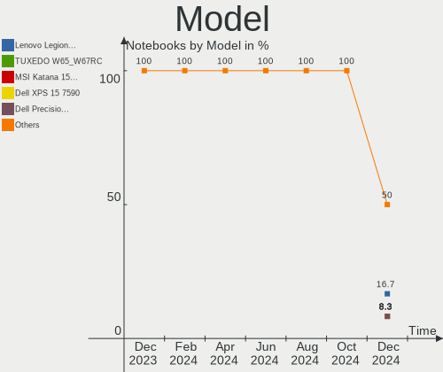
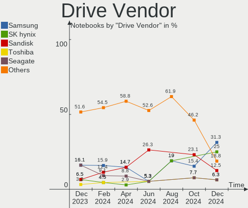
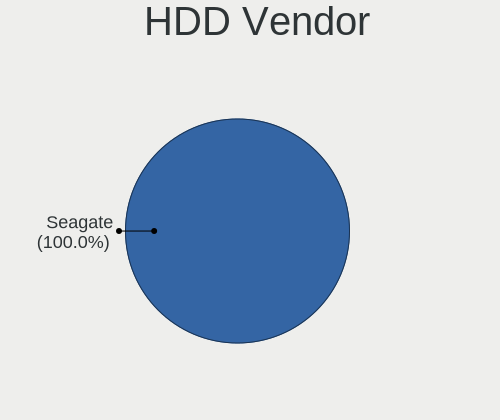
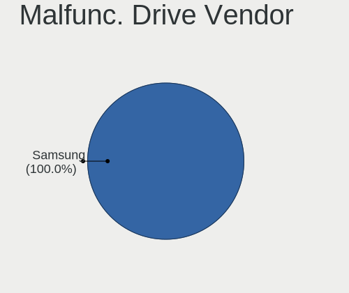
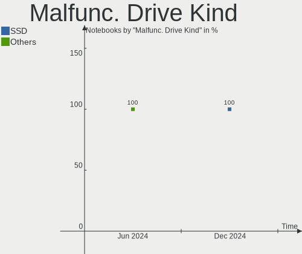
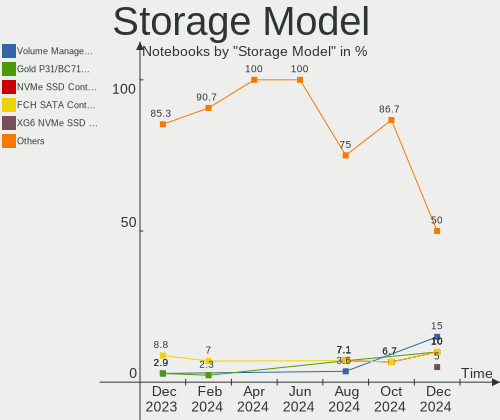
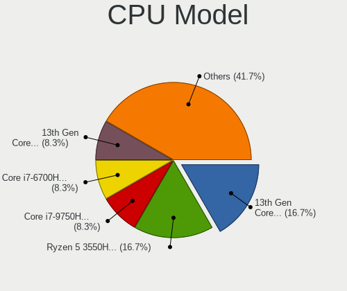
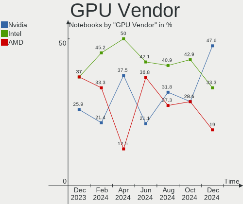
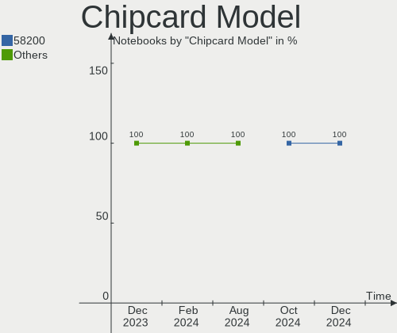

Nobara - Hardware Trends (Notebooks)
------------------------------------

A project to identify most popular hardware characteristics and track their change
over time based on data collected by Linux users at https://Linux-Hardware.org.

Anyone can contribute to this report by the [hw-probe](https://github.com/linuxhw/hw-probe) tool:

    sudo -E hw-probe -all -upload

This report is for one last month. Overall report since the beginning of time: [TestDays](https://github.com/linuxhw/TestDays)

Period: Mar, 2023.

Contents
--------

* [ System ](#system)
  - [ OS                       ](#os)
  - [ OS Family                ](#os-family)
  - [ Kernel                   ](#kernel)
  - [ Kernel Family            ](#kernel-family)
  - [ Kernel Major Ver.        ](#kernel-major-ver)
  - [ Arch                     ](#arch)
  - [ DE                       ](#de)
  - [ Display Server           ](#display-server)
  - [ Display Manager          ](#display-manager)
  - [ OS Lang                  ](#os-lang)
  - [ Boot Mode                ](#boot-mode)
  - [ Filesystem               ](#filesystem)
  - [ Part. scheme             ](#part-scheme)
  - [ Dual Boot with Linux/BSD ](#dual-boot-with-linuxbsd)
  - [ Dual Boot (Win)          ](#dual-boot-win)

* [ Board ](#board)
  - [ Vendor                   ](#vendor)
  - [ Model                    ](#model)
  - [ Model Family             ](#model-family)
  - [ MFG Year                 ](#mfg-year)
  - [ Form Factor              ](#form-factor)
  - [ Secure Boot              ](#secure-boot)
  - [ Coreboot                 ](#coreboot)
  - [ RAM Size                 ](#ram-size)
  - [ RAM Used                 ](#ram-used)
  - [ Total Drives             ](#total-drives)
  - [ Has CD-ROM               ](#has-cd-rom)
  - [ Has Ethernet             ](#has-ethernet)
  - [ Has WiFi                 ](#has-wifi)
  - [ Has Bluetooth            ](#has-bluetooth)

* [ Location ](#location)
  - [ Country                  ](#country)
  - [ City                     ](#city)

* [ Drives ](#drives)
  - [ Drive Vendor             ](#drive-vendor)
  - [ Drive Model              ](#drive-model)
  - [ HDD Vendor               ](#hdd-vendor)
  - [ SSD Vendor               ](#ssd-vendor)
  - [ Drive Kind               ](#drive-kind)
  - [ Drive Connector          ](#drive-connector)
  - [ Drive Size               ](#drive-size)
  - [ Space Total              ](#space-total)
  - [ Space Used               ](#space-used)
  - [ Malfunc. Drives          ](#malfunc-drives)
  - [ Malfunc. Drive Vendor    ](#malfunc-drive-vendor)
  - [ Malfunc. HDD Vendor      ](#malfunc-hdd-vendor)
  - [ Malfunc. Drive Kind      ](#malfunc-drive-kind)
  - [ Failed Drives            ](#failed-drives)
  - [ Failed Drive Vendor      ](#failed-drive-vendor)
  - [ Drive Status             ](#drive-status)

* [ Storage controller ](#storage-controller)
  - [ Storage Vendor           ](#storage-vendor)
  - [ Storage Model            ](#storage-model)
  - [ Storage Kind             ](#storage-kind)

* [ Processor ](#processor)
  - [ CPU Vendor               ](#cpu-vendor)
  - [ CPU Model                ](#cpu-model)
  - [ CPU Model Family         ](#cpu-model-family)
  - [ CPU Cores                ](#cpu-cores)
  - [ CPU Sockets              ](#cpu-sockets)
  - [ CPU Threads              ](#cpu-threads)
  - [ CPU Op-Modes             ](#cpu-op-modes)
  - [ CPU Microcode            ](#cpu-microcode)
  - [ CPU Microarch            ](#cpu-microarch)

* [ Graphics ](#graphics)
  - [ GPU Vendor               ](#gpu-vendor)
  - [ GPU Model                ](#gpu-model)
  - [ GPU Combo                ](#gpu-combo)
  - [ GPU Driver               ](#gpu-driver)
  - [ GPU Memory               ](#gpu-memory)

* [ Monitor ](#monitor)
  - [ Monitor Vendor           ](#monitor-vendor)
  - [ Monitor Model            ](#monitor-model)
  - [ Monitor Resolution       ](#monitor-resolution)
  - [ Monitor Diagonal         ](#monitor-diagonal)
  - [ Monitor Width            ](#monitor-width)
  - [ Aspect Ratio             ](#aspect-ratio)
  - [ Monitor Area             ](#monitor-area)
  - [ Pixel Density            ](#pixel-density)
  - [ Multiple Monitors        ](#multiple-monitors)

* [ Network ](#network)
  - [ Net Controller Vendor    ](#net-controller-vendor)
  - [ Net Controller Model     ](#net-controller-model)
  - [ Wireless Vendor          ](#wireless-vendor)
  - [ Wireless Model           ](#wireless-model)
  - [ Ethernet Vendor          ](#ethernet-vendor)
  - [ Ethernet Model           ](#ethernet-model)
  - [ Net Controller Kind      ](#net-controller-kind)
  - [ Used Controller          ](#used-controller)
  - [ NICs                     ](#nics)
  - [ IPv6                     ](#ipv6)

* [ Bluetooth ](#bluetooth)
  - [ Bluetooth Vendor         ](#bluetooth-vendor)
  - [ Bluetooth Model          ](#bluetooth-model)

* [ Sound ](#sound)
  - [ Sound Vendor             ](#sound-vendor)
  - [ Sound Model              ](#sound-model)

* [ Memory ](#memory)
  - [ Memory Vendor            ](#memory-vendor)
  - [ Memory Model             ](#memory-model)
  - [ Memory Kind              ](#memory-kind)
  - [ Memory Form Factor       ](#memory-form-factor)
  - [ Memory Size              ](#memory-size)
  - [ Memory Speed             ](#memory-speed)

* [ Printers & scanners ](#printers--scanners)
  - [ Printer Vendor           ](#printer-vendor)
  - [ Printer Model            ](#printer-model)
  - [ Scanner Vendor           ](#scanner-vendor)
  - [ Scanner Model            ](#scanner-model)

* [ Camera ](#camera)
  - [ Camera Vendor            ](#camera-vendor)
  - [ Camera Model             ](#camera-model)

* [ Security ](#security)
  - [ Fingerprint Vendor       ](#fingerprint-vendor)
  - [ Fingerprint Model        ](#fingerprint-model)
  - [ Chipcard Vendor          ](#chipcard-vendor)
  - [ Chipcard Model           ](#chipcard-model)

* [ Unsupported ](#unsupported)
  - [ Unsupported Devices      ](#unsupported-devices)
  - [ Unsupported Device Types ](#unsupported-device-types)

System
------

OS
--

Installed operating systems

| Name      | Notebooks | Percent |
|-----------|-----------|---------|
| Nobara 37 | 23        | 85.19%  |
| Nobara 36 | 4         | 14.81%  |

OS Family
---------

OS without a version

| Name   | Notebooks | Percent |
|--------|-----------|---------|
| Nobara | 27        | 100%    |

Kernel
------

Version of the Linux kernel

| Version                      | Notebooks | Percent |
|------------------------------|-----------|---------|
| 6.1.14-201.fsync.fc37.x86_64 | 9         | 33.33%  |
| 6.1.11-201.fsync.fc37.x86_64 | 7         | 25.93%  |
| 6.2.6-201.fsync.fc37.x86_64  | 4         | 14.81%  |
| 6.0.14-201.fsync.fc36.x86_64 | 4         | 14.81%  |
| 6.0.16-301.fsync.fc37.x86_64 | 2         | 7.41%   |
| 6.1.4-203.fsync.fc37.x86_64  | 1         | 3.7%    |

Kernel Family
-------------

Linux kernel without a distro release

| Version | Notebooks | Percent |
|---------|-----------|---------|
| 6.1.14  | 9         | 33.33%  |
| 6.1.11  | 7         | 25.93%  |
| 6.2.6   | 4         | 14.81%  |
| 6.0.14  | 4         | 14.81%  |
| 6.0.16  | 2         | 7.41%   |
| 6.1.4   | 1         | 3.7%    |

Kernel Major Ver.
-----------------

Linux kernel major version

| Version | Notebooks | Percent |
|---------|-----------|---------|
| 6.1     | 17        | 62.96%  |
| 6.0     | 6         | 22.22%  |
| 6.2     | 4         | 14.81%  |

Arch
----

OS architecture (x86_64, i586, etc.)

| Name   | Notebooks | Percent |
|--------|-----------|---------|
| x86_64 | 27        | 100%    |

DE
--

Desktop Environment

| Name  | Notebooks | Percent |
|-------|-----------|---------|
| GNOME | 19        | 70.37%  |
| KDE5  | 8         | 29.63%  |

Display Server
--------------

X11 or Wayland

| Name    | Notebooks | Percent |
|---------|-----------|---------|
| Wayland | 25        | 92.59%  |
| X11     | 2         | 7.41%   |

Display Manager
---------------

SDDM, LightDM, etc.

| Name    | Notebooks | Percent |
|---------|-----------|---------|
| Unknown | 20        | 74.07%  |
| SDDM    | 3         | 11.11%  |
| GDM     | 3         | 11.11%  |
| LightDM | 1         | 3.7%    |

OS Lang
-------

Language

| Lang  | Notebooks | Percent |
|-------|-----------|---------|
| en_US | 9         | 33.33%  |
| ru_RU | 4         | 14.81%  |
| es_ES | 3         | 11.11%  |
| en_GB | 3         | 11.11%  |
| pt_BR | 2         | 7.41%   |
| zh_TW | 1         | 3.7%    |
| tr_TR | 1         | 3.7%    |
| it_IT | 1         | 3.7%    |
| es_US | 1         | 3.7%    |
| en_PH | 1         | 3.7%    |
| de_DE | 1         | 3.7%    |

Boot Mode
---------

EFI or BIOS

| Mode | Notebooks | Percent |
|------|-----------|---------|
| EFI  | 22        | 81.48%  |
| BIOS | 5         | 18.52%  |

Filesystem
----------

Type of filesystem

| Type  | Notebooks | Percent |
|-------|-----------|---------|
| Btrfs | 23        | 85.19%  |
| Ext4  | 4         | 14.81%  |

Part. scheme
------------

Scheme of partitioning

| Type    | Notebooks | Percent |
|---------|-----------|---------|
| Unknown | 20        | 74.07%  |
| GPT     | 7         | 25.93%  |

Dual Boot with Linux/BSD
------------------------

Hosting more than one Linux/BSD

| Dual boot | Notebooks | Percent |
|-----------|-----------|---------|
| No        | 24        | 88.89%  |
| Yes       | 3         | 11.11%  |

Dual Boot (Win)
---------------

Hosting Linux and Windows

| Dual boot | Notebooks | Percent |
|-----------|-----------|---------|
| No        | 23        | 85.19%  |
| Yes       | 4         | 14.81%  |

Board
-----

Vendor
------

Motherboard manufacturer

| Name                | Notebooks | Percent |
|---------------------|-----------|---------|
| ASUSTek Computer    | 6         | 22.22%  |
| Lenovo              | 5         | 18.52%  |
| Dell                | 4         | 14.81%  |
| Acer                | 4         | 14.81%  |
| MSI                 | 3         | 11.11%  |
| Schenker            | 1         | 3.7%    |
| ONE-NETBOOK         | 1         | 3.7%    |
| Intel               | 1         | 3.7%    |
| Hewlett-Packard     | 1         | 3.7%    |
| Gigabyte Technology | 1         | 3.7%    |

Model
-----

Motherboard model

| Name                                        | Notebooks | Percent |
|---------------------------------------------|-----------|---------|
| Dell Vostro 3400                            | 2         | 7.41%   |
| Schenker XMG NEO (M19, RTX 2070)            | 1         | 3.7%    |
| ONE-NETBOOK ONEXPLAYER 2 ARP23              | 1         | 3.7%    |
| MSI Summit E14Evo A12M                      | 1         | 3.7%    |
| MSI P65 Creator 8RD                         | 1         | 3.7%    |
| MSI GP65 Leopard 9SF                        | 1         | 3.7%    |
| Lenovo ThinkPad X1 Extreme Gen 5 21DECTO1WW | 1         | 3.7%    |
| Lenovo IP 5-14ALC05 82LM                    | 1         | 3.7%    |
| Lenovo IdeaPad C340-14API 81N6              | 1         | 3.7%    |
| Lenovo IdeaPad 5 Pro 14ACN6 82L7            | 1         | 3.7%    |
| Intel powered classmate PC                  | 1         | 3.7%    |
| HP ZBook 17 G2                              | 1         | 3.7%    |
| Gigabyte AERO 15 XD                         | 1         | 3.7%    |
| Dell Latitude 7390                          | 1         | 3.7%    |
| Dell Inspiron 3542                          | 1         | 3.7%    |
| ASUS X580VD                                 | 1         | 3.7%    |
| ASUS VivoBook_ASUSLaptop X509DA_D509DA      | 1         | 3.7%    |
| ASUS VivoBook_ASUSLaptop N7601ZM_N7601ZM    | 1         | 3.7%    |
| ASUS VivoBook_ASUS Laptop X509UA            | 1         | 3.7%    |
| ASUS ROG Strix G513QY_G513QY                | 1         | 3.7%    |
| ASUS GL752VW                                | 1         | 3.7%    |
| Acer Nitro AN515-52                         | 1         | 3.7%    |
| Acer Extensa 2510G                          | 1         | 3.7%    |
| Acer Aspire VX5-591G                        | 1         | 3.7%    |
| Acer Aspire A515-51                         | 1         | 3.7%    |
| Unknown                                     | 1         | 3.7%    |

Model Family
------------

Motherboard model prefix

| Name                   | Notebooks | Percent |
|------------------------|-----------|---------|
| ASUS VivoBook          | 3         | 11.11%  |
| Lenovo IdeaPad         | 2         | 7.41%   |
| Dell Vostro            | 2         | 7.41%   |
| Acer Aspire            | 2         | 7.41%   |
| Schenker XMG           | 1         | 3.7%    |
| ONE-NETBOOK ONEXPLAYER | 1         | 3.7%    |
| MSI Summit             | 1         | 3.7%    |
| MSI P65                | 1         | 3.7%    |
| MSI GP65               | 1         | 3.7%    |
| Lenovo ThinkPad        | 1         | 3.7%    |
| Lenovo IP              | 1         | 3.7%    |
| Intel powered          | 1         | 3.7%    |
| HP ZBook               | 1         | 3.7%    |
| Gigabyte AERO          | 1         | 3.7%    |
| Dell Latitude          | 1         | 3.7%    |
| Dell Inspiron          | 1         | 3.7%    |
| ASUS X580VD            | 1         | 3.7%    |
| ASUS ROG               | 1         | 3.7%    |
| ASUS GL752VW           | 1         | 3.7%    |
| Acer Nitro             | 1         | 3.7%    |
| Acer Extensa           | 1         | 3.7%    |
| Unknown                | 1         | 3.7%    |

MFG Year
--------

Motherboard manufacture year

| Year | Notebooks | Percent |
|------|-----------|---------|
| 2019 | 5         | 18.52%  |
| 2022 | 4         | 14.81%  |
| 2018 | 4         | 14.81%  |
| 2021 | 3         | 11.11%  |
| 2017 | 3         | 11.11%  |
| 2014 | 3         | 11.11%  |
| 2010 | 2         | 7.41%   |
| 2023 | 1         | 3.7%    |
| 2015 | 1         | 3.7%    |
| 2013 | 1         | 3.7%    |

Form Factor
-----------

Physical design of the computer

| Name     | Notebooks | Percent |
|----------|-----------|---------|
| Notebook | 27        | 100%    |

Secure Boot
-----------

Enabled or disabled

| State    | Notebooks | Percent |
|----------|-----------|---------|
| Disabled | 27        | 100%    |

Coreboot
--------

Have coreboot on board

| Used | Notebooks | Percent |
|------|-----------|---------|
| No   | 27        | 100%    |

RAM Size
--------

Total RAM memory

| Size in GB | Notebooks | Percent |
|------------|-----------|---------|
| 16.01-24.0 | 8         | 29.63%  |
| 32.01-64.0 | 5         | 18.52%  |
| 8.01-16.0  | 5         | 18.52%  |
| 4.01-8.0   | 4         | 14.81%  |
| 3.01-4.0   | 3         | 11.11%  |
| 24.01-32.0 | 1         | 3.7%    |
| 1.01-2.0   | 1         | 3.7%    |

RAM Used
--------

Used RAM memory

| Used GB   | Notebooks | Percent |
|-----------|-----------|---------|
| 4.01-8.0  | 14        | 51.85%  |
| 3.01-4.0  | 7         | 25.93%  |
| 1.01-2.0  | 3         | 11.11%  |
| 2.01-3.0  | 2         | 7.41%   |
| 8.01-16.0 | 1         | 3.7%    |

Total Drives
------------

Number of drives on board

| Drives | Notebooks | Percent |
|--------|-----------|---------|
| 1      | 18        | 66.67%  |
| 2      | 8         | 29.63%  |
| 3      | 1         | 3.7%    |

Has CD-ROM
----------

Has CD-ROM on board

| Presented | Notebooks | Percent |
|-----------|-----------|---------|
| No        | 24        | 88.89%  |
| Yes       | 3         | 11.11%  |

Has Ethernet
------------

Has Ethernet on board

| Presented | Notebooks | Percent |
|-----------|-----------|---------|
| Yes       | 19        | 70.37%  |
| No        | 8         | 29.63%  |

Has WiFi
--------

Has WiFi module

| Presented | Notebooks | Percent |
|-----------|-----------|---------|
| Yes       | 26        | 96.3%   |
| No        | 1         | 3.7%    |

Has Bluetooth
-------------

Has Bluetooth module

| Presented | Notebooks | Percent |
|-----------|-----------|---------|
| Yes       | 27        | 100%    |

Location
--------

Country
-------

Geographic location (country)

| Country     | Notebooks | Percent |
|-------------|-----------|---------|
| USA         | 5         | 18.52%  |
| Spain       | 4         | 14.81%  |
| Russia      | 4         | 14.81%  |
| Philippines | 2         | 7.41%   |
| Germany     | 2         | 7.41%   |
| Brazil      | 2         | 7.41%   |
| Venezuela   | 1         | 3.7%    |
| UK          | 1         | 3.7%    |
| Turkey      | 1         | 3.7%    |
| Sweden      | 1         | 3.7%    |
| Slovenia    | 1         | 3.7%    |
| Portugal    | 1         | 3.7%    |
| Italy       | 1         | 3.7%    |
| Hong Kong   | 1         | 3.7%    |

City
----

Geographic location (city)

| City             | Notebooks | Percent |
|------------------|-----------|---------|
| Perm             | 2         | 7.41%   |
| Zaragoza         | 1         | 3.7%    |
| Villacarrillo    | 1         | 3.7%    |
| Staten Island    | 1         | 3.7%    |
| San Fior         | 1         | 3.7%    |
| Samara           | 1         | 3.7%    |
| Salem            | 1         | 3.7%    |
| Saarbrücken     | 1         | 3.7%    |
| Nacka            | 1         | 3.7%    |
| Moscow           | 1         | 3.7%    |
| Mönchengladbach | 1         | 3.7%    |
| Medvode          | 1         | 3.7%    |
| Málaga          | 1         | 3.7%    |
| London           | 1         | 3.7%    |
| La Plata         | 1         | 3.7%    |
| Istanbul         | 1         | 3.7%    |
| Funchal          | 1         | 3.7%    |
| Davao City       | 1         | 3.7%    |
| Central          | 1         | 3.7%    |
| Caracas          | 1         | 3.7%    |
| Caloocan City    | 1         | 3.7%    |
| Bento Gonçalves | 1         | 3.7%    |
| Belo Horizonte   | 1         | 3.7%    |
| Baltimore        | 1         | 3.7%    |
| Auburn           | 1         | 3.7%    |
| Alcantarilla     | 1         | 3.7%    |

Drives
------

Drive Vendor
------------

Hard drive vendors

| Vendor                      | Notebooks | Drives | Percent |
|-----------------------------|-----------|--------|---------|
| Samsung Electronics         | 9         | 10     | 25.71%  |
| WDC                         | 3         | 3      | 8.57%   |
| Toshiba                     | 3         | 3      | 8.57%   |
| SK hynix                    | 3         | 3      | 8.57%   |
| Unknown                     | 2         | 2      | 5.71%   |
| Seagate                     | 2         | 2      | 5.71%   |
| Sandisk                     | 2         | 2      | 5.71%   |
| KIOXIA                      | 2         | 2      | 5.71%   |
| Kingston Technology Company | 2         | 2      | 5.71%   |
| Team                        | 1         | 1      | 2.86%   |
| Phison Electronics          | 1         | 1      | 2.86%   |
| Micron/Crucial Technology   | 1         | 1      | 2.86%   |
| Micron Technology           | 1         | 1      | 2.86%   |
| Intel                       | 1         | 1      | 2.86%   |
| HGST                        | 1         | 1      | 2.86%   |
| Crucial                     | 1         | 1      | 2.86%   |

Drive Model
-----------

Hard drive models

| Model                                           | Notebooks | Percent |
|-------------------------------------------------|-----------|---------|
| SK hynix HFS128G39TND-N210A 128GB SSD           | 2         | 5.56%   |
| KIOXIA KBG40ZNS512G NVMe 512GB                  | 2         | 5.56%   |
| WDC WDS100T1R0B-68A4Z0 1TB SSD                  | 1         | 2.78%   |
| WDC WD10SPZX-21Z10T0 1TB                        | 1         | 2.78%   |
| WDC WD10JPVX-60JC3T1 1TB                        | 1         | 2.78%   |
| Unknown SD16G  16GB                             | 1         | 2.78%   |
| Unknown MMC Card  128GB                         | 1         | 2.78%   |
| Toshiba MQ04ABF100 1TB                          | 1         | 2.78%   |
| Toshiba MQ01ABF050 500GB                        | 1         | 2.78%   |
| Toshiba MQ01ABD050 500GB                        | 1         | 2.78%   |
| Team TM8PS7001T 1TB SSD                         | 1         | 2.78%   |
| SK hynix SC311 SATA 256GB SSD                   | 1         | 2.78%   |
| Seagate ST500LT012-1DG142 500GB                 | 1         | 2.78%   |
| Seagate ST320LT012-1DG14C 320GB                 | 1         | 2.78%   |
| Sandisk WD Green SN350 2TB                      | 1         | 2.78%   |
| Sandisk WD Blue SN500 / PC SN520 NVMe SSD 512GB | 1         | 2.78%   |
| Samsung SSD 980 PRO 1TB                         | 1         | 2.78%   |
| Samsung SSD 970 EVO Plus 500GB                  | 1         | 2.78%   |
| Samsung SSD 970 EVO Plus 250GB                  | 1         | 2.78%   |
| Samsung SSD 870 EVO 2TB                         | 1         | 2.78%   |
| Samsung SSD 850 EVO 500GB                       | 1         | 2.78%   |
| Samsung NVMe SSD Controller SM951/PM951 128GB   | 1         | 2.78%   |
| Samsung MZVLQ1T0HBLB-00B00 1024GB               | 1         | 2.78%   |
| Samsung MZVLB512HAJQ-000L2 512GB                | 1         | 2.78%   |
| Samsung MZVL21T0HCLR-00B00 1TB                  | 1         | 2.78%   |
| Samsung MZALQ512HBLU-00BL2 512GB                | 1         | 2.78%   |
| Phison E16 PCIe4 NVMe Controller 1TB            | 1         | 2.78%   |
| Micron/Crucial P2 NVMe PCIe SSD 1TB             | 1         | 2.78%   |
| Micron MTFDHBA512QFD 512GB                      | 1         | 2.78%   |
| Kingston Company U-SNS8154P3 NVMe SSD 256GB     | 1         | 2.78%   |
| Kingston Company SNV2S1000G 1TB                 | 1         | 2.78%   |
| Intel SSDPEKNW512G8 512GB                       | 1         | 2.78%   |
| HGST HTS721010A9E630 1TB                        | 1         | 2.78%   |
| Crucial CT2000MX500SSD1 2TB                     | 1         | 2.78%   |

HDD Vendor
----------

Hard disk drive vendors

| Vendor  | Notebooks | Drives | Percent |
|---------|-----------|--------|---------|
| Toshiba | 3         | 3      | 37.5%   |
| WDC     | 2         | 2      | 25%     |
| Seagate | 2         | 2      | 25%     |
| HGST    | 1         | 1      | 12.5%   |

SSD Vendor
----------

Solid state drive vendors

| Vendor              | Notebooks | Drives | Percent |
|---------------------|-----------|--------|---------|
| SK hynix            | 3         | 3      | 37.5%   |
| Samsung Electronics | 2         | 2      | 25%     |
| WDC                 | 1         | 1      | 12.5%   |
| Team                | 1         | 1      | 12.5%   |
| Crucial             | 1         | 1      | 12.5%   |

Drive Kind
----------

HDD or SSD

| Kind | Notebooks | Drives | Percent |
|------|-----------|--------|---------|
| NVMe | 17        | 18     | 50%     |
| HDD  | 8         | 8      | 23.53%  |
| SSD  | 7         | 8      | 20.59%  |
| MMC  | 2         | 2      | 5.88%   |

Drive Connector
---------------

SATA, SAS, NVMe, etc.

| Type | Notebooks | Drives | Percent |
|------|-----------|--------|---------|
| NVMe | 17        | 18     | 54.84%  |
| SATA | 12        | 16     | 38.71%  |
| MMC  | 2         | 2      | 6.45%   |

Drive Size
----------

Size of hard drive

| Size in TB | Notebooks | Drives | Percent |
|------------|-----------|--------|---------|
| 0.01-0.5   | 8         | 8      | 53.33%  |
| 0.51-1.0   | 6         | 6      | 40%     |
| 1.01-2.0   | 1         | 2      | 6.67%   |

Space Total
-----------

Amount of disk space available on the file system

| Size in GB     | Notebooks | Percent |
|----------------|-----------|---------|
| 501-1000       | 12        | 44.44%  |
| 1001-2000      | 6         | 22.22%  |
| 251-500        | 4         | 14.81%  |
| Unknown        | 2         | 7.41%   |
| More than 3000 | 1         | 3.7%    |
| 21-50          | 1         | 3.7%    |
| 2001-3000      | 1         | 3.7%    |

Space Used
----------

Amount of used disk space

| Used GB  | Notebooks | Percent |
|----------|-----------|---------|
| 251-500  | 7         | 25.93%  |
| 21-50    | 5         | 18.52%  |
| 101-250  | 5         | 18.52%  |
| 1-20     | 3         | 11.11%  |
| 51-100   | 3         | 11.11%  |
| 501-1000 | 2         | 7.41%   |
| Unknown  | 2         | 7.41%   |

Malfunc. Drives
---------------

Drive models with a malfunction

| Model                                 | Notebooks | Drives | Percent |
|---------------------------------------|-----------|--------|---------|
| SK hynix HFS128G39TND-N210A 128GB SSD | 1         | 1      | 50%     |
| HGST HTS721010A9E630 1TB              | 1         | 1      | 50%     |

Malfunc. Drive Vendor
---------------------

Vendors of faulty drives

| Vendor   | Notebooks | Drives | Percent |
|----------|-----------|--------|---------|
| SK hynix | 1         | 1      | 50%     |
| HGST     | 1         | 1      | 50%     |

Malfunc. HDD Vendor
-------------------

Vendors of faulty HDD drives

| Vendor | Notebooks | Drives | Percent |
|--------|-----------|--------|---------|
| HGST   | 1         | 1      | 100%    |

Malfunc. Drive Kind
-------------------

Kinds of faulty drives

| Kind | Notebooks | Drives | Percent |
|------|-----------|--------|---------|
| SSD  | 1         | 1      | 50%     |
| HDD  | 1         | 1      | 50%     |

Failed Drives
-------------

Failed drive models

Zero info for selected period =(

Failed Drive Vendor
-------------------

Failed drive vendors

Zero info for selected period =(

Drive Status
------------

Number of failed and malfunc. drives

| Status   | Notebooks | Drives | Percent |
|----------|-----------|--------|---------|
| Detected | 21        | 26     | 75%     |
| Works    | 6         | 8      | 21.43%  |
| Malfunc  | 1         | 2      | 3.57%   |

Storage controller
------------------

Storage Vendor
--------------

Storage controller vendors

| Vendor                      | Notebooks | Percent |
|-----------------------------|-----------|---------|
| Intel                       | 18        | 50%     |
| Samsung Electronics         | 7         | 19.44%  |
| SanDisk                     | 2         | 5.56%   |
| KIOXIA                      | 2         | 5.56%   |
| Kingston Technology Company | 2         | 5.56%   |
| AMD                         | 2         | 5.56%   |
| Phison Electronics          | 1         | 2.78%   |
| Micron/Crucial Technology   | 1         | 2.78%   |
| Micron Technology           | 1         | 2.78%   |

Storage Model
-------------

Storage controller models

| Model                                                                          | Notebooks | Percent |
|--------------------------------------------------------------------------------|-----------|---------|
| Intel HM170/QM170 Chipset SATA Controller [AHCI Mode]                          | 4         | 11.11%  |
| Intel 82801 Mobile SATA Controller [RAID mode]                                 | 3         | 8.33%   |
| Samsung NVMe SSD Controller SM981/PM981/PM983                                  | 2         | 5.56%   |
| Samsung NVMe SSD Controller PM9A1/PM9A3/980PRO                                 | 2         | 5.56%   |
| Samsung NVMe SSD Controller 980                                                | 2         | 5.56%   |
| KIOXIA NVMe SSD Controller BG4                                                 | 2         | 5.56%   |
| Intel Tiger Lake-LP SATA Controller                                            | 2         | 5.56%   |
| Intel Cannon Lake Mobile PCH SATA AHCI Controller                              | 2         | 5.56%   |
| Intel 8 Series SATA Controller 1 [AHCI mode]                                   | 2         | 5.56%   |
| AMD FCH SATA Controller [AHCI mode]                                            | 2         | 5.56%   |
| SanDisk WD Blue SN500 / PC SN520 NVMe SSD                                      | 1         | 2.78%   |
| SanDisk Non-Volatile memory controller                                         | 1         | 2.78%   |
| Samsung NVMe SSD Controller SM951/PM951                                        | 1         | 2.78%   |
| Phison E16 PCIe4 NVMe Controller                                               | 1         | 2.78%   |
| Micron/Crucial P2 NVMe PCIe SSD                                                | 1         | 2.78%   |
| Micron NVMe Storage Controller                                                 | 1         | 2.78%   |
| Kingston Company U-SNS8154P3 NVMe SSD                                          | 1         | 2.78%   |
| Kingston Company Company Non-Volatile memory controller                        | 1         | 2.78%   |
| Intel Volume Management Device NVMe RAID Controller                            | 1         | 2.78%   |
| Intel Sunrise Point-LP SATA Controller [AHCI mode]                             | 1         | 2.78%   |
| Intel SSD 660P Series                                                          | 1         | 2.78%   |
| Intel 8 Series/C220 Series Chipset Family 6-port SATA Controller 1 [AHCI mode] | 1         | 2.78%   |
| Intel 7 Series Chipset Family 6-port SATA Controller [AHCI mode]               | 1         | 2.78%   |

Storage Kind
------------

Kind of storage controller (IDE, SATA, NVMe, SAS, ...)

| Kind | Notebooks | Percent |
|------|-----------|---------|
| NVMe | 17        | 47.22%  |
| SATA | 15        | 41.67%  |
| RAID | 4         | 11.11%  |

Processor
---------

CPU Vendor
----------

Processor vendors

| Vendor | Notebooks | Percent |
|--------|-----------|---------|
| Intel  | 21        | 77.78%  |
| AMD    | 6         | 22.22%  |

CPU Model
---------

Processor models

| Model                                         | Notebooks | Percent |
|-----------------------------------------------|-----------|---------|
| Intel Core i7-9750H CPU @ 2.60GHz             | 2         | 7.41%   |
| Intel Core i7-6700HQ CPU @ 2.60GHz            | 2         | 7.41%   |
| Intel Core i3-4005U CPU @ 1.70GHz             | 2         | 7.41%   |
| Intel 11th Gen Core i5-1135G7 @ 2.40GHz       | 2         | 7.41%   |
| Intel Core i7-8750H CPU @ 2.20GHz             | 1         | 3.7%    |
| Intel Core i7-7700HQ CPU @ 2.80GHz            | 1         | 3.7%    |
| Intel Core i7-4810MQ CPU @ 2.80GHz            | 1         | 3.7%    |
| Intel Core i5-8350U CPU @ 1.70GHz             | 1         | 3.7%    |
| Intel Core i5-8300H CPU @ 2.30GHz             | 1         | 3.7%    |
| Intel Core i5-7300HQ CPU @ 2.50GHz            | 1         | 3.7%    |
| Intel Core i5-7200U CPU @ 2.50GHz             | 1         | 3.7%    |
| Intel Core i3-7020U CPU @ 2.30GHz             | 1         | 3.7%    |
| Intel Celeron CPU 847 @ 1.10GHz               | 1         | 3.7%    |
| Intel 12th Gen Core i7-12700H                 | 1         | 3.7%    |
| Intel 12th Gen Core i7-12650H                 | 1         | 3.7%    |
| Intel 12th Gen Core i5-1240P                  | 1         | 3.7%    |
| Intel 11th Gen Core i7-11800H @ 2.30GHz       | 1         | 3.7%    |
| AMD Ryzen 9 5900HX with Radeon Graphics       | 1         | 3.7%    |
| AMD Ryzen 7 6800U with Radeon Graphics        | 1         | 3.7%    |
| AMD Ryzen 7 3700U with Radeon Vega Mobile Gfx | 1         | 3.7%    |
| AMD Ryzen 5 5600U with Radeon Graphics        | 1         | 3.7%    |
| AMD Ryzen 5 5500U with Radeon Graphics        | 1         | 3.7%    |
| AMD Ryzen 5 3500U with Radeon Vega Mobile Gfx | 1         | 3.7%    |

CPU Model Family
----------------

Processor model prefix

| Model         | Notebooks | Percent |
|---------------|-----------|---------|
| Intel Core i7 | 7         | 25.93%  |
| Other         | 6         | 22.22%  |
| Intel Core i5 | 4         | 14.81%  |
| Intel Core i3 | 3         | 11.11%  |
| AMD Ryzen 5   | 3         | 11.11%  |
| AMD Ryzen 7   | 2         | 7.41%   |
| Intel Celeron | 1         | 3.7%    |
| AMD Ryzen 9   | 1         | 3.7%    |

CPU Cores
---------

Number of processor cores

| Number | Notebooks | Percent |
|--------|-----------|---------|
| 4      | 11        | 40.74%  |
| 6      | 5         | 18.52%  |
| 2      | 5         | 18.52%  |
| 8      | 3         | 11.11%  |
| 14     | 1         | 3.7%    |
| 12     | 1         | 3.7%    |
| 10     | 1         | 3.7%    |

CPU Sockets
-----------

Number of sockets

| Number | Notebooks | Percent |
|--------|-----------|---------|
| 1      | 27        | 100%    |

CPU Threads
-----------

Threads per core (Hyper-Threading)

| Number | Notebooks | Percent |
|--------|-----------|---------|
| 2      | 25        | 92.59%  |
| 1      | 2         | 7.41%   |

CPU Op-Modes
------------

CPU Operation Modes (32-bit, 64-bit)

| Op mode        | Notebooks | Percent |
|----------------|-----------|---------|
| 32-bit, 64-bit | 27        | 100%    |

CPU Microcode
-------------

Microcode number

| Number     | Notebooks | Percent |
|------------|-----------|---------|
| Unknown    | 4         | 14.81%  |
| 0x906ea    | 3         | 11.11%  |
| 0x906a3    | 3         | 11.11%  |
| 0x806e9    | 2         | 7.41%   |
| 0x806c1    | 2         | 7.41%   |
| 0x0a50000c | 2         | 7.41%   |
| 0x08108109 | 2         | 7.41%   |
| 0x906e9    | 1         | 3.7%    |
| 0x806ea    | 1         | 3.7%    |
| 0x806d1    | 1         | 3.7%    |
| 0x506e3    | 1         | 3.7%    |
| 0x40651    | 1         | 3.7%    |
| 0x306c3    | 1         | 3.7%    |
| 0x206a7    | 1         | 3.7%    |
| 0x0a404102 | 1         | 3.7%    |
| 0x08608103 | 1         | 3.7%    |

CPU Microarch
-------------

Microarchitecture

| Name             | Notebooks | Percent |
|------------------|-----------|---------|
| KabyLake         | 9         | 33.33%  |
| Haswell          | 3         | 11.11%  |
| Alderlake Hybrid | 3         | 11.11%  |
| Zen+             | 2         | 7.41%   |
| Zen 3            | 2         | 7.41%   |
| TigerLake        | 2         | 7.41%   |
| Skylake          | 2         | 7.41%   |
| Unknown          | 2         | 7.41%   |
| SandyBridge      | 1         | 3.7%    |
| Icelake          | 1         | 3.7%    |

Graphics
--------

GPU Vendor
----------

Vendors of graphics cards

| Vendor | Notebooks | Percent |
|--------|-----------|---------|
| Intel  | 21        | 52.5%   |
| Nvidia | 13        | 32.5%   |
| AMD    | 6         | 15%     |

GPU Model
---------

Graphics card models

| Model                                                                     | Notebooks | Percent |
|---------------------------------------------------------------------------|-----------|---------|
| Intel CoffeeLake-H GT2 [UHD Graphics 630]                                 | 4         | 9.76%   |
| Nvidia TU106M [GeForce RTX 2070 Mobile]                                   | 2         | 4.88%   |
| Nvidia GP107M [GeForce GTX 1050 Mobile]                                   | 2         | 4.88%   |
| Intel TigerLake-LP GT2 [Iris Xe Graphics]                                 | 2         | 4.88%   |
| Intel HD Graphics 630                                                     | 2         | 4.88%   |
| Intel HD Graphics 620                                                     | 2         | 4.88%   |
| Intel HD Graphics 530                                                     | 2         | 4.88%   |
| Intel Haswell-ULT Integrated Graphics Controller                          | 2         | 4.88%   |
| Intel Alder Lake-P Integrated Graphics Controller                         | 2         | 4.88%   |
| AMD Picasso/Raven 2 [Radeon Vega Series / Radeon Vega Mobile Series]      | 2         | 4.88%   |
| AMD Cezanne [Radeon Vega Series / Radeon Vega Mobile Series]              | 2         | 4.88%   |
| Nvidia GP107M [GeForce GTX 1050 Ti Mobile]                                | 1         | 2.44%   |
| Nvidia GP106M [GeForce GTX 1050 Ti Mobile]                                | 1         | 2.44%   |
| Nvidia GM107M [GeForce GTX 960M]                                          | 1         | 2.44%   |
| Nvidia GM107M [GeForce GTX 950M]                                          | 1         | 2.44%   |
| Nvidia GK104GLM [Quadro K3100M]                                           | 1         | 2.44%   |
| Nvidia GF117M [GeForce 610M/710M/810M/820M / GT 620M/625M/630M/720M]      | 1         | 2.44%   |
| Nvidia GA107M [GeForce RTX 3050 Ti Mobile]                                | 1         | 2.44%   |
| Nvidia GA106M [GeForce RTX 3060 Mobile / Max-Q]                           | 1         | 2.44%   |
| Nvidia GA104M [GeForce RTX 3070 Mobile / Max-Q]                           | 1         | 2.44%   |
| Intel UHD Graphics 620                                                    | 1         | 2.44%   |
| Intel TigerLake-H GT1 [UHD Graphics]                                      | 1         | 2.44%   |
| Intel Alder Lake-P GT1 [UHD Graphics]                                     | 1         | 2.44%   |
| Intel 4th Gen Core Processor Integrated Graphics Controller               | 1         | 2.44%   |
| Intel 2nd Generation Core Processor Family Integrated Graphics Controller | 1         | 2.44%   |
| AMD Rembrandt [Radeon 680M]                                               | 1         | 2.44%   |
| AMD Navi 22 [Radeon RX 6700/6700 XT/6750 XT / 6800M/6850M XT]             | 1         | 2.44%   |
| AMD Lucienne                                                              | 1         | 2.44%   |

GPU Combo
---------

Combinations of graphics cards

| Name           | Notebooks | Percent |
|----------------|-----------|---------|
| Intel + Nvidia | 13        | 48.15%  |
| 1 x Intel      | 8         | 29.63%  |
| 1 x AMD        | 5         | 18.52%  |
| 2 x AMD        | 1         | 3.7%    |

GPU Driver
----------

Free vs proprietary

| Driver      | Notebooks | Percent |
|-------------|-----------|---------|
| Free        | 17        | 62.96%  |
| Proprietary | 10        | 37.04%  |

GPU Memory
----------

Total video memory

| Size in GB | Notebooks | Percent |
|------------|-----------|---------|
| Unknown    | 20        | 74.07%  |
| 1.01-2.0   | 3         | 11.11%  |
| 5.01-6.0   | 1         | 3.7%    |
| 3.01-4.0   | 1         | 3.7%    |
| 8.01-16.0  | 1         | 3.7%    |
| 0.01-0.5   | 1         | 3.7%    |

Monitor
-------

Monitor Vendor
--------------

Monitor vendors

| Vendor              | Notebooks | Percent |
|---------------------|-----------|---------|
| BOE                 | 7         | 20%     |
| AU Optronics        | 6         | 17.14%  |
| Samsung Electronics | 5         | 14.29%  |
| LG Display          | 4         | 11.43%  |
| Chimei Innolux      | 4         | 11.43%  |
| PANDA               | 2         | 5.71%   |
| Sharp               | 1         | 2.86%   |
| Philips             | 1         | 2.86%   |
| MSI                 | 1         | 2.86%   |
| Lenovo              | 1         | 2.86%   |
| Hewlett-Packard     | 1         | 2.86%   |
| Goldstar            | 1         | 2.86%   |
| AOC                 | 1         | 2.86%   |

Monitor Model
-------------

Monitor models

| Model                                                                 | Notebooks | Percent |
|-----------------------------------------------------------------------|-----------|---------|
| PANDA LCD Monitor NCP002B 1920x1080 309x174mm 14.0-inch               | 2         | 5.71%   |
| Sharp LQ156M1JW25 SHP152C 1920x1080 344x194mm 15.5-inch               | 1         | 2.86%   |
| Samsung Electronics U32J59x SAM0F52 3840x2160 697x392mm 31.5-inch     | 1         | 2.86%   |
| Samsung Electronics SMB2440MH SAM06DD 1920x1080                       | 1         | 2.86%   |
| Samsung Electronics LCD Monitor SEC3030 1024x600 223x125mm 10.1-inch  | 1         | 2.86%   |
| Samsung Electronics LCD Monitor SDC4143 3840x2160 344x194mm 15.5-inch | 1         | 2.86%   |
| Samsung Electronics LCD Monitor SDC3056 1920x1080 382x215mm 17.3-inch | 1         | 2.86%   |
| Philips PHL 328P6VU PHL0927 3840x2160 698x393mm 31.5-inch             | 1         | 2.86%   |
| MSI G32C4 MSI3DA6 1920x1080 698x393mm 31.5-inch                       | 1         | 2.86%   |
| LG Display LCD Monitor LGD06AA 3840x2400 344x215mm 16.0-inch          | 1         | 2.86%   |
| LG Display LCD Monitor LGD0625 1920x1080 344x194mm 15.5-inch          | 1         | 2.86%   |
| LG Display LCD Monitor LGD05E8 1920x1080 344x194mm 15.5-inch          | 1         | 2.86%   |
| LG Display LCD Monitor LGD05D8 1920x1080 344x194mm 15.5-inch          | 1         | 2.86%   |
| Lenovo Q27q-10 LEN65F4 2560x1440 597x336mm 27.0-inch                  | 1         | 2.86%   |
| Hewlett-Packard LA2405x HWP301F 1920x1200 518x324mm 24.1-inch         | 1         | 2.86%   |
| Goldstar ULTRAWIDE GSM59F1 2560x1080 673x284mm 28.8-inch              | 1         | 2.86%   |
| Chimei Innolux LCD Monitor CMN1735 1920x1080 382x215mm 17.3-inch      | 1         | 2.86%   |
| Chimei Innolux LCD Monitor CMN15E8 1920x1080 344x193mm 15.5-inch      | 1         | 2.86%   |
| Chimei Innolux LCD Monitor CMN15E6 1366x768 344x193mm 15.5-inch       | 1         | 2.86%   |
| Chimei Innolux LCD Monitor CMN15BE 1366x768 344x194mm 15.5-inch       | 1         | 2.86%   |
| BOE TV080WUM-NL0 BOE1003 1600x2560 113x181mm 8.4-inch                 | 1         | 2.86%   |
| BOE LCD Monitor BOE0A42 1920x1200 302x188mm 14.0-inch                 | 1         | 2.86%   |
| BOE LCD Monitor BOE0931 2240x1400 302x189mm 14.0-inch                 | 1         | 2.86%   |
| BOE LCD Monitor BOE0903 1920x1080 344x194mm 15.5-inch                 | 1         | 2.86%   |
| BOE LCD Monitor BOE06F2 1920x1080 309x173mm 13.9-inch                 | 1         | 2.86%   |
| BOE LCD Monitor BOE0672 1366x768 344x194mm 15.5-inch                  | 1         | 2.86%   |
| BOE LCD Monitor BOE0630 1920x1080 344x194mm 15.5-inch                 | 1         | 2.86%   |
| AU Optronics LCD Monitor AUOC199 2560x1600 344x215mm 16.0-inch        | 1         | 2.86%   |
| AU Optronics LCD Monitor AUO462D 1920x1080 293x165mm 13.2-inch        | 1         | 2.86%   |
| AU Optronics LCD Monitor AUO38ED 1920x1080 344x193mm 15.5-inch        | 1         | 2.86%   |
| AU Optronics LCD Monitor AUO219D 1920x1080 381x214mm 17.2-inch        | 1         | 2.86%   |
| AU Optronics LCD Monitor AUO208D 1920x1080 309x174mm 14.0-inch        | 1         | 2.86%   |
| AU Optronics LCD Monitor AUO11EC 1366x768 344x193mm 15.5-inch         | 1         | 2.86%   |
| AOC 2460G5 AOC2460 1920x1080 531x299mm 24.0-inch                      | 1         | 2.86%   |

Monitor Resolution
------------------

Monitor screen resolution

| Resolution        | Notebooks | Percent |
|-------------------|-----------|---------|
| 1920x1080 (FHD)   | 16        | 50%     |
| 1366x768 (WXGA)   | 5         | 15.63%  |
| 3840x2160 (4K)    | 3         | 9.38%   |
| 1920x1200 (WUXGA) | 2         | 6.25%   |
| 3840x2400         | 1         | 3.13%   |
| 2560x1600         | 1         | 3.13%   |
| 2560x1440 (QHD)   | 1         | 3.13%   |
| 2560x1080         | 1         | 3.13%   |
| 2240x1400         | 1         | 3.13%   |
| 1600x2560         | 1         | 3.13%   |

Monitor Diagonal
----------------

Diagonal size in inches

| Inches  | Notebooks | Percent |
|---------|-----------|---------|
| 15      | 14        | 40%     |
| 14      | 5         | 14.29%  |
| 31      | 3         | 8.57%   |
| 17      | 3         | 8.57%   |
| 24      | 2         | 5.71%   |
| 16      | 2         | 5.71%   |
| 13      | 2         | 5.71%   |
| 34      | 1         | 2.86%   |
| 27      | 1         | 2.86%   |
| 8       | 1         | 2.86%   |
| Unknown | 1         | 2.86%   |

Monitor Width
-------------

Physical width

| Width in mm | Notebooks | Percent |
|-------------|-----------|---------|
| 301-350     | 22        | 62.86%  |
| 601-700     | 3         | 8.57%   |
| 501-600     | 3         | 8.57%   |
| 351-400     | 3         | 8.57%   |
| 701-800     | 1         | 2.86%   |
| 201-300     | 1         | 2.86%   |
| 101-200     | 1         | 2.86%   |
| Unknown     | 1         | 2.86%   |

Aspect Ratio
------------

Proportional relationship between the width and the height

| Ratio | Notebooks | Percent |
|-------|-----------|---------|
| 16/9  | 23        | 74.19%  |
| 16/10 | 6         | 19.35%  |
| 21/9  | 1         | 3.23%   |
| 0.62  | 1         | 3.23%   |

Monitor Area
------------

Area in inch²

| Area in inch² | Notebooks | Percent |
|----------------|-----------|---------|
| 101-110        | 14        | 40%     |
| 81-90          | 6         | 17.14%  |
| 351-500        | 4         | 11.43%  |
| 121-130        | 3         | 8.57%   |
| 251-300        | 2         | 5.71%   |
| 111-120        | 2         | 5.71%   |
| 71-80          | 1         | 2.86%   |
| 1-40           | 1         | 2.86%   |
| 301-350        | 1         | 2.86%   |
| Unknown        | 1         | 2.86%   |

Pixel Density
-------------

Pixels per inch

| Density       | Notebooks | Percent |
|---------------|-----------|---------|
| 121-160       | 16        | 47.06%  |
| 101-120       | 6         | 17.65%  |
| 161-240       | 4         | 11.76%  |
| 51-100        | 4         | 11.76%  |
| More than 240 | 3         | 8.82%   |
| Unknown       | 1         | 2.94%   |

Multiple Monitors
-----------------

Total monitors connected

| Total | Notebooks | Percent |
|-------|-----------|---------|
| 1     | 20        | 74.07%  |
| 2     | 6         | 22.22%  |
| 3     | 1         | 3.7%    |

Network
-------

Net Controller Vendor
---------------------

Controller vendors

| Vendor                          | Notebooks | Percent |
|---------------------------------|-----------|---------|
| Realtek Semiconductor           | 18        | 40%     |
| Intel                           | 17        | 37.78%  |
| Qualcomm Atheros                | 4         | 8.89%   |
| MediaTek                        | 2         | 4.44%   |
| Qualcomm Atheros Communications | 1         | 2.22%   |
| Lenovo                          | 1         | 2.22%   |
| Broadcom                        | 1         | 2.22%   |
| ASIX Electronics                | 1         | 2.22%   |

Net Controller Model
--------------------

Controller models

| Model                                                             | Notebooks | Percent |
|-------------------------------------------------------------------|-----------|---------|
| Realtek RTL8111/8168/8411 PCI Express Gigabit Ethernet Controller | 13        | 27.66%  |
| Intel Cannon Lake PCH CNVi WiFi                                   | 4         | 8.51%   |
| Qualcomm Atheros QCA9377 802.11ac Wireless Network Adapter        | 3         | 6.38%   |
| MediaTek MT7921 802.11ax PCI Express Wireless Network Adapter     | 2         | 4.26%   |
| Intel Wireless 8265 / 8275                                        | 2         | 4.26%   |
| Intel Wireless 7265                                               | 2         | 4.26%   |
| Intel Wi-Fi 6 AX210/AX211/AX411 160MHz                            | 2         | 4.26%   |
| Intel Wi-Fi 6 AX201                                               | 2         | 4.26%   |
| Intel Alder Lake-P PCH CNVi WiFi                                  | 2         | 4.26%   |
| Realtek RTL8852AE 802.11ax PCIe Wireless Network Adapter          | 1         | 2.13%   |
| Realtek RTL8821CE 802.11ac PCIe Wireless Network Adapter          | 1         | 2.13%   |
| Realtek RTL8125 2.5GbE Controller                                 | 1         | 2.13%   |
| Realtek RTL810xE PCI Express Fast Ethernet controller             | 1         | 2.13%   |
| Realtek Killer E2600 Gigabit Ethernet Controller                  | 1         | 2.13%   |
| Qualcomm Atheros AR9271 802.11n                                   | 1         | 2.13%   |
| Qualcomm Atheros AR9485 Wireless Network Adapter                  | 1         | 2.13%   |
| Lenovo ThinkPad TBT 3 Dock                                        | 1         | 2.13%   |
| Intel Wireless 7260                                               | 1         | 2.13%   |
| Intel Wi-Fi 6 AX200                                               | 1         | 2.13%   |
| Intel Ethernet Connection I217-LM                                 | 1         | 2.13%   |
| Intel Ethernet Connection (4) I219-LM                             | 1         | 2.13%   |
| Intel Dual Band Wireless-AC 3165 Plus Bluetooth                   | 1         | 2.13%   |
| Broadcom BCM43142 802.11b/g/n                                     | 1         | 2.13%   |
| ASIX AX88179 Gigabit Ethernet                                     | 1         | 2.13%   |

Wireless Vendor
---------------

Wireless vendors

| Vendor                          | Notebooks | Percent |
|---------------------------------|-----------|---------|
| Intel                           | 17        | 62.96%  |
| Qualcomm Atheros                | 4         | 14.81%  |
| Realtek Semiconductor           | 2         | 7.41%   |
| MediaTek                        | 2         | 7.41%   |
| Qualcomm Atheros Communications | 1         | 3.7%    |
| Broadcom                        | 1         | 3.7%    |

Wireless Model
--------------

Wireless models

| Model                                                         | Notebooks | Percent |
|---------------------------------------------------------------|-----------|---------|
| Intel Cannon Lake PCH CNVi WiFi                               | 4         | 14.81%  |
| Qualcomm Atheros QCA9377 802.11ac Wireless Network Adapter    | 3         | 11.11%  |
| MediaTek MT7921 802.11ax PCI Express Wireless Network Adapter | 2         | 7.41%   |
| Intel Wireless 8265 / 8275                                    | 2         | 7.41%   |
| Intel Wireless 7265                                           | 2         | 7.41%   |
| Intel Wi-Fi 6 AX210/AX211/AX411 160MHz                        | 2         | 7.41%   |
| Intel Wi-Fi 6 AX201                                           | 2         | 7.41%   |
| Intel Alder Lake-P PCH CNVi WiFi                              | 2         | 7.41%   |
| Realtek RTL8852AE 802.11ax PCIe Wireless Network Adapter      | 1         | 3.7%    |
| Realtek RTL8821CE 802.11ac PCIe Wireless Network Adapter      | 1         | 3.7%    |
| Qualcomm Atheros AR9271 802.11n                               | 1         | 3.7%    |
| Qualcomm Atheros AR9485 Wireless Network Adapter              | 1         | 3.7%    |
| Intel Wireless 7260                                           | 1         | 3.7%    |
| Intel Wi-Fi 6 AX200                                           | 1         | 3.7%    |
| Intel Dual Band Wireless-AC 3165 Plus Bluetooth               | 1         | 3.7%    |
| Broadcom BCM43142 802.11b/g/n                                 | 1         | 3.7%    |

Ethernet Vendor
---------------

Ethernet vendors

| Vendor                | Notebooks | Percent |
|-----------------------|-----------|---------|
| Realtek Semiconductor | 16        | 80%     |
| Intel                 | 2         | 10%     |
| Lenovo                | 1         | 5%      |
| ASIX Electronics      | 1         | 5%      |

Ethernet Model
--------------

Ethernet models

| Model                                                             | Notebooks | Percent |
|-------------------------------------------------------------------|-----------|---------|
| Realtek RTL8111/8168/8411 PCI Express Gigabit Ethernet Controller | 13        | 65%     |
| Realtek RTL8125 2.5GbE Controller                                 | 1         | 5%      |
| Realtek RTL810xE PCI Express Fast Ethernet controller             | 1         | 5%      |
| Realtek Killer E2600 Gigabit Ethernet Controller                  | 1         | 5%      |
| Lenovo ThinkPad TBT 3 Dock                                        | 1         | 5%      |
| Intel Ethernet Connection I217-LM                                 | 1         | 5%      |
| Intel Ethernet Connection (4) I219-LM                             | 1         | 5%      |
| ASIX AX88179 Gigabit Ethernet                                     | 1         | 5%      |

Net Controller Kind
-------------------

Ethernet, WiFi or modem

| Kind     | Notebooks | Percent |
|----------|-----------|---------|
| WiFi     | 26        | 57.78%  |
| Ethernet | 19        | 42.22%  |

Used Controller
---------------

Currently used network controller

| Kind     | Notebooks | Percent |
|----------|-----------|---------|
| WiFi     | 17        | 60.71%  |
| Ethernet | 11        | 39.29%  |

NICs
----

Total network controllers on board

| Total | Notebooks | Percent |
|-------|-----------|---------|
| 2     | 17        | 62.96%  |
| 1     | 10        | 37.04%  |

IPv6
----

IPv6 vs IPv4

| Used | Notebooks | Percent |
|------|-----------|---------|
| No   | 23        | 85.19%  |
| Yes  | 4         | 14.81%  |

Bluetooth
---------

Bluetooth Vendor
----------------

Controller vendors

| Vendor                          | Notebooks | Percent |
|---------------------------------|-----------|---------|
| Intel                           | 17        | 62.96%  |
| IMC Networks                    | 3         | 11.11%  |
| Qualcomm Atheros Communications | 2         | 7.41%   |
| Lite-On Technology              | 2         | 7.41%   |
| Realtek Semiconductor           | 1         | 3.7%    |
| Foxconn / Hon Hai               | 1         | 3.7%    |
| Broadcom                        | 1         | 3.7%    |

Bluetooth Model
---------------

Controller models

| Model                                          | Notebooks | Percent |
|------------------------------------------------|-----------|---------|
| Intel Bluetooth wireless interface             | 6         | 22.22%  |
| Intel Bluetooth 9460/9560 Jefferson Peak (JfP) | 6         | 22.22%  |
| Intel Bluetooth Device                         | 2         | 7.41%   |
| Intel AX210 Bluetooth                          | 2         | 7.41%   |
| Realtek Bluetooth Radio                        | 1         | 3.7%    |
| Qualcomm Atheros  Bluetooth Device             | 1         | 3.7%    |
| Qualcomm Atheros Bluetooth (AR3011)            | 1         | 3.7%    |
| Lite-On Qualcomm Atheros QCA9377 Bluetooth     | 1         | 3.7%    |
| Lite-On BCM43142A0                             | 1         | 3.7%    |
| Intel AX200 Bluetooth                          | 1         | 3.7%    |
| IMC Networks Wireless_Device                   | 1         | 3.7%    |
| IMC Networks Bluetooth Radio                   | 1         | 3.7%    |
| IMC Networks Bluetooth Device                  | 1         | 3.7%    |
| Foxconn / Hon Hai Wireless_Device              | 1         | 3.7%    |
| Broadcom BCM43142 Bluetooth 4.0                | 1         | 3.7%    |

Sound
-----

Sound Vendor
------------

Sound card vendors

| Vendor    | Notebooks | Percent |
|-----------|-----------|---------|
| Intel     | 21        | 56.76%  |
| Nvidia    | 8         | 21.62%  |
| AMD       | 6         | 16.22%  |
| Lenovo    | 1         | 2.7%    |
| GN Netcom | 1         | 2.7%    |

Sound Model
-----------

Sound card models

| Model                                                               | Notebooks | Percent |
|---------------------------------------------------------------------|-----------|---------|
| AMD Family 17h/19h HD Audio Controller                              | 6         | 13.04%  |
| Intel Cannon Lake PCH cAVS                                          | 4         | 8.7%    |
| Intel Sunrise Point-LP HD Audio                                     | 3         | 6.52%   |
| Intel Alder Lake PCH-P High Definition Audio Controller             | 3         | 6.52%   |
| AMD Renoir Radeon High Definition Audio Controller                  | 3         | 6.52%   |
| Nvidia TU106 High Definition Audio Controller                       | 2         | 4.35%   |
| Intel Tiger Lake-LP Smart Sound Technology Audio Controller         | 2         | 4.35%   |
| Intel Haswell-ULT HD Audio Controller                               | 2         | 4.35%   |
| Intel CM238 HD Audio Controller                                     | 2         | 4.35%   |
| Intel 8 Series HD Audio Controller                                  | 2         | 4.35%   |
| Intel 100 Series/C230 Series Chipset Family HD Audio Controller     | 2         | 4.35%   |
| AMD Raven/Raven2/Fenghuang HDMI/DP Audio Controller                 | 2         | 4.35%   |
| Nvidia GP107GL High Definition Audio Controller                     | 1         | 2.17%   |
| Nvidia GP106 High Definition Audio Controller                       | 1         | 2.17%   |
| Nvidia GK104 HDMI Audio Controller                                  | 1         | 2.17%   |
| Nvidia GA106 High Definition Audio Controller                       | 1         | 2.17%   |
| Nvidia GA104 High Definition Audio Controller                       | 1         | 2.17%   |
| Nvidia Audio device                                                 | 1         | 2.17%   |
| Lenovo ThinkPad Thunderbolt 3 Dock USB Audio                        | 1         | 2.17%   |
| Intel Tiger Lake-H HD Audio Controller                              | 1         | 2.17%   |
| Intel 8 Series/C220 Series Chipset High Definition Audio Controller | 1         | 2.17%   |
| Intel 7 Series/C216 Chipset Family High Definition Audio Controller | 1         | 2.17%   |
| GN Netcom Jabra SPEAK 510 USB                                       | 1         | 2.17%   |
| AMD Rembrandt Radeon High Definition Audio Controller               | 1         | 2.17%   |
| AMD Navi 21/23 HDMI/DP Audio Controller                             | 1         | 2.17%   |

Memory
------

Memory Vendor
-------------

Memory module vendors

| Vendor              | Notebooks | Percent |
|---------------------|-----------|---------|
| SK hynix            | 2         | 22.22%  |
| Samsung Electronics | 2         | 22.22%  |
| Micron Technology   | 2         | 22.22%  |
| Team                | 1         | 11.11%  |
| Kingston            | 1         | 11.11%  |
| Corsair             | 1         | 11.11%  |

Memory Model
------------

Memory module models

| Model                                                     | Notebooks | Percent |
|-----------------------------------------------------------|-----------|---------|
| Team RAM TEAMGROUP-SD4-3200 8GB SODIMM DDR4 3200MT/s      | 1         | 9.09%   |
| SK hynix RAM HMAA1GS6CMR6N-VK 8GB SODIMM DDR4 2667MT/s    | 1         | 9.09%   |
| SK hynix RAM HMA81GS6JJR8N-VK 8GB SODIMM DDR4 2667MT/s    | 1         | 9.09%   |
| SK hynix RAM HMA425S6AFR6N-UH 2GB SODIMM DDR4 2400MT/s    | 1         | 9.09%   |
| Samsung RAM M471A5244CB0-CTD 4GB SODIMM DDR4 3266MT/s     | 1         | 9.09%   |
| Samsung RAM M425R2GA3BB0-CQKOL 16GB SODIMM DDR5 4800MT/s  | 1         | 9.09%   |
| Micron RAM MTC8C1084S1SC48BA1 16GB SODIMM 4800MT/s        | 1         | 9.09%   |
| Micron RAM 4ATF51264HZ-2G6E1 4GB SODIMM DDR4 2667MT/s     | 1         | 9.09%   |
| Kingston RAM KHX2400C14S4/16G 16GB SODIMM DDR4 2667MT/s   | 1         | 9.09%   |
| Corsair RAM CMSX16GX4M1A2666C18 16GB SODIMM DDR4 2667MT/s | 1         | 9.09%   |
| Corsair RAM CM4X16GE2666C18S2 16GB SODIMM DDR4 2667MT/s   | 1         | 9.09%   |

Memory Kind
-----------

Memory module kinds

| Kind | Notebooks | Percent |
|------|-----------|---------|
| DDR4 | 6         | 85.71%  |
| DDR5 | 1         | 14.29%  |

Memory Form Factor
------------------

Physical design of the memory module

| Name   | Notebooks | Percent |
|--------|-----------|---------|
| SODIMM | 7         | 100%    |

Memory Size
-----------

Memory module size

| Size  | Notebooks | Percent |
|-------|-----------|---------|
| 16384 | 3         | 37.5%   |
| 4096  | 2         | 25%     |
| 32768 | 1         | 12.5%   |
| 8192  | 1         | 12.5%   |
| 2048  | 1         | 12.5%   |

Memory Speed
------------

Memory module speed

| Speed | Notebooks | Percent |
|-------|-----------|---------|
| 2667  | 4         | 50%     |
| 4800  | 1         | 12.5%   |
| 3266  | 1         | 12.5%   |
| 3200  | 1         | 12.5%   |
| 2400  | 1         | 12.5%   |

Printers & scanners
-------------------

Printer Vendor
--------------

Printer device vendors

| Vendor              | Notebooks | Percent |
|---------------------|-----------|---------|
| Samsung Electronics | 1         | 100%    |

Printer Model
-------------

Printer device models

| Model                    | Notebooks | Percent |
|--------------------------|-----------|---------|
| Samsung Composite Device | 1         | 100%    |

Scanner Vendor
--------------

Scanner device vendors

Zero info for selected period =(

Scanner Model
-------------

Scanner device models

Zero info for selected period =(

Camera
------

Camera Vendor
-------------

Camera device vendors

| Vendor                        | Notebooks | Percent |
|-------------------------------|-----------|---------|
| Chicony Electronics           | 8         | 33.33%  |
| Sunplus Innovation Technology | 4         | 16.67%  |
| IMC Networks                  | 4         | 16.67%  |
| Syntek                        | 2         | 8.33%   |
| Sonix Technology              | 1         | 4.17%   |
| Realtek Semiconductor         | 1         | 4.17%   |
| Quanta                        | 1         | 4.17%   |
| Logitech                      | 1         | 4.17%   |
| Lite-On Technology            | 1         | 4.17%   |
| Acer                          | 1         | 4.17%   |

Camera Model
------------

Camera device models

| Model                              | Notebooks | Percent |
|------------------------------------|-----------|---------|
| Sunplus Integrated_Webcam_HD       | 3         | 12.5%   |
| Chicony HD WebCam                  | 3         | 12.5%   |
| IMC Networks USB2.0 VGA UVC WebCam | 2         | 8.33%   |
| Chicony USB2.0 HD UVC WebCam       | 2         | 8.33%   |
| Chicony Integrated Camera          | 2         | 8.33%   |
| Syntek Lenovo EasyCamera           | 1         | 4.17%   |
| Syntek Integrated Camera           | 1         | 4.17%   |
| Sunplus HD WebCam                  | 1         | 4.17%   |
| Sonix USB2.0 FHD UVC WebCam        | 1         | 4.17%   |
| Realtek Integrated Webcam_HD       | 1         | 4.17%   |
| Quanta HD User Facing              | 1         | 4.17%   |
| Logitech C922 Pro Stream Webcam    | 1         | 4.17%   |
| Lite-On HP HD Webcam               | 1         | 4.17%   |
| IMC Networks USB2.0 HD UVC WebCam  | 1         | 4.17%   |
| IMC Networks Integrated Camera     | 1         | 4.17%   |
| Chicony USB 2.0 Camera             | 1         | 4.17%   |
| Acer HD Webcam                     | 1         | 4.17%   |

Security
--------

Fingerprint Vendor
------------------

Fingerprint sensor vendors

| Vendor                             | Notebooks | Percent |
|------------------------------------|-----------|---------|
| Elan Microelectronics              | 2         | 33.33%  |
| Validity Sensors                   | 1         | 16.67%  |
| Synaptics                          | 1         | 16.67%  |
| Shenzhen Goodix Technology         | 1         | 16.67%  |
| Realtek USB2.0 Finger Print Bridge | 1         | 16.67%  |

Fingerprint Model
-----------------

Fingerprint sensor models

| Model                                                           | Notebooks | Percent |
|-----------------------------------------------------------------|-----------|---------|
| Elan ELAN:Fingerprint                                           | 2         | 33.33%  |
| Validity Sensors VFS495 Fingerprint Reader                      | 1         | 16.67%  |
| Synaptics UWP WBDI Device                                       | 1         | 16.67%  |
| Shenzhen Goodix Fingerprint Reader                              | 1         | 16.67%  |
| Realtek USB2.0 Finger Print Bridge FocalTech Fingerprint Device | 1         | 16.67%  |

Chipcard Vendor
---------------

Chipcard module vendors

| Vendor   | Notebooks | Percent |
|----------|-----------|---------|
| Broadcom | 1         | 100%    |

Chipcard Model
--------------

Chipcard module models

| Model         | Notebooks | Percent |
|---------------|-----------|---------|
| Broadcom 5880 | 1         | 100%    |

Unsupported
-----------

Unsupported Devices
-------------------

Total unsupported devices on board

| Total | Notebooks | Percent |
|-------|-----------|---------|
| 0     | 15        | 55.56%  |
| 1     | 8         | 29.63%  |
| 2     | 3         | 11.11%  |
| 3     | 1         | 3.7%    |

Unsupported Device Types
------------------------

Types of unsupported devices

| Type                     | Notebooks | Percent |
|--------------------------|-----------|---------|
| Net/wireless             | 6         | 31.58%  |
| Fingerprint reader       | 6         | 31.58%  |
| Graphics card            | 5         | 26.32%  |
| Multimedia controller    | 1         | 5.26%   |
| Communication controller | 1         | 5.26%   |

