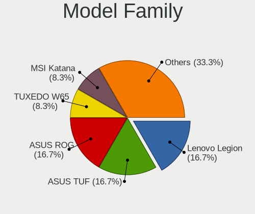
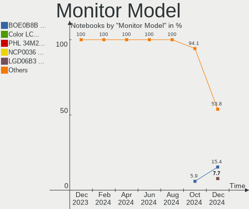
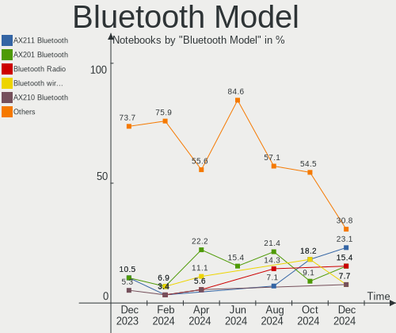
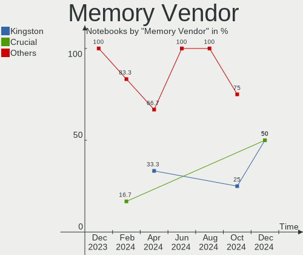

Nobara - Hardware Trends (Notebooks)
------------------------------------

A project to identify most popular hardware characteristics and track their change
over time based on data collected by Linux users at https://Linux-Hardware.org.

Anyone can contribute to this report by the [hw-probe](https://github.com/linuxhw/hw-probe) tool:

    sudo -E hw-probe -all -upload

This report is for one last month. Overall report since the beginning of time: [TestCoverage](https://github.com/linuxhw/TestCoverage)

Period: Nov, 2022.

Contents
--------

* [ System ](#system)
  - [ OS                       ](#os)
  - [ OS Family                ](#os-family)
  - [ Kernel                   ](#kernel)
  - [ Kernel Family            ](#kernel-family)
  - [ Kernel Major Ver.        ](#kernel-major-ver)
  - [ Arch                     ](#arch)
  - [ DE                       ](#de)
  - [ Display Server           ](#display-server)
  - [ Display Manager          ](#display-manager)
  - [ OS Lang                  ](#os-lang)
  - [ Boot Mode                ](#boot-mode)
  - [ Filesystem               ](#filesystem)
  - [ Part. scheme             ](#part-scheme)
  - [ Dual Boot with Linux/BSD ](#dual-boot-with-linuxbsd)
  - [ Dual Boot (Win)          ](#dual-boot-win)

* [ Board ](#board)
  - [ Vendor                   ](#vendor)
  - [ Model                    ](#model)
  - [ Model Family             ](#model-family)
  - [ MFG Year                 ](#mfg-year)
  - [ Form Factor              ](#form-factor)
  - [ Secure Boot              ](#secure-boot)
  - [ Coreboot                 ](#coreboot)
  - [ RAM Size                 ](#ram-size)
  - [ RAM Used                 ](#ram-used)
  - [ Total Drives             ](#total-drives)
  - [ Has CD-ROM               ](#has-cd-rom)
  - [ Has Ethernet             ](#has-ethernet)
  - [ Has WiFi                 ](#has-wifi)
  - [ Has Bluetooth            ](#has-bluetooth)

* [ Location ](#location)
  - [ Country                  ](#country)
  - [ City                     ](#city)

* [ Drives ](#drives)
  - [ Drive Vendor             ](#drive-vendor)
  - [ Drive Model              ](#drive-model)
  - [ HDD Vendor               ](#hdd-vendor)
  - [ SSD Vendor               ](#ssd-vendor)
  - [ Drive Kind               ](#drive-kind)
  - [ Drive Connector          ](#drive-connector)
  - [ Drive Size               ](#drive-size)
  - [ Space Total              ](#space-total)
  - [ Space Used               ](#space-used)
  - [ Malfunc. Drives          ](#malfunc-drives)
  - [ Malfunc. Drive Vendor    ](#malfunc-drive-vendor)
  - [ Malfunc. HDD Vendor      ](#malfunc-hdd-vendor)
  - [ Malfunc. Drive Kind      ](#malfunc-drive-kind)
  - [ Failed Drives            ](#failed-drives)
  - [ Failed Drive Vendor      ](#failed-drive-vendor)
  - [ Drive Status             ](#drive-status)

* [ Storage controller ](#storage-controller)
  - [ Storage Vendor           ](#storage-vendor)
  - [ Storage Model            ](#storage-model)
  - [ Storage Kind             ](#storage-kind)

* [ Processor ](#processor)
  - [ CPU Vendor               ](#cpu-vendor)
  - [ CPU Model                ](#cpu-model)
  - [ CPU Model Family         ](#cpu-model-family)
  - [ CPU Cores                ](#cpu-cores)
  - [ CPU Sockets              ](#cpu-sockets)
  - [ CPU Threads              ](#cpu-threads)
  - [ CPU Op-Modes             ](#cpu-op-modes)
  - [ CPU Microcode            ](#cpu-microcode)
  - [ CPU Microarch            ](#cpu-microarch)

* [ Graphics ](#graphics)
  - [ GPU Vendor               ](#gpu-vendor)
  - [ GPU Model                ](#gpu-model)
  - [ GPU Combo                ](#gpu-combo)
  - [ GPU Driver               ](#gpu-driver)
  - [ GPU Memory               ](#gpu-memory)

* [ Monitor ](#monitor)
  - [ Monitor Vendor           ](#monitor-vendor)
  - [ Monitor Model            ](#monitor-model)
  - [ Monitor Resolution       ](#monitor-resolution)
  - [ Monitor Diagonal         ](#monitor-diagonal)
  - [ Monitor Width            ](#monitor-width)
  - [ Aspect Ratio             ](#aspect-ratio)
  - [ Monitor Area             ](#monitor-area)
  - [ Pixel Density            ](#pixel-density)
  - [ Multiple Monitors        ](#multiple-monitors)

* [ Network ](#network)
  - [ Net Controller Vendor    ](#net-controller-vendor)
  - [ Net Controller Model     ](#net-controller-model)
  - [ Wireless Vendor          ](#wireless-vendor)
  - [ Wireless Model           ](#wireless-model)
  - [ Ethernet Vendor          ](#ethernet-vendor)
  - [ Ethernet Model           ](#ethernet-model)
  - [ Net Controller Kind      ](#net-controller-kind)
  - [ Used Controller          ](#used-controller)
  - [ NICs                     ](#nics)
  - [ IPv6                     ](#ipv6)

* [ Bluetooth ](#bluetooth)
  - [ Bluetooth Vendor         ](#bluetooth-vendor)
  - [ Bluetooth Model          ](#bluetooth-model)

* [ Sound ](#sound)
  - [ Sound Vendor             ](#sound-vendor)
  - [ Sound Model              ](#sound-model)

* [ Memory ](#memory)
  - [ Memory Vendor            ](#memory-vendor)
  - [ Memory Model             ](#memory-model)
  - [ Memory Kind              ](#memory-kind)
  - [ Memory Form Factor       ](#memory-form-factor)
  - [ Memory Size              ](#memory-size)
  - [ Memory Speed             ](#memory-speed)

* [ Printers & scanners ](#printers--scanners)
  - [ Printer Vendor           ](#printer-vendor)
  - [ Printer Model            ](#printer-model)
  - [ Scanner Vendor           ](#scanner-vendor)
  - [ Scanner Model            ](#scanner-model)

* [ Camera ](#camera)
  - [ Camera Vendor            ](#camera-vendor)
  - [ Camera Model             ](#camera-model)

* [ Security ](#security)
  - [ Fingerprint Vendor       ](#fingerprint-vendor)
  - [ Fingerprint Model        ](#fingerprint-model)
  - [ Chipcard Vendor          ](#chipcard-vendor)
  - [ Chipcard Model           ](#chipcard-model)

* [ Unsupported ](#unsupported)
  - [ Unsupported Devices      ](#unsupported-devices)
  - [ Unsupported Device Types ](#unsupported-device-types)

System
------

OS
--

Installed operating systems

| Name      | Notebooks | Percent |
|-----------|-----------|---------|
| Nobara 36 | 20        | 100%    |

OS Family
---------

OS without a version

| Name   | Notebooks | Percent |
|--------|-----------|---------|
| Nobara | 20        | 100%    |

Kernel
------

Version of the Linux kernel

| Version                       | Notebooks | Percent |
|-------------------------------|-----------|---------|
| 6.0.7-201.fsync.fc36.x86_64   | 6         | 30%     |
| 6.0.9-202.fc36.x86_64         | 3         | 15%     |
| 6.0.9-201.fc36.x86_64         | 3         | 15%     |
| 6.0.8-201.fsync.fc36.x86_64   | 2         | 10%     |
| 6.0.5-201.fsync.fc36.x86_64   | 2         | 10%     |
| 6.0.10-201.fc36.x86_64        | 2         | 10%     |
| 6.0.7-202.fsync.fc36.x86_64   | 1         | 5%      |
| 5.19.14-201.fsync.fc36.x86_64 | 1         | 5%      |

Kernel Family
-------------

Linux kernel without a distro release

| Version | Notebooks | Percent |
|---------|-----------|---------|
| 6.0.7   | 7         | 35%     |
| 6.0.9   | 6         | 30%     |
| 6.0.8   | 2         | 10%     |
| 6.0.5   | 2         | 10%     |
| 6.0.10  | 2         | 10%     |
| 5.19.14 | 1         | 5%      |

Kernel Major Ver.
-----------------

Linux kernel major version

| Version | Notebooks | Percent |
|---------|-----------|---------|
| 6.0     | 19        | 95%     |
| 5.19    | 1         | 5%      |

Arch
----

OS architecture (x86_64, i586, etc.)

| Name   | Notebooks | Percent |
|--------|-----------|---------|
| x86_64 | 20        | 100%    |

DE
--

Desktop Environment

| Name    | Notebooks | Percent |
|---------|-----------|---------|
| GNOME   | 12        | 60%     |
| KDE5    | 6         | 30%     |
| Unknown | 2         | 10%     |

Display Server
--------------

X11 or Wayland

| Name    | Notebooks | Percent |
|---------|-----------|---------|
| Wayland | 14        | 70%     |
| X11     | 4         | 20%     |
| Unknown | 2         | 10%     |

Display Manager
---------------

SDDM, LightDM, etc.

| Name    | Notebooks | Percent |
|---------|-----------|---------|
| Unknown | 16        | 80%     |
| SDDM    | 2         | 10%     |
| GDM     | 2         | 10%     |

OS Lang
-------

Language

| Lang    | Notebooks | Percent |
|---------|-----------|---------|
| en_US   | 9         | 45%     |
| Unknown | 2         | 10%     |
| pl_PL   | 1         | 5%      |
| it_IT   | 1         | 5%      |
| hu_HU   | 1         | 5%      |
| fi_FI   | 1         | 5%      |
| es_ES   | 1         | 5%      |
| es_CR   | 1         | 5%      |
| es_AR   | 1         | 5%      |
| en_AU   | 1         | 5%      |
| de_AT   | 1         | 5%      |

Boot Mode
---------

EFI or BIOS

| Mode | Notebooks | Percent |
|------|-----------|---------|
| EFI  | 16        | 80%     |
| BIOS | 4         | 20%     |

Filesystem
----------

Type of filesystem

| Type  | Notebooks | Percent |
|-------|-----------|---------|
| Btrfs | 17        | 85%     |
| Ext4  | 3         | 15%     |

Part. scheme
------------

Scheme of partitioning

| Type    | Notebooks | Percent |
|---------|-----------|---------|
| Unknown | 14        | 70%     |
| GPT     | 4         | 20%     |
| MBR     | 2         | 10%     |

Dual Boot with Linux/BSD
------------------------

Hosting more than one Linux/BSD

| Dual boot | Notebooks | Percent |
|-----------|-----------|---------|
| No        | 18        | 90%     |
| Yes       | 2         | 10%     |

Dual Boot (Win)
---------------

Hosting Linux and Windows

| Dual boot | Notebooks | Percent |
|-----------|-----------|---------|
| No        | 17        | 85%     |
| Yes       | 3         | 15%     |

Board
-----

Vendor
------

Motherboard manufacturer

| Name                | Notebooks | Percent |
|---------------------|-----------|---------|
| Lenovo              | 6         | 30%     |
| Hewlett-Packard     | 4         | 20%     |
| ASUSTek Computer    | 3         | 15%     |
| Valve               | 1         | 5%      |
| MSI                 | 1         | 5%      |
| HUAWEI              | 1         | 5%      |
| Gigabyte Technology | 1         | 5%      |
| Dell                | 1         | 5%      |
| Coradir             | 1         | 5%      |
| Acer                | 1         | 5%      |

Model
-----

Motherboard model

| Name                                   | Notebooks | Percent |
|----------------------------------------|-----------|---------|
| Unknown                                | 2         | 10%     |
| Valve Jupiter                          | 1         | 5%      |
| MSI GE60 0NC/GE60 0ND                  | 1         | 5%      |
| Lenovo V14-IIL 82C4                    | 1         | 5%      |
| Lenovo ThinkPad X240 20AMA0LTAU        | 1         | 5%      |
| Lenovo Legion S7 15ACH6 82K8           | 1         | 5%      |
| Lenovo IdeaPad Gaming 3 15ACH6 82K2    | 1         | 5%      |
| Lenovo G580 20150                      | 1         | 5%      |
| Lenovo G50-30 80G0                     | 1         | 5%      |
| HUAWEI CREM-WXX9                       | 1         | 5%      |
| HP ProBook 445 14 inch G9 Notebook PC  | 1         | 5%      |
| HP OMEN Laptop 15-ek0xxx               | 1         | 5%      |
| Gigabyte B450 AORUS PRO WIFI           | 1         | 5%      |
| Dell Studio 1737                       | 1         | 5%      |
| Coradir Coradir/ES10IS5                | 1         | 5%      |
| ASUS VivoBook_ASUSLaptop X515UA_M515UA | 1         | 5%      |
| ASUS VivoBook_ASUSLaptop X415EA_F415EA | 1         | 5%      |
| ASUS GL753VD                           | 1         | 5%      |
| Acer Swift SFX14-41G                   | 1         | 5%      |

Model Family
------------

Motherboard model prefix

| Name             | Notebooks | Percent |
|------------------|-----------|---------|
| ASUS VivoBook    | 2         | 10%     |
| Unknown          | 2         | 10%     |
| Valve Jupiter    | 1         | 5%      |
| MSI GE60         | 1         | 5%      |
| Lenovo V14-IIL   | 1         | 5%      |
| Lenovo ThinkPad  | 1         | 5%      |
| Lenovo Legion    | 1         | 5%      |
| Lenovo IdeaPad   | 1         | 5%      |
| Lenovo G580      | 1         | 5%      |
| Lenovo G50-30    | 1         | 5%      |
| HUAWEI CREM-WXX9 | 1         | 5%      |
| HP ProBook       | 1         | 5%      |
| HP OMEN          | 1         | 5%      |
| Gigabyte B450    | 1         | 5%      |
| Dell Studio      | 1         | 5%      |
| Coradir Coradir  | 1         | 5%      |
| ASUS GL753VD     | 1         | 5%      |
| Acer Swift       | 1         | 5%      |

MFG Year
--------

Motherboard manufacture year

| Year | Notebooks | Percent |
|------|-----------|---------|
| 2021 | 6         | 30%     |
| 2022 | 3         | 15%     |
| 2020 | 2         | 10%     |
| 2019 | 2         | 10%     |
| 2013 | 2         | 10%     |
| 2012 | 2         | 10%     |
| 2018 | 1         | 5%      |
| 2014 | 1         | 5%      |
| 2008 | 1         | 5%      |

Form Factor
-----------

Physical design of the computer

| Name     | Notebooks | Percent |
|----------|-----------|---------|
| Notebook | 20        | 100%    |

Secure Boot
-----------

Enabled or disabled

| State    | Notebooks | Percent |
|----------|-----------|---------|
| Disabled | 20        | 100%    |

Coreboot
--------

Have coreboot on board

| Used | Notebooks | Percent |
|------|-----------|---------|
| No   | 20        | 100%    |

RAM Size
--------

Total RAM memory

| Size in GB | Notebooks | Percent |
|------------|-----------|---------|
| 4.01-8.0   | 8         | 40%     |
| 3.01-4.0   | 4         | 20%     |
| 8.01-16.0  | 4         | 20%     |
| 32.01-64.0 | 2         | 10%     |
| 24.01-32.0 | 1         | 5%      |
| 16.01-24.0 | 1         | 5%      |

RAM Used
--------

Used RAM memory

| Used GB  | Notebooks | Percent |
|----------|-----------|---------|
| 4.01-8.0 | 9         | 45%     |
| 3.01-4.0 | 6         | 30%     |
| 2.01-3.0 | 5         | 25%     |

Total Drives
------------

Number of drives on board

| Drives | Notebooks | Percent |
|--------|-----------|---------|
| 1      | 14        | 70%     |
| 2      | 5         | 25%     |
| 3      | 1         | 5%      |

Has CD-ROM
----------

Has CD-ROM on board

| Presented | Notebooks | Percent |
|-----------|-----------|---------|
| No        | 14        | 70%     |
| Yes       | 6         | 30%     |

Has Ethernet
------------

Has Ethernet on board

| Presented | Notebooks | Percent |
|-----------|-----------|---------|
| Yes       | 14        | 70%     |
| No        | 6         | 30%     |

Has WiFi
--------

Has WiFi module

| Presented | Notebooks | Percent |
|-----------|-----------|---------|
| Yes       | 20        | 100%    |

Has Bluetooth
-------------

Has Bluetooth module

| Presented | Notebooks | Percent |
|-----------|-----------|---------|
| Yes       | 17        | 85%     |
| No        | 3         | 15%     |

Location
--------

Country
-------

Geographic location (country)

| Country    | Notebooks | Percent |
|------------|-----------|---------|
| USA        | 4         | 20%     |
| Poland     | 2         | 10%     |
| Germany    | 2         | 10%     |
| Vietnam    | 1         | 5%      |
| Taiwan     | 1         | 5%      |
| Serbia     | 1         | 5%      |
| Italy      | 1         | 5%      |
| Hungary    | 1         | 5%      |
| Finland    | 1         | 5%      |
| Cyprus     | 1         | 5%      |
| Costa Rica | 1         | 5%      |
| Chile      | 1         | 5%      |
| Austria    | 1         | 5%      |
| Australia  | 1         | 5%      |
| Argentina  | 1         | 5%      |

City
----

Geographic location (city)

| City              | Notebooks | Percent |
|-------------------|-----------|---------|
| Poznan            | 2         | 10%     |
| Ochsenfurt        | 2         | 10%     |
| Wasilla           | 1         | 5%      |
| Vienna            | 1         | 5%      |
| Veszprém         | 1         | 5%      |
| Tenna             | 1         | 5%      |
| San José         | 1         | 5%      |
| San Antonio Oeste | 1         | 5%      |
| Ranua             | 1         | 5%      |
| Nicosia           | 1         | 5%      |
| Nha Trang         | 1         | 5%      |
| Milledgeville     | 1         | 5%      |
| Melbourne         | 1         | 5%      |
| Maipu             | 1         | 5%      |
| Jacksonville      | 1         | 5%      |
| Hsinchu           | 1         | 5%      |
| Hillsdale         | 1         | 5%      |
| Belgrade          | 1         | 5%      |

Drives
------

Drive Vendor
------------

Hard drive vendors

| Vendor                    | Notebooks | Drives | Percent |
|---------------------------|-----------|--------|---------|
| Samsung Electronics       | 7         | 9      | 29.17%  |
| WDC                       | 3         | 3      | 12.5%   |
| Seagate                   | 2         | 2      | 8.33%   |
| Sandisk                   | 2         | 2      | 8.33%   |
| China                     | 2         | 2      | 8.33%   |
| Unknown                   | 1         | 1      | 4.17%   |
| Solid State Storage       | 1         | 1      | 4.17%   |
| SK hynix                  | 1         | 1      | 4.17%   |
| Phison Electronics        | 1         | 1      | 4.17%   |
| Micron/Crucial Technology | 1         | 1      | 4.17%   |
| Kingston                  | 1         | 1      | 4.17%   |
| Hitachi                   | 1         | 2      | 4.17%   |
| HGST                      | 1         | 1      | 4.17%   |

Drive Model
-----------

Hard drive models

| Model                                             | Notebooks | Percent |
|---------------------------------------------------|-----------|---------|
| WDC WD20EZRX-00DC0B0 2TB                          | 1         | 3.85%   |
| WDC WD10JPVT-22A1YT0 1TB                          | 1         | 3.85%   |
| WDC WD10JPCX-24UE4T0 1TB                          | 1         | 3.85%   |
| Unknown SD/MMC/MS PRO 8GB                         | 1         | 3.85%   |
| Solid State Storage SSSTC CL1-8D256-HP 256GB      | 1         | 3.85%   |
| SK hynix HFM512GD3JX016N 512GB                    | 1         | 3.85%   |
| Seagate ST500LM021-1KJ152 500GB                   | 1         | 3.85%   |
| Seagate ST1000LM035-1RK172 1TB                    | 1         | 3.85%   |
| Sandisk WD Blue SN550 NVMe SSD 1TB                | 1         | 3.85%   |
| Sandisk WD Black SN750 / PC SN730 NVMe SSD 1024GB | 1         | 3.85%   |
| Samsung SSD 980 1TB                               | 1         | 3.85%   |
| Samsung NVMe SSD Controller SM981/PM981/PM983 1TB | 1         | 3.85%   |
| Samsung MZVLQ512HALU-00000 512GB                  | 1         | 3.85%   |
| Samsung MZVLB1T0HBLR-000L2 1TB                    | 1         | 3.85%   |
| Samsung MZALQ512HBLU-00BL2 512GB                  | 1         | 3.85%   |
| Samsung MZALQ256HAJD-000L2 256GB                  | 1         | 3.85%   |
| Samsung MZ9LQ256HBJD-00BVL 256GB                  | 1         | 3.85%   |
| Samsung MZ7TE128HMGR-000L1 128GB SSD              | 1         | 3.85%   |
| Phison PS5013 E13 NVMe Controller 256GB           | 1         | 3.85%   |
| Micron/Crucial P2 NVMe PCIe SSD 250GB             | 1         | 3.85%   |
| Kingston SNVS500G 500GB                           | 1         | 3.85%   |
| Hitachi HTS723232A7A364 320GB                     | 1         | 3.85%   |
| Hitachi HTS54323 320GB                            | 1         | 3.85%   |
| HGST HTS725050A7E630 500GB                        | 1         | 3.85%   |
| China SSD 128GB                                   | 1         | 3.85%   |
| China SATA SSD 120GB                              | 1         | 3.85%   |

HDD Vendor
----------

Hard disk drive vendors

| Vendor  | Notebooks | Drives | Percent |
|---------|-----------|--------|---------|
| WDC     | 3         | 3      | 37.5%   |
| Seagate | 2         | 2      | 25%     |
| Unknown | 1         | 1      | 12.5%   |
| Hitachi | 1         | 2      | 12.5%   |
| HGST    | 1         | 1      | 12.5%   |

SSD Vendor
----------

Solid state drive vendors

| Vendor              | Notebooks | Drives | Percent |
|---------------------|-----------|--------|---------|
| China               | 2         | 2      | 66.67%  |
| Samsung Electronics | 1         | 1      | 33.33%  |

Drive Kind
----------

HDD or SSD

| Kind | Notebooks | Drives | Percent |
|------|-----------|--------|---------|
| NVMe | 12        | 15     | 54.55%  |
| HDD  | 7         | 9      | 31.82%  |
| SSD  | 3         | 3      | 13.64%  |

Drive Connector
---------------

SATA, SAS, NVMe, etc.

| Type | Notebooks | Drives | Percent |
|------|-----------|--------|---------|
| NVMe | 12        | 15     | 52.17%  |
| SATA | 10        | 11     | 43.48%  |
| SAS  | 1         | 1      | 4.35%   |

Drive Size
----------

Size of hard drive

| Size in TB | Notebooks | Drives | Percent |
|------------|-----------|--------|---------|
| 0.01-0.5   | 6         | 8      | 60%     |
| 0.51-1.0   | 3         | 3      | 30%     |
| 1.01-2.0   | 1         | 1      | 10%     |

Space Total
-----------

Amount of disk space available on the file system

| Size in GB | Notebooks | Percent |
|------------|-----------|---------|
| 101-250    | 6         | 30%     |
| 251-500    | 5         | 25%     |
| Unknown    | 4         | 20%     |
| 501-1000   | 3         | 15%     |
| 21-50      | 2         | 10%     |

Space Used
----------

Amount of used disk space

| Used GB | Notebooks | Percent |
|---------|-----------|---------|
| 1-20    | 8         | 40%     |
| Unknown | 4         | 20%     |
| 21-50   | 3         | 15%     |
| 251-500 | 2         | 10%     |
| 101-250 | 2         | 10%     |
| 51-100  | 1         | 5%      |

Malfunc. Drives
---------------

Drive models with a malfunction

| Model                  | Notebooks | Drives | Percent |
|------------------------|-----------|--------|---------|
| Hitachi HTS54323 320GB | 1         | 1      | 100%    |

Malfunc. Drive Vendor
---------------------

Vendors of faulty drives

| Vendor  | Notebooks | Drives | Percent |
|---------|-----------|--------|---------|
| Hitachi | 1         | 1      | 100%    |

Malfunc. HDD Vendor
-------------------

Vendors of faulty HDD drives

| Vendor  | Notebooks | Drives | Percent |
|---------|-----------|--------|---------|
| Hitachi | 1         | 1      | 100%    |

Malfunc. Drive Kind
-------------------

Kinds of faulty drives

| Kind | Notebooks | Drives | Percent |
|------|-----------|--------|---------|
| HDD  | 1         | 1      | 100%    |

Failed Drives
-------------

Failed drive models

Zero info for selected period =(

Failed Drive Vendor
-------------------

Failed drive vendors

Zero info for selected period =(

Drive Status
------------

Number of failed and malfunc. drives

| Status   | Notebooks | Drives | Percent |
|----------|-----------|--------|---------|
| Detected | 14        | 18     | 66.67%  |
| Works    | 6         | 8      | 28.57%  |
| Malfunc  | 1         | 1      | 4.76%   |

Storage controller
------------------

Storage Vendor
--------------

Storage controller vendors

| Vendor                         | Notebooks | Percent |
|--------------------------------|-----------|---------|
| Intel                          | 11        | 37.93%  |
| Samsung Electronics            | 6         | 20.69%  |
| AMD                            | 5         | 17.24%  |
| SanDisk                        | 2         | 6.9%    |
| Solid State Storage Technology | 1         | 3.45%   |
| SK hynix                       | 1         | 3.45%   |
| Phison Electronics             | 1         | 3.45%   |
| Micron/Crucial Technology      | 1         | 3.45%   |
| Kingston Technology Company    | 1         | 3.45%   |

Storage Model
-------------

Storage controller models

| Model                                                                          | Notebooks | Percent |
|--------------------------------------------------------------------------------|-----------|---------|
| Samsung NVMe SSD Controller 980                                                | 5         | 15.63%  |
| AMD FCH SATA Controller [AHCI mode]                                            | 5         | 15.63%  |
| Samsung NVMe SSD Controller SM981/PM981/PM983                                  | 2         | 6.25%   |
| Intel 7 Series Chipset Family 6-port SATA Controller [AHCI mode]               | 2         | 6.25%   |
| Solid State Storage Non-Volatile memory controller                             | 1         | 3.13%   |
| SK hynix Gold P31/PC711 NVMe Solid State Drive                                 | 1         | 3.13%   |
| SanDisk WD Blue SN550 NVMe SSD                                                 | 1         | 3.13%   |
| SanDisk WD Black SN750 / PC SN730 NVMe SSD                                     | 1         | 3.13%   |
| Phison PS5013 E13 NVMe Controller                                              | 1         | 3.13%   |
| Micron/Crucial P2 NVMe PCIe SSD                                                | 1         | 3.13%   |
| Kingston Company SNVS2000G [NV1 NVMe PCIe SSD 2TB]                             | 1         | 3.13%   |
| Intel Volume Management Device NVMe RAID Controller                            | 1         | 3.13%   |
| Intel Tiger Lake-LP SATA Controller                                            | 1         | 3.13%   |
| Intel NM10/ICH7 Family SATA Controller [AHCI mode]                             | 1         | 3.13%   |
| Intel Ice Lake-LP SATA Controller [AHCI mode]                                  | 1         | 3.13%   |
| Intel HM170/QM170 Chipset SATA Controller [AHCI Mode]                          | 1         | 3.13%   |
| Intel Atom Processor E3800 Series SATA AHCI Controller                         | 1         | 3.13%   |
| Intel 82801IBM/IEM (ICH9M/ICH9M-E) 4 port SATA Controller [AHCI mode]          | 1         | 3.13%   |
| Intel 82801 Mobile SATA Controller [RAID mode]                                 | 1         | 3.13%   |
| Intel 8 Series/C220 Series Chipset Family 6-port SATA Controller 1 [AHCI mode] | 1         | 3.13%   |
| Intel 8 Series SATA Controller 1 [AHCI mode]                                   | 1         | 3.13%   |
| AMD 400 Series Chipset SATA Controller                                         | 1         | 3.13%   |

Storage Kind
------------

Kind of storage controller (IDE, SATA, NVMe, SAS, ...)

| Kind | Notebooks | Percent |
|------|-----------|---------|
| SATA | 15        | 51.72%  |
| NVMe | 12        | 41.38%  |
| RAID | 2         | 6.9%    |

Processor
---------

CPU Vendor
----------

Processor vendors

| Vendor | Notebooks | Percent |
|--------|-----------|---------|
| Intel  | 11        | 55%     |
| AMD    | 9         | 45%     |

CPU Model
---------

Processor models

| Model                                       | Notebooks | Percent |
|---------------------------------------------|-----------|---------|
| AMD Ryzen 7 5800H with Radeon Graphics      | 2         | 10%     |
| Intel Pentium CPU B960 @ 2.20GHz            | 1         | 5%      |
| Intel Core i7-7700HQ CPU @ 2.80GHz          | 1         | 5%      |
| Intel Core i7-4712MQ CPU @ 2.30GHz          | 1         | 5%      |
| Intel Core i7-3630QM CPU @ 2.40GHz          | 1         | 5%      |
| Intel Core i5-4300U CPU @ 1.90GHz           | 1         | 5%      |
| Intel Core i5-1035G1 CPU @ 1.00GHz          | 1         | 5%      |
| Intel Core i5-10300H CPU @ 2.50GHz          | 1         | 5%      |
| Intel Core 2 Duo CPU P8400 @ 2.26GHz        | 1         | 5%      |
| Intel Celeron CPU N2830 @ 2.16GHz           | 1         | 5%      |
| Intel Atom CPU N2600 @ 1.60GHz              | 1         | 5%      |
| Intel 11th Gen Core i3-1115G4 @ 3.00GHz     | 1         | 5%      |
| AMD Ryzen 7 5800U with Radeon Graphics      | 1         | 5%      |
| AMD Ryzen 7 5700U with Radeon Graphics      | 1         | 5%      |
| AMD Ryzen 5 5625U with Radeon Graphics      | 1         | 5%      |
| AMD Ryzen 5 5600H with Radeon Graphics      | 1         | 5%      |
| AMD Ryzen 5 1500X Quad-Core Processor       | 1         | 5%      |
| AMD Custom APU 0405                         | 1         | 5%      |
| AMD A6-7310 APU with AMD Radeon R4 Graphics | 1         | 5%      |

CPU Model Family
----------------

Processor model prefix

| Model            | Notebooks | Percent |
|------------------|-----------|---------|
| AMD Ryzen 7      | 4         | 20%     |
| Intel Core i7    | 3         | 15%     |
| Intel Core i5    | 3         | 15%     |
| AMD Ryzen 5      | 3         | 15%     |
| Other            | 2         | 10%     |
| Intel Pentium    | 1         | 5%      |
| Intel Core 2 Duo | 1         | 5%      |
| Intel Celeron    | 1         | 5%      |
| Intel Atom       | 1         | 5%      |
| AMD A6           | 1         | 5%      |

CPU Cores
---------

Number of processor cores

| Number | Notebooks | Percent |
|--------|-----------|---------|
| 4      | 8         | 40%     |
| 2      | 6         | 30%     |
| 8      | 4         | 20%     |
| 6      | 2         | 10%     |

CPU Sockets
-----------

Number of sockets

| Number | Notebooks | Percent |
|--------|-----------|---------|
| 1      | 20        | 100%    |

CPU Threads
-----------

Threads per core (Hyper-Threading)

| Number | Notebooks | Percent |
|--------|-----------|---------|
| 2      | 16        | 80%     |
| 1      | 4         | 20%     |

CPU Op-Modes
------------

CPU Operation Modes (32-bit, 64-bit)

| Op mode        | Notebooks | Percent |
|----------------|-----------|---------|
| 32-bit, 64-bit | 20        | 100%    |

CPU Microcode
-------------

Microcode number

| Number     | Notebooks | Percent |
|------------|-----------|---------|
| 0x0a50000c | 4         | 20%     |
| 0xa0652    | 1         | 5%      |
| 0x906e9    | 1         | 5%      |
| 0x806c1    | 1         | 5%      |
| 0x706e5    | 1         | 5%      |
| 0x40651    | 1         | 5%      |
| 0x306c3    | 1         | 5%      |
| 0x306a9    | 1         | 5%      |
| 0x30678    | 1         | 5%      |
| 0x30661    | 1         | 5%      |
| 0x206a7    | 1         | 5%      |
| 0x10676    | 1         | 5%      |
| 0x0a50000d | 1         | 5%      |
| 0x08900201 | 1         | 5%      |
| 0x08608103 | 1         | 5%      |
| 0x08001138 | 1         | 5%      |
| 0x07030106 | 1         | 5%      |

CPU Microarch
-------------

Microarchitecture

| Name        | Notebooks | Percent |
|-------------|-----------|---------|
| Zen 3       | 5         | 25%     |
| Haswell     | 2         | 10%     |
| Unknown     | 2         | 10%     |
| Zen         | 1         | 5%      |
| TigerLake   | 1         | 5%      |
| Silvermont  | 1         | 5%      |
| SandyBridge | 1         | 5%      |
| Puma        | 1         | 5%      |
| Penryn      | 1         | 5%      |
| KabyLake    | 1         | 5%      |
| IvyBridge   | 1         | 5%      |
| IceLake     | 1         | 5%      |
| CometLake   | 1         | 5%      |
| Bonnell     | 1         | 5%      |

Graphics
--------

GPU Vendor
----------

Vendors of graphics cards

| Vendor | Notebooks | Percent |
|--------|-----------|---------|
| Intel  | 10        | 38.46%  |
| AMD    | 9         | 34.62%  |
| Nvidia | 7         | 26.92%  |

GPU Model
---------

Graphics card models

| Model                                                                         | Notebooks | Percent |
|-------------------------------------------------------------------------------|-----------|---------|
| AMD Cezanne [Radeon Vega Series / Radeon Vega Mobile Series]                  | 4         | 14.81%  |
| Nvidia GA107M [GeForce RTX 3050 Mobile]                                       | 2         | 7.41%   |
| Nvidia TU116 [GeForce GTX 1660 Ti]                                            | 1         | 3.7%    |
| Nvidia TU106M [GeForce RTX 2060 Mobile]                                       | 1         | 3.7%    |
| Nvidia GP107M [GeForce GTX 1050 Mobile]                                       | 1         | 3.7%    |
| Nvidia GK107M [GeForce GTX 660M]                                              | 1         | 3.7%    |
| Nvidia GA106M [GeForce RTX 3060 Mobile / Max-Q]                               | 1         | 3.7%    |
| Intel Tiger Lake-LP GT2 [UHD Graphics G4]                                     | 1         | 3.7%    |
| Intel Iris Plus Graphics G1 (Ice Lake)                                        | 1         | 3.7%    |
| Intel HD Graphics 630                                                         | 1         | 3.7%    |
| Intel Haswell-ULT Integrated Graphics Controller                              | 1         | 3.7%    |
| Intel CometLake-H GT2 [UHD Graphics]                                          | 1         | 3.7%    |
| Intel Atom Processor Z36xxx/Z37xxx Series Graphics & Display                  | 1         | 3.7%    |
| Intel Atom Processor D2xxx/N2xxx Integrated Graphics Controller               | 1         | 3.7%    |
| Intel 4th Gen Core Processor Integrated Graphics Controller                   | 1         | 3.7%    |
| Intel 3rd Gen Core processor Graphics Controller                              | 1         | 3.7%    |
| Intel 2nd Generation Core Processor Family Integrated Graphics Controller     | 1         | 3.7%    |
| AMD VanGogh [AMD Custom GPU 0405]                                             | 1         | 3.7%    |
| AMD Sun XT [Radeon HD 8670A/8670M/8690M / R5 M330 / M430 / Radeon 520 Mobile] | 1         | 3.7%    |
| AMD RV635/M86 [Mobility Radeon HD 3650]                                       | 1         | 3.7%    |
| AMD Mullins [Radeon R4/R5 Graphics]                                           | 1         | 3.7%    |
| AMD Lucienne                                                                  | 1         | 3.7%    |
| AMD Barcelo                                                                   | 1         | 3.7%    |

GPU Combo
---------

Combinations of graphics cards

| Name           | Notebooks | Percent |
|----------------|-----------|---------|
| 1 x Intel      | 7         | 35%     |
| 1 x AMD        | 5         | 25%     |
| Intel + Nvidia | 3         | 15%     |
| AMD + Nvidia   | 3         | 15%     |
| 2 x AMD        | 1         | 5%      |
| 1 x Nvidia     | 1         | 5%      |

GPU Driver
----------

Free vs proprietary

| Driver      | Notebooks | Percent |
|-------------|-----------|---------|
| Free        | 13        | 65%     |
| Proprietary | 7         | 35%     |

GPU Memory
----------

Total video memory

| Size in GB | Notebooks | Percent |
|------------|-----------|---------|
| Unknown    | 9         | 45%     |
| 0.01-0.5   | 8         | 40%     |
| 5.01-6.0   | 1         | 5%      |
| 3.01-4.0   | 1         | 5%      |
| 0.51-1.0   | 1         | 5%      |

Monitor
-------

Monitor Vendor
--------------

Monitor vendors

| Vendor              | Notebooks | Percent |
|---------------------|-----------|---------|
| AU Optronics        | 6         | 27.27%  |
| BOE                 | 4         | 18.18%  |
| Samsung Electronics | 2         | 9.09%   |
| LG Display          | 2         | 9.09%   |
| Chimei Innolux      | 2         | 9.09%   |
| Valve               | 1         | 4.55%   |
| Sony                | 1         | 4.55%   |
| PANDA               | 1         | 4.55%   |
| MSI                 | 1         | 4.55%   |
| InfoVision          | 1         | 4.55%   |
| Goldstar            | 1         | 4.55%   |

Monitor Model
-------------

Monitor models

| Model                                                                | Notebooks | Percent |
|----------------------------------------------------------------------|-----------|---------|
| Valve ANX7530 U VLV3001 800x1280 100x150mm 7.1-inch                  | 1         | 4.55%   |
| Sony TV SNY1B02 1360x768                                             | 1         | 4.55%   |
| Samsung Electronics LCD Monitor SEC5442 1440x900 367x230mm 17.1-inch | 1         | 4.55%   |
| Samsung Electronics LCD Monitor SDC4852 1366x768 344x194mm 15.5-inch | 1         | 4.55%   |
| PANDA LCD Monitor NCP0040 1920x1080 344x194mm 15.5-inch              | 1         | 4.55%   |
| MSI G32CQ4 MSI3DB5 2560x1440 697x392mm 31.5-inch                     | 1         | 4.55%   |
| LG Display LCD Monitor LGD04E8 1920x1080 382x215mm 17.3-inch         | 1         | 4.55%   |
| LG Display LCD Monitor LGD0259 1920x1080 345x194mm 15.6-inch         | 1         | 4.55%   |
| InfoVision LCD Monitor IVO03F4 1920x1080 344x193mm 15.5-inch         | 1         | 4.55%   |
| Goldstar W2042 GSM4E7E 1680x1050 434x270mm 20.1-inch                 | 1         | 4.55%   |
| Chimei Innolux LCD Monitor CMN14E5 1920x1080 309x173mm 13.9-inch     | 1         | 4.55%   |
| Chimei Innolux LCD Monitor CMN14D4 1920x1080 309x173mm 13.9-inch     | 1         | 4.55%   |
| BOE LCD Monitor BOE0A81 1920x1080 344x194mm 15.5-inch                | 1         | 4.55%   |
| BOE LCD Monitor BOE0998 1920x1080 344x194mm 15.5-inch                | 1         | 4.55%   |
| BOE LCD Monitor BOE092F 2520x1680 338x226mm 16.0-inch                | 1         | 4.55%   |
| BOE LCD Monitor BOE06A4 1366x768 344x194mm 15.5-inch                 | 1         | 4.55%   |
| AU Optronics LCD Monitor AUO683D 1920x1080 309x174mm 14.0-inch       | 1         | 4.55%   |
| AU Optronics LCD Monitor AUO41EC 1366x768 344x193mm 15.5-inch        | 1         | 4.55%   |
| AU Optronics LCD Monitor AUO229E 1920x1080 309x174mm 14.0-inch       | 1         | 4.55%   |
| AU Optronics LCD Monitor AUO21ED 1920x1080 344x193mm 15.5-inch       | 1         | 4.55%   |
| AU Optronics LCD Monitor AUO21EC 1366x768 344x193mm 15.5-inch        | 1         | 4.55%   |
| AU Optronics LCD Monitor AUO106C 1366x768 276x155mm 12.5-inch        | 1         | 4.55%   |

Monitor Resolution
------------------

Monitor screen resolution

| Resolution         | Notebooks | Percent |
|--------------------|-----------|---------|
| 1920x1080 (FHD)    | 10        | 45.45%  |
| 1366x768 (WXGA)    | 4         | 18.18%  |
| 800x1280           | 1         | 4.55%   |
| 3840x2160 (4K)     | 1         | 4.55%   |
| 2560x1440 (QHD)    | 1         | 4.55%   |
| 2520x1680          | 1         | 4.55%   |
| 1920x1200 (WUXGA)  | 1         | 4.55%   |
| 1680x1050 (WSXGA+) | 1         | 4.55%   |
| 1440x900 (WXGA+)   | 1         | 4.55%   |
| 1360x768           | 1         | 4.55%   |

Monitor Diagonal
----------------

Diagonal size in inches

| Inches | Notebooks | Percent |
|--------|-----------|---------|
| 15     | 10        | 45.45%  |
| 17     | 3         | 13.64%  |
| 13     | 2         | 9.09%   |
| 72     | 1         | 4.55%   |
| 31     | 1         | 4.55%   |
| 20     | 1         | 4.55%   |
| 16     | 1         | 4.55%   |
| 14     | 1         | 4.55%   |
| 12     | 1         | 4.55%   |
| 7      | 1         | 4.55%   |

Monitor Width
-------------

Physical width

| Width in mm | Notebooks | Percent |
|-------------|-----------|---------|
| 301-350     | 14        | 63.64%  |
| 351-400     | 3         | 13.64%  |
| 601-700     | 1         | 4.55%   |
| 401-500     | 1         | 4.55%   |
| 201-300     | 1         | 4.55%   |
| 1501-2000   | 1         | 4.55%   |
| 1-100       | 1         | 4.55%   |

Aspect Ratio
------------

Proportional relationship between the width and the height

| Ratio | Notebooks | Percent |
|-------|-----------|---------|
| 16/9  | 17        | 80.95%  |
| 16/10 | 2         | 9.52%   |
| 3/2   | 1         | 4.76%   |
| 0.67  | 1         | 4.76%   |

Monitor Area
------------

Area in inch²

| Area in inch² | Notebooks | Percent |
|----------------|-----------|---------|
| 101-110        | 10        | 45.45%  |
| 81-90          | 3         | 13.64%  |
| 121-130        | 2         | 9.09%   |
| More than 1000 | 1         | 4.55%   |
| 61-70          | 1         | 4.55%   |
| 351-500        | 1         | 4.55%   |
| 1-40           | 1         | 4.55%   |
| 151-200        | 1         | 4.55%   |
| 131-140        | 1         | 4.55%   |
| 111-120        | 1         | 4.55%   |

Pixel Density
-------------

Pixels per inch

| Density | Notebooks | Percent |
|---------|-----------|---------|
| 121-160 | 10        | 45.45%  |
| 101-120 | 6         | 27.27%  |
| 51-100  | 3         | 13.64%  |
| 161-240 | 2         | 9.09%   |
| 1-50    | 1         | 4.55%   |

Multiple Monitors
-----------------

Total monitors connected

| Total | Notebooks | Percent |
|-------|-----------|---------|
| 1     | 17        | 85%     |
| 2     | 3         | 15%     |

Network
-------

Net Controller Vendor
---------------------

Controller vendors

| Vendor                | Notebooks | Percent |
|-----------------------|-----------|---------|
| Realtek Semiconductor | 11        | 36.67%  |
| Intel                 | 9         | 30%     |
| Qualcomm Atheros      | 3         | 10%     |
| Broadcom              | 2         | 6.67%   |
| Xiaomi                | 1         | 3.33%   |
| MediaTek              | 1         | 3.33%   |
| Broadcom Limited      | 1         | 3.33%   |
| ASIX Electronics      | 1         | 3.33%   |
| Afatech               | 1         | 3.33%   |

Net Controller Model
--------------------

Controller models

| Model                                                             | Notebooks | Percent |
|-------------------------------------------------------------------|-----------|---------|
| Realtek RTL8111/8168/8411 PCI Express Gigabit Ethernet Controller | 5         | 13.89%  |
| Realtek RTL8822CE 802.11ac PCIe Wireless Network Adapter          | 3         | 8.33%   |
| Realtek RTL8852AE 802.11ax PCIe Wireless Network Adapter          | 2         | 5.56%   |
| Realtek RTL810xE PCI Express Fast Ethernet controller             | 2         | 5.56%   |
| Xiaomi Mi/Redmi series (RNDIS + ADB)                              | 1         | 2.78%   |
| Realtek RTL8723BE PCIe Wireless Network Adapter                   | 1         | 2.78%   |
| Realtek RTL8188CE 802.11b/g/n WiFi Adapter                        | 1         | 2.78%   |
| Realtek Realtek Network controller                                | 1         | 2.78%   |
| Qualcomm Atheros QCA9565 / AR9565 Wireless Network Adapter        | 1         | 2.78%   |
| Qualcomm Atheros Killer E220x Gigabit Ethernet Controller         | 1         | 2.78%   |
| Qualcomm Atheros AR8162 Fast Ethernet                             | 1         | 2.78%   |
| MediaTek MT7921 802.11ax PCI Express Wireless Network Adapter     | 1         | 2.78%   |
| Intel Wireless-AC 9260                                            | 1         | 2.78%   |
| Intel Wireless 8265 / 8275                                        | 1         | 2.78%   |
| Intel Wireless 7265                                               | 1         | 2.78%   |
| Intel Wireless 7260                                               | 1         | 2.78%   |
| Intel WiFi Link 5100                                              | 1         | 2.78%   |
| Intel I211 Gigabit Network Connection                             | 1         | 2.78%   |
| Intel Ethernet Connection I218-LM                                 | 1         | 2.78%   |
| Intel Ethernet Connection I217-V                                  | 1         | 2.78%   |
| Intel Dual Band Wireless-AC 3168NGW [Stone Peak]                  | 1         | 2.78%   |
| Intel Comet Lake PCH CNVi WiFi                                    | 1         | 2.78%   |
| Intel Centrino Wireless-N 135                                     | 1         | 2.78%   |
| Broadcom NetLink BCM5784M Gigabit Ethernet PCIe                   | 1         | 2.78%   |
| Broadcom Limited BCM4313 802.11bgn Wireless Network Adapter       | 1         | 2.78%   |
| Broadcom BCM43228 802.11a/b/g/n                                   | 1         | 2.78%   |
| ASIX AX88179 Gigabit Ethernet                                     | 1         | 2.78%   |
| Afatech OSA Express Network card                                  | 1         | 2.78%   |

Wireless Vendor
---------------

Wireless vendors

| Vendor                | Notebooks | Percent |
|-----------------------|-----------|---------|
| Realtek Semiconductor | 8         | 40%     |
| Intel                 | 8         | 40%     |
| Qualcomm Atheros      | 1         | 5%      |
| MediaTek              | 1         | 5%      |
| Broadcom Limited      | 1         | 5%      |
| Broadcom              | 1         | 5%      |

Wireless Model
--------------

Wireless models

| Model                                                         | Notebooks | Percent |
|---------------------------------------------------------------|-----------|---------|
| Realtek RTL8822CE 802.11ac PCIe Wireless Network Adapter      | 3         | 15%     |
| Realtek RTL8852AE 802.11ax PCIe Wireless Network Adapter      | 2         | 10%     |
| Realtek RTL8723BE PCIe Wireless Network Adapter               | 1         | 5%      |
| Realtek RTL8188CE 802.11b/g/n WiFi Adapter                    | 1         | 5%      |
| Realtek Realtek Network controller                            | 1         | 5%      |
| Qualcomm Atheros QCA9565 / AR9565 Wireless Network Adapter    | 1         | 5%      |
| MediaTek MT7921 802.11ax PCI Express Wireless Network Adapter | 1         | 5%      |
| Intel Wireless-AC 9260                                        | 1         | 5%      |
| Intel Wireless 8265 / 8275                                    | 1         | 5%      |
| Intel Wireless 7265                                           | 1         | 5%      |
| Intel Wireless 7260                                           | 1         | 5%      |
| Intel WiFi Link 5100                                          | 1         | 5%      |
| Intel Dual Band Wireless-AC 3168NGW [Stone Peak]              | 1         | 5%      |
| Intel Comet Lake PCH CNVi WiFi                                | 1         | 5%      |
| Intel Centrino Wireless-N 135                                 | 1         | 5%      |
| Broadcom Limited BCM4313 802.11bgn Wireless Network Adapter   | 1         | 5%      |
| Broadcom BCM43228 802.11a/b/g/n                               | 1         | 5%      |

Ethernet Vendor
---------------

Ethernet vendors

| Vendor                | Notebooks | Percent |
|-----------------------|-----------|---------|
| Realtek Semiconductor | 7         | 46.67%  |
| Intel                 | 3         | 20%     |
| Qualcomm Atheros      | 2         | 13.33%  |
| Xiaomi                | 1         | 6.67%   |
| Broadcom              | 1         | 6.67%   |
| ASIX Electronics      | 1         | 6.67%   |

Ethernet Model
--------------

Ethernet models

| Model                                                             | Notebooks | Percent |
|-------------------------------------------------------------------|-----------|---------|
| Realtek RTL8111/8168/8411 PCI Express Gigabit Ethernet Controller | 5         | 33.33%  |
| Realtek RTL810xE PCI Express Fast Ethernet controller             | 2         | 13.33%  |
| Xiaomi Mi/Redmi series (RNDIS + ADB)                              | 1         | 6.67%   |
| Qualcomm Atheros Killer E220x Gigabit Ethernet Controller         | 1         | 6.67%   |
| Qualcomm Atheros AR8162 Fast Ethernet                             | 1         | 6.67%   |
| Intel I211 Gigabit Network Connection                             | 1         | 6.67%   |
| Intel Ethernet Connection I218-LM                                 | 1         | 6.67%   |
| Intel Ethernet Connection I217-V                                  | 1         | 6.67%   |
| Broadcom NetLink BCM5784M Gigabit Ethernet PCIe                   | 1         | 6.67%   |
| ASIX AX88179 Gigabit Ethernet                                     | 1         | 6.67%   |

Net Controller Kind
-------------------

Ethernet, WiFi or modem

| Kind     | Notebooks | Percent |
|----------|-----------|---------|
| WiFi     | 20        | 57.14%  |
| Ethernet | 14        | 40%     |
| Unknown  | 1         | 2.86%   |

Used Controller
---------------

Currently used network controller

| Kind     | Notebooks | Percent |
|----------|-----------|---------|
| WiFi     | 15        | 83.33%  |
| Ethernet | 3         | 16.67%  |

NICs
----

Total network controllers on board

| Total | Notebooks | Percent |
|-------|-----------|---------|
| 2     | 13        | 65%     |
| 1     | 7         | 35%     |

IPv6
----

IPv6 vs IPv4

| Used | Notebooks | Percent |
|------|-----------|---------|
| No   | 15        | 75%     |
| Yes  | 5         | 25%     |

Bluetooth
---------

Bluetooth Vendor
----------------

Controller vendors

| Vendor                          | Notebooks | Percent |
|---------------------------------|-----------|---------|
| Intel                           | 6         | 35.29%  |
| Realtek Semiconductor           | 5         | 29.41%  |
| Realtek                         | 1         | 5.88%   |
| Qualcomm Atheros Communications | 1         | 5.88%   |
| Lite-On Technology              | 1         | 5.88%   |
| IMC Networks                    | 1         | 5.88%   |
| Foxconn / Hon Hai               | 1         | 5.88%   |
| Broadcom                        | 1         | 5.88%   |

Bluetooth Model
---------------

Controller models

| Model                                         | Notebooks | Percent |
|-----------------------------------------------|-----------|---------|
| Realtek Bluetooth Radio                       | 5         | 29.41%  |
| Intel Bluetooth wireless interface            | 3         | 17.65%  |
| Realtek Bluetooth Radio                       | 1         | 5.88%   |
| Qualcomm Atheros AR3012 Bluetooth 4.0         | 1         | 5.88%   |
| Lite-On Wireless_Device                       | 1         | 5.88%   |
| Intel Wireless-AC 9260 Bluetooth Adapter      | 1         | 5.88%   |
| Intel Wireless-AC 3168 Bluetooth              | 1         | 5.88%   |
| Intel AX201 Bluetooth                         | 1         | 5.88%   |
| IMC Networks Bluetooth Radio                  | 1         | 5.88%   |
| Foxconn / Hon Hai Broadcom BCM20702 Bluetooth | 1         | 5.88%   |
| Broadcom HP Portable Bumble Bee               | 1         | 5.88%   |

Sound
-----

Sound Vendor
------------

Sound card vendors

| Vendor           | Notebooks | Percent |
|------------------|-----------|---------|
| Intel            | 11        | 42.31%  |
| AMD              | 10        | 38.46%  |
| Nvidia           | 3         | 11.54%  |
| Sony             | 1         | 3.85%   |
| Blue Microphones | 1         | 3.85%   |

Sound Model
-----------

Sound card models

| Model                                                                      | Notebooks | Percent |
|----------------------------------------------------------------------------|-----------|---------|
| AMD Family 17h/19h HD Audio Controller                                     | 6         | 17.65%  |
| AMD Renoir Radeon High Definition Audio Controller                         | 5         | 14.71%  |
| Intel 7 Series/C216 Chipset Family High Definition Audio Controller        | 2         | 5.88%   |
| Sony DualSense wireless controller (PS5)                                   | 1         | 2.94%   |
| Nvidia TU116 High Definition Audio Controller                              | 1         | 2.94%   |
| Nvidia TU106 High Definition Audio Controller                              | 1         | 2.94%   |
| Nvidia GA106 High Definition Audio Controller                              | 1         | 2.94%   |
| Intel Xeon E3-1200 v3/4th Gen Core Processor HD Audio Controller           | 1         | 2.94%   |
| Intel Tiger Lake-LP Smart Sound Technology Audio Controller                | 1         | 2.94%   |
| Intel NM10/ICH7 Family High Definition Audio Controller                    | 1         | 2.94%   |
| Intel Ice Lake-LP Smart Sound Technology Audio Controller                  | 1         | 2.94%   |
| Intel Haswell-ULT HD Audio Controller                                      | 1         | 2.94%   |
| Intel Comet Lake PCH cAVS                                                  | 1         | 2.94%   |
| Intel CM238 HD Audio Controller                                            | 1         | 2.94%   |
| Intel Atom Processor Z36xxx/Z37xxx Series High Definition Audio Controller | 1         | 2.94%   |
| Intel 82801I (ICH9 Family) HD Audio Controller                             | 1         | 2.94%   |
| Intel 8 Series/C220 Series Chipset High Definition Audio Controller        | 1         | 2.94%   |
| Intel 8 Series HD Audio Controller                                         | 1         | 2.94%   |
| Blue Microphones Yeti Stereo Microphone                                    | 1         | 2.94%   |
| AMD RV635 HDMI Audio [Radeon HD 3650/3730/3750]                            | 1         | 2.94%   |
| AMD Rembrandt Radeon High Definition Audio Controller                      | 1         | 2.94%   |
| AMD Kabini HDMI/DP Audio                                                   | 1         | 2.94%   |
| AMD FCH Azalia Controller                                                  | 1         | 2.94%   |
| AMD Family 17h (Models 00h-0fh) HD Audio Controller                        | 1         | 2.94%   |

Memory
------

Memory Vendor
-------------

Memory module vendors

| Vendor              | Notebooks | Percent |
|---------------------|-----------|---------|
| Samsung Electronics | 3         | 50%     |
| SK hynix            | 1         | 16.67%  |
| Nanya Technology    | 1         | 16.67%  |
| Micron Technology   | 1         | 16.67%  |

Memory Model
------------

Memory module models

| Model                                                       | Notebooks | Percent |
|-------------------------------------------------------------|-----------|---------|
| SK hynix RAM HMAA1GS6CJR6N-XN 8GB SODIMM DDR4 3200MT/s      | 1         | 14.29%  |
| Samsung RAM M471A4G43AB1-CWE 32GB SODIMM DDR4 3200MT/s      | 1         | 14.29%  |
| Samsung RAM M471A1G44AB0-CWE 8GB Row Of Chips DDR4 3200MT/s | 1         | 14.29%  |
| Samsung RAM M4 70T5663RZ3-CF7 2GB SODIMM DDR2 975MT/s       | 1         | 14.29%  |
| Samsung RAM K4UBE3D4AA-MGCR 8GB SODIMM LPDDR4 4266MT/s      | 1         | 14.29%  |
| Nanya RAM M2S4G64CB8HG4N-DI 4GB SODIMM DDR3 1600MT/s        | 1         | 14.29%  |
| Micron RAM 4ATF1G64HZ-3G2E1 8GB Row Of Chips DDR4 3200MT/s  | 1         | 14.29%  |

Memory Kind
-----------

Memory module kinds

| Kind   | Notebooks | Percent |
|--------|-----------|---------|
| DDR4   | 3         | 50%     |
| LPDDR4 | 1         | 16.67%  |
| DDR3   | 1         | 16.67%  |
| DDR2   | 1         | 16.67%  |

Memory Form Factor
------------------

Physical design of the memory module

| Name         | Notebooks | Percent |
|--------------|-----------|---------|
| SODIMM       | 5         | 71.43%  |
| Row Of Chips | 2         | 28.57%  |

Memory Size
-----------

Memory module size

| Size  | Notebooks | Percent |
|-------|-----------|---------|
| 8192  | 4         | 57.14%  |
| 32768 | 1         | 14.29%  |
| 4096  | 1         | 14.29%  |
| 2048  | 1         | 14.29%  |

Memory Speed
------------

Memory module speed

| Speed | Notebooks | Percent |
|-------|-----------|---------|
| 3200  | 3         | 50%     |
| 4266  | 1         | 16.67%  |
| 1600  | 1         | 16.67%  |
| 975   | 1         | 16.67%  |

Printers & scanners
-------------------

Printer Vendor
--------------

Printer device vendors

Zero info for selected period =(

Printer Model
-------------

Printer device models

Zero info for selected period =(

Scanner Vendor
--------------

Scanner device vendors

Zero info for selected period =(

Scanner Model
-------------

Scanner device models

Zero info for selected period =(

Camera
------

Camera Vendor
-------------

Camera device vendors

| Vendor                                 | Notebooks | Percent |
|----------------------------------------|-----------|---------|
| Chicony Electronics                    | 5         | 27.78%  |
| IMC Networks                           | 3         | 16.67%  |
| Syntek                                 | 2         | 11.11%  |
| Microdia                               | 2         | 11.11%  |
| Sonix Technology                       | 1         | 5.56%   |
| Quanta                                 | 1         | 5.56%   |
| Logitech                               | 1         | 5.56%   |
| DJKANA19IDX53W                         | 1         | 5.56%   |
| Cheng Uei Precision Industry (Foxlink) | 1         | 5.56%   |
| Acer                                   | 1         | 5.56%   |

Camera Model
------------

Camera device models

| Model                                               | Notebooks | Percent |
|-----------------------------------------------------|-----------|---------|
| Syntek Integrated Camera                            | 2         | 11.11%  |
| Sonix USB2.0 HD UVC WebCam                          | 1         | 5.56%   |
| Quanta USB2.0 VGA UVC WebCam                        | 1         | 5.56%   |
| Microdia Lenovo EasyCamera                          | 1         | 5.56%   |
| Microdia Laptop_Integrated_Webcam_2M                | 1         | 5.56%   |
| Logitech HD Pro Webcam C920                         | 1         | 5.56%   |
| IMC Networks USB2.0 HD UVC WebCam                   | 1         | 5.56%   |
| IMC Networks Integrated Camera                      | 1         | 5.56%   |
| IMC Networks HD Camera                              | 1         | 5.56%   |
| DJKANA19IDX53W HP Wide Vision HD Camera             | 1         | 5.56%   |
| Chicony USB 2.0 Camera                              | 1         | 5.56%   |
| Chicony Integrated Camera                           | 1         | 5.56%   |
| Chicony HP TrueVision HD                            | 1         | 5.56%   |
| Chicony HP HD Webcam                                | 1         | 5.56%   |
| Chicony HD User Facing                              | 1         | 5.56%   |
| Cheng Uei Precision Industry (Foxlink) HP HD Camera | 1         | 5.56%   |
| Acer Lenovo Integrated Webcam                       | 1         | 5.56%   |

Security
--------

Fingerprint Vendor
------------------

Fingerprint sensor vendors

| Vendor                     | Notebooks | Percent |
|----------------------------|-----------|---------|
| Validity Sensors           | 1         | 50%     |
| Shenzhen Goodix Technology | 1         | 50%     |

Fingerprint Model
-----------------

Fingerprint sensor models

| Model                                        | Notebooks | Percent |
|----------------------------------------------|-----------|---------|
| Validity Sensors VFS 5011 fingerprint sensor | 1         | 50%     |
| Shenzhen Goodix  Fingerprint Device          | 1         | 50%     |

Chipcard Vendor
---------------

Chipcard module vendors

Zero info for selected period =(

Chipcard Model
--------------

Chipcard module models

Zero info for selected period =(

Unsupported
-----------

Unsupported Devices
-------------------

Total unsupported devices on board

| Total | Notebooks | Percent |
|-------|-----------|---------|
| 0     | 16        | 80%     |
| 1     | 3         | 15%     |
| 2     | 1         | 5%      |

Unsupported Device Types
------------------------

Types of unsupported devices

| Type                  | Notebooks | Percent |
|-----------------------|-----------|---------|
| Multimedia controller | 2         | 40%     |
| Fingerprint reader    | 2         | 40%     |
| Net/wireless          | 1         | 20%     |

