Nobara - Hardware Trends (Notebooks)
------------------------------------

A project to identify most popular hardware characteristics and track their change
over time based on data collected by Linux users at https://Linux-Hardware.org.

Anyone can contribute to this report by the [hw-probe](https://github.com/linuxhw/hw-probe) tool:

    sudo -E hw-probe -all -upload

This report is for one last month. Overall report since the beginning of time: [TestDays](https://github.com/linuxhw/TestDays)

Period: Jun, 2023.

Contents
--------

* [ System ](#system)
  - [ OS                       ](#os)
  - [ OS Family                ](#os-family)
  - [ Kernel                   ](#kernel)
  - [ Kernel Family            ](#kernel-family)
  - [ Kernel Major Ver.        ](#kernel-major-ver)
  - [ Arch                     ](#arch)
  - [ DE                       ](#de)
  - [ Display Server           ](#display-server)
  - [ Display Manager          ](#display-manager)
  - [ OS Lang                  ](#os-lang)
  - [ Boot Mode                ](#boot-mode)
  - [ Filesystem               ](#filesystem)
  - [ Part. scheme             ](#part-scheme)
  - [ Dual Boot with Linux/BSD ](#dual-boot-with-linuxbsd)
  - [ Dual Boot (Win)          ](#dual-boot-win)

* [ Board ](#board)
  - [ Vendor                   ](#vendor)
  - [ Model                    ](#model)
  - [ Model Family             ](#model-family)
  - [ MFG Year                 ](#mfg-year)
  - [ Form Factor              ](#form-factor)
  - [ Secure Boot              ](#secure-boot)
  - [ Coreboot                 ](#coreboot)
  - [ RAM Size                 ](#ram-size)
  - [ RAM Used                 ](#ram-used)
  - [ Total Drives             ](#total-drives)
  - [ Has CD-ROM               ](#has-cd-rom)
  - [ Has Ethernet             ](#has-ethernet)
  - [ Has WiFi                 ](#has-wifi)
  - [ Has Bluetooth            ](#has-bluetooth)

* [ Location ](#location)
  - [ Country                  ](#country)
  - [ City                     ](#city)

* [ Drives ](#drives)
  - [ Drive Vendor             ](#drive-vendor)
  - [ Drive Model              ](#drive-model)
  - [ HDD Vendor               ](#hdd-vendor)
  - [ SSD Vendor               ](#ssd-vendor)
  - [ Drive Kind               ](#drive-kind)
  - [ Drive Connector          ](#drive-connector)
  - [ Drive Size               ](#drive-size)
  - [ Space Total              ](#space-total)
  - [ Space Used               ](#space-used)
  - [ Malfunc. Drives          ](#malfunc-drives)
  - [ Malfunc. Drive Vendor    ](#malfunc-drive-vendor)
  - [ Malfunc. HDD Vendor      ](#malfunc-hdd-vendor)
  - [ Malfunc. Drive Kind      ](#malfunc-drive-kind)
  - [ Failed Drives            ](#failed-drives)
  - [ Failed Drive Vendor      ](#failed-drive-vendor)
  - [ Drive Status             ](#drive-status)

* [ Storage controller ](#storage-controller)
  - [ Storage Vendor           ](#storage-vendor)
  - [ Storage Model            ](#storage-model)
  - [ Storage Kind             ](#storage-kind)

* [ Processor ](#processor)
  - [ CPU Vendor               ](#cpu-vendor)
  - [ CPU Model                ](#cpu-model)
  - [ CPU Model Family         ](#cpu-model-family)
  - [ CPU Cores                ](#cpu-cores)
  - [ CPU Sockets              ](#cpu-sockets)
  - [ CPU Threads              ](#cpu-threads)
  - [ CPU Op-Modes             ](#cpu-op-modes)
  - [ CPU Microcode            ](#cpu-microcode)
  - [ CPU Microarch            ](#cpu-microarch)

* [ Graphics ](#graphics)
  - [ GPU Vendor               ](#gpu-vendor)
  - [ GPU Model                ](#gpu-model)
  - [ GPU Combo                ](#gpu-combo)
  - [ GPU Driver               ](#gpu-driver)
  - [ GPU Memory               ](#gpu-memory)

* [ Monitor ](#monitor)
  - [ Monitor Vendor           ](#monitor-vendor)
  - [ Monitor Model            ](#monitor-model)
  - [ Monitor Resolution       ](#monitor-resolution)
  - [ Monitor Diagonal         ](#monitor-diagonal)
  - [ Monitor Width            ](#monitor-width)
  - [ Aspect Ratio             ](#aspect-ratio)
  - [ Monitor Area             ](#monitor-area)
  - [ Pixel Density            ](#pixel-density)
  - [ Multiple Monitors        ](#multiple-monitors)

* [ Network ](#network)
  - [ Net Controller Vendor    ](#net-controller-vendor)
  - [ Net Controller Model     ](#net-controller-model)
  - [ Wireless Vendor          ](#wireless-vendor)
  - [ Wireless Model           ](#wireless-model)
  - [ Ethernet Vendor          ](#ethernet-vendor)
  - [ Ethernet Model           ](#ethernet-model)
  - [ Net Controller Kind      ](#net-controller-kind)
  - [ Used Controller          ](#used-controller)
  - [ NICs                     ](#nics)
  - [ IPv6                     ](#ipv6)

* [ Bluetooth ](#bluetooth)
  - [ Bluetooth Vendor         ](#bluetooth-vendor)
  - [ Bluetooth Model          ](#bluetooth-model)

* [ Sound ](#sound)
  - [ Sound Vendor             ](#sound-vendor)
  - [ Sound Model              ](#sound-model)

* [ Memory ](#memory)
  - [ Memory Vendor            ](#memory-vendor)
  - [ Memory Model             ](#memory-model)
  - [ Memory Kind              ](#memory-kind)
  - [ Memory Form Factor       ](#memory-form-factor)
  - [ Memory Size              ](#memory-size)
  - [ Memory Speed             ](#memory-speed)

* [ Printers & scanners ](#printers--scanners)
  - [ Printer Vendor           ](#printer-vendor)
  - [ Printer Model            ](#printer-model)
  - [ Scanner Vendor           ](#scanner-vendor)
  - [ Scanner Model            ](#scanner-model)

* [ Camera ](#camera)
  - [ Camera Vendor            ](#camera-vendor)
  - [ Camera Model             ](#camera-model)

* [ Security ](#security)
  - [ Fingerprint Vendor       ](#fingerprint-vendor)
  - [ Fingerprint Model        ](#fingerprint-model)
  - [ Chipcard Vendor          ](#chipcard-vendor)
  - [ Chipcard Model           ](#chipcard-model)

* [ Unsupported ](#unsupported)
  - [ Unsupported Devices      ](#unsupported-devices)
  - [ Unsupported Device Types ](#unsupported-device-types)

System
------

OS
--

Installed operating systems

| Name      | Notebooks | Percent |
|-----------|-----------|---------|
| Nobara 37 | 13        | 86.67%  |
| Nobara 38 | 2         | 13.33%  |

OS Family
---------

OS without a version

| Name   | Notebooks | Percent |
|--------|-----------|---------|
| Nobara | 15        | 100%    |

Kernel
------

Version of the Linux kernel

| Version                      | Notebooks | Percent |
|------------------------------|-----------|---------|
| 6.3.5-201.fsync.fc37.x86_64  | 6         | 40%     |
| 6.3.7-200.fsync.fc37.x86_64  | 5         | 33.33%  |
| 6.3.9-200.fsync.fc38.x86_64  | 1         | 6.67%   |
| 6.3.10-200.fsync.fc38.x86_64 | 1         | 6.67%   |
| 6.3.10-200.fsync.fc37.x86_64 | 1         | 6.67%   |
| 6.1.4-203.fsync.fc37.x86_64  | 1         | 6.67%   |

Kernel Family
-------------

Linux kernel without a distro release

| Version | Notebooks | Percent |
|---------|-----------|---------|
| 6.3.5   | 6         | 40%     |
| 6.3.7   | 5         | 33.33%  |
| 6.3.10  | 2         | 13.33%  |
| 6.3.9   | 1         | 6.67%   |
| 6.1.4   | 1         | 6.67%   |

Kernel Major Ver.
-----------------

Linux kernel major version

| Version | Notebooks | Percent |
|---------|-----------|---------|
| 6.3     | 14        | 93.33%  |
| 6.1     | 1         | 6.67%   |

Arch
----

OS architecture (x86_64, i586, etc.)

| Name   | Notebooks | Percent |
|--------|-----------|---------|
| x86_64 | 15        | 100%    |

DE
--

Desktop Environment

| Name    | Notebooks | Percent |
|---------|-----------|---------|
| GNOME   | 10        | 66.67%  |
| KDE5    | 4         | 26.67%  |
| Unknown | 1         | 6.67%   |

Display Server
--------------

X11 or Wayland

| Name    | Notebooks | Percent |
|---------|-----------|---------|
| Wayland | 10        | 66.67%  |
| X11     | 5         | 33.33%  |

Display Manager
---------------

SDDM, LightDM, etc.

| Name    | Notebooks | Percent |
|---------|-----------|---------|
| Unknown | 9         | 60%     |
| GDM     | 5         | 33.33%  |
| SDDM    | 1         | 6.67%   |

OS Lang
-------

Language

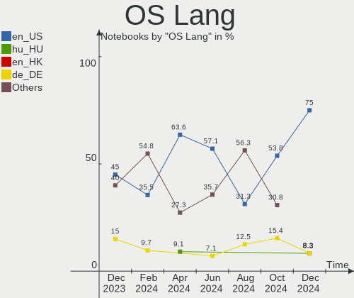

| Lang    | Notebooks | Percent |
|---------|-----------|---------|
| en_US   | 11        | 73.33%  |
| ro_RO   | 1         | 6.67%   |
| en_CA   | 1         | 6.67%   |
| de_DE   | 1         | 6.67%   |
| Unknown | 1         | 6.67%   |

Boot Mode
---------

EFI or BIOS

| Mode | Notebooks | Percent |
|------|-----------|---------|
| EFI  | 15        | 100%    |

Filesystem
----------

Type of filesystem

| Type  | Notebooks | Percent |
|-------|-----------|---------|
| Btrfs | 14        | 93.33%  |
| Ext4  | 1         | 6.67%   |

Part. scheme
------------

Scheme of partitioning

| Type    | Notebooks | Percent |
|---------|-----------|---------|
| Unknown | 8         | 53.33%  |
| GPT     | 7         | 46.67%  |

Dual Boot with Linux/BSD
------------------------

Hosting more than one Linux/BSD

| Dual boot | Notebooks | Percent |
|-----------|-----------|---------|
| No        | 13        | 86.67%  |
| Yes       | 2         | 13.33%  |

Dual Boot (Win)
---------------

Hosting Linux and Windows

| Dual boot | Notebooks | Percent |
|-----------|-----------|---------|
| No        | 14        | 93.33%  |
| Yes       | 1         | 6.67%   |

Board
-----

Vendor
------

Motherboard manufacturer

| Name             | Notebooks | Percent |
|------------------|-----------|---------|
| Lenovo           | 4         | 26.67%  |
| ASUSTek Computer | 3         | 20%     |
| MSI              | 2         | 13.33%  |
| Timi             | 1         | 6.67%   |
| Infinix          | 1         | 6.67%   |
| Hewlett-Packard  | 1         | 6.67%   |
| Google           | 1         | 6.67%   |
| Dell             | 1         | 6.67%   |
| Apple            | 1         | 6.67%   |

Model
-----

Motherboard model

| Name                            | Notebooks | Percent |
|---------------------------------|-----------|---------|
| Timi A30                        | 1         | 6.67%   |
| MSI GT70 2OC/2OD                | 1         | 6.67%   |
| MSI GE75 Raider 10SE            | 1         | 6.67%   |
| Lenovo ThinkPad A485 20MU000TUS | 1         | 6.67%   |
| Lenovo Legion 5 15ARH05H 82B1   | 1         | 6.67%   |
| Lenovo IdeaPad 5 15ITL05 82FG   | 1         | 6.67%   |
| Lenovo G50-80 80L0              | 1         | 6.67%   |
| Infinix INBook X1 Pro           | 1         | 6.67%   |
| HP ProBook 650 G1               | 1         | 6.67%   |
| Google Blooglet                 | 1         | 6.67%   |
| Dell Precision 7510             | 1         | 6.67%   |
| ASUS X550JK                     | 1         | 6.67%   |
| ASUS ROG Strix G533ZW_G533ZW    | 1         | 6.67%   |
| ASUS ROG Strix G512LW_G512LW    | 1         | 6.67%   |
| Apple MacBookPro8,3             | 1         | 6.67%   |

Model Family
------------

Motherboard model prefix

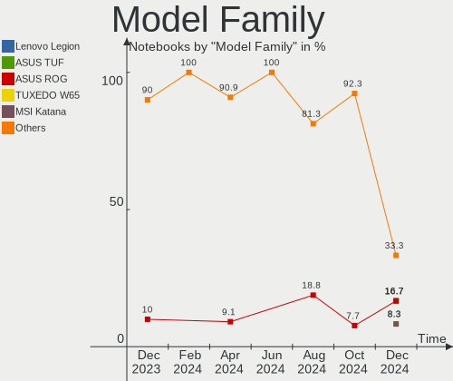

| Name              | Notebooks | Percent |
|-------------------|-----------|---------|
| ASUS ROG          | 2         | 13.33%  |
| Timi A30          | 1         | 6.67%   |
| MSI GT70          | 1         | 6.67%   |
| MSI GE75          | 1         | 6.67%   |
| Lenovo ThinkPad   | 1         | 6.67%   |
| Lenovo Legion     | 1         | 6.67%   |
| Lenovo IdeaPad    | 1         | 6.67%   |
| Lenovo G50-80     | 1         | 6.67%   |
| Infinix INBook    | 1         | 6.67%   |
| HP ProBook        | 1         | 6.67%   |
| Google Blooglet   | 1         | 6.67%   |
| Dell Precision    | 1         | 6.67%   |
| ASUS X550JK       | 1         | 6.67%   |
| Apple MacBookPro8 | 1         | 6.67%   |

MFG Year
--------

Motherboard manufacture year

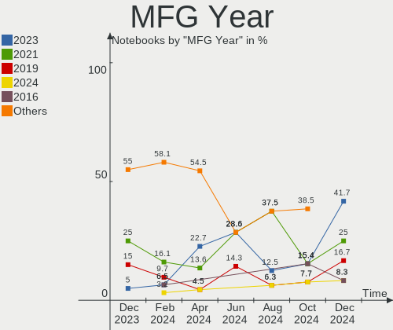

| Year | Notebooks | Percent |
|------|-----------|---------|
| 2020 | 4         | 26.67%  |
| 2015 | 3         | 20%     |
| 2021 | 2         | 13.33%  |
| 2013 | 2         | 13.33%  |
| 2023 | 1         | 6.67%   |
| 2022 | 1         | 6.67%   |
| 2018 | 1         | 6.67%   |
| 2014 | 1         | 6.67%   |

Form Factor
-----------

Physical design of the computer

| Name     | Notebooks | Percent |
|----------|-----------|---------|
| Notebook | 15        | 100%    |

Secure Boot
-----------

Enabled or disabled

| State    | Notebooks | Percent |
|----------|-----------|---------|
| Disabled | 15        | 100%    |

Coreboot
--------

Have coreboot on board

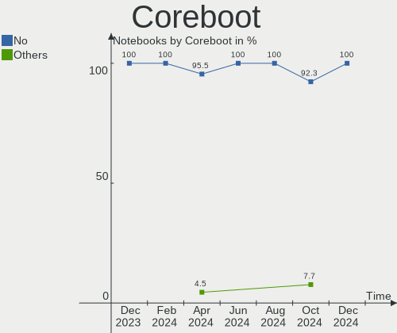

| Used | Notebooks | Percent |
|------|-----------|---------|
| No   | 14        | 93.33%  |
| Yes  | 1         | 6.67%   |

RAM Size
--------

Total RAM memory

| Size in GB  | Notebooks | Percent |
|-------------|-----------|---------|
| 4.01-8.0    | 5         | 33.33%  |
| 16.01-24.0  | 4         | 26.67%  |
| 32.01-64.0  | 2         | 13.33%  |
| 8.01-16.0   | 2         | 13.33%  |
| 3.01-4.0    | 1         | 6.67%   |
| 64.01-256.0 | 1         | 6.67%   |

RAM Used
--------

Used RAM memory

| Used GB   | Notebooks | Percent |
|-----------|-----------|---------|
| 4.01-8.0  | 5         | 33.33%  |
| 8.01-16.0 | 5         | 33.33%  |
| 3.01-4.0  | 3         | 20%     |
| 2.01-3.0  | 2         | 13.33%  |

Total Drives
------------

Number of drives on board

| Drives | Notebooks | Percent |
|--------|-----------|---------|
| 1      | 11        | 73.33%  |
| 2      | 2         | 13.33%  |
| 4      | 1         | 6.67%   |
| 3      | 1         | 6.67%   |

Has CD-ROM
----------

Has CD-ROM on board

| Presented | Notebooks | Percent |
|-----------|-----------|---------|
| No        | 12        | 80%     |
| Yes       | 3         | 20%     |

Has Ethernet
------------

Has Ethernet on board

| Presented | Notebooks | Percent |
|-----------|-----------|---------|
| Yes       | 11        | 73.33%  |
| No        | 4         | 26.67%  |

Has WiFi
--------

Has WiFi module

| Presented | Notebooks | Percent |
|-----------|-----------|---------|
| Yes       | 15        | 100%    |

Has Bluetooth
-------------

Has Bluetooth module

| Presented | Notebooks | Percent |
|-----------|-----------|---------|
| Yes       | 14        | 93.33%  |
| No        | 1         | 6.67%   |

Location
--------

Country
-------

Geographic location (country)

| Country   | Notebooks | Percent |
|-----------|-----------|---------|
| USA       | 7         | 46.67%  |
| Tunisia   | 1         | 6.67%   |
| Russia    | 1         | 6.67%   |
| Romania   | 1         | 6.67%   |
| Indonesia | 1         | 6.67%   |
| Germany   | 1         | 6.67%   |
| Finland   | 1         | 6.67%   |
| Canada    | 1         | 6.67%   |
| Australia | 1         | 6.67%   |

City
----

Geographic location (city)

| City      | Notebooks | Percent |
|-----------|-----------|---------|
| Sydney    | 1         | 6.67%   |
| Piteşti  | 1         | 6.67%   |
| Oulu      | 1         | 6.67%   |
| Naples    | 1         | 6.67%   |
| Nabeul    | 1         | 6.67%   |
| Lynn      | 1         | 6.67%   |
| Kazan’  | 1         | 6.67%   |
| Jakarta   | 1         | 6.67%   |
| Elk Mound | 1         | 6.67%   |
| Edmonton  | 1         | 6.67%   |
| Edison    | 1         | 6.67%   |
| Dexter    | 1         | 6.67%   |
| Berlin    | 1         | 6.67%   |
| Austin    | 1         | 6.67%   |
| Amarillo  | 1         | 6.67%   |

Drives
------

Drive Vendor
------------

Hard drive vendors

| Vendor              | Notebooks | Drives | Percent |
|---------------------|-----------|--------|---------|
| Samsung Electronics | 5         | 7      | 25%     |
| SK hynix            | 3         | 3      | 15%     |
| Seagate             | 2         | 2      | 10%     |
| Kingston            | 2         | 2      | 10%     |
| Intel               | 2         | 2      | 10%     |
| Crucial             | 2         | 2      | 10%     |
| Unknown             | 1         | 1      | 5%      |
| Team                | 1         | 1      | 5%      |
| Phison Electronics  | 1         | 1      | 5%      |
| Micron Technology   | 1         | 1      | 5%      |

Drive Model
-----------

Hard drive models

| Model                                               | Notebooks | Percent |
|-----------------------------------------------------|-----------|---------|
| Unknown MMC Card  64GB                              | 1         | 5%      |
| Team T253X1480G 480GB SSD                           | 1         | 5%      |
| SK hynix SKHynix_HFS512GD9TNI-L2A0B 512GB           | 1         | 5%      |
| SK hynix PC300 NVMe Solid State Drive 512GB         | 1         | 5%      |
| SK hynix HFM001TD3JX013N 1TB                        | 1         | 5%      |
| Seagate ST500LT012-1DG142 500GB                     | 1         | 5%      |
| Seagate ST500LM021-1KJ152 500GB                     | 1         | 5%      |
| Samsung SSD PM830 2.5 7mm 512GB                     | 1         | 5%      |
| Samsung SSD 850 EVO mSATA 250GB                     | 1         | 5%      |
| Samsung NVMe SSD Controller SM981/PM981/PM983 250GB | 1         | 5%      |
| Samsung NVMe SSD Controller PM9A1/PM9A3/980PRO 2TB  | 1         | 5%      |
| Samsung MZALQ512HALU-000L2 512GB                    | 1         | 5%      |
| Phison PS5013 E13 NVMe Controller 512GB             | 1         | 5%      |
| Micron 3400_MTFDKBA1T0TFH 1024GB                    | 1         | 5%      |
| Kingston SKC600MS512G 512GB SSD                     | 1         | 5%      |
| Kingston SA400S37480G 480GB SSD                     | 1         | 5%      |
| Intel SSDSA2CW300G3 304GB                           | 1         | 5%      |
| Intel SSD 660P Series 512GB                         | 1         | 5%      |
| Crucial CT4000MX500SSD1 4TB                         | 1         | 5%      |
| Crucial CT2000BX500SSD1 2TB                         | 1         | 5%      |

HDD Vendor
----------

Hard disk drive vendors

| Vendor  | Notebooks | Drives | Percent |
|---------|-----------|--------|---------|
| Seagate | 2         | 2      | 100%    |

SSD Vendor
----------

Solid state drive vendors

| Vendor              | Notebooks | Drives | Percent |
|---------------------|-----------|--------|---------|
| Samsung Electronics | 2         | 3      | 25%     |
| Kingston            | 2         | 2      | 25%     |
| Crucial             | 2         | 2      | 25%     |
| Team                | 1         | 1      | 12.5%   |
| Intel               | 1         | 1      | 12.5%   |

Drive Kind
----------

HDD or SSD

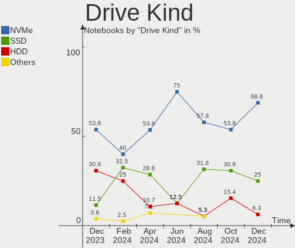

| Kind | Notebooks | Drives | Percent |
|------|-----------|--------|---------|
| NVMe | 9         | 10     | 52.94%  |
| SSD  | 5         | 9      | 29.41%  |
| HDD  | 2         | 2      | 11.76%  |
| MMC  | 1         | 1      | 5.88%   |

Drive Connector
---------------

SATA, SAS, NVMe, etc.

| Type | Notebooks | Drives | Percent |
|------|-----------|--------|---------|
| NVMe | 9         | 10     | 56.25%  |
| SATA | 6         | 11     | 37.5%   |
| MMC  | 1         | 1      | 6.25%   |

Drive Size
----------

Size of hard drive

| Size in TB | Notebooks | Drives | Percent |
|------------|-----------|--------|---------|
| 0.01-0.5   | 5         | 7      | 55.56%  |
| 0.51-1.0   | 2         | 2      | 22.22%  |
| 3.01-4.0   | 1         | 1      | 11.11%  |
| 1.01-2.0   | 1         | 1      | 11.11%  |

Space Total
-----------

Amount of disk space available on the file system

| Size in GB     | Notebooks | Percent |
|----------------|-----------|---------|
| 501-1000       | 7         | 46.67%  |
| 1001-2000      | 2         | 13.33%  |
| Unknown        | 2         | 13.33%  |
| More than 3000 | 1         | 6.67%   |
| 251-500        | 1         | 6.67%   |
| 21-50          | 1         | 6.67%   |
| 51-100         | 1         | 6.67%   |

Space Used
----------

Amount of used disk space

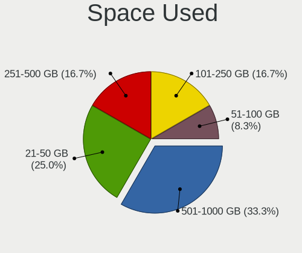

| Used GB        | Notebooks | Percent |
|----------------|-----------|---------|
| 21-50          | 6         | 40%     |
| 251-500        | 2         | 13.33%  |
| 1-20           | 2         | 13.33%  |
| Unknown        | 2         | 13.33%  |
| More than 3000 | 1         | 6.67%   |
| 101-250        | 1         | 6.67%   |
| 51-100         | 1         | 6.67%   |

Malfunc. Drives
---------------

Drive models with a malfunction

Zero info for selected period =(

Malfunc. Drive Vendor
---------------------

Vendors of faulty drives

Zero info for selected period =(

Malfunc. HDD Vendor
-------------------

Vendors of faulty HDD drives

Zero info for selected period =(

Malfunc. Drive Kind
-------------------

Kinds of faulty drives

Zero info for selected period =(

Failed Drives
-------------

Failed drive models

Zero info for selected period =(

Failed Drive Vendor
-------------------

Failed drive vendors

Zero info for selected period =(

Drive Status
------------

Number of failed and malfunc. drives

| Status   | Notebooks | Drives | Percent |
|----------|-----------|--------|---------|
| Detected | 8         | 14     | 53.33%  |
| Works    | 7         | 8      | 46.67%  |

Storage controller
------------------

Storage Vendor
--------------

Storage controller vendors

| Vendor              | Notebooks | Percent |
|---------------------|-----------|---------|
| Intel               | 10        | 50%     |
| SK hynix            | 3         | 15%     |
| Samsung Electronics | 3         | 15%     |
| AMD                 | 2         | 10%     |
| Phison Electronics  | 1         | 5%      |
| Micron Technology   | 1         | 5%      |

Storage Model
-------------

Storage controller models

| Model                                                                          | Notebooks | Percent |
|--------------------------------------------------------------------------------|-----------|---------|
| Intel 8 Series/C220 Series Chipset Family 6-port SATA Controller 1 [AHCI mode] | 3         | 14.29%  |
| Intel Volume Management Device NVMe RAID Controller                            | 2         | 9.52%   |
| AMD FCH SATA Controller [AHCI mode]                                            | 2         | 9.52%   |
| SK hynix PC611 NVMe Solid State Drive                                          | 1         | 4.76%   |
| SK hynix PC300 NVMe Solid State Drive 512GB                                    | 1         | 4.76%   |
| SK hynix Gold P31/BC711/PC711 NVMe Solid State Drive                           | 1         | 4.76%   |
| Samsung NVMe SSD Controller SM981/PM981/PM983                                  | 1         | 4.76%   |
| Samsung NVMe SSD Controller PM9A1/PM9A3/980PRO                                 | 1         | 4.76%   |
| Samsung NVMe SSD Controller 980                                                | 1         | 4.76%   |
| Phison PS5013 E13 NVMe Controller                                              | 1         | 4.76%   |
| Micron NVMe Storage Controller                                                 | 1         | 4.76%   |
| Intel Tiger Lake-LP SATA Controller                                            | 1         | 4.76%   |
| Intel SSD 660P Series                                                          | 1         | 4.76%   |
| Intel SATA Controller [RAID mode]                                              | 1         | 4.76%   |
| Intel 8 Series SATA Controller 1 [AHCI mode]                                   | 1         | 4.76%   |
| Intel 6 Series/C200 Series Chipset Family 6 port Mobile SATA AHCI Controller   | 1         | 4.76%   |
| Intel 400 Series Chipset Family SATA AHCI Controller                           | 1         | 4.76%   |

Storage Kind
------------

Kind of storage controller (IDE, SATA, NVMe, SAS, ...)

| Kind | Notebooks | Percent |
|------|-----------|---------|
| NVMe | 9         | 42.86%  |
| SATA | 9         | 42.86%  |
| RAID | 3         | 14.29%  |

Processor
---------

CPU Vendor
----------

Processor vendors

| Vendor | Notebooks | Percent |
|--------|-----------|---------|
| Intel  | 13        | 86.67%  |
| AMD    | 2         | 13.33%  |

CPU Model
---------

Processor models

| Model                                           | Notebooks | Percent |
|-------------------------------------------------|-----------|---------|
| Intel Core i7-10750H CPU @ 2.60GHz              | 2         | 13.33%  |
| Intel Core i7-6820HQ CPU @ 2.70GHz              | 1         | 6.67%   |
| Intel Core i7-4710HQ CPU @ 2.50GHz              | 1         | 6.67%   |
| Intel Core i7-4700MQ CPU @ 2.40GHz              | 1         | 6.67%   |
| Intel Core i7-2720QM CPU @ 2.20GHz              | 1         | 6.67%   |
| Intel Core i7-1065G7 CPU @ 1.30GHz              | 1         | 6.67%   |
| Intel Core i3-4030U CPU @ 1.90GHz               | 1         | 6.67%   |
| Intel Core i3-4000M CPU @ 2.40GHz               | 1         | 6.67%   |
| Intel Celeron N4020 CPU @ 1.10GHz               | 1         | 6.67%   |
| Intel 12th Gen Core i9-12900H                   | 1         | 6.67%   |
| Intel 11th Gen Core i7-1165G7 @ 2.80GHz         | 1         | 6.67%   |
| Intel 11th Gen Core i7-11370H @ 3.30GHz         | 1         | 6.67%   |
| AMD Ryzen 5 PRO 2500U w/ Radeon Vega Mobile Gfx | 1         | 6.67%   |
| AMD Ryzen 5 4600H with Radeon Graphics          | 1         | 6.67%   |

CPU Model Family
----------------

Processor model prefix

| Model           | Notebooks | Percent |
|-----------------|-----------|---------|
| Intel Core i7   | 7         | 46.67%  |
| Other           | 3         | 20%     |
| Intel Core i3   | 2         | 13.33%  |
| Intel Celeron   | 1         | 6.67%   |
| AMD Ryzen 5 PRO | 1         | 6.67%   |
| AMD Ryzen 5     | 1         | 6.67%   |

CPU Cores
---------

Number of processor cores

| Number | Notebooks | Percent |
|--------|-----------|---------|
| 4      | 8         | 53.33%  |
| 6      | 3         | 20%     |
| 2      | 3         | 20%     |
| 14     | 1         | 6.67%   |

CPU Sockets
-----------

Number of sockets

| Number | Notebooks | Percent |
|--------|-----------|---------|
| 1      | 15        | 100%    |

CPU Threads
-----------

Threads per core (Hyper-Threading)

| Number | Notebooks | Percent |
|--------|-----------|---------|
| 2      | 14        | 93.33%  |
| 1      | 1         | 6.67%   |

CPU Op-Modes
------------

CPU Operation Modes (32-bit, 64-bit)

| Op mode        | Notebooks | Percent |
|----------------|-----------|---------|
| 32-bit, 64-bit | 15        | 100%    |

CPU Microcode
-------------

Microcode number

| Number     | Notebooks | Percent |
|------------|-----------|---------|
| Unknown    | 13        | 86.67%  |
| 0x08600104 | 1         | 6.67%   |
| 0x0810100b | 1         | 6.67%   |

CPU Microarch
-------------

Microarchitecture

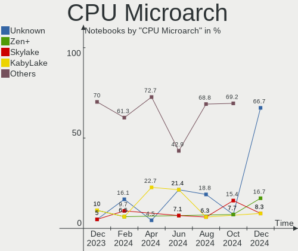

| Name             | Notebooks | Percent |
|------------------|-----------|---------|
| Haswell          | 4         | 26.67%  |
| TigerLake        | 2         | 13.33%  |
| CometLake        | 2         | 13.33%  |
| Zen 2            | 1         | 6.67%   |
| Zen              | 1         | 6.67%   |
| Skylake          | 1         | 6.67%   |
| SandyBridge      | 1         | 6.67%   |
| IceLake          | 1         | 6.67%   |
| Goldmont plus    | 1         | 6.67%   |
| Alderlake Hybrid | 1         | 6.67%   |

Graphics
--------

GPU Vendor
----------

Vendors of graphics cards

| Vendor | Notebooks | Percent |
|--------|-----------|---------|
| Intel  | 13        | 54.17%  |
| Nvidia | 8         | 33.33%  |
| AMD    | 3         | 12.5%   |

GPU Model
---------

Graphics card models

| Model                                                                         | Notebooks | Percent |
|-------------------------------------------------------------------------------|-----------|---------|
| Intel 4th Gen Core Processor Integrated Graphics Controller                   | 3         | 12.5%   |
| Nvidia TU106M [GeForce RTX 2060 Mobile]                                       | 2         | 8.33%   |
| Intel TigerLake-LP GT2 [Iris Xe Graphics]                                     | 2         | 8.33%   |
| Intel CometLake-H GT2 [UHD Graphics]                                          | 2         | 8.33%   |
| Nvidia TU106M [GeForce RTX 2070 Mobile / Max-Q Refresh]                       | 1         | 4.17%   |
| Nvidia GM107M [GeForce GTX 850M]                                              | 1         | 4.17%   |
| Nvidia GM107GLM [Quadro M1000M]                                               | 1         | 4.17%   |
| Nvidia GK106M [GeForce GTX 770M]                                              | 1         | 4.17%   |
| Nvidia GA107M [GeForce RTX 3050 Ti Mobile]                                    | 1         | 4.17%   |
| Nvidia GA104 [Geforce RTX 3070 Ti Laptop GPU]                                 | 1         | 4.17%   |
| Intel Iris Plus Graphics G7                                                   | 1         | 4.17%   |
| Intel HD Graphics 530                                                         | 1         | 4.17%   |
| Intel Haswell-ULT Integrated Graphics Controller                              | 1         | 4.17%   |
| Intel GeminiLake [UHD Graphics 600]                                           | 1         | 4.17%   |
| Intel Alder Lake-P Integrated Graphics Controller                             | 1         | 4.17%   |
| Intel 2nd Generation Core Processor Family Integrated Graphics Controller     | 1         | 4.17%   |
| AMD Whistler [Radeon HD 6630M/6650M/6750M/7670M/7690M]                        | 1         | 4.17%   |
| AMD Sun XT [Radeon HD 8670A/8670M/8690M / R5 M330 / M430 / Radeon 520 Mobile] | 1         | 4.17%   |
| AMD Raven Ridge [Radeon Vega Series / Radeon Vega Mobile Series]              | 1         | 4.17%   |

GPU Combo
---------

Combinations of graphics cards

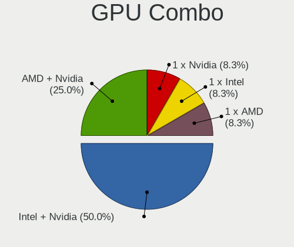

| Name           | Notebooks | Percent |
|----------------|-----------|---------|
| Intel + Nvidia | 7         | 46.67%  |
| 1 x Intel      | 3         | 20%     |
| Intel + AMD    | 2         | 13.33%  |
| Other          | 1         | 6.67%   |
| 1 x Nvidia     | 1         | 6.67%   |
| 1 x AMD        | 1         | 6.67%   |

GPU Driver
----------

Free vs proprietary

| Driver      | Notebooks | Percent |
|-------------|-----------|---------|
| Proprietary | 8         | 53.33%  |
| Free        | 7         | 46.67%  |

GPU Memory
----------

Total video memory

| Size in GB | Notebooks | Percent |
|------------|-----------|---------|
| Unknown    | 12        | 80%     |
| 0.51-1.0   | 2         | 13.33%  |
| 1.01-2.0   | 1         | 6.67%   |

Monitor
-------

Monitor Vendor
--------------

Monitor vendors

| Vendor                  | Notebooks | Percent |
|-------------------------|-----------|---------|
| Chimei Innolux          | 3         | 17.65%  |
| BOE                     | 3         | 17.65%  |
| Samsung Electronics     | 2         | 11.76%  |
| TMX                     | 1         | 5.88%   |
| Sharp                   | 1         | 5.88%   |
| PANDA                   | 1         | 5.88%   |
| LG Display              | 1         | 5.88%   |
| GAOMON                  | 1         | 5.88%   |
| Dell                    | 1         | 5.88%   |
| Chi Mei Optoelectronics | 1         | 5.88%   |
| AU Optronics            | 1         | 5.88%   |
| Apple                   | 1         | 5.88%   |

Monitor Model
-------------

Monitor models

| Model                                                                     | Notebooks | Percent |
|---------------------------------------------------------------------------|-----------|---------|
| TMX TL156VDXP0101 TMX1561 1920x1080 344x194mm 15.5-inch                   | 1         | 5.88%   |
| Sharp LCD Monitor SHP1430 3840x2160 350x190mm 15.7-inch                   | 1         | 5.88%   |
| Samsung Electronics S19D300 SAM0B34 1366x768 410x230mm 18.5-inch          | 1         | 5.88%   |
| Samsung Electronics LCD Monitor SDC4150 3456x2160 336x210mm 15.6-inch     | 1         | 5.88%   |
| PANDA LCD Monitor NCP004D 1920x1080 344x194mm 15.5-inch                   | 1         | 5.88%   |
| LG Display LCD Monitor LGD060F 1920x1080 309x174mm 14.0-inch              | 1         | 5.88%   |
| GAOMON PD2200 GAM2200 1920x1080 480x260mm 21.5-inch                       | 1         | 5.88%   |
| Dell U2715H DELD067 2560x1440 600x340mm 27.2-inch                         | 1         | 5.88%   |
| Chimei Innolux LCD Monitor CMN176E 1920x1080 381x214mm 17.2-inch          | 1         | 5.88%   |
| Chimei Innolux LCD Monitor CMN15AB 1366x768 344x193mm 15.5-inch           | 1         | 5.88%   |
| Chimei Innolux LCD Monitor CMN14C9 1920x1080 309x173mm 13.9-inch          | 1         | 5.88%   |
| Chi Mei Optoelectronics LCD Monitor CMO1720 1920x1080 382x215mm 17.3-inch | 1         | 5.88%   |
| BOE LCD Monitor BOE08E8 1920x1080 344x194mm 15.5-inch                     | 1         | 5.88%   |
| BOE LCD Monitor BOE0718 1920x1080 309x173mm 13.9-inch                     | 1         | 5.88%   |
| BOE LCD Monitor BOE0671 1366x768 344x194mm 15.5-inch                      | 1         | 5.88%   |
| AU Optronics LCD Monitor AUO41EC 1366x768 344x193mm 15.5-inch             | 1         | 5.88%   |
| Apple LCD Monitor APP9CCD 1920x1200 367x230mm 17.1-inch                   | 1         | 5.88%   |

Monitor Resolution
------------------

Monitor screen resolution

| Resolution        | Notebooks | Percent |
|-------------------|-----------|---------|
| 1920x1080 (FHD)   | 9         | 56.25%  |
| 1366x768 (WXGA)   | 3         | 18.75%  |
| 3840x2160 (4K)    | 1         | 6.25%   |
| 3456x2160         | 1         | 6.25%   |
| 2560x1440 (QHD)   | 1         | 6.25%   |
| 1920x1200 (WUXGA) | 1         | 6.25%   |

Monitor Diagonal
----------------

Diagonal size in inches

| Inches | Notebooks | Percent |
|--------|-----------|---------|
| 15     | 8         | 47.06%  |
| 17     | 3         | 17.65%  |
| 13     | 2         | 11.76%  |
| 27     | 1         | 5.88%   |
| 21     | 1         | 5.88%   |
| 18     | 1         | 5.88%   |
| 14     | 1         | 5.88%   |

Monitor Width
-------------

Physical width

| Width in mm | Notebooks | Percent |
|-------------|-----------|---------|
| 301-350     | 11        | 64.71%  |
| 351-400     | 3         | 17.65%  |
| 401-500     | 2         | 11.76%  |
| 501-600     | 1         | 5.88%   |

Aspect Ratio
------------

Proportional relationship between the width and the height

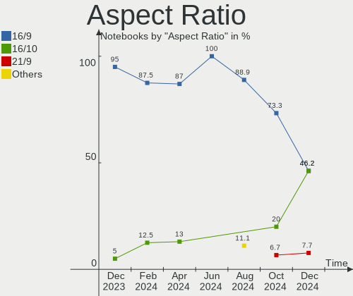

| Ratio | Notebooks | Percent |
|-------|-----------|---------|
| 16/9  | 13        | 86.67%  |
| 16/10 | 2         | 13.33%  |

Monitor Area
------------

Area in inch²

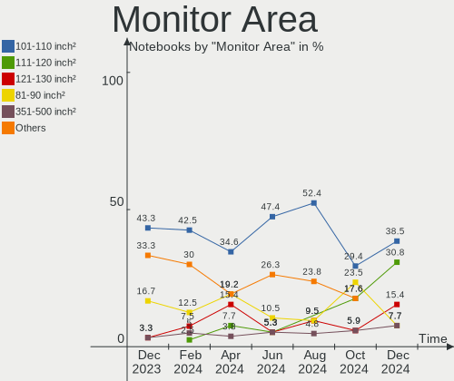

| Area in inch² | Notebooks | Percent |
|----------------|-----------|---------|
| 101-110        | 8         | 47.06%  |
| 81-90          | 3         | 17.65%  |
| 121-130        | 2         | 11.76%  |
| 301-350        | 1         | 5.88%   |
| 151-200        | 1         | 5.88%   |
| 141-150        | 1         | 5.88%   |
| 131-140        | 1         | 5.88%   |

Pixel Density
-------------

Pixels per inch

| Density       | Notebooks | Percent |
|---------------|-----------|---------|
| 121-160       | 9         | 56.25%  |
| 101-120       | 4         | 25%     |
| More than 240 | 2         | 12.5%   |
| 51-100        | 1         | 6.25%   |

Multiple Monitors
-----------------

Total monitors connected

| Total | Notebooks | Percent |
|-------|-----------|---------|
| 1     | 13        | 86.67%  |
| 2     | 2         | 13.33%  |

Network
-------

Net Controller Vendor
---------------------

Controller vendors

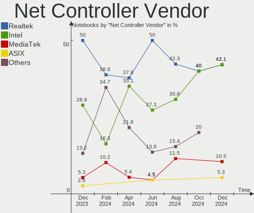

| Vendor                | Notebooks | Percent |
|-----------------------|-----------|---------|
| Intel                 | 9         | 37.5%   |
| Realtek Semiconductor | 7         | 29.17%  |
| Qualcomm Atheros      | 3         | 12.5%   |
| Broadcom              | 2         | 8.33%   |
| Xiaomi                | 1         | 4.17%   |
| Ralink Technology     | 1         | 4.17%   |
| Ralink                | 1         | 4.17%   |

Net Controller Model
--------------------

Controller models

| Model                                                             | Notebooks | Percent |
|-------------------------------------------------------------------|-----------|---------|
| Realtek RTL8111/8168/8411 PCI Express Gigabit Ethernet Controller | 5         | 17.86%  |
| Intel Wi-Fi 6 AX201                                               | 2         | 7.14%   |
| Intel Comet Lake PCH CNVi WiFi                                    | 2         | 7.14%   |
| Xiaomi Mi/Redmi series (RNDIS)                                    | 1         | 3.57%   |
| Realtek RTL8822CE 802.11ac PCIe Wireless Network Adapter          | 1         | 3.57%   |
| Realtek RTL8822BE 802.11a/b/g/n/ac WiFi adapter                   | 1         | 3.57%   |
| Realtek RTL8125 2.5GbE Controller                                 | 1         | 3.57%   |
| Ralink MT7601U Wireless Adapter                                   | 1         | 3.57%   |
| Ralink RT3290 Wireless 802.11n 1T/1R PCIe                         | 1         | 3.57%   |
| Qualcomm Atheros QCA9565 / AR9565 Wireless Network Adapter        | 1         | 3.57%   |
| Qualcomm Atheros Killer E2500 Gigabit Ethernet Controller         | 1         | 3.57%   |
| Qualcomm Atheros Killer E220x Gigabit Ethernet Controller         | 1         | 3.57%   |
| Qualcomm Atheros AR9462 Wireless Network Adapter                  | 1         | 3.57%   |
| Intel Wireless 8260                                               | 1         | 3.57%   |
| Intel Wi-Fi 6 AX200                                               | 1         | 3.57%   |
| Intel Ice Lake-LP PCH CNVi WiFi                                   | 1         | 3.57%   |
| Intel Ethernet Connection I217-V                                  | 1         | 3.57%   |
| Intel Ethernet Connection (2) I219-LM                             | 1         | 3.57%   |
| Intel Alder Lake-P PCH CNVi WiFi                                  | 1         | 3.57%   |
| Broadcom NetXtreme BCM57765 Gigabit Ethernet PCIe                 | 1         | 3.57%   |
| Broadcom BCM4331 802.11a/b/g/n                                    | 1         | 3.57%   |
| Broadcom BCM43228 802.11a/b/g/n                                   | 1         | 3.57%   |

Wireless Vendor
---------------

Wireless vendors

| Vendor                | Notebooks | Percent |
|-----------------------|-----------|---------|
| Intel                 | 8         | 50%     |
| Realtek Semiconductor | 2         | 12.5%   |
| Qualcomm Atheros      | 2         | 12.5%   |
| Broadcom              | 2         | 12.5%   |
| Ralink Technology     | 1         | 6.25%   |
| Ralink                | 1         | 6.25%   |

Wireless Model
--------------

Wireless models

| Model                                                      | Notebooks | Percent |
|------------------------------------------------------------|-----------|---------|
| Intel Wi-Fi 6 AX201                                        | 2         | 12.5%   |
| Intel Comet Lake PCH CNVi WiFi                             | 2         | 12.5%   |
| Realtek RTL8822CE 802.11ac PCIe Wireless Network Adapter   | 1         | 6.25%   |
| Realtek RTL8822BE 802.11a/b/g/n/ac WiFi adapter            | 1         | 6.25%   |
| Ralink MT7601U Wireless Adapter                            | 1         | 6.25%   |
| Ralink RT3290 Wireless 802.11n 1T/1R PCIe                  | 1         | 6.25%   |
| Qualcomm Atheros QCA9565 / AR9565 Wireless Network Adapter | 1         | 6.25%   |
| Qualcomm Atheros AR9462 Wireless Network Adapter           | 1         | 6.25%   |
| Intel Wireless 8260                                        | 1         | 6.25%   |
| Intel Wi-Fi 6 AX200                                        | 1         | 6.25%   |
| Intel Ice Lake-LP PCH CNVi WiFi                            | 1         | 6.25%   |
| Intel Alder Lake-P PCH CNVi WiFi                           | 1         | 6.25%   |
| Broadcom BCM4331 802.11a/b/g/n                             | 1         | 6.25%   |
| Broadcom BCM43228 802.11a/b/g/n                            | 1         | 6.25%   |

Ethernet Vendor
---------------

Ethernet vendors

| Vendor                | Notebooks | Percent |
|-----------------------|-----------|---------|
| Realtek Semiconductor | 6         | 50%     |
| Qualcomm Atheros      | 2         | 16.67%  |
| Intel                 | 2         | 16.67%  |
| Xiaomi                | 1         | 8.33%   |
| Broadcom              | 1         | 8.33%   |

Ethernet Model
--------------

Ethernet models

| Model                                                             | Notebooks | Percent |
|-------------------------------------------------------------------|-----------|---------|
| Realtek RTL8111/8168/8411 PCI Express Gigabit Ethernet Controller | 5         | 41.67%  |
| Xiaomi Mi/Redmi series (RNDIS)                                    | 1         | 8.33%   |
| Realtek RTL8125 2.5GbE Controller                                 | 1         | 8.33%   |
| Qualcomm Atheros Killer E2500 Gigabit Ethernet Controller         | 1         | 8.33%   |
| Qualcomm Atheros Killer E220x Gigabit Ethernet Controller         | 1         | 8.33%   |
| Intel Ethernet Connection I217-V                                  | 1         | 8.33%   |
| Intel Ethernet Connection (2) I219-LM                             | 1         | 8.33%   |
| Broadcom NetXtreme BCM57765 Gigabit Ethernet PCIe                 | 1         | 8.33%   |

Net Controller Kind
-------------------

Ethernet, WiFi or modem

| Kind     | Notebooks | Percent |
|----------|-----------|---------|
| WiFi     | 15        | 57.69%  |
| Ethernet | 11        | 42.31%  |

Used Controller
---------------

Currently used network controller

| Kind     | Notebooks | Percent |
|----------|-----------|---------|
| WiFi     | 13        | 72.22%  |
| Ethernet | 5         | 27.78%  |

NICs
----

Total network controllers on board

| Total | Notebooks | Percent |
|-------|-----------|---------|
| 2     | 10        | 66.67%  |
| 1     | 4         | 26.67%  |
| 3     | 1         | 6.67%   |

IPv6
----

IPv6 vs IPv4

| Used | Notebooks | Percent |
|------|-----------|---------|
| No   | 11        | 73.33%  |
| Yes  | 4         | 26.67%  |

Bluetooth
---------

Bluetooth Vendor
----------------

Controller vendors

| Vendor                          | Notebooks | Percent |
|---------------------------------|-----------|---------|
| Intel                           | 7         | 50%     |
| Realtek Semiconductor           | 2         | 14.29%  |
| Qualcomm Atheros Communications | 2         | 14.29%  |
| Ralink                          | 1         | 7.14%   |
| Broadcom                        | 1         | 7.14%   |
| Apple                           | 1         | 7.14%   |

Bluetooth Model
---------------

Controller models

| Model                                   | Notebooks | Percent |
|-----------------------------------------|-----------|---------|
| Intel AX201 Bluetooth                   | 5         | 35.71%  |
| Qualcomm Atheros AR3012 Bluetooth 4.0   | 2         | 14.29%  |
| Realtek RTL8822BE Bluetooth 4.2 Adapter | 1         | 7.14%   |
| Realtek Bluetooth Radio                 | 1         | 7.14%   |
| Ralink RT3290 Bluetooth                 | 1         | 7.14%   |
| Intel Bluetooth Device                  | 1         | 7.14%   |
| Intel AX200 Bluetooth                   | 1         | 7.14%   |
| Broadcom HP Portable Bumble Bee         | 1         | 7.14%   |
| Apple Bluetooth Host Controller         | 1         | 7.14%   |

Sound
-----

Sound Vendor
------------

Sound card vendors

| Vendor   | Notebooks | Percent |
|----------|-----------|---------|
| Intel    | 13        | 54.17%  |
| Nvidia   | 7         | 29.17%  |
| AMD      | 3         | 12.5%   |
| Logitech | 1         | 4.17%   |

Sound Model
-----------

Sound card models

| Model                                                                      | Notebooks | Percent |
|----------------------------------------------------------------------------|-----------|---------|
| Nvidia TU106 High Definition Audio Controller                              | 3         | 10.71%  |
| Intel 8 Series/C220 Series Chipset High Definition Audio Controller        | 3         | 10.71%  |
| Intel Xeon E3-1200 v3/4th Gen Core Processor HD Audio Controller           | 2         | 7.14%   |
| Intel Tiger Lake-LP Smart Sound Technology Audio Controller                | 2         | 7.14%   |
| Intel Comet Lake PCH cAVS                                                  | 2         | 7.14%   |
| AMD Family 17h/19h HD Audio Controller                                     | 2         | 7.14%   |
| Nvidia GM107 High Definition Audio Controller [GeForce 940MX]              | 1         | 3.57%   |
| Nvidia GK106 HDMI Audio Controller                                         | 1         | 3.57%   |
| Nvidia GA104 High Definition Audio Controller                              | 1         | 3.57%   |
| Nvidia Audio device                                                        | 1         | 3.57%   |
| Logitech Logi USB Headset                                                  | 1         | 3.57%   |
| Intel Ice Lake-LP Smart Sound Technology Audio Controller                  | 1         | 3.57%   |
| Intel Haswell-ULT HD Audio Controller                                      | 1         | 3.57%   |
| Intel Celeron/Pentium Silver Processor High Definition Audio               | 1         | 3.57%   |
| Intel Alder Lake PCH-P High Definition Audio Controller                    | 1         | 3.57%   |
| Intel 8 Series HD Audio Controller                                         | 1         | 3.57%   |
| Intel 6 Series/C200 Series Chipset Family High Definition Audio Controller | 1         | 3.57%   |
| Intel 100 Series/C230 Series Chipset Family HD Audio Controller            | 1         | 3.57%   |
| AMD Turks HDMI Audio [Radeon HD 6500/6600 / 6700M Series]                  | 1         | 3.57%   |
| AMD Raven/Raven2/Fenghuang HDMI/DP Audio Controller                        | 1         | 3.57%   |

Memory
------

Memory Vendor
-------------

Memory module vendors

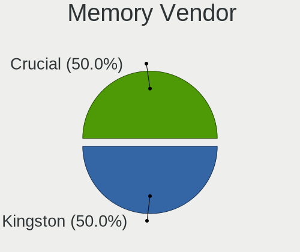

| Vendor              | Notebooks | Percent |
|---------------------|-----------|---------|
| Samsung Electronics | 3         | 33.33%  |
| SK hynix            | 2         | 22.22%  |
| Micron Technology   | 2         | 22.22%  |
| Team                | 1         | 11.11%  |
| AMD                 | 1         | 11.11%  |

Memory Model
------------

Memory module models

| Model                                                       | Notebooks | Percent |
|-------------------------------------------------------------|-----------|---------|
| SK hynix RAM HMA81GS6DJR8N-XN 8GB SODIMM DDR4 3200MT/s      | 2         | 22.22%  |
| Team RAM TEAMGROUP-SD4-2666 16GB SODIMM DDR4 2667MT/s       | 1         | 11.11%  |
| Samsung RAM M471B5173QH0-YK0 4GB SODIMM DDR3 1600MT/s       | 1         | 11.11%  |
| Samsung RAM M471B5173EB0-YK0 4096MB SODIMM DDR3 1600MT/s    | 1         | 11.11%  |
| Samsung RAM M471A1K43CB1-CTD 8GB SODIMM DDR4 2667MT/s       | 1         | 11.11%  |
| Micron RAM K4A8G165WB-BCRC 8GB Row Of Chips LPDDR4 3333MT/s | 1         | 11.11%  |
| Micron RAM 53E2G32D4NQ-046 4GB Row Of Chips LPDDR4 4267MT/s | 1         | 11.11%  |
| AMD RAM R538G1601S2SL 8GB SODIMM DDR3 1600MT/s              | 1         | 11.11%  |

Memory Kind
-----------

Memory module kinds

| Kind   | Notebooks | Percent |
|--------|-----------|---------|
| DDR4   | 3         | 42.86%  |
| LPDDR4 | 2         | 28.57%  |
| DDR3   | 2         | 28.57%  |

Memory Form Factor
------------------

Physical design of the memory module

| Name         | Notebooks | Percent |
|--------------|-----------|---------|
| SODIMM       | 5         | 71.43%  |
| Row Of Chips | 2         | 28.57%  |

Memory Size
-----------

Memory module size

| Size  | Notebooks | Percent |
|-------|-----------|---------|
| 8192  | 5         | 55.56%  |
| 4096  | 3         | 33.33%  |
| 32768 | 1         | 11.11%  |

Memory Speed
------------

Memory module speed

| Speed | Notebooks | Percent |
|-------|-----------|---------|
| 3200  | 2         | 28.57%  |
| 1600  | 2         | 28.57%  |
| 4267  | 1         | 14.29%  |
| 3333  | 1         | 14.29%  |
| 2667  | 1         | 14.29%  |

Printers & scanners
-------------------

Printer Vendor
--------------

Printer device vendors

Zero info for selected period =(

Printer Model
-------------

Printer device models

Zero info for selected period =(

Scanner Vendor
--------------

Scanner device vendors

Zero info for selected period =(

Scanner Model
-------------

Scanner device models

Zero info for selected period =(

Camera
------

Camera Vendor
-------------

Camera device vendors

| Vendor                        | Notebooks | Percent |
|-------------------------------|-----------|---------|
| Sunplus Innovation Technology | 2         | 20%     |
| IMC Networks                  | 2         | 20%     |
| Chicony Electronics           | 2         | 20%     |
| Quanta                        | 1         | 10%     |
| Lite-On Technology            | 1         | 10%     |
| Bison Electronics             | 1         | 10%     |
| Apple                         | 1         | 10%     |

Camera Model
------------

Camera device models

| Model                                   | Notebooks | Percent |
|-----------------------------------------|-----------|---------|
| Sunplus Integrated_Webcam_HD            | 1         | 10%     |
| Sunplus Camera                          | 1         | 10%     |
| Quanta HP Wide Vision HD Camera         | 1         | 10%     |
| Lite-On HP HD Webcam                    | 1         | 10%     |
| IMC Networks XiaoMi Webcam              | 1         | 10%     |
| IMC Networks Integrated Camera          | 1         | 10%     |
| Chicony USB2.0 VGA UVC WebCam           | 1         | 10%     |
| Chicony Integrated Camera (1280x720@30) | 1         | 10%     |
| Bison Lenovo EasyCamera                 | 1         | 10%     |
| Apple FaceTime HD Camera                | 1         | 10%     |

Security
--------

Fingerprint Vendor
------------------

Fingerprint sensor vendors

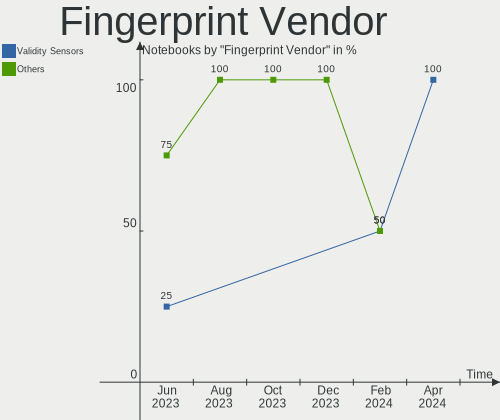

| Vendor                     | Notebooks | Percent |
|----------------------------|-----------|---------|
| Validity Sensors           | 1         | 33.33%  |
| Synaptics                  | 1         | 33.33%  |
| Shenzhen Goodix Technology | 1         | 33.33%  |

Fingerprint Model
-----------------

Fingerprint sensor models

| Model                                            | Notebooks | Percent |
|--------------------------------------------------|-----------|---------|
| Validity Sensors VFS495 Fingerprint Reader       | 1         | 33.33%  |
| Synaptics Metallica MIS Touch Fingerprint Reader | 1         | 33.33%  |
| Shenzhen Goodix  FingerPrint Device              | 1         | 33.33%  |

Chipcard Vendor
---------------

Chipcard module vendors

| Vendor   | Notebooks | Percent |
|----------|-----------|---------|
| Broadcom | 1         | 100%    |

Chipcard Model
--------------

Chipcard module models

| Model         | Notebooks | Percent |
|---------------|-----------|---------|
| Broadcom 5880 | 1         | 100%    |

Unsupported
-----------

Unsupported Devices
-------------------

Total unsupported devices on board

| Total | Notebooks | Percent |
|-------|-----------|---------|
| 0     | 11        | 73.33%  |
| 1     | 4         | 26.67%  |

Unsupported Device Types
------------------------

Types of unsupported devices

| Type               | Notebooks | Percent |
|--------------------|-----------|---------|
| Fingerprint reader | 3         | 75%     |
| Bluetooth          | 1         | 25%     |

