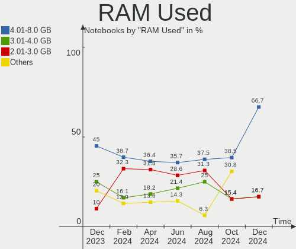
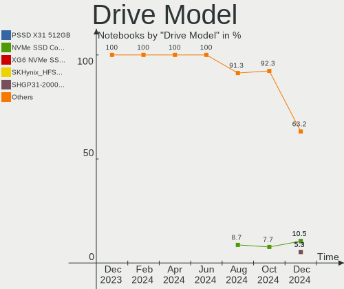
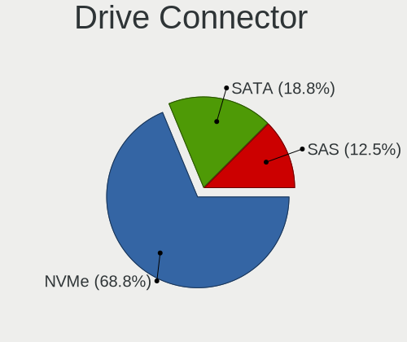
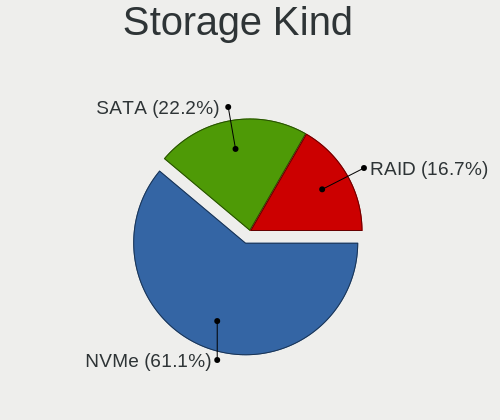
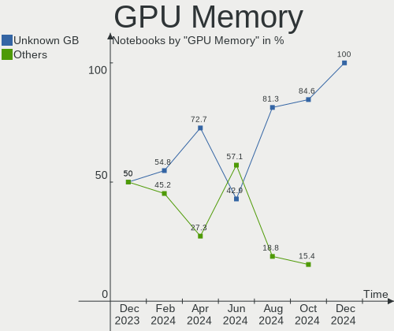
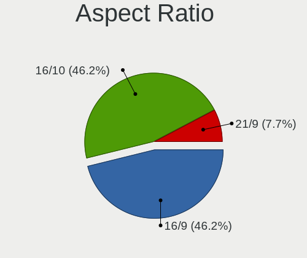
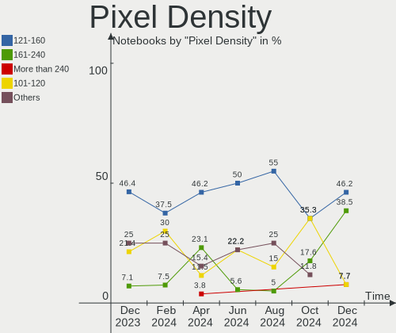
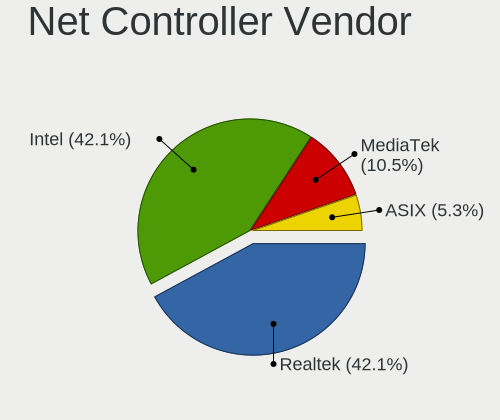

Nobara - Hardware Trends (Notebooks)
------------------------------------

A project to identify most popular hardware characteristics and track their change
over time based on data collected by Linux users at https://Linux-Hardware.org.

Anyone can contribute to this report by the [hw-probe](https://github.com/linuxhw/hw-probe) tool:

    sudo -E hw-probe -all -upload

This report is for one last month. Overall report since the beginning of time: [TestDays](https://github.com/linuxhw/TestDays)

Period: Apr, 2023.

Contents
--------

* [ System ](#system)
  - [ OS                       ](#os)
  - [ OS Family                ](#os-family)
  - [ Kernel                   ](#kernel)
  - [ Kernel Family            ](#kernel-family)
  - [ Kernel Major Ver.        ](#kernel-major-ver)
  - [ Arch                     ](#arch)
  - [ DE                       ](#de)
  - [ Display Server           ](#display-server)
  - [ Display Manager          ](#display-manager)
  - [ OS Lang                  ](#os-lang)
  - [ Boot Mode                ](#boot-mode)
  - [ Filesystem               ](#filesystem)
  - [ Part. scheme             ](#part-scheme)
  - [ Dual Boot with Linux/BSD ](#dual-boot-with-linuxbsd)
  - [ Dual Boot (Win)          ](#dual-boot-win)

* [ Board ](#board)
  - [ Vendor                   ](#vendor)
  - [ Model                    ](#model)
  - [ Model Family             ](#model-family)
  - [ MFG Year                 ](#mfg-year)
  - [ Form Factor              ](#form-factor)
  - [ Secure Boot              ](#secure-boot)
  - [ Coreboot                 ](#coreboot)
  - [ RAM Size                 ](#ram-size)
  - [ RAM Used                 ](#ram-used)
  - [ Total Drives             ](#total-drives)
  - [ Has CD-ROM               ](#has-cd-rom)
  - [ Has Ethernet             ](#has-ethernet)
  - [ Has WiFi                 ](#has-wifi)
  - [ Has Bluetooth            ](#has-bluetooth)

* [ Location ](#location)
  - [ Country                  ](#country)
  - [ City                     ](#city)

* [ Drives ](#drives)
  - [ Drive Vendor             ](#drive-vendor)
  - [ Drive Model              ](#drive-model)
  - [ HDD Vendor               ](#hdd-vendor)
  - [ SSD Vendor               ](#ssd-vendor)
  - [ Drive Kind               ](#drive-kind)
  - [ Drive Connector          ](#drive-connector)
  - [ Drive Size               ](#drive-size)
  - [ Space Total              ](#space-total)
  - [ Space Used               ](#space-used)
  - [ Malfunc. Drives          ](#malfunc-drives)
  - [ Malfunc. Drive Vendor    ](#malfunc-drive-vendor)
  - [ Malfunc. HDD Vendor      ](#malfunc-hdd-vendor)
  - [ Malfunc. Drive Kind      ](#malfunc-drive-kind)
  - [ Failed Drives            ](#failed-drives)
  - [ Failed Drive Vendor      ](#failed-drive-vendor)
  - [ Drive Status             ](#drive-status)

* [ Storage controller ](#storage-controller)
  - [ Storage Vendor           ](#storage-vendor)
  - [ Storage Model            ](#storage-model)
  - [ Storage Kind             ](#storage-kind)

* [ Processor ](#processor)
  - [ CPU Vendor               ](#cpu-vendor)
  - [ CPU Model                ](#cpu-model)
  - [ CPU Model Family         ](#cpu-model-family)
  - [ CPU Cores                ](#cpu-cores)
  - [ CPU Sockets              ](#cpu-sockets)
  - [ CPU Threads              ](#cpu-threads)
  - [ CPU Op-Modes             ](#cpu-op-modes)
  - [ CPU Microcode            ](#cpu-microcode)
  - [ CPU Microarch            ](#cpu-microarch)

* [ Graphics ](#graphics)
  - [ GPU Vendor               ](#gpu-vendor)
  - [ GPU Model                ](#gpu-model)
  - [ GPU Combo                ](#gpu-combo)
  - [ GPU Driver               ](#gpu-driver)
  - [ GPU Memory               ](#gpu-memory)

* [ Monitor ](#monitor)
  - [ Monitor Vendor           ](#monitor-vendor)
  - [ Monitor Model            ](#monitor-model)
  - [ Monitor Resolution       ](#monitor-resolution)
  - [ Monitor Diagonal         ](#monitor-diagonal)
  - [ Monitor Width            ](#monitor-width)
  - [ Aspect Ratio             ](#aspect-ratio)
  - [ Monitor Area             ](#monitor-area)
  - [ Pixel Density            ](#pixel-density)
  - [ Multiple Monitors        ](#multiple-monitors)

* [ Network ](#network)
  - [ Net Controller Vendor    ](#net-controller-vendor)
  - [ Net Controller Model     ](#net-controller-model)
  - [ Wireless Vendor          ](#wireless-vendor)
  - [ Wireless Model           ](#wireless-model)
  - [ Ethernet Vendor          ](#ethernet-vendor)
  - [ Ethernet Model           ](#ethernet-model)
  - [ Net Controller Kind      ](#net-controller-kind)
  - [ Used Controller          ](#used-controller)
  - [ NICs                     ](#nics)
  - [ IPv6                     ](#ipv6)

* [ Bluetooth ](#bluetooth)
  - [ Bluetooth Vendor         ](#bluetooth-vendor)
  - [ Bluetooth Model          ](#bluetooth-model)

* [ Sound ](#sound)
  - [ Sound Vendor             ](#sound-vendor)
  - [ Sound Model              ](#sound-model)

* [ Memory ](#memory)
  - [ Memory Vendor            ](#memory-vendor)
  - [ Memory Model             ](#memory-model)
  - [ Memory Kind              ](#memory-kind)
  - [ Memory Form Factor       ](#memory-form-factor)
  - [ Memory Size              ](#memory-size)
  - [ Memory Speed             ](#memory-speed)

* [ Printers & scanners ](#printers--scanners)
  - [ Printer Vendor           ](#printer-vendor)
  - [ Printer Model            ](#printer-model)
  - [ Scanner Vendor           ](#scanner-vendor)
  - [ Scanner Model            ](#scanner-model)

* [ Camera ](#camera)
  - [ Camera Vendor            ](#camera-vendor)
  - [ Camera Model             ](#camera-model)

* [ Security ](#security)
  - [ Fingerprint Vendor       ](#fingerprint-vendor)
  - [ Fingerprint Model        ](#fingerprint-model)
  - [ Chipcard Vendor          ](#chipcard-vendor)
  - [ Chipcard Model           ](#chipcard-model)

* [ Unsupported ](#unsupported)
  - [ Unsupported Devices      ](#unsupported-devices)
  - [ Unsupported Device Types ](#unsupported-device-types)

System
------

OS
--

Installed operating systems

| Name      | Notebooks | Percent |
|-----------|-----------|---------|
| Nobara 37 | 13        | 92.86%  |
| Nobara 36 | 1         | 7.14%   |

OS Family
---------

OS without a version

| Name   | Notebooks | Percent |
|--------|-----------|---------|
| Nobara | 14        | 100%    |

Kernel
------

Version of the Linux kernel

| Version                      | Notebooks | Percent |
|------------------------------|-----------|---------|
| 6.2.11-201.fsync.fc37.x86_64 | 6         | 42.86%  |
| 6.2.8-200.fsync.fc37.x86_64  | 3         | 21.43%  |
| 6.2.10-200.fsync.fc37.x86_64 | 3         | 21.43%  |
| 6.2.11-202.fsync.fc37.x86_64 | 1         | 7.14%   |
| 6.0.14-201.fsync.fc36.x86_64 | 1         | 7.14%   |

Kernel Family
-------------

Linux kernel without a distro release

| Version | Notebooks | Percent |
|---------|-----------|---------|
| 6.2.11  | 7         | 50%     |
| 6.2.8   | 3         | 21.43%  |
| 6.2.10  | 3         | 21.43%  |
| 6.0.14  | 1         | 7.14%   |

Kernel Major Ver.
-----------------

Linux kernel major version

| Version | Notebooks | Percent |
|---------|-----------|---------|
| 6.2     | 13        | 92.86%  |
| 6.0     | 1         | 7.14%   |

Arch
----

OS architecture (x86_64, i586, etc.)

| Name   | Notebooks | Percent |
|--------|-----------|---------|
| x86_64 | 14        | 100%    |

DE
--

Desktop Environment

| Name  | Notebooks | Percent |
|-------|-----------|---------|
| GNOME | 11        | 78.57%  |
| KDE5  | 3         | 21.43%  |

Display Server
--------------

X11 or Wayland

| Name    | Notebooks | Percent |
|---------|-----------|---------|
| Wayland | 13        | 92.86%  |
| X11     | 1         | 7.14%   |

Display Manager
---------------

SDDM, LightDM, etc.

| Name    | Notebooks | Percent |
|---------|-----------|---------|
| Unknown | 12        | 85.71%  |
| GDM     | 2         | 14.29%  |

OS Lang
-------

Language

| Lang  | Notebooks | Percent |
|-------|-----------|---------|
| en_US | 5         | 35.71%  |
| en_GB | 2         | 14.29%  |
| de_DE | 2         | 14.29%  |
| pt_BR | 1         | 7.14%   |
| es_MX | 1         | 7.14%   |
| es_ES | 1         | 7.14%   |
| es_AR | 1         | 7.14%   |
| en_AU | 1         | 7.14%   |

Boot Mode
---------

EFI or BIOS

| Mode | Notebooks | Percent |
|------|-----------|---------|
| EFI  | 10        | 71.43%  |
| BIOS | 4         | 28.57%  |

Filesystem
----------

Type of filesystem

| Type  | Notebooks | Percent |
|-------|-----------|---------|
| Btrfs | 12        | 85.71%  |
| Ext4  | 2         | 14.29%  |

Part. scheme
------------

Scheme of partitioning

| Type    | Notebooks | Percent |
|---------|-----------|---------|
| Unknown | 12        | 85.71%  |
| GPT     | 2         | 14.29%  |

Dual Boot with Linux/BSD
------------------------

Hosting more than one Linux/BSD

| Dual boot | Notebooks | Percent |
|-----------|-----------|---------|
| No        | 12        | 85.71%  |
| Yes       | 2         | 14.29%  |

Dual Boot (Win)
---------------

Hosting Linux and Windows

| Dual boot | Notebooks | Percent |
|-----------|-----------|---------|
| No        | 12        | 85.71%  |
| Yes       | 2         | 14.29%  |

Board
-----

Vendor
------

Motherboard manufacturer

| Name              | Notebooks | Percent |
|-------------------|-----------|---------|
| Lenovo            | 4         | 28.57%  |
| Acer              | 2         | 14.29%  |
| Micro Electronics | 1         | 7.14%   |
| Hewlett-Packard   | 1         | 7.14%   |
| GEO               | 1         | 7.14%   |
| Fujitsu           | 1         | 7.14%   |
| Dell              | 1         | 7.14%   |
| ASUSTek Computer  | 1         | 7.14%   |
| Apple             | 1         | 7.14%   |
| Unknown           | 1         | 7.14%   |

Model
-----

Motherboard model

| Name                                 | Notebooks | Percent |
|--------------------------------------|-----------|---------|
| Unknown                              | 2         | 14.29%  |
| Micro MG-VCP2-17A3070T               | 1         | 7.14%   |
| Lenovo ThinkPad Edge E540 20C6CTO1WW | 1         | 7.14%   |
| Lenovo Legion 7 15IMH05 81YT         | 1         | 7.14%   |
| Lenovo IdeaPad Gaming 3 15ACH6 82K2  | 1         | 7.14%   |
| Lenovo IdeaPad 5 15ITL05 82FG        | 1         | 7.14%   |
| GEO GeoBook 120                      | 1         | 7.14%   |
| Fujitsu LIFEBOOK A557                | 1         | 7.14%   |
| Dell Vostro 7590                     | 1         | 7.14%   |
| ASUS GL752VW                         | 1         | 7.14%   |
| Apple MacBookPro8,3                  | 1         | 7.14%   |
| Acer Nitro AN515-52                  | 1         | 7.14%   |
| Acer Nitro AN515-45                  | 1         | 7.14%   |

Model Family
------------

Motherboard model prefix

| Name                   | Notebooks | Percent |
|------------------------|-----------|---------|
| Lenovo IdeaPad         | 2         | 14.29%  |
| Acer Nitro             | 2         | 14.29%  |
| Unknown                | 2         | 14.29%  |
| Micro MG-VCP2-17A3070T | 1         | 7.14%   |
| Lenovo ThinkPad        | 1         | 7.14%   |
| Lenovo Legion          | 1         | 7.14%   |
| GEO GeoBook            | 1         | 7.14%   |
| Fujitsu LIFEBOOK       | 1         | 7.14%   |
| Dell Vostro            | 1         | 7.14%   |
| ASUS GL752VW           | 1         | 7.14%   |
| Apple MacBookPro8      | 1         | 7.14%   |

MFG Year
--------

Motherboard manufacture year

| Year | Notebooks | Percent |
|------|-----------|---------|
| 2021 | 3         | 21.43%  |
| 2022 | 2         | 14.29%  |
| 2020 | 2         | 14.29%  |
| 2019 | 2         | 14.29%  |
| 2015 | 2         | 14.29%  |
| 2018 | 1         | 7.14%   |
| 2016 | 1         | 7.14%   |
| 2013 | 1         | 7.14%   |

Form Factor
-----------

Physical design of the computer

| Name     | Notebooks | Percent |
|----------|-----------|---------|
| Notebook | 14        | 100%    |

Secure Boot
-----------

Enabled or disabled

| State    | Notebooks | Percent |
|----------|-----------|---------|
| Disabled | 14        | 100%    |

Coreboot
--------

Have coreboot on board

| Used | Notebooks | Percent |
|------|-----------|---------|
| No   | 14        | 100%    |

RAM Size
--------

Total RAM memory

| Size in GB | Notebooks | Percent |
|------------|-----------|---------|
| 4.01-8.0   | 4         | 28.57%  |
| 3.01-4.0   | 3         | 21.43%  |
| 8.01-16.0  | 3         | 21.43%  |
| 32.01-64.0 | 2         | 14.29%  |
| 24.01-32.0 | 1         | 7.14%   |
| 16.01-24.0 | 1         | 7.14%   |

RAM Used
--------

Used RAM memory

| Used GB   | Notebooks | Percent |
|-----------|-----------|---------|
| 4.01-8.0  | 6         | 42.86%  |
| 2.01-3.0  | 3         | 21.43%  |
| 3.01-4.0  | 2         | 14.29%  |
| 1.01-2.0  | 2         | 14.29%  |
| 8.01-16.0 | 1         | 7.14%   |

Total Drives
------------

Number of drives on board

| Drives | Notebooks | Percent |
|--------|-----------|---------|
| 1      | 8         | 57.14%  |
| 2      | 6         | 42.86%  |

Has CD-ROM
----------

Has CD-ROM on board

| Presented | Notebooks | Percent |
|-----------|-----------|---------|
| No        | 10        | 71.43%  |
| Yes       | 4         | 28.57%  |

Has Ethernet
------------

Has Ethernet on board

| Presented | Notebooks | Percent |
|-----------|-----------|---------|
| Yes       | 11        | 78.57%  |
| No        | 3         | 21.43%  |

Has WiFi
--------

Has WiFi module

| Presented | Notebooks | Percent |
|-----------|-----------|---------|
| Yes       | 13        | 92.86%  |
| No        | 1         | 7.14%   |

Has Bluetooth
-------------

Has Bluetooth module

| Presented | Notebooks | Percent |
|-----------|-----------|---------|
| Yes       | 13        | 92.86%  |
| No        | 1         | 7.14%   |

Location
--------

Country
-------

Geographic location (country)

| Country   | Notebooks | Percent |
|-----------|-----------|---------|
| USA       | 4         | 28.57%  |
| Spain     | 2         | 14.29%  |
| Germany   | 2         | 14.29%  |
| UK        | 1         | 7.14%   |
| Malaysia  | 1         | 7.14%   |
| Colombia  | 1         | 7.14%   |
| Brazil    | 1         | 7.14%   |
| Australia | 1         | 7.14%   |
| Argentina | 1         | 7.14%   |

City
----

Geographic location (city)

| City                   | Notebooks | Percent |
|------------------------|-----------|---------|
| Seville                | 1         | 7.14%   |
| San Francisco          | 1         | 7.14%   |
| Reading                | 1         | 7.14%   |
| Puchong Batu Dua Belas | 1         | 7.14%   |
| Nuremberg              | 1         | 7.14%   |
| Michigan City          | 1         | 7.14%   |
| Madrid                 | 1         | 7.14%   |
| Kiel                   | 1         | 7.14%   |
| Houston                | 1         | 7.14%   |
| Geelong                | 1         | 7.14%   |
| Firmat                 | 1         | 7.14%   |
| Cacapava               | 1         | 7.14%   |
| Belleville             | 1         | 7.14%   |
| Barranquilla           | 1         | 7.14%   |

Drives
------

Drive Vendor
------------

Hard drive vendors

| Vendor                    | Notebooks | Drives | Percent |
|---------------------------|-----------|--------|---------|
| Samsung Electronics       | 4         | 4      | 20%     |
| Unknown                   | 3         | 3      | 15%     |
| Toshiba                   | 3         | 3      | 15%     |
| WDC                       | 2         | 2      | 10%     |
| Union Memory              | 1         | 1      | 5%      |
| Team                      | 1         | 1      | 5%      |
| SPCC                      | 1         | 1      | 5%      |
| SK hynix                  | 1         | 1      | 5%      |
| Sandisk                   | 1         | 1      | 5%      |
| Micron/Crucial Technology | 1         | 1      | 5%      |
| Kingston                  | 1         | 1      | 5%      |
| Intel                     | 1         | 1      | 5%      |

Drive Model
-----------

Hard drive models

| Model                                               | Notebooks | Percent |
|-----------------------------------------------------|-----------|---------|
| Unknown MMC Card  32GB                              | 2         | 10%     |
| WDC WDS100T1R0B-68A4Z0 1TB SSD                      | 1         | 5%      |
| WDC PC SN530 SDBPMPZ-512G-1101 512GB                | 1         | 5%      |
| Unknown MMC Card  64GB                              | 1         | 5%      |
| Union Memory UMIS RPJTJ512MEE1OWX 512GB             | 1         | 5%      |
| Toshiba MQ04ABF100 1TB                              | 1         | 5%      |
| Toshiba MQ01ABD050 500GB                            | 1         | 5%      |
| Toshiba MK7559GSXF 752GB                            | 1         | 5%      |
| Team T253X2512G 512GB SSD                           | 1         | 5%      |
| SPCC Solid State Disk 1024GB                        | 1         | 5%      |
| SK hynix SKHynix_HFS512GD9TNI-L2A0B 512GB           | 1         | 5%      |
| Sandisk WD Blue SN550 NVMe SSD 1024GB               | 1         | 5%      |
| Samsung NVMe SSD Controller SM981/PM981/PM983 1TB   | 1         | 5%      |
| Samsung NVMe SSD Controller SM961/PM961/SM963 500GB | 1         | 5%      |
| Samsung NVMe SSD Controller PM9A1/PM9A3/980PRO 2TB  | 1         | 5%      |
| Samsung MZ7LN256HMJP-00000 256GB SSD                | 1         | 5%      |
| Micron/Crucial CT2000P5SSD8 2TB                     | 1         | 5%      |
| Kingston SA400S37240G 240GB SSD                     | 1         | 5%      |
| Intel SSDPEKNU512GZ 512GB                           | 1         | 5%      |

HDD Vendor
----------

Hard disk drive vendors

| Vendor  | Notebooks | Drives | Percent |
|---------|-----------|--------|---------|
| Toshiba | 3         | 3      | 100%    |

SSD Vendor
----------

Solid state drive vendors

| Vendor              | Notebooks | Drives | Percent |
|---------------------|-----------|--------|---------|
| WDC                 | 1         | 1      | 20%     |
| Team                | 1         | 1      | 20%     |
| SPCC                | 1         | 1      | 20%     |
| Samsung Electronics | 1         | 1      | 20%     |
| Kingston            | 1         | 1      | 20%     |

Drive Kind
----------

HDD or SSD

| Kind | Notebooks | Drives | Percent |
|------|-----------|--------|---------|
| NVMe | 8         | 9      | 42.11%  |
| SSD  | 5         | 5      | 26.32%  |
| MMC  | 3         | 3      | 15.79%  |
| HDD  | 3         | 3      | 15.79%  |

Drive Connector
---------------

SATA, SAS, NVMe, etc.

| Type | Notebooks | Drives | Percent |
|------|-----------|--------|---------|
| NVMe | 8         | 9      | 44.44%  |
| SATA | 7         | 8      | 38.89%  |
| MMC  | 3         | 3      | 16.67%  |

Drive Size
----------

Size of hard drive

| Size in TB | Notebooks | Drives | Percent |
|------------|-----------|--------|---------|
| 0.51-1.0   | 4         | 4      | 50%     |
| 0.01-0.5   | 3         | 3      | 37.5%   |
| 1.01-2.0   | 1         | 1      | 12.5%   |

Space Total
-----------

Amount of disk space available on the file system

| Size in GB     | Notebooks | Percent |
|----------------|-----------|---------|
| 251-500        | 2         | 14.29%  |
| 2001-3000      | 2         | 14.29%  |
| 101-250        | 2         | 14.29%  |
| 1001-2000      | 2         | 14.29%  |
| 51-100         | 2         | 14.29%  |
| More than 3000 | 1         | 7.14%   |
| 21-50          | 1         | 7.14%   |
| 501-1000       | 1         | 7.14%   |
| Unknown        | 1         | 7.14%   |

Space Used
----------

Amount of used disk space

| Used GB   | Notebooks | Percent |
|-----------|-----------|---------|
| 101-250   | 4         | 28.57%  |
| 1-20      | 3         | 21.43%  |
| 21-50     | 2         | 14.29%  |
| 1001-2000 | 2         | 14.29%  |
| 501-1000  | 1         | 7.14%   |
| 51-100    | 1         | 7.14%   |
| Unknown   | 1         | 7.14%   |

Malfunc. Drives
---------------

Drive models with a malfunction

Zero info for selected period =(

Malfunc. Drive Vendor
---------------------

Vendors of faulty drives

Zero info for selected period =(

Malfunc. HDD Vendor
-------------------

Vendors of faulty HDD drives

Zero info for selected period =(

Malfunc. Drive Kind
-------------------

Kinds of faulty drives

Zero info for selected period =(

Failed Drives
-------------

Failed drive models

Zero info for selected period =(

Failed Drive Vendor
-------------------

Failed drive vendors

Zero info for selected period =(

Drive Status
------------

Number of failed and malfunc. drives

| Status   | Notebooks | Drives | Percent |
|----------|-----------|--------|---------|
| Detected | 12        | 17     | 85.71%  |
| Works    | 2         | 3      | 14.29%  |

Storage controller
------------------

Storage Vendor
--------------

Storage controller vendors

| Vendor                    | Notebooks | Percent |
|---------------------------|-----------|---------|
| Intel                     | 9         | 47.37%  |
| Samsung Electronics       | 3         | 15.79%  |
| SanDisk                   | 2         | 10.53%  |
| AMD                       | 2         | 10.53%  |
| Union Memory (Shenzhen)   | 1         | 5.26%   |
| SK hynix                  | 1         | 5.26%   |
| Micron/Crucial Technology | 1         | 5.26%   |

Storage Model
-------------

Storage controller models

| Model                                                                          | Notebooks | Percent |
|--------------------------------------------------------------------------------|-----------|---------|
| Intel Cannon Lake Mobile PCH SATA AHCI Controller                              | 2         | 10.53%  |
| AMD FCH SATA Controller [AHCI mode]                                            | 2         | 10.53%  |
| Union Memory (Shenzhen) Non-Volatile memory controller                         | 1         | 5.26%   |
| SK hynix Non-Volatile memory controller                                        | 1         | 5.26%   |
| SanDisk WD Blue SN550 NVMe SSD                                                 | 1         | 5.26%   |
| SanDisk NVMe Controller                                                        | 1         | 5.26%   |
| Samsung NVMe SSD Controller SM981/PM981/PM983                                  | 1         | 5.26%   |
| Samsung NVMe SSD Controller SM961/PM961/SM963                                  | 1         | 5.26%   |
| Samsung NVMe SSD Controller PM9A1/PM9A3/980PRO                                 | 1         | 5.26%   |
| Micron/Crucial NVMe Storage Controller                                         | 1         | 5.26%   |
| Intel Tiger Lake-LP SATA Controller                                            | 1         | 5.26%   |
| Intel Sunrise Point-LP SATA Controller [AHCI mode]                             | 1         | 5.26%   |
| Intel Non-Volatile memory controller                                           | 1         | 5.26%   |
| Intel HM170/QM170 Chipset SATA Controller [AHCI Mode]                          | 1         | 5.26%   |
| Intel Celeron/Pentium Silver Processor SATA Controller                         | 1         | 5.26%   |
| Intel 8 Series/C220 Series Chipset Family 6-port SATA Controller 1 [AHCI mode] | 1         | 5.26%   |
| Intel 6 Series/C200 Series Chipset Family 6 port Mobile SATA AHCI Controller   | 1         | 5.26%   |

Storage Kind
------------

Kind of storage controller (IDE, SATA, NVMe, SAS, ...)

| Kind | Notebooks | Percent |
|------|-----------|---------|
| SATA | 10        | 55.56%  |
| NVMe | 8         | 44.44%  |

Processor
---------

CPU Vendor
----------

Processor vendors

| Vendor | Notebooks | Percent |
|--------|-----------|---------|
| Intel  | 10        | 71.43%  |
| AMD    | 4         | 28.57%  |

CPU Model
---------

Processor models

| Model                                   | Notebooks | Percent |
|-----------------------------------------|-----------|---------|
| Intel Core i7-9750H CPU @ 2.60GHz       | 1         | 7.14%   |
| Intel Core i7-6700HQ CPU @ 2.60GHz      | 1         | 7.14%   |
| Intel Core i7-2720QM CPU @ 2.20GHz      | 1         | 7.14%   |
| Intel Core i7-10750H CPU @ 2.60GHz      | 1         | 7.14%   |
| Intel Core i5-8300H CPU @ 2.30GHz       | 1         | 7.14%   |
| Intel Core i5-7200U CPU @ 2.50GHz       | 1         | 7.14%   |
| Intel Core i5-4200M CPU @ 2.50GHz       | 1         | 7.14%   |
| Intel Celeron N4020 CPU @ 1.10GHz       | 1         | 7.14%   |
| Intel Celeron CPU N3060 @ 1.60GHz       | 1         | 7.14%   |
| Intel 11th Gen Core i7-1165G7 @ 2.80GHz | 1         | 7.14%   |
| AMD Ryzen 9 6900HX with Radeon Graphics | 1         | 7.14%   |
| AMD Ryzen 7 5800H with Radeon Graphics  | 1         | 7.14%   |
| AMD Ryzen 5 5600U with Radeon Graphics  | 1         | 7.14%   |
| AMD Ryzen 5 5600H with Radeon Graphics  | 1         | 7.14%   |

CPU Model Family
----------------

Processor model prefix

| Model         | Notebooks | Percent |
|---------------|-----------|---------|
| Intel Core i7 | 4         | 28.57%  |
| Intel Core i5 | 3         | 21.43%  |
| Intel Celeron | 2         | 14.29%  |
| AMD Ryzen 5   | 2         | 14.29%  |
| Other         | 1         | 7.14%   |
| AMD Ryzen 9   | 1         | 7.14%   |
| AMD Ryzen 7   | 1         | 7.14%   |

CPU Cores
---------

Number of processor cores

| Number | Notebooks | Percent |
|--------|-----------|---------|
| 6      | 4         | 28.57%  |
| 4      | 4         | 28.57%  |
| 2      | 4         | 28.57%  |
| 8      | 2         | 14.29%  |

CPU Sockets
-----------

Number of sockets

| Number | Notebooks | Percent |
|--------|-----------|---------|
| 1      | 14        | 100%    |

CPU Threads
-----------

Threads per core (Hyper-Threading)

| Number | Notebooks | Percent |
|--------|-----------|---------|
| 2      | 12        | 85.71%  |
| 1      | 2         | 14.29%  |

CPU Op-Modes
------------

CPU Operation Modes (32-bit, 64-bit)

| Op mode        | Notebooks | Percent |
|----------------|-----------|---------|
| 32-bit, 64-bit | 14        | 100%    |

CPU Microcode
-------------

Microcode number

| Number     | Notebooks | Percent |
|------------|-----------|---------|
| Unknown    | 11        | 78.57%  |
| 0x0a50000c | 2         | 14.29%  |
| 0x0a50000d | 1         | 7.14%   |

CPU Microarch
-------------

Microarchitecture

| Name          | Notebooks | Percent |
|---------------|-----------|---------|
| Zen 3         | 3         | 21.43%  |
| KabyLake      | 3         | 21.43%  |
| TigerLake     | 1         | 7.14%   |
| Skylake       | 1         | 7.14%   |
| Silvermont    | 1         | 7.14%   |
| SandyBridge   | 1         | 7.14%   |
| Haswell       | 1         | 7.14%   |
| Goldmont plus | 1         | 7.14%   |
| CometLake     | 1         | 7.14%   |
| Unknown       | 1         | 7.14%   |

Graphics
--------

GPU Vendor
----------

Vendors of graphics cards

| Vendor | Notebooks | Percent |
|--------|-----------|---------|
| Intel  | 9         | 42.86%  |
| Nvidia | 7         | 33.33%  |
| AMD    | 5         | 23.81%  |

GPU Model
---------

Graphics card models

| Model                                                                                    | Notebooks | Percent |
|------------------------------------------------------------------------------------------|-----------|---------|
| Nvidia TU117M [GeForce GTX 1650 Mobile / Max-Q]                                          | 3         | 14.29%  |
| AMD Cezanne [Radeon Vega Series / Radeon Vega Mobile Series]                             | 3         | 14.29%  |
| Intel CoffeeLake-H GT2 [UHD Graphics 630]                                                | 2         | 9.52%   |
| Nvidia TU106BM [GeForce RTX 2060 Mobile]                                                 | 1         | 4.76%   |
| Nvidia GP107M [GeForce GTX 1050 Mobile]                                                  | 1         | 4.76%   |
| Nvidia GM107M [GeForce GTX 960M]                                                         | 1         | 4.76%   |
| Nvidia GA104 [Geforce RTX 3070 Ti Laptop GPU]                                            | 1         | 4.76%   |
| Intel TigerLake-LP GT2 [Iris Xe Graphics]                                                | 1         | 4.76%   |
| Intel HD Graphics 620                                                                    | 1         | 4.76%   |
| Intel HD Graphics 530                                                                    | 1         | 4.76%   |
| Intel GeminiLake [UHD Graphics 600]                                                      | 1         | 4.76%   |
| Intel Atom/Celeron/Pentium Processor x5-E8000/J3xxx/N3xxx Integrated Graphics Controller | 1         | 4.76%   |
| Intel 4th Gen Core Processor Integrated Graphics Controller                              | 1         | 4.76%   |
| Intel 2nd Generation Core Processor Family Integrated Graphics Controller                | 1         | 4.76%   |
| AMD Whistler [Radeon HD 6630M/6650M/6750M/7670M/7690M]                                   | 1         | 4.76%   |
| AMD Rembrandt [Radeon 680M]                                                              | 1         | 4.76%   |

GPU Combo
---------

Combinations of graphics cards

| Name           | Notebooks | Percent |
|----------------|-----------|---------|
| 1 x Intel      | 5         | 35.71%  |
| Intel + Nvidia | 3         | 21.43%  |
| AMD + Nvidia   | 3         | 21.43%  |
| 1 x Nvidia     | 1         | 7.14%   |
| Intel + AMD    | 1         | 7.14%   |
| 1 x AMD        | 1         | 7.14%   |

GPU Driver
----------

Free vs proprietary

| Driver      | Notebooks | Percent |
|-------------|-----------|---------|
| Free        | 8         | 57.14%  |
| Proprietary | 6         | 42.86%  |

GPU Memory
----------

Total video memory

| Size in GB | Notebooks | Percent |
|------------|-----------|---------|
| Unknown    | 9         | 64.29%  |
| 0.01-0.5   | 2         | 14.29%  |
| 3.01-4.0   | 1         | 7.14%   |
| 1.01-2.0   | 1         | 7.14%   |
| 0.51-1.0   | 1         | 7.14%   |

Monitor
-------

Monitor Vendor
--------------

Monitor vendors

| Vendor              | Notebooks | Percent |
|---------------------|-----------|---------|
| BOE                 | 4         | 22.22%  |
| Chimei Innolux      | 3         | 16.67%  |
| AU Optronics        | 3         | 16.67%  |
| Samsung Electronics | 2         | 11.11%  |
| LG Display          | 2         | 11.11%  |
| Ruijiang            | 1         | 5.56%   |
| Philips             | 1         | 5.56%   |
| Hewlett-Packard     | 1         | 5.56%   |
| Apple               | 1         | 5.56%   |

Monitor Model
-------------

Monitor models

| Model                                                                 | Notebooks | Percent |
|-----------------------------------------------------------------------|-----------|---------|
| Samsung Electronics Odyssey G8 SAM71EC 3840x2160 697x392mm 31.5-inch  | 1         | 5.56%   |
| Samsung Electronics LCD Monitor SAM0F17 3840x2160 950x540mm 43.0-inch | 1         | 5.56%   |
| Ruijiang RJT HDMI RJT1200 1920x1080 320x180mm 14.5-inch               | 1         | 5.56%   |
| Philips PHL 271E1 PHLC208 1920x1080 598x336mm 27.0-inch               | 1         | 5.56%   |
| LG Display LCD Monitor LGD05D8 1920x1080 344x194mm 15.5-inch          | 1         | 5.56%   |
| LG Display LCD Monitor LGD04A7 1920x1080 344x194mm 15.5-inch          | 1         | 5.56%   |
| Hewlett-Packard E232 HWP327A 1920x1080 509x286mm 23.0-inch            | 1         | 5.56%   |
| Chimei Innolux LCD Monitor CMN1735 1920x1080 381x214mm 17.2-inch      | 1         | 5.56%   |
| Chimei Innolux LCD Monitor CMN15F5 1920x1080 344x193mm 15.5-inch      | 1         | 5.56%   |
| Chimei Innolux LCD Monitor CMN15C0 1920x1080 344x194mm 15.5-inch      | 1         | 5.56%   |
| BOE LCD Monitor BOE0A8F 2560x1440 381x214mm 17.2-inch                 | 1         | 5.56%   |
| BOE LCD Monitor BOE0860 1920x1080 344x194mm 15.5-inch                 | 1         | 5.56%   |
| BOE LCD Monitor BOE076C 1366x768 344x194mm 15.5-inch                  | 1         | 5.56%   |
| BOE LCD Monitor BOE0696 1366x768 309x173mm 13.9-inch                  | 1         | 5.56%   |
| AU Optronics LCD Monitor AUOD1ED 1920x1080 344x193mm 15.5-inch        | 1         | 5.56%   |
| AU Optronics LCD Monitor AUOAF90 1920x1080 344x193mm 15.5-inch        | 1         | 5.56%   |
| AU Optronics LCD Monitor AUO048E 1920x1080 344x193mm 15.5-inch        | 1         | 5.56%   |
| Apple Color LCD APP9CCF 1920x1200 367x230mm 17.1-inch                 | 1         | 5.56%   |

Monitor Resolution
------------------

Monitor screen resolution

| Resolution        | Notebooks | Percent |
|-------------------|-----------|---------|
| 1920x1080 (FHD)   | 10        | 62.5%   |
| 3840x2160 (4K)    | 2         | 12.5%   |
| 1366x768 (WXGA)   | 2         | 12.5%   |
| 2560x1440 (QHD)   | 1         | 6.25%   |
| 1920x1200 (WUXGA) | 1         | 6.25%   |

Monitor Diagonal
----------------

Diagonal size in inches

| Inches | Notebooks | Percent |
|--------|-----------|---------|
| 15     | 9         | 50%     |
| 17     | 3         | 16.67%  |
| 86     | 1         | 5.56%   |
| 84     | 1         | 5.56%   |
| 31     | 1         | 5.56%   |
| 27     | 1         | 5.56%   |
| 23     | 1         | 5.56%   |
| 13     | 1         | 5.56%   |

Monitor Width
-------------

Physical width

| Width in mm | Notebooks | Percent |
|-------------|-----------|---------|
| 301-350     | 10        | 58.82%  |
| 351-400     | 3         | 17.65%  |
| 501-600     | 2         | 11.76%  |
| 601-700     | 1         | 5.88%   |
| 1501-2000   | 1         | 5.88%   |

Aspect Ratio
------------

Proportional relationship between the width and the height

| Ratio | Notebooks | Percent |
|-------|-----------|---------|
| 16/9  | 13        | 92.86%  |
| 16/10 | 1         | 7.14%   |

Monitor Area
------------

Area in inch²

| Area in inch² | Notebooks | Percent |
|----------------|-----------|---------|
| 101-110        | 9         | 52.94%  |
| 121-130        | 2         | 11.76%  |
| More than 1000 | 1         | 5.88%   |
| 81-90          | 1         | 5.88%   |
| 351-500        | 1         | 5.88%   |
| 301-350        | 1         | 5.88%   |
| 201-250        | 1         | 5.88%   |
| 131-140        | 1         | 5.88%   |

Pixel Density
-------------

Pixels per inch

| Density | Notebooks | Percent |
|---------|-----------|---------|
| 121-160 | 11        | 61.11%  |
| 51-100  | 3         | 16.67%  |
| 101-120 | 2         | 11.11%  |
| 1-50    | 1         | 5.56%   |
| 161-240 | 1         | 5.56%   |

Multiple Monitors
-----------------

Total monitors connected

| Total | Notebooks | Percent |
|-------|-----------|---------|
| 1     | 10        | 71.43%  |
| 2     | 4         | 28.57%  |

Network
-------

Net Controller Vendor
---------------------

Controller vendors

| Vendor                | Notebooks | Percent |
|-----------------------|-----------|---------|
| Realtek Semiconductor | 11        | 47.83%  |
| Intel                 | 8         | 34.78%  |
| MediaTek              | 3         | 13.04%  |
| Broadcom              | 1         | 4.35%   |

Net Controller Model
--------------------

Controller models

| Model                                                             | Notebooks | Percent |
|-------------------------------------------------------------------|-----------|---------|
| Realtek RTL8111/8168/8411 PCI Express Gigabit Ethernet Controller | 6         | 25%     |
| MediaTek MT7921 802.11ax PCI Express Wireless Network Adapter     | 2         | 8.33%   |
| Intel Wi-Fi 6 AX200                                               | 2         | 8.33%   |
| Realtek RTL8822BE 802.11a/b/g/n/ac WiFi adapter                   | 1         | 4.17%   |
| Realtek RTL8821CE 802.11ac PCIe Wireless Network Adapter          | 1         | 4.17%   |
| Realtek RTL8153 Gigabit Ethernet Adapter                          | 1         | 4.17%   |
| Realtek RTL8125 2.5GbE Controller                                 | 1         | 4.17%   |
| Realtek Killer E2600 Gigabit Ethernet Controller                  | 1         | 4.17%   |
| MediaTek MT7921K (RZ608) Wi-Fi 6E 80MHz                           | 1         | 4.17%   |
| Intel Wireless 7265                                               | 1         | 4.17%   |
| Intel Wireless 7260                                               | 1         | 4.17%   |
| Intel Wi-Fi 6 AX201                                               | 1         | 4.17%   |
| Intel Ethernet Controller I225-V                                  | 1         | 4.17%   |
| Intel Comet Lake PCH CNVi WiFi                                    | 1         | 4.17%   |
| Intel Cannon Lake PCH CNVi WiFi                                   | 1         | 4.17%   |
| Broadcom NetXtreme BCM57765 Gigabit Ethernet PCIe                 | 1         | 4.17%   |
| Broadcom BCM4331 802.11a/b/g/n                                    | 1         | 4.17%   |

Wireless Vendor
---------------

Wireless vendors

| Vendor                | Notebooks | Percent |
|-----------------------|-----------|---------|
| Intel                 | 7         | 53.85%  |
| MediaTek              | 3         | 23.08%  |
| Realtek Semiconductor | 2         | 15.38%  |
| Broadcom              | 1         | 7.69%   |

Wireless Model
--------------

Wireless models

| Model                                                         | Notebooks | Percent |
|---------------------------------------------------------------|-----------|---------|
| MediaTek MT7921 802.11ax PCI Express Wireless Network Adapter | 2         | 15.38%  |
| Intel Wi-Fi 6 AX200                                           | 2         | 15.38%  |
| Realtek RTL8822BE 802.11a/b/g/n/ac WiFi adapter               | 1         | 7.69%   |
| Realtek RTL8821CE 802.11ac PCIe Wireless Network Adapter      | 1         | 7.69%   |
| MediaTek MT7921K (RZ608) Wi-Fi 6E 80MHz                       | 1         | 7.69%   |
| Intel Wireless 7265                                           | 1         | 7.69%   |
| Intel Wireless 7260                                           | 1         | 7.69%   |
| Intel Wi-Fi 6 AX201                                           | 1         | 7.69%   |
| Intel Comet Lake PCH CNVi WiFi                                | 1         | 7.69%   |
| Intel Cannon Lake PCH CNVi WiFi                               | 1         | 7.69%   |
| Broadcom BCM4331 802.11a/b/g/n                                | 1         | 7.69%   |

Ethernet Vendor
---------------

Ethernet vendors

| Vendor                | Notebooks | Percent |
|-----------------------|-----------|---------|
| Realtek Semiconductor | 9         | 81.82%  |
| Intel                 | 1         | 9.09%   |
| Broadcom              | 1         | 9.09%   |

Ethernet Model
--------------

Ethernet models

| Model                                                             | Notebooks | Percent |
|-------------------------------------------------------------------|-----------|---------|
| Realtek RTL8111/8168/8411 PCI Express Gigabit Ethernet Controller | 6         | 54.55%  |
| Realtek RTL8153 Gigabit Ethernet Adapter                          | 1         | 9.09%   |
| Realtek RTL8125 2.5GbE Controller                                 | 1         | 9.09%   |
| Realtek Killer E2600 Gigabit Ethernet Controller                  | 1         | 9.09%   |
| Intel Ethernet Controller I225-V                                  | 1         | 9.09%   |
| Broadcom NetXtreme BCM57765 Gigabit Ethernet PCIe                 | 1         | 9.09%   |

Net Controller Kind
-------------------

Ethernet, WiFi or modem

| Kind     | Notebooks | Percent |
|----------|-----------|---------|
| WiFi     | 13        | 54.17%  |
| Ethernet | 11        | 45.83%  |

Used Controller
---------------

Currently used network controller

| Kind     | Notebooks | Percent |
|----------|-----------|---------|
| WiFi     | 12        | 75%     |
| Ethernet | 4         | 25%     |

NICs
----

Total network controllers on board

| Total | Notebooks | Percent |
|-------|-----------|---------|
| 2     | 9         | 64.29%  |
| 1     | 5         | 35.71%  |

IPv6
----

IPv6 vs IPv4

| Used | Notebooks | Percent |
|------|-----------|---------|
| No   | 9         | 64.29%  |
| Yes  | 5         | 35.71%  |

Bluetooth
---------

Bluetooth Vendor
----------------

Controller vendors

| Vendor                | Notebooks | Percent |
|-----------------------|-----------|---------|
| Intel                 | 7         | 53.85%  |
| Realtek Semiconductor | 2         | 15.38%  |
| MediaTek              | 1         | 7.69%   |
| Lite-On Technology    | 1         | 7.69%   |
| Foxconn / Hon Hai     | 1         | 7.69%   |
| Apple                 | 1         | 7.69%   |

Bluetooth Model
---------------

Controller models

| Model                                          | Notebooks | Percent |
|------------------------------------------------|-----------|---------|
| Intel Bluetooth wireless interface             | 2         | 15.38%  |
| Intel Bluetooth 9460/9560 Jefferson Peak (JfP) | 2         | 15.38%  |
| Intel AX200 Bluetooth                          | 2         | 15.38%  |
| Realtek  Bluetooth 4.2 Adapter                 | 1         | 7.69%   |
| Realtek Bluetooth Radio                        | 1         | 7.69%   |
| MediaTek Wireless_Device                       | 1         | 7.69%   |
| Lite-On Wireless_Device                        | 1         | 7.69%   |
| Intel AX201 Bluetooth                          | 1         | 7.69%   |
| Foxconn / Hon Hai Wireless_Device              | 1         | 7.69%   |
| Apple Bluetooth Host Controller                | 1         | 7.69%   |

Sound
-----

Sound Vendor
------------

Sound card vendors

| Vendor | Notebooks | Percent |
|--------|-----------|---------|
| Intel  | 10        | 52.63%  |
| AMD    | 5         | 26.32%  |
| Nvidia | 4         | 21.05%  |

Sound Model
-----------

Sound card models

| Model                                                                                             | Notebooks | Percent |
|---------------------------------------------------------------------------------------------------|-----------|---------|
| AMD Family 17h/19h HD Audio Controller                                                            | 4         | 18.18%  |
| Intel Cannon Lake PCH cAVS                                                                        | 2         | 9.09%   |
| AMD Renoir Radeon High Definition Audio Controller                                                | 2         | 9.09%   |
| Nvidia TU107 GeForce GTX 1650 High Definition Audio Controller                                    | 1         | 4.55%   |
| Nvidia TU106 High Definition Audio Controller                                                     | 1         | 4.55%   |
| Nvidia GP107GL High Definition Audio Controller                                                   | 1         | 4.55%   |
| Nvidia GA104 High Definition Audio Controller                                                     | 1         | 4.55%   |
| Intel Xeon E3-1200 v3/4th Gen Core Processor HD Audio Controller                                  | 1         | 4.55%   |
| Intel Tiger Lake-LP Smart Sound Technology Audio Controller                                       | 1         | 4.55%   |
| Intel Sunrise Point-LP HD Audio                                                                   | 1         | 4.55%   |
| Intel Comet Lake PCH cAVS                                                                         | 1         | 4.55%   |
| Intel Celeron/Pentium Silver Processor High Definition Audio                                      | 1         | 4.55%   |
| Intel Atom/Celeron/Pentium Processor x5-E8000/J3xxx/N3xxx Series High Definition Audio Controller | 1         | 4.55%   |
| Intel 8 Series/C220 Series Chipset High Definition Audio Controller                               | 1         | 4.55%   |
| Intel 6 Series/C200 Series Chipset Family High Definition Audio Controller                        | 1         | 4.55%   |
| Intel 100 Series/C230 Series Chipset Family HD Audio Controller                                   | 1         | 4.55%   |
| AMD Turks HDMI Audio [Radeon HD 6500/6600 / 6700M Series]                                         | 1         | 4.55%   |

Memory
------

Memory Vendor
-------------

Memory module vendors

| Vendor   | Notebooks | Percent |
|----------|-----------|---------|
| SK hynix | 1         | 50%     |
| Kingston | 1         | 50%     |

Memory Model
------------

Memory module models

| Model                                                   | Notebooks | Percent |
|---------------------------------------------------------|-----------|---------|
| SK hynix RAM HMA81GS6DJR8N-XN 8GB SODIMM DDR4 3200MT/s  | 1         | 50%     |
| Kingston RAM KF3200C20S4/32GX 32GB SODIMM DDR4 3200MT/s | 1         | 50%     |

Memory Kind
-----------

Memory module kinds

| Kind | Notebooks | Percent |
|------|-----------|---------|
| DDR4 | 2         | 100%    |

Memory Form Factor
------------------

Physical design of the memory module

| Name   | Notebooks | Percent |
|--------|-----------|---------|
| SODIMM | 2         | 100%    |

Memory Size
-----------

Memory module size

| Size  | Notebooks | Percent |
|-------|-----------|---------|
| 32768 | 1         | 50%     |
| 8192  | 1         | 50%     |

Memory Speed
------------

Memory module speed

| Speed | Notebooks | Percent |
|-------|-----------|---------|
| 3200  | 2         | 100%    |

Printers & scanners
-------------------

Printer Vendor
--------------

Printer device vendors

Zero info for selected period =(

Printer Model
-------------

Printer device models

Zero info for selected period =(

Scanner Vendor
--------------

Scanner device vendors

Zero info for selected period =(

Scanner Model
-------------

Scanner device models

Zero info for selected period =(

Camera
------

Camera Vendor
-------------

Camera device vendors

| Vendor                                 | Notebooks | Percent |
|----------------------------------------|-----------|---------|
| Chicony Electronics                    | 3         | 25%     |
| Realtek Semiconductor                  | 2         | 16.67%  |
| Quanta                                 | 2         | 16.67%  |
| Syntek                                 | 1         | 8.33%   |
| SunplusIT                              | 1         | 8.33%   |
| IMC Networks                           | 1         | 8.33%   |
| Cheng Uei Precision Industry (Foxlink) | 1         | 8.33%   |
| Apple                                  | 1         | 8.33%   |

Camera Model
------------

Camera device models

| Model                                            | Notebooks | Percent |
|--------------------------------------------------|-----------|---------|
| Syntek Integrated Camera                         | 1         | 8.33%   |
| SunplusIT USB camera                             | 1         | 8.33%   |
| Realtek Integrated_Webcam_HD                     | 1         | 8.33%   |
| Realtek Integrated Camera                        | 1         | 8.33%   |
| Quanta HD Webcam                                 | 1         | 8.33%   |
| Quanta HD User Facing                            | 1         | 8.33%   |
| IMC Networks Integrated Camera                   | 1         | 8.33%   |
| Chicony USB2.0 HD UVC WebCam                     | 1         | 8.33%   |
| Chicony Integrated Camera                        | 1         | 8.33%   |
| Chicony FHD Webcam                               | 1         | 8.33%   |
| Cheng Uei Precision Industry (Foxlink) HP Webcam | 1         | 8.33%   |
| Apple FaceTime HD Camera                         | 1         | 8.33%   |

Security
--------

Fingerprint Vendor
------------------

Fingerprint sensor vendors

Zero info for selected period =(

Fingerprint Model
-----------------

Fingerprint sensor models

Zero info for selected period =(

Chipcard Vendor
---------------

Chipcard module vendors

Zero info for selected period =(

Chipcard Model
--------------

Chipcard module models

Zero info for selected period =(

Unsupported
-----------

Unsupported Devices
-------------------

Total unsupported devices on board

| Total | Notebooks | Percent |
|-------|-----------|---------|
| 0     | 12        | 85.71%  |
| 1     | 2         | 14.29%  |

Unsupported Device Types
------------------------

Types of unsupported devices

| Type                  | Notebooks | Percent |
|-----------------------|-----------|---------|
| Multimedia controller | 2         | 100%    |

