Nobara - Hardware Trends (Notebooks)
------------------------------------

A project to identify most popular hardware characteristics and track their change
over time based on data collected by Linux users at https://Linux-Hardware.org.

Anyone can contribute to this report by the [hw-probe](https://github.com/linuxhw/hw-probe) tool:

    sudo -E hw-probe -all -upload

This report is for one last month. Overall report since the beginning of time: [TestDays](https://github.com/linuxhw/TestDays)

Period: Aug, 2023.

Contents
--------

* [ System ](#system)
  - [ OS                       ](#os)
  - [ OS Family                ](#os-family)
  - [ Kernel                   ](#kernel)
  - [ Kernel Family            ](#kernel-family)
  - [ Kernel Major Ver.        ](#kernel-major-ver)
  - [ Arch                     ](#arch)
  - [ DE                       ](#de)
  - [ Display Server           ](#display-server)
  - [ Display Manager          ](#display-manager)
  - [ OS Lang                  ](#os-lang)
  - [ Boot Mode                ](#boot-mode)
  - [ Filesystem               ](#filesystem)
  - [ Part. scheme             ](#part-scheme)
  - [ Dual Boot with Linux/BSD ](#dual-boot-with-linuxbsd)
  - [ Dual Boot (Win)          ](#dual-boot-win)

* [ Board ](#board)
  - [ Vendor                   ](#vendor)
  - [ Model                    ](#model)
  - [ Model Family             ](#model-family)
  - [ MFG Year                 ](#mfg-year)
  - [ Form Factor              ](#form-factor)
  - [ Secure Boot              ](#secure-boot)
  - [ Coreboot                 ](#coreboot)
  - [ RAM Size                 ](#ram-size)
  - [ RAM Used                 ](#ram-used)
  - [ Total Drives             ](#total-drives)
  - [ Has CD-ROM               ](#has-cd-rom)
  - [ Has Ethernet             ](#has-ethernet)
  - [ Has WiFi                 ](#has-wifi)
  - [ Has Bluetooth            ](#has-bluetooth)

* [ Location ](#location)
  - [ Country                  ](#country)
  - [ City                     ](#city)

* [ Drives ](#drives)
  - [ Drive Vendor             ](#drive-vendor)
  - [ Drive Model              ](#drive-model)
  - [ HDD Vendor               ](#hdd-vendor)
  - [ SSD Vendor               ](#ssd-vendor)
  - [ Drive Kind               ](#drive-kind)
  - [ Drive Connector          ](#drive-connector)
  - [ Drive Size               ](#drive-size)
  - [ Space Total              ](#space-total)
  - [ Space Used               ](#space-used)
  - [ Malfunc. Drives          ](#malfunc-drives)
  - [ Malfunc. Drive Vendor    ](#malfunc-drive-vendor)
  - [ Malfunc. HDD Vendor      ](#malfunc-hdd-vendor)
  - [ Malfunc. Drive Kind      ](#malfunc-drive-kind)
  - [ Failed Drives            ](#failed-drives)
  - [ Failed Drive Vendor      ](#failed-drive-vendor)
  - [ Drive Status             ](#drive-status)

* [ Storage controller ](#storage-controller)
  - [ Storage Vendor           ](#storage-vendor)
  - [ Storage Model            ](#storage-model)
  - [ Storage Kind             ](#storage-kind)

* [ Processor ](#processor)
  - [ CPU Vendor               ](#cpu-vendor)
  - [ CPU Model                ](#cpu-model)
  - [ CPU Model Family         ](#cpu-model-family)
  - [ CPU Cores                ](#cpu-cores)
  - [ CPU Sockets              ](#cpu-sockets)
  - [ CPU Threads              ](#cpu-threads)
  - [ CPU Op-Modes             ](#cpu-op-modes)
  - [ CPU Microcode            ](#cpu-microcode)
  - [ CPU Microarch            ](#cpu-microarch)

* [ Graphics ](#graphics)
  - [ GPU Vendor               ](#gpu-vendor)
  - [ GPU Model                ](#gpu-model)
  - [ GPU Combo                ](#gpu-combo)
  - [ GPU Driver               ](#gpu-driver)
  - [ GPU Memory               ](#gpu-memory)

* [ Monitor ](#monitor)
  - [ Monitor Vendor           ](#monitor-vendor)
  - [ Monitor Model            ](#monitor-model)
  - [ Monitor Resolution       ](#monitor-resolution)
  - [ Monitor Diagonal         ](#monitor-diagonal)
  - [ Monitor Width            ](#monitor-width)
  - [ Aspect Ratio             ](#aspect-ratio)
  - [ Monitor Area             ](#monitor-area)
  - [ Pixel Density            ](#pixel-density)
  - [ Multiple Monitors        ](#multiple-monitors)

* [ Network ](#network)
  - [ Net Controller Vendor    ](#net-controller-vendor)
  - [ Net Controller Model     ](#net-controller-model)
  - [ Wireless Vendor          ](#wireless-vendor)
  - [ Wireless Model           ](#wireless-model)
  - [ Ethernet Vendor          ](#ethernet-vendor)
  - [ Ethernet Model           ](#ethernet-model)
  - [ Net Controller Kind      ](#net-controller-kind)
  - [ Used Controller          ](#used-controller)
  - [ NICs                     ](#nics)
  - [ IPv6                     ](#ipv6)

* [ Bluetooth ](#bluetooth)
  - [ Bluetooth Vendor         ](#bluetooth-vendor)
  - [ Bluetooth Model          ](#bluetooth-model)

* [ Sound ](#sound)
  - [ Sound Vendor             ](#sound-vendor)
  - [ Sound Model              ](#sound-model)

* [ Memory ](#memory)
  - [ Memory Vendor            ](#memory-vendor)
  - [ Memory Model             ](#memory-model)
  - [ Memory Kind              ](#memory-kind)
  - [ Memory Form Factor       ](#memory-form-factor)
  - [ Memory Size              ](#memory-size)
  - [ Memory Speed             ](#memory-speed)

* [ Printers & scanners ](#printers--scanners)
  - [ Printer Vendor           ](#printer-vendor)
  - [ Printer Model            ](#printer-model)
  - [ Scanner Vendor           ](#scanner-vendor)
  - [ Scanner Model            ](#scanner-model)

* [ Camera ](#camera)
  - [ Camera Vendor            ](#camera-vendor)
  - [ Camera Model             ](#camera-model)

* [ Security ](#security)
  - [ Fingerprint Vendor       ](#fingerprint-vendor)
  - [ Fingerprint Model        ](#fingerprint-model)
  - [ Chipcard Vendor          ](#chipcard-vendor)
  - [ Chipcard Model           ](#chipcard-model)

* [ Unsupported ](#unsupported)
  - [ Unsupported Devices      ](#unsupported-devices)
  - [ Unsupported Device Types ](#unsupported-device-types)

System
------

OS
--

Installed operating systems

| Name      | Notebooks | Percent |
|-----------|-----------|---------|
| Nobara 38 | 11        | 91.67%  |
| Nobara 36 | 1         | 8.33%   |

OS Family
---------

OS without a version

| Name   | Notebooks | Percent |
|--------|-----------|---------|
| Nobara | 12        | 100%    |

Kernel
------

Version of the Linux kernel

| Version                      | Notebooks | Percent |
|------------------------------|-----------|---------|
| 6.3.12-205.fsync.fc38.x86_64 | 3         | 25%     |
| 6.4.10-202.fsync.fc38.x86_64 | 2         | 16.67%  |
| 6.4.8-202.fsync.fc38.x86_64  | 1         | 8.33%   |
| 6.4.10-cb1.0.fc38.x86_64     | 1         | 8.33%   |
| 6.4.10-202.fsync.fc37.x86_64 | 1         | 8.33%   |
| 6.4.10-201.fsync.fc38.x86_64 | 1         | 8.33%   |
| 6.3.12-204.fsync.fc38.x86_64 | 1         | 8.33%   |
| 6.3.12-203.fsync.fc38.x86_64 | 1         | 8.33%   |
| 6.0.14-201.fsync.fc36.x86_64 | 1         | 8.33%   |

Kernel Family
-------------

Linux kernel without a distro release

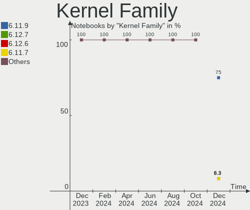

| Version | Notebooks | Percent |
|---------|-----------|---------|
| 6.4.10  | 5         | 41.67%  |
| 6.3.12  | 5         | 41.67%  |
| 6.4.8   | 1         | 8.33%   |
| 6.0.14  | 1         | 8.33%   |

Kernel Major Ver.
-----------------

Linux kernel major version

| Version | Notebooks | Percent |
|---------|-----------|---------|
| 6.4     | 6         | 50%     |
| 6.3     | 5         | 41.67%  |
| 6.0     | 1         | 8.33%   |

Arch
----

OS architecture (x86_64, i586, etc.)

| Name   | Notebooks | Percent |
|--------|-----------|---------|
| x86_64 | 12        | 100%    |

DE
--

Desktop Environment

| Name  | Notebooks | Percent |
|-------|-----------|---------|
| GNOME | 10        | 83.33%  |
| KDE5  | 2         | 16.67%  |

Display Server
--------------

X11 or Wayland

| Name    | Notebooks | Percent |
|---------|-----------|---------|
| Wayland | 8         | 66.67%  |
| X11     | 4         | 33.33%  |

Display Manager
---------------

SDDM, LightDM, etc.

| Name    | Notebooks | Percent |
|---------|-----------|---------|
| Unknown | 7         | 58.33%  |
| GDM     | 4         | 33.33%  |
| SDDM    | 1         | 8.33%   |

OS Lang
-------

Language

| Lang  | Notebooks | Percent |
|-------|-----------|---------|
| en_US | 6         | 50%     |
| pt_BR | 1         | 8.33%   |
| it_IT | 1         | 8.33%   |
| fr_FR | 1         | 8.33%   |
| en_NZ | 1         | 8.33%   |
| en_AU | 1         | 8.33%   |
| de_DE | 1         | 8.33%   |

Boot Mode
---------

EFI or BIOS

| Mode | Notebooks | Percent |
|------|-----------|---------|
| EFI  | 10        | 83.33%  |
| BIOS | 2         | 16.67%  |

Filesystem
----------

Type of filesystem

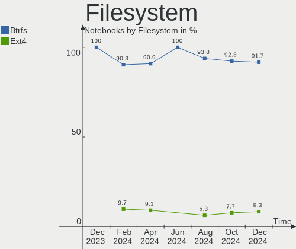

| Type  | Notebooks | Percent |
|-------|-----------|---------|
| Btrfs | 10        | 83.33%  |
| Ext4  | 2         | 16.67%  |

Part. scheme
------------

Scheme of partitioning

| Type    | Notebooks | Percent |
|---------|-----------|---------|
| Unknown | 7         | 58.33%  |
| GPT     | 5         | 41.67%  |

Dual Boot with Linux/BSD
------------------------

Hosting more than one Linux/BSD

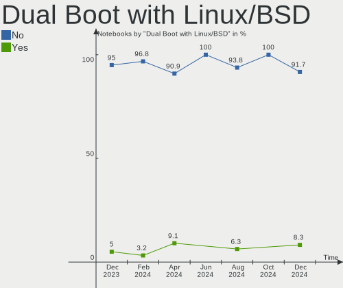

| Dual boot | Notebooks | Percent |
|-----------|-----------|---------|
| No        | 11        | 91.67%  |
| Yes       | 1         | 8.33%   |

Dual Boot (Win)
---------------

Hosting Linux and Windows

| Dual boot | Notebooks | Percent |
|-----------|-----------|---------|
| No        | 7         | 58.33%  |
| Yes       | 5         | 41.67%  |

Board
-----

Vendor
------

Motherboard manufacturer

| Name                             | Notebooks | Percent |
|----------------------------------|-----------|---------|
| Lenovo                           | 3         | 25%     |
| Dell                             | 2         | 16.67%  |
| ASUSTek Computer                 | 2         | 16.67%  |
| Samsung Electronics              | 1         | 8.33%   |
| Micro Computer (HK) Tech Limited | 1         | 8.33%   |
| Infinix                          | 1         | 8.33%   |
| Hewlett-Packard                  | 1         | 8.33%   |
| Acer                             | 1         | 8.33%   |

Model
-----

Motherboard model

| Name                                     | Notebooks | Percent |
|------------------------------------------|-----------|---------|
| Samsung 340XAA/350XAA/550XAA             | 1         | 8.33%   |
| Micro (HK) Tech Limited NUCXI7           | 1         | 8.33%   |
| Lenovo ThinkPad T450 20BUS3ES0A          | 1         | 8.33%   |
| Lenovo Legion Slim 7 16IRH8 82Y3         | 1         | 8.33%   |
| Lenovo IdeaPad 3 15ITL6 82H8             | 1         | 8.33%   |
| Infinix INBOOK X2 GEN11                  | 1         | 8.33%   |
| HP ENVY Laptop 16-h1xxx                  | 1         | 8.33%   |
| Dell XPS 17 9730                         | 1         | 8.33%   |
| Dell Inspiron 3180                       | 1         | 8.33%   |
| ASUS VivoBook_ASUSLaptop M1502IA_M1502IA | 1         | 8.33%   |
| ASUS G751JM                              | 1         | 8.33%   |
| Acer Nitro AN515-56                      | 1         | 8.33%   |

Model Family
------------

Motherboard model prefix

| Name                           | Notebooks | Percent |
|--------------------------------|-----------|---------|
| Samsung 340XAA                 | 1         | 8.33%   |
| Micro (HK) Tech Limited NUCXI7 | 1         | 8.33%   |
| Lenovo ThinkPad                | 1         | 8.33%   |
| Lenovo Legion                  | 1         | 8.33%   |
| Lenovo IdeaPad                 | 1         | 8.33%   |
| Infinix INBOOK                 | 1         | 8.33%   |
| HP ENVY                        | 1         | 8.33%   |
| Dell XPS                       | 1         | 8.33%   |
| Dell Inspiron                  | 1         | 8.33%   |
| ASUS VivoBook                  | 1         | 8.33%   |
| ASUS G751JM                    | 1         | 8.33%   |
| Acer Nitro                     | 1         | 8.33%   |

MFG Year
--------

Motherboard manufacture year

| Year | Notebooks | Percent |
|------|-----------|---------|
| 2023 | 4         | 33.33%  |
| 2022 | 2         | 16.67%  |
| 2021 | 2         | 16.67%  |
| 2018 | 2         | 16.67%  |
| 2014 | 2         | 16.67%  |

Form Factor
-----------

Physical design of the computer

| Name     | Notebooks | Percent |
|----------|-----------|---------|
| Notebook | 12        | 100%    |

Secure Boot
-----------

Enabled or disabled

| State    | Notebooks | Percent |
|----------|-----------|---------|
| Disabled | 12        | 100%    |

Coreboot
--------

Have coreboot on board

| Used | Notebooks | Percent |
|------|-----------|---------|
| No   | 12        | 100%    |

RAM Size
--------

Total RAM memory

| Size in GB  | Notebooks | Percent |
|-------------|-----------|---------|
| 4.01-8.0    | 4         | 33.33%  |
| 32.01-64.0  | 3         | 25%     |
| 8.01-16.0   | 2         | 16.67%  |
| 3.01-4.0    | 1         | 8.33%   |
| 64.01-256.0 | 1         | 8.33%   |
| 16.01-24.0  | 1         | 8.33%   |

RAM Used
--------

Used RAM memory

| Used GB   | Notebooks | Percent |
|-----------|-----------|---------|
| 4.01-8.0  | 6         | 50%     |
| 3.01-4.0  | 3         | 25%     |
| 8.01-16.0 | 2         | 16.67%  |
| 2.01-3.0  | 1         | 8.33%   |

Total Drives
------------

Number of drives on board

| Drives | Notebooks | Percent |
|--------|-----------|---------|
| 1      | 8         | 66.67%  |
| 3      | 2         | 16.67%  |
| 2      | 2         | 16.67%  |

Has CD-ROM
----------

Has CD-ROM on board

| Presented | Notebooks | Percent |
|-----------|-----------|---------|
| No        | 11        | 91.67%  |
| Yes       | 1         | 8.33%   |

Has Ethernet
------------

Has Ethernet on board

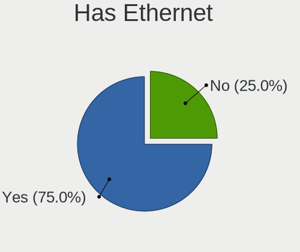

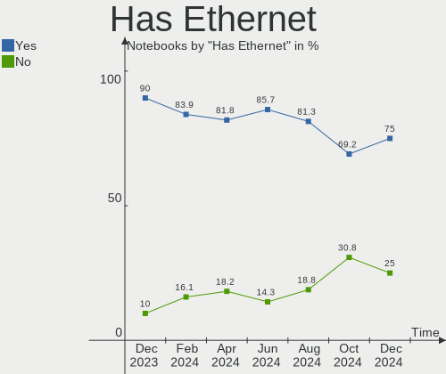

| Presented | Notebooks | Percent |
|-----------|-----------|---------|
| No        | 7         | 58.33%  |
| Yes       | 5         | 41.67%  |

Has WiFi
--------

Has WiFi module

| Presented | Notebooks | Percent |
|-----------|-----------|---------|
| Yes       | 12        | 100%    |

Has Bluetooth
-------------

Has Bluetooth module

| Presented | Notebooks | Percent |
|-----------|-----------|---------|
| Yes       | 11        | 91.67%  |
| No        | 1         | 8.33%   |

Location
--------

Country
-------

Geographic location (country)

| Country             | Notebooks | Percent |
|---------------------|-----------|---------|
| USA                 | 2         | 16.67%  |
| Turkey              | 1         | 8.33%   |
| Trinidad and Tobago | 1         | 8.33%   |
| New Zealand         | 1         | 8.33%   |
| Italy               | 1         | 8.33%   |
| Indonesia           | 1         | 8.33%   |
| Germany             | 1         | 8.33%   |
| France              | 1         | 8.33%   |
| Canada              | 1         | 8.33%   |
| Brazil              | 1         | 8.33%   |
| Australia           | 1         | 8.33%   |

City
----

Geographic location (city)

| City                  | Notebooks | Percent |
|-----------------------|-----------|---------|
| St Louis              | 1         | 8.33%   |
| Port of Spain         | 1         | 8.33%   |
| Milano                | 1         | 8.33%   |
| Great Meadows         | 1         | 8.33%   |
| Gold Coast            | 1         | 8.33%   |
| Donaueschingen        | 1         | 8.33%   |
| Cormeilles-en-Parisis | 1         | 8.33%   |
| Cold Lake             | 1         | 8.33%   |
| Christchurch          | 1         | 8.33%   |
| Carapicuiba           | 1         | 8.33%   |
| Bursa                 | 1         | 8.33%   |
| Bandung               | 1         | 8.33%   |

Drives
------

Drive Vendor
------------

Hard drive vendors

| Vendor                       | Notebooks | Drives | Percent |
|------------------------------|-----------|--------|---------|
| Samsung Electronics          | 4         | 4      | 22.22%  |
| WDC                          | 2         | 2      | 11.11%  |
| Unknown                      | 1         | 1      | 5.56%   |
| SK hynix                     | 1         | 1      | 5.56%   |
| Shenzhen Longsys Electronics | 1         | 1      | 5.56%   |
| Seagate                      | 1         | 1      | 5.56%   |
| Sandisk                      | 1         | 1      | 5.56%   |
| Micron Technology            | 1         | 1      | 5.56%   |
| Lexar                        | 1         | 1      | 5.56%   |
| KIOXIA                       | 1         | 1      | 5.56%   |
| Kingston                     | 1         | 1      | 5.56%   |
| Intel                        | 1         | 1      | 5.56%   |
| Dell                         | 1         | 1      | 5.56%   |
| Crucial                      | 1         | 1      | 5.56%   |

Drive Model
-----------

Hard drive models

| Model                                                 | Notebooks | Percent |
|-------------------------------------------------------|-----------|---------|
| WDC WD20SPZX-22UA7T0 2TB                              | 1         | 5.56%   |
| WDC WD10SPZX-35Z10T0 1TB                              | 1         | 5.56%   |
| Unknown SD/MMC/MS PRO 1GB                             | 1         | 5.56%   |
| SK hynix SKHynix_HFS001TEJ9X115N 1TB                  | 1         | 5.56%   |
| Shenzhen Longsys FORESEE VP1000F256G 256GB            | 1         | 5.56%   |
| Seagate ST2000LX 001-1RG174 2TB                       | 1         | 5.56%   |
| Sandisk WD Blue SN550 NVMe SSD 250GB                  | 1         | 5.56%   |
| Samsung SSD 980 1TB                                   | 1         | 5.56%   |
| Samsung NVMe SSD Controller PM9A1/PM9A3/980PRO 1024GB | 1         | 5.56%   |
| Samsung MZALQ256HBJD-00BL2 256GB                      | 1         | 5.56%   |
| Samsung MZ7LN256HMJP-000H1 256GB SSD                  | 1         | 5.56%   |
| Micron MTFDKBA1T0TFH-1BC1AABHA 1024GB                 | 1         | 5.56%   |
| Lexar 1TB                                             | 1         | 5.56%   |
| KIOXIA KXG80ZNV2T04 NVMe 2048GB                       | 1         | 5.56%   |
| Kingston SA400M8240G 240GB SSD                        | 1         | 5.56%   |
| Intel SSDPEKNU512GZ 512GB                             | 1         | 5.56%   |
| Dell WR202KD032G E70290F5 32GB                        | 1         | 5.56%   |
| Crucial CT240BX500SSD1 240GB                          | 1         | 5.56%   |

HDD Vendor
----------

Hard disk drive vendors

| Vendor  | Notebooks | Drives | Percent |
|---------|-----------|--------|---------|
| WDC     | 2         | 2      | 50%     |
| Unknown | 1         | 1      | 25%     |
| Seagate | 1         | 1      | 25%     |

SSD Vendor
----------

Solid state drive vendors

| Vendor              | Notebooks | Drives | Percent |
|---------------------|-----------|--------|---------|
| Samsung Electronics | 1         | 1      | 25%     |
| Kingston            | 1         | 1      | 25%     |
| Dell                | 1         | 1      | 25%     |
| Crucial             | 1         | 1      | 25%     |

Drive Kind
----------

HDD or SSD

| Kind    | Notebooks | Drives | Percent |
|---------|-----------|--------|---------|
| NVMe    | 8         | 9      | 47.06%  |
| SSD     | 4         | 4      | 23.53%  |
| HDD     | 4         | 4      | 23.53%  |
| Unknown | 1         | 1      | 5.88%   |

Drive Connector
---------------

SATA, SAS, NVMe, etc.

| Type | Notebooks | Drives | Percent |
|------|-----------|--------|---------|
| NVMe | 8         | 9      | 53.33%  |
| SATA | 5         | 6      | 33.33%  |
| SAS  | 2         | 3      | 13.33%  |

Drive Size
----------

Size of hard drive

| Size in TB | Notebooks | Drives | Percent |
|------------|-----------|--------|---------|
| 0.01-0.5   | 5         | 5      | 62.5%   |
| 1.01-2.0   | 2         | 2      | 25%     |
| 0.51-1.0   | 1         | 1      | 12.5%   |

Space Total
-----------

Amount of disk space available on the file system

| Size in GB     | Notebooks | Percent |
|----------------|-----------|---------|
| 251-500        | 5         | 41.67%  |
| 21-50          | 2         | 16.67%  |
| 2001-3000      | 2         | 16.67%  |
| More than 3000 | 1         | 8.33%   |
| 101-250        | 1         | 8.33%   |
| Unknown        | 1         | 8.33%   |

Space Used
----------

Amount of used disk space

| Used GB   | Notebooks | Percent |
|-----------|-----------|---------|
| 21-50     | 7         | 58.33%  |
| 1001-2000 | 2         | 16.67%  |
| 101-250   | 1         | 8.33%   |
| 1-20      | 1         | 8.33%   |
| Unknown   | 1         | 8.33%   |

Malfunc. Drives
---------------

Drive models with a malfunction

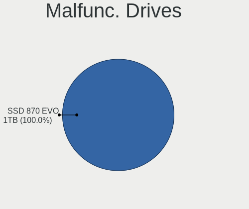

| Model                           | Notebooks | Drives | Percent |
|---------------------------------|-----------|--------|---------|
| Samsung Electronics SSD 980 1TB | 1         | 1      | 100%    |

Malfunc. Drive Vendor
---------------------

Vendors of faulty drives

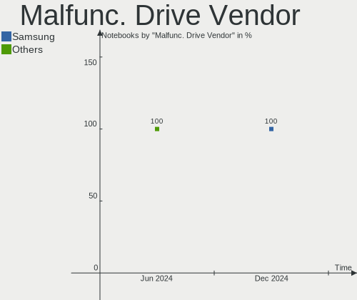

| Vendor              | Notebooks | Drives | Percent |
|---------------------|-----------|--------|---------|
| Samsung Electronics | 1         | 1      | 100%    |

Malfunc. HDD Vendor
-------------------

Vendors of faulty HDD drives

Zero info for selected period =(

Malfunc. Drive Kind
-------------------

Kinds of faulty drives

| Kind | Notebooks | Drives | Percent |
|------|-----------|--------|---------|
| NVMe | 1         | 1      | 100%    |

Failed Drives
-------------

Failed drive models

Zero info for selected period =(

Failed Drive Vendor
-------------------

Failed drive vendors

Zero info for selected period =(

Drive Status
------------

Number of failed and malfunc. drives

| Status   | Notebooks | Drives | Percent |
|----------|-----------|--------|---------|
| Detected | 8         | 10     | 57.14%  |
| Works    | 5         | 7      | 35.71%  |
| Malfunc  | 1         | 1      | 7.14%   |

Storage controller
------------------

Storage Vendor
--------------

Storage controller vendors

| Vendor                       | Notebooks | Percent |
|------------------------------|-----------|---------|
| Intel                        | 8         | 47.06%  |
| Samsung Electronics          | 3         | 17.65%  |
| SK hynix                     | 1         | 5.88%   |
| Shenzhen Longsys Electronics | 1         | 5.88%   |
| SanDisk                      | 1         | 5.88%   |
| Micron Technology            | 1         | 5.88%   |
| KIOXIA                       | 1         | 5.88%   |
| AMD                          | 1         | 5.88%   |

Storage Model
-------------

Storage controller models

| Model                                                                          | Notebooks | Percent |
|--------------------------------------------------------------------------------|-----------|---------|
| Intel Tiger Lake-LP SATA Controller                                            | 3         | 15.79%  |
| Samsung NVMe SSD Controller 980                                                | 2         | 10.53%  |
| Intel Volume Management Device NVMe RAID Controller                            | 2         | 10.53%  |
| SK hynix Platinum P41/PC801 NVMe Solid State Drive                             | 1         | 5.26%   |
| Shenzhen Longsys Lexar NM620 NVME SSD (DRAM-less)                              | 1         | 5.26%   |
| SanDisk WD Blue SN550 NVMe SSD                                                 | 1         | 5.26%   |
| Samsung NVMe SSD Controller PM9A1/PM9A3/980PRO                                 | 1         | 5.26%   |
| Micron 3400 NVMe SSD [Hendrix]                                                 | 1         | 5.26%   |
| KIOXIA NVMe SSD Controller XG8                                                 | 1         | 5.26%   |
| Intel Wildcat Point-LP SATA Controller [AHCI Mode]                             | 1         | 5.26%   |
| Intel Volume Management Device NVMe RAID Controller Intel Corporation          | 1         | 5.26%   |
| Intel Sunrise Point-LP SATA Controller [AHCI mode]                             | 1         | 5.26%   |
| Intel SSD 670p Series [Keystone Harbor]                                        | 1         | 5.26%   |
| Intel 8 Series/C220 Series Chipset Family 6-port SATA Controller 1 [AHCI mode] | 1         | 5.26%   |
| AMD FCH SATA Controller [AHCI mode]                                            | 1         | 5.26%   |

Storage Kind
------------

Kind of storage controller (IDE, SATA, NVMe, SAS, ...)

| Kind | Notebooks | Percent |
|------|-----------|---------|
| NVMe | 8         | 44.44%  |
| SATA | 7         | 38.89%  |
| RAID | 3         | 16.67%  |

Processor
---------

CPU Vendor
----------

Processor vendors

| Vendor | Notebooks | Percent |
|--------|-----------|---------|
| Intel  | 10        | 83.33%  |
| AMD    | 2         | 16.67%  |

CPU Model
---------

Processor models

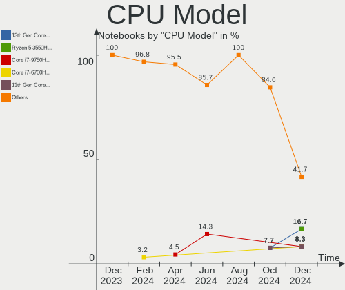

| Model                                         | Notebooks | Percent |
|-----------------------------------------------|-----------|---------|
| Intel 13th Gen Core i7-13700H                 | 2         | 16.67%  |
| Intel Core i7-4710HQ CPU @ 2.50GHz            | 1         | 8.33%   |
| Intel Core i5-8250U CPU @ 1.60GHz             | 1         | 8.33%   |
| Intel Core i5-5300U CPU @ 2.30GHz             | 1         | 8.33%   |
| Intel 13th Gen Core i9-13900H                 | 1         | 8.33%   |
| Intel 11th Gen Core i7-11800H @ 2.30GHz       | 1         | 8.33%   |
| Intel 11th Gen Core i5-1135G7 @ 2.40GHz       | 1         | 8.33%   |
| Intel 11th Gen Core i5-11300H @ 3.10GHz       | 1         | 8.33%   |
| Intel 11th Gen Core i3-1115G4 @ 3.00GHz       | 1         | 8.33%   |
| AMD Ryzen 5 4600H with Radeon Graphics        | 1         | 8.33%   |
| AMD A6-9220e RADEON R4, 5 COMPUTE CORES 2C+3G | 1         | 8.33%   |

CPU Model Family
----------------

Processor model prefix

| Model         | Notebooks | Percent |
|---------------|-----------|---------|
| Other         | 7         | 58.33%  |
| Intel Core i5 | 2         | 16.67%  |
| Intel Core i7 | 1         | 8.33%   |
| AMD Ryzen 5   | 1         | 8.33%   |
| AMD A6        | 1         | 8.33%   |

CPU Cores
---------

Number of processor cores

| Number | Notebooks | Percent |
|--------|-----------|---------|
| 4      | 4         | 33.33%  |
| 14     | 3         | 25%     |
| 2      | 3         | 25%     |
| 8      | 1         | 8.33%   |
| 6      | 1         | 8.33%   |

CPU Sockets
-----------

Number of sockets

| Number | Notebooks | Percent |
|--------|-----------|---------|
| 1      | 12        | 100%    |

CPU Threads
-----------

Threads per core (Hyper-Threading)

| Number | Notebooks | Percent |
|--------|-----------|---------|
| 2      | 11        | 91.67%  |
| 1      | 1         | 8.33%   |

CPU Op-Modes
------------

CPU Operation Modes (32-bit, 64-bit)

| Op mode        | Notebooks | Percent |
|----------------|-----------|---------|
| 32-bit, 64-bit | 12        | 100%    |

CPU Microcode
-------------

Microcode number

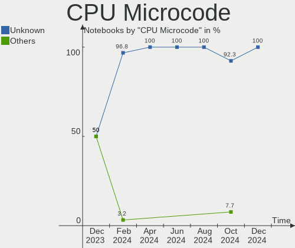

| Number     | Notebooks | Percent |
|------------|-----------|---------|
| Unknown    | 11        | 91.67%  |
| 0x06006704 | 1         | 8.33%   |

CPU Microarch
-------------

Microarchitecture

| Name             | Notebooks | Percent |
|------------------|-----------|---------|
| TigerLake        | 3         | 25%     |
| Alderlake Hybrid | 3         | 25%     |
| Zen 2            | 1         | 8.33%   |
| KabyLake         | 1         | 8.33%   |
| Icelake          | 1         | 8.33%   |
| Haswell          | 1         | 8.33%   |
| Excavator        | 1         | 8.33%   |
| Broadwell        | 1         | 8.33%   |

Graphics
--------

GPU Vendor
----------

Vendors of graphics cards

| Vendor | Notebooks | Percent |
|--------|-----------|---------|
| Intel  | 9         | 52.94%  |
| Nvidia | 6         | 35.29%  |
| AMD    | 2         | 11.76%  |

GPU Model
---------

Graphics card models

| Model                                                       | Notebooks | Percent |
|-------------------------------------------------------------|-----------|---------|
| Intel Raptor Lake-P [Iris Xe Graphics]                      | 3         | 17.65%  |
| Intel TigerLake-LP GT2 [Iris Xe Graphics]                   | 2         | 11.76%  |
| Nvidia GM108M [GeForce MX110]                               | 1         | 5.88%   |
| Nvidia GM107M [GeForce GTX 860M]                            | 1         | 5.88%   |
| Nvidia GA107M [GeForce RTX 3050 Mobile]                     | 1         | 5.88%   |
| Nvidia GA104M [GeForce RTX 3070 Mobile / Max-Q]             | 1         | 5.88%   |
| Nvidia AD107M [GeForce RTX 4060 Max-Q / Mobile]             | 1         | 5.88%   |
| Nvidia AD107M [GeForce RTX 4050 Max-Q / Mobile]             | 1         | 5.88%   |
| Intel UHD Graphics 620                                      | 1         | 5.88%   |
| Intel Tiger Lake-LP GT2 [UHD Graphics G4]                   | 1         | 5.88%   |
| Intel HD Graphics 5500                                      | 1         | 5.88%   |
| Intel 4th Gen Core Processor Integrated Graphics Controller | 1         | 5.88%   |
| AMD Stoney [Radeon R2/R3/R4/R5 Graphics]                    | 1         | 5.88%   |
| AMD Renoir                                                  | 1         | 5.88%   |

GPU Combo
---------

Combinations of graphics cards

| Name           | Notebooks | Percent |
|----------------|-----------|---------|
| Intel + Nvidia | 5         | 41.67%  |
| 1 x Intel      | 4         | 33.33%  |
| 1 x AMD        | 2         | 16.67%  |
| 1 x Nvidia     | 1         | 8.33%   |

GPU Driver
----------

Free vs proprietary

| Driver      | Notebooks | Percent |
|-------------|-----------|---------|
| Free        | 8         | 66.67%  |
| Proprietary | 4         | 33.33%  |

GPU Memory
----------

Total video memory

| Size in GB | Notebooks | Percent |
|------------|-----------|---------|
| Unknown    | 9         | 75%     |
| 7.01-8.0   | 1         | 8.33%   |
| 1.01-2.0   | 1         | 8.33%   |
| 0.01-0.5   | 1         | 8.33%   |

Monitor
-------

Monitor Vendor
--------------

Monitor vendors

| Vendor          | Notebooks | Percent |
|-----------------|-----------|---------|
| Chimei Innolux  | 3         | 23.08%  |
| AU Optronics    | 3         | 23.08%  |
| BOE             | 2         | 15.38%  |
| XUE             | 1         | 7.69%   |
| TMX             | 1         | 7.69%   |
| Sharp           | 1         | 7.69%   |
| LG Display      | 1         | 7.69%   |
| Hewlett-Packard | 1         | 7.69%   |

Monitor Model
-------------

Monitor models

| Model                                                            | Notebooks | Percent |
|------------------------------------------------------------------|-----------|---------|
| XUE HDMI XUE1600 1920x1200 360x190mm 16.0-inch                   | 1         | 7.69%   |
| TMX TL140VDXP04-0 TMX1398 1920x1080 309x174mm 14.0-inch          | 1         | 7.69%   |
| Sharp LCD Monitor SHP1517 3840x2400 366x229mm 17.0-inch          | 1         | 7.69%   |
| LG Display LCD Monitor LGD046C 1920x1080 382x215mm 17.3-inch     | 1         | 7.69%   |
| Hewlett-Packard LE1911 HWP2857 1280x1024 380x300mm 19.1-inch     | 1         | 7.69%   |
| Chimei Innolux LCD Monitor CMN15F5 1920x1080 344x193mm 15.5-inch | 1         | 7.69%   |
| Chimei Innolux LCD Monitor CMN14A7 1920x1080 308x173mm 13.9-inch | 1         | 7.69%   |
| Chimei Innolux LCD Monitor CMN1132 1366x768 256x144mm 11.6-inch  | 1         | 7.69%   |
| BOE LCD Monitor BOE0B8A 2560x1600 345x215mm 16.0-inch            | 1         | 7.69%   |
| BOE LCD Monitor BOE08C2 1920x1080 344x194mm 15.5-inch            | 1         | 7.69%   |
| AU Optronics LCD Monitor AUOF1A7 3200x2000 344x215mm 16.0-inch   | 1         | 7.69%   |
| AU Optronics LCD Monitor AUOAF90 1920x1080 344x193mm 15.5-inch   | 1         | 7.69%   |
| AU Optronics LCD Monitor AUO71EC 1366x768 344x193mm 15.5-inch    | 1         | 7.69%   |

Monitor Resolution
------------------

Monitor screen resolution

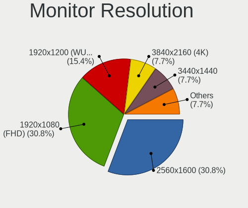

| Resolution      | Notebooks | Percent |
|-----------------|-----------|---------|
| 1920x1080 (FHD) | 6         | 46.15%  |
| 2560x1600       | 2         | 15.38%  |
| 1366x768 (WXGA) | 2         | 15.38%  |
| 3840x2400       | 1         | 7.69%   |
| 3200x2000       | 1         | 7.69%   |
| 1280x960        | 1         | 7.69%   |

Monitor Diagonal
----------------

Diagonal size in inches

| Inches | Notebooks | Percent |
|--------|-----------|---------|
| 15     | 4         | 30.77%  |
| 16     | 3         | 23.08%  |
| 17     | 2         | 15.38%  |
| 19     | 1         | 7.69%   |
| 14     | 1         | 7.69%   |
| 13     | 1         | 7.69%   |
| 11     | 1         | 7.69%   |

Monitor Width
-------------

Physical width

| Width in mm | Notebooks | Percent |
|-------------|-----------|---------|
| 301-350     | 8         | 61.54%  |
| 351-400     | 4         | 30.77%  |
| 201-300     | 1         | 7.69%   |

Aspect Ratio
------------

Proportional relationship between the width and the height

| Ratio | Notebooks | Percent |
|-------|-----------|---------|
| 16/9  | 9         | 69.23%  |
| 16/10 | 3         | 23.08%  |
| 5/4   | 1         | 7.69%   |

Monitor Area
------------

Area in inch²

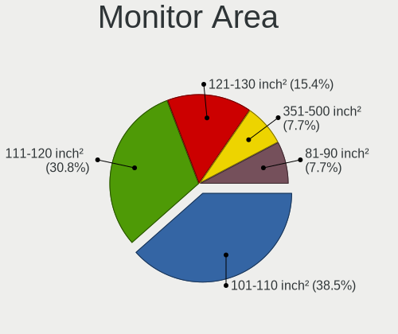

| Area in inch² | Notebooks | Percent |
|----------------|-----------|---------|
| 101-110        | 5         | 38.46%  |
| 81-90          | 2         | 15.38%  |
| 121-130        | 2         | 15.38%  |
| 111-120        | 2         | 15.38%  |
| 51-60          | 1         | 7.69%   |
| 151-200        | 1         | 7.69%   |

Pixel Density
-------------

Pixels per inch

| Density       | Notebooks | Percent |
|---------------|-----------|---------|
| 121-160       | 7         | 53.85%  |
| 161-240       | 3         | 23.08%  |
| More than 240 | 1         | 7.69%   |
| 101-120       | 1         | 7.69%   |
| 51-100        | 1         | 7.69%   |

Multiple Monitors
-----------------

Total monitors connected

| Total | Notebooks | Percent |
|-------|-----------|---------|
| 1     | 11        | 91.67%  |
| 2     | 1         | 8.33%   |

Network
-------

Net Controller Vendor
---------------------

Controller vendors

| Vendor                | Notebooks | Percent |
|-----------------------|-----------|---------|
| Intel                 | 8         | 47.06%  |
| Realtek Semiconductor | 3         | 17.65%  |
| Qualcomm Atheros      | 3         | 17.65%  |
| Sierra Wireless       | 1         | 5.88%   |
| Microsoft             | 1         | 5.88%   |
| Broadcom              | 1         | 5.88%   |

Net Controller Model
--------------------

Controller models

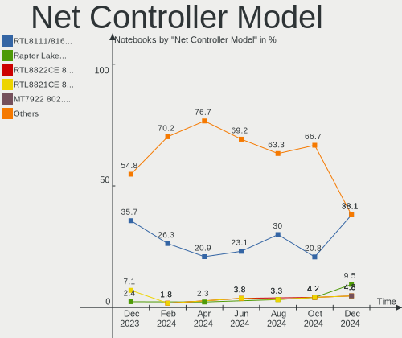

| Model                                                      | Notebooks | Percent |
|------------------------------------------------------------|-----------|---------|
| Intel Wi-Fi 6 AX201                                        | 3         | 15.79%  |
| Intel Wi-Fi 6 AX210/AX211/AX411 160MHz                     | 2         | 10.53%  |
| Intel Raptor Lake PCH CNVi WiFi                            | 2         | 10.53%  |
| Sierra Wireless EM7345 4G LTE                              | 1         | 5.26%   |
| Realtek RTL8821CE 802.11ac PCIe Wireless Network Adapter   | 1         | 5.26%   |
| Realtek RTL810xE PCI Express Fast Ethernet controller      | 1         | 5.26%   |
| Realtek Killer E2600 Gigabit Ethernet Controller           | 1         | 5.26%   |
| Qualcomm Atheros QCA9565 / AR9565 Wireless Network Adapter | 1         | 5.26%   |
| Qualcomm Atheros QCA9377 802.11ac Wireless Network Adapter | 1         | 5.26%   |
| Qualcomm Atheros QCA8171 Gigabit Ethernet                  | 1         | 5.26%   |
| Microsoft Wireless XBox Controller Dongle                  | 1         | 5.26%   |
| Intel Wireless 7265                                        | 1         | 5.26%   |
| Intel Ethernet Controller I225-V                           | 1         | 5.26%   |
| Intel Ethernet Connection (3) I218-LM                      | 1         | 5.26%   |
| Broadcom BCM4352 802.11ac Wireless Network Adapter         | 1         | 5.26%   |

Wireless Vendor
---------------

Wireless vendors

| Vendor                | Notebooks | Percent |
|-----------------------|-----------|---------|
| Intel                 | 8         | 57.14%  |
| Qualcomm Atheros      | 2         | 14.29%  |
| Sierra Wireless       | 1         | 7.14%   |
| Realtek Semiconductor | 1         | 7.14%   |
| Microsoft             | 1         | 7.14%   |
| Broadcom              | 1         | 7.14%   |

Wireless Model
--------------

Wireless models

| Model                                                      | Notebooks | Percent |
|------------------------------------------------------------|-----------|---------|
| Intel Wi-Fi 6 AX201                                        | 3         | 21.43%  |
| Intel Wi-Fi 6 AX210/AX211/AX411 160MHz                     | 2         | 14.29%  |
| Intel Raptor Lake PCH CNVi WiFi                            | 2         | 14.29%  |
| Sierra Wireless EM7345 4G LTE                              | 1         | 7.14%   |
| Realtek RTL8821CE 802.11ac PCIe Wireless Network Adapter   | 1         | 7.14%   |
| Qualcomm Atheros QCA9565 / AR9565 Wireless Network Adapter | 1         | 7.14%   |
| Qualcomm Atheros QCA9377 802.11ac Wireless Network Adapter | 1         | 7.14%   |
| Microsoft Wireless XBox Controller Dongle                  | 1         | 7.14%   |
| Intel Wireless 7265                                        | 1         | 7.14%   |
| Broadcom BCM4352 802.11ac Wireless Network Adapter         | 1         | 7.14%   |

Ethernet Vendor
---------------

Ethernet vendors

| Vendor                | Notebooks | Percent |
|-----------------------|-----------|---------|
| Realtek Semiconductor | 2         | 40%     |
| Intel                 | 2         | 40%     |
| Qualcomm Atheros      | 1         | 20%     |

Ethernet Model
--------------

Ethernet models

| Model                                                 | Notebooks | Percent |
|-------------------------------------------------------|-----------|---------|
| Realtek RTL810xE PCI Express Fast Ethernet controller | 1         | 20%     |
| Realtek Killer E2600 Gigabit Ethernet Controller      | 1         | 20%     |
| Qualcomm Atheros QCA8171 Gigabit Ethernet             | 1         | 20%     |
| Intel Ethernet Controller I225-V                      | 1         | 20%     |
| Intel Ethernet Connection (3) I218-LM                 | 1         | 20%     |

Net Controller Kind
-------------------

Ethernet, WiFi or modem

| Kind     | Notebooks | Percent |
|----------|-----------|---------|
| WiFi     | 12        | 70.59%  |
| Ethernet | 5         | 29.41%  |

Used Controller
---------------

Currently used network controller

| Kind     | Notebooks | Percent |
|----------|-----------|---------|
| WiFi     | 10        | 83.33%  |
| Ethernet | 2         | 16.67%  |

NICs
----

Total network controllers on board

| Total | Notebooks | Percent |
|-------|-----------|---------|
| 1     | 7         | 58.33%  |
| 2     | 5         | 41.67%  |

IPv6
----

IPv6 vs IPv4

| Used | Notebooks | Percent |
|------|-----------|---------|
| No   | 11        | 91.67%  |
| Yes  | 1         | 8.33%   |

Bluetooth
---------

Bluetooth Vendor
----------------

Controller vendors

| Vendor                          | Notebooks | Percent |
|---------------------------------|-----------|---------|
| Intel                           | 8         | 72.73%  |
| Qualcomm Atheros Communications | 1         | 9.09%   |
| Lite-On Technology              | 1         | 9.09%   |
| IMC Networks                    | 1         | 9.09%   |

Bluetooth Model
---------------

Controller models

| Model                                          | Notebooks | Percent |
|------------------------------------------------|-----------|---------|
| Intel Bluetooth Device                         | 2         | 18.18%  |
| Intel AX210 Bluetooth                          | 2         | 18.18%  |
| Intel AX201 Bluetooth                          | 2         | 18.18%  |
| Qualcomm Atheros  Bluetooth Device             | 1         | 9.09%   |
| Lite-On Bluetooth Radio                        | 1         | 9.09%   |
| Intel Bluetooth wireless interface             | 1         | 9.09%   |
| Intel Bluetooth 9460/9560 Jefferson Peak (JfP) | 1         | 9.09%   |
| IMC Networks BCM20702A0                        | 1         | 9.09%   |

Sound
-----

Sound Vendor
------------

Sound card vendors

| Vendor             | Notebooks | Percent |
|--------------------|-----------|---------|
| Intel              | 10        | 62.5%   |
| Nvidia             | 3         | 18.75%  |
| AMD                | 2         | 12.5%   |
| Native Instruments | 1         | 6.25%   |

Sound Model
-----------

Sound card models

| Model                                                               | Notebooks | Percent |
|---------------------------------------------------------------------|-----------|---------|
| Intel Tiger Lake-LP Smart Sound Technology Audio Controller         | 3         | 15%     |
| Intel Raptor Lake-P/U/H cAVS                                        | 3         | 15%     |
| Nvidia Audio device                                                 | 2         | 10%     |
| Nvidia GA104 High Definition Audio Controller                       | 1         | 5%      |
| Native Instruments Komplete Audio 6 MK2                             | 1         | 5%      |
| Intel Xeon E3-1200 v3/4th Gen Core Processor HD Audio Controller    | 1         | 5%      |
| Intel Wildcat Point-LP High Definition Audio Controller             | 1         | 5%      |
| Intel Tiger Lake-H HD Audio Controller                              | 1         | 5%      |
| Intel Sunrise Point-LP HD Audio                                     | 1         | 5%      |
| Intel Broadwell-U Audio Controller                                  | 1         | 5%      |
| Intel 8 Series/C220 Series Chipset High Definition Audio Controller | 1         | 5%      |
| AMD Renoir Radeon High Definition Audio Controller                  | 1         | 5%      |
| AMD High Definition Audio Controller                                | 1         | 5%      |
| AMD Family 17h/19h HD Audio Controller                              | 1         | 5%      |
| AMD Family 15h (Models 60h-6fh) Audio Controller                    | 1         | 5%      |

Memory
------

Memory Vendor
-------------

Memory module vendors

| Vendor              | Notebooks | Percent |
|---------------------|-----------|---------|
| Samsung Electronics | 2         | 40%     |
| SK hynix            | 1         | 20%     |
| Kingston            | 1         | 20%     |
| A-DATA Technology   | 1         | 20%     |

Memory Model
------------

Memory module models

| Model                                                    | Notebooks | Percent |
|----------------------------------------------------------|-----------|---------|
| SK hynix RAM HMCG88MEBSA095N 32GB SODIMM DDR5 4800MT/s   | 1         | 16.67%  |
| Samsung RAM M425R2GA3BB0-CWMOL 16GB SODIMM DDR5 5600MT/s | 1         | 16.67%  |
| Samsung RAM M425R2GA3BB0-CWMOD 16GB SODIMM DDR5 5600MT/s | 1         | 16.67%  |
| Samsung RAM M425R1GB4BB0-CWMOD 8GB SODIMM DDR5 5600MT/s  | 1         | 16.67%  |
| Kingston RAM KF3200C20S4/16G 16GB SODIMM DDR4 3200MT/s   | 1         | 16.67%  |
| A-DATA RAM Module 16GB SODIMM DDR4 3200MT/s              | 1         | 16.67%  |

Memory Kind
-----------

Memory module kinds

| Kind | Notebooks | Percent |
|------|-----------|---------|
| DDR5 | 3         | 60%     |
| DDR4 | 2         | 40%     |

Memory Form Factor
------------------

Physical design of the memory module

| Name   | Notebooks | Percent |
|--------|-----------|---------|
| SODIMM | 5         | 100%    |

Memory Size
-----------

Memory module size

| Size  | Notebooks | Percent |
|-------|-----------|---------|
| 16384 | 3         | 60%     |
| 32768 | 1         | 20%     |
| 8192  | 1         | 20%     |

Memory Speed
------------

Memory module speed

| Speed | Notebooks | Percent |
|-------|-----------|---------|
| 5600  | 2         | 40%     |
| 3200  | 2         | 40%     |
| 4800  | 1         | 20%     |

Printers & scanners
-------------------

Printer Vendor
--------------

Printer device vendors

Zero info for selected period =(

Printer Model
-------------

Printer device models

Zero info for selected period =(

Scanner Vendor
--------------

Scanner device vendors

Zero info for selected period =(

Scanner Model
-------------

Scanner device models

Zero info for selected period =(

Camera
------

Camera Vendor
-------------

Camera device vendors

| Vendor                | Notebooks | Percent |
|-----------------------|-----------|---------|
| Chicony Electronics   | 6         | 50%     |
| Microdia              | 2         | 16.67%  |
| Silicon Motion        | 1         | 8.33%   |
| Shine-optics          | 1         | 8.33%   |
| Realtek Semiconductor | 1         | 8.33%   |
| Google                | 1         | 8.33%   |

Camera Model
------------

Camera device models

| Model                                   | Notebooks | Percent |
|-----------------------------------------|-----------|---------|
| Chicony Integrated Camera               | 3         | 25%     |
| Silicon Motion Web Camera               | 1         | 8.33%   |
| Shine-optics USB2.0 HD UVC WebCam       | 1         | 8.33%   |
| Realtek Integrated_Webcam_HD            | 1         | 8.33%   |
| Microdia Integrated_Webcam_HD           | 1         | 8.33%   |
| Microdia GC02M2                         | 1         | 8.33%   |
| Google Nexus/Pixel Device (MTP + debug) | 1         | 8.33%   |
| Chicony USB2.0 HD UVC WebCam            | 1         | 8.33%   |
| Chicony HP True Vision 5MP Camera       | 1         | 8.33%   |
| Chicony HD User Facing                  | 1         | 8.33%   |

Security
--------

Fingerprint Vendor
------------------

Fingerprint sensor vendors

| Vendor                     | Notebooks | Percent |
|----------------------------|-----------|---------|
| Shenzhen Goodix Technology | 1         | 100%    |

Fingerprint Model
-----------------

Fingerprint sensor models

| Model                               | Notebooks | Percent |
|-------------------------------------|-----------|---------|
| Shenzhen Goodix  FingerPrint Device | 1         | 100%    |

Chipcard Vendor
---------------

Chipcard module vendors

Zero info for selected period =(

Chipcard Model
--------------

Chipcard module models

Zero info for selected period =(

Unsupported
-----------

Unsupported Devices
-------------------

Total unsupported devices on board

| Total | Notebooks | Percent |
|-------|-----------|---------|
| 0     | 8         | 66.67%  |
| 1     | 4         | 33.33%  |

Unsupported Device Types
------------------------

Types of unsupported devices

| Type                  | Notebooks | Percent |
|-----------------------|-----------|---------|
| Graphics card         | 2         | 50%     |
| Multimedia controller | 1         | 25%     |
| Fingerprint reader    | 1         | 25%     |

