Nobara - Hardware Trends
------------------------

A project to identify most popular hardware characteristics and track their change
over time based on data collected by Linux users at https://Linux-Hardware.org.

Anyone can contribute to this report by the [hw-probe](https://github.com/linuxhw/hw-probe) tool:

    sudo -E hw-probe -all -upload

This is a report for all computer types. See also reports for [desktops](/Dist/Nobara/Desktop/README.md) and [notebooks](/Dist/Nobara/Notebook/README.md).

This report is for one last month. Overall report since the beginning of time: [TestDays](https://github.com/linuxhw/TestDays)

Period: Dec, 2025.

Contents
--------

* [ System ](#system)
  - [ OS                       ](#os)
  - [ OS Family                ](#os-family)
  - [ Kernel                   ](#kernel)
  - [ Kernel Family            ](#kernel-family)
  - [ Kernel Major Ver.        ](#kernel-major-ver)
  - [ Arch                     ](#arch)
  - [ DE                       ](#de)
  - [ Display Server           ](#display-server)
  - [ Display Manager          ](#display-manager)
  - [ OS Lang                  ](#os-lang)
  - [ Boot Mode                ](#boot-mode)
  - [ Filesystem               ](#filesystem)
  - [ Part. scheme             ](#part-scheme)
  - [ Dual Boot with Linux/BSD ](#dual-boot-with-linuxbsd)
  - [ Dual Boot (Win)          ](#dual-boot-win)

* [ Board ](#board)
  - [ Vendor                   ](#vendor)
  - [ Model                    ](#model)
  - [ Model Family             ](#model-family)
  - [ MFG Year                 ](#mfg-year)
  - [ Form Factor              ](#form-factor)
  - [ Secure Boot              ](#secure-boot)
  - [ Coreboot                 ](#coreboot)
  - [ RAM Size                 ](#ram-size)
  - [ RAM Used                 ](#ram-used)
  - [ Total Drives             ](#total-drives)
  - [ Has CD-ROM               ](#has-cd-rom)
  - [ Has Ethernet             ](#has-ethernet)
  - [ Has WiFi                 ](#has-wifi)
  - [ Has Bluetooth            ](#has-bluetooth)

* [ Location ](#location)
  - [ Country                  ](#country)
  - [ City                     ](#city)

* [ Drives ](#drives)
  - [ Drive Vendor             ](#drive-vendor)
  - [ Drive Model              ](#drive-model)
  - [ HDD Vendor               ](#hdd-vendor)
  - [ SSD Vendor               ](#ssd-vendor)
  - [ Drive Kind               ](#drive-kind)
  - [ Drive Connector          ](#drive-connector)
  - [ Drive Size               ](#drive-size)
  - [ Space Total              ](#space-total)
  - [ Space Used               ](#space-used)
  - [ Malfunc. Drives          ](#malfunc-drives)
  - [ Malfunc. Drive Vendor    ](#malfunc-drive-vendor)
  - [ Malfunc. HDD Vendor      ](#malfunc-hdd-vendor)
  - [ Malfunc. Drive Kind      ](#malfunc-drive-kind)
  - [ Failed Drives            ](#failed-drives)
  - [ Failed Drive Vendor      ](#failed-drive-vendor)
  - [ Drive Status             ](#drive-status)

* [ Storage controller ](#storage-controller)
  - [ Storage Vendor           ](#storage-vendor)
  - [ Storage Model            ](#storage-model)
  - [ Storage Kind             ](#storage-kind)

* [ Processor ](#processor)
  - [ CPU Vendor               ](#cpu-vendor)
  - [ CPU Model                ](#cpu-model)
  - [ CPU Model Family         ](#cpu-model-family)
  - [ CPU Cores                ](#cpu-cores)
  - [ CPU Sockets              ](#cpu-sockets)
  - [ CPU Threads              ](#cpu-threads)
  - [ CPU Op-Modes             ](#cpu-op-modes)
  - [ CPU Microcode            ](#cpu-microcode)
  - [ CPU Microarch            ](#cpu-microarch)

* [ Graphics ](#graphics)
  - [ GPU Vendor               ](#gpu-vendor)
  - [ GPU Model                ](#gpu-model)
  - [ GPU Combo                ](#gpu-combo)
  - [ GPU Driver               ](#gpu-driver)
  - [ GPU Memory               ](#gpu-memory)

* [ Monitor ](#monitor)
  - [ Monitor Vendor           ](#monitor-vendor)
  - [ Monitor Model            ](#monitor-model)
  - [ Monitor Resolution       ](#monitor-resolution)
  - [ Monitor Diagonal         ](#monitor-diagonal)
  - [ Monitor Width            ](#monitor-width)
  - [ Aspect Ratio             ](#aspect-ratio)
  - [ Monitor Area             ](#monitor-area)
  - [ Pixel Density            ](#pixel-density)
  - [ Multiple Monitors        ](#multiple-monitors)

* [ Network ](#network)
  - [ Net Controller Vendor    ](#net-controller-vendor)
  - [ Net Controller Model     ](#net-controller-model)
  - [ Wireless Vendor          ](#wireless-vendor)
  - [ Wireless Model           ](#wireless-model)
  - [ Ethernet Vendor          ](#ethernet-vendor)
  - [ Ethernet Model           ](#ethernet-model)
  - [ Net Controller Kind      ](#net-controller-kind)
  - [ Used Controller          ](#used-controller)
  - [ NICs                     ](#nics)
  - [ IPv6                     ](#ipv6)

* [ Bluetooth ](#bluetooth)
  - [ Bluetooth Vendor         ](#bluetooth-vendor)
  - [ Bluetooth Model          ](#bluetooth-model)

* [ Sound ](#sound)
  - [ Sound Vendor             ](#sound-vendor)
  - [ Sound Model              ](#sound-model)

* [ Memory ](#memory)
  - [ Memory Vendor            ](#memory-vendor)
  - [ Memory Model             ](#memory-model)
  - [ Memory Kind              ](#memory-kind)
  - [ Memory Form Factor       ](#memory-form-factor)
  - [ Memory Size              ](#memory-size)
  - [ Memory Speed             ](#memory-speed)

* [ Printers & scanners ](#printers--scanners)
  - [ Printer Vendor           ](#printer-vendor)
  - [ Printer Model            ](#printer-model)
  - [ Scanner Vendor           ](#scanner-vendor)
  - [ Scanner Model            ](#scanner-model)

* [ Camera ](#camera)
  - [ Camera Vendor            ](#camera-vendor)
  - [ Camera Model             ](#camera-model)

* [ Security ](#security)
  - [ Fingerprint Vendor       ](#fingerprint-vendor)
  - [ Fingerprint Model        ](#fingerprint-model)
  - [ Chipcard Vendor          ](#chipcard-vendor)
  - [ Chipcard Model           ](#chipcard-model)

* [ Unsupported ](#unsupported)
  - [ Unsupported Devices      ](#unsupported-devices)
  - [ Unsupported Device Types ](#unsupported-device-types)

System
------

OS
--

Installed operating systems

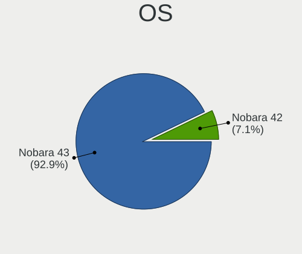

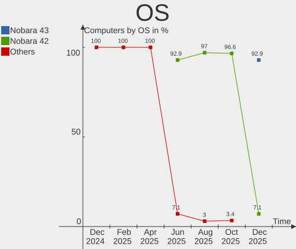

| Name      | Computers | Percent |
|-----------|-----------|---------|
| Nobara 43 | 39        | 92.86%  |
| Nobara 42 | 3         | 7.14%   |

OS Family
---------

OS without a version

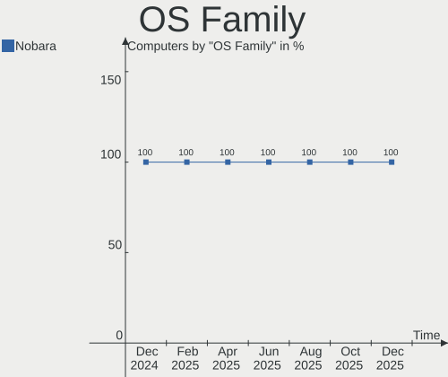

| Name   | Computers | Percent |
|--------|-----------|---------|
| Nobara | 42        | 100%    |

Kernel
------

Version of the Linux kernel

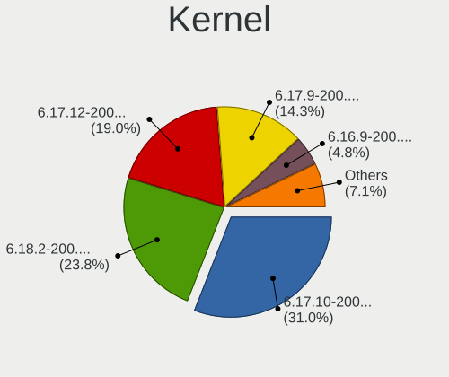

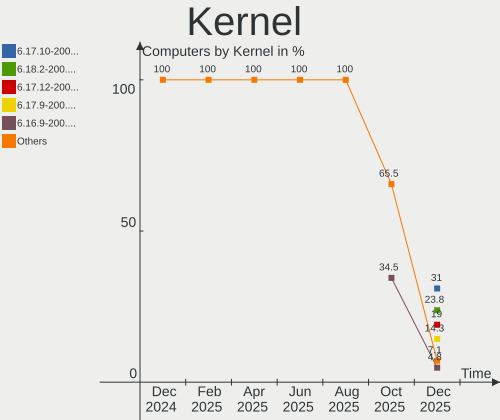

| Version                        | Computers | Percent |
|--------------------------------|-----------|---------|
| 6.17.10-200.nobara.fc43.x86_64 | 13        | 30.95%  |
| 6.18.2-200.nobara.fc43.x86_64  | 10        | 23.81%  |
| 6.17.12-200.nobara.fc43.x86_64 | 8         | 19.05%  |
| 6.17.9-200.nobara.fc43.x86_64  | 6         | 14.29%  |
| 6.16.9-200.nobara.fc42.x86_64  | 2         | 4.76%   |
| 6.17.7-200.nobara.fc42.x86_64  | 1         | 2.38%   |
| 6.17.11-200.nobara.fc43.x86_64 | 1         | 2.38%   |
| 6.15.6-201.nobara.fc42.x86_64  | 1         | 2.38%   |

Kernel Family
-------------

Linux kernel without a distro release

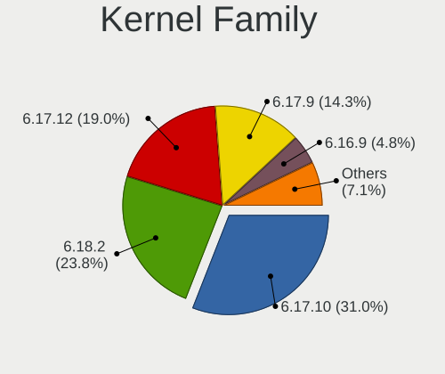

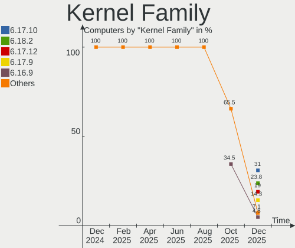

| Version | Computers | Percent |
|---------|-----------|---------|
| 6.17.10 | 13        | 30.95%  |
| 6.18.2  | 10        | 23.81%  |
| 6.17.12 | 8         | 19.05%  |
| 6.17.9  | 6         | 14.29%  |
| 6.16.9  | 2         | 4.76%   |
| 6.17.7  | 1         | 2.38%   |
| 6.17.11 | 1         | 2.38%   |
| 6.15.6  | 1         | 2.38%   |

Kernel Major Ver.
-----------------

Linux kernel major version

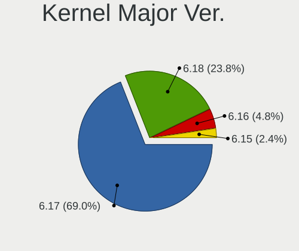

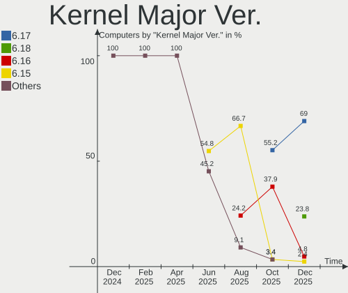

| Version | Computers | Percent |
|---------|-----------|---------|
| 6.17    | 29        | 69.05%  |
| 6.18    | 10        | 23.81%  |
| 6.16    | 2         | 4.76%   |
| 6.15    | 1         | 2.38%   |

Arch
----

OS architecture (x86_64, i586, etc.)

| Name   | Computers | Percent |
|--------|-----------|---------|
| x86_64 | 42        | 100%    |

DE
--

Desktop Environment

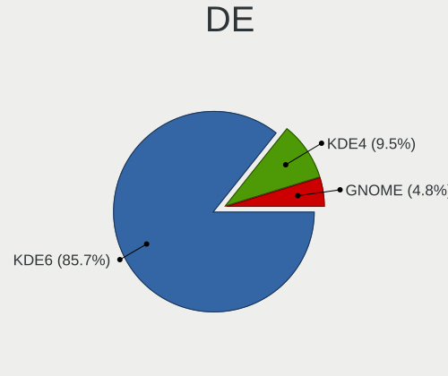

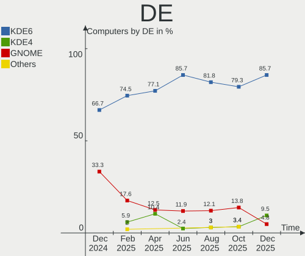

| Name  | Computers | Percent |
|-------|-----------|---------|
| KDE6  | 36        | 85.71%  |
| KDE4  | 4         | 9.52%   |
| GNOME | 2         | 4.76%   |

Display Server
--------------

X11 or Wayland

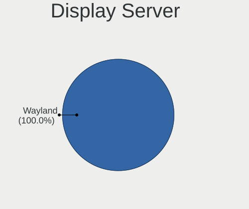

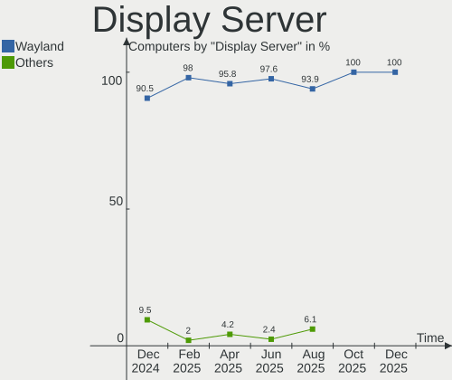

| Name    | Computers | Percent |
|---------|-----------|---------|
| Wayland | 42        | 100%    |

Display Manager
---------------

SDDM, LightDM, etc.

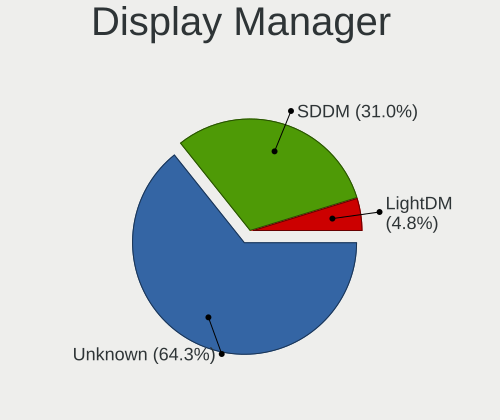

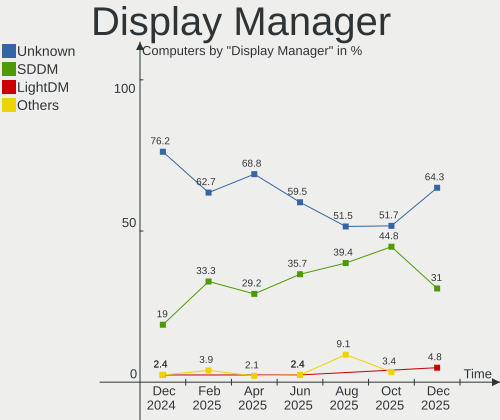

| Name    | Computers | Percent |
|---------|-----------|---------|
| Unknown | 27        | 64.29%  |
| SDDM    | 13        | 30.95%  |
| LightDM | 2         | 4.76%   |

OS Lang
-------

Language

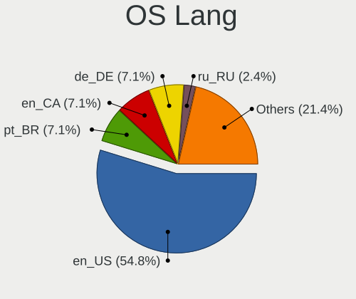

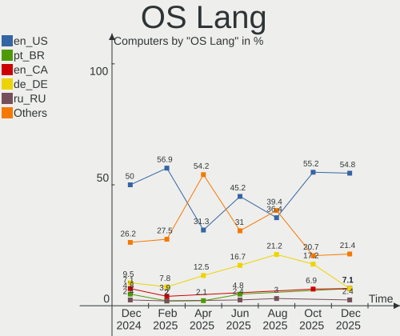

| Lang  | Computers | Percent |
|-------|-----------|---------|
| en_US | 23        | 54.76%  |
| pt_BR | 3         | 7.14%   |
| en_CA | 3         | 7.14%   |
| de_DE | 3         | 7.14%   |
| ru_RU | 1         | 2.38%   |
| pl_PL | 1         | 2.38%   |
| nl_NL | 1         | 2.38%   |
| es_ES | 1         | 2.38%   |
| en_SG | 1         | 2.38%   |
| en_IN | 1         | 2.38%   |
| en_GB | 1         | 2.38%   |
| en_AU | 1         | 2.38%   |
| cs_CZ | 1         | 2.38%   |
| C     | 1         | 2.38%   |

Boot Mode
---------

EFI or BIOS

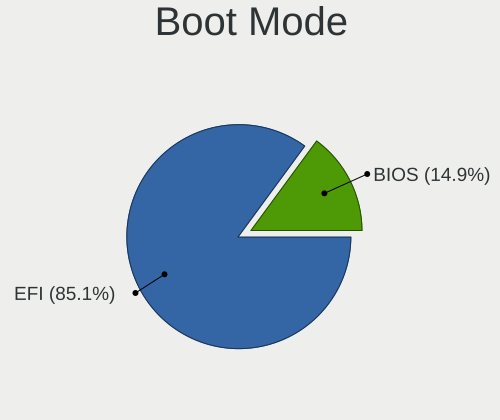

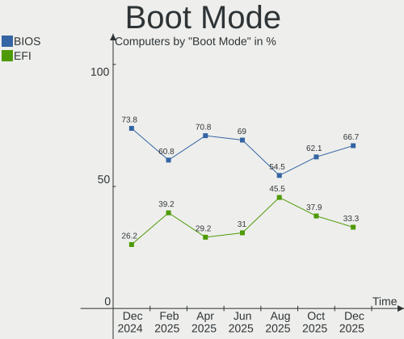

| Mode | Computers | Percent |
|------|-----------|---------|
| BIOS | 28        | 66.67%  |
| EFI  | 14        | 33.33%  |

Filesystem
----------

Type of filesystem

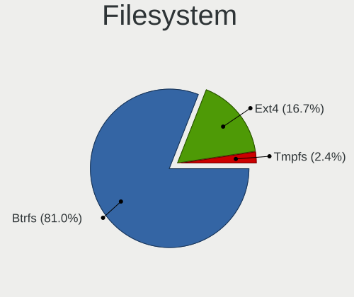

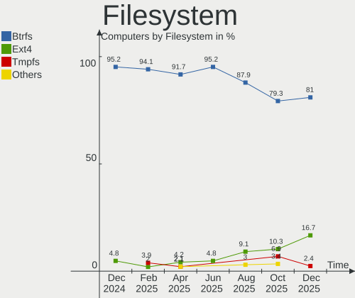

| Type  | Computers | Percent |
|-------|-----------|---------|
| Btrfs | 34        | 80.95%  |
| Ext4  | 7         | 16.67%  |
| Tmpfs | 1         | 2.38%   |

Part. scheme
------------

Scheme of partitioning

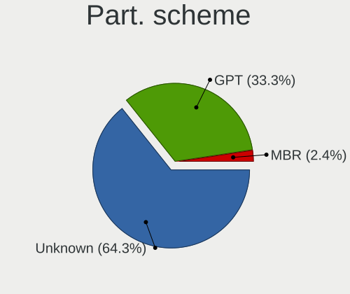

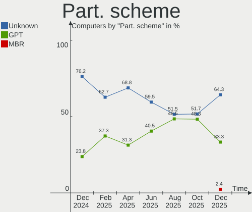

| Type    | Computers | Percent |
|---------|-----------|---------|
| Unknown | 27        | 64.29%  |
| GPT     | 14        | 33.33%  |
| MBR     | 1         | 2.38%   |

Dual Boot with Linux/BSD
------------------------

Hosting more than one Linux/BSD

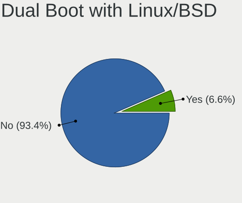

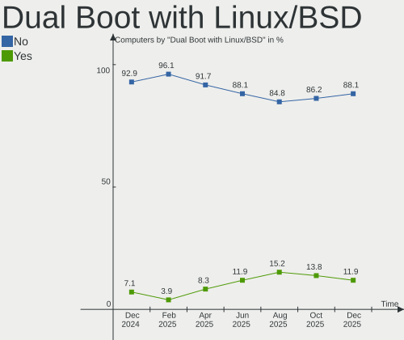

| Dual boot | Computers | Percent |
|-----------|-----------|---------|
| No        | 37        | 88.1%   |
| Yes       | 5         | 11.9%   |

Dual Boot (Win)
---------------

Hosting Linux and Windows

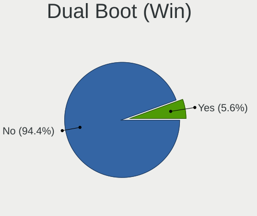

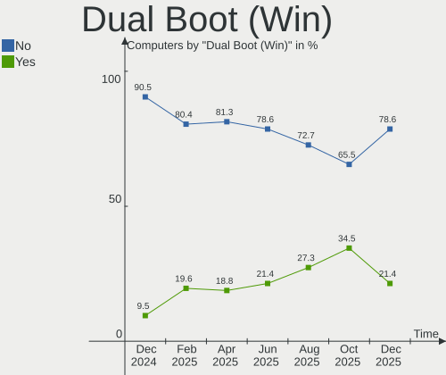

| Dual boot | Computers | Percent |
|-----------|-----------|---------|
| No        | 33        | 78.57%  |
| Yes       | 9         | 21.43%  |

Board
-----

Vendor
------

Motherboard manufacturer

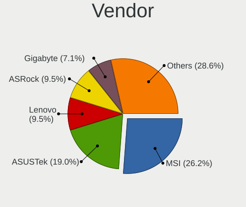

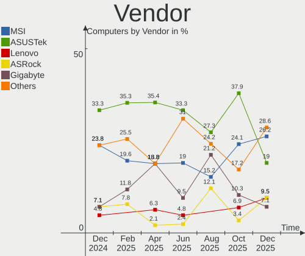

| Name                                 | Computers | Percent |
|--------------------------------------|-----------|---------|
| MSI                                  | 11        | 26.19%  |
| ASUSTek Computer                     | 8         | 19.05%  |
| Lenovo                               | 4         | 9.52%   |
| ASRock                               | 4         | 9.52%   |
| Gigabyte Technology                  | 3         | 7.14%   |
| Dell                                 | 3         | 7.14%   |
| Acer                                 | 3         | 7.14%   |
| Shenzhen Meigao Electronic Equipment | 1         | 2.38%   |
| Samsung Electronics                  | 1         | 2.38%   |
| Razer                                | 1         | 2.38%   |
| Medion                               | 1         | 2.38%   |
| Huanan                               | 1         | 2.38%   |
| Apple                                | 1         | 2.38%   |

Model
-----

Motherboard model

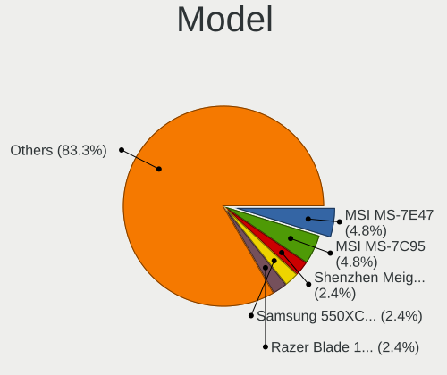

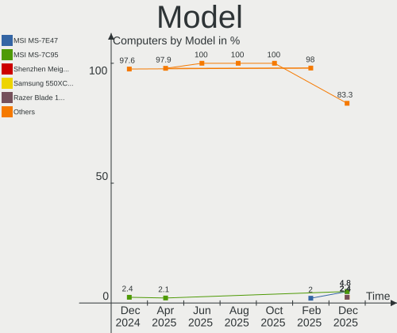

| Name                                                | Computers | Percent |
|-----------------------------------------------------|-----------|---------|
| MSI MS-7E47                                         | 2         | 4.76%   |
| MSI MS-7C95                                         | 2         | 4.76%   |
| Shenzhen Meigao Electronic Equipment Mercury series | 1         | 2.38%   |
| Samsung 550XCJ/550XCR                               | 1         | 2.38%   |
| Razer Blade 15 Base Model (Early 2021) - RZ09-0369  | 1         | 2.38%   |
| MSI MS-7D76                                         | 1         | 2.38%   |
| MSI MS-7D54                                         | 1         | 2.38%   |
| MSI MS-7C84                                         | 1         | 2.38%   |
| MSI MS-7B84                                         | 1         | 2.38%   |
| MSI MS-7A72                                         | 1         | 2.38%   |
| MSI MS-7850                                         | 1         | 2.38%   |
| MSI Crosshair 16 HX MONSTER HUNTER EDITION D14VFKG  | 1         | 2.38%   |
| Medion X682X                                        | 1         | 2.38%   |
| Lenovo Yoga Pro 9 16IMH9 83DN                       | 1         | 2.38%   |
| Lenovo ThinkPad T14 Gen 1 20UES1WC00                | 1         | 2.38%   |
| Lenovo LOQ 15IRX9 83DV                              | 1         | 2.38%   |
| Lenovo IdeaPad 5 15IIL05 81YK                       | 1         | 2.38%   |
| Huanan X99-QD4 V1.0                                 | 1         | 2.38%   |
| Gigabyte X870E AORUS ELITE WIFI7                    | 1         | 2.38%   |
| Gigabyte B550 GAMING X V2                           | 1         | 2.38%   |
| Gigabyte B460MDS3H                                  | 1         | 2.38%   |
| Dell XPS 8930                                       | 1         | 2.38%   |
| Dell Vostro 3580                                    | 1         | 2.38%   |
| Dell G5 5590                                        | 1         | 2.38%   |
| ASUS TUF Z370-PRO GAMING                            | 1         | 2.38%   |
| ASUS TUF Gaming X570-PLUS                           | 1         | 2.38%   |
| ASUS ROG STRIX X670E-F GAMING WIFI                  | 1         | 2.38%   |
| ASUS ROG STRIX B850-G GAMING WIFI                   | 1         | 2.38%   |
| ASUS ROG CROSSHAIR VIII IMPACT                      | 1         | 2.38%   |
| ASUS PRIME Z690-P D4                                | 1         | 2.38%   |
| ASUS B150 PRO GAMING                                | 1         | 2.38%   |
| ASUS 4802                                           | 1         | 2.38%   |
| ASRock Z690 PG Riptide                              | 1         | 2.38%   |
| ASRock X870 Pro RS WiFi                             | 1         | 2.38%   |
| ASRock B550M-ITX/ac                                 | 1         | 2.38%   |
| ASRock A620AM Pro-A                                 | 1         | 2.38%   |
| Apple iMac14,1                                      | 1         | 2.38%   |
| Acer Aspire V5-571P                                 | 1         | 2.38%   |
| Acer Aspire E1-572P                                 | 1         | 2.38%   |
| Acer Aspire A515-45G                                | 1         | 2.38%   |

Model Family
------------

Motherboard model prefix

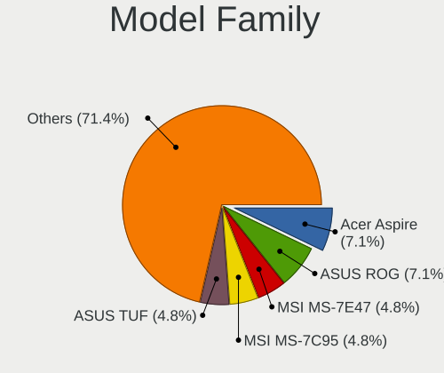

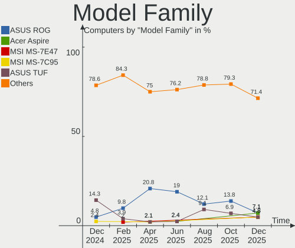

| Name                                         | Computers | Percent |
|----------------------------------------------|-----------|---------|
| ASUS ROG                                     | 3         | 7.14%   |
| Acer Aspire                                  | 3         | 7.14%   |
| MSI MS-7E47                                  | 2         | 4.76%   |
| MSI MS-7C95                                  | 2         | 4.76%   |
| ASUS TUF                                     | 2         | 4.76%   |
| Shenzhen Meigao Electronic Equipment Mercury | 1         | 2.38%   |
| Samsung 550XCJ                               | 1         | 2.38%   |
| Razer Blade                                  | 1         | 2.38%   |
| MSI MS-7D76                                  | 1         | 2.38%   |
| MSI MS-7D54                                  | 1         | 2.38%   |
| MSI MS-7C84                                  | 1         | 2.38%   |
| MSI MS-7B84                                  | 1         | 2.38%   |
| MSI MS-7A72                                  | 1         | 2.38%   |
| MSI MS-7850                                  | 1         | 2.38%   |
| MSI Crosshair                                | 1         | 2.38%   |
| Medion X682X                                 | 1         | 2.38%   |
| Lenovo Yoga                                  | 1         | 2.38%   |
| Lenovo ThinkPad                              | 1         | 2.38%   |
| Lenovo LOQ                                   | 1         | 2.38%   |
| Lenovo IdeaPad                               | 1         | 2.38%   |
| Huanan X99-QD4                               | 1         | 2.38%   |
| Gigabyte X870E                               | 1         | 2.38%   |
| Gigabyte B550                                | 1         | 2.38%   |
| Gigabyte B460MDS3H                           | 1         | 2.38%   |
| Dell XPS                                     | 1         | 2.38%   |
| Dell Vostro                                  | 1         | 2.38%   |
| Dell G5                                      | 1         | 2.38%   |
| ASUS PRIME                                   | 1         | 2.38%   |
| ASUS B150                                    | 1         | 2.38%   |
| ASUS 4802                                    | 1         | 2.38%   |
| ASRock Z690                                  | 1         | 2.38%   |
| ASRock X870                                  | 1         | 2.38%   |
| ASRock B550M-ITX                             | 1         | 2.38%   |
| ASRock A620AM                                | 1         | 2.38%   |
| Apple iMac14                                 | 1         | 2.38%   |

MFG Year
--------

Motherboard manufacture year

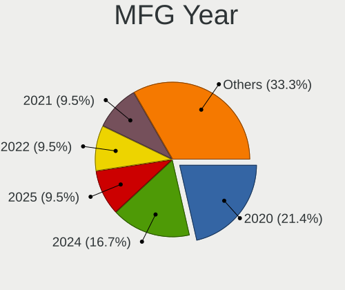

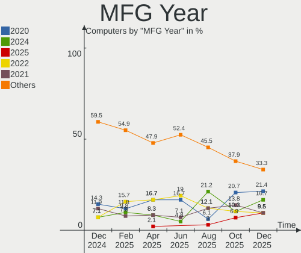

| Year | Computers | Percent |
|------|-----------|---------|
| 2020 | 9         | 21.43%  |
| 2024 | 7         | 16.67%  |
| 2025 | 4         | 9.52%   |
| 2022 | 4         | 9.52%   |
| 2021 | 4         | 9.52%   |
| 2019 | 3         | 7.14%   |
| 2018 | 2         | 4.76%   |
| 2016 | 2         | 4.76%   |
| 2012 | 2         | 4.76%   |
| 2023 | 1         | 2.38%   |
| 2017 | 1         | 2.38%   |
| 2015 | 1         | 2.38%   |
| 2014 | 1         | 2.38%   |
| 2013 | 1         | 2.38%   |

Form Factor
-----------

Physical design of the computer

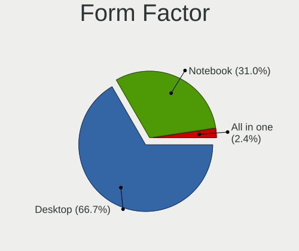

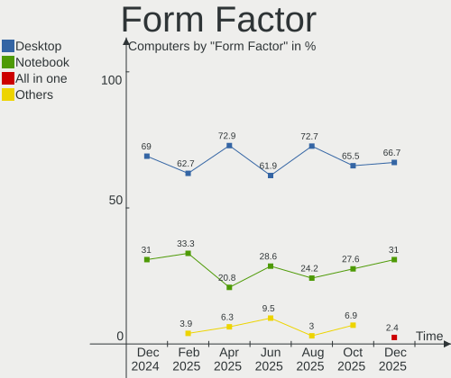

| Name       | Computers | Percent |
|------------|-----------|---------|
| Desktop    | 28        | 66.67%  |
| Notebook   | 13        | 30.95%  |
| All in one | 1         | 2.38%   |

Secure Boot
-----------

Enabled or disabled

| State    | Computers | Percent |
|----------|-----------|---------|
| Disabled | 42        | 100%    |

Coreboot
--------

Have coreboot on board

| Used | Computers | Percent |
|------|-----------|---------|
| No   | 42        | 100%    |

RAM Size
--------

Total RAM memory

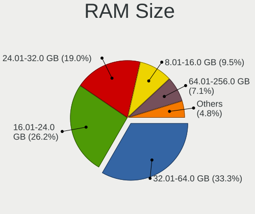

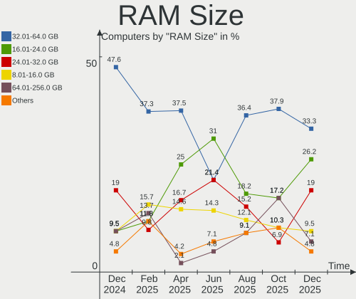

| Size in GB  | Computers | Percent |
|-------------|-----------|---------|
| 32.01-64.0  | 14        | 33.33%  |
| 16.01-24.0  | 11        | 26.19%  |
| 24.01-32.0  | 8         | 19.05%  |
| 8.01-16.0   | 4         | 9.52%   |
| 64.01-256.0 | 3         | 7.14%   |
| 4.01-8.0    | 2         | 4.76%   |

RAM Used
--------

Used RAM memory

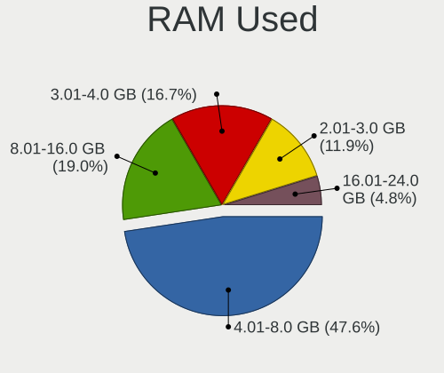

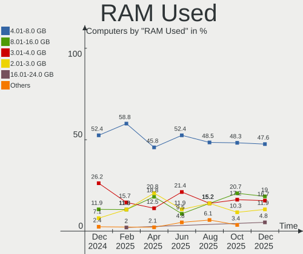

| Used GB    | Computers | Percent |
|------------|-----------|---------|
| 4.01-8.0   | 20        | 47.62%  |
| 8.01-16.0  | 8         | 19.05%  |
| 3.01-4.0   | 7         | 16.67%  |
| 2.01-3.0   | 5         | 11.9%   |
| 16.01-24.0 | 2         | 4.76%   |

Total Drives
------------

Number of drives on board

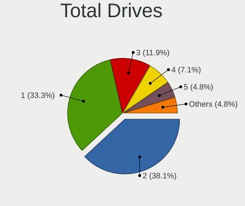

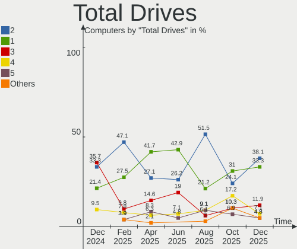

| Drives | Computers | Percent |
|--------|-----------|---------|
| 2      | 16        | 38.1%   |
| 1      | 14        | 33.33%  |
| 3      | 5         | 11.9%   |
| 4      | 3         | 7.14%   |
| 5      | 2         | 4.76%   |
| 6      | 1         | 2.38%   |
| 0      | 1         | 2.38%   |

Has CD-ROM
----------

Has CD-ROM on board

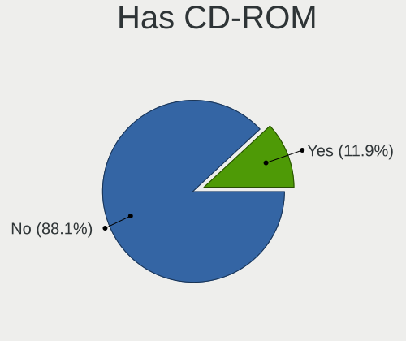

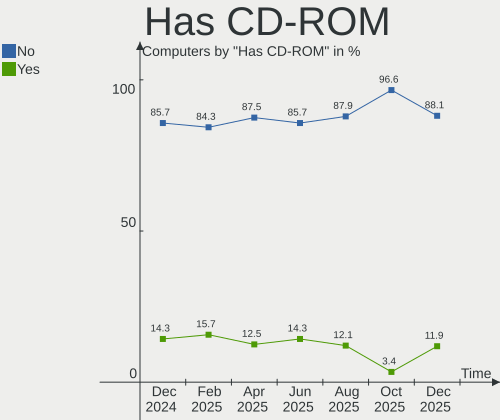

| Presented | Computers | Percent |
|-----------|-----------|---------|
| No        | 37        | 88.1%   |
| Yes       | 5         | 11.9%   |

Has Ethernet
------------

Has Ethernet on board

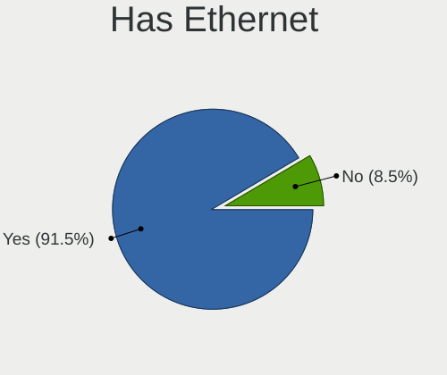

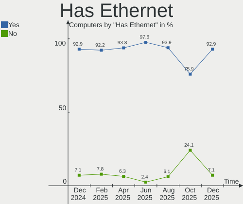

| Presented | Computers | Percent |
|-----------|-----------|---------|
| Yes       | 39        | 92.86%  |
| No        | 3         | 7.14%   |

Has WiFi
--------

Has WiFi module

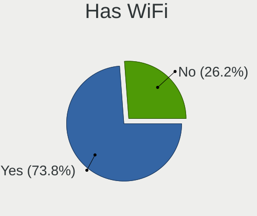

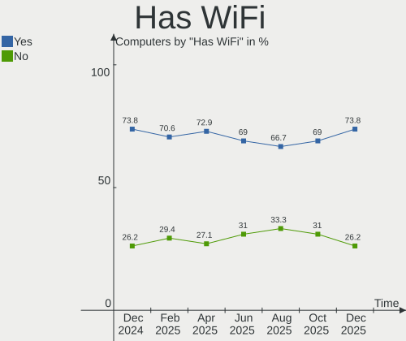

| Presented | Computers | Percent |
|-----------|-----------|---------|
| Yes       | 31        | 73.81%  |
| No        | 11        | 26.19%  |

Has Bluetooth
-------------

Has Bluetooth module

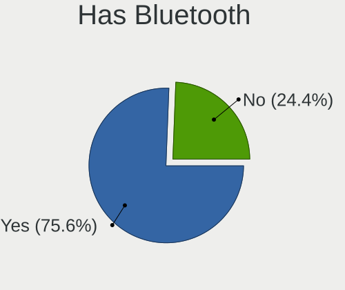

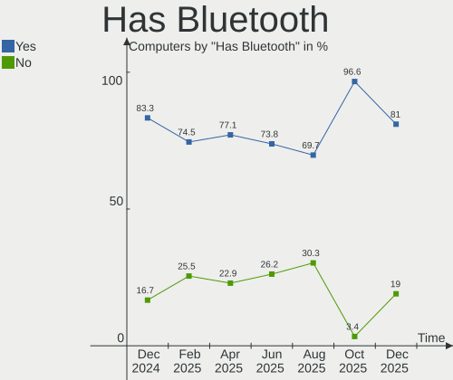

| Presented | Computers | Percent |
|-----------|-----------|---------|
| Yes       | 34        | 80.95%  |
| No        | 8         | 19.05%  |

Location
--------

Country
-------

Geographic location (country)

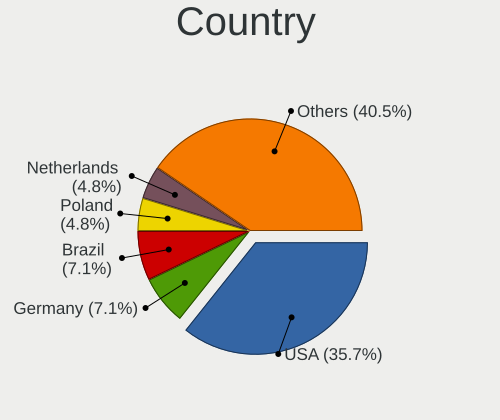

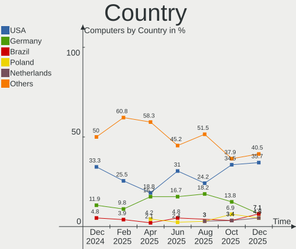

| Country     | Computers | Percent |
|-------------|-----------|---------|
| USA         | 15        | 35.71%  |
| Germany     | 3         | 7.14%   |
| Brazil      | 3         | 7.14%   |
| Poland      | 2         | 4.76%   |
| Netherlands | 2         | 4.76%   |
| Greece      | 2         | 4.76%   |
| Czechia     | 2         | 4.76%   |
| Canada      | 2         | 4.76%   |
| Vietnam     | 1         | 2.38%   |
| UK          | 1         | 2.38%   |
| Spain       | 1         | 2.38%   |
| Singapore   | 1         | 2.38%   |
| Portugal    | 1         | 2.38%   |
| Norway      | 1         | 2.38%   |
| New Zealand | 1         | 2.38%   |
| Lithuania   | 1         | 2.38%   |
| Israel      | 1         | 2.38%   |
| India       | 1         | 2.38%   |
| Australia   | 1         | 2.38%   |

City
----

Geographic location (city)

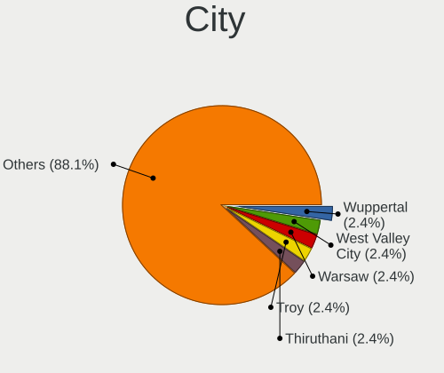

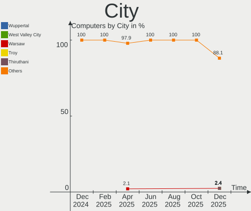

| City             | Computers | Percent |
|------------------|-----------|---------|
| Wuppertal        | 1         | 2.38%   |
| West Valley City | 1         | 2.38%   |
| Warsaw           | 1         | 2.38%   |
| Troy             | 1         | 2.38%   |
| Thiruthani       | 1         | 2.38%   |
| Sydney           | 1         | 2.38%   |
| Spokane          | 1         | 2.38%   |
| Singapore        | 1         | 2.38%   |
| Rugby            | 1         | 2.38%   |
| Rolling Meadows  | 1         | 2.38%   |
| Ridgecrest       | 1         | 2.38%   |
| Richmond         | 1         | 2.38%   |
| Richardson       | 1         | 2.38%   |
| Rada de Haro     | 1         | 2.38%   |
| Raanana          | 1         | 2.38%   |
| Pukekohe         | 1         | 2.38%   |
| Poznan           | 1         | 2.38%   |
| Ottawa           | 1         | 2.38%   |
| Orillia          | 1         | 2.38%   |
| Olomouc          | 1         | 2.38%   |
| Mogi das Cruzes  | 1         | 2.38%   |
| Lübeck          | 1         | 2.38%   |
| Lisbon           | 1         | 2.38%   |
| Lincoln          | 1         | 2.38%   |
| Lebanon          | 1         | 2.38%   |
| Lamia            | 1         | 2.38%   |
| Kaunas           | 1         | 2.38%   |
| Kannapolis       | 1         | 2.38%   |
| Hradec Králové | 1         | 2.38%   |
| Ho Chi Minh City | 1         | 2.38%   |
| Gorinchem        | 1         | 2.38%   |
| Fort Lauderdale  | 1         | 2.38%   |
| Fornebu          | 1         | 2.38%   |
| Essen            | 1         | 2.38%   |
| Columbus         | 1         | 2.38%   |
| Brasília        | 1         | 2.38%   |
| Bingley          | 1         | 2.38%   |
| Belo Horizonte   | 1         | 2.38%   |
| Atlanta          | 1         | 2.38%   |
| Athens           | 1         | 2.38%   |

Drives
------

Drive Vendor
------------

Hard drive vendors

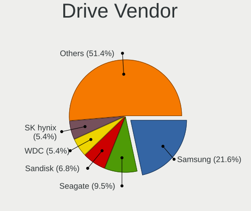

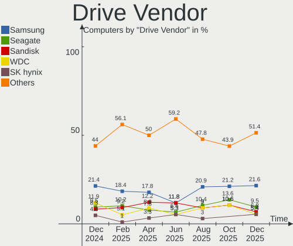

| Vendor                       | Computers | Drives | Percent |
|------------------------------|-----------|--------|---------|
| Samsung Electronics          | 16        | 23     | 21.62%  |
| Seagate                      | 7         | 8      | 9.46%   |
| Sandisk                      | 5         | 7      | 6.76%   |
| WDC                          | 4         | 6      | 5.41%   |
| SK hynix                     | 4         | 4      | 5.41%   |
| Micron/Crucial Technology    | 4         | 4      | 5.41%   |
| Kingston                     | 4         | 5      | 5.41%   |
| Toshiba                      | 3         | 4      | 4.05%   |
| Phison Electronics           | 3         | 3      | 4.05%   |
| Shenzhen Longsys Electronics | 2         | 2      | 2.7%    |
| Realtek Semiconductor        | 2         | 2      | 2.7%    |
| Micron Technology            | 2         | 2      | 2.7%    |
| KIOXIA                       | 2         | 2      | 2.7%    |
| Kingston Technology Company  | 2         | 2      | 2.7%    |
| Crucial                      | 2         | 2      | 2.7%    |
| A-DATA Technology            | 2         | 3      | 2.7%    |
| SOLIDIGM                     | 1         | 1      | 1.35%   |
| Solid State Storage          | 1         | 1      | 1.35%   |
| PNY                          | 1         | 1      | 1.35%   |
| OCZ                          | 1         | 1      | 1.35%   |
| Intenso                      | 1         | 1      | 1.35%   |
| Intel                        | 1         | 1      | 1.35%   |
| INNOVATION IT                | 1         | 1      | 1.35%   |
| HGST                         | 1         | 1      | 1.35%   |
| Apple                        | 1         | 1      | 1.35%   |
| Unknown                      | 1         | 1      | 1.35%   |

Drive Model
-----------

Hard drive models

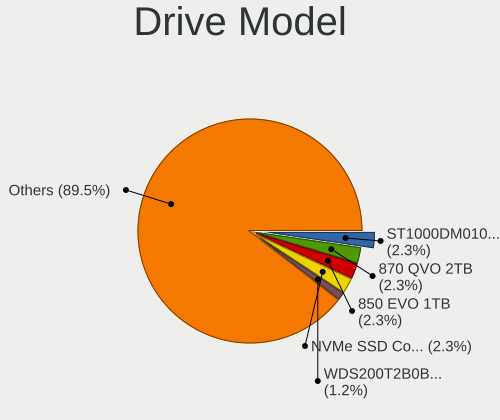

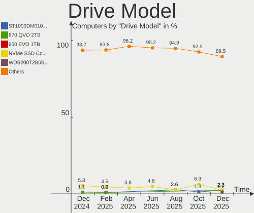

| Model                                             | Computers | Percent |
|---------------------------------------------------|-----------|---------|
| Seagate ST1000DM010-2EP102 1TB                    | 2         | 2.33%   |
| Samsung SSD 870 QVO 2TB                           | 2         | 2.33%   |
| Samsung SSD 850 EVO 1TB                           | 2         | 2.33%   |
| Samsung NVMe SSD Controller SM981/PM981/PM983 1TB | 2         | 2.33%   |
| WDC WDS200T2B0B-00YS70 2TB SSD                    | 1         | 1.16%   |
| WDC WDS200T2B0A 2TB SSD                           | 1         | 1.16%   |
| WDC WD80EZAZ-11TDBA0 8TB                          | 1         | 1.16%   |
| WDC WD60EDAZ-11BMZB0 6TB                          | 1         | 1.16%   |
| WDC WD40EZRZ-00GXCB0 4TB                          | 1         | 1.16%   |
| WDC WD40EZAX-00C8UB0 4TB                          | 1         | 1.16%   |
| Toshiba MQ04ABF100 1TB                            | 1         | 1.16%   |
| Toshiba DT01ACA200 2TB                            | 1         | 1.16%   |
| Toshiba DT01ACA100 1TB                            | 1         | 1.16%   |
| SOLIDIGM SSDPFKKW020X7 2TB                        | 1         | 1.16%   |
| Solid State Storage NVMe CA5-8D512 512GB          | 1         | 1.16%   |
| SK hynix SKHynix_HFS001TEJ9X115N 1024GB           | 1         | 1.16%   |
| SK hynix SKHynix_HFS001TEJ4X112N 1024GB           | 1         | 1.16%   |
| SK hynix PC401 NVMe Solid State Drive 256GB       | 1         | 1.16%   |
| SK hynix BC501 NVMe Solid State Drive 512GB       | 1         | 1.16%   |
| Shenzhen Longsys Lexar SSD NM790 2TB              | 1         | 1.16%   |
| Shenzhen Longsys Lexar SSD ARES PRO 2TB           | 1         | 1.16%   |
| Seagate ST8000DM004-2CX188 8TB                    | 1         | 1.16%   |
| Seagate ST3000DM008-2DM166 3TB                    | 1         | 1.16%   |
| Seagate ST2000LM015-2E8174 2TB                    | 1         | 1.16%   |
| Seagate ST2000DM001-9YN164 2TB                    | 1         | 1.16%   |
| Seagate ST1000LM048-2E7172 1TB                    | 1         | 1.16%   |
| Seagate SSD 500GB                                 | 1         | 1.16%   |
| Sandisk WD_BLACK SN850X HS 2000GB                 | 1         | 1.16%   |
| Sandisk WD_BLACK SN850X 1000GB                    | 1         | 1.16%   |
| Sandisk WD_BLACK SN850P for PS5 4000GB            | 1         | 1.16%   |
| Sandisk WD_BLACK SN770 1TB                        | 1         | 1.16%   |
| Sandisk WD PC SN560 SDDPNQE-1T00-1032 1TB         | 1         | 1.16%   |
| Sandisk WD Blue SN550 NVMe SSD 1024GB             | 1         | 1.16%   |
| Samsung SSD 990 PRO with Heatsink 4TB             | 1         | 1.16%   |
| Samsung SSD 990 PRO 4TB                           | 1         | 1.16%   |
| Samsung SSD 990 PRO 2TB                           | 1         | 1.16%   |
| Samsung SSD 990 PRO 1TB                           | 1         | 1.16%   |
| Samsung SSD 990 EVO Plus 4TB                      | 1         | 1.16%   |
| Samsung SSD 990 EVO 2TB                           | 1         | 1.16%   |
| Samsung SSD 980 1TB                               | 1         | 1.16%   |

HDD Vendor
----------

Hard disk drive vendors

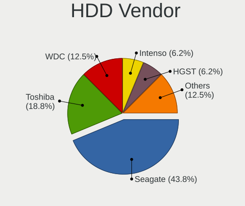

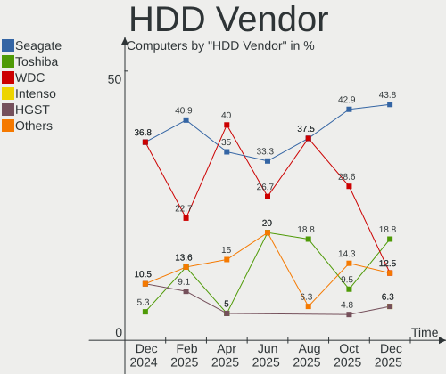

| Vendor  | Computers | Drives | Percent |
|---------|-----------|--------|---------|
| Seagate | 7         | 7      | 43.75%  |
| Toshiba | 3         | 4      | 18.75%  |
| WDC     | 2         | 4      | 12.5%   |
| Intenso | 1         | 1      | 6.25%   |
| HGST    | 1         | 1      | 6.25%   |
| Apple   | 1         | 1      | 6.25%   |
| Unknown | 1         | 1      | 6.25%   |

SSD Vendor
----------

Solid state drive vendors

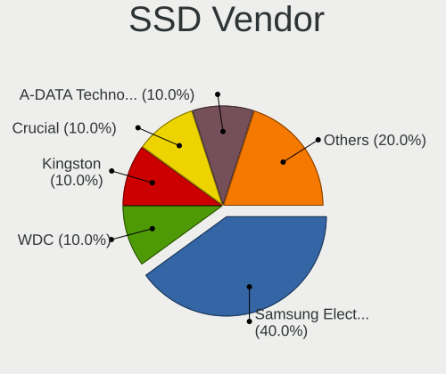

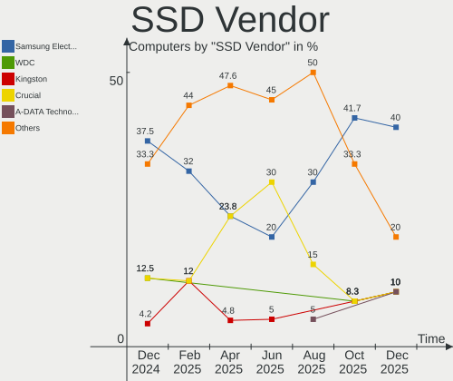

| Vendor              | Computers | Drives | Percent |
|---------------------|-----------|--------|---------|
| Samsung Electronics | 8         | 11     | 40%     |
| WDC                 | 2         | 2      | 10%     |
| Kingston            | 2         | 2      | 10%     |
| Crucial             | 2         | 2      | 10%     |
| A-DATA Technology   | 2         | 3      | 10%     |
| Seagate             | 1         | 1      | 5%      |
| PNY                 | 1         | 1      | 5%      |
| OCZ                 | 1         | 1      | 5%      |
| INNOVATION IT       | 1         | 1      | 5%      |

Drive Kind
----------

HDD or SSD

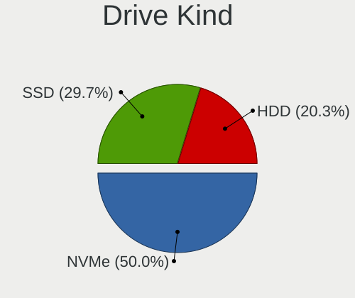

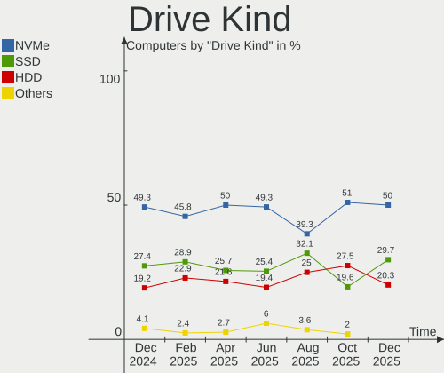

| Kind | Computers | Drives | Percent |
|------|-----------|--------|---------|
| NVMe | 32        | 46     | 50%     |
| SSD  | 19        | 24     | 29.69%  |
| HDD  | 13        | 19     | 20.31%  |

Drive Connector
---------------

SATA, SAS, NVMe, etc.

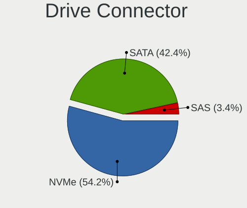

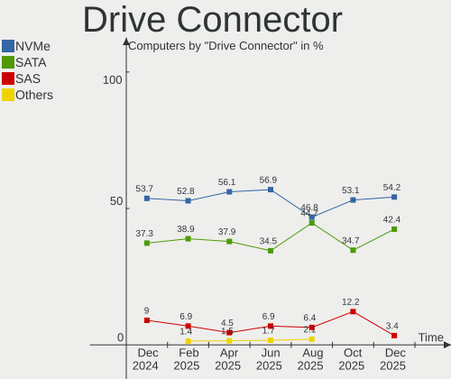

| Type | Computers | Drives | Percent |
|------|-----------|--------|---------|
| NVMe | 32        | 45     | 54.24%  |
| SATA | 25        | 42     | 42.37%  |
| SAS  | 2         | 2      | 3.39%   |

Drive Size
----------

Size of hard drive

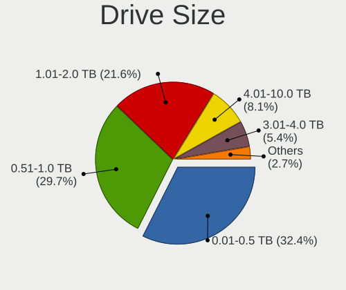

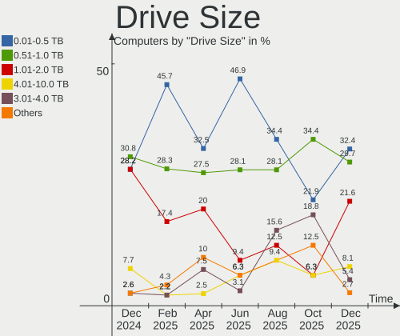

| Size in TB | Computers | Drives | Percent |
|------------|-----------|--------|---------|
| 0.01-0.5   | 12        | 14     | 32.43%  |
| 0.51-1.0   | 11        | 13     | 29.73%  |
| 1.01-2.0   | 8         | 8      | 21.62%  |
| 4.01-10.0  | 3         | 5      | 8.11%   |
| 3.01-4.0   | 2         | 2      | 5.41%   |
| 2.01-3.0   | 1         | 1      | 2.7%    |

Space Total
-----------

Amount of disk space available on the file system

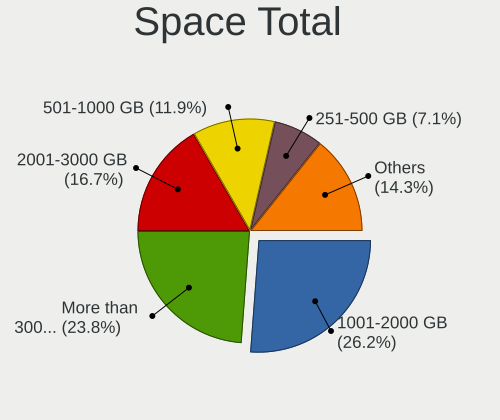

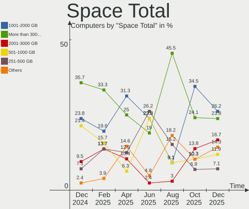

| Size in GB     | Computers | Percent |
|----------------|-----------|---------|
| 1001-2000      | 11        | 26.19%  |
| More than 3000 | 10        | 23.81%  |
| 2001-3000      | 7         | 16.67%  |
| 501-1000       | 5         | 11.9%   |
| 251-500        | 3         | 7.14%   |
| 101-250        | 3         | 7.14%   |
| 1-20           | 2         | 4.76%   |
| Unknown        | 1         | 2.38%   |

Space Used
----------

Amount of used disk space

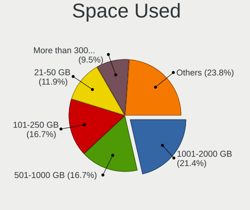

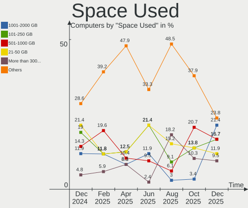

| Used GB        | Computers | Percent |
|----------------|-----------|---------|
| 1001-2000      | 9         | 21.43%  |
| 101-250        | 7         | 16.67%  |
| 501-1000       | 7         | 16.67%  |
| 21-50          | 5         | 11.9%   |
| More than 3000 | 4         | 9.52%   |
| 251-500        | 4         | 9.52%   |
| 1-20           | 3         | 7.14%   |
| 2001-3000      | 1         | 2.38%   |
| 51-100         | 1         | 2.38%   |
| Unknown        | 1         | 2.38%   |

Malfunc. Drives
---------------

Drive models with a malfunction

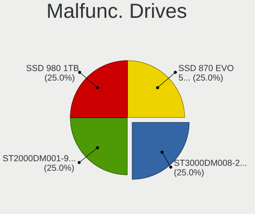

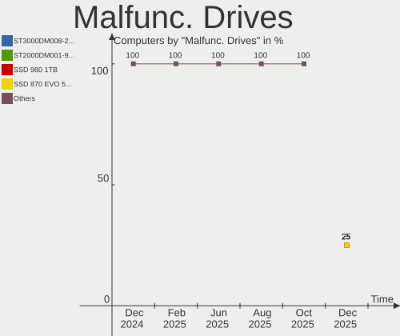

| Model                                 | Computers | Drives | Percent |
|---------------------------------------|-----------|--------|---------|
| Seagate ST3000DM008-2DM166 3TB        | 1         | 1      | 25%     |
| Seagate ST2000DM001-9YN164 2TB        | 1         | 1      | 25%     |
| Samsung Electronics SSD 980 1TB       | 1         | 1      | 25%     |
| Samsung Electronics SSD 870 EVO 500GB | 1         | 2      | 25%     |

Malfunc. Drive Vendor
---------------------

Vendors of faulty drives

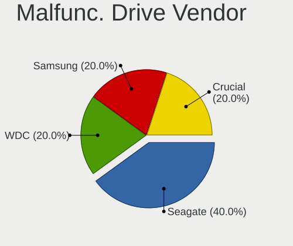

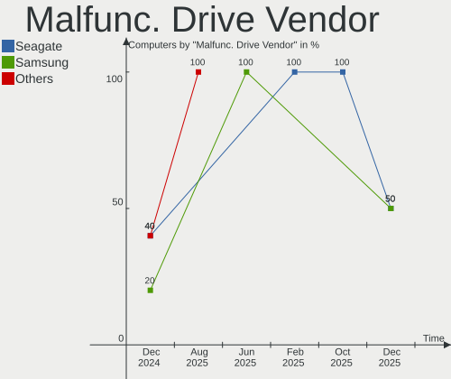

| Vendor              | Computers | Drives | Percent |
|---------------------|-----------|--------|---------|
| Seagate             | 2         | 2      | 50%     |
| Samsung Electronics | 2         | 3      | 50%     |

Malfunc. HDD Vendor
-------------------

Vendors of faulty HDD drives

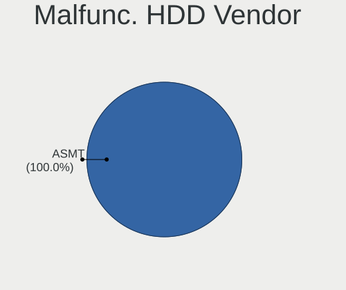

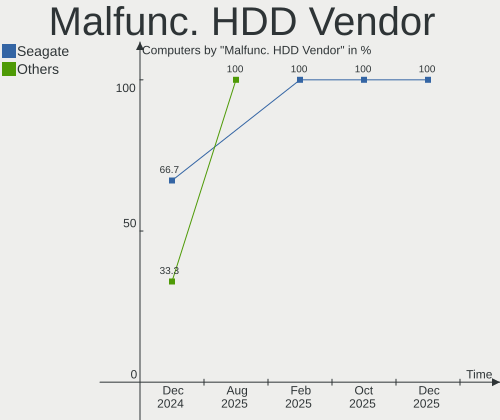

| Vendor  | Computers | Drives | Percent |
|---------|-----------|--------|---------|
| Seagate | 2         | 2      | 100%    |

Malfunc. Drive Kind
-------------------

Kinds of faulty drives

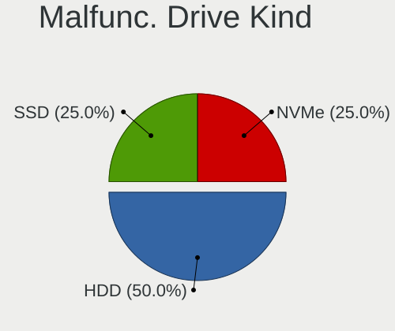

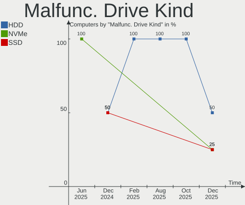

| Kind | Computers | Drives | Percent |
|------|-----------|--------|---------|
| HDD  | 2         | 2      | 50%     |
| NVMe | 1         | 1      | 25%     |
| SSD  | 1         | 2      | 25%     |

Failed Drives
-------------

Failed drive models

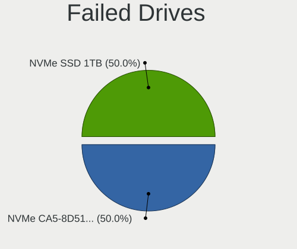

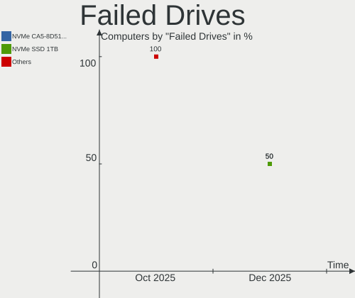

| Model                                    | Computers | Drives | Percent |
|------------------------------------------|-----------|--------|---------|
| Solid State Storage NVMe CA5-8D512 512GB | 1         | 1      | 50%     |
| KIOXIA NVMe SSD 1TB                      | 1         | 1      | 50%     |

Failed Drive Vendor
-------------------

Failed drive vendors

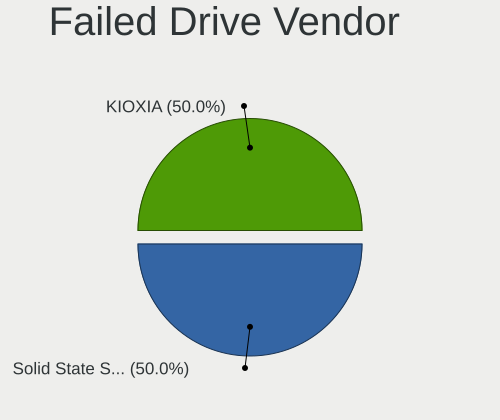

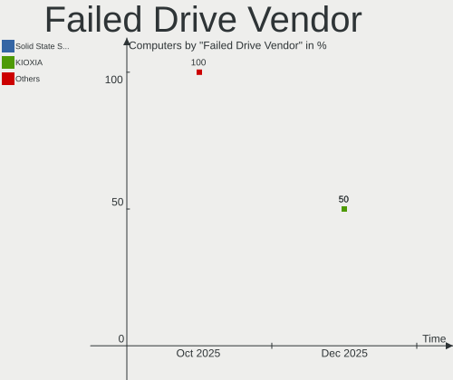

| Vendor              | Computers | Drives | Percent |
|---------------------|-----------|--------|---------|
| Solid State Storage | 1         | 1      | 50%     |
| KIOXIA              | 1         | 1      | 50%     |

Drive Status
------------

Number of failed and malfunc. drives

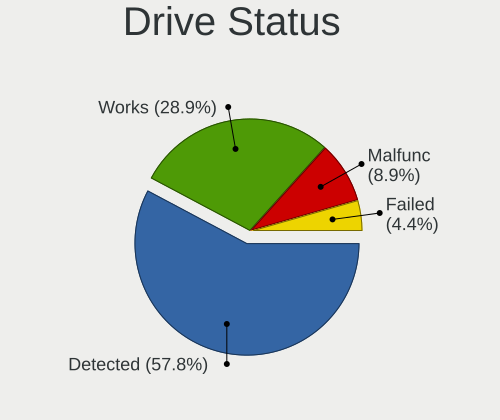

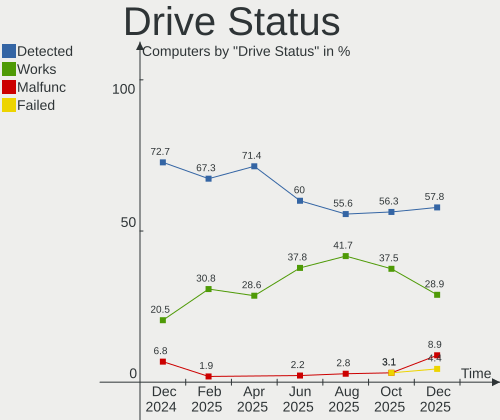

| Status   | Computers | Drives | Percent |
|----------|-----------|--------|---------|
| Detected | 26        | 55     | 57.78%  |
| Works    | 13        | 27     | 28.89%  |
| Malfunc  | 4         | 5      | 8.89%   |
| Failed   | 2         | 2      | 4.44%   |

Storage controller
------------------

Storage Vendor
--------------

Storage controller vendors

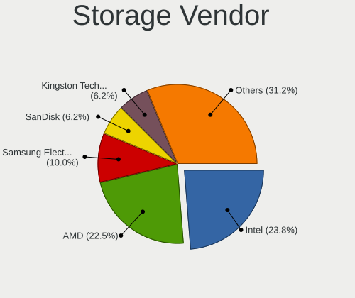

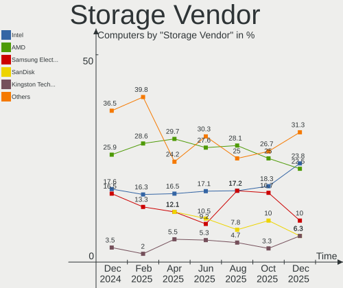

| Vendor                         | Computers | Percent |
|--------------------------------|-----------|---------|
| Intel                          | 19        | 23.75%  |
| AMD                            | 18        | 22.5%   |
| Samsung Electronics            | 8         | 10%     |
| SanDisk                        | 5         | 6.25%   |
| Kingston Technology Company    | 5         | 6.25%   |
| SK hynix                       | 4         | 5%      |
| Micron/Crucial Technology      | 4         | 5%      |
| ASMedia Technology             | 4         | 5%      |
| Phison Electronics             | 3         | 3.75%   |
| Shenzhen Longsys Electronics   | 2         | 2.5%    |
| Realtek Semiconductor          | 2         | 2.5%    |
| Micron Technology              | 2         | 2.5%    |
| KIOXIA                         | 2         | 2.5%    |
| Solidigm                       | 1         | 1.25%   |
| Solid State Storage Technology | 1         | 1.25%   |

Storage Model
-------------

Storage controller models

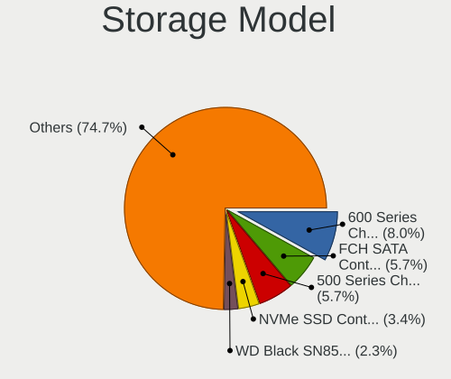

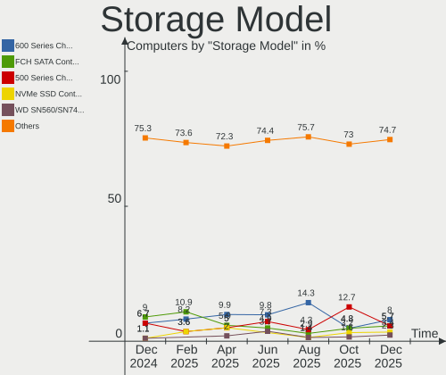

| Model                                                                         | Computers | Percent |
|-------------------------------------------------------------------------------|-----------|---------|
| AMD 600 Series Chipset SATA Controller                                        | 7         | 8.05%   |
| AMD FCH SATA Controller [AHCI mode]                                           | 5         | 5.75%   |
| AMD 500 Series Chipset SATA Controller                                        | 5         | 5.75%   |
| Samsung NVMe SSD Controller S4LV008[Pascal]                                   | 3         | 3.45%   |
| SanDisk WD SN560/SN740/SN770/SN5000 NVMe SSD                                  | 2         | 2.3%    |
| Sandisk WD Black SN850X NVMe SSD                                              | 2         | 2.3%    |
| Samsung NVMe SSD Controller SM981/PM981/PM983                                 | 2         | 2.3%    |
| Samsung NVMe SSD Controller PM9C1a (DRAM-less)                                | 2         | 2.3%    |
| Kingston Company NV2 NVMe SSD [SM2267XT] (DRAM-less)                          | 2         | 2.3%    |
| Kingston Company KC3000/FURY Renegade NVMe SSD [E18]                          | 2         | 2.3%    |
| Intel SATA Controller [RAID mode]                                             | 2         | 2.3%    |
| Intel RST Volume Management Device Controller                                 | 2         | 2.3%    |
| Intel Alder Lake-S PCH SATA Controller [AHCI Mode]                            | 2         | 2.3%    |
| Intel 7 Series Chipset Family 6-port SATA Controller [AHCI mode]              | 2         | 2.3%    |
| Intel 200 Series PCH SATA controller [AHCI mode]                              | 2         | 2.3%    |
| ASMedia ASM1064 Serial ATA Controller                                         | 2         | 2.3%    |
| ASMedia ASM1061/ASM1062 Serial ATA Controller                                 | 2         | 2.3%    |
| Solidigm P44 Pro NVMe SSD [Hollywood Beach]                                   | 1         | 1.15%   |
| Solid State Storage CA5-8D256 NVMe SSD M.2                                    | 1         | 1.15%   |
| SK hynix Platinum P41/PC801 NVMe Solid State Drive                            | 1         | 1.15%   |
| SK hynix PC401 NVMe Solid State Drive 256GB                                   | 1         | 1.15%   |
| SK hynix BC901 NVMe Solid State Drive (DRAM-less)                             | 1         | 1.15%   |
| SK hynix BC501 NVMe Solid State Drive                                         | 1         | 1.15%   |
| Shenzhen Longsys Lexar NM990 NVMe SSD (DRAM-less)                             | 1         | 1.15%   |
| Shenzhen Longsys Lexar NM790 / Patriot Viper VP4300 Lite NVMe SSD (DRAM-less) | 1         | 1.15%   |
| SanDisk Ultra 3D / WD PC SN530, IX SN530, Blue SN550 NVMe SSD (DRAM-less)     | 1         | 1.15%   |
| Samsung NVMe SSD Controller SM961/PM961/SM963                                 | 1         | 1.15%   |
| Samsung NVMe SSD Controller 980 (DRAM-less)                                   | 1         | 1.15%   |
| Samsung NVMe SSD 9100 PRO [PM9E1]                                             | 1         | 1.15%   |
| Realtek RTS5772DL NVMe SSD Controller (DRAM-less)                             | 1         | 1.15%   |
| Realtek RTS5765DL NVMe SSD Controller (DRAM-less)                             | 1         | 1.15%   |
| Phison E18 PCIe4 NVMe Controller                                              | 1         | 1.15%   |
| Phison E16 PCIe4 NVMe Controller                                              | 1         | 1.15%   |
| Phison E12 NVMe Controller                                                    | 1         | 1.15%   |
| Micron/Crucial P310 NVMe PCIe SSD (DRAM-less)                                 | 1         | 1.15%   |
| Micron/Crucial P3 Plus NVMe PCIe SSD (DRAM-less)                              | 1         | 1.15%   |
| Micron/Crucial P2 [Nick P2] / P3 / P3 Plus NVMe PCIe SSD (DRAM-less)          | 1         | 1.15%   |
| Micron/Crucial P1 NVMe PCIe SSD[Frampton2]                                    | 1         | 1.15%   |
| Micron 2300 NVMe SSD [Santana]                                                | 1         | 1.15%   |
| Micron 2210 NVMe SSD [Cobain]                                                 | 1         | 1.15%   |

Storage Kind
------------

Kind of storage controller (IDE, SATA, NVMe, SAS, ...)

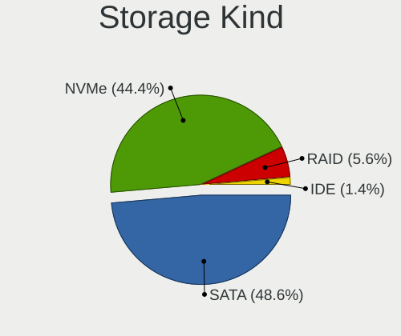

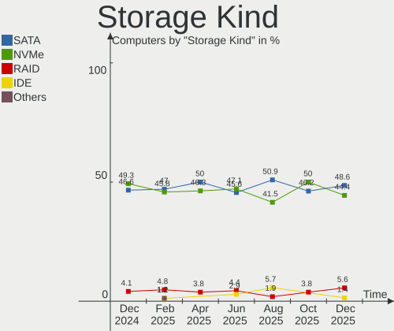

| Kind | Computers | Percent |
|------|-----------|---------|
| SATA | 35        | 48.61%  |
| NVMe | 32        | 44.44%  |
| RAID | 4         | 5.56%   |
| IDE  | 1         | 1.39%   |

Processor
---------

CPU Vendor
----------

Processor vendors

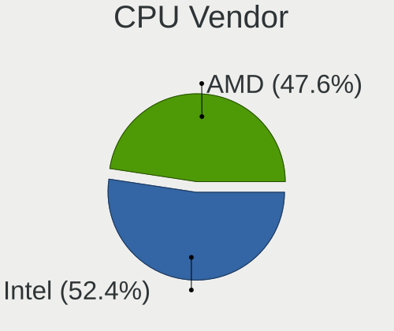

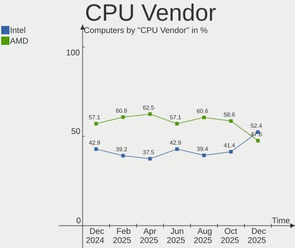

| Vendor | Computers | Percent |
|--------|-----------|---------|
| Intel  | 22        | 52.38%  |
| AMD    | 20        | 47.62%  |

CPU Model
---------

Processor models

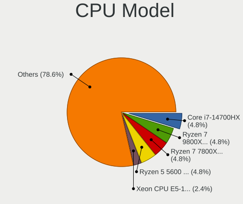

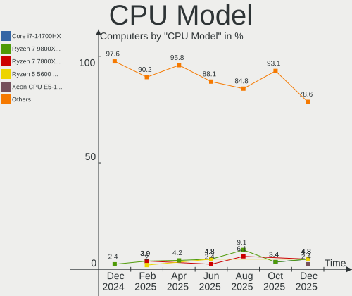

| Model                                      | Computers | Percent |
|--------------------------------------------|-----------|---------|
| Intel Core i7-14700HX                      | 2         | 4.76%   |
| AMD Ryzen 7 9800X3D 8-Core Processor       | 2         | 4.76%   |
| AMD Ryzen 7 7800X3D 8-Core Processor       | 2         | 4.76%   |
| AMD Ryzen 5 5600 6-Core Processor          | 2         | 4.76%   |
| Intel Xeon CPU E5-1650 v3 @ 3.50GHz        | 1         | 2.38%   |
| Intel Core Ultra 9 185H                    | 1         | 2.38%   |
| Intel Core i9-14900KS                      | 1         | 2.38%   |
| Intel Core i7-9750H CPU @ 2.60GHz          | 1         | 2.38%   |
| Intel Core i7-8700 CPU @ 3.20GHz           | 1         | 2.38%   |
| Intel Core i7-6700K CPU @ 4.00GHz          | 1         | 2.38%   |
| Intel Core i7-4790K CPU @ 4.00GHz          | 1         | 2.38%   |
| Intel Core i7-3630QM CPU @ 2.40GHz         | 1         | 2.38%   |
| Intel Core i7-3537U CPU @ 2.00GHz          | 1         | 2.38%   |
| Intel Core i7-10750H CPU @ 2.60GHz         | 1         | 2.38%   |
| Intel Core i7-1065G7 CPU @ 1.30GHz         | 1         | 2.38%   |
| Intel Core i5-9400F CPU @ 2.90GHz          | 1         | 2.38%   |
| Intel Core i5-6600K CPU @ 3.50GHz          | 1         | 2.38%   |
| Intel Core i5-4570R CPU @ 2.70GHz          | 1         | 2.38%   |
| Intel Core i5-4200U CPU @ 1.60GHz          | 1         | 2.38%   |
| Intel Core i5-14600KF                      | 1         | 2.38%   |
| Intel Core i5-10400 CPU @ 2.90GHz          | 1         | 2.38%   |
| Intel Core i5-10210U CPU @ 1.60GHz         | 1         | 2.38%   |
| Intel Core i3-8145U CPU @ 2.10GHz          | 1         | 2.38%   |
| Intel 12th Gen Core i7-12700KF             | 1         | 2.38%   |
| AMD Ryzen 9 9950X 16-Core Processor        | 1         | 2.38%   |
| AMD Ryzen 9 5950X 16-Core Processor        | 1         | 2.38%   |
| AMD Ryzen 9 5900X 12-Core Processor        | 1         | 2.38%   |
| AMD Ryzen 7 7700 8-Core Processor          | 1         | 2.38%   |
| AMD Ryzen 7 6800U with Radeon Graphics     | 1         | 2.38%   |
| AMD Ryzen 7 5800XT 8-Core Processor        | 1         | 2.38%   |
| AMD Ryzen 7 5800X3D 8-Core Processor       | 1         | 2.38%   |
| AMD Ryzen 7 5800X 8-Core Processor         | 1         | 2.38%   |
| AMD Ryzen 7 3700X 8-Core Processor         | 1         | 2.38%   |
| AMD Ryzen 5 PRO 4650U with Radeon Graphics | 1         | 2.38%   |
| AMD Ryzen 5 9600X 6-Core Processor         | 1         | 2.38%   |
| AMD Ryzen 5 8500G w/ Radeon 740M Graphics  | 1         | 2.38%   |
| AMD Ryzen 5 5600G with Radeon Graphics     | 1         | 2.38%   |
| AMD Ryzen 5 5500U with Radeon Graphics     | 1         | 2.38%   |

CPU Model Family
----------------

Processor model prefix

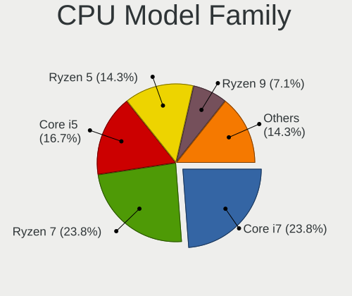

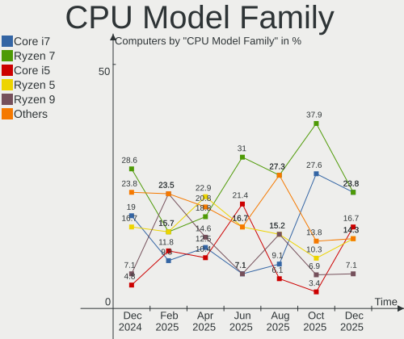

| Model           | Computers | Percent |
|-----------------|-----------|---------|
| Intel Core i7   | 10        | 23.81%  |
| AMD Ryzen 7     | 10        | 23.81%  |
| Intel Core i5   | 7         | 16.67%  |
| AMD Ryzen 5     | 6         | 14.29%  |
| AMD Ryzen 9     | 3         | 7.14%   |
| Other           | 1         | 2.38%   |
| Intel Xeon      | 1         | 2.38%   |
| Intel Core i9   | 1         | 2.38%   |
| Intel Core i3   | 1         | 2.38%   |
| Intel Core      | 1         | 2.38%   |
| AMD Ryzen 5 PRO | 1         | 2.38%   |

CPU Cores
---------

Number of processor cores

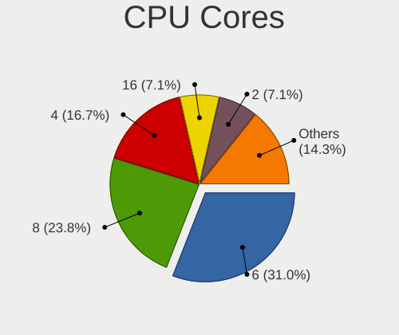

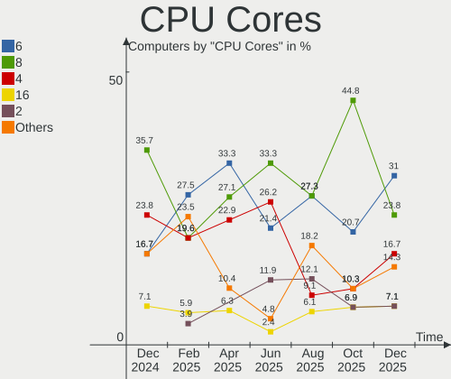

| Number | Computers | Percent |
|--------|-----------|---------|
| 6      | 13        | 30.95%  |
| 8      | 10        | 23.81%  |
| 4      | 7         | 16.67%  |
| 16     | 3         | 7.14%   |
| 2      | 3         | 7.14%   |
| 20     | 2         | 4.76%   |
| 12     | 2         | 4.76%   |
| 24     | 1         | 2.38%   |
| 14     | 1         | 2.38%   |

CPU Sockets
-----------

Number of sockets

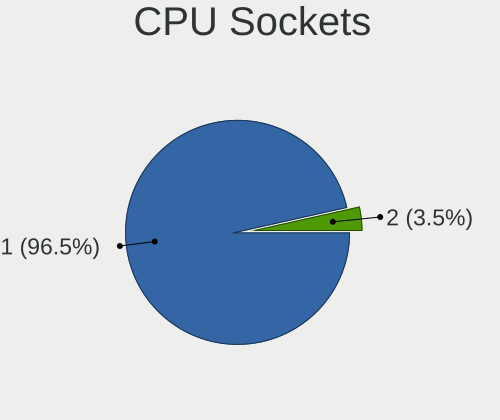

| Number | Computers | Percent |
|--------|-----------|---------|
| 1      | 42        | 100%    |

CPU Threads
-----------

Threads per core (Hyper-Threading)

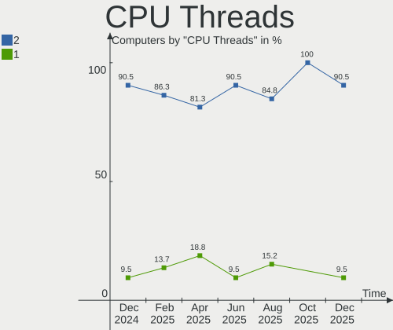

| Number | Computers | Percent |
|--------|-----------|---------|
| 2      | 38        | 90.48%  |
| 1      | 4         | 9.52%   |

CPU Op-Modes
------------

CPU Operation Modes (32-bit, 64-bit)

| Op mode        | Computers | Percent |
|----------------|-----------|---------|
| 32-bit, 64-bit | 42        | 100%    |

CPU Microcode
-------------

Microcode number

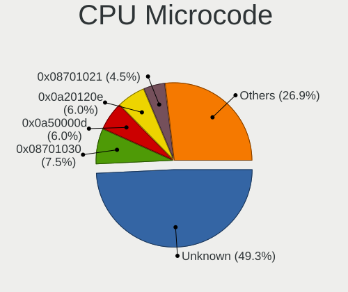

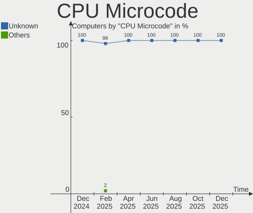

| Number  | Computers | Percent |
|---------|-----------|---------|
| Unknown | 42        | 100%    |

CPU Microarch
-------------

Microarchitecture

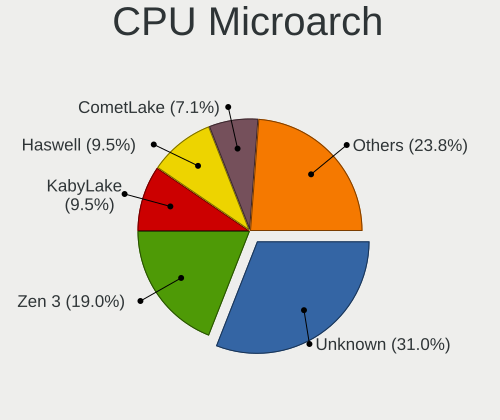

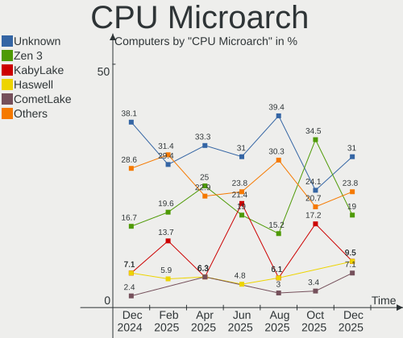

| Name              | Computers | Percent |
|-------------------|-----------|---------|
| Unknown           | 13        | 30.95%  |
| Zen 3             | 8         | 19.05%  |
| KabyLake          | 4         | 9.52%   |
| Haswell           | 4         | 9.52%   |
| CometLake         | 3         | 7.14%   |
| Zen 2             | 2         | 4.76%   |
| Skylake           | 2         | 4.76%   |
| IvyBridge         | 2         | 4.76%   |
| Alderlake Hybrid  | 2         | 4.76%   |
| Meteorlake Hybrid | 1         | 2.38%   |
| IceLake           | 1         | 2.38%   |

Graphics
--------

GPU Vendor
----------

Vendors of graphics cards

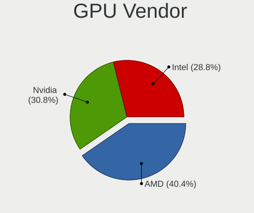

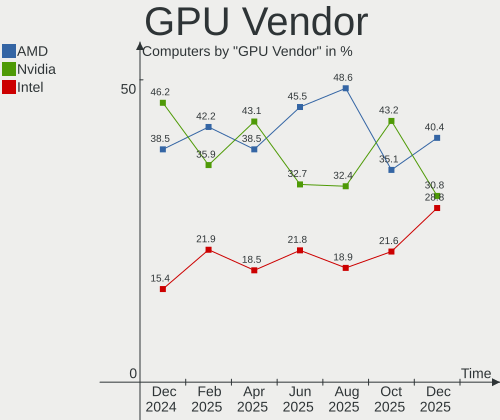

| Vendor | Computers | Percent |
|--------|-----------|---------|
| AMD    | 21        | 40.38%  |
| Nvidia | 16        | 30.77%  |
| Intel  | 15        | 28.85%  |

GPU Model
---------

Graphics card models

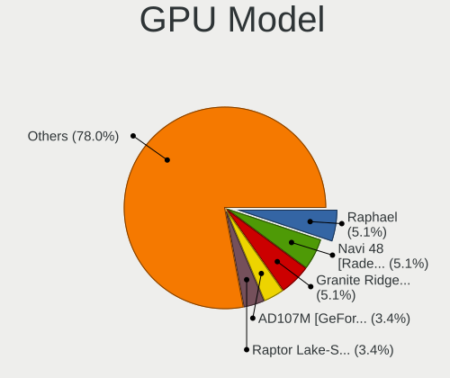

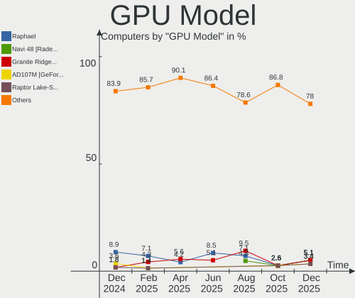

| Model                                                                       | Computers | Percent |
|-----------------------------------------------------------------------------|-----------|---------|
| AMD Raphael                                                                 | 3         | 5.08%   |
| AMD Navi 48 [Radeon RX 9070/9070 XT/9070 GRE]                               | 3         | 5.08%   |
| AMD Granite Ridge [Radeon Graphics]                                         | 3         | 5.08%   |
| Nvidia AD107M [GeForce RTX 4060 Max-Q / Mobile]                             | 2         | 3.39%   |
| Intel Raptor Lake-S UHD Graphics                                            | 2         | 3.39%   |
| Intel 3rd Gen Core processor Graphics Controller                            | 2         | 3.39%   |
| AMD Navi 44 [Radeon RX 9060 XT]                                             | 2         | 3.39%   |
| AMD Navi 32 [Radeon RX 7700 XT / 7800 XT]                                   | 2         | 3.39%   |
| AMD Navi 31 [Radeon RX 7900 XT/7900 XTX/7900 GRE/7900M]                     | 2         | 3.39%   |
| AMD Ellesmere [Radeon RX 470/480/570/570X/580/580X/590]                     | 2         | 3.39%   |
| Nvidia TU116 [GeForce GTX 1660]                                             | 1         | 1.69%   |
| Nvidia TU116 [GeForce GTX 1660 Ti]                                          | 1         | 1.69%   |
| Nvidia TU106M [GeForce RTX 2060 Mobile]                                     | 1         | 1.69%   |
| Nvidia GP107 [GeForce GTX 1050 Ti]                                          | 1         | 1.69%   |
| Nvidia GP102 [GeForce GTX 1080 Ti]                                          | 1         | 1.69%   |
| Nvidia GK104M [GeForce GTX 680M]                                            | 1         | 1.69%   |
| Nvidia GA106M [GeForce RTX 3060 Mobile / Max-Q]                             | 1         | 1.69%   |
| Nvidia GA106 [GeForce RTX 3060 Lite Hash Rate]                              | 1         | 1.69%   |
| Nvidia GA104 [GeForce RTX 3070]                                             | 1         | 1.69%   |
| Nvidia GA102 [GeForce RTX 3080]                                             | 1         | 1.69%   |
| Nvidia GA102 [GeForce RTX 3080 Lite Hash Rate]                              | 1         | 1.69%   |
| Nvidia AD106M [GeForce RTX 4070 Max-Q / Mobile]                             | 1         | 1.69%   |
| Nvidia AD103 [GeForce RTX 4080 SUPER]                                       | 1         | 1.69%   |
| Nvidia AD103 [GeForce RTX 4070 Ti SUPER]                                    | 1         | 1.69%   |
| Nvidia AD102 [GeForce RTX 4090]                                             | 1         | 1.69%   |
| Intel Xeon E3-1200 v3/4th Gen Core Processor Integrated Graphics Controller | 1         | 1.69%   |
| Intel WhiskeyLake-U GT2 [UHD Graphics 620]                                  | 1         | 1.69%   |
| Intel Meteor Lake-P [Intel Arc Graphics]                                    | 1         | 1.69%   |
| Intel Iris Plus Graphics G7                                                 | 1         | 1.69%   |
| Intel Haswell-ULT Integrated Graphics Controller                            | 1         | 1.69%   |
| Intel Crystal Well Integrated Iris Pro Graphics 5200                        | 1         | 1.69%   |
| Intel CometLake-H GT2 [UHD Graphics]                                        | 1         | 1.69%   |
| Intel Comet Lake UHD Graphics                                               | 1         | 1.69%   |
| Intel CoffeeLake-S GT2 [UHD Graphics 630]                                   | 1         | 1.69%   |
| Intel CoffeeLake-H GT2 [UHD Graphics 630]                                   | 1         | 1.69%   |
| Intel Battlemage G21 [Arc B580]                                             | 1         | 1.69%   |
| AMD Renoir [Radeon Vega Series / Radeon Vega Mobile Series]                 | 1         | 1.69%   |
| AMD Rembrandt [Radeon 680M]                                                 | 1         | 1.69%   |
| AMD Polaris 20 XL [Radeon RX 580 2048SP]                                    | 1         | 1.69%   |
| AMD Phoenix2                                                                | 1         | 1.69%   |

GPU Combo
---------

Combinations of graphics cards

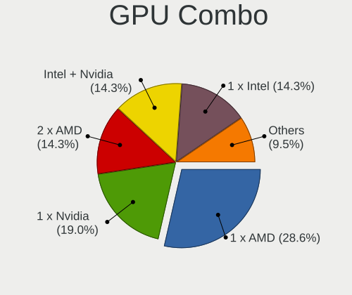

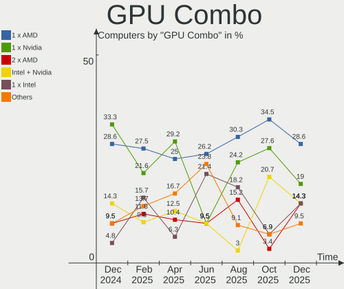

| Name           | Computers | Percent |
|----------------|-----------|---------|
| 1 x AMD        | 12        | 28.57%  |
| 1 x Nvidia     | 8         | 19.05%  |
| 2 x AMD        | 6         | 14.29%  |
| Intel + Nvidia | 6         | 14.29%  |
| 1 x Intel      | 6         | 14.29%  |
| Intel + AMD    | 2         | 4.76%   |
| 2 x Nvidia     | 1         | 2.38%   |
| AMD + Nvidia   | 1         | 2.38%   |

GPU Driver
----------

Free vs proprietary

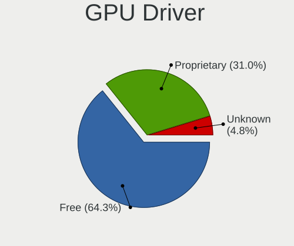

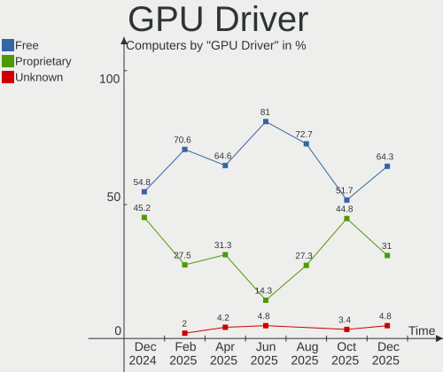

| Driver      | Computers | Percent |
|-------------|-----------|---------|
| Free        | 27        | 64.29%  |
| Proprietary | 13        | 30.95%  |
| Unknown     | 2         | 4.76%   |

GPU Memory
----------

Total video memory

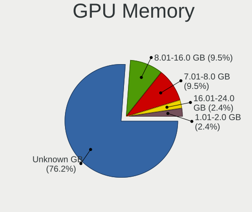

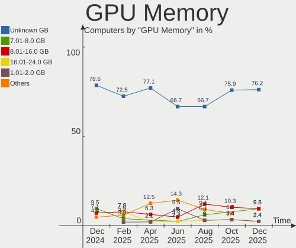

| Size in GB | Computers | Percent |
|------------|-----------|---------|
| Unknown    | 32        | 76.19%  |
| 7.01-8.0   | 4         | 9.52%   |
| 8.01-16.0  | 4         | 9.52%   |
| 16.01-24.0 | 1         | 2.38%   |
| 1.01-2.0   | 1         | 2.38%   |

Monitor
-------

Monitor Vendor
--------------

Monitor vendors

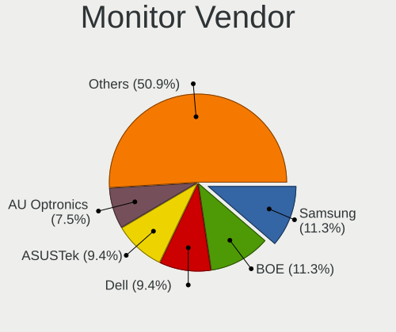

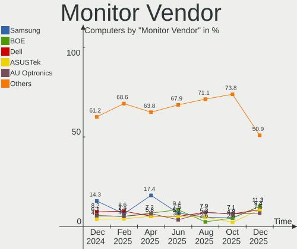

| Vendor               | Computers | Percent |
|----------------------|-----------|---------|
| Samsung Electronics  | 6         | 11.32%  |
| BOE                  | 6         | 11.32%  |
| Dell                 | 5         | 9.43%   |
| ASUSTek Computer     | 5         | 9.43%   |
| AU Optronics         | 4         | 7.55%   |
| Goldstar             | 3         | 5.66%   |
| Ancor Communications | 3         | 5.66%   |
| Unknown              | 2         | 3.77%   |
| MSI                  | 2         | 3.77%   |
| AOC                  | 2         | 3.77%   |
| Acer                 | 2         | 3.77%   |
| YMK                  | 1         | 1.89%   |
| ViewSonic            | 1         | 1.89%   |
| Sceptre Tech         | 1         | 1.89%   |
| Pixio                | 1         | 1.89%   |
| PANDA                | 1         | 1.89%   |
| Panasonic            | 1         | 1.89%   |
| LRX                  | 1         | 1.89%   |
| Lenovo               | 1         | 1.89%   |
| INNOCN               | 1         | 1.89%   |
| Gigabyte Technology  | 1         | 1.89%   |
| CSW                  | 1         | 1.89%   |
| Chimei Innolux       | 1         | 1.89%   |
| Apple                | 1         | 1.89%   |

Monitor Model
-------------

Monitor models

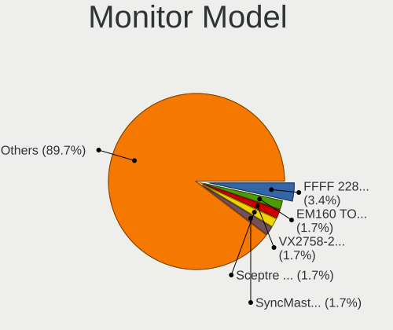

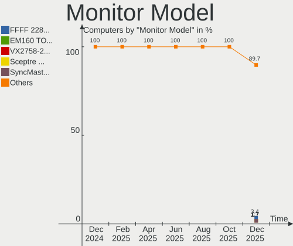

| Model                                                                   | Computers | Percent |
|-------------------------------------------------------------------------|-----------|---------|
| Unknown LCD Monitor FFFF 2288x1287 2550x2550mm 142.0-inch               | 2         | 3.45%   |
| YMK EM160 TOUCH YMK4A68 2880x1800 342x220mm 16.0-inch                   | 1         | 1.72%   |
| ViewSonic VX2758-2K-PRO VSC0240 2560x1440 597x336mm 27.0-inch           | 1         | 1.72%   |
| Sceptre Tech Sceptre F24 SPT09AB 1920x1080 530x290mm 23.8-inch          | 1         | 1.72%   |
| Samsung Electronics SyncMaster SAM0F4C 3840x2160 1210x680mm 54.6-inch   | 1         | 1.72%   |
| Samsung Electronics Odyssey G70D SAME06F 3840x2160 698x392mm 31.5-inch  | 1         | 1.72%   |
| Samsung Electronics Odyssey G70B SAM7232 3840x2160 698x392mm 31.5-inch  | 1         | 1.72%   |
| Samsung Electronics LS27DG30X SAM76E3 1920x1080 597x336mm 27.0-inch     | 1         | 1.72%   |
| Samsung Electronics LCD Monitor SAM7003 3840x2160 1872x1053mm 84.6-inch | 1         | 1.72%   |
| Samsung Electronics LCD Monitor SAM0F13 3840x2160 950x540mm 43.0-inch   | 1         | 1.72%   |
| Samsung Electronics LC27G7xT SAM105C 2560x1440 597x336mm 27.0-inch      | 1         | 1.72%   |
| Pixio U24C WAM2380 1920x1080 530x290mm 23.8-inch                        | 1         | 1.72%   |
| PANDA LCD Monitor NCP0063 1920x1080 344x194mm 15.5-inch                 | 1         | 1.72%   |
| Panasonic TV MEIA04B 1280x720 1434x806mm 64.8-inch                      | 1         | 1.72%   |
| MSI MAG321UX OLED MSI3DD3 3840x2160 699x395mm 31.6-inch                 | 1         | 1.72%   |
| MSI G32C4 MSI3DA6 1920x1080 698x393mm 31.5-inch                         | 1         | 1.72%   |
| LRX HDMI LRX2281 1920x1200 409x230mm 18.5-inch                          | 1         | 1.72%   |
| Lenovo LCD Monitor LEN40A9 1920x1080 309x173mm 13.9-inch                | 1         | 1.72%   |
| INNOCN 32M2V IOC902A 3840x2160 709x399mm 32.0-inch                      | 1         | 1.72%   |
| Goldstar ULTRAWIDE GSM77D3 3840x1600 880x367mm 37.5-inch                | 1         | 1.72%   |
| Goldstar ULTRAGEAR GSM5BD2 2560x1440 697x392mm 31.5-inch                | 1         | 1.72%   |
| Goldstar 27GN950 GSM5B9A 3840x2160 600x340mm 27.2-inch                  | 1         | 1.72%   |
| Gigabyte Technology G32QC GBT3200 2560x1440 697x392mm 31.5-inch         | 1         | 1.72%   |
| Dell U2515H DELD06F 2560x1440 553x311mm 25.0-inch                       | 1         | 1.72%   |
| Dell S2721DGF DEL41D9 2560x1440 597x336mm 27.0-inch                     | 1         | 1.72%   |
| Dell P2723QE DELF13C 3840x2160 597x336mm 27.0-inch                      | 1         | 1.72%   |
| Dell P2411H DELA06E 1920x1080 531x299mm 24.0-inch                       | 1         | 1.72%   |
| Dell P2319H DELD0D7 1920x1080 509x286mm 23.0-inch                       | 1         | 1.72%   |
| Dell G2724D DELD175 2560x1440 596x335mm 26.9-inch                       | 1         | 1.72%   |
| Dell E2318H DELF093 1920x1080 509x286mm 23.0-inch                       | 1         | 1.72%   |
| Dell 1708FP DEL4024 1280x1024 338x270mm 17.0-inch                       | 1         | 1.72%   |
| CSW LCD Monitor CSW1640 3200x2000 344x215mm 16.0-inch                   | 1         | 1.72%   |
| Chimei Innolux LCD Monitor CMN162F 2560x1600 344x215mm 16.0-inch        | 1         | 1.72%   |
| BOE LCD Monitor BOE08EF 1366x768 344x194mm 15.5-inch                    | 1         | 1.72%   |
| BOE LCD Monitor BOE08BA 1920x1080 344x194mm 15.5-inch                   | 1         | 1.72%   |
| BOE LCD Monitor BOE084A 1920x1080 344x194mm 15.5-inch                   | 1         | 1.72%   |
| BOE LCD Monitor BOE0804 1920x1080 344x193mm 15.5-inch                   | 1         | 1.72%   |
| BOE LCD Monitor BOE0802 1920x1080 344x193mm 15.5-inch                   | 1         | 1.72%   |
| BOE Display BOE1600 2560x1600 388x242mm 18.0-inch                       | 1         | 1.72%   |
| AU Optronics LCD Monitor AUO7EAD 1920x1080 344x193mm 15.5-inch          | 1         | 1.72%   |

Monitor Resolution
------------------

Monitor screen resolution

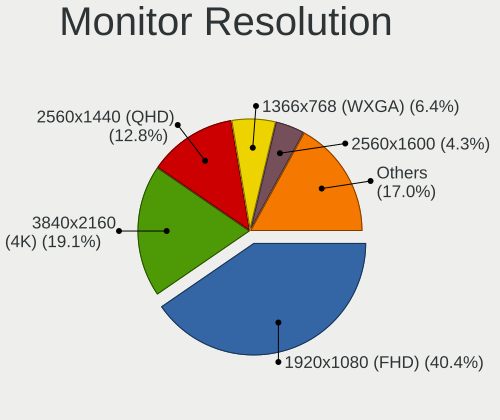

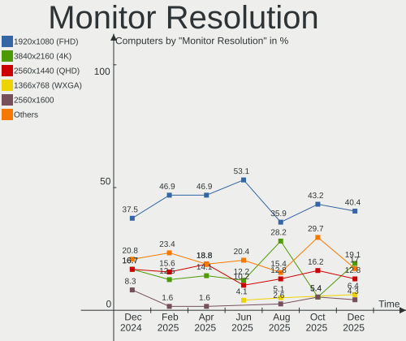

| Resolution       | Computers | Percent |
|------------------|-----------|---------|
| 1920x1080 (FHD)  | 19        | 40.43%  |
| 3840x2160 (4K)   | 9         | 19.15%  |
| 2560x1440 (QHD)  | 6         | 12.77%  |
| 1366x768 (WXGA)  | 3         | 6.38%   |
| 2560x1600        | 2         | 4.26%   |
| 2288x1287        | 2         | 4.26%   |
| 3840x1600        | 1         | 2.13%   |
| 3440x1440        | 1         | 2.13%   |
| 3200x2000        | 1         | 2.13%   |
| 2880x1800        | 1         | 2.13%   |
| 1280x720 (HD)    | 1         | 2.13%   |
| 1280x1024 (SXGA) | 1         | 2.13%   |

Monitor Diagonal
----------------

Diagonal size in inches

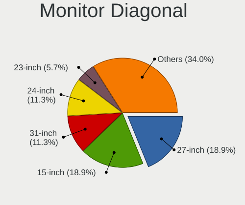

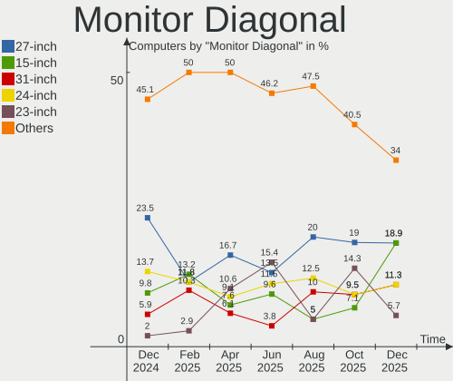

| Inches | Computers | Percent |
|--------|-----------|---------|
| 27     | 10        | 18.87%  |
| 15     | 10        | 18.87%  |
| 31     | 6         | 11.32%  |
| 24     | 6         | 11.32%  |
| 23     | 3         | 5.66%   |
| 16     | 3         | 5.66%   |
| 142    | 2         | 3.77%   |
| 84     | 2         | 3.77%   |
| 64     | 2         | 3.77%   |
| 32     | 2         | 3.77%   |
| 37     | 1         | 1.89%   |
| 34     | 1         | 1.89%   |
| 25     | 1         | 1.89%   |
| 21     | 1         | 1.89%   |
| 18     | 1         | 1.89%   |
| 17     | 1         | 1.89%   |
| 14     | 1         | 1.89%   |

Monitor Width
-------------

Physical width

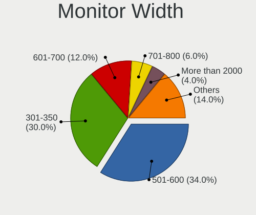

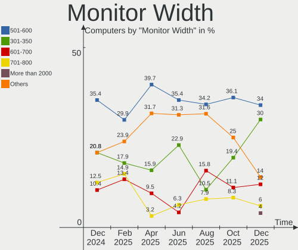

| Width in mm    | Computers | Percent |
|----------------|-----------|---------|
| 501-600        | 17        | 34%     |
| 301-350        | 15        | 30%     |
| 601-700        | 6         | 12%     |
| 701-800        | 3         | 6%      |
| More than 2000 | 2         | 4%      |
| 1501-2000      | 2         | 4%      |
| 1001-1500      | 2         | 4%      |
| 801-900        | 1         | 2%      |
| 401-500        | 1         | 2%      |
| 351-400        | 1         | 2%      |

Aspect Ratio
------------

Proportional relationship between the width and the height

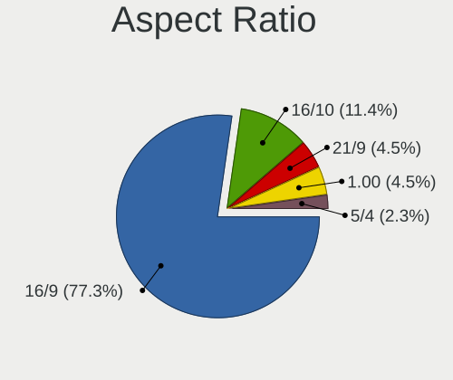

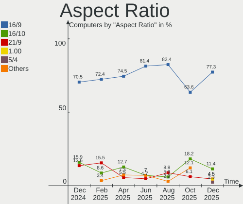

| Ratio | Computers | Percent |
|-------|-----------|---------|
| 16/9  | 34        | 77.27%  |
| 16/10 | 5         | 11.36%  |
| 21/9  | 2         | 4.55%   |
| 1.00  | 2         | 4.55%   |
| 5/4   | 1         | 2.27%   |

Monitor Area
------------

Area in inch²

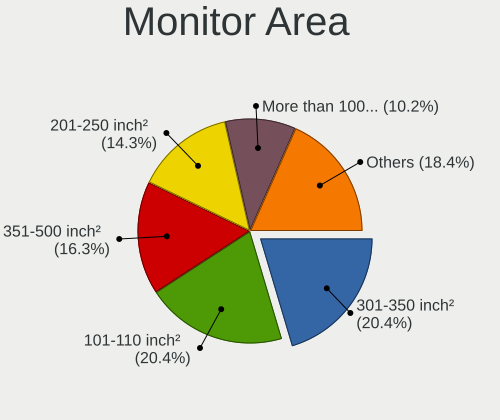

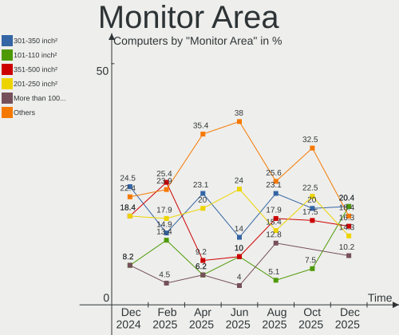

| Area in inch² | Computers | Percent |
|----------------|-----------|---------|
| 301-350        | 10        | 20.41%  |
| 101-110        | 10        | 20.41%  |
| 351-500        | 8         | 16.33%  |
| 201-250        | 7         | 14.29%  |
| More than 1000 | 5         | 10.2%   |
| 111-120        | 3         | 6.12%   |
| 251-300        | 2         | 4.08%   |
| 141-150        | 2         | 4.08%   |
| 81-90          | 1         | 2.04%   |
| 501-1000       | 1         | 2.04%   |

Pixel Density
-------------

Pixels per inch

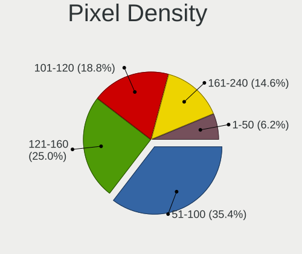

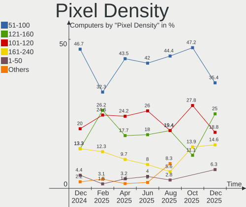

| Density | Computers | Percent |
|---------|-----------|---------|
| 51-100  | 17        | 35.42%  |
| 121-160 | 12        | 25%     |
| 101-120 | 9         | 18.75%  |
| 161-240 | 7         | 14.58%  |
| 1-50    | 3         | 6.25%   |

Multiple Monitors
-----------------

Total monitors connected

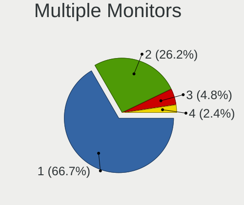

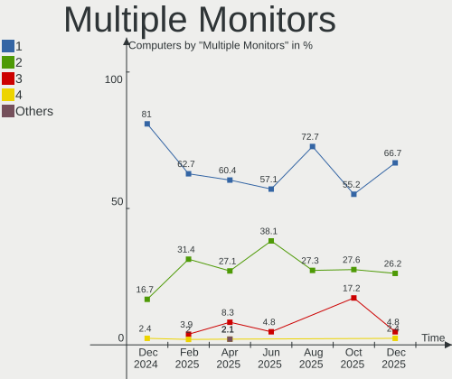

| Total | Computers | Percent |
|-------|-----------|---------|
| 1     | 28        | 66.67%  |
| 2     | 11        | 26.19%  |
| 3     | 2         | 4.76%   |
| 4     | 1         | 2.38%   |

Network
-------

Net Controller Vendor
---------------------

Controller vendors

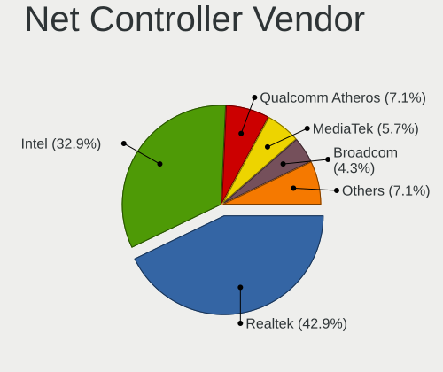

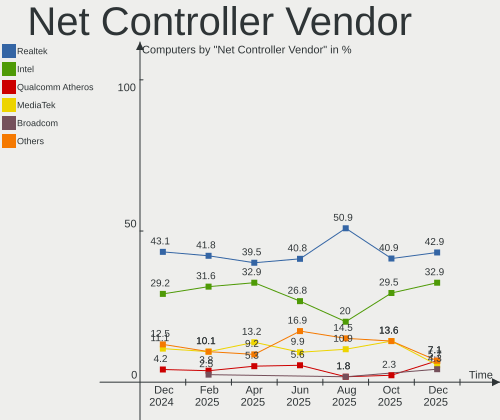

| Vendor                | Computers | Percent |
|-----------------------|-----------|---------|
| Realtek Semiconductor | 30        | 42.86%  |
| Intel                 | 23        | 32.86%  |
| Qualcomm Atheros      | 5         | 7.14%   |
| MediaTek              | 4         | 5.71%   |
| Broadcom              | 3         | 4.29%   |
| Samsung Electronics   | 1         | 1.43%   |
| Qualcomm Technologies | 1         | 1.43%   |
| Qualcomm              | 1         | 1.43%   |
| Microsoft             | 1         | 1.43%   |
| Huawei Technologies   | 1         | 1.43%   |

Net Controller Model
--------------------

Controller models

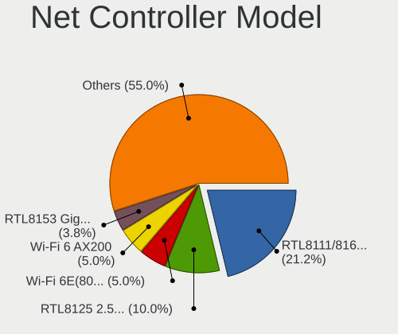

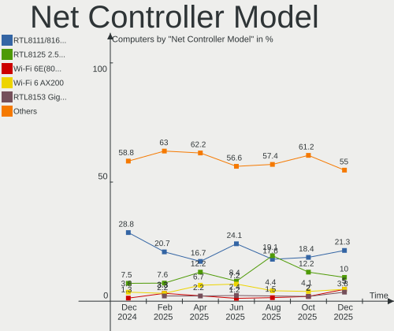

| Model                                                                  | Computers | Percent |
|------------------------------------------------------------------------|-----------|---------|
| Realtek RTL8111/8168/8211/8411 PCI Express Gigabit Ethernet Controller | 17        | 21.25%  |
| Realtek RTL8125 2.5GbE Controller                                      | 8         | 10%     |
| Intel Wi-Fi 6E(802.11ax) AX210/AX1675* 2x2 [Typhoon Peak]              | 4         | 5%      |
| Intel Wi-Fi 6 AX200                                                    | 4         | 5%      |
| Realtek RTL8153 Gigabit Ethernet Adapter                               | 3         | 3.75%   |
| MediaTek MT7922 802.11ax PCI Express Wireless Network Adapter          | 3         | 3.75%   |
| Intel Ethernet Connection (2) I219-V                                   | 3         | 3.75%   |
| Realtek RTL8922AE 802.11be PCIe Wireless Network Adapter               | 2         | 2.5%    |
| Realtek RTL8126 5GbE Controller                                        | 2         | 2.5%    |
| Qualcomm Atheros QCA9377 802.11ac Wireless Network Adapter             | 2         | 2.5%    |
| Intel Ethernet Controller I226-V                                       | 2         | 2.5%    |
| Intel 700 Series Chipset CNVi WiFi                                     | 2         | 2.5%    |
| Samsung GT-I9070 (network tethering, USB debugging enabled)            | 1         | 1.25%   |
| Realtek RTL8821CE 802.11ac PCIe Wireless Network Adapter               | 1         | 1.25%   |
| Realtek RTL8192CU 802.11n WLAN Adapter                                 | 1         | 1.25%   |
| Realtek RTL8188FTV 802.11b/g/n 1T1R 2.4G WLAN Adapter                  | 1         | 1.25%   |
| Realtek Killer E3000 2.5GbE Controller                                 | 1         | 1.25%   |
| Realtek Killer E2500 Gigabit Ethernet Controller                       | 1         | 1.25%   |
| Qualcomm WCN785x Wi-Fi 7(802.11be) 320MHz 2x2 [FastConnect 7800]       | 1         | 1.25%   |
| Qualcomm Nokia X30 5G                                                  | 1         | 1.25%   |
| Qualcomm Atheros QCA9565 / AR9565 Wireless Network Adapter             | 1         | 1.25%   |
| Qualcomm Atheros Killer E2400 Gigabit Ethernet Controller              | 1         | 1.25%   |
| Qualcomm Atheros Killer E220x Gigabit Ethernet Controller              | 1         | 1.25%   |
| Qualcomm Atheros AR9287 Wireless Network Adapter (PCI-Express)         | 1         | 1.25%   |
| Microsoft Xbox Wireless Adapter for Windows                            | 1         | 1.25%   |
| MediaTek MT7612U 802.11a/b/g/n/ac Wireless Adapter                     | 1         | 1.25%   |
| Intel Wi-Fi 7(802.11be) AX1775*/AX1790*/BE20*/BE401/BE1750* 2x2        | 1         | 1.25%   |
| Intel Meteor Lake PCH CNVi WiFi                                        | 1         | 1.25%   |
| Intel Ice Lake-LP PCH CNVi WiFi                                        | 1         | 1.25%   |
| Intel I211 Gigabit Network Connection                                  | 1         | 1.25%   |
| Intel Ethernet Controller I225-V                                       | 1         | 1.25%   |
| Intel Comet Lake PCH-LP CNVi WiFi                                      | 1         | 1.25%   |
| Intel Comet Lake PCH CNVi WiFi                                         | 1         | 1.25%   |
| Intel Centrino Wireless-N 2230                                         | 1         | 1.25%   |
| Intel Cannon Lake PCH CNVi WiFi                                        | 1         | 1.25%   |
| Huawei FOA-LX9                                                         | 1         | 1.25%   |
| Broadcom NetXtreme BCM57786 Gigabit Ethernet PCIe                      | 1         | 1.25%   |
| Broadcom NetXtreme BCM57766 Gigabit Ethernet PCIe                      | 1         | 1.25%   |
| Broadcom BCM4360 802.11ac Dual Band Wireless Network Adapter           | 1         | 1.25%   |
| Broadcom BCM43228 802.11a/b/g/n                                        | 1         | 1.25%   |

Wireless Vendor
---------------

Wireless vendors

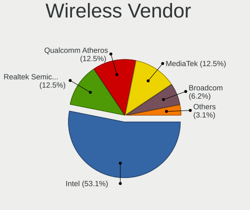

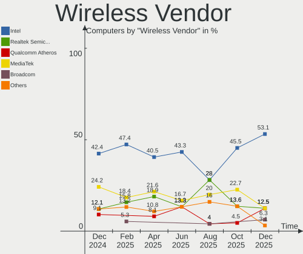

| Vendor                | Computers | Percent |
|-----------------------|-----------|---------|
| Intel                 | 17        | 53.13%  |
| Realtek Semiconductor | 4         | 12.5%   |
| Qualcomm Atheros      | 4         | 12.5%   |
| MediaTek              | 4         | 12.5%   |
| Broadcom              | 2         | 6.25%   |
| Microsoft             | 1         | 3.13%   |

Wireless Model
--------------

Wireless models

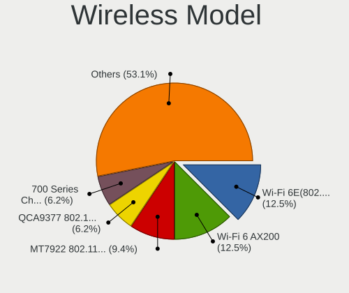

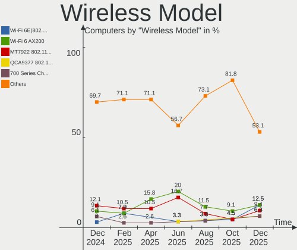

| Model                                                           | Computers | Percent |
|-----------------------------------------------------------------|-----------|---------|
| Intel Wi-Fi 6E(802.11ax) AX210/AX1675* 2x2 [Typhoon Peak]       | 4         | 12.5%   |
| Intel Wi-Fi 6 AX200                                             | 4         | 12.5%   |
| MediaTek MT7922 802.11ax PCI Express Wireless Network Adapter   | 3         | 9.38%   |
| Qualcomm Atheros QCA9377 802.11ac Wireless Network Adapter      | 2         | 6.25%   |
| Intel 700 Series Chipset CNVi WiFi                              | 2         | 6.25%   |
| Realtek RTL8922AE 802.11be PCIe Wireless Network Adapter        | 1         | 3.13%   |
| Realtek RTL8821CE 802.11ac PCIe Wireless Network Adapter        | 1         | 3.13%   |
| Realtek RTL8192CU 802.11n WLAN Adapter                          | 1         | 3.13%   |
| Realtek RTL8188FTV 802.11b/g/n 1T1R 2.4G WLAN Adapter           | 1         | 3.13%   |
| Qualcomm Atheros QCA9565 / AR9565 Wireless Network Adapter      | 1         | 3.13%   |
| Qualcomm Atheros AR9287 Wireless Network Adapter (PCI-Express)  | 1         | 3.13%   |
| Microsoft Xbox Wireless Adapter for Windows                     | 1         | 3.13%   |
| MediaTek MT7612U 802.11a/b/g/n/ac Wireless Adapter              | 1         | 3.13%   |
| Intel Wi-Fi 7(802.11be) AX1775*/AX1790*/BE20*/BE401/BE1750* 2x2 | 1         | 3.13%   |
| Intel Meteor Lake PCH CNVi WiFi                                 | 1         | 3.13%   |
| Intel Ice Lake-LP PCH CNVi WiFi                                 | 1         | 3.13%   |
| Intel Comet Lake PCH-LP CNVi WiFi                               | 1         | 3.13%   |
| Intel Comet Lake PCH CNVi WiFi                                  | 1         | 3.13%   |
| Intel Centrino Wireless-N 2230                                  | 1         | 3.13%   |
| Intel Cannon Lake PCH CNVi WiFi                                 | 1         | 3.13%   |
| Broadcom BCM4360 802.11ac Dual Band Wireless Network Adapter    | 1         | 3.13%   |
| Broadcom BCM43228 802.11a/b/g/n                                 | 1         | 3.13%   |

Ethernet Vendor
---------------

Ethernet vendors

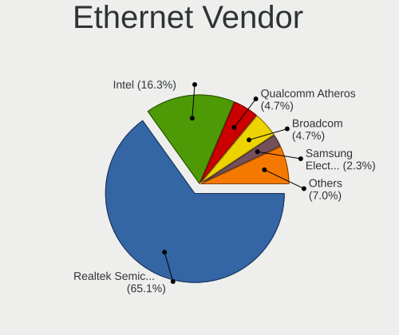

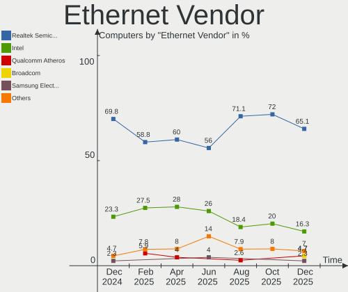

| Vendor                | Computers | Percent |
|-----------------------|-----------|---------|
| Realtek Semiconductor | 28        | 65.12%  |
| Intel                 | 7         | 16.28%  |
| Qualcomm Atheros      | 2         | 4.65%   |
| Broadcom              | 2         | 4.65%   |
| Samsung Electronics   | 1         | 2.33%   |
| Qualcomm Technologies | 1         | 2.33%   |
| Qualcomm              | 1         | 2.33%   |
| Huawei Technologies   | 1         | 2.33%   |

Ethernet Model
--------------

Ethernet models

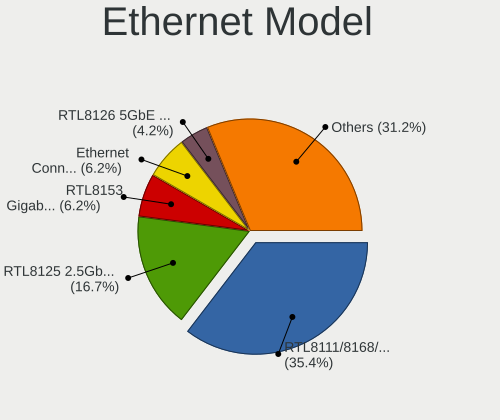

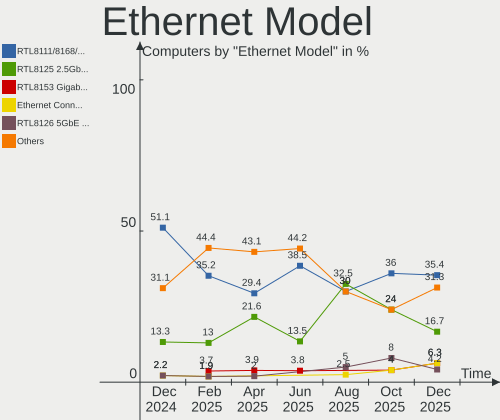

| Model                                                                  | Computers | Percent |
|------------------------------------------------------------------------|-----------|---------|
| Realtek RTL8111/8168/8211/8411 PCI Express Gigabit Ethernet Controller | 17        | 35.42%  |
| Realtek RTL8125 2.5GbE Controller                                      | 8         | 16.67%  |
| Realtek RTL8153 Gigabit Ethernet Adapter                               | 3         | 6.25%   |
| Intel Ethernet Connection (2) I219-V                                   | 3         | 6.25%   |
| Realtek RTL8126 5GbE Controller                                        | 2         | 4.17%   |
| Intel Ethernet Controller I226-V                                       | 2         | 4.17%   |
| Samsung GT-I9070 (network tethering, USB debugging enabled)            | 1         | 2.08%   |
| Realtek RTL8922AE 802.11be PCIe Wireless Network Adapter               | 1         | 2.08%   |
| Realtek Killer E3000 2.5GbE Controller                                 | 1         | 2.08%   |
| Realtek Killer E2500 Gigabit Ethernet Controller                       | 1         | 2.08%   |
| Qualcomm WCN785x Wi-Fi 7(802.11be) 320MHz 2x2 [FastConnect 7800]       | 1         | 2.08%   |
| Qualcomm Nokia X30 5G                                                  | 1         | 2.08%   |
| Qualcomm Atheros Killer E2400 Gigabit Ethernet Controller              | 1         | 2.08%   |
| Qualcomm Atheros Killer E220x Gigabit Ethernet Controller              | 1         | 2.08%   |
| Intel I211 Gigabit Network Connection                                  | 1         | 2.08%   |
| Intel Ethernet Controller I225-V                                       | 1         | 2.08%   |
| Huawei FOA-LX9                                                         | 1         | 2.08%   |
| Broadcom NetXtreme BCM57786 Gigabit Ethernet PCIe                      | 1         | 2.08%   |
| Broadcom NetXtreme BCM57766 Gigabit Ethernet PCIe                      | 1         | 2.08%   |

Net Controller Kind
-------------------

Ethernet, WiFi or modem

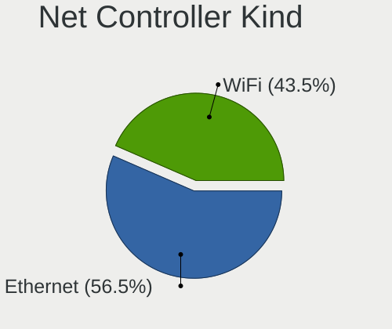

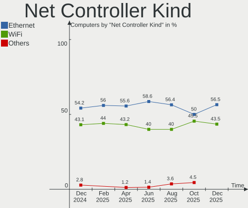

| Kind     | Computers | Percent |
|----------|-----------|---------|
| Ethernet | 39        | 56.52%  |
| WiFi     | 30        | 43.48%  |

Used Controller
---------------

Currently used network controller

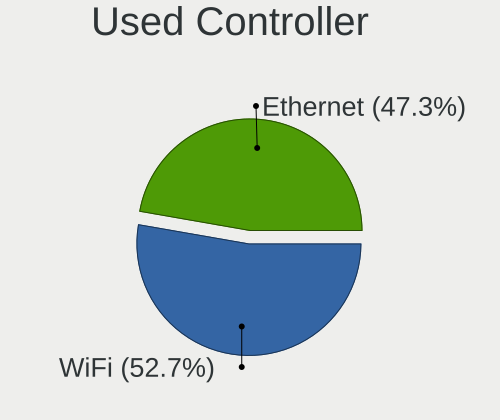

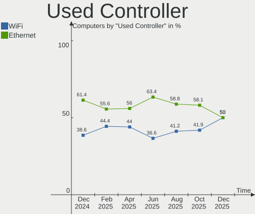

| Kind     | Computers | Percent |
|----------|-----------|---------|
| WiFi     | 21        | 50%     |
| Ethernet | 21        | 50%     |

NICs
----

Total network controllers on board

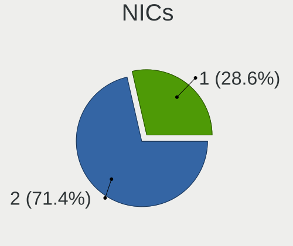

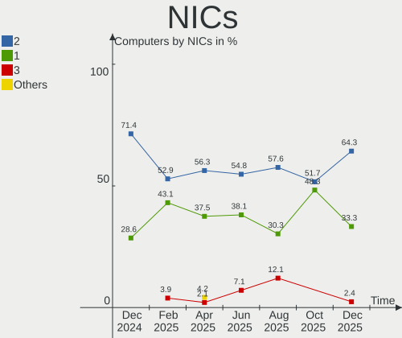

| Total | Computers | Percent |
|-------|-----------|---------|
| 2     | 27        | 64.29%  |
| 1     | 14        | 33.33%  |
| 3     | 1         | 2.38%   |

IPv6
----

IPv6 vs IPv4

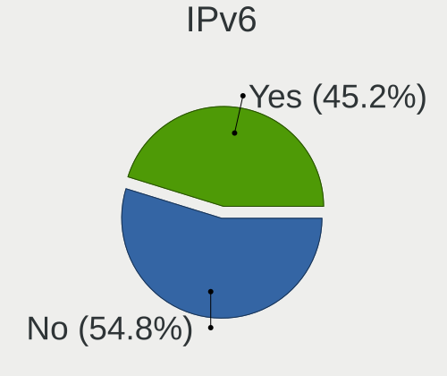

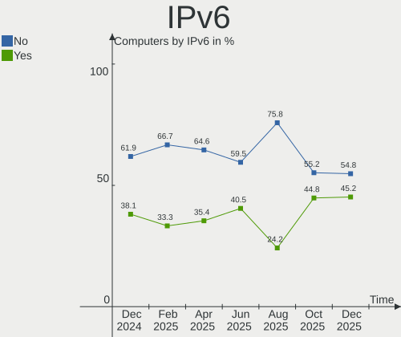

| Used | Computers | Percent |
|------|-----------|---------|
| No   | 23        | 54.76%  |
| Yes  | 19        | 45.24%  |

Bluetooth
---------

Bluetooth Vendor
----------------

Controller vendors

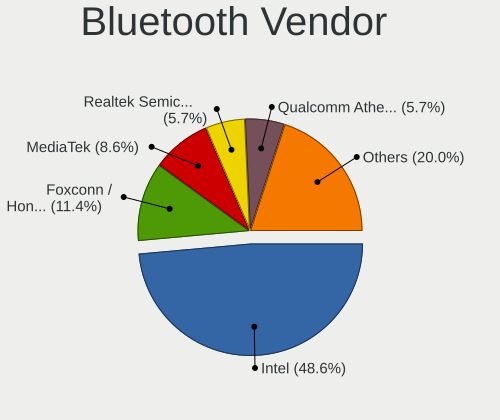

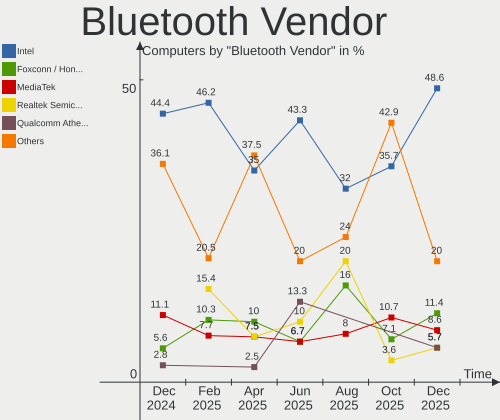

| Vendor                          | Computers | Percent |
|---------------------------------|-----------|---------|
| Intel                           | 17        | 48.57%  |
| Foxconn / Hon Hai               | 4         | 11.43%  |
| MediaTek                        | 3         | 8.57%   |
| Realtek Semiconductor           | 2         | 5.71%   |
| Qualcomm Atheros Communications | 2         | 5.71%   |
| IMC Networks                    | 2         | 5.71%   |
| ASUSTek Computer                | 2         | 5.71%   |
| TP-Link                         | 1         | 2.86%   |
| Lite-On Technology              | 1         | 2.86%   |
| Cambridge Silicon Radio         | 1         | 2.86%   |

Bluetooth Model
---------------

Controller models

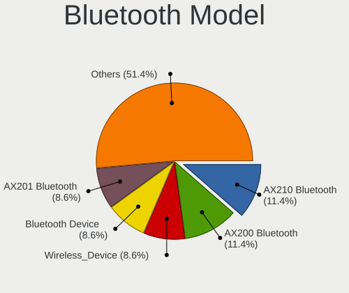

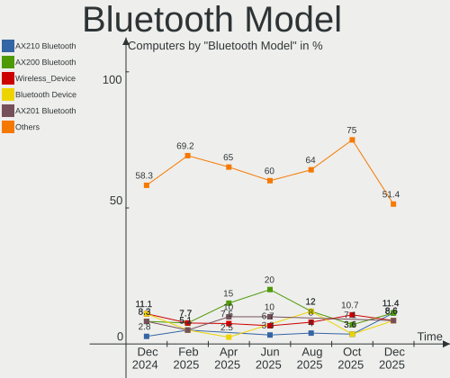

| Model                                               | Computers | Percent |
|-----------------------------------------------------|-----------|---------|
| Intel AX210 Bluetooth                               | 4         | 11.43%  |
| Intel AX200 Bluetooth                               | 4         | 11.43%  |
| MediaTek Wireless_Device                            | 3         | 8.57%   |
| Intel Bluetooth Device                              | 3         | 8.57%   |
| Intel AX201 Bluetooth                               | 3         | 8.57%   |
| Qualcomm Atheros  Bluetooth Device                  | 2         | 5.71%   |
| Intel Bluetooth 9460/9560 Jefferson Peak (JfP)      | 2         | 5.71%   |
| IMC Networks Bluetooth Radio                        | 2         | 5.71%   |
| Foxconn / Hon Hai Bluetooth Device                  | 2         | 5.71%   |
| ASUS ASUS USB-BT500                                 | 2         | 5.71%   |
| TP-Link TP-T@- UB500 Adapter                        | 1         | 2.86%   |
| Realtek Bluetooth Radio                             | 1         | 2.86%   |
| Realtek Bluetooth 5.3 Radio                         | 1         | 2.86%   |
| Lite-On Atheros AR3012 Bluetooth                    | 1         | 2.86%   |
| Intel Centrino Bluetooth Wireless Transceiver       | 1         | 2.86%   |
| Foxconn / Hon Hai Wireless_Device                   | 1         | 2.86%   |
| Foxconn / Hon Hai BCM20702A0                        | 1         | 2.86%   |
| Cambridge Silicon Radio Bluetooth Dongle (HCI mode) | 1         | 2.86%   |

Sound
-----

Sound Vendor
------------

Sound card vendors

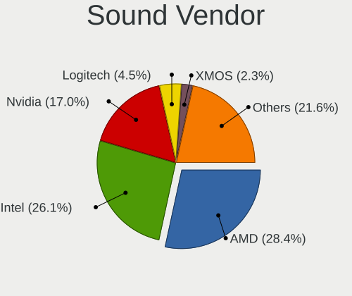

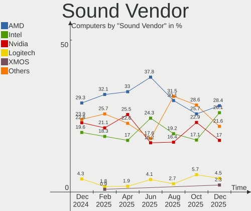

| Vendor                   | Computers | Percent |
|--------------------------|-----------|---------|
| AMD                      | 25        | 28.41%  |
| Intel                    | 23        | 26.14%  |
| Nvidia                   | 15        | 17.05%  |
| Logitech                 | 4         | 4.55%   |
| XMOS                     | 2         | 2.27%   |
| SteelSeries ApS          | 2         | 2.27%   |
| Micro Star International | 2         | 2.27%   |
| Creative Labs            | 2         | 2.27%   |
| ASUSTek Computer         | 2         | 2.27%   |
| Valve Software           | 1         | 1.14%   |
| Tenx Technology          | 1         | 1.14%   |
| Sony                     | 1         | 1.14%   |
| Realtek Semiconductor    | 1         | 1.14%   |
| MV-SILICON               | 1         | 1.14%   |
| KTMicro                  | 1         | 1.14%   |
| Kingston Technology      | 1         | 1.14%   |
| DSEA A/S                 | 1         | 1.14%   |
| Comtrue                  | 1         | 1.14%   |
| C-Media Electronics      | 1         | 1.14%   |
| Unknown                  | 1         | 1.14%   |

Sound Model
-----------

Sound card models

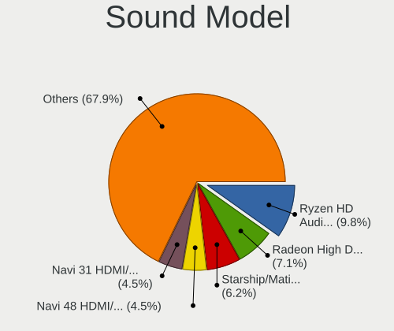

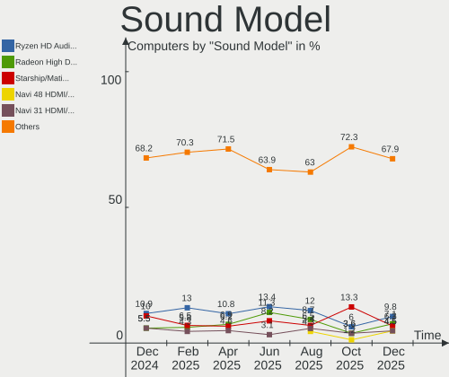

| Model                                                               | Computers | Percent |
|---------------------------------------------------------------------|-----------|---------|
| AMD Ryzen HD Audio Controller                                       | 11        | 9.82%   |
| AMD Radeon High Definition Audio Controller                         | 8         | 7.14%   |
| AMD Starship/Matisse HD Audio Controller                            | 7         | 6.25%   |
| AMD Navi 48 HDMI/DP Audio Controller                                | 5         | 4.46%   |
| AMD Navi 31 HDMI/DP Audio                                           | 5         | 4.46%   |
| Intel Raptor Lake High Definition Audio Controller                  | 3         | 2.68%   |
| Intel 200 Series PCH HD Audio                                       | 3         | 2.68%   |
| AMD Renoir/Cezanne HDMI/DP Audio Controller                         | 3         | 2.68%   |
| AMD Ellesmere HDMI Audio [Radeon RX 470/480 / 570/580/590]          | 3         | 2.68%   |
| XMOS iFi (by AMR) HD USB Audio                                      | 2         | 1.79%   |
| Nvidia TU116 High Definition Audio Controller                       | 2         | 1.79%   |
| Nvidia GA106 High Definition Audio Controller                       | 2         | 1.79%   |
| Nvidia GA102 High Definition Audio Controller                       | 2         | 1.79%   |
| Nvidia AD107 High Definition Audio Controller                       | 2         | 1.79%   |
| Nvidia AD103 High Definition Audio Controller                       | 2         | 1.79%   |
| Micro Star International USB Audio                                  | 2         | 1.79%   |
| Intel Alder Lake-S HD Audio Controller                              | 2         | 1.79%   |
| Intel 8 Series/C220 Series Chipset High Definition Audio Controller | 2         | 1.79%   |
| Intel 7 Series/C216 Chipset Family High Definition Audio Controller | 2         | 1.79%   |
| ASUSTek Computer USB Audio                                          | 2         | 1.79%   |
| AMD Navi 21/23 HDMI/DP Audio Controller                             | 2         | 1.79%   |
| Valve Software Valve VR Radio & HMD Mic                             | 1         | 0.89%   |
| Tenx Technology USB AUDIO                                           | 1         | 0.89%   |
| SteelSeries ApS Arctis Nova Pro Wireless                            | 1         | 0.89%   |
| SteelSeries ApS Arctis Nova 3P Wireless                             | 1         | 0.89%   |
| Sony DualShock 4 [CUH-ZCT2x]                                        | 1         | 0.89%   |
| Realtek Semiconductor LG Monitor Headset MIC                        | 1         | 0.89%   |
| Nvidia TU106 High Definition Audio Controller                       | 1         | 0.89%   |
| Nvidia GP107GL High Definition Audio Controller                     | 1         | 0.89%   |
| Nvidia GP102 HDMI Audio Controller                                  | 1         | 0.89%   |
| Nvidia GK104 HDMI Audio Controller                                  | 1         | 0.89%   |
| Nvidia GA104 High Definition Audio Controller                       | 1         | 0.89%   |
| Nvidia AD102 High Definition Audio Controller                       | 1         | 0.89%   |
| MV-SILICON fifine Microphone                                        | 1         | 0.89%   |
| Logitech [G533 Wireless Headset Dongle]                             | 1         | 0.89%   |
| Logitech PRO X 2 LIGHTSPEED                                         | 1         | 0.89%   |
| Logitech Logitech USB Microphone                                    | 1         | 0.89%   |
| Logitech Blue Microphones                                           | 1         | 0.89%   |
| KTMicro K38                                                         | 1         | 0.89%   |
| Kingston Technology HyperX 7.1 Audio                                | 1         | 0.89%   |

Memory
------

Memory Vendor
-------------

Memory module vendors

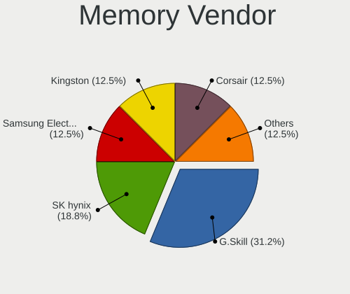

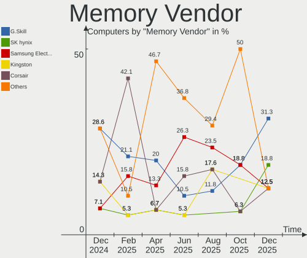

| Vendor              | Computers | Percent |
|---------------------|-----------|---------|
| G.Skill             | 5         | 31.25%  |
| SK hynix            | 3         | 18.75%  |
| Samsung Electronics | 2         | 12.5%   |
| Kingston            | 2         | 12.5%   |
| Corsair             | 2         | 12.5%   |
| Smart               | 1         | 6.25%   |
| Micron Technology   | 1         | 6.25%   |

Memory Model
------------

Memory module models

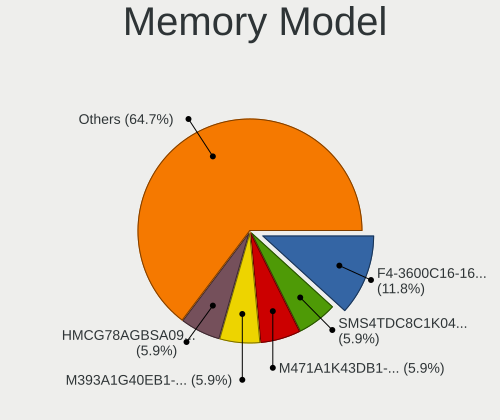

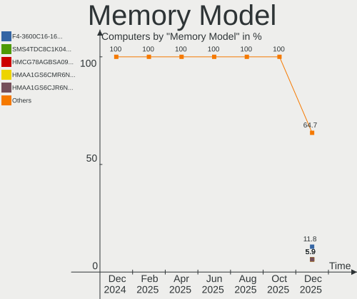

| Model                                                        | Computers | Percent |
|--------------------------------------------------------------|-----------|---------|
| G.Skill RAM F4-3600C16-16GVKC 16GB DIMM DDR4 3866MT/s        | 2         | 11.76%  |
| Smart RAM SMS4TDC8C1K0446FCG 8GB DDR4 2667MT/s               | 1         | 5.88%   |
| SK hynix RAM HMCG78AGBSA092N 16GB SODIMM DDR5 5600MT/s       | 1         | 5.88%   |
| SK hynix RAM HMAA1GS6CMR6N-XN 8GB SODIMM DDR4 3200MT/s       | 1         | 5.88%   |
| SK hynix RAM HMAA1GS6CJR6N-XN 8GB SODIMM DDR4 3200MT/s       | 1         | 5.88%   |
| SK hynix RAM H58G78BK7BX114 8GB Row Of Chips LPDDR5 7467MT/s | 1         | 5.88%   |
| Samsung RAM M471A1K43DB1-CWE 8GB SODIMM DDR4 3200MT/s        | 1         | 5.88%   |
| Samsung RAM M393A1G40EB1-CPB 8GB DIMM DDR4 3200MT/s          | 1         | 5.88%   |
| Micron RAM CP16G64C38U5W.M8D3 16GB DIMM DDR5 6400MT/s        | 1         | 5.88%   |
| Kingston RAM KF560C30-16 16GB DIMM DDR5 6000MT/s             | 1         | 5.88%   |
| Kingston RAM HX432C16FB/16 16GB DIMM DDR4 2400MT/s           | 1         | 5.88%   |
| G.Skill RAM F5-6000J3636F16G 16GB DIMM DDR5 6400MT/s         | 1         | 5.88%   |
| G.Skill RAM F4-3600C18-8GVK 8GB DIMM DDR4 3600MT/s           | 1         | 5.88%   |
| G.Skill RAM F3-2400C10-8GTX 8GB DIMM DDR3 2400MT/s           | 1         | 5.88%   |
| Corsair RAM CMK5X16G1B60C36A2 16GB DIMM DDR5 6000MT/s        | 1         | 5.88%   |
| Corsair RAM CMK16GX4M2B3000C15 8GB DIMM DDR4 3600MT/s        | 1         | 5.88%   |

Memory Kind
-----------

Memory module kinds

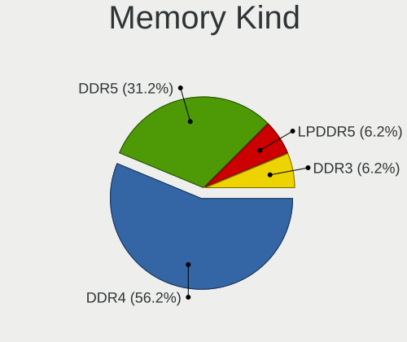

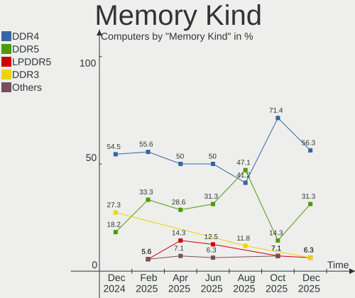

| Kind   | Computers | Percent |
|--------|-----------|---------|
| DDR4   | 9         | 56.25%  |
| DDR5   | 5         | 31.25%  |
| LPDDR5 | 1         | 6.25%   |
| DDR3   | 1         | 6.25%   |

Memory Form Factor
------------------

Physical design of the memory module

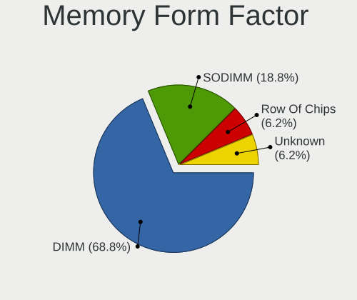

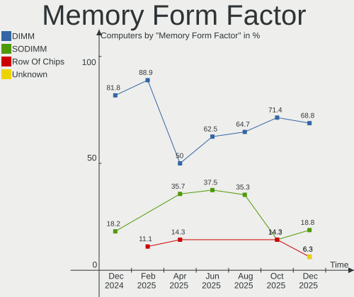

| Name         | Computers | Percent |
|--------------|-----------|---------|
| DIMM         | 11        | 68.75%  |
| SODIMM       | 3         | 18.75%  |
| Row Of Chips | 1         | 6.25%   |
| Unknown      | 1         | 6.25%   |

Memory Size
-----------

Memory module size

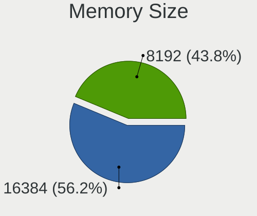

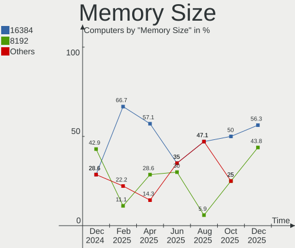

| Size  | Computers | Percent |
|-------|-----------|---------|
| 16384 | 9         | 56.25%  |
| 8192  | 7         | 43.75%  |

Memory Speed
------------

Memory module speed

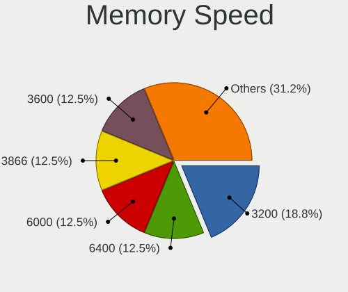

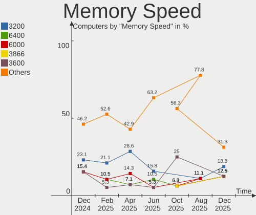

| Speed | Computers | Percent |
|-------|-----------|---------|
| 3200  | 3         | 18.75%  |
| 6400  | 2         | 12.5%   |
| 6000  | 2         | 12.5%   |
| 3866  | 2         | 12.5%   |
| 3600  | 2         | 12.5%   |
| 2400  | 2         | 12.5%   |
| 7467  | 1         | 6.25%   |
| 5600  | 1         | 6.25%   |
| 2667  | 1         | 6.25%   |

Printers & scanners
-------------------

Printer Vendor
--------------

Printer device vendors

Zero info for selected period =(

Printer Model
-------------

Printer device models

Zero info for selected period =(

Scanner Vendor
--------------

Scanner device vendors

Zero info for selected period =(

Scanner Model
-------------

Scanner device models

Zero info for selected period =(

Camera
------

Camera Vendor
-------------

Camera device vendors

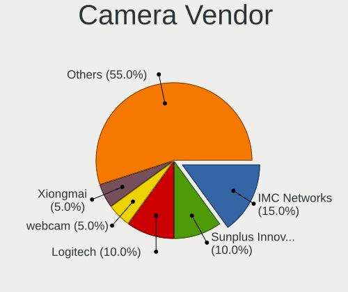

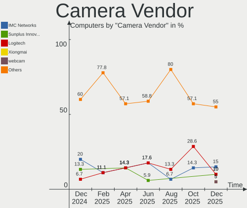

| Vendor                        | Computers | Percent |
|-------------------------------|-----------|---------|
| IMC Networks                  | 3         | 15%     |
| Sunplus Innovation Technology | 2         | 10%     |
| Logitech                      | 2         | 10%     |
| Xiongmai                      | 1         | 5%      |
| webcam                        | 1         | 5%      |
| Valve Software                | 1         | 5%      |
| UGREEN 35871                  | 1         | 5%      |
| Silicon Motion                | 1         | 5%      |
| Realtek Semiconductor         | 1         | 5%      |
| Quanta                        | 1         | 5%      |
| Microdia                      | 1         | 5%      |
| Lenovo                        | 1         | 5%      |
| KYE Systems (Mouse Systems)   | 1         | 5%      |
| Bison Electronics             | 1         | 5%      |
| Apple                         | 1         | 5%      |
| Acer                          | 1         | 5%      |

Camera Model
------------

Camera device models

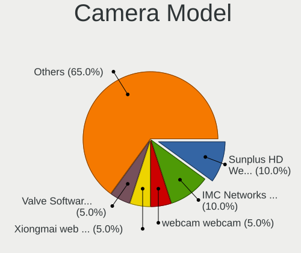

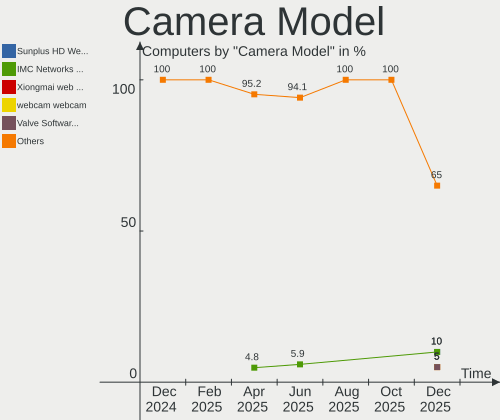

| Model                                     | Computers | Percent |
|-------------------------------------------|-----------|---------|
| Sunplus HD WebCam                         | 2         | 10%     |
| IMC Networks Integrated Camera            | 2         | 10%     |
| Xiongmai web camera                       | 1         | 5%      |
| webcam webcam                             | 1         | 5%      |
| Valve Software 3D Camera                  | 1         | 5%      |
| UGREEN 35871 UGREEN 35871                 | 1         | 5%      |
| Silicon Motion Web Camera                 | 1         | 5%      |
| Realtek Integrated_Webcam_HD              | 1         | 5%      |
| Quanta HD User Facing                     | 1         | 5%      |
| Microdia Integrated_Webcam_HD             | 1         | 5%      |
| Logitech HD Pro Webcam C920               | 1         | 5%      |
| Logitech C922 Pro Stream Webcam           | 1         | 5%      |
| Lenovo Lenovo FHD Webcam Audio            | 1         | 5%      |
| KYE Systems (Mouse Systems) FaceCam 1000X | 1         | 5%      |
| IMC Networks USB Camera                   | 1         | 5%      |
| Bison Integrated Camera                   | 1         | 5%      |
| Apple FaceTime HD Camera (Built-in)       | 1         | 5%      |
| Acer Integrated Camera                    | 1         | 5%      |

Security
--------

Fingerprint Vendor
------------------

Fingerprint sensor vendors

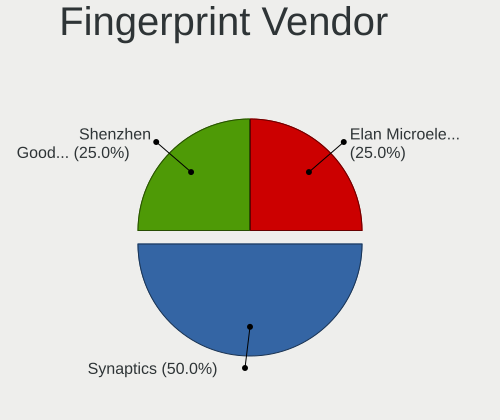

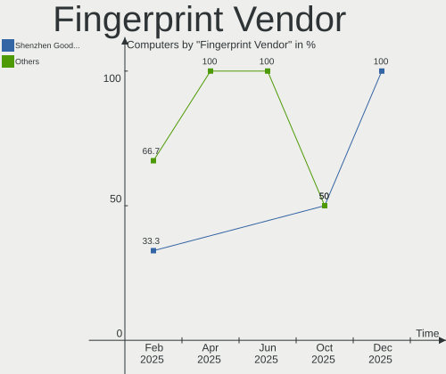

| Vendor                     | Computers | Percent |
|----------------------------|-----------|---------|
| Shenzhen Goodix Technology | 2         | 100%    |

Fingerprint Model
-----------------

Fingerprint sensor models

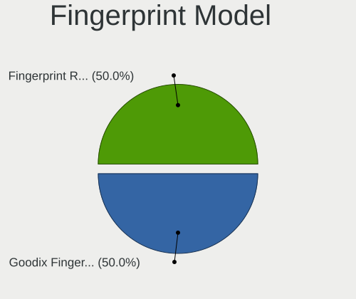

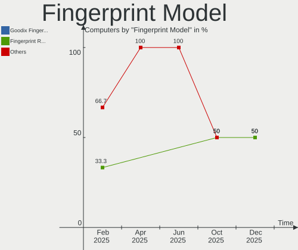

| Model                               | Computers | Percent |
|-------------------------------------|-----------|---------|
| Shenzhen Goodix  FingerPrint Device | 1         | 50%     |
| Shenzhen Goodix Fingerprint Reader  | 1         | 50%     |

Chipcard Vendor
---------------

Chipcard module vendors

Zero info for selected period =(

Chipcard Model
--------------

Chipcard module models

Zero info for selected period =(

Unsupported
-----------

Unsupported Devices
-------------------

Total unsupported devices on board

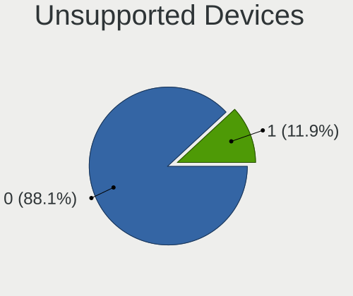

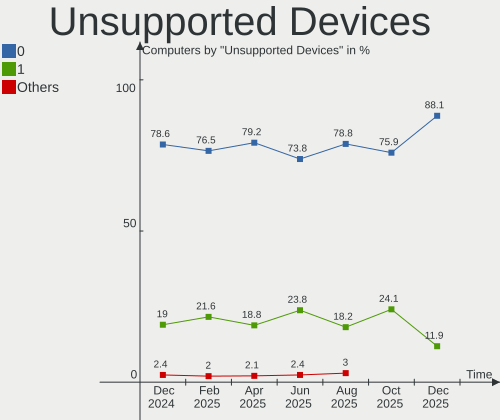

| Total | Computers | Percent |
|-------|-----------|---------|
| 0     | 37        | 88.1%   |
| 1     | 5         | 11.9%   |

Unsupported Device Types
------------------------

Types of unsupported devices

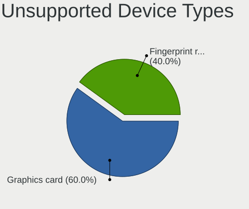

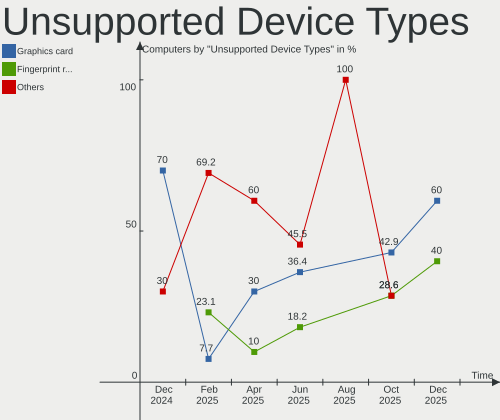

| Type               | Computers | Percent |
|--------------------|-----------|---------|
| Graphics card      | 3         | 60%     |
| Fingerprint reader | 2         | 40%     |

