Nobara - Hardware Trends
------------------------

A project to identify most popular hardware characteristics and track their change
over time based on data collected by Linux users at https://Linux-Hardware.org.

Anyone can contribute to this report by the [hw-probe](https://github.com/linuxhw/hw-probe) tool:

    sudo -E hw-probe -all -upload

This is a report for all computer types. See also reports for [desktops](/Dist/Nobara/Desktop/README.md) and [notebooks](/Dist/Nobara/Notebook/README.md).

This report is for one last month. Overall report since the beginning of time: [TestDays](https://github.com/linuxhw/TestDays)

Period: Apr, 2024.

Contents
--------

* [ System ](#system)
  - [ OS                       ](#os)
  - [ OS Family                ](#os-family)
  - [ Kernel                   ](#kernel)
  - [ Kernel Family            ](#kernel-family)
  - [ Kernel Major Ver.        ](#kernel-major-ver)
  - [ Arch                     ](#arch)
  - [ DE                       ](#de)
  - [ Display Server           ](#display-server)
  - [ Display Manager          ](#display-manager)
  - [ OS Lang                  ](#os-lang)
  - [ Boot Mode                ](#boot-mode)
  - [ Filesystem               ](#filesystem)
  - [ Part. scheme             ](#part-scheme)
  - [ Dual Boot with Linux/BSD ](#dual-boot-with-linuxbsd)
  - [ Dual Boot (Win)          ](#dual-boot-win)

* [ Board ](#board)
  - [ Vendor                   ](#vendor)
  - [ Model                    ](#model)
  - [ Model Family             ](#model-family)
  - [ MFG Year                 ](#mfg-year)
  - [ Form Factor              ](#form-factor)
  - [ Secure Boot              ](#secure-boot)
  - [ Coreboot                 ](#coreboot)
  - [ RAM Size                 ](#ram-size)
  - [ RAM Used                 ](#ram-used)
  - [ Total Drives             ](#total-drives)
  - [ Has CD-ROM               ](#has-cd-rom)
  - [ Has Ethernet             ](#has-ethernet)
  - [ Has WiFi                 ](#has-wifi)
  - [ Has Bluetooth            ](#has-bluetooth)

* [ Location ](#location)
  - [ Country                  ](#country)
  - [ City                     ](#city)

* [ Drives ](#drives)
  - [ Drive Vendor             ](#drive-vendor)
  - [ Drive Model              ](#drive-model)
  - [ HDD Vendor               ](#hdd-vendor)
  - [ SSD Vendor               ](#ssd-vendor)
  - [ Drive Kind               ](#drive-kind)
  - [ Drive Connector          ](#drive-connector)
  - [ Drive Size               ](#drive-size)
  - [ Space Total              ](#space-total)
  - [ Space Used               ](#space-used)
  - [ Malfunc. Drives          ](#malfunc-drives)
  - [ Malfunc. Drive Vendor    ](#malfunc-drive-vendor)
  - [ Malfunc. HDD Vendor      ](#malfunc-hdd-vendor)
  - [ Malfunc. Drive Kind      ](#malfunc-drive-kind)
  - [ Failed Drives            ](#failed-drives)
  - [ Failed Drive Vendor      ](#failed-drive-vendor)
  - [ Drive Status             ](#drive-status)

* [ Storage controller ](#storage-controller)
  - [ Storage Vendor           ](#storage-vendor)
  - [ Storage Model            ](#storage-model)
  - [ Storage Kind             ](#storage-kind)

* [ Processor ](#processor)
  - [ CPU Vendor               ](#cpu-vendor)
  - [ CPU Model                ](#cpu-model)
  - [ CPU Model Family         ](#cpu-model-family)
  - [ CPU Cores                ](#cpu-cores)
  - [ CPU Sockets              ](#cpu-sockets)
  - [ CPU Threads              ](#cpu-threads)
  - [ CPU Op-Modes             ](#cpu-op-modes)
  - [ CPU Microcode            ](#cpu-microcode)
  - [ CPU Microarch            ](#cpu-microarch)

* [ Graphics ](#graphics)
  - [ GPU Vendor               ](#gpu-vendor)
  - [ GPU Model                ](#gpu-model)
  - [ GPU Combo                ](#gpu-combo)
  - [ GPU Driver               ](#gpu-driver)
  - [ GPU Memory               ](#gpu-memory)

* [ Monitor ](#monitor)
  - [ Monitor Vendor           ](#monitor-vendor)
  - [ Monitor Model            ](#monitor-model)
  - [ Monitor Resolution       ](#monitor-resolution)
  - [ Monitor Diagonal         ](#monitor-diagonal)
  - [ Monitor Width            ](#monitor-width)
  - [ Aspect Ratio             ](#aspect-ratio)
  - [ Monitor Area             ](#monitor-area)
  - [ Pixel Density            ](#pixel-density)
  - [ Multiple Monitors        ](#multiple-monitors)

* [ Network ](#network)
  - [ Net Controller Vendor    ](#net-controller-vendor)
  - [ Net Controller Model     ](#net-controller-model)
  - [ Wireless Vendor          ](#wireless-vendor)
  - [ Wireless Model           ](#wireless-model)
  - [ Ethernet Vendor          ](#ethernet-vendor)
  - [ Ethernet Model           ](#ethernet-model)
  - [ Net Controller Kind      ](#net-controller-kind)
  - [ Used Controller          ](#used-controller)
  - [ NICs                     ](#nics)
  - [ IPv6                     ](#ipv6)

* [ Bluetooth ](#bluetooth)
  - [ Bluetooth Vendor         ](#bluetooth-vendor)
  - [ Bluetooth Model          ](#bluetooth-model)

* [ Sound ](#sound)
  - [ Sound Vendor             ](#sound-vendor)
  - [ Sound Model              ](#sound-model)

* [ Memory ](#memory)
  - [ Memory Vendor            ](#memory-vendor)
  - [ Memory Model             ](#memory-model)
  - [ Memory Kind              ](#memory-kind)
  - [ Memory Form Factor       ](#memory-form-factor)
  - [ Memory Size              ](#memory-size)
  - [ Memory Speed             ](#memory-speed)

* [ Printers & scanners ](#printers--scanners)
  - [ Printer Vendor           ](#printer-vendor)
  - [ Printer Model            ](#printer-model)
  - [ Scanner Vendor           ](#scanner-vendor)
  - [ Scanner Model            ](#scanner-model)

* [ Camera ](#camera)
  - [ Camera Vendor            ](#camera-vendor)
  - [ Camera Model             ](#camera-model)

* [ Security ](#security)
  - [ Fingerprint Vendor       ](#fingerprint-vendor)
  - [ Fingerprint Model        ](#fingerprint-model)
  - [ Chipcard Vendor          ](#chipcard-vendor)
  - [ Chipcard Model           ](#chipcard-model)

* [ Unsupported ](#unsupported)
  - [ Unsupported Devices      ](#unsupported-devices)
  - [ Unsupported Device Types ](#unsupported-device-types)

System
------

OS
--

Installed operating systems

| Name      | Computers | Percent |
|-----------|-----------|---------|
| Nobara 39 | 53        | 92.98%  |
| Nobara 38 | 4         | 7.02%   |

OS Family
---------

OS without a version

| Name   | Computers | Percent |
|--------|-----------|---------|
| Nobara | 57        | 100%    |

Kernel
------

Version of the Linux kernel

| Version                      | Computers | Percent |
|------------------------------|-----------|---------|
| 6.8.5-201.fsync.fc39.x86_64  | 20        | 35.09%  |
| 6.7.6-201.fsync.fc39.x86_64  | 13        | 22.81%  |
| 6.8.2-201.fsync.fc39.x86_64  | 7         | 12.28%  |
| 6.8.7-200.fsync.fc39.x86_64  | 4         | 7.02%   |
| 6.7.0-204.fsync.fc39.x86_64  | 4         | 7.02%   |
| 6.4.10-202.fsync.fc38.x86_64 | 3         | 5.26%   |
| 6.8.7-201.fsync.fc39.x86_64  | 2         | 3.51%   |
| 6.7.5-200.fsync.fc39.x86_64  | 1         | 1.75%   |
| 6.7.0-200.fsync.fc39.x86_64  | 1         | 1.75%   |
| 6.6.8-200.fsync.fc39.x86_64  | 1         | 1.75%   |
| 6.3.12-203.fsync.fc38.x86_64 | 1         | 1.75%   |

Kernel Family
-------------

Linux kernel without a distro release

| Version | Computers | Percent |
|---------|-----------|---------|
| 6.8.5   | 20        | 35.09%  |
| 6.7.6   | 13        | 22.81%  |
| 6.8.2   | 7         | 12.28%  |
| 6.8.7   | 6         | 10.53%  |
| 6.7.0   | 5         | 8.77%   |
| 6.4.10  | 3         | 5.26%   |
| 6.7.5   | 1         | 1.75%   |
| 6.6.8   | 1         | 1.75%   |
| 6.3.12  | 1         | 1.75%   |

Kernel Major Ver.
-----------------

Linux kernel major version

| Version | Computers | Percent |
|---------|-----------|---------|
| 6.8     | 33        | 57.89%  |
| 6.7     | 19        | 33.33%  |
| 6.4     | 3         | 5.26%   |
| 6.6     | 1         | 1.75%   |
| 6.3     | 1         | 1.75%   |

Arch
----

OS architecture (x86_64, i586, etc.)

| Name   | Computers | Percent |
|--------|-----------|---------|
| x86_64 | 57        | 100%    |

DE
--

Desktop Environment

| Name  | Computers | Percent |
|-------|-----------|---------|
| KDE6  | 37        | 64.91%  |
| GNOME | 12        | 21.05%  |
| KDE5  | 8         | 14.04%  |

Display Server
--------------

X11 or Wayland

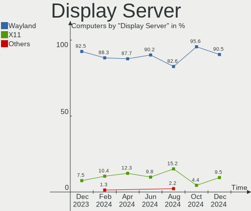

| Name    | Computers | Percent |
|---------|-----------|---------|
| Wayland | 50        | 87.72%  |
| X11     | 7         | 12.28%  |

Display Manager
---------------

SDDM, LightDM, etc.

| Name    | Computers | Percent |
|---------|-----------|---------|
| Unknown | 48        | 84.21%  |
| SDDM    | 7         | 12.28%  |
| GDM     | 2         | 3.51%   |

OS Lang
-------

Language

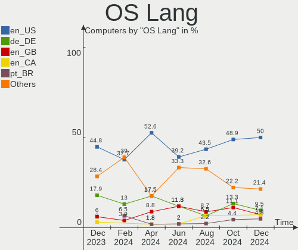

| Lang  | Computers | Percent |
|-------|-----------|---------|
| en_US | 30        | 52.63%  |
| de_DE | 10        | 17.54%  |
| en_GB | 5         | 8.77%   |
| es_MX | 3         | 5.26%   |
| hu_HU | 2         | 3.51%   |
| pt_BR | 1         | 1.75%   |
| pl_PL | 1         | 1.75%   |
| fr_BE | 1         | 1.75%   |
| en_DK | 1         | 1.75%   |
| en_CA | 1         | 1.75%   |
| da_DK | 1         | 1.75%   |
| ca_ES | 1         | 1.75%   |

Boot Mode
---------

EFI or BIOS

| Mode | Computers | Percent |
|------|-----------|---------|
| EFI  | 44        | 77.19%  |
| BIOS | 13        | 22.81%  |

Filesystem
----------

Type of filesystem

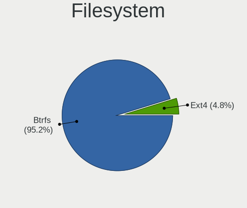

| Type  | Computers | Percent |
|-------|-----------|---------|
| Btrfs | 53        | 92.98%  |
| Ext4  | 4         | 7.02%   |

Part. scheme
------------

Scheme of partitioning

| Type    | Computers | Percent |
|---------|-----------|---------|
| Unknown | 48        | 84.21%  |
| GPT     | 9         | 15.79%  |

Dual Boot with Linux/BSD
------------------------

Hosting more than one Linux/BSD

| Dual boot | Computers | Percent |
|-----------|-----------|---------|
| No        | 54        | 94.74%  |
| Yes       | 3         | 5.26%   |

Dual Boot (Win)
---------------

Hosting Linux and Windows

| Dual boot | Computers | Percent |
|-----------|-----------|---------|
| No        | 53        | 92.98%  |
| Yes       | 4         | 7.02%   |

Board
-----

Vendor
------

Motherboard manufacturer

| Name                | Computers | Percent |
|---------------------|-----------|---------|
| ASUSTek Computer    | 11        | 19.3%   |
| MSI                 | 10        | 17.54%  |
| Hewlett-Packard     | 7         | 12.28%  |
| Gigabyte Technology | 5         | 8.77%   |
| Lenovo              | 4         | 7.02%   |
| Apple               | 4         | 7.02%   |
| Dell                | 2         | 3.51%   |
| ASRock              | 2         | 3.51%   |
| System76            | 1         | 1.75%   |
| NZXT                | 1         | 1.75%   |
| Notebook            | 1         | 1.75%   |
| Microsoft           | 1         | 1.75%   |
| iOTA                | 1         | 1.75%   |
| HC Technology.      | 1         | 1.75%   |
| Biostar             | 1         | 1.75%   |
| ANGXUN              | 1         | 1.75%   |
| Alienware           | 1         | 1.75%   |
| Acer                | 1         | 1.75%   |
| A-DATA Technology   | 1         | 1.75%   |
| Unknown             | 1         | 1.75%   |

Model
-----

Motherboard model

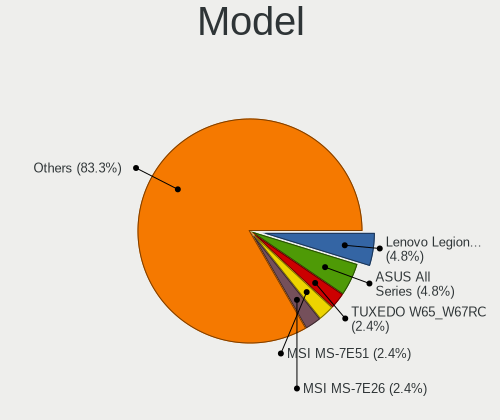

| Name                                  | Computers | Percent |
|---------------------------------------|-----------|---------|
| MSI MS-7C56                           | 3         | 5.26%   |
| MSI MS-7C35                           | 2         | 3.51%   |
| Unknown                               | 2         | 3.51%   |
| System76 Gazelle                      | 1         | 1.75%   |
| NZXT N7 B550                          | 1         | 1.75%   |
| Notebook W330SU2                      | 1         | 1.75%   |
| MSI MS-7D76                           | 1         | 1.75%   |
| MSI MS-7D75                           | 1         | 1.75%   |
| MSI MS-7D73                           | 1         | 1.75%   |
| MSI MS-7977                           | 1         | 1.75%   |
| MSI GF65 Thin 10UE                    | 1         | 1.75%   |
| Microsoft Surface Pro                 | 1         | 1.75%   |
| Lenovo ThinkPad T430 2347GU8          | 1         | 1.75%   |
| Lenovo ThinkBook 16 G6 IRL 21KH       | 1         | 1.75%   |
| Lenovo IdeaPad L340-15IRH Gaming 81LK | 1         | 1.75%   |
| Lenovo IdeaPad 1 14IGL7 82V6          | 1         | 1.75%   |
| HP Z820 Workstation                   | 1         | 1.75%   |
| HP ProDesk 600 G1 SFF                 | 1         | 1.75%   |
| HP Pavilion Gaming Desktop TG01-2xxx  | 1         | 1.75%   |
| HP OMEN by Laptop 15-dc0xxx           | 1         | 1.75%   |
| HP Laptop 15-fd0xxx                   | 1         | 1.75%   |
| HP EliteBook 8570p                    | 1         | 1.75%   |
| HP 8876 11                            | 1         | 1.75%   |
| HC Technology. HCAR4000-MI            | 1         | 1.75%   |
| Gigabyte Z370 HD3-OP                  | 1         | 1.75%   |
| Gigabyte Z370 AORUS ULTRA GAMING 2.0  | 1         | 1.75%   |
| Gigabyte X570 AORUS MASTER            | 1         | 1.75%   |
| Gigabyte X570 AORUS ELITE WIFI        | 1         | 1.75%   |
| Gigabyte B650M AORUS ELITE AX         | 1         | 1.75%   |
| Dell Latitude E6440                   | 1         | 1.75%   |
| Dell G15 5530                         | 1         | 1.75%   |
| Biostar TP43E Combo                   | 1         | 1.75%   |
| ASUS TUF Gaming X670E-PLUS WIFI       | 1         | 1.75%   |
| ASUS ROG Zephyrus G14 GA401QM_GA401QM | 1         | 1.75%   |
| ASUS ROG Strix G513QY_G513QY          | 1         | 1.75%   |
| ASUS ROG Maximus XI HERO              | 1         | 1.75%   |
| ASUS Rampage IV BLACK EDITION         | 1         | 1.75%   |
| ASUS Pro WS X570-ACE                  | 1         | 1.75%   |
| ASUS PRIME B450M-A                    | 1         | 1.75%   |
| ASUS G751JM                           | 1         | 1.75%   |

Model Family
------------

Motherboard model prefix

| Name                       | Computers | Percent |
|----------------------------|-----------|---------|
| MSI MS-7C56                | 3         | 5.26%   |
| ASUS ROG                   | 3         | 5.26%   |
| MSI MS-7C35                | 2         | 3.51%   |
| Lenovo IdeaPad             | 2         | 3.51%   |
| Gigabyte Z370              | 2         | 3.51%   |
| Gigabyte X570              | 2         | 3.51%   |
| Unknown                    | 2         | 3.51%   |
| System76 Gazelle           | 1         | 1.75%   |
| NZXT N7                    | 1         | 1.75%   |
| Notebook W330SU2           | 1         | 1.75%   |
| MSI MS-7D76                | 1         | 1.75%   |
| MSI MS-7D75                | 1         | 1.75%   |
| MSI MS-7D73                | 1         | 1.75%   |
| MSI MS-7977                | 1         | 1.75%   |
| MSI GF65                   | 1         | 1.75%   |
| Microsoft Surface          | 1         | 1.75%   |
| Lenovo ThinkPad            | 1         | 1.75%   |
| Lenovo ThinkBook           | 1         | 1.75%   |
| HP Z820                    | 1         | 1.75%   |
| HP ProDesk                 | 1         | 1.75%   |
| HP Pavilion                | 1         | 1.75%   |
| HP OMEN                    | 1         | 1.75%   |
| HP Laptop                  | 1         | 1.75%   |
| HP EliteBook               | 1         | 1.75%   |
| HP 8876                    | 1         | 1.75%   |
| HC Technology. HCAR4000-MI | 1         | 1.75%   |
| Gigabyte B650M             | 1         | 1.75%   |
| Dell Latitude              | 1         | 1.75%   |
| Dell G15                   | 1         | 1.75%   |
| Biostar TP43E              | 1         | 1.75%   |
| ASUS TUF                   | 1         | 1.75%   |
| ASUS Rampage               | 1         | 1.75%   |
| ASUS Pro                   | 1         | 1.75%   |
| ASUS PRIME                 | 1         | 1.75%   |
| ASUS G751JM                | 1         | 1.75%   |
| ASUS CROSSHAIR             | 1         | 1.75%   |
| ASUS ASUS                  | 1         | 1.75%   |
| ASUS All                   | 1         | 1.75%   |
| ASRock B650M               | 1         | 1.75%   |
| ASRock B450M-HDV           | 1         | 1.75%   |

MFG Year
--------

Motherboard manufacture year

| Year | Computers | Percent |
|------|-----------|---------|
| 2022 | 9         | 15.79%  |
| 2023 | 8         | 14.04%  |
| 2020 | 7         | 12.28%  |
| 2021 | 6         | 10.53%  |
| 2019 | 5         | 8.77%   |
| 2018 | 5         | 8.77%   |
| 2017 | 3         | 5.26%   |
| 2014 | 3         | 5.26%   |
| 2012 | 3         | 5.26%   |
| 2015 | 2         | 3.51%   |
| 2013 | 2         | 3.51%   |
| 2010 | 2         | 3.51%   |
| 2024 | 1         | 1.75%   |
| 2011 | 1         | 1.75%   |

Form Factor
-----------

Physical design of the computer

| Name       | Computers | Percent |
|------------|-----------|---------|
| Desktop    | 31        | 54.39%  |
| Notebook   | 23        | 40.35%  |
| Tablet     | 2         | 3.51%   |
| All in one | 1         | 1.75%   |

Secure Boot
-----------

Enabled or disabled

| State    | Computers | Percent |
|----------|-----------|---------|
| Disabled | 57        | 100%    |

Coreboot
--------

Have coreboot on board

| Used | Computers | Percent |
|------|-----------|---------|
| No   | 56        | 98.25%  |
| Yes  | 1         | 1.75%   |

RAM Size
--------

Total RAM memory

| Size in GB  | Computers | Percent |
|-------------|-----------|---------|
| 32.01-64.0  | 16        | 28.07%  |
| 16.01-24.0  | 12        | 21.05%  |
| 64.01-256.0 | 10        | 17.54%  |
| 8.01-16.0   | 10        | 17.54%  |
| 3.01-4.0    | 4         | 7.02%   |
| 4.01-8.0    | 2         | 3.51%   |
| 24.01-32.0  | 2         | 3.51%   |
| 1.01-2.0    | 1         | 1.75%   |

RAM Used
--------

Used RAM memory

| Used GB    | Computers | Percent |
|------------|-----------|---------|
| 4.01-8.0   | 18        | 31.58%  |
| 3.01-4.0   | 15        | 26.32%  |
| 2.01-3.0   | 14        | 24.56%  |
| 1.01-2.0   | 4         | 7.02%   |
| 8.01-16.0  | 4         | 7.02%   |
| 16.01-24.0 | 2         | 3.51%   |

Total Drives
------------

Number of drives on board

| Drives | Computers | Percent |
|--------|-----------|---------|
| 1      | 19        | 33.33%  |
| 2      | 16        | 28.07%  |
| 3      | 8         | 14.04%  |
| 4      | 7         | 12.28%  |
| 5      | 4         | 7.02%   |
| 6      | 2         | 3.51%   |
| 7      | 1         | 1.75%   |

Has CD-ROM
----------

Has CD-ROM on board

| Presented | Computers | Percent |
|-----------|-----------|---------|
| No        | 45        | 78.95%  |
| Yes       | 12        | 21.05%  |

Has Ethernet
------------

Has Ethernet on board

| Presented | Computers | Percent |
|-----------|-----------|---------|
| Yes       | 51        | 89.47%  |
| No        | 6         | 10.53%  |

Has WiFi
--------

Has WiFi module

| Presented | Computers | Percent |
|-----------|-----------|---------|
| Yes       | 47        | 82.46%  |
| No        | 10        | 17.54%  |

Has Bluetooth
-------------

Has Bluetooth module

| Presented | Computers | Percent |
|-----------|-----------|---------|
| Yes       | 43        | 75.44%  |
| No        | 14        | 24.56%  |

Location
--------

Country
-------

Geographic location (country)

| Country     | Computers | Percent |
|-------------|-----------|---------|
| USA         | 23        | 40.35%  |
| Germany     | 10        | 17.54%  |
| Brazil      | 3         | 5.26%   |
| Poland      | 2         | 3.51%   |
| India       | 2         | 3.51%   |
| Canada      | 2         | 3.51%   |
| Belgium     | 2         | 3.51%   |
| UK          | 1         | 1.75%   |
| Thailand    | 1         | 1.75%   |
| Switzerland | 1         | 1.75%   |
| Spain       | 1         | 1.75%   |
| Russia      | 1         | 1.75%   |
| Netherlands | 1         | 1.75%   |
| Mexico      | 1         | 1.75%   |
| Hungary     | 1         | 1.75%   |
| El Salvador | 1         | 1.75%   |
| Denmark     | 1         | 1.75%   |
| Austria     | 1         | 1.75%   |
| Australia   | 1         | 1.75%   |
| Argentina   | 1         | 1.75%   |

City
----

Geographic location (city)

| City                     | Computers | Percent |
|--------------------------|-----------|---------|
| Kansas City              | 3         | 5.26%   |
| Los Angeles              | 2         | 3.51%   |
| Haag in Oberbayern       | 2         | 3.51%   |
| Brussels                 | 2         | 3.51%   |
| Zwolle                   | 1         | 1.75%   |
| Winsen                   | 1         | 1.75%   |
| Wiehl                    | 1         | 1.75%   |
| Wheat Ridge              | 1         | 1.75%   |
| Westbrook                | 1         | 1.75%   |
| Warsaw                   | 1         | 1.75%   |
| Valby                    | 1         | 1.75%   |
| Tenczynek                | 1         | 1.75%   |
| Szombathely              | 1         | 1.75%   |
| Sumaré                  | 1         | 1.75%   |
| Steyr                    | 1         | 1.75%   |
| Spring                   | 1         | 1.75%   |
| South Holland            | 1         | 1.75%   |
| Sion                     | 1         | 1.75%   |
| Selinsgrove              | 1         | 1.75%   |
| Satna                    | 1         | 1.75%   |
| San Miguel Ingenio       | 1         | 1.75%   |
| Saint Paul               | 1         | 1.75%   |
| Riverdale                | 1         | 1.75%   |
| Rabade                   | 1         | 1.75%   |
| Provo                    | 1         | 1.75%   |
| Phra Nakhon Si Ayutthaya | 1         | 1.75%   |
| Peru                     | 1         | 1.75%   |
| Perth                    | 1         | 1.75%   |
| Oconomowoc               | 1         | 1.75%   |
| Novo Hamburgo            | 1         | 1.75%   |
| Munchberg                | 1         | 1.75%   |
| Moreno                   | 1         | 1.75%   |
| Mexico City              | 1         | 1.75%   |
| Metter                   | 1         | 1.75%   |
| Merced                   | 1         | 1.75%   |
| Krasnodar                | 1         | 1.75%   |
| Koblenz                  | 1         | 1.75%   |
| Holly Springs            | 1         | 1.75%   |
| Hanover                  | 1         | 1.75%   |
| Guarapari                | 1         | 1.75%   |

Drives
------

Drive Vendor
------------

Hard drive vendors

| Vendor                       | Computers | Drives | Percent |
|------------------------------|-----------|--------|---------|
| Samsung Electronics          | 18        | 23     | 14.75%  |
| Seagate                      | 13        | 17     | 10.66%  |
| WDC                          | 9         | 13     | 7.38%   |
| Sandisk                      | 8         | 8      | 6.56%   |
| Phison Electronics           | 8         | 9      | 6.56%   |
| Crucial                      | 8         | 10     | 6.56%   |
| Micron Technology            | 5         | 5      | 4.1%    |
| Hitachi                      | 4         | 4      | 3.28%   |
| China                        | 4         | 4      | 3.28%   |
| Toshiba                      | 3         | 3      | 2.46%   |
| SK hynix                     | 3         | 3      | 2.46%   |
| Shenzhen Longsys Electronics | 3         | 4      | 2.46%   |
| Realtek Semiconductor        | 3         | 3      | 2.46%   |
| Micron/Crucial Technology    | 3         | 4      | 2.46%   |
| HGST                         | 3         | 3      | 2.46%   |
| Unknown                      | 2         | 2      | 1.64%   |
| PNY                          | 2         | 2      | 1.64%   |
| KingSpec                     | 2         | 3      | 1.64%   |
| Intel                        | 2         | 2      | 1.64%   |
| Apple                        | 2         | 3      | 1.64%   |
| ADATA Technology             | 2         | 2      | 1.64%   |
| XPG                          | 1         | 1      | 0.82%   |
| Realtek                      | 1         | 1      | 0.82%   |
| Patriot                      | 1         | 1      | 0.82%   |
| Maxtor                       | 1         | 1      | 0.82%   |
| Kingston Technology Company  | 1         | 1      | 0.82%   |
| Kingston                     | 1         | 1      | 0.82%   |
| JMicron Technology           | 1         | 1      | 0.82%   |
| IBM                          | 1         | 1      | 0.82%   |
| HL-DT-ST                     | 1         | 1      | 0.82%   |
| GOODRAM                      | 1         | 1      | 0.82%   |
| G-TECH                       | 1         | 1      | 0.82%   |
| G-DRIVE                      | 1         | 1      | 0.82%   |
| FIKWOT                       | 1         | 1      | 0.82%   |
| Corsair                      | 1         | 1      | 0.82%   |
| ACASIS                       | 1         | 1      | 0.82%   |

Drive Model
-----------

Hard drive models

| Model                                              | Computers | Percent |
|----------------------------------------------------|-----------|---------|
| Samsung NVMe SSD Controller SM981/PM981/PM983 1TB  | 5         | 3.65%   |
| Phison E16 PCIe4 NVMe Controller 1TB               | 4         | 2.92%   |
| Seagate ST4000DM004-2CV104 4TB                     | 3         | 2.19%   |
| Micron/Crucial P2 NVMe PCIe SSD 4TB                | 3         | 2.19%   |
| Crucial CT1000MX500SSD1 1TB                        | 3         | 2.19%   |
| Sandisk WD_BLACK SN770 2TB                         | 2         | 1.46%   |
| Sandisk WD Blue SN550 NVMe SSD 2TB                 | 2         | 1.46%   |
| Samsung SSD 860 EVO 1TB                            | 2         | 1.46%   |
| Samsung SSD 850 EVO 500GB                          | 2         | 1.46%   |
| Samsung NVMe SSD Controller PM9A1/PM9A3/980PRO 1TB | 2         | 1.46%   |
| Phison E12 NVMe Controller 2TB                     | 2         | 1.46%   |
| Hitachi HDS721010CLA332 1TB                        | 2         | 1.46%   |
| XPG NVMe SSD Drive 1024GB                          | 1         | 0.73%   |
| WDC WDS500G2B0A-00SM50 500GB SSD                   | 1         | 0.73%   |
| WDC WDS500G2B0A 500GB SSD                          | 1         | 0.73%   |
| WDC WDS100T2B0A-00SM50 1TB SSD                     | 1         | 0.73%   |
| WDC WD5000AAKX-001CA0 500GB                        | 1         | 0.73%   |
| WDC WD5000AACS-00G8B1 500GB                        | 1         | 0.73%   |
| WDC WD40EZRX-00SPEB0 4TB                           | 1         | 0.73%   |
| WDC WD2500AAKX-753CA1 250GB                        | 1         | 0.73%   |
| WDC WD20EZRZ-00Z5HB0 2TB                           | 1         | 0.73%   |
| WDC WD20EARS-00MVWB0 2TB                           | 1         | 0.73%   |
| WDC WD10EZEX-21M2NA0 1TB                           | 1         | 0.73%   |
| WDC WD10EZEX-00WN4A0 1TB                           | 1         | 0.73%   |
| WDC WD10EZEX-00BN5A0 1TB                           | 1         | 0.73%   |
| WDC WD1001FALS-41K1B0 1TB                          | 1         | 0.73%   |
| Unknown MMC Card  32GB                             | 1         | 0.73%   |
| Unknown MMC Card  128GB                            | 1         | 0.73%   |
| Toshiba XG6 NVMe SSD Controller 1024GB             | 1         | 0.73%   |
| Toshiba TR200 240GB SSD                            | 1         | 0.73%   |
| Toshiba MK8052GSX 80GB                             | 1         | 0.73%   |
| SK hynix SHGS31-500GS-2 500GB SSD                  | 1         | 0.73%   |
| SK hynix BC901 NVMe 1024GB                         | 1         | 0.73%   |
| SK hynix BC501 NVMe Solid State Drive 512GB        | 1         | 0.73%   |
| Shenzhen Longsys Lexar SSD NM790 4TB               | 1         | 0.73%   |
| Shenzhen Longsys Lexar SSD NM710 2TB               | 1         | 0.73%   |
| Shenzhen Longsys Lexar SSD NM710 1TB               | 1         | 0.73%   |
| Seagate ST3750528AS 752GB                          | 1         | 0.73%   |
| Seagate ST3500418AS 500GB                          | 1         | 0.73%   |
| Seagate ST3500413AS 500GB                          | 1         | 0.73%   |

HDD Vendor
----------

Hard disk drive vendors

| Vendor              | Computers | Drives | Percent |
|---------------------|-----------|--------|---------|
| Seagate             | 12        | 16     | 38.71%  |
| WDC                 | 8         | 10     | 25.81%  |
| Hitachi             | 4         | 4      | 12.9%   |
| HGST                | 3         | 3      | 9.68%   |
| Toshiba             | 1         | 1      | 3.23%   |
| Samsung Electronics | 1         | 1      | 3.23%   |
| Maxtor              | 1         | 1      | 3.23%   |
| ACASIS              | 1         | 1      | 3.23%   |

SSD Vendor
----------

Solid state drive vendors

| Vendor              | Computers | Drives | Percent |
|---------------------|-----------|--------|---------|
| Samsung Electronics | 9         | 10     | 25.71%  |
| Crucial             | 8         | 10     | 22.86%  |
| China               | 3         | 3      | 8.57%   |
| WDC                 | 2         | 3      | 5.71%   |
| PNY                 | 2         | 2      | 5.71%   |
| KingSpec            | 2         | 3      | 5.71%   |
| Toshiba             | 1         | 1      | 2.86%   |
| SK hynix            | 1         | 1      | 2.86%   |
| Seagate             | 1         | 1      | 2.86%   |
| Patriot             | 1         | 1      | 2.86%   |
| Micron Technology   | 1         | 1      | 2.86%   |
| Kingston            | 1         | 1      | 2.86%   |
| Intel               | 1         | 1      | 2.86%   |
| GOODRAM             | 1         | 1      | 2.86%   |
| Corsair             | 1         | 1      | 2.86%   |

Drive Kind
----------

HDD or SSD

| Kind    | Computers | Drives | Percent |
|---------|-----------|--------|---------|
| NVMe    | 38        | 56     | 40.86%  |
| SSD     | 26        | 40     | 27.96%  |
| HDD     | 21        | 37     | 22.58%  |
| Unknown | 6         | 7      | 6.45%   |
| MMC     | 2         | 2      | 2.15%   |

Drive Connector
---------------

SATA, SAS, NVMe, etc.

| Type | Computers | Drives | Percent |
|------|-----------|--------|---------|
| NVMe | 38        | 55     | 44.71%  |
| SATA | 32        | 71     | 37.65%  |
| SAS  | 13        | 14     | 15.29%  |
| MMC  | 2         | 2      | 2.35%   |

Drive Size
----------

Size of hard drive

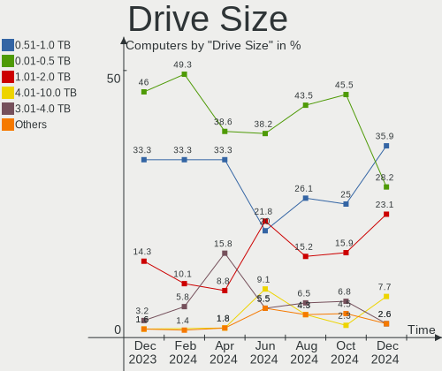

| Size in TB | Computers | Drives | Percent |
|------------|-----------|--------|---------|
| 0.01-0.5   | 23        | 33     | 40.35%  |
| 0.51-1.0   | 18        | 25     | 31.58%  |
| 3.01-4.0   | 7         | 9      | 12.28%  |
| 1.01-2.0   | 6         | 7      | 10.53%  |
| 4.01-10.0  | 2         | 2      | 3.51%   |
| 2.01-3.0   | 1         | 1      | 1.75%   |

Space Total
-----------

Amount of disk space available on the file system

| Size in GB     | Computers | Percent |
|----------------|-----------|---------|
| More than 3000 | 27        | 47.37%  |
| 1001-2000      | 9         | 15.79%  |
| 2001-3000      | 5         | 8.77%   |
| 501-1000       | 5         | 8.77%   |
| 101-250        | 4         | 7.02%   |
| 251-500        | 3         | 5.26%   |
| 21-50          | 3         | 5.26%   |
| 51-100         | 1         | 1.75%   |

Space Used
----------

Amount of used disk space

| Used GB        | Computers | Percent |
|----------------|-----------|---------|
| 501-1000       | 10        | 17.54%  |
| 21-50          | 9         | 15.79%  |
| 2001-3000      | 8         | 14.04%  |
| 1001-2000      | 8         | 14.04%  |
| More than 3000 | 7         | 12.28%  |
| 1-20           | 5         | 8.77%   |
| 101-250        | 4         | 7.02%   |
| 251-500        | 3         | 5.26%   |
| 51-100         | 3         | 5.26%   |

Malfunc. Drives
---------------

Drive models with a malfunction

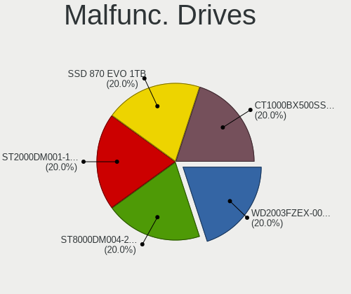

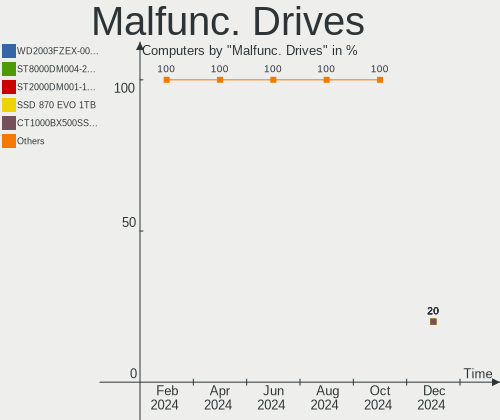

| Model                    | Computers | Drives | Percent |
|--------------------------|-----------|--------|---------|
| WDC WD20EZRZ-00Z5HB0 2TB | 1         | 1      | 50%     |
| Toshiba MK8052GSX 80GB   | 1         | 1      | 50%     |

Malfunc. Drive Vendor
---------------------

Vendors of faulty drives

| Vendor  | Computers | Drives | Percent |
|---------|-----------|--------|---------|
| WDC     | 1         | 1      | 50%     |
| Toshiba | 1         | 1      | 50%     |

Malfunc. HDD Vendor
-------------------

Vendors of faulty HDD drives

| Vendor  | Computers | Drives | Percent |
|---------|-----------|--------|---------|
| WDC     | 1         | 1      | 50%     |
| Toshiba | 1         | 1      | 50%     |

Malfunc. Drive Kind
-------------------

Kinds of faulty drives

| Kind | Computers | Drives | Percent |
|------|-----------|--------|---------|
| HDD  | 2         | 2      | 100%    |

Failed Drives
-------------

Failed drive models

Zero info for selected period =(

Failed Drive Vendor
-------------------

Failed drive vendors

Zero info for selected period =(

Drive Status
------------

Number of failed and malfunc. drives

| Status   | Computers | Drives | Percent |
|----------|-----------|--------|---------|
| Detected | 50        | 123    | 83.33%  |
| Works    | 8         | 17     | 13.33%  |
| Malfunc  | 2         | 2      | 3.33%   |

Storage controller
------------------

Storage Vendor
--------------

Storage controller vendors

| Vendor                       | Computers | Percent |
|------------------------------|-----------|---------|
| Intel                        | 25        | 25%     |
| AMD                          | 21        | 21%     |
| Samsung Electronics          | 10        | 10%     |
| SanDisk                      | 8         | 8%      |
| Phison Electronics           | 8         | 8%      |
| Micron Technology            | 4         | 4%      |
| Shenzhen Longsys Electronics | 3         | 3%      |
| Realtek Semiconductor        | 3         | 3%      |
| Micron/Crucial Technology    | 3         | 3%      |
| ASMedia Technology           | 3         | 3%      |
| SK hynix                     | 2         | 2%      |
| Apple                        | 2         | 2%      |
| ADATA Technology             | 2         | 2%      |
| Toshiba America Info Systems | 1         | 1%      |
| Kingston Technology Company  | 1         | 1%      |
| JMicron Technology           | 1         | 1%      |
| INNOGRIT                     | 1         | 1%      |
| Hewlett-Packard              | 1         | 1%      |
| Broadcom / LSI               | 1         | 1%      |

Storage Model
-------------

Storage controller models

| Model                                                                          | Computers | Percent |
|--------------------------------------------------------------------------------|-----------|---------|
| AMD FCH SATA Controller [AHCI mode]                                            | 8         | 7.41%   |
| AMD 600 Series Chipset SATA Controller                                         | 6         | 5.56%   |
| Samsung NVMe SSD Controller SM981/PM981/PM983                                  | 5         | 4.63%   |
| AMD 500 Series Chipset SATA Controller                                         | 5         | 4.63%   |
| Phison E16 PCIe4 NVMe Controller                                               | 4         | 3.7%    |
| Shenzhen Longsys Lexar NM790 NVME SSD (DRAM-less)                              | 3         | 2.78%   |
| SanDisk WD Black SN770 / PC SN740 256GB / PC SN560 (DRAM-less) NVMe SSD        | 3         | 2.78%   |
| Realtek RTS5765DL NVMe SSD Controller (DRAM-less)                              | 3         | 2.78%   |
| Micron/Crucial P2 [Nick P2] / P3 / P3 Plus NVMe PCIe SSD (DRAM-less)           | 3         | 2.78%   |
| Intel 8 Series/C220 Series Chipset Family 6-port SATA Controller 1 [AHCI mode] | 3         | 2.78%   |
| ASMedia ASM1061/ASM1062 Serial ATA Controller                                  | 3         | 2.78%   |
| AMD 400 Series Chipset SATA Controller                                         | 3         | 2.78%   |
| SanDisk Ultra 3D / WD Blue SN550 NVMe SSD                                      | 2         | 1.85%   |
| Samsung NVMe SSD Controller S4LV008[Pascal]                                    | 2         | 1.85%   |
| Samsung NVMe SSD Controller PM9A1/PM9A3/980PRO                                 | 2         | 1.85%   |
| Phison E12 NVMe Controller                                                     | 2         | 1.85%   |
| Intel Q170/Q150/B150/H170/H110/Z170/CM236 Chipset SATA Controller [AHCI Mode]  | 2         | 1.85%   |
| Intel C600/X79 series chipset 6-Port SATA AHCI Controller                      | 2         | 1.85%   |
| Intel 82801JI (ICH10 Family) SATA AHCI Controller                              | 2         | 1.85%   |
| Intel 82801 Mobile SATA Controller [RAID mode]                                 | 2         | 1.85%   |
| Intel 200 Series PCH SATA controller [AHCI mode]                               | 2         | 1.85%   |
| Toshiba America Info Systems XG6 NVMe SSD Controller                           | 1         | 0.93%   |
| SK hynix BC901 NVMe Solid State Drive (DRAM-less)                              | 1         | 0.93%   |
| SK hynix BC501 NVMe Solid State Drive                                          | 1         | 0.93%   |
| Sandisk WD PC SN740 NVMe SSD 512GB (DRAM-less)                                 | 1         | 0.93%   |
| SanDisk WD Black NVMe SSD                                                      | 1         | 0.93%   |
| SanDisk Ultra 3D / WD Blue SN570 NVMe SSD (DRAM-less)                          | 1         | 0.93%   |
| Samsung NVMe SSD Controller SM961/PM961/SM963                                  | 1         | 0.93%   |
| Samsung NVMe SSD Controller PM9B1 (DRAM-less)                                  | 1         | 0.93%   |
| Samsung NVMe SSD Controller 980 (DRAM-less)                                    | 1         | 0.93%   |
| Phison E8 PCIe3 x2 NVMe Controller                                             | 1         | 0.93%   |
| Phison E18 PCIe4 NVMe Controller                                               | 1         | 0.93%   |
| Micron 2550 NVMe SSD (DRAM-less)                                               | 1         | 0.93%   |
| Micron 2400 NVMe SSD (DRAM-less)                                               | 1         | 0.93%   |
| Micron 2300 NVMe SSD [Santana]                                                 | 1         | 0.93%   |
| Micron 2210 NVMe SSD [Cobain]                                                  | 1         | 0.93%   |
| Kingston Company NV2 NVMe SSD SM2267XT (DRAM-less)                             | 1         | 0.93%   |
| JMicron JMB368 IDE controller                                                  | 1         | 0.93%   |
| Intel Volume Management Device NVMe RAID Controller Intel Corporation          | 1         | 0.93%   |
| Intel SSD 660P Series                                                          | 1         | 0.93%   |

Storage Kind
------------

Kind of storage controller (IDE, SATA, NVMe, SAS, ...)

| Kind | Computers | Percent |
|------|-----------|---------|
| SATA | 40        | 46.51%  |
| NVMe | 38        | 44.19%  |
| RAID | 4         | 4.65%   |
| IDE  | 3         | 3.49%   |
| SAS  | 1         | 1.16%   |

Processor
---------

CPU Vendor
----------

Processor vendors

| Vendor | Computers | Percent |
|--------|-----------|---------|
| Intel  | 32        | 56.14%  |
| AMD    | 25        | 43.86%  |

CPU Model
---------

Processor models

| Model                                    | Computers | Percent |
|------------------------------------------|-----------|---------|
| AMD Ryzen 7 3700X 8-Core Processor       | 3         | 5.26%   |
| AMD Ryzen 7 7800X3D 8-Core Processor     | 2         | 3.51%   |
| AMD Ryzen 7 5800X3D 8-Core Processor     | 2         | 3.51%   |
| AMD Ryzen 5 5600X 6-Core Processor       | 2         | 3.51%   |
| AMD Ryzen 5 5600G with Radeon Graphics   | 2         | 3.51%   |
| Intel Xeon CPU X5677 @ 3.47GHz           | 1         | 1.75%   |
| Intel Xeon CPU E5-2670 v3 @ 2.30GHz      | 1         | 1.75%   |
| Intel Xeon CPU E5-2667 v2 @ 3.30GHz      | 1         | 1.75%   |
| Intel Pentium Silver N5030 CPU @ 1.10GHz | 1         | 1.75%   |
| Intel Core i9-9900K CPU @ 3.60GHz        | 1         | 1.75%   |
| Intel Core i7-9750H CPU @ 2.60GHz        | 1         | 1.75%   |
| Intel Core i7-8750H CPU @ 2.20GHz        | 1         | 1.75%   |
| Intel Core i7-8086K CPU @ 4.00GHz        | 1         | 1.75%   |
| Intel Core i7-7820HK CPU @ 2.90GHz       | 1         | 1.75%   |
| Intel Core i7-6700K CPU @ 4.00GHz        | 1         | 1.75%   |
| Intel Core i7-4790K CPU @ 4.00GHz        | 1         | 1.75%   |
| Intel Core i7-4770 CPU @ 3.40GHz         | 1         | 1.75%   |
| Intel Core i7-4710HQ CPU @ 2.50GHz       | 1         | 1.75%   |
| Intel Core i7-3960X CPU @ 3.30GHz        | 1         | 1.75%   |
| Intel Core i7-3520M CPU @ 2.90GHz        | 1         | 1.75%   |
| Intel Core i7-10750H CPU @ 2.60GHz       | 1         | 1.75%   |
| Intel Core i5-9300H CPU @ 2.40GHz        | 1         | 1.75%   |
| Intel Core i5-8400 CPU @ 2.80GHz         | 1         | 1.75%   |
| Intel Core i5-7360U CPU @ 2.30GHz        | 1         | 1.75%   |
| Intel Core i5-7300U CPU @ 2.60GHz        | 1         | 1.75%   |
| Intel Core i5-4300M CPU @ 2.60GHz        | 1         | 1.75%   |
| Intel Core i5-4210U CPU @ 1.70GHz        | 1         | 1.75%   |
| Intel Core i5-3320M CPU @ 2.60GHz        | 1         | 1.75%   |
| Intel Core i5-2400S CPU @ 2.50GHz        | 1         | 1.75%   |
| Intel Core i5-10500H CPU @ 2.50GHz       | 1         | 1.75%   |
| Intel Core 2 Duo CPU E8500 @ 3.16GHz     | 1         | 1.75%   |
| Intel Atom x5-Z8350 CPU @ 1.44GHz        | 1         | 1.75%   |
| Intel 13th Gen Core i9-13900H            | 1         | 1.75%   |
| Intel 13th Gen Core i7-13700H            | 1         | 1.75%   |
| Intel 13th Gen Core i7-13650HX           | 1         | 1.75%   |
| Intel 13th Gen Core i7-1355U             | 1         | 1.75%   |
| Intel 11th Gen Core i7-11800H @ 2.30GHz  | 1         | 1.75%   |
| AMD Ryzen 9 7950X3D 16-Core Processor    | 1         | 1.75%   |
| AMD Ryzen 9 7900 12-Core Processor       | 1         | 1.75%   |
| AMD Ryzen 9 5900X 12-Core Processor      | 1         | 1.75%   |

CPU Model Family
----------------

Processor model prefix

| Model                | Computers | Percent |
|----------------------|-----------|---------|
| AMD Ryzen 7          | 13        | 22.81%  |
| Intel Core i7        | 11        | 19.3%   |
| Intel Core i5        | 9         | 15.79%  |
| AMD Ryzen 5          | 7         | 12.28%  |
| Other                | 5         | 8.77%   |
| AMD Ryzen 9          | 5         | 8.77%   |
| Intel Xeon           | 3         | 5.26%   |
| Intel Pentium Silver | 1         | 1.75%   |
| Intel Core i9        | 1         | 1.75%   |
| Intel Core 2 Duo     | 1         | 1.75%   |
| Intel Atom           | 1         | 1.75%   |

CPU Cores
---------

Number of processor cores

| Number | Computers | Percent |
|--------|-----------|---------|
| 8      | 18        | 31.58%  |
| 6      | 14        | 24.56%  |
| 4      | 9         | 15.79%  |
| 2      | 7         | 12.28%  |
| 14     | 3         | 5.26%   |
| 12     | 3         | 5.26%   |
| 16     | 2         | 3.51%   |
| 10     | 1         | 1.75%   |

CPU Sockets
-----------

Number of sockets

| Number | Computers | Percent |
|--------|-----------|---------|
| 1      | 55        | 96.49%  |
| 2      | 2         | 3.51%   |

CPU Threads
-----------

Threads per core (Hyper-Threading)

| Number | Computers | Percent |
|--------|-----------|---------|
| 2      | 51        | 89.47%  |
| 1      | 6         | 10.53%  |

CPU Op-Modes
------------

CPU Operation Modes (32-bit, 64-bit)

| Op mode        | Computers | Percent |
|----------------|-----------|---------|
| 32-bit, 64-bit | 57        | 100%    |

CPU Microcode
-------------

Microcode number

| Number     | Computers | Percent |
|------------|-----------|---------|
| Unknown    | 56        | 98.25%  |
| 0x0a601206 | 1         | 1.75%   |

CPU Microarch
-------------

Microarchitecture

| Name             | Computers | Percent |
|------------------|-----------|---------|
| Zen 3            | 11        | 19.3%   |
| KabyLake         | 9         | 15.79%  |
| Unknown          | 7         | 12.28%  |
| Zen 2            | 6         | 10.53%  |
| Haswell          | 6         | 10.53%  |
| Alderlake Hybrid | 4         | 7.02%   |
| IvyBridge        | 3         | 5.26%   |
| SandyBridge      | 2         | 3.51%   |
| CometLake        | 2         | 3.51%   |
| Zen+             | 1         | 1.75%   |
| Westmere         | 1         | 1.75%   |
| Skylake          | 1         | 1.75%   |
| Silvermont       | 1         | 1.75%   |
| Penryn           | 1         | 1.75%   |
| Icelake          | 1         | 1.75%   |
| Goldmont plus    | 1         | 1.75%   |

Graphics
--------

GPU Vendor
----------

Vendors of graphics cards

| Vendor | Computers | Percent |
|--------|-----------|---------|
| AMD    | 27        | 38.57%  |
| Nvidia | 22        | 31.43%  |
| Intel  | 21        | 30%     |

GPU Model
---------

Graphics card models

| Model                                                                       | Computers | Percent |
|-----------------------------------------------------------------------------|-----------|---------|
| AMD Raphael                                                                 | 4         | 5.33%   |
| AMD Navi 22 [Radeon RX 6700/6700 XT/6750 XT / 6800M/6850M XT]               | 4         | 5.33%   |
| Intel Raptor Lake-P [Iris Xe Graphics]                                      | 3         | 4%      |
| AMD Navi 10 [Radeon RX 5600 OEM/5600 XT / 5700/5700 XT]                     | 3         | 4%      |
| AMD Cezanne [Radeon Vega Series / Radeon Vega Mobile Series]                | 3         | 4%      |
| Nvidia GA106M [GeForce RTX 3060 Mobile / Max-Q]                             | 2         | 2.67%   |
| Nvidia GA102 [GeForce RTX 3080 Ti]                                          | 2         | 2.67%   |
| Intel Xeon E3-1200 v3/4th Gen Core Processor Integrated Graphics Controller | 2         | 2.67%   |
| Intel CometLake-H GT2 [UHD Graphics]                                        | 2         | 2.67%   |
| Intel 4th Gen Core Processor Integrated Graphics Controller                 | 2         | 2.67%   |
| Intel 3rd Gen Core processor Graphics Controller                            | 2         | 2.67%   |
| AMD Renoir [Radeon RX Vega 6 (Ryzen 4000/5000 Mobile Series)]               | 2         | 2.67%   |
| AMD Navi 32 [Radeon RX 7700 XT / 7800 XT]                                   | 2         | 2.67%   |
| AMD Navi 31 [Radeon RX 7900 XT/7900 XTX/7900M]                              | 2         | 2.67%   |
| AMD Navi 21 [Radeon RX 6800/6800 XT / 6900 XT]                              | 2         | 2.67%   |
| AMD Navi 14 [Radeon RX 5500/5500M / Pro 5500M]                              | 2         | 2.67%   |
| Nvidia TU117 [GeForce GTX 1650]                                             | 1         | 1.33%   |
| Nvidia TU106M [GeForce RTX 2060 Mobile]                                     | 1         | 1.33%   |
| Nvidia GP107M [GeForce GTX 1050 3 GB Max-Q]                                 | 1         | 1.33%   |
| Nvidia GP106 [GeForce GTX 1060 6GB]                                         | 1         | 1.33%   |
| Nvidia GP104BM [GeForce GTX 1080 Mobile]                                    | 1         | 1.33%   |
| Nvidia GP104BM [GeForce GTX 1070 Mobile]                                    | 1         | 1.33%   |
| Nvidia GP104 [GeForce GTX 1070]                                             | 1         | 1.33%   |
| Nvidia GM204GL [Quadro M4000]                                               | 1         | 1.33%   |
| Nvidia GM107M [GeForce GTX 860M]                                            | 1         | 1.33%   |
| Nvidia GA107M [GeForce RTX 3050 Mobile]                                     | 1         | 1.33%   |
| Nvidia GA106 [GeForce RTX 3060 Lite Hash Rate]                              | 1         | 1.33%   |
| Nvidia GA104M [GeForce RTX 3070 Mobile / Max-Q]                             | 1         | 1.33%   |
| Nvidia GA102 [GeForce RTX 3070 Ti]                                          | 1         | 1.33%   |
| Nvidia AD107M [GeForce RTX 4060 Max-Q / Mobile]                             | 1         | 1.33%   |
| Nvidia AD107M [GeForce RTX 4050 Max-Q / Mobile]                             | 1         | 1.33%   |
| Nvidia AD107 [GeForce RTX 4060]                                             | 1         | 1.33%   |
| Nvidia AD104 [GeForce RTX 4070]                                             | 1         | 1.33%   |
| Nvidia AD102 [GeForce RTX 4090]                                             | 1         | 1.33%   |
| Intel TigerLake-H GT1 [UHD Graphics]                                        | 1         | 1.33%   |
| Intel Raptor Lake-S UHD Graphics                                            | 1         | 1.33%   |
| Intel Iris Plus Graphics 640                                                | 1         | 1.33%   |
| Intel HD Graphics 630                                                       | 1         | 1.33%   |
| Intel HD Graphics 620                                                       | 1         | 1.33%   |
| Intel Haswell-ULT Integrated Graphics Controller                            | 1         | 1.33%   |

GPU Combo
---------

Combinations of graphics cards

| Name           | Computers | Percent |
|----------------|-----------|---------|
| 1 x AMD        | 19        | 33.33%  |
| 1 x Nvidia     | 12        | 21.05%  |
| 1 x Intel      | 11        | 19.3%   |
| Intel + Nvidia | 7         | 12.28%  |
| 2 x AMD        | 5         | 8.77%   |
| AMD + Nvidia   | 3         | 5.26%   |

GPU Driver
----------

Free vs proprietary

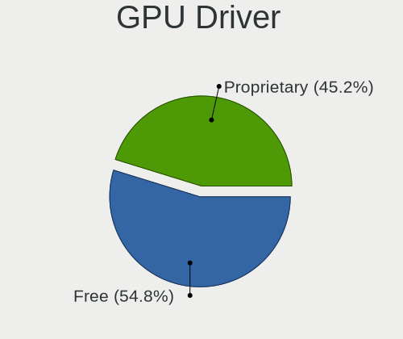

| Driver      | Computers | Percent |
|-------------|-----------|---------|
| Free        | 37        | 64.91%  |
| Proprietary | 19        | 33.33%  |
| Unknown     | 1         | 1.75%   |

GPU Memory
----------

Total video memory

| Size in GB | Computers | Percent |
|------------|-----------|---------|
| Unknown    | 25        | 43.86%  |
| 7.01-8.0   | 10        | 17.54%  |
| 8.01-16.0  | 8         | 14.04%  |
| 0.01-0.5   | 5         | 8.77%   |
| 16.01-24.0 | 3         | 5.26%   |
| 3.01-4.0   | 2         | 3.51%   |
| 1.01-2.0   | 2         | 3.51%   |
| 5.01-6.0   | 1         | 1.75%   |
| 0.51-1.0   | 1         | 1.75%   |

Monitor
-------

Monitor Vendor
--------------

Monitor vendors

| Vendor               | Computers | Percent |
|----------------------|-----------|---------|
| Goldstar             | 9         | 12.68%  |
| AU Optronics         | 6         | 8.45%   |
| Acer                 | 6         | 8.45%   |
| Chimei Innolux       | 5         | 7.04%   |
| BenQ                 | 5         | 7.04%   |
| Samsung Electronics  | 4         | 5.63%   |
| LG Display           | 4         | 5.63%   |
| BOE                  | 4         | 5.63%   |
| Apple                | 4         | 5.63%   |
| Hewlett-Packard      | 3         | 4.23%   |
| AOC                  | 3         | 4.23%   |
| ViewSonic            | 2         | 2.82%   |
| Dell                 | 2         | 2.82%   |
| Ancor Communications | 2         | 2.82%   |
| Unknown (BBC)        | 1         | 1.41%   |
| Toshiba              | 1         | 1.41%   |
| TMX                  | 1         | 1.41%   |
| Sony                 | 1         | 1.41%   |
| Sceptre Tech         | 1         | 1.41%   |
| Pixio                | 1         | 1.41%   |
| Philips              | 1         | 1.41%   |
| Mi                   | 1         | 1.41%   |
| HKC                  | 1         | 1.41%   |
| HGC                  | 1         | 1.41%   |
| Gigabyte Technology  | 1         | 1.41%   |
| DENON                | 1         | 1.41%   |

Monitor Model
-------------

Monitor models

| Model                                                               | Computers | Percent |
|---------------------------------------------------------------------|-----------|---------|
| ViewSonic VX3211-2K VSCF634 2560x1440 698x392mm 31.5-inch           | 1         | 1.35%   |
| ViewSonic VX2770 SERIES VSC3A2C 1920x1080 597x336mm 27.0-inch       | 1         | 1.35%   |
| Unknown (BBC) HDP-V104 BBC0104 3840x2160 344x195mm 15.6-inch        | 1         | 1.35%   |
| Toshiba LCD-MONITOR LCD2480 1920x1200 520x320mm 24.0-inch           | 1         | 1.35%   |
| TMX TL140BDXP01-0 TMX1400 2560x1440 310x174mm 14.0-inch             | 1         | 1.35%   |
| Sony U50 SNY050B 3840x2160 708x398mm 32.0-inch                      | 1         | 1.35%   |
| Sceptre Tech C24 SPT09A7 1920x1080 544x303mm 24.5-inch              | 1         | 1.35%   |
| Samsung Electronics U28E850 SAM0CCB 3840x2160 607x345mm 27.5-inch   | 1         | 1.35%   |
| Samsung Electronics U28E590 SAM0C4E 3840x2160 608x345mm 27.5-inch   | 1         | 1.35%   |
| Samsung Electronics LS27C36x SAM7315 1920x1080 598x336mm 27.0-inch  | 1         | 1.35%   |
| Samsung Electronics LS27AG55x SAM71E0 2560x1440 597x336mm 27.0-inch | 1         | 1.35%   |
| Samsung Electronics C32JG5x SAM0FDE 2560x1440 697x392mm 31.5-inch   | 1         | 1.35%   |
| Pixio PX329 PNS0329 2560x1440 697x392mm 31.5-inch                   | 1         | 1.35%   |
| Philips PHL 241B8Q PHL0929 1920x1080 527x296mm 23.8-inch            | 1         | 1.35%   |
| Mi Monitor XMI3444 3440x1440 797x334mm 34.0-inch                    | 1         | 1.35%   |
| LG Display LCD Monitor LGD05C0 1920x1080 344x194mm 15.5-inch        | 1         | 1.35%   |
| LG Display LCD Monitor LGD0555 2736x1824 260x170mm 12.2-inch        | 1         | 1.35%   |
| LG Display LCD Monitor LGD046C 1920x1080 382x215mm 17.3-inch        | 1         | 1.35%   |
| LG Display LCD Monitor LGD0362 1600x900 309x174mm 14.0-inch         | 1         | 1.35%   |
| HKC GF40 HKC2413 1920x1080 521x297mm 23.6-inch                      | 1         | 1.35%   |
| HGC CR270HDM HGC2700 2560x1440 600x330mm 27.0-inch                  | 1         | 1.35%   |
| Hewlett-Packard X27i HPN3678 2560x1440 597x336mm 27.0-inch          | 1         | 1.35%   |
| Hewlett-Packard E242 HWP326F 1920x1200 518x324mm 24.1-inch          | 1         | 1.35%   |
| Hewlett-Packard E242 HWP326E 1920x1200 518x324mm 24.1-inch          | 1         | 1.35%   |
| Hewlett-Packard 22fw HPN3542 1920x1080 476x267mm 21.5-inch          | 1         | 1.35%   |
| Goldstar ULTRAWIDE GSM76FA 2560x1080 531x298mm 24.0-inch            | 1         | 1.35%   |
| Goldstar ULTRAGEAR+ GSM9E84 3840x2160 1050x590mm 47.4-inch          | 1         | 1.35%   |
| Goldstar ULTRAGEAR GSM778B 2560x1440 697x392mm 31.5-inch            | 1         | 1.35%   |
| Goldstar ULTRAGEAR GSM7765 2560x1440 697x392mm 31.5-inch            | 1         | 1.35%   |
| Goldstar ULTRAGEAR GSM5BD3 2560x1440 697x392mm 31.5-inch            | 1         | 1.35%   |
| Goldstar ULTRAGEAR GSM5BD2 2560x1440 697x392mm 31.5-inch            | 1         | 1.35%   |
| Goldstar ULTRAGEAR GSM5B71 1920x1080 597x336mm 27.0-inch            | 1         | 1.35%   |
| Goldstar Ultra HD GSM5B09 3840x2160 600x340mm 27.2-inch             | 1         | 1.35%   |
| Goldstar TV SSCR2 GSMC0C8 3840x2160                                 | 1         | 1.35%   |
| Goldstar M2362D GSM5758 1920x1080 510x290mm 23.1-inch               | 1         | 1.35%   |
| Gigabyte Technology M27Q GBT270D 2560x1440 596x335mm 26.9-inch      | 1         | 1.35%   |
| DENON AVAMP DON0052 1280x720 708x398mm 32.0-inch                    | 1         | 1.35%   |
| Dell S2721DGF DEL41D9 2560x1440 597x336mm 27.0-inch                 | 1         | 1.35%   |
| Dell S2421HN DEL41F2 1920x1080 527x296mm 23.8-inch                  | 1         | 1.35%   |
| Chimei Innolux LCD Monitor CMN162B 1920x1200 344x215mm 16.0-inch    | 1         | 1.35%   |

Monitor Resolution
------------------

Monitor screen resolution

| Resolution        | Computers | Percent |
|-------------------|-----------|---------|
| 1920x1080 (FHD)   | 29        | 43.94%  |
| 2560x1440 (QHD)   | 15        | 22.73%  |
| 3840x2160 (4K)    | 11        | 16.67%  |
| 3440x1440         | 2         | 3.03%   |
| 1920x1200 (WUXGA) | 2         | 3.03%   |
| 1366x768 (WXGA)   | 2         | 3.03%   |
| 3072x1920         | 1         | 1.52%   |
| 2880x1800         | 1         | 1.52%   |
| 2736x1824         | 1         | 1.52%   |
| 2560x1080         | 1         | 1.52%   |
| 1600x900 (HD+)    | 1         | 1.52%   |

Monitor Diagonal
----------------

Diagonal size in inches

| Inches | Computers | Percent |
|--------|-----------|---------|
| 27     | 17        | 25%     |
| 15     | 10        | 14.71%  |
| 24     | 8         | 11.76%  |
| 31     | 7         | 10.29%  |
| 17     | 4         | 5.88%   |
| 34     | 3         | 4.41%   |
| 14     | 3         | 4.41%   |
| 13     | 3         | 4.41%   |
| 23     | 2         | 2.94%   |
| 21     | 2         | 2.94%   |
| 16     | 2         | 2.94%   |
| 72     | 1         | 1.47%   |
| 59     | 1         | 1.47%   |
| 47     | 1         | 1.47%   |
| 42     | 1         | 1.47%   |
| 32     | 1         | 1.47%   |
| 22     | 1         | 1.47%   |
| 12     | 1         | 1.47%   |

Monitor Width
-------------

Physical width

| Width in mm | Computers | Percent |
|-------------|-----------|---------|
| 501-600     | 21        | 32.81%  |
| 301-350     | 16        | 25%     |
| 601-700     | 10        | 15.63%  |
| 351-400     | 4         | 6.25%   |
| 701-800     | 3         | 4.69%   |
| 401-500     | 3         | 4.69%   |
| 201-300     | 3         | 4.69%   |
| 1001-1500   | 2         | 3.13%   |
| 1501-2000   | 1         | 1.56%   |
| 901-1000    | 1         | 1.56%   |

Aspect Ratio
------------

Proportional relationship between the width and the height

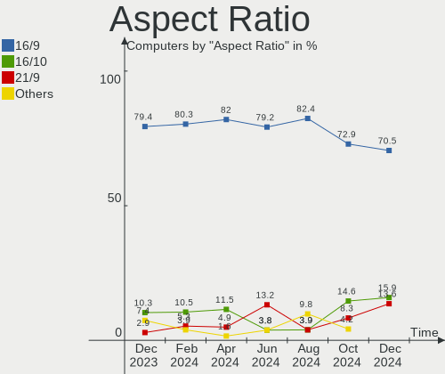

| Ratio | Computers | Percent |
|-------|-----------|---------|
| 16/9  | 50        | 81.97%  |
| 16/10 | 7         | 11.48%  |
| 21/9  | 3         | 4.92%   |
| 3/2   | 1         | 1.64%   |

Monitor Area
------------

Area in inch²

| Area in inch² | Computers | Percent |
|----------------|-----------|---------|
| 301-350        | 17        | 25.76%  |
| 101-110        | 10        | 15.15%  |
| 351-500        | 9         | 13.64%  |
| 201-250        | 9         | 13.64%  |
| 81-90          | 5         | 7.58%   |
| 121-130        | 4         | 6.06%   |
| 251-300        | 3         | 4.55%   |
| More than 1000 | 2         | 3.03%   |
| 71-80          | 2         | 3.03%   |
| 111-120        | 2         | 3.03%   |
| 501-1000       | 2         | 3.03%   |
| 151-200        | 1         | 1.52%   |

Pixel Density
-------------

Pixels per inch

| Density       | Computers | Percent |
|---------------|-----------|---------|
| 51-100        | 26        | 39.39%  |
| 121-160       | 16        | 24.24%  |
| 101-120       | 13        | 19.7%   |
| 161-240       | 7         | 10.61%  |
| More than 240 | 2         | 3.03%   |
| 1-50          | 2         | 3.03%   |

Multiple Monitors
-----------------

Total monitors connected

| Total | Computers | Percent |
|-------|-----------|---------|
| 1     | 42        | 73.68%  |
| 2     | 9         | 15.79%  |
| 3     | 5         | 8.77%   |
| 0     | 1         | 1.75%   |

Network
-------

Net Controller Vendor
---------------------

Controller vendors

| Vendor                   | Computers | Percent |
|--------------------------|-----------|---------|
| Realtek Semiconductor    | 36        | 37.89%  |
| Intel                    | 31        | 32.63%  |
| Broadcom                 | 7         | 7.37%   |
| MediaTek                 | 6         | 6.32%   |
| Qualcomm Atheros         | 4         | 4.21%   |
| Microsoft                | 3         | 3.16%   |
| DisplayLink              | 2         | 2.11%   |
| TP-Link                  | 1         | 1.05%   |
| Mellanox Technologies    | 1         | 1.05%   |
| Marvell Technology Group | 1         | 1.05%   |
| Hewlett-Packard          | 1         | 1.05%   |
| ASUSTek Computer         | 1         | 1.05%   |
| ASIX Electronics         | 1         | 1.05%   |

Net Controller Model
--------------------

Controller models

| Model                                                                  | Computers | Percent |
|------------------------------------------------------------------------|-----------|---------|
| Realtek RTL8111/8168/8211/8411 PCI Express Gigabit Ethernet Controller | 18        | 16.36%  |
| Realtek RTL8125 2.5GbE Controller                                      | 11        | 10%     |
| Intel Wi-Fi 6 AX200                                                    | 5         | 4.55%   |
| Intel I211 Gigabit Network Connection                                  | 5         | 4.55%   |
| Realtek RTL8852BE PCIe 802.11ax Wireless Network Controller            | 4         | 3.64%   |
| MediaTek MT7922 802.11ax PCI Express Wireless Network Adapter          | 4         | 3.64%   |
| Intel Wi-Fi 6E(802.11ax) AX210/AX1675* 2x2 [Typhoon Peak]              | 4         | 3.64%   |
| Intel Cannon Lake PCH CNVi WiFi                                        | 3         | 2.73%   |
| Intel 82579LM Gigabit Network Connection (Lewisville)                  | 3         | 2.73%   |
| Broadcom BCM4352 802.11ac Dual Band Wireless Network Adapter           | 3         | 2.73%   |
| Realtek RTL8821CE 802.11ac PCIe Wireless Network Adapter               | 2         | 1.82%   |
| MediaTek MT7921 802.11ax PCI Express Wireless Network Adapter          | 2         | 1.82%   |
| Intel Ethernet Controller I225-V                                       | 2         | 1.82%   |
| Intel Ethernet Connection I217-LM                                      | 2         | 1.82%   |
| Intel Comet Lake PCH CNVi WiFi                                         | 2         | 1.82%   |
| Intel 82574L Gigabit Network Connection                                | 2         | 1.82%   |
| TP-Link Archer T2U PLUS [RTL8821AU]                                    | 1         | 0.91%   |
| Realtek RTL8852CE PCIe 802.11ax Wireless Network Controller            | 1         | 0.91%   |
| Realtek RTL8153 Gigabit Ethernet Adapter                               | 1         | 0.91%   |
| Realtek RTL8152 Fast Ethernet Adapter                                  | 1         | 0.91%   |
| Realtek RTL8111/8168/8411 PCI Express Gigabit Ethernet Controller      | 1         | 0.91%   |
| Realtek Killer E2600 GbE Controller                                    | 1         | 0.91%   |
| Realtek 802.11ac NIC                                                   | 1         | 0.91%   |
| Qualcomm Atheros QCA8171 Gigabit Ethernet                              | 1         | 0.91%   |
| Qualcomm Atheros Killer E2500 Gigabit Ethernet Controller              | 1         | 0.91%   |
| Qualcomm Atheros Killer E2400 Gigabit Ethernet Controller              | 1         | 0.91%   |
| Qualcomm Atheros AR93xx Wireless Network Adapter                       | 1         | 0.91%   |
| Microsoft Xbox Wireless Adapter for Windows                            | 1         | 0.91%   |
| Microsoft XBOX ACC                                                     | 1         | 0.91%   |
| Microsoft Surface Modem/GPS                                            | 1         | 0.91%   |
| Mellanox MT27520 Family [ConnectX-3 Pro]                               | 1         | 0.91%   |
| Marvell Group 88W8897 [AVASTAR] 802.11ac Wireless                      | 1         | 0.91%   |
| Intel Wireless 8260                                                    | 1         | 0.91%   |
| Intel Wireless 7265                                                    | 1         | 0.91%   |
| Intel Wireless 7260                                                    | 1         | 0.91%   |
| Intel Wi-Fi 5(802.11ac) Wireless-AC 9x6x [Thunder Peak]                | 1         | 0.91%   |
| Intel Tiger Lake PCH CNVi WiFi                                         | 1         | 0.91%   |
| Intel Raptor Lake-S PCH CNVi WiFi                                      | 1         | 0.91%   |
| Intel Ethernet Connection (7) I219-V                                   | 1         | 0.91%   |
| Intel Ethernet Connection (23) I219-V                                  | 1         | 0.91%   |

Wireless Vendor
---------------

Wireless vendors

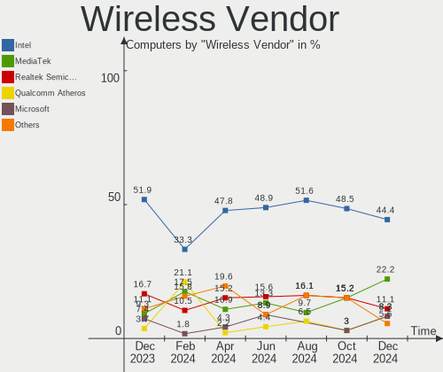

| Vendor                   | Computers | Percent |
|--------------------------|-----------|---------|
| Intel                    | 22        | 45.83%  |
| Realtek Semiconductor    | 8         | 16.67%  |
| MediaTek                 | 6         | 12.5%   |
| Broadcom                 | 6         | 12.5%   |
| Microsoft                | 2         | 4.17%   |
| TP-Link                  | 1         | 2.08%   |
| Qualcomm Atheros         | 1         | 2.08%   |
| Marvell Technology Group | 1         | 2.08%   |
| ASUSTek Computer         | 1         | 2.08%   |

Wireless Model
--------------

Wireless models

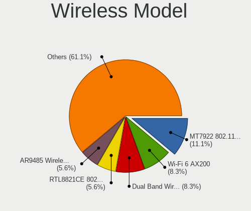

| Model                                                         | Computers | Percent |
|---------------------------------------------------------------|-----------|---------|
| Intel Wi-Fi 6 AX200                                           | 5         | 10.42%  |
| Realtek RTL8852BE PCIe 802.11ax Wireless Network Controller   | 4         | 8.33%   |
| MediaTek MT7922 802.11ax PCI Express Wireless Network Adapter | 4         | 8.33%   |
| Intel Wi-Fi 6E(802.11ax) AX210/AX1675* 2x2 [Typhoon Peak]     | 4         | 8.33%   |
| Intel Cannon Lake PCH CNVi WiFi                               | 3         | 6.25%   |
| Broadcom BCM4352 802.11ac Dual Band Wireless Network Adapter  | 3         | 6.25%   |
| Realtek RTL8821CE 802.11ac PCIe Wireless Network Adapter      | 2         | 4.17%   |
| MediaTek MT7921 802.11ax PCI Express Wireless Network Adapter | 2         | 4.17%   |
| Intel Comet Lake PCH CNVi WiFi                                | 2         | 4.17%   |
| TP-Link Archer T2U PLUS [RTL8821AU]                           | 1         | 2.08%   |
| Realtek RTL8852CE PCIe 802.11ax Wireless Network Controller   | 1         | 2.08%   |
| Realtek 802.11ac NIC                                          | 1         | 2.08%   |
| Qualcomm Atheros AR93xx Wireless Network Adapter              | 1         | 2.08%   |
| Microsoft Xbox Wireless Adapter for Windows                   | 1         | 2.08%   |
| Microsoft XBOX ACC                                            | 1         | 2.08%   |
| Marvell Group 88W8897 [AVASTAR] 802.11ac Wireless             | 1         | 2.08%   |
| Intel Wireless 8260                                           | 1         | 2.08%   |
| Intel Wireless 7265                                           | 1         | 2.08%   |
| Intel Wireless 7260                                           | 1         | 2.08%   |
| Intel Wi-Fi 5(802.11ac) Wireless-AC 9x6x [Thunder Peak]       | 1         | 2.08%   |
| Intel Tiger Lake PCH CNVi WiFi                                | 1         | 2.08%   |
| Intel Raptor Lake-S PCH CNVi WiFi                             | 1         | 2.08%   |
| Intel Centrino Ultimate-N 6300                                | 1         | 2.08%   |
| Intel Centrino Advanced-N 6205 [Taylor Peak]                  | 1         | 2.08%   |
| Broadcom BCM4364 802.11ac Wireless Network Adapter            | 1         | 2.08%   |
| Broadcom BCM4350 802.11ac Wireless Network Adapter            | 1         | 2.08%   |
| Broadcom BCM4322 802.11a/b/g/n Wireless LAN Controller        | 1         | 2.08%   |
| ASUS 802.11ac NIC                                             | 1         | 2.08%   |

Ethernet Vendor
---------------

Ethernet vendors

| Vendor                | Computers | Percent |
|-----------------------|-----------|---------|
| Realtek Semiconductor | 33        | 55.93%  |
| Intel                 | 18        | 30.51%  |
| Qualcomm Atheros      | 3         | 5.08%   |
| DisplayLink           | 2         | 3.39%   |
| Mellanox Technologies | 1         | 1.69%   |
| Broadcom              | 1         | 1.69%   |
| ASIX Electronics      | 1         | 1.69%   |

Ethernet Model
--------------

Ethernet models

| Model                                                                  | Computers | Percent |
|------------------------------------------------------------------------|-----------|---------|
| Realtek RTL8111/8168/8211/8411 PCI Express Gigabit Ethernet Controller | 18        | 30%     |
| Realtek RTL8125 2.5GbE Controller                                      | 11        | 18.33%  |
| Intel I211 Gigabit Network Connection                                  | 5         | 8.33%   |
| Intel 82579LM Gigabit Network Connection (Lewisville)                  | 3         | 5%      |
| Intel Ethernet Controller I225-V                                       | 2         | 3.33%   |
| Intel Ethernet Connection I217-LM                                      | 2         | 3.33%   |
| Intel 82574L Gigabit Network Connection                                | 2         | 3.33%   |
| Realtek RTL8153 Gigabit Ethernet Adapter                               | 1         | 1.67%   |
| Realtek RTL8152 Fast Ethernet Adapter                                  | 1         | 1.67%   |
| Realtek RTL8111/8168/8411 PCI Express Gigabit Ethernet Controller      | 1         | 1.67%   |
| Realtek Killer E2600 GbE Controller                                    | 1         | 1.67%   |
| Qualcomm Atheros QCA8171 Gigabit Ethernet                              | 1         | 1.67%   |
| Qualcomm Atheros Killer E2500 Gigabit Ethernet Controller              | 1         | 1.67%   |
| Qualcomm Atheros Killer E2400 Gigabit Ethernet Controller              | 1         | 1.67%   |
| Mellanox MT27520 Family [ConnectX-3 Pro]                               | 1         | 1.67%   |
| Intel Ethernet Connection (7) I219-V                                   | 1         | 1.67%   |
| Intel Ethernet Connection (23) I219-V                                  | 1         | 1.67%   |
| Intel Ethernet Connection (2) I219-V                                   | 1         | 1.67%   |
| Intel Ethernet Connection (2) I218-V                                   | 1         | 1.67%   |
| Intel 82579V Gigabit Network Connection                                | 1         | 1.67%   |
| DisplayLink LAPDOCK                                                    | 1         | 1.67%   |
| DisplayLink Dell D3100 Docking Station                                 | 1         | 1.67%   |
| Broadcom NetXtreme BCM57765 Gigabit Ethernet PCIe                      | 1         | 1.67%   |
| ASIX AX88179 Gigabit Ethernet                                          | 1         | 1.67%   |

Net Controller Kind
-------------------

Ethernet, WiFi or modem

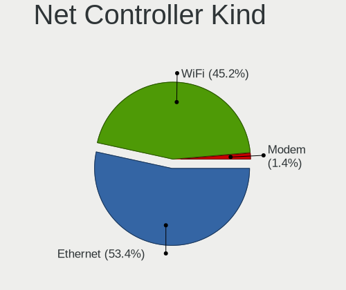

| Kind     | Computers | Percent |
|----------|-----------|---------|
| Ethernet | 51        | 51.52%  |
| WiFi     | 46        | 46.46%  |
| Modem    | 1         | 1.01%   |
| Unknown  | 1         | 1.01%   |

Used Controller
---------------

Currently used network controller

| Kind     | Computers | Percent |
|----------|-----------|---------|
| WiFi     | 32        | 52.46%  |
| Ethernet | 29        | 47.54%  |

NICs
----

Total network controllers on board

| Total | Computers | Percent |
|-------|-----------|---------|
| 2     | 32        | 56.14%  |
| 1     | 19        | 33.33%  |
| 3     | 4         | 7.02%   |
| 5     | 1         | 1.75%   |
| 0     | 1         | 1.75%   |

IPv6
----

IPv6 vs IPv4

| Used | Computers | Percent |
|------|-----------|---------|
| No   | 37        | 64.91%  |
| Yes  | 20        | 35.09%  |

Bluetooth
---------

Bluetooth Vendor
----------------

Controller vendors

| Vendor                  | Computers | Percent |
|-------------------------|-----------|---------|
| Intel                   | 20        | 45.45%  |
| Realtek Semiconductor   | 7         | 15.91%  |
| IMC Networks            | 4         | 9.09%   |
| MediaTek                | 3         | 6.82%   |
| Cambridge Silicon Radio | 2         | 4.55%   |
| ASUSTek Computer        | 2         | 4.55%   |
| Apple                   | 2         | 4.55%   |
| TP-Link                 | 1         | 2.27%   |
| Marvell Semiconductor   | 1         | 2.27%   |
| Foxconn / Hon Hai       | 1         | 2.27%   |
| Broadcom                | 1         | 2.27%   |

Bluetooth Model
---------------

Controller models

| Model                                               | Computers | Percent |
|-----------------------------------------------------|-----------|---------|
| Realtek Bluetooth Radio                             | 7         | 15.91%  |
| Intel AX200 Bluetooth                               | 5         | 11.36%  |
| Intel AX210 Bluetooth                               | 4         | 9.09%   |
| Intel AX201 Bluetooth                               | 4         | 9.09%   |
| MediaTek Wireless_Device                            | 3         | 6.82%   |
| Intel Bluetooth 9460/9560 Jefferson Peak (JfP)      | 3         | 6.82%   |
| Intel Bluetooth wireless interface                  | 2         | 4.55%   |
| IMC Networks Wireless_Device                        | 2         | 4.55%   |
| Cambridge Silicon Radio Bluetooth Dongle (HCI mode) | 2         | 4.55%   |
| ASUS BCM20702A0                                     | 2         | 4.55%   |
| Apple Built-in Bluetooth 2.0+EDR HCI                | 2         | 4.55%   |
| TP-Link UB500 Adapter                               | 1         | 2.27%   |
| Marvell Bluetooth and Wireless LAN Composite        | 1         | 2.27%   |
| Intel Wireless-AC 9260 Bluetooth Adapter            | 1         | 2.27%   |
| Intel Bluetooth Device                              | 1         | 2.27%   |
| IMC Networks Bluetooth Radio                        | 1         | 2.27%   |
| IMC Networks BCM20702A0                             | 1         | 2.27%   |
| Foxconn / Hon Hai Wireless_Device                   | 1         | 2.27%   |
| Broadcom HP Portable SoftSailing                    | 1         | 2.27%   |

Sound
-----

Sound Vendor
------------

Sound card vendors

| Vendor                      | Computers | Percent |
|-----------------------------|-----------|---------|
| AMD                         | 32        | 27.12%  |
| Intel                       | 30        | 25.42%  |
| Nvidia                      | 20        | 16.95%  |
| Micro Star International    | 3         | 2.54%   |
| Texas Instruments           | 2         | 1.69%   |
| Logitech                    | 2         | 1.69%   |
| Hewlett-Packard             | 2         | 1.69%   |
| Creative Technology         | 2         | 1.69%   |
| C-Media Electronics         | 2         | 1.69%   |
| Blue Microphones            | 2         | 1.69%   |
| Apple                       | 2         | 1.69%   |
| Yamaha                      | 1         | 0.85%   |
| XMOS                        | 1         | 0.85%   |
| Textech International       | 1         | 0.85%   |
| SteelSeries ApS             | 1         | 0.85%   |
| Sony                        | 1         | 0.85%   |
| Schiit Audio                | 1         | 0.85%   |
| Samson Technologies         | 1         | 0.85%   |
| Plantronics                 | 1         | 0.85%   |
| JMTek                       | 1         | 0.85%   |
| Goldvish                    | 1         | 0.85%   |
| Generalplus Technology      | 1         | 0.85%   |
| Focusrite-Novation          | 1         | 0.85%   |
| FiiO Electronics Technology | 1         | 0.85%   |
| Dell                        | 1         | 0.85%   |
| Creative Labs               | 1         | 0.85%   |
| Corsair                     | 1         | 0.85%   |
| CMTECK                      | 1         | 0.85%   |
| Black Lion Audio            | 1         | 0.85%   |
| ASUSTek Computer            | 1         | 0.85%   |

Sound Model
-----------

Sound card models

| Model                                                               | Computers | Percent |
|---------------------------------------------------------------------|-----------|---------|
| AMD Family 17h/19h HD Audio Controller                              | 13        | 8.84%   |
| AMD Starship/Matisse HD Audio Controller                            | 9         | 6.12%   |
| AMD Renoir Radeon High Definition Audio Controller                  | 6         | 4.08%   |
| AMD Navi 21/23 HDMI/DP Audio Controller                             | 6         | 4.08%   |
| AMD Rembrandt Radeon High Definition Audio Controller               | 5         | 3.4%    |
| AMD Navi 10 HDMI Audio                                              | 5         | 3.4%    |
| Nvidia Audio device                                                 | 4         | 2.72%   |
| Intel Xeon E3-1200 v3/4th Gen Core Processor HD Audio Controller    | 4         | 2.72%   |
| Intel 8 Series/C220 Series Chipset High Definition Audio Controller | 4         | 2.72%   |
| AMD Navi 31 HDMI/DP Audio                                           | 4         | 2.72%   |
| Nvidia GP104 High Definition Audio Controller                       | 3         | 2.04%   |
| Nvidia GA106 High Definition Audio Controller                       | 3         | 2.04%   |
| Nvidia GA102 High Definition Audio Controller                       | 3         | 2.04%   |
| Micro Star International USB Audio                                  | 3         | 2.04%   |
| Intel Raptor Lake-P/U/H cAVS                                        | 3         | 2.04%   |
| Intel Cannon Lake PCH cAVS                                          | 3         | 2.04%   |
| Intel Sunrise Point-LP HD Audio                                     | 2         | 1.36%   |
| Intel Comet Lake PCH cAVS                                           | 2         | 1.36%   |
| Intel C600/X79 series chipset High Definition Audio Controller      | 2         | 1.36%   |
| Intel 82801JI (ICH10 Family) HD Audio Controller                    | 2         | 1.36%   |
| Intel 7 Series/C216 Chipset Family High Definition Audio Controller | 2         | 1.36%   |
| Intel 200 Series PCH HD Audio                                       | 2         | 1.36%   |
| Blue Microphones Yeti Stereo Microphone                             | 2         | 1.36%   |
| AMD Ellesmere HDMI Audio [Radeon RX 470/480 / 570/580/590]          | 2         | 1.36%   |
| Yamaha AG06/AG03                                                    | 1         | 0.68%   |
| XMOS iFi (by AMR) HD USB Audio                                      | 1         | 0.68%   |
| Textech International MIDI Interface cable                          | 1         | 0.68%   |
| Texas Instruments SMSL Q5 AMP                                       | 1         | 0.68%   |
| Texas Instruments PCM2706 stereo audio DAC                          | 1         | 0.68%   |
| SteelSeries ApS SteelSeries Arctis 1 Wireless                       | 1         | 0.68%   |
| Sony DualSense wireless controller (PS5)                            | 1         | 0.68%   |
| Schiit Audio Schiit Unison Modi Multi 2                             | 1         | 0.68%   |
| Samson Technologies StudioGT monitors                               | 1         | 0.68%   |
| Plantronics Blackwire 3220 Series                                   | 1         | 0.68%   |
| Nvidia TU107 GeForce GTX 1650 High Definition Audio Controller      | 1         | 0.68%   |
| Nvidia TU106 High Definition Audio Controller                       | 1         | 0.68%   |
| Nvidia GP107GL High Definition Audio Controller                     | 1         | 0.68%   |
| Nvidia GP106 High Definition Audio Controller                       | 1         | 0.68%   |
| Nvidia GM204 High Definition Audio Controller                       | 1         | 0.68%   |
| Nvidia GA104 High Definition Audio Controller                       | 1         | 0.68%   |

Memory
------

Memory Vendor
-------------

Memory module vendors

| Vendor             | Computers | Percent |
|--------------------|-----------|---------|
| Corsair            | 3         | 33.33%  |
| SK hynix           | 2         | 22.22%  |
| Unknown            | 1         | 11.11%  |
| Ramaxel Technology | 1         | 11.11%  |
| Kingston           | 1         | 11.11%  |
| A-DATA Technology  | 1         | 11.11%  |

Memory Model
------------

Memory module models

| Model                                                            | Computers | Percent |
|------------------------------------------------------------------|-----------|---------|
| Unknown RAM Module 16GB DIMM DDR4 2667MT/s                       | 1         | 11.11%  |
| SK hynix RAM HMT41GS6AFR8A-PB 8GB SODIMM DDR3 1600MT/s           | 1         | 11.11%  |
| SK hynix RAM H9CCNNN8GTALAR-NUD 2GB Row Of Chips LPDDR3 1867MT/s | 1         | 11.11%  |
| Ramaxel RAM RMSA3320KE78HAF-3200 8GB SODIMM DDR4 3200MT/s        | 1         | 11.11%  |
| Kingston RAM 9905789-093.A00G 32GB SODIMM DDR5 5200MT/s          | 1         | 11.11%  |
| Corsair RAM CMW32GX4M2E3200C16 16GB DIMM DDR4 3200MT/s           | 1         | 11.11%  |
| Corsair RAM CMT64GX5M2B5600C40 32GB DIMM DDR5 4800MT/s           | 1         | 11.11%  |
| Corsair RAM CMK16GX4M2B3000C15 8GB DIMM DDR4 3600MT/s            | 1         | 11.11%  |
| A-DATA RAM DDR4 3200 8GB DIMM DDR4 3600MT/s                      | 1         | 11.11%  |

Memory Kind
-----------

Memory module kinds

| Kind   | Computers | Percent |
|--------|-----------|---------|
| DDR4   | 5         | 55.56%  |
| DDR5   | 2         | 22.22%  |
| LPDDR3 | 1         | 11.11%  |
| DDR3   | 1         | 11.11%  |

Memory Form Factor
------------------

Physical design of the memory module

| Name         | Computers | Percent |
|--------------|-----------|---------|
| DIMM         | 5         | 55.56%  |
| SODIMM       | 3         | 33.33%  |
| Row Of Chips | 1         | 11.11%  |

Memory Size
-----------

Memory module size

| Size  | Computers | Percent |
|-------|-----------|---------|
| 32768 | 3         | 33.33%  |
| 16384 | 3         | 33.33%  |
| 8192  | 2         | 22.22%  |
| 2048  | 1         | 11.11%  |

Memory Speed
------------

Memory module speed

| Speed | Computers | Percent |
|-------|-----------|---------|
| 3600  | 2         | 22.22%  |
| 3200  | 2         | 22.22%  |
| 5200  | 1         | 11.11%  |
| 4800  | 1         | 11.11%  |
| 2667  | 1         | 11.11%  |
| 1867  | 1         | 11.11%  |
| 1600  | 1         | 11.11%  |

Printers & scanners
-------------------

Printer Vendor
--------------

Printer device vendors

| Vendor             | Computers | Percent |
|--------------------|-----------|---------|
| Brother Industries | 1         | 100%    |

Printer Model
-------------

Printer device models

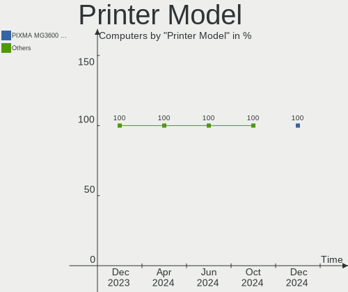

| Model                    | Computers | Percent |
|--------------------------|-----------|---------|
| Brother HL-L2320D series | 1         | 100%    |

Scanner Vendor
--------------

Scanner device vendors

| Vendor          | Computers | Percent |
|-----------------|-----------|---------|
| Hewlett-Packard | 1         | 100%    |

Scanner Model
-------------

Scanner device models

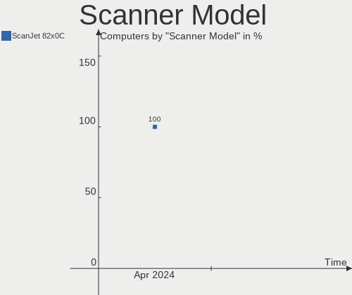

| Model            | Computers | Percent |
|------------------|-----------|---------|
| HP ScanJet 82x0C | 1         | 100%    |

Camera
------

Camera Vendor
-------------

Camera device vendors

| Vendor                        | Computers | Percent |
|-------------------------------|-----------|---------|
| Chicony Electronics           | 4         | 16.67%  |
| Microdia                      | 3         | 12.5%   |
| Logitech                      | 3         | 12.5%   |
| Syntek                        | 2         | 8.33%   |
| Lite-On Technology            | 2         | 8.33%   |
| Bison Electronics             | 2         | 8.33%   |
| Apple                         | 2         | 8.33%   |
| Tobii Technology AB           | 1         | 4.17%   |
| Sunplus Innovation Technology | 1         | 4.17%   |
| Sonix Technology              | 1         | 4.17%   |
| SHENZHEN EMEET TECHNOLOGY     | 1         | 4.17%   |
| Quanta                        | 1         | 4.17%   |
| Microsoft                     | 1         | 4.17%   |

Camera Model
------------

Camera device models

| Model                                          | Computers | Percent |
|------------------------------------------------|-----------|---------|
| Syntek Integrated Camera                       | 2         | 8%      |
| Logitech Webcam C270                           | 2         | 8%      |
| Tobii AB EyeChip                               | 1         | 4%      |
| Sunplus PC Camera                              | 1         | 4%      |
| Sonix USB2.0 HD UVC WebCam                     | 1         | 4%      |
| SHENZHEN EMEET TECHNOLOGY HD Webcam eMeet C960 | 1         | 4%      |
| Quanta HD User Facing                          | 1         | 4%      |
| Microsoft Microsoft LifeCam Cinema           | 1         | 4%      |
| Microdia Laptop_Integrated_Webcam_HD           | 1         | 4%      |
| Microdia Integrated_Webcam_HD                  | 1         | 4%      |
| Microdia Integrated_Webcam_FHD                 | 1         | 4%      |
| Logitech HD Pro Webcam C920                    | 1         | 4%      |
| Logitech C922 Pro Stream Webcam                | 1         | 4%      |
| Lite-On Integrated Camera                      | 1         | 4%      |
| Lite-On HP Wide Vision HD Camera               | 1         | 4%      |
| Chicony USB2.0 HD UVC WebCam                   | 1         | 4%      |
| Chicony Integrated IR Camera                   | 1         | 4%      |
| Chicony Integrated HP HD Webcam                | 1         | 4%      |
| Chicony HP True Vision HD Camera               | 1         | 4%      |
| Bison BisonCam,NB Pro                          | 1         | 4%      |
| Bison BisonCam, NB Pro                         | 1         | 4%      |
| Apple iSight in LED Cinema Display             | 1         | 4%      |
| Apple FaceTime HD Camera (Built-in)            | 1         | 4%      |

Security
--------

Fingerprint Vendor
------------------

Fingerprint sensor vendors

| Vendor           | Computers | Percent |
|------------------|-----------|---------|
| Validity Sensors | 1         | 100%    |

Fingerprint Model
-----------------

Fingerprint sensor models

| Model                   | Computers | Percent |
|-------------------------|-----------|---------|
| Validity Sensors VFS491 | 1         | 100%    |

Chipcard Vendor
---------------

Chipcard module vendors

| Vendor      | Computers | Percent |
|-------------|-----------|---------|
| Alcor Micro | 1         | 100%    |

Chipcard Model
--------------

Chipcard module models

| Model                               | Computers | Percent |
|-------------------------------------|-----------|---------|
| Alcor Micro AU9540 Smartcard Reader | 1         | 100%    |

Unsupported
-----------

Unsupported Devices
-------------------

Total unsupported devices on board

| Total | Computers | Percent |
|-------|-----------|---------|
| 0     | 43        | 75.44%  |
| 1     | 13        | 22.81%  |
| 2     | 1         | 1.75%   |

Unsupported Device Types
------------------------

Types of unsupported devices

| Type                  | Computers | Percent |
|-----------------------|-----------|---------|
| Multimedia controller | 5         | 31.25%  |
| Graphics card         | 5         | 31.25%  |
| Net/wireless          | 3         | 18.75%  |
| Sound                 | 1         | 6.25%   |
| Fingerprint reader    | 1         | 6.25%   |
| Camera                | 1         | 6.25%   |

