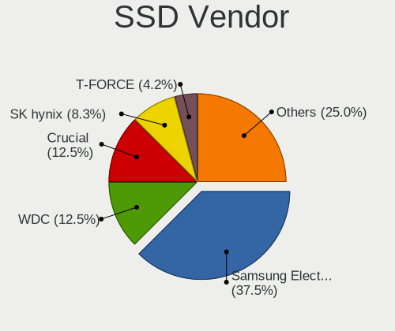
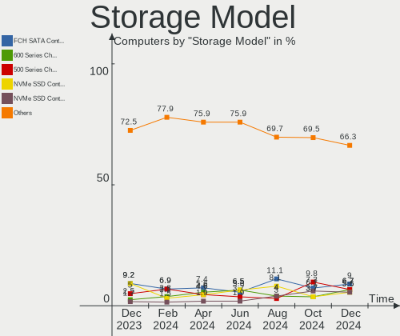
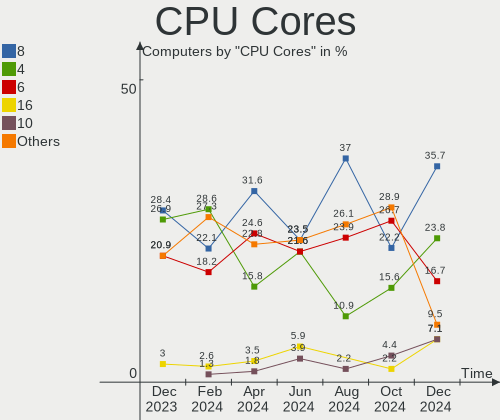
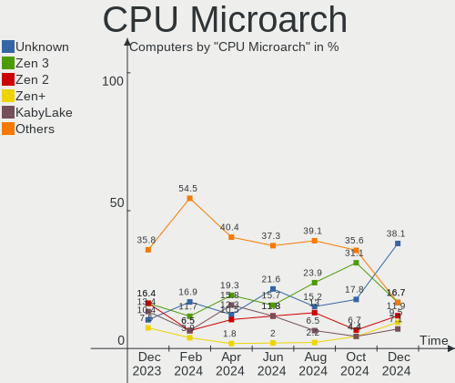
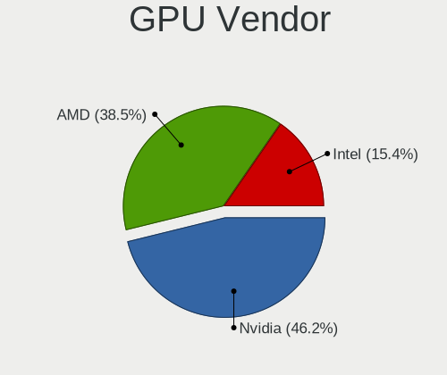
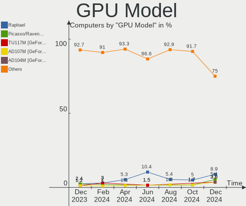
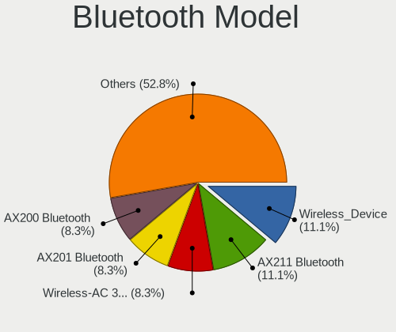

Nobara - Hardware Trends
------------------------

A project to identify most popular hardware characteristics and track their change
over time based on data collected by Linux users at https://Linux-Hardware.org.

Anyone can contribute to this report by the [hw-probe](https://github.com/linuxhw/hw-probe) tool:

    sudo -E hw-probe -all -upload

This is a report for all computer types. See also reports for [desktops](/Dist/Nobara/Desktop/README.md) and [notebooks](/Dist/Nobara/Notebook/README.md).

This report is for one last month. Overall report since the beginning of time: [TestCoverage](https://github.com/linuxhw/TestCoverage)

Period: Dec, 2022.

Contents
--------

* [ System ](#system)
  - [ OS                       ](#os)
  - [ OS Family                ](#os-family)
  - [ Kernel                   ](#kernel)
  - [ Kernel Family            ](#kernel-family)
  - [ Kernel Major Ver.        ](#kernel-major-ver)
  - [ Arch                     ](#arch)
  - [ DE                       ](#de)
  - [ Display Server           ](#display-server)
  - [ Display Manager          ](#display-manager)
  - [ OS Lang                  ](#os-lang)
  - [ Boot Mode                ](#boot-mode)
  - [ Filesystem               ](#filesystem)
  - [ Part. scheme             ](#part-scheme)
  - [ Dual Boot with Linux/BSD ](#dual-boot-with-linuxbsd)
  - [ Dual Boot (Win)          ](#dual-boot-win)

* [ Board ](#board)
  - [ Vendor                   ](#vendor)
  - [ Model                    ](#model)
  - [ Model Family             ](#model-family)
  - [ MFG Year                 ](#mfg-year)
  - [ Form Factor              ](#form-factor)
  - [ Secure Boot              ](#secure-boot)
  - [ Coreboot                 ](#coreboot)
  - [ RAM Size                 ](#ram-size)
  - [ RAM Used                 ](#ram-used)
  - [ Total Drives             ](#total-drives)
  - [ Has CD-ROM               ](#has-cd-rom)
  - [ Has Ethernet             ](#has-ethernet)
  - [ Has WiFi                 ](#has-wifi)
  - [ Has Bluetooth            ](#has-bluetooth)

* [ Location ](#location)
  - [ Country                  ](#country)
  - [ City                     ](#city)

* [ Drives ](#drives)
  - [ Drive Vendor             ](#drive-vendor)
  - [ Drive Model              ](#drive-model)
  - [ HDD Vendor               ](#hdd-vendor)
  - [ SSD Vendor               ](#ssd-vendor)
  - [ Drive Kind               ](#drive-kind)
  - [ Drive Connector          ](#drive-connector)
  - [ Drive Size               ](#drive-size)
  - [ Space Total              ](#space-total)
  - [ Space Used               ](#space-used)
  - [ Malfunc. Drives          ](#malfunc-drives)
  - [ Malfunc. Drive Vendor    ](#malfunc-drive-vendor)
  - [ Malfunc. HDD Vendor      ](#malfunc-hdd-vendor)
  - [ Malfunc. Drive Kind      ](#malfunc-drive-kind)
  - [ Failed Drives            ](#failed-drives)
  - [ Failed Drive Vendor      ](#failed-drive-vendor)
  - [ Drive Status             ](#drive-status)

* [ Storage controller ](#storage-controller)
  - [ Storage Vendor           ](#storage-vendor)
  - [ Storage Model            ](#storage-model)
  - [ Storage Kind             ](#storage-kind)

* [ Processor ](#processor)
  - [ CPU Vendor               ](#cpu-vendor)
  - [ CPU Model                ](#cpu-model)
  - [ CPU Model Family         ](#cpu-model-family)
  - [ CPU Cores                ](#cpu-cores)
  - [ CPU Sockets              ](#cpu-sockets)
  - [ CPU Threads              ](#cpu-threads)
  - [ CPU Op-Modes             ](#cpu-op-modes)
  - [ CPU Microcode            ](#cpu-microcode)
  - [ CPU Microarch            ](#cpu-microarch)

* [ Graphics ](#graphics)
  - [ GPU Vendor               ](#gpu-vendor)
  - [ GPU Model                ](#gpu-model)
  - [ GPU Combo                ](#gpu-combo)
  - [ GPU Driver               ](#gpu-driver)
  - [ GPU Memory               ](#gpu-memory)

* [ Monitor ](#monitor)
  - [ Monitor Vendor           ](#monitor-vendor)
  - [ Monitor Model            ](#monitor-model)
  - [ Monitor Resolution       ](#monitor-resolution)
  - [ Monitor Diagonal         ](#monitor-diagonal)
  - [ Monitor Width            ](#monitor-width)
  - [ Aspect Ratio             ](#aspect-ratio)
  - [ Monitor Area             ](#monitor-area)
  - [ Pixel Density            ](#pixel-density)
  - [ Multiple Monitors        ](#multiple-monitors)

* [ Network ](#network)
  - [ Net Controller Vendor    ](#net-controller-vendor)
  - [ Net Controller Model     ](#net-controller-model)
  - [ Wireless Vendor          ](#wireless-vendor)
  - [ Wireless Model           ](#wireless-model)
  - [ Ethernet Vendor          ](#ethernet-vendor)
  - [ Ethernet Model           ](#ethernet-model)
  - [ Net Controller Kind      ](#net-controller-kind)
  - [ Used Controller          ](#used-controller)
  - [ NICs                     ](#nics)
  - [ IPv6                     ](#ipv6)

* [ Bluetooth ](#bluetooth)
  - [ Bluetooth Vendor         ](#bluetooth-vendor)
  - [ Bluetooth Model          ](#bluetooth-model)

* [ Sound ](#sound)
  - [ Sound Vendor             ](#sound-vendor)
  - [ Sound Model              ](#sound-model)

* [ Memory ](#memory)
  - [ Memory Vendor            ](#memory-vendor)
  - [ Memory Model             ](#memory-model)
  - [ Memory Kind              ](#memory-kind)
  - [ Memory Form Factor       ](#memory-form-factor)
  - [ Memory Size              ](#memory-size)
  - [ Memory Speed             ](#memory-speed)

* [ Printers & scanners ](#printers--scanners)
  - [ Printer Vendor           ](#printer-vendor)
  - [ Printer Model            ](#printer-model)
  - [ Scanner Vendor           ](#scanner-vendor)
  - [ Scanner Model            ](#scanner-model)

* [ Camera ](#camera)
  - [ Camera Vendor            ](#camera-vendor)
  - [ Camera Model             ](#camera-model)

* [ Security ](#security)
  - [ Fingerprint Vendor       ](#fingerprint-vendor)
  - [ Fingerprint Model        ](#fingerprint-model)
  - [ Chipcard Vendor          ](#chipcard-vendor)
  - [ Chipcard Model           ](#chipcard-model)

* [ Unsupported ](#unsupported)
  - [ Unsupported Devices      ](#unsupported-devices)
  - [ Unsupported Device Types ](#unsupported-device-types)

System
------

OS
--

Installed operating systems

| Name      | Computers | Percent |
|-----------|-----------|---------|
| Nobara 36 | 41        | 100%    |

OS Family
---------

OS without a version

| Name   | Computers | Percent |
|--------|-----------|---------|
| Nobara | 41        | 100%    |

Kernel
------

Version of the Linux kernel

| Version                      | Computers | Percent |
|------------------------------|-----------|---------|
| 6.0.10-201.fc36.x86_64       | 32        | 78.05%  |
| 6.0.14-201.fsync.fc36.x86_64 | 7         | 17.07%  |
| 6.0.5-201.fsync.fc36.x86_64  | 1         | 2.44%   |
| 6.0.13-201.fsync.fc36.x86_64 | 1         | 2.44%   |

Kernel Family
-------------

Linux kernel without a distro release

| Version | Computers | Percent |
|---------|-----------|---------|
| 6.0.10  | 32        | 78.05%  |
| 6.0.14  | 7         | 17.07%  |
| 6.0.5   | 1         | 2.44%   |
| 6.0.13  | 1         | 2.44%   |

Kernel Major Ver.
-----------------

Linux kernel major version

| Version | Computers | Percent |
|---------|-----------|---------|
| 6.0     | 41        | 100%    |

Arch
----

OS architecture (x86_64, i586, etc.)

| Name   | Computers | Percent |
|--------|-----------|---------|
| x86_64 | 41        | 100%    |

DE
--

Desktop Environment

| Name          | Computers | Percent |
|---------------|-----------|---------|
| GNOME         | 33        | 80.49%  |
| KDE5          | 6         | 14.63%  |
| GNOME Classic | 2         | 4.88%   |

Display Server
--------------

X11 or Wayland

| Name    | Computers | Percent |
|---------|-----------|---------|
| Wayland | 25        | 60.98%  |
| X11     | 16        | 39.02%  |

Display Manager
---------------

SDDM, LightDM, etc.

| Name    | Computers | Percent |
|---------|-----------|---------|
| Unknown | 37        | 90.24%  |
| GDM     | 4         | 9.76%   |

OS Lang
-------

Language

| Lang  | Computers | Percent |
|-------|-----------|---------|
| en_US | 24        | 58.54%  |
| es_ES | 2         | 4.88%   |
| es_AR | 2         | 4.88%   |
| en_GB | 2         | 4.88%   |
| en_CA | 2         | 4.88%   |
| sv_SE | 1         | 2.44%   |
| pt_BR | 1         | 2.44%   |
| pl_PL | 1         | 2.44%   |
| fr_FR | 1         | 2.44%   |
| fi_FI | 1         | 2.44%   |
| es_MX | 1         | 2.44%   |
| es_CO | 1         | 2.44%   |
| en_NZ | 1         | 2.44%   |
| de_DE | 1         | 2.44%   |

Boot Mode
---------

EFI or BIOS

| Mode | Computers | Percent |
|------|-----------|---------|
| EFI  | 35        | 85.37%  |
| BIOS | 6         | 14.63%  |

Filesystem
----------

Type of filesystem

| Type  | Computers | Percent |
|-------|-----------|---------|
| Btrfs | 36        | 87.8%   |
| Ext4  | 5         | 12.2%   |

Part. scheme
------------

Scheme of partitioning

| Type    | Computers | Percent |
|---------|-----------|---------|
| Unknown | 37        | 90.24%  |
| GPT     | 4         | 9.76%   |

Dual Boot with Linux/BSD
------------------------

Hosting more than one Linux/BSD

| Dual boot | Computers | Percent |
|-----------|-----------|---------|
| No        | 40        | 97.56%  |
| Yes       | 1         | 2.44%   |

Dual Boot (Win)
---------------

Hosting Linux and Windows

| Dual boot | Computers | Percent |
|-----------|-----------|---------|
| No        | 39        | 95.12%  |
| Yes       | 2         | 4.88%   |

Board
-----

Vendor
------

Motherboard manufacturer

| Name                | Computers | Percent |
|---------------------|-----------|---------|
| ASUSTek Computer    | 9         | 21.95%  |
| Lenovo              | 7         | 17.07%  |
| Hewlett-Packard     | 7         | 17.07%  |
| MSI                 | 5         | 12.2%   |
| Apple               | 4         | 9.76%   |
| Gigabyte Technology | 2         | 4.88%   |
| Dell                | 2         | 4.88%   |
| Acer                | 2         | 4.88%   |
| Dynabook            | 1         | 2.44%   |
| Biostar             | 1         | 2.44%   |
| ASRock              | 1         | 2.44%   |

Model
-----

Motherboard model

| Name                                        | Computers | Percent |
|---------------------------------------------|-----------|---------|
| MSI MS-7C91                                 | 3         | 7.32%   |
| MSI MS-7D41                                 | 1         | 2.44%   |
| MSI MS-7597                                 | 1         | 2.44%   |
| Lenovo Z50-70 20354                         | 1         | 2.44%   |
| Lenovo V14-IIL 82C4                         | 1         | 2.44%   |
| Lenovo ThinkPad X1 Extreme Gen 3 20TK0047US | 1         | 2.44%   |
| Lenovo ThinkPad X1 Carbon Gen 9 20XWS0ME00  | 1         | 2.44%   |
| Lenovo ThinkCentre M75n 11G4000BCA          | 1         | 2.44%   |
| Lenovo Legion 5 15ACH6H 82JU                | 1         | 2.44%   |
| Lenovo IdeaPad 330-15IKB 81DE               | 1         | 2.44%   |
| HP Z420 Workstation                         | 1         | 2.44%   |
| HP Pavilion Laptop 14-ec0xxx                | 1         | 2.44%   |
| HP Laptop 14-cm1xxx                         | 1         | 2.44%   |
| HP ENVY x360 Convertible 13-bd0xxx          | 1         | 2.44%   |
| HP ENVY Notebook                            | 1         | 2.44%   |
| HP EliteBook 8570p                          | 1         | 2.44%   |
| HP EliteBook 8460p                          | 1         | 2.44%   |
| Gigabyte Z590I VISION D                     | 1         | 2.44%   |
| Gigabyte H81M-H                             | 1         | 2.44%   |
| Dynabook PORTEGE X30L-K                     | 1         | 2.44%   |
| Dell Precision Tower 7910                   | 1         | 2.44%   |
| Dell G15 5510                               | 1         | 2.44%   |
| Biostar X470GTN                             | 1         | 2.44%   |
| ASUS VivoBook_ASUSLaptop N7601ZW_UX6601ZW   | 1         | 2.44%   |
| ASUS STRIX Z270H GAMING                     | 1         | 2.44%   |
| ASUS ROG Zephyrus M15 GU502LV_GU502LV       | 1         | 2.44%   |
| ASUS ROG STRIX B660-F GAMING WIFI           | 1         | 2.44%   |
| ASUS ROG CROSSHAIR VII HERO                 | 1         | 2.44%   |
| ASUS PRIME Z270-P                           | 1         | 2.44%   |
| ASUS M5A97 LE R2.0                          | 1         | 2.44%   |
| ASUS M5A88-M                                | 1         | 2.44%   |
| ASUS ASUS TUF Gaming A15 FA507RR_TUF507RR   | 1         | 2.44%   |
| ASRock H310M-HDV/M.2                        | 1         | 2.44%   |
| Apple MacBookPro8,1                         | 1         | 2.44%   |
| Apple MacBookPro11,1                        | 1         | 2.44%   |
| Apple iMac14,4                              | 1         | 2.44%   |
| Apple iMac12,1                              | 1         | 2.44%   |
| Acer Aspire E5-551G                         | 1         | 2.44%   |
| Acer Aspire E1-532                          | 1         | 2.44%   |

Model Family
------------

Motherboard model prefix

| Name               | Computers | Percent |
|--------------------|-----------|---------|
| MSI MS-7C91        | 3         | 7.32%   |
| ASUS ROG           | 3         | 7.32%   |
| Lenovo ThinkPad    | 2         | 4.88%   |
| HP ENVY            | 2         | 4.88%   |
| HP EliteBook       | 2         | 4.88%   |
| Acer Aspire        | 2         | 4.88%   |
| MSI MS-7D41        | 1         | 2.44%   |
| MSI MS-7597        | 1         | 2.44%   |
| Lenovo Z50-70      | 1         | 2.44%   |
| Lenovo V14-IIL     | 1         | 2.44%   |
| Lenovo ThinkCentre | 1         | 2.44%   |
| Lenovo Legion      | 1         | 2.44%   |
| Lenovo IdeaPad     | 1         | 2.44%   |
| HP Z420            | 1         | 2.44%   |
| HP Pavilion        | 1         | 2.44%   |
| HP Laptop          | 1         | 2.44%   |
| Gigabyte Z590I     | 1         | 2.44%   |
| Gigabyte H81M-H    | 1         | 2.44%   |
| Dynabook PORTEGE   | 1         | 2.44%   |
| Dell Precision     | 1         | 2.44%   |
| Dell G15           | 1         | 2.44%   |
| Biostar X470GTN    | 1         | 2.44%   |
| ASUS VivoBook      | 1         | 2.44%   |
| ASUS STRIX         | 1         | 2.44%   |
| ASUS PRIME         | 1         | 2.44%   |
| ASUS M5A97         | 1         | 2.44%   |
| ASUS M5A88-M       | 1         | 2.44%   |
| ASUS ASUS          | 1         | 2.44%   |
| ASRock H310M-HDV   | 1         | 2.44%   |
| Apple MacBookPro8  | 1         | 2.44%   |
| Apple MacBookPro11 | 1         | 2.44%   |
| Apple iMac14       | 1         | 2.44%   |
| Apple iMac12       | 1         | 2.44%   |

MFG Year
--------

Motherboard manufacture year

| Year | Computers | Percent |
|------|-----------|---------|
| 2022 | 7         | 17.07%  |
| 2021 | 6         | 14.63%  |
| 2019 | 5         | 12.2%   |
| 2020 | 4         | 9.76%   |
| 2011 | 4         | 9.76%   |
| 2017 | 3         | 7.32%   |
| 2014 | 3         | 7.32%   |
| 2012 | 3         | 7.32%   |
| 2013 | 2         | 4.88%   |
| 2018 | 1         | 2.44%   |
| 2016 | 1         | 2.44%   |
| 2015 | 1         | 2.44%   |
| 2009 | 1         | 2.44%   |

Form Factor
-----------

Physical design of the computer

| Name        | Computers | Percent |
|-------------|-----------|---------|
| Notebook    | 20        | 48.78%  |
| Desktop     | 17        | 41.46%  |
| All in one  | 2         | 4.88%   |
| Convertible | 1         | 2.44%   |
| Mini pc     | 1         | 2.44%   |

Secure Boot
-----------

Enabled or disabled

| State    | Computers | Percent |
|----------|-----------|---------|
| Disabled | 41        | 100%    |

Coreboot
--------

Have coreboot on board

| Used | Computers | Percent |
|------|-----------|---------|
| No   | 41        | 100%    |

RAM Size
--------

Total RAM memory

| Size in GB  | Computers | Percent |
|-------------|-----------|---------|
| 16.01-24.0  | 15        | 36.59%  |
| 4.01-8.0    | 8         | 19.51%  |
| 32.01-64.0  | 7         | 17.07%  |
| 8.01-16.0   | 6         | 14.63%  |
| 3.01-4.0    | 4         | 9.76%   |
| 64.01-256.0 | 1         | 2.44%   |

RAM Used
--------

Used RAM memory

| Used GB   | Computers | Percent |
|-----------|-----------|---------|
| 4.01-8.0  | 18        | 43.9%   |
| 3.01-4.0  | 10        | 24.39%  |
| 8.01-16.0 | 7         | 17.07%  |
| 2.01-3.0  | 6         | 14.63%  |

Total Drives
------------

Number of drives on board

| Drives | Computers | Percent |
|--------|-----------|---------|
| 1      | 23        | 56.1%   |
| 2      | 9         | 21.95%  |
| 3      | 5         | 12.2%   |
| 4      | 2         | 4.88%   |
| 6      | 1         | 2.44%   |
| 5      | 1         | 2.44%   |

Has CD-ROM
----------

Has CD-ROM on board

| Presented | Computers | Percent |
|-----------|-----------|---------|
| No        | 36        | 87.8%   |
| Yes       | 5         | 12.2%   |

Has Ethernet
------------

Has Ethernet on board

| Presented | Computers | Percent |
|-----------|-----------|---------|
| Yes       | 35        | 85.37%  |
| No        | 6         | 14.63%  |

Has WiFi
--------

Has WiFi module

| Presented | Computers | Percent |
|-----------|-----------|---------|
| Yes       | 27        | 65.85%  |
| No        | 14        | 34.15%  |

Has Bluetooth
-------------

Has Bluetooth module

| Presented | Computers | Percent |
|-----------|-----------|---------|
| Yes       | 31        | 75.61%  |
| No        | 10        | 24.39%  |

Location
--------

Country
-------

Geographic location (country)

| Country     | Computers | Percent |
|-------------|-----------|---------|
| USA         | 15        | 36.59%  |
| Canada      | 3         | 7.32%   |
| UK          | 2         | 4.88%   |
| Spain       | 2         | 4.88%   |
| Poland      | 2         | 4.88%   |
| Egypt       | 2         | 4.88%   |
| Argentina   | 2         | 4.88%   |
| Sweden      | 1         | 2.44%   |
| Panama      | 1         | 2.44%   |
| New Zealand | 1         | 2.44%   |
| Moldova     | 1         | 2.44%   |
| Indonesia   | 1         | 2.44%   |
| India       | 1         | 2.44%   |
| Hungary     | 1         | 2.44%   |
| Germany     | 1         | 2.44%   |
| France      | 1         | 2.44%   |
| Finland     | 1         | 2.44%   |
| Colombia    | 1         | 2.44%   |
| Chile       | 1         | 2.44%   |
| Brazil      | 1         | 2.44%   |

City
----

Geographic location (city)

| City            | Computers | Percent |
|-----------------|-----------|---------|
| Warsaw          | 1         | 2.44%   |
| Tucson          | 1         | 2.44%   |
| Thornhill       | 1         | 2.44%   |
| Temuco          | 1         | 2.44%   |
| Tampere         | 1         | 2.44%   |
| Tampa           | 1         | 2.44%   |
| Sunnyvale       | 1         | 2.44%   |
| Springfield     | 1         | 2.44%   |
| Slawa           | 1         | 2.44%   |
| Serquigny       | 1         | 2.44%   |
| Satellite Beach | 1         | 2.44%   |
| Richardson      | 1         | 2.44%   |
| Plano           | 1         | 2.44%   |
| Perth           | 1         | 2.44%   |
| Pereira         | 1         | 2.44%   |
| Panama City     | 1         | 2.44%   |
| Palu            | 1         | 2.44%   |
| Murcia          | 1         | 2.44%   |
| Montreal        | 1         | 2.44%   |
| Moncton         | 1         | 2.44%   |
| Mainz           | 1         | 2.44%   |
| Madrid          | 1         | 2.44%   |
| Madison         | 1         | 2.44%   |
| London          | 1         | 2.44%   |
| Lanus           | 1         | 2.44%   |
| Lacombe         | 1         | 2.44%   |
| Grass Lake      | 1         | 2.44%   |
| Gothenburg      | 1         | 2.44%   |
| Giza            | 1         | 2.44%   |
| Fairbanks       | 1         | 2.44%   |
| East Wenatchee  | 1         | 2.44%   |
| Durlesti        | 1         | 2.44%   |
| Del Rio         | 1         | 2.44%   |
| Debrecen        | 1         | 2.44%   |
| Chennai         | 1         | 2.44%   |
| Cairo           | 1         | 2.44%   |
| Buenos Aires    | 1         | 2.44%   |
| Belford Roxo    | 1         | 2.44%   |
| Auckland        | 1         | 2.44%   |
| Antelope        | 1         | 2.44%   |

Drives
------

Drive Vendor
------------

Hard drive vendors

| Vendor                    | Computers | Drives | Percent |
|---------------------------|-----------|--------|---------|
| Samsung Electronics       | 15        | 17     | 22.06%  |
| Seagate                   | 10        | 13     | 14.71%  |
| WDC                       | 9         | 11     | 13.24%  |
| Kingston                  | 5         | 5      | 7.35%   |
| Intel                     | 5         | 6      | 7.35%   |
| Toshiba                   | 3         | 3      | 4.41%   |
| Crucial                   | 3         | 3      | 4.41%   |
| SanDisk                   | 2         | 2      | 2.94%   |
| Phison Electronics        | 2         | 2      | 2.94%   |
| HS-SSD-C100               | 2         | 2      | 2.94%   |
| Apple                     | 2         | 2      | 2.94%   |
| ADATA Technology          | 2         | 2      | 2.94%   |
| SK hynix                  | 1         | 1      | 1.47%   |
| Phison                    | 1         | 1      | 1.47%   |
| Micron/Crucial Technology | 1         | 1      | 1.47%   |
| Micron Technology         | 1         | 1      | 1.47%   |
| KIOXIA-EXCERIA            | 1         | 1      | 1.47%   |
| Hitachi                   | 1         | 1      | 1.47%   |
| HGST                      | 1         | 1      | 1.47%   |
| China                     | 1         | 1      | 1.47%   |

Drive Model
-----------

Hard drive models

| Model                                               | Computers | Percent |
|-----------------------------------------------------|-----------|---------|
| Seagate ST500LT012-9WS142 500GB                     | 2         | 2.63%   |
| Seagate ST2000DM008-2FR102 2TB                      | 2         | 2.63%   |
| Samsung SSD 860 EVO 500GB                           | 2         | 2.63%   |
| Samsung SSD 850 EVO 250GB                           | 2         | 2.63%   |
| Samsung NVMe SSD Controller SM981/PM981/PM983 500GB | 2         | 2.63%   |
| Phison E12 NVMe Controller 1TB                      | 2         | 2.63%   |
| Kingston SA400S37240G 240GB SSD                     | 2         | 2.63%   |
| Kingston SA400S37120G 120GB SSD                     | 2         | 2.63%   |
| Intel SSD 660P Series 1024GB                        | 2         | 2.63%   |
| HS-SSD-C100 120G                                    | 2         | 2.63%   |
| Crucial CT1000MX500SSD1 1TB                         | 2         | 2.63%   |
| WDC WDS240G2G0B-00EPW0 240GB SSD                    | 1         | 1.32%   |
| WDC WD60EFRX-68MYMN1 6TB                            | 1         | 1.32%   |
| WDC WD5000LPCX-24VHAT0 500GB                        | 1         | 1.32%   |
| WDC WD5000AAKX-003CA0 500GB                         | 1         | 1.32%   |
| WDC WD5000AAKS-00A7B0 500GB                         | 1         | 1.32%   |
| WDC WD20EZAZ-22L9GB0 2TB                            | 1         | 1.32%   |
| WDC WD20EURS-63S48Y0 2TB                            | 1         | 1.32%   |
| WDC WD20EARS-00MVWB0 2TB                            | 1         | 1.32%   |
| WDC WD10JPCX-24UE4T0 1TB                            | 1         | 1.32%   |
| WDC WD10EZEX-08WN4A0 1TB                            | 1         | 1.32%   |
| WDC PC SN530 SDBPMPZ-512G-1101 512GB                | 1         | 1.32%   |
| Toshiba XG6 NVMe SSD Controller 256GB               | 1         | 1.32%   |
| Toshiba PX03SNF080 800GB                            | 1         | 1.32%   |
| Toshiba DT01ACA300 3TB                              | 1         | 1.32%   |
| SK hynix BC711 NVMe 512GB                           | 1         | 1.32%   |
| Seagate ST5000DM000-1FK178 5TB                      | 1         | 1.32%   |
| Seagate ST4000DM004-2CV104 4TB                      | 1         | 1.32%   |
| Seagate ST4000DM000-1F2168 4TB                      | 1         | 1.32%   |
| Seagate ST33000651AS 3TB                            | 1         | 1.32%   |
| Seagate ST3000DM001-9YN166 3TB                      | 1         | 1.32%   |
| Seagate ST2000DM006-2DM164 2TB                      | 1         | 1.32%   |
| Seagate ST2000DM001-9YN164 2TB                      | 1         | 1.32%   |
| Seagate ST1000DM010-2EP102 1TB                      | 1         | 1.32%   |
| Seagate Expansion 4TB                               | 1         | 1.32%   |
| SanDisk SD6SB1M256G1022I 256GB SSD                  | 1         | 1.32%   |
| SanDisk DOPE1920S5xnNMRI 1TB SSD                    | 1         | 1.32%   |
| Samsung SSD 980 PRO 2TB                             | 1         | 1.32%   |
| Samsung SSD 870 QVO 1TB                             | 1         | 1.32%   |
| Samsung SSD 850 EVO 2TB                             | 1         | 1.32%   |

HDD Vendor
----------

Hard disk drive vendors

| Vendor              | Computers | Drives | Percent |
|---------------------|-----------|--------|---------|
| Seagate             | 10        | 13     | 45.45%  |
| WDC                 | 7         | 9      | 31.82%  |
| Toshiba             | 1         | 1      | 4.55%   |
| Samsung Electronics | 1         | 1      | 4.55%   |
| Hitachi             | 1         | 1      | 4.55%   |
| HGST                | 1         | 1      | 4.55%   |
| Apple               | 1         | 1      | 4.55%   |

SSD Vendor
----------

Solid state drive vendors

| Vendor              | Computers | Drives | Percent |
|---------------------|-----------|--------|---------|
| Samsung Electronics | 9         | 9      | 37.5%   |
| Kingston            | 5         | 5      | 20.83%  |
| Crucial             | 3         | 3      | 12.5%   |
| SanDisk             | 2         | 2      | 8.33%   |
| WDC                 | 1         | 1      | 4.17%   |
| Micron Technology   | 1         | 1      | 4.17%   |
| KIOXIA-EXCERIA      | 1         | 1      | 4.17%   |
| China               | 1         | 1      | 4.17%   |
| Apple               | 1         | 1      | 4.17%   |

Drive Kind
----------

HDD or SSD

| Kind    | Computers | Drives | Percent |
|---------|-----------|--------|---------|
| SSD     | 22        | 24     | 37.93%  |
| NVMe    | 17        | 22     | 29.31%  |
| HDD     | 16        | 27     | 27.59%  |
| Unknown | 3         | 3      | 5.17%   |

Drive Connector
---------------

SATA, SAS, NVMe, etc.

| Type | Computers | Drives | Percent |
|------|-----------|--------|---------|
| SATA | 28        | 50     | 58.33%  |
| NVMe | 17        | 22     | 35.42%  |
| SAS  | 3         | 4      | 6.25%   |

Drive Size
----------

Size of hard drive

| Size in TB | Computers | Drives | Percent |
|------------|-----------|--------|---------|
| 0.01-0.5   | 21        | 25     | 48.84%  |
| 0.51-1.0   | 8         | 10     | 18.6%   |
| 1.01-2.0   | 6         | 8      | 13.95%  |
| 3.01-4.0   | 3         | 3      | 6.98%   |
| 2.01-3.0   | 3         | 3      | 6.98%   |
| 4.01-10.0  | 2         | 2      | 4.65%   |

Space Total
-----------

Amount of disk space available on the file system

| Size in GB     | Computers | Percent |
|----------------|-----------|---------|
| 501-1000       | 13        | 31.71%  |
| 101-250        | 10        | 24.39%  |
| More than 3000 | 7         | 17.07%  |
| 251-500        | 6         | 14.63%  |
| 1001-2000      | 3         | 7.32%   |
| 21-50          | 1         | 2.44%   |
| 2001-3000      | 1         | 2.44%   |

Space Used
----------

Amount of used disk space

| Used GB        | Computers | Percent |
|----------------|-----------|---------|
| 21-50          | 11        | 26.83%  |
| 101-250        | 7         | 17.07%  |
| 51-100         | 6         | 14.63%  |
| 251-500        | 5         | 12.2%   |
| 1-20           | 5         | 12.2%   |
| More than 3000 | 2         | 4.88%   |
| 1001-2000      | 2         | 4.88%   |
| 501-1000       | 2         | 4.88%   |
| 2001-3000      | 1         | 2.44%   |

Malfunc. Drives
---------------

Drive models with a malfunction

Zero info for selected period =(

Malfunc. Drive Vendor
---------------------

Vendors of faulty drives

Zero info for selected period =(

Malfunc. HDD Vendor
-------------------

Vendors of faulty HDD drives

Zero info for selected period =(

Malfunc. Drive Kind
-------------------

Kinds of faulty drives

Zero info for selected period =(

Failed Drives
-------------

Failed drive models

Zero info for selected period =(

Failed Drive Vendor
-------------------

Failed drive vendors

Zero info for selected period =(

Drive Status
------------

Number of failed and malfunc. drives

| Status   | Computers | Drives | Percent |
|----------|-----------|--------|---------|
| Detected | 37        | 70     | 90.24%  |
| Works    | 4         | 6      | 9.76%   |

Storage controller
------------------

Storage Vendor
--------------

Storage controller vendors

| Vendor                       | Computers | Percent |
|------------------------------|-----------|---------|
| Intel                        | 22        | 41.51%  |
| AMD                          | 11        | 20.75%  |
| Samsung Electronics          | 8         | 15.09%  |
| Phison Electronics           | 3         | 5.66%   |
| ADATA Technology             | 2         | 3.77%   |
| Toshiba America Info Systems | 1         | 1.89%   |
| SK hynix                     | 1         | 1.89%   |
| SanDisk                      | 1         | 1.89%   |
| Nvidia                       | 1         | 1.89%   |
| Micron/Crucial Technology    | 1         | 1.89%   |
| Broadcom / LSI               | 1         | 1.89%   |
| ASMedia Technology           | 1         | 1.89%   |

Storage Model
-------------

Storage controller models

| Model                                                                          | Computers | Percent |
|--------------------------------------------------------------------------------|-----------|---------|
| AMD FCH SATA Controller [AHCI mode]                                            | 6         | 9.68%   |
| Samsung NVMe SSD Controller 980                                                | 3         | 4.84%   |
| Intel SSD 660P Series                                                          | 3         | 4.84%   |
| Intel 8 Series SATA Controller 1 [AHCI mode]                                   | 3         | 4.84%   |
| AMD 500 Series Chipset SATA Controller                                         | 3         | 4.84%   |
| Samsung NVMe SSD Controller SM981/PM981/PM983                                  | 2         | 3.23%   |
| Phison E12 NVMe Controller                                                     | 2         | 3.23%   |
| Intel Volume Management Device NVMe RAID Controller                            | 2         | 3.23%   |
| Intel Non-Volatile memory controller                                           | 2         | 3.23%   |
| Intel Alder Lake-S PCH SATA Controller [AHCI Mode]                             | 2         | 3.23%   |
| Intel 6 Series/C200 Series Chipset Family 6 port Mobile SATA AHCI Controller   | 2         | 3.23%   |
| Intel 200 Series PCH SATA controller [AHCI mode]                               | 2         | 3.23%   |
| AMD 400 Series Chipset SATA Controller                                         | 2         | 3.23%   |
| Toshiba America Info Systems XG6 NVMe SSD Controller                           | 1         | 1.61%   |
| SK hynix Gold P31/PC711 NVMe Solid State Drive                                 | 1         | 1.61%   |
| SanDisk Non-Volatile memory controller                                         | 1         | 1.61%   |
| Samsung NVMe SSD Controller SM961/PM961/SM963                                  | 1         | 1.61%   |
| Samsung NVMe SSD Controller PM9A1/PM9A3/980PRO                                 | 1         | 1.61%   |
| Samsung Apple PCIe SSD                                                         | 1         | 1.61%   |
| Phison E18 PCIe4 NVMe Controller                                               | 1         | 1.61%   |
| Nvidia MCP61 SATA Controller                                                   | 1         | 1.61%   |
| Nvidia MCP61 IDE                                                               | 1         | 1.61%   |
| Micron/Crucial P1 NVMe PCIe SSD                                                | 1         | 1.61%   |
| Intel Sunrise Point-LP SATA Controller [AHCI mode]                             | 1         | 1.61%   |
| Intel SATA Controller [RAID mode]                                              | 1         | 1.61%   |
| Intel Ice Lake-LP SATA Controller [AHCI mode]                                  | 1         | 1.61%   |
| Intel Cannon Lake PCH SATA AHCI Controller                                     | 1         | 1.61%   |
| Intel C602 chipset 4-Port SATA Storage Control Unit                            | 1         | 1.61%   |
| Intel C600/X79 series chipset SATA RAID Controller                             | 1         | 1.61%   |
| Intel C600/X79 series chipset IDE-r Controller                                 | 1         | 1.61%   |
| Intel 8 Series/C220 Series Chipset Family 6-port SATA Controller 1 [AHCI mode] | 1         | 1.61%   |
| Intel 7 Series Chipset Family 6-port SATA Controller [AHCI mode]               | 1         | 1.61%   |
| Intel 6 Series/C200 Series Chipset Family 6 port Desktop SATA AHCI Controller  | 1         | 1.61%   |
| Intel 500 Series Chipset Family SATA AHCI Controller                           | 1         | 1.61%   |
| Broadcom / LSI SAS3008 PCI-Express Fusion-MPT SAS-3                            | 1         | 1.61%   |
| ASMedia ASM1062 Serial ATA Controller                                          | 1         | 1.61%   |
| AMD SB7x0/SB8x0/SB9x0 SATA Controller [IDE mode]                               | 1         | 1.61%   |
| AMD SB7x0/SB8x0/SB9x0 SATA Controller [AHCI mode]                              | 1         | 1.61%   |
| AMD SB7x0/SB8x0/SB9x0 IDE Controller                                           | 1         | 1.61%   |
| ADATA XPG SX8200 Pro PCIe Gen3x4 M.2 2280 Solid State Drive                    | 1         | 1.61%   |

Storage Kind
------------

Kind of storage controller (IDE, SATA, NVMe, SAS, ...)

| Kind | Computers | Percent |
|------|-----------|---------|
| SATA | 28        | 51.85%  |
| NVMe | 17        | 31.48%  |
| RAID | 4         | 7.41%   |
| IDE  | 3         | 5.56%   |
| SAS  | 2         | 3.7%    |

Processor
---------

CPU Vendor
----------

Processor vendors

| Vendor | Computers | Percent |
|--------|-----------|---------|
| Intel  | 26        | 63.41%  |
| AMD    | 15        | 36.59%  |

CPU Model
---------

Processor models

| Model                                           | Computers | Percent |
|-------------------------------------------------|-----------|---------|
| Intel Core i7-10750H CPU @ 2.60GHz              | 2         | 4.88%   |
| Intel Core i5-7600K CPU @ 3.80GHz               | 2         | 4.88%   |
| Intel 12th Gen Core i5-12600K                   | 2         | 4.88%   |
| Intel 11th Gen Core i7-1165G7 @ 2.80GHz         | 2         | 4.88%   |
| AMD Ryzen 7 3700X 8-Core Processor              | 2         | 4.88%   |
| Intel Xeon CPU E5-2670 0 @ 2.60GHz              | 1         | 2.44%   |
| Intel Xeon CPU E5-2667 v4 @ 3.20GHz             | 1         | 2.44%   |
| Intel Core i7-9700 CPU @ 3.00GHz                | 1         | 2.44%   |
| Intel Core i7-3520M CPU @ 2.90GHz               | 1         | 2.44%   |
| Intel Core i7-2620M CPU @ 2.70GHz               | 1         | 2.44%   |
| Intel Core i7-10870H CPU @ 2.20GHz              | 1         | 2.44%   |
| Intel Core i5-8250U CPU @ 1.60GHz               | 1         | 2.44%   |
| Intel Core i5-4278U CPU @ 2.60GHz               | 1         | 2.44%   |
| Intel Core i5-4260U CPU @ 1.40GHz               | 1         | 2.44%   |
| Intel Core i5-4210U CPU @ 1.70GHz               | 1         | 2.44%   |
| Intel Core i5-2415M CPU @ 2.30GHz               | 1         | 2.44%   |
| Intel Core i5-2400S CPU @ 2.50GHz               | 1         | 2.44%   |
| Intel Core i5-1035G1 CPU @ 1.00GHz              | 1         | 2.44%   |
| Intel Core i3-4130 CPU @ 3.40GHz                | 1         | 2.44%   |
| Intel Core i3-10100 CPU @ 3.60GHz               | 1         | 2.44%   |
| Intel Celeron 2981U @ 1.60GHz                   | 1         | 2.44%   |
| Intel 12th Gen Core i7-12650H                   | 1         | 2.44%   |
| Intel 12th Gen Core i7-1260P                    | 1         | 2.44%   |
| AMD Ryzen 9 5900X 12-Core Processor             | 1         | 2.44%   |
| AMD Ryzen 7 6800H with Radeon Graphics          | 1         | 2.44%   |
| AMD Ryzen 7 5800H with Radeon Graphics          | 1         | 2.44%   |
| AMD Ryzen 5 5500U with Radeon Graphics          | 1         | 2.44%   |
| AMD Ryzen 5 3600 6-Core Processor               | 1         | 2.44%   |
| AMD Ryzen 5 2600 Six-Core Processor             | 1         | 2.44%   |
| AMD Ryzen 3 PRO 3300U w/ Radeon Vega Mobile Gfx | 1         | 2.44%   |
| AMD Ryzen 3 3200U with Radeon Vega Mobile Gfx   | 1         | 2.44%   |
| AMD Phenom II X6 1045T Processor                | 1         | 2.44%   |
| AMD Phenom II X4 925 Processor                  | 1         | 2.44%   |
| AMD FX-8320 Eight-Core Processor                | 1         | 2.44%   |
| AMD FX-7500 Radeon R7, 10 Compute Cores 4C+6G   | 1         | 2.44%   |
| AMD A10-8700P Radeon R6, 10 Compute Cores 4C+6G | 1         | 2.44%   |

CPU Model Family
----------------

Processor model prefix

| Model            | Computers | Percent |
|------------------|-----------|---------|
| Intel Core i5    | 9         | 21.95%  |
| Other            | 6         | 14.63%  |
| Intel Core i7    | 6         | 14.63%  |
| AMD Ryzen 7      | 4         | 9.76%   |
| AMD Ryzen 5      | 3         | 7.32%   |
| Intel Xeon       | 2         | 4.88%   |
| Intel Core i3    | 2         | 4.88%   |
| AMD FX           | 2         | 4.88%   |
| Intel Celeron    | 1         | 2.44%   |
| AMD Ryzen 9      | 1         | 2.44%   |
| AMD Ryzen 3 PRO  | 1         | 2.44%   |
| AMD Ryzen 3      | 1         | 2.44%   |
| AMD Phenom II X6 | 1         | 2.44%   |
| AMD Phenom II X4 | 1         | 2.44%   |
| AMD A10          | 1         | 2.44%   |

CPU Cores
---------

Number of processor cores

| Number | Computers | Percent |
|--------|-----------|---------|
| 4      | 11        | 26.83%  |
| 2      | 11        | 26.83%  |
| 8      | 7         | 17.07%  |
| 6      | 6         | 14.63%  |
| 10     | 3         | 7.32%   |
| 12     | 2         | 4.88%   |
| 16     | 1         | 2.44%   |

CPU Sockets
-----------

Number of sockets

| Number | Computers | Percent |
|--------|-----------|---------|
| 1      | 40        | 97.56%  |
| 2      | 1         | 2.44%   |

CPU Threads
-----------

Threads per core (Hyper-Threading)

| Number | Computers | Percent |
|--------|-----------|---------|
| 2      | 33        | 80.49%  |
| 1      | 8         | 19.51%  |

CPU Op-Modes
------------

CPU Operation Modes (32-bit, 64-bit)

| Op mode        | Computers | Percent |
|----------------|-----------|---------|
| 32-bit, 64-bit | 41        | 100%    |

CPU Microcode
-------------

Microcode number

| Number     | Computers | Percent |
|------------|-----------|---------|
| 0xa0652    | 3         | 7.32%   |
| 0x40651    | 3         | 7.32%   |
| 0x206a7    | 3         | 7.32%   |
| 0x906e9    | 2         | 4.88%   |
| 0x906a3    | 2         | 4.88%   |
| 0x90672    | 2         | 4.88%   |
| 0x806c1    | 2         | 4.88%   |
| 0x08701021 | 2         | 4.88%   |
| 0x08108109 | 2         | 4.88%   |
| 0xa0655    | 1         | 2.44%   |
| 0x906ed    | 1         | 2.44%   |
| 0x806ea    | 1         | 2.44%   |
| 0x706e5    | 1         | 2.44%   |
| 0x406f1    | 1         | 2.44%   |
| 0x306c3    | 1         | 2.44%   |
| 0x306a9    | 1         | 2.44%   |
| 0x206d7    | 1         | 2.44%   |
| 0x0a50000c | 1         | 2.44%   |
| 0x0a404101 | 1         | 2.44%   |
| 0x0a201009 | 1         | 2.44%   |
| 0x08701013 | 1         | 2.44%   |
| 0x08608103 | 1         | 2.44%   |
| 0x0800820d | 1         | 2.44%   |
| 0x06006110 | 1         | 2.44%   |
| 0x06003106 | 1         | 2.44%   |
| 0x06000822 | 1         | 2.44%   |
| 0x010000bf | 1         | 2.44%   |
| 0x01000086 | 1         | 2.44%   |
| Unknown    | 1         | 2.44%   |

CPU Microarch
-------------

Microarchitecture

| Name             | Computers | Percent |
|------------------|-----------|---------|
| Haswell          | 5         | 12.2%   |
| SandyBridge      | 4         | 9.76%   |
| KabyLake         | 4         | 9.76%   |
| CometLake        | 4         | 9.76%   |
| Alderlake Hybrid | 4         | 9.76%   |
| Zen+             | 3         | 7.32%   |
| Zen 2            | 3         | 7.32%   |
| Zen 3            | 2         | 4.88%   |
| TigerLake        | 2         | 4.88%   |
| K10              | 2         | 4.88%   |
| Unknown          | 2         | 4.88%   |
| Steamroller      | 1         | 2.44%   |
| Piledriver       | 1         | 2.44%   |
| IvyBridge        | 1         | 2.44%   |
| IceLake          | 1         | 2.44%   |
| Excavator        | 1         | 2.44%   |
| Broadwell        | 1         | 2.44%   |

Graphics
--------

GPU Vendor
----------

Vendors of graphics cards

| Vendor | Computers | Percent |
|--------|-----------|---------|
| AMD    | 19        | 35.85%  |
| Intel  | 18        | 33.96%  |
| Nvidia | 16        | 30.19%  |

GPU Model
---------

Graphics card models

| Model                                                                                 | Computers | Percent |
|---------------------------------------------------------------------------------------|-----------|---------|
| Intel Haswell-ULT Integrated Graphics Controller                                      | 4         | 7.27%   |
| Intel CometLake-H GT2 [UHD Graphics]                                                  | 3         | 5.45%   |
| Intel TigerLake-LP GT2 [Iris Xe Graphics]                                             | 2         | 3.64%   |
| Intel AlderLake-S GT1                                                                 | 2         | 3.64%   |
| Intel 2nd Generation Core Processor Family Integrated Graphics Controller             | 2         | 3.64%   |
| AMD Picasso/Raven 2 [Radeon Vega Series / Radeon Vega Mobile Series]                  | 2         | 3.64%   |
| AMD Navi 10 [Radeon RX 5600 OEM/5600 XT / 5700/5700 XT]                               | 2         | 3.64%   |
| AMD Lexa PRO [Radeon 540/540X/550/550X / RX 540X/550/550X]                            | 2         | 3.64%   |
| AMD Ellesmere [Radeon RX 470/480/570/570X/580/580X/590]                               | 2         | 3.64%   |
| Nvidia TU117M [GeForce GTX 1650 Ti Mobile]                                            | 1         | 1.82%   |
| Nvidia TU106M [GeForce RTX 2060 Mobile]                                               | 1         | 1.82%   |
| Nvidia TU104 [GeForce RTX 2080 SUPER]                                                 | 1         | 1.82%   |
| Nvidia GP107 [GeForce GTX 1050 Ti]                                                    | 1         | 1.82%   |
| Nvidia GP106 [GeForce GTX 1060 6GB]                                                   | 1         | 1.82%   |
| Nvidia GP106 [GeForce GTX 1060 3GB]                                                   | 1         | 1.82%   |
| Nvidia GP104 [GeForce GTX 1080]                                                       | 1         | 1.82%   |
| Nvidia GM204 [GeForce GTX 980]                                                        | 1         | 1.82%   |
| Nvidia GM108M [GeForce 840M]                                                          | 1         | 1.82%   |
| Nvidia GK208B [GeForce GT 730]                                                        | 1         | 1.82%   |
| Nvidia GF114 [GeForce GTX 560 Ti]                                                     | 1         | 1.82%   |
| Nvidia GA107M [GeForce RTX 3050 Mobile]                                               | 1         | 1.82%   |
| Nvidia GA106M [GeForce RTX 3060 Mobile / Max-Q]                                       | 1         | 1.82%   |
| Nvidia GA104M [GeForce RTX 3070 Mobile / Max-Q]                                       | 1         | 1.82%   |
| Nvidia GA104 [Geforce RTX 3070 Ti Laptop GPU]                                         | 1         | 1.82%   |
| Nvidia GA102 [GeForce RTX 3080 Ti]                                                    | 1         | 1.82%   |
| Intel UHD Graphics 620                                                                | 1         | 1.82%   |
| Intel Iris Plus Graphics G1 (Ice Lake)                                                | 1         | 1.82%   |
| Intel Alder Lake-P Integrated Graphics Controller                                     | 1         | 1.82%   |
| Intel Alder Lake-P GT1 [UHD Graphics]                                                 | 1         | 1.82%   |
| Intel 4th Generation Core Processor Family Integrated Graphics Controller             | 1         | 1.82%   |
| AMD Whistler [Radeon HD 6630M/6650M/6750M/7670M/7690M]                                | 1         | 1.82%   |
| AMD Wani [Radeon R5/R6/R7 Graphics]                                                   | 1         | 1.82%   |
| AMD Topaz XT [Radeon R7 M260/M265 / M340/M360 / M440/M445 / 530/535 / 620/625 Mobile] | 1         | 1.82%   |
| AMD Thames [Radeon HD 7550M/7570M/7650M]                                              | 1         | 1.82%   |
| AMD Seymour [Radeon HD 6400M/7400M Series]                                            | 1         | 1.82%   |
| AMD RS880 [Radeon HD 4250]                                                            | 1         | 1.82%   |
| AMD Rembrandt [Radeon 680M]                                                           | 1         | 1.82%   |
| AMD Opal XT [Radeon R7 M265/M365X/M465]                                               | 1         | 1.82%   |
| AMD Navi 23 [Radeon RX 6600/6600 XT/6600M]                                            | 1         | 1.82%   |
| AMD Navi 22 [Radeon RX 6700/6700 XT/6750 XT / 6800M]                                  | 1         | 1.82%   |

GPU Combo
---------

Combinations of graphics cards

| Name           | Computers | Percent |
|----------------|-----------|---------|
| 1 x AMD        | 13        | 31.71%  |
| 1 x Nvidia     | 9         | 21.95%  |
| 1 x Intel      | 9         | 21.95%  |
| Intel + Nvidia | 5         | 12.2%   |
| Intel + AMD    | 2         | 4.88%   |
| AMD + Nvidia   | 2         | 4.88%   |
| 2 x AMD        | 1         | 2.44%   |

GPU Driver
----------

Free vs proprietary

| Driver      | Computers | Percent |
|-------------|-----------|---------|
| Free        | 30        | 73.17%  |
| Proprietary | 11        | 26.83%  |

GPU Memory
----------

Total video memory

| Size in GB | Computers | Percent |
|------------|-----------|---------|
| Unknown    | 18        | 43.9%   |
| 7.01-8.0   | 7         | 17.07%  |
| 0.51-1.0   | 4         | 9.76%   |
| 0.01-0.5   | 4         | 9.76%   |
| 1.01-2.0   | 3         | 7.32%   |
| 3.01-4.0   | 2         | 4.88%   |
| 5.01-6.0   | 1         | 2.44%   |
| 2.01-3.0   | 1         | 2.44%   |
| 8.01-16.0  | 1         | 2.44%   |

Monitor
-------

Monitor Vendor
--------------

Monitor vendors

| Vendor               | Computers | Percent |
|----------------------|-----------|---------|
| Samsung Electronics  | 6         | 13.04%  |
| AU Optronics         | 6         | 13.04%  |
| LG Display           | 4         | 8.7%    |
| Chimei Innolux       | 4         | 8.7%    |
| Apple                | 3         | 6.52%   |
| Sony                 | 2         | 4.35%   |
| MSI                  | 2         | 4.35%   |
| Dell                 | 2         | 4.35%   |
| BOE                  | 2         | 4.35%   |
| ASUSTek Computer     | 2         | 4.35%   |
| Ancor Communications | 2         | 4.35%   |
| Acer                 | 2         | 4.35%   |
| ViewSonic            | 1         | 2.17%   |
| Sharp                | 1         | 2.17%   |
| PRI                  | 1         | 2.17%   |
| InfoVision           | 1         | 2.17%   |
| Goldstar             | 1         | 2.17%   |
| Gigabyte Technology  | 1         | 2.17%   |
| CSO                  | 1         | 2.17%   |
| BenQ                 | 1         | 2.17%   |
| AOC                  | 1         | 2.17%   |

Monitor Model
-------------

Monitor models

| Model                                                                  | Computers | Percent |
|------------------------------------------------------------------------|-----------|---------|
| MSI G27C4 MSI3CA9 1920x1080 598x336mm 27.0-inch                        | 2         | 4.08%   |
| AU Optronics LCD Monitor AUO40EC 1366x768 344x193mm 15.5-inch          | 2         | 4.08%   |
| Ancor Communications ROG PG279Q ACI27EC 2560x1440 598x336mm 27.0-inch  | 2         | 4.08%   |
| ViewSonic VA2446 Series VSC732E 1920x1080 521x293mm 23.5-inch          | 1         | 2.04%   |
| Sony SDM-HS75P SNY2200 1280x1024 338x270mm 17.0-inch                   | 1         | 2.04%   |
| Sony SAMSUNG SNY2203 1920x540                                          | 1         | 2.04%   |
| Sharp LCD Monitor SHP14B8 1920x1080 294x165mm 13.3-inch                | 1         | 2.04%   |
| Samsung Electronics SMB2030N SAM0634 1600x900 443x249mm 20.0-inch      | 1         | 2.04%   |
| Samsung Electronics S24B300 SAM08CC 1920x1080 521x293mm 23.5-inch      | 1         | 2.04%   |
| Samsung Electronics LCD Monitor SAM7016 3840x2160 950x540mm 43.0-inch  | 1         | 2.04%   |
| Samsung Electronics LCD Monitor SAM0A7D 1920x1080 1060x626mm 48.5-inch | 1         | 2.04%   |
| Samsung Electronics LC27G5xT SAM7079 2560x1440 597x336mm 27.0-inch     | 1         | 2.04%   |
| Samsung Electronics C27F390 SAM0D32 1920x1080 598x336mm 27.0-inch      | 1         | 2.04%   |
| Samsung Electronics C24F390 SAM0D2C 1920x1080 521x293mm 23.5-inch      | 1         | 2.04%   |
| PRI BBY LCD TV PRI0032 1360x768 530x398mm 26.1-inch                    | 1         | 2.04%   |
| LG Display LCD Monitor LGD06F0 1920x1080 309x174mm 14.0-inch           | 1         | 2.04%   |
| LG Display LCD Monitor LGD0430 1366x768 345x194mm 15.6-inch            | 1         | 2.04%   |
| LG Display LCD Monitor LGD0395 1366x768 344x194mm 15.5-inch            | 1         | 2.04%   |
| LG Display LCD Monitor LGD0306 1600x900 310x174mm 14.0-inch            | 1         | 2.04%   |
| InfoVision LCD Monitor IVO8584 1920x1080 294x165mm 13.3-inch           | 1         | 2.04%   |
| Goldstar ULTRAWIDE GSM5BF8 2560x1080 673x284mm 28.8-inch               | 1         | 2.04%   |
| Gigabyte Technology AORUS KD25F GBT2400 1920x1080 544x303mm 24.5-inch  | 1         | 2.04%   |
| Dell U2717D DEL40EA 2560x1440 597x336mm 27.0-inch                      | 1         | 2.04%   |
| Dell S2340L DELD058 1920x1080 509x286mm 23.0-inch                      | 1         | 2.04%   |
| Dell P2720DC DELD0FC 2560x1440 597x336mm 27.0-inch                     | 1         | 2.04%   |
| Dell LCD Monitor LNK0001 1920x1080 256x192mm 12.6-inch                 | 1         | 2.04%   |
| CSO LCD Monitor CSO1404 1920x1200 302x189mm 14.0-inch                  | 1         | 2.04%   |
| Chimei Innolux LCD Monitor CMN15D5 1920x1080 344x193mm 15.5-inch       | 1         | 2.04%   |
| Chimei Innolux LCD Monitor CMN153C 1920x1080 344x193mm 15.5-inch       | 1         | 2.04%   |
| Chimei Innolux LCD Monitor CMN14E5 1920x1080 309x173mm 13.9-inch       | 1         | 2.04%   |
| Chimei Innolux LCD Monitor CMN14C4 1366x768 309x173mm 13.9-inch        | 1         | 2.04%   |
| BOE LCD Monitor BOE0998 1920x1080 344x194mm 15.5-inch                  | 1         | 2.04%   |
| BOE LCD Monitor BOE0853 1920x1080 344x194mm 15.5-inch                  | 1         | 2.04%   |
| BenQ ZOWIE RL LCD BNQ7F50 1920x1080 598x336mm 27.0-inch                | 1         | 2.04%   |
| AU Optronics LCD Monitor AUOED8F 1920x1080 344x193mm 15.5-inch         | 1         | 2.04%   |
| AU Optronics LCD Monitor AUOC199 2560x1600 344x215mm 16.0-inch         | 1         | 2.04%   |
| AU Optronics LCD Monitor AUO38ED 1920x1080 344x193mm 15.5-inch         | 1         | 2.04%   |
| AU Optronics LCD Monitor AUO31EB 3840x2160 344x193mm 15.5-inch         | 1         | 2.04%   |
| ASUSTek Computer VP249 AUS24AF 1920x1080 527x296mm 23.8-inch           | 1         | 2.04%   |
| ASUSTek Computer ROG XG27UQR AUS27BA 3840x2160 596x335mm 26.9-inch     | 1         | 2.04%   |

Monitor Resolution
------------------

Monitor screen resolution

| Resolution        | Computers | Percent |
|-------------------|-----------|---------|
| 1920x1080 (FHD)   | 22        | 50%     |
| 1366x768 (WXGA)   | 5         | 11.36%  |
| 3840x2160 (4K)    | 4         | 9.09%   |
| 2560x1440 (QHD)   | 4         | 9.09%   |
| 1600x900 (HD+)    | 2         | 4.55%   |
| 2560x1600         | 1         | 2.27%   |
| 2560x1080         | 1         | 2.27%   |
| 1920x540          | 1         | 2.27%   |
| 1920x1200 (WUXGA) | 1         | 2.27%   |
| 1360x768          | 1         | 2.27%   |
| 1280x800 (WXGA)   | 1         | 2.27%   |
| 1280x1024 (SXGA)  | 1         | 2.27%   |

Monitor Diagonal
----------------

Diagonal size in inches

| Inches  | Computers | Percent |
|---------|-----------|---------|
| 15      | 11        | 23.4%   |
| 27      | 7         | 14.89%  |
| 13      | 5         | 10.64%  |
| 24      | 4         | 8.51%   |
| 23      | 4         | 8.51%   |
| 14      | 4         | 8.51%   |
| 26      | 2         | 4.26%   |
| 21      | 2         | 4.26%   |
| 84      | 1         | 2.13%   |
| 48      | 1         | 2.13%   |
| 31      | 1         | 2.13%   |
| 28      | 1         | 2.13%   |
| 20      | 1         | 2.13%   |
| 17      | 1         | 2.13%   |
| 16      | 1         | 2.13%   |
| Unknown | 1         | 2.13%   |

Monitor Width
-------------

Physical width

| Width in mm | Computers | Percent |
|-------------|-----------|---------|
| 301-350     | 18        | 40%     |
| 501-600     | 15        | 33.33%  |
| 201-300     | 4         | 8.89%   |
| 401-500     | 3         | 6.67%   |
| 601-700     | 2         | 4.44%   |
| 1501-2000   | 1         | 2.22%   |
| 1001-1500   | 1         | 2.22%   |
| Unknown     | 1         | 2.22%   |

Aspect Ratio
------------

Proportional relationship between the width and the height

| Ratio | Computers | Percent |
|-------|-----------|---------|
| 16/9  | 33        | 80.49%  |
| 16/10 | 3         | 7.32%   |
| 4/3   | 2         | 4.88%   |
| 5/4   | 1         | 2.44%   |
| 32/9  | 1         | 2.44%   |
| 21/9  | 1         | 2.44%   |

Monitor Area
------------

Area in inch

| Area in inch | Computers | Percent |
|----------------|-----------|---------|
| 101-110        | 12        | 26.09%  |
| 301-350        | 9         | 19.57%  |
| 201-250        | 8         | 17.39%  |
| 81-90          | 6         | 13.04%  |
| More than 1000 | 2         | 4.35%   |
| 71-80          | 2         | 4.35%   |
| 251-300        | 2         | 4.35%   |
| 351-500        | 1         | 2.17%   |
| 151-200        | 1         | 2.17%   |
| 141-150        | 1         | 2.17%   |
| 111-120        | 1         | 2.17%   |
| Unknown        | 1         | 2.17%   |

Pixel Density
-------------

Pixels per inch

| Density       | Computers | Percent |
|---------------|-----------|---------|
| 51-100        | 16        | 36.36%  |
| 121-160       | 10        | 22.73%  |
| 101-120       | 10        | 22.73%  |
| 161-240       | 5         | 11.36%  |
| More than 240 | 1         | 2.27%   |
| 1-50          | 1         | 2.27%   |
| Unknown       | 1         | 2.27%   |

Multiple Monitors
-----------------

Total monitors connected

| Total | Computers | Percent |
|-------|-----------|---------|
| 1     | 36        | 87.8%   |
| 2     | 3         | 7.32%   |
| 3     | 2         | 4.88%   |

Network
-------

Net Controller Vendor
---------------------

Controller vendors

| Vendor                 | Computers | Percent |
|------------------------|-----------|---------|
| Realtek Semiconductor  | 22        | 40%     |
| Intel                  | 20        | 36.36%  |
| Broadcom               | 6         | 10.91%  |
| Qualcomm Atheros       | 2         | 3.64%   |
| MediaTek               | 2         | 3.64%   |
| Samsung Electronics    | 1         | 1.82%   |
| Panasonic (Matsushita) | 1         | 1.82%   |
| Broadcom Limited       | 1         | 1.82%   |

Net Controller Model
--------------------

Controller models

| Model                                                                | Computers | Percent |
|----------------------------------------------------------------------|-----------|---------|
| Realtek RTL8111/8168/8411 PCI Express Gigabit Ethernet Controller    | 18        | 26.87%  |
| Realtek RTL8125 2.5GbE Controller                                    | 4         | 5.97%   |
| Intel Comet Lake PCH CNVi WiFi                                       | 3         | 4.48%   |
| Intel 82579LM Gigabit Network Connection (Lewisville)                | 3         | 4.48%   |
| Realtek RTL8852AE 802.11ax PCIe Wireless Network Adapter             | 2         | 2.99%   |
| Intel Wi-Fi 6 AX201                                                  | 2         | 2.99%   |
| Intel Ethernet Controller I225-V                                     | 2         | 2.99%   |
| Intel Alder Lake-S PCH CNVi WiFi                                     | 2         | 2.99%   |
| Intel Alder Lake-P PCH CNVi WiFi                                     | 2         | 2.99%   |
| Broadcom NetXtreme BCM57765 Gigabit Ethernet PCIe                    | 2         | 2.99%   |
| Broadcom BCM43142 802.11b/g/n                                        | 2         | 2.99%   |
| Samsung GT-I9070 (network tethering, USB debugging enabled)          | 1         | 1.49%   |
| Realtek RTL8822CE 802.11ac PCIe Wireless Network Adapter             | 1         | 1.49%   |
| Realtek RTL8723DE Wireless Network Adapter                           | 1         | 1.49%   |
| Realtek RTL8153 Gigabit Ethernet Adapter                             | 1         | 1.49%   |
| Qualcomm Atheros QCA9565 / AR9565 Wireless Network Adapter           | 1         | 1.49%   |
| Qualcomm Atheros AR93xx Wireless Network Adapter                     | 1         | 1.49%   |
| Panasonic (Matsushita) DY-WL10 802.11abgn Adapter [Broadcom BCM4323] | 1         | 1.49%   |
| MediaTek MT7921K (RZ608) Wi-Fi 6E 80MHz                              | 1         | 1.49%   |
| MediaTek MT7921 802.11ax PCI Express Wireless Network Adapter        | 1         | 1.49%   |
| Intel Wireless-AC 9260                                               | 1         | 1.49%   |
| Intel Wireless 3165                                                  | 1         | 1.49%   |
| Intel Wi-Fi 6 AX200                                                  | 1         | 1.49%   |
| Intel I211 Gigabit Network Connection                                | 1         | 1.49%   |
| Intel I210 Gigabit Network Connection                                | 1         | 1.49%   |
| Intel Ethernet Connection I217-LM                                    | 1         | 1.49%   |
| Intel Ethernet Connection (7) I219-V                                 | 1         | 1.49%   |
| Intel Ethernet Connection (2) I219-V                                 | 1         | 1.49%   |
| Intel Ethernet Connection (16) I219-V                                | 1         | 1.49%   |
| Intel Dual Band Wireless-AC 3165 Plus Bluetooth                      | 1         | 1.49%   |
| Intel Centrino Advanced-N 6205 [Taylor Peak]                         | 1         | 1.49%   |
| Broadcom NetXtreme BCM57786 Gigabit Ethernet PCIe                    | 1         | 1.49%   |
| Broadcom NetXtreme BCM57766 Gigabit Ethernet PCIe                    | 1         | 1.49%   |
| Broadcom Limited BCM4360 802.11ac Wireless Network Adapter           | 1         | 1.49%   |
| Broadcom BCM4360 802.11ac Wireless Network Adapter                   | 1         | 1.49%   |
| Broadcom BCM4331 802.11a/b/g/n                                       | 1         | 1.49%   |

Wireless Vendor
---------------

Wireless vendors

| Vendor                 | Computers | Percent |
|------------------------|-----------|---------|
| Intel                  | 14        | 50%     |
| Realtek Semiconductor  | 4         | 14.29%  |
| Broadcom               | 4         | 14.29%  |
| Qualcomm Atheros       | 2         | 7.14%   |
| MediaTek               | 2         | 7.14%   |
| Panasonic (Matsushita) | 1         | 3.57%   |
| Broadcom Limited       | 1         | 3.57%   |

Wireless Model
--------------

Wireless models

| Model                                                                | Computers | Percent |
|----------------------------------------------------------------------|-----------|---------|
| Intel Comet Lake PCH CNVi WiFi                                       | 3         | 10.71%  |
| Realtek RTL8852AE 802.11ax PCIe Wireless Network Adapter             | 2         | 7.14%   |
| Intel Wi-Fi 6 AX201                                                  | 2         | 7.14%   |
| Intel Alder Lake-S PCH CNVi WiFi                                     | 2         | 7.14%   |
| Intel Alder Lake-P PCH CNVi WiFi                                     | 2         | 7.14%   |
| Broadcom BCM43142 802.11b/g/n                                        | 2         | 7.14%   |
| Realtek RTL8822CE 802.11ac PCIe Wireless Network Adapter             | 1         | 3.57%   |
| Realtek RTL8723DE Wireless Network Adapter                           | 1         | 3.57%   |
| Qualcomm Atheros QCA9565 / AR9565 Wireless Network Adapter           | 1         | 3.57%   |
| Qualcomm Atheros AR93xx Wireless Network Adapter                     | 1         | 3.57%   |
| Panasonic (Matsushita) DY-WL10 802.11abgn Adapter [Broadcom BCM4323] | 1         | 3.57%   |
| MediaTek MT7921K (RZ608) Wi-Fi 6E 80MHz                              | 1         | 3.57%   |
| MediaTek MT7921 802.11ax PCI Express Wireless Network Adapter        | 1         | 3.57%   |
| Intel Wireless-AC 9260                                               | 1         | 3.57%   |
| Intel Wireless 3165                                                  | 1         | 3.57%   |
| Intel Wi-Fi 6 AX200                                                  | 1         | 3.57%   |
| Intel Dual Band Wireless-AC 3165 Plus Bluetooth                      | 1         | 3.57%   |
| Intel Centrino Advanced-N 6205 [Taylor Peak]                         | 1         | 3.57%   |
| Broadcom Limited BCM4360 802.11ac Wireless Network Adapter           | 1         | 3.57%   |
| Broadcom BCM4360 802.11ac Wireless Network Adapter                   | 1         | 3.57%   |
| Broadcom BCM4331 802.11a/b/g/n                                       | 1         | 3.57%   |

Ethernet Vendor
---------------

Ethernet vendors

| Vendor                | Computers | Percent |
|-----------------------|-----------|---------|
| Realtek Semiconductor | 21        | 58.33%  |
| Intel                 | 10        | 27.78%  |
| Broadcom              | 4         | 11.11%  |
| Samsung Electronics   | 1         | 2.78%   |

Ethernet Model
--------------

Ethernet models

| Model                                                             | Computers | Percent |
|-------------------------------------------------------------------|-----------|---------|
| Realtek RTL8111/8168/8411 PCI Express Gigabit Ethernet Controller | 18        | 46.15%  |
| Realtek RTL8125 2.5GbE Controller                                 | 4         | 10.26%  |
| Intel 82579LM Gigabit Network Connection (Lewisville)             | 3         | 7.69%   |
| Intel Ethernet Controller I225-V                                  | 2         | 5.13%   |
| Broadcom NetXtreme BCM57765 Gigabit Ethernet PCIe                 | 2         | 5.13%   |
| Samsung GT-I9070 (network tethering, USB debugging enabled)       | 1         | 2.56%   |
| Realtek RTL8153 Gigabit Ethernet Adapter                          | 1         | 2.56%   |
| Intel I211 Gigabit Network Connection                             | 1         | 2.56%   |
| Intel I210 Gigabit Network Connection                             | 1         | 2.56%   |
| Intel Ethernet Connection I217-LM                                 | 1         | 2.56%   |
| Intel Ethernet Connection (7) I219-V                              | 1         | 2.56%   |
| Intel Ethernet Connection (2) I219-V                              | 1         | 2.56%   |
| Intel Ethernet Connection (16) I219-V                             | 1         | 2.56%   |
| Broadcom NetXtreme BCM57786 Gigabit Ethernet PCIe                 | 1         | 2.56%   |
| Broadcom NetXtreme BCM57766 Gigabit Ethernet PCIe                 | 1         | 2.56%   |

Net Controller Kind
-------------------

Ethernet, WiFi or modem

| Kind     | Computers | Percent |
|----------|-----------|---------|
| Ethernet | 35        | 56.45%  |
| WiFi     | 27        | 43.55%  |

Used Controller
---------------

Currently used network controller

| Kind     | Computers | Percent |
|----------|-----------|---------|
| Ethernet | 24        | 54.55%  |
| WiFi     | 20        | 45.45%  |

NICs
----

Total network controllers on board

| Total | Computers | Percent |
|-------|-----------|---------|
| 2     | 23        | 56.1%   |
| 1     | 18        | 43.9%   |

IPv6
----

IPv6 vs IPv4

| Used | Computers | Percent |
|------|-----------|---------|
| No   | 29        | 70.73%  |
| Yes  | 12        | 29.27%  |

Bluetooth
---------

Bluetooth Vendor
----------------

Controller vendors

| Vendor                  | Computers | Percent |
|-------------------------|-----------|---------|
| Intel                   | 13        | 41.94%  |
| Realtek Semiconductor   | 4         | 12.9%   |
| Apple                   | 4         | 12.9%   |
| Broadcom                | 3         | 9.68%   |
| Cambridge Silicon Radio | 2         | 6.45%   |
| MediaTek                | 1         | 3.23%   |
| Lite-On Technology      | 1         | 3.23%   |
| IMC Networks            | 1         | 3.23%   |
| Foxconn International   | 1         | 3.23%   |
| Foxconn / Hon Hai       | 1         | 3.23%   |

Bluetooth Model
---------------

Controller models

| Model                                               | Computers | Percent |
|-----------------------------------------------------|-----------|---------|
| Intel AX201 Bluetooth                               | 6         | 19.35%  |
| Realtek Bluetooth Radio                             | 3         | 9.68%   |
| Intel Bluetooth Device                              | 3         | 9.68%   |
| Intel Bluetooth wireless interface                  | 2         | 6.45%   |
| Cambridge Silicon Radio Bluetooth Dongle (HCI mode) | 2         | 6.45%   |
| Apple Bluetooth Host Controller                     | 2         | 6.45%   |
| Realtek  Bluetooth 4.2 Adapter                      | 1         | 3.23%   |
| MediaTek Wireless_Device                            | 1         | 3.23%   |
| Lite-On Atheros AR3012 Bluetooth                    | 1         | 3.23%   |
| Intel Wireless-AC 9260 Bluetooth Adapter            | 1         | 3.23%   |
| Intel AX200 Bluetooth                               | 1         | 3.23%   |
| IMC Networks Wireless_Device                        | 1         | 3.23%   |
| Foxconn International BCM43142A0 Bluetooth module   | 1         | 3.23%   |
| Foxconn / Hon Hai BCM43142A0 broadcom bluetooth     | 1         | 3.23%   |
| Broadcom HP Portable SoftSailing                    | 1         | 3.23%   |
| Broadcom BCM20702A0 Bluetooth 4.0                   | 1         | 3.23%   |
| Broadcom BCM2045 Bluetooth                          | 1         | 3.23%   |
| Apple Built-in Bluetooth 2.0+EDR HCI                | 1         | 3.23%   |
| Apple Bluetooth USB Host Controller                 | 1         | 3.23%   |

Sound
-----

Sound Vendor
------------

Sound card vendors

| Vendor               | Computers | Percent |
|----------------------|-----------|---------|
| Intel                | 25        | 34.25%  |
| AMD                  | 20        | 27.4%   |
| Nvidia               | 15        | 20.55%  |
| C-Media Electronics  | 3         | 4.11%   |
| Logitech             | 2         | 2.74%   |
| ASUSTek Computer     | 2         | 2.74%   |
| Texas Instruments    | 1         | 1.37%   |
| Plantronics          | 1         | 1.37%   |
| Kingston Technology  | 1         | 1.37%   |
| Hewlett-Packard      | 1         | 1.37%   |
| Giga-Byte Technology | 1         | 1.37%   |
| Corsair              | 1         | 1.37%   |

Sound Model
-----------

Sound card models

| Model                                                                      | Computers | Percent |
|----------------------------------------------------------------------------|-----------|---------|
| Intel Haswell-ULT HD Audio Controller                                      | 4         | 4.49%   |
| Intel 8 Series HD Audio Controller                                         | 4         | 4.49%   |
| AMD Starship/Matisse HD Audio Controller                                   | 4         | 4.49%   |
| AMD Family 17h/19h HD Audio Controller                                     | 4         | 4.49%   |
| Intel Comet Lake PCH cAVS                                                  | 3         | 3.37%   |
| Intel 6 Series/C200 Series Chipset Family High Definition Audio Controller | 3         | 3.37%   |
| Nvidia GP106 High Definition Audio Controller                              | 2         | 2.25%   |
| Nvidia GA104 High Definition Audio Controller                              | 2         | 2.25%   |
| Logitech PRO X Wireless Gaming Headset                                     | 2         | 2.25%   |
| Intel Tiger Lake-LP Smart Sound Technology Audio Controller                | 2         | 2.25%   |
| Intel Alder Lake-S HD Audio Controller                                     | 2         | 2.25%   |
| Intel Alder Lake PCH-P High Definition Audio Controller                    | 2         | 2.25%   |
| Intel 200 Series PCH HD Audio                                              | 2         | 2.25%   |
| AMD Turks HDMI Audio [Radeon HD 6500/6600 / 6700M Series]                  | 2         | 2.25%   |
| AMD SBx00 Azalia (Intel HDA)                                               | 2         | 2.25%   |
| AMD Raven/Raven2/Fenghuang HDMI/DP Audio Controller                        | 2         | 2.25%   |
| AMD Navi 21/23 HDMI/DP Audio Controller                                    | 2         | 2.25%   |
| AMD Navi 10 HDMI Audio                                                     | 2         | 2.25%   |
| AMD Ellesmere HDMI Audio [Radeon RX 470/480 / 570/580/590]                 | 2         | 2.25%   |
| AMD Baffin HDMI/DP Audio [Radeon RX 550 640SP / RX 560/560X]               | 2         | 2.25%   |
| Texas Instruments SMSL AD18 AMP                                            | 1         | 1.12%   |
| Plantronics Audio 655 DSP                                                  | 1         | 1.12%   |
| Nvidia TU107 GeForce GTX 1650 High Definition Audio Controller             | 1         | 1.12%   |
| Nvidia TU106 High Definition Audio Controller                              | 1         | 1.12%   |
| Nvidia TU104 HD Audio Controller                                           | 1         | 1.12%   |
| Nvidia MCP61 High Definition Audio                                         | 1         | 1.12%   |
| Nvidia GP107GL High Definition Audio Controller                            | 1         | 1.12%   |
| Nvidia GP104 High Definition Audio Controller                              | 1         | 1.12%   |
| Nvidia GM204 High Definition Audio Controller                              | 1         | 1.12%   |
| Nvidia GK208 HDMI/DP Audio Controller                                      | 1         | 1.12%   |
| Nvidia GF114 HDMI Audio Controller                                         | 1         | 1.12%   |
| Nvidia GA106 High Definition Audio Controller                              | 1         | 1.12%   |
| Nvidia GA102 High Definition Audio Controller                              | 1         | 1.12%   |
| Nvidia Audio device                                                        | 1         | 1.12%   |
| Kingston Technology HyperX 7.1 Audio                                       | 1         | 1.12%   |
| Intel Xeon E3-1200 v3/4th Gen Core Processor HD Audio Controller           | 1         | 1.12%   |
| Intel Sunrise Point-LP HD Audio                                            | 1         | 1.12%   |
| Intel Ice Lake-LP Smart Sound Technology Audio Controller                  | 1         | 1.12%   |
| Intel Cannon Lake PCH cAVS                                                 | 1         | 1.12%   |
| Intel C600/X79 series chipset High Definition Audio Controller             | 1         | 1.12%   |

Memory
------

Memory Vendor
-------------

Memory module vendors

| Vendor              | Computers | Percent |
|---------------------|-----------|---------|
| Samsung Electronics | 4         | 44.44%  |
| Micron Technology   | 3         | 33.33%  |
| SK hynix            | 1         | 11.11%  |
| Corsair             | 1         | 11.11%  |

Memory Model
------------

Memory module models

| Model                                                 | Computers | Percent |
|-------------------------------------------------------|-----------|---------|
| SK hynix RAM HMT351S6EFR8A-PB 4GB DIMM DDR3 1600MT/s  | 1         | 11.11%  |
| Samsung RAM Module 4GB SODIMM DDR3 1333MT/s           | 1         | 11.11%  |
| Samsung RAM M471A1G44AB0-CWE 8GB SODIMM DDR4 3200MT/s | 1         | 11.11%  |
| Samsung RAM M425R2GA3BB0-CQKOL 16GB SODIMM 4800MT/s   | 1         | 11.11%  |
| Samsung RAM K4AAG165WA-BCWE 8GB SODIMM DDR4 3200MT/s  | 1         | 11.11%  |
| Micron RAM MTC8C1084S1SC48BA1 16GB SODIMM 4800MT/s    | 1         | 11.11%  |
| Micron RAM Module 4GB SODIMM DDR3 1333MT/s            | 1         | 11.11%  |
| Micron RAM Module 2GB Row Of Chips 6400MT/s           | 1         | 11.11%  |
| Corsair RAM Module 4GB SODIMM DDR3 1333MT/s           | 1         | 11.11%  |

Memory Kind
-----------

Memory module kinds

| Kind    | Computers | Percent |
|---------|-----------|---------|
| DDR4    | 2         | 33.33%  |
| DDR3    | 2         | 33.33%  |
| DDR5    | 1         | 16.67%  |
| Unknown | 1         | 16.67%  |

Memory Form Factor
------------------

Physical design of the memory module

| Name         | Computers | Percent |
|--------------|-----------|---------|
| SODIMM       | 4         | 66.67%  |
| Row Of Chips | 1         | 16.67%  |
| DIMM         | 1         | 16.67%  |

Memory Size
-----------

Memory module size

| Size  | Computers | Percent |
|-------|-----------|---------|
| 8192  | 2         | 33.33%  |
| 4096  | 2         | 33.33%  |
| 16384 | 1         | 16.67%  |
| 2048  | 1         | 16.67%  |

Memory Speed
------------

Memory module speed

| Speed | Computers | Percent |
|-------|-----------|---------|
| 3200  | 2         | 33.33%  |
| 6400  | 1         | 16.67%  |
| 4800  | 1         | 16.67%  |
| 1600  | 1         | 16.67%  |
| 1333  | 1         | 16.67%  |

Printers & scanners
-------------------

Printer Vendor
--------------

Printer device vendors

| Vendor             | Computers | Percent |
|--------------------|-----------|---------|
| Brother Industries | 1         | 100%    |

Printer Model
-------------

Printer device models

| Model                      | Computers | Percent |
|----------------------------|-----------|---------|
| Brother MFC-L2710DN series | 1         | 100%    |

Scanner Vendor
--------------

Scanner device vendors

Zero info for selected period =(

Scanner Model
-------------

Scanner device models

Zero info for selected period =(

Camera
------

Camera Vendor
-------------

Camera device vendors

| Vendor                                 | Computers | Percent |
|----------------------------------------|-----------|---------|
| Chicony Electronics                    | 4         | 16%     |
| Logitech                               | 3         | 12%     |
| Apple                                  | 3         | 12%     |
| Sunplus Innovation Technology          | 2         | 8%      |
| Sonix Technology                       | 2         | 8%      |
| Acer                                   | 2         | 8%      |
| Syntek                                 | 1         | 4%      |
| Realtek Semiconductor                  | 1         | 4%      |
| Quanta                                 | 1         | 4%      |
| Microdia                               | 1         | 4%      |
| Luxvisions Innotech Limited            | 1         | 4%      |
| IMC Networks                           | 1         | 4%      |
| Cheng Uei Precision Industry (Foxlink) | 1         | 4%      |
| ARC International                      | 1         | 4%      |
| ANYKA                                  | 1         | 4%      |

Camera Model
------------

Camera device models

| Model                                            | Computers | Percent |
|--------------------------------------------------|-----------|---------|
| Apple FaceTime HD Camera (Built-in)              | 2         | 8%      |
| Syntek Integrated Camera                         | 1         | 4%      |
| Sunplus Laptop Integrated WebCam HD              | 1         | 4%      |
| Sunplus HP HD Webcam [Fixed]                     | 1         | 4%      |
| Sonix USB2.0 HD UVC WebCam                       | 1         | 4%      |
| Sonix USB2.0 FHD UVC WebCam                      | 1         | 4%      |
| Realtek EasyCamera                               | 1         | 4%      |
| Quanta HP Wide Vision HD Camera                  | 1         | 4%      |
| Microdia USB 2.0 Camera                          | 1         | 4%      |
| Luxvisions Innotech Limited Integrated Camera    | 1         | 4%      |
| Logitech QuickCam Pro 9000                       | 1         | 4%      |
| Logitech Logi 4K Stream Edition                  | 1         | 4%      |
| Logitech C922 Pro Stream Webcam                  | 1         | 4%      |
| IMC Networks Integrated Camera                   | 1         | 4%      |
| Chicony HP Truevision HD                         | 1         | 4%      |
| Chicony HP HD Webcam [Fixed]                     | 1         | 4%      |
| Chicony HD WebCam (Acer)                         | 1         | 4%      |
| Chicony CNFA035                                  | 1         | 4%      |
| Cheng Uei Precision Industry (Foxlink) HP Webcam | 1         | 4%      |
| ARC International Camera                         | 1         | 4%      |
| Apple FaceTime HD Camera                         | 1         | 4%      |
| ANYKA V380 FHD Camera                            | 1         | 4%      |
| Acer Web Camera - HD                             | 1         | 4%      |
| Acer Lenovo EasyCamera                           | 1         | 4%      |

Security
--------

Fingerprint Vendor
------------------

Fingerprint sensor vendors

| Vendor                             | Computers | Percent |
|------------------------------------|-----------|---------|
| Synaptics                          | 2         | 50%     |
| Realtek USB2.0 Finger Print Bridge | 1         | 25%     |
| Elan Microelectronics              | 1         | 25%     |

Fingerprint Model
-----------------

Fingerprint sensor models

| Model                                                           | Computers | Percent |
|-----------------------------------------------------------------|-----------|---------|
| Synaptics Prometheus MIS Touch Fingerprint Reader               | 1         | 25%     |
| Realtek USB2.0 Finger Print Bridge FocalTech Fingerprint Device | 1         | 25%     |
| Elan ELAN:ARM-M4                                                | 1         | 25%     |
| Unknown                                                         | 1         | 25%     |

Chipcard Vendor
---------------

Chipcard module vendors

Zero info for selected period =(

Chipcard Model
--------------

Chipcard module models

Zero info for selected period =(

Unsupported
-----------

Unsupported Devices
-------------------

Total unsupported devices on board

| Total | Computers | Percent |
|-------|-----------|---------|
| 0     | 29        | 70.73%  |
| 1     | 10        | 24.39%  |
| 2     | 2         | 4.88%   |

Unsupported Device Types
------------------------

Types of unsupported devices

| Type                  | Computers | Percent |
|-----------------------|-----------|---------|
| Net/wireless          | 4         | 30.77%  |
| Fingerprint reader    | 4         | 30.77%  |
| Unassigned class      | 2         | 15.38%  |
| Graphics card         | 2         | 15.38%  |
| Multimedia controller | 1         | 7.69%   |

