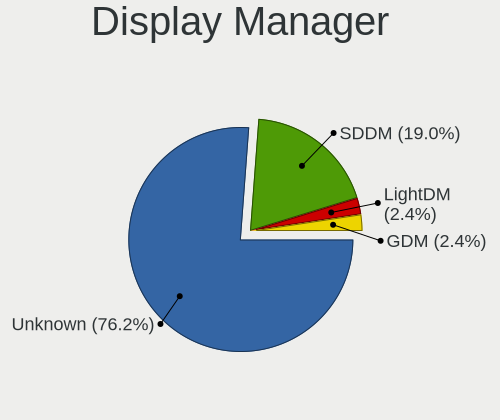
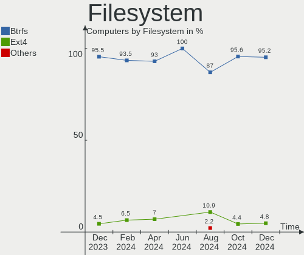
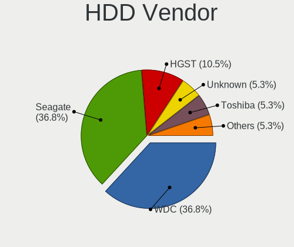
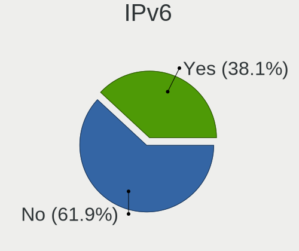
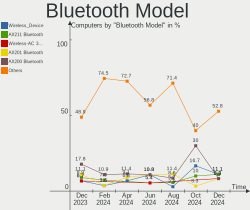
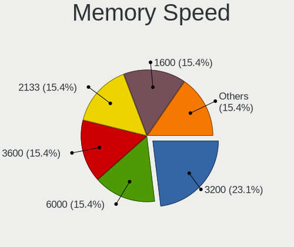

Nobara - Hardware Trends
------------------------

A project to identify most popular hardware characteristics and track their change
over time based on data collected by Linux users at https://Linux-Hardware.org.

Anyone can contribute to this report by the [hw-probe](https://github.com/linuxhw/hw-probe) tool:

    sudo -E hw-probe -all -upload

This is a report for all computer types. See also reports for [desktops](/Dist/Nobara/Desktop/README.md) and [notebooks](/Dist/Nobara/Notebook/README.md).

This report is for one last month. Overall report since the beginning of time: [TestDays](https://github.com/linuxhw/TestDays)

Period: Dec, 2023.

Contents
--------

* [ System ](#system)
  - [ OS                       ](#os)
  - [ OS Family                ](#os-family)
  - [ Kernel                   ](#kernel)
  - [ Kernel Family            ](#kernel-family)
  - [ Kernel Major Ver.        ](#kernel-major-ver)
  - [ Arch                     ](#arch)
  - [ DE                       ](#de)
  - [ Display Server           ](#display-server)
  - [ Display Manager          ](#display-manager)
  - [ OS Lang                  ](#os-lang)
  - [ Boot Mode                ](#boot-mode)
  - [ Filesystem               ](#filesystem)
  - [ Part. scheme             ](#part-scheme)
  - [ Dual Boot with Linux/BSD ](#dual-boot-with-linuxbsd)
  - [ Dual Boot (Win)          ](#dual-boot-win)

* [ Board ](#board)
  - [ Vendor                   ](#vendor)
  - [ Model                    ](#model)
  - [ Model Family             ](#model-family)
  - [ MFG Year                 ](#mfg-year)
  - [ Form Factor              ](#form-factor)
  - [ Secure Boot              ](#secure-boot)
  - [ Coreboot                 ](#coreboot)
  - [ RAM Size                 ](#ram-size)
  - [ RAM Used                 ](#ram-used)
  - [ Total Drives             ](#total-drives)
  - [ Has CD-ROM               ](#has-cd-rom)
  - [ Has Ethernet             ](#has-ethernet)
  - [ Has WiFi                 ](#has-wifi)
  - [ Has Bluetooth            ](#has-bluetooth)

* [ Location ](#location)
  - [ Country                  ](#country)
  - [ City                     ](#city)

* [ Drives ](#drives)
  - [ Drive Vendor             ](#drive-vendor)
  - [ Drive Model              ](#drive-model)
  - [ HDD Vendor               ](#hdd-vendor)
  - [ SSD Vendor               ](#ssd-vendor)
  - [ Drive Kind               ](#drive-kind)
  - [ Drive Connector          ](#drive-connector)
  - [ Drive Size               ](#drive-size)
  - [ Space Total              ](#space-total)
  - [ Space Used               ](#space-used)
  - [ Malfunc. Drives          ](#malfunc-drives)
  - [ Malfunc. Drive Vendor    ](#malfunc-drive-vendor)
  - [ Malfunc. HDD Vendor      ](#malfunc-hdd-vendor)
  - [ Malfunc. Drive Kind      ](#malfunc-drive-kind)
  - [ Failed Drives            ](#failed-drives)
  - [ Failed Drive Vendor      ](#failed-drive-vendor)
  - [ Drive Status             ](#drive-status)

* [ Storage controller ](#storage-controller)
  - [ Storage Vendor           ](#storage-vendor)
  - [ Storage Model            ](#storage-model)
  - [ Storage Kind             ](#storage-kind)

* [ Processor ](#processor)
  - [ CPU Vendor               ](#cpu-vendor)
  - [ CPU Model                ](#cpu-model)
  - [ CPU Model Family         ](#cpu-model-family)
  - [ CPU Cores                ](#cpu-cores)
  - [ CPU Sockets              ](#cpu-sockets)
  - [ CPU Threads              ](#cpu-threads)
  - [ CPU Op-Modes             ](#cpu-op-modes)
  - [ CPU Microcode            ](#cpu-microcode)
  - [ CPU Microarch            ](#cpu-microarch)

* [ Graphics ](#graphics)
  - [ GPU Vendor               ](#gpu-vendor)
  - [ GPU Model                ](#gpu-model)
  - [ GPU Combo                ](#gpu-combo)
  - [ GPU Driver               ](#gpu-driver)
  - [ GPU Memory               ](#gpu-memory)

* [ Monitor ](#monitor)
  - [ Monitor Vendor           ](#monitor-vendor)
  - [ Monitor Model            ](#monitor-model)
  - [ Monitor Resolution       ](#monitor-resolution)
  - [ Monitor Diagonal         ](#monitor-diagonal)
  - [ Monitor Width            ](#monitor-width)
  - [ Aspect Ratio             ](#aspect-ratio)
  - [ Monitor Area             ](#monitor-area)
  - [ Pixel Density            ](#pixel-density)
  - [ Multiple Monitors        ](#multiple-monitors)

* [ Network ](#network)
  - [ Net Controller Vendor    ](#net-controller-vendor)
  - [ Net Controller Model     ](#net-controller-model)
  - [ Wireless Vendor          ](#wireless-vendor)
  - [ Wireless Model           ](#wireless-model)
  - [ Ethernet Vendor          ](#ethernet-vendor)
  - [ Ethernet Model           ](#ethernet-model)
  - [ Net Controller Kind      ](#net-controller-kind)
  - [ Used Controller          ](#used-controller)
  - [ NICs                     ](#nics)
  - [ IPv6                     ](#ipv6)

* [ Bluetooth ](#bluetooth)
  - [ Bluetooth Vendor         ](#bluetooth-vendor)
  - [ Bluetooth Model          ](#bluetooth-model)

* [ Sound ](#sound)
  - [ Sound Vendor             ](#sound-vendor)
  - [ Sound Model              ](#sound-model)

* [ Memory ](#memory)
  - [ Memory Vendor            ](#memory-vendor)
  - [ Memory Model             ](#memory-model)
  - [ Memory Kind              ](#memory-kind)
  - [ Memory Form Factor       ](#memory-form-factor)
  - [ Memory Size              ](#memory-size)
  - [ Memory Speed             ](#memory-speed)

* [ Printers & scanners ](#printers--scanners)
  - [ Printer Vendor           ](#printer-vendor)
  - [ Printer Model            ](#printer-model)
  - [ Scanner Vendor           ](#scanner-vendor)
  - [ Scanner Model            ](#scanner-model)

* [ Camera ](#camera)
  - [ Camera Vendor            ](#camera-vendor)
  - [ Camera Model             ](#camera-model)

* [ Security ](#security)
  - [ Fingerprint Vendor       ](#fingerprint-vendor)
  - [ Fingerprint Model        ](#fingerprint-model)
  - [ Chipcard Vendor          ](#chipcard-vendor)
  - [ Chipcard Model           ](#chipcard-model)

* [ Unsupported ](#unsupported)
  - [ Unsupported Devices      ](#unsupported-devices)
  - [ Unsupported Device Types ](#unsupported-device-types)

System
------

OS
--

Installed operating systems

| Name      | Computers | Percent |
|-----------|-----------|---------|
| Nobara 38 | 56        | 83.58%  |
| Nobara 39 | 7         | 10.45%  |
| Nobara 37 | 4         | 5.97%   |

OS Family
---------

OS without a version

| Name   | Computers | Percent |
|--------|-----------|---------|
| Nobara | 67        | 100%    |

Kernel
------

Version of the Linux kernel

| Version                      | Computers | Percent |
|------------------------------|-----------|---------|
| 6.6.7-203.fsync.fc38.x86_64  | 13        | 19.4%   |
| 6.6.4-202.fsync.fc38.x86_64  | 9         | 13.43%  |
| 6.4.10-202.fsync.fc38.x86_64 | 7         | 10.45%  |
| 6.6.7-203.fsync.fc39.x86_64  | 6         | 8.96%   |
| 6.6.2-201.fsync.fc38.x86_64  | 6         | 8.96%   |
| 6.6.6-200.fsync.fc38.x86_64  | 4         | 5.97%   |
| 6.6.7-202.fsync.fc38.x86_64  | 3         | 4.48%   |
| 6.6.3-203.fsync.fc38.x86_64  | 3         | 4.48%   |
| 6.6.3-201.fsync.fc38.x86_64  | 3         | 4.48%   |
| 6.5.9-201.fsync.fc38.x86_64  | 3         | 4.48%   |
| 6.6.4-200.fsync.fc38.x86_64  | 2         | 2.99%   |
| 6.6.8-200.fsync.fc39.x86_64  | 1         | 1.49%   |
| 6.6.7-200.fsync.fc38.x86_64  | 1         | 1.49%   |
| 6.6.4-201.fsync.fc38.x86_64  | 1         | 1.49%   |
| 6.5.6-200.fsync.fc37.x86_64  | 1         | 1.49%   |
| 6.5.11-201.fsync.fc38.x86_64 | 1         | 1.49%   |
| 6.4.10-202.fsync.fc37.x86_64 | 1         | 1.49%   |
| 6.3.9-200.fsync.fc37.x86_64  | 1         | 1.49%   |
| 6.2.14-300.fsync.fc37.x86_64 | 1         | 1.49%   |

Kernel Family
-------------

Linux kernel without a distro release

| Version | Computers | Percent |
|---------|-----------|---------|
| 6.6.7   | 23        | 34.33%  |
| 6.6.4   | 12        | 17.91%  |
| 6.4.10  | 8         | 11.94%  |
| 6.6.3   | 6         | 8.96%   |
| 6.6.2   | 6         | 8.96%   |
| 6.6.6   | 4         | 5.97%   |
| 6.5.9   | 3         | 4.48%   |
| 6.6.8   | 1         | 1.49%   |
| 6.5.6   | 1         | 1.49%   |
| 6.5.11  | 1         | 1.49%   |
| 6.3.9   | 1         | 1.49%   |
| 6.2.14  | 1         | 1.49%   |

Kernel Major Ver.
-----------------

Linux kernel major version

| Version | Computers | Percent |
|---------|-----------|---------|
| 6.6     | 52        | 77.61%  |
| 6.4     | 8         | 11.94%  |
| 6.5     | 5         | 7.46%   |
| 6.3     | 1         | 1.49%   |
| 6.2     | 1         | 1.49%   |

Arch
----

OS architecture (x86_64, i586, etc.)

| Name   | Computers | Percent |
|--------|-----------|---------|
| x86_64 | 67        | 100%    |

DE
--

Desktop Environment

| Name  | Computers | Percent |
|-------|-----------|---------|
| KDE5  | 39        | 58.21%  |
| GNOME | 28        | 41.79%  |

Display Server
--------------

X11 or Wayland

| Name    | Computers | Percent |
|---------|-----------|---------|
| Wayland | 62        | 92.54%  |
| X11     | 5         | 7.46%   |

Display Manager
---------------

SDDM, LightDM, etc.

| Name    | Computers | Percent |
|---------|-----------|---------|
| Unknown | 56        | 83.58%  |
| SDDM    | 7         | 10.45%  |
| GDM     | 4         | 5.97%   |

OS Lang
-------

Language

| Lang  | Computers | Percent |
|-------|-----------|---------|
| en_US | 30        | 44.78%  |
| de_DE | 12        | 17.91%  |
| en_GB | 4         | 5.97%   |
| ru_RU | 2         | 2.99%   |
| it_IT | 2         | 2.99%   |
| es_VE | 2         | 2.99%   |
| es_ES | 2         | 2.99%   |
| en_CA | 2         | 2.99%   |
| uk_UA | 1         | 1.49%   |
| pl_PL | 1         | 1.49%   |
| nl_BE | 1         | 1.49%   |
| fr_FR | 1         | 1.49%   |
| es_UY | 1         | 1.49%   |
| es_MX | 1         | 1.49%   |
| es_CO | 1         | 1.49%   |
| es_AR | 1         | 1.49%   |
| en_DK | 1         | 1.49%   |
| en_AU | 1         | 1.49%   |
| de_CH | 1         | 1.49%   |

Boot Mode
---------

EFI or BIOS

| Mode | Computers | Percent |
|------|-----------|---------|
| EFI  | 57        | 85.07%  |
| BIOS | 10        | 14.93%  |

Filesystem
----------

Type of filesystem

| Type  | Computers | Percent |
|-------|-----------|---------|
| Btrfs | 64        | 95.52%  |
| Ext4  | 3         | 4.48%   |

Part. scheme
------------

Scheme of partitioning

| Type    | Computers | Percent |
|---------|-----------|---------|
| Unknown | 56        | 83.58%  |
| GPT     | 11        | 16.42%  |

Dual Boot with Linux/BSD
------------------------

Hosting more than one Linux/BSD

| Dual boot | Computers | Percent |
|-----------|-----------|---------|
| No        | 64        | 95.52%  |
| Yes       | 3         | 4.48%   |

Dual Boot (Win)
---------------

Hosting Linux and Windows

| Dual boot | Computers | Percent |
|-----------|-----------|---------|
| No        | 62        | 92.54%  |
| Yes       | 5         | 7.46%   |

Board
-----

Vendor
------

Motherboard manufacturer

| Name                | Computers | Percent |
|---------------------|-----------|---------|
| ASUSTek Computer    | 13        | 19.4%   |
| Hewlett-Packard     | 11        | 16.42%  |
| MSI                 | 10        | 14.93%  |
| ASRock              | 8         | 11.94%  |
| Gigabyte Technology | 5         | 7.46%   |
| Dell                | 5         | 7.46%   |
| Lenovo              | 3         | 4.48%   |
| AZW                 | 2         | 2.99%   |
| Acer                | 2         | 2.99%   |
| Samsung Electronics | 1         | 1.49%   |
| ONE-NETBOOK         | 1         | 1.49%   |
| Monster             | 1         | 1.49%   |
| MACHINIST           | 1         | 1.49%   |
| GPU Company         | 1         | 1.49%   |
| Exo                 | 1         | 1.49%   |
| Apple               | 1         | 1.49%   |
| Alienware           | 1         | 1.49%   |

Model
-----

Motherboard model

| Name                                   | Computers | Percent |
|----------------------------------------|-----------|---------|
| MSI MS-7B79                            | 2         | 2.99%   |
| Samsung 960QFG                         | 1         | 1.49%   |
| ONE-NETBOOK ONEXPLAYER F1              | 1         | 1.49%   |
| MSI MS-7D77                            | 1         | 1.49%   |
| MSI MS-7D75                            | 1         | 1.49%   |
| MSI MS-7C91                            | 1         | 1.49%   |
| MSI MS-7C56                            | 1         | 1.49%   |
| MSI MS-7C35                            | 1         | 1.49%   |
| MSI MS-7B84                            | 1         | 1.49%   |
| MSI MS-7A74                            | 1         | 1.49%   |
| MSI MS-7817                            | 1         | 1.49%   |
| Monster ABRA A5 V13.4                  | 1         | 1.49%   |
| MACHINIST X99-K9 V2.0                  | 1         | 1.49%   |
| Lenovo Yoga 9 14IRP8 83B1              | 1         | 1.49%   |
| Lenovo ThinkPad L14 Gen 1 20U5002DUK   | 1         | 1.49%   |
| Lenovo IdeaPad Z500 20202              | 1         | 1.49%   |
| HP Z600 Workstation                    | 1         | 1.49%   |
| HP Spectre x360 Convertible 13t-aw100  | 1         | 1.49%   |
| HP Pavilion x360 Convertible 14-dh0xxx | 1         | 1.49%   |
| HP Pavilion Laptop 15-cs3xxx           | 1         | 1.49%   |
| HP Pavilion dv5                        | 1         | 1.49%   |
| HP Pavilion Desktop TP01-1xxx          | 1         | 1.49%   |
| HP OMEN by Laptop 16-c0xxx             | 1         | 1.49%   |
| HP Laptop 15-db0xxx                    | 1         | 1.49%   |
| HP Laptop 14s-fq0xxx                   | 1         | 1.49%   |
| HP Laptop 14-dk0xxx                    | 1         | 1.49%   |
| HP EliteDesk 800 G4 TWR                | 1         | 1.49%   |
| GPU Company GWNR71517                  | 1         | 1.49%   |
| Gigabyte Z77X-UD3H                     | 1         | 1.49%   |
| Gigabyte H61M-S1                       | 1         | 1.49%   |
| Gigabyte H310M A                       | 1         | 1.49%   |
| Gigabyte G5 GE                         | 1         | 1.49%   |
| Gigabyte B550 UD AC                    | 1         | 1.49%   |
| Exo Smart XQ7                          | 1         | 1.49%   |
| Dell OptiPlex 5050                     | 1         | 1.49%   |
| Dell Latitude 7390 2-in-1              | 1         | 1.49%   |
| Dell G7 7700                           | 1         | 1.49%   |
| Dell G5 5505                           | 1         | 1.49%   |
| Dell G3 3590                           | 1         | 1.49%   |
| AZW SER                                | 1         | 1.49%   |

Model Family
------------

Motherboard model prefix

| Name                   | Computers | Percent |
|------------------------|-----------|---------|
| HP Pavilion            | 4         | 5.97%   |
| ASUS ROG               | 4         | 5.97%   |
| HP Laptop              | 3         | 4.48%   |
| ASUS TUF               | 3         | 4.48%   |
| MSI MS-7B79            | 2         | 2.99%   |
| Acer Aspire            | 2         | 2.99%   |
| Samsung 960QFG         | 1         | 1.49%   |
| ONE-NETBOOK ONEXPLAYER | 1         | 1.49%   |
| MSI MS-7D77            | 1         | 1.49%   |
| MSI MS-7D75            | 1         | 1.49%   |
| MSI MS-7C91            | 1         | 1.49%   |
| MSI MS-7C56            | 1         | 1.49%   |
| MSI MS-7C35            | 1         | 1.49%   |
| MSI MS-7B84            | 1         | 1.49%   |
| MSI MS-7A74            | 1         | 1.49%   |
| MSI MS-7817            | 1         | 1.49%   |
| Monster ABRA           | 1         | 1.49%   |
| MACHINIST X99-K9       | 1         | 1.49%   |
| Lenovo Yoga            | 1         | 1.49%   |
| Lenovo ThinkPad        | 1         | 1.49%   |
| Lenovo IdeaPad         | 1         | 1.49%   |
| HP Z600                | 1         | 1.49%   |
| HP Spectre             | 1         | 1.49%   |
| HP OMEN                | 1         | 1.49%   |
| HP EliteDesk           | 1         | 1.49%   |
| GPU Company GWNR71517  | 1         | 1.49%   |
| Gigabyte Z77X-UD3H     | 1         | 1.49%   |
| Gigabyte H61M-S1       | 1         | 1.49%   |
| Gigabyte H310M         | 1         | 1.49%   |
| Gigabyte G5            | 1         | 1.49%   |
| Gigabyte B550          | 1         | 1.49%   |
| Exo Smart              | 1         | 1.49%   |
| Dell OptiPlex          | 1         | 1.49%   |
| Dell Latitude          | 1         | 1.49%   |
| Dell G7                | 1         | 1.49%   |
| Dell G5                | 1         | 1.49%   |
| Dell G3                | 1         | 1.49%   |
| AZW SER                | 1         | 1.49%   |
| AZW GTR                | 1         | 1.49%   |
| ASUS ZenBook           | 1         | 1.49%   |

MFG Year
--------

Motherboard manufacture year

| Year | Computers | Percent |
|------|-----------|---------|
| 2020 | 12        | 17.91%  |
| 2021 | 11        | 16.42%  |
| 2019 | 10        | 14.93%  |
| 2018 | 10        | 14.93%  |
| 2022 | 6         | 8.96%   |
| 2023 | 5         | 7.46%   |
| 2012 | 5         | 7.46%   |
| 2016 | 2         | 2.99%   |
| 2017 | 1         | 1.49%   |
| 2015 | 1         | 1.49%   |
| 2014 | 1         | 1.49%   |
| 2013 | 1         | 1.49%   |
| 2010 | 1         | 1.49%   |
| 2008 | 1         | 1.49%   |

Form Factor
-----------

Physical design of the computer

| Name        | Computers | Percent |
|-------------|-----------|---------|
| Desktop     | 38        | 56.72%  |
| Notebook    | 20        | 29.85%  |
| Convertible | 6         | 8.96%   |
| Mini pc     | 2         | 2.99%   |
| Tablet      | 1         | 1.49%   |

Secure Boot
-----------

Enabled or disabled

| State    | Computers | Percent |
|----------|-----------|---------|
| Disabled | 67        | 100%    |

Coreboot
--------

Have coreboot on board

| Used | Computers | Percent |
|------|-----------|---------|
| No   | 67        | 100%    |

RAM Size
--------

Total RAM memory

| Size in GB  | Computers | Percent |
|-------------|-----------|---------|
| 32.01-64.0  | 19        | 28.36%  |
| 16.01-24.0  | 17        | 25.37%  |
| 4.01-8.0    | 9         | 13.43%  |
| 8.01-16.0   | 9         | 13.43%  |
| 24.01-32.0  | 6         | 8.96%   |
| 64.01-256.0 | 6         | 8.96%   |
| 2.01-3.0    | 1         | 1.49%   |

RAM Used
--------

Used RAM memory

| Used GB   | Computers | Percent |
|-----------|-----------|---------|
| 4.01-8.0  | 36        | 53.73%  |
| 3.01-4.0  | 15        | 22.39%  |
| 2.01-3.0  | 7         | 10.45%  |
| 8.01-16.0 | 6         | 8.96%   |
| 1.01-2.0  | 3         | 4.48%   |

Total Drives
------------

Number of drives on board

| Drives | Computers | Percent |
|--------|-----------|---------|
| 1      | 28        | 41.79%  |
| 2      | 18        | 26.87%  |
| 3      | 9         | 13.43%  |
| 4      | 8         | 11.94%  |
| 6      | 2         | 2.99%   |
| 8      | 1         | 1.49%   |
| 7      | 1         | 1.49%   |

Has CD-ROM
----------

Has CD-ROM on board

| Presented | Computers | Percent |
|-----------|-----------|---------|
| No        | 55        | 82.09%  |
| Yes       | 12        | 17.91%  |

Has Ethernet
------------

Has Ethernet on board

| Presented | Computers | Percent |
|-----------|-----------|---------|
| Yes       | 58        | 86.57%  |
| No        | 9         | 13.43%  |

Has WiFi
--------

Has WiFi module

| Presented | Computers | Percent |
|-----------|-----------|---------|
| Yes       | 49        | 73.13%  |
| No        | 18        | 26.87%  |

Has Bluetooth
-------------

Has Bluetooth module

| Presented | Computers | Percent |
|-----------|-----------|---------|
| Yes       | 44        | 65.67%  |
| No        | 23        | 34.33%  |

Location
--------

Country
-------

Geographic location (country)

| Country     | Computers | Percent |
|-------------|-----------|---------|
| USA         | 22        | 32.84%  |
| Germany     | 14        | 20.9%   |
| Canada      | 3         | 4.48%   |
| Venezuela   | 2         | 2.99%   |
| UK          | 2         | 2.99%   |
| Russia      | 2         | 2.99%   |
| Poland      | 2         | 2.99%   |
| Italy       | 2         | 2.99%   |
| Argentina   | 2         | 2.99%   |
| Uruguay     | 1         | 1.49%   |
| Switzerland | 1         | 1.49%   |
| Sweden      | 1         | 1.49%   |
| Spain       | 1         | 1.49%   |
| Puerto Rico | 1         | 1.49%   |
| Philippines | 1         | 1.49%   |
| Mexico      | 1         | 1.49%   |
| India       | 1         | 1.49%   |
| Hungary     | 1         | 1.49%   |
| Hong Kong   | 1         | 1.49%   |
| Greece      | 1         | 1.49%   |
| France      | 1         | 1.49%   |
| Colombia    | 1         | 1.49%   |
| Brazil      | 1         | 1.49%   |
| Belgium     | 1         | 1.49%   |
| Australia   | 1         | 1.49%   |

City
----

Geographic location (city)

| City             | Computers | Percent |
|------------------|-----------|---------|
| Toronto          | 2         | 2.99%   |
| Oberhausen       | 2         | 2.99%   |
| Berlin           | 2         | 2.99%   |
| Yablonitsy       | 1         | 1.49%   |
| Wuppertal        | 1         | 1.49%   |
| The Bronx        | 1         | 1.49%   |
| Temecula         | 1         | 1.49%   |
| Stuttgart        | 1         | 1.49%   |
| Stamford         | 1         | 1.49%   |
| Shinnston        | 1         | 1.49%   |
| Sao Paulo        | 1         | 1.49%   |
| Saluda           | 1         | 1.49%   |
| Reno             | 1         | 1.49%   |
| Ponce            | 1         | 1.49%   |
| Peterborough     | 1         | 1.49%   |
| Osnabrück       | 1         | 1.49%   |
| Oelde            | 1         | 1.49%   |
| New Rochelle     | 1         | 1.49%   |
| Montevideo       | 1         | 1.49%   |
| Minden           | 1         | 1.49%   |
| Michigan City    | 1         | 1.49%   |
| Mesquite         | 1         | 1.49%   |
| Merzig           | 1         | 1.49%   |
| Menifee          | 1         | 1.49%   |
| Memphis          | 1         | 1.49%   |
| Melbourne        | 1         | 1.49%   |
| Mason            | 1         | 1.49%   |
| Maracaibo        | 1         | 1.49%   |
| Malpas           | 1         | 1.49%   |
| Malmo            | 1         | 1.49%   |
| Lucknow          | 1         | 1.49%   |
| Los Angeles      | 1         | 1.49%   |
| Little Rock      | 1         | 1.49%   |
| Leipzig          | 1         | 1.49%   |
| Latronico        | 1         | 1.49%   |
| Laredo           | 1         | 1.49%   |
| Krakow           | 1         | 1.49%   |
| Izhevsk          | 1         | 1.49%   |
| Ittigen          | 1         | 1.49%   |
| Hohenpeissenberg | 1         | 1.49%   |

Drives
------

Drive Vendor
------------

Hard drive vendors

| Vendor                       | Computers | Drives | Percent |
|------------------------------|-----------|--------|---------|
| Samsung Electronics          | 21        | 34     | 16.8%   |
| WDC                          | 11        | 14     | 8.8%    |
| Seagate                      | 10        | 12     | 8%      |
| Toshiba                      | 9         | 9      | 7.2%    |
| Sandisk                      | 9         | 10     | 7.2%    |
| Crucial                      | 8         | 11     | 6.4%    |
| Phison Electronics           | 6         | 6      | 4.8%    |
| Kingston                     | 5         | 5      | 4%      |
| SK hynix                     | 4         | 4      | 3.2%    |
| Micron/Crucial Technology    | 4         | 4      | 3.2%    |
| PNY                          | 3         | 3      | 2.4%    |
| MAXIO Technology (Hangzhou)  | 3         | 3      | 2.4%    |
| Intel                        | 3         | 3      | 2.4%    |
| KIOXIA                       | 2         | 2      | 1.6%    |
| Wibtek                       | 1         | 1      | 0.8%    |
| Verbatim                     | 1         | 1      | 0.8%    |
| USB 3.1                      | 1         | 1      | 0.8%    |
| Unknown                      | 1         | 2      | 0.8%    |
| T-FORCE                      | 1         | 1      | 0.8%    |
| SPCC                         | 1         | 1      | 0.8%    |
| Silicon Motion               | 1         | 1      | 0.8%    |
| Shenzhen Longsys Electronics | 1         | 1      | 0.8%    |
| Realtek Semiconductor        | 1         | 1      | 0.8%    |
| Plextor                      | 1         | 1      | 0.8%    |
| Micron Technology            | 1         | 1      | 0.8%    |
| Lexar                        | 1         | 1      | 0.8%    |
| Lenovo                       | 1         | 1      | 0.8%    |
| KIOXIA-EXCERIA               | 1         | 1      | 0.8%    |
| Kingston Technology Company  | 1         | 1      | 0.8%    |
| KingSpec                     | 1         | 1      | 0.8%    |
| JMicron Technology           | 1         | 2      | 0.8%    |
| Intenso                      | 1         | 1      | 0.8%    |
| Hitachi                      | 1         | 1      | 0.8%    |
| G600S                        | 1         | 1      | 0.8%    |
| Fanxiang                     | 1         | 1      | 0.8%    |
| Corsair                      | 1         | 1      | 0.8%    |
| China                        | 1         | 1      | 0.8%    |
| ASMT                         | 1         | 2      | 0.8%    |
| Apple                        | 1         | 1      | 0.8%    |
| A-DATA Technology            | 1         | 1      | 0.8%    |

Drive Model
-----------

Hard drive models

| Model                                               | Computers | Percent |
|-----------------------------------------------------|-----------|---------|
| Samsung NVMe SSD Controller SM981/PM981/PM983 512GB | 11        | 7.97%   |
| Toshiba DT01ACA100 1TB                              | 3         | 2.17%   |
| Toshiba MQ04ABF100 1TB                              | 2         | 1.45%   |
| Samsung SSD 980 1TB                                 | 2         | 1.45%   |
| Samsung NVMe SSD Controller PM9A1/PM9A3/980PRO 2TB  | 2         | 1.45%   |
| Phison E12 NVMe Controller 1TB                      | 2         | 1.45%   |
| Micron/Crucial P2 NVMe PCIe SSD 4TB                 | 2         | 1.45%   |
| MAXIO (Hangzhou) NVMe SSD Controller MAP1202 256GB  | 2         | 1.45%   |
| Kingston SA400S37120G 120GB SSD                     | 2         | 1.45%   |
| Crucial CT240BX500SSD1 240GB                        | 2         | 1.45%   |
| Crucial CT2000BX500SSD1 2TB                         | 2         | 1.45%   |
| Wibtek W800S 512GB SSD                              | 1         | 0.72%   |
| WDC WDS240G2G0B-00EPW0 240GB SSD                    | 1         | 0.72%   |
| WDC WDS240G2G0A-00JH30 240GB SSD                    | 1         | 0.72%   |
| WDC WDS120G2G0A-00JH30 120GB SSD                    | 1         | 0.72%   |
| WDC WD60EZAZ-00SF3B0 6TB                            | 1         | 0.72%   |
| WDC WD2500AAJS-00VTA0 250GB                         | 1         | 0.72%   |
| WDC WD20EZRZ-00Z5HB0 2TB                            | 1         | 0.72%   |
| WDC WD15EARS-00Z5B1 1TB                             | 1         | 0.72%   |
| WDC WD10SPZX-24Z10T0 1TB                            | 1         | 0.72%   |
| WDC WD10EZEX-21M2NA0 1TB                            | 1         | 0.72%   |
| WDC WD10EZEX-08WN4A0 1TB                            | 1         | 0.72%   |
| WDC WD10EALX-009BA0 1TB                             | 1         | 0.72%   |
| WDC WD1003FBYX-05Y7B0 1TB                           | 1         | 0.72%   |
| WDC WD1001FALS-00J7B0 1TB                           | 1         | 0.72%   |
| Verbatim Vi550 S3 512GB                             | 1         | 0.72%   |
| USB 3.1 Device RAID 0 2TB                           | 1         | 0.72%   |
| Unknown NVMe SSD Drive 2TB                          | 1         | 0.72%   |
| Toshiba HDWL120 2TB                                 | 1         | 0.72%   |
| Toshiba HDWD130 3TB                                 | 1         | 0.72%   |
| Toshiba DT01ACA200 2TB                              | 1         | 0.72%   |
| Toshiba DT01ACA050 500GB                            | 1         | 0.72%   |
| T-FORCE 1TB                                         | 1         | 0.72%   |
| SPCC Solid State Disk 512GB                         | 1         | 0.72%   |
| SK hynix SHPP41-2000GM 2TB                          | 1         | 0.72%   |
| SK hynix SC401 SATA 256GB SSD                       | 1         | 0.72%   |
| SK hynix PC711 NVMe 1TB                             | 1         | 0.72%   |
| SK hynix HFM001TD3JX013N 1024GB                     | 1         | 0.72%   |
| Silicon Motion SM2262/SM2262EN SSD Controller 1TB   | 1         | 0.72%   |
| Shenzhen Longsys Lexar SSD NM790 2TB                | 1         | 0.72%   |

HDD Vendor
----------

Hard disk drive vendors

| Vendor  | Computers | Drives | Percent |
|---------|-----------|--------|---------|
| Seagate | 10        | 12     | 33.33%  |
| WDC     | 9         | 11     | 30%     |
| Toshiba | 9         | 9      | 30%     |
| Hitachi | 1         | 1      | 3.33%   |
| ASMT    | 1         | 2      | 3.33%   |

SSD Vendor
----------

Solid state drive vendors

| Vendor              | Computers | Drives | Percent |
|---------------------|-----------|--------|---------|
| Samsung Electronics | 8         | 11     | 19.51%  |
| Crucial             | 8         | 11     | 19.51%  |
| Kingston            | 4         | 4      | 9.76%   |
| WDC                 | 3         | 3      | 7.32%   |
| PNY                 | 3         | 3      | 7.32%   |
| Wibtek              | 1         | 1      | 2.44%   |
| Verbatim            | 1         | 1      | 2.44%   |
| SPCC                | 1         | 1      | 2.44%   |
| SK hynix            | 1         | 1      | 2.44%   |
| SanDisk             | 1         | 1      | 2.44%   |
| Plextor             | 1         | 1      | 2.44%   |
| Lexar               | 1         | 1      | 2.44%   |
| KIOXIA-EXCERIA      | 1         | 1      | 2.44%   |
| KingSpec            | 1         | 1      | 2.44%   |
| JMicron Technology  | 1         | 2      | 2.44%   |
| Intenso             | 1         | 1      | 2.44%   |
| Intel               | 1         | 1      | 2.44%   |
| Corsair             | 1         | 1      | 2.44%   |
| China               | 1         | 1      | 2.44%   |
| A-DATA Technology   | 1         | 1      | 2.44%   |

Drive Kind
----------

HDD or SSD

| Kind    | Computers | Drives | Percent |
|---------|-----------|--------|---------|
| NVMe    | 45        | 62     | 42.45%  |
| SSD     | 30        | 48     | 28.3%   |
| HDD     | 26        | 35     | 24.53%  |
| Unknown | 5         | 5      | 4.72%   |

Drive Connector
---------------

SATA, SAS, NVMe, etc.

| Type | Computers | Drives | Percent |
|------|-----------|--------|---------|
| NVMe | 45        | 62     | 49.45%  |
| SATA | 41        | 80     | 45.05%  |
| SAS  | 5         | 8      | 5.49%   |

Drive Size
----------

Size of hard drive

| Size in TB | Computers | Drives | Percent |
|------------|-----------|--------|---------|
| 0.01-0.5   | 28        | 37     | 45.9%   |
| 0.51-1.0   | 21        | 27     | 34.43%  |
| 1.01-2.0   | 9         | 16     | 14.75%  |
| 3.01-4.0   | 1         | 1      | 1.64%   |
| 2.01-3.0   | 1         | 1      | 1.64%   |
| 4.01-10.0  | 1         | 1      | 1.64%   |

Space Total
-----------

Amount of disk space available on the file system

| Size in GB     | Computers | Percent |
|----------------|-----------|---------|
| More than 3000 | 13        | 19.4%   |
| 1001-2000      | 13        | 19.4%   |
| 501-1000       | 13        | 19.4%   |
| 251-500        | 11        | 16.42%  |
| 2001-3000      | 7         | 10.45%  |
| 101-250        | 5         | 7.46%   |
| Unknown        | 3         | 4.48%   |
| 21-50          | 1         | 1.49%   |
| 1-20           | 1         | 1.49%   |

Space Used
----------

Amount of used disk space

| Used GB        | Computers | Percent |
|----------------|-----------|---------|
| 101-250        | 15        | 22.39%  |
| 21-50          | 12        | 17.91%  |
| 501-1000       | 10        | 14.93%  |
| 1-20           | 9         | 13.43%  |
| 1001-2000      | 7         | 10.45%  |
| 251-500        | 4         | 5.97%   |
| More than 3000 | 3         | 4.48%   |
| 51-100         | 3         | 4.48%   |
| Unknown        | 3         | 4.48%   |
| 2001-3000      | 1         | 1.49%   |

Malfunc. Drives
---------------

Drive models with a malfunction

Zero info for selected period =(

Malfunc. Drive Vendor
---------------------

Vendors of faulty drives

Zero info for selected period =(

Malfunc. HDD Vendor
-------------------

Vendors of faulty HDD drives

Zero info for selected period =(

Malfunc. Drive Kind
-------------------

Kinds of faulty drives

Zero info for selected period =(

Failed Drives
-------------

Failed drive models

Zero info for selected period =(

Failed Drive Vendor
-------------------

Failed drive vendors

Zero info for selected period =(

Drive Status
------------

Number of failed and malfunc. drives

| Status   | Computers | Drives | Percent |
|----------|-----------|--------|---------|
| Detected | 57        | 125    | 83.82%  |
| Works    | 11        | 25     | 16.18%  |

Storage controller
------------------

Storage Vendor
--------------

Storage controller vendors

| Vendor                       | Computers | Percent |
|------------------------------|-----------|---------|
| Intel                        | 30        | 27.03%  |
| AMD                          | 26        | 23.42%  |
| Samsung Electronics          | 18        | 16.22%  |
| SanDisk                      | 8         | 7.21%   |
| Phison Electronics           | 6         | 5.41%   |
| Micron/Crucial Technology    | 4         | 3.6%    |
| SK hynix                     | 3         | 2.7%    |
| MAXIO Technology (Hangzhou)  | 3         | 2.7%    |
| KIOXIA                       | 2         | 1.8%    |
| Kingston Technology Company  | 2         | 1.8%    |
| Solidigm                     | 1         | 0.9%    |
| Silicon Motion               | 1         | 0.9%    |
| Shenzhen Longsys Electronics | 1         | 0.9%    |
| Realtek Semiconductor        | 1         | 0.9%    |
| Micron Technology            | 1         | 0.9%    |
| Marvell Technology Group     | 1         | 0.9%    |
| Lenovo                       | 1         | 0.9%    |
| ASMedia Technology           | 1         | 0.9%    |
| Apple                        | 1         | 0.9%    |

Storage Model
-------------

Storage controller models

| Model                                                                          | Computers | Percent |
|--------------------------------------------------------------------------------|-----------|---------|
| AMD FCH SATA Controller [AHCI mode]                                            | 14        | 11.67%  |
| Samsung NVMe SSD Controller SM981/PM981/PM983                                  | 11        | 9.17%   |
| AMD 400 Series Chipset SATA Controller                                         | 8         | 6.67%   |
| AMD 500 Series Chipset SATA Controller                                         | 6         | 5%      |
| Samsung NVMe SSD Controller 980 (DRAM-less)                                    | 4         | 3.33%   |
| Intel 82801 Mobile SATA Controller [RAID mode]                                 | 4         | 3.33%   |
| SanDisk WD Black SN770 / PC SN740 256GB / PC SN560 (DRAM-less) NVMe SSD        | 3         | 2.5%    |
| SK hynix Gold P31/BC711/PC711 NVMe Solid State Drive                           | 2         | 1.67%   |
| SanDisk Ultra 3D / WD Blue SN570 NVMe SSD (DRAM-less)                          | 2         | 1.67%   |
| Samsung NVMe SSD Controller PM9A1/PM9A3/980PRO                                 | 2         | 1.67%   |
| Phison E12 NVMe Controller                                                     | 2         | 1.67%   |
| Micron/Crucial P5 Plus NVMe PCIe SSD                                           | 2         | 1.67%   |
| Micron/Crucial P2 [Nick P2] / P3 / P3 Plus NVMe PCIe SSD (DRAM-less)           | 2         | 1.67%   |
| MAXIO (Hangzhou) NVMe SSD Controller MAP1202                                   | 2         | 1.67%   |
| KIOXIA NVMe SSD Controller BG4 (DRAM-less)                                     | 2         | 1.67%   |
| Intel SATA Controller [RAID mode]                                              | 2         | 1.67%   |
| Intel Cannon Lake PCH SATA AHCI Controller                                     | 2         | 1.67%   |
| Intel Cannon Lake Mobile PCH SATA AHCI Controller                              | 2         | 1.67%   |
| Intel C610/X99 series chipset sSATA Controller [AHCI mode]                     | 2         | 1.67%   |
| Intel C610/X99 series chipset 6-Port SATA Controller [AHCI mode]               | 2         | 1.67%   |
| Intel 8 Series/C220 Series Chipset Family 6-port SATA Controller 1 [AHCI mode] | 2         | 1.67%   |
| Intel 400 Series Chipset Family SATA AHCI Controller                           | 2         | 1.67%   |
| Intel 200 Series PCH SATA controller [AHCI mode]                               | 2         | 1.67%   |
| Solidigm P41 Plus NVMe SSD (DRAM-less) [Echo Harbor]                           | 1         | 0.83%   |
| SK hynix Platinum P41/PC801 NVMe Solid State Drive                             | 1         | 0.83%   |
| Silicon Motion SM2262/SM2262EN SSD Controller                                  | 1         | 0.83%   |
| Shenzhen Longsys Non-Volatile memory controller                                | 1         | 0.83%   |
| SanDisk WD Green SN350 240GB (DRAM-less) / SN560E NVMe SSD                     | 1         | 0.83%   |
| Sandisk WD Black SN850X NVMe SSD                                               | 1         | 0.83%   |
| SanDisk Ultra 3D / WD Blue SN550 NVMe SSD                                      | 1         | 0.83%   |
| Samsung NVMe SSD Controller SM961/PM961/SM963                                  | 1         | 0.83%   |
| Samsung NVMe SSD Controller S4LV008[Pascal]                                    | 1         | 0.83%   |
| Realtek RTS5765DL NVMe SSD Controller (DRAM-less)                              | 1         | 0.83%   |
| Phison PS5021-E21 PCIe4 NVMe Controller (DRAM-less)                            | 1         | 0.83%   |
| Phison PS5013-E13 PCIe3 NVMe Controller (DRAM-less)                            | 1         | 0.83%   |
| Phison E18 PCIe4 NVMe Controller                                               | 1         | 0.83%   |
| Phison E16 PCIe4 NVMe Controller                                               | 1         | 0.83%   |
| Micron 3400 NVMe SSD [Hendrix]                                                 | 1         | 0.83%   |
| MAXIO (Hangzhou) NVMe SSD Controller MAP1602                                   | 1         | 0.83%   |
| Marvell Group 88SE9172 SATA 6Gb/s Controller                                   | 1         | 0.83%   |

Storage Kind
------------

Kind of storage controller (IDE, SATA, NVMe, SAS, ...)

| Kind | Computers | Percent |
|------|-----------|---------|
| SATA | 47        | 46.53%  |
| NVMe | 45        | 44.55%  |
| RAID | 7         | 6.93%   |
| IDE  | 2         | 1.98%   |

Processor
---------

CPU Vendor
----------

Processor vendors

| Vendor | Computers | Percent |
|--------|-----------|---------|
| AMD    | 34        | 50.75%  |
| Intel  | 33        | 49.25%  |

CPU Model
---------

Processor models

| Model                                    | Computers | Percent |
|------------------------------------------|-----------|---------|
| AMD Ryzen 7 3700X 8-Core Processor       | 4         | 5.97%   |
| AMD Ryzen 5 3600 6-Core Processor        | 3         | 4.48%   |
| Intel 13th Gen Core i7-1360P             | 2         | 2.99%   |
| Intel 11th Gen Core i7-1165G7 @ 2.80GHz  | 2         | 2.99%   |
| AMD Ryzen 7 7800X3D 8-Core Processor     | 2         | 2.99%   |
| AMD Ryzen 7 5800X3D 8-Core Processor     | 2         | 2.99%   |
| AMD Ryzen 7 5800H with Radeon Graphics   | 2         | 2.99%   |
| AMD Ryzen 7 5700G with Radeon Graphics   | 2         | 2.99%   |
| Intel Xeon CPU X5675 @ 3.07GHz           | 1         | 1.49%   |
| Intel Xeon CPU E5-2690 v3 @ 2.60GHz      | 1         | 1.49%   |
| Intel Xeon CPU E3-1271 v3 @ 3.60GHz      | 1         | 1.49%   |
| Intel Core i7-8750H CPU @ 2.20GHz        | 1         | 1.49%   |
| Intel Core i7-7700 CPU @ 3.60GHz         | 1         | 1.49%   |
| Intel Core i7-6800K CPU @ 3.40GHz        | 1         | 1.49%   |
| Intel Core i7-6660U CPU @ 2.40GHz        | 1         | 1.49%   |
| Intel Core i7-4770 CPU @ 3.40GHz         | 1         | 1.49%   |
| Intel Core i7-3770 CPU @ 3.40GHz         | 1         | 1.49%   |
| Intel Core i7-10750H CPU @ 2.60GHz       | 1         | 1.49%   |
| Intel Core i5-9300H CPU @ 2.40GHz        | 1         | 1.49%   |
| Intel Core i5-8500B CPU @ 3.00GHz        | 1         | 1.49%   |
| Intel Core i5-8500 CPU @ 3.00GHz         | 1         | 1.49%   |
| Intel Core i5-8400 CPU @ 2.80GHz         | 1         | 1.49%   |
| Intel Core i5-8350U CPU @ 1.70GHz        | 1         | 1.49%   |
| Intel Core i5-8265U CPU @ 1.60GHz        | 1         | 1.49%   |
| Intel Core i5-7500 CPU @ 3.40GHz         | 1         | 1.49%   |
| Intel Core i5-5200U CPU @ 2.20GHz        | 1         | 1.49%   |
| Intel Core i5-3470 CPU @ 3.20GHz         | 1         | 1.49%   |
| Intel Core i5-3450 CPU @ 3.10GHz         | 1         | 1.49%   |
| Intel Core i5-10400 CPU @ 2.90GHz        | 1         | 1.49%   |
| Intel Core i5-1035G4 CPU @ 1.10GHz       | 1         | 1.49%   |
| Intel Core i5-1035G1 CPU @ 1.00GHz       | 1         | 1.49%   |
| Intel Core i3-2370M CPU @ 2.40GHz        | 1         | 1.49%   |
| Intel Core i3-10100 CPU @ 3.60GHz        | 1         | 1.49%   |
| Intel 13th Gen Core i7-13650HX           | 1         | 1.49%   |
| Intel 12th Gen Core i5-12500H            | 1         | 1.49%   |
| Intel 11th Gen Core i7-11700KF @ 3.60GHz | 1         | 1.49%   |
| Intel 11th Gen Core i5-11400F @ 2.60GHz  | 1         | 1.49%   |
| AMD Ryzen 9 7950X3D 16-Core Processor    | 1         | 1.49%   |
| AMD Ryzen 9 6900HX with Radeon Graphics  | 1         | 1.49%   |
| AMD Ryzen 9 5950X 16-Core Processor      | 1         | 1.49%   |

CPU Model Family
----------------

Processor model prefix

| Model           | Computers | Percent |
|-----------------|-----------|---------|
| AMD Ryzen 7     | 16        | 23.88%  |
| Intel Core i5   | 13        | 19.4%   |
| Other           | 8         | 11.94%  |
| Intel Core i7   | 7         | 10.45%  |
| AMD Ryzen 9     | 6         | 8.96%   |
| AMD Ryzen 5     | 6         | 8.96%   |
| Intel Xeon      | 3         | 4.48%   |
| AMD Ryzen 3     | 3         | 4.48%   |
| Intel Core i3   | 2         | 2.99%   |
| AMD Ryzen 7 PRO | 1         | 1.49%   |
| AMD Phenom II   | 1         | 1.49%   |
| AMD A6          | 1         | 1.49%   |

CPU Cores
---------

Number of processor cores

| Number | Computers | Percent |
|--------|-----------|---------|
| 8      | 19        | 28.36%  |
| 4      | 18        | 26.87%  |
| 6      | 14        | 20.9%   |
| 12     | 7         | 10.45%  |
| 2      | 6         | 8.96%   |
| 16     | 2         | 2.99%   |
| 14     | 1         | 1.49%   |

CPU Sockets
-----------

Number of sockets

| Number | Computers | Percent |
|--------|-----------|---------|
| 1      | 66        | 98.51%  |
| 2      | 1         | 1.49%   |

CPU Threads
-----------

Threads per core (Hyper-Threading)

| Number | Computers | Percent |
|--------|-----------|---------|
| 2      | 56        | 83.58%  |
| 1      | 11        | 16.42%  |

CPU Op-Modes
------------

CPU Operation Modes (32-bit, 64-bit)

| Op mode        | Computers | Percent |
|----------------|-----------|---------|
| 32-bit, 64-bit | 67        | 100%    |

CPU Microcode
-------------

Microcode number

| Number     | Computers | Percent |
|------------|-----------|---------|
| Unknown    | 33        | 49.25%  |
| 0x08701030 | 5         | 7.46%   |
| 0x0a50000d | 4         | 5.97%   |
| 0x0a20120e | 4         | 5.97%   |
| 0x08701021 | 3         | 4.48%   |
| 0x08108109 | 3         | 4.48%   |
| 0x0a601206 | 2         | 2.99%   |
| 0x08600106 | 2         | 2.99%   |
| 0x0800820d | 2         | 2.99%   |
| 0x0a704103 | 1         | 1.49%   |
| 0x0a601203 | 1         | 1.49%   |
| 0x0a50000f | 1         | 1.49%   |
| 0x0a50000c | 1         | 1.49%   |
| 0x0a404102 | 1         | 1.49%   |
| 0x0a20120a | 1         | 1.49%   |
| 0x08600109 | 1         | 1.49%   |
| 0x06006705 | 1         | 1.49%   |
| 0x010000c8 | 1         | 1.49%   |

CPU Microarch
-------------

Microarchitecture

| Name             | Computers | Percent |
|------------------|-----------|---------|
| Zen 3            | 11        | 16.42%  |
| Zen 2            | 11        | 16.42%  |
| KabyLake         | 9         | 13.43%  |
| Unknown          | 7         | 10.45%  |
| Zen+             | 5         | 7.46%   |
| IvyBridge        | 3         | 4.48%   |
| IceLake          | 3         | 4.48%   |
| Haswell          | 3         | 4.48%   |
| CometLake        | 3         | 4.48%   |
| Alderlake Hybrid | 3         | 4.48%   |
| TigerLake        | 2         | 2.99%   |
| Broadwell        | 2         | 2.99%   |
| Westmere         | 1         | 1.49%   |
| Skylake          | 1         | 1.49%   |
| SandyBridge      | 1         | 1.49%   |
| K10              | 1         | 1.49%   |
| Excavator        | 1         | 1.49%   |

Graphics
--------

GPU Vendor
----------

Vendors of graphics cards

| Vendor | Computers | Percent |
|--------|-----------|---------|
| AMD    | 33        | 42.86%  |
| Intel  | 23        | 29.87%  |
| Nvidia | 21        | 27.27%  |

GPU Model
---------

Graphics card models

| Model                                                                       | Computers | Percent |
|-----------------------------------------------------------------------------|-----------|---------|
| AMD Ellesmere [Radeon RX 470/480/570/570X/580/580X/590]                     | 7         | 8.54%   |
| AMD Cezanne [Radeon Vega Series / Radeon Vega Mobile Series]                | 5         | 6.1%    |
| Intel CoffeeLake-H GT2 [UHD Graphics 630]                                   | 3         | 3.66%   |
| AMD Renoir [Radeon RX Vega 6 (Ryzen 4000/5000 Mobile Series)]               | 3         | 3.66%   |
| AMD Navi 31 [Radeon RX 7900 XT/7900 XTX]                                    | 3         | 3.66%   |
| AMD Navi 23 [Radeon RX 6600/6600 XT/6600M]                                  | 3         | 3.66%   |
| AMD Navi 22 [Radeon RX 6700/6700 XT/6750 XT / 6800M/6850M XT]               | 3         | 3.66%   |
| Nvidia GA106 [GeForce RTX 3060 Lite Hash Rate]                              | 2         | 2.44%   |
| Nvidia GA102 [GeForce RTX 3080 Ti]                                          | 2         | 2.44%   |
| Intel TigerLake-LP GT2 [Iris Xe Graphics]                                   | 2         | 2.44%   |
| Intel Raptor Lake-P [Iris Xe Graphics]                                      | 2         | 2.44%   |
| Intel CometLake-S GT2 [UHD Graphics 630]                                    | 2         | 2.44%   |
| AMD Raphael                                                                 | 2         | 2.44%   |
| AMD Picasso/Raven 2 [Radeon Vega Series / Radeon Vega Mobile Series]        | 2         | 2.44%   |
| AMD Navi 10 [Radeon RX 5600 OEM/5600 XT / 5700/5700 XT]                     | 2         | 2.44%   |
| Nvidia TU117M [GeForce GTX 1650 Mobile / Max-Q]                             | 1         | 1.22%   |
| Nvidia TU106M [GeForce RTX 2070 Mobile / Max-Q Refresh]                     | 1         | 1.22%   |
| Nvidia TU106 [GeForce RTX 2060 SUPER]                                       | 1         | 1.22%   |
| Nvidia TU104 [GeForce RTX 2080 Rev. A]                                      | 1         | 1.22%   |
| Nvidia TU102 [GeForce RTX 2080 Ti Rev. A]                                   | 1         | 1.22%   |
| Nvidia GP108M [GeForce MX250]                                               | 1         | 1.22%   |
| Nvidia GP107M [GeForce GTX 1050 Ti Mobile]                                  | 1         | 1.22%   |
| Nvidia GP107M [GeForce GTX 1050 3 GB Max-Q]                                 | 1         | 1.22%   |
| Nvidia GP107 [GeForce GTX 1050]                                             | 1         | 1.22%   |
| Nvidia GP107 [GeForce GTX 1050 Ti]                                          | 1         | 1.22%   |
| Nvidia GP106 [GeForce GTX 1060 6GB]                                         | 1         | 1.22%   |
| Nvidia GM206 [GeForce GTX 960]                                              | 1         | 1.22%   |
| Nvidia GK208M [GeForce GT 740M]                                             | 1         | 1.22%   |
| Nvidia GA107M [GeForce RTX 3050 Mobile]                                     | 1         | 1.22%   |
| Nvidia GA104 [GeForce RTX 3070]                                             | 1         | 1.22%   |
| Nvidia AD107M [GeForce RTX 4060 Max-Q / Mobile]                             | 1         | 1.22%   |
| Nvidia AD104 [GeForce RTX 4070]                                             | 1         | 1.22%   |
| Intel Xeon E3-1200 v3/4th Gen Core Processor Integrated Graphics Controller | 1         | 1.22%   |
| Intel WhiskeyLake-U GT2 [UHD Graphics 620]                                  | 1         | 1.22%   |
| Intel UHD Graphics 620                                                      | 1         | 1.22%   |
| Intel Raptor Lake-S UHD Graphics                                            | 1         | 1.22%   |
| Intel IvyBridge GT2 [HD Graphics 4000]                                      | 1         | 1.22%   |
| Intel Iris Plus Graphics G4 (Ice Lake)                                      | 1         | 1.22%   |
| Intel Iris Plus Graphics G1 (Ice Lake)                                      | 1         | 1.22%   |
| Intel Iris Graphics 540                                                     | 1         | 1.22%   |

GPU Combo
---------

Combinations of graphics cards

| Name           | Computers | Percent |
|----------------|-----------|---------|
| 1 x AMD        | 28        | 41.79%  |
| 1 x Nvidia     | 13        | 19.4%   |
| 1 x Intel      | 13        | 19.4%   |
| Intel + Nvidia | 8         | 11.94%  |
| 2 x AMD        | 5         | 7.46%   |

GPU Driver
----------

Free vs proprietary

| Driver      | Computers | Percent |
|-------------|-----------|---------|
| Free        | 47        | 70.15%  |
| Proprietary | 19        | 28.36%  |
| Unknown     | 1         | 1.49%   |

GPU Memory
----------

Total video memory

| Size in GB | Computers | Percent |
|------------|-----------|---------|
| Unknown    | 29        | 43.28%  |
| 7.01-8.0   | 10        | 14.93%  |
| 3.01-4.0   | 7         | 10.45%  |
| 8.01-16.0  | 7         | 10.45%  |
| 0.01-0.5   | 6         | 8.96%   |
| 16.01-24.0 | 3         | 4.48%   |
| 5.01-6.0   | 2         | 2.99%   |
| 2.01-3.0   | 1         | 1.49%   |
| 1.01-2.0   | 1         | 1.49%   |
| 0.51-1.0   | 1         | 1.49%   |

Monitor
-------

Monitor Vendor
--------------

Monitor vendors

| Vendor               | Computers | Percent |
|----------------------|-----------|---------|
| Samsung Electronics  | 10        | 11.9%   |
| BOE                  | 8         | 9.52%   |
| Dell                 | 7         | 8.33%   |
| LG Display           | 6         | 7.14%   |
| Acer                 | 6         | 7.14%   |
| AU Optronics         | 5         | 5.95%   |
| ASUSTek Computer     | 5         | 5.95%   |
| Hewlett-Packard      | 3         | 3.57%   |
| Goldstar             | 3         | 3.57%   |
| Chimei Innolux       | 3         | 3.57%   |
| Ancor Communications | 3         | 3.57%   |
| Iiyama               | 2         | 2.38%   |
| BenQ                 | 2         | 2.38%   |
| AOC                  | 2         | 2.38%   |
| Yamaha               | 1         | 1.19%   |
| Unknown              | 1         | 1.19%   |
| Sony                 | 1         | 1.19%   |
| Sceptre Tech         | 1         | 1.19%   |
| Roku                 | 1         | 1.19%   |
| Pixio                | 1         | 1.19%   |
| Philips              | 1         | 1.19%   |
| PANDA                | 1         | 1.19%   |
| Panasonic            | 1         | 1.19%   |
| MSI                  | 1         | 1.19%   |
| LLL                  | 1         | 1.19%   |
| Lenovo               | 1         | 1.19%   |
| KTC                  | 1         | 1.19%   |
| JRY                  | 1         | 1.19%   |
| Insignia             | 1         | 1.19%   |
| HKC                  | 1         | 1.19%   |
| DIG                  | 1         | 1.19%   |
| DENON                | 1         | 1.19%   |
| AWD                  | 1         | 1.19%   |

Monitor Model
-------------

Monitor models

| Model                                                                   | Computers | Percent |
|-------------------------------------------------------------------------|-----------|---------|
| AU Optronics LCD Monitor AUO61ED 1920x1080 344x194mm 15.5-inch          | 2         | 2.33%   |
| ASUSTek Computer VP28U AUS28B1 3840x2160 621x341mm 27.9-inch            | 2         | 2.33%   |
| Yamaha HTR-5063 YMH314A 1920x540                                        | 1         | 1.16%   |
| Unknown LCD Monitor FFFF 2288x1287 2550x2550mm 142.0-inch               | 1         | 1.16%   |
| Sony SIE HMD *08 SNYB403 1920x1080                                      | 1         | 1.16%   |
| Sceptre Tech E205W-1600 SPT080D 1600x900 477x268mm 21.5-inch            | 1         | 1.16%   |
| Samsung Electronics T24C300 SAM0A9B 1920x1080 531x299mm 24.0-inch       | 1         | 1.16%   |
| Samsung Electronics T22B350 SAM0938 1920x1080 477x268mm 21.5-inch       | 1         | 1.16%   |
| Samsung Electronics LS32B30 SAM7246 1920x1080 698x393mm 31.5-inch       | 1         | 1.16%   |
| Samsung Electronics LF22T35 SAM707B 1920x1080 477x268mm 21.5-inch       | 1         | 1.16%   |
| Samsung Electronics LCD Monitor SDC4184 2880x1800 344x215mm 16.0-inch   | 1         | 1.16%   |
| Samsung Electronics LCD Monitor SDC4161 1920x1080 344x194mm 15.5-inch   | 1         | 1.16%   |
| Samsung Electronics LCD Monitor SDC4152 2880x1800 302x189mm 14.0-inch   | 1         | 1.16%   |
| Samsung Electronics LCD Monitor SAM71B4 3840x2160 1872x1053mm 84.6-inch | 1         | 1.16%   |
| Samsung Electronics LC49G95T SAM7052 3840x1080 1193x336mm 48.8-inch     | 1         | 1.16%   |
| Samsung Electronics C32F391 SAM0D35 1920x1080 698x393mm 31.5-inch       | 1         | 1.16%   |
| Samsung Electronics C27F390 SAM0D32 1920x1080 598x336mm 27.0-inch       | 1         | 1.16%   |
| Roku TV RKU7814 3840x2160 800x450mm 36.1-inch                           | 1         | 1.16%   |
| Pixio PX7 Prime HYC2700 2560x1440 530x280mm 23.6-inch                   | 1         | 1.16%   |
| Philips PHL 240B9 PHL0966 1920x1200 518x324mm 24.1-inch                 | 1         | 1.16%   |
| PANDA LC156LF1L03 NCP001D 1920x1080 344x194mm 15.5-inch                 | 1         | 1.16%   |
| Panasonic TV MEIA0A6 1920x1080 698x392mm 31.5-inch                      | 1         | 1.16%   |
| MSI Optix MAG27CQ MSI1462 2560x1440 597x336mm 27.0-inch                 | 1         | 1.16%   |
| LLL LRK40G45RQ LLL4200 1920x1080 983x576mm 44.9-inch                    | 1         | 1.16%   |
| LG Display LCD Monitor LGD066C 1920x1080 382x215mm 17.3-inch            | 1         | 1.16%   |
| LG Display LCD Monitor LGD060F 1920x1080 309x174mm 14.0-inch            | 1         | 1.16%   |
| LG Display LCD Monitor LGD05E4 1920x1080 344x194mm 15.5-inch            | 1         | 1.16%   |
| LG Display LCD Monitor LGD0589 1920x1080 294x165mm 13.3-inch            | 1         | 1.16%   |
| LG Display LCD Monitor LGD0454 1366x768 310x174mm 14.0-inch             | 1         | 1.16%   |
| LG Display LCD Monitor LGD03D6 1366x768 345x194mm 15.6-inch             | 1         | 1.16%   |
| Lenovo LEN L28u-30 LEN65FA 3840x2160 621x341mm 27.9-inch                | 1         | 1.16%   |
| KTC 32'TV KTC3200 1360x768 708x398mm 32.0-inch                          | 1         | 1.16%   |
| JRY QM2708 JRY2700 3840x2160 597x336mm 27.0-inch                        | 1         | 1.16%   |
| Insignia NS39DR510NA17 BBY3963 1920x1080 853x480mm 38.5-inch            | 1         | 1.16%   |
| Iiyama PLG2788H IVM6627 1920x1080 598x336mm 27.0-inch                   | 1         | 1.16%   |
| Iiyama PL3270Q IVM7608 2560x1440 698x393mm 31.5-inch                    | 1         | 1.16%   |
| HKC LCD Monitor HKC3CFB 1920x1080 344x194mm 15.5-inch                   | 1         | 1.16%   |
| Hewlett-Packard X27i HPN3678 2560x1440 597x336mm 27.0-inch              | 1         | 1.16%   |
| Hewlett-Packard L2206tm HWP3013 1920x1080 477x268mm 21.5-inch           | 1         | 1.16%   |
| Hewlett-Packard 24w HPN3431 1920x1080 527x296mm 23.8-inch               | 1         | 1.16%   |

Monitor Resolution
------------------

Monitor screen resolution

| Resolution         | Computers | Percent |
|--------------------|-----------|---------|
| 1920x1080 (FHD)    | 36        | 47.37%  |
| 3840x2160 (4K)     | 10        | 13.16%  |
| 2560x1440 (QHD)    | 10        | 13.16%  |
| 1366x768 (WXGA)    | 5         | 6.58%   |
| 3440x1440          | 2         | 2.63%   |
| 2880x1800          | 2         | 2.63%   |
| 1600x900 (HD+)     | 2         | 2.63%   |
| 3840x1080          | 1         | 1.32%   |
| 2560x1600          | 1         | 1.32%   |
| 2288x1287          | 1         | 1.32%   |
| 1920x540           | 1         | 1.32%   |
| 1920x1200 (WUXGA)  | 1         | 1.32%   |
| 1680x1050 (WSXGA+) | 1         | 1.32%   |
| 1440x900 (WXGA+)   | 1         | 1.32%   |
| 1280x1024 (SXGA)   | 1         | 1.32%   |
| 1080x1920          | 1         | 1.32%   |

Monitor Diagonal
----------------

Diagonal size in inches

| Inches  | Computers | Percent |
|---------|-----------|---------|
| 27      | 17        | 20.73%  |
| 15      | 13        | 15.85%  |
| 24      | 7         | 8.54%   |
| 21      | 6         | 7.32%   |
| 14      | 5         | 6.1%    |
| 31      | 4         | 4.88%   |
| 13      | 4         | 4.88%   |
| Unknown | 3         | 3.66%   |
| 32      | 2         | 2.44%   |
| 23      | 2         | 2.44%   |
| 19      | 2         | 2.44%   |
| 17      | 2         | 2.44%   |
| 16      | 2         | 2.44%   |
| 142     | 1         | 1.22%   |
| 84      | 1         | 1.22%   |
| 72      | 1         | 1.22%   |
| 48      | 1         | 1.22%   |
| 44      | 1         | 1.22%   |
| 40      | 1         | 1.22%   |
| 38      | 1         | 1.22%   |
| 36      | 1         | 1.22%   |
| 35      | 1         | 1.22%   |
| 34      | 1         | 1.22%   |
| 25      | 1         | 1.22%   |
| 22      | 1         | 1.22%   |
| 18      | 1         | 1.22%   |

Monitor Width
-------------

Physical width

| Width in mm    | Computers | Percent |
|----------------|-----------|---------|
| 501-600        | 22        | 26.83%  |
| 301-350        | 22        | 26.83%  |
| 601-700        | 9         | 10.98%  |
| 401-500        | 9         | 10.98%  |
| 701-800        | 4         | 4.88%   |
| 801-900        | 3         | 3.66%   |
| 351-400        | 3         | 3.66%   |
| Unknown        | 3         | 3.66%   |
| 201-300        | 2         | 2.44%   |
| 1501-2000      | 2         | 2.44%   |
| More than 2000 | 1         | 1.22%   |
| 1001-1500      | 1         | 1.22%   |
| 901-1000       | 1         | 1.22%   |

Aspect Ratio
------------

Proportional relationship between the width and the height

| Ratio | Computers | Percent |
|-------|-----------|---------|
| 16/9  | 54        | 79.41%  |
| 16/10 | 7         | 10.29%  |
| 32/9  | 2         | 2.94%   |
| 21/9  | 2         | 2.94%   |
| 5/4   | 1         | 1.47%   |
| 1.00  | 1         | 1.47%   |
| 0.56  | 1         | 1.47%   |

Monitor Area
------------

Area in inch²

| Area in inch² | Computers | Percent |
|----------------|-----------|---------|
| 301-350        | 17        | 21.25%  |
| 101-110        | 14        | 17.5%   |
| 201-250        | 9         | 11.25%  |
| 351-500        | 8         | 10%     |
| 81-90          | 7         | 8.75%   |
| 151-200        | 5         | 6.25%   |
| 501-1000       | 5         | 6.25%   |
| More than 1000 | 3         | 3.75%   |
| 251-300        | 3         | 3.75%   |
| Unknown        | 3         | 3.75%   |
| 71-80          | 2         | 2.5%    |
| 141-150        | 2         | 2.5%    |
| 121-130        | 1         | 1.25%   |
| 111-120        | 1         | 1.25%   |

Pixel Density
-------------

Pixels per inch

| Density       | Computers | Percent |
|---------------|-----------|---------|
| 51-100        | 28        | 35.9%   |
| 121-160       | 19        | 24.36%  |
| 101-120       | 19        | 24.36%  |
| 161-240       | 5         | 6.41%   |
| 1-50          | 3         | 3.85%   |
| Unknown       | 3         | 3.85%   |
| More than 240 | 1         | 1.28%   |

Multiple Monitors
-----------------

Total monitors connected

| Total | Computers | Percent |
|-------|-----------|---------|
| 1     | 46        | 68.66%  |
| 2     | 15        | 22.39%  |
| 3     | 4         | 5.97%   |
| 0     | 2         | 2.99%   |

Network
-------

Net Controller Vendor
---------------------

Controller vendors

| Vendor                          | Computers | Percent |
|---------------------------------|-----------|---------|
| Realtek Semiconductor           | 48        | 44.86%  |
| Intel                           | 35        | 32.71%  |
| MediaTek                        | 5         | 4.67%   |
| Microsoft                       | 4         | 3.74%   |
| Qualcomm Atheros                | 3         | 2.8%    |
| Broadcom                        | 3         | 2.8%    |
| TP-Link                         | 2         | 1.87%   |
| Ralink Technology               | 1         | 0.93%   |
| Qualcomm Atheros Communications | 1         | 0.93%   |
| Qualcomm                        | 1         | 0.93%   |
| Lenovo                          | 1         | 0.93%   |
| DisplayLink                     | 1         | 0.93%   |
| ASIX Electronics                | 1         | 0.93%   |
| Aquantia                        | 1         | 0.93%   |

Net Controller Model
--------------------

Controller models

| Model                                                             | Computers | Percent |
|-------------------------------------------------------------------|-----------|---------|
| Realtek RTL8111/8168/8411 PCI Express Gigabit Ethernet Controller | 36        | 29.03%  |
| Realtek RTL8125 2.5GbE Controller                                 | 8         | 6.45%   |
| Intel Wi-Fi 6 AX200                                               | 8         | 6.45%   |
| Intel I211 Gigabit Network Connection                             | 5         | 4.03%   |
| Realtek RTL8821CE 802.11ac PCIe Wireless Network Adapter          | 4         | 3.23%   |
| Intel Wi-Fi 6 AX210/AX211/AX411 160MHz                            | 3         | 2.42%   |
| Intel Dual Band Wireless-AC 3168NGW [Stone Peak]                  | 3         | 2.42%   |
| Realtek 802.11ac NIC                                              | 2         | 1.61%   |
| Qualcomm Atheros QCA9377 802.11ac Wireless Network Adapter        | 2         | 1.61%   |
| Microsoft Xbox Wireless Adapter for Windows                       | 2         | 1.61%   |
| MediaTek MT7922 802.11ax PCI Express Wireless Network Adapter     | 2         | 1.61%   |
| MediaTek MT7921 802.11ax PCI Express Wireless Network Adapter     | 2         | 1.61%   |
| Intel Wi-Fi 6 AX201                                               | 2         | 1.61%   |
| Intel Raptor Lake PCH CNVi WiFi                                   | 2         | 1.61%   |
| Intel Ice Lake-LP PCH CNVi WiFi                                   | 2         | 1.61%   |
| Intel Ethernet Controller I225-V                                  | 2         | 1.61%   |
| Intel Comet Lake PCH CNVi WiFi                                    | 2         | 1.61%   |
| TP-Link TL-WN822N Version 4 RTL8192EU                             | 1         | 0.81%   |
| TP-Link 802.11ac WLAN Adapter                                     | 1         | 0.81%   |
| Realtek RTL88x2bu [AC1200 Techkey]                                | 1         | 0.81%   |
| Realtek RTL8812AE 802.11ac PCIe Wireless Network Adapter          | 1         | 0.81%   |
| Realtek RTL8188EUS 802.11n Wireless Network Adapter               | 1         | 0.81%   |
| Realtek RTL8153 Gigabit Ethernet Adapter                          | 1         | 0.81%   |
| Realtek RTL8152 Fast Ethernet Adapter                             | 1         | 0.81%   |
| Realtek RTL810xE PCI Express Fast Ethernet controller             | 1         | 0.81%   |
| Realtek RTL-8100/8101L/8139 PCI Fast Ethernet Adapter             | 1         | 0.81%   |
| Realtek Killer E3000 2.5GbE Controller                            | 1         | 0.81%   |
| Realtek Killer E2500 Gigabit Ethernet Controller                  | 1         | 0.81%   |
| Ralink MT7601U Wireless Adapter                                   | 1         | 0.81%   |
| Qualcomm CAPE-MTP _SN:14677F87                                    | 1         | 0.81%   |
| Qualcomm Atheros AR9271 802.11n                                   | 1         | 0.81%   |
| Qualcomm Atheros AR8151 v2.0 Gigabit Ethernet                     | 1         | 0.81%   |
| Microsoft Xbox 360 Wireless Adapter                               | 1         | 0.81%   |
| Microsoft Wireless XBox Controller Dongle                         | 1         | 0.81%   |
| MediaTek MT7921K (RZ608) Wi-Fi 6E 80MHz                           | 1         | 0.81%   |
| Lenovo USB-C Dock Ethernet                                        | 1         | 0.81%   |
| Intel Wireless 8265 / 8275                                        | 1         | 0.81%   |
| Intel Wireless 3160                                               | 1         | 0.81%   |
| Intel Ethernet Connection (7) I219-V                              | 1         | 0.81%   |
| Intel Ethernet Connection (7) I219-LM                             | 1         | 0.81%   |

Wireless Vendor
---------------

Wireless vendors

| Vendor                          | Computers | Percent |
|---------------------------------|-----------|---------|
| Intel                           | 28        | 51.85%  |
| Realtek Semiconductor           | 9         | 16.67%  |
| MediaTek                        | 5         | 9.26%   |
| Microsoft                       | 4         | 7.41%   |
| TP-Link                         | 2         | 3.7%    |
| Qualcomm Atheros                | 2         | 3.7%    |
| Broadcom                        | 2         | 3.7%    |
| Ralink Technology               | 1         | 1.85%   |
| Qualcomm Atheros Communications | 1         | 1.85%   |

Wireless Model
--------------

Wireless models

| Model                                                         | Computers | Percent |
|---------------------------------------------------------------|-----------|---------|
| Intel Wi-Fi 6 AX200                                           | 8         | 14.81%  |
| Realtek RTL8821CE 802.11ac PCIe Wireless Network Adapter      | 4         | 7.41%   |
| Intel Wi-Fi 6 AX210/AX211/AX411 160MHz                        | 3         | 5.56%   |
| Intel Dual Band Wireless-AC 3168NGW [Stone Peak]              | 3         | 5.56%   |
| Realtek 802.11ac NIC                                          | 2         | 3.7%    |
| Qualcomm Atheros QCA9377 802.11ac Wireless Network Adapter    | 2         | 3.7%    |
| Microsoft Xbox Wireless Adapter for Windows                   | 2         | 3.7%    |
| MediaTek MT7922 802.11ax PCI Express Wireless Network Adapter | 2         | 3.7%    |
| MediaTek MT7921 802.11ax PCI Express Wireless Network Adapter | 2         | 3.7%    |
| Intel Wi-Fi 6 AX201                                           | 2         | 3.7%    |
| Intel Raptor Lake PCH CNVi WiFi                               | 2         | 3.7%    |
| Intel Ice Lake-LP PCH CNVi WiFi                               | 2         | 3.7%    |
| Intel Comet Lake PCH CNVi WiFi                                | 2         | 3.7%    |
| TP-Link TL-WN822N Version 4 RTL8192EU                         | 1         | 1.85%   |
| TP-Link 802.11ac WLAN Adapter                                 | 1         | 1.85%   |
| Realtek RTL88x2bu [AC1200 Techkey]                            | 1         | 1.85%   |
| Realtek RTL8812AE 802.11ac PCIe Wireless Network Adapter      | 1         | 1.85%   |
| Realtek RTL8188EUS 802.11n Wireless Network Adapter           | 1         | 1.85%   |
| Ralink MT7601U Wireless Adapter                               | 1         | 1.85%   |
| Qualcomm Atheros AR9271 802.11n                               | 1         | 1.85%   |
| Microsoft Xbox 360 Wireless Adapter                           | 1         | 1.85%   |
| Microsoft Wireless XBox Controller Dongle                     | 1         | 1.85%   |
| MediaTek MT7921K (RZ608) Wi-Fi 6E 80MHz                       | 1         | 1.85%   |
| Intel Wireless 8265 / 8275                                    | 1         | 1.85%   |
| Intel Wireless 3160                                           | 1         | 1.85%   |
| Intel Centrino Wireless-N 2230                                | 1         | 1.85%   |
| Intel Cannon Lake PCH CNVi WiFi                               | 1         | 1.85%   |
| Intel Alder Lake-P PCH CNVi WiFi                              | 1         | 1.85%   |
| Intel 700 Series Chipset Family Wi-Fi                         | 1         | 1.85%   |
| Broadcom BCM4364 802.11ac Wireless Network Adapter            | 1         | 1.85%   |
| Broadcom BCM4313 802.11bgn Wireless Network Adapter           | 1         | 1.85%   |

Ethernet Vendor
---------------

Ethernet vendors

| Vendor                | Computers | Percent |
|-----------------------|-----------|---------|
| Realtek Semiconductor | 46        | 70.77%  |
| Intel                 | 11        | 16.92%  |
| Broadcom              | 2         | 3.08%   |
| Qualcomm Atheros      | 1         | 1.54%   |
| Qualcomm              | 1         | 1.54%   |
| Lenovo                | 1         | 1.54%   |
| DisplayLink           | 1         | 1.54%   |
| ASIX Electronics      | 1         | 1.54%   |
| Aquantia              | 1         | 1.54%   |

Ethernet Model
--------------

Ethernet models

| Model                                                               | Computers | Percent |
|---------------------------------------------------------------------|-----------|---------|
| Realtek RTL8111/8168/8411 PCI Express Gigabit Ethernet Controller   | 36        | 51.43%  |
| Realtek RTL8125 2.5GbE Controller                                   | 8         | 11.43%  |
| Intel I211 Gigabit Network Connection                               | 5         | 7.14%   |
| Intel Ethernet Controller I225-V                                    | 2         | 2.86%   |
| Realtek RTL8153 Gigabit Ethernet Adapter                            | 1         | 1.43%   |
| Realtek RTL8152 Fast Ethernet Adapter                               | 1         | 1.43%   |
| Realtek RTL810xE PCI Express Fast Ethernet controller               | 1         | 1.43%   |
| Realtek RTL-8100/8101L/8139 PCI Fast Ethernet Adapter               | 1         | 1.43%   |
| Realtek Killer E3000 2.5GbE Controller                              | 1         | 1.43%   |
| Realtek Killer E2500 Gigabit Ethernet Controller                    | 1         | 1.43%   |
| Qualcomm CAPE-MTP _SN:14677F87                                      | 1         | 1.43%   |
| Qualcomm Atheros AR8151 v2.0 Gigabit Ethernet                       | 1         | 1.43%   |
| Lenovo USB-C Dock Ethernet                                          | 1         | 1.43%   |
| Intel Ethernet Connection (7) I219-V                                | 1         | 1.43%   |
| Intel Ethernet Connection (7) I219-LM                               | 1         | 1.43%   |
| Intel Ethernet Connection (5) I219-V                                | 1         | 1.43%   |
| Intel Ethernet Connection (2) I218-V                                | 1         | 1.43%   |
| Intel Ethernet Connection (12) I219-V                               | 1         | 1.43%   |
| DisplayLink Dell Universal Dock D6000                               | 1         | 1.43%   |
| Broadcom NetXtreme BCM57766 Gigabit Ethernet PCIe                   | 1         | 1.43%   |
| Broadcom NetXtreme BCM5764M Gigabit Ethernet PCIe                   | 1         | 1.43%   |
| ASIX AX88179 Gigabit Ethernet                                       | 1         | 1.43%   |
| Aquantia AQC113CS NBase-T/IEEE 802.3bz Ethernet Controller [AQtion] | 1         | 1.43%   |

Net Controller Kind
-------------------

Ethernet, WiFi or modem

| Kind     | Computers | Percent |
|----------|-----------|---------|
| Ethernet | 58        | 54.21%  |
| WiFi     | 49        | 45.79%  |

Used Controller
---------------

Currently used network controller

| Kind     | Computers | Percent |
|----------|-----------|---------|
| WiFi     | 36        | 52.94%  |
| Ethernet | 32        | 47.06%  |

NICs
----

Total network controllers on board

| Total | Computers | Percent |
|-------|-----------|---------|
| 2     | 34        | 50.75%  |
| 1     | 29        | 43.28%  |
| 3     | 3         | 4.48%   |
| 0     | 1         | 1.49%   |

IPv6
----

IPv6 vs IPv4

| Used | Computers | Percent |
|------|-----------|---------|
| No   | 45        | 67.16%  |
| Yes  | 22        | 32.84%  |

Bluetooth
---------

Bluetooth Vendor
----------------

Controller vendors

| Vendor                          | Computers | Percent |
|---------------------------------|-----------|---------|
| Intel                           | 27        | 60%     |
| Realtek Semiconductor           | 5         | 11.11%  |
| Cambridge Silicon Radio         | 4         | 8.89%   |
| MediaTek                        | 3         | 6.67%   |
| IMC Networks                    | 2         | 4.44%   |
| Foxconn / Hon Hai               | 2         | 4.44%   |
| Qualcomm Atheros Communications | 1         | 2.22%   |
| Broadcom                        | 1         | 2.22%   |

Bluetooth Model
---------------

Controller models

| Model                                               | Computers | Percent |
|-----------------------------------------------------|-----------|---------|
| Intel Bluetooth Device                              | 9         | 20%     |
| Intel AX200 Bluetooth                               | 8         | 17.78%  |
| Cambridge Silicon Radio Bluetooth Dongle (HCI mode) | 4         | 8.89%   |
| Realtek  Bluetooth 4.2 Adapter                      | 3         | 6.67%   |
| MediaTek Wireless_Device                            | 3         | 6.67%   |
| Intel Wireless-AC 3168 Bluetooth                    | 3         | 6.67%   |
| Intel AX210 Bluetooth                               | 3         | 6.67%   |
| Intel Bluetooth 9460/9560 Jefferson Peak (JfP)      | 2         | 4.44%   |
| IMC Networks Wireless_Device                        | 2         | 4.44%   |
| Realtek Bluetooth Radio                             | 1         | 2.22%   |
| Realtek Bluetooth 5.1 Radio                         | 1         | 2.22%   |
| Qualcomm Atheros  Bluetooth Device                  | 1         | 2.22%   |
| Intel Centrino Bluetooth Wireless Transceiver       | 1         | 2.22%   |
| Intel Bluetooth wireless interface                  | 1         | 2.22%   |
| Foxconn / Hon Hai Wireless_Device                   | 1         | 2.22%   |
| Foxconn / Hon Hai Bluetooth Device                  | 1         | 2.22%   |
| Broadcom BCM2070 Bluetooth 2.1 + EDR                | 1         | 2.22%   |

Sound
-----

Sound Vendor
------------

Sound card vendors

| Vendor                                          | Computers | Percent |
|-------------------------------------------------|-----------|---------|
| AMD                                             | 41        | 33.88%  |
| Intel                                           | 32        | 26.45%  |
| Nvidia                                          | 17        | 14.05%  |
| C-Media Electronics                             | 5         | 4.13%   |
| Logitech                                        | 4         | 3.31%   |
| Sony                                            | 3         | 2.48%   |
| JMTek                                           | 2         | 1.65%   |
| Creative Labs                                   | 2         | 1.65%   |
| Texas Instruments                               | 1         | 0.83%   |
| SteelSeries ApS                                 | 1         | 0.83%   |
| Realtek Semiconductor                           | 1         | 0.83%   |
| ONN                                             | 1         | 0.83%   |
| Micro Star International                        | 1         | 0.83%   |
| Licensed by Sony Computer Entertainment America | 1         | 0.83%   |
| Lenovo                                          | 1         | 0.83%   |
| Kingston Technology                             | 1         | 0.83%   |
| Focusrite-Novation                              | 1         | 0.83%   |
| Creative Technology                             | 1         | 0.83%   |
| Cooler Master                                   | 1         | 0.83%   |
| BR23                                            | 1         | 0.83%   |
| Audio-Technica                                  | 1         | 0.83%   |
| Astro Gaming                                    | 1         | 0.83%   |
| Apple                                           | 1         | 0.83%   |

Sound Model
-----------

Sound card models

| Model                                                                      | Computers | Percent |
|----------------------------------------------------------------------------|-----------|---------|
| AMD Family 17h/19h HD Audio Controller                                     | 17        | 11.04%  |
| AMD Starship/Matisse HD Audio Controller                                   | 12        | 7.79%   |
| AMD Renoir Radeon High Definition Audio Controller                         | 9         | 5.84%   |
| AMD Navi 21/23 HDMI/DP Audio Controller                                    | 8         | 5.19%   |
| AMD Ellesmere HDMI Audio [Radeon RX 470/480 / 570/580/590]                 | 7         | 4.55%   |
| Intel Cannon Lake PCH cAVS                                                 | 5         | 3.25%   |
| Nvidia GP107GL High Definition Audio Controller                            | 4         | 2.6%    |
| AMD Rembrandt Radeon High Definition Audio Controller                      | 4         | 2.6%    |
| AMD Navi 31 HDMI/DP Audio                                                  | 3         | 1.95%   |
| AMD Navi 10 HDMI Audio                                                     | 3         | 1.95%   |
| Sony DualShock 4 [CUH-ZCT2x]                                               | 2         | 1.3%    |
| Nvidia TU106 High Definition Audio Controller                              | 2         | 1.3%    |
| Nvidia GA106 High Definition Audio Controller                              | 2         | 1.3%    |
| Nvidia GA102 High Definition Audio Controller                              | 2         | 1.3%    |
| Nvidia Audio device                                                        | 2         | 1.3%    |
| Intel Tiger Lake-LP Smart Sound Technology Audio Controller                | 2         | 1.3%    |
| Intel Sunrise Point-LP HD Audio                                            | 2         | 1.3%    |
| Intel Raptor Lake-P/U/H cAVS                                               | 2         | 1.3%    |
| Intel Ice Lake-LP Smart Sound Technology Audio Controller                  | 2         | 1.3%    |
| Intel Comet Lake PCH cAVS                                                  | 2         | 1.3%    |
| Intel C610/X99 series chipset HD Audio Controller                          | 2         | 1.3%    |
| Intel 7 Series/C216 Chipset Family High Definition Audio Controller        | 2         | 1.3%    |
| Intel 6 Series/C200 Series Chipset Family High Definition Audio Controller | 2         | 1.3%    |
| Intel 200 Series PCH HD Audio                                              | 2         | 1.3%    |
| AMD Raven/Raven2/Fenghuang HDMI/DP Audio Controller                        | 2         | 1.3%    |
| AMD Family 17h (Models 00h-0fh) HD Audio Controller                        | 2         | 1.3%    |
| Texas Instruments PCM2902 Audio Codec                                      | 1         | 0.65%   |
| SteelSeries ApS SteelSeries Arctis 1 Wireless                              | 1         | 0.65%   |
| Sony PlayStationÂVR                                                       | 1         | 0.65%   |
| Realtek Semiconductor USB2.0 Microphone                                    | 1         | 0.65%   |
| ONN 100009002                                                              | 1         | 0.65%   |
| Nvidia TU104 HD Audio Controller                                           | 1         | 0.65%   |
| Nvidia TU102 High Definition Audio Controller                              | 1         | 0.65%   |
| Nvidia GP106 High Definition Audio Controller                              | 1         | 0.65%   |
| Nvidia GM206 High Definition Audio Controller                              | 1         | 0.65%   |
| Nvidia GA104 High Definition Audio Controller                              | 1         | 0.65%   |
| Micro Star International USB Audio                                         | 1         | 0.65%   |
| Logitech PRO X Wireless Gaming Headset                                     | 1         | 0.65%   |
| Logitech H390 headset with microphone                                      | 1         | 0.65%   |
| Logitech G435 Wireless Gaming Headset                                      | 1         | 0.65%   |

Memory
------

Memory Vendor
-------------

Memory module vendors

| Vendor              | Computers | Percent |
|---------------------|-----------|---------|
| Samsung Electronics | 3         | 23.08%  |
| G.Skill             | 3         | 23.08%  |
| Kingston            | 2         | 15.38%  |
| SK hynix            | 1         | 7.69%   |
| Ramaxel Technology  | 1         | 7.69%   |
| Micron Technology   | 1         | 7.69%   |
| GOODRAM             | 1         | 7.69%   |
| Corsair             | 1         | 7.69%   |

Memory Model
------------

Memory module models

| Model                                                        | Computers | Percent |
|--------------------------------------------------------------|-----------|---------|
| SK hynix RAM Module 4GB DIMM DDR4 2400MT/s                   | 1         | 7.69%   |
| Samsung RAM Module 8GB DIMM DDR4 2667MT/s                    | 1         | 7.69%   |
| Samsung RAM M471A1K43DB1-CWE 8GB SODIMM DDR4 3200MT/s        | 1         | 7.69%   |
| Samsung RAM K3KL8L80CM-MGCT 2GB Row Of Chips LPDDR5 6400MT/s | 1         | 7.69%   |
| Ramaxel RAM RMSA3330MJ78HBF-3200 16GB SODIMM DDR4 3200MT/s   | 1         | 7.69%   |
| Micron RAM 4ATF51264HZ-2G6E1 4GB SODIMM DDR4 2667MT/s        | 1         | 7.69%   |
| Kingston RAM KF3200C20S4/16G 16GB SODIMM DDR4 3200MT/s       | 1         | 7.69%   |
| Kingston RAM 9905702-082.A00G 8GB DIMM DDR4 2667MT/s         | 1         | 7.69%   |
| GOODRAM RAM GY1600D364L10/8G 8GB DIMM DDR3 1600MT/s          | 1         | 7.69%   |
| G.Skill RAM F4-3600C18-8GTRS 8GB DIMM DDR4 3600MT/s          | 1         | 7.69%   |
| G.Skill RAM F4-3200C16-8GVKB 8GB DIMM DDR4 3866MT/s          | 1         | 7.69%   |
| G.Skill RAM F4-3200C15-16GTZR 16GB DIMM DDR4 3200MT/s        | 1         | 7.69%   |
| Corsair RAM CMSX16GX4M1A3200C22 16GB SODIMM DDR4 3200MT/s    | 1         | 7.69%   |

Memory Kind
-----------

Memory module kinds

| Kind   | Computers | Percent |
|--------|-----------|---------|
| DDR4   | 9         | 81.82%  |
| LPDDR5 | 1         | 9.09%   |
| DDR3   | 1         | 9.09%   |

Memory Form Factor
------------------

Physical design of the memory module

| Name         | Computers | Percent |
|--------------|-----------|---------|
| SODIMM       | 5         | 45.45%  |
| DIMM         | 5         | 45.45%  |
| Row Of Chips | 1         | 9.09%   |

Memory Size
-----------

Memory module size

| Size  | Computers | Percent |
|-------|-----------|---------|
| 8192  | 5         | 41.67%  |
| 16384 | 4         | 33.33%  |
| 4096  | 2         | 16.67%  |
| 2048  | 1         | 8.33%   |

Memory Speed
------------

Memory module speed

| Speed | Computers | Percent |
|-------|-----------|---------|
| 3200  | 5         | 41.67%  |
| 2667  | 2         | 16.67%  |
| 6400  | 1         | 8.33%   |
| 3866  | 1         | 8.33%   |
| 3600  | 1         | 8.33%   |
| 2400  | 1         | 8.33%   |
| 1600  | 1         | 8.33%   |

Printers & scanners
-------------------

Printer Vendor
--------------

Printer device vendors

| Vendor             | Computers | Percent |
|--------------------|-----------|---------|
| Seiko Epson        | 1         | 50%     |
| Brother Industries | 1         | 50%     |

Printer Model
-------------

Printer device models

| Model                      | Computers | Percent |
|----------------------------|-----------|---------|
| Seiko Epson XP-2100 Series | 1         | 50%     |
| Brother HL-L2320D series   | 1         | 50%     |

Scanner Vendor
--------------

Scanner device vendors

Zero info for selected period =(

Scanner Model
-------------

Scanner device models

Zero info for selected period =(

Camera
------

Camera Vendor
-------------

Camera device vendors

| Vendor                        | Computers | Percent |
|-------------------------------|-----------|---------|
| Chicony Electronics           | 4         | 13.33%  |
| Realtek Semiconductor         | 3         | 10%     |
| Quanta                        | 3         | 10%     |
| Microdia                      | 3         | 10%     |
| Logitech                      | 2         | 6.67%   |
| Lite-On Technology            | 2         | 6.67%   |
| IMC Networks                  | 2         | 6.67%   |
| Sunplus Innovation Technology | 1         | 3.33%   |
| Sonix Technology              | 1         | 3.33%   |
| Samsung Electronics           | 1         | 3.33%   |
| Razer USA                     | 1         | 3.33%   |
| Microsoft                     | 1         | 3.33%   |
| Luxvisions Innotech Limited   | 1         | 3.33%   |
| HRY                           | 1         | 3.33%   |
| Elgato Systems                | 1         | 3.33%   |
| Creality 3D Technology        | 1         | 3.33%   |
| Alcor Micro                   | 1         | 3.33%   |
| Acer                          | 1         | 3.33%   |

Camera Model
------------

Camera device models

| Model                                               | Computers | Percent |
|-----------------------------------------------------|-----------|---------|
| Realtek Integrated_Webcam_HD                        | 3         | 10%     |
| IMC Networks USB2.0 HD UVC WebCam                   | 2         | 6.67%   |
| Chicony Integrated Camera                           | 2         | 6.67%   |
| Sunplus HD WebCam                                   | 1         | 3.33%   |
| Sonix USB2.0 HD UVC WebCam                          | 1         | 3.33%   |
| Samsung Galaxy series, misc. (MTP mode)             | 1         | 3.33%   |
| Razer USA Gaming Webcam [Kiyo]                      | 1         | 3.33%   |
| Quanta HP Wide Vision HD Camera                     | 1         | 3.33%   |
| Quanta HP TrueVision HD Camera                      | 1         | 3.33%   |
| Quanta HD User Facing                               | 1         | 3.33%   |
| Microsoft LifeCam VX-800                            | 1         | 3.33%   |
| Microdia USB Camera                                 | 1         | 3.33%   |
| Microdia Integrated_Webcam_HD                       | 1         | 3.33%   |
| Microdia Integrated Camera                          | 1         | 3.33%   |
| Luxvisions Innotech Limited HP TrueVision HD Camera | 1         | 3.33%   |
| Logitech C922 Pro Stream Webcam                     | 1         | 3.33%   |
| Logitech BRIO 4K Stream Edition                     | 1         | 3.33%   |
| Lite-On HP Wide Vision HD Camera                    | 1         | 3.33%   |
| Lite-On HP Webcam                                   | 1         | 3.33%   |
| HRY USB Camera                                      | 1         | 3.33%   |
| Elgato Systems Elgato Facecam                       | 1         | 3.33%   |
| Creality 3D CREALITY CAM                            | 1         | 3.33%   |
| Chicony HP Wide Vision HD Camera                    | 1         | 3.33%   |
| Chicony HD Webcam                                   | 1         | 3.33%   |
| Alcor Micro USB 2.0 Camera                          | 1         | 3.33%   |
| Acer BisonCam,NB Pro                                | 1         | 3.33%   |

Security
--------

Fingerprint Vendor
------------------

Fingerprint sensor vendors

| Vendor                | Computers | Percent |
|-----------------------|-----------|---------|
| Synaptics             | 3         | 60%     |
| LighTuning Technology | 1         | 20%     |
| Focal-systems.Corp    | 1         | 20%     |

Fingerprint Model
-----------------

Fingerprint sensor models

| Model                                 | Computers | Percent |
|---------------------------------------|-----------|---------|
| Synaptics WBDI                        | 1         | 20%     |
| Synaptics UWP WBDI                    | 1         | 20%     |
| Synaptics Fingerprint scanner         | 1         | 20%     |
| LighTuning Fingerprint Sensor         | 1         | 20%     |
| Focal-systems.Corp FT9201Fingerprint. | 1         | 20%     |

Chipcard Vendor
---------------

Chipcard module vendors

| Vendor      | Computers | Percent |
|-------------|-----------|---------|
| Cherry      | 1         | 50%     |
| Alcor Micro | 1         | 50%     |

Chipcard Model
--------------

Chipcard module models

| Model                                       | Computers | Percent |
|---------------------------------------------|-----------|---------|
| Cherry SmartCard Reader Keyboard KC 1000 SC | 1         | 50%     |
| Alcor Micro AU9540 Smartcard Reader         | 1         | 50%     |

Unsupported
-----------

Unsupported Devices
-------------------

Total unsupported devices on board

| Total | Computers | Percent |
|-------|-----------|---------|
| 0     | 52        | 77.61%  |
| 1     | 11        | 16.42%  |
| 2     | 4         | 5.97%   |

Unsupported Device Types
------------------------

Types of unsupported devices

| Type                  | Computers | Percent |
|-----------------------|-----------|---------|
| Fingerprint reader    | 5         | 27.78%  |
| Net/wireless          | 3         | 16.67%  |
| Multimedia controller | 3         | 16.67%  |
| Unassigned class      | 2         | 11.11%  |
| Graphics card         | 2         | 11.11%  |
| Sound                 | 1         | 5.56%   |
| Net/ethernet          | 1         | 5.56%   |
| Card reader           | 1         | 5.56%   |

