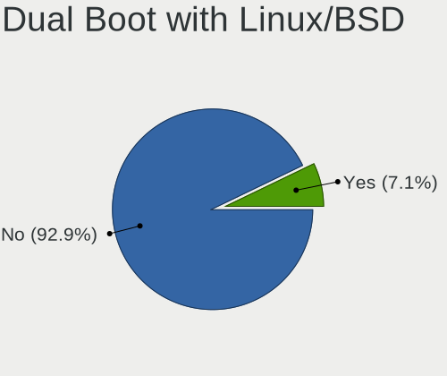
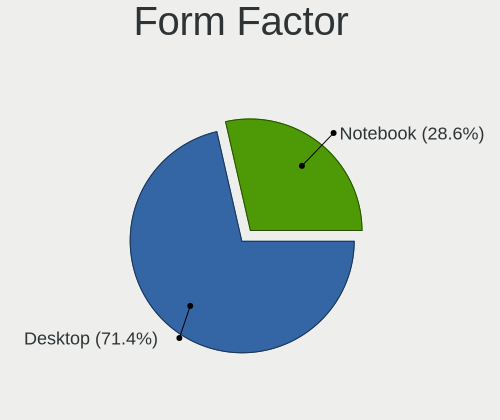
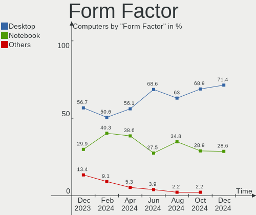
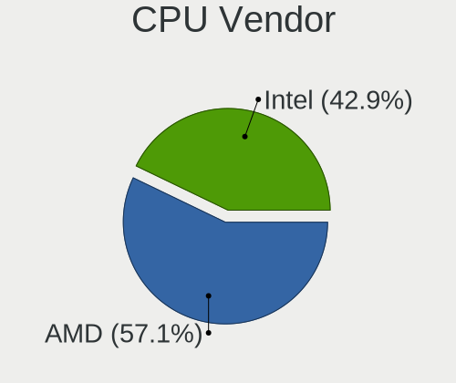
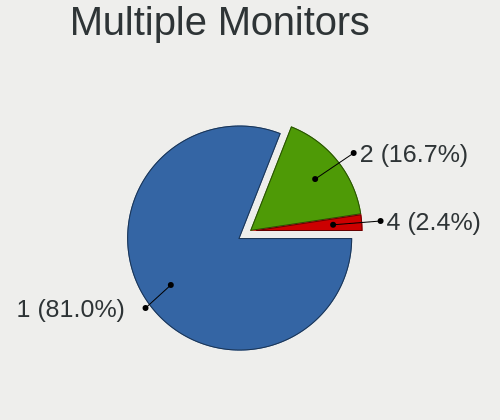
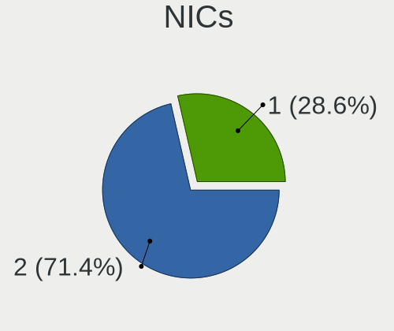
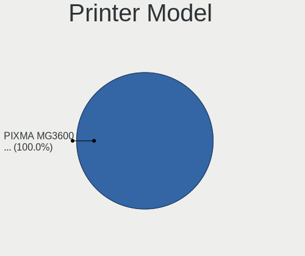

Nobara - Hardware Trends
------------------------

A project to identify most popular hardware characteristics and track their change
over time based on data collected by Linux users at https://Linux-Hardware.org.

Anyone can contribute to this report by the [hw-probe](https://github.com/linuxhw/hw-probe) tool:

    sudo -E hw-probe -all -upload

This is a report for all computer types. See also reports for [desktops](/Dist/Nobara/Desktop/README.md) and [notebooks](/Dist/Nobara/Notebook/README.md).

This report is for one last month. Overall report since the beginning of time: [TestDays](https://github.com/linuxhw/TestDays)

Period: Feb, 2023.

Contents
--------

* [ System ](#system)
  - [ OS                       ](#os)
  - [ OS Family                ](#os-family)
  - [ Kernel                   ](#kernel)
  - [ Kernel Family            ](#kernel-family)
  - [ Kernel Major Ver.        ](#kernel-major-ver)
  - [ Arch                     ](#arch)
  - [ DE                       ](#de)
  - [ Display Server           ](#display-server)
  - [ Display Manager          ](#display-manager)
  - [ OS Lang                  ](#os-lang)
  - [ Boot Mode                ](#boot-mode)
  - [ Filesystem               ](#filesystem)
  - [ Part. scheme             ](#part-scheme)
  - [ Dual Boot with Linux/BSD ](#dual-boot-with-linuxbsd)
  - [ Dual Boot (Win)          ](#dual-boot-win)

* [ Board ](#board)
  - [ Vendor                   ](#vendor)
  - [ Model                    ](#model)
  - [ Model Family             ](#model-family)
  - [ MFG Year                 ](#mfg-year)
  - [ Form Factor              ](#form-factor)
  - [ Secure Boot              ](#secure-boot)
  - [ Coreboot                 ](#coreboot)
  - [ RAM Size                 ](#ram-size)
  - [ RAM Used                 ](#ram-used)
  - [ Total Drives             ](#total-drives)
  - [ Has CD-ROM               ](#has-cd-rom)
  - [ Has Ethernet             ](#has-ethernet)
  - [ Has WiFi                 ](#has-wifi)
  - [ Has Bluetooth            ](#has-bluetooth)

* [ Location ](#location)
  - [ Country                  ](#country)
  - [ City                     ](#city)

* [ Drives ](#drives)
  - [ Drive Vendor             ](#drive-vendor)
  - [ Drive Model              ](#drive-model)
  - [ HDD Vendor               ](#hdd-vendor)
  - [ SSD Vendor               ](#ssd-vendor)
  - [ Drive Kind               ](#drive-kind)
  - [ Drive Connector          ](#drive-connector)
  - [ Drive Size               ](#drive-size)
  - [ Space Total              ](#space-total)
  - [ Space Used               ](#space-used)
  - [ Malfunc. Drives          ](#malfunc-drives)
  - [ Malfunc. Drive Vendor    ](#malfunc-drive-vendor)
  - [ Malfunc. HDD Vendor      ](#malfunc-hdd-vendor)
  - [ Malfunc. Drive Kind      ](#malfunc-drive-kind)
  - [ Failed Drives            ](#failed-drives)
  - [ Failed Drive Vendor      ](#failed-drive-vendor)
  - [ Drive Status             ](#drive-status)

* [ Storage controller ](#storage-controller)
  - [ Storage Vendor           ](#storage-vendor)
  - [ Storage Model            ](#storage-model)
  - [ Storage Kind             ](#storage-kind)

* [ Processor ](#processor)
  - [ CPU Vendor               ](#cpu-vendor)
  - [ CPU Model                ](#cpu-model)
  - [ CPU Model Family         ](#cpu-model-family)
  - [ CPU Cores                ](#cpu-cores)
  - [ CPU Sockets              ](#cpu-sockets)
  - [ CPU Threads              ](#cpu-threads)
  - [ CPU Op-Modes             ](#cpu-op-modes)
  - [ CPU Microcode            ](#cpu-microcode)
  - [ CPU Microarch            ](#cpu-microarch)

* [ Graphics ](#graphics)
  - [ GPU Vendor               ](#gpu-vendor)
  - [ GPU Model                ](#gpu-model)
  - [ GPU Combo                ](#gpu-combo)
  - [ GPU Driver               ](#gpu-driver)
  - [ GPU Memory               ](#gpu-memory)

* [ Monitor ](#monitor)
  - [ Monitor Vendor           ](#monitor-vendor)
  - [ Monitor Model            ](#monitor-model)
  - [ Monitor Resolution       ](#monitor-resolution)
  - [ Monitor Diagonal         ](#monitor-diagonal)
  - [ Monitor Width            ](#monitor-width)
  - [ Aspect Ratio             ](#aspect-ratio)
  - [ Monitor Area             ](#monitor-area)
  - [ Pixel Density            ](#pixel-density)
  - [ Multiple Monitors        ](#multiple-monitors)

* [ Network ](#network)
  - [ Net Controller Vendor    ](#net-controller-vendor)
  - [ Net Controller Model     ](#net-controller-model)
  - [ Wireless Vendor          ](#wireless-vendor)
  - [ Wireless Model           ](#wireless-model)
  - [ Ethernet Vendor          ](#ethernet-vendor)
  - [ Ethernet Model           ](#ethernet-model)
  - [ Net Controller Kind      ](#net-controller-kind)
  - [ Used Controller          ](#used-controller)
  - [ NICs                     ](#nics)
  - [ IPv6                     ](#ipv6)

* [ Bluetooth ](#bluetooth)
  - [ Bluetooth Vendor         ](#bluetooth-vendor)
  - [ Bluetooth Model          ](#bluetooth-model)

* [ Sound ](#sound)
  - [ Sound Vendor             ](#sound-vendor)
  - [ Sound Model              ](#sound-model)

* [ Memory ](#memory)
  - [ Memory Vendor            ](#memory-vendor)
  - [ Memory Model             ](#memory-model)
  - [ Memory Kind              ](#memory-kind)
  - [ Memory Form Factor       ](#memory-form-factor)
  - [ Memory Size              ](#memory-size)
  - [ Memory Speed             ](#memory-speed)

* [ Printers & scanners ](#printers--scanners)
  - [ Printer Vendor           ](#printer-vendor)
  - [ Printer Model            ](#printer-model)
  - [ Scanner Vendor           ](#scanner-vendor)
  - [ Scanner Model            ](#scanner-model)

* [ Camera ](#camera)
  - [ Camera Vendor            ](#camera-vendor)
  - [ Camera Model             ](#camera-model)

* [ Security ](#security)
  - [ Fingerprint Vendor       ](#fingerprint-vendor)
  - [ Fingerprint Model        ](#fingerprint-model)
  - [ Chipcard Vendor          ](#chipcard-vendor)
  - [ Chipcard Model           ](#chipcard-model)

* [ Unsupported ](#unsupported)
  - [ Unsupported Devices      ](#unsupported-devices)
  - [ Unsupported Device Types ](#unsupported-device-types)

System
------

OS
--

Installed operating systems

| Name      | Computers | Percent |
|-----------|-----------|---------|
| Nobara 37 | 47        | 94%     |
| Nobara 36 | 3         | 6%      |

OS Family
---------

OS without a version

| Name   | Computers | Percent |
|--------|-----------|---------|
| Nobara | 50        | 100%    |

Kernel
------

Version of the Linux kernel

| Version                      | Computers | Percent |
|------------------------------|-----------|---------|
| 6.1.9-200.fsync.fc37.x86_64  | 17        | 34%     |
| 6.1.11-201.fsync.fc37.x86_64 | 11        | 22%     |
| 6.1.8-202.fsync.fc37.x86_64  | 9         | 18%     |
| 6.1.4-203.fsync.fc37.x86_64  | 4         | 8%      |
| 6.1.8-201.fsync.fc37.x86_64  | 3         | 6%      |
| 6.1.6-203.fsync.fc37.x86_64  | 2         | 4%      |
| 6.0.14-201.fsync.fc36.x86_64 | 2         | 4%      |
| 6.1.12_tkg_cfs               | 1         | 2%      |
| 6.0.10-201.fc36.x86_64       | 1         | 2%      |

Kernel Family
-------------

Linux kernel without a distro release

| Version | Computers | Percent |
|---------|-----------|---------|
| 6.1.9   | 17        | 34%     |
| 6.1.8   | 12        | 24%     |
| 6.1.11  | 11        | 22%     |
| 6.1.4   | 4         | 8%      |
| 6.1.6   | 2         | 4%      |
| 6.0.14  | 2         | 4%      |
| 6.1.12  | 1         | 2%      |
| 6.0.10  | 1         | 2%      |

Kernel Major Ver.
-----------------

Linux kernel major version

| Version | Computers | Percent |
|---------|-----------|---------|
| 6.1     | 47        | 94%     |
| 6.0     | 3         | 6%      |

Arch
----

OS architecture (x86_64, i586, etc.)

| Name   | Computers | Percent |
|--------|-----------|---------|
| x86_64 | 50        | 100%    |

DE
--

Desktop Environment

| Name  | Computers | Percent |
|-------|-----------|---------|
| GNOME | 32        | 64%     |
| KDE5  | 18        | 36%     |

Display Server
--------------

X11 or Wayland

| Name    | Computers | Percent |
|---------|-----------|---------|
| Wayland | 34        | 68%     |
| X11     | 15        | 30%     |
| Tty     | 1         | 2%      |

Display Manager
---------------

SDDM, LightDM, etc.

| Name    | Computers | Percent |
|---------|-----------|---------|
| Unknown | 39        | 78%     |
| GDM     | 7         | 14%     |
| SDDM    | 3         | 6%      |
| LightDM | 1         | 2%      |

OS Lang
-------

Language

| Lang  | Computers | Percent |
|-------|-----------|---------|
| en_US | 28        | 56%     |
| en_GB | 7         | 14%     |
| es_ES | 3         | 6%      |
| it_IT | 2         | 4%      |
| en_CA | 2         | 4%      |
| pt_BR | 1         | 2%      |
| es_MX | 1         | 2%      |
| en_NZ | 1         | 2%      |
| en_IN | 1         | 2%      |
| en_IL | 1         | 2%      |
| de_DE | 1         | 2%      |
| de_AT | 1         | 2%      |
| ar_SA | 1         | 2%      |

Boot Mode
---------

EFI or BIOS

| Mode | Computers | Percent |
|------|-----------|---------|
| EFI  | 45        | 90%     |
| BIOS | 5         | 10%     |

Filesystem
----------

Type of filesystem

| Type  | Computers | Percent |
|-------|-----------|---------|
| Btrfs | 45        | 90%     |
| Ext4  | 5         | 10%     |

Part. scheme
------------

Scheme of partitioning

| Type    | Computers | Percent |
|---------|-----------|---------|
| Unknown | 39        | 78%     |
| GPT     | 11        | 22%     |

Dual Boot with Linux/BSD
------------------------

Hosting more than one Linux/BSD

| Dual boot | Computers | Percent |
|-----------|-----------|---------|
| No        | 48        | 96%     |
| Yes       | 2         | 4%      |

Dual Boot (Win)
---------------

Hosting Linux and Windows

| Dual boot | Computers | Percent |
|-----------|-----------|---------|
| No        | 43        | 86%     |
| Yes       | 7         | 14%     |

Board
-----

Vendor
------

Motherboard manufacturer

| Name                | Computers | Percent |
|---------------------|-----------|---------|
| ASUSTek Computer    | 15        | 30%     |
| MSI                 | 10        | 20%     |
| Hewlett-Packard     | 8         | 16%     |
| Gigabyte Technology | 5         | 10%     |
| Lenovo              | 4         | 8%      |
| Dell                | 4         | 8%      |
| ASRock              | 2         | 4%      |
| Sony                | 1         | 2%      |
| Acer                | 1         | 2%      |

Model
-----

Motherboard model

| Name                                       | Computers | Percent |
|--------------------------------------------|-----------|---------|
| HP EliteBook x360 1030 G2                  | 2         | 4%      |
| Dell XPS 8700                              | 2         | 4%      |
| Sony SVF1521N6EW                           | 1         | 2%      |
| MSI MS-7D43                                | 1         | 2%      |
| MSI MS-7D25                                | 1         | 2%      |
| MSI MS-7C91                                | 1         | 2%      |
| MSI MS-7C87                                | 1         | 2%      |
| MSI MS-7C56                                | 1         | 2%      |
| MSI MS-7B93                                | 1         | 2%      |
| MSI MS-7B85                                | 1         | 2%      |
| MSI MS-7B50                                | 1         | 2%      |
| MSI MS-7977                                | 1         | 2%      |
| MSI GF63 Thin 10SC                         | 1         | 2%      |
| Lenovo ThinkPad X1 Carbon Gen 9 20XWS0ME00 | 1         | 2%      |
| Lenovo ThinkPad P14s Gen 1 20S4001NUS      | 1         | 2%      |
| Lenovo IdeaPad 5 15ITL05 82FG              | 1         | 2%      |
| Lenovo IdeaPad 330-15ICH 81FK              | 1         | 2%      |
| HP ZBook 15u G3                            | 1         | 2%      |
| HP t610 WW Thin Client                     | 1         | 2%      |
| HP Pavilion Gaming Laptop 15-ec1xxx        | 1         | 2%      |
| HP ENVY 15                                 | 1         | 2%      |
| HP EliteBook Revolve 810 G1                | 1         | 2%      |
| HP Desktop Pro PCI MT                      | 1         | 2%      |
| Gigabyte X570 AORUS ELITE WIFI             | 1         | 2%      |
| Gigabyte B550M AORUS ELITE                 | 1         | 2%      |
| Gigabyte B550 AORUS ELITE V2               | 1         | 2%      |
| Gigabyte B360M AORUS Gaming 3              | 1         | 2%      |
| Gigabyte AERO 15 Classic-SA                | 1         | 2%      |
| Dell Inspiron 5555                         | 1         | 2%      |
| Dell G3 3590                               | 1         | 2%      |
| ASUS VivoBook_ASUS Laptop X505ZA_A505ZA    | 1         | 2%      |
| ASUS TUF Gaming B550M-PLUS WIFI II         | 1         | 2%      |
| ASUS TUF Gaming B460-PLUS                  | 1         | 2%      |
| ASUS ROG STRIX Z390-F GAMING               | 1         | 2%      |
| ASUS ROG STRIX X570-E GAMING WIFI II       | 1         | 2%      |
| ASUS ROG Strix G512LW_G512LW               | 1         | 2%      |
| ASUS ROG Strix G512LI_G512LI               | 1         | 2%      |
| ASUS ROG CROSSHAIR X670E EXTREME           | 1         | 2%      |
| ASUS PRIME X570-P                          | 1         | 2%      |
| ASUS PRIME B450M-A II                      | 1         | 2%      |

Model Family
------------

Motherboard model prefix

| Name             | Computers | Percent |
|------------------|-----------|---------|
| ASUS ROG         | 5         | 10%     |
| HP EliteBook     | 3         | 6%      |
| Lenovo ThinkPad  | 2         | 4%      |
| Lenovo IdeaPad   | 2         | 4%      |
| Dell XPS         | 2         | 4%      |
| ASUS TUF         | 2         | 4%      |
| ASUS PRIME       | 2         | 4%      |
| Sony SVF1521N6EW | 1         | 2%      |
| MSI MS-7D43      | 1         | 2%      |
| MSI MS-7D25      | 1         | 2%      |
| MSI MS-7C91      | 1         | 2%      |
| MSI MS-7C87      | 1         | 2%      |
| MSI MS-7C56      | 1         | 2%      |
| MSI MS-7B93      | 1         | 2%      |
| MSI MS-7B85      | 1         | 2%      |
| MSI MS-7B50      | 1         | 2%      |
| MSI MS-7977      | 1         | 2%      |
| MSI GF63         | 1         | 2%      |
| HP ZBook         | 1         | 2%      |
| HP t610          | 1         | 2%      |
| HP Pavilion      | 1         | 2%      |
| HP ENVY          | 1         | 2%      |
| HP Desktop       | 1         | 2%      |
| Gigabyte X570    | 1         | 2%      |
| Gigabyte B550M   | 1         | 2%      |
| Gigabyte B550    | 1         | 2%      |
| Gigabyte B360M   | 1         | 2%      |
| Gigabyte AERO    | 1         | 2%      |
| Dell Inspiron    | 1         | 2%      |
| Dell G3          | 1         | 2%      |
| ASUS VivoBook    | 1         | 2%      |
| ASUS P8Z77-M     | 1         | 2%      |
| ASUS Nobilis     | 1         | 2%      |
| ASUS M5A78L-M    | 1         | 2%      |
| ASUS K52Jc       | 1         | 2%      |
| ASUS ASUS        | 1         | 2%      |
| ASRock B660M-ITX | 1         | 2%      |
| ASRock B650M     | 1         | 2%      |
| Acer TravelMate  | 1         | 2%      |

MFG Year
--------

Motherboard manufacture year

| Year | Computers | Percent |
|------|-----------|---------|
| 2020 | 15        | 30%     |
| 2021 | 7         | 14%     |
| 2019 | 6         | 12%     |
| 2013 | 4         | 8%      |
| 2018 | 3         | 6%      |
| 2017 | 3         | 6%      |
| 2016 | 3         | 6%      |
| 2022 | 2         | 4%      |
| 2012 | 2         | 4%      |
| 2010 | 2         | 4%      |
| 2023 | 1         | 2%      |
| 2015 | 1         | 2%      |
| 2014 | 1         | 2%      |

Form Factor
-----------

Physical design of the computer

| Name        | Computers | Percent |
|-------------|-----------|---------|
| Desktop     | 28        | 56%     |
| Notebook    | 19        | 38%     |
| Convertible | 2         | 4%      |
| Mini pc     | 1         | 2%      |

Secure Boot
-----------

Enabled or disabled

| State    | Computers | Percent |
|----------|-----------|---------|
| Disabled | 50        | 100%    |

Coreboot
--------

Have coreboot on board

| Used | Computers | Percent |
|------|-----------|---------|
| No   | 50        | 100%    |

RAM Size
--------

Total RAM memory

| Size in GB  | Computers | Percent |
|-------------|-----------|---------|
| 16.01-24.0  | 17        | 34%     |
| 4.01-8.0    | 12        | 24%     |
| 32.01-64.0  | 11        | 22%     |
| 24.01-32.0  | 5         | 10%     |
| 64.01-256.0 | 2         | 4%      |
| 8.01-16.0   | 2         | 4%      |
| 3.01-4.0    | 1         | 2%      |

RAM Used
--------

Used RAM memory

| Used GB   | Computers | Percent |
|-----------|-----------|---------|
| 4.01-8.0  | 19        | 38%     |
| 3.01-4.0  | 14        | 28%     |
| 2.01-3.0  | 12        | 24%     |
| 8.01-16.0 | 4         | 8%      |
| 1.01-2.0  | 1         | 2%      |

Total Drives
------------

Number of drives on board

| Drives | Computers | Percent |
|--------|-----------|---------|
| 1      | 24        | 48%     |
| 3      | 10        | 20%     |
| 4      | 7         | 14%     |
| 2      | 7         | 14%     |
| 6      | 1         | 2%      |
| 5      | 1         | 2%      |

Has CD-ROM
----------

Has CD-ROM on board

| Presented | Computers | Percent |
|-----------|-----------|---------|
| No        | 37        | 74%     |
| Yes       | 13        | 26%     |

Has Ethernet
------------

Has Ethernet on board

| Presented | Computers | Percent |
|-----------|-----------|---------|
| Yes       | 48        | 96%     |
| No        | 2         | 4%      |

Has WiFi
--------

Has WiFi module

| Presented | Computers | Percent |
|-----------|-----------|---------|
| Yes       | 41        | 82%     |
| No        | 9         | 18%     |

Has Bluetooth
-------------

Has Bluetooth module

| Presented | Computers | Percent |
|-----------|-----------|---------|
| Yes       | 41        | 82%     |
| No        | 9         | 18%     |

Location
--------

Country
-------

Geographic location (country)

| Country      | Computers | Percent |
|--------------|-----------|---------|
| USA          | 17        | 34%     |
| Italy        | 5         | 10%     |
| UK           | 4         | 8%      |
| Spain        | 3         | 6%      |
| Germany      | 3         | 6%      |
| Canada       | 2         | 4%      |
| Brazil       | 2         | 4%      |
| Sweden       | 1         | 2%      |
| Saudi Arabia | 1         | 2%      |
| Romania      | 1         | 2%      |
| Poland       | 1         | 2%      |
| New Zealand  | 1         | 2%      |
| Mexico       | 1         | 2%      |
| Israel       | 1         | 2%      |
| India        | 1         | 2%      |
| Finland      | 1         | 2%      |
| Estonia      | 1         | 2%      |
| Czechia      | 1         | 2%      |
| Croatia      | 1         | 2%      |
| Austria      | 1         | 2%      |
| Argentina    | 1         | 2%      |

City
----

Geographic location (city)

| City                      | Computers | Percent |
|---------------------------|-----------|---------|
| Milano                    | 2         | 4%      |
| Zagreb                    | 1         | 2%      |
| Wroclaw                   | 1         | 2%      |
| Waite Park                | 1         | 2%      |
| Vienna                    | 1         | 2%      |
| Victoria                  | 1         | 2%      |
| Tartu                     | 1         | 2%      |
| Sunnyvale                 | 1         | 2%      |
| Stockholm                 | 1         | 2%      |
| Sterling                  | 1         | 2%      |
| Spokane                   | 1         | 2%      |
| Smethwick                 | 1         | 2%      |
| Sesto San Giovanni        | 1         | 2%      |
| Santo André              | 1         | 2%      |
| Saco                      | 1         | 2%      |
| Rothenbach an der Pegnitz | 1         | 2%      |
| Riyadh                    | 1         | 2%      |
| Reedsburg                 | 1         | 2%      |
| Puerto Madryn             | 1         | 2%      |
| Puentecesures             | 1         | 2%      |
| Prelouc                   | 1         | 2%      |
| Nuremberg                 | 1         | 2%      |
| Niagara-on-the-Lake       | 1         | 2%      |
| Mumbai                    | 1         | 2%      |
| Milan                     | 1         | 2%      |
| Madrid                    | 1         | 2%      |
| Machesney Park            | 1         | 2%      |
| Macclesfield              | 1         | 2%      |
| Mableton                  | 1         | 2%      |
| London                    | 1         | 2%      |
| Lake Elsinore             | 1         | 2%      |
| Johnson City              | 1         | 2%      |
| Joao Pessoa               | 1         | 2%      |
| Iowa City                 | 1         | 2%      |
| Holon                     | 1         | 2%      |
| Helsinki                  | 1         | 2%      |
| Greeneville               | 1         | 2%      |
| Göttingen                | 1         | 2%      |
| Gill                      | 1         | 2%      |
| Frisco                    | 1         | 2%      |

Drives
------

Drive Vendor
------------

Hard drive vendors

| Vendor                    | Computers | Drives | Percent |
|---------------------------|-----------|--------|---------|
| WDC                       | 12        | 15     | 13.48%  |
| Samsung Electronics       | 11        | 19     | 12.36%  |
| Seagate                   | 10        | 10     | 11.24%  |
| Kingston                  | 10        | 11     | 11.24%  |
| Sandisk                   | 7         | 7      | 7.87%   |
| Crucial                   | 7         | 8      | 7.87%   |
| Toshiba                   | 4         | 4      | 4.49%   |
| Intel                     | 4         | 5      | 4.49%   |
| SK hynix                  | 3         | 4      | 3.37%   |
| Micron/Crucial Technology | 3         | 4      | 3.37%   |
| Micron Technology         | 3         | 3      | 3.37%   |
| PNY                       | 2         | 2      | 2.25%   |
| Phison Electronics        | 2         | 2      | 2.25%   |
| USB3.0                    | 1         | 1      | 1.12%   |
| Unknown                   | 1         | 2      | 1.12%   |
| Union Memory              | 1         | 1      | 1.12%   |
| T-FORCE                   | 1         | 1      | 1.12%   |
| SPCC                      | 1         | 1      | 1.12%   |
| Silicon Motion            | 1         | 1      | 1.12%   |
| Phison                    | 1         | 1      | 1.12%   |
| Neo                       | 1         | 1      | 1.12%   |
| Lexar                     | 1         | 1      | 1.12%   |
| HGST                      | 1         | 1      | 1.12%   |
| Drevo                     | 1         | 1      | 1.12%   |

Drive Model
-----------

Hard drive models

| Model                                                | Computers | Percent |
|------------------------------------------------------|-----------|---------|
| Kingston SA400S37240G 240GB SSD                      | 4         | 3.92%   |
| Samsung NVMe SSD Controller SM981/PM981/PM983 250GB  | 3         | 2.94%   |
| Micron/Crucial P2 NVMe PCIe SSD 1TB                  | 3         | 2.94%   |
| SK hynix BC511 512GB                                 | 2         | 1.96%   |
| Seagate ST2000DM001-1ER164 2TB                       | 2         | 1.96%   |
| Sandisk WD Blue SN550 NVMe SSD 1TB                   | 2         | 1.96%   |
| Sandisk WD Black SN750 / PC SN730 NVMe SSD 512GB     | 2         | 1.96%   |
| Samsung SSD 860 EVO 500GB                            | 2         | 1.96%   |
| Samsung NVMe SSD Controller PM9A1/PM9A3/980PRO 960GB | 2         | 1.96%   |
| Phison PS5013 E13 NVMe Controller 500GB              | 2         | 1.96%   |
| Micron MTFDDAV256TBN-1AR15ABHA 256GB SSD             | 2         | 1.96%   |
| Crucial CT1000MX500SSD1 1TB                          | 2         | 1.96%   |
| Crucial CT1000BX500SSD1 1TB                          | 2         | 1.96%   |
| WDC WDS100T1XHE-00AFY0 1TB                           | 1         | 0.98%   |
| WDC WD80EFAX-68KNBN0 8TB                             | 1         | 0.98%   |
| WDC WD40EZAZ-00SF3B0 4TB                             | 1         | 0.98%   |
| WDC WD4005FZBX-00K5WB0 4TB                           | 1         | 0.98%   |
| WDC WD2500BMVS-11F9S0 250GB                          | 1         | 0.98%   |
| WDC WD2500BEVT-60A23T0 250GB                         | 1         | 0.98%   |
| WDC WD15EARX-00PASB0 1TB                             | 1         | 0.98%   |
| WDC WD10JPCX-24UE4T0 1TB                             | 1         | 0.98%   |
| WDC WD10EZRX-00L4HB0 1TB                             | 1         | 0.98%   |
| WDC WD10EZRX-00A8LB0 1TB                             | 1         | 0.98%   |
| WDC WD10EZEX-08M2NA0 1TB                             | 1         | 0.98%   |
| WDC WD10EZEX-00WN4A0 1TB                             | 1         | 0.98%   |
| WDC WD10EZEX-00BN5A0 1TB                             | 1         | 0.98%   |
| WDC WD10EARX-00PASB0 1TB                             | 1         | 0.98%   |
| WDC WD Blue SA510 2.5 1000GB                         | 1         | 0.98%   |
| USB3.0 Super Speed 960GB                             | 1         | 0.98%   |
| Unknown SD/MMC 2GB                                   | 1         | 0.98%   |
| Unknown M.S./M.S.Pro/HG 16GB                         | 1         | 0.98%   |
| Union Memory UMIS RPJTJ512MEE1OWX 512GB              | 1         | 0.98%   |
| Toshiba KXG6AZNV1T02 1TB                             | 1         | 0.98%   |
| Toshiba HDWD240 4TB                                  | 1         | 0.98%   |
| Toshiba HDWD110 1TB                                  | 1         | 0.98%   |
| Toshiba DT01ACA100 1TB                               | 1         | 0.98%   |
| T-FORCE 512GB                                        | 1         | 0.98%   |
| SPCC Solid State Disk 256GB                          | 1         | 0.98%   |
| SK hynix SHPP41-2000GM 2TB                           | 1         | 0.98%   |
| SK hynix SHPP41-1000GM 1TB                           | 1         | 0.98%   |

HDD Vendor
----------

Hard disk drive vendors

| Vendor              | Computers | Drives | Percent |
|---------------------|-----------|--------|---------|
| WDC                 | 11        | 13     | 40.74%  |
| Seagate             | 10        | 10     | 37.04%  |
| Toshiba             | 3         | 3      | 11.11%  |
| USB3.0              | 1         | 1      | 3.7%    |
| Samsung Electronics | 1         | 1      | 3.7%    |
| HGST                | 1         | 1      | 3.7%    |

SSD Vendor
----------

Solid state drive vendors

| Vendor              | Computers | Drives | Percent |
|---------------------|-----------|--------|---------|
| Kingston            | 8         | 8      | 25%     |
| Crucial             | 6         | 7      | 18.75%  |
| Samsung Electronics | 5         | 7      | 15.63%  |
| Micron Technology   | 3         | 3      | 9.38%   |
| SanDisk             | 2         | 2      | 6.25%   |
| PNY                 | 2         | 2      | 6.25%   |
| WDC                 | 1         | 1      | 3.13%   |
| SPCC                | 1         | 1      | 3.13%   |
| Neo                 | 1         | 1      | 3.13%   |
| Lexar               | 1         | 1      | 3.13%   |
| Intel               | 1         | 1      | 3.13%   |
| Drevo               | 1         | 1      | 3.13%   |

Drive Kind
----------

HDD or SSD

| Kind    | Computers | Drives | Percent |
|---------|-----------|--------|---------|
| SSD     | 31        | 35     | 36.9%   |
| NVMe    | 29        | 39     | 34.52%  |
| HDD     | 22        | 29     | 26.19%  |
| Unknown | 2         | 3      | 2.38%   |

Drive Connector
---------------

SATA, SAS, NVMe, etc.

| Type | Computers | Drives | Percent |
|------|-----------|--------|---------|
| SATA | 37        | 63     | 53.62%  |
| NVMe | 29        | 39     | 42.03%  |
| SAS  | 3         | 4      | 4.35%   |

Drive Size
----------

Size of hard drive

| Size in TB | Computers | Drives | Percent |
|------------|-----------|--------|---------|
| 0.01-0.5   | 23        | 27     | 43.4%   |
| 0.51-1.0   | 18        | 24     | 33.96%  |
| 1.01-2.0   | 6         | 6      | 11.32%  |
| 3.01-4.0   | 3         | 3      | 5.66%   |
| 4.01-10.0  | 2         | 3      | 3.77%   |
| 10.01-20.0 | 1         | 1      | 1.89%   |

Space Total
-----------

Amount of disk space available on the file system

| Size in GB     | Computers | Percent |
|----------------|-----------|---------|
| 251-500        | 11        | 22%     |
| 1001-2000      | 10        | 20%     |
| 501-1000       | 10        | 20%     |
| 2001-3000      | 6         | 12%     |
| 101-250        | 4         | 8%      |
| More than 3000 | 3         | 6%      |
| 21-50          | 3         | 6%      |
| Unknown        | 2         | 4%      |
| 1-20           | 1         | 2%      |

Space Used
----------

Amount of used disk space

| Used GB        | Computers | Percent |
|----------------|-----------|---------|
| 21-50          | 17        | 34%     |
| 51-100         | 8         | 16%     |
| 251-500        | 7         | 14%     |
| 101-250        | 4         | 8%      |
| 1001-2000      | 4         | 8%      |
| 1-20           | 3         | 6%      |
| More than 3000 | 2         | 4%      |
| 501-1000       | 2         | 4%      |
| Unknown        | 2         | 4%      |
| 2001-3000      | 1         | 2%      |

Malfunc. Drives
---------------

Drive models with a malfunction

| Model                           | Computers | Drives | Percent |
|---------------------------------|-----------|--------|---------|
| Seagate ST500DM002-1BD142 500GB | 1         | 1      | 100%    |

Malfunc. Drive Vendor
---------------------

Vendors of faulty drives

| Vendor  | Computers | Drives | Percent |
|---------|-----------|--------|---------|
| Seagate | 1         | 1      | 100%    |

Malfunc. HDD Vendor
-------------------

Vendors of faulty HDD drives

| Vendor  | Computers | Drives | Percent |
|---------|-----------|--------|---------|
| Seagate | 1         | 1      | 100%    |

Malfunc. Drive Kind
-------------------

Kinds of faulty drives

| Kind | Computers | Drives | Percent |
|------|-----------|--------|---------|
| HDD  | 1         | 1      | 100%    |

Failed Drives
-------------

Failed drive models

Zero info for selected period =(

Failed Drive Vendor
-------------------

Failed drive vendors

Zero info for selected period =(

Drive Status
------------

Number of failed and malfunc. drives

| Status   | Computers | Drives | Percent |
|----------|-----------|--------|---------|
| Detected | 41        | 85     | 78.85%  |
| Works    | 10        | 20     | 19.23%  |
| Malfunc  | 1         | 1      | 1.92%   |

Storage controller
------------------

Storage Vendor
--------------

Storage controller vendors

| Vendor                       | Computers | Percent |
|------------------------------|-----------|---------|
| Intel                        | 27        | 34.18%  |
| AMD                          | 19        | 24.05%  |
| Samsung Electronics          | 8         | 10.13%  |
| SanDisk                      | 6         | 7.59%   |
| Micron/Crucial Technology    | 4         | 5.06%   |
| SK hynix                     | 3         | 3.8%    |
| Phison Electronics           | 3         | 3.8%    |
| Kingston Technology Company  | 3         | 3.8%    |
| ASMedia Technology           | 3         | 3.8%    |
| Union Memory (Shenzhen)      | 1         | 1.27%   |
| Toshiba America Info Systems | 1         | 1.27%   |
| Silicon Motion               | 1         | 1.27%   |

Storage Model
-------------

Storage controller models

| Model                                                                          | Computers | Percent |
|--------------------------------------------------------------------------------|-----------|---------|
| AMD FCH SATA Controller [AHCI mode]                                            | 8         | 9.41%   |
| Samsung NVMe SSD Controller SM981/PM981/PM983                                  | 5         | 5.88%   |
| AMD 500 Series Chipset SATA Controller                                         | 5         | 5.88%   |
| Micron/Crucial P2 NVMe PCIe SSD                                                | 3         | 3.53%   |
| Intel Sunrise Point-LP SATA Controller [AHCI mode]                             | 3         | 3.53%   |
| Intel Cannon Lake PCH SATA AHCI Controller                                     | 3         | 3.53%   |
| Intel Alder Lake-S PCH SATA Controller [AHCI Mode]                             | 3         | 3.53%   |
| Intel 400 Series Chipset Family SATA AHCI Controller                           | 3         | 3.53%   |
| AMD 400 Series Chipset SATA Controller                                         | 3         | 3.53%   |
| SK hynix BC511                                                                 | 2         | 2.35%   |
| SanDisk WD Blue SN550 NVMe SSD                                                 | 2         | 2.35%   |
| SanDisk WD Black SN750 / PC SN730 NVMe SSD                                     | 2         | 2.35%   |
| Samsung NVMe SSD Controller PM9A1/PM9A3/980PRO                                 | 2         | 2.35%   |
| Phison PS5013 E13 NVMe Controller                                              | 2         | 2.35%   |
| Kingston Company Company Non-Volatile memory controller                        | 2         | 2.35%   |
| Intel Q170/Q150/B150/H170/H110/Z170/CM236 Chipset SATA Controller [AHCI Mode]  | 2         | 2.35%   |
| Intel Cannon Lake Mobile PCH SATA AHCI Controller                              | 2         | 2.35%   |
| Intel 8 Series/C220 Series Chipset Family 6-port SATA Controller 1 [AHCI mode] | 2         | 2.35%   |
| Intel 7 Series Chipset Family 6-port SATA Controller [AHCI mode]               | 2         | 2.35%   |
| ASMedia ASM1062 Serial ATA Controller                                          | 2         | 2.35%   |
| AMD SATA controller                                                            | 2         | 2.35%   |
| Union Memory (Shenzhen) Non-Volatile memory controller                         | 1         | 1.18%   |
| Toshiba America Info Systems XG6 NVMe SSD Controller                           | 1         | 1.18%   |
| SK hynix Platinum P41 NVMe Solid State Drive 2TB                               | 1         | 1.18%   |
| Silicon Motion SM2263EN/SM2263XT SSD Controller                                | 1         | 1.18%   |
| SanDisk WD PC SN810 / Black SN850 NVMe SSD                                     | 1         | 1.18%   |
| SanDisk WD Blue SN570 NVMe SSD                                                 | 1         | 1.18%   |
| Samsung NVMe SSD Controller SM961/PM961/SM963                                  | 1         | 1.18%   |
| Samsung NVMe SSD Controller SM951/PM951                                        | 1         | 1.18%   |
| Samsung NVMe SSD Controller 980                                                | 1         | 1.18%   |
| Phison E18 PCIe4 NVMe Controller                                               | 1         | 1.18%   |
| Micron/Crucial P1 NVMe PCIe SSD                                                | 1         | 1.18%   |
| Kingston Company A2000 NVMe SSD                                                | 1         | 1.18%   |
| Intel Wildcat Point-LP SATA Controller [AHCI Mode]                             | 1         | 1.18%   |
| Intel Tiger Lake-LP SATA Controller                                            | 1         | 1.18%   |
| Intel SSD Pro 7600p/760p/E 6100p Series                                        | 1         | 1.18%   |
| Intel SSD 660P Series                                                          | 1         | 1.18%   |
| Intel Non-Volatile memory controller                                           | 1         | 1.18%   |
| Intel 9 Series Chipset Family SATA Controller [AHCI Mode]                      | 1         | 1.18%   |
| Intel 8 Series SATA Controller 1 [AHCI mode]                                   | 1         | 1.18%   |

Storage Kind
------------

Kind of storage controller (IDE, SATA, NVMe, SAS, ...)

| Kind | Computers | Percent |
|------|-----------|---------|
| SATA | 45        | 59.21%  |
| NVMe | 29        | 38.16%  |
| IDE  | 2         | 2.63%   |

Processor
---------

CPU Vendor
----------

Processor vendors

| Vendor | Computers | Percent |
|--------|-----------|---------|
| Intel  | 31        | 62%     |
| AMD    | 19        | 38%     |

CPU Model
---------

Processor models

| Model                                   | Computers | Percent |
|-----------------------------------------|-----------|---------|
| AMD Ryzen 7 5700X 8-Core Processor      | 3         | 6%      |
| Intel Core i7-7600U CPU @ 2.80GHz       | 2         | 4%      |
| Intel 12th Gen Core i5-12400            | 2         | 4%      |
| Intel 11th Gen Core i7-1165G7 @ 2.80GHz | 2         | 4%      |
| Intel Pentium CPU G3240 @ 3.10GHz       | 1         | 2%      |
| Intel Core i7-9750H CPU @ 2.60GHz       | 1         | 2%      |
| Intel Core i7-9700K CPU @ 3.60GHz       | 1         | 2%      |
| Intel Core i7-9700 CPU @ 3.00GHz        | 1         | 2%      |
| Intel Core i7-7700 CPU @ 3.60GHz        | 1         | 2%      |
| Intel Core i7-6700K CPU @ 4.00GHz       | 1         | 2%      |
| Intel Core i7-6500U CPU @ 2.50GHz       | 1         | 2%      |
| Intel Core i7-5500U CPU @ 2.40GHz       | 1         | 2%      |
| Intel Core i7-4790 CPU @ 3.60GHz        | 1         | 2%      |
| Intel Core i7-4770 CPU @ 3.40GHz        | 1         | 2%      |
| Intel Core i7-10750H CPU @ 2.60GHz      | 1         | 2%      |
| Intel Core i7-10510U CPU @ 1.80GHz      | 1         | 2%      |
| Intel Core i5-9400F CPU @ 2.90GHz       | 1         | 2%      |
| Intel Core i5-9300H CPU @ 2.40GHz       | 1         | 2%      |
| Intel Core i5-8300H CPU @ 2.30GHz       | 1         | 2%      |
| Intel Core i5-3437U CPU @ 1.90GHz       | 1         | 2%      |
| Intel Core i5-3337U CPU @ 1.80GHz       | 1         | 2%      |
| Intel Core i5-2500 CPU @ 3.30GHz        | 1         | 2%      |
| Intel Core i5-10500H CPU @ 2.50GHz      | 1         | 2%      |
| Intel Core i5-10400 CPU @ 2.90GHz       | 1         | 2%      |
| Intel Core i5-10300H CPU @ 2.50GHz      | 1         | 2%      |
| Intel Core i5-10200H CPU @ 2.40GHz      | 1         | 2%      |
| Intel Core i3-4005U CPU @ 1.70GHz       | 1         | 2%      |
| Intel Core i3 CPU M 350 @ 2.27GHz       | 1         | 2%      |
| Intel 12th Gen Core i5-12600K           | 1         | 2%      |
| AMD Ryzen 9 7950X 16-Core Processor     | 1         | 2%      |
| AMD Ryzen 9 5950X 16-Core Processor     | 1         | 2%      |
| AMD Ryzen 9 5900X 12-Core Processor     | 1         | 2%      |
| AMD Ryzen 7 5800X 8-Core Processor      | 1         | 2%      |
| AMD Ryzen 7 5700G with Radeon Graphics  | 1         | 2%      |
| AMD Ryzen 7 3700X 8-Core Processor      | 1         | 2%      |
| AMD Ryzen 5 7600 6-Core Processor       | 1         | 2%      |
| AMD Ryzen 5 5600X 6-Core Processor      | 1         | 2%      |
| AMD Ryzen 5 4600H with Radeon Graphics  | 1         | 2%      |
| AMD Ryzen 5 3600X 6-Core Processor      | 1         | 2%      |
| AMD Ryzen 5 3600 6-Core Processor       | 1         | 2%      |

CPU Model Family
----------------

Processor model prefix

| Model         | Computers | Percent |
|---------------|-----------|---------|
| Intel Core i7 | 13        | 26%     |
| Intel Core i5 | 10        | 20%     |
| AMD Ryzen 7   | 6         | 12%     |
| AMD Ryzen 5   | 6         | 12%     |
| Other         | 5         | 10%     |
| AMD Ryzen 9   | 3         | 6%      |
| Intel Core i3 | 2         | 4%      |
| Intel Pentium | 1         | 2%      |
| AMD Ryzen 3   | 1         | 2%      |
| AMD G         | 1         | 2%      |
| AMD FX        | 1         | 2%      |
| AMD A10       | 1         | 2%      |

CPU Cores
---------

Number of processor cores

| Number | Computers | Percent |
|--------|-----------|---------|
| 4      | 14        | 28%     |
| 6      | 12        | 24%     |
| 2      | 11        | 22%     |
| 8      | 8         | 16%     |
| 16     | 2         | 4%      |
| 12     | 1         | 2%      |
| 10     | 1         | 2%      |
| 3      | 1         | 2%      |

CPU Sockets
-----------

Number of sockets

| Number | Computers | Percent |
|--------|-----------|---------|
| 1      | 50        | 100%    |

CPU Threads
-----------

Threads per core (Hyper-Threading)

| Number | Computers | Percent |
|--------|-----------|---------|
| 2      | 43        | 86%     |
| 1      | 7         | 14%     |

CPU Op-Modes
------------

CPU Operation Modes (32-bit, 64-bit)

| Op mode        | Computers | Percent |
|----------------|-----------|---------|
| 32-bit, 64-bit | 50        | 100%    |

CPU Microcode
-------------

Microcode number

| Number     | Computers | Percent |
|------------|-----------|---------|
| 0xa0652    | 4         | 8%      |
| 0x906ea    | 3         | 6%      |
| 0x90672    | 3         | 6%      |
| 0x306c3    | 3         | 6%      |
| 0x0a20120a | 3         | 6%      |
| 0x08701021 | 3         | 6%      |
| 0x806e9    | 2         | 4%      |
| 0x806c1    | 2         | 4%      |
| 0x306a9    | 2         | 4%      |
| 0x0a601203 | 2         | 4%      |
| 0x0a201204 | 2         | 4%      |
| Unknown    | 2         | 4%      |
| 0xa0653    | 1         | 2%      |
| 0x906ed    | 1         | 2%      |
| 0x906ec    | 1         | 2%      |
| 0x906e9    | 1         | 2%      |
| 0x806ec    | 1         | 2%      |
| 0x506e3    | 1         | 2%      |
| 0x406e3    | 1         | 2%      |
| 0x40651    | 1         | 2%      |
| 0x306d4    | 1         | 2%      |
| 0x206a7    | 1         | 2%      |
| 0x20652    | 1         | 2%      |
| 0x0a50000d | 1         | 2%      |
| 0x0a201205 | 1         | 2%      |
| 0x08600106 | 1         | 2%      |
| 0x08108109 | 1         | 2%      |
| 0x08101007 | 1         | 2%      |
| 0x06006110 | 1         | 2%      |
| 0x0600081c | 1         | 2%      |
| 0x0500010d | 1         | 2%      |

CPU Microarch
-------------

Microarchitecture

| Name             | Computers | Percent |
|------------------|-----------|---------|
| KabyLake         | 10        | 20%     |
| Zen 3            | 8         | 16%     |
| CometLake        | 5         | 10%     |
| Zen 2            | 4         | 8%      |
| Haswell          | 4         | 8%      |
| Alderlake Hybrid | 3         | 6%      |
| TigerLake        | 2         | 4%      |
| Skylake          | 2         | 4%      |
| IvyBridge        | 2         | 4%      |
| Unknown          | 2         | 4%      |
| Zen+             | 1         | 2%      |
| Zen              | 1         | 2%      |
| Westmere         | 1         | 2%      |
| SandyBridge      | 1         | 2%      |
| Piledriver       | 1         | 2%      |
| Excavator        | 1         | 2%      |
| Broadwell        | 1         | 2%      |
| Bobcat           | 1         | 2%      |

Graphics
--------

GPU Vendor
----------

Vendors of graphics cards

| Vendor | Computers | Percent |
|--------|-----------|---------|
| Nvidia | 24        | 34.78%  |
| Intel  | 24        | 34.78%  |
| AMD    | 21        | 30.43%  |

GPU Model
---------

Graphics card models

| Model                                                                       | Computers | Percent |
|-----------------------------------------------------------------------------|-----------|---------|
| Intel CometLake-H GT2 [UHD Graphics]                                        | 3         | 4.29%   |
| Intel CoffeeLake-H GT2 [UHD Graphics 630]                                   | 3         | 4.29%   |
| AMD Ellesmere [Radeon RX 470/480/570/570X/580/580X/590]                     | 3         | 4.29%   |
| Nvidia TU117M [GeForce GTX 1650 Mobile / Max-Q]                             | 2         | 2.86%   |
| Nvidia GP106 [GeForce GTX 1060 3GB]                                         | 2         | 2.86%   |
| Intel TigerLake-LP GT2 [Iris Xe Graphics]                                   | 2         | 2.86%   |
| Intel HD Graphics 620                                                       | 2         | 2.86%   |
| Intel Alder Lake-S GT1 [UHD Graphics 730]                                   | 2         | 2.86%   |
| Intel 3rd Gen Core processor Graphics Controller                            | 2         | 2.86%   |
| AMD Raphael                                                                 | 2         | 2.86%   |
| AMD Navi 23 [Radeon RX 6600/6600 XT/6600M]                                  | 2         | 2.86%   |
| AMD Navi 22 [Radeon RX 6700/6700 XT/6750 XT / 6800M/6850M XT]               | 2         | 2.86%   |
| AMD Navi 21 [Radeon RX 6800/6800 XT / 6900 XT]                              | 2         | 2.86%   |
| AMD Baffin [Radeon RX 460/560D / Pro 450/455/460/555/555X/560/560X]         | 2         | 2.86%   |
| Nvidia TU117M [GeForce GTX 1650 Ti Mobile]                                  | 1         | 1.43%   |
| Nvidia TU117M                                                               | 1         | 1.43%   |
| Nvidia TU116M [GeForce GTX 1660 Ti Mobile]                                  | 1         | 1.43%   |
| Nvidia TU106M [GeForce RTX 2070 Mobile / Max-Q Refresh]                     | 1         | 1.43%   |
| Nvidia TU106 [GeForce RTX 2070]                                             | 1         | 1.43%   |
| Nvidia TU106 [GeForce RTX 2060 SUPER]                                       | 1         | 1.43%   |
| Nvidia TU106 [GeForce RTX 2060 Rev. A]                                      | 1         | 1.43%   |
| Nvidia TU106 [GeForce GTX 1650]                                             | 1         | 1.43%   |
| Nvidia GT218M [GeForce 310M]                                                | 1         | 1.43%   |
| Nvidia GP108GLM [Quadro P520]                                               | 1         | 1.43%   |
| Nvidia GP107M [GeForce GTX 1050 Mobile]                                     | 1         | 1.43%   |
| Nvidia GP107M [GeForce GTX 1050 3 GB Max-Q]                                 | 1         | 1.43%   |
| Nvidia GP104 [GeForce GTX 1070]                                             | 1         | 1.43%   |
| Nvidia GP104 [GeForce GTX 1070 Ti]                                          | 1         | 1.43%   |
| Nvidia GM206 [GeForce GTX 950]                                              | 1         | 1.43%   |
| Nvidia GM204 [GeForce GTX 970]                                              | 1         | 1.43%   |
| Nvidia GM107M [GeForce GTX 850M]                                            | 1         | 1.43%   |
| Nvidia GK208M [GeForce GT 740M]                                             | 1         | 1.43%   |
| Nvidia GA104 [GeForce RTX 3070 Lite Hash Rate]                              | 1         | 1.43%   |
| Nvidia GA104 [GeForce RTX 3060 Ti]                                          | 1         | 1.43%   |
| Intel Xeon E3-1200 v3/4th Gen Core Processor Integrated Graphics Controller | 1         | 1.43%   |
| Intel Skylake GT2 [HD Graphics 520]                                         | 1         | 1.43%   |
| Intel HD Graphics 630                                                       | 1         | 1.43%   |
| Intel HD Graphics 5500                                                      | 1         | 1.43%   |
| Intel Haswell-ULT Integrated Graphics Controller                            | 1         | 1.43%   |
| Intel Core Processor Integrated Graphics Controller                         | 1         | 1.43%   |

GPU Combo
---------

Combinations of graphics cards

| Name           | Computers | Percent |
|----------------|-----------|---------|
| 1 x AMD        | 15        | 30%     |
| Intel + Nvidia | 12        | 24%     |
| 1 x Nvidia     | 9         | 18%     |
| 1 x Intel      | 9         | 18%     |
| AMD + Nvidia   | 3         | 6%      |
| 2 x AMD        | 1         | 2%      |
| Intel + AMD    | 1         | 2%      |

GPU Driver
----------

Free vs proprietary

| Driver      | Computers | Percent |
|-------------|-----------|---------|
| Free        | 30        | 60%     |
| Proprietary | 20        | 40%     |

GPU Memory
----------

Total video memory

| Size in GB | Computers | Percent |
|------------|-----------|---------|
| Unknown    | 20        | 40%     |
| 7.01-8.0   | 11        | 22%     |
| 0.01-0.5   | 5         | 10%     |
| 1.01-2.0   | 4         | 8%      |
| 8.01-16.0  | 3         | 6%      |
| 0.51-1.0   | 3         | 6%      |
| 3.01-4.0   | 2         | 4%      |
| 2.01-3.0   | 1         | 2%      |
| 16.01-24.0 | 1         | 2%      |

Monitor
-------

Monitor Vendor
--------------

Monitor vendors

| Vendor                  | Computers | Percent |
|-------------------------|-----------|---------|
| Samsung Electronics     | 13        | 22.41%  |
| Chimei Innolux          | 5         | 8.62%   |
| AU Optronics            | 4         | 6.9%    |
| PANDA                   | 3         | 5.17%   |
| Hewlett-Packard         | 3         | 5.17%   |
| Dell                    | 3         | 5.17%   |
| LG Display              | 2         | 3.45%   |
| InfoVision              | 2         | 3.45%   |
| Goldstar                | 2         | 3.45%   |
| BenQ                    | 2         | 3.45%   |
| ASUSTek Computer        | 2         | 3.45%   |
| AOC                     | 2         | 3.45%   |
| Ancor Communications    | 2         | 3.45%   |
| Vizio                   | 1         | 1.72%   |
| ViewSonic               | 1         | 1.72%   |
| Sun                     | 1         | 1.72%   |
| Olevia                  | 1         | 1.72%   |
| MSI                     | 1         | 1.72%   |
| Insignia                | 1         | 1.72%   |
| HannStar                | 1         | 1.72%   |
| Eizo                    | 1         | 1.72%   |
| CSO                     | 1         | 1.72%   |
| Chi Mei Optoelectronics | 1         | 1.72%   |
| BOE                     | 1         | 1.72%   |
| AOpen                   | 1         | 1.72%   |
| Acer                    | 1         | 1.72%   |

Monitor Model
-------------

Monitor models

| Model                                                                 | Computers | Percent |
|-----------------------------------------------------------------------|-----------|---------|
| PANDA LCD Monitor NCP004D 1920x1080 344x194mm 15.5-inch               | 2         | 3.28%   |
| InfoVision LCD Monitor IVO0535 1920x1080 294x165mm 13.3-inch          | 2         | 3.28%   |
| Chimei Innolux LCD Monitor CMN15F5 1920x1080 344x193mm 15.5-inch      | 2         | 3.28%   |
| Vizio D43-D2 VIZ1004 1920x1080 477x268mm 21.5-inch                    | 1         | 1.64%   |
| ViewSonic VX2768-2KPC VSC093A 2560x1440 597x336mm 27.0-inch           | 1         | 1.64%   |
| Sun SCEI MONITOR SCE0301 1920x1080 522x294mm 23.6-inch                | 1         | 1.64%   |
| Samsung Electronics SyncMaster SAM060D 1920x1080                      | 1         | 1.64%   |
| Samsung Electronics SyncMaster SAM0168 1280x1024 338x270mm 17.0-inch  | 1         | 1.64%   |
| Samsung Electronics SyncMaster SAM0124 1280x1024 338x270mm 17.0-inch  | 1         | 1.64%   |
| Samsung Electronics SA300/SA350 SAM078C 1600x900 443x249mm 20.0-inch  | 1         | 1.64%   |
| Samsung Electronics S24E650 SAM0CB7 1920x1080 521x293mm 23.5-inch     | 1         | 1.64%   |
| Samsung Electronics S24D330 SAM0D92 1920x1080 531x299mm 24.0-inch     | 1         | 1.64%   |
| Samsung Electronics S24D300 SAM0B43 1920x1080 531x299mm 24.0-inch     | 1         | 1.64%   |
| Samsung Electronics S22R35x SAM103A 1920x1080 476x268mm 21.5-inch     | 1         | 1.64%   |
| Samsung Electronics LCD Monitor SDC5441 1366x768 344x194mm 15.5-inch  | 1         | 1.64%   |
| Samsung Electronics LCD Monitor SDC5344 1920x1080 344x194mm 15.5-inch | 1         | 1.64%   |
| Samsung Electronics LCD Monitor SAM0B7C 1920x1080 886x498mm 40.0-inch | 1         | 1.64%   |
| Samsung Electronics LCD Monitor SAM0A7C 1366x768 698x393mm 31.5-inch  | 1         | 1.64%   |
| Samsung Electronics LCD Monitor SAM08FE 1920x1080                     | 1         | 1.64%   |
| Samsung Electronics LC49G95T SAM7053 2560x1440 1193x336mm 48.8-inch   | 1         | 1.64%   |
| Samsung Electronics LC24RG50 SAM0F91 1920x1080 532x304mm 24.1-inch    | 1         | 1.64%   |
| PANDA LCD Monitor NCP002D 1920x1080 344x194mm 15.5-inch               | 1         | 1.64%   |
| Olevia 237-T12 SYN0043 1360x768 820x460mm 37.0-inch                   | 1         | 1.64%   |
| MSI MP242 MSI30A1 1920x1080 527x296mm 23.8-inch                       | 1         | 1.64%   |
| MSI MAG322CR MSI3DA5 1920x1080 698x393mm 31.5-inch                    | 1         | 1.64%   |
| LG Display LCD Monitor LGD05FE 1920x1080 344x194mm 15.5-inch          | 1         | 1.64%   |
| LG Display LCD Monitor LGD03CF 1366x768 256x144mm 11.6-inch           | 1         | 1.64%   |
| Insignia NS24ED200NA14 BBY0032 1360x768 640x384mm 29.4-inch           | 1         | 1.64%   |
| Hewlett-Packard OMEN by HP 25 HPN3425 1920x1080 543x302mm 24.5-inch   | 1         | 1.64%   |
| Hewlett-Packard LP2475w HWP26F8 1920x1200 546x352mm 25.6-inch         | 1         | 1.64%   |
| Hewlett-Packard E243i HPN3462 1920x1080 518x324mm 24.1-inch           | 1         | 1.64%   |
| HannStar Hanns.G HW173 HSD5A47 1440x900 408x255mm 18.9-inch           | 1         | 1.64%   |
| Goldstar IPS FULLHD GSM5AB8 1920x1080 480x270mm 21.7-inch             | 1         | 1.64%   |
| Goldstar 22M34 GSM5A95 1920x1080 480x270mm 21.7-inch                  | 1         | 1.64%   |
| Eizo EV2335W ENC2293 1920x1080 510x287mm 23.0-inch                    | 1         | 1.64%   |
| Dell U2717D DEL40EB 2560x1440 597x336mm 27.0-inch                     | 1         | 1.64%   |
| Dell P2714H DELD05E 1920x1080 598x336mm 27.0-inch                     | 1         | 1.64%   |
| Dell LCD Monitor ST2220L 1920x1080                                    | 1         | 1.64%   |
| CSO LCD Monitor CSO1404 1920x1200 302x189mm 14.0-inch                 | 1         | 1.64%   |
| Chimei Innolux LCD Monitor CMN15D5 1920x1080 344x193mm 15.5-inch      | 1         | 1.64%   |

Monitor Resolution
------------------

Monitor screen resolution

| Resolution        | Computers | Percent |
|-------------------|-----------|---------|
| 1920x1080 (FHD)   | 32        | 58.18%  |
| 2560x1440 (QHD)   | 6         | 10.91%  |
| 1366x768 (WXGA)   | 6         | 10.91%  |
| 3840x2160 (4K)    | 2         | 3.64%   |
| 1920x1200 (WUXGA) | 2         | 3.64%   |
| 1280x1024 (SXGA)  | 2         | 3.64%   |
| 3840x1080         | 1         | 1.82%   |
| 1920x540          | 1         | 1.82%   |
| 1600x900 (HD+)    | 1         | 1.82%   |
| 1440x900 (WXGA+)  | 1         | 1.82%   |
| 1360x768          | 1         | 1.82%   |

Monitor Diagonal
----------------

Diagonal size in inches

| Inches  | Computers | Percent |
|---------|-----------|---------|
| 15      | 16        | 27.59%  |
| 27      | 8         | 13.79%  |
| 24      | 6         | 10.34%  |
| 31      | 3         | 5.17%   |
| 23      | 3         | 5.17%   |
| 21      | 3         | 5.17%   |
| 13      | 3         | 5.17%   |
| 48      | 2         | 3.45%   |
| 17      | 2         | 3.45%   |
| Unknown | 2         | 3.45%   |
| 58      | 1         | 1.72%   |
| 57      | 1         | 1.72%   |
| 49      | 1         | 1.72%   |
| 37      | 1         | 1.72%   |
| 33      | 1         | 1.72%   |
| 25      | 1         | 1.72%   |
| 20      | 1         | 1.72%   |
| 18      | 1         | 1.72%   |
| 14      | 1         | 1.72%   |
| 11      | 1         | 1.72%   |

Monitor Width
-------------

Physical width

| Width in mm | Computers | Percent |
|-------------|-----------|---------|
| 301-350     | 20        | 34.48%  |
| 501-600     | 16        | 27.59%  |
| 601-700     | 5         | 8.62%   |
| 401-500     | 5         | 8.62%   |
| 1001-1500   | 5         | 8.62%   |
| 201-300     | 3         | 5.17%   |
| Unknown     | 2         | 3.45%   |
| 801-900     | 1         | 1.72%   |
| 701-800     | 1         | 1.72%   |

Aspect Ratio
------------

Proportional relationship between the width and the height

| Ratio   | Computers | Percent |
|---------|-----------|---------|
| 16/9    | 44        | 83.02%  |
| 16/10   | 4         | 7.55%   |
| 5/4     | 2         | 3.77%   |
| 32/9    | 1         | 1.89%   |
| 1.96    | 1         | 1.89%   |
| Unknown | 1         | 1.89%   |

Monitor Area
------------

Area in inch²

| Area in inch² | Computers | Percent |
|----------------|-----------|---------|
| 101-110        | 16        | 26.67%  |
| 201-250        | 10        | 16.67%  |
| 301-350        | 8         | 13.33%  |
| 351-500        | 4         | 6.67%   |
| 251-300        | 4         | 6.67%   |
| More than 1000 | 3         | 5%      |
| 151-200        | 3         | 5%      |
| 501-1000       | 3         | 5%      |
| 81-90          | 2         | 3.33%   |
| 71-80          | 2         | 3.33%   |
| 141-150        | 2         | 3.33%   |
| Unknown        | 2         | 3.33%   |
| 51-60          | 1         | 1.67%   |

Pixel Density
-------------

Pixels per inch

| Density | Computers | Percent |
|---------|-----------|---------|
| 51-100  | 18        | 32.73%  |
| 121-160 | 16        | 29.09%  |
| 101-120 | 10        | 18.18%  |
| 1-50    | 6         | 10.91%  |
| 161-240 | 3         | 5.45%   |
| Unknown | 2         | 3.64%   |

Multiple Monitors
-----------------

Total monitors connected

| Total | Computers | Percent |
|-------|-----------|---------|
| 1     | 40        | 80%     |
| 2     | 7         | 14%     |
| 3     | 3         | 6%      |

Network
-------

Net Controller Vendor
---------------------

Controller vendors

| Vendor                | Computers | Percent |
|-----------------------|-----------|---------|
| Intel                 | 30        | 36.59%  |
| Realtek Semiconductor | 29        | 35.37%  |
| Qualcomm Atheros      | 8         | 9.76%   |
| MediaTek              | 3         | 3.66%   |
| Broadcom              | 3         | 3.66%   |
| Hewlett-Packard       | 2         | 2.44%   |
| TP-Link               | 1         | 1.22%   |
| Samsung Electronics   | 1         | 1.22%   |
| Motorola PCS          | 1         | 1.22%   |
| JMicron Technology    | 1         | 1.22%   |
| ICS Advent            | 1         | 1.22%   |
| D-Link System         | 1         | 1.22%   |
| Aquantia              | 1         | 1.22%   |

Net Controller Model
--------------------

Controller models

| Model                                                             | Computers | Percent |
|-------------------------------------------------------------------|-----------|---------|
| Realtek RTL8111/8168/8411 PCI Express Gigabit Ethernet Controller | 23        | 24.47%  |
| Realtek RTL8125 2.5GbE Controller                                 | 6         | 6.38%   |
| Intel I211 Gigabit Network Connection                             | 4         | 4.26%   |
| Intel Wireless 8265 / 8275                                        | 3         | 3.19%   |
| Intel Wi-Fi 6 AX210/AX211/AX411 160MHz                            | 3         | 3.19%   |
| Intel Ethernet Connection (7) I219-V                              | 3         | 3.19%   |
| Intel Comet Lake PCH CNVi WiFi                                    | 3         | 3.19%   |
| Intel Cannon Lake PCH CNVi WiFi                                   | 3         | 3.19%   |
| Qualcomm Atheros QCA9565 / AR9565 Wireless Network Adapter        | 2         | 2.13%   |
| Qualcomm Atheros AR9485 Wireless Network Adapter                  | 2         | 2.13%   |
| MediaTek MT7921 802.11ax PCI Express Wireless Network Adapter     | 2         | 2.13%   |
| Intel Wi-Fi 6 AX201                                               | 2         | 2.13%   |
| Intel Ethernet Controller I225-V                                  | 2         | 2.13%   |
| Intel Dual Band Wireless-AC 3168NGW [Stone Peak]                  | 2         | 2.13%   |
| Intel Alder Lake-S PCH CNVi WiFi                                  | 2         | 2.13%   |
| HP lt4120 Snapdragon X5 LTE                                       | 2         | 2.13%   |
| TP-Link 802.11n NIC                                               | 1         | 1.06%   |
| Samsung Android                                                   | 1         | 1.06%   |
| Realtek RTL88x2bu [AC1200 Techkey]                                | 1         | 1.06%   |
| Realtek RTL8822CE 802.11ac PCIe Wireless Network Adapter          | 1         | 1.06%   |
| Realtek RTL810xE PCI Express Fast Ethernet controller             | 1         | 1.06%   |
| Qualcomm Atheros QCA9377 802.11ac Wireless Network Adapter        | 1         | 1.06%   |
| Qualcomm Atheros Killer E2500 Gigabit Ethernet Controller         | 1         | 1.06%   |
| Qualcomm Atheros Killer E2400 Gigabit Ethernet Controller         | 1         | 1.06%   |
| Qualcomm Atheros AR9285 Wireless Network Adapter (PCI-Express)    | 1         | 1.06%   |
| Motorola PCS moto g(8) plus                                       | 1         | 1.06%   |
| MediaTek MT7921K (RZ608) Wi-Fi 6E 80MHz                           | 1         | 1.06%   |
| JMicron JMC250 PCI Express Gigabit Ethernet Controller            | 1         | 1.06%   |
| Intel Wireless-AC 9260                                            | 1         | 1.06%   |
| Intel Wireless 8260                                               | 1         | 1.06%   |
| Intel Wireless 7265                                               | 1         | 1.06%   |
| Intel Wireless 3160                                               | 1         | 1.06%   |
| Intel Wi-Fi 6 AX200                                               | 1         | 1.06%   |
| Intel Ethernet Connection I219-V                                  | 1         | 1.06%   |
| Intel Ethernet Connection (17) I219-V                             | 1         | 1.06%   |
| Intel Ethernet Connection (12) I219-V                             | 1         | 1.06%   |
| Intel Ethernet Connection (10) I219-V                             | 1         | 1.06%   |
| Intel Comet Lake PCH-LP CNVi WiFi                                 | 1         | 1.06%   |
| Intel Centrino Advanced-N 6235                                    | 1         | 1.06%   |
| Intel 82579LM Gigabit Network Connection (Lewisville)             | 1         | 1.06%   |

Wireless Vendor
---------------

Wireless vendors

| Vendor                | Computers | Percent |
|-----------------------|-----------|---------|
| Intel                 | 25        | 62.5%   |
| Qualcomm Atheros      | 6         | 15%     |
| MediaTek              | 3         | 7.5%    |
| Realtek Semiconductor | 2         | 5%      |
| Broadcom              | 2         | 5%      |
| TP-Link               | 1         | 2.5%    |
| D-Link System         | 1         | 2.5%    |

Wireless Model
--------------

Wireless models

| Model                                                                     | Computers | Percent |
|---------------------------------------------------------------------------|-----------|---------|
| Intel Wireless 8265 / 8275                                                | 3         | 7.5%    |
| Intel Wi-Fi 6 AX210/AX211/AX411 160MHz                                    | 3         | 7.5%    |
| Intel Comet Lake PCH CNVi WiFi                                            | 3         | 7.5%    |
| Intel Cannon Lake PCH CNVi WiFi                                           | 3         | 7.5%    |
| Qualcomm Atheros QCA9565 / AR9565 Wireless Network Adapter                | 2         | 5%      |
| Qualcomm Atheros AR9485 Wireless Network Adapter                          | 2         | 5%      |
| MediaTek MT7921 802.11ax PCI Express Wireless Network Adapter             | 2         | 5%      |
| Intel Wi-Fi 6 AX201                                                       | 2         | 5%      |
| Intel Dual Band Wireless-AC 3168NGW [Stone Peak]                          | 2         | 5%      |
| Intel Alder Lake-S PCH CNVi WiFi                                          | 2         | 5%      |
| TP-Link 802.11n NIC                                                       | 1         | 2.5%    |
| Realtek RTL88x2bu [AC1200 Techkey]                                        | 1         | 2.5%    |
| Realtek RTL8822CE 802.11ac PCIe Wireless Network Adapter                  | 1         | 2.5%    |
| Qualcomm Atheros QCA9377 802.11ac Wireless Network Adapter                | 1         | 2.5%    |
| Qualcomm Atheros AR9285 Wireless Network Adapter (PCI-Express)            | 1         | 2.5%    |
| MediaTek MT7921K (RZ608) Wi-Fi 6E 80MHz                                   | 1         | 2.5%    |
| Intel Wireless-AC 9260                                                    | 1         | 2.5%    |
| Intel Wireless 8260                                                       | 1         | 2.5%    |
| Intel Wireless 7265                                                       | 1         | 2.5%    |
| Intel Wireless 3160                                                       | 1         | 2.5%    |
| Intel Wi-Fi 6 AX200                                                       | 1         | 2.5%    |
| Intel Comet Lake PCH-LP CNVi WiFi                                         | 1         | 2.5%    |
| Intel Centrino Advanced-N 6235                                            | 1         | 2.5%    |
| D-Link System AirPlus G DWL-G122 Wireless Adapter(rev.E1) [Ralink RT2070] | 1         | 2.5%    |
| Broadcom BCM4352 802.11ac Wireless Network Adapter                        | 1         | 2.5%    |
| Broadcom BCM4313 802.11bgn Wireless Network Adapter                       | 1         | 2.5%    |

Ethernet Vendor
---------------

Ethernet vendors

| Vendor                | Computers | Percent |
|-----------------------|-----------|---------|
| Realtek Semiconductor | 29        | 55.77%  |
| Intel                 | 14        | 26.92%  |
| Qualcomm Atheros      | 2         | 3.85%   |
| Hewlett-Packard       | 2         | 3.85%   |
| Motorola PCS          | 1         | 1.92%   |
| JMicron Technology    | 1         | 1.92%   |
| ICS Advent            | 1         | 1.92%   |
| Broadcom              | 1         | 1.92%   |
| Aquantia              | 1         | 1.92%   |

Ethernet Model
--------------

Ethernet models

| Model                                                               | Computers | Percent |
|---------------------------------------------------------------------|-----------|---------|
| Realtek RTL8111/8168/8411 PCI Express Gigabit Ethernet Controller   | 23        | 43.4%   |
| Realtek RTL8125 2.5GbE Controller                                   | 6         | 11.32%  |
| Intel I211 Gigabit Network Connection                               | 4         | 7.55%   |
| Intel Ethernet Connection (7) I219-V                                | 3         | 5.66%   |
| Intel Ethernet Controller I225-V                                    | 2         | 3.77%   |
| HP lt4120 Snapdragon X5 LTE                                         | 2         | 3.77%   |
| Realtek RTL810xE PCI Express Fast Ethernet controller               | 1         | 1.89%   |
| Qualcomm Atheros Killer E2500 Gigabit Ethernet Controller           | 1         | 1.89%   |
| Qualcomm Atheros Killer E2400 Gigabit Ethernet Controller           | 1         | 1.89%   |
| Motorola PCS moto g(8) plus                                         | 1         | 1.89%   |
| JMicron JMC250 PCI Express Gigabit Ethernet Controller              | 1         | 1.89%   |
| Intel Ethernet Connection I219-V                                    | 1         | 1.89%   |
| Intel Ethernet Connection (17) I219-V                               | 1         | 1.89%   |
| Intel Ethernet Connection (12) I219-V                               | 1         | 1.89%   |
| Intel Ethernet Connection (10) I219-V                               | 1         | 1.89%   |
| Intel 82579LM Gigabit Network Connection (Lewisville)               | 1         | 1.89%   |
| ICS Advent 10/100M LAN                                              | 1         | 1.89%   |
| Broadcom NetLink BCM57781 Gigabit Ethernet PCIe                     | 1         | 1.89%   |
| Aquantia AQC113CS NBase-T/IEEE 802.3bz Ethernet Controller [AQtion] | 1         | 1.89%   |

Net Controller Kind
-------------------

Ethernet, WiFi or modem

| Kind     | Computers | Percent |
|----------|-----------|---------|
| Ethernet | 49        | 54.44%  |
| WiFi     | 40        | 44.44%  |
| Modem    | 1         | 1.11%   |

Used Controller
---------------

Currently used network controller

| Kind     | Computers | Percent |
|----------|-----------|---------|
| Ethernet | 29        | 52.73%  |
| WiFi     | 26        | 47.27%  |

NICs
----

Total network controllers on board

| Total | Computers | Percent |
|-------|-----------|---------|
| 2     | 32        | 64%     |
| 1     | 16        | 32%     |
| 3     | 2         | 4%      |

IPv6
----

IPv6 vs IPv4

| Used | Computers | Percent |
|------|-----------|---------|
| No   | 33        | 66%     |
| Yes  | 17        | 34%     |

Bluetooth
---------

Bluetooth Vendor
----------------

Controller vendors

| Vendor                          | Computers | Percent |
|---------------------------------|-----------|---------|
| Intel                           | 25        | 60.98%  |
| Qualcomm Atheros Communications | 4         | 9.76%   |
| Cambridge Silicon Radio         | 4         | 9.76%   |
| IMC Networks                    | 2         | 4.88%   |
| TP-Link                         | 1         | 2.44%   |
| Realtek Semiconductor           | 1         | 2.44%   |
| MediaTek                        | 1         | 2.44%   |
| Lite-On Technology              | 1         | 2.44%   |
| Edimax Technology               | 1         | 2.44%   |
| Broadcom                        | 1         | 2.44%   |

Bluetooth Model
---------------

Controller models

| Model                                                   | Computers | Percent |
|---------------------------------------------------------|-----------|---------|
| Intel Bluetooth wireless interface                      | 6         | 14.63%  |
| Intel AX201 Bluetooth                                   | 6         | 14.63%  |
| Intel Bluetooth 9460/9560 Jefferson Peak (JfP)          | 5         | 12.2%   |
| Cambridge Silicon Radio Bluetooth Dongle (HCI mode)     | 4         | 9.76%   |
| Qualcomm Atheros  Bluetooth Device                      | 2         | 4.88%   |
| Qualcomm Atheros Bluetooth USB Host Controller          | 2         | 4.88%   |
| Intel Wireless-AC 3168 Bluetooth                        | 2         | 4.88%   |
| Intel AX210 Bluetooth                                   | 2         | 4.88%   |
| Intel AX200 Bluetooth                                   | 2         | 4.88%   |
| IMC Networks Wireless_Device                            | 2         | 4.88%   |
| TP-Link TPuLink UB500 Adapter                           | 1         | 2.44%   |
| Realtek Bluetooth Radio                                 | 1         | 2.44%   |
| MediaTek Wireless_Device                                | 1         | 2.44%   |
| Lite-On Atheros AR3012 Bluetooth                        | 1         | 2.44%   |
| Intel Wireless-AC 9260 Bluetooth Adapter                | 1         | 2.44%   |
| Intel Centrino Bluetooth Wireless Transceiver           | 1         | 2.44%   |
| Edimax EW-7611ULB 802.11b/g/n and Bluetooth 4.0 Adapter | 1         | 2.44%   |
| Broadcom BCM2070 Bluetooth Device                       | 1         | 2.44%   |

Sound
-----

Sound Vendor
------------

Sound card vendors

| Vendor                  | Computers | Percent |
|-------------------------|-----------|---------|
| Intel                   | 30        | 32.97%  |
| AMD                     | 23        | 25.27%  |
| Nvidia                  | 19        | 20.88%  |
| C-Media Electronics     | 4         | 4.4%    |
| Logitech                | 2         | 2.2%    |
| TTGK Technology         | 1         | 1.1%    |
| Tenx Technology         | 1         | 1.1%    |
| SteelSeries ApS         | 1         | 1.1%    |
| SAVITECH                | 1         | 1.1%    |
| Samsung Electronics     | 1         | 1.1%    |
| Razer USA               | 1         | 1.1%    |
| Plantronics             | 1         | 1.1%    |
| MCS                     | 1         | 1.1%    |
| Creative Labs           | 1         | 1.1%    |
| Cambridge Silicon Radio | 1         | 1.1%    |
| Audio-Technica          | 1         | 1.1%    |
| ASUSTek Computer        | 1         | 1.1%    |
| Astro Gaming            | 1         | 1.1%    |

Sound Model
-----------

Sound card models

| Model                                                               | Computers | Percent |
|---------------------------------------------------------------------|-----------|---------|
| AMD Starship/Matisse HD Audio Controller                            | 10        | 9.17%   |
| Intel Cannon Lake PCH cAVS                                          | 6         | 5.5%    |
| AMD Navi 21/23 HDMI/DP Audio Controller                             | 6         | 5.5%    |
| Nvidia TU106 High Definition Audio Controller                       | 5         | 4.59%   |
| AMD Family 17h/19h HD Audio Controller                              | 5         | 4.59%   |
| Intel Comet Lake PCH cAVS                                           | 4         | 3.67%   |
| Nvidia TU107 GeForce GTX 1650 High Definition Audio Controller      | 3         | 2.75%   |
| Intel Sunrise Point-LP HD Audio                                     | 3         | 2.75%   |
| Intel Alder Lake-S HD Audio Controller                              | 3         | 2.75%   |
| Intel 7 Series/C216 Chipset Family High Definition Audio Controller | 3         | 2.75%   |
| AMD Ellesmere HDMI Audio [Radeon RX 470/480 / 570/580/590]          | 3         | 2.75%   |
| Nvidia GP106 High Definition Audio Controller                       | 2         | 1.83%   |
| Nvidia GP104 High Definition Audio Controller                       | 2         | 1.83%   |
| Nvidia GA104 High Definition Audio Controller                       | 2         | 1.83%   |
| Intel Tiger Lake-LP Smart Sound Technology Audio Controller         | 2         | 1.83%   |
| Intel 100 Series/C230 Series Chipset Family HD Audio Controller     | 2         | 1.83%   |
| AMD SBx00 Azalia (Intel HDA)                                        | 2         | 1.83%   |
| AMD Rembrandt Radeon High Definition Audio Controller               | 2         | 1.83%   |
| AMD Raven/Raven2/Fenghuang HDMI/DP Audio Controller                 | 2         | 1.83%   |
| AMD Baffin HDMI/DP Audio [Radeon RX 550 640SP / RX 560/560X]        | 2         | 1.83%   |
| TTGK Technology Audio                                               | 1         | 0.92%   |
| Tenx Technology TP6911 Audio Headset                                | 1         | 0.92%   |
| SteelSeries ApS Arctis 7+                                           | 1         | 0.92%   |
| SAVITECH SA9123 USB Audio                                           | 1         | 0.92%   |
| Samsung Electronics Type-C to 3.5pi gender adapter                  | 1         | 0.92%   |
| Razer USA Kraken 7.1 Chroma                                         | 1         | 0.92%   |
| Plantronics Poly Blackwire 3320 Series                              | 1         | 0.92%   |
| Nvidia TU116 High Definition Audio Controller                       | 1         | 0.92%   |
| Nvidia High Definition Audio Controller                             | 1         | 0.92%   |
| Nvidia GP107GL High Definition Audio Controller                     | 1         | 0.92%   |
| Nvidia GM206 High Definition Audio Controller                       | 1         | 0.92%   |
| Nvidia GM204 High Definition Audio Controller                       | 1         | 0.92%   |
| MCS Combo384 Amanero                                                | 1         | 0.92%   |
| Logitech [G533 Wireless Headset Dongle]                             | 1         | 0.92%   |
| Logitech Stereo H650e                                               | 1         | 0.92%   |
| Intel Xeon E3-1200 v3/4th Gen Core Processor HD Audio Controller    | 1         | 0.92%   |
| Intel Wildcat Point-LP High Definition Audio Controller             | 1         | 0.92%   |
| Intel Haswell-ULT HD Audio Controller                               | 1         | 0.92%   |
| Intel Comet Lake PCH-V cAVS                                         | 1         | 0.92%   |
| Intel Comet Lake PCH-LP cAVS                                        | 1         | 0.92%   |

Memory
------

Memory Vendor
-------------

Memory module vendors

| Vendor              | Computers | Percent |
|---------------------|-----------|---------|
| Samsung Electronics | 4         | 36.36%  |
| Micron Technology   | 2         | 18.18%  |
| Kingston            | 1         | 9.09%   |
| Hewlett-Packard     | 1         | 9.09%   |
| G.Skill             | 1         | 9.09%   |
| Crucial             | 1         | 9.09%   |
| Corsair             | 1         | 9.09%   |

Memory Model
------------

Memory module models

| Model                                                       | Computers | Percent |
|-------------------------------------------------------------|-----------|---------|
| Samsung RAM M471B1G73QH0-YK0 8GB SODIMM DDR3 1867MT/s       | 1         | 8.33%   |
| Samsung RAM M471B1G73DB0-YK0 8192MB SODIMM DDR3 1600MT/s    | 1         | 8.33%   |
| Samsung RAM M471A5244CB0-CTD 4GB SODIMM DDR4 3266MT/s       | 1         | 8.33%   |
| Samsung RAM M471A1K43CB1-CTD 8GB SODIMM DDR4 2667MT/s       | 1         | 8.33%   |
| Samsung RAM M378A1K43CB2-CTD 8GB DIMM DDR4 3266MT/s         | 1         | 8.33%   |
| Micron RAM 8ATF1G64HZ-3G2R1 8GB SODIMM DDR4 3200MT/s        | 1         | 8.33%   |
| Micron RAM 53E2G32D4NQ-046 4GB Row Of Chips LPDDR4 4267MT/s | 1         | 8.33%   |
| Kingston RAM KHX2666C16/8G 8GB DIMM DDR4 3466MT/s           | 1         | 8.33%   |
| HP RAM 7EH52AA#ABB 8GB DIMM DDR4 2400MT/s                   | 1         | 8.33%   |
| G.Skill RAM F4-3200C16-8GVKB 8GB DIMM DDR4 3866MT/s         | 1         | 8.33%   |
| Crucial RAM BL16G32C16U4B.M16FE1 16GB DIMM DDR4 3200MT/s    | 1         | 8.33%   |
| Corsair RAM CMW64GX4M2E3200C16 32GB DIMM DDR4 3200MT/s      | 1         | 8.33%   |

Memory Kind
-----------

Memory module kinds

| Kind   | Computers | Percent |
|--------|-----------|---------|
| DDR4   | 8         | 80%     |
| LPDDR4 | 1         | 10%     |
| DDR3   | 1         | 10%     |

Memory Form Factor
------------------

Physical design of the memory module

| Name         | Computers | Percent |
|--------------|-----------|---------|
| DIMM         | 5         | 50%     |
| SODIMM       | 4         | 40%     |
| Row Of Chips | 1         | 10%     |

Memory Size
-----------

Memory module size

| Size  | Computers | Percent |
|-------|-----------|---------|
| 8192  | 6         | 60%     |
| 4096  | 2         | 20%     |
| 32768 | 1         | 10%     |
| 16384 | 1         | 10%     |

Memory Speed
------------

Memory module speed

| Speed | Computers | Percent |
|-------|-----------|---------|
| 3200  | 3         | 25%     |
| 3266  | 2         | 16.67%  |
| 2667  | 2         | 16.67%  |
| 4267  | 1         | 8.33%   |
| 3866  | 1         | 8.33%   |
| 3466  | 1         | 8.33%   |
| 2400  | 1         | 8.33%   |
| 1600  | 1         | 8.33%   |

Printers & scanners
-------------------

Printer Vendor
--------------

Printer device vendors

| Vendor             | Computers | Percent |
|--------------------|-----------|---------|
| Brother Industries | 1         | 100%    |

Printer Model
-------------

Printer device models

| Model                     | Computers | Percent |
|---------------------------|-----------|---------|
| Brother HL-L2370DW series | 1         | 100%    |

Scanner Vendor
--------------

Scanner device vendors

Zero info for selected period =(

Scanner Model
-------------

Scanner device models

Zero info for selected period =(

Camera
------

Camera Vendor
-------------

Camera device vendors

| Vendor                                 | Computers | Percent |
|----------------------------------------|-----------|---------|
| IMC Networks                           | 5         | 23.81%  |
| Chicony Electronics                    | 4         | 19.05%  |
| Cheng Uei Precision Industry (Foxlink) | 3         | 14.29%  |
| Luxvisions Innotech Limited            | 2         | 9.52%   |
| Suyin                                  | 1         | 4.76%   |
| SunplusIT                              | 1         | 4.76%   |
| Microdia                               | 1         | 4.76%   |
| Lite-On Technology                     | 1         | 4.76%   |
| HD WEBCAM                              | 1         | 4.76%   |
| Apple                                  | 1         | 4.76%   |
| Acer                                   | 1         | 4.76%   |

Camera Model
------------

Camera device models

| Model                                                       | Computers | Percent |
|-------------------------------------------------------------|-----------|---------|
| IMC Networks USB2.0 HD UVC WebCam                           | 2         | 8.7%    |
| Cheng Uei Precision Industry (Foxlink) HP IR Camera         | 2         | 8.7%    |
| Cheng Uei Precision Industry (Foxlink) HP HD Camera         | 2         | 8.7%    |
| Suyin Integrated_Webcam_HD                                  | 1         | 4.35%   |
| SunplusIT Umax Webcam W5                                    | 1         | 4.35%   |
| Microdia Integrated_Webcam_HD                               | 1         | 4.35%   |
| Luxvisions Innotech Limited Integrated Camera               | 1         | 4.35%   |
| Luxvisions Innotech Limited HP TrueVision HD Camera         | 1         | 4.35%   |
| Lite-On HP HD Camera                                        | 1         | 4.35%   |
| IMC Networks USB2.0 VGA UVC WebCam                          | 1         | 4.35%   |
| IMC Networks Integrated Webcam                              | 1         | 4.35%   |
| IMC Networks Integrated Camera                              | 1         | 4.35%   |
| HD WEBCAM Web Camera                                        | 1         | 4.35%   |
| Chicony Integrated Camera                                   | 1         | 4.35%   |
| Chicony HP Truevision HD                                    | 1         | 4.35%   |
| Chicony HD WebCam                                           | 1         | 4.35%   |
| Chicony EasyCamera                                          | 1         | 4.35%   |
| Cheng Uei Precision Industry (Foxlink) HP HD Webcam [Fixed] | 1         | 4.35%   |
| Apple iPhone 5/5C/5S/6/SE                                   | 1         | 4.35%   |
| Acer Front Camera                                           | 1         | 4.35%   |

Security
--------

Fingerprint Vendor
------------------

Fingerprint sensor vendors

| Vendor           | Computers | Percent |
|------------------|-----------|---------|
| Validity Sensors | 3         | 75%     |
| Synaptics        | 1         | 25%     |

Fingerprint Model
-----------------

Fingerprint sensor models

| Model                                                       | Computers | Percent |
|-------------------------------------------------------------|-----------|---------|
| Validity Sensors Synaptics VFS7552 Touch Fingerprint Sensor | 2         | 50%     |
| Validity Sensors Swipe Fingerprint Sensor                   | 1         | 25%     |
| Synaptics Prometheus MIS Touch Fingerprint Reader           | 1         | 25%     |

Chipcard Vendor
---------------

Chipcard module vendors

| Vendor      | Computers | Percent |
|-------------|-----------|---------|
| Alcor Micro | 2         | 100%    |

Chipcard Model
--------------

Chipcard module models

| Model                               | Computers | Percent |
|-------------------------------------|-----------|---------|
| Alcor Micro AU9540 Smartcard Reader | 2         | 100%    |

Unsupported
-----------

Unsupported Devices
-------------------

Total unsupported devices on board

| Total | Computers | Percent |
|-------|-----------|---------|
| 0     | 39        | 78%     |
| 1     | 7         | 14%     |
| 2     | 3         | 6%      |
| 3     | 1         | 2%      |

Unsupported Device Types
------------------------

Types of unsupported devices

| Type                  | Computers | Percent |
|-----------------------|-----------|---------|
| Net/wireless          | 7         | 46.67%  |
| Fingerprint reader    | 4         | 26.67%  |
| Graphics card         | 3         | 20%     |
| Multimedia controller | 1         | 6.67%   |

