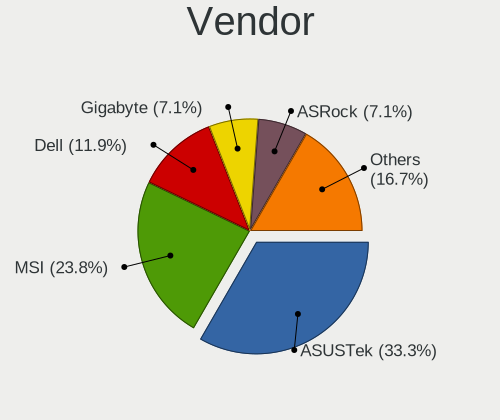
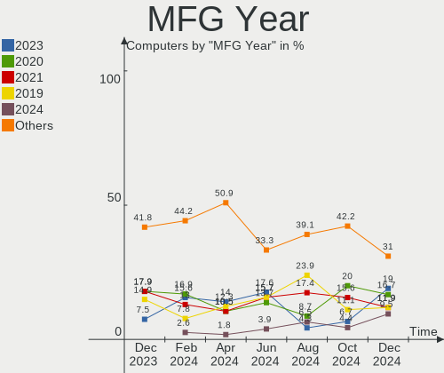
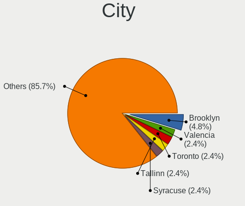
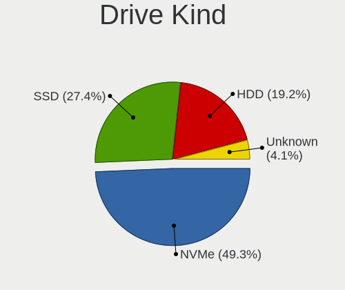
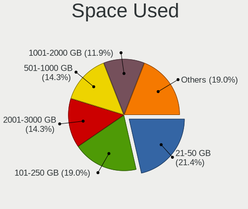
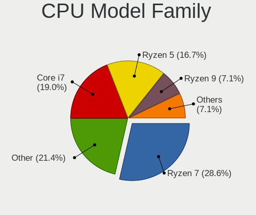
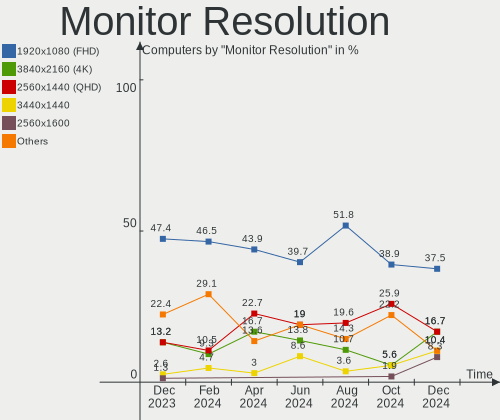
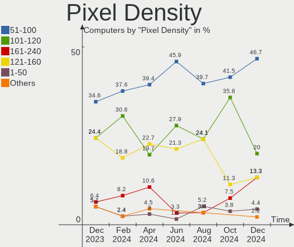
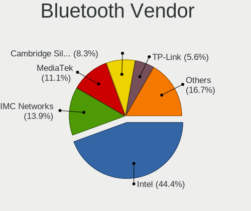
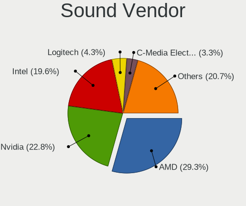

Nobara - Hardware Trends
------------------------

A project to identify most popular hardware characteristics and track their change
over time based on data collected by Linux users at https://Linux-Hardware.org.

Anyone can contribute to this report by the [hw-probe](https://github.com/linuxhw/hw-probe) tool:

    sudo -E hw-probe -all -upload

This is a report for all computer types. See also reports for [desktops](/Dist/Nobara/Desktop/README.md) and [notebooks](/Dist/Nobara/Notebook/README.md).

This report is for one last month. Overall report since the beginning of time: [TestDays](https://github.com/linuxhw/TestDays)

Period: Jan, 2024.

Contents
--------

* [ System ](#system)
  - [ OS                       ](#os)
  - [ OS Family                ](#os-family)
  - [ Kernel                   ](#kernel)
  - [ Kernel Family            ](#kernel-family)
  - [ Kernel Major Ver.        ](#kernel-major-ver)
  - [ Arch                     ](#arch)
  - [ DE                       ](#de)
  - [ Display Server           ](#display-server)
  - [ Display Manager          ](#display-manager)
  - [ OS Lang                  ](#os-lang)
  - [ Boot Mode                ](#boot-mode)
  - [ Filesystem               ](#filesystem)
  - [ Part. scheme             ](#part-scheme)
  - [ Dual Boot with Linux/BSD ](#dual-boot-with-linuxbsd)
  - [ Dual Boot (Win)          ](#dual-boot-win)

* [ Board ](#board)
  - [ Vendor                   ](#vendor)
  - [ Model                    ](#model)
  - [ Model Family             ](#model-family)
  - [ MFG Year                 ](#mfg-year)
  - [ Form Factor              ](#form-factor)
  - [ Secure Boot              ](#secure-boot)
  - [ Coreboot                 ](#coreboot)
  - [ RAM Size                 ](#ram-size)
  - [ RAM Used                 ](#ram-used)
  - [ Total Drives             ](#total-drives)
  - [ Has CD-ROM               ](#has-cd-rom)
  - [ Has Ethernet             ](#has-ethernet)
  - [ Has WiFi                 ](#has-wifi)
  - [ Has Bluetooth            ](#has-bluetooth)

* [ Location ](#location)
  - [ Country                  ](#country)
  - [ City                     ](#city)

* [ Drives ](#drives)
  - [ Drive Vendor             ](#drive-vendor)
  - [ Drive Model              ](#drive-model)
  - [ HDD Vendor               ](#hdd-vendor)
  - [ SSD Vendor               ](#ssd-vendor)
  - [ Drive Kind               ](#drive-kind)
  - [ Drive Connector          ](#drive-connector)
  - [ Drive Size               ](#drive-size)
  - [ Space Total              ](#space-total)
  - [ Space Used               ](#space-used)
  - [ Malfunc. Drives          ](#malfunc-drives)
  - [ Malfunc. Drive Vendor    ](#malfunc-drive-vendor)
  - [ Malfunc. HDD Vendor      ](#malfunc-hdd-vendor)
  - [ Malfunc. Drive Kind      ](#malfunc-drive-kind)
  - [ Failed Drives            ](#failed-drives)
  - [ Failed Drive Vendor      ](#failed-drive-vendor)
  - [ Drive Status             ](#drive-status)

* [ Storage controller ](#storage-controller)
  - [ Storage Vendor           ](#storage-vendor)
  - [ Storage Model            ](#storage-model)
  - [ Storage Kind             ](#storage-kind)

* [ Processor ](#processor)
  - [ CPU Vendor               ](#cpu-vendor)
  - [ CPU Model                ](#cpu-model)
  - [ CPU Model Family         ](#cpu-model-family)
  - [ CPU Cores                ](#cpu-cores)
  - [ CPU Sockets              ](#cpu-sockets)
  - [ CPU Threads              ](#cpu-threads)
  - [ CPU Op-Modes             ](#cpu-op-modes)
  - [ CPU Microcode            ](#cpu-microcode)
  - [ CPU Microarch            ](#cpu-microarch)

* [ Graphics ](#graphics)
  - [ GPU Vendor               ](#gpu-vendor)
  - [ GPU Model                ](#gpu-model)
  - [ GPU Combo                ](#gpu-combo)
  - [ GPU Driver               ](#gpu-driver)
  - [ GPU Memory               ](#gpu-memory)

* [ Monitor ](#monitor)
  - [ Monitor Vendor           ](#monitor-vendor)
  - [ Monitor Model            ](#monitor-model)
  - [ Monitor Resolution       ](#monitor-resolution)
  - [ Monitor Diagonal         ](#monitor-diagonal)
  - [ Monitor Width            ](#monitor-width)
  - [ Aspect Ratio             ](#aspect-ratio)
  - [ Monitor Area             ](#monitor-area)
  - [ Pixel Density            ](#pixel-density)
  - [ Multiple Monitors        ](#multiple-monitors)

* [ Network ](#network)
  - [ Net Controller Vendor    ](#net-controller-vendor)
  - [ Net Controller Model     ](#net-controller-model)
  - [ Wireless Vendor          ](#wireless-vendor)
  - [ Wireless Model           ](#wireless-model)
  - [ Ethernet Vendor          ](#ethernet-vendor)
  - [ Ethernet Model           ](#ethernet-model)
  - [ Net Controller Kind      ](#net-controller-kind)
  - [ Used Controller          ](#used-controller)
  - [ NICs                     ](#nics)
  - [ IPv6                     ](#ipv6)

* [ Bluetooth ](#bluetooth)
  - [ Bluetooth Vendor         ](#bluetooth-vendor)
  - [ Bluetooth Model          ](#bluetooth-model)

* [ Sound ](#sound)
  - [ Sound Vendor             ](#sound-vendor)
  - [ Sound Model              ](#sound-model)

* [ Memory ](#memory)
  - [ Memory Vendor            ](#memory-vendor)
  - [ Memory Model             ](#memory-model)
  - [ Memory Kind              ](#memory-kind)
  - [ Memory Form Factor       ](#memory-form-factor)
  - [ Memory Size              ](#memory-size)
  - [ Memory Speed             ](#memory-speed)

* [ Printers & scanners ](#printers--scanners)
  - [ Printer Vendor           ](#printer-vendor)
  - [ Printer Model            ](#printer-model)
  - [ Scanner Vendor           ](#scanner-vendor)
  - [ Scanner Model            ](#scanner-model)

* [ Camera ](#camera)
  - [ Camera Vendor            ](#camera-vendor)
  - [ Camera Model             ](#camera-model)

* [ Security ](#security)
  - [ Fingerprint Vendor       ](#fingerprint-vendor)
  - [ Fingerprint Model        ](#fingerprint-model)
  - [ Chipcard Vendor          ](#chipcard-vendor)
  - [ Chipcard Model           ](#chipcard-model)

* [ Unsupported ](#unsupported)
  - [ Unsupported Devices      ](#unsupported-devices)
  - [ Unsupported Device Types ](#unsupported-device-types)

System
------

OS
--

Installed operating systems

| Name      | Computers | Percent |
|-----------|-----------|---------|
| Nobara 39 | 72        | 82.76%  |
| Nobara 38 | 12        | 13.79%  |
| Nobara 37 | 3         | 3.45%   |

OS Family
---------

OS without a version

| Name   | Computers | Percent |
|--------|-----------|---------|
| Nobara | 87        | 100%    |

Kernel
------

Version of the Linux kernel

| Version                      | Computers | Percent |
|------------------------------|-----------|---------|
| 6.6.9-200.fsync.fc39.x86_64  | 23        | 26.44%  |
| 6.7.0-204.fsync.fc39.x86_64  | 20        | 22.99%  |
| 6.7.0-201.fsync.fc39.x86_64  | 12        | 13.79%  |
| 6.6.8-200.fsync.fc39.x86_64  | 9         | 10.34%  |
| 6.7.0-200.fsync.fc39.x86_64  | 4         | 4.6%    |
| 6.6.7-203.fsync.fc38.x86_64  | 3         | 3.45%   |
| 6.6.7-203.fsync.fc39.x86_64  | 2         | 2.3%    |
| 6.5.9-201.fsync.fc38.x86_64  | 2         | 2.3%    |
| 6.4.10-202.fsync.fc38.x86_64 | 2         | 2.3%    |
| 6.7.0-203.fsync.fc39.x86_64  | 1         | 1.15%   |
| 6.7.0-202.fsync.fc39.x86_64  | 1         | 1.15%   |
| 6.6.8-200.fsync.fc38.x86_64  | 1         | 1.15%   |
| 6.6.4-202.fsync.fc38.x86_64  | 1         | 1.15%   |
| 6.6.2-201.fsync.fc38.x86_64  | 1         | 1.15%   |
| 6.5.9-200.fsync.fc38.x86_64  | 1         | 1.15%   |
| 6.5.5-201.fsync.fc38.x86_64  | 1         | 1.15%   |
| 6.5.3-200.fsync.fc37.x86_64  | 1         | 1.15%   |
| 6.3.9-200.fsync.fc37.x86_64  | 1         | 1.15%   |
| 6.1.11-201.fsync.fc37.x86_64 | 1         | 1.15%   |

Kernel Family
-------------

Linux kernel without a distro release

| Version | Computers | Percent |
|---------|-----------|---------|
| 6.7.0   | 38        | 43.68%  |
| 6.6.9   | 23        | 26.44%  |
| 6.6.8   | 10        | 11.49%  |
| 6.6.7   | 5         | 5.75%   |
| 6.5.9   | 3         | 3.45%   |
| 6.4.10  | 2         | 2.3%    |
| 6.6.4   | 1         | 1.15%   |
| 6.6.2   | 1         | 1.15%   |
| 6.5.5   | 1         | 1.15%   |
| 6.5.3   | 1         | 1.15%   |
| 6.3.9   | 1         | 1.15%   |
| 6.1.11  | 1         | 1.15%   |

Kernel Major Ver.
-----------------

Linux kernel major version

| Version | Computers | Percent |
|---------|-----------|---------|
| 6.6     | 40        | 45.98%  |
| 6.7     | 38        | 43.68%  |
| 6.5     | 5         | 5.75%   |
| 6.4     | 2         | 2.3%    |
| 6.3     | 1         | 1.15%   |
| 6.1     | 1         | 1.15%   |

Arch
----

OS architecture (x86_64, i586, etc.)

| Name   | Computers | Percent |
|--------|-----------|---------|
| x86_64 | 87        | 100%    |

DE
--

Desktop Environment

| Name  | Computers | Percent |
|-------|-----------|---------|
| KDE5  | 62        | 71.26%  |
| GNOME | 25        | 28.74%  |

Display Server
--------------

X11 or Wayland

| Name    | Computers | Percent |
|---------|-----------|---------|
| Wayland | 77        | 88.51%  |
| X11     | 10        | 11.49%  |

Display Manager
---------------

SDDM, LightDM, etc.

| Name    | Computers | Percent |
|---------|-----------|---------|
| Unknown | 81        | 93.1%   |
| SDDM    | 3         | 3.45%   |
| GDM     | 3         | 3.45%   |

OS Lang
-------

Language

| Lang  | Computers | Percent |
|-------|-----------|---------|
| en_US | 35        | 40.23%  |
| de_DE | 15        | 17.24%  |
| en_GB | 6         | 6.9%    |
| ru_RU | 5         | 5.75%   |
| es_MX | 5         | 5.75%   |
| es_ES | 5         | 5.75%   |
| en_CA | 3         | 3.45%   |
| pt_BR | 2         | 2.3%    |
| fr_FR | 2         | 2.3%    |
| it_IT | 1         | 1.15%   |
| hu_HU | 1         | 1.15%   |
| es_AR | 1         | 1.15%   |
| en_ZA | 1         | 1.15%   |
| en_IN | 1         | 1.15%   |
| en_IE | 1         | 1.15%   |
| en_AU | 1         | 1.15%   |
| de_AT | 1         | 1.15%   |
| da_DK | 1         | 1.15%   |

Boot Mode
---------

EFI or BIOS

| Mode | Computers | Percent |
|------|-----------|---------|
| EFI  | 69        | 79.31%  |
| BIOS | 18        | 20.69%  |

Filesystem
----------

Type of filesystem

| Type  | Computers | Percent |
|-------|-----------|---------|
| Btrfs | 82        | 94.25%  |
| Ext4  | 5         | 5.75%   |

Part. scheme
------------

Scheme of partitioning

| Type    | Computers | Percent |
|---------|-----------|---------|
| Unknown | 81        | 93.1%   |
| GPT     | 6         | 6.9%    |

Dual Boot with Linux/BSD
------------------------

Hosting more than one Linux/BSD

| Dual boot | Computers | Percent |
|-----------|-----------|---------|
| No        | 85        | 97.7%   |
| Yes       | 2         | 2.3%    |

Dual Boot (Win)
---------------

Hosting Linux and Windows

| Dual boot | Computers | Percent |
|-----------|-----------|---------|
| No        | 86        | 98.85%  |
| Yes       | 1         | 1.15%   |

Board
-----

Vendor
------

Motherboard manufacturer

| Name                | Computers | Percent |
|---------------------|-----------|---------|
| ASUSTek Computer    | 21        | 24.14%  |
| MSI                 | 11        | 12.64%  |
| Hewlett-Packard     | 11        | 12.64%  |
| ASRock              | 11        | 12.64%  |
| Lenovo              | 8         | 9.2%    |
| Gigabyte Technology | 7         | 8.05%   |
| Dell                | 5         | 5.75%   |
| Intel               | 3         | 3.45%   |
| Toshiba             | 1         | 1.15%   |
| Pegatron            | 1         | 1.15%   |
| NZXT                | 1         | 1.15%   |
| Notebook            | 1         | 1.15%   |
| Digibras            | 1         | 1.15%   |
| Apple               | 1         | 1.15%   |
| Alienware           | 1         | 1.15%   |
| Acer                | 1         | 1.15%   |
| A-DATA Technology   | 1         | 1.15%   |
| Unknown             | 1         | 1.15%   |

Model
-----

Motherboard model

| Name                                  | Computers | Percent |
|---------------------------------------|-----------|---------|
| MSI MS-7C35                           | 2         | 2.3%    |
| ASUS ROG Ally RC71L_RC71L             | 2         | 2.3%    |
| ASRock B450M Pro4                     | 2         | 2.3%    |
| Toshiba Satellite C55-B               | 1         | 1.15%   |
| Pegatron HPE-558de                    | 1         | 1.15%   |
| NZXT N7 B650E                         | 1         | 1.15%   |
| Notebook P7xxTM1                      | 1         | 1.15%   |
| MSI MS-7C95                           | 1         | 1.15%   |
| MSI MS-7C37                           | 1         | 1.15%   |
| MSI MS-7B89                           | 1         | 1.15%   |
| MSI MS-7B86                           | 1         | 1.15%   |
| MSI MS-7B51                           | 1         | 1.15%   |
| MSI MS-7A74                           | 1         | 1.15%   |
| MSI MS-7A38                           | 1         | 1.15%   |
| MSI MS-7971                           | 1         | 1.15%   |
| MSI GE62 6QE                          | 1         | 1.15%   |
| Lenovo ThinkPad X131e 3371AF5         | 1         | 1.15%   |
| Lenovo ThinkPad Edge E430 3254H4P     | 1         | 1.15%   |
| Lenovo ThinkPad 13 2nd Gen 20J1A00VIA | 1         | 1.15%   |
| Lenovo MIIX 510-12IKB 80XE            | 1         | 1.15%   |
| Lenovo LOQ 15IRH8 82XV                | 1         | 1.15%   |
| Lenovo IdeaPad Z500 20202             | 1         | 1.15%   |
| Lenovo IdeaPad Pro 5 14APH8 83AM      | 1         | 1.15%   |
| Lenovo IdeaPad Gaming 3 15ACH6 82K2   | 1         | 1.15%   |
| Intel X79                             | 1         | 1.15%   |
| Intel NUC11PAHi5                      | 1         | 1.15%   |
| Intel B75                             | 1         | 1.15%   |
| HP Z440 Workstation                   | 1         | 1.15%   |
| HP Pavilion Notebook                  | 1         | 1.15%   |
| HP Laptop 17z-cp000                   | 1         | 1.15%   |
| HP Laptop 15s-eq2xxx                  | 1         | 1.15%   |
| HP Laptop 14s-fq0xxx                  | 1         | 1.15%   |
| HP ENVY x360 Convertible 15-eu0xxx    | 1         | 1.15%   |
| HP ENVY TS 14 Sleekbook               | 1         | 1.15%   |
| HP EliteDesk 800 G4 SFF               | 1         | 1.15%   |
| HP EliteDesk 800 G2 SFF               | 1         | 1.15%   |
| HP Compaq 6200 Pro SFF PC             | 1         | 1.15%   |
| HP 240 G8 Notebook PC                 | 1         | 1.15%   |
| Gigabyte Z370P D3                     | 1         | 1.15%   |
| Gigabyte H510M H                      | 1         | 1.15%   |

Model Family
------------

Motherboard model prefix

| Name                 | Computers | Percent |
|----------------------|-----------|---------|
| ASUS ROG             | 9         | 10.34%  |
| Lenovo ThinkPad      | 3         | 3.45%   |
| Lenovo IdeaPad       | 3         | 3.45%   |
| HP Laptop            | 3         | 3.45%   |
| ASUS TUF             | 3         | 3.45%   |
| ASRock B450M         | 3         | 3.45%   |
| MSI MS-7C35          | 2         | 2.3%    |
| HP ENVY              | 2         | 2.3%    |
| HP EliteDesk         | 2         | 2.3%    |
| ASUS PRIME           | 2         | 2.3%    |
| Toshiba Satellite    | 1         | 1.15%   |
| Pegatron HPE-558de   | 1         | 1.15%   |
| NZXT N7              | 1         | 1.15%   |
| Notebook P7xxTM1     | 1         | 1.15%   |
| MSI MS-7C95          | 1         | 1.15%   |
| MSI MS-7C37          | 1         | 1.15%   |
| MSI MS-7B89          | 1         | 1.15%   |
| MSI MS-7B86          | 1         | 1.15%   |
| MSI MS-7B51          | 1         | 1.15%   |
| MSI MS-7A74          | 1         | 1.15%   |
| MSI MS-7A38          | 1         | 1.15%   |
| MSI MS-7971          | 1         | 1.15%   |
| MSI GE62             | 1         | 1.15%   |
| Lenovo MIIX          | 1         | 1.15%   |
| Lenovo LOQ           | 1         | 1.15%   |
| Intel X79            | 1         | 1.15%   |
| Intel NUC11PAHi5     | 1         | 1.15%   |
| Intel B75            | 1         | 1.15%   |
| HP Z440              | 1         | 1.15%   |
| HP Pavilion          | 1         | 1.15%   |
| HP Compaq            | 1         | 1.15%   |
| HP 240               | 1         | 1.15%   |
| Gigabyte Z370P       | 1         | 1.15%   |
| Gigabyte H510M       | 1         | 1.15%   |
| Gigabyte B550M       | 1         | 1.15%   |
| Gigabyte B460M       | 1         | 1.15%   |
| Gigabyte AB350M-DS3H | 1         | 1.15%   |
| Gigabyte A5          | 1         | 1.15%   |
| Gigabyte A320M-S2H   | 1         | 1.15%   |
| Digibras NH4CU03     | 1         | 1.15%   |

MFG Year
--------

Motherboard manufacture year

| Year | Computers | Percent |
|------|-----------|---------|
| 2020 | 12        | 13.79%  |
| 2018 | 12        | 13.79%  |
| 2023 | 10        | 11.49%  |
| 2021 | 10        | 11.49%  |
| 2022 | 9         | 10.34%  |
| 2019 | 9         | 10.34%  |
| 2017 | 5         | 5.75%   |
| 2015 | 4         | 4.6%    |
| 2013 | 4         | 4.6%    |
| 2012 | 4         | 4.6%    |
| 2014 | 3         | 3.45%   |
| 2011 | 3         | 3.45%   |
| 2016 | 2         | 2.3%    |

Form Factor
-----------

Physical design of the computer

| Name        | Computers | Percent |
|-------------|-----------|---------|
| Desktop     | 49        | 56.32%  |
| Notebook    | 33        | 37.93%  |
| Tablet      | 3         | 3.45%   |
| Convertible | 1         | 1.15%   |
| Mini pc     | 1         | 1.15%   |

Secure Boot
-----------

Enabled or disabled

| State    | Computers | Percent |
|----------|-----------|---------|
| Disabled | 87        | 100%    |

Coreboot
--------

Have coreboot on board

| Used | Computers | Percent |
|------|-----------|---------|
| No   | 87        | 100%    |

RAM Size
--------

Total RAM memory

| Size in GB  | Computers | Percent |
|-------------|-----------|---------|
| 32.01-64.0  | 26        | 29.89%  |
| 16.01-24.0  | 22        | 25.29%  |
| 4.01-8.0    | 16        | 18.39%  |
| 8.01-16.0   | 12        | 13.79%  |
| 64.01-256.0 | 5         | 5.75%   |
| 24.01-32.0  | 4         | 4.6%    |
| 3.01-4.0    | 2         | 2.3%    |

RAM Used
--------

Used RAM memory

| Used GB    | Computers | Percent |
|------------|-----------|---------|
| 4.01-8.0   | 33        | 37.93%  |
| 3.01-4.0   | 28        | 32.18%  |
| 2.01-3.0   | 15        | 17.24%  |
| 1.01-2.0   | 6         | 6.9%    |
| 8.01-16.0  | 4         | 4.6%    |
| 16.01-24.0 | 1         | 1.15%   |

Total Drives
------------

Number of drives on board

| Drives | Computers | Percent |
|--------|-----------|---------|
| 1      | 37        | 42.53%  |
| 2      | 23        | 26.44%  |
| 3      | 10        | 11.49%  |
| 4      | 7         | 8.05%   |
| 5      | 6         | 6.9%    |
| 7      | 2         | 2.3%    |
| 8      | 1         | 1.15%   |
| 6      | 1         | 1.15%   |

Has CD-ROM
----------

Has CD-ROM on board

| Presented | Computers | Percent |
|-----------|-----------|---------|
| No        | 75        | 86.21%  |
| Yes       | 12        | 13.79%  |

Has Ethernet
------------

Has Ethernet on board

| Presented | Computers | Percent |
|-----------|-----------|---------|
| Yes       | 78        | 89.66%  |
| No        | 9         | 10.34%  |

Has WiFi
--------

Has WiFi module

| Presented | Computers | Percent |
|-----------|-----------|---------|
| Yes       | 68        | 78.16%  |
| No        | 19        | 21.84%  |

Has Bluetooth
-------------

Has Bluetooth module

| Presented | Computers | Percent |
|-----------|-----------|---------|
| Yes       | 62        | 71.26%  |
| No        | 25        | 28.74%  |

Location
--------

Country
-------

Geographic location (country)

| Country            | Computers | Percent |
|--------------------|-----------|---------|
| USA                | 21        | 24.14%  |
| Germany            | 16        | 18.39%  |
| Russia             | 7         | 8.05%   |
| Canada             | 5         | 5.75%   |
| Brazil             | 5         | 5.75%   |
| Spain              | 4         | 4.6%    |
| Austria            | 3         | 3.45%   |
| Argentina          | 3         | 3.45%   |
| UK                 | 2         | 2.3%    |
| India              | 2         | 2.3%    |
| Hungary            | 2         | 2.3%    |
| Colombia           | 2         | 2.3%    |
| UAE                | 1         | 1.15%   |
| Turkey             | 1         | 1.15%   |
| South Africa       | 1         | 1.15%   |
| Romania            | 1         | 1.15%   |
| Netherlands        | 1         | 1.15%   |
| Latvia             | 1         | 1.15%   |
| Jordan             | 1         | 1.15%   |
| Italy              | 1         | 1.15%   |
| Ireland            | 1         | 1.15%   |
| Indonesia          | 1         | 1.15%   |
| France             | 1         | 1.15%   |
| Dominican Republic | 1         | 1.15%   |
| Denmark            | 1         | 1.15%   |
| Chile              | 1         | 1.15%   |
| Australia          | 1         | 1.15%   |

City
----

Geographic location (city)

| City                  | Computers | Percent |
|-----------------------|-----------|---------|
| Toronto               | 2         | 2.3%    |
| Osnabrück            | 2         | 2.3%    |
| Calgary               | 2         | 2.3%    |
| Zaragoza              | 1         | 1.15%   |
| Zalaegerszeg          | 1         | 1.15%   |
| Wittenberg            | 1         | 1.15%   |
| Winston-Salem         | 1         | 1.15%   |
| Williamsburg          | 1         | 1.15%   |
| West Monroe           | 1         | 1.15%   |
| Virginia Beach        | 1         | 1.15%   |
| Valencia              | 1         | 1.15%   |
| Tver                  | 1         | 1.15%   |
| Tucson                | 1         | 1.15%   |
| Slidell               | 1         | 1.15%   |
| Schieder-Schwalenberg | 1         | 1.15%   |
| Santo Domingo Este    | 1         | 1.15%   |
| Santiago              | 1         | 1.15%   |
| Saarlouis             | 1         | 1.15%   |
| Riga                  | 1         | 1.15%   |
| Recklinghausen        | 1         | 1.15%   |
| Recife                | 1         | 1.15%   |
| Racine                | 1         | 1.15%   |
| Porto Velho           | 1         | 1.15%   |
| Peabody               | 1         | 1.15%   |
| Oelde                 | 1         | 1.15%   |
| Nizhniy Novgorod      | 1         | 1.15%   |
| Milton                | 1         | 1.15%   |
| Merced                | 1         | 1.15%   |
| Melbourne             | 1         | 1.15%   |
| Martorell             | 1         | 1.15%   |
| Mainz                 | 1         | 1.15%   |
| Madera                | 1         | 1.15%   |
| Los Angeles           | 1         | 1.15%   |
| Lexington             | 1         | 1.15%   |
| Leonding              | 1         | 1.15%   |
| Las Vegas             | 1         | 1.15%   |
| Kursk                 | 1         | 1.15%   |
| Kirov                 | 1         | 1.15%   |
| Karlsruhe             | 1         | 1.15%   |
| Karabük              | 1         | 1.15%   |

Drives
------

Drive Vendor
------------

Hard drive vendors

| Vendor                      | Computers | Drives | Percent |
|-----------------------------|-----------|--------|---------|
| Seagate                     | 27        | 33     | 16.88%  |
| Samsung Electronics         | 23        | 37     | 14.38%  |
| Sandisk                     | 13        | 15     | 8.13%   |
| WDC                         | 12        | 17     | 7.5%    |
| Kingston                    | 11        | 14     | 6.88%   |
| Toshiba                     | 8         | 9      | 5%      |
| Crucial                     | 8         | 10     | 5%      |
| Micron Technology           | 7         | 7      | 4.38%   |
| Kingston Technology Company | 5         | 5      | 3.13%   |
| PNY                         | 4         | 4      | 2.5%    |
| SK hynix                    | 3         | 3      | 1.88%   |
| Phison Electronics          | 3         | 4      | 1.88%   |
| Unknown                     | 2         | 2      | 1.25%   |
| SPCC                        | 2         | 2      | 1.25%   |
| Silicon Motion              | 2         | 3      | 1.25%   |
| Micron/Crucial Technology   | 2         | 4      | 1.25%   |
| MAXIO Technology (Hangzhou) | 2         | 2      | 1.25%   |
| KIOXIA                      | 2         | 2      | 1.25%   |
| Intel                       | 2         | 2      | 1.25%   |
| ASMT                        | 2         | 3      | 1.25%   |
| A-DATA Technology           | 2         | 3      | 1.25%   |
| XrayDisk                    | 1         | 1      | 0.63%   |
| XPG                         | 1         | 1      | 0.63%   |
| Verbatim                    | 1         | 1      | 0.63%   |
| USB3.0                      | 1         | 1      | 0.63%   |
| USB 3.1                     | 1         | 1      | 0.63%   |
| SABRENT                     | 1         | 1      | 0.63%   |
| Rogueware                   | 1         | 1      | 0.63%   |
| Realtek Semiconductor       | 1         | 1      | 0.63%   |
| KingSpec                    | 1         | 1      | 0.63%   |
| KingFast                    | 1         | 1      | 0.63%   |
| JMicron Technology          | 1         | 2      | 0.63%   |
| HPE                         | 1         | 1      | 0.63%   |
| Hitachi                     | 1         | 1      | 0.63%   |
| HGST                        | 1         | 1      | 0.63%   |
| Firebat                     | 1         | 1      | 0.63%   |
| Fanxiang                    | 1         | 1      | 0.63%   |
| China                       | 1         | 1      | 0.63%   |
| ADATA Technology            | 1         | 1      | 0.63%   |

Drive Model
-----------

Hard drive models

| Model                                               | Computers | Percent |
|-----------------------------------------------------|-----------|---------|
| Samsung NVMe SSD Controller SM981/PM981/PM983 1TB   | 7         | 3.78%   |
| Samsung NVMe SSD Controller PM9A1/PM9A3/980PRO 2TB  | 5         | 2.7%    |
| Kingston SA400S37240G 240GB SSD                     | 4         | 2.16%   |
| Seagate ST1000DM010-2EP102 1TB                      | 3         | 1.62%   |
| Sandisk WD Blue SN570 1TB                           | 3         | 1.62%   |
| Kingston Company A2000 NVMe SSD 500GB               | 3         | 1.62%   |
| Kingston SA400S37480G 480GB SSD                     | 3         | 1.62%   |
| Crucial CT1000MX500SSD1 1TB                         | 3         | 1.62%   |
| Silicon Motion SM2262/SM2262EN SSD Controller 480GB | 2         | 1.08%   |
| Seagate ST500DM002-1BD142 500GB                     | 2         | 1.08%   |
| Seagate ST4000LM024-2AN17V 4TB                      | 2         | 1.08%   |
| Seagate ST4000DM004-2U9104 4TB                      | 2         | 1.08%   |
| Seagate ST1000LM024 HN-M101MBB 1TB                  | 2         | 1.08%   |
| Sandisk WD_BLACK SN850X HS 1000GB                   | 2         | 1.08%   |
| Sandisk WD Blue SN550 NVMe SSD 512GB                | 2         | 1.08%   |
| Samsung SSD 990 PRO 2TB                             | 2         | 1.08%   |
| Samsung SSD 870 QVO 2TB                             | 2         | 1.08%   |
| Samsung SSD 870 EVO 1TB                             | 2         | 1.08%   |
| Samsung SSD 860 EVO 500GB                           | 2         | 1.08%   |
| Samsung SSD 860 EVO 1TB                             | 2         | 1.08%   |
| Samsung NVMe SSD Controller SM961/PM961/SM963 256GB | 2         | 1.08%   |
| PNY CS900 240GB SSD                                 | 2         | 1.08%   |
| PNY CS900 1TB SSD                                   | 2         | 1.08%   |
| Phison E16 PCIe4 NVMe Controller 2TB                | 2         | 1.08%   |
| Micron/Crucial P2 NVMe PCIe SSD 1TB                 | 2         | 1.08%   |
| XrayDisk 1TB SSD                                    | 1         | 0.54%   |
| XPG NVMe SSD Drive 1024GB                           | 1         | 0.54%   |
| WDC WDS500G2B0A-00SM50 500GB SSD                    | 1         | 0.54%   |
| WDC WDS250G2B0B-00YS70 250GB SSD                    | 1         | 0.54%   |
| WDC WD6400AAKS-65A7B2 640GB                         | 1         | 0.54%   |
| WDC WD63PURZ-85B4VY0 6TB                            | 1         | 0.54%   |
| WDC WD5000LPVX-60V0TT0 500GB                        | 1         | 0.54%   |
| WDC WD40EFAX-68JH4N1 4TB                            | 1         | 0.54%   |
| WDC WD30EZRX-00DC0B0 3TB                            | 1         | 0.54%   |
| WDC WD3000HLFS-01G6U3 304GB                         | 1         | 0.54%   |
| WDC WD20EZRZ-00Z5HB0 2TB                            | 1         | 0.54%   |
| WDC WD10SPZX-22Z10T1 1TB                            | 1         | 0.54%   |
| WDC WD10EZEX-60WN4A0 1TB                            | 1         | 0.54%   |
| WDC WD10EZEX-22MFCA0 1TB                            | 1         | 0.54%   |
| WDC WD10EZEX-08M2NA0 1TB                            | 1         | 0.54%   |

HDD Vendor
----------

Hard disk drive vendors

| Vendor              | Computers | Drives | Percent |
|---------------------|-----------|--------|---------|
| Seagate             | 26        | 31     | 52%     |
| WDC                 | 10        | 14     | 20%     |
| Toshiba             | 7         | 8      | 14%     |
| Samsung Electronics | 2         | 2      | 4%      |
| ASMT                | 2         | 3      | 4%      |
| JMicron Technology  | 1         | 2      | 2%      |
| Hitachi             | 1         | 1      | 2%      |
| HGST                | 1         | 1      | 2%      |

SSD Vendor
----------

Solid state drive vendors

| Vendor              | Computers | Drives | Percent |
|---------------------|-----------|--------|---------|
| Samsung Electronics | 10        | 13     | 20%     |
| Kingston            | 10        | 10     | 20%     |
| Crucial             | 8         | 10     | 16%     |
| PNY                 | 4         | 4      | 8%      |
| WDC                 | 3         | 3      | 6%      |
| SanDisk             | 3         | 3      | 6%      |
| SPCC                | 2         | 2      | 4%      |
| A-DATA Technology   | 2         | 3      | 4%      |
| XrayDisk            | 1         | 1      | 2%      |
| Verbatim            | 1         | 1      | 2%      |
| USB3.0              | 1         | 1      | 2%      |
| SABRENT             | 1         | 1      | 2%      |
| Rogueware           | 1         | 1      | 2%      |
| KingSpec            | 1         | 1      | 2%      |
| Firebat             | 1         | 1      | 2%      |
| China               | 1         | 1      | 2%      |

Drive Kind
----------

HDD or SSD

| Kind    | Computers | Drives | Percent |
|---------|-----------|--------|---------|
| NVMe    | 54        | 76     | 38.85%  |
| HDD     | 41        | 62     | 29.5%   |
| SSD     | 38        | 56     | 27.34%  |
| Unknown | 5         | 5      | 3.6%    |
| MMC     | 1         | 1      | 0.72%   |

Drive Connector
---------------

SATA, SAS, NVMe, etc.

| Type | Computers | Drives | Percent |
|------|-----------|--------|---------|
| SATA | 60        | 113    | 49.18%  |
| NVMe | 54        | 76     | 44.26%  |
| SAS  | 7         | 10     | 5.74%   |
| MMC  | 1         | 1      | 0.82%   |

Drive Size
----------

Size of hard drive

| Size in TB | Computers | Drives | Percent |
|------------|-----------|--------|---------|
| 0.51-1.0   | 36        | 45     | 41.86%  |
| 0.01-0.5   | 34        | 50     | 39.53%  |
| 1.01-2.0   | 8         | 11     | 9.3%    |
| 3.01-4.0   | 5         | 8      | 5.81%   |
| 2.01-3.0   | 2         | 3      | 2.33%   |
| 4.01-10.0  | 1         | 1      | 1.16%   |

Space Total
-----------

Amount of disk space available on the file system

| Size in GB     | Computers | Percent |
|----------------|-----------|---------|
| 1001-2000      | 26        | 29.89%  |
| More than 3000 | 22        | 25.29%  |
| 501-1000       | 14        | 16.09%  |
| 2001-3000      | 11        | 12.64%  |
| 251-500        | 9         | 10.34%  |
| 21-50          | 2         | 2.3%    |
| 101-250        | 2         | 2.3%    |
| 51-100         | 1         | 1.15%   |

Space Used
----------

Amount of used disk space

| Used GB        | Computers | Percent |
|----------------|-----------|---------|
| 251-500        | 15        | 17.24%  |
| 501-1000       | 14        | 16.09%  |
| 101-250        | 12        | 13.79%  |
| 21-50          | 10        | 11.49%  |
| 2001-3000      | 10        | 11.49%  |
| 1-20           | 9         | 10.34%  |
| 1001-2000      | 8         | 9.2%    |
| 51-100         | 5         | 5.75%   |
| More than 3000 | 4         | 4.6%    |

Malfunc. Drives
---------------

Drive models with a malfunction

| Model                 | Computers | Drives | Percent |
|-----------------------|-----------|--------|---------|
| ASMT ASM1156-PM 480GB | 1         | 2      | 100%    |

Malfunc. Drive Vendor
---------------------

Vendors of faulty drives

| Vendor | Computers | Drives | Percent |
|--------|-----------|--------|---------|
| ASMT   | 1         | 2      | 100%    |

Malfunc. HDD Vendor
-------------------

Vendors of faulty HDD drives

| Vendor | Computers | Drives | Percent |
|--------|-----------|--------|---------|
| ASMT   | 1         | 2      | 100%    |

Malfunc. Drive Kind
-------------------

Kinds of faulty drives

| Kind | Computers | Drives | Percent |
|------|-----------|--------|---------|
| HDD  | 1         | 2      | 100%    |

Failed Drives
-------------

Failed drive models

Zero info for selected period =(

Failed Drive Vendor
-------------------

Failed drive vendors

Zero info for selected period =(

Drive Status
------------

Number of failed and malfunc. drives

| Status   | Computers | Drives | Percent |
|----------|-----------|--------|---------|
| Detected | 81        | 187    | 92.05%  |
| Works    | 6         | 11     | 6.82%   |
| Malfunc  | 1         | 2      | 1.14%   |

Storage controller
------------------

Storage Vendor
--------------

Storage controller vendors

| Vendor                               | Computers | Percent |
|--------------------------------------|-----------|---------|
| Intel                                | 44        | 31.88%  |
| AMD                                  | 32        | 23.19%  |
| Samsung Electronics                  | 16        | 11.59%  |
| SanDisk                              | 10        | 7.25%   |
| Kingston Technology Company          | 8         | 5.8%    |
| Micron Technology                    | 7         | 5.07%   |
| SK hynix                             | 3         | 2.17%   |
| Phison Electronics                   | 3         | 2.17%   |
| Silicon Motion                       | 2         | 1.45%   |
| Micron/Crucial Technology            | 2         | 1.45%   |
| MAXIO Technology (Hangzhou)          | 2         | 1.45%   |
| KIOXIA                               | 2         | 1.45%   |
| Toshiba America Info Systems         | 1         | 0.72%   |
| Seagate Technology                   | 1         | 0.72%   |
| Realtek Semiconductor                | 1         | 0.72%   |
| Ramaxel Technology(Shenzhen) Limited | 1         | 0.72%   |
| INNOGRIT                             | 1         | 0.72%   |
| ASMedia Technology                   | 1         | 0.72%   |
| ADATA Technology                     | 1         | 0.72%   |

Storage Model
-------------

Storage controller models

| Model                                                                          | Computers | Percent |
|--------------------------------------------------------------------------------|-----------|---------|
| AMD FCH SATA Controller [AHCI mode]                                            | 18        | 11.84%  |
| AMD 500 Series Chipset SATA Controller                                         | 8         | 5.26%   |
| Samsung NVMe SSD Controller SM981/PM981/PM983                                  | 7         | 4.61%   |
| AMD 400 Series Chipset SATA Controller                                         | 7         | 4.61%   |
| Samsung NVMe SSD Controller PM9A1/PM9A3/980PRO                                 | 5         | 3.29%   |
| Intel 7 Series Chipset Family 6-port SATA Controller [AHCI mode]               | 4         | 2.63%   |
| Intel 400 Series Chipset Family SATA AHCI Controller                           | 4         | 2.63%   |
| Sandisk WD Black SN850X NVMe SSD                                               | 3         | 1.97%   |
| SanDisk Ultra 3D / WD Blue SN570 NVMe SSD (DRAM-less)                          | 3         | 1.97%   |
| Kingston Company NV1 NVMe SSD SM2263XT (DRAM-less)                             | 3         | 1.97%   |
| Kingston Company A2000 NVMe SSD SM2263EN                                       | 3         | 1.97%   |
| Intel Cannon Lake PCH SATA AHCI Controller                                     | 3         | 1.97%   |
| Intel 6 Series/C200 Series Chipset Family 6 port Desktop SATA AHCI Controller  | 3         | 1.97%   |
| Intel 200 Series PCH SATA controller [AHCI mode]                               | 3         | 1.97%   |
| AMD 600 Series Chipset SATA Controller                                         | 3         | 1.97%   |
| AMD 300 Series Chipset SATA Controller                                         | 3         | 1.97%   |
| Silicon Motion SM2262/SM2262EN SSD Controller                                  | 2         | 1.32%   |
| SanDisk Ultra 3D / WD Blue SN550 NVMe SSD                                      | 2         | 1.32%   |
| Samsung NVMe SSD Controller SM961/PM961/SM963                                  | 2         | 1.32%   |
| Samsung NVMe SSD Controller S4LV008[Pascal]                                    | 2         | 1.32%   |
| Samsung NVMe SSD Controller 980 (DRAM-less)                                    | 2         | 1.32%   |
| Phison E16 PCIe4 NVMe Controller                                               | 2         | 1.32%   |
| Micron/Crucial P2 [Nick P2] / P3 / P3 Plus NVMe PCIe SSD (DRAM-less)           | 2         | 1.32%   |
| Micron 2400 NVMe SSD (DRAM-less)                                               | 2         | 1.32%   |
| Micron 2210 NVMe SSD [Cobain]                                                  | 2         | 1.32%   |
| KIOXIA NVMe SSD Controller BG4 (DRAM-less)                                     | 2         | 1.32%   |
| Intel Q170/Q150/B150/H170/H110/Z170/CM236 Chipset SATA Controller [AHCI Mode]  | 2         | 1.32%   |
| Intel HM170/QM170 Chipset SATA Controller [AHCI Mode]                          | 2         | 1.32%   |
| Intel Comet Lake SATA AHCI Controller                                          | 2         | 1.32%   |
| Intel 9 Series Chipset Family SATA Controller [AHCI Mode]                      | 2         | 1.32%   |
| Intel 82801 Mobile SATA Controller [RAID mode]                                 | 2         | 1.32%   |
| Intel 8 Series/C220 Series Chipset Family 6-port SATA Controller 1 [AHCI mode] | 2         | 1.32%   |
| Toshiba America Info Systems XG5 NVMe SSD Controller                           | 1         | 0.66%   |
| SK hynix Platinum P41/PC801 NVMe Solid State Drive                             | 1         | 0.66%   |
| SK hynix Gold P31/BC711/PC711 NVMe Solid State Drive                           | 1         | 0.66%   |
| SK hynix BC901 NVMe Solid State Drive (DRAM-less)                              | 1         | 0.66%   |
| Seagate FireCuda 530 SSD                                                       | 1         | 0.66%   |
| SanDisk WD Black SN770 / PC SN740 256GB / PC SN560 (DRAM-less) NVMe SSD        | 1         | 0.66%   |
| SanDisk IX SN530 NVMe SSD (DRAM-less)                                          | 1         | 0.66%   |
| Samsung NVMe SSD Controller SM951/PM951                                        | 1         | 0.66%   |

Storage Kind
------------

Kind of storage controller (IDE, SATA, NVMe, SAS, ...)

| Kind | Computers | Percent |
|------|-----------|---------|
| SATA | 70        | 54.26%  |
| NVMe | 54        | 41.86%  |
| RAID | 5         | 3.88%   |

Processor
---------

CPU Vendor
----------

Processor vendors

| Vendor | Computers | Percent |
|--------|-----------|---------|
| Intel  | 47        | 54.02%  |
| AMD    | 40        | 45.98%  |

CPU Model
---------

Processor models

| Model                                | Computers | Percent |
|--------------------------------------|-----------|---------|
| AMD Ryzen 7 5800X 8-Core Processor   | 4         | 4.6%    |
| Intel Core i5-7200U CPU @ 2.50GHz    | 3         | 3.45%   |
| AMD Ryzen 5 5600X 6-Core Processor   | 3         | 3.45%   |
| AMD Ryzen 5 3600 6-Core Processor    | 3         | 3.45%   |
| Intel Core i5-6300HQ CPU @ 2.30GHz   | 2         | 2.3%    |
| AMD Ryzen Z1 Extreme                 | 2         | 2.3%    |
| AMD Ryzen 7 7800X3D 8-Core Processor | 2         | 2.3%    |
| AMD Ryzen 5 3600X 6-Core Processor   | 2         | 2.3%    |
| Intel Xeon CPU E5-2689 0 @ 2.60GHz   | 1         | 1.15%   |
| Intel Xeon CPU E5-1650 v4 @ 3.60GHz  | 1         | 1.15%   |
| Intel Xeon CPU E3-1281 v3 @ 3.70GHz  | 1         | 1.15%   |
| Intel Xeon CPU E3-1230 V2 @ 3.30GHz  | 1         | 1.15%   |
| Intel Pentium CPU G850 @ 2.90GHz     | 1         | 1.15%   |
| Intel Core i9-9900K CPU @ 3.60GHz    | 1         | 1.15%   |
| Intel Core i7-9700K CPU @ 3.60GHz    | 1         | 1.15%   |
| Intel Core i7-9700F CPU @ 3.00GHz    | 1         | 1.15%   |
| Intel Core i7-8700 CPU @ 3.20GHz     | 1         | 1.15%   |
| Intel Core i7-7700 CPU @ 3.60GHz     | 1         | 1.15%   |
| Intel Core i7-6700 CPU @ 3.40GHz     | 1         | 1.15%   |
| Intel Core i7-4790 CPU @ 3.60GHz     | 1         | 1.15%   |
| Intel Core i7-3632QM CPU @ 2.20GHz   | 1         | 1.15%   |
| Intel Core i7-2720QM CPU @ 2.20GHz   | 1         | 1.15%   |
| Intel Core i7-2600 CPU @ 3.40GHz     | 1         | 1.15%   |
| Intel Core i7-10750H CPU @ 2.60GHz   | 1         | 1.15%   |
| Intel Core i5-8600K CPU @ 3.60GHz    | 1         | 1.15%   |
| Intel Core i5-8400 CPU @ 2.80GHz     | 1         | 1.15%   |
| Intel Core i5-6600K CPU @ 3.50GHz    | 1         | 1.15%   |
| Intel Core i5-4590 CPU @ 3.30GHz     | 1         | 1.15%   |
| Intel Core i5-4310M CPU @ 2.70GHz    | 1         | 1.15%   |
| Intel Core i5-4200U CPU @ 1.60GHz    | 1         | 1.15%   |
| Intel Core i5-10400F CPU @ 2.90GHz   | 1         | 1.15%   |
| Intel Core i5-1035G1 CPU @ 1.00GHz   | 1         | 1.15%   |
| Intel Core i5-10300H CPU @ 2.50GHz   | 1         | 1.15%   |
| Intel Core i5-10210U CPU @ 1.60GHz   | 1         | 1.15%   |
| Intel Core i3-4005U CPU @ 1.70GHz    | 1         | 1.15%   |
| Intel Core i3-3240 CPU @ 3.40GHz     | 1         | 1.15%   |
| Intel Core i3-3217U CPU @ 1.80GHz    | 1         | 1.15%   |
| Intel Core i3-2370M CPU @ 2.40GHz    | 1         | 1.15%   |
| Intel Core i3-2328M CPU @ 2.20GHz    | 1         | 1.15%   |
| Intel Core i3-10100F CPU @ 3.60GHz   | 1         | 1.15%   |

CPU Model Family
----------------

Processor model prefix

| Model         | Computers | Percent |
|---------------|-----------|---------|
| Intel Core i5 | 15        | 17.24%  |
| AMD Ryzen 5   | 15        | 17.24%  |
| AMD Ryzen 7   | 13        | 14.94%  |
| Other         | 12        | 13.79%  |
| Intel Core i7 | 10        | 11.49%  |
| Intel Core i3 | 6         | 6.9%    |
| Intel Xeon    | 4         | 4.6%    |
| AMD Ryzen 9   | 4         | 4.6%    |
| AMD Ryzen 3   | 2         | 2.3%    |
| AMD Athlon    | 2         | 2.3%    |
| Intel Pentium | 1         | 1.15%   |
| Intel Core i9 | 1         | 1.15%   |
| Intel Celeron | 1         | 1.15%   |
| AMD E2        | 1         | 1.15%   |

CPU Cores
---------

Number of processor cores

| Number | Computers | Percent |
|--------|-----------|---------|
| 8      | 23        | 26.44%  |
| 6      | 22        | 25.29%  |
| 4      | 20        | 22.99%  |
| 2      | 15        | 17.24%  |
| 16     | 2         | 2.3%    |
| 12     | 2         | 2.3%    |
| 24     | 1         | 1.15%   |
| 14     | 1         | 1.15%   |
| 10     | 1         | 1.15%   |

CPU Sockets
-----------

Number of sockets

| Number | Computers | Percent |
|--------|-----------|---------|
| 1      | 87        | 100%    |

CPU Threads
-----------

Threads per core (Hyper-Threading)

| Number | Computers | Percent |
|--------|-----------|---------|
| 2      | 73        | 83.91%  |
| 1      | 14        | 16.09%  |

CPU Op-Modes
------------

CPU Operation Modes (32-bit, 64-bit)

| Op mode        | Computers | Percent |
|----------------|-----------|---------|
| 32-bit, 64-bit | 87        | 100%    |

CPU Microcode
-------------

Microcode number

| Number     | Computers | Percent |
|------------|-----------|---------|
| Unknown    | 64        | 73.56%  |
| 0x08701021 | 3         | 3.45%   |
| 0x0a704104 | 2         | 2.3%    |
| 0x0a50000c | 2         | 2.3%    |
| 0x0a20120e | 2         | 2.3%    |
| 0x08701030 | 2         | 2.3%    |
| 0x40651    | 1         | 1.15%   |
| 0x0a601206 | 1         | 1.15%   |
| 0x0a601203 | 1         | 1.15%   |
| 0x0a50000d | 1         | 1.15%   |
| 0x0a20120a | 1         | 1.15%   |
| 0x0a20102b | 1         | 1.15%   |
| 0x0a201009 | 1         | 1.15%   |
| 0x08608103 | 1         | 1.15%   |
| 0x08600106 | 1         | 1.15%   |
| 0x08600104 | 1         | 1.15%   |
| 0x08108109 | 1         | 1.15%   |
| 0x08001138 | 1         | 1.15%   |

CPU Microarch
-------------

Microarchitecture

| Name             | Computers | Percent |
|------------------|-----------|---------|
| Zen 3            | 15        | 17.24%  |
| Unknown          | 13        | 14.94%  |
| KabyLake         | 11        | 12.64%  |
| Zen 2            | 10        | 11.49%  |
| SandyBridge      | 6         | 6.9%    |
| Haswell          | 6         | 6.9%    |
| Skylake          | 4         | 4.6%    |
| IvyBridge        | 4         | 4.6%    |
| CometLake        | 4         | 4.6%    |
| Alderlake Hybrid | 4         | 4.6%    |
| Zen+             | 3         | 3.45%   |
| Zen              | 2         | 2.3%    |
| Icelake          | 2         | 2.3%    |
| TigerLake        | 1         | 1.15%   |
| Broadwell        | 1         | 1.15%   |
| Bobcat           | 1         | 1.15%   |

Graphics
--------

GPU Vendor
----------

Vendors of graphics cards

| Vendor | Computers | Percent |
|--------|-----------|---------|
| AMD    | 41        | 40.59%  |
| Nvidia | 33        | 32.67%  |
| Intel  | 27        | 26.73%  |

GPU Model
---------

Graphics card models

| Model                                                                     | Computers | Percent |
|---------------------------------------------------------------------------|-----------|---------|
| Intel 2nd Generation Core Processor Family Integrated Graphics Controller | 4         | 3.77%   |
| AMD Picasso/Raven 2 [Radeon Vega Series / Radeon Vega Mobile Series]      | 4         | 3.77%   |
| AMD Navi 21 [Radeon RX 6800/6800 XT / 6900 XT]                            | 4         | 3.77%   |
| Intel HD Graphics 620                                                     | 3         | 2.83%   |
| AMD Raphael                                                               | 3         | 2.83%   |
| AMD Phoenix1                                                              | 3         | 2.83%   |
| AMD Navi 32 [Radeon RX 7700 XT / 7800 XT]                                 | 3         | 2.83%   |
| AMD Navi 22 [Radeon RX 6700/6700 XT/6750 XT / 6800M/6850M XT]             | 3         | 2.83%   |
| AMD Navi 10 [Radeon RX 5600 OEM/5600 XT / 5700/5700 XT]                   | 3         | 2.83%   |
| AMD Ellesmere [Radeon RX 470/480/570/570X/580/580X/590]                   | 3         | 2.83%   |
| AMD Cezanne [Radeon Vega Series / Radeon Vega Mobile Series]              | 3         | 2.83%   |
| Nvidia TU106 [GeForce RTX 2060 Rev. A]                                    | 2         | 1.89%   |
| Nvidia GA106M [GeForce RTX 3060 Mobile / Max-Q]                           | 2         | 1.89%   |
| Intel HD Graphics 530                                                     | 2         | 1.89%   |
| Intel Haswell-ULT Integrated Graphics Controller                          | 2         | 1.89%   |
| Intel CometLake-H GT2 [UHD Graphics]                                      | 2         | 1.89%   |
| Intel 3rd Gen Core processor Graphics Controller                          | 2         | 1.89%   |
| AMD Renoir [Radeon RX Vega 6 (Ryzen 4000/5000 Mobile Series)]             | 2         | 1.89%   |
| AMD Navi 23 [Radeon RX 6600/6600 XT/6600M]                                | 2         | 1.89%   |
| AMD Lucienne                                                              | 2         | 1.89%   |
| Nvidia TU117M [GeForce GTX 1650 Mobile / Max-Q]                           | 1         | 0.94%   |
| Nvidia TU117 [GeForce GTX 1630]                                           | 1         | 0.94%   |
| Nvidia TU116 [GeForce GTX 1660]                                           | 1         | 0.94%   |
| Nvidia TU116 [GeForce GTX 1660 SUPER]                                     | 1         | 0.94%   |
| Nvidia TU106M [GeForce RTX 2070 Mobile / Max-Q Refresh]                   | 1         | 0.94%   |
| Nvidia TU106M [GeForce RTX 2060 Max-Q]                                    | 1         | 0.94%   |
| Nvidia TU106 [GeForce RTX 2070]                                           | 1         | 0.94%   |
| Nvidia TU104 [GeForce RTX 2060]                                           | 1         | 0.94%   |
| Nvidia GP108 [GeForce GT 1030]                                            | 1         | 0.94%   |
| Nvidia GP107 [GeForce GTX 1050]                                           | 1         | 0.94%   |
| Nvidia GP107 [GeForce GTX 1050 Ti]                                        | 1         | 0.94%   |
| Nvidia GP106 [GeForce GTX 1060 6GB]                                       | 1         | 0.94%   |
| Nvidia GP104BM [GeForce GTX 1080 Mobile]                                  | 1         | 0.94%   |
| Nvidia GP104 [GeForce GTX 1070]                                           | 1         | 0.94%   |
| Nvidia GM206M [GeForce GTX 965M]                                          | 1         | 0.94%   |
| Nvidia GM107 [GeForce GTX 750 Ti]                                         | 1         | 0.94%   |
| Nvidia GK208M [GeForce GT 740M]                                           | 1         | 0.94%   |
| Nvidia GK107 [GeForce GT 640]                                             | 1         | 0.94%   |
| Nvidia GK106 [GeForce GTX 660]                                            | 1         | 0.94%   |
| Nvidia GF119 [GeForce GT 610]                                             | 1         | 0.94%   |

GPU Combo
---------

Combinations of graphics cards

| Name           | Computers | Percent |
|----------------|-----------|---------|
| 1 x AMD        | 32        | 36.78%  |
| 1 x Nvidia     | 24        | 27.59%  |
| 1 x Intel      | 16        | 18.39%  |
| Intel + Nvidia | 6         | 6.9%    |
| 2 x AMD        | 4         | 4.6%    |
| AMD + Nvidia   | 3         | 3.45%   |
| Intel + AMD    | 2         | 2.3%    |

GPU Driver
----------

Free vs proprietary

| Driver      | Computers | Percent |
|-------------|-----------|---------|
| Free        | 61        | 70.11%  |
| Proprietary | 24        | 27.59%  |
| Unknown     | 2         | 2.3%    |

GPU Memory
----------

Total video memory

| Size in GB | Computers | Percent |
|------------|-----------|---------|
| Unknown    | 34        | 39.08%  |
| 8.01-16.0  | 13        | 14.94%  |
| 7.01-8.0   | 10        | 11.49%  |
| 1.01-2.0   | 9         | 10.34%  |
| 5.01-6.0   | 7         | 8.05%   |
| 3.01-4.0   | 6         | 6.9%    |
| 0.01-0.5   | 6         | 6.9%    |
| 16.01-24.0 | 1         | 1.15%   |
| 0.51-1.0   | 1         | 1.15%   |

Monitor
-------

Monitor Vendor
--------------

Monitor vendors

| Vendor               | Computers | Percent |
|----------------------|-----------|---------|
| Samsung Electronics  | 11        | 10.89%  |
| Goldstar             | 11        | 10.89%  |
| AU Optronics         | 9         | 8.91%   |
| Dell                 | 8         | 7.92%   |
| BOE                  | 7         | 6.93%   |
| Ancor Communications | 7         | 6.93%   |
| LG Display           | 6         | 5.94%   |
| BenQ                 | 5         | 4.95%   |
| ASUSTek Computer     | 4         | 3.96%   |
| Acer                 | 4         | 3.96%   |
| Vizio                | 2         | 1.98%   |
| TMX                  | 2         | 1.98%   |
| Philips              | 2         | 1.98%   |
| HKC                  | 2         | 1.98%   |
| Hewlett-Packard      | 2         | 1.98%   |
| Chimei Innolux       | 2         | 1.98%   |
| AOC                  | 2         | 1.98%   |
| Viotek               | 1         | 0.99%   |
| Sony                 | 1         | 0.99%   |
| Sharp                | 1         | 0.99%   |
| SANYO                | 1         | 0.99%   |
| Roku                 | 1         | 0.99%   |
| Plain Tree Systems   | 1         | 0.99%   |
| PANDA                | 1         | 0.99%   |
| MSI                  | 1         | 0.99%   |
| MNR                  | 1         | 0.99%   |
| Mi                   | 1         | 0.99%   |
| Insignia             | 1         | 0.99%   |
| Iiyama               | 1         | 0.99%   |
| HUAWEI               | 1         | 0.99%   |
| HannStar             | 1         | 0.99%   |
| Apple                | 1         | 0.99%   |

Monitor Model
-------------

Monitor models

| Model                                                                  | Computers | Percent |
|------------------------------------------------------------------------|-----------|---------|
| TMX TL070FVXS01-0 TMX0002 1920x1080 160x100mm 7.4-inch                 | 2         | 1.94%   |
| HKC LCD Monitor HKC36BB 1366x768 309x174mm 14.0-inch                   | 2         | 1.94%   |
| Goldstar ULTRAGEAR GSM5C0A 1920x1080 600x340mm 27.2-inch               | 2         | 1.94%   |
| Goldstar LG ULTRAGEAR GSM5B7F 2560x1440 600x340mm 27.2-inch            | 2         | 1.94%   |
| Chimei Innolux LCD Monitor CMN1521 1920x1080 344x193mm 15.5-inch       | 2         | 1.94%   |
| BenQ EX3501R BNQ7F5E 3440x1440 819x346mm 35.0-inch                     | 2         | 1.94%   |
| Vizio V405-H9 VIZ1039 3840x2160 878x485mm 39.5-inch                    | 1         | 0.97%   |
| Vizio D32f-E1 VIZ1027 1920x1080 698x392mm 31.5-inch                    | 1         | 0.97%   |
| Viotek GN32DB VTK3200 2560x1440 698x393mm 31.5-inch                    | 1         | 0.97%   |
| Sony TV *00 SNY4B04 3840x2160                                          | 1         | 0.97%   |
| Sharp LCD Monitor SHP1449 1920x1080 294x165mm 13.3-inch                | 1         | 0.97%   |
| SANYO LCD-32XH5** SAN0B86 1360x765 708x398mm 32.0-inch                 | 1         | 0.97%   |
| Samsung Electronics SyncMaster SAM0304 1680x1050 494x320mm 23.2-inch   | 1         | 0.97%   |
| Samsung Electronics SyncMaster SAM011F 1280x1024 376x301mm 19.0-inch   | 1         | 0.97%   |
| Samsung Electronics SMBX1931N SAM0768 1366x768 410x230mm 18.5-inch     | 1         | 0.97%   |
| Samsung Electronics QBQ90 SAM71FB 3840x2160 950x540mm 43.0-inch        | 1         | 0.97%   |
| Samsung Electronics PDP SAM018C 1360x768 1102x620mm 49.8-inch          | 1         | 0.97%   |
| Samsung Electronics Odyssey G52A SAM7181 2560x1440 597x336mm 27.0-inch | 1         | 0.97%   |
| Samsung Electronics LCD Monitor SEC314C 1920x1080 344x194mm 15.5-inch  | 1         | 0.97%   |
| Samsung Electronics LCD Monitor SDC4178 3200x2000 344x215mm 16.0-inch  | 1         | 0.97%   |
| Samsung Electronics LC49G95T SAM7052 3840x1080 1193x336mm 48.8-inch    | 1         | 0.97%   |
| Samsung Electronics C32F391 SAM0D35 1920x1080 698x393mm 31.5-inch      | 1         | 0.97%   |
| Samsung Electronics C24F390 SAM0D2C 1920x1080 521x293mm 23.5-inch      | 1         | 0.97%   |
| Roku TV RKU7814 3840x2160 800x450mm 36.1-inch                          | 1         | 0.97%   |
| Plain Tree Systems FULL HDTV PTS00D7 1920x1080 477x268mm 21.5-inch     | 1         | 0.97%   |
| Philips PHL 240B9 PHL0966 1920x1200 518x324mm 24.1-inch                | 1         | 0.97%   |
| Philips 227ELH PHLC07B 1920x1080 480x268mm 21.6-inch                   | 1         | 0.97%   |
| PANDA LCD Monitor NCP0050 1920x1080 309x174mm 14.0-inch                | 1         | 0.97%   |
| MSI PS321QR MSI3DA8 2560x1440 708x399mm 32.0-inch                      | 1         | 0.97%   |
| MNR A32 V1.3 MNR3212 2560x1440 597x336mm 27.0-inch                     | 1         | 0.97%   |
| Mi Monitor XMI3444 3440x1440 797x334mm 34.0-inch                       | 1         | 0.97%   |
| LG Display LCD Monitor LGD066C 1920x1080 382x215mm 17.3-inch           | 1         | 0.97%   |
| LG Display LCD Monitor LGD056D 1920x1080 382x215mm 17.3-inch           | 1         | 0.97%   |
| LG Display LCD Monitor LGD053B 1920x1080 294x165mm 13.3-inch           | 1         | 0.97%   |
| LG Display LCD Monitor LGD046D 1920x1080 309x174mm 14.0-inch           | 1         | 0.97%   |
| LG Display LCD Monitor LGD03D6 1366x768 345x194mm 15.6-inch            | 1         | 0.97%   |
| LG Display LCD Monitor LGD039F 1366x768 345x194mm 15.6-inch            | 1         | 0.97%   |
| Insignia NS-32D20SNA14 BBY0032 1360x768 544x326mm 25.0-inch            | 1         | 0.97%   |
| Iiyama PL2530H IVM6132 1920x1080 544x303mm 24.5-inch                   | 1         | 0.97%   |
| HUAWEI ZQE-CBA HWV6A25 3440x1440 797x334mm 34.0-inch                   | 1         | 0.97%   |

Monitor Resolution
------------------

Monitor screen resolution

| Resolution         | Computers | Percent |
|--------------------|-----------|---------|
| 1920x1080 (FHD)    | 47        | 50%     |
| 2560x1440 (QHD)    | 11        | 11.7%   |
| 3840x2160 (4K)     | 9         | 9.57%   |
| 1366x768 (WXGA)    | 9         | 9.57%   |
| 3440x1440          | 5         | 5.32%   |
| 3840x1080          | 2         | 2.13%   |
| 1920x540           | 2         | 2.13%   |
| 1280x1024 (SXGA)   | 2         | 2.13%   |
| 3200x2000          | 1         | 1.06%   |
| 2880x1800          | 1         | 1.06%   |
| 2560x1600          | 1         | 1.06%   |
| 2560x1080          | 1         | 1.06%   |
| 1920x1200 (WUXGA)  | 1         | 1.06%   |
| 1680x1050 (WSXGA+) | 1         | 1.06%   |
| 1360x768           | 1         | 1.06%   |

Monitor Diagonal
----------------

Diagonal size in inches

| Inches | Computers | Percent |
|--------|-----------|---------|
| 27     | 15        | 15.15%  |
| 15     | 11        | 11.11%  |
| 21     | 9         | 9.09%   |
| 23     | 8         | 8.08%   |
| 14     | 8         | 8.08%   |
| 24     | 6         | 6.06%   |
| 31     | 5         | 5.05%   |
| 17     | 5         | 5.05%   |
| 34     | 4         | 4.04%   |
| 13     | 4         | 4.04%   |
| 49     | 3         | 3.03%   |
| 48     | 2         | 2.02%   |
| 35     | 2         | 2.02%   |
| 32     | 2         | 2.02%   |
| 19     | 2         | 2.02%   |
| 16     | 2         | 2.02%   |
| 7      | 2         | 2.02%   |
| 72     | 1         | 1.01%   |
| 69     | 1         | 1.01%   |
| 43     | 1         | 1.01%   |
| 42     | 1         | 1.01%   |
| 40     | 1         | 1.01%   |
| 36     | 1         | 1.01%   |
| 22     | 1         | 1.01%   |
| 18     | 1         | 1.01%   |
| 11     | 1         | 1.01%   |

Monitor Width
-------------

Physical width

| Width in mm | Computers | Percent |
|-------------|-----------|---------|
| 501-600     | 27        | 27.27%  |
| 301-350     | 22        | 22.22%  |
| 401-500     | 12        | 12.12%  |
| 351-400     | 8         | 8.08%   |
| 701-800     | 7         | 7.07%   |
| 601-700     | 6         | 6.06%   |
| 1001-1500   | 5         | 5.05%   |
| 801-900     | 3         | 3.03%   |
| 201-300     | 3         | 3.03%   |
| 1501-2000   | 2         | 2.02%   |
| 101-200     | 2         | 2.02%   |
| 901-1000    | 2         | 2.02%   |

Aspect Ratio
------------

Proportional relationship between the width and the height

| Ratio | Computers | Percent |
|-------|-----------|---------|
| 16/9  | 66        | 76.74%  |
| 16/10 | 8         | 9.3%    |
| 21/9  | 6         | 6.98%   |
| 5/4   | 2         | 2.33%   |
| 32/9  | 2         | 2.33%   |
| 3/2   | 1         | 1.16%   |
| 1.96  | 1         | 1.16%   |

Monitor Area
------------

Area in inch²

| Area in inch² | Computers | Percent |
|----------------|-----------|---------|
| 201-250        | 18        | 18.37%  |
| 301-350        | 15        | 15.31%  |
| 351-500        | 13        | 13.27%  |
| 101-110        | 11        | 11.22%  |
| 81-90          | 10        | 10.2%   |
| 501-1000       | 7         | 7.14%   |
| 151-200        | 5         | 5.1%    |
| 121-130        | 5         | 5.1%    |
| More than 1000 | 4         | 4.08%   |
| 71-80          | 2         | 2.04%   |
| 1-40           | 2         | 2.04%   |
| 251-300        | 2         | 2.04%   |
| 51-60          | 1         | 1.02%   |
| 141-150        | 1         | 1.02%   |
| 131-140        | 1         | 1.02%   |
| 111-120        | 1         | 1.02%   |

Pixel Density
-------------

Pixels per inch

| Density       | Computers | Percent |
|---------------|-----------|---------|
| 51-100        | 38        | 40.86%  |
| 101-120       | 24        | 25.81%  |
| 121-160       | 18        | 19.35%  |
| 161-240       | 7         | 7.53%   |
| More than 240 | 3         | 3.23%   |
| 1-50          | 3         | 3.23%   |

Multiple Monitors
-----------------

Total monitors connected

| Total | Computers | Percent |
|-------|-----------|---------|
| 1     | 67        | 77.01%  |
| 2     | 15        | 17.24%  |
| 3     | 3         | 3.45%   |
| 0     | 2         | 2.3%    |

Network
-------

Net Controller Vendor
---------------------

Controller vendors

| Vendor                | Computers | Percent |
|-----------------------|-----------|---------|
| Realtek Semiconductor | 61        | 42.96%  |
| Intel                 | 42        | 29.58%  |
| MediaTek              | 11        | 7.75%   |
| Qualcomm Atheros      | 6         | 4.23%   |
| Broadcom              | 5         | 3.52%   |
| TP-Link               | 4         | 2.82%   |
| Ralink Technology     | 2         | 1.41%   |
| Microsoft             | 2         | 1.41%   |
| Xiaomi                | 1         | 0.7%    |
| Samsung Electronics   | 1         | 0.7%    |
| Qualcomm              | 1         | 0.7%    |
| Fibocom               | 1         | 0.7%    |
| D-Link                | 1         | 0.7%    |
| Broadcom Limited      | 1         | 0.7%    |
| Belkin Components     | 1         | 0.7%    |
| AVM                   | 1         | 0.7%    |
| ASUSTek Computer      | 1         | 0.7%    |

Net Controller Model
--------------------

Controller models

| Model                                                                                         | Computers | Percent |
|-----------------------------------------------------------------------------------------------|-----------|---------|
| Realtek RTL8111/8168/8211/8411 PCI Express Gigabit Ethernet Controller                        | 36        | 22.5%   |
| Realtek RTL8125 2.5GbE Controller                                                             | 12        | 7.5%    |
| Intel Wi-Fi 6 AX200                                                                           | 11        | 6.88%   |
| MediaTek MT7922 802.11ax PCI Express Wireless Network Adapter                                 | 5         | 3.13%   |
| Realtek RTL8821CE 802.11ac PCIe Wireless Network Adapter                                      | 4         | 2.5%    |
| Intel Ethernet Controller I225-V                                                              | 4         | 2.5%    |
| Realtek RTL8822CE 802.11ac PCIe Wireless Network Adapter                                      | 3         | 1.88%   |
| Realtek RTL810xE PCI Express Fast Ethernet controller                                         | 3         | 1.88%   |
| MediaTek MT7921 802.11ax PCI Express Wireless Network Adapter                                 | 3         | 1.88%   |
| Intel Wi-Fi 6E(802.11ax) AX210/AX1675* 2x2 [Typhoon Peak]                                     | 3         | 1.88%   |
| Intel Wi-Fi 5(802.11ac) Wireless-AC 9x6x [Thunder Peak]                                       | 3         | 1.88%   |
| Realtek RTL8153 Gigabit Ethernet Adapter                                                      | 2         | 1.25%   |
| Qualcomm Atheros QCA9377 802.11ac Wireless Network Adapter                                    | 2         | 1.25%   |
| MediaTek MT7921K (RZ608) Wi-Fi 6E 80MHz                                                       | 2         | 1.25%   |
| Intel Wireless 8265 / 8275                                                                    | 2         | 1.25%   |
| Intel Raptor Lake-S PCH CNVi WiFi                                                             | 2         | 1.25%   |
| Intel I211 Gigabit Network Connection                                                         | 2         | 1.25%   |
| Intel Ethernet Connection I217-LM                                                             | 2         | 1.25%   |
| Intel Ethernet Connection (7) I219-V                                                          | 2         | 1.25%   |
| Intel Ethernet Connection (2) I218-V                                                          | 2         | 1.25%   |
| Intel Comet Lake PCH CNVi WiFi                                                                | 2         | 1.25%   |
| Intel Centrino Wireless-N 2230                                                                | 2         | 1.25%   |
| Broadcom BCM4360 802.11ac Dual Band Wireless Network Adapter                                  | 2         | 1.25%   |
| Xiaomi Mi/Redmi series (RNDIS)                                                                | 1         | 0.63%   |
| TP-Link TL-WN823N v2/v3 [Realtek RTL8192EU]                                                   | 1         | 0.63%   |
| TP-Link TL-WN822N Version 4 RTL8192EU                                                         | 1         | 0.63%   |
| TP-Link Archer T4U ver.3                                                                      | 1         | 0.63%   |
| TP-Link AC600 wireless Realtek RTL8811AU [Archer T2U Nano]                                    | 1         | 0.63%   |
| Samsung Galaxy series, misc. (tethering mode)                                                 | 1         | 0.63%   |
| Realtek USB 10/100/1G/2.5G LAN                                                                | 1         | 0.63%   |
| Realtek RTL8852BE PCIe 802.11ax Wireless Network Controller                                   | 1         | 0.63%   |
| Realtek RTL8852AE 802.11ax PCIe Wireless Network Adapter                                      | 1         | 0.63%   |
| Realtek RTL8811AU 802.11a/b/g/n/ac WLAN Adapter                                               | 1         | 0.63%   |
| Realtek RTL8192EE PCIe Wireless Network Adapter                                               | 1         | 0.63%   |
| Realtek RTL8188FTV 802.11b/g/n 1T1R 2.4G WLAN Adapter                                         | 1         | 0.63%   |
| Realtek Realtek 8812AU/8821AU 802.11ac WLAN Adapter [USB Wireless Dual-Band Adapter 2.4/5Ghz] | 1         | 0.63%   |
| Realtek Killer E3000 2.5GbE Controller                                                        | 1         | 0.63%   |
| Realtek Killer E2500 Gigabit Ethernet Controller                                              | 1         | 0.63%   |
| Realtek 802.11ac NIC                                                                          | 1         | 0.63%   |
| Ralink RT5370 Wireless Adapter                                                                | 1         | 0.63%   |

Wireless Vendor
---------------

Wireless vendors

| Vendor                | Computers | Percent |
|-----------------------|-----------|---------|
| Intel                 | 32        | 41.03%  |
| Realtek Semiconductor | 14        | 17.95%  |
| MediaTek              | 11        | 14.1%   |
| Broadcom              | 5         | 6.41%   |
| TP-Link               | 4         | 5.13%   |
| Qualcomm Atheros      | 3         | 3.85%   |
| Ralink Technology     | 2         | 2.56%   |
| Microsoft             | 2         | 2.56%   |
| Fibocom               | 1         | 1.28%   |
| Broadcom Limited      | 1         | 1.28%   |
| Belkin Components     | 1         | 1.28%   |
| AVM                   | 1         | 1.28%   |
| ASUSTek Computer      | 1         | 1.28%   |

Wireless Model
--------------

Wireless models

| Model                                                                                         | Computers | Percent |
|-----------------------------------------------------------------------------------------------|-----------|---------|
| Intel Wi-Fi 6 AX200                                                                           | 11        | 14.1%   |
| MediaTek MT7922 802.11ax PCI Express Wireless Network Adapter                                 | 5         | 6.41%   |
| Realtek RTL8821CE 802.11ac PCIe Wireless Network Adapter                                      | 4         | 5.13%   |
| Realtek RTL8822CE 802.11ac PCIe Wireless Network Adapter                                      | 3         | 3.85%   |
| MediaTek MT7921 802.11ax PCI Express Wireless Network Adapter                                 | 3         | 3.85%   |
| Intel Wi-Fi 6E(802.11ax) AX210/AX1675* 2x2 [Typhoon Peak]                                     | 3         | 3.85%   |
| Intel Wi-Fi 5(802.11ac) Wireless-AC 9x6x [Thunder Peak]                                       | 3         | 3.85%   |
| Qualcomm Atheros QCA9377 802.11ac Wireless Network Adapter                                    | 2         | 2.56%   |
| MediaTek MT7921K (RZ608) Wi-Fi 6E 80MHz                                                       | 2         | 2.56%   |
| Intel Wireless 8265 / 8275                                                                    | 2         | 2.56%   |
| Intel Raptor Lake-S PCH CNVi WiFi                                                             | 2         | 2.56%   |
| Intel Comet Lake PCH CNVi WiFi                                                                | 2         | 2.56%   |
| Intel Centrino Wireless-N 2230                                                                | 2         | 2.56%   |
| Broadcom BCM4360 802.11ac Dual Band Wireless Network Adapter                                  | 2         | 2.56%   |
| TP-Link TL-WN823N v2/v3 [Realtek RTL8192EU]                                                   | 1         | 1.28%   |
| TP-Link TL-WN822N Version 4 RTL8192EU                                                         | 1         | 1.28%   |
| TP-Link Archer T4U ver.3                                                                      | 1         | 1.28%   |
| TP-Link AC600 wireless Realtek RTL8811AU [Archer T2U Nano]                                    | 1         | 1.28%   |
| Realtek RTL8852BE PCIe 802.11ax Wireless Network Controller                                   | 1         | 1.28%   |
| Realtek RTL8852AE 802.11ax PCIe Wireless Network Adapter                                      | 1         | 1.28%   |
| Realtek RTL8811AU 802.11a/b/g/n/ac WLAN Adapter                                               | 1         | 1.28%   |
| Realtek RTL8192EE PCIe Wireless Network Adapter                                               | 1         | 1.28%   |
| Realtek RTL8188FTV 802.11b/g/n 1T1R 2.4G WLAN Adapter                                         | 1         | 1.28%   |
| Realtek Realtek 8812AU/8821AU 802.11ac WLAN Adapter [USB Wireless Dual-Band Adapter 2.4/5Ghz] | 1         | 1.28%   |
| Realtek 802.11ac NIC                                                                          | 1         | 1.28%   |
| Ralink RT5370 Wireless Adapter                                                                | 1         | 1.28%   |
| Ralink RT2870/RT3070 Wireless Adapter                                                         | 1         | 1.28%   |
| Qualcomm Atheros QCA6174 802.11ac Wireless Network Adapter                                    | 1         | 1.28%   |
| Microsoft Xbox Wireless Adapter for Windows                                                   | 1         | 1.28%   |
| Microsoft Xbox 360 Wireless Adapter                                                           | 1         | 1.28%   |
| MediaTek MT7630e 802.11bgn Wireless Network Adapter                                           | 1         | 1.28%   |
| Intel Wireless 7265                                                                           | 1         | 1.28%   |
| Intel Wireless 3165                                                                           | 1         | 1.28%   |
| Intel Wi-Fi 6 AX201                                                                           | 1         | 1.28%   |
| Intel Tiger Lake PCH CNVi WiFi                                                                | 1         | 1.28%   |
| Intel Centrino Wireless-N 135                                                                 | 1         | 1.28%   |
| Intel Centrino Advanced-N 6235                                                                | 1         | 1.28%   |
| Intel Alder Lake-P PCH CNVi WiFi                                                              | 1         | 1.28%   |
| Fibocom L831-EAU-00                                                                           | 1         | 1.28%   |
| Broadcom Limited BCM43228 802.11a/b/g/n                                                       | 1         | 1.28%   |

Ethernet Vendor
---------------

Ethernet vendors

| Vendor                | Computers | Percent |
|-----------------------|-----------|---------|
| Realtek Semiconductor | 55        | 67.9%   |
| Intel                 | 18        | 22.22%  |
| Qualcomm Atheros      | 3         | 3.7%    |
| Xiaomi                | 1         | 1.23%   |
| Samsung Electronics   | 1         | 1.23%   |
| Qualcomm              | 1         | 1.23%   |
| D-Link                | 1         | 1.23%   |
| Broadcom              | 1         | 1.23%   |

Ethernet Model
--------------

Ethernet models

| Model                                                                  | Computers | Percent |
|------------------------------------------------------------------------|-----------|---------|
| Realtek RTL8111/8168/8211/8411 PCI Express Gigabit Ethernet Controller | 36        | 43.9%   |
| Realtek RTL8125 2.5GbE Controller                                      | 12        | 14.63%  |
| Intel Ethernet Controller I225-V                                       | 4         | 4.88%   |
| Realtek RTL810xE PCI Express Fast Ethernet controller                  | 3         | 3.66%   |
| Realtek RTL8153 Gigabit Ethernet Adapter                               | 2         | 2.44%   |
| Intel I211 Gigabit Network Connection                                  | 2         | 2.44%   |
| Intel Ethernet Connection I217-LM                                      | 2         | 2.44%   |
| Intel Ethernet Connection (7) I219-V                                   | 2         | 2.44%   |
| Intel Ethernet Connection (2) I218-V                                   | 2         | 2.44%   |
| Xiaomi Mi/Redmi series (RNDIS)                                         | 1         | 1.22%   |
| Samsung Galaxy series, misc. (tethering mode)                          | 1         | 1.22%   |
| Realtek USB 10/100/1G/2.5G LAN                                         | 1         | 1.22%   |
| Realtek Killer E3000 2.5GbE Controller                                 | 1         | 1.22%   |
| Realtek Killer E2500 Gigabit Ethernet Controller                       | 1         | 1.22%   |
| Qualcomm MDM9207-MTP _SN:F0565CAE                                      | 1         | 1.22%   |
| Qualcomm Atheros Killer E2500 Gigabit Ethernet Controller              | 1         | 1.22%   |
| Qualcomm Atheros Killer E2400 Gigabit Ethernet Controller              | 1         | 1.22%   |
| Qualcomm Atheros AR8151 v2.0 Gigabit Ethernet                          | 1         | 1.22%   |
| Intel Ethernet Connection (7) I219-LM                                  | 1         | 1.22%   |
| Intel Ethernet Connection (4) I219-V                                   | 1         | 1.22%   |
| Intel Ethernet Connection (2) I219-LM                                  | 1         | 1.22%   |
| Intel Ethernet Connection (2) I218-LM                                  | 1         | 1.22%   |
| Intel Ethernet Connection (17) I219-LM                                 | 1         | 1.22%   |
| Intel 82579LM Gigabit Network Connection (Lewisville)                  | 1         | 1.22%   |
| D-Link DUB-1312 Gigabit Ethernet Adapter                               | 1         | 1.22%   |
| Broadcom NetXtreme BCM57765 Gigabit Ethernet PCIe                      | 1         | 1.22%   |

Net Controller Kind
-------------------

Ethernet, WiFi or modem

| Kind     | Computers | Percent |
|----------|-----------|---------|
| Ethernet | 78        | 53.42%  |
| WiFi     | 68        | 46.58%  |

Used Controller
---------------

Currently used network controller

| Kind     | Computers | Percent |
|----------|-----------|---------|
| WiFi     | 48        | 52.75%  |
| Ethernet | 43        | 47.25%  |

NICs
----

Total network controllers on board

| Total | Computers | Percent |
|-------|-----------|---------|
| 2     | 50        | 57.47%  |
| 1     | 36        | 41.38%  |
| 0     | 1         | 1.15%   |

IPv6
----

IPv6 vs IPv4

| Used | Computers | Percent |
|------|-----------|---------|
| No   | 54        | 62.07%  |
| Yes  | 33        | 37.93%  |

Bluetooth
---------

Bluetooth Vendor
----------------

Controller vendors

| Vendor                          | Computers | Percent |
|---------------------------------|-----------|---------|
| Intel                           | 28        | 41.79%  |
| Realtek Semiconductor           | 8         | 11.94%  |
| Cambridge Silicon Radio         | 7         | 10.45%  |
| Foxconn / Hon Hai               | 5         | 7.46%   |
| Broadcom                        | 4         | 5.97%   |
| Qualcomm Atheros Communications | 3         | 4.48%   |
| MediaTek                        | 3         | 4.48%   |
| IMC Networks                    | 3         | 4.48%   |
| Lite-On Technology              | 2         | 2.99%   |
| TP-Link                         | 1         | 1.49%   |
| Toshiba                         | 1         | 1.49%   |
| ASUSTek Computer                | 1         | 1.49%   |
| Apple                           | 1         | 1.49%   |

Bluetooth Model
---------------

Controller models

| Model                                               | Computers | Percent |
|-----------------------------------------------------|-----------|---------|
| Intel AX200 Bluetooth                               | 9         | 13.43%  |
| Realtek Bluetooth Radio                             | 7         | 10.45%  |
| Cambridge Silicon Radio Bluetooth Dongle (HCI mode) | 7         | 10.45%  |
| Foxconn / Hon Hai Wireless_Device                   | 5         | 7.46%   |
| Intel Bluetooth wireless interface                  | 4         | 5.97%   |
| Intel AX201 Bluetooth                               | 4         | 5.97%   |
| Intel Wireless-AC 9260 Bluetooth Adapter            | 3         | 4.48%   |
| Intel Centrino Bluetooth Wireless Transceiver       | 3         | 4.48%   |
| Intel Bluetooth Device                              | 3         | 4.48%   |
| MediaTek Wireless_Device                            | 2         | 2.99%   |
| Intel AX210 Bluetooth                               | 2         | 2.99%   |
| IMC Networks Wireless_Device                        | 2         | 2.99%   |
| Broadcom BCM20702A0                                 | 2         | 2.99%   |
| TP-Link UB500 Adapter                               | 1         | 1.49%   |
| Toshiba BCM43142A0                                  | 1         | 1.49%   |
| Realtek  Bluetooth 4.2 Adapter                      | 1         | 1.49%   |
| Qualcomm Atheros  Bluetooth Device                  | 1         | 1.49%   |
| Qualcomm Atheros QCA61x4 Bluetooth 4.0              | 1         | 1.49%   |
| Qualcomm Atheros AR3011 Bluetooth                   | 1         | 1.49%   |
| MediaTek MT7630e Bluetooth Adapter                  | 1         | 1.49%   |
| Lite-On Qualcomm Atheros QCA9377 Bluetooth          | 1         | 1.49%   |
| Lite-On Bluetooth Radio                             | 1         | 1.49%   |
| IMC Networks Bluetooth Radio                        | 1         | 1.49%   |
| Broadcom BCM92046DG-CL1ROM Bluetooth 2.1 Adapter    | 1         | 1.49%   |
| Broadcom BCM20702A0 Bluetooth 4.0                   | 1         | 1.49%   |
| ASUS ASUS USB-BT500                                 | 1         | 1.49%   |
| Apple Bluetooth Host Controller                     | 1         | 1.49%   |

Sound
-----

Sound Vendor
------------

Sound card vendors

| Vendor                  | Computers | Percent |
|-------------------------|-----------|---------|
| Intel                   | 47        | 31.33%  |
| AMD                     | 47        | 31.33%  |
| Nvidia                  | 30        | 20%     |
| C-Media Electronics     | 5         | 3.33%   |
| Creative Labs           | 3         | 2%      |
| Sony                    | 2         | 1.33%   |
| BEHRINGER International | 2         | 1.33%   |
| Silicon Motion          | 1         | 0.67%   |
| SAVITECH                | 1         | 0.67%   |
| Realtek Semiconductor   | 1         | 0.67%   |
| MV-SILICON              | 1         | 0.67%   |
| Medeli Electronics      | 1         | 0.67%   |
| Logitech                | 1         | 0.67%   |
| Lenovo                  | 1         | 0.67%   |
| Kingston Technology     | 1         | 0.67%   |
| JOUNIVO                 | 1         | 0.67%   |
| Hewlett-Packard         | 1         | 0.67%   |
| Corsair                 | 1         | 0.67%   |
| Cambridge Silicon Radio | 1         | 0.67%   |
| ASUSTek Computer        | 1         | 0.67%   |
| Astro Gaming            | 1         | 0.67%   |

Sound Model
-----------

Sound card models

| Model                                                                      | Computers | Percent |
|----------------------------------------------------------------------------|-----------|---------|
| AMD Family 17h/19h HD Audio Controller                                     | 19        | 9.84%   |
| AMD Starship/Matisse HD Audio Controller                                   | 18        | 9.33%   |
| AMD Navi 21/23 HDMI/DP Audio Controller                                    | 12        | 6.22%   |
| AMD Renoir Radeon High Definition Audio Controller                         | 8         | 4.15%   |
| AMD Rembrandt Radeon High Definition Audio Controller                      | 7         | 3.63%   |
| Nvidia TU106 High Definition Audio Controller                              | 5         | 2.59%   |
| Intel 7 Series/C216 Chipset Family High Definition Audio Controller        | 5         | 2.59%   |
| AMD Navi 31 HDMI/DP Audio                                                  | 5         | 2.59%   |
| Intel 200 Series PCH HD Audio                                              | 4         | 2.07%   |
| Intel 100 Series/C230 Series Chipset Family HD Audio Controller            | 4         | 2.07%   |
| AMD Raven/Raven2/Fenghuang HDMI/DP Audio Controller                        | 4         | 2.07%   |
| AMD Ellesmere HDMI Audio [Radeon RX 470/480 / 570/580/590]                 | 4         | 2.07%   |
| Nvidia GA106 High Definition Audio Controller                              | 3         | 1.55%   |
| Nvidia Audio device                                                        | 3         | 1.55%   |
| Intel Sunrise Point-LP HD Audio                                            | 3         | 1.55%   |
| Intel Cannon Lake PCH cAVS                                                 | 3         | 1.55%   |
| Intel 6 Series/C200 Series Chipset Family High Definition Audio Controller | 3         | 1.55%   |
| AMD Navi 10 HDMI Audio                                                     | 3         | 1.55%   |
| Sony DualSense wireless controller (PS5)                                   | 2         | 1.04%   |
| Nvidia TU116 High Definition Audio Controller                              | 2         | 1.04%   |
| Nvidia TU107 GeForce GTX 1650 High Definition Audio Controller             | 2         | 1.04%   |
| Nvidia GP107GL High Definition Audio Controller                            | 2         | 1.04%   |
| Nvidia GP104 High Definition Audio Controller                              | 2         | 1.04%   |
| Nvidia GA104 High Definition Audio Controller                              | 2         | 1.04%   |
| Nvidia GA102 High Definition Audio Controller                              | 2         | 1.04%   |
| Intel Xeon E3-1200 v3/4th Gen Core Processor HD Audio Controller           | 2         | 1.04%   |
| Intel Tiger Lake-H HD Audio Controller                                     | 2         | 1.04%   |
| Intel Raptor Lake High Definition Audio Controller                         | 2         | 1.04%   |
| Intel Haswell-ULT HD Audio Controller                                      | 2         | 1.04%   |
| Intel Comet Lake PCH-V cAVS                                                | 2         | 1.04%   |
| Intel Comet Lake PCH cAVS                                                  | 2         | 1.04%   |
| Intel 9 Series Chipset Family HD Audio Controller                          | 2         | 1.04%   |
| Intel 8 Series/C220 Series Chipset High Definition Audio Controller        | 2         | 1.04%   |
| Intel 8 Series HD Audio Controller                                         | 2         | 1.04%   |
| BEHRINGER International FLOW 8                                             | 2         | 1.04%   |
| Silicon Motion SMI USB Display                                             | 1         | 0.52%   |
| SAVITECH SA9023 audio controller                                           | 1         | 0.52%   |
| Realtek Semiconductor USB SPDIF Adapter                                    | 1         | 0.52%   |
| Nvidia TU104 HD Audio Controller                                           | 1         | 0.52%   |
| Nvidia GP108 High Definition Audio Controller                              | 1         | 0.52%   |

Memory
------

Memory Vendor
-------------

Memory module vendors

| Vendor            | Computers | Percent |
|-------------------|-----------|---------|
| Corsair           | 3         | 33.33%  |
| Micron Technology | 2         | 22.22%  |
| Unknown           | 1         | 11.11%  |
| Gowe              | 1         | 11.11%  |
| Crucial           | 1         | 11.11%  |
| Unknown           | 1         | 11.11%  |

Memory Model
------------

Memory module models

| Model                                                     | Computers | Percent |
|-----------------------------------------------------------|-----------|---------|
| Unknown RAM Module 8GB SODIMM DDR3 1600MT/s               | 1         | 11.11%  |
| Micron RAM 8ATF1G64HZ-3G2R1 8GB SODIMM DDR4 3200MT/s      | 1         | 11.11%  |
| Micron RAM 16KTF1G64HZ-1G6N1 8GB SODIMM DDR3 1600MT/s     | 1         | 11.11%  |
| Gowe RAM GMANB16G-26 16GB SODIMM DDR4 2667MT/s            | 1         | 11.11%  |
| Crucial RAM CT32G4SFD832A.M16FF 32GB SODIMM DDR4 3200MT/s | 1         | 11.11%  |
| Corsair RAM CMSX32GX4M2A2400C16 16GB SODIMM DDR4 2400MT/s | 1         | 11.11%  |
| Corsair RAM CMK64GX5M2B6000Z30 32GB DIMM DDR5 4800MT/s    | 1         | 11.11%  |
| Corsair RAM CMK32GX5M2D6000Z36 16GB DIMM DDR5 6000MT/s    | 1         | 11.11%  |
| Unknown                                                   | 1         | 11.11%  |

Memory Kind
-----------

Memory module kinds

| Kind | Computers | Percent |
|------|-----------|---------|
| DDR4 | 5         | 62.5%   |
| DDR5 | 2         | 25%     |
| DDR3 | 1         | 12.5%   |

Memory Form Factor
------------------

Physical design of the memory module

| Name   | Computers | Percent |
|--------|-----------|---------|
| SODIMM | 5         | 62.5%   |
| DIMM   | 3         | 37.5%   |

Memory Size
-----------

Memory module size

| Size  | Computers | Percent |
|-------|-----------|---------|
| 16384 | 3         | 37.5%   |
| 8192  | 3         | 37.5%   |
| 32768 | 2         | 25%     |

Memory Speed
------------

Memory module speed

| Speed | Computers | Percent |
|-------|-----------|---------|
| 3200  | 2         | 25%     |
| 6000  | 1         | 12.5%   |
| 4800  | 1         | 12.5%   |
| 3600  | 1         | 12.5%   |
| 2667  | 1         | 12.5%   |
| 2400  | 1         | 12.5%   |
| 1600  | 1         | 12.5%   |

Printers & scanners
-------------------

Printer Vendor
--------------

Printer device vendors

Zero info for selected period =(

Printer Model
-------------

Printer device models

Zero info for selected period =(

Scanner Vendor
--------------

Scanner device vendors

Zero info for selected period =(

Scanner Model
-------------

Scanner device models

Zero info for selected period =(

Camera
------

Camera Vendor
-------------

Camera device vendors

| Vendor                        | Computers | Percent |
|-------------------------------|-----------|---------|
| Chicony Electronics           | 9         | 24.32%  |
| Realtek Semiconductor         | 3         | 8.11%   |
| Logitech                      | 3         | 8.11%   |
| IMC Networks                  | 3         | 8.11%   |
| Sonix Technology              | 2         | 5.41%   |
| Samsung Electronics           | 2         | 5.41%   |
| Quanta                        | 2         | 5.41%   |
| Microdia                      | 2         | 5.41%   |
| Generalplus Technology        | 2         | 5.41%   |
| Bison Electronics             | 2         | 5.41%   |
| Sunplus Innovation Technology | 1         | 2.7%    |
| Minton Optic Industry         | 1         | 2.7%    |
| Microsoft                     | 1         | 2.7%    |
| Luxvisions Innotech Limited   | 1         | 2.7%    |
| Elgato Systems                | 1         | 2.7%    |
| Apple                         | 1         | 2.7%    |
| Unknown                       | 1         | 2.7%    |

Camera Model
------------

Camera device models

| Model                                                        | Computers | Percent |
|--------------------------------------------------------------|-----------|---------|
| Samsung Galaxy series, misc. (MTP mode)                      | 2         | 5.41%   |
| Realtek Integrated_Webcam_HD                                 | 2         | 5.41%   |
| Quanta HP TrueVision HD Camera                               | 2         | 5.41%   |
| Chicony Integrated Camera                                    | 2         | 5.41%   |
| Bison Lenovo Integrated Webcam                               | 2         | 5.41%   |
| Sunplus HP Wide Vision HD                                    | 1         | 2.7%    |
| Sonix USB2.0 HD UVC WebCam                                   | 1         | 2.7%    |
| Sonix USB2.0 FHD UVC WebCam                                  | 1         | 2.7%    |
| Realtek HP Truevision HD                                     | 1         | 2.7%    |
| Minton Optic Industry S-Cam F5/D-Link DSC-350 Digital Camera | 1         | 2.7%    |
| Microsoft LifeCam Cinema                                     | 1         | 2.7%    |
| Microdia USB 2.0 Camera                                      | 1         | 2.7%    |
| Microdia Laptop_Integrated_Webcam_HD                         | 1         | 2.7%    |
| Luxvisions Innotech Limited Integrated RGB Camera            | 1         | 2.7%    |
| Logitech HD Webcam C910                                      | 1         | 2.7%    |
| Logitech HD Pro Webcam C920                                  | 1         | 2.7%    |
| Logitech C920 PRO HD Webcam                                  | 1         | 2.7%    |
| IMC Networks USB2.0 UVC HD Webcam                            | 1         | 2.7%    |
| IMC Networks USB2.0 HD UVC WebCam                            | 1         | 2.7%    |
| IMC Networks Integrated Camera                               | 1         | 2.7%    |
| Generalplus GENERAL WEBCAM                                   | 1         | 2.7%    |
| Generalplus 808 Camera                                       | 1         | 2.7%    |
| Elgato Systems Elgato Facecam                                | 1         | 2.7%    |
| Chicony VGA WebCam                                           | 1         | 2.7%    |
| Chicony USB2.0 Camera                                        | 1         | 2.7%    |
| Chicony USB 2.0 Camera                                       | 1         | 2.7%    |
| Chicony TOSHIBA Web Camera - HD                              | 1         | 2.7%    |
| Chicony HP Wide Vision HD Camera                             | 1         | 2.7%    |
| Chicony HP TrueVision HD Camera                              | 1         | 2.7%    |
| Chicony HD Webcam                                            | 1         | 2.7%    |
| Apple FaceTime HD Camera                                     | 1         | 2.7%    |
| Unknown                                                      | 1         | 2.7%    |

Security
--------

Fingerprint Vendor
------------------

Fingerprint sensor vendors

| Vendor           | Computers | Percent |
|------------------|-----------|---------|
| Validity Sensors | 1         | 50%     |
| Synaptics        | 1         | 50%     |

Fingerprint Model
-----------------

Fingerprint sensor models

| Model                                       | Computers | Percent |
|---------------------------------------------|-----------|---------|
| Validity Sensors VFS5011 Fingerprint Reader | 1         | 50%     |
| Synaptics WBDI Device                       | 1         | 50%     |

Chipcard Vendor
---------------

Chipcard module vendors

Zero info for selected period =(

Chipcard Model
--------------

Chipcard module models

Zero info for selected period =(

Unsupported
-----------

Unsupported Devices
-------------------

Total unsupported devices on board

| Total | Computers | Percent |
|-------|-----------|---------|
| 0     | 69        | 79.31%  |
| 1     | 16        | 18.39%  |
| 3     | 1         | 1.15%   |
| 2     | 1         | 1.15%   |

Unsupported Device Types
------------------------

Types of unsupported devices

| Type                  | Computers | Percent |
|-----------------------|-----------|---------|
| Net/wireless          | 7         | 35%     |
| Multimedia controller | 4         | 20%     |
| Graphics card         | 4         | 20%     |
| Fingerprint reader    | 2         | 10%     |
| Unassigned class      | 1         | 5%      |
| Sound                 | 1         | 5%      |
| Camera                | 1         | 5%      |

