Nobara - Hardware Trends
------------------------

A project to identify most popular hardware characteristics and track their change
over time based on data collected by Linux users at https://Linux-Hardware.org.

Anyone can contribute to this report by the [hw-probe](https://github.com/linuxhw/hw-probe) tool:

    sudo -E hw-probe -all -upload

This is a report for all computer types. See also reports for [desktops](/Dist/Nobara/Desktop/README.md) and [notebooks](/Dist/Nobara/Notebook/README.md).

This report is for one last month. Overall report since the beginning of time: [TestCoverage](https://github.com/linuxhw/TestCoverage)

Period: Nov, 2022.

Contents
--------

* [ System ](#system)
  - [ OS                       ](#os)
  - [ OS Family                ](#os-family)
  - [ Kernel                   ](#kernel)
  - [ Kernel Family            ](#kernel-family)
  - [ Kernel Major Ver.        ](#kernel-major-ver)
  - [ Arch                     ](#arch)
  - [ DE                       ](#de)
  - [ Display Server           ](#display-server)
  - [ Display Manager          ](#display-manager)
  - [ OS Lang                  ](#os-lang)
  - [ Boot Mode                ](#boot-mode)
  - [ Filesystem               ](#filesystem)
  - [ Part. scheme             ](#part-scheme)
  - [ Dual Boot with Linux/BSD ](#dual-boot-with-linuxbsd)
  - [ Dual Boot (Win)          ](#dual-boot-win)

* [ Board ](#board)
  - [ Vendor                   ](#vendor)
  - [ Model                    ](#model)
  - [ Model Family             ](#model-family)
  - [ MFG Year                 ](#mfg-year)
  - [ Form Factor              ](#form-factor)
  - [ Secure Boot              ](#secure-boot)
  - [ Coreboot                 ](#coreboot)
  - [ RAM Size                 ](#ram-size)
  - [ RAM Used                 ](#ram-used)
  - [ Total Drives             ](#total-drives)
  - [ Has CD-ROM               ](#has-cd-rom)
  - [ Has Ethernet             ](#has-ethernet)
  - [ Has WiFi                 ](#has-wifi)
  - [ Has Bluetooth            ](#has-bluetooth)

* [ Location ](#location)
  - [ Country                  ](#country)
  - [ City                     ](#city)

* [ Drives ](#drives)
  - [ Drive Vendor             ](#drive-vendor)
  - [ Drive Model              ](#drive-model)
  - [ HDD Vendor               ](#hdd-vendor)
  - [ SSD Vendor               ](#ssd-vendor)
  - [ Drive Kind               ](#drive-kind)
  - [ Drive Connector          ](#drive-connector)
  - [ Drive Size               ](#drive-size)
  - [ Space Total              ](#space-total)
  - [ Space Used               ](#space-used)
  - [ Malfunc. Drives          ](#malfunc-drives)
  - [ Malfunc. Drive Vendor    ](#malfunc-drive-vendor)
  - [ Malfunc. HDD Vendor      ](#malfunc-hdd-vendor)
  - [ Malfunc. Drive Kind      ](#malfunc-drive-kind)
  - [ Failed Drives            ](#failed-drives)
  - [ Failed Drive Vendor      ](#failed-drive-vendor)
  - [ Drive Status             ](#drive-status)

* [ Storage controller ](#storage-controller)
  - [ Storage Vendor           ](#storage-vendor)
  - [ Storage Model            ](#storage-model)
  - [ Storage Kind             ](#storage-kind)

* [ Processor ](#processor)
  - [ CPU Vendor               ](#cpu-vendor)
  - [ CPU Model                ](#cpu-model)
  - [ CPU Model Family         ](#cpu-model-family)
  - [ CPU Cores                ](#cpu-cores)
  - [ CPU Sockets              ](#cpu-sockets)
  - [ CPU Threads              ](#cpu-threads)
  - [ CPU Op-Modes             ](#cpu-op-modes)
  - [ CPU Microcode            ](#cpu-microcode)
  - [ CPU Microarch            ](#cpu-microarch)

* [ Graphics ](#graphics)
  - [ GPU Vendor               ](#gpu-vendor)
  - [ GPU Model                ](#gpu-model)
  - [ GPU Combo                ](#gpu-combo)
  - [ GPU Driver               ](#gpu-driver)
  - [ GPU Memory               ](#gpu-memory)

* [ Monitor ](#monitor)
  - [ Monitor Vendor           ](#monitor-vendor)
  - [ Monitor Model            ](#monitor-model)
  - [ Monitor Resolution       ](#monitor-resolution)
  - [ Monitor Diagonal         ](#monitor-diagonal)
  - [ Monitor Width            ](#monitor-width)
  - [ Aspect Ratio             ](#aspect-ratio)
  - [ Monitor Area             ](#monitor-area)
  - [ Pixel Density            ](#pixel-density)
  - [ Multiple Monitors        ](#multiple-monitors)

* [ Network ](#network)
  - [ Net Controller Vendor    ](#net-controller-vendor)
  - [ Net Controller Model     ](#net-controller-model)
  - [ Wireless Vendor          ](#wireless-vendor)
  - [ Wireless Model           ](#wireless-model)
  - [ Ethernet Vendor          ](#ethernet-vendor)
  - [ Ethernet Model           ](#ethernet-model)
  - [ Net Controller Kind      ](#net-controller-kind)
  - [ Used Controller          ](#used-controller)
  - [ NICs                     ](#nics)
  - [ IPv6                     ](#ipv6)

* [ Bluetooth ](#bluetooth)
  - [ Bluetooth Vendor         ](#bluetooth-vendor)
  - [ Bluetooth Model          ](#bluetooth-model)

* [ Sound ](#sound)
  - [ Sound Vendor             ](#sound-vendor)
  - [ Sound Model              ](#sound-model)

* [ Memory ](#memory)
  - [ Memory Vendor            ](#memory-vendor)
  - [ Memory Model             ](#memory-model)
  - [ Memory Kind              ](#memory-kind)
  - [ Memory Form Factor       ](#memory-form-factor)
  - [ Memory Size              ](#memory-size)
  - [ Memory Speed             ](#memory-speed)

* [ Printers & scanners ](#printers--scanners)
  - [ Printer Vendor           ](#printer-vendor)
  - [ Printer Model            ](#printer-model)
  - [ Scanner Vendor           ](#scanner-vendor)
  - [ Scanner Model            ](#scanner-model)

* [ Camera ](#camera)
  - [ Camera Vendor            ](#camera-vendor)
  - [ Camera Model             ](#camera-model)

* [ Security ](#security)
  - [ Fingerprint Vendor       ](#fingerprint-vendor)
  - [ Fingerprint Model        ](#fingerprint-model)
  - [ Chipcard Vendor          ](#chipcard-vendor)
  - [ Chipcard Model           ](#chipcard-model)

* [ Unsupported ](#unsupported)
  - [ Unsupported Devices      ](#unsupported-devices)
  - [ Unsupported Device Types ](#unsupported-device-types)

System
------

OS
--

Installed operating systems

| Name      | Computers | Percent |
|-----------|-----------|---------|
| Nobara 36 | 43        | 100%    |

OS Family
---------

OS without a version

| Name   | Computers | Percent |
|--------|-----------|---------|
| Nobara | 43        | 100%    |

Kernel
------

Version of the Linux kernel

| Version                       | Computers | Percent |
|-------------------------------|-----------|---------|
| 6.0.7-201.fsync.fc36.x86_64   | 12        | 27.91%  |
| 6.0.9-201.fc36.x86_64         | 9         | 20.93%  |
| 6.0.5-201.fsync.fc36.x86_64   | 5         | 11.63%  |
| 6.0.9-202.fc36.x86_64         | 4         | 9.3%    |
| 6.0.8-201.fsync.fc36.x86_64   | 4         | 9.3%    |
| 6.0.7-202.fsync.fc36.x86_64   | 4         | 9.3%    |
| 6.0.10-201.fc36.x86_64        | 3         | 6.98%   |
| 5.19.14-201.fsync.fc36.x86_64 | 2         | 4.65%   |

Kernel Family
-------------

Linux kernel without a distro release

| Version | Computers | Percent |
|---------|-----------|---------|
| 6.0.7   | 16        | 37.21%  |
| 6.0.9   | 13        | 30.23%  |
| 6.0.5   | 5         | 11.63%  |
| 6.0.8   | 4         | 9.3%    |
| 6.0.10  | 3         | 6.98%   |
| 5.19.14 | 2         | 4.65%   |

Kernel Major Ver.
-----------------

Linux kernel major version

| Version | Computers | Percent |
|---------|-----------|---------|
| 6.0     | 41        | 95.35%  |
| 5.19    | 2         | 4.65%   |

Arch
----

OS architecture (x86_64, i586, etc.)

| Name   | Computers | Percent |
|--------|-----------|---------|
| x86_64 | 43        | 100%    |

DE
--

Desktop Environment

| Name    | Computers | Percent |
|---------|-----------|---------|
| GNOME   | 30        | 69.77%  |
| KDE5    | 11        | 25.58%  |
| Unknown | 2         | 4.65%   |

Display Server
--------------

X11 or Wayland

| Name    | Computers | Percent |
|---------|-----------|---------|
| Wayland | 34        | 79.07%  |
| X11     | 7         | 16.28%  |
| Unknown | 2         | 4.65%   |

Display Manager
---------------

SDDM, LightDM, etc.

| Name    | Computers | Percent |
|---------|-----------|---------|
| Unknown | 35        | 81.4%   |
| GDM     | 5         | 11.63%  |
| SDDM    | 3         | 6.98%   |

OS Lang
-------

Language

| Lang    | Computers | Percent |
|---------|-----------|---------|
| en_US   | 23        | 53.49%  |
| es_AR   | 3         | 6.98%   |
| de_AT   | 2         | 4.65%   |
| Unknown | 2         | 4.65%   |
| ru_RU   | 1         | 2.33%   |
| pl_PL   | 1         | 2.33%   |
| nl_NL   | 1         | 2.33%   |
| it_IT   | 1         | 2.33%   |
| hu_HU   | 1         | 2.33%   |
| fi_FI   | 1         | 2.33%   |
| es_MX   | 1         | 2.33%   |
| es_ES   | 1         | 2.33%   |
| es_CR   | 1         | 2.33%   |
| es_CO   | 1         | 2.33%   |
| en_GB   | 1         | 2.33%   |
| en_AU   | 1         | 2.33%   |
| de_DE   | 1         | 2.33%   |

Boot Mode
---------

EFI or BIOS

| Mode | Computers | Percent |
|------|-----------|---------|
| EFI  | 34        | 79.07%  |
| BIOS | 9         | 20.93%  |

Filesystem
----------

Type of filesystem

| Type  | Computers | Percent |
|-------|-----------|---------|
| Btrfs | 34        | 79.07%  |
| Ext4  | 9         | 20.93%  |

Part. scheme
------------

Scheme of partitioning

| Type    | Computers | Percent |
|---------|-----------|---------|
| Unknown | 33        | 76.74%  |
| GPT     | 8         | 18.6%   |
| MBR     | 2         | 4.65%   |

Dual Boot with Linux/BSD
------------------------

Hosting more than one Linux/BSD

| Dual boot | Computers | Percent |
|-----------|-----------|---------|
| No        | 40        | 93.02%  |
| Yes       | 3         | 6.98%   |

Dual Boot (Win)
---------------

Hosting Linux and Windows

| Dual boot | Computers | Percent |
|-----------|-----------|---------|
| No        | 37        | 86.05%  |
| Yes       | 6         | 13.95%  |

Board
-----

Vendor
------

Motherboard manufacturer

| Name                | Computers | Percent |
|---------------------|-----------|---------|
| ASUSTek Computer    | 9         | 20.93%  |
| Lenovo              | 6         | 13.95%  |
| MSI                 | 5         | 11.63%  |
| Hewlett-Packard     | 4         | 9.3%    |
| Gigabyte Technology | 4         | 9.3%    |
| Intel               | 2         | 4.65%   |
| Dell                | 2         | 4.65%   |
| ASRock              | 2         | 4.65%   |
| ZOTAC               | 1         | 2.33%   |
| Valve               | 1         | 2.33%   |
| OEM                 | 1         | 2.33%   |
| HUAWEI              | 1         | 2.33%   |
| Fujitsu             | 1         | 2.33%   |
| Coradir             | 1         | 2.33%   |
| Apple               | 1         | 2.33%   |
| Alienware           | 1         | 2.33%   |
| Acer                | 1         | 2.33%   |

Model
-----

Motherboard model

| Name                                   | Computers | Percent |
|----------------------------------------|-----------|---------|
| Unknown                                | 2         | 4.65%   |
| ZOTAC ZBOX-CI320NANO series            | 1         | 2.33%   |
| Valve Jupiter                          | 1         | 2.33%   |
| OEM SHARKBAY                           | 1         | 2.33%   |
| MSI MS-7D53                            | 1         | 2.33%   |
| MSI MS-7C35                            | 1         | 2.33%   |
| MSI MS-7B17                            | 1         | 2.33%   |
| MSI MS-7597                            | 1         | 2.33%   |
| MSI GE60 0NC/GE60 0ND                  | 1         | 2.33%   |
| Lenovo V14-IIL 82C4                    | 1         | 2.33%   |
| Lenovo ThinkPad X240 20AMA0LTAU        | 1         | 2.33%   |
| Lenovo Legion S7 15ACH6 82K8           | 1         | 2.33%   |
| Lenovo IdeaPad Gaming 3 15ACH6 82K2    | 1         | 2.33%   |
| Lenovo G580 20150                      | 1         | 2.33%   |
| Lenovo G50-30 80G0                     | 1         | 2.33%   |
| Intel X79                              | 1         | 2.33%   |
| Intel D33217GKE G76540-207             | 1         | 2.33%   |
| HUAWEI CREM-WXX9                       | 1         | 2.33%   |
| HP ProBook 445 14 inch G9 Notebook PC  | 1         | 2.33%   |
| HP OMEN Laptop 15-ek0xxx               | 1         | 2.33%   |
| Gigabyte H410M H V3                    | 1         | 2.33%   |
| Gigabyte H310M M.2 2.0                 | 1         | 2.33%   |
| Gigabyte B450 AORUS PRO WIFI           | 1         | 2.33%   |
| Gigabyte 990FXA-UD3                    | 1         | 2.33%   |
| Fujitsu CELSIUS W410                   | 1         | 2.33%   |
| Dell Studio 1737                       | 1         | 2.33%   |
| Dell OptiPlex 3010                     | 1         | 2.33%   |
| Coradir Coradir/ES10IS5                | 1         | 2.33%   |
| ASUS VivoBook_ASUSLaptop X515UA_M515UA | 1         | 2.33%   |
| ASUS VivoBook_ASUSLaptop X415EA_F415EA | 1         | 2.33%   |
| ASUS TUF Gaming B550M-PLUS WIFI II     | 1         | 2.33%   |
| ASUS ROG STRIX Z390-H GAMING           | 1         | 2.33%   |
| ASUS ROG STRIX X570-F GAMING           | 1         | 2.33%   |
| ASUS M5A97 R2.0                        | 1         | 2.33%   |
| ASUS GL753VD                           | 1         | 2.33%   |
| ASUS A68HM-K                           | 1         | 2.33%   |
| ASUS 1146831                           | 1         | 2.33%   |
| ASRock N68C-GS4 FX                     | 1         | 2.33%   |
| ASRock B550 Extreme4                   | 1         | 2.33%   |
| Apple iMac18,2                         | 1         | 2.33%   |

Model Family
------------

Motherboard model prefix

| Name                 | Computers | Percent |
|----------------------|-----------|---------|
| ASUS VivoBook        | 2         | 4.65%   |
| ASUS ROG             | 2         | 4.65%   |
| Unknown              | 2         | 4.65%   |
| ZOTAC ZBOX-CI320NANO | 1         | 2.33%   |
| Valve Jupiter        | 1         | 2.33%   |
| OEM SHARKBAY         | 1         | 2.33%   |
| MSI MS-7D53          | 1         | 2.33%   |
| MSI MS-7C35          | 1         | 2.33%   |
| MSI MS-7B17          | 1         | 2.33%   |
| MSI MS-7597          | 1         | 2.33%   |
| MSI GE60             | 1         | 2.33%   |
| Lenovo V14-IIL       | 1         | 2.33%   |
| Lenovo ThinkPad      | 1         | 2.33%   |
| Lenovo Legion        | 1         | 2.33%   |
| Lenovo IdeaPad       | 1         | 2.33%   |
| Lenovo G580          | 1         | 2.33%   |
| Lenovo G50-30        | 1         | 2.33%   |
| Intel X79            | 1         | 2.33%   |
| Intel D33217GKE      | 1         | 2.33%   |
| HUAWEI CREM-WXX9     | 1         | 2.33%   |
| HP ProBook           | 1         | 2.33%   |
| HP OMEN              | 1         | 2.33%   |
| Gigabyte H410M       | 1         | 2.33%   |
| Gigabyte H310M       | 1         | 2.33%   |
| Gigabyte B450        | 1         | 2.33%   |
| Gigabyte 990FXA-UD3  | 1         | 2.33%   |
| Fujitsu CELSIUS      | 1         | 2.33%   |
| Dell Studio          | 1         | 2.33%   |
| Dell OptiPlex        | 1         | 2.33%   |
| Coradir Coradir      | 1         | 2.33%   |
| ASUS TUF             | 1         | 2.33%   |
| ASUS M5A97           | 1         | 2.33%   |
| ASUS GL753VD         | 1         | 2.33%   |
| ASUS A68HM-K         | 1         | 2.33%   |
| ASUS 1146831         | 1         | 2.33%   |
| ASRock N68C-GS4      | 1         | 2.33%   |
| ASRock B550          | 1         | 2.33%   |
| Apple iMac18         | 1         | 2.33%   |
| Alienware X51        | 1         | 2.33%   |
| Acer Swift           | 1         | 2.33%   |

MFG Year
--------

Motherboard manufacture year

| Year | Computers | Percent |
|------|-----------|---------|
| 2021 | 10        | 23.26%  |
| 2013 | 7         | 16.28%  |
| 2019 | 6         | 13.95%  |
| 2020 | 4         | 9.3%    |
| 2014 | 4         | 9.3%    |
| 2022 | 3         | 6.98%   |
| 2012 | 3         | 6.98%   |
| 2018 | 2         | 4.65%   |
| 2017 | 1         | 2.33%   |
| 2011 | 1         | 2.33%   |
| 2009 | 1         | 2.33%   |
| 2008 | 1         | 2.33%   |

Form Factor
-----------

Physical design of the computer

| Name       | Computers | Percent |
|------------|-----------|---------|
| Desktop    | 21        | 48.84%  |
| Notebook   | 20        | 46.51%  |
| Mini pc    | 1         | 2.33%   |
| All in one | 1         | 2.33%   |

Secure Boot
-----------

Enabled or disabled

| State    | Computers | Percent |
|----------|-----------|---------|
| Disabled | 43        | 100%    |

Coreboot
--------

Have coreboot on board

| Used | Computers | Percent |
|------|-----------|---------|
| No   | 43        | 100%    |

RAM Size
--------

Total RAM memory

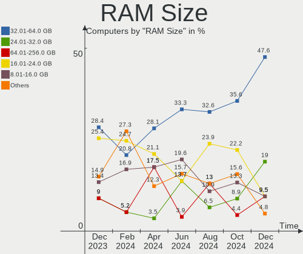

| Size in GB  | Computers | Percent |
|-------------|-----------|---------|
| 4.01-8.0    | 13        | 30.23%  |
| 32.01-64.0  | 9         | 20.93%  |
| 16.01-24.0  | 7         | 16.28%  |
| 3.01-4.0    | 6         | 13.95%  |
| 8.01-16.0   | 6         | 13.95%  |
| 24.01-32.0  | 1         | 2.33%   |
| 64.01-256.0 | 1         | 2.33%   |

RAM Used
--------

Used RAM memory

| Used GB    | Computers | Percent |
|------------|-----------|---------|
| 4.01-8.0   | 17        | 39.53%  |
| 3.01-4.0   | 12        | 27.91%  |
| 2.01-3.0   | 9         | 20.93%  |
| 8.01-16.0  | 4         | 9.3%    |
| 16.01-24.0 | 1         | 2.33%   |

Total Drives
------------

Number of drives on board

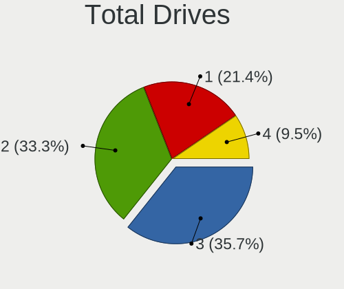

| Drives | Computers | Percent |
|--------|-----------|---------|
| 1      | 20        | 46.51%  |
| 2      | 13        | 30.23%  |
| 3      | 8         | 18.6%   |
| 7      | 1         | 2.33%   |
| 4      | 1         | 2.33%   |

Has CD-ROM
----------

Has CD-ROM on board

| Presented | Computers | Percent |
|-----------|-----------|---------|
| No        | 34        | 79.07%  |
| Yes       | 9         | 20.93%  |

Has Ethernet
------------

Has Ethernet on board

| Presented | Computers | Percent |
|-----------|-----------|---------|
| Yes       | 37        | 86.05%  |
| No        | 6         | 13.95%  |

Has WiFi
--------

Has WiFi module

| Presented | Computers | Percent |
|-----------|-----------|---------|
| Yes       | 33        | 76.74%  |
| No        | 10        | 23.26%  |

Has Bluetooth
-------------

Has Bluetooth module

| Presented | Computers | Percent |
|-----------|-----------|---------|
| Yes       | 28        | 65.12%  |
| No        | 15        | 34.88%  |

Location
--------

Country
-------

Geographic location (country)

| Country     | Computers | Percent |
|-------------|-----------|---------|
| USA         | 13        | 30.23%  |
| Germany     | 3         | 6.98%   |
| Argentina   | 3         | 6.98%   |
| Poland      | 2         | 4.65%   |
| Netherlands | 2         | 4.65%   |
| Austria     | 2         | 4.65%   |
| Vietnam     | 1         | 2.33%   |
| UK          | 1         | 2.33%   |
| Taiwan      | 1         | 2.33%   |
| Serbia      | 1         | 2.33%   |
| Russia      | 1         | 2.33%   |
| Portugal    | 1         | 2.33%   |
| Philippines | 1         | 2.33%   |
| Mexico      | 1         | 2.33%   |
| Lithuania   | 1         | 2.33%   |
| Jordan      | 1         | 2.33%   |
| Italy       | 1         | 2.33%   |
| Hungary     | 1         | 2.33%   |
| Finland     | 1         | 2.33%   |
| Cyprus      | 1         | 2.33%   |
| Costa Rica  | 1         | 2.33%   |
| Colombia    | 1         | 2.33%   |
| Chile       | 1         | 2.33%   |
| Australia   | 1         | 2.33%   |

City
----

Geographic location (city)

| City                   | Computers | Percent |
|------------------------|-----------|---------|
| Poznan                 | 2         | 4.65%   |
| Ochsenfurt             | 2         | 4.65%   |
| Wasilla                | 1         | 2.33%   |
| Vilnius                | 1         | 2.33%   |
| Vienna                 | 1         | 2.33%   |
| Veszprém              | 1         | 2.33%   |
| Valledupar             | 1         | 2.33%   |
| Tenna                  | 1         | 2.33%   |
| Seattle                | 1         | 2.33%   |
| Schruns                | 1         | 2.33%   |
| San José              | 1         | 2.33%   |
| San Antonio Oeste      | 1         | 2.33%   |
| Sacramento             | 1         | 2.33%   |
| Rotterdam              | 1         | 2.33%   |
| Ranua                  | 1         | 2.33%   |
| Orenburg               | 1         | 2.33%   |
| Nicosia                | 1         | 2.33%   |
| Nha Trang              | 1         | 2.33%   |
| Monterrey              | 1         | 2.33%   |
| Monte Grande           | 1         | 2.33%   |
| Milledgeville          | 1         | 2.33%   |
| Melbourne              | 1         | 2.33%   |
| Mansfield              | 1         | 2.33%   |
| Maipu                  | 1         | 2.33%   |
| Madaba                 | 1         | 2.33%   |
| Leca do Bailio         | 1         | 2.33%   |
| Laurelton              | 1         | 2.33%   |
| Lake Elsinore          | 1         | 2.33%   |
| Krimpen aan den IJssel | 1         | 2.33%   |
| Koblenz                | 1         | 2.33%   |
| Jacksonville           | 1         | 2.33%   |
| Hsinchu                | 1         | 2.33%   |
| Hillsdale              | 1         | 2.33%   |
| Greenville             | 1         | 2.33%   |
| Denver                 | 1         | 2.33%   |
| Darlington             | 1         | 2.33%   |
| Columbus               | 1         | 2.33%   |
| Clarksville            | 1         | 2.33%   |
| Buenos Aires           | 1         | 2.33%   |
| Belgrade               | 1         | 2.33%   |

Drives
------

Drive Vendor
------------

Hard drive vendors

| Vendor                    | Computers | Drives | Percent |
|---------------------------|-----------|--------|---------|
| WDC                       | 13        | 15     | 18.06%  |
| Samsung Electronics       | 13        | 17     | 18.06%  |
| Seagate                   | 8         | 12     | 11.11%  |
| Sandisk                   | 4         | 4      | 5.56%   |
| Kingston                  | 3         | 3      | 4.17%   |
| China                     | 3         | 3      | 4.17%   |
| Unknown                   | 2         | 2      | 2.78%   |
| Transcend                 | 2         | 2      | 2.78%   |
| Toshiba                   | 2         | 2      | 2.78%   |
| PNY                       | 2         | 2      | 2.78%   |
| Phison Electronics        | 2         | 2      | 2.78%   |
| Hitachi                   | 2         | 3      | 2.78%   |
| Apple                     | 2         | 2      | 2.78%   |
| Team                      | 1         | 1      | 1.39%   |
| Solid State Storage       | 1         | 1      | 1.39%   |
| SK hynix                  | 1         | 1      | 1.39%   |
| Realtek Semiconductor     | 1         | 1      | 1.39%   |
| Phison                    | 1         | 1      | 1.39%   |
| Micron/Crucial Technology | 1         | 1      | 1.39%   |
| Micron Technology         | 1         | 1      | 1.39%   |
| LITEONIT                  | 1         | 1      | 1.39%   |
| KingFast                  | 1         | 1      | 1.39%   |
| Intel                     | 1         | 2      | 1.39%   |
| HGST                      | 1         | 1      | 1.39%   |
| Foxline                   | 1         | 1      | 1.39%   |
| Crucial                   | 1         | 1      | 1.39%   |
| ADATA Technology          | 1         | 1      | 1.39%   |

Drive Model
-----------

Hard drive models

| Model                                             | Computers | Percent |
|---------------------------------------------------|-----------|---------|
| WDC WD10JPCX-24UE4T0 1TB                          | 2         | 2.47%   |
| Sandisk WD Black SN850 256GB                      | 2         | 2.47%   |
| Samsung NVMe SSD Controller SM981/PM981/PM983 1TB | 2         | 2.47%   |
| WDC WDS100T1XHE-00AFY0 1TB                        | 1         | 1.23%   |
| WDC WD5000BEVT-22A0RT0 500GB                      | 1         | 1.23%   |
| WDC WD5000AAKX-60U6AA0 500GB                      | 1         | 1.23%   |
| WDC WD5000AAKX-003CA0 500GB                       | 1         | 1.23%   |
| WDC WD20EZRX-00DC0B0 2TB                          | 1         | 1.23%   |
| WDC WD20EZBX-00AYRA0 2TB                          | 1         | 1.23%   |
| WDC WD20EURS-63S48Y0 2TB                          | 1         | 1.23%   |
| WDC WD10JPVX-75JC3T0 1TB                          | 1         | 1.23%   |
| WDC WD10JPVT-22A1YT0 1TB                          | 1         | 1.23%   |
| WDC WD10EZEX-22MFCA0 1TB                          | 1         | 1.23%   |
| WDC WD10EZEX-00RKKA0 1TB                          | 1         | 1.23%   |
| WDC WD10EZEX-00BN5A0 1TB                          | 1         | 1.23%   |
| WDC PC SN730 SDBQNTY-512G-1001 512GB              | 1         | 1.23%   |
| Unknown SD/MMC/MS PRO 8GB                         | 1         | 1.23%   |
| Unknown MMC Card  1GB                             | 1         | 1.23%   |
| Transcend TS256GSSD340 256GB                      | 1         | 1.23%   |
| Transcend TS128GMSA370 128GB SSD                  | 1         | 1.23%   |
| Toshiba KXG50ZNV256G 256GB                        | 1         | 1.23%   |
| Toshiba HDWD110 1TB                               | 1         | 1.23%   |
| Team TM8FPD001T 1TB                               | 1         | 1.23%   |
| Solid State Storage SSSTC CL1-8D256-HP 256GB      | 1         | 1.23%   |
| SK hynix HFM512GD3JX016N 512GB                    | 1         | 1.23%   |
| Seagate ST500LM021-1KJ152 500GB                   | 1         | 1.23%   |
| Seagate ST3500630AS 500GB                         | 1         | 1.23%   |
| Seagate ST3500418AS 500GB                         | 1         | 1.23%   |
| Seagate ST3500414CS 500GB                         | 1         | 1.23%   |
| Seagate ST31000528AS 1TB                          | 1         | 1.23%   |
| Seagate ST2000NM0011 99Y1166 59Y1813XIV 2TB       | 1         | 1.23%   |
| Seagate ST2000DM008-2FR102 2TB                    | 1         | 1.23%   |
| Seagate ST2000DM001-1ER164 2TB                    | 1         | 1.23%   |
| Seagate ST1000LM035-1RK172 1TB                    | 1         | 1.23%   |
| Seagate ST1000LM024 HN-M101MBB 1TB                | 1         | 1.23%   |
| Seagate ST1000LM014-1EJ164 1TB                    | 1         | 1.23%   |
| Seagate OneTouch HDD 1TB                          | 1         | 1.23%   |
| Sandisk WD Blue SN550 NVMe SSD 1TB                | 1         | 1.23%   |
| Sandisk WD Black SN750 / PC SN730 NVMe SSD 1024GB | 1         | 1.23%   |
| Samsung SSD 980 1TB                               | 1         | 1.23%   |

HDD Vendor
----------

Hard disk drive vendors

| Vendor              | Computers | Drives | Percent |
|---------------------|-----------|--------|---------|
| WDC                 | 12        | 13     | 42.86%  |
| Seagate             | 8         | 12     | 28.57%  |
| Hitachi             | 2         | 3      | 7.14%   |
| Apple               | 2         | 2      | 7.14%   |
| Unknown             | 1         | 1      | 3.57%   |
| Toshiba             | 1         | 1      | 3.57%   |
| Samsung Electronics | 1         | 1      | 3.57%   |
| HGST                | 1         | 1      | 3.57%   |

SSD Vendor
----------

Solid state drive vendors

| Vendor              | Computers | Drives | Percent |
|---------------------|-----------|--------|---------|
| China               | 3         | 3      | 18.75%  |
| Transcend           | 2         | 2      | 12.5%   |
| Samsung Electronics | 2         | 2      | 12.5%   |
| PNY                 | 2         | 2      | 12.5%   |
| Kingston            | 2         | 2      | 12.5%   |
| Micron Technology   | 1         | 1      | 6.25%   |
| LITEONIT            | 1         | 1      | 6.25%   |
| KingFast            | 1         | 1      | 6.25%   |
| Foxline             | 1         | 1      | 6.25%   |
| Crucial             | 1         | 1      | 6.25%   |

Drive Kind
----------

HDD or SSD

| Kind | Computers | Drives | Percent |
|------|-----------|--------|---------|
| NVMe | 22        | 33     | 36.67%  |
| HDD  | 22        | 34     | 36.67%  |
| SSD  | 15        | 16     | 25%     |
| MMC  | 1         | 1      | 1.67%   |

Drive Connector
---------------

SATA, SAS, NVMe, etc.

| Type | Computers | Drives | Percent |
|------|-----------|--------|---------|
| SATA | 30        | 48     | 54.55%  |
| NVMe | 22        | 33     | 40%     |
| SAS  | 2         | 2      | 3.64%   |
| MMC  | 1         | 1      | 1.82%   |

Drive Size
----------

Size of hard drive

| Size in TB | Computers | Drives | Percent |
|------------|-----------|--------|---------|
| 0.01-0.5   | 21        | 26     | 51.22%  |
| 0.51-1.0   | 14        | 18     | 34.15%  |
| 1.01-2.0   | 6         | 6      | 14.63%  |

Space Total
-----------

Amount of disk space available on the file system

| Size in GB     | Computers | Percent |
|----------------|-----------|---------|
| 101-250        | 14        | 32.56%  |
| 501-1000       | 10        | 23.26%  |
| 251-500        | 6         | 13.95%  |
| Unknown        | 4         | 9.3%    |
| More than 3000 | 2         | 4.65%   |
| 21-50          | 2         | 4.65%   |
| 2001-3000      | 2         | 4.65%   |
| 1001-2000      | 2         | 4.65%   |
| 51-100         | 1         | 2.33%   |

Space Used
----------

Amount of used disk space

| Used GB   | Computers | Percent |
|-----------|-----------|---------|
| 1-20      | 13        | 30.23%  |
| 101-250   | 6         | 13.95%  |
| 51-100    | 6         | 13.95%  |
| 251-500   | 5         | 11.63%  |
| 21-50     | 5         | 11.63%  |
| Unknown   | 4         | 9.3%    |
| 1001-2000 | 2         | 4.65%   |
| 2001-3000 | 1         | 2.33%   |
| 501-1000  | 1         | 2.33%   |

Malfunc. Drives
---------------

Drive models with a malfunction

| Model                                          | Computers | Drives | Percent |
|------------------------------------------------|-----------|--------|---------|
| WDC WD20EURS-63S48Y0 2TB                       | 1         | 1      | 33.33%  |
| Micron Technology MTFDDAK256MAM-1K12 256GB SSD | 1         | 1      | 33.33%  |
| Hitachi HTS54323 320GB                         | 1         | 1      | 33.33%  |

Malfunc. Drive Vendor
---------------------

Vendors of faulty drives

| Vendor            | Computers | Drives | Percent |
|-------------------|-----------|--------|---------|
| WDC               | 1         | 1      | 33.33%  |
| Micron Technology | 1         | 1      | 33.33%  |
| Hitachi           | 1         | 1      | 33.33%  |

Malfunc. HDD Vendor
-------------------

Vendors of faulty HDD drives

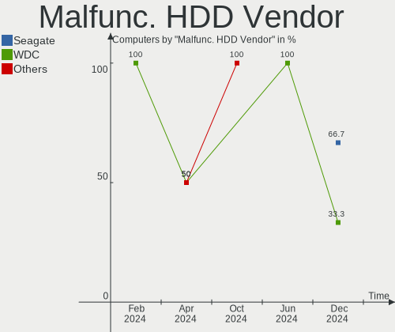

| Vendor  | Computers | Drives | Percent |
|---------|-----------|--------|---------|
| WDC     | 1         | 1      | 50%     |
| Hitachi | 1         | 1      | 50%     |

Malfunc. Drive Kind
-------------------

Kinds of faulty drives

| Kind | Computers | Drives | Percent |
|------|-----------|--------|---------|
| HDD  | 2         | 2      | 66.67%  |
| SSD  | 1         | 1      | 33.33%  |

Failed Drives
-------------

Failed drive models

Zero info for selected period =(

Failed Drive Vendor
-------------------

Failed drive vendors

Zero info for selected period =(

Drive Status
------------

Number of failed and malfunc. drives

| Status   | Computers | Drives | Percent |
|----------|-----------|--------|---------|
| Detected | 35        | 65     | 74.47%  |
| Works    | 10        | 16     | 21.28%  |
| Malfunc  | 2         | 3      | 4.26%   |

Storage controller
------------------

Storage Vendor
--------------

Storage controller vendors

| Vendor                         | Computers | Percent |
|--------------------------------|-----------|---------|
| Intel                          | 24        | 36.92%  |
| AMD                            | 13        | 20%     |
| Samsung Electronics            | 10        | 15.38%  |
| SanDisk                        | 5         | 7.69%   |
| Phison Electronics             | 3         | 4.62%   |
| Nvidia                         | 2         | 3.08%   |
| Toshiba America Info Systems   | 1         | 1.54%   |
| Solid State Storage Technology | 1         | 1.54%   |
| SK hynix                       | 1         | 1.54%   |
| Realtek Semiconductor          | 1         | 1.54%   |
| Micron/Crucial Technology      | 1         | 1.54%   |
| Marvell Technology Group       | 1         | 1.54%   |
| Kingston Technology Company    | 1         | 1.54%   |
| ADATA Technology               | 1         | 1.54%   |

Storage Model
-------------

Storage controller models

| Model                                                                         | Computers | Percent |
|-------------------------------------------------------------------------------|-----------|---------|
| AMD FCH SATA Controller [AHCI mode]                                           | 9         | 12.33%  |
| Samsung NVMe SSD Controller 980                                               | 5         | 6.85%   |
| Samsung NVMe SSD Controller SM981/PM981/PM983                                 | 3         | 4.11%   |
| Intel 7 Series Chipset Family 6-port SATA Controller [AHCI mode]              | 3         | 4.11%   |
| SanDisk WD PC SN810 / Black SN850 NVMe SSD                                    | 2         | 2.74%   |
| SanDisk WD Black SN750 / PC SN730 NVMe SSD                                    | 2         | 2.74%   |
| Nvidia MCP61 SATA Controller                                                  | 2         | 2.74%   |
| Nvidia MCP61 IDE                                                              | 2         | 2.74%   |
| Intel SATA Controller [RAID mode]                                             | 2         | 2.74%   |
| Intel Atom Processor E3800 Series SATA AHCI Controller                        | 2         | 2.74%   |
| Intel 8 Series SATA Controller 1 [AHCI mode]                                  | 2         | 2.74%   |
| Intel 6 Series/C200 Series Chipset Family 6 port Desktop SATA AHCI Controller | 2         | 2.74%   |
| AMD SB7x0/SB8x0/SB9x0 SATA Controller [AHCI mode]                             | 2         | 2.74%   |
| AMD SB7x0/SB8x0/SB9x0 IDE Controller                                          | 2         | 2.74%   |
| AMD 500 Series Chipset SATA Controller                                        | 2         | 2.74%   |
| Toshiba America Info Systems XG5 NVMe SSD Controller                          | 1         | 1.37%   |
| Solid State Storage Non-Volatile memory controller                            | 1         | 1.37%   |
| SK hynix Gold P31/PC711 NVMe Solid State Drive                                | 1         | 1.37%   |
| SanDisk WD Blue SN550 NVMe SSD                                                | 1         | 1.37%   |
| Samsung NVMe SSD Controller SM961/PM961/SM963                                 | 1         | 1.37%   |
| Samsung NVMe SSD Controller PM9A1/PM9A3/980PRO                                | 1         | 1.37%   |
| Samsung Electronics Non-Volatile memory controller                            | 1         | 1.37%   |
| Realtek Realtek Non-Volatile memory controller                                | 1         | 1.37%   |
| Phison PS5013 E13 NVMe Controller                                             | 1         | 1.37%   |
| Phison E16 PCIe4 NVMe Controller                                              | 1         | 1.37%   |
| Phison E12 NVMe Controller                                                    | 1         | 1.37%   |
| Micron/Crucial P2 NVMe PCIe SSD                                               | 1         | 1.37%   |
| Marvell Group 88SE9172 SATA 6Gb/s Controller                                  | 1         | 1.37%   |
| Kingston Company SNVS2000G [NV1 NVMe PCIe SSD 2TB]                            | 1         | 1.37%   |
| Intel Volume Management Device NVMe RAID Controller                           | 1         | 1.37%   |
| Intel Tiger Lake-LP SATA Controller                                           | 1         | 1.37%   |
| Intel SSD 660P Series                                                         | 1         | 1.37%   |
| Intel Q170/Q150/B150/H170/H110/Z170/CM236 Chipset SATA Controller [AHCI Mode] | 1         | 1.37%   |
| Intel NM10/ICH7 Family SATA Controller [AHCI mode]                            | 1         | 1.37%   |
| Intel Ice Lake-LP SATA Controller [AHCI mode]                                 | 1         | 1.37%   |
| Intel HM170/QM170 Chipset SATA Controller [AHCI Mode]                         | 1         | 1.37%   |
| Intel Comet Lake SATA AHCI Controller                                         | 1         | 1.37%   |
| Intel Cannon Lake PCH SATA AHCI Controller                                    | 1         | 1.37%   |
| Intel C600/X79 series chipset 6-Port SATA AHCI Controller                     | 1         | 1.37%   |
| Intel 82801IBM/IEM (ICH9M/ICH9M-E) 4 port SATA Controller [AHCI mode]         | 1         | 1.37%   |

Storage Kind
------------

Kind of storage controller (IDE, SATA, NVMe, SAS, ...)

| Kind | Computers | Percent |
|------|-----------|---------|
| SATA | 34        | 53.13%  |
| NVMe | 22        | 34.38%  |
| RAID | 4         | 6.25%   |
| IDE  | 4         | 6.25%   |

Processor
---------

CPU Vendor
----------

Processor vendors

| Vendor | Computers | Percent |
|--------|-----------|---------|
| Intel  | 24        | 55.81%  |
| AMD    | 19        | 44.19%  |

CPU Model
---------

Processor models

| Model                                         | Computers | Percent |
|-----------------------------------------------|-----------|---------|
| AMD Ryzen 7 5800H with Radeon Graphics        | 2         | 4.65%   |
| AMD FX-6300 Six-Core Processor                | 2         | 4.65%   |
| Intel Xeon CPU E5-2667 0 @ 2.90GHz            | 1         | 2.33%   |
| Intel Pentium CPU B960 @ 2.20GHz              | 1         | 2.33%   |
| Intel Core i9-9900K CPU @ 3.60GHz             | 1         | 2.33%   |
| Intel Core i7-7700HQ CPU @ 2.80GHz            | 1         | 2.33%   |
| Intel Core i7-4770 CPU @ 3.40GHz              | 1         | 2.33%   |
| Intel Core i7-4712MQ CPU @ 2.30GHz            | 1         | 2.33%   |
| Intel Core i7-3630QM CPU @ 2.40GHz            | 1         | 2.33%   |
| Intel Core i7-10700KF CPU @ 3.80GHz           | 1         | 2.33%   |
| Intel Core i5-9600K CPU @ 3.70GHz             | 1         | 2.33%   |
| Intel Core i5-9400F CPU @ 2.90GHz             | 1         | 2.33%   |
| Intel Core i5-7500 CPU @ 3.40GHz              | 1         | 2.33%   |
| Intel Core i5-4300U CPU @ 1.90GHz             | 1         | 2.33%   |
| Intel Core i5-4200U CPU @ 1.60GHz             | 1         | 2.33%   |
| Intel Core i5-3470 CPU @ 3.20GHz              | 1         | 2.33%   |
| Intel Core i5-2400 CPU @ 3.10GHz              | 1         | 2.33%   |
| Intel Core i5-10400F CPU @ 2.90GHz            | 1         | 2.33%   |
| Intel Core i5-1035G1 CPU @ 1.00GHz            | 1         | 2.33%   |
| Intel Core i5-10300H CPU @ 2.50GHz            | 1         | 2.33%   |
| Intel Core i3-3217U CPU @ 1.80GHz             | 1         | 2.33%   |
| Intel Core 2 Duo CPU P8400 @ 2.26GHz          | 1         | 2.33%   |
| Intel Celeron CPU N2930 @ 1.83GHz             | 1         | 2.33%   |
| Intel Celeron CPU N2830 @ 2.16GHz             | 1         | 2.33%   |
| Intel Atom CPU N2600 @ 1.60GHz                | 1         | 2.33%   |
| Intel 11th Gen Core i3-1115G4 @ 3.00GHz       | 1         | 2.33%   |
| AMD Ryzen 9 5950X 16-Core Processor           | 1         | 2.33%   |
| AMD Ryzen 9 5900X 12-Core Processor           | 1         | 2.33%   |
| AMD Ryzen 7 5800X3D 8-Core Processor          | 1         | 2.33%   |
| AMD Ryzen 7 5800X 8-Core Processor            | 1         | 2.33%   |
| AMD Ryzen 7 5800U with Radeon Graphics        | 1         | 2.33%   |
| AMD Ryzen 7 5700X 8-Core Processor            | 1         | 2.33%   |
| AMD Ryzen 7 5700U with Radeon Graphics        | 1         | 2.33%   |
| AMD Ryzen 5 5625U with Radeon Graphics        | 1         | 2.33%   |
| AMD Ryzen 5 5600H with Radeon Graphics        | 1         | 2.33%   |
| AMD Ryzen 5 1500X Quad-Core Processor         | 1         | 2.33%   |
| AMD Phenom II X4 925 Processor                | 1         | 2.33%   |
| AMD FX-8350 Eight-Core Processor              | 1         | 2.33%   |
| AMD Custom APU 0405                           | 1         | 2.33%   |
| AMD A6-7400K Radeon R5, 6 Compute Cores 2C+4G | 1         | 2.33%   |

CPU Model Family
----------------

Processor model prefix

| Model            | Computers | Percent |
|------------------|-----------|---------|
| Intel Core i5    | 10        | 23.26%  |
| AMD Ryzen 7      | 7         | 16.28%  |
| Intel Core i7    | 5         | 11.63%  |
| AMD Ryzen 5      | 3         | 6.98%   |
| AMD FX           | 3         | 6.98%   |
| Other            | 2         | 4.65%   |
| Intel Celeron    | 2         | 4.65%   |
| AMD Ryzen 9      | 2         | 4.65%   |
| AMD A6           | 2         | 4.65%   |
| Intel Xeon       | 1         | 2.33%   |
| Intel Pentium    | 1         | 2.33%   |
| Intel Core i9    | 1         | 2.33%   |
| Intel Core i3    | 1         | 2.33%   |
| Intel Core 2 Duo | 1         | 2.33%   |
| Intel Atom       | 1         | 2.33%   |
| AMD Phenom II X4 | 1         | 2.33%   |

CPU Cores
---------

Number of processor cores

| Number | Computers | Percent |
|--------|-----------|---------|
| 4      | 15        | 34.88%  |
| 8      | 10        | 23.26%  |
| 2      | 8         | 18.6%   |
| 6      | 6         | 13.95%  |
| 3      | 2         | 4.65%   |
| 12     | 1         | 2.33%   |
| 1      | 1         | 2.33%   |

CPU Sockets
-----------

Number of sockets

| Number | Computers | Percent |
|--------|-----------|---------|
| 1      | 43        | 100%    |

CPU Threads
-----------

Threads per core (Hyper-Threading)

| Number | Computers | Percent |
|--------|-----------|---------|
| 2      | 32        | 74.42%  |
| 1      | 11        | 25.58%  |

CPU Op-Modes
------------

CPU Operation Modes (32-bit, 64-bit)

| Op mode        | Computers | Percent |
|----------------|-----------|---------|
| 32-bit, 64-bit | 43        | 100%    |

CPU Microcode
-------------

Microcode number

| Number     | Computers | Percent |
|------------|-----------|---------|
| 0x0a50000c | 4         | 9.3%    |
| 0x306a9    | 3         | 6.98%   |
| 0x906e9    | 2         | 4.65%   |
| 0x40651    | 2         | 4.65%   |
| 0x306c3    | 2         | 4.65%   |
| 0x30678    | 2         | 4.65%   |
| 0x206a7    | 2         | 4.65%   |
| 0x0a201204 | 2         | 4.65%   |
| 0x0a201016 | 2         | 4.65%   |
| 0x06000822 | 2         | 4.65%   |
| 0xa0655    | 1         | 2.33%   |
| 0xa0653    | 1         | 2.33%   |
| 0xa0652    | 1         | 2.33%   |
| 0x906ed    | 1         | 2.33%   |
| 0x906ec    | 1         | 2.33%   |
| 0x906ea    | 1         | 2.33%   |
| 0x806c1    | 1         | 2.33%   |
| 0x706e5    | 1         | 2.33%   |
| 0x30661    | 1         | 2.33%   |
| 0x206d7    | 1         | 2.33%   |
| 0x10676    | 1         | 2.33%   |
| 0x0a50000d | 1         | 2.33%   |
| 0x0a201205 | 1         | 2.33%   |
| 0x08900201 | 1         | 2.33%   |
| 0x08608103 | 1         | 2.33%   |
| 0x08001138 | 1         | 2.33%   |
| 0x07030106 | 1         | 2.33%   |
| 0x06003106 | 1         | 2.33%   |
| 0x06000817 | 1         | 2.33%   |
| 0x01000086 | 1         | 2.33%   |

CPU Microarch
-------------

Microarchitecture

| Name        | Computers | Percent |
|-------------|-----------|---------|
| Zen 3       | 10        | 23.26%  |
| KabyLake    | 5         | 11.63%  |
| Haswell     | 4         | 9.3%    |
| SandyBridge | 3         | 6.98%   |
| Piledriver  | 3         | 6.98%   |
| IvyBridge   | 3         | 6.98%   |
| CometLake   | 3         | 6.98%   |
| Silvermont  | 2         | 4.65%   |
| Unknown     | 2         | 4.65%   |
| Zen         | 1         | 2.33%   |
| TigerLake   | 1         | 2.33%   |
| Steamroller | 1         | 2.33%   |
| Puma        | 1         | 2.33%   |
| Penryn      | 1         | 2.33%   |
| K10         | 1         | 2.33%   |
| IceLake     | 1         | 2.33%   |
| Bonnell     | 1         | 2.33%   |

Graphics
--------

GPU Vendor
----------

Vendors of graphics cards

| Vendor | Computers | Percent |
|--------|-----------|---------|
| Nvidia | 19        | 37.25%  |
| AMD    | 17        | 33.33%  |
| Intel  | 15        | 29.41%  |

GPU Model
---------

Graphics card models

| Model                                                                         | Computers | Percent |
|-------------------------------------------------------------------------------|-----------|---------|
| AMD Cezanne [Radeon Vega Series / Radeon Vega Mobile Series]                  | 4         | 7.41%   |
| Nvidia GA107M [GeForce RTX 3050 Mobile]                                       | 2         | 3.7%    |
| Intel Atom Processor Z36xxx/Z37xxx Series Graphics & Display                  | 2         | 3.7%    |
| Intel 3rd Gen Core processor Graphics Controller                              | 2         | 3.7%    |
| AMD Baffin [Radeon RX 460/560D / Pro 450/455/460/555/555X/560/560X]           | 2         | 3.7%    |
| Nvidia TU116 [GeForce GTX 1660 Ti]                                            | 1         | 1.85%   |
| Nvidia TU106M [GeForce RTX 2060 Mobile]                                       | 1         | 1.85%   |
| Nvidia TU106 [GeForce RTX 2070]                                               | 1         | 1.85%   |
| Nvidia TU106 [GeForce RTX 2060 SUPER]                                         | 1         | 1.85%   |
| Nvidia TU104GL [Quadro RTX 4000]                                              | 1         | 1.85%   |
| Nvidia TU102 [GeForce RTX 2080 Ti Rev. A]                                     | 1         | 1.85%   |
| Nvidia GP107M [GeForce GTX 1050 Mobile]                                       | 1         | 1.85%   |
| Nvidia GP107 [GeForce GTX 1050]                                               | 1         | 1.85%   |
| Nvidia GP104 [GeForce GTX 1070]                                               | 1         | 1.85%   |
| Nvidia GM206 [GeForce GTX 960]                                                | 1         | 1.85%   |
| Nvidia GM204 [GeForce GTX 970]                                                | 1         | 1.85%   |
| Nvidia GK208B [GeForce GT 730]                                                | 1         | 1.85%   |
| Nvidia GK208 [GeForce GT 630 Rev. 2]                                          | 1         | 1.85%   |
| Nvidia GK107M [GeForce GTX 660M]                                              | 1         | 1.85%   |
| Nvidia GA106M [GeForce RTX 3060 Mobile / Max-Q]                               | 1         | 1.85%   |
| Nvidia GA106 [GeForce RTX 3060]                                               | 1         | 1.85%   |
| Nvidia GA104 [GeForce RTX 3070]                                               | 1         | 1.85%   |
| Nvidia GA104 [GeForce RTX 3060]                                               | 1         | 1.85%   |
| Nvidia GA102 [GeForce RTX 3090]                                               | 1         | 1.85%   |
| Intel Xeon E3-1200 v3/4th Gen Core Processor Integrated Graphics Controller   | 1         | 1.85%   |
| Intel Xeon E3-1200 v2/3rd Gen Core processor Graphics Controller              | 1         | 1.85%   |
| Intel Tiger Lake-LP GT2 [UHD Graphics G4]                                     | 1         | 1.85%   |
| Intel Iris Plus Graphics G1 (Ice Lake)                                        | 1         | 1.85%   |
| Intel HD Graphics 630                                                         | 1         | 1.85%   |
| Intel Haswell-ULT Integrated Graphics Controller                              | 1         | 1.85%   |
| Intel CometLake-H GT2 [UHD Graphics]                                          | 1         | 1.85%   |
| Intel CoffeeLake-S GT2 [UHD Graphics 630]                                     | 1         | 1.85%   |
| Intel Atom Processor D2xxx/N2xxx Integrated Graphics Controller               | 1         | 1.85%   |
| Intel 4th Gen Core Processor Integrated Graphics Controller                   | 1         | 1.85%   |
| Intel 2nd Generation Core Processor Family Integrated Graphics Controller     | 1         | 1.85%   |
| AMD VanGogh [AMD Custom GPU 0405]                                             | 1         | 1.85%   |
| AMD Tonga PRO [Radeon R9 285/380]                                             | 1         | 1.85%   |
| AMD Sun XT [Radeon HD 8670A/8670M/8690M / R5 M330 / M430 / Radeon 520 Mobile] | 1         | 1.85%   |
| AMD RV635/M86 [Mobility Radeon HD 3650]                                       | 1         | 1.85%   |
| AMD Oland PRO [Radeon R7 240/340 / Radeon 520]                                | 1         | 1.85%   |

GPU Combo
---------

Combinations of graphics cards

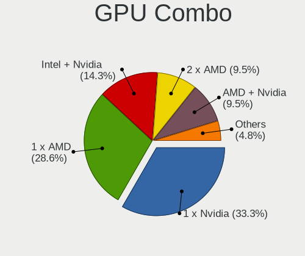

| Name           | Computers | Percent |
|----------------|-----------|---------|
| 1 x AMD        | 12        | 27.91%  |
| 1 x Nvidia     | 11        | 25.58%  |
| 1 x Intel      | 10        | 23.26%  |
| Intel + Nvidia | 3         | 6.98%   |
| AMD + Nvidia   | 3         | 6.98%   |
| 2 x Nvidia     | 2         | 4.65%   |
| 2 x AMD        | 1         | 2.33%   |
| Intel + AMD    | 1         | 2.33%   |

GPU Driver
----------

Free vs proprietary

| Driver      | Computers | Percent |
|-------------|-----------|---------|
| Free        | 25        | 58.14%  |
| Proprietary | 18        | 41.86%  |

GPU Memory
----------

Total video memory

| Size in GB | Computers | Percent |
|------------|-----------|---------|
| Unknown    | 16        | 37.21%  |
| 0.01-0.5   | 8         | 18.6%   |
| 3.01-4.0   | 6         | 13.95%  |
| 1.01-2.0   | 4         | 9.3%    |
| 7.01-8.0   | 3         | 6.98%   |
| 8.01-16.0  | 3         | 6.98%   |
| 5.01-6.0   | 1         | 2.33%   |
| 16.01-24.0 | 1         | 2.33%   |
| 0.51-1.0   | 1         | 2.33%   |

Monitor
-------

Monitor Vendor
--------------

Monitor vendors

| Vendor               | Computers | Percent |
|----------------------|-----------|---------|
| AU Optronics         | 6         | 12.5%   |
| Goldstar             | 5         | 10.42%  |
| Samsung Electronics  | 4         | 8.33%   |
| BOE                  | 4         | 8.33%   |
| Dell                 | 3         | 6.25%   |
| Ancor Communications | 3         | 6.25%   |
| Sony                 | 2         | 4.17%   |
| LG Display           | 2         | 4.17%   |
| Chimei Innolux       | 2         | 4.17%   |
| ASUSTek Computer     | 2         | 4.17%   |
| AOC                  | 2         | 4.17%   |
| Valve                | 1         | 2.08%   |
| Philips              | 1         | 2.08%   |
| PANDA                | 1         | 2.08%   |
| NPC                  | 1         | 2.08%   |
| MSI                  | 1         | 2.08%   |
| Lenovo               | 1         | 2.08%   |
| InfoVision           | 1         | 2.08%   |
| HUAWEI               | 1         | 2.08%   |
| Hitachi              | 1         | 2.08%   |
| Gigabyte Technology  | 1         | 2.08%   |
| BenQ                 | 1         | 2.08%   |
| Apple                | 1         | 2.08%   |
| Acer                 | 1         | 2.08%   |

Monitor Model
-------------

Monitor models

| Model                                                                 | Computers | Percent |
|-----------------------------------------------------------------------|-----------|---------|
| Valve ANX7530 U VLV3001 800x1280 100x150mm 7.1-inch                   | 1         | 2%      |
| Sony TV SNYEB01 1360x768                                              | 1         | 2%      |
| Sony TV SNY1B02 1360x768                                              | 1         | 2%      |
| Samsung Electronics SMB2030N SAM0634 1600x900 443x249mm 20.0-inch     | 1         | 2%      |
| Samsung Electronics LCD Monitor SEC5442 1440x900 367x230mm 17.1-inch  | 1         | 2%      |
| Samsung Electronics LCD Monitor SDC4852 1366x768 344x194mm 15.5-inch  | 1         | 2%      |
| Samsung Electronics LCD Monitor SAM090B 1920x1080 890x500mm 40.2-inch | 1         | 2%      |
| Philips PHL 221V8 PHLC211 1920x1080 477x268mm 21.5-inch               | 1         | 2%      |
| PANDA LCD Monitor NCP0040 1920x1080 344x194mm 15.5-inch               | 1         | 2%      |
| NPC M2201 NPC2200 1920x1080 480x260mm 21.5-inch                       | 1         | 2%      |
| MSI G32CQ4 MSI3DB5 2560x1440 697x392mm 31.5-inch                      | 1         | 2%      |
| LG Display LCD Monitor LGD04E8 1920x1080 382x215mm 17.3-inch          | 1         | 2%      |
| LG Display LCD Monitor LGD0259 1920x1080 345x194mm 15.6-inch          | 1         | 2%      |
| Lenovo LT2252p Wide LEN0A0C 1680x1050 474x296mm 22.0-inch             | 1         | 2%      |
| InfoVision LCD Monitor IVO03F4 1920x1080 344x193mm 15.5-inch          | 1         | 2%      |
| HUAWEI MateView HWV6E22 3840x2560 596x397mm 28.2-inch                 | 1         | 2%      |
| Hitachi HISENSE HEC0030 3840x2160 1872x1053mm 84.6-inch               | 1         | 2%      |
| Goldstar W2443 GSM571C 1920x1080 510x290mm 23.1-inch                  | 1         | 2%      |
| Goldstar W2042 GSM4E7E 1680x1050 434x270mm 20.1-inch                  | 1         | 2%      |
| Goldstar ULTRAGEAR GSM7766 2560x1440 697x392mm 31.5-inch              | 1         | 2%      |
| Goldstar Ultra HD GSM5B09 3840x2160 600x340mm 27.2-inch               | 1         | 2%      |
| Goldstar HDR WFHD GSM7714 2560x1080 798x334mm 34.1-inch               | 1         | 2%      |
| Gigabyte Technology AORUS FV43U GBT4300 3840x2160 697x392mm 31.5-inch | 1         | 2%      |
| Dell ST2220L DELA065 1920x1080 477x268mm 21.5-inch                    | 1         | 2%      |
| Dell S2721DGF DEL41D9 2560x1440 597x336mm 27.0-inch                   | 1         | 2%      |
| Dell AW3821DW DELA17F 3840x1600 880x367mm 37.5-inch                   | 1         | 2%      |
| Chimei Innolux LCD Monitor CMN14E5 1920x1080 309x173mm 13.9-inch      | 1         | 2%      |
| Chimei Innolux LCD Monitor CMN14D4 1920x1080 309x173mm 13.9-inch      | 1         | 2%      |
| BOE LCD Monitor BOE0A81 1920x1080 344x194mm 15.5-inch                 | 1         | 2%      |
| BOE LCD Monitor BOE0998 1920x1080 344x194mm 15.5-inch                 | 1         | 2%      |
| BOE LCD Monitor BOE092F 2520x1680 338x226mm 16.0-inch                 | 1         | 2%      |
| BOE LCD Monitor BOE06A4 1366x768 344x194mm 15.5-inch                  | 1         | 2%      |
| BenQ ZOWIE XL LCD BNQ7F3F 1920x1080 531x298mm 24.0-inch               | 1         | 2%      |
| AU Optronics LCD Monitor AUO683D 1920x1080 309x174mm 14.0-inch        | 1         | 2%      |
| AU Optronics LCD Monitor AUO41EC 1366x768 344x193mm 15.5-inch         | 1         | 2%      |
| AU Optronics LCD Monitor AUO229E 1920x1080 309x174mm 14.0-inch        | 1         | 2%      |
| AU Optronics LCD Monitor AUO21ED 1920x1080 344x193mm 15.5-inch        | 1         | 2%      |
| AU Optronics LCD Monitor AUO21EC 1366x768 344x193mm 15.5-inch         | 1         | 2%      |
| AU Optronics LCD Monitor AUO106C 1366x768 276x155mm 12.5-inch         | 1         | 2%      |
| ASUSTek Computer ROG XG27UQR AUS27BA 3840x2160 596x335mm 26.9-inch    | 1         | 2%      |

Monitor Resolution
------------------

Monitor screen resolution

| Resolution         | Computers | Percent |
|--------------------|-----------|---------|
| 1920x1080 (FHD)    | 20        | 40.82%  |
| 3840x2160 (4K)     | 7         | 14.29%  |
| 2560x1440 (QHD)    | 5         | 10.2%   |
| 1366x768 (WXGA)    | 4         | 8.16%   |
| 1680x1050 (WSXGA+) | 2         | 4.08%   |
| 1440x900 (WXGA+)   | 2         | 4.08%   |
| 1360x768           | 2         | 4.08%   |
| 800x1280           | 1         | 2.04%   |
| 3840x2560          | 1         | 2.04%   |
| 3840x1600          | 1         | 2.04%   |
| 2560x1080          | 1         | 2.04%   |
| 2520x1680          | 1         | 2.04%   |
| 1920x1200 (WUXGA)  | 1         | 2.04%   |
| 1600x900 (HD+)     | 1         | 2.04%   |

Monitor Diagonal
----------------

Diagonal size in inches

| Inches | Computers | Percent |
|--------|-----------|---------|
| 15     | 10        | 20.83%  |
| 21     | 5         | 10.42%  |
| 27     | 4         | 8.33%   |
| 17     | 3         | 6.25%   |
| 72     | 2         | 4.17%   |
| 31     | 2         | 4.17%   |
| 23     | 2         | 4.17%   |
| 20     | 2         | 4.17%   |
| 19     | 2         | 4.17%   |
| 13     | 2         | 4.17%   |
| 84     | 1         | 2.08%   |
| 54     | 1         | 2.08%   |
| 42     | 1         | 2.08%   |
| 37     | 1         | 2.08%   |
| 34     | 1         | 2.08%   |
| 33     | 1         | 2.08%   |
| 28     | 1         | 2.08%   |
| 26     | 1         | 2.08%   |
| 24     | 1         | 2.08%   |
| 22     | 1         | 2.08%   |
| 16     | 1         | 2.08%   |
| 14     | 1         | 2.08%   |
| 12     | 1         | 2.08%   |
| 7      | 1         | 2.08%   |

Monitor Width
-------------

Physical width

| Width in mm | Computers | Percent |
|-------------|-----------|---------|
| 301-350     | 14        | 30.43%  |
| 401-500     | 10        | 21.74%  |
| 501-600     | 7         | 15.22%  |
| 351-400     | 3         | 6.52%   |
| 1501-2000   | 3         | 6.52%   |
| 701-800     | 2         | 4.35%   |
| 601-700     | 2         | 4.35%   |
| 801-900     | 1         | 2.17%   |
| 201-300     | 1         | 2.17%   |
| 1001-1500   | 1         | 2.17%   |
| 901-1000    | 1         | 2.17%   |
| 1-100       | 1         | 2.17%   |

Aspect Ratio
------------

Proportional relationship between the width and the height

| Ratio | Computers | Percent |
|-------|-----------|---------|
| 16/9  | 34        | 77.27%  |
| 16/10 | 5         | 11.36%  |
| 3/2   | 2         | 4.55%   |
| 21/9  | 2         | 4.55%   |
| 0.67  | 1         | 2.27%   |

Monitor Area
------------

Area in inch²

| Area in inch² | Computers | Percent |
|----------------|-----------|---------|
| 101-110        | 10        | 20.83%  |
| 151-200        | 7         | 14.58%  |
| 201-250        | 6         | 12.5%   |
| 351-500        | 5         | 10.42%  |
| 301-350        | 5         | 10.42%  |
| More than 1000 | 4         | 8.33%   |
| 81-90          | 3         | 6.25%   |
| 121-130        | 2         | 4.17%   |
| 501-1000       | 2         | 4.17%   |
| 61-70          | 1         | 2.08%   |
| 1-40           | 1         | 2.08%   |
| 131-140        | 1         | 2.08%   |
| 111-120        | 1         | 2.08%   |

Pixel Density
-------------

Pixels per inch

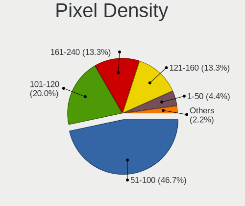

| Density | Computers | Percent |
|---------|-----------|---------|
| 51-100  | 15        | 31.91%  |
| 101-120 | 14        | 29.79%  |
| 121-160 | 10        | 21.28%  |
| 161-240 | 5         | 10.64%  |
| 1-50    | 3         | 6.38%   |

Multiple Monitors
-----------------

Total monitors connected

| Total | Computers | Percent |
|-------|-----------|---------|
| 1     | 35        | 81.4%   |
| 2     | 6         | 13.95%  |
| 4     | 1         | 2.33%   |
| 0     | 1         | 2.33%   |

Network
-------

Net Controller Vendor
---------------------

Controller vendors

| Vendor                          | Computers | Percent |
|---------------------------------|-----------|---------|
| Realtek Semiconductor           | 27        | 41.54%  |
| Intel                           | 20        | 30.77%  |
| Qualcomm Atheros                | 4         | 6.15%   |
| Broadcom                        | 3         | 4.62%   |
| MediaTek                        | 2         | 3.08%   |
| Broadcom Limited                | 2         | 3.08%   |
| Xiaomi                          | 1         | 1.54%   |
| Wacom                           | 1         | 1.54%   |
| Qualcomm Atheros Communications | 1         | 1.54%   |
| Microsoft                       | 1         | 1.54%   |
| Linksys                         | 1         | 1.54%   |
| ASIX Electronics                | 1         | 1.54%   |
| Afatech                         | 1         | 1.54%   |

Net Controller Model
--------------------

Controller models

| Model                                                             | Computers | Percent |
|-------------------------------------------------------------------|-----------|---------|
| Realtek RTL8111/8168/8411 PCI Express Gigabit Ethernet Controller | 15        | 20.27%  |
| Realtek RTL8125 2.5GbE Controller                                 | 4         | 5.41%   |
| Realtek RTL8822CE 802.11ac PCIe Wireless Network Adapter          | 3         | 4.05%   |
| Realtek RTL8852AE 802.11ax PCIe Wireless Network Adapter          | 2         | 2.7%    |
| Realtek RTL810xE PCI Express Fast Ethernet controller             | 2         | 2.7%    |
| Realtek 802.11n                                                   | 2         | 2.7%    |
| MediaTek MT7921 802.11ax PCI Express Wireless Network Adapter     | 2         | 2.7%    |
| Intel Wi-Fi 6 AX210/AX211/AX411 160MHz                            | 2         | 2.7%    |
| Intel I211 Gigabit Network Connection                             | 2         | 2.7%    |
| Intel Ethernet Connection (7) I219-V                              | 2         | 2.7%    |
| Xiaomi Mi/Redmi series (RNDIS + ADB)                              | 1         | 1.35%   |
| Wacom ACK-40401 [Wireless Accessory Kit]                          | 1         | 1.35%   |
| Realtek RTL8812AE 802.11ac PCIe Wireless Network Adapter          | 1         | 1.35%   |
| Realtek RTL8723BE PCIe Wireless Network Adapter                   | 1         | 1.35%   |
| Realtek RTL8188CE 802.11b/g/n WiFi Adapter                        | 1         | 1.35%   |
| Realtek Realtek Network controller                                | 1         | 1.35%   |
| Qualcomm Atheros QCA9565 / AR9565 Wireless Network Adapter        | 1         | 1.35%   |
| Qualcomm Atheros QCA8171 Gigabit Ethernet                         | 1         | 1.35%   |
| Qualcomm Atheros Killer E220x Gigabit Ethernet Controller         | 1         | 1.35%   |
| Qualcomm Atheros AR9271 802.11n                                   | 1         | 1.35%   |
| Qualcomm Atheros AR8162 Fast Ethernet                             | 1         | 1.35%   |
| Microsoft Wireless XBox Controller Dongle                         | 1         | 1.35%   |
| Linksys WUSB6100M 802.11a/b/g/n/ac Wireless Adapter               | 1         | 1.35%   |
| Intel Wireless-AC 9260                                            | 1         | 1.35%   |
| Intel Wireless 8265 / 8275                                        | 1         | 1.35%   |
| Intel Wireless 7265                                               | 1         | 1.35%   |
| Intel Wireless 7260                                               | 1         | 1.35%   |
| Intel Wireless 3160                                               | 1         | 1.35%   |
| Intel WiFi Link 5100                                              | 1         | 1.35%   |
| Intel Wi-Fi 6 AX200                                               | 1         | 1.35%   |
| Intel Ethernet Connection I218-LM                                 | 1         | 1.35%   |
| Intel Ethernet Connection I217-V                                  | 1         | 1.35%   |
| Intel Ethernet Connection (14) I219-V                             | 1         | 1.35%   |
| Intel Ethernet Connection (11) I219-V                             | 1         | 1.35%   |
| Intel Dual Band Wireless-AC 3168NGW [Stone Peak]                  | 1         | 1.35%   |
| Intel Comet Lake PCH CNVi WiFi                                    | 1         | 1.35%   |
| Intel Centrino Wireless-N 2200                                    | 1         | 1.35%   |
| Intel Centrino Wireless-N 135                                     | 1         | 1.35%   |
| Intel 82579V Gigabit Network Connection                           | 1         | 1.35%   |
| Intel 82579LM Gigabit Network Connection (Lewisville)             | 1         | 1.35%   |

Wireless Vendor
---------------

Wireless vendors

| Vendor                          | Computers | Percent |
|---------------------------------|-----------|---------|
| Intel                           | 13        | 37.14%  |
| Realtek Semiconductor           | 11        | 31.43%  |
| MediaTek                        | 2         | 5.71%   |
| Broadcom Limited                | 2         | 5.71%   |
| Broadcom                        | 2         | 5.71%   |
| Wacom                           | 1         | 2.86%   |
| Qualcomm Atheros Communications | 1         | 2.86%   |
| Qualcomm Atheros                | 1         | 2.86%   |
| Microsoft                       | 1         | 2.86%   |
| Linksys                         | 1         | 2.86%   |

Wireless Model
--------------

Wireless models

| Model                                                         | Computers | Percent |
|---------------------------------------------------------------|-----------|---------|
| Realtek RTL8822CE 802.11ac PCIe Wireless Network Adapter      | 3         | 8.57%   |
| Realtek RTL8852AE 802.11ax PCIe Wireless Network Adapter      | 2         | 5.71%   |
| Realtek 802.11n                                               | 2         | 5.71%   |
| MediaTek MT7921 802.11ax PCI Express Wireless Network Adapter | 2         | 5.71%   |
| Intel Wi-Fi 6 AX210/AX211/AX411 160MHz                        | 2         | 5.71%   |
| Wacom ACK-40401 [Wireless Accessory Kit]                      | 1         | 2.86%   |
| Realtek RTL8812AE 802.11ac PCIe Wireless Network Adapter      | 1         | 2.86%   |
| Realtek RTL8723BE PCIe Wireless Network Adapter               | 1         | 2.86%   |
| Realtek RTL8188CE 802.11b/g/n WiFi Adapter                    | 1         | 2.86%   |
| Realtek Realtek Network controller                            | 1         | 2.86%   |
| Qualcomm Atheros QCA9565 / AR9565 Wireless Network Adapter    | 1         | 2.86%   |
| Qualcomm Atheros AR9271 802.11n                               | 1         | 2.86%   |
| Microsoft Wireless XBox Controller Dongle                     | 1         | 2.86%   |
| Linksys WUSB6100M 802.11a/b/g/n/ac Wireless Adapter           | 1         | 2.86%   |
| Intel Wireless-AC 9260                                        | 1         | 2.86%   |
| Intel Wireless 8265 / 8275                                    | 1         | 2.86%   |
| Intel Wireless 7265                                           | 1         | 2.86%   |
| Intel Wireless 7260                                           | 1         | 2.86%   |
| Intel Wireless 3160                                           | 1         | 2.86%   |
| Intel WiFi Link 5100                                          | 1         | 2.86%   |
| Intel Wi-Fi 6 AX200                                           | 1         | 2.86%   |
| Intel Dual Band Wireless-AC 3168NGW [Stone Peak]              | 1         | 2.86%   |
| Intel Comet Lake PCH CNVi WiFi                                | 1         | 2.86%   |
| Intel Centrino Wireless-N 2200                                | 1         | 2.86%   |
| Intel Centrino Wireless-N 135                                 | 1         | 2.86%   |
| Broadcom Limited BCM4352 802.11ac Wireless Network Adapter    | 1         | 2.86%   |
| Broadcom Limited BCM4313 802.11bgn Wireless Network Adapter   | 1         | 2.86%   |
| Broadcom BCM43602 802.11ac Wireless LAN SoC                   | 1         | 2.86%   |
| Broadcom BCM43228 802.11a/b/g/n                               | 1         | 2.86%   |

Ethernet Vendor
---------------

Ethernet vendors

| Vendor                | Computers | Percent |
|-----------------------|-----------|---------|
| Realtek Semiconductor | 21        | 55.26%  |
| Intel                 | 10        | 26.32%  |
| Qualcomm Atheros      | 3         | 7.89%   |
| Broadcom              | 2         | 5.26%   |
| Xiaomi                | 1         | 2.63%   |
| ASIX Electronics      | 1         | 2.63%   |

Ethernet Model
--------------

Ethernet models

| Model                                                             | Computers | Percent |
|-------------------------------------------------------------------|-----------|---------|
| Realtek RTL8111/8168/8411 PCI Express Gigabit Ethernet Controller | 15        | 39.47%  |
| Realtek RTL8125 2.5GbE Controller                                 | 4         | 10.53%  |
| Realtek RTL810xE PCI Express Fast Ethernet controller             | 2         | 5.26%   |
| Intel I211 Gigabit Network Connection                             | 2         | 5.26%   |
| Intel Ethernet Connection (7) I219-V                              | 2         | 5.26%   |
| Xiaomi Mi/Redmi series (RNDIS + ADB)                              | 1         | 2.63%   |
| Qualcomm Atheros QCA8171 Gigabit Ethernet                         | 1         | 2.63%   |
| Qualcomm Atheros Killer E220x Gigabit Ethernet Controller         | 1         | 2.63%   |
| Qualcomm Atheros AR8162 Fast Ethernet                             | 1         | 2.63%   |
| Intel Ethernet Connection I218-LM                                 | 1         | 2.63%   |
| Intel Ethernet Connection I217-V                                  | 1         | 2.63%   |
| Intel Ethernet Connection (14) I219-V                             | 1         | 2.63%   |
| Intel Ethernet Connection (11) I219-V                             | 1         | 2.63%   |
| Intel 82579V Gigabit Network Connection                           | 1         | 2.63%   |
| Intel 82579LM Gigabit Network Connection (Lewisville)             | 1         | 2.63%   |
| Broadcom NetXtreme BCM57766 Gigabit Ethernet PCIe                 | 1         | 2.63%   |
| Broadcom NetLink BCM5784M Gigabit Ethernet PCIe                   | 1         | 2.63%   |
| ASIX AX88179 Gigabit Ethernet                                     | 1         | 2.63%   |

Net Controller Kind
-------------------

Ethernet, WiFi or modem

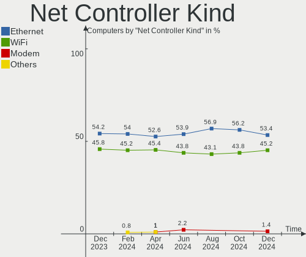

| Kind     | Computers | Percent |
|----------|-----------|---------|
| Ethernet | 37        | 52.11%  |
| WiFi     | 33        | 46.48%  |
| Unknown  | 1         | 1.41%   |

Used Controller
---------------

Currently used network controller

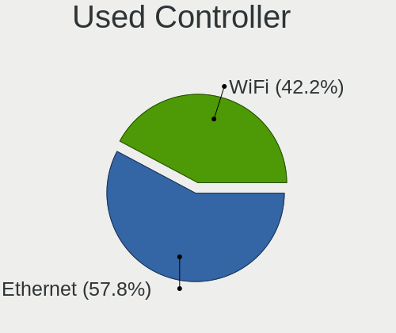

| Kind     | Computers | Percent |
|----------|-----------|---------|
| WiFi     | 21        | 50%     |
| Ethernet | 21        | 50%     |

NICs
----

Total network controllers on board

| Total | Computers | Percent |
|-------|-----------|---------|
| 1     | 22        | 51.16%  |
| 2     | 21        | 48.84%  |

IPv6
----

IPv6 vs IPv4

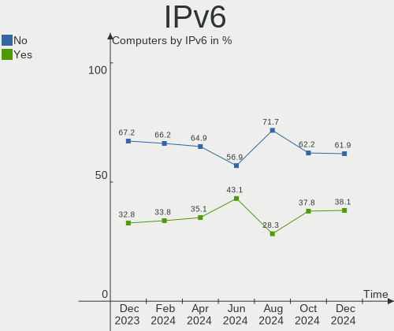

| Used | Computers | Percent |
|------|-----------|---------|
| No   | 29        | 67.44%  |
| Yes  | 14        | 32.56%  |

Bluetooth
---------

Bluetooth Vendor
----------------

Controller vendors

| Vendor                          | Computers | Percent |
|---------------------------------|-----------|---------|
| Intel                           | 10        | 35.71%  |
| Realtek Semiconductor           | 5         | 17.86%  |
| Cambridge Silicon Radio         | 3         | 10.71%  |
| IMC Networks                    | 2         | 7.14%   |
| Broadcom                        | 2         | 7.14%   |
| Realtek                         | 1         | 3.57%   |
| Qualcomm Atheros Communications | 1         | 3.57%   |
| Lite-On Technology              | 1         | 3.57%   |
| Foxconn / Hon Hai               | 1         | 3.57%   |
| Dell                            | 1         | 3.57%   |
| Apple                           | 1         | 3.57%   |

Bluetooth Model
---------------

Controller models

| Model                                               | Computers | Percent |
|-----------------------------------------------------|-----------|---------|
| Realtek Bluetooth Radio                             | 5         | 17.86%  |
| Intel Bluetooth wireless interface                  | 4         | 14.29%  |
| Cambridge Silicon Radio Bluetooth Dongle (HCI mode) | 3         | 10.71%  |
| Intel AX210 Bluetooth                               | 2         | 7.14%   |
| Realtek Bluetooth Radio                             | 1         | 3.57%   |
| Qualcomm Atheros AR3012 Bluetooth 4.0               | 1         | 3.57%   |
| Lite-On Wireless_Device                             | 1         | 3.57%   |
| Intel Wireless-AC 9260 Bluetooth Adapter            | 1         | 3.57%   |
| Intel Wireless-AC 3168 Bluetooth                    | 1         | 3.57%   |
| Intel AX201 Bluetooth                               | 1         | 3.57%   |
| Intel AX200 Bluetooth                               | 1         | 3.57%   |
| IMC Networks Wireless_Device                        | 1         | 3.57%   |
| IMC Networks Bluetooth Radio                        | 1         | 3.57%   |
| Foxconn / Hon Hai Broadcom BCM20702 Bluetooth       | 1         | 3.57%   |
| Dell Broadcom BCM20702A0 Bluetooth                  | 1         | 3.57%   |
| Broadcom HP Portable Bumble Bee                     | 1         | 3.57%   |
| Broadcom BCM20702A0 Bluetooth 4.0                   | 1         | 3.57%   |
| Apple Bluetooth USB Host Controller                 | 1         | 3.57%   |

Sound
-----

Sound Vendor
------------

Sound card vendors

| Vendor                   | Computers | Percent |
|--------------------------|-----------|---------|
| Intel                    | 24        | 32.43%  |
| AMD                      | 23        | 31.08%  |
| Nvidia                   | 16        | 21.62%  |
| Sony                     | 1         | 1.35%   |
| ROCCAT                   | 1         | 1.35%   |
| Razer USA                | 1         | 1.35%   |
| Positive Grid            | 1         | 1.35%   |
| Micro Star International | 1         | 1.35%   |
| Logitech                 | 1         | 1.35%   |
| JMTek                    | 1         | 1.35%   |
| Focusrite-Novation       | 1         | 1.35%   |
| C-Media Electronics      | 1         | 1.35%   |
| Blue Microphones         | 1         | 1.35%   |
| Asahi Kasei Microsystems | 1         | 1.35%   |

Sound Model
-----------

Sound card models

| Model                                                                      | Computers | Percent |
|----------------------------------------------------------------------------|-----------|---------|
| AMD Family 17h/19h HD Audio Controller                                     | 6         | 6.59%   |
| AMD Starship/Matisse HD Audio Controller                                   | 5         | 5.49%   |
| AMD Renoir Radeon High Definition Audio Controller                         | 5         | 5.49%   |
| Nvidia TU106 High Definition Audio Controller                              | 3         | 3.3%    |
| Intel 7 Series/C216 Chipset Family High Definition Audio Controller        | 3         | 3.3%    |
| AMD Baffin HDMI/DP Audio [Radeon RX 550 640SP / RX 560/560X]               | 3         | 3.3%    |
| Nvidia MCP61 High Definition Audio                                         | 2         | 2.2%    |
| Nvidia GK208 HDMI/DP Audio Controller                                      | 2         | 2.2%    |
| Nvidia GA106 High Definition Audio Controller                              | 2         | 2.2%    |
| Nvidia GA104 High Definition Audio Controller                              | 2         | 2.2%    |
| Intel Xeon E3-1200 v3/4th Gen Core Processor HD Audio Controller           | 2         | 2.2%    |
| Intel USB PnP Sound Device                                                 | 2         | 2.2%    |
| Intel Comet Lake PCH cAVS                                                  | 2         | 2.2%    |
| Intel Cannon Lake PCH cAVS                                                 | 2         | 2.2%    |
| Intel Atom Processor Z36xxx/Z37xxx Series High Definition Audio Controller | 2         | 2.2%    |
| Intel 8 Series/C220 Series Chipset High Definition Audio Controller        | 2         | 2.2%    |
| Intel 8 Series HD Audio Controller                                         | 2         | 2.2%    |
| Intel 6 Series/C200 Series Chipset Family High Definition Audio Controller | 2         | 2.2%    |
| AMD SBx00 Azalia (Intel HDA)                                               | 2         | 2.2%    |
| AMD Navi 21/23 HDMI/DP Audio Controller                                    | 2         | 2.2%    |
| AMD FCH Azalia Controller                                                  | 2         | 2.2%    |
| Sony DualSense wireless controller (PS5)                                   | 1         | 1.1%    |
| ROCCAT Juke                                                                | 1         | 1.1%    |
| Razer USA Razer Thresher for PS4                                           | 1         | 1.1%    |
| Positive Grid RIFF                                                         | 1         | 1.1%    |
| Nvidia TU116 High Definition Audio Controller                              | 1         | 1.1%    |
| Nvidia TU104 HD Audio Controller                                           | 1         | 1.1%    |
| Nvidia TU102 High Definition Audio Controller                              | 1         | 1.1%    |
| Nvidia GP107GL High Definition Audio Controller                            | 1         | 1.1%    |
| Nvidia GP104 High Definition Audio Controller                              | 1         | 1.1%    |
| Nvidia GM206 High Definition Audio Controller                              | 1         | 1.1%    |
| Nvidia GM204 High Definition Audio Controller                              | 1         | 1.1%    |
| Nvidia GA102 High Definition Audio Controller                              | 1         | 1.1%    |
| Micro Star International USB Audio                                         | 1         | 1.1%    |
| Logitech PRO X Wireless Gaming Headset                                     | 1         | 1.1%    |
| JMTek USB PnP Audio Device                                                 | 1         | 1.1%    |
| Intel Tiger Lake-LP Smart Sound Technology Audio Controller                | 1         | 1.1%    |
| Intel NM10/ICH7 Family High Definition Audio Controller                    | 1         | 1.1%    |
| Intel Ice Lake-LP Smart Sound Technology Audio Controller                  | 1         | 1.1%    |
| Intel Haswell-ULT HD Audio Controller                                      | 1         | 1.1%    |

Memory
------

Memory Vendor
-------------

Memory module vendors

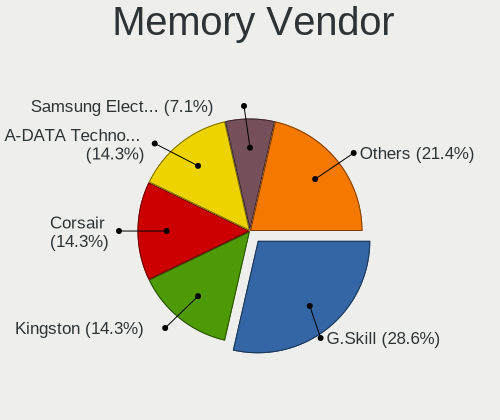

| Vendor              | Computers | Percent |
|---------------------|-----------|---------|
| Samsung Electronics | 4         | 36.36%  |
| Kingston            | 2         | 18.18%  |
| SK hynix            | 1         | 9.09%   |
| Nanya Technology    | 1         | 9.09%   |
| Micron Technology   | 1         | 9.09%   |
| G.Skill             | 1         | 9.09%   |
| Corsair             | 1         | 9.09%   |

Memory Model
------------

Memory module models

| Model                                                       | Computers | Percent |
|-------------------------------------------------------------|-----------|---------|
| SK hynix RAM HMAA1GS6CJR6N-XN 8GB SODIMM DDR4 3200MT/s      | 1         | 7.69%   |
| Samsung RAM M471B5674EB0-YK0 2GB SODIMM DDR3 1600MT/s       | 1         | 7.69%   |
| Samsung RAM M471B5173DB0-YK0 4096MB SODIMM DDR3 1600MT/s    | 1         | 7.69%   |
| Samsung RAM M471A4G43AB1-CWE 32GB SODIMM DDR4 3200MT/s      | 1         | 7.69%   |
| Samsung RAM M471A1G44AB0-CWE 8GB Row Of Chips DDR4 3200MT/s | 1         | 7.69%   |
| Samsung RAM M4 70T5663RZ3-CF7 2GB SODIMM DDR2 975MT/s       | 1         | 7.69%   |
| Samsung RAM K4UBE3D4AA-MGCR 8GB SODIMM LPDDR4 4266MT/s      | 1         | 7.69%   |
| Nanya RAM M2S4G64CB8HG4N-DI 4GB SODIMM DDR3 1600MT/s        | 1         | 7.69%   |
| Micron RAM 4ATF1G64HZ-3G2E1 8GB Row Of Chips DDR4 3200MT/s  | 1         | 7.69%   |
| Kingston RAM KF3200C16D4/32GX 32GB DIMM DDR4 3200MT/s       | 1         | 7.69%   |
| Kingston RAM ACR16D3LS1KNG/8G 8GB DIMM DDR3 1600MT/s        | 1         | 7.69%   |
| G.Skill RAM F4-3600C14-8GTZNB 8GB DIMM DDR4 3600MT/s        | 1         | 7.69%   |
| Corsair RAM CMW32GX4M2Z2933C16 16GB DIMM DDR4 2933MT/s      | 1         | 7.69%   |

Memory Kind
-----------

Memory module kinds

| Kind   | Computers | Percent |
|--------|-----------|---------|
| DDR4   | 6         | 54.55%  |
| DDR3   | 3         | 27.27%  |
| LPDDR4 | 1         | 9.09%   |
| DDR2   | 1         | 9.09%   |

Memory Form Factor
------------------

Physical design of the memory module

| Name         | Computers | Percent |
|--------------|-----------|---------|
| SODIMM       | 6         | 50%     |
| DIMM         | 4         | 33.33%  |
| Row Of Chips | 2         | 16.67%  |

Memory Size
-----------

Memory module size

| Size  | Computers | Percent |
|-------|-----------|---------|
| 8192  | 6         | 46.15%  |
| 32768 | 2         | 15.38%  |
| 4096  | 2         | 15.38%  |
| 2048  | 2         | 15.38%  |
| 16384 | 1         | 7.69%   |

Memory Speed
------------

Memory module speed

| Speed | Computers | Percent |
|-------|-----------|---------|
| 3200  | 4         | 36.36%  |
| 1600  | 3         | 27.27%  |
| 4266  | 1         | 9.09%   |
| 3600  | 1         | 9.09%   |
| 2933  | 1         | 9.09%   |
| 975   | 1         | 9.09%   |

Printers & scanners
-------------------

Printer Vendor
--------------

Printer device vendors

| Vendor | Computers | Percent |
|--------|-----------|---------|
| Canon  | 1         | 100%    |

Printer Model
-------------

Printer device models

| Model               | Computers | Percent |
|---------------------|-----------|---------|
| Canon TR4500 series | 1         | 100%    |

Scanner Vendor
--------------

Scanner device vendors

Zero info for selected period =(

Scanner Model
-------------

Scanner device models

Zero info for selected period =(

Camera
------

Camera Vendor
-------------

Camera device vendors

| Vendor                                 | Computers | Percent |
|----------------------------------------|-----------|---------|
| Chicony Electronics                    | 5         | 23.81%  |
| Microdia                               | 3         | 14.29%  |
| IMC Networks                           | 3         | 14.29%  |
| Syntek                                 | 2         | 9.52%   |
| Apple                                  | 2         | 9.52%   |
| Sonix Technology                       | 1         | 4.76%   |
| Quanta                                 | 1         | 4.76%   |
| Logitech                               | 1         | 4.76%   |
| DJKANA19IDX53W                         | 1         | 4.76%   |
| Cheng Uei Precision Industry (Foxlink) | 1         | 4.76%   |
| Acer                                   | 1         | 4.76%   |

Camera Model
------------

Camera device models

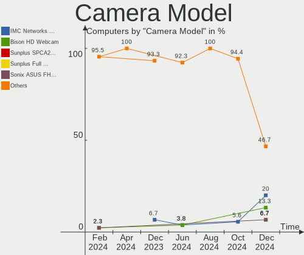

| Model                                               | Computers | Percent |
|-----------------------------------------------------|-----------|---------|
| Syntek Integrated Camera                            | 2         | 9.52%   |
| Sonix USB2.0 HD UVC WebCam                          | 1         | 4.76%   |
| Quanta USB2.0 VGA UVC WebCam                        | 1         | 4.76%   |
| Microdia Lenovo EasyCamera                          | 1         | 4.76%   |
| Microdia Laptop_Integrated_Webcam_2M                | 1         | 4.76%   |
| Microdia Integrated Camera                          | 1         | 4.76%   |
| Logitech HD Pro Webcam C920                         | 1         | 4.76%   |
| IMC Networks USB2.0 HD UVC WebCam                   | 1         | 4.76%   |
| IMC Networks Integrated Camera                      | 1         | 4.76%   |
| IMC Networks HD Camera                              | 1         | 4.76%   |
| DJKANA19IDX53W HP Wide Vision HD Camera             | 1         | 4.76%   |
| Chicony USB 2.0 Camera                              | 1         | 4.76%   |
| Chicony Integrated Camera                           | 1         | 4.76%   |
| Chicony HP TrueVision HD                            | 1         | 4.76%   |
| Chicony HP HD Webcam                                | 1         | 4.76%   |
| Chicony HD User Facing                              | 1         | 4.76%   |
| Cheng Uei Precision Industry (Foxlink) HP HD Camera | 1         | 4.76%   |
| Apple iPhone 5/5C/5S/6/SE                           | 1         | 4.76%   |
| Apple FaceTime HD Camera (Built-in)                 | 1         | 4.76%   |
| Acer Lenovo Integrated Webcam                       | 1         | 4.76%   |

Security
--------

Fingerprint Vendor
------------------

Fingerprint sensor vendors

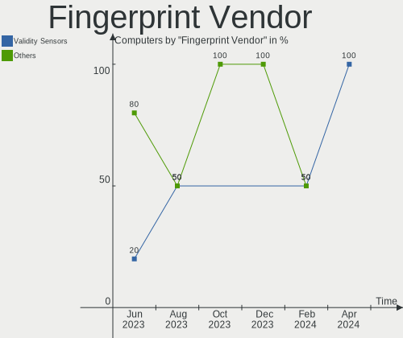

| Vendor                     | Computers | Percent |
|----------------------------|-----------|---------|
| Validity Sensors           | 1         | 50%     |
| Shenzhen Goodix Technology | 1         | 50%     |

Fingerprint Model
-----------------

Fingerprint sensor models

| Model                                        | Computers | Percent |
|----------------------------------------------|-----------|---------|
| Validity Sensors VFS 5011 fingerprint sensor | 1         | 50%     |
| Shenzhen Goodix  Fingerprint Device          | 1         | 50%     |

Chipcard Vendor
---------------

Chipcard module vendors

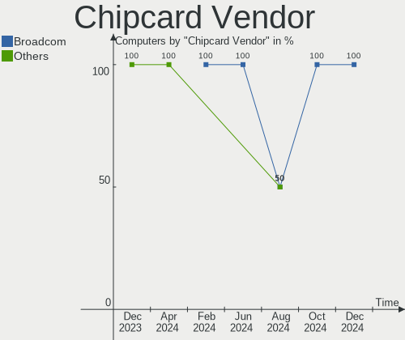

| Vendor                | Computers | Percent |
|-----------------------|-----------|---------|
| Realtek Semiconductor | 1         | 100%    |

Chipcard Model
--------------

Chipcard module models

| Model                                             | Computers | Percent |
|---------------------------------------------------|-----------|---------|
| Realtek Semiconductor Smart Card Reader Interface | 1         | 100%    |

Unsupported
-----------

Unsupported Devices
-------------------

Total unsupported devices on board

| Total | Computers | Percent |
|-------|-----------|---------|
| 0     | 35        | 81.4%   |
| 1     | 7         | 16.28%  |
| 2     | 1         | 2.33%   |

Unsupported Device Types
------------------------

Types of unsupported devices

| Type                  | Computers | Percent |
|-----------------------|-----------|---------|
| Net/wireless          | 3         | 33.33%  |
| Multimedia controller | 2         | 22.22%  |
| Graphics card         | 2         | 22.22%  |
| Fingerprint reader    | 2         | 22.22%  |

