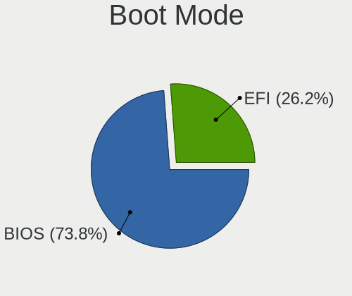
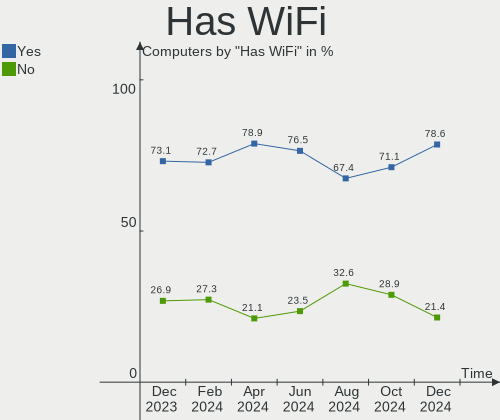
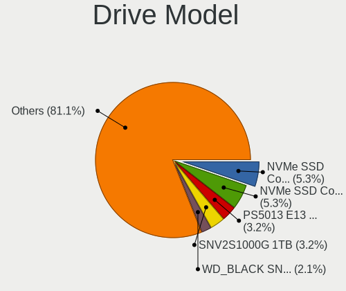
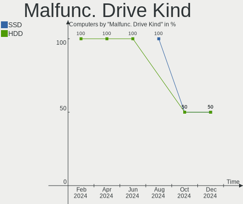
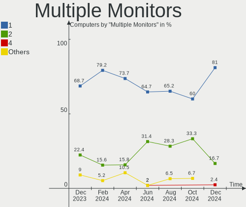
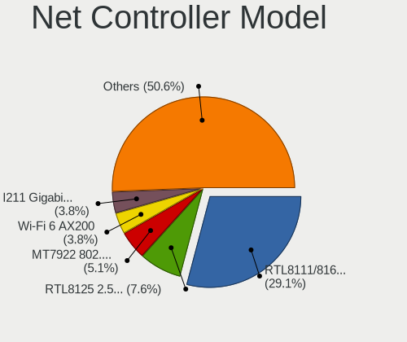
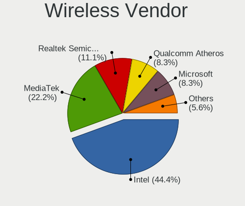
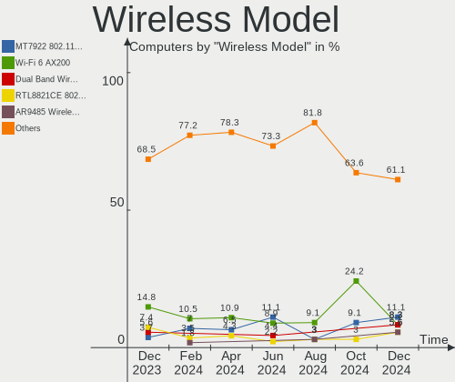
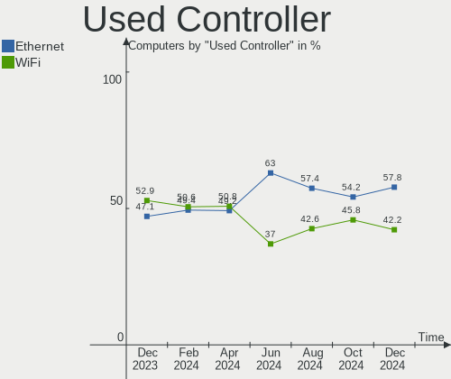
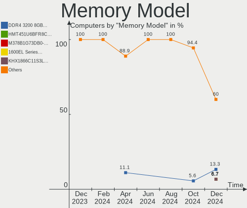

Nobara - Hardware Trends
------------------------

A project to identify most popular hardware characteristics and track their change
over time based on data collected by Linux users at https://Linux-Hardware.org.

Anyone can contribute to this report by the [hw-probe](https://github.com/linuxhw/hw-probe) tool:

    sudo -E hw-probe -all -upload

This is a report for all computer types. See also reports for [desktops](/Dist/Nobara/Desktop/README.md) and [notebooks](/Dist/Nobara/Notebook/README.md).

This report is for one last month. Overall report since the beginning of time: [TestDays](https://github.com/linuxhw/TestDays)

Period: Apr, 2023.

Contents
--------

* [ System ](#system)
  - [ OS                       ](#os)
  - [ OS Family                ](#os-family)
  - [ Kernel                   ](#kernel)
  - [ Kernel Family            ](#kernel-family)
  - [ Kernel Major Ver.        ](#kernel-major-ver)
  - [ Arch                     ](#arch)
  - [ DE                       ](#de)
  - [ Display Server           ](#display-server)
  - [ Display Manager          ](#display-manager)
  - [ OS Lang                  ](#os-lang)
  - [ Boot Mode                ](#boot-mode)
  - [ Filesystem               ](#filesystem)
  - [ Part. scheme             ](#part-scheme)
  - [ Dual Boot with Linux/BSD ](#dual-boot-with-linuxbsd)
  - [ Dual Boot (Win)          ](#dual-boot-win)

* [ Board ](#board)
  - [ Vendor                   ](#vendor)
  - [ Model                    ](#model)
  - [ Model Family             ](#model-family)
  - [ MFG Year                 ](#mfg-year)
  - [ Form Factor              ](#form-factor)
  - [ Secure Boot              ](#secure-boot)
  - [ Coreboot                 ](#coreboot)
  - [ RAM Size                 ](#ram-size)
  - [ RAM Used                 ](#ram-used)
  - [ Total Drives             ](#total-drives)
  - [ Has CD-ROM               ](#has-cd-rom)
  - [ Has Ethernet             ](#has-ethernet)
  - [ Has WiFi                 ](#has-wifi)
  - [ Has Bluetooth            ](#has-bluetooth)

* [ Location ](#location)
  - [ Country                  ](#country)
  - [ City                     ](#city)

* [ Drives ](#drives)
  - [ Drive Vendor             ](#drive-vendor)
  - [ Drive Model              ](#drive-model)
  - [ HDD Vendor               ](#hdd-vendor)
  - [ SSD Vendor               ](#ssd-vendor)
  - [ Drive Kind               ](#drive-kind)
  - [ Drive Connector          ](#drive-connector)
  - [ Drive Size               ](#drive-size)
  - [ Space Total              ](#space-total)
  - [ Space Used               ](#space-used)
  - [ Malfunc. Drives          ](#malfunc-drives)
  - [ Malfunc. Drive Vendor    ](#malfunc-drive-vendor)
  - [ Malfunc. HDD Vendor      ](#malfunc-hdd-vendor)
  - [ Malfunc. Drive Kind      ](#malfunc-drive-kind)
  - [ Failed Drives            ](#failed-drives)
  - [ Failed Drive Vendor      ](#failed-drive-vendor)
  - [ Drive Status             ](#drive-status)

* [ Storage controller ](#storage-controller)
  - [ Storage Vendor           ](#storage-vendor)
  - [ Storage Model            ](#storage-model)
  - [ Storage Kind             ](#storage-kind)

* [ Processor ](#processor)
  - [ CPU Vendor               ](#cpu-vendor)
  - [ CPU Model                ](#cpu-model)
  - [ CPU Model Family         ](#cpu-model-family)
  - [ CPU Cores                ](#cpu-cores)
  - [ CPU Sockets              ](#cpu-sockets)
  - [ CPU Threads              ](#cpu-threads)
  - [ CPU Op-Modes             ](#cpu-op-modes)
  - [ CPU Microcode            ](#cpu-microcode)
  - [ CPU Microarch            ](#cpu-microarch)

* [ Graphics ](#graphics)
  - [ GPU Vendor               ](#gpu-vendor)
  - [ GPU Model                ](#gpu-model)
  - [ GPU Combo                ](#gpu-combo)
  - [ GPU Driver               ](#gpu-driver)
  - [ GPU Memory               ](#gpu-memory)

* [ Monitor ](#monitor)
  - [ Monitor Vendor           ](#monitor-vendor)
  - [ Monitor Model            ](#monitor-model)
  - [ Monitor Resolution       ](#monitor-resolution)
  - [ Monitor Diagonal         ](#monitor-diagonal)
  - [ Monitor Width            ](#monitor-width)
  - [ Aspect Ratio             ](#aspect-ratio)
  - [ Monitor Area             ](#monitor-area)
  - [ Pixel Density            ](#pixel-density)
  - [ Multiple Monitors        ](#multiple-monitors)

* [ Network ](#network)
  - [ Net Controller Vendor    ](#net-controller-vendor)
  - [ Net Controller Model     ](#net-controller-model)
  - [ Wireless Vendor          ](#wireless-vendor)
  - [ Wireless Model           ](#wireless-model)
  - [ Ethernet Vendor          ](#ethernet-vendor)
  - [ Ethernet Model           ](#ethernet-model)
  - [ Net Controller Kind      ](#net-controller-kind)
  - [ Used Controller          ](#used-controller)
  - [ NICs                     ](#nics)
  - [ IPv6                     ](#ipv6)

* [ Bluetooth ](#bluetooth)
  - [ Bluetooth Vendor         ](#bluetooth-vendor)
  - [ Bluetooth Model          ](#bluetooth-model)

* [ Sound ](#sound)
  - [ Sound Vendor             ](#sound-vendor)
  - [ Sound Model              ](#sound-model)

* [ Memory ](#memory)
  - [ Memory Vendor            ](#memory-vendor)
  - [ Memory Model             ](#memory-model)
  - [ Memory Kind              ](#memory-kind)
  - [ Memory Form Factor       ](#memory-form-factor)
  - [ Memory Size              ](#memory-size)
  - [ Memory Speed             ](#memory-speed)

* [ Printers & scanners ](#printers--scanners)
  - [ Printer Vendor           ](#printer-vendor)
  - [ Printer Model            ](#printer-model)
  - [ Scanner Vendor           ](#scanner-vendor)
  - [ Scanner Model            ](#scanner-model)

* [ Camera ](#camera)
  - [ Camera Vendor            ](#camera-vendor)
  - [ Camera Model             ](#camera-model)

* [ Security ](#security)
  - [ Fingerprint Vendor       ](#fingerprint-vendor)
  - [ Fingerprint Model        ](#fingerprint-model)
  - [ Chipcard Vendor          ](#chipcard-vendor)
  - [ Chipcard Model           ](#chipcard-model)

* [ Unsupported ](#unsupported)
  - [ Unsupported Devices      ](#unsupported-devices)
  - [ Unsupported Device Types ](#unsupported-device-types)

System
------

OS
--

Installed operating systems

| Name      | Computers | Percent |
|-----------|-----------|---------|
| Nobara 37 | 41        | 95.35%  |
| Nobara 36 | 2         | 4.65%   |

OS Family
---------

OS without a version

| Name   | Computers | Percent |
|--------|-----------|---------|
| Nobara | 43        | 100%    |

Kernel
------

Version of the Linux kernel

| Version                      | Computers | Percent |
|------------------------------|-----------|---------|
| 6.2.10-200.fsync.fc37.x86_64 | 13        | 30.23%  |
| 6.2.8-200.fsync.fc37.x86_64  | 9         | 20.93%  |
| 6.2.11-201.fsync.fc37.x86_64 | 9         | 20.93%  |
| 6.2.11-202.fsync.fc37.x86_64 | 7         | 16.28%  |
| 6.2.12-200.fsync.fc37.x86_64 | 2         | 4.65%   |
| 6.0.14-201.fsync.fc36.x86_64 | 2         | 4.65%   |
| 6.2.6-201.fsync.fc37.x86_64  | 1         | 2.33%   |

Kernel Family
-------------

Linux kernel without a distro release

| Version | Computers | Percent |
|---------|-----------|---------|
| 6.2.11  | 16        | 37.21%  |
| 6.2.10  | 13        | 30.23%  |
| 6.2.8   | 9         | 20.93%  |
| 6.2.12  | 2         | 4.65%   |
| 6.0.14  | 2         | 4.65%   |
| 6.2.6   | 1         | 2.33%   |

Kernel Major Ver.
-----------------

Linux kernel major version

| Version | Computers | Percent |
|---------|-----------|---------|
| 6.2     | 41        | 95.35%  |
| 6.0     | 2         | 4.65%   |

Arch
----

OS architecture (x86_64, i586, etc.)

| Name   | Computers | Percent |
|--------|-----------|---------|
| x86_64 | 43        | 100%    |

DE
--

Desktop Environment

| Name  | Computers | Percent |
|-------|-----------|---------|
| GNOME | 30        | 69.77%  |
| KDE5  | 13        | 30.23%  |

Display Server
--------------

X11 or Wayland

| Name    | Computers | Percent |
|---------|-----------|---------|
| Wayland | 32        | 74.42%  |
| X11     | 10        | 23.26%  |
| Tty     | 1         | 2.33%   |

Display Manager
---------------

SDDM, LightDM, etc.

| Name    | Computers | Percent |
|---------|-----------|---------|
| Unknown | 35        | 81.4%   |
| GDM     | 6         | 13.95%  |
| SDDM    | 2         | 4.65%   |

OS Lang
-------

Language

| Lang  | Computers | Percent |
|-------|-----------|---------|
| en_US | 24        | 55.81%  |
| en_GB | 4         | 9.3%    |
| de_DE | 4         | 9.3%    |
| fr_FR | 2         | 4.65%   |
| es_AR | 2         | 4.65%   |
| pt_BR | 1         | 2.33%   |
| nl_NL | 1         | 2.33%   |
| it_IT | 1         | 2.33%   |
| es_MX | 1         | 2.33%   |
| es_ES | 1         | 2.33%   |
| en_CA | 1         | 2.33%   |
| en_AU | 1         | 2.33%   |

Boot Mode
---------

EFI or BIOS

| Mode | Computers | Percent |
|------|-----------|---------|
| EFI  | 32        | 74.42%  |
| BIOS | 11        | 25.58%  |

Filesystem
----------

Type of filesystem

| Type  | Computers | Percent |
|-------|-----------|---------|
| Btrfs | 37        | 86.05%  |
| Ext4  | 6         | 13.95%  |

Part. scheme
------------

Scheme of partitioning

| Type    | Computers | Percent |
|---------|-----------|---------|
| Unknown | 35        | 81.4%   |
| GPT     | 8         | 18.6%   |

Dual Boot with Linux/BSD
------------------------

Hosting more than one Linux/BSD

| Dual boot | Computers | Percent |
|-----------|-----------|---------|
| No        | 41        | 95.35%  |
| Yes       | 2         | 4.65%   |

Dual Boot (Win)
---------------

Hosting Linux and Windows

| Dual boot | Computers | Percent |
|-----------|-----------|---------|
| No        | 38        | 88.37%  |
| Yes       | 5         | 11.63%  |

Board
-----

Vendor
------

Motherboard manufacturer

| Name                | Computers | Percent |
|---------------------|-----------|---------|
| ASUSTek Computer    | 9         | 20.93%  |
| MSI                 | 6         | 13.95%  |
| Gigabyte Technology | 6         | 13.95%  |
| Lenovo              | 5         | 11.63%  |
| Hewlett-Packard     | 3         | 6.98%   |
| Dell                | 3         | 6.98%   |
| Acer                | 2         | 4.65%   |
| Supermicro          | 1         | 2.33%   |
| Protectli           | 1         | 2.33%   |
| Microsoft           | 1         | 2.33%   |
| Micro Electronics   | 1         | 2.33%   |
| GEO                 | 1         | 2.33%   |
| Fujitsu             | 1         | 2.33%   |
| ASRock              | 1         | 2.33%   |
| Apple               | 1         | 2.33%   |
| Unknown             | 1         | 2.33%   |

Model
-----

Motherboard model

| Name                                 | Computers | Percent |
|--------------------------------------|-----------|---------|
| Unknown                              | 2         | 4.65%   |
| Supermicro X10SAE                    | 1         | 2.33%   |
| Protectli FW6                        | 1         | 2.33%   |
| MSI MS-7D32                          | 1         | 2.33%   |
| MSI MS-7D25                          | 1         | 2.33%   |
| MSI MS-7C02                          | 1         | 2.33%   |
| MSI MS-7B86                          | 1         | 2.33%   |
| MSI MS-7B79                          | 1         | 2.33%   |
| MSI MS-7866                          | 1         | 2.33%   |
| Microsoft Surface Pro 7              | 1         | 2.33%   |
| Micro MG-VCP2-17A3070T               | 1         | 2.33%   |
| Lenovo ThinkPad Edge E540 20C6CTO1WW | 1         | 2.33%   |
| Lenovo Legion 7 15IMH05 81YT         | 1         | 2.33%   |
| Lenovo IdeaPadFlex 5 14ABR8 82XX     | 1         | 2.33%   |
| Lenovo IdeaPad Gaming 3 15ACH6 82K2  | 1         | 2.33%   |
| Lenovo IdeaPad 5 15ITL05 82FG        | 1         | 2.33%   |
| HP ProDesk 600 G1 TWR                | 1         | 2.33%   |
| HP ProDesk 490 G3 MT Business PC     | 1         | 2.33%   |
| Gigabyte Z77P-D3                     | 1         | 2.33%   |
| Gigabyte X570 AORUS ELITE WIFI       | 1         | 2.33%   |
| Gigabyte G1.Sniper B5                | 1         | 2.33%   |
| Gigabyte B650 AORUS PRO AX           | 1         | 2.33%   |
| Gigabyte B550 AORUS ELITE V2         | 1         | 2.33%   |
| Gigabyte B150M-D3H                   | 1         | 2.33%   |
| GEO GeoBook 120                      | 1         | 2.33%   |
| Fujitsu LIFEBOOK A557                | 1         | 2.33%   |
| Dell XPS 8700                        | 1         | 2.33%   |
| Dell Vostro 7590                     | 1         | 2.33%   |
| Dell Inspiron 660                    | 1         | 2.33%   |
| ASUS TUF Gaming Z690-PLUS WIFI D4    | 1         | 2.33%   |
| ASUS TUF Gaming B550M-PLUS WIFI II   | 1         | 2.33%   |
| ASUS TUF Gaming B550M-PLUS           | 1         | 2.33%   |
| ASUS TUF Gaming B550-PLUS            | 1         | 2.33%   |
| ASUS TUF Gaming B460-PLUS            | 1         | 2.33%   |
| ASUS TUF Gaming A520M-PLUS           | 1         | 2.33%   |
| ASUS PRIME B450M-A II                | 1         | 2.33%   |
| ASUS GL752VW                         | 1         | 2.33%   |
| ASUS A68HM-K                         | 1         | 2.33%   |
| ASRock B550M Phantom Gaming 4        | 1         | 2.33%   |
| Apple MacBookPro8,3                  | 1         | 2.33%   |

Model Family
------------

Motherboard model prefix

| Name                   | Computers | Percent |
|------------------------|-----------|---------|
| ASUS TUF               | 6         | 13.95%  |
| Lenovo IdeaPad         | 2         | 4.65%   |
| HP ProDesk             | 2         | 4.65%   |
| Acer Nitro             | 2         | 4.65%   |
| Unknown                | 2         | 4.65%   |
| Supermicro X10SAE      | 1         | 2.33%   |
| Protectli FW6          | 1         | 2.33%   |
| MSI MS-7D32            | 1         | 2.33%   |
| MSI MS-7D25            | 1         | 2.33%   |
| MSI MS-7C02            | 1         | 2.33%   |
| MSI MS-7B86            | 1         | 2.33%   |
| MSI MS-7B79            | 1         | 2.33%   |
| MSI MS-7866            | 1         | 2.33%   |
| Microsoft Surface      | 1         | 2.33%   |
| Micro MG-VCP2-17A3070T | 1         | 2.33%   |
| Lenovo ThinkPad        | 1         | 2.33%   |
| Lenovo Legion          | 1         | 2.33%   |
| Lenovo IdeaPadFlex     | 1         | 2.33%   |
| Gigabyte Z77P-D3       | 1         | 2.33%   |
| Gigabyte X570          | 1         | 2.33%   |
| Gigabyte G1.Sniper     | 1         | 2.33%   |
| Gigabyte B650          | 1         | 2.33%   |
| Gigabyte B550          | 1         | 2.33%   |
| Gigabyte B150M-D3H     | 1         | 2.33%   |
| GEO GeoBook            | 1         | 2.33%   |
| Fujitsu LIFEBOOK       | 1         | 2.33%   |
| Dell XPS               | 1         | 2.33%   |
| Dell Vostro            | 1         | 2.33%   |
| Dell Inspiron          | 1         | 2.33%   |
| ASUS PRIME             | 1         | 2.33%   |
| ASUS GL752VW           | 1         | 2.33%   |
| ASUS A68HM-K           | 1         | 2.33%   |
| ASRock B550M           | 1         | 2.33%   |
| Apple MacBookPro8      | 1         | 2.33%   |

MFG Year
--------

Motherboard manufacture year

| Year | Computers | Percent |
|------|-----------|---------|
| 2020 | 8         | 18.6%   |
| 2021 | 7         | 16.28%  |
| 2019 | 7         | 16.28%  |
| 2022 | 5         | 11.63%  |
| 2013 | 4         | 9.3%    |
| 2016 | 3         | 6.98%   |
| 2014 | 3         | 6.98%   |
| 2018 | 2         | 4.65%   |
| 2015 | 2         | 4.65%   |
| 2012 | 2         | 4.65%   |

Form Factor
-----------

Physical design of the computer

| Name        | Computers | Percent |
|-------------|-----------|---------|
| Desktop     | 26        | 60.47%  |
| Notebook    | 14        | 32.56%  |
| Tablet      | 1         | 2.33%   |
| Convertible | 1         | 2.33%   |
| Server      | 1         | 2.33%   |

Secure Boot
-----------

Enabled or disabled

| State    | Computers | Percent |
|----------|-----------|---------|
| Disabled | 43        | 100%    |

Coreboot
--------

Have coreboot on board

| Used | Computers | Percent |
|------|-----------|---------|
| No   | 43        | 100%    |

RAM Size
--------

Total RAM memory

| Size in GB  | Computers | Percent |
|-------------|-----------|---------|
| 16.01-24.0  | 13        | 30.23%  |
| 32.01-64.0  | 11        | 25.58%  |
| 4.01-8.0    | 6         | 13.95%  |
| 24.01-32.0  | 5         | 11.63%  |
| 8.01-16.0   | 4         | 9.3%    |
| 3.01-4.0    | 3         | 6.98%   |
| 64.01-256.0 | 1         | 2.33%   |

RAM Used
--------

Used RAM memory

| Used GB   | Computers | Percent |
|-----------|-----------|---------|
| 4.01-8.0  | 15        | 34.88%  |
| 2.01-3.0  | 12        | 27.91%  |
| 3.01-4.0  | 10        | 23.26%  |
| 1.01-2.0  | 4         | 9.3%    |
| 8.01-16.0 | 2         | 4.65%   |

Total Drives
------------

Number of drives on board

| Drives | Computers | Percent |
|--------|-----------|---------|
| 1      | 18        | 41.86%  |
| 2      | 15        | 34.88%  |
| 3      | 5         | 11.63%  |
| 4      | 3         | 6.98%   |
| 10     | 1         | 2.33%   |
| 7      | 1         | 2.33%   |

Has CD-ROM
----------

Has CD-ROM on board

| Presented | Computers | Percent |
|-----------|-----------|---------|
| No        | 34        | 79.07%  |
| Yes       | 9         | 20.93%  |

Has Ethernet
------------

Has Ethernet on board

| Presented | Computers | Percent |
|-----------|-----------|---------|
| Yes       | 39        | 90.7%   |
| No        | 4         | 9.3%    |

Has WiFi
--------

Has WiFi module

| Presented | Computers | Percent |
|-----------|-----------|---------|
| Yes       | 31        | 72.09%  |
| No        | 12        | 27.91%  |

Has Bluetooth
-------------

Has Bluetooth module

| Presented | Computers | Percent |
|-----------|-----------|---------|
| Yes       | 28        | 65.12%  |
| No        | 15        | 34.88%  |

Location
--------

Country
-------

Geographic location (country)

| Country     | Computers | Percent |
|-------------|-----------|---------|
| USA         | 17        | 39.53%  |
| Germany     | 6         | 13.95%  |
| UK          | 3         | 6.98%   |
| Spain       | 2         | 4.65%   |
| Netherlands | 2         | 4.65%   |
| France      | 2         | 4.65%   |
| Argentina   | 2         | 4.65%   |
| Turkey      | 1         | 2.33%   |
| Malaysia    | 1         | 2.33%   |
| Italy       | 1         | 2.33%   |
| Hungary     | 1         | 2.33%   |
| Greece      | 1         | 2.33%   |
| Colombia    | 1         | 2.33%   |
| Canada      | 1         | 2.33%   |
| Brazil      | 1         | 2.33%   |
| Australia   | 1         | 2.33%   |

City
----

Geographic location (city)

| City                   | Computers | Percent |
|------------------------|-----------|---------|
| Boynton Beach          | 3         | 6.98%   |
| Wuppertal              | 1         | 2.33%   |
| Waite Park             | 1         | 2.33%   |
| Villa Bosch            | 1         | 2.33%   |
| Victoria               | 1         | 2.33%   |
| Tooele                 | 1         | 2.33%   |
| Stuttgart              | 1         | 2.33%   |
| Seville                | 1         | 2.33%   |
| Scunthorpe             | 1         | 2.33%   |
| San Francisco          | 1         | 2.33%   |
| Rome                   | 1         | 2.33%   |
| Reading                | 1         | 2.33%   |
| Puchong Batu Dua Belas | 1         | 2.33%   |
| Perols                 | 1         | 2.33%   |
| Nuremberg              | 1         | 2.33%   |
| New Orleans            | 1         | 2.33%   |
| Michigan City          | 1         | 2.33%   |
| Marousi                | 1         | 2.33%   |
| Madrid                 | 1         | 2.33%   |
| Los Angeles            | 1         | 2.33%   |
| Lake Elsinore          | 1         | 2.33%   |
| Kiel                   | 1         | 2.33%   |
| Kaloz                  | 1         | 2.33%   |
| Jefferson City         | 1         | 2.33%   |
| Izmir                  | 1         | 2.33%   |
| IJsselstein            | 1         | 2.33%   |
| Huenxe                 | 1         | 2.33%   |
| Houston                | 1         | 2.33%   |
| Heythuysen             | 1         | 2.33%   |
| Graham                 | 1         | 2.33%   |
| Gourdon                | 1         | 2.33%   |
| Geelong                | 1         | 2.33%   |
| Firmat                 | 1         | 2.33%   |
| Denver                 | 1         | 2.33%   |
| Cullman                | 1         | 2.33%   |
| Colorado Springs       | 1         | 2.33%   |
| Cacapava               | 1         | 2.33%   |
| Belleville             | 1         | 2.33%   |
| Barranquilla           | 1         | 2.33%   |
| Ballyclare             | 1         | 2.33%   |

Drives
------

Drive Vendor
------------

Hard drive vendors

| Vendor                      | Computers | Drives | Percent |
|-----------------------------|-----------|--------|---------|
| Samsung Electronics         | 12        | 16     | 14.81%  |
| SanDisk                     | 11        | 12     | 13.58%  |
| WDC                         | 9         | 11     | 11.11%  |
| Seagate                     | 7         | 8      | 8.64%   |
| Toshiba                     | 5         | 5      | 6.17%   |
| Crucial                     | 5         | 5      | 6.17%   |
| Unknown                     | 4         | 4      | 4.94%   |
| Kingston                    | 4         | 5      | 4.94%   |
| Micron/Crucial Technology   | 3         | 4      | 3.7%    |
| Team                        | 2         | 2      | 2.47%   |
| SPCC                        | 2         | 2      | 2.47%   |
| SK hynix                    | 2         | 2      | 2.47%   |
| PNY                         | 2         | 2      | 2.47%   |
| Intel                       | 2         | 2      | 2.47%   |
| Hitachi                     | 2         | 3      | 2.47%   |
| Union Memory                | 1         | 1      | 1.23%   |
| Silicon Motion              | 1         | 1      | 1.23%   |
| SABRENT                     | 1         | 1      | 1.23%   |
| Phison Electronics          | 1         | 1      | 1.23%   |
| Micron Technology           | 1         | 1      | 1.23%   |
| KIOXIA-EXCERIA              | 1         | 1      | 1.23%   |
| Kingston Technology Company | 1         | 1      | 1.23%   |
| Intenso                     | 1         | 1      | 1.23%   |
| Hypertec                    | 1         | 1      | 1.23%   |

Drive Model
-----------

Hard drive models

| Model                                                  | Computers | Percent |
|--------------------------------------------------------|-----------|---------|
| Samsung NVMe SSD Controller PM9A1/PM9A3/980PRO 2TB     | 4         | 4.44%   |
| Seagate ST2000DM008-2FR102 2TB                         | 3         | 3.33%   |
| WDC WD10EZEX-00BN5A0 1TB                               | 2         | 2.22%   |
| Unknown MMC Card  32GB                                 | 2         | 2.22%   |
| Toshiba DT01ACA100 1TB                                 | 2         | 2.22%   |
| Sandisk WD Blue SN550 NVMe SSD 1024GB                  | 2         | 2.22%   |
| SanDisk SDSSDH3512G 512GB                              | 2         | 2.22%   |
| Samsung NVMe SSD Controller SM981/PM981/PM983 1TB      | 2         | 2.22%   |
| PNY CS900 500GB SSD                                    | 2         | 2.22%   |
| Micron/Crucial P2 NVMe PCIe SSD 1TB                    | 2         | 2.22%   |
| WDC WDS240G2G0A-00JH30 240GB SSD                       | 1         | 1.11%   |
| WDC WDS100T1R0B-68A4Z0 1TB SSD                         | 1         | 1.11%   |
| WDC WD80EMZZ-11B4FB0 8TB                               | 1         | 1.11%   |
| WDC WD20EZRZ-00Z5HB0 2TB                               | 1         | 1.11%   |
| WDC WD10EZRX-00L4HB0 1TB                               | 1         | 1.11%   |
| WDC WD10EAVS-00M4B0 1TB                                | 1         | 1.11%   |
| WDC WD10EACS-00D6B0 1TB                                | 1         | 1.11%   |
| WDC WD Blue SA510 2.5 500GB                            | 1         | 1.11%   |
| WDC PC SN530 SDBPMPZ-512G-1101 512GB                   | 1         | 1.11%   |
| Unknown USB DISK 3.2 250GB                             | 1         | 1.11%   |
| Unknown MMC Card  64GB                                 | 1         | 1.11%   |
| Union Memory UMIS RPJTJ512MEE1OWX 512GB                | 1         | 1.11%   |
| Toshiba MQ04ABF100 1TB                                 | 1         | 1.11%   |
| Toshiba MQ01ABD050 500GB                               | 1         | 1.11%   |
| Toshiba MK7559GSXF 752GB                               | 1         | 1.11%   |
| Team T253X6001T 1024GB SSD                             | 1         | 1.11%   |
| Team T253X2512G 512GB SSD                              | 1         | 1.11%   |
| SPCC Solid State Disk 240GB                            | 1         | 1.11%   |
| SPCC Solid State Disk 1024GB                           | 1         | 1.11%   |
| SK hynix SKHynix_HFS512GD9TNI-L2A0B 512GB              | 1         | 1.11%   |
| SK hynix BC501 NVMe Solid State Drive 512GB            | 1         | 1.11%   |
| Silicon Motion SM2263EN/SM2263XT SSD Controller 1024GB | 1         | 1.11%   |
| Seagate ST4000DM004-2U9104 4TB                         | 1         | 1.11%   |
| Seagate ST4000DM004-2CV104 4TB                         | 1         | 1.11%   |
| Seagate ST31000528AS 1TB                               | 1         | 1.11%   |
| Seagate ST1000DM010-2EP102 1TB                         | 1         | 1.11%   |
| Seagate ST1000DM003-1CH162 1TB                         | 1         | 1.11%   |
| Sandisk WD_BLACK SN770 500GB                           | 1         | 1.11%   |
| Sandisk WD Blue SN570 500GB                            | 1         | 1.11%   |
| Sandisk WD Black SN850 1TB                             | 1         | 1.11%   |

HDD Vendor
----------

Hard disk drive vendors

| Vendor              | Computers | Drives | Percent |
|---------------------|-----------|--------|---------|
| Seagate             | 7         | 8      | 33.33%  |
| WDC                 | 5         | 7      | 23.81%  |
| Toshiba             | 5         | 5      | 23.81%  |
| Hitachi             | 2         | 3      | 9.52%   |
| Samsung Electronics | 1         | 1      | 4.76%   |
| SABRENT             | 1         | 1      | 4.76%   |

SSD Vendor
----------

Solid state drive vendors

| Vendor              | Computers | Drives | Percent |
|---------------------|-----------|--------|---------|
| Samsung Electronics | 7         | 7      | 24.14%  |
| SanDisk             | 4         | 4      | 13.79%  |
| Crucial             | 4         | 4      | 13.79%  |
| WDC                 | 3         | 3      | 10.34%  |
| Kingston            | 3         | 4      | 10.34%  |
| Team                | 2         | 2      | 6.9%    |
| SPCC                | 2         | 2      | 6.9%    |
| PNY                 | 2         | 2      | 6.9%    |
| KIOXIA-EXCERIA      | 1         | 1      | 3.45%   |
| Hypertec            | 1         | 1      | 3.45%   |

Drive Kind
----------

HDD or SSD

| Kind    | Computers | Drives | Percent |
|---------|-----------|--------|---------|
| SSD     | 26        | 30     | 36.62%  |
| NVMe    | 23        | 32     | 32.39%  |
| HDD     | 17        | 25     | 23.94%  |
| MMC     | 3         | 3      | 4.23%   |
| Unknown | 2         | 2      | 2.82%   |

Drive Connector
---------------

SATA, SAS, NVMe, etc.

| Type | Computers | Drives | Percent |
|------|-----------|--------|---------|
| SATA | 31        | 55     | 53.45%  |
| NVMe | 23        | 32     | 39.66%  |
| MMC  | 3         | 3      | 5.17%   |
| SAS  | 1         | 2      | 1.72%   |

Drive Size
----------

Size of hard drive

| Size in TB | Computers | Drives | Percent |
|------------|-----------|--------|---------|
| 0.51-1.0   | 20        | 23     | 45.45%  |
| 0.01-0.5   | 16        | 22     | 36.36%  |
| 1.01-2.0   | 5         | 6      | 11.36%  |
| 3.01-4.0   | 2         | 3      | 4.55%   |
| 4.01-10.0  | 1         | 1      | 2.27%   |

Space Total
-----------

Amount of disk space available on the file system

| Size in GB     | Computers | Percent |
|----------------|-----------|---------|
| 1001-2000      | 12        | 27.91%  |
| 501-1000       | 8         | 18.6%   |
| 251-500        | 6         | 13.95%  |
| 101-250        | 6         | 13.95%  |
| 2001-3000      | 4         | 9.3%    |
| More than 3000 | 3         | 6.98%   |
| 51-100         | 2         | 4.65%   |
| 21-50          | 1         | 2.33%   |
| Unknown        | 1         | 2.33%   |

Space Used
----------

Amount of used disk space

| Used GB   | Computers | Percent |
|-----------|-----------|---------|
| 101-250   | 10        | 23.26%  |
| 51-100    | 8         | 18.6%   |
| 251-500   | 6         | 13.95%  |
| 21-50     | 6         | 13.95%  |
| 1-20      | 6         | 13.95%  |
| 1001-2000 | 4         | 9.3%    |
| 501-1000  | 2         | 4.65%   |
| Unknown   | 1         | 2.33%   |

Malfunc. Drives
---------------

Drive models with a malfunction

| Model                   | Computers | Drives | Percent |
|-------------------------|-----------|--------|---------|
| WDC WD10EACS-00D6B0 1TB | 1         | 1      | 100%    |

Malfunc. Drive Vendor
---------------------

Vendors of faulty drives

| Vendor | Computers | Drives | Percent |
|--------|-----------|--------|---------|
| WDC    | 1         | 1      | 100%    |

Malfunc. HDD Vendor
-------------------

Vendors of faulty HDD drives

| Vendor | Computers | Drives | Percent |
|--------|-----------|--------|---------|
| WDC    | 1         | 1      | 100%    |

Malfunc. Drive Kind
-------------------

Kinds of faulty drives

| Kind | Computers | Drives | Percent |
|------|-----------|--------|---------|
| HDD  | 1         | 1      | 100%    |

Failed Drives
-------------

Failed drive models

Zero info for selected period =(

Failed Drive Vendor
-------------------

Failed drive vendors

Zero info for selected period =(

Drive Status
------------

Number of failed and malfunc. drives

| Status   | Computers | Drives | Percent |
|----------|-----------|--------|---------|
| Detected | 37        | 80     | 82.22%  |
| Works    | 7         | 11     | 15.56%  |
| Malfunc  | 1         | 1      | 2.22%   |

Storage controller
------------------

Storage Vendor
--------------

Storage controller vendors

| Vendor                      | Computers | Percent |
|-----------------------------|-----------|---------|
| Intel                       | 24        | 34.78%  |
| AMD                         | 15        | 21.74%  |
| SanDisk                     | 8         | 11.59%  |
| Samsung Electronics         | 7         | 10.14%  |
| Micron/Crucial Technology   | 4         | 5.8%    |
| ASMedia Technology          | 3         | 4.35%   |
| SK hynix                    | 2         | 2.9%    |
| Kingston Technology Company | 2         | 2.9%    |
| Union Memory (Shenzhen)     | 1         | 1.45%   |
| Silicon Motion              | 1         | 1.45%   |
| Phison Electronics          | 1         | 1.45%   |
| Micron Technology           | 1         | 1.45%   |

Storage Model
-------------

Storage controller models

| Model                                                                          | Computers | Percent |
|--------------------------------------------------------------------------------|-----------|---------|
| AMD FCH SATA Controller [AHCI mode]                                            | 6         | 8.22%   |
| AMD 500 Series Chipset SATA Controller                                         | 6         | 8.22%   |
| Samsung NVMe SSD Controller PM9A1/PM9A3/980PRO                                 | 4         | 5.48%   |
| Intel 8 Series/C220 Series Chipset Family 6-port SATA Controller 1 [AHCI mode] | 4         | 5.48%   |
| AMD 400 Series Chipset SATA Controller                                         | 4         | 5.48%   |
| Intel Alder Lake-S PCH SATA Controller [AHCI Mode]                             | 3         | 4.11%   |
| ASMedia ASM1062 Serial ATA Controller                                          | 3         | 4.11%   |
| SanDisk WD Blue SN570 NVMe SSD 1TB                                             | 2         | 2.74%   |
| SanDisk WD Blue SN550 NVMe SSD                                                 | 2         | 2.74%   |
| Samsung NVMe SSD Controller SM981/PM981/PM983                                  | 2         | 2.74%   |
| Micron/Crucial P2 NVMe PCIe SSD                                                | 2         | 2.74%   |
| Kingston Company A2000 NVMe SSD                                                | 2         | 2.74%   |
| Intel Sunrise Point-LP SATA Controller [AHCI mode]                             | 2         | 2.74%   |
| Intel Q170/Q150/B150/H170/H110/Z170/CM236 Chipset SATA Controller [AHCI Mode]  | 2         | 2.74%   |
| Intel Cannon Lake Mobile PCH SATA AHCI Controller                              | 2         | 2.74%   |
| Union Memory (Shenzhen) Non-Volatile memory controller                         | 1         | 1.37%   |
| SK hynix Non-Volatile memory controller                                        | 1         | 1.37%   |
| SK hynix BC501 NVMe Solid State Drive                                          | 1         | 1.37%   |
| Silicon Motion SM2263EN/SM2263XT SSD Controller                                | 1         | 1.37%   |
| Sandisk Western Digital WD Black SN850X NVMe SSD                               | 1         | 1.37%   |
| SanDisk WD PC SN810 / Black SN850 NVMe SSD                                     | 1         | 1.37%   |
| SanDisk WD Black SN770 NVMe SSD                                                | 1         | 1.37%   |
| SanDisk NVMe Controller                                                        | 1         | 1.37%   |
| Samsung NVMe SSD Controller SM961/PM961/SM963                                  | 1         | 1.37%   |
| Samsung NVMe SSD Controller 980                                                | 1         | 1.37%   |
| Phison E12 NVMe Controller                                                     | 1         | 1.37%   |
| Micron/Crucial P5 Plus NVMe PCIe SSD                                           | 1         | 1.37%   |
| Micron/Crucial NVMe Storage Controller                                         | 1         | 1.37%   |
| Micron NVMe Controller                                                         | 1         | 1.37%   |
| Intel Volume Management Device NVMe RAID Controller                            | 1         | 1.37%   |
| Intel Tiger Lake-LP SATA Controller                                            | 1         | 1.37%   |
| Intel SSD 600P Series                                                          | 1         | 1.37%   |
| Intel SATA Controller [RAID mode]                                              | 1         | 1.37%   |
| Intel Non-Volatile memory controller                                           | 1         | 1.37%   |
| Intel HM170/QM170 Chipset SATA Controller [AHCI Mode]                          | 1         | 1.37%   |
| Intel Celeron/Pentium Silver Processor SATA Controller                         | 1         | 1.37%   |
| Intel C600/X79 series chipset SATA RAID Controller                             | 1         | 1.37%   |
| Intel 7 Series/C210 Series Chipset Family 6-port SATA Controller [AHCI mode]   | 1         | 1.37%   |
| Intel 7 Series/C210 Series Chipset Family 4-port SATA Controller [IDE mode]    | 1         | 1.37%   |
| Intel 7 Series/C210 Series Chipset Family 2-port SATA Controller [IDE mode]    | 1         | 1.37%   |

Storage Kind
------------

Kind of storage controller (IDE, SATA, NVMe, SAS, ...)

| Kind | Computers | Percent |
|------|-----------|---------|
| SATA | 34        | 54.84%  |
| NVMe | 23        | 37.1%   |
| RAID | 4         | 6.45%   |
| IDE  | 1         | 1.61%   |

Processor
---------

CPU Vendor
----------

Processor vendors

| Vendor | Computers | Percent |
|--------|-----------|---------|
| Intel  | 25        | 58.14%  |
| AMD    | 18        | 41.86%  |

CPU Model
---------

Processor models

| Model                                           | Computers | Percent |
|-------------------------------------------------|-----------|---------|
| Intel Core i5-7200U CPU @ 2.50GHz               | 2         | 4.65%   |
| Intel 12th Gen Core i7-12700K                   | 2         | 4.65%   |
| AMD Ryzen 7 5700X 8-Core Processor              | 2         | 4.65%   |
| AMD Ryzen 5 5600X 6-Core Processor              | 2         | 4.65%   |
| AMD Ryzen 5 5600 6-Core Processor               | 2         | 4.65%   |
| AMD Ryzen 5 3600 6-Core Processor               | 2         | 4.65%   |
| Intel Xeon CPU E31275 @ 3.40GHz                 | 1         | 2.33%   |
| Intel Xeon CPU E3-1270 v3 @ 3.50GHz             | 1         | 2.33%   |
| Intel Xeon CPU E3-1230 v3 @ 3.30GHz             | 1         | 2.33%   |
| Intel Core i7-9750H CPU @ 2.60GHz               | 1         | 2.33%   |
| Intel Core i7-6700HQ CPU @ 2.60GHz              | 1         | 2.33%   |
| Intel Core i7-6700 CPU @ 3.40GHz                | 1         | 2.33%   |
| Intel Core i7-4770 CPU @ 3.40GHz                | 1         | 2.33%   |
| Intel Core i7-2720QM CPU @ 2.20GHz              | 1         | 2.33%   |
| Intel Core i7-10750H CPU @ 2.60GHz              | 1         | 2.33%   |
| Intel Core i5-8300H CPU @ 2.30GHz               | 1         | 2.33%   |
| Intel Core i5-4590 CPU @ 3.30GHz                | 1         | 2.33%   |
| Intel Core i5-4460 CPU @ 3.20GHz                | 1         | 2.33%   |
| Intel Core i5-4200M CPU @ 2.50GHz               | 1         | 2.33%   |
| Intel Core i5-3470 CPU @ 3.20GHz                | 1         | 2.33%   |
| Intel Core i5-10400F CPU @ 2.90GHz              | 1         | 2.33%   |
| Intel Core i5-1035G4 CPU @ 1.10GHz              | 1         | 2.33%   |
| Intel Core i3-6100 CPU @ 3.70GHz                | 1         | 2.33%   |
| Intel Celeron N4020 CPU @ 1.10GHz               | 1         | 2.33%   |
| Intel Celeron CPU N3060 @ 1.60GHz               | 1         | 2.33%   |
| Intel 13th Gen Core i7-13700K                   | 1         | 2.33%   |
| Intel 11th Gen Core i7-1165G7 @ 2.80GHz         | 1         | 2.33%   |
| AMD Ryzen 9 7900X 12-Core Processor             | 1         | 2.33%   |
| AMD Ryzen 9 6900HX with Radeon Graphics         | 1         | 2.33%   |
| AMD Ryzen 7 5800X 8-Core Processor              | 1         | 2.33%   |
| AMD Ryzen 7 5800H with Radeon Graphics          | 1         | 2.33%   |
| AMD Ryzen 5 7530U with Radeon Graphics          | 1         | 2.33%   |
| AMD Ryzen 5 5600U with Radeon Graphics          | 1         | 2.33%   |
| AMD Ryzen 5 5600H with Radeon Graphics          | 1         | 2.33%   |
| AMD Ryzen 5 5500                                | 1         | 2.33%   |
| AMD Ryzen 3 3200G with Radeon Vega Graphics     | 1         | 2.33%   |
| AMD A10-7850K Radeon R7, 12 Compute Cores 4C+8G | 1         | 2.33%   |

CPU Model Family
----------------

Processor model prefix

| Model         | Computers | Percent |
|---------------|-----------|---------|
| AMD Ryzen 5   | 10        | 23.26%  |
| Intel Core i5 | 9         | 20.93%  |
| Intel Core i7 | 6         | 13.95%  |
| Other         | 4         | 9.3%    |
| AMD Ryzen 7   | 4         | 9.3%    |
| Intel Xeon    | 3         | 6.98%   |
| Intel Celeron | 2         | 4.65%   |
| AMD Ryzen 9   | 2         | 4.65%   |
| Intel Core i3 | 1         | 2.33%   |
| AMD Ryzen 3   | 1         | 2.33%   |
| AMD A10       | 1         | 2.33%   |

CPU Cores
---------

Number of processor cores

| Number | Computers | Percent |
|--------|-----------|---------|
| 4      | 14        | 32.56%  |
| 6      | 13        | 30.23%  |
| 2      | 7         | 16.28%  |
| 8      | 5         | 11.63%  |
| 12     | 3         | 6.98%   |
| 16     | 1         | 2.33%   |

CPU Sockets
-----------

Number of sockets

| Number | Computers | Percent |
|--------|-----------|---------|
| 1      | 43        | 100%    |

CPU Threads
-----------

Threads per core (Hyper-Threading)

| Number | Computers | Percent |
|--------|-----------|---------|
| 2      | 37        | 86.05%  |
| 1      | 6         | 13.95%  |

CPU Op-Modes
------------

CPU Operation Modes (32-bit, 64-bit)

| Op mode        | Computers | Percent |
|----------------|-----------|---------|
| 32-bit, 64-bit | 43        | 100%    |

CPU Microcode
-------------

Microcode number

| Number     | Computers | Percent |
|------------|-----------|---------|
| Unknown    | 25        | 58.14%  |
| 0x0a50000d | 3         | 6.98%   |
| 0x0a50000c | 2         | 4.65%   |
| 0x0a20120a | 2         | 4.65%   |
| 0x0a201204 | 2         | 4.65%   |
| 0x08701021 | 2         | 4.65%   |
| 0x306c3    | 1         | 2.33%   |
| 0x0a601203 | 1         | 2.33%   |
| 0x0a201205 | 1         | 2.33%   |
| 0x0a201016 | 1         | 2.33%   |
| 0x08108109 | 1         | 2.33%   |
| 0x06003106 | 1         | 2.33%   |
| 0x00000000 | 1         | 2.33%   |

CPU Microarch
-------------

Microarchitecture

| Name             | Computers | Percent |
|------------------|-----------|---------|
| Zen 3            | 12        | 27.91%  |
| Haswell          | 6         | 13.95%  |
| KabyLake         | 4         | 9.3%    |
| Skylake          | 3         | 6.98%   |
| Alderlake Hybrid | 3         | 6.98%   |
| Zen 2            | 2         | 4.65%   |
| SandyBridge      | 2         | 4.65%   |
| CometLake        | 2         | 4.65%   |
| Unknown          | 2         | 4.65%   |
| Zen+             | 1         | 2.33%   |
| TigerLake        | 1         | 2.33%   |
| Steamroller      | 1         | 2.33%   |
| Silvermont       | 1         | 2.33%   |
| IvyBridge        | 1         | 2.33%   |
| IceLake          | 1         | 2.33%   |
| Goldmont plus    | 1         | 2.33%   |

Graphics
--------

GPU Vendor
----------

Vendors of graphics cards

| Vendor | Computers | Percent |
|--------|-----------|---------|
| AMD    | 21        | 38.89%  |
| Nvidia | 17        | 31.48%  |
| Intel  | 16        | 29.63%  |

GPU Model
---------

Graphics card models

| Model                                                                                    | Computers | Percent |
|------------------------------------------------------------------------------------------|-----------|---------|
| Nvidia TU117M [GeForce GTX 1650 Mobile / Max-Q]                                          | 3         | 5.56%   |
| AMD Navi 22 [Radeon RX 6700/6700 XT/6750 XT / 6800M/6850M XT]                            | 3         | 5.56%   |
| AMD Ellesmere [Radeon RX 470/480/570/570X/580/580X/590]                                  | 3         | 5.56%   |
| AMD Cezanne [Radeon Vega Series / Radeon Vega Mobile Series]                             | 3         | 5.56%   |
| Nvidia GP104 [GeForce GTX 1070]                                                          | 2         | 3.7%    |
| Nvidia GK107 [GeForce GT 740]                                                            | 2         | 3.7%    |
| Intel HD Graphics 620                                                                    | 2         | 3.7%    |
| Intel DG2 [Arc A750]                                                                     | 2         | 3.7%    |
| Intel CoffeeLake-H GT2 [UHD Graphics 630]                                                | 2         | 3.7%    |
| AMD Navi 21 [Radeon RX 6800/6800 XT / 6900 XT]                                           | 2         | 3.7%    |
| Nvidia TU117 [GeForce GTX 1650]                                                          | 1         | 1.85%   |
| Nvidia TU106BM [GeForce RTX 2060 Mobile]                                                 | 1         | 1.85%   |
| Nvidia TU106 [GeForce RTX 2060 Rev. A]                                                   | 1         | 1.85%   |
| Nvidia GP107M [GeForce GTX 1050 Mobile]                                                  | 1         | 1.85%   |
| Nvidia GM107M [GeForce GTX 960M]                                                         | 1         | 1.85%   |
| Nvidia GK106 [GeForce GTX 650 Ti]                                                        | 1         | 1.85%   |
| Nvidia GA106 [GeForce RTX 3060 Lite Hash Rate]                                           | 1         | 1.85%   |
| Nvidia GA104 [Geforce RTX 3070 Ti Laptop GPU]                                            | 1         | 1.85%   |
| Nvidia GA104 [GeForce RTX 3060 Ti]                                                       | 1         | 1.85%   |
| Nvidia AD102 [GeForce RTX 4090]                                                          | 1         | 1.85%   |
| Intel Xeon E3-1200 v3/4th Gen Core Processor Integrated Graphics Controller              | 1         | 1.85%   |
| Intel Xeon E3-1200 Processor Family Integrated Graphics Controller                       | 1         | 1.85%   |
| Intel TigerLake-LP GT2 [Iris Xe Graphics]                                                | 1         | 1.85%   |
| Intel Raptor Lake-S GT1 [UHD Graphics 770]                                               | 1         | 1.85%   |
| Intel Iris Plus Graphics G4 (Ice Lake)                                                   | 1         | 1.85%   |
| Intel HD Graphics 530                                                                    | 1         | 1.85%   |
| Intel GeminiLake [UHD Graphics 600]                                                      | 1         | 1.85%   |
| Intel Atom/Celeron/Pentium Processor x5-E8000/J3xxx/N3xxx Integrated Graphics Controller | 1         | 1.85%   |
| Intel 4th Gen Core Processor Integrated Graphics Controller                              | 1         | 1.85%   |
| Intel 2nd Generation Core Processor Family Integrated Graphics Controller                | 1         | 1.85%   |
| AMD Whistler [Radeon HD 6630M/6650M/6750M/7670M/7690M]                                   | 1         | 1.85%   |
| AMD Venus XTX [Radeon HD 8890M / R9 M275X/M375X]                                         | 1         | 1.85%   |
| AMD Rembrandt [Radeon 680M]                                                              | 1         | 1.85%   |
| AMD Raphael                                                                              | 1         | 1.85%   |
| AMD Picasso/Raven 2 [Radeon Vega Series / Radeon Vega Mobile Series]                     | 1         | 1.85%   |
| AMD Navi 10 [Radeon RX 5600 OEM/5600 XT / 5700/5700 XT]                                  | 1         | 1.85%   |
| AMD Lexa PRO [Radeon 540/540X/550/550X / RX 540X/550/550X]                               | 1         | 1.85%   |
| AMD Kaveri [Radeon R7 Graphics]                                                          | 1         | 1.85%   |
| AMD Barts XT [Radeon HD 6870]                                                            | 1         | 1.85%   |
| AMD Barcelo                                                                              | 1         | 1.85%   |

GPU Combo
---------

Combinations of graphics cards

| Name           | Computers | Percent |
|----------------|-----------|---------|
| 1 x AMD        | 15        | 34.88%  |
| 1 x Nvidia     | 10        | 23.26%  |
| 1 x Intel      | 9         | 20.93%  |
| AMD + Nvidia   | 4         | 9.3%    |
| Intel + Nvidia | 3         | 6.98%   |
| Intel + AMD    | 2         | 4.65%   |

GPU Driver
----------

Free vs proprietary

| Driver      | Computers | Percent |
|-------------|-----------|---------|
| Free        | 29        | 67.44%  |
| Proprietary | 13        | 30.23%  |
| Unknown     | 1         | 2.33%   |

GPU Memory
----------

Total video memory

| Size in GB | Computers | Percent |
|------------|-----------|---------|
| Unknown    | 15        | 34.88%  |
| 7.01-8.0   | 7         | 16.28%  |
| 8.01-16.0  | 6         | 13.95%  |
| 1.01-2.0   | 5         | 11.63%  |
| 3.01-4.0   | 3         | 6.98%   |
| 0.01-0.5   | 3         | 6.98%   |
| 0.51-1.0   | 2         | 4.65%   |
| 5.01-6.0   | 1         | 2.33%   |
| 16.01-24.0 | 1         | 2.33%   |

Monitor
-------

Monitor Vendor
--------------

Monitor vendors

| Vendor               | Computers | Percent |
|----------------------|-----------|---------|
| Samsung Electronics  | 8         | 15.09%  |
| BOE                  | 5         | 9.43%   |
| Goldstar             | 4         | 7.55%   |
| Dell                 | 4         | 7.55%   |
| LG Display           | 3         | 5.66%   |
| Chimei Innolux       | 3         | 5.66%   |
| BenQ                 | 3         | 5.66%   |
| AU Optronics         | 3         | 5.66%   |
| Vizio                | 2         | 3.77%   |
| Ancor Communications | 2         | 3.77%   |
| Acer                 | 2         | 3.77%   |
| Unknown              | 1         | 1.89%   |
| Toshiba              | 1         | 1.89%   |
| Sony                 | 1         | 1.89%   |
| Ruijiang             | 1         | 1.89%   |
| Pixio                | 1         | 1.89%   |
| Philips              | 1         | 1.89%   |
| Olevia               | 1         | 1.89%   |
| NEC Computers        | 1         | 1.89%   |
| Lenovo               | 1         | 1.89%   |
| Hewlett-Packard      | 1         | 1.89%   |
| Element              | 1         | 1.89%   |
| ASUSTek Computer     | 1         | 1.89%   |
| Apple                | 1         | 1.89%   |
| AOC                  | 1         | 1.89%   |

Monitor Model
-------------

Monitor models

| Model                                                                   | Computers | Percent |
|-------------------------------------------------------------------------|-----------|---------|
| Vizio V405-H9 VIZ1039 3840x2160 878x485mm 39.5-inch                     | 1         | 1.85%   |
| Vizio D32f-E1 VIZ1027 1920x1080 698x392mm 31.5-inch                     | 1         | 1.85%   |
| Unknown LCD Monitor FFFF 2288x1287 2550x2550mm 142.0-inch               | 1         | 1.85%   |
| Toshiba TV TSB0105 1920x1080 708x398mm 32.0-inch                        | 1         | 1.85%   |
| Sony TV *30 SNYAC06 3840x2160 1218x685mm 55.0-inch                      | 1         | 1.85%   |
| Samsung Electronics SyncMaster SAM03F0 1680x1050 433x271mm 20.1-inch    | 1         | 1.85%   |
| Samsung Electronics S SAM041E 2048x1152 510x287mm 23.0-inch             | 1         | 1.85%   |
| Samsung Electronics Odyssey G8 SAM71EC 3840x2160 697x392mm 31.5-inch    | 1         | 1.85%   |
| Samsung Electronics LS24AG32x SAM71DA 1920x1080 527x296mm 23.8-inch     | 1         | 1.85%   |
| Samsung Electronics LF27T850 SAM704E 2560x1440 597x336mm 27.0-inch      | 1         | 1.85%   |
| Samsung Electronics LCD Monitor SAM0F17 3840x2160 950x540mm 43.0-inch   | 1         | 1.85%   |
| Samsung Electronics LCD Monitor SAM0F14 3840x2160 1872x1053mm 84.6-inch | 1         | 1.85%   |
| Samsung Electronics C27JG5x SAM0FDB 2560x1440 597x336mm 27.0-inch       | 1         | 1.85%   |
| Ruijiang RJT HDMI RJT1200 1920x1080 320x180mm 14.5-inch                 | 1         | 1.85%   |
| Pixio PX277P PNS0277 2560x1440 697x392mm 31.5-inch                      | 1         | 1.85%   |
| Philips PHL 271E1 PHLC208 1920x1080 598x336mm 27.0-inch                 | 1         | 1.85%   |
| Olevia 237-T12 SYN0043 1360x768 820x460mm 37.0-inch                     | 1         | 1.85%   |
| NEC Computers 20WMGX2 NEC6694 1680x1050 433x270mm 20.1-inch             | 1         | 1.85%   |
| LG Display LCD Monitor LGD05D8 1920x1080 344x194mm 15.5-inch            | 1         | 1.85%   |
| LG Display LCD Monitor LGD0555 2736x1824 260x173mm 12.3-inch            | 1         | 1.85%   |
| LG Display LCD Monitor LGD04A7 1920x1080 344x194mm 15.5-inch            | 1         | 1.85%   |
| Lenovo LEN E2323swA LEN60B0 1920x1080 477x268mm 21.5-inch               | 1         | 1.85%   |
| Hewlett-Packard E232 HWP327A 1920x1080 509x286mm 23.0-inch              | 1         | 1.85%   |
| Goldstar ULTRAGEAR GSM5BD3 2560x1440 697x392mm 31.5-inch                | 1         | 1.85%   |
| Goldstar IPS FULLHD GSM5AB8 1920x1080 480x270mm 21.7-inch               | 1         | 1.85%   |
| Goldstar HDR 4K GSM7707 3840x2160 600x340mm 27.2-inch                   | 1         | 1.85%   |
| Goldstar 19M35 GSM4C24 1366x768 410x230mm 18.5-inch                     | 1         | 1.85%   |
| Element ELEFW408 ELE1911 1920x1080 1150x650mm 52.0-inch                 | 1         | 1.85%   |
| Dell U2719DC DEL419C 2560x1440 597x336mm 27.0-inch                      | 1         | 1.85%   |
| Dell ST2220L DELA065 1920x1080 477x268mm 21.5-inch                      | 1         | 1.85%   |
| Dell P2419HC DELA11D 1920x1080 527x296mm 23.8-inch                      | 1         | 1.85%   |
| Dell 2208WFP DEL403C 1680x1050 473x296mm 22.0-inch                      | 1         | 1.85%   |
| Dell 2007FP DELA021 1600x1200 367x275mm 18.1-inch                       | 1         | 1.85%   |
| Chimei Innolux LCD Monitor CMN1735 1920x1080 381x214mm 17.2-inch        | 1         | 1.85%   |
| Chimei Innolux LCD Monitor CMN15F5 1920x1080 344x193mm 15.5-inch        | 1         | 1.85%   |
| Chimei Innolux LCD Monitor CMN15C0 1920x1080 344x194mm 15.5-inch        | 1         | 1.85%   |
| BOE LCD Monitor BOE0B1B 2240x1400 302x189mm 14.0-inch                   | 1         | 1.85%   |
| BOE LCD Monitor BOE0A8F 2560x1440 381x214mm 17.2-inch                   | 1         | 1.85%   |
| BOE LCD Monitor BOE0860 1920x1080 344x194mm 15.5-inch                   | 1         | 1.85%   |
| BOE LCD Monitor BOE076C 1366x768 344x194mm 15.5-inch                    | 1         | 1.85%   |

Monitor Resolution
------------------

Monitor screen resolution

| Resolution         | Computers | Percent |
|--------------------|-----------|---------|
| 1920x1080 (FHD)    | 24        | 47.06%  |
| 2560x1440 (QHD)    | 7         | 13.73%  |
| 3840x2160 (4K)     | 6         | 11.76%  |
| 1680x1050 (WSXGA+) | 3         | 5.88%   |
| 1366x768 (WXGA)    | 3         | 5.88%   |
| 3440x1440          | 1         | 1.96%   |
| 2736x1824          | 1         | 1.96%   |
| 2288x1287          | 1         | 1.96%   |
| 2240x1400          | 1         | 1.96%   |
| 2048x1152          | 1         | 1.96%   |
| 1920x1200 (WUXGA)  | 1         | 1.96%   |
| 1600x1200          | 1         | 1.96%   |
| 1360x768           | 1         | 1.96%   |

Monitor Diagonal
----------------

Diagonal size in inches

| Inches | Computers | Percent |
|--------|-----------|---------|
| 15     | 9         | 16.98%  |
| 24     | 6         | 11.32%  |
| 27     | 5         | 9.43%   |
| 23     | 4         | 7.55%   |
| 31     | 3         | 5.66%   |
| 21     | 3         | 5.66%   |
| 17     | 3         | 5.66%   |
| 84     | 2         | 3.77%   |
| 32     | 2         | 3.77%   |
| 22     | 2         | 3.77%   |
| 20     | 2         | 3.77%   |
| 142    | 1         | 1.89%   |
| 86     | 1         | 1.89%   |
| 69     | 1         | 1.89%   |
| 55     | 1         | 1.89%   |
| 52     | 1         | 1.89%   |
| 49     | 1         | 1.89%   |
| 37     | 1         | 1.89%   |
| 34     | 1         | 1.89%   |
| 18     | 1         | 1.89%   |
| 14     | 1         | 1.89%   |
| 13     | 1         | 1.89%   |
| 12     | 1         | 1.89%   |

Monitor Width
-------------

Physical width

| Width in mm    | Computers | Percent |
|----------------|-----------|---------|
| 501-600        | 12        | 24.49%  |
| 301-350        | 11        | 22.45%  |
| 401-500        | 8         | 16.33%  |
| 701-800        | 3         | 6.12%   |
| 601-700        | 3         | 6.12%   |
| 351-400        | 3         | 6.12%   |
| 1501-2000      | 3         | 6.12%   |
| 1001-1500      | 3         | 6.12%   |
| More than 2000 | 1         | 2.04%   |
| 801-900        | 1         | 2.04%   |
| 201-300        | 1         | 2.04%   |

Aspect Ratio
------------

Proportional relationship between the width and the height

| Ratio | Computers | Percent |
|-------|-----------|---------|
| 16/9  | 35        | 79.55%  |
| 16/10 | 5         | 11.36%  |
| 4/3   | 1         | 2.27%   |
| 3/2   | 1         | 2.27%   |
| 21/9  | 1         | 2.27%   |
| 1.00  | 1         | 2.27%   |

Monitor Area
------------

Area in inch

| Area in inch | Computers | Percent |
|----------------|-----------|---------|
| 201-250        | 13        | 25.49%  |
| 101-110        | 9         | 17.65%  |
| More than 1000 | 7         | 13.73%  |
| 351-500        | 6         | 11.76%  |
| 301-350        | 5         | 9.8%    |
| 151-200        | 3         | 5.88%   |
| 81-90          | 2         | 3.92%   |
| 121-130        | 2         | 3.92%   |
| 71-80          | 1         | 1.96%   |
| 141-150        | 1         | 1.96%   |
| 131-140        | 1         | 1.96%   |
| 501-1000       | 1         | 1.96%   |

Pixel Density
-------------

Pixels per inch

| Density | Computers | Percent |
|---------|-----------|---------|
| 51-100  | 20        | 40.82%  |
| 121-160 | 12        | 24.49%  |
| 101-120 | 9         | 18.37%  |
| 1-50    | 5         | 10.2%   |
| 161-240 | 3         | 6.12%   |

Multiple Monitors
-----------------

Total monitors connected

| Total | Computers | Percent |
|-------|-----------|---------|
| 1     | 30        | 69.77%  |
| 2     | 10        | 23.26%  |
| 3     | 2         | 4.65%   |
| 0     | 1         | 2.33%   |

Network
-------

Net Controller Vendor
---------------------

Controller vendors

| Vendor                | Computers | Percent |
|-----------------------|-----------|---------|
| Realtek Semiconductor | 27        | 40.3%   |
| Intel                 | 24        | 35.82%  |
| MediaTek              | 5         | 7.46%   |
| Qualcomm Atheros      | 2         | 2.99%   |
| Broadcom              | 2         | 2.99%   |
| TP-Link               | 1         | 1.49%   |
| Padix (Rockfire)      | 1         | 1.49%   |
| NetGear               | 1         | 1.49%   |
| Motorola PCS          | 1         | 1.49%   |
| Microsoft             | 1         | 1.49%   |
| Loupedeck             | 1         | 1.49%   |
| Aquantia              | 1         | 1.49%   |

Net Controller Model
--------------------

Controller models

| Model                                                             | Computers | Percent |
|-------------------------------------------------------------------|-----------|---------|
| Realtek RTL8111/8168/8411 PCI Express Gigabit Ethernet Controller | 17        | 22.97%  |
| Realtek RTL8125 2.5GbE Controller                                 | 5         | 6.76%   |
| Intel Ethernet Controller I225-V                                  | 5         | 6.76%   |
| MediaTek MT7921 802.11ax PCI Express Wireless Network Adapter     | 3         | 4.05%   |
| Intel Wi-Fi 6 AX200                                               | 3         | 4.05%   |
| Intel Wireless 7260                                               | 2         | 2.7%    |
| Intel I210 Gigabit Network Connection                             | 2         | 2.7%    |
| Intel Ethernet Connection I217-LM                                 | 2         | 2.7%    |
| Intel Alder Lake-S PCH CNVi WiFi                                  | 2         | 2.7%    |
| TP-Link Archer T2U PLUS [RTL8821AU]                               | 1         | 1.35%   |
| Realtek RTL8822BE 802.11a/b/g/n/ac WiFi adapter                   | 1         | 1.35%   |
| Realtek RTL8821CE 802.11ac PCIe Wireless Network Adapter          | 1         | 1.35%   |
| Realtek RTL8812AE 802.11ac PCIe Wireless Network Adapter          | 1         | 1.35%   |
| Realtek RTL8811AU 802.11a/b/g/n/ac WLAN Adapter                   | 1         | 1.35%   |
| Realtek RTL8192CU 802.11n WLAN Adapter                            | 1         | 1.35%   |
| Realtek RTL8153 Gigabit Ethernet Adapter                          | 1         | 1.35%   |
| Realtek Killer E2600 Gigabit Ethernet Controller                  | 1         | 1.35%   |
| Qualcomm Atheros Killer E220x Gigabit Ethernet Controller         | 1         | 1.35%   |
| Qualcomm Atheros AR9485 Wireless Network Adapter                  | 1         | 1.35%   |
| Padix (Rockfire) 2-axis 8-button gamepad                          | 1         | 1.35%   |
| NetGear WNA3100(v1) Wireless-N 300 [Broadcom BCM43231]            | 1         | 1.35%   |
| Motorola PCS motorola razr 2022                                   | 1         | 1.35%   |
| Microsoft Xbox 360 Wireless Adapter                               | 1         | 1.35%   |
| MediaTek MT7922 802.11ax PCI Express Wireless Network Adapter     | 1         | 1.35%   |
| MediaTek MT7921K (RZ608) Wi-Fi 6E 80MHz                           | 1         | 1.35%   |
| Loupedeck Live S                                                  | 1         | 1.35%   |
| Intel Wireless-AC 9260                                            | 1         | 1.35%   |
| Intel Wireless 7265                                               | 1         | 1.35%   |
| Intel Wi-Fi 6 AX210/AX211/AX411 160MHz                            | 1         | 1.35%   |
| Intel Wi-Fi 6 AX201                                               | 1         | 1.35%   |
| Intel Ice Lake-LP PCH CNVi WiFi                                   | 1         | 1.35%   |
| Intel I211 Gigabit Network Connection                             | 1         | 1.35%   |
| Intel Ethernet Connection I217-V                                  | 1         | 1.35%   |
| Intel Ethernet Connection (2) I219-V                              | 1         | 1.35%   |
| Intel Ethernet Connection (12) I219-V                             | 1         | 1.35%   |
| Intel Dual Band Wireless-AC 3168NGW [Stone Peak]                  | 1         | 1.35%   |
| Intel Comet Lake PCH CNVi WiFi                                    | 1         | 1.35%   |
| Intel Cannon Lake PCH CNVi WiFi                                   | 1         | 1.35%   |
| Broadcom NetXtreme BCM57765 Gigabit Ethernet PCIe                 | 1         | 1.35%   |
| Broadcom BCM4360 802.11ac Wireless Network Adapter                | 1         | 1.35%   |

Wireless Vendor
---------------

Wireless vendors

| Vendor                | Computers | Percent |
|-----------------------|-----------|---------|
| Intel                 | 15        | 48.39%  |
| Realtek Semiconductor | 5         | 16.13%  |
| MediaTek              | 5         | 16.13%  |
| Broadcom              | 2         | 6.45%   |
| TP-Link               | 1         | 3.23%   |
| Qualcomm Atheros      | 1         | 3.23%   |
| NetGear               | 1         | 3.23%   |
| Microsoft             | 1         | 3.23%   |

Wireless Model
--------------

Wireless models

| Model                                                         | Computers | Percent |
|---------------------------------------------------------------|-----------|---------|
| MediaTek MT7921 802.11ax PCI Express Wireless Network Adapter | 3         | 9.68%   |
| Intel Wi-Fi 6 AX200                                           | 3         | 9.68%   |
| Intel Wireless 7260                                           | 2         | 6.45%   |
| Intel Alder Lake-S PCH CNVi WiFi                              | 2         | 6.45%   |
| TP-Link Archer T2U PLUS [RTL8821AU]                           | 1         | 3.23%   |
| Realtek RTL8822BE 802.11a/b/g/n/ac WiFi adapter               | 1         | 3.23%   |
| Realtek RTL8821CE 802.11ac PCIe Wireless Network Adapter      | 1         | 3.23%   |
| Realtek RTL8812AE 802.11ac PCIe Wireless Network Adapter      | 1         | 3.23%   |
| Realtek RTL8811AU 802.11a/b/g/n/ac WLAN Adapter               | 1         | 3.23%   |
| Realtek RTL8192CU 802.11n WLAN Adapter                        | 1         | 3.23%   |
| Qualcomm Atheros AR9485 Wireless Network Adapter              | 1         | 3.23%   |
| NetGear WNA3100(v1) Wireless-N 300 [Broadcom BCM43231]        | 1         | 3.23%   |
| Microsoft Xbox 360 Wireless Adapter                           | 1         | 3.23%   |
| MediaTek MT7922 802.11ax PCI Express Wireless Network Adapter | 1         | 3.23%   |
| MediaTek MT7921K (RZ608) Wi-Fi 6E 80MHz                       | 1         | 3.23%   |
| Intel Wireless-AC 9260                                        | 1         | 3.23%   |
| Intel Wireless 7265                                           | 1         | 3.23%   |
| Intel Wi-Fi 6 AX210/AX211/AX411 160MHz                        | 1         | 3.23%   |
| Intel Wi-Fi 6 AX201                                           | 1         | 3.23%   |
| Intel Ice Lake-LP PCH CNVi WiFi                               | 1         | 3.23%   |
| Intel Dual Band Wireless-AC 3168NGW [Stone Peak]              | 1         | 3.23%   |
| Intel Comet Lake PCH CNVi WiFi                                | 1         | 3.23%   |
| Intel Cannon Lake PCH CNVi WiFi                               | 1         | 3.23%   |
| Broadcom BCM4360 802.11ac Wireless Network Adapter            | 1         | 3.23%   |
| Broadcom BCM4331 802.11a/b/g/n                                | 1         | 3.23%   |

Ethernet Vendor
---------------

Ethernet vendors

| Vendor                | Computers | Percent |
|-----------------------|-----------|---------|
| Realtek Semiconductor | 24        | 60%     |
| Intel                 | 12        | 30%     |
| Qualcomm Atheros      | 1         | 2.5%    |
| Motorola PCS          | 1         | 2.5%    |
| Broadcom              | 1         | 2.5%    |
| Aquantia              | 1         | 2.5%    |

Ethernet Model
--------------

Ethernet models

| Model                                                             | Computers | Percent |
|-------------------------------------------------------------------|-----------|---------|
| Realtek RTL8111/8168/8411 PCI Express Gigabit Ethernet Controller | 17        | 41.46%  |
| Realtek RTL8125 2.5GbE Controller                                 | 5         | 12.2%   |
| Intel Ethernet Controller I225-V                                  | 5         | 12.2%   |
| Intel I210 Gigabit Network Connection                             | 2         | 4.88%   |
| Intel Ethernet Connection I217-LM                                 | 2         | 4.88%   |
| Realtek RTL8153 Gigabit Ethernet Adapter                          | 1         | 2.44%   |
| Realtek Killer E2600 Gigabit Ethernet Controller                  | 1         | 2.44%   |
| Qualcomm Atheros Killer E220x Gigabit Ethernet Controller         | 1         | 2.44%   |
| Motorola PCS motorola razr 2022                                   | 1         | 2.44%   |
| Intel I211 Gigabit Network Connection                             | 1         | 2.44%   |
| Intel Ethernet Connection I217-V                                  | 1         | 2.44%   |
| Intel Ethernet Connection (2) I219-V                              | 1         | 2.44%   |
| Intel Ethernet Connection (12) I219-V                             | 1         | 2.44%   |
| Broadcom NetXtreme BCM57765 Gigabit Ethernet PCIe                 | 1         | 2.44%   |
| Aquantia AQC107 NBase-T/IEEE 802.3bz Ethernet Controller [AQtion] | 1         | 2.44%   |

Net Controller Kind
-------------------

Ethernet, WiFi or modem

| Kind     | Computers | Percent |
|----------|-----------|---------|
| Ethernet | 39        | 54.93%  |
| WiFi     | 30        | 42.25%  |
| Modem    | 1         | 1.41%   |
| Unknown  | 1         | 1.41%   |

Used Controller
---------------

Currently used network controller

| Kind     | Computers | Percent |
|----------|-----------|---------|
| Ethernet | 30        | 65.22%  |
| WiFi     | 16        | 34.78%  |

NICs
----

Total network controllers on board

| Total | Computers | Percent |
|-------|-----------|---------|
| 1     | 21        | 48.84%  |
| 2     | 19        | 44.19%  |
| 3     | 2         | 4.65%   |
| 6     | 1         | 2.33%   |

IPv6
----

IPv6 vs IPv4

| Used | Computers | Percent |
|------|-----------|---------|
| No   | 26        | 60.47%  |
| Yes  | 17        | 39.53%  |

Bluetooth
---------

Bluetooth Vendor
----------------

Controller vendors

| Vendor                          | Computers | Percent |
|---------------------------------|-----------|---------|
| Intel                           | 13        | 44.83%  |
| Realtek Semiconductor           | 2         | 6.9%    |
| MediaTek                        | 2         | 6.9%    |
| Cambridge Silicon Radio         | 2         | 6.9%    |
| TP-Link                         | 1         | 3.45%   |
| Qualcomm Atheros Communications | 1         | 3.45%   |
| Lite-On Technology              | 1         | 3.45%   |
| IMC Networks                    | 1         | 3.45%   |
| Foxconn / Hon Hai               | 1         | 3.45%   |
| Edimax Technology               | 1         | 3.45%   |
| Broadcom                        | 1         | 3.45%   |
| ASUSTek Computer                | 1         | 3.45%   |
| Apple                           | 1         | 3.45%   |
| Actions                         | 1         | 3.45%   |

Bluetooth Model
---------------

Controller models

| Model                                                   | Computers | Percent |
|---------------------------------------------------------|-----------|---------|
| Intel Bluetooth wireless interface                      | 3         | 10.34%  |
| Intel AX201 Bluetooth                                   | 3         | 10.34%  |
| Intel AX200 Bluetooth                                   | 3         | 10.34%  |
| MediaTek Wireless_Device                                | 2         | 6.9%    |
| Intel Bluetooth 9460/9560 Jefferson Peak (JfP)          | 2         | 6.9%    |
| Cambridge Silicon Radio Bluetooth Dongle (HCI mode)     | 2         | 6.9%    |
| TP-Link UB500 Adapter                                   | 1         | 3.45%   |
| Realtek  Bluetooth 4.2 Adapter                          | 1         | 3.45%   |
| Realtek Bluetooth Radio                                 | 1         | 3.45%   |
| Qualcomm Atheros Bluetooth USB Host Controller          | 1         | 3.45%   |
| Lite-On Wireless_Device                                 | 1         | 3.45%   |
| Intel Wireless-AC 3168 Bluetooth                        | 1         | 3.45%   |
| Intel AX210 Bluetooth                                   | 1         | 3.45%   |
| IMC Networks Wireless_Device                            | 1         | 3.45%   |
| Foxconn / Hon Hai Wireless_Device                       | 1         | 3.45%   |
| Edimax EW-7611ULB 802.11b/g/n and Bluetooth 4.0 Adapter | 1         | 3.45%   |
| Broadcom BCM20702A0 Bluetooth 4.0                       | 1         | 3.45%   |
| ASUS ASUS USB-BT500                                     | 1         | 3.45%   |
| Apple Bluetooth Host Controller                         | 1         | 3.45%   |
| Actions general adapter                                 | 1         | 3.45%   |

Sound
-----

Sound Vendor
------------

Sound card vendors

| Vendor                  | Computers | Percent |
|-------------------------|-----------|---------|
| AMD                     | 27        | 34.18%  |
| Intel                   | 26        | 32.91%  |
| Nvidia                  | 14        | 17.72%  |
| Samson Technologies     | 2         | 2.53%   |
| Logitech                | 2         | 2.53%   |
| Texas Instruments       | 1         | 1.27%   |
| SteelSeries ApS         | 1         | 1.27%   |
| SAVITECH                | 1         | 1.27%   |
| Mark of the Unicorn     | 1         | 1.27%   |
| Creative Technology     | 1         | 1.27%   |
| Creative Labs           | 1         | 1.27%   |
| C-Media Electronics     | 1         | 1.27%   |
| BEHRINGER International | 1         | 1.27%   |

Sound Model
-----------

Sound card models

| Model                                                                                             | Computers | Percent |
|---------------------------------------------------------------------------------------------------|-----------|---------|
| AMD Starship/Matisse HD Audio Controller                                                          | 9         | 9.89%   |
| AMD Family 17h/19h HD Audio Controller                                                            | 8         | 8.79%   |
| Intel 8 Series/C220 Series Chipset High Definition Audio Controller                               | 6         | 6.59%   |
| AMD Navi 21/23 HDMI/DP Audio Controller                                                           | 5         | 5.49%   |
| AMD Renoir Radeon High Definition Audio Controller                                                | 4         | 4.4%    |
| Intel 100 Series/C230 Series Chipset Family HD Audio Controller                                   | 3         | 3.3%    |
| AMD Ellesmere HDMI Audio [Radeon RX 470/480 / 570/580/590]                                        | 3         | 3.3%    |
| Nvidia TU107 GeForce GTX 1650 High Definition Audio Controller                                    | 2         | 2.2%    |
| Nvidia TU106 High Definition Audio Controller                                                     | 2         | 2.2%    |
| Nvidia GP104 High Definition Audio Controller                                                     | 2         | 2.2%    |
| Nvidia GK107 HDMI Audio Controller                                                                | 2         | 2.2%    |
| Nvidia GA104 High Definition Audio Controller                                                     | 2         | 2.2%    |
| Intel Xeon E3-1200 v3/4th Gen Core Processor HD Audio Controller                                  | 2         | 2.2%    |
| Intel Sunrise Point-LP HD Audio                                                                   | 2         | 2.2%    |
| Intel DG2 Audio Controller                                                                        | 2         | 2.2%    |
| Intel Cannon Lake PCH cAVS                                                                        | 2         | 2.2%    |
| Intel Alder Lake-S HD Audio Controller                                                            | 2         | 2.2%    |
| Intel 7 Series/C216 Chipset Family High Definition Audio Controller                               | 2         | 2.2%    |
| Texas Instruments PCM2902 Audio Codec                                                             | 1         | 1.1%    |
| SteelSeries ApS Arctis Nova Pro Wireless                                                          | 1         | 1.1%    |
| SAVITECH SA9023 audio controller                                                                  | 1         | 1.1%    |
| Samson Technologies Q1U dynamic microphone                                                        | 1         | 1.1%    |
| Samson Technologies Meteor condenser microphone                                                   | 1         | 1.1%    |
| Nvidia GP107GL High Definition Audio Controller                                                   | 1         | 1.1%    |
| Nvidia GK106 HDMI Audio Controller                                                                | 1         | 1.1%    |
| Nvidia GA106 High Definition Audio Controller                                                     | 1         | 1.1%    |
| Nvidia AD102 High Definition Audio Controller                                                     | 1         | 1.1%    |
| Mark of the Unicorn M Series                                                                      | 1         | 1.1%    |
| Logitech Logitech G PRO X Gaming Headset                                                          | 1         | 1.1%    |
| Logitech G330 Headset                                                                             | 1         | 1.1%    |
| Intel Tiger Lake-LP Smart Sound Technology Audio Controller                                       | 1         | 1.1%    |
| Intel Ice Lake-LP Smart Sound Technology Audio Controller                                         | 1         | 1.1%    |
| Intel Comet Lake PCH-V cAVS                                                                       | 1         | 1.1%    |
| Intel Comet Lake PCH cAVS                                                                         | 1         | 1.1%    |
| Intel Celeron/Pentium Silver Processor High Definition Audio                                      | 1         | 1.1%    |
| Intel Atom/Celeron/Pentium Processor x5-E8000/J3xxx/N3xxx Series High Definition Audio Controller | 1         | 1.1%    |
| Intel 6 Series/C200 Series Chipset Family High Definition Audio Controller                        | 1         | 1.1%    |
| Creative Technology Sound BlasterX G6                                                             | 1         | 1.1%    |
| Creative Labs CA0132 Sound Core3D [Sound Blaster Recon3D / Z-Series / Sound BlasterX AE-5 Plus]   | 1         | 1.1%    |
| C-Media Electronics Antlion USB adapter                                                           | 1         | 1.1%    |

Memory
------

Memory Vendor
-------------

Memory module vendors

| Vendor   | Computers | Percent |
|----------|-----------|---------|
| Kingston | 2         | 25%     |
| Corsair  | 2         | 25%     |
| Team     | 1         | 12.5%   |
| SK hynix | 1         | 12.5%   |
| G.Skill  | 1         | 12.5%   |
| Crucial  | 1         | 12.5%   |

Memory Model
------------

Memory module models

| Model                                                   | Computers | Percent |
|---------------------------------------------------------|-----------|---------|
| Team RAM TEAMGROUP-UD4-3200 8GB DIMM DDR4 3800MT/s      | 1         | 12.5%   |
| SK hynix RAM HMA81GS6DJR8N-XN 8GB SODIMM DDR4 3200MT/s  | 1         | 12.5%   |
| Kingston RAM KHX2666C16/8G 8GB DIMM DDR4 3466MT/s       | 1         | 12.5%   |
| Kingston RAM KF3200C20S4/32GX 32GB SODIMM DDR4 3200MT/s | 1         | 12.5%   |
| G.Skill RAM F4-3200C16-16GVK 16GB DIMM DDR4 3600MT/s    | 1         | 12.5%   |
| Crucial RAM BLT4G3D1608ET3LX0. 4GB DIMM DDR3 1600MT/s   | 1         | 12.5%   |
| Corsair RAM CMW16GX4M2C3200C16 8GB DIMM DDR4 3733MT/s   | 1         | 12.5%   |
| Corsair RAM CMK64GX5M2B5600Z40 32GB DIMM DDR5 5600MT/s  | 1         | 12.5%   |

Memory Kind
-----------

Memory module kinds

| Kind | Computers | Percent |
|------|-----------|---------|
| DDR4 | 6         | 75%     |
| DDR5 | 1         | 12.5%   |
| DDR3 | 1         | 12.5%   |

Memory Form Factor
------------------

Physical design of the memory module

| Name   | Computers | Percent |
|--------|-----------|---------|
| DIMM   | 6         | 75%     |
| SODIMM | 2         | 25%     |

Memory Size
-----------

Memory module size

| Size  | Computers | Percent |
|-------|-----------|---------|
| 32768 | 3         | 37.5%   |
| 8192  | 3         | 37.5%   |
| 16384 | 1         | 12.5%   |
| 4096  | 1         | 12.5%   |

Memory Speed
------------

Memory module speed

| Speed | Computers | Percent |
|-------|-----------|---------|
| 3200  | 2         | 25%     |
| 5600  | 1         | 12.5%   |
| 3800  | 1         | 12.5%   |
| 3733  | 1         | 12.5%   |
| 3600  | 1         | 12.5%   |
| 3466  | 1         | 12.5%   |
| 1600  | 1         | 12.5%   |

Printers & scanners
-------------------

Printer Vendor
--------------

Printer device vendors

Zero info for selected period =(

Printer Model
-------------

Printer device models

Zero info for selected period =(

Scanner Vendor
--------------

Scanner device vendors

Zero info for selected period =(

Scanner Model
-------------

Scanner device models

Zero info for selected period =(

Camera
------

Camera Vendor
-------------

Camera device vendors

| Vendor                                 | Computers | Percent |
|----------------------------------------|-----------|---------|
| Chicony Electronics                    | 3         | 17.65%  |
| Apple                                  | 3         | 17.65%  |
| Realtek Semiconductor                  | 2         | 11.76%  |
| Quanta                                 | 2         | 11.76%  |
| Syntek                                 | 1         | 5.88%   |
| SunplusIT                              | 1         | 5.88%   |
| Logitech                               | 1         | 5.88%   |
| IMC Networks                           | 1         | 5.88%   |
| Cubeternet                             | 1         | 5.88%   |
| Cheng Uei Precision Industry (Foxlink) | 1         | 5.88%   |
| Bison Electronics                      | 1         | 5.88%   |

Camera Model
------------

Camera device models

| Model                                            | Computers | Percent |
|--------------------------------------------------|-----------|---------|
| Apple iPhone 5/5C/5S/6/SE/7/8/X                  | 2         | 11.76%  |
| Syntek Integrated Camera                         | 1         | 5.88%   |
| SunplusIT USB camera                             | 1         | 5.88%   |
| Realtek Integrated_Webcam_HD                     | 1         | 5.88%   |
| Realtek Integrated Camera                        | 1         | 5.88%   |
| Quanta HD Webcam                                 | 1         | 5.88%   |
| Quanta HD User Facing                            | 1         | 5.88%   |
| Logitech Webcam C270                             | 1         | 5.88%   |
| IMC Networks Integrated Camera                   | 1         | 5.88%   |
| Cubeternet eEver USB Device                      | 1         | 5.88%   |
| Chicony USB2.0 HD UVC WebCam                     | 1         | 5.88%   |
| Chicony Integrated Camera                        | 1         | 5.88%   |
| Chicony FHD Webcam                               | 1         | 5.88%   |
| Cheng Uei Precision Industry (Foxlink) HP Webcam | 1         | 5.88%   |
| Bison Integrated Camera                          | 1         | 5.88%   |
| Apple FaceTime HD Camera                         | 1         | 5.88%   |

Security
--------

Fingerprint Vendor
------------------

Fingerprint sensor vendors

Zero info for selected period =(

Fingerprint Model
-----------------

Fingerprint sensor models

Zero info for selected period =(

Chipcard Vendor
---------------

Chipcard module vendors

Zero info for selected period =(

Chipcard Model
--------------

Chipcard module models

Zero info for selected period =(

Unsupported
-----------

Unsupported Devices
-------------------

Total unsupported devices on board

| Total | Computers | Percent |
|-------|-----------|---------|
| 0     | 30        | 69.77%  |
| 1     | 12        | 27.91%  |
| 2     | 1         | 2.33%   |

Unsupported Device Types
------------------------

Types of unsupported devices

| Type                  | Computers | Percent |
|-----------------------|-----------|---------|
| Graphics card         | 6         | 46.15%  |
| Net/wireless          | 3         | 23.08%  |
| Multimedia controller | 3         | 23.08%  |
| Camera                | 1         | 7.69%   |

