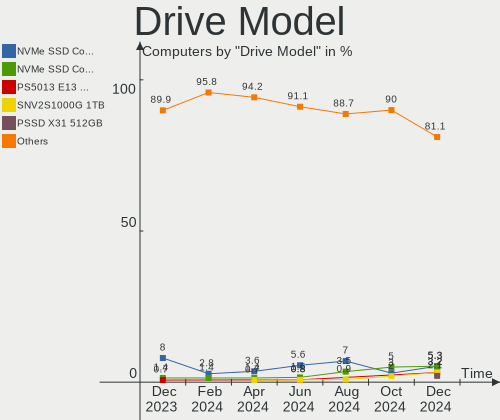
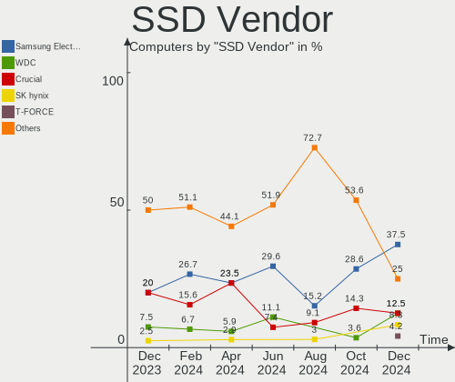
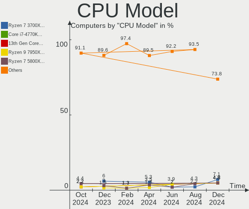
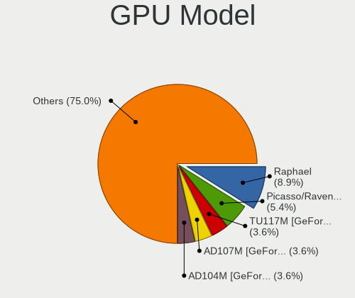
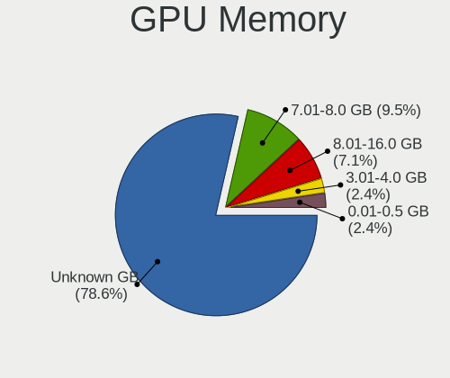
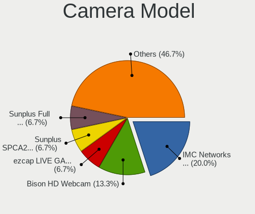

Nobara - Hardware Trends
------------------------

A project to identify most popular hardware characteristics and track their change
over time based on data collected by Linux users at https://Linux-Hardware.org.

Anyone can contribute to this report by the [hw-probe](https://github.com/linuxhw/hw-probe) tool:

    sudo -E hw-probe -all -upload

This is a report for all computer types. See also reports for [desktops](/Dist/Nobara/Desktop/README.md) and [notebooks](/Dist/Nobara/Notebook/README.md).

This report is for one last month. Overall report since the beginning of time: [TestDays](https://github.com/linuxhw/TestDays)

Period: Oct, 2023.

Contents
--------

* [ System ](#system)
  - [ OS                       ](#os)
  - [ OS Family                ](#os-family)
  - [ Kernel                   ](#kernel)
  - [ Kernel Family            ](#kernel-family)
  - [ Kernel Major Ver.        ](#kernel-major-ver)
  - [ Arch                     ](#arch)
  - [ DE                       ](#de)
  - [ Display Server           ](#display-server)
  - [ Display Manager          ](#display-manager)
  - [ OS Lang                  ](#os-lang)
  - [ Boot Mode                ](#boot-mode)
  - [ Filesystem               ](#filesystem)
  - [ Part. scheme             ](#part-scheme)
  - [ Dual Boot with Linux/BSD ](#dual-boot-with-linuxbsd)
  - [ Dual Boot (Win)          ](#dual-boot-win)

* [ Board ](#board)
  - [ Vendor                   ](#vendor)
  - [ Model                    ](#model)
  - [ Model Family             ](#model-family)
  - [ MFG Year                 ](#mfg-year)
  - [ Form Factor              ](#form-factor)
  - [ Secure Boot              ](#secure-boot)
  - [ Coreboot                 ](#coreboot)
  - [ RAM Size                 ](#ram-size)
  - [ RAM Used                 ](#ram-used)
  - [ Total Drives             ](#total-drives)
  - [ Has CD-ROM               ](#has-cd-rom)
  - [ Has Ethernet             ](#has-ethernet)
  - [ Has WiFi                 ](#has-wifi)
  - [ Has Bluetooth            ](#has-bluetooth)

* [ Location ](#location)
  - [ Country                  ](#country)
  - [ City                     ](#city)

* [ Drives ](#drives)
  - [ Drive Vendor             ](#drive-vendor)
  - [ Drive Model              ](#drive-model)
  - [ HDD Vendor               ](#hdd-vendor)
  - [ SSD Vendor               ](#ssd-vendor)
  - [ Drive Kind               ](#drive-kind)
  - [ Drive Connector          ](#drive-connector)
  - [ Drive Size               ](#drive-size)
  - [ Space Total              ](#space-total)
  - [ Space Used               ](#space-used)
  - [ Malfunc. Drives          ](#malfunc-drives)
  - [ Malfunc. Drive Vendor    ](#malfunc-drive-vendor)
  - [ Malfunc. HDD Vendor      ](#malfunc-hdd-vendor)
  - [ Malfunc. Drive Kind      ](#malfunc-drive-kind)
  - [ Failed Drives            ](#failed-drives)
  - [ Failed Drive Vendor      ](#failed-drive-vendor)
  - [ Drive Status             ](#drive-status)

* [ Storage controller ](#storage-controller)
  - [ Storage Vendor           ](#storage-vendor)
  - [ Storage Model            ](#storage-model)
  - [ Storage Kind             ](#storage-kind)

* [ Processor ](#processor)
  - [ CPU Vendor               ](#cpu-vendor)
  - [ CPU Model                ](#cpu-model)
  - [ CPU Model Family         ](#cpu-model-family)
  - [ CPU Cores                ](#cpu-cores)
  - [ CPU Sockets              ](#cpu-sockets)
  - [ CPU Threads              ](#cpu-threads)
  - [ CPU Op-Modes             ](#cpu-op-modes)
  - [ CPU Microcode            ](#cpu-microcode)
  - [ CPU Microarch            ](#cpu-microarch)

* [ Graphics ](#graphics)
  - [ GPU Vendor               ](#gpu-vendor)
  - [ GPU Model                ](#gpu-model)
  - [ GPU Combo                ](#gpu-combo)
  - [ GPU Driver               ](#gpu-driver)
  - [ GPU Memory               ](#gpu-memory)

* [ Monitor ](#monitor)
  - [ Monitor Vendor           ](#monitor-vendor)
  - [ Monitor Model            ](#monitor-model)
  - [ Monitor Resolution       ](#monitor-resolution)
  - [ Monitor Diagonal         ](#monitor-diagonal)
  - [ Monitor Width            ](#monitor-width)
  - [ Aspect Ratio             ](#aspect-ratio)
  - [ Monitor Area             ](#monitor-area)
  - [ Pixel Density            ](#pixel-density)
  - [ Multiple Monitors        ](#multiple-monitors)

* [ Network ](#network)
  - [ Net Controller Vendor    ](#net-controller-vendor)
  - [ Net Controller Model     ](#net-controller-model)
  - [ Wireless Vendor          ](#wireless-vendor)
  - [ Wireless Model           ](#wireless-model)
  - [ Ethernet Vendor          ](#ethernet-vendor)
  - [ Ethernet Model           ](#ethernet-model)
  - [ Net Controller Kind      ](#net-controller-kind)
  - [ Used Controller          ](#used-controller)
  - [ NICs                     ](#nics)
  - [ IPv6                     ](#ipv6)

* [ Bluetooth ](#bluetooth)
  - [ Bluetooth Vendor         ](#bluetooth-vendor)
  - [ Bluetooth Model          ](#bluetooth-model)

* [ Sound ](#sound)
  - [ Sound Vendor             ](#sound-vendor)
  - [ Sound Model              ](#sound-model)

* [ Memory ](#memory)
  - [ Memory Vendor            ](#memory-vendor)
  - [ Memory Model             ](#memory-model)
  - [ Memory Kind              ](#memory-kind)
  - [ Memory Form Factor       ](#memory-form-factor)
  - [ Memory Size              ](#memory-size)
  - [ Memory Speed             ](#memory-speed)

* [ Printers & scanners ](#printers--scanners)
  - [ Printer Vendor           ](#printer-vendor)
  - [ Printer Model            ](#printer-model)
  - [ Scanner Vendor           ](#scanner-vendor)
  - [ Scanner Model            ](#scanner-model)

* [ Camera ](#camera)
  - [ Camera Vendor            ](#camera-vendor)
  - [ Camera Model             ](#camera-model)

* [ Security ](#security)
  - [ Fingerprint Vendor       ](#fingerprint-vendor)
  - [ Fingerprint Model        ](#fingerprint-model)
  - [ Chipcard Vendor          ](#chipcard-vendor)
  - [ Chipcard Model           ](#chipcard-model)

* [ Unsupported ](#unsupported)
  - [ Unsupported Devices      ](#unsupported-devices)
  - [ Unsupported Device Types ](#unsupported-device-types)

System
------

OS
--

Installed operating systems

| Name      | Computers | Percent |
|-----------|-----------|---------|
| Nobara 38 | 42        | 93.33%  |
| Nobara 37 | 3         | 6.67%   |

OS Family
---------

OS without a version

| Name   | Computers | Percent |
|--------|-----------|---------|
| Nobara | 45        | 100%    |

Kernel
------

Version of the Linux kernel

| Version                      | Computers | Percent |
|------------------------------|-----------|---------|
| 6.5.6-200.fsync.fc38.x86_64  | 17        | 37.78%  |
| 6.5.9-200.fsync.fc38.x86_64  | 7         | 15.56%  |
| 6.5.5-202.fsync.fc38.x86_64  | 5         | 11.11%  |
| 6.5.8-200.fsync.fc38.x86_64  | 4         | 8.89%   |
| 6.5.5-201.fsync.fc38.x86_64  | 3         | 6.67%   |
| 6.5.5-200.fsync.fc38.x86_64  | 3         | 6.67%   |
| 6.5.3-200.fsync.fc37.x86_64  | 3         | 6.67%   |
| 6.4.10-202.fsync.fc38.x86_64 | 2         | 4.44%   |
| 6.3.9-200.fsync.fc38.x86_64  | 1         | 2.22%   |

Kernel Family
-------------

Linux kernel without a distro release

| Version | Computers | Percent |
|---------|-----------|---------|
| 6.5.6   | 17        | 37.78%  |
| 6.5.5   | 11        | 24.44%  |
| 6.5.9   | 7         | 15.56%  |
| 6.5.8   | 4         | 8.89%   |
| 6.5.3   | 3         | 6.67%   |
| 6.4.10  | 2         | 4.44%   |
| 6.3.9   | 1         | 2.22%   |

Kernel Major Ver.
-----------------

Linux kernel major version

| Version | Computers | Percent |
|---------|-----------|---------|
| 6.5     | 42        | 93.33%  |
| 6.4     | 2         | 4.44%   |
| 6.3     | 1         | 2.22%   |

Arch
----

OS architecture (x86_64, i586, etc.)

| Name   | Computers | Percent |
|--------|-----------|---------|
| x86_64 | 45        | 100%    |

DE
--

Desktop Environment

| Name     | Computers | Percent |
|----------|-----------|---------|
| GNOME    | 29        | 64.44%  |
| KDE5     | 15        | 33.33%  |
| Hyprland | 1         | 2.22%   |

Display Server
--------------

X11 or Wayland

| Name    | Computers | Percent |
|---------|-----------|---------|
| Wayland | 43        | 95.56%  |
| X11     | 2         | 4.44%   |

Display Manager
---------------

SDDM, LightDM, etc.

| Name    | Computers | Percent |
|---------|-----------|---------|
| Unknown | 37        | 82.22%  |
| GDM     | 6         | 13.33%  |
| SDDM    | 2         | 4.44%   |

OS Lang
-------

Language

| Lang  | Computers | Percent |
|-------|-----------|---------|
| en_US | 17        | 37.78%  |
| en_GB | 5         | 11.11%  |
| de_DE | 5         | 11.11%  |
| en_CA | 3         | 6.67%   |
| ru_RU | 2         | 4.44%   |
| es_MX | 2         | 4.44%   |
| es_ES | 2         | 4.44%   |
| uk_UA | 1         | 2.22%   |
| pt_BR | 1         | 2.22%   |
| pl_PL | 1         | 2.22%   |
| it_IT | 1         | 2.22%   |
| fr_FR | 1         | 2.22%   |
| es_CU | 1         | 2.22%   |
| es_CL | 1         | 2.22%   |
| en_NZ | 1         | 2.22%   |
| en_IE | 1         | 2.22%   |

Boot Mode
---------

EFI or BIOS

| Mode | Computers | Percent |
|------|-----------|---------|
| EFI  | 43        | 95.56%  |
| BIOS | 2         | 4.44%   |

Filesystem
----------

Type of filesystem

| Type  | Computers | Percent |
|-------|-----------|---------|
| Btrfs | 44        | 97.78%  |
| Ext4  | 1         | 2.22%   |

Part. scheme
------------

Scheme of partitioning

| Type    | Computers | Percent |
|---------|-----------|---------|
| Unknown | 37        | 82.22%  |
| GPT     | 8         | 17.78%  |

Dual Boot with Linux/BSD
------------------------

Hosting more than one Linux/BSD

| Dual boot | Computers | Percent |
|-----------|-----------|---------|
| No        | 43        | 95.56%  |
| Yes       | 2         | 4.44%   |

Dual Boot (Win)
---------------

Hosting Linux and Windows

| Dual boot | Computers | Percent |
|-----------|-----------|---------|
| No        | 42        | 93.33%  |
| Yes       | 3         | 6.67%   |

Board
-----

Vendor
------

Motherboard manufacturer

| Name                | Computers | Percent |
|---------------------|-----------|---------|
| ASUSTek Computer    | 13        | 28.89%  |
| MSI                 | 6         | 13.33%  |
| Gigabyte Technology | 6         | 13.33%  |
| Lenovo              | 4         | 8.89%   |
| ASRock              | 3         | 6.67%   |
| Hewlett-Packard     | 2         | 4.44%   |
| Dell                | 2         | 4.44%   |
| Acer                | 2         | 4.44%   |
| Toshiba             | 1         | 2.22%   |
| System76            | 1         | 2.22%   |
| Pegatron            | 1         | 2.22%   |
| Microsoft           | 1         | 2.22%   |
| Biostar             | 1         | 2.22%   |
| AZW                 | 1         | 2.22%   |
| AOpen               | 1         | 2.22%   |

Model
-----

Motherboard model

| Name                                     | Computers | Percent |
|------------------------------------------|-----------|---------|
| Toshiba Satellite C55D-C                 | 1         | 2.22%   |
| System76 Gazelle                         | 1         | 2.22%   |
| Pegatron HPE-558de                       | 1         | 2.22%   |
| MSI MS-7C37                              | 1         | 2.22%   |
| MSI MS-7C09                              | 1         | 2.22%   |
| MSI MS-7A34                              | 1         | 2.22%   |
| MSI MS-7971                              | 1         | 2.22%   |
| MSI Modern 14 B5M                        | 1         | 2.22%   |
| MSI GT72S 6QE                            | 1         | 2.22%   |
| Microsoft Surface Pro                    | 1         | 2.22%   |
| Lenovo ThinkPad T450 20BUS1K50X          | 1         | 2.22%   |
| Lenovo Legion 5 15ACH6H 82JU             | 1         | 2.22%   |
| Lenovo IdeaPadFlex 5 14ARE05 81X2        | 1         | 2.22%   |
| Lenovo IdeaPad Gaming 3 15ACH6 82K2      | 1         | 2.22%   |
| HP Pavilion Aero Laptop 13-be0xxx        | 1         | 2.22%   |
| HP Notebook                              | 1         | 2.22%   |
| Gigabyte Z77-D3H                         | 1         | 2.22%   |
| Gigabyte X570 AORUS ELITE                | 1         | 2.22%   |
| Gigabyte H77-D3H                         | 1         | 2.22%   |
| Gigabyte B760 GAMING X DDR4              | 1         | 2.22%   |
| Gigabyte B550I AORUS PRO AX              | 1         | 2.22%   |
| Gigabyte B550 GAMING X V2                | 1         | 2.22%   |
| Dell Latitude E5470                      | 1         | 2.22%   |
| Dell Inspiron 7375                       | 1         | 2.22%   |
| Biostar A320MH                           | 1         | 2.22%   |
| AZW SER                                  | 1         | 2.22%   |
| ASUS X541UV                              | 1         | 2.22%   |
| ASUS VivoBook_ASUSLaptop M6501RM_M6501RM | 1         | 2.22%   |
| ASUS TUF Gaming X570-PLUS                | 1         | 2.22%   |
| ASUS TUF Gaming A620M-PLUS WIFI          | 1         | 2.22%   |
| ASUS TUF B450M-PLUS GAMING               | 1         | 2.22%   |
| ASUS ROG Zephyrus G14 GA402RK_GA402RK    | 1         | 2.22%   |
| ASUS ROG STRIX X570-E GAMING             | 1         | 2.22%   |
| ASUS ROG Strix G713RM_G713RM             | 1         | 2.22%   |
| ASUS ROG Strix G513RC_G513RC             | 1         | 2.22%   |
| ASUS ROG Maximus XI HERO                 | 1         | 2.22%   |
| ASUS PRIME B450M-GAMING/BR               | 1         | 2.22%   |
| ASUS P8H77-M                             | 1         | 2.22%   |
| ASUS GL502VSK                            | 1         | 2.22%   |
| ASRock X670E PG Lightning                | 1         | 2.22%   |

Model Family
------------

Motherboard model prefix

| Name               | Computers | Percent |
|--------------------|-----------|---------|
| ASUS ROG           | 5         | 11.11%  |
| ASUS TUF           | 3         | 6.67%   |
| Acer Aspire        | 2         | 4.44%   |
| Toshiba Satellite  | 1         | 2.22%   |
| System76 Gazelle   | 1         | 2.22%   |
| Pegatron HPE-558de | 1         | 2.22%   |
| MSI MS-7C37        | 1         | 2.22%   |
| MSI MS-7C09        | 1         | 2.22%   |
| MSI MS-7A34        | 1         | 2.22%   |
| MSI MS-7971        | 1         | 2.22%   |
| MSI Modern         | 1         | 2.22%   |
| MSI GT72S          | 1         | 2.22%   |
| Microsoft Surface  | 1         | 2.22%   |
| Lenovo ThinkPad    | 1         | 2.22%   |
| Lenovo Legion      | 1         | 2.22%   |
| Lenovo IdeaPadFlex | 1         | 2.22%   |
| Lenovo IdeaPad     | 1         | 2.22%   |
| HP Pavilion        | 1         | 2.22%   |
| HP Notebook        | 1         | 2.22%   |
| Gigabyte Z77-D3H   | 1         | 2.22%   |
| Gigabyte X570      | 1         | 2.22%   |
| Gigabyte H77-D3H   | 1         | 2.22%   |
| Gigabyte B760      | 1         | 2.22%   |
| Gigabyte B550I     | 1         | 2.22%   |
| Gigabyte B550      | 1         | 2.22%   |
| Dell Latitude      | 1         | 2.22%   |
| Dell Inspiron      | 1         | 2.22%   |
| Biostar A320MH     | 1         | 2.22%   |
| AZW SER            | 1         | 2.22%   |
| ASUS X541UV        | 1         | 2.22%   |
| ASUS VivoBook      | 1         | 2.22%   |
| ASUS PRIME         | 1         | 2.22%   |
| ASUS P8H77-M       | 1         | 2.22%   |
| ASUS GL502VSK      | 1         | 2.22%   |
| ASRock X670E       | 1         | 2.22%   |
| ASRock iMacPro1    | 1         | 2.22%   |
| ASRock B450M-HDV   | 1         | 2.22%   |
| AOpen DEX5350      | 1         | 2.22%   |

MFG Year
--------

Motherboard manufacture year

| Year | Computers | Percent |
|------|-----------|---------|
| 2018 | 7         | 15.56%  |
| 2022 | 6         | 13.33%  |
| 2021 | 5         | 11.11%  |
| 2019 | 5         | 11.11%  |
| 2016 | 5         | 11.11%  |
| 2023 | 4         | 8.89%   |
| 2020 | 3         | 6.67%   |
| 2012 | 3         | 6.67%   |
| 2017 | 2         | 4.44%   |
| 2015 | 2         | 4.44%   |
| 2014 | 2         | 4.44%   |
| 2011 | 1         | 2.22%   |

Form Factor
-----------

Physical design of the computer

| Name        | Computers | Percent |
|-------------|-----------|---------|
| Desktop     | 22        | 48.89%  |
| Notebook    | 19        | 42.22%  |
| Tablet      | 1         | 2.22%   |
| Convertible | 1         | 2.22%   |
| Mini pc     | 1         | 2.22%   |
| All in one  | 1         | 2.22%   |

Secure Boot
-----------

Enabled or disabled

| State    | Computers | Percent |
|----------|-----------|---------|
| Disabled | 45        | 100%    |

Coreboot
--------

Have coreboot on board

| Used | Computers | Percent |
|------|-----------|---------|
| No   | 44        | 97.78%  |
| Yes  | 1         | 2.22%   |

RAM Size
--------

Total RAM memory

| Size in GB  | Computers | Percent |
|-------------|-----------|---------|
| 16.01-24.0  | 12        | 26.67%  |
| 8.01-16.0   | 11        | 24.44%  |
| 32.01-64.0  | 9         | 20%     |
| 4.01-8.0    | 4         | 8.89%   |
| 24.01-32.0  | 4         | 8.89%   |
| 3.01-4.0    | 3         | 6.67%   |
| 64.01-256.0 | 2         | 4.44%   |

RAM Used
--------

Used RAM memory

| Used GB    | Computers | Percent |
|------------|-----------|---------|
| 4.01-8.0   | 17        | 37.78%  |
| 2.01-3.0   | 9         | 20%     |
| 3.01-4.0   | 8         | 17.78%  |
| 8.01-16.0  | 6         | 13.33%  |
| 1.01-2.0   | 4         | 8.89%   |
| 16.01-24.0 | 1         | 2.22%   |

Total Drives
------------

Number of drives on board

| Drives | Computers | Percent |
|--------|-----------|---------|
| 1      | 22        | 48.89%  |
| 2      | 10        | 22.22%  |
| 3      | 6         | 13.33%  |
| 4      | 4         | 8.89%   |
| 7      | 1         | 2.22%   |
| 6      | 1         | 2.22%   |
| 5      | 1         | 2.22%   |

Has CD-ROM
----------

Has CD-ROM on board

| Presented | Computers | Percent |
|-----------|-----------|---------|
| No        | 34        | 75.56%  |
| Yes       | 11        | 24.44%  |

Has Ethernet
------------

Has Ethernet on board

| Presented | Computers | Percent |
|-----------|-----------|---------|
| Yes       | 41        | 91.11%  |
| No        | 4         | 8.89%   |

Has WiFi
--------

Has WiFi module

| Presented | Computers | Percent |
|-----------|-----------|---------|
| Yes       | 37        | 82.22%  |
| No        | 8         | 17.78%  |

Has Bluetooth
-------------

Has Bluetooth module

| Presented | Computers | Percent |
|-----------|-----------|---------|
| Yes       | 31        | 68.89%  |
| No        | 14        | 31.11%  |

Location
--------

Country
-------

Geographic location (country)

| Country     | Computers | Percent |
|-------------|-----------|---------|
| Germany     | 7         | 15.56%  |
| USA         | 6         | 13.33%  |
| Canada      | 5         | 11.11%  |
| Russia      | 3         | 6.67%   |
| UK          | 2         | 4.44%   |
| Spain       | 2         | 4.44%   |
| Italy       | 2         | 4.44%   |
| Indonesia   | 2         | 4.44%   |
| India       | 2         | 4.44%   |
| France      | 2         | 4.44%   |
| Vietnam     | 1         | 2.22%   |
| Ukraine     | 1         | 2.22%   |
| Romania     | 1         | 2.22%   |
| Poland      | 1         | 2.22%   |
| New Zealand | 1         | 2.22%   |
| Mexico      | 1         | 2.22%   |
| Ireland     | 1         | 2.22%   |
| Greece      | 1         | 2.22%   |
| Cuba        | 1         | 2.22%   |
| Chile       | 1         | 2.22%   |
| Brazil      | 1         | 2.22%   |
| Argentina   | 1         | 2.22%   |

City
----

Geographic location (city)

| City                    | Computers | Percent |
|-------------------------|-----------|---------|
| St Petersburg           | 2         | 4.44%   |
| Zaragoza                | 1         | 2.22%   |
| Xalapa                  | 1         | 2.22%   |
| Villefranche-sur-Saône | 1         | 2.22%   |
| Tullamore               | 1         | 2.22%   |
| South Tangerang         | 1         | 2.22%   |
| Satna                   | 1         | 2.22%   |
| Santiago                | 1         | 2.22%   |
| Saluda                  | 1         | 2.22%   |
| Rochester Hills         | 1         | 2.22%   |
| Praia Grande            | 1         | 2.22%   |
| Ourense                 | 1         | 2.22%   |
| Ortenberg               | 1         | 2.22%   |
| Noida                   | 1         | 2.22%   |
| Nettetal                | 1         | 2.22%   |
| Nelson                  | 1         | 2.22%   |
| Motherwell              | 1         | 2.22%   |
| Monte Sant'Angelo       | 1         | 2.22%   |
| Lviv                    | 1         | 2.22%   |
| Lübeck                 | 1         | 2.22%   |
| Los Angeles             | 1         | 2.22%   |
| Levis                   | 1         | 2.22%   |
| Las Vegas               | 1         | 2.22%   |
| Kelowna                 | 1         | 2.22%   |
| Jakarta                 | 1         | 2.22%   |
| Indianapolis            | 1         | 2.22%   |
| Havana                  | 1         | 2.22%   |
| Glace Bay               | 1         | 2.22%   |
| Gdynia                  | 1         | 2.22%   |
| Fort Walton Beach       | 1         | 2.22%   |
| Fordingbridge           | 1         | 2.22%   |
| Erkner                  | 1         | 2.22%   |
| Düsseldorf             | 1         | 2.22%   |
| Dolgoprudnyy            | 1         | 2.22%   |
| Dien Ban                | 1         | 2.22%   |
| Cologne                 | 1         | 2.22%   |
| Codroipo                | 1         | 2.22%   |
| Cluj-Napoca             | 1         | 2.22%   |
| Cambridge               | 1         | 2.22%   |
| Buenos Aires            | 1         | 2.22%   |

Drives
------

Drive Vendor
------------

Hard drive vendors

| Vendor                      | Computers | Drives | Percent |
|-----------------------------|-----------|--------|---------|
| Samsung Electronics         | 11        | 24     | 14.67%  |
| WDC                         | 7         | 10     | 9.33%   |
| Toshiba                     | 5         | 8      | 6.67%   |
| Seagate                     | 5         | 5      | 6.67%   |
| Sandisk                     | 5         | 7      | 6.67%   |
| Crucial                     | 5         | 5      | 6.67%   |
| SK hynix                    | 4         | 4      | 5.33%   |
| Micron Technology           | 4         | 4      | 5.33%   |
| Realtek Semiconductor       | 3         | 3      | 4%      |
| Micron/Crucial Technology   | 3         | 3      | 4%      |
| Kingston                    | 2         | 2      | 2.67%   |
| Intel                       | 2         | 2      | 2.67%   |
| A-DATA Technology           | 2         | 2      | 2.67%   |
| V-GeN                       | 1         | 1      | 1.33%   |
| Unknown                     | 1         | 1      | 1.33%   |
| Team                        | 1         | 1      | 1.33%   |
| Silicon Motion              | 1         | 1      | 1.33%   |
| Phison Electronics          | 1         | 1      | 1.33%   |
| Patriot                     | 1         | 1      | 1.33%   |
| OCZ                         | 1         | 1      | 1.33%   |
| Lexar                       | 1         | 1      | 1.33%   |
| KIOXIA                      | 1         | 1      | 1.33%   |
| Kingston Technology Company | 1         | 1      | 1.33%   |
| Intenso                     | 1         | 1      | 1.33%   |
| HGST                        | 1         | 1      | 1.33%   |
| Fanxiang                    | 1         | 1      | 1.33%   |
| Corsair                     | 1         | 1      | 1.33%   |
| China                       | 1         | 1      | 1.33%   |
| AMD                         | 1         | 1      | 1.33%   |
| ADATA Technology            | 1         | 1      | 1.33%   |

Drive Model
-----------

Hard drive models

| Model                                                 | Computers | Percent |
|-------------------------------------------------------|-----------|---------|
| Samsung NVMe SSD Controller SM981/PM981/PM983 1TB     | 3         | 3.26%   |
| Samsung NVMe SSD Controller PM9A1/PM9A3/980PRO 1TB    | 3         | 3.26%   |
| Micron 2450_MTFDKBA1T0TFK 1TB                         | 3         | 3.26%   |
| WDC WDS120G2G0B-00EPW0 120GB SSD                      | 2         | 2.17%   |
| Samsung SSD 860 EVO 500GB                             | 2         | 2.17%   |
| Samsung SSD 860 EVO 250GB                             | 2         | 2.17%   |
| Micron/Crucial P2 NVMe PCIe SSD 500GB                 | 2         | 2.17%   |
| Crucial CT1000BX500SSD1 1TB                           | 2         | 2.17%   |
| A-DATA SU630 480GB SSD                                | 2         | 2.17%   |
| WDC WDS500G2B0B-00YS70 500GB SSD                      | 1         | 1.09%   |
| WDC WDS100T2G0A-00JH30 1TB SSD                        | 1         | 1.09%   |
| WDC WD3000F9YZ-09N20L1 3TB                            | 1         | 1.09%   |
| WDC WD20EARS-00S8B1 2TB                               | 1         | 1.09%   |
| WDC WD10EZEX-22MFCA0 1TB                              | 1         | 1.09%   |
| WDC WD10EFRX-68FYTN0 1TB                              | 1         | 1.09%   |
| WDC WD1004FBYZ-01YCBB1 1TB                            | 1         | 1.09%   |
| V-GeN V-GEN01SM21AR256SDK 256GB                       | 1         | 1.09%   |
| Unknown MMC Card  64GB                                | 1         | 1.09%   |
| Toshiba Q300. 480GB SSD                               | 1         | 1.09%   |
| Toshiba NVMe Controller 512GB                         | 1         | 1.09%   |
| Toshiba MQ01ABF050 500GB                              | 1         | 1.09%   |
| Toshiba MQ01ABD100 1TB                                | 1         | 1.09%   |
| Toshiba MK5076GSX 500GB                               | 1         | 1.09%   |
| Toshiba HDWR180 8TB                                   | 1         | 1.09%   |
| Toshiba HDWE160 6TB                                   | 1         | 1.09%   |
| Toshiba DT01ACA300 3TB                                | 1         | 1.09%   |
| Team T253X2512G 512GB SSD                             | 1         | 1.09%   |
| SK hynix SKHynix_HFS512GDE9X084N 512GB                | 1         | 1.09%   |
| SK hynix BC711 HFM512GD3JX013N 512GB                  | 1         | 1.09%   |
| SK hynix BC511 512GB                                  | 1         | 1.09%   |
| SK hynix BC501 NVMe Solid State Drive 512GB           | 1         | 1.09%   |
| Silicon Motion SM2263EN/SM2263XT SSD Controller 256GB | 1         | 1.09%   |
| Seagate ST3500630AS 500GB                             | 1         | 1.09%   |
| Seagate ST2000DM001-1ER164 2TB                        | 1         | 1.09%   |
| Seagate ST1000LM035-1RK172 1TB                        | 1         | 1.09%   |
| Seagate ST1000DM003-1SB10C 1TB                        | 1         | 1.09%   |
| Seagate BUP BK 4TB                                    | 1         | 1.09%   |
| Sandisk WD_BLACK SN850X 2000GB                        | 1         | 1.09%   |
| Sandisk WD_BLACK SN770 1TB                            | 1         | 1.09%   |
| Sandisk WD_BLACK SN750 SE 1TB                         | 1         | 1.09%   |

HDD Vendor
----------

Hard disk drive vendors

| Vendor              | Computers | Drives | Percent |
|---------------------|-----------|--------|---------|
| Seagate             | 5         | 5      | 33.33%  |
| WDC                 | 4         | 6      | 26.67%  |
| Toshiba             | 4         | 6      | 26.67%  |
| Samsung Electronics | 1         | 1      | 6.67%   |
| HGST                | 1         | 1      | 6.67%   |

SSD Vendor
----------

Solid state drive vendors

| Vendor              | Computers | Drives | Percent |
|---------------------|-----------|--------|---------|
| Samsung Electronics | 8         | 12     | 24.24%  |
| Crucial             | 5         | 5      | 15.15%  |
| WDC                 | 4         | 4      | 12.12%  |
| SanDisk             | 2         | 2      | 6.06%   |
| A-DATA Technology   | 2         | 2      | 6.06%   |
| V-GeN               | 1         | 1      | 3.03%   |
| Toshiba             | 1         | 1      | 3.03%   |
| Team                | 1         | 1      | 3.03%   |
| Patriot             | 1         | 1      | 3.03%   |
| OCZ                 | 1         | 1      | 3.03%   |
| Lexar               | 1         | 1      | 3.03%   |
| Kingston            | 1         | 1      | 3.03%   |
| Intenso             | 1         | 1      | 3.03%   |
| Fanxiang            | 1         | 1      | 3.03%   |
| Corsair             | 1         | 1      | 3.03%   |
| China               | 1         | 1      | 3.03%   |
| AMD                 | 1         | 1      | 3.03%   |

Drive Kind
----------

HDD or SSD

| Kind | Computers | Drives | Percent |
|------|-----------|--------|---------|
| NVMe | 31        | 39     | 43.66%  |
| SSD  | 26        | 37     | 36.62%  |
| HDD  | 13        | 19     | 18.31%  |
| MMC  | 1         | 1      | 1.41%   |

Drive Connector
---------------

SATA, SAS, NVMe, etc.

| Type | Computers | Drives | Percent |
|------|-----------|--------|---------|
| NVMe | 31        | 39     | 48.44%  |
| SATA | 30        | 53     | 46.88%  |
| SAS  | 2         | 3      | 3.13%   |
| MMC  | 1         | 1      | 1.56%   |

Drive Size
----------

Size of hard drive

| Size in TB | Computers | Drives | Percent |
|------------|-----------|--------|---------|
| 0.01-0.5   | 20        | 25     | 47.62%  |
| 0.51-1.0   | 15        | 22     | 35.71%  |
| 1.01-2.0   | 3         | 3      | 7.14%   |
| 2.01-3.0   | 2         | 3      | 4.76%   |
| 3.01-4.0   | 1         | 1      | 2.38%   |
| 4.01-10.0  | 1         | 2      | 2.38%   |

Space Total
-----------

Amount of disk space available on the file system

| Size in GB     | Computers | Percent |
|----------------|-----------|---------|
| 501-1000       | 16        | 35.56%  |
| 1001-2000      | 9         | 20%     |
| More than 3000 | 7         | 15.56%  |
| 251-500        | 7         | 15.56%  |
| 1-20           | 2         | 4.44%   |
| 2001-3000      | 1         | 2.22%   |
| 101-250        | 1         | 2.22%   |
| 51-100         | 1         | 2.22%   |
| Unknown        | 1         | 2.22%   |

Space Used
----------

Amount of used disk space

| Used GB        | Computers | Percent |
|----------------|-----------|---------|
| 21-50          | 8         | 17.78%  |
| 101-250        | 7         | 15.56%  |
| 251-500        | 6         | 13.33%  |
| 1001-2000      | 5         | 11.11%  |
| 1-20           | 5         | 11.11%  |
| 501-1000       | 5         | 11.11%  |
| 51-100         | 4         | 8.89%   |
| More than 3000 | 3         | 6.67%   |
| 2001-3000      | 1         | 2.22%   |
| Unknown        | 1         | 2.22%   |

Malfunc. Drives
---------------

Drive models with a malfunction

Zero info for selected period =(

Malfunc. Drive Vendor
---------------------

Vendors of faulty drives

Zero info for selected period =(

Malfunc. HDD Vendor
-------------------

Vendors of faulty HDD drives

Zero info for selected period =(

Malfunc. Drive Kind
-------------------

Kinds of faulty drives

Zero info for selected period =(

Failed Drives
-------------

Failed drive models

Zero info for selected period =(

Failed Drive Vendor
-------------------

Failed drive vendors

Zero info for selected period =(

Drive Status
------------

Number of failed and malfunc. drives

| Status   | Computers | Drives | Percent |
|----------|-----------|--------|---------|
| Detected | 37        | 81     | 82.22%  |
| Works    | 8         | 15     | 17.78%  |

Storage controller
------------------

Storage Vendor
--------------

Storage controller vendors

| Vendor                       | Computers | Percent |
|------------------------------|-----------|---------|
| AMD                          | 20        | 27.4%   |
| Intel                        | 18        | 24.66%  |
| Samsung Electronics          | 8         | 10.96%  |
| SK hynix                     | 4         | 5.48%   |
| SanDisk                      | 4         | 5.48%   |
| Micron Technology            | 4         | 5.48%   |
| Realtek Semiconductor        | 3         | 4.11%   |
| Micron/Crucial Technology    | 3         | 4.11%   |
| Kingston Technology Company  | 2         | 2.74%   |
| ASMedia Technology           | 2         | 2.74%   |
| Toshiba America Info Systems | 1         | 1.37%   |
| Silicon Motion               | 1         | 1.37%   |
| Phison Electronics           | 1         | 1.37%   |
| KIOXIA                       | 1         | 1.37%   |
| ADATA Technology             | 1         | 1.37%   |

Storage Model
-------------

Storage controller models

| Model                                                                            | Computers | Percent |
|----------------------------------------------------------------------------------|-----------|---------|
| AMD FCH SATA Controller [AHCI mode]                                              | 17        | 20.99%  |
| Samsung NVMe SSD Controller SM981/PM981/PM983                                    | 3         | 3.7%    |
| Samsung NVMe SSD Controller PM9A1/PM9A3/980PRO                                   | 3         | 3.7%    |
| Realtek RTS5765DL NVMe SSD Controller (DRAM-less)                                | 3         | 3.7%    |
| Micron 2450 NVMe SSD [HendrixV] (DRAM-less)                                      | 3         | 3.7%    |
| AMD 400 Series Chipset SATA Controller                                           | 3         | 3.7%    |
| SK hynix Gold P31/BC711/PC711 NVMe Solid State Drive                             | 2         | 2.47%   |
| Micron/Crucial P2 [Nick P2] / P3 / P3 Plus NVMe PCIe SSD (DRAM-less)             | 2         | 2.47%   |
| Intel Wildcat Point-LP SATA Controller [AHCI Mode]                               | 2         | 2.47%   |
| Intel Sunrise Point-LP SATA Controller [AHCI mode]                               | 2         | 2.47%   |
| Intel Q170/Q150/B150/H170/H110/Z170/CM236 Chipset SATA Controller [AHCI Mode]    | 2         | 2.47%   |
| Intel 7 Series/C210 Series Chipset Family 6-port SATA Controller [AHCI mode]     | 2         | 2.47%   |
| ASMedia ASM1062 Serial ATA Controller                                            | 2         | 2.47%   |
| AMD 500 Series Chipset SATA Controller                                           | 2         | 2.47%   |
| Toshiba America Info Systems XG3 NVMe SSD Controller                             | 1         | 1.23%   |
| SK hynix BC511 NVMe SSD                                                          | 1         | 1.23%   |
| SK hynix BC501 NVMe Solid State Drive                                            | 1         | 1.23%   |
| Silicon Motion SM2263EN/SM2263XT (DRAM-less) NVMe SSD Controllers                | 1         | 1.23%   |
| SanDisk WD Blue SN570 NVMe SSD 2TB                                               | 1         | 1.23%   |
| Sandisk WD Black SN850X NVMe SSD                                                 | 1         | 1.23%   |
| SanDisk WD Black SN770 / PC SN740 256GB / PC SN560 (DRAM-less) NVMe SSD          | 1         | 1.23%   |
| SanDisk Ultra 3D / WD Blue SN570 NVMe SSD (DRAM-less)                            | 1         | 1.23%   |
| SanDisk PC SN735 NVMe SSD (DRAM-less)                                            | 1         | 1.23%   |
| Samsung NVMe SSD SM0032L                                                         | 1         | 1.23%   |
| Samsung NVMe SSD Controller SM961/PM961/SM963                                    | 1         | 1.23%   |
| Samsung NVMe SSD Controller 980 (DRAM-less)                                      | 1         | 1.23%   |
| Phison PS5013-E13 PCIe3 NVMe Controller (DRAM-less)                              | 1         | 1.23%   |
| Micron/Crucial P5 Plus NVMe PCIe SSD                                             | 1         | 1.23%   |
| Micron 2210 NVMe SSD [Cobain]                                                    | 1         | 1.23%   |
| KIOXIA NVMe SSD                                                                  | 1         | 1.23%   |
| Kingston Company OM8PCP Design-In PCIe 3 NVMe SSD (DRAM-less)                    | 1         | 1.23%   |
| Kingston Company NV2 NVMe SSD SM2267XT                                           | 1         | 1.23%   |
| Intel SSD 670p Series [Keystone Harbor]                                          | 1         | 1.23%   |
| Intel SSD 660P Series                                                            | 1         | 1.23%   |
| Intel HM170/QM170 Chipset SATA Controller [AHCI Mode]                            | 1         | 1.23%   |
| Intel Cannon Lake PCH SATA AHCI Controller                                       | 1         | 1.23%   |
| Intel Atom/Celeron/Pentium Processor x5-E8000/J3xxx/N3xxx Series SATA Controller | 1         | 1.23%   |
| Intel Alder Lake-S PCH SATA Controller [AHCI Mode]                               | 1         | 1.23%   |
| Intel Alder Lake-P SATA AHCI Controller                                          | 1         | 1.23%   |
| Intel 700 Series Chipset Family SATA AHCI Controller                             | 1         | 1.23%   |

Storage Kind
------------

Kind of storage controller (IDE, SATA, NVMe, SAS, ...)

| Kind | Computers | Percent |
|------|-----------|---------|
| SATA | 36        | 52.94%  |
| NVMe | 31        | 45.59%  |
| IDE  | 1         | 1.47%   |

Processor
---------

CPU Vendor
----------

Processor vendors

| Vendor | Computers | Percent |
|--------|-----------|---------|
| AMD    | 27        | 60%     |
| Intel  | 18        | 40%     |

CPU Model
---------

Processor models

| Model                                         | Computers | Percent |
|-----------------------------------------------|-----------|---------|
| AMD Ryzen 3 3200G with Radeon Vega Graphics   | 3         | 6.67%   |
| Intel Core i7-3770 CPU @ 3.40GHz              | 2         | 4.44%   |
| AMD Ryzen 9 5950X 16-Core Processor           | 2         | 4.44%   |
| AMD Ryzen 7 6800H with Radeon Graphics        | 2         | 4.44%   |
| AMD Ryzen 7 5800H with Radeon Graphics        | 2         | 4.44%   |
| Intel Xeon CPU E3-1280 V2 @ 3.60GHz           | 1         | 2.22%   |
| Intel Core i9-9900K CPU @ 3.60GHz             | 1         | 2.22%   |
| Intel Core i7-7700HQ CPU @ 2.80GHz            | 1         | 2.22%   |
| Intel Core i7-7660U CPU @ 2.50GHz             | 1         | 2.22%   |
| Intel Core i7-6820HK CPU @ 2.70GHz            | 1         | 2.22%   |
| Intel Core i7-6700K CPU @ 4.00GHz             | 1         | 2.22%   |
| Intel Core i7-2600 CPU @ 3.40GHz              | 1         | 2.22%   |
| Intel Core i5-9400 CPU @ 2.90GHz              | 1         | 2.22%   |
| Intel Core i5-6300U CPU @ 2.40GHz             | 1         | 2.22%   |
| Intel Core i5-6198DU CPU @ 2.30GHz            | 1         | 2.22%   |
| Intel Core i5-5300U CPU @ 2.30GHz             | 1         | 2.22%   |
| Intel Core i3-5010U CPU @ 2.10GHz             | 1         | 2.22%   |
| Intel Celeron CPU N3060 @ 1.60GHz             | 1         | 2.22%   |
| Intel 13th Gen Core i9-13900H                 | 1         | 2.22%   |
| Intel 13th Gen Core i5-13400F                 | 1         | 2.22%   |
| Intel 12th Gen Core i3-12100F                 | 1         | 2.22%   |
| AMD Ryzen 9 6900HX with Radeon Graphics       | 1         | 2.22%   |
| AMD Ryzen 9 6900HS with Radeon Graphics       | 1         | 2.22%   |
| AMD Ryzen 7 7800X3D 8-Core Processor          | 1         | 2.22%   |
| AMD Ryzen 7 5800X3D 8-Core Processor          | 1         | 2.22%   |
| AMD Ryzen 7 5800X 8-Core Processor            | 1         | 2.22%   |
| AMD Ryzen 7 5800U with Radeon Graphics        | 1         | 2.22%   |
| AMD Ryzen 7 5700G with Radeon Graphics        | 1         | 2.22%   |
| AMD Ryzen 5 7600X 6-Core Processor            | 1         | 2.22%   |
| AMD Ryzen 5 5600X 6-Core Processor            | 1         | 2.22%   |
| AMD Ryzen 5 5600H with Radeon Graphics        | 1         | 2.22%   |
| AMD Ryzen 5 5500U with Radeon Graphics        | 1         | 2.22%   |
| AMD Ryzen 5 4600G with Radeon Graphics        | 1         | 2.22%   |
| AMD Ryzen 5 2600 Six-Core Processor           | 1         | 2.22%   |
| AMD Ryzen 5 2500U with Radeon Vega Mobile Gfx | 1         | 2.22%   |
| AMD Ryzen 3 4300U with Radeon Graphics        | 1         | 2.22%   |
| AMD Ryzen 3 3200U with Radeon Vega Mobile Gfx | 1         | 2.22%   |
| AMD Ryzen 3 2200U with Radeon Vega Mobile Gfx | 1         | 2.22%   |
| AMD A4-7210 APU with AMD Radeon R3 Graphics   | 1         | 2.22%   |

CPU Model Family
----------------

Processor model prefix

| Model         | Computers | Percent |
|---------------|-----------|---------|
| AMD Ryzen 7   | 9         | 20%     |
| Intel Core i7 | 7         | 15.56%  |
| AMD Ryzen 5   | 7         | 15.56%  |
| AMD Ryzen 3   | 6         | 13.33%  |
| Intel Core i5 | 4         | 8.89%   |
| AMD Ryzen 9   | 4         | 8.89%   |
| Other         | 3         | 6.67%   |
| Intel Xeon    | 1         | 2.22%   |
| Intel Core i9 | 1         | 2.22%   |
| Intel Core i3 | 1         | 2.22%   |
| Intel Celeron | 1         | 2.22%   |
| AMD A4        | 1         | 2.22%   |

CPU Cores
---------

Number of processor cores

| Number | Computers | Percent |
|--------|-----------|---------|
| 4      | 14        | 31.11%  |
| 8      | 12        | 26.67%  |
| 2      | 8         | 17.78%  |
| 6      | 7         | 15.56%  |
| 16     | 2         | 4.44%   |
| 14     | 1         | 2.22%   |
| 10     | 1         | 2.22%   |

CPU Sockets
-----------

Number of sockets

| Number | Computers | Percent |
|--------|-----------|---------|
| 1      | 45        | 100%    |

CPU Threads
-----------

Threads per core (Hyper-Threading)

| Number | Computers | Percent |
|--------|-----------|---------|
| 2      | 38        | 84.44%  |
| 1      | 7         | 15.56%  |

CPU Op-Modes
------------

CPU Operation Modes (32-bit, 64-bit)

| Op mode        | Computers | Percent |
|----------------|-----------|---------|
| 32-bit, 64-bit | 45        | 100%    |

CPU Microcode
-------------

Microcode number

| Number     | Computers | Percent |
|------------|-----------|---------|
| Unknown    | 19        | 42.22%  |
| 0x0a50000c | 3         | 6.67%   |
| 0x0a404102 | 3         | 6.67%   |
| 0x08108109 | 3         | 6.67%   |
| 0x0a601203 | 2         | 4.44%   |
| 0x0a50000d | 2         | 4.44%   |
| 0x0a20120a | 1         | 2.22%   |
| 0x0a201204 | 1         | 2.22%   |
| 0x0a201025 | 1         | 2.22%   |
| 0x0a201016 | 1         | 2.22%   |
| 0x0a201009 | 1         | 2.22%   |
| 0x08608103 | 1         | 2.22%   |
| 0x08600106 | 1         | 2.22%   |
| 0x08600102 | 1         | 2.22%   |
| 0x08108102 | 1         | 2.22%   |
| 0x0810100b | 1         | 2.22%   |
| 0x08101007 | 1         | 2.22%   |
| 0x0800820d | 1         | 2.22%   |
| 0x07030105 | 1         | 2.22%   |

CPU Microarch
-------------

Microarchitecture

| Name             | Computers | Percent |
|------------------|-----------|---------|
| Zen 3            | 10        | 22.22%  |
| Unknown          | 7         | 15.56%  |
| Zen+             | 5         | 11.11%  |
| Skylake          | 4         | 8.89%   |
| KabyLake         | 4         | 8.89%   |
| IvyBridge        | 3         | 6.67%   |
| Alderlake Hybrid | 3         | 6.67%   |
| Zen 2            | 2         | 4.44%   |
| Zen              | 2         | 4.44%   |
| Broadwell        | 2         | 4.44%   |
| Silvermont       | 1         | 2.22%   |
| SandyBridge      | 1         | 2.22%   |
| Puma             | 1         | 2.22%   |

Graphics
--------

GPU Vendor
----------

Vendors of graphics cards

| Vendor | Computers | Percent |
|--------|-----------|---------|
| AMD    | 28        | 52.83%  |
| Nvidia | 17        | 32.08%  |
| Intel  | 8         | 15.09%  |

GPU Model
---------

Graphics card models

| Model                                                                                    | Computers | Percent |
|------------------------------------------------------------------------------------------|-----------|---------|
| AMD Rembrandt [Radeon 680M]                                                              | 4         | 7.02%   |
| Nvidia GA107M [GeForce RTX 3050 Mobile]                                                  | 3         | 5.26%   |
| Nvidia GA106M [GeForce RTX 3060 Mobile / Max-Q]                                          | 3         | 5.26%   |
| AMD Cezanne [Radeon Vega Series / Radeon Vega Mobile Series]                             | 3         | 5.26%   |
| Nvidia GM206 [GeForce GTX 960]                                                           | 2         | 3.51%   |
| Intel HD Graphics 5500                                                                   | 2         | 3.51%   |
| AMD Renoir [Radeon RX Vega 6 (Ryzen 4000/5000 Mobile Series)]                            | 2         | 3.51%   |
| AMD Raven Ridge [Radeon Vega Series / Radeon Vega Mobile Series]                         | 2         | 3.51%   |
| AMD Raphael                                                                              | 2         | 3.51%   |
| AMD Picasso/Raven 2 [Radeon Vega Series / Radeon Vega Mobile Series]                     | 2         | 3.51%   |
| AMD Navi 23 [Radeon RX 6600/6600 XT/6600M]                                               | 2         | 3.51%   |
| AMD Navi 22 [Radeon RX 6700/6700 XT/6750 XT / 6800M/6850M XT]                            | 2         | 3.51%   |
| AMD Navi 21 [Radeon RX 6800/6800 XT / 6900 XT]                                           | 2         | 3.51%   |
| AMD Ellesmere [Radeon RX 470/480/570/570X/580/580X/590]                                  | 2         | 3.51%   |
| Nvidia GP107 [GeForce GTX 1050]                                                          | 1         | 1.75%   |
| Nvidia GP104BM [GeForce GTX 1070 Mobile]                                                 | 1         | 1.75%   |
| Nvidia GP104 [GeForce GTX 1070]                                                          | 1         | 1.75%   |
| Nvidia GP102 [GeForce GTX 1080 Ti]                                                       | 1         | 1.75%   |
| Nvidia GM204M [GeForce GTX 980M]                                                         | 1         | 1.75%   |
| Nvidia GM108M [GeForce 920MX]                                                            | 1         | 1.75%   |
| Nvidia GA104 [GeForce RTX 3060 Ti Lite Hash Rate]                                        | 1         | 1.75%   |
| Nvidia GA102 [GeForce RTX 3080 Ti]                                                       | 1         | 1.75%   |
| Nvidia AD103 [GeForce RTX 4080]                                                          | 1         | 1.75%   |
| Intel Skylake GT2 [HD Graphics 520]                                                      | 1         | 1.75%   |
| Intel Raptor Lake-P [Iris Xe Graphics]                                                   | 1         | 1.75%   |
| Intel Iris Plus Graphics 640                                                             | 1         | 1.75%   |
| Intel HD Graphics 510                                                                    | 1         | 1.75%   |
| Intel Atom/Celeron/Pentium Processor x5-E8000/J3xxx/N3xxx Integrated Graphics Controller | 1         | 1.75%   |
| Intel 2nd Generation Core Processor Family Integrated Graphics Controller                | 1         | 1.75%   |
| AMD Navi 32 [Radeon RX 7700 XT / 7800 XT]                                                | 1         | 1.75%   |
| AMD Navi 31 [Radeon RX 7900 XT/7900 XTX]                                                 | 1         | 1.75%   |
| AMD Navi 23 [Radeon RX 6650 XT / 6700S / 6800S]                                          | 1         | 1.75%   |
| AMD Navi 21 [Radeon RX 6950 XT]                                                          | 1         | 1.75%   |
| AMD Mullins [Radeon R3 Graphics]                                                         | 1         | 1.75%   |
| AMD Lucienne                                                                             | 1         | 1.75%   |
| AMD Lexa PRO [Radeon 540/540X/550/550X / RX 540X/550/550X]                               | 1         | 1.75%   |
| AMD Hawaii PRO [Radeon R9 290/390]                                                       | 1         | 1.75%   |
| AMD Cypress PRO [Radeon HD 5850]                                                         | 1         | 1.75%   |

GPU Combo
---------

Combinations of graphics cards

| Name           | Computers | Percent |
|----------------|-----------|---------|
| 1 x AMD        | 18        | 40%     |
| 1 x Nvidia     | 9         | 20%     |
| 1 x Intel      | 6         | 13.33%  |
| AMD + Nvidia   | 6         | 13.33%  |
| 2 x AMD        | 4         | 8.89%   |
| Intel + Nvidia | 2         | 4.44%   |

GPU Driver
----------

Free vs proprietary

| Driver      | Computers | Percent |
|-------------|-----------|---------|
| Free        | 30        | 66.67%  |
| Proprietary | 15        | 33.33%  |

GPU Memory
----------

Total video memory

| Size in GB | Computers | Percent |
|------------|-----------|---------|
| Unknown    | 16        | 35.56%  |
| 0.01-0.5   | 9         | 20%     |
| 8.01-16.0  | 8         | 17.78%  |
| 7.01-8.0   | 6         | 13.33%  |
| 1.01-2.0   | 3         | 6.67%   |
| 0.51-1.0   | 2         | 4.44%   |
| 2.01-3.0   | 1         | 2.22%   |

Monitor
-------

Monitor Vendor
--------------

Monitor vendors

| Vendor               | Computers | Percent |
|----------------------|-----------|---------|
| Samsung Electronics  | 10        | 17.24%  |
| Chimei Innolux       | 6         | 10.34%  |
| BOE                  | 6         | 10.34%  |
| LG Display           | 4         | 6.9%    |
| Hewlett-Packard      | 4         | 6.9%    |
| AU Optronics         | 4         | 6.9%    |
| Acer                 | 4         | 6.9%    |
| BenQ                 | 3         | 5.17%   |
| Ancor Communications | 3         | 5.17%   |
| HKC                  | 2         | 3.45%   |
| Goldstar             | 2         | 3.45%   |
| ASUSTek Computer     | 2         | 3.45%   |
| ViewSonic            | 1         | 1.72%   |
| SNC                  | 1         | 1.72%   |
| Sceptre Tech         | 1         | 1.72%   |
| SANYO                | 1         | 1.72%   |
| Philips              | 1         | 1.72%   |
| MSI                  | 1         | 1.72%   |
| Lenovo               | 1         | 1.72%   |
| Dell                 | 1         | 1.72%   |

Monitor Model
-------------

Monitor models

| Model                                                                   | Computers | Percent |
|-------------------------------------------------------------------------|-----------|---------|
| ViewSonic VX2458 series VSC0437 1920x1080 521x293mm 23.5-inch           | 1         | 1.67%   |
| ViewSonic VX2263 Series VSC692F 1920x1080 476x268mm 21.5-inch           | 1         | 1.67%   |
| SNC G24-001 SKP SNC2409 1920x1080 600x330mm 27.0-inch                   | 1         | 1.67%   |
| Sceptre Tech Sceptre P30 SPT0BCC 2560x1080 690x291mm 29.5-inch          | 1         | 1.67%   |
| SANYO LCD-42S SAN0A28 1360x765 708x398mm 32.0-inch                      | 1         | 1.67%   |
| Samsung Electronics U32R59x SAM0F94 1680x1050 700x390mm 31.5-inch       | 1         | 1.67%   |
| Samsung Electronics SMBX2431 SAM0771 1920x1080 531x299mm 24.0-inch      | 1         | 1.67%   |
| Samsung Electronics SMB2230H SAM0648 1920x1080                          | 1         | 1.67%   |
| Samsung Electronics S24C650 SAM0B13 1920x1200 518x324mm 24.1-inch       | 1         | 1.67%   |
| Samsung Electronics LCD Monitor SDC314D 1366x768 309x174mm 14.0-inch    | 1         | 1.67%   |
| Samsung Electronics LCD Monitor SAM7017 3840x2160 1872x1053mm 84.6-inch | 1         | 1.67%   |
| Samsung Electronics LCD Monitor SAM0D42 3840x2160 890x500mm 40.2-inch   | 1         | 1.67%   |
| Samsung Electronics LC49G95T SAM7053 3840x1080 1193x336mm 48.8-inch     | 1         | 1.67%   |
| Samsung Electronics C27F390 SAM0D32 1920x1080 598x336mm 27.0-inch       | 1         | 1.67%   |
| Samsung Electronics C24F390 SAM0D2C 1920x1080 521x293mm 23.5-inch       | 1         | 1.67%   |
| Philips 185Vw PHL1851 1366x768 410x230mm 18.5-inch                      | 1         | 1.67%   |
| MSI G32C4 MSI3DA6 1920x1080 698x393mm 31.5-inch                         | 1         | 1.67%   |
| LG Display LCD Monitor LGD06AD 2560x1600 286x179mm 13.3-inch            | 1         | 1.67%   |
| LG Display LCD Monitor LGD0555 1536x1024 263x175mm 12.4-inch            | 1         | 1.67%   |
| LG Display LCD Monitor LGD046F 1920x1080 345x194mm 15.6-inch            | 1         | 1.67%   |
| LG Display LCD Monitor LGD0469 1920x1080 382x215mm 17.3-inch            | 1         | 1.67%   |
| Lenovo C24-25 LEN66B0 1920x1080 527x296mm 23.8-inch                     | 1         | 1.67%   |
| HKC 27E6QC HKC274F 2560x1440 597x336mm 27.0-inch                        | 1         | 1.67%   |
| HKC 24E4 HKC2413 1920x1080 526x296mm 23.8-inch                          | 1         | 1.67%   |
| Hewlett-Packard Pavilion32 HWP3338 2560x1440 708x399mm 32.0-inch        | 1         | 1.67%   |
| Hewlett-Packard 27fw HPN354A 1920x1080 598x336mm 27.0-inch              | 1         | 1.67%   |
| Hewlett-Packard 27ea HPN3395 1920x1080 527x296mm 23.8-inch              | 1         | 1.67%   |
| Hewlett-Packard 2509 HWP283B 1920x1080 553x311mm 25.0-inch              | 1         | 1.67%   |
| Goldstar W2442 GSM56CC 1920x1080 531x299mm 24.0-inch                    | 1         | 1.67%   |
| Goldstar 31MU97 GSM76E7 3840x2160 621x341mm 27.9-inch                   | 1         | 1.67%   |
| Dell U2412M DELA07B 1920x1200 518x324mm 24.1-inch                       | 1         | 1.67%   |
| Chimei Innolux LCD Monitor CMN15F5 1920x1080 344x193mm 15.5-inch        | 1         | 1.67%   |
| Chimei Innolux LCD Monitor CMN15D5 1920x1080 344x193mm 15.5-inch        | 1         | 1.67%   |
| Chimei Innolux LCD Monitor CMN15C9 1366x768 344x193mm 15.5-inch         | 1         | 1.67%   |
| Chimei Innolux LCD Monitor CMN1545 1920x1080 344x193mm 15.5-inch        | 1         | 1.67%   |
| Chimei Innolux LCD Monitor CMN153C 1920x1080 344x193mm 15.5-inch        | 1         | 1.67%   |
| Chimei Innolux LCD Monitor CMN1406 1920x1080 309x173mm 13.9-inch        | 1         | 1.67%   |
| BOE LCD Monitor BOE0A1D 2560x1600 302x189mm 14.0-inch                   | 1         | 1.67%   |
| BOE LCD Monitor BOE0A00 1920x1080 382x215mm 17.3-inch                   | 1         | 1.67%   |
| BOE LCD Monitor BOE0910 1920x1080 344x194mm 15.5-inch                   | 1         | 1.67%   |

Monitor Resolution
------------------

Monitor screen resolution

| Resolution         | Computers | Percent |
|--------------------|-----------|---------|
| 1920x1080 (FHD)    | 26        | 54.17%  |
| 1366x768 (WXGA)    | 6         | 12.5%   |
| 2560x1440 (QHD)    | 5         | 10.42%  |
| 3840x2160 (4K)     | 3         | 6.25%   |
| 2560x1600          | 2         | 4.17%   |
| 3840x1080          | 1         | 2.08%   |
| 2736x1824          | 1         | 2.08%   |
| 2560x1080          | 1         | 2.08%   |
| 1920x540           | 1         | 2.08%   |
| 1920x1200 (WUXGA)  | 1         | 2.08%   |
| 1680x1050 (WSXGA+) | 1         | 2.08%   |

Monitor Diagonal
----------------

Diagonal size in inches

| Inches  | Computers | Percent |
|---------|-----------|---------|
| 15      | 11        | 20%     |
| 27      | 9         | 16.36%  |
| 24      | 6         | 10.91%  |
| 23      | 5         | 9.09%   |
| 13      | 4         | 7.27%   |
| 14      | 3         | 5.45%   |
| 84      | 2         | 3.64%   |
| 32      | 2         | 3.64%   |
| 31      | 2         | 3.64%   |
| 17      | 2         | 3.64%   |
| 48      | 1         | 1.82%   |
| 40      | 1         | 1.82%   |
| 29      | 1         | 1.82%   |
| 25      | 1         | 1.82%   |
| 22      | 1         | 1.82%   |
| 21      | 1         | 1.82%   |
| 18      | 1         | 1.82%   |
| 12      | 1         | 1.82%   |
| Unknown | 1         | 1.82%   |

Monitor Width
-------------

Physical width

| Width in mm | Computers | Percent |
|-------------|-----------|---------|
| 501-600     | 20        | 36.36%  |
| 301-350     | 16        | 29.09%  |
| 601-700     | 4         | 7.27%   |
| 401-500     | 3         | 5.45%   |
| 201-300     | 3         | 5.45%   |
| 701-800     | 2         | 3.64%   |
| 351-400     | 2         | 3.64%   |
| 1501-2000   | 2         | 3.64%   |
| 801-900     | 1         | 1.82%   |
| 1001-1500   | 1         | 1.82%   |
| Unknown     | 1         | 1.82%   |

Aspect Ratio
------------

Proportional relationship between the width and the height

| Ratio | Computers | Percent |
|-------|-----------|---------|
| 16/9  | 38        | 84.44%  |
| 16/10 | 4         | 8.89%   |
| 32/9  | 1         | 2.22%   |
| 3/2   | 1         | 2.22%   |
| 21/9  | 1         | 2.22%   |

Monitor Area
------------

Area in inch²

| Area in inch² | Computers | Percent |
|----------------|-----------|---------|
| 101-110        | 11        | 19.64%  |
| 301-350        | 10        | 17.86%  |
| 201-250        | 10        | 17.86%  |
| 81-90          | 5         | 8.93%   |
| 251-300        | 5         | 8.93%   |
| 351-500        | 4         | 7.14%   |
| 71-80          | 3         | 5.36%   |
| More than 1000 | 2         | 3.57%   |
| 121-130        | 2         | 3.57%   |
| 501-1000       | 2         | 3.57%   |
| 141-150        | 1         | 1.79%   |
| Unknown        | 1         | 1.79%   |

Pixel Density
-------------

Pixels per inch

| Density | Computers | Percent |
|---------|-----------|---------|
| 51-100  | 25        | 46.3%   |
| 121-160 | 15        | 27.78%  |
| 101-120 | 10        | 18.52%  |
| 161-240 | 3         | 5.56%   |
| Unknown | 1         | 1.85%   |

Multiple Monitors
-----------------

Total monitors connected

| Total | Computers | Percent |
|-------|-----------|---------|
| 1     | 29        | 64.44%  |
| 2     | 16        | 35.56%  |

Network
-------

Net Controller Vendor
---------------------

Controller vendors

| Vendor                   | Computers | Percent |
|--------------------------|-----------|---------|
| Realtek Semiconductor    | 36        | 44.44%  |
| Intel                    | 15        | 18.52%  |
| MediaTek                 | 8         | 9.88%   |
| Qualcomm Atheros         | 5         | 6.17%   |
| Xiaomi                   | 2         | 2.47%   |
| TP-Link                  | 2         | 2.47%   |
| Ralink Technology        | 2         | 2.47%   |
| Microsoft                | 2         | 2.47%   |
| Broadcom                 | 2         | 2.47%   |
| Samsung Electronics      | 1         | 1.23%   |
| Qualcomm                 | 1         | 1.23%   |
| Motorola PCS             | 1         | 1.23%   |
| Marvell Technology Group | 1         | 1.23%   |
| D-Link System            | 1         | 1.23%   |
| Broadcom Limited         | 1         | 1.23%   |
| Belkin Components        | 1         | 1.23%   |

Net Controller Model
--------------------

Controller models

| Model                                                             | Computers | Percent |
|-------------------------------------------------------------------|-----------|---------|
| Realtek RTL8111/8168/8411 PCI Express Gigabit Ethernet Controller | 19        | 21.11%  |
| Realtek RTL8125 2.5GbE Controller                                 | 8         | 8.89%   |
| Realtek RTL810xE PCI Express Fast Ethernet controller             | 3         | 3.33%   |
| MediaTek MT7922 802.11ax PCI Express Wireless Network Adapter     | 3         | 3.33%   |
| Intel Wi-Fi 6 AX200                                               | 3         | 3.33%   |
| Xiaomi Mi/Redmi series (RNDIS)                                    | 2         | 2.22%   |
| Realtek RTL8723BE PCIe Wireless Network Adapter                   | 2         | 2.22%   |
| Realtek RTL8153 Gigabit Ethernet Adapter                          | 2         | 2.22%   |
| Qualcomm Atheros QCA9377 802.11ac Wireless Network Adapter        | 2         | 2.22%   |
| Qualcomm Atheros AR8151 v2.0 Gigabit Ethernet                     | 2         | 2.22%   |
| MediaTek MT7921K (RZ608) Wi-Fi 6E 80MHz                           | 2         | 2.22%   |
| MediaTek MT7921 802.11ax PCI Express Wireless Network Adapter     | 2         | 2.22%   |
| Intel Wireless 8260                                               | 2         | 2.22%   |
| Intel I211 Gigabit Network Connection                             | 2         | 2.22%   |
| Intel Ethernet Connection (3) I218-LM                             | 2         | 2.22%   |
| TP-Link Archer T2U PLUS [RTL8821AU]                               | 1         | 1.11%   |
| TP-Link 802.11 NIC                                                | 1         | 1.11%   |
| Samsung Galaxy series, misc. (tethering mode)                     | 1         | 1.11%   |
| Realtek RTL8852AE 802.11ax PCIe Wireless Network Adapter          | 1         | 1.11%   |
| Realtek RTL8822CE 802.11ac PCIe Wireless Network Adapter          | 1         | 1.11%   |
| Realtek RTL8814AU 802.11a/b/g/n/ac Wireless Adapter               | 1         | 1.11%   |
| Realtek RTL8192EE PCIe Wireless Network Adapter                   | 1         | 1.11%   |
| Realtek 802.11ac NIC                                              | 1         | 1.11%   |
| Ralink RT2870/RT3070 Wireless Adapter                             | 1         | 1.11%   |
| Ralink RT2070 Wireless Adapter                                    | 1         | 1.11%   |
| Qualcomm SDM630-MTP _SN:0B9EB96E                                  | 1         | 1.11%   |
| Qualcomm Atheros QCA6174 802.11ac Wireless Network Adapter        | 1         | 1.11%   |
| Qualcomm Atheros Killer E2400 Gigabit Ethernet Controller         | 1         | 1.11%   |
| Motorola PCS motorola one macro                                   | 1         | 1.11%   |
| Microsoft Xbox Wireless Adapter for Windows                       | 1         | 1.11%   |
| Microsoft Wireless XBox Controller Dongle                         | 1         | 1.11%   |
| MediaTek Wi-Fi 6E MT7902 Wireless Network Adapter                 | 1         | 1.11%   |
| Marvell Group 88W8897 [AVASTAR] 802.11ac Wireless                 | 1         | 1.11%   |
| Intel Wireless-AC 9260                                            | 1         | 1.11%   |
| Intel Wireless 8265 / 8275                                        | 1         | 1.11%   |
| Intel Wireless 7265                                               | 1         | 1.11%   |
| Intel Wi-Fi 6 AX210/AX211/AX411 160MHz                            | 1         | 1.11%   |
| Intel Ethernet Connection I219-LM                                 | 1         | 1.11%   |
| Intel Ethernet Connection (7) I219-V                              | 1         | 1.11%   |
| Intel Ethernet Connection (17) I219-V                             | 1         | 1.11%   |

Wireless Vendor
---------------

Wireless vendors

| Vendor                   | Computers | Percent |
|--------------------------|-----------|---------|
| Intel                    | 13        | 30.23%  |
| MediaTek                 | 8         | 18.6%   |
| Realtek Semiconductor    | 7         | 16.28%  |
| Qualcomm Atheros         | 3         | 6.98%   |
| TP-Link                  | 2         | 4.65%   |
| Ralink Technology        | 2         | 4.65%   |
| Microsoft                | 2         | 4.65%   |
| Broadcom                 | 2         | 4.65%   |
| Marvell Technology Group | 1         | 2.33%   |
| D-Link System            | 1         | 2.33%   |
| Broadcom Limited         | 1         | 2.33%   |
| Belkin Components        | 1         | 2.33%   |

Wireless Model
--------------

Wireless models

| Model                                                                      | Computers | Percent |
|----------------------------------------------------------------------------|-----------|---------|
| MediaTek MT7922 802.11ax PCI Express Wireless Network Adapter              | 3         | 6.98%   |
| Intel Wi-Fi 6 AX200                                                        | 3         | 6.98%   |
| Realtek RTL8723BE PCIe Wireless Network Adapter                            | 2         | 4.65%   |
| Qualcomm Atheros QCA9377 802.11ac Wireless Network Adapter                 | 2         | 4.65%   |
| MediaTek MT7921K (RZ608) Wi-Fi 6E 80MHz                                    | 2         | 4.65%   |
| MediaTek MT7921 802.11ax PCI Express Wireless Network Adapter              | 2         | 4.65%   |
| Intel Wireless 8260                                                        | 2         | 4.65%   |
| TP-Link Archer T2U PLUS [RTL8821AU]                                        | 1         | 2.33%   |
| TP-Link 802.11 NIC                                                         | 1         | 2.33%   |
| Realtek RTL8852AE 802.11ax PCIe Wireless Network Adapter                   | 1         | 2.33%   |
| Realtek RTL8822CE 802.11ac PCIe Wireless Network Adapter                   | 1         | 2.33%   |
| Realtek RTL8814AU 802.11a/b/g/n/ac Wireless Adapter                        | 1         | 2.33%   |
| Realtek RTL8192EE PCIe Wireless Network Adapter                            | 1         | 2.33%   |
| Realtek 802.11ac NIC                                                       | 1         | 2.33%   |
| Ralink RT2870/RT3070 Wireless Adapter                                      | 1         | 2.33%   |
| Ralink RT2070 Wireless Adapter                                             | 1         | 2.33%   |
| Qualcomm Atheros QCA6174 802.11ac Wireless Network Adapter                 | 1         | 2.33%   |
| Microsoft Xbox Wireless Adapter for Windows                                | 1         | 2.33%   |
| Microsoft Wireless XBox Controller Dongle                                  | 1         | 2.33%   |
| MediaTek Wi-Fi 6E MT7902 Wireless Network Adapter                          | 1         | 2.33%   |
| Marvell Group 88W8897 [AVASTAR] 802.11ac Wireless                          | 1         | 2.33%   |
| Intel Wireless-AC 9260                                                     | 1         | 2.33%   |
| Intel Wireless 8265 / 8275                                                 | 1         | 2.33%   |
| Intel Wireless 7265                                                        | 1         | 2.33%   |
| Intel Wi-Fi 6 AX210/AX211/AX411 160MHz                                     | 1         | 2.33%   |
| Intel Dual Band Wireless-AC 3168NGW [Stone Peak]                           | 1         | 2.33%   |
| Intel Centrino Wireless-N 135                                              | 1         | 2.33%   |
| Intel Centrino Advanced-N 6205 [Taylor Peak]                               | 1         | 2.33%   |
| Intel Cannon Lake PCH CNVi WiFi                                            | 1         | 2.33%   |
| D-Link System DWA-140 RangeBooster N Adapter(rev.B2) [Ralink RT3072]       | 1         | 2.33%   |
| Broadcom Limited BCM4360 802.11ac Dual Band Wireless Network Adapter       | 1         | 2.33%   |
| Broadcom BCM4360 802.11ac Dual Band Wireless Network Adapter               | 1         | 2.33%   |
| Broadcom BCM43142 802.11b/g/n                                              | 1         | 2.33%   |
| Belkin Components F5D8053 N Wireless USB Adapter v6000 [Realtek RTL8192SU] | 1         | 2.33%   |

Ethernet Vendor
---------------

Ethernet vendors

| Vendor                | Computers | Percent |
|-----------------------|-----------|---------|
| Realtek Semiconductor | 32        | 68.09%  |
| Intel                 | 7         | 14.89%  |
| Qualcomm Atheros      | 3         | 6.38%   |
| Xiaomi                | 2         | 4.26%   |
| Samsung Electronics   | 1         | 2.13%   |
| Qualcomm              | 1         | 2.13%   |
| Motorola PCS          | 1         | 2.13%   |

Ethernet Model
--------------

Ethernet models

| Model                                                             | Computers | Percent |
|-------------------------------------------------------------------|-----------|---------|
| Realtek RTL8111/8168/8411 PCI Express Gigabit Ethernet Controller | 19        | 40.43%  |
| Realtek RTL8125 2.5GbE Controller                                 | 8         | 17.02%  |
| Realtek RTL810xE PCI Express Fast Ethernet controller             | 3         | 6.38%   |
| Xiaomi Mi/Redmi series (RNDIS)                                    | 2         | 4.26%   |
| Realtek RTL8153 Gigabit Ethernet Adapter                          | 2         | 4.26%   |
| Qualcomm Atheros AR8151 v2.0 Gigabit Ethernet                     | 2         | 4.26%   |
| Intel I211 Gigabit Network Connection                             | 2         | 4.26%   |
| Intel Ethernet Connection (3) I218-LM                             | 2         | 4.26%   |
| Samsung Galaxy series, misc. (tethering mode)                     | 1         | 2.13%   |
| Qualcomm SDM630-MTP _SN:0B9EB96E                                  | 1         | 2.13%   |
| Qualcomm Atheros Killer E2400 Gigabit Ethernet Controller         | 1         | 2.13%   |
| Motorola PCS motorola one macro                                   | 1         | 2.13%   |
| Intel Ethernet Connection I219-LM                                 | 1         | 2.13%   |
| Intel Ethernet Connection (7) I219-V                              | 1         | 2.13%   |
| Intel Ethernet Connection (17) I219-V                             | 1         | 2.13%   |

Net Controller Kind
-------------------

Ethernet, WiFi or modem

| Kind     | Computers | Percent |
|----------|-----------|---------|
| Ethernet | 41        | 52.56%  |
| WiFi     | 37        | 47.44%  |

Used Controller
---------------

Currently used network controller

| Kind     | Computers | Percent |
|----------|-----------|---------|
| Ethernet | 26        | 55.32%  |
| WiFi     | 21        | 44.68%  |

NICs
----

Total network controllers on board

| Total | Computers | Percent |
|-------|-----------|---------|
| 2     | 26        | 57.78%  |
| 1     | 18        | 40%     |
| 3     | 1         | 2.22%   |

IPv6
----

IPv6 vs IPv4

| Used | Computers | Percent |
|------|-----------|---------|
| No   | 33        | 73.33%  |
| Yes  | 12        | 26.67%  |

Bluetooth
---------

Bluetooth Vendor
----------------

Controller vendors

| Vendor                          | Computers | Percent |
|---------------------------------|-----------|---------|
| Intel                           | 12        | 37.5%   |
| Foxconn / Hon Hai               | 4         | 12.5%   |
| Realtek Semiconductor           | 3         | 9.38%   |
| MediaTek                        | 2         | 6.25%   |
| Lite-On Technology              | 2         | 6.25%   |
| IMC Networks                    | 2         | 6.25%   |
| Cambridge Silicon Radio         | 2         | 6.25%   |
| Toshiba                         | 1         | 3.13%   |
| Qualcomm Atheros Communications | 1         | 3.13%   |
| Marvell Semiconductor           | 1         | 3.13%   |
| Broadcom                        | 1         | 3.13%   |
| Apple                           | 1         | 3.13%   |

Bluetooth Model
---------------

Controller models

| Model                                               | Computers | Percent |
|-----------------------------------------------------|-----------|---------|
| Intel Bluetooth wireless interface                  | 4         | 12.5%   |
| Foxconn / Hon Hai Wireless_Device                   | 4         | 12.5%   |
| Realtek Bluetooth Radio                             | 3         | 9.38%   |
| Intel AX200 Bluetooth                               | 3         | 9.38%   |
| MediaTek Wireless_Device                            | 2         | 6.25%   |
| Lite-On Qualcomm Atheros QCA9377 Bluetooth          | 2         | 6.25%   |
| IMC Networks Wireless_Device                        | 2         | 6.25%   |
| Cambridge Silicon Radio Bluetooth Dongle (HCI mode) | 2         | 6.25%   |
| Toshiba Bluetooth Radio                             | 1         | 3.13%   |
| Qualcomm Atheros QCA61x4 Bluetooth 4.0              | 1         | 3.13%   |
| Marvell Bluetooth and Wireless LAN Composite        | 1         | 3.13%   |
| Intel Wireless-AC 9260 Bluetooth Adapter            | 1         | 3.13%   |
| Intel Wireless-AC 3168 Bluetooth                    | 1         | 3.13%   |
| Intel Centrino Bluetooth Wireless Transceiver       | 1         | 3.13%   |
| Intel Bluetooth 9460/9560 Jefferson Peak (JfP)      | 1         | 3.13%   |
| Intel AX210 Bluetooth                               | 1         | 3.13%   |
| Broadcom BCM43142A0 Bluetooth 4.0                   | 1         | 3.13%   |
| Apple Bluetooth Host Controller                     | 1         | 3.13%   |

Sound
-----

Sound Vendor
------------

Sound card vendors

| Vendor                     | Computers | Percent |
|----------------------------|-----------|---------|
| AMD                        | 31        | 39.74%  |
| Intel                      | 17        | 21.79%  |
| Nvidia                     | 14        | 17.95%  |
| C-Media Electronics        | 4         | 5.13%   |
| Razer USA                  | 2         | 2.56%   |
| SteelSeries ApS            | 1         | 1.28%   |
| Realtek Semiconductor      | 1         | 1.28%   |
| PreSonus Audio Electronics | 1         | 1.28%   |
| Logitech                   | 1         | 1.28%   |
| Lenovo                     | 1         | 1.28%   |
| Focusrite-Novation         | 1         | 1.28%   |
| Edifier Technology         | 1         | 1.28%   |
| Creative Technology        | 1         | 1.28%   |
| Creative Labs              | 1         | 1.28%   |
| Aisa Expert                | 1         | 1.28%   |

Sound Model
-----------

Sound card models

| Model                                                                                             | Computers | Percent |
|---------------------------------------------------------------------------------------------------|-----------|---------|
| AMD Family 17h/19h HD Audio Controller                                                            | 20        | 18.87%  |
| AMD Navi 21/23 HDMI/DP Audio Controller                                                           | 8         | 7.55%   |
| AMD Renoir Radeon High Definition Audio Controller                                                | 7         | 6.6%    |
| AMD Starship/Matisse HD Audio Controller                                                          | 4         | 3.77%   |
| AMD Rembrandt Radeon High Definition Audio Controller                                             | 4         | 3.77%   |
| AMD Raven/Raven2/Fenghuang HDMI/DP Audio Controller                                               | 4         | 3.77%   |
| Nvidia GA106 High Definition Audio Controller                                                     | 3         | 2.83%   |
| Intel Sunrise Point-LP HD Audio                                                                   | 3         | 2.83%   |
| Nvidia GP104 High Definition Audio Controller                                                     | 2         | 1.89%   |
| Nvidia GM206 High Definition Audio Controller                                                     | 2         | 1.89%   |
| Nvidia Audio device                                                                               | 2         | 1.89%   |
| Intel Wildcat Point-LP High Definition Audio Controller                                           | 2         | 1.89%   |
| Intel Broadwell-U Audio Controller                                                                | 2         | 1.89%   |
| Intel 7 Series/C216 Chipset Family High Definition Audio Controller                               | 2         | 1.89%   |
| Intel 100 Series/C230 Series Chipset Family HD Audio Controller                                   | 2         | 1.89%   |
| C-Media Electronics USB Audio Device                                                              | 2         | 1.89%   |
| AMD Navi 31 HDMI/DP Audio                                                                         | 2         | 1.89%   |
| AMD Ellesmere HDMI Audio [Radeon RX 470/480 / 570/580/590]                                        | 2         | 1.89%   |
| SteelSeries ApS SteelSeries Arctis 1 Wireless                                                     | 1         | 0.94%   |
| Realtek Semiconductor USB Audio                                                                   | 1         | 0.94%   |
| Razer USA Razer Kraken X USB                                                                      | 1         | 0.94%   |
| Razer USA Nari Ultimate                                                                           | 1         | 0.94%   |
| PreSonus Audio Electronics AudioBox USB 96                                                        | 1         | 0.94%   |
| Nvidia GP107GL High Definition Audio Controller                                                   | 1         | 0.94%   |
| Nvidia GP102 HDMI Audio Controller                                                                | 1         | 0.94%   |
| Nvidia GM204 High Definition Audio Controller                                                     | 1         | 0.94%   |
| Nvidia GA104 High Definition Audio Controller                                                     | 1         | 0.94%   |
| Nvidia GA102 High Definition Audio Controller                                                     | 1         | 0.94%   |
| Logitech Yeti X                                                                                   | 1         | 0.94%   |
| Lenovo ThinkPad USB-C Dock Audio                                                                  | 1         | 0.94%   |
| Intel Raptor Lake-P/U/H cAVS                                                                      | 1         | 0.94%   |
| Intel CM238 HD Audio Controller                                                                   | 1         | 0.94%   |
| Intel Cannon Lake PCH cAVS                                                                        | 1         | 0.94%   |
| Intel Atom/Celeron/Pentium Processor x5-E8000/J3xxx/N3xxx Series High Definition Audio Controller | 1         | 0.94%   |
| Intel Alder Lake-S HD Audio Controller                                                            | 1         | 0.94%   |
| Intel 700 Series Chipset Family Precise Touch and Stylus Port #1                                  | 1         | 0.94%   |
| Intel 6 Series/C200 Series Chipset Family High Definition Audio Controller                        | 1         | 0.94%   |
| Intel 200 Series PCH HD Audio                                                                     | 1         | 0.94%   |
| Focusrite-Novation Scarlett 2i2 Camera                                                            | 1         | 0.94%   |
| Edifier Technology HECATE G1 GAMING HEADSET                                                       | 1         | 0.94%   |

Memory
------

Memory Vendor
-------------

Memory module vendors

| Vendor              | Computers | Percent |
|---------------------|-----------|---------|
| Micron Technology   | 2         | 22.22%  |
| Corsair             | 2         | 22.22%  |
| Unknown             | 1         | 11.11%  |
| SK hynix            | 1         | 11.11%  |
| Samsung Electronics | 1         | 11.11%  |
| Kingston            | 1         | 11.11%  |
| A-DATA Technology   | 1         | 11.11%  |

Memory Model
------------

Memory module models

| Model                                                    | Computers | Percent |
|----------------------------------------------------------|-----------|---------|
| Unknown RAM Module 4GB SODIMM DDR4 2133MT/s              | 1         | 11.11%  |
| SK hynix RAM HMAA1GS6CJR6N-XN 8GB SODIMM DDR4 3200MT/s   | 1         | 11.11%  |
| Samsung RAM M425R2GA3BB0-CQKOD 16GB SODIMM DDR5 4800MT/s | 1         | 11.11%  |
| Micron RAM MTC4C10163S1SC48BA1 8GB SODIMM DDR5 4800MT/s  | 1         | 11.11%  |
| Micron RAM 8ATF1G64HZ-2G3B1 8GB SODIMM DDR4 2400MT/s     | 1         | 11.11%  |
| Kingston RAM KF560C36-16 16GB DIMM DDR5 6000MT/s         | 1         | 11.11%  |
| Corsair RAM CMK32GX5M2B5600C36 16GB DIMM DDR5 5800MT/s   | 1         | 11.11%  |
| Corsair RAM CMK16GX4M2B3200C16 8GB DIMM DDR4 3600MT/s    | 1         | 11.11%  |
| A-DATA RAM DDR4 3200 8GB DIMM DDR4 3600MT/s              | 1         | 11.11%  |

Memory Kind
-----------

Memory module kinds

| Kind | Computers | Percent |
|------|-----------|---------|
| DDR5 | 4         | 50%     |
| DDR4 | 4         | 50%     |

Memory Form Factor
------------------

Physical design of the memory module

| Name   | Computers | Percent |
|--------|-----------|---------|
| SODIMM | 4         | 50%     |
| DIMM   | 4         | 50%     |

Memory Size
-----------

Memory module size

| Size  | Computers | Percent |
|-------|-----------|---------|
| 8192  | 4         | 44.44%  |
| 16384 | 3         | 33.33%  |
| 32768 | 1         | 11.11%  |
| 4096  | 1         | 11.11%  |

Memory Speed
------------

Memory module speed

| Speed | Computers | Percent |
|-------|-----------|---------|
| 4800  | 2         | 22.22%  |
| 3600  | 2         | 22.22%  |
| 6000  | 1         | 11.11%  |
| 5800  | 1         | 11.11%  |
| 3200  | 1         | 11.11%  |
| 2400  | 1         | 11.11%  |
| 2133  | 1         | 11.11%  |

Printers & scanners
-------------------

Printer Vendor
--------------

Printer device vendors

Zero info for selected period =(

Printer Model
-------------

Printer device models

Zero info for selected period =(

Scanner Vendor
--------------

Scanner device vendors

Zero info for selected period =(

Scanner Model
-------------

Scanner device models

Zero info for selected period =(

Camera
------

Camera Vendor
-------------

Camera device vendors

| Vendor                                 | Computers | Percent |
|----------------------------------------|-----------|---------|
| Bison Electronics                      | 4         | 18.18%  |
| Logitech                               | 3         | 13.64%  |
| Chicony Electronics                    | 3         | 13.64%  |
| Realtek Semiconductor                  | 2         | 9.09%   |
| Quanta                                 | 2         | 9.09%   |
| IMC Networks                           | 2         | 9.09%   |
| Sunplus Innovation Technology          | 1         | 4.55%   |
| Sonix Technology                       | 1         | 4.55%   |
| Ruision                                | 1         | 4.55%   |
| lihappe8                               | 1         | 4.55%   |
| Cheng Uei Precision Industry (Foxlink) | 1         | 4.55%   |
| AVerMedia Technologies                 | 1         | 4.55%   |

Camera Model
------------

Camera device models

| Model                                                           | Computers | Percent |
|-----------------------------------------------------------------|-----------|---------|
| Quanta VGA WebCam                                               | 2         | 9.09%   |
| Logitech HD Pro Webcam C920                                     | 2         | 9.09%   |
| Bison Integrated Camera                                         | 2         | 9.09%   |
| Sunplus Dell E5570 integrated webcam                            | 1         | 4.55%   |
| Sonix USB2.0 FHD UVC WebCam                                     | 1         | 4.55%   |
| Ruision UVC Camera                                              | 1         | 4.55%   |
| Realtek USB2.0 HD UVC WebCam                                    | 1         | 4.55%   |
| Realtek Integrated_Webcam_HD                                    | 1         | 4.55%   |
| Logitech Webcam C270                                            | 1         | 4.55%   |
| lihappe8 USB 2.0 Camera                                         | 1         | 4.55%   |
| IMC Networks USB2.0 HD UVC WebCam                               | 1         | 4.55%   |
| IMC Networks Integrated Camera                                  | 1         | 4.55%   |
| Chicony USB2.0 VGA UVC WebCam                                   | 1         | 4.55%   |
| Chicony TOSHIBA Web Camera - HD                                 | 1         | 4.55%   |
| Chicony HP TrueVision HD                                        | 1         | 4.55%   |
| Cheng Uei Precision Industry (Foxlink) HP Wide Vision HD Camera | 1         | 4.55%   |
| Bison HD Webcam                                                 | 1         | 4.55%   |
| Bison BisonCam,NB Pro                                           | 1         | 4.55%   |
| AVerMedia Live Streamer CAM 313                                 | 1         | 4.55%   |

Security
--------

Fingerprint Vendor
------------------

Fingerprint sensor vendors

| Vendor                             | Computers | Percent |
|------------------------------------|-----------|---------|
| Realtek USB2.0 Finger Print Bridge | 1         | 50%     |
| Elan Microelectronics              | 1         | 50%     |

Fingerprint Model
-----------------

Fingerprint sensor models

| Model                                                           | Computers | Percent |
|-----------------------------------------------------------------|-----------|---------|
| Realtek USB2.0 Finger Print Bridge FocalTech Fingerprint Device | 1         | 50%     |
| Elan ELAN:ARM-M4                                                | 1         | 50%     |

Chipcard Vendor
---------------

Chipcard module vendors

| Vendor   | Computers | Percent |
|----------|-----------|---------|
| Broadcom | 1         | 100%    |

Chipcard Model
--------------

Chipcard module models

| Model         | Computers | Percent |
|---------------|-----------|---------|
| Broadcom 5880 | 1         | 100%    |

Unsupported
-----------

Unsupported Devices
-------------------

Total unsupported devices on board

| Total | Computers | Percent |
|-------|-----------|---------|
| 0     | 31        | 68.89%  |
| 1     | 14        | 31.11%  |

Unsupported Device Types
------------------------

Types of unsupported devices

| Type                  | Computers | Percent |
|-----------------------|-----------|---------|
| Net/wireless          | 5         | 38.46%  |
| Multimedia controller | 2         | 15.38%  |
| Fingerprint reader    | 2         | 15.38%  |
| Storage/nvme          | 1         | 7.69%   |
| Sound                 | 1         | 7.69%   |
| Graphics card         | 1         | 7.69%   |
| Card reader           | 1         | 7.69%   |

