Nobara - Hardware Trends
------------------------

A project to identify most popular hardware characteristics and track their change
over time based on data collected by Linux users at https://Linux-Hardware.org.

Anyone can contribute to this report by the [hw-probe](https://github.com/linuxhw/hw-probe) tool:

    sudo -E hw-probe -all -upload

This is a report for all computer types. See also reports for [desktops](/Dist/Nobara/Desktop/README.md) and [notebooks](/Dist/Nobara/Notebook/README.md).

This report is for one last month. Overall report since the beginning of time: [TestDays](https://github.com/linuxhw/TestDays)

Period: Jun, 2023.

Contents
--------

* [ System ](#system)
  - [ OS                       ](#os)
  - [ OS Family                ](#os-family)
  - [ Kernel                   ](#kernel)
  - [ Kernel Family            ](#kernel-family)
  - [ Kernel Major Ver.        ](#kernel-major-ver)
  - [ Arch                     ](#arch)
  - [ DE                       ](#de)
  - [ Display Server           ](#display-server)
  - [ Display Manager          ](#display-manager)
  - [ OS Lang                  ](#os-lang)
  - [ Boot Mode                ](#boot-mode)
  - [ Filesystem               ](#filesystem)
  - [ Part. scheme             ](#part-scheme)
  - [ Dual Boot with Linux/BSD ](#dual-boot-with-linuxbsd)
  - [ Dual Boot (Win)          ](#dual-boot-win)

* [ Board ](#board)
  - [ Vendor                   ](#vendor)
  - [ Model                    ](#model)
  - [ Model Family             ](#model-family)
  - [ MFG Year                 ](#mfg-year)
  - [ Form Factor              ](#form-factor)
  - [ Secure Boot              ](#secure-boot)
  - [ Coreboot                 ](#coreboot)
  - [ RAM Size                 ](#ram-size)
  - [ RAM Used                 ](#ram-used)
  - [ Total Drives             ](#total-drives)
  - [ Has CD-ROM               ](#has-cd-rom)
  - [ Has Ethernet             ](#has-ethernet)
  - [ Has WiFi                 ](#has-wifi)
  - [ Has Bluetooth            ](#has-bluetooth)

* [ Location ](#location)
  - [ Country                  ](#country)
  - [ City                     ](#city)

* [ Drives ](#drives)
  - [ Drive Vendor             ](#drive-vendor)
  - [ Drive Model              ](#drive-model)
  - [ HDD Vendor               ](#hdd-vendor)
  - [ SSD Vendor               ](#ssd-vendor)
  - [ Drive Kind               ](#drive-kind)
  - [ Drive Connector          ](#drive-connector)
  - [ Drive Size               ](#drive-size)
  - [ Space Total              ](#space-total)
  - [ Space Used               ](#space-used)
  - [ Malfunc. Drives          ](#malfunc-drives)
  - [ Malfunc. Drive Vendor    ](#malfunc-drive-vendor)
  - [ Malfunc. HDD Vendor      ](#malfunc-hdd-vendor)
  - [ Malfunc. Drive Kind      ](#malfunc-drive-kind)
  - [ Failed Drives            ](#failed-drives)
  - [ Failed Drive Vendor      ](#failed-drive-vendor)
  - [ Drive Status             ](#drive-status)

* [ Storage controller ](#storage-controller)
  - [ Storage Vendor           ](#storage-vendor)
  - [ Storage Model            ](#storage-model)
  - [ Storage Kind             ](#storage-kind)

* [ Processor ](#processor)
  - [ CPU Vendor               ](#cpu-vendor)
  - [ CPU Model                ](#cpu-model)
  - [ CPU Model Family         ](#cpu-model-family)
  - [ CPU Cores                ](#cpu-cores)
  - [ CPU Sockets              ](#cpu-sockets)
  - [ CPU Threads              ](#cpu-threads)
  - [ CPU Op-Modes             ](#cpu-op-modes)
  - [ CPU Microcode            ](#cpu-microcode)
  - [ CPU Microarch            ](#cpu-microarch)

* [ Graphics ](#graphics)
  - [ GPU Vendor               ](#gpu-vendor)
  - [ GPU Model                ](#gpu-model)
  - [ GPU Combo                ](#gpu-combo)
  - [ GPU Driver               ](#gpu-driver)
  - [ GPU Memory               ](#gpu-memory)

* [ Monitor ](#monitor)
  - [ Monitor Vendor           ](#monitor-vendor)
  - [ Monitor Model            ](#monitor-model)
  - [ Monitor Resolution       ](#monitor-resolution)
  - [ Monitor Diagonal         ](#monitor-diagonal)
  - [ Monitor Width            ](#monitor-width)
  - [ Aspect Ratio             ](#aspect-ratio)
  - [ Monitor Area             ](#monitor-area)
  - [ Pixel Density            ](#pixel-density)
  - [ Multiple Monitors        ](#multiple-monitors)

* [ Network ](#network)
  - [ Net Controller Vendor    ](#net-controller-vendor)
  - [ Net Controller Model     ](#net-controller-model)
  - [ Wireless Vendor          ](#wireless-vendor)
  - [ Wireless Model           ](#wireless-model)
  - [ Ethernet Vendor          ](#ethernet-vendor)
  - [ Ethernet Model           ](#ethernet-model)
  - [ Net Controller Kind      ](#net-controller-kind)
  - [ Used Controller          ](#used-controller)
  - [ NICs                     ](#nics)
  - [ IPv6                     ](#ipv6)

* [ Bluetooth ](#bluetooth)
  - [ Bluetooth Vendor         ](#bluetooth-vendor)
  - [ Bluetooth Model          ](#bluetooth-model)

* [ Sound ](#sound)
  - [ Sound Vendor             ](#sound-vendor)
  - [ Sound Model              ](#sound-model)

* [ Memory ](#memory)
  - [ Memory Vendor            ](#memory-vendor)
  - [ Memory Model             ](#memory-model)
  - [ Memory Kind              ](#memory-kind)
  - [ Memory Form Factor       ](#memory-form-factor)
  - [ Memory Size              ](#memory-size)
  - [ Memory Speed             ](#memory-speed)

* [ Printers & scanners ](#printers--scanners)
  - [ Printer Vendor           ](#printer-vendor)
  - [ Printer Model            ](#printer-model)
  - [ Scanner Vendor           ](#scanner-vendor)
  - [ Scanner Model            ](#scanner-model)

* [ Camera ](#camera)
  - [ Camera Vendor            ](#camera-vendor)
  - [ Camera Model             ](#camera-model)

* [ Security ](#security)
  - [ Fingerprint Vendor       ](#fingerprint-vendor)
  - [ Fingerprint Model        ](#fingerprint-model)
  - [ Chipcard Vendor          ](#chipcard-vendor)
  - [ Chipcard Model           ](#chipcard-model)

* [ Unsupported ](#unsupported)
  - [ Unsupported Devices      ](#unsupported-devices)
  - [ Unsupported Device Types ](#unsupported-device-types)

System
------

OS
--

Installed operating systems

| Name      | Computers | Percent |
|-----------|-----------|---------|
| Nobara 37 | 35        | 83.33%  |
| Nobara 38 | 6         | 14.29%  |
| Nobara 36 | 1         | 2.38%   |

OS Family
---------

OS without a version

| Name   | Computers | Percent |
|--------|-----------|---------|
| Nobara | 42        | 100%    |

Kernel
------

Version of the Linux kernel

| Version                      | Computers | Percent |
|------------------------------|-----------|---------|
| 6.3.7-200.fsync.fc37.x86_64  | 13        | 30.95%  |
| 6.3.5-201.fsync.fc37.x86_64  | 10        | 23.81%  |
| 6.2.12-200.fsync.fc37.x86_64 | 4         | 9.52%   |
| 6.2.14-300.fsync.fc37.x86_64 | 3         | 7.14%   |
| 6.3.9-200.fsync.fc37.x86_64  | 2         | 4.76%   |
| 6.3.10-200.fsync.fc38.x86_64 | 2         | 4.76%   |
| 6.4.0-0.rc6.48.fc38.x86_64   | 1         | 2.38%   |
| 6.3.9-200.fsync.fc38.x86_64  | 1         | 2.38%   |
| 6.3.7-200.fsync.fc38.x86_64  | 1         | 2.38%   |
| 6.3.5-201.fsync.fc38.x86_64  | 1         | 2.38%   |
| 6.3.4-201.fsync.fc37.x86_64  | 1         | 2.38%   |
| 6.3.10-200.fsync.fc37.x86_64 | 1         | 2.38%   |
| 6.1.4-203.fsync.fc37.x86_64  | 1         | 2.38%   |
| 6.0.14-201.fsync.fc36.x86_64 | 1         | 2.38%   |

Kernel Family
-------------

Linux kernel without a distro release

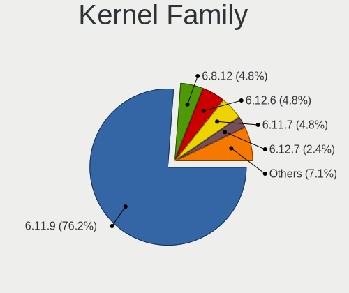

| Version | Computers | Percent |
|---------|-----------|---------|
| 6.3.7   | 14        | 33.33%  |
| 6.3.5   | 11        | 26.19%  |
| 6.2.12  | 4         | 9.52%   |
| 6.3.9   | 3         | 7.14%   |
| 6.3.10  | 3         | 7.14%   |
| 6.2.14  | 3         | 7.14%   |
| 6.4.0   | 1         | 2.38%   |
| 6.3.4   | 1         | 2.38%   |
| 6.1.4   | 1         | 2.38%   |
| 6.0.14  | 1         | 2.38%   |

Kernel Major Ver.
-----------------

Linux kernel major version

| Version | Computers | Percent |
|---------|-----------|---------|
| 6.3     | 32        | 76.19%  |
| 6.2     | 7         | 16.67%  |
| 6.4     | 1         | 2.38%   |
| 6.1     | 1         | 2.38%   |
| 6.0     | 1         | 2.38%   |

Arch
----

OS architecture (x86_64, i586, etc.)

| Name   | Computers | Percent |
|--------|-----------|---------|
| x86_64 | 42        | 100%    |

DE
--

Desktop Environment

| Name          | Computers | Percent |
|---------------|-----------|---------|
| GNOME         | 26        | 61.9%   |
| KDE5          | 14        | 33.33%  |
| GNOME Classic | 1         | 2.38%   |
| Unknown       | 1         | 2.38%   |

Display Server
--------------

X11 or Wayland

| Name    | Computers | Percent |
|---------|-----------|---------|
| Wayland | 33        | 78.57%  |
| X11     | 9         | 21.43%  |

Display Manager
---------------

SDDM, LightDM, etc.

| Name    | Computers | Percent |
|---------|-----------|---------|
| Unknown | 29        | 69.05%  |
| GDM     | 8         | 19.05%  |
| SDDM    | 5         | 11.9%   |

OS Lang
-------

Language

| Lang    | Computers | Percent |
|---------|-----------|---------|
| en_US   | 27        | 64.29%  |
| en_GB   | 3         | 7.14%   |
| de_DE   | 2         | 4.76%   |
| ro_RO   | 1         | 2.38%   |
| pt_PT   | 1         | 2.38%   |
| nl_BE   | 1         | 2.38%   |
| fr_FR   | 1         | 2.38%   |
| fr_BE   | 1         | 2.38%   |
| es_CL   | 1         | 2.38%   |
| en_SG   | 1         | 2.38%   |
| en_NZ   | 1         | 2.38%   |
| en_CA   | 1         | 2.38%   |
| Unknown | 1         | 2.38%   |

Boot Mode
---------

EFI or BIOS

| Mode | Computers | Percent |
|------|-----------|---------|
| EFI  | 39        | 92.86%  |
| BIOS | 3         | 7.14%   |

Filesystem
----------

Type of filesystem

| Type  | Computers | Percent |
|-------|-----------|---------|
| Btrfs | 38        | 90.48%  |
| Ext4  | 4         | 9.52%   |

Part. scheme
------------

Scheme of partitioning

| Type    | Computers | Percent |
|---------|-----------|---------|
| Unknown | 28        | 66.67%  |
| GPT     | 14        | 33.33%  |

Dual Boot with Linux/BSD
------------------------

Hosting more than one Linux/BSD

| Dual boot | Computers | Percent |
|-----------|-----------|---------|
| No        | 37        | 88.1%   |
| Yes       | 5         | 11.9%   |

Dual Boot (Win)
---------------

Hosting Linux and Windows

| Dual boot | Computers | Percent |
|-----------|-----------|---------|
| No        | 38        | 90.48%  |
| Yes       | 4         | 9.52%   |

Board
-----

Vendor
------

Motherboard manufacturer

| Name                | Computers | Percent |
|---------------------|-----------|---------|
| MSI                 | 8         | 19.05%  |
| Lenovo              | 7         | 16.67%  |
| ASUSTek Computer    | 7         | 16.67%  |
| ASRock              | 6         | 14.29%  |
| Hewlett-Packard     | 3         | 7.14%   |
| Gigabyte Technology | 2         | 4.76%   |
| Dell                | 2         | 4.76%   |
| Apple               | 2         | 4.76%   |
| Timi                | 1         | 2.38%   |
| Intel               | 1         | 2.38%   |
| Infinix             | 1         | 2.38%   |
| Google              | 1         | 2.38%   |
| AOpen               | 1         | 2.38%   |

Model
-----

Motherboard model

| Name                                             | Computers | Percent |
|--------------------------------------------------|-----------|---------|
| MSI MS-7C37                                      | 2         | 4.76%   |
| Timi A30                                         | 1         | 2.38%   |
| MSI MS-7D32                                      | 1         | 2.38%   |
| MSI MS-7C94                                      | 1         | 2.38%   |
| MSI MS-7B85                                      | 1         | 2.38%   |
| MSI MS-7817                                      | 1         | 2.38%   |
| MSI GT70 2OC/2OD                                 | 1         | 2.38%   |
| MSI GE75 Raider 10SE                             | 1         | 2.38%   |
| Lenovo ThinkPad A485 20MU000TUS                  | 1         | 2.38%   |
| Lenovo ThinkCentre M715q 10M30008US              | 1         | 2.38%   |
| Lenovo ThinkCentre M700 10J0A0GGCS               | 1         | 2.38%   |
| Lenovo Legion 5 15ARH05H 82B1                    | 1         | 2.38%   |
| Lenovo IdeaPadFlex 5 14ITL05 82HS                | 1         | 2.38%   |
| Lenovo IdeaPad 5 15ITL05 82FG                    | 1         | 2.38%   |
| Lenovo G50-80 80L0                               | 1         | 2.38%   |
| Intel NUC11PHi7                                  | 1         | 2.38%   |
| Infinix INBook X1 Pro                            | 1         | 2.38%   |
| HP ProBook 650 G1                                | 1         | 2.38%   |
| HP EliteDesk 800 G2 SFF                          | 1         | 2.38%   |
| HP Elite x360 1040 14 inch G9 2-in-1 Notebook PC | 1         | 2.38%   |
| Google Blooglet                                  | 1         | 2.38%   |
| Gigabyte X570 AORUS PRO                          | 1         | 2.38%   |
| Gigabyte B550 AORUS ELITE V2                     | 1         | 2.38%   |
| Dell Precision 7510                              | 1         | 2.38%   |
| Dell Inspiron 14 7420 2-in-1                     | 1         | 2.38%   |
| ASUS X550JK                                      | 1         | 2.38%   |
| ASUS ROG STRIX Z590-E GAMING WIFI                | 1         | 2.38%   |
| ASUS ROG Strix G533ZW_G533ZW                     | 1         | 2.38%   |
| ASUS ROG Strix G512LW_G512LW                     | 1         | 2.38%   |
| ASUS ROG CROSSHAIR X670E GENE                    | 1         | 2.38%   |
| ASUS ROG CROSSHAIR VII HERO                      | 1         | 2.38%   |
| ASUS PRIME B760M-A WIFI D4                       | 1         | 2.38%   |
| ASRock Z370 Gaming-ITX/ac                        | 1         | 2.38%   |
| ASRock X470 Master SLI                           | 1         | 2.38%   |
| ASRock FM2A68M-DG3+                              | 1         | 2.38%   |
| ASRock B85M Pro4                                 | 1         | 2.38%   |
| ASRock B650E Steel Legend WiFi                   | 1         | 2.38%   |
| ASRock B450 Steel Legend                         | 1         | 2.38%   |
| Apple MacBookPro8,3                              | 1         | 2.38%   |
| Apple iMac18,3                                   | 1         | 2.38%   |

Model Family
------------

Motherboard model prefix

| Name                | Computers | Percent |
|---------------------|-----------|---------|
| ASUS ROG            | 5         | 11.9%   |
| MSI MS-7C37         | 2         | 4.76%   |
| Lenovo ThinkCentre  | 2         | 4.76%   |
| Timi A30            | 1         | 2.38%   |
| MSI MS-7D32         | 1         | 2.38%   |
| MSI MS-7C94         | 1         | 2.38%   |
| MSI MS-7B85         | 1         | 2.38%   |
| MSI MS-7817         | 1         | 2.38%   |
| MSI GT70            | 1         | 2.38%   |
| MSI GE75            | 1         | 2.38%   |
| Lenovo ThinkPad     | 1         | 2.38%   |
| Lenovo Legion       | 1         | 2.38%   |
| Lenovo IdeaPadFlex  | 1         | 2.38%   |
| Lenovo IdeaPad      | 1         | 2.38%   |
| Lenovo G50-80       | 1         | 2.38%   |
| Intel NUC11PHi7     | 1         | 2.38%   |
| Infinix INBook      | 1         | 2.38%   |
| HP ProBook          | 1         | 2.38%   |
| HP EliteDesk        | 1         | 2.38%   |
| HP Elite            | 1         | 2.38%   |
| Google Blooglet     | 1         | 2.38%   |
| Gigabyte X570       | 1         | 2.38%   |
| Gigabyte B550       | 1         | 2.38%   |
| Dell Precision      | 1         | 2.38%   |
| Dell Inspiron       | 1         | 2.38%   |
| ASUS X550JK         | 1         | 2.38%   |
| ASUS PRIME          | 1         | 2.38%   |
| ASRock Z370         | 1         | 2.38%   |
| ASRock X470         | 1         | 2.38%   |
| ASRock FM2A68M-DG3+ | 1         | 2.38%   |
| ASRock B85M         | 1         | 2.38%   |
| ASRock B650E        | 1         | 2.38%   |
| ASRock B450         | 1         | 2.38%   |
| Apple MacBookPro8   | 1         | 2.38%   |
| Apple iMac18        | 1         | 2.38%   |
| AOpen DEX5350       | 1         | 2.38%   |

MFG Year
--------

Motherboard manufacture year

| Year | Computers | Percent |
|------|-----------|---------|
| 2020 | 8         | 19.05%  |
| 2021 | 5         | 11.9%   |
| 2019 | 5         | 11.9%   |
| 2015 | 5         | 11.9%   |
| 2023 | 4         | 9.52%   |
| 2022 | 4         | 9.52%   |
| 2018 | 3         | 7.14%   |
| 2013 | 3         | 7.14%   |
| 2017 | 2         | 4.76%   |
| 2014 | 2         | 4.76%   |
| 2016 | 1         | 2.38%   |

Form Factor
-----------

Physical design of the computer

| Name        | Computers | Percent |
|-------------|-----------|---------|
| Desktop     | 21        | 50%     |
| Notebook    | 15        | 35.71%  |
| Convertible | 3         | 7.14%   |
| Mini pc     | 2         | 4.76%   |
| All in one  | 1         | 2.38%   |

Secure Boot
-----------

Enabled or disabled

| State    | Computers | Percent |
|----------|-----------|---------|
| Disabled | 42        | 100%    |

Coreboot
--------

Have coreboot on board

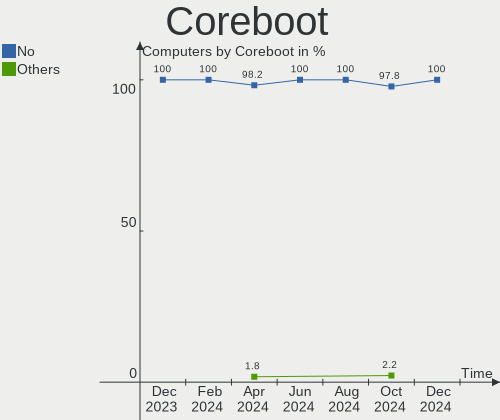

| Used | Computers | Percent |
|------|-----------|---------|
| No   | 41        | 97.62%  |
| Yes  | 1         | 2.38%   |

RAM Size
--------

Total RAM memory

| Size in GB  | Computers | Percent |
|-------------|-----------|---------|
| 32.01-64.0  | 14        | 33.33%  |
| 4.01-8.0    | 10        | 23.81%  |
| 16.01-24.0  | 9         | 21.43%  |
| 8.01-16.0   | 4         | 9.52%   |
| 64.01-256.0 | 3         | 7.14%   |
| 3.01-4.0    | 2         | 4.76%   |

RAM Used
--------

Used RAM memory

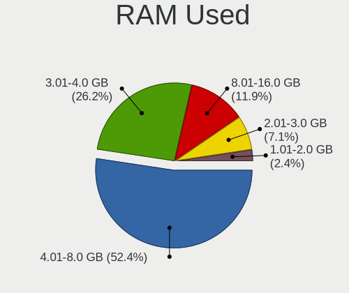

| Used GB    | Computers | Percent |
|------------|-----------|---------|
| 4.01-8.0   | 18        | 42.86%  |
| 8.01-16.0  | 10        | 23.81%  |
| 3.01-4.0   | 7         | 16.67%  |
| 2.01-3.0   | 4         | 9.52%   |
| 16.01-24.0 | 2         | 4.76%   |
| 1.01-2.0   | 1         | 2.38%   |

Total Drives
------------

Number of drives on board

| Drives | Computers | Percent |
|--------|-----------|---------|
| 1      | 16        | 38.1%   |
| 2      | 12        | 28.57%  |
| 3      | 8         | 19.05%  |
| 5      | 3         | 7.14%   |
| 8      | 1         | 2.38%   |
| 7      | 1         | 2.38%   |
| 4      | 1         | 2.38%   |

Has CD-ROM
----------

Has CD-ROM on board

| Presented | Computers | Percent |
|-----------|-----------|---------|
| No        | 34        | 80.95%  |
| Yes       | 8         | 19.05%  |

Has Ethernet
------------

Has Ethernet on board

| Presented | Computers | Percent |
|-----------|-----------|---------|
| Yes       | 36        | 85.71%  |
| No        | 6         | 14.29%  |

Has WiFi
--------

Has WiFi module

| Presented | Computers | Percent |
|-----------|-----------|---------|
| Yes       | 34        | 80.95%  |
| No        | 8         | 19.05%  |

Has Bluetooth
-------------

Has Bluetooth module

| Presented | Computers | Percent |
|-----------|-----------|---------|
| Yes       | 34        | 80.95%  |
| No        | 8         | 19.05%  |

Location
--------

Country
-------

Geographic location (country)

| Country     | Computers | Percent |
|-------------|-----------|---------|
| USA         | 18        | 42.86%  |
| Netherlands | 2         | 4.76%   |
| Germany     | 2         | 4.76%   |
| Belgium     | 2         | 4.76%   |
| Australia   | 2         | 4.76%   |
| UK          | 1         | 2.38%   |
| Turkey      | 1         | 2.38%   |
| Tunisia     | 1         | 2.38%   |
| Thailand    | 1         | 2.38%   |
| Singapore   | 1         | 2.38%   |
| Russia      | 1         | 2.38%   |
| Romania     | 1         | 2.38%   |
| Portugal    | 1         | 2.38%   |
| Poland      | 1         | 2.38%   |
| New Zealand | 1         | 2.38%   |
| Indonesia   | 1         | 2.38%   |
| Greece      | 1         | 2.38%   |
| France      | 1         | 2.38%   |
| Finland     | 1         | 2.38%   |
| Chile       | 1         | 2.38%   |
| Canada      | 1         | 2.38%   |

City
----

Geographic location (city)

| City          | Computers | Percent |
|---------------|-----------|---------|
| Austin        | 2         | 4.76%   |
| Wellington    | 1         | 2.38%   |
| Warsaw        | 1         | 2.38%   |
| Tucson        | 1         | 2.38%   |
| Torres Novas  | 1         | 2.38%   |
| Sydney        | 1         | 2.38%   |
| Surat Thani   | 1         | 2.38%   |
| Singapore     | 1         | 2.38%   |
| Seattle       | 1         | 2.38%   |
| San Francisco | 1         | 2.38%   |
| Roseville     | 1         | 2.38%   |
| Pottstown     | 1         | 2.38%   |
| Port Montt    | 1         | 2.38%   |
| Piteşti      | 1         | 2.38%   |
| Oulu          | 1         | 2.38%   |
| Omaha         | 1         | 2.38%   |
| Naples        | 1         | 2.38%   |
| Nabeul        | 1         | 2.38%   |
| Mons          | 1         | 2.38%   |
| Melbourne     | 1         | 2.38%   |
| Marousi       | 1         | 2.38%   |
| Lynn          | 1         | 2.38%   |
| Lexington     | 1         | 2.38%   |
| Las Vegas     | 1         | 2.38%   |
| Kazan’      | 1         | 2.38%   |
| Jakarta       | 1         | 2.38%   |
| Istres        | 1         | 2.38%   |
| Herten        | 1         | 2.38%   |
| Everett       | 1         | 2.38%   |
| Elk Mound     | 1         | 2.38%   |
| El Paso       | 1         | 2.38%   |
| Edmonton      | 1         | 2.38%   |
| Edison        | 1         | 2.38%   |
| Dexter        | 1         | 2.38%   |
| Cardiff       | 1         | 2.38%   |
| Bursa         | 1         | 2.38%   |
| Berlin        | 1         | 2.38%   |
| Bad Wildbad   | 1         | 2.38%   |
| Antwerp       | 1         | 2.38%   |
| Amsterdam     | 1         | 2.38%   |

Drives
------

Drive Vendor
------------

Hard drive vendors

| Vendor                      | Computers | Drives | Percent |
|-----------------------------|-----------|--------|---------|
| Samsung Electronics         | 16        | 27     | 18.82%  |
| Sandisk                     | 8         | 10     | 9.41%   |
| WDC                         | 7         | 7      | 8.24%   |
| Crucial                     | 6         | 6      | 7.06%   |
| Toshiba                     | 5         | 5      | 5.88%   |
| Seagate                     | 5         | 6      | 5.88%   |
| Kingston                    | 5         | 5      | 5.88%   |
| SK hynix                    | 4         | 4      | 4.71%   |
| Phison Electronics          | 4         | 4      | 4.71%   |
| Micron/Crucial Technology   | 4         | 4      | 4.71%   |
| Kingston Technology Company | 4         | 4      | 4.71%   |
| Intel                       | 2         | 2      | 2.35%   |
| Vecto                       | 1         | 1      | 1.18%   |
| Unknown                     | 1         | 1      | 1.18%   |
| Team                        | 1         | 1      | 1.18%   |
| SPCC                        | 1         | 1      | 1.18%   |
| SCY                         | 1         | 1      | 1.18%   |
| Realtek Semiconductor       | 1         | 1      | 1.18%   |
| PNY                         | 1         | 1      | 1.18%   |
| OCZ                         | 1         | 1      | 1.18%   |
| Netac                       | 1         | 1      | 1.18%   |
| Micron Technology           | 1         | 1      | 1.18%   |
| HS-SSD-C100                 | 1         | 1      | 1.18%   |
| HGST                        | 1         | 1      | 1.18%   |
| GOODRAM                     | 1         | 1      | 1.18%   |
| Apple                       | 1         | 1      | 1.18%   |
| A-DATA Technology           | 1         | 1      | 1.18%   |

Drive Model
-----------

Hard drive models

| Model                                               | Computers | Percent |
|-----------------------------------------------------|-----------|---------|
| Samsung SSD 850 EVO 500GB                           | 3         | 3.13%   |
| Samsung NVMe SSD Controller SM981/PM981/PM983 250GB | 3         | 3.13%   |
| Phison E12 NVMe Controller 1TB                      | 3         | 3.13%   |
| Micron/Crucial P2 NVMe PCIe SSD 4TB                 | 3         | 3.13%   |
| WDC WD10EZEX-00BN5A0 1TB                            | 2         | 2.08%   |
| Sandisk WD Blue SN570 500GB                         | 2         | 2.08%   |
| Samsung SSD 850 EVO 250GB                           | 2         | 2.08%   |
| Samsung NVMe SSD Controller PM9A1/PM9A3/980PRO 2TB  | 2         | 2.08%   |
| Kingston SA400S37480G 480GB SSD                     | 2         | 2.08%   |
| WDC WD5000AAVS-00ZTB0 500GB                         | 1         | 1.04%   |
| WDC WD30EZRX-00DC0B0 3TB                            | 1         | 1.04%   |
| WDC WD10JPCX-24UE4T0 1TB                            | 1         | 1.04%   |
| WDC WD10EURS-630AB1 1TB                             | 1         | 1.04%   |
| WDC WD10EADS-00M2B0 1TB                             | 1         | 1.04%   |
| Vecto Tech 4TB                                      | 1         | 1.04%   |
| Unknown MMC Card  64GB                              | 1         | 1.04%   |
| Toshiba TR150 240GB SSD                             | 1         | 1.04%   |
| Toshiba MK5076GSX 500GB                             | 1         | 1.04%   |
| Toshiba MD04ACA400 4TB                              | 1         | 1.04%   |
| Toshiba HDWG480 8TB                                 | 1         | 1.04%   |
| Toshiba DT01ACA200 2TB                              | 1         | 1.04%   |
| Team T253X1480G 480GB SSD                           | 1         | 1.04%   |
| SPCC Solid State Disk 128GB                         | 1         | 1.04%   |
| SK hynix SKHynix_HFS512GD9TNI-L2A0B 512GB           | 1         | 1.04%   |
| SK hynix PC300 NVMe Solid State Drive 512GB         | 1         | 1.04%   |
| SK hynix HFM001TD3JX013N 1TB                        | 1         | 1.04%   |
| SK hynix BC711 NVMe 512GB                           | 1         | 1.04%   |
| Seagate ST500LT012-1DG142 500GB                     | 1         | 1.04%   |
| Seagate ST500LM021-1KJ152 500GB                     | 1         | 1.04%   |
| Seagate ST4000DM004-2U9104 4TB                      | 1         | 1.04%   |
| Seagate ST4000DM004-2CV104 4TB                      | 1         | 1.04%   |
| Seagate ST2000DL003-9VT166 2TB                      | 1         | 1.04%   |
| Seagate ST1000LM035-1RK172 1TB                      | 1         | 1.04%   |
| SCY N10C 256GB                                      | 1         | 1.04%   |
| Sandisk WD_BLACK SN850X 1000GB                      | 1         | 1.04%   |
| Sandisk WDC PC SN530 SDBPMPZ-256G-1101 256GB        | 1         | 1.04%   |
| Sandisk WD Green SN350 1TB                          | 1         | 1.04%   |
| Sandisk WD Blue SN570 2TB                           | 1         | 1.04%   |
| Sandisk WD Blue SN550 NVMe SSD 1TB                  | 1         | 1.04%   |
| Sandisk WD Black SN850 1TB                          | 1         | 1.04%   |

HDD Vendor
----------

Hard disk drive vendors

| Vendor              | Computers | Drives | Percent |
|---------------------|-----------|--------|---------|
| WDC                 | 7         | 7      | 35%     |
| Seagate             | 5         | 6      | 25%     |
| Toshiba             | 4         | 4      | 20%     |
| Samsung Electronics | 2         | 3      | 10%     |
| HGST                | 1         | 1      | 5%      |
| Apple               | 1         | 1      | 5%      |

SSD Vendor
----------

Solid state drive vendors

| Vendor              | Computers | Drives | Percent |
|---------------------|-----------|--------|---------|
| Samsung Electronics | 10        | 14     | 34.48%  |
| Crucial             | 6         | 6      | 20.69%  |
| Kingston            | 4         | 4      | 13.79%  |
| Toshiba             | 1         | 1      | 3.45%   |
| Team                | 1         | 1      | 3.45%   |
| SPCC                | 1         | 1      | 3.45%   |
| SanDisk             | 1         | 1      | 3.45%   |
| PNY                 | 1         | 1      | 3.45%   |
| OCZ                 | 1         | 1      | 3.45%   |
| Intel               | 1         | 1      | 3.45%   |
| GOODRAM             | 1         | 1      | 3.45%   |
| A-DATA Technology   | 1         | 1      | 3.45%   |

Drive Kind
----------

HDD or SSD

| Kind    | Computers | Drives | Percent |
|---------|-----------|--------|---------|
| NVMe    | 30        | 40     | 42.25%  |
| SSD     | 21        | 33     | 29.58%  |
| HDD     | 16        | 22     | 22.54%  |
| Unknown | 3         | 3      | 4.23%   |
| MMC     | 1         | 1      | 1.41%   |

Drive Connector
---------------

SATA, SAS, NVMe, etc.

| Type | Computers | Drives | Percent |
|------|-----------|--------|---------|
| NVMe | 30        | 40     | 50.85%  |
| SATA | 26        | 56     | 44.07%  |
| SAS  | 2         | 2      | 3.39%   |
| MMC  | 1         | 1      | 1.69%   |

Drive Size
----------

Size of hard drive

| Size in TB | Computers | Drives | Percent |
|------------|-----------|--------|---------|
| 0.01-0.5   | 18        | 25     | 42.86%  |
| 0.51-1.0   | 13        | 17     | 30.95%  |
| 1.01-2.0   | 5         | 6      | 11.9%   |
| 3.01-4.0   | 3         | 4      | 7.14%   |
| 4.01-10.0  | 2         | 2      | 4.76%   |
| 2.01-3.0   | 1         | 1      | 2.38%   |

Space Total
-----------

Amount of disk space available on the file system

| Size in GB     | Computers | Percent |
|----------------|-----------|---------|
| 501-1000       | 12        | 28.57%  |
| More than 3000 | 11        | 26.19%  |
| 1001-2000      | 6         | 14.29%  |
| 251-500        | 4         | 9.52%   |
| 21-50          | 2         | 4.76%   |
| 2001-3000      | 2         | 4.76%   |
| 101-250        | 2         | 4.76%   |
| Unknown        | 2         | 4.76%   |
| 51-100         | 1         | 2.38%   |

Space Used
----------

Amount of used disk space

| Used GB        | Computers | Percent |
|----------------|-----------|---------|
| 21-50          | 10        | 23.81%  |
| 101-250        | 5         | 11.9%   |
| 1-20           | 5         | 11.9%   |
| 501-1000       | 5         | 11.9%   |
| 2001-3000      | 4         | 9.52%   |
| 1001-2000      | 4         | 9.52%   |
| 51-100         | 3         | 7.14%   |
| More than 3000 | 2         | 4.76%   |
| 251-500        | 2         | 4.76%   |
| Unknown        | 2         | 4.76%   |

Malfunc. Drives
---------------

Drive models with a malfunction

| Model                    | Computers | Drives | Percent |
|--------------------------|-----------|--------|---------|
| WDC WD30EZRX-00DC0B0 3TB | 1         | 1      | 100%    |

Malfunc. Drive Vendor
---------------------

Vendors of faulty drives

| Vendor | Computers | Drives | Percent |
|--------|-----------|--------|---------|
| WDC    | 1         | 1      | 100%    |

Malfunc. HDD Vendor
-------------------

Vendors of faulty HDD drives

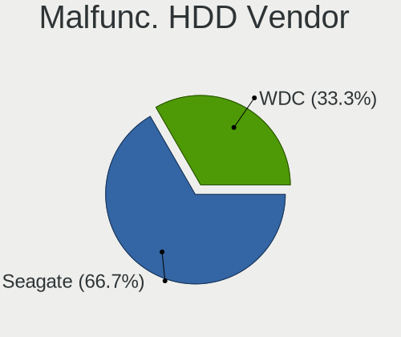

| Vendor | Computers | Drives | Percent |
|--------|-----------|--------|---------|
| WDC    | 1         | 1      | 100%    |

Malfunc. Drive Kind
-------------------

Kinds of faulty drives

| Kind | Computers | Drives | Percent |
|------|-----------|--------|---------|
| HDD  | 1         | 1      | 100%    |

Failed Drives
-------------

Failed drive models

Zero info for selected period =(

Failed Drive Vendor
-------------------

Failed drive vendors

Zero info for selected period =(

Drive Status
------------

Number of failed and malfunc. drives

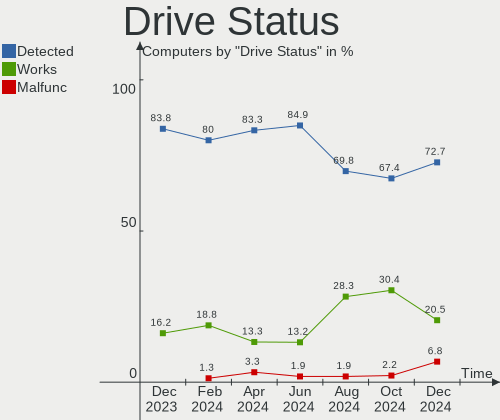

| Status   | Computers | Drives | Percent |
|----------|-----------|--------|---------|
| Detected | 29        | 74     | 65.91%  |
| Works    | 14        | 24     | 31.82%  |
| Malfunc  | 1         | 1      | 2.27%   |

Storage controller
------------------

Storage Vendor
--------------

Storage controller vendors

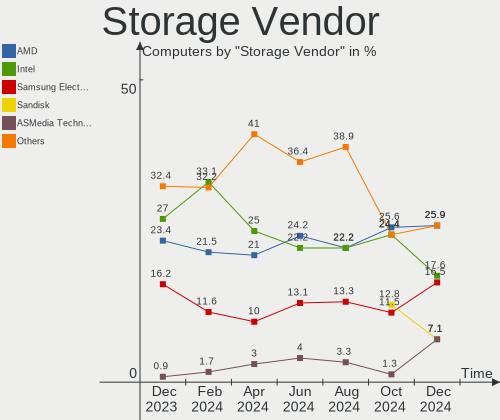

| Vendor                      | Computers | Percent |
|-----------------------------|-----------|---------|
| Intel                       | 22        | 28.95%  |
| AMD                         | 15        | 19.74%  |
| SanDisk                     | 8         | 10.53%  |
| Samsung Electronics         | 8         | 10.53%  |
| Kingston Technology Company | 5         | 6.58%   |
| SK hynix                    | 4         | 5.26%   |
| Phison Electronics          | 4         | 5.26%   |
| Micron/Crucial Technology   | 4         | 5.26%   |
| ASMedia Technology          | 3         | 3.95%   |
| Realtek Semiconductor       | 1         | 1.32%   |
| Netac Technology            | 1         | 1.32%   |
| Micron Technology           | 1         | 1.32%   |

Storage Model
-------------

Storage controller models

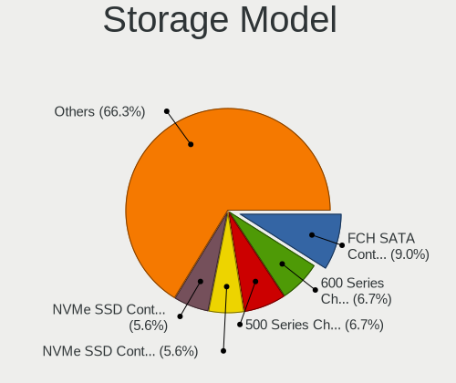

| Model                                                                          | Computers | Percent |
|--------------------------------------------------------------------------------|-----------|---------|
| AMD FCH SATA Controller [AHCI mode]                                            | 11        | 13.41%  |
| Intel 8 Series/C220 Series Chipset Family 6-port SATA Controller 1 [AHCI mode] | 5         | 6.1%    |
| Intel Volume Management Device NVMe RAID Controller                            | 4         | 4.88%   |
| AMD 400 Series Chipset SATA Controller                                         | 4         | 4.88%   |
| Samsung NVMe SSD Controller SM981/PM981/PM983                                  | 3         | 3.66%   |
| Phison E12 NVMe Controller                                                     | 3         | 3.66%   |
| Micron/Crucial P2 NVMe PCIe SSD                                                | 3         | 3.66%   |
| Intel Q170/Q150/B150/H170/H110/Z170/CM236 Chipset SATA Controller [AHCI Mode]  | 3         | 3.66%   |
| ASMedia ASM1062 Serial ATA Controller                                          | 3         | 3.66%   |
| SK hynix Gold P31/BC711/PC711 NVMe Solid State Drive                           | 2         | 2.44%   |
| SanDisk WD Blue SN570 NVMe SSD 1TB                                             | 2         | 2.44%   |
| Samsung NVMe SSD Controller PM9A1/PM9A3/980PRO                                 | 2         | 2.44%   |
| Samsung NVMe SSD Controller 980                                                | 2         | 2.44%   |
| Kingston Company FURY Renegade NVMe SSD                                        | 2         | 2.44%   |
| Intel Tiger Lake-LP SATA Controller                                            | 2         | 2.44%   |
| AMD 500 Series Chipset SATA Controller                                         | 2         | 2.44%   |
| SK hynix PC611 NVMe Solid State Drive                                          | 1         | 1.22%   |
| SK hynix PC300 NVMe Solid State Drive 512GB                                    | 1         | 1.22%   |
| Sandisk Western Digital WD Black SN850X NVMe SSD                               | 1         | 1.22%   |
| SanDisk WD PC SN810 / Black SN850 NVMe SSD                                     | 1         | 1.22%   |
| SanDisk WD Blue SN570 NVMe SSD 2TB                                             | 1         | 1.22%   |
| SanDisk WD Blue SN550 NVMe SSD                                                 | 1         | 1.22%   |
| SanDisk WD Black SN750 / PC SN730 NVMe SSD                                     | 1         | 1.22%   |
| SanDisk PC SN530 NVMe SSD                                                      | 1         | 1.22%   |
| SanDisk Non-Volatile memory controller                                         | 1         | 1.22%   |
| Samsung Surface NVMe Controller                                                | 1         | 1.22%   |
| Samsung NVMe SSD Controller SM961/PM961/SM963                                  | 1         | 1.22%   |
| Realtek RTS5763DL NVMe SSD Controller                                          | 1         | 1.22%   |
| Phison PS5013 E13 NVMe Controller                                              | 1         | 1.22%   |
| Netac Non-Volatile memory controller                                           | 1         | 1.22%   |
| Micron/Crucial P1 NVMe PCIe SSD                                                | 1         | 1.22%   |
| Micron NVMe Storage Controller                                                 | 1         | 1.22%   |
| Kingston Company U-SNS8154P3 NVMe SSD                                          | 1         | 1.22%   |
| Kingston Company Company Non-Volatile memory controller                        | 1         | 1.22%   |
| Kingston Company A2000 NVMe SSD                                                | 1         | 1.22%   |
| Intel Wildcat Point-LP SATA Controller [AHCI Mode]                             | 1         | 1.22%   |
| Intel SSD 660P Series                                                          | 1         | 1.22%   |
| Intel SATA Controller [RAID mode]                                              | 1         | 1.22%   |
| Intel Alder Lake-S PCH SATA Controller [AHCI Mode]                             | 1         | 1.22%   |
| Intel 8 Series SATA Controller 1 [AHCI mode]                                   | 1         | 1.22%   |

Storage Kind
------------

Kind of storage controller (IDE, SATA, NVMe, SAS, ...)

| Kind | Computers | Percent |
|------|-----------|---------|
| SATA | 33        | 48.53%  |
| NVMe | 30        | 44.12%  |
| RAID | 5         | 7.35%   |

Processor
---------

CPU Vendor
----------

Processor vendors

| Vendor | Computers | Percent |
|--------|-----------|---------|
| Intel  | 27        | 64.29%  |
| AMD    | 15        | 35.71%  |

CPU Model
---------

Processor models

| Model                                           | Computers | Percent |
|-------------------------------------------------|-----------|---------|
| Intel Core i7-10750H CPU @ 2.60GHz              | 2         | 4.76%   |
| Intel 11th Gen Core i7-1165G7 @ 2.80GHz         | 2         | 4.76%   |
| AMD Ryzen 7 5800X 8-Core Processor              | 2         | 4.76%   |
| AMD Ryzen 7 3700X 8-Core Processor              | 2         | 4.76%   |
| Intel Core i7-6820HQ CPU @ 2.70GHz              | 1         | 2.38%   |
| Intel Core i7-4790 CPU @ 3.60GHz                | 1         | 2.38%   |
| Intel Core i7-4710HQ CPU @ 2.50GHz              | 1         | 2.38%   |
| Intel Core i7-4700MQ CPU @ 2.40GHz              | 1         | 2.38%   |
| Intel Core i7-2720QM CPU @ 2.20GHz              | 1         | 2.38%   |
| Intel Core i7-1065G7 CPU @ 1.30GHz              | 1         | 2.38%   |
| Intel Core i5-8600K CPU @ 3.60GHz               | 1         | 2.38%   |
| Intel Core i5-7500 CPU @ 3.40GHz                | 1         | 2.38%   |
| Intel Core i5-6500 CPU @ 3.20GHz                | 1         | 2.38%   |
| Intel Core i5-4690 CPU @ 3.50GHz                | 1         | 2.38%   |
| Intel Core i3-6100T CPU @ 3.20GHz               | 1         | 2.38%   |
| Intel Core i3-5010U CPU @ 2.10GHz               | 1         | 2.38%   |
| Intel Core i3-4030U CPU @ 1.90GHz               | 1         | 2.38%   |
| Intel Core i3-4000M CPU @ 2.40GHz               | 1         | 2.38%   |
| Intel Celeron N4020 CPU @ 1.10GHz               | 1         | 2.38%   |
| Intel 13th Gen Core i5-13400F                   | 1         | 2.38%   |
| Intel 12th Gen Core i9-12900H                   | 1         | 2.38%   |
| Intel 12th Gen Core i7-12700K                   | 1         | 2.38%   |
| Intel 12th Gen Core i7-1265U                    | 1         | 2.38%   |
| Intel 12th Gen Core i5-1235U                    | 1         | 2.38%   |
| Intel 11th Gen Core i7-11700KF @ 3.60GHz        | 1         | 2.38%   |
| Intel 11th Gen Core i7-11370H @ 3.30GHz         | 1         | 2.38%   |
| Intel 11th Gen Core i3-1115G4 @ 3.00GHz         | 1         | 2.38%   |
| AMD Ryzen 9 7950X3D 16-Core Processor           | 1         | 2.38%   |
| AMD Ryzen 9 7950X 16-Core Processor             | 1         | 2.38%   |
| AMD Ryzen 9 5900X 12-Core Processor             | 1         | 2.38%   |
| AMD Ryzen 7 5800X3D 8-Core Processor            | 1         | 2.38%   |
| AMD Ryzen 5 PRO 2500U w/ Radeon Vega Mobile Gfx | 1         | 2.38%   |
| AMD Ryzen 5 5500                                | 1         | 2.38%   |
| AMD Ryzen 5 4600H with Radeon Graphics          | 1         | 2.38%   |
| AMD Ryzen 5 3600X 6-Core Processor              | 1         | 2.38%   |
| AMD Ryzen 5 2600 Six-Core Processor             | 1         | 2.38%   |
| AMD PRO A10-9700E R7, 10 COMPUTE CORES 4C+6G    | 1         | 2.38%   |
| AMD A8-7680 Radeon R7, 10 Compute Cores 4C+6G   | 1         | 2.38%   |

CPU Model Family
----------------

Processor model prefix

| Model           | Computers | Percent |
|-----------------|-----------|---------|
| Other           | 10        | 23.81%  |
| Intel Core i7   | 8         | 19.05%  |
| AMD Ryzen 7     | 5         | 11.9%   |
| Intel Core i5   | 4         | 9.52%   |
| Intel Core i3   | 4         | 9.52%   |
| AMD Ryzen 5     | 4         | 9.52%   |
| AMD Ryzen 9     | 3         | 7.14%   |
| Intel Celeron   | 1         | 2.38%   |
| AMD Ryzen 5 PRO | 1         | 2.38%   |
| AMD PRO A10     | 1         | 2.38%   |
| AMD A8          | 1         | 2.38%   |

CPU Cores
---------

Number of processor cores

| Number | Computers | Percent |
|--------|-----------|---------|
| 4      | 13        | 30.95%  |
| 2      | 8         | 19.05%  |
| 6      | 7         | 16.67%  |
| 8      | 6         | 14.29%  |
| 10     | 3         | 7.14%   |
| 16     | 2         | 4.76%   |
| 12     | 2         | 4.76%   |
| 14     | 1         | 2.38%   |

CPU Sockets
-----------

Number of sockets

| Number | Computers | Percent |
|--------|-----------|---------|
| 1      | 42        | 100%    |

CPU Threads
-----------

Threads per core (Hyper-Threading)

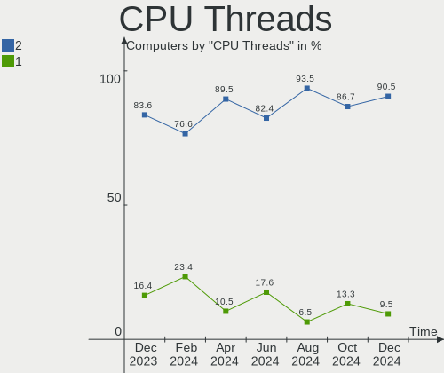

| Number | Computers | Percent |
|--------|-----------|---------|
| 2      | 37        | 88.1%   |
| 1      | 5         | 11.9%   |

CPU Op-Modes
------------

CPU Operation Modes (32-bit, 64-bit)

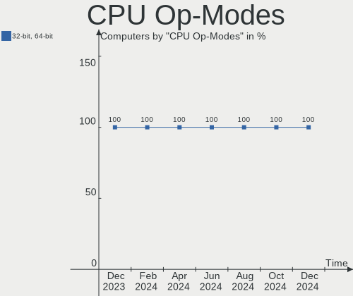

| Op mode        | Computers | Percent |
|----------------|-----------|---------|
| 32-bit, 64-bit | 42        | 100%    |

CPU Microcode
-------------

Microcode number

| Number     | Computers | Percent |
|------------|-----------|---------|
| Unknown    | 27        | 64.29%  |
| 0x0a201016 | 3         | 7.14%   |
| 0x0a601203 | 2         | 4.76%   |
| 0x08701021 | 2         | 4.76%   |
| 0x0600611a | 2         | 4.76%   |
| 0x0a50000d | 1         | 2.38%   |
| 0x0a20120a | 1         | 2.38%   |
| 0x08701013 | 1         | 2.38%   |
| 0x08600104 | 1         | 2.38%   |
| 0x0810100b | 1         | 2.38%   |
| 0x0800820d | 1         | 2.38%   |

CPU Microarch
-------------

Microarchitecture

| Name             | Computers | Percent |
|------------------|-----------|---------|
| Haswell          | 6         | 14.29%  |
| Zen 3            | 5         | 11.9%   |
| Alderlake Hybrid | 5         | 11.9%   |
| Zen 2            | 4         | 9.52%   |
| TigerLake        | 4         | 9.52%   |
| Skylake          | 3         | 7.14%   |
| KabyLake         | 2         | 4.76%   |
| IceLake          | 2         | 4.76%   |
| Excavator        | 2         | 4.76%   |
| CometLake        | 2         | 4.76%   |
| Unknown          | 2         | 4.76%   |
| Zen+             | 1         | 2.38%   |
| Zen              | 1         | 2.38%   |
| SandyBridge      | 1         | 2.38%   |
| Goldmont plus    | 1         | 2.38%   |
| Broadwell        | 1         | 2.38%   |

Graphics
--------

GPU Vendor
----------

Vendors of graphics cards

| Vendor | Computers | Percent |
|--------|-----------|---------|
| Intel  | 20        | 38.46%  |
| AMD    | 18        | 34.62%  |
| Nvidia | 14        | 26.92%  |

GPU Model
---------

Graphics card models

| Model                                                                         | Computers | Percent |
|-------------------------------------------------------------------------------|-----------|---------|
| Nvidia TU106M [GeForce RTX 2060 Mobile]                                       | 3         | 5.45%   |
| Intel TigerLake-LP GT2 [Iris Xe Graphics]                                     | 3         | 5.45%   |
| Intel HD Graphics 530                                                         | 3         | 5.45%   |
| Intel 4th Gen Core Processor Integrated Graphics Controller                   | 3         | 5.45%   |
| AMD Navi 21 [Radeon RX 6800/6800 XT / 6900 XT]                                | 3         | 5.45%   |
| Nvidia GA106 [GeForce RTX 3060 Lite Hash Rate]                                | 2         | 3.64%   |
| Intel CometLake-H GT2 [UHD Graphics]                                          | 2         | 3.64%   |
| Intel Alder Lake-UP3 GT2 [Iris Xe Graphics]                                   | 2         | 3.64%   |
| AMD Wani [Radeon R5/R6/R7 Graphics]                                           | 2         | 3.64%   |
| AMD Raphael                                                                   | 2         | 3.64%   |
| AMD Navi 31 [Radeon RX 7900 XT/7900 XTX]                                      | 2         | 3.64%   |
| AMD Navi 23 [Radeon RX 6650 XT / 6700S / 6800S]                               | 2         | 3.64%   |
| AMD Navi 22 [Radeon RX 6700/6700 XT/6750 XT / 6800M/6850M XT]                 | 2         | 3.64%   |
| AMD Ellesmere [Radeon RX 470/480/570/570X/580/580X/590]                       | 2         | 3.64%   |
| Nvidia TU106M [GeForce RTX 2070 Mobile / Max-Q Refresh]                       | 1         | 1.82%   |
| Nvidia GP102 [GeForce GTX 1080 Ti]                                            | 1         | 1.82%   |
| Nvidia GM204 [GeForce GTX 970]                                                | 1         | 1.82%   |
| Nvidia GM107M [GeForce GTX 850M]                                              | 1         | 1.82%   |
| Nvidia GM107GLM [Quadro M1000M]                                               | 1         | 1.82%   |
| Nvidia GK106M [GeForce GTX 770M]                                              | 1         | 1.82%   |
| Nvidia GA107M [GeForce RTX 3050 Ti Mobile]                                    | 1         | 1.82%   |
| Nvidia GA104 [Geforce RTX 3070 Ti Laptop GPU]                                 | 1         | 1.82%   |
| Nvidia GA102 [GeForce RTX 3080]                                               | 1         | 1.82%   |
| Intel Tiger Lake-LP GT2 [UHD Graphics G4]                                     | 1         | 1.82%   |
| Intel Iris Plus Graphics G7                                                   | 1         | 1.82%   |
| Intel HD Graphics 5500                                                        | 1         | 1.82%   |
| Intel Haswell-ULT Integrated Graphics Controller                              | 1         | 1.82%   |
| Intel GeminiLake [UHD Graphics 600]                                           | 1         | 1.82%   |
| Intel Alder Lake-P Integrated Graphics Controller                             | 1         | 1.82%   |
| Intel 2nd Generation Core Processor Family Integrated Graphics Controller     | 1         | 1.82%   |
| AMD Whistler [Radeon HD 6630M/6650M/6750M/7670M/7690M]                        | 1         | 1.82%   |
| AMD Sun XT [Radeon HD 8670A/8670M/8690M / R5 M330 / M430 / Radeon 520 Mobile] | 1         | 1.82%   |
| AMD Raven Ridge [Radeon Vega Series / Radeon Vega Mobile Series]              | 1         | 1.82%   |
| AMD Polaris 20 XL [Radeon RX 580 2048SP]                                      | 1         | 1.82%   |
| AMD Navi 21 [Radeon RX 6950 XT]                                               | 1         | 1.82%   |
| AMD Hawaii PRO [Radeon R9 290/390]                                            | 1         | 1.82%   |

GPU Combo
---------

Combinations of graphics cards

| Name           | Computers | Percent |
|----------------|-----------|---------|
| 1 x AMD        | 13        | 30.95%  |
| 1 x Intel      | 9         | 21.43%  |
| Intel + Nvidia | 8         | 19.05%  |
| 1 x Nvidia     | 6         | 14.29%  |
| 2 x AMD        | 3         | 7.14%   |
| Intel + AMD    | 2         | 4.76%   |
| Other          | 1         | 2.38%   |

GPU Driver
----------

Free vs proprietary

| Driver      | Computers | Percent |
|-------------|-----------|---------|
| Free        | 28        | 66.67%  |
| Proprietary | 14        | 33.33%  |

GPU Memory
----------

Total video memory

| Size in GB | Computers | Percent |
|------------|-----------|---------|
| Unknown    | 22        | 52.38%  |
| 8.01-16.0  | 7         | 16.67%  |
| 7.01-8.0   | 5         | 11.9%   |
| 0.51-1.0   | 3         | 7.14%   |
| 3.01-4.0   | 2         | 4.76%   |
| 16.01-24.0 | 2         | 4.76%   |
| 1.01-2.0   | 1         | 2.38%   |

Monitor
-------

Monitor Vendor
--------------

Monitor vendors

| Vendor                  | Computers | Percent |
|-------------------------|-----------|---------|
| Samsung Electronics     | 7         | 13.73%  |
| Goldstar                | 4         | 7.84%   |
| Dell                    | 4         | 7.84%   |
| Chimei Innolux          | 4         | 7.84%   |
| Ancor Communications    | 4         | 7.84%   |
| BOE                     | 3         | 5.88%   |
| AU Optronics            | 3         | 5.88%   |
| MSI                     | 2         | 3.92%   |
| Hewlett-Packard         | 2         | 3.92%   |
| Gigabyte Technology     | 2         | 3.92%   |
| Apple                   | 2         | 3.92%   |
| ViewSonic               | 1         | 1.96%   |
| Valve                   | 1         | 1.96%   |
| TMX                     | 1         | 1.96%   |
| Sharp                   | 1         | 1.96%   |
| Sceptre Tech            | 1         | 1.96%   |
| PANDA                   | 1         | 1.96%   |
| Panasonic               | 1         | 1.96%   |
| LG Display              | 1         | 1.96%   |
| Lenovo                  | 1         | 1.96%   |
| Huion                   | 1         | 1.96%   |
| GAOMON                  | 1         | 1.96%   |
| Chi Mei Optoelectronics | 1         | 1.96%   |
| AOC                     | 1         | 1.96%   |
| Acer                    | 1         | 1.96%   |

Monitor Model
-------------

Monitor models

| Model                                                                     | Computers | Percent |
|---------------------------------------------------------------------------|-----------|---------|
| Ancor Communications ROG PG279Q ACI27EC 2560x1440 598x336mm 27.0-inch     | 2         | 3.92%   |
| ViewSonic VA2216w-2 VSC2920 1680x1050 495x291mm 22.6-inch                 | 1         | 1.96%   |
| Valve Index HMD VLV91A8 2880x1600                                         | 1         | 1.96%   |
| TMX TL156VDXP0101 TMX1561 1920x1080 344x194mm 15.5-inch                   | 1         | 1.96%   |
| Sharp LCD Monitor SHP1430 3840x2160 350x190mm 15.7-inch                   | 1         | 1.96%   |
| Sceptre Tech E32 SPT0CB8 1366x768 575x323mm 26.0-inch                     | 1         | 1.96%   |
| Samsung Electronics S19D300 SAM0B34 1366x768 410x230mm 18.5-inch          | 1         | 1.96%   |
| Samsung Electronics LS27AG30x SAM717B 1920x1080 597x336mm 27.0-inch       | 1         | 1.96%   |
| Samsung Electronics LCD Monitor SDC4150 3456x2160 336x210mm 15.6-inch     | 1         | 1.96%   |
| Samsung Electronics LCD Monitor SAM7017 3840x2160 1872x1053mm 84.6-inch   | 1         | 1.96%   |
| Samsung Electronics LCD Monitor SAM0F18 3840x2160 1872x1053mm 84.6-inch   | 1         | 1.96%   |
| Samsung Electronics LC32G5xT SAM7089 2560x1440 698x393mm 31.5-inch        | 1         | 1.96%   |
| Samsung Electronics C49RG9x SAM0F9C 3840x1080 1193x336mm 48.8-inch        | 1         | 1.96%   |
| PANDA LCD Monitor NCP004D 1920x1080 344x194mm 15.5-inch                   | 1         | 1.96%   |
| Panasonic TV MEIA296 3840x2160 698x392mm 31.5-inch                        | 1         | 1.96%   |
| MSI Optix MAG24C MSI1462 1920x1080 521x293mm 23.5-inch                    | 1         | 1.96%   |
| MSI MAG240CR MSI3BA5 1920x1080 520x320mm 24.0-inch                        | 1         | 1.96%   |
| LG Display LCD Monitor LGD060F 1920x1080 309x174mm 14.0-inch              | 1         | 1.96%   |
| Lenovo E20-20 LEN62BB 1440x900 419x262mm 19.5-inch                        | 1         | 1.96%   |
| Huion Kamvas 13 HAT1330 1920x1080 294x165mm 13.3-inch                     | 1         | 1.96%   |
| Hewlett-Packard E190i HWP3117 1280x1024 374x299mm 18.9-inch               | 1         | 1.96%   |
| Hewlett-Packard 2009 HWP2827 1600x900 440x250mm 19.9-inch                 | 1         | 1.96%   |
| Goldstar ULTRAWIDE GSM76E4 3440x1440 800x335mm 34.1-inch                  | 1         | 1.96%   |
| Goldstar ULTRAGEAR GSM5C4D 2560x1440 600x340mm 27.2-inch                  | 1         | 1.96%   |
| Goldstar ULTRAGEAR GSM5BD3 2560x1440 697x392mm 31.5-inch                  | 1         | 1.96%   |
| Goldstar 29EA93 GSM5974 2560x1080 677x290mm 29.0-inch                     | 1         | 1.96%   |
| Gigabyte Technology M27Q GBT270D 2560x1440 596x335mm 26.9-inch            | 1         | 1.96%   |
| Gigabyte Technology G32QC GBT3200 2560x1440 697x392mm 31.5-inch           | 1         | 1.96%   |
| GAOMON PD2200 GAM2200 1920x1080 480x260mm 21.5-inch                       | 1         | 1.96%   |
| Dell U2715H DELD067 2560x1440 600x340mm 27.2-inch                         | 1         | 1.96%   |
| Dell S2722DGM DEL4239 2560x1440 597x336mm 27.0-inch                       | 1         | 1.96%   |
| Dell P2715Q DEL40BD 3840x2160 597x336mm 27.0-inch                         | 1         | 1.96%   |
| Dell P2214H DELA097 1920x1080 477x268mm 21.5-inch                         | 1         | 1.96%   |
| Chimei Innolux LCD Monitor CMN176E 1920x1080 381x214mm 17.2-inch          | 1         | 1.96%   |
| Chimei Innolux LCD Monitor CMN15AB 1366x768 344x193mm 15.5-inch           | 1         | 1.96%   |
| Chimei Innolux LCD Monitor CMN14C9 1920x1080 309x173mm 13.9-inch          | 1         | 1.96%   |
| Chimei Innolux LCD Monitor CMN1406 1920x1080 309x173mm 13.9-inch          | 1         | 1.96%   |
| Chi Mei Optoelectronics LCD Monitor CMO1720 1920x1080 382x215mm 17.3-inch | 1         | 1.96%   |
| BOE LCD Monitor BOE08E8 1920x1080 344x194mm 15.5-inch                     | 1         | 1.96%   |
| BOE LCD Monitor BOE0718 1920x1080 309x173mm 13.9-inch                     | 1         | 1.96%   |

Monitor Resolution
------------------

Monitor screen resolution

| Resolution         | Computers | Percent |
|--------------------|-----------|---------|
| 1920x1080 (FHD)    | 15        | 31.91%  |
| 2560x1440 (QHD)    | 9         | 19.15%  |
| 3840x2160 (4K)     | 6         | 12.77%  |
| 3440x1440          | 3         | 6.38%   |
| 1920x1200 (WUXGA)  | 3         | 6.38%   |
| 1366x768 (WXGA)    | 3         | 6.38%   |
| 3840x1080          | 1         | 2.13%   |
| 3456x2160          | 1         | 2.13%   |
| 2560x1080          | 1         | 2.13%   |
| 1680x1050 (WSXGA+) | 1         | 2.13%   |
| 1600x900 (HD+)     | 1         | 2.13%   |
| 1440x900 (WXGA+)   | 1         | 2.13%   |
| 1280x1024 (SXGA)   | 1         | 2.13%   |
| Unknown            | 1         | 2.13%   |

Monitor Diagonal
----------------

Diagonal size in inches

| Inches  | Computers | Percent |
|---------|-----------|---------|
| 27      | 10        | 20.83%  |
| 15      | 9         | 18.75%  |
| 31      | 4         | 8.33%   |
| 17      | 3         | 6.25%   |
| 14      | 3         | 6.25%   |
| 13      | 3         | 6.25%   |
| 84      | 2         | 4.17%   |
| 34      | 2         | 4.17%   |
| 18      | 2         | 4.17%   |
| 48      | 1         | 2.08%   |
| 35      | 1         | 2.08%   |
| 29      | 1         | 2.08%   |
| 24      | 1         | 2.08%   |
| 23      | 1         | 2.08%   |
| 22      | 1         | 2.08%   |
| 21      | 1         | 2.08%   |
| 20      | 1         | 2.08%   |
| 19      | 1         | 2.08%   |
| Unknown | 1         | 2.08%   |

Monitor Width
-------------

Physical width

| Width in mm | Computers | Percent |
|-------------|-----------|---------|
| 301-350     | 15        | 31.25%  |
| 501-600     | 12        | 25%     |
| 601-700     | 5         | 10.42%  |
| 401-500     | 5         | 10.42%  |
| 351-400     | 4         | 8.33%   |
| 701-800     | 2         | 4.17%   |
| 1501-2000   | 2         | 4.17%   |
| 801-900     | 1         | 2.08%   |
| 1001-1500   | 1         | 2.08%   |
| Unknown     | 1         | 2.08%   |

Aspect Ratio
------------

Proportional relationship between the width and the height

| Ratio   | Computers | Percent |
|---------|-----------|---------|
| 16/9    | 31        | 70.45%  |
| 16/10   | 6         | 13.64%  |
| 21/9    | 4         | 9.09%   |
| 5/4     | 1         | 2.27%   |
| 32/9    | 1         | 2.27%   |
| Unknown | 1         | 2.27%   |

Monitor Area
------------

Area in inch²

| Area in inch² | Computers | Percent |
|----------------|-----------|---------|
| 301-350        | 11        | 22.92%  |
| 101-110        | 8         | 16.67%  |
| 351-500        | 7         | 14.58%  |
| 81-90          | 6         | 12.5%   |
| 151-200        | 4         | 8.33%   |
| More than 1000 | 2         | 4.17%   |
| 201-250        | 2         | 4.17%   |
| 121-130        | 2         | 4.17%   |
| 251-300        | 1         | 2.08%   |
| 141-150        | 1         | 2.08%   |
| 131-140        | 1         | 2.08%   |
| 501-1000       | 1         | 2.08%   |
| 91-100         | 1         | 2.08%   |
| Unknown        | 1         | 2.08%   |

Pixel Density
-------------

Pixels per inch

| Density       | Computers | Percent |
|---------------|-----------|---------|
| 51-100        | 16        | 34.04%  |
| 101-120       | 12        | 25.53%  |
| 121-160       | 11        | 23.4%   |
| 161-240       | 5         | 10.64%  |
| More than 240 | 2         | 4.26%   |
| Unknown       | 1         | 2.13%   |

Multiple Monitors
-----------------

Total monitors connected

| Total | Computers | Percent |
|-------|-----------|---------|
| 1     | 33        | 78.57%  |
| 2     | 7         | 16.67%  |
| 4     | 1         | 2.38%   |
| 3     | 1         | 2.38%   |

Network
-------

Net Controller Vendor
---------------------

Controller vendors

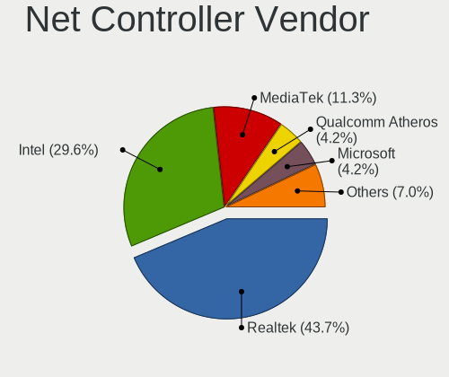

| Vendor                | Computers | Percent |
|-----------------------|-----------|---------|
| Intel                 | 27        | 45.76%  |
| Realtek Semiconductor | 17        | 28.81%  |
| Qualcomm Atheros      | 3         | 5.08%   |
| Broadcom              | 3         | 5.08%   |
| Xiaomi                | 1         | 1.69%   |
| Ralink Technology     | 1         | 1.69%   |
| Ralink                | 1         | 1.69%   |
| NetGear               | 1         | 1.69%   |
| Microsoft             | 1         | 1.69%   |
| MediaTek              | 1         | 1.69%   |
| Lenovo                | 1         | 1.69%   |
| Broadcom Limited      | 1         | 1.69%   |
| ASUSTek Computer      | 1         | 1.69%   |

Net Controller Model
--------------------

Controller models

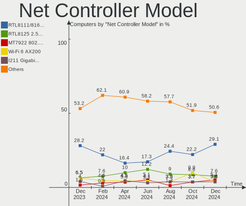

| Model                                                             | Computers | Percent |
|-------------------------------------------------------------------|-----------|---------|
| Realtek RTL8111/8168/8411 PCI Express Gigabit Ethernet Controller | 11        | 15.28%  |
| Realtek RTL8125 2.5GbE Controller                                 | 5         | 6.94%   |
| Intel Wi-Fi 6 AX201                                               | 4         | 5.56%   |
| Intel I211 Gigabit Network Connection                             | 4         | 5.56%   |
| Intel Ethernet Controller I225-V                                  | 3         | 4.17%   |
| Intel Alder Lake-P PCH CNVi WiFi                                  | 3         | 4.17%   |
| Intel Wi-Fi 6 AX210/AX211/AX411 160MHz                            | 2         | 2.78%   |
| Intel Ethernet Connection I217-V                                  | 2         | 2.78%   |
| Intel Ethernet Connection (2) I219-V                              | 2         | 2.78%   |
| Intel Ethernet Connection (2) I219-LM                             | 2         | 2.78%   |
| Intel Comet Lake PCH CNVi WiFi                                    | 2         | 2.78%   |
| Xiaomi Mi/Redmi series (RNDIS)                                    | 1         | 1.39%   |
| Realtek RTL8822CE 802.11ac PCIe Wireless Network Adapter          | 1         | 1.39%   |
| Realtek RTL8822BE 802.11a/b/g/n/ac WiFi adapter                   | 1         | 1.39%   |
| Realtek RTL8192EE PCIe Wireless Network Adapter                   | 1         | 1.39%   |
| Ralink MT7601U Wireless Adapter                                   | 1         | 1.39%   |
| Ralink RT3290 Wireless 802.11n 1T/1R PCIe                         | 1         | 1.39%   |
| Qualcomm Atheros QCA9565 / AR9565 Wireless Network Adapter        | 1         | 1.39%   |
| Qualcomm Atheros Killer E2500 Gigabit Ethernet Controller         | 1         | 1.39%   |
| Qualcomm Atheros Killer E220x Gigabit Ethernet Controller         | 1         | 1.39%   |
| Qualcomm Atheros AR9462 Wireless Network Adapter                  | 1         | 1.39%   |
| NetGear A6210                                                     | 1         | 1.39%   |
| Microsoft Xbox 360 Wireless Adapter                               | 1         | 1.39%   |
| MediaTek MT7921K (RZ608) Wi-Fi 6E 80MHz                           | 1         | 1.39%   |
| Lenovo ThinkPad TBT 3 Dock                                        | 1         | 1.39%   |
| Intel Wireless-AC 9260                                            | 1         | 1.39%   |
| Intel Wireless 8265 / 8275                                        | 1         | 1.39%   |
| Intel Wireless 8260                                               | 1         | 1.39%   |
| Intel Wi-Fi 6 AX200                                               | 1         | 1.39%   |
| Intel Ice Lake-LP PCH CNVi WiFi                                   | 1         | 1.39%   |
| Intel Ethernet Controller I225-LM                                 | 1         | 1.39%   |
| Intel Ethernet Connection (3) I218-LM                             | 1         | 1.39%   |
| Intel Dual Band Wireless-AC 3168NGW [Stone Peak]                  | 1         | 1.39%   |
| Intel Centrino Advanced-N 6205 [Taylor Peak]                      | 1         | 1.39%   |
| Intel Alder Lake-S PCH CNVi WiFi                                  | 1         | 1.39%   |
| Intel 700 Series Chipset Family Wi-Fi                             | 1         | 1.39%   |
| Broadcom NetXtreme BCM57766 Gigabit Ethernet PCIe                 | 1         | 1.39%   |
| Broadcom NetXtreme BCM57765 Gigabit Ethernet PCIe                 | 1         | 1.39%   |
| Broadcom Limited BCM4321 802.11a/b/g/n                            | 1         | 1.39%   |
| Broadcom BCM43602 802.11ac Wireless LAN SoC                       | 1         | 1.39%   |

Wireless Vendor
---------------

Wireless vendors

| Vendor                | Computers | Percent |
|-----------------------|-----------|---------|
| Intel                 | 20        | 57.14%  |
| Realtek Semiconductor | 3         | 8.57%   |
| Broadcom              | 3         | 8.57%   |
| Qualcomm Atheros      | 2         | 5.71%   |
| Ralink Technology     | 1         | 2.86%   |
| Ralink                | 1         | 2.86%   |
| NetGear               | 1         | 2.86%   |
| Microsoft             | 1         | 2.86%   |
| MediaTek              | 1         | 2.86%   |
| Broadcom Limited      | 1         | 2.86%   |
| ASUSTek Computer      | 1         | 2.86%   |

Wireless Model
--------------

Wireless models

| Model                                                      | Computers | Percent |
|------------------------------------------------------------|-----------|---------|
| Intel Wi-Fi 6 AX201                                        | 4         | 11.43%  |
| Intel Alder Lake-P PCH CNVi WiFi                           | 3         | 8.57%   |
| Intel Wi-Fi 6 AX210/AX211/AX411 160MHz                     | 2         | 5.71%   |
| Intel Comet Lake PCH CNVi WiFi                             | 2         | 5.71%   |
| Realtek RTL8822CE 802.11ac PCIe Wireless Network Adapter   | 1         | 2.86%   |
| Realtek RTL8822BE 802.11a/b/g/n/ac WiFi adapter            | 1         | 2.86%   |
| Realtek RTL8192EE PCIe Wireless Network Adapter            | 1         | 2.86%   |
| Ralink MT7601U Wireless Adapter                            | 1         | 2.86%   |
| Ralink RT3290 Wireless 802.11n 1T/1R PCIe                  | 1         | 2.86%   |
| Qualcomm Atheros QCA9565 / AR9565 Wireless Network Adapter | 1         | 2.86%   |
| Qualcomm Atheros AR9462 Wireless Network Adapter           | 1         | 2.86%   |
| NetGear A6210                                              | 1         | 2.86%   |
| Microsoft Xbox 360 Wireless Adapter                        | 1         | 2.86%   |
| MediaTek MT7921K (RZ608) Wi-Fi 6E 80MHz                    | 1         | 2.86%   |
| Intel Wireless-AC 9260                                     | 1         | 2.86%   |
| Intel Wireless 8265 / 8275                                 | 1         | 2.86%   |
| Intel Wireless 8260                                        | 1         | 2.86%   |
| Intel Wi-Fi 6 AX200                                        | 1         | 2.86%   |
| Intel Ice Lake-LP PCH CNVi WiFi                            | 1         | 2.86%   |
| Intel Dual Band Wireless-AC 3168NGW [Stone Peak]           | 1         | 2.86%   |
| Intel Centrino Advanced-N 6205 [Taylor Peak]               | 1         | 2.86%   |
| Intel Alder Lake-S PCH CNVi WiFi                           | 1         | 2.86%   |
| Intel 700 Series Chipset Family Wi-Fi                      | 1         | 2.86%   |
| Broadcom Limited BCM4321 802.11a/b/g/n                     | 1         | 2.86%   |
| Broadcom BCM43602 802.11ac Wireless LAN SoC                | 1         | 2.86%   |
| Broadcom BCM4331 802.11a/b/g/n                             | 1         | 2.86%   |
| Broadcom BCM43228 802.11a/b/g/n                            | 1         | 2.86%   |
| ASUS 802.11ac NIC                                          | 1         | 2.86%   |

Ethernet Vendor
---------------

Ethernet vendors

| Vendor                | Computers | Percent |
|-----------------------|-----------|---------|
| Realtek Semiconductor | 16        | 43.24%  |
| Intel                 | 15        | 40.54%  |
| Qualcomm Atheros      | 2         | 5.41%   |
| Broadcom              | 2         | 5.41%   |
| Xiaomi                | 1         | 2.7%    |
| Lenovo                | 1         | 2.7%    |

Ethernet Model
--------------

Ethernet models

| Model                                                             | Computers | Percent |
|-------------------------------------------------------------------|-----------|---------|
| Realtek RTL8111/8168/8411 PCI Express Gigabit Ethernet Controller | 11        | 29.73%  |
| Realtek RTL8125 2.5GbE Controller                                 | 5         | 13.51%  |
| Intel I211 Gigabit Network Connection                             | 4         | 10.81%  |
| Intel Ethernet Controller I225-V                                  | 3         | 8.11%   |
| Intel Ethernet Connection I217-V                                  | 2         | 5.41%   |
| Intel Ethernet Connection (2) I219-V                              | 2         | 5.41%   |
| Intel Ethernet Connection (2) I219-LM                             | 2         | 5.41%   |
| Xiaomi Mi/Redmi series (RNDIS)                                    | 1         | 2.7%    |
| Qualcomm Atheros Killer E2500 Gigabit Ethernet Controller         | 1         | 2.7%    |
| Qualcomm Atheros Killer E220x Gigabit Ethernet Controller         | 1         | 2.7%    |
| Lenovo ThinkPad TBT 3 Dock                                        | 1         | 2.7%    |
| Intel Ethernet Controller I225-LM                                 | 1         | 2.7%    |
| Intel Ethernet Connection (3) I218-LM                             | 1         | 2.7%    |
| Broadcom NetXtreme BCM57766 Gigabit Ethernet PCIe                 | 1         | 2.7%    |
| Broadcom NetXtreme BCM57765 Gigabit Ethernet PCIe                 | 1         | 2.7%    |

Net Controller Kind
-------------------

Ethernet, WiFi or modem

| Kind     | Computers | Percent |
|----------|-----------|---------|
| Ethernet | 36        | 51.43%  |
| WiFi     | 34        | 48.57%  |

Used Controller
---------------

Currently used network controller

| Kind     | Computers | Percent |
|----------|-----------|---------|
| WiFi     | 23        | 50%     |
| Ethernet | 23        | 50%     |

NICs
----

Total network controllers on board

| Total | Computers | Percent |
|-------|-----------|---------|
| 2     | 22        | 52.38%  |
| 1     | 18        | 42.86%  |
| 3     | 2         | 4.76%   |

IPv6
----

IPv6 vs IPv4

| Used | Computers | Percent |
|------|-----------|---------|
| No   | 24        | 57.14%  |
| Yes  | 18        | 42.86%  |

Bluetooth
---------

Bluetooth Vendor
----------------

Controller vendors

| Vendor                          | Computers | Percent |
|---------------------------------|-----------|---------|
| Intel                           | 18        | 52.94%  |
| Cambridge Silicon Radio         | 5         | 14.71%  |
| Realtek Semiconductor           | 3         | 8.82%   |
| Qualcomm Atheros Communications | 2         | 5.88%   |
| Apple                           | 2         | 5.88%   |
| Ralink                          | 1         | 2.94%   |
| MediaTek                        | 1         | 2.94%   |
| Broadcom                        | 1         | 2.94%   |
| ASUSTek Computer                | 1         | 2.94%   |

Bluetooth Model
---------------

Controller models

| Model                                               | Computers | Percent |
|-----------------------------------------------------|-----------|---------|
| Intel AX201 Bluetooth                               | 8         | 23.53%  |
| Cambridge Silicon Radio Bluetooth Dongle (HCI mode) | 5         | 14.71%  |
| Intel Bluetooth Device                              | 3         | 8.82%   |
| Realtek Bluetooth Radio                             | 2         | 5.88%   |
| Qualcomm Atheros AR3012 Bluetooth 4.0               | 2         | 5.88%   |
| Intel AX210 Bluetooth                               | 2         | 5.88%   |
| Realtek RTL8822BE Bluetooth 4.2 Adapter             | 1         | 2.94%   |
| Ralink RT3290 Bluetooth                             | 1         | 2.94%   |
| MediaTek Wireless_Device                            | 1         | 2.94%   |
| Intel Wireless-AC 9260 Bluetooth Adapter            | 1         | 2.94%   |
| Intel Wireless-AC 3168 Bluetooth                    | 1         | 2.94%   |
| Intel Bluetooth wireless interface                  | 1         | 2.94%   |
| Intel Bluetooth 9460/9560 Jefferson Peak (JfP)      | 1         | 2.94%   |
| Intel AX200 Bluetooth                               | 1         | 2.94%   |
| Broadcom HP Portable Bumble Bee                     | 1         | 2.94%   |
| ASUS Broadcom BCM20702A0 Bluetooth                  | 1         | 2.94%   |
| Apple Bluetooth USB Host Controller                 | 1         | 2.94%   |
| Apple Bluetooth Host Controller                     | 1         | 2.94%   |

Sound
-----

Sound Vendor
------------

Sound card vendors

| Vendor              | Computers | Percent |
|---------------------|-----------|---------|
| Intel               | 26        | 35.62%  |
| AMD                 | 19        | 26.03%  |
| Nvidia              | 13        | 17.81%  |
| Logitech            | 2         | 2.74%   |
| Creative Technology | 2         | 2.74%   |
| C-Media Electronics | 2         | 2.74%   |
| ASUSTek Computer    | 2         | 2.74%   |
| Trust               | 1         | 1.37%   |
| Ploopy              | 1         | 1.37%   |
| Lenovo              | 1         | 1.37%   |
| Lautsprecher Teufel | 1         | 1.37%   |
| Kingston Technology | 1         | 1.37%   |
| Blue Microphones    | 1         | 1.37%   |
| Audio-Technica      | 1         | 1.37%   |

Sound Model
-----------

Sound card models

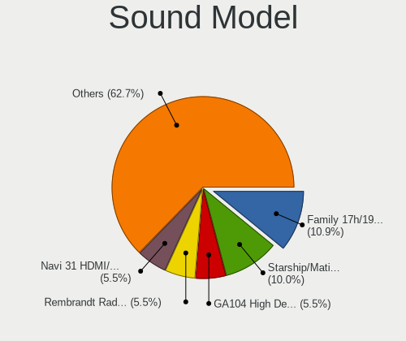

| Model                                                                      | Computers | Percent |
|----------------------------------------------------------------------------|-----------|---------|
| AMD Navi 21/23 HDMI/DP Audio Controller                                    | 8         | 8.79%   |
| Intel 8 Series/C220 Series Chipset High Definition Audio Controller        | 5         | 5.49%   |
| AMD Starship/Matisse HD Audio Controller                                   | 5         | 5.49%   |
| Nvidia TU106 High Definition Audio Controller                              | 4         | 4.4%    |
| Intel Tiger Lake-LP Smart Sound Technology Audio Controller                | 4         | 4.4%    |
| Intel 100 Series/C230 Series Chipset Family HD Audio Controller            | 4         | 4.4%    |
| AMD Family 17h/19h HD Audio Controller                                     | 4         | 4.4%    |
| Intel Alder Lake PCH-P High Definition Audio Controller                    | 3         | 3.3%    |
| AMD Ellesmere HDMI Audio [Radeon RX 470/480 / 570/580/590]                 | 3         | 3.3%    |
| Nvidia GA106 High Definition Audio Controller                              | 2         | 2.2%    |
| Intel Xeon E3-1200 v3/4th Gen Core Processor HD Audio Controller           | 2         | 2.2%    |
| Intel Comet Lake PCH cAVS                                                  | 2         | 2.2%    |
| Creative Technology Sound BlasterX G6                                      | 2         | 2.2%    |
| ASUSTek Computer USB Audio                                                 | 2         | 2.2%    |
| AMD Rembrandt Radeon High Definition Audio Controller                      | 2         | 2.2%    |
| AMD Navi 31 [Radeon RX 7000 HDMI Audio]                                    | 2         | 2.2%    |
| AMD Kabini HDMI/DP Audio                                                   | 2         | 2.2%    |
| Trust GXT 232 Microphone                                                   | 1         | 1.1%    |
| Ploopy Headphones                                                          | 1         | 1.1%    |
| Nvidia GP102 HDMI Audio Controller                                         | 1         | 1.1%    |
| Nvidia GM204 High Definition Audio Controller                              | 1         | 1.1%    |
| Nvidia GM107 High Definition Audio Controller [GeForce 940MX]              | 1         | 1.1%    |
| Nvidia GK106 HDMI Audio Controller                                         | 1         | 1.1%    |
| Nvidia GA104 High Definition Audio Controller                              | 1         | 1.1%    |
| Nvidia GA102 High Definition Audio Controller                              | 1         | 1.1%    |
| Nvidia Audio device                                                        | 1         | 1.1%    |
| Logitech Logi USB Headset                                                  | 1         | 1.1%    |
| Logitech G330 Headset                                                      | 1         | 1.1%    |
| Lenovo ThinkPad Thunderbolt 3 Dock USB Audio                               | 1         | 1.1%    |
| Lautsprecher Teufel Teufel Gaming Headset                                  | 1         | 1.1%    |
| Kingston Technology HyperX Cloud Revolver                                  | 1         | 1.1%    |
| Intel Wildcat Point-LP High Definition Audio Controller                    | 1         | 1.1%    |
| Intel Tiger Lake-H HD Audio Controller                                     | 1         | 1.1%    |
| Intel Ice Lake-LP Smart Sound Technology Audio Controller                  | 1         | 1.1%    |
| Intel Haswell-ULT HD Audio Controller                                      | 1         | 1.1%    |
| Intel Celeron/Pentium Silver Processor High Definition Audio               | 1         | 1.1%    |
| Intel Broadwell-U Audio Controller                                         | 1         | 1.1%    |
| Intel 8 Series HD Audio Controller                                         | 1         | 1.1%    |
| Intel 700 Series Chipset Family Precise Touch and Stylus Port #1           | 1         | 1.1%    |
| Intel 6 Series/C200 Series Chipset Family High Definition Audio Controller | 1         | 1.1%    |

Memory
------

Memory Vendor
-------------

Memory module vendors

| Vendor              | Computers | Percent |
|---------------------|-----------|---------|
| Corsair             | 4         | 23.53%  |
| Samsung Electronics | 3         | 17.65%  |
| Micron Technology   | 3         | 17.65%  |
| SK hynix            | 2         | 11.76%  |
| Team                | 1         | 5.88%   |
| G.Skill             | 1         | 5.88%   |
| AMD                 | 1         | 5.88%   |
| A-DATA Technology   | 1         | 5.88%   |
| Unknown             | 1         | 5.88%   |

Memory Model
------------

Memory module models

| Model                                                       | Computers | Percent |
|-------------------------------------------------------------|-----------|---------|
| SK hynix RAM HMA81GS6DJR8N-XN 8GB SODIMM DDR4 3200MT/s      | 2         | 11.11%  |
| Team RAM TEAMGROUP-SD4-2666 16GB SODIMM DDR4 2667MT/s       | 1         | 5.56%   |
| Samsung RAM M471B5173QH0-YK0 4GB SODIMM DDR3 1600MT/s       | 1         | 5.56%   |
| Samsung RAM M471B5173EB0-YK0 4096MB SODIMM DDR3 1600MT/s    | 1         | 5.56%   |
| Samsung RAM M471A1K43CB1-CTD 8GB SODIMM DDR4 2667MT/s       | 1         | 5.56%   |
| Micron RAM Module 8GB SODIMM DDR4 2400MT/s                  | 1         | 5.56%   |
| Micron RAM K4A8G165WB-BCRC 8GB Row Of Chips LPDDR4 3333MT/s | 1         | 5.56%   |
| Micron RAM 53E2G32D4NQ-046 4GB Row Of Chips LPDDR4 4267MT/s | 1         | 5.56%   |
| G.Skill RAM F3-1600C11-8GIS 8GB DIMM DDR3 1600MT/s          | 1         | 5.56%   |
| Corsair RAM CMY16GX3M2A1866C9 8GB DIMM DDR3 2400MT/s        | 1         | 5.56%   |
| Corsair RAM CMW32GX4M2E3200C16 16GB DIMM DDR4 3200MT/s      | 1         | 5.56%   |
| Corsair RAM CMK32GX4M2A2666C16 16GB DIMM DDR4 3100MT/s      | 1         | 5.56%   |
| Corsair RAM CMK16GX4M2B3200C16 8192MB DIMM DDR4 3600MT/s    | 1         | 5.56%   |
| Corsair RAM CMK16GX4M2B3000C15 8GB DIMM DDR4 3533MT/s       | 1         | 5.56%   |
| AMD RAM R538G1601S2SL 8GB SODIMM DDR3 1600MT/s              | 1         | 5.56%   |
| A-DATA RAM AX4U320016G16A-DT50 16GB DIMM DDR4 3200MT/s      | 1         | 5.56%   |
| Unknown                                                     | 1         | 5.56%   |

Memory Kind
-----------

Memory module kinds

| Kind   | Computers | Percent |
|--------|-----------|---------|
| DDR4   | 9         | 60%     |
| DDR3   | 4         | 26.67%  |
| LPDDR4 | 2         | 13.33%  |

Memory Form Factor
------------------

Physical design of the memory module

| Name         | Computers | Percent |
|--------------|-----------|---------|
| SODIMM       | 7         | 46.67%  |
| DIMM         | 6         | 40%     |
| Row Of Chips | 2         | 13.33%  |

Memory Size
-----------

Memory module size

| Size  | Computers | Percent |
|-------|-----------|---------|
| 8192  | 9         | 52.94%  |
| 4096  | 4         | 23.53%  |
| 16384 | 3         | 17.65%  |
| 32768 | 1         | 5.88%   |

Memory Speed
------------

Memory module speed

| Speed | Computers | Percent |
|-------|-----------|---------|
| 3200  | 5         | 31.25%  |
| 1600  | 3         | 18.75%  |
| 2400  | 2         | 12.5%   |
| 4267  | 1         | 6.25%   |
| 3600  | 1         | 6.25%   |
| 3533  | 1         | 6.25%   |
| 3333  | 1         | 6.25%   |
| 3100  | 1         | 6.25%   |
| 2667  | 1         | 6.25%   |

Printers & scanners
-------------------

Printer Vendor
--------------

Printer device vendors

| Vendor             | Computers | Percent |
|--------------------|-----------|---------|
| Brother Industries | 1         | 100%    |

Printer Model
-------------

Printer device models

| Model            | Computers | Percent |
|------------------|-----------|---------|
| Brother DCP-1510 | 1         | 100%    |

Scanner Vendor
--------------

Scanner device vendors

Zero info for selected period =(

Scanner Model
-------------

Scanner device models

Zero info for selected period =(

Camera
------

Camera Vendor
-------------

Camera device vendors

| Vendor                        | Computers | Percent |
|-------------------------------|-----------|---------|
| Microdia                      | 3         | 15%     |
| Sunplus Innovation Technology | 2         | 10%     |
| Microsoft                     | 2         | 10%     |
| IMC Networks                  | 2         | 10%     |
| Chicony Electronics           | 2         | 10%     |
| Apple                         | 2         | 10%     |
| WCM_USB                       | 1         | 5%      |
| Syntek                        | 1         | 5%      |
| Quanta                        | 1         | 5%      |
| Luxvisions Innotech Limited   | 1         | 5%      |
| Logitech                      | 1         | 5%      |
| Lite-On Technology            | 1         | 5%      |
| Bison Electronics             | 1         | 5%      |

Camera Model
------------

Camera device models

| Model                                     | Computers | Percent |
|-------------------------------------------|-----------|---------|
| WCM_USB WEB CAM                           | 1         | 5%      |
| Syntek Integrated Camera                  | 1         | 5%      |
| Sunplus Integrated_Webcam_HD              | 1         | 5%      |
| Sunplus Camera                            | 1         | 5%      |
| Quanta HP Wide Vision HD Camera           | 1         | 5%      |
| Microsoft Xbox NUI Camera                 | 1         | 5%      |
| Microsoft LifeCam HD-3000                 | 1         | 5%      |
| Microdia Webcam Vitade AF                 | 1         | 5%      |
| Microdia USB Live camera                  | 1         | 5%      |
| Microdia Integrated_Webcam_FHD            | 1         | 5%      |
| Luxvisions Innotech Limited HP 5MP Camera | 1         | 5%      |
| Logitech C920 PRO HD Webcam               | 1         | 5%      |
| Lite-On HP HD Webcam                      | 1         | 5%      |
| IMC Networks XiaoMi Webcam                | 1         | 5%      |
| IMC Networks Integrated Camera            | 1         | 5%      |
| Chicony USB2.0 VGA UVC WebCam             | 1         | 5%      |
| Chicony Integrated Camera (1280x720@30)   | 1         | 5%      |
| Bison Lenovo EasyCamera                   | 1         | 5%      |
| Apple FaceTime HD Camera (Built-in)       | 1         | 5%      |
| Apple FaceTime HD Camera                  | 1         | 5%      |

Security
--------

Fingerprint Vendor
------------------

Fingerprint sensor vendors

| Vendor                     | Computers | Percent |
|----------------------------|-----------|---------|
| Synaptics                  | 2         | 40%     |
| Shenzhen Goodix Technology | 2         | 40%     |
| Validity Sensors           | 1         | 20%     |

Fingerprint Model
-----------------

Fingerprint sensor models

| Model                                                    | Computers | Percent |
|----------------------------------------------------------|-----------|---------|
| Validity Sensors VFS495 Fingerprint Reader               | 1         | 20%     |
| Synaptics Metallica MIS Touch Fingerprint Reader         | 1         | 20%     |
| Synaptics FS7604 Touch Fingerprint Sensor with PurePrint | 1         | 20%     |
| Shenzhen Goodix  FingerPrint Device                      | 1         | 20%     |
| Shenzhen Goodix Fingerprint Reader                       | 1         | 20%     |

Chipcard Vendor
---------------

Chipcard module vendors

| Vendor   | Computers | Percent |
|----------|-----------|---------|
| Broadcom | 1         | 100%    |

Chipcard Model
--------------

Chipcard module models

| Model         | Computers | Percent |
|---------------|-----------|---------|
| Broadcom 5880 | 1         | 100%    |

Unsupported
-----------

Unsupported Devices
-------------------

Total unsupported devices on board

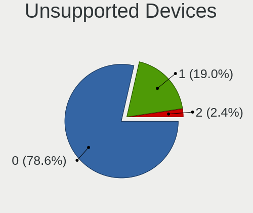

| Total | Computers | Percent |
|-------|-----------|---------|
| 0     | 36        | 85.71%  |
| 1     | 6         | 14.29%  |

Unsupported Device Types
------------------------

Types of unsupported devices

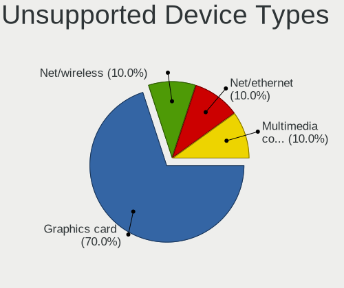

| Type               | Computers | Percent |
|--------------------|-----------|---------|
| Fingerprint reader | 5         | 83.33%  |
| Bluetooth          | 1         | 16.67%  |

