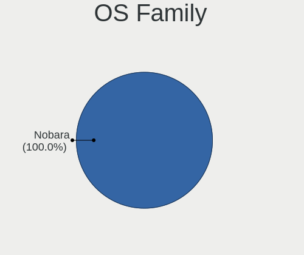
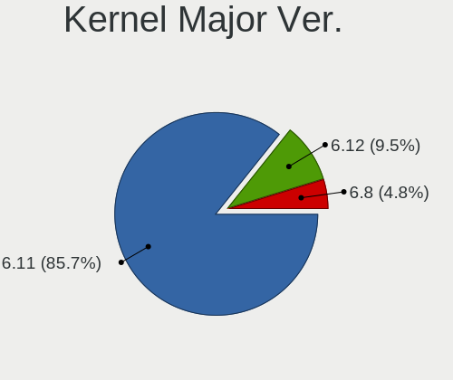
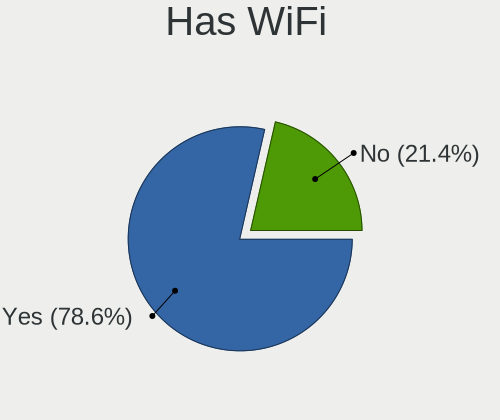
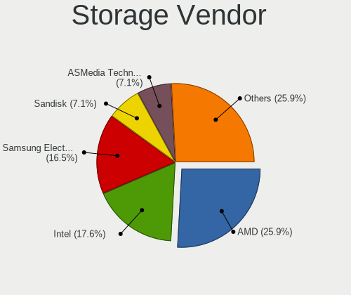
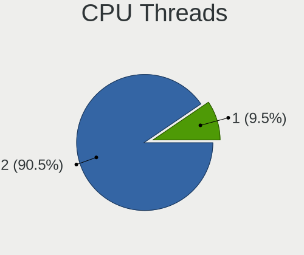
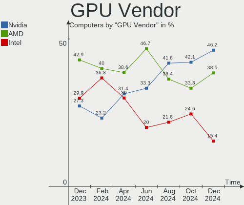
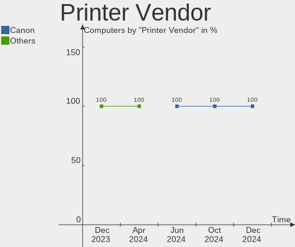

Nobara - Hardware Trends
------------------------

A project to identify most popular hardware characteristics and track their change
over time based on data collected by Linux users at https://Linux-Hardware.org.

Anyone can contribute to this report by the [hw-probe](https://github.com/linuxhw/hw-probe) tool:

    sudo -E hw-probe -all -upload

This is a report for all computer types. See also reports for [desktops](/Dist/Nobara/Desktop/README.md) and [notebooks](/Dist/Nobara/Notebook/README.md).

This report is for one last month. Overall report since the beginning of time: [TestDays](https://github.com/linuxhw/TestDays)

Period: Dec, 2024.

Contents
--------

* [ System ](#system)
  - [ OS                       ](#os)
  - [ OS Family                ](#os-family)
  - [ Kernel                   ](#kernel)
  - [ Kernel Family            ](#kernel-family)
  - [ Kernel Major Ver.        ](#kernel-major-ver)
  - [ Arch                     ](#arch)
  - [ DE                       ](#de)
  - [ Display Server           ](#display-server)
  - [ Display Manager          ](#display-manager)
  - [ OS Lang                  ](#os-lang)
  - [ Boot Mode                ](#boot-mode)
  - [ Filesystem               ](#filesystem)
  - [ Part. scheme             ](#part-scheme)
  - [ Dual Boot with Linux/BSD ](#dual-boot-with-linuxbsd)
  - [ Dual Boot (Win)          ](#dual-boot-win)

* [ Board ](#board)
  - [ Vendor                   ](#vendor)
  - [ Model                    ](#model)
  - [ Model Family             ](#model-family)
  - [ MFG Year                 ](#mfg-year)
  - [ Form Factor              ](#form-factor)
  - [ Secure Boot              ](#secure-boot)
  - [ Coreboot                 ](#coreboot)
  - [ RAM Size                 ](#ram-size)
  - [ RAM Used                 ](#ram-used)
  - [ Total Drives             ](#total-drives)
  - [ Has CD-ROM               ](#has-cd-rom)
  - [ Has Ethernet             ](#has-ethernet)
  - [ Has WiFi                 ](#has-wifi)
  - [ Has Bluetooth            ](#has-bluetooth)

* [ Location ](#location)
  - [ Country                  ](#country)
  - [ City                     ](#city)

* [ Drives ](#drives)
  - [ Drive Vendor             ](#drive-vendor)
  - [ Drive Model              ](#drive-model)
  - [ HDD Vendor               ](#hdd-vendor)
  - [ SSD Vendor               ](#ssd-vendor)
  - [ Drive Kind               ](#drive-kind)
  - [ Drive Connector          ](#drive-connector)
  - [ Drive Size               ](#drive-size)
  - [ Space Total              ](#space-total)
  - [ Space Used               ](#space-used)
  - [ Malfunc. Drives          ](#malfunc-drives)
  - [ Malfunc. Drive Vendor    ](#malfunc-drive-vendor)
  - [ Malfunc. HDD Vendor      ](#malfunc-hdd-vendor)
  - [ Malfunc. Drive Kind      ](#malfunc-drive-kind)
  - [ Failed Drives            ](#failed-drives)
  - [ Failed Drive Vendor      ](#failed-drive-vendor)
  - [ Drive Status             ](#drive-status)

* [ Storage controller ](#storage-controller)
  - [ Storage Vendor           ](#storage-vendor)
  - [ Storage Model            ](#storage-model)
  - [ Storage Kind             ](#storage-kind)

* [ Processor ](#processor)
  - [ CPU Vendor               ](#cpu-vendor)
  - [ CPU Model                ](#cpu-model)
  - [ CPU Model Family         ](#cpu-model-family)
  - [ CPU Cores                ](#cpu-cores)
  - [ CPU Sockets              ](#cpu-sockets)
  - [ CPU Threads              ](#cpu-threads)
  - [ CPU Op-Modes             ](#cpu-op-modes)
  - [ CPU Microcode            ](#cpu-microcode)
  - [ CPU Microarch            ](#cpu-microarch)

* [ Graphics ](#graphics)
  - [ GPU Vendor               ](#gpu-vendor)
  - [ GPU Model                ](#gpu-model)
  - [ GPU Combo                ](#gpu-combo)
  - [ GPU Driver               ](#gpu-driver)
  - [ GPU Memory               ](#gpu-memory)

* [ Monitor ](#monitor)
  - [ Monitor Vendor           ](#monitor-vendor)
  - [ Monitor Model            ](#monitor-model)
  - [ Monitor Resolution       ](#monitor-resolution)
  - [ Monitor Diagonal         ](#monitor-diagonal)
  - [ Monitor Width            ](#monitor-width)
  - [ Aspect Ratio             ](#aspect-ratio)
  - [ Monitor Area             ](#monitor-area)
  - [ Pixel Density            ](#pixel-density)
  - [ Multiple Monitors        ](#multiple-monitors)

* [ Network ](#network)
  - [ Net Controller Vendor    ](#net-controller-vendor)
  - [ Net Controller Model     ](#net-controller-model)
  - [ Wireless Vendor          ](#wireless-vendor)
  - [ Wireless Model           ](#wireless-model)
  - [ Ethernet Vendor          ](#ethernet-vendor)
  - [ Ethernet Model           ](#ethernet-model)
  - [ Net Controller Kind      ](#net-controller-kind)
  - [ Used Controller          ](#used-controller)
  - [ NICs                     ](#nics)
  - [ IPv6                     ](#ipv6)

* [ Bluetooth ](#bluetooth)
  - [ Bluetooth Vendor         ](#bluetooth-vendor)
  - [ Bluetooth Model          ](#bluetooth-model)

* [ Sound ](#sound)
  - [ Sound Vendor             ](#sound-vendor)
  - [ Sound Model              ](#sound-model)

* [ Memory ](#memory)
  - [ Memory Vendor            ](#memory-vendor)
  - [ Memory Model             ](#memory-model)
  - [ Memory Kind              ](#memory-kind)
  - [ Memory Form Factor       ](#memory-form-factor)
  - [ Memory Size              ](#memory-size)
  - [ Memory Speed             ](#memory-speed)

* [ Printers & scanners ](#printers--scanners)
  - [ Printer Vendor           ](#printer-vendor)
  - [ Printer Model            ](#printer-model)
  - [ Scanner Vendor           ](#scanner-vendor)
  - [ Scanner Model            ](#scanner-model)

* [ Camera ](#camera)
  - [ Camera Vendor            ](#camera-vendor)
  - [ Camera Model             ](#camera-model)

* [ Security ](#security)
  - [ Fingerprint Vendor       ](#fingerprint-vendor)
  - [ Fingerprint Model        ](#fingerprint-model)
  - [ Chipcard Vendor          ](#chipcard-vendor)
  - [ Chipcard Model           ](#chipcard-model)

* [ Unsupported ](#unsupported)
  - [ Unsupported Devices      ](#unsupported-devices)
  - [ Unsupported Device Types ](#unsupported-device-types)

System
------

OS
--

Installed operating systems

| Name      | Computers | Percent |
|-----------|-----------|---------|
| Nobara 40 | 36        | 85.71%  |
| Nobara 41 | 4         | 9.52%   |
| Nobara 39 | 2         | 4.76%   |

OS Family
---------

OS without a version

| Name   | Computers | Percent |
|--------|-----------|---------|
| Nobara | 42        | 100%    |

Kernel
------

Version of the Linux kernel

| Version                      | Computers | Percent |
|------------------------------|-----------|---------|
| 6.11.9-200.fsync.fc40.x86_64 | 32        | 76.19%  |
| 6.8.12-200.fsync.fc39.x86_64 | 2         | 4.76%   |
| 6.12.6-200.fsync.fc41.x86_64 | 2         | 4.76%   |
| 6.11.7-201.fsync.fc40.x86_64 | 2         | 4.76%   |
| 6.12.7-200.fsync.fc41.x86_64 | 1         | 2.38%   |
| 6.12.5-200.fsync.fc41.x86_64 | 1         | 2.38%   |
| 6.11.6-200.fsync.fc40.x86_64 | 1         | 2.38%   |
| 6.11.5-200.fsync.fc40.x86_64 | 1         | 2.38%   |

Kernel Family
-------------

Linux kernel without a distro release

| Version | Computers | Percent |
|---------|-----------|---------|
| 6.11.9  | 32        | 76.19%  |
| 6.8.12  | 2         | 4.76%   |
| 6.12.6  | 2         | 4.76%   |
| 6.11.7  | 2         | 4.76%   |
| 6.12.7  | 1         | 2.38%   |
| 6.12.5  | 1         | 2.38%   |
| 6.11.6  | 1         | 2.38%   |
| 6.11.5  | 1         | 2.38%   |

Kernel Major Ver.
-----------------

Linux kernel major version

| Version | Computers | Percent |
|---------|-----------|---------|
| 6.11    | 36        | 85.71%  |
| 6.12    | 4         | 9.52%   |
| 6.8     | 2         | 4.76%   |

Arch
----

OS architecture (x86_64, i586, etc.)

| Name   | Computers | Percent |
|--------|-----------|---------|
| x86_64 | 42        | 100%    |

DE
--

Desktop Environment

| Name  | Computers | Percent |
|-------|-----------|---------|
| KDE6  | 28        | 66.67%  |
| GNOME | 14        | 33.33%  |

Display Server
--------------

X11 or Wayland

| Name    | Computers | Percent |
|---------|-----------|---------|
| Wayland | 38        | 90.48%  |
| X11     | 4         | 9.52%   |

Display Manager
---------------

SDDM, LightDM, etc.

| Name    | Computers | Percent |
|---------|-----------|---------|
| Unknown | 32        | 76.19%  |
| SDDM    | 8         | 19.05%  |
| LightDM | 1         | 2.38%   |
| GDM     | 1         | 2.38%   |

OS Lang
-------

Language

| Lang  | Computers | Percent |
|-------|-----------|---------|
| en_US | 21        | 50%     |
| de_DE | 4         | 9.52%   |
| en_GB | 3         | 7.14%   |
| en_CA | 3         | 7.14%   |
| pt_BR | 2         | 4.76%   |
| es_ES | 2         | 4.76%   |
| sv_SE | 1         | 2.38%   |
| ru_RU | 1         | 2.38%   |
| hu_HU | 1         | 2.38%   |
| fr_FR | 1         | 2.38%   |
| es_AR | 1         | 2.38%   |
| en_HK | 1         | 2.38%   |
| en_AU | 1         | 2.38%   |

Boot Mode
---------

EFI or BIOS

| Mode | Computers | Percent |
|------|-----------|---------|
| BIOS | 31        | 73.81%  |
| EFI  | 11        | 26.19%  |

Filesystem
----------

Type of filesystem

| Type  | Computers | Percent |
|-------|-----------|---------|
| Btrfs | 40        | 95.24%  |
| Ext4  | 2         | 4.76%   |

Part. scheme
------------

Scheme of partitioning

| Type    | Computers | Percent |
|---------|-----------|---------|
| Unknown | 32        | 76.19%  |
| GPT     | 10        | 23.81%  |

Dual Boot with Linux/BSD
------------------------

Hosting more than one Linux/BSD

| Dual boot | Computers | Percent |
|-----------|-----------|---------|
| No        | 39        | 92.86%  |
| Yes       | 3         | 7.14%   |

Dual Boot (Win)
---------------

Hosting Linux and Windows

| Dual boot | Computers | Percent |
|-----------|-----------|---------|
| No        | 38        | 90.48%  |
| Yes       | 4         | 9.52%   |

Board
-----

Vendor
------

Motherboard manufacturer

| Name                | Computers | Percent |
|---------------------|-----------|---------|
| ASUSTek Computer    | 14        | 33.33%  |
| MSI                 | 10        | 23.81%  |
| Dell                | 5         | 11.9%   |
| Gigabyte Technology | 3         | 7.14%   |
| ASRock              | 3         | 7.14%   |
| Lenovo              | 2         | 4.76%   |
| TUXEDO              | 1         | 2.38%   |
| Intel               | 1         | 2.38%   |
| Hewlett-Packard     | 1         | 2.38%   |
| Biostar             | 1         | 2.38%   |
| BESSTAR Tech        | 1         | 2.38%   |

Model
-----

Motherboard model

| Name                                     | Computers | Percent |
|------------------------------------------|-----------|---------|
| Lenovo Legion Pro 7 16IRX8H 82WQ         | 2         | 4.76%   |
| ASUS All Series                          | 2         | 4.76%   |
| TUXEDO W65_W67RC                         | 1         | 2.38%   |
| MSI MS-7E51                              | 1         | 2.38%   |
| MSI MS-7E26                              | 1         | 2.38%   |
| MSI MS-7E12                              | 1         | 2.38%   |
| MSI MS-7D76                              | 1         | 2.38%   |
| MSI MS-7D37                              | 1         | 2.38%   |
| MSI MS-7C95                              | 1         | 2.38%   |
| MSI MS-7C37                              | 1         | 2.38%   |
| MSI MS-7C04                              | 1         | 2.38%   |
| MSI MS-7C02                              | 1         | 2.38%   |
| MSI Katana 15 B12VFK                     | 1         | 2.38%   |
| Intel H61                                | 1         | 2.38%   |
| HP Pavilion Desktop PC 570-p0xx          | 1         | 2.38%   |
| Gigabyte B660 DS3H DDR4                  | 1         | 2.38%   |
| Gigabyte B550M DS3H AC                   | 1         | 2.38%   |
| Gigabyte B550M DS3H                      | 1         | 2.38%   |
| Dell XPS 8700                            | 1         | 2.38%   |
| Dell XPS 15 7590                         | 1         | 2.38%   |
| Dell Precision 5560                      | 1         | 2.38%   |
| Dell OptiPlex 5040                       | 1         | 2.38%   |
| Dell Latitude 7640                       | 1         | 2.38%   |
| Biostar X670E VALKYRIE                   | 1         | 2.38%   |
| BESSTAR Tech HM80                        | 1         | 2.38%   |
| ASUS TUF Gaming Z490-PLUS                | 1         | 2.38%   |
| ASUS TUF Gaming X570-PLUS                | 1         | 2.38%   |
| ASUS TUF Gaming FX505DT_FX505DT          | 1         | 2.38%   |
| ASUS TUF Gaming FX505DD                  | 1         | 2.38%   |
| ASUS TUF Gaming B650M-E WIFI             | 1         | 2.38%   |
| ASUS TUF Gaming B550-PLUS                | 1         | 2.38%   |
| ASUS ROG Zephyrus M16 GU603HM_GU603HM    | 1         | 2.38%   |
| ASUS ROG Strix G713PV_G713PV             | 1         | 2.38%   |
| ASUS PRIME B550-PLUS                     | 1         | 2.38%   |
| ASUS PRIME A320M-K                       | 1         | 2.38%   |
| ASUS CROSSHAIR VI HERO                   | 1         | 2.38%   |
| ASUS ASUS TUF Gaming A14 FA401WV_FA401WV | 1         | 2.38%   |
| ASRock B550 Phantom Gaming-ITX/ax        | 1         | 2.38%   |
| ASRock B450M-HDV R4.0                    | 1         | 2.38%   |
| ASRock B450 Gaming-ITX/ac                | 1         | 2.38%   |

Model Family
------------

Motherboard model prefix

| Name              | Computers | Percent |
|-------------------|-----------|---------|
| ASUS TUF          | 6         | 14.29%  |
| Lenovo Legion     | 2         | 4.76%   |
| Gigabyte B550M    | 2         | 4.76%   |
| Dell XPS          | 2         | 4.76%   |
| ASUS ROG          | 2         | 4.76%   |
| ASUS PRIME        | 2         | 4.76%   |
| ASUS All          | 2         | 4.76%   |
| TUXEDO W65        | 1         | 2.38%   |
| MSI MS-7E51       | 1         | 2.38%   |
| MSI MS-7E26       | 1         | 2.38%   |
| MSI MS-7E12       | 1         | 2.38%   |
| MSI MS-7D76       | 1         | 2.38%   |
| MSI MS-7D37       | 1         | 2.38%   |
| MSI MS-7C95       | 1         | 2.38%   |
| MSI MS-7C37       | 1         | 2.38%   |
| MSI MS-7C04       | 1         | 2.38%   |
| MSI MS-7C02       | 1         | 2.38%   |
| MSI Katana        | 1         | 2.38%   |
| Intel H61         | 1         | 2.38%   |
| HP Pavilion       | 1         | 2.38%   |
| Gigabyte B660     | 1         | 2.38%   |
| Dell Precision    | 1         | 2.38%   |
| Dell OptiPlex     | 1         | 2.38%   |
| Dell Latitude     | 1         | 2.38%   |
| Biostar X670E     | 1         | 2.38%   |
| BESSTAR Tech HM80 | 1         | 2.38%   |
| ASUS CROSSHAIR    | 1         | 2.38%   |
| ASUS ASUS         | 1         | 2.38%   |
| ASRock B550       | 1         | 2.38%   |
| ASRock B450M-HDV  | 1         | 2.38%   |
| ASRock B450       | 1         | 2.38%   |

MFG Year
--------

Motherboard manufacture year

| Year | Computers | Percent |
|------|-----------|---------|
| 2023 | 8         | 19.05%  |
| 2020 | 7         | 16.67%  |
| 2021 | 5         | 11.9%   |
| 2019 | 5         | 11.9%   |
| 2024 | 4         | 9.52%   |
| 2022 | 3         | 7.14%   |
| 2018 | 3         | 7.14%   |
| 2017 | 2         | 4.76%   |
| 2016 | 2         | 4.76%   |
| 2013 | 2         | 4.76%   |
| 2014 | 1         | 2.38%   |

Form Factor
-----------

Physical design of the computer

| Name     | Computers | Percent |
|----------|-----------|---------|
| Desktop  | 30        | 71.43%  |
| Notebook | 12        | 28.57%  |

Secure Boot
-----------

Enabled or disabled

| State    | Computers | Percent |
|----------|-----------|---------|
| Disabled | 42        | 100%    |

Coreboot
--------

Have coreboot on board

| Used | Computers | Percent |
|------|-----------|---------|
| No   | 42        | 100%    |

RAM Size
--------

Total RAM memory

| Size in GB  | Computers | Percent |
|-------------|-----------|---------|
| 32.01-64.0  | 20        | 47.62%  |
| 24.01-32.0  | 8         | 19.05%  |
| 64.01-256.0 | 4         | 9.52%   |
| 16.01-24.0  | 4         | 9.52%   |
| 8.01-16.0   | 4         | 9.52%   |
| 4.01-8.0    | 2         | 4.76%   |

RAM Used
--------

Used RAM memory

| Used GB   | Computers | Percent |
|-----------|-----------|---------|
| 4.01-8.0  | 22        | 52.38%  |
| 3.01-4.0  | 11        | 26.19%  |
| 8.01-16.0 | 5         | 11.9%   |
| 2.01-3.0  | 3         | 7.14%   |
| 1.01-2.0  | 1         | 2.38%   |

Total Drives
------------

Number of drives on board

| Drives | Computers | Percent |
|--------|-----------|---------|
| 3      | 15        | 35.71%  |
| 2      | 14        | 33.33%  |
| 1      | 9         | 21.43%  |
| 4      | 4         | 9.52%   |

Has CD-ROM
----------

Has CD-ROM on board

| Presented | Computers | Percent |
|-----------|-----------|---------|
| No        | 36        | 85.71%  |
| Yes       | 6         | 14.29%  |

Has Ethernet
------------

Has Ethernet on board

| Presented | Computers | Percent |
|-----------|-----------|---------|
| Yes       | 39        | 92.86%  |
| No        | 3         | 7.14%   |

Has WiFi
--------

Has WiFi module

| Presented | Computers | Percent |
|-----------|-----------|---------|
| Yes       | 33        | 78.57%  |
| No        | 9         | 21.43%  |

Has Bluetooth
-------------

Has Bluetooth module

| Presented | Computers | Percent |
|-----------|-----------|---------|
| Yes       | 35        | 83.33%  |
| No        | 7         | 16.67%  |

Location
--------

Country
-------

Geographic location (country)

| Country   | Computers | Percent |
|-----------|-----------|---------|
| USA       | 14        | 33.33%  |
| Germany   | 5         | 11.9%   |
| Canada    | 3         | 7.14%   |
| UK        | 2         | 4.76%   |
| Spain     | 2         | 4.76%   |
| Russia    | 2         | 4.76%   |
| Brazil    | 2         | 4.76%   |
| Australia | 2         | 4.76%   |
| Ukraine   | 1         | 2.38%   |
| Sweden    | 1         | 2.38%   |
| Mexico    | 1         | 2.38%   |
| Hungary   | 1         | 2.38%   |
| Hong Kong | 1         | 2.38%   |
| France    | 1         | 2.38%   |
| Finland   | 1         | 2.38%   |
| Estonia   | 1         | 2.38%   |
| Bulgaria  | 1         | 2.38%   |
| Argentina | 1         | 2.38%   |

City
----

Geographic location (city)

| City              | Computers | Percent |
|-------------------|-----------|---------|
| Brooklyn          | 2         | 4.76%   |
| Valencia          | 1         | 2.38%   |
| Toronto           | 1         | 2.38%   |
| Tallinn           | 1         | 2.38%   |
| Syracuse          | 1         | 2.38%   |
| St Petersburg     | 1         | 2.38%   |
| Sofia             | 1         | 2.38%   |
| Schwarzheide      | 1         | 2.38%   |
| Reno              | 1         | 2.38%   |
| Palma             | 1         | 2.38%   |
| Ourinhos          | 1         | 2.38%   |
| Ottawa            | 1         | 2.38%   |
| Orillia           | 1         | 2.38%   |
| Odesa             | 1         | 2.38%   |
| Nokia             | 1         | 2.38%   |
| Nizhny Tagil      | 1         | 2.38%   |
| New York          | 1         | 2.38%   |
| Nederland         | 1         | 2.38%   |
| Naperville        | 1         | 2.38%   |
| Nantes            | 1         | 2.38%   |
| Munich            | 1         | 2.38%   |
| Mexicali          | 1         | 2.38%   |
| Melbourne         | 1         | 2.38%   |
| Lüneburg         | 1         | 2.38%   |
| Lancaster         | 1         | 2.38%   |
| Kansas City       | 1         | 2.38%   |
| Jacksonville      | 1         | 2.38%   |
| Itapoa            | 1         | 2.38%   |
| Indianapolis      | 1         | 2.38%   |
| Gyal              | 1         | 2.38%   |
| Gothenburg        | 1         | 2.38%   |
| Glasgow           | 1         | 2.38%   |
| Frankfurt am Main | 1         | 2.38%   |
| Essen             | 1         | 2.38%   |
| Dallas            | 1         | 2.38%   |
| Cullompton        | 1         | 2.38%   |
| Cheswick          | 1         | 2.38%   |
| Central           | 1         | 2.38%   |
| Buenos Aires      | 1         | 2.38%   |
| Atlanta           | 1         | 2.38%   |

Drives
------

Drive Vendor
------------

Hard drive vendors

| Vendor                       | Computers | Drives | Percent |
|------------------------------|-----------|--------|---------|
| Samsung Electronics          | 18        | 28     | 21.43%  |
| WDC                          | 10        | 10     | 11.9%   |
| Seagate                      | 8         | 8      | 9.52%   |
| Sandisk                      | 7         | 8      | 8.33%   |
| Phison Electronics           | 5         | 5      | 5.95%   |
| SK hynix                     | 4         | 7      | 4.76%   |
| Kingston Technology Company  | 3         | 3      | 3.57%   |
| Crucial                      | 3         | 3      | 3.57%   |
| Toshiba                      | 2         | 2      | 2.38%   |
| Realtek Semiconductor        | 2         | 2      | 2.38%   |
| Micron/Crucial Technology    | 2         | 2      | 2.38%   |
| Micron Technology            | 2         | 2      | 2.38%   |
| MAXIO Technology (Hangzhou)  | 2         | 2      | 2.38%   |
| Kingston                     | 2         | 2      | 2.38%   |
| HGST                         | 2         | 2      | 2.38%   |
| WALRAM                       | 1         | 1      | 1.19%   |
| Unknown                      | 1         | 1      | 1.19%   |
| ULK                          | 1         | 1      | 1.19%   |
| T-FORCE                      | 1         | 1      | 1.19%   |
| Shenzhen Longsys Electronics | 1         | 1      | 1.19%   |
| Realtek                      | 1         | 1      | 1.19%   |
| PNY                          | 1         | 1      | 1.19%   |
| Patriot                      | 1         | 1      | 1.19%   |
| Hitachi                      | 1         | 1      | 1.19%   |
| Gigabyte Technology          | 1         | 1      | 1.19%   |
| Corsair                      | 1         | 1      | 1.19%   |
| Unknown                      | 1         | 1      | 1.19%   |

Drive Model
-----------

Hard drive models

| Model                                                | Computers | Percent |
|------------------------------------------------------|-----------|---------|
| Samsung NVMe SSD Controller SM981/PM981/PM983 512GB  | 5         | 5.26%   |
| Samsung NVMe SSD Controller PM9A1/PM9A3/980PRO 512GB | 5         | 5.26%   |
| Phison PS5013 E13 NVMe Controller 512GB              | 3         | 3.16%   |
| Kingston Company SNV2S1000G 1TB                      | 3         | 3.16%   |
| SK hynix PSSD X31 512GB                              | 2         | 2.11%   |
| Sandisk WD_BLACK SN850X 4000GB                       | 2         | 2.11%   |
| Samsung SSD 870 EVO 2TB                              | 2         | 2.11%   |
| Samsung SSD 860 EVO 2TB                              | 2         | 2.11%   |
| Samsung NVMe SSD Controller SM961/PM961/SM963 256GB  | 2         | 2.11%   |
| Realtek SPCC M.2 PCIe SSD 2TB                        | 2         | 2.11%   |
| MAXIO (Hangzhou) NVMe SSD Controller MAP1202 512GB   | 2         | 2.11%   |
| Crucial CT1000BX500SSD1 1TB                          | 2         | 2.11%   |
| WDC WDS500G2B0B-00YS70 500GB SSD                     | 1         | 1.05%   |
| WDC WDS400T2B0A-00SM50 4TB SSD                       | 1         | 1.05%   |
| WDC WDS250G2B0A-00SM50 250GB SSD                     | 1         | 1.05%   |
| WDC WD3200 WDC-ROM SN# 320GB                         | 1         | 1.05%   |
| WDC WD2003FZEX-00Z4SA0 2TB                           | 1         | 1.05%   |
| WDC WD2003FZEX-00SRLA0 2TB                           | 1         | 1.05%   |
| WDC WD10JPVX-75JC3T0 1TB                             | 1         | 1.05%   |
| WDC WD10JPVX-60JC3T1 1TB                             | 1         | 1.05%   |
| WDC WD1002FBYS-18W8B1 1TB                            | 1         | 1.05%   |
| WDC WD1001FALS-00J7B1 1TB                            | 1         | 1.05%   |
| WALRAM 480GB                                         | 1         | 1.05%   |
| Unknown SD/MMC/MS PRO 128GB                          | 1         | 1.05%   |
| ULK 240GB                                            | 1         | 1.05%   |
| Toshiba XG6 NVMe SSD Controller 1024GB               | 1         | 1.05%   |
| Toshiba MK4055GSX 400GB                              | 1         | 1.05%   |
| T-FORCE SSD 250GB                                    | 1         | 1.05%   |
| SK hynix SKHynix_HFS512GEJ9X115N 512GB               | 1         | 1.05%   |
| SK hynix SHGP31-2000GM 2TB                           | 1         | 1.05%   |
| SK hynix HFM001TD3JX013N 1024GB                      | 1         | 1.05%   |
| SK hynix BC501 NVMe Solid State Drive 512GB          | 1         | 1.05%   |
| Shenzhen Longsys Lexar SSD NM790 1TB                 | 1         | 1.05%   |
| Seagate ST8000DM004-2CX188 8TB                       | 1         | 1.05%   |
| Seagate ST5000LM000-2AN170 5TB                       | 1         | 1.05%   |
| Seagate ST2000DM001-1ER164 2TB                       | 1         | 1.05%   |
| Seagate ST2000DM001 4GB                              | 1         | 1.05%   |
| Seagate ST1000LM035-1RK172 1TB                       | 1         | 1.05%   |
| Seagate ST1000DM003-1ER162 1TB                       | 1         | 1.05%   |
| Seagate BUP Slim BK 2TB                              | 1         | 1.05%   |

HDD Vendor
----------

Hard disk drive vendors

| Vendor  | Computers | Drives | Percent |
|---------|-----------|--------|---------|
| WDC     | 7         | 7      | 36.84%  |
| Seagate | 7         | 7      | 36.84%  |
| HGST    | 2         | 2      | 10.53%  |
| Unknown | 1         | 1      | 5.26%   |
| Toshiba | 1         | 1      | 5.26%   |
| Hitachi | 1         | 1      | 5.26%   |

SSD Vendor
----------

Solid state drive vendors

| Vendor              | Computers | Drives | Percent |
|---------------------|-----------|--------|---------|
| Samsung Electronics | 9         | 12     | 37.5%   |
| WDC                 | 3         | 3      | 12.5%   |
| Crucial             | 3         | 3      | 12.5%   |
| SK hynix            | 2         | 2      | 8.33%   |
| T-FORCE             | 1         | 1      | 4.17%   |
| SanDisk             | 1         | 1      | 4.17%   |
| PNY                 | 1         | 1      | 4.17%   |
| Patriot             | 1         | 1      | 4.17%   |
| Kingston            | 1         | 1      | 4.17%   |
| Gigabyte Technology | 1         | 1      | 4.17%   |
| Corsair             | 1         | 1      | 4.17%   |

Drive Kind
----------

HDD or SSD

| Kind    | Computers | Drives | Percent |
|---------|-----------|--------|---------|
| NVMe    | 36        | 48     | 49.32%  |
| SSD     | 20        | 27     | 27.4%   |
| HDD     | 14        | 19     | 19.18%  |
| Unknown | 3         | 4      | 4.11%   |

Drive Connector
---------------

SATA, SAS, NVMe, etc.

| Type | Computers | Drives | Percent |
|------|-----------|--------|---------|
| NVMe | 36        | 47     | 53.73%  |
| SATA | 25        | 45     | 37.31%  |
| SAS  | 6         | 6      | 8.96%   |

Drive Size
----------

Size of hard drive

| Size in TB | Computers | Drives | Percent |
|------------|-----------|--------|---------|
| 0.51-1.0   | 14        | 18     | 35.9%   |
| 0.01-0.5   | 11        | 12     | 28.21%  |
| 1.01-2.0   | 9         | 11     | 23.08%  |
| 4.01-10.0  | 3         | 3      | 7.69%   |
| 3.01-4.0   | 1         | 1      | 2.56%   |
| 2.01-3.0   | 1         | 1      | 2.56%   |

Space Total
-----------

Amount of disk space available on the file system

| Size in GB     | Computers | Percent |
|----------------|-----------|---------|
| More than 3000 | 15        | 35.71%  |
| 1001-2000      | 10        | 23.81%  |
| 501-1000       | 9         | 21.43%  |
| 2001-3000      | 4         | 9.52%   |
| 251-500        | 3         | 7.14%   |
| 101-250        | 1         | 2.38%   |

Space Used
----------

Amount of used disk space

| Used GB        | Computers | Percent |
|----------------|-----------|---------|
| 21-50          | 9         | 21.43%  |
| 101-250        | 8         | 19.05%  |
| 2001-3000      | 6         | 14.29%  |
| 501-1000       | 6         | 14.29%  |
| 251-500        | 5         | 11.9%   |
| 1001-2000      | 5         | 11.9%   |
| More than 3000 | 2         | 4.76%   |
| 51-100         | 1         | 2.38%   |

Malfunc. Drives
---------------

Drive models with a malfunction

| Model                               | Computers | Drives | Percent |
|-------------------------------------|-----------|--------|---------|
| WDC WD2003FZEX-00Z4SA0 2TB          | 1         | 1      | 20%     |
| Seagate ST8000DM004-2CX188 8TB      | 1         | 1      | 20%     |
| Seagate ST2000DM001-1ER164 2TB      | 1         | 1      | 20%     |
| Samsung Electronics SSD 870 EVO 1TB | 1         | 2      | 20%     |
| Crucial CT1000BX500SSD1 1TB         | 1         | 1      | 20%     |

Malfunc. Drive Vendor
---------------------

Vendors of faulty drives

| Vendor              | Computers | Drives | Percent |
|---------------------|-----------|--------|---------|
| Seagate             | 2         | 2      | 40%     |
| WDC                 | 1         | 1      | 20%     |
| Samsung Electronics | 1         | 2      | 20%     |
| Crucial             | 1         | 1      | 20%     |

Malfunc. HDD Vendor
-------------------

Vendors of faulty HDD drives

| Vendor  | Computers | Drives | Percent |
|---------|-----------|--------|---------|
| Seagate | 2         | 2      | 66.67%  |
| WDC     | 1         | 1      | 33.33%  |

Malfunc. Drive Kind
-------------------

Kinds of faulty drives

| Kind | Computers | Drives | Percent |
|------|-----------|--------|---------|
| SSD  | 2         | 3      | 50%     |
| HDD  | 2         | 3      | 50%     |

Failed Drives
-------------

Failed drive models

Zero info for selected period =(

Failed Drive Vendor
-------------------

Failed drive vendors

Zero info for selected period =(

Drive Status
------------

Number of failed and malfunc. drives

| Status   | Computers | Drives | Percent |
|----------|-----------|--------|---------|
| Detected | 32        | 72     | 72.73%  |
| Works    | 9         | 20     | 20.45%  |
| Malfunc  | 3         | 6      | 6.82%   |

Storage controller
------------------

Storage Vendor
--------------

Storage controller vendors

| Vendor                       | Computers | Percent |
|------------------------------|-----------|---------|
| AMD                          | 22        | 25.88%  |
| Intel                        | 15        | 17.65%  |
| Samsung Electronics          | 14        | 16.47%  |
| Sandisk                      | 6         | 7.06%   |
| ASMedia Technology           | 6         | 7.06%   |
| Phison Electronics           | 5         | 5.88%   |
| SK hynix                     | 4         | 4.71%   |
| Kingston Technology Company  | 3         | 3.53%   |
| Realtek Semiconductor        | 2         | 2.35%   |
| Micron/Crucial Technology    | 2         | 2.35%   |
| Micron Technology            | 2         | 2.35%   |
| MAXIO Technology (Hangzhou)  | 2         | 2.35%   |
| Toshiba America Info Systems | 1         | 1.18%   |
| Shenzhen Longsys Electronics | 1         | 1.18%   |

Storage Model
-------------

Storage controller models

| Model                                                                          | Computers | Percent |
|--------------------------------------------------------------------------------|-----------|---------|
| AMD FCH SATA Controller [AHCI mode]                                            | 8         | 8.99%   |
| AMD 600 Series Chipset SATA Controller                                         | 6         | 6.74%   |
| AMD 500 Series Chipset SATA Controller                                         | 6         | 6.74%   |
| Samsung NVMe SSD Controller SM981/PM981/PM983                                  | 5         | 5.62%   |
| Samsung NVMe SSD Controller PM9A1/PM9A3/980PRO                                 | 5         | 5.62%   |
| ASMedia ASM1061/ASM1062 Serial ATA Controller                                  | 5         | 5.62%   |
| Phison PS5013-E13 PCIe3 NVMe Controller (DRAM-less)                            | 3         | 3.37%   |
| Kingston Company NV2 NVMe SSD [SM2267XT] (DRAM-less)                           | 3         | 3.37%   |
| Intel Volume Management Device NVMe RAID Controller                            | 3         | 3.37%   |
| AMD 400 Series Chipset SATA Controller                                         | 3         | 3.37%   |
| SK hynix Gold P31/BC711/PC711 NVMe Solid State Drive                           | 2         | 2.25%   |
| Sandisk WD Black SN850X NVMe SSD                                               | 2         | 2.25%   |
| Samsung NVMe SSD Controller SM961/PM961/SM963                                  | 2         | 2.25%   |
| MAXIO (Hangzhou) NVMe SSD Controller MAP1202 (DRAM-less)                       | 2         | 2.25%   |
| Intel Alder Lake-S PCH SATA Controller [AHCI Mode]                             | 2         | 2.25%   |
| Intel 8 Series/C220 Series Chipset Family 6-port SATA Controller 1 [AHCI mode] | 2         | 2.25%   |
| Toshiba America Info Systems XG6 NVMe SSD Controller                           | 1         | 1.12%   |
| SK hynix Platinum P41/PC801 NVMe Solid State Drive                             | 1         | 1.12%   |
| SK hynix BC501 NVMe Solid State Drive                                          | 1         | 1.12%   |
| Shenzhen Longsys Lexar NM790 NVME SSD (DRAM-less)                              | 1         | 1.12%   |
| SanDisk WD Green SN350 240GB (DRAM-less) / SN560E NVMe SSD                     | 1         | 1.12%   |
| Sandisk WD Blue SN580 NVMe SSD (DRAM-less)                                     | 1         | 1.12%   |
| SanDisk WD Black SN770 / PC SN740 256GB / PC SN560 (DRAM-less) NVMe SSD        | 1         | 1.12%   |
| SanDisk Extreme Pro / WD Black SN750 / PC SN730 / Red SN700 NVMe SSD           | 1         | 1.12%   |
| Samsung NVMe SSD Controller S4LV008[Pascal]                                    | 1         | 1.12%   |
| Samsung NVMe SSD Controller 980 (DRAM-less)                                    | 1         | 1.12%   |
| Realtek RTS5772DL NVMe SSD Controller (DRAM-less)                              | 1         | 1.12%   |
| Realtek RTS5765DL NVMe SSD Controller (DRAM-less)                              | 1         | 1.12%   |
| Phison E18 PCIe4 NVMe Controller                                               | 1         | 1.12%   |
| Phison E16 PCIe4 NVMe Controller                                               | 1         | 1.12%   |
| Micron/Crucial P310 NVMe PCIe SSD (DRAM-less)                                  | 1         | 1.12%   |
| Micron/Crucial P2 [Nick P2] / P3 / P3 Plus NVMe PCIe SSD (DRAM-less)           | 1         | 1.12%   |
| Micron 2550 NVMe SSD (DRAM-less)                                               | 1         | 1.12%   |
| Micron 2400 NVMe SSD (DRAM-less)                                               | 1         | 1.12%   |
| Kingston Company NV2 NVMe SSD [E21T] (DRAM-less)                               | 1         | 1.12%   |
| Intel Q170/Q150/B150/H170/H110/Z170/CM236 Chipset SATA Controller [AHCI Mode]  | 1         | 1.12%   |
| Intel HM170/QM170 Chipset SATA Controller [AHCI Mode]                          | 1         | 1.12%   |
| Intel Comet Lake SATA AHCI Controller                                          | 1         | 1.12%   |
| Intel Cannon Lake PCH SATA AHCI Controller                                     | 1         | 1.12%   |
| Intel Cannon Lake Mobile PCH SATA AHCI Controller                              | 1         | 1.12%   |

Storage Kind
------------

Kind of storage controller (IDE, SATA, NVMe, SAS, ...)

| Kind | Computers | Percent |
|------|-----------|---------|
| NVMe | 36        | 49.32%  |
| SATA | 34        | 46.58%  |
| RAID | 3         | 4.11%   |

Processor
---------

CPU Vendor
----------

Processor vendors

| Vendor | Computers | Percent |
|--------|-----------|---------|
| AMD    | 24        | 57.14%  |
| Intel  | 18        | 42.86%  |

CPU Model
---------

Processor models

| Model                                         | Computers | Percent |
|-----------------------------------------------|-----------|---------|
| AMD Ryzen 7 3700X 8-Core Processor            | 3         | 7.14%   |
| Intel Core i7-4770K CPU @ 3.50GHz             | 2         | 4.76%   |
| Intel 13th Gen Core i9-13900HX                | 2         | 4.76%   |
| AMD Ryzen 9 7950X3D 16-Core Processor         | 2         | 4.76%   |
| AMD Ryzen 7 5800X3D 8-Core Processor          | 2         | 4.76%   |
| AMD Ryzen 7 5700X 8-Core Processor            | 2         | 4.76%   |
| AMD Ryzen 5 5600X 6-Core Processor            | 2         | 4.76%   |
| AMD Ryzen 5 3550H with Radeon Vega Mobile Gfx | 2         | 4.76%   |
| Intel Core i7-9750H CPU @ 2.60GHz             | 1         | 2.38%   |
| Intel Core i7-6700HQ CPU @ 2.60GHz            | 1         | 2.38%   |
| Intel Core i7-6700 CPU @ 3.40GHz              | 1         | 2.38%   |
| Intel Core i7-4790 CPU @ 3.60GHz              | 1         | 2.38%   |
| Intel Core i7-2600 CPU @ 3.40GHz              | 1         | 2.38%   |
| Intel Core i7-10700F CPU @ 2.90GHz            | 1         | 2.38%   |
| Intel Core i5-9600K CPU @ 3.70GHz             | 1         | 2.38%   |
| Intel Core i5-7400 CPU @ 3.00GHz              | 1         | 2.38%   |
| Intel 13th Gen Core i7-13700KF                | 1         | 2.38%   |
| Intel 13th Gen Core i5-1345U                  | 1         | 2.38%   |
| Intel 13th Gen Core i5-13400F                 | 1         | 2.38%   |
| Intel 12th Gen Core i7-12650H                 | 1         | 2.38%   |
| Intel 11th Gen Core i9-11950H @ 2.60GHz       | 1         | 2.38%   |
| Intel 11th Gen Core i9-11900H @ 2.50GHz       | 1         | 2.38%   |
| AMD Ryzen AI 9 HX 370 w/ Radeon 890M          | 1         | 2.38%   |
| AMD Ryzen 9 7845HX with Radeon Graphics       | 1         | 2.38%   |
| AMD Ryzen 7 9800X3D 8-Core Processor          | 1         | 2.38%   |
| AMD Ryzen 7 7700X 8-Core Processor            | 1         | 2.38%   |
| AMD Ryzen 7 7700 8-Core Processor             | 1         | 2.38%   |
| AMD Ryzen 7 5800X 8-Core Processor            | 1         | 2.38%   |
| AMD Ryzen 7 4800U with Radeon Graphics        | 1         | 2.38%   |
| AMD Ryzen 5 7600X 6-Core Processor            | 1         | 2.38%   |
| AMD Ryzen 5 3600 6-Core Processor             | 1         | 2.38%   |
| AMD Ryzen 5 2600 Six-Core Processor           | 1         | 2.38%   |
| AMD Ryzen 3 3200G with Radeon Vega Graphics   | 1         | 2.38%   |

CPU Model Family
----------------

Processor model prefix

| Model         | Computers | Percent |
|---------------|-----------|---------|
| AMD Ryzen 7   | 12        | 28.57%  |
| Other         | 9         | 21.43%  |
| Intel Core i7 | 8         | 19.05%  |
| AMD Ryzen 5   | 7         | 16.67%  |
| AMD Ryzen 9   | 3         | 7.14%   |
| Intel Core i5 | 2         | 4.76%   |
| AMD Ryzen 3   | 1         | 2.38%   |

CPU Cores
---------

Number of processor cores

| Number | Computers | Percent |
|--------|-----------|---------|
| 8      | 15        | 35.71%  |
| 4      | 10        | 23.81%  |
| 6      | 7         | 16.67%  |
| 16     | 3         | 7.14%   |
| 10     | 3         | 7.14%   |
| 24     | 2         | 4.76%   |
| 12     | 2         | 4.76%   |

CPU Sockets
-----------

Number of sockets

| Number | Computers | Percent |
|--------|-----------|---------|
| 1      | 42        | 100%    |

CPU Threads
-----------

Threads per core (Hyper-Threading)

| Number | Computers | Percent |
|--------|-----------|---------|
| 2      | 38        | 90.48%  |
| 1      | 4         | 9.52%   |

CPU Op-Modes
------------

CPU Operation Modes (32-bit, 64-bit)

| Op mode        | Computers | Percent |
|----------------|-----------|---------|
| 32-bit, 64-bit | 42        | 100%    |

CPU Microcode
-------------

Microcode number

| Number  | Computers | Percent |
|---------|-----------|---------|
| Unknown | 42        | 100%    |

CPU Microarch
-------------

Microarchitecture

| Name        | Computers | Percent |
|-------------|-----------|---------|
| Unknown     | 16        | 38.1%   |
| Zen 3       | 7         | 16.67%  |
| Zen 2       | 5         | 11.9%   |
| Zen+        | 4         | 9.52%   |
| KabyLake    | 3         | 7.14%   |
| Haswell     | 3         | 7.14%   |
| Skylake     | 2         | 4.76%   |
| SandyBridge | 1         | 2.38%   |
| CometLake   | 1         | 2.38%   |

Graphics
--------

GPU Vendor
----------

Vendors of graphics cards

| Vendor | Computers | Percent |
|--------|-----------|---------|
| Nvidia | 24        | 46.15%  |
| AMD    | 20        | 38.46%  |
| Intel  | 8         | 15.38%  |

GPU Model
---------

Graphics card models

| Model                                                                 | Computers | Percent |
|-----------------------------------------------------------------------|-----------|---------|
| AMD Raphael                                                           | 5         | 8.93%   |
| AMD Picasso/Raven 2 [Radeon Vega Series / Radeon Vega Mobile Series]  | 3         | 5.36%   |
| Nvidia TU117M [GeForce GTX 1650 Mobile / Max-Q]                       | 2         | 3.57%   |
| Nvidia AD107M [GeForce RTX 4060 Max-Q / Mobile]                       | 2         | 3.57%   |
| Nvidia AD104M [GeForce RTX 4080 Max-Q / Mobile]                       | 2         | 3.57%   |
| Nvidia AD102 [GeForce RTX 4090]                                       | 2         | 3.57%   |
| Intel TigerLake-H GT1 [UHD Graphics]                                  | 2         | 3.57%   |
| Intel HD Graphics 530                                                 | 2         | 3.57%   |
| AMD Navi 33 [Radeon RX 7600/7600 XT/7600M XT/7600S/7700S / PRO W7600] | 2         | 3.57%   |
| AMD Navi 32 [Radeon RX 7700 XT / 7800 XT]                             | 2         | 3.57%   |
| AMD Navi 31 [Radeon RX 7900 XT/7900 XTX/7900 GRE/7900M]               | 2         | 3.57%   |
| AMD Navi 23 [Radeon RX 6600/6600 XT/6600M]                            | 2         | 3.57%   |
| Nvidia TU106 [GeForce RTX 2070]                                       | 1         | 1.79%   |
| Nvidia TU104 [GeForce RTX 2080 Rev. A]                                | 1         | 1.79%   |
| Nvidia GP107M [GeForce GTX 1050 3 GB Max-Q]                           | 1         | 1.79%   |
| Nvidia GP106 [GeForce GTX 1060 6GB]                                   | 1         | 1.79%   |
| Nvidia GM107M [GeForce GTX 950M]                                      | 1         | 1.79%   |
| Nvidia GA107GLM [RTX A2000 Mobile]                                    | 1         | 1.79%   |
| Nvidia GA106M [GeForce RTX 3060 Mobile / Max-Q]                       | 1         | 1.79%   |
| Nvidia GA104 [GeForce RTX 3070]                                       | 1         | 1.79%   |
| Nvidia GA104 [GeForce RTX 3070 Ti]                                    | 1         | 1.79%   |
| Nvidia GA104 [GeForce RTX 3070 Lite Hash Rate]                        | 1         | 1.79%   |
| Nvidia GA104 [GeForce RTX 3060 Ti]                                    | 1         | 1.79%   |
| Nvidia GA104 [GeForce RTX 3060 Ti GDDR6X]                             | 1         | 1.79%   |
| Nvidia GA104 [GeForce RTX 3060 8GB]                                   | 1         | 1.79%   |
| Nvidia AD104 [GeForce RTX 4070]                                       | 1         | 1.79%   |
| Nvidia AD104 [GeForce RTX 4070 SUPER]                                 | 1         | 1.79%   |
| Nvidia AD103 [GeForce RTX 4080 SUPER]                                 | 1         | 1.79%   |
| Intel Raptor Lake-S UHD Graphics                                      | 1         | 1.79%   |
| Intel Raptor Lake-P [Iris Xe Graphics]                                | 1         | 1.79%   |
| Intel CoffeeLake-H GT2 [UHD Graphics 630]                             | 1         | 1.79%   |
| Intel Alder Lake-P GT1 [UHD Graphics]                                 | 1         | 1.79%   |
| AMD Vega 20 [Radeon VII]                                              | 1         | 1.79%   |
| AMD Strix [Radeon 880M / 890M]                                        | 1         | 1.79%   |
| AMD Renoir [Radeon Vega Series / Radeon Vega Mobile Series]           | 1         | 1.79%   |
| AMD Polaris 20 XL [Radeon RX 580 2048SP]                              | 1         | 1.79%   |
| AMD Navi 22 [Radeon RX 6700/6700 XT/6750 XT / 6800M/6850M XT]         | 1         | 1.79%   |
| AMD Navi 10 [Radeon RX 5600 OEM/5600 XT / 5700/5700 XT]               | 1         | 1.79%   |
| AMD Granite Ridge [Radeon Graphics]                                   | 1         | 1.79%   |
| AMD Ellesmere [Radeon RX 470/480/570/570X/580/580X/590]               | 1         | 1.79%   |

GPU Combo
---------

Combinations of graphics cards

| Name           | Computers | Percent |
|----------------|-----------|---------|
| 1 x Nvidia     | 14        | 33.33%  |
| 1 x AMD        | 12        | 28.57%  |
| Intel + Nvidia | 6         | 14.29%  |
| 2 x AMD        | 4         | 9.52%   |
| AMD + Nvidia   | 4         | 9.52%   |
| 1 x Intel      | 2         | 4.76%   |

GPU Driver
----------

Free vs proprietary

| Driver      | Computers | Percent |
|-------------|-----------|---------|
| Free        | 23        | 54.76%  |
| Proprietary | 19        | 45.24%  |

GPU Memory
----------

Total video memory

| Size in GB | Computers | Percent |
|------------|-----------|---------|
| Unknown    | 33        | 78.57%  |
| 7.01-8.0   | 4         | 9.52%   |
| 8.01-16.0  | 3         | 7.14%   |
| 3.01-4.0   | 1         | 2.38%   |
| 0.01-0.5   | 1         | 2.38%   |

Monitor
-------

Monitor Vendor
--------------

Monitor vendors

| Vendor              | Computers | Percent |
|---------------------|-----------|---------|
| Goldstar            | 9         | 18.37%  |
| Samsung Electronics | 7         | 14.29%  |
| Dell                | 4         | 8.16%   |
| BOE                 | 3         | 6.12%   |
| BenQ                | 3         | 6.12%   |
| AU Optronics        | 3         | 6.12%   |
| Chimei Innolux      | 2         | 4.08%   |
| ASUSTek Computer    | 2         | 4.08%   |
| AOC                 | 2         | 4.08%   |
| Acer                | 2         | 4.08%   |
| Viotek              | 1         | 2.04%   |
| ViewSonic           | 1         | 2.04%   |
| Vestel Elektronik   | 1         | 2.04%   |
| Philips             | 1         | 2.04%   |
| PANDA               | 1         | 2.04%   |
| MSI                 | 1         | 2.04%   |
| Mi                  | 1         | 2.04%   |
| LG Display          | 1         | 2.04%   |
| KTC                 | 1         | 2.04%   |
| Hewlett-Packard     | 1         | 2.04%   |
| Gigabyte Technology | 1         | 2.04%   |
| CSO                 | 1         | 2.04%   |

Monitor Model
-------------

Monitor models

| Model                                                                  | Computers | Percent |
|------------------------------------------------------------------------|-----------|---------|
| BOE LCD Monitor BOE0B8B 2560x1600 345x215mm 16.0-inch                  | 2         | 3.85%   |
| Viotek GN24CB VTK0236 1920x1080 522x293mm 23.6-inch                    | 1         | 1.92%   |
| ViewSonic XG2703-GS VSCBA32 2560x1440 598x336mm 27.0-inch              | 1         | 1.92%   |
| Vestel Elektronik 49FHD_LCD_TV VES3700 1920x1080 1280x720mm 57.8-inch  | 1         | 1.92%   |
| Samsung Electronics S24F350 SAM0D20 1920x1080 521x293mm 23.5-inch      | 1         | 1.92%   |
| Samsung Electronics LS27R75 SAM0F98 2560x1440 598x336mm 27.0-inch      | 1         | 1.92%   |
| Samsung Electronics LCD Monitor SAM0F13 3840x2160 950x540mm 43.0-inch  | 1         | 1.92%   |
| Samsung Electronics LCD Monitor SAM0951 1920x1080 1120x630mm 50.6-inch | 1         | 1.92%   |
| Samsung Electronics LC32G5xT SAM7089 2560x1440 698x393mm 31.5-inch     | 1         | 1.92%   |
| Samsung Electronics LC27T55 SAM701E 1920x1080 609x349mm 27.6-inch      | 1         | 1.92%   |
| Samsung Electronics Color LCD SDCA029 2160x1440 252x168mm 11.9-inch    | 1         | 1.92%   |
| Philips PHL 34M2C8600 PHLC29F 3440x1440 800x337mm 34.2-inch            | 1         | 1.92%   |
| PANDA LCD Monitor NCP0036 1920x1080 344x194mm 15.5-inch                | 1         | 1.92%   |
| MSI MPG341CQR MSI3DA0 3440x1440 797x334mm 34.0-inch                    | 1         | 1.92%   |
| Mi Monitor XMI3444 3440x1440 800x330mm 34.1-inch                       | 1         | 1.92%   |
| LG Display LCD Monitor LGD06B3 1920x1200 336x210mm 15.6-inch           | 1         | 1.92%   |
| KTC Q3202S KTC3202 2560x1440 700x390mm 31.5-inch                       | 1         | 1.92%   |
| Hewlett-Packard 24mh HPN366B 1920x1080 527x296mm 23.8-inch             | 1         | 1.92%   |
| Goldstar W1942 GSM4B6F 1440x900 408x255mm 18.9-inch                    | 1         | 1.92%   |
| Goldstar ULTRAWIDE GSM5AE2 3440x1440 800x335mm 34.1-inch               | 1         | 1.92%   |
| Goldstar ULTRAGEAR+ GSM5C33 2560x1440 590x333mm 26.7-inch              | 1         | 1.92%   |
| Goldstar ULTRAGEAR GSM5C1A 1920x1080 527x296mm 23.8-inch               | 1         | 1.92%   |
| Goldstar ULTRAGEAR GSM5BB1 1920x1080 527x296mm 23.8-inch               | 1         | 1.92%   |
| Goldstar LG TV SSCR2 GSMC0C8 3840x2160                                 | 1         | 1.92%   |
| Goldstar HDR 4K GSM7706 3840x2160 600x340mm 27.2-inch                  | 1         | 1.92%   |
| Goldstar FULL HD GSM5B55 1920x1080 480x270mm 21.7-inch                 | 1         | 1.92%   |
| Goldstar FULL HD GSM5AB9 1920x1080 480x270mm 21.7-inch                 | 1         | 1.92%   |
| Goldstar 27GL650F GSM5B71 1920x1080 597x336mm 27.0-inch                | 1         | 1.92%   |
| Goldstar 25UM58G GSM5B98 2560x1080 673x284mm 28.8-inch                 | 1         | 1.92%   |
| Gigabyte Technology G32QC A GBT3206 2560x1440 697x392mm 31.5-inch      | 1         | 1.92%   |
| Dell S2240L DELD054 1920x1080 476x267mm 21.5-inch                      | 1         | 1.92%   |
| Dell G2724D DELD175 2560x1440 596x335mm 26.9-inch                      | 1         | 1.92%   |
| Dell G2724D DELD173 2560x1440 596x335mm 26.9-inch                      | 1         | 1.92%   |
| Dell E2011H DEL406B 1600x900 443x249mm 20.0-inch                       | 1         | 1.92%   |
| Dell AW3418DW DELA0FA 3440x1440 798x335mm 34.1-inch                    | 1         | 1.92%   |
| CSO MNH301CA3-1 CSO1702 2560x1440 381x214mm 17.2-inch                  | 1         | 1.92%   |
| Chimei Innolux LCD Monitor CMN1735 1920x1080 382x215mm 17.3-inch       | 1         | 1.92%   |
| Chimei Innolux LCD Monitor CMN1612 1920x1200 344x215mm 16.0-inch       | 1         | 1.92%   |
| BOE NE140QDM-NX7 BOE0CA4 2560x1600 302x188mm 14.0-inch                 | 1         | 1.92%   |
| BenQ GW2780 BNQ78E6 1920x1080 598x336mm 27.0-inch                      | 1         | 1.92%   |

Monitor Resolution
------------------

Monitor screen resolution

| Resolution         | Computers | Percent |
|--------------------|-----------|---------|
| 1920x1080 (FHD)    | 18        | 37.5%   |
| 3840x2160 (4K)     | 8         | 16.67%  |
| 2560x1440 (QHD)    | 8         | 16.67%  |
| 3440x1440          | 5         | 10.42%  |
| 2560x1600          | 4         | 8.33%   |
| 1920x1200 (WUXGA)  | 2         | 4.17%   |
| 2560x1080          | 1         | 2.08%   |
| 1680x1050 (WSXGA+) | 1         | 2.08%   |
| 1600x900 (HD+)     | 1         | 2.08%   |

Monitor Diagonal
----------------

Diagonal size in inches

| Inches | Computers | Percent |
|--------|-----------|---------|
| 27     | 11        | 21.57%  |
| 24     | 7         | 13.73%  |
| 34     | 5         | 9.8%    |
| 15     | 5         | 9.8%    |
| 16     | 4         | 7.84%   |
| 31     | 3         | 5.88%   |
| 84     | 2         | 3.92%   |
| 23     | 2         | 3.92%   |
| 21     | 2         | 3.92%   |
| 17     | 2         | 3.92%   |
| 72     | 1         | 1.96%   |
| 50     | 1         | 1.96%   |
| 32     | 1         | 1.96%   |
| 28     | 1         | 1.96%   |
| 26     | 1         | 1.96%   |
| 22     | 1         | 1.96%   |
| 20     | 1         | 1.96%   |
| 14     | 1         | 1.96%   |

Monitor Width
-------------

Physical width

| Width in mm | Computers | Percent |
|-------------|-----------|---------|
| 501-600     | 17        | 35.42%  |
| 301-350     | 10        | 20.83%  |
| 701-800     | 6         | 12.5%   |
| 601-700     | 5         | 10.42%  |
| 401-500     | 4         | 8.33%   |
| 1501-2000   | 3         | 6.25%   |
| 351-400     | 2         | 4.17%   |
| 1001-1500   | 1         | 2.08%   |

Aspect Ratio
------------

Proportional relationship between the width and the height

| Ratio | Computers | Percent |
|-------|-----------|---------|
| 16/9  | 31        | 70.45%  |
| 16/10 | 7         | 15.91%  |
| 21/9  | 6         | 13.64%  |

Monitor Area
------------

Area in inch²

| Area in inch² | Computers | Percent |
|----------------|-----------|---------|
| 301-350        | 11        | 22.45%  |
| 201-250        | 10        | 20.41%  |
| 351-500        | 9         | 18.37%  |
| 101-110        | 5         | 10.2%   |
| More than 1000 | 4         | 8.16%   |
| 111-120        | 4         | 8.16%   |
| 251-300        | 2         | 4.08%   |
| 121-130        | 2         | 4.08%   |
| 81-90          | 1         | 2.04%   |
| 151-200        | 1         | 2.04%   |

Pixel Density
-------------

Pixels per inch

| Density       | Computers | Percent |
|---------------|-----------|---------|
| 51-100        | 21        | 46.67%  |
| 101-120       | 9         | 20%     |
| 161-240       | 6         | 13.33%  |
| 121-160       | 6         | 13.33%  |
| 1-50          | 2         | 4.44%   |
| More than 240 | 1         | 2.22%   |

Multiple Monitors
-----------------

Total monitors connected

| Total | Computers | Percent |
|-------|-----------|---------|
| 1     | 34        | 80.95%  |
| 2     | 7         | 16.67%  |
| 4     | 1         | 2.38%   |

Network
-------

Net Controller Vendor
---------------------

Controller vendors

| Vendor                     | Computers | Percent |
|----------------------------|-----------|---------|
| Realtek Semiconductor      | 31        | 43.66%  |
| Intel                      | 21        | 29.58%  |
| MediaTek                   | 8         | 11.27%  |
| Qualcomm Atheros           | 3         | 4.23%   |
| Microsoft                  | 3         | 4.23%   |
| Samsung Electronics        | 1         | 1.41%   |
| Ralink                     | 1         | 1.41%   |
| Qualcomm Technologies      | 1         | 1.41%   |
| ASIX Electronics           | 1         | 1.41%   |
| American Future Technology | 1         | 1.41%   |

Net Controller Model
--------------------

Controller models

| Model                                                                  | Computers | Percent |
|------------------------------------------------------------------------|-----------|---------|
| Realtek RTL8111/8168/8211/8411 PCI Express Gigabit Ethernet Controller | 23        | 29.11%  |
| Realtek RTL8125 2.5GbE Controller                                      | 6         | 7.59%   |
| MediaTek MT7922 802.11ax PCI Express Wireless Network Adapter          | 4         | 5.06%   |
| Intel Wi-Fi 6 AX200                                                    | 3         | 3.8%    |
| Intel I211 Gigabit Network Connection                                  | 3         | 3.8%    |
| Intel Dual Band Wireless-AC 3168NGW [Stone Peak]                       | 3         | 3.8%    |
| Realtek RTL8821CE 802.11ac PCIe Wireless Network Adapter               | 2         | 2.53%   |
| Qualcomm Atheros AR9485 Wireless Network Adapter                       | 2         | 2.53%   |
| Microsoft Xbox Wireless Adapter for Windows                            | 2         | 2.53%   |
| MediaTek MT7921K (RZ608) Wi-Fi 6E 80MHz                                | 2         | 2.53%   |
| Intel Raptor Lake-S PCH CNVi WiFi                                      | 2         | 2.53%   |
| Intel Ethernet Controller I225-V                                       | 2         | 2.53%   |
| Samsung Galaxy series, misc. (tethering mode)                          | 1         | 1.27%   |
| Realtek RTL8822CE 802.11ac PCIe Wireless Network Adapter               | 1         | 1.27%   |
| Realtek RTL810xE PCI Express Fast Ethernet controller                  | 1         | 1.27%   |
| Realtek RT8126 PCIe Ethernet Controller                                | 1         | 1.27%   |
| Realtek 802.11ac NIC                                                   | 1         | 1.27%   |
| Ralink RT2561/RT61 802.11g PCI                                         | 1         | 1.27%   |
| Qualcomm WCN785x Wi-Fi 7(802.11be) 320MHz 2x2 [FastConnect 7800]       | 1         | 1.27%   |
| Qualcomm Atheros AR9462 Wireless Network Adapter                       | 1         | 1.27%   |
| Microsoft Xbox 360 Wireless Adapter                                    | 1         | 1.27%   |
| MediaTek Wi-Fi 6E MT7902 Wireless Network Adapter                      | 1         | 1.27%   |
| MediaTek MT7921 802.11ax PCI Express Wireless Network Adapter          | 1         | 1.27%   |
| Intel Wireless 3165                                                    | 1         | 1.27%   |
| Intel Wi-Fi 6E(802.11ax) AX210/AX1675* 2x2 [Typhoon Peak]              | 1         | 1.27%   |
| Intel Tiger Lake PCH CNVi WiFi                                         | 1         | 1.27%   |
| Intel Raptor Lake PCH CNVi WiFi                                        | 1         | 1.27%   |
| Intel Ethernet Connection I217-V                                       | 1         | 1.27%   |
| Intel Ethernet Connection (2) I219-V                                   | 1         | 1.27%   |
| Intel Ethernet Connection (2) I218-V                                   | 1         | 1.27%   |
| Intel Ethernet Connection (11) I219-V                                  | 1         | 1.27%   |
| Intel Comet Lake PCH CNVi WiFi                                         | 1         | 1.27%   |
| Intel Cannon Lake PCH CNVi WiFi                                        | 1         | 1.27%   |
| Intel Alder Lake-S PCH CNVi WiFi                                       | 1         | 1.27%   |
| Intel Alder Lake-P PCH CNVi WiFi                                       | 1         | 1.27%   |
| ASIX AX88179 Gigabit Ethernet                                          | 1         | 1.27%   |
| American Future IBP Mini Hub                                           | 1         | 1.27%   |

Wireless Vendor
---------------

Wireless vendors

| Vendor                | Computers | Percent |
|-----------------------|-----------|---------|
| Intel                 | 16        | 44.44%  |
| MediaTek              | 8         | 22.22%  |
| Realtek Semiconductor | 4         | 11.11%  |
| Qualcomm Atheros      | 3         | 8.33%   |
| Microsoft             | 3         | 8.33%   |
| Ralink                | 1         | 2.78%   |
| Qualcomm Technologies | 1         | 2.78%   |

Wireless Model
--------------

Wireless models

| Model                                                            | Computers | Percent |
|------------------------------------------------------------------|-----------|---------|
| MediaTek MT7922 802.11ax PCI Express Wireless Network Adapter    | 4         | 11.11%  |
| Intel Wi-Fi 6 AX200                                              | 3         | 8.33%   |
| Intel Dual Band Wireless-AC 3168NGW [Stone Peak]                 | 3         | 8.33%   |
| Realtek RTL8821CE 802.11ac PCIe Wireless Network Adapter         | 2         | 5.56%   |
| Qualcomm Atheros AR9485 Wireless Network Adapter                 | 2         | 5.56%   |
| Microsoft Xbox Wireless Adapter for Windows                      | 2         | 5.56%   |
| MediaTek MT7921K (RZ608) Wi-Fi 6E 80MHz                          | 2         | 5.56%   |
| Intel Raptor Lake-S PCH CNVi WiFi                                | 2         | 5.56%   |
| Realtek RTL8822CE 802.11ac PCIe Wireless Network Adapter         | 1         | 2.78%   |
| Realtek 802.11ac NIC                                             | 1         | 2.78%   |
| Ralink RT2561/RT61 802.11g PCI                                   | 1         | 2.78%   |
| Qualcomm WCN785x Wi-Fi 7(802.11be) 320MHz 2x2 [FastConnect 7800] | 1         | 2.78%   |
| Qualcomm Atheros AR9462 Wireless Network Adapter                 | 1         | 2.78%   |
| Microsoft Xbox 360 Wireless Adapter                              | 1         | 2.78%   |
| MediaTek Wi-Fi 6E MT7902 Wireless Network Adapter                | 1         | 2.78%   |
| MediaTek MT7921 802.11ax PCI Express Wireless Network Adapter    | 1         | 2.78%   |
| Intel Wireless 3165                                              | 1         | 2.78%   |
| Intel Wi-Fi 6E(802.11ax) AX210/AX1675* 2x2 [Typhoon Peak]        | 1         | 2.78%   |
| Intel Tiger Lake PCH CNVi WiFi                                   | 1         | 2.78%   |
| Intel Raptor Lake PCH CNVi WiFi                                  | 1         | 2.78%   |
| Intel Comet Lake PCH CNVi WiFi                                   | 1         | 2.78%   |
| Intel Cannon Lake PCH CNVi WiFi                                  | 1         | 2.78%   |
| Intel Alder Lake-S PCH CNVi WiFi                                 | 1         | 2.78%   |
| Intel Alder Lake-P PCH CNVi WiFi                                 | 1         | 2.78%   |

Ethernet Vendor
---------------

Ethernet vendors

| Vendor                | Computers | Percent |
|-----------------------|-----------|---------|
| Realtek Semiconductor | 30        | 75%     |
| Intel                 | 8         | 20%     |
| Samsung Electronics   | 1         | 2.5%    |
| ASIX Electronics      | 1         | 2.5%    |

Ethernet Model
--------------

Ethernet models

| Model                                                                  | Computers | Percent |
|------------------------------------------------------------------------|-----------|---------|
| Realtek RTL8111/8168/8211/8411 PCI Express Gigabit Ethernet Controller | 23        | 54.76%  |
| Realtek RTL8125 2.5GbE Controller                                      | 6         | 14.29%  |
| Intel I211 Gigabit Network Connection                                  | 3         | 7.14%   |
| Intel Ethernet Controller I225-V                                       | 2         | 4.76%   |
| Samsung Galaxy series, misc. (tethering mode)                          | 1         | 2.38%   |
| Realtek RTL810xE PCI Express Fast Ethernet controller                  | 1         | 2.38%   |
| Realtek RT8126 PCIe Ethernet Controller                                | 1         | 2.38%   |
| Intel Ethernet Connection I217-V                                       | 1         | 2.38%   |
| Intel Ethernet Connection (2) I219-V                                   | 1         | 2.38%   |
| Intel Ethernet Connection (2) I218-V                                   | 1         | 2.38%   |
| Intel Ethernet Connection (11) I219-V                                  | 1         | 2.38%   |
| ASIX AX88179 Gigabit Ethernet                                          | 1         | 2.38%   |

Net Controller Kind
-------------------

Ethernet, WiFi or modem

| Kind     | Computers | Percent |
|----------|-----------|---------|
| Ethernet | 39        | 53.42%  |
| WiFi     | 33        | 45.21%  |
| Modem    | 1         | 1.37%   |

Used Controller
---------------

Currently used network controller

| Kind     | Computers | Percent |
|----------|-----------|---------|
| Ethernet | 26        | 57.78%  |
| WiFi     | 19        | 42.22%  |

NICs
----

Total network controllers on board

| Total | Computers | Percent |
|-------|-----------|---------|
| 2     | 30        | 71.43%  |
| 1     | 12        | 28.57%  |

IPv6
----

IPv6 vs IPv4

| Used | Computers | Percent |
|------|-----------|---------|
| No   | 26        | 61.9%   |
| Yes  | 16        | 38.1%   |

Bluetooth
---------

Bluetooth Vendor
----------------

Controller vendors

| Vendor                          | Computers | Percent |
|---------------------------------|-----------|---------|
| Intel                           | 16        | 44.44%  |
| IMC Networks                    | 5         | 13.89%  |
| MediaTek                        | 4         | 11.11%  |
| Cambridge Silicon Radio         | 3         | 8.33%   |
| TP-Link                         | 2         | 5.56%   |
| Foxconn / Hon Hai               | 2         | 5.56%   |
| Qualcomm Atheros Communications | 1         | 2.78%   |
| Edimax Technology               | 1         | 2.78%   |
| Broadcom                        | 1         | 2.78%   |
| ASUSTek Computer                | 1         | 2.78%   |

Bluetooth Model
---------------

Controller models

| Model                                               | Computers | Percent |
|-----------------------------------------------------|-----------|---------|
| MediaTek Wireless_Device                            | 4         | 11.11%  |
| Intel AX211 Bluetooth                               | 4         | 11.11%  |
| Intel Wireless-AC 3168 Bluetooth                    | 3         | 8.33%   |
| Intel AX201 Bluetooth                               | 3         | 8.33%   |
| Intel AX200 Bluetooth                               | 3         | 8.33%   |
| IMC Networks Bluetooth Radio                        | 3         | 8.33%   |
| Cambridge Silicon Radio Bluetooth Dongle (HCI mode) | 3         | 8.33%   |
| TP-Link TP-Link Bluetooth USB Adapter               | 2         | 5.56%   |
| IMC Networks Wireless_Device                        | 2         | 5.56%   |
| Qualcomm Atheros Bluetooth USB Host Controller      | 1         | 2.78%   |
| Intel Bluetooth wireless interface                  | 1         | 2.78%   |
| Intel Bluetooth 9460/9560 Jefferson Peak (JfP)      | 1         | 2.78%   |
| Intel AX210 Bluetooth                               | 1         | 2.78%   |
| Foxconn / Hon Hai Wireless_Device                   | 1         | 2.78%   |
| Foxconn / Hon Hai Bluetooth Device                  | 1         | 2.78%   |
| Edimax Bluetooth Adapter                            | 1         | 2.78%   |
| Broadcom BCM20702A0 Bluetooth 4.0                   | 1         | 2.78%   |
| ASUS Bluetooth Device                               | 1         | 2.78%   |

Sound
-----

Sound Vendor
------------

Sound card vendors

| Vendor                   | Computers | Percent |
|--------------------------|-----------|---------|
| AMD                      | 27        | 29.35%  |
| Nvidia                   | 21        | 22.83%  |
| Intel                    | 18        | 19.57%  |
| Logitech                 | 4         | 4.35%   |
| C-Media Electronics      | 3         | 3.26%   |
| Micro Star International | 2         | 2.17%   |
| Kingston Technology      | 2         | 2.17%   |
| Corsair                  | 2         | 2.17%   |
| Blue Microphones         | 2         | 2.17%   |
| Valve Software           | 1         | 1.09%   |
| SteelSeries ApS          | 1         | 1.09%   |
| Silicon Motion           | 1         | 1.09%   |
| ROCCAT                   | 1         | 1.09%   |
| Realtek Semiconductor    | 1         | 1.09%   |
| Razer USA                | 1         | 1.09%   |
| Jieli Technology         | 1         | 1.09%   |
| Creative Technology      | 1         | 1.09%   |
| Creative Labs            | 1         | 1.09%   |
| Barco Display Systems    | 1         | 1.09%   |
| ASUSTek Computer         | 1         | 1.09%   |

Sound Model
-----------

Sound card models

| Model                                                               | Computers | Percent |
|---------------------------------------------------------------------|-----------|---------|
| AMD Family 17h/19h/1ah HD Audio Controller                          | 12        | 10.91%  |
| AMD Starship/Matisse HD Audio Controller                            | 11        | 10%     |
| Nvidia GA104 High Definition Audio Controller                       | 6         | 5.45%   |
| AMD Rembrandt Radeon High Definition Audio Controller               | 6         | 5.45%   |
| AMD Navi 31 HDMI/DP Audio                                           | 6         | 5.45%   |
| Nvidia AD104 High Definition Audio Controller                       | 4         | 3.64%   |
| AMD Navi 21/23 HDMI/DP Audio Controller                             | 3         | 2.73%   |
| Nvidia AD107 High Definition Audio Controller                       | 2         | 1.82%   |
| Nvidia AD102 High Definition Audio Controller                       | 2         | 1.82%   |
| Micro Star International USB Audio                                  | 2         | 1.82%   |
| Kingston Technology HyperX Cloud II Wireless                        | 2         | 1.82%   |
| Intel Tiger Lake-H HD Audio Controller                              | 2         | 1.82%   |
| Intel Raptor Lake High Definition Audio Controller                  | 2         | 1.82%   |
| Intel Cannon Lake PCH cAVS                                          | 2         | 1.82%   |
| Intel Alder Lake-S HD Audio Controller                              | 2         | 1.82%   |
| Intel 8 Series/C220 Series Chipset High Definition Audio Controller | 2         | 1.82%   |
| Intel 100 Series/C230 Series Chipset Family HD Audio Controller     | 2         | 1.82%   |
| Corsair VOID PRO Wireless Gaming Headset                            | 2         | 1.82%   |
| Blue Microphones Yeti Stereo Microphone                             | 2         | 1.82%   |
| AMD Ellesmere HDMI Audio [Radeon RX 470/480 / 570/580/590]          | 2         | 1.82%   |
| Valve Software Valve VR Radio & HMD Mic                             | 1         | 0.91%   |
| SteelSeries ApS SteelSeries Arctis 1 Wireless                       | 1         | 0.91%   |
| Silicon Motion SMI USB Display                                      | 1         | 0.91%   |
| ROCCAT Elo 7.1 USB                                                  | 1         | 0.91%   |
| Realtek Semiconductor USB Audio                                     | 1         | 0.91%   |
| Razer USA Razer Barracuda X 2.4                                     | 1         | 0.91%   |
| Nvidia TU107 GeForce GTX 1650 High Definition Audio Controller      | 1         | 0.91%   |
| Nvidia TU106 High Definition Audio Controller                       | 1         | 0.91%   |
| Nvidia TU104 HD Audio Controller                                    | 1         | 0.91%   |
| Nvidia GP107GL High Definition Audio Controller                     | 1         | 0.91%   |
| Nvidia GP106 High Definition Audio Controller                       | 1         | 0.91%   |
| Nvidia GA106 High Definition Audio Controller                       | 1         | 0.91%   |
| Nvidia Audio device                                                 | 1         | 0.91%   |
| Logitech [G533 Wireless Headset Dongle]                             | 1         | 0.91%   |
| Logitech Yeti Nano                                                  | 1         | 0.91%   |
| Logitech PRO X Wireless Gaming Headset                              | 1         | 0.91%   |
| Logitech G635 Gaming Headset                                        | 1         | 0.91%   |
| Jieli Technology CA-2890 USB Speaker Bar                            | 1         | 0.91%   |
| Intel Raptor Lake-P/U/H cAVS                                        | 1         | 0.91%   |
| Intel Comet Lake PCH cAVS                                           | 1         | 0.91%   |

Memory
------

Memory Vendor
-------------

Memory module vendors

| Vendor              | Computers | Percent |
|---------------------|-----------|---------|
| G.Skill             | 4         | 28.57%  |
| Kingston            | 2         | 14.29%  |
| Corsair             | 2         | 14.29%  |
| A-DATA Technology   | 2         | 14.29%  |
| SK hynix            | 1         | 7.14%   |
| Samsung Electronics | 1         | 7.14%   |
| Patriot             | 1         | 7.14%   |
| Crucial             | 1         | 7.14%   |

Memory Model
------------

Memory module models

| Model                                                    | Computers | Percent |
|----------------------------------------------------------|-----------|---------|
| A-DATA RAM DDR4 3200 8GB DIMM DDR4 3600MT/s              | 2         | 13.33%  |
| SK hynix RAM HMT451U6BFR8C-PB 4GB DIMM DDR3 1600MT/s     | 1         | 6.67%   |
| Samsung RAM M378B1G73DB0-CK0 8GB DIMM DDR3 2133MT/s      | 1         | 6.67%   |
| Patriot RAM 1600EL Series 4GB DIMM DDR3 1600MT/s         | 1         | 6.67%   |
| Kingston RAM KHX1866C11S3L/4G 4GB SODIMM DDR3 1867MT/s   | 1         | 6.67%   |
| Kingston RAM KF560C36-16 16GB DIMM DDR5 6000MT/s         | 1         | 6.67%   |
| G.Skill RAM F5-6000J3038F16G 16GB DIMM DDR5 6000MT/s     | 1         | 6.67%   |
| G.Skill RAM F4-3200C16.16GVR 16GB DIMM DDR4 3200MT/s     | 1         | 6.67%   |
| G.Skill RAM F4-3000C16-8GISB 8GB DIMM DDR4 3200MT/s      | 1         | 6.67%   |
| G.Skill RAM F3-12800CL10-8GBXL 8GB DIMM DDR3 1600MT/s    | 1         | 6.67%   |
| Crucial RAM CT16G4SFRA32A.M8FB 16GB SODIMM DDR4 3200MT/s | 1         | 6.67%   |
| Corsair RAM CMK16GX4M2B3200C16 8GB DIMM DDR4 3600MT/s    | 1         | 6.67%   |
| Corsair RAM CMK16GX4M2A2666C16 8GB DIMM DDR4 3400MT/s    | 1         | 6.67%   |
| A-DATA RAM Module 8GB DIMM DDR4 2133MT/s                 | 1         | 6.67%   |

Memory Kind
-----------

Memory module kinds

| Kind | Computers | Percent |
|------|-----------|---------|
| DDR4 | 6         | 54.55%  |
| DDR3 | 3         | 27.27%  |
| DDR5 | 2         | 18.18%  |

Memory Form Factor
------------------

Physical design of the memory module

| Name   | Computers | Percent |
|--------|-----------|---------|
| DIMM   | 9         | 81.82%  |
| SODIMM | 2         | 18.18%  |

Memory Size
-----------

Memory module size

| Size  | Computers | Percent |
|-------|-----------|---------|
| 8192  | 6         | 42.86%  |
| 16384 | 4         | 28.57%  |
| 32768 | 2         | 14.29%  |
| 4096  | 2         | 14.29%  |

Memory Speed
------------

Memory module speed

| Speed | Computers | Percent |
|-------|-----------|---------|
| 3200  | 3         | 23.08%  |
| 6000  | 2         | 15.38%  |
| 3600  | 2         | 15.38%  |
| 2133  | 2         | 15.38%  |
| 1600  | 2         | 15.38%  |
| 3400  | 1         | 7.69%   |
| 1867  | 1         | 7.69%   |

Printers & scanners
-------------------

Printer Vendor
--------------

Printer device vendors

| Vendor | Computers | Percent |
|--------|-----------|---------|
| Canon  | 1         | 100%    |

Printer Model
-------------

Printer device models

| Model                     | Computers | Percent |
|---------------------------|-----------|---------|
| Canon PIXMA MG3600 Series | 1         | 100%    |

Scanner Vendor
--------------

Scanner device vendors

Zero info for selected period =(

Scanner Model
-------------

Scanner device models

Zero info for selected period =(

Camera
------

Camera Vendor
-------------

Camera device vendors

| Vendor                        | Computers | Percent |
|-------------------------------|-----------|---------|
| IMC Networks                  | 3         | 20%     |
| Sunplus Innovation Technology | 2         | 13.33%  |
| Bison Electronics             | 2         | 13.33%  |
| Sonix Technology              | 1         | 6.67%   |
| Microdia                      | 1         | 6.67%   |
| Luxvisions Innotech Limited   | 1         | 6.67%   |
| Logitech                      | 1         | 6.67%   |
| ezcap                         | 1         | 6.67%   |
| Chicony Electronics           | 1         | 6.67%   |
| AVerMedia Technologies        | 1         | 6.67%   |
| Acer                          | 1         | 6.67%   |

Camera Model
------------

Camera device models

| Model                                         | Computers | Percent |
|-----------------------------------------------|-----------|---------|
| IMC Networks USB2.0 HD UVC WebCam             | 3         | 20%     |
| Bison HD Webcam                               | 2         | 13.33%  |
| Sunplus SPCA2281 Web Camera                   | 1         | 6.67%   |
| Sunplus Full HD webcam                        | 1         | 6.67%   |
| Sonix ASUS FHD webcam                         | 1         | 6.67%   |
| Microdia Integrated_Webcam_HD                 | 1         | 6.67%   |
| Luxvisions Innotech Limited Integrated Camera | 1         | 6.67%   |
| Logitech Webcam C270                          | 1         | 6.67%   |
| ezcap LIVE GAMER RAW                          | 1         | 6.67%   |
| Chicony Integrated Camera                     | 1         | 6.67%   |
| AVerMedia Live Streamer CAM 310P              | 1         | 6.67%   |
| Acer BisonCam, NB Pro                         | 1         | 6.67%   |

Security
--------

Fingerprint Vendor
------------------

Fingerprint sensor vendors

Zero info for selected period =(

Fingerprint Model
-----------------

Fingerprint sensor models

Zero info for selected period =(

Chipcard Vendor
---------------

Chipcard module vendors

| Vendor   | Computers | Percent |
|----------|-----------|---------|
| Broadcom | 1         | 100%    |

Chipcard Model
--------------

Chipcard module models

| Model          | Computers | Percent |
|----------------|-----------|---------|
| Broadcom 58200 | 1         | 100%    |

Unsupported
-----------

Unsupported Devices
-------------------

Total unsupported devices on board

| Total | Computers | Percent |
|-------|-----------|---------|
| 0     | 33        | 78.57%  |
| 1     | 8         | 19.05%  |
| 2     | 1         | 2.38%   |

Unsupported Device Types
------------------------

Types of unsupported devices

| Type                  | Computers | Percent |
|-----------------------|-----------|---------|
| Graphics card         | 7         | 70%     |
| Net/wireless          | 1         | 10%     |
| Net/ethernet          | 1         | 10%     |
| Multimedia controller | 1         | 10%     |

