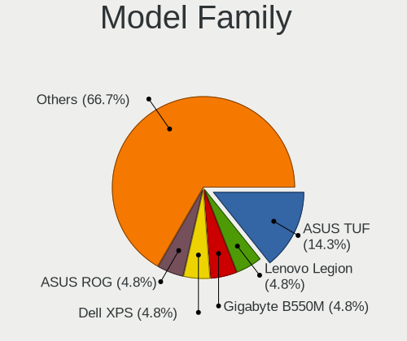
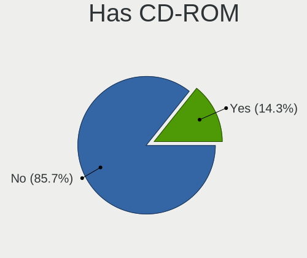
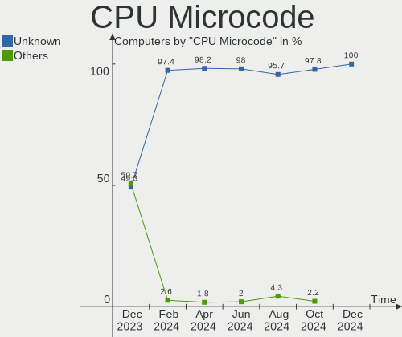
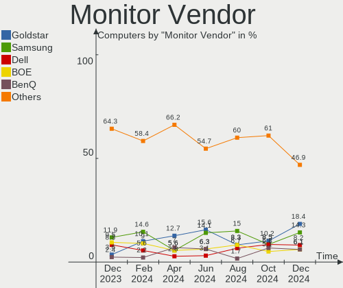
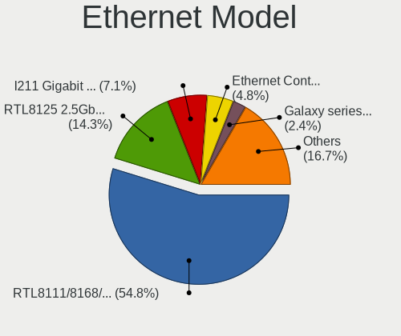
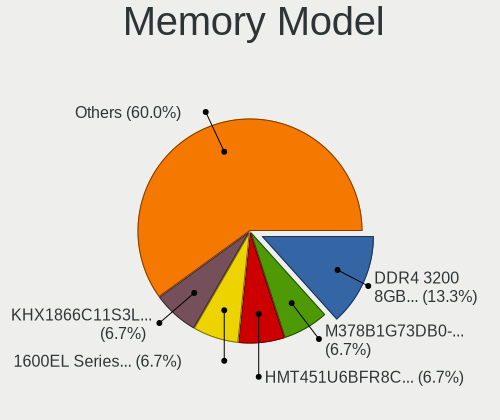
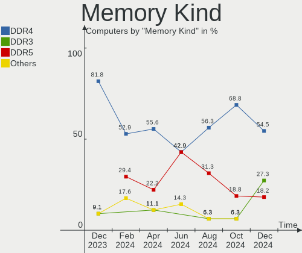
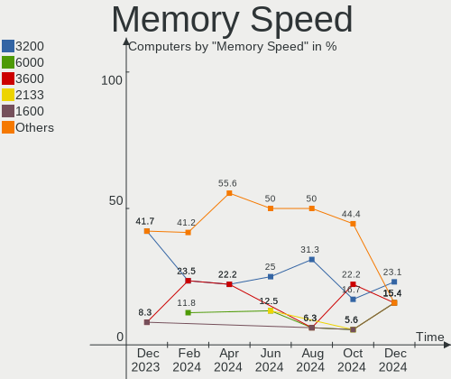
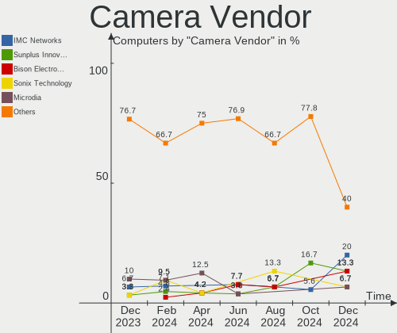

Nobara - Hardware Trends
------------------------

A project to identify most popular hardware characteristics and track their change
over time based on data collected by Linux users at https://Linux-Hardware.org.

Anyone can contribute to this report by the [hw-probe](https://github.com/linuxhw/hw-probe) tool:

    sudo -E hw-probe -all -upload

This is a report for all computer types. See also reports for [desktops](/Dist/Nobara/Desktop/README.md) and [notebooks](/Dist/Nobara/Notebook/README.md).

This report is for one last month. Overall report since the beginning of time: [TestDays](https://github.com/linuxhw/TestDays)

Period: May, 2023.

Contents
--------

* [ System ](#system)
  - [ OS                       ](#os)
  - [ OS Family                ](#os-family)
  - [ Kernel                   ](#kernel)
  - [ Kernel Family            ](#kernel-family)
  - [ Kernel Major Ver.        ](#kernel-major-ver)
  - [ Arch                     ](#arch)
  - [ DE                       ](#de)
  - [ Display Server           ](#display-server)
  - [ Display Manager          ](#display-manager)
  - [ OS Lang                  ](#os-lang)
  - [ Boot Mode                ](#boot-mode)
  - [ Filesystem               ](#filesystem)
  - [ Part. scheme             ](#part-scheme)
  - [ Dual Boot with Linux/BSD ](#dual-boot-with-linuxbsd)
  - [ Dual Boot (Win)          ](#dual-boot-win)

* [ Board ](#board)
  - [ Vendor                   ](#vendor)
  - [ Model                    ](#model)
  - [ Model Family             ](#model-family)
  - [ MFG Year                 ](#mfg-year)
  - [ Form Factor              ](#form-factor)
  - [ Secure Boot              ](#secure-boot)
  - [ Coreboot                 ](#coreboot)
  - [ RAM Size                 ](#ram-size)
  - [ RAM Used                 ](#ram-used)
  - [ Total Drives             ](#total-drives)
  - [ Has CD-ROM               ](#has-cd-rom)
  - [ Has Ethernet             ](#has-ethernet)
  - [ Has WiFi                 ](#has-wifi)
  - [ Has Bluetooth            ](#has-bluetooth)

* [ Location ](#location)
  - [ Country                  ](#country)
  - [ City                     ](#city)

* [ Drives ](#drives)
  - [ Drive Vendor             ](#drive-vendor)
  - [ Drive Model              ](#drive-model)
  - [ HDD Vendor               ](#hdd-vendor)
  - [ SSD Vendor               ](#ssd-vendor)
  - [ Drive Kind               ](#drive-kind)
  - [ Drive Connector          ](#drive-connector)
  - [ Drive Size               ](#drive-size)
  - [ Space Total              ](#space-total)
  - [ Space Used               ](#space-used)
  - [ Malfunc. Drives          ](#malfunc-drives)
  - [ Malfunc. Drive Vendor    ](#malfunc-drive-vendor)
  - [ Malfunc. HDD Vendor      ](#malfunc-hdd-vendor)
  - [ Malfunc. Drive Kind      ](#malfunc-drive-kind)
  - [ Failed Drives            ](#failed-drives)
  - [ Failed Drive Vendor      ](#failed-drive-vendor)
  - [ Drive Status             ](#drive-status)

* [ Storage controller ](#storage-controller)
  - [ Storage Vendor           ](#storage-vendor)
  - [ Storage Model            ](#storage-model)
  - [ Storage Kind             ](#storage-kind)

* [ Processor ](#processor)
  - [ CPU Vendor               ](#cpu-vendor)
  - [ CPU Model                ](#cpu-model)
  - [ CPU Model Family         ](#cpu-model-family)
  - [ CPU Cores                ](#cpu-cores)
  - [ CPU Sockets              ](#cpu-sockets)
  - [ CPU Threads              ](#cpu-threads)
  - [ CPU Op-Modes             ](#cpu-op-modes)
  - [ CPU Microcode            ](#cpu-microcode)
  - [ CPU Microarch            ](#cpu-microarch)

* [ Graphics ](#graphics)
  - [ GPU Vendor               ](#gpu-vendor)
  - [ GPU Model                ](#gpu-model)
  - [ GPU Combo                ](#gpu-combo)
  - [ GPU Driver               ](#gpu-driver)
  - [ GPU Memory               ](#gpu-memory)

* [ Monitor ](#monitor)
  - [ Monitor Vendor           ](#monitor-vendor)
  - [ Monitor Model            ](#monitor-model)
  - [ Monitor Resolution       ](#monitor-resolution)
  - [ Monitor Diagonal         ](#monitor-diagonal)
  - [ Monitor Width            ](#monitor-width)
  - [ Aspect Ratio             ](#aspect-ratio)
  - [ Monitor Area             ](#monitor-area)
  - [ Pixel Density            ](#pixel-density)
  - [ Multiple Monitors        ](#multiple-monitors)

* [ Network ](#network)
  - [ Net Controller Vendor    ](#net-controller-vendor)
  - [ Net Controller Model     ](#net-controller-model)
  - [ Wireless Vendor          ](#wireless-vendor)
  - [ Wireless Model           ](#wireless-model)
  - [ Ethernet Vendor          ](#ethernet-vendor)
  - [ Ethernet Model           ](#ethernet-model)
  - [ Net Controller Kind      ](#net-controller-kind)
  - [ Used Controller          ](#used-controller)
  - [ NICs                     ](#nics)
  - [ IPv6                     ](#ipv6)

* [ Bluetooth ](#bluetooth)
  - [ Bluetooth Vendor         ](#bluetooth-vendor)
  - [ Bluetooth Model          ](#bluetooth-model)

* [ Sound ](#sound)
  - [ Sound Vendor             ](#sound-vendor)
  - [ Sound Model              ](#sound-model)

* [ Memory ](#memory)
  - [ Memory Vendor            ](#memory-vendor)
  - [ Memory Model             ](#memory-model)
  - [ Memory Kind              ](#memory-kind)
  - [ Memory Form Factor       ](#memory-form-factor)
  - [ Memory Size              ](#memory-size)
  - [ Memory Speed             ](#memory-speed)

* [ Printers & scanners ](#printers--scanners)
  - [ Printer Vendor           ](#printer-vendor)
  - [ Printer Model            ](#printer-model)
  - [ Scanner Vendor           ](#scanner-vendor)
  - [ Scanner Model            ](#scanner-model)

* [ Camera ](#camera)
  - [ Camera Vendor            ](#camera-vendor)
  - [ Camera Model             ](#camera-model)

* [ Security ](#security)
  - [ Fingerprint Vendor       ](#fingerprint-vendor)
  - [ Fingerprint Model        ](#fingerprint-model)
  - [ Chipcard Vendor          ](#chipcard-vendor)
  - [ Chipcard Model           ](#chipcard-model)

* [ Unsupported ](#unsupported)
  - [ Unsupported Devices      ](#unsupported-devices)
  - [ Unsupported Device Types ](#unsupported-device-types)

System
------

OS
--

Installed operating systems

| Name      | Computers | Percent |
|-----------|-----------|---------|
| Nobara 37 | 43        | 91.49%  |
| Nobara 36 | 3         | 6.38%   |
| Nobara 38 | 1         | 2.13%   |

OS Family
---------

OS without a version

| Name   | Computers | Percent |
|--------|-----------|---------|
| Nobara | 47        | 100%    |

Kernel
------

Version of the Linux kernel

| Version                       | Computers | Percent |
|-------------------------------|-----------|---------|
| 6.2.14-300.fsync.fc37.x86_64  | 29        | 61.7%   |
| 6.2.12-200.fsync.fc37.x86_64  | 12        | 25.53%  |
| 6.3.4-201.fsync.fc37.x86_64   | 2         | 4.26%   |
| 6.0.14-201.fsync.fc36.x86_64  | 2         | 4.26%   |
| 6.2.14-300.fsync.fc38.x86_64  | 1         | 2.13%   |
| 5.19.14-201.fsync.fc36.x86_64 | 1         | 2.13%   |

Kernel Family
-------------

Linux kernel without a distro release

| Version | Computers | Percent |
|---------|-----------|---------|
| 6.2.14  | 30        | 63.83%  |
| 6.2.12  | 12        | 25.53%  |
| 6.3.4   | 2         | 4.26%   |
| 6.0.14  | 2         | 4.26%   |
| 5.19.14 | 1         | 2.13%   |

Kernel Major Ver.
-----------------

Linux kernel major version

| Version | Computers | Percent |
|---------|-----------|---------|
| 6.2     | 42        | 89.36%  |
| 6.3     | 2         | 4.26%   |
| 6.0     | 2         | 4.26%   |
| 5.19    | 1         | 2.13%   |

Arch
----

OS architecture (x86_64, i586, etc.)

| Name   | Computers | Percent |
|--------|-----------|---------|
| x86_64 | 47        | 100%    |

DE
--

Desktop Environment

| Name    | Computers | Percent |
|---------|-----------|---------|
| GNOME   | 31        | 65.96%  |
| KDE5    | 14        | 29.79%  |
| sway    | 1         | 2.13%   |
| Unknown | 1         | 2.13%   |

Display Server
--------------

X11 or Wayland

| Name    | Computers | Percent |
|---------|-----------|---------|
| Wayland | 39        | 82.98%  |
| X11     | 8         | 17.02%  |

Display Manager
---------------

SDDM, LightDM, etc.

| Name    | Computers | Percent |
|---------|-----------|---------|
| Unknown | 34        | 72.34%  |
| GDM     | 8         | 17.02%  |
| SDDM    | 5         | 10.64%  |

OS Lang
-------

Language

| Lang    | Computers | Percent |
|---------|-----------|---------|
| en_US   | 25        | 53.19%  |
| de_DE   | 6         | 12.77%  |
| es_MX   | 4         | 8.51%   |
| pl_PL   | 2         | 4.26%   |
| en_NZ   | 2         | 4.26%   |
| en_GB   | 2         | 4.26%   |
| zh_TW   | 1         | 2.13%   |
| it_IT   | 1         | 2.13%   |
| es_ES   | 1         | 2.13%   |
| en_IN   | 1         | 2.13%   |
| en_CA   | 1         | 2.13%   |
| Unknown | 1         | 2.13%   |

Boot Mode
---------

EFI or BIOS

| Mode | Computers | Percent |
|------|-----------|---------|
| EFI  | 39        | 82.98%  |
| BIOS | 8         | 17.02%  |

Filesystem
----------

Type of filesystem

| Type  | Computers | Percent |
|-------|-----------|---------|
| Btrfs | 43        | 91.49%  |
| Ext4  | 4         | 8.51%   |

Part. scheme
------------

Scheme of partitioning

| Type    | Computers | Percent |
|---------|-----------|---------|
| Unknown | 33        | 70.21%  |
| GPT     | 14        | 29.79%  |

Dual Boot with Linux/BSD
------------------------

Hosting more than one Linux/BSD

| Dual boot | Computers | Percent |
|-----------|-----------|---------|
| No        | 43        | 91.49%  |
| Yes       | 4         | 8.51%   |

Dual Boot (Win)
---------------

Hosting Linux and Windows

| Dual boot | Computers | Percent |
|-----------|-----------|---------|
| No        | 42        | 89.36%  |
| Yes       | 5         | 10.64%  |

Board
-----

Vendor
------

Motherboard manufacturer

| Name                                 | Computers | Percent |
|--------------------------------------|-----------|---------|
| ASUSTek Computer                     | 11        | 23.4%   |
| Hewlett-Packard                      | 7         | 14.89%  |
| Gigabyte Technology                  | 5         | 10.64%  |
| MSI                                  | 4         | 8.51%   |
| Lenovo                               | 4         | 8.51%   |
| ASRock                               | 4         | 8.51%   |
| Samsung Electronics                  | 3         | 6.38%   |
| Shenzhen Meigao Electronic Equipment | 1         | 2.13%   |
| Packard Bell                         | 1         | 2.13%   |
| Micro Electronics                    | 1         | 2.13%   |
| langchao                             | 1         | 2.13%   |
| Hampoo                               | 1         | 2.13%   |
| Dell                                 | 1         | 2.13%   |
| Apple                                | 1         | 2.13%   |
| AOpen                                | 1         | 2.13%   |
| Alienware                            | 1         | 2.13%   |

Model
-----

Motherboard model

| Name                                       | Computers | Percent |
|--------------------------------------------|-----------|---------|
| Samsung 730QED                             | 2         | 4.26%   |
| MSI MS-7D25                                | 2         | 4.26%   |
| ASUS All Series                            | 2         | 4.26%   |
| Shenzhen Meigao Electronic Equipment UM690 | 1         | 2.13%   |
| Samsung 535U3C                             | 1         | 2.13%   |
| Packard Bell EasyNote LS11HR               | 1         | 2.13%   |
| MSI MS-7B86                                | 1         | 2.13%   |
| MSI MS-7B79                                | 1         | 2.13%   |
| Micro MG-VCP2-17A3070T                     | 1         | 2.13%   |
| Lenovo ThinkPad X140e 20BLS00400           | 1         | 2.13%   |
| Lenovo ThinkPad T480s 20L8S06Q00           | 1         | 2.13%   |
| Lenovo Legion Y530-15ICH 81FV              | 1         | 2.13%   |
| Lenovo IdeaPad 320-15ISK 80XH              | 1         | 2.13%   |
| langchao 12345                             | 1         | 2.13%   |
| HP Pavilion x2 Detachable                  | 1         | 2.13%   |
| HP Pavilion Gaming Laptop 15-ec2xxx        | 1         | 2.13%   |
| HP Pavilion Gaming Laptop 15-cx0xxx        | 1         | 2.13%   |
| HP Pavilion 15                             | 1         | 2.13%   |
| HP Laptop 17-ca1xxx                        | 1         | 2.13%   |
| HP ENVY x360 Convertible 15-eu0xxx         | 1         | 2.13%   |
| HP Compaq 6200 Pro SFF PC                  | 1         | 2.13%   |
| Hampoo I1D6_C109S_Hi10Pro                  | 1         | 2.13%   |
| Gigabyte X570S AORUS ELITE AX              | 1         | 2.13%   |
| Gigabyte P43-ES3G                          | 1         | 2.13%   |
| Gigabyte GA-78LMT-S2P                      | 1         | 2.13%   |
| Gigabyte B550I AORUS PRO AX                | 1         | 2.13%   |
| Gigabyte B550 GAMING X V2                  | 1         | 2.13%   |
| Dell OptiPlex 790                          | 1         | 2.13%   |
| ASUS VivoBook_ASUS Laptop X505ZA_X505ZA    | 1         | 2.13%   |
| ASUS TUF Gaming B560M-PLUS                 | 1         | 2.13%   |
| ASUS TUF Gaming B550M-PLUS WIFI II         | 1         | 2.13%   |
| ASUS TUF B450M-PRO GAMING                  | 1         | 2.13%   |
| ASUS ROG STRIX B650E-I GAMING WIFI         | 1         | 2.13%   |
| ASUS ROG STRIX B650E-F GAMING WIFI         | 1         | 2.13%   |
| ASUS ROG STRIX B550-F GAMING               | 1         | 2.13%   |
| ASUS PRIME X670-P WIFI                     | 1         | 2.13%   |
| ASUS P8B75-M LE                            | 1         | 2.13%   |
| ASRock Z97 Pro3                            | 1         | 2.13%   |
| ASRock B650E Steel Legend WiFi             | 1         | 2.13%   |
| ASRock B550 Phantom Gaming-ITX/ax          | 1         | 2.13%   |

Model Family
------------

Motherboard model prefix

| Name                                       | Computers | Percent |
|--------------------------------------------|-----------|---------|
| HP Pavilion                                | 4         | 8.51%   |
| ASUS TUF                                   | 3         | 6.38%   |
| ASUS ROG                                   | 3         | 6.38%   |
| Samsung 730QED                             | 2         | 4.26%   |
| MSI MS-7D25                                | 2         | 4.26%   |
| Lenovo ThinkPad                            | 2         | 4.26%   |
| ASUS All                                   | 2         | 4.26%   |
| Shenzhen Meigao Electronic Equipment UM690 | 1         | 2.13%   |
| Samsung 535U3C                             | 1         | 2.13%   |
| Packard Bell EasyNote                      | 1         | 2.13%   |
| MSI MS-7B86                                | 1         | 2.13%   |
| MSI MS-7B79                                | 1         | 2.13%   |
| Micro MG-VCP2-17A3070T                     | 1         | 2.13%   |
| Lenovo Legion                              | 1         | 2.13%   |
| Lenovo IdeaPad                             | 1         | 2.13%   |
| langchao 12345                             | 1         | 2.13%   |
| HP Laptop                                  | 1         | 2.13%   |
| HP ENVY                                    | 1         | 2.13%   |
| HP Compaq                                  | 1         | 2.13%   |
| Hampoo I1D6                                | 1         | 2.13%   |
| Gigabyte X570S                             | 1         | 2.13%   |
| Gigabyte P43-ES3G                          | 1         | 2.13%   |
| Gigabyte GA-78LMT-S2P                      | 1         | 2.13%   |
| Gigabyte B550I                             | 1         | 2.13%   |
| Gigabyte B550                              | 1         | 2.13%   |
| Dell OptiPlex                              | 1         | 2.13%   |
| ASUS VivoBook                              | 1         | 2.13%   |
| ASUS PRIME                                 | 1         | 2.13%   |
| ASUS P8B75-M                               | 1         | 2.13%   |
| ASRock Z97                                 | 1         | 2.13%   |
| ASRock B650E                               | 1         | 2.13%   |
| ASRock B550                                | 1         | 2.13%   |
| ASRock AB350M                              | 1         | 2.13%   |
| Apple MacBookPro8                          | 1         | 2.13%   |
| AOpen DEX5350                              | 1         | 2.13%   |
| Alienware m17                              | 1         | 2.13%   |

MFG Year
--------

Motherboard manufacture year

| Year | Computers | Percent |
|------|-----------|---------|
| 2022 | 7         | 14.89%  |
| 2021 | 7         | 14.89%  |
| 2018 | 5         | 10.64%  |
| 2011 | 5         | 10.64%  |
| 2020 | 4         | 8.51%   |
| 2019 | 3         | 6.38%   |
| 2013 | 3         | 6.38%   |
| 2023 | 2         | 4.26%   |
| 2017 | 2         | 4.26%   |
| 2016 | 2         | 4.26%   |
| 2015 | 2         | 4.26%   |
| 2012 | 2         | 4.26%   |
| 2014 | 1         | 2.13%   |
| 2010 | 1         | 2.13%   |
| 2009 | 1         | 2.13%   |

Form Factor
-----------

Physical design of the computer

| Name        | Computers | Percent |
|-------------|-----------|---------|
| Desktop     | 28        | 59.57%  |
| Notebook    | 14        | 29.79%  |
| Convertible | 3         | 6.38%   |
| Tablet      | 2         | 4.26%   |

Secure Boot
-----------

Enabled or disabled

| State    | Computers | Percent |
|----------|-----------|---------|
| Disabled | 47        | 100%    |

Coreboot
--------

Have coreboot on board

| Used | Computers | Percent |
|------|-----------|---------|
| No   | 47        | 100%    |

RAM Size
--------

Total RAM memory

| Size in GB  | Computers | Percent |
|-------------|-----------|---------|
| 16.01-24.0  | 12        | 25.53%  |
| 8.01-16.0   | 9         | 19.15%  |
| 32.01-64.0  | 7         | 14.89%  |
| 4.01-8.0    | 6         | 12.77%  |
| 24.01-32.0  | 6         | 12.77%  |
| 3.01-4.0    | 4         | 8.51%   |
| 64.01-256.0 | 2         | 4.26%   |
| 1.01-2.0    | 1         | 2.13%   |

RAM Used
--------

Used RAM memory

| Used GB    | Computers | Percent |
|------------|-----------|---------|
| 2.01-3.0   | 15        | 31.91%  |
| 4.01-8.0   | 12        | 25.53%  |
| 3.01-4.0   | 11        | 23.4%   |
| 1.01-2.0   | 5         | 10.64%  |
| 8.01-16.0  | 3         | 6.38%   |
| 16.01-24.0 | 1         | 2.13%   |

Total Drives
------------

Number of drives on board

| Drives | Computers | Percent |
|--------|-----------|---------|
| 2      | 18        | 38.3%   |
| 1      | 18        | 38.3%   |
| 3      | 5         | 10.64%  |
| 4      | 3         | 6.38%   |
| 6      | 2         | 4.26%   |
| 9      | 1         | 2.13%   |

Has CD-ROM
----------

Has CD-ROM on board

| Presented | Computers | Percent |
|-----------|-----------|---------|
| No        | 40        | 85.11%  |
| Yes       | 7         | 14.89%  |

Has Ethernet
------------

Has Ethernet on board

| Presented | Computers | Percent |
|-----------|-----------|---------|
| Yes       | 43        | 91.49%  |
| No        | 4         | 8.51%   |

Has WiFi
--------

Has WiFi module

| Presented | Computers | Percent |
|-----------|-----------|---------|
| Yes       | 32        | 68.09%  |
| No        | 15        | 31.91%  |

Has Bluetooth
-------------

Has Bluetooth module

| Presented | Computers | Percent |
|-----------|-----------|---------|
| Yes       | 26        | 55.32%  |
| No        | 21        | 44.68%  |

Location
--------

Country
-------

Geographic location (country)

| Country      | Computers | Percent |
|--------------|-----------|---------|
| USA          | 17        | 36.17%  |
| Germany      | 5         | 10.64%  |
| Mexico       | 3         | 6.38%   |
| UK           | 2         | 4.26%   |
| Spain        | 2         | 4.26%   |
| Poland       | 2         | 4.26%   |
| New Zealand  | 2         | 4.26%   |
| Venezuela    | 1         | 2.13%   |
| Switzerland  | 1         | 2.13%   |
| Sweden       | 1         | 2.13%   |
| Saudi Arabia | 1         | 2.13%   |
| Russia       | 1         | 2.13%   |
| Portugal     | 1         | 2.13%   |
| Malaysia     | 1         | 2.13%   |
| India        | 1         | 2.13%   |
| France       | 1         | 2.13%   |
| Croatia      | 1         | 2.13%   |
| Canada       | 1         | 2.13%   |
| Brazil       | 1         | 2.13%   |
| Austria      | 1         | 2.13%   |
| Albania      | 1         | 2.13%   |

City
----

Geographic location (city)

| City              | Computers | Percent |
|-------------------|-----------|---------|
| Zurich            | 1         | 2.13%   |
| Wellington        | 1         | 2.13%   |
| Wassenberg        | 1         | 2.13%   |
| Virginia Beach    | 1         | 2.13%   |
| Vancouver         | 1         | 2.13%   |
| Valencia          | 1         | 2.13%   |
| Toronto           | 1         | 2.13%   |
| Tirana            | 1         | 2.13%   |
| Tijuana           | 1         | 2.13%   |
| St Louis          | 1         | 2.13%   |
| Spartanburg       | 1         | 2.13%   |
| Seclin            | 1         | 2.13%   |
| Riverside         | 1         | 2.13%   |
| Raleigh           | 1         | 2.13%   |
| Poznan            | 1         | 2.13%   |
| Pine Bush         | 1         | 2.13%   |
| Philadelphia      | 1         | 2.13%   |
| Patna             | 1         | 2.13%   |
| Omaha             | 1         | 2.13%   |
| Moscow            | 1         | 2.13%   |
| Mexicali          | 1         | 2.13%   |
| Makkah            | 1         | 2.13%   |
| Lublin            | 1         | 2.13%   |
| Lisbon            | 1         | 2.13%   |
| Lichtenau         | 1         | 2.13%   |
| Las Vegas         | 1         | 2.13%   |
| Lake Elsinore     | 1         | 2.13%   |
| Kuala Lumpur      | 1         | 2.13%   |
| Kalsdorf bei Graz | 1         | 2.13%   |
| Indianapolis      | 1         | 2.13%   |
| Houston           | 1         | 2.13%   |
| Herzogenaurach    | 1         | 2.13%   |
| Halifax           | 1         | 2.13%   |
| Guadalajara       | 1         | 2.13%   |
| Granada           | 1         | 2.13%   |
| Gothenburg        | 1         | 2.13%   |
| Goiânia          | 1         | 2.13%   |
| Frankfurt am Main | 1         | 2.13%   |
| Everett           | 1         | 2.13%   |
| County of Zagreb  | 1         | 2.13%   |

Drives
------

Drive Vendor
------------

Hard drive vendors

| Vendor                      | Computers | Drives | Percent |
|-----------------------------|-----------|--------|---------|
| Samsung Electronics         | 17        | 20     | 18.68%  |
| Seagate                     | 10        | 12     | 10.99%  |
| WDC                         | 6         | 6      | 6.59%   |
| Crucial                     | 6         | 9      | 6.59%   |
| Toshiba                     | 5         | 5      | 5.49%   |
| Sandisk                     | 5         | 5      | 5.49%   |
| Kingston                    | 5         | 5      | 5.49%   |
| Unknown                     | 4         | 5      | 4.4%    |
| Micron/Crucial Technology   | 3         | 4      | 3.3%    |
| HGST                        | 3         | 3      | 3.3%    |
| PNY                         | 2         | 2      | 2.2%    |
| KIOXIA                      | 2         | 2      | 2.2%    |
| Intel                       | 2         | 2      | 2.2%    |
| Hitachi                     | 2         | 3      | 2.2%    |
| A-DATA Technology           | 2         | 2      | 2.2%    |
| Team                        | 1         | 1      | 1.1%    |
| SSK                         | 1         | 1      | 1.1%    |
| SPCC                        | 1         | 1      | 1.1%    |
| SK hynix                    | 1         | 1      | 1.1%    |
| Silicon Motion              | 1         | 1      | 1.1%    |
| SD                          | 1         | 1      | 1.1%    |
| Ramaxel Technology          | 1         | 1      | 1.1%    |
| Phison Electronics          | 1         | 1      | 1.1%    |
| PCIe SSD                    | 1         | 1      | 1.1%    |
| Micron Technology           | 1         | 1      | 1.1%    |
| KIOXIA-EXCERIA              | 1         | 1      | 1.1%    |
| Kingston Technology Company | 1         | 1      | 1.1%    |
| Intenso                     | 1         | 1      | 1.1%    |
| Corsair                     | 1         | 1      | 1.1%    |
| China                       | 1         | 1      | 1.1%    |
| ASMT                        | 1         | 1      | 1.1%    |
| Apacer                      | 1         | 1      | 1.1%    |

Drive Model
-----------

Hard drive models

| Model                                               | Computers | Percent |
|-----------------------------------------------------|-----------|---------|
| Samsung NVMe SSD Controller SM981/PM981/PM983 256GB | 4         | 4.21%   |
| Unknown MMC Card  64GB                              | 3         | 3.16%   |
| Sandisk WD Blue SN550 NVMe SSD 512GB                | 2         | 2.11%   |
| Samsung SSD 860 EVO 1TB                             | 2         | 2.11%   |
| Samsung NVMe SSD Controller PM9A1/PM9A3/980PRO 1TB  | 2         | 2.11%   |
| Micron/Crucial P2 NVMe PCIe SSD 1TB                 | 2         | 2.11%   |
| Kingston SA400S37240G 240GB SSD                     | 2         | 2.11%   |
| Crucial CT240BX500SSD1 240GB                        | 2         | 2.11%   |
| WDC WDS500G2B0A-00SM50 500GB SSD                    | 1         | 1.05%   |
| WDC WDS120G2G0A-00JH30 120GB SSD                    | 1         | 1.05%   |
| WDC WD5000AAKS-75A7B0 500GB                         | 1         | 1.05%   |
| WDC WD10JPVX-60JC3T0 1TB                            | 1         | 1.05%   |
| WDC WD10EZRX-00A8LB0 1TB                            | 1         | 1.05%   |
| WDC WD1002FAEX-00Z3A0 1TB                           | 1         | 1.05%   |
| Unknown USB DISK 3.2 2TB                            | 1         | 1.05%   |
| Toshiba TR200 240GB SSD                             | 1         | 1.05%   |
| Toshiba MQ04ABF100 1TB                              | 1         | 1.05%   |
| Toshiba KXG50ZNV512G NVMe 512GB                     | 1         | 1.05%   |
| Toshiba HDWD110 1TB                                 | 1         | 1.05%   |
| Toshiba DT01ACA200 2TB                              | 1         | 1.05%   |
| Team T253X2001T 1024GB SSD                          | 1         | 1.05%   |
| SSK Disk 256GB                                      | 1         | 1.05%   |
| SPCC Solid State Disk 240GB                         | 1         | 1.05%   |
| SK hynix BC511 256GB                                | 1         | 1.05%   |
| Silicon Motion SM2263EN/SM2263XT SSD Controller 1TB | 1         | 1.05%   |
| Seagate ST500DM002-1BD142 500GB                     | 1         | 1.05%   |
| Seagate ST3500413AS 500GB                           | 1         | 1.05%   |
| Seagate ST32000644NS 2TB                            | 1         | 1.05%   |
| Seagate ST250LM004 HN-M250MBB 250GB                 | 1         | 1.05%   |
| Seagate ST250DM000-1BD141 250GB                     | 1         | 1.05%   |
| Seagate ST2000LM007-1R8174 2TB                      | 1         | 1.05%   |
| Seagate ST1000VM002-1CT162 1TB                      | 1         | 1.05%   |
| Seagate ST1000LM049-2GH172 1TB                      | 1         | 1.05%   |
| Seagate ST1000LM024 HN-M101MBB 1TB                  | 1         | 1.05%   |
| Seagate ST1000DM003-1CH162 1TB                      | 1         | 1.05%   |
| Seagate FireCuda 520 SSD ZP1000GM30002 1TB          | 1         | 1.05%   |
| SD Ultra 3D 500GB SSD                               | 1         | 1.05%   |
| Sandisk WD_BLACK SN850X 1000GB                      | 1         | 1.05%   |
| Sandisk WD_BLACK SN770 2TB                          | 1         | 1.05%   |
| SanDisk SD9SN8W128G1002 128GB SSD                   | 1         | 1.05%   |

HDD Vendor
----------

Hard disk drive vendors

| Vendor              | Computers | Drives | Percent |
|---------------------|-----------|--------|---------|
| Seagate             | 9         | 11     | 39.13%  |
| WDC                 | 4         | 4      | 17.39%  |
| Toshiba             | 3         | 3      | 13.04%  |
| HGST                | 3         | 3      | 13.04%  |
| Hitachi             | 2         | 3      | 8.7%    |
| SSK                 | 1         | 1      | 4.35%   |
| Samsung Electronics | 1         | 1      | 4.35%   |

SSD Vendor
----------

Solid state drive vendors

| Vendor              | Computers | Drives | Percent |
|---------------------|-----------|--------|---------|
| Samsung Electronics | 7         | 7      | 20.59%  |
| Crucial             | 6         | 9      | 17.65%  |
| WDC                 | 2         | 2      | 5.88%   |
| PNY                 | 2         | 2      | 5.88%   |
| Kingston            | 2         | 2      | 5.88%   |
| A-DATA Technology   | 2         | 2      | 5.88%   |
| Toshiba             | 1         | 1      | 2.94%   |
| Team                | 1         | 1      | 2.94%   |
| SPCC                | 1         | 1      | 2.94%   |
| SD                  | 1         | 1      | 2.94%   |
| SanDisk             | 1         | 1      | 2.94%   |
| Ramaxel Technology  | 1         | 1      | 2.94%   |
| Micron Technology   | 1         | 1      | 2.94%   |
| KIOXIA-EXCERIA      | 1         | 1      | 2.94%   |
| Intenso             | 1         | 1      | 2.94%   |
| Intel               | 1         | 1      | 2.94%   |
| China               | 1         | 1      | 2.94%   |
| ASMT                | 1         | 1      | 2.94%   |
| Apacer              | 1         | 1      | 2.94%   |

Drive Kind
----------

HDD or SSD

| Kind    | Computers | Drives | Percent |
|---------|-----------|--------|---------|
| NVMe    | 25        | 33     | 34.25%  |
| SSD     | 25        | 37     | 34.25%  |
| HDD     | 18        | 26     | 24.66%  |
| MMC     | 3         | 4      | 4.11%   |
| Unknown | 2         | 2      | 2.74%   |

Drive Connector
---------------

SATA, SAS, NVMe, etc.

| Type | Computers | Drives | Percent |
|------|-----------|--------|---------|
| SATA | 31        | 59     | 47.69%  |
| NVMe | 25        | 33     | 38.46%  |
| SAS  | 6         | 6      | 9.23%   |
| MMC  | 3         | 4      | 4.62%   |

Drive Size
----------

Size of hard drive

| Size in TB | Computers | Drives | Percent |
|------------|-----------|--------|---------|
| 0.01-0.5   | 22        | 40     | 51.16%  |
| 0.51-1.0   | 13        | 15     | 30.23%  |
| 1.01-2.0   | 6         | 6      | 13.95%  |
| 3.01-4.0   | 1         | 1      | 2.33%   |
| 4.01-10.0  | 1         | 1      | 2.33%   |

Space Total
-----------

Amount of disk space available on the file system

| Size in GB     | Computers | Percent |
|----------------|-----------|---------|
| 501-1000       | 13        | 27.66%  |
| 251-500        | 8         | 17.02%  |
| 101-250        | 8         | 17.02%  |
| More than 3000 | 7         | 14.89%  |
| 1001-2000      | 6         | 12.77%  |
| 2001-3000      | 3         | 6.38%   |
| 51-100         | 1         | 2.13%   |
| Unknown        | 1         | 2.13%   |

Space Used
----------

Amount of used disk space

| Used GB        | Computers | Percent |
|----------------|-----------|---------|
| 1-20           | 11        | 23.4%   |
| 51-100         | 10        | 21.28%  |
| 21-50          | 6         | 12.77%  |
| 101-250        | 5         | 10.64%  |
| 501-1000       | 5         | 10.64%  |
| 251-500        | 4         | 8.51%   |
| 2001-3000      | 2         | 4.26%   |
| 1001-2000      | 2         | 4.26%   |
| More than 3000 | 1         | 2.13%   |
| Unknown        | 1         | 2.13%   |

Malfunc. Drives
---------------

Drive models with a malfunction

| Model                      | Computers | Drives | Percent |
|----------------------------|-----------|--------|---------|
| HGST HTS545050A7E380 500GB | 1         | 1      | 100%    |

Malfunc. Drive Vendor
---------------------

Vendors of faulty drives

| Vendor | Computers | Drives | Percent |
|--------|-----------|--------|---------|
| HGST   | 1         | 1      | 100%    |

Malfunc. HDD Vendor
-------------------

Vendors of faulty HDD drives

| Vendor | Computers | Drives | Percent |
|--------|-----------|--------|---------|
| HGST   | 1         | 1      | 100%    |

Malfunc. Drive Kind
-------------------

Kinds of faulty drives

| Kind | Computers | Drives | Percent |
|------|-----------|--------|---------|
| HDD  | 1         | 1      | 100%    |

Failed Drives
-------------

Failed drive models

Zero info for selected period =(

Failed Drive Vendor
-------------------

Failed drive vendors

Zero info for selected period =(

Drive Status
------------

Number of failed and malfunc. drives

| Status   | Computers | Drives | Percent |
|----------|-----------|--------|---------|
| Detected | 36        | 76     | 73.47%  |
| Works    | 12        | 25     | 24.49%  |
| Malfunc  | 1         | 1      | 2.04%   |

Storage controller
------------------

Storage Vendor
--------------

Storage controller vendors

| Vendor                       | Computers | Percent |
|------------------------------|-----------|---------|
| AMD                          | 20        | 28.17%  |
| Intel                        | 19        | 26.76%  |
| Samsung Electronics          | 11        | 15.49%  |
| Sandisk                      | 4         | 5.63%   |
| Kingston Technology Company  | 4         | 5.63%   |
| Micron/Crucial Technology    | 3         | 4.23%   |
| Phison Electronics           | 2         | 2.82%   |
| KIOXIA                       | 2         | 2.82%   |
| Toshiba America Info Systems | 1         | 1.41%   |
| SK hynix                     | 1         | 1.41%   |
| Silicon Motion               | 1         | 1.41%   |
| Seagate Technology           | 1         | 1.41%   |
| Broadcom / LSI               | 1         | 1.41%   |
| ASMedia Technology           | 1         | 1.41%   |

Storage Model
-------------

Storage controller models

| Model                                                                          | Computers | Percent |
|--------------------------------------------------------------------------------|-----------|---------|
| AMD FCH SATA Controller [AHCI mode]                                            | 14        | 18.18%  |
| AMD 500 Series Chipset SATA Controller                                         | 5         | 6.49%   |
| Samsung NVMe SSD Controller SM981/PM981/PM983                                  | 4         | 5.19%   |
| Samsung NVMe SSD Controller PM9A1/PM9A3/980PRO                                 | 4         | 5.19%   |
| Kingston Company Company Non-Volatile memory controller                        | 3         | 3.9%    |
| AMD 400 Series Chipset SATA Controller                                         | 3         | 3.9%    |
| SanDisk WD Blue SN550 NVMe SSD                                                 | 2         | 2.6%    |
| Samsung NVMe SSD Controller 980                                                | 2         | 2.6%    |
| Micron/Crucial P2 NVMe PCIe SSD                                                | 2         | 2.6%    |
| Intel Cannon Lake Mobile PCH SATA AHCI Controller                              | 2         | 2.6%    |
| Intel Alder Lake-S PCH SATA Controller [AHCI Mode]                             | 2         | 2.6%    |
| Intel 8 Series/C220 Series Chipset Family 6-port SATA Controller 1 [AHCI mode] | 2         | 2.6%    |
| Intel 6 Series/C200 Series Chipset Family 6 port Mobile SATA AHCI Controller   | 2         | 2.6%    |
| Intel 6 Series/C200 Series Chipset Family 6 port Desktop SATA AHCI Controller  | 2         | 2.6%    |
| Toshiba America Info Systems XG5 NVMe SSD Controller                           | 1         | 1.3%    |
| SK hynix BC511                                                                 | 1         | 1.3%    |
| Silicon Motion SM2263EN/SM2263XT SSD Controller                                | 1         | 1.3%    |
| Seagate FireCuda 520 SSD                                                       | 1         | 1.3%    |
| Sandisk Western Digital WD Black SN850X NVMe SSD                               | 1         | 1.3%    |
| SanDisk WD Black SN770 NVMe SSD                                                | 1         | 1.3%    |
| Samsung Electronics Non-Volatile memory controller                             | 1         | 1.3%    |
| Phison E16 PCIe4 NVMe Controller                                               | 1         | 1.3%    |
| Phison E12 NVMe Controller                                                     | 1         | 1.3%    |
| Micron/Crucial P5 Plus NVMe PCIe SSD                                           | 1         | 1.3%    |
| KIOXIA NVMe SSD Controller BG4                                                 | 1         | 1.3%    |
| KIOXIA Non-Volatile memory controller                                          | 1         | 1.3%    |
| Kingston Company NVMe Controller                                               | 1         | 1.3%    |
| Intel Wildcat Point-LP SATA Controller [AHCI Mode]                             | 1         | 1.3%    |
| Intel Sunrise Point-LP SATA Controller [AHCI mode]                             | 1         | 1.3%    |
| Intel SSD 665p Series                                                          | 1         | 1.3%    |
| Intel SATA Controller [RAID mode]                                              | 1         | 1.3%    |
| Intel NM10/ICH7 Family SATA Controller [IDE mode]                              | 1         | 1.3%    |
| Intel 82801JI (ICH10 Family) SATA AHCI Controller                              | 1         | 1.3%    |
| Intel 82801G (ICH7 Family) IDE Controller                                      | 1         | 1.3%    |
| Intel 8 Series SATA Controller 1 [AHCI mode]                                   | 1         | 1.3%    |
| Intel 7 Series/C210 Series Chipset Family 6-port SATA Controller [AHCI mode]   | 1         | 1.3%    |
| Intel 500 Series Chipset Family SATA AHCI Controller                           | 1         | 1.3%    |
| Broadcom / LSI SAS3008 PCI-Express Fusion-MPT SAS-3                            | 1         | 1.3%    |
| ASMedia ASM1062 Serial ATA Controller                                          | 1         | 1.3%    |
| AMD SB7x0/SB8x0/SB9x0 SATA Controller [IDE mode]                               | 1         | 1.3%    |

Storage Kind
------------

Kind of storage controller (IDE, SATA, NVMe, SAS, ...)

| Kind | Computers | Percent |
|------|-----------|---------|
| SATA | 36        | 55.38%  |
| NVMe | 25        | 38.46%  |
| IDE  | 2         | 3.08%   |
| RAID | 1         | 1.54%   |
| SAS  | 1         | 1.54%   |

Processor
---------

CPU Vendor
----------

Processor vendors

| Vendor | Computers | Percent |
|--------|-----------|---------|
| AMD    | 24        | 51.06%  |
| Intel  | 23        | 48.94%  |

CPU Model
---------

Processor models

| Model                                         | Computers | Percent |
|-----------------------------------------------|-----------|---------|
| AMD Ryzen 9 6900HX with Radeon Graphics       | 3         | 6.38%   |
| Intel Core i7-4790K CPU @ 4.00GHz             | 2         | 4.26%   |
| Intel Core i5-8300H CPU @ 2.30GHz             | 2         | 4.26%   |
| AMD Ryzen 5 5600X 6-Core Processor            | 2         | 4.26%   |
| Intel Xeon CPU X5460 @ 3.16GHz                | 1         | 2.13%   |
| Intel Pentium Dual-Core CPU E5300 @ 2.60GHz   | 1         | 2.13%   |
| Intel Core i7-4510U CPU @ 2.00GHz             | 1         | 2.13%   |
| Intel Core i5-8250U CPU @ 1.60GHz             | 1         | 2.13%   |
| Intel Core i5-4460 CPU @ 3.20GHz              | 1         | 2.13%   |
| Intel Core i5-3330 CPU @ 3.00GHz              | 1         | 2.13%   |
| Intel Core i5-2500 CPU @ 3.30GHz              | 1         | 2.13%   |
| Intel Core i5-2435M CPU @ 2.40GHz             | 1         | 2.13%   |
| Intel Core i5-2400 CPU @ 3.10GHz              | 1         | 2.13%   |
| Intel Core i3-6006U CPU @ 2.00GHz             | 1         | 2.13%   |
| Intel Core i3-5010U CPU @ 2.10GHz             | 1         | 2.13%   |
| Intel Core i3-2310M CPU @ 2.10GHz             | 1         | 2.13%   |
| Intel Atom x5-Z8350 CPU @ 1.44GHz             | 1         | 2.13%   |
| Intel Atom CPU Z3736F @ 1.33GHz               | 1         | 2.13%   |
| Intel 12th Gen Core i9-12900KF                | 1         | 2.13%   |
| Intel 12th Gen Core i7-1255U                  | 1         | 2.13%   |
| Intel 12th Gen Core i5-12600K                 | 1         | 2.13%   |
| Intel 12th Gen Core i5-1235U                  | 1         | 2.13%   |
| Intel 11th Gen Core i5-11400 @ 2.60GHz        | 1         | 2.13%   |
| AMD Ryzen 9 7950X 16-Core Processor           | 1         | 2.13%   |
| AMD Ryzen 7 7800X3D 8-Core Processor          | 1         | 2.13%   |
| AMD Ryzen 7 7700X 8-Core Processor            | 1         | 2.13%   |
| AMD Ryzen 7 5800X3D 8-Core Processor          | 1         | 2.13%   |
| AMD Ryzen 7 5800X 8-Core Processor            | 1         | 2.13%   |
| AMD Ryzen 7 5700X 8-Core Processor            | 1         | 2.13%   |
| AMD Ryzen 5 7600X 6-Core Processor            | 1         | 2.13%   |
| AMD Ryzen 5 5600H with Radeon Graphics        | 1         | 2.13%   |
| AMD Ryzen 5 5600G with Radeon Graphics        | 1         | 2.13%   |
| AMD Ryzen 5 5500U with Radeon Graphics        | 1         | 2.13%   |
| AMD Ryzen 5 5500                              | 1         | 2.13%   |
| AMD Ryzen 5 3500U with Radeon Vega Mobile Gfx | 1         | 2.13%   |
| AMD Ryzen 5 2600 Six-Core Processor           | 1         | 2.13%   |
| AMD Ryzen 5 2500U with Radeon Vega Mobile Gfx | 1         | 2.13%   |
| AMD Ryzen 5 1600 Six-Core Processor           | 1         | 2.13%   |
| AMD Ryzen 3 2200G with Radeon Vega Graphics   | 1         | 2.13%   |
| AMD Phenom II X6 1045T Processor              | 1         | 2.13%   |

CPU Model Family
----------------

Processor model prefix

| Model                   | Computers | Percent |
|-------------------------|-----------|---------|
| AMD Ryzen 5             | 11        | 23.4%   |
| Intel Core i5           | 8         | 17.02%  |
| Other                   | 5         | 10.64%  |
| AMD Ryzen 7             | 5         | 10.64%  |
| AMD Ryzen 9             | 4         | 8.51%   |
| Intel Core i7           | 3         | 6.38%   |
| Intel Core i3           | 3         | 6.38%   |
| Intel Atom              | 2         | 4.26%   |
| Intel Xeon              | 1         | 2.13%   |
| Intel Pentium Dual-Core | 1         | 2.13%   |
| AMD Ryzen 3             | 1         | 2.13%   |
| AMD Phenom II X6        | 1         | 2.13%   |
| AMD A6                  | 1         | 2.13%   |
| AMD A4                  | 1         | 2.13%   |

CPU Cores
---------

Number of processor cores

| Number | Computers | Percent |
|--------|-----------|---------|
| 4      | 16        | 34.04%  |
| 6      | 11        | 23.4%   |
| 8      | 8         | 17.02%  |
| 2      | 6         | 12.77%  |
| 10     | 3         | 6.38%   |
| 16     | 2         | 4.26%   |
| 1      | 1         | 2.13%   |

CPU Sockets
-----------

Number of sockets

| Number | Computers | Percent |
|--------|-----------|---------|
| 1      | 47        | 100%    |

CPU Threads
-----------

Threads per core (Hyper-Threading)

| Number | Computers | Percent |
|--------|-----------|---------|
| 2      | 35        | 74.47%  |
| 1      | 12        | 25.53%  |

CPU Op-Modes
------------

CPU Operation Modes (32-bit, 64-bit)

| Op mode        | Computers | Percent |
|----------------|-----------|---------|
| 32-bit, 64-bit | 47        | 100%    |

CPU Microcode
-------------

Microcode number

| Number     | Computers | Percent |
|------------|-----------|---------|
| Unknown    | 22        | 46.81%  |
| 0x0a601203 | 4         | 8.51%   |
| 0x0a50000d | 3         | 6.38%   |
| 0x0a404102 | 3         | 6.38%   |
| 0x0a201016 | 2         | 4.26%   |
| 0x0800820d | 2         | 4.26%   |
| 0x306a9    | 1         | 2.13%   |
| 0x0a20120a | 1         | 2.13%   |
| 0x0a201204 | 1         | 2.13%   |
| 0x0a201005 | 1         | 2.13%   |
| 0x08608103 | 1         | 2.13%   |
| 0x08108109 | 1         | 2.13%   |
| 0x0810100b | 1         | 2.13%   |
| 0x08101007 | 1         | 2.13%   |
| 0x07000110 | 1         | 2.13%   |
| 0x0600110f | 1         | 2.13%   |
| 0x010000bf | 1         | 2.13%   |

CPU Microarch
-------------

Microarchitecture

| Name             | Computers | Percent |
|------------------|-----------|---------|
| Zen 3            | 8         | 17.02%  |
| Unknown          | 8         | 17.02%  |
| SandyBridge      | 4         | 8.51%   |
| Haswell          | 4         | 8.51%   |
| Alderlake Hybrid | 4         | 8.51%   |
| Zen+             | 3         | 6.38%   |
| KabyLake         | 3         | 6.38%   |
| Zen              | 2         | 4.26%   |
| Silvermont       | 2         | 4.26%   |
| Penryn           | 2         | 4.26%   |
| Skylake          | 1         | 2.13%   |
| Piledriver       | 1         | 2.13%   |
| K10              | 1         | 2.13%   |
| Jaguar           | 1         | 2.13%   |
| IvyBridge        | 1         | 2.13%   |
| Icelake          | 1         | 2.13%   |
| Broadwell        | 1         | 2.13%   |

Graphics
--------

GPU Vendor
----------

Vendors of graphics cards

| Vendor | Computers | Percent |
|--------|-----------|---------|
| AMD    | 26        | 45.61%  |
| Intel  | 18        | 31.58%  |
| Nvidia | 13        | 22.81%  |

GPU Model
---------

Graphics card models

| Model                                                                                    | Computers | Percent |
|------------------------------------------------------------------------------------------|-----------|---------|
| AMD Raphael                                                                              | 4         | 6.45%   |
| AMD Ellesmere [Radeon RX 470/480/570/570X/580/580X/590]                                  | 4         | 6.45%   |
| Intel 2nd Generation Core Processor Family Integrated Graphics Controller                | 3         | 4.84%   |
| AMD Rembrandt [Radeon 680M]                                                              | 3         | 4.84%   |
| AMD Navi 22 [Radeon RX 6700/6700 XT/6750 XT / 6800M/6850M XT]                            | 3         | 4.84%   |
| Nvidia GP107M [GeForce GTX 1050 Mobile]                                                  | 2         | 3.23%   |
| Nvidia GP106 [GeForce GTX 1060 3GB]                                                      | 2         | 3.23%   |
| Intel DG2 [Arc A750]                                                                     | 2         | 3.23%   |
| Intel CoffeeLake-H GT2 [UHD Graphics 630]                                                | 2         | 3.23%   |
| Intel Alder Lake-UP3 GT2 [Iris Xe Graphics]                                              | 2         | 3.23%   |
| AMD Raven Ridge [Radeon Vega Series / Radeon Vega Mobile Series]                         | 2         | 3.23%   |
| AMD Navi 23 [Radeon RX 6600/6600 XT/6600M]                                               | 2         | 3.23%   |
| Nvidia TU117M                                                                            | 1         | 1.61%   |
| Nvidia TU116 [GeForce GTX 1660]                                                          | 1         | 1.61%   |
| Nvidia TU104 [GeForce RTX 2070 SUPER]                                                    | 1         | 1.61%   |
| Nvidia GM108M [GeForce 920MX]                                                            | 1         | 1.61%   |
| Nvidia GM108M [GeForce 840M]                                                             | 1         | 1.61%   |
| Nvidia GK104 [GeForce GTX 660 Ti]                                                        | 1         | 1.61%   |
| Nvidia GA106 [GeForce RTX 3060 Lite Hash Rate]                                           | 1         | 1.61%   |
| Nvidia GA104 [Geforce RTX 3070 Ti Laptop GPU]                                            | 1         | 1.61%   |
| Nvidia GA102 [GeForce RTX 3090]                                                          | 1         | 1.61%   |
| Intel Xeon E3-1200 v3/4th Gen Core Processor Integrated Graphics Controller              | 1         | 1.61%   |
| Intel Xeon E3-1200 v2/3rd Gen Core processor Graphics Controller                         | 1         | 1.61%   |
| Intel UHD Graphics 620                                                                   | 1         | 1.61%   |
| Intel HD Graphics 5500                                                                   | 1         | 1.61%   |
| Intel HD Graphics 520                                                                    | 1         | 1.61%   |
| Intel Haswell-ULT Integrated Graphics Controller                                         | 1         | 1.61%   |
| Intel Atom/Celeron/Pentium Processor x5-E8000/J3xxx/N3xxx Integrated Graphics Controller | 1         | 1.61%   |
| Intel Atom Processor Z36xxx/Z37xxx Series Graphics & Display                             | 1         | 1.61%   |
| Intel AlderLake-S GT1                                                                    | 1         | 1.61%   |
| AMD Trinity [Radeon HD 7500G]                                                            | 1         | 1.61%   |
| AMD Tahiti PRO [Radeon HD 7950/8950 OEM / R9 280]                                        | 1         | 1.61%   |
| AMD Seymour [Radeon HD 6400M/7400M Series]                                               | 1         | 1.61%   |
| AMD RV610 [Radeon HD 2400 PRO/XT]                                                        | 1         | 1.61%   |
| AMD Pitcairn PRO [Radeon HD 7850 / R7 265 / R9 270 1024SP]                               | 1         | 1.61%   |
| AMD Picasso/Raven 2 [Radeon Vega Series / Radeon Vega Mobile Series]                     | 1         | 1.61%   |
| AMD Oland [Radeon HD 8570 / R5 430 OEM / R7 240/340 / Radeon 520 OEM]                    | 1         | 1.61%   |
| AMD Navi 31 [Radeon RX 7900 XT/7900 XTX]                                                 | 1         | 1.61%   |
| AMD Navi 21 [Radeon RX 6800/6800 XT / 6900 XT]                                           | 1         | 1.61%   |
| AMD Lucienne                                                                             | 1         | 1.61%   |

GPU Combo
---------

Combinations of graphics cards

| Name           | Computers | Percent |
|----------------|-----------|---------|
| 1 x AMD        | 18        | 38.3%   |
| 1 x Intel      | 10        | 21.28%  |
| 1 x Nvidia     | 7         | 14.89%  |
| 2 x AMD        | 5         | 10.64%  |
| Intel + Nvidia | 4         | 8.51%   |
| AMD + Nvidia   | 2         | 4.26%   |
| Intel + AMD    | 1         | 2.13%   |

GPU Driver
----------

Free vs proprietary

| Driver      | Computers | Percent |
|-------------|-----------|---------|
| Free        | 35        | 74.47%  |
| Proprietary | 12        | 25.53%  |

GPU Memory
----------

Total video memory

| Size in GB | Computers | Percent |
|------------|-----------|---------|
| Unknown    | 18        | 38.3%   |
| 0.01-0.5   | 6         | 12.77%  |
| 7.01-8.0   | 5         | 10.64%  |
| 1.01-2.0   | 5         | 10.64%  |
| 8.01-16.0  | 4         | 8.51%   |
| 0.51-1.0   | 4         | 8.51%   |
| 3.01-4.0   | 2         | 4.26%   |
| 2.01-3.0   | 2         | 4.26%   |
| 16.01-24.0 | 1         | 2.13%   |

Monitor
-------

Monitor Vendor
--------------

Monitor vendors

| Vendor               | Computers | Percent |
|----------------------|-----------|---------|
| Samsung Electronics  | 7         | 13.21%  |
| Dell                 | 6         | 11.32%  |
| Acer                 | 5         | 9.43%   |
| Goldstar             | 4         | 7.55%   |
| Chimei Innolux       | 4         | 7.55%   |
| Ancor Communications | 4         | 7.55%   |
| LG Display           | 3         | 5.66%   |
| Hewlett-Packard      | 3         | 5.66%   |
| AU Optronics         | 3         | 5.66%   |
| MSI                  | 2         | 3.77%   |
| BOE                  | 2         | 3.77%   |
| AOC                  | 2         | 3.77%   |
| Viotek               | 1         | 1.89%   |
| Sony                 | 1         | 1.89%   |
| Philips              | 1         | 1.89%   |
| Panasonic            | 1         | 1.89%   |
| Lenovo               | 1         | 1.89%   |
| InfoVision           | 1         | 1.89%   |
| BenQ                 | 1         | 1.89%   |
| Apple                | 1         | 1.89%   |

Monitor Model
-------------

Monitor models

| Model                                                                   | Computers | Percent |
|-------------------------------------------------------------------------|-----------|---------|
| Samsung Electronics LCD Monitor SDC4156 1920x1080 294x165mm 13.3-inch   | 2         | 3.64%   |
| Viotek GFV22CB VTK0236 1920x1080 476x267mm 21.5-inch                    | 1         | 1.82%   |
| Sony AVAMP SNY9101 1280x720 700x394mm 31.6-inch                         | 1         | 1.82%   |
| Samsung Electronics SyncMaster SAM055F 1920x1080                        | 1         | 1.82%   |
| Samsung Electronics SyncMaster SAM055E 1920x1080 510x290mm 23.1-inch    | 1         | 1.82%   |
| Samsung Electronics SyncMaster SAM01F9 1280x1024 376x301mm 19.0-inch    | 1         | 1.82%   |
| Samsung Electronics SyncMaster SAM01DF 1280x1024 376x301mm 19.0-inch    | 1         | 1.82%   |
| Samsung Electronics SyncMaster SAM00D2 1280x1024 338x270mm 17.0-inch    | 1         | 1.82%   |
| Samsung Electronics LCD Monitor SEC3246 1366x768 293x165mm 13.2-inch    | 1         | 1.82%   |
| Samsung Electronics LCD Monitor SAM7017 3840x2160 1872x1053mm 84.6-inch | 1         | 1.82%   |
| Philips 226VL PHLC081 1920x1080 480x268mm 21.6-inch                     | 1         | 1.82%   |
| Panasonic TV MEIA0CF 1280x720 698x392mm 31.5-inch                       | 1         | 1.82%   |
| MSI MPG321UR-QD MSI3DC0 3840x2160 708x399mm 32.0-inch                   | 1         | 1.82%   |
| MSI MP341CQ MSI30B2 3440x1440 797x334mm 34.0-inch                       | 1         | 1.82%   |
| LG Display LCD Monitor LGD05E5 1920x1080 344x194mm 15.5-inch            | 1         | 1.82%   |
| LG Display LCD Monitor LGD056E 1920x1080 344x194mm 15.5-inch            | 1         | 1.82%   |
| LG Display LCD Monitor LGD046A 1366x768 344x194mm 15.5-inch             | 1         | 1.82%   |
| Lenovo LEN L220xwC LEN1151 1920x1200 474x296mm 22.0-inch                | 1         | 1.82%   |
| InfoVision LCD Monitor IVO0489 1366x768 256x144mm 11.6-inch             | 1         | 1.82%   |
| Hewlett-Packard X27i HPN3678 2560x1440 597x336mm 27.0-inch              | 1         | 1.82%   |
| Hewlett-Packard E233 HPN3460 1920x1080 509x286mm 23.0-inch              | 1         | 1.82%   |
| Hewlett-Packard 22uh HWP324C 1920x1080 496x292mm 22.7-inch              | 1         | 1.82%   |
| Goldstar ULTRAGEAR GSM775B 1920x1080 698x393mm 31.5-inch                | 1         | 1.82%   |
| Goldstar LG TV SSCR2 GSMC0C8 3840x2160                                  | 1         | 1.82%   |
| Goldstar LG HDR WFHD GSM7715 2560x1080 800x340mm 34.2-inch              | 1         | 1.82%   |
| Goldstar E2442 GSM58C4 1920x1080 531x299mm 24.0-inch                    | 1         | 1.82%   |
| Dell ST2220L DELA065 1920x1080 477x268mm 21.5-inch                      | 1         | 1.82%   |
| Dell S2715H DEL40BB 1920x1080 598x336mm 27.0-inch                       | 1         | 1.82%   |
| Dell P2715Q DEL40BD 3840x2160 597x336mm 27.0-inch                       | 1         | 1.82%   |
| Dell P2714H DELD05E 1920x1080 598x336mm 27.0-inch                       | 1         | 1.82%   |
| Dell E170S DELA04A 1280x1024 338x270mm 17.0-inch                        | 1         | 1.82%   |
| Dell AW3423DW DELA1E3 3440x1440 809x354mm 34.8-inch                     | 1         | 1.82%   |
| Chimei Innolux LCD Monitor CMN175E 1920x1080 381x214mm 17.2-inch        | 1         | 1.82%   |
| Chimei Innolux LCD Monitor CMN15E6 1366x768 344x193mm 15.5-inch         | 1         | 1.82%   |
| Chimei Innolux LCD Monitor CMN153B 1920x1080 344x193mm 15.5-inch        | 1         | 1.82%   |
| Chimei Innolux LCD Monitor CMN14C9 1920x1080 309x173mm 13.9-inch        | 1         | 1.82%   |
| BOE LCD Monitor BOE0A8F 2560x1440 381x214mm 17.2-inch                   | 1         | 1.82%   |
| BOE LCD Monitor BOE0729 1920x1080 344x193mm 15.5-inch                   | 1         | 1.82%   |
| BenQ EW3270ZL BNQ7945 2560x1440 709x399mm 32.0-inch                     | 1         | 1.82%   |
| AU Optronics LCD Monitor AUOAD9E 1920x1080 382x215mm 17.3-inch          | 1         | 1.82%   |

Monitor Resolution
------------------

Monitor screen resolution

| Resolution         | Computers | Percent |
|--------------------|-----------|---------|
| 1920x1080 (FHD)    | 23        | 46.94%  |
| 3840x2160 (4K)     | 5         | 10.2%   |
| 1366x768 (WXGA)    | 4         | 8.16%   |
| 3440x1440          | 3         | 6.12%   |
| 2560x1440 (QHD)    | 3         | 6.12%   |
| 1280x1024 (SXGA)   | 3         | 6.12%   |
| 1440x900 (WXGA+)   | 2         | 4.08%   |
| 2560x1080          | 1         | 2.04%   |
| 1920x1200 (WUXGA)  | 1         | 2.04%   |
| 1680x1050 (WSXGA+) | 1         | 2.04%   |
| 1600x900 (HD+)     | 1         | 2.04%   |
| 1280x800 (WXGA)    | 1         | 2.04%   |
| 1280x720 (HD)      | 1         | 2.04%   |

Monitor Diagonal
----------------

Diagonal size in inches

| Inches  | Computers | Percent |
|---------|-----------|---------|
| 15      | 9         | 17.31%  |
| 23      | 6         | 11.54%  |
| 27      | 5         | 9.62%   |
| 17      | 5         | 9.62%   |
| 34      | 4         | 7.69%   |
| 13      | 4         | 7.69%   |
| 24      | 3         | 5.77%   |
| 72      | 2         | 3.85%   |
| 32      | 2         | 3.85%   |
| 31      | 2         | 3.85%   |
| 22      | 2         | 3.85%   |
| 21      | 2         | 3.85%   |
| 19      | 2         | 3.85%   |
| 18      | 2         | 3.85%   |
| 84      | 1         | 1.92%   |
| Unknown | 1         | 1.92%   |

Monitor Width
-------------

Physical width

| Width in mm | Computers | Percent |
|-------------|-----------|---------|
| 501-600     | 14        | 26.42%  |
| 301-350     | 12        | 22.64%  |
| 401-500     | 7         | 13.21%  |
| 701-800     | 5         | 9.43%   |
| 351-400     | 5         | 9.43%   |
| 201-300     | 3         | 5.66%   |
| 1501-2000   | 3         | 5.66%   |
| 601-700     | 2         | 3.77%   |
| 801-900     | 1         | 1.89%   |
| Unknown     | 1         | 1.89%   |

Aspect Ratio
------------

Proportional relationship between the width and the height

| Ratio | Computers | Percent |
|-------|-----------|---------|
| 16/9  | 36        | 75%     |
| 16/10 | 5         | 10.42%  |
| 21/9  | 4         | 8.33%   |
| 5/4   | 3         | 6.25%   |

Monitor Area
------------

Area in inch²

| Area in inch² | Computers | Percent |
|----------------|-----------|---------|
| 201-250        | 12        | 23.53%  |
| 101-110        | 9         | 17.65%  |
| 351-500        | 8         | 15.69%  |
| 301-350        | 5         | 9.8%    |
| 121-130        | 4         | 7.84%   |
| More than 1000 | 3         | 5.88%   |
| 151-200        | 3         | 5.88%   |
| 81-90          | 2         | 3.92%   |
| 71-80          | 2         | 3.92%   |
| 141-150        | 2         | 3.92%   |
| Unknown        | 1         | 1.96%   |

Pixel Density
-------------

Pixels per inch

| Density | Computers | Percent |
|---------|-----------|---------|
| 51-100  | 22        | 44%     |
| 101-120 | 11        | 22%     |
| 121-160 | 10        | 20%     |
| 161-240 | 4         | 8%      |
| 1-50    | 2         | 4%      |
| Unknown | 1         | 2%      |

Multiple Monitors
-----------------

Total monitors connected

| Total | Computers | Percent |
|-------|-----------|---------|
| 1     | 33        | 70.21%  |
| 2     | 11        | 23.4%   |
| 0     | 2         | 4.26%   |
| 3     | 1         | 2.13%   |

Network
-------

Net Controller Vendor
---------------------

Controller vendors

| Vendor                          | Computers | Percent |
|---------------------------------|-----------|---------|
| Realtek Semiconductor           | 28        | 40%     |
| Intel                           | 19        | 27.14%  |
| MediaTek                        | 8         | 11.43%  |
| TP-Link                         | 3         | 4.29%   |
| Qualcomm Atheros                | 3         | 4.29%   |
| Qualcomm                        | 2         | 2.86%   |
| Broadcom                        | 2         | 2.86%   |
| Qualcomm Atheros Communications | 1         | 1.43%   |
| Oculus VR                       | 1         | 1.43%   |
| Mellanox Technologies           | 1         | 1.43%   |
| Broadcom Limited                | 1         | 1.43%   |
| ASIX Electronics                | 1         | 1.43%   |

Net Controller Model
--------------------

Controller models

| Model                                                             | Computers | Percent |
|-------------------------------------------------------------------|-----------|---------|
| Realtek RTL8111/8168/8411 PCI Express Gigabit Ethernet Controller | 18        | 22.22%  |
| Realtek RTL8125 2.5GbE Controller                                 | 8         | 9.88%   |
| Intel Ethernet Controller I225-V                                  | 7         | 8.64%   |
| MediaTek MT7921K (RZ608) Wi-Fi 6E 80MHz                           | 5         | 6.17%   |
| Realtek RTL8852AE 802.11ax PCIe Wireless Network Adapter          | 2         | 2.47%   |
| Qualcomm Atheros AR8151 v2.0 Gigabit Ethernet                     | 2         | 2.47%   |
| MediaTek MT7921 802.11ax PCI Express Wireless Network Adapter     | 2         | 2.47%   |
| Intel Wi-Fi 6 AX210/AX211/AX411 160MHz                            | 2         | 2.47%   |
| Intel Wi-Fi 6 AX200                                               | 2         | 2.47%   |
| Intel Alder Lake-P PCH CNVi WiFi                                  | 2         | 2.47%   |
| Intel 82579LM Gigabit Network Connection (Lewisville)             | 2         | 2.47%   |
| TP-Link TL-WN823N v2/v3 [Realtek RTL8192EU]                       | 1         | 1.23%   |
| TP-Link Archer T4U ver.3                                          | 1         | 1.23%   |
| TP-Link AC600 wireless Realtek RTL8811AU [Archer T2U Nano]        | 1         | 1.23%   |
| Realtek RTL8821CE 802.11ac PCIe Wireless Network Adapter          | 1         | 1.23%   |
| Realtek RTL8821AE 802.11ac PCIe Wireless Network Adapter          | 1         | 1.23%   |
| Realtek RTL810xE PCI Express Fast Ethernet controller             | 1         | 1.23%   |
| Realtek RTL-8185 IEEE 802.11a/b/g Wireless LAN Controller         | 1         | 1.23%   |
| Realtek 802.11ac NIC                                              | 1         | 1.23%   |
| Qualcomm Redmi Note 9 Pro                                         | 1         | 1.23%   |
| Qualcomm Atheros AR9271 802.11n                                   | 1         | 1.23%   |
| Qualcomm Atheros AR9462 Wireless Network Adapter                  | 1         | 1.23%   |
| Qualcomm A0001                                                    | 1         | 1.23%   |
| Oculus VR Rift S                                                  | 1         | 1.23%   |
| Mellanox MT27500 Family [ConnectX-3]                              | 1         | 1.23%   |
| MediaTek TECNO SPARK 9T                                           | 1         | 1.23%   |
| MediaTek MT7922 802.11ax PCI Express Wireless Network Adapter     | 1         | 1.23%   |
| Intel Wireless 8265 / 8275                                        | 1         | 1.23%   |
| Intel Wireless 8260                                               | 1         | 1.23%   |
| Intel Wireless 7265                                               | 1         | 1.23%   |
| Intel Ethernet Connection (4) I219-V                              | 1         | 1.23%   |
| Intel Ethernet Connection (3) I218-LM                             | 1         | 1.23%   |
| Intel Ethernet Connection (2) I218-V                              | 1         | 1.23%   |
| Intel Centrino Advanced-N 6205 [Taylor Peak]                      | 1         | 1.23%   |
| Intel Cannon Lake PCH CNVi WiFi                                   | 1         | 1.23%   |
| Broadcom NetXtreme BCM57765 Gigabit Ethernet PCIe                 | 1         | 1.23%   |
| Broadcom Limited BCM43228 802.11a/b/g/n                           | 1         | 1.23%   |
| Broadcom BCM4331 802.11a/b/g/n                                    | 1         | 1.23%   |
| Broadcom BCM43142 802.11b/g/n                                     | 1         | 1.23%   |
| ASIX AX88179 Gigabit Ethernet                                     | 1         | 1.23%   |

Wireless Vendor
---------------

Wireless vendors

| Vendor                          | Computers | Percent |
|---------------------------------|-----------|---------|
| Intel                           | 11        | 33.33%  |
| MediaTek                        | 8         | 24.24%  |
| Realtek Semiconductor           | 6         | 18.18%  |
| TP-Link                         | 3         | 9.09%   |
| Broadcom                        | 2         | 6.06%   |
| Qualcomm Atheros Communications | 1         | 3.03%   |
| Qualcomm Atheros                | 1         | 3.03%   |
| Broadcom Limited                | 1         | 3.03%   |

Wireless Model
--------------

Wireless models

| Model                                                         | Computers | Percent |
|---------------------------------------------------------------|-----------|---------|
| MediaTek MT7921K (RZ608) Wi-Fi 6E 80MHz                       | 5         | 15.15%  |
| Realtek RTL8852AE 802.11ax PCIe Wireless Network Adapter      | 2         | 6.06%   |
| MediaTek MT7921 802.11ax PCI Express Wireless Network Adapter | 2         | 6.06%   |
| Intel Wi-Fi 6 AX210/AX211/AX411 160MHz                        | 2         | 6.06%   |
| Intel Wi-Fi 6 AX200                                           | 2         | 6.06%   |
| Intel Alder Lake-P PCH CNVi WiFi                              | 2         | 6.06%   |
| TP-Link TL-WN823N v2/v3 [Realtek RTL8192EU]                   | 1         | 3.03%   |
| TP-Link Archer T4U ver.3                                      | 1         | 3.03%   |
| TP-Link AC600 wireless Realtek RTL8811AU [Archer T2U Nano]    | 1         | 3.03%   |
| Realtek RTL8821CE 802.11ac PCIe Wireless Network Adapter      | 1         | 3.03%   |
| Realtek RTL8821AE 802.11ac PCIe Wireless Network Adapter      | 1         | 3.03%   |
| Realtek RTL-8185 IEEE 802.11a/b/g Wireless LAN Controller     | 1         | 3.03%   |
| Realtek 802.11ac NIC                                          | 1         | 3.03%   |
| Qualcomm Atheros AR9271 802.11n                               | 1         | 3.03%   |
| Qualcomm Atheros AR9462 Wireless Network Adapter              | 1         | 3.03%   |
| MediaTek MT7922 802.11ax PCI Express Wireless Network Adapter | 1         | 3.03%   |
| Intel Wireless 8265 / 8275                                    | 1         | 3.03%   |
| Intel Wireless 8260                                           | 1         | 3.03%   |
| Intel Wireless 7265                                           | 1         | 3.03%   |
| Intel Centrino Advanced-N 6205 [Taylor Peak]                  | 1         | 3.03%   |
| Intel Cannon Lake PCH CNVi WiFi                               | 1         | 3.03%   |
| Broadcom Limited BCM43228 802.11a/b/g/n                       | 1         | 3.03%   |
| Broadcom BCM4331 802.11a/b/g/n                                | 1         | 3.03%   |
| Broadcom BCM43142 802.11b/g/n                                 | 1         | 3.03%   |

Ethernet Vendor
---------------

Ethernet vendors

| Vendor                | Computers | Percent |
|-----------------------|-----------|---------|
| Realtek Semiconductor | 27        | 57.45%  |
| Intel                 | 12        | 25.53%  |
| Qualcomm Atheros      | 2         | 4.26%   |
| Qualcomm              | 2         | 4.26%   |
| Mellanox Technologies | 1         | 2.13%   |
| MediaTek              | 1         | 2.13%   |
| Broadcom              | 1         | 2.13%   |
| ASIX Electronics      | 1         | 2.13%   |

Ethernet Model
--------------

Ethernet models

| Model                                                             | Computers | Percent |
|-------------------------------------------------------------------|-----------|---------|
| Realtek RTL8111/8168/8411 PCI Express Gigabit Ethernet Controller | 18        | 38.3%   |
| Realtek RTL8125 2.5GbE Controller                                 | 8         | 17.02%  |
| Intel Ethernet Controller I225-V                                  | 7         | 14.89%  |
| Qualcomm Atheros AR8151 v2.0 Gigabit Ethernet                     | 2         | 4.26%   |
| Intel 82579LM Gigabit Network Connection (Lewisville)             | 2         | 4.26%   |
| Realtek RTL810xE PCI Express Fast Ethernet controller             | 1         | 2.13%   |
| Qualcomm Redmi Note 9 Pro                                         | 1         | 2.13%   |
| Qualcomm A0001                                                    | 1         | 2.13%   |
| Mellanox MT27500 Family [ConnectX-3]                              | 1         | 2.13%   |
| MediaTek TECNO SPARK 9T                                           | 1         | 2.13%   |
| Intel Ethernet Connection (4) I219-V                              | 1         | 2.13%   |
| Intel Ethernet Connection (3) I218-LM                             | 1         | 2.13%   |
| Intel Ethernet Connection (2) I218-V                              | 1         | 2.13%   |
| Broadcom NetXtreme BCM57765 Gigabit Ethernet PCIe                 | 1         | 2.13%   |
| ASIX AX88179 Gigabit Ethernet                                     | 1         | 2.13%   |

Net Controller Kind
-------------------

Ethernet, WiFi or modem

| Kind     | Computers | Percent |
|----------|-----------|---------|
| Ethernet | 43        | 56.58%  |
| WiFi     | 32        | 42.11%  |
| Modem    | 1         | 1.32%   |

Used Controller
---------------

Currently used network controller

| Kind     | Computers | Percent |
|----------|-----------|---------|
| Ethernet | 28        | 57.14%  |
| WiFi     | 21        | 42.86%  |

NICs
----

Total network controllers on board

| Total | Computers | Percent |
|-------|-----------|---------|
| 2     | 27        | 57.45%  |
| 1     | 18        | 38.3%   |
| 0     | 2         | 4.26%   |

IPv6
----

IPv6 vs IPv4

| Used | Computers | Percent |
|------|-----------|---------|
| No   | 31        | 65.96%  |
| Yes  | 16        | 34.04%  |

Bluetooth
---------

Bluetooth Vendor
----------------

Controller vendors

| Vendor                  | Computers | Percent |
|-------------------------|-----------|---------|
| Intel                   | 10        | 38.46%  |
| Realtek Semiconductor   | 4         | 15.38%  |
| MediaTek                | 4         | 15.38%  |
| Foxconn / Hon Hai       | 2         | 7.69%   |
| Cambridge Silicon Radio | 2         | 7.69%   |
| Broadcom                | 2         | 7.69%   |
| IMC Networks            | 1         | 3.85%   |
| Apple                   | 1         | 3.85%   |

Bluetooth Model
---------------

Controller models

| Model                                               | Computers | Percent |
|-----------------------------------------------------|-----------|---------|
| MediaTek Wireless_Device                            | 4         | 15.38%  |
| Intel Bluetooth wireless interface                  | 3         | 11.54%  |
| Realtek Bluetooth Radio                             | 2         | 7.69%   |
| Intel Bluetooth Device                              | 2         | 7.69%   |
| Intel AX210 Bluetooth                               | 2         | 7.69%   |
| Intel AX200 Bluetooth                               | 2         | 7.69%   |
| Foxconn / Hon Hai Wireless_Device                   | 2         | 7.69%   |
| Cambridge Silicon Radio Bluetooth Dongle (HCI mode) | 2         | 7.69%   |
| Realtek RTL8821A Bluetooth                          | 1         | 3.85%   |
| Realtek  Bluetooth 4.2 Adapter                      | 1         | 3.85%   |
| Intel Bluetooth 9460/9560 Jefferson Peak (JfP)      | 1         | 3.85%   |
| IMC Networks Wireless_Device                        | 1         | 3.85%   |
| Broadcom BCM43142A0 Bluetooth Device                | 1         | 3.85%   |
| Broadcom BCM20702A0                                 | 1         | 3.85%   |
| Apple Bluetooth Host Controller                     | 1         | 3.85%   |

Sound
-----

Sound Vendor
------------

Sound card vendors

| Vendor                | Computers | Percent |
|-----------------------|-----------|---------|
| AMD                   | 27        | 38.57%  |
| Intel                 | 23        | 32.86%  |
| Nvidia                | 10        | 14.29%  |
| ASUSTek Computer      | 2         | 2.86%   |
| Tenx Technology       | 1         | 1.43%   |
| Realtek Semiconductor | 1         | 1.43%   |
| Razer USA             | 1         | 1.43%   |
| Nam Tai E&E Products  | 1         | 1.43%   |
| MCS                   | 1         | 1.43%   |
| Logitech              | 1         | 1.43%   |
| Creative Technology   | 1         | 1.43%   |
| C-Media Electronics   | 1         | 1.43%   |

Sound Model
-----------

Sound card models

| Model                                                                      | Computers | Percent |
|----------------------------------------------------------------------------|-----------|---------|
| AMD Family 17h/19h HD Audio Controller                                     | 12        | 12.5%   |
| AMD Rembrandt Radeon High Definition Audio Controller                      | 6         | 6.25%   |
| AMD Navi 21/23 HDMI/DP Audio Controller                                    | 6         | 6.25%   |
| AMD Starship/Matisse HD Audio Controller                                   | 5         | 5.21%   |
| Intel 6 Series/C200 Series Chipset Family High Definition Audio Controller | 4         | 4.17%   |
| AMD Ellesmere HDMI Audio [Radeon RX 470/480 / 570/580/590]                 | 4         | 4.17%   |
| AMD Renoir Radeon High Definition Audio Controller                         | 3         | 3.13%   |
| AMD Raven/Raven2/Fenghuang HDMI/DP Audio Controller                        | 3         | 3.13%   |
| Nvidia GP107GL High Definition Audio Controller                            | 2         | 2.08%   |
| Intel Sunrise Point-LP HD Audio                                            | 2         | 2.08%   |
| Intel DG2 Audio Controller                                                 | 2         | 2.08%   |
| Intel Cannon Lake PCH cAVS                                                 | 2         | 2.08%   |
| Intel Alder Lake-S HD Audio Controller                                     | 2         | 2.08%   |
| Intel Alder Lake PCH-P High Definition Audio Controller                    | 2         | 2.08%   |
| Intel 8 Series/C220 Series Chipset High Definition Audio Controller        | 2         | 2.08%   |
| ASUSTek Computer USB Audio                                                 | 2         | 2.08%   |
| AMD Oland/Hainan/Cape Verde/Pitcairn HDMI Audio [Radeon HD 7000 Series]    | 2         | 2.08%   |
| AMD FCH Azalia Controller                                                  | 2         | 2.08%   |
| AMD Family 17h (Models 00h-0fh) HD Audio Controller                        | 2         | 2.08%   |
| Tenx Technology USB AUDIO                                                  | 1         | 1.04%   |
| Realtek Semiconductor USB Audio                                            | 1         | 1.04%   |
| Razer USA Razer Leviathan V2                                               | 1         | 1.04%   |
| Nvidia TU116 High Definition Audio Controller                              | 1         | 1.04%   |
| Nvidia TU107 GeForce GTX 1650 High Definition Audio Controller             | 1         | 1.04%   |
| Nvidia TU104 HD Audio Controller                                           | 1         | 1.04%   |
| Nvidia GP106 High Definition Audio Controller                              | 1         | 1.04%   |
| Nvidia GK104 HDMI Audio Controller                                         | 1         | 1.04%   |
| Nvidia GA106 High Definition Audio Controller                              | 1         | 1.04%   |
| Nvidia GA104 High Definition Audio Controller                              | 1         | 1.04%   |
| Nvidia GA102 High Definition Audio Controller                              | 1         | 1.04%   |
| Nam Tai E&E Products Sony SingStar USBMIC                                  | 1         | 1.04%   |
| MCS Combo384 Amanero                                                       | 1         | 1.04%   |
| Logitech G935 Gaming Headset                                               | 1         | 1.04%   |
| Intel Wildcat Point-LP High Definition Audio Controller                    | 1         | 1.04%   |
| Intel Tiger Lake-H HD Audio Controller                                     | 1         | 1.04%   |
| Intel NM10/ICH7 Family High Definition Audio Controller                    | 1         | 1.04%   |
| Intel Haswell-ULT HD Audio Controller                                      | 1         | 1.04%   |
| Intel Broadwell-U Audio Controller                                         | 1         | 1.04%   |
| Intel 9 Series Chipset Family HD Audio Controller                          | 1         | 1.04%   |
| Intel 82801JI (ICH10 Family) HD Audio Controller                           | 1         | 1.04%   |

Memory
------

Memory Vendor
-------------

Memory module vendors

| Vendor              | Computers | Percent |
|---------------------|-----------|---------|
| SK hynix            | 6         | 26.09%  |
| G.Skill             | 4         | 17.39%  |
| Samsung Electronics | 3         | 13.04%  |
| Unknown             | 2         | 8.7%    |
| Micron Technology   | 2         | 8.7%    |
| Crucial             | 2         | 8.7%    |
| Team                | 1         | 4.35%   |
| Kingston            | 1         | 4.35%   |
| Corsair             | 1         | 4.35%   |
| A-DATA Technology   | 1         | 4.35%   |

Memory Model
------------

Memory module models

| Model                                                     | Computers | Percent |
|-----------------------------------------------------------|-----------|---------|
| Unknown RAM Module 8GB SODIMM DDR3 1333MT/s               | 1         | 4.35%   |
| Unknown RAM Module 8GB DIMM DDR3 1333MT/s                 | 1         | 4.35%   |
| Team RAM TEAMGROUP-UD4-3200 16GB DIMM DDR4 3733MT/s       | 1         | 4.35%   |
| SK hynix RAM Module 2GB DIMM DDR3 1333MT/s                | 1         | 4.35%   |
| SK hynix RAM HMCG78MEBSA092N 16GB SODIMM DDR5 4800MT/s    | 1         | 4.35%   |
| SK hynix RAM HMA851S6AFR6N-UH 4GB SODIMM DDR4 2667MT/s    | 1         | 4.35%   |
| SK hynix RAM HMA81GS6DJR8N-XN 8GB SODIMM DDR4 3200MT/s    | 1         | 4.35%   |
| SK hynix RAM HMA81GS6CJR8N-VK 8GB SODIMM DDR4 2667MT/s    | 1         | 4.35%   |
| SK hynix RAM H5TC4G63AFR_PBA 2GB SODIMM DDR3 1600MT/s     | 1         | 4.35%   |
| Samsung RAM Module 2GB DIMM DDR3 1333MT/s                 | 1         | 4.35%   |
| Samsung RAM M471B5173DB0-YK0 4GB SODIMM DDR3 1600MT/s     | 1         | 4.35%   |
| Samsung RAM M471A5244CB0-CRC 4GB SODIMM DDR4 2667MT/s     | 1         | 4.35%   |
| Micron RAM Module 2GB DIMM DDR3 1333MT/s                  | 1         | 4.35%   |
| Micron RAM 16JSF51264HZ-1G4D1 4096MB SODIMM DDR3 1334MT/s | 1         | 4.35%   |
| Kingston RAM KF560C32-16 16GB DIMM DDR5 6000MT/s          | 1         | 4.35%   |
| G.Skill RAM F5-5600J2834F16G 16GB DIMM DDR5 4800MT/s      | 1         | 4.35%   |
| G.Skill RAM F4-3600C16-8GTZNC 8GB DIMM DDR4 3800MT/s      | 1         | 4.35%   |
| G.Skill RAM F4-3200C16-16GVK 16384MB DIMM DDR4 3600MT/s   | 1         | 4.35%   |
| G.Skill RAM F3-1600C11-8GSL 8GB SODIMM DDR3 1600MT/s      | 1         | 4.35%   |
| Crucial RAM CT8G4SFS8266.M8FE 8GB SODIMM DDR4 2667MT/s    | 1         | 4.35%   |
| Crucial RAM BL16G36C16U4W.M8FB1 16GB DIMM DDR4 2667MT/s   | 1         | 4.35%   |
| Corsair RAM CMK32GX4M2E3200C16 16GB DIMM DDR4 3534MT/s    | 1         | 4.35%   |
| A-DATA RAM AM1L16BC8R2-B1QS 8GB SODIMM DDR3 1600MT/s      | 1         | 4.35%   |

Memory Kind
-----------

Memory module kinds

| Kind   | Computers | Percent |
|--------|-----------|---------|
| DDR4   | 8         | 47.06%  |
| DDR3   | 5         | 29.41%  |
| DDR5   | 3         | 17.65%  |
| LPDDR4 | 1         | 5.88%   |

Memory Form Factor
------------------

Physical design of the memory module

| Name   | Computers | Percent |
|--------|-----------|---------|
| SODIMM | 8         | 50%     |
| DIMM   | 8         | 50%     |

Memory Size
-----------

Memory module size

| Size  | Computers | Percent |
|-------|-----------|---------|
| 8192  | 7         | 38.89%  |
| 16384 | 6         | 33.33%  |
| 4096  | 2         | 11.11%  |
| 2048  | 2         | 11.11%  |
| 32768 | 1         | 5.56%   |

Memory Speed
------------

Memory module speed

| Speed | Computers | Percent |
|-------|-----------|---------|
| 2667  | 3         | 17.65%  |
| 1600  | 3         | 17.65%  |
| 4800  | 2         | 11.76%  |
| 1333  | 2         | 11.76%  |
| 6000  | 1         | 5.88%   |
| 3800  | 1         | 5.88%   |
| 3733  | 1         | 5.88%   |
| 3600  | 1         | 5.88%   |
| 3534  | 1         | 5.88%   |
| 3200  | 1         | 5.88%   |
| 1334  | 1         | 5.88%   |

Printers & scanners
-------------------

Printer Vendor
--------------

Printer device vendors

| Vendor             | Computers | Percent |
|--------------------|-----------|---------|
| STMicroelectronics | 1         | 50%     |
| Hewlett-Packard    | 1         | 50%     |

Printer Model
-------------

Printer device models

| Model                                                     | Computers | Percent |
|-----------------------------------------------------------|-----------|---------|
| STMicroelectronics LED badge -- mini LED display -- 11x44 | 1         | 50%     |
| HP DeskJet Plus 4100 series                               | 1         | 50%     |

Scanner Vendor
--------------

Scanner device vendors

Zero info for selected period =(

Scanner Model
-------------

Scanner device models

Zero info for selected period =(

Camera
------

Camera Vendor
-------------

Camera device vendors

| Vendor                                 | Computers | Percent |
|----------------------------------------|-----------|---------|
| SunplusIT                              | 2         | 10.53%  |
| Realtek Semiconductor                  | 2         | 10.53%  |
| Microsoft                              | 2         | 10.53%  |
| Chicony Electronics                    | 2         | 10.53%  |
| Cheng Uei Precision Industry (Foxlink) | 2         | 10.53%  |
| Syntek                                 | 1         | 5.26%   |
| Suyin                                  | 1         | 5.26%   |
| Silicon Motion                         | 1         | 5.26%   |
| Luxvisions Innotech Limited            | 1         | 5.26%   |
| Logitech                               | 1         | 5.26%   |
| Lite-On Technology                     | 1         | 5.26%   |
| IMC Networks                           | 1         | 5.26%   |
| Apple                                  | 1         | 5.26%   |
| Acer                                   | 1         | 5.26%   |

Camera Model
------------

Camera device models

| Model                                                           | Computers | Percent |
|-----------------------------------------------------------------|-----------|---------|
| SunplusIT 720p HD Camera                                        | 2         | 10.53%  |
| Syntek EasyCamera                                               | 1         | 5.26%   |
| Suyin 1.3M HD WebCam                                            | 1         | 5.26%   |
| Silicon Motion WebCam SC-13HDL12131N                            | 1         | 5.26%   |
| Realtek Integrated_Webcam_HD                                    | 1         | 5.26%   |
| Realtek HP "Truevision HD" laptop camera                        | 1         | 5.26%   |
| Microsoft Microsoft LifeCam HD-6000 for Notebooks             | 1         | 5.26%   |
| Microsoft LifeCam VX-800                                        | 1         | 5.26%   |
| Luxvisions Innotech Limited HP TrueVision HD Camera             | 1         | 5.26%   |
| Logitech C922 Pro Stream Webcam                                 | 1         | 5.26%   |
| Lite-On Integrated Camera                                       | 1         | 5.26%   |
| IMC Networks USB2.0 VGA UVC WebCam                              | 1         | 5.26%   |
| Chicony Integrated Camera (1280x720@30)                         | 1         | 5.26%   |
| Chicony FHD Webcam                                              | 1         | 5.26%   |
| Cheng Uei Precision Industry (Foxlink) HP Wide Vision HD Camera | 1         | 5.26%   |
| Cheng Uei Precision Industry (Foxlink) HP TrueVision HD Camera  | 1         | 5.26%   |
| Apple FaceTime HD Camera                                        | 1         | 5.26%   |
| Acer Lenovo Integrated Webcam                                   | 1         | 5.26%   |

Security
--------

Fingerprint Vendor
------------------

Fingerprint sensor vendors

Zero info for selected period =(

Fingerprint Model
-----------------

Fingerprint sensor models

Zero info for selected period =(

Chipcard Vendor
---------------

Chipcard module vendors

Zero info for selected period =(

Chipcard Model
--------------

Chipcard module models

Zero info for selected period =(

Unsupported
-----------

Unsupported Devices
-------------------

Total unsupported devices on board

| Total | Computers | Percent |
|-------|-----------|---------|
| 0     | 42        | 89.36%  |
| 1     | 5         | 10.64%  |

Unsupported Device Types
------------------------

Types of unsupported devices

| Type                  | Computers | Percent |
|-----------------------|-----------|---------|
| Net/wireless          | 3         | 60%     |
| Multimedia controller | 1         | 20%     |
| Graphics card         | 1         | 20%     |

