Nobara - Hardware Trends
------------------------

A project to identify most popular hardware characteristics and track their change
over time based on data collected by Linux users at https://Linux-Hardware.org.

Anyone can contribute to this report by the [hw-probe](https://github.com/linuxhw/hw-probe) tool:

    sudo -E hw-probe -all -upload

This is a report for all computer types. See also reports for [desktops](/Dist/Nobara/Desktop/README.md) and [notebooks](/Dist/Nobara/Notebook/README.md).

This report is for one last month. Overall report since the beginning of time: [TestDays](https://github.com/linuxhw/TestDays)

Period: Nov, 2023.

Contents
--------

* [ System ](#system)
  - [ OS                       ](#os)
  - [ OS Family                ](#os-family)
  - [ Kernel                   ](#kernel)
  - [ Kernel Family            ](#kernel-family)
  - [ Kernel Major Ver.        ](#kernel-major-ver)
  - [ Arch                     ](#arch)
  - [ DE                       ](#de)
  - [ Display Server           ](#display-server)
  - [ Display Manager          ](#display-manager)
  - [ OS Lang                  ](#os-lang)
  - [ Boot Mode                ](#boot-mode)
  - [ Filesystem               ](#filesystem)
  - [ Part. scheme             ](#part-scheme)
  - [ Dual Boot with Linux/BSD ](#dual-boot-with-linuxbsd)
  - [ Dual Boot (Win)          ](#dual-boot-win)

* [ Board ](#board)
  - [ Vendor                   ](#vendor)
  - [ Model                    ](#model)
  - [ Model Family             ](#model-family)
  - [ MFG Year                 ](#mfg-year)
  - [ Form Factor              ](#form-factor)
  - [ Secure Boot              ](#secure-boot)
  - [ Coreboot                 ](#coreboot)
  - [ RAM Size                 ](#ram-size)
  - [ RAM Used                 ](#ram-used)
  - [ Total Drives             ](#total-drives)
  - [ Has CD-ROM               ](#has-cd-rom)
  - [ Has Ethernet             ](#has-ethernet)
  - [ Has WiFi                 ](#has-wifi)
  - [ Has Bluetooth            ](#has-bluetooth)

* [ Location ](#location)
  - [ Country                  ](#country)
  - [ City                     ](#city)

* [ Drives ](#drives)
  - [ Drive Vendor             ](#drive-vendor)
  - [ Drive Model              ](#drive-model)
  - [ HDD Vendor               ](#hdd-vendor)
  - [ SSD Vendor               ](#ssd-vendor)
  - [ Drive Kind               ](#drive-kind)
  - [ Drive Connector          ](#drive-connector)
  - [ Drive Size               ](#drive-size)
  - [ Space Total              ](#space-total)
  - [ Space Used               ](#space-used)
  - [ Malfunc. Drives          ](#malfunc-drives)
  - [ Malfunc. Drive Vendor    ](#malfunc-drive-vendor)
  - [ Malfunc. HDD Vendor      ](#malfunc-hdd-vendor)
  - [ Malfunc. Drive Kind      ](#malfunc-drive-kind)
  - [ Failed Drives            ](#failed-drives)
  - [ Failed Drive Vendor      ](#failed-drive-vendor)
  - [ Drive Status             ](#drive-status)

* [ Storage controller ](#storage-controller)
  - [ Storage Vendor           ](#storage-vendor)
  - [ Storage Model            ](#storage-model)
  - [ Storage Kind             ](#storage-kind)

* [ Processor ](#processor)
  - [ CPU Vendor               ](#cpu-vendor)
  - [ CPU Model                ](#cpu-model)
  - [ CPU Model Family         ](#cpu-model-family)
  - [ CPU Cores                ](#cpu-cores)
  - [ CPU Sockets              ](#cpu-sockets)
  - [ CPU Threads              ](#cpu-threads)
  - [ CPU Op-Modes             ](#cpu-op-modes)
  - [ CPU Microcode            ](#cpu-microcode)
  - [ CPU Microarch            ](#cpu-microarch)

* [ Graphics ](#graphics)
  - [ GPU Vendor               ](#gpu-vendor)
  - [ GPU Model                ](#gpu-model)
  - [ GPU Combo                ](#gpu-combo)
  - [ GPU Driver               ](#gpu-driver)
  - [ GPU Memory               ](#gpu-memory)

* [ Monitor ](#monitor)
  - [ Monitor Vendor           ](#monitor-vendor)
  - [ Monitor Model            ](#monitor-model)
  - [ Monitor Resolution       ](#monitor-resolution)
  - [ Monitor Diagonal         ](#monitor-diagonal)
  - [ Monitor Width            ](#monitor-width)
  - [ Aspect Ratio             ](#aspect-ratio)
  - [ Monitor Area             ](#monitor-area)
  - [ Pixel Density            ](#pixel-density)
  - [ Multiple Monitors        ](#multiple-monitors)

* [ Network ](#network)
  - [ Net Controller Vendor    ](#net-controller-vendor)
  - [ Net Controller Model     ](#net-controller-model)
  - [ Wireless Vendor          ](#wireless-vendor)
  - [ Wireless Model           ](#wireless-model)
  - [ Ethernet Vendor          ](#ethernet-vendor)
  - [ Ethernet Model           ](#ethernet-model)
  - [ Net Controller Kind      ](#net-controller-kind)
  - [ Used Controller          ](#used-controller)
  - [ NICs                     ](#nics)
  - [ IPv6                     ](#ipv6)

* [ Bluetooth ](#bluetooth)
  - [ Bluetooth Vendor         ](#bluetooth-vendor)
  - [ Bluetooth Model          ](#bluetooth-model)

* [ Sound ](#sound)
  - [ Sound Vendor             ](#sound-vendor)
  - [ Sound Model              ](#sound-model)

* [ Memory ](#memory)
  - [ Memory Vendor            ](#memory-vendor)
  - [ Memory Model             ](#memory-model)
  - [ Memory Kind              ](#memory-kind)
  - [ Memory Form Factor       ](#memory-form-factor)
  - [ Memory Size              ](#memory-size)
  - [ Memory Speed             ](#memory-speed)

* [ Printers & scanners ](#printers--scanners)
  - [ Printer Vendor           ](#printer-vendor)
  - [ Printer Model            ](#printer-model)
  - [ Scanner Vendor           ](#scanner-vendor)
  - [ Scanner Model            ](#scanner-model)

* [ Camera ](#camera)
  - [ Camera Vendor            ](#camera-vendor)
  - [ Camera Model             ](#camera-model)

* [ Security ](#security)
  - [ Fingerprint Vendor       ](#fingerprint-vendor)
  - [ Fingerprint Model        ](#fingerprint-model)
  - [ Chipcard Vendor          ](#chipcard-vendor)
  - [ Chipcard Model           ](#chipcard-model)

* [ Unsupported ](#unsupported)
  - [ Unsupported Devices      ](#unsupported-devices)
  - [ Unsupported Device Types ](#unsupported-device-types)

System
------

OS
--

Installed operating systems

| Name      | Computers | Percent |
|-----------|-----------|---------|
| Nobara 38 | 47        | 94%     |
| Nobara 37 | 3         | 6%      |

OS Family
---------

OS without a version

| Name   | Computers | Percent |
|--------|-----------|---------|
| Nobara | 50        | 100%    |

Kernel
------

Version of the Linux kernel

| Version                      | Computers | Percent |
|------------------------------|-----------|---------|
| 6.4.10-202.fsync.fc38.x86_64 | 21        | 42%     |
| 6.5.9-201.fsync.fc38.x86_64  | 16        | 32%     |
| 6.5.11-201.fsync.fc38.x86_64 | 4         | 8%      |
| 6.6.2-201.fsync.fc38.x86_64  | 3         | 6%      |
| 6.5.3-200.fsync.fc37.x86_64  | 3         | 6%      |
| 6.5.9-200.fsync.fc38.x86_64  | 1         | 2%      |
| 6.5.5-201.fsync.fc38.x86_64  | 1         | 2%      |
| 6.3.12-203.fsync.fc38.x86_64 | 1         | 2%      |

Kernel Family
-------------

Linux kernel without a distro release

| Version | Computers | Percent |
|---------|-----------|---------|
| 6.4.10  | 21        | 42%     |
| 6.5.9   | 17        | 34%     |
| 6.5.11  | 4         | 8%      |
| 6.6.2   | 3         | 6%      |
| 6.5.3   | 3         | 6%      |
| 6.5.5   | 1         | 2%      |
| 6.3.12  | 1         | 2%      |

Kernel Major Ver.
-----------------

Linux kernel major version

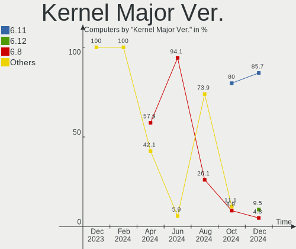

| Version | Computers | Percent |
|---------|-----------|---------|
| 6.5     | 25        | 50%     |
| 6.4     | 21        | 42%     |
| 6.6     | 3         | 6%      |
| 6.3     | 1         | 2%      |

Arch
----

OS architecture (x86_64, i586, etc.)

| Name   | Computers | Percent |
|--------|-----------|---------|
| x86_64 | 50        | 100%    |

DE
--

Desktop Environment

| Name  | Computers | Percent |
|-------|-----------|---------|
| GNOME | 38        | 76%     |
| KDE5  | 12        | 24%     |

Display Server
--------------

X11 or Wayland

| Name    | Computers | Percent |
|---------|-----------|---------|
| Wayland | 39        | 78%     |
| X11     | 11        | 22%     |

Display Manager
---------------

SDDM, LightDM, etc.

| Name    | Computers | Percent |
|---------|-----------|---------|
| Unknown | 43        | 86%     |
| GDM     | 5         | 10%     |
| SDDM    | 2         | 4%      |

OS Lang
-------

Language

| Lang  | Computers | Percent |
|-------|-----------|---------|
| en_US | 25        | 50%     |
| de_DE | 8         | 16%     |
| en_GB | 4         | 8%      |
| pt_BR | 2         | 4%      |
| it_IT | 2         | 4%      |
| fr_FR | 2         | 4%      |
| en_CA | 2         | 4%      |
| hu_HU | 1         | 2%      |
| es_MX | 1         | 2%      |
| es_ES | 1         | 2%      |
| en_AU | 1         | 2%      |
| da_DK | 1         | 2%      |

Boot Mode
---------

EFI or BIOS

| Mode | Computers | Percent |
|------|-----------|---------|
| EFI  | 44        | 88%     |
| BIOS | 6         | 12%     |

Filesystem
----------

Type of filesystem

| Type  | Computers | Percent |
|-------|-----------|---------|
| Btrfs | 48        | 96%     |
| Ext4  | 2         | 4%      |

Part. scheme
------------

Scheme of partitioning

| Type    | Computers | Percent |
|---------|-----------|---------|
| Unknown | 43        | 86%     |
| GPT     | 7         | 14%     |

Dual Boot with Linux/BSD
------------------------

Hosting more than one Linux/BSD

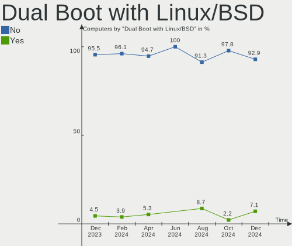

| Dual boot | Computers | Percent |
|-----------|-----------|---------|
| No        | 46        | 92%     |
| Yes       | 4         | 8%      |

Dual Boot (Win)
---------------

Hosting Linux and Windows

| Dual boot | Computers | Percent |
|-----------|-----------|---------|
| No        | 45        | 90%     |
| Yes       | 5         | 10%     |

Board
-----

Vendor
------

Motherboard manufacturer

| Name                   | Computers | Percent |
|------------------------|-----------|---------|
| MSI                    | 12        | 24%     |
| ASUSTek Computer       | 12        | 24%     |
| Dell                   | 5         | 10%     |
| ASRock                 | 5         | 10%     |
| Lenovo                 | 3         | 6%      |
| Hewlett-Packard        | 2         | 4%      |
| Gigabyte Technology    | 2         | 4%      |
| Acer                   | 2         | 4%      |
| TUXEDO                 | 1         | 2%      |
| ONE-NETBOOK TECHNOLOGY | 1         | 2%      |
| Microsoft              | 1         | 2%      |
| LG Electronics         | 1         | 2%      |
| Google                 | 1         | 2%      |
| Chuwi                  | 1         | 2%      |
| Apple                  | 1         | 2%      |

Model
-----

Motherboard model

| Name                                     | Computers | Percent |
|------------------------------------------|-----------|---------|
| MSI MS-7C56                              | 2         | 4%      |
| MSI MS-7B86                              | 2         | 4%      |
| TUXEDO Polaris AMD Gen3 (CZN)            | 1         | 2%      |
| ONE-NETBOOK TECHNOLOGY ONE XPLAYER       | 1         | 2%      |
| MSI MS-7E12                              | 1         | 2%      |
| MSI MS-7D46                              | 1         | 2%      |
| MSI MS-7C02                              | 1         | 2%      |
| MSI MS-7B87                              | 1         | 2%      |
| MSI MS-7B17                              | 1         | 2%      |
| MSI MS-7977                              | 1         | 2%      |
| MSI GF62 8RC                             | 1         | 2%      |
| MSI Cyborg 15 A12VF                      | 1         | 2%      |
| Microsoft Surface Book                   | 1         | 2%      |
| LG 16Z90R-G.AD75F                        | 1         | 2%      |
| Lenovo Legion 5 15ARH05 82B5             | 1         | 2%      |
| Lenovo IdeaPad C340-14API 81N6           | 1         | 2%      |
| Lenovo IdeaPad 3 17ABA7 82RQ             | 1         | 2%      |
| HP Pavilion dv9700                       | 1         | 2%      |
| HP EliteDesk 800 G2 SFF                  | 1         | 2%      |
| Google Kench                             | 1         | 2%      |
| Gigabyte X670 AORUS ELITE AX             | 1         | 2%      |
| Gigabyte 970A-DS3P FX                    | 1         | 2%      |
| Dell Precision 7740                      | 1         | 2%      |
| Dell OptiPlex 5050                       | 1         | 2%      |
| Dell Latitude E6430                      | 1         | 2%      |
| Dell Latitude 7390 2-in-1                | 1         | 2%      |
| Dell Inspiron 15 3520                    | 1         | 2%      |
| Chuwi GemiBook Pro                       | 1         | 2%      |
| ASUS ZenBook UX434DA_UM433DA             | 1         | 2%      |
| ASUS VivoBook_ASUSLaptop M3500QA_M3500QA | 1         | 2%      |
| ASUS TUF B450M-PLUS GAMING               | 1         | 2%      |
| ASUS ROG STRIX X570-E GAMING             | 1         | 2%      |
| ASUS ROG STRIX B650E-I GAMING WIFI       | 1         | 2%      |
| ASUS ROG Flow X13 GV301QE_GV301QE        | 1         | 2%      |
| ASUS Q504UAK                             | 1         | 2%      |
| ASUS PRIME Z370-P II                     | 1         | 2%      |
| ASUS PRIME B450M-GAMING/BR               | 1         | 2%      |
| ASUS Maximus VIII FORMULA                | 1         | 2%      |
| ASUS All Series                          | 1         | 2%      |
| ASUS A0000001                            | 1         | 2%      |

Model Family
------------

Motherboard model prefix

| Name                       | Computers | Percent |
|----------------------------|-----------|---------|
| ASUS ROG                   | 3         | 6%      |
| MSI MS-7C56                | 2         | 4%      |
| MSI MS-7B86                | 2         | 4%      |
| Lenovo IdeaPad             | 2         | 4%      |
| Dell Latitude              | 2         | 4%      |
| ASUS PRIME                 | 2         | 4%      |
| TUXEDO Polaris             | 1         | 2%      |
| ONE-NETBOOK TECHNOLOGY ONE | 1         | 2%      |
| MSI MS-7E12                | 1         | 2%      |
| MSI MS-7D46                | 1         | 2%      |
| MSI MS-7C02                | 1         | 2%      |
| MSI MS-7B87                | 1         | 2%      |
| MSI MS-7B17                | 1         | 2%      |
| MSI MS-7977                | 1         | 2%      |
| MSI GF62                   | 1         | 2%      |
| MSI Cyborg                 | 1         | 2%      |
| Microsoft Surface          | 1         | 2%      |
| LG 16Z90R-G.AD75F          | 1         | 2%      |
| Lenovo Legion              | 1         | 2%      |
| HP Pavilion                | 1         | 2%      |
| HP EliteDesk               | 1         | 2%      |
| Google Kench               | 1         | 2%      |
| Gigabyte X670              | 1         | 2%      |
| Gigabyte 970A-DS3P         | 1         | 2%      |
| Dell Precision             | 1         | 2%      |
| Dell OptiPlex              | 1         | 2%      |
| Dell Inspiron              | 1         | 2%      |
| Chuwi GemiBook             | 1         | 2%      |
| ASUS ZenBook               | 1         | 2%      |
| ASUS VivoBook              | 1         | 2%      |
| ASUS TUF                   | 1         | 2%      |
| ASUS Q504UAK               | 1         | 2%      |
| ASUS Maximus               | 1         | 2%      |
| ASUS All                   | 1         | 2%      |
| ASUS A0000001              | 1         | 2%      |
| ASRock X470                | 1         | 2%      |
| ASRock X370                | 1         | 2%      |
| ASRock H310CM-DVS          | 1         | 2%      |
| ASRock B550M               | 1         | 2%      |
| ASRock B450M-HDV           | 1         | 2%      |

MFG Year
--------

Motherboard manufacture year

| Year | Computers | Percent |
|------|-----------|---------|
| 2019 | 9         | 18%     |
| 2018 | 9         | 18%     |
| 2021 | 7         | 14%     |
| 2020 | 7         | 14%     |
| 2022 | 6         | 12%     |
| 2015 | 3         | 6%      |
| 2023 | 2         | 4%      |
| 2017 | 2         | 4%      |
| 2016 | 2         | 4%      |
| 2014 | 1         | 2%      |
| 2012 | 1         | 2%      |
| 2007 | 1         | 2%      |

Form Factor
-----------

Physical design of the computer

| Name        | Computers | Percent |
|-------------|-----------|---------|
| Desktop     | 27        | 54%     |
| Notebook    | 19        | 38%     |
| Convertible | 2         | 4%      |
| Tablet      | 1         | 2%      |
| All in one  | 1         | 2%      |

Secure Boot
-----------

Enabled or disabled

| State    | Computers | Percent |
|----------|-----------|---------|
| Disabled | 50        | 100%    |

Coreboot
--------

Have coreboot on board

| Used | Computers | Percent |
|------|-----------|---------|
| No   | 49        | 98%     |
| Yes  | 1         | 2%      |

RAM Size
--------

Total RAM memory

| Size in GB  | Computers | Percent |
|-------------|-----------|---------|
| 16.01-24.0  | 17        | 34%     |
| 32.01-64.0  | 11        | 22%     |
| 8.01-16.0   | 10        | 20%     |
| 4.01-8.0    | 5         | 10%     |
| 64.01-256.0 | 3         | 6%      |
| 24.01-32.0  | 2         | 4%      |
| 3.01-4.0    | 1         | 2%      |
| 2.01-3.0    | 1         | 2%      |

RAM Used
--------

Used RAM memory

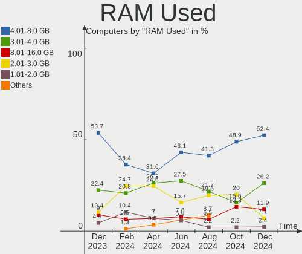

| Used GB   | Computers | Percent |
|-----------|-----------|---------|
| 4.01-8.0  | 20        | 40%     |
| 2.01-3.0  | 16        | 32%     |
| 3.01-4.0  | 8         | 16%     |
| 1.01-2.0  | 3         | 6%      |
| 8.01-16.0 | 3         | 6%      |

Total Drives
------------

Number of drives on board

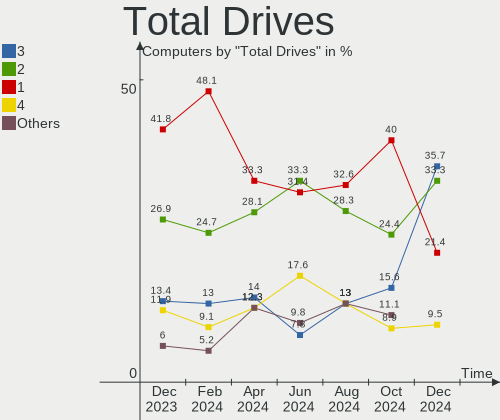

| Drives | Computers | Percent |
|--------|-----------|---------|
| 2      | 19        | 38%     |
| 1      | 19        | 38%     |
| 3      | 5         | 10%     |
| 4      | 3         | 6%      |
| 5      | 2         | 4%      |
| 8      | 1         | 2%      |
| 6      | 1         | 2%      |

Has CD-ROM
----------

Has CD-ROM on board

| Presented | Computers | Percent |
|-----------|-----------|---------|
| No        | 43        | 86%     |
| Yes       | 7         | 14%     |

Has Ethernet
------------

Has Ethernet on board

| Presented | Computers | Percent |
|-----------|-----------|---------|
| Yes       | 41        | 82%     |
| No        | 9         | 18%     |

Has WiFi
--------

Has WiFi module

| Presented | Computers | Percent |
|-----------|-----------|---------|
| Yes       | 37        | 74%     |
| No        | 13        | 26%     |

Has Bluetooth
-------------

Has Bluetooth module

| Presented | Computers | Percent |
|-----------|-----------|---------|
| Yes       | 31        | 62%     |
| No        | 19        | 38%     |

Location
--------

Country
-------

Geographic location (country)

| Country   | Computers | Percent |
|-----------|-----------|---------|
| USA       | 12        | 24%     |
| Germany   | 11        | 22%     |
| UK        | 3         | 6%      |
| Italy     | 2         | 4%      |
| France    | 2         | 4%      |
| Canada    | 2         | 4%      |
| Brazil    | 2         | 4%      |
| Sweden    | 1         | 2%      |
| Sri Lanka | 1         | 2%      |
| Spain     | 1         | 2%      |
| Russia    | 1         | 2%      |
| Pakistan  | 1         | 2%      |
| Morocco   | 1         | 2%      |
| Mexico    | 1         | 2%      |
| Mauritius | 1         | 2%      |
| Lithuania | 1         | 2%      |
| Ireland   | 1         | 2%      |
| India     | 1         | 2%      |
| Hungary   | 1         | 2%      |
| Estonia   | 1         | 2%      |
| Denmark   | 1         | 2%      |
| Czechia   | 1         | 2%      |
| Australia | 1         | 2%      |

City
----

Geographic location (city)

| City                      | Computers | Percent |
|---------------------------|-----------|---------|
| Wuerselen                 | 1         | 2%      |
| Wendeburg                 | 1         | 2%      |
| Weatherford               | 1         | 2%      |
| Vilnius                   | 1         | 2%      |
| Vacoas                    | 1         | 2%      |
| Uffenheim                 | 1         | 2%      |
| Temecula                  | 1         | 2%      |
| Tartu                     | 1         | 2%      |
| Sydney                    | 1         | 2%      |
| Stockholm                 | 1         | 2%      |
| Smolensk                  | 1         | 2%      |
| Sligo                     | 1         | 2%      |
| Slangerup                 | 1         | 2%      |
| Seattle                   | 1         | 2%      |
| Schweinfurt               | 1         | 2%      |
| Satna                     | 1         | 2%      |
| San Nicola la Strada      | 1         | 2%      |
| San Juan Capistrano       | 1         | 2%      |
| Saluda                    | 1         | 2%      |
| Sacramento                | 1         | 2%      |
| Raunheim                  | 1         | 2%      |
| Puente La Reina – Gares | 1         | 2%      |
| Praia Grande              | 1         | 2%      |
| Prague                    | 1         | 2%      |
| Port Arthur               | 1         | 2%      |
| Peterborough              | 1         | 2%      |
| Palaiseau                 | 1         | 2%      |
| Noyal-sur-Vilaine         | 1         | 2%      |
| Milano                    | 1         | 2%      |
| Mexico City               | 1         | 2%      |
| Mardan                    | 1         | 2%      |
| Mannheim                  | 1         | 2%      |
| Hohen Neuendorf           | 1         | 2%      |
| Guelph                    | 1         | 2%      |
| Gainesville               | 1         | 2%      |
| Fulda                     | 1         | 2%      |
| Erdokertes                | 1         | 2%      |
| Dillingen an der Donau    | 1         | 2%      |
| Denton                    | 1         | 2%      |
| Darlington                | 1         | 2%      |

Drives
------

Drive Vendor
------------

Hard drive vendors

| Vendor                      | Computers | Drives | Percent |
|-----------------------------|-----------|--------|---------|
| Samsung Electronics         | 18        | 26     | 20%     |
| Seagate                     | 12        | 16     | 13.33%  |
| WDC                         | 9         | 12     | 10%     |
| Sandisk                     | 7         | 7      | 7.78%   |
| Crucial                     | 6         | 6      | 6.67%   |
| Micron/Crucial Technology   | 5         | 5      | 5.56%   |
| Intel                       | 5         | 5      | 5.56%   |
| Kingston                    | 4         | 5      | 4.44%   |
| SK hynix                    | 3         | 3      | 3.33%   |
| Unknown                     | 2         | 3      | 2.22%   |
| Toshiba                     | 2         | 2      | 2.22%   |
| Phison Electronics          | 2         | 2      | 2.22%   |
| Kingston Technology Company | 2         | 3      | 2.22%   |
| ADATA Technology            | 2         | 3      | 2.22%   |
| Verbatim                    | 1         | 1      | 1.11%   |
| Realtek Semiconductor       | 1         | 1      | 1.11%   |
| PNY                         | 1         | 1      | 1.11%   |
| Netac                       | 1         | 1      | 1.11%   |
| Micron Technology           | 1         | 1      | 1.11%   |
| Lexar                       | 1         | 1      | 1.11%   |
| KIOXIA                      | 1         | 1      | 1.11%   |
| Intenso                     | 1         | 1      | 1.11%   |
| Hitachi                     | 1         | 2      | 1.11%   |
| Fanxiang                    | 1         | 1      | 1.11%   |
| Azerty                      | 1         | 1      | 1.11%   |

Drive Model
-----------

Hard drive models

| Model                                               | Computers | Percent |
|-----------------------------------------------------|-----------|---------|
| Samsung NVMe SSD Controller SM981/PM981/PM983 250GB | 4         | 3.85%   |
| Seagate ST2000DM008-2FR102 2TB                      | 3         | 2.88%   |
| Samsung NVMe SSD Controller PM9A1/PM9A3/980PRO 2TB  | 3         | 2.88%   |
| WDC WD20EZRZ-00Z5HB0 2TB                            | 2         | 1.92%   |
| WDC WD20EZRX-00D8PB0 2TB                            | 2         | 1.92%   |
| Seagate ST1000LM035-1RK172 1TB                      | 2         | 1.92%   |
| Sandisk WD_BLACK SN770 500GB                        | 2         | 1.92%   |
| Samsung SSD 980 1TB                                 | 2         | 1.92%   |
| Samsung SSD 870 EVO 1TB                             | 2         | 1.92%   |
| Samsung HD502IJ 500GB                               | 2         | 1.92%   |
| Phison E12 NVMe Controller 512GB                    | 2         | 1.92%   |
| Micron/Crucial P2 NVMe PCIe SSD 1TB                 | 2         | 1.92%   |
| Kingston Company KC2000 NVMe SSD 1TB                | 2         | 1.92%   |
| Crucial CT1000MX500SSD1 1TB                         | 2         | 1.92%   |
| Crucial CT1000BX500SSD1 1TB                         | 2         | 1.92%   |
| WDC WDS500G2B0B-00YS70 500GB SSD                    | 1         | 0.96%   |
| WDC WDS120G2G0B-00EPW0 120GB SSD                    | 1         | 0.96%   |
| WDC WD6002FFWX-68TZ4N0 6TB                          | 1         | 0.96%   |
| WDC WD1602ABKS-18N8A0 160GB                         | 1         | 0.96%   |
| WDC WD10JPVX-75JC3T0 1TB                            | 1         | 0.96%   |
| WDC WD10EZEX-21WN4A0 1TB                            | 1         | 0.96%   |
| WDC WD1002FAEX-00Y9A0 1TB                           | 1         | 0.96%   |
| WDC WD10 JPVX-22JC3T0 1TB                           | 1         | 0.96%   |
| Verbatim Portable Drive 2TB                         | 1         | 0.96%   |
| Unknown NVMe SSD Drive 2TB                          | 1         | 0.96%   |
| Unknown MMC Card  32GB                              | 1         | 0.96%   |
| Toshiba MQ01ABD100 1TB                              | 1         | 0.96%   |
| Toshiba HDWD240 4TB                                 | 1         | 0.96%   |
| SK hynix HFS512GEJ9X101N 512GB                      | 1         | 0.96%   |
| SK hynix HFM001TD3JX013N 1TB                        | 1         | 0.96%   |
| SK hynix BC501 NVMe Solid State Drive 512GB         | 1         | 0.96%   |
| Seagate ST6000VN0033-2EE110 6TB                     | 1         | 0.96%   |
| Seagate ST500LX012-1LM162-SSHD 500GB                | 1         | 0.96%   |
| Seagate ST4000VN008-2DR166 4TB                      | 1         | 0.96%   |
| Seagate ST3320413AS 320GB                           | 1         | 0.96%   |
| Seagate ST2000VM003-1CT164 2TB                      | 1         | 0.96%   |
| Seagate ST2000DM006-2DM164 2TB                      | 1         | 0.96%   |
| Seagate ST2000DM001-1E6164 2TB                      | 1         | 0.96%   |
| Seagate ST1000LM048-2E7172 1TB                      | 1         | 0.96%   |
| Seagate ST1000DM003-9YN162 1TB                      | 1         | 0.96%   |

HDD Vendor
----------

Hard disk drive vendors

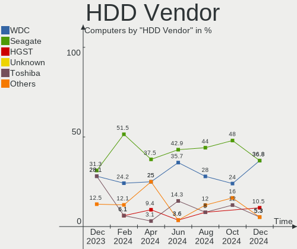

| Vendor              | Computers | Drives | Percent |
|---------------------|-----------|--------|---------|
| Seagate             | 12        | 16     | 50%     |
| WDC                 | 7         | 10     | 29.17%  |
| Toshiba             | 2         | 2      | 8.33%   |
| Samsung Electronics | 2         | 4      | 8.33%   |
| Hitachi             | 1         | 2      | 4.17%   |

SSD Vendor
----------

Solid state drive vendors

| Vendor              | Computers | Drives | Percent |
|---------------------|-----------|--------|---------|
| Samsung Electronics | 7         | 9      | 26.92%  |
| Crucial             | 6         | 6      | 23.08%  |
| WDC                 | 2         | 2      | 7.69%   |
| Kingston            | 2         | 3      | 7.69%   |
| Intel               | 2         | 2      | 7.69%   |
| SanDisk             | 1         | 1      | 3.85%   |
| PNY                 | 1         | 1      | 3.85%   |
| Netac               | 1         | 1      | 3.85%   |
| Lexar               | 1         | 1      | 3.85%   |
| Intenso             | 1         | 1      | 3.85%   |
| Fanxiang            | 1         | 1      | 3.85%   |
| Azerty              | 1         | 1      | 3.85%   |

Drive Kind
----------

HDD or SSD

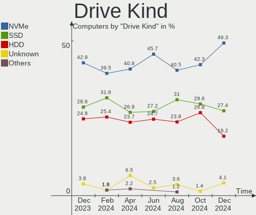

| Kind    | Computers | Drives | Percent |
|---------|-----------|--------|---------|
| NVMe    | 35        | 45     | 43.21%  |
| SSD     | 24        | 29     | 29.63%  |
| HDD     | 20        | 34     | 24.69%  |
| MMC     | 1         | 1      | 1.23%   |
| Unknown | 1         | 1      | 1.23%   |

Drive Connector
---------------

SATA, SAS, NVMe, etc.

| Type | Computers | Drives | Percent |
|------|-----------|--------|---------|
| NVMe | 35        | 45     | 50.72%  |
| SATA | 30        | 61     | 43.48%  |
| SAS  | 3         | 3      | 4.35%   |
| MMC  | 1         | 1      | 1.45%   |

Drive Size
----------

Size of hard drive

| Size in TB | Computers | Drives | Percent |
|------------|-----------|--------|---------|
| 0.51-1.0   | 18        | 21     | 38.3%   |
| 0.01-0.5   | 15        | 21     | 31.91%  |
| 1.01-2.0   | 11        | 17     | 23.4%   |
| 4.01-10.0  | 2         | 2      | 4.26%   |
| 3.01-4.0   | 1         | 2      | 2.13%   |

Space Total
-----------

Amount of disk space available on the file system

| Size in GB     | Computers | Percent |
|----------------|-----------|---------|
| More than 3000 | 12        | 24%     |
| 1001-2000      | 9         | 18%     |
| 501-1000       | 9         | 18%     |
| 251-500        | 6         | 12%     |
| 2001-3000      | 6         | 12%     |
| 101-250        | 3         | 6%      |
| Unknown        | 3         | 6%      |
| 21-50          | 1         | 2%      |
| 51-100         | 1         | 2%      |

Space Used
----------

Amount of used disk space

| Used GB        | Computers | Percent |
|----------------|-----------|---------|
| 21-50          | 10        | 20%     |
| 251-500        | 7         | 14%     |
| 101-250        | 7         | 14%     |
| 1-20           | 6         | 12%     |
| 501-1000       | 6         | 12%     |
| 1001-2000      | 5         | 10%     |
| 51-100         | 3         | 6%      |
| Unknown        | 3         | 6%      |
| More than 3000 | 2         | 4%      |
| 2001-3000      | 1         | 2%      |

Malfunc. Drives
---------------

Drive models with a malfunction

Zero info for selected period =(

Malfunc. Drive Vendor
---------------------

Vendors of faulty drives

Zero info for selected period =(

Malfunc. HDD Vendor
-------------------

Vendors of faulty HDD drives

Zero info for selected period =(

Malfunc. Drive Kind
-------------------

Kinds of faulty drives

Zero info for selected period =(

Failed Drives
-------------

Failed drive models

Zero info for selected period =(

Failed Drive Vendor
-------------------

Failed drive vendors

Zero info for selected period =(

Drive Status
------------

Number of failed and malfunc. drives

| Status   | Computers | Drives | Percent |
|----------|-----------|--------|---------|
| Detected | 44        | 94     | 86.27%  |
| Works    | 7         | 16     | 13.73%  |

Storage controller
------------------

Storage Vendor
--------------

Storage controller vendors

| Vendor                      | Computers | Percent |
|-----------------------------|-----------|---------|
| Intel                       | 23        | 27.38%  |
| AMD                         | 21        | 25%     |
| Samsung Electronics         | 11        | 13.1%   |
| SanDisk                     | 6         | 7.14%   |
| Micron/Crucial Technology   | 5         | 5.95%   |
| Kingston Technology Company | 4         | 4.76%   |
| SK hynix                    | 3         | 3.57%   |
| Phison Electronics          | 2         | 2.38%   |
| ASMedia Technology          | 2         | 2.38%   |
| ADATA Technology            | 2         | 2.38%   |
| Solidigm                    | 1         | 1.19%   |
| Realtek Semiconductor       | 1         | 1.19%   |
| Nvidia                      | 1         | 1.19%   |
| Micron Technology           | 1         | 1.19%   |
| KIOXIA                      | 1         | 1.19%   |

Storage Model
-------------

Storage controller models

| Model                                                                         | Computers | Percent |
|-------------------------------------------------------------------------------|-----------|---------|
| AMD FCH SATA Controller [AHCI mode]                                           | 15        | 15.79%  |
| AMD 400 Series Chipset SATA Controller                                        | 8         | 8.42%   |
| Samsung NVMe SSD Controller SM981/PM981/PM983                                 | 4         | 4.21%   |
| Samsung NVMe SSD Controller PM9A1/PM9A3/980PRO                                | 3         | 3.16%   |
| Samsung NVMe SSD Controller 980 (DRAM-less)                                   | 3         | 3.16%   |
| Intel Sunrise Point-LP SATA Controller [AHCI mode]                            | 3         | 3.16%   |
| Intel Q170/Q150/B150/H170/H110/Z170/CM236 Chipset SATA Controller [AHCI Mode] | 3         | 3.16%   |
| Intel 200 Series PCH SATA controller [AHCI mode]                              | 3         | 3.16%   |
| AMD 500 Series Chipset SATA Controller                                        | 3         | 3.16%   |
| SanDisk WD Black SN770 / PC SN740 256GB / PC SN560 (DRAM-less) NVMe SSD       | 2         | 2.11%   |
| Phison E12 NVMe Controller                                                    | 2         | 2.11%   |
| Micron/Crucial P2 [Nick P2] / P3 / P3 Plus NVMe PCIe SSD (DRAM-less)          | 2         | 2.11%   |
| Kingston Company KC2000/KC2500 NVMe SSD SM2262EN                              | 2         | 2.11%   |
| Intel Cannon Lake PCH SATA AHCI Controller                                    | 2         | 2.11%   |
| Intel 82801 Mobile SATA Controller [RAID mode]                                | 2         | 2.11%   |
| ASMedia ASM1062 Serial ATA Controller                                         | 2         | 2.11%   |
| Solidigm P41 Plus NVMe SSD (DRAM-less) [Echo Harbor]                          | 1         | 1.05%   |
| SK hynix Platinum P41/PC801 NVMe Solid State Drive                            | 1         | 1.05%   |
| SK hynix Gold P31/BC711/PC711 NVMe Solid State Drive                          | 1         | 1.05%   |
| SK hynix BC501 NVMe Solid State Drive                                         | 1         | 1.05%   |
| SanDisk WD PC SN540 / Green SN350 NVMe SSD 1 TB (DRAM-less)                   | 1         | 1.05%   |
| SanDisk Ultra 3D / WD Blue SN570 NVMe SSD (DRAM-less)                         | 1         | 1.05%   |
| SanDisk Ultra 3D / WD Blue SN550 NVMe SSD                                     | 1         | 1.05%   |
| SanDisk IX SN530 NVMe SSD (DRAM-less)                                         | 1         | 1.05%   |
| Samsung NVMe SSD Controller SM961/PM961/SM963                                 | 1         | 1.05%   |
| Samsung NVMe SSD Controller SM951/PM951                                       | 1         | 1.05%   |
| Samsung NVMe SSD Controller S4LV008[Pascal]                                   | 1         | 1.05%   |
| Realtek RTS5765DL NVMe SSD Controller (DRAM-less)                             | 1         | 1.05%   |
| Nvidia MCP65 SATA Controller                                                  | 1         | 1.05%   |
| Nvidia MCP65 IDE                                                              | 1         | 1.05%   |
| Micron/Crucial P5 Plus NVMe PCIe SSD                                          | 1         | 1.05%   |
| Micron/Crucial P5 NVMe PCIe SSD[SlashP5]                                      | 1         | 1.05%   |
| Micron/Crucial P1 NVMe PCIe SSD[Frampton]                                     | 1         | 1.05%   |
| Micron 2300 NVMe SSD [Santana]                                                | 1         | 1.05%   |
| KIOXIA NVMe SSD Controller BG5 (DRAM-less)                                    | 1         | 1.05%   |
| Kingston Company NV2 NVMe SSD SM2267XT                                        | 1         | 1.05%   |
| Kingston Company NV1 NVMe SSD SM2263XT                                        | 1         | 1.05%   |
| Intel Volume Management Device NVMe RAID Controller                           | 1         | 1.05%   |
| Intel Tiger Lake-LP SATA Controller                                           | 1         | 1.05%   |
| Intel SSD 670p Series [Keystone Harbor]                                       | 1         | 1.05%   |

Storage Kind
------------

Kind of storage controller (IDE, SATA, NVMe, SAS, ...)

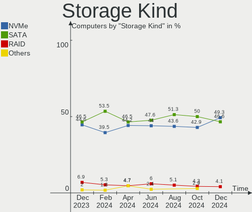

| Kind | Computers | Percent |
|------|-----------|---------|
| SATA | 39        | 50%     |
| NVMe | 35        | 44.87%  |
| RAID | 3         | 3.85%   |
| IDE  | 1         | 1.28%   |

Processor
---------

CPU Vendor
----------

Processor vendors

| Vendor | Computers | Percent |
|--------|-----------|---------|
| Intel  | 25        | 50%     |
| AMD    | 25        | 50%     |

CPU Model
---------

Processor models

| Model                                         | Computers | Percent |
|-----------------------------------------------|-----------|---------|
| AMD Ryzen 7 3700X 8-Core Processor            | 3         | 6%      |
| Intel Core i7-6700K CPU @ 4.00GHz             | 2         | 4%      |
| Intel Core i5-7200U CPU @ 2.50GHz             | 2         | 4%      |
| AMD Ryzen 7 5800H with Radeon Graphics        | 2         | 4%      |
| AMD Ryzen 7 2700 Eight-Core Processor         | 2         | 4%      |
| AMD Ryzen 3 3200G with Radeon Vega Graphics   | 2         | 4%      |
| Intel Core i9-9900K CPU @ 3.60GHz             | 1         | 2%      |
| Intel Core i7-9750H CPU @ 2.60GHz             | 1         | 2%      |
| Intel Core i7-9700K CPU @ 3.60GHz             | 1         | 2%      |
| Intel Core i7-8700 CPU @ 3.20GHz              | 1         | 2%      |
| Intel Core i7-6700 CPU @ 3.40GHz              | 1         | 2%      |
| Intel Core i7-6600U CPU @ 2.60GHz             | 1         | 2%      |
| Intel Core i5-8500T CPU @ 2.10GHz             | 1         | 2%      |
| Intel Core i5-8350U CPU @ 1.70GHz             | 1         | 2%      |
| Intel Core i5-8300H CPU @ 2.30GHz             | 1         | 2%      |
| Intel Core i5-7500 CPU @ 3.40GHz              | 1         | 2%      |
| Intel Core i5-4570 CPU @ 3.20GHz              | 1         | 2%      |
| Intel Core i5-3335S CPU @ 2.70GHz             | 1         | 2%      |
| Intel Core i5-3320M CPU @ 2.60GHz             | 1         | 2%      |
| Intel Celeron J4125 CPU @ 2.00GHz             | 1         | 2%      |
| Intel Celeron CPU 3865U @ 1.80GHz             | 1         | 2%      |
| Intel 13th Gen Core i7-1360P                  | 1         | 2%      |
| Intel 12th Gen Core i5-12450H                 | 1         | 2%      |
| Intel 12th Gen Core i5-12400F                 | 1         | 2%      |
| Intel 11th Gen Core i7-1165G7 @ 2.80GHz       | 1         | 2%      |
| Intel 11th Gen Core i5-11500T @ 1.50GHz       | 1         | 2%      |
| Intel 11th Gen Core i5-1135G7 @ 2.40GHz       | 1         | 2%      |
| AMD Turion 64 X2 Mobile Technology TL-64      | 1         | 2%      |
| AMD Ryzen 9 7950X3D 16-Core Processor         | 1         | 2%      |
| AMD Ryzen 9 7950X 16-Core Processor           | 1         | 2%      |
| AMD Ryzen 9 5900X 12-Core Processor           | 1         | 2%      |
| AMD Ryzen 9 5900HS with Radeon Graphics       | 1         | 2%      |
| AMD Ryzen 7 7800X3D 8-Core Processor          | 1         | 2%      |
| AMD Ryzen 7 5800X 8-Core Processor            | 1         | 2%      |
| AMD Ryzen 7 5700X 8-Core Processor            | 1         | 2%      |
| AMD Ryzen 7 4800H with Radeon Graphics        | 1         | 2%      |
| AMD Ryzen 7 3700U with Radeon Vega Mobile Gfx | 1         | 2%      |
| AMD Ryzen 7 2700X Eight-Core Processor        | 1         | 2%      |
| AMD Ryzen 5 5625U with Radeon Graphics        | 1         | 2%      |
| AMD Ryzen 5 4600G with Radeon Graphics        | 1         | 2%      |

CPU Model Family
----------------

Processor model prefix

| Model                   | Computers | Percent |
|-------------------------|-----------|---------|
| AMD Ryzen 7             | 13        | 26%     |
| Intel Core i5           | 9         | 18%     |
| Intel Core i7           | 7         | 14%     |
| Other                   | 6         | 12%     |
| AMD Ryzen 9             | 4         | 8%      |
| AMD Ryzen 5             | 4         | 8%      |
| Intel Celeron           | 2         | 4%      |
| AMD Ryzen 3             | 2         | 4%      |
| Intel Core i9           | 1         | 2%      |
| AMD Turion 64 X2 Mobile | 1         | 2%      |
| AMD FX                  | 1         | 2%      |

CPU Cores
---------

Number of processor cores

| Number | Computers | Percent |
|--------|-----------|---------|
| 8      | 16        | 32%     |
| 4      | 16        | 32%     |
| 6      | 8         | 16%     |
| 2      | 6         | 12%     |
| 16     | 2         | 4%      |
| 12     | 2         | 4%      |

CPU Sockets
-----------

Number of sockets

| Number | Computers | Percent |
|--------|-----------|---------|
| 1      | 50        | 100%    |

CPU Threads
-----------

Threads per core (Hyper-Threading)

| Number | Computers | Percent |
|--------|-----------|---------|
| 2      | 40        | 80%     |
| 1      | 10        | 20%     |

CPU Op-Modes
------------

CPU Operation Modes (32-bit, 64-bit)

| Op mode        | Computers | Percent |
|----------------|-----------|---------|
| 32-bit, 64-bit | 50        | 100%    |

CPU Microcode
-------------

Microcode number

| Number     | Computers | Percent |
|------------|-----------|---------|
| Unknown    | 26        | 52%     |
| 0x08108109 | 4         | 8%      |
| 0x0a50000c | 3         | 6%      |
| 0x0a20120a | 3         | 6%      |
| 0x08701021 | 3         | 6%      |
| 0x0800820d | 3         | 6%      |
| 0x0a601206 | 2         | 4%      |
| 0x08600106 | 2         | 4%      |
| 0x0a601203 | 1         | 2%      |
| 0x0a50000d | 1         | 2%      |
| 0x08701030 | 1         | 2%      |
| 0x06000852 | 1         | 2%      |

CPU Microarch
-------------

Microarchitecture

| Name             | Computers | Percent |
|------------------|-----------|---------|
| KabyLake         | 11        | 22%     |
| Zen+             | 7         | 14%     |
| Zen 3            | 7         | 14%     |
| Zen 2            | 6         | 12%     |
| Skylake          | 4         | 8%      |
| Unknown          | 4         | 8%      |
| TigerLake        | 2         | 4%      |
| IvyBridge        | 2         | 4%      |
| Alderlake Hybrid | 2         | 4%      |
| Piledriver       | 1         | 2%      |
| K8 Hammer        | 1         | 2%      |
| Icelake          | 1         | 2%      |
| Haswell          | 1         | 2%      |
| Goldmont plus    | 1         | 2%      |

Graphics
--------

GPU Vendor
----------

Vendors of graphics cards

| Vendor | Computers | Percent |
|--------|-----------|---------|
| AMD    | 23        | 38.98%  |
| Nvidia | 19        | 32.2%   |
| Intel  | 17        | 28.81%  |

GPU Model
---------

Graphics card models

| Model                                                                       | Computers | Percent |
|-----------------------------------------------------------------------------|-----------|---------|
| AMD Picasso/Raven 2 [Radeon Vega Series / Radeon Vega Mobile Series]        | 3         | 4.84%   |
| AMD Navi 23 [Radeon RX 6600/6600 XT/6600M]                                  | 3         | 4.84%   |
| AMD Cezanne [Radeon Vega Series / Radeon Vega Mobile Series]                | 3         | 4.84%   |
| Nvidia GP104 [GeForce GTX 1070]                                             | 2         | 3.23%   |
| Intel TigerLake-LP GT2 [Iris Xe Graphics]                                   | 2         | 3.23%   |
| Intel HD Graphics 620                                                       | 2         | 3.23%   |
| Intel CoffeeLake-H GT2 [UHD Graphics 630]                                   | 2         | 3.23%   |
| AMD Renoir [Radeon RX Vega 6 (Ryzen 4000/5000 Mobile Series)]               | 2         | 3.23%   |
| AMD Raphael                                                                 | 2         | 3.23%   |
| AMD Navi 31 [Radeon RX 7900 XT/7900 XTX]                                    | 2         | 3.23%   |
| AMD Navi 22 [Radeon RX 6700/6700 XT/6750 XT / 6800M/6850M XT]               | 2         | 3.23%   |
| AMD Navi 10 [Radeon RX 5600 OEM/5600 XT / 5700/5700 XT]                     | 2         | 3.23%   |
| AMD Ellesmere [Radeon RX 470/480/570/570X/580/580X/590]                     | 2         | 3.23%   |
| Nvidia TU117M [GeForce GTX 1650 Ti Mobile]                                  | 1         | 1.61%   |
| Nvidia TU106 [GeForce RTX 2070]                                             | 1         | 1.61%   |
| Nvidia TU104 [GeForce RTX 2080 Rev. A]                                      | 1         | 1.61%   |
| Nvidia GP108 [GeForce GT 1030]                                              | 1         | 1.61%   |
| Nvidia GP107M [GeForce GTX 1050 Mobile]                                     | 1         | 1.61%   |
| Nvidia GP106 [GeForce GTX 1060 6GB]                                         | 1         | 1.61%   |
| Nvidia GM206 [GeForce GTX 960]                                              | 1         | 1.61%   |
| Nvidia GM200 [GeForce GTX 980 Ti]                                           | 1         | 1.61%   |
| Nvidia GK107M [GeForce GT 640M Mac Edition]                                 | 1         | 1.61%   |
| Nvidia GA107M [GeForce RTX 3050 Ti Mobile]                                  | 1         | 1.61%   |
| Nvidia GA106M [GeForce RTX 3060 Mobile / Max-Q]                             | 1         | 1.61%   |
| Nvidia GA104 [GeForce RTX 3070]                                             | 1         | 1.61%   |
| Nvidia GA102 [GeForce RTX 3090]                                             | 1         | 1.61%   |
| Nvidia GA102 [GeForce RTX 3080 Ti]                                          | 1         | 1.61%   |
| Nvidia G86M [GeForce 8400M GS]                                              | 1         | 1.61%   |
| Nvidia AD107M [GeForce RTX 4060 Max-Q / Mobile]                             | 1         | 1.61%   |
| Nvidia AD102 [GeForce RTX 4090]                                             | 1         | 1.61%   |
| Intel Xeon E3-1200 v3/4th Gen Core Processor Integrated Graphics Controller | 1         | 1.61%   |
| Intel UHD Graphics 620                                                      | 1         | 1.61%   |
| Intel Skylake GT2 [HD Graphics 520]                                         | 1         | 1.61%   |
| Intel RocketLake-S GT1 [UHD Graphics 750]                                   | 1         | 1.61%   |
| Intel Raptor Lake-P [Iris Xe Graphics]                                      | 1         | 1.61%   |
| Intel HD Graphics 630                                                       | 1         | 1.61%   |
| Intel HD Graphics 610                                                       | 1         | 1.61%   |
| Intel GeminiLake [UHD Graphics 600]                                         | 1         | 1.61%   |
| Intel CoffeeLake-S GT2 [UHD Graphics 630]                                   | 1         | 1.61%   |
| Intel Alder Lake-P GT1 [UHD Graphics]                                       | 1         | 1.61%   |

GPU Combo
---------

Combinations of graphics cards

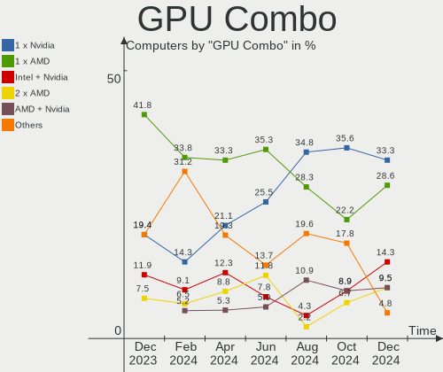

| Name           | Computers | Percent |
|----------------|-----------|---------|
| 1 x AMD        | 14        | 28%     |
| 1 x Nvidia     | 12        | 24%     |
| 1 x Intel      | 12        | 24%     |
| AMD + Nvidia   | 4         | 8%      |
| 2 x AMD        | 3         | 6%      |
| Intel + Nvidia | 3         | 6%      |
| Intel + AMD    | 2         | 4%      |

GPU Driver
----------

Free vs proprietary

| Driver      | Computers | Percent |
|-------------|-----------|---------|
| Free        | 34        | 68%     |
| Proprietary | 15        | 30%     |
| Unknown     | 1         | 2%      |

GPU Memory
----------

Total video memory

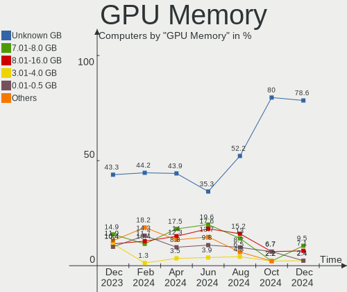

| Size in GB | Computers | Percent |
|------------|-----------|---------|
| Unknown    | 21        | 42%     |
| 7.01-8.0   | 13        | 26%     |
| 1.01-2.0   | 5         | 10%     |
| 0.01-0.5   | 5         | 10%     |
| 16.01-24.0 | 3         | 6%      |
| 5.01-6.0   | 2         | 4%      |
| 8.01-16.0  | 1         | 2%      |

Monitor
-------

Monitor Vendor
--------------

Monitor vendors

| Vendor               | Computers | Percent |
|----------------------|-----------|---------|
| Samsung Electronics  | 10        | 15.63%  |
| BOE                  | 6         | 9.38%   |
| Goldstar             | 4         | 6.25%   |
| Dell                 | 4         | 6.25%   |
| BenQ                 | 4         | 6.25%   |
| AU Optronics         | 4         | 6.25%   |
| Acer                 | 4         | 6.25%   |
| Hewlett-Packard      | 3         | 4.69%   |
| Chimei Innolux       | 3         | 4.69%   |
| ASUSTek Computer     | 3         | 4.69%   |
| AOC                  | 3         | 4.69%   |
| LG Display           | 2         | 3.13%   |
| Ancor Communications | 2         | 3.13%   |
| ViewSonic            | 1         | 1.56%   |
| Sony                 | 1         | 1.56%   |
| Sharp                | 1         | 1.56%   |
| Pixio                | 1         | 1.56%   |
| Philips              | 1         | 1.56%   |
| Panasonic            | 1         | 1.56%   |
| NEC Computers        | 1         | 1.56%   |
| Marantz              | 1         | 1.56%   |
| Lenovo               | 1         | 1.56%   |
| HJW                  | 1         | 1.56%   |
| Eizo                 | 1         | 1.56%   |
| Compal               | 1         | 1.56%   |

Monitor Model
-------------

Monitor models

| Model                                                                 | Computers | Percent |
|-----------------------------------------------------------------------|-----------|---------|
| Ancor Communications ROG PG279Q ACI27EC 2560x1440 598x336mm 27.0-inch | 2         | 3.03%   |
| ViewSonic XG2401 SERIES VSCBB31 1920x1080 531x299mm 24.0-inch         | 1         | 1.52%   |
| Sony BW8 MS_9001 1600x2560 113x181mm 8.4-inch                         | 1         | 1.52%   |
| Sharp LQ134N1JW52 SHP151E 1920x1200 288x180mm 13.4-inch               | 1         | 1.52%   |
| Samsung Electronics T27B350 SAM0945 1920x1080 598x336mm 27.0-inch     | 1         | 1.52%   |
| Samsung Electronics T24C300 SAM0A9B 1920x1080 531x299mm 24.0-inch     | 1         | 1.52%   |
| Samsung Electronics LS28AG700N SAM7177 3840x2160 632x360mm 28.6-inch  | 1         | 1.52%   |
| Samsung Electronics LCD Monitor SEC3847 1440x900 367x230mm 17.1-inch  | 1         | 1.52%   |
| Samsung Electronics LCD Monitor SDC4161 1920x1080 344x194mm 15.5-inch | 1         | 1.52%   |
| Samsung Electronics LC27T55 SAM701E 1920x1080 609x349mm 27.6-inch     | 1         | 1.52%   |
| Samsung Electronics LC27G7xT SAM105C 2560x1440 597x336mm 27.0-inch    | 1         | 1.52%   |
| Samsung Electronics C27F390 SAM0D32 1920x1080 598x336mm 27.0-inch     | 1         | 1.52%   |
| Samsung Electronics C24FG7x SAM0E43 1920x1080 532x304mm 24.1-inch     | 1         | 1.52%   |
| Samsung Electronics C24F390 SAM0D2C 1920x1080 521x293mm 23.5-inch     | 1         | 1.52%   |
| Pixio PX7 Prime HYC2700 2560x1440 530x280mm 23.6-inch                 | 1         | 1.52%   |
| Philips 185Vw PHL1851 1366x768 410x230mm 18.5-inch                    | 1         | 1.52%   |
| Panasonic LCD Monitor MEI96A2 2880x1620 344x193mm 15.5-inch           | 1         | 1.52%   |
| NEC Computers LCD2190UXp NEC66BC 1600x1200 432x324mm 21.3-inch        | 1         | 1.52%   |
| Marantz AVR MJI0031 1920x1080                                         | 1         | 1.52%   |
| LG Display LCD Monitor LGD06EB 2560x1600 344x215mm 16.0-inch          | 1         | 1.52%   |
| LG Display LCD Monitor LGD0589 1920x1080 294x165mm 13.3-inch          | 1         | 1.52%   |
| Lenovo LEN D24f-10 LEN65EB 1920x1080 521x293mm 23.5-inch              | 1         | 1.52%   |
| HJW MACROSILICON HJW9291 1680x1050 530x290mm 23.8-inch                | 1         | 1.52%   |
| Hewlett-Packard X27i HPN3679 2560x1440 597x336mm 27.0-inch            | 1         | 1.52%   |
| Hewlett-Packard L1710 HWP26EB 1280x1024 340x270mm 17.1-inch           | 1         | 1.52%   |
| Hewlett-Packard 24mh HPN366C 1920x1080 530x300mm 24.0-inch            | 1         | 1.52%   |
| Goldstar M2252D GSM58DB 1920x1080 476x267mm 21.5-inch                 | 1         | 1.52%   |
| Goldstar LG ULTRAWIDE GSM76E4 3440x1440 800x340mm 34.2-inch           | 1         | 1.52%   |
| Goldstar IPS FULLHD GSM5AB9 1920x1080 480x270mm 21.7-inch             | 1         | 1.52%   |
| Goldstar 27GL650F GSM5B71 1920x1080 530x300mm 24.0-inch               | 1         | 1.52%   |
| Goldstar 23MP55 GSM5A23 1920x1080 510x290mm 23.1-inch                 | 1         | 1.52%   |
| Eizo S2202W ENC1975 1680x1050 474x297mm 22.0-inch                     | 1         | 1.52%   |
| Dell P2419H DELD0DA 1920x1080 527x296mm 23.8-inch                     | 1         | 1.52%   |
| Dell P190S DEL405A 1280x1024 376x301mm 19.0-inch                      | 1         | 1.52%   |
| Dell G2722HS DEL427F 1920x1080 597x336mm 27.0-inch                    | 1         | 1.52%   |
| Dell AW3423DWF DELA212 3440x1440 800x337mm 34.2-inch                  | 1         | 1.52%   |
| Compal Terra 2747W WOR2747 1920x1080 527x296mm 23.8-inch              | 1         | 1.52%   |
| Chimei Innolux P140ZKA-BZ1 CMN8C02 2160x1440 296x197mm 14.0-inch      | 1         | 1.52%   |
| Chimei Innolux LCD Monitor CMN15D6 1920x1080 344x193mm 15.5-inch      | 1         | 1.52%   |
| Chimei Innolux LCD Monitor CMN14D4 1920x1080 309x173mm 13.9-inch      | 1         | 1.52%   |

Monitor Resolution
------------------

Monitor screen resolution

| Resolution         | Computers | Percent |
|--------------------|-----------|---------|
| 1920x1080 (FHD)    | 32        | 52.46%  |
| 2560x1440 (QHD)    | 10        | 16.39%  |
| 3840x2160 (4K)     | 3         | 4.92%   |
| 1366x768 (WXGA)    | 3         | 4.92%   |
| 3440x1440          | 2         | 3.28%   |
| 2560x1600          | 2         | 3.28%   |
| 1680x1050 (WSXGA+) | 2         | 3.28%   |
| 1280x1024 (SXGA)   | 2         | 3.28%   |
| 2288x1287          | 1         | 1.64%   |
| 2160x1440          | 1         | 1.64%   |
| 1920x1200 (WUXGA)  | 1         | 1.64%   |
| 1600x1200          | 1         | 1.64%   |
| 1440x900 (WXGA+)   | 1         | 1.64%   |

Monitor Diagonal
----------------

Diagonal size in inches

| Inches | Computers | Percent |
|--------|-----------|---------|
| 27     | 12        | 18.75%  |
| 24     | 8         | 12.5%   |
| 15     | 8         | 12.5%   |
| 23     | 5         | 7.81%   |
| 21     | 5         | 7.81%   |
| 17     | 5         | 7.81%   |
| 13     | 4         | 6.25%   |
| 40     | 3         | 4.69%   |
| 34     | 2         | 3.13%   |
| 19     | 2         | 3.13%   |
| 14     | 2         | 3.13%   |
| 100    | 1         | 1.56%   |
| 33     | 1         | 1.56%   |
| 32     | 1         | 1.56%   |
| 28     | 1         | 1.56%   |
| 22     | 1         | 1.56%   |
| 18     | 1         | 1.56%   |
| 16     | 1         | 1.56%   |
| 8      | 1         | 1.56%   |

Monitor Width
-------------

Physical width

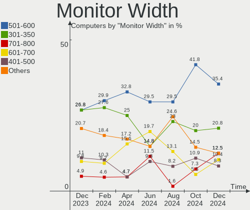

| Width in mm    | Computers | Percent |
|----------------|-----------|---------|
| 501-600        | 22        | 35.48%  |
| 301-350        | 13        | 20.97%  |
| 401-500        | 7         | 11.29%  |
| 351-400        | 6         | 9.68%   |
| 701-800        | 4         | 6.45%   |
| 801-900        | 3         | 4.84%   |
| 201-300        | 3         | 4.84%   |
| 601-700        | 2         | 3.23%   |
| More than 2000 | 1         | 1.61%   |
| 101-200        | 1         | 1.61%   |

Aspect Ratio
------------

Proportional relationship between the width and the height

| Ratio | Computers | Percent |
|-------|-----------|---------|
| 16/9  | 42        | 77.78%  |
| 16/10 | 4         | 7.41%   |
| 5/4   | 3         | 5.56%   |
| 21/9  | 2         | 3.7%    |
| 4/3   | 1         | 1.85%   |
| 3/2   | 1         | 1.85%   |
| 0.62  | 1         | 1.85%   |

Monitor Area
------------

Area in inch²

| Area in inch² | Computers | Percent |
|----------------|-----------|---------|
| 201-250        | 14        | 22.22%  |
| 301-350        | 12        | 19.05%  |
| 101-110        | 8         | 12.7%   |
| 351-500        | 5         | 7.94%   |
| 81-90          | 4         | 6.35%   |
| 151-200        | 4         | 6.35%   |
| 121-130        | 3         | 4.76%   |
| 501-1000       | 3         | 4.76%   |
| 71-80          | 2         | 3.17%   |
| 251-300        | 2         | 3.17%   |
| 141-150        | 2         | 3.17%   |
| More than 1000 | 1         | 1.59%   |
| 1-40           | 1         | 1.59%   |
| 131-140        | 1         | 1.59%   |
| 111-120        | 1         | 1.59%   |

Pixel Density
-------------

Pixels per inch

| Density       | Computers | Percent |
|---------------|-----------|---------|
| 51-100        | 28        | 45.9%   |
| 101-120       | 13        | 21.31%  |
| 121-160       | 12        | 19.67%  |
| 161-240       | 5         | 8.2%    |
| More than 240 | 2         | 3.28%   |
| 1-50          | 1         | 1.64%   |

Multiple Monitors
-----------------

Total monitors connected

| Total | Computers | Percent |
|-------|-----------|---------|
| 1     | 34        | 68%     |
| 2     | 13        | 26%     |
| 3     | 2         | 4%      |
| 0     | 1         | 2%      |

Network
-------

Net Controller Vendor
---------------------

Controller vendors

| Vendor                   | Computers | Percent |
|--------------------------|-----------|---------|
| Realtek Semiconductor    | 26        | 33.33%  |
| Intel                    | 26        | 33.33%  |
| Qualcomm Atheros         | 4         | 5.13%   |
| MediaTek                 | 4         | 5.13%   |
| Broadcom                 | 4         | 5.13%   |
| TP-Link                  | 3         | 3.85%   |
| ASIX Electronics         | 3         | 3.85%   |
| ROCCAT                   | 1         | 1.28%   |
| Ralink Technology        | 1         | 1.28%   |
| Nvidia                   | 1         | 1.28%   |
| Microsoft                | 1         | 1.28%   |
| Marvell Technology Group | 1         | 1.28%   |
| Broadcom Limited         | 1         | 1.28%   |
| ASUSTek Computer         | 1         | 1.28%   |
| Aquantia                 | 1         | 1.28%   |

Net Controller Model
--------------------

Controller models

| Model                                                                                         | Computers | Percent |
|-----------------------------------------------------------------------------------------------|-----------|---------|
| Realtek RTL8111/8168/8411 PCI Express Gigabit Ethernet Controller                             | 19        | 22.09%  |
| Intel Wi-Fi 6 AX200                                                                           | 6         | 6.98%   |
| Realtek RTL8125 2.5GbE Controller                                                             | 4         | 4.65%   |
| MediaTek MT7922 802.11ax PCI Express Wireless Network Adapter                                 | 3         | 3.49%   |
| Intel I211 Gigabit Network Connection                                                         | 3         | 3.49%   |
| Intel Cannon Lake PCH CNVi WiFi                                                               | 3         | 3.49%   |
| ASIX AX88179 Gigabit Ethernet                                                                 | 3         | 3.49%   |
| Qualcomm Atheros Killer E2400 Gigabit Ethernet Controller                                     | 2         | 2.33%   |
| Intel Wireless 8265 / 8275                                                                    | 2         | 2.33%   |
| Intel Ethernet Connection (7) I219-V                                                          | 2         | 2.33%   |
| TP-Link UE300 10/100/1000 LAN (ethernet mode) [Realtek RTL8153]                               | 1         | 1.16%   |
| TP-Link Archer T3U [Realtek RTL8812BU]                                                        | 1         | 1.16%   |
| TP-Link Archer T2U PLUS [RTL8821AU]                                                           | 1         | 1.16%   |
| ROCCAT OSA Express Network card                                                               | 1         | 1.16%   |
| Realtek RTL88x2bu [AC1200 Techkey]                                                            | 1         | 1.16%   |
| Realtek RTL8852BE PCIe 802.11ax Wireless Network Controller                                   | 1         | 1.16%   |
| Realtek RTL8821CE 802.11ac PCIe Wireless Network Adapter                                      | 1         | 1.16%   |
| Realtek Realtek 8812AU/8821AU 802.11ac WLAN Adapter [USB Wireless Dual-Band Adapter 2.4/5Ghz] | 1         | 1.16%   |
| Realtek 802.11ac WLAN Adapter                                                                 | 1         | 1.16%   |
| Ralink RT5572 Wireless Adapter                                                                | 1         | 1.16%   |
| Qualcomm Atheros QCA9377 802.11ac Wireless Network Adapter                                    | 1         | 1.16%   |
| Qualcomm Atheros QCA6174 802.11ac Wireless Network Adapter                                    | 1         | 1.16%   |
| Nvidia MCP65 Ethernet                                                                         | 1         | 1.16%   |
| Microsoft XBOX ACC                                                                            | 1         | 1.16%   |
| MediaTek MT7921 802.11ax PCI Express Wireless Network Adapter                                 | 1         | 1.16%   |
| Marvell Group 88W8897 [AVASTAR] 802.11ac Wireless                                             | 1         | 1.16%   |
| Intel Wireless-AC 9260                                                                        | 1         | 1.16%   |
| Intel Wireless 8260                                                                           | 1         | 1.16%   |
| Intel Wireless 7265                                                                           | 1         | 1.16%   |
| Intel Wireless 3165                                                                           | 1         | 1.16%   |
| Intel Wi-Fi 6 AX201                                                                           | 1         | 1.16%   |
| Intel Tiger Lake PCH CNVi WiFi                                                                | 1         | 1.16%   |
| Intel Raptor Lake PCH CNVi WiFi                                                               | 1         | 1.16%   |
| Intel Ethernet Controller I225-V                                                              | 1         | 1.16%   |
| Intel Ethernet Connection (7) I219-LM                                                         | 1         | 1.16%   |
| Intel Ethernet Connection (5) I219-V                                                          | 1         | 1.16%   |
| Intel Ethernet Connection (2) I219-V                                                          | 1         | 1.16%   |
| Intel Ethernet Connection (2) I219-LM                                                         | 1         | 1.16%   |
| Intel Ethernet Connection (17) I219-V                                                         | 1         | 1.16%   |
| Intel Dual Band Wireless-AC 3168NGW [Stone Peak]                                              | 1         | 1.16%   |

Wireless Vendor
---------------

Wireless vendors

| Vendor                   | Computers | Percent |
|--------------------------|-----------|---------|
| Intel                    | 20        | 50%     |
| Realtek Semiconductor    | 4         | 10%     |
| MediaTek                 | 4         | 10%     |
| Broadcom                 | 3         | 7.5%    |
| TP-Link                  | 2         | 5%      |
| Qualcomm Atheros         | 2         | 5%      |
| Ralink Technology        | 1         | 2.5%    |
| Microsoft                | 1         | 2.5%    |
| Marvell Technology Group | 1         | 2.5%    |
| Broadcom Limited         | 1         | 2.5%    |
| ASUSTek Computer         | 1         | 2.5%    |

Wireless Model
--------------

Wireless models

| Model                                                                                         | Computers | Percent |
|-----------------------------------------------------------------------------------------------|-----------|---------|
| Intel Wi-Fi 6 AX200                                                                           | 6         | 14.63%  |
| MediaTek MT7922 802.11ax PCI Express Wireless Network Adapter                                 | 3         | 7.32%   |
| Intel Cannon Lake PCH CNVi WiFi                                                               | 3         | 7.32%   |
| Intel Wireless 8265 / 8275                                                                    | 2         | 4.88%   |
| TP-Link Archer T3U [Realtek RTL8812BU]                                                        | 1         | 2.44%   |
| TP-Link Archer T2U PLUS [RTL8821AU]                                                           | 1         | 2.44%   |
| Realtek RTL88x2bu [AC1200 Techkey]                                                            | 1         | 2.44%   |
| Realtek RTL8852BE PCIe 802.11ax Wireless Network Controller                                   | 1         | 2.44%   |
| Realtek RTL8821CE 802.11ac PCIe Wireless Network Adapter                                      | 1         | 2.44%   |
| Realtek Realtek 8812AU/8821AU 802.11ac WLAN Adapter [USB Wireless Dual-Band Adapter 2.4/5Ghz] | 1         | 2.44%   |
| Realtek 802.11ac WLAN Adapter                                                                 | 1         | 2.44%   |
| Ralink RT5572 Wireless Adapter                                                                | 1         | 2.44%   |
| Qualcomm Atheros QCA9377 802.11ac Wireless Network Adapter                                    | 1         | 2.44%   |
| Qualcomm Atheros QCA6174 802.11ac Wireless Network Adapter                                    | 1         | 2.44%   |
| Microsoft XBOX ACC                                                                            | 1         | 2.44%   |
| MediaTek MT7921 802.11ax PCI Express Wireless Network Adapter                                 | 1         | 2.44%   |
| Marvell Group 88W8897 [AVASTAR] 802.11ac Wireless                                             | 1         | 2.44%   |
| Intel Wireless-AC 9260                                                                        | 1         | 2.44%   |
| Intel Wireless 8260                                                                           | 1         | 2.44%   |
| Intel Wireless 7265                                                                           | 1         | 2.44%   |
| Intel Wireless 3165                                                                           | 1         | 2.44%   |
| Intel Wi-Fi 6 AX201                                                                           | 1         | 2.44%   |
| Intel Tiger Lake PCH CNVi WiFi                                                                | 1         | 2.44%   |
| Intel Raptor Lake PCH CNVi WiFi                                                               | 1         | 2.44%   |
| Intel Dual Band Wireless-AC 3168NGW [Stone Peak]                                              | 1         | 2.44%   |
| Intel Alder Lake-P PCH CNVi WiFi                                                              | 1         | 2.44%   |
| Broadcom Limited BCM4331 802.11a/b/g/n                                                        | 1         | 2.44%   |
| Broadcom BCM4360 802.11ac Dual Band Wireless Network Adapter                                  | 1         | 2.44%   |
| Broadcom BCM43228 802.11a/b/g/n                                                               | 1         | 2.44%   |
| Broadcom BCM4321 802.11a/b/g/n                                                                | 1         | 2.44%   |
| ASUS 802.11ac NIC                                                                             | 1         | 2.44%   |

Ethernet Vendor
---------------

Ethernet vendors

| Vendor                | Computers | Percent |
|-----------------------|-----------|---------|
| Realtek Semiconductor | 23        | 52.27%  |
| Intel                 | 12        | 27.27%  |
| ASIX Electronics      | 3         | 6.82%   |
| Qualcomm Atheros      | 2         | 4.55%   |
| TP-Link               | 1         | 2.27%   |
| Nvidia                | 1         | 2.27%   |
| Broadcom              | 1         | 2.27%   |
| Aquantia              | 1         | 2.27%   |

Ethernet Model
--------------

Ethernet models

| Model                                                             | Computers | Percent |
|-------------------------------------------------------------------|-----------|---------|
| Realtek RTL8111/8168/8411 PCI Express Gigabit Ethernet Controller | 19        | 43.18%  |
| Realtek RTL8125 2.5GbE Controller                                 | 4         | 9.09%   |
| Intel I211 Gigabit Network Connection                             | 3         | 6.82%   |
| ASIX AX88179 Gigabit Ethernet                                     | 3         | 6.82%   |
| Qualcomm Atheros Killer E2400 Gigabit Ethernet Controller         | 2         | 4.55%   |
| Intel Ethernet Connection (7) I219-V                              | 2         | 4.55%   |
| TP-Link UE300 10/100/1000 LAN (ethernet mode) [Realtek RTL8153]   | 1         | 2.27%   |
| Nvidia MCP65 Ethernet                                             | 1         | 2.27%   |
| Intel Ethernet Controller I225-V                                  | 1         | 2.27%   |
| Intel Ethernet Connection (7) I219-LM                             | 1         | 2.27%   |
| Intel Ethernet Connection (5) I219-V                              | 1         | 2.27%   |
| Intel Ethernet Connection (2) I219-V                              | 1         | 2.27%   |
| Intel Ethernet Connection (2) I219-LM                             | 1         | 2.27%   |
| Intel Ethernet Connection (17) I219-V                             | 1         | 2.27%   |
| Intel 82579LM Gigabit Network Connection (Lewisville)             | 1         | 2.27%   |
| Broadcom NetXtreme BCM57766 Gigabit Ethernet PCIe                 | 1         | 2.27%   |
| Aquantia AQC107 NBase-T/IEEE 802.3bz Ethernet Controller [AQtion] | 1         | 2.27%   |

Net Controller Kind
-------------------

Ethernet, WiFi or modem

| Kind     | Computers | Percent |
|----------|-----------|---------|
| Ethernet | 41        | 51.9%   |
| WiFi     | 37        | 46.84%  |
| Unknown  | 1         | 1.27%   |

Used Controller
---------------

Currently used network controller

| Kind     | Computers | Percent |
|----------|-----------|---------|
| Ethernet | 29        | 58%     |
| WiFi     | 21        | 42%     |

NICs
----

Total network controllers on board

| Total | Computers | Percent |
|-------|-----------|---------|
| 1     | 30        | 60%     |
| 2     | 17        | 34%     |
| 3     | 3         | 6%      |

IPv6
----

IPv6 vs IPv4

| Used | Computers | Percent |
|------|-----------|---------|
| No   | 34        | 68%     |
| Yes  | 16        | 32%     |

Bluetooth
---------

Bluetooth Vendor
----------------

Controller vendors

| Vendor                          | Computers | Percent |
|---------------------------------|-----------|---------|
| Intel                           | 17        | 51.52%  |
| Realtek Semiconductor           | 4         | 12.12%  |
| ASUSTek Computer                | 3         | 9.09%   |
| MediaTek                        | 2         | 6.06%   |
| Qualcomm Atheros Communications | 1         | 3.03%   |
| Marvell Semiconductor           | 1         | 3.03%   |
| IMC Networks                    | 1         | 3.03%   |
| Foxconn / Hon Hai               | 1         | 3.03%   |
| Cambridge Silicon Radio         | 1         | 3.03%   |
| Broadcom                        | 1         | 3.03%   |
| Apple                           | 1         | 3.03%   |

Bluetooth Model
---------------

Controller models

| Model                                               | Computers | Percent |
|-----------------------------------------------------|-----------|---------|
| Intel Bluetooth wireless interface                  | 5         | 15.15%  |
| Intel AX200 Bluetooth                               | 4         | 12.12%  |
| Realtek Bluetooth Radio                             | 3         | 9.09%   |
| Intel Bluetooth 9460/9560 Jefferson Peak (JfP)      | 3         | 9.09%   |
| Intel AX201 Bluetooth                               | 3         | 9.09%   |
| MediaTek Wireless_Device                            | 2         | 6.06%   |
| Realtek Bluetooth 5.3 Radio                         | 1         | 3.03%   |
| Qualcomm Atheros  Bluetooth Device                  | 1         | 3.03%   |
| Marvell Bluetooth and Wireless LAN Composite        | 1         | 3.03%   |
| Intel Wireless-AC 3168 Bluetooth                    | 1         | 3.03%   |
| Intel Bluetooth Device                              | 1         | 3.03%   |
| IMC Networks Wireless_Device                        | 1         | 3.03%   |
| Foxconn / Hon Hai Wireless_Device                   | 1         | 3.03%   |
| Cambridge Silicon Radio Bluetooth Dongle (HCI mode) | 1         | 3.03%   |
| Broadcom BCM20702A0 Bluetooth 4.0                   | 1         | 3.03%   |
| ASUS Qualcomm Bluetooth 4.1                         | 1         | 3.03%   |
| ASUS Broadcom BCM20702A0 Bluetooth                  | 1         | 3.03%   |
| ASUS ASUS USB-BT500                                 | 1         | 3.03%   |
| Apple Bluetooth USB Host Controller                 | 1         | 3.03%   |

Sound
-----

Sound Vendor
------------

Sound card vendors

| Vendor               | Computers | Percent |
|----------------------|-----------|---------|
| Intel                | 25        | 28.41%  |
| AMD                  | 25        | 28.41%  |
| Nvidia               | 17        | 19.32%  |
| Logitech             | 3         | 3.41%   |
| Sony                 | 2         | 2.27%   |
| ROCCAT               | 2         | 2.27%   |
| Creative Labs        | 2         | 2.27%   |
| SteelSeries ApS      | 1         | 1.14%   |
| Kingston Technology  | 1         | 1.14%   |
| JMTek                | 1         | 1.14%   |
| Hewlett-Packard      | 1         | 1.14%   |
| Harman International | 1         | 1.14%   |
| GYROCOM C&C          | 1         | 1.14%   |
| fifinemicrophone.com | 1         | 1.14%   |
| Edifier Technology   | 1         | 1.14%   |
| Corsair              | 1         | 1.14%   |
| C-Media Electronics  | 1         | 1.14%   |
| ASUSTek Computer     | 1         | 1.14%   |
| Astro Gaming         | 1         | 1.14%   |

Sound Model
-----------

Sound card models

| Model                                                               | Computers | Percent |
|---------------------------------------------------------------------|-----------|---------|
| AMD Family 17h/19h HD Audio Controller                              | 12        | 11.01%  |
| AMD Starship/Matisse HD Audio Controller                            | 6         | 5.5%    |
| AMD Navi 21/23 HDMI/DP Audio Controller                             | 6         | 5.5%    |
| Intel Sunrise Point-LP HD Audio                                     | 5         | 4.59%   |
| Intel Cannon Lake PCH cAVS                                          | 4         | 3.67%   |
| AMD Renoir Radeon High Definition Audio Controller                  | 4         | 3.67%   |
| Intel 200 Series PCH HD Audio                                       | 3         | 2.75%   |
| Intel 100 Series/C230 Series Chipset Family HD Audio Controller     | 3         | 2.75%   |
| AMD Raven/Raven2/Fenghuang HDMI/DP Audio Controller                 | 3         | 2.75%   |
| AMD Ellesmere HDMI Audio [Radeon RX 470/480 / 570/580/590]          | 3         | 2.75%   |
| Sony DualSense wireless controller (PS5)                            | 2         | 1.83%   |
| Nvidia GP104 High Definition Audio Controller                       | 2         | 1.83%   |
| Nvidia GA102 High Definition Audio Controller                       | 2         | 1.83%   |
| Logitech Blue Microphones                                           | 2         | 1.83%   |
| Intel Tiger Lake-LP Smart Sound Technology Audio Controller         | 2         | 1.83%   |
| Intel 7 Series/C216 Chipset Family High Definition Audio Controller | 2         | 1.83%   |
| AMD Rembrandt Radeon High Definition Audio Controller               | 2         | 1.83%   |
| AMD Navi 31 HDMI/DP Audio                                           | 2         | 1.83%   |
| AMD Navi 10 HDMI Audio                                              | 2         | 1.83%   |
| AMD Family 17h (Models 00h-0fh) HD Audio Controller                 | 2         | 1.83%   |
| SteelSeries ApS SteelSeries Arctis 1 Wireless                       | 1         | 0.92%   |
| ROCCAT SYN Pro Air                                                  | 1         | 0.92%   |
| ROCCAT Elo 7.1 Air                                                  | 1         | 0.92%   |
| Nvidia TU107 GeForce GTX 1650 High Definition Audio Controller      | 1         | 0.92%   |
| Nvidia TU106 High Definition Audio Controller                       | 1         | 0.92%   |
| Nvidia TU104 HD Audio Controller                                    | 1         | 0.92%   |
| Nvidia MCP65 High Definition Audio                                  | 1         | 0.92%   |
| Nvidia GP108 High Definition Audio Controller                       | 1         | 0.92%   |
| Nvidia GP106 High Definition Audio Controller                       | 1         | 0.92%   |
| Nvidia GM206 High Definition Audio Controller                       | 1         | 0.92%   |
| Nvidia GM200 High Definition Audio                                  | 1         | 0.92%   |
| Nvidia GK107 HDMI Audio Controller                                  | 1         | 0.92%   |
| Nvidia GA106 High Definition Audio Controller                       | 1         | 0.92%   |
| Nvidia GA104 High Definition Audio Controller                       | 1         | 0.92%   |
| Nvidia Audio device                                                 | 1         | 0.92%   |
| Nvidia AD102 High Definition Audio Controller                       | 1         | 0.92%   |
| Logitech Yeti X                                                     | 1         | 0.92%   |
| Kingston Technology HyperX Cloud Alpha S                            | 1         | 0.92%   |
| JMTek Fosi Audio K5 Pro                                             | 1         | 0.92%   |
| Intel Xeon E3-1200 v3/4th Gen Core Processor HD Audio Controller    | 1         | 0.92%   |

Memory
------

Memory Vendor
-------------

Memory module vendors

| Vendor              | Computers | Percent |
|---------------------|-----------|---------|
| G.Skill             | 3         | 27.27%  |
| SK hynix            | 2         | 18.18%  |
| Samsung Electronics | 1         | 9.09%   |
| Ramaxel Technology  | 1         | 9.09%   |
| Micron Technology   | 1         | 9.09%   |
| Crucial             | 1         | 9.09%   |
| Corsair             | 1         | 9.09%   |
| A-DATA Technology   | 1         | 9.09%   |

Memory Model
------------

Memory module models

| Model                                                            | Computers | Percent |
|------------------------------------------------------------------|-----------|---------|
| SK hynix RAM Module 8GB Row Of Chips LPDDR3 1867MT/s             | 1         | 9.09%   |
| SK hynix RAM H9JCNNNFA5MLYR-N6E 4GB Row Of Chips LPDDR5 6400MT/s | 1         | 9.09%   |
| Samsung RAM M471A1K43DB1-CWE 8GB SODIMM DDR4 3200MT/s            | 1         | 9.09%   |
| Ramaxel RAM RMSA3270ME86H9F-2666 4GB SODIMM DDR4 2667MT/s        | 1         | 9.09%   |
| Micron RAM 4ATF51264HZ-2G6E1 4GB SODIMM DDR4 2667MT/s            | 1         | 9.09%   |
| G.Skill RAM F5-6000J3038F16G 16GB DIMM DDR5 6000MT/s             | 1         | 9.09%   |
| G.Skill RAM F4-3600C18-8GTRS 8GB DIMM DDR4 3600MT/s              | 1         | 9.09%   |
| G.Skill RAM F4-3000C16-8GISB 8192MB DIMM DDR4 3200MT/s           | 1         | 9.09%   |
| Crucial RAM BLS8G4D26BFSE.16FBD2 8GB DIMM DDR4 2667MT/s          | 1         | 9.09%   |
| Corsair RAM CMX8GX3M2A160 4GB DIMM DDR3 1333MT/s                 | 1         | 9.09%   |
| A-DATA RAM DDR4 3200 8GB DIMM DDR4 3600MT/s                      | 1         | 9.09%   |

Memory Kind
-----------

Memory module kinds

| Kind   | Computers | Percent |
|--------|-----------|---------|
| DDR4   | 6         | 60%     |
| LPDDR5 | 1         | 10%     |
| LPDDR3 | 1         | 10%     |
| DDR5   | 1         | 10%     |
| DDR3   | 1         | 10%     |

Memory Form Factor
------------------

Physical design of the memory module

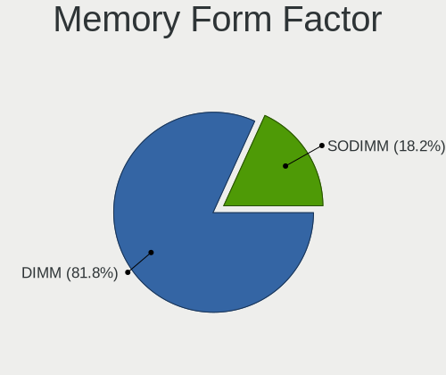

| Name         | Computers | Percent |
|--------------|-----------|---------|
| DIMM         | 6         | 60%     |
| SODIMM       | 2         | 20%     |
| Row Of Chips | 2         | 20%     |

Memory Size
-----------

Memory module size

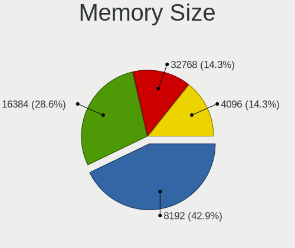

| Size  | Computers | Percent |
|-------|-----------|---------|
| 8192  | 5         | 50%     |
| 16384 | 2         | 20%     |
| 4096  | 2         | 20%     |
| 32768 | 1         | 10%     |

Memory Speed
------------

Memory module speed

| Speed | Computers | Percent |
|-------|-----------|---------|
| 3600  | 2         | 20%     |
| 3200  | 2         | 20%     |
| 2667  | 2         | 20%     |
| 6400  | 1         | 10%     |
| 6000  | 1         | 10%     |
| 1867  | 1         | 10%     |
| 1333  | 1         | 10%     |

Printers & scanners
-------------------

Printer Vendor
--------------

Printer device vendors

| Vendor          | Computers | Percent |
|-----------------|-----------|---------|
| Hewlett-Packard | 1         | 50%     |
| Canon           | 1         | 50%     |

Printer Model
-------------

Printer device models

| Model                    | Computers | Percent |
|--------------------------|-----------|---------|
| HP Color LaserJet CP1215 | 1         | 50%     |
| Canon G2000 series       | 1         | 50%     |

Scanner Vendor
--------------

Scanner device vendors

Zero info for selected period =(

Scanner Model
-------------

Scanner device models

Zero info for selected period =(

Camera
------

Camera Vendor
-------------

Camera device vendors

| Vendor                | Computers | Percent |
|-----------------------|-----------|---------|
| Chicony Electronics   | 5         | 26.32%  |
| IMC Networks          | 4         | 21.05%  |
| Microdia              | 2         | 10.53%  |
| Syntek                | 1         | 5.26%   |
| Suyin                 | 1         | 5.26%   |
| Realtek Semiconductor | 1         | 5.26%   |
| Razer USA             | 1         | 5.26%   |
| Logitech              | 1         | 5.26%   |
| Creative Technology   | 1         | 5.26%   |
| Bison Electronics     | 1         | 5.26%   |
| Apple                 | 1         | 5.26%   |

Camera Model
------------

Camera device models

| Model                                | Computers | Percent |
|--------------------------------------|-----------|---------|
| IMC Networks USB2.0 HD UVC WebCam    | 3         | 15.79%  |
| Chicony Integrated Camera            | 2         | 10.53%  |
| Chicony HD WebCam                    | 2         | 10.53%  |
| Syntek Integrated Camera             | 1         | 5.26%   |
| Suyin HP Webcam                      | 1         | 5.26%   |
| Realtek Integrated_Webcam_HD         | 1         | 5.26%   |
| Razer USA Gaming Webcam [Kiyo]       | 1         | 5.26%   |
| Microdia Webcam Vitade AF            | 1         | 5.26%   |
| Microdia USB Camera                  | 1         | 5.26%   |
| Logitech Logi Webcam C920e           | 1         | 5.26%   |
| IMC Networks USB2.0 HD IR UVC WebCam | 1         | 5.26%   |
| Creative Live! Cam Sync [VF0520]     | 1         | 5.26%   |
| Chicony LGE FHD Camera               | 1         | 5.26%   |
| Bison HD Webcam                      | 1         | 5.26%   |
| Apple FaceTime HD Camera (Built-in)  | 1         | 5.26%   |

Security
--------

Fingerprint Vendor
------------------

Fingerprint sensor vendors

| Vendor                | Computers | Percent |
|-----------------------|-----------|---------|
| Elan Microelectronics | 2         | 100%    |

Fingerprint Model
-----------------

Fingerprint sensor models

| Model                 | Computers | Percent |
|-----------------------|-----------|---------|
| Elan ELAN:Fingerprint | 2         | 100%    |

Chipcard Vendor
---------------

Chipcard module vendors

| Vendor   | Computers | Percent |
|----------|-----------|---------|
| Broadcom | 2         | 100%    |

Chipcard Model
--------------

Chipcard module models

| Model                                          | Computers | Percent |
|------------------------------------------------|-----------|---------|
| Broadcom BCM5880 Secure Applications Processor | 1         | 50%     |
| Broadcom 58200                                 | 1         | 50%     |

Unsupported
-----------

Unsupported Devices
-------------------

Total unsupported devices on board

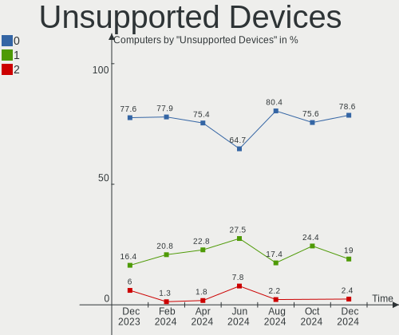

| Total | Computers | Percent |
|-------|-----------|---------|
| 0     | 38        | 76%     |
| 1     | 12        | 24%     |

Unsupported Device Types
------------------------

Types of unsupported devices

| Type                  | Computers | Percent |
|-----------------------|-----------|---------|
| Multimedia controller | 4         | 33.33%  |
| Net/wireless          | 3         | 25%     |
| Graphics card         | 2         | 16.67%  |
| Fingerprint reader    | 2         | 16.67%  |
| Net/ethernet          | 1         | 8.33%   |

