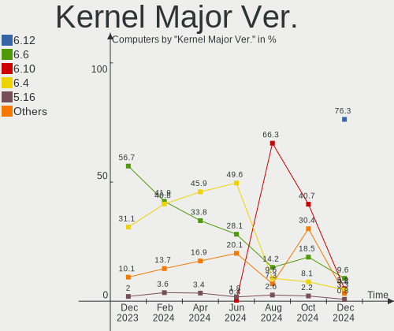
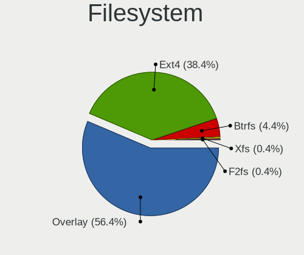
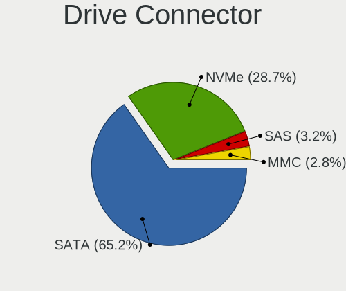
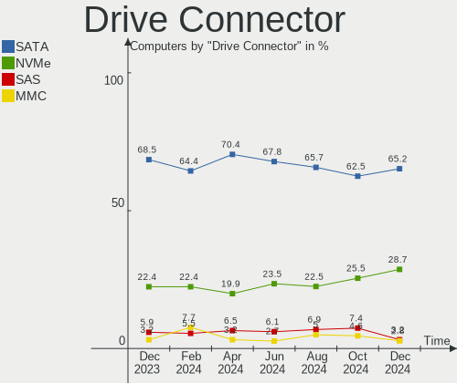
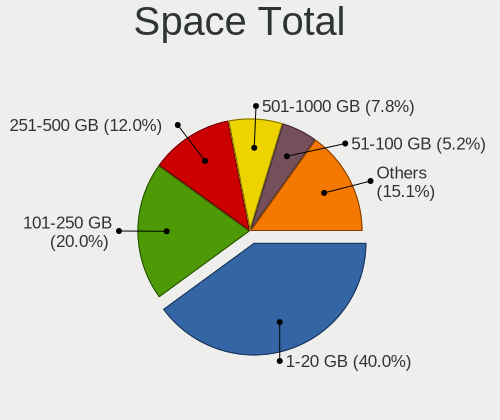
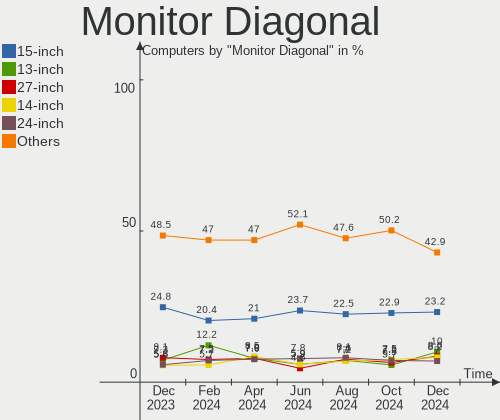

OpenMandriva Hardware Trends
----------------------------

A project to identify most popular hardware characteristics and track their change
over time based on data collected by OpenMandriva users at https://Linux-Hardware.org.

Anyone can contribute to the study by uploading probes of their computers by
the [hw-probe](https://github.com/linuxhw/hw-probe) tool:

    sudo -E hw-probe -all -upload

This is a report for all computer types. See also reports for [desktops](/Dist/OpenMandriva/Desktop/README.md) and [notebooks](/Dist/OpenMandriva/Notebook/README.md).

Full-feature report is available here: https://linux-hardware.org/?view=trends

Period: Mar, 2021.

Contents
--------

- [ OS                       ](#os)
- [ OS Family                ](#os-family)
- [ Kernel                   ](#kernel)
- [ Kernel Family            ](#kernel-family)
- [ Kernel Major Ver.        ](#kernel-major-ver)
- [ Arch                     ](#arch)
- [ DE                       ](#de)
- [ Display Server           ](#display-server)
- [ Display Manager          ](#display-manager)
- [ OS Lang                  ](#os-lang)
- [ Boot Mode                ](#boot-mode)
- [ Filesystem               ](#filesystem)
- [ Part. scheme             ](#part-scheme)
- [ Dual Boot with Linux/BSD ](#dual-boot-with-linux/bsd)
- [ Dual Boot (Win)          ](#dual-boot-win)
- [ Country                  ](#country)
- [ City                     ](#city)
- [ Vendor                   ](#vendor)
- [ Model                    ](#model)
- [ Model Family             ](#model-family)
- [ MFG Year                 ](#mfg-year)
- [ Form Factor              ](#form-factor)
- [ Secure Boot              ](#secure-boot)
- [ Coreboot                 ](#coreboot)
- [ RAM Size                 ](#ram-size)
- [ RAM Used                 ](#ram-used)
- [ Has CD-ROM               ](#has-cd-rom)
- [ Total Drives             ](#total-drives)
- [ Has Ethernet             ](#has-ethernet)
- [ Has WiFi                 ](#has-wifi)
- [ Has Bluetooth            ](#has-bluetooth)
- [ Drive Vendor             ](#drive-vendor)
- [ Drive Model              ](#drive-model)
- [ HDD Vendor               ](#hdd-vendor)
- [ SSD Vendor               ](#ssd-vendor)
- [ Drive Kind               ](#drive-kind)
- [ Drive Connector          ](#drive-connector)
- [ Drive Size               ](#drive-size)
- [ Space Total              ](#space-total)
- [ Space Used               ](#space-used)
- [ Malfunc. Drives          ](#malfunc-drives)
- [ Malfunc. Drive Vendor    ](#malfunc-drive-vendor)
- [ Malfunc. HDD Vendor      ](#malfunc-hdd-vendor)
- [ Malfunc. Drive Kind      ](#malfunc-drive-kind)
- [ Failed Drives            ](#failed-drives)
- [ Failed Drive Vendor      ](#failed-drive-vendor)
- [ Drive Status             ](#drive-status)
- [ Storage Vendor           ](#storage-vendor)
- [ Storage Model            ](#storage-model)
- [ Storage Kind             ](#storage-kind)
- [ CPU Vendor               ](#cpu-vendor)
- [ CPU Model                ](#cpu-model)
- [ CPU Model Family         ](#cpu-model-family)
- [ CPU Cores                ](#cpu-cores)
- [ CPU Sockets              ](#cpu-sockets)
- [ CPU Threads              ](#cpu-threads)
- [ CPU Op-Modes             ](#cpu-op-modes)
- [ CPU Microcode            ](#cpu-microcode)
- [ CPU Microarch            ](#cpu-microarch)
- [ GPU Vendor               ](#gpu-vendor)
- [ GPU Model                ](#gpu-model)
- [ GPU Combo                ](#gpu-combo)
- [ GPU Driver               ](#gpu-driver)
- [ GPU Memory               ](#gpu-memory)
- [ Monitor Vendor           ](#monitor-vendor)
- [ Monitor Model            ](#monitor-model)
- [ Monitor Resolution       ](#monitor-resolution)
- [ Monitor Diagonal         ](#monitor-diagonal)
- [ Monitor Width            ](#monitor-width)
- [ Aspect Ratio             ](#aspect-ratio)
- [ Monitor Area             ](#monitor-area)
- [ Pixel Density            ](#pixel-density)
- [ Multiple Monitors        ](#multiple-monitors)
- [ Net Controller Vendor    ](#net-controller-vendor)
- [ Net Controller Model     ](#net-controller-model)
- [ Wireless Vendor          ](#wireless-vendor)
- [ Wireless Model           ](#wireless-model)
- [ Ethernet Vendor          ](#ethernet-vendor)
- [ Ethernet Model           ](#ethernet-model)
- [ Net Controller Kind      ](#net-controller-kind)
- [ Used Controller          ](#used-controller)
- [ NICs                     ](#nics)
- [ IPv6                     ](#ipv6)
- [ Memory Vendor            ](#memory-vendor)
- [ Memory Model             ](#memory-model)
- [ Memory Kind              ](#memory-kind)
- [ Memory Form Factor       ](#memory-form-factor)
- [ Memory Size              ](#memory-size)
- [ Memory Speed             ](#memory-speed)
- [ Sound Vendor             ](#sound-vendor)
- [ Sound Model              ](#sound-model)
- [ Camera Vendor            ](#camera-vendor)
- [ Camera Model             ](#camera-model)
- [ Fingerprint Vendor       ](#fingerprint-vendor)
- [ Fingerprint Model        ](#fingerprint-model)
- [ Chipcard Vendor          ](#chipcard-vendor)
- [ Chipcard Model           ](#chipcard-model)
- [ Printer Vendor           ](#printer-vendor)
- [ Printer Model            ](#printer-model)
- [ Scanner Vendor           ](#scanner-vendor)
- [ Scanner Model            ](#scanner-model)
- [ Bluetooth Vendor         ](#bluetooth-vendor)
- [ Bluetooth Model          ](#bluetooth-model)
- [ Unsupported Devices      ](#unsupported-devices)
- [ Unsupported Device Types ](#unsupported-device-types)

OS
--

Installed operating systems

| Name             | Computers | Percent |
|------------------|-----------|---------|
| OpenMandriva 4.2 | 589       | 100%    |

OS Family
---------

OS without a version

| Name         | Computers | Percent |
|--------------|-----------|---------|
| OpenMandriva | 589       | 100%    |

Kernel
------

Version of the Linux kernel

| Version                       | Computers | Percent |
|-------------------------------|-----------|---------|
| 5.10.14-desktop-1omv4002      | 583       | 98.98%  |
| 5.11.0-desktop-clang-1omv4002 | 3         | 0.51%   |
| 5.11.0-desktop-1omv4002       | 1         | 0.17%   |
| 5.11.0-desktop-0.rc4.1omv4002 | 1         | 0.17%   |
| 5.10.15-desktop-1omv4002      | 1         | 0.17%   |

Kernel Family
-------------

Linux kernel without a distro release

| Version | Computers | Percent |
|---------|-----------|---------|
| 5.10.14 | 583       | 98.98%  |
| 5.11.0  | 5         | 0.85%   |
| 5.10.15 | 1         | 0.17%   |

Kernel Major Ver.
-----------------

Linux kernel major version

| Version | Computers | Percent |
|---------|-----------|---------|
| 5.10    | 584       | 99.15%  |
| 5.11    | 5         | 0.85%   |

Arch
----

OS architecture (x86_64, i586, etc.)

| Name   | Computers | Percent |
|--------|-----------|---------|
| x86_64 | 589       | 100%    |

DE
--

Desktop Environment

| Name  | Computers | Percent |
|-------|-----------|---------|
| KDE5  | 588       | 99.83%  |
| GNOME | 1         | 0.17%   |

Display Server
--------------

X11 or Wayland

| Name    | Computers | Percent |
|---------|-----------|---------|
| X11     | 587       | 99.66%  |
| Wayland | 2         | 0.34%   |

Display Manager
---------------

SDDM, LightDM, etc.

| Name | Computers | Percent |
|------|-----------|---------|
| SDDM | 589       | 100%    |

OS Lang
-------

Language

| Lang  | Computers | Percent |
|-------|-----------|---------|
| en_US | 291       | 49.41%  |
| ru_RU | 45        | 7.64%   |
| fr_FR | 44        | 7.47%   |
| de_DE | 40        | 6.79%   |
| pl_PL | 37        | 6.28%   |
| pt_BR | 25        | 4.24%   |
| es_ES | 16        | 2.72%   |
| it_IT | 15        | 2.55%   |
| cs_CZ | 10        | 1.7%    |
| es_MX | 9         | 1.53%   |
| en_GB | 8         | 1.36%   |
| pt_PT | 5         | 0.85%   |
| ru_UA | 4         | 0.68%   |
| hu_HU | 4         | 0.68%   |
| es_AR | 4         | 0.68%   |
| fr_BE | 3         | 0.51%   |
| es_CL | 3         | 0.51%   |
| de_AT | 3         | 0.51%   |
| fr_CA | 2         | 0.34%   |
| es_VE | 2         | 0.34%   |
| es_GT | 2         | 0.34%   |
| en_HK | 2         | 0.34%   |
| da_DK | 2         | 0.34%   |
| uk_UA | 1         | 0.17%   |
| nl_NL | 1         | 0.17%   |
| it_CH | 1         | 0.17%   |
| fr_CH | 1         | 0.17%   |
| es_UY | 1         | 0.17%   |
| es_PA | 1         | 0.17%   |
| es_HN | 1         | 0.17%   |
| es_EC | 1         | 0.17%   |
| es_CR | 1         | 0.17%   |
| es_CO | 1         | 0.17%   |
| en_IN | 1         | 0.17%   |
| en_CA | 1         | 0.17%   |
| en_AU | 1         | 0.17%   |

Boot Mode
---------

EFI or BIOS

| Mode | Computers | Percent |
|------|-----------|---------|
| BIOS | 352       | 59.76%  |
| EFI  | 237       | 40.24%  |

Filesystem
----------

Type of filesystem

| Type    | Computers | Percent |
|---------|-----------|---------|
| Overlay | 468       | 79.46%  |
| Ext4    | 113       | 19.19%  |
| Btrfs   | 6         | 1.02%   |
| Xfs     | 2         | 0.34%   |

Part. scheme
------------

Scheme of partitioning

| Type | Computers | Percent |
|------|-----------|---------|
| GPT  | 331       | 56.2%   |
| MBR  | 258       | 43.8%   |

Dual Boot with Linux/BSD
------------------------

Hosting more than one Linux/BSD

| Dual boot | Computers | Percent |
|-----------|-----------|---------|
| Yes       | 324       | 55.01%  |
| No        | 265       | 44.99%  |

Dual Boot (Win)
---------------

Hosting Linux and Windows

| Dual boot | Computers | Percent |
|-----------|-----------|---------|
| No        | 315       | 53.48%  |
| Yes       | 274       | 46.52%  |

Country
-------

Geographic location (country)

| Country             | Computers | Percent |
|---------------------|-----------|---------|
| Germany             | 69        | 11.71%  |
| USA                 | 60        | 10.19%  |
| Russia              | 57        | 9.68%   |
| France              | 52        | 8.83%   |
| Poland              | 45        | 7.64%   |
| Brazil              | 38        | 6.45%   |
| Italy               | 26        | 4.41%   |
| Spain               | 23        | 3.9%    |
| Canada              | 18        | 3.06%   |
| Ukraine             | 17        | 2.89%   |
| UK                  | 17        | 2.89%   |
| Mexico              | 12        | 2.04%   |
| Czechia             | 12        | 2.04%   |
| Sweden              | 7         | 1.19%   |
| Australia           | 7         | 1.19%   |
| Slovakia            | 6         | 1.02%   |
| Portugal            | 6         | 1.02%   |
| Indonesia           | 6         | 1.02%   |
| Argentina           | 6         | 1.02%   |
| India               | 5         | 0.85%   |
| Austria             | 5         | 0.85%   |
| Japan               | 4         | 0.68%   |
| Hungary             | 4         | 0.68%   |
| Hong Kong           | 4         | 0.68%   |
| Greece              | 4         | 0.68%   |
| Finland             | 4         | 0.68%   |
| Denmark             | 4         | 0.68%   |
| Belgium             | 4         | 0.68%   |
| Venezuela           | 3         | 0.51%   |
| South Korea         | 3         | 0.51%   |
| Réunion            | 3         | 0.51%   |
| Romania             | 3         | 0.51%   |
| Netherlands         | 3         | 0.51%   |
| Guatemala           | 3         | 0.51%   |
| Chile               | 3         | 0.51%   |
| Turkey              | 2         | 0.34%   |
| Switzerland         | 2         | 0.34%   |
| South Africa        | 2         | 0.34%   |
| Serbia              | 2         | 0.34%   |
| Norway              | 2         | 0.34%   |
| Morocco             | 2         | 0.34%   |
| Madagascar          | 2         | 0.34%   |
| Ireland             | 2         | 0.34%   |
| Costa Rica          | 2         | 0.34%   |
| Colombia            | 2         | 0.34%   |
| China               | 2         | 0.34%   |
| Bulgaria            | 2         | 0.34%   |
| Algeria             | 2         | 0.34%   |
| Uruguay             | 1         | 0.17%   |
| Trinidad and Tobago | 1         | 0.17%   |
| Taiwan              | 1         | 0.17%   |
| Senegal             | 1         | 0.17%   |
| Saudi Arabia        | 1         | 0.17%   |
| San Marino          | 1         | 0.17%   |
| Panama              | 1         | 0.17%   |
| New Zealand         | 1         | 0.17%   |
| Moldova             | 1         | 0.17%   |
| Malaysia            | 1         | 0.17%   |
| Lithuania           | 1         | 0.17%   |
| Kazakhstan          | 1         | 0.17%   |

City
----

Geographic location (city)

| City                    | Computers | Percent |
|-------------------------|-----------|---------|
| Moscow                  | 9         | 1.53%   |
| Warsaw                  | 7         | 1.19%   |
| Paris                   | 7         | 1.19%   |
| Berlin                  | 6         | 1.02%   |
| Vienna                  | 5         | 0.85%   |
| Rome                    | 5         | 0.85%   |
| Prague                  | 5         | 0.85%   |
| Porto Alegre            | 4         | 0.68%   |
| Milan                   | 4         | 0.68%   |
| Lodz                    | 4         | 0.68%   |
| Krasnodar               | 4         | 0.68%   |
| Copenhagen              | 4         | 0.68%   |
| Yekaterinburg           | 3         | 0.51%   |
| Wroclaw                 | 3         | 0.51%   |
| São Paulo              | 3         | 0.51%   |
| St Petersburg           | 3         | 0.51%   |
| Saint-Gilles les Bains  | 3         | 0.51%   |
| Rostov-on-Don           | 3         | 0.51%   |
| Rio de Janeiro          | 3         | 0.51%   |
| Queens                  | 3         | 0.51%   |
| Kyiv                    | 3         | 0.51%   |
| Kielce                  | 3         | 0.51%   |
| Jasienica               | 3         | 0.51%   |
| Helsinki                | 3         | 0.51%   |
| Guatemala City          | 3         | 0.51%   |
| Cologne                 | 3         | 0.51%   |
| Barnaul                 | 3         | 0.51%   |
| Austin                  | 3         | 0.51%   |
| Wodzisław Śląski     | 2         | 0.34%   |
| Weyhe                   | 2         | 0.34%   |
| Villefranche-sur-Saône | 2         | 0.34%   |
| Vicenza                 | 2         | 0.34%   |
| Vancouver               | 2         | 0.34%   |
| Tomsk                   | 2         | 0.34%   |
| São José dos Campos   | 2         | 0.34%   |
| Sydney                  | 2         | 0.34%   |
| Surabaya                | 2         | 0.34%   |
| Stockholm               | 2         | 0.34%   |
| Simferopol              | 2         | 0.34%   |
| Santo André            | 2         | 0.34%   |
| Santiago                | 2         | 0.34%   |
| San Diego               | 2         | 0.34%   |
| Salvador                | 2         | 0.34%   |
| Poznan                  | 2         | 0.34%   |
| Portland                | 2         | 0.34%   |
| Plainfield              | 2         | 0.34%   |
| Perth                   | 2         | 0.34%   |
| Palermo                 | 2         | 0.34%   |
| Ovidiu                  | 2         | 0.34%   |
| Omsk                    | 2         | 0.34%   |
| Nuremberg               | 2         | 0.34%   |
| Nizhniy Novgorod        | 2         | 0.34%   |
| Nice                    | 2         | 0.34%   |
| Mérida                 | 2         | 0.34%   |
| Munich                  | 2         | 0.34%   |
| Montreal                | 2         | 0.34%   |
| Mexico City             | 2         | 0.34%   |
| Ludwigsburg             | 2         | 0.34%   |
| Lublin                  | 2         | 0.34%   |
| Lohne                   | 2         | 0.34%   |

Vendor
------

Motherboard manufacturer

| Name                        | Computers | Percent |
|-----------------------------|-----------|---------|
| ASUSTek Computer            | 102       | 17.32%  |
| Hewlett-Packard             | 82        | 13.92%  |
| Lenovo                      | 78        | 13.24%  |
| Dell                        | 57        | 9.68%   |
| Gigabyte Technology         | 52        | 8.83%   |
| Acer                        | 36        | 6.11%   |
| ASRock                      | 33        | 5.6%    |
| MSI                         | 30        | 5.09%   |
| Toshiba                     | 17        | 2.89%   |
| Intel                       | 14        | 2.38%   |
| Medion                      | 9         | 1.53%   |
| Sony                        | 8         | 1.36%   |
| Samsung Electronics         | 7         | 1.19%   |
| Pegatron                    | 6         | 1.02%   |
| Fujitsu                     | 6         | 1.02%   |
| Biostar                     | 5         | 0.85%   |
| Foxconn                     | 4         | 0.68%   |
| Apple                       | 4         | 0.68%   |
| Philco                      | 3         | 0.51%   |
| Packard Bell                | 3         | 0.51%   |
| HUAWEI                      | 3         | 0.51%   |
| ECS                         | 3         | 0.51%   |
| Unknown                     | 3         | 0.51%   |
| Notebook                    | 2         | 0.34%   |
| LG Electronics              | 2         | 0.34%   |
| Fujitsu Siemens             | 2         | 0.34%   |
| eMachines                   | 2         | 0.34%   |
| ZOTAC                       | 1         | 0.17%   |
| Teclast                     | 1         | 0.17%   |
| System76                    | 1         | 0.17%   |
| Positivo                    | 1         | 0.17%   |
| PCWare                      | 1         | 0.17%   |
| MOTILE                      | 1         | 0.17%   |
| Irbis                       | 1         | 0.17%   |
| IP3 Tech                    | 1         | 0.17%   |
| Huanan                      | 1         | 0.17%   |
| Exo                         | 1         | 0.17%   |
| Digibras                    | 1         | 0.17%   |
| Clevo                       | 1         | 0.17%   |
| CASPER BILGISAYAR SISTEMLER | 1         | 0.17%   |
| BESSTAR Tech                | 1         | 0.17%   |
| AZW                         | 1         | 0.17%   |
| Acidanthera                 | 1         | 0.17%   |

Model
-----

Motherboard model

| Name                                       | Computers | Percent |
|--------------------------------------------|-----------|---------|
| ASUS All Series                            | 12        | 2.04%   |
| HP Compaq 8200 Elite SFF PC                | 4         | 0.68%   |
| Gigabyte 970A-DS3P                         | 4         | 0.68%   |
| Unknown                                    | 4         | 0.68%   |
| HP ProBook 4330s                           | 3         | 0.51%   |
| HP EliteBook 8570w                         | 3         | 0.51%   |
| Gigabyte G31M-ES2L                         | 3         | 0.51%   |
| Dell OptiPlex 780                          | 3         | 0.51%   |
| Dell Latitude E6430                        | 3         | 0.51%   |
| Toshiba Satellite L500                     | 2         | 0.34%   |
| Toshiba dynabook Satellite B552/G          | 2         | 0.34%   |
| Samsung 300E4A/300E5A/300E7A/3430EA/3530EA | 2         | 0.34%   |
| MSI MS-7A40                                | 2         | 0.34%   |
| Medion MS-7728                             | 2         | 0.34%   |
| Lenovo B50-10 80QR                         | 2         | 0.34%   |
| Intel H61                                  | 2         | 0.34%   |
| HP Pavilion dv6                            | 2         | 0.34%   |
| HP ENVY x360 Convertible 15m-bp0xx         | 2         | 0.34%   |
| HP EliteBook 8440p                         | 2         | 0.34%   |
| HP 15                                      | 2         | 0.34%   |
| Gigabyte Z68X-UD3H-B3                      | 2         | 0.34%   |
| Gigabyte GA-78LMT-S2P                      | 2         | 0.34%   |
| Gigabyte B450M GAMING                      | 2         | 0.34%   |
| Gigabyte A320M-S2H                         | 2         | 0.34%   |
| Dell Studio 1537                           | 2         | 0.34%   |
| Dell OptiPlex 790                          | 2         | 0.34%   |
| Dell OptiPlex 7010                         | 2         | 0.34%   |
| Dell OptiPlex 380                          | 2         | 0.34%   |
| Dell Latitude E6420                        | 2         | 0.34%   |
| ASUS X541NA                                | 2         | 0.34%   |
| ASUS P8H67-V                               | 2         | 0.34%   |
| ASUS K52F                                  | 2         | 0.34%   |
| ASRock H61M-DGS                            | 2         | 0.34%   |
| ASRock 970 Pro3 R2.0                       | 2         | 0.34%   |
| Acer Aspire 5735                           | 2         | 0.34%   |
| ZOTAC ZBOX-BI324                           | 1         | 0.17%   |
| Toshiba Satellite S855                     | 1         | 0.17%   |
| Toshiba Satellite Pro L500                 | 1         | 0.17%   |
| Toshiba Satellite PRO C850-1K4             | 1         | 0.17%   |
| Toshiba Satellite M840-C1T                 | 1         | 0.17%   |
| Toshiba Satellite L740                     | 1         | 0.17%   |
| Toshiba Satellite C855D                    | 1         | 0.17%   |
| Toshiba Satellite C855-10N                 | 1         | 0.17%   |
| Toshiba Satellite C660                     | 1         | 0.17%   |
| Toshiba Satellite C655                     | 1         | 0.17%   |
| Toshiba Satellite C50-A283                 | 1         | 0.17%   |
| Toshiba Satellite C45-A                    | 1         | 0.17%   |
| Toshiba Satellite A665                     | 1         | 0.17%   |
| Toshiba Satellite A660                     | 1         | 0.17%   |
| Teclast F15                                | 1         | 0.17%   |
| System76 Kudu                              | 1         | 0.17%   |
| Sony VPCEE25FB                             | 1         | 0.17%   |
| Sony VPCEB4E1R                             | 1         | 0.17%   |
| Sony VPCEA42EG                             | 1         | 0.17%   |
| Sony VGN-FE41M                             | 1         | 0.17%   |
| Sony VGN-CR42S_W                           | 1         | 0.17%   |
| Sony VGN-BZ12VN                            | 1         | 0.17%   |
| Sony SVF1521B1EW                           | 1         | 0.17%   |
| Sony SVF14213CXW                           | 1         | 0.17%   |
| Samsung R519/R719                          | 1         | 0.17%   |

Model Family
------------

Motherboard model prefix

| Name                    | Computers | Percent |
|-------------------------|-----------|---------|
| Acer Aspire             | 30        | 5.09%   |
| Lenovo ThinkPad         | 20        | 3.4%    |
| Dell OptiPlex           | 18        | 3.06%   |
| Lenovo IdeaPad          | 17        | 2.89%   |
| HP Compaq               | 17        | 2.89%   |
| Dell Latitude           | 17        | 2.89%   |
| Toshiba Satellite       | 15        | 2.55%   |
| ASUS All                | 12        | 2.04%   |
| HP Pavilion             | 11        | 1.87%   |
| Lenovo ThinkCentre      | 8         | 1.36%   |
| HP EliteBook            | 7         | 1.19%   |
| Dell Inspiron           | 7         | 1.19%   |
| HP ProBook              | 6         | 1.02%   |
| HP Laptop               | 6         | 1.02%   |
| ASUS ROG                | 6         | 1.02%   |
| HP 250                  | 5         | 0.85%   |
| Dell Vostro             | 5         | 0.85%   |
| Lenovo IdeaCentre       | 4         | 0.68%   |
| HP EliteDesk            | 4         | 0.68%   |
| Gigabyte X570           | 4         | 0.68%   |
| Gigabyte 970A-DS3P      | 4         | 0.68%   |
| Fujitsu ESPRIMO         | 4         | 0.68%   |
| Dell Studio             | 4         | 0.68%   |
| ASUS VivoBook           | 4         | 0.68%   |
| Unknown                 | 4         | 0.68%   |
| Lenovo Legion           | 3         | 0.51%   |
| Intel H61               | 3         | 0.51%   |
| HP ENVY                 | 3         | 0.51%   |
| Gigabyte G31M-ES2L      | 3         | 0.51%   |
| Gigabyte B450M          | 3         | 0.51%   |
| Gigabyte A320M-S2H      | 3         | 0.51%   |
| Dell XPS                | 3         | 0.51%   |
| ASUS PRIME              | 3         | 0.51%   |
| ASUS P8H61-M            | 3         | 0.51%   |
| ASUS M5A78L-M           | 3         | 0.51%   |
| Toshiba dynabook        | 2         | 0.34%   |
| Samsung 300E4A          | 2         | 0.34%   |
| Packard Bell EasyNote   | 2         | 0.34%   |
| MSI MS-7A40             | 2         | 0.34%   |
| Medion MS-7728          | 2         | 0.34%   |
| Medion Akoya            | 2         | 0.34%   |
| Lenovo G580             | 2         | 0.34%   |
| Lenovo B50-10           | 2         | 0.34%   |
| HP ProDesk              | 2         | 0.34%   |
| HP 15                   | 2         | 0.34%   |
| Gigabyte Z68X-UD3H-B3   | 2         | 0.34%   |
| Gigabyte GA-78LMT-USB3  | 2         | 0.34%   |
| Gigabyte GA-78LMT-S2P   | 2         | 0.34%   |
| Fujitsu Siemens ESPRIMO | 2         | 0.34%   |
| Fujitsu LIFEBOOK        | 2         | 0.34%   |
| Biostar Hi-Fi           | 2         | 0.34%   |
| ASUS X541NA             | 2         | 0.34%   |
| ASUS TUF                | 2         | 0.34%   |
| ASUS P8H67-V            | 2         | 0.34%   |
| ASUS P8B75-M            | 2         | 0.34%   |
| ASUS P5KPL-AM           | 2         | 0.34%   |
| ASUS P5K                | 2         | 0.34%   |
| ASUS P5G41T-M           | 2         | 0.34%   |
| ASUS M5A97              | 2         | 0.34%   |
| ASUS K52F               | 2         | 0.34%   |

MFG Year
--------

Motherboard manufacture year

| Year | Computers | Percent |
|------|-----------|---------|
| 2020 | 62        | 10.53%  |
| 2019 | 59        | 10.02%  |
| 2013 | 57        | 9.68%   |
| 2012 | 56        | 9.51%   |
| 2018 | 49        | 8.32%   |
| 2011 | 49        | 8.32%   |
| 2014 | 47        | 7.98%   |
| 2016 | 39        | 6.62%   |
| 2015 | 39        | 6.62%   |
| 2009 | 33        | 5.6%    |
| 2010 | 30        | 5.09%   |
| 2008 | 23        | 3.9%    |
| 2017 | 16        | 2.72%   |
| 2021 | 11        | 1.87%   |
| 2007 | 10        | 1.7%    |
| 2006 | 7         | 1.19%   |
| 2005 | 2         | 0.34%   |

Form Factor
-----------

Physical design of the computer

| Name        | Computers | Percent |
|-------------|-----------|---------|
| Desktop     | 287       | 48.73%  |
| Notebook    | 280       | 47.54%  |
| All in one  | 14        | 2.38%   |
| Mini pc     | 5         | 0.85%   |
| Convertible | 3         | 0.51%   |

Secure Boot
-----------

Enabled or disabled

| State    | Computers | Percent |
|----------|-----------|---------|
| Disabled | 589       | 100%    |

Coreboot
--------

Have coreboot on board

| Used | Computers | Percent |
|------|-----------|---------|
| No   | 589       | 100%    |

RAM Size
--------

Total RAM memory

| Size in GB  | Computers | Percent |
|-------------|-----------|---------|
| 3.01-4.0    | 186       | 31.58%  |
| 4.01-8.0    | 131       | 22.24%  |
| 8.01-16.0   | 110       | 18.68%  |
| 16.01-24.0  | 82        | 13.92%  |
| 1.01-2.0    | 33        | 5.6%    |
| 32.01-64.0  | 21        | 3.57%   |
| 2.01-3.0    | 11        | 1.87%   |
| 24.01-32.0  | 8         | 1.36%   |
| 64.01-256.0 | 5         | 0.85%   |
| 0.51-1.0    | 2         | 0.34%   |

RAM Used
--------

Used RAM memory

| Used GB  | Computers | Percent |
|----------|-----------|---------|
| 1.01-2.0 | 476       | 80.81%  |
| 0.51-1.0 | 70        | 11.88%  |
| 2.01-3.0 | 27        | 4.58%   |
| 0.01-0.5 | 13        | 2.21%   |
| 3.01-4.0 | 2         | 0.34%   |
| 4.01-8.0 | 1         | 0.17%   |

Has CD-ROM
----------

Has CD-ROM on board

| Presented | Computers | Percent |
|-----------|-----------|---------|
| Yes       | 361       | 61.29%  |
| No        | 228       | 38.71%  |

Total Drives
------------

Number of drives on board

| Drives | Computers | Percent |
|--------|-----------|---------|
| 1      | 384       | 65.2%   |
| 2      | 125       | 21.22%  |
| 3      | 36        | 6.11%   |
| 4      | 20        | 3.4%    |
| 0      | 11        | 1.87%   |
| 5      | 9         | 1.53%   |
| 6      | 3         | 0.51%   |
| 7      | 1         | 0.17%   |

Has Ethernet
------------

Has Ethernet on board

| Presented | Computers | Percent |
|-----------|-----------|---------|
| Yes       | 562       | 95.42%  |
| No        | 27        | 4.58%   |

Has WiFi
--------

Has WiFi module

| Presented | Computers | Percent |
|-----------|-----------|---------|
| Yes       | 389       | 66.04%  |
| No        | 200       | 33.96%  |

Has Bluetooth
-------------

Has Bluetooth module

| Presented | Computers | Percent |
|-----------|-----------|---------|
| No        | 324       | 55.01%  |
| Yes       | 265       | 44.99%  |

Drive Vendor
------------

Hard drive vendors

| Vendor              | Computers | Drives | Percent |
|---------------------|-----------|--------|---------|
| WDC                 | 173       | 188    | 22.12%  |
| Seagate             | 162       | 189    | 20.72%  |
| Samsung Electronics | 84        | 97     | 10.74%  |
| Toshiba             | 70        | 76     | 8.95%   |
| Kingston            | 37        | 40     | 4.73%   |
| Crucial             | 35        | 44     | 4.48%   |
| Hitachi             | 34        | 36     | 4.35%   |
| SanDisk             | 29        | 31     | 3.71%   |
| Intel               | 17        | 20     | 2.17%   |
| Unknown             | 15        | 16     | 1.92%   |
| HGST                | 14        | 14     | 1.79%   |
| China               | 9         | 11     | 1.15%   |
| A-DATA Technology   | 9         | 10     | 1.15%   |
| Intenso             | 6         | 6      | 0.77%   |
| Fujitsu             | 6         | 6      | 0.77%   |
| PNY                 | 5         | 5      | 0.64%   |
| Patriot             | 5         | 5      | 0.64%   |
| Maxtor              | 5         | 7      | 0.64%   |
| LITEONIT            | 5         | 6      | 0.64%   |
| SK Hynix            | 4         | 4      | 0.51%   |
| PLEXTOR             | 4         | 6      | 0.51%   |
| GOODRAM             | 4         | 5      | 0.51%   |
| Apacer              | 4         | 4      | 0.51%   |
| SPCC                | 3         | 3      | 0.38%   |
| Phison              | 3         | 3      | 0.38%   |
| Micron Technology   | 3         | 3      | 0.38%   |
| LITEON              | 3         | 3      | 0.38%   |
| Apple               | 3         | 3      | 0.38%   |
| Transcend           | 2         | 2      | 0.26%   |
| OCZ                 | 2         | 2      | 0.26%   |
| Lexar               | 2         | 2      | 0.26%   |
| Hewlett-Packard     | 2         | 2      | 0.26%   |
| WD MediaMax         | 1         | 1      | 0.13%   |
| Teclast             | 1         | 1      | 0.13%   |
| Team                | 1         | 1      | 0.13%   |
| Smart               | 1         | 1      | 0.13%   |
| Silicon Motion      | 1         | 1      | 0.13%   |
| RSH-319             | 1         | 1      | 0.13%   |
| QUANTUM             | 1         | 1      | 0.13%   |
| OWC                 | 1         | 1      | 0.13%   |
| Neo Forza           | 1         | 1      | 0.13%   |
| Lenovo              | 1         | 1      | 0.13%   |
| LDLC                | 1         | 2      | 0.13%   |
| LaCie               | 1         | 1      | 0.13%   |
| Kingspeed           | 1         | 1      | 0.13%   |
| KingDian            | 1         | 1      | 0.13%   |
| JMicron             | 1         | 1      | 0.13%   |
| HPE                 | 1         | 1      | 0.13%   |
| Hikvision           | 1         | 1      | 0.13%   |
| Gigabyte Technology | 1         | 1      | 0.13%   |
| FC-1307             | 1         | 1      | 0.13%   |
| DOGFISH             | 1         | 1      | 0.13%   |
| Corsair             | 1         | 1      | 0.13%   |
| AMD                 | 1         | 1      | 0.13%   |
| 240G                | 1         | 1      | 0.13%   |

Drive Model
-----------

Hard drive models

| Model                               | Computers | Percent |
|-------------------------------------|-----------|---------|
| Seagate ST500DM002-1BD142 500GB     | 8         | 0.94%   |
| Seagate ST1000LM035-1RK172 1TB      | 8         | 0.94%   |
| Kingston SA400S37240G 240GB SSD     | 8         | 0.94%   |
| Toshiba HDWD110 1TB                 | 7         | 0.82%   |
| Toshiba DT01ACA100 1TB              | 7         | 0.82%   |
| Kingston SA400S37480G 480GB SSD     | 7         | 0.82%   |
| WDC WD10JPVX-22JC3T0 1TB            | 6         | 0.7%    |
| Seagate ST500LT012-1DG142 500GB     | 6         | 0.7%    |
| Seagate ST1000LM024 HN-M101MBB 1TB  | 6         | 0.7%    |
| Seagate ST1000DM010-2EP102 1TB      | 6         | 0.7%    |
| Seagate ST1000DM003-1ER162 1TB      | 6         | 0.7%    |
| Samsung SSD 860 EVO 500GB           | 6         | 0.7%    |
| Unknown SD/MMC/MS PRO 128GB         | 5         | 0.59%   |
| Toshiba MQ01ABF050 500GB            | 5         | 0.59%   |
| Seagate ST500LM012 HN-M500MBB 500GB | 5         | 0.59%   |
| Seagate ST3500418AS 500GB           | 5         | 0.59%   |
| Seagate ST2000DM001-1CH164 2TB      | 5         | 0.59%   |
| Seagate ST1000DM003-1CH162 1TB      | 5         | 0.59%   |
| Samsung SSD 850 EVO 250GB           | 5         | 0.59%   |
| HGST HTS721010A9E630 1TB            | 5         | 0.59%   |
| WDC WDS500G2B0A-00SM50 500GB SSD    | 4         | 0.47%   |
| WDC WD5000LPVX-22V0TT0 500GB        | 4         | 0.47%   |
| WDC WD5000BPKX-22HPJT0 500GB        | 4         | 0.47%   |
| WDC WD10SPZX-21Z10T0 1TB            | 4         | 0.47%   |
| Toshiba MQ04ABF100 1TB              | 4         | 0.47%   |
| Toshiba MQ01ACF050 500GB            | 4         | 0.47%   |
| Toshiba MQ01ABD100 1TB              | 4         | 0.47%   |
| Toshiba MQ01ABD075 752GB            | 4         | 0.47%   |
| Toshiba MQ01ABD050 500GB            | 4         | 0.47%   |
| Toshiba DT01ACA050 500GB            | 4         | 0.47%   |
| Seagate ST9500325AS 500GB           | 4         | 0.47%   |
| Seagate ST380011A 80GB              | 4         | 0.47%   |
| Seagate ST3250820AS 250GB           | 4         | 0.47%   |
| Seagate ST1000DM003-1SB102 1TB      | 4         | 0.47%   |
| SanDisk SSD PLUS 240GB              | 4         | 0.47%   |
| Samsung HD161HJ 160GB               | 4         | 0.47%   |
| Kingston SA400S37120G 120GB SSD     | 4         | 0.47%   |
| WDC WDS500G3X0C-00SJG0 500GB        | 3         | 0.35%   |
| WDC WDS240G2G0A-00JH30 240GB SSD    | 3         | 0.35%   |
| WDC WD5000AAKX-001CA0 500GB         | 3         | 0.35%   |
| WDC WD10SPZX-24Z10 1TB              | 3         | 0.35%   |
| WDC WD10EZEX-08WN4A0 1TB            | 3         | 0.35%   |
| Seagate ST3500413AS 500GB           | 3         | 0.35%   |
| Seagate ST3360320AS 360GB           | 3         | 0.35%   |
| Seagate ST3320418AS 320GB           | 3         | 0.35%   |
| Seagate ST3160318AS 160GB           | 3         | 0.35%   |
| Seagate ST3000DM001-1ER166 3TB      | 3         | 0.35%   |
| Seagate ST1000LM049-2GH172 1TB      | 3         | 0.35%   |
| Seagate ST1000DM003-9YN162 1TB      | 3         | 0.35%   |
| Seagate Expansion 1TB               | 3         | 0.35%   |
| SanDisk SSD PLUS 120GB              | 3         | 0.35%   |
| Samsung SSD 850 EVO 500GB           | 3         | 0.35%   |
| Samsung SSD 840 PRO Series 256GB    | 3         | 0.35%   |
| Samsung HD103SJ 1TB                 | 3         | 0.35%   |
| PNY CS900 120GB SSD                 | 3         | 0.35%   |
| Kingston SV300S37A120G 120GB SSD    | 3         | 0.35%   |
| Hitachi HTS545050A7E380 500GB       | 3         | 0.35%   |
| HGST HTS545050A7E680 500GB          | 3         | 0.35%   |
| Crucial CT500MX500SSD1 500GB        | 3         | 0.35%   |
| Crucial CT250MX500SSD1 250GB        | 3         | 0.35%   |

HDD Vendor
----------

Hard disk drive vendors

| Vendor              | Computers | Drives | Percent |
|---------------------|-----------|--------|---------|
| Seagate             | 159       | 186    | 34.49%  |
| WDC                 | 146       | 159    | 31.67%  |
| Toshiba             | 64        | 69     | 13.88%  |
| Hitachi             | 34        | 36     | 7.38%   |
| Samsung Electronics | 27        | 28     | 5.86%   |
| HGST                | 14        | 14     | 3.04%   |
| Fujitsu             | 6         | 6      | 1.3%    |
| Maxtor              | 4         | 6      | 0.87%   |
| Apple               | 3         | 3      | 0.65%   |
| WD MediaMax         | 1         | 1      | 0.22%   |
| QUANTUM             | 1         | 1      | 0.22%   |
| HPE                 | 1         | 1      | 0.22%   |
| FC-1307             | 1         | 1      | 0.22%   |

SSD Vendor
----------

Solid state drive vendors

| Vendor              | Computers | Drives | Percent |
|---------------------|-----------|--------|---------|
| Samsung Electronics | 43        | 48     | 17.34%  |
| Kingston            | 34        | 35     | 13.71%  |
| Crucial             | 30        | 39     | 12.1%   |
| SanDisk             | 26        | 28     | 10.48%  |
| WDC                 | 20        | 20     | 8.06%   |
| China               | 9         | 11     | 3.63%   |
| Intel               | 8         | 9      | 3.23%   |
| Intenso             | 6         | 6      | 2.42%   |
| A-DATA Technology   | 6         | 6      | 2.42%   |
| LITEONIT            | 5         | 6      | 2.02%   |
| Toshiba             | 4         | 4      | 1.61%   |
| SK Hynix            | 4         | 4      | 1.61%   |
| PNY                 | 4         | 4      | 1.61%   |
| PLEXTOR             | 4         | 6      | 1.61%   |
| Patriot             | 4         | 4      | 1.61%   |
| GOODRAM             | 4         | 5      | 1.61%   |
| Apacer              | 4         | 4      | 1.61%   |
| SPCC                | 3         | 3      | 1.21%   |
| Micron Technology   | 3         | 3      | 1.21%   |
| Unknown             | 2         | 2      | 0.81%   |
| Transcend           | 2         | 2      | 0.81%   |
| OCZ                 | 2         | 2      | 0.81%   |
| LITEON              | 2         | 2      | 0.81%   |
| Lexar               | 2         | 2      | 0.81%   |
| Hewlett-Packard     | 2         | 2      | 0.81%   |
| Teclast             | 1         | 1      | 0.4%    |
| Smart               | 1         | 1      | 0.4%    |
| Seagate             | 1         | 1      | 0.4%    |
| RSH-319             | 1         | 1      | 0.4%    |
| Neo Forza           | 1         | 1      | 0.4%    |
| Maxtor              | 1         | 1      | 0.4%    |
| LDLC                | 1         | 2      | 0.4%    |
| Kingspeed           | 1         | 1      | 0.4%    |
| KingDian            | 1         | 1      | 0.4%    |
| JMicron             | 1         | 1      | 0.4%    |
| Gigabyte Technology | 1         | 1      | 0.4%    |
| DOGFISH             | 1         | 1      | 0.4%    |
| Corsair             | 1         | 1      | 0.4%    |
| AMD                 | 1         | 1      | 0.4%    |
| 240G                | 1         | 1      | 0.4%    |

Drive Kind
----------

HDD or SSD

| Kind    | Computers | Drives | Percent |
|---------|-----------|--------|---------|
| HDD     | 407       | 511    | 57.57%  |
| SSD     | 222       | 273    | 31.4%   |
| NVMe    | 58        | 67     | 8.2%    |
| MMC     | 10        | 11     | 1.41%   |
| Unknown | 10        | 11     | 1.41%   |

Drive Connector
---------------

SATA, SAS, NVMe, etc.

| Type | Computers | Drives | Percent |
|------|-----------|--------|---------|
| SATA | 546       | 774    | 86.12%  |
| NVMe | 58        | 67     | 9.15%   |
| SAS  | 20        | 21     | 3.15%   |
| MMC  | 10        | 11     | 1.58%   |

Drive Size
----------

Size of hard drive

| Size in TB | Computers | Drives | Percent |
|------------|-----------|--------|---------|
| 0.01-0.5   | 416       | 524    | 64.4%   |
| 0.51-1.0   | 180       | 199    | 27.86%  |
| 1.01-2.0   | 31        | 37     | 4.8%    |
| 2.01-3.0   | 11        | 13     | 1.7%    |
| 3.01-4.0   | 4         | 6      | 0.62%   |
| 4.01-10.0  | 4         | 5      | 0.62%   |

Space Total
-----------

Amount of disk space available on the file system

| Size in GB     | Computers | Percent |
|----------------|-----------|---------|
| 1-20           | 289       | 49.07%  |
| 101-250        | 76        | 12.9%   |
| Unknown        | 76        | 12.9%   |
| 251-500        | 54        | 9.17%   |
| 501-1000       | 32        | 5.43%   |
| 51-100         | 28        | 4.75%   |
| 21-50          | 15        | 2.55%   |
| 1001-2000      | 12        | 2.04%   |
| 2001-3000      | 5         | 0.85%   |
| More than 3000 | 2         | 0.34%   |

Space Used
----------

Amount of used disk space

| Used GB        | Computers | Percent |
|----------------|-----------|---------|
| 1-20           | 467       | 79.29%  |
| Unknown        | 76        | 12.9%   |
| 101-250        | 14        | 2.38%   |
| 251-500        | 8         | 1.36%   |
| 51-100         | 8         | 1.36%   |
| 1001-2000      | 5         | 0.85%   |
| 501-1000       | 5         | 0.85%   |
| 21-50          | 4         | 0.68%   |
| More than 3000 | 1         | 0.17%   |
| 2001-3000      | 1         | 0.17%   |

Malfunc. Drives
---------------

Drive models with a malfunction

| Model                              | Computers | Drives | Percent |
|------------------------------------|-----------|--------|---------|
| WDC WD10JPVX-22JC3T0 1TB           | 3         | 3      | 1.69%   |
| Toshiba MQ01ABD075 752GB           | 3         | 3      | 1.69%   |
| Toshiba DT01ACA050 500GB           | 3         | 3      | 1.69%   |
| Seagate ST500LT012-1DG142 500GB    | 3         | 3      | 1.69%   |
| Seagate ST500DM002-1BD142 500GB    | 3         | 3      | 1.69%   |
| Seagate ST3500418AS 500GB          | 3         | 3      | 1.69%   |
| Seagate ST3250820AS 250GB          | 3         | 3      | 1.69%   |
| Seagate ST1000LM024 HN-M101MBB 1TB | 3         | 3      | 1.69%   |
| Samsung Electronics HD161HJ 160GB  | 3         | 3      | 1.69%   |
| Hitachi HTS545050A7E380 500GB      | 3         | 3      | 1.69%   |
| WDC WD800JD-60LSA0 80GB            | 2         | 2      | 1.13%   |
| WDC WD3200BEVT-22A23T0 320GB       | 2         | 2      | 1.13%   |
| WDC WD10JPCX-24UE4T0 1TB           | 2         | 2      | 1.13%   |
| Toshiba MQ01ABF050 500GB           | 2         | 2      | 1.13%   |
| Seagate ST9500325AS 500GB          | 2         | 2      | 1.13%   |
| Seagate ST9320423AS 320GB          | 2         | 2      | 1.13%   |
| Seagate ST380011A 80GB             | 2         | 2      | 1.13%   |
| Seagate ST320LT007-9ZV142 320GB    | 2         | 2      | 1.13%   |
| Seagate ST250DM000-1BD141 250GB    | 2         | 2      | 1.13%   |
| Seagate ST1000DM003-1CH162 1TB     | 2         | 3      | 1.13%   |
| HGST HTS721010A9E630 1TB           | 2         | 2      | 1.13%   |
| HGST HTS545050A7E680 500GB         | 2         | 2      | 1.13%   |
| WDC WDS120G2G0A-00JH30 120GB SSD   | 1         | 1      | 0.56%   |
| WDC WD800JD-22MSA1 80GB            | 1         | 1      | 0.56%   |
| WDC WD7500BPKT-75PK4T0 752GB       | 1         | 1      | 0.56%   |
| WDC WD5000LPVX-22V0TT0 500GB       | 1         | 1      | 0.56%   |
| WDC WD5000BPVT-60HXZT1 500GB       | 1         | 1      | 0.56%   |
| WDC WD5000AAKX-08U6AA0 500GB       | 1         | 1      | 0.56%   |
| WDC WD5000AAKX-00U6AA0 500GB       | 1         | 1      | 0.56%   |
| WDC WD5000AAKX-003CA0 500GB        | 1         | 1      | 0.56%   |
| WDC WD5000AAKX-001CA0 500GB        | 1         | 1      | 0.56%   |
| WDC WD5000AAKS-60WWPA0 500GB       | 1         | 1      | 0.56%   |
| WDC WD5000AAKS-402AA0 500GB        | 1         | 1      | 0.56%   |
| WDC WD5000AAKS-00V1A0 500GB        | 1         | 1      | 0.56%   |
| WDC WD3200BEVT-80A0RT0 320GB       | 1         | 1      | 0.56%   |
| WDC WD3200BEVT-26ZCT0 320GB        | 1         | 1      | 0.56%   |
| WDC WD3200BEKT-60F3T1 320GB        | 1         | 1      | 0.56%   |
| WDC WD3200AAKS-00B3A0 320GB        | 1         | 1      | 0.56%   |
| WDC WD3200AAJS-00L7A0 320GB        | 1         | 1      | 0.56%   |
| WDC WD2500JB-00REA0 250GB          | 1         | 1      | 0.56%   |
| WDC WD2500BPVT-22JJ5T0 250GB       | 1         | 1      | 0.56%   |
| WDC WD2500BEVT-22A23T0 250GB       | 1         | 1      | 0.56%   |
| WDC WD2500AAKX-083CA1 250GB        | 1         | 1      | 0.56%   |
| WDC WD2500AAJS-75M0A0 250GB        | 1         | 1      | 0.56%   |
| WDC WD2500AAJS-00VTA0 250GB        | 1         | 1      | 0.56%   |
| WDC WD20EZRZ-00Z5HB0 2TB           | 1         | 1      | 0.56%   |
| WDC WD20EZRX-00D8PB0 2TB           | 1         | 1      | 0.56%   |
| WDC WD10SPZX-24Z10 1TB             | 1         | 1      | 0.56%   |
| WDC WD10EZRX-00DC0B0 1TB           | 1         | 1      | 0.56%   |
| WDC WD10EZEX-60M2NA0 1TB           | 1         | 1      | 0.56%   |
| WDC WD10EURX-73FH1Y0 1TB           | 1         | 1      | 0.56%   |
| WDC WD10EAVS-00D7B1 1TB            | 1         | 1      | 0.56%   |
| WDC WD10EADS-00L5B1 1TB            | 1         | 1      | 0.56%   |
| Toshiba MQ01ACF050 500GB           | 1         | 1      | 0.56%   |
| Toshiba MQ01ABD100 1TB             | 1         | 1      | 0.56%   |
| Toshiba MQ01ABD050 500GB           | 1         | 1      | 0.56%   |
| Toshiba MK8052GSX 80GB             | 1         | 1      | 0.56%   |
| Toshiba MK6465GSXN 640GB           | 1         | 1      | 0.56%   |
| Toshiba MK6465GSX 640GB            | 1         | 1      | 0.56%   |
| Toshiba MK5075GSX 500GB            | 1         | 1      | 0.56%   |

Malfunc. Drive Vendor
---------------------

Vendors of faulty drives

| Vendor              | Computers | Drives | Percent |
|---------------------|-----------|--------|---------|
| Seagate             | 62        | 65     | 36.05%  |
| WDC                 | 38        | 40     | 22.09%  |
| Toshiba             | 23        | 23     | 13.37%  |
| Samsung Electronics | 15        | 15     | 8.72%   |
| Hitachi             | 11        | 13     | 6.4%    |
| HGST                | 5         | 5      | 2.91%   |
| SanDisk             | 3         | 3      | 1.74%   |
| Kingston            | 3         | 3      | 1.74%   |
| Intel               | 3         | 3      | 1.74%   |
| Crucial             | 3         | 3      | 1.74%   |
| Maxtor              | 2         | 2      | 1.16%   |
| Fujitsu             | 2         | 2      | 1.16%   |
| Neo Forza           | 1         | 1      | 0.58%   |
| 240G                | 1         | 1      | 0.58%   |

Malfunc. HDD Vendor
-------------------

Vendors of faulty HDD drives

| Vendor              | Computers | Drives | Percent |
|---------------------|-----------|--------|---------|
| Seagate             | 62        | 65     | 40%     |
| WDC                 | 37        | 39     | 23.87%  |
| Toshiba             | 23        | 23     | 14.84%  |
| Samsung Electronics | 13        | 13     | 8.39%   |
| Hitachi             | 11        | 13     | 7.1%    |
| HGST                | 5         | 5      | 3.23%   |
| Maxtor              | 2         | 2      | 1.29%   |
| Fujitsu             | 2         | 2      | 1.29%   |

Malfunc. Drive Kind
-------------------

Kinds of faulty drives

| Kind | Computers | Drives | Percent |
|------|-----------|--------|---------|
| HDD  | 146       | 162    | 89.57%  |
| SSD  | 15        | 15     | 9.2%    |
| NVMe | 2         | 2      | 1.23%   |

Failed Drives
-------------

Failed drive models

| Model                                 | Computers | Drives | Percent |
|---------------------------------------|-----------|--------|---------|
| Crucial CT500P2SSD8 500GB             | 2         | 2      | 33.33%  |
| Seagate ST3500418AS 500GB             | 1         | 1      | 16.67%  |
| Seagate ST3320418AS 320GB             | 1         | 1      | 16.67%  |
| Samsung Electronics SSD PM800 TM 64GB | 1         | 1      | 16.67%  |
| Apple HDD HTS541010A9E662 1TB         | 1         | 1      | 16.67%  |

Failed Drive Vendor
-------------------

Failed drive vendors

| Vendor              | Computers | Drives | Percent |
|---------------------|-----------|--------|---------|
| Seagate             | 2         | 2      | 33.33%  |
| Crucial             | 2         | 2      | 33.33%  |
| Samsung Electronics | 1         | 1      | 16.67%  |
| Apple               | 1         | 1      | 16.67%  |

Drive Status
------------

Number of failed and malfunc. drives

| Status   | Computers | Drives | Percent |
|----------|-----------|--------|---------|
| Works    | 424       | 616    | 65.63%  |
| Malfunc  | 161       | 179    | 24.92%  |
| Detected | 55        | 72     | 8.51%   |
| Failed   | 6         | 6      | 0.93%   |

Storage Vendor
--------------

Storage controller vendors

| Vendor                       | Computers | Percent |
|------------------------------|-----------|---------|
| Intel                        | 438       | 64.89%  |
| AMD                          | 129       | 19.11%  |
| Samsung Electronics          | 19        | 2.81%   |
| Nvidia                       | 14        | 2.07%   |
| Marvell Technology Group     | 11        | 1.63%   |
| ASMedia Technology           | 11        | 1.63%   |
| JMicron Technology           | 10        | 1.48%   |
| Sandisk                      | 8         | 1.19%   |
| VIA Technologies             | 7         | 1.04%   |
| Phison Electronics           | 5         | 0.74%   |
| Micron/Crucial Technology    | 5         | 0.74%   |
| Kingston Technology Company  | 5         | 0.74%   |
| Silicon Motion               | 3         | 0.44%   |
| Toshiba America Info Systems | 2         | 0.3%    |
| ADATA Technology             | 2         | 0.3%    |
| Silicon Image                | 1         | 0.15%   |
| Realtek Semiconductor        | 1         | 0.15%   |
| Lite-On Technology           | 1         | 0.15%   |
| Lite-On IT Corp. / Plextor   | 1         | 0.15%   |
| Lenovo                       | 1         | 0.15%   |
| KIOXIA                       | 1         | 0.15%   |

Storage Model
-------------

Storage controller models

| Model                                                                                   | Computers | Percent |
|-----------------------------------------------------------------------------------------|-----------|---------|
| AMD FCH SATA Controller [AHCI mode]                                                     | 84        | 10.28%  |
| Intel 8 Series/C220 Series Chipset Family 6-port SATA Controller 1 [AHCI mode]          | 35        | 4.28%   |
| Intel 7 Series Chipset Family 6-port SATA Controller [AHCI mode]                        | 35        | 4.28%   |
| Intel 6 Series/C200 Series Chipset Family 6 port Desktop SATA AHCI Controller           | 29        | 3.55%   |
| Intel NM10/ICH7 Family SATA Controller [IDE mode]                                       | 27        | 3.3%    |
| Intel Sunrise Point-LP SATA Controller [AHCI mode]                                      | 25        | 3.06%   |
| Intel 6 Series/C200 Series Chipset Family 6 port Mobile SATA AHCI Controller            | 25        | 3.06%   |
| Intel 82801G (ICH7 Family) IDE Controller                                               | 22        | 2.69%   |
| AMD SB7x0/SB8x0/SB9x0 SATA Controller [AHCI mode]                                       | 21        | 2.57%   |
| Intel 82801IBM/IEM (ICH9M/ICH9M-E) 4 port SATA Controller [AHCI mode]                   | 20        | 2.45%   |
| AMD SB7x0/SB8x0/SB9x0 IDE Controller                                                    | 18        | 2.2%    |
| Intel 7 Series/C210 Series Chipset Family 6-port SATA Controller [AHCI mode]            | 17        | 2.08%   |
| Intel Q170/Q150/B150/H170/H110/Z170/CM236 Chipset SATA Controller [AHCI Mode]           | 16        | 1.96%   |
| Intel 82801 Mobile SATA Controller [RAID mode]                                          | 14        | 1.71%   |
| Intel 8 Series SATA Controller 1 [AHCI mode]                                            | 13        | 1.59%   |
| AMD SB7x0/SB8x0/SB9x0 SATA Controller [IDE mode]                                        | 13        | 1.59%   |
| Intel Atom Processor E3800 Series SATA AHCI Controller                                  | 12        | 1.47%   |
| Intel 200 Series PCH SATA controller [AHCI mode]                                        | 12        | 1.47%   |
| Samsung NVMe SSD Controller SM981/PM981/PM983                                           | 11        | 1.35%   |
| Intel 82801HM/HEM (ICH8M/ICH8M-E) IDE Controller                                        | 11        | 1.35%   |
| ASMedia ASM1062 Serial ATA Controller                                                   | 11        | 1.35%   |
| Intel 5 Series/3400 Series Chipset 4 port SATA AHCI Controller                          | 10        | 1.22%   |
| AMD 400 Series Chipset SATA Controller                                                  | 10        | 1.22%   |
| Intel Celeron/Pentium Silver Processor SATA Controller                                  | 9         | 1.1%    |
| Intel 82801HM/HEM (ICH8M/ICH8M-E) SATA Controller [AHCI mode]                           | 9         | 1.1%    |
| Intel 6 Series/C200 Series Chipset Family Desktop SATA Controller (IDE mode, ports 4-5) | 9         | 1.1%    |
| Intel 6 Series/C200 Series Chipset Family Desktop SATA Controller (IDE mode, ports 0-3) | 9         | 1.1%    |
| Nvidia MCP61 SATA Controller                                                            | 7         | 0.86%   |
| Nvidia MCP61 IDE                                                                        | 7         | 0.86%   |
| Intel SATA Controller [RAID mode]                                                       | 7         | 0.86%   |
| Intel 5 Series/3400 Series Chipset 6 port SATA AHCI Controller                          | 7         | 0.86%   |
| Intel Wildcat Point-LP SATA Controller [AHCI Mode]                                      | 6         | 0.73%   |
| Intel HM170/QM170 Chipset SATA Controller [AHCI Mode]                                   | 6         | 0.73%   |
| Intel Celeron N3350/Pentium N4200/Atom E3900 Series SATA AHCI Controller                | 6         | 0.73%   |
| Intel Cannon Point-LP SATA Controller [AHCI Mode]                                       | 6         | 0.73%   |
| Intel Cannon Lake PCH SATA AHCI Controller                                              | 6         | 0.73%   |
| Intel 5 Series/3400 Series Chipset 4 port SATA IDE Controller                           | 6         | 0.73%   |
| Intel 5 Series/3400 Series Chipset 2 port SATA IDE Controller                           | 6         | 0.73%   |
| AMD FCH SATA Controller [IDE mode]                                                      | 6         | 0.73%   |
| AMD 300 Series Chipset SATA Controller                                                  | 6         | 0.73%   |
| Samsung NVMe Controller                                                                 | 5         | 0.61%   |
| JMicron JMB363 SATA/IDE Controller                                                      | 5         | 0.61%   |
| Intel NM10/ICH7 Family SATA Controller [AHCI mode]                                      | 5         | 0.61%   |
| Intel Cannon Lake Mobile PCH SATA AHCI Controller                                       | 5         | 0.61%   |
| Intel Atom/Celeron/Pentium Processor x5-E8000/J3xxx/N3xxx Series SATA Controller        | 5         | 0.61%   |
| Intel 82801JI (ICH10 Family) 4 port SATA IDE Controller #1                              | 5         | 0.61%   |
| Intel 4 Series Chipset PT IDER Controller                                               | 5         | 0.61%   |
| Micron/Crucial Non-Volatile memory controller                                           | 4         | 0.49%   |
| Marvell Group 88SE9172 SATA 6Gb/s Controller                                            | 4         | 0.49%   |
| Intel 9 Series Chipset Family SATA Controller [AHCI Mode]                               | 4         | 0.49%   |
| Intel 82801JI (ICH10 Family) 2 port SATA IDE Controller #2                              | 4         | 0.49%   |
| Intel 82801JD/DO (ICH10 Family) 4-port SATA IDE Controller                              | 4         | 0.49%   |
| Intel 82801JD/DO (ICH10 Family) 2-port SATA IDE Controller                              | 4         | 0.49%   |
| Intel 82801HR/HO/HH (ICH8R/DO/DH) 2 port SATA Controller [IDE mode]                     | 4         | 0.49%   |
| Intel 82801HM/HEM (ICH8M/ICH8M-E) SATA Controller [IDE mode]                            | 4         | 0.49%   |
| Intel 82801H (ICH8 Family) 4 port SATA Controller [IDE mode]                            | 4         | 0.49%   |
| AMD Starship/Matisse Chipset SATA Controller [AHCI mode]                                | 4         | 0.49%   |
| AMD FCH SATA Controller D                                                               | 4         | 0.49%   |
| VIA VT82C586A/B/VT82C686/A/B/VT823x/A/C PIPC Bus Master IDE                             | 3         | 0.37%   |
| Sandisk WD Black SN750 / PC SN730 NVMe SSD                                              | 3         | 0.37%   |

Storage Kind
------------

Kind of storage controller (IDE, SATA, NVMe, SAS, ...)

| Kind | Computers | Percent |
|------|-----------|---------|
| SATA | 468       | 69.13%  |
| IDE  | 127       | 18.76%  |
| NVMe | 58        | 8.57%   |
| RAID | 24        | 3.55%   |

CPU Vendor
----------

Processor vendors

| Vendor | Computers | Percent |
|--------|-----------|---------|
| Intel  | 442       | 75.04%  |
| AMD    | 147       | 24.96%  |

CPU Model
---------

Processor models

| Model                                         | Computers | Percent |
|-----------------------------------------------|-----------|---------|
| Intel Core i3-2120 CPU @ 3.30GHz              | 7         | 1.19%   |
| Intel Core i3-2100 CPU @ 3.10GHz              | 7         | 1.19%   |
| Intel Core i5-3470 CPU @ 3.20GHz              | 6         | 1.02%   |
| Intel Core i5-2520M CPU @ 2.50GHz             | 6         | 1.02%   |
| Intel Core 2 Duo CPU E7500 @ 2.93GHz          | 6         | 1.02%   |
| AMD FX-8350 Eight-Core Processor              | 6         | 1.02%   |
| Intel Core i3-3220 CPU @ 3.30GHz              | 5         | 0.85%   |
| Intel Core i3-3120M CPU @ 2.50GHz             | 5         | 0.85%   |
| Intel Core i3-2310M CPU @ 2.10GHz             | 5         | 0.85%   |
| Intel Celeron CPU N3350 @ 1.10GHz             | 5         | 0.85%   |
| Intel Pentium CPU N3540 @ 2.16GHz             | 4         | 0.68%   |
| Intel Core i7-3770 CPU @ 3.40GHz              | 4         | 0.68%   |
| Intel Core i5-4200U CPU @ 1.60GHz             | 4         | 0.68%   |
| Intel Core i5-3570 CPU @ 3.40GHz              | 4         | 0.68%   |
| Intel Core i5 CPU M 460 @ 2.53GHz             | 4         | 0.68%   |
| Intel Core 2 Quad CPU Q6600 @ 2.40GHz         | 4         | 0.68%   |
| Intel Core 2 Duo CPU E8600 @ 3.33GHz          | 4         | 0.68%   |
| AMD Ryzen 5 3500U with Radeon Vega Mobile Gfx | 4         | 0.68%   |
| AMD Athlon 64 X2 Dual Core Processor 3800+    | 4         | 0.68%   |
| Intel Pentium Silver N5000 CPU @ 1.10GHz      | 3         | 0.51%   |
| Intel Pentium Dual-Core CPU T4200 @ 2.00GHz   | 3         | 0.51%   |
| Intel Pentium Dual-Core CPU E5700 @ 3.00GHz   | 3         | 0.51%   |
| Intel Pentium Dual-Core CPU E5300 @ 2.60GHz   | 3         | 0.51%   |
| Intel Pentium CPU B960 @ 2.20GHz              | 3         | 0.51%   |
| Intel Pentium CPU B940 @ 2.00GHz              | 3         | 0.51%   |
| Intel Core i7-8550U CPU @ 1.80GHz             | 3         | 0.51%   |
| Intel Core i7-6500U CPU @ 2.50GHz             | 3         | 0.51%   |
| Intel Core i7-4770 CPU @ 3.40GHz              | 3         | 0.51%   |
| Intel Core i7-3740QM CPU @ 2.70GHz            | 3         | 0.51%   |
| Intel Core i7-3520M CPU @ 2.90GHz             | 3         | 0.51%   |
| Intel Core i7-2670QM CPU @ 2.20GHz            | 3         | 0.51%   |
| Intel Core i5-8265U CPU @ 1.60GHz             | 3         | 0.51%   |
| Intel Core i5-8250U CPU @ 1.60GHz             | 3         | 0.51%   |
| Intel Core i5-7400 CPU @ 3.00GHz              | 3         | 0.51%   |
| Intel Core i5-7200U CPU @ 2.50GHz             | 3         | 0.51%   |
| Intel Core i5-6200U CPU @ 2.30GHz             | 3         | 0.51%   |
| Intel Core i5-4210U CPU @ 1.70GHz             | 3         | 0.51%   |
| Intel Core i5-3230M CPU @ 2.60GHz             | 3         | 0.51%   |
| Intel Core i5-2400 CPU @ 3.10GHz              | 3         | 0.51%   |
| Intel Core i5-1035G1 CPU @ 1.00GHz            | 3         | 0.51%   |
| Intel Core i3-6006U CPU @ 2.00GHz             | 3         | 0.51%   |
| Intel Core i3-4170 CPU @ 3.70GHz              | 3         | 0.51%   |
| Intel Core i3-3240 CPU @ 3.40GHz              | 3         | 0.51%   |
| Intel Core i3 CPU M 380 @ 2.53GHz             | 3         | 0.51%   |
| Intel Core 2 Duo CPU T6500 @ 2.10GHz          | 3         | 0.51%   |
| Intel Celeron N4100 CPU @ 1.10GHz             | 3         | 0.51%   |
| Intel Celeron CPU N3060 @ 1.60GHz             | 3         | 0.51%   |
| Intel Celeron CPU N2840 @ 2.16GHz             | 3         | 0.51%   |
| AMD Ryzen 9 3900X 12-Core Processor           | 3         | 0.51%   |
| AMD Ryzen 7 3700U with Radeon Vega Mobile Gfx | 3         | 0.51%   |
| AMD Ryzen 5 4600H with Radeon Graphics        | 3         | 0.51%   |
| AMD Ryzen 5 3600 6-Core Processor             | 3         | 0.51%   |
| AMD E1-6010 APU with AMD Radeon R2 Graphics   | 3         | 0.51%   |
| AMD Athlon 200GE with Radeon Vega Graphics    | 3         | 0.51%   |
| AMD A8-7410 APU with AMD Radeon R5 Graphics   | 3         | 0.51%   |
| AMD A6-6310 APU with AMD Radeon R4 Graphics   | 3         | 0.51%   |
| AMD A10-6700 APU with Radeon HD Graphics      | 3         | 0.51%   |
| Intel Pentium Dual-Core CPU T4400 @ 2.20GHz   | 2         | 0.34%   |
| Intel Pentium Dual-Core CPU T4300 @ 2.10GHz   | 2         | 0.34%   |
| Intel Pentium Dual-Core CPU E6700 @ 3.20GHz   | 2         | 0.34%   |

CPU Model Family
----------------

Processor model prefix

| Model                   | Computers | Percent |
|-------------------------|-----------|---------|
| Intel Core i5           | 115       | 19.52%  |
| Intel Core i3           | 79        | 13.41%  |
| Intel Core i7           | 70        | 11.88%  |
| Intel Core 2 Duo        | 46        | 7.81%   |
| Intel Celeron           | 39        | 6.62%   |
| Intel Pentium           | 36        | 6.11%   |
| AMD Ryzen 5             | 22        | 3.74%   |
| Intel Pentium Dual-Core | 18        | 3.06%   |
| AMD FX                  | 15        | 2.55%   |
| AMD A10                 | 12        | 2.04%   |
| AMD Ryzen 7             | 11        | 1.87%   |
| AMD Athlon 64 X2        | 10        | 1.7%    |
| Intel Core 2 Quad       | 9         | 1.53%   |
| AMD A6                  | 9         | 1.53%   |
| AMD E1                  | 8         | 1.36%   |
| Intel Core 2            | 7         | 1.19%   |
| AMD Ryzen 3             | 7         | 1.19%   |
| AMD A4                  | 7         | 1.19%   |
| Intel Xeon              | 6         | 1.02%   |
| Intel Atom              | 6         | 1.02%   |
| AMD Ryzen 9             | 6         | 1.02%   |
| AMD A8                  | 6         | 1.02%   |
| AMD E                   | 5         | 0.85%   |
| AMD Athlon              | 5         | 0.85%   |
| Intel Pentium Silver    | 3         | 0.51%   |
| AMD Phenom II X4        | 3         | 0.51%   |
| AMD Phenom II           | 3         | 0.51%   |
| AMD Athlon II X2        | 3         | 0.51%   |
| Intel Pentium D         | 2         | 0.34%   |
| Intel Pentium 4         | 2         | 0.34%   |
| Intel Celeron Dual-Core | 2         | 0.34%   |
| AMD Athlon II X4        | 2         | 0.34%   |
| AMD Athlon II X3        | 2         | 0.34%   |
| AMD Athlon 64           | 2         | 0.34%   |
| Other                   | 1         | 0.17%   |
| Intel Pentium Dual      | 1         | 0.17%   |
| Intel Core m3           | 1         | 0.17%   |
| AMD Ryzen 7 PRO         | 1         | 0.17%   |
| AMD Phenom II X6        | 1         | 0.17%   |
| AMD Phenom II X2        | 1         | 0.17%   |
| AMD Phenom              | 1         | 0.17%   |
| AMD C-70                | 1         | 0.17%   |
| AMD Athlon II           | 1         | 0.17%   |
| AMD Athlon Dual Core    | 1         | 0.17%   |
| AMD A12                 | 1         | 0.17%   |

CPU Cores
---------

Number of processor cores

| Number | Computers | Percent |
|--------|-----------|---------|
| 2      | 338       | 57.39%  |
| 4      | 185       | 31.41%  |
| 6      | 27        | 4.58%   |
| 1      | 15        | 2.55%   |
| 8      | 8         | 1.36%   |
| 3      | 8         | 1.36%   |
| 12     | 4         | 0.68%   |
| 16     | 3         | 0.51%   |
| 10     | 1         | 0.17%   |

CPU Sockets
-----------

Number of sockets

| Number | Computers | Percent |
|--------|-----------|---------|
| 1      | 588       | 99.83%  |
| 2      | 1         | 0.17%   |

CPU Threads
-----------

Threads per core (Hyper-Threading)

| Number | Computers | Percent |
|--------|-----------|---------|
| 2      | 303       | 51.44%  |
| 1      | 286       | 48.56%  |

CPU Op-Modes
------------

CPU Operation Modes (32-bit, 64-bit)

| Op mode        | Computers | Percent |
|----------------|-----------|---------|
| 32-bit, 64-bit | 588       | 99.83%  |
| Unknown        | 1         | 0.17%   |

CPU Microcode
-------------

Microcode number

| Number     | Computers | Percent |
|------------|-----------|---------|
| 0x306a9    | 66        | 11.21%  |
| 0x206a7    | 58        | 9.85%   |
| 0x1067a    | 53        | 9%      |
| 0x306c3    | 40        | 6.79%   |
| Unknown    | 22        | 3.74%   |
| 0x506e3    | 18        | 3.06%   |
| 0x20655    | 17        | 2.89%   |
| 0x40651    | 15        | 2.55%   |
| 0x906e9    | 13        | 2.21%   |
| 0x406e3    | 13        | 2.21%   |
| 0x30678    | 11        | 1.87%   |
| 0x06001119 | 11        | 1.87%   |
| 0x906ea    | 10        | 1.7%    |
| 0x806ea    | 10        | 1.7%    |
| 0x6fd      | 10        | 1.7%    |
| 0x6fb      | 10        | 1.7%    |
| 0x010000c8 | 10        | 1.7%    |
| 0x806e9    | 9         | 1.53%   |
| 0x706a1    | 9         | 1.53%   |
| 0x08701021 | 9         | 1.53%   |
| 0x806ec    | 7         | 1.19%   |
| 0x306d4    | 7         | 1.19%   |
| 0x10676    | 7         | 1.19%   |
| 0x08108102 | 7         | 1.19%   |
| 0x506c9    | 6         | 1.02%   |
| 0x406c4    | 6         | 1.02%   |
| 0x08108109 | 6         | 1.02%   |
| 0x07030105 | 6         | 1.02%   |
| 0x0500010d | 6         | 1.02%   |
| 0x106e5    | 5         | 0.85%   |
| 0x0800820d | 5         | 0.85%   |
| 0x0600611a | 5         | 0.85%   |
| 0x6f6      | 4         | 0.68%   |
| 0x08701013 | 4         | 0.68%   |
| 0x08001138 | 4         | 0.68%   |
| 0x06000822 | 4         | 0.68%   |
| 0x0600081c | 4         | 0.68%   |
| 0x706e5    | 3         | 0.51%   |
| 0x30661    | 3         | 0.51%   |
| 0x106ca    | 3         | 0.51%   |
| 0x08101016 | 3         | 0.51%   |
| 0x07030104 | 3         | 0.51%   |
| 0x0700010b | 3         | 0.51%   |
| 0x06003106 | 3         | 0.51%   |
| 0xf65      | 2         | 0.34%   |
| 0x906ed    | 2         | 0.34%   |
| 0x906eb    | 2         | 0.34%   |
| 0x6f2      | 2         | 0.34%   |
| 0x306f2    | 2         | 0.34%   |
| 0x20652    | 2         | 0.34%   |
| 0x08101007 | 2         | 0.34%   |
| 0x07030106 | 2         | 0.34%   |
| 0x06006705 | 2         | 0.34%   |
| 0x06001116 | 2         | 0.34%   |
| 0x05000028 | 2         | 0.34%   |
| 0x02000032 | 2         | 0.34%   |
| 0x010000b6 | 2         | 0.34%   |
| 0xf4a      | 1         | 0.17%   |
| 0xf49      | 1         | 0.17%   |
| 0xf47      | 1         | 0.17%   |

CPU Microarch
-------------

Microarchitecture

| Name            | Computers | Percent |
|-----------------|-----------|---------|
| IvyBridge       | 67        | 11.38%  |
| Penryn          | 61        | 10.36%  |
| SandyBridge     | 58        | 9.85%   |
| Haswell         | 57        | 9.68%   |
| KabyLake        | 54        | 9.17%   |
| Skylake         | 33        | 5.6%    |
| Core            | 27        | 4.58%   |
| Piledriver      | 26        | 4.41%   |
| Zen+            | 20        | 3.4%    |
| Westmere        | 20        | 3.4%    |
| Silvermont      | 20        | 3.4%    |
| Zen 2           | 18        | 3.06%   |
| K10             | 16        | 2.72%   |
| K8 Hammer       | 13        | 2.21%   |
| Zen             | 11        | 1.87%   |
| Puma            | 11        | 1.87%   |
| Goldmont plus   | 9         | 1.53%   |
| Excavator       | 9         | 1.53%   |
| Bobcat          | 8         | 1.36%   |
| Broadwell       | 7         | 1.19%   |
| Goldmont        | 6         | 1.02%   |
| Bonnell         | 6         | 1.02%   |
| NetBurst        | 5         | 0.85%   |
| Nehalem         | 5         | 0.85%   |
| Jaguar          | 5         | 0.85%   |
| CometLake       | 4         | 0.68%   |
| Steamroller     | 3         | 0.51%   |
| IceLake         | 3         | 0.51%   |
| K8 & K10 hybrid | 2         | 0.34%   |
| K10 Llano       | 2         | 0.34%   |
| Bulldozer       | 2         | 0.34%   |
| Zen 3           | 1         | 0.17%   |

GPU Vendor
----------

Vendors of graphics cards

| Vendor           | Computers | Percent |
|------------------|-----------|---------|
| Intel            | 322       | 49.16%  |
| Nvidia           | 178       | 27.18%  |
| AMD              | 154       | 23.51%  |
| VIA Technologies | 1         | 0.15%   |

GPU Model
---------

Graphics card models

| Model                                                                                    | Computers | Percent |
|------------------------------------------------------------------------------------------|-----------|---------|
| Intel 2nd Generation Core Processor Family Integrated Graphics Controller                | 50        | 7.42%   |
| Intel 3rd Gen Core processor Graphics Controller                                         | 28        | 4.15%   |
| Intel Xeon E3-1200 v3/4th Gen Core Processor Integrated Graphics Controller              | 16        | 2.37%   |
| Intel Xeon E3-1200 v2/3rd Gen Core processor Graphics Controller                         | 15        | 2.23%   |
| Intel Mobile 4 Series Chipset Integrated Graphics Controller                             | 15        | 2.23%   |
| Intel Haswell-ULT Integrated Graphics Controller                                         | 15        | 2.23%   |
| Intel 4 Series Chipset Integrated Graphics Controller                                    | 15        | 2.23%   |
| AMD Picasso                                                                              | 14        | 2.08%   |
| Intel HD Graphics 530                                                                    | 13        | 1.93%   |
| Intel Core Processor Integrated Graphics Controller                                      | 13        | 1.93%   |
| Intel Atom Processor Z36xxx/Z37xxx Series Graphics & Display                             | 12        | 1.78%   |
| Nvidia GT218 [GeForce 210]                                                               | 10        | 1.48%   |
| Intel Skylake GT2 [HD Graphics 520]                                                      | 9         | 1.34%   |
| Nvidia GP107 [GeForce GTX 1050 Ti]                                                       | 8         | 1.19%   |
| Intel Mobile GM965/GL960 Integrated Graphics Controller (secondary)                      | 8         | 1.19%   |
| Intel Mobile GM965/GL960 Integrated Graphics Controller (primary)                        | 8         | 1.19%   |
| Intel HD Graphics 630                                                                    | 8         | 1.19%   |
| Intel HD Graphics 620                                                                    | 8         | 1.19%   |
| Intel Atom/Celeron/Pentium Processor x5-E8000/J3xxx/N3xxx Integrated Graphics Controller | 8         | 1.19%   |
| Intel 4th Gen Core Processor Integrated Graphics Controller                              | 8         | 1.19%   |
| Intel UHD Graphics 620                                                                   | 7         | 1.04%   |
| Intel HD Graphics 5500                                                                   | 7         | 1.04%   |
| AMD Mullins [Radeon R4/R5 Graphics]                                                      | 7         | 1.04%   |
| AMD Ellesmere [Radeon RX 470/480/570/570X/580/580X/590]                                  | 7         | 1.04%   |
| Nvidia GK208B [GeForce GT 730]                                                           | 6         | 0.89%   |
| Intel HD Graphics 500                                                                    | 6         | 0.89%   |
| Intel GeminiLake [UHD Graphics 600]                                                      | 6         | 0.89%   |
| AMD Raven Ridge [Radeon Vega Series / Radeon Vega Mobile Series]                         | 6         | 0.89%   |
| Nvidia GP108 [GeForce GT 1030]                                                           | 5         | 0.74%   |
| Intel WhiskeyLake-U GT2 [UHD Graphics 620]                                               | 5         | 0.74%   |
| Intel CometLake-S GT2 [UHD Graphics 630]                                                 | 5         | 0.74%   |
| AMD Wani [Radeon R5/R6/R7 Graphics]                                                      | 5         | 0.74%   |
| AMD RV710/M92 [Mobility Radeon HD 4530/4570/545v]                                        | 5         | 0.74%   |
| Nvidia GP107 [GeForce GTX 1050]                                                          | 4         | 0.59%   |
| Nvidia GP106 [GeForce GTX 1060 6GB]                                                      | 4         | 0.59%   |
| Nvidia GK208B [GeForce GT 710]                                                           | 4         | 0.59%   |
| Nvidia GK107GLM [Quadro K1000M]                                                          | 4         | 0.59%   |
| Nvidia GF117M [GeForce 610M/710M/810M/820M / GT 620M/625M/630M/720M]                     | 4         | 0.59%   |
| Nvidia G96C [GeForce 9400 GT]                                                            | 4         | 0.59%   |
| Intel HD Graphics 510                                                                    | 4         | 0.59%   |
| Intel CoffeeLake-H GT2 [UHD Graphics 630]                                                | 4         | 0.59%   |
| Intel 4th Generation Core Processor Family Integrated Graphics Controller                | 4         | 0.59%   |
| AMD Wrestler [Radeon HD 6310]                                                            | 4         | 0.59%   |
| AMD Sun XT [Radeon HD 8670A/8670M/8690M / R5 M330 / M430 / Radeon 520 Mobile]            | 4         | 0.59%   |
| AMD Renoir                                                                               | 4         | 0.59%   |
| AMD Oland PRO [Radeon R7 240/340]                                                        | 4         | 0.59%   |
| Nvidia TU117M [GeForce GTX 1650 Mobile / Max-Q]                                          | 3         | 0.45%   |
| Nvidia GK107 [GeForce GTX 650]                                                           | 3         | 0.45%   |
| Nvidia GF119 [GeForce GT 610]                                                            | 3         | 0.45%   |
| Nvidia GF108 [GeForce GT 730]                                                            | 3         | 0.45%   |
| Nvidia GF108 [GeForce GT 430]                                                            | 3         | 0.45%   |
| Nvidia G94 [GeForce 9600 GT]                                                             | 3         | 0.45%   |
| Nvidia G84 [GeForce 8600 GT]                                                             | 3         | 0.45%   |
| Intel Iris Plus Graphics G1 (Ice Lake)                                                   | 3         | 0.45%   |
| Intel GeminiLake [UHD Graphics 605]                                                      | 3         | 0.45%   |
| Intel Atom Processor D4xx/D5xx/N4xx/N5xx Integrated Graphics Controller                  | 3         | 0.45%   |
| Intel Atom Processor D2xxx/N2xxx Integrated Graphics Controller                          | 3         | 0.45%   |
| AMD Tobago PRO [Radeon R7 360 / R9 360 OEM]                                              | 3         | 0.45%   |
| AMD Thames [Radeon HD 7500M/7600M Series]                                                | 3         | 0.45%   |
| AMD Stoney [Radeon R2/R3/R4/R5 Graphics]                                                 | 3         | 0.45%   |

GPU Combo
---------

Combinations of graphics cards

| Name           | Computers | Percent |
|----------------|-----------|---------|
| 1 x Intel      | 262       | 44.48%  |
| 1 x AMD        | 130       | 22.07%  |
| 1 x Nvidia     | 125       | 21.22%  |
| Intel + Nvidia | 46        | 7.81%   |
| 2 x AMD        | 10        | 1.7%    |
| Intel + AMD    | 8         | 1.36%   |
| AMD + Nvidia   | 6         | 1.02%   |
| 2 x Nvidia     | 1         | 0.17%   |
| 1 x VIA        | 1         | 0.17%   |

GPU Driver
----------

Free vs proprietary

| Driver      | Computers | Percent |
|-------------|-----------|---------|
| Free        | 578       | 98.13%  |
| Unknown     | 9         | 1.53%   |
| Proprietary | 2         | 0.34%   |

GPU Memory
----------

Total video memory

| Size in GB | Computers | Percent |
|------------|-----------|---------|
| Unknown    | 272       | 46.18%  |
| 1.01-2.0   | 92        | 15.62%  |
| 0.01-0.5   | 92        | 15.62%  |
| 0.51-1.0   | 80        | 13.58%  |
| 3.01-4.0   | 34        | 5.77%   |
| 7.01-8.0   | 9         | 1.53%   |
| 5.01-6.0   | 8         | 1.36%   |
| 4.01-5.0   | 1         | 0.17%   |
| 8.01-16.0  | 1         | 0.17%   |

Monitor Vendor
--------------

Monitor vendors

| Vendor                  | Computers | Percent |
|-------------------------|-----------|---------|
| Samsung Electronics     | 86        | 14.75%  |
| AU Optronics            | 76        | 13.04%  |
| LG Display              | 49        | 8.4%    |
| Goldstar                | 40        | 6.86%   |
| BOE                     | 39        | 6.69%   |
| Chimei Innolux          | 33        | 5.66%   |
| Dell                    | 27        | 4.63%   |
| Hewlett-Packard         | 25        | 4.29%   |
| Acer                    | 25        | 4.29%   |
| Philips                 | 21        | 3.6%    |
| Lenovo                  | 16        | 2.74%   |
| Ancor Communications    | 15        | 2.57%   |
| BenQ                    | 14        | 2.4%    |
| AOC                     | 13        | 2.23%   |
| Chi Mei Optoelectronics | 11        | 1.89%   |
| Iiyama                  | 10        | 1.72%   |
| Sony                    | 5         | 0.86%   |
| ViewSonic               | 4         | 0.69%   |
| LG Philips              | 4         | 0.69%   |
| HannStar                | 4         | 0.69%   |
| Apple                   | 4         | 0.69%   |
| Unknown                 | 3         | 0.51%   |
| InnoLux Display         | 3         | 0.51%   |
| InfoVision              | 3         | 0.51%   |
| Fujitsu Siemens         | 3         | 0.51%   |
| ASUSTek Computer        | 3         | 0.51%   |
| Vizio                   | 2         | 0.34%   |
| Vestel Elektronik       | 2         | 0.34%   |
| Sceptre Tech            | 2         | 0.34%   |
| PANDA                   | 2         | 0.34%   |
| Panasonic               | 2         | 0.34%   |
| MStar                   | 2         | 0.34%   |
| Medion                  | 2         | 0.34%   |
| Eizo                    | 2         | 0.34%   |
| AZALEA                  | 2         | 0.34%   |
| Westinghouse            | 1         | 0.17%   |
| Toshiba                 | 1         | 0.17%   |
| STD                     | 1         | 0.17%   |
| Sanyo                   | 1         | 0.17%   |
| SAC                     | 1         | 0.17%   |
| Ruijiang                | 1         | 0.17%   |
| RIS                     | 1         | 0.17%   |
| Proview                 | 1         | 0.17%   |
| Packard Bell            | 1         | 0.17%   |
| OOO                     | 1         | 0.17%   |
| NECCI                   | 1         | 0.17%   |
| NEC Computers           | 1         | 0.17%   |
| NCS                     | 1         | 0.17%   |
| MSI                     | 1         | 0.17%   |
| Medion Akoya            | 1         | 0.17%   |
| LOE                     | 1         | 0.17%   |
| JWY                     | 1         | 0.17%   |
| ITE                     | 1         | 0.17%   |
| Hyundai ImageQuest      | 1         | 0.17%   |
| HKC                     | 1         | 0.17%   |
| HIK                     | 1         | 0.17%   |
| Grundig                 | 1         | 0.17%   |
| Gateway                 | 1         | 0.17%   |
| eMachines               | 1         | 0.17%   |
| Elgato                  | 1         | 0.17%   |

Monitor Model
-------------

Monitor models

| Model                                                                    | Computers | Percent |
|--------------------------------------------------------------------------|-----------|---------|
| AU Optronics LCD Monitor AUO21EC 1366x768 340x190mm 15.3-inch            | 5         | 0.85%   |
| LG Display LCD Monitor LGD033A 1366x768 340x190mm 15.3-inch              | 4         | 0.68%   |
| AU Optronics LCD Monitor AUO22EC 1366x768 344x193mm 15.5-inch            | 4         | 0.68%   |
| Samsung Electronics S24B300 SAM08B4 1920x1080 521x293mm 23.5-inch        | 3         | 0.51%   |
| Samsung Electronics LCD Monitor SEC544B 1600x900 382x214mm 17.2-inch     | 3         | 0.51%   |
| Samsung Electronics LCD Monitor SEC5441 1366x768 344x194mm 15.5-inch     | 3         | 0.51%   |
| Samsung Electronics LCD Monitor SEC324A 1366x768 344x194mm 15.5-inch     | 3         | 0.51%   |
| Samsung Electronics LCD Monitor SDC4951 1366x768 344x194mm 15.5-inch     | 3         | 0.51%   |
| LG Display LCD Monitor LGD0259 1920x1080 350x190mm 15.7-inch             | 3         | 0.51%   |
| Chi Mei Optoelectronics LCD Monitor CMO15A7 1366x768 350x190mm 15.7-inch | 3         | 0.51%   |
| BOE LCD Monitor BOE07B4 1366x768 344x194mm 15.5-inch                     | 3         | 0.51%   |
| AU Optronics LCD Monitor AUO106C 1366x768 277x156mm 12.5-inch            | 3         | 0.51%   |
| Vestel Elektronik 50UHD_LCD_TV VES3700 3840x2160 1872x1053mm 84.6-inch   | 2         | 0.34%   |
| Samsung Electronics SyncMaster SAM03D0 1440x900 410x257mm 19.1-inch      | 2         | 0.34%   |
| Samsung Electronics S24R35x SAM100E 1920x1080 530x300mm 24.0-inch        | 2         | 0.34%   |
| Samsung Electronics LCD Monitor SEC434E 1600x900 310x170mm 13.9-inch     | 2         | 0.34%   |
| Samsung Electronics LCD Monitor SAM0B30 1920x1080 890x500mm 40.2-inch    | 2         | 0.34%   |
| Samsung Electronics C32F391 SAM0D34 1920x1080 698x393mm 31.5-inch        | 2         | 0.34%   |
| Philips PHL 272B8Q PHL0918 1920x1080 597x336mm 27.0-inch                 | 2         | 0.34%   |
| MStar TV_MONITOR MST0030 1440x900 1150x650mm 52.0-inch                   | 2         | 0.34%   |
| LG Display LP156WH1-TLA1 LGD6301 1366x768 344x194mm 15.5-inch            | 2         | 0.34%   |
| LG Display LCD Monitor LGD056E 1920x1080 344x194mm 15.5-inch             | 2         | 0.34%   |
| LG Display LCD Monitor LGD0563 1920x1080 344x194mm 15.5-inch             | 2         | 0.34%   |
| LG Display LCD Monitor LGD046F 1920x1080 344x194mm 15.5-inch             | 2         | 0.34%   |
| LG Display LCD Monitor LGD02E9 1366x768 309x174mm 14.0-inch              | 2         | 0.34%   |
| LG Display LCD Monitor LGD02DC 1366x768 344x194mm 15.5-inch              | 2         | 0.34%   |
| LG Display LCD Monitor LGD02AC 1366x768 344x194mm 15.5-inch              | 2         | 0.34%   |
| LG Display LCD Monitor LGD0250 1366x768 345x194mm 15.6-inch              | 2         | 0.34%   |
| Lenovo LCD Monitor LEN40BA 1920x1080 344x194mm 15.5-inch                 | 2         | 0.34%   |
| Lenovo LCD Monitor LEN2000 1920x1080 480x270mm 21.7-inch                 | 2         | 0.34%   |
| InfoVision LCD Monitor IVO03F4 1920x1200 263x164mm 12.2-inch             | 2         | 0.34%   |
| Hewlett-Packard V270 HPN3521 1920x1080 598x336mm 27.0-inch               | 2         | 0.34%   |
| Hewlett-Packard LE1901w HWP2842 1440x900 410x256mm 19.0-inch             | 2         | 0.34%   |
| Hewlett-Packard Compaq WF1907 HWP26A4 1440x900 408x255mm 18.9-inch       | 2         | 0.34%   |
| HannStar HSG1141 HSP001C 1920x1080 590x370mm 27.4-inch                   | 2         | 0.34%   |
| Goldstar LG ULTRAWIDE GSM59F1 1920x1080 580x240mm 24.7-inch              | 2         | 0.34%   |
| Goldstar IPS FULLHD GSM5AB8 1920x1080 480x270mm 21.7-inch                | 2         | 0.34%   |
| Goldstar IPS FULLHD GSM5AB7 1920x1080 480x270mm 21.7-inch                | 2         | 0.34%   |
| Dell SE178WFP DELD017 1440x900 370x230mm 17.2-inch                       | 2         | 0.34%   |
| Dell P2011H DEL4069 1600x900 443x249mm 20.0-inch                         | 2         | 0.34%   |
| Chimei Innolux LCD Monitor CMN1735 1920x1080 382x215mm 17.3-inch         | 2         | 0.34%   |
| Chimei Innolux LCD Monitor CMN15CA 1366x768 340x190mm 15.3-inch          | 2         | 0.34%   |
| Chimei Innolux LCD Monitor CMN15C9 1366x768 344x193mm 15.5-inch          | 2         | 0.34%   |
| Chimei Innolux LCD Monitor CMN15C5 1366x768 344x193mm 15.5-inch          | 2         | 0.34%   |
| Chimei Innolux LCD Monitor CMN15C3 1920x1080 340x190mm 15.3-inch         | 2         | 0.34%   |
| Chi Mei Optoelectronics LCD Monitor CMO1018 1024x600 222x125mm 10.0-inch | 2         | 0.34%   |
| BOE LCD Monitor BOE07F6 1920x1080 309x174mm 14.0-inch                    | 2         | 0.34%   |
| BOE LCD Monitor BOE0757 1366x768 344x194mm 15.5-inch                     | 2         | 0.34%   |
| BOE LCD Monitor BOE06A5 1366x768 344x194mm 15.5-inch                     | 2         | 0.34%   |
| BOE LCD Monitor BOE0685 1600x900 382x215mm 17.3-inch                     | 2         | 0.34%   |
| AZALEA LNKG V2HA01 LKM18FB 1920x1440 531x299mm 24.0-inch                 | 2         | 0.34%   |
| AU Optronics LCD Monitor AUO8174 1280x800 331x207mm 15.4-inch            | 2         | 0.34%   |
| AU Optronics LCD Monitor AUO71EC 1366x768 340x190mm 15.3-inch            | 2         | 0.34%   |
| AU Optronics LCD Monitor AUO61ED 1920x1080 340x190mm 15.3-inch           | 2         | 0.34%   |
| AU Optronics LCD Monitor AUO45EC 1366x768 340x190mm 15.3-inch            | 2         | 0.34%   |
| AU Optronics LCD Monitor AUO41EC 1366x768 340x190mm 15.3-inch            | 2         | 0.34%   |
| AU Optronics LCD Monitor AUO412C 1366x768 293x164mm 13.2-inch            | 2         | 0.34%   |
| AU Optronics LCD Monitor AUO38ED 1920x1080 340x190mm 15.3-inch           | 2         | 0.34%   |
| AU Optronics LCD Monitor AUO243D 1920x1080 309x173mm 13.9-inch           | 2         | 0.34%   |
| AU Optronics LCD Monitor AUO235C 1366x768 260x140mm 11.6-inch            | 2         | 0.34%   |

Monitor Resolution
------------------

Monitor screen resolution

| Resolution         | Computers | Percent |
|--------------------|-----------|---------|
| 1920x1080 (FHD)    | 231       | 39.97%  |
| 1366x768 (WXGA)    | 167       | 28.89%  |
| 1600x900 (HD+)     | 30        | 5.19%   |
| 1440x900 (WXGA+)   | 24        | 4.15%   |
| 1280x1024 (SXGA)   | 23        | 3.98%   |
| 1680x1050 (WSXGA+) | 22        | 3.81%   |
| 3840x2160 (4K)     | 18        | 3.11%   |
| 1280x800 (WXGA)    | 15        | 2.6%    |
| 2560x1440 (QHD)    | 12        | 2.08%   |
| 1920x1200 (WUXGA)  | 7         | 1.21%   |
| 1360x768           | 7         | 1.21%   |
| 2560x1080          | 4         | 0.69%   |
| 1024x600           | 3         | 0.52%   |
| 3440x1440          | 2         | 0.35%   |
| 1920x540           | 2         | 0.35%   |
| 1024x768 (XGA)     | 2         | 0.35%   |
| 2560x1600          | 1         | 0.17%   |
| 2288x1287          | 1         | 0.17%   |
| 2160x1440          | 1         | 0.17%   |
| 2048x1152          | 1         | 0.17%   |
| 1600x1200          | 1         | 0.17%   |
| 1400x1050          | 1         | 0.17%   |
| 1280x960           | 1         | 0.17%   |
| 1280x768           | 1         | 0.17%   |
| 1280x720 (HD)      | 1         | 0.17%   |

Monitor Diagonal
----------------

Diagonal size in inches

| Inches  | Computers | Percent |
|---------|-----------|---------|
| 15      | 172       | 29.4%   |
| 23      | 61        | 10.43%  |
| 21      | 48        | 8.21%   |
| 17      | 41        | 7.01%   |
| 13      | 36        | 6.15%   |
| 27      | 34        | 5.81%   |
| 19      | 26        | 4.44%   |
| 14      | 25        | 4.27%   |
| 24      | 24        | 4.1%    |
| 18      | 20        | 3.42%   |
| 22      | 15        | 2.56%   |
| 31      | 12        | 2.05%   |
| 20      | 11        | 1.88%   |
| 12      | 10        | 1.71%   |
| 84      | 5         | 0.85%   |
| 34      | 5         | 0.85%   |
| 26      | 5         | 0.85%   |
| Unknown | 5         | 0.85%   |
| 10      | 4         | 0.68%   |
| 72      | 3         | 0.51%   |
| 52      | 3         | 0.51%   |
| 32      | 3         | 0.51%   |
| 25      | 3         | 0.51%   |
| 11      | 3         | 0.51%   |
| 40      | 2         | 0.34%   |
| 16      | 2         | 0.34%   |
| 142     | 1         | 0.17%   |
| 65      | 1         | 0.17%   |
| 60      | 1         | 0.17%   |
| 57      | 1         | 0.17%   |
| 54      | 1         | 0.17%   |
| 39      | 1         | 0.17%   |
| 28      | 1         | 0.17%   |

Monitor Width
-------------

Physical width

| Width in mm    | Computers | Percent |
|----------------|-----------|---------|
| 301-350        | 226       | 38.97%  |
| 501-600        | 118       | 20.34%  |
| 401-500        | 111       | 19.14%  |
| 351-400        | 44        | 7.59%   |
| 201-300        | 33        | 5.69%   |
| 601-700        | 16        | 2.76%   |
| 701-800        | 8         | 1.38%   |
| 1501-2000      | 8         | 1.38%   |
| 1001-1500      | 7         | 1.21%   |
| Unknown        | 5         | 0.86%   |
| 801-900        | 3         | 0.52%   |
| More than 2000 | 1         | 0.17%   |

Aspect Ratio
------------

Proportional relationship between the width and the height

| Ratio   | Computers | Percent |
|---------|-----------|---------|
| 16/9    | 451       | 80.25%  |
| 16/10   | 70        | 12.46%  |
| 5/4     | 23        | 4.09%   |
| 4/3     | 8         | 1.42%   |
| 3/2     | 4         | 0.71%   |
| 21/9    | 4         | 0.71%   |
| 1.00    | 1         | 0.18%   |
| Unknown | 1         | 0.18%   |

Monitor Area
------------

Area in inch²

| Area in inch² | Computers | Percent |
|----------------|-----------|---------|
| 101-110        | 168       | 28.82%  |
| 201-250        | 129       | 22.13%  |
| 151-200        | 55        | 9.43%   |
| 81-90          | 47        | 8.06%   |
| 301-350        | 37        | 6.35%   |
| 141-150        | 30        | 5.15%   |
| 121-130        | 23        | 3.95%   |
| 351-500        | 20        | 3.43%   |
| More than 1000 | 16        | 2.74%   |
| 71-80          | 14        | 2.4%    |
| 61-70          | 10        | 1.72%   |
| 251-300        | 9         | 1.54%   |
| Unknown        | 5         | 0.86%   |
| 41-50          | 4         | 0.69%   |
| 131-140        | 4         | 0.69%   |
| 501-1000       | 4         | 0.69%   |
| 51-60          | 3         | 0.51%   |
| 91-100         | 3         | 0.51%   |
| 111-120        | 2         | 0.34%   |

Pixel Density
-------------

Pixels per inch

| Density       | Computers | Percent |
|---------------|-----------|---------|
| 51-100        | 246       | 42.71%  |
| 101-120       | 213       | 36.98%  |
| 121-160       | 88        | 15.28%  |
| 1-50          | 14        | 2.43%   |
| 161-240       | 9         | 1.56%   |
| Unknown       | 5         | 0.87%   |
| More than 240 | 1         | 0.17%   |

Multiple Monitors
-----------------

Total monitors connected

| Total | Computers | Percent |
|-------|-----------|---------|
| 1     | 545       | 92.53%  |
| 2     | 38        | 6.45%   |
| 0     | 5         | 0.85%   |
| 4     | 1         | 0.17%   |

Net Controller Vendor
---------------------

Controller vendors

| Vendor                            | Computers | Percent |
|-----------------------------------|-----------|---------|
| Realtek Semiconductor             | 351       | 40.21%  |
| Intel                             | 215       | 24.63%  |
| Qualcomm Atheros                  | 134       | 15.35%  |
| Broadcom Inc. and subsidiaries    | 42        | 4.81%   |
| Broadcom Limited                  | 14        | 1.6%    |
| Ralink                            | 13        | 1.49%   |
| Qualcomm Atheros Communications   | 12        | 1.37%   |
| Nvidia                            | 12        | 1.37%   |
| Ralink Technology                 | 10        | 1.15%   |
| Marvell Technology Group          | 7         | 0.8%    |
| TP-Link                           | 6         | 0.69%   |
| JMicron Technology                | 5         | 0.57%   |
| NetGear                           | 4         | 0.46%   |
| MediaTek                          | 4         | 0.46%   |
| DisplayLink                       | 4         | 0.46%   |
| VIA Technologies                  | 3         | 0.34%   |
| Motorola PCS                      | 3         | 0.34%   |
| Microsoft                         | 3         | 0.34%   |
| D-Link System                     | 3         | 0.34%   |
| D-Link                            | 3         | 0.34%   |
| Broadcom                          | 3         | 0.34%   |
| Samsung Electronics               | 2         | 0.23%   |
| Huawei Technologies               | 2         | 0.23%   |
| Edimax Technology                 | 2         | 0.23%   |
| ZyXEL Communications              | 1         | 0.11%   |
| Xiaomi                            | 1         | 0.11%   |
| Sierra Wireless                   | 1         | 0.11%   |
| Linksys                           | 1         | 0.11%   |
| Lenovo                            | 1         | 0.11%   |
| IMC Networks                      | 1         | 0.11%   |
| ICS Advent                        | 1         | 0.11%   |
| HMD Global                        | 1         | 0.11%   |
| Guillemot                         | 1         | 0.11%   |
| Ericsson Business Mobile Networks | 1         | 0.11%   |
| Dell                              | 1         | 0.11%   |
| BUFFALO                           | 1         | 0.11%   |
| Belkin Components                 | 1         | 0.11%   |
| ASUSTek Computer                  | 1         | 0.11%   |
| Aquantia                          | 1         | 0.11%   |
| 3Com                              | 1         | 0.11%   |

Net Controller Model
--------------------

Controller models

| Model                                                                     | Computers | Percent |
|---------------------------------------------------------------------------|-----------|---------|
| Realtek RTL8111/8168/8411 PCI Express Gigabit Ethernet Controller         | 268       | 26.64%  |
| Realtek RTL810xE PCI Express Fast Ethernet controller                     | 58        | 5.77%   |
| Intel 82579LM Gigabit Network Connection (Lewisville)                     | 33        | 3.28%   |
| Qualcomm Atheros QCA9565 / AR9565 Wireless Network Adapter                | 21        | 2.09%   |
| Qualcomm Atheros AR9285 Wireless Network Adapter (PCI-Express)            | 21        | 2.09%   |
| Qualcomm Atheros AR9485 Wireless Network Adapter                          | 17        | 1.69%   |
| Qualcomm Atheros AR8151 v2.0 Gigabit Ethernet                             | 16        | 1.59%   |
| Intel Centrino Advanced-N 6205 [Taylor Peak]                              | 14        | 1.39%   |
| Intel Wi-Fi 6 AX200                                                       | 13        | 1.29%   |
| Realtek RTL8723BE PCIe Wireless Network Adapter                           | 12        | 1.19%   |
| Qualcomm Atheros QCA9377 802.11ac Wireless Network Adapter                | 12        | 1.19%   |
| Intel Wireless 7265                                                       | 12        | 1.19%   |
| Intel Dual Band Wireless-AC 3165 Plus Bluetooth                           | 12        | 1.19%   |
| Qualcomm Atheros AR9271 802.11n                                           | 11        | 1.09%   |
| Realtek RTL8821CE 802.11ac PCIe Wireless Network Adapter                  | 10        | 0.99%   |
| Realtek RTL8188CE 802.11b/g/n WiFi Adapter                                | 10        | 0.99%   |
| Intel Ethernet Connection (2) I219-V                                      | 10        | 0.99%   |
| Intel 82579V Gigabit Network Connection                                   | 10        | 0.99%   |
| Qualcomm Atheros AR8161 Gigabit Ethernet                                  | 9         | 0.89%   |
| Intel I211 Gigabit Network Connection                                     | 9         | 0.89%   |
| Intel Dual Band Wireless-AC 3168NGW [Stone Peak]                          | 9         | 0.89%   |
| Realtek RTL8188EE Wireless Network Adapter                                | 8         | 0.8%    |
| Qualcomm Atheros AR928X Wireless Network Adapter (PCI-Express)            | 8         | 0.8%    |
| Intel PRO/Wireless 3945ABG [Golan] Network Connection                     | 8         | 0.8%    |
| Broadcom Inc. and subsidiaries BCM4313 802.11bgn Wireless Network Adapter | 8         | 0.8%    |
| Nvidia MCP61 Ethernet                                                     | 7         | 0.7%    |
| Intel Wireless 7260                                                       | 7         | 0.7%    |
| Intel Ethernet Connection I217-LM                                         | 7         | 0.7%    |
| Intel 82567LM-3 Gigabit Network Connection                                | 7         | 0.7%    |
| Broadcom Inc. and subsidiaries BCM43142 802.11b/g/n                       | 7         | 0.7%    |
| Intel WiFi Link 5100                                                      | 6         | 0.6%    |
| Realtek RTL8723AE PCIe Wireless Network Adapter                           | 5         | 0.5%    |
| Qualcomm Atheros AR9462 Wireless Network Adapter                          | 5         | 0.5%    |
| Qualcomm Atheros AR8121/AR8113/AR8114 Gigabit or Fast Ethernet            | 5         | 0.5%    |
| JMicron JMC250 PCI Express Gigabit Ethernet Controller                    | 5         | 0.5%    |
| Intel Wireless-AC 9560 [Jefferson Peak]                                   | 5         | 0.5%    |
| Intel Wireless 8265 / 8275                                                | 5         | 0.5%    |
| Intel Wireless 8260                                                       | 5         | 0.5%    |
| Intel Wireless 3165                                                       | 5         | 0.5%    |
| Intel Ethernet Connection (2) I219-LM                                     | 5         | 0.5%    |
| Intel 82567LM Gigabit Network Connection                                  | 5         | 0.5%    |
| Realtek RTL8822BE 802.11a/b/g/n/ac WiFi adapter                           | 4         | 0.4%    |
| Realtek RTL8821AE 802.11ac PCIe Wireless Network Adapter                  | 4         | 0.4%    |
| Realtek RTL8153 Gigabit Ethernet Adapter                                  | 4         | 0.4%    |
| Ralink RT5390R 802.11bgn PCIe Wireless Network Adapter                    | 4         | 0.4%    |
| Qualcomm Atheros QCA8172 Fast Ethernet                                    | 4         | 0.4%    |
| Qualcomm Atheros QCA6174 802.11ac Wireless Network Adapter                | 4         | 0.4%    |
| Qualcomm Atheros Killer E220x Gigabit Ethernet Controller                 | 4         | 0.4%    |
| Qualcomm Atheros AR8162 Fast Ethernet                                     | 4         | 0.4%    |
| Qualcomm Atheros AR8131 Gigabit Ethernet                                  | 4         | 0.4%    |
| Intel Wireless-AC 9260                                                    | 4         | 0.4%    |
| Intel Wireless 3160                                                       | 4         | 0.4%    |
| Intel PRO/Wireless 5100 AGN [Shiloh] Network Connection                   | 4         | 0.4%    |
| Intel Cannon Point-LP CNVi [Wireless-AC]                                  | 4         | 0.4%    |
| Broadcom Inc. and subsidiaries NetLink BCM57780 Gigabit Ethernet PCIe     | 4         | 0.4%    |
| Realtek RTL8822CE 802.11ac PCIe Wireless Network Adapter                  | 3         | 0.3%    |
| Realtek RTL8723DE Wireless Network Adapter                                | 3         | 0.3%    |
| Realtek RTL8192CE PCIe Wireless Network Adapter                           | 3         | 0.3%    |
| Realtek RTL8191SEvB Wireless LAN Controller                               | 3         | 0.3%    |
| Realtek RTL8188EUS 802.11n Wireless Network Adapter                       | 3         | 0.3%    |

Wireless Vendor
---------------

Wireless vendors

| Vendor                          | Computers | Percent |
|---------------------------------|-----------|---------|
| Intel                           | 138       | 34.16%  |
| Qualcomm Atheros                | 95        | 23.51%  |
| Realtek Semiconductor           | 77        | 19.06%  |
| Broadcom Inc. and subsidiaries  | 24        | 5.94%   |
| Ralink                          | 13        | 3.22%   |
| Qualcomm Atheros Communications | 12        | 2.97%   |
| Ralink Technology               | 10        | 2.48%   |
| Broadcom Limited                | 6         | 1.49%   |
| TP-Link                         | 5         | 1.24%   |
| NetGear                         | 4         | 0.99%   |
| Microsoft                       | 3         | 0.74%   |
| MediaTek                        | 3         | 0.74%   |
| D-Link                          | 3         | 0.74%   |
| Edimax Technology               | 2         | 0.5%    |
| ZyXEL Communications            | 1         | 0.25%   |
| Sierra Wireless                 | 1         | 0.25%   |
| Linksys                         | 1         | 0.25%   |
| IMC Networks                    | 1         | 0.25%   |
| Guillemot                       | 1         | 0.25%   |
| D-Link System                   | 1         | 0.25%   |
| BUFFALO                         | 1         | 0.25%   |
| Belkin Components               | 1         | 0.25%   |
| ASUSTek Computer                | 1         | 0.25%   |

Wireless Model
--------------

Wireless models

| Model                                                                     | Computers | Percent |
|---------------------------------------------------------------------------|-----------|---------|
| Qualcomm Atheros QCA9565 / AR9565 Wireless Network Adapter                | 21        | 5.2%    |
| Qualcomm Atheros AR9285 Wireless Network Adapter (PCI-Express)            | 21        | 5.2%    |
| Qualcomm Atheros AR9485 Wireless Network Adapter                          | 17        | 4.21%   |
| Intel Centrino Advanced-N 6205 [Taylor Peak]                              | 14        | 3.47%   |
| Intel Wi-Fi 6 AX200                                                       | 13        | 3.22%   |
| Realtek RTL8723BE PCIe Wireless Network Adapter                           | 12        | 2.97%   |
| Qualcomm Atheros QCA9377 802.11ac Wireless Network Adapter                | 12        | 2.97%   |
| Intel Wireless 7265                                                       | 12        | 2.97%   |
| Intel Dual Band Wireless-AC 3165 Plus Bluetooth                           | 12        | 2.97%   |
| Qualcomm Atheros AR9271 802.11n                                           | 11        | 2.72%   |
| Realtek RTL8821CE 802.11ac PCIe Wireless Network Adapter                  | 10        | 2.48%   |
| Realtek RTL8188CE 802.11b/g/n WiFi Adapter                                | 10        | 2.48%   |
| Intel Dual Band Wireless-AC 3168NGW [Stone Peak]                          | 9         | 2.23%   |
| Realtek RTL8188EE Wireless Network Adapter                                | 8         | 1.98%   |
| Qualcomm Atheros AR928X Wireless Network Adapter (PCI-Express)            | 8         | 1.98%   |
| Intel PRO/Wireless 3945ABG [Golan] Network Connection                     | 8         | 1.98%   |
| Broadcom Inc. and subsidiaries BCM4313 802.11bgn Wireless Network Adapter | 8         | 1.98%   |
| Intel Wireless 7260                                                       | 7         | 1.73%   |
| Broadcom Inc. and subsidiaries BCM43142 802.11b/g/n                       | 7         | 1.73%   |
| Intel WiFi Link 5100                                                      | 6         | 1.49%   |
| Realtek RTL8723AE PCIe Wireless Network Adapter                           | 5         | 1.24%   |
| Qualcomm Atheros AR9462 Wireless Network Adapter                          | 5         | 1.24%   |
| Intel Wireless-AC 9560 [Jefferson Peak]                                   | 5         | 1.24%   |
| Intel Wireless 8265 / 8275                                                | 5         | 1.24%   |
| Intel Wireless 8260                                                       | 5         | 1.24%   |
| Intel Wireless 3165                                                       | 5         | 1.24%   |
| Realtek RTL8822BE 802.11a/b/g/n/ac WiFi adapter                           | 4         | 0.99%   |
| Realtek RTL8821AE 802.11ac PCIe Wireless Network Adapter                  | 4         | 0.99%   |
| Ralink RT5390R 802.11bgn PCIe Wireless Network Adapter                    | 4         | 0.99%   |
| Qualcomm Atheros QCA6174 802.11ac Wireless Network Adapter                | 4         | 0.99%   |
| Intel Wireless-AC 9260                                                    | 4         | 0.99%   |
| Intel Wireless 3160                                                       | 4         | 0.99%   |
| Intel PRO/Wireless 5100 AGN [Shiloh] Network Connection                   | 4         | 0.99%   |
| Intel Cannon Point-LP CNVi [Wireless-AC]                                  | 4         | 0.99%   |
| Realtek RTL8822CE 802.11ac PCIe Wireless Network Adapter                  | 3         | 0.74%   |
| Realtek RTL8723DE Wireless Network Adapter                                | 3         | 0.74%   |
| Realtek RTL8192CE PCIe Wireless Network Adapter                           | 3         | 0.74%   |
| Realtek RTL8191SEvB Wireless LAN Controller                               | 3         | 0.74%   |
| Realtek RTL8188EUS 802.11n Wireless Network Adapter                       | 3         | 0.74%   |
| Ralink RT5370 Wireless Adapter                                            | 3         | 0.74%   |
| Ralink RT2870/RT3070 Wireless Adapter                                     | 3         | 0.74%   |
| Ralink MT7601U Wireless Adapter                                           | 3         | 0.74%   |
| Ralink RT5390 Wireless 802.11n 1T/1R PCIe                                 | 3         | 0.74%   |
| Ralink RT3090 Wireless 802.11n 1T/1R PCIe                                 | 3         | 0.74%   |
| Qualcomm Atheros AR93xx Wireless Network Adapter                          | 3         | 0.74%   |
| Intel Centrino Advanced-N 6200                                            | 3         | 0.74%   |
| Broadcom Limited BCM4312 802.11b/g LP-PHY                                 | 3         | 0.74%   |
| TP-Link TL-WN722N v2/v3 [Realtek RTL8188EUS]                              | 2         | 0.5%    |
| Realtek RTL8723BU 802.11b/g/n WLAN Adapter                                | 2         | 0.5%    |
| Realtek RTL8192CU 802.11n WLAN Adapter                                    | 2         | 0.5%    |
| Ralink RT3290 Wireless 802.11n 1T/1R PCIe                                 | 2         | 0.5%    |
| Qualcomm Atheros AR9287 Wireless Network Adapter (PCI-Express)            | 2         | 0.5%    |
| Qualcomm Atheros AR242x / AR542x Wireless Network Adapter (PCI-Express)   | 2         | 0.5%    |
| NetGear A6100 AC600 DB Wireless Adapter [Realtek RTL8811AU]               | 2         | 0.5%    |
| Microsoft XBOX ACC                                                        | 2         | 0.5%    |
| MediaTek WiFi                                                             | 2         | 0.5%    |
| Intel Centrino Wireless-N 2230                                            | 2         | 0.5%    |
| Intel Centrino Wireless-N 130                                             | 2         | 0.5%    |
| Intel Centrino Wireless-N 1030 [Rainbow Peak]                             | 2         | 0.5%    |
| Intel Centrino Wireless-N 1000 [Condor Peak]                              | 2         | 0.5%    |

Ethernet Vendor
---------------

Ethernet vendors

| Vendor                         | Computers | Percent |
|--------------------------------|-----------|---------|
| Realtek Semiconductor          | 334       | 56.13%  |
| Intel                          | 123       | 20.67%  |
| Qualcomm Atheros               | 59        | 9.92%   |
| Broadcom Inc. and subsidiaries | 20        | 3.36%   |
| Nvidia                         | 12        | 2.02%   |
| Broadcom Limited               | 8         | 1.34%   |
| Marvell Technology Group       | 7         | 1.18%   |
| JMicron Technology             | 5         | 0.84%   |
| DisplayLink                    | 4         | 0.67%   |
| VIA Technologies               | 3         | 0.5%    |
| Motorola PCS                   | 3         | 0.5%    |
| Broadcom                       | 3         | 0.5%    |
| Samsung Electronics            | 2         | 0.34%   |
| Huawei Technologies            | 2         | 0.34%   |
| D-Link System                  | 2         | 0.34%   |
| Xiaomi                         | 1         | 0.17%   |
| TP-Link                        | 1         | 0.17%   |
| MediaTek                       | 1         | 0.17%   |
| Lenovo                         | 1         | 0.17%   |
| ICS Advent                     | 1         | 0.17%   |
| HMD Global                     | 1         | 0.17%   |
| Aquantia                       | 1         | 0.17%   |
| 3Com                           | 1         | 0.17%   |

Ethernet Model
--------------

Ethernet models

| Model                                                                          | Computers | Percent |
|--------------------------------------------------------------------------------|-----------|---------|
| Realtek RTL8111/8168/8411 PCI Express Gigabit Ethernet Controller              | 268       | 44.67%  |
| Realtek RTL810xE PCI Express Fast Ethernet controller                          | 58        | 9.67%   |
| Intel 82579LM Gigabit Network Connection (Lewisville)                          | 33        | 5.5%    |
| Qualcomm Atheros AR8151 v2.0 Gigabit Ethernet                                  | 16        | 2.67%   |
| Intel Ethernet Connection (2) I219-V                                           | 10        | 1.67%   |
| Intel 82579V Gigabit Network Connection                                        | 10        | 1.67%   |
| Qualcomm Atheros AR8161 Gigabit Ethernet                                       | 9         | 1.5%    |
| Intel I211 Gigabit Network Connection                                          | 9         | 1.5%    |
| Nvidia MCP61 Ethernet                                                          | 7         | 1.17%   |
| Intel Ethernet Connection I217-LM                                              | 7         | 1.17%   |
| Intel 82567LM-3 Gigabit Network Connection                                     | 7         | 1.17%   |
| Qualcomm Atheros AR8121/AR8113/AR8114 Gigabit or Fast Ethernet                 | 5         | 0.83%   |
| JMicron JMC250 PCI Express Gigabit Ethernet Controller                         | 5         | 0.83%   |
| Intel Ethernet Connection (2) I219-LM                                          | 5         | 0.83%   |
| Intel 82567LM Gigabit Network Connection                                       | 5         | 0.83%   |
| Realtek RTL8153 Gigabit Ethernet Adapter                                       | 4         | 0.67%   |
| Qualcomm Atheros QCA8172 Fast Ethernet                                         | 4         | 0.67%   |
| Qualcomm Atheros Killer E220x Gigabit Ethernet Controller                      | 4         | 0.67%   |
| Qualcomm Atheros AR8162 Fast Ethernet                                          | 4         | 0.67%   |
| Qualcomm Atheros AR8131 Gigabit Ethernet                                       | 4         | 0.67%   |
| Broadcom Inc. and subsidiaries NetLink BCM57780 Gigabit Ethernet PCIe          | 4         | 0.67%   |
| Realtek RTL8125 2.5GbE Controller                                              | 3         | 0.5%    |
| Qualcomm Atheros Attansic L1 Gigabit Ethernet                                  | 3         | 0.5%    |
| Qualcomm Atheros AR8152 v2.0 Fast Ethernet                                     | 3         | 0.5%    |
| Motorola PCS XT1025                                                            | 3         | 0.5%    |
| Intel Ethernet Connection I217-V                                               | 3         | 0.5%    |
| Intel Ethernet Connection (6) I219-V                                           | 3         | 0.5%    |
| Intel Ethernet Connection (3) I218-LM                                          | 3         | 0.5%    |
| Intel 82577LM Gigabit Network Connection                                       | 3         | 0.5%    |
| DisplayLink USB3.0 Dual Video Dock                                             | 3         | 0.5%    |
| Broadcom NetLink BCM5784M Gigabit Ethernet PCIe                                | 3         | 0.5%    |
| Broadcom Inc. and subsidiaries NetXtreme BCM57765 Gigabit Ethernet PCIe        | 3         | 0.5%    |
| VIA VT6102/VT6103 [Rhine-II]                                                   | 2         | 0.33%   |
| Realtek RTL8169 PCI Gigabit Ethernet Controller                                | 2         | 0.33%   |
| Realtek RTL-8100/8101L/8139 PCI Fast Ethernet Adapter                          | 2         | 0.33%   |
| Qualcomm Atheros Killer E2400 Gigabit Ethernet Controller                      | 2         | 0.33%   |
| Nvidia MCP77 Ethernet                                                          | 2         | 0.33%   |
| Marvell Group Yukon Optima 88E8059 [PCIe Gigabit Ethernet Controller with AVB] | 2         | 0.33%   |
| Marvell Group 88E8071 PCI-E Gigabit Ethernet Controller                        | 2         | 0.33%   |
| Intel NM10/ICH7 Family LAN Controller                                          | 2         | 0.33%   |
| Intel Ethernet Controller I225-V                                               | 2         | 0.33%   |
| Intel Ethernet Connection I219-LM                                              | 2         | 0.33%   |
| Intel Ethernet Connection I218-LM                                              | 2         | 0.33%   |
| Intel 82578DC Gigabit Network Connection                                       | 2         | 0.33%   |
| Intel 82566MM Gigabit Network Connection                                       | 2         | 0.33%   |
| Intel 82566DC Gigabit Network Connection                                       | 2         | 0.33%   |
| Huawei E353/E3131                                                              | 2         | 0.33%   |
| D-Link System DGE-528T Gigabit Ethernet Adapter                                | 2         | 0.33%   |
| Broadcom Inc. and subsidiaries NetLink BCM5784M Gigabit Ethernet PCIe          | 2         | 0.33%   |
| Xiaomi Mi/Redmi series (RNDIS + ADB)                                           | 1         | 0.17%   |
| VIA VT6105/VT6106S [Rhine-III]                                                 | 1         | 0.17%   |
| TP-Link USB 10/100 LAN                                                         | 1         | 0.17%   |
| Samsung GT-I9070 (network tethering, USB debugging enabled)                    | 1         | 0.17%   |
| Samsung Galaxy series, misc. (tethering mode)                                  | 1         | 0.17%   |
| Qualcomm Atheros QCA8171 Gigabit Ethernet                                      | 1         | 0.17%   |
| Qualcomm Atheros Killer E2500 Gigabit Ethernet Controller                      | 1         | 0.17%   |
| Qualcomm Atheros AR8152 v1.1 Fast Ethernet                                     | 1         | 0.17%   |
| Qualcomm Atheros AR8151 v1.0 Gigabit Ethernet                                  | 1         | 0.17%   |
| Qualcomm Atheros AR8132 Fast Ethernet                                          | 1         | 0.17%   |
| Nvidia MCP65 Ethernet                                                          | 1         | 0.17%   |

Net Controller Kind
-------------------

Ethernet, WiFi or modem

| Kind     | Computers | Percent |
|----------|-----------|---------|
| Ethernet | 562       | 58.97%  |
| WiFi     | 389       | 40.82%  |
| Modem    | 2         | 0.21%   |

Used Controller
---------------

Currently used network controller

| Kind     | Computers | Percent |
|----------|-----------|---------|
| Ethernet | 339       | 58.05%  |
| WiFi     | 245       | 41.95%  |

NICs
----

Total network controllers on board

| Total | Computers | Percent |
|-------|-----------|---------|
| 2     | 323       | 54.84%  |
| 1     | 254       | 43.12%  |
| 3     | 10        | 1.7%    |
| 0     | 2         | 0.34%   |

IPv6
----

IPv6 vs IPv4

| Used | Computers | Percent |
|------|-----------|---------|
| No   | 437       | 74.19%  |
| Yes  | 152       | 25.81%  |

Memory Vendor
-------------

Memory module vendors

| Vendor              | Computers | Percent |
|---------------------|-----------|---------|
| Samsung Electronics | 139       | 20.32%  |
| Unknown             | 118       | 17.25%  |
| SK Hynix            | 104       | 15.2%   |
| Kingston            | 88        | 12.87%  |
| Micron Technology   | 41        | 5.99%   |
| Crucial             | 30        | 4.39%   |
| Corsair             | 28        | 4.09%   |
| Elpida              | 20        | 2.92%   |
| Nanya Technology    | 17        | 2.49%   |
| G.Skill             | 17        | 2.49%   |
| Ramaxel Technology  | 13        | 1.9%    |
| A-DATA Technology   | 11        | 1.61%   |
| Unknown (ABCD)      | 5         | 0.73%   |
| Smart               | 5         | 0.73%   |
| Patriot             | 4         | 0.58%   |
| Transcend           | 3         | 0.44%   |
| Toshiba             | 3         | 0.44%   |
| Teikon              | 3         | 0.44%   |
| Team                | 3         | 0.44%   |
| GeIL                | 3         | 0.44%   |
| Apacer              | 3         | 0.44%   |
| Unifosa             | 2         | 0.29%   |
| SMART Brazil        | 2         | 0.29%   |
| Silicon Power       | 2         | 0.29%   |
| Qimonda             | 2         | 0.29%   |
| GOODRAM             | 2         | 0.29%   |
| AMD                 | 2         | 0.29%   |
| Unknown (AB)        | 1         | 0.15%   |
| Unknown (0xCD04)    | 1         | 0.15%   |
| TeamGroup           | 1         | 0.15%   |
| Super Talent        | 1         | 0.15%   |
| SHARETRONIC         | 1         | 0.15%   |
| Sesame              | 1         | 0.15%   |
| PNY                 | 1         | 0.15%   |
| PKI/Kingston        | 1         | 0.15%   |
| Panram              | 1         | 0.15%   |
| Infineon            | 1         | 0.15%   |
| HT Micron           | 1         | 0.15%   |
| High Bridge         | 1         | 0.15%   |
| Avant               | 1         | 0.15%   |
| 48spaces            | 1         | 0.15%   |

Memory Model
------------

Memory module models

| Model                                                             | Computers | Percent |
|-------------------------------------------------------------------|-----------|---------|
| Unknown RAM Module 2GB DIMM DDR2 800MT/s                          | 8         | 1.09%   |
| Samsung RAM M471B5173DB0-YK0 4GB SODIMM DDR3 1600MT/s             | 8         | 1.09%   |
| Samsung RAM M471A5244CB0-CTD 4096MB SODIMM DDR4 2667MT/s          | 8         | 1.09%   |
| Unknown RAM Module 2GB DIMM 800MT/s                               | 7         | 0.95%   |
| SK Hynix RAM HMT451S6BFR8A-PB 4GB SODIMM DDR3 1600MT/s            | 7         | 0.95%   |
| Samsung RAM M471B5273CH0-CH9 4GB SODIMM DDR3 1334MT/s             | 6         | 0.82%   |
| Samsung RAM M471A5244CB0-CRC 4GB SODIMM DDR4 2667MT/s             | 6         | 0.82%   |
| Samsung RAM M471A1K43CB1-CRC 8GB SODIMM DDR4 2667MT/s             | 6         | 0.82%   |
| Elpida RAM EBJ41UF8BCS0-DJ-F 4096MB SODIMM DDR3 1334MT/s          | 6         | 0.82%   |
| Unknown RAM Module 4GB DIMM DDR3 1600MT/s                         | 5         | 0.68%   |
| Unknown RAM Module 4GB DIMM 1333MT/s                              | 5         | 0.68%   |
| Unknown RAM Module 2GB DIMM SDRAM                                 | 5         | 0.68%   |
| Samsung RAM M471B5173EB0-YK0 4GB SODIMM DDR3 1600MT/s             | 5         | 0.68%   |
| Unknown SODIMM 2GB SODIMM DDR2 667MT/s                            | 4         | 0.54%   |
| Unknown RAM Module 4GB SODIMM DDR3                                | 4         | 0.54%   |
| Unknown RAM Module 4GB DIMM 1600MT/s                              | 4         | 0.54%   |
| Unknown RAM Module 2GB SODIMM DDR2 667MT/s                        | 4         | 0.54%   |
| Unknown RAM Module 1GB DIMM SDRAM                                 | 4         | 0.54%   |
| SK Hynix RAM HMT451S6BFR8A-PB 4096MB SODIMM DDR3 1600MT/s         | 4         | 0.54%   |
| SK Hynix RAM HMT41GS6BFR8A-PB 8192MB SODIMM DDR3 1600MT/s         | 4         | 0.54%   |
| SK Hynix RAM HMA81GS6AFR8N-UH 8GB SODIMM DDR4 2667MT/s            | 4         | 0.54%   |
| Samsung RAM M471B5673FH0-CH9 2GB SODIMM DDR3 1334MT/s             | 4         | 0.54%   |
| Samsung RAM M378A1K43CB2-CTD 8GB DIMM DDR4 3200MT/s               | 4         | 0.54%   |
| Unknown RAM Module 4GB SODIMM DDR3 1600MT/s                       | 3         | 0.41%   |
| Unknown RAM Module 2GB SODIMM DDR3                                | 3         | 0.41%   |
| Unknown RAM Module 2GB SODIMM DDR2 800MT/s                        | 3         | 0.41%   |
| Unknown RAM Module 2GB DIMM DDR3 1333MT/s                         | 3         | 0.41%   |
| Unknown RAM Module 2GB DIMM DDR2 667MT/s                          | 3         | 0.41%   |
| Unknown RAM Module 2GB DIMM 667MT/s                               | 3         | 0.41%   |
| Unknown RAM Module 2GB DIMM                                       | 3         | 0.41%   |
| Unknown RAM Module 1GB DIMM DDR2 800MT/s                          | 3         | 0.41%   |
| Unknown (ABCD) RAM 123456789012345678 2GB DIMM LPDDR4 2400MT/s    | 3         | 0.41%   |
| SK Hynix RAM HMT425S6AFR6A-PB 2GB SODIMM DDR3 1600MT/s            | 3         | 0.41%   |
| SK Hynix RAM HMT351S6CFR8C-PB 4GB SODIMM DDR3 1600MT/s            | 3         | 0.41%   |
| SK Hynix RAM HMT351S6CFR8C-PB 4096MB SODIMM DDR3 1600MT/s         | 3         | 0.41%   |
| Samsung RAM M471B5773DH0-CH9 2048MB SODIMM DDR3 1600MT/s          | 3         | 0.41%   |
| Samsung RAM M471B5173BH0-CK0 4096MB SODIMM DDR3 1600MT/s          | 3         | 0.41%   |
| Samsung RAM M471B1G73DB0-YK0 8GB SODIMM DDR3 1600MT/s             | 3         | 0.41%   |
| Samsung RAM M471A1K43DB1-CTD 8192MB SODIMM DDR4 2667MT/s          | 3         | 0.41%   |
| Samsung RAM M4 70T5663EH3-CF7 2GB SODIMM DDR2 2048MT/s            | 3         | 0.41%   |
| Samsung RAM M378B5673FH0-CF8 2GB DIMM DDR3 1067MT/s               | 3         | 0.41%   |
| Samsung RAM M378B5173DB0-CK0 4GB DIMM DDR3 1600MT/s               | 3         | 0.41%   |
| Micron RAM 8ATF1G64HZ-3G2J1 8GB SODIMM DDR4 3200MT/s              | 3         | 0.41%   |
| Micron RAM 16JTF51264AZ-1G6M1 4GB DIMM DDR3 1600MT/s              | 3         | 0.41%   |
| Micron RAM 16JSF51264HZ-1G4D1 4096MB SODIMM DDR3 1334MT/s         | 3         | 0.41%   |
| Kingston RAM 99U5584-005.A00LF 4GB DIMM DDR3 1600MT/s             | 3         | 0.41%   |
| Kingston RAM 99U5428-018.A00LF 8GB SODIMM DDR3 1600MT/s           | 3         | 0.41%   |
| Unknown RAM Module 8GB DIMM 1600MT/s                              | 2         | 0.27%   |
| Unknown RAM Module 4GB DIMM DDR3 1333MT/s                         | 2         | 0.27%   |
| Unknown RAM Module 2GB SODIMM DRAM 667MT/s                        | 2         | 0.27%   |
| Unknown RAM Module 2GB SODIMM DDR2                                | 2         | 0.27%   |
| Unknown RAM Module 2GB DIMM DDR2                                  | 2         | 0.27%   |
| Unknown RAM Module 2GB DIMM 1333MT/s                              | 2         | 0.27%   |
| Unknown RAM Module 1GB SODIMM DDR2 667MT/s                        | 2         | 0.27%   |
| Unknown RAM Module 1GB DIMM DDR2                                  | 2         | 0.27%   |
| Unknown RAM Module 1GB DIMM 800MT/s                               | 2         | 0.27%   |
| Unknown RAM Module 1GB DIMM 400MT/s                               | 2         | 0.27%   |
| Unknown (ABCD) RAM 123456789012345678 4096MB SODIMM DDR4 2400MT/s | 2         | 0.27%   |
| Toshiba RAM 8HTF12864HDY-800G1 2GB SODIMM 1066MT/s                | 2         | 0.27%   |
| Toshiba RAM 64T128020EDL2.5C2 2GB SODIMM 1066MT/s                 | 2         | 0.27%   |

Memory Kind
-----------

Memory module kinds

| Kind    | Computers | Percent |
|---------|-----------|---------|
| DDR3    | 304       | 52.32%  |
| DDR4    | 144       | 24.78%  |
| DDR2    | 62        | 10.67%  |
| Unknown | 33        | 5.68%   |
| SDRAM   | 23        | 3.96%   |
| LPDDR4  | 8         | 1.38%   |
| DDR     | 3         | 0.52%   |
| LPDDR3  | 2         | 0.34%   |
| DRAM    | 2         | 0.34%   |

Memory Form Factor
------------------

Physical design of the memory module

| Name         | Computers | Percent |
|--------------|-----------|---------|
| SODIMM       | 301       | 52.62%  |
| DIMM         | 266       | 46.5%   |
| Row Of Chips | 4         | 0.7%    |
| RIMM         | 1         | 0.17%   |

Memory Size
-----------

Memory module size

| Size  | Computers | Percent |
|-------|-----------|---------|
| 4096  | 256       | 40.06%  |
| 2048  | 158       | 24.73%  |
| 8192  | 157       | 24.57%  |
| 1024  | 37        | 5.79%   |
| 16384 | 22        | 3.44%   |
| 512   | 5         | 0.78%   |
| 32768 | 4         | 0.63%   |

Memory Speed
------------

Memory module speed

| Speed   | Computers | Percent |
|---------|-----------|---------|
| 1600    | 192       | 30.09%  |
| 1333    | 81        | 12.7%   |
| 2667    | 62        | 9.72%   |
| 2400    | 37        | 5.8%    |
| 667     | 34        | 5.33%   |
| 800     | 33        | 5.17%   |
| 1334    | 31        | 4.86%   |
| Unknown | 26        | 4.08%   |
| 2133    | 22        | 3.45%   |
| 3200    | 20        | 3.13%   |
| 1067    | 18        | 2.82%   |
| 1066    | 10        | 1.57%   |
| 2048    | 6         | 0.94%   |
| 533     | 6         | 0.94%   |
| 2933    | 5         | 0.78%   |
| 4199    | 4         | 0.63%   |
| 3000    | 4         | 0.63%   |
| 2000    | 4         | 0.63%   |
| 1867    | 4         | 0.63%   |
| 1866    | 4         | 0.63%   |
| 1800    | 4         | 0.63%   |
| 400     | 4         | 0.63%   |
| 3600    | 3         | 0.47%   |
| 3533    | 2         | 0.31%   |
| 3466    | 2         | 0.31%   |
| 2666    | 2         | 0.31%   |
| 2465    | 2         | 0.31%   |
| 2200    | 2         | 0.31%   |
| 975     | 2         | 0.31%   |
| 266     | 2         | 0.31%   |
| 3800    | 1         | 0.16%   |
| 3500    | 1         | 0.16%   |
| 3400    | 1         | 0.16%   |
| 3334    | 1         | 0.16%   |
| 3333    | 1         | 0.16%   |
| 3100    | 1         | 0.16%   |
| 3066    | 1         | 0.16%   |
| 2747    | 1         | 0.16%   |
| 2448    | 1         | 0.16%   |
| 1639    | 1         | 0.16%   |

Sound Vendor
------------

Sound card vendors

| Vendor                                          | Computers | Percent |
|-------------------------------------------------|-----------|---------|
| Intel                                           | 435       | 55.27%  |
| AMD                                             | 169       | 21.47%  |
| Nvidia                                          | 135       | 17.15%  |
| C-Media Electronics                             | 15        | 1.91%   |
| Creative Labs                                   | 9         | 1.14%   |
| VIA Technologies                                | 3         | 0.38%   |
| Texas Instruments                               | 3         | 0.38%   |
| Logitech                                        | 3         | 0.38%   |
| JMTek                                           | 2         | 0.25%   |
| ASUSTek Computer                                | 2         | 0.25%   |
| Tenx Technology                                 | 1         | 0.13%   |
| Syntek                                          | 1         | 0.13%   |
| Razer USA                                       | 1         | 0.13%   |
| Phison Electronics                              | 1         | 0.13%   |
| Midiplus                                        | 1         | 0.13%   |
| M-Audio                                         | 1         | 0.13%   |
| Licensed by Sony Computer Entertainment America | 1         | 0.13%   |
| Insignia (Best Buy)                             | 1         | 0.13%   |
| Ensoniq                                         | 1         | 0.13%   |
| DigiTech                                        | 1         | 0.13%   |
| Bose                                            | 1         | 0.13%   |

Sound Model
-----------

Sound card models

| Model                                                                                             | Computers | Percent |
|---------------------------------------------------------------------------------------------------|-----------|---------|
| Intel 6 Series/C200 Series Chipset Family High Definition Audio Controller                        | 63        | 6.75%   |
| Intel 7 Series/C216 Chipset Family High Definition Audio Controller                               | 60        | 6.43%   |
| AMD FCH Azalia Controller                                                                         | 41        | 4.39%   |
| Intel 8 Series/C220 Series Chipset High Definition Audio Controller                               | 35        | 3.75%   |
| Intel NM10/ICH7 Family High Definition Audio Controller                                           | 34        | 3.64%   |
| Intel Sunrise Point-LP HD Audio                                                                   | 31        | 3.32%   |
| AMD SBx00 Azalia (Intel HDA)                                                                      | 31        | 3.32%   |
| Intel Xeon E3-1200 v3/4th Gen Core Processor HD Audio Controller                                  | 28        | 3%      |
| Intel 82801I (ICH9 Family) HD Audio Controller                                                    | 28        | 3%      |
| AMD Family 17h (Models 10h-1fh) HD Audio Controller                                               | 26        | 2.79%   |
| Intel 5 Series/3400 Series Chipset High Definition Audio                                          | 24        | 2.57%   |
| Intel 100 Series/C230 Series Chipset Family HD Audio Controller                                   | 21        | 2.25%   |
| Nvidia GF108 High Definition Audio Controller                                                     | 20        | 2.14%   |
| AMD Kabini HDMI/DP Audio                                                                          | 20        | 2.14%   |
| AMD Raven/Raven2/Fenghuang HDMI/DP Audio Controller                                               | 19        | 2.04%   |
| Intel 82801H (ICH8 Family) HD Audio Controller                                                    | 17        | 1.82%   |
| Nvidia High Definition Audio Controller                                                           | 16        | 1.71%   |
| Intel Haswell-ULT HD Audio Controller                                                             | 15        | 1.61%   |
| Intel 8 Series HD Audio Controller                                                                | 15        | 1.61%   |
| Nvidia GP107GL High Definition Audio Controller                                                   | 14        | 1.5%    |
| AMD Starship/Matisse HD Audio Controller                                                          | 14        | 1.5%    |
| AMD RV710/730 HDMI Audio [Radeon HD 4000 series]                                                  | 13        | 1.39%   |
| Nvidia GK208 HDMI/DP Audio Controller                                                             | 12        | 1.29%   |
| Intel Atom Processor Z36xxx/Z37xxx Series High Definition Audio Controller                        | 12        | 1.29%   |
| Nvidia GK107 HDMI Audio Controller                                                                | 11        | 1.18%   |
| Intel Cannon Lake PCH cAVS                                                                        | 11        | 1.18%   |
| Intel 200 Series PCH HD Audio                                                                     | 11        | 1.18%   |
| Intel Celeron/Pentium Silver Processor High Definition Audio                                      | 9         | 0.96%   |
| Intel 82801JI (ICH10 Family) HD Audio Controller                                                  | 9         | 0.96%   |
| AMD Family 17h (Models 00h-0fh) HD Audio Controller                                               | 9         | 0.96%   |
| Intel Atom/Celeron/Pentium Processor x5-E8000/J3xxx/N3xxx Series High Definition Audio Controller | 8         | 0.86%   |
| AMD Family 15h (Models 60h-6fh) Audio Controller                                                  | 8         | 0.86%   |
| Intel Wildcat Point-LP High Definition Audio Controller                                           | 7         | 0.75%   |
| Intel Cannon Point-LP High Definition Audio Controller                                            | 7         | 0.75%   |
| Intel Broadwell-U Audio Controller                                                                | 7         | 0.75%   |
| Intel 82801JD/DO (ICH10 Family) HD Audio Controller                                               | 7         | 0.75%   |
| AMD Wrestler HDMI Audio                                                                           | 7         | 0.75%   |
| AMD Trinity HDMI Audio Controller                                                                 | 7         | 0.75%   |
| AMD Oland/Hainan/Cape Verde/Pitcairn HDMI Audio [Radeon HD 7000 Series]                           | 7         | 0.75%   |
| AMD Ellesmere HDMI Audio [Radeon RX 470/480 / 570/580/590]                                        | 7         | 0.75%   |
| Nvidia TU116 High Definition Audio Controller                                                     | 6         | 0.64%   |
| Nvidia MCP61 High Definition Audio                                                                | 6         | 0.64%   |
| Nvidia GP106 High Definition Audio Controller                                                     | 6         | 0.64%   |
| Intel Celeron N3350/Pentium N4200/Atom E3900 Series Audio Cluster                                 | 6         | 0.64%   |
| AMD Juniper HDMI Audio [Radeon HD 5700 Series]                                                    | 6         | 0.64%   |
| AMD Baffin HDMI/DP Audio [Radeon RX 550 640SP / RX 560/560X]                                      | 6         | 0.64%   |
| Nvidia TU107 GeForce GTX 1650 High Definition Audio Controller                                    | 5         | 0.54%   |
| Nvidia GP108 High Definition Audio Controller                                                     | 5         | 0.54%   |
| C-Media Electronics CMI8738/CMI8768 PCI Audio                                                     | 5         | 0.54%   |
| AMD Turks HDMI Audio [Radeon HD 6500/6600 / 6700M Series]                                         | 5         | 0.54%   |
| AMD Caicos HDMI Audio [Radeon HD 6450 / 7450/8450/8490 OEM / R5 230/235/235X OEM]                 | 5         | 0.54%   |
| Nvidia GK104 HDMI Audio Controller                                                                | 4         | 0.43%   |
| Nvidia GF119 HDMI Audio Controller                                                                | 4         | 0.43%   |
| Intel 9 Series Chipset Family HD Audio Controller                                                 | 4         | 0.43%   |
| Creative Labs Sound Core3D [Sound Blaster Recon3D / Z-Series]                                     | 4         | 0.43%   |
| AMD Renoir Radeon High Definition Audio Controller                                                | 4         | 0.43%   |
| Nvidia TU106 High Definition Audio Controller                                                     | 3         | 0.32%   |
| Nvidia GT216 HDMI Audio Controller                                                                | 3         | 0.32%   |
| Nvidia GM107 High Definition Audio Controller [GeForce 940MX]                                     | 3         | 0.32%   |
| Nvidia GK106 HDMI Audio Controller                                                                | 3         | 0.32%   |

Camera Vendor
-------------

Camera device vendors

| Vendor                                 | Computers | Percent |
|----------------------------------------|-----------|---------|
| Chicony Electronics                    | 81        | 26.38%  |
| Realtek Semiconductor                  | 25        | 8.14%   |
| Acer                                   | 24        | 7.82%   |
| Microdia                               | 21        | 6.84%   |
| IMC Networks                           | 20        | 6.51%   |
| Suyin                                  | 17        | 5.54%   |
| Logitech                               | 17        | 5.54%   |
| Cheng Uei Precision Industry (Foxlink) | 11        | 3.58%   |
| Quanta                                 | 10        | 3.26%   |
| Sunplus Innovation Technology          | 9         | 2.93%   |
| Syntek                                 | 8         | 2.61%   |
| Primax Electronics                     | 6         | 1.95%   |
| Alcor Micro                            | 6         | 1.95%   |
| Silicon Motion                         | 5         | 1.63%   |
| Ricoh                                  | 5         | 1.63%   |
| Microsoft                              | 5         | 1.63%   |
| Lenovo                                 | 5         | 1.63%   |
| Apple                                  | 5         | 1.63%   |
| Z-Star Microelectronics                | 4         | 1.3%    |
| Importek                               | 3         | 0.98%   |
| Lite-On Technology                     | 2         | 0.65%   |
| KYE Systems (Mouse Systems)            | 2         | 0.65%   |
| GEMBIRD                                | 2         | 0.65%   |
| Aveo Technology                        | 2         | 0.65%   |
| WaveRider Communications               | 1         | 0.33%   |
| Unknown                                | 1         | 0.33%   |
| Sweex                                  | 1         | 0.33%   |
| Luxvisions Innotech Limited            | 1         | 0.33%   |
| Intel                                  | 1         | 0.33%   |
| Huawei Technologies                    | 1         | 0.33%   |
| Guillemot                              | 1         | 0.33%   |
| Genesys Logic                          | 1         | 0.33%   |
| Generalplus Technology                 | 1         | 0.33%   |
| eMPIA Technology                       | 1         | 0.33%   |
| Creative Technology                    | 1         | 0.33%   |
| ARC International                      | 1         | 0.33%   |

Camera Model
------------

Camera device models

| Model                                                       | Computers | Percent |
|-------------------------------------------------------------|-----------|---------|
| Chicony integrated camera                                   | 7         | 2.28%   |
| Chicony HD WebCam                                           | 7         | 2.28%   |
| Acer EasyCamera                                             | 6         | 1.95%   |
| Suyin Acer/HP Integrated Webcam [CN0314]                    | 5         | 1.63%   |
| IMC Networks USB2.0 VGA UVC WebCam                          | 5         | 1.63%   |
| IMC Networks USB2.0 HD UVC WebCam                           | 5         | 1.63%   |
| Chicony VGA Webcam                                          | 5         | 1.63%   |
| Chicony USB2.0 HD UVC WebCam                                | 5         | 1.63%   |
| Chicony TOSHIBA Web Camera - HD                             | 5         | 1.63%   |
| Microdia Laptop_Integrated_Webcam_2M                        | 4         | 1.3%    |
| Chicony Lenovo EasyCamera                                   | 4         | 1.3%    |
| Chicony EasyCamera                                          | 4         | 1.3%    |
| Cheng Uei Precision Industry (Foxlink) HP Webcam            | 4         | 1.3%    |
| Syntek Lenovo EasyCamera                                    | 3         | 0.98%   |
| Syntek EasyCamera                                           | 3         | 0.98%   |
| Sunplus Integrated_Webcam_HD                                | 3         | 0.98%   |
| Realtek USB Camera                                          | 3         | 0.98%   |
| Realtek Integrated_Webcam_HD                                | 3         | 0.98%   |
| Realtek Acer 640 x 480 laptop camera                        | 3         | 0.98%   |
| Primax HP HD Webcam [Fixed]                                 | 3         | 0.98%   |
| Microdia Integrated_Webcam_HD                               | 3         | 0.98%   |
| Logitech Webcam C170                                        | 3         | 0.98%   |
| Logitech HD Pro Webcam C920                                 | 3         | 0.98%   |
| Chicony WebCam                                              | 3         | 0.98%   |
| Chicony USB 2.0 Camera                                      | 3         | 0.98%   |
| Chicony Integrated HP HD Webcam                             | 3         | 0.98%   |
| Chicony Integrated Camera (1280x720@30)                     | 3         | 0.98%   |
| Chicony HP Truevision HD                                    | 3         | 0.98%   |
| Chicony CNF9055 Toshiba Webcam                              | 3         | 0.98%   |
| Alcor Micro Asus Integrated Webcam                          | 3         | 0.98%   |
| Acer Integrated Camera                                      | 3         | 0.98%   |
| Acer HD Webcam                                              | 3         | 0.98%   |
| Suyin HP Webcam                                             | 2         | 0.65%   |
| Suyin 1.3M WebCam (notebook emachines E730, Acer sub-brand) | 2         | 0.65%   |
| Sunplus HD WebCam                                           | 2         | 0.65%   |
| Silicon Motion WebCam SC-0311139N                           | 2         | 0.65%   |
| Realtek HP Wide Vision FHD Camera                           | 2         | 0.65%   |
| Realtek HP Truevision HD                                    | 2         | 0.65%   |
| Realtek FULL HD 1080P Webcam                                | 2         | 0.65%   |
| Quanta HP Webcam                                            | 2         | 0.65%   |
| Quanta HP TrueVision HD Camera                              | 2         | 0.65%   |
| Quanta HD User Facing                                       | 2         | 0.65%   |
| Microsoft LifeCam HD-3000                                   | 2         | 0.65%   |
| Microsoft LifeCam Cinema                                    | 2         | 0.65%   |
| Microdia Laptop_Integrated_Webcam_E4HD                      | 2         | 0.65%   |
| Microdia Integrated Camera                                  | 2         | 0.65%   |
| Logitech HD Webcam C525                                     | 2         | 0.65%   |
| Lenovo Integrated Webcam [R5U877]                           | 2         | 0.65%   |
| KYE Systems (Mouse Systems) FaceCam 1000X                   | 2         | 0.65%   |
| Importek TOSHIBA Web Camera - HD                            | 2         | 0.65%   |
| IMC Networks USB2.0 UVC 2M WebCam                           | 2         | 0.65%   |
| IMC Networks ov9734_azurewave_camera                        | 2         | 0.65%   |
| IMC Networks Integrated Webcam                              | 2         | 0.65%   |
| IMC Networks Integrated Camera                              | 2         | 0.65%   |
| Chicony Lenovo Integrated Camera (0.3MP)                    | 2         | 0.65%   |
| Chicony HP TrueVision HD Camera                             | 2         | 0.65%   |
| Chicony HP Integrated Webcam                                | 2         | 0.65%   |
| Chicony HP HD Camera                                        | 2         | 0.65%   |
| Chicony HD WebCam (Acer)                                    | 2         | 0.65%   |
| Chicony Acer CrystalEye Webcam                              | 2         | 0.65%   |

Fingerprint Vendor
------------------

Fingerprint sensor vendors

| Vendor                     | Computers | Percent |
|----------------------------|-----------|---------|
| Validity Sensors           | 10        | 33.33%  |
| Upek                       | 6         | 20%     |
| AuthenTec                  | 5         | 16.67%  |
| Synaptics                  | 3         | 10%     |
| Elan Microelectronics      | 3         | 10%     |
| Shenzhen Goodix Technology | 2         | 6.67%   |
| STMicroelectronics         | 1         | 3.33%   |

Fingerprint Model
-----------------

Fingerprint sensor models

| Model                                                  | Computers | Percent |
|--------------------------------------------------------|-----------|---------|
| Upek Biometric Touchchip/Touchstrip Fingerprint Sensor | 5         | 16.67%  |
| Validity Sensors VFS495 Fingerprint Reader             | 3         | 10%     |
| Elan ELAN:Fingerprint                                  | 3         | 10%     |
| Validity Sensors VFS451 Fingerprint Reader             | 2         | 6.67%   |
| Validity Sensors VFS 5011 fingerprint sensor           | 2         | 6.67%   |
| Shenzhen Goodix  Fingerprint Device                    | 2         | 6.67%   |
| AuthenTec AES2501 Fingerprint Sensor                   | 2         | 6.67%   |
| Validity Sensors VFS5011 Fingerprint Reader            | 1         | 3.33%   |
| Validity Sensors VFS301 Fingerprint Reader             | 1         | 3.33%   |
| Validity Sensors Fingerprint scanner                   | 1         | 3.33%   |
| Upek TCS5B Fingerprint sensor                          | 1         | 3.33%   |
| Synaptics  WBDI                                        | 1         | 3.33%   |
| Synaptics Prometheus MIS Touch Fingerprint Reader      | 1         | 3.33%   |
| STMicroelectronics Fingerprint Reader                  | 1         | 3.33%   |
| AuthenTec Fingerprint Sensor                           | 1         | 3.33%   |
| AuthenTec AES2810                                      | 1         | 3.33%   |
| AuthenTec AES1600                                      | 1         | 3.33%   |
| Unknown                                                | 1         | 3.33%   |

Chipcard Vendor
---------------

Chipcard module vendors

| Vendor                   | Computers | Percent |
|--------------------------|-----------|---------|
| Broadcom                 | 11        | 64.71%  |
| O2 Micro                 | 2         | 11.76%  |
| Upek                     | 1         | 5.88%   |
| Reiner SCT Kartensysteme | 1         | 5.88%   |
| Lenovo                   | 1         | 5.88%   |
| Alcor Micro              | 1         | 5.88%   |

Chipcard Model
--------------

Chipcard module models

| Model                                                                        | Computers | Percent |
|------------------------------------------------------------------------------|-----------|---------|
| Broadcom BCM5880 Secure Applications Processor                               | 6         | 35.29%  |
| Broadcom BCM5880 Secure Applications Processor with fingerprint swipe sensor | 4         | 23.53%  |
| O2 Micro OZ776 CCID Smartcard Reader                                         | 2         | 11.76%  |
| Upek TouchChip Fingerprint Coprocessor (WBF advanced mode)                   | 1         | 5.88%   |
| Reiner SCT Kartensysteme cyberJack RFID basis contactless smartcard reader   | 1         | 5.88%   |
| Lenovo Integrated Smart Card Reader                                          | 1         | 5.88%   |
| Broadcom 5880                                                                | 1         | 5.88%   |
| Alcor Micro AU9540 Smartcard Reader                                          | 1         | 5.88%   |

Printer Vendor
--------------

Printer device vendors

| Vendor              | Computers | Percent |
|---------------------|-----------|---------|
| Hewlett-Packard     | 12        | 52.17%  |
| Samsung Electronics | 3         | 13.04%  |
| Canon               | 3         | 13.04%  |
| Seiko Epson         | 2         | 8.7%    |
| Brother Industries  | 2         | 8.7%    |
| Prolific Technology | 1         | 4.35%   |

Printer Model
-------------

Printer device models

| Model                              | Computers | Percent |
|------------------------------------|-----------|---------|
| Seiko Epson L365 Series            | 1         | 4.35%   |
| Seiko Epson L120 Series            | 1         | 4.35%   |
| Samsung SCX-4300 Series            | 1         | 4.35%   |
| Samsung SCX-4200 series            | 1         | 4.35%   |
| Samsung M2020 Series               | 1         | 4.35%   |
| Prolific PL2305 Parallel Port      | 1         | 4.35%   |
| HP Officejet 4500 G510n-z          | 1         | 4.35%   |
| HP LaserJet P1006                  | 1         | 4.35%   |
| HP LaserJet M101-M106              | 1         | 4.35%   |
| HP LaserJet 200 colorMFP M275nw    | 1         | 4.35%   |
| HP LaserJet 1300                   | 1         | 4.35%   |
| HP LaserJet 1200                   | 1         | 4.35%   |
| HP LaserJet 1020                   | 1         | 4.35%   |
| HP DeskJet Plus 4100 series        | 1         | 4.35%   |
| HP DeskJet 5650c                   | 1         | 4.35%   |
| HP DeskJet 5150c                   | 1         | 4.35%   |
| HP DeskJet 3630 series             | 1         | 4.35%   |
| HP DeskJet 2620 All-in-One Printer | 1         | 4.35%   |
| Canon PIXMA MG2500 Series          | 1         | 4.35%   |
| Canon iP4800 series                | 1         | 4.35%   |
| Canon iP3500 series                | 1         | 4.35%   |
| Brother HL-5370DW series           | 1         | 4.35%   |
| Brother HL-2270DW Laser Printer    | 1         | 4.35%   |

Scanner Vendor
--------------

Scanner device vendors

| Vendor          | Computers | Percent |
|-----------------|-----------|---------|
| Hewlett-Packard | 5         | 41.67%  |
| Canon           | 4         | 33.33%  |
| Seiko Epson     | 2         | 16.67%  |
| Mustek Systems  | 1         | 8.33%   |

Scanner Model
-------------

Scanner device models

| Model                                             | Computers | Percent |
|---------------------------------------------------|-----------|---------|
| Canon CanoScan LiDE 100                           | 2         | 16.67%  |
| Seiko Epson GT-F650 [GT-S600/Perfection V10/V100] | 1         | 8.33%   |
| Seiko Epson GT-7400U [Perfection 1270]            | 1         | 8.33%   |
| Mustek Systems ScanExpress 1200 UB                | 1         | 8.33%   |
| HP ScanJet G4010                                  | 1         | 8.33%   |
| HP ScanJet 5590                                   | 1         | 8.33%   |
| HP ScanJet 4370                                   | 1         | 8.33%   |
| HP ScanJet 3670                                   | 1         | 8.33%   |
| HP PSC 1200                                       | 1         | 8.33%   |
| Canon CanoScan LiDE 70                            | 1         | 8.33%   |
| Canon CanoScan LIDE 25                            | 1         | 8.33%   |

Bluetooth Vendor
----------------

Controller vendors

| Vendor                          | Computers | Percent |
|---------------------------------|-----------|---------|
| Intel                           | 94        | 35.34%  |
| Qualcomm Atheros Communications | 26        | 9.77%   |
| Realtek Semiconductor           | 25        | 9.4%    |
| Cambridge Silicon Radio         | 22        | 8.27%   |
| Broadcom                        | 20        | 7.52%   |
| Lite-On Technology              | 15        | 5.64%   |
| IMC Networks                    | 12        | 4.51%   |
| Foxconn / Hon Hai               | 9         | 3.38%   |
| Toshiba                         | 7         | 2.63%   |
| Dell                            | 6         | 2.26%   |
| ASUSTek Computer                | 6         | 2.26%   |
| Hewlett-Packard                 | 5         | 1.88%   |
| Apple                           | 4         | 1.5%    |
| Realtek                         | 3         | 1.13%   |
| Ralink                          | 2         | 0.75%   |
| Foxconn International           | 2         | 0.75%   |
| Chicony Electronics             | 2         | 0.75%   |
| Askey Computer                  | 2         | 0.75%   |
| Alps Electric                   | 2         | 0.75%   |
| Ralink Technology               | 1         | 0.38%   |
| MediaTek                        | 1         | 0.38%   |

Bluetooth Model
---------------

Controller models

| Model                                                                               | Computers | Percent |
|-------------------------------------------------------------------------------------|-----------|---------|
| Intel Bluetooth wireless interface                                                  | 50        | 18.8%   |
| Cambridge Silicon Radio Bluetooth Dongle (HCI mode)                                 | 22        | 8.27%   |
| Realtek Bluetooth Radio                                                             | 14        | 5.26%   |
| Qualcomm Atheros  Bluetooth Device                                                  | 13        | 4.89%   |
| Intel AX200 Bluetooth                                                               | 13        | 4.89%   |
| Intel Bluetooth Device                                                              | 11        | 4.14%   |
| Intel Bluetooth 9460/9560 Jefferson Peak (JfP)                                      | 10        | 3.76%   |
| Qualcomm Atheros AR3012 Bluetooth 4.0                                               | 6         | 2.26%   |
| Qualcomm Atheros AR3011 Bluetooth                                                   | 6         | 2.26%   |
| Realtek  Bluetooth 4.2 Adapter                                                      | 5         | 1.88%   |
| Lite-On Atheros AR3012 Bluetooth                                                    | 5         | 1.88%   |
| Foxconn / Hon Hai Bluetooth Device                                                  | 5         | 1.88%   |
| Broadcom BCM2045B (BDC-2.1)                                                         | 5         | 1.88%   |
| Lite-On Qualcomm Atheros QCA9377 Bluetooth                                          | 4         | 1.5%    |
| Intel Centrino Advanced-N 6230 Bluetooth adapter                                    | 4         | 1.5%    |
| IMC Networks Bluetooth Radio                                                        | 4         | 1.5%    |
| Realtek RTL8723B Bluetooth                                                          | 3         | 1.13%   |
| Realtek 802.11n WLAN Adapter                                                        | 3         | 1.13%   |
| Realtek Bluetooth Radio                                                             | 3         | 1.13%   |
| Lite-On Bluetooth Device                                                            | 3         | 1.13%   |
| Intel Wireless-AC 9260 Bluetooth Adapter                                            | 3         | 1.13%   |
| Intel Centrino Bluetooth Wireless Transceiver                                       | 3         | 1.13%   |
| IMC Networks Bluetooth Device                                                       | 3         | 1.13%   |
| Dell DW375 Bluetooth Module                                                         | 3         | 1.13%   |
| Dell BCM20702A0 Bluetooth Module                                                    | 3         | 1.13%   |
| Broadcom BCM2045B (BDC-2.1) [Bluetooth Controller]                                  | 3         | 1.13%   |
| Toshiba RT Bluetooth Radio                                                          | 2         | 0.75%   |
| Toshiba Bluetooth Device                                                            | 2         | 0.75%   |
| Ralink RT3290 Bluetooth                                                             | 2         | 0.75%   |
| IMC Networks Bluetooth                                                              | 2         | 0.75%   |
| IMC Networks Atheros AR3012 Bluetooth 4.0 Adapter                                   | 2         | 0.75%   |
| HP Broadcom 2070 Bluetooth Combo                                                    | 2         | 0.75%   |
| HP Bluetooth 2.0 Interface [Broadcom BCM2045]                                       | 2         | 0.75%   |
| Foxconn International BCM43142A0 Bluetooth module                                   | 2         | 0.75%   |
| Foxconn / Hon Hai Foxconn T77H114 BCM2070 [Single-Chip Bluetooth 2.1 + EDR Adapter] | 2         | 0.75%   |
| Chicony Bluetooth (RTL8723BE)                                                       | 2         | 0.75%   |
| Broadcom BCM43142A0 Bluetooth 4.0                                                   | 2         | 0.75%   |
| Broadcom BCM20702 Bluetooth 4.0 [ThinkPad]                                          | 2         | 0.75%   |
| Broadcom BCM2070 Bluetooth Device                                                   | 2         | 0.75%   |
| ASUS BT-183 Bluetooth 2.0+EDR adapter                                               | 2         | 0.75%   |
| Askey Bluetooth Device                                                              | 2         | 0.75%   |
| Apple Bluetooth USB Host Controller                                                 | 2         | 0.75%   |
| Toshiba Bluetooth USB Host Controller                                               | 1         | 0.38%   |
| Toshiba Atheros AR3012 Bluetooth                                                    | 1         | 0.38%   |
| Toshiba Askey Bluetooth Module                                                      | 1         | 0.38%   |
| Ralink Motorola BC4 Bluetooth 3.0+HS Adapter                                        | 1         | 0.38%   |
| Qualcomm Atheros Bluetooth USB Host Controller                                      | 1         | 0.38%   |
| MediaTek MT7630e Bluetooth Adapter                                                  | 1         | 0.38%   |
| Lite-On Qualcomm Atheros Bluetooth                                                  | 1         | 0.38%   |
| Lite-On BCM43142A0                                                                  | 1         | 0.38%   |
| Lite-On Atheros Bluetooth                                                           | 1         | 0.38%   |
| IMC Networks 802.11n WLAN Adapter                                                   | 1         | 0.38%   |
| HP Integrated Module with Bluetooth 2.1 Wireless technology                         | 1         | 0.38%   |
| Foxconn / Hon Hai Broadcom BCM20702 Bluetooth                                       | 1         | 0.38%   |
| Foxconn / Hon Hai BCM43142A0                                                        | 1         | 0.38%   |
| Broadcom HP Portable Bumble Bee                                                     | 1         | 0.38%   |
| Broadcom BCM20702A0 Bluetooth 4.0                                                   | 1         | 0.38%   |
| Broadcom BCM2070 Bluetooth 2.1 + EDR                                                | 1         | 0.38%   |
| Broadcom BCM2045B (BDC-2) [Bluetooth Controller]                                    | 1         | 0.38%   |
| Broadcom BCM2045 Bluetooth                                                          | 1         | 0.38%   |

Unsupported Devices
-------------------

Total unsupported devices on board

| Total | Computers | Percent |
|-------|-----------|---------|
| 0     | 519       | 88.12%  |
| 1     | 62        | 10.53%  |
| 2     | 8         | 1.36%   |

Unsupported Device Types
------------------------

Types of unsupported devices

| Type                     | Computers | Percent |
|--------------------------|-----------|---------|
| Fingerprint reader       | 30        | 38.96%  |
| Chipcard                 | 17        | 22.08%  |
| Net/wireless             | 10        | 12.99%  |
| Graphics card            | 8         | 10.39%  |
| Multimedia controller    | 3         | 3.9%    |
| Bluetooth                | 3         | 3.9%    |
| Unassigned class         | 2         | 2.6%    |
| Storage                  | 2         | 2.6%    |
| Communication controller | 1         | 1.3%    |
| Camera                   | 1         | 1.3%    |

