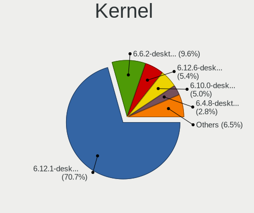
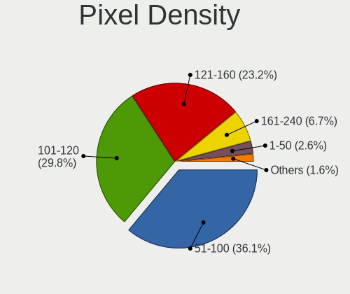
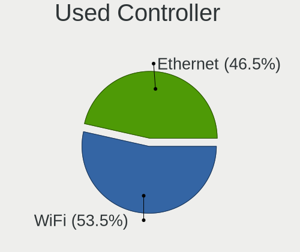
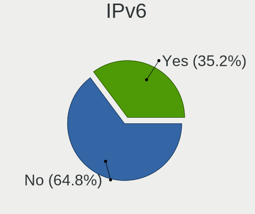
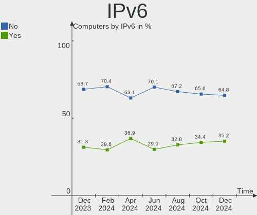

OpenMandriva - Hardware Trends
------------------------------

A project to identify most popular hardware characteristics and track their change
over time based on data collected by Linux users at https://Linux-Hardware.org.

Anyone can contribute to this report by the [hw-probe](https://github.com/linuxhw/hw-probe) tool:

    sudo -E hw-probe -all -upload

This is a report for all computer types. See also reports for [desktops](/Dist/OpenMandriva/Desktop/README.md) and [notebooks](/Dist/OpenMandriva/Notebook/README.md).

This report is for one last month. Overall report since the beginning of time: [TestDays](https://github.com/linuxhw/TestDays)

Period: Jun, 2023.

Contents
--------

* [ System ](#system)
  - [ OS                       ](#os)
  - [ OS Family                ](#os-family)
  - [ Kernel                   ](#kernel)
  - [ Kernel Family            ](#kernel-family)
  - [ Kernel Major Ver.        ](#kernel-major-ver)
  - [ Arch                     ](#arch)
  - [ DE                       ](#de)
  - [ Display Server           ](#display-server)
  - [ Display Manager          ](#display-manager)
  - [ OS Lang                  ](#os-lang)
  - [ Boot Mode                ](#boot-mode)
  - [ Filesystem               ](#filesystem)
  - [ Part. scheme             ](#part-scheme)
  - [ Dual Boot with Linux/BSD ](#dual-boot-with-linuxbsd)
  - [ Dual Boot (Win)          ](#dual-boot-win)

* [ Board ](#board)
  - [ Vendor                   ](#vendor)
  - [ Model                    ](#model)
  - [ Model Family             ](#model-family)
  - [ MFG Year                 ](#mfg-year)
  - [ Form Factor              ](#form-factor)
  - [ Secure Boot              ](#secure-boot)
  - [ Coreboot                 ](#coreboot)
  - [ RAM Size                 ](#ram-size)
  - [ RAM Used                 ](#ram-used)
  - [ Total Drives             ](#total-drives)
  - [ Has CD-ROM               ](#has-cd-rom)
  - [ Has Ethernet             ](#has-ethernet)
  - [ Has WiFi                 ](#has-wifi)
  - [ Has Bluetooth            ](#has-bluetooth)

* [ Location ](#location)
  - [ Country                  ](#country)
  - [ City                     ](#city)

* [ Drives ](#drives)
  - [ Drive Vendor             ](#drive-vendor)
  - [ Drive Model              ](#drive-model)
  - [ HDD Vendor               ](#hdd-vendor)
  - [ SSD Vendor               ](#ssd-vendor)
  - [ Drive Kind               ](#drive-kind)
  - [ Drive Connector          ](#drive-connector)
  - [ Drive Size               ](#drive-size)
  - [ Space Total              ](#space-total)
  - [ Space Used               ](#space-used)
  - [ Malfunc. Drives          ](#malfunc-drives)
  - [ Malfunc. Drive Vendor    ](#malfunc-drive-vendor)
  - [ Malfunc. HDD Vendor      ](#malfunc-hdd-vendor)
  - [ Malfunc. Drive Kind      ](#malfunc-drive-kind)
  - [ Failed Drives            ](#failed-drives)
  - [ Failed Drive Vendor      ](#failed-drive-vendor)
  - [ Drive Status             ](#drive-status)

* [ Storage controller ](#storage-controller)
  - [ Storage Vendor           ](#storage-vendor)
  - [ Storage Model            ](#storage-model)
  - [ Storage Kind             ](#storage-kind)

* [ Processor ](#processor)
  - [ CPU Vendor               ](#cpu-vendor)
  - [ CPU Model                ](#cpu-model)
  - [ CPU Model Family         ](#cpu-model-family)
  - [ CPU Cores                ](#cpu-cores)
  - [ CPU Sockets              ](#cpu-sockets)
  - [ CPU Threads              ](#cpu-threads)
  - [ CPU Op-Modes             ](#cpu-op-modes)
  - [ CPU Microcode            ](#cpu-microcode)
  - [ CPU Microarch            ](#cpu-microarch)

* [ Graphics ](#graphics)
  - [ GPU Vendor               ](#gpu-vendor)
  - [ GPU Model                ](#gpu-model)
  - [ GPU Combo                ](#gpu-combo)
  - [ GPU Driver               ](#gpu-driver)
  - [ GPU Memory               ](#gpu-memory)

* [ Monitor ](#monitor)
  - [ Monitor Vendor           ](#monitor-vendor)
  - [ Monitor Model            ](#monitor-model)
  - [ Monitor Resolution       ](#monitor-resolution)
  - [ Monitor Diagonal         ](#monitor-diagonal)
  - [ Monitor Width            ](#monitor-width)
  - [ Aspect Ratio             ](#aspect-ratio)
  - [ Monitor Area             ](#monitor-area)
  - [ Pixel Density            ](#pixel-density)
  - [ Multiple Monitors        ](#multiple-monitors)

* [ Network ](#network)
  - [ Net Controller Vendor    ](#net-controller-vendor)
  - [ Net Controller Model     ](#net-controller-model)
  - [ Wireless Vendor          ](#wireless-vendor)
  - [ Wireless Model           ](#wireless-model)
  - [ Ethernet Vendor          ](#ethernet-vendor)
  - [ Ethernet Model           ](#ethernet-model)
  - [ Net Controller Kind      ](#net-controller-kind)
  - [ Used Controller          ](#used-controller)
  - [ NICs                     ](#nics)
  - [ IPv6                     ](#ipv6)

* [ Bluetooth ](#bluetooth)
  - [ Bluetooth Vendor         ](#bluetooth-vendor)
  - [ Bluetooth Model          ](#bluetooth-model)

* [ Sound ](#sound)
  - [ Sound Vendor             ](#sound-vendor)
  - [ Sound Model              ](#sound-model)

* [ Memory ](#memory)
  - [ Memory Vendor            ](#memory-vendor)
  - [ Memory Model             ](#memory-model)
  - [ Memory Kind              ](#memory-kind)
  - [ Memory Form Factor       ](#memory-form-factor)
  - [ Memory Size              ](#memory-size)
  - [ Memory Speed             ](#memory-speed)

* [ Printers & scanners ](#printers--scanners)
  - [ Printer Vendor           ](#printer-vendor)
  - [ Printer Model            ](#printer-model)
  - [ Scanner Vendor           ](#scanner-vendor)
  - [ Scanner Model            ](#scanner-model)

* [ Camera ](#camera)
  - [ Camera Vendor            ](#camera-vendor)
  - [ Camera Model             ](#camera-model)

* [ Security ](#security)
  - [ Fingerprint Vendor       ](#fingerprint-vendor)
  - [ Fingerprint Model        ](#fingerprint-model)
  - [ Chipcard Vendor          ](#chipcard-vendor)
  - [ Chipcard Model           ](#chipcard-model)

* [ Unsupported ](#unsupported)
  - [ Unsupported Devices      ](#unsupported-devices)
  - [ Unsupported Device Types ](#unsupported-device-types)

System
------

OS
--

Installed operating systems

| Name               | Computers | Percent |
|--------------------|-----------|---------|
| OpenMandriva 23.03 | 174       | 52.57%  |
| OpenMandriva 23.06 | 75        | 22.66%  |
| OpenMandriva 4.3   | 44        | 13.29%  |
| OpenMandriva 23.01 | 17        | 5.14%   |
| OpenMandriva 4.2   | 13        | 3.93%   |
| OpenMandriva 4.90  | 3         | 0.91%   |
| OpenMandriva 23.90 | 3         | 0.91%   |
| OpenMandriva 4.50  | 2         | 0.6%    |

OS Family
---------

OS without a version

| Name         | Computers | Percent |
|--------------|-----------|---------|
| OpenMandriva | 331       | 100%    |

Kernel
------

Version of the Linux kernel

| Version                  | Computers | Percent |
|--------------------------|-----------|---------|
| 6.2.6-desktop-1omv2390   | 176       | 53.17%  |
| 6.3.5-desktop-3omv2390   | 73        | 22.05%  |
| 5.16.7-desktop-1omv4003  | 25        | 7.55%   |
| 5.16.13-desktop-1omv4003 | 19        | 5.74%   |
| 6.1.1-desktop-1omv2290   | 18        | 5.44%   |
| 5.10.14-desktop-1omv4002 | 10        | 3.02%   |
| 5.18.12-desktop-3omv4090 | 3         | 0.91%   |
| 5.11.12-desktop-1omv4002 | 3         | 0.91%   |
| 6.3.3-desktop-2omv2390   | 1         | 0.3%    |
| 6.1.2-desktop-1omv2301   | 1         | 0.3%    |
| 5.19.12-desktop-2omv4090 | 1         | 0.3%    |
| 5.16.0-desktop-2omv4050  | 1         | 0.3%    |

Kernel Family
-------------

Linux kernel without a distro release

| Version | Computers | Percent |
|---------|-----------|---------|
| 6.2.6   | 176       | 53.17%  |
| 6.3.5   | 73        | 22.05%  |
| 5.16.7  | 25        | 7.55%   |
| 5.16.13 | 19        | 5.74%   |
| 6.1.1   | 18        | 5.44%   |
| 5.10.14 | 10        | 3.02%   |
| 5.18.12 | 3         | 0.91%   |
| 5.11.12 | 3         | 0.91%   |
| 6.3.3   | 1         | 0.3%    |
| 6.1.2   | 1         | 0.3%    |
| 5.19.12 | 1         | 0.3%    |
| 5.16.0  | 1         | 0.3%    |

Kernel Major Ver.
-----------------

Linux kernel major version

| Version | Computers | Percent |
|---------|-----------|---------|
| 6.2     | 176       | 53.17%  |
| 6.3     | 74        | 22.36%  |
| 5.16    | 45        | 13.6%   |
| 6.1     | 19        | 5.74%   |
| 5.10    | 10        | 3.02%   |
| 5.18    | 3         | 0.91%   |
| 5.11    | 3         | 0.91%   |
| 5.19    | 1         | 0.3%    |

Arch
----

OS architecture (x86_64, i586, etc.)

| Name   | Computers | Percent |
|--------|-----------|---------|
| x86_64 | 331       | 100%    |

DE
--

Desktop Environment

| Name     | Computers | Percent |
|----------|-----------|---------|
| KDE5     | 292       | 88.22%  |
| GNOME    | 23        | 6.95%   |
| LXQt     | 13        | 3.93%   |
| XFCE     | 1         | 0.3%    |
| Cinnamon | 1         | 0.3%    |
| Budgie   | 1         | 0.3%    |

Display Server
--------------

X11 or Wayland

| Name    | Computers | Percent |
|---------|-----------|---------|
| X11     | 305       | 92.15%  |
| Wayland | 26        | 7.85%   |

Display Manager
---------------

SDDM, LightDM, etc.

| Name    | Computers | Percent |
|---------|-----------|---------|
| SDDM    | 305       | 92.15%  |
| GDM     | 24        | 7.25%   |
| LightDM | 2         | 0.6%    |

OS Lang
-------

Language

| Lang  | Computers | Percent |
|-------|-----------|---------|
| en_US | 168       | 50.76%  |
| fr_FR | 20        | 6.04%   |
| ru_RU | 17        | 5.14%   |
| pt_BR | 16        | 4.83%   |
| de_DE | 15        | 4.53%   |
| it_IT | 14        | 4.23%   |
| pl_PL | 11        | 3.32%   |
| en_GB | 8         | 2.42%   |
| cs_CZ | 7         | 2.11%   |
| es_ES | 6         | 1.81%   |
| tr_TR | 5         | 1.51%   |
| es_MX | 5         | 1.51%   |
| es_CO | 4         | 1.21%   |
| en_IN | 3         | 0.91%   |
| de_AT | 3         | 0.91%   |
| ro_RO | 2         | 0.6%    |
| nl_BE | 2         | 0.6%    |
| hu_HU | 2         | 0.6%    |
| es_UY | 2         | 0.6%    |
| es_AR | 2         | 0.6%    |
| en_PH | 2         | 0.6%    |
| en_NZ | 2         | 0.6%    |
| de_CH | 2         | 0.6%    |
| da_DK | 2         | 0.6%    |
| ru_UA | 1         | 0.3%    |
| nl_NL | 1         | 0.3%    |
| fr_CH | 1         | 0.3%    |
| fr_CA | 1         | 0.3%    |
| fr_BE | 1         | 0.3%    |
| es_SV | 1         | 0.3%    |
| es_PE | 1         | 0.3%    |
| es_CL | 1         | 0.3%    |
| en_ZA | 1         | 0.3%    |
| en_CA | 1         | 0.3%    |
| de_BE | 1         | 0.3%    |

Boot Mode
---------

EFI or BIOS

| Mode | Computers | Percent |
|------|-----------|---------|
| EFI  | 179       | 54.08%  |
| BIOS | 152       | 45.92%  |

Filesystem
----------

Type of filesystem

| Type     | Computers | Percent |
|----------|-----------|---------|
| Ext4     | 175       | 52.87%  |
| Overlay  | 133       | 40.18%  |
| Btrfs    | 11        | 3.32%   |
| F2fs     | 5         | 1.51%   |
| Ext3     | 3         | 0.91%   |
| Xfs      | 2         | 0.6%    |
| Reiserfs | 1         | 0.3%    |
| Jfs      | 1         | 0.3%    |

Part. scheme
------------

Scheme of partitioning

| Type | Computers | Percent |
|------|-----------|---------|
| GPT  | 251       | 75.83%  |
| MBR  | 80        | 24.17%  |

Dual Boot with Linux/BSD
------------------------

Hosting more than one Linux/BSD

| Dual boot | Computers | Percent |
|-----------|-----------|---------|
| No        | 174       | 52.57%  |
| Yes       | 157       | 47.43%  |

Dual Boot (Win)
---------------

Hosting Linux and Windows

| Dual boot | Computers | Percent |
|-----------|-----------|---------|
| No        | 183       | 55.29%  |
| Yes       | 148       | 44.71%  |

Board
-----

Vendor
------

Motherboard manufacturer

| Name                | Computers | Percent |
|---------------------|-----------|---------|
| ASUSTek Computer    | 60        | 18.13%  |
| Hewlett-Packard     | 50        | 15.11%  |
| Lenovo              | 42        | 12.69%  |
| Dell                | 28        | 8.46%   |
| Acer                | 24        | 7.25%   |
| MSI                 | 22        | 6.65%   |
| Gigabyte Technology | 18        | 5.44%   |
| ASRock              | 12        | 3.63%   |
| Toshiba             | 9         | 2.72%   |
| Intel               | 7         | 2.11%   |
| Foxconn             | 5         | 1.51%   |
| Apple               | 4         | 1.21%   |
| Samsung Electronics | 3         | 0.91%   |
| Positivo            | 3         | 0.91%   |
| Fujitsu             | 3         | 0.91%   |
| Biostar             | 3         | 0.91%   |
| Sony                | 2         | 0.6%    |
| Packard Bell        | 2         | 0.6%    |
| Medion              | 2         | 0.6%    |
| Huanan              | 2         | 0.6%    |
| GuoGuang            | 2         | 0.6%    |
| GEEKOM              | 2         | 0.6%    |
| ECS                 | 2         | 0.6%    |
| Unknown             | 2         | 0.6%    |
| ZOTAC               | 1         | 0.3%    |
| Wistron             | 1         | 0.3%    |
| Valve               | 1         | 0.3%    |
| TUXEDO              | 1         | 0.3%    |
| Teclast             | 1         | 0.3%    |
| Semp Toshiba        | 1         | 0.3%    |
| Razer               | 1         | 0.3%    |
| PERTOSA             | 1         | 0.3%    |
| PCsmart             | 1         | 0.3%    |
| OEM                 | 1         | 0.3%    |
| NEC Computers       | 1         | 0.3%    |
| Monster             | 1         | 0.3%    |
| LincPlus            | 1         | 0.3%    |
| Kraftway            | 1         | 0.3%    |
| Kennex              | 1         | 0.3%    |
| Fujitsu Siemens     | 1         | 0.3%    |

Model
-----

Motherboard model

| Name                                                                                     | Computers | Percent |
|------------------------------------------------------------------------------------------|-----------|---------|
| Dell Inspiron 1545                                                                       | 3         | 0.91%   |
| ASUS P5G41T-M LX                                                                         | 3         | 0.91%   |
| Unknown                                                                                  | 3         | 0.91%   |
| Toshiba dynabook REGZA PC D712/T3FWD                                                     | 2         | 0.6%    |
| MSI MS-7C37                                                                              | 2         | 0.6%    |
| HP Notebook                                                                              | 2         | 0.6%    |
| HP Laptop 15-dw3xxx                                                                      | 2         | 0.6%    |
| HP Compaq 8200 Elite SFF PC                                                              | 2         | 0.6%    |
| GuoGuang IC2M1028V-J                                                                     | 2         | 0.6%    |
| GEEKOM MiniAir 11                                                                        | 2         | 0.6%    |
| Foxconn G41MD                                                                            | 2         | 0.6%    |
| Dell OptiPlex 790                                                                        | 2         | 0.6%    |
| Dell OptiPlex 3020                                                                       | 2         | 0.6%    |
| ASUS UX31E                                                                               | 2         | 0.6%    |
| ASUS All Series                                                                          | 2         | 0.6%    |
| Apple MacBookAir9,1                                                                      | 2         | 0.6%    |
| Acer Veriton L670G                                                                       | 2         | 0.6%    |
| Acer Veriton ES2710G                                                                     | 2         | 0.6%    |
| Wistron ProLiant ML110 G5                                                                | 1         | 0.3%    |
| Valve Jupiter                                                                            | 1         | 0.3%    |
| TUXEDO Pulse 15 Gen1                                                                     | 1         | 0.3%    |
| Toshiba Satellite Pro L500                                                               | 1         | 0.3%    |
| Toshiba Satellite L635                                                                   | 1         | 0.3%    |
| Toshiba Satellite L45-B                                                                  | 1         | 0.3%    |
| Toshiba Satellite C650                                                                   | 1         | 0.3%    |
| Toshiba Satellite C50-B                                                                  | 1         | 0.3%    |
| Toshiba Satellite A300                                                                   | 1         | 0.3%    |
| Toshiba PORTEGE R705                                                                     | 1         | 0.3%    |
| Teclast X4                                                                               | 1         | 0.3%    |
| Sony VPCJ23S1R                                                                           | 1         | 0.3%    |
| Sony VGN-NS21M_W                                                                         | 1         | 0.3%    |
| Semp Toshiba IS 1413G                                                                    | 1         | 0.3%    |
| Samsung 670Z5E                                                                           | 1         | 0.3%    |
| Samsung 355V4C/355V4X/355V5C/355V5X/356V4C/356V4X/356V5C/356V5X/3445VC/3445VX/3545VC/354 | 1         | 0.3%    |
| Samsung 300E4A/300E5A/300E7A/3430EA/3530EA                                               | 1         | 0.3%    |
| Razer Blade 15 Advanced Model (Early 2020) - RZ09-033                                    | 1         | 0.3%    |
| Positivo POS-PIG41BA                                                                     | 1         | 0.3%    |
| Positivo POS-ECIG41BS                                                                    | 1         | 0.3%    |
| Positivo C14CR01                                                                         | 1         | 0.3%    |
| PERTOSA 206.30.054 - GA-H110TN-M                                                         | 1         | 0.3%    |

Model Family
------------

Motherboard model prefix

| Name                   | Computers | Percent |
|------------------------|-----------|---------|
| Lenovo ThinkPad        | 16        | 4.83%   |
| Acer Aspire            | 13        | 3.93%   |
| HP Compaq              | 12        | 3.63%   |
| Lenovo ThinkCentre     | 9         | 2.72%   |
| Dell Inspiron          | 9         | 2.72%   |
| ASUS PRIME             | 8         | 2.42%   |
| Lenovo IdeaPad         | 7         | 2.11%   |
| Dell OptiPlex          | 7         | 2.11%   |
| Toshiba Satellite      | 6         | 1.81%   |
| ASUS VivoBook          | 6         | 1.81%   |
| Acer Veriton           | 6         | 1.81%   |
| HP Laptop              | 5         | 1.51%   |
| HP Pavilion            | 4         | 1.21%   |
| Dell Latitude          | 4         | 1.21%   |
| HP Stream              | 3         | 0.91%   |
| HP EliteDesk           | 3         | 0.91%   |
| HP EliteBook           | 3         | 0.91%   |
| Fujitsu ESPRIMO        | 3         | 0.91%   |
| Dell Precision         | 3         | 0.91%   |
| ASUS ROG               | 3         | 0.91%   |
| ASUS P5G41T-M          | 3         | 0.91%   |
| Unknown                | 3         | 0.91%   |
| Toshiba dynabook       | 2         | 0.6%    |
| Packard Bell EasyNote  | 2         | 0.6%    |
| MSI MS-7C37            | 2         | 0.6%    |
| Medion Akoya           | 2         | 0.6%    |
| Lenovo Legion          | 2         | 0.6%    |
| HP Notebook            | 2         | 0.6%    |
| GuoGuang IC2M1028V-J   | 2         | 0.6%    |
| Gigabyte GA-78LMT-USB3 | 2         | 0.6%    |
| Gigabyte B550M         | 2         | 0.6%    |
| GEEKOM MiniAir         | 2         | 0.6%    |
| Foxconn G41MD          | 2         | 0.6%    |
| Dell System            | 2         | 0.6%    |
| ASUS UX31E             | 2         | 0.6%    |
| ASUS TUF               | 2         | 0.6%    |
| ASUS P8Z77-V           | 2         | 0.6%    |
| ASUS P8H61-M           | 2         | 0.6%    |
| ASUS M5A97             | 2         | 0.6%    |
| ASUS M5A78L-M          | 2         | 0.6%    |

MFG Year
--------

Motherboard manufacture year

| Year    | Computers | Percent |
|---------|-----------|---------|
| 2011    | 31        | 9.37%   |
| 2021    | 28        | 8.46%   |
| 2014    | 28        | 8.46%   |
| 2012    | 28        | 8.46%   |
| 2010    | 27        | 8.16%   |
| 2020    | 21        | 6.34%   |
| 2016    | 21        | 6.34%   |
| 2018    | 20        | 6.04%   |
| 2015    | 19        | 5.74%   |
| 2008    | 18        | 5.44%   |
| 2013    | 17        | 5.14%   |
| 2019    | 16        | 4.83%   |
| 2009    | 16        | 4.83%   |
| 2017    | 15        | 4.53%   |
| 2022    | 9         | 2.72%   |
| 2007    | 8         | 2.42%   |
| 2023    | 5         | 1.51%   |
| 2006    | 2         | 0.6%    |
| 2005    | 1         | 0.3%    |
| Unknown | 1         | 0.3%    |

Form Factor
-----------

Physical design of the computer

| Name        | Computers | Percent |
|-------------|-----------|---------|
| Desktop     | 173       | 52.27%  |
| Notebook    | 146       | 44.11%  |
| All in one  | 7         | 2.11%   |
| Convertible | 2         | 0.6%    |
| Server      | 2         | 0.6%    |
| Tablet      | 1         | 0.3%    |

Secure Boot
-----------

Enabled or disabled

| State    | Computers | Percent |
|----------|-----------|---------|
| Disabled | 331       | 100%    |

Coreboot
--------

Have coreboot on board

| Used | Computers | Percent |
|------|-----------|---------|
| No   | 331       | 100%    |

RAM Size
--------

Total RAM memory

| Size in GB  | Computers | Percent |
|-------------|-----------|---------|
| 3.01-4.0    | 94        | 28.4%   |
| 4.01-8.0    | 91        | 27.49%  |
| 16.01-24.0  | 51        | 15.41%  |
| 8.01-16.0   | 49        | 14.8%   |
| 32.01-64.0  | 20        | 6.04%   |
| 1.01-2.0    | 10        | 3.02%   |
| 2.01-3.0    | 6         | 1.81%   |
| 64.01-256.0 | 5         | 1.51%   |
| 24.01-32.0  | 4         | 1.21%   |
| 0.51-1.0    | 1         | 0.3%    |

RAM Used
--------

Used RAM memory

| Used GB  | Computers | Percent |
|----------|-----------|---------|
| 1.01-2.0 | 215       | 64.95%  |
| 2.01-3.0 | 61        | 18.43%  |
| 0.51-1.0 | 30        | 9.06%   |
| 3.01-4.0 | 13        | 3.93%   |
| 0.01-0.5 | 9         | 2.72%   |
| 4.01-8.0 | 3         | 0.91%   |

Total Drives
------------

Number of drives on board

| Drives | Computers | Percent |
|--------|-----------|---------|
| 1      | 204       | 61.63%  |
| 2      | 76        | 22.96%  |
| 3      | 22        | 6.65%   |
| 4      | 15        | 4.53%   |
| 5      | 11        | 3.32%   |
| 8      | 1         | 0.3%    |
| 6      | 1         | 0.3%    |
| 0      | 1         | 0.3%    |

Has CD-ROM
----------

Has CD-ROM on board

| Presented | Computers | Percent |
|-----------|-----------|---------|
| No        | 176       | 53.17%  |
| Yes       | 155       | 46.83%  |

Has Ethernet
------------

Has Ethernet on board

| Presented | Computers | Percent |
|-----------|-----------|---------|
| Yes       | 303       | 91.54%  |
| No        | 28        | 8.46%   |

Has WiFi
--------

Has WiFi module

| Presented | Computers | Percent |
|-----------|-----------|---------|
| Yes       | 216       | 65.26%  |
| No        | 115       | 34.74%  |

Has Bluetooth
-------------

Has Bluetooth module

| Presented | Computers | Percent |
|-----------|-----------|---------|
| No        | 180       | 54.38%  |
| Yes       | 151       | 45.62%  |

Location
--------

Country
-------

Geographic location (country)

| Country     | Computers | Percent |
|-------------|-----------|---------|
| USA         | 44        | 13.29%  |
| Brazil      | 26        | 7.85%   |
| Russia      | 25        | 7.55%   |
| Italy       | 24        | 7.25%   |
| Germany     | 22        | 6.65%   |
| France      | 20        | 6.04%   |
| Poland      | 14        | 4.23%   |
| Japan       | 11        | 3.32%   |
| Spain       | 10        | 3.02%   |
| UK          | 9         | 2.72%   |
| Mexico      | 9         | 2.72%   |
| India       | 8         | 2.42%   |
| Czechia     | 7         | 2.11%   |
| Colombia    | 6         | 1.81%   |
| Switzerland | 5         | 1.51%   |
| Serbia      | 5         | 1.51%   |
| Romania     | 5         | 1.51%   |
| Canada      | 5         | 1.51%   |
| Vietnam     | 4         | 1.21%   |
| Turkey      | 4         | 1.21%   |
| Réunion    | 4         | 1.21%   |
| Peru        | 4         | 1.21%   |
| Uruguay     | 3         | 0.91%   |
| Ukraine     | 3         | 0.91%   |
| Philippines | 3         | 0.91%   |
| Netherlands | 3         | 0.91%   |
| Lithuania   | 3         | 0.91%   |
| Indonesia   | 3         | 0.91%   |
| Finland     | 3         | 0.91%   |
| Denmark     | 3         | 0.91%   |
| Belgium     | 3         | 0.91%   |
| Austria     | 3         | 0.91%   |
| New Zealand | 2         | 0.6%    |
| Hungary     | 2         | 0.6%    |
| Greece      | 2         | 0.6%    |
| Bulgaria    | 2         | 0.6%    |
| Azerbaijan  | 2         | 0.6%    |
| Tunisia     | 1         | 0.3%    |
| Taiwan      | 1         | 0.3%    |
| South Korea | 1         | 0.3%    |

City
----

Geographic location (city)

| City                | Computers | Percent |
|---------------------|-----------|---------|
| Milan               | 6         | 1.81%   |
| Moscow              | 4         | 1.21%   |
| Tua Chua            | 3         | 0.91%   |
| Sao Paulo           | 3         | 0.91%   |
| Porto Alegre        | 3         | 0.91%   |
| Omaha               | 3         | 0.91%   |
| Niigata             | 3         | 0.91%   |
| Munich              | 3         | 0.91%   |
| La Fleche           | 3         | 0.91%   |
| Belgrade            | 3         | 0.91%   |
| Barranquilla        | 3         | 0.91%   |
| Zurich              | 2         | 0.6%    |
| Wichita             | 2         | 0.6%    |
| Warsaw              | 2         | 0.6%    |
| Tokyo               | 2         | 0.6%    |
| Târgu Mureş       | 2         | 0.6%    |
| Tampere             | 2         | 0.6%    |
| St Petersburg       | 2         | 0.6%    |
| Saint-Paul          | 2         | 0.6%    |
| Rio de Janeiro      | 2         | 0.6%    |
| Požarevac          | 2         | 0.6%    |
| Perm                | 2         | 0.6%    |
| Orlando             | 2         | 0.6%    |
| Omsk                | 2         | 0.6%    |
| Montreal            | 2         | 0.6%    |
| Montevideo          | 2         | 0.6%    |
| Mexico City         | 2         | 0.6%    |
| Maceió             | 2         | 0.6%    |
| Lima                | 2         | 0.6%    |
| La Saline les Bains | 2         | 0.6%    |
| Jacksonville        | 2         | 0.6%    |
| Hals                | 2         | 0.6%    |
| Genoa               | 2         | 0.6%    |
| Gattinara           | 2         | 0.6%    |
| Curitiba            | 2         | 0.6%    |
| Córdoba            | 2         | 0.6%    |
| Columbus            | 2         | 0.6%    |
| Burton-on-Trent     | 2         | 0.6%    |
| Budapest            | 2         | 0.6%    |
| Belton              | 2         | 0.6%    |

Drives
------

Drive Vendor
------------

Hard drive vendors

| Vendor              | Computers | Drives | Percent |
|---------------------|-----------|--------|---------|
| WDC                 | 92        | 104    | 18.81%  |
| Seagate             | 79        | 94     | 16.16%  |
| Samsung Electronics | 48        | 59     | 9.82%   |
| Toshiba             | 44        | 44     | 9%      |
| Kingston            | 27        | 31     | 5.52%   |
| Hitachi             | 21        | 21     | 4.29%   |
| Unknown             | 17        | 18     | 3.48%   |
| Crucial             | 15        | 15     | 3.07%   |
| SanDisk             | 13        | 14     | 2.66%   |
| SPCC                | 9         | 9      | 1.84%   |
| China               | 9         | 9      | 1.84%   |
| SK hynix            | 8         | 8      | 1.64%   |
| Intel               | 8         | 8      | 1.64%   |
| PNY                 | 7         | 8      | 1.43%   |
| HGST                | 7         | 7      | 1.43%   |
| Netac               | 6         | 7      | 1.23%   |
| Micron Technology   | 6         | 6      | 1.23%   |
| Maxtor              | 4         | 5      | 0.82%   |
| Lexar               | 4         | 4      | 0.82%   |
| Intenso             | 4         | 5      | 0.82%   |
| Apple               | 4         | 4      | 0.82%   |
| A-DATA Technology   | 4         | 4      | 0.82%   |
| Phison              | 3         | 3      | 0.61%   |
| Patriot             | 3         | 3      | 0.61%   |
| Mushkin             | 3         | 4      | 0.61%   |
| KingSpec            | 3         | 3      | 0.61%   |
| Acer                | 3         | 3      | 0.61%   |
| JMicron Technology  | 2         | 2      | 0.41%   |
| Hewlett-Packard     | 2         | 2      | 0.41%   |
| Gigabyte Technology | 2         | 2      | 0.41%   |
| Unknown             | 2         | 2      | 0.41%   |
| XrayDisk            | 1         | 1      | 0.2%    |
| XPG                 | 1         | 1      | 0.2%    |
| Verbatim            | 1         | 1      | 0.2%    |
| Veno                | 1         | 1      | 0.2%    |
| USB                 | 1         | 1      | 0.2%    |
| Teclast             | 1         | 1      | 0.2%    |
| Team                | 1         | 1      | 0.2%    |
| SSSTC               | 1         | 1      | 0.2%    |
| SPCC M.2            | 1         | 1      | 0.2%    |

Drive Model
-----------

Hard drive models

| Model                            | Computers | Percent |
|----------------------------------|-----------|---------|
| Kingston SA400S37240G 240GB SSD  | 8         | 1.52%   |
| Toshiba DT01ACA100 1TB           | 7         | 1.33%   |
| Seagate ST500DM002-1BD142 500GB  | 7         | 1.33%   |
| Unknown SD/MMC/MS PRO 250GB      | 6         | 1.14%   |
| Seagate ST1000LM035-1RK172 1TB   | 5         | 0.95%   |
| Toshiba DT01ACA050 500GB         | 4         | 0.76%   |
| Kingston SA400S37480G 480GB SSD  | 4         | 0.76%   |
| Crucial CT240BX500SSD1 240GB     | 4         | 0.76%   |
| WDC WDS240G2G0B-00EPW0 240GB SSD | 3         | 0.57%   |
| WDC WD1600AAJS-22L7A0 160GB      | 3         | 0.57%   |
| WDC WD10EZEX-00RKKA0 1TB         | 3         | 0.57%   |
| Unknown SD32G  32GB              | 3         | 0.57%   |
| Toshiba MQ04ABF100 1TB           | 3         | 0.57%   |
| SPCC Solid State Disk 128GB      | 3         | 0.57%   |
| SPCC M.2 PCIe SSD 256GB          | 3         | 0.57%   |
| Seagate ST500LT012-1DG142 500GB  | 3         | 0.57%   |
| Seagate ST500LM021-1KJ152 500GB  | 3         | 0.57%   |
| Seagate ST2000DM008-2FR102 2TB   | 3         | 0.57%   |
| Seagate ST1000DM003-1SB102 1TB   | 3         | 0.57%   |
| Samsung SSD 970 EVO Plus 1TB     | 3         | 0.57%   |
| Samsung SSD 870 EVO 500GB        | 3         | 0.57%   |
| Samsung SSD 860 EVO 500GB        | 3         | 0.57%   |
| Samsung SSD 860 EVO 250GB        | 3         | 0.57%   |
| Netac SSD 256GB                  | 3         | 0.57%   |
| Kingston SNV2S500G 500GB         | 3         | 0.57%   |
| A-DATA SU650 120GB SSD           | 3         | 0.57%   |
| WDC WDS100T2B0C-00PXH0 1TB       | 2         | 0.38%   |
| WDC WD5000AZLX-21K2TA0 500GB     | 2         | 0.38%   |
| WDC WD5000AAKX-75U6AA0 500GB     | 2         | 0.38%   |
| WDC WD5000AAKX-001CA0 500GB      | 2         | 0.38%   |
| WDC WD3200AAKS-61L9A0 320GB      | 2         | 0.38%   |
| WDC WD1600AAJS-00B4A0 160GB      | 2         | 0.38%   |
| Toshiba TR200 240GB SSD          | 2         | 0.38%   |
| Toshiba THNS256GG8BBAA 256GB SSD | 2         | 0.38%   |
| Toshiba MQ01ABD100 1TB           | 2         | 0.38%   |
| Toshiba MQ01ABD050 500GB         | 2         | 0.38%   |
| Toshiba HDWE140 4TB              | 2         | 0.38%   |
| Seagate ST9500325AS 500GB        | 2         | 0.38%   |
| Seagate ST500DM002-1BC142 500GB  | 2         | 0.38%   |
| Seagate ST3500418AS 500GB        | 2         | 0.38%   |

HDD Vendor
----------

Hard disk drive vendors

| Vendor              | Computers | Drives | Percent |
|---------------------|-----------|--------|---------|
| Seagate             | 78        | 91     | 33.33%  |
| WDC                 | 73        | 83     | 31.2%   |
| Toshiba             | 32        | 32     | 13.68%  |
| Hitachi             | 21        | 21     | 8.97%   |
| HGST                | 7         | 7      | 2.99%   |
| Unknown             | 6         | 6      | 2.56%   |
| Samsung Electronics | 5         | 6      | 2.14%   |
| Maxtor              | 4         | 5      | 1.71%   |
| Intenso             | 2         | 2      | 0.85%   |
| USB                 | 1         | 1      | 0.43%   |
| HPE                 | 1         | 1      | 0.43%   |
| Hewlett-Packard     | 1         | 1      | 0.43%   |
| Fujitsu             | 1         | 1      | 0.43%   |
| ExcelStor           | 1         | 1      | 0.43%   |
| Apple               | 1         | 1      | 0.43%   |

SSD Vendor
----------

Solid state drive vendors

| Vendor              | Computers | Drives | Percent |
|---------------------|-----------|--------|---------|
| Samsung Electronics | 28        | 30     | 16.77%  |
| Kingston            | 21        | 23     | 12.57%  |
| Crucial             | 12        | 12     | 7.19%   |
| SanDisk             | 11        | 12     | 6.59%   |
| WDC                 | 10        | 12     | 5.99%   |
| China               | 9         | 9      | 5.39%   |
| Toshiba             | 8         | 8      | 4.79%   |
| Intel               | 6         | 6      | 3.59%   |
| SPCC                | 5         | 5      | 2.99%   |
| PNY                 | 5         | 5      | 2.99%   |
| Netac               | 5         | 6      | 2.99%   |
| SK hynix            | 3         | 3      | 1.8%    |
| Patriot             | 3         | 3      | 1.8%    |
| Micron Technology   | 3         | 3      | 1.8%    |
| Lexar               | 3         | 3      | 1.8%    |
| KingSpec            | 3         | 3      | 1.8%    |
| Acer                | 3         | 3      | 1.8%    |
| A-DATA Technology   | 3         | 3      | 1.8%    |
| Mushkin             | 2         | 2      | 1.2%    |
| Gigabyte Technology | 2         | 2      | 1.2%    |
| XrayDisk            | 1         | 1      | 0.6%    |
| Verbatim            | 1         | 1      | 0.6%    |
| Veno                | 1         | 1      | 0.6%    |
| Teclast             | 1         | 1      | 0.6%    |
| Team                | 1         | 1      | 0.6%    |
| SPCC M.2            | 1         | 1      | 0.6%    |
| RX7                 | 1         | 1      | 0.6%    |
| OCZ                 | 1         | 1      | 0.6%    |
| NTC                 | 1         | 1      | 0.6%    |
| MCTECH              | 1         | 1      | 0.6%    |
| Leven               | 1         | 1      | 0.6%    |
| KIOXIA-EXCERIA      | 1         | 1      | 0.6%    |
| Kingchuxing         | 1         | 1      | 0.6%    |
| Intenso             | 1         | 2      | 0.6%    |
| Indilinx            | 1         | 1      | 0.6%    |
| HPE                 | 1         | 1      | 0.6%    |
| Hewlett-Packard     | 1         | 1      | 0.6%    |
| Foxline             | 1         | 1      | 0.6%    |
| Emtec               | 1         | 1      | 0.6%    |
| CF500               | 1         | 1      | 0.6%    |

Drive Kind
----------

HDD or SSD

| Kind    | Computers | Drives | Percent |
|---------|-----------|--------|---------|
| HDD     | 198       | 259    | 45.73%  |
| SSD     | 143       | 176    | 33.03%  |
| NVMe    | 76        | 87     | 17.55%  |
| MMC     | 11        | 12     | 2.54%   |
| Unknown | 5         | 6      | 1.15%   |

Drive Connector
---------------

SATA, SAS, NVMe, etc.

| Type | Computers | Drives | Percent |
|------|-----------|--------|---------|
| SATA | 283       | 414    | 72.19%  |
| NVMe | 74        | 85     | 18.88%  |
| SAS  | 24        | 29     | 6.12%   |
| MMC  | 11        | 12     | 2.81%   |

Drive Size
----------

Size of hard drive

| Size in TB      | Computers | Drives | Percent |
|-----------------|-----------|--------|---------|
| 0.01-0.5        | 229       | 281    | 63.97%  |
| 0.51-1.0        | 86        | 102    | 24.02%  |
| 1.01-2.0        | 21        | 23     | 5.87%   |
| 2.01-3.0        | 8         | 9      | 2.23%   |
| 3.01-4.0        | 7         | 11     | 1.96%   |
| 4.01-10.0       | 6         | 8      | 1.68%   |
| More than 100.0 | 1         | 1      | 0.28%   |

Space Total
-----------

Amount of disk space available on the file system

| Size in GB     | Computers | Percent |
|----------------|-----------|---------|
| 1-20           | 103       | 31.12%  |
| 101-250        | 82        | 24.77%  |
| 251-500        | 39        | 11.78%  |
| 501-1000       | 35        | 10.57%  |
| 51-100         | 26        | 7.85%   |
| 21-50          | 15        | 4.53%   |
| Unknown        | 14        | 4.23%   |
| 1001-2000      | 7         | 2.11%   |
| 2001-3000      | 6         | 1.81%   |
| More than 3000 | 4         | 1.21%   |

Space Used
----------

Amount of used disk space

| Used GB        | Computers | Percent |
|----------------|-----------|---------|
| 1-20           | 260       | 78.55%  |
| 21-50          | 24        | 7.25%   |
| Unknown        | 14        | 4.23%   |
| 51-100         | 13        | 3.93%   |
| 251-500        | 7         | 2.11%   |
| 101-250        | 6         | 1.81%   |
| 501-1000       | 3         | 0.91%   |
| More than 3000 | 2         | 0.6%    |
| 1001-2000      | 2         | 0.6%    |

Malfunc. Drives
---------------

Drive models with a malfunction

| Model                                | Computers | Drives | Percent |
|--------------------------------------|-----------|--------|---------|
| Seagate ST500DM002-1BD142 500GB      | 5         | 6      | 4.39%   |
| WDC WD5000AAKX-001CA0 500GB          | 2         | 2      | 1.75%   |
| WDC WD3200AAKS-61L9A0 320GB          | 2         | 2      | 1.75%   |
| WDC WD1600AAJS-00B4A0 160GB          | 2         | 2      | 1.75%   |
| Toshiba DT01ACA100 1TB               | 2         | 2      | 1.75%   |
| Seagate ST9500325AS 500GB            | 2         | 2      | 1.75%   |
| SanDisk SSD U100 256GB               | 2         | 2      | 1.75%   |
| Hitachi HTS723232A7A364 320GB        | 2         | 2      | 1.75%   |
| HGST HTS541010A9E680 1TB             | 2         | 2      | 1.75%   |
| China SSD 120GB                      | 2         | 2      | 1.75%   |
| WDC WDS240G2G0B-00EPW0 240GB SSD     | 1         | 1      | 0.88%   |
| WDC WDS120G2G0A-00JH30 128GB SSD     | 1         | 2      | 0.88%   |
| WDC WD7500BPVT-22HXZT3 752GB         | 1         | 1      | 0.88%   |
| WDC WD5000LPLX-66ZNTT1 500GB         | 1         | 1      | 0.88%   |
| WDC WD5000AAKX-08U6AA0 500GB         | 1         | 1      | 0.88%   |
| WDC WD5000AAKS-00V1A0 500GB          | 1         | 1      | 0.88%   |
| WDC WD5000AAKS-00A7B0 500GB          | 1         | 1      | 0.88%   |
| WDC WD40PURX-64GVNY0 4TB             | 1         | 1      | 0.88%   |
| WDC WD3200BPVT-24JJ5T0 320GB         | 1         | 1      | 0.88%   |
| WDC WD3200BPVT-22ZEST0 320GB         | 1         | 1      | 0.88%   |
| WDC WD3200BEVT-60A23T0 320GB         | 1         | 1      | 0.88%   |
| WDC WD3200BEVT-22ZCT0 320GB          | 1         | 1      | 0.88%   |
| WDC WD3200BEKT-60PVMT0 320GB         | 1         | 1      | 0.88%   |
| WDC WD3200AAKS-00UU3A0 320GB         | 1         | 1      | 0.88%   |
| WDC WD3200AAJS-22B4A0 320GB          | 1         | 1      | 0.88%   |
| WDC WD30EZRX-19D8PB0 3TB             | 1         | 1      | 0.88%   |
| WDC WD2500AAKS-00F0A0 250GB          | 1         | 1      | 0.88%   |
| WDC WD20SPZX-60UA7T0 2TB             | 1         | 1      | 0.88%   |
| WDC WD20EFRX-68EUZN0 2TB             | 1         | 1      | 0.88%   |
| WDC WD20EARS-00J99B0 2TB             | 1         | 1      | 0.88%   |
| WDC WD10SPCX-08S8TT0 1TB             | 1         | 1      | 0.88%   |
| WDC WD10EZRZ-00HTKB0 1TB             | 1         | 1      | 0.88%   |
| WDC WD10EZEX-00RKKA0 1TB             | 1         | 1      | 0.88%   |
| WDC WD10EALX-009BA0 1TB              | 1         | 1      | 0.88%   |
| WDC WD1001FALS-403AA0 1TB            | 1         | 1      | 0.88%   |
| WDC WD Blue SA510 M.2 2280 500GB SSD | 1         | 1      | 0.88%   |
| Toshiba MQ04ABF100 1TB               | 1         | 1      | 0.88%   |
| Toshiba MQ01ABD100 1TB               | 1         | 1      | 0.88%   |
| Toshiba MQ01ABD050 500GB             | 1         | 1      | 0.88%   |
| Toshiba MK5075GSX 500GB              | 1         | 1      | 0.88%   |

Malfunc. Drive Vendor
---------------------

Vendors of faulty drives

| Vendor              | Computers | Drives | Percent |
|---------------------|-----------|--------|---------|
| WDC                 | 30        | 33     | 27.03%  |
| Seagate             | 27        | 28     | 24.32%  |
| Hitachi             | 15        | 15     | 13.51%  |
| Toshiba             | 11        | 11     | 9.91%   |
| Samsung Electronics | 4         | 4      | 3.6%    |
| HGST                | 4         | 4      | 3.6%    |
| Maxtor              | 3         | 4      | 2.7%    |
| SPCC                | 2         | 2      | 1.8%    |
| SK hynix            | 2         | 2      | 1.8%    |
| SanDisk             | 2         | 2      | 1.8%    |
| China               | 2         | 2      | 1.8%    |
| PNY                 | 1         | 2      | 0.9%    |
| OCZ                 | 1         | 1      | 0.9%    |
| Micron Technology   | 1         | 1      | 0.9%    |
| Kingston            | 1         | 1      | 0.9%    |
| Intel               | 1         | 1      | 0.9%    |
| Indilinx            | 1         | 1      | 0.9%    |
| Hewlett-Packard     | 1         | 1      | 0.9%    |
| ExcelStor           | 1         | 1      | 0.9%    |
| Emtec               | 1         | 1      | 0.9%    |

Malfunc. HDD Vendor
-------------------

Vendors of faulty HDD drives

| Vendor              | Computers | Drives | Percent |
|---------------------|-----------|--------|---------|
| WDC                 | 27        | 29     | 29.03%  |
| Seagate             | 27        | 28     | 29.03%  |
| Hitachi             | 15        | 15     | 16.13%  |
| Toshiba             | 11        | 11     | 11.83%  |
| Samsung Electronics | 4         | 4      | 4.3%    |
| HGST                | 4         | 4      | 4.3%    |
| Maxtor              | 3         | 4      | 3.23%   |
| Hewlett-Packard     | 1         | 1      | 1.08%   |
| ExcelStor           | 1         | 1      | 1.08%   |

Malfunc. Drive Kind
-------------------

Kinds of faulty drives

| Kind | Computers | Drives | Percent |
|------|-----------|--------|---------|
| HDD  | 87        | 97     | 82.86%  |
| SSD  | 15        | 16     | 14.29%  |
| NVMe | 3         | 4      | 2.86%   |

Failed Drives
-------------

Failed drive models

| Model                        | Computers | Drives | Percent |
|------------------------------|-----------|--------|---------|
| WDC WD3200BUCT-63TWBY0 320GB | 1         | 1      | 25%     |
| WDC WD3200BPVT-00JJ5T0 320GB | 1         | 1      | 25%     |
| Toshiba DT01ACA050 500GB     | 1         | 1      | 25%     |
| Seagate ST3500418AS 500GB    | 1         | 1      | 25%     |

Failed Drive Vendor
-------------------

Failed drive vendors

| Vendor  | Computers | Drives | Percent |
|---------|-----------|--------|---------|
| WDC     | 2         | 2      | 50%     |
| Toshiba | 1         | 1      | 25%     |
| Seagate | 1         | 1      | 25%     |

Drive Status
------------

Number of failed and malfunc. drives

| Status   | Computers | Drives | Percent |
|----------|-----------|--------|---------|
| Works    | 250       | 382    | 64.6%   |
| Malfunc  | 102       | 117    | 26.36%  |
| Detected | 31        | 37     | 8.01%   |
| Failed   | 4         | 4      | 1.03%   |

Storage controller
------------------

Storage Vendor
--------------

Storage controller vendors

| Vendor                           | Computers | Percent |
|----------------------------------|-----------|---------|
| Intel                            | 241       | 59.51%  |
| AMD                              | 69        | 17.04%  |
| Samsung Electronics              | 21        | 5.19%   |
| SanDisk                          | 9         | 2.22%   |
| Kingston Technology Company      | 8         | 1.98%   |
| ASMedia Technology               | 8         | 1.98%   |
| Phison Electronics               | 7         | 1.73%   |
| SK hynix                         | 5         | 1.23%   |
| Toshiba America Info Systems     | 4         | 0.99%   |
| Realtek Semiconductor            | 4         | 0.99%   |
| Nvidia                           | 3         | 0.74%   |
| Micron/Crucial Technology        | 3         | 0.74%   |
| Micron Technology                | 3         | 0.74%   |
| MAXIO Technology (Hangzhou)      | 3         | 0.74%   |
| Marvell Technology Group         | 3         | 0.74%   |
| Seagate Technology               | 2         | 0.49%   |
| JMicron Technology               | 2         | 0.49%   |
| Apple                            | 2         | 0.49%   |
| ADATA Technology                 | 2         | 0.49%   |
| Solid State Storage Technology   | 1         | 0.25%   |
| Silicon Motion                   | 1         | 0.25%   |
| Silicon Integrated Systems [SiS] | 1         | 0.25%   |
| Shenzhen Longsys Electronics     | 1         | 0.25%   |
| Netac Technology                 | 1         | 0.25%   |
| INNOGRIT                         | 1         | 0.25%   |

Storage Model
-------------

Storage controller models

| Model                                                                                   | Computers | Percent |
|-----------------------------------------------------------------------------------------|-----------|---------|
| AMD FCH SATA Controller [AHCI mode]                                                     | 41        | 8.47%   |
| Intel NM10/ICH7 Family SATA Controller [IDE mode]                                       | 21        | 4.34%   |
| Intel 82801G (ICH7 Family) IDE Controller                                               | 18        | 3.72%   |
| Intel 8 Series/C220 Series Chipset Family 6-port SATA Controller 1 [AHCI mode]          | 18        | 3.72%   |
| Intel Q170/Q150/B150/H170/H110/Z170/CM236 Chipset SATA Controller [AHCI Mode]           | 17        | 3.51%   |
| Intel 7 Series Chipset Family 6-port SATA Controller [AHCI mode]                        | 16        | 3.31%   |
| Intel Sunrise Point-LP SATA Controller [AHCI mode]                                      | 13        | 2.69%   |
| Intel 6 Series/C200 Series Chipset Family 6 port Mobile SATA AHCI Controller            | 13        | 2.69%   |
| Intel 82801IBM/IEM (ICH9M/ICH9M-E) 4 port SATA Controller [AHCI mode]                   | 12        | 2.48%   |
| Intel 6 Series/C200 Series Chipset Family 6 port Desktop SATA AHCI Controller           | 12        | 2.48%   |
| Samsung NVMe SSD Controller SM981/PM981/PM983                                           | 10        | 2.07%   |
| Intel Volume Management Device NVMe RAID Controller                                     | 10        | 2.07%   |
| AMD SB7x0/SB8x0/SB9x0 IDE Controller                                                    | 9         | 1.86%   |
| Intel 7 Series/C210 Series Chipset Family 6-port SATA Controller [AHCI mode]            | 8         | 1.65%   |
| ASMedia ASM1062 Serial ATA Controller                                                   | 8         | 1.65%   |
| AMD SB7x0/SB8x0/SB9x0 SATA Controller [IDE mode]                                        | 8         | 1.65%   |
| AMD SB7x0/SB8x0/SB9x0 SATA Controller [AHCI mode]                                       | 8         | 1.65%   |
| AMD 500 Series Chipset SATA Controller                                                  | 8         | 1.65%   |
| Intel Tiger Lake-LP SATA Controller                                                     | 7         | 1.45%   |
| AMD 400 Series Chipset SATA Controller                                                  | 7         | 1.45%   |
| Intel Wildcat Point-LP SATA Controller [AHCI Mode]                                      | 6         | 1.24%   |
| Intel 8 Series SATA Controller 1 [AHCI mode]                                            | 6         | 1.24%   |
| Intel 500 Series Chipset Family SATA AHCI Controller                                    | 6         | 1.24%   |
| Intel 5 Series/3400 Series Chipset 4 port SATA AHCI Controller                          | 6         | 1.24%   |
| Samsung NVMe SSD Controller 980                                                         | 5         | 1.03%   |
| Phison E12 NVMe Controller                                                              | 5         | 1.03%   |
| Intel Atom/Celeron/Pentium Processor x5-E8000/J3xxx/N3xxx Series SATA Controller        | 5         | 1.03%   |
| Intel Atom Processor E3800 Series SATA AHCI Controller                                  | 5         | 1.03%   |
| Intel 82801I (ICH9 Family) 2 port SATA Controller [IDE mode]                            | 5         | 1.03%   |
| Samsung NVMe SSD Controller PM9A1/PM9A3/980PRO                                          | 4         | 0.83%   |
| Kingston Company Company Non-Volatile memory controller                                 | 4         | 0.83%   |
| Intel Celeron/Pentium Silver Processor SATA Controller                                  | 4         | 0.83%   |
| Intel 82801 Mobile SATA Controller [RAID mode]                                          | 4         | 0.83%   |
| Intel 6 Series/C200 Series Chipset Family Desktop SATA Controller (IDE mode, ports 4-5) | 4         | 0.83%   |
| Intel 6 Series/C200 Series Chipset Family Desktop SATA Controller (IDE mode, ports 0-3) | 4         | 0.83%   |
| SanDisk WD Blue SN550 NVMe SSD                                                          | 3         | 0.62%   |
| Samsung Electronics Non-Volatile memory controller                                      | 3         | 0.62%   |
| Realtek NVMe Controller                                                                 | 3         | 0.62%   |
| Intel Cannon Lake PCH SATA AHCI Controller                                              | 3         | 0.62%   |
| Intel 82801JD/DO (ICH10 Family) SATA AHCI Controller                                    | 3         | 0.62%   |

Storage Kind
------------

Kind of storage controller (IDE, SATA, NVMe, SAS, ...)

| Kind | Computers | Percent |
|------|-----------|---------|
| SATA | 264       | 63.31%  |
| NVMe | 73        | 17.51%  |
| IDE  | 63        | 15.11%  |
| RAID | 16        | 3.84%   |
| SAS  | 1         | 0.24%   |

Processor
---------

CPU Vendor
----------

Processor vendors

| Vendor | Computers | Percent |
|--------|-----------|---------|
| Intel  | 254       | 76.74%  |
| AMD    | 77        | 23.26%  |

CPU Model
---------

Processor models

| Model                                         | Computers | Percent |
|-----------------------------------------------|-----------|---------|
| Intel Pentium Dual-Core CPU E5300 @ 2.60GHz   | 4         | 1.21%   |
| Intel Core i7-2600 CPU @ 3.40GHz              | 4         | 1.21%   |
| Intel Core i5-6400 CPU @ 2.70GHz              | 4         | 1.21%   |
| AMD Ryzen 5 5500                              | 4         | 1.21%   |
| Intel Pentium Dual-Core CPU E5800 @ 3.20GHz   | 3         | 0.91%   |
| Intel Pentium Dual CPU E2200 @ 2.20GHz        | 3         | 0.91%   |
| Intel Core i5-4210U CPU @ 1.70GHz             | 3         | 0.91%   |
| Intel Core i3-2350M CPU @ 2.30GHz             | 3         | 0.91%   |
| Intel Core i3-2120 CPU @ 3.30GHz              | 3         | 0.91%   |
| Intel Core 2 Quad CPU Q6600 @ 2.40GHz         | 3         | 0.91%   |
| Intel Core 2 Duo CPU E8400 @ 3.00GHz          | 3         | 0.91%   |
| Intel Celeron CPU N2840 @ 2.16GHz             | 3         | 0.91%   |
| Intel 11th Gen Core i3-1115G4 @ 3.00GHz       | 3         | 0.91%   |
| AMD Ryzen 5 3500U with Radeon Vega Mobile Gfx | 3         | 0.91%   |
| Intel Pentium Dual-Core CPU E5200 @ 2.50GHz   | 2         | 0.6%    |
| Intel Pentium CPU G2030 @ 3.00GHz             | 2         | 0.6%    |
| Intel Pentium CPU 4405U @ 2.10GHz             | 2         | 0.6%    |
| Intel Core i7-8750H CPU @ 2.20GHz             | 2         | 0.6%    |
| Intel Core i7-8550U CPU @ 1.80GHz             | 2         | 0.6%    |
| Intel Core i7-7500U CPU @ 2.70GHz             | 2         | 0.6%    |
| Intel Core i7-6700HQ CPU @ 2.60GHz            | 2         | 0.6%    |
| Intel Core i7-4700MQ CPU @ 2.40GHz            | 2         | 0.6%    |
| Intel Core i7-3770K CPU @ 3.50GHz             | 2         | 0.6%    |
| Intel Core i7-3770 CPU @ 3.40GHz              | 2         | 0.6%    |
| Intel Core i7-3630QM CPU @ 2.40GHz            | 2         | 0.6%    |
| Intel Core i7-3610QM CPU @ 2.30GHz            | 2         | 0.6%    |
| Intel Core i7-2677M CPU @ 1.80GHz             | 2         | 0.6%    |
| Intel Core i5-8350U CPU @ 1.70GHz             | 2         | 0.6%    |
| Intel Core i5-8250U CPU @ 1.60GHz             | 2         | 0.6%    |
| Intel Core i5-7400 CPU @ 3.00GHz              | 2         | 0.6%    |
| Intel Core i5-6500 CPU @ 3.20GHz              | 2         | 0.6%    |
| Intel Core i5-5200U CPU @ 2.20GHz             | 2         | 0.6%    |
| Intel Core i5-4590 CPU @ 3.30GHz              | 2         | 0.6%    |
| Intel Core i5-3470 CPU @ 3.20GHz              | 2         | 0.6%    |
| Intel Core i5-3210M CPU @ 2.50GHz             | 2         | 0.6%    |
| Intel Core i5-2400S CPU @ 2.50GHz             | 2         | 0.6%    |
| Intel Core i5-2400 CPU @ 3.10GHz              | 2         | 0.6%    |
| Intel Core i5-10400 CPU @ 2.90GHz             | 2         | 0.6%    |
| Intel Core i3-7100 CPU @ 3.90GHz              | 2         | 0.6%    |
| Intel Core i3-6100T CPU @ 3.20GHz             | 2         | 0.6%    |

CPU Model Family
----------------

Processor model prefix

| Model                   | Computers | Percent |
|-------------------------|-----------|---------|
| Intel Core i5           | 59        | 17.82%  |
| Intel Core i7           | 40        | 12.08%  |
| Intel Core i3           | 32        | 9.67%   |
| Intel Core 2 Duo        | 24        | 7.25%   |
| Intel Celeron           | 21        | 6.34%   |
| Other                   | 18        | 5.44%   |
| AMD Ryzen 7             | 16        | 4.83%   |
| Intel Pentium           | 14        | 4.23%   |
| AMD Ryzen 5             | 14        | 4.23%   |
| Intel Pentium Dual-Core | 13        | 3.93%   |
| AMD FX                  | 9         | 2.72%   |
| Intel Xeon              | 7         | 2.11%   |
| Intel Pentium Dual      | 7         | 2.11%   |
| Intel Core 2 Quad       | 6         | 1.81%   |
| Intel Atom              | 6         | 1.81%   |
| AMD Ryzen 3             | 6         | 1.81%   |
| AMD A4                  | 4         | 1.21%   |
| Intel Pentium Gold      | 3         | 0.91%   |
| AMD A6                  | 3         | 0.91%   |
| Intel Genuine           | 2         | 0.6%    |
| Intel Core 2            | 2         | 0.6%    |
| Intel Celeron Dual-Core | 2         | 0.6%    |
| AMD Ryzen 9             | 2         | 0.6%    |
| AMD A12                 | 2         | 0.6%    |
| Intel Pentium 4         | 1         | 0.3%    |
| AMD Turion 64 X2 Mobile | 1         | 0.3%    |
| AMD PRO A10             | 1         | 0.3%    |
| AMD Phenom II X6        | 1         | 0.3%    |
| AMD Phenom II X4        | 1         | 0.3%    |
| AMD Phenom II           | 1         | 0.3%    |
| AMD GX                  | 1         | 0.3%    |
| AMD E2                  | 1         | 0.3%    |
| AMD E1                  | 1         | 0.3%    |
| AMD E                   | 1         | 0.3%    |
| AMD C-60                | 1         | 0.3%    |
| AMD Athlon X4           | 1         | 0.3%    |
| AMD Athlon Neo          | 1         | 0.3%    |
| AMD Athlon II X4        | 1         | 0.3%    |
| AMD Athlon II X2        | 1         | 0.3%    |
| AMD Athlon 64 X2        | 1         | 0.3%    |

CPU Cores
---------

Number of processor cores

| Number | Computers | Percent |
|--------|-----------|---------|
| 2      | 170       | 51.36%  |
| 4      | 102       | 30.82%  |
| 8      | 22        | 6.65%   |
| 6      | 22        | 6.65%   |
| 1      | 7         | 2.11%   |
| 10     | 2         | 0.6%    |
| 3      | 2         | 0.6%    |
| 24     | 1         | 0.3%    |
| 16     | 1         | 0.3%    |
| 14     | 1         | 0.3%    |
| 12     | 1         | 0.3%    |

CPU Sockets
-----------

Number of sockets

| Number | Computers | Percent |
|--------|-----------|---------|
| 1      | 330       | 99.7%   |
| 2      | 1         | 0.3%    |

CPU Threads
-----------

Threads per core (Hyper-Threading)

| Number | Computers | Percent |
|--------|-----------|---------|
| 2      | 190       | 57.4%   |
| 1      | 141       | 42.6%   |

CPU Op-Modes
------------

CPU Operation Modes (32-bit, 64-bit)

| Op mode        | Computers | Percent |
|----------------|-----------|---------|
| 32-bit, 64-bit | 331       | 100%    |

CPU Microcode
-------------

Microcode number

| Number     | Computers | Percent |
|------------|-----------|---------|
| Unknown    | 196       | 59.21%  |
| 0x306c3    | 11        | 3.32%   |
| 0x1067a    | 11        | 3.32%   |
| 0x206a7    | 9         | 2.72%   |
| 0x08108109 | 8         | 2.42%   |
| 0x306a9    | 5         | 1.51%   |
| 0x0a50000c | 4         | 1.21%   |
| 0x0700010b | 4         | 1.21%   |
| 0x06006705 | 4         | 1.21%   |
| 0x906e9    | 3         | 0.91%   |
| 0x506e3    | 3         | 0.91%   |
| 0x06001119 | 3         | 0.91%   |
| 0x06000822 | 3         | 0.91%   |
| 0x0600081c | 3         | 0.91%   |
| 0x010000c8 | 3         | 0.91%   |
| 0x6fd      | 2         | 0.6%    |
| 0x406e3    | 2         | 0.6%    |
| 0x30678    | 2         | 0.6%    |
| 0x0a50000d | 2         | 0.6%    |
| 0x08701030 | 2         | 0.6%    |
| 0x08701021 | 2         | 0.6%    |
| 0x08701013 | 2         | 0.6%    |
| 0x08600103 | 2         | 0.6%    |
| 0x08108102 | 2         | 0.6%    |
| 0x08101016 | 2         | 0.6%    |
| 0x0600611a | 2         | 0.6%    |
| 0x0500010d | 2         | 0.6%    |
| 0x906eb    | 1         | 0.3%    |
| 0x906ea    | 1         | 0.3%    |
| 0x906a3    | 1         | 0.3%    |
| 0x806ec    | 1         | 0.3%    |
| 0x806e9    | 1         | 0.3%    |
| 0x6f2      | 1         | 0.3%    |
| 0x506c9    | 1         | 0.3%    |
| 0x406c3    | 1         | 0.3%    |
| 0x40651    | 1         | 0.3%    |
| 0x306d4    | 1         | 0.3%    |
| 0x30673    | 1         | 0.3%    |
| 0x206d7    | 1         | 0.3%    |
| 0x20655    | 1         | 0.3%    |

CPU Microarch
-------------

Microarchitecture

| Name             | Computers | Percent |
|------------------|-----------|---------|
| Penryn           | 38        | 11.48%  |
| SandyBridge      | 32        | 9.67%   |
| Haswell          | 28        | 8.46%   |
| KabyLake         | 26        | 7.85%   |
| IvyBridge        | 24        | 7.25%   |
| Skylake          | 19        | 5.74%   |
| Core             | 16        | 4.83%   |
| Silvermont       | 13        | 3.93%   |
| Zen+             | 12        | 3.63%   |
| Zen 3            | 10        | 3.02%   |
| Westmere         | 10        | 3.02%   |
| Piledriver       | 10        | 3.02%   |
| Zen 2            | 8         | 2.42%   |
| Unknown          | 8         | 2.42%   |
| TigerLake        | 7         | 2.11%   |
| Excavator        | 7         | 2.11%   |
| CometLake        | 7         | 2.11%   |
| Broadwell        | 7         | 2.11%   |
| Icelake          | 6         | 1.81%   |
| Zen              | 5         | 1.51%   |
| K10              | 5         | 1.51%   |
| Goldmont plus    | 5         | 1.51%   |
| Alderlake Hybrid | 5         | 1.51%   |
| K8 Hammer        | 4         | 1.21%   |
| Jaguar           | 4         | 1.21%   |
| Goldmont         | 3         | 0.91%   |
| Bonnell          | 3         | 0.91%   |
| Bobcat           | 3         | 0.91%   |
| Bulldozer        | 2         | 0.6%    |
| Tremont          | 1         | 0.3%    |
| Steamroller      | 1         | 0.3%    |
| Puma             | 1         | 0.3%    |
| NetBurst         | 1         | 0.3%    |

Graphics
--------

GPU Vendor
----------

Vendors of graphics cards

| Vendor                           | Computers | Percent |
|----------------------------------|-----------|---------|
| Intel                            | 193       | 52.88%  |
| Nvidia                           | 89        | 24.38%  |
| AMD                              | 80        | 21.92%  |
| Silicon Integrated Systems [SiS] | 1         | 0.27%   |
| S3 Graphics                      | 1         | 0.27%   |
| Matrox Electronics Systems       | 1         | 0.27%   |

GPU Model
---------

Graphics card models

| Model                                                                                    | Computers | Percent |
|------------------------------------------------------------------------------------------|-----------|---------|
| Intel 2nd Generation Core Processor Family Integrated Graphics Controller                | 22        | 5.96%   |
| Intel 4 Series Chipset Integrated Graphics Controller                                    | 16        | 4.34%   |
| Intel Xeon E3-1200 v3/4th Gen Core Processor Integrated Graphics Controller              | 13        | 3.52%   |
| Intel 3rd Gen Core processor Graphics Controller                                         | 13        | 3.52%   |
| Intel Mobile 4 Series Chipset Integrated Graphics Controller                             | 10        | 2.71%   |
| Intel HD Graphics 530                                                                    | 10        | 2.71%   |
| AMD Picasso/Raven 2 [Radeon Vega Series / Radeon Vega Mobile Series]                     | 9         | 2.44%   |
| Intel Core Processor Integrated Graphics Controller                                      | 7         | 1.9%    |
| Intel Atom Processor Z36xxx/Z37xxx Series Graphics & Display                             | 7         | 1.9%    |
| Nvidia GP107 [GeForce GTX 1050 Ti]                                                       | 6         | 1.63%   |
| Intel UHD Graphics 620                                                                   | 6         | 1.63%   |
| Intel HD Graphics 5500                                                                   | 6         | 1.63%   |
| Intel Haswell-ULT Integrated Graphics Controller                                         | 6         | 1.63%   |
| Intel Atom/Celeron/Pentium Processor x5-E8000/J3xxx/N3xxx Integrated Graphics Controller | 6         | 1.63%   |
| Intel Tiger Lake-LP GT2 [UHD Graphics G4]                                                | 5         | 1.36%   |
| Intel GeminiLake [UHD Graphics 600]                                                      | 5         | 1.36%   |
| AMD Ellesmere [Radeon RX 470/480/570/570X/580/580X/590]                                  | 5         | 1.36%   |
| Nvidia GK208B [GeForce GT 710]                                                           | 4         | 1.08%   |
| Intel Skylake GT2 [HD Graphics 520]                                                      | 4         | 1.08%   |
| Intel HD Graphics 630                                                                    | 4         | 1.08%   |
| Intel CometLake-S GT2 [UHD Graphics 630]                                                 | 4         | 1.08%   |
| Intel CoffeeLake-H GT2 [UHD Graphics 630]                                                | 4         | 1.08%   |
| AMD Stoney [Radeon R2/R3/R4/R5 Graphics]                                                 | 4         | 1.08%   |
| AMD RS780L [Radeon 3000]                                                                 | 4         | 1.08%   |
| AMD Navi 23 [Radeon RX 6600/6600 XT/6600M]                                               | 4         | 1.08%   |
| Nvidia GP108 [GeForce GT 1030]                                                           | 3         | 0.81%   |
| Nvidia GP106 [GeForce GTX 1060 6GB]                                                      | 3         | 0.81%   |
| Nvidia GF119 [GeForce GT 610]                                                            | 3         | 0.81%   |
| Intel HD Graphics 620                                                                    | 3         | 0.81%   |
| Intel CoffeeLake-S GT2 [UHD Graphics 630]                                                | 3         | 0.81%   |
| Intel 4th Gen Core Processor Integrated Graphics Controller                              | 3         | 0.81%   |
| AMD Raven Ridge [Radeon Vega Series / Radeon Vega Mobile Series]                         | 3         | 0.81%   |
| AMD Oland PRO [Radeon R7 240/340 / Radeon 520]                                           | 3         | 0.81%   |
| AMD Cedar [Radeon HD 5000/6000/7350/8350 Series]                                         | 3         | 0.81%   |
| Nvidia TU116 [GeForce GTX 1660 SUPER]                                                    | 2         | 0.54%   |
| Nvidia GT216 [GeForce GT 220]                                                            | 2         | 0.54%   |
| Nvidia GM206 [GeForce GTX 960]                                                           | 2         | 0.54%   |
| Nvidia GK208B [GeForce GT 730]                                                           | 2         | 0.54%   |
| Nvidia GF108M [GeForce GT 540M]                                                          | 2         | 0.54%   |
| Nvidia GA106M [GeForce RTX 3060 Mobile / Max-Q]                                          | 2         | 0.54%   |

GPU Combo
---------

Combinations of graphics cards

| Name            | Computers | Percent |
|-----------------|-----------|---------|
| 1 x Intel       | 149       | 45.02%  |
| 1 x AMD         | 71        | 21.45%  |
| 1 x Nvidia      | 60        | 18.13%  |
| Intel + Nvidia  | 24        | 7.25%   |
| 2 x Intel       | 15        | 4.53%   |
| AMD + Nvidia    | 4         | 1.21%   |
| Intel + AMD     | 3         | 0.91%   |
| 2 x AMD         | 2         | 0.6%    |
| 1 x SiS         | 1         | 0.3%    |
| 1 x S3 Graphics | 1         | 0.3%    |
| 1 x Matrox      | 1         | 0.3%    |

GPU Driver
----------

Free vs proprietary

| Driver      | Computers | Percent |
|-------------|-----------|---------|
| Free        | 316       | 95.47%  |
| Unknown     | 12        | 3.63%   |
| Proprietary | 3         | 0.91%   |

GPU Memory
----------

Total video memory

| Size in GB | Computers | Percent |
|------------|-----------|---------|
| Unknown    | 175       | 52.87%  |
| 1.01-2.0   | 47        | 14.2%   |
| 0.01-0.5   | 38        | 11.48%  |
| 3.01-4.0   | 21        | 6.34%   |
| 0.51-1.0   | 21        | 6.34%   |
| 7.01-8.0   | 16        | 4.83%   |
| 5.01-6.0   | 8         | 2.42%   |
| 8.01-16.0  | 3         | 0.91%   |
| 2.01-3.0   | 1         | 0.3%    |
| 16.01-24.0 | 1         | 0.3%    |

Monitor
-------

Monitor Vendor
--------------

Monitor vendors

| Vendor                  | Computers | Percent |
|-------------------------|-----------|---------|
| Samsung Electronics     | 44        | 13.88%  |
| AU Optronics            | 34        | 10.73%  |
| LG Display              | 24        | 7.57%   |
| Goldstar                | 21        | 6.62%   |
| Chimei Innolux          | 21        | 6.62%   |
| BOE                     | 21        | 6.62%   |
| Dell                    | 14        | 4.42%   |
| Acer                    | 14        | 4.42%   |
| AOC                     | 13        | 4.1%    |
| Hewlett-Packard         | 12        | 3.79%   |
| Philips                 | 11        | 3.47%   |
| Chi Mei Optoelectronics | 7         | 2.21%   |
| ViewSonic               | 6         | 1.89%   |
| NEC Computers           | 6         | 1.89%   |
| BenQ                    | 6         | 1.89%   |
| Ancor Communications    | 6         | 1.89%   |
| Apple                   | 5         | 1.58%   |
| Insignia                | 4         | 1.26%   |
| Eizo                    | 4         | 1.26%   |
| Toshiba                 | 3         | 0.95%   |
| Sony                    | 3         | 0.95%   |
| PANDA                   | 3         | 0.95%   |
| Lenovo                  | 3         | 0.95%   |
| Sharp                   | 2         | 0.63%   |
| SGT                     | 2         | 0.63%   |
| Fujitsu                 | 2         | 0.63%   |
| CPT                     | 2         | 0.63%   |
| ASUSTek Computer        | 2         | 0.63%   |
| Vizio                   | 1         | 0.32%   |
| Vestel Elektronik       | 1         | 0.32%   |
| Vestel                  | 1         | 0.32%   |
| Valve                   | 1         | 0.32%   |
| Unknown                 | 1         | 0.32%   |
| RTK                     | 1         | 0.32%   |
| Positivo                | 1         | 0.32%   |
| Plain Tree Systems      | 1         | 0.32%   |
| Panasonic               | 1         | 0.32%   |
| MTD                     | 1         | 0.32%   |
| MStar                   | 1         | 0.32%   |
| Metz                    | 1         | 0.32%   |

Monitor Model
-------------

Monitor models

| Model                                                                   | Computers | Percent |
|-------------------------------------------------------------------------|-----------|---------|
| Insignia NS32DD200NA14 BBY0032 1680x1050 700x390mm 31.5-inch            | 3         | 0.93%   |
| Toshiba LCD Monitor TOS508F 1920x1080 476x268mm 21.5-inch               | 2         | 0.62%   |
| Samsung Electronics SyncMaster SAM0527 1600x900 443x250mm 20.0-inch     | 2         | 0.62%   |
| Samsung Electronics LCD Monitor SAM7002 3840x2160 1872x1053mm 84.6-inch | 2         | 0.62%   |
| Samsung Electronics C27F390 SAM0D33 1920x1080 598x336mm 27.0-inch       | 2         | 0.62%   |
| Samsung Electronics C24F390 SAM0D2C 1920x1080 521x293mm 23.5-inch       | 2         | 0.62%   |
| Philips PHL 273V7 PHLC156 1920x1080 598x336mm 27.0-inch                 | 2         | 0.62%   |
| LG Display LCD Monitor LGD0563 1920x1080 344x194mm 15.5-inch            | 2         | 0.62%   |
| LG Display LCD Monitor LGD02DC 1366x768 344x194mm 15.5-inch             | 2         | 0.62%   |
| Goldstar E2250 GSM578D 1920x1080 477x268mm 21.5-inch                    | 2         | 0.62%   |
| Fujitsu VL-17BSE FUJE711 1280x1024 338x270mm 17.0-inch                  | 2         | 0.62%   |
| Eizo EV3285 ENC2979 3840x2160 698x393mm 31.5-inch                       | 2         | 0.62%   |
| Dell D2015H DELF063 1920x1080 435x239mm 19.5-inch                       | 2         | 0.62%   |
| CPT LCD Monitor COR17DB 1600x900 293x164mm 13.2-inch                    | 2         | 0.62%   |
| Chimei Innolux LCD Monitor CMN15BF 1366x768 344x193mm 15.5-inch         | 2         | 0.62%   |
| Chimei Innolux LCD Monitor CMN1521 1920x1080 344x193mm 15.5-inch        | 2         | 0.62%   |
| BOE LCD Monitor BOE08D5 1920x1080 344x194mm 15.5-inch                   | 2         | 0.62%   |
| AU Optronics LCD Monitor AUO71EC 1366x768 344x193mm 15.5-inch           | 2         | 0.62%   |
| AU Optronics LCD Monitor AUO46EC 1366x768 344x193mm 15.5-inch           | 2         | 0.62%   |
| AU Optronics LCD Monitor AUO26EC 1366x768 344x193mm 15.5-inch           | 2         | 0.62%   |
| AU Optronics LCD Monitor AUO235C 1366x768 256x144mm 11.6-inch           | 2         | 0.62%   |
| Apple Color LCD APPA041 2560x1600 286x179mm 13.3-inch                   | 2         | 0.62%   |
| Apple Cinema HD APP9223 1920x1200 495x310mm 23.0-inch                   | 2         | 0.62%   |
| AOC Q3279WG5B AOC3279 2560x1440 725x428mm 33.1-inch                     | 2         | 0.62%   |
| Ancor Communications VW222 ACI22A2 1680x1050 473x296mm 22.0-inch        | 2         | 0.62%   |
| Vizio E191VA VIZ0067 1360x768 410x230mm 18.5-inch                       | 1         | 0.31%   |
| ViewSonic XG2401 SERIES VSCBB31 1920x1080 531x299mm 24.0-inch           | 1         | 0.31%   |
| ViewSonic VX3276-QHD VSCE635 2560x1440 698x393mm 31.5-inch              | 1         | 0.31%   |
| ViewSonic VX2476 Series VSC9939 1920x1080 527x296mm 23.8-inch           | 1         | 0.31%   |
| ViewSonic VX2239 SERIES VSC5225 1920x1080 480x270mm 21.7-inch           | 1         | 0.31%   |
| ViewSonic VA2719 Series VSCC132 1920x1080 598x336mm 27.0-inch           | 1         | 0.31%   |
| ViewSonic VA2212 Series VSCBD2B 1920x1080 477x268mm 21.5-inch           | 1         | 0.31%   |
| Vestel LCD Monitor 32W_LCD_TV 1920x1080                                 | 1         | 0.31%   |
| Vestel Elektronik 32FHD_LCD_TV VES3700 1920x1080 700x400mm 31.7-inch    | 1         | 0.31%   |
| Valve ANX7530 U VLV3001 800x1280 100x150mm 7.1-inch                     | 1         | 0.31%   |
| Unknown LCD Monitor FFFF 2288x1287 2550x2550mm 142.0-inch               | 1         | 0.31%   |
| Toshiba LCD Monitor LCD2207 1280x800 287x180mm 13.3-inch                | 1         | 0.31%   |
| Sony TV SNY5803 1360x768                                                | 1         | 0.31%   |
| Sony TV SNY4402 1360x768                                                | 1         | 0.31%   |
| Sony SDM-HS95P SNY2500 1280x1024 376x301mm 19.0-inch                    | 1         | 0.31%   |

Monitor Resolution
------------------

Monitor screen resolution

| Resolution         | Computers | Percent |
|--------------------|-----------|---------|
| 1920x1080 (FHD)    | 128       | 40.51%  |
| 1366x768 (WXGA)    | 78        | 24.68%  |
| 1600x900 (HD+)     | 20        | 6.33%   |
| 3840x2160 (4K)     | 13        | 4.11%   |
| 2560x1440 (QHD)    | 12        | 3.8%    |
| 1280x1024 (SXGA)   | 12        | 3.8%    |
| 1680x1050 (WSXGA+) | 11        | 3.48%   |
| 1920x1200 (WUXGA)  | 8         | 2.53%   |
| 1280x800 (WXGA)    | 8         | 2.53%   |
| 1440x900 (WXGA+)   | 7         | 2.22%   |
| 2560x1600          | 5         | 1.58%   |
| 1920x540           | 4         | 1.27%   |
| 1360x768           | 3         | 0.95%   |
| 3440x1440          | 2         | 0.63%   |
| 800x1280           | 1         | 0.32%   |
| 2560x1080          | 1         | 0.32%   |
| 2288x1287          | 1         | 0.32%   |
| 2160x1440          | 1         | 0.32%   |
| 1600x1200          | 1         | 0.32%   |

Monitor Diagonal
----------------

Diagonal size in inches

| Inches  | Computers | Percent |
|---------|-----------|---------|
| 15      | 78        | 24.38%  |
| 23      | 31        | 9.69%   |
| 27      | 26        | 8.13%   |
| 21      | 24        | 7.5%    |
| 13      | 20        | 6.25%   |
| 17      | 19        | 5.94%   |
| 14      | 18        | 5.63%   |
| 24      | 14        | 4.38%   |
| 19      | 13        | 4.06%   |
| 18      | 12        | 3.75%   |
| 31      | 9         | 2.81%   |
| 22      | 9         | 2.81%   |
| 20      | 7         | 2.19%   |
| 11      | 7         | 2.19%   |
| 12      | 4         | 1.25%   |
| 84      | 3         | 0.94%   |
| 48      | 3         | 0.94%   |
| 40      | 3         | 0.94%   |
| Unknown | 3         | 0.94%   |
| 72      | 2         | 0.63%   |
| 34      | 2         | 0.63%   |
| 33      | 2         | 0.63%   |
| 26      | 2         | 0.63%   |
| 16      | 2         | 0.63%   |
| 142     | 1         | 0.31%   |
| 64      | 1         | 0.31%   |
| 52      | 1         | 0.31%   |
| 46      | 1         | 0.31%   |
| 42      | 1         | 0.31%   |
| 35      | 1         | 0.31%   |
| 7       | 1         | 0.31%   |

Monitor Width
-------------

Physical width

| Width in mm    | Computers | Percent |
|----------------|-----------|---------|
| 301-350        | 112       | 35.33%  |
| 501-600        | 65        | 20.5%   |
| 401-500        | 61        | 19.24%  |
| 201-300        | 22        | 6.94%   |
| 351-400        | 21        | 6.62%   |
| 601-700        | 11        | 3.47%   |
| 1001-1500      | 6         | 1.89%   |
| 1501-2000      | 5         | 1.58%   |
| 801-900        | 4         | 1.26%   |
| 701-800        | 4         | 1.26%   |
| Unknown        | 3         | 0.95%   |
| More than 2000 | 1         | 0.32%   |
| 901-1000       | 1         | 0.32%   |
| 1-100          | 1         | 0.32%   |

Aspect Ratio
------------

Proportional relationship between the width and the height

| Ratio   | Computers | Percent |
|---------|-----------|---------|
| 16/9    | 244       | 79.22%  |
| 16/10   | 33        | 10.71%  |
| 5/4     | 13        | 4.22%   |
| 3/2     | 4         | 1.3%    |
| 21/9    | 3         | 0.97%   |
| 1.96    | 3         | 0.97%   |
| Unknown | 3         | 0.97%   |
| 4/3     | 2         | 0.65%   |
| 2.00    | 1         | 0.32%   |
| 1.00    | 1         | 0.32%   |
| 0.67    | 1         | 0.32%   |

Monitor Area
------------

Area in inch²

| Area in inch² | Computers | Percent |
|----------------|-----------|---------|
| 101-110        | 78        | 24.53%  |
| 201-250        | 65        | 20.44%  |
| 81-90          | 28        | 8.81%   |
| 151-200        | 28        | 8.81%   |
| 301-350        | 26        | 8.18%   |
| 141-150        | 17        | 5.35%   |
| 351-500        | 14        | 4.4%    |
| 121-130        | 12        | 3.77%   |
| 71-80          | 11        | 3.46%   |
| More than 1000 | 8         | 2.52%   |
| 501-1000       | 8         | 2.52%   |
| 51-60          | 7         | 2.2%    |
| 251-300        | 6         | 1.89%   |
| 61-70          | 3         | 0.94%   |
| Unknown        | 3         | 0.94%   |
| 111-120        | 2         | 0.63%   |
| 1-40           | 1         | 0.31%   |
| 131-140        | 1         | 0.31%   |

Pixel Density
-------------

Pixels per inch

| Density       | Computers | Percent |
|---------------|-----------|---------|
| 51-100        | 129       | 41.35%  |
| 101-120       | 100       | 32.05%  |
| 121-160       | 57        | 18.27%  |
| 161-240       | 11        | 3.53%   |
| 1-50          | 10        | 3.21%   |
| Unknown       | 3         | 0.96%   |
| More than 240 | 2         | 0.64%   |

Multiple Monitors
-----------------

Total monitors connected

| Total | Computers | Percent |
|-------|-----------|---------|
| 1     | 301       | 90.94%  |
| 2     | 24        | 7.25%   |
| 0     | 5         | 1.51%   |
| 3     | 1         | 0.3%    |

Network
-------

Net Controller Vendor
---------------------

Controller vendors

| Vendor                           | Computers | Percent |
|----------------------------------|-----------|---------|
| Realtek Semiconductor            | 210       | 43.93%  |
| Intel                            | 122       | 25.52%  |
| Qualcomm Atheros                 | 60        | 12.55%  |
| Broadcom                         | 23        | 4.81%   |
| Broadcom Limited                 | 10        | 2.09%   |
| TP-Link                          | 5         | 1.05%   |
| Ralink Technology                | 5         | 1.05%   |
| Ralink                           | 5         | 1.05%   |
| Qualcomm Atheros Communications  | 5         | 1.05%   |
| Marvell Technology Group         | 5         | 1.05%   |
| MediaTek                         | 4         | 0.84%   |
| Samsung Electronics              | 3         | 0.63%   |
| Nvidia                           | 3         | 0.63%   |
| JMicron Technology               | 2         | 0.42%   |
| Gemtek                           | 2         | 0.42%   |
| Xiaomi                           | 1         | 0.21%   |
| Silicon Integrated Systems [SiS] | 1         | 0.21%   |
| Sierra Wireless                  | 1         | 0.21%   |
| NetGear                          | 1         | 0.21%   |
| Motorola PCS                     | 1         | 0.21%   |
| Huawei Technologies              | 1         | 0.21%   |
| Emulex                           | 1         | 0.21%   |
| D-Link System                    | 1         | 0.21%   |
| D-Link                           | 1         | 0.21%   |
| ASUSTek Computer                 | 1         | 0.21%   |
| ASIX Electronics                 | 1         | 0.21%   |
| Aquantia                         | 1         | 0.21%   |
| Apple                            | 1         | 0.21%   |
| 3Com                             | 1         | 0.21%   |

Net Controller Model
--------------------

Controller models

| Model                                                             | Computers | Percent |
|-------------------------------------------------------------------|-----------|---------|
| Realtek RTL8111/8168/8411 PCI Express Gigabit Ethernet Controller | 143       | 26.14%  |
| Realtek RTL810xE PCI Express Fast Ethernet controller             | 29        | 5.3%    |
| Realtek RTL8821CE 802.11ac PCIe Wireless Network Adapter          | 15        | 2.74%   |
| Qualcomm Atheros AR9485 Wireless Network Adapter                  | 12        | 2.19%   |
| Qualcomm Atheros QCA9565 / AR9565 Wireless Network Adapter        | 11        | 2.01%   |
| Intel 82579LM Gigabit Network Connection (Lewisville)             | 11        | 2.01%   |
| Realtek RTL8125 2.5GbE Controller                                 | 7         | 1.28%   |
| Realtek RTL8723BE PCIe Wireless Network Adapter                   | 6         | 1.1%    |
| Qualcomm Atheros AR8151 v2.0 Gigabit Ethernet                     | 6         | 1.1%    |
| Intel Wireless 7265                                               | 6         | 1.1%    |
| Intel Ethernet Connection I217-LM                                 | 6         | 1.1%    |
| Intel Centrino Advanced-N 6205 [Taylor Peak]                      | 6         | 1.1%    |
| Qualcomm Atheros QCA9377 802.11ac Wireless Network Adapter        | 5         | 0.91%   |
| Qualcomm Atheros AR8161 Gigabit Ethernet                          | 5         | 0.91%   |
| Intel Wireless 8265 / 8275                                        | 5         | 0.91%   |
| Intel Wireless 8260                                               | 5         | 0.91%   |
| Intel WiFi Link 5100                                              | 5         | 0.91%   |
| Intel Ethernet Connection (2) I219-LM                             | 5         | 0.91%   |
| Intel Centrino Wireless-N 1000 [Condor Peak]                      | 5         | 0.91%   |
| Qualcomm Atheros AR9271 802.11n                                   | 4         | 0.73%   |
| Intel Wireless-AC 9260                                            | 4         | 0.73%   |
| Intel Wi-Fi 6 AX200                                               | 4         | 0.73%   |
| Intel I211 Gigabit Network Connection                             | 4         | 0.73%   |
| Intel Ethernet Connection (2) I219-V                              | 4         | 0.73%   |
| Intel Dual Band Wireless-AC 3165 Plus Bluetooth                   | 4         | 0.73%   |
| Intel 82579V Gigabit Network Connection                           | 4         | 0.73%   |
| Intel 82567LM-3 Gigabit Network Connection                        | 4         | 0.73%   |
| Broadcom BCM4313 802.11bgn Wireless Network Adapter               | 4         | 0.73%   |
| Realtek RTL8822CE 802.11ac PCIe Wireless Network Adapter          | 3         | 0.55%   |
| Realtek RTL8192EU 802.11b/g/n WLAN Adapter                        | 3         | 0.55%   |
| Realtek RTL8192EE PCIe Wireless Network Adapter                   | 3         | 0.55%   |
| Realtek RTL8188EE Wireless Network Adapter                        | 3         | 0.55%   |
| Realtek RTL8188CE 802.11b/g/n WiFi Adapter                        | 3         | 0.55%   |
| Realtek RTL8153 Gigabit Ethernet Adapter                          | 3         | 0.55%   |
| Ralink MT7601U Wireless Adapter                                   | 3         | 0.55%   |
| Qualcomm Atheros AR9285 Wireless Network Adapter (PCI-Express)    | 3         | 0.55%   |
| Qualcomm Atheros AR8152 v2.0 Fast Ethernet                        | 3         | 0.55%   |
| Qualcomm Atheros AR8131 Gigabit Ethernet                          | 3         | 0.55%   |
| Intel Wi-Fi 6 AX201                                               | 3         | 0.55%   |
| Intel Gemini Lake PCH CNVi WiFi                                   | 3         | 0.55%   |

Wireless Vendor
---------------

Wireless vendors

| Vendor                          | Computers | Percent |
|---------------------------------|-----------|---------|
| Intel                           | 78        | 35.29%  |
| Realtek Semiconductor           | 57        | 25.79%  |
| Qualcomm Atheros                | 42        | 19%     |
| Broadcom                        | 11        | 4.98%   |
| Ralink Technology               | 5         | 2.26%   |
| Ralink                          | 5         | 2.26%   |
| Qualcomm Atheros Communications | 5         | 2.26%   |
| MediaTek                        | 4         | 1.81%   |
| Broadcom Limited                | 4         | 1.81%   |
| TP-Link                         | 3         | 1.36%   |
| Gemtek                          | 2         | 0.9%    |
| Sierra Wireless                 | 1         | 0.45%   |
| NetGear                         | 1         | 0.45%   |
| D-Link System                   | 1         | 0.45%   |
| D-Link                          | 1         | 0.45%   |
| ASUSTek Computer                | 1         | 0.45%   |

Wireless Model
--------------

Wireless models

| Model                                                          | Computers | Percent |
|----------------------------------------------------------------|-----------|---------|
| Realtek RTL8821CE 802.11ac PCIe Wireless Network Adapter       | 15        | 6.76%   |
| Qualcomm Atheros AR9485 Wireless Network Adapter               | 12        | 5.41%   |
| Qualcomm Atheros QCA9565 / AR9565 Wireless Network Adapter     | 11        | 4.95%   |
| Realtek RTL8723BE PCIe Wireless Network Adapter                | 6         | 2.7%    |
| Intel Wireless 7265                                            | 6         | 2.7%    |
| Intel Centrino Advanced-N 6205 [Taylor Peak]                   | 6         | 2.7%    |
| Qualcomm Atheros QCA9377 802.11ac Wireless Network Adapter     | 5         | 2.25%   |
| Intel Wireless 8265 / 8275                                     | 5         | 2.25%   |
| Intel Wireless 8260                                            | 5         | 2.25%   |
| Intel WiFi Link 5100                                           | 5         | 2.25%   |
| Intel Centrino Wireless-N 1000 [Condor Peak]                   | 5         | 2.25%   |
| Qualcomm Atheros AR9271 802.11n                                | 4         | 1.8%    |
| Intel Wireless-AC 9260                                         | 4         | 1.8%    |
| Intel Wi-Fi 6 AX200                                            | 4         | 1.8%    |
| Intel Dual Band Wireless-AC 3165 Plus Bluetooth                | 4         | 1.8%    |
| Broadcom BCM4313 802.11bgn Wireless Network Adapter            | 4         | 1.8%    |
| Realtek RTL8822CE 802.11ac PCIe Wireless Network Adapter       | 3         | 1.35%   |
| Realtek RTL8192EU 802.11b/g/n WLAN Adapter                     | 3         | 1.35%   |
| Realtek RTL8192EE PCIe Wireless Network Adapter                | 3         | 1.35%   |
| Realtek RTL8188EE Wireless Network Adapter                     | 3         | 1.35%   |
| Realtek RTL8188CE 802.11b/g/n WiFi Adapter                     | 3         | 1.35%   |
| Ralink MT7601U Wireless Adapter                                | 3         | 1.35%   |
| Qualcomm Atheros AR9285 Wireless Network Adapter (PCI-Express) | 3         | 1.35%   |
| Intel Wi-Fi 6 AX201                                            | 3         | 1.35%   |
| Intel Gemini Lake PCH CNVi WiFi                                | 3         | 1.35%   |
| Intel Dual Band Wireless-AC 3168NGW [Stone Peak]               | 3         | 1.35%   |
| Intel Cannon Lake PCH CNVi WiFi                                | 3         | 1.35%   |
| Realtek RTL8812AE 802.11ac PCIe Wireless Network Adapter       | 2         | 0.9%    |
| Realtek RTL8192CE PCIe Wireless Network Adapter                | 2         | 0.9%    |
| Realtek RTL8188EUS 802.11n Wireless Network Adapter            | 2         | 0.9%    |
| Ralink RT5390R 802.11bgn PCIe Wireless Network Adapter         | 2         | 0.9%    |
| Qualcomm Atheros QCA6174 802.11ac Wireless Network Adapter     | 2         | 0.9%    |
| Qualcomm Atheros AR9462 Wireless Network Adapter               | 2         | 0.9%    |
| Qualcomm Atheros AR93xx Wireless Network Adapter               | 2         | 0.9%    |
| Qualcomm Atheros AR928X Wireless Network Adapter (PCI-Express) | 2         | 0.9%    |
| MediaTek MT7922 802.11ax PCI Express Wireless Network Adapter  | 2         | 0.9%    |
| MediaTek MT7921 802.11ax PCI Express Wireless Network Adapter  | 2         | 0.9%    |
| Intel Wireless 7260                                            | 2         | 0.9%    |
| Intel Wireless 3165                                            | 2         | 0.9%    |
| Intel Centrino Advanced-N 6200                                 | 2         | 0.9%    |

Ethernet Vendor
---------------

Ethernet vendors

| Vendor                           | Computers | Percent |
|----------------------------------|-----------|---------|
| Realtek Semiconductor            | 185       | 58.54%  |
| Intel                            | 68        | 21.52%  |
| Qualcomm Atheros                 | 22        | 6.96%   |
| Broadcom                         | 12        | 3.8%    |
| Broadcom Limited                 | 6         | 1.9%    |
| Marvell Technology Group         | 5         | 1.58%   |
| Nvidia                           | 3         | 0.95%   |
| TP-Link                          | 2         | 0.63%   |
| Samsung Electronics              | 2         | 0.63%   |
| JMicron Technology               | 2         | 0.63%   |
| Xiaomi                           | 1         | 0.32%   |
| Silicon Integrated Systems [SiS] | 1         | 0.32%   |
| Motorola PCS                     | 1         | 0.32%   |
| Huawei Technologies              | 1         | 0.32%   |
| Emulex                           | 1         | 0.32%   |
| ASIX Electronics                 | 1         | 0.32%   |
| Aquantia                         | 1         | 0.32%   |
| Apple                            | 1         | 0.32%   |
| 3Com                             | 1         | 0.32%   |

Ethernet Model
--------------

Ethernet models

| Model                                                             | Computers | Percent |
|-------------------------------------------------------------------|-----------|---------|
| Realtek RTL8111/8168/8411 PCI Express Gigabit Ethernet Controller | 143       | 44.41%  |
| Realtek RTL810xE PCI Express Fast Ethernet controller             | 29        | 9.01%   |
| Intel 82579LM Gigabit Network Connection (Lewisville)             | 11        | 3.42%   |
| Realtek RTL8125 2.5GbE Controller                                 | 7         | 2.17%   |
| Qualcomm Atheros AR8151 v2.0 Gigabit Ethernet                     | 6         | 1.86%   |
| Intel Ethernet Connection I217-LM                                 | 6         | 1.86%   |
| Qualcomm Atheros AR8161 Gigabit Ethernet                          | 5         | 1.55%   |
| Intel Ethernet Connection (2) I219-LM                             | 5         | 1.55%   |
| Intel I211 Gigabit Network Connection                             | 4         | 1.24%   |
| Intel Ethernet Connection (2) I219-V                              | 4         | 1.24%   |
| Intel 82579V Gigabit Network Connection                           | 4         | 1.24%   |
| Intel 82567LM-3 Gigabit Network Connection                        | 4         | 1.24%   |
| Realtek RTL8153 Gigabit Ethernet Adapter                          | 3         | 0.93%   |
| Qualcomm Atheros AR8152 v2.0 Fast Ethernet                        | 3         | 0.93%   |
| Qualcomm Atheros AR8131 Gigabit Ethernet                          | 3         | 0.93%   |
| Intel Ethernet Connection (14) I219-V                             | 3         | 0.93%   |
| Samsung Galaxy series, misc. (tethering mode)                     | 2         | 0.62%   |
| Realtek RTL8152 Fast Ethernet Adapter                             | 2         | 0.62%   |
| Realtek Killer E2600 Gigabit Ethernet Controller                  | 2         | 0.62%   |
| Qualcomm Atheros AR8152 v1.1 Fast Ethernet                        | 2         | 0.62%   |
| Marvell Group 88E8056 PCI-E Gigabit Ethernet Controller           | 2         | 0.62%   |
| Marvell Group 88E8001 Gigabit Ethernet Controller                 | 2         | 0.62%   |
| Intel Ethernet Connection I217-V                                  | 2         | 0.62%   |
| Intel Ethernet Connection (7) I219-V                              | 2         | 0.62%   |
| Intel Ethernet Connection (17) I219-V                             | 2         | 0.62%   |
| Intel 82577LM Gigabit Network Connection                          | 2         | 0.62%   |
| Intel 82566DM-2 Gigabit Network Connection                        | 2         | 0.62%   |
| Broadcom NetLink BCM57780 Gigabit Ethernet PCIe                   | 2         | 0.62%   |
| Xiaomi Mi/Redmi series (RNDIS)                                    | 1         | 0.31%   |
| TP-Link UE300 10/100/1000 LAN (ethernet mode) [Realtek RTL8153]   | 1         | 0.31%   |
| TP-Link M7200                                                     | 1         | 0.31%   |
| Silicon Integrated Systems [SiS] 191 Gigabit Ethernet Adapter     | 1         | 0.31%   |
| Realtek PCIe GbE Family Controller                                | 1         | 0.31%   |
| Realtek Killer E3000 2.5GbE Controller                            | 1         | 0.31%   |
| Qualcomm Atheros Killer E2400 Gigabit Ethernet Controller         | 1         | 0.31%   |
| Qualcomm Atheros Attansic L1 Gigabit Ethernet                     | 1         | 0.31%   |
| Qualcomm Atheros AR8121/AR8113/AR8114 Gigabit or Fast Ethernet    | 1         | 0.31%   |
| Nvidia MCP77 Ethernet                                             | 1         | 0.31%   |
| Nvidia MCP73 Ethernet                                             | 1         | 0.31%   |
| Nvidia MCP65 Ethernet                                             | 1         | 0.31%   |

Net Controller Kind
-------------------

Ethernet, WiFi or modem

| Kind     | Computers | Percent |
|----------|-----------|---------|
| Ethernet | 303       | 58.05%  |
| WiFi     | 216       | 41.38%  |
| Unknown  | 2         | 0.38%   |
| Modem    | 1         | 0.19%   |

Used Controller
---------------

Currently used network controller

| Kind     | Computers | Percent |
|----------|-----------|---------|
| Ethernet | 179       | 54.91%  |
| WiFi     | 147       | 45.09%  |

NICs
----

Total network controllers on board

| Total | Computers | Percent |
|-------|-----------|---------|
| 1     | 160       | 48.34%  |
| 2     | 159       | 48.04%  |
| 3     | 6         | 1.81%   |
| 0     | 4         | 1.21%   |
| 4     | 2         | 0.6%    |

IPv6
----

IPv6 vs IPv4

| Used | Computers | Percent |
|------|-----------|---------|
| No   | 217       | 65.56%  |
| Yes  | 114       | 34.44%  |

Bluetooth
---------

Bluetooth Vendor
----------------

Controller vendors

| Vendor                          | Computers | Percent |
|---------------------------------|-----------|---------|
| Intel                           | 53        | 35.1%   |
| Realtek Semiconductor           | 26        | 17.22%  |
| Cambridge Silicon Radio         | 17        | 11.26%  |
| IMC Networks                    | 13        | 8.61%   |
| Lite-On Technology              | 8         | 5.3%    |
| Broadcom                        | 7         | 4.64%   |
| Qualcomm Atheros Communications | 6         | 3.97%   |
| Toshiba                         | 5         | 3.31%   |
| Foxconn / Hon Hai               | 5         | 3.31%   |
| Hewlett-Packard                 | 3         | 1.99%   |
| Apple                           | 2         | 1.32%   |
| TP-Link                         | 1         | 0.66%   |
| Ralink Technology               | 1         | 0.66%   |
| MediaTek                        | 1         | 0.66%   |
| ISSC                            | 1         | 0.66%   |
| Dell                            | 1         | 0.66%   |
| Chicony Electronics             | 1         | 0.66%   |

Bluetooth Model
---------------

Controller models

| Model                                               | Computers | Percent |
|-----------------------------------------------------|-----------|---------|
| Intel Bluetooth wireless interface                  | 23        | 15.23%  |
| Cambridge Silicon Radio Bluetooth Dongle (HCI mode) | 17        | 11.26%  |
| Realtek Bluetooth Radio                             | 15        | 9.93%   |
| Realtek  Bluetooth 4.2 Adapter                      | 9         | 5.96%   |
| Intel Bluetooth 9460/9560 Jefferson Peak (JfP)      | 8         | 5.3%    |
| Lite-On Qualcomm Atheros QCA9377 Bluetooth          | 5         | 3.31%   |
| IMC Networks Bluetooth Radio                        | 5         | 3.31%   |
| Qualcomm Atheros AR3012 Bluetooth 4.0               | 4         | 2.65%   |
| Intel Wireless-AC 9260 Bluetooth Adapter            | 4         | 2.65%   |
| Intel AX201 Bluetooth                               | 4         | 2.65%   |
| Intel AX200 Bluetooth                               | 4         | 2.65%   |
| IMC Networks Bluetooth Device                       | 4         | 2.65%   |
| Intel Wireless-AC 3168 Bluetooth                    | 3         | 1.99%   |
| HP Broadcom 2070 Bluetooth Combo                    | 3         | 1.99%   |
| Toshiba Bluetooth Device                            | 2         | 1.32%   |
| Qualcomm Atheros  Bluetooth Device                  | 2         | 1.32%   |
| Lite-On Atheros AR3012 Bluetooth                    | 2         | 1.32%   |
| Intel Centrino Bluetooth Wireless Transceiver       | 2         | 1.32%   |
| Intel Centrino Advanced-N 6230 Bluetooth adapter    | 2         | 1.32%   |
| Intel Bluetooth Device                              | 2         | 1.32%   |
| IMC Networks Wireless_Device                        | 2         | 1.32%   |
| Foxconn / Hon Hai Bluetooth USB Host Controller     | 2         | 1.32%   |
| Broadcom BCM20702 Bluetooth 4.0 [ThinkPad]          | 2         | 1.32%   |
| TP-Link UB500 Adapter                               | 1         | 0.66%   |
| Toshiba Integrated Bluetooth (Taiyo Yuden)          | 1         | 0.66%   |
| Toshiba Atheros AR3012 Bluetooth                    | 1         | 0.66%   |
| Toshiba Askey Bluetooth Module                      | 1         | 0.66%   |
| Realtek RTL8821A Bluetooth                          | 1         | 0.66%   |
| Realtek CSR BS8510                                  | 1         | 0.66%   |
| Ralink CSR BS8510                                   | 1         | 0.66%   |
| MediaTek Wireless_Device                            | 1         | 0.66%   |
| Lite-On Qualcomm Atheros Bluetooth                  | 1         | 0.66%   |
| ISSC Bluetooth Device                               | 1         | 0.66%   |
| Intel AX210 Bluetooth                               | 1         | 0.66%   |
| IMC Networks Bluetooth                              | 1         | 0.66%   |
| IMC Networks Atheros AR3012 Bluetooth 4.0 Adapter   | 1         | 0.66%   |
| Foxconn / Hon Hai Wireless_Device                   | 1         | 0.66%   |
| Foxconn / Hon Hai Broadcom Bluetooth 2.1 Device     | 1         | 0.66%   |
| Foxconn / Hon Hai Bluetooth Device                  | 1         | 0.66%   |
| Dell Wireless 355 Bluetooth                         | 1         | 0.66%   |

Sound
-----

Sound Vendor
------------

Sound card vendors

| Vendor                               | Computers | Percent |
|--------------------------------------|-----------|---------|
| Intel                                | 248       | 55.98%  |
| AMD                                  | 89        | 20.09%  |
| Nvidia                               | 71        | 16.03%  |
| C-Media Electronics                  | 5         | 1.13%   |
| Generalplus Technology               | 3         | 0.68%   |
| Creative Labs                        | 3         | 0.68%   |
| Texas Instruments                    | 2         | 0.45%   |
| GN Netcom                            | 2         | 0.45%   |
| Apple                                | 2         | 0.45%   |
| VIA Technologies                     | 1         | 0.23%   |
| Thesycon Systemsoftware & Consulting | 1         | 0.23%   |
| SteelSeries ApS                      | 1         | 0.23%   |
| Silicon Integrated Systems [SiS]     | 1         | 0.23%   |
| SAVITECH                             | 1         | 0.23%   |
| PreSonus Audio Electronics           | 1         | 0.23%   |
| Micro Star International             | 1         | 0.23%   |
| Logitech                             | 1         | 0.23%   |
| KTMicro                              | 1         | 0.23%   |
| JMTek                                | 1         | 0.23%   |
| Hewlett-Packard                      | 1         | 0.23%   |
| FiiO Electronics Technology          | 1         | 0.23%   |
| Elite Silicon                        | 1         | 0.23%   |
| EDIFIER                              | 1         | 0.23%   |
| Creative Technology                  | 1         | 0.23%   |
| Corsair                              | 1         | 0.23%   |
| Blue Microphones                     | 1         | 0.23%   |
| ASRock                               | 1         | 0.23%   |

Sound Model
-----------

Sound card models

| Model                                                                                             | Computers | Percent |
|---------------------------------------------------------------------------------------------------|-----------|---------|
| Intel 6 Series/C200 Series Chipset Family High Definition Audio Controller                        | 29        | 5.48%   |
| AMD Family 17h/19h HD Audio Controller                                                            | 26        | 4.91%   |
| Intel 7 Series/C216 Chipset Family High Definition Audio Controller                               | 24        | 4.54%   |
| Intel NM10/ICH7 Family High Definition Audio Controller                                           | 21        | 3.97%   |
| Intel 82801I (ICH9 Family) HD Audio Controller                                                    | 21        | 3.97%   |
| Intel 8 Series/C220 Series Chipset High Definition Audio Controller                               | 20        | 3.78%   |
| Intel 100 Series/C230 Series Chipset Family HD Audio Controller                                   | 19        | 3.59%   |
| AMD SBx00 Azalia (Intel HDA)                                                                      | 18        | 3.4%    |
| Intel Sunrise Point-LP HD Audio                                                                   | 16        | 3.02%   |
| Intel Xeon E3-1200 v3/4th Gen Core Processor HD Audio Controller                                  | 14        | 2.65%   |
| AMD Raven/Raven2/Fenghuang HDMI/DP Audio Controller                                               | 12        | 2.27%   |
| Intel 5 Series/3400 Series Chipset High Definition Audio                                          | 10        | 1.89%   |
| AMD FCH Azalia Controller                                                                         | 10        | 1.89%   |
| Nvidia GP107GL High Definition Audio Controller                                                   | 9         | 1.7%    |
| Nvidia GK208 HDMI/DP Audio Controller                                                             | 9         | 1.7%    |
| Nvidia GF108 High Definition Audio Controller                                                     | 8         | 1.51%   |
| AMD Renoir Radeon High Definition Audio Controller                                                | 8         | 1.51%   |
| Intel Wildcat Point-LP High Definition Audio Controller                                           | 7         | 1.32%   |
| Intel Tiger Lake-LP Smart Sound Technology Audio Controller                                       | 7         | 1.32%   |
| Intel Broadwell-U Audio Controller                                                                | 7         | 1.32%   |
| AMD Starship/Matisse HD Audio Controller                                                          | 7         | 1.32%   |
| AMD Kabini HDMI/DP Audio                                                                          | 7         | 1.32%   |
| AMD Family 15h (Models 60h-6fh) Audio Controller                                                  | 7         | 1.32%   |
| Intel Haswell-ULT HD Audio Controller                                                             | 6         | 1.13%   |
| Intel Cannon Lake PCH cAVS                                                                        | 6         | 1.13%   |
| Intel Atom Processor Z36xxx/Z37xxx Series High Definition Audio Controller                        | 6         | 1.13%   |
| Intel 8 Series HD Audio Controller                                                                | 6         | 1.13%   |
| AMD Navi 21/23 HDMI/DP Audio Controller                                                           | 6         | 1.13%   |
| AMD Ellesmere HDMI Audio [Radeon RX 470/480 / 570/580/590]                                        | 6         | 1.13%   |
| Intel Celeron/Pentium Silver Processor High Definition Audio                                      | 5         | 0.95%   |
| Intel Atom/Celeron/Pentium Processor x5-E8000/J3xxx/N3xxx Series High Definition Audio Controller | 5         | 0.95%   |
| Intel 82801H (ICH8 Family) HD Audio Controller                                                    | 5         | 0.95%   |
| AMD Oland/Hainan/Cape Verde/Pitcairn HDMI Audio [Radeon HD 7000 Series]                           | 5         | 0.95%   |
| Nvidia GP106 High Definition Audio Controller                                                     | 4         | 0.76%   |
| Nvidia GF119 HDMI Audio Controller                                                                | 4         | 0.76%   |
| Nvidia GA106 High Definition Audio Controller                                                     | 4         | 0.76%   |
| Intel Tiger Lake-H HD Audio Controller                                                            | 4         | 0.76%   |
| Intel Smart Sound Technology (SST) Audio Controller                                               | 4         | 0.76%   |
| Intel 82801JI (ICH10 Family) HD Audio Controller                                                  | 4         | 0.76%   |
| Intel 82801JD/DO (ICH10 Family) HD Audio Controller                                               | 4         | 0.76%   |

Memory
------

Memory Vendor
-------------

Memory module vendors

| Vendor                                  | Computers | Percent |
|-----------------------------------------|-----------|---------|
| Samsung Electronics                     | 79        | 20.2%   |
| Unknown                                 | 60        | 15.35%  |
| SK hynix                                | 54        | 13.81%  |
| Kingston                                | 45        | 11.51%  |
| Micron Technology                       | 36        | 9.21%   |
| Crucial                                 | 23        | 5.88%   |
| Corsair                                 | 12        | 3.07%   |
| G.Skill                                 | 11        | 2.81%   |
| Nanya Technology                        | 9         | 2.3%    |
| A-DATA Technology                       | 9         | 2.3%    |
| Ramaxel Technology                      | 8         | 2.05%   |
| Elpida                                  | 6         | 1.53%   |
| Unknown                                 | 5         | 1.28%   |
| Unknown (ABCD)                          | 3         | 0.77%   |
| Unknown (0x0B45)                        | 2         | 0.51%   |
| Transcend                               | 2         | 0.51%   |
| Teikon                                  | 2         | 0.51%   |
| Team                                    | 2         | 0.51%   |
| Patriot                                 | 2         | 0.51%   |
| Avant                                   | 2         | 0.51%   |
| Wilk                                    | 1         | 0.26%   |
| Toshiba                                 | 1         | 0.26%   |
| Silicon Power Computer & Communications | 1         | 0.26%   |
| Silicon Power                           | 1         | 0.26%   |
| Qimonda                                 | 1         | 0.26%   |
| Neo Forza                               | 1         | 0.26%   |
| Mushkin                                 | 1         | 0.26%   |
| Lexar                                   | 1         | 0.26%   |
| Kreton                                  | 1         | 0.26%   |
| Kllisre                                 | 1         | 0.26%   |
| Kingmax                                 | 1         | 0.26%   |
| Kembona                                 | 1         | 0.26%   |
| HBS                                     | 1         | 0.26%   |
| Foxline                                 | 1         | 0.26%   |
| Digiboard                               | 1         | 0.26%   |
| Atermiter                               | 1         | 0.26%   |
| ASint Technology                        | 1         | 0.26%   |
| Apacer                                  | 1         | 0.26%   |
| 48spaces                                | 1         | 0.26%   |

Memory Model
------------

Memory module models

| Model                                                            | Computers | Percent |
|------------------------------------------------------------------|-----------|---------|
| Unknown RAM Module 2GB DIMM SDRAM                                | 7         | 1.63%   |
| SK hynix RAM HMT451S6BFR8A-PB 4GB SODIMM DDR3 1600MT/s           | 5         | 1.17%   |
| Samsung RAM M471A5244CB0-CTD 4GB SODIMM DDR4 3266MT/s            | 5         | 1.17%   |
| Unknown                                                          | 5         | 1.17%   |
| Samsung RAM M471B5273CH0-CH9 4GB SODIMM DDR3 1334MT/s            | 4         | 0.93%   |
| Samsung RAM M471B5173DB0-YK0 4GB SODIMM DDR3 1600MT/s            | 4         | 0.93%   |
| Micron RAM 8JTF51264AZ-1G6E1 4GB DIMM DDR3 1600MT/s              | 4         | 0.93%   |
| Corsair RAM CMK16GX4M2B3200C16 8192MB DIMM DDR4 3600MT/s         | 4         | 0.93%   |
| Unknown RAM Module 4GB DIMM DDR3 1333MT/s                        | 3         | 0.7%    |
| Unknown RAM Module 4GB DIMM 800MT/s                              | 3         | 0.7%    |
| Unknown RAM Module 4GB DIMM 1333MT/s                             | 3         | 0.7%    |
| Unknown RAM Module 2GB SODIMM DDR2 800MT/s                       | 3         | 0.7%    |
| Unknown RAM Module 2GB DIMM DDR2 800MT/s                         | 3         | 0.7%    |
| Unknown RAM Module 2GB DIMM DDR2                                 | 3         | 0.7%    |
| Unknown (ABCD) RAM 123456789012345678 3GB SODIMM LPDDR4 2400MT/s | 3         | 0.7%    |
| SK hynix RAM HYMP125S64CP8-S6 2GB SODIMM DDR 800MT/s             | 3         | 0.7%    |
| SK hynix RAM HMT451S6AFR8A-PB 4GB SODIMM DDR3 1600MT/s           | 3         | 0.7%    |
| SK hynix RAM HMT351S6CFR8C-PB 4GB SODIMM DDR3 1600MT/s           | 3         | 0.7%    |
| Samsung RAM M471B5173EB0-YK0 4096MB SODIMM DDR3 1600MT/s         | 3         | 0.7%    |
| Samsung RAM M4 70T5663EH3-CF7 2GB SODIMM DDR2 975MT/s            | 3         | 0.7%    |
| Elpida RAM Module 2GB SODIMM DDR3 1333MT/s                       | 3         | 0.7%    |
| Unknown RAM Module 8GB SODIMM DDR3 1600MT/s                      | 2         | 0.47%   |
| Unknown RAM Module 8GB DIMM DDR3 1600MT/s                        | 2         | 0.47%   |
| Unknown RAM Module 8GB DIMM DDR3 1333MT/s                        | 2         | 0.47%   |
| Unknown RAM Module 4GB SODIMM DDR3 1333MT/s                      | 2         | 0.47%   |
| Unknown RAM Module 1GB DIMM SDRAM                                | 2         | 0.47%   |
| Unknown RAM Module 1GB DIMM DDR2 800MT/s                         | 2         | 0.47%   |
| Unknown (0x0B45) RAM WPBH26D416SXA-8G 8GB SODIMM DDR4 2667MT/s   | 2         | 0.47%   |
| SK hynix RAM HMT351U6CFR8C-PB 4GB DIMM DDR3 1800MT/s             | 2         | 0.47%   |
| SK hynix RAM HMT351S6CFR8C-H9 4GB SODIMM DDR3 1334MT/s           | 2         | 0.47%   |
| SK hynix RAM HMA81GS6CJR8N-VK 8192MB SODIMM DDR4 2667MT/s        | 2         | 0.47%   |
| SK hynix RAM HMA81GS6AFR8N-UH 8GB SODIMM DDR4 2667MT/s           | 2         | 0.47%   |
| SK hynix RAM HMA41GS6AFR8N-TF 8GB SODIMM DDR4 2667MT/s           | 2         | 0.47%   |
| Samsung RAM Module 4GB SODIMM DDR3 1600MT/s                      | 2         | 0.47%   |
| Samsung RAM M471B5674EB0-YK0 2GB SODIMM DDR3 1600MT/s            | 2         | 0.47%   |
| Samsung RAM M471B5673FH0-CH9 2GB SODIMM DDR3 1334MT/s            | 2         | 0.47%   |
| Samsung RAM M471B5673FH0-CF8 2GB SODIMM DDR3 1067MT/s            | 2         | 0.47%   |
| Samsung RAM M471B5273DH0-CH9 4GB SODIMM DDR3 1334MT/s            | 2         | 0.47%   |
| Samsung RAM M471A5244CB0-CWE 4GB SODIMM DDR4 3200MT/s            | 2         | 0.47%   |
| Samsung RAM M471A5244CB0-CWE 4GB Row Of Chips DDR4 3200MT/s      | 2         | 0.47%   |

Memory Kind
-----------

Memory module kinds

| Kind    | Computers | Percent |
|---------|-----------|---------|
| DDR3    | 141       | 42.47%  |
| DDR4    | 114       | 34.34%  |
| DDR2    | 33        | 9.94%   |
| SDRAM   | 18        | 5.42%   |
| Unknown | 11        | 3.31%   |
| LPDDR4  | 6         | 1.81%   |
| DDR5    | 4         | 1.2%    |
| DRAM    | 2         | 0.6%    |
| LPDDR5  | 1         | 0.3%    |
| LPDDR3  | 1         | 0.3%    |
| DDR     | 1         | 0.3%    |

Memory Form Factor
------------------

Physical design of the memory module

| Name         | Computers | Percent |
|--------------|-----------|---------|
| SODIMM       | 164       | 49.7%   |
| DIMM         | 157       | 47.58%  |
| Row Of Chips | 8         | 2.42%   |
| Chip         | 1         | 0.3%    |

Memory Size
-----------

Memory module size

| Size  | Computers | Percent |
|-------|-----------|---------|
| 4096  | 131       | 36.09%  |
| 8192  | 106       | 29.2%   |
| 2048  | 79        | 21.76%  |
| 16384 | 26        | 7.16%   |
| 1024  | 14        | 3.86%   |
| 32768 | 4         | 1.1%    |
| 512   | 3         | 0.83%   |

Memory Speed
------------

Memory module speed

| Speed   | Computers | Percent |
|---------|-----------|---------|
| 1600    | 87        | 23.64%  |
| 1333    | 42        | 11.41%  |
| 2667    | 35        | 9.51%   |
| 3200    | 34        | 9.24%   |
| 2400    | 23        | 6.25%   |
| 800     | 18        | 4.89%   |
| Unknown | 17        | 4.62%   |
| 1334    | 14        | 3.8%    |
| 2133    | 10        | 2.72%   |
| 667     | 10        | 2.72%   |
| 3266    | 8         | 2.17%   |
| 1067    | 8         | 2.17%   |
| 3600    | 7         | 1.9%    |
| 1066    | 7         | 1.9%    |
| 1866    | 6         | 1.63%   |
| 2048    | 4         | 1.09%   |
| 1800    | 4         | 1.09%   |
| 3733    | 3         | 0.82%   |
| 2933    | 3         | 0.82%   |
| 975     | 3         | 0.82%   |
| 533     | 3         | 0.82%   |
| 6000    | 2         | 0.54%   |
| 4800    | 2         | 0.54%   |
| 3866    | 2         | 0.54%   |
| 3000    | 2         | 0.54%   |
| 2733    | 2         | 0.54%   |
| 8400    | 1         | 0.27%   |
| 6400    | 1         | 0.27%   |
| 4333    | 1         | 0.27%   |
| 4199    | 1         | 0.27%   |
| 4000    | 1         | 0.27%   |
| 3933    | 1         | 0.27%   |
| 3534    | 1         | 0.27%   |
| 3334    | 1         | 0.27%   |
| 3007    | 1         | 0.27%   |
| 2200    | 1         | 0.27%   |
| 1867    | 1         | 0.27%   |
| 200     | 1         | 0.27%   |

Printers & scanners
-------------------

Printer Vendor
--------------

Printer device vendors

| Vendor              | Computers | Percent |
|---------------------|-----------|---------|
| Hewlett-Packard     | 10        | 62.5%   |
| Samsung Electronics | 2         | 12.5%   |
| Xerox               | 1         | 6.25%   |
| Seiko Epson         | 1         | 6.25%   |
| Canon               | 1         | 6.25%   |
| Brother Industries  | 1         | 6.25%   |

Printer Model
-------------

Printer device models

| Model                                | Computers | Percent |
|--------------------------------------|-----------|---------|
| Xerox B215                           | 1         | 6.25%   |
| Seiko Epson L365 Series              | 1         | 6.25%   |
| Samsung ML-1640 Series Laser Printer | 1         | 6.25%   |
| Samsung M2070 Series                 | 1         | 6.25%   |
| HP OfficeJet Pro 7740 series         | 1         | 6.25%   |
| HP OfficeJet 3830 series             | 1         | 6.25%   |
| HP LaserJet M101-M106                | 1         | 6.25%   |
| HP LaserJet 1200                     | 1         | 6.25%   |
| HP DeskJet F4200 series              | 1         | 6.25%   |
| HP DeskJet 959c                      | 1         | 6.25%   |
| HP DeskJet 3630 series               | 1         | 6.25%   |
| HP DeskJet 2620 All-in-One Printer   | 1         | 6.25%   |
| HP DeskJet 2130 series               | 1         | 6.25%   |
| HP coredump                          | 1         | 6.25%   |
| Canon CanoScan LiDE 300              | 1         | 6.25%   |
| Brother DCP-T420W                    | 1         | 6.25%   |

Scanner Vendor
--------------

Scanner device vendors

| Vendor | Computers | Percent |
|--------|-----------|---------|
| Canon  | 1         | 100%    |

Scanner Model
-------------

Scanner device models

| Model                         | Computers | Percent |
|-------------------------------|-----------|---------|
| Canon CanoScan N1240U/LiDE 30 | 1         | 100%    |

Camera
------

Camera Vendor
-------------

Camera device vendors

| Vendor                                 | Computers | Percent |
|----------------------------------------|-----------|---------|
| Chicony Electronics                    | 30        | 20.27%  |
| Microdia                               | 15        | 10.14%  |
| IMC Networks                           | 12        | 8.11%   |
| Bison Electronics                      | 11        | 7.43%   |
| Realtek Semiconductor                  | 10        | 6.76%   |
| Suyin                                  | 9         | 6.08%   |
| Sunplus Innovation Technology          | 8         | 5.41%   |
| Quanta                                 | 7         | 4.73%   |
| Logitech                               | 6         | 4.05%   |
| Cheng Uei Precision Industry (Foxlink) | 5         | 3.38%   |
| Acer                                   | 5         | 3.38%   |
| Syntek                                 | 4         | 2.7%    |
| Importek                               | 4         | 2.7%    |
| Sonix Technology                       | 3         | 2.03%   |
| Silicon Motion                         | 3         | 2.03%   |
| Samsung Electronics                    | 2         | 1.35%   |
| Luxvisions Innotech Limited            | 2         | 1.35%   |
| Apple                                  | 2         | 1.35%   |
| SunplusIT                              | 1         | 0.68%   |
| Ricoh                                  | 1         | 0.68%   |
| Microsoft                              | 1         | 0.68%   |
| KYE Systems (Mouse Systems)            | 1         | 0.68%   |
| Hewlett-Packard                        | 1         | 0.68%   |
| Goertek Electronics                    | 1         | 0.68%   |
| Generalplus Technology                 | 1         | 0.68%   |
| Creative Technology                    | 1         | 0.68%   |
| ALi                                    | 1         | 0.68%   |
| Alcor Micro                            | 1         | 0.68%   |

Camera Model
------------

Camera device models

| Model                                                          | Computers | Percent |
|----------------------------------------------------------------|-----------|---------|
| Chicony HD WebCam                                              | 5         | 3.36%   |
| Microdia Integrated_Webcam_HD                                  | 4         | 2.68%   |
| IMC Networks USB2.0 VGA UVC WebCam                             | 4         | 2.68%   |
| Chicony Integrated Camera                                      | 4         | 2.68%   |
| Suyin HP Webcam-101                                            | 3         | 2.01%   |
| Sunplus Integrated_Webcam_HD                                   | 3         | 2.01%   |
| Microdia Webcam Vitade AF                                      | 3         | 2.01%   |
| IMC Networks USB2.0 HD UVC WebCam                              | 3         | 2.01%   |
| Acer Integrated Camera                                         | 3         | 2.01%   |
| Syntek Integrated Camera                                       | 2         | 1.34%   |
| Sunplus FHD Camera Microphone                                  | 2         | 1.34%   |
| Sonix USB2.0 HD UVC WebCam                                     | 2         | 1.34%   |
| Samsung Galaxy A5 (MTP)                                        | 2         | 1.34%   |
| Realtek USB2.0 camera                                          | 2         | 1.34%   |
| Quanta VGA WebCam                                              | 2         | 1.34%   |
| Microdia Sonix USB 2.0 Camera                                  | 2         | 1.34%   |
| Microdia HP Webcam                                             | 2         | 1.34%   |
| Luxvisions Innotech Limited HP TrueVision HD Camera            | 2         | 1.34%   |
| Importek TOSHIBA Web Camera - HD                               | 2         | 1.34%   |
| Importek Laptop Integrated Webcam                              | 2         | 1.34%   |
| IMC Networks UVC VGA Webcam                                    | 2         | 1.34%   |
| Chicony TOSHIBA Web Camera - HD                                | 2         | 1.34%   |
| Chicony Integrated Camera (1280x720@30)                        | 2         | 1.34%   |
| Chicony EasyCamera                                             | 2         | 1.34%   |
| Cheng Uei Precision Industry (Foxlink) HP Webcam               | 2         | 1.34%   |
| Cheng Uei Precision Industry (Foxlink) HP TrueVision HD Camera | 2         | 1.34%   |
| Bison SunplusIT Integrated Camera                              | 2         | 1.34%   |
| Bison BisonCam, NB Pro                                         | 2         | 1.34%   |
| Apple FaceTime HD Camera (Built-in)                            | 2         | 1.34%   |
| Acer Lenovo EasyCamera                                         | 2         | 1.34%   |
| Syntek Sonix USB 2.0 Camera                                    | 1         | 0.67%   |
| Syntek Lenovo EasyCamera                                       | 1         | 0.67%   |
| Suyin UVC HD Webcam                                            | 1         | 0.67%   |
| Suyin USB 2.0 Camera                                           | 1         | 0.67%   |
| Suyin Integrated Camera                                        | 1         | 0.67%   |
| Suyin HP TrueVision FHD RGB-IR                                 | 1         | 0.67%   |
| Suyin 1.3M WebCam (notebook emachines E730, Acer sub-brand)    | 1         | 0.67%   |
| Suyin 1.3M HD WebCam                                           | 1         | 0.67%   |
| SunplusIT PC Camera                                            | 1         | 0.67%   |
| Sunplus Laptop_Integrated_Webcam_1.3M                          | 1         | 0.67%   |

Security
--------

Fingerprint Vendor
------------------

Fingerprint sensor vendors

| Vendor                     | Computers | Percent |
|----------------------------|-----------|---------|
| Validity Sensors           | 6         | 40%     |
| Synaptics                  | 3         | 20%     |
| Elan Microelectronics      | 3         | 20%     |
| Upek                       | 2         | 13.33%  |
| Shenzhen Goodix Technology | 1         | 6.67%   |

Fingerprint Model
-----------------

Fingerprint sensor models

| Model                                                  | Computers | Percent |
|--------------------------------------------------------|-----------|---------|
| Validity Sensors VFS7500 Touch Fingerprint Sensor      | 2         | 13.33%  |
| Validity Sensors VFS5011 Fingerprint Reader            | 2         | 13.33%  |
| Upek Biometric Touchchip/Touchstrip Fingerprint Sensor | 2         | 13.33%  |
| Elan ELAN:Fingerprint                                  | 2         | 13.33%  |
| Validity Sensors VFS495 Fingerprint Reader             | 1         | 6.67%   |
| Validity Sensors VFS451 Fingerprint Reader             | 1         | 6.67%   |
| Synaptics UWP WBDI                                     | 1         | 6.67%   |
| Synaptics Metallica MOH Touch Fingerprint Reader       | 1         | 6.67%   |
| Synaptics Metallica MIS Touch Fingerprint Reader       | 1         | 6.67%   |
| Shenzhen Goodix Fingerprint Reader                     | 1         | 6.67%   |
| Elan ELAN:ARM-M4                                       | 1         | 6.67%   |

Chipcard Vendor
---------------

Chipcard module vendors

| Vendor                | Computers | Percent |
|-----------------------|-----------|---------|
| Broadcom              | 2         | 40%     |
| Lenovo                | 1         | 20%     |
| Alcor Micro           | 1         | 20%     |
| Advanced Card Systems | 1         | 20%     |

Chipcard Model
--------------

Chipcard module models

| Model                                          | Computers | Percent |
|------------------------------------------------|-----------|---------|
| Broadcom BCM5880 Secure Applications Processor | 2         | 40%     |
| Lenovo Integrated Smart Card Reader            | 1         | 20%     |
| Alcor Micro AU9540 Smartcard Reader            | 1         | 20%     |
| Advanced Card Systems ACR122U                  | 1         | 20%     |

Unsupported
-----------

Unsupported Devices
-------------------

Total unsupported devices on board

| Total | Computers | Percent |
|-------|-----------|---------|
| 0     | 272       | 82.18%  |
| 1     | 57        | 17.22%  |
| 3     | 1         | 0.3%    |
| 2     | 1         | 0.3%    |

Unsupported Device Types
------------------------

Types of unsupported devices

| Type                     | Computers | Percent |
|--------------------------|-----------|---------|
| Graphics card            | 29        | 48.33%  |
| Fingerprint reader       | 15        | 25%     |
| Chipcard                 | 5         | 8.33%   |
| Communication controller | 4         | 6.67%   |
| Net/wireless             | 3         | 5%      |
| Multimedia controller    | 2         | 3.33%   |
| Sound                    | 1         | 1.67%   |
| Camera                   | 1         | 1.67%   |

