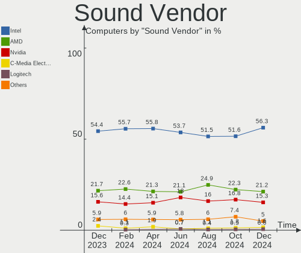
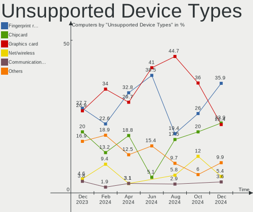

OpenMandriva - Hardware Trends
------------------------------

A project to identify most popular hardware characteristics and track their change
over time based on data collected by Linux users at https://Linux-Hardware.org.

Anyone can contribute to this report by the [hw-probe](https://github.com/linuxhw/hw-probe) tool:

    sudo -E hw-probe -all -upload

This is a report for all computer types. See also reports for [desktops](/Dist/OpenMandriva/Desktop/README.md) and [notebooks](/Dist/OpenMandriva/Notebook/README.md).

This report is for one last month. Overall report since the beginning of time: [TestCoverage](https://github.com/linuxhw/TestCoverage)

Period: Dec, 2022.

Contents
--------

* [ System ](#system)
  - [ OS                       ](#os)
  - [ OS Family                ](#os-family)
  - [ Kernel                   ](#kernel)
  - [ Kernel Family            ](#kernel-family)
  - [ Kernel Major Ver.        ](#kernel-major-ver)
  - [ Arch                     ](#arch)
  - [ DE                       ](#de)
  - [ Display Server           ](#display-server)
  - [ Display Manager          ](#display-manager)
  - [ OS Lang                  ](#os-lang)
  - [ Boot Mode                ](#boot-mode)
  - [ Filesystem               ](#filesystem)
  - [ Part. scheme             ](#part-scheme)
  - [ Dual Boot with Linux/BSD ](#dual-boot-with-linuxbsd)
  - [ Dual Boot (Win)          ](#dual-boot-win)

* [ Board ](#board)
  - [ Vendor                   ](#vendor)
  - [ Model                    ](#model)
  - [ Model Family             ](#model-family)
  - [ MFG Year                 ](#mfg-year)
  - [ Form Factor              ](#form-factor)
  - [ Secure Boot              ](#secure-boot)
  - [ Coreboot                 ](#coreboot)
  - [ RAM Size                 ](#ram-size)
  - [ RAM Used                 ](#ram-used)
  - [ Total Drives             ](#total-drives)
  - [ Has CD-ROM               ](#has-cd-rom)
  - [ Has Ethernet             ](#has-ethernet)
  - [ Has WiFi                 ](#has-wifi)
  - [ Has Bluetooth            ](#has-bluetooth)

* [ Location ](#location)
  - [ Country                  ](#country)
  - [ City                     ](#city)

* [ Drives ](#drives)
  - [ Drive Vendor             ](#drive-vendor)
  - [ Drive Model              ](#drive-model)
  - [ HDD Vendor               ](#hdd-vendor)
  - [ SSD Vendor               ](#ssd-vendor)
  - [ Drive Kind               ](#drive-kind)
  - [ Drive Connector          ](#drive-connector)
  - [ Drive Size               ](#drive-size)
  - [ Space Total              ](#space-total)
  - [ Space Used               ](#space-used)
  - [ Malfunc. Drives          ](#malfunc-drives)
  - [ Malfunc. Drive Vendor    ](#malfunc-drive-vendor)
  - [ Malfunc. HDD Vendor      ](#malfunc-hdd-vendor)
  - [ Malfunc. Drive Kind      ](#malfunc-drive-kind)
  - [ Failed Drives            ](#failed-drives)
  - [ Failed Drive Vendor      ](#failed-drive-vendor)
  - [ Drive Status             ](#drive-status)

* [ Storage controller ](#storage-controller)
  - [ Storage Vendor           ](#storage-vendor)
  - [ Storage Model            ](#storage-model)
  - [ Storage Kind             ](#storage-kind)

* [ Processor ](#processor)
  - [ CPU Vendor               ](#cpu-vendor)
  - [ CPU Model                ](#cpu-model)
  - [ CPU Model Family         ](#cpu-model-family)
  - [ CPU Cores                ](#cpu-cores)
  - [ CPU Sockets              ](#cpu-sockets)
  - [ CPU Threads              ](#cpu-threads)
  - [ CPU Op-Modes             ](#cpu-op-modes)
  - [ CPU Microcode            ](#cpu-microcode)
  - [ CPU Microarch            ](#cpu-microarch)

* [ Graphics ](#graphics)
  - [ GPU Vendor               ](#gpu-vendor)
  - [ GPU Model                ](#gpu-model)
  - [ GPU Combo                ](#gpu-combo)
  - [ GPU Driver               ](#gpu-driver)
  - [ GPU Memory               ](#gpu-memory)

* [ Monitor ](#monitor)
  - [ Monitor Vendor           ](#monitor-vendor)
  - [ Monitor Model            ](#monitor-model)
  - [ Monitor Resolution       ](#monitor-resolution)
  - [ Monitor Diagonal         ](#monitor-diagonal)
  - [ Monitor Width            ](#monitor-width)
  - [ Aspect Ratio             ](#aspect-ratio)
  - [ Monitor Area             ](#monitor-area)
  - [ Pixel Density            ](#pixel-density)
  - [ Multiple Monitors        ](#multiple-monitors)

* [ Network ](#network)
  - [ Net Controller Vendor    ](#net-controller-vendor)
  - [ Net Controller Model     ](#net-controller-model)
  - [ Wireless Vendor          ](#wireless-vendor)
  - [ Wireless Model           ](#wireless-model)
  - [ Ethernet Vendor          ](#ethernet-vendor)
  - [ Ethernet Model           ](#ethernet-model)
  - [ Net Controller Kind      ](#net-controller-kind)
  - [ Used Controller          ](#used-controller)
  - [ NICs                     ](#nics)
  - [ IPv6                     ](#ipv6)

* [ Bluetooth ](#bluetooth)
  - [ Bluetooth Vendor         ](#bluetooth-vendor)
  - [ Bluetooth Model          ](#bluetooth-model)

* [ Sound ](#sound)
  - [ Sound Vendor             ](#sound-vendor)
  - [ Sound Model              ](#sound-model)

* [ Memory ](#memory)
  - [ Memory Vendor            ](#memory-vendor)
  - [ Memory Model             ](#memory-model)
  - [ Memory Kind              ](#memory-kind)
  - [ Memory Form Factor       ](#memory-form-factor)
  - [ Memory Size              ](#memory-size)
  - [ Memory Speed             ](#memory-speed)

* [ Printers & scanners ](#printers--scanners)
  - [ Printer Vendor           ](#printer-vendor)
  - [ Printer Model            ](#printer-model)
  - [ Scanner Vendor           ](#scanner-vendor)
  - [ Scanner Model            ](#scanner-model)

* [ Camera ](#camera)
  - [ Camera Vendor            ](#camera-vendor)
  - [ Camera Model             ](#camera-model)

* [ Security ](#security)
  - [ Fingerprint Vendor       ](#fingerprint-vendor)
  - [ Fingerprint Model        ](#fingerprint-model)
  - [ Chipcard Vendor          ](#chipcard-vendor)
  - [ Chipcard Model           ](#chipcard-model)

* [ Unsupported ](#unsupported)
  - [ Unsupported Devices      ](#unsupported-devices)
  - [ Unsupported Device Types ](#unsupported-device-types)

System
------

OS
--

Installed operating systems

| Name               | Computers | Percent |
|--------------------|-----------|---------|
| OpenMandriva 4.3   | 205       | 60.12%  |
| OpenMandriva 22.12 | 54        | 15.84%  |
| OpenMandriva 4.50  | 51        | 14.96%  |
| OpenMandriva 4.2   | 13        | 3.81%   |
| OpenMandriva 4.90  | 12        | 3.52%   |
| OpenMandriva 22.90 | 3         | 0.88%   |
| OpenMandriva 22.11 | 3         | 0.88%   |

OS Family
---------

OS without a version

| Name         | Computers | Percent |
|--------------|-----------|---------|
| OpenMandriva | 341       | 100%    |

Kernel
------

Version of the Linux kernel

| Version                      | Computers | Percent |
|------------------------------|-----------|---------|
| 5.16.7-desktop-1omv4003      | 195       | 57.18%  |
| 6.0.10-desktop-2omv22090     | 53        | 15.54%  |
| 5.19.12-desktop-2omv4090     | 36        | 10.56%  |
| 5.19.5-desktop-1omv4090      | 10        | 2.93%   |
| 5.10.14-desktop-1omv4002     | 10        | 2.93%   |
| 5.16.13-desktop-1omv4003     | 9         | 2.64%   |
| 5.18.12-desktop-3omv4090     | 8         | 2.35%   |
| 5.19.11-desktop-2omv4090     | 5         | 1.47%   |
| 6.0.2-desktop-1omv4090       | 4         | 1.17%   |
| 5.11.12-desktop-1omv4002     | 3         | 0.88%   |
| 6.0.9-desktop-1omv22090      | 2         | 0.59%   |
| 6.0.2-desktop-1omv4050       | 2         | 0.59%   |
| 6.1.0-desktop-1omv2290       | 1         | 0.29%   |
| 6.0.10-server-2omv22090      | 1         | 0.29%   |
| 6.0.10-desktop-gcc-2omv22090 | 1         | 0.29%   |
| 5.14.14-desktop-1omv4050     | 1         | 0.29%   |

Kernel Family
-------------

Linux kernel without a distro release

| Version | Computers | Percent |
|---------|-----------|---------|
| 5.16.7  | 195       | 57.18%  |
| 6.0.10  | 55        | 16.13%  |
| 5.19.12 | 36        | 10.56%  |
| 5.19.5  | 10        | 2.93%   |
| 5.10.14 | 10        | 2.93%   |
| 5.16.13 | 9         | 2.64%   |
| 5.18.12 | 8         | 2.35%   |
| 6.0.2   | 6         | 1.76%   |
| 5.19.11 | 5         | 1.47%   |
| 5.11.12 | 3         | 0.88%   |
| 6.0.9   | 2         | 0.59%   |
| 6.1.0   | 1         | 0.29%   |
| 5.14.14 | 1         | 0.29%   |

Kernel Major Ver.
-----------------

Linux kernel major version

| Version | Computers | Percent |
|---------|-----------|---------|
| 5.16    | 204       | 59.82%  |
| 6.0     | 63        | 18.48%  |
| 5.19    | 51        | 14.96%  |
| 5.10    | 10        | 2.93%   |
| 5.18    | 8         | 2.35%   |
| 5.11    | 3         | 0.88%   |
| 6.1     | 1         | 0.29%   |
| 5.14    | 1         | 0.29%   |

Arch
----

OS architecture (x86_64, i586, etc.)

| Name    | Computers | Percent |
|---------|-----------|---------|
| x86_64  | 340       | 99.71%  |
| aarch64 | 1         | 0.29%   |

DE
--

Desktop Environment

| Name  | Computers | Percent |
|-------|-----------|---------|
| KDE5  | 334       | 97.95%  |
| LXQt  | 3         | 0.88%   |
| GNOME | 3         | 0.88%   |
| XFCE  | 1         | 0.29%   |

Display Server
--------------

X11 or Wayland

| Name    | Computers | Percent |
|---------|-----------|---------|
| X11     | 335       | 98.24%  |
| Wayland | 6         | 1.76%   |

Display Manager
---------------

SDDM, LightDM, etc.

| Name    | Computers | Percent |
|---------|-----------|---------|
| SDDM    | 336       | 98.53%  |
| GDM     | 3         | 0.88%   |
| LightDM | 2         | 0.59%   |

OS Lang
-------

Language

| Lang  | Computers | Percent |
|-------|-----------|---------|
| en_US | 181       | 53.08%  |
| ru_RU | 26        | 7.62%   |
| fr_FR | 23        | 6.74%   |
| de_DE | 19        | 5.57%   |
| pl_PL | 16        | 4.69%   |
| pt_BR | 13        | 3.81%   |
| it_IT | 10        | 2.93%   |
| en_GB | 9         | 2.64%   |
| es_ES | 7         | 2.05%   |
| es_MX | 4         | 1.17%   |
| es_AR | 4         | 1.17%   |
| cs_CZ | 4         | 1.17%   |
| hu_HU | 3         | 0.88%   |
| es_CO | 2         | 0.59%   |
| es_CL | 2         | 0.59%   |
| de_AT | 2         | 0.59%   |
| sk_SK | 1         | 0.29%   |
| ru_UA | 1         | 0.29%   |
| ro_RO | 1         | 0.29%   |
| pt_PT | 1         | 0.29%   |
| nl_NL | 1         | 0.29%   |
| fr_CH | 1         | 0.29%   |
| fr_CA | 1         | 0.29%   |
| fr_BE | 1         | 0.29%   |
| es_VE | 1         | 0.29%   |
| es_US | 1         | 0.29%   |
| es_PR | 1         | 0.29%   |
| es_PE | 1         | 0.29%   |
| es_EC | 1         | 0.29%   |
| en_IN | 1         | 0.29%   |
| en_HK | 1         | 0.29%   |
| da_DK | 1         | 0.29%   |

Boot Mode
---------

EFI or BIOS

| Mode | Computers | Percent |
|------|-----------|---------|
| EFI  | 179       | 52.49%  |
| BIOS | 162       | 47.51%  |

Filesystem
----------

Type of filesystem

| Type    | Computers | Percent |
|---------|-----------|---------|
| Overlay | 272       | 79.77%  |
| Ext4    | 62        | 18.18%  |
| Btrfs   | 4         | 1.17%   |
| Xfs     | 1         | 0.29%   |
| F2fs    | 1         | 0.29%   |
| Ext3    | 1         | 0.29%   |

Part. scheme
------------

Scheme of partitioning

| Type    | Computers | Percent |
|---------|-----------|---------|
| GPT     | 238       | 69.79%  |
| MBR     | 101       | 29.62%  |
| Unknown | 2         | 0.59%   |

Dual Boot with Linux/BSD
------------------------

Hosting more than one Linux/BSD

| Dual boot | Computers | Percent |
|-----------|-----------|---------|
| Yes       | 173       | 50.73%  |
| No        | 168       | 49.27%  |

Dual Boot (Win)
---------------

Hosting Linux and Windows

| Dual boot | Computers | Percent |
|-----------|-----------|---------|
| No        | 186       | 54.55%  |
| Yes       | 155       | 45.45%  |

Board
-----

Vendor
------

Motherboard manufacturer

| Name                  | Computers | Percent |
|-----------------------|-----------|---------|
| ASUSTek Computer      | 71        | 20.82%  |
| Lenovo                | 46        | 13.49%  |
| Dell                  | 35        | 10.26%  |
| Hewlett-Packard       | 34        | 9.97%   |
| Acer                  | 26        | 7.62%   |
| Gigabyte Technology   | 25        | 7.33%   |
| MSI                   | 21        | 6.16%   |
| Toshiba               | 12        | 3.52%   |
| ASRock                | 9         | 2.64%   |
| Apple                 | 7         | 2.05%   |
| Positivo              | 6         | 1.76%   |
| Samsung Electronics   | 5         | 1.47%   |
| Pegatron              | 5         | 1.47%   |
| Sony                  | 3         | 0.88%   |
| ECS                   | 3         | 0.88%   |
| Langchao              | 2         | 0.59%   |
| Intel                 | 2         | 0.59%   |
| HUAWEI                | 2         | 0.59%   |
| Fujitsu               | 2         | 0.59%   |
| Biostar               | 2         | 0.59%   |
| Supermicro            | 1         | 0.29%   |
| Star Labs             | 1         | 0.29%   |
| RM Education          | 1         | 0.29%   |
| pine64,rockpro64-v2.1 | 1         | 0.29%   |
| PERTOSA               | 1         | 0.29%   |
| Packard Bell          | 1         | 0.29%   |
| Notebook              | 1         | 0.29%   |
| Microsoft             | 1         | 0.29%   |
| Medion                | 1         | 0.29%   |
| MAXSUN                | 1         | 0.29%   |
| MACHINIST             | 1         | 0.29%   |
| LG Electronics        | 1         | 0.29%   |
| Huanan                | 1         | 0.29%   |
| HC Technology.        | 1         | 0.29%   |
| Google                | 1         | 0.29%   |
| Foxconn               | 1         | 0.29%   |
| Dynabook              | 1         | 0.29%   |
| Datto                 | 1         | 0.29%   |
| Clevo                 | 1         | 0.29%   |
| AZW                   | 1         | 0.29%   |

Model
-----

Motherboard model

| Name                                  | Computers | Percent |
|---------------------------------------|-----------|---------|
| Toshiba dynabook T653/46JR            | 4         | 1.17%   |
| ASUS UX31E                            | 4         | 1.17%   |
| Dell OptiPlex 760                     | 3         | 0.88%   |
| Dell OptiPlex 380                     | 3         | 0.88%   |
| ASUS P8Z77-V LX                       | 3         | 0.88%   |
| Apple MacBookAir7,2                   | 3         | 0.88%   |
| Acer Nitro AN515-57                   | 3         | 0.88%   |
| Positivo Mobile                       | 2         | 0.59%   |
| Positivo H14BT58                      | 2         | 0.59%   |
| MSI GF63 Thin 9RCX                    | 2         | 0.59%   |
| Lenovo IdeaPad S145-15AST 81N3        | 2         | 0.59%   |
| Lenovo IdeaPad 100-15IBD 80QQ         | 2         | 0.59%   |
| Langchao NF5110                       | 2         | 0.59%   |
| HP Pavilion Notebook                  | 2         | 0.59%   |
| HP Pavilion Laptop 15-cw1xxx          | 2         | 0.59%   |
| HP Notebook                           | 2         | 0.59%   |
| HP 15                                 | 2         | 0.59%   |
| Gigabyte GA-78LMT-USB3 6.0            | 2         | 0.59%   |
| Dell OptiPlex 3010                    | 2         | 0.59%   |
| ASUS S551LN                           | 2         | 0.59%   |
| ASUS P5K                              | 2         | 0.59%   |
| ASUS K55VD                            | 2         | 0.59%   |
| ASUS All Series                       | 2         | 0.59%   |
| Acer Aspire VX5-591G                  | 2         | 0.59%   |
| Toshiba Satellite L655                | 1         | 0.29%   |
| Toshiba Satellite L635                | 1         | 0.29%   |
| Toshiba Satellite L500                | 1         | 0.29%   |
| Toshiba Satellite C855                | 1         | 0.29%   |
| Toshiba Satellite C55-B               | 1         | 0.29%   |
| Toshiba Satellite C55-A               | 1         | 0.29%   |
| Toshiba Satellite A305D               | 1         | 0.29%   |
| Toshiba EQUIUM A300D                  | 1         | 0.29%   |
| Supermicro X11SSV-Q                   | 1         | 0.29%   |
| Star Labs StarBook                    | 1         | 0.29%   |
| Sony VPCEL2S1E                        | 1         | 0.29%   |
| Sony VGN-NW31JF_S                     | 1         | 0.29%   |
| Sony VGN-FZ31Z                        | 1         | 0.29%   |
| Samsung R540/R580/R780/SA41/E452/E852 | 1         | 0.29%   |
| Samsung NB30/N146                     | 1         | 0.29%   |
| Samsung 305E4A/305E5A/305E7A          | 1         | 0.29%   |

Model Family
------------

Motherboard model prefix

| Name                   | Computers | Percent |
|------------------------|-----------|---------|
| Acer Aspire            | 19        | 5.57%   |
| Dell OptiPlex          | 16        | 4.69%   |
| Lenovo ThinkPad        | 13        | 3.81%   |
| Lenovo IdeaPad         | 12        | 3.52%   |
| HP Pavilion            | 10        | 2.93%   |
| Dell Latitude          | 8         | 2.35%   |
| Toshiba Satellite      | 7         | 2.05%   |
| Lenovo ThinkCentre     | 7         | 2.05%   |
| HP Compaq              | 5         | 1.47%   |
| Dell Inspiron          | 5         | 1.47%   |
| ASUS TUF               | 5         | 1.47%   |
| ASUS PRIME             | 5         | 1.47%   |
| Toshiba dynabook       | 4         | 1.17%   |
| ASUS UX31E             | 4         | 1.17%   |
| ASUS ROG               | 4         | 1.17%   |
| ASUS P5K               | 4         | 1.17%   |
| Acer Nitro             | 4         | 1.17%   |
| Lenovo Yoga            | 3         | 0.88%   |
| Dell Vostro            | 3         | 0.88%   |
| ASUS VivoBook          | 3         | 0.88%   |
| ASUS P8Z77-V           | 3         | 0.88%   |
| Apple MacBookAir7      | 3         | 0.88%   |
| Positivo Mobile        | 2         | 0.59%   |
| Positivo H14BT58       | 2         | 0.59%   |
| MSI GF63               | 2         | 0.59%   |
| Langchao NF5110        | 2         | 0.59%   |
| HP Notebook            | 2         | 0.59%   |
| HP EliteDesk           | 2         | 0.59%   |
| HP EliteBook           | 2         | 0.59%   |
| HP 15                  | 2         | 0.59%   |
| Gigabyte GA-78LMT-USB3 | 2         | 0.59%   |
| ASUS S551LN            | 2         | 0.59%   |
| ASUS M5A97             | 2         | 0.59%   |
| ASUS K55VD             | 2         | 0.59%   |
| ASUS All               | 2         | 0.59%   |
| ASRock B550            | 2         | 0.59%   |
| Apple iMac12           | 2         | 0.59%   |
| Toshiba EQUIUM         | 1         | 0.29%   |
| Supermicro X11SSV-Q    | 1         | 0.29%   |
| Star Labs StarBook     | 1         | 0.29%   |

MFG Year
--------

Motherboard manufacture year

| Year | Computers | Percent |
|------|-----------|---------|
| 2013 | 34        | 9.97%   |
| 2021 | 31        | 9.09%   |
| 2011 | 28        | 8.21%   |
| 2012 | 27        | 7.92%   |
| 2010 | 25        | 7.33%   |
| 2014 | 24        | 7.04%   |
| 2015 | 23        | 6.74%   |
| 2019 | 21        | 6.16%   |
| 2008 | 21        | 6.16%   |
| 2020 | 20        | 5.87%   |
| 2009 | 20        | 5.87%   |
| 2018 | 16        | 4.69%   |
| 2017 | 16        | 4.69%   |
| 2022 | 12        | 3.52%   |
| 2016 | 11        | 3.23%   |
| 2007 | 9         | 2.64%   |
| 2006 | 3         | 0.88%   |

Form Factor
-----------

Physical design of the computer

| Name           | Computers | Percent |
|----------------|-----------|---------|
| Notebook       | 163       | 47.8%   |
| Desktop        | 160       | 46.92%  |
| Mini pc        | 6         | 1.76%   |
| All in one     | 4         | 1.17%   |
| Convertible    | 3         | 0.88%   |
| Server         | 3         | 0.88%   |
| System on chip | 1         | 0.29%   |
| Tablet         | 1         | 0.29%   |

Secure Boot
-----------

Enabled or disabled

| State    | Computers | Percent |
|----------|-----------|---------|
| Disabled | 341       | 100%    |

Coreboot
--------

Have coreboot on board

| Used | Computers | Percent |
|------|-----------|---------|
| No   | 339       | 99.41%  |
| Yes  | 2         | 0.59%   |

RAM Size
--------

Total RAM memory

| Size in GB  | Computers | Percent |
|-------------|-----------|---------|
| 3.01-4.0    | 103       | 30.21%  |
| 4.01-8.0    | 78        | 22.87%  |
| 8.01-16.0   | 61        | 17.89%  |
| 16.01-24.0  | 54        | 15.84%  |
| 32.01-64.0  | 21        | 6.16%   |
| 1.01-2.0    | 11        | 3.23%   |
| 2.01-3.0    | 6         | 1.76%   |
| 24.01-32.0  | 4         | 1.17%   |
| 64.01-256.0 | 2         | 0.59%   |
| 0.51-1.0    | 1         | 0.29%   |

RAM Used
--------

Used RAM memory

| Used GB   | Computers | Percent |
|-----------|-----------|---------|
| 1.01-2.0  | 245       | 71.85%  |
| 0.51-1.0  | 55        | 16.13%  |
| 2.01-3.0  | 27        | 7.92%   |
| 0.01-0.5  | 6         | 1.76%   |
| 3.01-4.0  | 5         | 1.47%   |
| 4.01-8.0  | 2         | 0.59%   |
| 8.01-16.0 | 1         | 0.29%   |

Total Drives
------------

Number of drives on board

| Drives | Computers | Percent |
|--------|-----------|---------|
| 1      | 223       | 65.4%   |
| 2      | 62        | 18.18%  |
| 3      | 21        | 6.16%   |
| 4      | 16        | 4.69%   |
| 5      | 7         | 2.05%   |
| 0      | 6         | 1.76%   |
| 7      | 3         | 0.88%   |
| 6      | 3         | 0.88%   |

Has CD-ROM
----------

Has CD-ROM on board

| Presented | Computers | Percent |
|-----------|-----------|---------|
| No        | 187       | 54.84%  |
| Yes       | 154       | 45.16%  |

Has Ethernet
------------

Has Ethernet on board

| Presented | Computers | Percent |
|-----------|-----------|---------|
| Yes       | 313       | 91.79%  |
| No        | 28        | 8.21%   |

Has WiFi
--------

Has WiFi module

| Presented | Computers | Percent |
|-----------|-----------|---------|
| Yes       | 234       | 68.62%  |
| No        | 107       | 31.38%  |

Has Bluetooth
-------------

Has Bluetooth module

| Presented | Computers | Percent |
|-----------|-----------|---------|
| No        | 175       | 51.32%  |
| Yes       | 166       | 48.68%  |

Location
--------

Country
-------

Geographic location (country)

| Country     | Computers | Percent |
|-------------|-----------|---------|
| Russia      | 43        | 12.61%  |
| USA         | 42        | 12.32%  |
| Germany     | 33        | 9.68%   |
| France      | 28        | 8.21%   |
| Poland      | 23        | 6.74%   |
| Italy       | 22        | 6.45%   |
| Brazil      | 18        | 5.28%   |
| UK          | 13        | 3.81%   |
| Mexico      | 9         | 2.64%   |
| Spain       | 8         | 2.35%   |
| Canada      | 8         | 2.35%   |
| Czechia     | 6         | 1.76%   |
| Romania     | 5         | 1.47%   |
| Japan       | 5         | 1.47%   |
| Indonesia   | 5         | 1.47%   |
| Hungary     | 5         | 1.47%   |
| Argentina   | 5         | 1.47%   |
| Switzerland | 4         | 1.17%   |
| Portugal    | 3         | 0.88%   |
| Bulgaria    | 3         | 0.88%   |
| Ukraine     | 2         | 0.59%   |
| Turkey      | 2         | 0.59%   |
| Slovakia    | 2         | 0.59%   |
| Serbia      | 2         | 0.59%   |
| Norway      | 2         | 0.59%   |
| Netherlands | 2         | 0.59%   |
| Morocco     | 2         | 0.59%   |
| Latvia      | 2         | 0.59%   |
| Finland     | 2         | 0.59%   |
| Egypt       | 2         | 0.59%   |
| Denmark     | 2         | 0.59%   |
| Colombia    | 2         | 0.59%   |
| China       | 2         | 0.59%   |
| Chile       | 2         | 0.59%   |
| Belgium     | 2         | 0.59%   |
| Austria     | 2         | 0.59%   |
| Venezuela   | 1         | 0.29%   |
| Thailand    | 1         | 0.29%   |
| Sweden      | 1         | 0.29%   |
| Slovenia    | 1         | 0.29%   |

City
----

Geographic location (city)

| City               | Computers | Percent |
|--------------------|-----------|---------|
| Moscow             | 6         | 1.76%   |
| Warsaw             | 5         | 1.47%   |
| Volgograd          | 5         | 1.47%   |
| Saarbrücken       | 4         | 1.17%   |
| Paris              | 4         | 1.17%   |
| Prague             | 3         | 0.88%   |
| Poznan             | 3         | 0.88%   |
| Nizhniy Novgorod   | 3         | 0.88%   |
| Vladivostok        | 2         | 0.59%   |
| Ufa                | 2         | 0.59%   |
| Srengseng Sawah    | 2         | 0.59%   |
| Siggenthal Station | 2         | 0.59%   |
| Sigean             | 2         | 0.59%   |
| Salzgitter         | 2         | 0.59%   |
| Rostov-on-Don      | 2         | 0.59%   |
| Rio de Janeiro     | 2         | 0.59%   |
| Novosibirsk        | 2         | 0.59%   |
| Munich             | 2         | 0.59%   |
| Muhlhausen-Ehingen | 2         | 0.59%   |
| Milan              | 2         | 0.59%   |
| Mexico City        | 2         | 0.59%   |
| Madrid             | 2         | 0.59%   |
| Madison            | 2         | 0.59%   |
| Lodz               | 2         | 0.59%   |
| Krasnodar          | 2         | 0.59%   |
| Krakow             | 2         | 0.59%   |
| Kenitra            | 2         | 0.59%   |
| Jakarta            | 2         | 0.59%   |
| Jacksonville       | 2         | 0.59%   |
| Iowa City          | 2         | 0.59%   |
| Goncalves          | 2         | 0.59%   |
| Farmington         | 2         | 0.59%   |
| Ciudad Obregón    | 2         | 0.59%   |
| Braganca Paulista  | 2         | 0.59%   |
| Bologna            | 2         | 0.59%   |
| Belgorod           | 2         | 0.59%   |
| Bamberg            | 2         | 0.59%   |
| Zonguldak          | 1         | 0.29%   |
| Zlatoust           | 1         | 0.29%   |
| Yenne              | 1         | 0.29%   |

Drives
------

Drive Vendor
------------

Hard drive vendors

| Vendor              | Computers | Drives | Percent |
|---------------------|-----------|--------|---------|
| WDC                 | 85        | 104    | 17.93%  |
| Seagate             | 74        | 93     | 15.61%  |
| Samsung Electronics | 57        | 65     | 12.03%  |
| Toshiba             | 35        | 34     | 7.38%   |
| Kingston            | 33        | 36     | 6.96%   |
| SanDisk             | 21        | 23     | 4.43%   |
| Hitachi             | 16        | 17     | 3.38%   |
| Crucial             | 13        | 13     | 2.74%   |
| A-DATA Technology   | 12        | 13     | 2.53%   |
| HGST                | 10        | 10     | 2.11%   |
| Unknown             | 9         | 12     | 1.9%    |
| SPCC                | 6         | 6      | 1.27%   |
| Intel               | 6         | 6      | 1.27%   |
| Micron Technology   | 5         | 5      | 1.05%   |
| JMicron Technology  | 5         | 5      | 1.05%   |
| GOODRAM             | 5         | 5      | 1.05%   |
| China               | 5         | 5      | 1.05%   |
| Phison              | 4         | 5      | 0.84%   |
| Intenso             | 4         | 4      | 0.84%   |
| Apple               | 4         | 4      | 0.84%   |
| Apacer              | 4         | 4      | 0.84%   |
| SK hynix            | 3         | 4      | 0.63%   |
| PNY                 | 3         | 3      | 0.63%   |
| Patriot             | 3         | 3      | 0.63%   |
| Maxtor              | 3         | 3      | 0.63%   |
| Corsair             | 3         | 3      | 0.63%   |
| Unknown             | 3         | 4      | 0.63%   |
| XPG                 | 2         | 2      | 0.42%   |
| USB3.0              | 2         | 2      | 0.42%   |
| Transcend           | 2         | 2      | 0.42%   |
| TO Exter            | 2         | 2      | 0.42%   |
| Team                | 2         | 2      | 0.42%   |
| SSK                 | 2         | 2      | 0.42%   |
| Silicon Motion      | 2         | 2      | 0.42%   |
| KIOXIA              | 2         | 2      | 0.42%   |
| HS-SSD-E100         | 2         | 2      | 0.42%   |
| Fujitsu             | 2         | 3      | 0.42%   |
| AMD                 | 2         | 3      | 0.42%   |
| WD Green            | 1         | 1      | 0.21%   |
| WALRAM              | 1         | 1      | 0.21%   |

Drive Model
-----------

Hard drive models

| Model                              | Computers | Percent |
|------------------------------------|-----------|---------|
| Kingston SA400S37240G 240GB SSD    | 14        | 2.7%    |
| Seagate ST500LT012-1DG142 500GB    | 6         | 1.16%   |
| Seagate ST1000LM024 HN-M101MBB 1TB | 6         | 1.16%   |
| Toshiba MQ01ABD075 752GB           | 5         | 0.97%   |
| Toshiba DT01ACA100 1TB             | 5         | 0.97%   |
| Seagate ST500DM002-1BD142 500GB    | 4         | 0.77%   |
| Seagate ST2000DM006-2DM164 2TB     | 4         | 0.77%   |
| SanDisk SSD U100 256GB             | 4         | 0.77%   |
| Samsung SSD 970 EVO Plus 500GB     | 4         | 0.77%   |
| WDC WDS100T2B0A-00SM50 1TB SSD     | 3         | 0.58%   |
| Toshiba MQ01ABF050 500GB           | 3         | 0.58%   |
| Toshiba MQ01ABD100 1TB             | 3         | 0.58%   |
| SPCC Solid State Disk 512GB        | 3         | 0.58%   |
| Seagate ST9500325AS 500GB          | 3         | 0.58%   |
| Seagate ST3500418AS 500GB          | 3         | 0.58%   |
| Seagate ST3320613AS 320GB          | 3         | 0.58%   |
| Seagate ST3250318AS 250GB          | 3         | 0.58%   |
| Seagate ST2000DM008-2FR102 2TB     | 3         | 0.58%   |
| Seagate ST1000LM035-1RK172 1TB     | 3         | 0.58%   |
| Seagate ST1000DM003-9YN162 1TB     | 3         | 0.58%   |
| Samsung SSD 860 EVO 500GB          | 3         | 0.58%   |
| Samsung SSD 860 EVO 250GB          | 3         | 0.58%   |
| Samsung HD502HJ 500GB              | 3         | 0.58%   |
| Kingston SA400S37120G 120GB SSD    | 3         | 0.58%   |
| Crucial CT1000MX500SSD1 1TB        | 3         | 0.58%   |
| Apple SSD SM0128G 121GB            | 3         | 0.58%   |
| Unknown                            | 3         | 0.58%   |
| WDC WDS240G2G0A-00JH30 240GB SSD   | 2         | 0.39%   |
| WDC WDS120G2G0A-00JH30 120GB SSD   | 2         | 0.39%   |
| WDC WDS100T2B0C-00PXH0 1TB         | 2         | 0.39%   |
| WDC WD800JD-08LSA0 80GB            | 2         | 0.39%   |
| WDC WD5000AAKX-22ERMA0 500GB       | 2         | 0.39%   |
| WDC WD30EFRX-68EUZN0 3TB           | 2         | 0.39%   |
| WDC WD2500BPVT-00JJ5T0 250GB       | 2         | 0.39%   |
| WDC WD2500AAKX-00ERMA0 250GB       | 2         | 0.39%   |
| WDC WD1600BEVT-80A23T0 160GB       | 2         | 0.39%   |
| WDC WD1600AAJS-75M0A0 160GB        | 2         | 0.39%   |
| WDC WD10JPVX-22JC3T0 1TB           | 2         | 0.39%   |
| WDC WD10EZEX-21WN4A0 1TB           | 2         | 0.39%   |
| WDC WD10EZEX-08WN4A0 1TB           | 2         | 0.39%   |

HDD Vendor
----------

Hard disk drive vendors

| Vendor              | Computers | Drives | Percent |
|---------------------|-----------|--------|---------|
| Seagate             | 74        | 92     | 34.42%  |
| WDC                 | 65        | 77     | 30.23%  |
| Toshiba             | 31        | 30     | 14.42%  |
| Hitachi             | 16        | 17     | 7.44%   |
| Samsung Electronics | 10        | 10     | 4.65%   |
| HGST                | 10        | 10     | 4.65%   |
| Maxtor              | 3         | 3      | 1.4%    |
| USB3.0              | 2         | 2      | 0.93%   |
| Fujitsu             | 2         | 3      | 0.93%   |
| Unknown             | 1         | 1      | 0.47%   |
| ASMT                | 1         | 1      | 0.47%   |

SSD Vendor
----------

Solid state drive vendors

| Vendor              | Computers | Drives | Percent |
|---------------------|-----------|--------|---------|
| Samsung Electronics | 25        | 29     | 14.79%  |
| Kingston            | 23        | 26     | 13.61%  |
| SanDisk             | 17        | 18     | 10.06%  |
| WDC                 | 12        | 12     | 7.1%    |
| Crucial             | 12        | 12     | 7.1%    |
| A-DATA Technology   | 12        | 12     | 7.1%    |
| SPCC                | 5         | 5      | 2.96%   |
| GOODRAM             | 5         | 5      | 2.96%   |
| China               | 5         | 5      | 2.96%   |
| Intenso             | 4         | 4      | 2.37%   |
| Intel               | 4         | 4      | 2.37%   |
| Apple               | 4         | 4      | 2.37%   |
| Toshiba             | 3         | 3      | 1.78%   |
| JMicron Technology  | 3         | 3      | 1.78%   |
| Apacer              | 3         | 3      | 1.78%   |
| Transcend           | 2         | 2      | 1.18%   |
| TO Exter            | 2         | 2      | 1.18%   |
| PNY                 | 2         | 2      | 1.18%   |
| HS-SSD-E100         | 2         | 2      | 1.18%   |
| Unknown             | 2         | 3      | 1.18%   |
| WALRAM              | 1         | 1      | 0.59%   |
| Verbatim            | 1         | 1      | 0.59%   |
| Unknown             | 1         | 1      | 0.59%   |
| Team                | 1         | 1      | 0.59%   |
| Smartbuy            | 1         | 2      | 0.59%   |
| SK hynix            | 1         | 1      | 0.59%   |
| Seagate             | 1         | 1      | 0.59%   |
| PUSKILL             | 1         | 1      | 0.59%   |
| Phison              | 1         | 1      | 0.59%   |
| Patriot             | 1         | 1      | 0.59%   |
| Mushkin             | 1         | 1      | 0.59%   |
| MidasForce          | 1         | 1      | 0.59%   |
| LITEONIT            | 1         | 1      | 0.59%   |
| Lexar               | 1         | 1      | 0.59%   |
| KingFast            | 1         | 1      | 0.59%   |
| INTEL SS            | 1         | 1      | 0.59%   |
| HPE                 | 1         | 1      | 0.59%   |
| Hewlett-Packard     | 1         | 1      | 0.59%   |
| Dogfish             | 1         | 1      | 0.59%   |
| Corsair             | 1         | 1      | 0.59%   |

Drive Kind
----------

HDD or SSD

| Kind    | Computers | Drives | Percent |
|---------|-----------|--------|---------|
| HDD     | 192       | 246    | 44.76%  |
| SSD     | 142       | 179    | 33.1%   |
| NVMe    | 80        | 92     | 18.65%  |
| Unknown | 8         | 11     | 1.86%   |
| MMC     | 7         | 8      | 1.63%   |

Drive Connector
---------------

SATA, SAS, NVMe, etc.

| Type | Computers | Drives | Percent |
|------|-----------|--------|---------|
| SATA | 286       | 410    | 72.22%  |
| NVMe | 80        | 90     | 20.2%   |
| SAS  | 23        | 28     | 5.81%   |
| MMC  | 7         | 8      | 1.77%   |

Drive Size
----------

Size of hard drive

| Size in TB | Computers | Drives | Percent |
|------------|-----------|--------|---------|
| 0.01-0.5   | 213       | 270    | 62.83%  |
| 0.51-1.0   | 91        | 112    | 26.84%  |
| 1.01-2.0   | 25        | 31     | 7.37%   |
| 2.01-3.0   | 6         | 8      | 1.77%   |
| 3.01-4.0   | 2         | 2      | 0.59%   |
| 4.01-10.0  | 2         | 2      | 0.59%   |

Space Total
-----------

Amount of disk space available on the file system

| Size in GB     | Computers | Percent |
|----------------|-----------|---------|
| 1-20           | 170       | 49.85%  |
| 101-250        | 60        | 17.6%   |
| 251-500        | 36        | 10.56%  |
| Unknown        | 31        | 9.09%   |
| 51-100         | 16        | 4.69%   |
| 501-1000       | 14        | 4.11%   |
| 21-50          | 9         | 2.64%   |
| 1001-2000      | 3         | 0.88%   |
| More than 3000 | 1         | 0.29%   |
| 2001-3000      | 1         | 0.29%   |

Space Used
----------

Amount of used disk space

| Used GB   | Computers | Percent |
|-----------|-----------|---------|
| 1-20      | 286       | 83.87%  |
| Unknown   | 31        | 9.09%   |
| 51-100    | 7         | 2.05%   |
| 251-500   | 5         | 1.47%   |
| 21-50     | 5         | 1.47%   |
| 101-250   | 5         | 1.47%   |
| 1001-2000 | 2         | 0.59%   |

Malfunc. Drives
---------------

Drive models with a malfunction

| Model                           | Computers | Drives | Percent |
|---------------------------------|-----------|--------|---------|
| Toshiba MQ01ABD075 752GB        | 5         | 5      | 4.76%   |
| SanDisk SSD U100 256GB          | 4         | 4      | 3.81%   |
| Seagate ST9500325AS 500GB       | 3         | 3      | 2.86%   |
| Seagate ST3320613AS 320GB       | 3         | 3      | 2.86%   |
| Seagate ST2000DM006-2DM164 2TB  | 3         | 3      | 2.86%   |
| WDC WD800JD-08LSA0 80GB         | 2         | 2      | 1.9%    |
| WDC WD5000AAKX-22ERMA0 500GB    | 2         | 2      | 1.9%    |
| WDC WD2500AAKX-00ERMA0 250GB    | 2         | 2      | 1.9%    |
| WDC WD1600AAJS-75M0A0 160GB     | 2         | 2      | 1.9%    |
| Seagate ST500LT012-9WS142 500GB | 2         | 2      | 1.9%    |
| Seagate ST3500418AS 500GB       | 2         | 2      | 1.9%    |
| Samsung Electronics HD103SI 1TB | 2         | 2      | 1.9%    |
| HGST HTS545050A7E680 500GB      | 2         | 2      | 1.9%    |
| XPG GAMMIX S41 512GB            | 1         | 1      | 0.95%   |
| WDC WD800JD-75MSA3 80GB         | 1         | 1      | 0.95%   |
| WDC WD5003ABYX-01WERA0 500GB    | 1         | 1      | 0.95%   |
| WDC WD5000BPVT-24HXZT3 500GB    | 1         | 1      | 0.95%   |
| WDC WD5000AAKX-75U6AA0 500GB    | 1         | 1      | 0.95%   |
| WDC WD5000AAKS-65A7B0 500GB     | 1         | 1      | 0.95%   |
| WDC WD5000AAKS-402AA0 500GB     | 1         | 1      | 0.95%   |
| WDC WD5000AAKS-00V1A0 500GB     | 1         | 1      | 0.95%   |
| WDC WD5000AADS-00M2B0 500GB     | 1         | 1      | 0.95%   |
| WDC WD40PURX-64GVNY0 4TB        | 1         | 1      | 0.95%   |
| WDC WD3200LPCX-22VHAT0 320GB    | 1         | 1      | 0.95%   |
| WDC WD3200BPVT-80JJ5T0 320GB    | 1         | 1      | 0.95%   |
| WDC WD3200BPVT-22ZEST0 320GB    | 1         | 1      | 0.95%   |
| WDC WD3200BEVT-22A23T0 320GB    | 1         | 1      | 0.95%   |
| WDC WD3200AAJS-56M0A0 320GB     | 1         | 1      | 0.95%   |
| WDC WD30EZRX-00D8PB0 3TB        | 1         | 1      | 0.95%   |
| WDC WD2500BEVS-60UST0 250GB     | 1         | 1      | 0.95%   |
| WDC WD2000F9YZ-09N20L0 2TB      | 1         | 1      | 0.95%   |
| WDC WD1002FAEX-00Z3A0 1TB       | 1         | 1      | 0.95%   |
| USB3.0 Super Speed 1TB          | 1         | 1      | 0.95%   |
| Toshiba MQ01ABF050 500GB        | 1         | 1      | 0.95%   |
| Toshiba MQ01ABD100 1TB          | 1         | 1      | 0.95%   |
| Toshiba MK4055GSX 400GB         | 1         | 1      | 0.95%   |
| Toshiba MK3261GSYN 320GB        | 1         | 1      | 0.95%   |
| Toshiba MK2555GSX 250GB         | 1         | 1      | 0.95%   |
| Toshiba MK1234GSX 120GB         | 1         | 1      | 0.95%   |
| Seagate ST9500420AS 500GB       | 1         | 1      | 0.95%   |

Malfunc. Drive Vendor
---------------------

Vendors of faulty drives

| Vendor              | Computers | Drives | Percent |
|---------------------|-----------|--------|---------|
| Seagate             | 31        | 32     | 29.81%  |
| WDC                 | 26        | 26     | 25%     |
| Toshiba             | 11        | 11     | 10.58%  |
| Hitachi             | 8         | 8      | 7.69%   |
| Samsung Electronics | 6         | 6      | 5.77%   |
| SanDisk             | 5         | 5      | 4.81%   |
| HGST                | 3         | 3      | 2.88%   |
| Maxtor              | 2         | 2      | 1.92%   |
| A-DATA Technology   | 2         | 2      | 1.92%   |
| XPG                 | 1         | 1      | 0.96%   |
| USB3.0              | 1         | 1      | 0.96%   |
| Kingston            | 1         | 1      | 0.96%   |
| Intel               | 1         | 1      | 0.96%   |
| Fujitsu             | 1         | 1      | 0.96%   |
| CT1000P1            | 1         | 2      | 0.96%   |
| Crucial             | 1         | 1      | 0.96%   |
| Corsair             | 1         | 1      | 0.96%   |
| China               | 1         | 1      | 0.96%   |
| ASMT                | 1         | 1      | 0.96%   |

Malfunc. HDD Vendor
-------------------

Vendors of faulty HDD drives

| Vendor              | Computers | Drives | Percent |
|---------------------|-----------|--------|---------|
| Seagate             | 31        | 32     | 34.83%  |
| WDC                 | 26        | 26     | 29.21%  |
| Toshiba             | 11        | 11     | 12.36%  |
| Hitachi             | 8         | 8      | 8.99%   |
| Samsung Electronics | 5         | 5      | 5.62%   |
| HGST                | 3         | 3      | 3.37%   |
| Maxtor              | 2         | 2      | 2.25%   |
| USB3.0              | 1         | 1      | 1.12%   |
| Fujitsu             | 1         | 1      | 1.12%   |
| ASMT                | 1         | 1      | 1.12%   |

Malfunc. Drive Kind
-------------------

Kinds of faulty drives

| Kind | Computers | Drives | Percent |
|------|-----------|--------|---------|
| HDD  | 85        | 90     | 85%     |
| SSD  | 12        | 12     | 12%     |
| NVMe | 3         | 4      | 3%      |

Failed Drives
-------------

Failed drive models

| Model                             | Computers | Drives | Percent |
|-----------------------------------|-----------|--------|---------|
| WDC WD7501AALS-00J7B0 752GB       | 1         | 1      | 20%     |
| Toshiba MQ01ABD050 500GB          | 1         | 1      | 20%     |
| Toshiba DT01ACA100 1TB            | 1         | 1      | 20%     |
| Seagate ST3250820AS 250GB         | 1         | 1      | 20%     |
| Samsung Electronics HM500JI 500GB | 1         | 1      | 20%     |

Failed Drive Vendor
-------------------

Failed drive vendors

| Vendor              | Computers | Drives | Percent |
|---------------------|-----------|--------|---------|
| Toshiba             | 2         | 2      | 40%     |
| WDC                 | 1         | 1      | 20%     |
| Seagate             | 1         | 1      | 20%     |
| Samsung Electronics | 1         | 1      | 20%     |

Drive Status
------------

Number of failed and malfunc. drives

| Status   | Computers | Drives | Percent |
|----------|-----------|--------|---------|
| Works    | 253       | 390    | 65.37%  |
| Malfunc  | 100       | 106    | 25.84%  |
| Detected | 30        | 35     | 7.75%   |
| Failed   | 4         | 5      | 1.03%   |

Storage controller
------------------

Storage Vendor
--------------

Storage controller vendors

| Vendor                        | Computers | Percent |
|-------------------------------|-----------|---------|
| Intel                         | 240       | 56.87%  |
| AMD                           | 74        | 17.54%  |
| Samsung Electronics           | 28        | 6.64%   |
| SanDisk                       | 17        | 4.03%   |
| Kingston Technology Company   | 10        | 2.37%   |
| Silicon Motion                | 7         | 1.66%   |
| Phison Electronics            | 7         | 1.66%   |
| Nvidia                        | 6         | 1.42%   |
| Micron Technology             | 5         | 1.18%   |
| Marvell Technology Group      | 5         | 1.18%   |
| JMicron Technology            | 5         | 1.18%   |
| MAXIO Technology (Hangzhou)   | 3         | 0.71%   |
| ASMedia Technology            | 3         | 0.71%   |
| Toshiba America Info Systems  | 2         | 0.47%   |
| SK hynix                      | 2         | 0.47%   |
| Realtek Semiconductor         | 2         | 0.47%   |
| KIOXIA                        | 2         | 0.47%   |
| Micron/Crucial Technology     | 1         | 0.24%   |
| LSI Logic / Symbios Logic     | 1         | 0.24%   |
| Integrated Technology Express | 1         | 0.24%   |
| Hewlett-Packard               | 1         | 0.24%   |

Storage Model
-------------

Storage controller models

| Model                                                                                   | Computers | Percent |
|-----------------------------------------------------------------------------------------|-----------|---------|
| AMD FCH SATA Controller [AHCI mode]                                                     | 43        | 8.57%   |
| Intel 7 Series Chipset Family 6-port SATA Controller [AHCI mode]                        | 21        | 4.18%   |
| Intel 8 Series/C220 Series Chipset Family 6-port SATA Controller 1 [AHCI mode]          | 15        | 2.99%   |
| Samsung NVMe SSD Controller SM981/PM981/PM983                                           | 13        | 2.59%   |
| AMD SB7x0/SB8x0/SB9x0 IDE Controller                                                    | 13        | 2.59%   |
| Intel NM10/ICH7 Family SATA Controller [IDE mode]                                       | 11        | 2.19%   |
| Intel 6 Series/C200 Series Chipset Family 6 port Mobile SATA AHCI Controller            | 11        | 2.19%   |
| AMD SB7x0/SB8x0/SB9x0 SATA Controller [AHCI mode]                                       | 11        | 2.19%   |
| Intel 82801IBM/IEM (ICH9M/ICH9M-E) 4 port SATA Controller [AHCI mode]                   | 10        | 1.99%   |
| Intel 82801G (ICH7 Family) IDE Controller                                               | 10        | 1.99%   |
| Intel 8 Series SATA Controller 1 [AHCI mode]                                            | 10        | 1.99%   |
| Intel 6 Series/C200 Series Chipset Family 6 port Desktop SATA AHCI Controller           | 10        | 1.99%   |
| Intel Wildcat Point-LP SATA Controller [AHCI Mode]                                      | 8         | 1.59%   |
| Intel Sunrise Point-LP SATA Controller [AHCI mode]                                      | 8         | 1.59%   |
| Intel Q170/Q150/B150/H170/H110/Z170/CM236 Chipset SATA Controller [AHCI Mode]           | 8         | 1.59%   |
| Intel Atom Processor E3800 Series SATA AHCI Controller                                  | 8         | 1.59%   |
| Intel 7 Series/C210 Series Chipset Family 6-port SATA Controller [AHCI mode]            | 8         | 1.59%   |
| Intel 500 Series Chipset Family SATA AHCI Controller                                    | 8         | 1.59%   |
| AMD SB7x0/SB8x0/SB9x0 SATA Controller [IDE mode]                                        | 8         | 1.59%   |
| AMD 500 Series Chipset SATA Controller                                                  | 8         | 1.59%   |
| SanDisk WD Blue SN550 NVMe SSD                                                          | 7         | 1.39%   |
| Intel 82801 Mobile SATA Controller [RAID mode]                                          | 7         | 1.39%   |
| AMD 400 Series Chipset SATA Controller                                                  | 7         | 1.39%   |
| Intel Volume Management Device NVMe RAID Controller                                     | 6         | 1.2%    |
| Intel 6 Series/C200 Series Chipset Family Desktop SATA Controller (IDE mode, ports 4-5) | 6         | 1.2%    |
| Intel 6 Series/C200 Series Chipset Family Desktop SATA Controller (IDE mode, ports 0-3) | 6         | 1.2%    |
| Intel 5 Series/3400 Series Chipset 4 port SATA AHCI Controller                          | 6         | 1.2%    |
| Silicon Motion SM2263EN/SM2263XT SSD Controller                                         | 5         | 1%      |
| Samsung NVMe SSD Controller 980                                                         | 5         | 1%      |
| Phison E12 NVMe Controller                                                              | 5         | 1%      |
| Micron Non-Volatile memory controller                                                   | 5         | 1%      |
| JMicron JMB363 SATA/IDE Controller                                                      | 5         | 1%      |
| Intel SATA Controller [RAID mode]                                                       | 5         | 1%      |
| Intel 82801I (ICH9 Family) 2 port SATA Controller [IDE mode]                            | 5         | 1%      |
| Intel 4 Series Chipset PT IDER Controller                                               | 5         | 1%      |
| SanDisk Non-Volatile memory controller                                                  | 4         | 0.8%    |
| Samsung NVMe SSD Controller PM9A1/PM9A3/980PRO                                          | 4         | 0.8%    |
| Kingston Company Company Non-Volatile memory controller                                 | 4         | 0.8%    |
| Intel NM10/ICH7 Family SATA Controller [AHCI mode]                                      | 4         | 0.8%    |
| Intel HM170/QM170 Chipset SATA Controller [AHCI Mode]                                   | 4         | 0.8%    |

Storage Kind
------------

Kind of storage controller (IDE, SATA, NVMe, SAS, ...)

| Kind | Computers | Percent |
|------|-----------|---------|
| SATA | 268       | 61.19%  |
| NVMe | 80        | 18.26%  |
| IDE  | 68        | 15.53%  |
| RAID | 21        | 4.79%   |
| SCSI | 1         | 0.23%   |

Processor
---------

CPU Vendor
----------

Processor vendors

| Vendor | Computers | Percent |
|--------|-----------|---------|
| Intel  | 256       | 75.07%  |
| AMD    | 84        | 24.63%  |
| ARM    | 1         | 0.29%   |

CPU Model
---------

Processor models

| Model                                         | Computers | Percent |
|-----------------------------------------------|-----------|---------|
| Intel Core i7-2677M CPU @ 1.80GHz             | 4         | 1.17%   |
| Intel Core i5-5200U CPU @ 2.20GHz             | 4         | 1.17%   |
| Intel Core i3-4030U CPU @ 1.90GHz             | 4         | 1.17%   |
| Intel Core 2 Quad CPU Q6600 @ 2.40GHz         | 4         | 1.17%   |
| Intel Celeron CPU 847 @ 1.10GHz               | 4         | 1.17%   |
| Intel Core i5-5350U CPU @ 1.80GHz             | 3         | 0.88%   |
| Intel Core i5-3320M CPU @ 2.60GHz             | 3         | 0.88%   |
| Intel Core i5-2400 CPU @ 3.10GHz              | 3         | 0.88%   |
| Intel Core i3-4130 CPU @ 3.40GHz              | 3         | 0.88%   |
| Intel Core i3-3220 CPU @ 3.30GHz              | 3         | 0.88%   |
| Intel Core i3-2100 CPU @ 3.10GHz              | 3         | 0.88%   |
| Intel Core i3 CPU M 380 @ 2.53GHz             | 3         | 0.88%   |
| Intel Core 2 Duo CPU E7500 @ 2.93GHz          | 3         | 0.88%   |
| Intel Celeron CPU N2840 @ 2.16GHz             | 3         | 0.88%   |
| Intel 11th Gen Core i5-11400H @ 2.70GHz       | 3         | 0.88%   |
| AMD Ryzen 7 5700G with Radeon Graphics        | 3         | 0.88%   |
| AMD Ryzen 5 3500U with Radeon Vega Mobile Gfx | 3         | 0.88%   |
| Intel Xeon CPU E3-1220 V2 @ 3.10GHz           | 2         | 0.59%   |
| Intel Pentium Dual-Core CPU T4500 @ 2.30GHz   | 2         | 0.59%   |
| Intel Pentium Dual-Core CPU E5300 @ 2.60GHz   | 2         | 0.59%   |
| Intel Pentium CPU P6100 @ 2.00GHz             | 2         | 0.59%   |
| Intel Pentium CPU N3520 @ 2.16GHz             | 2         | 0.59%   |
| Intel Pentium CPU G3220 @ 3.00GHz             | 2         | 0.59%   |
| Intel Core i7-6700 CPU @ 3.40GHz              | 2         | 0.59%   |
| Intel Core i5-9300H CPU @ 2.40GHz             | 2         | 0.59%   |
| Intel Core i5-8400 CPU @ 2.80GHz              | 2         | 0.59%   |
| Intel Core i5-7300HQ CPU @ 2.50GHz            | 2         | 0.59%   |
| Intel Core i5-7200U CPU @ 2.50GHz             | 2         | 0.59%   |
| Intel Core i5-6400 CPU @ 2.70GHz              | 2         | 0.59%   |
| Intel Core i5-6200U CPU @ 2.30GHz             | 2         | 0.59%   |
| Intel Core i5-5300U CPU @ 2.30GHz             | 2         | 0.59%   |
| Intel Core i5-4200U CPU @ 1.60GHz             | 2         | 0.59%   |
| Intel Core i5-4200M CPU @ 2.50GHz             | 2         | 0.59%   |
| Intel Core i5-3230M CPU @ 2.60GHz             | 2         | 0.59%   |
| Intel Core i5-2400S CPU @ 2.50GHz             | 2         | 0.59%   |
| Intel Core i3-7020U CPU @ 2.30GHz             | 2         | 0.59%   |
| Intel Core i3-5005U CPU @ 2.00GHz             | 2         | 0.59%   |
| Intel Core i3-3110M CPU @ 2.40GHz             | 2         | 0.59%   |
| Intel Core i3-2310M CPU @ 2.10GHz             | 2         | 0.59%   |
| Intel Core i3 CPU M 370 @ 2.40GHz             | 2         | 0.59%   |

CPU Model Family
----------------

Processor model prefix

| Model                          | Computers | Percent |
|--------------------------------|-----------|---------|
| Intel Core i5                  | 63        | 18.48%  |
| Intel Core i3                  | 43        | 12.61%  |
| Intel Core i7                  | 32        | 9.38%   |
| Intel Core 2 Duo               | 20        | 5.87%   |
| Intel Celeron                  | 20        | 5.87%   |
| Other                          | 18        | 5.28%   |
| Intel Pentium                  | 17        | 4.99%   |
| AMD Ryzen 7                    | 16        | 4.69%   |
| AMD Ryzen 5                    | 13        | 3.81%   |
| Intel Pentium Dual-Core        | 9         | 2.64%   |
| Intel Xeon                     | 8         | 2.35%   |
| Intel Core 2 Quad              | 8         | 2.35%   |
| AMD FX                         | 8         | 2.35%   |
| AMD A6                         | 6         | 1.76%   |
| Intel Atom                     | 5         | 1.47%   |
| AMD Ryzen 9                    | 5         | 1.47%   |
| AMD A4                         | 5         | 1.47%   |
| Intel Core 2                   | 4         | 1.17%   |
| AMD Athlon                     | 4         | 1.17%   |
| AMD Ryzen 3                    | 3         | 0.88%   |
| Intel Pentium Silver           | 2         | 0.59%   |
| Intel Genuine                  | 2         | 0.59%   |
| Intel Core i9                  | 2         | 0.59%   |
| AMD Turion 64 X2 Mobile        | 2         | 0.59%   |
| AMD Phenom II X4               | 2         | 0.59%   |
| AMD Phenom                     | 2         | 0.59%   |
| AMD Athlon II X2               | 2         | 0.59%   |
| AMD A8                         | 2         | 0.59%   |
| AMD A10                        | 2         | 0.59%   |
| Intel Pentium Gold             | 1         | 0.29%   |
| Intel Pentium D                | 1         | 0.29%   |
| Intel Core 2 Extreme           | 1         | 0.29%   |
| Intel Celeron M                | 1         | 0.29%   |
| Intel Celeron Dual-Core        | 1         | 0.29%   |
| AMD Turion X2 Dual-Core Mobile | 1         | 0.29%   |
| AMD Sempron                    | 1         | 0.29%   |
| AMD Ryzen Threadripper         | 1         | 0.29%   |
| AMD PRO A10                    | 1         | 0.29%   |
| AMD E                          | 1         | 0.29%   |
| AMD C-60                       | 1         | 0.29%   |

CPU Cores
---------

Number of processor cores

| Number | Computers | Percent |
|--------|-----------|---------|
| 2      | 177       | 51.91%  |
| 4      | 99        | 29.03%  |
| 6      | 21        | 6.16%   |
| 8      | 19        | 5.57%   |
| 1      | 9         | 2.64%   |
| 12     | 7         | 2.05%   |
| 3      | 3         | 0.88%   |
| 14     | 2         | 0.59%   |
| 10     | 2         | 0.59%   |
| 28     | 1         | 0.29%   |
| 16     | 1         | 0.29%   |

CPU Sockets
-----------

Number of sockets

| Number | Computers | Percent |
|--------|-----------|---------|
| 1      | 339       | 99.41%  |
| 2      | 2         | 0.59%   |

CPU Threads
-----------

Threads per core (Hyper-Threading)

| Number | Computers | Percent |
|--------|-----------|---------|
| 2      | 191       | 56.01%  |
| 1      | 147       | 43.11%  |
| 4      | 2         | 0.59%   |
| 8      | 1         | 0.29%   |

CPU Op-Modes
------------

CPU Operation Modes (32-bit, 64-bit)

| Op mode        | Computers | Percent |
|----------------|-----------|---------|
| 32-bit, 64-bit | 341       | 100%    |

CPU Microcode
-------------

Microcode number

| Number     | Computers | Percent |
|------------|-----------|---------|
| 0x206a7    | 32        | 9.38%   |
| 0x306a9    | 28        | 8.21%   |
| 0x1067a    | 23        | 6.74%   |
| 0x306c3    | 18        | 5.28%   |
| Unknown    | 14        | 4.11%   |
| 0x306d4    | 13        | 3.81%   |
| 0x40651    | 11        | 3.23%   |
| 0x20655    | 10        | 2.93%   |
| 0x6fb      | 9         | 2.64%   |
| 0x10676    | 9         | 2.64%   |
| 0x906ea    | 8         | 2.35%   |
| 0x506e3    | 7         | 2.05%   |
| 0x30678    | 7         | 2.05%   |
| 0x08108109 | 7         | 2.05%   |
| 0x906e9    | 6         | 1.76%   |
| 0x806e9    | 5         | 1.47%   |
| 0x08701021 | 5         | 1.47%   |
| 0x06006705 | 5         | 1.47%   |
| 0xa0671    | 4         | 1.17%   |
| 0x806ec    | 4         | 1.17%   |
| 0x806c1    | 4         | 1.17%   |
| 0x106ca    | 4         | 1.17%   |
| 0x0a50000c | 4         | 1.17%   |
| 0x08600106 | 4         | 1.17%   |
| 0x010000c8 | 4         | 1.17%   |
| 0xa0655    | 3         | 0.88%   |
| 0x906c0    | 3         | 0.88%   |
| 0x706a8    | 3         | 0.88%   |
| 0x6f6      | 3         | 0.88%   |
| 0x406e3    | 3         | 0.88%   |
| 0x106e5    | 3         | 0.88%   |
| 0x06003106 | 3         | 0.88%   |
| 0x06001119 | 3         | 0.88%   |
| 0x02000032 | 3         | 0.88%   |
| 0xa0653    | 2         | 0.59%   |
| 0xa0652    | 2         | 0.59%   |
| 0x6f2      | 2         | 0.59%   |
| 0x406c3    | 2         | 0.59%   |
| 0x30673    | 2         | 0.59%   |
| 0x106a5    | 2         | 0.59%   |

CPU Microarch
-------------

Microarchitecture

| Name             | Computers | Percent |
|------------------|-----------|---------|
| SandyBridge      | 33        | 9.68%   |
| Penryn           | 33        | 9.68%   |
| Haswell          | 31        | 9.09%   |
| IvyBridge        | 28        | 8.21%   |
| KabyLake         | 27        | 7.92%   |
| Core             | 15        | 4.4%    |
| Broadwell        | 14        | 4.11%   |
| Zen+             | 13        | 3.81%   |
| Silvermont       | 12        | 3.52%   |
| Zen 3            | 11        | 3.23%   |
| Zen 2            | 11        | 3.23%   |
| Westmere         | 11        | 3.23%   |
| Skylake          | 11        | 3.23%   |
| Unknown          | 11        | 3.23%   |
| Piledriver       | 9         | 2.64%   |
| K10              | 8         | 2.35%   |
| Excavator        | 8         | 2.35%   |
| CometLake        | 7         | 2.05%   |
| Nehalem          | 5         | 1.47%   |
| TigerLake        | 4         | 1.17%   |
| K8 & K10 hybrid  | 4         | 1.17%   |
| Icelake          | 4         | 1.17%   |
| Goldmont plus    | 4         | 1.17%   |
| Bonnell          | 4         | 1.17%   |
| Tremont          | 3         | 0.88%   |
| Steamroller      | 3         | 0.88%   |
| K8 Hammer        | 3         | 0.88%   |
| Zen              | 2         | 0.59%   |
| Puma             | 2         | 0.59%   |
| K10 Llano        | 2         | 0.59%   |
| Bobcat           | 2         | 0.59%   |
| Alderlake Hybrid | 2         | 0.59%   |
| NetBurst         | 1         | 0.29%   |
| Jaguar           | 1         | 0.29%   |
| Goldmont         | 1         | 0.29%   |
| Bulldozer        | 1         | 0.29%   |

Graphics
--------

GPU Vendor
----------

Vendors of graphics cards

| Vendor                     | Computers | Percent |
|----------------------------|-----------|---------|
| Intel                      | 188       | 48.08%  |
| Nvidia                     | 103       | 26.34%  |
| AMD                        | 95        | 24.3%   |
| ASPEED Technology          | 3         | 0.77%   |
| Matrox Electronics Systems | 1         | 0.26%   |
| Conexant Systems           | 1         | 0.26%   |

GPU Model
---------

Graphics card models

| Model                                                                                    | Computers | Percent |
|------------------------------------------------------------------------------------------|-----------|---------|
| Intel 2nd Generation Core Processor Family Integrated Graphics Controller                | 30        | 7.54%   |
| Intel 3rd Gen Core processor Graphics Controller                                         | 14        | 3.52%   |
| Intel Haswell-ULT Integrated Graphics Controller                                         | 11        | 2.76%   |
| Intel HD Graphics 5500                                                                   | 10        | 2.51%   |
| AMD Picasso/Raven 2 [Radeon Vega Series / Radeon Vega Mobile Series]                     | 10        | 2.51%   |
| Intel Mobile 4 Series Chipset Integrated Graphics Controller                             | 9         | 2.26%   |
| Intel Atom Processor Z36xxx/Z37xxx Series Graphics & Display                             | 9         | 2.26%   |
| Intel Core Processor Integrated Graphics Controller                                      | 8         | 2.01%   |
| Intel 4 Series Chipset Integrated Graphics Controller                                    | 8         | 2.01%   |
| Intel Xeon E3-1200 v3/4th Gen Core Processor Integrated Graphics Controller              | 6         | 1.51%   |
| Intel HD Graphics 630                                                                    | 6         | 1.51%   |
| Intel HD Graphics 620                                                                    | 6         | 1.51%   |
| AMD Stoney [Radeon R2/R3/R4/R5 Graphics]                                                 | 6         | 1.51%   |
| Nvidia GT218 [GeForce 210]                                                               | 5         | 1.26%   |
| Intel Xeon E3-1200 v2/3rd Gen Core processor Graphics Controller                         | 5         | 1.26%   |
| Intel TigerLake-H GT1 [UHD Graphics]                                                     | 5         | 1.26%   |
| Intel CoffeeLake-H GT2 [UHD Graphics 630]                                                | 5         | 1.26%   |
| AMD Renoir                                                                               | 5         | 1.26%   |
| AMD Ellesmere [Radeon RX 470/480/570/570X/580/580X/590]                                  | 5         | 1.26%   |
| Nvidia GP107M [GeForce GTX 1050 Mobile]                                                  | 4         | 1.01%   |
| Nvidia GP107 [GeForce GTX 1050 Ti]                                                       | 4         | 1.01%   |
| Intel TigerLake-LP GT2 [Iris Xe Graphics]                                                | 4         | 1.01%   |
| Intel Skylake GT2 [HD Graphics 520]                                                      | 4         | 1.01%   |
| Intel HD Graphics 530                                                                    | 4         | 1.01%   |
| Intel 4th Gen Core Processor Integrated Graphics Controller                              | 4         | 1.01%   |
| AMD Cezanne [Radeon Vega Series / Radeon Vega Mobile Series]                             | 4         | 1.01%   |
| AMD Cedar [Radeon HD 5000/6000/7350/8350 Series]                                         | 4         | 1.01%   |
| Nvidia GP108 [GeForce GT 1030]                                                           | 3         | 0.75%   |
| Nvidia GM107 [GeForce GTX 750 Ti]                                                        | 3         | 0.75%   |
| Nvidia GF117M [GeForce 610M/710M/810M/820M / GT 620M/625M/630M/720M]                     | 3         | 0.75%   |
| Nvidia GA106M [GeForce RTX 3060 Mobile / Max-Q]                                          | 3         | 0.75%   |
| Intel WhiskeyLake-U GT2 [UHD Graphics 620]                                               | 3         | 0.75%   |
| Intel JasperLake [UHD Graphics]                                                          | 3         | 0.75%   |
| Intel HD Graphics 6000                                                                   | 3         | 0.75%   |
| Intel CometLake-S GT2 [UHD Graphics 630]                                                 | 3         | 0.75%   |
| Intel Atom/Celeron/Pentium Processor x5-E8000/J3xxx/N3xxx Integrated Graphics Controller | 3         | 0.75%   |
| Intel Atom Processor D4xx/D5xx/N4xx/N5xx Integrated Graphics Controller                  | 3         | 0.75%   |
| Intel 4th Generation Core Processor Family Integrated Graphics Controller                | 3         | 0.75%   |
| ASPEED Technology ASPEED Graphics Family                                                 | 3         | 0.75%   |
| AMD RS780M [Mobility Radeon HD 3200]                                                     | 3         | 0.75%   |

GPU Combo
---------

Combinations of graphics cards

| Name                     | Computers | Percent |
|--------------------------|-----------|---------|
| 1 x Intel                | 137       | 40.18%  |
| 1 x AMD                  | 83        | 24.34%  |
| 1 x Nvidia               | 58        | 17.01%  |
| Intel + Nvidia           | 40        | 11.73%  |
| 2 x Intel                | 5         | 1.47%   |
| 2 x AMD                  | 5         | 1.47%   |
| AMD + Nvidia             | 4         | 1.17%   |
| Intel + AMD              | 3         | 0.88%   |
| 1 x ASPEED               | 2         | 0.59%   |
| Other                    | 1         | 0.29%   |
| Nvidia + ASPEED          | 1         | 0.29%   |
| 1 x Matrox               | 1         | 0.29%   |
| Intel + Conexant Systems | 1         | 0.29%   |

GPU Driver
----------

Free vs proprietary

| Driver  | Computers | Percent |
|---------|-----------|---------|
| Free    | 334       | 97.95%  |
| Unknown | 7         | 2.05%   |

GPU Memory
----------

Total video memory

| Size in GB | Computers | Percent |
|------------|-----------|---------|
| Unknown    | 158       | 46.33%  |
| 0.01-0.5   | 52        | 15.25%  |
| 1.01-2.0   | 47        | 13.78%  |
| 0.51-1.0   | 35        | 10.26%  |
| 3.01-4.0   | 23        | 6.74%   |
| 7.01-8.0   | 16        | 4.69%   |
| 5.01-6.0   | 5         | 1.47%   |
| 8.01-16.0  | 5         | 1.47%   |

Monitor
-------

Monitor Vendor
--------------

Monitor vendors

| Vendor                  | Computers | Percent |
|-------------------------|-----------|---------|
| Samsung Electronics     | 42        | 12.28%  |
| AU Optronics            | 37        | 10.82%  |
| LG Display              | 34        | 9.94%   |
| Goldstar                | 23        | 6.73%   |
| Chimei Innolux          | 19        | 5.56%   |
| BOE                     | 19        | 5.56%   |
| Dell                    | 17        | 4.97%   |
| Hewlett-Packard         | 15        | 4.39%   |
| AOC                     | 12        | 3.51%   |
| Acer                    | 12        | 3.51%   |
| Lenovo                  | 8         | 2.34%   |
| BenQ                    | 8         | 2.34%   |
| Ancor Communications    | 8         | 2.34%   |
| Iiyama                  | 6         | 1.75%   |
| Eizo                    | 6         | 1.75%   |
| Chi Mei Optoelectronics | 6         | 1.75%   |
| Philips                 | 5         | 1.46%   |
| Apple                   | 5         | 1.46%   |
| LG Philips              | 4         | 1.17%   |
| CPT                     | 4         | 1.17%   |
| NEC Computers           | 3         | 0.88%   |
| InfoVision              | 3         | 0.88%   |
| Belinea                 | 3         | 0.88%   |
| ASUSTek Computer        | 3         | 0.88%   |
| Vizio                   | 2         | 0.58%   |
| ViewSonic               | 2         | 0.58%   |
| Sharp                   | 2         | 0.58%   |
| PANDA                   | 2         | 0.58%   |
| Medion                  | 2         | 0.58%   |
| IBM                     | 2         | 0.58%   |
| Envision Peripherals    | 2         | 0.58%   |
| Compal                  | 2         | 0.58%   |
| Yuraku                  | 1         | 0.29%   |
| Westinghouse            | 1         | 0.29%   |
| Unknown                 | 1         | 0.29%   |
| Toshiba                 | 1         | 0.29%   |
| STD                     | 1         | 0.29%   |
| STA                     | 1         | 0.29%   |
| SOT                     | 1         | 0.29%   |
| Sony                    | 1         | 0.29%   |

Monitor Model
-------------

Monitor models

| Model                                                                    | Computers | Percent |
|--------------------------------------------------------------------------|-----------|---------|
| LG Display LCD Monitor LGD039F 1366x768 345x194mm 15.6-inch              | 4         | 1.16%   |
| LG Display LCD Monitor LGD02DC 1366x768 344x194mm 15.5-inch              | 4         | 1.16%   |
| Eizo EV3285 ENC2979 3840x2160 698x393mm 31.5-inch                        | 4         | 1.16%   |
| CPT LCD Monitor COR17DB 1600x900 293x164mm 13.2-inch                     | 4         | 1.16%   |
| AU Optronics LCD Monitor AUO21ED 1920x1080 344x193mm 15.5-inch           | 4         | 1.16%   |
| Chimei Innolux LCD Monitor CMN15F5 1920x1080 344x193mm 15.5-inch         | 3         | 0.87%   |
| AU Optronics LCD Monitor AUO26EC 1366x768 344x193mm 15.5-inch            | 3         | 0.87%   |
| Apple Color LCD APPA01B 1440x900 286x179mm 13.3-inch                     | 3         | 0.87%   |
| Samsung Electronics SyncMaster SAM0598 1360x768 410x230mm 18.5-inch      | 2         | 0.58%   |
| Samsung Electronics LCD Monitor SEC384A 1366x768 344x194mm 15.5-inch     | 2         | 0.58%   |
| PANDA LCD Monitor NCP004D 1920x1080 344x194mm 15.5-inch                  | 2         | 0.58%   |
| LG Display LCD Monitor LGD045C 1366x768 345x194mm 15.6-inch              | 2         | 0.58%   |
| LG Display LCD Monitor LGD02D8 1366x768 277x156mm 12.5-inch              | 2         | 0.58%   |
| Hewlett-Packard S2331 HWP2908 1920x1080 509x286mm 23.0-inch              | 2         | 0.58%   |
| Goldstar ULTRAGEAR GSM5BB2 1920x1080 527x296mm 23.8-inch                 | 2         | 0.58%   |
| Goldstar HDR 4K GSM7707 3840x2160 600x340mm 27.2-inch                    | 2         | 0.58%   |
| Goldstar FULL HD GSM5B55 1920x1080 480x270mm 21.7-inch                   | 2         | 0.58%   |
| Goldstar 2D HD TV GSM59CA 1366x768 509x286mm 23.0-inch                   | 2         | 0.58%   |
| Chimei Innolux LCD Monitor CMN15D5 1920x1080 344x193mm 15.5-inch         | 2         | 0.58%   |
| Chimei Innolux LCD Monitor CMN1521 1920x1080 344x193mm 15.5-inch         | 2         | 0.58%   |
| Chi Mei Optoelectronics LCD Monitor CMO15A3 1366x768 344x193mm 15.5-inch | 2         | 0.58%   |
| Chi Mei Optoelectronics LCD Monitor CMO1554 1280x800 331x207mm 15.4-inch | 2         | 0.58%   |
| BOE LCD Monitor BOE06A4 1366x768 344x194mm 15.5-inch                     | 2         | 0.58%   |
| Belinea B_101751 MAX06AD 1280x1024 338x270mm 17.0-inch                   | 2         | 0.58%   |
| AU Optronics LCD Monitor AUO38ED 1920x1080 344x193mm 15.5-inch           | 2         | 0.58%   |
| AU Optronics LCD Monitor AUO36ED 1920x1080 344x193mm 15.5-inch           | 2         | 0.58%   |
| AU Optronics LCD Monitor AUO2174 1280x800 331x207mm 15.4-inch            | 2         | 0.58%   |
| AU Optronics LCD Monitor AUO12EC 1366x768 344x193mm 15.5-inch            | 2         | 0.58%   |
| Ancor Communications VS278 ACI27A1 1920x1080 598x336mm 27.0-inch         | 2         | 0.58%   |
| Ancor Communications ASUS VS228 ACI22FD 1920x1080 476x268mm 21.5-inch    | 2         | 0.58%   |
| Acer K272HL ACR0523 1920x1080 598x336mm 27.0-inch                        | 2         | 0.58%   |
| Yuraku YM19APR FAC01C6 1440x900 410x257mm 19.1-inch                      | 1         | 0.29%   |
| Westinghouse LCM-17v8 WDE1708 1280x1024 338x270mm 17.0-inch              | 1         | 0.29%   |
| Vizio D32f-G1 VIZ1027 1920x1080 698x392mm 31.5-inch                      | 1         | 0.29%   |
| Vizio D24f4-J01 VIZ1044 1920x1080 527x296mm 23.8-inch                    | 1         | 0.29%   |
| ViewSonic VP2365WB VSC7123 1920x1080 509x286mm 23.0-inch                 | 1         | 0.29%   |
| ViewSonic VA2238 SERIES VSC6E26 1920x1080 477x268mm 21.5-inch            | 1         | 0.29%   |
| Unknown LCD Monitor FFFF 2288x1287 2550x2550mm 142.0-inch                | 1         | 0.29%   |
| Toshiba LX900T LCD039A 1440x900 410x256mm 19.0-inch                      | 1         | 0.29%   |
| STD LED STD0110 1920x1080 480x260mm 21.5-inch                            | 1         | 0.29%   |

Monitor Resolution
------------------

Monitor screen resolution

| Resolution         | Computers | Percent |
|--------------------|-----------|---------|
| 1920x1080 (FHD)    | 134       | 39.88%  |
| 1366x768 (WXGA)    | 72        | 21.43%  |
| 1600x900 (HD+)     | 21        | 6.25%   |
| 1280x1024 (SXGA)   | 18        | 5.36%   |
| 3840x2160 (4K)     | 14        | 4.17%   |
| 1680x1050 (WSXGA+) | 14        | 4.17%   |
| 1440x900 (WXGA+)   | 14        | 4.17%   |
| 1280x800 (WXGA)    | 12        | 3.57%   |
| 2560x1440 (QHD)    | 10        | 2.98%   |
| 1920x1200 (WUXGA)  | 7         | 2.08%   |
| 1360x768           | 7         | 2.08%   |
| 2560x1600          | 3         | 0.89%   |
| 2560x1080          | 3         | 0.89%   |
| 3440x1440          | 1         | 0.3%    |
| 2736x1824          | 1         | 0.3%    |
| 2288x1287          | 1         | 0.3%    |
| 2048x1152          | 1         | 0.3%    |
| 1920x540           | 1         | 0.3%    |
| 1600x1200          | 1         | 0.3%    |
| 1280x768           | 1         | 0.3%    |

Monitor Diagonal
----------------

Diagonal size in inches

| Inches  | Computers | Percent |
|---------|-----------|---------|
| 15      | 93        | 27.19%  |
| 23      | 31        | 9.06%   |
| 27      | 26        | 7.6%    |
| 17      | 26        | 7.6%    |
| 21      | 23        | 6.73%   |
| 24      | 18        | 5.26%   |
| 13      | 18        | 5.26%   |
| 14      | 16        | 4.68%   |
| 22      | 12        | 3.51%   |
| 19      | 12        | 3.51%   |
| 12      | 12        | 3.51%   |
| 18      | 10        | 2.92%   |
| 31      | 9         | 2.63%   |
| 20      | 9         | 2.63%   |
| 40      | 3         | 0.88%   |
| 34      | 3         | 0.88%   |
| 16      | 3         | 0.88%   |
| 11      | 3         | 0.88%   |
| 26      | 2         | 0.58%   |
| Unknown | 2         | 0.58%   |
| 142     | 1         | 0.29%   |
| 65      | 1         | 0.29%   |
| 49      | 1         | 0.29%   |
| 48      | 1         | 0.29%   |
| 42      | 1         | 0.29%   |
| 37      | 1         | 0.29%   |
| 35      | 1         | 0.29%   |
| 33      | 1         | 0.29%   |
| 32      | 1         | 0.29%   |
| 29      | 1         | 0.29%   |
| 28      | 1         | 0.29%   |

Monitor Width
-------------

Physical width

| Width in mm    | Computers | Percent |
|----------------|-----------|---------|
| 301-350        | 127       | 37.57%  |
| 501-600        | 74        | 21.89%  |
| 401-500        | 56        | 16.57%  |
| 351-400        | 26        | 7.69%   |
| 201-300        | 26        | 7.69%   |
| 601-700        | 12        | 3.55%   |
| 701-800        | 6         | 1.78%   |
| 801-900        | 4         | 1.18%   |
| 1001-1500      | 3         | 0.89%   |
| Unknown        | 2         | 0.59%   |
| More than 2000 | 1         | 0.3%    |
| 901-1000       | 1         | 0.3%    |

Aspect Ratio
------------

Proportional relationship between the width and the height

| Ratio | Computers | Percent |
|-------|-----------|---------|
| 16/9  | 247       | 75.77%  |
| 16/10 | 51        | 15.64%  |
| 5/4   | 18        | 5.52%   |
| 4/3   | 4         | 1.23%   |
| 21/9  | 4         | 1.23%   |
| 3/2   | 1         | 0.31%   |
| 1.00  | 1         | 0.31%   |

Monitor Area
------------

Area in inch²

| Area in inch² | Computers | Percent |
|----------------|-----------|---------|
| 101-110        | 94        | 27.57%  |
| 201-250        | 72        | 21.11%  |
| 151-200        | 31        | 9.09%   |
| 301-350        | 27        | 7.92%   |
| 81-90          | 26        | 7.62%   |
| 141-150        | 17        | 4.99%   |
| 351-500        | 15        | 4.4%    |
| 121-130        | 13        | 3.81%   |
| 61-70          | 11        | 3.23%   |
| 71-80          | 9         | 2.64%   |
| 251-300        | 6         | 1.76%   |
| 501-1000       | 6         | 1.76%   |
| More than 1000 | 4         | 1.17%   |
| 131-140        | 4         | 1.17%   |
| 51-60          | 3         | 0.88%   |
| Unknown        | 2         | 0.59%   |
| 111-120        | 1         | 0.29%   |

Pixel Density
-------------

Pixels per inch

| Density       | Computers | Percent |
|---------------|-----------|---------|
| 51-100        | 149       | 44.88%  |
| 101-120       | 91        | 27.41%  |
| 121-160       | 68        | 20.48%  |
| 161-240       | 13        | 3.92%   |
| 1-50          | 7         | 2.11%   |
| More than 240 | 2         | 0.6%    |
| Unknown       | 2         | 0.6%    |

Multiple Monitors
-----------------

Total monitors connected

| Total | Computers | Percent |
|-------|-----------|---------|
| 1     | 309       | 90.62%  |
| 2     | 28        | 8.21%   |
| 0     | 4         | 1.17%   |

Network
-------

Net Controller Vendor
---------------------

Controller vendors

| Vendor                            | Computers | Percent |
|-----------------------------------|-----------|---------|
| Realtek Semiconductor             | 193       | 37.84%  |
| Intel                             | 126       | 24.71%  |
| Qualcomm Atheros                  | 80        | 15.69%  |
| Broadcom                          | 23        | 4.51%   |
| Marvell Technology Group          | 11        | 2.16%   |
| Broadcom Limited                  | 9         | 1.76%   |
| Ralink Technology                 | 7         | 1.37%   |
| MediaTek                          | 7         | 1.37%   |
| Samsung Electronics               | 6         | 1.18%   |
| Ralink                            | 6         | 1.18%   |
| Nvidia                            | 6         | 1.18%   |
| TP-Link                           | 5         | 0.98%   |
| JMicron Technology                | 4         | 0.78%   |
| Belkin Components                 | 3         | 0.59%   |
| T & A Mobile Phones               | 2         | 0.39%   |
| Qualcomm Atheros Communications   | 2         | 0.39%   |
| Huawei Technologies               | 2         | 0.39%   |
| Hewlett-Packard                   | 2         | 0.39%   |
| Ericsson Business Mobile Networks | 2         | 0.39%   |
| ASUSTek Computer                  | 2         | 0.39%   |
| Sweex                             | 1         | 0.2%    |
| Spreadtrum Communications         | 1         | 0.2%    |
| Sierra Wireless                   | 1         | 0.2%    |
| PLANEX                            | 1         | 0.2%    |
| Mellanox Technologies             | 1         | 0.2%    |
| IMC Networks                      | 1         | 0.2%    |
| HTC (High Tech Computer)          | 1         | 0.2%    |
| Edimax Technology                 | 1         | 0.2%    |
| DisplayLink                       | 1         | 0.2%    |
| Davicom Semiconductor             | 1         | 0.2%    |
| Attansic Technology               | 1         | 0.2%    |
| ASIX Electronics                  | 1         | 0.2%    |

Net Controller Model
--------------------

Controller models

| Model                                                             | Computers | Percent |
|-------------------------------------------------------------------|-----------|---------|
| Realtek RTL8111/8168/8411 PCI Express Gigabit Ethernet Controller | 132       | 22.68%  |
| Realtek RTL810xE PCI Express Fast Ethernet controller             | 20        | 3.44%   |
| Qualcomm Atheros AR9485 Wireless Network Adapter                  | 13        | 2.23%   |
| Realtek RTL8125 2.5GbE Controller                                 | 11        | 1.89%   |
| Qualcomm Atheros QCA9565 / AR9565 Wireless Network Adapter        | 11        | 1.89%   |
| Qualcomm Atheros AR9285 Wireless Network Adapter (PCI-Express)    | 11        | 1.89%   |
| Intel Wi-Fi 6 AX200                                               | 9         | 1.55%   |
| Realtek RTL8821CE 802.11ac PCIe Wireless Network Adapter          | 7         | 1.2%    |
| Qualcomm Atheros QCA9377 802.11ac Wireless Network Adapter        | 7         | 1.2%    |
| Qualcomm Atheros AR8162 Fast Ethernet                             | 7         | 1.2%    |
| Intel I211 Gigabit Network Connection                             | 7         | 1.2%    |
| Intel Ethernet Connection I217-LM                                 | 7         | 1.2%    |
| Intel 82579LM Gigabit Network Connection (Lewisville)             | 7         | 1.2%    |
| Samsung Galaxy series, misc. (tethering mode)                     | 6         | 1.03%   |
| Realtek RTL8188CE 802.11b/g/n WiFi Adapter                        | 6         | 1.03%   |
| Intel Tiger Lake PCH CNVi WiFi                                    | 6         | 1.03%   |
| Intel Centrino Advanced-N 6205 [Taylor Peak]                      | 6         | 1.03%   |
| Realtek Killer E2600 Gigabit Ethernet Controller                  | 5         | 0.86%   |
| Intel Wireless 7265                                               | 5         | 0.86%   |
| Intel Wireless 3165                                               | 5         | 0.86%   |
| Intel 82567LM-3 Gigabit Network Connection                        | 5         | 0.86%   |
| Broadcom Limited BCM4360 802.11ac Wireless Network Adapter        | 5         | 0.86%   |
| Broadcom BCM4313 802.11bgn Wireless Network Adapter               | 5         | 0.86%   |
| Realtek RTL8723BE PCIe Wireless Network Adapter                   | 4         | 0.69%   |
| Realtek RTL8153 Gigabit Ethernet Adapter                          | 4         | 0.69%   |
| Realtek RTL-8100/8101L/8139 PCI Fast Ethernet Adapter             | 4         | 0.69%   |
| Qualcomm Atheros QCA6174 802.11ac Wireless Network Adapter        | 4         | 0.69%   |
| Qualcomm Atheros AR9462 Wireless Network Adapter                  | 4         | 0.69%   |
| Qualcomm Atheros AR8131 Gigabit Ethernet                          | 4         | 0.69%   |
| Intel PRO/Wireless 3945ABG [Golan] Network Connection             | 4         | 0.69%   |
| Intel Ethernet Controller I225-V                                  | 4         | 0.69%   |
| Intel Dual Band Wireless-AC 3168NGW [Stone Peak]                  | 4         | 0.69%   |
| Intel Cannon Lake PCH CNVi WiFi                                   | 4         | 0.69%   |
| Intel 82579V Gigabit Network Connection                           | 4         | 0.69%   |
| Realtek RTL8822CE 802.11ac PCIe Wireless Network Adapter          | 3         | 0.52%   |
| Realtek RTL8188EE Wireless Network Adapter                        | 3         | 0.52%   |
| Ralink MT7601U Wireless Adapter                                   | 3         | 0.52%   |
| Ralink RT3290 Wireless 802.11n 1T/1R PCIe                         | 3         | 0.52%   |
| Qualcomm Atheros Attansic L1 Gigabit Ethernet                     | 3         | 0.52%   |
| Qualcomm Atheros AR928X Wireless Network Adapter (PCI-Express)    | 3         | 0.52%   |

Wireless Vendor
---------------

Wireless vendors

| Vendor                          | Computers | Percent |
|---------------------------------|-----------|---------|
| Intel                           | 86        | 35.25%  |
| Qualcomm Atheros                | 62        | 25.41%  |
| Realtek Semiconductor           | 38        | 15.57%  |
| Broadcom                        | 12        | 4.92%   |
| Ralink Technology               | 7         | 2.87%   |
| MediaTek                        | 7         | 2.87%   |
| Broadcom Limited                | 7         | 2.87%   |
| Ralink                          | 6         | 2.46%   |
| TP-Link                         | 4         | 1.64%   |
| Belkin Components               | 3         | 1.23%   |
| Qualcomm Atheros Communications | 2         | 0.82%   |
| Hewlett-Packard                 | 2         | 0.82%   |
| ASUSTek Computer                | 2         | 0.82%   |
| Sweex                           | 1         | 0.41%   |
| Sierra Wireless                 | 1         | 0.41%   |
| PLANEX                          | 1         | 0.41%   |
| Marvell Technology Group        | 1         | 0.41%   |
| IMC Networks                    | 1         | 0.41%   |
| Edimax Technology               | 1         | 0.41%   |

Wireless Model
--------------

Wireless models

| Model                                                                   | Computers | Percent |
|-------------------------------------------------------------------------|-----------|---------|
| Qualcomm Atheros AR9485 Wireless Network Adapter                        | 13        | 5.33%   |
| Qualcomm Atheros QCA9565 / AR9565 Wireless Network Adapter              | 11        | 4.51%   |
| Qualcomm Atheros AR9285 Wireless Network Adapter (PCI-Express)          | 11        | 4.51%   |
| Intel Wi-Fi 6 AX200                                                     | 9         | 3.69%   |
| Realtek RTL8821CE 802.11ac PCIe Wireless Network Adapter                | 7         | 2.87%   |
| Qualcomm Atheros QCA9377 802.11ac Wireless Network Adapter              | 7         | 2.87%   |
| Realtek RTL8188CE 802.11b/g/n WiFi Adapter                              | 6         | 2.46%   |
| Intel Tiger Lake PCH CNVi WiFi                                          | 6         | 2.46%   |
| Intel Centrino Advanced-N 6205 [Taylor Peak]                            | 6         | 2.46%   |
| Intel Wireless 7265                                                     | 5         | 2.05%   |
| Intel Wireless 3165                                                     | 5         | 2.05%   |
| Broadcom Limited BCM4360 802.11ac Wireless Network Adapter              | 5         | 2.05%   |
| Broadcom BCM4313 802.11bgn Wireless Network Adapter                     | 5         | 2.05%   |
| Realtek RTL8723BE PCIe Wireless Network Adapter                         | 4         | 1.64%   |
| Qualcomm Atheros QCA6174 802.11ac Wireless Network Adapter              | 4         | 1.64%   |
| Qualcomm Atheros AR9462 Wireless Network Adapter                        | 4         | 1.64%   |
| Intel PRO/Wireless 3945ABG [Golan] Network Connection                   | 4         | 1.64%   |
| Intel Dual Band Wireless-AC 3168NGW [Stone Peak]                        | 4         | 1.64%   |
| Intel Cannon Lake PCH CNVi WiFi                                         | 4         | 1.64%   |
| Realtek RTL8822CE 802.11ac PCIe Wireless Network Adapter                | 3         | 1.23%   |
| Realtek RTL8188EE Wireless Network Adapter                              | 3         | 1.23%   |
| Ralink MT7601U Wireless Adapter                                         | 3         | 1.23%   |
| Ralink RT3290 Wireless 802.11n 1T/1R PCIe                               | 3         | 1.23%   |
| Qualcomm Atheros AR928X Wireless Network Adapter (PCI-Express)          | 3         | 1.23%   |
| MediaTek MT7921 802.11ax PCI Express Wireless Network Adapter           | 3         | 1.23%   |
| Intel Wireless 8260                                                     | 3         | 1.23%   |
| Intel Wireless 7260                                                     | 3         | 1.23%   |
| Intel Wi-Fi 6 AX210/AX211/AX411 160MHz                                  | 3         | 1.23%   |
| Intel Wi-Fi 6 AX201                                                     | 3         | 1.23%   |
| Intel Comet Lake PCH CNVi WiFi                                          | 3         | 1.23%   |
| Realtek RTL8852AE 802.11ax PCIe Wireless Network Adapter                | 2         | 0.82%   |
| Realtek RTL8821AE 802.11ac PCIe Wireless Network Adapter                | 2         | 0.82%   |
| Ralink RT2870/RT3070 Wireless Adapter                                   | 2         | 0.82%   |
| Qualcomm Atheros AR9271 802.11n                                         | 2         | 0.82%   |
| Qualcomm Atheros AR93xx Wireless Network Adapter                        | 2         | 0.82%   |
| Qualcomm Atheros AR9287 Wireless Network Adapter (PCI-Express)          | 2         | 0.82%   |
| Qualcomm Atheros AR242x / AR542x Wireless Network Adapter (PCI-Express) | 2         | 0.82%   |
| MediaTek MT7921K (RZ608) Wi-Fi 6E 80MHz                                 | 2         | 0.82%   |
| Intel Wireless-AC 9260                                                  | 2         | 0.82%   |
| Intel Wireless 8265 / 8275                                              | 2         | 0.82%   |

Ethernet Vendor
---------------

Ethernet vendors

| Vendor                    | Computers | Percent |
|---------------------------|-----------|---------|
| Realtek Semiconductor     | 177       | 54.63%  |
| Intel                     | 71        | 21.91%  |
| Qualcomm Atheros          | 26        | 8.02%   |
| Broadcom                  | 12        | 3.7%    |
| Marvell Technology Group  | 10        | 3.09%   |
| Samsung Electronics       | 6         | 1.85%   |
| Nvidia                    | 6         | 1.85%   |
| JMicron Technology        | 4         | 1.23%   |
| Huawei Technologies       | 2         | 0.62%   |
| Broadcom Limited          | 2         | 0.62%   |
| TP-Link                   | 1         | 0.31%   |
| Spreadtrum Communications | 1         | 0.31%   |
| Mellanox Technologies     | 1         | 0.31%   |
| HTC (High Tech Computer)  | 1         | 0.31%   |
| DisplayLink               | 1         | 0.31%   |
| Davicom Semiconductor     | 1         | 0.31%   |
| Attansic Technology       | 1         | 0.31%   |
| ASIX Electronics          | 1         | 0.31%   |

Ethernet Model
--------------

Ethernet models

| Model                                                             | Computers | Percent |
|-------------------------------------------------------------------|-----------|---------|
| Realtek RTL8111/8168/8411 PCI Express Gigabit Ethernet Controller | 132       | 39.52%  |
| Realtek RTL810xE PCI Express Fast Ethernet controller             | 20        | 5.99%   |
| Realtek RTL8125 2.5GbE Controller                                 | 11        | 3.29%   |
| Qualcomm Atheros AR8162 Fast Ethernet                             | 7         | 2.1%    |
| Intel I211 Gigabit Network Connection                             | 7         | 2.1%    |
| Intel Ethernet Connection I217-LM                                 | 7         | 2.1%    |
| Intel 82579LM Gigabit Network Connection (Lewisville)             | 7         | 2.1%    |
| Samsung Galaxy series, misc. (tethering mode)                     | 6         | 1.8%    |
| Realtek Killer E2600 Gigabit Ethernet Controller                  | 5         | 1.5%    |
| Intel 82567LM-3 Gigabit Network Connection                        | 5         | 1.5%    |
| Realtek RTL8153 Gigabit Ethernet Adapter                          | 4         | 1.2%    |
| Realtek RTL-8100/8101L/8139 PCI Fast Ethernet Adapter             | 4         | 1.2%    |
| Qualcomm Atheros AR8131 Gigabit Ethernet                          | 4         | 1.2%    |
| Intel Ethernet Controller I225-V                                  | 4         | 1.2%    |
| Intel 82579V Gigabit Network Connection                           | 4         | 1.2%    |
| Qualcomm Atheros Attansic L1 Gigabit Ethernet                     | 3         | 0.9%    |
| Qualcomm Atheros AR8151 v2.0 Gigabit Ethernet                     | 3         | 0.9%    |
| Marvell Group 88E8040 PCI-E Fast Ethernet Controller              | 3         | 0.9%    |
| Intel Ethernet Connection (3) I218-LM                             | 3         | 0.9%    |
| Intel Ethernet Connection (2) I219-V                              | 3         | 0.9%    |
| Intel Ethernet Connection (14) I219-V                             | 3         | 0.9%    |
| Intel 82574L Gigabit Network Connection                           | 3         | 0.9%    |
| Broadcom NetLink BCM57780 Gigabit Ethernet PCIe                   | 3         | 0.9%    |
| Realtek RTL8152 Fast Ethernet Adapter                             | 2         | 0.6%    |
| Qualcomm Atheros AR8152 v1.1 Fast Ethernet                        | 2         | 0.6%    |
| Qualcomm Atheros AR8121/AR8113/AR8114 Gigabit or Fast Ethernet    | 2         | 0.6%    |
| Nvidia MCP51 Ethernet Controller                                  | 2         | 0.6%    |
| Marvell Group 88E8057 PCI-E Gigabit Ethernet Controller           | 2         | 0.6%    |
| Marvell Group 88E8056 PCI-E Gigabit Ethernet Controller           | 2         | 0.6%    |
| JMicron JMC260 PCI Express Fast Ethernet Controller               | 2         | 0.6%    |
| JMicron JMC250 PCI Express Gigabit Ethernet Controller            | 2         | 0.6%    |
| Intel I210 Gigabit Network Connection                             | 2         | 0.6%    |
| Intel Ethernet Connection I218-LM                                 | 2         | 0.6%    |
| Intel Ethernet Connection (4) I219-LM                             | 2         | 0.6%    |
| Intel Ethernet Connection (2) I219-LM                             | 2         | 0.6%    |
| Intel 82577LM Gigabit Network Connection                          | 2         | 0.6%    |
| Intel 82573L Gigabit Ethernet Controller                          | 2         | 0.6%    |
| Intel 82567LM Gigabit Network Connection                          | 2         | 0.6%    |
| Intel 82562V-2 10/100 Network Connection                          | 2         | 0.6%    |
| Broadcom NetXtreme BCM57765 Gigabit Ethernet PCIe                 | 2         | 0.6%    |

Net Controller Kind
-------------------

Ethernet, WiFi or modem

| Kind     | Computers | Percent |
|----------|-----------|---------|
| Ethernet | 312       | 56.73%  |
| WiFi     | 234       | 42.55%  |
| Modem    | 2         | 0.36%   |
| Unknown  | 2         | 0.36%   |

Used Controller
---------------

Currently used network controller

| Kind     | Computers | Percent |
|----------|-----------|---------|
| Ethernet | 190       | 58.82%  |
| WiFi     | 133       | 41.18%  |

NICs
----

Total network controllers on board

| Total | Computers | Percent |
|-------|-----------|---------|
| 2     | 190       | 55.72%  |
| 1     | 140       | 41.06%  |
| 0     | 5         | 1.47%   |
| 4     | 3         | 0.88%   |
| 3     | 3         | 0.88%   |

IPv6
----

IPv6 vs IPv4

| Used | Computers | Percent |
|------|-----------|---------|
| No   | 243       | 71.26%  |
| Yes  | 98        | 28.74%  |

Bluetooth
---------

Bluetooth Vendor
----------------

Controller vendors

| Vendor                          | Computers | Percent |
|---------------------------------|-----------|---------|
| Intel                           | 64        | 37.87%  |
| Realtek Semiconductor           | 14        | 8.28%   |
| Cambridge Silicon Radio         | 13        | 7.69%   |
| Qualcomm Atheros Communications | 12        | 7.1%    |
| Broadcom                        | 11        | 6.51%   |
| Lite-On Technology              | 9         | 5.33%   |
| IMC Networks                    | 9         | 5.33%   |
| Foxconn / Hon Hai               | 8         | 4.73%   |
| Apple                           | 8         | 4.73%   |
| Toshiba                         | 3         | 1.78%   |
| Ralink                          | 3         | 1.78%   |
| TP-Link                         | 2         | 1.18%   |
| MediaTek                        | 2         | 1.18%   |
| Dell                            | 2         | 1.18%   |
| SINO WEALTH                     | 1         | 0.59%   |
| Realtek                         | 1         | 0.59%   |
| Marvell Semiconductor           | 1         | 0.59%   |
| Integrated System Solution      | 1         | 0.59%   |
| Hewlett-Packard                 | 1         | 0.59%   |
| Fujitsu                         | 1         | 0.59%   |
| Foxconn International           | 1         | 0.59%   |
| Edimax Technology               | 1         | 0.59%   |
| ASUSTek Computer                | 1         | 0.59%   |

Bluetooth Model
---------------

Controller models

| Model                                               | Computers | Percent |
|-----------------------------------------------------|-----------|---------|
| Intel Bluetooth wireless interface                  | 21        | 12.35%  |
| Intel AX201 Bluetooth                               | 13        | 7.65%   |
| Cambridge Silicon Radio Bluetooth Dongle (HCI mode) | 13        | 7.65%   |
| Realtek Bluetooth Radio                             | 9         | 5.29%   |
| Intel AX200 Bluetooth                               | 8         | 4.71%   |
| Intel Bluetooth 9460/9560 Jefferson Peak (JfP)      | 7         | 4.12%   |
| IMC Networks Bluetooth Radio                        | 6         | 3.53%   |
| Apple Bluetooth USB Host Controller                 | 6         | 3.53%   |
| Qualcomm Atheros AR3012 Bluetooth 4.0               | 5         | 2.94%   |
| Lite-On Qualcomm Atheros QCA9377 Bluetooth          | 5         | 2.94%   |
| Intel Wireless-AC 3168 Bluetooth                    | 4         | 2.35%   |
| Intel Centrino Bluetooth Wireless Transceiver       | 4         | 2.35%   |
| Realtek  Bluetooth 4.2 Adapter                      | 3         | 1.76%   |
| Ralink RT3290 Bluetooth                             | 3         | 1.76%   |
| Qualcomm Atheros AR3011 Bluetooth                   | 3         | 1.76%   |
| Lite-On Bluetooth Device                            | 3         | 1.76%   |
| Intel AX210 Bluetooth                               | 3         | 1.76%   |
| TP-Link UB500 Adapter                               | 2         | 1.18%   |
| Qualcomm Atheros  Bluetooth Device                  | 2         | 1.18%   |
| Qualcomm Atheros QCA61x4 Bluetooth 4.0              | 2         | 1.18%   |
| MediaTek Wireless_Device                            | 2         | 1.18%   |
| Intel Wireless-AC 9260 Bluetooth Adapter            | 2         | 1.18%   |
| IMC Networks Bluetooth Device                       | 2         | 1.18%   |
| Foxconn / Hon Hai Wireless_Device                   | 2         | 1.18%   |
| Foxconn / Hon Hai Broadcom Bluetooth 2.1 Device     | 2         | 1.18%   |
| Foxconn / Hon Hai Bluetooth Device                  | 2         | 1.18%   |
| Dell DW375 Bluetooth Module                         | 2         | 1.18%   |
| Broadcom BCM20702 Bluetooth 4.0 [ThinkPad]          | 2         | 1.18%   |
| Broadcom BCM2045B (BDC-2.1)                         | 2         | 1.18%   |
| Apple Built-in Bluetooth 2.0+EDR HCI                | 2         | 1.18%   |
| Toshiba Bluetooth Device                            | 1         | 0.59%   |
| Toshiba Askey for                                   | 1         | 0.59%   |
| Toshiba Askey Bluetooth Module                      | 1         | 0.59%   |
| SINO WEALTH RK Bluetooth Keyboar                    | 1         | 0.59%   |
| Realtek RTL8821A Bluetooth                          | 1         | 0.59%   |
| Realtek RTL8723B Bluetooth                          | 1         | 0.59%   |
| Realtek Bluetooth Radio                             | 1         | 0.59%   |
| Qualcomm Atheros AR3011 Bluetooth (no firmware)     | 1         | 0.59%   |
| Marvell Bluetooth and Wireless LAN Composite        | 1         | 0.59%   |
| Lite-On Wireless_Device                             | 1         | 0.59%   |

Sound
-----

Sound Vendor
------------

Sound card vendors

| Vendor                               | Computers | Percent |
|--------------------------------------|-----------|---------|
| Intel                                | 249       | 54.37%  |
| AMD                                  | 102       | 22.27%  |
| Nvidia                               | 76        | 16.59%  |
| C-Media Electronics                  | 7         | 1.53%   |
| Creative Labs                        | 4         | 0.87%   |
| Texas Instruments                    | 2         | 0.44%   |
| Logitech                             | 2         | 0.44%   |
| JMTek                                | 2         | 0.44%   |
| Yamaha                               | 1         | 0.22%   |
| TTGK Technology                      | 1         | 0.22%   |
| Thesycon Systemsoftware & Consulting | 1         | 0.22%   |
| SteelSeries ApS                      | 1         | 0.22%   |
| OPPO Electronics                     | 1         | 0.22%   |
| Micro Star International             | 1         | 0.22%   |
| KTMicro                              | 1         | 0.22%   |
| Hewlett-Packard                      | 1         | 0.22%   |
| GN Netcom                            | 1         | 0.22%   |
| Giga-Byte Technology                 | 1         | 0.22%   |
| Generalplus Technology               | 1         | 0.22%   |
| Focusrite-Novation                   | 1         | 0.22%   |
| Ensoniq                              | 1         | 0.22%   |
| CMX Systems                          | 1         | 0.22%   |

Sound Model
-----------

Sound card models

| Model                                                                      | Computers | Percent |
|----------------------------------------------------------------------------|-----------|---------|
| Intel 7 Series/C216 Chipset Family High Definition Audio Controller        | 30        | 5.4%    |
| Intel 6 Series/C200 Series Chipset Family High Definition Audio Controller | 27        | 4.86%   |
| AMD Family 17h/19h HD Audio Controller                                     | 24        | 4.32%   |
| AMD SBx00 Azalia (Intel HDA)                                               | 20        | 3.6%    |
| Intel 82801I (ICH9 Family) HD Audio Controller                             | 18        | 3.24%   |
| Intel NM10/ICH7 Family High Definition Audio Controller                    | 17        | 3.06%   |
| Intel 8 Series/C220 Series Chipset High Definition Audio Controller        | 17        | 3.06%   |
| Intel 5 Series/3400 Series Chipset High Definition Audio                   | 14        | 2.52%   |
| Intel Xeon E3-1200 v3/4th Gen Core Processor HD Audio Controller           | 13        | 2.34%   |
| Intel Broadwell-U Audio Controller                                         | 13        | 2.34%   |
| Intel Wildcat Point-LP High Definition Audio Controller                    | 12        | 2.16%   |
| Intel Haswell-ULT HD Audio Controller                                      | 11        | 1.98%   |
| Intel 8 Series HD Audio Controller                                         | 11        | 1.98%   |
| AMD Starship/Matisse HD Audio Controller                                   | 11        | 1.98%   |
| AMD Renoir Radeon High Definition Audio Controller                         | 11        | 1.98%   |
| AMD FCH Azalia Controller                                                  | 11        | 1.98%   |
| Intel Sunrise Point-LP HD Audio                                            | 10        | 1.8%    |
| AMD Raven/Raven2/Fenghuang HDMI/DP Audio Controller                        | 10        | 1.8%    |
| Intel Tiger Lake-H HD Audio Controller                                     | 9         | 1.62%   |
| Intel Atom Processor Z36xxx/Z37xxx Series High Definition Audio Controller | 9         | 1.62%   |
| Nvidia High Definition Audio Controller                                    | 8         | 1.44%   |
| Nvidia GF108 High Definition Audio Controller                              | 8         | 1.44%   |
| Intel 100 Series/C230 Series Chipset Family HD Audio Controller            | 8         | 1.44%   |
| AMD Family 15h (Models 60h-6fh) Audio Controller                           | 8         | 1.44%   |
| Intel 82801JI (ICH10 Family) HD Audio Controller                           | 7         | 1.26%   |
| Nvidia GK208 HDMI/DP Audio Controller                                      | 6         | 1.08%   |
| Nvidia GA104 High Definition Audio Controller                              | 6         | 1.08%   |
| Intel Cannon Lake PCH cAVS                                                 | 6         | 1.08%   |
| AMD High Definition Audio Controller                                       | 6         | 1.08%   |
| AMD Cedar HDMI Audio [Radeon HD 5400/6300/7300 Series]                     | 6         | 1.08%   |
| Nvidia GP107GL High Definition Audio Controller                            | 5         | 0.9%    |
| Nvidia GM107 High Definition Audio Controller [GeForce 940MX]              | 5         | 0.9%    |
| Intel 82801JD/DO (ICH10 Family) HD Audio Controller                        | 5         | 0.9%    |
| AMD Navi 21/23 HDMI/DP Audio Controller                                    | 5         | 0.9%    |
| AMD Family 17h (Models 00h-0fh) HD Audio Controller                        | 5         | 0.9%    |
| AMD Ellesmere HDMI Audio [Radeon RX 470/480 / 570/580/590]                 | 5         | 0.9%    |
| AMD Baffin HDMI/DP Audio [Radeon RX 550 640SP / RX 560/560X]               | 5         | 0.9%    |
| Nvidia GA106 High Definition Audio Controller                              | 4         | 0.72%   |
| Intel Tiger Lake-LP Smart Sound Technology Audio Controller                | 4         | 0.72%   |
| Intel Comet Lake PCH cAVS                                                  | 4         | 0.72%   |

Memory
------

Memory Vendor
-------------

Memory module vendors

| Vendor                                           | Computers | Percent |
|--------------------------------------------------|-----------|---------|
| Samsung Electronics                              | 91        | 22.41%  |
| Unknown                                          | 58        | 14.29%  |
| SK hynix                                         | 57        | 14.04%  |
| Kingston                                         | 49        | 12.07%  |
| Micron Technology                                | 32        | 7.88%   |
| Crucial                                          | 27        | 6.65%   |
| A-DATA Technology                                | 13        | 3.2%    |
| Corsair                                          | 11        | 2.71%   |
| Elpida                                           | 10        | 2.46%   |
| G.Skill                                          | 8         | 1.97%   |
| Unknown                                          | 6         | 1.48%   |
| Smart                                            | 4         | 0.99%   |
| Ramaxel Technology                               | 4         | 0.99%   |
| Nanya Technology                                 | 4         | 0.99%   |
| Patriot                                          | 3         | 0.74%   |
| GOODRAM                                          | 3         | 0.74%   |
| AMD                                              | 3         | 0.74%   |
| Teikon                                           | 2         | 0.49%   |
| Silicon Power                                    | 2         | 0.49%   |
| Unknown (ABCD)                                   | 1         | 0.25%   |
| Unknown (0x4D342037305435363633515A332D43453620) | 1         | 0.25%   |
| Unknown (0x0DD5)                                 | 1         | 0.25%   |
| Toshiba                                          | 1         | 0.25%   |
| Timetec                                          | 1         | 0.25%   |
| Team                                             | 1         | 0.25%   |
| Super Talent                                     | 1         | 0.25%   |
| SHARETRONIC                                      | 1         | 0.25%   |
| PNY                                              | 1         | 0.25%   |
| Patriot Memory (PDP Systems)                     | 1         | 0.25%   |
| Patriot Memory                                   | 1         | 0.25%   |
| Kllisre                                          | 1         | 0.25%   |
| Kingmax                                          | 1         | 0.25%   |
| Kembona                                          | 1         | 0.25%   |
| GSkill                                           | 1         | 0.25%   |
| Avant                                            | 1         | 0.25%   |
| Atermiter                                        | 1         | 0.25%   |
| Apacer                                           | 1         | 0.25%   |
| 48spaces                                         | 1         | 0.25%   |

Memory Model
------------

Memory module models

| Model                                                    | Computers | Percent |
|----------------------------------------------------------|-----------|---------|
| Samsung RAM M471B5273CH0-CK0 4GB SODIMM DDR3 1600MT/s    | 6         | 1.39%   |
| Unknown                                                  | 6         | 1.39%   |
| Unknown RAM Module 2GB SODIMM DDR2 667MT/s               | 5         | 1.15%   |
| SK hynix RAM HMT451S6BFR8A-PB 4GB SODIMM DDR3 1600MT/s   | 5         | 1.15%   |
| Samsung RAM M471A5244CB0-CTD 4GB SODIMM DDR4 3266MT/s    | 5         | 1.15%   |
| SK hynix RAM HMA81GS6AFR8N-UH 8GB SODIMM DDR4 2667MT/s   | 4         | 0.92%   |
| Samsung RAM M471B5273CH0-CH9 4GB SODIMM DDR3 1334MT/s    | 4         | 0.92%   |
| Samsung RAM M471B5173DB0-YK0 4GB SODIMM DDR3 1600MT/s    | 4         | 0.92%   |
| Micron RAM Module 4GB SODIMM DDR3 1600MT/s               | 4         | 0.92%   |
| Elpida RAM Module 2GB SODIMM DDR3 1333MT/s               | 4         | 0.92%   |
| Unknown RAM Module 4GB DIMM DDR3 1333MT/s                | 3         | 0.69%   |
| Unknown RAM Module 2GB DIMM SDRAM                        | 3         | 0.69%   |
| Unknown RAM Module 2GB DIMM DDR2 800MT/s                 | 3         | 0.69%   |
| Unknown RAM Module 2GB DIMM 800MT/s                      | 3         | 0.69%   |
| Unknown RAM Module 1GB DIMM DDR2 800MT/s                 | 3         | 0.69%   |
| SK hynix RAM HMT425S6AFR6A-PB 2GB SODIMM DDR3 3200MT/s   | 3         | 0.69%   |
| SK hynix RAM HMT41GS6BFR8A-PB 8GB SODIMM DDR3 1600MT/s   | 3         | 0.69%   |
| SK hynix RAM HMT351S6EFR8C-PB 4GB SODIMM DDR3 1600MT/s   | 3         | 0.69%   |
| Samsung RAM M471B5273DH0-CH9 4096MB SODIMM DDR3 1334MT/s | 3         | 0.69%   |
| Samsung RAM M471B5173QH0-YK0 4GB SODIMM DDR3 1600MT/s    | 3         | 0.69%   |
| Samsung RAM M471A1K43EB1-CWE 8GB SODIMM DDR4 3200MT/s    | 3         | 0.69%   |
| Samsung RAM M471A1K43CB1-CTD 8GB SODIMM DDR4 2667MT/s    | 3         | 0.69%   |
| Samsung RAM M378B5173QH0-CK0 4GB DIMM DDR3 1600MT/s      | 3         | 0.69%   |
| Unknown RAM Module 8GB DIMM DDR3 1333MT/s                | 2         | 0.46%   |
| Unknown RAM Module 512MB SODIMM DDR2 667MT/s             | 2         | 0.46%   |
| Unknown RAM Module 4GB DIMM 1333MT/s                     | 2         | 0.46%   |
| Unknown RAM Module 4GB DIMM 1066MT/s                     | 2         | 0.46%   |
| Unknown RAM Module 2GB SODIMM DDR2                       | 2         | 0.46%   |
| Unknown RAM Module 2GB DIMM DDR2                         | 2         | 0.46%   |
| Unknown RAM Module 2GB DIMM DDR 800MT/s                  | 2         | 0.46%   |
| Unknown RAM Module 1GB SODIMM DDR2 667MT/s               | 2         | 0.46%   |
| Unknown RAM Module 1GB DIMM 667MT/s                      | 2         | 0.46%   |
| SK hynix RAM HMT451S6CFR6A-PB 4GB SODIMM DDR3 1600MT/s   | 2         | 0.46%   |
| SK hynix RAM HMA851S6CJR6N-VK 4GB SODIMM DDR4 2667MT/s   | 2         | 0.46%   |
| Samsung RAM Module 4GB SODIMM DDR3 1333MT/s              | 2         | 0.46%   |
| Samsung RAM M471B5773CHS-CH9 2GB SODIMM DDR3 4199MT/s    | 2         | 0.46%   |
| Samsung RAM M471B5273DH0-CK0 4GB SODIMM DDR3 1600MT/s    | 2         | 0.46%   |
| Samsung RAM M471B5173EB0-YK0 4GB SODIMM DDR3 1600MT/s    | 2         | 0.46%   |
| Samsung RAM M471B1G73DB0-YK0 8GB SODIMM DDR3 1600MT/s    | 2         | 0.46%   |
| Samsung RAM M471A1K43BB1-CRC 8192MB SODIMM DDR4 2667MT/s | 2         | 0.46%   |

Memory Kind
-----------

Memory module kinds

| Kind    | Computers | Percent |
|---------|-----------|---------|
| DDR3    | 154       | 44.64%  |
| DDR4    | 110       | 31.88%  |
| DDR2    | 31        | 8.99%   |
| SDRAM   | 21        | 6.09%   |
| Unknown | 15        | 4.35%   |
| DDR     | 6         | 1.74%   |
| LPDDR4  | 3         | 0.87%   |
| LPDDR3  | 2         | 0.58%   |
| DDR5    | 2         | 0.58%   |
| DRAM    | 1         | 0.29%   |

Memory Form Factor
------------------

Physical design of the memory module

| Name         | Computers | Percent |
|--------------|-----------|---------|
| SODIMM       | 177       | 52.99%  |
| DIMM         | 146       | 43.71%  |
| Row Of Chips | 9         | 2.69%   |
| FB-DIMM      | 1         | 0.3%    |
| Chip         | 1         | 0.3%    |

Memory Size
-----------

Memory module size

| Size  | Computers | Percent |
|-------|-----------|---------|
| 4096  | 134       | 35.08%  |
| 8192  | 114       | 29.84%  |
| 2048  | 83        | 21.73%  |
| 16384 | 24        | 6.28%   |
| 1024  | 20        | 5.24%   |
| 32768 | 5         | 1.31%   |
| 512   | 2         | 0.52%   |

Memory Speed
------------

Memory module speed

| Speed   | Computers | Percent |
|---------|-----------|---------|
| 1600    | 90        | 23.94%  |
| 1333    | 44        | 11.7%   |
| 3200    | 37        | 9.84%   |
| 2667    | 28        | 7.45%   |
| 2400    | 22        | 5.85%   |
| 800     | 22        | 5.85%   |
| 667     | 20        | 5.32%   |
| 1334    | 15        | 3.99%   |
| 2133    | 13        | 3.46%   |
| 3600    | 12        | 3.19%   |
| Unknown | 8         | 2.13%   |
| 1866    | 7         | 1.86%   |
| 1066    | 6         | 1.6%    |
| 3400    | 5         | 1.33%   |
| 3266    | 5         | 1.33%   |
| 1867    | 5         | 1.33%   |
| 1067    | 5         | 1.33%   |
| 4199    | 4         | 1.06%   |
| 975     | 3         | 0.8%    |
| 4800    | 2         | 0.53%   |
| 3733    | 2         | 0.53%   |
| 3000    | 2         | 0.53%   |
| 2666    | 2         | 0.53%   |
| 2048    | 2         | 0.53%   |
| 533     | 2         | 0.53%   |
| 49926   | 1         | 0.27%   |
| 8400    | 1         | 0.27%   |
| 6400    | 1         | 0.27%   |
| 4267    | 1         | 0.27%   |
| 3866    | 1         | 0.27%   |
| 3466    | 1         | 0.27%   |
| 3333    | 1         | 0.27%   |
| 2800    | 1         | 0.27%   |
| 2000    | 1         | 0.27%   |
| 1639    | 1         | 0.27%   |
| 1400    | 1         | 0.27%   |
| 400     | 1         | 0.27%   |
| 333     | 1         | 0.27%   |

Printers & scanners
-------------------

Printer Vendor
--------------

Printer device vendors

| Vendor              | Computers | Percent |
|---------------------|-----------|---------|
| Hewlett-Packard     | 4         | 36.36%  |
| Canon               | 2         | 18.18%  |
| Seiko Epson         | 1         | 9.09%   |
| Samsung Electronics | 1         | 9.09%   |
| MIIIW               | 1         | 9.09%   |
| Citizen             | 1         | 9.09%   |
| Brother Industries  | 1         | 9.09%   |

Printer Model
-------------

Printer device models

| Model                                | Computers | Percent |
|--------------------------------------|-----------|---------|
| Seiko Epson L355 Series              | 1         | 9.09%   |
| Samsung ML-1640 Series Laser Printer | 1         | 9.09%   |
| MIIIW MW Keyboard Air Mini           | 1         | 9.09%   |
| HP OfficeJet Pro 7740 series         | 1         | 9.09%   |
| HP LaserJet Pro M12a                 | 1         | 9.09%   |
| HP DeskJet 3940                      | 1         | 9.09%   |
| HP DeskJet 2620 All-in-One Printer   | 1         | 9.09%   |
| Citizen Barcode Printer              | 1         | 9.09%   |
| Canon TS5100 series                  | 1         | 9.09%   |
| Canon PIXMA MG3600 Series            | 1         | 9.09%   |
| Brother HL-L2390DW                   | 1         | 9.09%   |

Scanner Vendor
--------------

Scanner device vendors

| Vendor | Computers | Percent |
|--------|-----------|---------|
| Canon  | 2         | 100%    |

Scanner Model
-------------

Scanner device models

| Model                   | Computers | Percent |
|-------------------------|-----------|---------|
| Canon CanoScan LIDE 25  | 1         | 50%     |
| Canon CanoScan LiDE 120 | 1         | 50%     |

Camera
------

Camera Vendor
-------------

Camera device vendors

| Vendor                                 | Computers | Percent |
|----------------------------------------|-----------|---------|
| Chicony Electronics                    | 33        | 20.12%  |
| IMC Networks                           | 17        | 10.37%  |
| Realtek Semiconductor                  | 13        | 7.93%   |
| Microdia                               | 12        | 7.32%   |
| Quanta                                 | 11        | 6.71%   |
| Acer                                   | 11        | 6.71%   |
| Logitech                               | 9         | 5.49%   |
| Suyin                                  | 6         | 3.66%   |
| Sunplus Innovation Technology          | 6         | 3.66%   |
| Syntek                                 | 5         | 3.05%   |
| Alcor Micro                            | 5         | 3.05%   |
| Z-Star Microelectronics                | 4         | 2.44%   |
| Ricoh                                  | 4         | 2.44%   |
| Importek                               | 4         | 2.44%   |
| Cheng Uei Precision Industry (Foxlink) | 4         | 2.44%   |
| Lenovo                                 | 3         | 1.83%   |
| Apple                                  | 3         | 1.83%   |
| Silicon Motion                         | 2         | 1.22%   |
| Lite-On Technology                     | 2         | 1.22%   |
| WaveRider Communications               | 1         | 0.61%   |
| USB3.0 HD Audio Capture                | 1         | 0.61%   |
| Samsung Electronics                    | 1         | 0.61%   |
| Microsoft                              | 1         | 0.61%   |
| KYE Systems (Mouse Systems)            | 1         | 0.61%   |
| HD 2MP WEBCAM                          | 1         | 0.61%   |
| Generalplus Technology                 | 1         | 0.61%   |
| Creative Technology                    | 1         | 0.61%   |
| Aveo Technology                        | 1         | 0.61%   |
| ALi                                    | 1         | 0.61%   |

Camera Model
------------

Camera device models

| Model                                                   | Computers | Percent |
|---------------------------------------------------------|-----------|---------|
| Acer Integrated Camera                                  | 6         | 3.66%   |
| Chicony Integrated Camera                               | 5         | 3.05%   |
| Quanta VGA WebCam                                       | 4         | 2.44%   |
| Quanta HD User Facing                                   | 4         | 2.44%   |
| IMC Networks Integrated Camera                          | 4         | 2.44%   |
| Syntek Lenovo EasyCamera                                | 3         | 1.83%   |
| Realtek USB Camera                                      | 3         | 1.83%   |
| Realtek Integrated_Webcam_HD                            | 3         | 1.83%   |
| Microdia Webcam Vitade AF                               | 3         | 1.83%   |
| Microdia Integrated Webcam                              | 3         | 1.83%   |
| IMC Networks USB2.0 VGA UVC WebCam                      | 3         | 1.83%   |
| IMC Networks USB2.0 HD UVC WebCam                       | 3         | 1.83%   |
| Chicony USB 2.0 Camera                                  | 3         | 1.83%   |
| Chicony HD WebCam                                       | 3         | 1.83%   |
| Alcor Micro Asus Integrated Webcam                      | 3         | 1.83%   |
| Sunplus Integrated_Webcam_HD                            | 2         | 1.22%   |
| Realtek HD WebCam                                       | 2         | 1.22%   |
| Microdia Integrated Camera                              | 2         | 1.22%   |
| Logitech Webcam C310                                    | 2         | 1.22%   |
| Logitech HD Webcam C525                                 | 2         | 1.22%   |
| Logitech HD Pro Webcam C920                             | 2         | 1.22%   |
| Lenovo Integrated Webcam [R5U877]                       | 2         | 1.22%   |
| Importek TOSHIBA Web Camera - HD                        | 2         | 1.22%   |
| Importek Laptop Integrated Webcam                       | 2         | 1.22%   |
| Chicony USB2.0 HD UVC WebCam                            | 2         | 1.22%   |
| Chicony Lenovo EasyCamera                               | 2         | 1.22%   |
| Chicony HP TrueVision HD                                | 2         | 1.22%   |
| Cheng Uei Precision Industry (Foxlink) HP Truevision HD | 2         | 1.22%   |
| Apple FaceTime HD Camera (Built-in)                     | 2         | 1.22%   |
| Z-Star WebCam SC-03FFL11739P                            | 1         | 0.61%   |
| Z-Star Webcam                                           | 1         | 0.61%   |
| Z-Star Venus USB2.0 Camera                              | 1         | 0.61%   |
| Z-Star A4 TECH HD PC Camera                             | 1         | 0.61%   |
| WaveRider USB 2.0 Camera                                | 1         | 0.61%   |
| USB3.0 HD Audio Capture USB3.0 HD Video Capture         | 1         | 0.61%   |
| Syntek Sonix USB 2.0 Camera                             | 1         | 0.61%   |
| Syntek Integrated Camera                                | 1         | 0.61%   |
| Suyin WebCam                                            | 1         | 0.61%   |
| Suyin USB2.0 UVC 1.3M WebCam                            | 1         | 0.61%   |
| Suyin Lenovo EasyCamera                                 | 1         | 0.61%   |

Security
--------

Fingerprint Vendor
------------------

Fingerprint sensor vendors

| Vendor                     | Computers | Percent |
|----------------------------|-----------|---------|
| Validity Sensors           | 4         | 25%     |
| Upek                       | 3         | 18.75%  |
| Shenzhen Goodix Technology | 3         | 18.75%  |
| Synaptics                  | 2         | 12.5%   |
| AuthenTec                  | 2         | 12.5%   |
| LighTuning Technology      | 1         | 6.25%   |
| Elan Microelectronics      | 1         | 6.25%   |

Fingerprint Model
-----------------

Fingerprint sensor models

| Model                                                      | Computers | Percent |
|------------------------------------------------------------|-----------|---------|
| Upek Biometric Touchchip/Touchstrip Fingerprint Sensor     | 3         | 18.75%  |
| Validity Sensors VFS 5011 fingerprint sensor               | 2         | 12.5%   |
| Validity Sensors Synaptics WBDI                            | 2         | 12.5%   |
| Shenzhen Goodix  Fingerprint Device                        | 2         | 12.5%   |
| AuthenTec AES1600                                          | 2         | 12.5%   |
| Synaptics  VFS7552 Touch Fingerprint Sensor with PurePrint | 1         | 6.25%   |
| Synaptics Prometheus MIS Touch Fingerprint Reader          | 1         | 6.25%   |
| Shenzhen Goodix Fingerprint Reader                         | 1         | 6.25%   |
| LighTuning Fingerprint Reader                              | 1         | 6.25%   |
| Elan ELAN:Fingerprint                                      | 1         | 6.25%   |

Chipcard Vendor
---------------

Chipcard module vendors

| Vendor      | Computers | Percent |
|-------------|-----------|---------|
| Broadcom    | 5         | 50%     |
| Upek        | 2         | 20%     |
| O2 Micro    | 1         | 10%     |
| Lenovo      | 1         | 10%     |
| Alcor Micro | 1         | 10%     |

Chipcard Model
--------------

Chipcard module models

| Model                                                                        | Computers | Percent |
|------------------------------------------------------------------------------|-----------|---------|
| Upek TouchChip Fingerprint Coprocessor (WBF advanced mode)                   | 2         | 20%     |
| Broadcom BCM5880 Secure Applications Processor with fingerprint swipe sensor | 2         | 20%     |
| O2 Micro OZ776 CCID Smartcard Reader                                         | 1         | 10%     |
| Lenovo Integrated Smart Card Reader                                          | 1         | 10%     |
| Broadcom BCM5880 Secure Applications Processor                               | 1         | 10%     |
| Broadcom 5880                                                                | 1         | 10%     |
| Broadcom 58200                                                               | 1         | 10%     |
| Alcor Micro AU9540 Smartcard Reader                                          | 1         | 10%     |

Unsupported
-----------

Unsupported Devices
-------------------

Total unsupported devices on board

| Total | Computers | Percent |
|-------|-----------|---------|
| 0     | 281       | 82.4%   |
| 1     | 53        | 15.54%  |
| 2     | 6         | 1.76%   |
| 3     | 1         | 0.29%   |

Unsupported Device Types
------------------------

Types of unsupported devices

| Type                     | Computers | Percent |
|--------------------------|-----------|---------|
| Fingerprint reader       | 16        | 24.24%  |
| Graphics card            | 12        | 18.18%  |
| Chipcard                 | 10        | 15.15%  |
| Net/wireless             | 8         | 12.12%  |
| Multimedia controller    | 5         | 7.58%   |
| Bluetooth                | 5         | 7.58%   |
| Camera                   | 3         | 4.55%   |
| Unassigned class         | 2         | 3.03%   |
| Storage                  | 2         | 3.03%   |
| Communication controller | 2         | 3.03%   |
| Net/ethernet             | 1         | 1.52%   |

