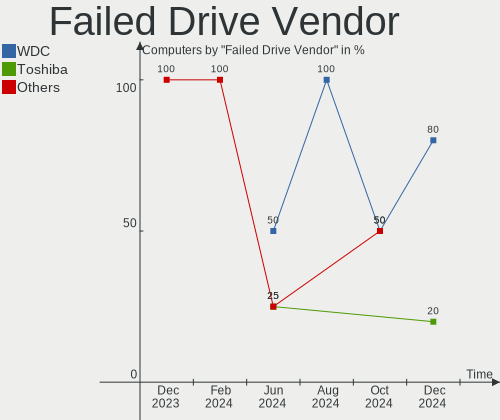
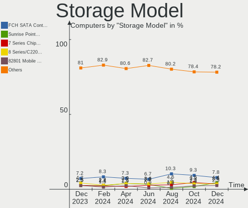
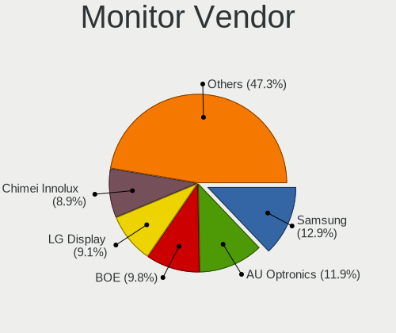
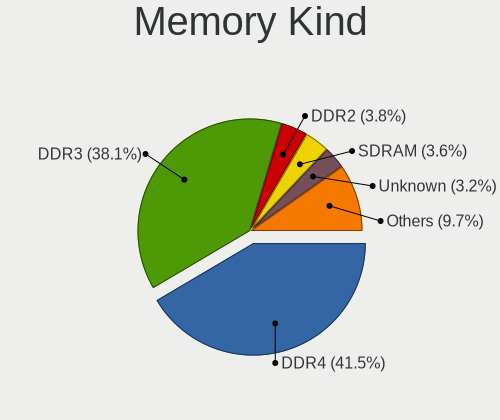

OpenMandriva Hardware Trends
----------------------------

A project to identify most popular hardware characteristics and track their change
over time based on data collected by OpenMandriva users at https://Linux-Hardware.org.

Anyone can contribute to this report by the [hw-probe](https://github.com/linuxhw/hw-probe) tool:

    sudo -E hw-probe -all -upload

This is a report for all computer types. See also reports for [desktops](/Dist/OpenMandriva/Desktop/README.md) and [notebooks](/Dist/OpenMandriva/Notebook/README.md).

Full-feature report is available here: https://linux-hardware.org/?view=trends

Period: Aug, 2021.

Contents
--------

* [ System ](#system)
  - [ OS                       ](#os)
  - [ OS Family                ](#os-family)
  - [ Kernel                   ](#kernel)
  - [ Kernel Family            ](#kernel-family)
  - [ Kernel Major Ver.        ](#kernel-major-ver)
  - [ Arch                     ](#arch)
  - [ DE                       ](#de)
  - [ Display Server           ](#display-server)
  - [ Display Manager          ](#display-manager)
  - [ OS Lang                  ](#os-lang)
  - [ Boot Mode                ](#boot-mode)
  - [ Filesystem               ](#filesystem)
  - [ Part. scheme             ](#part-scheme)
  - [ Dual Boot with Linux/BSD ](#dual-boot-with-linuxbsd)
  - [ Dual Boot (Win)          ](#dual-boot-win)

* [ Board ](#board)
  - [ Vendor                   ](#vendor)
  - [ Model                    ](#model)
  - [ Model Family             ](#model-family)
  - [ MFG Year                 ](#mfg-year)
  - [ Form Factor              ](#form-factor)
  - [ Secure Boot              ](#secure-boot)
  - [ Coreboot                 ](#coreboot)
  - [ RAM Size                 ](#ram-size)
  - [ RAM Used                 ](#ram-used)
  - [ Total Drives             ](#total-drives)
  - [ Has CD-ROM               ](#has-cd-rom)
  - [ Has Ethernet             ](#has-ethernet)
  - [ Has WiFi                 ](#has-wifi)
  - [ Has Bluetooth            ](#has-bluetooth)

* [ Location ](#location)
  - [ Country                  ](#country)
  - [ City                     ](#city)

* [ Drives ](#drives)
  - [ Drive Vendor             ](#drive-vendor)
  - [ Drive Model              ](#drive-model)
  - [ HDD Vendor               ](#hdd-vendor)
  - [ SSD Vendor               ](#ssd-vendor)
  - [ Drive Kind               ](#drive-kind)
  - [ Drive Connector          ](#drive-connector)
  - [ Drive Size               ](#drive-size)
  - [ Space Total              ](#space-total)
  - [ Space Used               ](#space-used)
  - [ Malfunc. Drives          ](#malfunc-drives)
  - [ Malfunc. Drive Vendor    ](#malfunc-drive-vendor)
  - [ Malfunc. HDD Vendor      ](#malfunc-hdd-vendor)
  - [ Malfunc. Drive Kind      ](#malfunc-drive-kind)
  - [ Failed Drives            ](#failed-drives)
  - [ Failed Drive Vendor      ](#failed-drive-vendor)
  - [ Drive Status             ](#drive-status)

* [ Storage controller ](#storage-controller)
  - [ Storage Vendor           ](#storage-vendor)
  - [ Storage Model            ](#storage-model)
  - [ Storage Kind             ](#storage-kind)

* [ Processor ](#processor)
  - [ CPU Vendor               ](#cpu-vendor)
  - [ CPU Model                ](#cpu-model)
  - [ CPU Model Family         ](#cpu-model-family)
  - [ CPU Cores                ](#cpu-cores)
  - [ CPU Sockets              ](#cpu-sockets)
  - [ CPU Threads              ](#cpu-threads)
  - [ CPU Op-Modes             ](#cpu-op-modes)
  - [ CPU Microcode            ](#cpu-microcode)
  - [ CPU Microarch            ](#cpu-microarch)

* [ Graphics ](#graphics)
  - [ GPU Vendor               ](#gpu-vendor)
  - [ GPU Model                ](#gpu-model)
  - [ GPU Combo                ](#gpu-combo)
  - [ GPU Driver               ](#gpu-driver)
  - [ GPU Memory               ](#gpu-memory)

* [ Monitor ](#monitor)
  - [ Monitor Vendor           ](#monitor-vendor)
  - [ Monitor Model            ](#monitor-model)
  - [ Monitor Resolution       ](#monitor-resolution)
  - [ Monitor Diagonal         ](#monitor-diagonal)
  - [ Monitor Width            ](#monitor-width)
  - [ Aspect Ratio             ](#aspect-ratio)
  - [ Monitor Area             ](#monitor-area)
  - [ Pixel Density            ](#pixel-density)
  - [ Multiple Monitors        ](#multiple-monitors)

* [ Network ](#network)
  - [ Net Controller Vendor    ](#net-controller-vendor)
  - [ Net Controller Model     ](#net-controller-model)
  - [ Wireless Vendor          ](#wireless-vendor)
  - [ Wireless Model           ](#wireless-model)
  - [ Ethernet Vendor          ](#ethernet-vendor)
  - [ Ethernet Model           ](#ethernet-model)
  - [ Net Controller Kind      ](#net-controller-kind)
  - [ Used Controller          ](#used-controller)
  - [ NICs                     ](#nics)
  - [ IPv6                     ](#ipv6)

* [ Bluetooth ](#bluetooth)
  - [ Bluetooth Vendor         ](#bluetooth-vendor)
  - [ Bluetooth Model          ](#bluetooth-model)

* [ Sound ](#sound)
  - [ Sound Vendor             ](#sound-vendor)
  - [ Sound Model              ](#sound-model)

* [ Memory ](#memory)
  - [ Memory Vendor            ](#memory-vendor)
  - [ Memory Model             ](#memory-model)
  - [ Memory Kind              ](#memory-kind)
  - [ Memory Form Factor       ](#memory-form-factor)
  - [ Memory Size              ](#memory-size)
  - [ Memory Speed             ](#memory-speed)

* [ Printers & scanners ](#printers--scanners)
  - [ Printer Vendor           ](#printer-vendor)
  - [ Printer Model            ](#printer-model)
  - [ Scanner Vendor           ](#scanner-vendor)
  - [ Scanner Model            ](#scanner-model)

* [ Camera ](#camera)
  - [ Camera Vendor            ](#camera-vendor)
  - [ Camera Model             ](#camera-model)

* [ Security ](#security)
  - [ Fingerprint Vendor       ](#fingerprint-vendor)
  - [ Fingerprint Model        ](#fingerprint-model)
  - [ Chipcard Vendor          ](#chipcard-vendor)
  - [ Chipcard Model           ](#chipcard-model)

* [ Unsupported ](#unsupported)
  - [ Unsupported Devices      ](#unsupported-devices)
  - [ Unsupported Device Types ](#unsupported-device-types)

System
------

OS
--

Installed operating systems

| Name              | Computers | Percent |
|-------------------|-----------|---------|
| OpenMandriva 4.2  | 252       | 90%     |
| OpenMandriva 4.50 | 28        | 10%     |

OS Family
---------

OS without a version

| Name         | Computers | Percent |
|--------------|-----------|---------|
| OpenMandriva | 280       | 100%    |

Kernel
------

Version of the Linux kernel

| Version                       | Computers | Percent |
|-------------------------------|-----------|---------|
| 5.10.14-desktop-1omv4002      | 241       | 86.07%  |
| 5.12.4-desktop-1omv4050       | 25        | 8.93%   |
| 5.11.12-desktop-1omv4002      | 10        | 3.57%   |
| 5.12.7-desktop-1omv4003       | 2         | 0.71%   |
| 5.12.7-desktop-clang-1omv4003 | 1         | 0.36%   |
| Unknown                       | 1         | 0.36%   |

Kernel Family
-------------

Linux kernel without a distro release

| Version | Computers | Percent |
|---------|-----------|---------|
| 5.10.14 | 241       | 86.07%  |
| 5.12.4  | 25        | 8.93%   |
| 5.11.12 | 10        | 3.57%   |
| 5.12.7  | 3         | 1.07%   |
| Unknown | 1         | 0.36%   |

Kernel Major Ver.
-----------------

Linux kernel major version

| Version | Computers | Percent |
|---------|-----------|---------|
| 5.10    | 241       | 86.07%  |
| 5.12    | 28        | 10%     |
| 5.11    | 10        | 3.57%   |
| Unknown | 1         | 0.36%   |

Arch
----

OS architecture (x86_64, i586, etc.)

| Name    | Computers | Percent |
|---------|-----------|---------|
| x86_64  | 279       | 99.64%  |
| Unknown | 1         | 0.36%   |

DE
--

Desktop Environment

| Name     | Computers | Percent |
|----------|-----------|---------|
| KDE5     | 278       | 99.29%  |
| Cinnamon | 1         | 0.36%   |
| Unknown  | 1         | 0.36%   |

Display Server
--------------

X11 or Wayland

| Name    | Computers | Percent |
|---------|-----------|---------|
| X11     | 279       | 99.64%  |
| Wayland | 1         | 0.36%   |

Display Manager
---------------

SDDM, LightDM, etc.

| Name    | Computers | Percent |
|---------|-----------|---------|
| SDDM    | 279       | 99.64%  |
| Unknown | 1         | 0.36%   |

OS Lang
-------

Language

| Lang    | Computers | Percent |
|---------|-----------|---------|
| en_US   | 151       | 53.93%  |
| ru_RU   | 22        | 7.86%   |
| de_DE   | 19        | 6.79%   |
| cs_CZ   | 17        | 6.07%   |
| fr_FR   | 13        | 4.64%   |
| es_ES   | 10        | 3.57%   |
| it_IT   | 9         | 3.21%   |
| pt_BR   | 8         | 2.86%   |
| pl_PL   | 8         | 2.86%   |
| es_AR   | 5         | 1.79%   |
| hu_HU   | 4         | 1.43%   |
| en_GB   | 3         | 1.07%   |
| en_ZA   | 2         | 0.71%   |
| it_CH   | 1         | 0.36%   |
| fr_CH   | 1         | 0.36%   |
| fr_CA   | 1         | 0.36%   |
| fr_BE   | 1         | 0.36%   |
| es_SV   | 1         | 0.36%   |
| es_PE   | 1         | 0.36%   |
| es_EC   | 1         | 0.36%   |
| ar_EG   | 1         | 0.36%   |
| Unknown | 1         | 0.36%   |

Boot Mode
---------

EFI or BIOS

| Mode | Computers | Percent |
|------|-----------|---------|
| BIOS | 178       | 63.57%  |
| EFI  | 102       | 36.43%  |

Filesystem
----------

Type of filesystem

| Type    | Computers | Percent |
|---------|-----------|---------|
| Overlay | 236       | 84.29%  |
| Ext4    | 38        | 13.57%  |
| Btrfs   | 4         | 1.43%   |
| Ext3    | 1         | 0.36%   |
| Unknown | 1         | 0.36%   |

Part. scheme
------------

Scheme of partitioning

| Type    | Computers | Percent |
|---------|-----------|---------|
| GPT     | 150       | 53.57%  |
| MBR     | 129       | 46.07%  |
| Unknown | 1         | 0.36%   |

Dual Boot with Linux/BSD
------------------------

Hosting more than one Linux/BSD

| Dual boot | Computers | Percent |
|-----------|-----------|---------|
| No        | 144       | 51.43%  |
| Yes       | 136       | 48.57%  |

Dual Boot (Win)
---------------

Hosting Linux and Windows

| Dual boot | Computers | Percent |
|-----------|-----------|---------|
| Yes       | 144       | 51.43%  |
| No        | 136       | 48.57%  |

Board
-----

Vendor
------

Motherboard manufacturer

| Name                | Computers | Percent |
|---------------------|-----------|---------|
| ASUSTek Computer    | 59        | 21.07%  |
| Lenovo              | 30        | 10.71%  |
| Hewlett-Packard     | 29        | 10.36%  |
| Gigabyte Technology | 29        | 10.36%  |
| Dell                | 29        | 10.36%  |
| Acer                | 21        | 7.5%    |
| MSI                 | 14        | 5%      |
| ASRock              | 12        | 4.29%   |
| Toshiba             | 8         | 2.86%   |
| Sony                | 5         | 1.79%   |
| Samsung Electronics | 5         | 1.79%   |
| Intel               | 4         | 1.43%   |
| Apple               | 4         | 1.43%   |
| Medion              | 3         | 1.07%   |
| Fujitsu             | 3         | 1.07%   |
| Foxconn             | 3         | 1.07%   |
| Positivo            | 2         | 0.71%   |
| eMachines           | 2         | 0.71%   |
| Unknown             | 2         | 0.71%   |
| ZoomSmart           | 1         | 0.36%   |
| Supermicro          | 1         | 0.36%   |
| Philco              | 1         | 0.36%   |
| PCWare              | 1         | 0.36%   |
| Packard Bell        | 1         | 0.36%   |
| Megaware            | 1         | 0.36%   |
| Itautec             | 1         | 0.36%   |
| HUAWEI              | 1         | 0.36%   |
| GEO                 | 1         | 0.36%   |
| ECS                 | 1         | 0.36%   |
| Chuwi               | 1         | 0.36%   |
| Biostar             | 1         | 0.36%   |
| BANGHO              | 1         | 0.36%   |
| AWOW                | 1         | 0.36%   |
| AVITA               | 1         | 0.36%   |
| ABIT                | 1         | 0.36%   |

Model
-----

Motherboard model

| Name                                | Computers | Percent |
|-------------------------------------|-----------|---------|
| ASUS UX31E                          | 16        | 5.71%   |
| ASUS All Series                     | 4         | 1.43%   |
| HP Notebook                         | 3         | 1.07%   |
| Dell OptiPlex 780                   | 3         | 1.07%   |
| Dell Latitude E6410                 | 3         | 1.07%   |
| Unknown                             | 3         | 1.07%   |
| Lenovo IdeaPad 330-15IKB 81DE       | 2         | 0.71%   |
| HP Pavilion g6                      | 2         | 0.71%   |
| Gigabyte B450M DS3H                 | 2         | 0.71%   |
| Dell OptiPlex 7010                  | 2         | 0.71%   |
| ASUS X555QA                         | 2         | 0.71%   |
| ASUS A_F_K31DA_K31DAG_K20DA         | 2         | 0.71%   |
| Acer Extensa 5620                   | 2         | 0.71%   |
| Acer Aspire XC-603G                 | 2         | 0.71%   |
| ZoomSmart A1002                     | 1         | 0.36%   |
| Toshiba Satellite Pro L300          | 1         | 0.36%   |
| Toshiba Satellite P200              | 1         | 0.36%   |
| Toshiba Satellite L750              | 1         | 0.36%   |
| Toshiba Satellite L675D             | 1         | 0.36%   |
| Toshiba Satellite L300              | 1         | 0.36%   |
| Toshiba Satellite A300              | 1         | 0.36%   |
| Toshiba Satellite A200              | 1         | 0.36%   |
| Toshiba 4810350                     | 1         | 0.36%   |
| Supermicro C7Z170-M                 | 1         | 0.36%   |
| Sony VPCEB43FG                      | 1         | 0.36%   |
| Sony VPCEB15FB                      | 1         | 0.36%   |
| Sony VPCCW2S8E                      | 1         | 0.36%   |
| Sony VGX-TP20E                      | 1         | 0.36%   |
| Sony VGN-FW235J                     | 1         | 0.36%   |
| Samsung SBBA                        | 1         | 0.36%   |
| Samsung R59P/R60P/R61P              | 1         | 0.36%   |
| Samsung R530/R730                   | 1         | 0.36%   |
| Samsung 905S3G/906S3G/915S3G/9305SG | 1         | 0.36%   |
| Samsung 300E4C/300E5C/300E7C        | 1         | 0.36%   |
| Positivo POS-PIQ77CL                | 1         | 0.36%   |
| Philco 14L                          | 1         | 0.36%   |
| PCWare APM-A320G                    | 1         | 0.36%   |
| Packard Bell EasyNote TK85          | 1         | 0.36%   |
| MSI VR601                           | 1         | 0.36%   |
| MSI MS-7C52                         | 1         | 0.36%   |
| MSI MS-7C02                         | 1         | 0.36%   |
| MSI MS-7B90                         | 1         | 0.36%   |
| MSI MS-7895                         | 1         | 0.36%   |
| MSI MS-7793                         | 1         | 0.36%   |
| MSI MS-7721                         | 1         | 0.36%   |
| MSI MS-7641                         | 1         | 0.36%   |
| MSI GT60 2OC/2OD                    | 1         | 0.36%   |
| MSI GP63 Leopard 8RE                | 1         | 0.36%   |
| MSI GL75 Leopard 10SCSR             | 1         | 0.36%   |
| MSI GF65 Thin 9SE                   | 1         | 0.36%   |
| MSI CR610M                          | 1         | 0.36%   |
| MSI 500-222el                       | 1         | 0.36%   |
| Megaware OEM                        | 1         | 0.36%   |
| Medion MS-7800                      | 1         | 0.36%   |
| Medion MD34472/C971                 | 1         | 0.36%   |
| Medion E2292                        | 1         | 0.36%   |
| Lenovo Zhaoyang E49L 20178          | 1         | 0.36%   |
| Lenovo Z50-75 80EC                  | 1         | 0.36%   |
| Lenovo Yoga 520-14IKB 81C8          | 1         | 0.36%   |
| Lenovo Y50-70 20378                 | 1         | 0.36%   |

Model Family
------------

Motherboard model prefix

| Name                  | Computers | Percent |
|-----------------------|-----------|---------|
| ASUS UX31E            | 16        | 5.71%   |
| Acer Aspire           | 16        | 5.71%   |
| Lenovo IdeaPad        | 11        | 3.93%   |
| Dell OptiPlex         | 9         | 3.21%   |
| Dell Inspiron         | 9         | 3.21%   |
| Toshiba Satellite     | 7         | 2.5%    |
| Dell Latitude         | 7         | 2.5%    |
| HP Pavilion           | 6         | 2.14%   |
| HP Compaq             | 6         | 2.14%   |
| Lenovo ThinkPad       | 5         | 1.79%   |
| HP Laptop             | 4         | 1.43%   |
| ASUS All              | 4         | 1.43%   |
| Lenovo ThinkCentre    | 3         | 1.07%   |
| HP ProBook            | 3         | 1.07%   |
| HP Notebook           | 3         | 1.07%   |
| ASUS PRIME            | 3         | 1.07%   |
| ASUS P8Z77-V          | 3         | 1.07%   |
| ASUS M5A78L-M         | 3         | 1.07%   |
| Acer Extensa          | 3         | 1.07%   |
| Unknown               | 3         | 1.07%   |
| HP EliteDesk          | 2         | 0.71%   |
| Gigabyte B450M        | 2         | 0.71%   |
| Fujitsu ESPRIMO       | 2         | 0.71%   |
| ASUS X555QA           | 2         | 0.71%   |
| ASUS ROG              | 2         | 0.71%   |
| ASUS A                | 2         | 0.71%   |
| ZoomSmart A1002       | 1         | 0.36%   |
| Toshiba 4810350       | 1         | 0.36%   |
| Supermicro C7Z170-M   | 1         | 0.36%   |
| Sony VPCEB43FG        | 1         | 0.36%   |
| Sony VPCEB15FB        | 1         | 0.36%   |
| Sony VPCCW2S8E        | 1         | 0.36%   |
| Sony VGX-TP20E        | 1         | 0.36%   |
| Sony VGN-FW235J       | 1         | 0.36%   |
| Samsung SBBA          | 1         | 0.36%   |
| Samsung R59P          | 1         | 0.36%   |
| Samsung R530          | 1         | 0.36%   |
| Samsung 905S3G        | 1         | 0.36%   |
| Samsung 300E4C        | 1         | 0.36%   |
| Positivo POS-PIQ77CL  | 1         | 0.36%   |
| Philco 14L            | 1         | 0.36%   |
| PCWare APM-A320G      | 1         | 0.36%   |
| Packard Bell EasyNote | 1         | 0.36%   |
| MSI VR601             | 1         | 0.36%   |
| MSI MS-7C52           | 1         | 0.36%   |
| MSI MS-7C02           | 1         | 0.36%   |
| MSI MS-7B90           | 1         | 0.36%   |
| MSI MS-7895           | 1         | 0.36%   |
| MSI MS-7793           | 1         | 0.36%   |
| MSI MS-7721           | 1         | 0.36%   |
| MSI MS-7641           | 1         | 0.36%   |
| MSI GT60              | 1         | 0.36%   |
| MSI GP63              | 1         | 0.36%   |
| MSI GL75              | 1         | 0.36%   |
| MSI GF65              | 1         | 0.36%   |
| MSI CR610M            | 1         | 0.36%   |
| MSI 500-222el         | 1         | 0.36%   |
| Megaware OEM          | 1         | 0.36%   |
| Medion MS-7800        | 1         | 0.36%   |
| Medion MD34472        | 1         | 0.36%   |

MFG Year
--------

Motherboard manufacture year

| Year | Computers | Percent |
|------|-----------|---------|
| 2012 | 39        | 13.93%  |
| 2020 | 25        | 8.93%   |
| 2013 | 24        | 8.57%   |
| 2018 | 21        | 7.5%    |
| 2014 | 21        | 7.5%    |
| 2019 | 20        | 7.14%   |
| 2010 | 20        | 7.14%   |
| 2015 | 19        | 6.79%   |
| 2008 | 18        | 6.43%   |
| 2011 | 16        | 5.71%   |
| 2016 | 14        | 5%      |
| 2021 | 13        | 4.64%   |
| 2017 | 12        | 4.29%   |
| 2009 | 8         | 2.86%   |
| 2007 | 7         | 2.5%    |
| 2005 | 2         | 0.71%   |
| 2006 | 1         | 0.36%   |

Form Factor
-----------

Physical design of the computer

| Name        | Computers | Percent |
|-------------|-----------|---------|
| Notebook    | 135       | 48.21%  |
| Desktop     | 133       | 47.5%   |
| Mini pc     | 4         | 1.43%   |
| All in one  | 3         | 1.07%   |
| Tablet      | 2         | 0.71%   |
| Convertible | 2         | 0.71%   |
| Server      | 1         | 0.36%   |

Secure Boot
-----------

Enabled or disabled

| State    | Computers | Percent |
|----------|-----------|---------|
| Disabled | 280       | 100%    |

Coreboot
--------

Have coreboot on board

| Used | Computers | Percent |
|------|-----------|---------|
| No   | 280       | 100%    |

RAM Size
--------

Total RAM memory

| Size in GB  | Computers | Percent |
|-------------|-----------|---------|
| 3.01-4.0    | 103       | 36.79%  |
| 4.01-8.0    | 62        | 22.14%  |
| 8.01-16.0   | 51        | 18.21%  |
| 16.01-24.0  | 34        | 12.14%  |
| 1.01-2.0    | 17        | 6.07%   |
| 32.01-64.0  | 5         | 1.79%   |
| 24.01-32.0  | 3         | 1.07%   |
| 2.01-3.0    | 2         | 0.71%   |
| 64.01-256.0 | 2         | 0.71%   |
| Unknown     | 1         | 0.36%   |

RAM Used
--------

Used RAM memory

| Used GB  | Computers | Percent |
|----------|-----------|---------|
| 1.01-2.0 | 207       | 73.93%  |
| 0.51-1.0 | 39        | 13.93%  |
| 2.01-3.0 | 23        | 8.21%   |
| 0.01-0.5 | 10        | 3.57%   |
| Unknown  | 1         | 0.36%   |

Total Drives
------------

Number of drives on board

| Drives | Computers | Percent |
|--------|-----------|---------|
| 1      | 184       | 65.71%  |
| 2      | 63        | 22.5%   |
| 3      | 18        | 6.43%   |
| 4      | 5         | 1.79%   |
| 0      | 4         | 1.43%   |
| 7      | 3         | 1.07%   |
| 5      | 2         | 0.71%   |
| 6      | 1         | 0.36%   |

Has CD-ROM
----------

Has CD-ROM on board

| Presented | Computers | Percent |
|-----------|-----------|---------|
| Yes       | 164       | 58.57%  |
| No        | 116       | 41.43%  |

Has Ethernet
------------

Has Ethernet on board

| Presented | Computers | Percent |
|-----------|-----------|---------|
| Yes       | 266       | 95%     |
| No        | 14        | 5%      |

Has WiFi
--------

Has WiFi module

| Presented | Computers | Percent |
|-----------|-----------|---------|
| Yes       | 184       | 65.71%  |
| No        | 96        | 34.29%  |

Has Bluetooth
-------------

Has Bluetooth module

| Presented | Computers | Percent |
|-----------|-----------|---------|
| No        | 160       | 57.14%  |
| Yes       | 120       | 42.86%  |

Location
--------

Country
-------

Geographic location (country)

| Country      | Computers | Percent |
|--------------|-----------|---------|
| USA          | 35        | 12.5%   |
| Russia       | 26        | 9.29%   |
| Germany      | 23        | 8.21%   |
| France       | 19        | 6.79%   |
| Czechia      | 19        | 6.79%   |
| Brazil       | 17        | 6.07%   |
| Spain        | 14        | 5%      |
| Poland       | 13        | 4.64%   |
| Italy        | 13        | 4.64%   |
| Argentina    | 8         | 2.86%   |
| UK           | 7         | 2.5%    |
| Mexico       | 7         | 2.5%    |
| Canada       | 7         | 2.5%    |
| Hungary      | 6         | 2.14%   |
| Ukraine      | 5         | 1.79%   |
| China        | 4         | 1.43%   |
| Belarus      | 4         | 1.43%   |
| Sweden       | 3         | 1.07%   |
| Latvia       | 3         | 1.07%   |
| Greece       | 3         | 1.07%   |
| Egypt        | 3         | 1.07%   |
| Belgium      | 3         | 1.07%   |
| Australia    | 3         | 1.07%   |
| South Africa | 2         | 0.71%   |
| Saudi Arabia | 2         | 0.71%   |
| Peru         | 2         | 0.71%   |
| Netherlands  | 2         | 0.71%   |
| Morocco      | 2         | 0.71%   |
| Indonesia    | 2         | 0.71%   |
| Bulgaria     | 2         | 0.71%   |
| Bangladesh   | 2         | 0.71%   |
| Algeria      | 2         | 0.71%   |
| Taiwan       | 1         | 0.36%   |
| Switzerland  | 1         | 0.36%   |
| Serbia       | 1         | 0.36%   |
| Romania      | 1         | 0.36%   |
| Portugal     | 1         | 0.36%   |
| Norway       | 1         | 0.36%   |
| New Zealand  | 1         | 0.36%   |
| Malaysia     | 1         | 0.36%   |
| Lithuania    | 1         | 0.36%   |
| Ireland      | 1         | 0.36%   |
| India        | 1         | 0.36%   |
| Guatemala    | 1         | 0.36%   |
| Estonia      | 1         | 0.36%   |
| El Salvador  | 1         | 0.36%   |
| Ecuador      | 1         | 0.36%   |
| Chile        | 1         | 0.36%   |
| Austria      | 1         | 0.36%   |

City
----

Geographic location (city)

| City                 | Computers | Percent |
|----------------------|-----------|---------|
| Prague               | 14        | 5%      |
| Moscow               | 5         | 1.79%   |
| St Petersburg        | 4         | 1.43%   |
| S??o Paulo           | 4         | 1.43%   |
| Brno                 | 4         | 1.43%   |
| Riga                 | 3         | 1.07%   |
| Milan                | 3         | 1.07%   |
| Barcelona            | 3         | 1.07%   |
| Warsaw               | 2         | 0.71%   |
| Voronezh             | 2         | 0.71%   |
| Volgograd            | 2         | 0.71%   |
| Sapulpa              | 2         | 0.71%   |
| Porto Alegre         | 2         | 0.71%   |
| Paris                | 2         | 0.71%   |
| Omsk                 | 2         | 0.71%   |
| Novorossiysk         | 2         | 0.71%   |
| Mogilev              | 2         | 0.71%   |
| Lima                 | 2         | 0.71%   |
| Hamburg              | 2         | 0.71%   |
| Ciudad del Carmen    | 2         | 0.71%   |
| Chittagong           | 2         | 0.71%   |
| Casablanca           | 2         | 0.71%   |
| Aswan                | 2         | 0.71%   |
| Zirndorf             | 1         | 0.36%   |
| York                 | 1         | 0.36%   |
| Yaroslavl            | 1         | 0.36%   |
| Xiamen               | 1         | 0.36%   |
| Wiesbaden            | 1         | 0.36%   |
| White River Junction | 1         | 0.36%   |
| West Hoxton          | 1         | 0.36%   |
| Wendelstein          | 1         | 0.36%   |
| W??rzburg            | 1         | 0.36%   |
| Wassigny             | 1         | 0.36%   |
| Walla Walla          | 1         | 0.36%   |
| Waimea               | 1         | 0.36%   |
| Wa?‚brzych           | 1         | 0.36%   |
| Vinnytsia            | 1         | 0.36%   |
| Veszpr?©m            | 1         | 0.36%   |
| Verbicaro            | 1         | 0.36%   |
| Valparaiso de Goias  | 1         | 0.36%   |
| Valladolid           | 1         | 0.36%   |
| Vall d'Alba          | 1         | 0.36%   |
| Tymoshivka           | 1         | 0.36%   |
| Tuam                 | 1         | 0.36%   |
| Thionville           | 1         | 0.36%   |
| Thessaloniki         | 1         | 0.36%   |
| Teckomatorp          | 1         | 0.36%   |
| Tatu?­               | 1         | 0.36%   |
| Tampa                | 1         | 0.36%   |
| Tafi Viejo           | 1         | 0.36%   |
| Szeksz??rd           | 1         | 0.36%   |
| Surbourg             | 1         | 0.36%   |
| Stuttgart            | 1         | 0.36%   |
| Stara Zagora         | 1         | 0.36%   |
| Springfield          | 1         | 0.36%   |
| Springdale           | 1         | 0.36%   |
| Sosnowiec            | 1         | 0.36%   |
| Solingen             | 1         | 0.36%   |
| Seppois-le-Bas       | 1         | 0.36%   |
| Sao Jose do Goiabal  | 1         | 0.36%   |

Drives
------

Drive Vendor
------------

Hard drive vendors

| Vendor              | Computers | Drives | Percent |
|---------------------|-----------|--------|---------|
| WDC                 | 74        | 85     | 20.16%  |
| Seagate             | 67        | 82     | 18.26%  |
| Toshiba             | 33        | 35     | 8.99%   |
| Samsung Electronics | 33        | 39     | 8.99%   |
| SanDisk             | 30        | 30     | 8.17%   |
| Kingston            | 23        | 25     | 6.27%   |
| Hitachi             | 22        | 24     | 5.99%   |
| Unknown             | 11        | 11     | 3%      |
| A-DATA Technology   | 7         | 7      | 1.91%   |
| Crucial             | 6         | 6      | 1.63%   |
| HGST                | 5         | 5      | 1.36%   |
| China               | 4         | 4      | 1.09%   |
| OCZ                 | 3         | 3      | 0.82%   |
| JMicron             | 3         | 3      | 0.82%   |
| Intel               | 3         | 3      | 0.82%   |
| Fujitsu             | 3         | 3      | 0.82%   |
| Apple               | 3         | 4      | 0.82%   |
| Apacer              | 3         | 3      | 0.82%   |
| Team                | 2         | 2      | 0.54%   |
| SPCC                | 2         | 2      | 0.54%   |
| SK Hynix            | 2         | 2      | 0.54%   |
| PNY                 | 2         | 2      | 0.54%   |
| KingSpec            | 2         | 2      | 0.54%   |
| Zheino              | 1         | 1      | 0.27%   |
| XrayDisk            | 1         | 1      | 0.27%   |
| Verbatim            | 1         | 1      | 0.27%   |
| Union Memory        | 1         | 1      | 0.27%   |
| TPH00800640GB       | 1         | 1      | 0.27%   |
| Teclast             | 1         | 1      | 0.27%   |
| Silicon Motion      | 1         | 1      | 0.27%   |
| Phison              | 1         | 1      | 0.27%   |
| Patriot             | 1         | 1      | 0.27%   |
| Morebeck-N100       | 1         | 1      | 0.27%   |
| Micron Technology   | 1         | 1      | 0.27%   |
| Maxtor              | 1         | 1      | 0.27%   |
| LITEONIT            | 1         | 1      | 0.27%   |
| Leven               | 1         | 1      | 0.27%   |
| LenovoSPEED         | 1         | 1      | 0.27%   |
| LDLC                | 1         | 1      | 0.27%   |
| KIOXIA              | 1         | 1      | 0.27%   |
| Kingmax             | 1         | 1      | 0.27%   |
| KingDian            | 1         | 2      | 0.27%   |
| Intenso             | 1         | 1      | 0.27%   |
| INNOVATION IT       | 1         | 1      | 0.27%   |
| Hewlett-Packard     | 1         | 1      | 0.27%   |
| GOODRAM             | 1         | 1      | 0.27%   |
| AMD                 | 1         | 1      | 0.27%   |

Drive Model
-----------

Hard drive models

| Model                            | Computers | Percent |
|----------------------------------|-----------|---------|
| SanDisk SSD U100 256GB           | 16        | 4.03%   |
| Kingston SA400S37240G 240GB SSD  | 7         | 1.76%   |
| Seagate ST500DM002-1BD142 500GB  | 5         | 1.26%   |
| Seagate ST1000DM010-2EP102 1TB   | 5         | 1.26%   |
| Toshiba MQ01ABD100 1TB           | 4         | 1.01%   |
| Toshiba DT01ACA050 500GB         | 4         | 1.01%   |
| WDC WDS240G2G0A-00JH30 240GB SSD | 3         | 0.76%   |
| WDC WD10JPVX-22JC3T0 1TB         | 3         | 0.76%   |
| Unknown SD/MMC/MS PRO 128GB      | 3         | 0.76%   |
| Toshiba DT01ACA200 2TB           | 3         | 0.76%   |
| Toshiba DT01ACA100 1TB           | 3         | 0.76%   |
| Seagate ST1000LM048-2E7172 1TB   | 3         | 0.76%   |
| Samsung SSD 850 EVO 250GB        | 3         | 0.76%   |
| Samsung HD103UJ 1TB              | 3         | 0.76%   |
| Kingston SA400S37480G 480GB SSD  | 3         | 0.76%   |
| WDC WDS120G2G0A-00JH30 120GB SSD | 2         | 0.5%    |
| WDC WD10SPZX-24Z10 1TB           | 2         | 0.5%    |
| WDC WD10EZEX-21M2NA0 1TB         | 2         | 0.5%    |
| Toshiba MQ01ABF050 500GB         | 2         | 0.5%    |
| Seagate ST9500325AS 500GB        | 2         | 0.5%    |
| Seagate ST500LT012-9WS142 500GB  | 2         | 0.5%    |
| Seagate ST500LT012-1DG142 500GB  | 2         | 0.5%    |
| Seagate ST500LM021-1KJ152 500GB  | 2         | 0.5%    |
| Seagate ST3250318AS 250GB        | 2         | 0.5%    |
| Seagate ST31000528AS 1TB         | 2         | 0.5%    |
| Seagate ST3000DM001-1ER166 3TB   | 2         | 0.5%    |
| Seagate ST2000DM008-2FR102 2TB   | 2         | 0.5%    |
| Seagate ST2000DM001-1CH164 2TB   | 2         | 0.5%    |
| Seagate ST1000DM003-1SB102 1TB   | 2         | 0.5%    |
| SanDisk SSD PLUS 240GB           | 2         | 0.5%    |
| Samsung SSD 870 QVO 1TB          | 2         | 0.5%    |
| Samsung SSD 870 EVO 500GB        | 2         | 0.5%    |
| Samsung HD502HJ 500GB            | 2         | 0.5%    |
| Samsung HD154UI 1TB              | 2         | 0.5%    |
| Kingston SV300S37A120G 120GB SSD | 2         | 0.5%    |
| Kingston SA400S37120G 120GB SSD  | 2         | 0.5%    |
| Kingston SA2000M8250G 250GB      | 2         | 0.5%    |
| JMicron Generic 2TB              | 2         | 0.5%    |
| Hitachi HTS547550A9E384 500GB    | 2         | 0.5%    |
| Hitachi HTS545025B9A300 250GB    | 2         | 0.5%    |
| Hitachi HDS721050DLE630 500GB    | 2         | 0.5%    |
| HGST HTS721010A9E630 1TB         | 2         | 0.5%    |
| Crucial CT240BX500SSD1 240GB     | 2         | 0.5%    |
| A-DATA SU650 120GB SSD           | 2         | 0.5%    |
| Zheino CHN-mSATAQ3-480 480GB SSD | 1         | 0.25%   |
| XrayDisk SSD 128GB               | 1         | 0.25%   |
| WDC WDS500G2B0A-00SM50 500GB SSD | 1         | 0.25%   |
| WDC WDS500G2B0A 500GB SSD        | 1         | 0.25%   |
| WDC WDS250G1B0A-00H9H0 250GB SSD | 1         | 0.25%   |
| WDC WDS120G2G0B-00EPW0 120GB SSD | 1         | 0.25%   |
| WDC WDS100T2B0C-00PXH0 1TB       | 1         | 0.25%   |
| WDC WDS100T2B0B-00YS70 1TB SSD   | 1         | 0.25%   |
| WDC WDS100T2B0A-00SM50 1TB SSD   | 1         | 0.25%   |
| WDC WDBRPG5000ANC-WRSN 500GB     | 1         | 0.25%   |
| WDC WDBNCE5000PNC 500GB SSD      | 1         | 0.25%   |
| WDC WD800BB-75JHC0 80GB          | 1         | 0.25%   |
| WDC WD6401AALS-00E8B0 640GB      | 1         | 0.25%   |
| WDC WD6400BEVT-22A0RT0 640GB     | 1         | 0.25%   |
| WDC WD6400AAKS-65Z7B0 640GB      | 1         | 0.25%   |
| WDC WD60EFAX-68SHWN0 6TB         | 1         | 0.25%   |

HDD Vendor
----------

Hard disk drive vendors

| Vendor              | Computers | Drives | Percent |
|---------------------|-----------|--------|---------|
| Seagate             | 67        | 82     | 32.84%  |
| WDC                 | 58        | 65     | 28.43%  |
| Toshiba             | 32        | 34     | 15.69%  |
| Hitachi             | 22        | 24     | 10.78%  |
| Samsung Electronics | 11        | 14     | 5.39%   |
| HGST                | 5         | 5      | 2.45%   |
| Fujitsu             | 3         | 3      | 1.47%   |
| Apple               | 3         | 3      | 1.47%   |
| TPH00800640GB       | 1         | 1      | 0.49%   |
| Maxtor              | 1         | 1      | 0.49%   |
| Hewlett-Packard     | 1         | 1      | 0.49%   |

SSD Vendor
----------

Solid state drive vendors

| Vendor              | Computers | Drives | Percent |
|---------------------|-----------|--------|---------|
| SanDisk             | 30        | 30     | 23.62%  |
| Kingston            | 20        | 22     | 15.75%  |
| Samsung Electronics | 15        | 17     | 11.81%  |
| WDC                 | 10        | 12     | 7.87%   |
| A-DATA Technology   | 6         | 6      | 4.72%   |
| Crucial             | 4         | 4      | 3.15%   |
| China               | 4         | 4      | 3.15%   |
| OCZ                 | 3         | 3      | 2.36%   |
| Intel               | 3         | 3      | 2.36%   |
| Apacer              | 3         | 3      | 2.36%   |
| Unknown             | 2         | 2      | 1.57%   |
| Team                | 2         | 2      | 1.57%   |
| SPCC                | 2         | 2      | 1.57%   |
| PNY                 | 2         | 2      | 1.57%   |
| KingSpec            | 2         | 2      | 1.57%   |
| JMicron             | 2         | 2      | 1.57%   |
| Zheino              | 1         | 1      | 0.79%   |
| XrayDisk            | 1         | 1      | 0.79%   |
| Verbatim            | 1         | 1      | 0.79%   |
| Teclast             | 1         | 1      | 0.79%   |
| SK Hynix            | 1         | 1      | 0.79%   |
| Morebeck-N100       | 1         | 1      | 0.79%   |
| Micron Technology   | 1         | 1      | 0.79%   |
| LITEONIT            | 1         | 1      | 0.79%   |
| Leven               | 1         | 1      | 0.79%   |
| LenovoSPEED         | 1         | 1      | 0.79%   |
| LDLC                | 1         | 1      | 0.79%   |
| Kingmax             | 1         | 1      | 0.79%   |
| KingDian            | 1         | 2      | 0.79%   |
| Intenso             | 1         | 1      | 0.79%   |
| INNOVATION IT       | 1         | 1      | 0.79%   |
| GOODRAM             | 1         | 1      | 0.79%   |
| AMD                 | 1         | 1      | 0.79%   |

Drive Kind
----------

HDD or SSD

| Kind    | Computers | Drives | Percent |
|---------|-----------|--------|---------|
| HDD     | 186       | 233    | 54.87%  |
| SSD     | 115       | 134    | 33.92%  |
| NVMe    | 28        | 30     | 8.26%   |
| MMC     | 6         | 6      | 1.77%   |
| Unknown | 4         | 4      | 1.18%   |

Drive Connector
---------------

SATA, SAS, NVMe, etc.

| Type | Computers | Drives | Percent |
|------|-----------|--------|---------|
| SATA | 255       | 359    | 85.57%  |
| NVMe | 28        | 30     | 9.4%    |
| SAS  | 9         | 12     | 3.02%   |
| MMC  | 6         | 6      | 2.01%   |

Drive Size
----------

Size of hard drive

| Size in TB | Computers | Drives | Percent |
|------------|-----------|--------|---------|
| 0.01-0.5   | 208       | 253    | 68.2%   |
| 0.51-1.0   | 69        | 82     | 22.62%  |
| 1.01-2.0   | 19        | 22     | 6.23%   |
| 3.01-4.0   | 4         | 5      | 1.31%   |
| 2.01-3.0   | 3         | 3      | 0.98%   |
| 4.01-10.0  | 2         | 2      | 0.66%   |

Space Total
-----------

Amount of disk space available on the file system

| Size in GB     | Computers | Percent |
|----------------|-----------|---------|
| 1-20           | 151       | 53.93%  |
| 101-250        | 36        | 12.86%  |
| Unknown        | 36        | 12.86%  |
| 251-500        | 22        | 7.86%   |
| 21-50          | 13        | 4.64%   |
| 51-100         | 10        | 3.57%   |
| 501-1000       | 8         | 2.86%   |
| More than 3000 | 2         | 0.71%   |
| 2001-3000      | 1         | 0.36%   |
| 1001-2000      | 1         | 0.36%   |

Space Used
----------

Amount of used disk space

| Used GB  | Computers | Percent |
|----------|-----------|---------|
| 1-20     | 227       | 81.07%  |
| Unknown  | 36        | 12.86%  |
| 101-250  | 7         | 2.5%    |
| 21-50    | 4         | 1.43%   |
| 251-500  | 3         | 1.07%   |
| 51-100   | 2         | 0.71%   |
| 501-1000 | 1         | 0.36%   |

Malfunc. Drives
---------------

Drive models with a malfunction

| Model                                            | Computers | Drives | Percent |
|--------------------------------------------------|-----------|--------|---------|
| SanDisk SSD U100 256GB                           | 16        | 16     | 16.67%  |
| Seagate ST500DM002-1BD142 500GB                  | 3         | 3      | 3.13%   |
| Toshiba MQ01ABD100 1TB                           | 2         | 2      | 2.08%   |
| Seagate ST9500325AS 500GB                        | 2         | 2      | 2.08%   |
| Seagate ST500LT012-9WS142 500GB                  | 2         | 2      | 2.08%   |
| Seagate ST500LT012-1DG142 500GB                  | 2         | 2      | 2.08%   |
| Seagate ST500LM021-1KJ152 500GB                  | 2         | 2      | 2.08%   |
| Samsung Electronics HD103UJ 1TB                  | 2         | 2      | 2.08%   |
| Hitachi HDS721050DLE630 500GB                    | 2         | 2      | 2.08%   |
| WDC WD800BB-75JHC0 80GB                          | 1         | 1      | 1.04%   |
| WDC WD6400AAKS-65Z7B0 640GB                      | 1         | 1      | 1.04%   |
| WDC WD5000LPCX-60VHAT0 500GB                     | 1         | 1      | 1.04%   |
| WDC WD5000BPVT-22HXZT3 500GB                     | 1         | 1      | 1.04%   |
| WDC WD5000BEVT-00A0RT0 500GB                     | 1         | 1      | 1.04%   |
| WDC WD5000AVVS-63H0B1 500GB                      | 1         | 1      | 1.04%   |
| WDC WD5000AAKX-75U6AA0 500GB                     | 1         | 1      | 1.04%   |
| WDC WD5000AAKX-60U6AA0 500GB                     | 1         | 1      | 1.04%   |
| WDC WD5000AAKX-009FA0 500GB                      | 1         | 1      | 1.04%   |
| WDC WD5000AADS-00S9B0 500GB                      | 1         | 1      | 1.04%   |
| WDC WD2502ABYS-02B7A0 256GB                      | 1         | 1      | 1.04%   |
| WDC WD2500AAJS-00YZCA0 250GB                     | 1         | 1      | 1.04%   |
| WDC WD20EARS-00MVWB0 2TB                         | 1         | 1      | 1.04%   |
| WDC WD1600JS-75NCB3 160GB                        | 1         | 1      | 1.04%   |
| WDC WD1600BEVT-22ZCT0 160GB                      | 1         | 1      | 1.04%   |
| WDC WD1600AAJS-00M0A0 160GB                      | 1         | 1      | 1.04%   |
| WDC WD10SPZX-24Z10 1TB                           | 1         | 1      | 1.04%   |
| WDC WD10JPVX-22JC3T0 1TB                         | 1         | 1      | 1.04%   |
| Toshiba MQ01ABF050 500GB                         | 1         | 1      | 1.04%   |
| Toshiba MK5076GSX 500GB                          | 1         | 1      | 1.04%   |
| Toshiba MK5059GSXP 500GB                         | 1         | 1      | 1.04%   |
| Toshiba MK3265GSX 320GB                          | 1         | 1      | 1.04%   |
| Toshiba MK1652GSX 160GB                          | 1         | 1      | 1.04%   |
| Toshiba MK1646GSX 160GB                          | 1         | 1      | 1.04%   |
| Toshiba DT01ACA100 1TB                           | 1         | 1      | 1.04%   |
| SK Hynix SH920 2.5 7MM 512GB SSD                 | 1         | 1      | 1.04%   |
| Seagate ST9500420AS 500GB                        | 1         | 1      | 1.04%   |
| Seagate ST9320423AS 320GB                        | 1         | 1      | 1.04%   |
| Seagate ST9320325AS 320GB                        | 1         | 1      | 1.04%   |
| Seagate ST3500418AS 500GB                        | 1         | 1      | 1.04%   |
| Seagate ST3500413AS 500GB                        | 1         | 1      | 1.04%   |
| Seagate ST3500312CS 500GB                        | 1         | 1      | 1.04%   |
| Seagate ST3320418AS 320GB                        | 1         | 1      | 1.04%   |
| Seagate ST3250823AS 250GB                        | 1         | 1      | 1.04%   |
| Seagate ST3250312AS 250GB                        | 1         | 1      | 1.04%   |
| Seagate ST3250310AS 250GB                        | 1         | 1      | 1.04%   |
| Seagate ST320DM001 HD322GJ 320GB                 | 1         | 1      | 1.04%   |
| Seagate ST2000DM001-1CH164 2TB                   | 1         | 1      | 1.04%   |
| Seagate ST2000DL003-9VT166 2TB                   | 1         | 1      | 1.04%   |
| Seagate ST1000VM002-1CT162 1TB                   | 1         | 1      | 1.04%   |
| Seagate ST1000NC001-1DY162 1TB                   | 1         | 1      | 1.04%   |
| Seagate ST1000DX001-1CM162 1TB                   | 1         | 1      | 1.04%   |
| Seagate ST1000DM010-2EP102 1TB                   | 1         | 1      | 1.04%   |
| Samsung Electronics MZ7PA128HMCD-010L1 128GB SSD | 1         | 1      | 1.04%   |
| Samsung Electronics HM501II 500GB                | 1         | 1      | 1.04%   |
| Samsung Electronics HD080HJ 80GB                 | 1         | 1      | 1.04%   |
| Hitachi HTS723225L9A360 250GB                    | 1         | 1      | 1.04%   |
| Hitachi HTS722012K9A300 120GB                    | 1         | 1      | 1.04%   |
| Hitachi HTS547550A9E384 500GB                    | 1         | 1      | 1.04%   |
| Hitachi HTS545050A7E380 500GB                    | 1         | 1      | 1.04%   |
| Hitachi HTS545032B9SA00 320GB                    | 1         | 1      | 1.04%   |

Malfunc. Drive Vendor
---------------------

Vendors of faulty drives

| Vendor              | Computers | Drives | Percent |
|---------------------|-----------|--------|---------|
| Seagate             | 27        | 28     | 28.42%  |
| WDC                 | 18        | 18     | 18.95%  |
| SanDisk             | 16        | 16     | 16.84%  |
| Hitachi             | 12        | 12     | 12.63%  |
| Toshiba             | 9         | 9      | 9.47%   |
| Samsung Electronics | 5         | 5      | 5.26%   |
| Fujitsu             | 3         | 3      | 3.16%   |
| HGST                | 2         | 2      | 2.11%   |
| SK Hynix            | 1         | 1      | 1.05%   |
| China               | 1         | 1      | 1.05%   |
| Apacer              | 1         | 1      | 1.05%   |

Malfunc. HDD Vendor
-------------------

Vendors of faulty HDD drives

| Vendor              | Computers | Drives | Percent |
|---------------------|-----------|--------|---------|
| Seagate             | 27        | 28     | 36%     |
| WDC                 | 18        | 18     | 24%     |
| Hitachi             | 12        | 12     | 16%     |
| Toshiba             | 9         | 9      | 12%     |
| Samsung Electronics | 4         | 4      | 5.33%   |
| Fujitsu             | 3         | 3      | 4%      |
| HGST                | 2         | 2      | 2.67%   |

Malfunc. Drive Kind
-------------------

Kinds of faulty drives

| Kind | Computers | Drives | Percent |
|------|-----------|--------|---------|
| HDD  | 73        | 76     | 78.49%  |
| SSD  | 20        | 20     | 21.51%  |

Failed Drives
-------------

Failed drive models

| Model                         | Computers | Drives | Percent |
|-------------------------------|-----------|--------|---------|
| WDC WD5000BPVT-60HXZT1 500GB  | 1         | 1      | 16.67%  |
| TPH00800640GB 640GB           | 1         | 1      | 16.67%  |
| Toshiba MK3259GSXP 320GB      | 1         | 1      | 16.67%  |
| Seagate ST31000528AS 1TB      | 1         | 1      | 16.67%  |
| Kingston SMS200S360G 64GB SSD | 1         | 1      | 16.67%  |
| HGST HTS541010A9E680 1TB      | 1         | 1      | 16.67%  |

Failed Drive Vendor
-------------------

Failed drive vendors

| Vendor        | Computers | Drives | Percent |
|---------------|-----------|--------|---------|
| WDC           | 1         | 1      | 16.67%  |
| TPH00800640GB | 1         | 1      | 16.67%  |
| Toshiba       | 1         | 1      | 16.67%  |
| Seagate       | 1         | 1      | 16.67%  |
| Kingston      | 1         | 1      | 16.67%  |
| HGST          | 1         | 1      | 16.67%  |

Drive Status
------------

Number of failed and malfunc. drives

| Status   | Computers | Drives | Percent |
|----------|-----------|--------|---------|
| Works    | 187       | 263    | 59.74%  |
| Malfunc  | 92        | 96     | 29.39%  |
| Detected | 28        | 42     | 8.95%   |
| Failed   | 6         | 6      | 1.92%   |

Storage controller
------------------

Storage Vendor
--------------

Storage controller vendors

| Vendor                       | Computers | Percent |
|------------------------------|-----------|---------|
| Intel                        | 193       | 60.12%  |
| AMD                          | 69        | 21.5%   |
| Nvidia                       | 10        | 3.12%   |
| Sandisk                      | 8         | 2.49%   |
| Samsung Electronics          | 8         | 2.49%   |
| JMicron Technology           | 7         | 2.18%   |
| ASMedia Technology           | 5         | 1.56%   |
| Marvell Technology Group     | 4         | 1.25%   |
| VIA Technologies             | 3         | 0.93%   |
| Kingston Technology Company  | 3         | 0.93%   |
| Phison Electronics           | 2         | 0.62%   |
| Union Memory (Shenzhen)      | 1         | 0.31%   |
| Toshiba America Info Systems | 1         | 0.31%   |
| SK Hynix                     | 1         | 0.31%   |
| Silicon Motion               | 1         | 0.31%   |
| Realtek Semiconductor        | 1         | 0.31%   |
| Micron/Crucial Technology    | 1         | 0.31%   |
| Micron Technology            | 1         | 0.31%   |
| Broadcom / LSI               | 1         | 0.31%   |
| 3ware                        | 1         | 0.31%   |

Storage Model
-------------

Storage controller models

| Model                                                                            | Computers | Percent |
|----------------------------------------------------------------------------------|-----------|---------|
| AMD FCH SATA Controller [AHCI mode]                                              | 42        | 10.63%  |
| Intel 6 Series/C200 Series Chipset Family 6 port Mobile SATA AHCI Controller     | 24        | 6.08%   |
| Intel 7 Series Chipset Family 6-port SATA Controller [AHCI mode]                 | 15        | 3.8%    |
| AMD SB7x0/SB8x0/SB9x0 IDE Controller                                             | 12        | 3.04%   |
| Intel 82801HM/HEM (ICH8M/ICH8M-E) IDE Controller                                 | 10        | 2.53%   |
| Intel 8 Series/C220 Series Chipset Family 6-port SATA Controller 1 [AHCI mode]   | 10        | 2.53%   |
| Intel 7 Series/C210 Series Chipset Family 6-port SATA Controller [AHCI mode]     | 10        | 2.53%   |
| AMD SB7x0/SB8x0/SB9x0 SATA Controller [IDE mode]                                 | 10        | 2.53%   |
| Intel NM10/ICH7 Family SATA Controller [IDE mode]                                | 9         | 2.28%   |
| AMD SB7x0/SB8x0/SB9x0 SATA Controller [AHCI mode]                                | 9         | 2.28%   |
| Intel Q170/Q150/B150/H170/H110/Z170/CM236 Chipset SATA Controller [AHCI Mode]    | 8         | 2.03%   |
| Intel 82801HM/HEM (ICH8M/ICH8M-E) SATA Controller [AHCI mode]                    | 8         | 2.03%   |
| Intel 6 Series/C200 Series Chipset Family 6 port Desktop SATA AHCI Controller    | 8         | 2.03%   |
| JMicron JMB363 SATA/IDE Controller                                               | 7         | 1.77%   |
| Intel Sunrise Point-LP SATA Controller [AHCI mode]                               | 7         | 1.77%   |
| Intel 82801IBM/IEM (ICH9M/ICH9M-E) 4 port SATA Controller [AHCI mode]            | 7         | 1.77%   |
| Intel 82801G (ICH7 Family) IDE Controller                                        | 7         | 1.77%   |
| Intel 82801 Mobile SATA Controller [RAID mode]                                   | 7         | 1.77%   |
| Intel 8 Series SATA Controller 1 [AHCI mode]                                     | 7         | 1.77%   |
| Intel 9 Series Chipset Family SATA Controller [AHCI Mode]                        | 6         | 1.52%   |
| Nvidia MCP61 SATA Controller                                                     | 5         | 1.27%   |
| Nvidia MCP61 IDE                                                                 | 5         | 1.27%   |
| Intel SATA Controller [RAID mode]                                                | 5         | 1.27%   |
| Intel Celeron/Pentium Silver Processor SATA Controller                           | 5         | 1.27%   |
| Intel 5 Series/3400 Series Chipset 4 port SATA AHCI Controller                   | 5         | 1.27%   |
| Intel 200 Series PCH SATA controller [AHCI mode]                                 | 5         | 1.27%   |
| ASMedia ASM1062 Serial ATA Controller                                            | 5         | 1.27%   |
| AMD FCH SATA Controller D                                                        | 5         | 1.27%   |
| AMD 400 Series Chipset SATA Controller                                           | 5         | 1.27%   |
| Samsung NVMe SSD Controller SM981/PM981/PM983                                    | 4         | 1.01%   |
| Intel Celeron N3350/Pentium N4200/Atom E3900 Series SATA AHCI Controller         | 4         | 1.01%   |
| Intel Atom/Celeron/Pentium Processor x5-E8000/J3xxx/N3xxx Series SATA Controller | 4         | 1.01%   |
| Intel Atom Processor E3800 Series SATA AHCI Controller                           | 4         | 1.01%   |
| Intel 4 Series Chipset PT IDER Controller                                        | 4         | 1.01%   |
| AMD FCH SATA Controller [IDE mode]                                               | 4         | 1.01%   |
| Sandisk WD Blue SN500 / PC SN520 NVMe SSD                                        | 3         | 0.76%   |
| Samsung NVMe Controller                                                          | 3         | 0.76%   |
| Kingston Company A2000 NVMe SSD                                                  | 3         | 0.76%   |
| Intel Cannon Lake PCH SATA AHCI Controller                                       | 3         | 0.76%   |
| Intel 82801IR/IO/IH (ICH9R/DO/DH) 4 port SATA Controller [IDE mode]              | 3         | 0.76%   |
| Intel 82801I (ICH9 Family) 2 port SATA Controller [IDE mode]                     | 3         | 0.76%   |
| Intel 82801HM/HEM (ICH8M/ICH8M-E) SATA Controller [IDE mode]                     | 3         | 0.76%   |
| Intel 5 Series/3400 Series Chipset 6 port SATA AHCI Controller                   | 3         | 0.76%   |
| AMD SB600 Non-Raid-5 SATA                                                        | 3         | 0.76%   |
| AMD SB600 IDE                                                                    | 3         | 0.76%   |
| Sandisk WD Black SN750 / PC SN730 NVMe SSD                                       | 2         | 0.51%   |
| Nvidia MCP78S [GeForce 8200] IDE                                                 | 2         | 0.51%   |
| Marvell Group 88SE9215 PCIe 2.0 x1 4-port SATA 6 Gb/s Controller                 | 2         | 0.51%   |
| Intel Wildcat Point-LP SATA Controller [AHCI Mode]                               | 2         | 0.51%   |
| Intel 82801JI (ICH10 Family) 4 port SATA IDE Controller #1                       | 2         | 0.51%   |
| Intel 82801JI (ICH10 Family) 2 port SATA IDE Controller #2                       | 2         | 0.51%   |
| Intel 82801JD/DO (ICH10 Family) 4-port SATA IDE Controller                       | 2         | 0.51%   |
| Intel 82801JD/DO (ICH10 Family) 2-port SATA IDE Controller                       | 2         | 0.51%   |
| Intel 82801IBM/IEM (ICH9M/ICH9M-E) 2 port SATA Controller [IDE mode]             | 2         | 0.51%   |
| Intel 8 Series/C220 Series Chipset Family 2-port SATA Controller 2 [IDE mode]    | 2         | 0.51%   |
| AMD 300 Series Chipset SATA Controller                                           | 2         | 0.51%   |
| VIA VT82C586A/B/VT82C686/A/B/VT823x/A/C PIPC Bus Master IDE                      | 1         | 0.25%   |
| VIA VT8237/8251 Serial ATA Controller                                            | 1         | 0.25%   |
| VIA VT6421 IDE/SATA Controller                                                   | 1         | 0.25%   |
| VIA VT6415 PATA IDE Host Controller                                              | 1         | 0.25%   |

Storage Kind
------------

Kind of storage controller (IDE, SATA, NVMe, SAS, ...)

| Kind | Computers | Percent |
|------|-----------|---------|
| SATA | 227       | 67.96%  |
| IDE  | 64        | 19.16%  |
| NVMe | 27        | 8.08%   |
| RAID | 15        | 4.49%   |
| SAS  | 1         | 0.3%    |

Processor
---------

CPU Vendor
----------

Processor vendors

| Vendor | Computers | Percent |
|--------|-----------|---------|
| Intel  | 198       | 70.71%  |
| AMD    | 82        | 29.29%  |

CPU Model
---------

Processor models

| Model                                           | Computers | Percent |
|-------------------------------------------------|-----------|---------|
| Intel Core i7-2677M CPU @ 1.80GHz               | 16        | 5.71%   |
| Intel Core i5-3570 CPU @ 3.40GHz                | 3         | 1.07%   |
| Intel Core i3-6100 CPU @ 3.70GHz                | 3         | 1.07%   |
| Intel Core 2 Duo CPU E7500 @ 2.93GHz            | 3         | 1.07%   |
| AMD FX-8350 Eight-Core Processor                | 3         | 1.07%   |
| AMD E-350 Processor                             | 3         | 1.07%   |
| AMD A4-6210 APU with AMD Radeon R3 Graphics     | 3         | 1.07%   |
| AMD A12-9720P RADEON R7, 12 COMPUTE CORES 4C+8G | 3         | 1.07%   |
| Intel Pentium Gold G5400 CPU @ 3.70GHz          | 2         | 0.71%   |
| Intel Pentium Dual-Core CPU E5700 @ 3.00GHz     | 2         | 0.71%   |
| Intel Pentium CPU P6100 @ 2.00GHz               | 2         | 0.71%   |
| Intel Core i7-9700K CPU @ 3.60GHz               | 2         | 0.71%   |
| Intel Core i7-2620M CPU @ 2.70GHz               | 2         | 0.71%   |
| Intel Core i5-8250U CPU @ 1.60GHz               | 2         | 0.71%   |
| Intel Core i5-7200U CPU @ 2.50GHz               | 2         | 0.71%   |
| Intel Core i5-4460 CPU @ 3.20GHz                | 2         | 0.71%   |
| Intel Core i5-3570K CPU @ 3.40GHz               | 2         | 0.71%   |
| Intel Core i5-3470 CPU @ 3.20GHz                | 2         | 0.71%   |
| Intel Core i5-3210M CPU @ 2.50GHz               | 2         | 0.71%   |
| Intel Core i5-2410M CPU @ 2.30GHz               | 2         | 0.71%   |
| Intel Core i3-6006U CPU @ 2.00GHz               | 2         | 0.71%   |
| Intel Core i3-4150 CPU @ 3.50GHz                | 2         | 0.71%   |
| Intel Core i3-4030U CPU @ 1.90GHz               | 2         | 0.71%   |
| Intel Core i3-3240 CPU @ 3.40GHz                | 2         | 0.71%   |
| Intel Core i3-3220 CPU @ 3.30GHz                | 2         | 0.71%   |
| Intel Core i3-3120M CPU @ 2.50GHz               | 2         | 0.71%   |
| Intel Core i3-2350M CPU @ 2.30GHz               | 2         | 0.71%   |
| Intel Core i3 CPU M 330 @ 2.13GHz               | 2         | 0.71%   |
| Intel Core 2 Duo CPU T5800 @ 2.00GHz            | 2         | 0.71%   |
| Intel Core 2 Duo CPU P8400 @ 2.26GHz            | 2         | 0.71%   |
| Intel Celeron N4100 CPU @ 1.10GHz               | 2         | 0.71%   |
| Intel Celeron N4020 CPU @ 1.10GHz               | 2         | 0.71%   |
| Intel Celeron CPU N3450 @ 1.10GHz               | 2         | 0.71%   |
| Intel Celeron CPU N3060 @ 1.60GHz               | 2         | 0.71%   |
| AMD Sempron 145 Processor                       | 2         | 0.71%   |
| AMD Ryzen 5 4600H with Radeon Graphics          | 2         | 0.71%   |
| AMD Ryzen 5 3600 6-Core Processor               | 2         | 0.71%   |
| AMD Ryzen 5 3500U with Radeon Vega Mobile Gfx   | 2         | 0.71%   |
| AMD Ryzen 5 2600 Six-Core Processor             | 2         | 0.71%   |
| AMD FX-6100 Six-Core Processor                  | 2         | 0.71%   |
| AMD Athlon Silver 3050U with Radeon Graphics    | 2         | 0.71%   |
| AMD Athlon II X4 640 Processor                  | 2         | 0.71%   |
| AMD Athlon II X2 250 Processor                  | 2         | 0.71%   |
| AMD Athlon 3000G with Radeon Vega Graphics      | 2         | 0.71%   |
| AMD A4-5000 APU with Radeon HD Graphics         | 2         | 0.71%   |
| AMD A10-7300 Radeon R6, 10 Compute Cores 4C+6G  | 2         | 0.71%   |
| Intel Xeon CPU E5-1620 0 @ 3.60GHz              | 1         | 0.36%   |
| Intel Pentium Gold G6400 CPU @ 4.00GHz          | 1         | 0.36%   |
| Intel Pentium Dual-Core CPU T4500 @ 2.30GHz     | 1         | 0.36%   |
| Intel Pentium Dual-Core CPU T4400 @ 2.20GHz     | 1         | 0.36%   |
| Intel Pentium Dual-Core CPU E6600 @ 3.06GHz     | 1         | 0.36%   |
| Intel Pentium Dual CPU T2390 @ 1.86GHz          | 1         | 0.36%   |
| Intel Pentium Dual CPU T2370 @ 1.73GHz          | 1         | 0.36%   |
| Intel Pentium Dual CPU T2330 @ 1.60GHz          | 1         | 0.36%   |
| Intel Pentium Dual CPU T2310 @ 1.46GHz          | 1         | 0.36%   |
| Intel Pentium Dual CPU E2180 @ 2.00GHz          | 1         | 0.36%   |
| Intel Pentium Dual CPU E2140 @ 1.60GHz          | 1         | 0.36%   |
| Intel Pentium CPU N3710 @ 1.60GHz               | 1         | 0.36%   |
| Intel Pentium CPU N3700 @ 1.60GHz               | 1         | 0.36%   |
| Intel Pentium CPU N3540 @ 2.16GHz               | 1         | 0.36%   |

CPU Model Family
----------------

Processor model prefix

| Model                   | Computers | Percent |
|-------------------------|-----------|---------|
| Intel Core i5           | 50        | 17.86%  |
| Intel Core i7           | 39        | 13.93%  |
| Intel Core i3           | 30        | 10.71%  |
| Intel Core 2 Duo        | 22        | 7.86%   |
| Intel Celeron           | 19        | 6.79%   |
| Intel Pentium           | 14        | 5%      |
| AMD Ryzen 5             | 11        | 3.93%   |
| AMD FX                  | 8         | 2.86%   |
| AMD A8                  | 8         | 2.86%   |
| Intel Pentium Dual      | 6         | 2.14%   |
| AMD A4                  | 6         | 2.14%   |
| Intel Pentium Dual-Core | 5         | 1.79%   |
| AMD Athlon              | 5         | 1.79%   |
| AMD A10                 | 5         | 1.79%   |
| AMD Ryzen 3             | 4         | 1.43%   |
| AMD Athlon II X2        | 4         | 1.43%   |
| Intel Pentium Gold      | 3         | 1.07%   |
| Intel Core 2 Quad       | 3         | 1.07%   |
| AMD Sempron             | 3         | 1.07%   |
| AMD Ryzen 7             | 3         | 1.07%   |
| AMD E                   | 3         | 1.07%   |
| AMD Athlon 64 X2        | 3         | 1.07%   |
| AMD A12                 | 3         | 1.07%   |
| Other                   | 2         | 0.71%   |
| AMD Athlon II X4        | 2         | 0.71%   |
| AMD A6                  | 2         | 0.71%   |
| Intel Xeon              | 1         | 0.36%   |
| Intel Pentium 4         | 1         | 0.36%   |
| Intel Core 2 Extreme    | 1         | 0.36%   |
| Intel Core 2            | 1         | 0.36%   |
| Intel Celeron Dual-Core | 1         | 0.36%   |
| Intel Atom              | 1         | 0.36%   |
| AMD Turion II           | 1         | 0.36%   |
| AMD Ryzen 9             | 1         | 0.36%   |
| AMD Quad-Core           | 1         | 0.36%   |
| AMD Phenom II X6        | 1         | 0.36%   |
| AMD Phenom II X4        | 1         | 0.36%   |
| AMD Phenom              | 1         | 0.36%   |
| AMD Mobile Sempron      | 1         | 0.36%   |
| AMD GX                  | 1         | 0.36%   |
| AMD Athlon X4           | 1         | 0.36%   |
| AMD Athlon X2           | 1         | 0.36%   |
| AMD Athlon 64           | 1         | 0.36%   |

CPU Cores
---------

Number of processor cores

| Number | Computers | Percent |
|--------|-----------|---------|
| 2      | 167       | 59.64%  |
| 4      | 82        | 29.29%  |
| 6      | 14        | 5%      |
| 1      | 8         | 2.86%   |
| 8      | 5         | 1.79%   |
| 3      | 3         | 1.07%   |
| 12     | 1         | 0.36%   |

CPU Sockets
-----------

Number of sockets

| Number | Computers | Percent |
|--------|-----------|---------|
| 1      | 280       | 100%    |

CPU Threads
-----------

Threads per core (Hyper-Threading)

| Number | Computers | Percent |
|--------|-----------|---------|
| 2      | 141       | 50.36%  |
| 1      | 139       | 49.64%  |

CPU Op-Modes
------------

CPU Operation Modes (32-bit, 64-bit)

| Op mode        | Computers | Percent |
|----------------|-----------|---------|
| 32-bit, 64-bit | 279       | 99.64%  |
| Unknown        | 1         | 0.36%   |

CPU Microcode
-------------

Microcode number

| Number     | Computers | Percent |
|------------|-----------|---------|
| 0x206a7    | 35        | 12.5%   |
| 0x306a9    | 24        | 8.57%   |
| 0x306c3    | 19        | 6.79%   |
| 0x1067a    | 18        | 6.43%   |
| 0x6fd      | 15        | 5.36%   |
| Unknown    | 12        | 4.29%   |
| 0x906ea    | 7         | 2.5%    |
| 0x506e3    | 7         | 2.5%    |
| 0x40651    | 7         | 2.5%    |
| 0x20655    | 7         | 2.5%    |
| 0x08108109 | 6         | 2.14%   |
| 0x07030105 | 5         | 1.79%   |
| 0x06001119 | 5         | 1.79%   |
| 0x010000b6 | 5         | 1.79%   |
| 0x806ea    | 4         | 1.43%   |
| 0x706a1    | 4         | 1.43%   |
| 0x10676    | 4         | 1.43%   |
| 0x906e9    | 3         | 1.07%   |
| 0x506c9    | 3         | 1.07%   |
| 0x406c4    | 3         | 1.07%   |
| 0x30678    | 3         | 1.07%   |
| 0x20652    | 3         | 1.07%   |
| 0x0800820d | 3         | 1.07%   |
| 0x0700010b | 3         | 1.07%   |
| 0x0600611a | 3         | 1.07%   |
| 0x06003106 | 3         | 1.07%   |
| 0x06000822 | 3         | 1.07%   |
| 0x906ed    | 2         | 0.71%   |
| 0x906eb    | 2         | 0.71%   |
| 0x806e9    | 2         | 0.71%   |
| 0x706e5    | 2         | 0.71%   |
| 0x706a8    | 2         | 0.71%   |
| 0x406e3    | 2         | 0.71%   |
| 0x306d4    | 2         | 0.71%   |
| 0x10677    | 2         | 0.71%   |
| 0x08701021 | 2         | 0.71%   |
| 0x08600103 | 2         | 0.71%   |
| 0x08108102 | 2         | 0.71%   |
| 0x06000629 | 2         | 0.71%   |
| 0x03000027 | 2         | 0.71%   |
| 0x010000c8 | 2         | 0.71%   |
| 0x00000000 | 2         | 0.71%   |
| 0xf43      | 1         | 0.36%   |
| 0xa0660    | 1         | 0.36%   |
| 0xa0653    | 1         | 0.36%   |
| 0xa0652    | 1         | 0.36%   |
| 0x6fa      | 1         | 0.36%   |
| 0x6f2      | 1         | 0.36%   |
| 0x406c3    | 1         | 0.36%   |
| 0x30673    | 1         | 0.36%   |
| 0x30661    | 1         | 0.36%   |
| 0x206d7    | 1         | 0.36%   |
| 0x106e5    | 1         | 0.36%   |
| 0x106a5    | 1         | 0.36%   |
| 0x10661    | 1         | 0.36%   |
| 0x08701013 | 1         | 0.36%   |
| 0x08600106 | 1         | 0.36%   |
| 0x08101016 | 1         | 0.36%   |
| 0x0800820b | 1         | 0.36%   |
| 0x08001137 | 1         | 0.36%   |

CPU Microarch
-------------

Microarchitecture

| Name            | Computers | Percent |
|-----------------|-----------|---------|
| SandyBridge     | 36        | 12.86%  |
| Haswell         | 26        | 9.29%   |
| Penryn          | 24        | 8.57%   |
| IvyBridge       | 24        | 8.57%   |
| KabyLake        | 20        | 7.14%   |
| Core            | 18        | 6.43%   |
| K10             | 13        | 4.64%   |
| Zen+            | 12        | 4.29%   |
| Piledriver      | 11        | 3.93%   |
| Westmere        | 10        | 3.57%   |
| Skylake         | 10        | 3.57%   |
| Silvermont      | 8         | 2.86%   |
| Zen 2           | 7         | 2.5%    |
| Steamroller     | 6         | 2.14%   |
| Puma            | 6         | 2.14%   |
| Goldmont plus   | 6         | 2.14%   |
| K8 Hammer       | 5         | 1.79%   |
| Excavator       | 5         | 1.79%   |
| Zen             | 4         | 1.43%   |
| Jaguar          | 4         | 1.43%   |
| Goldmont        | 4         | 1.43%   |
| CometLake       | 3         | 1.07%   |
| Bulldozer       | 3         | 1.07%   |
| Broadwell       | 3         | 1.07%   |
| Bobcat          | 3         | 1.07%   |
| Nehalem         | 2         | 0.71%   |
| K10 Llano       | 2         | 0.71%   |
| IceLake         | 2         | 0.71%   |
| NetBurst        | 1         | 0.36%   |
| K8 & K10 hybrid | 1         | 0.36%   |
| Bonnell         | 1         | 0.36%   |

Graphics
--------

GPU Vendor
----------

Vendors of graphics cards

| Vendor | Computers | Percent |
|--------|-----------|---------|
| Intel  | 147       | 47.73%  |
| Nvidia | 82        | 26.62%  |
| AMD    | 79        | 25.65%  |

GPU Model
---------

Graphics card models

| Model                                                                                    | Computers | Percent |
|------------------------------------------------------------------------------------------|-----------|---------|
| Intel 2nd Generation Core Processor Family Integrated Graphics Controller                | 30        | 9.23%   |
| Intel 3rd Gen Core processor Graphics Controller                                         | 10        | 3.08%   |
| Intel Xeon E3-1200 v2/3rd Gen Core processor Graphics Controller                         | 8         | 2.46%   |
| Intel Mobile GM965/GL960 Integrated Graphics Controller (secondary)                      | 8         | 2.46%   |
| Intel Mobile GM965/GL960 Integrated Graphics Controller (primary)                        | 8         | 2.46%   |
| Intel Mobile 4 Series Chipset Integrated Graphics Controller                             | 8         | 2.46%   |
| Intel Haswell-ULT Integrated Graphics Controller                                         | 7         | 2.15%   |
| AMD Picasso                                                                              | 7         | 2.15%   |
| Intel GeminiLake [UHD Graphics 600]                                                      | 6         | 1.85%   |
| Intel Core Processor Integrated Graphics Controller                                      | 6         | 1.85%   |
| Intel Xeon E3-1200 v3/4th Gen Core Processor Integrated Graphics Controller              | 5         | 1.54%   |
| Intel 4th Gen Core Processor Integrated Graphics Controller                              | 5         | 1.54%   |
| Intel 4 Series Chipset Integrated Graphics Controller                                    | 5         | 1.54%   |
| Nvidia GK208B [GeForce GT 730]                                                           | 4         | 1.23%   |
| Nvidia GF117M [GeForce 610M/710M/810M/820M / GT 620M/625M/630M/720M]                     | 4         | 1.23%   |
| Intel HD Graphics 500                                                                    | 4         | 1.23%   |
| Intel Atom/Celeron/Pentium Processor x5-E8000/J3xxx/N3xxx Integrated Graphics Controller | 4         | 1.23%   |
| Intel Atom Processor Z36xxx/Z37xxx Series Graphics & Display                             | 4         | 1.23%   |
| Intel 82G33/G31 Express Integrated Graphics Controller                                   | 4         | 1.23%   |
| AMD Wani [Radeon R5/R6/R7 Graphics]                                                      | 4         | 1.23%   |
| AMD Renoir                                                                               | 4         | 1.23%   |
| Nvidia GP107 [GeForce GTX 1050 Ti]                                                       | 3         | 0.92%   |
| Intel UHD Graphics 620                                                                   | 3         | 0.92%   |
| Intel HD Graphics 530                                                                    | 3         | 0.92%   |
| Intel CoffeeLake-H GT2 [UHD Graphics 630]                                                | 3         | 0.92%   |
| AMD Wrestler [Radeon HD 6310]                                                            | 3         | 0.92%   |
| AMD Sun XT [Radeon HD 8670A/8670M/8690M / R5 M330 / M430 / Radeon 520 Mobile]            | 3         | 0.92%   |
| Nvidia GT218M [NVS 3100M]                                                                | 2         | 0.62%   |
| Nvidia GT218 [GeForce 210]                                                               | 2         | 0.62%   |
| Nvidia GT215 [GeForce GT 240]                                                            | 2         | 0.62%   |
| Nvidia GP104 [GeForce GTX 1080]                                                          | 2         | 0.62%   |
| Nvidia GM206 [GeForce GTX 950]                                                           | 2         | 0.62%   |
| Nvidia G92 [GeForce GTS 250]                                                             | 2         | 0.62%   |
| Intel Skylake GT2 [HD Graphics 520]                                                      | 2         | 0.62%   |
| Intel Iris Plus Graphics G1 (Ice Lake)                                                   | 2         | 0.62%   |
| Intel HD Graphics 630                                                                    | 2         | 0.62%   |
| Intel HD Graphics 620                                                                    | 2         | 0.62%   |
| Intel Comet Lake UHD Graphics                                                            | 2         | 0.62%   |
| Intel CoffeeLake-S GT2 [UHD Graphics 630]                                                | 2         | 0.62%   |
| Intel 4th Generation Core Processor Family Integrated Graphics Controller                | 2         | 0.62%   |
| AMD Turks PRO [Radeon HD 6570/7570/8550 / R5 230]                                        | 2         | 0.62%   |
| AMD Sun PRO [Radeon HD 8570A/8570M]                                                      | 2         | 0.62%   |
| AMD RV710 [Radeon HD 4350/4550]                                                          | 2         | 0.62%   |
| AMD RS880 [Radeon HD 4200]                                                               | 2         | 0.62%   |
| AMD RS780L [Radeon 3000]                                                                 | 2         | 0.62%   |
| AMD Richland [Radeon HD 8570D]                                                           | 2         | 0.62%   |
| AMD Raven Ridge [Radeon Vega Series / Radeon Vega Mobile Series]                         | 2         | 0.62%   |
| AMD Navi 10 [Radeon RX 5600 OEM/5600 XT / 5700/5700 XT]                                  | 2         | 0.62%   |
| AMD Mullins [Radeon R4/R5 Graphics]                                                      | 2         | 0.62%   |
| AMD Mullins [Radeon R3 Graphics]                                                         | 2         | 0.62%   |
| AMD Kaveri [Radeon R7 Graphics]                                                          | 2         | 0.62%   |
| AMD Kaveri [Radeon R6 Graphics]                                                          | 2         | 0.62%   |
| AMD Kabini [Radeon HD 8330]                                                              | 2         | 0.62%   |
| Nvidia TU117M [GeForce GTX 1650 Ti Mobile]                                               | 1         | 0.31%   |
| Nvidia TU117M [GeForce GTX 1650 Mobile / Max-Q]                                          | 1         | 0.31%   |
| Nvidia TU117 [GeForce GTX 1650]                                                          | 1         | 0.31%   |
| Nvidia TU116 [GeForce GTX 1660]                                                          | 1         | 0.31%   |
| Nvidia TU106M [GeForce RTX 2060 Mobile]                                                  | 1         | 0.31%   |
| Nvidia TU104 [GeForce RTX 2080 SUPER]                                                    | 1         | 0.31%   |
| Nvidia GT216M [GeForce GT 320M]                                                          | 1         | 0.31%   |

GPU Combo
---------

Combinations of graphics cards

| Name           | Computers | Percent |
|----------------|-----------|---------|
| 1 x Intel      | 120       | 42.86%  |
| 1 x AMD        | 64        | 22.86%  |
| 1 x Nvidia     | 60        | 21.43%  |
| Intel + Nvidia | 21        | 7.5%    |
| 2 x AMD        | 9         | 3.21%   |
| Intel + AMD    | 5         | 1.79%   |
| AMD + Nvidia   | 1         | 0.36%   |

GPU Driver
----------

Free vs proprietary

| Driver      | Computers | Percent |
|-------------|-----------|---------|
| Free        | 269       | 96.07%  |
| Unknown     | 9         | 3.21%   |
| Proprietary | 2         | 0.71%   |

GPU Memory
----------

Total video memory

| Size in GB | Computers | Percent |
|------------|-----------|---------|
| Unknown    | 129       | 46.07%  |
| 0.01-0.5   | 48        | 17.14%  |
| 0.51-1.0   | 42        | 15%     |
| 1.01-2.0   | 36        | 12.86%  |
| 3.01-4.0   | 11        | 3.93%   |
| 7.01-8.0   | 7         | 2.5%    |
| 5.01-6.0   | 4         | 1.43%   |
| 8.01-16.0  | 2         | 0.71%   |
| 2.01-3.0   | 1         | 0.36%   |

Monitor
-------

Monitor Vendor
--------------

Monitor vendors

| Vendor                  | Computers | Percent |
|-------------------------|-----------|---------|
| Samsung Electronics     | 40        | 15.15%  |
| AU Optronics            | 24        | 9.09%   |
| Goldstar                | 21        | 7.95%   |
| LG Display              | 18        | 6.82%   |
| CPT                     | 17        | 6.44%   |
| BOE                     | 17        | 6.44%   |
| Dell                    | 16        | 6.06%   |
| Chimei Innolux          | 16        | 6.06%   |
| Hewlett-Packard         | 10        | 3.79%   |
| AOC                     | 10        | 3.79%   |
| Ancor Communications    | 8         | 3.03%   |
| Acer                    | 8         | 3.03%   |
| ViewSonic               | 7         | 2.65%   |
| Philips                 | 5         | 1.89%   |
| Lenovo                  | 5         | 1.89%   |
| Chi Mei Optoelectronics | 4         | 1.52%   |
| BenQ                    | 3         | 1.14%   |
| Apple                   | 3         | 1.14%   |
| PANDA                   | 2         | 0.76%   |
| Packard Bell            | 2         | 0.76%   |
| HannStar                | 2         | 0.76%   |
| Fujitsu Siemens         | 2         | 0.76%   |
| ___                     | 1         | 0.38%   |
| Westinghouse            | 1         | 0.38%   |
| Vestel Elektronik       | 1         | 0.38%   |
| Unknown                 | 1         | 0.38%   |
| Sun                     | 1         | 0.38%   |
| Sony                    | 1         | 0.38%   |
| Sharp                   | 1         | 0.38%   |
| SAC                     | 1         | 0.38%   |
| RTK                     | 1         | 0.38%   |
| RIS                     | 1         | 0.38%   |
| Panasonic               | 1         | 0.38%   |
| NEC Computers           | 1         | 0.38%   |
| MStar                   | 1         | 0.38%   |
| Mi                      | 1         | 0.38%   |
| LG Philips              | 1         | 0.38%   |
| InnoLux Display         | 1         | 0.38%   |
| InfoVision              | 1         | 0.38%   |
| Iiyama                  | 1         | 0.38%   |
| Eizo                    | 1         | 0.38%   |
| Compal                  | 1         | 0.38%   |
| CHE                     | 1         | 0.38%   |
| CHD                     | 1         | 0.38%   |
| Belinea                 | 1         | 0.38%   |
| ASUSTek Computer        | 1         | 0.38%   |

Monitor Model
-------------

Monitor models

| Model                                                                                 | Computers | Percent |
|---------------------------------------------------------------------------------------|-----------|---------|
| CPT LCD Monitor COR17DB 1600x900 293x164mm 13.2-inch                                  | 16        | 6.02%   |
| LG Display LCD Monitor LGD0456 1366x768 344x194mm 15.5-inch                           | 3         | 1.13%   |
| BOE LCD Monitor BOE0675 1366x768 344x194mm 15.5-inch                                  | 3         | 1.13%   |
| Samsung Electronics SA300/SA350 SAM0788 1366x768 410x230mm 18.5-inch                  | 2         | 0.75%   |
| Samsung Electronics LCD Monitor SEC544B 1600x900 382x214mm 17.2-inch                  | 2         | 0.75%   |
| Samsung Electronics LCD Monitor SEC3945 1280x800 331x207mm 15.4-inch                  | 2         | 0.75%   |
| Samsung Electronics LCD Monitor SEC3741 1280x800 331x207mm 15.4-inch                  | 2         | 0.75%   |
| Samsung Electronics LCD Monitor SEC3245 1366x768 344x194mm 15.5-inch                  | 2         | 0.75%   |
| Packard Bell Viseo 190W PKB00DF 1366x768 409x230mm 18.5-inch                          | 2         | 0.75%   |
| Goldstar MP59G GSM5B34 1920x1080 480x270mm 21.7-inch                                  | 2         | 0.75%   |
| Chimei Innolux LCD Monitor CMN15DB 1366x768 344x193mm 15.5-inch                       | 2         | 0.75%   |
| Chimei Innolux LCD Monitor CMN14D6 1366x768 309x173mm 13.9-inch                       | 2         | 0.75%   |
| BOE LCD Monitor BOE069B 1600x900 382x215mm 17.3-inch                                  | 2         | 0.75%   |
| AU Optronics LCD Monitor AUO71EC 1366x768 340x190mm 15.3-inch                         | 2         | 0.75%   |
| AU Optronics LCD Monitor AUO21ED 1920x1080 344x194mm 15.5-inch                        | 2         | 0.75%   |
| Apple LCD Monitor APP9CC5 1280x800 286x179mm 13.3-inch                                | 2         | 0.75%   |
| Ancor Communications MX279 ACI27C3 1920x1080 600x340mm 27.2-inch                      | 2         | 0.75%   |
| ___ Monitor ranges (GTF): 48-62Hz V, 14-68kHz H, max dotclock 150MHz ___9000 1440x900 | 1         | 0.38%   |
| Westinghouse LCD Monitor WET0154 1360x768 760x450mm 34.8-inch                         | 1         | 0.38%   |
| ViewSonic VX2263 Series VSC692F 1920x1080 476x268mm 21.5-inch                         | 1         | 0.38%   |
| ViewSonic VX2250 SERIES VSCCB25 1920x1080 477x268mm 21.5-inch                         | 1         | 0.38%   |
| ViewSonic VX2033WM VSC0323 1600x900 440x250mm 19.9-inch                               | 1         | 0.38%   |
| ViewSonic VP2468 Series VSCB032 1920x1080 527x296mm 23.8-inch                         | 1         | 0.38%   |
| ViewSonic VE510s-4 VSC481C 1024x768 300x230mm 14.9-inch                               | 1         | 0.38%   |
| ViewSonic VE155b VSC260A 1024x768 304x228mm 15.0-inch                                 | 1         | 0.38%   |
| ViewSonic VA2261 VSC0F30 1920x1080 477x268mm 21.5-inch                                | 1         | 0.38%   |
| Vestel Elektronik 50UHD_LCD_TV VES3700 3840x2160 1872x1053mm 84.6-inch                | 1         | 0.38%   |
| Unknown LCD TV 9000 1360x768 1600x900mm 72.3-inch                                     | 1         | 0.38%   |
| Sun PN17JO SUN0589 1280x1024 295x236mm 14.9-inch                                      | 1         | 0.38%   |
| Sony Nvidia Defaul SNY05FA 1366x768 290x170mm 13.2-inch                               | 1         | 0.38%   |
| Sharp LCD Monitor SHP1431 3840x2160 350x190mm 15.7-inch                               | 1         | 0.38%   |
| Samsung Electronics SyncMaster SAM0598 1360x768 410x230mm 18.5-inch                   | 1         | 0.38%   |
| Samsung Electronics SyncMaster SAM0586 1920x1200 518x324mm 24.1-inch                  | 1         | 0.38%   |
| Samsung Electronics SyncMaster SAM0572 1280x1024 376x301mm 19.0-inch                  | 1         | 0.38%   |
| Samsung Electronics SyncMaster SAM056A 1440x900 470x300mm 22.0-inch                   | 1         | 0.38%   |
| Samsung Electronics SyncMaster SAM044C 1680x1050 474x296mm 22.0-inch                  | 1         | 0.38%   |
| Samsung Electronics SyncMaster SAM0304 1680x1050 494x320mm 23.2-inch                  | 1         | 0.38%   |
| Samsung Electronics SyncMaster SAM0285 1440x900 410x257mm 19.1-inch                   | 1         | 0.38%   |
| Samsung Electronics SME1920NR SAM06A4 1280x1024 376x301mm 19.0-inch                   | 1         | 0.38%   |
| Samsung Electronics SMBX2031 SAM076B 1600x900 443x249mm 20.0-inch                     | 1         | 0.38%   |
| Samsung Electronics SMB1920NW SAM06A5 1920x1080 410x260mm 19.1-inch                   | 1         | 0.38%   |
| Samsung Electronics SA300/SA350 SAM078A 1366x768 410x230mm 18.5-inch                  | 1         | 0.38%   |
| Samsung Electronics S27F350 SAM0D22 1920x1080 598x336mm 27.0-inch                     | 1         | 0.38%   |
| Samsung Electronics S24D330 SAM0D92 1920x1080 531x299mm 24.0-inch                     | 1         | 0.38%   |
| Samsung Electronics S22D300 SAM0B3B 1920x1080 477x268mm 21.5-inch                     | 1         | 0.38%   |
| Samsung Electronics S19F350 SAM0D46 1366x768 410x230mm 18.5-inch                      | 1         | 0.38%   |
| Samsung Electronics S19B150 SAM08A2 1366x768 410x230mm 18.5-inch                      | 1         | 0.38%   |
| Samsung Electronics LCD Monitor SEC5742 1366x768 309x174mm 14.0-inch                  | 1         | 0.38%   |
| Samsung Electronics LCD Monitor SEC5541 1366x768 344x193mm 15.5-inch                  | 1         | 0.38%   |
| Samsung Electronics LCD Monitor SEC5441 1366x768 344x194mm 15.5-inch                  | 1         | 0.38%   |
| Samsung Electronics LCD Monitor SEC4D45 1280x800 331x207mm 15.4-inch                  | 1         | 0.38%   |
| Samsung Electronics LCD Monitor SEC4845 1280x800 331x207mm 15.4-inch                  | 1         | 0.38%   |
| Samsung Electronics LCD Monitor SEC384A 1366x768 344x194mm 15.5-inch                  | 1         | 0.38%   |
| Samsung Electronics LCD Monitor SEC3847 1440x900 367x230mm 17.1-inch                  | 1         | 0.38%   |
| Samsung Electronics LCD Monitor SEC364C 1366x768 309x174mm 14.0-inch                  | 1         | 0.38%   |
| Samsung Electronics LCD Monitor SEC3645 1280x800 331x207mm 15.4-inch                  | 1         | 0.38%   |
| Samsung Electronics LCD Monitor SEC325A 1366x768 344x194mm 15.5-inch                  | 1         | 0.38%   |
| Samsung Electronics LCD Monitor SDC3652 1366x768 340x190mm 15.3-inch                  | 1         | 0.38%   |
| Samsung Electronics LCD Monitor SAM0E35 1920x1080 1210x680mm 54.6-inch                | 1         | 0.38%   |
| Samsung Electronics LCD Monitor SAM0B30 1920x1080 890x500mm 40.2-inch                 | 1         | 0.38%   |

Monitor Resolution
------------------

Monitor screen resolution

| Resolution         | Computers | Percent |
|--------------------|-----------|---------|
| 1920x1080 (FHD)    | 80        | 30.3%   |
| 1366x768 (WXGA)    | 71        | 26.89%  |
| 1600x900 (HD+)     | 38        | 14.39%  |
| 1280x800 (WXGA)    | 15        | 5.68%   |
| 1440x900 (WXGA+)   | 12        | 4.55%   |
| 1280x1024 (SXGA)   | 10        | 3.79%   |
| 1920x1200 (WUXGA)  | 9         | 3.41%   |
| 1680x1050 (WSXGA+) | 9         | 3.41%   |
| 3840x2160 (4K)     | 8         | 3.03%   |
| 1360x768           | 4         | 1.52%   |
| 2560x1440 (QHD)    | 3         | 1.14%   |
| 1024x768 (XGA)     | 2         | 0.76%   |
| 3440x1440          | 1         | 0.38%   |
| 2560x1080          | 1         | 0.38%   |
| 1280x960           | 1         | 0.38%   |

Monitor Diagonal
----------------

Diagonal size in inches

| Inches  | Computers | Percent |
|---------|-----------|---------|
| 15      | 68        | 25.76%  |
| 13      | 31        | 11.74%  |
| 21      | 19        | 7.2%    |
| 18      | 19        | 7.2%    |
| 17      | 18        | 6.82%   |
| 24      | 16        | 6.06%   |
| 23      | 16        | 6.06%   |
| 19      | 16        | 6.06%   |
| 14      | 14        | 5.3%    |
| 27      | 12        | 4.55%   |
| 22      | 7         | 2.65%   |
| 20      | 5         | 1.89%   |
| 34      | 3         | 1.14%   |
| 11      | 3         | 1.14%   |
| 52      | 2         | 0.76%   |
| 40      | 2         | 0.76%   |
| 31      | 2         | 0.76%   |
| 26      | 2         | 0.76%   |
| 16      | 2         | 0.76%   |
| Unknown | 2         | 0.76%   |
| 84      | 1         | 0.38%   |
| 72      | 1         | 0.38%   |
| 54      | 1         | 0.38%   |
| 33      | 1         | 0.38%   |
| 25      | 1         | 0.38%   |

Monitor Width
-------------

Physical width

| Width in mm | Computers | Percent |
|-------------|-----------|---------|
| 301-350     | 97        | 37.02%  |
| 401-500     | 63        | 24.05%  |
| 501-600     | 43        | 16.41%  |
| 201-300     | 24        | 9.16%   |
| 351-400     | 19        | 7.25%   |
| 701-800     | 4         | 1.53%   |
| 601-700     | 3         | 1.15%   |
| 1001-1500   | 3         | 1.15%   |
| 801-900     | 2         | 0.76%   |
| 1501-2000   | 2         | 0.76%   |
| Unknown     | 2         | 0.76%   |

Aspect Ratio
------------

Proportional relationship between the width and the height

| Ratio   | Computers | Percent |
|---------|-----------|---------|
| 16/9    | 193       | 75.69%  |
| 16/10   | 45        | 17.65%  |
| 5/4     | 11        | 4.31%   |
| 4/3     | 2         | 0.78%   |
| 21/9    | 2         | 0.78%   |
| 3/2     | 1         | 0.39%   |
| Unknown | 1         | 0.39%   |

Monitor Area
------------

Area in inch²

| Area in inch² | Computers | Percent |
|----------------|-----------|---------|
| 101-110        | 70        | 26.62%  |
| 201-250        | 44        | 16.73%  |
| 151-200        | 30        | 11.41%  |
| 81-90          | 26        | 9.89%   |
| 141-150        | 21        | 7.98%   |
| 71-80          | 17        | 6.46%   |
| 301-350        | 13        | 4.94%   |
| 251-300        | 10        | 3.8%    |
| 121-130        | 10        | 3.8%    |
| More than 1000 | 5         | 1.9%    |
| 351-500        | 5         | 1.9%    |
| 51-60          | 3         | 1.14%   |
| 501-1000       | 3         | 1.14%   |
| 131-140        | 2         | 0.76%   |
| Unknown        | 2         | 0.76%   |
| 111-120        | 1         | 0.38%   |
| 91-100         | 1         | 0.38%   |

Pixel Density
-------------

Pixels per inch

| Density       | Computers | Percent |
|---------------|-----------|---------|
| 51-100        | 118       | 44.87%  |
| 101-120       | 89        | 33.84%  |
| 121-160       | 43        | 16.35%  |
| 1-50          | 5         | 1.9%    |
| 161-240       | 5         | 1.9%    |
| Unknown       | 2         | 0.76%   |
| More than 240 | 1         | 0.38%   |

Multiple Monitors
-----------------

Total monitors connected

| Total | Computers | Percent |
|-------|-----------|---------|
| 1     | 262       | 93.57%  |
| 2     | 13        | 4.64%   |
| 0     | 4         | 1.43%   |
| 3     | 1         | 0.36%   |

Network
-------

Net Controller Vendor
---------------------

Controller vendors

| Vendor                            | Computers | Percent |
|-----------------------------------|-----------|---------|
| Realtek Semiconductor             | 159       | 37.86%  |
| Intel                             | 82        | 19.52%  |
| Qualcomm Atheros                  | 80        | 19.05%  |
| Broadcom                          | 19        | 4.52%   |
| Samsung Electronics               | 17        | 4.05%   |
| Ralink Technology                 | 10        | 2.38%   |
| Nvidia                            | 9         | 2.14%   |
| Marvell Technology Group          | 8         | 1.9%    |
| TP-Link                           | 5         | 1.19%   |
| Broadcom Limited                  | 5         | 1.19%   |
| Ralink                            | 4         | 0.95%   |
| Xiaomi                            | 2         | 0.48%   |
| Huawei Technologies               | 2         | 0.48%   |
| Ericsson Business Mobile Networks | 2         | 0.48%   |
| D-Link                            | 2         | 0.48%   |
| ASUSTek Computer                  | 2         | 0.48%   |
| VIA Technologies                  | 1         | 0.24%   |
| U-Blox                            | 1         | 0.24%   |
| Sitecom Europe                    | 1         | 0.24%   |
| Shenzhen Goodix Technology        | 1         | 0.24%   |
| Senao                             | 1         | 0.24%   |
| NetGear                           | 1         | 0.24%   |
| JMicron Technology                | 1         | 0.24%   |
| HMD Global                        | 1         | 0.24%   |
| DisplayLink                       | 1         | 0.24%   |
| Dell                              | 1         | 0.24%   |
| Belkin Components                 | 1         | 0.24%   |
| AVM                               | 1         | 0.24%   |

Net Controller Model
--------------------

Controller models

| Model                                                                          | Computers | Percent |
|--------------------------------------------------------------------------------|-----------|---------|
| Realtek RTL8111/8168/8411 PCI Express Gigabit Ethernet Controller              | 123       | 25.89%  |
| Realtek RTL810xE PCI Express Fast Ethernet controller                          | 25        | 5.26%   |
| Qualcomm Atheros AR9485 Wireless Network Adapter                               | 22        | 4.63%   |
| Samsung Galaxy series, misc. (tethering mode)                                  | 17        | 3.58%   |
| Qualcomm Atheros QCA9565 / AR9565 Wireless Network Adapter                     | 17        | 3.58%   |
| Intel 82579LM Gigabit Network Connection (Lewisville)                          | 12        | 2.53%   |
| Qualcomm Atheros AR9285 Wireless Network Adapter (PCI-Express)                 | 11        | 2.32%   |
| Qualcomm Atheros QCA9377 802.11ac Wireless Network Adapter                     | 8         | 1.68%   |
| Realtek RTL8723BE PCIe Wireless Network Adapter                                | 6         | 1.26%   |
| Intel Ethernet Connection I217-LM                                              | 6         | 1.26%   |
| Realtek RTL8821AE 802.11ac PCIe Wireless Network Adapter                       | 5         | 1.05%   |
| Ralink RT2870/RT3070 Wireless Adapter                                          | 5         | 1.05%   |
| Qualcomm Atheros AR242x / AR542x Wireless Network Adapter (PCI-Express)        | 5         | 1.05%   |
| Nvidia MCP61 Ethernet                                                          | 5         | 1.05%   |
| Qualcomm Atheros QCA6174 802.11ac Wireless Network Adapter                     | 4         | 0.84%   |
| Qualcomm Atheros AR9287 Wireless Network Adapter (PCI-Express)                 | 4         | 0.84%   |
| Intel WiFi Link 5100                                                           | 4         | 0.84%   |
| Intel Cannon Lake PCH CNVi WiFi                                                | 4         | 0.84%   |
| Intel 82567LM-3 Gigabit Network Connection                                     | 4         | 0.84%   |
| Realtek RTL8821CE 802.11ac PCIe Wireless Network Adapter                       | 3         | 0.63%   |
| Realtek RTL8188CE 802.11b/g/n WiFi Adapter                                     | 3         | 0.63%   |
| Ralink MT7601U Wireless Adapter                                                | 3         | 0.63%   |
| Qualcomm Atheros AR8152 v2.0 Fast Ethernet                                     | 3         | 0.63%   |
| Intel Wireless 7260                                                            | 3         | 0.63%   |
| Intel Wireless 3165                                                            | 3         | 0.63%   |
| Intel Wi-Fi 6 AX200                                                            | 3         | 0.63%   |
| Intel I211 Gigabit Network Connection                                          | 3         | 0.63%   |
| Intel Gemini Lake PCH CNVi WiFi                                                | 3         | 0.63%   |
| Intel Ethernet Connection (7) I219-V                                           | 3         | 0.63%   |
| Intel Ethernet Connection (2) I219-V                                           | 3         | 0.63%   |
| Intel Dual Band Wireless-AC 3168NGW [Stone Peak]                               | 3         | 0.63%   |
| Intel Centrino Ultimate-N 6300                                                 | 3         | 0.63%   |
| Intel 82577LM Gigabit Network Connection                                       | 3         | 0.63%   |
| Broadcom BCM4311 802.11b/g WLAN                                                | 3         | 0.63%   |
| Xiaomi Mi/Redmi series (RNDIS)                                                 | 2         | 0.42%   |
| Realtek RTL88x2bu [AC1200 Techkey]                                             | 2         | 0.42%   |
| Realtek RTL8822CE 802.11ac PCIe Wireless Network Adapter                       | 2         | 0.42%   |
| Realtek RTL8812AE 802.11ac PCIe Wireless Network Adapter                       | 2         | 0.42%   |
| Realtek RTL8723DE Wireless Network Adapter                                     | 2         | 0.42%   |
| Realtek RTL8188CUS 802.11n WLAN Adapter                                        | 2         | 0.42%   |
| Realtek RTL8187B Wireless Adapter                                              | 2         | 0.42%   |
| Realtek RTL-8100/8101L/8139 PCI Fast Ethernet Adapter                          | 2         | 0.42%   |
| Ralink RT3290 Wireless 802.11n 1T/1R PCIe                                      | 2         | 0.42%   |
| Qualcomm Atheros QCA8172 Fast Ethernet                                         | 2         | 0.42%   |
| Qualcomm Atheros QCA8171 Gigabit Ethernet                                      | 2         | 0.42%   |
| Qualcomm Atheros Killer E220x Gigabit Ethernet Controller                      | 2         | 0.42%   |
| Qualcomm Atheros AR8161 Gigabit Ethernet                                       | 2         | 0.42%   |
| Nvidia MCP77 Ethernet                                                          | 2         | 0.42%   |
| Marvell Group Yukon Optima 88E8059 [PCIe Gigabit Ethernet Controller with AVB] | 2         | 0.42%   |
| Marvell Group 88E8040 PCI-E Fast Ethernet Controller                           | 2         | 0.42%   |
| Intel Wireless 8265 / 8275                                                     | 2         | 0.42%   |
| Intel PRO/Wireless 5100 AGN [Shiloh] Network Connection                        | 2         | 0.42%   |
| Intel PRO/Wireless 4965 AG or AGN [Kedron] Network Connection                  | 2         | 0.42%   |
| Intel Ethernet Connection (2) I218-V                                           | 2         | 0.42%   |
| Intel Centrino Advanced-N 6235                                                 | 2         | 0.42%   |
| Intel Centrino Advanced-N 6200                                                 | 2         | 0.42%   |
| Intel 82567LM Gigabit Network Connection                                       | 2         | 0.42%   |
| Huawei MYA-U29                                                                 | 2         | 0.42%   |
| Broadcom NetXtreme BCM57766 Gigabit Ethernet PCIe                              | 2         | 0.42%   |
| Broadcom NetXtreme BCM57765 Gigabit Ethernet PCIe                              | 2         | 0.42%   |

Wireless Vendor
---------------

Wireless vendors

| Vendor                | Computers | Percent |
|-----------------------|-----------|---------|
| Qualcomm Atheros      | 72        | 38.3%   |
| Intel                 | 45        | 23.94%  |
| Realtek Semiconductor | 33        | 17.55%  |
| Ralink Technology     | 10        | 5.32%   |
| Broadcom              | 10        | 5.32%   |
| Ralink                | 4         | 2.13%   |
| TP-Link               | 3         | 1.6%    |
| Broadcom Limited      | 3         | 1.6%    |
| D-Link                | 2         | 1.06%   |
| ASUSTek Computer      | 2         | 1.06%   |
| Sitecom Europe        | 1         | 0.53%   |
| Senao                 | 1         | 0.53%   |
| Belkin Components     | 1         | 0.53%   |
| AVM                   | 1         | 0.53%   |

Wireless Model
--------------

Wireless models

| Model                                                                   | Computers | Percent |
|-------------------------------------------------------------------------|-----------|---------|
| Qualcomm Atheros AR9485 Wireless Network Adapter                        | 22        | 11.7%   |
| Qualcomm Atheros QCA9565 / AR9565 Wireless Network Adapter              | 17        | 9.04%   |
| Qualcomm Atheros AR9285 Wireless Network Adapter (PCI-Express)          | 11        | 5.85%   |
| Qualcomm Atheros QCA9377 802.11ac Wireless Network Adapter              | 8         | 4.26%   |
| Realtek RTL8723BE PCIe Wireless Network Adapter                         | 6         | 3.19%   |
| Realtek RTL8821AE 802.11ac PCIe Wireless Network Adapter                | 5         | 2.66%   |
| Ralink RT2870/RT3070 Wireless Adapter                                   | 5         | 2.66%   |
| Qualcomm Atheros AR242x / AR542x Wireless Network Adapter (PCI-Express) | 5         | 2.66%   |
| Qualcomm Atheros QCA6174 802.11ac Wireless Network Adapter              | 4         | 2.13%   |
| Qualcomm Atheros AR9287 Wireless Network Adapter (PCI-Express)          | 4         | 2.13%   |
| Intel WiFi Link 5100                                                    | 4         | 2.13%   |
| Intel Cannon Lake PCH CNVi WiFi                                         | 4         | 2.13%   |
| Realtek RTL8821CE 802.11ac PCIe Wireless Network Adapter                | 3         | 1.6%    |
| Realtek RTL8188CE 802.11b/g/n WiFi Adapter                              | 3         | 1.6%    |
| Ralink MT7601U Wireless Adapter                                         | 3         | 1.6%    |
| Intel Wireless 7260                                                     | 3         | 1.6%    |
| Intel Wireless 3165                                                     | 3         | 1.6%    |
| Intel Wi-Fi 6 AX200                                                     | 3         | 1.6%    |
| Intel Gemini Lake PCH CNVi WiFi                                         | 3         | 1.6%    |
| Intel Dual Band Wireless-AC 3168NGW [Stone Peak]                        | 3         | 1.6%    |
| Intel Centrino Ultimate-N 6300                                          | 3         | 1.6%    |
| Broadcom BCM4311 802.11b/g WLAN                                         | 3         | 1.6%    |
| Realtek RTL88x2bu [AC1200 Techkey]                                      | 2         | 1.06%   |
| Realtek RTL8812AE 802.11ac PCIe Wireless Network Adapter                | 2         | 1.06%   |
| Realtek RTL8723DE Wireless Network Adapter                              | 2         | 1.06%   |
| Realtek RTL8188CUS 802.11n WLAN Adapter                                 | 2         | 1.06%   |
| Realtek RTL8187B Wireless Adapter                                       | 2         | 1.06%   |
| Ralink RT3290 Wireless 802.11n 1T/1R PCIe                               | 2         | 1.06%   |
| Intel Wireless 8265 / 8275                                              | 2         | 1.06%   |
| Intel PRO/Wireless 5100 AGN [Shiloh] Network Connection                 | 2         | 1.06%   |
| Intel PRO/Wireless 4965 AG or AGN [Kedron] Network Connection           | 2         | 1.06%   |
| Intel Centrino Advanced-N 6235                                          | 2         | 1.06%   |
| Intel Centrino Advanced-N 6200                                          | 2         | 1.06%   |
| Broadcom Limited BCM4312 802.11b/g LP-PHY                               | 2         | 1.06%   |
| Broadcom BCM4331 802.11a/b/g/n                                          | 2         | 1.06%   |
| Broadcom BCM4313 802.11bgn Wireless Network Adapter                     | 2         | 1.06%   |
| TP-Link WiFi                                                            | 1         | 0.53%   |
| TP-Link TL-WN823N v2/v3 [Realtek RTL8192EU]                             | 1         | 0.53%   |
| TP-Link Archer T3U [Realtek RTL8812BU]                                  | 1         | 0.53%   |
| Sitecom Europe 802.11n WLAN Adapter                                     | 1         | 0.53%   |
| Senao EUB9706 802.11n Wireless Adapter [Ralink RT3072]                  | 1         | 0.53%   |
| Realtek RTL8822CE 802.11ac PCIe Wireless Network Adapter                | 1         | 0.53%   |
| Realtek RTL8812AU 802.11a/b/g/n/ac 2T2R DB WLAN Adapter                 | 1         | 0.53%   |
| Realtek RTL8723AU 802.11n WLAN Adapter                                  | 1         | 0.53%   |
| Realtek RTL8191SEvB Wireless LAN Controller                             | 1         | 0.53%   |
| Realtek RTL8188FTV 802.11b/g/n 1T1R 2.4G WLAN Adapter                   | 1         | 0.53%   |
| Realtek RTL8188EUS 802.11n Wireless Network Adapter                     | 1         | 0.53%   |
| Ralink RT5572 Wireless Adapter                                          | 1         | 0.53%   |
| Ralink RT5370 Wireless Adapter                                          | 1         | 0.53%   |
| Ralink RT5390 Wireless 802.11n 1T/1R PCIe                               | 1         | 0.53%   |
| Ralink RT3090 Wireless 802.11n 1T/1R PCIe                               | 1         | 0.53%   |
| Qualcomm Atheros AR9227 Wireless Network Adapter                        | 1         | 0.53%   |
| Intel Wireless 3160                                                     | 1         | 0.53%   |
| Intel PRO/Wireless 3945ABG [Golan] Network Connection                   | 1         | 0.53%   |
| Intel Dual Band Wireless-AC 3165 Plus Bluetooth                         | 1         | 0.53%   |
| Intel Comet Lake PCH CNVi WiFi                                          | 1         | 0.53%   |
| Intel Centrino Wireless-N 2230                                          | 1         | 0.53%   |
| Intel Centrino Wireless-N 135                                           | 1         | 0.53%   |
| Intel Centrino Wireless-N 1030 [Rainbow Peak]                           | 1         | 0.53%   |
| Intel Centrino Advanced-N 6205 [Taylor Peak]                            | 1         | 0.53%   |

Ethernet Vendor
---------------

Ethernet vendors

| Vendor                   | Computers | Percent |
|--------------------------|-----------|---------|
| Realtek Semiconductor    | 152       | 54.87%  |
| Intel                    | 49        | 17.69%  |
| Samsung Electronics      | 17        | 6.14%   |
| Broadcom                 | 15        | 5.42%   |
| Qualcomm Atheros         | 14        | 5.05%   |
| Nvidia                   | 9         | 3.25%   |
| Marvell Technology Group | 8         | 2.89%   |
| Xiaomi                   | 2         | 0.72%   |
| TP-Link                  | 2         | 0.72%   |
| Huawei Technologies      | 2         | 0.72%   |
| Broadcom Limited         | 2         | 0.72%   |
| VIA Technologies         | 1         | 0.36%   |
| NetGear                  | 1         | 0.36%   |
| JMicron Technology       | 1         | 0.36%   |
| HMD Global               | 1         | 0.36%   |
| DisplayLink              | 1         | 0.36%   |

Ethernet Model
--------------

Ethernet models

| Model                                                                          | Computers | Percent |
|--------------------------------------------------------------------------------|-----------|---------|
| Realtek RTL8111/8168/8411 PCI Express Gigabit Ethernet Controller              | 123       | 43.62%  |
| Realtek RTL810xE PCI Express Fast Ethernet controller                          | 25        | 8.87%   |
| Samsung Galaxy series, misc. (tethering mode)                                  | 17        | 6.03%   |
| Intel 82579LM Gigabit Network Connection (Lewisville)                          | 12        | 4.26%   |
| Intel Ethernet Connection I217-LM                                              | 6         | 2.13%   |
| Nvidia MCP61 Ethernet                                                          | 5         | 1.77%   |
| Intel 82567LM-3 Gigabit Network Connection                                     | 4         | 1.42%   |
| Qualcomm Atheros AR8152 v2.0 Fast Ethernet                                     | 3         | 1.06%   |
| Intel I211 Gigabit Network Connection                                          | 3         | 1.06%   |
| Intel Ethernet Connection (7) I219-V                                           | 3         | 1.06%   |
| Intel Ethernet Connection (2) I219-V                                           | 3         | 1.06%   |
| Intel 82577LM Gigabit Network Connection                                       | 3         | 1.06%   |
| Xiaomi Mi/Redmi series (RNDIS)                                                 | 2         | 0.71%   |
| Realtek RTL-8100/8101L/8139 PCI Fast Ethernet Adapter                          | 2         | 0.71%   |
| Qualcomm Atheros QCA8172 Fast Ethernet                                         | 2         | 0.71%   |
| Qualcomm Atheros QCA8171 Gigabit Ethernet                                      | 2         | 0.71%   |
| Qualcomm Atheros Killer E220x Gigabit Ethernet Controller                      | 2         | 0.71%   |
| Qualcomm Atheros AR8161 Gigabit Ethernet                                       | 2         | 0.71%   |
| Nvidia MCP77 Ethernet                                                          | 2         | 0.71%   |
| Marvell Group Yukon Optima 88E8059 [PCIe Gigabit Ethernet Controller with AVB] | 2         | 0.71%   |
| Marvell Group 88E8040 PCI-E Fast Ethernet Controller                           | 2         | 0.71%   |
| Intel Ethernet Connection (2) I218-V                                           | 2         | 0.71%   |
| Intel 82567LM Gigabit Network Connection                                       | 2         | 0.71%   |
| Huawei MYA-U29                                                                 | 2         | 0.71%   |
| Broadcom NetXtreme BCM57766 Gigabit Ethernet PCIe                              | 2         | 0.71%   |
| Broadcom NetXtreme BCM57765 Gigabit Ethernet PCIe                              | 2         | 0.71%   |
| Broadcom NetLink BCM5787M Gigabit Ethernet PCI Express                         | 2         | 0.71%   |
| Broadcom NetLink BCM57780 Gigabit Ethernet PCIe                                | 2         | 0.71%   |
| Broadcom Limited NetLink BCM57780 Gigabit Ethernet PCIe                        | 2         | 0.71%   |
| Broadcom BCM4401-B0 100Base-TX                                                 | 2         | 0.71%   |
| VIA VT6102/VT6103 [Rhine-II]                                                   | 1         | 0.35%   |
| TP-Link USB 10/100/1000 LAN                                                    | 1         | 0.35%   |
| TP-Link M7200                                                                  | 1         | 0.35%   |
| Realtek RTL8822CE 802.11ac PCIe Wireless Network Adapter                       | 1         | 0.35%   |
| Realtek RTL8153 Gigabit Ethernet Adapter                                       | 1         | 0.35%   |
| Realtek RTL8152 Fast Ethernet Adapter                                          | 1         | 0.35%   |
| Realtek RTL8125 2.5GbE Controller                                              | 1         | 0.35%   |
| Realtek RTL-8110SC/8169SC Gigabit Ethernet                                     | 1         | 0.35%   |
| Qualcomm Atheros Killer E2400 Gigabit Ethernet Controller                      | 1         | 0.35%   |
| Qualcomm Atheros Attansic L1 Gigabit Ethernet                                  | 1         | 0.35%   |
| Qualcomm Atheros AR8151 v2.0 Gigabit Ethernet                                  | 1         | 0.35%   |
| Nvidia MCP73 Ethernet                                                          | 1         | 0.35%   |
| Nvidia CK804 Ethernet Controller                                               | 1         | 0.35%   |
| NetGear LB1120-100NAS                                                          | 1         | 0.35%   |
| Marvell Group 88E8057 PCI-E Gigabit Ethernet Controller                        | 1         | 0.35%   |
| Marvell Group 88E8056 PCI-E Gigabit Ethernet Controller                        | 1         | 0.35%   |
| Marvell Group 88E8055 PCI-E Gigabit Ethernet Controller                        | 1         | 0.35%   |
| Marvell Group 88E8052 PCI-E ASF Gigabit Ethernet Controller                    | 1         | 0.35%   |
| Marvell Group 88E8039 PCI-E Fast Ethernet Controller                           | 1         | 0.35%   |
| JMicron JMC250 PCI Express Gigabit Ethernet Controller                         | 1         | 0.35%   |
| Intel Ethernet Connection I218-V                                               | 1         | 0.35%   |
| Intel Ethernet Connection I218-LM                                              | 1         | 0.35%   |
| Intel Ethernet Connection I217-V                                               | 1         | 0.35%   |
| Intel Ethernet Connection (6) I219-V                                           | 1         | 0.35%   |
| Intel Ethernet Connection (11) I219-V                                          | 1         | 0.35%   |
| Intel 82579V Gigabit Network Connection                                        | 1         | 0.35%   |
| Intel 82578DC Gigabit Network Connection                                       | 1         | 0.35%   |
| Intel 82574L Gigabit Network Connection                                        | 1         | 0.35%   |
| Intel 82567LF Gigabit Network Connection                                       | 1         | 0.35%   |
| Intel 82566DM-2 Gigabit Network Connection                                     | 1         | 0.35%   |

Net Controller Kind
-------------------

Ethernet, WiFi or modem

| Kind     | Computers | Percent |
|----------|-----------|---------|
| Ethernet | 266       | 58.46%  |
| WiFi     | 184       | 40.44%  |
| Modem    | 4         | 0.88%   |
| Unknown  | 1         | 0.22%   |

Used Controller
---------------

Currently used network controller

| Kind     | Computers | Percent |
|----------|-----------|---------|
| Ethernet | 169       | 61.9%   |
| WiFi     | 104       | 38.1%   |

NICs
----

Total network controllers on board

| Total | Computers | Percent |
|-------|-----------|---------|
| 1     | 142       | 50.71%  |
| 2     | 131       | 46.79%  |
| 3     | 4         | 1.43%   |
| 0     | 3         | 1.07%   |

IPv6
----

IPv6 vs IPv4

| Used | Computers | Percent |
|------|-----------|---------|
| No   | 213       | 76.07%  |
| Yes  | 67        | 23.93%  |

Bluetooth
---------

Bluetooth Vendor
----------------

Controller vendors

| Vendor                          | Computers | Percent |
|---------------------------------|-----------|---------|
| Intel                           | 29        | 24.17%  |
| Qualcomm Atheros Communications | 23        | 19.17%  |
| Realtek Semiconductor           | 14        | 11.67%  |
| Cambridge Silicon Radio         | 13        | 10.83%  |
| Lite-On Technology              | 8         | 6.67%   |
| Broadcom                        | 8         | 6.67%   |
| Foxconn / Hon Hai               | 6         | 5%      |
| IMC Networks                    | 4         | 3.33%   |
| Apple                           | 4         | 3.33%   |
| Dell                            | 3         | 2.5%    |
| Ralink                          | 2         | 1.67%   |
| Taiyo Yuden                     | 1         | 0.83%   |
| Ralink Technology               | 1         | 0.83%   |
| Dynex                           | 1         | 0.83%   |
| Belkin Components               | 1         | 0.83%   |
| ASUSTek Computer                | 1         | 0.83%   |
| Alps Electric                   | 1         | 0.83%   |

Bluetooth Model
---------------

Controller models

| Model                                                                               | Computers | Percent |
|-------------------------------------------------------------------------------------|-----------|---------|
| Cambridge Silicon Radio Bluetooth Dongle (HCI mode)                                 | 13        | 10.83%  |
| Qualcomm Atheros  Bluetooth Device                                                  | 12        | 10%     |
| Intel Bluetooth wireless interface                                                  | 10        | 8.33%   |
| Realtek Bluetooth Radio                                                             | 9         | 7.5%    |
| Intel Bluetooth 9460/9560 Jefferson Peak (JfP)                                      | 8         | 6.67%   |
| Qualcomm Atheros AR3012 Bluetooth 4.0                                               | 4         | 3.33%   |
| Lite-On Atheros AR3012 Bluetooth                                                    | 4         | 3.33%   |
| Intel Centrino Bluetooth Wireless Transceiver                                       | 4         | 3.33%   |
| IMC Networks Bluetooth Radio                                                        | 4         | 3.33%   |
| Realtek RTL8723B Bluetooth                                                          | 3         | 2.5%    |
| Qualcomm Atheros AR3011 Bluetooth                                                   | 3         | 2.5%    |
| Lite-On Bluetooth Device                                                            | 3         | 2.5%    |
| Intel Wireless-AC 3168 Bluetooth                                                    | 3         | 2.5%    |
| Foxconn / Hon Hai Foxconn T77H114 BCM2070 [Single-Chip Bluetooth 2.1 + EDR Adapter] | 3         | 2.5%    |
| Foxconn / Hon Hai Bluetooth Device                                                  | 3         | 2.5%    |
| Realtek 802.11n WLAN Adapter                                                        | 2         | 1.67%   |
| Ralink RT3290 Bluetooth                                                             | 2         | 1.67%   |
| Qualcomm Atheros QCA61x4 Bluetooth 4.0                                              | 2         | 1.67%   |
| Intel AX200 Bluetooth                                                               | 2         | 1.67%   |
| Dell DW375 Bluetooth Module                                                         | 2         | 1.67%   |
| Broadcom BCM2045B (BDC-2.1) [Bluetooth Controller]                                  | 2         | 1.67%   |
| Apple Bluetooth USB Host Controller                                                 | 2         | 1.67%   |
| Apple Bluetooth Host Controller                                                     | 2         | 1.67%   |
| Taiyo Yuden Bluetooth Device                                                        | 1         | 0.83%   |
| Ralink Motorola BC4 Bluetooth 3.0+HS Adapter                                        | 1         | 0.83%   |
| Qualcomm Atheros AR9462 Bluetooth                                                   | 1         | 0.83%   |
| Qualcomm Atheros AR3012 Bluetooth                                                   | 1         | 0.83%   |
| Lite-On Qualcomm Atheros QCA9377 Bluetooth                                          | 1         | 0.83%   |
| Intel Centrino Advanced-N 6230 Bluetooth adapter                                    | 1         | 0.83%   |
| Intel Bluetooth Device                                                              | 1         | 0.83%   |
| Dynex Bluetooth 4.0 Adapter [Broadcom, 1.12, BCM20702A0]                            | 1         | 0.83%   |
| Dell BCM20702A0 Bluetooth Module                                                    | 1         | 0.83%   |
| Broadcom HP Portable Valentine                                                      | 1         | 0.83%   |
| Broadcom Bluetooth 2.0+EDR dongle                                                   | 1         | 0.83%   |
| Broadcom BCM20702A0 Bluetooth 4.0                                                   | 1         | 0.83%   |
| Broadcom BCM20702 Bluetooth 4.0 [ThinkPad]                                          | 1         | 0.83%   |
| Broadcom BCM2045B (BDC-2.1)                                                         | 1         | 0.83%   |
| Broadcom BCM2045 Bluetooth                                                          | 1         | 0.83%   |
| Belkin Components Bluetooth Mini Dongle                                             | 1         | 0.83%   |
| ASUS Broadcom BCM20702A0 Bluetooth                                                  | 1         | 0.83%   |
| Alps Electric BCM2046 Bluetooth Device                                              | 1         | 0.83%   |

Sound
-----

Sound Vendor
------------

Sound card vendors

| Vendor              | Computers | Percent |
|---------------------|-----------|---------|
| Intel               | 195       | 52.56%  |
| AMD                 | 88        | 23.72%  |
| Nvidia              | 68        | 18.33%  |
| C-Media Electronics | 7         | 1.89%   |
| Creative Labs       | 4         | 1.08%   |
| Texas Instruments   | 2         | 0.54%   |
| JMTek               | 2         | 0.54%   |
| VIA Technologies    | 1         | 0.27%   |
| Meizu               | 1         | 0.27%   |
| Logitech            | 1         | 0.27%   |
| Guillemot           | 1         | 0.27%   |
| Dell                | 1         | 0.27%   |

Sound Model
-----------

Sound card models

| Model                                                                                             | Computers | Percent |
|---------------------------------------------------------------------------------------------------|-----------|---------|
| Intel 6 Series/C200 Series Chipset Family High Definition Audio Controller                        | 34        | 7.54%   |
| Intel 7 Series/C216 Chipset Family High Definition Audio Controller                               | 25        | 5.54%   |
| AMD FCH Azalia Controller                                                                         | 24        | 5.32%   |
| AMD SBx00 Azalia (Intel HDA)                                                                      | 22        | 4.88%   |
| AMD Family 17h (Models 10h-1fh) HD Audio Controller                                               | 14        | 3.1%    |
| Intel 82801I (ICH9 Family) HD Audio Controller                                                    | 13        | 2.88%   |
| Intel 8 Series/C220 Series Chipset High Definition Audio Controller                               | 13        | 2.88%   |
| AMD Kabini HDMI/DP Audio                                                                          | 13        | 2.88%   |
| Intel Xeon E3-1200 v3/4th Gen Core Processor HD Audio Controller                                  | 12        | 2.66%   |
| Intel 82801H (ICH8 Family) HD Audio Controller                                                    | 12        | 2.66%   |
| Intel 5 Series/3400 Series Chipset High Definition Audio                                          | 11        | 2.44%   |
| Intel NM10/ICH7 Family High Definition Audio Controller                                           | 10        | 2.22%   |
| AMD Raven/Raven2/Fenghuang HDMI/DP Audio Controller                                               | 9         | 2%      |
| Intel Sunrise Point-LP HD Audio                                                                   | 8         | 1.77%   |
| Intel 100 Series/C230 Series Chipset Family HD Audio Controller                                   | 8         | 1.77%   |
| Nvidia GK208 HDMI/DP Audio Controller                                                             | 7         | 1.55%   |
| Nvidia GF108 High Definition Audio Controller                                                     | 7         | 1.55%   |
| Intel Haswell-ULT HD Audio Controller                                                             | 7         | 1.55%   |
| Intel Cannon Lake PCH cAVS                                                                        | 7         | 1.55%   |
| Intel 8 Series HD Audio Controller                                                                | 7         | 1.55%   |
| Nvidia High Definition Audio Controller                                                           | 6         | 1.33%   |
| Nvidia GP107GL High Definition Audio Controller                                                   | 6         | 1.33%   |
| Intel Celeron/Pentium Silver Processor High Definition Audio                                      | 6         | 1.33%   |
| Intel 9 Series Chipset Family HD Audio Controller                                                 | 6         | 1.33%   |
| Intel 200 Series PCH HD Audio                                                                     | 6         | 1.33%   |
| AMD Oland/Hainan/Cape Verde/Pitcairn HDMI Audio [Radeon HD 7000 Series]                           | 6         | 1.33%   |
| AMD Family 17h (Models 00h-0fh) HD Audio Controller                                               | 6         | 1.33%   |
| Nvidia GK107 HDMI Audio Controller                                                                | 5         | 1.11%   |
| Nvidia GF119 HDMI Audio Controller                                                                | 5         | 1.11%   |
| AMD Kaveri HDMI/DP Audio Controller                                                               | 5         | 1.11%   |
| AMD Family 15h (Models 60h-6fh) Audio Controller                                                  | 5         | 1.11%   |
| Nvidia MCP61 High Definition Audio                                                                | 4         | 0.89%   |
| Intel Celeron N3350/Pentium N4200/Atom E3900 Series Audio Cluster                                 | 4         | 0.89%   |
| Intel Atom/Celeron/Pentium Processor x5-E8000/J3xxx/N3xxx Series High Definition Audio Controller | 4         | 0.89%   |
| Intel Atom Processor Z36xxx/Z37xxx Series High Definition Audio Controller                        | 4         | 0.89%   |
| Intel 82801JD/DO (ICH10 Family) HD Audio Controller                                               | 4         | 0.89%   |
| AMD Trinity HDMI Audio Controller                                                                 | 4         | 0.89%   |
| Nvidia MCP72XE/MCP72P/MCP78U/MCP78S High Definition Audio                                         | 3         | 0.67%   |
| Nvidia GT216 HDMI Audio Controller                                                                | 3         | 0.67%   |
| Nvidia GP106 High Definition Audio Controller                                                     | 3         | 0.67%   |
| Nvidia GP104 High Definition Audio Controller                                                     | 3         | 0.67%   |
| Nvidia GM206 High Definition Audio Controller                                                     | 3         | 0.67%   |
| AMD Wrestler HDMI Audio                                                                           | 3         | 0.67%   |
| AMD Turks HDMI Audio [Radeon HD 6500/6600 / 6700M Series]                                         | 3         | 0.67%   |
| AMD Starship/Matisse HD Audio Controller                                                          | 3         | 0.67%   |
| AMD RS880 HDMI Audio [Radeon HD 4200 Series]                                                      | 3         | 0.67%   |
| AMD Renoir Radeon High Definition Audio Controller                                                | 3         | 0.67%   |
| AMD Navi 10 HDMI Audio                                                                            | 3         | 0.67%   |
| Nvidia TU107 GeForce GTX 1650 High Definition Audio Controller                                    | 2         | 0.44%   |
| Nvidia GK106 HDMI Audio Controller                                                                | 2         | 0.44%   |
| Nvidia GK104 HDMI Audio Controller                                                                | 2         | 0.44%   |
| Intel Wildcat Point-LP High Definition Audio Controller                                           | 2         | 0.44%   |
| Intel Ice Lake-LP Smart Sound Technology Audio Controller                                         | 2         | 0.44%   |
| Intel Comet Lake PCH cAVS                                                                         | 2         | 0.44%   |
| Intel Broadwell-U Audio Controller                                                                | 2         | 0.44%   |
| Intel 82801JI (ICH10 Family) HD Audio Controller                                                  | 2         | 0.44%   |
| Creative Labs CA0106/CA0111 [SB Live!/Audigy/X-Fi Series]                                         | 2         | 0.44%   |
| AMD RV710/730 HDMI Audio [Radeon HD 4000 series]                                                  | 2         | 0.44%   |
| AMD Caicos HDMI Audio [Radeon HD 6450 / 7450/8450/8490 OEM / R5 230/235/235X OEM]                 | 2         | 0.44%   |
| AMD BeaverCreek HDMI Audio [Radeon HD 6500D and 6400G-6600G series]                               | 2         | 0.44%   |

Memory
------

Memory Vendor
-------------

Memory module vendors

| Vendor              | Computers | Percent |
|---------------------|-----------|---------|
| Samsung Electronics | 59        | 16.95%  |
| Unknown             | 58        | 16.67%  |
| SK Hynix            | 45        | 12.93%  |
| Kingston            | 44        | 12.64%  |
| Micron Technology   | 26        | 7.47%   |
| Crucial             | 21        | 6.03%   |
| Elpida              | 18        | 5.17%   |
| Ramaxel Technology  | 9         | 2.59%   |
| G.Skill             | 9         | 2.59%   |
| Corsair             | 9         | 2.59%   |
| Nanya Technology    | 8         | 2.3%    |
| A-DATA Technology   | 8         | 2.3%    |
| Transcend           | 6         | 1.72%   |
| Unknown (ABCD)      | 5         | 1.44%   |
| Team                | 4         | 1.15%   |
| Patriot             | 3         | 0.86%   |
| Smart               | 2         | 0.57%   |
| Qimonda             | 2         | 0.57%   |
| AMD                 | 2         | 0.57%   |
| Teikon              | 1         | 0.29%   |
| Magnum Tech         | 1         | 0.29%   |
| Kingmax             | 1         | 0.29%   |
| Infineon            | 1         | 0.29%   |
| GOODRAM             | 1         | 0.29%   |
| GeIL                | 1         | 0.29%   |
| Carry               | 1         | 0.29%   |
| Avant               | 1         | 0.29%   |
| Atermiter           | 1         | 0.29%   |
| Asgard              | 1         | 0.29%   |

Memory Model
------------

Memory module models

| Model                                                            | Computers | Percent |
|------------------------------------------------------------------|-----------|---------|
| Elpida RAM Module 2GB SODIMM DDR3 1333MT/s                       | 16        | 4.26%   |
| SK Hynix RAM HMT351S6EFR8C-PB 4GB SODIMM DDR3 1600MT/s           | 5         | 1.33%   |
| Samsung RAM M471B5773CHS-CH9 2048MB SODIMM DDR3 4199MT/s         | 5         | 1.33%   |
| Samsung RAM M471B5173EB0-YK0 4096MB SODIMM DDR3 1600MT/s         | 5         | 1.33%   |
| Unknown RAM Module 2GB DIMM DDR2 800MT/s                         | 4         | 1.06%   |
| Unknown RAM Module 2GB DIMM 800MT/s                              | 4         | 1.06%   |
| Unknown (ABCD) RAM 123456789012345678 2GB SODIMM LPDDR4 2400MT/s | 4         | 1.06%   |
| Samsung RAM M471B5173DB0-YK0 4GB SODIMM DDR3 1600MT/s            | 4         | 1.06%   |
| Unknown RAM Module 4GB DIMM 1600MT/s                             | 3         | 0.8%    |
| Unknown RAM Module 2GB SODIMM DDR3                               | 3         | 0.8%    |
| Unknown RAM Module 2GB SODIMM DDR2 667MT/s                       | 3         | 0.8%    |
| Unknown RAM Module 2GB DIMM SDRAM                                | 3         | 0.8%    |
| Samsung RAM M471B5173QH0-YK0 4GB SODIMM DDR3 1600MT/s            | 3         | 0.8%    |
| Samsung RAM M471B1G73EB0-YK0 8192MB SODIMM DDR3 1600MT/s         | 3         | 0.8%    |
| Samsung RAM M471A5244CB0-CRC 4GB SODIMM DDR4 2667MT/s            | 3         | 0.8%    |
| Samsung RAM M378B5673FH0-CH9 2GB DIMM DDR3 1600MT/s              | 3         | 0.8%    |
| Micron RAM 4ATF51264HZ-2G6E1 4096MB SODIMM DDR4 2667MT/s         | 3         | 0.8%    |
| Kingston RAM 99U5469-045.A00LF 4GB SODIMM DDR3 1600MT/s          | 3         | 0.8%    |
| Unknown RAM Module 8GB DIMM 1600MT/s                             | 2         | 0.53%   |
| Unknown RAM Module 4GB DIMM 400MT/s                              | 2         | 0.53%   |
| Unknown RAM Module 2GB SODIMM DRAM                               | 2         | 0.53%   |
| Unknown RAM Module 2GB SODIMM DDR2                               | 2         | 0.53%   |
| Unknown RAM Module 1GB SODIMM DDR2                               | 2         | 0.53%   |
| Unknown RAM Module 1GB DIMM DDR2 667MT/s                         | 2         | 0.53%   |
| Unknown RAM Module 1GB DIMM 800MT/s                              | 2         | 0.53%   |
| Transcend RAM TS512MSK64W6H 4GB SODIMM DDR3 1600MT/s             | 2         | 0.53%   |
| SK Hynix RAM HMT451S6AFR8A-PB 4GB SODIMM DDR3 1600MT/s           | 2         | 0.53%   |
| SK Hynix RAM HMT41GS6BFR8A-PB 8GB SODIMM DDR3 1600MT/s           | 2         | 0.53%   |
| SK Hynix RAM HMT351S6CFR8C-PB 4GB SODIMM DDR3 1600MT/s           | 2         | 0.53%   |
| SK Hynix RAM HMT125U6BFR8C-G7 2GB DIMM DDR3 1066MT/s             | 2         | 0.53%   |
| SK Hynix RAM HMA851S6CJR6N-VK 4096MB SODIMM DDR4 2667MT/s        | 2         | 0.53%   |
| SK Hynix RAM HMA451S6AFR8N-TF 4GB SODIMM DDR4 2133MT/s           | 2         | 0.53%   |
| Samsung RAM M471B5773DH0-CH9 2048MB SODIMM DDR3 1600MT/s         | 2         | 0.53%   |
| Samsung RAM M471B5273DH0-CH9 4GB SODIMM DDR3 1334MT/s            | 2         | 0.53%   |
| Samsung RAM M471B5273CH0-CH9 4096MB SODIMM DDR3 1334MT/s         | 2         | 0.53%   |
| Samsung RAM M471A5143EB1-CPB 4GB SODIMM DDR4 2133MT/s            | 2         | 0.53%   |
| Samsung RAM M471A1K43CB1-CTD 8192MB SODIMM DDR4 2667MT/s         | 2         | 0.53%   |
| Samsung RAM M379B5273DH0-YK0 4GB DIMM DDR3 1600MT/s              | 2         | 0.53%   |
| Samsung RAM M378A1K43CB2-CRC 8GB DIMM DDR4 3500MT/s              | 2         | 0.53%   |
| Ramaxel RAM RMT3170ME68F9F1600 4GB SODIMM DDR3 1600MT/s          | 2         | 0.53%   |
| Nanya RAM NT2GC64B88B0NS-CG 2GB SODIMM DDR3 1334MT/s             | 2         | 0.53%   |
| Micron RAM 8KTF51264HZ-1G6E1 4GB SODIMM DDR3 1600MT/s            | 2         | 0.53%   |
| Micron RAM 8JTF51264AZ-1G6E1 4096MB DIMM DDR3 1600MT/s           | 2         | 0.53%   |
| Micron RAM 4ATF51264HZ-3G2J1 4096MB SODIMM DDR4 3200MT/s         | 2         | 0.53%   |
| Kingston RAM KHX2400C15D4/4G 4GB DIMM DDR4 3151MT/s              | 2         | 0.53%   |
| Kingston RAM KHX1866C10D3/8G 8192MB DIMM DDR3 2133MT/s           | 2         | 0.53%   |
| Kingston RAM 99U5471-020.A00LF 4096MB DIMM DDR3 1600MT/s         | 2         | 0.53%   |
| Crucial RAM BLS8G3D1609DS1S00. 8192MB DIMM DDR3 1600MT/s         | 2         | 0.53%   |
| Corsair RAM CMK16GX4M2B3000C15 8GB DIMM DDR4 3466MT/s            | 2         | 0.53%   |
| A-DATA RAM Module 8GB DIMM DDR4 2667MT/s                         | 2         | 0.53%   |
| Unknown SODIMM 2GB SODIMM DDR2 800MT/s                           | 1         | 0.27%   |
| Unknown SODIMM 1GB SODIMM DDR2 667MT/s                           | 1         | 0.27%   |
| Unknown SODIMM 1GB SODIMM DDR2 533MT/s                           | 1         | 0.27%   |
| Unknown RAM N3D02F1333E 2GB DIMM DDR3 667MT/s                    | 1         | 0.27%   |
| Unknown RAM Module 8GB SODIMM DDR3 1333MT/s                      | 1         | 0.27%   |
| Unknown RAM Module 8GB DIMM DDR3 1066MT/s                        | 1         | 0.27%   |
| Unknown RAM Module 512MB DIMM DDR 667MT/s                        | 1         | 0.27%   |
| Unknown RAM Module 512MB DIMM                                    | 1         | 0.27%   |
| Unknown RAM Module 4GB SODIMM DDR4 2667MT/s                      | 1         | 0.27%   |
| Unknown RAM Module 4GB SODIMM DDR3 1067MT/s                      | 1         | 0.27%   |

Memory Kind
-----------

Memory module kinds

| Kind    | Computers | Percent |
|---------|-----------|---------|
| DDR3    | 149       | 51.56%  |
| DDR4    | 66        | 22.84%  |
| DDR2    | 27        | 9.34%   |
| Unknown | 20        | 6.92%   |
| SDRAM   | 17        | 5.88%   |
| LPDDR4  | 5         | 1.73%   |
| DDR     | 3         | 1.04%   |
| DRAM    | 2         | 0.69%   |

Memory Form Factor
------------------

Physical design of the memory module

| Name         | Computers | Percent |
|--------------|-----------|---------|
| SODIMM       | 153       | 54.64%  |
| DIMM         | 124       | 44.29%  |
| Row Of Chips | 3         | 1.07%   |

Memory Size
-----------

Memory module size

| Size  | Computers | Percent |
|-------|-----------|---------|
| 4096  | 128       | 39.14%  |
| 2048  | 94        | 28.75%  |
| 8192  | 67        | 20.49%  |
| 1024  | 22        | 6.73%   |
| 16384 | 10        | 3.06%   |
| 512   | 4         | 1.22%   |
| 32768 | 1         | 0.31%   |
| 256   | 1         | 0.31%   |

Memory Speed
------------

Memory module speed

| Speed   | Computers | Percent |
|---------|-----------|---------|
| 1600    | 94        | 29.56%  |
| 1333    | 47        | 14.78%  |
| 2667    | 26        | 8.18%   |
| 2400    | 20        | 6.29%   |
| 800     | 15        | 4.72%   |
| Unknown | 14        | 4.4%    |
| 1066    | 12        | 3.77%   |
| 3200    | 11        | 3.46%   |
| 2133    | 11        | 3.46%   |
| 1334    | 10        | 3.14%   |
| 667     | 10        | 3.14%   |
| 4199    | 8         | 2.52%   |
| 533     | 6         | 1.89%   |
| 1867    | 4         | 1.26%   |
| 1866    | 4         | 1.26%   |
| 400     | 3         | 0.94%   |
| 3600    | 2         | 0.63%   |
| 3500    | 2         | 0.63%   |
| 3466    | 2         | 0.63%   |
| 3151    | 2         | 0.63%   |
| 2933    | 2         | 0.63%   |
| 1067    | 2         | 0.63%   |
| 5354    | 1         | 0.31%   |
| 3334    | 1         | 0.31%   |
| 3000    | 1         | 0.31%   |
| 2134    | 1         | 0.31%   |
| 2048    | 1         | 0.31%   |
| 1800    | 1         | 0.31%   |
| 1778    | 1         | 0.31%   |
| 1400    | 1         | 0.31%   |
| 975     | 1         | 0.31%   |
| 333     | 1         | 0.31%   |
| 266     | 1         | 0.31%   |

Printers & scanners
-------------------

Printer Vendor
--------------

Printer device vendors

| Vendor              | Computers | Percent |
|---------------------|-----------|---------|
| Canon               | 3         | 30%     |
| Samsung Electronics | 2         | 20%     |
| Brother Industries  | 2         | 20%     |
| QinHeng Electronics | 1         | 10%     |
| Prolific Technology | 1         | 10%     |
| Hewlett-Packard     | 1         | 10%     |

Printer Model
-------------

Printer device models

| Model                         | Computers | Percent |
|-------------------------------|-----------|---------|
| Samsung SCX-4650 4x21S Series | 1         | 10%     |
| Samsung M2070 Series          | 1         | 10%     |
| QinHeng CH340S                | 1         | 10%     |
| Prolific PL2305 Parallel Port | 1         | 10%     |
| HP LaserJet 1018              | 1         | 10%     |
| Canon PIXMA MG3600 Series     | 1         | 10%     |
| Canon PIXMA MG2500 Series     | 1         | 10%     |
| Canon LiDE 300                | 1         | 10%     |
| Brother Printer               | 1         | 10%     |
| Brother HL-L2360D series      | 1         | 10%     |

Scanner Vendor
--------------

Scanner device vendors

| Vendor          | Computers | Percent |
|-----------------|-----------|---------|
| Hewlett-Packard | 1         | 100%    |

Scanner Model
-------------

Scanner device models

| Model            | Computers | Percent |
|------------------|-----------|---------|
| HP ScanJet 4570c | 1         | 100%    |

Camera
------

Camera Vendor
-------------

Camera device vendors

| Vendor                                 | Computers | Percent |
|----------------------------------------|-----------|---------|
| Chicony Electronics                    | 27        | 20.45%  |
| Realtek Semiconductor                  | 15        | 11.36%  |
| Logitech                               | 11        | 8.33%   |
| Acer                                   | 8         | 6.06%   |
| Suyin                                  | 7         | 5.3%    |
| Microdia                               | 7         | 5.3%    |
| Cheng Uei Precision Industry (Foxlink) | 7         | 5.3%    |
| Sunplus Innovation Technology          | 6         | 4.55%   |
| IMC Networks                           | 6         | 4.55%   |
| Syntek                                 | 5         | 3.79%   |
| Z-Star Microelectronics                | 4         | 3.03%   |
| Quanta                                 | 3         | 2.27%   |
| GEMBIRD                                | 3         | 2.27%   |
| Apple                                  | 3         | 2.27%   |
| Alcor Micro                            | 3         | 2.27%   |
| Samsung Electronics                    | 2         | 1.52%   |
| Ricoh                                  | 2         | 1.52%   |
| Unknown                                | 1         | 0.76%   |
| Tobii Technology AB                    | 1         | 0.76%   |
| Silicon Motion                         | 1         | 0.76%   |
| Primax Electronics                     | 1         | 0.76%   |
| OmniVision Technologies                | 1         | 0.76%   |
| MacroSilicon                           | 1         | 0.76%   |
| Luxvisions Innotech Limited            | 1         | 0.76%   |
| Lite-On Technology                     | 1         | 0.76%   |
| Lenovo                                 | 1         | 0.76%   |
| HRY                                    | 1         | 0.76%   |
| DigiTech                               | 1         | 0.76%   |
| Creative Technology                    | 1         | 0.76%   |
| ALi                                    | 1         | 0.76%   |

Camera Model
------------

Camera device models

| Model                                    | Computers | Percent |
|------------------------------------------|-----------|---------|
| Logitech Webcam C270                     | 5         | 3.76%   |
| Chicony EasyCamera                       | 4         | 3.01%   |
| Realtek USB Camera                       | 3         | 2.26%   |
| Realtek Integrated_Webcam_HD             | 3         | 2.26%   |
| IMC Networks USB2.0 VGA UVC WebCam       | 3         | 2.26%   |
| Chicony USB 2.0 Camera                   | 3         | 2.26%   |
| Chicony integrated camera                | 3         | 2.26%   |
| Z-Star Vimicro USB Camera (Altair)       | 2         | 1.5%    |
| Syntek Integrated Camera                 | 2         | 1.5%    |
| Suyin Acer/HP Integrated Webcam [CN0314] | 2         | 1.5%    |
| Samsung Galaxy series, misc. (MTP mode)  | 2         | 1.5%    |
| Ricoh Sony Vaio Integrated Webcam        | 2         | 1.5%    |
| Logitech Webcam C170                     | 2         | 1.5%    |
| IMC Networks EasyCamera                  | 2         | 1.5%    |
| GEMBIRD USB2.0 PC CAMERA                 | 2         | 1.5%    |
| Chicony VGA Webcam                       | 2         | 1.5%    |
| Chicony Lenovo EasyCamera                | 2         | 1.5%    |
| Chicony 1.3M Webcam                      | 2         | 1.5%    |
| Apple FaceTime HD Camera                 | 2         | 1.5%    |
| Acer Lenovo Integrated Webcam            | 2         | 1.5%    |
| Acer Lenovo EasyCamera                   | 2         | 1.5%    |
| Acer HD Webcam                           | 2         | 1.5%    |
| Z-Star WebCam SC-03FFL11739P             | 1         | 0.75%   |
| Z-Star Lenovo IdeaCentre Web Camera      | 1         | 0.75%   |
| Unknown USB Camera                       | 1         | 0.75%   |
| Tobii AB EyeChip                         | 1         | 0.75%   |
| Syntek Sonix USB 2.0 Camera              | 1         | 0.75%   |
| Syntek Lenovo EasyCamera                 | 1         | 0.75%   |
| Syntek EasyCamera                        | 1         | 0.75%   |
| Suyin WebCam                             | 1         | 0.75%   |
| Suyin USB 2.0 Camera                     | 1         | 0.75%   |
| Suyin Integrated_Webcam_HD               | 1         | 0.75%   |
| Suyin HP Truevision HD                   | 1         | 0.75%   |
| Suyin 2M Webcam                          | 1         | 0.75%   |
| Sunplus Laptop_Integrated_Webcam_HD      | 1         | 0.75%   |
| Sunplus Integrated_Webcam_HD             | 1         | 0.75%   |
| Sunplus HP TrueVision HD Camera          | 1         | 0.75%   |
| Sunplus HP HD Webcam [Fixed]             | 1         | 0.75%   |
| Sunplus HD WebCam                        | 1         | 0.75%   |
| Sunplus Dell HD Webcam                   | 1         | 0.75%   |
| Silicon Motion WebCam SC-10HDD13335N     | 1         | 0.75%   |
| Realtek USB2.0 camera                    | 1         | 0.75%   |
| Realtek Lenovo EasyCamera                | 1         | 0.75%   |
| Realtek Integrated Webcam                | 1         | 0.75%   |
| Realtek HP Webcam                        | 1         | 0.75%   |
| Realtek HP Truevision HD                 | 1         | 0.75%   |
| Realtek HD Webcam - Realtek              | 1         | 0.75%   |
| Realtek Front Camera                     | 1         | 0.75%   |
| Realtek EasyCamera                       | 1         | 0.75%   |
| Realtek Back Camera                      | 1         | 0.75%   |
| Realtek Acer 640 x 480 laptop camera     | 1         | 0.75%   |
| Quanta VGA WebCam                        | 1         | 0.75%   |
| Quanta HP Webcam                         | 1         | 0.75%   |
| Quanta HD User Facing                    | 1         | 0.75%   |
| Primax webcam                            | 1         | 0.75%   |
| OmniVision OV2640 Webcam                 | 1         | 0.75%   |
| Microdia Webcam                          | 1         | 0.75%   |
| Microdia USB 2.0 Camera                  | 1         | 0.75%   |
| Microdia Laptop_Integrated_Webcam_HD     | 1         | 0.75%   |
| Microdia Integrated Webcam               | 1         | 0.75%   |

Security
--------

Fingerprint Vendor
------------------

Fingerprint sensor vendors

| Vendor           | Computers | Percent |
|------------------|-----------|---------|
| Validity Sensors | 3         | 50%     |
| Upek             | 1         | 16.67%  |
| Synaptics        | 1         | 16.67%  |
| AuthenTec        | 1         | 16.67%  |

Fingerprint Model
-----------------

Fingerprint sensor models

| Model                                                  | Computers | Percent |
|--------------------------------------------------------|-----------|---------|
| Validity Sensors VFS495 Fingerprint Reader             | 1         | 16.67%  |
| Validity Sensors VFS491                                | 1         | 16.67%  |
| Validity Sensors VFS471 Fingerprint Reader             | 1         | 16.67%  |
| Upek Biometric Touchchip/Touchstrip Fingerprint Sensor | 1         | 16.67%  |
| Synaptics  WBDI                                        | 1         | 16.67%  |
| AuthenTec AES2810                                      | 1         | 16.67%  |

Chipcard Vendor
---------------

Chipcard module vendors

| Vendor                            | Computers | Percent |
|-----------------------------------|-----------|---------|
| Broadcom                          | 6         | 60%     |
| VASCO Data Security International | 1         | 10%     |
| Upek                              | 1         | 10%     |
| Lenovo                            | 1         | 10%     |
| Hewlett-Packard                   | 1         | 10%     |

Chipcard Model
--------------

Chipcard module models

| Model                                                                        | Computers | Percent |
|------------------------------------------------------------------------------|-----------|---------|
| Broadcom BCM5880 Secure Applications Processor                               | 4         | 40%     |
| Broadcom BCM5880 Secure Applications Processor with fingerprint swipe sensor | 2         | 20%     |
| VASCO Data Security International Digipass 905 SmartCard Reader              | 1         | 10%     |
| Upek TouchChip Fingerprint Coprocessor (WBF advanced mode)                   | 1         | 10%     |
| Lenovo Integrated Smart Card Reader                                          | 1         | 10%     |
| Hewlett-Packard SC Keyboard - Apollo (Liteon)                                | 1         | 10%     |

Unsupported
-----------

Unsupported Devices
-------------------

Total unsupported devices on board

| Total | Computers | Percent |
|-------|-----------|---------|
| 0     | 240       | 85.71%  |
| 1     | 36        | 12.86%  |
| 2     | 4         | 1.43%   |

Unsupported Device Types
------------------------

Types of unsupported devices

| Type                     | Computers | Percent |
|--------------------------|-----------|---------|
| Graphics card            | 10        | 23.81%  |
| Chipcard                 | 9         | 21.43%  |
| Fingerprint reader       | 6         | 14.29%  |
| Net/wireless             | 5         | 11.9%   |
| Unassigned class         | 2         | 4.76%   |
| Communication controller | 2         | 4.76%   |
| Camera                   | 2         | 4.76%   |
| Bluetooth                | 2         | 4.76%   |
| Storage                  | 1         | 2.38%   |
| Sound                    | 1         | 2.38%   |
| Network                  | 1         | 2.38%   |
| Multimedia controller    | 1         | 2.38%   |

