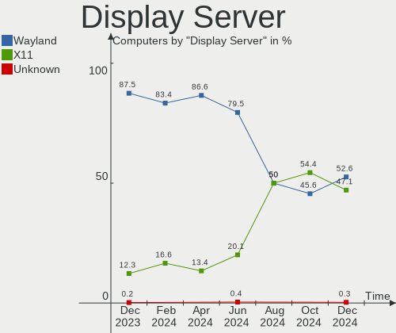
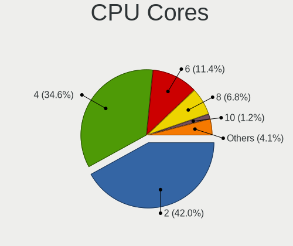
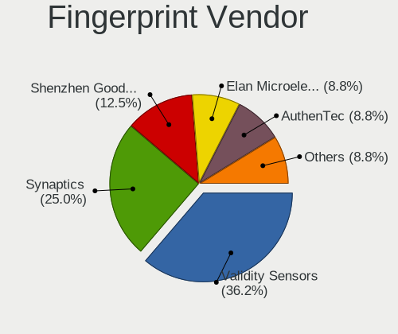

OpenMandriva - Hardware Trends
------------------------------

A project to identify most popular hardware characteristics and track their change
over time based on data collected by Linux users at https://Linux-Hardware.org.

Anyone can contribute to this report by the [hw-probe](https://github.com/linuxhw/hw-probe) tool:

    sudo -E hw-probe -all -upload

This is a report for all computer types. See also reports for [desktops](/Dist/OpenMandriva/Desktop/README.md) and [notebooks](/Dist/OpenMandriva/Notebook/README.md).

This report is for one last month. Overall report since the beginning of time: [TestDays](https://github.com/linuxhw/TestDays)

Period: Oct, 2023.

Contents
--------

* [ System ](#system)
  - [ OS                       ](#os)
  - [ OS Family                ](#os-family)
  - [ Kernel                   ](#kernel)
  - [ Kernel Family            ](#kernel-family)
  - [ Kernel Major Ver.        ](#kernel-major-ver)
  - [ Arch                     ](#arch)
  - [ DE                       ](#de)
  - [ Display Server           ](#display-server)
  - [ Display Manager          ](#display-manager)
  - [ OS Lang                  ](#os-lang)
  - [ Boot Mode                ](#boot-mode)
  - [ Filesystem               ](#filesystem)
  - [ Part. scheme             ](#part-scheme)
  - [ Dual Boot with Linux/BSD ](#dual-boot-with-linuxbsd)
  - [ Dual Boot (Win)          ](#dual-boot-win)

* [ Board ](#board)
  - [ Vendor                   ](#vendor)
  - [ Model                    ](#model)
  - [ Model Family             ](#model-family)
  - [ MFG Year                 ](#mfg-year)
  - [ Form Factor              ](#form-factor)
  - [ Secure Boot              ](#secure-boot)
  - [ Coreboot                 ](#coreboot)
  - [ RAM Size                 ](#ram-size)
  - [ RAM Used                 ](#ram-used)
  - [ Total Drives             ](#total-drives)
  - [ Has CD-ROM               ](#has-cd-rom)
  - [ Has Ethernet             ](#has-ethernet)
  - [ Has WiFi                 ](#has-wifi)
  - [ Has Bluetooth            ](#has-bluetooth)

* [ Location ](#location)
  - [ Country                  ](#country)
  - [ City                     ](#city)

* [ Drives ](#drives)
  - [ Drive Vendor             ](#drive-vendor)
  - [ Drive Model              ](#drive-model)
  - [ HDD Vendor               ](#hdd-vendor)
  - [ SSD Vendor               ](#ssd-vendor)
  - [ Drive Kind               ](#drive-kind)
  - [ Drive Connector          ](#drive-connector)
  - [ Drive Size               ](#drive-size)
  - [ Space Total              ](#space-total)
  - [ Space Used               ](#space-used)
  - [ Malfunc. Drives          ](#malfunc-drives)
  - [ Malfunc. Drive Vendor    ](#malfunc-drive-vendor)
  - [ Malfunc. HDD Vendor      ](#malfunc-hdd-vendor)
  - [ Malfunc. Drive Kind      ](#malfunc-drive-kind)
  - [ Failed Drives            ](#failed-drives)
  - [ Failed Drive Vendor      ](#failed-drive-vendor)
  - [ Drive Status             ](#drive-status)

* [ Storage controller ](#storage-controller)
  - [ Storage Vendor           ](#storage-vendor)
  - [ Storage Model            ](#storage-model)
  - [ Storage Kind             ](#storage-kind)

* [ Processor ](#processor)
  - [ CPU Vendor               ](#cpu-vendor)
  - [ CPU Model                ](#cpu-model)
  - [ CPU Model Family         ](#cpu-model-family)
  - [ CPU Cores                ](#cpu-cores)
  - [ CPU Sockets              ](#cpu-sockets)
  - [ CPU Threads              ](#cpu-threads)
  - [ CPU Op-Modes             ](#cpu-op-modes)
  - [ CPU Microcode            ](#cpu-microcode)
  - [ CPU Microarch            ](#cpu-microarch)

* [ Graphics ](#graphics)
  - [ GPU Vendor               ](#gpu-vendor)
  - [ GPU Model                ](#gpu-model)
  - [ GPU Combo                ](#gpu-combo)
  - [ GPU Driver               ](#gpu-driver)
  - [ GPU Memory               ](#gpu-memory)

* [ Monitor ](#monitor)
  - [ Monitor Vendor           ](#monitor-vendor)
  - [ Monitor Model            ](#monitor-model)
  - [ Monitor Resolution       ](#monitor-resolution)
  - [ Monitor Diagonal         ](#monitor-diagonal)
  - [ Monitor Width            ](#monitor-width)
  - [ Aspect Ratio             ](#aspect-ratio)
  - [ Monitor Area             ](#monitor-area)
  - [ Pixel Density            ](#pixel-density)
  - [ Multiple Monitors        ](#multiple-monitors)

* [ Network ](#network)
  - [ Net Controller Vendor    ](#net-controller-vendor)
  - [ Net Controller Model     ](#net-controller-model)
  - [ Wireless Vendor          ](#wireless-vendor)
  - [ Wireless Model           ](#wireless-model)
  - [ Ethernet Vendor          ](#ethernet-vendor)
  - [ Ethernet Model           ](#ethernet-model)
  - [ Net Controller Kind      ](#net-controller-kind)
  - [ Used Controller          ](#used-controller)
  - [ NICs                     ](#nics)
  - [ IPv6                     ](#ipv6)

* [ Bluetooth ](#bluetooth)
  - [ Bluetooth Vendor         ](#bluetooth-vendor)
  - [ Bluetooth Model          ](#bluetooth-model)

* [ Sound ](#sound)
  - [ Sound Vendor             ](#sound-vendor)
  - [ Sound Model              ](#sound-model)

* [ Memory ](#memory)
  - [ Memory Vendor            ](#memory-vendor)
  - [ Memory Model             ](#memory-model)
  - [ Memory Kind              ](#memory-kind)
  - [ Memory Form Factor       ](#memory-form-factor)
  - [ Memory Size              ](#memory-size)
  - [ Memory Speed             ](#memory-speed)

* [ Printers & scanners ](#printers--scanners)
  - [ Printer Vendor           ](#printer-vendor)
  - [ Printer Model            ](#printer-model)
  - [ Scanner Vendor           ](#scanner-vendor)
  - [ Scanner Model            ](#scanner-model)

* [ Camera ](#camera)
  - [ Camera Vendor            ](#camera-vendor)
  - [ Camera Model             ](#camera-model)

* [ Security ](#security)
  - [ Fingerprint Vendor       ](#fingerprint-vendor)
  - [ Fingerprint Model        ](#fingerprint-model)
  - [ Chipcard Vendor          ](#chipcard-vendor)
  - [ Chipcard Model           ](#chipcard-model)

* [ Unsupported ](#unsupported)
  - [ Unsupported Devices      ](#unsupported-devices)
  - [ Unsupported Device Types ](#unsupported-device-types)

System
------

OS
--

Installed operating systems

| Name               | Computers | Percent |
|--------------------|-----------|---------|
| OpenMandriva 23.08 | 148       | 42.77%  |
| OpenMandriva 23.10 | 92        | 26.59%  |
| OpenMandriva 4.3   | 31        | 8.96%   |
| OpenMandriva 23.03 | 19        | 5.49%   |
| OpenMandriva 23.01 | 16        | 4.62%   |
| OpenMandriva 23.09 | 15        | 4.34%   |
| OpenMandriva 4.2   | 9         | 2.6%    |
| OpenMandriva 23.90 | 9         | 2.6%    |
| OpenMandriva 23.07 | 4         | 1.16%   |
| OpenMandriva 23.06 | 2         | 0.58%   |
| OpenMandriva 4.50  | 1         | 0.29%   |

OS Family
---------

OS without a version

| Name         | Computers | Percent |
|--------------|-----------|---------|
| OpenMandriva | 346       | 100%    |

Kernel
------

Version of the Linux kernel

| Version                      | Computers | Percent |
|------------------------------|-----------|---------|
| 6.4.11-desktop-1omv2390      | 131       | 37.86%  |
| 6.5.5-desktop-1omv2390       | 93        | 26.88%  |
| 6.4.8-desktop-2omv2390       | 24        | 6.94%   |
| 5.16.7-desktop-1omv4003      | 22        | 6.36%   |
| 6.2.6-desktop-1omv2390       | 20        | 5.78%   |
| 6.1.1-desktop-1omv2290       | 15        | 4.34%   |
| 5.16.13-desktop-1omv4003     | 9         | 2.6%    |
| 5.10.14-desktop-1omv4002     | 8         | 2.31%   |
| 6.5.3-desktop-1omv2390       | 5         | 1.45%   |
| 6.3.5-desktop-3omv2390       | 5         | 1.45%   |
| 6.5.0-desktop-1omv2390       | 2         | 0.58%   |
| 6.1.4-desktop-1omv2301       | 2         | 0.58%   |
| 6.6.0-desktop-0.rc5.1omv2390 | 1         | 0.29%   |
| 6.5.7-desktop-1omv2390       | 1         | 0.29%   |
| 6.5.5-desktop-2.0omv4.9mjn   | 1         | 0.29%   |
| 6.5.2-desktop-1omv2390       | 1         | 0.29%   |
| 6.5.1-desktop-1omv2390       | 1         | 0.29%   |
| 6.4.3-desktop-2omv2390       | 1         | 0.29%   |
| 6.2.2-desktop-1omv2390       | 1         | 0.29%   |
| 6.1.9-desktop-1omv2390       | 1         | 0.29%   |
| 5.19.5-desktop-1omv4090      | 1         | 0.29%   |
| 5.11.12-desktop-1omv4002     | 1         | 0.29%   |

Kernel Family
-------------

Linux kernel without a distro release

| Version | Computers | Percent |
|---------|-----------|---------|
| 6.4.11  | 131       | 37.86%  |
| 6.5.5   | 94        | 27.17%  |
| 6.4.8   | 24        | 6.94%   |
| 5.16.7  | 22        | 6.36%   |
| 6.2.6   | 20        | 5.78%   |
| 6.1.1   | 15        | 4.34%   |
| 5.16.13 | 9         | 2.6%    |
| 5.10.14 | 8         | 2.31%   |
| 6.5.3   | 5         | 1.45%   |
| 6.3.5   | 5         | 1.45%   |
| 6.5.0   | 2         | 0.58%   |
| 6.1.4   | 2         | 0.58%   |
| 6.6.0   | 1         | 0.29%   |
| 6.5.7   | 1         | 0.29%   |
| 6.5.2   | 1         | 0.29%   |
| 6.5.1   | 1         | 0.29%   |
| 6.4.3   | 1         | 0.29%   |
| 6.2.2   | 1         | 0.29%   |
| 6.1.9   | 1         | 0.29%   |
| 5.19.5  | 1         | 0.29%   |
| 5.11.12 | 1         | 0.29%   |

Kernel Major Ver.
-----------------

Linux kernel major version

| Version | Computers | Percent |
|---------|-----------|---------|
| 6.4     | 156       | 45.09%  |
| 6.5     | 104       | 30.06%  |
| 5.16    | 31        | 8.96%   |
| 6.2     | 21        | 6.07%   |
| 6.1     | 18        | 5.2%    |
| 5.10    | 8         | 2.31%   |
| 6.3     | 5         | 1.45%   |
| 6.6     | 1         | 0.29%   |
| 5.19    | 1         | 0.29%   |
| 5.11    | 1         | 0.29%   |

Arch
----

OS architecture (x86_64, i586, etc.)

| Name   | Computers | Percent |
|--------|-----------|---------|
| x86_64 | 346       | 100%    |

DE
--

Desktop Environment

| Name     | Computers | Percent |
|----------|-----------|---------|
| KDE5     | 294       | 84.97%  |
| LXQt     | 25        | 7.23%   |
| GNOME    | 20        | 5.78%   |
| Unknown  | 5         | 1.45%   |
| Cinnamon | 2         | 0.58%   |

Display Server
--------------

X11 or Wayland

| Name    | Computers | Percent |
|---------|-----------|---------|
| Wayland | 250       | 72.25%  |
| X11     | 96        | 27.75%  |

Display Manager
---------------

SDDM, LightDM, etc.

| Name | Computers | Percent |
|------|-----------|---------|
| SDDM | 325       | 93.93%  |
| GDM  | 21        | 6.07%   |

OS Lang
-------

Language

| Lang       | Computers | Percent |
|------------|-----------|---------|
| en_US      | 156       | 45.09%  |
| fr_FR      | 32        | 9.25%   |
| de_DE      | 26        | 7.51%   |
| ru_RU      | 19        | 5.49%   |
| pl_PL      | 16        | 4.62%   |
| pt_BR      | 15        | 4.34%   |
| es_ES      | 11        | 3.18%   |
| en_GB      | 11        | 3.18%   |
| it_IT      | 9         | 2.6%    |
| es_MX      | 8         | 2.31%   |
| hu_HU      | 5         | 1.45%   |
| de_AT      | 5         | 1.45%   |
| tr_TR      | 4         | 1.16%   |
| es_VE      | 4         | 1.16%   |
| nl_NL      | 3         | 0.87%   |
| cs_CZ      | 3         | 0.87%   |
| es_AR      | 2         | 0.58%   |
| en_IN      | 2         | 0.58%   |
| en_CA      | 2         | 0.58%   |
| ro_RO      | 1         | 0.29%   |
| pt_PT      | 1         | 0.29%   |
| pl_PL.UTF8 | 1         | 0.29%   |
| nl_BE      | 1         | 0.29%   |
| fr_LU      | 1         | 0.29%   |
| es_PY      | 1         | 0.29%   |
| es_CR      | 1         | 0.29%   |
| es_CO      | 1         | 0.29%   |
| en_ZA      | 1         | 0.29%   |
| en_DK      | 1         | 0.29%   |
| en_AU      | 1         | 0.29%   |
| de_CH      | 1         | 0.29%   |
| da_DK      | 1         | 0.29%   |

Boot Mode
---------

EFI or BIOS

| Mode | Computers | Percent |
|------|-----------|---------|
| EFI  | 183       | 52.89%  |
| BIOS | 163       | 47.11%  |

Filesystem
----------

Type of filesystem

| Type     | Computers | Percent |
|----------|-----------|---------|
| Ext4     | 205       | 59.25%  |
| Overlay  | 118       | 34.1%   |
| Btrfs    | 16        | 4.62%   |
| Xfs      | 3         | 0.87%   |
| F2fs     | 3         | 0.87%   |
| Reiserfs | 1         | 0.29%   |

Part. scheme
------------

Scheme of partitioning

| Type | Computers | Percent |
|------|-----------|---------|
| GPT  | 264       | 76.3%   |
| MBR  | 82        | 23.7%   |

Dual Boot with Linux/BSD
------------------------

Hosting more than one Linux/BSD

| Dual boot | Computers | Percent |
|-----------|-----------|---------|
| No        | 182       | 52.6%   |
| Yes       | 164       | 47.4%   |

Dual Boot (Win)
---------------

Hosting Linux and Windows

| Dual boot | Computers | Percent |
|-----------|-----------|---------|
| No        | 189       | 54.62%  |
| Yes       | 157       | 45.38%  |

Board
-----

Vendor
------

Motherboard manufacturer

| Name                                 | Computers | Percent |
|--------------------------------------|-----------|---------|
| Hewlett-Packard                      | 54        | 15.61%  |
| ASUSTek Computer                     | 47        | 13.58%  |
| Lenovo                               | 43        | 12.43%  |
| Dell                                 | 36        | 10.4%   |
| Gigabyte Technology                  | 26        | 7.51%   |
| MSI                                  | 23        | 6.65%   |
| Acer                                 | 18        | 5.2%    |
| Toshiba                              | 12        | 3.47%   |
| ASRock                               | 12        | 3.47%   |
| Intel                                | 8         | 2.31%   |
| Fujitsu                              | 8         | 2.31%   |
| Apple                                | 7         | 2.02%   |
| Samsung Electronics                  | 6         | 1.73%   |
| Biostar                              | 6         | 1.73%   |
| Pegatron                             | 3         | 0.87%   |
| Foxconn                              | 3         | 0.87%   |
| Sony                                 | 2         | 0.58%   |
| Shenzhen Meigao Electronic Equipment | 2         | 0.58%   |
| MACHINIST                            | 2         | 0.58%   |
| ECS                                  | 2         | 0.58%   |
| AZW                                  | 2         | 0.58%   |
| Unknown                              | 2         | 0.58%   |
| ZOTAC                                | 1         | 0.29%   |
| WinFast                              | 1         | 0.29%   |
| Valve                                | 1         | 0.29%   |
| Thomson                              | 1         | 0.29%   |
| SLIMBOOK                             | 1         | 0.29%   |
| PCWare                               | 1         | 0.29%   |
| Notebook                             | 1         | 0.29%   |
| NEC Computers                        | 1         | 0.29%   |
| Medion                               | 1         | 0.29%   |
| LG Electronics                       | 1         | 0.29%   |
| Koloe                                | 1         | 0.29%   |
| Itautec                              | 1         | 0.29%   |
| HUAWEI                               | 1         | 0.29%   |
| Gateway                              | 1         | 0.29%   |
| Fujitsu Siemens                      | 1         | 0.29%   |
| EPSON DIRECT                         | 1         | 0.29%   |
| eMachines                            | 1         | 0.29%   |
| Compaq                               | 1         | 0.29%   |

Model
-----

Motherboard model

| Name                                       | Computers | Percent |
|--------------------------------------------|-----------|---------|
| Unknown                                    | 4         | 1.16%   |
| HP Pavilion g6                             | 3         | 0.87%   |
| Shenzhen Meigao Electronic Equipment F7BSC | 2         | 0.58%   |
| MSI MS-7B86                                | 2         | 0.58%   |
| HP TouchSmart tm2                          | 2         | 0.58%   |
| HP Pavilion Notebook                       | 2         | 0.58%   |
| Gigabyte B550 AORUS ELITE V2               | 2         | 0.58%   |
| Gigabyte 970A-DS3P                         | 2         | 0.58%   |
| Dell OptiPlex 780                          | 2         | 0.58%   |
| ASUS UL80VT                                | 2         | 0.58%   |
| Acer AOD270                                | 2         | 0.58%   |
| ZOTAC ZBOX-MI623/MI643                     | 1         | 0.29%   |
| WinFast 761GXK8MC                          | 1         | 0.29%   |
| Valve Jupiter                              | 1         | 0.29%   |
| Toshiba Satellite P55W-C                   | 1         | 0.29%   |
| Toshiba Satellite P50t-B-118               | 1         | 0.29%   |
| Toshiba Satellite L775                     | 1         | 0.29%   |
| Toshiba Satellite L755                     | 1         | 0.29%   |
| Toshiba Satellite L655                     | 1         | 0.29%   |
| Toshiba Satellite C870-D7K                 | 1         | 0.29%   |
| Toshiba Satellite C670D-126                | 1         | 0.29%   |
| Toshiba Satellite A665                     | 1         | 0.29%   |
| Toshiba Satellite A660                     | 1         | 0.29%   |
| Toshiba Satellite A305D                    | 1         | 0.29%   |
| Toshiba dynabook T350/56ARK                | 1         | 0.29%   |
| Toshiba dynabook R732/H                    | 1         | 0.29%   |
| Thomson WWN15I5-8BK1T                      | 1         | 0.29%   |
| Sony VPCEF2S1E                             | 1         | 0.29%   |
| Sony VGN-FZ21M                             | 1         | 0.29%   |
| SLIMBOOK EXECUTIVE-14                      | 1         | 0.29%   |
| Samsung RF511/RF411/RF711                  | 1         | 0.29%   |
| Samsung RC410/RC510/RC710                  | 1         | 0.29%   |
| Samsung R530/R730/P590                     | 1         | 0.29%   |
| Samsung P500A2D                            | 1         | 0.29%   |
| Samsung 550XCJ/550XCR                      | 1         | 0.29%   |
| Samsung 370E4K                             | 1         | 0.29%   |
| Pegatron VD049AA-ABF p6141fr               | 1         | 0.29%   |
| Pegatron KN278AA-ABM a6430la               | 1         | 0.29%   |
| Pegatron 520-1000ru                        | 1         | 0.29%   |
| PCWare IPMH61R1                            | 1         | 0.29%   |

Model Family
------------

Motherboard model prefix

| Name                                       | Computers | Percent |
|--------------------------------------------|-----------|---------|
| Lenovo IdeaPad                             | 11        | 3.18%   |
| HP Compaq                                  | 11        | 3.18%   |
| Dell Inspiron                              | 11        | 3.18%   |
| Acer Aspire                                | 11        | 3.18%   |
| Toshiba Satellite                          | 10        | 2.89%   |
| Lenovo ThinkPad                            | 10        | 2.89%   |
| HP Pavilion                                | 9         | 2.6%    |
| Lenovo ThinkCentre                         | 8         | 2.31%   |
| HP Laptop                                  | 7         | 2.02%   |
| Dell OptiPlex                              | 7         | 2.02%   |
| Dell Latitude                              | 7         | 2.02%   |
| HP EliteBook                               | 5         | 1.45%   |
| ASUS PRIME                                 | 5         | 1.45%   |
| HP EliteDesk                               | 4         | 1.16%   |
| Fujitsu ESPRIMO                            | 4         | 1.16%   |
| ASUS VivoBook                              | 4         | 1.16%   |
| Unknown                                    | 4         | 1.16%   |
| Dell Vostro                                | 3         | 0.87%   |
| Dell Precision                             | 3         | 0.87%   |
| ASUS M5A78L-M                              | 3         | 0.87%   |
| Toshiba dynabook                           | 2         | 0.58%   |
| Shenzhen Meigao Electronic Equipment F7BSC | 2         | 0.58%   |
| MSI MS-7B86                                | 2         | 0.58%   |
| Lenovo Yoga                                | 2         | 0.58%   |
| Lenovo G580                                | 2         | 0.58%   |
| Intel DG41RQ                               | 2         | 0.58%   |
| HP TouchSmart                              | 2         | 0.58%   |
| HP ProBook                                 | 2         | 0.58%   |
| Gigabyte B550                              | 2         | 0.58%   |
| Gigabyte 970A-DS3P                         | 2         | 0.58%   |
| Foxconn Pro                                | 2         | 0.58%   |
| Dell XPS                                   | 2         | 0.58%   |
| ASUS UL80VT                                | 2         | 0.58%   |
| ASUS TUF                                   | 2         | 0.58%   |
| ASUS ROG                                   | 2         | 0.58%   |
| ASUS P5G41T-M                              | 2         | 0.58%   |
| ASRock B450                                | 2         | 0.58%   |
| Acer Veriton                               | 2         | 0.58%   |
| Acer AOD270                                | 2         | 0.58%   |
| ZOTAC ZBOX-MI623                           | 1         | 0.29%   |

MFG Year
--------

Motherboard manufacture year

| Year | Computers | Percent |
|------|-----------|---------|
| 2012 | 43        | 12.43%  |
| 2011 | 30        | 8.67%   |
| 2010 | 28        | 8.09%   |
| 2013 | 27        | 7.8%    |
| 2021 | 25        | 7.23%   |
| 2020 | 24        | 6.94%   |
| 2018 | 24        | 6.94%   |
| 2017 | 19        | 5.49%   |
| 2009 | 18        | 5.2%    |
| 2019 | 16        | 4.62%   |
| 2016 | 15        | 4.34%   |
| 2015 | 15        | 4.34%   |
| 2008 | 14        | 4.05%   |
| 2014 | 13        | 3.76%   |
| 2022 | 10        | 2.89%   |
| 2023 | 9         | 2.6%    |
| 2007 | 7         | 2.02%   |
| 2006 | 7         | 2.02%   |
| 2005 | 2         | 0.58%   |

Form Factor
-----------

Physical design of the computer

| Name        | Computers | Percent |
|-------------|-----------|---------|
| Desktop     | 171       | 49.42%  |
| Notebook    | 160       | 46.24%  |
| Convertible | 4         | 1.16%   |
| Mini pc     | 4         | 1.16%   |
| Tablet      | 2         | 0.58%   |
| All in one  | 2         | 0.58%   |
| Server      | 2         | 0.58%   |
| Other       | 1         | 0.29%   |

Secure Boot
-----------

Enabled or disabled

| State    | Computers | Percent |
|----------|-----------|---------|
| Disabled | 346       | 100%    |

Coreboot
--------

Have coreboot on board

| Used | Computers | Percent |
|------|-----------|---------|
| No   | 346       | 100%    |

RAM Size
--------

Total RAM memory

| Size in GB  | Computers | Percent |
|-------------|-----------|---------|
| 4.01-8.0    | 99        | 28.61%  |
| 3.01-4.0    | 76        | 21.97%  |
| 8.01-16.0   | 58        | 16.76%  |
| 16.01-24.0  | 56        | 16.18%  |
| 32.01-64.0  | 23        | 6.65%   |
| 1.01-2.0    | 14        | 4.05%   |
| 64.01-256.0 | 7         | 2.02%   |
| 24.01-32.0  | 6         | 1.73%   |
| 2.01-3.0    | 5         | 1.45%   |
| 0.51-1.0    | 2         | 0.58%   |

RAM Used
--------

Used RAM memory

| Used GB  | Computers | Percent |
|----------|-----------|---------|
| 1.01-2.0 | 215       | 62.14%  |
| 2.01-3.0 | 78        | 22.54%  |
| 0.51-1.0 | 35        | 10.12%  |
| 3.01-4.0 | 9         | 2.6%    |
| 0.01-0.5 | 7         | 2.02%   |
| 4.01-8.0 | 2         | 0.58%   |

Total Drives
------------

Number of drives on board

| Drives | Computers | Percent |
|--------|-----------|---------|
| 1      | 190       | 54.91%  |
| 2      | 101       | 29.19%  |
| 3      | 30        | 8.67%   |
| 4      | 9         | 2.6%    |
| 5      | 6         | 1.73%   |
| 6      | 3         | 0.87%   |
| 0      | 3         | 0.87%   |
| 8      | 2         | 0.58%   |
| 18     | 1         | 0.29%   |
| 9      | 1         | 0.29%   |

Has CD-ROM
----------

Has CD-ROM on board

| Presented | Computers | Percent |
|-----------|-----------|---------|
| No        | 174       | 50.29%  |
| Yes       | 172       | 49.71%  |

Has Ethernet
------------

Has Ethernet on board

| Presented | Computers | Percent |
|-----------|-----------|---------|
| Yes       | 310       | 89.6%   |
| No        | 36        | 10.4%   |

Has WiFi
--------

Has WiFi module

| Presented | Computers | Percent |
|-----------|-----------|---------|
| Yes       | 227       | 65.61%  |
| No        | 119       | 34.39%  |

Has Bluetooth
-------------

Has Bluetooth module

| Presented | Computers | Percent |
|-----------|-----------|---------|
| No        | 175       | 50.58%  |
| Yes       | 171       | 49.42%  |

Location
--------

Country
-------

Geographic location (country)

| Country      | Computers | Percent |
|--------------|-----------|---------|
| Germany      | 39        | 11.27%  |
| USA          | 37        | 10.69%  |
| France       | 34        | 9.83%   |
| Brazil       | 27        | 7.8%    |
| Russia       | 25        | 7.23%   |
| Poland       | 21        | 6.07%   |
| Spain        | 13        | 3.76%   |
| Italy        | 12        | 3.47%   |
| Mexico       | 9         | 2.6%    |
| Japan        | 8         | 2.31%   |
| Finland      | 7         | 2.02%   |
| Czechia      | 7         | 2.02%   |
| Canada       | 7         | 2.02%   |
| UK           | 6         | 1.73%   |
| Romania      | 6         | 1.73%   |
| India        | 6         | 1.73%   |
| Hungary      | 6         | 1.73%   |
| Portugal     | 5         | 1.45%   |
| Austria      | 5         | 1.45%   |
| Venezuela    | 4         | 1.16%   |
| Turkey       | 4         | 1.16%   |
| Netherlands  | 4         | 1.16%   |
| Indonesia    | 4         | 1.16%   |
| Colombia     | 4         | 1.16%   |
| Taiwan       | 3         | 0.87%   |
| Switzerland  | 3         | 0.87%   |
| Belgium      | 3         | 0.87%   |
| Thailand     | 2         | 0.58%   |
| Slovenia     | 2         | 0.58%   |
| El Salvador  | 2         | 0.58%   |
| Australia    | 2         | 0.58%   |
| Argentina    | 2         | 0.58%   |
| Algeria      | 2         | 0.58%   |
| Vietnam      | 1         | 0.29%   |
| Sweden       | 1         | 0.29%   |
| South Africa | 1         | 0.29%   |
| Slovakia     | 1         | 0.29%   |
| Réunion     | 1         | 0.29%   |
| Puerto Rico  | 1         | 0.29%   |
| Philippines  | 1         | 0.29%   |

City
----

Geographic location (city)

| City           | Computers | Percent |
|----------------|-----------|---------|
| Paris          | 5         | 1.45%   |
| Vienna         | 4         | 1.16%   |
| Moscow         | 4         | 1.16%   |
| Warsaw         | 3         | 0.87%   |
| Volzhsky       | 3         | 0.87%   |
| Volta Redonda  | 3         | 0.87%   |
| Trappes        | 3         | 0.87%   |
| Taipei         | 3         | 0.87%   |
| Prague         | 3         | 0.87%   |
| Munich         | 3         | 0.87%   |
| Mexico City    | 3         | 0.87%   |
| Zgierz         | 2         | 0.58%   |
| Yoshkar-Ola    | 2         | 0.58%   |
| Yaroslavl      | 2         | 0.58%   |
| Wroclaw        | 2         | 0.58%   |
| Whitley Bay    | 2         | 0.58%   |
| Vantaa         | 2         | 0.58%   |
| Tomisato       | 2         | 0.58%   |
| Seville        | 2         | 0.58%   |
| Sao Paulo      | 2         | 0.58%   |
| Santo André   | 2         | 0.58%   |
| Santander      | 2         | 0.58%   |
| San Salvador   | 2         | 0.58%   |
| San José      | 2         | 0.58%   |
| San Diego      | 2         | 0.58%   |
| Rio de Janeiro | 2         | 0.58%   |
| Porto Alegre   | 2         | 0.58%   |
| Pasadena       | 2         | 0.58%   |
| Novosibirsk    | 2         | 0.58%   |
| Milano         | 2         | 0.58%   |
| Lynnwood       | 2         | 0.58%   |
| Los Angeles    | 2         | 0.58%   |
| Lagos          | 2         | 0.58%   |
| Kroměříž   | 2         | 0.58%   |
| Jaworzno       | 2         | 0.58%   |
| Hof            | 2         | 0.58%   |
| Grafenau       | 2         | 0.58%   |
| Delhi          | 2         | 0.58%   |
| Darmstadt      | 2         | 0.58%   |
| Caracas        | 2         | 0.58%   |

Drives
------

Drive Vendor
------------

Hard drive vendors

| Vendor                      | Computers | Drives | Percent |
|-----------------------------|-----------|--------|---------|
| WDC                         | 85        | 107    | 16.1%   |
| Seagate                     | 83        | 96     | 15.72%  |
| Samsung Electronics         | 56        | 68     | 10.61%  |
| Toshiba                     | 37        | 38     | 7.01%   |
| Kingston                    | 31        | 36     | 5.87%   |
| Crucial                     | 27        | 28     | 5.11%   |
| SanDisk                     | 22        | 23     | 4.17%   |
| Hitachi                     | 18        | 19     | 3.41%   |
| Unknown                     | 14        | 16     | 2.65%   |
| A-DATA Technology           | 14        | 14     | 2.65%   |
| HGST                        | 10        | 10     | 1.89%   |
| SK hynix                    | 8         | 8      | 1.52%   |
| Intel                       | 8         | 9      | 1.52%   |
| Maxtor                      | 7         | 7      | 1.33%   |
| Unknown                     | 7         | 8      | 1.33%   |
| Micron Technology           | 6         | 9      | 1.14%   |
| China                       | 6         | 6      | 1.14%   |
| JMicron Technology          | 5         | 5      | 0.95%   |
| PNY                         | 4         | 4      | 0.76%   |
| Intenso                     | 4         | 4      | 0.76%   |
| SPCC                        | 3         | 4      | 0.57%   |
| Patriot                     | 3         | 3      | 0.57%   |
| Kingston Technology Company | 3         | 3      | 0.57%   |
| GOODRAM                     | 3         | 3      | 0.57%   |
| Apple                       | 3         | 3      | 0.57%   |
| XPG                         | 2         | 2      | 0.38%   |
| Team                        | 2         | 2      | 0.38%   |
| Silicon Motion              | 2         | 2      | 0.38%   |
| SABRENT                     | 2         | 2      | 0.38%   |
| Realtek                     | 2         | 2      | 0.38%   |
| KingSpec                    | 2         | 2      | 0.38%   |
| Gigabyte Technology         | 2         | 2      | 0.38%   |
| Fujitsu                     | 2         | 2      | 0.38%   |
| Fanxiang                    | 2         | 2      | 0.38%   |
| Apacer                      | 2         | 2      | 0.38%   |
| ANACOMDA                    | 2         | 2      | 0.38%   |
| ZTE                         | 1         | 1      | 0.19%   |
| WALRAM                      | 1         | 1      | 0.19%   |
| V-GeN                       | 1         | 1      | 0.19%   |
| USB3.0                      | 1         | 1      | 0.19%   |

Drive Model
-----------

Hard drive models

| Model                               | Computers | Percent |
|-------------------------------------|-----------|---------|
| Unknown                             | 7         | 1.23%   |
| Toshiba DT01ACA100 1TB              | 5         | 0.88%   |
| Seagate ST2000DM008-2FR102 2TB      | 4         | 0.7%    |
| Seagate ST1000LM024 HN-M101MBB 1TB  | 4         | 0.7%    |
| Seagate ST1000DM010-2EP102 1TB      | 4         | 0.7%    |
| Kingston SA400S37240G 240GB SSD     | 4         | 0.7%    |
| Kingston SA400S37120G 120GB SSD     | 4         | 0.7%    |
| Crucial CT500MX500SSD1 500GB        | 4         | 0.7%    |
| Crucial CT240BX500SSD1 240GB        | 4         | 0.7%    |
| WDC WDS240G2G0A-00JH30 240GB SSD    | 3         | 0.53%   |
| Toshiba MQ04ABF100 1TB              | 3         | 0.53%   |
| Toshiba MQ01ABF050 500GB            | 3         | 0.53%   |
| Toshiba MQ01ABD100 1TB              | 3         | 0.53%   |
| Seagate ST500LT012-1DG142 500GB     | 3         | 0.53%   |
| Seagate ST500LM012 HN-M500MBB 500GB | 3         | 0.53%   |
| Seagate ST500DM002-1BD142 500GB     | 3         | 0.53%   |
| Seagate ST380815AS 80GB             | 3         | 0.53%   |
| Seagate ST1000LM035-1RK172 1TB      | 3         | 0.53%   |
| Seagate ST1000DM003-1SB102 1TB      | 3         | 0.53%   |
| SanDisk SSD PLUS 1000GB             | 3         | 0.53%   |
| SanDisk NVMe SSD Drive 1TB          | 3         | 0.53%   |
| Samsung SSD 860 EVO 500GB           | 3         | 0.53%   |
| Samsung HD322HJ 320GB               | 3         | 0.53%   |
| Kingston Company SNV2S1000G 1TB     | 3         | 0.53%   |
| Kingston SA400S37480G 480GB SSD     | 3         | 0.53%   |
| HGST HTS545050A7E680 500GB          | 3         | 0.53%   |
| Crucial CT480BX500SSD1 480GB        | 3         | 0.53%   |
| WDC WDS120G2G0B-00EPW0 120GB SSD    | 2         | 0.35%   |
| WDC WDS120G2G0A-00JH30 120GB SSD    | 2         | 0.35%   |
| WDC WD5000AAKX-00ERMA0 500GB        | 2         | 0.35%   |
| WDC WD5000AAKX-001CA0 500GB         | 2         | 0.35%   |
| WDC WD5000AAKS-22A7B0 500GB         | 2         | 0.35%   |
| WDC WD3200BPVT-22ZEST0 320GB        | 2         | 0.35%   |
| WDC WD30EZRX-00D8PB0 3TB            | 2         | 0.35%   |
| WDC WD20EZRZ-00Z5HB0 2TB            | 2         | 0.35%   |
| WDC WD20EFRX-68EUZN0 2TB            | 2         | 0.35%   |
| WDC WD1600BEVT-22ZCT0 160GB         | 2         | 0.35%   |
| WDC WD10SPZX-24Z10 1TB              | 2         | 0.35%   |
| WDC WD10SPZX-21Z10T0 1TB            | 2         | 0.35%   |
| WDC WD10EZEX-08WN4A0 1TB            | 2         | 0.35%   |

HDD Vendor
----------

Hard disk drive vendors

| Vendor              | Computers | Drives | Percent |
|---------------------|-----------|--------|---------|
| Seagate             | 80        | 93     | 33.2%   |
| WDC                 | 68        | 83     | 28.22%  |
| Toshiba             | 33        | 34     | 13.69%  |
| Hitachi             | 18        | 19     | 7.47%   |
| Samsung Electronics | 16        | 16     | 6.64%   |
| HGST                | 10        | 10     | 4.15%   |
| Maxtor              | 6         | 6      | 2.49%   |
| Unknown             | 2         | 2      | 0.83%   |
| Fujitsu             | 2         | 2      | 0.83%   |
| USB3.0              | 1         | 1      | 0.41%   |
| Magnetic Data       | 1         | 1      | 0.41%   |
| HPE                 | 1         | 1      | 0.41%   |
| ExcelStor           | 1         | 1      | 0.41%   |
| ASMedia             | 1         | 1      | 0.41%   |
| Unknown             | 1         | 1      | 0.41%   |

SSD Vendor
----------

Solid state drive vendors

| Vendor              | Computers | Drives | Percent |
|---------------------|-----------|--------|---------|
| Samsung Electronics | 25        | 29     | 13.3%   |
| Kingston            | 21        | 25     | 11.17%  |
| Crucial             | 21        | 22     | 11.17%  |
| SanDisk             | 17        | 18     | 9.04%   |
| WDC                 | 13        | 14     | 6.91%   |
| A-DATA Technology   | 11        | 11     | 5.85%   |
| China               | 6         | 6      | 3.19%   |
| Micron Technology   | 5         | 8      | 2.66%   |
| PNY                 | 4         | 4      | 2.13%   |
| Intenso             | 4         | 4      | 2.13%   |
| Intel               | 4         | 4      | 2.13%   |
| SPCC                | 3         | 4      | 1.6%    |
| SK hynix            | 3         | 3      | 1.6%    |
| Patriot             | 3         | 3      | 1.6%    |
| GOODRAM             | 3         | 3      | 1.6%    |
| Team                | 2         | 2      | 1.06%   |
| SABRENT             | 2         | 2      | 1.06%   |
| KingSpec            | 2         | 2      | 1.06%   |
| Apple               | 2         | 2      | 1.06%   |
| Apacer              | 2         | 2      | 1.06%   |
| ANACOMDA            | 2         | 2      | 1.06%   |
| Unknown             | 2         | 2      | 1.06%   |
| WALRAM              | 1         | 1      | 0.53%   |
| Toshiba             | 1         | 1      | 0.53%   |
| T-FORCE             | 1         | 1      | 0.53%   |
| SP                  | 1         | 1      | 0.53%   |
| Smartbuy            | 1         | 1      | 0.53%   |
| Seagate             | 1         | 1      | 0.53%   |
| SATA3 12            | 1         | 1      | 0.53%   |
| ROG                 | 1         | 1      | 0.53%   |
| OCZ                 | 1         | 1      | 0.53%   |
| Netac               | 1         | 1      | 0.53%   |
| Maxtor              | 1         | 1      | 0.53%   |
| Matrix              | 1         | 1      | 0.53%   |
| LITEONIT            | 1         | 1      | 0.53%   |
| LDLC                | 1         | 1      | 0.53%   |
| Kingmax             | 1         | 1      | 0.53%   |
| Kingchuxing         | 1         | 1      | 0.53%   |
| Kimtigo             | 1         | 1      | 0.53%   |
| JMicron Technology  | 1         | 1      | 0.53%   |

Drive Kind
----------

HDD or SSD

| Kind    | Computers | Drives | Percent |
|---------|-----------|--------|---------|
| HDD     | 193       | 271    | 43.37%  |
| SSD     | 155       | 203    | 34.83%  |
| NVMe    | 81        | 99     | 18.2%   |
| MMC     | 9         | 10     | 2.02%   |
| Unknown | 7         | 9      | 1.57%   |

Drive Connector
---------------

SATA, SAS, NVMe, etc.

| Type | Computers | Drives | Percent |
|------|-----------|--------|---------|
| SATA | 293       | 456    | 71.99%  |
| NVMe | 80        | 94     | 19.66%  |
| SAS  | 25        | 32     | 6.14%   |
| MMC  | 9         | 10     | 2.21%   |

Drive Size
----------

Size of hard drive

| Size in TB | Computers | Drives | Percent |
|------------|-----------|--------|---------|
| 0.01-0.5   | 214       | 309    | 60.11%  |
| 0.51-1.0   | 104       | 112    | 29.21%  |
| 1.01-2.0   | 20        | 29     | 5.62%   |
| 2.01-3.0   | 9         | 12     | 2.53%   |
| 3.01-4.0   | 6         | 7      | 1.69%   |
| 4.01-10.0  | 2         | 4      | 0.56%   |
| 20.01-50.0 | 1         | 1      | 0.28%   |

Space Total
-----------

Amount of disk space available on the file system

| Size in GB     | Computers | Percent |
|----------------|-----------|---------|
| 1-20           | 87        | 25.14%  |
| 101-250        | 84        | 24.28%  |
| 251-500        | 49        | 14.16%  |
| 51-100         | 33        | 9.54%   |
| 501-1000       | 32        | 9.25%   |
| 21-50          | 20        | 5.78%   |
| 1001-2000      | 18        | 5.2%    |
| Unknown        | 15        | 4.34%   |
| 2001-3000      | 6         | 1.73%   |
| More than 3000 | 2         | 0.58%   |

Space Used
----------

Amount of used disk space

| Used GB   | Computers | Percent |
|-----------|-----------|---------|
| 1-20      | 261       | 75.43%  |
| 21-50     | 21        | 6.07%   |
| 101-250   | 15        | 4.34%   |
| Unknown   | 15        | 4.34%   |
| 251-500   | 13        | 3.76%   |
| 51-100    | 11        | 3.18%   |
| 501-1000  | 7         | 2.02%   |
| 2001-3000 | 2         | 0.58%   |
| 1001-2000 | 1         | 0.29%   |

Malfunc. Drives
---------------

Drive models with a malfunction

| Model                                | Computers | Drives | Percent |
|--------------------------------------|-----------|--------|---------|
| Toshiba DT01ACA100 1TB               | 3         | 3      | 2.73%   |
| WDC WD5000AAKS-22A7B0 500GB          | 2         | 2      | 1.82%   |
| Seagate ST9500325AS 500GB            | 2         | 2      | 1.82%   |
| Seagate ST3500418AS 500GB            | 2         | 2      | 1.82%   |
| Seagate ST2000DM008-2FR102 2TB       | 2         | 2      | 1.82%   |
| Seagate ST1000LM024 HN-M101MBB 1TB   | 2         | 2      | 1.82%   |
| Hitachi HTS543232A7A384 320GB        | 2         | 2      | 1.82%   |
| WDC WDS240G2G0A-00JH30 240GB SSD     | 1         | 1      | 0.91%   |
| WDC WDS120G2G0B-00EPW0 120GB SSD     | 1         | 1      | 0.91%   |
| WDC WD800BD-22MRA1 80GB              | 1         | 1      | 0.91%   |
| WDC WD7500BPKT-75PK4T0 752GB         | 1         | 1      | 0.91%   |
| WDC WD5000LPCX-24C6HT0 500GB         | 1         | 1      | 0.91%   |
| WDC WD5000AAKS-00UU3A0 500GB         | 1         | 1      | 0.91%   |
| WDC WD5000AAKS-00TMA0 500GB          | 1         | 1      | 0.91%   |
| WDC WD5000AAKS-00H2B0 500GB          | 1         | 1      | 0.91%   |
| WDC WD5000AAKS-00D2B0 500GB          | 1         | 1      | 0.91%   |
| WDC WD40EFAX-68JH4N1 4TB             | 1         | 1      | 0.91%   |
| WDC WD3200BPVT-22ZEST0 320GB         | 1         | 1      | 0.91%   |
| WDC WD3200BEKT-75PVMT0 320GB         | 1         | 1      | 0.91%   |
| WDC WD3200AAKS-61L9A0 320GB          | 1         | 1      | 0.91%   |
| WDC WD3200AAJB-00J3A0 320GB          | 1         | 1      | 0.91%   |
| WDC WD30EZRX-00D8PB0 3TB             | 1         | 1      | 0.91%   |
| WDC WD2500AAKX-001CA0 250GB          | 1         | 1      | 0.91%   |
| WDC WD20EFRX-68EUZN0 2TB             | 1         | 1      | 0.91%   |
| WDC WD1600AAJS-00V4A0 160GB          | 1         | 1      | 0.91%   |
| WDC WD10EURX-63C57Y0 1TB             | 1         | 1      | 0.91%   |
| WDC WD Green 2.5 480GB SSD           | 1         | 1      | 0.91%   |
| WDC WD Green 2.5 1000GB              | 1         | 1      | 0.91%   |
| Toshiba MQ04ABF100 1TB               | 1         | 1      | 0.91%   |
| Toshiba MQ02ABD100H 1TB              | 1         | 1      | 0.91%   |
| Toshiba MQ01ABD050 500GB             | 1         | 1      | 0.91%   |
| Toshiba MK6465GSX 640GB              | 1         | 1      | 0.91%   |
| Toshiba MK5065GSX 500GB              | 1         | 1      | 0.91%   |
| Toshiba MK3276GSX 320GB              | 1         | 1      | 0.91%   |
| Toshiba MK3265GSXN 320GB             | 1         | 1      | 0.91%   |
| Toshiba MK1655GSX 160GB              | 1         | 1      | 0.91%   |
| SK hynix SC308 SATA 128GB SSD        | 1         | 1      | 0.91%   |
| SK hynix BC711 HFM512GD3JX013N 512GB | 1         | 1      | 0.91%   |
| Seagate ST500LT012-9WS142 500GB      | 1         | 1      | 0.91%   |
| Seagate ST500LT012-1DG142 500GB      | 1         | 1      | 0.91%   |

Malfunc. Drive Vendor
---------------------

Vendors of faulty drives

| Vendor              | Computers | Drives | Percent |
|---------------------|-----------|--------|---------|
| Seagate             | 25        | 30     | 23.36%  |
| WDC                 | 22        | 23     | 20.56%  |
| Toshiba             | 11        | 11     | 10.28%  |
| Hitachi             | 8         | 8      | 7.48%   |
| Samsung Electronics | 5         | 5      | 4.67%   |
| Kingston            | 5         | 6      | 4.67%   |
| Maxtor              | 4         | 4      | 3.74%   |
| HGST                | 4         | 4      | 3.74%   |
| SK hynix            | 2         | 2      | 1.87%   |
| Intel               | 2         | 2      | 1.87%   |
| Crucial             | 2         | 2      | 1.87%   |
| A-DATA Technology   | 2         | 2      | 1.87%   |
| SanDisk             | 1         | 1      | 0.93%   |
| Micron Technology   | 1         | 1      | 0.93%   |
| Magnetic Data       | 1         | 1      | 0.93%   |
| LDLC                | 1         | 1      | 0.93%   |
| JMicron Technology  | 1         | 1      | 0.93%   |
| HPE                 | 1         | 1      | 0.93%   |
| Hewlett-Packard     | 1         | 1      | 0.93%   |
| Gamers              | 1         | 1      | 0.93%   |
| Fujitsu             | 1         | 1      | 0.93%   |
| EXRAM               | 1         | 1      | 0.93%   |
| ExcelStor           | 1         | 1      | 0.93%   |
| China               | 1         | 1      | 0.93%   |
| BAITITON            | 1         | 1      | 0.93%   |
| ASMedia             | 1         | 1      | 0.93%   |
| Unknown             | 1         | 1      | 0.93%   |

Malfunc. HDD Vendor
-------------------

Vendors of faulty HDD drives

| Vendor              | Computers | Drives | Percent |
|---------------------|-----------|--------|---------|
| Seagate             | 25        | 30     | 30.86%  |
| WDC                 | 18        | 19     | 22.22%  |
| Toshiba             | 11        | 11     | 13.58%  |
| Hitachi             | 8         | 8      | 9.88%   |
| Samsung Electronics | 5         | 5      | 6.17%   |
| Maxtor              | 4         | 4      | 4.94%   |
| HGST                | 4         | 4      | 4.94%   |
| Magnetic Data       | 1         | 1      | 1.23%   |
| HPE                 | 1         | 1      | 1.23%   |
| Fujitsu             | 1         | 1      | 1.23%   |
| ExcelStor           | 1         | 1      | 1.23%   |
| ASMedia             | 1         | 1      | 1.23%   |
| Unknown             | 1         | 1      | 1.23%   |

Malfunc. Drive Kind
-------------------

Kinds of faulty drives

| Kind    | Computers | Drives | Percent |
|---------|-----------|--------|---------|
| HDD     | 73        | 87     | 73.74%  |
| SSD     | 23        | 24     | 23.23%  |
| NVMe    | 2         | 2      | 2.02%   |
| Unknown | 1         | 1      | 1.01%   |

Failed Drives
-------------

Failed drive models

| Model                         | Computers | Drives | Percent |
|-------------------------------|-----------|--------|---------|
| Toshiba MK2575GSX 250GB       | 1         | 1      | 50%     |
| Hitachi HTS723232A7A364 320GB | 1         | 1      | 50%     |

Failed Drive Vendor
-------------------

Failed drive vendors

| Vendor  | Computers | Drives | Percent |
|---------|-----------|--------|---------|
| Toshiba | 1         | 1      | 50%     |
| Hitachi | 1         | 1      | 50%     |

Drive Status
------------

Number of failed and malfunc. drives

| Status   | Computers | Drives | Percent |
|----------|-----------|--------|---------|
| Works    | 280       | 429    | 67.63%  |
| Malfunc  | 96        | 114    | 23.19%  |
| Detected | 36        | 47     | 8.7%    |
| Failed   | 2         | 2      | 0.48%   |

Storage controller
------------------

Storage Vendor
--------------

Storage controller vendors

| Vendor                           | Computers | Percent |
|----------------------------------|-----------|---------|
| Intel                            | 251       | 57.44%  |
| AMD                              | 66        | 15.1%   |
| Samsung Electronics              | 22        | 5.03%   |
| SanDisk                          | 14        | 3.2%    |
| Kingston Technology Company      | 14        | 3.2%    |
| JMicron Technology               | 11        | 2.52%   |
| Nvidia                           | 8         | 1.83%   |
| Micron/Crucial Technology        | 6         | 1.37%   |
| MAXIO Technology (Hangzhou)      | 6         | 1.37%   |
| Marvell Technology Group         | 6         | 1.37%   |
| SK hynix                         | 5         | 1.14%   |
| ADATA Technology                 | 5         | 1.14%   |
| ASMedia Technology               | 4         | 0.92%   |
| Toshiba America Info Systems     | 3         | 0.69%   |
| Phison Electronics               | 3         | 0.69%   |
| Broadcom / LSI                   | 3         | 0.69%   |
| Silicon Motion                   | 2         | 0.46%   |
| Solid State Storage Technology   | 1         | 0.23%   |
| Silicon Integrated Systems [SiS] | 1         | 0.23%   |
| Shenzhen Longsys Electronics     | 1         | 0.23%   |
| Seagate Technology               | 1         | 0.23%   |
| Micron Technology                | 1         | 0.23%   |
| Lenovo                           | 1         | 0.23%   |
| KIOXIA                           | 1         | 0.23%   |
| Hosin Global Electronics         | 1         | 0.23%   |

Storage Model
-------------

Storage controller models

| Model                                                                                   | Computers | Percent |
|-----------------------------------------------------------------------------------------|-----------|---------|
| AMD FCH SATA Controller [AHCI mode]                                                     | 29        | 5.44%   |
| Intel 7 Series Chipset Family 6-port SATA Controller [AHCI mode]                        | 19        | 3.56%   |
| Intel NM10/ICH7 Family SATA Controller [IDE mode]                                       | 16        | 3%      |
| Intel Sunrise Point-LP SATA Controller [AHCI mode]                                      | 15        | 2.81%   |
| Intel 8 Series/C220 Series Chipset Family 6-port SATA Controller 1 [AHCI mode]          | 14        | 2.63%   |
| AMD SB7x0/SB8x0/SB9x0 IDE Controller                                                    | 14        | 2.63%   |
| Intel 82801G (ICH7 Family) IDE Controller                                               | 12        | 2.25%   |
| Intel 82801 Mobile SATA Controller [RAID mode]                                          | 12        | 2.25%   |
| Samsung NVMe SSD Controller SM981/PM981/PM983                                           | 11        | 2.06%   |
| AMD SB7x0/SB8x0/SB9x0 SATA Controller [IDE mode]                                        | 11        | 2.06%   |
| Intel Q170/Q150/B150/H170/H110/Z170/CM236 Chipset SATA Controller [AHCI Mode]           | 10        | 1.88%   |
| Intel 6 Series/C200 Series Chipset Family 6 port Mobile SATA AHCI Controller            | 10        | 1.88%   |
| Intel 5 Series/3400 Series Chipset 4 port SATA AHCI Controller                          | 10        | 1.88%   |
| AMD 400 Series Chipset SATA Controller                                                  | 10        | 1.88%   |
| Intel 7 Series/C210 Series Chipset Family 6-port SATA Controller [AHCI mode]            | 9         | 1.69%   |
| Intel 200 Series PCH SATA controller [AHCI mode]                                        | 9         | 1.69%   |
| AMD SB7x0/SB8x0/SB9x0 SATA Controller [AHCI mode]                                       | 9         | 1.69%   |
| AMD 500 Series Chipset SATA Controller                                                  | 8         | 1.5%    |
| Samsung NVMe SSD Controller 980 (DRAM-less)                                             | 7         | 1.31%   |
| Intel 8 Series SATA Controller 1 [AHCI mode]                                            | 7         | 1.31%   |
| Intel 6 Series/C200 Series Chipset Family 6 port Desktop SATA AHCI Controller           | 7         | 1.31%   |
| Nvidia MCP61 SATA Controller                                                            | 6         | 1.13%   |
| Nvidia MCP61 IDE                                                                        | 6         | 1.13%   |
| Intel Cannon Lake PCH SATA AHCI Controller                                              | 6         | 1.13%   |
| Intel 82801IBM/IEM (ICH9M/ICH9M-E) 4 port SATA Controller [AHCI mode]                   | 6         | 1.13%   |
| Intel 82801HM/HEM (ICH8M/ICH8M-E) SATA Controller [AHCI mode]                           | 6         | 1.13%   |
| Intel 82801HM/HEM (ICH8M/ICH8M-E) IDE Controller                                        | 6         | 1.13%   |
| Intel 6 Series/C200 Series Chipset Family Desktop SATA Controller (IDE mode, ports 4-5) | 6         | 1.13%   |
| Intel 6 Series/C200 Series Chipset Family Desktop SATA Controller (IDE mode, ports 0-3) | 6         | 1.13%   |
| AMD 300 Series Chipset SATA Controller                                                  | 6         | 1.13%   |
| SanDisk Ultra 3D / WD Blue SN550 NVMe SSD                                               | 5         | 0.94%   |
| MAXIO (Hangzhou) NVMe SSD Controller MAP1202                                            | 5         | 0.94%   |
| Intel Wildcat Point-LP SATA Controller [AHCI Mode]                                      | 5         | 0.94%   |
| Intel SATA Controller [RAID mode]                                                       | 5         | 0.94%   |
| Intel Celeron/Pentium Silver Processor SATA Controller                                  | 5         | 0.94%   |
| Intel 82801JI (ICH10 Family) SATA AHCI Controller                                       | 5         | 0.94%   |
| Intel 5 Series/3400 Series Chipset 6 port SATA AHCI Controller                          | 5         | 0.94%   |
| SK hynix Gold P31/BC711/PC711 NVMe Solid State Drive                                    | 4         | 0.75%   |
| JMicron JMB363 SATA/IDE Controller                                                      | 4         | 0.75%   |
| Intel Tiger Lake-LP SATA Controller                                                     | 4         | 0.75%   |

Storage Kind
------------

Kind of storage controller (IDE, SATA, NVMe, SAS, ...)

| Kind | Computers | Percent |
|------|-----------|---------|
| SATA | 258       | 58.5%   |
| NVMe | 80        | 18.14%  |
| IDE  | 78        | 17.69%  |
| RAID | 24        | 5.44%   |
| SAS  | 1         | 0.23%   |

Processor
---------

CPU Vendor
----------

Processor vendors

| Vendor | Computers | Percent |
|--------|-----------|---------|
| Intel  | 263       | 76.01%  |
| AMD    | 83        | 23.99%  |

CPU Model
---------

Processor models

| Model                                       | Computers | Percent |
|---------------------------------------------|-----------|---------|
| Intel Core 2 Duo CPU E8400 @ 3.00GHz        | 7         | 2.02%   |
| Intel Core i5-7200U CPU @ 2.50GHz           | 6         | 1.73%   |
| Intel Core i5-3470 CPU @ 3.20GHz            | 5         | 1.45%   |
| Intel Core i3 CPU M 370 @ 2.40GHz           | 5         | 1.45%   |
| Intel Core i5-2400 CPU @ 3.10GHz            | 4         | 1.16%   |
| Intel 11th Gen Core i3-1115G4 @ 3.00GHz     | 4         | 1.16%   |
| Intel Core i7-6700 CPU @ 3.40GHz            | 3         | 0.87%   |
| Intel Core i7-3520M CPU @ 2.90GHz           | 3         | 0.87%   |
| Intel Core i5-8400 CPU @ 2.80GHz            | 3         | 0.87%   |
| Intel Core i5-8300H CPU @ 2.30GHz           | 3         | 0.87%   |
| Intel Core i5-3330 CPU @ 3.00GHz            | 3         | 0.87%   |
| Intel Core i5-3230M CPU @ 2.60GHz           | 3         | 0.87%   |
| AMD Ryzen 5 3600 6-Core Processor           | 3         | 0.87%   |
| AMD Ryzen 5 3400G with Radeon Vega Graphics | 3         | 0.87%   |
| AMD Ryzen 5 2400G with Radeon Vega Graphics | 3         | 0.87%   |
| AMD FX-8350 Eight-Core Processor            | 3         | 0.87%   |
| AMD FX-8320 Eight-Core Processor            | 3         | 0.87%   |
| Intel Pentium Silver N5030 CPU @ 1.10GHz    | 2         | 0.58%   |
| Intel Pentium Dual-Core CPU E6600 @ 3.06GHz | 2         | 0.58%   |
| Intel Pentium CPU G620 @ 2.60GHz            | 2         | 0.58%   |
| Intel Pentium 4 CPU 3.40GHz                 | 2         | 0.58%   |
| Intel N95                                   | 2         | 0.58%   |
| Intel Genuine CPU U7300 @ 1.30GHz           | 2         | 0.58%   |
| Intel Genuine CPU U4100 @ 1.30GHz           | 2         | 0.58%   |
| Intel Core i7-8565U CPU @ 1.80GHz           | 2         | 0.58%   |
| Intel Core i7-6820HQ CPU @ 2.70GHz          | 2         | 0.58%   |
| Intel Core i7-6600U CPU @ 2.60GHz           | 2         | 0.58%   |
| Intel Core i5-7400 CPU @ 3.00GHz            | 2         | 0.58%   |
| Intel Core i5-6400 CPU @ 2.70GHz            | 2         | 0.58%   |
| Intel Core i5-6300U CPU @ 2.40GHz           | 2         | 0.58%   |
| Intel Core i5-5257U CPU @ 2.70GHz           | 2         | 0.58%   |
| Intel Core i5-4590 CPU @ 3.30GHz            | 2         | 0.58%   |
| Intel Core i5-4200U CPU @ 1.60GHz           | 2         | 0.58%   |
| Intel Core i5-3320M CPU @ 2.60GHz           | 2         | 0.58%   |
| Intel Core i5-2520M CPU @ 2.50GHz           | 2         | 0.58%   |
| Intel Core i5-10210U CPU @ 1.60GHz          | 2         | 0.58%   |
| Intel Core i5 CPU M 520 @ 2.40GHz           | 2         | 0.58%   |
| Intel Core i3-7020U CPU @ 2.30GHz           | 2         | 0.58%   |
| Intel Core i3-2350M CPU @ 2.30GHz           | 2         | 0.58%   |
| Intel Core i3-2328M CPU @ 2.20GHz           | 2         | 0.58%   |

CPU Model Family
----------------

Processor model prefix

| Model                   | Computers | Percent |
|-------------------------|-----------|---------|
| Intel Core i5           | 86        | 24.86%  |
| Intel Core i7           | 39        | 11.27%  |
| Intel Core i3           | 35        | 10.12%  |
| AMD Ryzen 5             | 25        | 7.23%   |
| Intel Core 2 Duo        | 18        | 5.2%    |
| Other                   | 15        | 4.34%   |
| Intel Pentium           | 15        | 4.34%   |
| Intel Celeron           | 14        | 4.05%   |
| AMD FX                  | 11        | 3.18%   |
| Intel Xeon              | 8         | 2.31%   |
| Intel Pentium Dual-Core | 6         | 1.73%   |
| AMD Ryzen 7             | 6         | 1.73%   |
| Intel Genuine           | 5         | 1.45%   |
| Intel Core 2 Quad       | 5         | 1.45%   |
| Intel Atom              | 5         | 1.45%   |
| Intel Core 2            | 4         | 1.16%   |
| AMD Ryzen 9             | 4         | 1.16%   |
| AMD Ryzen 3             | 4         | 1.16%   |
| AMD A10                 | 4         | 1.16%   |
| Intel Pentium Silver    | 3         | 0.87%   |
| AMD Athlon II X4        | 3         | 0.87%   |
| AMD Athlon II X2        | 3         | 0.87%   |
| Intel Pentium Dual      | 2         | 0.58%   |
| Intel Pentium 4         | 2         | 0.58%   |
| AMD Phenom II X4        | 2         | 0.58%   |
| AMD E                   | 2         | 0.58%   |
| AMD A8                  | 2         | 0.58%   |
| AMD A4                  | 2         | 0.58%   |
| Intel Pentium D         | 1         | 0.29%   |
| Intel Core 2 Extreme    | 1         | 0.29%   |
| AMD Turion II           | 1         | 0.29%   |
| AMD Turion 64 X2 Mobile | 1         | 0.29%   |
| AMD Sempron             | 1         | 0.29%   |
| AMD Ryzen 7 PRO         | 1         | 0.29%   |
| AMD Ryzen 5 PRO         | 1         | 0.29%   |
| AMD Phenom II X6        | 1         | 0.29%   |
| AMD Phenom II           | 1         | 0.29%   |
| AMD Mobile Athlon 64    | 1         | 0.29%   |
| AMD E1                  | 1         | 0.29%   |
| AMD Athlon II X3        | 1         | 0.29%   |

CPU Cores
---------

Number of processor cores

| Number | Computers | Percent |
|--------|-----------|---------|
| 2      | 167       | 48.27%  |
| 4      | 115       | 33.24%  |
| 6      | 29        | 8.38%   |
| 8      | 10        | 2.89%   |
| 1      | 9         | 2.6%    |
| 3      | 6         | 1.73%   |
| 16     | 4         | 1.16%   |
| 10     | 3         | 0.87%   |
| 14     | 2         | 0.58%   |
| 12     | 1         | 0.29%   |

CPU Sockets
-----------

Number of sockets

| Number | Computers | Percent |
|--------|-----------|---------|
| 1      | 345       | 99.71%  |
| 2      | 1         | 0.29%   |

CPU Threads
-----------

Threads per core (Hyper-Threading)

| Number | Computers | Percent |
|--------|-----------|---------|
| 2      | 202       | 58.38%  |
| 1      | 143       | 41.33%  |
| 8      | 1         | 0.29%   |

CPU Op-Modes
------------

CPU Operation Modes (32-bit, 64-bit)

| Op mode        | Computers | Percent |
|----------------|-----------|---------|
| 32-bit, 64-bit | 346       | 100%    |

CPU Microcode
-------------

Microcode number

| Number     | Computers | Percent |
|------------|-----------|---------|
| Unknown    | 229       | 66.18%  |
| 0x010000c8 | 7         | 2.02%   |
| 0x08108109 | 6         | 1.73%   |
| 0x306a9    | 5         | 1.45%   |
| 0x1067a    | 5         | 1.45%   |
| 0x08101016 | 5         | 1.45%   |
| 0x0600081c | 5         | 1.45%   |
| 0x06000822 | 4         | 1.16%   |
| 0x40651    | 3         | 0.87%   |
| 0x20655    | 3         | 0.87%   |
| 0x0a50000d | 3         | 0.87%   |
| 0x0a50000c | 3         | 0.87%   |
| 0x08701030 | 3         | 0.87%   |
| 0x08701021 | 3         | 0.87%   |
| 0x06001119 | 3         | 0.87%   |
| 0x6fd      | 2         | 0.58%   |
| 0x506e3    | 2         | 0.58%   |
| 0x306e4    | 2         | 0.58%   |
| 0x306c3    | 2         | 0.58%   |
| 0x30678    | 2         | 0.58%   |
| 0x10676    | 2         | 0.58%   |
| 0x0a704101 | 2         | 0.58%   |
| 0x0a404102 | 2         | 0.58%   |
| 0x0a20120a | 2         | 0.58%   |
| 0x08600106 | 2         | 0.58%   |
| 0x0800820d | 2         | 0.58%   |
| 0x06006705 | 2         | 0.58%   |
| 0x06003106 | 2         | 0.58%   |
| 0xa0653    | 1         | 0.29%   |
| 0x906ea    | 1         | 0.29%   |
| 0x906e9    | 1         | 0.29%   |
| 0x90672    | 1         | 0.29%   |
| 0x806ec    | 1         | 0.29%   |
| 0x806c1    | 1         | 0.29%   |
| 0x706a8    | 1         | 0.29%   |
| 0x6fb      | 1         | 0.29%   |
| 0x6fa      | 1         | 0.29%   |
| 0x306d4    | 1         | 0.29%   |
| 0x20652    | 1         | 0.29%   |
| 0x10661    | 1         | 0.29%   |

CPU Microarch
-------------

Microarchitecture

| Name             | Computers | Percent |
|------------------|-----------|---------|
| KabyLake         | 33        | 9.54%   |
| IvyBridge        | 33        | 9.54%   |
| Penryn           | 30        | 8.67%   |
| Haswell          | 28        | 8.09%   |
| SandyBridge      | 26        | 7.51%   |
| Skylake          | 24        | 6.94%   |
| Westmere         | 18        | 5.2%    |
| Piledriver       | 14        | 4.05%   |
| Core             | 14        | 4.05%   |
| K10              | 12        | 3.47%   |
| Zen 2            | 10        | 2.89%   |
| Zen 3            | 9         | 2.6%    |
| Zen              | 9         | 2.6%    |
| CometLake        | 9         | 2.6%    |
| Zen+             | 8         | 2.31%   |
| Broadwell        | 8         | 2.31%   |
| TigerLake        | 7         | 2.02%   |
| Unknown          | 7         | 2.02%   |
| K8 Hammer        | 6         | 1.73%   |
| Goldmont plus    | 5         | 1.45%   |
| Alderlake Hybrid | 5         | 1.45%   |
| Tremont          | 4         | 1.16%   |
| Silvermont       | 4         | 1.16%   |
| Nehalem          | 4         | 1.16%   |
| Bonnell          | 4         | 1.16%   |
| NetBurst         | 3         | 0.87%   |
| Bobcat           | 3         | 0.87%   |
| Steamroller      | 2         | 0.58%   |
| Gracemont        | 2         | 0.58%   |
| Excavator        | 2         | 0.58%   |
| IceLake          | 1         | 0.29%   |
| Goldmont         | 1         | 0.29%   |
| Bulldozer        | 1         | 0.29%   |

Graphics
--------

GPU Vendor
----------

Vendors of graphics cards

| Vendor                     | Computers | Percent |
|----------------------------|-----------|---------|
| Intel                      | 193       | 49.11%  |
| Nvidia                     | 100       | 25.45%  |
| AMD                        | 98        | 24.94%  |
| Matrox Electronics Systems | 2         | 0.51%   |

GPU Model
---------

Graphics card models

| Model                                                                       | Computers | Percent |
|-----------------------------------------------------------------------------|-----------|---------|
| Intel 2nd Generation Core Processor Family Integrated Graphics Controller   | 21        | 5.17%   |
| Intel 3rd Gen Core processor Graphics Controller                            | 16        | 3.94%   |
| Intel Core Processor Integrated Graphics Controller                         | 14        | 3.45%   |
| Intel Xeon E3-1200 v2/3rd Gen Core processor Graphics Controller            | 9         | 2.22%   |
| Intel Haswell-ULT Integrated Graphics Controller                            | 9         | 2.22%   |
| Nvidia GK208B [GeForce GT 710]                                              | 8         | 1.97%   |
| Intel Skylake GT2 [HD Graphics 520]                                         | 8         | 1.97%   |
| Intel HD Graphics 620                                                       | 8         | 1.97%   |
| Intel Xeon E3-1200 v3/4th Gen Core Processor Integrated Graphics Controller | 7         | 1.72%   |
| Intel HD Graphics 530                                                       | 7         | 1.72%   |
| Intel 4 Series Chipset Integrated Graphics Controller                       | 7         | 1.72%   |
| Intel Mobile 4 Series Chipset Integrated Graphics Controller                | 6         | 1.48%   |
| Intel CoffeeLake-S GT2 [UHD Graphics 630]                                   | 6         | 1.48%   |
| AMD Ellesmere [Radeon RX 470/480/570/570X/580/580X/590]                     | 6         | 1.48%   |
| Nvidia GT218 [GeForce 210]                                                  | 5         | 1.23%   |
| Intel Mobile GM965/GL960 Integrated Graphics Controller (secondary)         | 5         | 1.23%   |
| Intel Mobile GM965/GL960 Integrated Graphics Controller (primary)           | 5         | 1.23%   |
| Intel 4th Gen Core Processor Integrated Graphics Controller                 | 5         | 1.23%   |
| AMD Raven Ridge [Radeon Vega Series / Radeon Vega Mobile Series]            | 5         | 1.23%   |
| AMD Picasso/Raven 2 [Radeon Vega Series / Radeon Vega Mobile Series]        | 5         | 1.23%   |
| AMD Navi 23 [Radeon RX 6600/6600 XT/6600M]                                  | 5         | 1.23%   |
| AMD Cezanne [Radeon Vega Series / Radeon Vega Mobile Series]                | 5         | 1.23%   |
| Intel Tiger Lake-LP GT2 [UHD Graphics G4]                                   | 4         | 0.99%   |
| Intel JasperLake [UHD Graphics]                                             | 4         | 0.99%   |
| Intel CoffeeLake-H GT2 [UHD Graphics 630]                                   | 4         | 0.99%   |
| Nvidia GP107 [GeForce GTX 1050 Ti]                                          | 3         | 0.74%   |
| Nvidia GF119 [GeForce GT 610]                                               | 3         | 0.74%   |
| Nvidia GF117M [GeForce 610M/710M/810M/820M / GT 620M/625M/630M/720M]        | 3         | 0.74%   |
| Nvidia GA107M [GeForce RTX 3050 Mobile]                                     | 3         | 0.74%   |
| Intel WhiskeyLake-U GT2 [UHD Graphics 620]                                  | 3         | 0.74%   |
| Intel TigerLake-LP GT2 [Iris Xe Graphics]                                   | 3         | 0.74%   |
| Intel HD Graphics 510                                                       | 3         | 0.74%   |
| Intel GeminiLake [UHD Graphics 600]                                         | 3         | 0.74%   |
| Intel CometLake-H GT2 [UHD Graphics]                                        | 3         | 0.74%   |
| Intel Atom Processor Z36xxx/Z37xxx Series Graphics & Display                | 3         | 0.74%   |
| AMD Renoir [Radeon RX Vega 6 (Ryzen 4000/5000 Mobile Series)]               | 3         | 0.74%   |
| AMD Navi 22 [Radeon RX 6700/6700 XT/6750 XT / 6800M/6850M XT]               | 3         | 0.74%   |
| AMD Baffin [Radeon RX 550 640SP / RX 560/560X]                              | 3         | 0.74%   |
| Nvidia TU116 [GeForce GTX 1660 SUPER]                                       | 2         | 0.49%   |
| Nvidia GT218M [GeForce G210M]                                               | 2         | 0.49%   |

GPU Combo
---------

Combinations of graphics cards

| Name            | Computers | Percent |
|-----------------|-----------|---------|
| 1 x Intel       | 141       | 40.75%  |
| 1 x AMD         | 76        | 21.97%  |
| 1 x Nvidia      | 64        | 18.5%   |
| Intel + Nvidia  | 30        | 8.67%   |
| 2 x Intel       | 11        | 3.18%   |
| Intel + AMD     | 11        | 3.18%   |
| 2 x AMD         | 7         | 2.02%   |
| AMD + Nvidia    | 4         | 1.16%   |
| Nvidia + Matrox | 1         | 0.29%   |
| 1 x Matrox      | 1         | 0.29%   |

GPU Driver
----------

Free vs proprietary

| Driver      | Computers | Percent |
|-------------|-----------|---------|
| Free        | 336       | 97.11%  |
| Proprietary | 7         | 2.02%   |
| Unknown     | 3         | 0.87%   |

GPU Memory
----------

Total video memory

| Size in GB | Computers | Percent |
|------------|-----------|---------|
| Unknown    | 156       | 45.09%  |
| 1.01-2.0   | 59        | 17.05%  |
| 0.01-0.5   | 50        | 14.45%  |
| 0.51-1.0   | 34        | 9.83%   |
| 3.01-4.0   | 23        | 6.65%   |
| 7.01-8.0   | 11        | 3.18%   |
| 5.01-6.0   | 7         | 2.02%   |
| 8.01-16.0  | 3         | 0.87%   |
| 2.01-3.0   | 2         | 0.58%   |
| 4.01-5.0   | 1         | 0.29%   |

Monitor
-------

Monitor Vendor
--------------

Monitor vendors

| Vendor                  | Computers | Percent |
|-------------------------|-----------|---------|
| Samsung Electronics     | 49        | 13.92%  |
| AU Optronics            | 37        | 10.51%  |
| LG Display              | 27        | 7.67%   |
| BOE                     | 25        | 7.1%    |
| Goldstar                | 23        | 6.53%   |
| Chimei Innolux          | 23        | 6.53%   |
| Hewlett-Packard         | 22        | 6.25%   |
| Dell                    | 16        | 4.55%   |
| Acer                    | 16        | 4.55%   |
| BenQ                    | 12        | 3.41%   |
| Lenovo                  | 10        | 2.84%   |
| AOC                     | 8         | 2.27%   |
| Philips                 | 7         | 1.99%   |
| Chi Mei Optoelectronics | 7         | 1.99%   |
| Apple                   | 7         | 1.99%   |
| Ancor Communications    | 6         | 1.7%    |
| Sharp                   | 5         | 1.42%   |
| PANDA                   | 5         | 1.42%   |
| Fujitsu Siemens         | 5         | 1.42%   |
| ViewSonic               | 3         | 0.85%   |
| HannStar                | 3         | 0.85%   |
| Toshiba                 | 2         | 0.57%   |
| Sony                    | 2         | 0.57%   |
| Mi                      | 2         | 0.57%   |
| Iiyama                  | 2         | 0.57%   |
| Hitachi                 | 2         | 0.57%   |
| ASUSTek Computer        | 2         | 0.57%   |
| ___                     | 1         | 0.28%   |
| VFV                     | 1         | 0.28%   |
| Vestel Elektronik       | 1         | 0.28%   |
| Valve                   | 1         | 0.28%   |
| TCL                     | 1         | 0.28%   |
| ROW                     | 1         | 0.28%   |
| Quanta Display          | 1         | 0.28%   |
| NVS                     | 1         | 0.28%   |
| Medion                  | 1         | 0.28%   |
| LG Philips              | 1         | 0.28%   |
| LG Electronics          | 1         | 0.28%   |
| Konka                   | 1         | 0.28%   |
| KDC                     | 1         | 0.28%   |

Monitor Model
-------------

Monitor models

| Model                                                                    | Computers | Percent |
|--------------------------------------------------------------------------|-----------|---------|
| Samsung Electronics C27F390 SAM0D32 1920x1080 598x336mm 27.0-inch        | 3         | 0.85%   |
| AU Optronics LCD Monitor AUO20EC 1366x768 344x193mm 15.5-inch            | 3         | 0.85%   |
| Ancor Communications ASUS VC239 ACI23C4 1920x1080 509x286mm 23.0-inch    | 3         | 0.85%   |
| Samsung Electronics SyncMaster SAM011F 1280x1024 376x301mm 19.0-inch     | 2         | 0.56%   |
| Samsung Electronics S20C300 SAM0A18 1600x900 432x240mm 19.5-inch         | 2         | 0.56%   |
| Samsung Electronics LCD Monitor SEC544B 1600x900 382x214mm 17.2-inch     | 2         | 0.56%   |
| Samsung Electronics LC24RG50 SAM0F90 1920x1080 532x304mm 24.1-inch       | 2         | 0.56%   |
| Philips 226VL PHLC081 1920x1080 480x268mm 21.6-inch                      | 2         | 0.56%   |
| PANDA LCD Monitor NCP0040 1920x1080 344x194mm 15.5-inch                  | 2         | 0.56%   |
| LG Display LCD Monitor LGD039F 1366x768 345x194mm 15.6-inch              | 2         | 0.56%   |
| LG Display LCD Monitor LGD033A 1366x768 344x194mm 15.5-inch              | 2         | 0.56%   |
| LG Display LCD Monitor LGD02F2 1366x768 344x194mm 15.5-inch              | 2         | 0.56%   |
| LG Display LCD Monitor LGD02DC 1366x768 344x194mm 15.5-inch              | 2         | 0.56%   |
| LG Display LCD Monitor LGD01DA 1366x768 294x166mm 13.3-inch              | 2         | 0.56%   |
| Lenovo L29w-30 LEN66E5 2560x1080 673x284mm 28.8-inch                     | 2         | 0.56%   |
| Dell U2419HX DEL419D 1920x1080 527x296mm 23.8-inch                       | 2         | 0.56%   |
| Dell E2218HN DELF09D 1920x1080 476x268mm 21.5-inch                       | 2         | 0.56%   |
| Chimei Innolux LCD Monitor CMN14E5 1920x1080 309x173mm 13.9-inch         | 2         | 0.56%   |
| Chi Mei Optoelectronics LCD Monitor CMO15A7 1366x768 344x193mm 15.5-inch | 2         | 0.56%   |
| Chi Mei Optoelectronics LCD Monitor CMO1592 1366x768 344x193mm 15.5-inch | 2         | 0.56%   |
| BOE LCD Monitor BOE0812 1920x1080 344x194mm 15.5-inch                    | 2         | 0.56%   |
| BenQ BenQG2222HDL BNQ7859 1920x1080 478x269mm 21.6-inch                  | 2         | 0.56%   |
| AU Optronics LCD Monitor AUO9514 1280x800 261x163mm 12.1-inch            | 2         | 0.56%   |
| AU Optronics LCD Monitor AUO61ED 1920x1080 344x194mm 15.5-inch           | 2         | 0.56%   |
| AU Optronics LCD Monitor AUO61D2 1024x600 222x125mm 10.0-inch            | 2         | 0.56%   |
| AU Optronics LCD Monitor AUO23EC 1366x768 344x193mm 15.5-inch            | 2         | 0.56%   |
| AU Optronics LCD Monitor AUO213C 1366x768 309x174mm 14.0-inch            | 2         | 0.56%   |
| AOC Q27P2W AOC2702 2560x1440 597x336mm 27.0-inch                         | 2         | 0.56%   |
| AOC 24B1W1 AOC2401 1920x1080 527x296mm 23.8-inch                         | 2         | 0.56%   |
| Acer V193HQ ACR00F9 1366x768 410x230mm 18.5-inch                         | 2         | 0.56%   |
| Acer AL1917 ACRAD73 1280x1024 376x301mm 19.0-inch                        | 2         | 0.56%   |
| ___ AAA ___0309 1680x1050                                                | 1         | 0.28%   |
| ViewSonic VA2407 Series VSC8C31 1920x1080 521x293mm 23.5-inch            | 1         | 0.28%   |
| ViewSonic VA2265 SERIES VSCB330 1920x1080 476x268mm 21.5-inch            | 1         | 0.28%   |
| ViewSonic VA2261 Series VSC0F30 1920x1080 477x268mm 21.5-inch            | 1         | 0.28%   |
| ViewSonic LCD Monitor VX3211-4K 3840x2160                                | 1         | 0.28%   |
| VFV VFV VFVBC32 1920x1080 344x193mm 15.5-inch                            | 1         | 0.28%   |
| Vestel Elektronik 42 FHD_LCD-TV VES3700 1920x540                         | 1         | 0.28%   |
| Valve ANX7530 U VLV3001 800x1280 100x150mm 7.1-inch                      | 1         | 0.28%   |
| Toshiba TV TSB0108 1360x768 698x393mm 31.5-inch                          | 1         | 0.28%   |

Monitor Resolution
------------------

Monitor screen resolution

| Resolution         | Computers | Percent |
|--------------------|-----------|---------|
| 1920x1080 (FHD)    | 134       | 39.07%  |
| 1366x768 (WXGA)    | 72        | 20.99%  |
| 1600x900 (HD+)     | 23        | 6.71%   |
| 1680x1050 (WSXGA+) | 18        | 5.25%   |
| 1280x1024 (SXGA)   | 16        | 4.66%   |
| 1440x900 (WXGA+)   | 13        | 3.79%   |
| 3840x2160 (4K)     | 12        | 3.5%    |
| 1280x800 (WXGA)    | 12        | 3.5%    |
| 2560x1440 (QHD)    | 8         | 2.33%   |
| 2560x1080          | 6         | 1.75%   |
| 1920x1200 (WUXGA)  | 5         | 1.46%   |
| 3440x1440          | 4         | 1.17%   |
| 2560x1600          | 4         | 1.17%   |
| 1024x600           | 3         | 0.87%   |
| 2880x1800          | 2         | 0.58%   |
| 1360x768           | 2         | 0.58%   |
| 1280x720 (HD)      | 2         | 0.58%   |
| 1024x768 (XGA)     | 2         | 0.58%   |
| 800x1280           | 1         | 0.29%   |
| 1920x540           | 1         | 0.29%   |
| 1920x1280          | 1         | 0.29%   |
| 1600x1200          | 1         | 0.29%   |
| 1400x1050          | 1         | 0.29%   |

Monitor Diagonal
----------------

Diagonal size in inches

| Inches  | Computers | Percent |
|---------|-----------|---------|
| 15      | 86        | 24.23%  |
| 21      | 34        | 9.58%   |
| 17      | 25        | 7.04%   |
| 24      | 24        | 6.76%   |
| 23      | 24        | 6.76%   |
| 19      | 23        | 6.48%   |
| 13      | 22        | 6.2%    |
| 27      | 17        | 4.79%   |
| 14      | 17        | 4.79%   |
| 22      | 11        | 3.1%    |
| 31      | 10        | 2.82%   |
| 18      | 9         | 2.54%   |
| 20      | 8         | 2.25%   |
| 12      | 6         | 1.69%   |
| 16      | 5         | 1.41%   |
| 10      | 5         | 1.41%   |
| 40      | 4         | 1.13%   |
| 28      | 4         | 1.13%   |
| Unknown | 4         | 1.13%   |
| 84      | 3         | 0.85%   |
| 72      | 3         | 0.85%   |
| 34      | 3         | 0.85%   |
| 11      | 2         | 0.56%   |
| 61      | 1         | 0.28%   |
| 52      | 1         | 0.28%   |
| 35      | 1         | 0.28%   |
| 26      | 1         | 0.28%   |
| 25      | 1         | 0.28%   |
| 7       | 1         | 0.28%   |

Monitor Width
-------------

Physical width

| Width in mm | Computers | Percent |
|-------------|-----------|---------|
| 301-350     | 116       | 32.68%  |
| 401-500     | 76        | 21.41%  |
| 501-600     | 64        | 18.03%  |
| 351-400     | 37        | 10.42%  |
| 201-300     | 26        | 7.32%   |
| 601-700     | 15        | 4.23%   |
| 1501-2000   | 6         | 1.69%   |
| 801-900     | 5         | 1.41%   |
| Unknown     | 4         | 1.13%   |
| 701-800     | 3         | 0.85%   |
| 1001-1500   | 2         | 0.56%   |
| 1-100       | 1         | 0.28%   |

Aspect Ratio
------------

Proportional relationship between the width and the height

| Ratio   | Computers | Percent |
|---------|-----------|---------|
| 16/9    | 247       | 72.86%  |
| 16/10   | 55        | 16.22%  |
| 5/4     | 16        | 4.72%   |
| 21/9    | 8         | 2.36%   |
| 4/3     | 5         | 1.47%   |
| 3/2     | 4         | 1.18%   |
| Unknown | 3         | 0.88%   |
| 0.67    | 1         | 0.29%   |

Monitor Area
------------

Area in inch²

| Area in inch² | Computers | Percent |
|----------------|-----------|---------|
| 101-110        | 89        | 25.14%  |
| 201-250        | 76        | 21.47%  |
| 151-200        | 41        | 11.58%  |
| 81-90          | 28        | 7.91%   |
| 121-130        | 21        | 5.93%   |
| 301-350        | 17        | 4.8%    |
| 351-500        | 14        | 3.95%   |
| 251-300        | 14        | 3.95%   |
| 71-80          | 13        | 3.67%   |
| 141-150        | 12        | 3.39%   |
| More than 1000 | 8         | 2.26%   |
| 61-70          | 4         | 1.13%   |
| 41-50          | 4         | 1.13%   |
| 501-1000       | 4         | 1.13%   |
| Unknown        | 4         | 1.13%   |
| 51-60          | 3         | 0.85%   |
| 1-40           | 1         | 0.28%   |
| 111-120        | 1         | 0.28%   |

Pixel Density
-------------

Pixels per inch

| Density       | Computers | Percent |
|---------------|-----------|---------|
| 51-100        | 152       | 43.8%   |
| 101-120       | 110       | 31.7%   |
| 121-160       | 56        | 16.14%  |
| 161-240       | 17        | 4.9%    |
| 1-50          | 6         | 1.73%   |
| Unknown       | 4         | 1.15%   |
| More than 240 | 2         | 0.58%   |

Multiple Monitors
-----------------

Total monitors connected

| Total | Computers | Percent |
|-------|-----------|---------|
| 1     | 309       | 89.31%  |
| 2     | 29        | 8.38%   |
| 0     | 7         | 2.02%   |
| 3     | 1         | 0.29%   |

Network
-------

Net Controller Vendor
---------------------

Controller vendors

| Vendor                            | Computers | Percent |
|-----------------------------------|-----------|---------|
| Realtek Semiconductor             | 202       | 40.73%  |
| Intel                             | 136       | 27.42%  |
| Qualcomm Atheros                  | 68        | 13.71%  |
| Broadcom                          | 22        | 4.44%   |
| TP-Link                           | 9         | 1.81%   |
| Marvell Technology Group          | 7         | 1.41%   |
| Broadcom Limited                  | 7         | 1.41%   |
| Nvidia                            | 6         | 1.21%   |
| Ralink Technology                 | 5         | 1.01%   |
| MediaTek                          | 4         | 0.81%   |
| Qualcomm Atheros Communications   | 3         | 0.6%    |
| Sierra Wireless                   | 2         | 0.4%    |
| Ralink                            | 2         | 0.4%    |
| OPPO Electronics                  | 2         | 0.4%    |
| Huawei Technologies               | 2         | 0.4%    |
| Hewlett-Packard                   | 2         | 0.4%    |
| Dell                              | 2         | 0.4%    |
| D-Link                            | 2         | 0.4%    |
| ZTE WCDMA Technologies MSM        | 1         | 0.2%    |
| Sundance Technology Inc / IC Plus | 1         | 0.2%    |
| Silicon Integrated Systems [SiS]  | 1         | 0.2%    |
| Samsung Electronics               | 1         | 0.2%    |
| Prusa                             | 1         | 0.2%    |
| NetGear                           | 1         | 0.2%    |
| Motorola PCS                      | 1         | 0.2%    |
| Microchip Technology              | 1         | 0.2%    |
| IMC Networks                      | 1         | 0.2%    |
| Fibocom                           | 1         | 0.2%    |
| DisplayLink                       | 1         | 0.2%    |
| Belkin Components                 | 1         | 0.2%    |
| ASIX Electronics                  | 1         | 0.2%    |

Net Controller Model
--------------------

Controller models

| Model                                                             | Computers | Percent |
|-------------------------------------------------------------------|-----------|---------|
| Realtek RTL8111/8168/8411 PCI Express Gigabit Ethernet Controller | 129       | 22.51%  |
| Realtek RTL810xE PCI Express Fast Ethernet controller             | 30        | 5.24%   |
| Intel 82579LM Gigabit Network Connection (Lewisville)             | 19        | 3.32%   |
| Realtek RTL8821CE 802.11ac PCIe Wireless Network Adapter          | 16        | 2.79%   |
| Qualcomm Atheros AR9485 Wireless Network Adapter                  | 16        | 2.79%   |
| Realtek RTL8125 2.5GbE Controller                                 | 11        | 1.92%   |
| Intel Wireless 7265                                               | 9         | 1.57%   |
| Broadcom BCM4313 802.11bgn Wireless Network Adapter               | 9         | 1.57%   |
| Qualcomm Atheros QCA9565 / AR9565 Wireless Network Adapter        | 8         | 1.4%    |
| Realtek RTL8188CE 802.11b/g/n WiFi Adapter                        | 7         | 1.22%   |
| Qualcomm Atheros AR9285 Wireless Network Adapter (PCI-Express)    | 7         | 1.22%   |
| Intel Ethernet Connection I217-LM                                 | 7         | 1.22%   |
| Realtek RTL8153 Gigabit Ethernet Adapter                          | 6         | 1.05%   |
| Intel Wireless 8265 / 8275                                        | 6         | 1.05%   |
| Intel Wireless 8260                                               | 6         | 1.05%   |
| Intel Wireless 7260                                               | 6         | 1.05%   |
| Intel Ethernet Connection (2) I219-V                              | 6         | 1.05%   |
| Intel Centrino Advanced-N 6205 [Taylor Peak]                      | 6         | 1.05%   |
| Ralink MT7601U Wireless Adapter                                   | 5         | 0.87%   |
| Qualcomm Atheros QCA9377 802.11ac Wireless Network Adapter        | 5         | 0.87%   |
| Nvidia MCP61 Ethernet                                             | 5         | 0.87%   |
| Intel Wi-Fi 6 AX201                                               | 5         | 0.87%   |
| Intel Centrino Ultimate-N 6300                                    | 5         | 0.87%   |
| Realtek RTL8822CE 802.11ac PCIe Wireless Network Adapter          | 4         | 0.7%    |
| Realtek RTL8188EUS 802.11n Wireless Network Adapter               | 4         | 0.7%    |
| Qualcomm Atheros AR8131 Gigabit Ethernet                          | 4         | 0.7%    |
| Intel Ethernet Connection (2) I219-LM                             | 4         | 0.7%    |
| Intel Comet Lake PCH-LP CNVi WiFi                                 | 4         | 0.7%    |
| Intel Cannon Lake PCH CNVi WiFi                                   | 4         | 0.7%    |
| Intel 82567LM-3 Gigabit Network Connection                        | 4         | 0.7%    |
| Realtek RTL8852AE 802.11ax PCIe Wireless Network Adapter          | 3         | 0.52%   |
| Qualcomm Atheros QCA8172 Fast Ethernet                            | 3         | 0.52%   |
| Qualcomm Atheros QCA6174 802.11ac Wireless Network Adapter        | 3         | 0.52%   |
| Qualcomm Atheros Killer E220x Gigabit Ethernet Controller         | 3         | 0.52%   |
| Intel Wireless 3160                                               | 3         | 0.52%   |
| Intel Wi-Fi 6 AX210/AX211/AX411 160MHz                            | 3         | 0.52%   |
| Intel Wi-Fi 6 AX200                                               | 3         | 0.52%   |
| Intel Ethernet Connection I219-LM                                 | 3         | 0.52%   |
| Intel Ethernet Connection I217-V                                  | 3         | 0.52%   |
| Intel Dual Band Wireless-AC 3165 Plus Bluetooth                   | 3         | 0.52%   |

Wireless Vendor
---------------

Wireless vendors

| Vendor                          | Computers | Percent |
|---------------------------------|-----------|---------|
| Intel                           | 89        | 37.55%  |
| Realtek Semiconductor           | 54        | 22.78%  |
| Qualcomm Atheros                | 48        | 20.25%  |
| Broadcom                        | 15        | 6.33%   |
| TP-Link                         | 7         | 2.95%   |
| Ralink Technology               | 5         | 2.11%   |
| MediaTek                        | 4         | 1.69%   |
| Qualcomm Atheros Communications | 3         | 1.27%   |
| Sierra Wireless                 | 2         | 0.84%   |
| Ralink                          | 2         | 0.84%   |
| D-Link                          | 2         | 0.84%   |
| Broadcom Limited                | 2         | 0.84%   |
| NetGear                         | 1         | 0.42%   |
| IMC Networks                    | 1         | 0.42%   |
| Fibocom                         | 1         | 0.42%   |
| Belkin Components               | 1         | 0.42%   |

Wireless Model
--------------

Wireless models

| Model                                                                   | Computers | Percent |
|-------------------------------------------------------------------------|-----------|---------|
| Realtek RTL8821CE 802.11ac PCIe Wireless Network Adapter                | 16        | 6.75%   |
| Qualcomm Atheros AR9485 Wireless Network Adapter                        | 16        | 6.75%   |
| Intel Wireless 7265                                                     | 9         | 3.8%    |
| Broadcom BCM4313 802.11bgn Wireless Network Adapter                     | 9         | 3.8%    |
| Qualcomm Atheros QCA9565 / AR9565 Wireless Network Adapter              | 8         | 3.38%   |
| Realtek RTL8188CE 802.11b/g/n WiFi Adapter                              | 7         | 2.95%   |
| Qualcomm Atheros AR9285 Wireless Network Adapter (PCI-Express)          | 7         | 2.95%   |
| Intel Wireless 8265 / 8275                                              | 6         | 2.53%   |
| Intel Wireless 8260                                                     | 6         | 2.53%   |
| Intel Wireless 7260                                                     | 6         | 2.53%   |
| Intel Centrino Advanced-N 6205 [Taylor Peak]                            | 6         | 2.53%   |
| Ralink MT7601U Wireless Adapter                                         | 5         | 2.11%   |
| Qualcomm Atheros QCA9377 802.11ac Wireless Network Adapter              | 5         | 2.11%   |
| Intel Wi-Fi 6 AX201                                                     | 5         | 2.11%   |
| Intel Centrino Ultimate-N 6300                                          | 5         | 2.11%   |
| Realtek RTL8822CE 802.11ac PCIe Wireless Network Adapter                | 4         | 1.69%   |
| Realtek RTL8188EUS 802.11n Wireless Network Adapter                     | 4         | 1.69%   |
| Intel Comet Lake PCH-LP CNVi WiFi                                       | 4         | 1.69%   |
| Intel Cannon Lake PCH CNVi WiFi                                         | 4         | 1.69%   |
| Realtek RTL8852AE 802.11ax PCIe Wireless Network Adapter                | 3         | 1.27%   |
| Qualcomm Atheros QCA6174 802.11ac Wireless Network Adapter              | 3         | 1.27%   |
| Intel Wireless 3160                                                     | 3         | 1.27%   |
| Intel Wi-Fi 6 AX210/AX211/AX411 160MHz                                  | 3         | 1.27%   |
| Intel Wi-Fi 6 AX200                                                     | 3         | 1.27%   |
| Intel Dual Band Wireless-AC 3165 Plus Bluetooth                         | 3         | 1.27%   |
| Intel Comet Lake PCH CNVi WiFi                                          | 3         | 1.27%   |
| TP-Link TL-WN822N Version 4 RTL8192EU                                   | 2         | 0.84%   |
| Sierra Wireless EM7455                                                  | 2         | 0.84%   |
| Realtek RTL88x2bu [AC1200 Techkey]                                      | 2         | 0.84%   |
| Realtek RTL8822BE 802.11a/b/g/n/ac WiFi adapter                         | 2         | 0.84%   |
| Realtek RTL8821AE 802.11ac PCIe Wireless Network Adapter                | 2         | 0.84%   |
| Realtek RTL8812AE 802.11ac PCIe Wireless Network Adapter                | 2         | 0.84%   |
| Realtek RTL8192CU 802.11n WLAN Adapter                                  | 2         | 0.84%   |
| Realtek RTL8188FTV 802.11b/g/n 1T1R 2.4G WLAN Adapter                   | 2         | 0.84%   |
| Qualcomm Atheros AR9271 802.11n                                         | 2         | 0.84%   |
| Qualcomm Atheros AR9462 Wireless Network Adapter                        | 2         | 0.84%   |
| Qualcomm Atheros AR242x / AR542x Wireless Network Adapter (PCI-Express) | 2         | 0.84%   |
| MediaTek MT7922 802.11ax PCI Express Wireless Network Adapter           | 2         | 0.84%   |
| Intel Wireless 3165                                                     | 2         | 0.84%   |
| Intel PRO/Wireless 3945ABG [Golan] Network Connection                   | 2         | 0.84%   |

Ethernet Vendor
---------------

Ethernet vendors

| Vendor                            | Computers | Percent |
|-----------------------------------|-----------|---------|
| Realtek Semiconductor             | 178       | 54.94%  |
| Intel                             | 79        | 24.38%  |
| Qualcomm Atheros                  | 25        | 7.72%   |
| Broadcom                          | 11        | 3.4%    |
| Marvell Technology Group          | 7         | 2.16%   |
| Nvidia                            | 6         | 1.85%   |
| Broadcom Limited                  | 5         | 1.54%   |
| TP-Link                           | 2         | 0.62%   |
| OPPO Electronics                  | 2         | 0.62%   |
| ZTE WCDMA Technologies MSM        | 1         | 0.31%   |
| Sundance Technology Inc / IC Plus | 1         | 0.31%   |
| Silicon Integrated Systems [SiS]  | 1         | 0.31%   |
| Samsung Electronics               | 1         | 0.31%   |
| Motorola PCS                      | 1         | 0.31%   |
| Microchip Technology              | 1         | 0.31%   |
| Huawei Technologies               | 1         | 0.31%   |
| DisplayLink                       | 1         | 0.31%   |
| ASIX Electronics                  | 1         | 0.31%   |

Ethernet Model
--------------

Ethernet models

| Model                                                                      | Computers | Percent |
|----------------------------------------------------------------------------|-----------|---------|
| Realtek RTL8111/8168/8411 PCI Express Gigabit Ethernet Controller          | 129       | 39.09%  |
| Realtek RTL810xE PCI Express Fast Ethernet controller                      | 30        | 9.09%   |
| Intel 82579LM Gigabit Network Connection (Lewisville)                      | 19        | 5.76%   |
| Realtek RTL8125 2.5GbE Controller                                          | 11        | 3.33%   |
| Intel Ethernet Connection I217-LM                                          | 7         | 2.12%   |
| Realtek RTL8153 Gigabit Ethernet Adapter                                   | 6         | 1.82%   |
| Intel Ethernet Connection (2) I219-V                                       | 6         | 1.82%   |
| Nvidia MCP61 Ethernet                                                      | 5         | 1.52%   |
| Qualcomm Atheros AR8131 Gigabit Ethernet                                   | 4         | 1.21%   |
| Intel Ethernet Connection (2) I219-LM                                      | 4         | 1.21%   |
| Intel 82567LM-3 Gigabit Network Connection                                 | 4         | 1.21%   |
| Qualcomm Atheros QCA8172 Fast Ethernet                                     | 3         | 0.91%   |
| Qualcomm Atheros Killer E220x Gigabit Ethernet Controller                  | 3         | 0.91%   |
| Intel Ethernet Connection I219-LM                                          | 3         | 0.91%   |
| Intel Ethernet Connection I217-V                                           | 3         | 0.91%   |
| Broadcom NetXtreme BCM5764M Gigabit Ethernet PCIe                          | 3         | 0.91%   |
| Broadcom Limited NetLink BCM57780 Gigabit Ethernet PCIe                    | 3         | 0.91%   |
| Realtek RTL8152 Fast Ethernet Adapter                                      | 2         | 0.61%   |
| Realtek RTL-8100/8101L/8139 PCI Fast Ethernet Adapter                      | 2         | 0.61%   |
| Qualcomm Atheros QCA8171 Gigabit Ethernet                                  | 2         | 0.61%   |
| Qualcomm Atheros Attansic L1 Gigabit Ethernet                              | 2         | 0.61%   |
| Qualcomm Atheros AR8162 Fast Ethernet                                      | 2         | 0.61%   |
| Qualcomm Atheros AR8161 Gigabit Ethernet                                   | 2         | 0.61%   |
| Qualcomm Atheros AR8152 v2.0 Fast Ethernet                                 | 2         | 0.61%   |
| Qualcomm Atheros AR8151 v1.0 Gigabit Ethernet                              | 2         | 0.61%   |
| Marvell Group 88E8056 PCI-E Gigabit Ethernet Controller                    | 2         | 0.61%   |
| Intel Ethernet Connection (7) I219-V                                       | 2         | 0.61%   |
| Intel Ethernet Connection (5) I219-LM                                      | 2         | 0.61%   |
| Intel Ethernet Connection (4) I219-LM                                      | 2         | 0.61%   |
| Intel 82579V Gigabit Network Connection                                    | 2         | 0.61%   |
| Intel 82578DM Gigabit Network Connection                                   | 2         | 0.61%   |
| Intel 82577LM Gigabit Network Connection                                   | 2         | 0.61%   |
| Intel 82566DM Gigabit Network Connection                                   | 2         | 0.61%   |
| Broadcom NetLink BCM5787M Gigabit Ethernet PCI Express                     | 2         | 0.61%   |
| ZTE WCDMA MSM DEMO Mobile Boardband                                        | 1         | 0.3%    |
| TP-Link USB 10/100 LAN                                                     | 1         | 0.3%    |
| TP-Link M7200                                                              | 1         | 0.3%    |
| Sundance Inc / IC Plus IC Plus IP100A Integrated 10/100 Ethernet MAC + PHY | 1         | 0.3%    |
| Silicon Integrated Systems [SiS] SiS900 PCI Fast Ethernet                  | 1         | 0.3%    |
| Samsung Galaxy series, misc. (tethering mode)                              | 1         | 0.3%    |

Net Controller Kind
-------------------

Ethernet, WiFi or modem

| Kind     | Computers | Percent |
|----------|-----------|---------|
| Ethernet | 310       | 57.09%  |
| WiFi     | 227       | 41.8%   |
| Modem    | 6         | 1.1%    |

Used Controller
---------------

Currently used network controller

| Kind     | Computers | Percent |
|----------|-----------|---------|
| Ethernet | 180       | 52.33%  |
| WiFi     | 164       | 47.67%  |

NICs
----

Total network controllers on board

| Total | Computers | Percent |
|-------|-----------|---------|
| 1     | 175       | 50.58%  |
| 2     | 167       | 48.27%  |
| 3     | 2         | 0.58%   |
| 0     | 2         | 0.58%   |

IPv6
----

IPv6 vs IPv4

| Used | Computers | Percent |
|------|-----------|---------|
| No   | 230       | 66.47%  |
| Yes  | 116       | 33.53%  |

Bluetooth
---------

Bluetooth Vendor
----------------

Controller vendors

| Vendor                          | Computers | Percent |
|---------------------------------|-----------|---------|
| Intel                           | 63        | 36%     |
| Realtek Semiconductor           | 26        | 14.86%  |
| Qualcomm Atheros Communications | 18        | 10.29%  |
| Cambridge Silicon Radio         | 15        | 8.57%   |
| Broadcom                        | 10        | 5.71%   |
| IMC Networks                    | 7         | 4%      |
| Foxconn / Hon Hai               | 6         | 3.43%   |
| Apple                           | 6         | 3.43%   |
| Lite-On Technology              | 4         | 2.29%   |
| Hewlett-Packard                 | 4         | 2.29%   |
| Toshiba                         | 3         | 1.71%   |
| Dell                            | 3         | 1.71%   |
| Unknown                         | 2         | 1.14%   |
| TP-Link                         | 1         | 0.57%   |
| Realtek                         | 1         | 0.57%   |
| Ralink                          | 1         | 0.57%   |
| Micro Star International        | 1         | 0.57%   |
| Integrated System Solution      | 1         | 0.57%   |
| Foxconn International           | 1         | 0.57%   |
| Edimax Technology               | 1         | 0.57%   |
| Belkin Components               | 1         | 0.57%   |

Bluetooth Model
---------------

Controller models

| Model                                                      | Computers | Percent |
|------------------------------------------------------------|-----------|---------|
| Intel Bluetooth wireless interface                         | 33        | 18.86%  |
| Realtek Bluetooth Radio                                    | 18        | 10.29%  |
| Cambridge Silicon Radio Bluetooth Dongle (HCI mode)        | 15        | 8.57%   |
| Intel Bluetooth 9460/9560 Jefferson Peak (JfP)             | 11        | 6.29%   |
| Qualcomm Atheros  Bluetooth Device                         | 8         | 4.57%   |
| Intel AX201 Bluetooth                                      | 8         | 4.57%   |
| Realtek  Bluetooth 4.2 Adapter                             | 6         | 3.43%   |
| Qualcomm Atheros AR3012 Bluetooth 4.0                      | 4         | 2.29%   |
| HP Broadcom 2070 Bluetooth Combo                           | 4         | 2.29%   |
| Apple Bluetooth Host Controller                            | 4         | 2.29%   |
| Qualcomm Atheros AR3011 Bluetooth                          | 3         | 1.71%   |
| Intel AX210 Bluetooth                                      | 3         | 1.71%   |
| Intel AX200 Bluetooth                                      | 3         | 1.71%   |
| IMC Networks Bluetooth Device                              | 3         | 1.71%   |
| Broadcom HP Portable SoftSailing                           | 3         | 1.71%   |
| Realtek RTL8821A Bluetooth                                 | 2         | 1.14%   |
| Qualcomm Atheros Bluetooth USB Host Controller             | 2         | 1.14%   |
| Intel Wireless-AC 3168 Bluetooth                           | 2         | 1.14%   |
| Intel Bluetooth Device                                     | 2         | 1.14%   |
| IMC Networks Bluetooth Radio                               | 2         | 1.14%   |
| Dell DW375 Bluetooth Module                                | 2         | 1.14%   |
| Unknown                                                    | 2         | 1.14%   |
| TP-Link UB500 Adapter                                      | 1         | 0.57%   |
| Toshiba RT Bluetooth Radio                                 | 1         | 0.57%   |
| Toshiba Atheros AR3012 Bluetooth                           | 1         | 0.57%   |
| Toshiba Askey Bluetooth Module                             | 1         | 0.57%   |
| Realtek Bluetooth Radio                                    | 1         | 0.57%   |
| Ralink RT3290 Bluetooth                                    | 1         | 0.57%   |
| Qualcomm Atheros QCA61x4 Bluetooth 4.0                     | 1         | 0.57%   |
| Micro Star International Motorola Bluetooth 2.1+EDR Device | 1         | 0.57%   |
| Lite-On Wireless_Device                                    | 1         | 0.57%   |
| Lite-On Qualcomm Atheros QCA9377 Bluetooth                 | 1         | 0.57%   |
| Lite-On Bluetooth Radio                                    | 1         | 0.57%   |
| Lite-On Bluetooth Device                                   | 1         | 0.57%   |
| Intel Centrino Bluetooth Wireless Transceiver              | 1         | 0.57%   |
| Integrated System Solution Bluetooth Device                | 1         | 0.57%   |
| IMC Networks Wireless_Device                               | 1         | 0.57%   |
| IMC Networks Bluetooth USB Host Controller                 | 1         | 0.57%   |
| Foxconn International BCM43142A0 Bluetooth module          | 1         | 0.57%   |
| Foxconn / Hon Hai Wireless_Device                          | 1         | 0.57%   |

Sound
-----

Sound Vendor
------------

Sound card vendors

| Vendor                           | Computers | Percent |
|----------------------------------|-----------|---------|
| Intel                            | 257       | 54.33%  |
| AMD                              | 100       | 21.14%  |
| Nvidia                           | 79        | 16.7%   |
| Creative Labs                    | 6         | 1.27%   |
| C-Media Electronics              | 5         | 1.06%   |
| Texas Instruments                | 2         | 0.42%   |
| Lenovo                           | 2         | 0.42%   |
| Kingston Technology              | 2         | 0.42%   |
| Generalplus Technology           | 2         | 0.42%   |
| Corsair                          | 2         | 0.42%   |
| Zeroplus                         | 1         | 0.21%   |
| Silicon Integrated Systems [SiS] | 1         | 0.21%   |
| Realtek Semiconductor            | 1         | 0.21%   |
| Plantronics                      | 1         | 0.21%   |
| Native Instruments               | 1         | 0.21%   |
| M-Audio                          | 1         | 0.21%   |
| Logitech                         | 1         | 0.21%   |
| JOUNIVO                          | 1         | 0.21%   |
| JMTek                            | 1         | 0.21%   |
| Jieli Technology                 | 1         | 0.21%   |
| Focusrite-Novation               | 1         | 0.21%   |
| Ensoniq                          | 1         | 0.21%   |
| Conexant Systems                 | 1         | 0.21%   |
| Barco Display Systems            | 1         | 0.21%   |
| Audient                          | 1         | 0.21%   |
| ASUSTek Computer                 | 1         | 0.21%   |

Sound Model
-----------

Sound card models

| Model                                                                             | Computers | Percent |
|-----------------------------------------------------------------------------------|-----------|---------|
| Intel 7 Series/C216 Chipset Family High Definition Audio Controller               | 34        | 6.1%    |
| AMD Family 17h/19h HD Audio Controller                                            | 25        | 4.49%   |
| Intel 6 Series/C200 Series Chipset Family High Definition Audio Controller        | 23        | 4.13%   |
| AMD SBx00 Azalia (Intel HDA)                                                      | 21        | 3.77%   |
| Intel Sunrise Point-LP HD Audio                                                   | 19        | 3.41%   |
| Intel 8 Series/C220 Series Chipset High Definition Audio Controller               | 19        | 3.41%   |
| Intel 5 Series/3400 Series Chipset High Definition Audio                          | 19        | 3.41%   |
| Intel NM10/ICH7 Family High Definition Audio Controller                           | 18        | 3.23%   |
| Intel Xeon E3-1200 v3/4th Gen Core Processor HD Audio Controller                  | 13        | 2.33%   |
| Nvidia GK208 HDMI/DP Audio Controller                                             | 12        | 2.15%   |
| Intel 82801I (ICH9 Family) HD Audio Controller                                    | 12        | 2.15%   |
| Intel 82801H (ICH8 Family) HD Audio Controller                                    | 12        | 2.15%   |
| Intel 100 Series/C230 Series Chipset Family HD Audio Controller                   | 12        | 2.15%   |
| Nvidia High Definition Audio Controller                                           | 10        | 1.8%    |
| Intel Cannon Lake PCH cAVS                                                        | 10        | 1.8%    |
| AMD Renoir Radeon High Definition Audio Controller                                | 10        | 1.8%    |
| AMD Raven/Raven2/Fenghuang HDMI/DP Audio Controller                               | 10        | 1.8%    |
| Nvidia GF108 High Definition Audio Controller                                     | 9         | 1.62%   |
| Intel Haswell-ULT HD Audio Controller                                             | 9         | 1.62%   |
| Intel 8 Series HD Audio Controller                                                | 9         | 1.62%   |
| Intel 200 Series PCH HD Audio                                                     | 9         | 1.62%   |
| AMD Starship/Matisse HD Audio Controller                                          | 9         | 1.62%   |
| AMD Navi 21/23 HDMI/DP Audio Controller                                           | 8         | 1.44%   |
| AMD Ellesmere HDMI Audio [Radeon RX 470/480 / 570/580/590]                        | 8         | 1.44%   |
| Nvidia GP107GL High Definition Audio Controller                                   | 7         | 1.26%   |
| Intel Tiger Lake-LP Smart Sound Technology Audio Controller                       | 7         | 1.26%   |
| AMD FCH Azalia Controller                                                         | 7         | 1.26%   |
| Nvidia GF119 HDMI Audio Controller                                                | 6         | 1.08%   |
| Intel Wildcat Point-LP High Definition Audio Controller                           | 6         | 1.08%   |
| Intel Broadwell-U Audio Controller                                                | 6         | 1.08%   |
| Intel Celeron/Pentium Silver Processor High Definition Audio                      | 5         | 0.9%    |
| AMD RV710/730 HDMI Audio [Radeon HD 4000 series]                                  | 5         | 0.9%    |
| AMD Rembrandt Radeon High Definition Audio Controller                             | 5         | 0.9%    |
| AMD Oland/Hainan/Cape Verde/Pitcairn HDMI Audio [Radeon HD 7000 Series]           | 5         | 0.9%    |
| AMD Family 17h (Models 00h-0fh) HD Audio Controller                               | 5         | 0.9%    |
| AMD Caicos HDMI Audio [Radeon HD 6450 / 7450/8450/8490 OEM / R5 230/235/235X OEM] | 5         | 0.9%    |
| Nvidia TU116 High Definition Audio Controller                                     | 4         | 0.72%   |
| Nvidia MCP61 High Definition Audio                                                | 4         | 0.72%   |
| Nvidia GP106 High Definition Audio Controller                                     | 4         | 0.72%   |
| Nvidia GK104 HDMI Audio Controller                                                | 4         | 0.72%   |

Memory
------

Memory Vendor
-------------

Memory module vendors

| Vendor                                           | Computers | Percent |
|--------------------------------------------------|-----------|---------|
| Samsung Electronics                              | 88        | 20.09%  |
| Unknown                                          | 67        | 15.3%   |
| SK hynix                                         | 59        | 13.47%  |
| Kingston                                         | 42        | 9.59%   |
| Micron Technology                                | 37        | 8.45%   |
| Crucial                                          | 19        | 4.34%   |
| Corsair                                          | 18        | 4.11%   |
| G.Skill                                          | 13        | 2.97%   |
| Ramaxel Technology                               | 11        | 2.51%   |
| A-DATA Technology                                | 10        | 2.28%   |
| Unknown                                          | 10        | 2.28%   |
| Elpida                                           | 8         | 1.83%   |
| Smart                                            | 7         | 1.6%    |
| Nanya Technology                                 | 7         | 1.6%    |
| Patriot                                          | 5         | 1.14%   |
| Team                                             | 4         | 0.91%   |
| Transcend                                        | 3         | 0.68%   |
| PNY                                              | 3         | 0.68%   |
| GOODRAM                                          | 3         | 0.68%   |
| Unknown (ABCD)                                   | 2         | 0.46%   |
| Silicon Power                                    | 2         | 0.46%   |
| ASint Technology                                 | 2         | 0.46%   |
| ZION                                             | 1         | 0.23%   |
| Wilk                                             | 1         | 0.23%   |
| Unknown (7F7F7F94FFFFFFFF)                       | 1         | 0.23%   |
| Unknown (0x7FFF)                                 | 1         | 0.23%   |
| Unknown (0x4D342037305435363633515A332D43453620) | 1         | 0.23%   |
| Unknown (0x0E9D)                                 | 1         | 0.23%   |
| Unknown (09D5)                                   | 1         | 0.23%   |
| Teikon                                           | 1         | 0.23%   |
| SemsoTai                                         | 1         | 0.23%   |
| Qimonda                                          | 1         | 0.23%   |
| Kllisre                                          | 1         | 0.23%   |
| Kingmax Semiconductor                            | 1         | 0.23%   |
| Kingmax                                          | 1         | 0.23%   |
| Hikvision                                        | 1         | 0.23%   |
| GIGA-BYTE                                        | 1         | 0.23%   |
| CSX                                              | 1         | 0.23%   |
| Apacer                                           | 1         | 0.23%   |
| 48spaces                                         | 1         | 0.23%   |

Memory Model
------------

Memory module models

| Model                                                            | Computers | Percent |
|------------------------------------------------------------------|-----------|---------|
| Unknown                                                          | 10        | 2.12%   |
| Unknown RAM Module 2GB DIMM DDR2 800MT/s                         | 6         | 1.27%   |
| Unknown RAM Module 2GB DIMM DDR2 667MT/s                         | 5         | 1.06%   |
| Samsung RAM M471B5173QH0-YK0 4GB SODIMM DDR3 1600MT/s            | 5         | 1.06%   |
| Samsung RAM M378B5173QH0-CK0 4GB DIMM DDR3 1600MT/s              | 5         | 1.06%   |
| Unknown RAM Module 4GB DIMM DDR3 1333MT/s                        | 4         | 0.85%   |
| Samsung RAM M471B5673FH0-CF8 2GB SODIMM DDR3 1067MT/s            | 4         | 0.85%   |
| Samsung RAM M471B5173DB0-YK0 4GB SODIMM DDR3 1600MT/s            | 4         | 0.85%   |
| Unknown RAM Module 4GB DIMM 1600MT/s                             | 3         | 0.64%   |
| Unknown RAM Module 1GB DIMM DDR2 667MT/s                         | 3         | 0.64%   |
| SK hynix RAM HMT451S6AFR8A-PB 4GB SODIMM DDR3 1600MT/s           | 3         | 0.64%   |
| Samsung RAM M471B5273DH0-CH9 4GB SODIMM DDR3 1334MT/s            | 3         | 0.64%   |
| Samsung RAM M471B1G73EB0-YK0 8GB SODIMM DDR3 1600MT/s            | 3         | 0.64%   |
| Samsung RAM M471A5244CB0-CWE 4GB SODIMM DDR4 3200MT/s            | 3         | 0.64%   |
| Samsung RAM M471A1K43CB1-CRC 8GB SODIMM DDR4 2667MT/s            | 3         | 0.64%   |
| Unknown RAM Module 8GB SODIMM DDR3 1600MT/s                      | 2         | 0.42%   |
| Unknown RAM Module 8GB DIMM DDR3 1600MT/s                        | 2         | 0.42%   |
| Unknown RAM Module 8GB DIMM 667MT/s                              | 2         | 0.42%   |
| Unknown RAM Module 4GB SODIMM DDR3 1333MT/s                      | 2         | 0.42%   |
| Unknown RAM Module 4GB SODIMM 1066MT/s                           | 2         | 0.42%   |
| Unknown RAM Module 2GB SODIMM DDR2 667MT/s                       | 2         | 0.42%   |
| Unknown RAM Module 2GB DIMM SDRAM 667MT/s                        | 2         | 0.42%   |
| Unknown RAM Module 2GB DIMM 533MT/s                              | 2         | 0.42%   |
| Unknown RAM Module 1GB DIMM DDR2                                 | 2         | 0.42%   |
| Unknown (ABCD) RAM 123456789012345678 2GB SODIMM LPDDR4 2400MT/s | 2         | 0.42%   |
| SK hynix RAM HYMP125S64CP8-S6 2048MB SODIMM DDR 975MT/s          | 2         | 0.42%   |
| SK hynix RAM HMT451S6BFR8A-PB 4GB SODIMM DDR3 1600MT/s           | 2         | 0.42%   |
| SK hynix RAM HMT351S6CFR8C-PB 4GB SODIMM DDR3 1600MT/s           | 2         | 0.42%   |
| SK hynix RAM HMT351S6BFR8C-H9 4GB SODIMM DDR3 1334MT/s           | 2         | 0.42%   |
| SK hynix RAM HMT325U6BFR8C-H9 2GB DIMM DDR3 1333MT/s             | 2         | 0.42%   |
| SK hynix RAM HMT125U6BFR8C-H9 2GB DIMM DDR3 1333MT/s             | 2         | 0.42%   |
| SK hynix RAM HMA851S6DJR6N-XN 4GB SODIMM DDR4 3200MT/s           | 2         | 0.42%   |
| SK hynix RAM HMA851S6AFR6N-UH 4GB SODIMM DDR4 2400MT/s           | 2         | 0.42%   |
| SK hynix RAM HMA82GS6AFR8N-UH 16GB SODIMM DDR4 2667MT/s          | 2         | 0.42%   |
| SK hynix RAM HMA81GS6DJR8N-XN 8GB SODIMM DDR4 3200MT/s           | 2         | 0.42%   |
| SK hynix RAM HMA41GS6AFR8N-TF 8GB SODIMM DDR4 2667MT/s           | 2         | 0.42%   |
| Samsung RAM Module 2GB DIMM DDR3 1333MT/s                        | 2         | 0.42%   |
| Samsung RAM M471B5773CHS-CH9 2GB SODIMM 4199MT/s                 | 2         | 0.42%   |
| Samsung RAM M471B5673EH1-CH9 2GB SODIMM DDR3 1334MT/s            | 2         | 0.42%   |
| Samsung RAM M471B5273CH0-CK0 4GB SODIMM DDR3 1600MT/s            | 2         | 0.42%   |

Memory Kind
-----------

Memory module kinds

| Kind    | Computers | Percent |
|---------|-----------|---------|
| DDR3    | 147       | 41.76%  |
| DDR4    | 121       | 34.38%  |
| DDR2    | 30        | 8.52%   |
| Unknown | 19        | 5.4%    |
| SDRAM   | 15        | 4.26%   |
| LPDDR5  | 4         | 1.14%   |
| LPDDR4  | 4         | 1.14%   |
| DDR5    | 4         | 1.14%   |
| DDR     | 4         | 1.14%   |
| LPDDR3  | 3         | 0.85%   |
| DRAM    | 1         | 0.28%   |

Memory Form Factor
------------------

Physical design of the memory module

| Name         | Computers | Percent |
|--------------|-----------|---------|
| SODIMM       | 178       | 51.45%  |
| DIMM         | 160       | 46.24%  |
| Row Of Chips | 7         | 2.02%   |
| Unknown      | 1         | 0.29%   |

Memory Size
-----------

Memory module size

| Size  | Computers | Percent |
|-------|-----------|---------|
| 4096  | 128       | 31.3%   |
| 8192  | 122       | 29.83%  |
| 2048  | 87        | 21.27%  |
| 16384 | 34        | 8.31%   |
| 1024  | 18        | 4.4%    |
| 32768 | 12        | 2.93%   |
| 512   | 7         | 1.71%   |
| 256   | 1         | 0.24%   |

Memory Speed
------------

Memory module speed

| Speed   | Computers | Percent |
|---------|-----------|---------|
| 1600    | 90        | 22.67%  |
| 2667    | 42        | 10.58%  |
| 1333    | 42        | 10.58%  |
| 3200    | 35        | 8.82%   |
| 667     | 22        | 5.54%   |
| 1334    | 18        | 4.53%   |
| 2400    | 17        | 4.28%   |
| 2133    | 14        | 3.53%   |
| 800     | 14        | 3.53%   |
| 1067    | 13        | 3.27%   |
| Unknown | 9         | 2.27%   |
| 3600    | 8         | 2.02%   |
| 1866    | 8         | 2.02%   |
| 3266    | 6         | 1.51%   |
| 2933    | 6         | 1.51%   |
| 533     | 6         | 1.51%   |
| 3000    | 4         | 1.01%   |
| 1867    | 4         | 1.01%   |
| 1066    | 4         | 1.01%   |
| 6400    | 3         | 0.76%   |
| 400     | 3         | 0.76%   |
| 5600    | 2         | 0.5%    |
| 4266    | 2         | 0.5%    |
| 4199    | 2         | 0.5%    |
| 3800    | 2         | 0.5%    |
| 3733    | 2         | 0.5%    |
| 3666    | 2         | 0.5%    |
| 975     | 2         | 0.5%    |
| 8400    | 1         | 0.25%   |
| 6000    | 1         | 0.25%   |
| 4800    | 1         | 0.25%   |
| 4333    | 1         | 0.25%   |
| 4267    | 1         | 0.25%   |
| 4000    | 1         | 0.25%   |
| 3533    | 1         | 0.25%   |
| 3400    | 1         | 0.25%   |
| 2800    | 1         | 0.25%   |
| 2666    | 1         | 0.25%   |
| 2465    | 1         | 0.25%   |
| 2048    | 1         | 0.25%   |

Printers & scanners
-------------------

Printer Vendor
--------------

Printer device vendors

| Vendor              | Computers | Percent |
|---------------------|-----------|---------|
| Hewlett-Packard     | 5         | 29.41%  |
| Canon               | 4         | 23.53%  |
| Brother Industries  | 3         | 17.65%  |
| Seiko Epson         | 2         | 11.76%  |
| Samsung Electronics | 2         | 11.76%  |
| Prolific Technology | 1         | 5.88%   |

Printer Model
-------------

Printer device models

| Model                         | Computers | Percent |
|-------------------------------|-----------|---------|
| HP DeskJet 4100 series        | 2         | 11.76%  |
| Seiko Epson ET-2710 Series    | 1         | 5.88%   |
| Seiko Epson ET-2600 Series    | 1         | 5.88%   |
| Samsung ML-1865               | 1         | 5.88%   |
| Samsung Composite Device      | 1         | 5.88%   |
| Prolific PL2305 Parallel Port | 1         | 5.88%   |
| HP PSC 1400                   | 1         | 5.88%   |
| HP OfficeJet 8010 series      | 1         | 5.88%   |
| HP DeskJet 3830 series        | 1         | 5.88%   |
| Canon TS5300 series           | 1         | 5.88%   |
| Canon TS3300 series           | 1         | 5.88%   |
| Canon PIXMA MG3600 Series     | 1         | 5.88%   |
| Canon G2020 series            | 1         | 5.88%   |
| Brother Printer               | 1         | 5.88%   |
| Brother MFC-J6530DW           | 1         | 5.88%   |
| Brother HL-L2350DW series     | 1         | 5.88%   |

Scanner Vendor
--------------

Scanner device vendors

| Vendor | Computers | Percent |
|--------|-----------|---------|
| Canon  | 1         | 100%    |

Scanner Model
-------------

Scanner device models

| Model                      | Computers | Percent |
|----------------------------|-----------|---------|
| Canon CanoScan N650U/N656U | 1         | 100%    |

Camera
------

Camera Vendor
-------------

Camera device vendors

| Vendor                                 | Computers | Percent |
|----------------------------------------|-----------|---------|
| Chicony Electronics                    | 39        | 24.07%  |
| Microdia                               | 15        | 9.26%   |
| Bison Electronics                      | 13        | 8.02%   |
| Realtek Semiconductor                  | 12        | 7.41%   |
| IMC Networks                           | 9         | 5.56%   |
| Syntek                                 | 7         | 4.32%   |
| Quanta                                 | 7         | 4.32%   |
| Suyin                                  | 6         | 3.7%    |
| Sunplus Innovation Technology          | 5         | 3.09%   |
| Silicon Motion                         | 5         | 3.09%   |
| Luxvisions Innotech Limited            | 5         | 3.09%   |
| Apple                                  | 5         | 3.09%   |
| Logitech                               | 3         | 1.85%   |
| Lenovo                                 | 3         | 1.85%   |
| Acer                                   | 3         | 1.85%   |
| Unknown                                | 2         | 1.23%   |
| Sonix Technology                       | 2         | 1.23%   |
| Microsoft                              | 2         | 1.23%   |
| Lite-On Technology                     | 2         | 1.23%   |
| Generalplus Technology                 | 2         | 1.23%   |
| DigiTech                               | 2         | 1.23%   |
| Cheng Uei Precision Industry (Foxlink) | 2         | 1.23%   |
| Z-Star Microelectronics                | 1         | 0.62%   |
| Y Media                                | 1         | 0.62%   |
| Sony Electronics                       | 1         | 0.62%   |
| Ricoh                                  | 1         | 0.62%   |
| Primax Electronics                     | 1         | 0.62%   |
| OYT Tech                               | 1         | 0.62%   |
| Importek                               | 1         | 0.62%   |
| HD 2MP WEBCAM                          | 1         | 0.62%   |
| eMeet                                  | 1         | 0.62%   |
| ARC International                      | 1         | 0.62%   |
| Alcor Micro                            | 1         | 0.62%   |

Camera Model
------------

Camera device models

| Model                                                | Computers | Percent |
|------------------------------------------------------|-----------|---------|
| Chicony HP TrueVision HD Camera                      | 5         | 3.09%   |
| Quanta HD User Facing                                | 4         | 2.47%   |
| Microdia Integrated_Webcam_HD                        | 4         | 2.47%   |
| Chicony HD WebCam                                    | 4         | 2.47%   |
| Realtek Integrated Webcam HD                         | 3         | 1.85%   |
| Microdia Integrated Webcam                           | 3         | 1.85%   |
| Luxvisions Innotech Limited HP Wide Vision HD Camera | 3         | 1.85%   |
| Lenovo Integrated Webcam                             | 3         | 1.85%   |
| IMC Networks USB2.0 HD UVC WebCam                    | 3         | 1.85%   |
| Chicony Lenovo EasyCamera                            | 3         | 1.85%   |
| Chicony HP HD Webcam [Fixed]                         | 3         | 1.85%   |
| Bison Integrated Camera                              | 3         | 1.85%   |
| Apple Built-in iSight                                | 3         | 1.85%   |
| Unknown HD camera                                    | 2         | 1.23%   |
| Syntek Lenovo EasyCamera                             | 2         | 1.23%   |
| Syntek Integrated Camera                             | 2         | 1.23%   |
| Syntek HP Webcam                                     | 2         | 1.23%   |
| Suyin Integrated_Webcam_HD                           | 2         | 1.23%   |
| Sonix USB2.0 HD UVC WebCam                           | 2         | 1.23%   |
| Realtek Integrated_Webcam_HD                         | 2         | 1.23%   |
| Microdia Laptop_Integrated_Webcam_HD                 | 2         | 1.23%   |
| Luxvisions Innotech Limited HP TrueVision HD Camera  | 2         | 1.23%   |
| Lite-On HP HD Camera                                 | 2         | 1.23%   |
| IMC Networks EasyCamera                              | 2         | 1.23%   |
| Generalplus GENERAL WEBCAM                           | 2         | 1.23%   |
| Chicony USB2.0 HD UVC WebCam                         | 2         | 1.23%   |
| Chicony Integrated Camera                            | 2         | 1.23%   |
| Chicony EasyCamera                                   | 2         | 1.23%   |
| Chicony CNF9055 Toshiba Webcam                       | 2         | 1.23%   |
| Chicony Asus Integrated 0.3M UVC Webcam              | 2         | 1.23%   |
| Bison Lenovo Integrated Webcam                       | 2         | 1.23%   |
| Bison HD Webcam                                      | 2         | 1.23%   |
| Z-Star USB 2.0 Web Camera                            | 1         | 0.62%   |
| Y Media USB Camera                                   | 1         | 0.62%   |
| Syntek USB 2.0 UVC PC Camera                         | 1         | 0.62%   |
| Suyin WebCam                                         | 1         | 0.62%   |
| Suyin HP Truevision HD                               | 1         | 0.62%   |
| Suyin Asus Integrated Webcam                         | 1         | 0.62%   |
| Suyin 1.3M HD WebCam                                 | 1         | 0.62%   |
| Sunplus Laptop_Integrated_Webcam_FHD                 | 1         | 0.62%   |

Security
--------

Fingerprint Vendor
------------------

Fingerprint sensor vendors

| Vendor                | Computers | Percent |
|-----------------------|-----------|---------|
| Validity Sensors      | 10        | 50%     |
| Synaptics             | 5         | 25%     |
| Upek                  | 2         | 10%     |
| Elan Microelectronics | 2         | 10%     |
| AuthenTec             | 1         | 5%      |

Fingerprint Model
-----------------

Fingerprint sensor models

| Model                                                  | Computers | Percent |
|--------------------------------------------------------|-----------|---------|
| Validity Sensors VFS491                                | 3         | 15%     |
| Validity Sensors VFS5011 Fingerprint Reader            | 2         | 10%     |
| Validity Sensors VFS471 Fingerprint Reader             | 2         | 10%     |
| Validity Sensors VFS301 Fingerprint Reader             | 2         | 10%     |
| Upek Biometric Touchchip/Touchstrip Fingerprint Sensor | 2         | 10%     |
| Elan ELAN:ARM-M4                                       | 2         | 10%     |
| Validity Sensors VFS495 Fingerprint Reader             | 1         | 5%      |
| Synaptics WBDI                                         | 1         | 5%      |
| Synaptics  WBDI                                        | 1         | 5%      |
| Synaptics Prometheus MIS Touch Fingerprint Reader      | 1         | 5%      |
| Synaptics Metallica MIS Touch Fingerprint Reader       | 1         | 5%      |
| Synaptics Fingerprint reader [HP G6]                   | 1         | 5%      |
| AuthenTec Fingerprint Sensor                           | 1         | 5%      |

Chipcard Vendor
---------------

Chipcard module vendors

| Vendor   | Computers | Percent |
|----------|-----------|---------|
| Broadcom | 7         | 87.5%   |
| Lenovo   | 1         | 12.5%   |

Chipcard Model
--------------

Chipcard module models

| Model                                                                        | Computers | Percent |
|------------------------------------------------------------------------------|-----------|---------|
| Broadcom BCM5880 Secure Applications Processor                               | 3         | 37.5%   |
| Broadcom 5880                                                                | 3         | 37.5%   |
| Lenovo Integrated Smart Card Reader                                          | 1         | 12.5%   |
| Broadcom BCM5880 Secure Applications Processor with fingerprint swipe sensor | 1         | 12.5%   |

Unsupported
-----------

Unsupported Devices
-------------------

Total unsupported devices on board

| Total | Computers | Percent |
|-------|-----------|---------|
| 0     | 289       | 83.53%  |
| 1     | 52        | 15.03%  |
| 2     | 5         | 1.45%   |

Unsupported Device Types
------------------------

Types of unsupported devices

| Type                     | Computers | Percent |
|--------------------------|-----------|---------|
| Fingerprint reader       | 20        | 33.33%  |
| Graphics card            | 18        | 30%     |
| Chipcard                 | 8         | 13.33%  |
| Net/wireless             | 3         | 5%      |
| Multimedia controller    | 3         | 5%      |
| Communication controller | 3         | 5%      |
| Bluetooth                | 2         | 3.33%   |
| Unassigned class         | 1         | 1.67%   |
| Storage                  | 1         | 1.67%   |
| Camera                   | 1         | 1.67%   |

