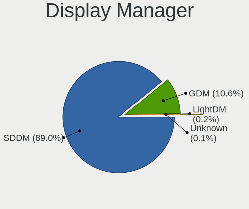

OpenMandriva - Hardware Trends
------------------------------

A project to identify most popular hardware characteristics and track their change
over time based on data collected by Linux users at https://Linux-Hardware.org.

Anyone can contribute to this report by the [hw-probe](https://github.com/linuxhw/hw-probe) tool:

    sudo -E hw-probe -all -upload

This is a report for all computer types. See also reports for [desktops](/Dist/OpenMandriva/Desktop/README.md) and [notebooks](/Dist/OpenMandriva/Notebook/README.md).

This report is for one last month. Overall report since the beginning of time: [TestCoverage](https://github.com/linuxhw/TestCoverage)

Period: Jan, 2023.

Contents
--------

* [ System ](#system)
  - [ OS                       ](#os)
  - [ OS Family                ](#os-family)
  - [ Kernel                   ](#kernel)
  - [ Kernel Family            ](#kernel-family)
  - [ Kernel Major Ver.        ](#kernel-major-ver)
  - [ Arch                     ](#arch)
  - [ DE                       ](#de)
  - [ Display Server           ](#display-server)
  - [ Display Manager          ](#display-manager)
  - [ OS Lang                  ](#os-lang)
  - [ Boot Mode                ](#boot-mode)
  - [ Filesystem               ](#filesystem)
  - [ Part. scheme             ](#part-scheme)
  - [ Dual Boot with Linux/BSD ](#dual-boot-with-linuxbsd)
  - [ Dual Boot (Win)          ](#dual-boot-win)

* [ Board ](#board)
  - [ Vendor                   ](#vendor)
  - [ Model                    ](#model)
  - [ Model Family             ](#model-family)
  - [ MFG Year                 ](#mfg-year)
  - [ Form Factor              ](#form-factor)
  - [ Secure Boot              ](#secure-boot)
  - [ Coreboot                 ](#coreboot)
  - [ RAM Size                 ](#ram-size)
  - [ RAM Used                 ](#ram-used)
  - [ Total Drives             ](#total-drives)
  - [ Has CD-ROM               ](#has-cd-rom)
  - [ Has Ethernet             ](#has-ethernet)
  - [ Has WiFi                 ](#has-wifi)
  - [ Has Bluetooth            ](#has-bluetooth)

* [ Location ](#location)
  - [ Country                  ](#country)
  - [ City                     ](#city)

* [ Drives ](#drives)
  - [ Drive Vendor             ](#drive-vendor)
  - [ Drive Model              ](#drive-model)
  - [ HDD Vendor               ](#hdd-vendor)
  - [ SSD Vendor               ](#ssd-vendor)
  - [ Drive Kind               ](#drive-kind)
  - [ Drive Connector          ](#drive-connector)
  - [ Drive Size               ](#drive-size)
  - [ Space Total              ](#space-total)
  - [ Space Used               ](#space-used)
  - [ Malfunc. Drives          ](#malfunc-drives)
  - [ Malfunc. Drive Vendor    ](#malfunc-drive-vendor)
  - [ Malfunc. HDD Vendor      ](#malfunc-hdd-vendor)
  - [ Malfunc. Drive Kind      ](#malfunc-drive-kind)
  - [ Failed Drives            ](#failed-drives)
  - [ Failed Drive Vendor      ](#failed-drive-vendor)
  - [ Drive Status             ](#drive-status)

* [ Storage controller ](#storage-controller)
  - [ Storage Vendor           ](#storage-vendor)
  - [ Storage Model            ](#storage-model)
  - [ Storage Kind             ](#storage-kind)

* [ Processor ](#processor)
  - [ CPU Vendor               ](#cpu-vendor)
  - [ CPU Model                ](#cpu-model)
  - [ CPU Model Family         ](#cpu-model-family)
  - [ CPU Cores                ](#cpu-cores)
  - [ CPU Sockets              ](#cpu-sockets)
  - [ CPU Threads              ](#cpu-threads)
  - [ CPU Op-Modes             ](#cpu-op-modes)
  - [ CPU Microcode            ](#cpu-microcode)
  - [ CPU Microarch            ](#cpu-microarch)

* [ Graphics ](#graphics)
  - [ GPU Vendor               ](#gpu-vendor)
  - [ GPU Model                ](#gpu-model)
  - [ GPU Combo                ](#gpu-combo)
  - [ GPU Driver               ](#gpu-driver)
  - [ GPU Memory               ](#gpu-memory)

* [ Monitor ](#monitor)
  - [ Monitor Vendor           ](#monitor-vendor)
  - [ Monitor Model            ](#monitor-model)
  - [ Monitor Resolution       ](#monitor-resolution)
  - [ Monitor Diagonal         ](#monitor-diagonal)
  - [ Monitor Width            ](#monitor-width)
  - [ Aspect Ratio             ](#aspect-ratio)
  - [ Monitor Area             ](#monitor-area)
  - [ Pixel Density            ](#pixel-density)
  - [ Multiple Monitors        ](#multiple-monitors)

* [ Network ](#network)
  - [ Net Controller Vendor    ](#net-controller-vendor)
  - [ Net Controller Model     ](#net-controller-model)
  - [ Wireless Vendor          ](#wireless-vendor)
  - [ Wireless Model           ](#wireless-model)
  - [ Ethernet Vendor          ](#ethernet-vendor)
  - [ Ethernet Model           ](#ethernet-model)
  - [ Net Controller Kind      ](#net-controller-kind)
  - [ Used Controller          ](#used-controller)
  - [ NICs                     ](#nics)
  - [ IPv6                     ](#ipv6)

* [ Bluetooth ](#bluetooth)
  - [ Bluetooth Vendor         ](#bluetooth-vendor)
  - [ Bluetooth Model          ](#bluetooth-model)

* [ Sound ](#sound)
  - [ Sound Vendor             ](#sound-vendor)
  - [ Sound Model              ](#sound-model)

* [ Memory ](#memory)
  - [ Memory Vendor            ](#memory-vendor)
  - [ Memory Model             ](#memory-model)
  - [ Memory Kind              ](#memory-kind)
  - [ Memory Form Factor       ](#memory-form-factor)
  - [ Memory Size              ](#memory-size)
  - [ Memory Speed             ](#memory-speed)

* [ Printers & scanners ](#printers--scanners)
  - [ Printer Vendor           ](#printer-vendor)
  - [ Printer Model            ](#printer-model)
  - [ Scanner Vendor           ](#scanner-vendor)
  - [ Scanner Model            ](#scanner-model)

* [ Camera ](#camera)
  - [ Camera Vendor            ](#camera-vendor)
  - [ Camera Model             ](#camera-model)

* [ Security ](#security)
  - [ Fingerprint Vendor       ](#fingerprint-vendor)
  - [ Fingerprint Model        ](#fingerprint-model)
  - [ Chipcard Vendor          ](#chipcard-vendor)
  - [ Chipcard Model           ](#chipcard-model)

* [ Unsupported ](#unsupported)
  - [ Unsupported Devices      ](#unsupported-devices)
  - [ Unsupported Device Types ](#unsupported-device-types)

System
------

OS
--

Installed operating systems

| Name               | Computers | Percent |
|--------------------|-----------|---------|
| OpenMandriva 23.01 | 1129      | 86.12%  |
| OpenMandriva 4.3   | 116       | 8.85%   |
| OpenMandriva 4.50  | 18        | 1.37%   |
| OpenMandriva 4.2   | 18        | 1.37%   |
| OpenMandriva 22.12 | 18        | 1.37%   |
| OpenMandriva 4.90  | 10        | 0.76%   |
| OpenMandriva 23.90 | 1         | 0.08%   |
| OpenMandriva 22.11 | 1         | 0.08%   |

OS Family
---------

OS without a version

| Name         | Computers | Percent |
|--------------|-----------|---------|
| OpenMandriva | 1311      | 100%    |

Kernel
------

Version of the Linux kernel

| Version                    | Computers | Percent |
|----------------------------|-----------|---------|
| 6.1.1-desktop-1omv2290     | 1098      | 83.75%  |
| 5.16.7-desktop-1omv4003    | 111       | 8.47%   |
| 6.1.4-desktop-1omv2301     | 18        | 1.37%   |
| 6.0.10-desktop-2omv22090   | 18        | 1.37%   |
| 5.10.14-desktop-1omv4002   | 17        | 1.3%    |
| 6.1.2-desktop-1omv2301     | 11        | 0.84%   |
| 5.19.12-desktop-2omv4090   | 8         | 0.61%   |
| 5.18.12-desktop-3omv4090   | 6         | 0.46%   |
| 5.16.13-desktop-1omv4003   | 5         | 0.38%   |
| 6.0.2-desktop-1omv4090     | 4         | 0.31%   |
| 5.19.5-desktop-1omv4090    | 4         | 0.31%   |
| 5.12.4-desktop-1omv4050    | 3         | 0.23%   |
| 6.1.4-desktop-gcc-1omv2301 | 2         | 0.15%   |
| 5.19.11-desktop-2omv4090   | 2         | 0.15%   |
| 6.1.5-desktop-1omv2390     | 1         | 0.08%   |
| 6.0.9-desktop-1omv22090    | 1         | 0.08%   |
| 6.0.2-desktop-1omv4050     | 1         | 0.08%   |
| 5.11.12-desktop-1omv4002   | 1         | 0.08%   |

Kernel Family
-------------

Linux kernel without a distro release

| Version | Computers | Percent |
|---------|-----------|---------|
| 6.1.1   | 1098      | 83.75%  |
| 5.16.7  | 111       | 8.47%   |
| 6.1.4   | 20        | 1.53%   |
| 6.0.10  | 18        | 1.37%   |
| 5.10.14 | 17        | 1.3%    |
| 6.1.2   | 11        | 0.84%   |
| 5.19.12 | 8         | 0.61%   |
| 5.18.12 | 6         | 0.46%   |
| 6.0.2   | 5         | 0.38%   |
| 5.16.13 | 5         | 0.38%   |
| 5.19.5  | 4         | 0.31%   |
| 5.12.4  | 3         | 0.23%   |
| 5.19.11 | 2         | 0.15%   |
| 6.1.5   | 1         | 0.08%   |
| 6.0.9   | 1         | 0.08%   |
| 5.11.12 | 1         | 0.08%   |

Kernel Major Ver.
-----------------

Linux kernel major version

| Version | Computers | Percent |
|---------|-----------|---------|
| 6.1     | 1130      | 86.19%  |
| 5.16    | 116       | 8.85%   |
| 6.0     | 24        | 1.83%   |
| 5.10    | 17        | 1.3%    |
| 5.19    | 14        | 1.07%   |
| 5.18    | 6         | 0.46%   |
| 5.12    | 3         | 0.23%   |
| 5.11    | 1         | 0.08%   |

Arch
----

OS architecture (x86_64, i586, etc.)

| Name   | Computers | Percent |
|--------|-----------|---------|
| x86_64 | 1311      | 100%    |

DE
--

Desktop Environment

| Name  | Computers | Percent |
|-------|-----------|---------|
| KDE5  | 1115      | 85.05%  |
| GNOME | 193       | 14.72%  |
| XFCE  | 2         | 0.15%   |
| LXQt  | 1         | 0.08%   |

Display Server
--------------

X11 or Wayland

| Name    | Computers | Percent |
|---------|-----------|---------|
| X11     | 1120      | 85.43%  |
| Wayland | 191       | 14.57%  |

Display Manager
---------------

SDDM, LightDM, etc.

| Name    | Computers | Percent |
|---------|-----------|---------|
| SDDM    | 1116      | 85.13%  |
| GDM     | 193       | 14.72%  |
| LightDM | 2         | 0.15%   |

OS Lang
-------

Language

| Lang  | Computers | Percent |
|-------|-----------|---------|
| en_US | 771       | 58.81%  |
| de_DE | 88        | 6.71%   |
| fr_FR | 82        | 6.25%   |
| ru_RU | 54        | 4.12%   |
| pt_BR | 45        | 3.43%   |
| pl_PL | 41        | 3.13%   |
| es_ES | 39        | 2.97%   |
| en_GB | 35        | 2.67%   |
| it_IT | 25        | 1.91%   |
| cs_CZ | 15        | 1.14%   |
| es_MX | 13        | 0.99%   |
| nl_NL | 10        | 0.76%   |
| en_AU | 8         | 0.61%   |
| de_CH | 7         | 0.53%   |
| de_AT | 7         | 0.53%   |
| hu_HU | 6         | 0.46%   |
| fr_CA | 5         | 0.38%   |
| es_CO | 5         | 0.38%   |
| es_CL | 5         | 0.38%   |
| en_CA | 5         | 0.38%   |
| tr_TR | 4         | 0.31%   |
| pt_PT | 4         | 0.31%   |
| es_VE | 3         | 0.23%   |
| es_AR | 3         | 0.23%   |
| fr_BE | 2         | 0.15%   |
| es_PE | 2         | 0.15%   |
| es_BO | 2         | 0.15%   |
| en_NZ | 2         | 0.15%   |
| en_IN | 2         | 0.15%   |
| en_DK | 2         | 0.15%   |
| en_AG | 2         | 0.15%   |
| da_DK | 2         | 0.15%   |
| ca_ES | 2         | 0.15%   |
| uk_UA | 1         | 0.08%   |
| ro_RO | 1         | 0.08%   |
| nl_BE | 1         | 0.08%   |
| nl_AW | 1         | 0.08%   |
| nb_NO | 1         | 0.08%   |
| it_CH | 1         | 0.08%   |
| es_UY | 1         | 0.08%   |

Boot Mode
---------

EFI or BIOS

| Mode | Computers | Percent |
|------|-----------|---------|
| EFI  | 796       | 60.72%  |
| BIOS | 515       | 39.28%  |

Filesystem
----------

Type of filesystem

| Type    | Computers | Percent |
|---------|-----------|---------|
| Overlay | 1068      | 81.46%  |
| Ext4    | 222       | 16.93%  |
| Btrfs   | 16        | 1.22%   |
| Xfs     | 3         | 0.23%   |
| F2fs    | 2         | 0.15%   |

Part. scheme
------------

Scheme of partitioning

| Type | Computers | Percent |
|------|-----------|---------|
| GPT  | 1000      | 76.28%  |
| MBR  | 311       | 23.72%  |

Dual Boot with Linux/BSD
------------------------

Hosting more than one Linux/BSD

| Dual boot | Computers | Percent |
|-----------|-----------|---------|
| Yes       | 798       | 60.87%  |
| No        | 513       | 39.13%  |

Dual Boot (Win)
---------------

Hosting Linux and Windows

| Dual boot | Computers | Percent |
|-----------|-----------|---------|
| No        | 720       | 54.92%  |
| Yes       | 591       | 45.08%  |

Board
-----

Vendor
------

Motherboard manufacturer

| Name                | Computers | Percent |
|---------------------|-----------|---------|
| ASUSTek Computer    | 229       | 17.47%  |
| Lenovo              | 169       | 12.89%  |
| Hewlett-Packard     | 169       | 12.89%  |
| Dell                | 148       | 11.29%  |
| Gigabyte Technology | 109       | 8.31%   |
| Acer                | 101       | 7.7%    |
| MSI                 | 87        | 6.64%   |
| ASRock              | 55        | 4.2%    |
| Toshiba             | 24        | 1.83%   |
| Intel               | 20        | 1.53%   |
| Apple               | 20        | 1.53%   |
| Fujitsu             | 14        | 1.07%   |
| Sony                | 10        | 0.76%   |
| Pegatron            | 9         | 0.69%   |
| Medion              | 9         | 0.69%   |
| AZW                 | 9         | 0.69%   |
| Unknown             | 8         | 0.61%   |
| Samsung Electronics | 7         | 0.53%   |
| ECS                 | 6         | 0.46%   |
| Gateway             | 5         | 0.38%   |
| Foxconn             | 5         | 0.38%   |
| TUXEDO              | 4         | 0.31%   |
| Positivo            | 4         | 0.31%   |
| Packard Bell        | 4         | 0.31%   |
| Microsoft           | 4         | 0.31%   |
| HUAWEI              | 4         | 0.31%   |
| Google              | 4         | 0.31%   |
| Schenker            | 3         | 0.23%   |
| Notebook            | 3         | 0.23%   |
| eMachines           | 3         | 0.23%   |
| Biostar             | 3         | 0.23%   |
| BESSTAR Tech        | 3         | 0.23%   |
| Alienware           | 3         | 0.23%   |
| ZOTAC               | 2         | 0.15%   |
| System76            | 2         | 0.15%   |
| Semp Toshiba        | 2         | 0.15%   |
| Panasonic           | 2         | 0.15%   |
| Itautec             | 2         | 0.15%   |
| Fujitsu Siemens     | 2         | 0.15%   |
| Clevo               | 2         | 0.15%   |

Model
-----

Motherboard model

| Name                                    | Computers | Percent |
|-----------------------------------------|-----------|---------|
| ASUS All Series                         | 14        | 1.07%   |
| Unknown                                 | 12        | 0.92%   |
| MSI MS-7C56                             | 6         | 0.46%   |
| HP Notebook                             | 6         | 0.46%   |
| AZW SER                                 | 5         | 0.38%   |
| ASUS TUF Gaming X570-PLUS               | 5         | 0.38%   |
| ASUS ROG Flow X13 GV301QH_GV301QH       | 5         | 0.38%   |
| ASUS PRIME B450M-A                      | 5         | 0.38%   |
| Toshiba dynabook T653/46JR              | 4         | 0.31%   |
| MSI MS-7D22                             | 4         | 0.31%   |
| MSI MS-7B89                             | 4         | 0.31%   |
| Dell OptiPlex 7010                      | 4         | 0.31%   |
| ASUS PRIME A320M-K                      | 4         | 0.31%   |
| ASUS M5A97 R2.0                         | 4         | 0.31%   |
| ASRock B450M Pro4                       | 4         | 0.31%   |
| Lenovo IdeaPad 5 15ARE05 81YQ           | 3         | 0.23%   |
| Lenovo G505 20240                       | 3         | 0.23%   |
| Lenovo G50-45 80E3                      | 3         | 0.23%   |
| HP Pavilion g6                          | 3         | 0.23%   |
| HP Laptop 15s-eq2xxx                    | 3         | 0.23%   |
| HP EliteBook 8460p                      | 3         | 0.23%   |
| Gigabyte B550M DS3H                     | 3         | 0.23%   |
| Gigabyte B450 AORUS ELITE               | 3         | 0.23%   |
| Dell OptiPlex 745                       | 3         | 0.23%   |
| Dell Latitude E6400                     | 3         | 0.23%   |
| Dell Latitude 7490                      | 3         | 0.23%   |
| Dell Inspiron 15-3567                   | 3         | 0.23%   |
| ASUS VivoBook_ASUSLaptop X540MAR_A543MA | 3         | 0.23%   |
| ASUS TUF Gaming B550-PLUS               | 3         | 0.23%   |
| ASUS PRIME B450M-K II                   | 3         | 0.23%   |
| ASUS PRIME B450-PLUS                    | 3         | 0.23%   |
| ASUS PRIME B360M-A                      | 3         | 0.23%   |
| Apple Macmini7,1                        | 3         | 0.23%   |
| Acer Iconia Tab W501                    | 3         | 0.23%   |
| System76 Darter Pro                     | 2         | 0.15%   |
| Semp Toshiba STI                        | 2         | 0.15%   |
| MSI MS-7D25                             | 2         | 0.15%   |
| MSI MS-7D20                             | 2         | 0.15%   |
| MSI MS-7C94                             | 2         | 0.15%   |
| MSI MS-7C91                             | 2         | 0.15%   |

Model Family
------------

Motherboard model prefix

| Name               | Computers | Percent |
|--------------------|-----------|---------|
| Acer Aspire        | 77        | 5.87%   |
| Lenovo ThinkPad    | 60        | 4.58%   |
| ASUS PRIME         | 47        | 3.59%   |
| Dell Inspiron      | 41        | 3.13%   |
| Lenovo IdeaPad     | 38        | 2.9%    |
| Dell Latitude      | 38        | 2.9%    |
| Dell OptiPlex      | 34        | 2.59%   |
| HP Pavilion        | 26        | 1.98%   |
| HP Compaq          | 24        | 1.83%   |
| ASUS TUF           | 23        | 1.75%   |
| ASUS VivoBook      | 21        | 1.6%    |
| ASUS ROG           | 21        | 1.6%    |
| Toshiba Satellite  | 19        | 1.45%   |
| HP EliteBook       | 19        | 1.45%   |
| HP Laptop          | 15        | 1.14%   |
| Lenovo ThinkCentre | 14        | 1.07%   |
| HP ProBook         | 14        | 1.07%   |
| ASUS All           | 14        | 1.07%   |
| Unknown            | 12        | 0.92%   |
| Lenovo Yoga        | 10        | 0.76%   |
| Dell Precision     | 10        | 0.76%   |
| Fujitsu ESPRIMO    | 9         | 0.69%   |
| Dell XPS           | 9         | 0.69%   |
| Acer Nitro         | 8         | 0.61%   |
| HP ProDesk         | 7         | 0.53%   |
| HP EliteDesk       | 7         | 0.53%   |
| Dell Vostro        | 7         | 0.53%   |
| MSI MS-7C56        | 6         | 0.46%   |
| HP Notebook        | 6         | 0.46%   |
| Gigabyte B450M     | 6         | 0.46%   |
| ASUS M5A78L-M      | 6         | 0.46%   |
| ASRock B450M       | 6         | 0.46%   |
| Lenovo Legion      | 5         | 0.38%   |
| Gigabyte B550M     | 5         | 0.38%   |
| Gigabyte B450      | 5         | 0.38%   |
| AZW SER            | 5         | 0.38%   |
| ASUS ZenBook       | 5         | 0.38%   |
| ASUS P8H61-M       | 5         | 0.38%   |
| ASUS M5A97         | 5         | 0.38%   |
| Toshiba dynabook   | 4         | 0.31%   |

MFG Year
--------

Motherboard manufacture year

| Year    | Computers | Percent |
|---------|-----------|---------|
| 2018    | 125       | 9.53%   |
| 2021    | 122       | 9.31%   |
| 2012    | 122       | 9.31%   |
| 2020    | 116       | 8.85%   |
| 2013    | 112       | 8.54%   |
| 2011    | 89        | 6.79%   |
| 2019    | 84        | 6.41%   |
| 2017    | 75        | 5.72%   |
| 2015    | 75        | 5.72%   |
| 2022    | 70        | 5.34%   |
| 2014    | 65        | 4.96%   |
| 2016    | 64        | 4.88%   |
| 2010    | 55        | 4.2%    |
| 2009    | 53        | 4.04%   |
| 2008    | 49        | 3.74%   |
| 2007    | 25        | 1.91%   |
| 2006    | 8         | 0.61%   |
| Unknown | 2         | 0.15%   |

Form Factor
-----------

Physical design of the computer

| Name        | Computers | Percent |
|-------------|-----------|---------|
| Notebook    | 617       | 47.06%  |
| Desktop     | 600       | 45.77%  |
| Mini pc     | 30        | 2.29%   |
| Convertible | 27        | 2.06%   |
| All in one  | 24        | 1.83%   |
| Tablet      | 11        | 0.84%   |
| Server      | 2         | 0.15%   |

Secure Boot
-----------

Enabled or disabled

| State    | Computers | Percent |
|----------|-----------|---------|
| Disabled | 1311      | 100%    |

Coreboot
--------

Have coreboot on board

| Used | Computers | Percent |
|------|-----------|---------|
| No   | 1302      | 99.31%  |
| Yes  | 9         | 0.69%   |

RAM Size
--------

Total RAM memory

| Size in GB  | Computers | Percent |
|-------------|-----------|---------|
| 4.01-8.0    | 345       | 26.32%  |
| 3.01-4.0    | 273       | 20.82%  |
| 16.01-24.0  | 259       | 19.76%  |
| 8.01-16.0   | 238       | 18.15%  |
| 32.01-64.0  | 101       | 7.7%    |
| 1.01-2.0    | 33        | 2.52%   |
| 24.01-32.0  | 23        | 1.75%   |
| 64.01-256.0 | 23        | 1.75%   |
| 2.01-3.0    | 15        | 1.14%   |
| 0.51-1.0    | 1         | 0.08%   |

RAM Used
--------

Used RAM memory

| Used GB  | Computers | Percent |
|----------|-----------|---------|
| 1.01-2.0 | 933       | 71.17%  |
| 2.01-3.0 | 289       | 22.04%  |
| 0.51-1.0 | 44        | 3.36%   |
| 3.01-4.0 | 30        | 2.29%   |
| 0.01-0.5 | 9         | 0.69%   |
| 4.01-8.0 | 6         | 0.46%   |

Total Drives
------------

Number of drives on board

| Drives | Computers | Percent |
|--------|-----------|---------|
| 1      | 719       | 54.84%  |
| 2      | 348       | 26.54%  |
| 3      | 115       | 8.77%   |
| 4      | 56        | 4.27%   |
| 5      | 25        | 1.91%   |
| 0      | 20        | 1.53%   |
| 6      | 15        | 1.14%   |
| 8      | 6         | 0.46%   |
| 7      | 6         | 0.46%   |
| 17     | 1         | 0.08%   |

Has CD-ROM
----------

Has CD-ROM on board

| Presented | Computers | Percent |
|-----------|-----------|---------|
| No        | 703       | 53.62%  |
| Yes       | 608       | 46.38%  |

Has Ethernet
------------

Has Ethernet on board

| Presented | Computers | Percent |
|-----------|-----------|---------|
| Yes       | 1183      | 90.24%  |
| No        | 128       | 9.76%   |

Has WiFi
--------

Has WiFi module

| Presented | Computers | Percent |
|-----------|-----------|---------|
| Yes       | 946       | 72.16%  |
| No        | 365       | 27.84%  |

Has Bluetooth
-------------

Has Bluetooth module

| Presented | Computers | Percent |
|-----------|-----------|---------|
| Yes       | 742       | 56.6%   |
| No        | 569       | 43.4%   |

Location
--------

Country
-------

Geographic location (country)

| Country      | Computers | Percent |
|--------------|-----------|---------|
| USA          | 215       | 16.4%   |
| Germany      | 135       | 10.3%   |
| France       | 106       | 8.09%   |
| Brazil       | 82        | 6.25%   |
| Russia       | 78        | 5.95%   |
| UK           | 59        | 4.5%    |
| Spain        | 58        | 4.42%   |
| Canada       | 52        | 3.97%   |
| Poland       | 51        | 3.89%   |
| Italy        | 51        | 3.89%   |
| Australia    | 29        | 2.21%   |
| Netherlands  | 26        | 1.98%   |
| Mexico       | 19        | 1.45%   |
| Finland      | 19        | 1.45%   |
| Japan        | 18        | 1.37%   |
| Hungary      | 18        | 1.37%   |
| Czechia      | 17        | 1.3%    |
| Switzerland  | 14        | 1.07%   |
| Romania      | 13        | 0.99%   |
| Belgium      | 12        | 0.92%   |
| Slovakia     | 11        | 0.84%   |
| India        | 11        | 0.84%   |
| Turkey       | 10        | 0.76%   |
| Serbia       | 10        | 0.76%   |
| Portugal     | 10        | 0.76%   |
| Greece       | 10        | 0.76%   |
| Colombia     | 9         | 0.69%   |
| Thailand     | 8         | 0.61%   |
| Indonesia    | 8         | 0.61%   |
| Chile        | 8         | 0.61%   |
| Austria      | 8         | 0.61%   |
| Argentina    | 7         | 0.53%   |
| Venezuela    | 6         | 0.46%   |
| Sweden       | 5         | 0.38%   |
| Norway       | 5         | 0.38%   |
| New Zealand  | 5         | 0.38%   |
| Denmark      | 5         | 0.38%   |
| Singapore    | 4         | 0.31%   |
| Saudi Arabia | 4         | 0.31%   |
| Malaysia     | 4         | 0.31%   |

City
----

Geographic location (city)

| City           | Computers | Percent |
|----------------|-----------|---------|
| Berlin         | 16        | 1.22%   |
| Moscow         | 15        | 1.14%   |
| Warsaw         | 12        | 0.92%   |
| Rome           | 10        | 0.76%   |
| Madrid         | 10        | 0.76%   |
| London         | 10        | 0.76%   |
| Amsterdam      | 9         | 0.69%   |
| Sao Paulo      | 8         | 0.61%   |
| Prague         | 8         | 0.61%   |
| Melbourne      | 8         | 0.61%   |
| Córdoba       | 8         | 0.61%   |
| Milan          | 7         | 0.53%   |
| Paris          | 6         | 0.46%   |
| Novosibirsk    | 6         | 0.46%   |
| Munich         | 6         | 0.46%   |
| Mexico City    | 6         | 0.46%   |
| Budapest       | 6         | 0.46%   |
| Brisbane       | 6         | 0.46%   |
| Sydney         | 5         | 0.38%   |
| Stuttgart      | 5         | 0.38%   |
| Jakarta        | 5         | 0.38%   |
| Chelyabinsk    | 5         | 0.38%   |
| Caracas        | 5         | 0.38%   |
| Bucharest      | 5         | 0.38%   |
| Bogotá        | 5         | 0.38%   |
| Barcelona      | 5         | 0.38%   |
| Vienna         | 4         | 0.31%   |
| Valencia       | 4         | 0.31%   |
| The Hague      | 4         | 0.31%   |
| Tampere        | 4         | 0.31%   |
| St Petersburg  | 4         | 0.31%   |
| Singapore      | 4         | 0.31%   |
| Santiago       | 4         | 0.31%   |
| Rio de Janeiro | 4         | 0.31%   |
| Québec        | 4         | 0.31%   |
| Phoenix        | 4         | 0.31%   |
| Nuremberg      | 4         | 0.31%   |
| Nottingham     | 4         | 0.31%   |
| Marseille      | 4         | 0.31%   |
| Limoges        | 4         | 0.31%   |

Drives
------

Drive Vendor
------------

Hard drive vendors

| Vendor              | Computers | Drives | Percent |
|---------------------|-----------|--------|---------|
| WDC                 | 313       | 374    | 15.74%  |
| Seagate             | 266       | 329    | 13.37%  |
| Samsung Electronics | 253       | 316    | 12.72%  |
| Kingston            | 141       | 154    | 7.09%   |
| Toshiba             | 130       | 139    | 6.54%   |
| Crucial             | 108       | 124    | 5.43%   |
| SanDisk             | 85        | 90     | 4.27%   |
| Unknown             | 61        | 66     | 3.07%   |
| Hitachi             | 53        | 54     | 2.66%   |
| A-DATA Technology   | 38        | 40     | 1.91%   |
| SK hynix            | 32        | 32     | 1.61%   |
| HGST                | 29        | 29     | 1.46%   |
| China               | 29        | 32     | 1.46%   |
| Intel               | 26        | 28     | 1.31%   |
| Micron Technology   | 24        | 24     | 1.21%   |
| PNY                 | 22        | 25     | 1.11%   |
| Patriot             | 20        | 21     | 1.01%   |
| SPCC                | 19        | 26     | 0.96%   |
| Phison              | 14        | 16     | 0.7%    |
| KIOXIA              | 14        | 14     | 0.7%    |
| GOODRAM             | 14        | 16     | 0.7%    |
| JMicron Technology  | 13        | 13     | 0.65%   |
| Intenso             | 13        | 15     | 0.65%   |
| Unknown             | 13        | 13     | 0.65%   |
| Silicon Motion      | 12        | 12     | 0.6%    |
| Transcend           | 11        | 11     | 0.55%   |
| Netac               | 11        | 11     | 0.55%   |
| Lexar               | 11        | 11     | 0.55%   |
| Gigabyte Technology | 11        | 12     | 0.55%   |
| KIOXIA-EXCERIA      | 9         | 9      | 0.45%   |
| Apple               | 9         | 9      | 0.45%   |
| Fujitsu             | 8         | 8      | 0.4%    |
| Team                | 7         | 7      | 0.35%   |
| OCZ                 | 7         | 7      | 0.35%   |
| Maxtor              | 7         | 8      | 0.35%   |
| Apacer              | 7         | 8      | 0.35%   |
| LITEON              | 6         | 6      | 0.3%    |
| XrayDisk            | 5         | 5      | 0.25%   |
| UMIS                | 5         | 5      | 0.25%   |
| KingSpec            | 5         | 5      | 0.25%   |

Drive Model
-----------

Hard drive models

| Model                              | Computers | Percent |
|------------------------------------|-----------|---------|
| Kingston SA400S37240G 240GB SSD    | 35        | 1.6%    |
| Kingston SA400S37480G 480GB SSD    | 26        | 1.19%   |
| Seagate ST500DM002-1BD142 500GB    | 19        | 0.87%   |
| Crucial CT500MX500SSD1 500GB       | 16        | 0.73%   |
| Seagate ST2000DM008-2FR102 2TB     | 15        | 0.68%   |
| Crucial CT1000MX500SSD1 1TB        | 15        | 0.68%   |
| Unknown SD/MMC/MS PRO 2GB          | 14        | 0.64%   |
| Seagate ST1000LM024 HN-M101MBB 1TB | 14        | 0.64%   |
| Seagate ST1000DM010-2EP102 1TB     | 14        | 0.64%   |
| Toshiba DT01ACA100 1TB             | 13        | 0.59%   |
| Unknown                            | 13        | 0.59%   |
| Samsung SSD 980 1TB                | 12        | 0.55%   |
| Samsung SSD 970 EVO Plus 500GB     | 12        | 0.55%   |
| Toshiba MQ01ABF050 500GB           | 11        | 0.5%    |
| Seagate ST500LT012-1DG142 500GB    | 11        | 0.5%    |
| Samsung SSD 860 EVO 500GB          | 11        | 0.5%    |
| HGST HTS721010A9E630 1TB           | 11        | 0.5%    |
| Crucial CT240BX500SSD1 240GB       | 11        | 0.5%    |
| Toshiba DT01ACA200 2TB             | 10        | 0.46%   |
| SanDisk NVMe SSD Drive 1TB         | 10        | 0.46%   |
| Kingston SV300S37A120G 120GB SSD   | 10        | 0.46%   |
| Crucial CT480BX500SSD1 480GB       | 10        | 0.46%   |
| Toshiba MQ01ABD100 1TB             | 9         | 0.41%   |
| Toshiba DT01ACA050 500GB           | 9         | 0.41%   |
| Seagate ST1000LM035-1RK172 1TB     | 9         | 0.41%   |
| Kingston SA400S37120G 120GB SSD    | 9         | 0.41%   |
| Toshiba MQ04ABF100 1TB             | 8         | 0.36%   |
| SanDisk NVMe SSD Drive 500GB       | 8         | 0.36%   |
| Samsung SSD 870 EVO 500GB          | 8         | 0.36%   |
| Samsung SSD 860 EVO 250GB          | 8         | 0.36%   |
| Samsung SSD 850 EVO 500GB          | 8         | 0.36%   |
| JMicron Generic 500GB              | 8         | 0.36%   |
| WDC WDBNCE5000PNC 500GB SSD        | 7         | 0.32%   |
| WDC WD20EZRZ-00Z5HB0 2TB           | 7         | 0.32%   |
| WDC WD10JPVX-22JC3T0 1TB           | 7         | 0.32%   |
| WDC WD10EZEX-00BN5A0 1TB           | 7         | 0.32%   |
| Seagate ST3500413AS 500GB          | 7         | 0.32%   |
| Seagate ST2000DM001-1CH164 2TB     | 7         | 0.32%   |
| Samsung SSD 960 EVO 250GB          | 7         | 0.32%   |
| Samsung SSD 860 EVO 1TB            | 7         | 0.32%   |

HDD Vendor
----------

Hard disk drive vendors

| Vendor              | Computers | Drives | Percent |
|---------------------|-----------|--------|---------|
| Seagate             | 258       | 319    | 33.77%  |
| WDC                 | 224       | 270    | 29.32%  |
| Toshiba             | 109       | 116    | 14.27%  |
| Hitachi             | 53        | 54     | 6.94%   |
| Samsung Electronics | 37        | 41     | 4.84%   |
| HGST                | 29        | 29     | 3.8%    |
| Unknown             | 14        | 14     | 1.83%   |
| Fujitsu             | 8         | 8      | 1.05%   |
| Maxtor              | 7         | 8      | 0.92%   |
| ASMT                | 4         | 4      | 0.52%   |
| Apple               | 4         | 4      | 0.52%   |
| USB3.0              | 3         | 3      | 0.39%   |
| SABRENT             | 3         | 4      | 0.39%   |
| Intenso             | 2         | 2      | 0.26%   |
| HGST HTS            | 2         | 2      | 0.26%   |
| ExcelStor           | 2         | 2      | 0.26%   |
| USB                 | 1         | 1      | 0.13%   |
| SAGE                | 1         | 1      | 0.13%   |
| Hewlett-Packard     | 1         | 1      | 0.13%   |
| ASMedia             | 1         | 1      | 0.13%   |
| Unknown             | 1         | 1      | 0.13%   |

SSD Vendor
----------

Solid state drive vendors

| Vendor              | Computers | Drives | Percent |
|---------------------|-----------|--------|---------|
| Samsung Electronics | 126       | 148    | 16.2%   |
| Kingston            | 109       | 119    | 14.01%  |
| Crucial             | 87        | 102    | 11.18%  |
| SanDisk             | 61        | 62     | 7.84%   |
| WDC                 | 47        | 50     | 6.04%   |
| China               | 29        | 32     | 3.73%   |
| A-DATA Technology   | 27        | 27     | 3.47%   |
| Patriot             | 19        | 20     | 2.44%   |
| PNY                 | 17        | 20     | 2.19%   |
| SPCC                | 16        | 22     | 2.06%   |
| Toshiba             | 14        | 14     | 1.8%    |
| GOODRAM             | 14        | 16     | 1.8%    |
| Intenso             | 12        | 13     | 1.54%   |
| Micron Technology   | 11        | 11     | 1.41%   |
| Transcend           | 10        | 10     | 1.29%   |
| SK hynix            | 10        | 10     | 1.29%   |
| KIOXIA-EXCERIA      | 9         | 9      | 1.16%   |
| JMicron Technology  | 9         | 9      | 1.16%   |
| Lexar               | 8         | 8      | 1.03%   |
| Intel               | 8         | 8      | 1.03%   |
| Unknown             | 8         | 8      | 1.03%   |
| OCZ                 | 7         | 7      | 0.9%    |
| Netac               | 7         | 7      | 0.9%    |
| Gigabyte Technology | 7         | 7      | 0.9%    |
| Apacer              | 6         | 7      | 0.77%   |
| XrayDisk            | 5         | 5      | 0.64%   |
| Team                | 5         | 5      | 0.64%   |
| KingSpec            | 5         | 5      | 0.64%   |
| LITEON              | 4         | 4      | 0.51%   |
| Apple               | 4         | 4      | 0.51%   |
| TO Exter            | 3         | 3      | 0.39%   |
| Phison              | 3         | 3      | 0.39%   |
| Leven               | 3         | 3      | 0.39%   |
| Kingchuxing         | 3         | 3      | 0.39%   |
| WALRAM              | 2         | 2      | 0.26%   |
| USB30               | 2         | 2      | 0.26%   |
| T-FORCE             | 2         | 2      | 0.26%   |
| Seagate             | 2         | 2      | 0.26%   |
| LITEONIT            | 2         | 2      | 0.26%   |
| Kingmax             | 2         | 2      | 0.26%   |

Drive Kind
----------

HDD or SSD

| Kind    | Computers | Drives | Percent |
|---------|-----------|--------|---------|
| SSD     | 654       | 848    | 37.07%  |
| HDD     | 651       | 885    | 36.9%   |
| NVMe    | 386       | 443    | 21.88%  |
| MMC     | 50        | 52     | 2.83%   |
| Unknown | 23        | 28     | 1.3%    |

Drive Connector
---------------

SATA, SAS, NVMe, etc.

| Type | Computers | Drives | Percent |
|------|-----------|--------|---------|
| SATA | 1056      | 1632   | 65.84%  |
| NVMe | 385       | 442    | 24%     |
| SAS  | 113       | 130    | 7.04%   |
| MMC  | 50        | 52     | 3.12%   |

Drive Size
----------

Size of hard drive

| Size in TB | Computers | Drives | Percent |
|------------|-----------|--------|---------|
| 0.01-0.5   | 801       | 1052   | 58.81%  |
| 0.51-1.0   | 387       | 472    | 28.41%  |
| 1.01-2.0   | 94        | 112    | 6.9%    |
| 3.01-4.0   | 26        | 32     | 1.91%   |
| 4.01-10.0  | 26        | 32     | 1.91%   |
| 2.01-3.0   | 25        | 29     | 1.84%   |
| 10.01-20.0 | 3         | 4      | 0.22%   |

Space Total
-----------

Amount of disk space available on the file system

| Size in GB     | Computers | Percent |
|----------------|-----------|---------|
| 1-20           | 692       | 52.78%  |
| 101-250        | 212       | 16.17%  |
| 251-500        | 115       | 8.77%   |
| Unknown        | 82        | 6.25%   |
| 501-1000       | 79        | 6.03%   |
| 51-100         | 50        | 3.81%   |
| 21-50          | 46        | 3.51%   |
| 1001-2000      | 19        | 1.45%   |
| More than 3000 | 10        | 0.76%   |
| 2001-3000      | 6         | 0.46%   |

Space Used
----------

Amount of used disk space

| Used GB        | Computers | Percent |
|----------------|-----------|---------|
| 1-20           | 1113      | 84.9%   |
| Unknown        | 82        | 6.25%   |
| 101-250        | 29        | 2.21%   |
| 51-100         | 27        | 2.06%   |
| 251-500        | 19        | 1.45%   |
| 21-50          | 18        | 1.37%   |
| 501-1000       | 12        | 0.92%   |
| 1001-2000      | 6         | 0.46%   |
| 2001-3000      | 4         | 0.31%   |
| More than 3000 | 1         | 0.08%   |

Malfunc. Drives
---------------

Drive models with a malfunction

| Model                               | Computers | Drives | Percent |
|-------------------------------------|-----------|--------|---------|
| Seagate ST500DM002-1BD142 500GB     | 8         | 8      | 2.55%   |
| Seagate ST2000DM001-1CH164 2TB      | 5         | 5      | 1.59%   |
| Seagate ST1000LM024 HN-M101MBB 1TB  | 5         | 5      | 1.59%   |
| Toshiba MQ01ABF050 500GB            | 4         | 4      | 1.27%   |
| Toshiba MQ01ABD075 752GB            | 4         | 4      | 1.27%   |
| Seagate ST31000524AS 1TB            | 4         | 4      | 1.27%   |
| HGST HTS721010A9E630 1TB            | 4         | 4      | 1.27%   |
| WDC WD10EADS-65L5B1 1TB             | 3         | 3      | 0.96%   |
| Toshiba DT01ACA050 500GB            | 3         | 3      | 0.96%   |
| Seagate ST9500325AS 500GB           | 3         | 3      | 0.96%   |
| Seagate ST500LT012-1DG142 500GB     | 3         | 3      | 0.96%   |
| Seagate ST3500413AS 500GB           | 3         | 3      | 0.96%   |
| Seagate ST250DM000-1BD141 250GB     | 3         | 3      | 0.96%   |
| Seagate ST2000DL003-9VT166 2TB      | 3         | 3      | 0.96%   |
| Maxtor STM3250310AS 250GB           | 3         | 3      | 0.96%   |
| Kingston SV300S37A120G 120GB SSD    | 3         | 3      | 0.96%   |
| Hitachi HTS545050B9A300 500GB       | 3         | 3      | 0.96%   |
| HGST HTS725050A7E630 500GB          | 3         | 3      | 0.96%   |
| HGST HTS545050A7E680 500GB          | 3         | 3      | 0.96%   |
| Unknown                             | 3         | 3      | 0.96%   |
| WDC WD5001AALS-00L3B2 500GB         | 2         | 2      | 0.64%   |
| WDC WD5000AAVS-00N7B0 500GB         | 2         | 2      | 0.64%   |
| WDC WD5000AAKX-221CA1 500GB         | 2         | 2      | 0.64%   |
| WDC WD5000AAKS-00UU3A0 500GB        | 2         | 2      | 0.64%   |
| WDC WD10JPVX-22JC3T0 1TB            | 2         | 2      | 0.64%   |
| Toshiba MQ04ABF100 1TB              | 2         | 2      | 0.64%   |
| Toshiba MQ01ABD100 1TB              | 2         | 2      | 0.64%   |
| Toshiba MQ01ABD050 500GB            | 2         | 2      | 0.64%   |
| Toshiba DT01ACA100 1TB              | 2         | 2      | 0.64%   |
| Seagate STM3250318AS 250GB          | 2         | 2      | 0.64%   |
| Seagate ST9100824AS 100GB           | 2         | 2      | 0.64%   |
| Seagate ST500LM012 HN-M500MBB 500GB | 2         | 2      | 0.64%   |
| Seagate ST3808110AS 80GB            | 2         | 2      | 0.64%   |
| Seagate ST3750640NS 752GB           | 2         | 2      | 0.64%   |
| Seagate ST3320613AS 320GB           | 2         | 2      | 0.64%   |
| Seagate ST31500341AS 1TB            | 2         | 2      | 0.64%   |
| Seagate ST2000DM008-2FR102 2TB      | 2         | 2      | 0.64%   |
| SanDisk SSD U100 256GB              | 2         | 2      | 0.64%   |
| SanDisk SSD P4 32GB                 | 2         | 2      | 0.64%   |
| Samsung Electronics SSD 870 EVO 1TB | 2         | 3      | 0.64%   |

Malfunc. Drive Vendor
---------------------

Vendors of faulty drives

| Vendor              | Computers | Drives | Percent |
|---------------------|-----------|--------|---------|
| Seagate             | 84        | 93     | 27.72%  |
| WDC                 | 65        | 70     | 21.45%  |
| Toshiba             | 35        | 35     | 11.55%  |
| Samsung Electronics | 19        | 22     | 6.27%   |
| Hitachi             | 18        | 19     | 5.94%   |
| HGST                | 14        | 14     | 4.62%   |
| Kingston            | 10        | 10     | 3.3%    |
| SanDisk             | 8         | 8      | 2.64%   |
| Maxtor              | 5         | 6      | 1.65%   |
| A-DATA Technology   | 5         | 5      | 1.65%   |
| Intel               | 4         | 4      | 1.32%   |
| Crucial             | 4         | 4      | 1.32%   |
| OCZ                 | 3         | 3      | 0.99%   |
| China               | 3         | 3      | 0.99%   |
| Unknown             | 3         | 3      | 0.99%   |
| SK hynix            | 2         | 2      | 0.66%   |
| Initio              | 2         | 2      | 0.66%   |
| ASMT                | 2         | 2      | 0.66%   |
| XrayDisk            | 1         | 1      | 0.33%   |
| USB3.0              | 1         | 1      | 0.33%   |
| USB                 | 1         | 1      | 0.33%   |
| Teclast             | 1         | 1      | 0.33%   |
| SUNEAST             | 1         | 1      | 0.33%   |
| SPCC                | 1         | 1      | 0.33%   |
| Plextor             | 1         | 1      | 0.33%   |
| Patriot             | 1         | 1      | 0.33%   |
| Netac               | 1         | 1      | 0.33%   |
| KingSpec            | 1         | 1      | 0.33%   |
| Hewlett-Packard     | 1         | 1      | 0.33%   |
| GOODRAM             | 1         | 1      | 0.33%   |
| Fujitsu             | 1         | 1      | 0.33%   |
| C-Series            | 1         | 1      | 0.33%   |
| ASMedia             | 1         | 1      | 0.33%   |
| Apple               | 1         | 1      | 0.33%   |
| 2-Power             | 1         | 1      | 0.33%   |

Malfunc. HDD Vendor
-------------------

Vendors of faulty HDD drives

| Vendor              | Computers | Drives | Percent |
|---------------------|-----------|--------|---------|
| Seagate             | 84        | 93     | 35.44%  |
| WDC                 | 60        | 65     | 25.32%  |
| Toshiba             | 34        | 34     | 14.35%  |
| Hitachi             | 18        | 19     | 7.59%   |
| Samsung Electronics | 15        | 17     | 6.33%   |
| HGST                | 14        | 14     | 5.91%   |
| Maxtor              | 5         | 6      | 2.11%   |
| ASMT                | 2         | 2      | 0.84%   |
| USB3.0              | 1         | 1      | 0.42%   |
| USB                 | 1         | 1      | 0.42%   |
| Hewlett-Packard     | 1         | 1      | 0.42%   |
| Fujitsu             | 1         | 1      | 0.42%   |
| ASMedia             | 1         | 1      | 0.42%   |

Malfunc. Drive Kind
-------------------

Kinds of faulty drives

| Kind | Computers | Drives | Percent |
|------|-----------|--------|---------|
| HDD  | 219       | 255    | 77.39%  |
| SSD  | 57        | 60     | 20.14%  |
| NVMe | 7         | 7      | 2.47%   |

Failed Drives
-------------

Failed drive models

| Model                             | Computers | Drives | Percent |
|-----------------------------------|-----------|--------|---------|
| WDC WD7500BPVT-22HXZT3 752GB      | 1         | 1      | 14.29%  |
| WDC WD5000AAKS-00C8A0 500GB       | 1         | 1      | 14.29%  |
| WDC WD10EARX-22N0YB0 1TB          | 1         | 1      | 14.29%  |
| Seagate ST3750640NS 752GB         | 1         | 1      | 14.29%  |
| Samsung Electronics HD502HJ 500GB | 1         | 1      | 14.29%  |
| Samsung Electronics HD103UJ 1TB   | 1         | 1      | 14.29%  |
| Hitachi HTS723232A7A364 320GB     | 1         | 1      | 14.29%  |

Failed Drive Vendor
-------------------

Failed drive vendors

| Vendor              | Computers | Drives | Percent |
|---------------------|-----------|--------|---------|
| WDC                 | 3         | 3      | 42.86%  |
| Samsung Electronics | 2         | 2      | 28.57%  |
| Seagate             | 1         | 1      | 14.29%  |
| Hitachi             | 1         | 1      | 14.29%  |

Drive Status
------------

Number of failed and malfunc. drives

| Status   | Computers | Drives | Percent |
|----------|-----------|--------|---------|
| Works    | 1088      | 1734   | 70.83%  |
| Malfunc  | 277       | 322    | 18.03%  |
| Detected | 164       | 193    | 10.68%  |
| Failed   | 7         | 7      | 0.46%   |

Storage controller
------------------

Storage Vendor
--------------

Storage controller vendors

| Vendor                           | Computers | Percent |
|----------------------------------|-----------|---------|
| Intel                            | 859       | 51.13%  |
| AMD                              | 340       | 20.24%  |
| Samsung Electronics              | 117       | 6.96%   |
| SanDisk                          | 73        | 4.35%   |
| Kingston Technology Company      | 34        | 2.02%   |
| Phison Electronics               | 31        | 1.85%   |
| ASMedia Technology               | 28        | 1.67%   |
| Silicon Motion                   | 25        | 1.49%   |
| SK hynix                         | 21        | 1.25%   |
| Nvidia                           | 20        | 1.19%   |
| Micron/Crucial Technology        | 19        | 1.13%   |
| Micron Technology                | 15        | 0.89%   |
| Marvell Technology Group         | 14        | 0.83%   |
| JMicron Technology               | 14        | 0.83%   |
| KIOXIA                           | 13        | 0.77%   |
| Toshiba America Info Systems     | 10        | 0.6%    |
| Realtek Semiconductor            | 8         | 0.48%   |
| ADATA Technology                 | 6         | 0.36%   |
| Union Memory (Shenzhen)          | 5         | 0.3%    |
| MAXIO Technology (Hangzhou)      | 5         | 0.3%    |
| Shenzhen Longsys Electronics     | 4         | 0.24%   |
| Seagate Technology               | 4         | 0.24%   |
| Solid State Storage Technology   | 3         | 0.18%   |
| Silicon Image                    | 3         | 0.18%   |
| Lite-On Technology               | 3         | 0.18%   |
| Netac Technology                 | 2         | 0.12%   |
| VIA Technologies                 | 1         | 0.06%   |
| Silicon Integrated Systems [SiS] | 1         | 0.06%   |
| LSI Logic / Symbios Logic        | 1         | 0.06%   |
| INNOGRIT                         | 1         | 0.06%   |

Storage Model
-------------

Storage controller models

| Model                                                                          | Computers | Percent |
|--------------------------------------------------------------------------------|-----------|---------|
| AMD FCH SATA Controller [AHCI mode]                                            | 219       | 11.34%  |
| Intel 7 Series Chipset Family 6-port SATA Controller [AHCI mode]               | 64        | 3.31%   |
| Intel 8 Series/C220 Series Chipset Family 6-port SATA Controller 1 [AHCI mode] | 59        | 3.05%   |
| AMD 400 Series Chipset SATA Controller                                         | 59        | 3.05%   |
| Intel Sunrise Point-LP SATA Controller [AHCI mode]                             | 48        | 2.48%   |
| Samsung NVMe SSD Controller SM981/PM981/PM983                                  | 47        | 2.43%   |
| Intel Q170/Q150/B150/H170/H110/Z170/CM236 Chipset SATA Controller [AHCI Mode]  | 47        | 2.43%   |
| Intel 6 Series/C200 Series Chipset Family 6 port Mobile SATA AHCI Controller   | 40        | 2.07%   |
| AMD 500 Series Chipset SATA Controller                                         | 38        | 1.97%   |
| AMD SB7x0/SB8x0/SB9x0 SATA Controller [AHCI mode]                              | 35        | 1.81%   |
| Samsung NVMe SSD Controller 980                                                | 33        | 1.71%   |
| AMD SB7x0/SB8x0/SB9x0 IDE Controller                                           | 32        | 1.66%   |
| Intel 82801 Mobile SATA Controller [RAID mode]                                 | 31        | 1.6%    |
| Intel 8 Series SATA Controller 1 [AHCI mode]                                   | 31        | 1.6%    |
| Intel Cannon Lake PCH SATA AHCI Controller                                     | 30        | 1.55%   |
| Intel 6 Series/C200 Series Chipset Family 6 port Desktop SATA AHCI Controller  | 29        | 1.5%    |
| Intel Volume Management Device NVMe RAID Controller                            | 28        | 1.45%   |
| Intel Celeron/Pentium Silver Processor SATA Controller                         | 28        | 1.45%   |
| Intel 7 Series/C210 Series Chipset Family 6-port SATA Controller [AHCI mode]   | 28        | 1.45%   |
| Intel 82801IBM/IEM (ICH9M/ICH9M-E) 4 port SATA Controller [AHCI mode]          | 26        | 1.35%   |
| AMD SB7x0/SB8x0/SB9x0 SATA Controller [IDE mode]                               | 24        | 1.24%   |
| Intel Wildcat Point-LP SATA Controller [AHCI Mode]                             | 23        | 1.19%   |
| Intel 200 Series PCH SATA controller [AHCI mode]                               | 23        | 1.19%   |
| Samsung NVMe SSD Controller SM961/PM961/SM963                                  | 22        | 1.14%   |
| Intel NM10/ICH7 Family SATA Controller [IDE mode]                              | 22        | 1.14%   |
| ASMedia ASM1062 Serial ATA Controller                                          | 22        | 1.14%   |
| SanDisk WD Blue SN550 NVMe SSD                                                 | 21        | 1.09%   |
| Silicon Motion SM2263EN/SM2263XT SSD Controller                                | 20        | 1.04%   |
| Intel 82801G (ICH7 Family) IDE Controller                                      | 20        | 1.04%   |
| Intel 5 Series/3400 Series Chipset 6 port SATA AHCI Controller                 | 20        | 1.04%   |
| SanDisk Non-Volatile memory controller                                         | 19        | 0.98%   |
| Intel Atom Processor E3800 Series SATA AHCI Controller                         | 19        | 0.98%   |
| Intel 500 Series Chipset Family SATA AHCI Controller                           | 18        | 0.93%   |
| Intel 82801HM/HEM (ICH8M/ICH8M-E) IDE Controller                               | 17        | 0.88%   |
| Samsung NVMe SSD Controller PM9A1/PM9A3/980PRO                                 | 16        | 0.83%   |
| Kingston Company Company Non-Volatile memory controller                        | 16        | 0.83%   |
| Intel Tiger Lake-LP SATA Controller                                            | 16        | 0.83%   |
| Intel Alder Lake-S PCH SATA Controller [AHCI Mode]                             | 16        | 0.83%   |
| Intel 5 Series/3400 Series Chipset 4 port SATA AHCI Controller                 | 16        | 0.83%   |
| Micron Non-Volatile memory controller                                          | 15        | 0.78%   |

Storage Kind
------------

Kind of storage controller (IDE, SATA, NVMe, SAS, ...)

| Kind | Computers | Percent |
|------|-----------|---------|
| SATA | 1073      | 63.42%  |
| NVMe | 383       | 22.64%  |
| IDE  | 157       | 9.28%   |
| RAID | 77        | 4.55%   |
| SAS  | 1         | 0.06%   |
| SCSI | 1         | 0.06%   |

Processor
---------

CPU Vendor
----------

Processor vendors

| Vendor | Computers | Percent |
|--------|-----------|---------|
| Intel  | 920       | 70.18%  |
| AMD    | 391       | 29.82%  |

CPU Model
---------

Processor models

| Model                                         | Computers | Percent |
|-----------------------------------------------|-----------|---------|
| AMD Ryzen 5 5600G with Radeon Graphics        | 14        | 1.07%   |
| Intel Core i5-7200U CPU @ 2.50GHz             | 13        | 0.99%   |
| AMD Ryzen 5 3600 6-Core Processor             | 13        | 0.99%   |
| AMD Ryzen 7 3700X 8-Core Processor            | 12        | 0.92%   |
| Intel Core i7-3770 CPU @ 3.40GHz              | 11        | 0.84%   |
| Intel Core i5-8250U CPU @ 1.60GHz             | 11        | 0.84%   |
| Intel Celeron N4020 CPU @ 1.10GHz             | 10        | 0.76%   |
| Intel 11th Gen Core i5-1135G7 @ 2.40GHz       | 10        | 0.76%   |
| Intel Core i7-8550U CPU @ 1.80GHz             | 9         | 0.69%   |
| AMD Ryzen 5 5600X 6-Core Processor            | 9         | 0.69%   |
| Intel Core i5-6500 CPU @ 3.20GHz              | 8         | 0.61%   |
| Intel Core i5-3470 CPU @ 3.20GHz              | 8         | 0.61%   |
| Intel Core i5-3320M CPU @ 2.60GHz             | 8         | 0.61%   |
| Intel Core i5-3210M CPU @ 2.50GHz             | 8         | 0.61%   |
| Intel Celeron CPU N2840 @ 2.16GHz             | 8         | 0.61%   |
| AMD Ryzen 7 5700U with Radeon Graphics        | 8         | 0.61%   |
| AMD Ryzen 5 5500U with Radeon Graphics        | 8         | 0.61%   |
| AMD Ryzen 5 3500U with Radeon Vega Mobile Gfx | 8         | 0.61%   |
| AMD Ryzen 5 2600 Six-Core Processor           | 8         | 0.61%   |
| Intel Core i7-5500U CPU @ 2.40GHz             | 7         | 0.53%   |
| Intel Core i5-6300U CPU @ 2.40GHz             | 7         | 0.53%   |
| Intel Core i5-4570 CPU @ 3.20GHz              | 7         | 0.53%   |
| Intel Core 2 Duo CPU E7500 @ 2.93GHz          | 7         | 0.53%   |
| Intel 11th Gen Core i7-1165G7 @ 2.80GHz       | 7         | 0.53%   |
| Intel 11th Gen Core i3-1115G4 @ 3.00GHz       | 7         | 0.53%   |
| AMD Ryzen 7 4700U with Radeon Graphics        | 7         | 0.53%   |
| AMD FX-8350 Eight-Core Processor              | 7         | 0.53%   |
| Intel Core i7-6700HQ CPU @ 2.60GHz            | 6         | 0.46%   |
| Intel Core i7-4790 CPU @ 3.60GHz              | 6         | 0.46%   |
| Intel Core i5-8400 CPU @ 2.80GHz              | 6         | 0.46%   |
| Intel Core i5-7400 CPU @ 3.00GHz              | 6         | 0.46%   |
| Intel Core i5-3230M CPU @ 2.60GHz             | 6         | 0.46%   |
| Intel Core i5-2450M CPU @ 2.50GHz             | 6         | 0.46%   |
| Intel Core i5-2410M CPU @ 2.30GHz             | 6         | 0.46%   |
| Intel Core 2 Duo CPU P8600 @ 2.40GHz          | 6         | 0.46%   |
| Intel Core 2 Duo CPU E8400 @ 3.00GHz          | 6         | 0.46%   |
| Intel Celeron N4000 CPU @ 1.10GHz             | 6         | 0.46%   |
| Intel 12th Gen Core i7-12700H                 | 6         | 0.46%   |
| AMD Ryzen 7 5800X 8-Core Processor            | 6         | 0.46%   |
| AMD Ryzen 5 5600H with Radeon Graphics        | 6         | 0.46%   |

CPU Model Family
----------------

Processor model prefix

| Model                   | Computers | Percent |
|-------------------------|-----------|---------|
| Intel Core i5           | 284       | 21.66%  |
| Intel Core i7           | 169       | 12.89%  |
| AMD Ryzen 5             | 116       | 8.85%   |
| Intel Core i3           | 105       | 8.01%   |
| Intel Celeron           | 92        | 7.02%   |
| AMD Ryzen 7             | 73        | 5.57%   |
| Other                   | 72        | 5.49%   |
| Intel Core 2 Duo        | 62        | 4.73%   |
| Intel Pentium           | 49        | 3.74%   |
| AMD Ryzen 9             | 22        | 1.68%   |
| AMD Ryzen 3             | 22        | 1.68%   |
| Intel Pentium Dual-Core | 20        | 1.53%   |
| AMD A6                  | 20        | 1.53%   |
| AMD FX                  | 19        | 1.45%   |
| Intel Xeon              | 14        | 1.07%   |
| Intel Core 2 Quad       | 12        | 0.92%   |
| AMD E1                  | 12        | 0.92%   |
| AMD A4                  | 12        | 0.92%   |
| AMD A8                  | 10        | 0.76%   |
| Intel Atom              | 9         | 0.69%   |
| Intel Pentium Dual      | 7         | 0.53%   |
| Intel Core 2            | 7         | 0.53%   |
| AMD Phenom II X4        | 7         | 0.53%   |
| AMD E                   | 7         | 0.53%   |
| AMD A10                 | 7         | 0.53%   |
| AMD PRO A10             | 5         | 0.38%   |
| AMD Athlon II X2        | 5         | 0.38%   |
| Intel Pentium Silver    | 4         | 0.31%   |
| Intel Core i9           | 4         | 0.31%   |
| AMD Phenom II X6        | 4         | 0.31%   |
| AMD Athlon              | 4         | 0.31%   |
| Intel Pentium Gold      | 3         | 0.23%   |
| Intel Pentium 4         | 3         | 0.23%   |
| AMD Ryzen 5 PRO         | 3         | 0.23%   |
| AMD Phenom II X2        | 3         | 0.23%   |
| AMD Phenom              | 3         | 0.23%   |
| AMD E2                  | 3         | 0.23%   |
| AMD C-50                | 3         | 0.23%   |
| AMD Athlon II X3        | 3         | 0.23%   |
| AMD Athlon II           | 3         | 0.23%   |

CPU Cores
---------

Number of processor cores

| Number | Computers | Percent |
|--------|-----------|---------|
| 2      | 559       | 42.64%  |
| 4      | 410       | 31.27%  |
| 6      | 158       | 12.05%  |
| 8      | 99        | 7.55%   |
| 1      | 37        | 2.82%   |
| 12     | 14        | 1.07%   |
| 3      | 12        | 0.92%   |
| 14     | 9         | 0.69%   |
| 16     | 7         | 0.53%   |
| 10     | 5         | 0.38%   |
| 28     | 1         | 0.08%   |

CPU Sockets
-----------

Number of sockets

| Number | Computers | Percent |
|--------|-----------|---------|
| 1      | 1309      | 99.85%  |
| 2      | 2         | 0.15%   |

CPU Threads
-----------

Threads per core (Hyper-Threading)

| Number | Computers | Percent |
|--------|-----------|---------|
| 2      | 797       | 60.79%  |
| 1      | 498       | 37.99%  |
| 4      | 12        | 0.92%   |
| 8      | 3         | 0.23%   |
| 12     | 1         | 0.08%   |

CPU Op-Modes
------------

CPU Operation Modes (32-bit, 64-bit)

| Op mode        | Computers | Percent |
|----------------|-----------|---------|
| 32-bit, 64-bit | 1311      | 100%    |

CPU Microcode
-------------

Microcode number

| Number     | Computers | Percent |
|------------|-----------|---------|
| 0x306a9    | 102       | 7.78%   |
| 0x206a7    | 83        | 6.33%   |
| 0x306c3    | 75        | 5.72%   |
| 0x1067a    | 61        | 4.65%   |
| Unknown    | 49        | 3.74%   |
| 0x506e3    | 43        | 3.28%   |
| 0x40651    | 34        | 2.59%   |
| 0x08701021 | 33        | 2.52%   |
| 0x906ea    | 32        | 2.44%   |
| 0x806c1    | 28        | 2.14%   |
| 0x20655    | 27        | 2.06%   |
| 0x906e9    | 26        | 1.98%   |
| 0x08108109 | 25        | 1.91%   |
| 0x806e9    | 24        | 1.83%   |
| 0x306d4    | 24        | 1.83%   |
| 0x0a50000c | 23        | 1.75%   |
| 0x806ea    | 21        | 1.6%    |
| 0x706a8    | 21        | 1.6%    |
| 0x6fd      | 20        | 1.53%   |
| 0x406e3    | 19        | 1.45%   |
| 0x30678    | 18        | 1.37%   |
| 0x0a50000d | 16        | 1.22%   |
| 0x08600106 | 16        | 1.22%   |
| 0x10676    | 15        | 1.14%   |
| 0x0a201016 | 15        | 1.14%   |
| 0x0800820d | 15        | 1.14%   |
| 0x08608103 | 14        | 1.07%   |
| 0xa0653    | 12        | 0.92%   |
| 0x406c4    | 12        | 0.92%   |
| 0x08101016 | 12        | 0.92%   |
| 0x08001138 | 12        | 0.92%   |
| 0x06001119 | 12        | 0.92%   |
| 0x806ec    | 11        | 0.84%   |
| 0x906ed    | 10        | 0.76%   |
| 0x906c0    | 10        | 0.76%   |
| 0x706a1    | 10        | 0.76%   |
| 0x0600611a | 10        | 0.76%   |
| 0x0500010d | 10        | 0.76%   |
| 0x010000b6 | 10        | 0.76%   |
| 0x906a3    | 9         | 0.69%   |

CPU Microarch
-------------

Microarchitecture

| Name             | Computers | Percent |
|------------------|-----------|---------|
| KabyLake         | 150       | 11.44%  |
| Haswell          | 113       | 8.62%   |
| IvyBridge        | 108       | 8.24%   |
| SandyBridge      | 84        | 6.41%   |
| Penryn           | 77        | 5.87%   |
| Zen 3            | 73        | 5.57%   |
| Skylake          | 69        | 5.26%   |
| Zen 2            | 61        | 4.65%   |
| Zen+             | 53        | 4.04%   |
| Silvermont       | 41        | 3.13%   |
| Core             | 38        | 2.9%    |
| Westmere         | 37        | 2.82%   |
| Zen              | 36        | 2.75%   |
| Piledriver       | 35        | 2.67%   |
| K10              | 33        | 2.52%   |
| TigerLake        | 32        | 2.44%   |
| Goldmont plus    | 31        | 2.36%   |
| CometLake        | 28        | 2.14%   |
| Alderlake Hybrid | 28        | 2.14%   |
| Broadwell        | 27        | 2.06%   |
| Unknown          | 25        | 1.91%   |
| Excavator        | 19        | 1.45%   |
| Bobcat           | 18        | 1.37%   |
| Icelake          | 16        | 1.22%   |
| Jaguar           | 13        | 0.99%   |
| Tremont          | 10        | 0.76%   |
| Puma             | 10        | 0.76%   |
| Nehalem          | 8         | 0.61%   |
| Goldmont         | 8         | 0.61%   |
| Steamroller      | 7         | 0.53%   |
| NetBurst         | 6         | 0.46%   |
| K10 Llano        | 6         | 0.46%   |
| K8 Hammer        | 4         | 0.31%   |
| Bonnell          | 4         | 0.31%   |
| K8 & K10 hybrid  | 2         | 0.15%   |
| Bulldozer        | 1         | 0.08%   |

Graphics
--------

GPU Vendor
----------

Vendors of graphics cards

| Vendor                     | Computers | Percent |
|----------------------------|-----------|---------|
| Intel                      | 721       | 49.11%  |
| AMD                        | 387       | 26.36%  |
| Nvidia                     | 358       | 24.39%  |
| Matrox Electronics Systems | 1         | 0.07%   |
| ASPEED Technology          | 1         | 0.07%   |

GPU Model
---------

Graphics card models

| Model                                                                                    | Computers | Percent |
|------------------------------------------------------------------------------------------|-----------|---------|
| Intel 2nd Generation Core Processor Family Integrated Graphics Controller                | 72        | 4.8%    |
| Intel 3rd Gen Core processor Graphics Controller                                         | 49        | 3.27%   |
| AMD Cezanne [Radeon Vega Series / Radeon Vega Mobile Series]                             | 34        | 2.27%   |
| Intel Xeon E3-1200 v3/4th Gen Core Processor Integrated Graphics Controller              | 33        | 2.2%    |
| Intel Haswell-ULT Integrated Graphics Controller                                         | 33        | 2.2%    |
| AMD Picasso/Raven 2 [Radeon Vega Series / Radeon Vega Mobile Series]                     | 33        | 2.2%    |
| Intel Mobile 4 Series Chipset Integrated Graphics Controller                             | 30        | 2%      |
| Intel HD Graphics 530                                                                    | 29        | 1.93%   |
| Intel GeminiLake [UHD Graphics 600]                                                      | 28        | 1.87%   |
| Intel Core Processor Integrated Graphics Controller                                      | 25        | 1.67%   |
| AMD Ellesmere [Radeon RX 470/480/570/570X/580/580X/590]                                  | 25        | 1.67%   |
| Intel UHD Graphics 620                                                                   | 23        | 1.53%   |
| Intel TigerLake-LP GT2 [Iris Xe Graphics]                                                | 22        | 1.47%   |
| AMD Renoir                                                                               | 22        | 1.47%   |
| Intel HD Graphics 620                                                                    | 21        | 1.4%    |
| Intel HD Graphics 5500                                                                   | 20        | 1.33%   |
| Intel CoffeeLake-S GT2 [UHD Graphics 630]                                                | 20        | 1.33%   |
| Intel Atom/Celeron/Pentium Processor x5-E8000/J3xxx/N3xxx Integrated Graphics Controller | 20        | 1.33%   |
| Intel Atom Processor Z36xxx/Z37xxx Series Graphics & Display                             | 20        | 1.33%   |
| AMD Raven Ridge [Radeon Vega Series / Radeon Vega Mobile Series]                         | 20        | 1.33%   |
| Nvidia GK208B [GeForce GT 710]                                                           | 19        | 1.27%   |
| Intel Xeon E3-1200 v2/3rd Gen Core processor Graphics Controller                         | 19        | 1.27%   |
| Intel Skylake GT2 [HD Graphics 520]                                                      | 19        | 1.27%   |
| Intel HD Graphics 630                                                                    | 17        | 1.13%   |
| Nvidia GP108 [GeForce GT 1030]                                                           | 16        | 1.07%   |
| Intel 4th Gen Core Processor Integrated Graphics Controller                              | 16        | 1.07%   |
| AMD Lucienne                                                                             | 16        | 1.07%   |
| Nvidia GP107 [GeForce GTX 1050 Ti]                                                       | 14        | 0.93%   |
| Intel 4 Series Chipset Integrated Graphics Controller                                    | 14        | 0.93%   |
| Intel Mobile GM965/GL960 Integrated Graphics Controller (secondary)                      | 12        | 0.8%    |
| Intel Mobile GM965/GL960 Integrated Graphics Controller (primary)                        | 12        | 0.8%    |
| Intel CoffeeLake-H GT2 [UHD Graphics 630]                                                | 12        | 0.8%    |
| AMD Wani [Radeon R5/R6/R7 Graphics]                                                      | 12        | 0.8%    |
| AMD Topaz XT [Radeon R7 M260/M265 / M340/M360 / M440/M445 / 530/535 / 620/625 Mobile]    | 12        | 0.8%    |
| AMD Navi 23 [Radeon RX 6600/6600 XT/6600M]                                               | 12        | 0.8%    |
| Nvidia TU117M [GeForce GTX 1650 Mobile / Max-Q]                                          | 10        | 0.67%   |
| Nvidia TU117 [GeForce GTX 1650]                                                          | 10        | 0.67%   |
| Nvidia GP107 [GeForce GTX 1050]                                                          | 10        | 0.67%   |
| Nvidia GP106 [GeForce GTX 1060 6GB]                                                      | 10        | 0.67%   |
| Intel Tiger Lake-LP GT2 [UHD Graphics G4]                                                | 10        | 0.67%   |

GPU Combo
---------

Combinations of graphics cards

| Name               | Computers | Percent |
|--------------------|-----------|---------|
| 1 x Intel          | 537       | 40.96%  |
| 1 x AMD            | 320       | 24.41%  |
| 1 x Nvidia         | 236       | 18%     |
| Intel + Nvidia     | 102       | 7.78%   |
| 2 x Intel          | 46        | 3.51%   |
| Intel + AMD        | 34        | 2.59%   |
| AMD + Nvidia       | 19        | 1.45%   |
| 2 x AMD            | 14        | 1.07%   |
| 1 x Matrox         | 1         | 0.08%   |
| Intel + 2 x Nvidia | 1         | 0.08%   |
| 1 x ASPEED         | 1         | 0.08%   |

GPU Driver
----------

Free vs proprietary

| Driver      | Computers | Percent |
|-------------|-----------|---------|
| Free        | 1289      | 98.32%  |
| Unknown     | 20        | 1.53%   |
| Proprietary | 2         | 0.15%   |

GPU Memory
----------

Total video memory

| Size in GB | Computers | Percent |
|------------|-----------|---------|
| Unknown    | 615       | 46.91%  |
| 1.01-2.0   | 194       | 14.8%   |
| 0.01-0.5   | 176       | 13.42%  |
| 0.51-1.0   | 104       | 7.93%   |
| 3.01-4.0   | 84        | 6.41%   |
| 7.01-8.0   | 65        | 4.96%   |
| 5.01-6.0   | 42        | 3.2%    |
| 8.01-16.0  | 17        | 1.3%    |
| 2.01-3.0   | 9         | 0.69%   |
| 16.01-24.0 | 3         | 0.23%   |
| 4.01-5.0   | 2         | 0.15%   |

Monitor
-------

Monitor Vendor
--------------

Monitor vendors

| Vendor                  | Computers | Percent |
|-------------------------|-----------|---------|
| Samsung Electronics     | 168       | 12.51%  |
| AU Optronics            | 159       | 11.84%  |
| LG Display              | 107       | 7.97%   |
| Chimei Innolux          | 102       | 7.59%   |
| BOE                     | 94        | 7%      |
| Goldstar                | 82        | 6.11%   |
| Hewlett-Packard         | 77        | 5.73%   |
| Dell                    | 66        | 4.91%   |
| Acer                    | 62        | 4.62%   |
| AOC                     | 45        | 3.35%   |
| Philips                 | 33        | 2.46%   |
| Lenovo                  | 30        | 2.23%   |
| BenQ                    | 28        | 2.08%   |
| Chi Mei Optoelectronics | 26        | 1.94%   |
| Ancor Communications    | 24        | 1.79%   |
| ViewSonic               | 20        | 1.49%   |
| ASUSTek Computer        | 20        | 1.49%   |
| PANDA                   | 17        | 1.27%   |
| Apple                   | 14        | 1.04%   |
| Sharp                   | 13        | 0.97%   |
| Iiyama                  | 13        | 0.97%   |
| Sony                    | 9         | 0.67%   |
| Eizo                    | 9         | 0.67%   |
| LG Philips              | 8         | 0.6%    |
| InfoVision              | 8         | 0.6%    |
| Panasonic               | 7         | 0.52%   |
| MSI                     | 6         | 0.45%   |
| HannStar                | 6         | 0.45%   |
| NEC Computers           | 5         | 0.37%   |
| Vizio                   | 4         | 0.3%    |
| Medion                  | 4         | 0.3%    |
| CSO                     | 4         | 0.3%    |
| Sceptre Tech            | 3         | 0.22%   |
| Mi                      | 3         | 0.22%   |
| IBM                     | 3         | 0.22%   |
| Hitachi                 | 3         | 0.22%   |
| Gigabyte Technology     | 3         | 0.22%   |
| Fujitsu Siemens         | 3         | 0.22%   |
| CVT                     | 3         | 0.22%   |
| CPT                     | 3         | 0.22%   |

Monitor Model
-------------

Monitor models

| Model                                                                     | Computers | Percent |
|---------------------------------------------------------------------------|-----------|---------|
| AU Optronics LCD Monitor AUO26EC 1366x768 344x193mm 15.5-inch             | 10        | 0.74%   |
| Samsung Electronics C24F390 SAM0D2C 1920x1080 521x293mm 23.5-inch         | 9         | 0.66%   |
| Samsung Electronics LCD Monitor SEC5441 1366x768 344x194mm 15.5-inch      | 7         | 0.51%   |
| Samsung Electronics C27F390 SAM0D32 1920x1080 598x336mm 27.0-inch         | 7         | 0.51%   |
| LG Display LCD Monitor LGD02DC 1366x768 344x194mm 15.5-inch               | 7         | 0.51%   |
| Chimei Innolux LCD Monitor CMN15F5 1920x1080 344x193mm 15.5-inch          | 7         | 0.51%   |
| Goldstar Ultra HD GSM5B08 3840x2160 600x340mm 27.2-inch                   | 6         | 0.44%   |
| Chimei Innolux LCD Monitor CMN15DB 1366x768 344x193mm 15.5-inch           | 6         | 0.44%   |
| AOC 27G2G4 AOC2702 1920x1080 598x336mm 27.0-inch                          | 6         | 0.44%   |
| Sharp LQ134N1JW52 SHP151E 1920x1200 288x180mm 13.4-inch                   | 5         | 0.37%   |
| Goldstar FULL HD GSM5B55 1920x1080 480x270mm 21.7-inch                    | 5         | 0.37%   |
| Chimei Innolux LCD Monitor CMN15E7 1920x1080 344x193mm 15.5-inch          | 5         | 0.37%   |
| Chimei Innolux LCD Monitor CMN14D4 1920x1080 309x173mm 13.9-inch          | 5         | 0.37%   |
| Samsung Electronics S24F350 SAM0D20 1920x1080 521x293mm 23.5-inch         | 4         | 0.29%   |
| LG Display LP156WH2-TLAA LGD0230 1366x768 344x194mm 15.5-inch             | 4         | 0.29%   |
| LG Display LCD Monitor LGD039F 1366x768 345x194mm 15.6-inch               | 4         | 0.29%   |
| LG Display LCD Monitor LGD033A 1366x768 344x194mm 15.5-inch               | 4         | 0.29%   |
| Lenovo LCD Monitor LEN40B0 1366x768 344x194mm 15.5-inch                   | 4         | 0.29%   |
| BOE LCD Monitor BOE06A4 1366x768 344x194mm 15.5-inch                      | 4         | 0.29%   |
| AU Optronics LCD Monitor AUO38ED 1920x1080 344x193mm 15.5-inch            | 4         | 0.29%   |
| AU Optronics LCD Monitor AUO21ED 1920x1080 344x194mm 15.5-inch            | 4         | 0.29%   |
| AU Optronics LCD Monitor AUO20EC 1366x768 344x193mm 15.5-inch             | 4         | 0.29%   |
| Samsung Electronics U28E590 SAM0C4D 3840x2160 607x345mm 27.5-inch         | 3         | 0.22%   |
| Samsung Electronics LCD Monitor SEC5541 1366x768 344x193mm 15.5-inch      | 3         | 0.22%   |
| Samsung Electronics LCD Monitor SDC4852 3840x2160 340x190mm 15.3-inch     | 3         | 0.22%   |
| Samsung Electronics LCD Monitor SDC4752 1366x768 344x194mm 15.5-inch      | 3         | 0.22%   |
| Samsung Electronics LCD Monitor SAM7106 1920x1080 530x300mm 24.0-inch     | 3         | 0.22%   |
| PANDA LCD Monitor NCP004D 1920x1080 344x194mm 15.5-inch                   | 3         | 0.22%   |
| PANDA LCD Monitor NCP0046 1920x1080 344x194mm 15.5-inch                   | 3         | 0.22%   |
| Panasonic VVX14P048M00 MEI96A2 3000x2000 285x190mm 13.5-inch              | 3         | 0.22%   |
| LG Display LCD Monitor LGD0563 1920x1080 344x194mm 15.5-inch              | 3         | 0.22%   |
| LG Display LCD Monitor LGD0557 1920x1080 309x174mm 14.0-inch              | 3         | 0.22%   |
| Lenovo AIO PC LEN2000 1920x1080 480x270mm 21.7-inch                       | 3         | 0.22%   |
| Goldstar HDR WFHD GSM7714 2560x1080 798x334mm 34.1-inch                   | 3         | 0.22%   |
| Goldstar HDR 4K GSM7707 3840x2160 600x340mm 27.2-inch                     | 3         | 0.22%   |
| Chimei Innolux LCD Monitor CMN1738 1920x1080 381x214mm 17.2-inch          | 3         | 0.22%   |
| Chimei Innolux LCD Monitor CMN15E6 1366x768 344x193mm 15.5-inch           | 3         | 0.22%   |
| Chimei Innolux LCD Monitor CMN15D5 1920x1080 344x193mm 15.5-inch          | 3         | 0.22%   |
| Chimei Innolux LCD Monitor CMN1130 1366x768 256x144mm 11.6-inch           | 3         | 0.22%   |
| Chi Mei Optoelectronics LCD Monitor CMO1720 1920x1080 382x215mm 17.3-inch | 3         | 0.22%   |

Monitor Resolution
------------------

Monitor screen resolution

| Resolution         | Computers | Percent |
|--------------------|-----------|---------|
| 1920x1080 (FHD)    | 588       | 44.71%  |
| 1366x768 (WXGA)    | 291       | 22.13%  |
| 3840x2160 (4K)     | 93        | 7.07%   |
| 1600x900 (HD+)     | 53        | 4.03%   |
| 2560x1440 (QHD)    | 52        | 3.95%   |
| 1680x1050 (WSXGA+) | 43        | 3.27%   |
| 1280x1024 (SXGA)   | 41        | 3.12%   |
| 1440x900 (WXGA+)   | 33        | 2.51%   |
| 1920x1200 (WUXGA)  | 30        | 2.28%   |
| 1280x800 (WXGA)    | 28        | 2.13%   |
| 3440x1440          | 10        | 0.76%   |
| 2560x1600          | 8         | 0.61%   |
| 2560x1080          | 8         | 0.61%   |
| 1360x768           | 7         | 0.53%   |
| 1024x768 (XGA)     | 5         | 0.38%   |
| 1920x540           | 3         | 0.23%   |
| 1600x1200          | 3         | 0.23%   |
| 1024x600           | 3         | 0.23%   |
| 2880x1800          | 2         | 0.15%   |
| 2736x1824          | 2         | 0.15%   |
| 1800x1200          | 2         | 0.15%   |
| 1680x945           | 2         | 0.15%   |
| 3840x2400          | 1         | 0.08%   |
| 3200x1800 (QHD+)   | 1         | 0.08%   |
| 2560x1700          | 1         | 0.08%   |
| 2288x1287          | 1         | 0.08%   |
| 2240x1400          | 1         | 0.08%   |
| 2160x1440          | 1         | 0.08%   |
| 1920x550           | 1         | 0.08%   |
| 1280x720 (HD)      | 1         | 0.08%   |

Monitor Diagonal
----------------

Diagonal size in inches

| Inches  | Computers | Percent |
|---------|-----------|---------|
| 15      | 338       | 25.15%  |
| 23      | 122       | 9.08%   |
| 27      | 116       | 8.63%   |
| 24      | 97        | 7.22%   |
| 13      | 91        | 6.77%   |
| 14      | 88        | 6.55%   |
| 21      | 85        | 6.32%   |
| 17      | 82        | 6.1%    |
| 31      | 39        | 2.9%    |
| 19      | 38        | 2.83%   |
| 18      | 32        | 2.38%   |
| 20      | 26        | 1.93%   |
| 11      | 24        | 1.79%   |
| 22      | 23        | 1.71%   |
| 12      | 22        | 1.64%   |
| 84      | 16        | 1.19%   |
| 40      | 12        | 0.89%   |
| 34      | 10        | 0.74%   |
| 16      | 9         | 0.67%   |
| 32      | 8         | 0.6%    |
| 26      | 8         | 0.6%    |
| 10      | 8         | 0.6%    |
| 54      | 7         | 0.52%   |
| 25      | 6         | 0.45%   |
| Unknown | 6         | 0.45%   |
| 52      | 4         | 0.3%    |
| 72      | 3         | 0.22%   |
| 36      | 3         | 0.22%   |
| 35      | 3         | 0.22%   |
| 28      | 3         | 0.22%   |
| 46      | 2         | 0.15%   |
| 43      | 2         | 0.15%   |
| 42      | 2         | 0.15%   |
| 74      | 1         | 0.07%   |
| 65      | 1         | 0.07%   |
| 64      | 1         | 0.07%   |
| 59      | 1         | 0.07%   |
| 47      | 1         | 0.07%   |
| 41      | 1         | 0.07%   |
| 38      | 1         | 0.07%   |

Monitor Width
-------------

Physical width

| Width in mm | Computers | Percent |
|-------------|-----------|---------|
| 301-350     | 492       | 36.96%  |
| 501-600     | 320       | 24.04%  |
| 401-500     | 187       | 14.05%  |
| 201-300     | 95        | 7.14%   |
| 351-400     | 94        | 7.06%   |
| 601-700     | 57        | 4.28%   |
| 701-800     | 22        | 1.65%   |
| 1501-2000   | 20        | 1.5%    |
| 1001-1500   | 17        | 1.28%   |
| 801-900     | 16        | 1.2%    |
| Unknown     | 6         | 0.45%   |
| 901-1000    | 5         | 0.38%   |

Aspect Ratio
------------

Proportional relationship between the width and the height

| Ratio | Computers | Percent |
|-------|-----------|---------|
| 16/9  | 1056      | 82.56%  |
| 16/10 | 142       | 11.1%   |
| 5/4   | 40        | 3.13%   |
| 21/9  | 15        | 1.17%   |
| 3/2   | 12        | 0.94%   |
| 4/3   | 10        | 0.78%   |
| 32/9  | 3         | 0.23%   |
| 6/5   | 1         | 0.08%   |

Monitor Area
------------

Area in inch²

| Area in inch² | Computers | Percent |
|----------------|-----------|---------|
| 101-110        | 337       | 25.22%  |
| 201-250        | 262       | 19.61%  |
| 81-90          | 145       | 10.85%  |
| 301-350        | 123       | 9.21%   |
| 151-200        | 95        | 7.11%   |
| 351-500        | 62        | 4.64%   |
| 121-130        | 52        | 3.89%   |
| 141-150        | 50        | 3.74%   |
| 251-300        | 40        | 2.99%   |
| 71-80          | 38        | 2.84%   |
| More than 1000 | 34        | 2.54%   |
| 51-60          | 24        | 1.8%    |
| 501-1000       | 24        | 1.8%    |
| 61-70          | 17        | 1.27%   |
| 131-140        | 9         | 0.67%   |
| 41-50          | 8         | 0.6%    |
| 111-120        | 8         | 0.6%    |
| Unknown        | 6         | 0.45%   |
| 91-100         | 2         | 0.15%   |

Pixel Density
-------------

Pixels per inch

| Density       | Computers | Percent |
|---------------|-----------|---------|
| 51-100        | 552       | 41.72%  |
| 101-120       | 379       | 28.65%  |
| 121-160       | 289       | 21.84%  |
| 161-240       | 61        | 4.61%   |
| 1-50          | 21        | 1.59%   |
| More than 240 | 15        | 1.13%   |
| Unknown       | 6         | 0.45%   |

Multiple Monitors
-----------------

Total monitors connected

| Total | Computers | Percent |
|-------|-----------|---------|
| 1     | 1188      | 90.62%  |
| 2     | 112       | 8.54%   |
| 0     | 8         | 0.61%   |
| 3     | 2         | 0.15%   |
| 4     | 1         | 0.08%   |

Network
-------

Net Controller Vendor
---------------------

Controller vendors

| Vendor                            | Computers | Percent |
|-----------------------------------|-----------|---------|
| Realtek Semiconductor             | 781       | 40.07%  |
| Intel                             | 565       | 28.99%  |
| Qualcomm Atheros                  | 242       | 12.42%  |
| Broadcom                          | 111       | 5.7%    |
| Ralink Technology                 | 30        | 1.54%   |
| MediaTek                          | 27        | 1.39%   |
| Broadcom Limited                  | 24        | 1.23%   |
| Ralink                            | 22        | 1.13%   |
| Marvell Technology Group          | 15        | 0.77%   |
| Nvidia                            | 14        | 0.72%   |
| ASIX Electronics                  | 11        | 0.56%   |
| TP-Link                           | 6         | 0.31%   |
| Samsung Electronics               | 6         | 0.31%   |
| JMicron Technology                | 6         | 0.31%   |
| DisplayLink                       | 6         | 0.31%   |
| Qualcomm Atheros Communications   | 5         | 0.26%   |
| Ericsson Business Mobile Networks | 5         | 0.26%   |
| Dell                              | 5         | 0.26%   |
| Belkin Components                 | 5         | 0.26%   |
| ASUSTek Computer                  | 5         | 0.26%   |
| Sierra Wireless                   | 4         | 0.21%   |
| OPPO Electronics                  | 4         | 0.21%   |
| OnePlus Technology (Shenzhen)     | 4         | 0.21%   |
| Huawei Technologies               | 4         | 0.21%   |
| D-Link System                     | 4         | 0.21%   |
| Edimax Technology                 | 3         | 0.15%   |
| D-Link                            | 3         | 0.15%   |
| ZTE WCDMA Technologies MSM        | 2         | 0.1%    |
| NetGear                           | 2         | 0.1%    |
| Microsoft                         | 2         | 0.1%    |
| Linksys                           | 2         | 0.1%    |
| AVM                               | 2         | 0.1%    |
| Aquantia                          | 2         | 0.1%    |
| Xiaomi                            | 1         | 0.05%   |
| SysKonnect                        | 1         | 0.05%   |
| Silicon Integrated Systems [SiS]  | 1         | 0.05%   |
| Qualcomm                          | 1         | 0.05%   |
| QinHeng Electronics               | 1         | 0.05%   |
| Qcom                              | 1         | 0.05%   |
| Oculus VR                         | 1         | 0.05%   |

Net Controller Model
--------------------

Controller models

| Model                                                             | Computers | Percent |
|-------------------------------------------------------------------|-----------|---------|
| Realtek RTL8111/8168/8411 PCI Express Gigabit Ethernet Controller | 546       | 24.25%  |
| Realtek RTL810xE PCI Express Fast Ethernet controller             | 85        | 3.77%   |
| Intel Wi-Fi 6 AX200                                               | 52        | 2.31%   |
| Qualcomm Atheros QCA9565 / AR9565 Wireless Network Adapter        | 43        | 1.91%   |
| Realtek RTL8125 2.5GbE Controller                                 | 42        | 1.87%   |
| Intel 82579LM Gigabit Network Connection (Lewisville)             | 42        | 1.87%   |
| Realtek RTL8821CE 802.11ac PCIe Wireless Network Adapter          | 39        | 1.73%   |
| Realtek RTL8153 Gigabit Ethernet Adapter                          | 32        | 1.42%   |
| Qualcomm Atheros QCA9377 802.11ac Wireless Network Adapter        | 31        | 1.38%   |
| Qualcomm Atheros AR9485 Wireless Network Adapter                  | 31        | 1.38%   |
| Qualcomm Atheros AR9285 Wireless Network Adapter (PCI-Express)    | 30        | 1.33%   |
| Intel Wireless 7265                                               | 30        | 1.33%   |
| Intel Wireless 8265 / 8275                                        | 28        | 1.24%   |
| Intel Wireless 3165                                               | 26        | 1.15%   |
| Intel Wireless 7260                                               | 25        | 1.11%   |
| Intel Dual Band Wireless-AC 3168NGW [Stone Peak]                  | 25        | 1.11%   |
| Intel Ethernet Connection I217-LM                                 | 24        | 1.07%   |
| Realtek RTL8822CE 802.11ac PCIe Wireless Network Adapter          | 23        | 1.02%   |
| Intel Wi-Fi 6 AX201                                               | 23        | 1.02%   |
| Intel Ethernet Controller I225-V                                  | 20        | 0.89%   |
| Intel Ethernet Connection (2) I219-V                              | 20        | 0.89%   |
| Realtek RTL8723BE PCIe Wireless Network Adapter                   | 18        | 0.8%    |
| Intel I211 Gigabit Network Connection                             | 18        | 0.8%    |
| Ralink MT7601U Wireless Adapter                                   | 17        | 0.75%   |
| Intel Centrino Advanced-N 6205 [Taylor Peak]                      | 17        | 0.75%   |
| Intel Wireless 8260                                               | 16        | 0.71%   |
| Intel Cannon Lake PCH CNVi WiFi                                   | 16        | 0.71%   |
| Broadcom BCM4313 802.11bgn Wireless Network Adapter               | 14        | 0.62%   |
| Qualcomm Atheros AR9462 Wireless Network Adapter                  | 13        | 0.58%   |
| Qualcomm Atheros QCA6174 802.11ac Wireless Network Adapter        | 12        | 0.53%   |
| Intel Wireless 3160                                               | 12        | 0.53%   |
| Intel Ethernet Connection (7) I219-V                              | 12        | 0.53%   |
| Broadcom NetLink BCM57780 Gigabit Ethernet PCIe                   | 12        | 0.53%   |
| Qualcomm Atheros AR9287 Wireless Network Adapter (PCI-Express)    | 10        | 0.44%   |
| Intel Wireless-AC 9260                                            | 10        | 0.44%   |
| Intel Wi-Fi 6 AX210/AX211/AX411 160MHz                            | 10        | 0.44%   |
| Intel 82577LM Gigabit Network Connection                          | 10        | 0.44%   |
| Broadcom NetLink BCM57785 Gigabit Ethernet PCIe                   | 10        | 0.44%   |
| Qualcomm Atheros AR928X Wireless Network Adapter (PCI-Express)    | 9         | 0.4%    |
| Qualcomm Atheros AR8161 Gigabit Ethernet                          | 9         | 0.4%    |

Wireless Vendor
---------------

Wireless vendors

| Vendor                                | Computers | Percent |
|---------------------------------------|-----------|---------|
| Intel                                 | 421       | 42.92%  |
| Qualcomm Atheros                      | 195       | 19.88%  |
| Realtek Semiconductor                 | 171       | 17.43%  |
| Broadcom                              | 57        | 5.81%   |
| Ralink Technology                     | 30        | 3.06%   |
| Ralink                                | 22        | 2.24%   |
| MediaTek                              | 22        | 2.24%   |
| Broadcom Limited                      | 12        | 1.22%   |
| TP-Link                               | 6         | 0.61%   |
| Qualcomm Atheros Communications       | 5         | 0.51%   |
| Belkin Components                     | 5         | 0.51%   |
| ASUSTek Computer                      | 5         | 0.51%   |
| Sierra Wireless                       | 4         | 0.41%   |
| Edimax Technology                     | 3         | 0.31%   |
| D-Link System                         | 3         | 0.31%   |
| D-Link                                | 3         | 0.31%   |
| NetGear                               | 2         | 0.2%    |
| Microsoft                             | 2         | 0.2%    |
| AVM                                   | 2         | 0.2%    |
| Qcom                                  | 1         | 0.1%    |
| Mercucys                              | 1         | 0.1%    |
| Marvell Technology Group              | 1         | 0.1%    |
| Linksys                               | 1         | 0.1%    |
| IMC Networks                          | 1         | 0.1%    |
| Gemtek                                | 1         | 0.1%    |
| Fibocom                               | 1         | 0.1%    |
| Ericsson Business Mobile Networks     | 1         | 0.1%    |
| Elecom                                | 1         | 0.1%    |
| Dell                                  | 1         | 0.1%    |
| 802.11g Adapter [Linksys WUSB54GC v3] | 1         | 0.1%    |

Wireless Model
--------------

Wireless models

| Model                                                          | Computers | Percent |
|----------------------------------------------------------------|-----------|---------|
| Intel Wi-Fi 6 AX200                                            | 52        | 5.28%   |
| Qualcomm Atheros QCA9565 / AR9565 Wireless Network Adapter     | 43        | 4.37%   |
| Realtek RTL8821CE 802.11ac PCIe Wireless Network Adapter       | 39        | 3.96%   |
| Qualcomm Atheros QCA9377 802.11ac Wireless Network Adapter     | 31        | 3.15%   |
| Qualcomm Atheros AR9485 Wireless Network Adapter               | 31        | 3.15%   |
| Qualcomm Atheros AR9285 Wireless Network Adapter (PCI-Express) | 30        | 3.05%   |
| Intel Wireless 7265                                            | 30        | 3.05%   |
| Intel Wireless 8265 / 8275                                     | 28        | 2.84%   |
| Intel Wireless 3165                                            | 26        | 2.64%   |
| Intel Wireless 7260                                            | 25        | 2.54%   |
| Intel Dual Band Wireless-AC 3168NGW [Stone Peak]               | 25        | 2.54%   |
| Realtek RTL8822CE 802.11ac PCIe Wireless Network Adapter       | 23        | 2.34%   |
| Intel Wi-Fi 6 AX201                                            | 23        | 2.34%   |
| Realtek RTL8723BE PCIe Wireless Network Adapter                | 18        | 1.83%   |
| Ralink MT7601U Wireless Adapter                                | 17        | 1.73%   |
| Intel Centrino Advanced-N 6205 [Taylor Peak]                   | 17        | 1.73%   |
| Intel Wireless 8260                                            | 16        | 1.62%   |
| Intel Cannon Lake PCH CNVi WiFi                                | 16        | 1.62%   |
| Broadcom BCM4313 802.11bgn Wireless Network Adapter            | 14        | 1.42%   |
| Qualcomm Atheros AR9462 Wireless Network Adapter               | 13        | 1.32%   |
| Qualcomm Atheros QCA6174 802.11ac Wireless Network Adapter     | 12        | 1.22%   |
| Intel Wireless 3160                                            | 12        | 1.22%   |
| Qualcomm Atheros AR9287 Wireless Network Adapter (PCI-Express) | 10        | 1.02%   |
| Intel Wireless-AC 9260                                         | 10        | 1.02%   |
| Intel Wi-Fi 6 AX210/AX211/AX411 160MHz                         | 10        | 1.02%   |
| Qualcomm Atheros AR928X Wireless Network Adapter (PCI-Express) | 9         | 0.91%   |
| MediaTek MT7921K (RZ608) Wi-Fi 6E 80MHz                        | 9         | 0.91%   |
| Intel WiFi Link 5100                                           | 9         | 0.91%   |
| Intel Gemini Lake PCH CNVi WiFi                                | 9         | 0.91%   |
| Intel Centrino Advanced-N 6200                                 | 9         | 0.91%   |
| Intel Alder Lake-P PCH CNVi WiFi                               | 9         | 0.91%   |
| Broadcom BCM43142 802.11b/g/n                                  | 9         | 0.91%   |
| MediaTek MT7921 802.11ax PCI Express Wireless Network Adapter  | 8         | 0.81%   |
| Intel Comet Lake PCH CNVi WiFi                                 | 8         | 0.81%   |
| Intel Cannon Point-LP CNVi [Wireless-AC]                       | 8         | 0.81%   |
| Realtek RTL8192EE PCIe Wireless Network Adapter                | 7         | 0.71%   |
| Realtek RTL8188EUS 802.11n Wireless Network Adapter            | 7         | 0.71%   |
| Realtek RTL8188CE 802.11b/g/n WiFi Adapter                     | 7         | 0.71%   |
| Realtek 802.11ac NIC                                           | 7         | 0.71%   |
| Intel Comet Lake PCH-LP CNVi WiFi                              | 7         | 0.71%   |

Ethernet Vendor
---------------

Ethernet vendors

| Vendor                           | Computers | Percent |
|----------------------------------|-----------|---------|
| Realtek Semiconductor            | 711       | 57.62%  |
| Intel                            | 280       | 22.69%  |
| Qualcomm Atheros                 | 72        | 5.83%   |
| Broadcom                         | 70        | 5.67%   |
| Nvidia                           | 14        | 1.13%   |
| Marvell Technology Group         | 14        | 1.13%   |
| Broadcom Limited                 | 12        | 0.97%   |
| ASIX Electronics                 | 11        | 0.89%   |
| Samsung Electronics              | 6         | 0.49%   |
| JMicron Technology               | 6         | 0.49%   |
| DisplayLink                      | 6         | 0.49%   |
| MediaTek                         | 5         | 0.41%   |
| OPPO Electronics                 | 4         | 0.32%   |
| OnePlus Technology (Shenzhen)    | 4         | 0.32%   |
| Huawei Technologies              | 4         | 0.32%   |
| ZTE WCDMA Technologies MSM       | 2         | 0.16%   |
| Aquantia                         | 2         | 0.16%   |
| Xiaomi                           | 1         | 0.08%   |
| SysKonnect                       | 1         | 0.08%   |
| Silicon Integrated Systems [SiS] | 1         | 0.08%   |
| Qualcomm                         | 1         | 0.08%   |
| Motorola PCS                     | 1         | 0.08%   |
| Mellanox Technologies            | 1         | 0.08%   |
| Linksys                          | 1         | 0.08%   |
| Lenovo                           | 1         | 0.08%   |
| HTC (High Tech Computer)         | 1         | 0.08%   |
| D-Link System                    | 1         | 0.08%   |
| 3Com                             | 1         | 0.08%   |

Ethernet Model
--------------

Ethernet models

| Model                                                             | Computers | Percent |
|-------------------------------------------------------------------|-----------|---------|
| Realtek RTL8111/8168/8411 PCI Express Gigabit Ethernet Controller | 546       | 43.51%  |
| Realtek RTL810xE PCI Express Fast Ethernet controller             | 85        | 6.77%   |
| Realtek RTL8125 2.5GbE Controller                                 | 42        | 3.35%   |
| Intel 82579LM Gigabit Network Connection (Lewisville)             | 42        | 3.35%   |
| Realtek RTL8153 Gigabit Ethernet Adapter                          | 32        | 2.55%   |
| Intel Ethernet Connection I217-LM                                 | 24        | 1.91%   |
| Intel Ethernet Controller I225-V                                  | 20        | 1.59%   |
| Intel Ethernet Connection (2) I219-V                              | 20        | 1.59%   |
| Intel I211 Gigabit Network Connection                             | 18        | 1.43%   |
| Intel Ethernet Connection (7) I219-V                              | 12        | 0.96%   |
| Broadcom NetLink BCM57780 Gigabit Ethernet PCIe                   | 12        | 0.96%   |
| Intel 82577LM Gigabit Network Connection                          | 10        | 0.8%    |
| Broadcom NetLink BCM57785 Gigabit Ethernet PCIe                   | 10        | 0.8%    |
| Qualcomm Atheros AR8161 Gigabit Ethernet                          | 9         | 0.72%   |
| Intel Ethernet Connection (2) I219-LM                             | 9         | 0.72%   |
| Intel Ethernet Connection (2) I218-V                              | 9         | 0.72%   |
| Intel 82567LM Gigabit Network Connection                          | 9         | 0.72%   |
| Qualcomm Atheros Killer E220x Gigabit Ethernet Controller         | 8         | 0.64%   |
| Nvidia MCP61 Ethernet                                             | 8         | 0.64%   |
| Intel Ethernet Connection I218-LM                                 | 8         | 0.64%   |
| Qualcomm Atheros Killer E2400 Gigabit Ethernet Controller         | 7         | 0.56%   |
| Qualcomm Atheros AR8162 Fast Ethernet                             | 7         | 0.56%   |
| Intel Ethernet Connection I219-LM                                 | 7         | 0.56%   |
| Intel Ethernet Connection I217-V                                  | 7         | 0.56%   |
| Intel Ethernet Connection (4) I219-LM                             | 7         | 0.56%   |
| Intel 82579V Gigabit Network Connection                           | 7         | 0.56%   |
| Broadcom NetXtreme BCM57786 Gigabit Ethernet PCIe                 | 7         | 0.56%   |
| Broadcom NetXtreme BCM57766 Gigabit Ethernet PCIe                 | 7         | 0.56%   |
| Broadcom NetXtreme BCM5761 Gigabit Ethernet PCIe                  | 7         | 0.56%   |
| ASIX AX88179 Gigabit Ethernet                                     | 7         | 0.56%   |
| Qualcomm Atheros AR8151 v2.0 Gigabit Ethernet                     | 6         | 0.48%   |
| Intel Ethernet Connection (7) I219-LM                             | 6         | 0.48%   |
| Intel Ethernet Connection (3) I218-LM                             | 6         | 0.48%   |
| Intel 82574L Gigabit Network Connection                           | 6         | 0.48%   |
| Intel 82567LM-3 Gigabit Network Connection                        | 6         | 0.48%   |
| Samsung Galaxy series, misc. (tethering mode)                     | 5         | 0.4%    |
| Realtek RTL8152 Fast Ethernet Adapter                             | 5         | 0.4%    |
| Realtek RTL-8100/8101L/8139 PCI Fast Ethernet Adapter             | 5         | 0.4%    |
| Realtek Killer E2600 Gigabit Ethernet Controller                  | 5         | 0.4%    |
| Qualcomm Atheros AR8152 v2.0 Fast Ethernet                        | 5         | 0.4%    |

Net Controller Kind
-------------------

Ethernet, WiFi or modem

| Kind     | Computers | Percent |
|----------|-----------|---------|
| Ethernet | 1182      | 55.26%  |
| WiFi     | 945       | 44.18%  |
| Modem    | 12        | 0.56%   |

Used Controller
---------------

Currently used network controller

| Kind     | Computers | Percent |
|----------|-----------|---------|
| Ethernet | 691       | 54.11%  |
| WiFi     | 586       | 45.89%  |

NICs
----

Total network controllers on board

| Total | Computers | Percent |
|-------|-----------|---------|
| 2     | 706       | 53.85%  |
| 1     | 574       | 43.78%  |
| 3     | 17        | 1.3%    |
| 0     | 10        | 0.76%   |
| 4     | 3         | 0.23%   |
| 6     | 1         | 0.08%   |

IPv6
----

IPv6 vs IPv4

| Used | Computers | Percent |
|------|-----------|---------|
| No   | 877       | 66.9%   |
| Yes  | 434       | 33.1%   |

Bluetooth
---------

Bluetooth Vendor
----------------

Controller vendors

| Vendor                          | Computers | Percent |
|---------------------------------|-----------|---------|
| Intel                           | 335       | 44.97%  |
| Realtek Semiconductor           | 81        | 10.87%  |
| Qualcomm Atheros Communications | 70        | 9.4%    |
| Cambridge Silicon Radio         | 44        | 5.91%   |
| Broadcom                        | 39        | 5.23%   |
| Lite-On Technology              | 33        | 4.43%   |
| IMC Networks                    | 26        | 3.49%   |
| Foxconn / Hon Hai               | 24        | 3.22%   |
| Apple                           | 20        | 2.68%   |
| ASUSTek Computer                | 12        | 1.61%   |
| Hewlett-Packard                 | 11        | 1.48%   |
| MediaTek                        | 10        | 1.34%   |
| Dell                            | 9         | 1.21%   |
| Toshiba                         | 6         | 0.81%   |
| Ralink                          | 4         | 0.54%   |
| Alps Electric                   | 4         | 0.54%   |
| TP-Link                         | 3         | 0.4%    |
| Belkin Components               | 3         | 0.4%    |
| Realtek                         | 2         | 0.27%   |
| Foxconn International           | 2         | 0.27%   |
| Chicony Electronics             | 2         | 0.27%   |
| Micro Star International        | 1         | 0.13%   |
| Marvell Semiconductor           | 1         | 0.13%   |
| Integrated System Solution      | 1         | 0.13%   |
| Edimax Technology               | 1         | 0.13%   |
| Askey Computer                  | 1         | 0.13%   |

Bluetooth Model
---------------

Controller models

| Model                                               | Computers | Percent |
|-----------------------------------------------------|-----------|---------|
| Intel Bluetooth wireless interface                  | 136       | 18.23%  |
| Realtek Bluetooth Radio                             | 57        | 7.64%   |
| Intel AX200 Bluetooth                               | 50        | 6.7%    |
| Intel Bluetooth 9460/9560 Jefferson Peak (JfP)      | 49        | 6.57%   |
| Intel Bluetooth Device                              | 47        | 6.3%    |
| Cambridge Silicon Radio Bluetooth Dongle (HCI mode) | 44        | 5.9%    |
| Qualcomm Atheros  Bluetooth Device                  | 29        | 3.89%   |
| Intel Wireless-AC 3168 Bluetooth                    | 25        | 3.35%   |
| Realtek  Bluetooth 4.2 Adapter                      | 18        | 2.41%   |
| Qualcomm Atheros AR3011 Bluetooth                   | 16        | 2.14%   |
| Lite-On Bluetooth Device                            | 13        | 1.74%   |
| Qualcomm Atheros AR3012 Bluetooth 4.0               | 12        | 1.61%   |
| IMC Networks Bluetooth Radio                        | 12        | 1.61%   |
| Lite-On Atheros AR3012 Bluetooth                    | 11        | 1.47%   |
| Foxconn / Hon Hai Bluetooth Device                  | 11        | 1.47%   |
| MediaTek Wireless_Device                            | 10        | 1.34%   |
| Intel AX210 Bluetooth                               | 10        | 1.34%   |
| Apple Bluetooth Host Controller                     | 9         | 1.21%   |
| Intel Wireless-AC 9260 Bluetooth Adapter            | 8         | 1.07%   |
| Intel Centrino Bluetooth Wireless Transceiver       | 8         | 1.07%   |
| Foxconn / Hon Hai Wireless_Device                   | 7         | 0.94%   |
| Broadcom BCM20702 Bluetooth 4.0 [ThinkPad]          | 7         | 0.94%   |
| Qualcomm Atheros AR9462 Bluetooth                   | 6         | 0.8%    |
| HP Broadcom 2070 Bluetooth Combo                    | 6         | 0.8%    |
| Broadcom BCM20702A0 Bluetooth 4.0                   | 6         | 0.8%    |
| Apple Bluetooth USB Host Controller                 | 6         | 0.8%    |
| HP Bluetooth 2.0 Interface [Broadcom BCM2045]       | 5         | 0.67%   |
| Broadcom BCM2045B (BDC-2.1)                         | 5         | 0.67%   |
| ASUS Broadcom BCM20702A0 Bluetooth                  | 5         | 0.67%   |
| Ralink RT3290 Bluetooth                             | 4         | 0.54%   |
| Qualcomm Atheros QCA61x4 Bluetooth 4.0              | 4         | 0.54%   |
| IMC Networks Wireless_Device                        | 4         | 0.54%   |
| IMC Networks Atheros AR3012 Bluetooth 4.0 Adapter   | 4         | 0.54%   |
| Dell BCM20702A0 Bluetooth Module                    | 4         | 0.54%   |
| TP-Link TPuLink UB500 Adapter                       | 3         | 0.4%    |
| Toshiba RT Bluetooth Radio                          | 3         | 0.4%    |
| Realtek RTL8723B Bluetooth                          | 3         | 0.4%    |
| Lite-On Bluetooth Radio                             | 3         | 0.4%    |
| Intel Centrino Advanced-N 6230 Bluetooth adapter    | 3         | 0.4%    |
| IMC Networks Bluetooth Device                       | 3         | 0.4%    |

Sound
-----

Sound Vendor
------------

Sound card vendors

| Vendor                               | Computers | Percent |
|--------------------------------------|-----------|---------|
| Intel                                | 893       | 51.15%  |
| AMD                                  | 428       | 24.51%  |
| Nvidia                               | 293       | 16.78%  |
| C-Media Electronics                  | 24        | 1.37%   |
| Creative Labs                        | 16        | 0.92%   |
| Creative Technology                  | 7         | 0.4%    |
| Logitech                             | 6         | 0.34%   |
| Texas Instruments                    | 5         | 0.29%   |
| ASUSTek Computer                     | 5         | 0.29%   |
| GN Netcom                            | 4         | 0.23%   |
| Generalplus Technology               | 4         | 0.23%   |
| Tenx Technology                      | 3         | 0.17%   |
| SAVITECH                             | 3         | 0.17%   |
| Realtek Semiconductor                | 3         | 0.17%   |
| Razer USA                            | 3         | 0.17%   |
| KTMicro                              | 3         | 0.17%   |
| XMOS                                 | 2         | 0.11%   |
| Trust                                | 2         | 0.11%   |
| Plantronics                          | 2         | 0.11%   |
| JMTek                                | 2         | 0.11%   |
| Jieli Technology                     | 2         | 0.11%   |
| Hewlett-Packard                      | 2         | 0.11%   |
| GYROCOM C&C                          | 2         | 0.11%   |
| EGO SYStems                          | 2         | 0.11%   |
| BEHRINGER International              | 2         | 0.11%   |
| Thesycon Systemsoftware & Consulting | 1         | 0.06%   |
| Silicon Integrated Systems [SiS]     | 1         | 0.06%   |
| Samsung Electronics                  | 1         | 0.06%   |
| RODE Microphones                     | 1         | 0.06%   |
| Quanta                               | 1         | 0.06%   |
| Polycom                              | 1         | 0.06%   |
| Philips (or NXP)                     | 1         | 0.06%   |
| Nordic Semiconductor ASA             | 1         | 0.06%   |
| Native Instruments                   | 1         | 0.06%   |
| MosArt Semiconductor                 | 1         | 0.06%   |
| Micro Star International             | 1         | 0.06%   |
| M-Audio                              | 1         | 0.06%   |
| Lenovo                               | 1         | 0.06%   |
| Lautsprecher Teufel                  | 1         | 0.06%   |
| KORG                                 | 1         | 0.06%   |

Sound Model
-----------

Sound card models

| Model                                                                                             | Computers | Percent |
|---------------------------------------------------------------------------------------------------|-----------|---------|
| AMD Family 17h/19h HD Audio Controller                                                            | 142       | 6.63%   |
| Intel 7 Series/C216 Chipset Family High Definition Audio Controller                               | 105       | 4.9%    |
| Intel 6 Series/C200 Series Chipset Family High Definition Audio Controller                        | 81        | 3.78%   |
| AMD Renoir Radeon High Definition Audio Controller                                                | 78        | 3.64%   |
| Intel Sunrise Point-LP HD Audio                                                                   | 70        | 3.27%   |
| Intel 8 Series/C220 Series Chipset High Definition Audio Controller                               | 62        | 2.89%   |
| AMD Starship/Matisse HD Audio Controller                                                          | 60        | 2.8%    |
| AMD SBx00 Azalia (Intel HDA)                                                                      | 58        | 2.71%   |
| AMD FCH Azalia Controller                                                                         | 58        | 2.71%   |
| Intel Xeon E3-1200 v3/4th Gen Core Processor HD Audio Controller                                  | 52        | 2.43%   |
| Intel 100 Series/C230 Series Chipset Family HD Audio Controller                                   | 51        | 2.38%   |
| AMD Raven/Raven2/Fenghuang HDMI/DP Audio Controller                                               | 51        | 2.38%   |
| Intel Cannon Lake PCH cAVS                                                                        | 45        | 2.1%    |
| Intel 82801I (ICH9 Family) HD Audio Controller                                                    | 42        | 1.96%   |
| Intel 5 Series/3400 Series Chipset High Definition Audio                                          | 42        | 1.96%   |
| Intel 8 Series HD Audio Controller                                                                | 34        | 1.59%   |
| AMD Kabini HDMI/DP Audio                                                                          | 34        | 1.59%   |
| Intel Haswell-ULT HD Audio Controller                                                             | 33        | 1.54%   |
| Nvidia GK208 HDMI/DP Audio Controller                                                             | 32        | 1.49%   |
| Intel Tiger Lake-LP Smart Sound Technology Audio Controller                                       | 32        | 1.49%   |
| AMD Family 17h (Models 00h-0fh) HD Audio Controller                                               | 32        | 1.49%   |
| Intel Celeron/Pentium Silver Processor High Definition Audio                                      | 30        | 1.4%    |
| Intel NM10/ICH7 Family High Definition Audio Controller                                           | 27        | 1.26%   |
| Intel Broadwell-U Audio Controller                                                                | 26        | 1.21%   |
| AMD Navi 21/23 HDMI/DP Audio Controller                                                           | 26        | 1.21%   |
| Nvidia GP107GL High Definition Audio Controller                                                   | 25        | 1.17%   |
| Intel Wildcat Point-LP High Definition Audio Controller                                           | 25        | 1.17%   |
| Intel 82801H (ICH8 Family) HD Audio Controller                                                    | 25        | 1.17%   |
| Intel 200 Series PCH HD Audio                                                                     | 25        | 1.17%   |
| AMD Ellesmere HDMI Audio [Radeon RX 470/480 / 570/580/590]                                        | 25        | 1.17%   |
| Nvidia GF108 High Definition Audio Controller                                                     | 24        | 1.12%   |
| Nvidia TU107 GeForce GTX 1650 High Definition Audio Controller                                    | 22        | 1.03%   |
| Nvidia GP106 High Definition Audio Controller                                                     | 21        | 0.98%   |
| Intel Atom Processor Z36xxx/Z37xxx Series High Definition Audio Controller                        | 20        | 0.93%   |
| AMD Family 15h (Models 60h-6fh) Audio Controller                                                  | 19        | 0.89%   |
| Nvidia TU116 High Definition Audio Controller                                                     | 18        | 0.84%   |
| Nvidia High Definition Audio Controller                                                           | 16        | 0.75%   |
| Nvidia GP108 High Definition Audio Controller                                                     | 16        | 0.75%   |
| Intel Atom/Celeron/Pentium Processor x5-E8000/J3xxx/N3xxx Series High Definition Audio Controller | 16        | 0.75%   |
| AMD Wrestler HDMI Audio                                                                           | 16        | 0.75%   |

Memory
------

Memory Vendor
-------------

Memory module vendors

| Vendor              | Computers | Percent |
|---------------------|-----------|---------|
| Samsung Electronics | 274       | 17.85%  |
| SK hynix            | 257       | 16.74%  |
| Kingston            | 208       | 13.55%  |
| Unknown             | 145       | 9.45%   |
| Micron Technology   | 135       | 8.79%   |
| Corsair             | 92        | 5.99%   |
| Crucial             | 85        | 5.54%   |
| G.Skill             | 69        | 4.5%    |
| A-DATA Technology   | 36        | 2.35%   |
| Ramaxel Technology  | 25        | 1.63%   |
| Nanya Technology    | 24        | 1.56%   |
| Elpida              | 23        | 1.5%    |
| Team                | 13        | 0.85%   |
| Smart               | 13        | 0.85%   |
| Unknown             | 13        | 0.85%   |
| Patriot             | 9         | 0.59%   |
| Unknown (ABCD)      | 8         | 0.52%   |
| GOODRAM             | 7         | 0.46%   |
| Transcend           | 5         | 0.33%   |
| AMD                 | 5         | 0.33%   |
| V-GeN               | 4         | 0.26%   |
| Timetec             | 4         | 0.26%   |
| Teikon              | 4         | 0.26%   |
| Toshiba             | 3         | 0.2%    |
| Smart Brazil        | 3         | 0.2%    |
| Avant               | 3         | 0.2%    |
| Unifosa             | 2         | 0.13%   |
| Swissbit            | 2         | 0.13%   |
| Silicon Power       | 2         | 0.13%   |
| SHARETRONIC         | 2         | 0.13%   |
| Neo Forza           | 2         | 0.13%   |
| Kllisre             | 2         | 0.13%   |
| Goldkey             | 2         | 0.13%   |
| GeIL                | 2         | 0.13%   |
| Apacer              | 2         | 0.13%   |
| Wilk                | 1         | 0.07%   |
| Uroad               | 1         | 0.07%   |
| Unknown (8ECE)      | 1         | 0.07%   |
| Unknown (899D)      | 1         | 0.07%   |
| Unknown (0xAD0A)    | 1         | 0.07%   |

Memory Model
------------

Memory module models

| Model                                                     | Computers | Percent |
|-----------------------------------------------------------|-----------|---------|
| Corsair RAM CMK16GX4M2B3200C16 8GB DIMM DDR4 3600MT/s     | 15        | 0.9%    |
| Samsung RAM M471B5273DH0-CH9 4GB SODIMM DDR3 1334MT/s     | 14        | 0.84%   |
| Unknown                                                   | 13        | 0.78%   |
| SK hynix RAM HMA81GS6AFR8N-UH 8192MB SODIMM DDR4 2667MT/s | 12        | 0.72%   |
| SK hynix RAM HMT451S6BFR8A-PB 4096MB SODIMM DDR3 1600MT/s | 11        | 0.66%   |
| Unknown RAM Module 2GB SODIMM DDR2 667MT/s                | 10        | 0.6%    |
| Unknown RAM Module 2GB DIMM 800MT/s                       | 10        | 0.6%    |
| Samsung RAM M471B5173QH0-YK0 4GB SODIMM DDR3 1600MT/s     | 10        | 0.6%    |
| Samsung RAM M471A5244CB0-CWE 4GB SODIMM DDR4 3200MT/s     | 10        | 0.6%    |
| SK hynix RAM HMT41GS6BFR8A-PB 8GB SODIMM DDR3 1600MT/s    | 9         | 0.54%   |
| SK hynix RAM HMA851S6DJR6N-XN 4GB SODIMM DDR4 3200MT/s    | 9         | 0.54%   |
| Samsung RAM M471A5244CB0-CTD 4GB SODIMM DDR4 3266MT/s     | 9         | 0.54%   |
| Kingston RAM KHX1600C9D3/4GX 4GB DIMM DDR3 2400MT/s       | 9         | 0.54%   |
| SK hynix RAM HYMP125S64CP8-S6 2GB SODIMM DDR 800MT/s      | 8         | 0.48%   |
| SK hynix RAM HMT451S6AFR8A-PB 4GB SODIMM DDR3 1600MT/s    | 8         | 0.48%   |
| SK hynix RAM HMT351S6CFR8C-PB 4GB SODIMM DDR3 1600MT/s    | 8         | 0.48%   |
| Samsung RAM M471B5773CHS-CH9 2GB SODIMM DDR3 4199MT/s     | 8         | 0.48%   |
| Samsung RAM M471B5173DB0-YK0 4GB SODIMM DDR3 1600MT/s     | 8         | 0.48%   |
| Micron RAM 8JTF51264AZ-1G6E1 4GB DIMM DDR3 1600MT/s       | 8         | 0.48%   |
| Unknown RAM Module 4GB DIMM 1333MT/s                      | 7         | 0.42%   |
| Unknown RAM Module 2GB DIMM SDRAM                         | 7         | 0.42%   |
| SK hynix RAM HMT351S6CFR8C-PB 4096MB SODIMM DDR3 1600MT/s | 7         | 0.42%   |
| Samsung RAM M471A5244CB0-CRC 4GB SODIMM DDR4 2667MT/s     | 7         | 0.42%   |
| Samsung RAM M471A1K43EB1-CWE 8GB SODIMM DDR4 3200MT/s     | 7         | 0.42%   |
| Micron RAM 4ATF51264HZ-3G2J1 4GB SODIMM DDR4 3200MT/s     | 7         | 0.42%   |
| Micron RAM 4ATF51264HZ-2G6E1 4GB SODIMM DDR4 2667MT/s     | 7         | 0.42%   |
| Kingston RAM KHX2400C15/8G 8GB DIMM DDR4 3400MT/s         | 7         | 0.42%   |
| Unknown RAM Module 4GB DIMM DDR3 1333MT/s                 | 6         | 0.36%   |
| Samsung RAM M471B5273CH0-CK0 4096MB SODIMM DDR3 1600MT/s  | 6         | 0.36%   |
| Samsung RAM M471B5273CH0-CH9 4GB SODIMM DDR3 1334MT/s     | 6         | 0.36%   |
| Samsung RAM M471B1G73QH0-YK0 8GB SODIMM DDR3 1867MT/s     | 6         | 0.36%   |
| Samsung RAM M471A1K43CB1-CTD 8GB SODIMM DDR4 2667MT/s     | 6         | 0.36%   |
| Samsung RAM M471A1G44AB0-CWE 8GB SODIMM DDR4 3200MT/s     | 6         | 0.36%   |
| Samsung RAM M425R1GB4BB0-CQKOL 8GB SODIMM DDR5 4800MT/s   | 6         | 0.36%   |
| Kingston RAM KF3200C16D4/8GX 8GB DIMM DDR4 3600MT/s       | 6         | 0.36%   |
| G.Skill RAM F4-3200C16-8GVKB 8GB DIMM DDR4 3866MT/s       | 6         | 0.36%   |
| Unknown RAM Module 4GB DIMM 1600MT/s                      | 5         | 0.3%    |
| Unknown RAM Module 2GB DIMM DDR2 800MT/s                  | 5         | 0.3%    |
| SK hynix RAM Module 8GB SODIMM DDR4 2133MT/s              | 5         | 0.3%    |
| SK hynix RAM HMT351U6CFR8C-PB 4GB DIMM DDR3 1800MT/s      | 5         | 0.3%    |

Memory Kind
-----------

Memory module kinds

| Kind    | Computers | Percent |
|---------|-----------|---------|
| DDR4    | 551       | 41.71%  |
| DDR3    | 517       | 39.14%  |
| DDR2    | 70        | 5.3%    |
| SDRAM   | 50        | 3.79%   |
| Unknown | 50        | 3.79%   |
| LPDDR4  | 46        | 3.48%   |
| DDR5    | 15        | 1.14%   |
| LPDDR3  | 12        | 0.91%   |
| DDR     | 9         | 0.68%   |
| LPDDR5  | 1         | 0.08%   |

Memory Form Factor
------------------

Physical design of the memory module

| Name         | Computers | Percent |
|--------------|-----------|---------|
| SODIMM       | 690       | 52.79%  |
| DIMM         | 558       | 42.69%  |
| Row Of Chips | 50        | 3.83%   |
| Chip         | 5         | 0.38%   |
| Unknown      | 3         | 0.23%   |
| FB-DIMM      | 1         | 0.08%   |

Memory Size
-----------

Memory module size

| Size  | Computers | Percent |
|-------|-----------|---------|
| 8192  | 515       | 35.71%  |
| 4096  | 500       | 34.67%  |
| 2048  | 223       | 15.46%  |
| 16384 | 126       | 8.74%   |
| 1024  | 45        | 3.12%   |
| 32768 | 28        | 1.94%   |
| 512   | 5         | 0.35%   |

Memory Speed
------------

Memory module speed

| Speed   | Computers | Percent |
|---------|-----------|---------|
| 1600    | 321       | 22.08%  |
| 3200    | 175       | 12.04%  |
| 2667    | 150       | 10.32%  |
| 1333    | 118       | 8.12%   |
| 2400    | 113       | 7.77%   |
| 1334    | 62        | 4.26%   |
| 2133    | 60        | 4.13%   |
| 800     | 45        | 3.09%   |
| 3600    | 40        | 2.75%   |
| 667     | 38        | 2.61%   |
| 1067    | 27        | 1.86%   |
| Unknown | 24        | 1.65%   |
| 1867    | 20        | 1.38%   |
| 1066    | 18        | 1.24%   |
| 3400    | 16        | 1.1%    |
| 2933    | 15        | 1.03%   |
| 1866    | 15        | 1.03%   |
| 3000    | 14        | 0.96%   |
| 2666    | 13        | 0.89%   |
| 4199    | 11        | 0.76%   |
| 2048    | 11        | 0.76%   |
| 4266    | 10        | 0.69%   |
| 975     | 10        | 0.69%   |
| 4800    | 9         | 0.62%   |
| 4267    | 9         | 0.62%   |
| 3266    | 9         | 0.62%   |
| 533     | 9         | 0.62%   |
| 3866    | 7         | 0.48%   |
| 3733    | 6         | 0.41%   |
| 3466    | 6         | 0.41%   |
| 1800    | 6         | 0.41%   |
| 3800    | 5         | 0.34%   |
| 2800    | 5         | 0.34%   |
| 400     | 4         | 0.28%   |
| 6000    | 3         | 0.21%   |
| 5200    | 3         | 0.21%   |
| 3666    | 3         | 0.21%   |
| 2733    | 3         | 0.21%   |
| 2000    | 3         | 0.21%   |
| 1639    | 3         | 0.21%   |

Printers & scanners
-------------------

Printer Vendor
--------------

Printer device vendors

| Vendor                | Computers | Percent |
|-----------------------|-----------|---------|
| Hewlett-Packard       | 15        | 33.33%  |
| Brother Industries    | 13        | 28.89%  |
| Canon                 | 9         | 20%     |
| Seiko Epson           | 3         | 6.67%   |
| Prolific Technology   | 2         | 4.44%   |
| QinHeng Electronics   | 1         | 2.22%   |
| Lexmark International | 1         | 2.22%   |
| Kyocera               | 1         | 2.22%   |

Printer Model
-------------

Printer device models

| Model                           | Computers | Percent |
|---------------------------------|-----------|---------|
| Prolific PL2305 Parallel Port   | 2         | 4.35%   |
| HP DeskJet 2700 series          | 2         | 4.35%   |
| Brother HL-L2305 series         | 2         | 4.35%   |
| Seiko Epson ET-2820 Series      | 1         | 2.17%   |
| Seiko Epson ET-2800 Series      | 1         | 2.17%   |
| Seiko Epson ET-2710 Series      | 1         | 2.17%   |
| QinHeng CH340S                  | 1         | 2.17%   |
| Lexmark International E260dn    | 1         | 2.17%   |
| Kyocera ECOSYS P5021cdn         | 1         | 2.17%   |
| HP Smart Tank 750 series        | 1         | 2.17%   |
| HP Smart Tank 7300 series       | 1         | 2.17%   |
| HP Officejet 6600               | 1         | 2.17%   |
| HP Officejet 4630 series        | 1         | 2.17%   |
| HP LaserJet Pro M148f-M149f     | 1         | 2.17%   |
| HP LaserJet 3055                | 1         | 2.17%   |
| HP Ink Tank Wireless 410 series | 1         | 2.17%   |
| HP ENVY 5000 series             | 1         | 2.17%   |
| HP DeskJet 990c                 | 1         | 2.17%   |
| HP DeskJet 840c                 | 1         | 2.17%   |
| HP DeskJet 4670 series          | 1         | 2.17%   |
| HP DeskJet 4100 series          | 1         | 2.17%   |
| HP Deskjet 3050A                | 1         | 2.17%   |
| Canon TR8500 series             | 1         | 2.17%   |
| Canon PIXMA MX920 Series        | 1         | 2.17%   |
| Canon PIXMA MX490 Series        | 1         | 2.17%   |
| Canon PIXMA MX410               | 1         | 2.17%   |
| Canon PIXMA MG3600 Series       | 1         | 2.17%   |
| Canon PIXMA MG3200 Series       | 1         | 2.17%   |
| Canon iP7200 series             | 1         | 2.17%   |
| Canon iP5200                    | 1         | 2.17%   |
| Canon CanoScan LiDE 300         | 1         | 2.17%   |
| Brother Printer                 | 1         | 2.17%   |
| Brother MFC-L2710DW series      | 1         | 2.17%   |
| Brother MFC-L2690DW             | 1         | 2.17%   |
| Brother MFC-J491DW              | 1         | 2.17%   |
| Brother MFC-J4335DW             | 1         | 2.17%   |
| Brother MFC-J245                | 1         | 2.17%   |
| Brother HL-L8350CDW series      | 1         | 2.17%   |
| Brother HL-L2360D series        | 1         | 2.17%   |
| Brother HL-5150D series         | 1         | 2.17%   |

Scanner Vendor
--------------

Scanner device vendors

| Vendor          | Computers | Percent |
|-----------------|-----------|---------|
| Canon           | 5         | 50%     |
| Seiko Epson     | 3         | 30%     |
| Mustek Systems  | 1         | 10%     |
| AGFA-Gevaert NV | 1         | 10%     |

Scanner Model
-------------

Scanner device models

| Model                                               | Computers | Percent |
|-----------------------------------------------------|-----------|---------|
| Canon CanoScan LiDE 110                             | 2         | 20%     |
| Seiko Epson GT-X770 [Perfection V500]               | 1         | 10%     |
| Seiko Epson GT-F700 [Perfection V350]               | 1         | 10%     |
| Seiko Epson GT-F520/GT-F570 [Perfection 3590 PHOTO] | 1         | 10%     |
| Mustek Systems ScanExpress 1200 UB                  | 1         | 10%     |
| Canon CanoScan LiDE 220                             | 1         | 10%     |
| Canon CanoScan LiDE 200                             | 1         | 10%     |
| Canon CanoScan LiDE 100                             | 1         | 10%     |
| AGFA-Gevaert NV SnapScan e20                        | 1         | 10%     |

Camera
------

Camera Vendor
-------------

Camera device vendors

| Vendor                                 | Computers | Percent |
|----------------------------------------|-----------|---------|
| Chicony Electronics                    | 156       | 22.77%  |
| IMC Networks                           | 64        | 9.34%   |
| Realtek Semiconductor                  | 55        | 8.03%   |
| Acer                                   | 50        | 7.3%    |
| Microdia                               | 46        | 6.72%   |
| Logitech                               | 38        | 5.55%   |
| Sunplus Innovation Technology          | 35        | 5.11%   |
| Quanta                                 | 35        | 5.11%   |
| Suyin                                  | 30        | 4.38%   |
| Cheng Uei Precision Industry (Foxlink) | 23        | 3.36%   |
| Syntek                                 | 21        | 3.07%   |
| Apple                                  | 13        | 1.9%    |
| Luxvisions Innotech Limited            | 12        | 1.75%   |
| Silicon Motion                         | 9         | 1.31%   |
| Lite-On Technology                     | 9         | 1.31%   |
| Alcor Micro                            | 9         | 1.31%   |
| Z-Star Microelectronics                | 8         | 1.17%   |
| Ricoh                                  | 6         | 0.88%   |
| Microsoft                              | 6         | 0.88%   |
| Lenovo                                 | 6         | 0.88%   |
| Samsung Electronics                    | 4         | 0.58%   |
| Primax Electronics                     | 3         | 0.44%   |
| OmniVision Technologies                | 3         | 0.44%   |
| Jieli Technology                       | 3         | 0.44%   |
| Intel                                  | 3         | 0.44%   |
| Importek                               | 3         | 0.44%   |
| SunplusIT                              | 2         | 0.29%   |
| Sonix Technology                       | 2         | 0.29%   |
| icSpring                               | 2         | 0.29%   |
| Hewlett-Packard                        | 2         | 0.29%   |
| Guillemot                              | 2         | 0.29%   |
| Generalplus Technology                 | 2         | 0.29%   |
| GEMBIRD                                | 2         | 0.29%   |
| Creative Technology                    | 2         | 0.29%   |
| ARC International                      | 2         | 0.29%   |
| Y Media                                | 1         | 0.15%   |
| WaveRider Communications               | 1         | 0.15%   |
| Teslong Camera                         | 1         | 0.15%   |
| Sunplus Technology                     | 1         | 0.15%   |
| Sunplus IT                             | 1         | 0.15%   |

Camera Model
------------

Camera device models

| Model                                               | Computers | Percent |
|-----------------------------------------------------|-----------|---------|
| Chicony Integrated Camera                           | 29        | 4.22%   |
| IMC Networks USB2.0 HD UVC WebCam                   | 21        | 3.06%   |
| Realtek Integrated_Webcam_HD                        | 16        | 2.33%   |
| IMC Networks Integrated Camera                      | 14        | 2.04%   |
| Chicony HD WebCam                                   | 13        | 1.89%   |
| Microdia Integrated_Webcam_HD                       | 12        | 1.75%   |
| Acer Integrated Camera                              | 12        | 1.75%   |
| Syntek Integrated Camera                            | 11        | 1.6%    |
| Sunplus Integrated_Webcam_HD                        | 11        | 1.6%    |
| Logitech Webcam C270                                | 11        | 1.6%    |
| IMC Networks USB2.0 VGA UVC WebCam                  | 11        | 1.6%    |
| Sunplus HD WebCam                                   | 9         | 1.31%   |
| Microdia Integrated Webcam                          | 9         | 1.31%   |
| Chicony VGA Webcam                                  | 9         | 1.31%   |
| Acer Lenovo EasyCamera                              | 9         | 1.31%   |
| Realtek Integrated Webcam HD                        | 8         | 1.16%   |
| Quanta HD User Facing                               | 8         | 1.16%   |
| Chicony USB2.0 Camera                               | 8         | 1.16%   |
| Quanta HD Webcam                                    | 7         | 1.02%   |
| Syntek Lenovo EasyCamera                            | 6         | 0.87%   |
| Chicony HP TrueVision HD Camera                     | 6         | 0.87%   |
| Chicony HD WebCam (Acer)                            | 6         | 0.87%   |
| Apple FaceTime HD Camera (Built-in)                 | 6         | 0.87%   |
| Acer HD Webcam                                      | 6         | 0.87%   |
| Suyin HD WebCam                                     | 5         | 0.73%   |
| Suyin Acer/HP Integrated Webcam [CN0314]            | 5         | 0.73%   |
| Suyin 1.3M HD WebCam                                | 5         | 0.73%   |
| Sunplus Asus Webcam                                 | 5         | 0.73%   |
| Microdia USB 2.0 Camera                             | 5         | 0.73%   |
| Chicony HP Webcam                                   | 5         | 0.73%   |
| Chicony 1.3M WebCam                                 | 5         | 0.73%   |
| Acer EasyCamera                                     | 5         | 0.73%   |
| Samsung Galaxy A5 (MTP)                             | 4         | 0.58%   |
| Realtek USB Camera                                  | 4         | 0.58%   |
| Quanta VGA WebCam                                   | 4         | 0.58%   |
| Quanta USB2.0 HD UVC WebCam                         | 4         | 0.58%   |
| Luxvisions Innotech Limited HP TrueVision HD Camera | 4         | 0.58%   |
| Logitech Webcam C310                                | 4         | 0.58%   |
| Chicony TOSHIBA Web Camera - HD                     | 4         | 0.58%   |
| Chicony Integrated HP HD Webcam                     | 4         | 0.58%   |

Security
--------

Fingerprint Vendor
------------------

Fingerprint sensor vendors

| Vendor                     | Computers | Percent |
|----------------------------|-----------|---------|
| Validity Sensors           | 35        | 38.89%  |
| Synaptics                  | 12        | 13.33%  |
| Shenzhen Goodix Technology | 11        | 12.22%  |
| AuthenTec                  | 11        | 12.22%  |
| Upek                       | 6         | 6.67%   |
| Elan Microelectronics      | 6         | 6.67%   |
| LighTuning Technology      | 5         | 5.56%   |
| STMicroelectronics         | 3         | 3.33%   |
| DigitalPersona             | 1         | 1.11%   |

Fingerprint Model
-----------------

Fingerprint sensor models

| Model                                                                      | Computers | Percent |
|----------------------------------------------------------------------------|-----------|---------|
| Validity Sensors VFS495 Fingerprint Reader                                 | 10        | 11.11%  |
| Shenzhen Goodix  FingerPrint Device                                        | 8         | 8.89%   |
| Validity Sensors VFS 5011 fingerprint sensor                               | 7         | 7.78%   |
| Unknown                                                                    | 7         | 7.78%   |
| Upek Biometric Touchchip/Touchstrip Fingerprint Sensor                     | 6         | 6.67%   |
| AuthenTec AES2810                                                          | 5         | 5.56%   |
| Validity Sensors VFS471 Fingerprint Reader                                 | 4         | 4.44%   |
| Validity Sensors VFS451 Fingerprint Reader                                 | 4         | 4.44%   |
| Elan ELAN:Fingerprint                                                      | 4         | 4.44%   |
| Validity Sensors Synaptics WBDI                                            | 3         | 3.33%   |
| STMicroelectronics Fingerprint Reader                                      | 3         | 3.33%   |
| Shenzhen Goodix Fingerprint Reader                                         | 3         | 3.33%   |
| Validity Sensors VFS491                                                    | 2         | 2.22%   |
| Synaptics  WBDI                                                            | 2         | 2.22%   |
| Synaptics Metallica MIS Touch Fingerprint Reader                           | 2         | 2.22%   |
| LighTuning ES603 Swipe Fingerprint Sensor                                  | 2         | 2.22%   |
| Elan ELAN:ARM-M4                                                           | 2         | 2.22%   |
| AuthenTec AES1600                                                          | 2         | 2.22%   |
| Validity Sensors VFS7552 Touch Fingerprint Sensor                          | 1         | 1.11%   |
| Validity Sensors VFS5011 Fingerprint Reader                                | 1         | 1.11%   |
| Validity Sensors VFS101 Fingerprint Reader                                 | 1         | 1.11%   |
| Validity Sensors Synaptics VFS7552 Touch Fingerprint Sensor with PurePrint | 1         | 1.11%   |
| Validity Sensors Fingerprint scanner                                       | 1         | 1.11%   |
| Synaptics Prometheus MIS Touch Fingerprint Reader                          | 1         | 1.11%   |
| LighTuning Fingerprint Sensor                                              | 1         | 1.11%   |
| LighTuning Fingerprint Reader                                              | 1         | 1.11%   |
| LighTuning EgisTec Touch Fingerprint Sensor                                | 1         | 1.11%   |
| DigitalPersona Fingerprint Reader                                          | 1         | 1.11%   |
| AuthenTec Fingerprint Sensor                                               | 1         | 1.11%   |
| AuthenTec AES2550 Fingerprint Sensor                                       | 1         | 1.11%   |
| AuthenTec AES2501 Fingerprint Sensor                                       | 1         | 1.11%   |
| AuthenTec AES1660 Fingerprint Sensor                                       | 1         | 1.11%   |

Chipcard Vendor
---------------

Chipcard module vendors

| Vendor                   | Computers | Percent |
|--------------------------|-----------|---------|
| Broadcom                 | 22        | 39.29%  |
| Alcor Micro              | 16        | 28.57%  |
| Upek                     | 7         | 12.5%   |
| O2 Micro                 | 3         | 5.36%   |
| Lenovo                   | 3         | 5.36%   |
| SCM Microsystems         | 1         | 1.79%   |
| Reiner SCT Kartensysteme | 1         | 1.79%   |
| Realtek Semiconductor    | 1         | 1.79%   |
| Gemalto (was Gemplus)    | 1         | 1.79%   |
| Advanced Card Systems    | 1         | 1.79%   |

Chipcard Model
--------------

Chipcard module models

| Model                                                                        | Computers | Percent |
|------------------------------------------------------------------------------|-----------|---------|
| Alcor Micro AU9540 Smartcard Reader                                          | 16        | 28.57%  |
| Broadcom BCM5880 Secure Applications Processor                               | 8         | 14.29%  |
| Broadcom 5880                                                                | 8         | 14.29%  |
| Upek TouchChip Fingerprint Coprocessor (WBF advanced mode)                   | 7         | 12.5%   |
| O2 Micro OZ776 CCID Smartcard Reader                                         | 3         | 5.36%   |
| Lenovo Integrated Smart Card Reader                                          | 3         | 5.36%   |
| Broadcom BCM5880 Secure Applications Processor with fingerprint swipe sensor | 3         | 5.36%   |
| Broadcom 58200                                                               | 3         | 5.36%   |
| SCM Microsystems uTrust 3700 F CL Reader                                     | 1         | 1.79%   |
| Reiner SCT Kartensysteme cyberJack RFID basis contactless smartcard reader   | 1         | 1.79%   |
| Realtek Semiconductor Smart Card Reader Interface                            | 1         | 1.79%   |
| Gemalto (was Gemplus) Compact Smart Card Reader Writer                       | 1         | 1.79%   |
| Advanced Card Systems ACR38 SmartCard Reader                                 | 1         | 1.79%   |

Unsupported
-----------

Unsupported Devices
-------------------

Total unsupported devices on board

| Total | Computers | Percent |
|-------|-----------|---------|
| 0     | 1068      | 81.46%  |
| 1     | 209       | 15.94%  |
| 2     | 29        | 2.21%   |
| 3     | 4         | 0.31%   |
| 4     | 1         | 0.08%   |

Unsupported Device Types
------------------------

Types of unsupported devices

| Type                     | Computers | Percent |
|--------------------------|-----------|---------|
| Fingerprint reader       | 90        | 32.14%  |
| Graphics card            | 71        | 25.36%  |
| Chipcard                 | 55        | 19.64%  |
| Net/wireless             | 32        | 11.43%  |
| Multimedia controller    | 8         | 2.86%   |
| Bluetooth                | 6         | 2.14%   |
| Unassigned class         | 5         | 1.79%   |
| Storage                  | 4         | 1.43%   |
| Camera                   | 4         | 1.43%   |
| Communication controller | 3         | 1.07%   |
| Sound                    | 1         | 0.36%   |
| Net/ethernet             | 1         | 0.36%   |

