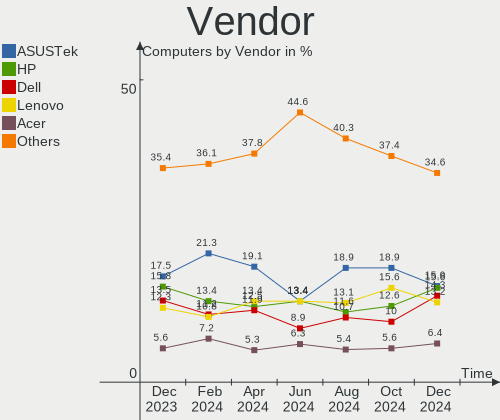
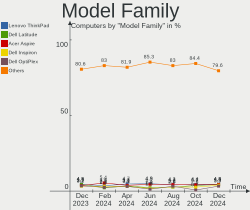
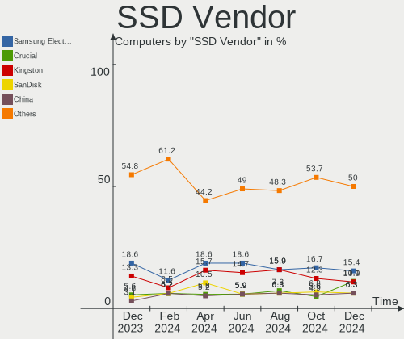
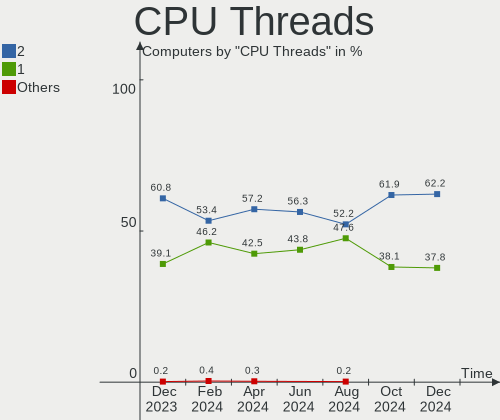
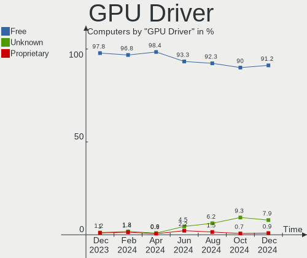

OpenMandriva - Hardware Trends
------------------------------

A project to identify most popular hardware characteristics and track their change
over time based on data collected by Linux users at https://Linux-Hardware.org.

Anyone can contribute to this report by the [hw-probe](https://github.com/linuxhw/hw-probe) tool:

    sudo -E hw-probe -all -upload

This is a report for all computer types. See also reports for [desktops](/Dist/OpenMandriva/Desktop/README.md) and [notebooks](/Dist/OpenMandriva/Notebook/README.md).

This report is for one last month. Overall report since the beginning of time: [TestCoverage](https://github.com/linuxhw/TestCoverage)

Period: Sep, 2022.

Contents
--------

* [ System ](#system)
  - [ OS                       ](#os)
  - [ OS Family                ](#os-family)
  - [ Kernel                   ](#kernel)
  - [ Kernel Family            ](#kernel-family)
  - [ Kernel Major Ver.        ](#kernel-major-ver)
  - [ Arch                     ](#arch)
  - [ DE                       ](#de)
  - [ Display Server           ](#display-server)
  - [ Display Manager          ](#display-manager)
  - [ OS Lang                  ](#os-lang)
  - [ Boot Mode                ](#boot-mode)
  - [ Filesystem               ](#filesystem)
  - [ Part. scheme             ](#part-scheme)
  - [ Dual Boot with Linux/BSD ](#dual-boot-with-linuxbsd)
  - [ Dual Boot (Win)          ](#dual-boot-win)

* [ Board ](#board)
  - [ Vendor                   ](#vendor)
  - [ Model                    ](#model)
  - [ Model Family             ](#model-family)
  - [ MFG Year                 ](#mfg-year)
  - [ Form Factor              ](#form-factor)
  - [ Secure Boot              ](#secure-boot)
  - [ Coreboot                 ](#coreboot)
  - [ RAM Size                 ](#ram-size)
  - [ RAM Used                 ](#ram-used)
  - [ Total Drives             ](#total-drives)
  - [ Has CD-ROM               ](#has-cd-rom)
  - [ Has Ethernet             ](#has-ethernet)
  - [ Has WiFi                 ](#has-wifi)
  - [ Has Bluetooth            ](#has-bluetooth)

* [ Location ](#location)
  - [ Country                  ](#country)
  - [ City                     ](#city)

* [ Drives ](#drives)
  - [ Drive Vendor             ](#drive-vendor)
  - [ Drive Model              ](#drive-model)
  - [ HDD Vendor               ](#hdd-vendor)
  - [ SSD Vendor               ](#ssd-vendor)
  - [ Drive Kind               ](#drive-kind)
  - [ Drive Connector          ](#drive-connector)
  - [ Drive Size               ](#drive-size)
  - [ Space Total              ](#space-total)
  - [ Space Used               ](#space-used)
  - [ Malfunc. Drives          ](#malfunc-drives)
  - [ Malfunc. Drive Vendor    ](#malfunc-drive-vendor)
  - [ Malfunc. HDD Vendor      ](#malfunc-hdd-vendor)
  - [ Malfunc. Drive Kind      ](#malfunc-drive-kind)
  - [ Failed Drives            ](#failed-drives)
  - [ Failed Drive Vendor      ](#failed-drive-vendor)
  - [ Drive Status             ](#drive-status)

* [ Storage controller ](#storage-controller)
  - [ Storage Vendor           ](#storage-vendor)
  - [ Storage Model            ](#storage-model)
  - [ Storage Kind             ](#storage-kind)

* [ Processor ](#processor)
  - [ CPU Vendor               ](#cpu-vendor)
  - [ CPU Model                ](#cpu-model)
  - [ CPU Model Family         ](#cpu-model-family)
  - [ CPU Cores                ](#cpu-cores)
  - [ CPU Sockets              ](#cpu-sockets)
  - [ CPU Threads              ](#cpu-threads)
  - [ CPU Op-Modes             ](#cpu-op-modes)
  - [ CPU Microcode            ](#cpu-microcode)
  - [ CPU Microarch            ](#cpu-microarch)

* [ Graphics ](#graphics)
  - [ GPU Vendor               ](#gpu-vendor)
  - [ GPU Model                ](#gpu-model)
  - [ GPU Combo                ](#gpu-combo)
  - [ GPU Driver               ](#gpu-driver)
  - [ GPU Memory               ](#gpu-memory)

* [ Monitor ](#monitor)
  - [ Monitor Vendor           ](#monitor-vendor)
  - [ Monitor Model            ](#monitor-model)
  - [ Monitor Resolution       ](#monitor-resolution)
  - [ Monitor Diagonal         ](#monitor-diagonal)
  - [ Monitor Width            ](#monitor-width)
  - [ Aspect Ratio             ](#aspect-ratio)
  - [ Monitor Area             ](#monitor-area)
  - [ Pixel Density            ](#pixel-density)
  - [ Multiple Monitors        ](#multiple-monitors)

* [ Network ](#network)
  - [ Net Controller Vendor    ](#net-controller-vendor)
  - [ Net Controller Model     ](#net-controller-model)
  - [ Wireless Vendor          ](#wireless-vendor)
  - [ Wireless Model           ](#wireless-model)
  - [ Ethernet Vendor          ](#ethernet-vendor)
  - [ Ethernet Model           ](#ethernet-model)
  - [ Net Controller Kind      ](#net-controller-kind)
  - [ Used Controller          ](#used-controller)
  - [ NICs                     ](#nics)
  - [ IPv6                     ](#ipv6)

* [ Bluetooth ](#bluetooth)
  - [ Bluetooth Vendor         ](#bluetooth-vendor)
  - [ Bluetooth Model          ](#bluetooth-model)

* [ Sound ](#sound)
  - [ Sound Vendor             ](#sound-vendor)
  - [ Sound Model              ](#sound-model)

* [ Memory ](#memory)
  - [ Memory Vendor            ](#memory-vendor)
  - [ Memory Model             ](#memory-model)
  - [ Memory Kind              ](#memory-kind)
  - [ Memory Form Factor       ](#memory-form-factor)
  - [ Memory Size              ](#memory-size)
  - [ Memory Speed             ](#memory-speed)

* [ Printers & scanners ](#printers--scanners)
  - [ Printer Vendor           ](#printer-vendor)
  - [ Printer Model            ](#printer-model)
  - [ Scanner Vendor           ](#scanner-vendor)
  - [ Scanner Model            ](#scanner-model)

* [ Camera ](#camera)
  - [ Camera Vendor            ](#camera-vendor)
  - [ Camera Model             ](#camera-model)

* [ Security ](#security)
  - [ Fingerprint Vendor       ](#fingerprint-vendor)
  - [ Fingerprint Model        ](#fingerprint-model)
  - [ Chipcard Vendor          ](#chipcard-vendor)
  - [ Chipcard Model           ](#chipcard-model)

* [ Unsupported ](#unsupported)
  - [ Unsupported Devices      ](#unsupported-devices)
  - [ Unsupported Device Types ](#unsupported-device-types)

System
------

OS
--

Installed operating systems

| Name              | Computers | Percent |
|-------------------|-----------|---------|
| OpenMandriva 4.3  | 283       | 71.46%  |
| OpenMandriva 4.50 | 67        | 16.92%  |
| OpenMandriva 4.90 | 26        | 6.57%   |
| OpenMandriva 4.2  | 20        | 5.05%   |

OS Family
---------

OS without a version

| Name         | Computers | Percent |
|--------------|-----------|---------|
| OpenMandriva | 396       | 100%    |

Kernel
------

Version of the Linux kernel

| Version                      | Computers | Percent |
|------------------------------|-----------|---------|
| 5.16.7-desktop-1omv4003      | 275       | 69.44%  |
| 5.19.5-desktop-1omv4090      | 64        | 16.16%  |
| 5.10.14-desktop-1omv4002     | 18        | 4.55%   |
| 5.18.12-desktop-3omv4090     | 17        | 4.29%   |
| 5.16.13-desktop-1omv4003     | 8         | 2.02%   |
| 5.19.1-desktop-1omv4090      | 3         | 0.76%   |
| 5.11.12-desktop-1omv4002     | 2         | 0.51%   |
| 6.0.0-desktop-0.rc3.1omv4090 | 1         | 0.25%   |
| 5.19.8-desktop-2omv4090      | 1         | 0.25%   |
| 5.19.3-desktop-1omv4090      | 1         | 0.25%   |
| 5.19.11-desktop-2omv4090     | 1         | 0.25%   |
| 5.19.0-desktop-1omv4090      | 1         | 0.25%   |
| 5.18.9-desktop-gcc-1omv4090  | 1         | 0.25%   |
| 5.18.13-desktop-1omv4090     | 1         | 0.25%   |
| 5.16.3-desktop-2omv4050      | 1         | 0.25%   |
| 5.14.14-desktop-1omv4050     | 1         | 0.25%   |

Kernel Family
-------------

Linux kernel without a distro release

| Version | Computers | Percent |
|---------|-----------|---------|
| 5.16.7  | 275       | 69.44%  |
| 5.19.5  | 64        | 16.16%  |
| 5.10.14 | 18        | 4.55%   |
| 5.18.12 | 17        | 4.29%   |
| 5.16.13 | 8         | 2.02%   |
| 5.19.1  | 3         | 0.76%   |
| 5.11.12 | 2         | 0.51%   |
| 6.0.0   | 1         | 0.25%   |
| 5.19.8  | 1         | 0.25%   |
| 5.19.3  | 1         | 0.25%   |
| 5.19.11 | 1         | 0.25%   |
| 5.19.0  | 1         | 0.25%   |
| 5.18.9  | 1         | 0.25%   |
| 5.18.13 | 1         | 0.25%   |
| 5.16.3  | 1         | 0.25%   |
| 5.14.14 | 1         | 0.25%   |

Kernel Major Ver.
-----------------

Linux kernel major version

| Version | Computers | Percent |
|---------|-----------|---------|
| 5.16    | 284       | 71.72%  |
| 5.19    | 71        | 17.93%  |
| 5.18    | 19        | 4.8%    |
| 5.10    | 18        | 4.55%   |
| 5.11    | 2         | 0.51%   |
| 6.0     | 1         | 0.25%   |
| 5.14    | 1         | 0.25%   |

Arch
----

OS architecture (x86_64, i586, etc.)

| Name   | Computers | Percent |
|--------|-----------|---------|
| x86_64 | 396       | 100%    |

DE
--

Desktop Environment

| Name    | Computers | Percent |
|---------|-----------|---------|
| KDE5    | 392       | 98.99%  |
| Unknown | 2         | 0.51%   |
| XFCE    | 1         | 0.25%   |
| Budgie  | 1         | 0.25%   |

Display Server
--------------

X11 or Wayland

| Name | Computers | Percent |
|------|-----------|---------|
| X11  | 396       | 100%    |

Display Manager
---------------

SDDM, LightDM, etc.

| Name    | Computers | Percent |
|---------|-----------|---------|
| SDDM    | 395       | 99.75%  |
| LightDM | 1         | 0.25%   |

OS Lang
-------

Language

| Lang  | Computers | Percent |
|-------|-----------|---------|
| en_US | 248       | 62.63%  |
| ru_RU | 23        | 5.81%   |
| pt_BR | 20        | 5.05%   |
| de_DE | 20        | 5.05%   |
| fr_FR | 18        | 4.55%   |
| pl_PL | 12        | 3.03%   |
| es_ES | 10        | 2.53%   |
| en_GB | 9         | 2.27%   |
| es_AR | 4         | 1.01%   |
| cs_CZ | 4         | 1.01%   |
| pt_PT | 3         | 0.76%   |
| it_IT | 3         | 0.76%   |
| es_CL | 3         | 0.76%   |
| ro_RO | 2         | 0.51%   |
| hu_HU | 2         | 0.51%   |
| fr_BE | 2         | 0.51%   |
| en_HK | 2         | 0.51%   |
| de_AT | 2         | 0.51%   |
| tr_TR | 1         | 0.25%   |
| nl_NL | 1         | 0.25%   |
| fr_CH | 1         | 0.25%   |
| fr_CA | 1         | 0.25%   |
| es_UY | 1         | 0.25%   |
| es_MX | 1         | 0.25%   |
| es_CR | 1         | 0.25%   |
| en_NZ | 1         | 0.25%   |
| en_CA | 1         | 0.25%   |

Boot Mode
---------

EFI or BIOS

| Mode | Computers | Percent |
|------|-----------|---------|
| EFI  | 245       | 61.87%  |
| BIOS | 151       | 38.13%  |

Filesystem
----------

Type of filesystem

| Type    | Computers | Percent |
|---------|-----------|---------|
| Overlay | 311       | 78.54%  |
| Ext4    | 83        | 20.96%  |
| F2fs    | 1         | 0.25%   |
| Btrfs   | 1         | 0.25%   |

Part. scheme
------------

Scheme of partitioning

| Type | Computers | Percent |
|------|-----------|---------|
| GPT  | 291       | 73.48%  |
| MBR  | 105       | 26.52%  |

Dual Boot with Linux/BSD
------------------------

Hosting more than one Linux/BSD

| Dual boot | Computers | Percent |
|-----------|-----------|---------|
| No        | 201       | 50.76%  |
| Yes       | 195       | 49.24%  |

Dual Boot (Win)
---------------

Hosting Linux and Windows

| Dual boot | Computers | Percent |
|-----------|-----------|---------|
| Yes       | 210       | 53.03%  |
| No        | 186       | 46.97%  |

Board
-----

Vendor
------

Motherboard manufacturer

| Name                | Computers | Percent |
|---------------------|-----------|---------|
| Dell                | 91        | 22.98%  |
| Hewlett-Packard     | 58        | 14.65%  |
| Lenovo              | 49        | 12.37%  |
| ASUSTek Computer    | 48        | 12.12%  |
| Gigabyte Technology | 23        | 5.81%   |
| Acer                | 16        | 4.04%   |
| Toshiba             | 15        | 3.79%   |
| MSI                 | 15        | 3.79%   |
| ASRock              | 13        | 3.28%   |
| Intel               | 8         | 2.02%   |
| Samsung Electronics | 6         | 1.52%   |
| Sony                | 5         | 1.26%   |
| Positivo            | 5         | 1.26%   |
| Apple               | 5         | 1.26%   |
| Unknown             | 5         | 1.26%   |
| ECS                 | 4         | 1.01%   |
| Packard Bell        | 2         | 0.51%   |
| NEC Computers       | 2         | 0.51%   |
| LG Electronics      | 2         | 0.51%   |
| Fujitsu             | 2         | 0.51%   |
| BESSTAR Tech        | 2         | 0.51%   |
| Valve               | 1         | 0.25%   |
| UMAX                | 1         | 0.25%   |
| Timi                | 1         | 0.25%   |
| Sun Microsystems    | 1         | 0.25%   |
| Shuttle             | 1         | 0.25%   |
| Pegatron            | 1         | 0.25%   |
| PCWare              | 1         | 0.25%   |
| Microsoft           | 1         | 0.25%   |
| Medion              | 1         | 0.25%   |
| MACHINIST           | 1         | 0.25%   |
| Jumper              | 1         | 0.25%   |
| HUAWEI              | 1         | 0.25%   |
| Huanan              | 1         | 0.25%   |
| Getac               | 1         | 0.25%   |
| Foxconn             | 1         | 0.25%   |
| Compal              | 1         | 0.25%   |
| Chuwi               | 1         | 0.25%   |
| CCE                 | 1         | 0.25%   |
| Biostar             | 1         | 0.25%   |

Model
-----

Motherboard model

| Name                                   | Computers | Percent |
|----------------------------------------|-----------|---------|
| Dell Latitude 3120                     | 18        | 4.55%   |
| Dell Latitude 3190 2-in-1              | 16        | 4.04%   |
| Dell Latitude 3310                     | 9         | 2.27%   |
| Unknown                                | 6         | 1.52%   |
| Toshiba dynabook T653/46JR             | 4         | 1.01%   |
| Lenovo IdeaPad 1 14ADA05 82GW          | 3         | 0.76%   |
| HP Notebook                            | 3         | 0.76%   |
| Gigabyte 970A-DS3P                     | 3         | 0.76%   |
| Toshiba Satellite C660                 | 2         | 0.51%   |
| Intel H61                              | 2         | 0.51%   |
| HP ProBook 450 G1                      | 2         | 0.51%   |
| HP Laptop 14s-fq1xxx                   | 2         | 0.51%   |
| HP EliteDesk 800 G1 SFF                | 2         | 0.51%   |
| HP Compaq 8100 Elite CMT PC            | 2         | 0.51%   |
| HP 250 G5 Notebook PC                  | 2         | 0.51%   |
| ECS GeForce 8000 series                | 2         | 0.51%   |
| Dell XPS 15 9530                       | 2         | 0.51%   |
| Dell OptiPlex 390                      | 2         | 0.51%   |
| Dell Latitude E4300                    | 2         | 0.51%   |
| Dell Latitude 3300                     | 2         | 0.51%   |
| Dell Inspiron 3451                     | 2         | 0.51%   |
| Dell G5 5505                           | 2         | 0.51%   |
| ASUS VivoBook_ASUSLaptop X515EA_X515EA | 2         | 0.51%   |
| ASUS UX31E                             | 2         | 0.51%   |
| ASUS PRIME H310M-E R2.0                | 2         | 0.51%   |
| ASUS M5A97 LE R2.0                     | 2         | 0.51%   |
| ASRock X99 Taichi                      | 2         | 0.51%   |
| ASRock B450M Pro4-F                    | 2         | 0.51%   |
| Acer Nitro AN515-31                    | 2         | 0.51%   |
| Valve Jupiter                          | 1         | 0.25%   |
| UMAX VisionBook 14Wr Plus              | 1         | 0.25%   |
| Toshiba TECRA S10                      | 1         | 0.25%   |
| Toshiba Satellite P845T                | 1         | 0.25%   |
| Toshiba Satellite L55-B                | 1         | 0.25%   |
| Toshiba Satellite L505                 | 1         | 0.25%   |
| Toshiba Satellite C850-1LK             | 1         | 0.25%   |
| Toshiba Satellite C75D-B               | 1         | 0.25%   |
| Toshiba Satellite C655                 | 1         | 0.25%   |
| Toshiba Satellite C55-A-157            | 1         | 0.25%   |
| Toshiba PORTEGE Z30-A                  | 1         | 0.25%   |

Model Family
------------

Motherboard model prefix

| Name               | Computers | Percent |
|--------------------|-----------|---------|
| Dell Latitude      | 58        | 14.65%  |
| Lenovo ThinkPad    | 14        | 3.54%   |
| Lenovo IdeaPad     | 14        | 3.54%   |
| HP Compaq          | 12        | 3.03%   |
| HP Laptop          | 11        | 2.78%   |
| Dell OptiPlex      | 10        | 2.53%   |
| Toshiba Satellite  | 9         | 2.27%   |
| Acer Aspire        | 9         | 2.27%   |
| Dell Inspiron      | 8         | 2.02%   |
| ASUS PRIME         | 8         | 2.02%   |
| HP Pavilion        | 6         | 1.52%   |
| Dell Precision     | 6         | 1.52%   |
| ASUS VivoBook      | 6         | 1.52%   |
| Unknown            | 6         | 1.52%   |
| Lenovo ThinkCentre | 5         | 1.26%   |
| HP ProBook         | 5         | 1.26%   |
| Toshiba dynabook   | 4         | 1.01%   |
| HP EliteDesk       | 4         | 1.01%   |
| Dell XPS           | 4         | 1.01%   |
| HP ProDesk         | 3         | 0.76%   |
| HP Notebook        | 3         | 0.76%   |
| Gigabyte 970A-DS3P | 3         | 0.76%   |
| Dell Vostro        | 3         | 0.76%   |
| Samsung R530       | 2         | 0.51%   |
| Lenovo ThinkBook   | 2         | 0.51%   |
| Lenovo IdeaCentre  | 2         | 0.51%   |
| Intel H61          | 2         | 0.51%   |
| HP ENVY            | 2         | 0.51%   |
| HP 250             | 2         | 0.51%   |
| Fujitsu LIFEBOOK   | 2         | 0.51%   |
| ECS GeForce        | 2         | 0.51%   |
| Dell G5            | 2         | 0.51%   |
| ASUS UX31E         | 2         | 0.51%   |
| ASUS ROG           | 2         | 0.51%   |
| ASUS M5A97         | 2         | 0.51%   |
| ASRock X99         | 2         | 0.51%   |
| ASRock B450M       | 2         | 0.51%   |
| Acer Nitro         | 2         | 0.51%   |
| Valve Jupiter      | 1         | 0.25%   |
| UMAX VisionBook    | 1         | 0.25%   |

MFG Year
--------

Motherboard manufacture year

| Year | Computers | Percent |
|------|-----------|---------|
| 2019 | 52        | 13.13%  |
| 2021 | 43        | 10.86%  |
| 2011 | 37        | 9.34%   |
| 2012 | 32        | 8.08%   |
| 2013 | 31        | 7.83%   |
| 2020 | 29        | 7.32%   |
| 2010 | 26        | 6.57%   |
| 2018 | 25        | 6.31%   |
| 2014 | 21        | 5.3%    |
| 2017 | 20        | 5.05%   |
| 2016 | 18        | 4.55%   |
| 2008 | 16        | 4.04%   |
| 2015 | 15        | 3.79%   |
| 2009 | 15        | 3.79%   |
| 2007 | 7         | 1.77%   |
| 2022 | 5         | 1.26%   |
| 2006 | 3         | 0.76%   |
| 2005 | 1         | 0.25%   |

Form Factor
-----------

Physical design of the computer

| Name        | Computers | Percent |
|-------------|-----------|---------|
| Notebook    | 205       | 51.77%  |
| Desktop     | 148       | 37.37%  |
| Convertible | 34        | 8.59%   |
| All in one  | 4         | 1.01%   |
| Tablet      | 2         | 0.51%   |
| Mini pc     | 2         | 0.51%   |
| Server      | 1         | 0.25%   |

Secure Boot
-----------

Enabled or disabled

| State    | Computers | Percent |
|----------|-----------|---------|
| Disabled | 396       | 100%    |

Coreboot
--------

Have coreboot on board

| Used | Computers | Percent |
|------|-----------|---------|
| No   | 395       | 99.75%  |
| Yes  | 1         | 0.25%   |

RAM Size
--------

Total RAM memory

| Size in GB  | Computers | Percent |
|-------------|-----------|---------|
| 4.01-8.0    | 137       | 34.6%   |
| 3.01-4.0    | 114       | 28.79%  |
| 8.01-16.0   | 48        | 12.12%  |
| 16.01-24.0  | 44        | 11.11%  |
| 32.01-64.0  | 22        | 5.56%   |
| 1.01-2.0    | 13        | 3.28%   |
| 2.01-3.0    | 7         | 1.77%   |
| 64.01-256.0 | 7         | 1.77%   |
| 24.01-32.0  | 2         | 0.51%   |
| 0.51-1.0    | 2         | 0.51%   |

RAM Used
--------

Used RAM memory

| Used GB  | Computers | Percent |
|----------|-----------|---------|
| 1.01-2.0 | 300       | 75.76%  |
| 0.51-1.0 | 59        | 14.9%   |
| 2.01-3.0 | 25        | 6.31%   |
| 0.01-0.5 | 8         | 2.02%   |
| 3.01-4.0 | 3         | 0.76%   |
| 4.01-8.0 | 1         | 0.25%   |

Total Drives
------------

Number of drives on board

| Drives | Computers | Percent |
|--------|-----------|---------|
| 1      | 243       | 61.36%  |
| 2      | 87        | 21.97%  |
| 3      | 35        | 8.84%   |
| 4      | 21        | 5.3%    |
| 0      | 3         | 0.76%   |
| 8      | 2         | 0.51%   |
| 6      | 2         | 0.51%   |
| 5      | 2         | 0.51%   |
| 11     | 1         | 0.25%   |

Has CD-ROM
----------

Has CD-ROM on board

| Presented | Computers | Percent |
|-----------|-----------|---------|
| No        | 216       | 54.55%  |
| Yes       | 180       | 45.45%  |

Has Ethernet
------------

Has Ethernet on board

| Presented | Computers | Percent |
|-----------|-----------|---------|
| Yes       | 328       | 82.83%  |
| No        | 68        | 17.17%  |

Has WiFi
--------

Has WiFi module

| Presented | Computers | Percent |
|-----------|-----------|---------|
| Yes       | 297       | 75%     |
| No        | 99        | 25%     |

Has Bluetooth
-------------

Has Bluetooth module

| Presented | Computers | Percent |
|-----------|-----------|---------|
| Yes       | 227       | 57.32%  |
| No        | 169       | 42.68%  |

Location
--------

Country
-------

Geographic location (country)

| Country      | Computers | Percent |
|--------------|-----------|---------|
| Netherlands  | 49        | 12.37%  |
| USA          | 47        | 11.87%  |
| Brazil       | 34        | 8.59%   |
| Russia       | 30        | 7.58%   |
| Germany      | 29        | 7.32%   |
| France       | 22        | 5.56%   |
| Poland       | 18        | 4.55%   |
| UK           | 16        | 4.04%   |
| Spain        | 16        | 4.04%   |
| Romania      | 9         | 2.27%   |
| Japan        | 8         | 2.02%   |
| Austria      | 8         | 2.02%   |
| Italy        | 7         | 1.77%   |
| Czechia      | 7         | 1.77%   |
| Portugal     | 6         | 1.52%   |
| Indonesia    | 6         | 1.52%   |
| Switzerland  | 5         | 1.26%   |
| Finland      | 5         | 1.26%   |
| Argentina    | 5         | 1.26%   |
| Ukraine      | 4         | 1.01%   |
| India        | 4         | 1.01%   |
| Belgium      | 4         | 1.01%   |
| Slovenia     | 3         | 0.76%   |
| Hong Kong    | 3         | 0.76%   |
| Chile        | 3         | 0.76%   |
| Canada       | 3         | 0.76%   |
| Algeria      | 3         | 0.76%   |
| South Africa | 2         | 0.51%   |
| Slovakia     | 2         | 0.51%   |
| Serbia       | 2         | 0.51%   |
| Peru         | 2         | 0.51%   |
| New Zealand  | 2         | 0.51%   |
| Mexico       | 2         | 0.51%   |
| Lithuania    | 2         | 0.51%   |
| Hungary      | 2         | 0.51%   |
| Greece       | 2         | 0.51%   |
| Colombia     | 2         | 0.51%   |
| Venezuela    | 1         | 0.25%   |
| Uruguay      | 1         | 0.25%   |
| Turkey       | 1         | 0.25%   |

City
----

Geographic location (city)

| City                              | Computers | Percent |
|-----------------------------------|-----------|---------|
| Schagen                           | 47        | 11.87%  |
| Vienna                            | 7         | 1.77%   |
| Moscow                            | 7         | 1.77%   |
| Paris                             | 6         | 1.52%   |
| Munich                            | 4         | 1.01%   |
| Warsaw                            | 3         | 0.76%   |
| Sao Paulo                         | 3         | 0.76%   |
| Rio de Janeiro                    | 3         | 0.76%   |
| Philadelphia                      | 3         | 0.76%   |
| Novosibirsk                       | 3         | 0.76%   |
| Krasnodar                         | 3         | 0.76%   |
| Falkirk                           | 3         | 0.76%   |
| Cluj-Napoca                       | 3         | 0.76%   |
| Cascais                           | 3         | 0.76%   |
| Valencia                          | 2         | 0.51%   |
| Trenton                           | 2         | 0.51%   |
| Thessaloniki                      | 2         | 0.51%   |
| Taito                             | 2         | 0.51%   |
| Surat                             | 2         | 0.51%   |
| Stafford                          | 2         | 0.51%   |
| Simferopol                        | 2         | 0.51%   |
| Semarang                          | 2         | 0.51%   |
| Salvador                          | 2         | 0.51%   |
| Saarlouis                         | 2         | 0.51%   |
| Penza                             | 2         | 0.51%   |
| Nizhniy Novgorod                  | 2         | 0.51%   |
| Mława                            | 2         | 0.51%   |
| Madrid                            | 2         | 0.51%   |
| Lima                              | 2         | 0.51%   |
| Krakow                            | 2         | 0.51%   |
| Köthen                           | 2         | 0.51%   |
| Jerez de la Frontera              | 2         | 0.51%   |
| Hennef                            | 2         | 0.51%   |
| Helsinki                          | 2         | 0.51%   |
| Granarolo dell'Emilia e Viadagola | 2         | 0.51%   |
| Fortaleza                         | 2         | 0.51%   |
| Essen                             | 2         | 0.51%   |
| Campo Grande                      | 2         | 0.51%   |
| Buenos Aires                      | 2         | 0.51%   |
| Braganca Paulista                 | 2         | 0.51%   |

Drives
------

Drive Vendor
------------

Hard drive vendors

| Vendor              | Computers | Drives | Percent |
|---------------------|-----------|--------|---------|
| WDC                 | 93        | 108    | 16.4%   |
| Seagate             | 75        | 94     | 13.23%  |
| Samsung Electronics | 67        | 87     | 11.82%  |
| Toshiba             | 39        | 42     | 6.88%   |
| SK hynix            | 34        | 34     | 6%      |
| Kingston            | 33        | 33     | 5.82%   |
| SanDisk             | 24        | 27     | 4.23%   |
| Hitachi             | 21        | 22     | 3.7%    |
| Unknown             | 18        | 20     | 3.17%   |
| A-DATA Technology   | 15        | 16     | 2.65%   |
| Crucial             | 13        | 15     | 2.29%   |
| KIOXIA              | 11        | 11     | 1.94%   |
| Intel               | 9         | 11     | 1.59%   |
| SSSTC               | 8         | 8      | 1.41%   |
| China               | 8         | 8      | 1.41%   |
| HGST                | 7         | 7      | 1.23%   |
| PNY                 | 6         | 6      | 1.06%   |
| Unknown             | 6         | 6      | 1.06%   |
| Micron Technology   | 5         | 5      | 0.88%   |
| Patriot             | 4         | 4      | 0.71%   |
| Netac               | 4         | 4      | 0.71%   |
| LITEON              | 4         | 4      | 0.71%   |
| JMicron Technology  | 4         | 4      | 0.71%   |
| ASMT                | 4         | 4      | 0.71%   |
| Biostar             | 3         | 3      | 0.53%   |
| UMIS                | 2         | 2      | 0.35%   |
| Transcend           | 2         | 2      | 0.35%   |
| Team                | 2         | 3      | 0.35%   |
| SPCC                | 2         | 2      | 0.35%   |
| Maxtor              | 2         | 2      | 0.35%   |
| KingSpec            | 2         | 2      | 0.35%   |
| Intenso             | 2         | 2      | 0.35%   |
| HPE                 | 2         | 3      | 0.35%   |
| GOODRAM             | 2         | 2      | 0.35%   |
| Gigabyte Technology | 2         | 2      | 0.35%   |
| Fujitsu             | 2         | 2      | 0.35%   |
| Apacer              | 2         | 2      | 0.35%   |
| Yunhaitian          | 1         | 1      | 0.18%   |
| TO Exter            | 1         | 1      | 0.18%   |
| TCSUNBOW            | 1         | 1      | 0.18%   |

Drive Model
-----------

Hard drive models

| Model                              | Computers | Percent |
|------------------------------------|-----------|---------|
| SK hynix BC711 NVMe 128GB          | 10        | 1.6%    |
| SSSTC CL1-3D128-Q11 NVMe 128GB     | 8         | 1.28%   |
| Kingston SA400S37240G 240GB SSD    | 7         | 1.12%   |
| SK hynix BC511 NVMe 256GB          | 6         | 0.96%   |
| Seagate ST500DM002-1BD142 500GB    | 6         | 0.96%   |
| Kingston SA400S37480G 480GB SSD    | 6         | 0.96%   |
| Unknown                            | 6         | 0.96%   |
| WDC PC SN520 NVMe 128GB            | 5         | 0.8%    |
| Unknown SD/MMC/MS PRO 2GB          | 5         | 0.8%    |
| Toshiba MQ01ABD075 752GB           | 5         | 0.8%    |
| Samsung SSD 970 EVO Plus 500GB     | 5         | 0.8%    |
| Samsung SSD 860 EVO 250GB          | 5         | 0.8%    |
| A-DATA SU650 120GB SSD             | 5         | 0.8%    |
| WDC WDS500G2B0A-00SM50 500GB SSD   | 4         | 0.64%   |
| Toshiba MQ01ABF050 500GB           | 4         | 0.64%   |
| Seagate ST9500325AS 500GB          | 4         | 0.64%   |
| Seagate ST500LT012-1DG142 500GB    | 4         | 0.64%   |
| Seagate ST3500418AS 500GB          | 4         | 0.64%   |
| Seagate ST1000DM010-2EP102 1TB     | 4         | 0.64%   |
| Samsung SSD 860 EVO 1TB            | 4         | 0.64%   |
| KIOXIA KBG40ZNS128G NVMe 128GB     | 4         | 0.64%   |
| Kingston SA400S37120G 120GB SSD    | 4         | 0.64%   |
| JMicron Generic 120GB              | 4         | 0.64%   |
| A-DATA SU800 256GB SSD             | 4         | 0.64%   |
| Unknown MMC64G  64GB               | 3         | 0.48%   |
| Toshiba HDWD130 3TB                | 3         | 0.48%   |
| Toshiba DT01ACA100 1TB             | 3         | 0.48%   |
| Toshiba DT01ACA050 500GB           | 3         | 0.48%   |
| SK hynix BC501A NVMe 128GB         | 3         | 0.48%   |
| Seagate ST3500413AS 500GB          | 3         | 0.48%   |
| Seagate ST2000DM008-2FR102 2TB     | 3         | 0.48%   |
| Seagate ST2000DM006-2DM164 2TB     | 3         | 0.48%   |
| Seagate ST1000DM003-1ER162 1TB     | 3         | 0.48%   |
| Samsung SSD 970 EVO Plus 250GB     | 3         | 0.48%   |
| Samsung SSD 860 EVO 500GB          | 3         | 0.48%   |
| Samsung SSD 850 EVO 500GB          | 3         | 0.48%   |
| Samsung HD502HJ 500GB              | 3         | 0.48%   |
| LITEON CV8-8E128-11 SATA 128GB SSD | 3         | 0.48%   |
| HGST HTS545050A7E680 500GB         | 3         | 0.48%   |
| ASMT 2115 1TB                      | 3         | 0.48%   |

HDD Vendor
----------

Hard disk drive vendors

| Vendor              | Computers | Drives | Percent |
|---------------------|-----------|--------|---------|
| Seagate             | 72        | 90     | 31.3%   |
| WDC                 | 69        | 76     | 30%     |
| Toshiba             | 36        | 39     | 15.65%  |
| Hitachi             | 21        | 22     | 9.13%   |
| Samsung Electronics | 12        | 14     | 5.22%   |
| HGST                | 7         | 7      | 3.04%   |
| Unknown             | 5         | 5      | 2.17%   |
| HPE                 | 2         | 2      | 0.87%   |
| Fujitsu             | 2         | 2      | 0.87%   |
| Maxtor              | 1         | 1      | 0.43%   |
| MARVELL             | 1         | 1      | 0.43%   |
| ASMT                | 1         | 1      | 0.43%   |
| ASMedia             | 1         | 1      | 0.43%   |

SSD Vendor
----------

Solid state drive vendors

| Vendor              | Computers | Drives | Percent |
|---------------------|-----------|--------|---------|
| Samsung Electronics | 35        | 44     | 17.41%  |
| Kingston            | 29        | 29     | 14.43%  |
| SanDisk             | 21        | 22     | 10.45%  |
| WDC                 | 13        | 13     | 6.47%   |
| A-DATA Technology   | 12        | 13     | 5.97%   |
| Crucial             | 10        | 12     | 4.98%   |
| China               | 8         | 8      | 3.98%   |
| SK hynix            | 5         | 5      | 2.49%   |
| PNY                 | 5         | 5      | 2.49%   |
| Intel               | 5         | 6      | 2.49%   |
| Patriot             | 4         | 4      | 1.99%   |
| LITEON              | 4         | 4      | 1.99%   |
| Unknown             | 4         | 4      | 1.99%   |
| Netac               | 3         | 3      | 1.49%   |
| ASMT                | 3         | 3      | 1.49%   |
| Transcend           | 2         | 2      | 1%      |
| Toshiba             | 2         | 2      | 1%      |
| KingSpec            | 2         | 2      | 1%      |
| GOODRAM             | 2         | 2      | 1%      |
| Biostar             | 2         | 2      | 1%      |
| Apacer              | 2         | 2      | 1%      |
| Yunhaitian          | 1         | 1      | 0.5%    |
| TO Exter            | 1         | 1      | 0.5%    |
| Team                | 1         | 1      | 0.5%    |
| TCSUNBOW            | 1         | 1      | 0.5%    |
| SPCC                | 1         | 1      | 0.5%    |
| PNY USB             | 1         | 1      | 0.5%    |
| Pioneer             | 1         | 1      | 0.5%    |
| OWC                 | 1         | 1      | 0.5%    |
| OCZ-VERTEX          | 1         | 1      | 0.5%    |
| OCZ                 | 1         | 1      | 0.5%    |
| NGFF                | 1         | 1      | 0.5%    |
| Neo                 | 1         | 1      | 0.5%    |
| Micron Technology   | 1         | 1      | 0.5%    |
| Maxtor              | 1         | 1      | 0.5%    |
| Lexar               | 1         | 1      | 0.5%    |
| Leven               | 1         | 1      | 0.5%    |
| KODAK               | 1         | 1      | 0.5%    |
| KingFast            | 1         | 1      | 0.5%    |
| Intenso             | 1         | 1      | 0.5%    |

Drive Kind
----------

HDD or SSD

| Kind    | Computers | Drives | Percent |
|---------|-----------|--------|---------|
| HDD     | 195       | 261    | 37.86%  |
| SSD     | 172       | 215    | 33.4%   |
| NVMe    | 125       | 135    | 24.27%  |
| MMC     | 17        | 18     | 3.3%    |
| Unknown | 6         | 8      | 1.17%   |

Drive Connector
---------------

SATA, SAS, NVMe, etc.

| Type | Computers | Drives | Percent |
|------|-----------|--------|---------|
| SATA | 300       | 456    | 64.38%  |
| NVMe | 121       | 130    | 25.97%  |
| SAS  | 28        | 33     | 6.01%   |
| MMC  | 17        | 18     | 3.65%   |

Drive Size
----------

Size of hard drive

| Size in TB | Computers | Drives | Percent |
|------------|-----------|--------|---------|
| 0.01-0.5   | 258       | 328    | 67.54%  |
| 0.51-1.0   | 86        | 99     | 22.51%  |
| 1.01-2.0   | 20        | 24     | 5.24%   |
| 2.01-3.0   | 8         | 9      | 2.09%   |
| 3.01-4.0   | 6         | 9      | 1.57%   |
| 4.01-10.0  | 3         | 6      | 0.79%   |
| 10.01-20.0 | 1         | 1      | 0.26%   |

Space Total
-----------

Amount of disk space available on the file system

| Size in GB     | Computers | Percent |
|----------------|-----------|---------|
| 1-20           | 221       | 55.81%  |
| 101-250        | 59        | 14.9%   |
| 251-500        | 44        | 11.11%  |
| Unknown        | 30        | 7.58%   |
| 501-1000       | 16        | 4.04%   |
| 21-50          | 10        | 2.53%   |
| 51-100         | 10        | 2.53%   |
| 1001-2000      | 4         | 1.01%   |
| More than 3000 | 2         | 0.51%   |

Space Used
----------

Amount of used disk space

| Used GB   | Computers | Percent |
|-----------|-----------|---------|
| 1-20      | 339       | 85.61%  |
| Unknown   | 30        | 7.58%   |
| 101-250   | 9         | 2.27%   |
| 21-50     | 8         | 2.02%   |
| 51-100    | 5         | 1.26%   |
| 501-1000  | 3         | 0.76%   |
| 251-500   | 1         | 0.25%   |
| 2001-3000 | 1         | 0.25%   |

Malfunc. Drives
---------------

Drive models with a malfunction

| Model                               | Computers | Drives | Percent |
|-------------------------------------|-----------|--------|---------|
| Toshiba MQ01ABD075 752GB            | 4         | 4      | 3.64%   |
| Seagate ST500DM002-1BD142 500GB     | 4         | 4      | 3.64%   |
| Seagate ST9500325AS 500GB           | 3         | 3      | 2.73%   |
| Seagate ST3500418AS 500GB           | 3         | 3      | 2.73%   |
| WDC WD5000AAKX-00ERMA0 500GB        | 2         | 2      | 1.82%   |
| Toshiba MQ01ABD050 500GB            | 2         | 2      | 1.82%   |
| SanDisk SSD U100 256GB              | 2         | 2      | 1.82%   |
| Hitachi HTS725032A7E630 320GB       | 2         | 2      | 1.82%   |
| Hitachi HTS723232A7A364 320GB       | 2         | 2      | 1.82%   |
| HGST HTS545050A7E680 500GB          | 2         | 2      | 1.82%   |
| HGST HTS541010A9E680 1TB            | 2         | 2      | 1.82%   |
| WDC WDS240G2G0A-00JH30 240GB SSD    | 1         | 1      | 0.91%   |
| WDC WD5000LPVX-22V0TT0 500GB        | 1         | 1      | 0.91%   |
| WDC WD5000AVDS-63U7B1 500GB         | 1         | 1      | 0.91%   |
| WDC WD5000AAKX-003CA0 500GB         | 1         | 1      | 0.91%   |
| WDC WD5000AAKS-00V1A0 500GB         | 1         | 1      | 0.91%   |
| WDC WD3200BEVT-22ZCT0 320GB         | 1         | 1      | 0.91%   |
| WDC WD3200BEVT-22A23T0 320GB        | 1         | 1      | 0.91%   |
| WDC WD3200BEKT-60PVMT0 320GB        | 1         | 1      | 0.91%   |
| WDC WD3200AAJS-65M0A0 320GB         | 1         | 1      | 0.91%   |
| WDC WD3200AAJS-61B4A0 320GB         | 1         | 1      | 0.91%   |
| WDC WD2500BEVT-22A23T0 250GB        | 1         | 1      | 0.91%   |
| WDC WD10SPZX-24Z10T0 1TB            | 1         | 1      | 0.91%   |
| WDC WD10JPVX-22JC3T0 1TB            | 1         | 1      | 0.91%   |
| WDC WD10EZEX-75WN4A1 1TB            | 1         | 1      | 0.91%   |
| WDC WD10EADS-22M2B0 1TB             | 1         | 1      | 0.91%   |
| WDC WD10EADS-00M2B0 1TB             | 1         | 1      | 0.91%   |
| Toshiba MK6037GSX 64GB              | 1         | 1      | 0.91%   |
| Toshiba MK5061GSYN 500GB            | 1         | 1      | 0.91%   |
| Toshiba MK3276GSX 320GB             | 1         | 1      | 0.91%   |
| Toshiba HDWJ110 1TB                 | 1         | 1      | 0.91%   |
| Toshiba HDWD110 1TB                 | 1         | 1      | 0.91%   |
| Toshiba DT01ACA050 500GB            | 1         | 1      | 0.91%   |
| Seagate ST9500420AS 500GB           | 1         | 1      | 0.91%   |
| Seagate ST9160412AS 160GB           | 1         | 1      | 0.91%   |
| Seagate ST9160314AS 160GB           | 1         | 1      | 0.91%   |
| Seagate ST9100821AS 100GB           | 1         | 1      | 0.91%   |
| Seagate ST500LT012-9WS142 500GB     | 1         | 1      | 0.91%   |
| Seagate ST500LT012-1DG142 500GB     | 1         | 1      | 0.91%   |
| Seagate ST500LM012 HN-M500MBB 500GB | 1         | 1      | 0.91%   |

Malfunc. Drive Vendor
---------------------

Vendors of faulty drives

| Vendor              | Computers | Drives | Percent |
|---------------------|-----------|--------|---------|
| Seagate             | 31        | 37     | 30.69%  |
| WDC                 | 17        | 18     | 16.83%  |
| Hitachi             | 13        | 14     | 12.87%  |
| Toshiba             | 12        | 12     | 11.88%  |
| Samsung Electronics | 8         | 10     | 7.92%   |
| SanDisk             | 4         | 4      | 3.96%   |
| HGST                | 4         | 4      | 3.96%   |
| Crucial             | 3         | 4      | 2.97%   |
| China               | 2         | 2      | 1.98%   |
| A-DATA Technology   | 2         | 2      | 1.98%   |
| PNY                 | 1         | 1      | 0.99%   |
| Neo                 | 1         | 1      | 0.99%   |
| Micron Technology   | 1         | 1      | 0.99%   |
| Intel               | 1         | 1      | 0.99%   |
| HPE                 | 1         | 1      | 0.99%   |

Malfunc. HDD Vendor
-------------------

Vendors of faulty HDD drives

| Vendor              | Computers | Drives | Percent |
|---------------------|-----------|--------|---------|
| Seagate             | 31        | 37     | 37.8%   |
| WDC                 | 16        | 17     | 19.51%  |
| Hitachi             | 13        | 14     | 15.85%  |
| Toshiba             | 12        | 12     | 14.63%  |
| Samsung Electronics | 5         | 6      | 6.1%    |
| HGST                | 4         | 4      | 4.88%   |
| HPE                 | 1         | 1      | 1.22%   |

Malfunc. Drive Kind
-------------------

Kinds of faulty drives

| Kind | Computers | Drives | Percent |
|------|-----------|--------|---------|
| HDD  | 76        | 91     | 79.17%  |
| SSD  | 18        | 19     | 18.75%  |
| NVMe | 2         | 2      | 2.08%   |

Failed Drives
-------------

Failed drive models

| Model                         | Computers | Drives | Percent |
|-------------------------------|-----------|--------|---------|
| WDC WD5000BEVT-22ZAT0 500GB   | 1         | 1      | 33.33%  |
| WDC WD1600YS-23SHB0 160GB     | 1         | 1      | 33.33%  |
| Hitachi HTS545050A7E380 500GB | 1         | 1      | 33.33%  |

Failed Drive Vendor
-------------------

Failed drive vendors

| Vendor  | Computers | Drives | Percent |
|---------|-----------|--------|---------|
| WDC     | 2         | 2      | 66.67%  |
| Hitachi | 1         | 1      | 33.33%  |

Drive Status
------------

Number of failed and malfunc. drives

| Status   | Computers | Drives | Percent |
|----------|-----------|--------|---------|
| Works    | 317       | 474    | 69.82%  |
| Malfunc  | 94        | 112    | 20.7%   |
| Detected | 40        | 48     | 8.81%   |
| Failed   | 3         | 3      | 0.66%   |

Storage controller
------------------

Storage Vendor
--------------

Storage controller vendors

| Vendor                         | Computers | Percent |
|--------------------------------|-----------|---------|
| Intel                          | 266       | 55.77%  |
| AMD                            | 70        | 14.68%  |
| SK hynix                       | 27        | 5.66%   |
| Samsung Electronics            | 27        | 5.66%   |
| SanDisk                        | 20        | 4.19%   |
| KIOXIA                         | 11        | 2.31%   |
| Solid State Storage Technology | 8         | 1.68%   |
| Nvidia                         | 6         | 1.26%   |
| Marvell Technology Group       | 6         | 1.26%   |
| Phison Electronics             | 4         | 0.84%   |
| Micron Technology              | 4         | 0.84%   |
| Kingston Technology Company    | 4         | 0.84%   |
| Silicon Motion                 | 3         | 0.63%   |
| Micron/Crucial Technology      | 3         | 0.63%   |
| VIA Technologies               | 2         | 0.42%   |
| Union Memory (Shenzhen)        | 2         | 0.42%   |
| Seagate Technology             | 2         | 0.42%   |
| Realtek Semiconductor          | 2         | 0.42%   |
| MAXIO Technology (Hangzhou)    | 2         | 0.42%   |
| Broadcom / LSI                 | 2         | 0.42%   |
| ASMedia Technology             | 2         | 0.42%   |
| ADATA Technology               | 2         | 0.42%   |
| Toshiba America Info Systems   | 1         | 0.21%   |
| JMicron Technology             | 1         | 0.21%   |

Storage Model
-------------

Storage controller models

| Model                                                                                   | Computers | Percent |
|-----------------------------------------------------------------------------------------|-----------|---------|
| AMD FCH SATA Controller [AHCI mode]                                                     | 45        | 8.05%   |
| Intel Celeron/Pentium Silver Processor SATA Controller                                  | 24        | 4.29%   |
| Intel 7 Series Chipset Family 6-port SATA Controller [AHCI mode]                        | 24        | 4.29%   |
| Intel 8 Series/C220 Series Chipset Family 6-port SATA Controller 1 [AHCI mode]          | 20        | 3.58%   |
| Intel Sunrise Point-LP SATA Controller [AHCI mode]                                      | 16        | 2.86%   |
| Intel 6 Series/C200 Series Chipset Family 6 port Mobile SATA AHCI Controller            | 16        | 2.86%   |
| Samsung NVMe SSD Controller SM981/PM981/PM983                                           | 15        | 2.68%   |
| SK hynix Gold P31 SSD                                                                   | 13        | 2.33%   |
| Intel 82801 Mobile SATA Controller [RAID mode]                                          | 13        | 2.33%   |
| Intel NM10/ICH7 Family SATA Controller [IDE mode]                                       | 12        | 2.15%   |
| Intel 6 Series/C200 Series Chipset Family 6 port Desktop SATA AHCI Controller           | 12        | 2.15%   |
| Intel 82801IBM/IEM (ICH9M/ICH9M-E) 4 port SATA Controller [AHCI mode]                   | 11        | 1.97%   |
| KIOXIA NVMe SSD Controller BG4                                                          | 10        | 1.79%   |
| Intel 82801G (ICH7 Family) IDE Controller                                               | 9         | 1.61%   |
| Intel 6 Series/C200 Series Chipset Family Desktop SATA Controller (IDE mode, ports 4-5) | 9         | 1.61%   |
| Intel 6 Series/C200 Series Chipset Family Desktop SATA Controller (IDE mode, ports 0-3) | 9         | 1.61%   |
| AMD SB7x0/SB8x0/SB9x0 SATA Controller [AHCI mode]                                       | 9         | 1.61%   |
| AMD SB7x0/SB8x0/SB9x0 IDE Controller                                                    | 9         | 1.61%   |
| Solid State Storage Non-Volatile memory controller                                      | 8         | 1.43%   |
| SK hynix BC511                                                                          | 7         | 1.25%   |
| SanDisk WD Blue SN550 NVMe SSD                                                          | 7         | 1.25%   |
| SanDisk PC SN520 NVMe SSD                                                               | 7         | 1.25%   |
| Samsung NVMe SSD Controller 980                                                         | 7         | 1.25%   |
| Intel Wildcat Point-LP SATA Controller [AHCI Mode]                                      | 7         | 1.25%   |
| Intel Cannon Lake PCH SATA AHCI Controller                                              | 7         | 1.25%   |
| AMD 400 Series Chipset SATA Controller                                                  | 7         | 1.25%   |
| SK hynix BC501 NVMe Solid State Drive                                                   | 6         | 1.07%   |
| Intel Q170/Q150/B150/H170/H110/Z170/CM236 Chipset SATA Controller [AHCI Mode]           | 6         | 1.07%   |
| Intel Atom Processor E3800 Series SATA AHCI Controller                                  | 6         | 1.07%   |
| Intel 5 Series/3400 Series Chipset 6 port SATA AHCI Controller                          | 6         | 1.07%   |
| Intel Volume Management Device NVMe RAID Controller                                     | 5         | 0.89%   |
| Intel Tiger Lake-LP SATA Controller                                                     | 5         | 0.89%   |
| Intel 82801HM/HEM (ICH8M/ICH8M-E) SATA Controller [AHCI mode]                           | 5         | 0.89%   |
| Intel 82801HM/HEM (ICH8M/ICH8M-E) IDE Controller                                        | 5         | 0.89%   |
| Intel 200 Series PCH SATA controller [AHCI mode]                                        | 5         | 0.89%   |
| AMD 500 Series Chipset SATA Controller                                                  | 5         | 0.89%   |
| Micron Non-Volatile memory controller                                                   | 4         | 0.72%   |
| Intel SATA Controller [RAID mode]                                                       | 4         | 0.72%   |
| Intel 8 Series SATA Controller 1 [AHCI mode]                                            | 4         | 0.72%   |
| Intel 7 Series/C210 Series Chipset Family 6-port SATA Controller [AHCI mode]            | 4         | 0.72%   |

Storage Kind
------------

Kind of storage controller (IDE, SATA, NVMe, SAS, ...)

| Kind | Computers | Percent |
|------|-----------|---------|
| SATA | 284       | 57.26%  |
| NVMe | 120       | 24.19%  |
| IDE  | 66        | 13.31%  |
| RAID | 23        | 4.64%   |
| SAS  | 2         | 0.4%    |
| SCSI | 1         | 0.2%    |

Processor
---------

CPU Vendor
----------

Processor vendors

| Vendor | Computers | Percent |
|--------|-----------|---------|
| Intel  | 311       | 78.54%  |
| AMD    | 85        | 21.46%  |

CPU Model
---------

Processor models

| Model                                         | Computers | Percent |
|-----------------------------------------------|-----------|---------|
| Intel Pentium Silver N6000 @ 1.10GHz          | 18        | 4.55%   |
| Intel Pentium Silver N5030 CPU @ 1.10GHz      | 13        | 3.28%   |
| Intel Core i5-8265U CPU @ 1.60GHz             | 6         | 1.52%   |
| Intel Celeron CPU N3060 @ 1.60GHz             | 5         | 1.26%   |
| Intel Pentium Silver N5000 CPU @ 1.10GHz      | 4         | 1.01%   |
| Intel Core i5-8250U CPU @ 1.60GHz             | 4         | 1.01%   |
| Intel Core i5-2520M CPU @ 2.50GHz             | 4         | 1.01%   |
| Intel Core i3-8145U CPU @ 2.10GHz             | 4         | 1.01%   |
| Intel Core i3-2120 CPU @ 3.30GHz              | 4         | 1.01%   |
| Intel Core i3-2100 CPU @ 3.10GHz              | 4         | 1.01%   |
| Intel Core 2 Duo CPU E8400 @ 3.00GHz          | 4         | 1.01%   |
| Intel Celeron CPU 847 @ 1.10GHz               | 4         | 1.01%   |
| AMD Ryzen 7 5700U with Radeon Graphics        | 4         | 1.01%   |
| AMD Ryzen 7 3700X 8-Core Processor            | 4         | 1.01%   |
| Intel Pentium Dual-Core CPU T4400 @ 2.20GHz   | 3         | 0.76%   |
| Intel Core i5-7200U CPU @ 2.50GHz             | 3         | 0.76%   |
| Intel Core i5-4570 CPU @ 3.20GHz              | 3         | 0.76%   |
| Intel Core i3-9100 CPU @ 3.60GHz              | 3         | 0.76%   |
| Intel Core i3-5005U CPU @ 2.00GHz             | 3         | 0.76%   |
| Intel Core 2 Duo CPU T8300 @ 2.40GHz          | 3         | 0.76%   |
| Intel Core 2 Duo CPU E7500 @ 2.93GHz          | 3         | 0.76%   |
| Intel Celeron CPU N2840 @ 2.16GHz             | 3         | 0.76%   |
| AMD Ryzen 5 3500U with Radeon Vega Mobile Gfx | 3         | 0.76%   |
| AMD FX-8350 Eight-Core Processor              | 3         | 0.76%   |
| AMD 3020e with Radeon Graphics                | 3         | 0.76%   |
| Intel Pentium CPU G620 @ 2.60GHz              | 2         | 0.51%   |
| Intel Pentium CPU B950 @ 2.10GHz              | 2         | 0.51%   |
| Intel Core i7-7600U CPU @ 2.80GHz             | 2         | 0.51%   |
| Intel Core i7-4712HQ CPU @ 2.30GHz            | 2         | 0.51%   |
| Intel Core i7-2677M CPU @ 1.80GHz             | 2         | 0.51%   |
| Intel Core i7-2640M CPU @ 2.80GHz             | 2         | 0.51%   |
| Intel Core i7-10510U CPU @ 1.80GHz            | 2         | 0.51%   |
| Intel Core i5-8350U CPU @ 1.70GHz             | 2         | 0.51%   |
| Intel Core i5-6300U CPU @ 2.40GHz             | 2         | 0.51%   |
| Intel Core i5-5200U CPU @ 2.20GHz             | 2         | 0.51%   |
| Intel Core i5-4670K CPU @ 3.40GHz             | 2         | 0.51%   |
| Intel Core i5-4590T CPU @ 2.00GHz             | 2         | 0.51%   |
| Intel Core i5-4200U CPU @ 1.60GHz             | 2         | 0.51%   |
| Intel Core i5-4200M CPU @ 2.50GHz             | 2         | 0.51%   |
| Intel Core i5-3330 CPU @ 3.00GHz              | 2         | 0.51%   |

CPU Model Family
----------------

Processor model prefix

| Model                   | Computers | Percent |
|-------------------------|-----------|---------|
| Intel Core i5           | 80        | 20.2%   |
| Intel Core i3           | 47        | 11.87%  |
| Intel Core i7           | 39        | 9.85%   |
| Intel Pentium Silver    | 35        | 8.84%   |
| Intel Celeron           | 34        | 8.59%   |
| Intel Core 2 Duo        | 23        | 5.81%   |
| Other                   | 17        | 4.29%   |
| AMD Ryzen 5             | 17        | 4.29%   |
| AMD Ryzen 7             | 13        | 3.28%   |
| Intel Pentium           | 12        | 3.03%   |
| Intel Xeon              | 8         | 2.02%   |
| AMD FX                  | 8         | 2.02%   |
| AMD A6                  | 7         | 1.77%   |
| Intel Pentium Dual-Core | 6         | 1.52%   |
| AMD Ryzen 9             | 4         | 1.01%   |
| AMD Ryzen 3             | 4         | 1.01%   |
| AMD A10                 | 4         | 1.01%   |
| Intel Core 2 Quad       | 3         | 0.76%   |
| AMD E1                  | 3         | 0.76%   |
| AMD A8                  | 3         | 0.76%   |
| Intel Pentium Dual      | 2         | 0.51%   |
| Intel Core i9           | 2         | 0.51%   |
| Intel Atom              | 2         | 0.51%   |
| AMD Athlon II X4        | 2         | 0.51%   |
| AMD Athlon              | 2         | 0.51%   |
| AMD A4                  | 2         | 0.51%   |
| Intel Pentium Gold      | 1         | 0.25%   |
| Intel Pentium D         | 1         | 0.25%   |
| Intel Pentium 4         | 1         | 0.25%   |
| Intel Core m3           | 1         | 0.25%   |
| Intel Core 2            | 1         | 0.25%   |
| Intel Celeron M         | 1         | 0.25%   |
| Intel Celeron Dual-Core | 1         | 0.25%   |
| AMD V120                | 1         | 0.25%   |
| AMD Turion II Dual-Core | 1         | 0.25%   |
| AMD Turion 64 X2 Mobile | 1         | 0.25%   |
| AMD Sempron             | 1         | 0.25%   |
| AMD Ryzen 5 PRO         | 1         | 0.25%   |
| AMD Phenom II X2        | 1         | 0.25%   |
| AMD E2                  | 1         | 0.25%   |

CPU Cores
---------

Number of processor cores

| Number | Computers | Percent |
|--------|-----------|---------|
| 2      | 196       | 49.49%  |
| 4      | 135       | 34.09%  |
| 6      | 24        | 6.06%   |
| 8      | 23        | 5.81%   |
| 1      | 10        | 2.53%   |
| 12     | 4         | 1.01%   |
| 10     | 2         | 0.51%   |
| 16     | 1         | 0.25%   |
| 3      | 1         | 0.25%   |

CPU Sockets
-----------

Number of sockets

| Number | Computers | Percent |
|--------|-----------|---------|
| 1      | 394       | 99.49%  |
| 2      | 2         | 0.51%   |

CPU Threads
-----------

Threads per core (Hyper-Threading)

| Number | Computers | Percent |
|--------|-----------|---------|
| 2      | 212       | 53.54%  |
| 1      | 183       | 46.21%  |
| 8      | 1         | 0.25%   |

CPU Op-Modes
------------

CPU Operation Modes (32-bit, 64-bit)

| Op mode        | Computers | Percent |
|----------------|-----------|---------|
| 32-bit, 64-bit | 396       | 100%    |

CPU Microcode
-------------

Microcode number

| Number     | Computers | Percent |
|------------|-----------|---------|
| 0x206a7    | 44        | 11.11%  |
| 0x306a9    | 26        | 6.57%   |
| 0x306c3    | 22        | 5.56%   |
| 0x1067a    | 20        | 5.05%   |
| 0x906c0    | 19        | 4.8%    |
| 0x706a8    | 18        | 4.55%   |
| 0x806ec    | 11        | 2.78%   |
| 0x806ea    | 8         | 2.02%   |
| 0x806e9    | 8         | 2.02%   |
| 0x306d4    | 8         | 2.02%   |
| 0x10676    | 8         | 2.02%   |
| 0x08108109 | 8         | 2.02%   |
| Unknown    | 8         | 2.02%   |
| 0x506e3    | 7         | 1.77%   |
| 0x406e3    | 7         | 1.77%   |
| 0x20655    | 7         | 1.77%   |
| 0x08701021 | 7         | 1.77%   |
| 0x906eb    | 6         | 1.52%   |
| 0x806c1    | 6         | 1.52%   |
| 0x706a1    | 6         | 1.52%   |
| 0x30678    | 6         | 1.52%   |
| 0x08608103 | 6         | 1.52%   |
| 0x07030105 | 6         | 1.52%   |
| 0x906ea    | 5         | 1.26%   |
| 0x406c4    | 5         | 1.26%   |
| 0x20652    | 5         | 1.26%   |
| 0x06000822 | 5         | 1.26%   |
| 0x40651    | 4         | 1.01%   |
| 0x0800820d | 4         | 1.01%   |
| 0xa0653    | 3         | 0.76%   |
| 0x6fd      | 3         | 0.76%   |
| 0x6fb      | 3         | 0.76%   |
| 0x206d7    | 3         | 0.76%   |
| 0x106a5    | 3         | 0.76%   |
| 0x08600106 | 3         | 0.76%   |
| 0x08200103 | 3         | 0.76%   |
| 0x06006705 | 3         | 0.76%   |
| 0x0600611a | 3         | 0.76%   |
| 0x06003106 | 3         | 0.76%   |
| 0x06001119 | 3         | 0.76%   |

CPU Microarch
-------------

Microarchitecture

| Name             | Computers | Percent |
|------------------|-----------|---------|
| SandyBridge      | 48        | 12.12%  |
| KabyLake         | 46        | 11.62%  |
| Penryn           | 29        | 7.32%   |
| IvyBridge        | 28        | 7.07%   |
| Haswell          | 28        | 7.07%   |
| Goldmont plus    | 24        | 6.06%   |
| Tremont          | 19        | 4.8%    |
| Skylake          | 14        | 3.54%   |
| Zen+             | 13        | 3.28%   |
| Zen 2            | 13        | 3.28%   |
| Westmere         | 13        | 3.28%   |
| Silvermont       | 13        | 3.28%   |
| Core             | 10        | 2.53%   |
| Broadwell        | 9         | 2.27%   |
| Piledriver       | 8         | 2.02%   |
| K10              | 7         | 1.77%   |
| CometLake        | 7         | 1.77%   |
| Unknown          | 7         | 1.77%   |
| Zen 3            | 6         | 1.52%   |
| TigerLake        | 6         | 1.52%   |
| Puma             | 6         | 1.52%   |
| Excavator        | 6         | 1.52%   |
| Zen              | 5         | 1.26%   |
| Icelake          | 5         | 1.26%   |
| Nehalem          | 4         | 1.01%   |
| K10 Llano        | 4         | 1.01%   |
| Steamroller      | 3         | 0.76%   |
| NetBurst         | 2         | 0.51%   |
| Goldmont         | 2         | 0.51%   |
| Bulldozer        | 2         | 0.51%   |
| Bonnell          | 2         | 0.51%   |
| Bobcat           | 2         | 0.51%   |
| Alderlake Hybrid | 2         | 0.51%   |
| K8 Hammer        | 1         | 0.25%   |
| K8 & K10 hybrid  | 1         | 0.25%   |
| Jaguar           | 1         | 0.25%   |

Graphics
--------

GPU Vendor
----------

Vendors of graphics cards

| Vendor            | Computers | Percent |
|-------------------|-----------|---------|
| Intel             | 251       | 58.64%  |
| AMD               | 92        | 21.5%   |
| Nvidia            | 83        | 19.39%  |
| VIA Technologies  | 1         | 0.23%   |
| ASPEED Technology | 1         | 0.23%   |

GPU Model
---------

Graphics card models

| Model                                                                                    | Computers | Percent |
|------------------------------------------------------------------------------------------|-----------|---------|
| Intel 2nd Generation Core Processor Family Integrated Graphics Controller                | 40        | 9.09%   |
| Intel JasperLake [UHD Graphics]                                                          | 19        | 4.32%   |
| Intel GeminiLake [UHD Graphics 605]                                                      | 17        | 3.86%   |
| Intel 3rd Gen Core processor Graphics Controller                                         | 17        | 3.86%   |
| AMD Picasso/Raven 2 [Radeon Vega Series / Radeon Vega Mobile Series]                     | 12        | 2.73%   |
| Intel Xeon E3-1200 v3/4th Gen Core Processor Integrated Graphics Controller              | 11        | 2.5%    |
| Intel WhiskeyLake-U GT2 [UHD Graphics 620]                                               | 10        | 2.27%   |
| Intel Core Processor Integrated Graphics Controller                                      | 9         | 2.05%   |
| Intel UHD Graphics 620                                                                   | 8         | 1.82%   |
| Intel Mobile 4 Series Chipset Integrated Graphics Controller                             | 8         | 1.82%   |
| Intel 4th Gen Core Processor Integrated Graphics Controller                              | 8         | 1.82%   |
| Intel Xeon E3-1200 v2/3rd Gen Core processor Graphics Controller                         | 7         | 1.59%   |
| Intel HD Graphics 5500                                                                   | 7         | 1.59%   |
| Intel GeminiLake [UHD Graphics 600]                                                      | 7         | 1.59%   |
| Intel Atom/Celeron/Pentium Processor x5-E8000/J3xxx/N3xxx Integrated Graphics Controller | 7         | 1.59%   |
| AMD Ellesmere [Radeon RX 470/480/570/570X/580/580X/590]                                  | 7         | 1.59%   |
| Intel HD Graphics 620                                                                    | 6         | 1.36%   |
| Intel Atom Processor Z36xxx/Z37xxx Series Graphics & Display                             | 6         | 1.36%   |
| Intel 4 Series Chipset Integrated Graphics Controller                                    | 6         | 1.36%   |
| AMD Renoir                                                                               | 6         | 1.36%   |
| AMD Lucienne                                                                             | 6         | 1.36%   |
| Nvidia TU117 [GeForce GTX 1650]                                                          | 5         | 1.14%   |
| Intel Skylake GT2 [HD Graphics 520]                                                      | 5         | 1.14%   |
| Intel TigerLake-LP GT2 [Iris Xe Graphics]                                                | 4         | 0.91%   |
| Intel HD Graphics 530                                                                    | 4         | 0.91%   |
| Intel Haswell-ULT Integrated Graphics Controller                                         | 4         | 0.91%   |
| AMD Mullins [Radeon R4/R5 Graphics]                                                      | 4         | 0.91%   |
| Nvidia GP107 [GeForce GTX 1050]                                                          | 3         | 0.68%   |
| Nvidia GP107 [GeForce GTX 1050 Ti]                                                       | 3         | 0.68%   |
| Nvidia GP104 [GeForce GTX 1080]                                                          | 3         | 0.68%   |
| Nvidia GF108M [GeForce GT 620M/630M/635M/640M LE]                                        | 3         | 0.68%   |
| Intel Mobile GM965/GL960 Integrated Graphics Controller (secondary)                      | 3         | 0.68%   |
| Intel Mobile GM965/GL960 Integrated Graphics Controller (primary)                        | 3         | 0.68%   |
| Intel CometLake-U GT2 [UHD Graphics]                                                     | 3         | 0.68%   |
| Intel CoffeeLake-S GT2 [UHD Graphics 630]                                                | 3         | 0.68%   |
| AMD Wani [Radeon R5/R6/R7 Graphics]                                                      | 3         | 0.68%   |
| AMD Stoney [Radeon R2/R3/R4/R5 Graphics]                                                 | 3         | 0.68%   |
| AMD Seymour [Radeon HD 6400M/7400M Series]                                               | 3         | 0.68%   |
| AMD Navi 10 [Radeon RX 5600 OEM/5600 XT / 5700/5700 XT]                                  | 3         | 0.68%   |
| Nvidia TU117M [GeForce GTX 1650 Mobile / Max-Q]                                          | 2         | 0.45%   |

GPU Combo
---------

Combinations of graphics cards

| Name           | Computers | Percent |
|----------------|-----------|---------|
| 1 x Intel      | 213       | 53.79%  |
| 1 x AMD        | 79        | 19.95%  |
| 1 x Nvidia     | 58        | 14.65%  |
| Intel + Nvidia | 24        | 6.06%   |
| 2 x AMD        | 8         | 2.02%   |
| 2 x Intel      | 6         | 1.52%   |
| Intel + AMD    | 5         | 1.26%   |
| 2 x Nvidia     | 1         | 0.25%   |
| 1 x VIA        | 1         | 0.25%   |
| 1 x ASPEED     | 1         | 0.25%   |

GPU Driver
----------

Free vs proprietary

| Driver      | Computers | Percent |
|-------------|-----------|---------|
| Free        | 390       | 98.48%  |
| Unknown     | 5         | 1.26%   |
| Proprietary | 1         | 0.25%   |

GPU Memory
----------

Total video memory

| Size in GB | Computers | Percent |
|------------|-----------|---------|
| Unknown    | 228       | 57.58%  |
| 0.01-0.5   | 53        | 13.38%  |
| 1.01-2.0   | 42        | 10.61%  |
| 0.51-1.0   | 28        | 7.07%   |
| 3.01-4.0   | 19        | 4.8%    |
| 7.01-8.0   | 13        | 3.28%   |
| 5.01-6.0   | 8         | 2.02%   |
| 2.01-3.0   | 2         | 0.51%   |
| 8.01-16.0  | 2         | 0.51%   |
| 16.01-24.0 | 1         | 0.25%   |

Monitor
-------

Monitor Vendor
--------------

Monitor vendors

| Vendor                  | Computers | Percent |
|-------------------------|-----------|---------|
| BOE                     | 59        | 14.6%   |
| AU Optronics            | 50        | 12.38%  |
| Samsung Electronics     | 44        | 10.89%  |
| LG Display              | 40        | 9.9%    |
| Chimei Innolux          | 36        | 8.91%   |
| Goldstar                | 23        | 5.69%   |
| Hewlett-Packard         | 20        | 4.95%   |
| AOC                     | 16        | 3.96%   |
| Dell                    | 15        | 3.71%   |
| Philips                 | 10        | 2.48%   |
| Acer                    | 10        | 2.48%   |
| Lenovo                  | 7         | 1.73%   |
| BenQ                    | 6         | 1.49%   |
| Ancor Communications    | 6         | 1.49%   |
| Sharp                   | 5         | 1.24%   |
| Fujitsu Siemens         | 5         | 1.24%   |
| Eizo                    | 4         | 0.99%   |
| Chi Mei Optoelectronics | 4         | 0.99%   |
| Toshiba                 | 3         | 0.74%   |
| Sony                    | 3         | 0.74%   |
| CPT                     | 3         | 0.74%   |
| CHR                     | 3         | 0.74%   |
| ASUSTek Computer        | 3         | 0.74%   |
| Apple                   | 3         | 0.74%   |
| ViewSonic               | 2         | 0.5%    |
| NEC Computers           | 2         | 0.5%    |
| LG Philips              | 2         | 0.5%    |
| InfoVision              | 2         | 0.5%    |
| HannStar                | 2         | 0.5%    |
| Gigabyte Technology     | 2         | 0.5%    |
| ___                     | 1         | 0.25%   |
| WST                     | 1         | 0.25%   |
| Valve                   | 1         | 0.25%   |
| TCL                     | 1         | 0.25%   |
| SKY                     | 1         | 0.25%   |
| Qushimei                | 1         | 0.25%   |
| PANDA                   | 1         | 0.25%   |
| NECCI                   | 1         | 0.25%   |
| MSI                     | 1         | 0.25%   |
| Iiyama                  | 1         | 0.25%   |

Monitor Model
-------------

Monitor models

| Model                                                                | Computers | Percent |
|----------------------------------------------------------------------|-----------|---------|
| BOE LCD Monitor BOE093D 1366x768 256x144mm 11.6-inch                 | 12        | 2.96%   |
| AU Optronics LCD Monitor AUO202D 1920x1080 293x165mm 13.2-inch       | 7         | 1.72%   |
| AU Optronics LCD Monitor AUO405C 1366x768 256x144mm 11.6-inch        | 6         | 1.48%   |
| LG Display LCD Monitor LGD039F 1366x768 345x194mm 15.6-inch          | 5         | 1.23%   |
| BOE LCD Monitor BOE097B 1366x768 256x144mm 11.6-inch                 | 5         | 1.23%   |
| Samsung Electronics LCD Monitor SEC5441 1366x768 353x198mm 15.9-inch | 4         | 0.99%   |
| BOE LCD Monitor BOE0744 1366x768 256x144mm 11.6-inch                 | 4         | 0.99%   |
| AU Optronics LCD Monitor AUO7E91 1366x768 256x144mm 11.6-inch        | 4         | 0.99%   |
| Sharp LCD Monitor SHP13F8 3200x1800 346x194mm 15.6-inch              | 3         | 0.74%   |
| Philips PHL 243V7 PHLC155 1920x1080 527x296mm 23.8-inch              | 3         | 0.74%   |
| Goldstar FULL HD GSM5B55 1920x1080 480x270mm 21.7-inch               | 3         | 0.74%   |
| CHR CH7511B CHR7511 1920x1080 519x324mm 24.1-inch                    | 3         | 0.74%   |
| BOE LCD Monitor BOE07B9 1920x1080 293x165mm 13.2-inch                | 3         | 0.74%   |
| AU Optronics LCD Monitor AUO723C 1366x768 309x173mm 13.9-inch        | 3         | 0.74%   |
| Toshiba LCD Monitor LCD2207 1280x800 287x180mm 13.3-inch             | 2         | 0.49%   |
| Samsung Electronics T24B301 SAM098E 1920x1080 521x293mm 23.5-inch    | 2         | 0.49%   |
| LG Display LCD Monitor LGD0590 1920x1080 344x194mm 15.5-inch         | 2         | 0.49%   |
| LG Display LCD Monitor LGD045C 1366x768 345x194mm 15.6-inch          | 2         | 0.49%   |
| LG Display LCD Monitor LGD033A 1366x768 344x194mm 15.5-inch          | 2         | 0.49%   |
| LG Display LCD Monitor LGD0259 1920x1080 345x194mm 15.6-inch         | 2         | 0.49%   |
| Hewlett-Packard M24f FHD HPN3706 1920x1080 527x296mm 23.8-inch       | 2         | 0.49%   |
| Goldstar ULTRAWIDE GSM59F1 2560x1080 673x284mm 28.8-inch             | 2         | 0.49%   |
| Eizo EV3285 ENC2979 3840x2160 698x393mm 31.5-inch                    | 2         | 0.49%   |
| CPT LCD Monitor COR17DB 1600x900 293x164mm 13.2-inch                 | 2         | 0.49%   |
| Chimei Innolux LCD Monitor CMN15C5 1366x768 344x193mm 15.5-inch      | 2         | 0.49%   |
| Chimei Innolux LCD Monitor CMN15BC 1366x768 344x193mm 15.5-inch      | 2         | 0.49%   |
| Chimei Innolux LCD Monitor CMN14C4 1366x768 309x173mm 13.9-inch      | 2         | 0.49%   |
| Chimei Innolux LCD Monitor CMN1437 1920x1080 309x173mm 13.9-inch     | 2         | 0.49%   |
| BOE LCD Monitor BOE07A8 1366x768 256x144mm 11.6-inch                 | 2         | 0.49%   |
| BOE LCD Monitor BOE06A5 1366x768 344x194mm 15.5-inch                 | 2         | 0.49%   |
| BOE LCD Monitor BOE0629 1366x768 309x173mm 13.9-inch                 | 2         | 0.49%   |
| BOE LCD Monitor BOE0586 1366x768 309x173mm 13.9-inch                 | 2         | 0.49%   |
| BenQ FP202W BNQ76C2 1680x1050 376x301mm 19.0-inch                    | 2         | 0.49%   |
| AU Optronics LCD Monitor AUO61ED 1920x1080 344x194mm 15.5-inch       | 2         | 0.49%   |
| AU Optronics LCD Monitor AUO46EC 1366x768 344x193mm 15.5-inch        | 2         | 0.49%   |
| AU Optronics LCD Monitor AUO26EC 1366x768 344x193mm 15.5-inch        | 2         | 0.49%   |
| AOC 22B2WG5 AOC2202 1920x1080 477x268mm 21.5-inch                    | 2         | 0.49%   |
| AOC 2217 AOC2217 1680x1050 470x300mm 22.0-inch                       | 2         | 0.49%   |
| ___ TV ___9000 1360x768                                              | 1         | 0.25%   |
| WST LCD Monitor WST3316 2160x1440 254x169mm 12.0-inch                | 1         | 0.25%   |

Monitor Resolution
------------------

Monitor screen resolution

| Resolution         | Computers | Percent |
|--------------------|-----------|---------|
| 1920x1080 (FHD)    | 140       | 35.44%  |
| 1366x768 (WXGA)    | 137       | 34.68%  |
| 1600x900 (HD+)     | 17        | 4.3%    |
| 3840x2160 (4K)     | 15        | 3.8%    |
| 1280x1024 (SXGA)   | 15        | 3.8%    |
| 1680x1050 (WSXGA+) | 14        | 3.54%   |
| 1280x800 (WXGA)    | 14        | 3.54%   |
| 2560x1440 (QHD)    | 13        | 3.29%   |
| 1440x900 (WXGA+)   | 9         | 2.28%   |
| 3200x1800 (QHD+)   | 3         | 0.76%   |
| 1920x1200 (WUXGA)  | 3         | 0.76%   |
| 1360x768           | 3         | 0.76%   |
| 3440x1440          | 2         | 0.51%   |
| 2560x1080          | 2         | 0.51%   |
| 2160x1440          | 2         | 0.51%   |
| 800x1280           | 1         | 0.25%   |
| 3840x1600          | 1         | 0.25%   |
| 3456x2160          | 1         | 0.25%   |
| 2560x1600          | 1         | 0.25%   |
| 1920x1280          | 1         | 0.25%   |
| 1024x600           | 1         | 0.25%   |

Monitor Diagonal
----------------

Diagonal size in inches

| Inches  | Computers | Percent |
|---------|-----------|---------|
| 15      | 98        | 24.56%  |
| 13      | 51        | 12.78%  |
| 11      | 37        | 9.27%   |
| 27      | 26        | 6.52%   |
| 14      | 23        | 5.76%   |
| 24      | 22        | 5.51%   |
| 21      | 22        | 5.51%   |
| 23      | 21        | 5.26%   |
| 19      | 19        | 4.76%   |
| 17      | 16        | 4.01%   |
| 18      | 10        | 2.51%   |
| 12      | 10        | 2.51%   |
| 31      | 8         | 2.01%   |
| 22      | 8         | 2.01%   |
| 20      | 6         | 1.5%    |
| 34      | 4         | 1%      |
| Unknown | 4         | 1%      |
| 32      | 3         | 0.75%   |
| 54      | 2         | 0.5%    |
| 40      | 2         | 0.5%    |
| 72      | 1         | 0.25%   |
| 50      | 1         | 0.25%   |
| 37      | 1         | 0.25%   |
| 33      | 1         | 0.25%   |
| 26      | 1         | 0.25%   |
| 10      | 1         | 0.25%   |
| 7       | 1         | 0.25%   |

Monitor Width
-------------

Physical width

| Width in mm | Computers | Percent |
|-------------|-----------|---------|
| 301-350     | 144       | 36.09%  |
| 201-300     | 76        | 19.05%  |
| 501-600     | 65        | 16.29%  |
| 401-500     | 54        | 13.53%  |
| 351-400     | 28        | 7.02%   |
| 601-700     | 12        | 3.01%   |
| 701-800     | 8         | 2.01%   |
| Unknown     | 4         | 1%      |
| 801-900     | 3         | 0.75%   |
| 1001-1500   | 3         | 0.75%   |
| 1501-2000   | 1         | 0.25%   |
| 1-100       | 1         | 0.25%   |

Aspect Ratio
------------

Proportional relationship between the width and the height

| Ratio | Computers | Percent |
|-------|-----------|---------|
| 16/9  | 310       | 81.79%  |
| 16/10 | 43        | 11.35%  |
| 5/4   | 15        | 3.96%   |
| 21/9  | 5         | 1.32%   |
| 3/2   | 4         | 1.06%   |
| 4/3   | 1         | 0.26%   |
| 0.67  | 1         | 0.26%   |

Monitor Area
------------

Area in inch²

| Area in inch² | Computers | Percent |
|----------------|-----------|---------|
| 101-110        | 97        | 24.43%  |
| 201-250        | 54        | 13.6%   |
| 81-90          | 48        | 12.09%  |
| 51-60          | 37        | 9.32%   |
| 151-200        | 35        | 8.82%   |
| 71-80          | 28        | 7.05%   |
| 301-350        | 27        | 6.8%    |
| 351-500        | 16        | 4.03%   |
| 141-150        | 13        | 3.27%   |
| 121-130        | 12        | 3.02%   |
| 61-70          | 8         | 2.02%   |
| 251-300        | 8         | 2.02%   |
| More than 1000 | 4         | 1.01%   |
| Unknown        | 4         | 1.01%   |
| 501-1000       | 3         | 0.76%   |
| 41-50          | 1         | 0.25%   |
| 1-40           | 1         | 0.25%   |
| 111-120        | 1         | 0.25%   |

Pixel Density
-------------

Pixels per inch

| Density       | Computers | Percent |
|---------------|-----------|---------|
| 51-100        | 134       | 33.92%  |
| 101-120       | 116       | 29.37%  |
| 121-160       | 107       | 27.09%  |
| 161-240       | 28        | 7.09%   |
| 1-50          | 5         | 1.27%   |
| Unknown       | 4         | 1.01%   |
| More than 240 | 1         | 0.25%   |

Multiple Monitors
-----------------

Total monitors connected

| Total | Computers | Percent |
|-------|-----------|---------|
| 1     | 359       | 90.66%  |
| 2     | 35        | 8.84%   |
| 0     | 2         | 0.51%   |

Network
-------

Net Controller Vendor
---------------------

Controller vendors

| Vendor                            | Computers | Percent |
|-----------------------------------|-----------|---------|
| Realtek Semiconductor             | 224       | 38.69%  |
| Intel                             | 182       | 31.43%  |
| Qualcomm Atheros                  | 84        | 14.51%  |
| Broadcom                          | 20        | 3.45%   |
| Ralink Technology                 | 8         | 1.38%   |
| Ralink                            | 7         | 1.21%   |
| Broadcom Limited                  | 7         | 1.21%   |
| TP-Link                           | 6         | 1.04%   |
| Marvell Technology Group          | 6         | 1.04%   |
| Dell                              | 4         | 0.69%   |
| Samsung Electronics               | 3         | 0.52%   |
| Nvidia                            | 3         | 0.52%   |
| MediaTek                          | 3         | 0.52%   |
| Huawei Technologies               | 3         | 0.52%   |
| Qualcomm Atheros Communications   | 2         | 0.35%   |
| NetGear                           | 2         | 0.35%   |
| Microsoft                         | 2         | 0.35%   |
| D-Link                            | 2         | 0.35%   |
| ASIX Electronics                  | 2         | 0.35%   |
| VIA Technologies                  | 1         | 0.17%   |
| Sierra Wireless                   | 1         | 0.17%   |
| OPPO Electronics                  | 1         | 0.17%   |
| Mellanox Technologies             | 1         | 0.17%   |
| JMicron Technology                | 1         | 0.17%   |
| Ericsson Business Mobile Networks | 1         | 0.17%   |
| Emulex                            | 1         | 0.17%   |
| Edimax Technology                 | 1         | 0.17%   |
| DisplayLink                       | 1         | 0.17%   |

Net Controller Model
--------------------

Controller models

| Model                                                                   | Computers | Percent |
|-------------------------------------------------------------------------|-----------|---------|
| Realtek RTL8111/8168/8411 PCI Express Gigabit Ethernet Controller       | 150       | 22.69%  |
| Realtek RTL810xE PCI Express Fast Ethernet controller                   | 29        | 4.39%   |
| Intel Wireless 8265 / 8275                                              | 27        | 4.08%   |
| Qualcomm Atheros QCA9565 / AR9565 Wireless Network Adapter              | 19        | 2.87%   |
| Intel Wi-Fi 6 AX201 160MHz                                              | 19        | 2.87%   |
| Intel 82579LM Gigabit Network Connection (Lewisville)                   | 18        | 2.72%   |
| Realtek RTL8821CE 802.11ac PCIe Wireless Network Adapter                | 14        | 2.12%   |
| Realtek RTL8153 Gigabit Ethernet Adapter                                | 13        | 1.97%   |
| Qualcomm Atheros QCA9377 802.11ac Wireless Network Adapter              | 11        | 1.66%   |
| Qualcomm Atheros AR9485 Wireless Network Adapter                        | 10        | 1.51%   |
| Qualcomm Atheros AR9285 Wireless Network Adapter (PCI-Express)          | 10        | 1.51%   |
| Realtek RTL8188CE 802.11b/g/n WiFi Adapter                              | 9         | 1.36%   |
| Qualcomm Atheros QCA6174 802.11ac Wireless Network Adapter              | 9         | 1.36%   |
| Intel Cannon Point-LP CNVi [Wireless-AC]                                | 9         | 1.36%   |
| Realtek RTL8822CE 802.11ac PCIe Wireless Network Adapter                | 8         | 1.21%   |
| Realtek RTL8125 2.5GbE Controller                                       | 8         | 1.21%   |
| Intel Ethernet Connection I217-LM                                       | 8         | 1.21%   |
| Intel Centrino Advanced-N 6205 [Taylor Peak]                            | 8         | 1.21%   |
| Qualcomm Atheros AR8151 v2.0 Gigabit Ethernet                           | 6         | 0.91%   |
| Intel Wireless 3165                                                     | 6         | 0.91%   |
| Intel Wi-Fi 6 AX200                                                     | 6         | 0.91%   |
| Intel I211 Gigabit Network Connection                                   | 6         | 0.91%   |
| Ralink MT7601U Wireless Adapter                                         | 5         | 0.76%   |
| Qualcomm Atheros AR8162 Fast Ethernet                                   | 5         | 0.76%   |
| Intel Wireless 7260                                                     | 5         | 0.76%   |
| Intel Wireless 3160                                                     | 5         | 0.76%   |
| Intel 82567LM Gigabit Network Connection                                | 5         | 0.76%   |
| TP-Link UE300 10/100/1000 LAN (ethernet mode) [Realtek RTL8153]         | 4         | 0.61%   |
| Qualcomm Atheros AR242x / AR542x Wireless Network Adapter (PCI-Express) | 4         | 0.61%   |
| Intel Wireless 7265                                                     | 4         | 0.61%   |
| Intel Ethernet Controller I225-V                                        | 4         | 0.61%   |
| Intel Dual Band Wireless-AC 3168NGW [Stone Peak]                        | 4         | 0.61%   |
| Intel Dual Band Wireless-AC 3165 Plus Bluetooth                         | 4         | 0.61%   |
| Samsung Galaxy series, misc. (tethering mode)                           | 3         | 0.45%   |
| Realtek RTL8188EE Wireless Network Adapter                              | 3         | 0.45%   |
| Ralink RT3090 Wireless 802.11n 1T/1R PCIe                               | 3         | 0.45%   |
| Qualcomm Atheros AR9462 Wireless Network Adapter                        | 3         | 0.45%   |
| Intel Ethernet Connection I217-V                                        | 3         | 0.45%   |
| Intel Ethernet Connection (4) I219-LM                                   | 3         | 0.45%   |
| Intel Ethernet Connection (2) I219-V                                    | 3         | 0.45%   |

Wireless Vendor
---------------

Wireless vendors

| Vendor                          | Computers | Percent |
|---------------------------------|-----------|---------|
| Intel                           | 133       | 43.75%  |
| Qualcomm Atheros                | 70        | 23.03%  |
| Realtek Semiconductor           | 55        | 18.09%  |
| Broadcom                        | 11        | 3.62%   |
| Ralink Technology               | 8         | 2.63%   |
| Ralink                          | 7         | 2.3%    |
| Broadcom Limited                | 4         | 1.32%   |
| MediaTek                        | 3         | 0.99%   |
| TP-Link                         | 2         | 0.66%   |
| Qualcomm Atheros Communications | 2         | 0.66%   |
| Microsoft                       | 2         | 0.66%   |
| D-Link                          | 2         | 0.66%   |
| Sierra Wireless                 | 1         | 0.33%   |
| NetGear                         | 1         | 0.33%   |
| Marvell Technology Group        | 1         | 0.33%   |
| Edimax Technology               | 1         | 0.33%   |
| Dell                            | 1         | 0.33%   |

Wireless Model
--------------

Wireless models

| Model                                                                   | Computers | Percent |
|-------------------------------------------------------------------------|-----------|---------|
| Intel Wireless 8265 / 8275                                              | 27        | 8.88%   |
| Qualcomm Atheros QCA9565 / AR9565 Wireless Network Adapter              | 19        | 6.25%   |
| Intel Wi-Fi 6 AX201 160MHz                                              | 19        | 6.25%   |
| Realtek RTL8821CE 802.11ac PCIe Wireless Network Adapter                | 14        | 4.61%   |
| Qualcomm Atheros QCA9377 802.11ac Wireless Network Adapter              | 11        | 3.62%   |
| Qualcomm Atheros AR9485 Wireless Network Adapter                        | 10        | 3.29%   |
| Qualcomm Atheros AR9285 Wireless Network Adapter (PCI-Express)          | 10        | 3.29%   |
| Realtek RTL8188CE 802.11b/g/n WiFi Adapter                              | 9         | 2.96%   |
| Qualcomm Atheros QCA6174 802.11ac Wireless Network Adapter              | 9         | 2.96%   |
| Intel Cannon Point-LP CNVi [Wireless-AC]                                | 9         | 2.96%   |
| Realtek RTL8822CE 802.11ac PCIe Wireless Network Adapter                | 8         | 2.63%   |
| Intel Centrino Advanced-N 6205 [Taylor Peak]                            | 8         | 2.63%   |
| Intel Wireless 3165                                                     | 6         | 1.97%   |
| Intel Wi-Fi 6 AX200                                                     | 6         | 1.97%   |
| Ralink MT7601U Wireless Adapter                                         | 5         | 1.64%   |
| Intel Wireless 7260                                                     | 5         | 1.64%   |
| Intel Wireless 3160                                                     | 5         | 1.64%   |
| Qualcomm Atheros AR242x / AR542x Wireless Network Adapter (PCI-Express) | 4         | 1.32%   |
| Intel Wireless 7265                                                     | 4         | 1.32%   |
| Intel Dual Band Wireless-AC 3168NGW [Stone Peak]                        | 4         | 1.32%   |
| Intel Dual Band Wireless-AC 3165 Plus Bluetooth                         | 4         | 1.32%   |
| Realtek RTL8188EE Wireless Network Adapter                              | 3         | 0.99%   |
| Ralink RT3090 Wireless 802.11n 1T/1R PCIe                               | 3         | 0.99%   |
| Qualcomm Atheros AR9462 Wireless Network Adapter                        | 3         | 0.99%   |
| Intel Comet Lake PCH-LP CNVi WiFi                                       | 3         | 0.99%   |
| Realtek RTL8822BE 802.11a/b/g/n/ac WiFi adapter                         | 2         | 0.66%   |
| Realtek RTL8723DE Wireless Network Adapter                              | 2         | 0.66%   |
| Realtek RTL8723BU 802.11b/g/n WLAN Adapter                              | 2         | 0.66%   |
| Realtek RTL8723BE PCIe Wireless Network Adapter                         | 2         | 0.66%   |
| Realtek RTL8188EUS 802.11n Wireless Network Adapter                     | 2         | 0.66%   |
| Realtek RTL8188CUS 802.11n WLAN Adapter                                 | 2         | 0.66%   |
| Ralink RT5370 Wireless Adapter                                          | 2         | 0.66%   |
| Qualcomm Atheros AR9271 802.11n                                         | 2         | 0.66%   |
| Qualcomm Atheros AR928X Wireless Network Adapter (PCI-Express)          | 2         | 0.66%   |
| Microsoft Xbox 360 Wireless Adapter                                     | 2         | 0.66%   |
| Intel Wireless 8260                                                     | 2         | 0.66%   |
| Intel Wi-Fi 6 AX210/AX211/AX411 160MHz                                  | 2         | 0.66%   |
| Intel Wi-Fi 6 AX201                                                     | 2         | 0.66%   |
| Intel PRO/Wireless 5100 AGN [Shiloh] Network Connection                 | 2         | 0.66%   |
| Intel Comet Lake PCH CNVi WiFi                                          | 2         | 0.66%   |

Ethernet Vendor
---------------

Ethernet vendors

| Vendor                   | Computers | Percent |
|--------------------------|-----------|---------|
| Realtek Semiconductor    | 200       | 58.65%  |
| Intel                    | 81        | 23.75%  |
| Qualcomm Atheros         | 21        | 6.16%   |
| Broadcom                 | 11        | 3.23%   |
| Marvell Technology Group | 5         | 1.47%   |
| TP-Link                  | 4         | 1.17%   |
| Samsung Electronics      | 3         | 0.88%   |
| Nvidia                   | 3         | 0.88%   |
| Broadcom Limited         | 3         | 0.88%   |
| Huawei Technologies      | 2         | 0.59%   |
| ASIX Electronics         | 2         | 0.59%   |
| VIA Technologies         | 1         | 0.29%   |
| OPPO Electronics         | 1         | 0.29%   |
| NetGear                  | 1         | 0.29%   |
| JMicron Technology       | 1         | 0.29%   |
| Emulex                   | 1         | 0.29%   |
| DisplayLink              | 1         | 0.29%   |

Ethernet Model
--------------

Ethernet models

| Model                                                             | Computers | Percent |
|-------------------------------------------------------------------|-----------|---------|
| Realtek RTL8111/8168/8411 PCI Express Gigabit Ethernet Controller | 150       | 42.74%  |
| Realtek RTL810xE PCI Express Fast Ethernet controller             | 29        | 8.26%   |
| Intel 82579LM Gigabit Network Connection (Lewisville)             | 18        | 5.13%   |
| Realtek RTL8153 Gigabit Ethernet Adapter                          | 13        | 3.7%    |
| Realtek RTL8125 2.5GbE Controller                                 | 8         | 2.28%   |
| Intel Ethernet Connection I217-LM                                 | 8         | 2.28%   |
| Qualcomm Atheros AR8151 v2.0 Gigabit Ethernet                     | 6         | 1.71%   |
| Intel I211 Gigabit Network Connection                             | 6         | 1.71%   |
| Qualcomm Atheros AR8162 Fast Ethernet                             | 5         | 1.42%   |
| Intel 82567LM Gigabit Network Connection                          | 5         | 1.42%   |
| TP-Link UE300 10/100/1000 LAN (ethernet mode) [Realtek RTL8153]   | 4         | 1.14%   |
| Intel Ethernet Controller I225-V                                  | 4         | 1.14%   |
| Samsung Galaxy series, misc. (tethering mode)                     | 3         | 0.85%   |
| Intel Ethernet Connection I217-V                                  | 3         | 0.85%   |
| Intel Ethernet Connection (4) I219-LM                             | 3         | 0.85%   |
| Intel Ethernet Connection (2) I219-V                              | 3         | 0.85%   |
| Intel 82579V Gigabit Network Connection                           | 3         | 0.85%   |
| Intel 82577LM Gigabit Network Connection                          | 3         | 0.85%   |
| Intel 82574L Gigabit Network Connection                           | 3         | 0.85%   |
| Intel 82567LM-3 Gigabit Network Connection                        | 3         | 0.85%   |
| Realtek RTL8152 Fast Ethernet Adapter                             | 2         | 0.57%   |
| Realtek RTL-8100/8101L/8139 PCI Fast Ethernet Adapter             | 2         | 0.57%   |
| Qualcomm Atheros AR8152 v2.0 Fast Ethernet                        | 2         | 0.57%   |
| Qualcomm Atheros AR8131 Gigabit Ethernet                          | 2         | 0.57%   |
| Qualcomm Atheros AR8121/AR8113/AR8114 Gigabit or Fast Ethernet    | 2         | 0.57%   |
| Marvell Group 88E8040 PCI-E Fast Ethernet Controller              | 2         | 0.57%   |
| Intel Ethernet Connection (7) I219-V                              | 2         | 0.57%   |
| Intel Ethernet Connection (2) I218-V                              | 2         | 0.57%   |
| Intel 82578DM Gigabit Network Connection                          | 2         | 0.57%   |
| Huawei E353/E3131                                                 | 2         | 0.57%   |
| Broadcom NetXtreme BCM5761 Gigabit Ethernet PCIe                  | 2         | 0.57%   |
| ASIX AX88179 Gigabit Ethernet                                     | 2         | 0.57%   |
| VIA VT6102/VT6103 [Rhine-II]                                      | 1         | 0.28%   |
| VIA VIA Rhine Family Fast Ethernet Adapter (VT6105)               | 1         | 0.28%   |
| Qualcomm Atheros QCA8172 Fast Ethernet                            | 1         | 0.28%   |
| Qualcomm Atheros Killer E2400 Gigabit Ethernet Controller         | 1         | 0.28%   |
| Qualcomm Atheros AR8161 Gigabit Ethernet                          | 1         | 0.28%   |
| Qualcomm Atheros AR8151 v1.0 Gigabit Ethernet                     | 1         | 0.28%   |
| OPPO RMX2117                                                      | 1         | 0.28%   |
| Nvidia MCP89 Ethernet                                             | 1         | 0.28%   |

Net Controller Kind
-------------------

Ethernet, WiFi or modem

| Kind     | Computers | Percent |
|----------|-----------|---------|
| Ethernet | 328       | 51.98%  |
| WiFi     | 297       | 47.07%  |
| Modem    | 5         | 0.79%   |
| Unknown  | 1         | 0.16%   |

Used Controller
---------------

Currently used network controller

| Kind     | Computers | Percent |
|----------|-----------|---------|
| WiFi     | 200       | 51.81%  |
| Ethernet | 186       | 48.19%  |

NICs
----

Total network controllers on board

| Total | Computers | Percent |
|-------|-----------|---------|
| 2     | 195       | 49.24%  |
| 1     | 192       | 48.48%  |
| 3     | 5         | 1.26%   |
| 0     | 2         | 0.51%   |
| 5     | 1         | 0.25%   |
| 4     | 1         | 0.25%   |

IPv6
----

IPv6 vs IPv4

| Used | Computers | Percent |
|------|-----------|---------|
| No   | 309       | 78.03%  |
| Yes  | 87        | 21.97%  |

Bluetooth
---------

Bluetooth Vendor
----------------

Controller vendors

| Vendor                          | Computers | Percent |
|---------------------------------|-----------|---------|
| Intel                           | 108       | 47.58%  |
| Qualcomm Atheros Communications | 27        | 11.89%  |
| Realtek Semiconductor           | 23        | 10.13%  |
| Broadcom                        | 15        | 6.61%   |
| Lite-On Technology              | 10        | 4.41%   |
| IMC Networks                    | 10        | 4.41%   |
| Cambridge Silicon Radio         | 9         | 3.96%   |
| Foxconn / Hon Hai               | 6         | 2.64%   |
| Apple                           | 5         | 2.2%    |
| Toshiba                         | 3         | 1.32%   |
| MediaTek                        | 3         | 1.32%   |
| Hewlett-Packard                 | 2         | 0.88%   |
| ASUSTek Computer                | 2         | 0.88%   |
| Ralink Technology               | 1         | 0.44%   |
| Marvell Semiconductor           | 1         | 0.44%   |
| Dell                            | 1         | 0.44%   |
| Askey Computer                  | 1         | 0.44%   |

Bluetooth Model
---------------

Controller models

| Model                                               | Computers | Percent |
|-----------------------------------------------------|-----------|---------|
| Intel Bluetooth wireless interface                  | 51        | 22.47%  |
| Intel AX201 Bluetooth                               | 22        | 9.69%   |
| Intel Bluetooth 9460/9560 Jefferson Peak (JfP)      | 18        | 7.93%   |
| Realtek Bluetooth Radio                             | 16        | 7.05%   |
| Qualcomm Atheros  Bluetooth Device                  | 9         | 3.96%   |
| Cambridge Silicon Radio Bluetooth Dongle (HCI mode) | 9         | 3.96%   |
| Intel AX200 Bluetooth                               | 7         | 3.08%   |
| Realtek  Bluetooth 4.2 Adapter                      | 6         | 2.64%   |
| Qualcomm Atheros QCA61x4 Bluetooth 4.0              | 6         | 2.64%   |
| Lite-On Bluetooth Device                            | 6         | 2.64%   |
| Qualcomm Atheros AR3011 Bluetooth                   | 5         | 2.2%    |
| Intel Wireless-AC 3168 Bluetooth                    | 4         | 1.76%   |
| IMC Networks Bluetooth Radio                        | 4         | 1.76%   |
| IMC Networks Bluetooth Device                       | 4         | 1.76%   |
| Qualcomm Atheros AR3012 Bluetooth 4.0               | 3         | 1.32%   |
| Qualcomm Atheros AR3012 Bluetooth                   | 3         | 1.32%   |
| Intel Centrino Bluetooth Wireless Transceiver       | 3         | 1.32%   |
| Broadcom BCM20702 Bluetooth 4.0 [ThinkPad]          | 3         | 1.32%   |
| Apple Bluetooth Host Controller                     | 3         | 1.32%   |
| MediaTek Wireless_Device                            | 2         | 0.88%   |
| Intel AX210 Bluetooth                               | 2         | 0.88%   |
| HP Broadcom 2070 Bluetooth Combo                    | 2         | 0.88%   |
| Foxconn / Hon Hai Broadcom Bluetooth 2.1 Device     | 2         | 0.88%   |
| Foxconn / Hon Hai Bluetooth Device                  | 2         | 0.88%   |
| Broadcom BCM20702A0 Bluetooth 4.0                   | 2         | 0.88%   |
| Broadcom BCM2045B (BDC-2.1) [Bluetooth Controller]  | 2         | 0.88%   |
| Broadcom BCM2045B (BDC-2.1)                         | 2         | 0.88%   |
| Broadcom BCM2045A0                                  | 2         | 0.88%   |
| ASUS ASUS USB-BT500                                 | 2         | 0.88%   |
| Toshiba Integrated Bluetooth HCI                    | 1         | 0.44%   |
| Toshiba Bluetooth Device                            | 1         | 0.44%   |
| Toshiba Atheros AR3012 Bluetooth                    | 1         | 0.44%   |
| Realtek RTL8723A Bluetooth                          | 1         | 0.44%   |
| Ralink Motorola BC4 Bluetooth 3.0+HS Adapter        | 1         | 0.44%   |
| Qualcomm Atheros AR9462 Bluetooth                   | 1         | 0.44%   |
| MediaTek MT7630e Bluetooth Adapter                  | 1         | 0.44%   |
| Marvell Bluetooth and Wireless LAN Composite Device | 1         | 0.44%   |
| Lite-On Qualcomm Atheros QCA9377 Bluetooth          | 1         | 0.44%   |
| Lite-On Bluetooth Radio                             | 1         | 0.44%   |
| Lite-On BCM20702A0                                  | 1         | 0.44%   |

Sound
-----

Sound Vendor
------------

Sound card vendors

| Vendor                                       | Computers | Percent |
|----------------------------------------------|-----------|---------|
| Intel                                        | 304       | 60.44%  |
| AMD                                          | 99        | 19.68%  |
| Nvidia                                       | 65        | 12.92%  |
| C-Media Electronics                          | 8         | 1.59%   |
| Logitech                                     | 6         | 1.19%   |
| Creative Technology                          | 4         | 0.8%    |
| Creative Labs                                | 4         | 0.8%    |
| Kingston Technology                          | 2         | 0.4%    |
| Zoran Co. Personal Media Division (Nogatech) | 1         | 0.2%    |
| XMOS                                         | 1         | 0.2%    |
| VIA Technologies                             | 1         | 0.2%    |
| Texas Instruments                            | 1         | 0.2%    |
| Razer USA                                    | 1         | 0.2%    |
| Plantronics                                  | 1         | 0.2%    |
| JMTek                                        | 1         | 0.2%    |
| Giga-Byte Technology                         | 1         | 0.2%    |
| Ensoniq                                      | 1         | 0.2%    |
| Corsair                                      | 1         | 0.2%    |
| BEHRINGER International                      | 1         | 0.2%    |

Sound Model
-----------

Sound card models

| Model                                                                                             | Computers | Percent |
|---------------------------------------------------------------------------------------------------|-----------|---------|
| Intel 6 Series/C200 Series Chipset Family High Definition Audio Controller                        | 40        | 6.67%   |
| Intel 7 Series/C216 Chipset Family High Definition Audio Controller                               | 33        | 5.5%    |
| AMD Family 17h/19h HD Audio Controller                                                            | 28        | 4.67%   |
| Intel Celeron/Pentium Silver Processor High Definition Audio                                      | 24        | 4%      |
| Intel Sunrise Point-LP HD Audio                                                                   | 23        | 3.83%   |
| Intel 8 Series/C220 Series Chipset High Definition Audio Controller                               | 22        | 3.67%   |
| Intel Jasper Lake HD Audio                                                                        | 19        | 3.17%   |
| Intel Xeon E3-1200 v3/4th Gen Core Processor HD Audio Controller                                  | 18        | 3%      |
| AMD FCH Azalia Controller                                                                         | 17        | 2.83%   |
| AMD Renoir Radeon High Definition Audio Controller                                                | 15        | 2.5%    |
| Intel NM10/ICH7 Family High Definition Audio Controller                                           | 14        | 2.33%   |
| Intel 82801I (ICH9 Family) HD Audio Controller                                                    | 14        | 2.33%   |
| AMD SBx00 Azalia (Intel HDA)                                                                      | 14        | 2.33%   |
| Intel 5 Series/3400 Series Chipset High Definition Audio                                          | 13        | 2.17%   |
| AMD Raven/Raven2/Fenghuang HDMI/DP Audio Controller                                               | 13        | 2.17%   |
| Intel Cannon Lake PCH cAVS                                                                        | 11        | 1.83%   |
| Intel Cannon Point-LP High Definition Audio Controller                                            | 10        | 1.67%   |
| AMD Kabini HDMI/DP Audio                                                                          | 9         | 1.5%    |
| Nvidia GF108 High Definition Audio Controller                                                     | 8         | 1.33%   |
| Intel Wildcat Point-LP High Definition Audio Controller                                           | 8         | 1.33%   |
| Intel Broadwell-U Audio Controller                                                                | 8         | 1.33%   |
| AMD Starship/Matisse HD Audio Controller                                                          | 8         | 1.33%   |
| Nvidia TU107 GeForce GTX 1650 High Definition Audio Controller                                    | 7         | 1.17%   |
| Nvidia GP107GL High Definition Audio Controller                                                   | 7         | 1.17%   |
| Intel Atom/Celeron/Pentium Processor x5-E8000/J3xxx/N3xxx Series High Definition Audio Controller | 7         | 1.17%   |
| AMD Ellesmere HDMI Audio [Radeon RX 470/480 / 570/580/590]                                        | 7         | 1.17%   |
| Intel Tiger Lake-LP Smart Sound Technology Audio Controller                                       | 6         | 1%      |
| Intel Atom Processor Z36xxx/Z37xxx Series High Definition Audio Controller                        | 6         | 1%      |
| Intel 100 Series/C230 Series Chipset Family HD Audio Controller                                   | 6         | 1%      |
| AMD Family 15h (Models 60h-6fh) Audio Controller                                                  | 6         | 1%      |
| Nvidia High Definition Audio Controller                                                           | 5         | 0.83%   |
| Nvidia GF119 HDMI Audio Controller                                                                | 5         | 0.83%   |
| Intel 82801H (ICH8 Family) HD Audio Controller                                                    | 5         | 0.83%   |
| Intel 200 Series PCH HD Audio                                                                     | 5         | 0.83%   |
| AMD RV710/730 HDMI Audio [Radeon HD 4000 series]                                                  | 5         | 0.83%   |
| AMD Family 17h (Models 00h-0fh) HD Audio Controller                                               | 5         | 0.83%   |
| Nvidia GP104 High Definition Audio Controller                                                     | 4         | 0.67%   |
| Nvidia GK208 HDMI/DP Audio Controller                                                             | 4         | 0.67%   |
| Intel Haswell-ULT HD Audio Controller                                                             | 4         | 0.67%   |
| Intel Comet Lake PCH-LP cAVS                                                                      | 4         | 0.67%   |

Memory
------

Memory Vendor
-------------

Memory module vendors

| Vendor              | Computers | Percent |
|---------------------|-----------|---------|
| SK hynix            | 104       | 22.41%  |
| Samsung Electronics | 101       | 21.77%  |
| Kingston            | 53        | 11.42%  |
| Unknown             | 43        | 9.27%   |
| Micron Technology   | 41        | 8.84%   |
| Crucial             | 26        | 5.6%    |
| Corsair             | 11        | 2.37%   |
| Smart               | 8         | 1.72%   |
| Ramaxel Technology  | 8         | 1.72%   |
| A-DATA Technology   | 8         | 1.72%   |
| Elpida              | 7         | 1.51%   |
| Nanya Technology    | 5         | 1.08%   |
| G.Skill             | 5         | 1.08%   |
| Unknown (ABCD)      | 4         | 0.86%   |
| Unknown             | 4         | 0.86%   |
| Teikon              | 3         | 0.65%   |
| Team                | 3         | 0.65%   |
| AMD                 | 3         | 0.65%   |
| Patriot             | 2         | 0.43%   |
| GeIL                | 2         | 0.43%   |
| ASint Technology    | 2         | 0.43%   |
| Apacer              | 2         | 0.43%   |
| V-Color             | 1         | 0.22%   |
| Unknown (8A02)      | 1         | 0.22%   |
| Timetec             | 1         | 0.22%   |
| Qimonda             | 1         | 0.22%   |
| PNY                 | 1         | 0.22%   |
| Multilaser          | 1         | 0.22%   |
| Kllisre             | 1         | 0.22%   |
| KLEVV               | 1         | 0.22%   |
| Kingmax             | 1         | 0.22%   |
| KETECH              | 1         | 0.22%   |
| High Bridge         | 1         | 0.22%   |
| GOODRAM             | 1         | 0.22%   |
| Goldenmars          | 1         | 0.22%   |
| Golden Empire       | 1         | 0.22%   |
| DATEN               | 1         | 0.22%   |
| CSX                 | 1         | 0.22%   |
| Atermiter           | 1         | 0.22%   |
| A Force             | 1         | 0.22%   |

Memory Model
------------

Memory module models

| Model                                                            | Computers | Percent |
|------------------------------------------------------------------|-----------|---------|
| SK hynix RAM HCNNNBKMMLXR-NEE 4GB Row Of Chips LPDDR4 4267MT/s   | 15        | 3.01%   |
| Micron RAM 0000000000-00000 8GB SODIMM DDR4 2400MT/s             | 10        | 2%      |
| SK hynix RAM HMT351S6CFR8C-PB 4GB SODIMM DDR3 1600MT/s           | 7         | 1.4%    |
| SK hynix RAM 0000000000-00000 4GB SODIMM DDR4 2400MT/s           | 7         | 1.4%    |
| Samsung RAM M471B5273DH0-CH9 4GB SODIMM DDR3 1334MT/s            | 7         | 1.4%    |
| Samsung RAM M471B5773DH0-CH9 2GB SODIMM DDR3 1600MT/s            | 6         | 1.2%    |
| Samsung RAM M471B5173QH0-YK0 4GB SODIMM DDR3 1600MT/s            | 6         | 1.2%    |
| Samsung RAM M471B5173DB0-YK0 4GB SODIMM DDR3 1600MT/s            | 6         | 1.2%    |
| Samsung RAM M471A5244CB0-CWE 4GB SODIMM DDR4 3200MT/s            | 6         | 1.2%    |
| SK hynix RAM HMT41GS6BFR8A-PB 8GB SODIMM DDR3 1600MT/s           | 5         | 1%      |
| SK hynix RAM HMAA1GS6CJR6N-XN 8GB SODIMM DDR4 3200MT/s           | 5         | 1%      |
| SK hynix RAM HMA81GS6DJR8N-XN 8GB SODIMM DDR4 3200MT/s           | 5         | 1%      |
| Samsung RAM M471B5273CH0-CK0 4GB SODIMM DDR3 1600MT/s            | 5         | 1%      |
| Unknown (ABCD) RAM 123456789012345678 1GB SODIMM LPDDR4 2400MT/s | 4         | 0.8%    |
| SK hynix RAM HMA851S6DJR6N-XN 4GB SODIMM DDR4 3200MT/s           | 4         | 0.8%    |
| SK hynix RAM HMA81GS6JJR8N-VK 8GB SODIMM DDR4 2667MT/s           | 4         | 0.8%    |
| Samsung RAM M471B5173EB0-YK0 4GB SODIMM DDR3 1600MT/s            | 4         | 0.8%    |
| Samsung RAM M471A1K43CB1-CRC 8GB SODIMM DDR4 2667MT/s            | 4         | 0.8%    |
| Unknown                                                          | 4         | 0.8%    |
| Unknown RAM Module 8GB DIMM 1600MT/s                             | 3         | 0.6%    |
| Unknown RAM Module 4GB SODIMM DDR3                               | 3         | 0.6%    |
| Unknown RAM Module 2GB SODIMM DDR2 667MT/s                       | 3         | 0.6%    |
| SK hynix RAM HMT451S6BFR8A-PB 4096MB SODIMM DDR3 1600MT/s        | 3         | 0.6%    |
| SK hynix RAM HMT41GS6AFR8A-PB 8GB SODIMM DDR3 1600MT/s           | 3         | 0.6%    |
| SK hynix RAM HMA851S6JJR6N-VK 4GB SODIMM DDR4 2667MT/s           | 3         | 0.6%    |
| Samsung RAM M471A5244CB0-CWE 4GB Row Of Chips DDR4 3200MT/s      | 3         | 0.6%    |
| Samsung RAM M471A5244CB0-CTD 4GB SODIMM DDR4 3266MT/s            | 3         | 0.6%    |
| Samsung RAM M471A1K43CB1-CTD 8GB SODIMM DDR4 2667MT/s            | 3         | 0.6%    |
| Micron RAM 4ATF51264HZ-2G3B1 4GB SODIMM DDR4 2400MT/s            | 3         | 0.6%    |
| Micron RAM 16JSF25664HZ-1G1F1 2GB SODIMM DDR3 1067MT/s           | 3         | 0.6%    |
| Unknown RAM Module 4GB SODIMM DDR4 2400MT/s                      | 2         | 0.4%    |
| Unknown RAM Module 4GB DIMM DDR3 1333MT/s                        | 2         | 0.4%    |
| Unknown RAM Module 2GB SODIMM DDR2                               | 2         | 0.4%    |
| Unknown RAM Module 2GB DIMM 400MT/s                              | 2         | 0.4%    |
| Unknown RAM Module 1GB SODIMM DDR2 667MT/s                       | 2         | 0.4%    |
| SK hynix RAM HMT451S6AFR8A-PB 4GB SODIMM DDR3 1600MT/s           | 2         | 0.4%    |
| SK hynix RAM HMT351S6CFR8C-H9 4GB SODIMM DDR3 1334MT/s           | 2         | 0.4%    |
| SK hynix RAM HMA81GS6CJR8N-XN 8GB SODIMM DDR4 3200MT/s           | 2         | 0.4%    |
| SK hynix RAM HMA425S6BJR6N-UH 2GB SODIMM DDR4 2667MT/s           | 2         | 0.4%    |
| Samsung RAM U6E3S4AA-MGCR 4GB Row Of Chips LPDDR4 4267MT/s       | 2         | 0.4%    |

Memory Kind
-----------

Memory module kinds

| Kind    | Computers | Percent |
|---------|-----------|---------|
| DDR3    | 175       | 43.97%  |
| DDR4    | 139       | 34.92%  |
| LPDDR4  | 24        | 6.03%   |
| DDR2    | 21        | 5.28%   |
| SDRAM   | 14        | 3.52%   |
| Unknown | 12        | 3.02%   |
| LPDDR3  | 6         | 1.51%   |
| DDR     | 5         | 1.26%   |
| LPDDR5  | 1         | 0.25%   |
| DRAM    | 1         | 0.25%   |

Memory Form Factor
------------------

Physical design of the memory module

| Name         | Computers | Percent |
|--------------|-----------|---------|
| SODIMM       | 232       | 58.73%  |
| DIMM         | 132       | 33.42%  |
| Row Of Chips | 31        | 7.85%   |

Memory Size
-----------

Memory module size

| Size  | Computers | Percent |
|-------|-----------|---------|
| 4096  | 184       | 42.89%  |
| 8192  | 122       | 28.44%  |
| 2048  | 80        | 18.65%  |
| 16384 | 24        | 5.59%   |
| 1024  | 15        | 3.5%    |
| 32768 | 3         | 0.7%    |
| 512   | 1         | 0.23%   |

Memory Speed
------------

Memory module speed

| Speed   | Computers | Percent |
|---------|-----------|---------|
| 1600    | 119       | 26.62%  |
| 2400    | 48        | 10.74%  |
| 3200    | 43        | 9.62%   |
| 1333    | 42        | 9.4%    |
| 2667    | 38        | 8.5%    |
| 1334    | 24        | 5.37%   |
| 4267    | 18        | 4.03%   |
| 667     | 15        | 3.36%   |
| 2133    | 12        | 2.68%   |
| 800     | 10        | 2.24%   |
| 1067    | 9         | 2.01%   |
| Unknown | 9         | 2.01%   |
| 1867    | 8         | 1.79%   |
| 3600    | 6         | 1.34%   |
| 1866    | 6         | 1.34%   |
| 4266    | 3         | 0.67%   |
| 3800    | 3         | 0.67%   |
| 3266    | 3         | 0.67%   |
| 533     | 3         | 0.67%   |
| 400     | 3         | 0.67%   |
| 4199    | 2         | 0.45%   |
| 2933    | 2         | 0.45%   |
| 2666    | 2         | 0.45%   |
| 2048    | 2         | 0.45%   |
| 1800    | 2         | 0.45%   |
| 1639    | 2         | 0.45%   |
| 1066    | 2         | 0.45%   |
| 333     | 2         | 0.45%   |
| 41632   | 1         | 0.22%   |
| 8400    | 1         | 0.22%   |
| 6400    | 1         | 0.22%   |
| 3666    | 1         | 0.22%   |
| 3466    | 1         | 0.22%   |
| 3333    | 1         | 0.22%   |
| 3007    | 1         | 0.22%   |
| 3000    | 1         | 0.22%   |
| 2866    | 1         | 0.22%   |

Printers & scanners
-------------------

Printer Vendor
--------------

Printer device vendors

| Vendor                | Computers | Percent |
|-----------------------|-----------|---------|
| Hewlett-Packard       | 6         | 50%     |
| Canon                 | 4         | 33.33%  |
| Lexmark International | 1         | 8.33%   |
| Brother Industries    | 1         | 8.33%   |

Printer Model
-------------

Printer device models

| Model                           | Computers | Percent |
|---------------------------------|-----------|---------|
| Lexmark International MS710     | 1         | 8.33%   |
| HP OfficeJet Pro 7740 series    | 1         | 8.33%   |
| HP OfficeJet 3830 series        | 1         | 8.33%   |
| HP LaserJet 1020                | 1         | 8.33%   |
| HP LaserJet 1012                | 1         | 8.33%   |
| HP Ink Tank Wireless 410 series | 1         | 8.33%   |
| HP DeskJet 2300 series          | 1         | 8.33%   |
| Canon MG2400 series             | 1         | 8.33%   |
| Canon LiDE 400                  | 1         | 8.33%   |
| Canon LBP6020                   | 1         | 8.33%   |
| Canon LBP2900                   | 1         | 8.33%   |
| Brother DCP-1610NW              | 1         | 8.33%   |

Scanner Vendor
--------------

Scanner device vendors

| Vendor | Computers | Percent |
|--------|-----------|---------|
| Canon  | 1         | 100%    |

Scanner Model
-------------

Scanner device models

| Model                              | Computers | Percent |
|------------------------------------|-----------|---------|
| Canon CanoScan N670U/N676U/LiDE 20 | 1         | 100%    |

Camera
------

Camera Vendor
-------------

Camera device vendors

| Vendor                                 | Computers | Percent |
|----------------------------------------|-----------|---------|
| Realtek Semiconductor                  | 56        | 21.96%  |
| Chicony Electronics                    | 45        | 17.65%  |
| Microdia                               | 41        | 16.08%  |
| Sunplus Innovation Technology          | 16        | 6.27%   |
| Suyin                                  | 13        | 5.1%    |
| IMC Networks                           | 10        | 3.92%   |
| Cheng Uei Precision Industry (Foxlink) | 9         | 3.53%   |
| Logitech                               | 8         | 3.14%   |
| Quanta                                 | 7         | 2.75%   |
| Acer                                   | 7         | 2.75%   |
| Alcor Micro                            | 6         | 2.35%   |
| Apple                                  | 4         | 1.57%   |
| Sonix Technology                       | 3         | 1.18%   |
| Silicon Motion                         | 3         | 1.18%   |
| Luxvisions Innotech Limited            | 3         | 1.18%   |
| Lite-On Technology                     | 3         | 1.18%   |
| DigiTech                               | 3         | 1.18%   |
| Ricoh                                  | 2         | 0.78%   |
| Trust                                  | 1         | 0.39%   |
| Syntek                                 | 1         | 0.39%   |
| SunplusIT                              | 1         | 0.39%   |
| Samsung Electronics                    | 1         | 0.39%   |
| Primax Electronics                     | 1         | 0.39%   |
| Microsoft                              | 1         | 0.39%   |
| Lenovo                                 | 1         | 0.39%   |
| KYE Systems (Mouse Systems)            | 1         | 0.39%   |
| Jieli Technology                       | 1         | 0.39%   |
| Importek                               | 1         | 0.39%   |
| Huawei Technologies                    | 1         | 0.39%   |
| Generalplus Technology                 | 1         | 0.39%   |
| GEMBIRD                                | 1         | 0.39%   |
| Cubeternet                             | 1         | 0.39%   |
| Aveo Technology                        | 1         | 0.39%   |
| Arkmicro Technologies                  | 1         | 0.39%   |

Camera Model
------------

Camera device models

| Model                                               | Computers | Percent |
|-----------------------------------------------------|-----------|---------|
| Microdia Integrated_Webcam_HD                       | 32        | 11.94%  |
| Realtek Integrated_Webcam_5M                        | 26        | 9.7%    |
| Realtek Integrated_Webcam_HD                        | 17        | 6.34%   |
| Sunplus Integrated_Webcam_HD                        | 11        | 4.1%    |
| Chicony integrated camera                           | 11        | 4.1%    |
| Microdia Integrated_Webcam_5M                       | 6         | 2.24%   |
| Realtek EasyCamera                                  | 4         | 1.49%   |
| Chicony HP Webcam                                   | 4         | 1.49%   |
| Suyin Integrated_Webcam_HD                          | 3         | 1.12%   |
| Realtek USB Camera                                  | 3         | 1.12%   |
| Realtek Lenovo EasyCamera                           | 3         | 1.12%   |
| Luxvisions Innotech Limited HP TrueVision HD Camera | 3         | 1.12%   |
| Logitech HD Pro Webcam C920                         | 3         | 1.12%   |
| Chicony HD WebCam                                   | 3         | 1.12%   |
| Sonix USB2.0 HD UVC WebCam                          | 2         | 0.75%   |
| Realtek HD WebCam                                   | 2         | 0.75%   |
| Quanta HP TrueVision HD Camera                      | 2         | 0.75%   |
| Microdia Webcam Vitade AF                           | 2         | 0.75%   |
| IMC Networks USB2.0 VGA UVC WebCam                  | 2         | 0.75%   |
| IMC Networks USB2.0 HD UVC WebCam                   | 2         | 0.75%   |
| IMC Networks Integrated Camera                      | 2         | 0.75%   |
| DigiTech USB 2.0 PC Camera                          | 2         | 0.75%   |
| Chicony TOSHIBA Web Camera - HD                     | 2         | 0.75%   |
| Chicony Lenovo EasyCamera                           | 2         | 0.75%   |
| Chicony Integrated Camera [ThinkPad]                | 2         | 0.75%   |
| Chicony HP Truevision HD camera                     | 2         | 0.75%   |
| Chicony HP HD Webcam                                | 2         | 0.75%   |
| Cheng Uei Precision Industry (Foxlink) Webcam       | 2         | 0.75%   |
| Apple Built-in iSight                               | 2         | 0.75%   |
| Alcor Micro TOSHIBA Web Camera                      | 2         | 0.75%   |
| Acer Integrated Camera                              | 2         | 0.75%   |
| Acer EasyCamera                                     | 2         | 0.75%   |
| Trust WB-6250X Webcam                               | 1         | 0.37%   |
| Syntek Integrated Camera                            | 1         | 0.37%   |
| Suyin WebCam                                        | 1         | 0.37%   |
| Suyin USB Webcam                                    | 1         | 0.37%   |
| Suyin USB 2.0 Camera                                | 1         | 0.37%   |
| Suyin Sony Visual Communication Camera              | 1         | 0.37%   |
| Suyin Laptop_Integrated_Webcam_HD                   | 1         | 0.37%   |
| Suyin HP webcam [dv6-1190en]                        | 1         | 0.37%   |

Security
--------

Fingerprint Vendor
------------------

Fingerprint sensor vendors

| Vendor                     | Computers | Percent |
|----------------------------|-----------|---------|
| Validity Sensors           | 12        | 50%     |
| AuthenTec                  | 5         | 20.83%  |
| Elan Microelectronics      | 4         | 16.67%  |
| Upek                       | 1         | 4.17%   |
| Synaptics                  | 1         | 4.17%   |
| Shenzhen Goodix Technology | 1         | 4.17%   |

Fingerprint Model
-----------------

Fingerprint sensor models

| Model                                                  | Computers | Percent |
|--------------------------------------------------------|-----------|---------|
| Validity Sensors VFS5011 Fingerprint Reader            | 4         | 16.67%  |
| Validity Sensors VFS495 Fingerprint Reader             | 4         | 16.67%  |
| Elan ELAN:ARM-M4                                       | 3         | 12.5%   |
| AuthenTec AES2550 Fingerprint Sensor                   | 2         | 8.33%   |
| Validity Sensors VFS491                                | 1         | 4.17%   |
| Validity Sensors VFS451 Fingerprint Reader             | 1         | 4.17%   |
| Validity Sensors VFS Fingerprint sensor                | 1         | 4.17%   |
| Validity Sensors Synaptics WBDI                        | 1         | 4.17%   |
| Upek Biometric Touchchip/Touchstrip Fingerprint Sensor | 1         | 4.17%   |
| Synaptics  WBDI                                        | 1         | 4.17%   |
| Shenzhen Goodix  FingerPrint Device                    | 1         | 4.17%   |
| Elan ELAN:Fingerprint                                  | 1         | 4.17%   |
| AuthenTec Fingerprint Sensor                           | 1         | 4.17%   |
| AuthenTec AES1660 Fingerprint Sensor                   | 1         | 4.17%   |
| AuthenTec AES1600                                      | 1         | 4.17%   |

Chipcard Vendor
---------------

Chipcard module vendors

| Vendor                | Computers | Percent |
|-----------------------|-----------|---------|
| Broadcom              | 8         | 47.06%  |
| O2 Micro              | 3         | 17.65%  |
| Lenovo                | 3         | 17.65%  |
| Upek                  | 1         | 5.88%   |
| Gemalto (was Gemplus) | 1         | 5.88%   |
| Alcor Micro           | 1         | 5.88%   |

Chipcard Model
--------------

Chipcard module models

| Model                                                      | Computers | Percent |
|------------------------------------------------------------|-----------|---------|
| Broadcom BCM5880 Secure Applications Processor             | 4         | 23.53%  |
| Broadcom 5880                                              | 4         | 23.53%  |
| O2 Micro OZ776 CCID Smartcard Reader                       | 3         | 17.65%  |
| Lenovo Integrated Smart Card Reader                        | 3         | 17.65%  |
| Upek TouchChip Fingerprint Coprocessor (WBF advanced mode) | 1         | 5.88%   |
| Gemalto (was Gemplus) Compact Smart Card Reader Writer     | 1         | 5.88%   |
| Alcor Micro EMV Smartcard Reader                           | 1         | 5.88%   |

Unsupported
-----------

Unsupported Devices
-------------------

Total unsupported devices on board

| Total | Computers | Percent |
|-------|-----------|---------|
| 0     | 314       | 79.29%  |
| 1     | 70        | 17.68%  |
| 2     | 12        | 3.03%   |

Unsupported Device Types
------------------------

Types of unsupported devices

| Type                     | Computers | Percent |
|--------------------------|-----------|---------|
| Fingerprint reader       | 24        | 26.09%  |
| Multimedia controller    | 20        | 21.74%  |
| Graphics card            | 16        | 17.39%  |
| Chipcard                 | 16        | 17.39%  |
| Net/wireless             | 4         | 4.35%   |
| Camera                   | 3         | 3.26%   |
| Bluetooth                | 3         | 3.26%   |
| Unassigned class         | 2         | 2.17%   |
| Storage                  | 2         | 2.17%   |
| Net/ethernet             | 1         | 1.09%   |
| Communication controller | 1         | 1.09%   |

