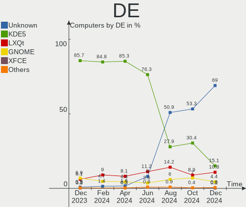
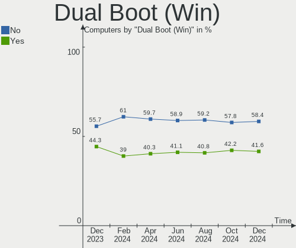
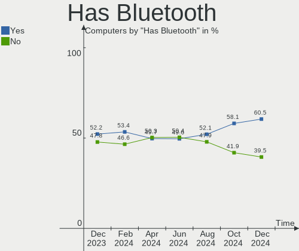
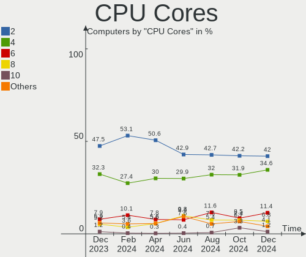
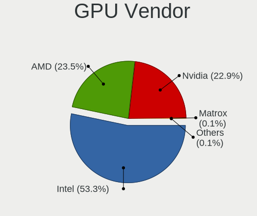
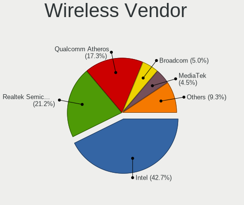

OpenMandriva Hardware Trends
----------------------------

A project to identify most popular hardware characteristics and track their change
over time based on data collected by OpenMandriva users at https://Linux-Hardware.org.

Anyone can contribute to this report by the [hw-probe](https://github.com/linuxhw/hw-probe) tool:

    sudo -E hw-probe -all -upload

This is a report for all computer types. See also reports for [desktops](/Dist/OpenMandriva/Desktop/README.md) and [notebooks](/Dist/OpenMandriva/Notebook/README.md).

Full-feature report is available here: https://linux-hardware.org/?view=trends

Period: Dec, 2021.

Contents
--------

* [ System ](#system)
  - [ OS                       ](#os)
  - [ OS Family                ](#os-family)
  - [ Kernel                   ](#kernel)
  - [ Kernel Family            ](#kernel-family)
  - [ Kernel Major Ver.        ](#kernel-major-ver)
  - [ Arch                     ](#arch)
  - [ DE                       ](#de)
  - [ Display Server           ](#display-server)
  - [ Display Manager          ](#display-manager)
  - [ OS Lang                  ](#os-lang)
  - [ Boot Mode                ](#boot-mode)
  - [ Filesystem               ](#filesystem)
  - [ Part. scheme             ](#part-scheme)
  - [ Dual Boot with Linux/BSD ](#dual-boot-with-linuxbsd)
  - [ Dual Boot (Win)          ](#dual-boot-win)

* [ Board ](#board)
  - [ Vendor                   ](#vendor)
  - [ Model                    ](#model)
  - [ Model Family             ](#model-family)
  - [ MFG Year                 ](#mfg-year)
  - [ Form Factor              ](#form-factor)
  - [ Secure Boot              ](#secure-boot)
  - [ Coreboot                 ](#coreboot)
  - [ RAM Size                 ](#ram-size)
  - [ RAM Used                 ](#ram-used)
  - [ Total Drives             ](#total-drives)
  - [ Has CD-ROM               ](#has-cd-rom)
  - [ Has Ethernet             ](#has-ethernet)
  - [ Has WiFi                 ](#has-wifi)
  - [ Has Bluetooth            ](#has-bluetooth)

* [ Location ](#location)
  - [ Country                  ](#country)
  - [ City                     ](#city)

* [ Drives ](#drives)
  - [ Drive Vendor             ](#drive-vendor)
  - [ Drive Model              ](#drive-model)
  - [ HDD Vendor               ](#hdd-vendor)
  - [ SSD Vendor               ](#ssd-vendor)
  - [ Drive Kind               ](#drive-kind)
  - [ Drive Connector          ](#drive-connector)
  - [ Drive Size               ](#drive-size)
  - [ Space Total              ](#space-total)
  - [ Space Used               ](#space-used)
  - [ Malfunc. Drives          ](#malfunc-drives)
  - [ Malfunc. Drive Vendor    ](#malfunc-drive-vendor)
  - [ Malfunc. HDD Vendor      ](#malfunc-hdd-vendor)
  - [ Malfunc. Drive Kind      ](#malfunc-drive-kind)
  - [ Failed Drives            ](#failed-drives)
  - [ Failed Drive Vendor      ](#failed-drive-vendor)
  - [ Drive Status             ](#drive-status)

* [ Storage controller ](#storage-controller)
  - [ Storage Vendor           ](#storage-vendor)
  - [ Storage Model            ](#storage-model)
  - [ Storage Kind             ](#storage-kind)

* [ Processor ](#processor)
  - [ CPU Vendor               ](#cpu-vendor)
  - [ CPU Model                ](#cpu-model)
  - [ CPU Model Family         ](#cpu-model-family)
  - [ CPU Cores                ](#cpu-cores)
  - [ CPU Sockets              ](#cpu-sockets)
  - [ CPU Threads              ](#cpu-threads)
  - [ CPU Op-Modes             ](#cpu-op-modes)
  - [ CPU Microcode            ](#cpu-microcode)
  - [ CPU Microarch            ](#cpu-microarch)

* [ Graphics ](#graphics)
  - [ GPU Vendor               ](#gpu-vendor)
  - [ GPU Model                ](#gpu-model)
  - [ GPU Combo                ](#gpu-combo)
  - [ GPU Driver               ](#gpu-driver)
  - [ GPU Memory               ](#gpu-memory)

* [ Monitor ](#monitor)
  - [ Monitor Vendor           ](#monitor-vendor)
  - [ Monitor Model            ](#monitor-model)
  - [ Monitor Resolution       ](#monitor-resolution)
  - [ Monitor Diagonal         ](#monitor-diagonal)
  - [ Monitor Width            ](#monitor-width)
  - [ Aspect Ratio             ](#aspect-ratio)
  - [ Monitor Area             ](#monitor-area)
  - [ Pixel Density            ](#pixel-density)
  - [ Multiple Monitors        ](#multiple-monitors)

* [ Network ](#network)
  - [ Net Controller Vendor    ](#net-controller-vendor)
  - [ Net Controller Model     ](#net-controller-model)
  - [ Wireless Vendor          ](#wireless-vendor)
  - [ Wireless Model           ](#wireless-model)
  - [ Ethernet Vendor          ](#ethernet-vendor)
  - [ Ethernet Model           ](#ethernet-model)
  - [ Net Controller Kind      ](#net-controller-kind)
  - [ Used Controller          ](#used-controller)
  - [ NICs                     ](#nics)
  - [ IPv6                     ](#ipv6)

* [ Bluetooth ](#bluetooth)
  - [ Bluetooth Vendor         ](#bluetooth-vendor)
  - [ Bluetooth Model          ](#bluetooth-model)

* [ Sound ](#sound)
  - [ Sound Vendor             ](#sound-vendor)
  - [ Sound Model              ](#sound-model)

* [ Memory ](#memory)
  - [ Memory Vendor            ](#memory-vendor)
  - [ Memory Model             ](#memory-model)
  - [ Memory Kind              ](#memory-kind)
  - [ Memory Form Factor       ](#memory-form-factor)
  - [ Memory Size              ](#memory-size)
  - [ Memory Speed             ](#memory-speed)

* [ Printers & scanners ](#printers--scanners)
  - [ Printer Vendor           ](#printer-vendor)
  - [ Printer Model            ](#printer-model)
  - [ Scanner Vendor           ](#scanner-vendor)
  - [ Scanner Model            ](#scanner-model)

* [ Camera ](#camera)
  - [ Camera Vendor            ](#camera-vendor)
  - [ Camera Model             ](#camera-model)

* [ Security ](#security)
  - [ Fingerprint Vendor       ](#fingerprint-vendor)
  - [ Fingerprint Model        ](#fingerprint-model)
  - [ Chipcard Vendor          ](#chipcard-vendor)
  - [ Chipcard Model           ](#chipcard-model)

* [ Unsupported ](#unsupported)
  - [ Unsupported Devices      ](#unsupported-devices)
  - [ Unsupported Device Types ](#unsupported-device-types)

System
------

OS
--

Installed operating systems

| Name              | Computers | Percent |
|-------------------|-----------|---------|
| OpenMandriva 4.2  | 198       | 84.98%  |
| OpenMandriva 4.50 | 35        | 15.02%  |

OS Family
---------

OS without a version

| Name         | Computers | Percent |
|--------------|-----------|---------|
| OpenMandriva | 233       | 100%    |

Kernel
------

Version of the Linux kernel

| Version                  | Computers | Percent |
|--------------------------|-----------|---------|
| 5.10.14-desktop-1omv4002 | 189       | 81.12%  |
| 5.14.7-desktop-1omv4050  | 20        | 8.58%   |
| 5.11.12-desktop-1omv4002 | 9         | 3.86%   |
| 5.12.4-desktop-1omv4050  | 8         | 3.43%   |
| 5.14.14-desktop-1omv4050 | 6         | 2.58%   |
| 5.5.12-desktop-1omv4001  | 1         | 0.43%   |

Kernel Family
-------------

Linux kernel without a distro release

| Version | Computers | Percent |
|---------|-----------|---------|
| 5.10.14 | 189       | 81.12%  |
| 5.14.7  | 20        | 8.58%   |
| 5.11.12 | 9         | 3.86%   |
| 5.12.4  | 8         | 3.43%   |
| 5.14.14 | 6         | 2.58%   |
| 5.5.12  | 1         | 0.43%   |

Kernel Major Ver.
-----------------

Linux kernel major version

| Version | Computers | Percent |
|---------|-----------|---------|
| 5.10    | 189       | 81.12%  |
| 5.14    | 26        | 11.16%  |
| 5.11    | 9         | 3.86%   |
| 5.12    | 8         | 3.43%   |
| 5.5     | 1         | 0.43%   |

Arch
----

OS architecture (x86_64, i586, etc.)

| Name   | Computers | Percent |
|--------|-----------|---------|
| x86_64 | 233       | 100%    |

DE
--

Desktop Environment

| Name | Computers | Percent |
|------|-----------|---------|
| KDE5 | 232       | 99.57%  |
| LXQt | 1         | 0.43%   |

Display Server
--------------

X11 or Wayland

| Name    | Computers | Percent |
|---------|-----------|---------|
| X11     | 230       | 98.71%  |
| Wayland | 3         | 1.29%   |

Display Manager
---------------

SDDM, LightDM, etc.

| Name | Computers | Percent |
|------|-----------|---------|
| SDDM | 233       | 100%    |

OS Lang
-------

Language

| Lang  | Computers | Percent |
|-------|-----------|---------|
| en_US | 119       | 51.07%  |
| fr_FR | 16        | 6.87%   |
| ru_RU | 15        | 6.44%   |
| pt_BR | 13        | 5.58%   |
| pl_PL | 11        | 4.72%   |
| de_DE | 11        | 4.72%   |
| cs_CZ | 8         | 3.43%   |
| hu_HU | 6         | 2.58%   |
| ru_UA | 4         | 1.72%   |
| it_IT | 4         | 1.72%   |
| es_ES | 4         | 1.72%   |
| es_MX | 3         | 1.29%   |
| en_GB | 2         | 0.86%   |
| en_AU | 2         | 0.86%   |
| de_CH | 2         | 0.86%   |
| da_DK | 2         | 0.86%   |
| uk_UA | 1         | 0.43%   |
| tr_TR | 1         | 0.43%   |
| ro_RO | 1         | 0.43%   |
| nl_NL | 1         | 0.43%   |
| nb_NO | 1         | 0.43%   |
| fr_CH | 1         | 0.43%   |
| es_EC | 1         | 0.43%   |
| es_AR | 1         | 0.43%   |
| en_CA | 1         | 0.43%   |
| ar_TN | 1         | 0.43%   |
| af_ZA | 1         | 0.43%   |

Boot Mode
---------

EFI or BIOS

| Mode | Computers | Percent |
|------|-----------|---------|
| BIOS | 158       | 67.81%  |
| EFI  | 75        | 32.19%  |

Filesystem
----------

Type of filesystem

| Type    | Computers | Percent |
|---------|-----------|---------|
| Overlay | 185       | 79.4%   |
| Ext4    | 43        | 18.45%  |
| F2fs    | 2         | 0.86%   |
| Btrfs   | 2         | 0.86%   |
| Ext2    | 1         | 0.43%   |

Part. scheme
------------

Scheme of partitioning

| Type | Computers | Percent |
|------|-----------|---------|
| GPT  | 128       | 54.94%  |
| MBR  | 105       | 45.06%  |

Dual Boot with Linux/BSD
------------------------

Hosting more than one Linux/BSD

| Dual boot | Computers | Percent |
|-----------|-----------|---------|
| Yes       | 122       | 52.36%  |
| No        | 111       | 47.64%  |

Dual Boot (Win)
---------------

Hosting Linux and Windows

| Dual boot | Computers | Percent |
|-----------|-----------|---------|
| Yes       | 122       | 52.36%  |
| No        | 111       | 47.64%  |

Board
-----

Vendor
------

Motherboard manufacturer

| Name                | Computers | Percent |
|---------------------|-----------|---------|
| ASUSTek Computer    | 43        | 18.45%  |
| Dell                | 26        | 11.16%  |
| Hewlett-Packard     | 24        | 10.3%   |
| Lenovo              | 19        | 8.15%   |
| Acer                | 18        | 7.73%   |
| Gigabyte Technology | 16        | 6.87%   |
| ASRock              | 16        | 6.87%   |
| MSI                 | 15        | 6.44%   |
| Sony                | 7         | 3%      |
| Toshiba             | 6         | 2.58%   |
| Intel               | 4         | 1.72%   |
| Samsung Electronics | 3         | 1.29%   |
| Positivo            | 3         | 1.29%   |
| Medion              | 3         | 1.29%   |
| Fujitsu             | 3         | 1.29%   |
| eMachines           | 3         | 1.29%   |
| Biostar             | 3         | 1.29%   |
| Unknown             | 3         | 1.29%   |
| LG Electronics      | 2         | 0.86%   |
| Chuwi               | 2         | 0.86%   |
| ZOTAC               | 1         | 0.43%   |
| TUXEDO              | 1         | 0.43%   |
| RM                  | 1         | 0.43%   |
| RKM                 | 1         | 0.43%   |
| Philco              | 1         | 0.43%   |
| Pegatron            | 1         | 0.43%   |
| OEM                 | 1         | 0.43%   |
| LEADER              | 1         | 0.43%   |
| Itautec             | 1         | 0.43%   |
| HUAWEI              | 1         | 0.43%   |
| Huanan              | 1         | 0.43%   |
| Gateway             | 1         | 0.43%   |
| Fujitsu Siemens     | 1         | 0.43%   |
| Apple               | 1         | 0.43%   |

Model
-----

Motherboard model

| Name                              | Computers | Percent |
|-----------------------------------|-----------|---------|
| ASUS UX31E                        | 6         | 2.58%   |
| Unknown                           | 6         | 2.58%   |
| Sony VGN-FZ31Z                    | 3         | 1.29%   |
| HP Notebook                       | 3         | 1.29%   |
| Dell Latitude E6430               | 3         | 1.29%   |
| Dell Inspiron 3451                | 3         | 1.29%   |
| ASUS All Series                   | 3         | 1.29%   |
| Acer Aspire ES1-571               | 3         | 1.29%   |
| Dell Latitude E6510               | 2         | 0.86%   |
| ASRock H470M-HDV                  | 2         | 0.86%   |
| Acer Aspire 5733                  | 2         | 0.86%   |
| ZOTAC H55                         | 1         | 0.43%   |
| Toshiba TE5                       | 1         | 0.43%   |
| Toshiba Satellite L750            | 1         | 0.43%   |
| Toshiba Satellite L655            | 1         | 0.43%   |
| Toshiba Satellite L355            | 1         | 0.43%   |
| Toshiba Satellite C870D-119       | 1         | 0.43%   |
| Toshiba Satellite C855D           | 1         | 0.43%   |
| Sony VPCEF3E1E                    | 1         | 0.43%   |
| Sony VPCEB1M1E                    | 1         | 0.43%   |
| Sony SVT11125CBS                  | 1         | 0.43%   |
| Sony SVE1513B1EW                  | 1         | 0.43%   |
| Samsung R540/SA41/E452            | 1         | 0.43%   |
| Samsung 550XDA                    | 1         | 0.43%   |
| Samsung 3570R/370R/470R/450R/510R | 1         | 0.43%   |
| RM NOTEBOOK 320                   | 1         | 0.43%   |
| RKM MK36S                         | 1         | 0.43%   |
| Positivo S14BW01                  | 1         | 0.43%   |
| Positivo J14AL11                  | 1         | 0.43%   |
| Positivo H14BT58                  | 1         | 0.43%   |
| Philco 14F                        | 1         | 0.43%   |
| Pegatron FK570AA-ABA a6628f       | 1         | 0.43%   |
| OEM B75                           | 1         | 0.43%   |
| MSI p6-2312ef                     | 1         | 0.43%   |
| MSI MS-7C09                       | 1         | 0.43%   |
| MSI MS-7B86                       | 1         | 0.43%   |
| MSI MS-7B85                       | 1         | 0.43%   |
| MSI MS-7B84                       | 1         | 0.43%   |
| MSI MS-7A38                       | 1         | 0.43%   |
| MSI MS-7922                       | 1         | 0.43%   |
| MSI MS-7895                       | 1         | 0.43%   |
| MSI MS-7891                       | 1         | 0.43%   |
| MSI MS-7821                       | 1         | 0.43%   |
| MSI MS-7788                       | 1         | 0.43%   |
| MSI MS-7721                       | 1         | 0.43%   |
| MSI MS-7529                       | 1         | 0.43%   |
| MSI GE72 2QC                      | 1         | 0.43%   |
| MSI Compaq dx2300 Microtower      | 1         | 0.43%   |
| Medion P6630                      | 1         | 0.43%   |
| Medion E2292                      | 1         | 0.43%   |
| Medion Akoya E1317T               | 1         | 0.43%   |
| LG S460-G.BG31P1                  | 1         | 0.43%   |
| LG A410-G.BC49P1                  | 1         | 0.43%   |
| Lenovo ZIWB2                      | 1         | 0.43%   |
| Lenovo V145-15AST 81MT            | 1         | 0.43%   |
| Lenovo ThinkStation E20 4220RF8   | 1         | 0.43%   |
| Lenovo ThinkPad T500 2087A75      | 1         | 0.43%   |
| Lenovo ThinkPad T410 2537Z7A      | 1         | 0.43%   |
| Lenovo ThinkPad T410 25376B8      | 1         | 0.43%   |
| Lenovo ThinkPad E550 20DF002YUS   | 1         | 0.43%   |

Model Family
------------

Motherboard model prefix

| Name                 | Computers | Percent |
|----------------------|-----------|---------|
| Acer Aspire          | 13        | 5.58%   |
| Dell Latitude        | 10        | 4.29%   |
| Dell Inspiron        | 8         | 3.43%   |
| Lenovo IdeaPad       | 6         | 2.58%   |
| ASUS UX31E           | 6         | 2.58%   |
| Unknown              | 6         | 2.58%   |
| Toshiba Satellite    | 5         | 2.15%   |
| Lenovo ThinkPad      | 5         | 2.15%   |
| HP EliteBook         | 4         | 1.72%   |
| Dell OptiPlex        | 4         | 1.72%   |
| Sony VGN-FZ31Z       | 3         | 1.29%   |
| HP ProDesk           | 3         | 1.29%   |
| HP Notebook          | 3         | 1.29%   |
| ASUS All             | 3         | 1.29%   |
| HP Pavilion          | 2         | 0.86%   |
| HP Laptop            | 2         | 0.86%   |
| HP 250               | 2         | 0.86%   |
| Dell Vostro          | 2         | 0.86%   |
| ASUS VivoBook        | 2         | 0.86%   |
| ASUS TUF             | 2         | 0.86%   |
| ASUS PRIME           | 2         | 0.86%   |
| ASRock H470M-HDV     | 2         | 0.86%   |
| ZOTAC H55            | 1         | 0.43%   |
| Toshiba TE5          | 1         | 0.43%   |
| Sony VPCEF3E1E       | 1         | 0.43%   |
| Sony VPCEB1M1E       | 1         | 0.43%   |
| Sony SVT11125CBS     | 1         | 0.43%   |
| Sony SVE1513B1EW     | 1         | 0.43%   |
| Samsung R540         | 1         | 0.43%   |
| Samsung 550XDA       | 1         | 0.43%   |
| Samsung 3570R        | 1         | 0.43%   |
| RM NOTEBOOK          | 1         | 0.43%   |
| RKM MK36S            | 1         | 0.43%   |
| Positivo S14BW01     | 1         | 0.43%   |
| Positivo J14AL11     | 1         | 0.43%   |
| Positivo H14BT58     | 1         | 0.43%   |
| Philco 14F           | 1         | 0.43%   |
| Pegatron FK570AA-ABA | 1         | 0.43%   |
| OEM B75              | 1         | 0.43%   |
| MSI p6-2312ef        | 1         | 0.43%   |
| MSI MS-7C09          | 1         | 0.43%   |
| MSI MS-7B86          | 1         | 0.43%   |
| MSI MS-7B85          | 1         | 0.43%   |
| MSI MS-7B84          | 1         | 0.43%   |
| MSI MS-7A38          | 1         | 0.43%   |
| MSI MS-7922          | 1         | 0.43%   |
| MSI MS-7895          | 1         | 0.43%   |
| MSI MS-7891          | 1         | 0.43%   |
| MSI MS-7821          | 1         | 0.43%   |
| MSI MS-7788          | 1         | 0.43%   |
| MSI MS-7721          | 1         | 0.43%   |
| MSI MS-7529          | 1         | 0.43%   |
| MSI GE72             | 1         | 0.43%   |
| MSI Compaq           | 1         | 0.43%   |
| Medion P6630         | 1         | 0.43%   |
| Medion E2292         | 1         | 0.43%   |
| Medion Akoya         | 1         | 0.43%   |
| LG S460-G.BG31P1     | 1         | 0.43%   |
| LG A410-G.BC49P1     | 1         | 0.43%   |
| Lenovo ZIWB2         | 1         | 0.43%   |

MFG Year
--------

Motherboard manufacture year

| Year | Computers | Percent |
|------|-----------|---------|
| 2021 | 28        | 12.02%  |
| 2012 | 28        | 12.02%  |
| 2011 | 21        | 9.01%   |
| 2013 | 20        | 8.58%   |
| 2019 | 18        | 7.73%   |
| 2009 | 16        | 6.87%   |
| 2018 | 15        | 6.44%   |
| 2015 | 13        | 5.58%   |
| 2010 | 13        | 5.58%   |
| 2020 | 12        | 5.15%   |
| 2016 | 11        | 4.72%   |
| 2014 | 11        | 4.72%   |
| 2008 | 11        | 4.72%   |
| 2007 | 6         | 2.58%   |
| 2017 | 5         | 2.15%   |
| 2006 | 4         | 1.72%   |
| 2005 | 1         | 0.43%   |

Form Factor
-----------

Physical design of the computer

| Name        | Computers | Percent |
|-------------|-----------|---------|
| Notebook    | 122       | 52.36%  |
| Desktop     | 104       | 44.64%  |
| Convertible | 3         | 1.29%   |
| Mini pc     | 2         | 0.86%   |
| All in one  | 2         | 0.86%   |

Secure Boot
-----------

Enabled or disabled

| State    | Computers | Percent |
|----------|-----------|---------|
| Disabled | 233       | 100%    |

Coreboot
--------

Have coreboot on board

| Used | Computers | Percent |
|------|-----------|---------|
| No   | 233       | 100%    |

RAM Size
--------

Total RAM memory

| Size in GB  | Computers | Percent |
|-------------|-----------|---------|
| 3.01-4.0    | 92        | 39.48%  |
| 4.01-8.0    | 61        | 26.18%  |
| 8.01-16.0   | 36        | 15.45%  |
| 16.01-24.0  | 20        | 8.58%   |
| 1.01-2.0    | 11        | 4.72%   |
| 32.01-64.0  | 9         | 3.86%   |
| 64.01-256.0 | 2         | 0.86%   |
| 2.01-3.0    | 1         | 0.43%   |
| 0.51-1.0    | 1         | 0.43%   |

RAM Used
--------

Used RAM memory

| Used GB  | Computers | Percent |
|----------|-----------|---------|
| 1.01-2.0 | 167       | 71.67%  |
| 0.51-1.0 | 37        | 15.88%  |
| 2.01-3.0 | 19        | 8.15%   |
| 0.01-0.5 | 7         | 3%      |
| 3.01-4.0 | 3         | 1.29%   |

Total Drives
------------

Number of drives on board

| Drives | Computers | Percent |
|--------|-----------|---------|
| 1      | 157       | 67.38%  |
| 2      | 51        | 21.89%  |
| 3      | 16        | 6.87%   |
| 4      | 4         | 1.72%   |
| 5      | 3         | 1.29%   |
| 8      | 1         | 0.43%   |
| 6      | 1         | 0.43%   |

Has CD-ROM
----------

Has CD-ROM on board

| Presented | Computers | Percent |
|-----------|-----------|---------|
| Yes       | 143       | 61.37%  |
| No        | 90        | 38.63%  |

Has Ethernet
------------

Has Ethernet on board

| Presented | Computers | Percent |
|-----------|-----------|---------|
| Yes       | 221       | 94.85%  |
| No        | 12        | 5.15%   |

Has WiFi
--------

Has WiFi module

| Presented | Computers | Percent |
|-----------|-----------|---------|
| Yes       | 162       | 69.53%  |
| No        | 71        | 30.47%  |

Has Bluetooth
-------------

Has Bluetooth module

| Presented | Computers | Percent |
|-----------|-----------|---------|
| No        | 144       | 61.8%   |
| Yes       | 89        | 38.2%   |

Location
--------

Country
-------

Geographic location (country)

| Country               | Computers | Percent |
|-----------------------|-----------|---------|
| Brazil                | 24        | 10.3%   |
| Russia                | 23        | 9.87%   |
| France                | 21        | 9.01%   |
| Poland                | 18        | 7.73%   |
| Germany               | 18        | 7.73%   |
| USA                   | 13        | 5.58%   |
| Italy                 | 10        | 4.29%   |
| Czechia               | 9         | 3.86%   |
| Hungary               | 8         | 3.43%   |
| Canada                | 6         | 2.58%   |
| Ukraine               | 5         | 2.15%   |
| Switzerland           | 5         | 2.15%   |
| Serbia                | 5         | 2.15%   |
| Spain                 | 4         | 1.72%   |
| Portugal              | 4         | 1.72%   |
| Netherlands           | 4         | 1.72%   |
| Moldova               | 4         | 1.72%   |
| Mexico                | 4         | 1.72%   |
| Australia             | 4         | 1.72%   |
| UK                    | 3         | 1.29%   |
| Greece                | 3         | 1.29%   |
| Denmark               | 3         | 1.29%   |
| Turkey                | 2         | 0.86%   |
| Tunisia               | 2         | 0.86%   |
| South Africa          | 2         | 0.86%   |
| Slovakia              | 2         | 0.86%   |
| Romania               | 2         | 0.86%   |
| Norway                | 2         | 0.86%   |
| Morocco               | 2         | 0.86%   |
| Indonesia             | 2         | 0.86%   |
| India                 | 2         | 0.86%   |
| Chile                 | 2         | 0.86%   |
| Belarus               | 2         | 0.86%   |
| Vietnam               | 1         | 0.43%   |
| Taiwan                | 1         | 0.43%   |
| Republic of the Congo | 1         | 0.43%   |
| Martinique            | 1         | 0.43%   |
| Latvia                | 1         | 0.43%   |
| Hong Kong             | 1         | 0.43%   |
| Haiti                 | 1         | 0.43%   |
| Ecuador               | 1         | 0.43%   |
| Croatia               | 1         | 0.43%   |
| China                 | 1         | 0.43%   |
| Barbados              | 1         | 0.43%   |
| Bangladesh            | 1         | 0.43%   |
| Argentina             | 1         | 0.43%   |

City
----

Geographic location (city)

| City            | Computers | Percent |
|-----------------|-----------|---------|
| Prague          | 6         | 2.58%   |
| Warsaw          | 4         | 1.72%   |
| Rome            | 4         | 1.72%   |
| Krakow          | 4         | 1.72%   |
| S??o Paulo      | 3         | 1.29%   |
| Paris           | 3         | 1.29%   |
| Moscow          | 3         | 1.29%   |
| Funchal         | 3         | 1.29%   |
| Chisinau        | 3         | 1.29%   |
| Yekaterinburg   | 2         | 0.86%   |
| St Petersburg   | 2         | 0.86%   |
| Remscheid       | 2         | 0.86%   |
| Porto Alegre    | 2         | 0.86%   |
| Kyiv            | 2         | 0.86%   |
| Jakarta         | 2         | 0.86%   |
| Fribourg        | 2         | 0.86%   |
| Edmonton        | 2         | 0.86%   |
| Compi??gne      | 2         | 0.86%   |
| Chalcis         | 2         | 0.86%   |
| Campinas        | 2         | 0.86%   |
| Budapest        | 2         | 0.86%   |
| Bratislava      | 2         | 0.86%   |
| Berlin          | 2         | 0.86%   |
| Belgrade        | 2         | 0.86%   |
| As              | 2         | 0.86%   |
| Arkhangelsk     | 2         | 0.86%   |
| Zutphen         | 1         | 0.43%   |
| Zurich          | 1         | 0.43%   |
| Zaraysk         | 1         | 0.43%   |
| Zaragoza        | 1         | 0.43%   |
| Zagreb          | 1         | 0.43%   |
| Yessentuki      | 1         | 0.43%   |
| Vorden          | 1         | 0.43%   |
| Verona          | 1         | 0.43%   |
| Venancio Aires  | 1         | 0.43%   |
| Veliky Novgorod | 1         | 0.43%   |
| Vancouver       | 1         | 0.43%   |
| Ussac           | 1         | 0.43%   |
| Uitenhage       | 1         | 0.43%   |
| Tver            | 1         | 0.43%   |
| Tunis           | 1         | 0.43%   |
| Torun           | 1         | 0.43%   |
| Toluca          | 1         | 0.43%   |
| Tlalnepantla    | 1         | 0.43%   |
| Tiszafured      | 1         | 0.43%   |
| Tiefenort       | 1         | 0.43%   |
| The Bronx       | 1         | 0.43%   |
| Temuco          | 1         | 0.43%   |
| Taubate         | 1         | 0.43%   |
| Targoviste      | 1         | 0.43%   |
| Talant          | 1         | 0.43%   |
| Sydney          | 1         | 0.43%   |
| Stuttgart       | 1         | 0.43%   |
| Strasbourg      | 1         | 0.43%   |
| Sorriso         | 1         | 0.43%   |
| Sheffield       | 1         | 0.43%   |
| Schupfen        | 1         | 0.43%   |
| Schijndel       | 1         | 0.43%   |
| Schafflund      | 1         | 0.43%   |
| Sao Pedro       | 1         | 0.43%   |

Drives
------

Drive Vendor
------------

Hard drive vendors

| Vendor              | Computers | Drives | Percent |
|---------------------|-----------|--------|---------|
| WDC                 | 57        | 63     | 18.27%  |
| Seagate             | 56        | 61     | 17.95%  |
| Samsung Electronics | 39        | 47     | 12.5%   |
| Toshiba             | 25        | 25     | 8.01%   |
| Kingston            | 22        | 23     | 7.05%   |
| Hitachi             | 20        | 21     | 6.41%   |
| SanDisk             | 17        | 17     | 5.45%   |
| Unknown             | 8         | 8      | 2.56%   |
| HGST                | 6         | 6      | 1.92%   |
| SK Hynix            | 5         | 5      | 1.6%    |
| MAXTOR              | 5         | 6      | 1.6%    |
| Crucial             | 5         | 5      | 1.6%    |
| A-DATA Technology   | 4         | 4      | 1.28%   |
| Netac               | 3         | 3      | 0.96%   |
| Apacer              | 3         | 3      | 0.96%   |
| Transcend           | 2         | 2      | 0.64%   |
| SPCC                | 2         | 2      | 0.64%   |
| PNY                 | 2         | 2      | 0.64%   |
| Patriot             | 2         | 2      | 0.64%   |
| Micron Technology   | 2         | 3      | 0.64%   |
| JMicron             | 2         | 2      | 0.64%   |
| Intel               | 2         | 2      | 0.64%   |
| Hewlett-Packard     | 2         | 2      | 0.64%   |
| Fujitsu             | 2         | 2      | 0.64%   |
| VERICO              | 1         | 1      | 0.32%   |
| SMI                 | 1         | 1      | 0.32%   |
| Silicon Motion      | 1         | 1      | 0.32%   |
| LITEON              | 1         | 1      | 0.32%   |
| Lexar               | 1         | 1      | 0.32%   |
| Leven               | 1         | 1      | 0.32%   |
| LaCie               | 1         | 1      | 0.32%   |
| KingFast            | 1         | 2      | 0.32%   |
| Intenso             | 1         | 1      | 0.32%   |
| Integral            | 1         | 1      | 0.32%   |
| InnoDisk            | 1         | 1      | 0.32%   |
| GOODRAM             | 1         | 1      | 0.32%   |
| Gigabyte Technology | 1         | 1      | 0.32%   |
| CS900               | 1         | 1      | 0.32%   |
| China               | 1         | 1      | 0.32%   |
| BHT                 | 1         | 1      | 0.32%   |
| AFOX                | 1         | 1      | 0.32%   |
| 1TB                 | 1         | 1      | 0.32%   |
| Unknown             | 1         | 1      | 0.32%   |

Drive Model
-----------

Hard drive models

| Model                            | Computers | Percent |
|----------------------------------|-----------|---------|
| SanDisk SSD U100 256GB           | 6         | 1.81%   |
| Seagate ST500LT012-1DG142 500GB  | 5         | 1.51%   |
| Seagate ST1000DM010-2EP102 1TB   | 5         | 1.51%   |
| Kingston SV300S37A120G 120GB SSD | 4         | 1.2%    |
| Toshiba MQ04ABF100 1TB           | 3         | 0.9%    |
| Toshiba MQ01ABF050 500GB         | 3         | 0.9%    |
| Toshiba HDWD110 1TB              | 3         | 0.9%    |
| Toshiba DT01ACA050 500GB         | 3         | 0.9%    |
| Seagate ST9320325AS 320GB        | 3         | 0.9%    |
| Samsung HD322HJ 320GB            | 3         | 0.9%    |
| Samsung HD103SJ 1TB              | 3         | 0.9%    |
| Hitachi HTS543232A7A384 320GB    | 3         | 0.9%    |
| WDC WDS500G2B0A-00SM50 500GB SSD | 2         | 0.6%    |
| WDC WD5000LPLX-60ZNTT1 500GB     | 2         | 0.6%    |
| WDC WD10EZEX-08WN4A0 1TB         | 2         | 0.6%    |
| Toshiba MQ01ABD100 1TB           | 2         | 0.6%    |
| Toshiba MG03ACA100 1TB           | 2         | 0.6%    |
| Toshiba DT01ACA100 1TB           | 2         | 0.6%    |
| Seagate ST9500325AS 500GB        | 2         | 0.6%    |
| Seagate ST500DM002-1BD142 500GB  | 2         | 0.6%    |
| Seagate ST380811AS 80GB          | 2         | 0.6%    |
| Seagate ST3500418AS 500GB        | 2         | 0.6%    |
| Seagate ST3500413AS 500GB        | 2         | 0.6%    |
| Seagate ST1000DM003-1CH162 1TB   | 2         | 0.6%    |
| SanDisk SSD PLUS 240GB           | 2         | 0.6%    |
| Samsung SSD 970 EVO Plus 500GB   | 2         | 0.6%    |
| Samsung SSD 860 QVO 1TB          | 2         | 0.6%    |
| Samsung SSD 860 EVO 250GB        | 2         | 0.6%    |
| Samsung SSD 750 EVO 250GB        | 2         | 0.6%    |
| Samsung HD502HI 500GB            | 2         | 0.6%    |
| Patriot Burst 120GB SSD          | 2         | 0.6%    |
| Kingston SV300S37A240G 240GB SSD | 2         | 0.6%    |
| Kingston SHFS37A120G 120GB SSD   | 2         | 0.6%    |
| Kingston SA400S37480G 480GB SSD  | 2         | 0.6%    |
| Kingston SA400S37120G 120GB SSD  | 2         | 0.6%    |
| Kingston SA400M8240G 240GB SSD   | 2         | 0.6%    |
| JMicron Tech 250GB               | 2         | 0.6%    |
| Hitachi HTS547550A9E384 500GB    | 2         | 0.6%    |
| Hitachi HTS545050A7E380 500GB    | 2         | 0.6%    |
| Hitachi HDP725050GLA360 500GB    | 2         | 0.6%    |
| HGST HTS721010A9E630 1TB         | 2         | 0.6%    |
| Crucial CT1000MX500SSD1 1TB      | 2         | 0.6%    |
| WDC WDS500G2B0C-00PXH0 500GB     | 1         | 0.3%    |
| WDC WDS500G2B0B 500GB SSD        | 1         | 0.3%    |
| WDC WDS500G1X0E-00AFY0 500GB     | 1         | 0.3%    |
| WDC WDS480G2G0A-00JH30 480GB SSD | 1         | 0.3%    |
| WDC WDS240G2G0B-00EPW0 240GB SSD | 1         | 0.3%    |
| WDC WDS120G1G0A-00SS50 120GB SSD | 1         | 0.3%    |
| WDC WD800JD-60LSA5 80GB          | 1         | 0.3%    |
| WDC WD800JB-00JJC0 80GB          | 1         | 0.3%    |
| WDC WD800BB-00JHC0 80GB          | 1         | 0.3%    |
| WDC WD7500AACS-00D6B0 752GB      | 1         | 0.3%    |
| WDC WD5000LPLX-60ZNTT2 500GB     | 1         | 0.3%    |
| WDC WD5000LPCX-24C6HT0 500GB     | 1         | 0.3%    |
| WDC WD5000LPCX-21VHAT0 500GB     | 1         | 0.3%    |
| WDC WD5000BPVT-80HXZT3 500GB     | 1         | 0.3%    |
| WDC WD5000BPVT-55HXZT4 500GB     | 1         | 0.3%    |
| WDC WD5000BPVT-22HXZT3 500GB     | 1         | 0.3%    |
| WDC WD5000BPVT-22HXZT1 500GB     | 1         | 0.3%    |
| WDC WD5000BEVT-60ZAT1 500GB      | 1         | 0.3%    |

HDD Vendor
----------

Hard disk drive vendors

| Vendor              | Computers | Drives | Percent |
|---------------------|-----------|--------|---------|
| Seagate             | 54        | 59     | 30.86%  |
| WDC                 | 48        | 52     | 27.43%  |
| Toshiba             | 22        | 22     | 12.57%  |
| Hitachi             | 20        | 21     | 11.43%  |
| Samsung Electronics | 16        | 19     | 9.14%   |
| HGST                | 6         | 6      | 3.43%   |
| MAXTOR              | 5         | 6      | 2.86%   |
| Fujitsu             | 2         | 2      | 1.14%   |
| Unknown             | 1         | 1      | 0.57%   |
| Hewlett-Packard     | 1         | 1      | 0.57%   |

SSD Vendor
----------

Solid state drive vendors

| Vendor              | Computers | Drives | Percent |
|---------------------|-----------|--------|---------|
| Samsung Electronics | 20        | 21     | 19.42%  |
| Kingston            | 18        | 19     | 17.48%  |
| SanDisk             | 16        | 16     | 15.53%  |
| WDC                 | 5         | 6      | 4.85%   |
| Crucial             | 5         | 5      | 4.85%   |
| Toshiba             | 3         | 3      | 2.91%   |
| Netac               | 3         | 3      | 2.91%   |
| A-DATA Technology   | 3         | 3      | 2.91%   |
| Transcend           | 2         | 2      | 1.94%   |
| PNY                 | 2         | 2      | 1.94%   |
| Patriot             | 2         | 2      | 1.94%   |
| Apacer              | 2         | 2      | 1.94%   |
| VERICO              | 1         | 1      | 0.97%   |
| SPCC                | 1         | 1      | 0.97%   |
| SMI                 | 1         | 1      | 0.97%   |
| SK Hynix            | 1         | 1      | 0.97%   |
| Seagate             | 1         | 1      | 0.97%   |
| Micron Technology   | 1         | 2      | 0.97%   |
| LITEON              | 1         | 1      | 0.97%   |
| Leven               | 1         | 1      | 0.97%   |
| KingFast            | 1         | 2      | 0.97%   |
| Intenso             | 1         | 1      | 0.97%   |
| Intel               | 1         | 1      | 0.97%   |
| Integral            | 1         | 1      | 0.97%   |
| InnoDisk            | 1         | 1      | 0.97%   |
| Hewlett-Packard     | 1         | 1      | 0.97%   |
| GOODRAM             | 1         | 1      | 0.97%   |
| Gigabyte Technology | 1         | 1      | 0.97%   |
| CS900               | 1         | 1      | 0.97%   |
| China               | 1         | 1      | 0.97%   |
| BHT                 | 1         | 1      | 0.97%   |
| AFOX                | 1         | 1      | 0.97%   |
| 1TB                 | 1         | 1      | 0.97%   |
| Unknown             | 1         | 1      | 0.97%   |

Drive Kind
----------

HDD or SSD

| Kind    | Computers | Drives | Percent |
|---------|-----------|--------|---------|
| HDD     | 148       | 189    | 53.62%  |
| SSD     | 91        | 108    | 32.97%  |
| NVMe    | 25        | 27     | 9.06%   |
| MMC     | 7         | 7      | 2.54%   |
| Unknown | 5         | 5      | 1.81%   |

Drive Connector
---------------

SATA, SAS, NVMe, etc.

| Type | Computers | Drives | Percent |
|------|-----------|--------|---------|
| SATA | 213       | 292    | 83.86%  |
| NVMe | 25        | 27     | 9.84%   |
| SAS  | 9         | 10     | 3.54%   |
| MMC  | 7         | 7      | 2.76%   |

Drive Size
----------

Size of hard drive

| Size in TB | Computers | Drives | Percent |
|------------|-----------|--------|---------|
| 0.01-0.5   | 172       | 215    | 70.49%  |
| 0.51-1.0   | 55        | 63     | 22.54%  |
| 1.01-2.0   | 12        | 13     | 4.92%   |
| 2.01-3.0   | 3         | 3      | 1.23%   |
| 3.01-4.0   | 1         | 1      | 0.41%   |
| 4.01-10.0  | 1         | 2      | 0.41%   |

Space Total
-----------

Amount of disk space available on the file system

| Size in GB | Computers | Percent |
|------------|-----------|---------|
| 1-20       | 122       | 52.36%  |
| 101-250    | 31        | 13.3%   |
| Unknown    | 26        | 11.16%  |
| 251-500    | 23        | 9.87%   |
| 51-100     | 11        | 4.72%   |
| 1001-2000  | 7         | 3%      |
| 501-1000   | 7         | 3%      |
| 21-50      | 5         | 2.15%   |
| 2001-3000  | 1         | 0.43%   |

Space Used
----------

Amount of used disk space

| Used GB   | Computers | Percent |
|-----------|-----------|---------|
| 1-20      | 182       | 78.11%  |
| Unknown   | 26        | 11.16%  |
| 21-50     | 8         | 3.43%   |
| 101-250   | 5         | 2.15%   |
| 51-100    | 5         | 2.15%   |
| 251-500   | 3         | 1.29%   |
| 501-1000  | 2         | 0.86%   |
| 1001-2000 | 1         | 0.43%   |
| 0         | 1         | 0.43%   |

Malfunc. Drives
---------------

Drive models with a malfunction

| Model                                           | Computers | Drives | Percent |
|-------------------------------------------------|-----------|--------|---------|
| SanDisk SSD U100 256GB                          | 6         | 6      | 6.12%   |
| Seagate ST9500325AS 500GB                       | 2         | 3      | 2.04%   |
| Seagate ST9320325AS 320GB                       | 2         | 2      | 2.04%   |
| Seagate ST380811AS 80GB                         | 2         | 2      | 2.04%   |
| Samsung Electronics HD322HJ 320GB               | 2         | 2      | 2.04%   |
| Kingston SV300S37A240G 240GB SSD                | 2         | 2      | 2.04%   |
| Hitachi HTS547550A9E384 500GB                   | 2         | 2      | 2.04%   |
| Hitachi HTS545050A7E380 500GB                   | 2         | 2      | 2.04%   |
| WDC WDS500G2B0A-00SM50 500GB SSD                | 1         | 1      | 1.02%   |
| WDC WDS480G2G0A-00JH30 480GB SSD                | 1         | 1      | 1.02%   |
| WDC WD800BB-00JHC0 80GB                         | 1         | 1      | 1.02%   |
| WDC WD5000LPLX-60ZNTT1 500GB                    | 1         | 1      | 1.02%   |
| WDC WD5000BPVT-22HXZT3 500GB                    | 1         | 1      | 1.02%   |
| WDC WD5000BEVT-60ZAT1 500GB                     | 1         | 1      | 1.02%   |
| WDC WD5000AAKX-003CA0 500GB                     | 1         | 1      | 1.02%   |
| WDC WD5000AAKX-001CA0 500GB                     | 1         | 1      | 1.02%   |
| WDC WD3200BPVT-75ZEST0 320GB                    | 1         | 1      | 1.02%   |
| WDC WD3200BPVT-22JJ5T0 320GB                    | 1         | 1      | 1.02%   |
| WDC WD3200AAJB-00J3A0 320GB                     | 1         | 1      | 1.02%   |
| WDC WD30EZRZ-00GXCB0 3TB                        | 1         | 1      | 1.02%   |
| WDC WD2500BEVT-80A23T0 250GB                    | 1         | 1      | 1.02%   |
| WDC WD2500BEVT-75A23T0 250GB                    | 1         | 1      | 1.02%   |
| WDC WD2500AAKX-753CA1 250GB                     | 1         | 1      | 1.02%   |
| WDC WD2500AAKX-603CA0 250GB                     | 1         | 1      | 1.02%   |
| WDC WD20EZRZ-00Z5HB0 2TB                        | 1         | 1      | 1.02%   |
| WDC WD20EARX-00PASB0 2TB                        | 1         | 1      | 1.02%   |
| WDC WD20EARS-00MVWB0 2TB                        | 1         | 1      | 1.02%   |
| WDC WD1600AAJS-22L7A0 160GB                     | 1         | 1      | 1.02%   |
| WDC WD10JPVX-22JC3T0 1TB                        | 1         | 1      | 1.02%   |
| WDC WD10EZEX-60ZF5A0 1TB                        | 1         | 1      | 1.02%   |
| WDC WD10EZEX-00BN5A0 1TB                        | 1         | 1      | 1.02%   |
| Toshiba MQ01ABF050 500GB                        | 1         | 1      | 1.02%   |
| Toshiba MQ01ABD100 1TB                          | 1         | 1      | 1.02%   |
| Toshiba MK3265GSX 320GB                         | 1         | 1      | 1.02%   |
| Toshiba DT01ACA100 1TB                          | 1         | 1      | 1.02%   |
| Toshiba DT01ACA050 500GB                        | 1         | 1      | 1.02%   |
| SK Hynix SC210 2.5 7MM 128GB SSD                | 1         | 1      | 1.02%   |
| Seagate ST980813AS 80GB                         | 1         | 1      | 1.02%   |
| Seagate ST500LT012-9WS142 500GB                 | 1         | 1      | 1.02%   |
| Seagate ST500LT012-1DG142 500GB                 | 1         | 1      | 1.02%   |
| Seagate ST500LM021-1KJ152 500GB                 | 1         | 1      | 1.02%   |
| Seagate ST500LM012 HN-M500MBB 500GB             | 1         | 1      | 1.02%   |
| Seagate ST500LM000-SSHD-8GB                     | 1         | 1      | 1.02%   |
| Seagate ST500DM002-1BD142 500GB                 | 1         | 1      | 1.02%   |
| Seagate ST380215AS 80GB                         | 1         | 1      | 1.02%   |
| Seagate ST3750330AS 752GB                       | 1         | 1      | 1.02%   |
| Seagate ST3250310AS 250GB                       | 1         | 1      | 1.02%   |
| Seagate ST320LT007-9ZV142 320GB                 | 1         | 1      | 1.02%   |
| Seagate ST3160812A 160GB                        | 1         | 1      | 1.02%   |
| Seagate ST31000524AS 1TB                        | 1         | 1      | 1.02%   |
| Seagate ST2000DL003-9VT166 2TB                  | 1         | 1      | 1.02%   |
| Seagate ST1000LX015-1U7172 1TB                  | 1         | 1      | 1.02%   |
| Seagate ST1000DM003-1ER162 1TB                  | 1         | 1      | 1.02%   |
| SanDisk SSD PLUS 240GB                          | 1         | 1      | 1.02%   |
| SanDisk SSD PLUS 120GB                          | 1         | 1      | 1.02%   |
| SanDisk SDSSDHP128G 128GB                       | 1         | 1      | 1.02%   |
| Samsung Electronics SP2504C 250GB               | 1         | 1      | 1.02%   |
| Samsung Electronics MZMPC032HBCD-00000 32GB SSD | 1         | 1      | 1.02%   |
| Samsung Electronics HD642JJ 640GB               | 1         | 1      | 1.02%   |
| Samsung Electronics HD502HJ 500GB               | 1         | 1      | 1.02%   |

Malfunc. Drive Vendor
---------------------

Vendors of faulty drives

| Vendor              | Computers | Drives | Percent |
|---------------------|-----------|--------|---------|
| WDC                 | 22        | 23     | 22.92%  |
| Seagate             | 22        | 23     | 22.92%  |
| Samsung Electronics | 13        | 13     | 13.54%  |
| Hitachi             | 11        | 12     | 11.46%  |
| SanDisk             | 9         | 9      | 9.38%   |
| Toshiba             | 5         | 5      | 5.21%   |
| MAXTOR              | 5         | 5      | 5.21%   |
| Kingston            | 4         | 4      | 4.17%   |
| SK Hynix            | 1         | 1      | 1.04%   |
| HGST                | 1         | 1      | 1.04%   |
| Hewlett-Packard     | 1         | 1      | 1.04%   |
| Fujitsu             | 1         | 1      | 1.04%   |
| Crucial             | 1         | 1      | 1.04%   |

Malfunc. HDD Vendor
-------------------

Vendors of faulty HDD drives

| Vendor              | Computers | Drives | Percent |
|---------------------|-----------|--------|---------|
| Seagate             | 22        | 23     | 28.21%  |
| WDC                 | 20        | 21     | 25.64%  |
| Samsung Electronics | 12        | 12     | 15.38%  |
| Hitachi             | 11        | 12     | 14.1%   |
| Toshiba             | 5         | 5      | 6.41%   |
| MAXTOR              | 5         | 5      | 6.41%   |
| HGST                | 1         | 1      | 1.28%   |
| Hewlett-Packard     | 1         | 1      | 1.28%   |
| Fujitsu             | 1         | 1      | 1.28%   |

Malfunc. Drive Kind
-------------------

Kinds of faulty drives

| Kind | Computers | Drives | Percent |
|------|-----------|--------|---------|
| HDD  | 70        | 81     | 79.55%  |
| SSD  | 18        | 18     | 20.45%  |

Failed Drives
-------------

Failed drive models

| Model                       | Computers | Drives | Percent |
|-----------------------------|-----------|--------|---------|
| WDC WD2500BEVS-22UST0 250GB | 1         | 1      | 100%    |

Failed Drive Vendor
-------------------

Failed drive vendors

| Vendor | Computers | Drives | Percent |
|--------|-----------|--------|---------|
| WDC    | 1         | 1      | 100%    |

Drive Status
------------

Number of failed and malfunc. drives

| Status   | Computers | Drives | Percent |
|----------|-----------|--------|---------|
| Works    | 154       | 202    | 57.25%  |
| Malfunc  | 88        | 99     | 32.71%  |
| Detected | 26        | 34     | 9.67%   |
| Failed   | 1         | 1      | 0.37%   |

Storage controller
------------------

Storage Vendor
--------------

Storage controller vendors

| Vendor                      | Computers | Percent |
|-----------------------------|-----------|---------|
| Intel                       | 181       | 69.35%  |
| AMD                         | 42        | 16.09%  |
| Samsung Electronics         | 7         | 2.68%   |
| Sandisk                     | 5         | 1.92%   |
| Nvidia                      | 5         | 1.92%   |
| SK Hynix                    | 4         | 1.53%   |
| Marvell Technology Group    | 4         | 1.53%   |
| Kingston Technology Company | 4         | 1.53%   |
| Phison Electronics          | 2         | 0.77%   |
| JMicron Technology          | 2         | 0.77%   |
| ASMedia Technology          | 2         | 0.77%   |
| Silicon Motion              | 1         | 0.38%   |
| Realtek Semiconductor       | 1         | 0.38%   |
| Micron Technology           | 1         | 0.38%   |

Storage Model
-------------

Storage controller models

| Model                                                                                   | Computers | Percent |
|-----------------------------------------------------------------------------------------|-----------|---------|
| AMD FCH SATA Controller [AHCI mode]                                                     | 28        | 8.7%    |
| Intel NM10/ICH7 Family SATA Controller [IDE mode]                                       | 19        | 5.9%    |
| Intel 82801G (ICH7 Family) IDE Controller                                               | 17        | 5.28%   |
| Intel 7 Series Chipset Family 6-port SATA Controller [AHCI mode]                        | 13        | 4.04%   |
| Intel 82801IBM/IEM (ICH9M/ICH9M-E) 4 port SATA Controller [AHCI mode]                   | 11        | 3.42%   |
| Intel 6 Series/C200 Series Chipset Family 6 port Mobile SATA AHCI Controller            | 10        | 3.11%   |
| Intel 5 Series/3400 Series Chipset 6 port SATA AHCI Controller                          | 10        | 3.11%   |
| Intel 5 Series/3400 Series Chipset 4 port SATA AHCI Controller                          | 9         | 2.8%    |
| Intel Sunrise Point-LP SATA Controller [AHCI mode]                                      | 8         | 2.48%   |
| Intel 8 Series/C220 Series Chipset Family 6-port SATA Controller 1 [AHCI mode]          | 8         | 2.48%   |
| AMD 400 Series Chipset SATA Controller                                                  | 8         | 2.48%   |
| Intel 82801 Mobile SATA Controller [RAID mode]                                          | 7         | 2.17%   |
| AMD SB7x0/SB8x0/SB9x0 SATA Controller [AHCI mode]                                       | 7         | 2.17%   |
| Intel Atom Processor E3800 Series SATA AHCI Controller                                  | 6         | 1.86%   |
| Intel 82801HM/HEM (ICH8M/ICH8M-E) IDE Controller                                        | 6         | 1.86%   |
| Intel 8 Series SATA Controller 1 [AHCI mode]                                            | 6         | 1.86%   |
| Intel Comet Lake SATA AHCI Controller                                                   | 5         | 1.55%   |
| Intel 82801HM/HEM (ICH8M/ICH8M-E) SATA Controller [AHCI mode]                           | 5         | 1.55%   |
| Intel Volume Management Device NVMe RAID Controller                                     | 4         | 1.24%   |
| Intel Q170/Q150/B150/H170/H110/Z170/CM236 Chipset SATA Controller [AHCI Mode]           | 4         | 1.24%   |
| Intel Atom/Celeron/Pentium Processor x5-E8000/J3xxx/N3xxx Series SATA Controller        | 4         | 1.24%   |
| Intel 7 Series/C210 Series Chipset Family 6-port SATA Controller [AHCI mode]            | 4         | 1.24%   |
| Intel 6 Series/C200 Series Chipset Family 6 port Desktop SATA AHCI Controller           | 4         | 1.24%   |
| Intel 500 Series Chipset Family SATA AHCI Controller                                    | 4         | 1.24%   |
| AMD SB7x0/SB8x0/SB9x0 IDE Controller                                                    | 4         | 1.24%   |
| SK Hynix BC511                                                                          | 3         | 0.93%   |
| Sandisk WD Blue SN550 NVMe SSD                                                          | 3         | 0.93%   |
| Samsung NVMe SSD Controller 980                                                         | 3         | 0.93%   |
| Intel Celeron/Pentium Silver Processor SATA Controller                                  | 3         | 0.93%   |
| Intel Cannon Lake Mobile PCH SATA AHCI Controller                                       | 3         | 0.93%   |
| Intel 82801I (ICH9 Family) 2 port SATA Controller [IDE mode]                            | 3         | 0.93%   |
| Intel 7 Series/C210 Series Chipset Family 4-port SATA Controller [IDE mode]             | 3         | 0.93%   |
| Intel 7 Series/C210 Series Chipset Family 2-port SATA Controller [IDE mode]             | 3         | 0.93%   |
| Intel 6 Series/C200 Series Chipset Family Mobile SATA Controller (IDE mode, ports 4-5)  | 3         | 0.93%   |
| Intel 6 Series/C200 Series Chipset Family Mobile SATA Controller (IDE mode, ports 0-3)  | 3         | 0.93%   |
| Intel 6 Series/C200 Series Chipset Family Desktop SATA Controller (IDE mode, ports 4-5) | 3         | 0.93%   |
| Intel 6 Series/C200 Series Chipset Family Desktop SATA Controller (IDE mode, ports 0-3) | 3         | 0.93%   |
| Intel 200 Series PCH SATA controller [AHCI mode]                                        | 3         | 0.93%   |
| AMD SB7x0/SB8x0/SB9x0 SATA Controller [IDE mode]                                        | 3         | 0.93%   |
| Sandisk WD PC SN810 / Black SN850 NVMe SSD                                              | 2         | 0.62%   |
| Samsung NVMe SSD Controller SM981/PM981/PM983                                           | 2         | 0.62%   |
| Nvidia MCP61 SATA Controller                                                            | 2         | 0.62%   |
| Nvidia MCP61 IDE                                                                        | 2         | 0.62%   |
| Marvell Group 88SE6101/6102 single-port PATA133 interface                               | 2         | 0.62%   |
| Intel Tiger Lake-LP SATA Controller [AHCI mode]                                         | 2         | 0.62%   |
| Intel SATA Controller [RAID mode]                                                       | 2         | 0.62%   |
| Intel Celeron N3350/Pentium N4200/Atom E3900 Series SATA AHCI Controller                | 2         | 0.62%   |
| Intel 9 Series Chipset Family SATA Controller [AHCI Mode]                               | 2         | 0.62%   |
| Intel 82801IR/IO/IH (ICH9R/DO/DH) 4 port SATA Controller [IDE mode]                     | 2         | 0.62%   |
| ASMedia ASM1062 Serial ATA Controller                                                   | 2         | 0.62%   |
| SK Hynix Gold P31 SSD                                                                   | 1         | 0.31%   |
| Silicon Motion SM2262/SM2262EN SSD Controller                                           | 1         | 0.31%   |
| Sandisk Non-Volatile memory controller                                                  | 1         | 0.31%   |
| Samsung NVMe SSD Controller SM961/PM961/SM963                                           | 1         | 0.31%   |
| Samsung NVMe SSD Controller PM9A1/PM9A3/980PRO                                          | 1         | 0.31%   |
| Realtek Realtek Non-Volatile memory controller                                          | 1         | 0.31%   |
| Phison PS5013 E13 NVMe Controller                                                       | 1         | 0.31%   |
| Phison E12 NVMe Controller                                                              | 1         | 0.31%   |
| Nvidia MCP73 SATA Controller (IDE mode)                                                 | 1         | 0.31%   |
| Nvidia MCP73 IDE Controller                                                             | 1         | 0.31%   |

Storage Kind
------------

Kind of storage controller (IDE, SATA, NVMe, SAS, ...)

| Kind | Computers | Percent |
|------|-----------|---------|
| SATA | 176       | 65.67%  |
| IDE  | 53        | 19.78%  |
| NVMe | 25        | 9.33%   |
| RAID | 14        | 5.22%   |

Processor
---------

CPU Vendor
----------

Processor vendors

| Vendor | Computers | Percent |
|--------|-----------|---------|
| Intel  | 185       | 79.4%   |
| AMD    | 48        | 20.6%   |

CPU Model
---------

Processor models

| Model                                       | Computers | Percent |
|---------------------------------------------|-----------|---------|
| Intel Core i7-2677M CPU @ 1.80GHz           | 6         | 2.58%   |
| Intel Core 2 Duo CPU E8400 @ 3.00GHz        | 6         | 2.58%   |
| Intel Core i3 CPU M 380 @ 2.53GHz           | 4         | 1.72%   |
| Intel Core i5 CPU M 520 @ 2.40GHz           | 3         | 1.29%   |
| Intel Core i3-4130 CPU @ 3.40GHz            | 3         | 1.29%   |
| Intel Core 2 Duo CPU T8300 @ 2.40GHz        | 3         | 1.29%   |
| Intel Celeron CPU N2840 @ 2.16GHz           | 3         | 1.29%   |
| AMD Ryzen 5 3600 6-Core Processor           | 3         | 1.29%   |
| AMD E1-1200 APU with Radeon HD Graphics     | 3         | 1.29%   |
| Intel Pentium Dual-Core CPU T4500 @ 2.30GHz | 2         | 0.86%   |
| Intel Pentium D CPU 3.00GHz                 | 2         | 0.86%   |
| Intel Pentium CPU B960 @ 2.20GHz            | 2         | 0.86%   |
| Intel Pentium 4 CPU 3.20GHz                 | 2         | 0.86%   |
| Intel Core i7-9750H CPU @ 2.60GHz           | 2         | 0.86%   |
| Intel Core i7-2630QM CPU @ 2.00GHz          | 2         | 0.86%   |
| Intel Core i5-7200U CPU @ 2.50GHz           | 2         | 0.86%   |
| Intel Core i5-4440 CPU @ 3.10GHz            | 2         | 0.86%   |
| Intel Core i5-3340M CPU @ 2.70GHz           | 2         | 0.86%   |
| Intel Core i5-3210M CPU @ 2.50GHz           | 2         | 0.86%   |
| Intel Core i5 CPU M 460 @ 2.53GHz           | 2         | 0.86%   |
| Intel Core i3-6006U CPU @ 2.00GHz           | 2         | 0.86%   |
| Intel Core i3-3220 CPU @ 3.30GHz            | 2         | 0.86%   |
| Intel Core i3-3110M CPU @ 2.40GHz           | 2         | 0.86%   |
| Intel Core i3-10100 CPU @ 3.60GHz           | 2         | 0.86%   |
| Intel Core i3 CPU M 390 @ 2.67GHz           | 2         | 0.86%   |
| Intel Core 2 Duo CPU T9600 @ 2.80GHz        | 2         | 0.86%   |
| Intel Core 2 Duo CPU T7500 @ 2.20GHz        | 2         | 0.86%   |
| Intel Core 2 Duo CPU E7300 @ 2.66GHz        | 2         | 0.86%   |
| Intel Core 2 Duo CPU E7200 @ 2.53GHz        | 2         | 0.86%   |
| Intel Core 2 Duo CPU E4500 @ 2.20GHz        | 2         | 0.86%   |
| Intel Celeron N4100 CPU @ 1.10GHz           | 2         | 0.86%   |
| Intel Celeron CPU N3060 @ 1.60GHz           | 2         | 0.86%   |
| AMD Ryzen 7 3700X 8-Core Processor          | 2         | 0.86%   |
| AMD C-60 APU with Radeon HD Graphics        | 2         | 0.86%   |
| AMD A8-6600K APU with Radeon HD Graphics    | 2         | 0.86%   |
| Intel Xeon CPU X3440 @ 2.53GHz              | 1         | 0.43%   |
| Intel Xeon CPU W3530 @ 2.80GHz              | 1         | 0.43%   |
| Intel Xeon CPU E5440 @ 2.83GHz              | 1         | 0.43%   |
| Intel Pentium Silver N5000 CPU @ 1.10GHz    | 1         | 0.43%   |
| Intel Pentium Dual-Core CPU E5400 @ 2.70GHz | 1         | 0.43%   |
| Intel Pentium Dual CPU T3400 @ 2.16GHz      | 1         | 0.43%   |
| Intel Pentium Dual CPU E2160 @ 1.80GHz      | 1         | 0.43%   |
| Intel Pentium CPU P6200 @ 2.13GHz           | 1         | 0.43%   |
| Intel Pentium CPU N4200 @ 1.10GHz           | 1         | 0.43%   |
| Intel Pentium CPU N3700 @ 1.60GHz           | 1         | 0.43%   |
| Intel Pentium CPU N3510 @ 1.99GHz           | 1         | 0.43%   |
| Intel Pentium CPU G640 @ 2.80GHz            | 1         | 0.43%   |
| Intel Pentium CPU G4400 @ 3.30GHz           | 1         | 0.43%   |
| Intel Pentium CPU G3260 @ 3.30GHz           | 1         | 0.43%   |
| Intel Pentium CPU G2030 @ 3.00GHz           | 1         | 0.43%   |
| Intel Pentium CPU G2020 @ 2.90GHz           | 1         | 0.43%   |
| Intel Pentium CPU 2020M @ 2.40GHz           | 1         | 0.43%   |
| Intel Pentium 4 CPU 3.40GHz                 | 1         | 0.43%   |
| Intel Pentium 3558U @ 1.70GHz               | 1         | 0.43%   |
| Intel Genuine CPU U7300 @ 1.30GHz           | 1         | 0.43%   |
| Intel Genuine CPU 585 @ 2.16GHz             | 1         | 0.43%   |
| Intel Core i7-8550U CPU @ 1.80GHz           | 1         | 0.43%   |
| Intel Core i7-7700 CPU @ 3.60GHz            | 1         | 0.43%   |
| Intel Core i7-7567U CPU @ 3.50GHz           | 1         | 0.43%   |
| Intel Core i7-6800K CPU @ 3.40GHz           | 1         | 0.43%   |

CPU Model Family
----------------

Processor model prefix

| Model                   | Computers | Percent |
|-------------------------|-----------|---------|
| Intel Core i3           | 37        | 15.88%  |
| Intel Core i5           | 35        | 15.02%  |
| Intel Core 2 Duo        | 30        | 12.88%  |
| Intel Core i7           | 25        | 10.73%  |
| Intel Celeron           | 17        | 7.3%    |
| Intel Pentium           | 13        | 5.58%   |
| Other                   | 9         | 3.86%   |
| AMD Ryzen 5             | 6         | 2.58%   |
| AMD Ryzen 7             | 4         | 1.72%   |
| AMD A8                  | 4         | 1.72%   |
| Intel Xeon              | 3         | 1.29%   |
| Intel Pentium Dual-Core | 3         | 1.29%   |
| Intel Pentium 4         | 3         | 1.29%   |
| AMD E1                  | 3         | 1.29%   |
| AMD Athlon II X2        | 3         | 1.29%   |
| AMD A4                  | 3         | 1.29%   |
| Intel Pentium Dual      | 2         | 0.86%   |
| Intel Pentium D         | 2         | 0.86%   |
| Intel Genuine           | 2         | 0.86%   |
| Intel Core 2            | 2         | 0.86%   |
| Intel Atom              | 2         | 0.86%   |
| AMD Ryzen 9             | 2         | 0.86%   |
| AMD Ryzen 3             | 2         | 0.86%   |
| AMD E2                  | 2         | 0.86%   |
| AMD C-60                | 2         | 0.86%   |
| AMD A6                  | 2         | 0.86%   |
| Intel Pentium Silver    | 1         | 0.43%   |
| Intel Core 2 Quad       | 1         | 0.43%   |
| AMD V120                | 1         | 0.43%   |
| AMD Ryzen 5 PRO         | 1         | 0.43%   |
| AMD Phenom II X6        | 1         | 0.43%   |
| AMD Phenom              | 1         | 0.43%   |
| AMD G                   | 1         | 0.43%   |
| AMD Embedded            | 1         | 0.43%   |
| AMD C-50                | 1         | 0.43%   |
| AMD Athlon X4           | 1         | 0.43%   |
| AMD Athlon II X3        | 1         | 0.43%   |
| AMD Athlon II Dual-Core | 1         | 0.43%   |
| AMD Athlon II           | 1         | 0.43%   |
| AMD Athlon 64 X2        | 1         | 0.43%   |
| AMD Athlon 64           | 1         | 0.43%   |

CPU Cores
---------

Number of processor cores

| Number | Computers | Percent |
|--------|-----------|---------|
| 2      | 147       | 63.09%  |
| 4      | 51        | 21.89%  |
| 6      | 12        | 5.15%   |
| 1      | 12        | 5.15%   |
| 8      | 7         | 3%      |
| 12     | 2         | 0.86%   |
| 5      | 1         | 0.43%   |
| 3      | 1         | 0.43%   |

CPU Sockets
-----------

Number of sockets

| Number | Computers | Percent |
|--------|-----------|---------|
| 1      | 233       | 100%    |

CPU Threads
-----------

Threads per core (Hyper-Threading)

| Number | Computers | Percent |
|--------|-----------|---------|
| 2      | 117       | 50.21%  |
| 1      | 116       | 49.79%  |

CPU Op-Modes
------------

CPU Operation Modes (32-bit, 64-bit)

| Op mode        | Computers | Percent |
|----------------|-----------|---------|
| 32-bit, 64-bit | 233       | 100%    |

CPU Microcode
-------------

Microcode number

| Number     | Computers | Percent |
|------------|-----------|---------|
| 0x306a9    | 23        | 9.87%   |
| 0x206a7    | 19        | 8.15%   |
| 0x1067a    | 19        | 8.15%   |
| 0x20655    | 16        | 6.87%   |
| 0x306c3    | 11        | 4.72%   |
| 0x10676    | 11        | 4.72%   |
| 0x6fd      | 7         | 3%      |
| 0x40651    | 6         | 2.58%   |
| Unknown    | 6         | 2.58%   |
| 0x30678    | 5         | 2.15%   |
| 0x906ea    | 4         | 1.72%   |
| 0x806ec    | 4         | 1.72%   |
| 0x806e9    | 4         | 1.72%   |
| 0x406e3    | 4         | 1.72%   |
| 0x406c4    | 4         | 1.72%   |
| 0x06003106 | 4         | 1.72%   |
| 0xa0671    | 3         | 1.29%   |
| 0x906e9    | 3         | 1.29%   |
| 0x806c1    | 3         | 1.29%   |
| 0x706a1    | 3         | 1.29%   |
| 0x506e3    | 3         | 1.29%   |
| 0x20652    | 3         | 1.29%   |
| 0x08701021 | 3         | 1.29%   |
| 0x08701013 | 3         | 1.29%   |
| 0x0500010d | 3         | 1.29%   |
| 0xf43      | 2         | 0.86%   |
| 0xa0653    | 2         | 0.86%   |
| 0x6fb      | 2         | 0.86%   |
| 0x6f6      | 2         | 0.86%   |
| 0x506c9    | 2         | 0.86%   |
| 0x406c3    | 2         | 0.86%   |
| 0x0800820d | 2         | 0.86%   |
| 0x07030105 | 2         | 0.86%   |
| 0x06001119 | 2         | 0.86%   |
| 0x05000101 | 2         | 0.86%   |
| 0x010000c8 | 2         | 0.86%   |
| 0x010000c7 | 2         | 0.86%   |
| 0x010000b6 | 2         | 0.86%   |
| 0xf64      | 1         | 0.43%   |
| 0xf62      | 1         | 0.43%   |
| 0xa0655    | 1         | 0.43%   |
| 0xa0652    | 1         | 0.43%   |
| 0x906eb    | 1         | 0.43%   |
| 0x906c0    | 1         | 0.43%   |
| 0x90672    | 1         | 0.43%   |
| 0x806ea    | 1         | 0.43%   |
| 0x806d1    | 1         | 0.43%   |
| 0x706e5    | 1         | 0.43%   |
| 0x6fa      | 1         | 0.43%   |
| 0x406f1    | 1         | 0.43%   |
| 0x306d4    | 1         | 0.43%   |
| 0x30673    | 1         | 0.43%   |
| 0x106e5    | 1         | 0.43%   |
| 0x106a5    | 1         | 0.43%   |
| 0x0a50000c | 1         | 0.43%   |
| 0x08608103 | 1         | 0.43%   |
| 0x08608102 | 1         | 0.43%   |
| 0x08108102 | 1         | 0.43%   |
| 0x08101016 | 1         | 0.43%   |
| 0x0810100b | 1         | 0.43%   |

CPU Microarch
-------------

Microarchitecture

| Name          | Computers | Percent |
|---------------|-----------|---------|
| Penryn        | 30        | 12.88%  |
| IvyBridge     | 24        | 10.3%   |
| Westmere      | 19        | 8.15%   |
| SandyBridge   | 19        | 8.15%   |
| KabyLake      | 17        | 7.3%    |
| Haswell       | 17        | 7.3%    |
| Silvermont    | 12        | 5.15%   |
| Core          | 12        | 5.15%   |
| K10           | 9         | 3.86%   |
| Zen 2         | 7         | 3%      |
| Skylake       | 7         | 3%      |
| Bobcat        | 7         | 3%      |
| NetBurst      | 5         | 2.15%   |
| Unknown       | 5         | 2.15%   |
| Steamroller   | 4         | 1.72%   |
| Puma          | 4         | 1.72%   |
| CometLake     | 4         | 1.72%   |
| Zen+          | 3         | 1.29%   |
| TigerLake     | 3         | 1.29%   |
| Piledriver    | 3         | 1.29%   |
| IceLake       | 3         | 1.29%   |
| Goldmont plus | 3         | 1.29%   |
| Zen           | 2         | 0.86%   |
| Nehalem       | 2         | 0.86%   |
| K8 Hammer     | 2         | 0.86%   |
| Goldmont      | 2         | 0.86%   |
| Excavator     | 2         | 0.86%   |
| Broadwell     | 2         | 0.86%   |
| Zen 3         | 1         | 0.43%   |
| Tremont       | 1         | 0.43%   |
| K10 Llano     | 1         | 0.43%   |
| Jaguar        | 1         | 0.43%   |

Graphics
--------

GPU Vendor
----------

Vendors of graphics cards

| Vendor | Computers | Percent |
|--------|-----------|---------|
| Intel  | 138       | 54.12%  |
| Nvidia | 59        | 23.14%  |
| AMD    | 58        | 22.75%  |

GPU Model
---------

Graphics card models

| Model                                                                                    | Computers | Percent |
|------------------------------------------------------------------------------------------|-----------|---------|
| Intel 2nd Generation Core Processor Family Integrated Graphics Controller                | 19        | 7.34%   |
| Intel 3rd Gen Core processor Graphics Controller                                         | 13        | 5.02%   |
| Intel Mobile 4 Series Chipset Integrated Graphics Controller                             | 12        | 4.63%   |
| Intel Core Processor Integrated Graphics Controller                                      | 12        | 4.63%   |
| Nvidia GK208B [GeForce GT 710]                                                           | 7         | 2.7%    |
| Intel Haswell-ULT Integrated Graphics Controller                                         | 6         | 2.32%   |
| Intel Atom/Celeron/Pentium Processor x5-E8000/J3xxx/N3xxx Integrated Graphics Controller | 6         | 2.32%   |
| Intel Atom Processor Z36xxx/Z37xxx Series Graphics & Display                             | 6         | 2.32%   |
| Intel 4th Generation Core Processor Family Integrated Graphics Controller                | 5         | 1.93%   |
| Intel Xeon E3-1200 v2/3rd Gen Core processor Graphics Controller                         | 4         | 1.54%   |
| Intel Skylake GT2 [HD Graphics 520]                                                      | 4         | 1.54%   |
| Nvidia GT218 [GeForce 210]                                                               | 3         | 1.16%   |
| Nvidia GP108 [GeForce GT 1030]                                                           | 3         | 1.16%   |
| Nvidia G86M [GeForce 8600M GS]                                                           | 3         | 1.16%   |
| Intel HD Graphics 630                                                                    | 3         | 1.16%   |
| Intel HD Graphics 620                                                                    | 3         | 1.16%   |
| Intel CometLake-U GT2 [UHD Graphics]                                                     | 3         | 1.16%   |
| Intel CometLake-S GT2 [UHD Graphics 630]                                                 | 3         | 1.16%   |
| Intel CoffeeLake-H GT2 [UHD Graphics 630]                                                | 3         | 1.16%   |
| Intel 82G33/G31 Express Integrated Graphics Controller                                   | 3         | 1.16%   |
| Intel 4 Series Chipset Integrated Graphics Controller                                    | 3         | 1.16%   |
| AMD Wrestler [Radeon HD 7310]                                                            | 3         | 1.16%   |
| AMD Mullins [Radeon R4/R5 Graphics]                                                      | 3         | 1.16%   |
| AMD Cedar [Radeon HD 5000/6000/7350/8350 Series]                                         | 3         | 1.16%   |
| Nvidia GT218M [NVS 3100M]                                                                | 2         | 0.77%   |
| Nvidia GK208B [GeForce GT 730]                                                           | 2         | 0.77%   |
| Nvidia GF108M [GeForce GT 540M]                                                          | 2         | 0.77%   |
| Nvidia GF108 [GeForce GT 630]                                                            | 2         | 0.77%   |
| Nvidia G86 [GeForce 8500 GT]                                                             | 2         | 0.77%   |
| Intel Xeon E3-1200 v3/4th Gen Core Processor Integrated Graphics Controller              | 2         | 0.77%   |
| Intel TigerLake-LP GT2 [Iris Xe Graphics]                                                | 2         | 0.77%   |
| Intel RocketLake-S GT1 [UHD Graphics 750]                                                | 2         | 0.77%   |
| Intel HD Graphics 530                                                                    | 2         | 0.77%   |
| Intel GeminiLake [UHD Graphics 600]                                                      | 2         | 0.77%   |
| AMD Wrestler [Radeon HD 6290]                                                            | 2         | 0.77%   |
| AMD Wrestler [Radeon HD 6250]                                                            | 2         | 0.77%   |
| AMD RV710/M92 [Mobility Radeon HD 4530/4570/545v]                                        | 2         | 0.77%   |
| AMD RV620/M82 [Mobility Radeon HD 3450/3470]                                             | 2         | 0.77%   |
| AMD RS880M [Mobility Radeon HD 4225/4250]                                                | 2         | 0.77%   |
| AMD Richland [Radeon HD 8570D]                                                           | 2         | 0.77%   |
| AMD Redwood XT [Radeon HD 5670/5690/5730]                                                | 2         | 0.77%   |
| AMD Raven Ridge [Radeon Vega Series / Radeon Vega Mobile Series]                         | 2         | 0.77%   |
| AMD Lucienne                                                                             | 2         | 0.77%   |
| AMD Kaveri [Radeon R7 Graphics]                                                          | 2         | 0.77%   |
| AMD Ellesmere [Radeon RX 470/480/570/570X/580/580X/590]                                  | 2         | 0.77%   |
| AMD Caicos [Radeon HD 6450/7450/8450 / R5 230 OEM]                                       | 2         | 0.77%   |
| Nvidia TU117 [GeForce GTX 1650]                                                          | 1         | 0.39%   |
| Nvidia TU116 [GeForce GTX 1660 SUPER]                                                    | 1         | 0.39%   |
| Nvidia TU106M [GeForce RTX 2070 Mobile]                                                  | 1         | 0.39%   |
| Nvidia TU106M [GeForce RTX 2060 Mobile]                                                  | 1         | 0.39%   |
| Nvidia TU106 [GeForce RTX 2060 SUPER]                                                    | 1         | 0.39%   |
| Nvidia GT218 [GeForce 8400 GS Rev. 3]                                                    | 1         | 0.39%   |
| Nvidia GT215 [GeForce GT 240]                                                            | 1         | 0.39%   |
| Nvidia GP108M [GeForce MX150]                                                            | 1         | 0.39%   |
| Nvidia GP107M [GeForce GTX 1050 3 GB Max-Q]                                              | 1         | 0.39%   |
| Nvidia GP106 [GeForce GTX 1060 6GB]                                                      | 1         | 0.39%   |
| Nvidia GP106 [GeForce GTX 1060 3GB]                                                      | 1         | 0.39%   |
| Nvidia GM206 [GeForce GTX 950]                                                           | 1         | 0.39%   |
| Nvidia GM204 [GeForce GTX 970]                                                           | 1         | 0.39%   |
| Nvidia GM107M [GeForce GTX 960M]                                                         | 1         | 0.39%   |

GPU Combo
---------

Combinations of graphics cards

| Name           | Computers | Percent |
|----------------|-----------|---------|
| 1 x Intel      | 117       | 50.21%  |
| 1 x AMD        | 49        | 21.03%  |
| 1 x Nvidia     | 43        | 18.45%  |
| Intel + Nvidia | 15        | 6.44%   |
| Intel + AMD    | 5         | 2.15%   |
| 2 x AMD        | 3         | 1.29%   |
| AMD + Nvidia   | 1         | 0.43%   |

GPU Driver
----------

Free vs proprietary

| Driver  | Computers | Percent |
|---------|-----------|---------|
| Free    | 225       | 96.57%  |
| Unknown | 8         | 3.43%   |

GPU Memory
----------

Total video memory

| Size in GB | Computers | Percent |
|------------|-----------|---------|
| Unknown    | 121       | 51.93%  |
| 0.01-0.5   | 42        | 18.03%  |
| 1.01-2.0   | 28        | 12.02%  |
| 0.51-1.0   | 28        | 12.02%  |
| 7.01-8.0   | 4         | 1.72%   |
| 3.01-4.0   | 4         | 1.72%   |
| 5.01-6.0   | 3         | 1.29%   |
| 2.01-3.0   | 3         | 1.29%   |

Monitor
-------

Monitor Vendor
--------------

Monitor vendors

| Vendor                  | Computers | Percent |
|-------------------------|-----------|---------|
| Samsung Electronics     | 31        | 13.66%  |
| LG Display              | 23        | 10.13%  |
| AU Optronics            | 23        | 10.13%  |
| BOE                     | 21        | 9.25%   |
| Goldstar                | 17        | 7.49%   |
| Chimei Innolux          | 16        | 7.05%   |
| Acer                    | 11        | 4.85%   |
| Hewlett-Packard         | 10        | 4.41%   |
| Philips                 | 9         | 3.96%   |
| Dell                    | 9         | 3.96%   |
| CPT                     | 7         | 3.08%   |
| AOC                     | 7         | 3.08%   |
| Lenovo                  | 6         | 2.64%   |
| BenQ                    | 5         | 2.2%    |
| Ancor Communications    | 5         | 2.2%    |
| Chi Mei Optoelectronics | 4         | 1.76%   |
| ViewSonic               | 3         | 1.32%   |
| Sony                    | 2         | 0.88%   |
| KTC                     | 2         | 0.88%   |
| Iiyama                  | 2         | 0.88%   |
| Vizio                   | 1         | 0.44%   |
| S2-Tek                  | 1         | 0.44%   |
| PANDA                   | 1         | 0.44%   |
| NEC Computers           | 1         | 0.44%   |
| MSI                     | 1         | 0.44%   |
| InnoLux Display         | 1         | 0.44%   |
| Huion                   | 1         | 0.44%   |
| HCL                     | 1         | 0.44%   |
| Eizo                    | 1         | 0.44%   |
| DENON                   | 1         | 0.44%   |
| CTV                     | 1         | 0.44%   |
| Belinea                 | 1         | 0.44%   |
| Arnos Instruments       | 1         | 0.44%   |
| Apple                   | 1         | 0.44%   |

Monitor Model
-------------

Monitor models

| Model                                                                    | Computers | Percent |
|--------------------------------------------------------------------------|-----------|---------|
| CPT LCD Monitor COR17DB 1600x900 293x164mm 13.2-inch                     | 6         | 2.64%   |
| AU Optronics LCD Monitor AUO71EC 1366x768 340x190mm 15.3-inch            | 4         | 1.76%   |
| Samsung Electronics LCD Monitor SEC5441 1366x768 344x194mm 15.5-inch     | 3         | 1.32%   |
| BOE LCD Monitor BOE0629 1366x768 309x173mm 13.9-inch                     | 3         | 1.32%   |
| AU Optronics LCD Monitor AUO23EC 1366x768 344x193mm 15.5-inch            | 3         | 1.32%   |
| Philips PHL 243V7 PHLC155 1920x1080 530x300mm 24.0-inch                  | 2         | 0.88%   |
| LG Display LCD Monitor LGD02E9 1366x768 309x174mm 14.0-inch              | 2         | 0.88%   |
| LG Display LCD Monitor LGD02DC 1366x768 344x194mm 15.5-inch              | 2         | 0.88%   |
| Lenovo LCD Monitor LEN4035 1280x800 304x190mm 14.1-inch                  | 2         | 0.88%   |
| Chimei Innolux LCD Monitor CMN14D4 1920x1080 309x173mm 13.9-inch         | 2         | 0.88%   |
| Chi Mei Optoelectronics LCD Monitor CMO1592 1366x768 344x193mm 15.5-inch | 2         | 0.88%   |
| BOE LCD Monitor BOE0812 1920x1080 344x194mm 15.5-inch                    | 2         | 0.88%   |
| AU Optronics LCD Monitor AUO313C 1366x768 310x170mm 13.9-inch            | 2         | 0.88%   |
| AOC 27G2G4 AOC2702 1920x1080 598x336mm 27.0-inch                         | 2         | 0.88%   |
| AOC 24V2W1G5 AOC2402 1920x1080 527x296mm 23.8-inch                       | 2         | 0.88%   |
| Acer K272HL ACR0523 1920x1080 600x340mm 27.2-inch                        | 2         | 0.88%   |
| Vizio E601i-A3 VIZ0092 1920x1080 1329x748mm 60.0-inch                    | 1         | 0.44%   |
| ViewSonic VX2718-2KPC VSCB73A 2560x1440 598x336mm 27.0-inch              | 1         | 0.44%   |
| ViewSonic VA925 SERIES VSC8F29 1280x1024 380x300mm 19.1-inch             | 1         | 0.44%   |
| ViewSonic VA503 SERIES VSCEF1D 1024x768 300x230mm 14.9-inch              | 1         | 0.44%   |
| Sony TV SNY4803 1920x1080 1107x623mm 50.0-inch                           | 1         | 0.44%   |
| Sony Nvidia Defaul SNY05FA 1366x768 290x170mm 13.2-inch                  | 1         | 0.44%   |
| Samsung Electronics U32R59x SAM0F94 3840x2160 697x392mm 31.5-inch        | 1         | 0.44%   |
| Samsung Electronics SyncMaster SAM060B 1920x1080 510x290mm 23.1-inch     | 1         | 0.44%   |
| Samsung Electronics SyncMaster SAM0472 1440x900 367x229mm 17.0-inch      | 1         | 0.44%   |
| Samsung Electronics SyncMaster SAM0466 1920x1200 518x324mm 24.1-inch     | 1         | 0.44%   |
| Samsung Electronics SyncMaster SAM0115 1280x1024 376x301mm 19.0-inch     | 1         | 0.44%   |
| Samsung Electronics SyncMaster SAM0029 1280x1024 312x234mm 15.4-inch     | 1         | 0.44%   |
| Samsung Electronics SMB1930N SAM0632 1366x768 410x230mm 18.5-inch        | 1         | 0.44%   |
| Samsung Electronics SA300/SA350 SAM0795 1920x1080 521x293mm 23.5-inch    | 1         | 0.44%   |
| Samsung Electronics S24F350 SAM0D20 1920x1080 521x293mm 23.5-inch        | 1         | 0.44%   |
| Samsung Electronics S24D300 SAM0B43 1920x1080 531x299mm 24.0-inch        | 1         | 0.44%   |
| Samsung Electronics S24C350 SAM0A3A 1920x1080 531x299mm 24.0-inch        | 1         | 0.44%   |
| Samsung Electronics LCD Monitor SEC544B 1600x900 382x214mm 17.2-inch     | 1         | 0.44%   |
| Samsung Electronics LCD Monitor SEC5442 1440x900 367x230mm 17.1-inch     | 1         | 0.44%   |
| Samsung Electronics LCD Monitor SEC4442 1280x800 303x190mm 14.1-inch     | 1         | 0.44%   |
| Samsung Electronics LCD Monitor SEC3847 1440x900 367x230mm 17.1-inch     | 1         | 0.44%   |
| Samsung Electronics LCD Monitor SEC3741 1280x800 331x207mm 15.4-inch     | 1         | 0.44%   |
| Samsung Electronics LCD Monitor SEC354B 1440x900 367x230mm 17.1-inch     | 1         | 0.44%   |
| Samsung Electronics LCD Monitor SEC3245 1366x768 344x194mm 15.5-inch     | 1         | 0.44%   |
| Samsung Electronics LCD Monitor SEC315A 1366x768 344x194mm 15.5-inch     | 1         | 0.44%   |
| Samsung Electronics LCD Monitor SEC3150 1366x768 344x193mm 15.5-inch     | 1         | 0.44%   |
| Samsung Electronics LCD Monitor SEC314B 1680x945 409x230mm 18.5-inch     | 1         | 0.44%   |
| Samsung Electronics LCD Monitor SDC4143 3840x2160 344x194mm 15.5-inch    | 1         | 0.44%   |
| Samsung Electronics LCD Monitor SDC324A 1366x768 290x170mm 13.2-inch     | 1         | 0.44%   |
| Samsung Electronics LCD Monitor SAM7106 1920x1080 600x340mm 27.2-inch    | 1         | 0.44%   |
| Samsung Electronics LCD Monitor SAM0C3C 1920x1080 700x390mm 31.5-inch    | 1         | 0.44%   |
| Samsung Electronics LCD Monitor SAM0503 1920x1080                        | 1         | 0.44%   |
| Samsung Electronics C34H89x SAM0E25 3440x1440 797x333mm 34.0-inch        | 1         | 0.44%   |
| Samsung Electronics C32F391 SAM0D34 1920x1080 698x393mm 31.5-inch        | 1         | 0.44%   |
| S2-Tek TV STK531A 1920x1080 930x530mm 42.1-inch                          | 1         | 0.44%   |
| Philips PHL 276E8V PHLC18F 3840x2160 597x336mm 27.0-inch                 | 1         | 0.44%   |
| Philips PHL 234E5 PHLC0C7 1920x1080 509x286mm 23.0-inch                  | 1         | 0.44%   |
| Philips PHL 226E9Q PHLC17D 1920x1080 476x268mm 21.5-inch                 | 1         | 0.44%   |
| Philips FTV PHL01EA 1920x1080 1440x810mm 65.0-inch                       | 1         | 0.44%   |
| Philips 273ELH PHLC07D 1920x1080 598x336mm 27.0-inch                     | 1         | 0.44%   |
| Philips 200VW PHL0852 1680x1050 474x296mm 22.0-inch                      | 1         | 0.44%   |
| Philips 192E PHLC032 1366x768 413x234mm 18.7-inch                        | 1         | 0.44%   |
| PANDA LC116LF3L03 NCP000A 1920x1080 256x144mm 11.6-inch                  | 1         | 0.44%   |
| NEC Computers LCD1970NX NEC6662 1280x1024 376x301mm 19.0-inch            | 1         | 0.44%   |

Monitor Resolution
------------------

Monitor screen resolution

| Resolution         | Computers | Percent |
|--------------------|-----------|---------|
| 1920x1080 (FHD)    | 77        | 34.38%  |
| 1366x768 (WXGA)    | 71        | 31.7%   |
| 1600x900 (HD+)     | 14        | 6.25%   |
| 1280x1024 (SXGA)   | 14        | 6.25%   |
| 1680x1050 (WSXGA+) | 10        | 4.46%   |
| 3840x2160 (4K)     | 9         | 4.02%   |
| 1440x900 (WXGA+)   | 6         | 2.68%   |
| 1280x800 (WXGA)    | 6         | 2.68%   |
| 1360x768           | 5         | 2.23%   |
| 1920x1200 (WUXGA)  | 3         | 1.34%   |
| 2560x1080          | 2         | 0.89%   |
| 3840x1100          | 1         | 0.45%   |
| 3440x1440          | 1         | 0.45%   |
| 2560x1600          | 1         | 0.45%   |
| 2560x1440 (QHD)    | 1         | 0.45%   |
| 1680x945           | 1         | 0.45%   |
| 1024x768 (XGA)     | 1         | 0.45%   |
| 1024x600           | 1         | 0.45%   |

Monitor Diagonal
----------------

Diagonal size in inches

| Inches  | Computers | Percent |
|---------|-----------|---------|
| 15      | 58        | 25.66%  |
| 13      | 25        | 11.06%  |
| 23      | 19        | 8.41%   |
| 24      | 17        | 7.52%   |
| 14      | 16        | 7.08%   |
| 17      | 14        | 6.19%   |
| 21      | 12        | 5.31%   |
| 27      | 11        | 4.87%   |
| 19      | 11        | 4.87%   |
| 18      | 10        | 4.42%   |
| 22      | 6         | 2.65%   |
| 34      | 3         | 1.33%   |
| 31      | 3         | 1.33%   |
| 20      | 3         | 1.33%   |
| 11      | 3         | 1.33%   |
| 54      | 2         | 0.88%   |
| 32      | 2         | 0.88%   |
| 16      | 2         | 0.88%   |
| 10      | 2         | 0.88%   |
| 72      | 1         | 0.44%   |
| 65      | 1         | 0.44%   |
| 60      | 1         | 0.44%   |
| 55      | 1         | 0.44%   |
| 42      | 1         | 0.44%   |
| 12      | 1         | 0.44%   |
| Unknown | 1         | 0.44%   |

Monitor Width
-------------

Physical width

| Width in mm | Computers | Percent |
|-------------|-----------|---------|
| 301-350     | 88        | 39.46%  |
| 501-600     | 44        | 19.73%  |
| 401-500     | 32        | 14.35%  |
| 351-400     | 27        | 12.11%  |
| 201-300     | 16        | 7.17%   |
| 701-800     | 5         | 2.24%   |
| 1001-1500   | 5         | 2.24%   |
| 601-700     | 3         | 1.35%   |
| 1501-2000   | 1         | 0.45%   |
| 901-1000    | 1         | 0.45%   |
| Unknown     | 1         | 0.45%   |

Aspect Ratio
------------

Proportional relationship between the width and the height

| Ratio | Computers | Percent |
|-------|-----------|---------|
| 16/9  | 173       | 79%     |
| 16/10 | 25        | 11.42%  |
| 5/4   | 11        | 5.02%   |
| 21/9  | 3         | 1.37%   |
| 6/5   | 2         | 0.91%   |
| 4/3   | 2         | 0.91%   |
| 3/2   | 2         | 0.91%   |
| 3.40  | 1         | 0.46%   |

Monitor Area
------------

Area in inch

| Area in inch | Computers | Percent |
|----------------|-----------|---------|
| 101-110        | 56        | 24.78%  |
| 201-250        | 47        | 20.8%   |
| 81-90          | 30        | 13.27%  |
| 151-200        | 19        | 8.41%   |
| 301-350        | 11        | 4.87%   |
| 71-80          | 10        | 4.42%   |
| 141-150        | 10        | 4.42%   |
| 351-500        | 8         | 3.54%   |
| 121-130        | 8         | 3.54%   |
| More than 1000 | 6         | 2.65%   |
| 51-60          | 4         | 1.77%   |
| 251-300        | 4         | 1.77%   |
| 131-140        | 4         | 1.77%   |
| 41-50          | 2         | 0.88%   |
| 111-120        | 2         | 0.88%   |
| 91-100         | 2         | 0.88%   |
| 61-70          | 1         | 0.44%   |
| 501-1000       | 1         | 0.44%   |
| Unknown        | 1         | 0.44%   |

Pixel Density
-------------

Pixels per inch

| Density       | Computers | Percent |
|---------------|-----------|---------|
| 51-100        | 90        | 40.72%  |
| 101-120       | 83        | 37.56%  |
| 121-160       | 33        | 14.93%  |
| 1-50          | 8         | 3.62%   |
| 161-240       | 5         | 2.26%   |
| More than 240 | 1         | 0.45%   |
| Unknown       | 1         | 0.45%   |

Multiple Monitors
-----------------

Total monitors connected

| Total | Computers | Percent |
|-------|-----------|---------|
| 1     | 212       | 90.99%  |
| 2     | 15        | 6.44%   |
| 0     | 4         | 1.72%   |
| 3     | 2         | 0.86%   |

Network
-------

Net Controller Vendor
---------------------

Controller vendors

| Vendor                     | Computers | Percent |
|----------------------------|-----------|---------|
| Realtek Semiconductor      | 129       | 38.51%  |
| Intel                      | 68        | 20.3%   |
| Qualcomm Atheros           | 65        | 19.4%   |
| Broadcom                   | 22        | 6.57%   |
| Marvell Technology Group   | 10        | 2.99%   |
| Samsung Electronics        | 7         | 2.09%   |
| Ralink                     | 6         | 1.79%   |
| Huawei Technologies        | 6         | 1.79%   |
| Nvidia                     | 5         | 1.49%   |
| Ralink Technology          | 4         | 1.19%   |
| MEDIATEK                   | 2         | 0.6%    |
| Dell                       | 2         | 0.6%    |
| D-Link                     | 2         | 0.6%    |
| Broadcom Limited           | 2         | 0.6%    |
| ZTE WCDMA Technologies MSM | 1         | 0.3%    |
| TP-Link                    | 1         | 0.3%    |
| JMicron Technology         | 1         | 0.3%    |
| DisplayLink                | 1         | 0.3%    |
| ASIX Electronics           | 1         | 0.3%    |

Net Controller Model
--------------------

Controller models

| Model                                                                   | Computers | Percent |
|-------------------------------------------------------------------------|-----------|---------|
| Realtek RTL8111/8168/8411 PCI Express Gigabit Ethernet Controller       | 88        | 22.28%  |
| Realtek RTL810xE PCI Express Fast Ethernet controller                   | 26        | 6.58%   |
| Qualcomm Atheros AR9285 Wireless Network Adapter (PCI-Express)          | 14        | 3.54%   |
| Qualcomm Atheros AR9485 Wireless Network Adapter                        | 12        | 3.04%   |
| Qualcomm Atheros QCA9565 / AR9565 Wireless Network Adapter              | 10        | 2.53%   |
| Samsung Galaxy series, misc. (tethering mode)                           | 7         | 1.77%   |
| Intel 82579LM Gigabit Network Connection (Lewisville)                   | 7         | 1.77%   |
| Realtek RTL8723BE PCIe Wireless Network Adapter                         | 6         | 1.52%   |
| Intel 82577LM Gigabit Network Connection                                | 6         | 1.52%   |
| Realtek RTL8125 2.5GbE Controller                                       | 5         | 1.27%   |
| Broadcom NetLink BCM57780 Gigabit Ethernet PCIe                         | 5         | 1.27%   |
| Realtek RTL8822CE 802.11ac PCIe Wireless Network Adapter                | 4         | 1.01%   |
| Realtek RTL8821CE 802.11ac PCIe Wireless Network Adapter                | 4         | 1.01%   |
| Realtek RTL8188EUS 802.11n Wireless Network Adapter                     | 4         | 1.01%   |
| Qualcomm Atheros AR8152 v2.0 Fast Ethernet                              | 4         | 1.01%   |
| Intel Wireless 3160                                                     | 4         | 1.01%   |
| Intel Centrino Advanced-N 6205 [Taylor Peak]                            | 4         | 1.01%   |
| Intel Centrino Advanced-N 6200                                          | 4         | 1.01%   |
| Huawei E353/E3131                                                       | 4         | 1.01%   |
| Realtek RTL8723AE PCIe Wireless Network Adapter                         | 3         | 0.76%   |
| Realtek RTL8188EE Wireless Network Adapter                              | 3         | 0.76%   |
| Realtek RTL8188CE 802.11b/g/n WiFi Adapter                              | 3         | 0.76%   |
| Realtek RTL8153 Gigabit Ethernet Adapter                                | 3         | 0.76%   |
| Qualcomm Atheros QCA9377 802.11ac Wireless Network Adapter              | 3         | 0.76%   |
| Qualcomm Atheros AR9287 Wireless Network Adapter (PCI-Express)          | 3         | 0.76%   |
| Qualcomm Atheros AR8161 Gigabit Ethernet                                | 3         | 0.76%   |
| Qualcomm Atheros AR8151 v2.0 Gigabit Ethernet                           | 3         | 0.76%   |
| Marvell Group 88E8036 PCI-E Fast Ethernet Controller                    | 3         | 0.76%   |
| Intel Wireless 3165                                                     | 3         | 0.76%   |
| Intel Wi-Fi 6 AX200                                                     | 3         | 0.76%   |
| Intel PRO/Wireless 4965 AG or AGN [Kedron] Network Connection           | 3         | 0.76%   |
| Intel Ethernet Connection (2) I219-V                                    | 3         | 0.76%   |
| Intel Comet Lake PCH-LP CNVi WiFi                                       | 3         | 0.76%   |
| Intel 82567LM Gigabit Network Connection                                | 3         | 0.76%   |
| Broadcom BCM4313 802.11bgn Wireless Network Adapter                     | 3         | 0.76%   |
| Realtek RTL8821AE 802.11ac PCIe Wireless Network Adapter                | 2         | 0.51%   |
| Realtek RTL8191SEvB Wireless LAN Controller                             | 2         | 0.51%   |
| Realtek RTL8191SEvA Wireless LAN Controller                             | 2         | 0.51%   |
| Ralink RT2870/RT3070 Wireless Adapter                                   | 2         | 0.51%   |
| Ralink RT3090 Wireless 802.11n 1T/1R PCIe                               | 2         | 0.51%   |
| Qualcomm Atheros QCA6174 802.11ac Wireless Network Adapter              | 2         | 0.51%   |
| Qualcomm Atheros Killer E220x Gigabit Ethernet Controller               | 2         | 0.51%   |
| Qualcomm Atheros Attansic L1 Gigabit Ethernet                           | 2         | 0.51%   |
| Qualcomm Atheros AR8152 v1.1 Fast Ethernet                              | 2         | 0.51%   |
| Qualcomm Atheros AR8132 Fast Ethernet                                   | 2         | 0.51%   |
| Qualcomm Atheros AR8121/AR8113/AR8114 Gigabit or Fast Ethernet          | 2         | 0.51%   |
| Qualcomm Atheros AR242x / AR542x Wireless Network Adapter (PCI-Express) | 2         | 0.51%   |
| Nvidia MCP61 Ethernet                                                   | 2         | 0.51%   |
| Marvell Group 88E8040 PCI-E Fast Ethernet Controller                    | 2         | 0.51%   |
| Intel Wireless 7265                                                     | 2         | 0.51%   |
| Intel WiFi Link 5100                                                    | 2         | 0.51%   |
| Intel Wi-Fi 6 AX201                                                     | 2         | 0.51%   |
| Intel PRO/Wireless 5100 AGN [Shiloh] Network Connection                 | 2         | 0.51%   |
| Intel I211 Gigabit Network Connection                                   | 2         | 0.51%   |
| Intel Ethernet Controller I225-V                                        | 2         | 0.51%   |
| Intel Ethernet Connection (2) I218-V                                    | 2         | 0.51%   |
| Intel Dual Band Wireless-AC 3168NGW [Stone Peak]                        | 2         | 0.51%   |
| Intel Centrino Ultimate-N 6300                                          | 2         | 0.51%   |
| Intel 82579V Gigabit Network Connection                                 | 2         | 0.51%   |
| Intel 82578DM Gigabit Network Connection                                | 2         | 0.51%   |

Wireless Vendor
---------------

Wireless vendors

| Vendor                | Computers | Percent |
|-----------------------|-----------|---------|
| Qualcomm Atheros      | 51        | 31.1%   |
| Intel                 | 48        | 29.27%  |
| Realtek Semiconductor | 37        | 22.56%  |
| Broadcom              | 11        | 6.71%   |
| Ralink                | 6         | 3.66%   |
| Ralink Technology     | 4         | 2.44%   |
| Dell                  | 2         | 1.22%   |
| D-Link                | 2         | 1.22%   |
| TP-Link               | 1         | 0.61%   |
| MEDIATEK              | 1         | 0.61%   |
| Broadcom Limited      | 1         | 0.61%   |

Wireless Model
--------------

Wireless models

| Model                                                                   | Computers | Percent |
|-------------------------------------------------------------------------|-----------|---------|
| Qualcomm Atheros AR9285 Wireless Network Adapter (PCI-Express)          | 14        | 8.48%   |
| Qualcomm Atheros AR9485 Wireless Network Adapter                        | 12        | 7.27%   |
| Qualcomm Atheros QCA9565 / AR9565 Wireless Network Adapter              | 10        | 6.06%   |
| Realtek RTL8723BE PCIe Wireless Network Adapter                         | 6         | 3.64%   |
| Realtek RTL8822CE 802.11ac PCIe Wireless Network Adapter                | 4         | 2.42%   |
| Realtek RTL8821CE 802.11ac PCIe Wireless Network Adapter                | 4         | 2.42%   |
| Realtek RTL8188EUS 802.11n Wireless Network Adapter                     | 4         | 2.42%   |
| Intel Wireless 3160                                                     | 4         | 2.42%   |
| Intel Centrino Advanced-N 6205 [Taylor Peak]                            | 4         | 2.42%   |
| Intel Centrino Advanced-N 6200                                          | 4         | 2.42%   |
| Realtek RTL8723AE PCIe Wireless Network Adapter                         | 3         | 1.82%   |
| Realtek RTL8188EE Wireless Network Adapter                              | 3         | 1.82%   |
| Realtek RTL8188CE 802.11b/g/n WiFi Adapter                              | 3         | 1.82%   |
| Qualcomm Atheros QCA9377 802.11ac Wireless Network Adapter              | 3         | 1.82%   |
| Qualcomm Atheros AR9287 Wireless Network Adapter (PCI-Express)          | 3         | 1.82%   |
| Intel Wireless 3165                                                     | 3         | 1.82%   |
| Intel Wi-Fi 6 AX200                                                     | 3         | 1.82%   |
| Intel PRO/Wireless 4965 AG or AGN [Kedron] Network Connection           | 3         | 1.82%   |
| Intel Comet Lake PCH-LP CNVi WiFi                                       | 3         | 1.82%   |
| Broadcom BCM4313 802.11bgn Wireless Network Adapter                     | 3         | 1.82%   |
| Realtek RTL8821AE 802.11ac PCIe Wireless Network Adapter                | 2         | 1.21%   |
| Realtek RTL8191SEvB Wireless LAN Controller                             | 2         | 1.21%   |
| Realtek RTL8191SEvA Wireless LAN Controller                             | 2         | 1.21%   |
| Ralink RT2870/RT3070 Wireless Adapter                                   | 2         | 1.21%   |
| Ralink RT3090 Wireless 802.11n 1T/1R PCIe                               | 2         | 1.21%   |
| Qualcomm Atheros QCA6174 802.11ac Wireless Network Adapter              | 2         | 1.21%   |
| Qualcomm Atheros AR242x / AR542x Wireless Network Adapter (PCI-Express) | 2         | 1.21%   |
| Intel Wireless 7265                                                     | 2         | 1.21%   |
| Intel WiFi Link 5100                                                    | 2         | 1.21%   |
| Intel Wi-Fi 6 AX201                                                     | 2         | 1.21%   |
| Intel PRO/Wireless 5100 AGN [Shiloh] Network Connection                 | 2         | 1.21%   |
| Intel Dual Band Wireless-AC 3168NGW [Stone Peak]                        | 2         | 1.21%   |
| Intel Centrino Ultimate-N 6300                                          | 2         | 1.21%   |
| Dell Hub of E-Port Replicator                                           | 2         | 1.21%   |
| Broadcom BCM43228 802.11a/b/g/n                                         | 2         | 1.21%   |
| Broadcom BCM43142 802.11b/g/n                                           | 2         | 1.21%   |
| TP-Link Archer T2U PLUS [RTL8821AU]                                     | 1         | 0.61%   |
| Realtek RTL88x2bu [AC1200 Techkey]                                      | 1         | 0.61%   |
| Realtek RTL8723BU 802.11b/g/n WLAN Adapter                              | 1         | 0.61%   |
| Realtek RTL8192CE PCIe Wireless Network Adapter                         | 1         | 0.61%   |
| Realtek RTL8188CUS 802.11n WLAN Adapter                                 | 1         | 0.61%   |
| Realtek RTL8187B Wireless 802.11g 54Mbps Network Adapter                | 1         | 0.61%   |
| Ralink RT2501/RT2573 Wireless Adapter                                   | 1         | 0.61%   |
| Ralink MT7601U Wireless Adapter                                         | 1         | 0.61%   |
| Ralink RT5390 Wireless 802.11n 1T/1R PCIe                               | 1         | 0.61%   |
| Ralink RT5360 Wireless 802.11n 1T/1R                                    | 1         | 0.61%   |
| Ralink RT2800 802.11n PCI                                               | 1         | 0.61%   |
| Ralink RT2600 802.11 MIMO                                               | 1         | 0.61%   |
| Qualcomm Atheros AR9462 Wireless Network Adapter                        | 1         | 0.61%   |
| Qualcomm Atheros AR93xx Wireless Network Adapter                        | 1         | 0.61%   |
| Qualcomm Atheros AR928X Wireless Network Adapter (PCI-Express)          | 1         | 0.61%   |
| Qualcomm Atheros AR5212/5213/2414 Wireless Network Adapter              | 1         | 0.61%   |
| Qualcomm Atheros AR2417 Wireless Network Adapter [AR5007G 802.11bg]     | 1         | 0.61%   |
| MEDIATEK Network controller                                             | 1         | 0.61%   |
| Intel Wireless-AC 9260                                                  | 1         | 0.61%   |
| Intel Wi-Fi 6 AX210/AX211/AX411 160MHz                                  | 1         | 0.61%   |
| Intel Tiger Lake PCH CNVi WiFi                                          | 1         | 0.61%   |
| Intel PRO/Wireless 3945ABG [Golan] Network Connection                   | 1         | 0.61%   |
| Intel Gemini Lake PCH CNVi WiFi                                         | 1         | 0.61%   |
| Intel Dual Band Wireless-AC 3165 Plus Bluetooth                         | 1         | 0.61%   |

Ethernet Vendor
---------------

Ethernet vendors

| Vendor                     | Computers | Percent |
|----------------------------|-----------|---------|
| Realtek Semiconductor      | 121       | 53.07%  |
| Intel                      | 39        | 17.11%  |
| Qualcomm Atheros           | 23        | 10.09%  |
| Broadcom                   | 11        | 4.82%   |
| Marvell Technology Group   | 10        | 4.39%   |
| Samsung Electronics        | 7         | 3.07%   |
| Nvidia                     | 5         | 2.19%   |
| Huawei Technologies        | 5         | 2.19%   |
| Broadcom Limited           | 2         | 0.88%   |
| ZTE WCDMA Technologies MSM | 1         | 0.44%   |
| MediaTek                   | 1         | 0.44%   |
| JMicron Technology         | 1         | 0.44%   |
| DisplayLink                | 1         | 0.44%   |
| ASIX Electronics           | 1         | 0.44%   |

Ethernet Model
--------------

Ethernet models

| Model                                                                          | Computers | Percent |
|--------------------------------------------------------------------------------|-----------|---------|
| Realtek RTL8111/8168/8411 PCI Express Gigabit Ethernet Controller              | 88        | 38.43%  |
| Realtek RTL810xE PCI Express Fast Ethernet controller                          | 26        | 11.35%  |
| Samsung Galaxy series, misc. (tethering mode)                                  | 7         | 3.06%   |
| Intel 82579LM Gigabit Network Connection (Lewisville)                          | 7         | 3.06%   |
| Intel 82577LM Gigabit Network Connection                                       | 6         | 2.62%   |
| Realtek RTL8125 2.5GbE Controller                                              | 5         | 2.18%   |
| Broadcom NetLink BCM57780 Gigabit Ethernet PCIe                                | 5         | 2.18%   |
| Qualcomm Atheros AR8152 v2.0 Fast Ethernet                                     | 4         | 1.75%   |
| Huawei E353/E3131                                                              | 4         | 1.75%   |
| Realtek RTL8153 Gigabit Ethernet Adapter                                       | 3         | 1.31%   |
| Qualcomm Atheros AR8161 Gigabit Ethernet                                       | 3         | 1.31%   |
| Qualcomm Atheros AR8151 v2.0 Gigabit Ethernet                                  | 3         | 1.31%   |
| Marvell Group 88E8036 PCI-E Fast Ethernet Controller                           | 3         | 1.31%   |
| Intel Ethernet Connection (2) I219-V                                           | 3         | 1.31%   |
| Intel 82567LM Gigabit Network Connection                                       | 3         | 1.31%   |
| Qualcomm Atheros Killer E220x Gigabit Ethernet Controller                      | 2         | 0.87%   |
| Qualcomm Atheros Attansic L1 Gigabit Ethernet                                  | 2         | 0.87%   |
| Qualcomm Atheros AR8152 v1.1 Fast Ethernet                                     | 2         | 0.87%   |
| Qualcomm Atheros AR8132 Fast Ethernet                                          | 2         | 0.87%   |
| Qualcomm Atheros AR8121/AR8113/AR8114 Gigabit or Fast Ethernet                 | 2         | 0.87%   |
| Nvidia MCP61 Ethernet                                                          | 2         | 0.87%   |
| Marvell Group 88E8040 PCI-E Fast Ethernet Controller                           | 2         | 0.87%   |
| Intel I211 Gigabit Network Connection                                          | 2         | 0.87%   |
| Intel Ethernet Controller I225-V                                               | 2         | 0.87%   |
| Intel Ethernet Connection (2) I218-V                                           | 2         | 0.87%   |
| Intel 82579V Gigabit Network Connection                                        | 2         | 0.87%   |
| Intel 82578DM Gigabit Network Connection                                       | 2         | 0.87%   |
| ZTE WCDMA MSM USB SCSI CD-ROM                                                  | 1         | 0.44%   |
| Qualcomm Atheros QCA8171 Gigabit Ethernet                                      | 1         | 0.44%   |
| Qualcomm Atheros Attansic L2 Fast Ethernet                                     | 1         | 0.44%   |
| Qualcomm Atheros AR8131 Gigabit Ethernet                                       | 1         | 0.44%   |
| Nvidia MCP73 Ethernet                                                          | 1         | 0.44%   |
| Nvidia MCP65 Ethernet                                                          | 1         | 0.44%   |
| Nvidia CK804 Ethernet Controller                                               | 1         | 0.44%   |
| MediaTek WP5 Pro                                                               | 1         | 0.44%   |
| Marvell Group Yukon Optima 88E8059 [PCIe Gigabit Ethernet Controller with AVB] | 1         | 0.44%   |
| Marvell Group 88E8058 PCI-E Gigabit Ethernet Controller                        | 1         | 0.44%   |
| Marvell Group 88E8055 PCI-E Gigabit Ethernet Controller                        | 1         | 0.44%   |
| Marvell Group 88E8052 PCI-E ASF Gigabit Ethernet Controller                    | 1         | 0.44%   |
| Marvell Group 88E8001 Gigabit Ethernet Controller                              | 1         | 0.44%   |
| JMicron JMC250 PCI Express Gigabit Ethernet Controller                         | 1         | 0.44%   |
| Intel NM10/ICH7 Family LAN Controller                                          | 1         | 0.44%   |
| Intel Ethernet Connection I219-V                                               | 1         | 0.44%   |
| Intel Ethernet Connection I218-V                                               | 1         | 0.44%   |
| Intel Ethernet Connection (5) I219-LM                                          | 1         | 0.44%   |
| Intel Ethernet Connection (14) I219-V                                          | 1         | 0.44%   |
| Intel Ethernet Connection (10) I219-V                                          | 1         | 0.44%   |
| Intel 82572EI Gigabit Ethernet Controller (Copper)                             | 1         | 0.44%   |
| Intel 82567LM-3 Gigabit Network Connection                                     | 1         | 0.44%   |
| Intel 82566DM Gigabit Network Connection                                       | 1         | 0.44%   |
| Intel 82566DC-2 Gigabit Network Connection                                     | 1         | 0.44%   |
| Huawei ELE-AL00                                                                | 1         | 0.44%   |
| DisplayLink Plugable UD-6950 Docking Station                                   | 1         | 0.44%   |
| Broadcom NetXtreme BCM5761 Gigabit Ethernet PCIe                               | 1         | 0.44%   |
| Broadcom NetXtreme BCM5752 Gigabit Ethernet PCI Express                        | 1         | 0.44%   |
| Broadcom NetXtreme BCM5751 Gigabit Ethernet PCI Express                        | 1         | 0.44%   |
| Broadcom NetLink BCM5787M Gigabit Ethernet PCI Express                         | 1         | 0.44%   |
| Broadcom NetLink BCM5784M Gigabit Ethernet PCIe                                | 1         | 0.44%   |
| Broadcom NetLink BCM57785 Gigabit Ethernet PCIe                                | 1         | 0.44%   |
| Broadcom Limited NetXtreme BCM5761e Gigabit Ethernet PCIe                      | 1         | 0.44%   |

Net Controller Kind
-------------------

Ethernet, WiFi or modem

| Kind     | Computers | Percent |
|----------|-----------|---------|
| Ethernet | 221       | 57.55%  |
| WiFi     | 162       | 42.19%  |
| Modem    | 1         | 0.26%   |

Used Controller
---------------

Currently used network controller

| Kind     | Computers | Percent |
|----------|-----------|---------|
| Ethernet | 142       | 61.21%  |
| WiFi     | 90        | 38.79%  |

NICs
----

Total network controllers on board

| Total | Computers | Percent |
|-------|-----------|---------|
| 2     | 124       | 53.22%  |
| 1     | 107       | 45.92%  |
| 3     | 1         | 0.43%   |
| 0     | 1         | 0.43%   |

IPv6
----

IPv6 vs IPv4

| Used | Computers | Percent |
|------|-----------|---------|
| No   | 168       | 72.1%   |
| Yes  | 65        | 27.9%   |

Bluetooth
---------

Bluetooth Vendor
----------------

Controller vendors

| Vendor                          | Computers | Percent |
|---------------------------------|-----------|---------|
| Intel                           | 24        | 26.97%  |
| Realtek Semiconductor           | 11        | 12.36%  |
| Qualcomm Atheros Communications | 10        | 11.24%  |
| IMC Networks                    | 9         | 10.11%  |
| Lite-On Technology              | 7         | 7.87%   |
| Dell                            | 5         | 5.62%   |
| Broadcom                        | 5         | 5.62%   |
| Hewlett-Packard                 | 3         | 3.37%   |
| ASUSTek Computer                | 3         | 3.37%   |
| Toshiba                         | 2         | 2.25%   |
| Foxconn / Hon Hai               | 2         | 2.25%   |
| Cambridge Silicon Radio         | 2         | 2.25%   |
| Ralink Technology               | 1         | 1.12%   |
| Foxconn International           | 1         | 1.12%   |
| Dynex                           | 1         | 1.12%   |
| Belkin Components               | 1         | 1.12%   |
| Askey Computer                  | 1         | 1.12%   |
| Apple                           | 1         | 1.12%   |

Bluetooth Model
---------------

Controller models

| Model                                                    | Computers | Percent |
|----------------------------------------------------------|-----------|---------|
| Realtek Bluetooth Radio                                  | 10        | 11.24%  |
| Intel Bluetooth wireless interface                       | 9         | 10.11%  |
| Intel Bluetooth Device                                   | 8         | 8.99%   |
| Qualcomm Atheros  Bluetooth Device                       | 4         | 4.49%   |
| Dell BCM20702A0 Bluetooth Module                         | 4         | 4.49%   |
| Qualcomm Atheros AR3012 Bluetooth 4.0                    | 3         | 3.37%   |
| Intel Wireless-AC 3168 Bluetooth                         | 3         | 3.37%   |
| Intel AX200 Bluetooth                                    | 3         | 3.37%   |
| IMC Networks Bluetooth Radio                             | 3         | 3.37%   |
| Qualcomm Atheros AR3011 Bluetooth                        | 2         | 2.25%   |
| Lite-On Qualcomm Atheros QCA9377 Bluetooth               | 2         | 2.25%   |
| Lite-On Qualcomm Atheros Bluetooth                       | 2         | 2.25%   |
| IMC Networks Bluetooth Device                            | 2         | 2.25%   |
| IMC Networks Bluetooth                                   | 2         | 2.25%   |
| Foxconn / Hon Hai Bluetooth USB Host Controller          | 2         | 2.25%   |
| Cambridge Silicon Radio Bluetooth Dongle (HCI mode)      | 2         | 2.25%   |
| Broadcom BCM2045B (BDC-2.1)                              | 2         | 2.25%   |
| Toshiba RT Bluetooth Radio                               | 1         | 1.12%   |
| Toshiba Bluetooth Device                                 | 1         | 1.12%   |
| Realtek RTL8723B Bluetooth                               | 1         | 1.12%   |
| Ralink Motorola BC4 Bluetooth 3.0+HS Adapter             | 1         | 1.12%   |
| Qualcomm Atheros AR3012 Bluetooth                        | 1         | 1.12%   |
| Lite-On Bluetooth Radio                                  | 1         | 1.12%   |
| Lite-On Bluetooth Device                                 | 1         | 1.12%   |
| Lite-On Atheros AR3012 Bluetooth                         | 1         | 1.12%   |
| Intel Wireless-AC 9260 Bluetooth Adapter                 | 1         | 1.12%   |
| IMC Networks Wireless_Device                             | 1         | 1.12%   |
| IMC Networks Atheros AR3012 Bluetooth 4.0 Adapter        | 1         | 1.12%   |
| HP Broadcom 2070 Bluetooth Combo                         | 1         | 1.12%   |
| HP Bluetooth 2.0 Interface [Broadcom BCM2045]            | 1         | 1.12%   |
| HP Atheros AR9285 Malbec Bluetooth Adapter               | 1         | 1.12%   |
| Foxconn International BCM43142A0 Bluetooth module        | 1         | 1.12%   |
| Dynex Bluetooth 4.0 Adapter [Broadcom, 1.12, BCM20702A0] | 1         | 1.12%   |
| Dell DW375 Bluetooth Module                              | 1         | 1.12%   |
| Broadcom HP Portable SoftSailing                         | 1         | 1.12%   |
| Broadcom BCM92045B3 ROM                                  | 1         | 1.12%   |
| Broadcom BCM2045 Bluetooth                               | 1         | 1.12%   |
| Belkin Components F8T065BF Mini Bluetooth 4.0 Adapter    | 1         | 1.12%   |
| ASUS Qualcomm Bluetooth 4.1                              | 1         | 1.12%   |
| ASUS BT-253 Bluetooth Adapter                            | 1         | 1.12%   |
| ASUS BCM20702A0                                          | 1         | 1.12%   |
| Askey Bluetooth Device                                   | 1         | 1.12%   |
| Apple Bluetooth HCI                                      | 1         | 1.12%   |

Sound
-----

Sound Vendor
------------

Sound card vendors

| Vendor                 | Computers | Percent |
|------------------------|-----------|---------|
| Intel                  | 181       | 59.74%  |
| AMD                    | 57        | 18.81%  |
| Nvidia                 | 49        | 16.17%  |
| Creative Labs          | 3         | 0.99%   |
| C-Media Electronics    | 3         | 0.99%   |
| Giga-Byte Technology   | 2         | 0.66%   |
| TEAC                   | 1         | 0.33%   |
| SAVITECH               | 1         | 0.33%   |
| ROCCAT                 | 1         | 0.33%   |
| Realtek Semiconductor  | 1         | 0.33%   |
| Razer USA              | 1         | 0.33%   |
| Generalplus Technology | 1         | 0.33%   |
| Focusrite-Novation     | 1         | 0.33%   |
| Creative Technology    | 1         | 0.33%   |

Sound Model
-----------

Sound card models

| Model                                                                                             | Computers | Percent |
|---------------------------------------------------------------------------------------------------|-----------|---------|
| Intel 7 Series/C216 Chipset Family High Definition Audio Controller                               | 23        | 6.65%   |
| Intel 6 Series/C200 Series Chipset Family High Definition Audio Controller                        | 20        | 5.78%   |
| Intel 5 Series/3400 Series Chipset High Definition Audio                                          | 20        | 5.78%   |
| Intel NM10/ICH7 Family High Definition Audio Controller                                           | 18        | 5.2%    |
| Intel 82801I (ICH9 Family) HD Audio Controller                                                    | 16        | 4.62%   |
| AMD FCH Azalia Controller                                                                         | 16        | 4.62%   |
| AMD SBx00 Azalia (Intel HDA)                                                                      | 10        | 2.89%   |
| Nvidia GK208 HDMI/DP Audio Controller                                                             | 9         | 2.6%    |
| Intel Sunrise Point-LP HD Audio                                                                   | 9         | 2.6%    |
| Intel 8 Series/C220 Series Chipset High Definition Audio Controller                               | 9         | 2.6%    |
| Nvidia High Definition Audio Controller                                                           | 7         | 2.02%   |
| Intel 82801H (ICH8 Family) HD Audio Controller                                                    | 7         | 2.02%   |
| AMD Starship/Matisse HD Audio Controller                                                          | 7         | 2.02%   |
| Nvidia GF108 High Definition Audio Controller                                                     | 6         | 1.73%   |
| Intel Haswell-ULT HD Audio Controller                                                             | 6         | 1.73%   |
| Intel Atom Processor Z36xxx/Z37xxx Series High Definition Audio Controller                        | 6         | 1.73%   |
| Intel 8 Series HD Audio Controller                                                                | 6         | 1.73%   |
| AMD Kabini HDMI/DP Audio                                                                          | 6         | 1.73%   |
| AMD Family 17h (Models 10h-1fh) HD Audio Controller                                               | 6         | 1.73%   |
| Intel Xeon E3-1200 v3/4th Gen Core Processor HD Audio Controller                                  | 5         | 1.45%   |
| Intel Atom/Celeron/Pentium Processor x5-E8000/J3xxx/N3xxx Series High Definition Audio Controller | 5         | 1.45%   |
| AMD Wrestler HDMI Audio                                                                           | 5         | 1.45%   |
| Intel Tiger Lake-H HD Audio Controller                                                            | 4         | 1.16%   |
| Intel 200 Series PCH HD Audio                                                                     | 4         | 1.16%   |
| Intel 100 Series/C230 Series Chipset Family HD Audio Controller                                   | 4         | 1.16%   |
| AMD Oland/Hainan/Cape Verde/Pitcairn HDMI Audio [Radeon HD 7000 Series]                           | 4         | 1.16%   |
| Nvidia TU106 High Definition Audio Controller                                                     | 3         | 0.87%   |
| Nvidia GP108 High Definition Audio Controller                                                     | 3         | 0.87%   |
| Intel Tiger Lake-LP Smart Sound Technology Audio Controller                                       | 3         | 0.87%   |
| Intel Comet Lake PCH-LP cAVS                                                                      | 3         | 0.87%   |
| Intel Comet Lake PCH cAVS                                                                         | 3         | 0.87%   |
| Intel Celeron/Pentium Silver Processor High Definition Audio                                      | 3         | 0.87%   |
| Intel Cannon Lake PCH cAVS                                                                        | 3         | 0.87%   |
| AMD RV710/730 HDMI Audio [Radeon HD 4000 series]                                                  | 3         | 0.87%   |
| AMD Renoir Radeon High Definition Audio Controller                                                | 3         | 0.87%   |
| AMD Redwood HDMI Audio [Radeon HD 5000 Series]                                                    | 3         | 0.87%   |
| AMD Raven/Raven2/Fenghuang HDMI/DP Audio Controller                                               | 3         | 0.87%   |
| AMD Cedar HDMI Audio [Radeon HD 5400/6300/7300 Series]                                            | 3         | 0.87%   |
| Nvidia MCP61 High Definition Audio                                                                | 2         | 0.58%   |
| Nvidia GP106 High Definition Audio Controller                                                     | 2         | 0.58%   |
| Nvidia GK107 HDMI Audio Controller                                                                | 2         | 0.58%   |
| Nvidia GK106 HDMI Audio Controller                                                                | 2         | 0.58%   |
| Nvidia GK104 HDMI Audio Controller                                                                | 2         | 0.58%   |
| Intel Celeron N3350/Pentium N4200/Atom E3900 Series Audio Cluster                                 | 2         | 0.58%   |
| Intel 9 Series Chipset Family HD Audio Controller                                                 | 2         | 0.58%   |
| Intel 82801JI (ICH10 Family) HD Audio Controller                                                  | 2         | 0.58%   |
| Giga-Byte Technology USB Audio                                                                    | 2         | 0.58%   |
| Creative Labs EMU20k1 [Sound Blaster X-Fi Series]                                                 | 2         | 0.58%   |
| AMD Kaveri HDMI/DP Audio Controller                                                               | 2         | 0.58%   |
| AMD Family 17h (Models 00h-0fh) HD Audio Controller                                               | 2         | 0.58%   |
| AMD Family 15h (Models 60h-6fh) Audio Controller                                                  | 2         | 0.58%   |
| AMD Ellesmere HDMI Audio [Radeon RX 470/480 / 570/580/590]                                        | 2         | 0.58%   |
| AMD Caicos HDMI Audio [Radeon HD 6450 / 7450/8450/8490 OEM / R5 230/235/235X OEM]                 | 2         | 0.58%   |
| TEAC US-1x2                                                                                       | 1         | 0.29%   |
| SAVITECH USB Audio                                                                                | 1         | 0.29%   |
| ROCCAT Juke                                                                                       | 1         | 0.29%   |
| Realtek Semiconductor KM-HIFI-384KHZ                                                              | 1         | 0.29%   |
| Razer USA Kraken 7.1 Chroma                                                                       | 1         | 0.29%   |
| Nvidia TU116 High Definition Audio Controller                                                     | 1         | 0.29%   |
| Nvidia TU107 GeForce GTX 1650 High Definition Audio Controller                                    | 1         | 0.29%   |

Memory
------

Memory Vendor
-------------

Memory module vendors

| Vendor              | Computers | Percent |
|---------------------|-----------|---------|
| Unknown             | 51        | 18.35%  |
| Samsung Electronics | 41        | 14.75%  |
| Kingston            | 38        | 13.67%  |
| SK Hynix            | 34        | 12.23%  |
| Micron Technology   | 19        | 6.83%   |
| Crucial             | 12        | 4.32%   |
| Nanya Technology    | 11        | 3.96%   |
| Corsair             | 10        | 3.6%    |
| Elpida              | 8         | 2.88%   |
| A-DATA Technology   | 8         | 2.88%   |
| G.Skill             | 7         | 2.52%   |
| Smart               | 6         | 2.16%   |
| Ramaxel Technology  | 4         | 1.44%   |
| Apacer              | 4         | 1.44%   |
| Unknown (ABCD)      | 3         | 1.08%   |
| Unknown             | 3         | 1.08%   |
| PNY                 | 2         | 0.72%   |
| Patriot             | 2         | 0.72%   |
| High Bridge         | 2         | 0.72%   |
| Foxline             | 2         | 0.72%   |
| AMD                 | 2         | 0.72%   |
| Uroad               | 1         | 0.36%   |
| Transcend           | 1         | 0.36%   |
| Teikon              | 1         | 0.36%   |
| Super Talent        | 1         | 0.36%   |
| Qimonda             | 1         | 0.36%   |
| pqi                 | 1         | 0.36%   |
| Kingmax             | 1         | 0.36%   |
| GeIL                | 1         | 0.36%   |
| Atermiter           | 1         | 0.36%   |

Memory Model
------------

Memory module models

| Model                                                            | Computers | Percent |
|------------------------------------------------------------------|-----------|---------|
| Elpida RAM Module 2GB SODIMM DDR3 1333MT/s                       | 7         | 2.32%   |
| Unknown RAM Module 2GB DIMM SDRAM                                | 6         | 1.99%   |
| Unknown RAM Module 2GB SODIMM DDR2 667MT/s                       | 4         | 1.32%   |
| Samsung RAM M471B5273DH0-CH9 4096MB SODIMM DDR3 1334MT/s         | 4         | 1.32%   |
| Unknown RAM Module 4GB DIMM DDR3 1600MT/s                        | 3         | 0.99%   |
| Unknown RAM Module 2GB SODIMM DDR2                               | 3         | 0.99%   |
| Unknown RAM Module 2GB DIMM DDR2 800MT/s                         | 3         | 0.99%   |
| Unknown RAM Module 2GB DIMM 800MT/s                              | 3         | 0.99%   |
| Samsung RAM M471B5273CH0-CH9 4GB SODIMM DDR3 1334MT/s            | 3         | 0.99%   |
| Samsung RAM M471B5173BH0-YK0 4GB SODIMM DDR3 1600MT/s            | 3         | 0.99%   |
| Samsung RAM M471B5173BH0-CK0 4GB SODIMM DDR3 1600MT/s            | 3         | 0.99%   |
| Samsung RAM M471A5244CB0-CRC 4096MB SODIMM DDR4 2667MT/s         | 3         | 0.99%   |
| Unknown                                                          | 3         | 0.99%   |
| Unknown RAM Module 4GB SODIMM DDR3 1600MT/s                      | 2         | 0.66%   |
| Unknown RAM Module 4GB SODIMM DDR3                               | 2         | 0.66%   |
| Unknown RAM Module 4GB DIMM 667MT/s                              | 2         | 0.66%   |
| Unknown RAM Module 1GB DIMM DDR2 667MT/s                         | 2         | 0.66%   |
| Unknown RAM Module 1GB DIMM 667MT/s                              | 2         | 0.66%   |
| Unknown (ABCD) RAM 123456789012345678 2GB SODIMM LPDDR4 2400MT/s | 2         | 0.66%   |
| Smart RAM SH564568FH8NZPHSCR 2GB SODIMM DDR3 1333MT/s            | 2         | 0.66%   |
| Smart RAM SH564128FJ8NZRNSDR 4096MB SODIMM DDR3 1600MT/s         | 2         | 0.66%   |
| SK Hynix RAM HMT351U6CFR8C-PB 4GB DIMM DDR3 1800MT/s             | 2         | 0.66%   |
| SK Hynix RAM HMT351S6EFR8A-PB 4GB SODIMM DDR3 1600MT/s           | 2         | 0.66%   |
| SK Hynix RAM HMT351S6CFR8C-PB 4GB SODIMM DDR3 1600MT/s           | 2         | 0.66%   |
| SK Hynix RAM HMT351S6CFR8C-PB 4096MB SODIMM DDR3 1600MT/s        | 2         | 0.66%   |
| SK Hynix RAM HMT351S6BFR8C-H9 4GB SODIMM DDR3 1333MT/s           | 2         | 0.66%   |
| SK Hynix RAM HMT351S6BFR8C-H9 4096MB SODIMM DDR3 1333MT/s        | 2         | 0.66%   |
| SK Hynix RAM HMT325S6BFR8C-H9 2GB SODIMM DDR3 1333MT/s           | 2         | 0.66%   |
| Samsung RAM M471B5773CHS-CH9 2GB SODIMM DDR3 4199MT/s            | 2         | 0.66%   |
| Samsung RAM M471B5273DH0-CK0 4096MB SODIMM DDR3 1600MT/s         | 2         | 0.66%   |
| Samsung RAM M471B5173DB0-YK0 4096MB SODIMM DDR3 1600MT/s         | 2         | 0.66%   |
| Samsung RAM M471A5244CB0-CTD 4GB SODIMM DDR4 3266MT/s            | 2         | 0.66%   |
| Samsung RAM M471A4G43MB1-CTD 32GB SODIMM DDR4 2667MT/s           | 2         | 0.66%   |
| Samsung RAM M471A1G44AB0-CWE 8GB SODIMM DDR4 3200MT/s            | 2         | 0.66%   |
| Samsung RAM M378B5773DH0-CH9 2GB DIMM DDR3 1333MT/s              | 2         | 0.66%   |
| Micron RAM 8KTF51264HZ-1G9P1 4GB SODIMM DDR3 1866MT/s            | 2         | 0.66%   |
| Micron RAM 4ATF1G64HZ-3G2E2 8192MB SODIMM DDR4 3200MT/s          | 2         | 0.66%   |
| Kingston RAM KHX1866C10D3/8G 8GB DIMM DDR3 1867MT/s              | 2         | 0.66%   |
| G.Skill RAM F4-3200C16-8GIS 8192MB DIMM DDR4 3200MT/s            | 2         | 0.66%   |
| Foxline RAM QUM4U-8G2666P19 8GB DIMM DDR4 2667MT/s               | 2         | 0.66%   |
| Crucial RAM BLS8G4D30AESBK.M8FE 8GB DIMM DDR4 3600MT/s           | 2         | 0.66%   |
| Uroad RAM 8GB16C1600L 8GB SODIMM DDR3 1600MT/s                   | 1         | 0.33%   |
| Unknown RAM Module 8GB DIMM DDR3 1600MT/s                        | 1         | 0.33%   |
| Unknown RAM Module 512MB DIMM 66MT/s                             | 1         | 0.33%   |
| Unknown RAM Module 512MB DIMM 333MT/s                            | 1         | 0.33%   |
| Unknown RAM Module 4GB SODIMM DDR4 2667MT/s                      | 1         | 0.33%   |
| Unknown RAM Module 4GB SODIMM DDR4 2400MT/s                      | 1         | 0.33%   |
| Unknown RAM Module 4GB SODIMM DDR3 1333MT/s                      | 1         | 0.33%   |
| Unknown RAM Module 4GB SODIMM 800MT/s                            | 1         | 0.33%   |
| Unknown RAM Module 4GB DIMM DDR 1333MT/s                         | 1         | 0.33%   |
| Unknown RAM Module 4GB DIMM 1333MT/s                             | 1         | 0.33%   |
| Unknown RAM Module 2GB SODIMM LPDDR4 2400MT/s                    | 1         | 0.33%   |
| Unknown RAM Module 2GB SODIMM DDR3 1066MT/s                      | 1         | 0.33%   |
| Unknown RAM Module 2GB SODIMM DDR3                               | 1         | 0.33%   |
| Unknown RAM Module 2GB SODIMM 800MT/s                            | 1         | 0.33%   |
| Unknown RAM Module 2GB DIMM DDR2 667MT/s                         | 1         | 0.33%   |
| Unknown RAM Module 2GB DIMM DDR2 333MT/s                         | 1         | 0.33%   |
| Unknown RAM Module 2GB DIMM DDR 800MT/s                          | 1         | 0.33%   |
| Unknown RAM Module 2GB DIMM 667MT/s                              | 1         | 0.33%   |
| Unknown RAM Module 2GB DIMM 1333MT/s                             | 1         | 0.33%   |

Memory Kind
-----------

Memory module kinds

| Kind    | Computers | Percent |
|---------|-----------|---------|
| DDR3    | 119       | 50.64%  |
| DDR4    | 50        | 21.28%  |
| DDR2    | 28        | 11.91%  |
| Unknown | 16        | 6.81%   |
| SDRAM   | 14        | 5.96%   |
| LPDDR4  | 5         | 2.13%   |
| DDR     | 3         | 1.28%   |

Memory Form Factor
------------------

Physical design of the memory module

| Name         | Computers | Percent |
|--------------|-----------|---------|
| SODIMM       | 126       | 54.31%  |
| DIMM         | 102       | 43.97%  |
| Row Of Chips | 4         | 1.72%   |

Memory Size
-----------

Memory module size

| Size  | Computers | Percent |
|-------|-----------|---------|
| 4096  | 103       | 38.87%  |
| 2048  | 80        | 30.19%  |
| 8192  | 50        | 18.87%  |
| 1024  | 17        | 6.42%   |
| 16384 | 8         | 3.02%   |
| 32768 | 4         | 1.51%   |
| 512   | 2         | 0.75%   |
| 256   | 1         | 0.38%   |

Memory Speed
------------

Memory module speed

| Speed   | Computers | Percent |
|---------|-----------|---------|
| 1600    | 75        | 27.57%  |
| 1333    | 35        | 12.87%  |
| 2667    | 22        | 8.09%   |
| 1334    | 20        | 7.35%   |
| 800     | 18        | 6.62%   |
| 667     | 18        | 6.62%   |
| Unknown | 14        | 5.15%   |
| 3200    | 11        | 4.04%   |
| 2400    | 11        | 4.04%   |
| 2133    | 9         | 3.31%   |
| 3600    | 5         | 1.84%   |
| 1067    | 5         | 1.84%   |
| 1867    | 3         | 1.1%    |
| 333     | 3         | 1.1%    |
| 4199    | 2         | 0.74%   |
| 3266    | 2         | 0.74%   |
| 1866    | 2         | 0.74%   |
| 1800    | 2         | 0.74%   |
| 1066    | 2         | 0.74%   |
| 975     | 2         | 0.74%   |
| 43889   | 1         | 0.37%   |
| 4800    | 1         | 0.37%   |
| 4267    | 1         | 0.37%   |
| 3733    | 1         | 0.37%   |
| 3466    | 1         | 0.37%   |
| 3000    | 1         | 0.37%   |
| 2933    | 1         | 0.37%   |
| 2448    | 1         | 0.37%   |
| 2048    | 1         | 0.37%   |
| 533     | 1         | 0.37%   |
| 66      | 1         | 0.37%   |

Printers & scanners
-------------------

Printer Vendor
--------------

Printer device vendors

| Vendor              | Computers | Percent |
|---------------------|-----------|---------|
| Samsung Electronics | 1         | 25%     |
| QinHeng Electronics | 1         | 25%     |
| Dymo-CoStar         | 1         | 25%     |
| Canon               | 1         | 25%     |

Printer Model
-------------

Printer device models

| Model                               | Computers | Percent |
|-------------------------------------|-----------|---------|
| Samsung ML-2010P Mono Laser Printer | 1         | 25%     |
| QinHeng CH340S                      | 1         | 25%     |
| Dymo-CoStar LabelWriter 450         | 1         | 25%     |
| Canon G3010 series                  | 1         | 25%     |

Scanner Vendor
--------------

Scanner device vendors

Zero info for selected period =(

Scanner Model
-------------

Scanner device models

Zero info for selected period =(

Camera
------

Camera Vendor
-------------

Camera device vendors

| Vendor                                 | Computers | Percent |
|----------------------------------------|-----------|---------|
| Chicony Electronics                    | 26        | 22.61%  |
| Microdia                               | 13        | 11.3%   |
| IMC Networks                           | 11        | 9.57%   |
| Suyin                                  | 9         | 7.83%   |
| Quanta                                 | 8         | 6.96%   |
| Ricoh                                  | 7         | 6.09%   |
| Sunplus Innovation Technology          | 6         | 5.22%   |
| Syntek                                 | 4         | 3.48%   |
| Logitech                               | 4         | 3.48%   |
| Acer                                   | 4         | 3.48%   |
| Microsoft                              | 3         | 2.61%   |
| Cheng Uei Precision Industry (Foxlink) | 3         | 2.61%   |
| Realtek Semiconductor                  | 2         | 1.74%   |
| Lenovo                                 | 2         | 1.74%   |
| Aveo Technology                        | 2         | 1.74%   |
| Alcor Micro                            | 2         | 1.74%   |
| Z-Star Microelectronics                | 1         | 0.87%   |
| Trust                                  | 1         | 0.87%   |
| Silicon Motion                         | 1         | 0.87%   |
| Lite-On Technology                     | 1         | 0.87%   |
| GEMBIRD                                | 1         | 0.87%   |
| DLEQNA1G4FA2WJ                         | 1         | 0.87%   |
| DigiTech                               | 1         | 0.87%   |
| Apple                                  | 1         | 0.87%   |
| ALi                                    | 1         | 0.87%   |

Camera Model
------------

Camera device models

| Model                                                       | Computers | Percent |
|-------------------------------------------------------------|-----------|---------|
| Suyin Integrated_Webcam_HD                                  | 3         | 2.61%   |
| Ricoh Visual Communication Camera VGP-VCC8 [R5U870]         | 3         | 2.61%   |
| IMC Networks USB2.0 HD UVC WebCam                           | 3         | 2.61%   |
| Chicony VGA Webcam                                          | 3         | 2.61%   |
| Chicony CNF9055 Toshiba Webcam                              | 3         | 2.61%   |
| Syntek Integrated Camera                                    | 2         | 1.74%   |
| Suyin Acer/HP Integrated Webcam [CN0314]                    | 2         | 1.74%   |
| Suyin 1.3M WebCam (notebook emachines E730, Acer sub-brand) | 2         | 1.74%   |
| Sunplus HD WebCam                                           | 2         | 1.74%   |
| Sunplus Asus Webcam                                         | 2         | 1.74%   |
| Ricoh USB2.0 Camera                                         | 2         | 1.74%   |
| Ricoh HD Webcam                                             | 2         | 1.74%   |
| Quanta VGA WebCam                                           | 2         | 1.74%   |
| Quanta HP TrueVision HD Camera                              | 2         | 1.74%   |
| Microsoft LifeCam HD-3000                                   | 2         | 1.74%   |
| Microdia Webcam Vitade AF                                   | 2         | 1.74%   |
| Microdia HP Integrated Webcam                               | 2         | 1.74%   |
| Microdia 1.3 MPixel Integrated Webcam                       | 2         | 1.74%   |
| IMC Networks USB2.0 VGA UVC WebCam                          | 2         | 1.74%   |
| Chicony USB2.0 HD UVC WebCam                                | 2         | 1.74%   |
| Chicony Integrated Camera                                   | 2         | 1.74%   |
| Cheng Uei Precision Industry (Foxlink) HP TrueVision HD     | 2         | 1.74%   |
| Z-Star Venus USB2.0 Camera                                  | 1         | 0.87%   |
| Trust Full HD Webcam                                        | 1         | 0.87%   |
| Syntek Lenovo EasyCamera                                    | 1         | 0.87%   |
| Syntek EasyCamera                                           | 1         | 0.87%   |
| Suyin WebCam                                                | 1         | 0.87%   |
| Suyin Asus Integrated Webcam [CN031B]                       | 1         | 0.87%   |
| Sunplus HP HD Webcam [Fixed]                                | 1         | 0.87%   |
| Sunplus 1.3M HD WebCam                                      | 1         | 0.87%   |
| Silicon Motion WebCam SC-10HDD12636N                        | 1         | 0.87%   |
| Realtek Integrated_Webcam_HD                                | 1         | 0.87%   |
| Realtek Acer 640 x 480 laptop camera                        | 1         | 0.87%   |
| Quanta USB Webcam                                           | 1         | 0.87%   |
| Quanta Sony Visual Communication Camera                     | 1         | 0.87%   |
| Quanta HP Webcam                                            | 1         | 0.87%   |
| Quanta HD User Facing                                       | 1         | 0.87%   |
| Microsoft Microsoft? LifeCam Studio                        | 1         | 0.87%   |
| Microdia Webcam                                             | 1         | 0.87%   |
| Microdia PC Microscope camera                               | 1         | 0.87%   |
| Microdia Laptop_Integrated_Webcam_E4HD                      | 1         | 0.87%   |
| Microdia Laptop_Integrated_Webcam_0.3M                      | 1         | 0.87%   |
| Microdia Integrated_Webcam_HD                               | 1         | 0.87%   |
| Microdia Integrated_Webcam_2M                               | 1         | 0.87%   |
| Microdia Integrated Webcam                                  | 1         | 0.87%   |
| Logitech Webcam Pro 9000                                    | 1         | 0.87%   |
| Logitech Webcam C270                                        | 1         | 0.87%   |
| Logitech Webcam C170                                        | 1         | 0.87%   |
| Logitech QuickCam Pro 5000                                  | 1         | 0.87%   |
| Lite-On TOSHIBA Web Camera - HD                             | 1         | 0.87%   |
| Lenovo UVC Camera                                           | 1         | 0.87%   |
| Lenovo Integrated Webcam [R5U877]                           | 1         | 0.87%   |
| IMC Networks VGA camera                                     | 1         | 0.87%   |
| IMC Networks UVC VGA Webcam                                 | 1         | 0.87%   |
| IMC Networks Lenovo EasyCamera                              | 1         | 0.87%   |
| IMC Networks Integrated Webcam                              | 1         | 0.87%   |
| IMC Networks Integrated Camera                              | 1         | 0.87%   |
| IMC Networks HD Camera                                      | 1         | 0.87%   |
| GEMBIRD Generic UVC 1.00 camera [AppoTech AX2311]           | 1         | 0.87%   |
| DLEQNA1G4FA2WJ HP TrueVision HD Camera                      | 1         | 0.87%   |

Security
--------

Fingerprint Vendor
------------------

Fingerprint sensor vendors

| Vendor                     | Computers | Percent |
|----------------------------|-----------|---------|
| Validity Sensors           | 4         | 50%     |
| Upek                       | 1         | 12.5%   |
| Synaptics                  | 1         | 12.5%   |
| Shenzhen Goodix Technology | 1         | 12.5%   |
| AuthenTec                  | 1         | 12.5%   |

Fingerprint Model
-----------------

Fingerprint sensor models

| Model                                                  | Computers | Percent |
|--------------------------------------------------------|-----------|---------|
| Validity Sensors VFS5011 Fingerprint Reader            | 2         | 25%     |
| Validity Sensors VFS495 Fingerprint Reader             | 1         | 12.5%   |
| Validity Sensors VFS471 Fingerprint Reader             | 1         | 12.5%   |
| Upek Biometric Touchchip/Touchstrip Fingerprint Sensor | 1         | 12.5%   |
| Shenzhen Goodix Fingerprint Reader                     | 1         | 12.5%   |
| AuthenTec AES2810                                      | 1         | 12.5%   |
| Unknown                                                | 1         | 12.5%   |

Chipcard Vendor
---------------

Chipcard module vendors

| Vendor                    | Computers | Percent |
|---------------------------|-----------|---------|
| Broadcom                  | 4         | 44.44%  |
| Lenovo                    | 2         | 22.22%  |
| SCM Microsystems          | 1         | 11.11%  |
| Fujitsu Siemens Computers | 1         | 11.11%  |
| Alcor Micro               | 1         | 11.11%  |

Chipcard Model
--------------

Chipcard module models

| Model                                                                        | Computers | Percent |
|------------------------------------------------------------------------------|-----------|---------|
| Lenovo Integrated Smart Card Reader                                          | 2         | 22.22%  |
| Broadcom BCM5880 Secure Applications Processor with fingerprint swipe sensor | 2         | 22.22%  |
| Broadcom BCM5880 Secure Applications Processor                               | 2         | 22.22%  |
| SCM Microsystems SCR335 SmartCard Reader                                     | 1         | 11.11%  |
| Fujitsu Siemens Computers SmartCard Reader 2A                                | 1         | 11.11%  |
| Alcor Micro AU9540 Smartcard Reader                                          | 1         | 11.11%  |

Unsupported
-----------

Unsupported Devices
-------------------

Total unsupported devices on board

| Total | Computers | Percent |
|-------|-----------|---------|
| 0     | 198       | 84.98%  |
| 1     | 32        | 13.73%  |
| 2     | 2         | 0.86%   |
| 3     | 1         | 0.43%   |

Unsupported Device Types
------------------------

Types of unsupported devices

| Type                     | Computers | Percent |
|--------------------------|-----------|---------|
| Graphics card            | 11        | 28.21%  |
| Chipcard                 | 9         | 23.08%  |
| Fingerprint reader       | 8         | 20.51%  |
| Net/wireless             | 6         | 15.38%  |
| Communication controller | 4         | 10.26%  |
| Unassigned class         | 1         | 2.56%   |

