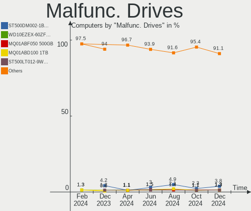
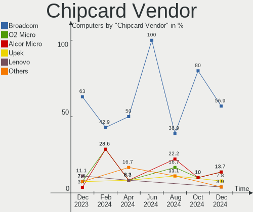

OpenMandriva - Hardware Trends
------------------------------

A project to identify most popular hardware characteristics and track their change
over time based on data collected by Linux users at https://Linux-Hardware.org.

Anyone can contribute to this report by the [hw-probe](https://github.com/linuxhw/hw-probe) tool:

    sudo -E hw-probe -all -upload

This is a report for all computer types. See also reports for [desktops](/Dist/OpenMandriva/Desktop/README.md) and [notebooks](/Dist/OpenMandriva/Notebook/README.md).

This report is for one last month. Overall report since the beginning of time: [TestDays](https://github.com/linuxhw/TestDays)

Period: Dec, 2023.

Contents
--------

* [ System ](#system)
  - [ OS                       ](#os)
  - [ OS Family                ](#os-family)
  - [ Kernel                   ](#kernel)
  - [ Kernel Family            ](#kernel-family)
  - [ Kernel Major Ver.        ](#kernel-major-ver)
  - [ Arch                     ](#arch)
  - [ DE                       ](#de)
  - [ Display Server           ](#display-server)
  - [ Display Manager          ](#display-manager)
  - [ OS Lang                  ](#os-lang)
  - [ Boot Mode                ](#boot-mode)
  - [ Filesystem               ](#filesystem)
  - [ Part. scheme             ](#part-scheme)
  - [ Dual Boot with Linux/BSD ](#dual-boot-with-linuxbsd)
  - [ Dual Boot (Win)          ](#dual-boot-win)

* [ Board ](#board)
  - [ Vendor                   ](#vendor)
  - [ Model                    ](#model)
  - [ Model Family             ](#model-family)
  - [ MFG Year                 ](#mfg-year)
  - [ Form Factor              ](#form-factor)
  - [ Secure Boot              ](#secure-boot)
  - [ Coreboot                 ](#coreboot)
  - [ RAM Size                 ](#ram-size)
  - [ RAM Used                 ](#ram-used)
  - [ Total Drives             ](#total-drives)
  - [ Has CD-ROM               ](#has-cd-rom)
  - [ Has Ethernet             ](#has-ethernet)
  - [ Has WiFi                 ](#has-wifi)
  - [ Has Bluetooth            ](#has-bluetooth)

* [ Location ](#location)
  - [ Country                  ](#country)
  - [ City                     ](#city)

* [ Drives ](#drives)
  - [ Drive Vendor             ](#drive-vendor)
  - [ Drive Model              ](#drive-model)
  - [ HDD Vendor               ](#hdd-vendor)
  - [ SSD Vendor               ](#ssd-vendor)
  - [ Drive Kind               ](#drive-kind)
  - [ Drive Connector          ](#drive-connector)
  - [ Drive Size               ](#drive-size)
  - [ Space Total              ](#space-total)
  - [ Space Used               ](#space-used)
  - [ Malfunc. Drives          ](#malfunc-drives)
  - [ Malfunc. Drive Vendor    ](#malfunc-drive-vendor)
  - [ Malfunc. HDD Vendor      ](#malfunc-hdd-vendor)
  - [ Malfunc. Drive Kind      ](#malfunc-drive-kind)
  - [ Failed Drives            ](#failed-drives)
  - [ Failed Drive Vendor      ](#failed-drive-vendor)
  - [ Drive Status             ](#drive-status)

* [ Storage controller ](#storage-controller)
  - [ Storage Vendor           ](#storage-vendor)
  - [ Storage Model            ](#storage-model)
  - [ Storage Kind             ](#storage-kind)

* [ Processor ](#processor)
  - [ CPU Vendor               ](#cpu-vendor)
  - [ CPU Model                ](#cpu-model)
  - [ CPU Model Family         ](#cpu-model-family)
  - [ CPU Cores                ](#cpu-cores)
  - [ CPU Sockets              ](#cpu-sockets)
  - [ CPU Threads              ](#cpu-threads)
  - [ CPU Op-Modes             ](#cpu-op-modes)
  - [ CPU Microcode            ](#cpu-microcode)
  - [ CPU Microarch            ](#cpu-microarch)

* [ Graphics ](#graphics)
  - [ GPU Vendor               ](#gpu-vendor)
  - [ GPU Model                ](#gpu-model)
  - [ GPU Combo                ](#gpu-combo)
  - [ GPU Driver               ](#gpu-driver)
  - [ GPU Memory               ](#gpu-memory)

* [ Monitor ](#monitor)
  - [ Monitor Vendor           ](#monitor-vendor)
  - [ Monitor Model            ](#monitor-model)
  - [ Monitor Resolution       ](#monitor-resolution)
  - [ Monitor Diagonal         ](#monitor-diagonal)
  - [ Monitor Width            ](#monitor-width)
  - [ Aspect Ratio             ](#aspect-ratio)
  - [ Monitor Area             ](#monitor-area)
  - [ Pixel Density            ](#pixel-density)
  - [ Multiple Monitors        ](#multiple-monitors)

* [ Network ](#network)
  - [ Net Controller Vendor    ](#net-controller-vendor)
  - [ Net Controller Model     ](#net-controller-model)
  - [ Wireless Vendor          ](#wireless-vendor)
  - [ Wireless Model           ](#wireless-model)
  - [ Ethernet Vendor          ](#ethernet-vendor)
  - [ Ethernet Model           ](#ethernet-model)
  - [ Net Controller Kind      ](#net-controller-kind)
  - [ Used Controller          ](#used-controller)
  - [ NICs                     ](#nics)
  - [ IPv6                     ](#ipv6)

* [ Bluetooth ](#bluetooth)
  - [ Bluetooth Vendor         ](#bluetooth-vendor)
  - [ Bluetooth Model          ](#bluetooth-model)

* [ Sound ](#sound)
  - [ Sound Vendor             ](#sound-vendor)
  - [ Sound Model              ](#sound-model)

* [ Memory ](#memory)
  - [ Memory Vendor            ](#memory-vendor)
  - [ Memory Model             ](#memory-model)
  - [ Memory Kind              ](#memory-kind)
  - [ Memory Form Factor       ](#memory-form-factor)
  - [ Memory Size              ](#memory-size)
  - [ Memory Speed             ](#memory-speed)

* [ Printers & scanners ](#printers--scanners)
  - [ Printer Vendor           ](#printer-vendor)
  - [ Printer Model            ](#printer-model)
  - [ Scanner Vendor           ](#scanner-vendor)
  - [ Scanner Model            ](#scanner-model)

* [ Camera ](#camera)
  - [ Camera Vendor            ](#camera-vendor)
  - [ Camera Model             ](#camera-model)

* [ Security ](#security)
  - [ Fingerprint Vendor       ](#fingerprint-vendor)
  - [ Fingerprint Model        ](#fingerprint-model)
  - [ Chipcard Vendor          ](#chipcard-vendor)
  - [ Chipcard Model           ](#chipcard-model)

* [ Unsupported ](#unsupported)
  - [ Unsupported Devices      ](#unsupported-devices)
  - [ Unsupported Device Types ](#unsupported-device-types)

System
------

OS
--

Installed operating systems

| Name               | Computers | Percent |
|--------------------|-----------|---------|
| OpenMandriva 5.0   | 231       | 38.89%  |
| OpenMandriva 23.08 | 173       | 29.12%  |
| OpenMandriva 23.11 | 110       | 18.52%  |
| OpenMandriva 23.03 | 23        | 3.87%   |
| OpenMandriva 23.90 | 13        | 2.19%   |
| OpenMandriva 4.3   | 12        | 2.02%   |
| OpenMandriva 4.2   | 12        | 2.02%   |
| OpenMandriva 23.01 | 9         | 1.52%   |
| OpenMandriva 23.09 | 3         | 0.51%   |
| OpenMandriva 23.10 | 2         | 0.34%   |
| OpenMandriva 23.06 | 2         | 0.34%   |
| OpenMandriva 4.90  | 1         | 0.17%   |
| OpenMandriva 4.50  | 1         | 0.17%   |
| OpenMandriva 23.07 | 1         | 0.17%   |
| OpenMandriva 22.12 | 1         | 0.17%   |

OS Family
---------

OS without a version

| Name         | Computers | Percent |
|--------------|-----------|---------|
| OpenMandriva | 594       | 100%    |

Kernel
------

Version of the Linux kernel

| Version                      | Computers | Percent |
|------------------------------|-----------|---------|
| 6.6.2-desktop-1omv2390       | 324       | 54.55%  |
| 6.4.11-desktop-1omv2390      | 165       | 27.78%  |
| 6.2.6-desktop-1omv2390       | 23        | 3.87%   |
| 6.4.8-desktop-2omv2390       | 20        | 3.37%   |
| 5.10.14-desktop-1omv4002     | 12        | 2.02%   |
| 5.16.7-desktop-1omv4003      | 9         | 1.52%   |
| 6.1.1-desktop-1omv2290       | 8         | 1.35%   |
| 6.6.1-desktop-1omv2390       | 4         | 0.67%   |
| 6.7.0-desktop-0.rc2.1omv2390 | 3         | 0.51%   |
| 6.6.3-desktop-1omv2390       | 3         | 0.51%   |
| 6.3.5-desktop-3omv2390       | 3         | 0.51%   |
| 5.16.13-desktop-1omv4003     | 3         | 0.51%   |
| 6.6.7-desktop-1omv2390       | 2         | 0.34%   |
| 6.5.5-desktop-1omv2390       | 2         | 0.34%   |
| 6.5.3-desktop-1omv2390       | 2         | 0.34%   |
| 6.7.0-desktop-0.rc6.1omv2390 | 1         | 0.17%   |
| 6.6.6-desktop-1omv2390       | 1         | 0.17%   |
| 6.6.4-desktop-1omv2390       | 1         | 0.17%   |
| 6.6.2-desktop-gcc-1omv2390   | 1         | 0.17%   |
| 6.6.0-desktop-1omv2390       | 1         | 0.17%   |
| 6.5.1-desktop-1omv2390       | 1         | 0.17%   |
| 6.5.0-desktop-1omv2390       | 1         | 0.17%   |
| 6.2.1-desktop-1omv2390       | 1         | 0.17%   |
| 6.0.10-desktop-2omv22090     | 1         | 0.17%   |
| 5.18.12-desktop-3omv4090     | 1         | 0.17%   |
| 5.14.14-desktop-1omv4050     | 1         | 0.17%   |

Kernel Family
-------------

Linux kernel without a distro release

| Version | Computers | Percent |
|---------|-----------|---------|
| 6.6.2   | 325       | 54.71%  |
| 6.4.11  | 165       | 27.78%  |
| 6.2.6   | 23        | 3.87%   |
| 6.4.8   | 20        | 3.37%   |
| 5.10.14 | 12        | 2.02%   |
| 5.16.7  | 9         | 1.52%   |
| 6.1.1   | 8         | 1.35%   |
| 6.7.0   | 4         | 0.67%   |
| 6.6.1   | 4         | 0.67%   |
| 6.6.3   | 3         | 0.51%   |
| 6.3.5   | 3         | 0.51%   |
| 5.16.13 | 3         | 0.51%   |
| 6.6.7   | 2         | 0.34%   |
| 6.5.5   | 2         | 0.34%   |
| 6.5.3   | 2         | 0.34%   |
| 6.6.6   | 1         | 0.17%   |
| 6.6.4   | 1         | 0.17%   |
| 6.6.0   | 1         | 0.17%   |
| 6.5.1   | 1         | 0.17%   |
| 6.5.0   | 1         | 0.17%   |
| 6.2.1   | 1         | 0.17%   |
| 6.0.10  | 1         | 0.17%   |
| 5.18.12 | 1         | 0.17%   |
| 5.14.14 | 1         | 0.17%   |

Kernel Major Ver.
-----------------

Linux kernel major version

| Version | Computers | Percent |
|---------|-----------|---------|
| 6.6     | 337       | 56.73%  |
| 6.4     | 185       | 31.14%  |
| 6.2     | 24        | 4.04%   |
| 5.16    | 12        | 2.02%   |
| 5.10    | 12        | 2.02%   |
| 6.1     | 8         | 1.35%   |
| 6.5     | 6         | 1.01%   |
| 6.7     | 4         | 0.67%   |
| 6.3     | 3         | 0.51%   |
| 6.0     | 1         | 0.17%   |
| 5.18    | 1         | 0.17%   |
| 5.14    | 1         | 0.17%   |

Arch
----

OS architecture (x86_64, i586, etc.)

| Name   | Computers | Percent |
|--------|-----------|---------|
| x86_64 | 594       | 100%    |

DE
--

Desktop Environment

| Name     | Computers | Percent |
|----------|-----------|---------|
| KDE5     | 509       | 85.69%  |
| GNOME    | 41        | 6.9%    |
| LXQt     | 36        | 6.06%   |
| Unknown  | 5         | 0.84%   |
| Cinnamon | 2         | 0.34%   |
| XFCE     | 1         | 0.17%   |

Display Server
--------------

X11 or Wayland

| Name    | Computers | Percent |
|---------|-----------|---------|
| Wayland | 520       | 87.54%  |
| X11     | 73        | 12.29%  |
| Unknown | 1         | 0.17%   |

Display Manager
---------------

SDDM, LightDM, etc.

| Name | Computers | Percent |
|------|-----------|---------|
| SDDM | 553       | 93.1%   |
| GDM  | 41        | 6.9%    |

OS Lang
-------

Language

| Lang  | Computers | Percent |
|-------|-----------|---------|
| en_US | 283       | 47.64%  |
| pl_PL | 45        | 7.58%   |
| de_DE | 40        | 6.73%   |
| ru_RU | 32        | 5.39%   |
| fr_FR | 32        | 5.39%   |
| es_ES | 23        | 3.87%   |
| it_IT | 21        | 3.54%   |
| pt_BR | 20        | 3.37%   |
| en_GB | 17        | 2.86%   |
| es_MX | 8         | 1.35%   |
| en_CA | 8         | 1.35%   |
| cs_CZ | 7         | 1.18%   |
| hu_HU | 5         | 0.84%   |
| en_IN | 5         | 0.84%   |
| ro_RO | 4         | 0.67%   |
| nl_NL | 4         | 0.67%   |
| fr_CA | 4         | 0.67%   |
| es_CO | 4         | 0.67%   |
| tr_TR | 3         | 0.51%   |
| en_HK | 3         | 0.51%   |
| es_VE | 2         | 0.34%   |
| es_DO | 2         | 0.34%   |
| es_AR | 2         | 0.34%   |
| en_IL | 2         | 0.34%   |
| de_AT | 2         | 0.34%   |
| zh_TW | 1         | 0.17%   |
| uk_UA | 1         | 0.17%   |
| sk_SK | 1         | 0.17%   |
| pt_PT | 1         | 0.17%   |
| nb_NO | 1         | 0.17%   |
| ja_JP | 1         | 0.17%   |
| fr_BE | 1         | 0.17%   |
| es_CR | 1         | 0.17%   |
| es_CL | 1         | 0.17%   |
| es_BO | 1         | 0.17%   |
| en_SG | 1         | 0.17%   |
| en_NZ | 1         | 0.17%   |
| en_NG | 1         | 0.17%   |
| en_AU | 1         | 0.17%   |
| de_CH | 1         | 0.17%   |

Boot Mode
---------

EFI or BIOS

| Mode | Computers | Percent |
|------|-----------|---------|
| EFI  | 350       | 58.92%  |
| BIOS | 244       | 41.08%  |

Filesystem
----------

Type of filesystem

| Type    | Computers | Percent |
|---------|-----------|---------|
| Ext4    | 301       | 50.67%  |
| Overlay | 259       | 43.6%   |
| Btrfs   | 22        | 3.7%    |
| Xfs     | 7         | 1.18%   |
| F2fs    | 3         | 0.51%   |
| Ext3    | 2         | 0.34%   |

Part. scheme
------------

Scheme of partitioning

| Type    | Computers | Percent |
|---------|-----------|---------|
| GPT     | 451       | 75.93%  |
| MBR     | 142       | 23.91%  |
| Unknown | 1         | 0.17%   |

Dual Boot with Linux/BSD
------------------------

Hosting more than one Linux/BSD

| Dual boot | Computers | Percent |
|-----------|-----------|---------|
| No        | 329       | 55.39%  |
| Yes       | 265       | 44.61%  |

Dual Boot (Win)
---------------

Hosting Linux and Windows

| Dual boot | Computers | Percent |
|-----------|-----------|---------|
| No        | 331       | 55.72%  |
| Yes       | 263       | 44.28%  |

Board
-----

Vendor
------

Motherboard manufacturer

| Name                    | Computers | Percent |
|-------------------------|-----------|---------|
| ASUSTek Computer        | 104       | 17.51%  |
| Hewlett-Packard         | 94        | 15.82%  |
| Dell                    | 80        | 13.47%  |
| Lenovo                  | 73        | 12.29%  |
| Gigabyte Technology     | 39        | 6.57%   |
| Acer                    | 33        | 5.56%   |
| MSI                     | 32        | 5.39%   |
| ASRock                  | 17        | 2.86%   |
| Intel                   | 15        | 2.53%   |
| Fujitsu                 | 10        | 1.68%   |
| Apple                   | 10        | 1.68%   |
| Toshiba                 | 8         | 1.35%   |
| Medion                  | 6         | 1.01%   |
| Foxconn                 | 6         | 1.01%   |
| Samsung Electronics     | 5         | 0.84%   |
| Packard Bell            | 5         | 0.84%   |
| Google                  | 5         | 0.84%   |
| Sony                    | 4         | 0.67%   |
| AZW                     | 4         | 0.67%   |
| Pegatron                | 3         | 0.51%   |
| Microsoft               | 3         | 0.51%   |
| Alienware               | 3         | 0.51%   |
| Notebook                | 2         | 0.34%   |
| MouseComputer           | 2         | 0.34%   |
| eMachines               | 2         | 0.34%   |
| ECS                     | 2         | 0.34%   |
| Biostar                 | 2         | 0.34%   |
| BESSTAR Tech            | 2         | 0.34%   |
| AMI                     | 2         | 0.34%   |
| Unknown                 | 2         | 0.34%   |
| TUXEDO                  | 1         | 0.17%   |
| Teclast                 | 1         | 0.17%   |
| Razer                   | 1         | 0.17%   |
| Positivo                | 1         | 0.17%   |
| Multilaser              | 1         | 0.17%   |
| MACHINIST               | 1         | 0.17%   |
| Lenovo Product          | 1         | 0.17%   |
| Kiano                   | 1         | 0.17%   |
| JUXIESHI                | 1         | 0.17%   |
| Info Quest Technologies | 1         | 0.17%   |

Model
-----

Motherboard model

| Name                                | Computers | Percent |
|-------------------------------------|-----------|---------|
| ASUS All Series                     | 6         | 1.01%   |
| Unknown                             | 5         | 0.84%   |
| Google Garg                         | 4         | 0.67%   |
| Dell OptiPlex 7010                  | 4         | 0.67%   |
| ASUS K50AF                          | 4         | 0.67%   |
| Intel H61                           | 3         | 0.51%   |
| Apple MacBookAir9,1                 | 3         | 0.51%   |
| MSI MS-7C56                         | 2         | 0.34%   |
| MSI MS-7B86                         | 2         | 0.34%   |
| MSI MS-7A38                         | 2         | 0.34%   |
| MSI MS-7693                         | 2         | 0.34%   |
| MSI MS-7680                         | 2         | 0.34%   |
| Lenovo IdeaPad 3 15IML05 82BS       | 2         | 0.34%   |
| Intel X99                           | 2         | 0.34%   |
| HP Z200 Workstation                 | 2         | 0.34%   |
| HP ProDesk 600 G2 DM                | 2         | 0.34%   |
| HP ProBook 650 G1                   | 2         | 0.34%   |
| HP Pavilion Gaming Laptop 15-ec0xxx | 2         | 0.34%   |
| HP Pavilion 15                      | 2         | 0.34%   |
| HP Notebook                         | 2         | 0.34%   |
| HP Laptop 17-by4xxx                 | 2         | 0.34%   |
| HP Laptop 15-da0xxx                 | 2         | 0.34%   |
| HP EliteDesk 800 G1 USDT            | 2         | 0.34%   |
| HP EliteDesk 800 G1 SFF             | 2         | 0.34%   |
| HP EliteBook 840 G5                 | 2         | 0.34%   |
| HP Compaq 8200 Elite SFF PC         | 2         | 0.34%   |
| Gigabyte GA-870A-UD3                | 2         | 0.34%   |
| Dell OptiPlex 780                   | 2         | 0.34%   |
| Dell OptiPlex 7450 AIO              | 2         | 0.34%   |
| Dell OptiPlex 380                   | 2         | 0.34%   |
| Dell OptiPlex 3020                  | 2         | 0.34%   |
| Dell OptiPlex 3010                  | 2         | 0.34%   |
| Dell Latitude E6400                 | 2         | 0.34%   |
| Dell Latitude E6320                 | 2         | 0.34%   |
| Dell Latitude E5410                 | 2         | 0.34%   |
| Dell Latitude 7490                  | 2         | 0.34%   |
| Dell Latitude 5590                  | 2         | 0.34%   |
| Dell Inspiron 1545                  | 2         | 0.34%   |
| AZW SER                             | 2         | 0.34%   |
| ASUS SABERTOOTH 990FX R2.0          | 2         | 0.34%   |

Model Family
------------

Motherboard model prefix

| Name                  | Computers | Percent |
|-----------------------|-----------|---------|
| Lenovo ThinkPad       | 27        | 4.55%   |
| Dell Latitude         | 26        | 4.38%   |
| Acer Aspire           | 22        | 3.7%    |
| Dell OptiPlex         | 21        | 3.54%   |
| Dell Inspiron         | 19        | 3.2%    |
| ASUS PRIME            | 15        | 2.53%   |
| HP Pavilion           | 14        | 2.36%   |
| HP Compaq             | 14        | 2.36%   |
| Lenovo ThinkCentre    | 12        | 2.02%   |
| Lenovo IdeaPad        | 12        | 2.02%   |
| HP Laptop             | 12        | 2.02%   |
| HP ProBook            | 8         | 1.35%   |
| HP EliteDesk          | 8         | 1.35%   |
| ASUS VivoBook         | 8         | 1.35%   |
| ASUS ROG              | 7         | 1.18%   |
| Toshiba Satellite     | 6         | 1.01%   |
| HP EliteBook          | 6         | 1.01%   |
| Dell Precision        | 6         | 1.01%   |
| ASUS All              | 6         | 1.01%   |
| HP ProDesk            | 5         | 0.84%   |
| ASUS TUF              | 5         | 0.84%   |
| Unknown               | 5         | 0.84%   |
| Packard Bell EasyNote | 4         | 0.67%   |
| Intel H61             | 4         | 0.67%   |
| Google Garg           | 4         | 0.67%   |
| ASUS M5A78L-M         | 4         | 0.67%   |
| ASUS K50AF            | 4         | 0.67%   |
| MSI Modern            | 3         | 0.51%   |
| Microsoft Surface     | 3         | 0.51%   |
| Lenovo Yoga           | 3         | 0.51%   |
| Fujitsu LIFEBOOK      | 3         | 0.51%   |
| Fujitsu ESPRIMO       | 3         | 0.51%   |
| Dell XPS              | 3         | 0.51%   |
| ASUS P8H61-M          | 3         | 0.51%   |
| Apple MacBookAir9     | 3         | 0.51%   |
| Acer TravelMate       | 3         | 0.51%   |
| MSI MS-7C56           | 2         | 0.34%   |
| MSI MS-7B86           | 2         | 0.34%   |
| MSI MS-7A38           | 2         | 0.34%   |
| MSI MS-7693           | 2         | 0.34%   |

MFG Year
--------

Motherboard manufacture year

| Year | Computers | Percent |
|------|-----------|---------|
| 2013 | 55        | 9.26%   |
| 2011 | 54        | 9.09%   |
| 2012 | 51        | 8.59%   |
| 2018 | 46        | 7.74%   |
| 2019 | 40        | 6.73%   |
| 2021 | 39        | 6.57%   |
| 2020 | 39        | 6.57%   |
| 2010 | 36        | 6.06%   |
| 2014 | 32        | 5.39%   |
| 2009 | 32        | 5.39%   |
| 2022 | 29        | 4.88%   |
| 2015 | 28        | 4.71%   |
| 2017 | 26        | 4.38%   |
| 2008 | 22        | 3.7%    |
| 2016 | 21        | 3.54%   |
| 2007 | 20        | 3.37%   |
| 2023 | 18        | 3.03%   |
| 2006 | 5         | 0.84%   |
| 2005 | 1         | 0.17%   |

Form Factor
-----------

Physical design of the computer

| Name        | Computers | Percent |
|-------------|-----------|---------|
| Notebook    | 287       | 48.32%  |
| Desktop     | 274       | 46.13%  |
| Mini pc     | 9         | 1.52%   |
| All in one  | 9         | 1.52%   |
| Convertible | 8         | 1.35%   |
| Tablet      | 5         | 0.84%   |
| Server      | 2         | 0.34%   |

Secure Boot
-----------

Enabled or disabled

| State    | Computers | Percent |
|----------|-----------|---------|
| Disabled | 594       | 100%    |

Coreboot
--------

Have coreboot on board

| Used | Computers | Percent |
|------|-----------|---------|
| No   | 589       | 99.16%  |
| Yes  | 5         | 0.84%   |

RAM Size
--------

Total RAM memory

| Size in GB  | Computers | Percent |
|-------------|-----------|---------|
| 4.01-8.0    | 156       | 26.26%  |
| 3.01-4.0    | 136       | 22.9%   |
| 8.01-16.0   | 108       | 18.18%  |
| 16.01-24.0  | 97        | 16.33%  |
| 32.01-64.0  | 48        | 8.08%   |
| 1.01-2.0    | 16        | 2.69%   |
| 24.01-32.0  | 13        | 2.19%   |
| 2.01-3.0    | 10        | 1.68%   |
| 64.01-256.0 | 8         | 1.35%   |
| 0.51-1.0    | 2         | 0.34%   |

RAM Used
--------

Used RAM memory

| Used GB   | Computers | Percent |
|-----------|-----------|---------|
| 1.01-2.0  | 389       | 65.49%  |
| 2.01-3.0  | 115       | 19.36%  |
| 0.51-1.0  | 46        | 7.74%   |
| 3.01-4.0  | 25        | 4.21%   |
| 0.01-0.5  | 10        | 1.68%   |
| 4.01-8.0  | 8         | 1.35%   |
| 8.01-16.0 | 1         | 0.17%   |

Total Drives
------------

Number of drives on board

| Drives | Computers | Percent |
|--------|-----------|---------|
| 1      | 353       | 59.43%  |
| 2      | 153       | 25.76%  |
| 3      | 52        | 8.75%   |
| 4      | 20        | 3.37%   |
| 6      | 5         | 0.84%   |
| 5      | 5         | 0.84%   |
| 0      | 4         | 0.67%   |
| 9      | 1         | 0.17%   |
| 8      | 1         | 0.17%   |

Has CD-ROM
----------

Has CD-ROM on board

| Presented | Computers | Percent |
|-----------|-----------|---------|
| No        | 311       | 52.36%  |
| Yes       | 283       | 47.64%  |

Has Ethernet
------------

Has Ethernet on board

| Presented | Computers | Percent |
|-----------|-----------|---------|
| Yes       | 523       | 88.05%  |
| No        | 71        | 11.95%  |

Has WiFi
--------

Has WiFi module

| Presented | Computers | Percent |
|-----------|-----------|---------|
| Yes       | 428       | 72.05%  |
| No        | 166       | 27.95%  |

Has Bluetooth
-------------

Has Bluetooth module

| Presented | Computers | Percent |
|-----------|-----------|---------|
| Yes       | 310       | 52.19%  |
| No        | 284       | 47.81%  |

Location
--------

Country
-------

Geographic location (country)

| Country     | Computers | Percent |
|-------------|-----------|---------|
| USA         | 97        | 16.33%  |
| Germany     | 59        | 9.93%   |
| Poland      | 57        | 9.6%    |
| Russia      | 38        | 6.4%    |
| France      | 32        | 5.39%   |
| Italy       | 30        | 5.05%   |
| Brazil      | 30        | 5.05%   |
| Spain       | 24        | 4.04%   |
| Canada      | 18        | 3.03%   |
| Mexico      | 11        | 1.85%   |
| Japan       | 11        | 1.85%   |
| Hungary     | 11        | 1.85%   |
| India       | 10        | 1.68%   |
| Netherlands | 9         | 1.52%   |
| Czechia     | 9         | 1.52%   |
| Colombia    | 9         | 1.52%   |
| UK          | 7         | 1.18%   |
| Romania     | 7         | 1.18%   |
| Indonesia   | 7         | 1.18%   |
| Turkey      | 5         | 0.84%   |
| Israel      | 5         | 0.84%   |
| Greece      | 5         | 0.84%   |
| China       | 5         | 0.84%   |
| Belgium     | 5         | 0.84%   |
| Ukraine     | 4         | 0.67%   |
| Sweden      | 4         | 0.67%   |
| Serbia      | 4         | 0.67%   |
| Norway      | 4         | 0.67%   |
| Cyprus      | 4         | 0.67%   |
| Costa Rica  | 4         | 0.67%   |
| Austria     | 4         | 0.67%   |
| Australia   | 4         | 0.67%   |
| Argentina   | 4         | 0.67%   |
| Thailand    | 3         | 0.51%   |
| Taiwan      | 3         | 0.51%   |
| Singapore   | 3         | 0.51%   |
| Portugal    | 3         | 0.51%   |
| Finland     | 3         | 0.51%   |
| Egypt       | 3         | 0.51%   |
| Tunisia     | 2         | 0.34%   |

City
----

Geographic location (city)

| City               | Computers | Percent |
|--------------------|-----------|---------|
| Warsaw             | 16        | 2.69%   |
| Munich             | 8         | 1.35%   |
| Paris              | 7         | 1.18%   |
| Moscow             | 7         | 1.18%   |
| Milan              | 5         | 0.84%   |
| Citrus Heights     | 5         | 0.84%   |
| Budapest           | 5         | 0.84%   |
| Vienna             | 4         | 0.67%   |
| Stuttgart          | 4         | 0.67%   |
| St Petersburg      | 4         | 0.67%   |
| Rome               | 4         | 0.67%   |
| Rio de Janeiro     | 4         | 0.67%   |
| Portland           | 4         | 0.67%   |
| Delhi              | 4         | 0.67%   |
| Bogotá            | 4         | 0.67%   |
| Barcelona          | 4         | 0.67%   |
| Wroclaw            | 3         | 0.51%   |
| Stuhr              | 3         | 0.51%   |
| Singapore          | 3         | 0.51%   |
| Sao Paulo          | 3         | 0.51%   |
| San José          | 3         | 0.51%   |
| Perm               | 3         | 0.51%   |
| Lodz               | 3         | 0.51%   |
| Hemet              | 3         | 0.51%   |
| Hamburg            | 3         | 0.51%   |
| Glen Burnie        | 3         | 0.51%   |
| Dresden            | 3         | 0.51%   |
| Courtenay          | 3         | 0.51%   |
| Brasília          | 3         | 0.51%   |
| Berlin             | 3         | 0.51%   |
| Begijnendijk       | 3         | 0.51%   |
| Yuzhno-Sakhalinsk  | 2         | 0.34%   |
| Wangen             | 2         | 0.34%   |
| Volgograd          | 2         | 0.34%   |
| Velka nad Velickou | 2         | 0.34%   |
| Turin              | 2         | 0.34%   |
| Toronto            | 2         | 0.34%   |
| Tokyo              | 2         | 0.34%   |
| Taichung           | 2         | 0.34%   |
| Słupsk            | 2         | 0.34%   |

Drives
------

Drive Vendor
------------

Hard drive vendors

| Vendor                      | Computers | Drives | Percent |
|-----------------------------|-----------|--------|---------|
| WDC                         | 131       | 155    | 15.21%  |
| Seagate                     | 118       | 140    | 13.7%   |
| Samsung Electronics         | 112       | 131    | 13.01%  |
| Kingston                    | 57        | 62     | 6.62%   |
| Toshiba                     | 44        | 46     | 5.11%   |
| Hitachi                     | 35        | 36     | 4.07%   |
| Crucial                     | 28        | 30     | 3.25%   |
| SanDisk                     | 25        | 26     | 2.9%    |
| A-DATA Technology           | 20        | 21     | 2.32%   |
| Unknown                     | 17        | 19     | 1.97%   |
| Unknown                     | 16        | 16     | 1.86%   |
| SK hynix                    | 15        | 15     | 1.74%   |
| HGST                        | 14        | 14     | 1.63%   |
| GOODRAM                     | 12        | 12     | 1.39%   |
| SPCC                        | 11        | 13     | 1.28%   |
| Micron Technology           | 11        | 11     | 1.28%   |
| China                       | 10        | 11     | 1.16%   |
| Intenso                     | 9         | 9      | 1.05%   |
| Intel                       | 9         | 9      | 1.05%   |
| PNY                         | 8         | 8      | 0.93%   |
| Team                        | 7         | 7      | 0.81%   |
| Phison                      | 7         | 8      | 0.81%   |
| Netac                       | 6         | 6      | 0.7%    |
| Lexar                       | 6         | 6      | 0.7%    |
| JMicron Technology          | 6         | 6      | 0.7%    |
| Emtec                       | 6         | 6      | 0.7%    |
| Apple                       | 6         | 6      | 0.7%    |
| Patriot                     | 5         | 5      | 0.58%   |
| KingSpec                    | 5         | 5      | 0.58%   |
| WALRAM                      | 4         | 4      | 0.46%   |
| LITEONIT                    | 4         | 4      | 0.46%   |
| HPQ                         | 4         | 4      | 0.46%   |
| Verbatim                    | 3         | 3      | 0.35%   |
| Transcend                   | 3         | 3      | 0.35%   |
| LITEON                      | 3         | 3      | 0.35%   |
| Kingston Technology Company | 3         | 3      | 0.35%   |
| Hewlett-Packard             | 3         | 3      | 0.35%   |
| Corsair                     | 3         | 3      | 0.35%   |
| T-FORCE                     | 2         | 2      | 0.23%   |
| SUNEAST                     | 2         | 2      | 0.23%   |

Drive Model
-----------

Hard drive models

| Model                               | Computers | Percent |
|-------------------------------------|-----------|---------|
| Unknown                             | 16        | 1.72%   |
| Seagate ST500DM002-1BD142 500GB     | 12        | 1.29%   |
| Kingston SA400S37240G 240GB SSD     | 10        | 1.08%   |
| Kingston SA400S37480G 480GB SSD     | 9         | 0.97%   |
| Samsung SSD 870 QVO 1TB             | 7         | 0.75%   |
| Samsung SSD 870 EVO 500GB           | 7         | 0.75%   |
| Kingston SA400S37120G 120GB SSD     | 7         | 0.75%   |
| Toshiba DT01ACA050 500GB            | 6         | 0.65%   |
| Seagate ST9500325AS 500GB           | 6         | 0.65%   |
| Seagate ST2000DM001-1ER164 2TB      | 6         | 0.65%   |
| Seagate ST1000DM010-2EP102 1TB      | 6         | 0.65%   |
| Unknown SD/MMC/MS PRO 512GB         | 5         | 0.54%   |
| Seagate ST500LT012-1DG142 500GB     | 5         | 0.54%   |
| Samsung SSD 860 EVO 500GB           | 5         | 0.54%   |
| Samsung SSD 860 EVO 250GB           | 5         | 0.54%   |
| Kingston SV300S37A120G 120GB SSD    | 5         | 0.54%   |
| WDC WDS500G2B0C-00PXH0 500GB        | 4         | 0.43%   |
| WDC WD10JPVX-22JC3T0 1TB            | 4         | 0.43%   |
| WDC WD10EZEX-08WN4A0 1TB            | 4         | 0.43%   |
| Seagate ST2000LM007-1R8174 2TB      | 4         | 0.43%   |
| Seagate ST1000DM003-1ER162 1TB      | 4         | 0.43%   |
| Samsung SSD 970 EVO Plus 1TB        | 4         | 0.43%   |
| JMicron Generic 2TB                 | 4         | 0.43%   |
| HPQ BF450DASTK 450GB                | 4         | 0.43%   |
| Crucial CT500MX500SSD1 500GB        | 4         | 0.43%   |
| China SSD 512GB                     | 4         | 0.43%   |
| WDC WD5000AAKX-001CA0 500GB         | 3         | 0.32%   |
| WDC WD10SPZX-60Z10T0 1TB            | 3         | 0.32%   |
| WDC WD10EZRX-00L4HB0 1TB            | 3         | 0.32%   |
| Toshiba MQ04ABF100 1TB              | 3         | 0.32%   |
| Toshiba MQ01ABD100 1TB              | 3         | 0.32%   |
| Toshiba DT01ACA200 2TB              | 3         | 0.32%   |
| SPCC Solid State Disk 256GB         | 3         | 0.32%   |
| Seagate ST500LM012 HN-M500MBB 500GB | 3         | 0.32%   |
| Seagate ST3500418AS 500GB           | 3         | 0.32%   |
| Seagate ST1000LM035-1RK172 1TB      | 3         | 0.32%   |
| Seagate ST1000DM003-9YN162 1TB      | 3         | 0.32%   |
| SanDisk NVMe SSD Drive 1TB          | 3         | 0.32%   |
| Samsung SSD 970 EVO Plus 500GB      | 3         | 0.32%   |
| Samsung SSD 970 EVO Plus 250GB      | 3         | 0.32%   |

HDD Vendor
----------

Hard disk drive vendors

| Vendor              | Computers | Drives | Percent |
|---------------------|-----------|--------|---------|
| Seagate             | 116       | 138    | 33.82%  |
| WDC                 | 106       | 121    | 30.9%   |
| Toshiba             | 38        | 39     | 11.08%  |
| Hitachi             | 35        | 36     | 10.2%   |
| Samsung Electronics | 16        | 17     | 4.66%   |
| HGST                | 14        | 14     | 4.08%   |
| Unknown             | 5         | 5      | 1.46%   |
| HPQ                 | 4         | 4      | 1.17%   |
| SABRENT             | 2         | 3      | 0.58%   |
| TO Exter            | 1         | 1      | 0.29%   |
| SSK                 | 1         | 1      | 0.29%   |
| Maxtor              | 1         | 1      | 0.29%   |
| KESU                | 1         | 1      | 0.29%   |
| Intenso             | 1         | 1      | 0.29%   |
| Inateck             | 1         | 1      | 0.29%   |
| Apple               | 1         | 1      | 0.29%   |

SSD Vendor
----------

Solid state drive vendors

| Vendor              | Computers | Drives | Percent |
|---------------------|-----------|--------|---------|
| Samsung Electronics | 60        | 69     | 18.29%  |
| Kingston            | 43        | 44     | 13.11%  |
| Crucial             | 18        | 20     | 5.49%   |
| WDC                 | 17        | 18     | 5.18%   |
| A-DATA Technology   | 16        | 17     | 4.88%   |
| SanDisk             | 15        | 16     | 4.57%   |
| GOODRAM             | 11        | 11     | 3.35%   |
| SPCC                | 10        | 11     | 3.05%   |
| China               | 10        | 11     | 3.05%   |
| Intenso             | 8         | 8      | 2.44%   |
| PNY                 | 7         | 7      | 2.13%   |
| Emtec               | 6         | 6      | 1.83%   |
| Micron Technology   | 5         | 5      | 1.52%   |
| KingSpec            | 5         | 5      | 1.52%   |
| Unknown             | 5         | 5      | 1.52%   |
| SK hynix            | 4         | 4      | 1.22%   |
| Patriot             | 4         | 4      | 1.22%   |
| Netac               | 4         | 4      | 1.22%   |
| LITEONIT            | 4         | 4      | 1.22%   |
| JMicron Technology  | 4         | 4      | 1.22%   |
| Intel               | 4         | 4      | 1.22%   |
| Verbatim            | 3         | 3      | 0.91%   |
| Transcend           | 3         | 3      | 0.91%   |
| Team                | 3         | 3      | 0.91%   |
| Lexar               | 3         | 3      | 0.91%   |
| Hewlett-Packard     | 3         | 3      | 0.91%   |
| T-FORCE             | 2         | 2      | 0.61%   |
| SUNEAST             | 2         | 2      | 0.61%   |
| Phison              | 2         | 2      | 0.61%   |
| OCZ                 | 2         | 2      | 0.61%   |
| LITEON              | 2         | 2      | 0.61%   |
| HS-SSD-E100         | 2         | 2      | 0.61%   |
| Fanxiang            | 2         | 2      | 0.61%   |
| Dogfish             | 2         | 2      | 0.61%   |
| Dahua               | 2         | 3      | 0.61%   |
| ASMT                | 2         | 2      | 0.61%   |
| XrayDisk            | 1         | 2      | 0.3%    |
| WALRAM              | 1         | 1      | 0.3%    |
| Vaseky              | 1         | 1      | 0.3%    |
| TwinMOS             | 1         | 1      | 0.3%    |

Drive Kind
----------

HDD or SSD

| Kind    | Computers | Drives | Percent |
|---------|-----------|--------|---------|
| HDD     | 299       | 384    | 39.39%  |
| SSD     | 275       | 348    | 36.23%  |
| NVMe    | 156       | 186    | 20.55%  |
| MMC     | 22        | 24     | 2.9%    |
| Unknown | 7         | 6      | 0.92%   |

Drive Connector
---------------

SATA, SAS, NVMe, etc.

| Type | Computers | Drives | Percent |
|------|-----------|--------|---------|
| SATA | 473       | 696    | 68.45%  |
| NVMe | 155       | 182    | 22.43%  |
| SAS  | 41        | 46     | 5.93%   |
| MMC  | 22        | 24     | 3.18%   |

Drive Size
----------

Size of hard drive

| Size in TB | Computers | Drives | Percent |
|------------|-----------|--------|---------|
| 0.01-0.5   | 369       | 461    | 61.6%   |
| 0.51-1.0   | 161       | 191    | 26.88%  |
| 1.01-2.0   | 47        | 55     | 7.85%   |
| 3.01-4.0   | 9         | 12     | 1.5%    |
| 2.01-3.0   | 8         | 8      | 1.34%   |
| 4.01-10.0  | 3         | 3      | 0.5%    |
| 10.01-20.0 | 2         | 2      | 0.33%   |

Space Total
-----------

Amount of disk space available on the file system

| Size in GB     | Computers | Percent |
|----------------|-----------|---------|
| 1-20           | 170       | 28.62%  |
| 101-250        | 132       | 22.22%  |
| 251-500        | 86        | 14.48%  |
| 21-50          | 48        | 8.08%   |
| 51-100         | 47        | 7.91%   |
| 501-1000       | 44        | 7.41%   |
| Unknown        | 35        | 5.89%   |
| 1001-2000      | 19        | 3.2%    |
| More than 3000 | 7         | 1.18%   |
| 2001-3000      | 6         | 1.01%   |

Space Used
----------

Amount of used disk space

| Used GB        | Computers | Percent |
|----------------|-----------|---------|
| 1-20           | 446       | 75.08%  |
| 21-50          | 36        | 6.06%   |
| Unknown        | 35        | 5.89%   |
| 101-250        | 21        | 3.54%   |
| 51-100         | 18        | 3.03%   |
| 251-500        | 11        | 1.85%   |
| 0              | 11        | 1.85%   |
| 501-1000       | 10        | 1.68%   |
| 1001-2000      | 4         | 0.67%   |
| More than 3000 | 1         | 0.17%   |
| 2001-3000      | 1         | 0.17%   |

Malfunc. Drives
---------------

Drive models with a malfunction

| Model                                 | Computers | Drives | Percent |
|---------------------------------------|-----------|--------|---------|
| Seagate ST500DM002-1BD142 500GB       | 7         | 7      | 4.22%   |
| Seagate ST9500325AS 500GB             | 4         | 4      | 2.41%   |
| WDC WD5000AAKX-001CA0 500GB           | 3         | 3      | 1.81%   |
| Toshiba DT01ACA050 500GB              | 3         | 3      | 1.81%   |
| Samsung Electronics SSD 870 EVO 500GB | 3         | 3      | 1.81%   |
| WDC WD10SPZX-60Z10T0 1TB              | 2         | 2      | 1.2%    |
| Seagate ST9250827AS 250GB             | 2         | 2      | 1.2%    |
| Seagate ST500LT012-9WS142 500GB       | 2         | 2      | 1.2%    |
| Seagate ST500LT012-1DG142 500GB       | 2         | 2      | 1.2%    |
| Seagate ST3500418AS 500GB             | 2         | 2      | 1.2%    |
| Seagate ST250DM000-1BD141 250GB       | 2         | 2      | 1.2%    |
| Seagate ST1000DM003-1ER162 1TB        | 2         | 4      | 1.2%    |
| HGST HTS725050A7E630 500GB            | 2         | 2      | 1.2%    |
| HGST HTS545050A7E380 500GB            | 2         | 2      | 1.2%    |
| WDC WDS240G2G0A-00JH30 240GB SSD      | 1         | 1      | 0.6%    |
| WDC WDS100T2G0A-00JH30 1TB SSD        | 1         | 1      | 0.6%    |
| WDC WD800JB-32JJC0 80GB               | 1         | 1      | 0.6%    |
| WDC WD6401AALS-00L3B2 640GB           | 1         | 1      | 0.6%    |
| WDC WD6400AAKS-22A7B2 640GB           | 1         | 1      | 0.6%    |
| WDC WD60EFRX-68MYMN1 6TB              | 1         | 1      | 0.6%    |
| WDC WD5002ABYS-02B1B0 500GB           | 1         | 1      | 0.6%    |
| WDC WD5000LPCX-24VHAT0 500GB          | 1         | 1      | 0.6%    |
| WDC WD5000LPCX-24C6HT0 500GB          | 1         | 1      | 0.6%    |
| WDC WD5000BPVT-00HXZT1 500GB          | 1         | 1      | 0.6%    |
| WDC WD5000AAVS-22G9B1 500GB           | 1         | 2      | 0.6%    |
| WDC WD5000AAKX-08U6AA0 500GB          | 1         | 1      | 0.6%    |
| WDC WD5000AAKX-07U6AA1 500GB          | 1         | 1      | 0.6%    |
| WDC WD5000AAKX-003CA0 500GB           | 1         | 1      | 0.6%    |
| WDC WD40EFRX-68WT0N0 4TB              | 1         | 1      | 0.6%    |
| WDC WD3200BPVT-80JJ5T0 320GB          | 1         | 1      | 0.6%    |
| WDC WD3200BEVT-75A23T0 320GB          | 1         | 1      | 0.6%    |
| WDC WD3200AAKS-61L9A0 320GB           | 1         | 1      | 0.6%    |
| WDC WD3200AAJS-56M0A0 320GB           | 1         | 1      | 0.6%    |
| WDC WD3200AAJS-00L7A0 320GB           | 1         | 1      | 0.6%    |
| WDC WD2500YS-01SHB1 256GB             | 1         | 1      | 0.6%    |
| WDC WD20PURZ-85GU6Y0 2TB              | 1         | 1      | 0.6%    |
| WDC WD20EFRX-68AX9N0 2TB              | 1         | 1      | 0.6%    |
| WDC WD1600BEVT-75A23T0 160GB          | 1         | 1      | 0.6%    |
| WDC WD1600BEVS-60RST0 160GB           | 1         | 1      | 0.6%    |
| WDC WD1600AAJS-00YZCA0 160GB          | 1         | 1      | 0.6%    |

Malfunc. Drive Vendor
---------------------

Vendors of faulty drives

| Vendor              | Computers | Drives | Percent |
|---------------------|-----------|--------|---------|
| Seagate             | 51        | 55     | 31.68%  |
| WDC                 | 40        | 44     | 24.84%  |
| Samsung Electronics | 14        | 14     | 8.7%    |
| Hitachi             | 14        | 15     | 8.7%    |
| Toshiba             | 12        | 12     | 7.45%   |
| HGST                | 7         | 7      | 4.35%   |
| SanDisk             | 4         | 4      | 2.48%   |
| A-DATA Technology   | 3         | 3      | 1.86%   |
| SK hynix            | 2         | 2      | 1.24%   |
| LITEONIT            | 2         | 2      | 1.24%   |
| Kingston            | 2         | 2      | 1.24%   |
| Team                | 1         | 1      | 0.62%   |
| SUNEAST             | 1         | 1      | 0.62%   |
| SPCC                | 1         | 1      | 0.62%   |
| OCZ                 | 1         | 1      | 0.62%   |
| Netac               | 1         | 1      | 0.62%   |
| Maxtor              | 1         | 1      | 0.62%   |
| Lexar               | 1         | 1      | 0.62%   |
| Hewlett-Packard     | 1         | 1      | 0.62%   |
| Dogfish             | 1         | 1      | 0.62%   |
| China               | 1         | 1      | 0.62%   |

Malfunc. HDD Vendor
-------------------

Vendors of faulty HDD drives

| Vendor              | Computers | Drives | Percent |
|---------------------|-----------|--------|---------|
| Seagate             | 51        | 55     | 39.84%  |
| WDC                 | 35        | 39     | 27.34%  |
| Hitachi             | 14        | 15     | 10.94%  |
| Toshiba             | 12        | 12     | 9.38%   |
| Samsung Electronics | 8         | 8      | 6.25%   |
| HGST                | 7         | 7      | 5.47%   |
| Maxtor              | 1         | 1      | 0.78%   |

Malfunc. Drive Kind
-------------------

Kinds of faulty drives

| Kind | Computers | Drives | Percent |
|------|-----------|--------|---------|
| HDD  | 123       | 137    | 78.85%  |
| SSD  | 29        | 29     | 18.59%  |
| NVMe | 4         | 4      | 2.56%   |

Failed Drives
-------------

Failed drive models

| Model                              | Computers | Drives | Percent |
|------------------------------------|-----------|--------|---------|
| Seagate ST3500418AS 500GB          | 1         | 1      | 25%     |
| Seagate ST1000LM024 HN-M101MBB 1TB | 1         | 1      | 25%     |
| Samsung Electronics HD103SJ 1TB    | 1         | 1      | 25%     |
| HGST HTS541010A9E680 1TB           | 1         | 1      | 25%     |

Failed Drive Vendor
-------------------

Failed drive vendors

| Vendor              | Computers | Drives | Percent |
|---------------------|-----------|--------|---------|
| Seagate             | 2         | 2      | 50%     |
| Samsung Electronics | 1         | 1      | 25%     |
| HGST                | 1         | 1      | 25%     |

Drive Status
------------

Number of failed and malfunc. drives

| Status   | Computers | Drives | Percent |
|----------|-----------|--------|---------|
| Works    | 482       | 705    | 69.25%  |
| Malfunc  | 151       | 170    | 21.7%   |
| Detected | 59        | 69     | 8.48%   |
| Failed   | 4         | 4      | 0.57%   |

Storage controller
------------------

Storage Vendor
--------------

Storage controller vendors

| Vendor                                  | Computers | Percent |
|-----------------------------------------|-----------|---------|
| Intel                                   | 403       | 55.21%  |
| AMD                                     | 127       | 17.4%   |
| Samsung Electronics                     | 43        | 5.89%   |
| SanDisk                                 | 21        | 2.88%   |
| Kingston Technology Company             | 19        | 2.6%    |
| Phison Electronics                      | 15        | 2.05%   |
| SK hynix                                | 11        | 1.51%   |
| Micron/Crucial Technology               | 10        | 1.37%   |
| Marvell Technology Group                | 8         | 1.1%    |
| ASMedia Technology                      | 8         | 1.1%    |
| Silicon Motion                          | 7         | 0.96%   |
| JMicron Technology                      | 7         | 0.96%   |
| Micron Technology                       | 6         | 0.82%   |
| Toshiba America Info Systems            | 5         | 0.68%   |
| MAXIO Technology (Hangzhou)             | 5         | 0.68%   |
| Nvidia                                  | 4         | 0.55%   |
| Apple                                   | 4         | 0.55%   |
| ADATA Technology                        | 4         | 0.55%   |
| Realtek Semiconductor                   | 3         | 0.41%   |
| KIOXIA                                  | 3         | 0.41%   |
| VIA Technologies                        | 2         | 0.27%   |
| Solid State Storage Technology          | 2         | 0.27%   |
| Shenzhen Longsys Electronics            | 2         | 0.27%   |
| Silicon Integrated Systems [SiS]        | 1         | 0.14%   |
| Shenzhen Unionmemory Information System | 1         | 0.14%   |
| Seagate Technology                      | 1         | 0.14%   |
| Nextorage                               | 1         | 0.14%   |
| Netac Technology                        | 1         | 0.14%   |
| LSI Logic / Symbios Logic               | 1         | 0.14%   |
| Lite-On Technology                      | 1         | 0.14%   |
| Integrated Technology Express           | 1         | 0.14%   |
| INNOGRIT                                | 1         | 0.14%   |
| Broadcom / LSI                          | 1         | 0.14%   |
| Biwin Storage Technology                | 1         | 0.14%   |

Storage Model
-------------

Storage controller models

| Model                                                                                   | Computers | Percent |
|-----------------------------------------------------------------------------------------|-----------|---------|
| AMD FCH SATA Controller [AHCI mode]                                                     | 62        | 7.4%    |
| Intel 8 Series/C220 Series Chipset Family 6-port SATA Controller 1 [AHCI mode]          | 35        | 4.18%   |
| Intel 6 Series/C200 Series Chipset Family 6 port Desktop SATA AHCI Controller           | 28        | 3.34%   |
| AMD SB7x0/SB8x0/SB9x0 SATA Controller [AHCI mode]                                       | 24        | 2.86%   |
| Intel 7 Series Chipset Family 6-port SATA Controller [AHCI mode]                        | 22        | 2.63%   |
| Intel Sunrise Point-LP SATA Controller [AHCI mode]                                      | 21        | 2.51%   |
| Intel 82801 Mobile SATA Controller [RAID mode]                                          | 21        | 2.51%   |
| Samsung NVMe SSD Controller SM981/PM981/PM983                                           | 19        | 2.27%   |
| Intel 6 Series/C200 Series Chipset Family 6 port Mobile SATA AHCI Controller            | 19        | 2.27%   |
| Intel 7 Series/C210 Series Chipset Family 6-port SATA Controller [AHCI mode]            | 17        | 2.03%   |
| AMD SB7x0/SB8x0/SB9x0 IDE Controller                                                    | 16        | 1.91%   |
| AMD 500 Series Chipset SATA Controller                                                  | 15        | 1.79%   |
| Intel NM10/ICH7 Family SATA Controller [IDE mode]                                       | 14        | 1.67%   |
| AMD 400 Series Chipset SATA Controller                                                  | 14        | 1.67%   |
| Samsung NVMe SSD Controller 980 (DRAM-less)                                             | 13        | 1.55%   |
| Intel Q170/Q150/B150/H170/H110/Z170/CM236 Chipset SATA Controller [AHCI Mode]           | 13        | 1.55%   |
| Intel 82801IBM/IEM (ICH9M/ICH9M-E) 4 port SATA Controller [AHCI mode]                   | 13        | 1.55%   |
| Intel 82801G (ICH7 Family) IDE Controller                                               | 13        | 1.55%   |
| Intel 5 Series/3400 Series Chipset 4 port SATA AHCI Controller                          | 12        | 1.43%   |
| Intel Volume Management Device NVMe RAID Controller                                     | 11        | 1.31%   |
| Intel Celeron/Pentium Silver Processor SATA Controller                                  | 11        | 1.31%   |
| Intel Wildcat Point-LP SATA Controller [AHCI Mode]                                      | 10        | 1.19%   |
| Intel SATA Controller [RAID mode]                                                       | 10        | 1.19%   |
| Intel 82801HM/HEM (ICH8M/ICH8M-E) IDE Controller                                        | 10        | 1.19%   |
| Intel 5 Series/3400 Series Chipset 6 port SATA AHCI Controller                          | 10        | 1.19%   |
| Intel 200 Series PCH SATA controller [AHCI mode]                                        | 10        | 1.19%   |
| AMD SB7x0/SB8x0/SB9x0 SATA Controller [IDE mode]                                        | 10        | 1.19%   |
| Intel Celeron N3350/Pentium N4200/Atom E3900 Series SATA AHCI Controller                | 9         | 1.07%   |
| Micron/Crucial P2 [Nick P2] / P3 / P3 Plus NVMe PCIe SSD (DRAM-less)                    | 8         | 0.95%   |
| Intel 6 Series/C200 Series Chipset Family Desktop SATA Controller (IDE mode, ports 4-5) | 8         | 0.95%   |
| Intel 6 Series/C200 Series Chipset Family Desktop SATA Controller (IDE mode, ports 0-3) | 8         | 0.95%   |
| Intel Tiger Lake-LP SATA Controller                                                     | 7         | 0.84%   |
| Intel Comet Lake SATA AHCI Controller                                                   | 7         | 0.84%   |
| Intel 82801HM/HEM (ICH8M/ICH8M-E) SATA Controller [AHCI mode]                           | 7         | 0.84%   |
| Intel 8 Series SATA Controller 1 [AHCI mode]                                            | 7         | 0.84%   |
| Silicon Motion SM2263EN/SM2263XT (DRAM-less) NVMe SSD Controllers                       | 6         | 0.72%   |
| SanDisk Ultra 3D / WD Blue SN550 NVMe SSD                                               | 6         | 0.72%   |
| Samsung NVMe SSD Controller PM9A1/PM9A3/980PRO                                          | 6         | 0.72%   |
| Intel Cannon Lake PCH SATA AHCI Controller                                              | 6         | 0.72%   |
| Intel Cannon Lake Mobile PCH SATA AHCI Controller                                       | 6         | 0.72%   |

Storage Kind
------------

Kind of storage controller (IDE, SATA, NVMe, SAS, ...)

| Kind | Computers | Percent |
|------|-----------|---------|
| SATA | 448       | 60.46%  |
| NVMe | 154       | 20.78%  |
| IDE  | 88        | 11.88%  |
| RAID | 50        | 6.75%   |
| SAS  | 1         | 0.13%   |

Processor
---------

CPU Vendor
----------

Processor vendors

| Vendor | Computers | Percent |
|--------|-----------|---------|
| Intel  | 446       | 75.08%  |
| AMD    | 148       | 24.92%  |

CPU Model
---------

Processor models

| Model                                         | Computers | Percent |
|-----------------------------------------------|-----------|---------|
| Intel Core i5-4570 CPU @ 3.20GHz              | 7         | 1.18%   |
| Intel Core i5-3470 CPU @ 3.20GHz              | 7         | 1.18%   |
| Intel Celeron N4020 CPU @ 1.10GHz             | 7         | 1.18%   |
| Intel Core i7-8750H CPU @ 2.20GHz             | 6         | 1.01%   |
| Intel Core i5-3210M CPU @ 2.50GHz             | 6         | 1.01%   |
| AMD Athlon II Dual-Core M320                  | 6         | 1.01%   |
| Intel Core i5-5200U CPU @ 2.20GHz             | 5         | 0.84%   |
| Intel Core i3-2120 CPU @ 3.30GHz              | 5         | 0.84%   |
| Intel Core i3-2100 CPU @ 3.10GHz              | 5         | 0.84%   |
| Intel Celeron CPU N3350 @ 1.10GHz             | 5         | 0.84%   |
| Intel Core i7-8550U CPU @ 1.80GHz             | 4         | 0.67%   |
| Intel Core i7-4790 CPU @ 3.60GHz              | 4         | 0.67%   |
| Intel Core i7-3770 CPU @ 3.40GHz              | 4         | 0.67%   |
| Intel Core i7-2600 CPU @ 3.40GHz              | 4         | 0.67%   |
| Intel Core i5-3320M CPU @ 2.60GHz             | 4         | 0.67%   |
| Intel Core i5-10210U CPU @ 1.60GHz            | 4         | 0.67%   |
| Intel Core 2 Duo CPU P8600 @ 2.40GHz          | 4         | 0.67%   |
| Intel Core 2 Duo CPU E8400 @ 3.00GHz          | 4         | 0.67%   |
| AMD Ryzen 7 5800X 8-Core Processor            | 4         | 0.67%   |
| AMD Ryzen 7 5700U with Radeon Graphics        | 4         | 0.67%   |
| AMD Ryzen 5 5600G with Radeon Graphics        | 4         | 0.67%   |
| AMD Ryzen 5 5500U with Radeon Graphics        | 4         | 0.67%   |
| AMD Ryzen 5 3600 6-Core Processor             | 4         | 0.67%   |
| AMD Ryzen 5 3550H with Radeon Vega Mobile Gfx | 4         | 0.67%   |
| AMD FX-6300 Six-Core Processor                | 4         | 0.67%   |
| Intel Pentium Dual-Core CPU T4500 @ 2.30GHz   | 3         | 0.51%   |
| Intel Core i7-8650U CPU @ 1.90GHz             | 3         | 0.51%   |
| Intel Core i7-7700 CPU @ 3.60GHz              | 3         | 0.51%   |
| Intel Core i7-6820HQ CPU @ 2.70GHz            | 3         | 0.51%   |
| Intel Core i7-6700 CPU @ 3.40GHz              | 3         | 0.51%   |
| Intel Core i7-4702MQ CPU @ 2.20GHz            | 3         | 0.51%   |
| Intel Core i5-8350U CPU @ 1.70GHz             | 3         | 0.51%   |
| Intel Core i5-7400 CPU @ 3.00GHz              | 3         | 0.51%   |
| Intel Core i5-6200U CPU @ 2.30GHz             | 3         | 0.51%   |
| Intel Core i5-4590S CPU @ 3.00GHz             | 3         | 0.51%   |
| Intel Core i5-4300U CPU @ 1.90GHz             | 3         | 0.51%   |
| Intel Core i5-2400 CPU @ 3.10GHz              | 3         | 0.51%   |
| Intel Core i5 CPU 650 @ 3.20GHz               | 3         | 0.51%   |
| Intel Core i3-6006U CPU @ 2.00GHz             | 3         | 0.51%   |
| Intel Core i3-5005U CPU @ 2.00GHz             | 3         | 0.51%   |

CPU Model Family
----------------

Processor model prefix

| Model                   | Computers | Percent |
|-------------------------|-----------|---------|
| Intel Core i5           | 122       | 20.54%  |
| Intel Core i7           | 75        | 12.63%  |
| Intel Core i3           | 72        | 12.12%  |
| Intel Celeron           | 46        | 7.74%   |
| AMD Ryzen 5             | 36        | 6.06%   |
| Intel Core 2 Duo        | 35        | 5.89%   |
| Other                   | 33        | 5.56%   |
| AMD Ryzen 7             | 23        | 3.87%   |
| Intel Pentium           | 17        | 2.86%   |
| Intel Xeon              | 16        | 2.69%   |
| AMD FX                  | 14        | 2.36%   |
| Intel Pentium Dual-Core | 8         | 1.35%   |
| AMD Ryzen 9             | 8         | 1.35%   |
| AMD Ryzen 3             | 7         | 1.18%   |
| AMD Athlon II Dual-Core | 6         | 1.01%   |
| AMD A4                  | 6         | 1.01%   |
| AMD Athlon II X2        | 5         | 0.84%   |
| AMD A8                  | 5         | 0.84%   |
| AMD A6                  | 5         | 0.84%   |
| Intel Core 2 Quad       | 4         | 0.67%   |
| Intel Core 2            | 4         | 0.67%   |
| AMD Phenom II X4        | 4         | 0.67%   |
| AMD E1                  | 4         | 0.67%   |
| AMD A10                 | 4         | 0.67%   |
| Intel Pentium Silver    | 3         | 0.51%   |
| Intel Atom              | 3         | 0.51%   |
| AMD E                   | 3         | 0.51%   |
| AMD Athlon 64 X2        | 3         | 0.51%   |
| Intel Pentium Dual      | 2         | 0.34%   |
| Intel Pentium 4         | 2         | 0.34%   |
| Intel Genuine           | 2         | 0.34%   |
| AMD Turion 64 X2 Mobile | 2         | 0.34%   |
| Intel Pentium Gold      | 1         | 0.17%   |
| Intel Core M            | 1         | 0.17%   |
| Intel Core i9           | 1         | 0.17%   |
| AMD V140                | 1         | 0.17%   |
| AMD Ryzen Threadripper  | 1         | 0.17%   |
| AMD Ryzen 3 PRO         | 1         | 0.17%   |
| AMD PRO A10             | 1         | 0.17%   |
| AMD Phenom II X2        | 1         | 0.17%   |

CPU Cores
---------

Number of processor cores

| Number | Computers | Percent |
|--------|-----------|---------|
| 2      | 282       | 47.47%  |
| 4      | 192       | 32.32%  |
| 6      | 47        | 7.91%   |
| 8      | 31        | 5.22%   |
| 12     | 9         | 1.52%   |
| 1      | 9         | 1.52%   |
| 10     | 7         | 1.18%   |
| 3      | 7         | 1.18%   |
| 14     | 6         | 1.01%   |
| 16     | 4         | 0.67%   |

CPU Sockets
-----------

Number of sockets

| Number | Computers | Percent |
|--------|-----------|---------|
| 1      | 593       | 99.83%  |
| 2      | 1         | 0.17%   |

CPU Threads
-----------

Threads per core (Hyper-Threading)

| Number | Computers | Percent |
|--------|-----------|---------|
| 2      | 361       | 60.77%  |
| 1      | 232       | 39.06%  |
| 4      | 1         | 0.17%   |

CPU Op-Modes
------------

CPU Operation Modes (32-bit, 64-bit)

| Op mode        | Computers | Percent |
|----------------|-----------|---------|
| 32-bit, 64-bit | 594       | 100%    |

CPU Microcode
-------------

Microcode number

| Number     | Computers | Percent |
|------------|-----------|---------|
| Unknown    | 435       | 73.23%  |
| 0x08108109 | 10        | 1.68%   |
| 0x1067a    | 7         | 1.18%   |
| 0x0a20120a | 6         | 1.01%   |
| 0x08701030 | 6         | 1.01%   |
| 0x08608103 | 6         | 1.01%   |
| 0x0800820d | 6         | 1.01%   |
| 0x010000b6 | 6         | 1.01%   |
| 0x306c3    | 5         | 0.84%   |
| 0x206a7    | 5         | 0.84%   |
| 0x0a50000d | 5         | 0.84%   |
| 0x0700010b | 5         | 0.84%   |
| 0x06006705 | 5         | 0.84%   |
| 0x06000822 | 5         | 0.84%   |
| 0x0a404102 | 4         | 0.67%   |
| 0x0a20120e | 4         | 0.67%   |
| 0x06001119 | 4         | 0.67%   |
| 0x010000c8 | 4         | 0.67%   |
| 0x0a50000c | 3         | 0.51%   |
| 0x0a201025 | 3         | 0.51%   |
| 0x08701021 | 3         | 0.51%   |
| 0x08108102 | 3         | 0.51%   |
| 0x0600611a | 3         | 0.51%   |
| 0x06001116 | 3         | 0.51%   |
| 0x306a9    | 2         | 0.34%   |
| 0x20652    | 2         | 0.34%   |
| 0x08608104 | 2         | 0.34%   |
| 0x08101016 | 2         | 0.34%   |
| 0x07030105 | 2         | 0.34%   |
| 0x06003106 | 2         | 0.34%   |
| 0x0600081c | 2         | 0.34%   |
| 0x06000629 | 2         | 0.34%   |
| 0x0500010d | 2         | 0.34%   |
| 0x05000028 | 2         | 0.34%   |
| 0xa0653    | 1         | 0.17%   |
| 0x906ea    | 1         | 0.17%   |
| 0x706a8    | 1         | 0.17%   |
| 0x406c4    | 1         | 0.17%   |
| 0x40651    | 1         | 0.17%   |
| 0x0a704103 | 1         | 0.17%   |

CPU Microarch
-------------

Microarchitecture

| Name             | Computers | Percent |
|------------------|-----------|---------|
| KabyLake         | 64        | 10.77%  |
| Haswell          | 55        | 9.26%   |
| IvyBridge        | 52        | 8.75%   |
| SandyBridge      | 50        | 8.42%   |
| Penryn           | 44        | 7.41%   |
| Westmere         | 25        | 4.21%   |
| Skylake          | 24        | 4.04%   |
| Zen 3            | 23        | 3.87%   |
| Zen+             | 20        | 3.37%   |
| K10              | 18        | 3.03%   |
| Goldmont plus    | 18        | 3.03%   |
| Unknown          | 17        | 2.86%   |
| Piledriver       | 16        | 2.69%   |
| Core             | 16        | 2.69%   |
| Alderlake Hybrid | 16        | 2.69%   |
| Silvermont       | 14        | 2.36%   |
| Icelake          | 13        | 2.19%   |
| Zen 2            | 12        | 2.02%   |
| Broadwell        | 12        | 2.02%   |
| TigerLake        | 11        | 1.85%   |
| Goldmont         | 9         | 1.52%   |
| Excavator        | 8         | 1.35%   |
| CometLake        | 8         | 1.35%   |
| Zen              | 7         | 1.18%   |
| Nehalem          | 7         | 1.18%   |
| K8 Hammer        | 6         | 1.01%   |
| Jaguar           | 6         | 1.01%   |
| Bulldozer        | 5         | 0.84%   |
| Bobcat           | 5         | 0.84%   |
| Bonnell          | 3         | 0.51%   |
| Tremont          | 2         | 0.34%   |
| Steamroller      | 2         | 0.34%   |
| Puma             | 2         | 0.34%   |
| NetBurst         | 2         | 0.34%   |
| K10 Llano        | 2         | 0.34%   |

Graphics
--------

GPU Vendor
----------

Vendors of graphics cards

| Vendor                               | Computers | Percent |
|--------------------------------------|-----------|---------|
| Intel                                | 342       | 51.27%  |
| Nvidia                               | 162       | 24.29%  |
| AMD                                  | 159       | 23.84%  |
| NVidia / SGS Thomson (Joint Venture) | 2         | 0.3%    |
| Silicon Integrated Systems [SiS]     | 1         | 0.15%   |
| Matrox Electronics Systems           | 1         | 0.15%   |

GPU Model
---------

Graphics card models

| Model                                                                                    | Computers | Percent |
|------------------------------------------------------------------------------------------|-----------|---------|
| Intel 2nd Generation Core Processor Family Integrated Graphics Controller                | 40        | 5.87%   |
| Intel 3rd Gen Core processor Graphics Controller                                         | 22        | 3.23%   |
| Intel Xeon E3-1200 v3/4th Gen Core Processor Integrated Graphics Controller              | 21        | 3.08%   |
| Intel GeminiLake [UHD Graphics 600]                                                      | 16        | 2.35%   |
| AMD Picasso/Raven 2 [Radeon Vega Series / Radeon Vega Mobile Series]                     | 14        | 2.06%   |
| Intel Xeon E3-1200 v2/3rd Gen Core processor Graphics Controller                         | 13        | 1.91%   |
| Intel UHD Graphics 620                                                                   | 12        | 1.76%   |
| Intel Skylake GT2 [HD Graphics 520]                                                      | 12        | 1.76%   |
| Intel Mobile 4 Series Chipset Integrated Graphics Controller                             | 12        | 1.76%   |
| Intel Core Processor Integrated Graphics Controller                                      | 12        | 1.76%   |
| Intel 4th Gen Core Processor Integrated Graphics Controller                              | 10        | 1.47%   |
| AMD Cedar [Radeon HD 5000/6000/7350/8350 Series]                                         | 10        | 1.47%   |
| Intel HD Graphics 5500                                                                   | 9         | 1.32%   |
| Intel Haswell-ULT Integrated Graphics Controller                                         | 9         | 1.32%   |
| Intel 4 Series Chipset Integrated Graphics Controller                                    | 9         | 1.32%   |
| AMD Lucienne                                                                             | 9         | 1.32%   |
| Intel HD Graphics 530                                                                    | 8         | 1.17%   |
| Nvidia TU117M [GeForce GTX 1650 Mobile / Max-Q]                                          | 7         | 1.03%   |
| Intel TigerLake-LP GT2 [Iris Xe Graphics]                                                | 7         | 1.03%   |
| Intel HD Graphics 620                                                                    | 7         | 1.03%   |
| Intel HD Graphics 500                                                                    | 7         | 1.03%   |
| Intel CometLake-U GT2 [UHD Graphics]                                                     | 7         | 1.03%   |
| Intel CoffeeLake-H GT2 [UHD Graphics 630]                                                | 7         | 1.03%   |
| Intel Atom/Celeron/Pentium Processor x5-E8000/J3xxx/N3xxx Integrated Graphics Controller | 7         | 1.03%   |
| Intel Atom Processor Z36xxx/Z37xxx Series Graphics & Display                             | 7         | 1.03%   |
| Intel HD Graphics 630                                                                    | 6         | 0.88%   |
| Intel CoffeeLake-S GT2 [UHD Graphics 630]                                                | 6         | 0.88%   |
| AMD Navi 23 [Radeon RX 6600/6600 XT/6600M]                                               | 6         | 0.88%   |
| AMD Ellesmere [Radeon RX 470/480/570/570X/580/580X/590]                                  | 6         | 0.88%   |
| Nvidia GP107 [GeForce GTX 1050 Ti]                                                       | 5         | 0.73%   |
| Intel WhiskeyLake-U GT2 [UHD Graphics 620]                                               | 5         | 0.73%   |
| Intel Mobile GM965/GL960 Integrated Graphics Controller (secondary)                      | 5         | 0.73%   |
| Intel Mobile GM965/GL960 Integrated Graphics Controller (primary)                        | 5         | 0.73%   |
| AMD Sun XT [Radeon HD 8670A/8670M/8690M / R5 M330 / M430 / Radeon 520 Mobile]            | 5         | 0.73%   |
| AMD Stoney [Radeon R2/R3/R4/R5 Graphics]                                                 | 5         | 0.73%   |
| AMD RV710/M92 [Mobility Radeon HD 4530/4570/5145/530v/540v/545v]                         | 5         | 0.73%   |
| Nvidia TU117 [GeForce GTX 1650]                                                          | 4         | 0.59%   |
| Nvidia GT218 [GeForce 210]                                                               | 4         | 0.59%   |
| Nvidia GP106 [GeForce GTX 1060 3GB]                                                      | 4         | 0.59%   |
| Nvidia GK208B [GeForce GT 710]                                                           | 4         | 0.59%   |

GPU Combo
---------

Combinations of graphics cards

| Name                                          | Computers | Percent |
|-----------------------------------------------|-----------|---------|
| 1 x Intel                                     | 249       | 41.92%  |
| 1 x AMD                                       | 136       | 22.9%   |
| 1 x Nvidia                                    | 100       | 16.84%  |
| Intel + Nvidia                                | 56        | 9.43%   |
| 2 x Intel                                     | 25        | 4.21%   |
| Intel + AMD                                   | 11        | 1.85%   |
| 2 x AMD                                       | 8         | 1.35%   |
| AMD + Nvidia                                  | 4         | 0.67%   |
| 2 x Intel + 1 x Nvidia                        | 1         | 0.17%   |
| 1 x SiS                                       | 1         | 0.17%   |
| 1 x NVidia / SGS Thomson (Joint Venture)      | 1         | 0.17%   |
| Nvidia + NVidia / SGS Thomson (Joint Venture) | 1         | 0.17%   |
| 1 x Matrox                                    | 1         | 0.17%   |

GPU Driver
----------

Free vs proprietary

| Driver      | Computers | Percent |
|-------------|-----------|---------|
| Free        | 581       | 97.81%  |
| Unknown     | 7         | 1.18%   |
| Proprietary | 6         | 1.01%   |

GPU Memory
----------

Total video memory

| Size in GB | Computers | Percent |
|------------|-----------|---------|
| Unknown    | 288       | 48.48%  |
| 0.01-0.5   | 83        | 13.97%  |
| 1.01-2.0   | 72        | 12.12%  |
| 0.51-1.0   | 51        | 8.59%   |
| 3.01-4.0   | 46        | 7.74%   |
| 7.01-8.0   | 23        | 3.87%   |
| 5.01-6.0   | 13        | 2.19%   |
| 8.01-16.0  | 10        | 1.68%   |
| 2.01-3.0   | 8         | 1.35%   |

Monitor
-------

Monitor Vendor
--------------

Monitor vendors

| Vendor                  | Computers | Percent |
|-------------------------|-----------|---------|
| Samsung Electronics     | 88        | 14.52%  |
| AU Optronics            | 68        | 11.22%  |
| LG Display              | 47        | 7.76%   |
| BOE                     | 45        | 7.43%   |
| Dell                    | 41        | 6.77%   |
| Chimei Innolux          | 37        | 6.11%   |
| Goldstar                | 32        | 5.28%   |
| Hewlett-Packard         | 26        | 4.29%   |
| Acer                    | 26        | 4.29%   |
| AOC                     | 14        | 2.31%   |
| Philips                 | 12        | 1.98%   |
| Chi Mei Optoelectronics | 12        | 1.98%   |
| Lenovo                  | 11        | 1.82%   |
| Sharp                   | 10        | 1.65%   |
| BenQ                    | 10        | 1.65%   |
| Apple                   | 10        | 1.65%   |
| NEC Computers           | 9         | 1.49%   |
| Panasonic               | 8         | 1.32%   |
| ViewSonic               | 7         | 1.16%   |
| Sony                    | 7         | 1.16%   |
| ASUSTek Computer        | 7         | 1.16%   |
| Ancor Communications    | 7         | 1.16%   |
| Iiyama                  | 6         | 0.99%   |
| PANDA                   | 5         | 0.83%   |
| LG Philips              | 4         | 0.66%   |
| InfoVision              | 4         | 0.66%   |
| Packard Bell            | 3         | 0.5%    |
| MSI                     | 3         | 0.5%    |
| CSO                     | 3         | 0.5%    |
| Unknown (XXX)           | 2         | 0.33%   |
| Unknown                 | 2         | 0.33%   |
| RTK                     | 2         | 0.33%   |
| HUAWEI                  | 2         | 0.33%   |
| HannStar                | 2         | 0.33%   |
| Gigabyte Technology     | 2         | 0.33%   |
| GDH                     | 2         | 0.33%   |
| Fujitsu Siemens         | 2         | 0.33%   |
| Denver                  | 2         | 0.33%   |
| ___                     | 1         | 0.17%   |
| Vestel Elektronik       | 1         | 0.17%   |

Monitor Model
-------------

Monitor models

| Model                                                                    | Computers | Percent |
|--------------------------------------------------------------------------|-----------|---------|
| Samsung Electronics LCD Monitor SEC5441 1366x768 344x194mm 15.5-inch     | 7         | 1.15%   |
| AU Optronics LCD Monitor AUO22EC 1366x768 344x193mm 15.5-inch            | 5         | 0.82%   |
| AOC 27G2G4 AOC2702 1920x1080 598x336mm 27.0-inch                         | 5         | 0.82%   |
| Panasonic TV MEIA0AE 1920x540                                            | 4         | 0.66%   |
| LG Display LCD Monitor LGD01E8 1366x768 344x194mm 15.5-inch              | 4         | 0.66%   |
| AU Optronics LCD Monitor AUO38ED 1920x1080 344x193mm 15.5-inch           | 4         | 0.66%   |
| NEC Computers EA244WMi NEC68D6 1920x1200 519x324mm 24.1-inch             | 3         | 0.49%   |
| LG Display LCD Monitor LGD0563 1920x1080 344x194mm 15.5-inch             | 3         | 0.49%   |
| LG Display LCD Monitor LGD02DC 1366x768 344x194mm 15.5-inch              | 3         | 0.49%   |
| Chimei Innolux LCD Monitor CMN15E7 1920x1080 344x193mm 15.5-inch         | 3         | 0.49%   |
| BOE LCD Monitor BOE06A4 1366x768 344x194mm 15.5-inch                     | 3         | 0.49%   |
| AU Optronics LCD Monitor AUO21ED 1920x1080 344x193mm 15.5-inch           | 3         | 0.49%   |
| Apple Color LCD APPA041 2560x1600 286x179mm 13.3-inch                    | 3         | 0.49%   |
| Sharp LCD Monitor SHP144A 3200x1800 294x165mm 13.3-inch                  | 2         | 0.33%   |
| Sharp HDMI SHP4192 1920x1080 708x398mm 32.0-inch                         | 2         | 0.33%   |
| Samsung Electronics LCD Monitor SEC324C 1600x900 310x174mm 14.0-inch     | 2         | 0.33%   |
| Samsung Electronics LCD Monitor SEC324A 1366x768 344x194mm 15.5-inch     | 2         | 0.33%   |
| Samsung Electronics C24F390 SAM0D2C 1920x1080 521x293mm 23.5-inch        | 2         | 0.33%   |
| Philips 244E PHLC036 1920x1080 521x293mm 23.5-inch                       | 2         | 0.33%   |
| Panasonic TDM13O56 MEI96A2 3000x2000 285x190mm 13.5-inch                 | 2         | 0.33%   |
| HUAWEI AD80HW HWV2402 1920x1080 527x296mm 23.8-inch                      | 2         | 0.33%   |
| HannStar HSD121PHW1 HSD04B6 1366x768 270x150mm 12.2-inch                 | 2         | 0.33%   |
| Goldstar W2252 GSM567D 1920x1080 474x296mm 22.0-inch                     | 2         | 0.33%   |
| Goldstar LG Ultra HD GSM5B09 3840x2160 600x340mm 27.2-inch               | 2         | 0.33%   |
| Goldstar E2350 GSM5791 1920x1080 510x290mm 23.1-inch                     | 2         | 0.33%   |
| Dell P2312H DEL4077 1920x1080 510x287mm 23.0-inch                        | 2         | 0.33%   |
| Dell P2219H DELA115 1920x1080 476x267mm 21.5-inch                        | 2         | 0.33%   |
| Dell OptiPlex 7450 DEL93EF 1920x1080 510x287mm 23.0-inch                 | 2         | 0.33%   |
| Dell D2015H DELF063 1920x1080 440x240mm 19.7-inch                        | 2         | 0.33%   |
| Chimei Innolux LCD Monitor CMN15E6 1366x768 344x193mm 15.5-inch          | 2         | 0.33%   |
| Chimei Innolux LCD Monitor CMN15DB 1366x768 344x193mm 15.5-inch          | 2         | 0.33%   |
| Chimei Innolux LCD Monitor CMN15AB 1366x768 344x193mm 15.5-inch          | 2         | 0.33%   |
| Chimei Innolux LCD Monitor CMN1515 1920x1080 344x193mm 15.5-inch         | 2         | 0.33%   |
| Chimei Innolux LCD Monitor CMN14C4 1366x768 309x173mm 13.9-inch          | 2         | 0.33%   |
| Chi Mei Optoelectronics LCD Monitor CMO15A7 1366x768 344x193mm 15.5-inch | 2         | 0.33%   |
| Chi Mei Optoelectronics LCD Monitor CMO1554 1280x800 331x207mm 15.4-inch | 2         | 0.33%   |
| BOE LCD Monitor BOE0812 1920x1080 344x194mm 15.5-inch                    | 2         | 0.33%   |
| BOE LCD Monitor BOE07A1 1920x1080 344x193mm 15.5-inch                    | 2         | 0.33%   |
| BOE LCD Monitor BOE06A7 1920x1080 294x165mm 13.3-inch                    | 2         | 0.33%   |
| BOE LCD Monitor BOE0654 1366x768 344x194mm 15.5-inch                     | 2         | 0.33%   |

Monitor Resolution
------------------

Monitor screen resolution

| Resolution         | Computers | Percent |
|--------------------|-----------|---------|
| 1920x1080 (FHD)    | 250       | 41.95%  |
| 1366x768 (WXGA)    | 121       | 20.3%   |
| 1600x900 (HD+)     | 33        | 5.54%   |
| 3840x2160 (4K)     | 29        | 4.87%   |
| 1280x1024 (SXGA)   | 29        | 4.87%   |
| 2560x1440 (QHD)    | 28        | 4.7%    |
| 1680x1050 (WSXGA+) | 20        | 3.36%   |
| 1280x800 (WXGA)    | 19        | 3.19%   |
| 1920x1200 (WUXGA)  | 15        | 2.52%   |
| 1440x900 (WXGA+)   | 11        | 1.85%   |
| 2560x1600          | 9         | 1.51%   |
| 1920x540           | 7         | 1.17%   |
| 1360x768           | 5         | 0.84%   |
| 3440x1440          | 4         | 0.67%   |
| 3200x1800 (QHD+)   | 3         | 0.5%    |
| 2880x1800          | 2         | 0.34%   |
| 2560x1080          | 2         | 0.34%   |
| 1024x768 (XGA)     | 2         | 0.34%   |
| 2880x1920          | 1         | 0.17%   |
| 2736x1824          | 1         | 0.17%   |
| 2288x1287          | 1         | 0.17%   |
| 1800x1200          | 1         | 0.17%   |
| 1600x1200          | 1         | 0.17%   |
| 1280x720 (HD)      | 1         | 0.17%   |
| 1024x600           | 1         | 0.17%   |

Monitor Diagonal
----------------

Diagonal size in inches

| Inches  | Computers | Percent |
|---------|-----------|---------|
| 15      | 150       | 24.75%  |
| 23      | 51        | 8.42%   |
| 27      | 49        | 8.09%   |
| 17      | 44        | 7.26%   |
| 21      | 43        | 7.1%    |
| 13      | 43        | 7.1%    |
| 24      | 35        | 5.78%   |
| 14      | 34        | 5.61%   |
| 19      | 22        | 3.63%   |
| 31      | 20        | 3.3%    |
| 12      | 13        | 2.15%   |
| 22      | 12        | 1.98%   |
| 20      | 12        | 1.98%   |
| 18      | 11        | 1.82%   |
| 16      | 9         | 1.49%   |
| Unknown | 9         | 1.49%   |
| 32      | 6         | 0.99%   |
| 40      | 5         | 0.83%   |
| 34      | 5         | 0.83%   |
| 84      | 4         | 0.66%   |
| 11      | 4         | 0.66%   |
| 72      | 3         | 0.5%    |
| 10      | 3         | 0.5%    |
| 54      | 2         | 0.33%   |
| 52      | 2         | 0.33%   |
| 46      | 2         | 0.33%   |
| 37      | 2         | 0.33%   |
| 29      | 2         | 0.33%   |
| 142     | 1         | 0.17%   |
| 85      | 1         | 0.17%   |
| 63      | 1         | 0.17%   |
| 49      | 1         | 0.17%   |
| 48      | 1         | 0.17%   |
| 43      | 1         | 0.17%   |
| 28      | 1         | 0.17%   |
| 26      | 1         | 0.17%   |
| 25      | 1         | 0.17%   |

Monitor Width
-------------

Physical width

| Width in mm    | Computers | Percent |
|----------------|-----------|---------|
| 301-350        | 219       | 36.32%  |
| 501-600        | 130       | 21.56%  |
| 401-500        | 91        | 15.09%  |
| 351-400        | 52        | 8.62%   |
| 201-300        | 40        | 6.63%   |
| 601-700        | 25        | 4.15%   |
| 701-800        | 11        | 1.82%   |
| 1001-1500      | 9         | 1.49%   |
| Unknown        | 9         | 1.49%   |
| 1501-2000      | 8         | 1.33%   |
| 801-900        | 7         | 1.16%   |
| More than 2000 | 1         | 0.17%   |
| 901-1000       | 1         | 0.17%   |

Aspect Ratio
------------

Proportional relationship between the width and the height

| Ratio   | Computers | Percent |
|---------|-----------|---------|
| 16/9    | 452       | 78.88%  |
| 16/10   | 72        | 12.57%  |
| 5/4     | 27        | 4.71%   |
| 3/2     | 7         | 1.22%   |
| 21/9    | 6         | 1.05%   |
| 4/3     | 5         | 0.87%   |
| 32/9    | 2         | 0.35%   |
| 1.00    | 1         | 0.17%   |
| Unknown | 1         | 0.17%   |

Monitor Area
------------

Area in inch²

| Area in inch² | Computers | Percent |
|----------------|-----------|---------|
| 101-110        | 151       | 24.96%  |
| 201-250        | 121       | 20%     |
| 81-90          | 58        | 9.59%   |
| 301-350        | 50        | 8.26%   |
| 151-200        | 46        | 7.6%    |
| 351-500        | 33        | 5.45%   |
| 141-150        | 27        | 4.46%   |
| 121-130        | 24        | 3.97%   |
| 71-80          | 22        | 3.64%   |
| More than 1000 | 15        | 2.48%   |
| 501-1000       | 11        | 1.82%   |
| 61-70          | 10        | 1.65%   |
| 251-300        | 10        | 1.65%   |
| Unknown        | 9         | 1.49%   |
| 111-120        | 6         | 0.99%   |
| 51-60          | 4         | 0.66%   |
| 131-140        | 4         | 0.66%   |
| 41-50          | 3         | 0.5%    |
| 91-100         | 1         | 0.17%   |

Pixel Density
-------------

Pixels per inch

| Density       | Computers | Percent |
|---------------|-----------|---------|
| 51-100        | 238       | 40.55%  |
| 101-120       | 181       | 30.83%  |
| 121-160       | 116       | 19.76%  |
| 161-240       | 23        | 3.92%   |
| 1-50          | 13        | 2.21%   |
| Unknown       | 9         | 1.53%   |
| More than 240 | 7         | 1.19%   |

Multiple Monitors
-----------------

Total monitors connected

| Total | Computers | Percent |
|-------|-----------|---------|
| 1     | 525       | 88.38%  |
| 2     | 48        | 8.08%   |
| 0     | 18        | 3.03%   |
| 3     | 3         | 0.51%   |

Network
-------

Net Controller Vendor
---------------------

Controller vendors

| Vendor                            | Computers | Percent |
|-----------------------------------|-----------|---------|
| Realtek Semiconductor             | 333       | 38.54%  |
| Intel                             | 250       | 28.94%  |
| Qualcomm Atheros                  | 111       | 12.85%  |
| Broadcom                          | 50        | 5.79%   |
| MediaTek                          | 18        | 2.08%   |
| Ralink Technology                 | 15        | 1.74%   |
| Ralink                            | 11        | 1.27%   |
| Broadcom Limited                  | 11        | 1.27%   |
| Marvell Technology Group          | 10        | 1.16%   |
| TP-Link                           | 8         | 0.93%   |
| ASIX Electronics                  | 5         | 0.58%   |
| Qualcomm Atheros Communications   | 4         | 0.46%   |
| Motorola PCS                      | 4         | 0.46%   |
| Nvidia                            | 3         | 0.35%   |
| Xiaomi                            | 2         | 0.23%   |
| Samsung Electronics               | 2         | 0.23%   |
| NetGear                           | 2         | 0.23%   |
| Ericsson Business Mobile Networks | 2         | 0.23%   |
| D-Link System                     | 2         | 0.23%   |
| D-Link                            | 2         | 0.23%   |
| Belkin Components                 | 2         | 0.23%   |
| Attansic Technology               | 2         | 0.23%   |
| Aquantia                          | 2         | 0.23%   |
| ZTE WCDMA Technologies MSM        | 1         | 0.12%   |
| VIA Technologies                  | 1         | 0.12%   |
| Silicon Integrated Systems [SiS]  | 1         | 0.12%   |
| Sierra Wireless                   | 1         | 0.12%   |
| Qualcomm                          | 1         | 0.12%   |
| PLANEX                            | 1         | 0.12%   |
| Mercucys                          | 1         | 0.12%   |
| Huawei Technologies               | 1         | 0.12%   |
| Emtec                             | 1         | 0.12%   |
| Edimax Technology                 | 1         | 0.12%   |
| Dell                              | 1         | 0.12%   |
| BUFFALO                           | 1         | 0.12%   |
| ASUSTek Computer                  | 1         | 0.12%   |

Net Controller Model
--------------------

Controller models

| Model                                                             | Computers | Percent |
|-------------------------------------------------------------------|-----------|---------|
| Realtek RTL8111/8168/8411 PCI Express Gigabit Ethernet Controller | 234       | 23.01%  |
| Realtek RTL810xE PCI Express Fast Ethernet controller             | 38        | 3.74%   |
| Intel 82579LM Gigabit Network Connection (Lewisville)             | 33        | 3.24%   |
| Realtek RTL8125 2.5GbE Controller                                 | 20        | 1.97%   |
| Qualcomm Atheros AR9285 Wireless Network Adapter (PCI-Express)    | 20        | 1.97%   |
| Qualcomm Atheros QCA9377 802.11ac Wireless Network Adapter        | 17        | 1.67%   |
| Qualcomm Atheros AR9485 Wireless Network Adapter                  | 17        | 1.67%   |
| Intel Wireless 8265 / 8275                                        | 17        | 1.67%   |
| Intel Ethernet Connection I217-LM                                 | 17        | 1.67%   |
| Intel Wi-Fi 6 AX200                                               | 16        | 1.57%   |
| Realtek RTL8821CE 802.11ac PCIe Wireless Network Adapter          | 12        | 1.18%   |
| Qualcomm Atheros QCA9565 / AR9565 Wireless Network Adapter        | 12        | 1.18%   |
| Intel Wireless 7260                                               | 10        | 0.98%   |
| Realtek RTL8822CE 802.11ac PCIe Wireless Network Adapter          | 9         | 0.88%   |
| Realtek RTL8188EUS 802.11n Wireless Network Adapter               | 9         | 0.88%   |
| Intel I211 Gigabit Network Connection                             | 9         | 0.88%   |
| Intel Gemini Lake PCH CNVi WiFi                                   | 9         | 0.88%   |
| Intel Centrino Advanced-N 6205 [Taylor Peak]                      | 9         | 0.88%   |
| Realtek 802.11ac NIC                                              | 8         | 0.79%   |
| Qualcomm Atheros AR8151 v2.0 Gigabit Ethernet                     | 8         | 0.79%   |
| Intel Wi-Fi 6 AX201                                               | 8         | 0.79%   |
| Broadcom BCM4313 802.11bgn Wireless Network Adapter               | 8         | 0.79%   |
| Realtek RTL88x2bu [AC1200 Techkey]                                | 7         | 0.69%   |
| Realtek RTL8723DE Wireless Network Adapter                        | 7         | 0.69%   |
| Ralink MT7601U Wireless Adapter                                   | 7         | 0.69%   |
| Intel Wireless 8260                                               | 7         | 0.69%   |
| Intel Ethernet Connection (2) I219-V                              | 7         | 0.69%   |
| Intel Comet Lake PCH-LP CNVi WiFi                                 | 7         | 0.69%   |
| Realtek RTL8723BE PCIe Wireless Network Adapter                   | 6         | 0.59%   |
| Realtek RTL8153 Gigabit Ethernet Adapter                          | 6         | 0.59%   |
| Intel Wireless 7265                                               | 6         | 0.59%   |
| Intel Wireless 3165                                               | 6         | 0.59%   |
| Intel Wi-Fi 6 AX210/AX211/AX411 160MHz                            | 6         | 0.59%   |
| Intel Ethernet Connection (4) I219-LM                             | 6         | 0.59%   |
| Intel Alder Lake-P PCH CNVi WiFi                                  | 6         | 0.59%   |
| Intel 82567LM Gigabit Network Connection                          | 6         | 0.59%   |
| Realtek RTL-8100/8101L/8139 PCI Fast Ethernet Adapter             | 5         | 0.49%   |
| Ralink RT3290 Wireless 802.11n 1T/1R PCIe                         | 5         | 0.49%   |
| Qualcomm Atheros QCA6174 802.11ac Wireless Network Adapter        | 5         | 0.49%   |
| Qualcomm Atheros AR9287 Wireless Network Adapter (PCI-Express)    | 5         | 0.49%   |

Wireless Vendor
---------------

Wireless vendors

| Vendor                          | Computers | Percent |
|---------------------------------|-----------|---------|
| Intel                           | 170       | 38.2%   |
| Qualcomm Atheros                | 88        | 19.78%  |
| Realtek Semiconductor           | 85        | 19.1%   |
| Broadcom                        | 30        | 6.74%   |
| Ralink Technology               | 15        | 3.37%   |
| MediaTek                        | 15        | 3.37%   |
| Ralink                          | 11        | 2.47%   |
| TP-Link                         | 8         | 1.8%    |
| Qualcomm Atheros Communications | 4         | 0.9%    |
| Broadcom Limited                | 4         | 0.9%    |
| NetGear                         | 2         | 0.45%   |
| D-Link System                   | 2         | 0.45%   |
| D-Link                          | 2         | 0.45%   |
| Belkin Components               | 2         | 0.45%   |
| Sierra Wireless                 | 1         | 0.22%   |
| PLANEX                          | 1         | 0.22%   |
| Mercucys                        | 1         | 0.22%   |
| Edimax Technology               | 1         | 0.22%   |
| Dell                            | 1         | 0.22%   |
| BUFFALO                         | 1         | 0.22%   |
| ASUSTek Computer                | 1         | 0.22%   |

Wireless Model
--------------

Wireless models

| Model                                                          | Computers | Percent |
|----------------------------------------------------------------|-----------|---------|
| Qualcomm Atheros AR9285 Wireless Network Adapter (PCI-Express) | 20        | 4.47%   |
| Qualcomm Atheros QCA9377 802.11ac Wireless Network Adapter     | 17        | 3.8%    |
| Qualcomm Atheros AR9485 Wireless Network Adapter               | 17        | 3.8%    |
| Intel Wireless 8265 / 8275                                     | 17        | 3.8%    |
| Intel Wi-Fi 6 AX200                                            | 16        | 3.58%   |
| Realtek RTL8821CE 802.11ac PCIe Wireless Network Adapter       | 12        | 2.68%   |
| Qualcomm Atheros QCA9565 / AR9565 Wireless Network Adapter     | 12        | 2.68%   |
| Intel Wireless 7260                                            | 10        | 2.24%   |
| Realtek RTL8822CE 802.11ac PCIe Wireless Network Adapter       | 9         | 2.01%   |
| Realtek RTL8188EUS 802.11n Wireless Network Adapter            | 9         | 2.01%   |
| Intel Gemini Lake PCH CNVi WiFi                                | 9         | 2.01%   |
| Intel Centrino Advanced-N 6205 [Taylor Peak]                   | 9         | 2.01%   |
| Realtek 802.11ac NIC                                           | 8         | 1.79%   |
| Intel Wi-Fi 6 AX201                                            | 8         | 1.79%   |
| Broadcom BCM4313 802.11bgn Wireless Network Adapter            | 8         | 1.79%   |
| Realtek RTL88x2bu [AC1200 Techkey]                             | 7         | 1.57%   |
| Realtek RTL8723DE Wireless Network Adapter                     | 7         | 1.57%   |
| Ralink MT7601U Wireless Adapter                                | 7         | 1.57%   |
| Intel Wireless 8260                                            | 7         | 1.57%   |
| Intel Comet Lake PCH-LP CNVi WiFi                              | 7         | 1.57%   |
| Realtek RTL8723BE PCIe Wireless Network Adapter                | 6         | 1.34%   |
| Intel Wireless 7265                                            | 6         | 1.34%   |
| Intel Wireless 3165                                            | 6         | 1.34%   |
| Intel Wi-Fi 6 AX210/AX211/AX411 160MHz                         | 6         | 1.34%   |
| Intel Alder Lake-P PCH CNVi WiFi                               | 6         | 1.34%   |
| Ralink RT3290 Wireless 802.11n 1T/1R PCIe                      | 5         | 1.12%   |
| Qualcomm Atheros QCA6174 802.11ac Wireless Network Adapter     | 5         | 1.12%   |
| Qualcomm Atheros AR9287 Wireless Network Adapter (PCI-Express) | 5         | 1.12%   |
| MediaTek MT7922 802.11ax PCI Express Wireless Network Adapter  | 5         | 1.12%   |
| Intel PRO/Wireless 5100 AGN [Shiloh] Network Connection        | 5         | 1.12%   |
| Intel Dual Band Wireless-AC 3168NGW [Stone Peak]               | 5         | 1.12%   |
| Intel Cannon Point-LP CNVi [Wireless-AC]                       | 5         | 1.12%   |
| Realtek RTL8852BE PCIe 802.11ax Wireless Network Controller    | 4         | 0.89%   |
| Qualcomm Atheros AR9462 Wireless Network Adapter               | 4         | 0.89%   |
| MediaTek MT7921K (RZ608) Wi-Fi 6E 80MHz                        | 4         | 0.89%   |
| MediaTek MT7921 802.11ax PCI Express Wireless Network Adapter  | 4         | 0.89%   |
| Intel WiFi Link 5100                                           | 4         | 0.89%   |
| Intel PRO/Wireless 4965 AG or AGN [Kedron] Network Connection  | 4         | 0.89%   |
| Intel PRO/Wireless 3945ABG [Golan] Network Connection          | 4         | 0.89%   |
| Intel Centrino Advanced-N 6200                                 | 4         | 0.89%   |

Ethernet Vendor
---------------

Ethernet vendors

| Vendor                           | Computers | Percent |
|----------------------------------|-----------|---------|
| Realtek Semiconductor            | 301       | 55.23%  |
| Intel                            | 144       | 26.42%  |
| Qualcomm Atheros                 | 32        | 5.87%   |
| Broadcom                         | 29        | 5.32%   |
| Marvell Technology Group         | 10        | 1.83%   |
| Broadcom Limited                 | 7         | 1.28%   |
| ASIX Electronics                 | 5         | 0.92%   |
| Nvidia                           | 3         | 0.55%   |
| MediaTek                         | 3         | 0.55%   |
| Xiaomi                           | 2         | 0.37%   |
| Attansic Technology              | 2         | 0.37%   |
| Aquantia                         | 2         | 0.37%   |
| ZTE WCDMA Technologies MSM       | 1         | 0.18%   |
| VIA Technologies                 | 1         | 0.18%   |
| Silicon Integrated Systems [SiS] | 1         | 0.18%   |
| Samsung Electronics              | 1         | 0.18%   |
| Qualcomm                         | 1         | 0.18%   |

Ethernet Model
--------------

Ethernet models

| Model                                                             | Computers | Percent |
|-------------------------------------------------------------------|-----------|---------|
| Realtek RTL8111/8168/8411 PCI Express Gigabit Ethernet Controller | 234       | 41.94%  |
| Realtek RTL810xE PCI Express Fast Ethernet controller             | 38        | 6.81%   |
| Intel 82579LM Gigabit Network Connection (Lewisville)             | 33        | 5.91%   |
| Realtek RTL8125 2.5GbE Controller                                 | 20        | 3.58%   |
| Intel Ethernet Connection I217-LM                                 | 17        | 3.05%   |
| Intel I211 Gigabit Network Connection                             | 9         | 1.61%   |
| Qualcomm Atheros AR8151 v2.0 Gigabit Ethernet                     | 8         | 1.43%   |
| Intel Ethernet Connection (2) I219-V                              | 7         | 1.25%   |
| Realtek RTL8153 Gigabit Ethernet Adapter                          | 6         | 1.08%   |
| Intel Ethernet Connection (4) I219-LM                             | 6         | 1.08%   |
| Intel 82567LM Gigabit Network Connection                          | 6         | 1.08%   |
| Realtek RTL-8100/8101L/8139 PCI Fast Ethernet Adapter             | 5         | 0.9%    |
| Intel Ethernet Connection I217-V                                  | 5         | 0.9%    |
| Intel Ethernet Connection (2) I219-LM                             | 5         | 0.9%    |
| ASIX AX88179 Gigabit Ethernet                                     | 5         | 0.9%    |
| Qualcomm Atheros Killer E220x Gigabit Ethernet Controller         | 4         | 0.72%   |
| Qualcomm Atheros AR8131 Gigabit Ethernet                          | 4         | 0.72%   |
| Marvell Group 88E8040 PCI-E Fast Ethernet Controller              | 4         | 0.72%   |
| Intel Ethernet Controller I225-V                                  | 4         | 0.72%   |
| Intel Ethernet Connection I218-LM                                 | 4         | 0.72%   |
| Intel 82578DM Gigabit Network Connection                          | 4         | 0.72%   |
| Intel 82577LM Gigabit Network Connection                          | 4         | 0.72%   |
| Intel 82567LM-3 Gigabit Network Connection                        | 4         | 0.72%   |
| Broadcom NetXtreme BCM5761 Gigabit Ethernet PCIe                  | 4         | 0.72%   |
| Broadcom NetLink BCM57780 Gigabit Ethernet PCIe                   | 4         | 0.72%   |
| Qualcomm Atheros AR8152 v2.0 Fast Ethernet                        | 3         | 0.54%   |
| MediaTek M40Air_EEA                                               | 3         | 0.54%   |
| Intel Ethernet Connection I219-LM                                 | 3         | 0.54%   |
| Intel Ethernet Connection (7) I219-LM                             | 3         | 0.54%   |
| Intel Ethernet Connection (5) I219-LM                             | 3         | 0.54%   |
| Intel Ethernet Connection (4) I219-V                              | 3         | 0.54%   |
| Intel 82579V Gigabit Network Connection                           | 3         | 0.54%   |
| Broadcom Limited NetLink BCM57780 Gigabit Ethernet PCIe           | 3         | 0.54%   |
| Realtek RTL8169 PCI Gigabit Ethernet Controller                   | 2         | 0.36%   |
| Realtek RTL8152 Fast Ethernet Adapter                             | 2         | 0.36%   |
| Realtek RTL-8110SC/8169SC Gigabit Ethernet                        | 2         | 0.36%   |
| Qualcomm Atheros Attansic L1 Gigabit Ethernet                     | 2         | 0.36%   |
| Qualcomm Atheros AR8162 Fast Ethernet                             | 2         | 0.36%   |
| Qualcomm Atheros AR8161 Gigabit Ethernet                          | 2         | 0.36%   |
| Nvidia MCP61 Ethernet                                             | 2         | 0.36%   |

Net Controller Kind
-------------------

Ethernet, WiFi or modem

| Kind     | Computers | Percent |
|----------|-----------|---------|
| Ethernet | 522       | 54.26%  |
| WiFi     | 428       | 44.49%  |
| Unknown  | 8         | 0.83%   |
| Modem    | 4         | 0.42%   |

Used Controller
---------------

Currently used network controller

| Kind     | Computers | Percent |
|----------|-----------|---------|
| WiFi     | 292       | 50.43%  |
| Ethernet | 287       | 49.57%  |

NICs
----

Total network controllers on board

| Total | Computers | Percent |
|-------|-----------|---------|
| 2     | 310       | 52.19%  |
| 1     | 265       | 44.61%  |
| 0     | 9         | 1.52%   |
| 3     | 8         | 1.35%   |
| 5     | 1         | 0.17%   |
| 4     | 1         | 0.17%   |

IPv6
----

IPv6 vs IPv4

| Used | Computers | Percent |
|------|-----------|---------|
| No   | 408       | 68.69%  |
| Yes  | 186       | 31.31%  |

Bluetooth
---------

Bluetooth Vendor
----------------

Controller vendors

| Vendor                          | Computers | Percent |
|---------------------------------|-----------|---------|
| Intel                           | 123       | 39.3%   |
| Realtek Semiconductor           | 38        | 12.14%  |
| Qualcomm Atheros Communications | 31        | 9.9%    |
| Cambridge Silicon Radio         | 25        | 7.99%   |
| IMC Networks                    | 16        | 5.11%   |
| Broadcom                        | 15        | 4.79%   |
| Lite-On Technology              | 13        | 4.15%   |
| Foxconn / Hon Hai               | 12        | 3.83%   |
| Dell                            | 7         | 2.24%   |
| Apple                           | 6         | 1.92%   |
| Ralink                          | 5         | 1.6%    |
| MediaTek                        | 5         | 1.6%    |
| Hewlett-Packard                 | 5         | 1.6%    |
| TP-Link                         | 2         | 0.64%   |
| Toshiba                         | 2         | 0.64%   |
| ASUSTek Computer                | 2         | 0.64%   |
| Integrated System Solution      | 1         | 0.32%   |
| Fujitsu                         | 1         | 0.32%   |
| Foxconn International           | 1         | 0.32%   |
| Chicony Electronics             | 1         | 0.32%   |
| Belkin Components               | 1         | 0.32%   |
| Actions                         | 1         | 0.32%   |

Bluetooth Model
---------------

Controller models

| Model                                               | Computers | Percent |
|-----------------------------------------------------|-----------|---------|
| Intel Bluetooth wireless interface                  | 43        | 13.74%  |
| Cambridge Silicon Radio Bluetooth Dongle (HCI mode) | 25        | 7.99%   |
| Intel Bluetooth 9460/9560 Jefferson Peak (JfP)      | 24        | 7.67%   |
| Intel Bluetooth Device                              | 23        | 7.35%   |
| Realtek Bluetooth Radio                             | 22        | 7.03%   |
| Intel AX200 Bluetooth                               | 15        | 4.79%   |
| Realtek  Bluetooth 4.2 Adapter                      | 13        | 4.15%   |
| Qualcomm Atheros  Bluetooth Device                  | 13        | 4.15%   |
| Qualcomm Atheros AR3011 Bluetooth                   | 7         | 2.24%   |
| Lite-On Qualcomm Atheros QCA9377 Bluetooth          | 6         | 1.92%   |
| Ralink RT3290 Bluetooth                             | 5         | 1.6%    |
| MediaTek Wireless_Device                            | 5         | 1.6%    |
| Intel Wireless-AC 3168 Bluetooth                    | 5         | 1.6%    |
| Intel AX210 Bluetooth                               | 5         | 1.6%    |
| Dell DW375 Bluetooth Module                         | 5         | 1.6%    |
| Qualcomm Atheros AR3012 Bluetooth 4.0               | 4         | 1.28%   |
| IMC Networks Bluetooth Radio                        | 4         | 1.28%   |
| IMC Networks Bluetooth Device                       | 4         | 1.28%   |
| Qualcomm Atheros Bluetooth                          | 3         | 0.96%   |
| Lite-On Bluetooth Device                            | 3         | 0.96%   |
| Lite-On Atheros AR3012 Bluetooth                    | 3         | 0.96%   |
| Intel Wireless-AC 9260 Bluetooth Adapter            | 3         | 0.96%   |
| Intel Centrino Advanced-N 6230 Bluetooth adapter    | 3         | 0.96%   |
| IMC Networks Wireless_Device                        | 3         | 0.96%   |
| HP Bluetooth 2.0 Interface [Broadcom BCM2045]       | 3         | 0.96%   |
| Broadcom BCM20702 Bluetooth 4.0 [ThinkPad]          | 3         | 0.96%   |
| Apple Bluetooth Host Controller                     | 3         | 0.96%   |
| TP-Link UB500 Adapter                               | 2         | 0.64%   |
| Realtek RTL8723B Bluetooth                          | 2         | 0.64%   |
| Qualcomm Atheros QCA61x4 Bluetooth 4.0              | 2         | 0.64%   |
| Qualcomm Atheros AR9462 Bluetooth                   | 2         | 0.64%   |
| Intel Centrino Bluetooth Wireless Transceiver       | 2         | 0.64%   |
| IMC Networks Bluetooth module                       | 2         | 0.64%   |
| IMC Networks Atheros AR3012 Bluetooth 4.0 Adapter   | 2         | 0.64%   |
| HP Broadcom 2070 Bluetooth Combo                    | 2         | 0.64%   |
| Foxconn / Hon Hai Wireless_Device                   | 2         | 0.64%   |
| Foxconn / Hon Hai BT                                | 2         | 0.64%   |
| Foxconn / Hon Hai Bluetooth USB Host Controller     | 2         | 0.64%   |
| Broadcom HP Portable Bumble Bee                     | 2         | 0.64%   |
| Broadcom BCM2045B (BDC-2.1) [Bluetooth Controller]  | 2         | 0.64%   |

Sound
-----

Sound Vendor
------------

Sound card vendors

| Vendor                           | Computers | Percent |
|----------------------------------|-----------|---------|
| Intel                            | 436       | 54.43%  |
| AMD                              | 174       | 21.72%  |
| Nvidia                           | 125       | 15.61%  |
| C-Media Electronics              | 20        | 2.5%    |
| Creative Labs                    | 5         | 0.62%   |
| Apple                            | 4         | 0.5%    |
| Generalplus Technology           | 3         | 0.37%   |
| Texas Instruments                | 2         | 0.25%   |
| Tenx Technology                  | 2         | 0.25%   |
| Realtek Semiconductor            | 2         | 0.25%   |
| Nordic Semiconductor ASA         | 2         | 0.25%   |
| Micro Star International         | 2         | 0.25%   |
| Kingston Technology              | 2         | 0.25%   |
| JMTek                            | 2         | 0.25%   |
| FiiO Electronics Technology      | 2         | 0.25%   |
| ASUSTek Computer                 | 2         | 0.25%   |
| Yamaha                           | 1         | 0.12%   |
| VIA Technologies                 | 1         | 0.12%   |
| TerraTec Electronic              | 1         | 0.12%   |
| Silicon Integrated Systems [SiS] | 1         | 0.12%   |
| Razer USA                        | 1         | 0.12%   |
| MosArt Semiconductor             | 1         | 0.12%   |
| Microsoft                        | 1         | 0.12%   |
| Mark of the Unicorn              | 1         | 0.12%   |
| Huawei Technologies              | 1         | 0.12%   |
| Hewlett-Packard                  | 1         | 0.12%   |
| fifine Microphone                | 1         | 0.12%   |
| Creative Technology              | 1         | 0.12%   |
| Corsair                          | 1         | 0.12%   |
| CMX Systems                      | 1         | 0.12%   |
| BR23                             | 1         | 0.12%   |
| Unknown                          | 1         | 0.12%   |

Sound Model
-----------

Sound card models

| Model                                                                                             | Computers | Percent |
|---------------------------------------------------------------------------------------------------|-----------|---------|
| Intel 6 Series/C200 Series Chipset Family High Definition Audio Controller                        | 56        | 5.85%   |
| AMD Family 17h/19h HD Audio Controller                                                            | 44        | 4.6%    |
| Intel 8 Series/C220 Series Chipset High Definition Audio Controller                               | 43        | 4.49%   |
| Intel 7 Series/C216 Chipset Family High Definition Audio Controller                               | 43        | 4.49%   |
| AMD SBx00 Azalia (Intel HDA)                                                                      | 38        | 3.97%   |
| Intel Xeon E3-1200 v3/4th Gen Core Processor HD Audio Controller                                  | 33        | 3.45%   |
| Intel Sunrise Point-LP HD Audio                                                                   | 33        | 3.45%   |
| Intel 5 Series/3400 Series Chipset High Definition Audio                                          | 27        | 2.82%   |
| AMD Starship/Matisse HD Audio Controller                                                          | 22        | 2.3%    |
| Intel 82801I (ICH9 Family) HD Audio Controller                                                    | 21        | 2.19%   |
| AMD FCH Azalia Controller                                                                         | 20        | 2.09%   |
| AMD Renoir Radeon High Definition Audio Controller                                                | 19        | 1.99%   |
| Intel Celeron/Pentium Silver Processor High Definition Audio                                      | 18        | 1.88%   |
| Intel NM10/ICH7 Family High Definition Audio Controller                                           | 16        | 1.67%   |
| Nvidia High Definition Audio Controller                                                           | 15        | 1.57%   |
| Intel Cannon Lake PCH cAVS                                                                        | 15        | 1.57%   |
| AMD Raven/Raven2/Fenghuang HDMI/DP Audio Controller                                               | 14        | 1.46%   |
| Intel 200 Series PCH HD Audio                                                                     | 13        | 1.36%   |
| Intel 100 Series/C230 Series Chipset Family HD Audio Controller                                   | 13        | 1.36%   |
| Intel 82801H (ICH8 Family) HD Audio Controller                                                    | 12        | 1.25%   |
| Nvidia GP107GL High Definition Audio Controller                                                   | 11        | 1.15%   |
| Nvidia GK208 HDMI/DP Audio Controller                                                             | 11        | 1.15%   |
| Intel Tiger Lake-LP Smart Sound Technology Audio Controller                                       | 11        | 1.15%   |
| AMD Navi 21/23 HDMI/DP Audio Controller                                                           | 11        | 1.15%   |
| AMD Kabini HDMI/DP Audio                                                                          | 11        | 1.15%   |
| AMD Cedar HDMI Audio [Radeon HD 5400/6300/7300 Series]                                            | 11        | 1.15%   |
| Nvidia GK107 HDMI Audio Controller                                                                | 10        | 1.04%   |
| Intel Broadwell-U Audio Controller                                                                | 10        | 1.04%   |
| AMD Family 17h (Models 00h-0fh) HD Audio Controller                                               | 10        | 1.04%   |
| Intel Haswell-ULT HD Audio Controller                                                             | 9         | 0.94%   |
| Intel Celeron N3350/Pentium N4200/Atom E3900 Series Audio Cluster                                 | 9         | 0.94%   |
| Intel 8 Series HD Audio Controller                                                                | 9         | 0.94%   |
| Nvidia TU107 GeForce GTX 1650 High Definition Audio Controller                                    | 8         | 0.84%   |
| Intel Wildcat Point-LP High Definition Audio Controller                                           | 8         | 0.84%   |
| Intel Alder Lake PCH-P High Definition Audio Controller                                           | 8         | 0.84%   |
| AMD Family 15h (Models 60h-6fh) Audio Controller                                                  | 8         | 0.84%   |
| Nvidia GF108 High Definition Audio Controller                                                     | 7         | 0.73%   |
| Nvidia GA106 High Definition Audio Controller                                                     | 7         | 0.73%   |
| Intel Comet Lake PCH-LP cAVS                                                                      | 7         | 0.73%   |
| Intel Atom/Celeron/Pentium Processor x5-E8000/J3xxx/N3xxx Series High Definition Audio Controller | 7         | 0.73%   |

Memory
------

Memory Vendor
-------------

Memory module vendors

| Vendor              | Computers | Percent |
|---------------------|-----------|---------|
| Samsung Electronics | 140       | 18.92%  |
| SK hynix            | 127       | 17.16%  |
| Kingston            | 87        | 11.76%  |
| Unknown             | 81        | 10.95%  |
| Micron Technology   | 81        | 10.95%  |
| G.Skill             | 26        | 3.51%   |
| Crucial             | 26        | 3.51%   |
| Nanya Technology    | 22        | 2.97%   |
| Elpida              | 17        | 2.3%    |
| Corsair             | 16        | 2.16%   |
| A-DATA Technology   | 15        | 2.03%   |
| Unknown             | 12        | 1.62%   |
| Unknown (ABCD)      | 11        | 1.49%   |
| Ramaxel Technology  | 11        | 1.49%   |
| Patriot             | 9         | 1.22%   |
| GOODRAM             | 6         | 0.81%   |
| Smart               | 4         | 0.54%   |
| AMD                 | 4         | 0.54%   |
| Timetec             | 3         | 0.41%   |
| Team                | 3         | 0.41%   |
| Silicon Power       | 3         | 0.41%   |
| Apacer              | 3         | 0.41%   |
| Transcend           | 2         | 0.27%   |
| Teikon              | 2         | 0.27%   |
| SHARETRONIC         | 2         | 0.27%   |
| PNY                 | 2         | 0.27%   |
| Patriot Memory      | 2         | 0.27%   |
| Ankowall            | 2         | 0.27%   |
| Unknown (0x0B5E)    | 1         | 0.14%   |
| Unifosa             | 1         | 0.14%   |
| tigo                | 1         | 0.14%   |
| Qimonda             | 1         | 0.14%   |
| PSC                 | 1         | 0.14%   |
| Panram              | 1         | 0.14%   |
| Lexar               | 1         | 0.14%   |
| Juhor               | 1         | 0.14%   |
| Innodisk            | 1         | 0.14%   |
| Hikvision           | 1         | 0.14%   |
| Hewlett-Packard     | 1         | 0.14%   |
| Goldkey             | 1         | 0.14%   |

Memory Model
------------

Memory module models

| Model                                                            | Computers | Percent |
|------------------------------------------------------------------|-----------|---------|
| Unknown                                                          | 12        | 1.49%   |
| Unknown (ABCD) RAM 123456789012345678 2GB SODIMM LPDDR4 2400MT/s | 7         | 0.87%   |
| Samsung RAM M471A5244CB0-CWE 4GB SODIMM DDR4 3200MT/s            | 7         | 0.87%   |
| Unknown RAM Module 2GB SODIMM DDR2 667MT/s                       | 6         | 0.74%   |
| SK hynix RAM HMA81GS6AFR8N-UH 8GB SODIMM DDR4 2667MT/s           | 6         | 0.74%   |
| Samsung RAM M471B5273DH0-CH9 4096MB SODIMM DDR3 1334MT/s         | 6         | 0.74%   |
| Samsung RAM M471B5173DB0-YK0 4GB SODIMM DDR3 1600MT/s            | 6         | 0.74%   |
| Samsung RAM M471A5244CB0-CTD 4GB SODIMM DDR4 3266MT/s            | 6         | 0.74%   |
| Micron RAM 8JTF51264AZ-1G6E1 4GB DIMM DDR3 1600MT/s              | 6         | 0.74%   |
| Unknown RAM Module 4GB DIMM DDR3 1333MT/s                        | 5         | 0.62%   |
| Unknown RAM Module 4GB DIMM 1333MT/s                             | 5         | 0.62%   |
| SK hynix RAM HYMP125S64CP8-Y5 2GB SODIMM DDR2 667MT/s            | 5         | 0.62%   |
| SK hynix RAM HMT451S6BFR8A-PB 4GB SODIMM DDR3 1600MT/s           | 5         | 0.62%   |
| Samsung RAM M471B5173QH0-YK0 4GB SODIMM DDR3 1600MT/s            | 5         | 0.62%   |
| Samsung RAM M471B5173EB0-YK0 4GB SODIMM DDR3 1600MT/s            | 5         | 0.62%   |
| Samsung RAM M471B1G73QH0-YK0 8GB SODIMM DDR3 1867MT/s            | 5         | 0.62%   |
| Samsung RAM K4F8E304HB-MGCJ 1GB LPDDR4 2400MT/s                  | 5         | 0.62%   |
| Micron RAM 4ATF51264HZ-2G6E1 4GB SODIMM DDR4 2667MT/s            | 5         | 0.62%   |
| Unknown RAM Module 2GB DIMM 1333MT/s                             | 4         | 0.5%    |
| Unknown (ABCD) RAM 123456789012345678 2GB DIMM LPDDR4 2400MT/s   | 4         | 0.5%    |
| SK hynix RAM HMT451U6BFR8A-PB 4GB DIMM DDR3 1600MT/s             | 4         | 0.5%    |
| SK hynix RAM HMT41GS6BFR8A-PB 8GB SODIMM DDR3 1600MT/s           | 4         | 0.5%    |
| SK hynix RAM HMT351S6CFR8C-PB 4GB SODIMM DDR3 1600MT/s           | 4         | 0.5%    |
| SK hynix RAM HMA851S6CJR6N-VK 4GB SODIMM DDR4 2667MT/s           | 4         | 0.5%    |
| SK hynix RAM HMA851S6AFR6N-UH 4096MB SODIMM DDR4 2667MT/s        | 4         | 0.5%    |
| Samsung RAM M471B5773CHS-CH9 2GB SODIMM DDR3 4199MT/s            | 4         | 0.5%    |
| Samsung RAM M471A1K43EB1-CWE 8GB SODIMM DDR4 3200MT/s            | 4         | 0.5%    |
| Micron RAM 8ATF1G64HZ-3G2R1 8GB SODIMM DDR4 3200MT/s             | 4         | 0.5%    |
| Unknown RAM Module 1GB SODIMM DDR2 667MT/s                       | 3         | 0.37%   |
| SK hynix RAM HYMP125S64CP8-S6 2GB SODIMM DDR2 975MT/s            | 3         | 0.37%   |
| SK hynix RAM HMT451U6AFR8A-PB 4GB DIMM DDR3 1600MT/s             | 3         | 0.37%   |
| SK hynix RAM HMT351U6CFR8C-PB 4GB DIMM DDR3 1800MT/s             | 3         | 0.37%   |
| SK hynix RAM HMT325U6CFR8C-PB 2GB DIMM DDR3 1600MT/s             | 3         | 0.37%   |
| SK hynix RAM HMA82GS6CJR8N-VK 16GB SODIMM DDR4 2667MT/s          | 3         | 0.37%   |
| Samsung RAM M471B5673FH0-CH9 2048MB SODIMM DDR3 1334MT/s         | 3         | 0.37%   |
| Samsung RAM M471B5273CH0-CH9 4096MB SODIMM DDR3 1334MT/s         | 3         | 0.37%   |
| Samsung RAM M471A1K43CB1-CTD 8192MB SODIMM DDR4 2667MT/s         | 3         | 0.37%   |
| Samsung RAM M471A1K43CB1-CRC 8GB SODIMM DDR4 2667MT/s            | 3         | 0.37%   |
| Samsung RAM M471A1G44BB0-CWE 8GB SODIMM DDR4 3200MT/s            | 3         | 0.37%   |
| Samsung RAM M471A1G44AB0-CWE 8GB SODIMM DDR4 3200MT/s            | 3         | 0.37%   |

Memory Kind
-----------

Memory module kinds

| Kind    | Computers | Percent |
|---------|-----------|---------|
| DDR3    | 250       | 41.05%  |
| DDR4    | 203       | 33.33%  |
| DDR2    | 40        | 6.57%   |
| SDRAM   | 31        | 5.09%   |
| LPDDR4  | 27        | 4.43%   |
| Unknown | 26        | 4.27%   |
| DDR5    | 13        | 2.13%   |
| DDR     | 9         | 1.48%   |
| LPDDR3  | 4         | 0.66%   |
| LPDDR5  | 3         | 0.49%   |
| DRAM    | 3         | 0.49%   |

Memory Form Factor
------------------

Physical design of the memory module

| Name         | Computers | Percent |
|--------------|-----------|---------|
| SODIMM       | 305       | 51.43%  |
| DIMM         | 259       | 43.68%  |
| Row Of Chips | 19        | 3.2%    |
| Unknown      | 6         | 1.01%   |
| Chip         | 3         | 0.51%   |
| FB-DIMM      | 1         | 0.17%   |

Memory Size
-----------

Memory module size

| Size  | Computers | Percent |
|-------|-----------|---------|
| 8192  | 220       | 32.84%  |
| 4096  | 219       | 32.69%  |
| 2048  | 127       | 18.96%  |
| 16384 | 62        | 9.25%   |
| 1024  | 31        | 4.63%   |
| 32768 | 10        | 1.49%   |
| 512   | 1         | 0.15%   |

Memory Speed
------------

Memory module speed

| Speed   | Computers | Percent |
|---------|-----------|---------|
| 1600    | 162       | 23.51%  |
| 1333    | 76        | 11.03%  |
| 2667    | 68        | 9.87%   |
| 3200    | 66        | 9.58%   |
| 2400    | 52        | 7.55%   |
| 800     | 27        | 3.92%   |
| 2133    | 26        | 3.77%   |
| 1334    | 25        | 3.63%   |
| 667     | 25        | 3.63%   |
| Unknown | 15        | 2.18%   |
| 2048    | 9         | 1.31%   |
| 4800    | 8         | 1.16%   |
| 4199    | 8         | 1.16%   |
| 3400    | 8         | 1.16%   |
| 3266    | 8         | 1.16%   |
| 1867    | 8         | 1.16%   |
| 3733    | 7         | 1.02%   |
| 3600    | 7         | 1.02%   |
| 1066    | 7         | 1.02%   |
| 2666    | 6         | 0.87%   |
| 1866    | 6         | 0.87%   |
| 1800    | 6         | 0.87%   |
| 1067    | 5         | 0.73%   |
| 2933    | 4         | 0.58%   |
| 1648    | 4         | 0.58%   |
| 975     | 4         | 0.58%   |
| 333     | 4         | 0.58%   |
| 6400    | 3         | 0.44%   |
| 3866    | 3         | 0.44%   |
| 1400    | 3         | 0.44%   |
| 4267    | 2         | 0.29%   |
| 3800    | 2         | 0.29%   |
| 3666    | 2         | 0.29%   |
| 2200    | 2         | 0.29%   |
| 52217   | 1         | 0.15%   |
| 49926   | 1         | 0.15%   |
| 7500    | 1         | 0.15%   |
| 6000    | 1         | 0.15%   |
| 5808    | 1         | 0.15%   |
| 5600    | 1         | 0.15%   |

Printers & scanners
-------------------

Printer Vendor
--------------

Printer device vendors

| Vendor              | Computers | Percent |
|---------------------|-----------|---------|
| Hewlett-Packard     | 7         | 35%     |
| Brother Industries  | 5         | 25%     |
| Canon               | 4         | 20%     |
| Samsung Electronics | 3         | 15%     |
| Seiko Epson         | 1         | 5%      |

Printer Model
-------------

Printer device models

| Model                        | Computers | Percent |
|------------------------------|-----------|---------|
| Seiko Epson L6270 Series     | 1         | 5%      |
| Samsung SCX-6x55X Series     | 1         | 5%      |
| Samsung M2070 Series         | 1         | 5%      |
| Samsung M2020 Series         | 1         | 5%      |
| HP OfficeJet Pro 7740 series | 1         | 5%      |
| HP LaserJet 3390             | 1         | 5%      |
| HP LaserJet 1018             | 1         | 5%      |
| HP ENVY 4520 series          | 1         | 5%      |
| HP DeskJet 4670 series       | 1         | 5%      |
| HP DeskJet 3630 series       | 1         | 5%      |
| HP DeskJet 2600 series       | 1         | 5%      |
| Canon TS6100 series          | 1         | 5%      |
| Canon TR4500 series          | 1         | 5%      |
| Canon PIXMA MG3600 Series    | 1         | 5%      |
| Canon CanoScan LiDE 300      | 1         | 5%      |
| Brother MFC-L2690DW          | 1         | 5%      |
| Brother MFC-J1010DW          | 1         | 5%      |
| Brother HL-L2350DW series    | 1         | 5%      |
| Brother HL-2140 series       | 1         | 5%      |
| Brother HL-1210W series      | 1         | 5%      |

Scanner Vendor
--------------

Scanner device vendors

| Vendor      | Computers | Percent |
|-------------|-----------|---------|
| Canon       | 3         | 75%     |
| Seiko Epson | 1         | 25%     |

Scanner Model
-------------

Scanner device models

| Model                                             | Computers | Percent |
|---------------------------------------------------|-----------|---------|
| Canon CanoScan 1220U                              | 2         | 50%     |
| Seiko Epson GT-7300U [Perfection 1260/1260 PHOTO] | 1         | 25%     |
| Canon CanoScan LiDE 100                           | 1         | 25%     |

Camera
------

Camera Vendor
-------------

Camera device vendors

| Vendor                                 | Computers | Percent |
|----------------------------------------|-----------|---------|
| Chicony Electronics                    | 69        | 23.39%  |
| IMC Networks                           | 28        | 9.49%   |
| Microdia                               | 24        | 8.14%   |
| Logitech                               | 17        | 5.76%   |
| Bison Electronics                      | 16        | 5.42%   |
| Sunplus Innovation Technology          | 15        | 5.08%   |
| Syntek                                 | 13        | 4.41%   |
| Cheng Uei Precision Industry (Foxlink) | 13        | 4.41%   |
| Suyin                                  | 12        | 4.07%   |
| Realtek Semiconductor                  | 11        | 3.73%   |
| Quanta                                 | 11        | 3.73%   |
| Apple                                  | 9         | 3.05%   |
| Alcor Micro                            | 7         | 2.37%   |
| Luxvisions Innotech Limited            | 5         | 1.69%   |
| Ricoh                                  | 4         | 1.36%   |
| Lite-On Technology                     | 4         | 1.36%   |
| Z-Star Microelectronics                | 3         | 1.02%   |
| Microsoft                              | 3         | 1.02%   |
| Sonix Technology                       | 2         | 0.68%   |
| Silicon Motion                         | 2         | 0.68%   |
| Lenovo                                 | 2         | 0.68%   |
| Importek                               | 2         | 0.68%   |
| icSpring                               | 2         | 0.68%   |
| Acer                                   | 2         | 0.68%   |
| Y Media                                | 1         | 0.34%   |
| Tripath Technology                     | 1         | 0.34%   |
| Samsung Electronics                    | 1         | 0.34%   |
| OPPO Electronics                       | 1         | 0.34%   |
| Linux Foundation                       | 1         | 0.34%   |
| Image Processor                        | 1         | 0.34%   |
| Hopewin Electronic Material            | 1         | 0.34%   |
| Genesys Logic                          | 1         | 0.34%   |
| Generalplus Technology                 | 1         | 0.34%   |
| GEMBIRD                                | 1         | 0.34%   |
| DigiTech                               | 1         | 0.34%   |
| Cubeternet                             | 1         | 0.34%   |
| Creative Technology                    | 1         | 0.34%   |
| Creality 3D Technology                 | 1         | 0.34%   |
| BUFFALO                                | 1         | 0.34%   |
| ARC International                      | 1         | 0.34%   |

Camera Model
------------

Camera device models

| Model                                                          | Computers | Percent |
|----------------------------------------------------------------|-----------|---------|
| IMC Networks USB2.0 HD UVC WebCam                              | 8         | 2.69%   |
| Chicony Integrated Camera                                      | 7         | 2.36%   |
| Microdia Integrated Webcam                                     | 6         | 2.02%   |
| Syntek Integrated Camera                                       | 5         | 1.68%   |
| Sunplus Integrated_Webcam_HD                                   | 5         | 1.68%   |
| IMC Networks Integrated Camera                                 | 5         | 1.68%   |
| Chicony Integrated Camera (1280x720@30)                        | 5         | 1.68%   |
| Chicony HD WebCam                                              | 5         | 1.68%   |
| Bison Integrated Camera                                        | 5         | 1.68%   |
| Suyin Acer/HP Integrated Webcam [CN0314]                       | 4         | 1.35%   |
| Quanta HP Webcam                                               | 4         | 1.35%   |
| Microdia Integrated_Webcam_HD                                  | 4         | 1.35%   |
| IMC Networks USB2.0 VGA UVC WebCam                             | 4         | 1.35%   |
| IMC Networks Integrated Webcam                                 | 4         | 1.35%   |
| Chicony VGA Webcam                                             | 4         | 1.35%   |
| Cheng Uei Precision Industry (Foxlink) HP Webcam               | 4         | 1.35%   |
| Apple iPhone 5/5C/5S/6/SE                                      | 4         | 1.35%   |
| Syntek EasyCamera                                              | 3         | 1.01%   |
| Sunplus Laptop_Integrated_Webcam_HD                            | 3         | 1.01%   |
| Luxvisions Innotech Limited HP TrueVision HD Camera            | 3         | 1.01%   |
| Logitech Webcam C310                                           | 3         | 1.01%   |
| Logitech HD Pro Webcam C920                                    | 3         | 1.01%   |
| IMC Networks UVC VGA Webcam                                    | 3         | 1.01%   |
| Chicony USB2.0 HD UVC WebCam                                   | 3         | 1.01%   |
| Chicony HP TrueVision HD Camera                                | 3         | 1.01%   |
| Chicony HD User Facing                                         | 3         | 1.01%   |
| Chicony FJ Camera                                              | 3         | 1.01%   |
| Cheng Uei Precision Industry (Foxlink) HP TrueVision HD Camera | 3         | 1.01%   |
| Bison HD Webcam                                                | 3         | 1.01%   |
| Alcor Micro Asus Integrated Webcam                             | 3         | 1.01%   |
| Syntek Lenovo EasyCamera                                       | 2         | 0.67%   |
| Suyin Laptop_Integrated_Webcam_HD                              | 2         | 0.67%   |
| Suyin Integrated_Webcam_HD                                     | 2         | 0.67%   |
| Suyin HP TrueVision HD                                         | 2         | 0.67%   |
| Sonix USB2.0 HD UVC WebCam                                     | 2         | 0.67%   |
| Ricoh Integrated Webcam                                        | 2         | 0.67%   |
| Realtek USB Camera                                             | 2         | 0.67%   |
| Realtek Integrated_Webcam_FHD                                  | 2         | 0.67%   |
| Quanta HP Wide Vision HD Camera                                | 2         | 0.67%   |
| Microdia Lenovo EasyCamera                                     | 2         | 0.67%   |

Security
--------

Fingerprint Vendor
------------------

Fingerprint sensor vendors

| Vendor                             | Computers | Percent |
|------------------------------------|-----------|---------|
| Validity Sensors                   | 8         | 22.86%  |
| Synaptics                          | 8         | 22.86%  |
| AuthenTec                          | 5         | 14.29%  |
| LighTuning Technology              | 4         | 11.43%  |
| Upek                               | 3         | 8.57%   |
| Elan Microelectronics              | 3         | 8.57%   |
| Shenzhen Goodix Technology         | 2         | 5.71%   |
| STMicroelectronics                 | 1         | 2.86%   |
| Realtek USB2.0 Finger Print Bridge | 1         | 2.86%   |

Fingerprint Model
-----------------

Fingerprint sensor models

| Model                                                                      | Computers | Percent |
|----------------------------------------------------------------------------|-----------|---------|
| Synaptics Metallica MIS Touch Fingerprint Reader                           | 4         | 11.43%  |
| Validity Sensors VFS495 Fingerprint Reader                                 | 3         | 8.57%   |
| AuthenTec AES2810                                                          | 3         | 8.57%   |
| Validity Sensors Synaptics VFS7552 Touch Fingerprint Sensor with PurePrint | 2         | 5.71%   |
| Upek Biometric Touchchip/Touchstrip Fingerprint Sensor                     | 2         | 5.71%   |
| Synaptics WBDI                                                             | 2         | 5.71%   |
| LighTuning Fingerprint Reader                                              | 2         | 5.71%   |
| Elan ELAN:Fingerprint                                                      | 2         | 5.71%   |
| AuthenTec AES2501 Fingerprint Sensor                                       | 2         | 5.71%   |
| Validity Sensors VFS7552 Touch Fingerprint Sensor                          | 1         | 2.86%   |
| Validity Sensors VFS7500 Touch Fingerprint Sensor                          | 1         | 2.86%   |
| Validity Sensors VFS5011 Fingerprint Reader                                | 1         | 2.86%   |
| Upek TCS5B Fingerprint sensor                                              | 1         | 2.86%   |
| Synaptics WBDI Device                                                      | 1         | 2.86%   |
| Synaptics Prometheus MIS Touch Fingerprint Reader                          | 1         | 2.86%   |
| STMicroelectronics Fingerprint Reader                                      | 1         | 2.86%   |
| Shenzhen Goodix  FingerPrint Device                                        | 1         | 2.86%   |
| Shenzhen Goodix Fingerprint Reader                                         | 1         | 2.86%   |
| Realtek USB2.0 Finger Print Bridge FocalTech Fingerprint Device            | 1         | 2.86%   |
| LighTuning ES603 Swipe Fingerprint Sensor                                  | 1         | 2.86%   |
| LighTuning EgisTec Touch Fingerprint Sensor                                | 1         | 2.86%   |
| Elan ELAN:ARM-M4                                                           | 1         | 2.86%   |

Chipcard Vendor
---------------

Chipcard module vendors

| Vendor                | Computers | Percent |
|-----------------------|-----------|---------|
| Broadcom              | 17        | 62.96%  |
| Lenovo                | 3         | 11.11%  |
| Upek                  | 2         | 7.41%   |
| O2 Micro              | 2         | 7.41%   |
| SCM Microsystems      | 1         | 3.7%    |
| Gemalto (was Gemplus) | 1         | 3.7%    |
| Alcor Micro           | 1         | 3.7%    |

Chipcard Model
--------------

Chipcard module models

| Model                                                                        | Computers | Percent |
|------------------------------------------------------------------------------|-----------|---------|
| Broadcom BCM5880 Secure Applications Processor                               | 8         | 29.63%  |
| Broadcom 5880                                                                | 6         | 22.22%  |
| Lenovo Integrated Smart Card Reader                                          | 3         | 11.11%  |
| Upek TouchChip Fingerprint Coprocessor (WBF advanced mode)                   | 2         | 7.41%   |
| O2 Micro OZ776 CCID Smartcard Reader                                         | 2         | 7.41%   |
| Broadcom 58200                                                               | 2         | 7.41%   |
| SCM Microsystems SCR3340 - ExpressCard54 Smart Card Reader                   | 1         | 3.7%    |
| Gemalto (was Gemplus) GemPC Twin SmartCard Reader                            | 1         | 3.7%    |
| Broadcom BCM5880 Secure Applications Processor with fingerprint swipe sensor | 1         | 3.7%    |
| Alcor Micro AU9540 Smartcard Reader                                          | 1         | 3.7%    |

Unsupported
-----------

Unsupported Devices
-------------------

Total unsupported devices on board

| Total | Computers | Percent |
|-------|-----------|---------|
| 0     | 476       | 80.13%  |
| 1     | 105       | 17.68%  |
| 2     | 10        | 1.68%   |
| 3     | 3         | 0.51%   |

Unsupported Device Types
------------------------

Types of unsupported devices

| Type                     | Computers | Percent |
|--------------------------|-----------|---------|
| Graphics card            | 37        | 28.24%  |
| Fingerprint reader       | 35        | 26.72%  |
| Chipcard                 | 26        | 19.85%  |
| Bluetooth                | 7         | 5.34%   |
| Net/wireless             | 6         | 4.58%   |
| Communication controller | 5         | 3.82%   |
| Sound                    | 4         | 3.05%   |
| Multimedia controller    | 4         | 3.05%   |
| Unassigned class         | 2         | 1.53%   |
| Storage                  | 2         | 1.53%   |
| Storage/raid             | 1         | 0.76%   |
| Network                  | 1         | 0.76%   |
| Camera                   | 1         | 0.76%   |

