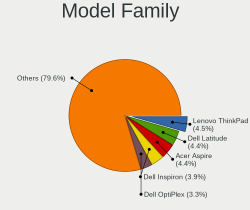
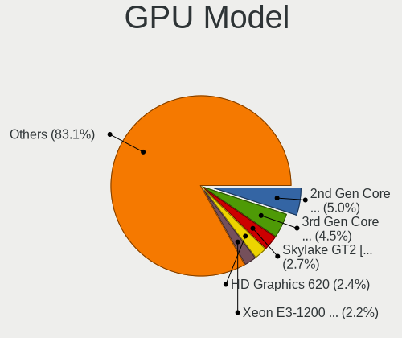
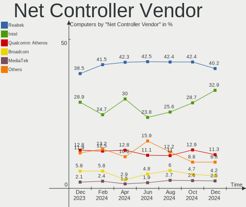
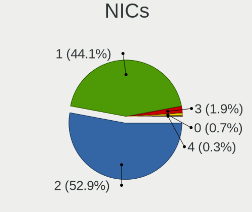
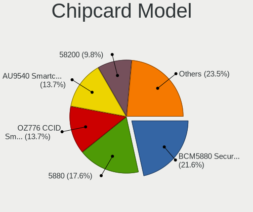

OpenMandriva - Hardware Trends
------------------------------

A project to identify most popular hardware characteristics and track their change
over time based on data collected by Linux users at https://Linux-Hardware.org.

Anyone can contribute to this report by the [hw-probe](https://github.com/linuxhw/hw-probe) tool:

    sudo -E hw-probe -all -upload

This is a report for all computer types. See also reports for [desktops](/Dist/OpenMandriva/Desktop/README.md) and [notebooks](/Dist/OpenMandriva/Notebook/README.md).

This report is for one last month. Overall report since the beginning of time: [TestDays](https://github.com/linuxhw/TestDays)

Period: Jan, 2024.

Contents
--------

* [ System ](#system)
  - [ OS                       ](#os)
  - [ OS Family                ](#os-family)
  - [ Kernel                   ](#kernel)
  - [ Kernel Family            ](#kernel-family)
  - [ Kernel Major Ver.        ](#kernel-major-ver)
  - [ Arch                     ](#arch)
  - [ DE                       ](#de)
  - [ Display Server           ](#display-server)
  - [ Display Manager          ](#display-manager)
  - [ OS Lang                  ](#os-lang)
  - [ Boot Mode                ](#boot-mode)
  - [ Filesystem               ](#filesystem)
  - [ Part. scheme             ](#part-scheme)
  - [ Dual Boot with Linux/BSD ](#dual-boot-with-linuxbsd)
  - [ Dual Boot (Win)          ](#dual-boot-win)

* [ Board ](#board)
  - [ Vendor                   ](#vendor)
  - [ Model                    ](#model)
  - [ Model Family             ](#model-family)
  - [ MFG Year                 ](#mfg-year)
  - [ Form Factor              ](#form-factor)
  - [ Secure Boot              ](#secure-boot)
  - [ Coreboot                 ](#coreboot)
  - [ RAM Size                 ](#ram-size)
  - [ RAM Used                 ](#ram-used)
  - [ Total Drives             ](#total-drives)
  - [ Has CD-ROM               ](#has-cd-rom)
  - [ Has Ethernet             ](#has-ethernet)
  - [ Has WiFi                 ](#has-wifi)
  - [ Has Bluetooth            ](#has-bluetooth)

* [ Location ](#location)
  - [ Country                  ](#country)
  - [ City                     ](#city)

* [ Drives ](#drives)
  - [ Drive Vendor             ](#drive-vendor)
  - [ Drive Model              ](#drive-model)
  - [ HDD Vendor               ](#hdd-vendor)
  - [ SSD Vendor               ](#ssd-vendor)
  - [ Drive Kind               ](#drive-kind)
  - [ Drive Connector          ](#drive-connector)
  - [ Drive Size               ](#drive-size)
  - [ Space Total              ](#space-total)
  - [ Space Used               ](#space-used)
  - [ Malfunc. Drives          ](#malfunc-drives)
  - [ Malfunc. Drive Vendor    ](#malfunc-drive-vendor)
  - [ Malfunc. HDD Vendor      ](#malfunc-hdd-vendor)
  - [ Malfunc. Drive Kind      ](#malfunc-drive-kind)
  - [ Failed Drives            ](#failed-drives)
  - [ Failed Drive Vendor      ](#failed-drive-vendor)
  - [ Drive Status             ](#drive-status)

* [ Storage controller ](#storage-controller)
  - [ Storage Vendor           ](#storage-vendor)
  - [ Storage Model            ](#storage-model)
  - [ Storage Kind             ](#storage-kind)

* [ Processor ](#processor)
  - [ CPU Vendor               ](#cpu-vendor)
  - [ CPU Model                ](#cpu-model)
  - [ CPU Model Family         ](#cpu-model-family)
  - [ CPU Cores                ](#cpu-cores)
  - [ CPU Sockets              ](#cpu-sockets)
  - [ CPU Threads              ](#cpu-threads)
  - [ CPU Op-Modes             ](#cpu-op-modes)
  - [ CPU Microcode            ](#cpu-microcode)
  - [ CPU Microarch            ](#cpu-microarch)

* [ Graphics ](#graphics)
  - [ GPU Vendor               ](#gpu-vendor)
  - [ GPU Model                ](#gpu-model)
  - [ GPU Combo                ](#gpu-combo)
  - [ GPU Driver               ](#gpu-driver)
  - [ GPU Memory               ](#gpu-memory)

* [ Monitor ](#monitor)
  - [ Monitor Vendor           ](#monitor-vendor)
  - [ Monitor Model            ](#monitor-model)
  - [ Monitor Resolution       ](#monitor-resolution)
  - [ Monitor Diagonal         ](#monitor-diagonal)
  - [ Monitor Width            ](#monitor-width)
  - [ Aspect Ratio             ](#aspect-ratio)
  - [ Monitor Area             ](#monitor-area)
  - [ Pixel Density            ](#pixel-density)
  - [ Multiple Monitors        ](#multiple-monitors)

* [ Network ](#network)
  - [ Net Controller Vendor    ](#net-controller-vendor)
  - [ Net Controller Model     ](#net-controller-model)
  - [ Wireless Vendor          ](#wireless-vendor)
  - [ Wireless Model           ](#wireless-model)
  - [ Ethernet Vendor          ](#ethernet-vendor)
  - [ Ethernet Model           ](#ethernet-model)
  - [ Net Controller Kind      ](#net-controller-kind)
  - [ Used Controller          ](#used-controller)
  - [ NICs                     ](#nics)
  - [ IPv6                     ](#ipv6)

* [ Bluetooth ](#bluetooth)
  - [ Bluetooth Vendor         ](#bluetooth-vendor)
  - [ Bluetooth Model          ](#bluetooth-model)

* [ Sound ](#sound)
  - [ Sound Vendor             ](#sound-vendor)
  - [ Sound Model              ](#sound-model)

* [ Memory ](#memory)
  - [ Memory Vendor            ](#memory-vendor)
  - [ Memory Model             ](#memory-model)
  - [ Memory Kind              ](#memory-kind)
  - [ Memory Form Factor       ](#memory-form-factor)
  - [ Memory Size              ](#memory-size)
  - [ Memory Speed             ](#memory-speed)

* [ Printers & scanners ](#printers--scanners)
  - [ Printer Vendor           ](#printer-vendor)
  - [ Printer Model            ](#printer-model)
  - [ Scanner Vendor           ](#scanner-vendor)
  - [ Scanner Model            ](#scanner-model)

* [ Camera ](#camera)
  - [ Camera Vendor            ](#camera-vendor)
  - [ Camera Model             ](#camera-model)

* [ Security ](#security)
  - [ Fingerprint Vendor       ](#fingerprint-vendor)
  - [ Fingerprint Model        ](#fingerprint-model)
  - [ Chipcard Vendor          ](#chipcard-vendor)
  - [ Chipcard Model           ](#chipcard-model)

* [ Unsupported ](#unsupported)
  - [ Unsupported Devices      ](#unsupported-devices)
  - [ Unsupported Device Types ](#unsupported-device-types)

System
------

OS
--

Installed operating systems

| Name               | Computers | Percent |
|--------------------|-----------|---------|
| OpenMandriva 23.08 | 117       | 33.82%  |
| OpenMandriva 5.0   | 106       | 30.64%  |
| OpenMandriva 24.01 | 51        | 14.74%  |
| OpenMandriva 4.3   | 17        | 4.91%   |
| OpenMandriva 23.03 | 16        | 4.62%   |
| OpenMandriva 23.11 | 12        | 3.47%   |
| OpenMandriva 4.2   | 9         | 2.6%    |
| OpenMandriva 23.01 | 5         | 1.45%   |
| OpenMandriva 23.90 | 4         | 1.16%   |
| OpenMandriva 24.90 | 3         | 0.87%   |
| OpenMandriva 22.12 | 2         | 0.58%   |
| OpenMandriva 4.50  | 1         | 0.29%   |
| OpenMandriva 23.10 | 1         | 0.29%   |
| OpenMandriva 23.09 | 1         | 0.29%   |
| OpenMandriva 23.06 | 1         | 0.29%   |

OS Family
---------

OS without a version

| Name         | Computers | Percent |
|--------------|-----------|---------|
| OpenMandriva | 346       | 100%    |

Kernel
------

Version of the Linux kernel

| Version                  | Computers | Percent |
|--------------------------|-----------|---------|
| 6.6.2-desktop-1omv2390   | 163       | 47.11%  |
| 6.4.11-desktop-1omv2390  | 105       | 30.35%  |
| 6.4.8-desktop-2omv2390   | 17        | 4.91%   |
| 6.2.6-desktop-1omv2390   | 16        | 4.62%   |
| 5.16.7-desktop-1omv4003  | 12        | 3.47%   |
| 5.10.14-desktop-1omv4002 | 9         | 2.6%    |
| 6.1.1-desktop-1omv2290   | 5         | 1.45%   |
| 5.16.13-desktop-1omv4003 | 4         | 1.16%   |
| 6.6.1-desktop-1omv2390   | 3         | 0.87%   |
| 6.6.7-desktop-1omv2390   | 2         | 0.58%   |
| 6.0.10-desktop-2omv22090 | 2         | 0.58%   |
| 6.7.1-desktop-1omv2490   | 1         | 0.29%   |
| 6.6.0-desktop-1omv2390   | 1         | 0.29%   |
| 6.5.5-desktop-1omv2390   | 1         | 0.29%   |
| 6.5.0-desktop-1omv2390   | 1         | 0.29%   |
| 6.4.7-desktop-1omv2390   | 1         | 0.29%   |
| 6.3.5-desktop-3omv2390   | 1         | 0.29%   |
| 5.19.12-desktop-2omv4090 | 1         | 0.29%   |
| 5.14.14-desktop-1omv4050 | 1         | 0.29%   |

Kernel Family
-------------

Linux kernel without a distro release

| Version | Computers | Percent |
|---------|-----------|---------|
| 6.6.2   | 163       | 47.11%  |
| 6.4.11  | 105       | 30.35%  |
| 6.4.8   | 17        | 4.91%   |
| 6.2.6   | 16        | 4.62%   |
| 5.16.7  | 12        | 3.47%   |
| 5.10.14 | 9         | 2.6%    |
| 6.1.1   | 5         | 1.45%   |
| 5.16.13 | 4         | 1.16%   |
| 6.6.1   | 3         | 0.87%   |
| 6.6.7   | 2         | 0.58%   |
| 6.0.10  | 2         | 0.58%   |
| 6.7.1   | 1         | 0.29%   |
| 6.6.0   | 1         | 0.29%   |
| 6.5.5   | 1         | 0.29%   |
| 6.5.0   | 1         | 0.29%   |
| 6.4.7   | 1         | 0.29%   |
| 6.3.5   | 1         | 0.29%   |
| 5.19.12 | 1         | 0.29%   |
| 5.14.14 | 1         | 0.29%   |

Kernel Major Ver.
-----------------

Linux kernel major version

| Version | Computers | Percent |
|---------|-----------|---------|
| 6.6     | 169       | 48.84%  |
| 6.4     | 123       | 35.55%  |
| 6.2     | 16        | 4.62%   |
| 5.16    | 16        | 4.62%   |
| 5.10    | 9         | 2.6%    |
| 6.1     | 5         | 1.45%   |
| 6.5     | 2         | 0.58%   |
| 6.0     | 2         | 0.58%   |
| 6.7     | 1         | 0.29%   |
| 6.3     | 1         | 0.29%   |
| 5.19    | 1         | 0.29%   |
| 5.14    | 1         | 0.29%   |

Arch
----

OS architecture (x86_64, i586, etc.)

| Name   | Computers | Percent |
|--------|-----------|---------|
| x86_64 | 346       | 100%    |

DE
--

Desktop Environment

| Name     | Computers | Percent |
|----------|-----------|---------|
| KDE5     | 288       | 83.24%  |
| LXQt     | 28        | 8.09%   |
| GNOME    | 26        | 7.51%   |
| Unknown  | 3         | 0.87%   |
| Cinnamon | 1         | 0.29%   |

Display Server
--------------

X11 or Wayland

| Name    | Computers | Percent |
|---------|-----------|---------|
| Wayland | 288       | 83.24%  |
| X11     | 58        | 16.76%  |

Display Manager
---------------

SDDM, LightDM, etc.

| Name | Computers | Percent |
|------|-----------|---------|
| SDDM | 321       | 92.77%  |
| GDM  | 25        | 7.23%   |

OS Lang
-------

Language

| Lang  | Computers | Percent |
|-------|-----------|---------|
| en_US | 169       | 48.84%  |
| de_DE | 25        | 7.23%   |
| ru_RU | 23        | 6.65%   |
| fr_FR | 22        | 6.36%   |
| pl_PL | 20        | 5.78%   |
| en_GB | 15        | 4.34%   |
| it_IT | 13        | 3.76%   |
| pt_BR | 11        | 3.18%   |
| cs_CZ | 7         | 2.02%   |
| tr_TR | 5         | 1.45%   |
| es_MX | 5         | 1.45%   |
| es_ES | 4         | 1.16%   |
| pt_PT | 3         | 0.87%   |
| en_HK | 3         | 0.87%   |
| en_AU | 3         | 0.87%   |
| fr_BE | 2         | 0.58%   |
| es_CL | 2         | 0.58%   |
| es_AR | 2         | 0.58%   |
| de_LU | 2         | 0.58%   |
| UTF-8 | 1         | 0.29%   |
| nl_BE | 1         | 0.29%   |
| ja_JP | 1         | 0.29%   |
| it_CH | 1         | 0.29%   |
| hu_HU | 1         | 0.29%   |
| fr_CH | 1         | 0.29%   |
| es_CO | 1         | 0.29%   |
| en_PH | 1         | 0.29%   |
| en_NZ | 1         | 0.29%   |
| en_CA | 1         | 0.29%   |

Boot Mode
---------

EFI or BIOS

| Mode | Computers | Percent |
|------|-----------|---------|
| EFI  | 208       | 60.12%  |
| BIOS | 138       | 39.88%  |

Filesystem
----------

Type of filesystem

| Type    | Computers | Percent |
|---------|-----------|---------|
| Ext4    | 168       | 48.55%  |
| Overlay | 158       | 45.66%  |
| Btrfs   | 17        | 4.91%   |
| Xfs     | 3         | 0.87%   |

Part. scheme
------------

Scheme of partitioning

| Type | Computers | Percent |
|------|-----------|---------|
| GPT  | 267       | 77.17%  |
| MBR  | 79        | 22.83%  |

Dual Boot with Linux/BSD
------------------------

Hosting more than one Linux/BSD

| Dual boot | Computers | Percent |
|-----------|-----------|---------|
| No        | 175       | 50.58%  |
| Yes       | 171       | 49.42%  |

Dual Boot (Win)
---------------

Hosting Linux and Windows

| Dual boot | Computers | Percent |
|-----------|-----------|---------|
| No        | 188       | 54.34%  |
| Yes       | 158       | 45.66%  |

Board
-----

Vendor
------

Motherboard manufacturer

| Name                                 | Computers | Percent |
|--------------------------------------|-----------|---------|
| ASUSTek Computer                     | 51        | 14.74%  |
| Hewlett-Packard                      | 50        | 14.45%  |
| Lenovo                               | 46        | 13.29%  |
| Dell                                 | 41        | 11.85%  |
| Gigabyte Technology                  | 32        | 9.25%   |
| Acer                                 | 20        | 5.78%   |
| MSI                                  | 19        | 5.49%   |
| ASRock                               | 15        | 4.34%   |
| Intel                                | 8         | 2.31%   |
| Toshiba                              | 5         | 1.45%   |
| Samsung Electronics                  | 4         | 1.16%   |
| Biostar                              | 4         | 1.16%   |
| Apple                                | 4         | 1.16%   |
| Sony                                 | 3         | 0.87%   |
| Pegatron                             | 3         | 0.87%   |
| Google                               | 3         | 0.87%   |
| Unknown                              | 3         | 0.87%   |
| Shenzhen Meigao Electronic Equipment | 2         | 0.58%   |
| Positivo                             | 2         | 0.58%   |
| Microsoft                            | 2         | 0.58%   |
| LG Electronics                       | 2         | 0.58%   |
| GPU Company                          | 2         | 0.58%   |
| Fujitsu                              | 2         | 0.58%   |
| eMachines                            | 2         | 0.58%   |
| TUXEDO                               | 1         | 0.29%   |
| Razer                                | 1         | 0.29%   |
| Packard Bell                         | 1         | 0.29%   |
| OEM                                  | 1         | 0.29%   |
| NEC Computers                        | 1         | 0.29%   |
| Medion                               | 1         | 0.29%   |
| MACHINIST                            | 1         | 0.29%   |
| HUAWEI                               | 1         | 0.29%   |
| Hampoo                               | 1         | 0.29%   |
| GEEKOM                               | 1         | 0.29%   |
| Gateway                              | 1         | 0.29%   |
| Fujitsu Siemens                      | 1         | 0.29%   |
| Foxconn                              | 1         | 0.29%   |
| Evolute                              | 1         | 0.29%   |
| EPoX Computer                        | 1         | 0.29%   |
| ECS                                  | 1         | 0.29%   |

Model
-----

Motherboard model

| Name                                        | Computers | Percent |
|---------------------------------------------|-----------|---------|
| Dell OptiPlex 9020                          | 4         | 1.16%   |
| Unknown                                     | 4         | 1.16%   |
| ASUS All Series                             | 3         | 0.87%   |
| Shenzhen Meigao Electronic Equipment UM690  | 2         | 0.58%   |
| MSI MS-7C52                                 | 2         | 0.58%   |
| MSI MS-7695                                 | 2         | 0.58%   |
| HP EliteDesk 800 G2 DM 35W                  | 2         | 0.58%   |
| HP Compaq 6730s                             | 2         | 0.58%   |
| GPU Company GWNR71517                       | 2         | 0.58%   |
| Google Garg                                 | 2         | 0.58%   |
| Gigabyte H410M H V3                         | 2         | 0.58%   |
| Gigabyte GA-78LMT-S2P                       | 2         | 0.58%   |
| Dell OptiPlex 9010                          | 2         | 0.58%   |
| Dell OptiPlex 3010                          | 2         | 0.58%   |
| ASUS P5QLD PRO                              | 2         | 0.58%   |
| ASUS Maximus V GENE                         | 2         | 0.58%   |
| ASUS M5A97 R2.0                             | 2         | 0.58%   |
| Acer Aspire ES1-572                         | 2         | 0.58%   |
| TUXEDO Book BM15 Gen10                      | 1         | 0.29%   |
| Toshiba Satellite L55D-B                    | 1         | 0.29%   |
| Toshiba Satellite C660                      | 1         | 0.29%   |
| Toshiba Satellite C650                      | 1         | 0.29%   |
| Toshiba Portable PC                         | 1         | 0.29%   |
| Toshiba dynabook Satellite B552/H           | 1         | 0.29%   |
| Sony VPCF12A4E                              | 1         | 0.29%   |
| Sony VGN-FZ31Z                              | 1         | 0.29%   |
| Sony SVF1521A6EW                            | 1         | 0.29%   |
| Samsung X420/X520                           | 1         | 0.29%   |
| Samsung RV411/RV511/E3511/S3511/RV711/E3411 | 1         | 0.29%   |
| Samsung 300E5M/300E5L                       | 1         | 0.29%   |
| Samsung 270E5K/270E5Q/271E5K/2570EK         | 1         | 0.29%   |
| Razer Book 13 - RZ09-0357                   | 1         | 0.29%   |
| Positivo SF37405                            | 1         | 0.29%   |
| Positivo Mobile                             | 1         | 0.29%   |
| Pegatron p7-1257c                           | 1         | 0.29%   |
| Pegatron FL349AA-ABH SR5612NL               | 1         | 0.29%   |
| Pegatron FK821AA-ABA a6632f                 | 1         | 0.29%   |
| Packard Bell EasyNote ENLG71BM              | 1         | 0.29%   |
| OEM B75                                     | 1         | 0.29%   |
| NEC Computers PC-MK32VCZGR                  | 1         | 0.29%   |

Model Family
------------

Motherboard model prefix

| Name                                       | Computers | Percent |
|--------------------------------------------|-----------|---------|
| Lenovo ThinkPad                            | 15        | 4.34%   |
| Acer Aspire                                | 14        | 4.05%   |
| Lenovo IdeaPad                             | 13        | 3.76%   |
| Dell Inspiron                              | 13        | 3.76%   |
| Dell OptiPlex                              | 12        | 3.47%   |
| HP EliteBook                               | 7         | 2.02%   |
| Dell Latitude                              | 7         | 2.02%   |
| HP Compaq                                  | 6         | 1.73%   |
| HP ProBook                                 | 5         | 1.45%   |
| HP Pavilion                                | 5         | 1.45%   |
| ASUS VivoBook                              | 5         | 1.45%   |
| Lenovo ThinkCentre                         | 4         | 1.16%   |
| ASUS TUF                                   | 4         | 1.16%   |
| ASUS ROG                                   | 4         | 1.16%   |
| ASUS PRIME                                 | 4         | 1.16%   |
| Unknown                                    | 4         | 1.16%   |
| Toshiba Satellite                          | 3         | 0.87%   |
| Lenovo Yoga                                | 3         | 0.87%   |
| HP Presario                                | 3         | 0.87%   |
| HP EliteDesk                               | 3         | 0.87%   |
| Dell Vostro                                | 3         | 0.87%   |
| Dell Precision                             | 3         | 0.87%   |
| ASUS M5A78L-M                              | 3         | 0.87%   |
| ASUS All                                   | 3         | 0.87%   |
| Shenzhen Meigao Electronic Equipment UM690 | 2         | 0.58%   |
| MSI MS-7C52                                | 2         | 0.58%   |
| MSI MS-7695                                | 2         | 0.58%   |
| Microsoft Surface                          | 2         | 0.58%   |
| HP Stream                                  | 2         | 0.58%   |
| HP ProDesk                                 | 2         | 0.58%   |
| HP Laptop                                  | 2         | 0.58%   |
| HP ENVY                                    | 2         | 0.58%   |
| HP 250                                     | 2         | 0.58%   |
| GPU Company GWNR71517                      | 2         | 0.58%   |
| Google Garg                                | 2         | 0.58%   |
| Gigabyte H410M                             | 2         | 0.58%   |
| Gigabyte GA-78LMT-S2P                      | 2         | 0.58%   |
| ASUS P5QLD                                 | 2         | 0.58%   |
| ASUS Maximus                               | 2         | 0.58%   |
| ASUS M5A97                                 | 2         | 0.58%   |

MFG Year
--------

Motherboard manufacture year

| Year | Computers | Percent |
|------|-----------|---------|
| 2012 | 32        | 9.25%   |
| 2021 | 29        | 8.38%   |
| 2014 | 27        | 7.8%    |
| 2018 | 25        | 7.23%   |
| 2011 | 25        | 7.23%   |
| 2013 | 23        | 6.65%   |
| 2015 | 22        | 6.36%   |
| 2017 | 20        | 5.78%   |
| 2016 | 20        | 5.78%   |
| 2022 | 17        | 4.91%   |
| 2020 | 17        | 4.91%   |
| 2010 | 17        | 4.91%   |
| 2019 | 16        | 4.62%   |
| 2023 | 14        | 4.05%   |
| 2007 | 14        | 4.05%   |
| 2009 | 12        | 3.47%   |
| 2008 | 12        | 3.47%   |
| 2006 | 4         | 1.16%   |

Form Factor
-----------

Physical design of the computer

| Name        | Computers | Percent |
|-------------|-----------|---------|
| Desktop     | 166       | 47.98%  |
| Notebook    | 166       | 47.98%  |
| Convertible | 5         | 1.45%   |
| Mini pc     | 5         | 1.45%   |
| Tablet      | 2         | 0.58%   |
| All in one  | 2         | 0.58%   |

Secure Boot
-----------

Enabled or disabled

| State    | Computers | Percent |
|----------|-----------|---------|
| Disabled | 346       | 100%    |

Coreboot
--------

Have coreboot on board

| Used | Computers | Percent |
|------|-----------|---------|
| No   | 343       | 99.13%  |
| Yes  | 3         | 0.87%   |

RAM Size
--------

Total RAM memory

| Size in GB  | Computers | Percent |
|-------------|-----------|---------|
| 4.01-8.0    | 81        | 23.41%  |
| 3.01-4.0    | 75        | 21.68%  |
| 16.01-24.0  | 66        | 19.08%  |
| 8.01-16.0   | 63        | 18.21%  |
| 32.01-64.0  | 27        | 7.8%    |
| 1.01-2.0    | 15        | 4.34%   |
| 2.01-3.0    | 10        | 2.89%   |
| 24.01-32.0  | 6         | 1.73%   |
| 64.01-256.0 | 2         | 0.58%   |
| 0.51-1.0    | 1         | 0.29%   |

RAM Used
--------

Used RAM memory

| Used GB  | Computers | Percent |
|----------|-----------|---------|
| 1.01-2.0 | 222       | 64.16%  |
| 2.01-3.0 | 66        | 19.08%  |
| 0.51-1.0 | 41        | 11.85%  |
| 3.01-4.0 | 13        | 3.76%   |
| 0.01-0.5 | 3         | 0.87%   |
| 4.01-8.0 | 1         | 0.29%   |

Total Drives
------------

Number of drives on board

| Drives | Computers | Percent |
|--------|-----------|---------|
| 1      | 202       | 58.38%  |
| 2      | 86        | 24.86%  |
| 3      | 34        | 9.83%   |
| 4      | 11        | 3.18%   |
| 5      | 4         | 1.16%   |
| 0      | 4         | 1.16%   |
| 6      | 3         | 0.87%   |
| 13     | 1         | 0.29%   |
| 9      | 1         | 0.29%   |

Has CD-ROM
----------

Has CD-ROM on board

| Presented | Computers | Percent |
|-----------|-----------|---------|
| No        | 183       | 52.89%  |
| Yes       | 163       | 47.11%  |

Has Ethernet
------------

Has Ethernet on board

| Presented | Computers | Percent |
|-----------|-----------|---------|
| Yes       | 313       | 90.46%  |
| No        | 33        | 9.54%   |

Has WiFi
--------

Has WiFi module

| Presented | Computers | Percent |
|-----------|-----------|---------|
| Yes       | 232       | 67.05%  |
| No        | 114       | 32.95%  |

Has Bluetooth
-------------

Has Bluetooth module

| Presented | Computers | Percent |
|-----------|-----------|---------|
| Yes       | 192       | 55.49%  |
| No        | 154       | 44.51%  |

Location
--------

Country
-------

Geographic location (country)

| Country         | Computers | Percent |
|-----------------|-----------|---------|
| USA             | 53        | 15.32%  |
| Germany         | 37        | 10.69%  |
| Russia          | 29        | 8.38%   |
| Poland          | 26        | 7.51%   |
| Italy           | 22        | 6.36%   |
| Brazil          | 20        | 5.78%   |
| France          | 19        | 5.49%   |
| UK              | 17        | 4.91%   |
| Turkey          | 11        | 3.18%   |
| Czechia         | 11        | 3.18%   |
| Spain           | 7         | 2.02%   |
| Japan           | 7         | 2.02%   |
| Mexico          | 6         | 1.73%   |
| Canada          | 6         | 1.73%   |
| Australia       | 6         | 1.73%   |
| Portugal        | 5         | 1.45%   |
| Indonesia       | 5         | 1.45%   |
| Finland         | 5         | 1.45%   |
| Hungary         | 4         | 1.16%   |
| Belgium         | 4         | 1.16%   |
| India           | 3         | 0.87%   |
| Ukraine         | 2         | 0.58%   |
| Taiwan          | 2         | 0.58%   |
| New Zealand     | 2         | 0.58%   |
| Netherlands     | 2         | 0.58%   |
| Hong Kong       | 2         | 0.58%   |
| Colombia        | 2         | 0.58%   |
| China           | 2         | 0.58%   |
| Chile           | 2         | 0.58%   |
| Argentina       | 2         | 0.58%   |
| The Netherlands | 1         | 0.29%   |
| Thailand        | 1         | 0.29%   |
| Switzerland     | 1         | 0.29%   |
| Sweden          | 1         | 0.29%   |
| South Africa    | 1         | 0.29%   |
| Slovenia        | 1         | 0.29%   |
| Saudi Arabia    | 1         | 0.29%   |
| Réunion        | 1         | 0.29%   |
| Philippines     | 1         | 0.29%   |
| Paraguay        | 1         | 0.29%   |

City
----

Geographic location (city)

| City            | Computers | Percent |
|-----------------|-----------|---------|
| Berlin          | 6         | 1.73%   |
| Prague          | 4         | 1.16%   |
| Milan           | 4         | 1.16%   |
| Krakow          | 4         | 1.16%   |
| Katowice        | 4         | 1.16%   |
| Warsaw          | 3         | 0.87%   |
| Sydney          | 3         | 0.87%   |
| Rome            | 3         | 0.87%   |
| Moscow          | 3         | 0.87%   |
| Istanbul        | 3         | 0.87%   |
| Hamburg         | 3         | 0.87%   |
| Wroclaw         | 2         | 0.58%   |
| Wiesbaden       | 2         | 0.58%   |
| Torremolinos    | 2         | 0.58%   |
| St Petersburg   | 2         | 0.58%   |
| Sao Goncalo     | 2         | 0.58%   |
| Salvador        | 2         | 0.58%   |
| Rezé           | 2         | 0.58%   |
| Recklinghausen  | 2         | 0.58%   |
| Poznan          | 2         | 0.58%   |
| Portland        | 2         | 0.58%   |
| Perkupa         | 2         | 0.58%   |
| Novosibirsk     | 2         | 0.58%   |
| Newham          | 2         | 0.58%   |
| Mount Vernon    | 2         | 0.58%   |
| Monticello      | 2         | 0.58%   |
| Miura           | 2         | 0.58%   |
| Krasnodar       | 2         | 0.58%   |
| Kladno          | 2         | 0.58%   |
| Jakarta         | 2         | 0.58%   |
| Greensboro      | 2         | 0.58%   |
| Greater Sudbury | 2         | 0.58%   |
| Central         | 2         | 0.58%   |
| Carcassonne     | 2         | 0.58%   |
| Canberra        | 2         | 0.58%   |
| Birmingham      | 2         | 0.58%   |
| Barreiro        | 2         | 0.58%   |
| Barnaul         | 2         | 0.58%   |
| Ankara          | 2         | 0.58%   |
| Zelenograd      | 1         | 0.29%   |

Drives
------

Drive Vendor
------------

Hard drive vendors

| Vendor                      | Computers | Drives | Percent |
|-----------------------------|-----------|--------|---------|
| WDC                         | 85        | 100    | 16.31%  |
| Seagate                     | 68        | 76     | 13.05%  |
| Samsung Electronics         | 53        | 69     | 10.17%  |
| Toshiba                     | 38        | 39     | 7.29%   |
| Kingston                    | 26        | 27     | 4.99%   |
| SanDisk                     | 22        | 23     | 4.22%   |
| Crucial                     | 17        | 21     | 3.26%   |
| Unknown                     | 16        | 19     | 3.07%   |
| Hitachi                     | 14        | 14     | 2.69%   |
| China                       | 14        | 16     | 2.69%   |
| Unknown                     | 10        | 10     | 1.92%   |
| Intenso                     | 9         | 9      | 1.73%   |
| A-DATA Technology           | 9         | 10     | 1.73%   |
| SK hynix                    | 8         | 9      | 1.54%   |
| JMicron Technology          | 8         | 8      | 1.54%   |
| HGST                        | 7         | 7      | 1.34%   |
| SPCC                        | 6         | 6      | 1.15%   |
| Intel                       | 6         | 6      | 1.15%   |
| GOODRAM                     | 6         | 6      | 1.15%   |
| Micron Technology           | 5         | 7      | 0.96%   |
| Patriot                     | 4         | 4      | 0.77%   |
| Lexar                       | 4         | 4      | 0.77%   |
| Fanxiang                    | 4         | 4      | 0.77%   |
| Apacer                      | 4         | 4      | 0.77%   |
| PNY                         | 3         | 3      | 0.58%   |
| MSI                         | 3         | 3      | 0.58%   |
| Maxtor                      | 3         | 3      | 0.58%   |
| LITEONIT                    | 3         | 3      | 0.58%   |
| Kingston Technology Company | 3         | 3      | 0.58%   |
| KingSpec                    | 3         | 3      | 0.58%   |
| Fujitsu                     | 3         | 3      | 0.58%   |
| Wibtek                      | 2         | 2      | 0.38%   |
| Verbatim                    | 2         | 2      | 0.38%   |
| USB3.0                      | 2         | 2      | 0.38%   |
| SSSTC                       | 2         | 2      | 0.38%   |
| Smartbuy                    | 2         | 2      | 0.38%   |
| Silicon Motion              | 2         | 2      | 0.38%   |
| Realtek                     | 2         | 2      | 0.38%   |
| Phison                      | 2         | 2      | 0.38%   |
| OCZ                         | 2         | 2      | 0.38%   |

Drive Model
-----------

Hard drive models

| Model                               | Computers | Percent |
|-------------------------------------|-----------|---------|
| Unknown                             | 10        | 1.77%   |
| Seagate ST500DM002-1BD142 500GB     | 8         | 1.42%   |
| Toshiba MQ04ABF100 1TB              | 5         | 0.89%   |
| Toshiba DT01ACA100 1TB              | 5         | 0.89%   |
| Seagate ST1000DM010-2EP102 1TB      | 5         | 0.89%   |
| Seagate ST500LM012 HN-M500MBB 500GB | 4         | 0.71%   |
| Seagate ST4000DM004-2CV104 4TB      | 4         | 0.71%   |
| SanDisk NVMe SSD Drive 1TB          | 4         | 0.71%   |
| Samsung SSD 840 EVO 250GB           | 4         | 0.71%   |
| Kingston SA400S37480G 480GB SSD     | 4         | 0.71%   |
| Kingston SA400S37240G 240GB SSD     | 4         | 0.71%   |
| JMicron Tech 250GB                  | 4         | 0.71%   |
| WDC WDS500G2B0A-00SM50 500GB SSD    | 3         | 0.53%   |
| WDC WDS240G2G0A-00JH30 240GB SSD    | 3         | 0.53%   |
| Unknown SD/MMC/MS PRO 256GB         | 3         | 0.53%   |
| Toshiba MQ01ABF050 500GB            | 3         | 0.53%   |
| Seagate ST500LT012-1DG142 500GB     | 3         | 0.53%   |
| Seagate ST500LM021-1KJ152 500GB     | 3         | 0.53%   |
| Seagate ST1000LM024 HN-M101MBB 1TB  | 3         | 0.53%   |
| Samsung SSD 850 EVO 250GB           | 3         | 0.53%   |
| Samsung HD322HJ 320GB               | 3         | 0.53%   |
| Kingston SV300S37A120G 120GB SSD    | 3         | 0.53%   |
| Kingston SNVS500G 500GB             | 3         | 0.53%   |
| JMicron Generic 8GB                 | 3         | 0.53%   |
| Intenso SSD 1TB                     | 3         | 0.53%   |
| HGST HTS545050A7E680 500GB          | 3         | 0.53%   |
| Crucial CT480BX500SSD1 480GB        | 3         | 0.53%   |
| Crucial CT275MX300SSD1 275GB        | 3         | 0.53%   |
| Crucial CT240BX500SSD1 240GB        | 3         | 0.53%   |
| A-DATA SU800 256GB SSD              | 3         | 0.53%   |
| Wibtek W800S 512GB SSD              | 2         | 0.35%   |
| WDC WDS100T3X0C-00SJG0 1TB          | 2         | 0.35%   |
| WDC WDS100T2B0C-00PXH0 1TB          | 2         | 0.35%   |
| WDC WD5000LPVX-80V0TT0 500GB        | 2         | 0.35%   |
| WDC WD5000LPVX-60V0TT0 500GB        | 2         | 0.35%   |
| WDC WD5000AAKX-60U6AA0 500GB        | 2         | 0.35%   |
| WDC WD10JPCX-24UE4T0 1TB            | 2         | 0.35%   |
| WDC WD10EZRX-00A8LB0 1TB            | 2         | 0.35%   |
| WDC WD10EZEX-60WN4A0 1TB            | 2         | 0.35%   |
| WDC WD10EZEX-00BN5A0 1TB            | 2         | 0.35%   |

HDD Vendor
----------

Hard disk drive vendors

| Vendor              | Computers | Drives | Percent |
|---------------------|-----------|--------|---------|
| WDC                 | 69        | 80     | 32.09%  |
| Seagate             | 67        | 75     | 31.16%  |
| Toshiba             | 34        | 35     | 15.81%  |
| Hitachi             | 14        | 14     | 6.51%   |
| Samsung Electronics | 10        | 12     | 4.65%   |
| HGST                | 7         | 7      | 3.26%   |
| JMicron Technology  | 4         | 4      | 1.86%   |
| Unknown             | 3         | 3      | 1.4%    |
| Maxtor              | 3         | 3      | 1.4%    |
| Fujitsu             | 3         | 3      | 1.4%    |
| Apple               | 1         | 1      | 0.47%   |

SSD Vendor
----------

Solid state drive vendors

| Vendor              | Computers | Drives | Percent |
|---------------------|-----------|--------|---------|
| Samsung Electronics | 28        | 31     | 15.05%  |
| Kingston            | 16        | 17     | 8.6%    |
| SanDisk             | 15        | 15     | 8.06%   |
| China               | 14        | 16     | 7.53%   |
| Crucial             | 13        | 15     | 6.99%   |
| Intenso             | 8         | 8      | 4.3%    |
| A-DATA Technology   | 8         | 9      | 4.3%    |
| WDC                 | 7         | 8      | 3.76%   |
| GOODRAM             | 6         | 6      | 3.23%   |
| SPCC                | 5         | 5      | 2.69%   |
| Patriot             | 3         | 3      | 1.61%   |
| LITEONIT            | 3         | 3      | 1.61%   |
| KingSpec            | 3         | 3      | 1.61%   |
| Apacer              | 3         | 3      | 1.61%   |
| Unknown             | 3         | 3      | 1.61%   |
| Wibtek              | 2         | 2      | 1.08%   |
| Verbatim            | 2         | 2      | 1.08%   |
| USB3.0              | 2         | 2      | 1.08%   |
| Toshiba             | 2         | 2      | 1.08%   |
| PNY                 | 2         | 2      | 1.08%   |
| OCZ                 | 2         | 2      | 1.08%   |
| Micron Technology   | 2         | 4      | 1.08%   |
| LITEON              | 2         | 2      | 1.08%   |
| Leven               | 2         | 2      | 1.08%   |
| JAMESDONKEY         | 2         | 2      | 1.08%   |
| Intel               | 2         | 2      | 1.08%   |
| Hewlett-Packard     | 2         | 2      | 1.08%   |
| XSTAR               | 1         | 1      | 0.54%   |
| X12                 | 1         | 1      | 0.54%   |
| Western             | 1         | 1      | 0.54%   |
| WDC WDS             | 1         | 1      | 0.54%   |
| V-GeN               | 1         | 2      | 0.54%   |
| USB                 | 1         | 1      | 0.54%   |
| TCSUNBOW            | 1         | 1      | 0.54%   |
| SXMicro             | 1         | 1      | 0.54%   |
| Smartbuy            | 1         | 1      | 0.54%   |
| SK hynix            | 1         | 1      | 0.54%   |
| Qumo                | 1         | 1      | 0.54%   |
| Pioneer             | 1         | 1      | 0.54%   |
| Phison              | 1         | 1      | 0.54%   |

Drive Kind
----------

HDD or SSD

| Kind    | Computers | Drives | Percent |
|---------|-----------|--------|---------|
| HDD     | 183       | 237    | 40.76%  |
| SSD     | 155       | 199    | 34.52%  |
| NVMe    | 86        | 109    | 19.15%  |
| MMC     | 19        | 25     | 4.23%   |
| Unknown | 6         | 7      | 1.34%   |

Drive Connector
---------------

SATA, SAS, NVMe, etc.

| Type | Computers | Drives | Percent |
|------|-----------|--------|---------|
| SATA | 285       | 410    | 68.18%  |
| NVMe | 85        | 102    | 20.33%  |
| SAS  | 29        | 40     | 6.94%   |
| MMC  | 19        | 25     | 4.55%   |

Drive Size
----------

Size of hard drive

| Size in TB | Computers | Drives | Percent |
|------------|-----------|--------|---------|
| 0.01-0.5   | 208       | 272    | 59.26%  |
| 0.51-1.0   | 105       | 119    | 29.91%  |
| 1.01-2.0   | 19        | 22     | 5.41%   |
| 3.01-4.0   | 9         | 12     | 2.56%   |
| 4.01-10.0  | 6         | 7      | 1.71%   |
| 2.01-3.0   | 4         | 4      | 1.14%   |

Space Total
-----------

Amount of disk space available on the file system

| Size in GB     | Computers | Percent |
|----------------|-----------|---------|
| 1-20           | 100       | 28.9%   |
| 101-250        | 68        | 19.65%  |
| 251-500        | 57        | 16.47%  |
| 501-1000       | 31        | 8.96%   |
| Unknown        | 26        | 7.51%   |
| 51-100         | 22        | 6.36%   |
| 21-50          | 21        | 6.07%   |
| 1001-2000      | 13        | 3.76%   |
| More than 3000 | 6         | 1.73%   |
| 2001-3000      | 2         | 0.58%   |

Space Used
----------

Amount of used disk space

| Used GB        | Computers | Percent |
|----------------|-----------|---------|
| 1-20           | 251       | 72.54%  |
| 21-50          | 31        | 8.96%   |
| Unknown        | 26        | 7.51%   |
| 51-100         | 10        | 2.89%   |
| 101-250        | 8         | 2.31%   |
| 501-1000       | 7         | 2.02%   |
| 251-500        | 4         | 1.16%   |
| 0              | 4         | 1.16%   |
| More than 3000 | 3         | 0.87%   |
| 2001-3000      | 1         | 0.29%   |
| 1001-2000      | 1         | 0.29%   |

Malfunc. Drives
---------------

Drive models with a malfunction

| Model                               | Computers | Drives | Percent |
|-------------------------------------|-----------|--------|---------|
| Seagate ST500DM002-1BD142 500GB     | 6         | 6      | 6.25%   |
| Crucial CT275MX300SSD1 275GB        | 3         | 3      | 3.13%   |
| WDC WD5000LPVX-80V0TT0 500GB        | 2         | 2      | 2.08%   |
| Toshiba MQ04ABF100 1TB              | 2         | 2      | 2.08%   |
| Toshiba DT01ACA100 1TB              | 2         | 2      | 2.08%   |
| Seagate ST500LM012 HN-M500MBB 500GB | 2         | 3      | 2.08%   |
| Seagate ST1000LM024 HN-M101MBB 1TB  | 2         | 2      | 2.08%   |
| Hitachi HDS721050CLA362 500GB       | 2         | 2      | 2.08%   |
| HGST HTS545050A7E680 500GB          | 2         | 2      | 2.08%   |
| Wibtek W800S 512GB SSD              | 1         | 1      | 1.04%   |
| WDC WDS240G2G0A-00JH30 240GB SSD    | 1         | 1      | 1.04%   |
| WDC WD7500BPVT-22HXZT3 752GB        | 1         | 1      | 1.04%   |
| WDC WD7500BPVT-08HXZT3 752GB        | 1         | 1      | 1.04%   |
| WDC WD6400AARS-00Y5B1 640GB         | 1         | 1      | 1.04%   |
| WDC WD5000LPVX-60V0TT0 500GB        | 1         | 1      | 1.04%   |
| WDC WD5000BPVT-00HXZT3 500GB        | 1         | 1      | 1.04%   |
| WDC WD5000AZRX-00A8LB0 500GB        | 1         | 1      | 1.04%   |
| WDC WD5000AAVS-00N7B0 500GB         | 1         | 1      | 1.04%   |
| WDC WD5000AAKX-60U6AA0 500GB        | 1         | 1      | 1.04%   |
| WDC WD5000AAKX-00ERMA0 500GB        | 1         | 1      | 1.04%   |
| WDC WD5000AAKS-00YGA0 500GB         | 1         | 1      | 1.04%   |
| WDC WD3200BEKT-22A25T1 320GB        | 1         | 1      | 1.04%   |
| WDC WD3200AVVS-56L2B0 320GB         | 1         | 1      | 1.04%   |
| WDC WD3200AAJS-56M0A0 320GB         | 1         | 1      | 1.04%   |
| WDC WD2500BEVT-22ZCT0 250GB         | 1         | 1      | 1.04%   |
| WDC WD2500BEVT-22A23T0 250GB        | 1         | 1      | 1.04%   |
| WDC WD20EARS-00MVWB0 2TB            | 1         | 1      | 1.04%   |
| WDC WD1600BEVT-60ZCT0 160GB         | 1         | 1      | 1.04%   |
| WDC WD1600BEVT-22ZCT0 160GB         | 1         | 1      | 1.04%   |
| WDC WD1600BEKT-00F3T0 160GB         | 1         | 1      | 1.04%   |
| WDC WD10EZEX-60ZF5A0 1TB            | 1         | 1      | 1.04%   |
| WDC WD10EARS-00MVWB0 1TB            | 1         | 1      | 1.04%   |
| WDC WD1002FBYS-02A6B0 1TB           | 1         | 1      | 1.04%   |
| WDC WD1001FALS-00J7B1 1TB           | 1         | 1      | 1.04%   |
| Toshiba MQ01ABD050V 500GB           | 1         | 1      | 1.04%   |
| Toshiba MK1652GSX 160GB             | 1         | 1      | 1.04%   |
| SXMicro NF830 256GB SSD             | 1         | 1      | 1.04%   |
| Seagate ST9500325AS 500GB           | 1         | 1      | 1.04%   |
| Seagate ST9320325AS 320GB           | 1         | 1      | 1.04%   |
| Seagate ST500LT012-1DG142 500GB     | 1         | 1      | 1.04%   |

Malfunc. Drive Vendor
---------------------

Vendors of faulty drives

| Vendor              | Computers | Drives | Percent |
|---------------------|-----------|--------|---------|
| WDC                 | 25        | 26     | 26.6%   |
| Seagate             | 24        | 26     | 25.53%  |
| Hitachi             | 8         | 8      | 8.51%   |
| Toshiba             | 6         | 6      | 6.38%   |
| HGST                | 5         | 5      | 5.32%   |
| Crucial             | 5         | 5      | 5.32%   |
| Samsung Electronics | 4         | 5      | 4.26%   |
| Maxtor              | 2         | 2      | 2.13%   |
| LITEONIT            | 2         | 2      | 2.13%   |
| Kingston            | 2         | 2      | 2.13%   |
| Wibtek              | 1         | 1      | 1.06%   |
| SXMicro             | 1         | 1      | 1.06%   |
| SanDisk             | 1         | 1      | 1.06%   |
| JMicron Technology  | 1         | 1      | 1.06%   |
| Intenso             | 1         | 1      | 1.06%   |
| Intel               | 1         | 1      | 1.06%   |
| China               | 1         | 1      | 1.06%   |
| C-S12               | 1         | 1      | 1.06%   |
| Apple               | 1         | 1      | 1.06%   |
| AMD                 | 1         | 1      | 1.06%   |
| A-DATA Technology   | 1         | 1      | 1.06%   |

Malfunc. HDD Vendor
-------------------

Vendors of faulty HDD drives

| Vendor              | Computers | Drives | Percent |
|---------------------|-----------|--------|---------|
| WDC                 | 24        | 25     | 32.43%  |
| Seagate             | 24        | 26     | 32.43%  |
| Hitachi             | 8         | 8      | 10.81%  |
| Toshiba             | 6         | 6      | 8.11%   |
| HGST                | 5         | 5      | 6.76%   |
| Samsung Electronics | 4         | 5      | 5.41%   |
| Maxtor              | 2         | 2      | 2.7%    |
| Apple               | 1         | 1      | 1.35%   |

Malfunc. Drive Kind
-------------------

Kinds of faulty drives

| Kind    | Computers | Drives | Percent |
|---------|-----------|--------|---------|
| HDD     | 70        | 78     | 77.78%  |
| SSD     | 19        | 19     | 21.11%  |
| Unknown | 1         | 1      | 1.11%   |

Failed Drives
-------------

Failed drive models

| Model                    | Computers | Drives | Percent |
|--------------------------|-----------|--------|---------|
| Toshiba MQ01ABD050 500GB | 1         | 1      | 100%    |

Failed Drive Vendor
-------------------

Failed drive vendors

| Vendor  | Computers | Drives | Percent |
|---------|-----------|--------|---------|
| Toshiba | 1         | 1      | 100%    |

Drive Status
------------

Number of failed and malfunc. drives

| Status   | Computers | Drives | Percent |
|----------|-----------|--------|---------|
| Works    | 278       | 420    | 67.64%  |
| Malfunc  | 87        | 98     | 21.17%  |
| Detected | 45        | 58     | 10.95%  |
| Failed   | 1         | 1      | 0.24%   |

Storage controller
------------------

Storage Vendor
--------------

Storage controller vendors

| Vendor                         | Computers | Percent |
|--------------------------------|-----------|---------|
| Intel                          | 242       | 56.28%  |
| AMD                            | 61        | 14.19%  |
| Samsung Electronics            | 18        | 4.19%   |
| SanDisk                        | 17        | 3.95%   |
| Kingston Technology Company    | 13        | 3.02%   |
| JMicron Technology             | 11        | 2.56%   |
| ASMedia Technology             | 10        | 2.33%   |
| Nvidia                         | 9         | 2.09%   |
| Phison Electronics             | 8         | 1.86%   |
| SK hynix                       | 7         | 1.63%   |
| MAXIO Technology (Hangzhou)    | 7         | 1.63%   |
| Micron/Crucial Technology      | 5         | 1.16%   |
| Silicon Motion                 | 4         | 0.93%   |
| KIOXIA                         | 4         | 0.93%   |
| Micron Technology              | 3         | 0.7%    |
| Marvell Technology Group       | 3         | 0.7%    |
| Solid State Storage Technology | 2         | 0.47%   |
| VIA Technologies               | 1         | 0.23%   |
| Shenzhen Longsys Electronics   | 1         | 0.23%   |
| Promise Technology             | 1         | 0.23%   |
| Lenovo                         | 1         | 0.23%   |
| Apple                          | 1         | 0.23%   |
| ADATA Technology               | 1         | 0.23%   |

Storage Model
-------------

Storage controller models

| Model                                                                            | Computers | Percent |
|----------------------------------------------------------------------------------|-----------|---------|
| AMD FCH SATA Controller [AHCI mode]                                              | 34        | 6.81%   |
| Intel Sunrise Point-LP SATA Controller [AHCI mode]                               | 27        | 5.41%   |
| Intel 8 Series/C220 Series Chipset Family 6-port SATA Controller 1 [AHCI mode]   | 18        | 3.61%   |
| Intel 7 Series Chipset Family 6-port SATA Controller [AHCI mode]                 | 13        | 2.61%   |
| Intel 7 Series/C210 Series Chipset Family 6-port SATA Controller [AHCI mode]     | 12        | 2.4%    |
| Intel Q170/Q150/B150/H170/H110/Z170/CM236 Chipset SATA Controller [AHCI Mode]    | 11        | 2.2%    |
| Intel 82801IBM/IEM (ICH9M/ICH9M-E) 4 port SATA Controller [AHCI mode]            | 10        | 2%      |
| AMD SB7x0/SB8x0/SB9x0 SATA Controller [IDE mode]                                 | 10        | 2%      |
| AMD SB7x0/SB8x0/SB9x0 IDE Controller                                             | 10        | 2%      |
| Intel 6 Series/C200 Series Chipset Family 6 port Mobile SATA AHCI Controller     | 9         | 1.8%    |
| ASMedia ASM1061/ASM1062 Serial ATA Controller                                    | 9         | 1.8%    |
| Intel Wildcat Point-LP SATA Controller [AHCI Mode]                               | 8         | 1.6%    |
| Intel 82801HM/HEM (ICH8M/ICH8M-E) SATA Controller [AHCI mode]                    | 8         | 1.6%    |
| Intel 82801HM/HEM (ICH8M/ICH8M-E) IDE Controller                                 | 8         | 1.6%    |
| Intel 82801 Mobile SATA Controller [RAID mode]                                   | 8         | 1.6%    |
| Samsung NVMe SSD Controller SM981/PM981/PM983                                    | 7         | 1.4%    |
| Samsung NVMe SSD Controller 980 (DRAM-less)                                      | 7         | 1.4%    |
| Intel Volume Management Device NVMe RAID Controller                              | 7         | 1.4%    |
| Intel SATA Controller [RAID mode]                                                | 7         | 1.4%    |
| Nvidia MCP61 SATA Controller                                                     | 6         | 1.2%    |
| Nvidia MCP61 IDE                                                                 | 6         | 1.2%    |
| Intel Tiger Lake-LP SATA Controller                                              | 6         | 1.2%    |
| Intel Atom/Celeron/Pentium Processor x5-E8000/J3xxx/N3xxx Series SATA Controller | 6         | 1.2%    |
| Intel 82801JI (ICH10 Family) 4 port SATA IDE Controller #1                       | 6         | 1.2%    |
| Intel 82801JI (ICH10 Family) 2 port SATA IDE Controller #2                       | 6         | 1.2%    |
| Intel 8 Series SATA Controller 1 [AHCI mode]                                     | 6         | 1.2%    |
| Intel 6 Series/C200 Series Chipset Family 6 port Desktop SATA AHCI Controller    | 6         | 1.2%    |
| Intel 5 Series/3400 Series Chipset 4 port SATA AHCI Controller                   | 6         | 1.2%    |
| Intel 200 Series PCH SATA controller [AHCI mode]                                 | 6         | 1.2%    |
| AMD 400 Series Chipset SATA Controller                                           | 6         | 1.2%    |
| MAXIO (Hangzhou) NVMe SSD Controller MAP1202 (DRAM-less)                         | 5         | 1%      |
| JMicron JMB363 SATA/IDE Controller                                               | 5         | 1%      |
| AMD SB7x0/SB8x0/SB9x0 SATA Controller [AHCI mode]                                | 5         | 1%      |
| AMD FCH SATA Controller D                                                        | 5         | 1%      |
| SanDisk Ultra 3D / WD Blue SN550 NVMe SSD                                        | 4         | 0.8%    |
| SanDisk Extreme Pro / WD Black SN750 / PC SN730 / Red SN700 NVMe SSD             | 4         | 0.8%    |
| Micron/Crucial P2 [Nick P2] / P3 / P3 Plus NVMe PCIe SSD (DRAM-less)             | 4         | 0.8%    |
| JMicron JMB368 IDE controller                                                    | 4         | 0.8%    |
| Intel Comet Lake SATA AHCI Controller                                            | 4         | 0.8%    |
| Intel Celeron N3350/Pentium N4200/Atom E3900 Series SATA AHCI Controller         | 4         | 0.8%    |

Storage Kind
------------

Kind of storage controller (IDE, SATA, NVMe, SAS, ...)

| Kind | Computers | Percent |
|------|-----------|---------|
| SATA | 260       | 61.18%  |
| NVMe | 84        | 19.76%  |
| IDE  | 56        | 13.18%  |
| RAID | 25        | 5.88%   |

Processor
---------

CPU Vendor
----------

Processor vendors

| Vendor | Computers | Percent |
|--------|-----------|---------|
| Intel  | 265       | 76.59%  |
| AMD    | 81        | 23.41%  |

CPU Model
---------

Processor models

| Model                                   | Computers | Percent |
|-----------------------------------------|-----------|---------|
| Intel Core i5-7200U CPU @ 2.50GHz       | 5         | 1.45%   |
| Intel 11th Gen Core i7-1165G7 @ 2.80GHz | 5         | 1.45%   |
| AMD Ryzen 5 5600G with Radeon Graphics  | 5         | 1.45%   |
| Intel Core i5-2400 CPU @ 3.10GHz        | 4         | 1.16%   |
| Intel Celeron CPU N3050 @ 1.60GHz       | 4         | 1.16%   |
| Intel Pentium CPU P6100 @ 2.00GHz       | 3         | 0.87%   |
| Intel Core i7-6500U CPU @ 2.50GHz       | 3         | 0.87%   |
| Intel Core i7-3770 CPU @ 3.40GHz        | 3         | 0.87%   |
| Intel Core i5-7500 CPU @ 3.40GHz        | 3         | 0.87%   |
| Intel Core i5-6500 CPU @ 3.20GHz        | 3         | 0.87%   |
| Intel Core i5-6300U CPU @ 2.40GHz       | 3         | 0.87%   |
| Intel Core i5-6200U CPU @ 2.30GHz       | 3         | 0.87%   |
| Intel Core i5-5200U CPU @ 2.20GHz       | 3         | 0.87%   |
| Intel Core i5-3570K CPU @ 3.40GHz       | 3         | 0.87%   |
| Intel Core i5-3470 CPU @ 3.20GHz        | 3         | 0.87%   |
| Intel Core i5-10400 CPU @ 2.90GHz       | 3         | 0.87%   |
| Intel Core i3-6100T CPU @ 3.20GHz       | 3         | 0.87%   |
| Intel Core i3-1005G1 CPU @ 1.20GHz      | 3         | 0.87%   |
| Intel Celeron N4020 CPU @ 1.10GHz       | 3         | 0.87%   |
| Intel Celeron CPU N3350 @ 1.10GHz       | 3         | 0.87%   |
| Intel Celeron CPU N3060 @ 1.60GHz       | 3         | 0.87%   |
| AMD Ryzen 5 5600X 6-Core Processor      | 3         | 0.87%   |
| AMD Athlon 64 Processor 3200+           | 3         | 0.87%   |
| Intel Pentium CPU G3260 @ 3.30GHz       | 2         | 0.58%   |
| Intel Pentium CPU G2030 @ 3.00GHz       | 2         | 0.58%   |
| Intel Genuine CPU T1600 @ 1.66GHz       | 2         | 0.58%   |
| Intel Core i9-9900K CPU @ 3.60GHz       | 2         | 0.58%   |
| Intel Core i7-8550U CPU @ 1.80GHz       | 2         | 0.58%   |
| Intel Core i7-7500U CPU @ 2.70GHz       | 2         | 0.58%   |
| Intel Core i7-4790K CPU @ 4.00GHz       | 2         | 0.58%   |
| Intel Core i7-4790 CPU @ 3.60GHz        | 2         | 0.58%   |
| Intel Core i5-8250U CPU @ 1.60GHz       | 2         | 0.58%   |
| Intel Core i5-7400 CPU @ 3.00GHz        | 2         | 0.58%   |
| Intel Core i5-6500T CPU @ 2.50GHz       | 2         | 0.58%   |
| Intel Core i5-5300U CPU @ 2.30GHz       | 2         | 0.58%   |
| Intel Core i5-4570 CPU @ 3.20GHz        | 2         | 0.58%   |
| Intel Core i5-4210M CPU @ 2.60GHz       | 2         | 0.58%   |
| Intel Core i5-3570 CPU @ 3.40GHz        | 2         | 0.58%   |
| Intel Core i5-3337U CPU @ 1.80GHz       | 2         | 0.58%   |
| Intel Core i5-3320M CPU @ 2.60GHz       | 2         | 0.58%   |

CPU Model Family
----------------

Processor model prefix

| Model                   | Computers | Percent |
|-------------------------|-----------|---------|
| Intel Core i5           | 88        | 25.43%  |
| Intel Core i3           | 35        | 10.12%  |
| Intel Core i7           | 34        | 9.83%   |
| Intel Celeron           | 28        | 8.09%   |
| AMD Ryzen 5             | 21        | 6.07%   |
| Other                   | 18        | 5.2%    |
| Intel Pentium           | 18        | 5.2%    |
| Intel Core 2 Duo        | 11        | 3.18%   |
| AMD Ryzen 7             | 10        | 2.89%   |
| Intel Xeon              | 6         | 1.73%   |
| AMD Ryzen 9             | 6         | 1.73%   |
| AMD FX                  | 6         | 1.73%   |
| Intel Pentium Dual      | 5         | 1.45%   |
| Intel Genuine           | 5         | 1.45%   |
| AMD A8                  | 5         | 1.45%   |
| AMD Ryzen 3             | 4         | 1.16%   |
| AMD Athlon II X2        | 4         | 1.16%   |
| AMD Athlon 64 X2        | 4         | 1.16%   |
| Intel Core i9           | 3         | 0.87%   |
| Intel Core 2 Quad       | 3         | 0.87%   |
| Intel Atom              | 3         | 0.87%   |
| AMD Phenom II X4        | 3         | 0.87%   |
| AMD E                   | 3         | 0.87%   |
| AMD Athlon 64           | 3         | 0.87%   |
| AMD Athlon              | 3         | 0.87%   |
| Intel Pentium Dual-Core | 2         | 0.58%   |
| AMD A10                 | 2         | 0.58%   |
| Intel Pentium Silver    | 1         | 0.29%   |
| Intel Pentium Gold      | 1         | 0.29%   |
| Intel Core 2 Solo       | 1         | 0.29%   |
| Intel Core 2            | 1         | 0.29%   |
| Intel Celeron M         | 1         | 0.29%   |
| Intel Celeron Dual-Core | 1         | 0.29%   |
| AMD E2                  | 1         | 0.29%   |
| AMD Athlon X4           | 1         | 0.29%   |
| AMD Athlon X2           | 1         | 0.29%   |
| AMD Athlon II X4        | 1         | 0.29%   |
| AMD Athlon II X3        | 1         | 0.29%   |
| AMD A6                  | 1         | 0.29%   |
| AMD A4                  | 1         | 0.29%   |

CPU Cores
---------

Number of processor cores

| Number | Computers | Percent |
|--------|-----------|---------|
| 2      | 170       | 49.13%  |
| 4      | 118       | 34.1%   |
| 6      | 25        | 7.23%   |
| 8      | 19        | 5.49%   |
| 12     | 5         | 1.45%   |
| 1      | 5         | 1.45%   |
| 3      | 2         | 0.58%   |
| 14     | 1         | 0.29%   |
| 10     | 1         | 0.29%   |

CPU Sockets
-----------

Number of sockets

| Number | Computers | Percent |
|--------|-----------|---------|
| 1      | 345       | 99.71%  |
| 2      | 1         | 0.29%   |

CPU Threads
-----------

Threads per core (Hyper-Threading)

| Number | Computers | Percent |
|--------|-----------|---------|
| 2      | 193       | 55.78%  |
| 1      | 153       | 44.22%  |

CPU Op-Modes
------------

CPU Operation Modes (32-bit, 64-bit)

| Op mode        | Computers | Percent |
|----------------|-----------|---------|
| 32-bit, 64-bit | 346       | 100%    |

CPU Microcode
-------------

Microcode number

| Number     | Computers | Percent |
|------------|-----------|---------|
| Unknown    | 248       | 71.68%  |
| 0x08108109 | 8         | 2.31%   |
| 0x010000c8 | 6         | 1.73%   |
| 0x306a9    | 5         | 1.45%   |
| 0x0a601206 | 4         | 1.16%   |
| 0x0a50000d | 4         | 1.16%   |
| 0x0a404102 | 4         | 1.16%   |
| 0x0800820d | 4         | 1.16%   |
| 0x206a7    | 3         | 0.87%   |
| 0x506e3    | 2         | 0.58%   |
| 0x406e3    | 2         | 0.58%   |
| 0x306c3    | 2         | 0.58%   |
| 0x10676    | 2         | 0.58%   |
| 0x0a50000f | 2         | 0.58%   |
| 0x0a50000c | 2         | 0.58%   |
| 0x08608103 | 2         | 0.58%   |
| 0x08101016 | 2         | 0.58%   |
| 0x06003106 | 2         | 0.58%   |
| 0x06000822 | 2         | 0.58%   |
| 0x03000027 | 2         | 0.58%   |
| 0x906ed    | 1         | 0.29%   |
| 0x906e9    | 1         | 0.29%   |
| 0x806ea    | 1         | 0.29%   |
| 0x806e9    | 1         | 0.29%   |
| 0x6fd      | 1         | 0.29%   |
| 0x506c9    | 1         | 0.29%   |
| 0x406c4    | 1         | 0.29%   |
| 0x40651    | 1         | 0.29%   |
| 0x306d4    | 1         | 0.29%   |
| 0x20655    | 1         | 0.29%   |
| 0x1067a    | 1         | 0.29%   |
| 0x0a704104 | 1         | 0.29%   |
| 0x0a20120a | 1         | 0.29%   |
| 0x0a201025 | 1         | 0.29%   |
| 0x0a201016 | 1         | 0.29%   |
| 0x0a201009 | 1         | 0.29%   |
| 0x08701021 | 1         | 0.29%   |
| 0x08600106 | 1         | 0.29%   |
| 0x08600104 | 1         | 0.29%   |
| 0x0810100b | 1         | 0.29%   |

CPU Microarch
-------------

Microarchitecture

| Name             | Computers | Percent |
|------------------|-----------|---------|
| KabyLake         | 35        | 10.12%  |
| IvyBridge        | 32        | 9.25%   |
| Haswell          | 32        | 9.25%   |
| Skylake          | 25        | 7.23%   |
| SandyBridge      | 20        | 5.78%   |
| Silvermont       | 18        | 5.2%    |
| Penryn           | 15        | 4.34%   |
| Core             | 15        | 4.34%   |
| Zen 3            | 13        | 3.76%   |
| Westmere         | 13        | 3.76%   |
| Zen+             | 12        | 3.47%   |
| Unknown          | 11        | 3.18%   |
| CometLake        | 10        | 2.89%   |
| TigerLake        | 9         | 2.6%    |
| K10              | 9         | 2.6%    |
| IceLake          | 9         | 2.6%    |
| K8 Hammer        | 8         | 2.31%   |
| Broadwell        | 8         | 2.31%   |
| Alderlake Hybrid | 7         | 2.02%   |
| Piledriver       | 5         | 1.45%   |
| Nehalem          | 5         | 1.45%   |
| Goldmont         | 5         | 1.45%   |
| Zen              | 4         | 1.16%   |
| Goldmont plus    | 4         | 1.16%   |
| Zen 2            | 3         | 0.87%   |
| Puma             | 3         | 0.87%   |
| K10 Llano        | 3         | 0.87%   |
| Bobcat           | 3         | 0.87%   |
| Tremont          | 2         | 0.58%   |
| Steamroller      | 2         | 0.58%   |
| Excavator        | 2         | 0.58%   |
| Bulldozer        | 2         | 0.58%   |
| Jaguar           | 1         | 0.29%   |
| Gracemont        | 1         | 0.29%   |

Graphics
--------

GPU Vendor
----------

Vendors of graphics cards

| Vendor | Computers | Percent |
|--------|-----------|---------|
| Intel  | 208       | 53.47%  |
| Nvidia | 91        | 23.39%  |
| AMD    | 90        | 23.14%  |

GPU Model
---------

Graphics card models

| Model                                                                                    | Computers | Percent |
|------------------------------------------------------------------------------------------|-----------|---------|
| Intel 2nd Generation Core Processor Family Integrated Graphics Controller                | 17        | 4.2%    |
| Intel Skylake GT2 [HD Graphics 520]                                                      | 12        | 2.96%   |
| Intel Xeon E3-1200 v3/4th Gen Core Processor Integrated Graphics Controller              | 11        | 2.72%   |
| Intel Atom/Celeron/Pentium Processor x5-E8000/J3xxx/N3xxx Integrated Graphics Controller | 11        | 2.72%   |
| Intel 3rd Gen Core processor Graphics Controller                                         | 11        | 2.72%   |
| Intel HD Graphics 620                                                                    | 10        | 2.47%   |
| Intel HD Graphics 530                                                                    | 10        | 2.47%   |
| Intel Mobile 4 Series Chipset Integrated Graphics Controller                             | 9         | 2.22%   |
| Intel Core Processor Integrated Graphics Controller                                      | 9         | 2.22%   |
| Intel HD Graphics 5500                                                                   | 8         | 1.98%   |
| AMD Ellesmere [Radeon RX 470/480/570/570X/580/580X/590]                                  | 8         | 1.98%   |
| Nvidia GK208B [GeForce GT 710]                                                           | 7         | 1.73%   |
| Intel TigerLake-LP GT2 [Iris Xe Graphics]                                                | 7         | 1.73%   |
| Intel Haswell-ULT Integrated Graphics Controller                                         | 7         | 1.73%   |
| Intel Atom Processor Z36xxx/Z37xxx Series Graphics & Display                             | 7         | 1.73%   |
| AMD Picasso/Raven 2 [Radeon Vega Series / Radeon Vega Mobile Series]                     | 7         | 1.73%   |
| AMD Cezanne [Radeon Vega Series / Radeon Vega Mobile Series]                             | 7         | 1.73%   |
| Intel Xeon E3-1200 v2/3rd Gen Core processor Graphics Controller                         | 6         | 1.48%   |
| Intel UHD Graphics 620                                                                   | 6         | 1.48%   |
| Nvidia GK208B [GeForce GT 730]                                                           | 5         | 1.23%   |
| Intel Mobile GM965/GL960 Integrated Graphics Controller (secondary)                      | 5         | 1.23%   |
| Intel Mobile GM965/GL960 Integrated Graphics Controller (primary)                        | 5         | 1.23%   |
| Intel Iris Plus Graphics G1 (Ice Lake)                                                   | 5         | 1.23%   |
| Intel HD Graphics 630                                                                    | 5         | 1.23%   |
| Intel HD Graphics 500                                                                    | 4         | 0.99%   |
| AMD Topaz XT [Radeon R7 M260/M265 / M340/M360 / M440/M445 / 530/535 / 620/625 Mobile]    | 4         | 0.99%   |
| AMD Rembrandt [Radeon 680M]                                                              | 4         | 0.99%   |
| Nvidia GT218 [GeForce 210]                                                               | 3         | 0.74%   |
| Nvidia GF119 [GeForce GT 610]                                                            | 3         | 0.74%   |
| Nvidia GF117M [GeForce 610M/710M/810M/820M / GT 620M/625M/630M/720M]                     | 3         | 0.74%   |
| Nvidia GF108 [GeForce GT 430]                                                            | 3         | 0.74%   |
| Intel IvyBridge GT2 [HD Graphics 4000]                                                   | 3         | 0.74%   |
| Intel GeminiLake [UHD Graphics 600]                                                      | 3         | 0.74%   |
| Intel CometLake-S GT2 [UHD Graphics 630]                                                 | 3         | 0.74%   |
| Intel CoffeeLake-S GT2 [UHD Graphics 630]                                                | 3         | 0.74%   |
| AMD Wrestler [Radeon HD 6310]                                                            | 3         | 0.74%   |
| AMD Raven Ridge [Radeon Vega Series / Radeon Vega Mobile Series]                         | 3         | 0.74%   |
| AMD Raphael                                                                              | 3         | 0.74%   |
| AMD Navi 10 [Radeon RX 5600 OEM/5600 XT / 5700/5700 XT]                                  | 3         | 0.74%   |
| AMD Lexa PRO [Radeon 540/540X/550/550X / RX 540X/550/550X]                               | 3         | 0.74%   |

GPU Combo
---------

Combinations of graphics cards

| Name           | Computers | Percent |
|----------------|-----------|---------|
| 1 x Intel      | 153       | 44.22%  |
| 1 x AMD        | 68        | 19.65%  |
| 1 x Nvidia     | 59        | 17.05%  |
| Intel + Nvidia | 29        | 8.38%   |
| 2 x Intel      | 15        | 4.34%   |
| 2 x AMD        | 10        | 2.89%   |
| Intel + AMD    | 9         | 2.6%    |
| AMD + Nvidia   | 3         | 0.87%   |

GPU Driver
----------

Free vs proprietary

| Driver      | Computers | Percent |
|-------------|-----------|---------|
| Free        | 337       | 97.4%   |
| Proprietary | 5         | 1.45%   |
| Unknown     | 4         | 1.16%   |

GPU Memory
----------

Total video memory

| Size in GB | Computers | Percent |
|------------|-----------|---------|
| Unknown    | 176       | 50.87%  |
| 1.01-2.0   | 53        | 15.32%  |
| 0.51-1.0   | 39        | 11.27%  |
| 0.01-0.5   | 30        | 8.67%   |
| 3.01-4.0   | 23        | 6.65%   |
| 7.01-8.0   | 11        | 3.18%   |
| 8.01-16.0  | 5         | 1.45%   |
| 2.01-3.0   | 4         | 1.16%   |
| 5.01-6.0   | 3         | 0.87%   |
| 16.01-24.0 | 2         | 0.58%   |

Monitor
-------

Monitor Vendor
--------------

Monitor vendors

| Vendor                  | Computers | Percent |
|-------------------------|-----------|---------|
| Samsung Electronics     | 43        | 12.32%  |
| AU Optronics            | 42        | 12.03%  |
| Chimei Innolux          | 32        | 9.17%   |
| Goldstar                | 30        | 8.6%    |
| BOE                     | 23        | 6.59%   |
| LG Display              | 22        | 6.3%    |
| Hewlett-Packard         | 22        | 6.3%    |
| Acer                    | 15        | 4.3%    |
| Dell                    | 13        | 3.72%   |
| AOC                     | 10        | 2.87%   |
| ASUSTek Computer        | 9         | 2.58%   |
| Philips                 | 8         | 2.29%   |
| Chi Mei Optoelectronics | 8         | 2.29%   |
| Sony                    | 6         | 1.72%   |
| Iiyama                  | 6         | 1.72%   |
| Sharp                   | 5         | 1.43%   |
| Ancor Communications    | 5         | 1.43%   |
| BenQ                    | 4         | 1.15%   |
| Apple                   | 4         | 1.15%   |
| Panasonic               | 3         | 0.86%   |
| TMX                     | 2         | 0.57%   |
| Sceptre Tech            | 2         | 0.57%   |
| RTK                     | 2         | 0.57%   |
| Mitsubishi              | 2         | 0.57%   |
| LG Philips              | 2         | 0.57%   |
| LG Electronics          | 2         | 0.57%   |
| Lenovo                  | 2         | 0.57%   |
| HKC                     | 2         | 0.57%   |
| HannStar                | 2         | 0.57%   |
| CSO                     | 2         | 0.57%   |
| XYK                     | 1         | 0.29%   |
| Wacom                   | 1         | 0.29%   |
| Vizio                   | 1         | 0.29%   |
| ViewSonic               | 1         | 0.29%   |
| Vestel Elektronik       | 1         | 0.29%   |
| Unknown (XXX)           | 1         | 0.29%   |
| Unknown                 | 1         | 0.29%   |
| Sun                     | 1         | 0.29%   |
| STA                     | 1         | 0.29%   |
| ONN                     | 1         | 0.29%   |

Monitor Model
-------------

Monitor models

| Model                                                                    | Computers | Percent |
|--------------------------------------------------------------------------|-----------|---------|
| Chimei Innolux LCD Monitor CMN15DB 1366x768 344x193mm 15.5-inch          | 4         | 1.13%   |
| LG Display LCD Monitor LGD0250 1366x768 345x194mm 15.6-inch              | 3         | 0.85%   |
| Goldstar FULL HD GSM5B55 1920x1080 480x270mm 21.7-inch                   | 3         | 0.85%   |
| Samsung Electronics LF24T35 SAM707D 1920x1080 528x297mm 23.9-inch        | 2         | 0.56%   |
| Samsung Electronics C27F390 SAM0D32 1920x1080 598x336mm 27.0-inch        | 2         | 0.56%   |
| RTK TV RTK0001 3840x2160                                                 | 2         | 0.56%   |
| Panasonic TV MEIA0AE 1920x540                                            | 2         | 0.56%   |
| Mitsubishi RDT195LM MEL478A 1280x1024 376x301mm 19.0-inch                | 2         | 0.56%   |
| HKC LCD Monitor HKC3CFB 1920x1080 344x194mm 15.5-inch                    | 2         | 0.56%   |
| Hewlett-Packard w1907 HWP26A2 1440x900 408x255mm 18.9-inch               | 2         | 0.56%   |
| HannStar HSD140PHW1 HSD0583 1366x768 309x174mm 14.0-inch                 | 2         | 0.56%   |
| Goldstar W2243 GSM56FE 1920x1080 477x268mm 21.5-inch                     | 2         | 0.56%   |
| Goldstar ULTRAWIDE GSM59F1 2560x1080 673x284mm 28.8-inch                 | 2         | 0.56%   |
| Goldstar Ultra HD GSM5B09 3840x2160 600x340mm 27.2-inch                  | 2         | 0.56%   |
| Goldstar Ultra HD GSM5B08 3840x2160 600x340mm 27.2-inch                  | 2         | 0.56%   |
| Goldstar IPS225 GSM587B 1920x1080 510x290mm 23.1-inch                    | 2         | 0.56%   |
| Chimei Innolux LCD Monitor CMN1728 1600x900 382x215mm 17.3-inch          | 2         | 0.56%   |
| Chimei Innolux LCD Monitor CMN15F5 1920x1080 344x193mm 15.5-inch         | 2         | 0.56%   |
| Chimei Innolux LCD Monitor CMN15E7 1920x1080 344x193mm 15.5-inch         | 2         | 0.56%   |
| Chimei Innolux LCD Monitor CMN15CA 1366x768 344x193mm 15.5-inch          | 2         | 0.56%   |
| Chi Mei Optoelectronics LCD Monitor CMO15A7 1366x768 344x193mm 15.5-inch | 2         | 0.56%   |
| Chi Mei Optoelectronics LCD Monitor CMO1526 1280x800 331x207mm 15.4-inch | 2         | 0.56%   |
| BOE LCD Monitor BOE0672 1366x768 344x194mm 15.5-inch                     | 2         | 0.56%   |
| AU Optronics LCD Monitor AUO71EC 1366x768 344x193mm 15.5-inch            | 2         | 0.56%   |
| AU Optronics LCD Monitor AUO40EC 1366x768 344x193mm 15.5-inch            | 2         | 0.56%   |
| AU Optronics LCD Monitor AUO38ED 1920x1080 344x193mm 15.5-inch           | 2         | 0.56%   |
| AU Optronics LCD Monitor AUO26EC 1366x768 344x193mm 15.5-inch            | 2         | 0.56%   |
| AU Optronics LCD Monitor AUO183C 1366x768 309x173mm 13.9-inch            | 2         | 0.56%   |
| AU Optronics LCD Monitor AUO106C 1366x768 276x155mm 12.5-inch            | 2         | 0.56%   |
| ASUSTek Computer VZ239 AUS23CC 1920x1080 509x286mm 23.0-inch             | 2         | 0.56%   |
| AOC 2752 AOC2752 1920x1080 579x336mm 26.4-inch                           | 2         | 0.56%   |
| XYK Display XYK1200 1920x1200 301x188mm 14.0-inch                        | 1         | 0.28%   |
| Wacom DTI-520 WAC1013 1024x768 311x234mm 15.3-inch                       | 1         | 0.28%   |
| Vizio V405-H9 VIZ1039 3840x2160 878x485mm 39.5-inch                      | 1         | 0.28%   |
| ViewSonic VA2265 SERIES VSCB330 1920x1080 476x268mm 21.5-inch            | 1         | 0.28%   |
| Vestel Elektronik 32FHD_LCD_TV VES3700 1920x1080 700x400mm 31.7-inch     | 1         | 0.28%   |
| Unknown LCD Monitor FFFF 2288x1287 2550x2550mm 142.0-inch                | 1         | 0.28%   |
| Unknown (XXX) Beyond TV XXX9615 3840x2160 1210x680mm 54.6-inch           | 1         | 0.28%   |
| TMX TL160ADMP03-0 TMX1603 2560x1600 345x215mm 16.0-inch                  | 1         | 0.28%   |
| TMX TL140ADXP01 TMX1481 2560x1600 301x188mm 14.0-inch                    | 1         | 0.28%   |

Monitor Resolution
------------------

Monitor screen resolution

| Resolution         | Computers | Percent |
|--------------------|-----------|---------|
| 1920x1080 (FHD)    | 146       | 42.44%  |
| 1366x768 (WXGA)    | 86        | 25%     |
| 3840x2160 (4K)     | 27        | 7.85%   |
| 1600x900 (HD+)     | 17        | 4.94%   |
| 1680x1050 (WSXGA+) | 12        | 3.49%   |
| 1280x1024 (SXGA)   | 11        | 3.2%    |
| 1440x900 (WXGA+)   | 8         | 2.33%   |
| 1920x1200 (WUXGA)  | 7         | 2.03%   |
| 1280x800 (WXGA)    | 6         | 1.74%   |
| 2560x1440 (QHD)    | 5         | 1.45%   |
| 2560x1600          | 3         | 0.87%   |
| 2560x1080          | 3         | 0.87%   |
| 1360x768           | 3         | 0.87%   |
| 1920x540           | 2         | 0.58%   |
| 1024x768 (XGA)     | 2         | 0.58%   |
| 3840x2400          | 1         | 0.29%   |
| 2880x1800          | 1         | 0.29%   |
| 2880x1620          | 1         | 0.29%   |
| 2736x1824          | 1         | 0.29%   |
| 2288x1287          | 1         | 0.29%   |
| 2160x1440          | 1         | 0.29%   |

Monitor Diagonal
----------------

Diagonal size in inches

| Inches  | Computers | Percent |
|---------|-----------|---------|
| 15      | 90        | 25.57%  |
| 23      | 32        | 9.09%   |
| 27      | 26        | 7.39%   |
| 24      | 26        | 7.39%   |
| 14      | 26        | 7.39%   |
| 21      | 23        | 6.53%   |
| 13      | 20        | 5.68%   |
| 17      | 17        | 4.83%   |
| 19      | 14        | 3.98%   |
| 18      | 11        | 3.13%   |
| 31      | 10        | 2.84%   |
| 22      | 8         | 2.27%   |
| 20      | 6         | 1.7%    |
| 11      | 6         | 1.7%    |
| 72      | 5         | 1.42%   |
| 12      | 4         | 1.14%   |
| 40      | 3         | 0.85%   |
| 34      | 3         | 0.85%   |
| 16      | 3         | 0.85%   |
| Unknown | 3         | 0.85%   |
| 84      | 2         | 0.57%   |
| 25      | 2         | 0.57%   |
| 10      | 2         | 0.57%   |
| 142     | 1         | 0.28%   |
| 85      | 1         | 0.28%   |
| 69      | 1         | 0.28%   |
| 57      | 1         | 0.28%   |
| 55      | 1         | 0.28%   |
| 54      | 1         | 0.28%   |
| 52      | 1         | 0.28%   |
| 48      | 1         | 0.28%   |
| 37      | 1         | 0.28%   |
| 26      | 1         | 0.28%   |

Monitor Width
-------------

Physical width

| Width in mm    | Computers | Percent |
|----------------|-----------|---------|
| 301-350        | 131       | 37.32%  |
| 501-600        | 85        | 24.22%  |
| 401-500        | 56        | 15.95%  |
| 351-400        | 23        | 6.55%   |
| 201-300        | 21        | 5.98%   |
| 601-700        | 10        | 2.85%   |
| 1501-2000      | 9         | 2.56%   |
| 1001-1500      | 5         | 1.42%   |
| 801-900        | 4         | 1.14%   |
| 701-800        | 3         | 0.85%   |
| Unknown        | 3         | 0.85%   |
| More than 2000 | 1         | 0.28%   |

Aspect Ratio
------------

Proportional relationship between the width and the height

| Ratio   | Computers | Percent |
|---------|-----------|---------|
| 16/9    | 273       | 81.74%  |
| 16/10   | 40        | 11.98%  |
| 5/4     | 11        | 3.29%   |
| 21/9    | 3         | 0.9%    |
| 4/3     | 2         | 0.6%    |
| 3/2     | 2         | 0.6%    |
| Unknown | 2         | 0.6%    |
| 1.00    | 1         | 0.3%    |

Monitor Area
------------

Area in inch²

| Area in inch² | Computers | Percent |
|----------------|-----------|---------|
| 101-110        | 89        | 25.36%  |
| 201-250        | 78        | 22.22%  |
| 81-90          | 37        | 10.54%  |
| 301-350        | 26        | 7.41%   |
| 151-200        | 26        | 7.41%   |
| More than 1000 | 15        | 4.27%   |
| 351-500        | 13        | 3.7%    |
| 141-150        | 12        | 3.42%   |
| 121-130        | 11        | 3.13%   |
| 71-80          | 9         | 2.56%   |
| 251-300        | 9         | 2.56%   |
| 51-60          | 6         | 1.71%   |
| 111-120        | 4         | 1.14%   |
| 501-1000       | 4         | 1.14%   |
| 61-70          | 3         | 0.85%   |
| 131-140        | 3         | 0.85%   |
| Unknown        | 3         | 0.85%   |
| 41-50          | 2         | 0.57%   |
| 91-100         | 1         | 0.28%   |

Pixel Density
-------------

Pixels per inch

| Density       | Computers | Percent |
|---------------|-----------|---------|
| 51-100        | 152       | 43.43%  |
| 101-120       | 98        | 28%     |
| 121-160       | 64        | 18.29%  |
| 161-240       | 16        | 4.57%   |
| 1-50          | 12        | 3.43%   |
| More than 240 | 5         | 1.43%   |
| Unknown       | 3         | 0.86%   |

Multiple Monitors
-----------------

Total monitors connected

| Total | Computers | Percent |
|-------|-----------|---------|
| 1     | 312       | 90.17%  |
| 2     | 26        | 7.51%   |
| 0     | 8         | 2.31%   |

Network
-------

Net Controller Vendor
---------------------

Controller vendors

| Vendor                            | Computers | Percent |
|-----------------------------------|-----------|---------|
| Realtek Semiconductor             | 210       | 42.34%  |
| Intel                             | 135       | 27.22%  |
| Qualcomm Atheros                  | 57        | 11.49%  |
| Broadcom                          | 22        | 4.44%   |
| Ralink                            | 9         | 1.81%   |
| Marvell Technology Group          | 8         | 1.61%   |
| Broadcom Limited                  | 7         | 1.41%   |
| Nvidia                            | 6         | 1.21%   |
| MediaTek                          | 6         | 1.21%   |
| ASIX Electronics                  | 6         | 1.21%   |
| Ralink Technology                 | 5         | 1.01%   |
| TP-Link                           | 4         | 0.81%   |
| Motorola PCS                      | 4         | 0.81%   |
| Huawei Technologies               | 3         | 0.6%    |
| Xiaomi                            | 1         | 0.2%    |
| VIA Technologies                  | 1         | 0.2%    |
| Sierra Wireless                   | 1         | 0.2%    |
| NetGear                           | 1         | 0.2%    |
| JMicron Technology                | 1         | 0.2%    |
| Interlogix.                       | 1         | 0.2%    |
| Fibocom                           | 1         | 0.2%    |
| Ericsson Business Mobile Networks | 1         | 0.2%    |
| Edimax Technology                 | 1         | 0.2%    |
| DisplayLink                       | 1         | 0.2%    |
| Davicom Semiconductor             | 1         | 0.2%    |
| D-Link System                     | 1         | 0.2%    |
| ASUSTek Computer                  | 1         | 0.2%    |
| 3Com                              | 1         | 0.2%    |

Net Controller Model
--------------------

Controller models

| Model                                                                  | Computers | Percent |
|------------------------------------------------------------------------|-----------|---------|
| Realtek RTL8111/8168/8211/8411 PCI Express Gigabit Ethernet Controller | 144       | 25.04%  |
| Realtek RTL810xE PCI Express Fast Ethernet controller                  | 29        | 5.04%   |
| Intel 82579LM Gigabit Network Connection (Lewisville)                  | 16        | 2.78%   |
| Intel Wireless 7265                                                    | 10        | 1.74%   |
| Realtek RTL8723BE PCIe Wireless Network Adapter                        | 9         | 1.57%   |
| Qualcomm Atheros QCA9565 / AR9565 Wireless Network Adapter             | 9         | 1.57%   |
| Intel Centrino Advanced-N 6205 [Taylor Peak]                           | 9         | 1.57%   |
| Intel Wireless 3165                                                    | 8         | 1.39%   |
| Realtek RTL8822CE 802.11ac PCIe Wireless Network Adapter               | 7         | 1.22%   |
| Realtek RTL8821CE 802.11ac PCIe Wireless Network Adapter               | 7         | 1.22%   |
| Qualcomm Atheros QCA9377 802.11ac Wireless Network Adapter             | 7         | 1.22%   |
| Intel Wireless 8260                                                    | 7         | 1.22%   |
| Intel Ethernet Connection I217-LM                                      | 7         | 1.22%   |
| Realtek RTL8822BE 802.11a/b/g/n/ac WiFi adapter                        | 6         | 1.04%   |
| Realtek RTL8125 2.5GbE Controller                                      | 6         | 1.04%   |
| Qualcomm Atheros AR9285 Wireless Network Adapter (PCI-Express)         | 6         | 1.04%   |
| Intel Wireless 8265 / 8275                                             | 6         | 1.04%   |
| Realtek RTL8188EUS 802.11n Wireless Network Adapter                    | 5         | 0.87%   |
| Realtek RTL8153 Gigabit Ethernet Adapter                               | 5         | 0.87%   |
| Qualcomm Atheros AR9485 Wireless Network Adapter                       | 5         | 0.87%   |
| Intel Wireless 7260                                                    | 5         | 0.87%   |
| Intel Wi-Fi 6 AX201                                                    | 5         | 0.87%   |
| Intel Wi-Fi 6 AX200                                                    | 5         | 0.87%   |
| Intel Ethernet Controller I225-V                                       | 5         | 0.87%   |
| Intel Dual Band Wireless-AC 3168NGW [Stone Peak]                       | 5         | 0.87%   |
| Intel 82579V Gigabit Network Connection                                | 5         | 0.87%   |
| ASIX AX88179 Gigabit Ethernet                                          | 5         | 0.87%   |
| Nvidia MCP61 Ethernet                                                  | 4         | 0.7%    |
| MediaTek MT7922 802.11ax PCI Express Wireless Network Adapter          | 4         | 0.7%    |
| Intel I211 Gigabit Network Connection                                  | 4         | 0.7%    |
| Intel Gemini Lake PCH CNVi WiFi                                        | 4         | 0.7%    |
| Intel Ethernet Connection I219-LM                                      | 4         | 0.7%    |
| Broadcom BCM43142 802.11b/g/n                                          | 4         | 0.7%    |
| Realtek RTL8852BE PCIe 802.11ax Wireless Network Controller            | 3         | 0.52%   |
| Realtek RTL8188CE 802.11b/g/n WiFi Adapter                             | 3         | 0.52%   |
| Realtek 802.11ac NIC                                                   | 3         | 0.52%   |
| Ralink MT7601U Wireless Adapter                                        | 3         | 0.52%   |
| Ralink RT3290 Wireless 802.11n 1T/1R PCIe                              | 3         | 0.52%   |
| Qualcomm Atheros QCA6174 802.11ac Wireless Network Adapter             | 3         | 0.52%   |
| Qualcomm Atheros AR9462 Wireless Network Adapter                       | 3         | 0.52%   |

Wireless Vendor
---------------

Wireless vendors

| Vendor                   | Computers | Percent |
|--------------------------|-----------|---------|
| Intel                    | 94        | 39.33%  |
| Realtek Semiconductor    | 56        | 23.43%  |
| Qualcomm Atheros         | 42        | 17.57%  |
| Broadcom                 | 14        | 5.86%   |
| Ralink                   | 9         | 3.77%   |
| MediaTek                 | 6         | 2.51%   |
| Ralink Technology        | 5         | 2.09%   |
| TP-Link                  | 3         | 1.26%   |
| Broadcom Limited         | 3         | 1.26%   |
| Sierra Wireless          | 1         | 0.42%   |
| NetGear                  | 1         | 0.42%   |
| Marvell Technology Group | 1         | 0.42%   |
| Fibocom                  | 1         | 0.42%   |
| Edimax Technology        | 1         | 0.42%   |
| D-Link System            | 1         | 0.42%   |
| ASUSTek Computer         | 1         | 0.42%   |

Wireless Model
--------------

Wireless models

| Model                                                                   | Computers | Percent |
|-------------------------------------------------------------------------|-----------|---------|
| Intel Wireless 7265                                                     | 10        | 4.18%   |
| Realtek RTL8723BE PCIe Wireless Network Adapter                         | 9         | 3.77%   |
| Qualcomm Atheros QCA9565 / AR9565 Wireless Network Adapter              | 9         | 3.77%   |
| Intel Centrino Advanced-N 6205 [Taylor Peak]                            | 9         | 3.77%   |
| Intel Wireless 3165                                                     | 8         | 3.35%   |
| Realtek RTL8822CE 802.11ac PCIe Wireless Network Adapter                | 7         | 2.93%   |
| Realtek RTL8821CE 802.11ac PCIe Wireless Network Adapter                | 7         | 2.93%   |
| Qualcomm Atheros QCA9377 802.11ac Wireless Network Adapter              | 7         | 2.93%   |
| Intel Wireless 8260                                                     | 7         | 2.93%   |
| Realtek RTL8822BE 802.11a/b/g/n/ac WiFi adapter                         | 6         | 2.51%   |
| Qualcomm Atheros AR9285 Wireless Network Adapter (PCI-Express)          | 6         | 2.51%   |
| Intel Wireless 8265 / 8275                                              | 6         | 2.51%   |
| Realtek RTL8188EUS 802.11n Wireless Network Adapter                     | 5         | 2.09%   |
| Qualcomm Atheros AR9485 Wireless Network Adapter                        | 5         | 2.09%   |
| Intel Wireless 7260                                                     | 5         | 2.09%   |
| Intel Wi-Fi 6 AX201                                                     | 5         | 2.09%   |
| Intel Wi-Fi 6 AX200                                                     | 5         | 2.09%   |
| Intel Dual Band Wireless-AC 3168NGW [Stone Peak]                        | 5         | 2.09%   |
| MediaTek MT7922 802.11ax PCI Express Wireless Network Adapter           | 4         | 1.67%   |
| Intel Gemini Lake PCH CNVi WiFi                                         | 4         | 1.67%   |
| Broadcom BCM43142 802.11b/g/n                                           | 4         | 1.67%   |
| Realtek RTL8852BE PCIe 802.11ax Wireless Network Controller             | 3         | 1.26%   |
| Realtek RTL8188CE 802.11b/g/n WiFi Adapter                              | 3         | 1.26%   |
| Realtek 802.11ac NIC                                                    | 3         | 1.26%   |
| Ralink MT7601U Wireless Adapter                                         | 3         | 1.26%   |
| Ralink RT3290 Wireless 802.11n 1T/1R PCIe                               | 3         | 1.26%   |
| Qualcomm Atheros QCA6174 802.11ac Wireless Network Adapter              | 3         | 1.26%   |
| Qualcomm Atheros AR9462 Wireless Network Adapter                        | 3         | 1.26%   |
| Qualcomm Atheros AR9287 Wireless Network Adapter (PCI-Express)          | 3         | 1.26%   |
| Qualcomm Atheros AR242x / AR542x Wireless Network Adapter (PCI-Express) | 3         | 1.26%   |
| Intel Wireless 3160                                                     | 3         | 1.26%   |
| Intel Centrino Advanced-N 6200                                          | 3         | 1.26%   |
| Broadcom BCM4313 802.11bgn Wireless Network Adapter                     | 3         | 1.26%   |
| Broadcom BCM4312 802.11b/g LP-PHY                                       | 3         | 1.26%   |
| Realtek RTL8192EE PCIe Wireless Network Adapter                         | 2         | 0.84%   |
| Ralink RT5390R 802.11bgn PCIe Wireless Network Adapter                  | 2         | 0.84%   |
| MediaTek MT7921K (RZ608) Wi-Fi 6E 80MHz                                 | 2         | 0.84%   |
| Intel Wi-Fi 6E(802.11ax) AX210/AX1675* 2x2 [Typhoon Peak]               | 2         | 0.84%   |
| Intel Wi-Fi 5(802.11ac) Wireless-AC 9x6x [Thunder Peak]                 | 2         | 0.84%   |
| Intel Tiger Lake PCH CNVi WiFi                                          | 2         | 0.84%   |

Ethernet Vendor
---------------

Ethernet vendors

| Vendor                   | Computers | Percent |
|--------------------------|-----------|---------|
| Realtek Semiconductor    | 186       | 57.76%  |
| Intel                    | 76        | 23.6%   |
| Qualcomm Atheros         | 20        | 6.21%   |
| Broadcom                 | 8         | 2.48%   |
| Marvell Technology Group | 7         | 2.17%   |
| Nvidia                   | 6         | 1.86%   |
| ASIX Electronics         | 6         | 1.86%   |
| Broadcom Limited         | 4         | 1.24%   |
| Xiaomi                   | 1         | 0.31%   |
| VIA Technologies         | 1         | 0.31%   |
| TP-Link                  | 1         | 0.31%   |
| Motorola PCS             | 1         | 0.31%   |
| JMicron Technology       | 1         | 0.31%   |
| Huawei Technologies      | 1         | 0.31%   |
| DisplayLink              | 1         | 0.31%   |
| Davicom Semiconductor    | 1         | 0.31%   |
| 3Com                     | 1         | 0.31%   |

Ethernet Model
--------------

Ethernet models

| Model                                                                  | Computers | Percent |
|------------------------------------------------------------------------|-----------|---------|
| Realtek RTL8111/8168/8211/8411 PCI Express Gigabit Ethernet Controller | 144       | 43.9%   |
| Realtek RTL810xE PCI Express Fast Ethernet controller                  | 29        | 8.84%   |
| Intel 82579LM Gigabit Network Connection (Lewisville)                  | 16        | 4.88%   |
| Intel Ethernet Connection I217-LM                                      | 7         | 2.13%   |
| Realtek RTL8125 2.5GbE Controller                                      | 6         | 1.83%   |
| Realtek RTL8153 Gigabit Ethernet Adapter                               | 5         | 1.52%   |
| Intel Ethernet Controller I225-V                                       | 5         | 1.52%   |
| Intel 82579V Gigabit Network Connection                                | 5         | 1.52%   |
| ASIX AX88179 Gigabit Ethernet                                          | 5         | 1.52%   |
| Nvidia MCP61 Ethernet                                                  | 4         | 1.22%   |
| Intel I211 Gigabit Network Connection                                  | 4         | 1.22%   |
| Intel Ethernet Connection I219-LM                                      | 4         | 1.22%   |
| Qualcomm Atheros AR8161 Gigabit Ethernet                               | 3         | 0.91%   |
| Qualcomm Atheros AR8151 v2.0 Gigabit Ethernet                          | 3         | 0.91%   |
| Intel Ethernet Connection (3) I218-LM                                  | 3         | 0.91%   |
| Intel Ethernet Connection (2) I219-V                                   | 3         | 0.91%   |
| Intel Ethernet Connection (2) I219-LM                                  | 3         | 0.91%   |
| Broadcom Limited NetLink BCM57780 Gigabit Ethernet PCIe                | 3         | 0.91%   |
| Realtek RTL8169 PCI Gigabit Ethernet Controller                        | 2         | 0.61%   |
| Qualcomm Atheros QCA8171 Gigabit Ethernet                              | 2         | 0.61%   |
| Qualcomm Atheros Killer E220x Gigabit Ethernet Controller              | 2         | 0.61%   |
| Qualcomm Atheros AR8162 Fast Ethernet                                  | 2         | 0.61%   |
| Qualcomm Atheros AR8152 v1.1 Fast Ethernet                             | 2         | 0.61%   |
| Qualcomm Atheros AR8131 Gigabit Ethernet                               | 2         | 0.61%   |
| Qualcomm Atheros AR8121/AR8113/AR8114 Gigabit or Fast Ethernet         | 2         | 0.61%   |
| Marvell Group 88E8042 PCI-E Fast Ethernet Controller                   | 2         | 0.61%   |
| Intel Ethernet Connection (7) I219-V                                   | 2         | 0.61%   |
| Intel Ethernet Connection (4) I219-V                                   | 2         | 0.61%   |
| Intel Ethernet Connection (4) I219-LM                                  | 2         | 0.61%   |
| Intel Ethernet Connection (14) I219-V                                  | 2         | 0.61%   |
| Intel Ethernet Connection (11) I219-V                                  | 2         | 0.61%   |
| Intel 82577LM Gigabit Network Connection                               | 2         | 0.61%   |
| Broadcom NetXtreme BCM57766 Gigabit Ethernet PCIe                      | 2         | 0.61%   |
| Broadcom NetXtreme BCM5764M Gigabit Ethernet PCIe                      | 2         | 0.61%   |
| Broadcom NetLink BCM57785 Gigabit Ethernet PCIe                        | 2         | 0.61%   |
| Xiaomi Mi/Redmi series (RNDIS)                                         | 1         | 0.3%    |
| VIA VT6105/VT6106S [Rhine-III]                                         | 1         | 0.3%    |
| TP-Link USB 10/100 LAN                                                 | 1         | 0.3%    |
| Realtek RTL8152 Fast Ethernet Adapter                                  | 1         | 0.3%    |
| Realtek RTL-8110SC/8169SC Gigabit Ethernet                             | 1         | 0.3%    |

Net Controller Kind
-------------------

Ethernet, WiFi or modem

| Kind     | Computers | Percent |
|----------|-----------|---------|
| Ethernet | 312       | 56.52%  |
| WiFi     | 232       | 42.03%  |
| Modem    | 4         | 0.72%   |
| Unknown  | 4         | 0.72%   |

Used Controller
---------------

Currently used network controller

| Kind     | Computers | Percent |
|----------|-----------|---------|
| Ethernet | 187       | 56.16%  |
| WiFi     | 146       | 43.84%  |

NICs
----

Total network controllers on board

| Total | Computers | Percent |
|-------|-----------|---------|
| 2     | 178       | 51.45%  |
| 1     | 159       | 45.95%  |
| 0     | 5         | 1.45%   |
| 3     | 4         | 1.16%   |

IPv6
----

IPv6 vs IPv4

| Used | Computers | Percent |
|------|-----------|---------|
| No   | 236       | 68.21%  |
| Yes  | 110       | 31.79%  |

Bluetooth
---------

Bluetooth Vendor
----------------

Controller vendors

| Vendor                          | Computers | Percent |
|---------------------------------|-----------|---------|
| Intel                           | 77        | 40.1%   |
| Realtek Semiconductor           | 30        | 15.63%  |
| Cambridge Silicon Radio         | 15        | 7.81%   |
| Qualcomm Atheros Communications | 13        | 6.77%   |
| IMC Networks                    | 8         | 4.17%   |
| Foxconn / Hon Hai               | 8         | 4.17%   |
| Broadcom                        | 8         | 4.17%   |
| Lite-On Technology              | 5         | 2.6%    |
| Hewlett-Packard                 | 5         | 2.6%    |
| Ralink                          | 3         | 1.56%   |
| MediaTek                        | 3         | 1.56%   |
| Dell                            | 3         | 1.56%   |
| ASUSTek Computer                | 3         | 1.56%   |
| Apple                           | 3         | 1.56%   |
| Toshiba                         | 2         | 1.04%   |
| TP-Link                         | 1         | 0.52%   |
| Taiyo Yuden                     | 1         | 0.52%   |
| Realtek                         | 1         | 0.52%   |
| Marvell Semiconductor           | 1         | 0.52%   |
| Integrated System Solution      | 1         | 0.52%   |
| Foxconn International           | 1         | 0.52%   |

Bluetooth Model
---------------

Controller models

| Model                                                                               | Computers | Percent |
|-------------------------------------------------------------------------------------|-----------|---------|
| Intel Bluetooth wireless interface                                                  | 41        | 21.35%  |
| Realtek Bluetooth Radio                                                             | 24        | 12.5%   |
| Cambridge Silicon Radio Bluetooth Dongle (HCI mode)                                 | 15        | 7.81%   |
| Intel AX201 Bluetooth                                                               | 11        | 5.73%   |
| Qualcomm Atheros  Bluetooth Device                                                  | 8         | 4.17%   |
| Intel Bluetooth 9460/9560 Jefferson Peak (JfP)                                      | 8         | 4.17%   |
| Intel Wireless-AC 3168 Bluetooth                                                    | 5         | 2.6%    |
| Intel AX200 Bluetooth                                                               | 5         | 2.6%    |
| Realtek  Bluetooth 4.2 Adapter                                                      | 4         | 2.08%   |
| IMC Networks Bluetooth Device                                                       | 4         | 2.08%   |
| HP Broadcom 2070 Bluetooth Combo                                                    | 4         | 2.08%   |
| Ralink RT3290 Bluetooth                                                             | 3         | 1.56%   |
| MediaTek Wireless_Device                                                            | 3         | 1.56%   |
| Intel Wireless-AC 9260 Bluetooth Adapter                                            | 3         | 1.56%   |
| IMC Networks Bluetooth Radio                                                        | 3         | 1.56%   |
| Realtek RTL8822BE Bluetooth 4.2 Adapter                                             | 2         | 1.04%   |
| Qualcomm Atheros AR3012 Bluetooth 4.0                                               | 2         | 1.04%   |
| Qualcomm Atheros AR3011 Bluetooth                                                   | 2         | 1.04%   |
| Lite-On Bluetooth Device                                                            | 2         | 1.04%   |
| Intel Bluetooth Device                                                              | 2         | 1.04%   |
| Intel AX210 Bluetooth                                                               | 2         | 1.04%   |
| Foxconn / Hon Hai Wireless_Device                                                   | 2         | 1.04%   |
| Foxconn / Hon Hai Bluetooth Device                                                  | 2         | 1.04%   |
| Dell DW375 Bluetooth Module                                                         | 2         | 1.04%   |
| Broadcom BCM20702A0 Bluetooth 4.0                                                   | 2         | 1.04%   |
| TP-Link UB500 Adapter                                                               | 1         | 0.52%   |
| Toshiba Integrated Bluetooth HCI                                                    | 1         | 0.52%   |
| Toshiba BCM43142A0                                                                  | 1         | 0.52%   |
| Taiyo Yuden Bluetooth Device (V2.0+EDR)                                             | 1         | 0.52%   |
| Realtek Bluetooth Radio                                                             | 1         | 0.52%   |
| Qualcomm Atheros QCA61x4 Bluetooth 4.0                                              | 1         | 0.52%   |
| Marvell Bluetooth and Wireless LAN Composite Device                                 | 1         | 0.52%   |
| Lite-On Qualcomm Atheros QCA9377 Bluetooth                                          | 1         | 0.52%   |
| Lite-On BCM43142A0                                                                  | 1         | 0.52%   |
| Lite-On Atheros AR3012 Bluetooth                                                    | 1         | 0.52%   |
| Integrated System Solution Bluetooth Device                                         | 1         | 0.52%   |
| IMC Networks Wireless_Device                                                        | 1         | 0.52%   |
| HP Bluetooth 2.0 Interface [Broadcom BCM2045]                                       | 1         | 0.52%   |
| Foxconn International BCM43142A0 Bluetooth module                                   | 1         | 0.52%   |
| Foxconn / Hon Hai Foxconn T77H114 BCM2070 [Single-Chip Bluetooth 2.1 + EDR Adapter] | 1         | 0.52%   |

Sound
-----

Sound Vendor
------------

Sound card vendors

| Vendor                               | Computers | Percent |
|--------------------------------------|-----------|---------|
| Intel                                | 263       | 57.93%  |
| AMD                                  | 92        | 20.26%  |
| Nvidia                               | 68        | 14.98%  |
| Creative Labs                        | 6         | 1.32%   |
| Creative Technology                  | 4         | 0.88%   |
| C-Media Electronics                  | 4         | 0.88%   |
| Texas Instruments                    | 2         | 0.44%   |
| Logitech                             | 2         | 0.44%   |
| ASUSTek Computer                     | 2         | 0.44%   |
| Apple                                | 2         | 0.44%   |
| XMOS                                 | 1         | 0.22%   |
| VIA Technologies                     | 1         | 0.22%   |
| Thesycon Systemsoftware & Consulting | 1         | 0.22%   |
| Tenx Technology                      | 1         | 0.22%   |
| M-Audio                              | 1         | 0.22%   |
| GYROCOM C&C                          | 1         | 0.22%   |
| Focusrite-Novation                   | 1         | 0.22%   |
| Ensoniq                              | 1         | 0.22%   |
| Altec Lansing Technologies           | 1         | 0.22%   |

Sound Model
-----------

Sound card models

| Model                                                                                             | Computers | Percent |
|---------------------------------------------------------------------------------------------------|-----------|---------|
| Intel 7 Series/C216 Chipset Family High Definition Audio Controller                               | 32        | 5.86%   |
| Intel Sunrise Point-LP HD Audio                                                                   | 31        | 5.68%   |
| AMD Family 17h/19h HD Audio Controller                                                            | 28        | 5.13%   |
| Intel 8 Series/C220 Series Chipset High Definition Audio Controller                               | 21        | 3.85%   |
| Intel 6 Series/C200 Series Chipset Family High Definition Audio Controller                        | 19        | 3.48%   |
| Nvidia GK208 HDMI/DP Audio Controller                                                             | 14        | 2.56%   |
| Intel 5 Series/3400 Series Chipset High Definition Audio                                          | 14        | 2.56%   |
| AMD SBx00 Azalia (Intel HDA)                                                                      | 14        | 2.56%   |
| Intel 82801I (ICH9 Family) HD Audio Controller                                                    | 13        | 2.38%   |
| Intel Xeon E3-1200 v3/4th Gen Core Processor HD Audio Controller                                  | 12        | 2.2%    |
| AMD Renoir Radeon High Definition Audio Controller                                                | 12        | 2.2%    |
| AMD FCH Azalia Controller                                                                         | 12        | 2.2%    |
| Intel 100 Series/C230 Series Chipset Family HD Audio Controller                                   | 11        | 2.01%   |
| Intel Atom/Celeron/Pentium Processor x5-E8000/J3xxx/N3xxx Series High Definition Audio Controller | 10        | 1.83%   |
| Intel Tiger Lake-LP Smart Sound Technology Audio Controller                                       | 9         | 1.65%   |
| Intel 82801JI (ICH10 Family) HD Audio Controller                                                  | 9         | 1.65%   |
| Intel 82801H (ICH8 Family) HD Audio Controller                                                    | 9         | 1.65%   |
| AMD Raven/Raven2/Fenghuang HDMI/DP Audio Controller                                               | 9         | 1.65%   |
| Intel Wildcat Point-LP High Definition Audio Controller                                           | 8         | 1.47%   |
| Intel Broadwell-U Audio Controller                                                                | 8         | 1.47%   |
| AMD Rembrandt Radeon High Definition Audio Controller                                             | 8         | 1.47%   |
| AMD Ellesmere HDMI Audio [Radeon RX 470/480 / 570/580/590]                                        | 8         | 1.47%   |
| Nvidia GF108 High Definition Audio Controller                                                     | 7         | 1.28%   |
| Intel Haswell-ULT HD Audio Controller                                                             | 7         | 1.28%   |
| Intel 8 Series HD Audio Controller                                                                | 7         | 1.28%   |
| Intel 200 Series PCH HD Audio                                                                     | 7         | 1.28%   |
| Nvidia MCP61 High Definition Audio                                                                | 6         | 1.1%    |
| Nvidia High Definition Audio Controller                                                           | 6         | 1.1%    |
| AMD Starship/Matisse HD Audio Controller                                                          | 6         | 1.1%    |
| Intel Ice Lake-LP Smart Sound Technology Audio Controller                                         | 5         | 0.92%   |
| Intel Comet Lake PCH cAVS                                                                         | 5         | 0.92%   |
| Intel Celeron N3350/Pentium N4200/Atom E3900 Series Audio Cluster                                 | 5         | 0.92%   |
| Intel Cannon Lake PCH cAVS                                                                        | 5         | 0.92%   |
| Intel Atom Processor Z36xxx/Z37xxx Series High Definition Audio Controller                        | 5         | 0.92%   |
| AMD Navi 21/23 HDMI/DP Audio Controller                                                           | 5         | 0.92%   |
| AMD Family 17h (Models 00h-0fh) HD Audio Controller                                               | 5         | 0.92%   |
| AMD Baffin HDMI/DP Audio [Radeon RX 550 640SP / RX 560/560X]                                      | 5         | 0.92%   |
| Nvidia GK107 HDMI Audio Controller                                                                | 4         | 0.73%   |
| Nvidia GF119 HDMI Audio Controller                                                                | 4         | 0.73%   |
| Intel Celeron/Pentium Silver Processor High Definition Audio                                      | 4         | 0.73%   |

Memory
------

Memory Vendor
-------------

Memory module vendors

| Vendor                       | Computers | Percent |
|------------------------------|-----------|---------|
| Samsung Electronics          | 70        | 17.33%  |
| Kingston                     | 57        | 14.11%  |
| SK hynix                     | 55        | 13.61%  |
| Micron Technology            | 44        | 10.89%  |
| Unknown                      | 42        | 10.4%   |
| Crucial                      | 21        | 5.2%    |
| Corsair                      | 18        | 4.46%   |
| A-DATA Technology            | 12        | 2.97%   |
| G.Skill                      | 11        | 2.72%   |
| Unknown                      | 9         | 2.23%   |
| Ramaxel Technology           | 8         | 1.98%   |
| Elpida                       | 7         | 1.73%   |
| Smart                        | 6         | 1.49%   |
| Nanya Technology             | 4         | 0.99%   |
| Unknown (ABCD)               | 3         | 0.74%   |
| Team                         | 3         | 0.74%   |
| Apacer                       | 3         | 0.74%   |
| Wilk                         | 2         | 0.5%    |
| Patriot                      | 2         | 0.5%    |
| Kingmax                      | 2         | 0.5%    |
| GOODRAM                      | 2         | 0.5%    |
| CSX                          | 2         | 0.5%    |
| Avant                        | 2         | 0.5%    |
| V-GeN                        | 1         | 0.25%   |
| Unknown (268C)               | 1         | 0.25%   |
| Unknown (0x0E9D)             | 1         | 0.25%   |
| Unknown (0x0080)             | 1         | 0.25%   |
| Transcend                    | 1         | 0.25%   |
| Thermaltake                  | 1         | 0.25%   |
| TakeMS                       | 1         | 0.25%   |
| Silicon Power                | 1         | 0.25%   |
| Patriot Memory (PDP Systems) | 1         | 0.25%   |
| OCZ                          | 1         | 0.25%   |
| Lexar Co Limited             | 1         | 0.25%   |
| Kllisre                      | 1         | 0.25%   |
| KingFast                     | 1         | 0.25%   |
| Kimtigo                      | 1         | 0.25%   |
| GSkill                       | 1         | 0.25%   |
| G-Alantic                    | 1         | 0.25%   |
| Centon                       | 1         | 0.25%   |

Memory Model
------------

Memory module models

| Model                                                               | Computers | Percent |
|---------------------------------------------------------------------|-----------|---------|
| Unknown                                                             | 9         | 2.05%   |
| Samsung RAM M471B5173QH0-YK0 4096MB SODIMM DDR3 1600MT/s            | 6         | 1.37%   |
| Samsung RAM M471B5173EB0-YK0 4GB SODIMM DDR3 1600MT/s               | 5         | 1.14%   |
| Unknown RAM Module 2GB SODIMM DDR2                                  | 4         | 0.91%   |
| Samsung RAM M471A5244CB0-CRC 4GB SODIMM DDR4 2667MT/s               | 4         | 0.91%   |
| Samsung RAM M471A1K43CB1-CRC 8GB SODIMM DDR4 2667MT/s               | 4         | 0.91%   |
| Unknown RAM Module 2GB DIMM 1333MT/s                                | 3         | 0.68%   |
| Unknown RAM Module 1GB DIMM 667MT/s                                 | 3         | 0.68%   |
| SK hynix RAM HMT451S6BFR8A-PB 4GB SODIMM DDR3 1600MT/s              | 3         | 0.68%   |
| SK hynix RAM HMT425S6AFR6A-PB 2GB SODIMM DDR3 3200MT/s              | 3         | 0.68%   |
| SK hynix RAM HMT41GS6BFR8A-PB 8GB SODIMM DDR3 1600MT/s              | 3         | 0.68%   |
| SK hynix RAM HMA81GS6DJR8N-XN 8GB SODIMM DDR4 3200MT/s              | 3         | 0.68%   |
| SK hynix RAM HMA81GS6AFR8N-UH 8GB SODIMM DDR4 2667MT/s              | 3         | 0.68%   |
| Samsung RAM M471A5244CB0-CTD 4096MB SODIMM DDR4 3266MT/s            | 3         | 0.68%   |
| Micron RAM 8KTF51264HZ-1G6E1 4096MB SODIMM DDR3 1600MT/s            | 3         | 0.68%   |
| Micron RAM 4ATF51264HZ-2G6E1 4GB SODIMM DDR4 2667MT/s               | 3         | 0.68%   |
| Micron RAM 16KTF1G64HZ-1G6E1 8GB SODIMM DDR3 1600MT/s               | 3         | 0.68%   |
| Unknown RAM Module 8GB DIMM DDR3 1600MT/s                           | 2         | 0.46%   |
| Unknown RAM Module 2GB DIMM DDR 667MT/s                             | 2         | 0.46%   |
| Unknown (ABCD) RAM 123456789012345678 2048MB SODIMM LPDDR4 2400MT/s | 2         | 0.46%   |
| SK hynix RAM Module 4GB SODIMM DDR3 1600MT/s                        | 2         | 0.46%   |
| SK hynix RAM HMT451U6BFR8A-PB 4GB DIMM DDR3 1600MT/s                | 2         | 0.46%   |
| SK hynix RAM HMT451S6MFR8C-PB 4GB SODIMM DDR3 1600MT/s              | 2         | 0.46%   |
| SK hynix RAM HMT41GU6BFR8C-PB 8GB DIMM DDR3 1600MT/s                | 2         | 0.46%   |
| SK hynix RAM HMT351S6EFR8A-PB 4096MB SODIMM DDR3 1600MT/s           | 2         | 0.46%   |
| SK hynix RAM HMAA1GS6CJR6N-XN 8GB SODIMM DDR4 3200MT/s              | 2         | 0.46%   |
| Samsung RAM M471B5773DH0-CH9 2GB SODIMM DDR3 1600MT/s               | 2         | 0.46%   |
| Samsung RAM M471B5773CHS-CH9 2048MB SODIMM DDR3 4199MT/s            | 2         | 0.46%   |
| Samsung RAM M471B5173DB0-YK0 4GB SODIMM DDR3 1600MT/s               | 2         | 0.46%   |
| Samsung RAM M471A5244CB0-CWE 4GB Row Of Chips DDR4 3200MT/s         | 2         | 0.46%   |
| Samsung RAM M471A5143EB0-CPB 4GB SODIMM DDR4 2133MT/s               | 2         | 0.46%   |
| Samsung RAM M471A2K43CB1-CRC 16GB SODIMM DDR4 2667MT/s              | 2         | 0.46%   |
| Samsung RAM M471A1G44AB0-CWE 8GB SODIMM DDR4 3200MT/s               | 2         | 0.46%   |
| Samsung RAM K4F8E304HB-MGCJ 1GB LPDDR4 2400MT/s                     | 2         | 0.46%   |
| Micron RAM 8JTF51264AZ-1G6E1 4GB DIMM DDR3 1600MT/s                 | 2         | 0.46%   |
| Micron RAM 4ATF51264HZ-3G2J1 4GB Row Of Chips DDR4 3200MT/s         | 2         | 0.46%   |
| Micron RAM 16HTF25664HY-800J1 2GB SODIMM DDR2                       | 2         | 0.46%   |
| Kingston RAM KHX1600C9D3/4GX 4GB DIMM DDR3 1600MT/s                 | 2         | 0.46%   |
| Kingston RAM KF3200C16D4/8GX 8GB DIMM DDR4 3600MT/s                 | 2         | 0.46%   |
| Kingston RAM KF3200C16D4/16GX 16GB DIMM DDR4 3200MT/s               | 2         | 0.46%   |

Memory Kind
-----------

Memory module kinds

| Kind    | Computers | Percent |
|---------|-----------|---------|
| DDR3    | 153       | 43.34%  |
| DDR4    | 118       | 33.43%  |
| DDR2    | 23        | 6.52%   |
| Unknown | 18        | 5.1%    |
| SDRAM   | 13        | 3.68%   |
| LPDDR4  | 11        | 3.12%   |
| DDR5    | 9         | 2.55%   |
| LPDDR5  | 3         | 0.85%   |
| DDR     | 3         | 0.85%   |
| LPDDR3  | 1         | 0.28%   |
| DRAM    | 1         | 0.28%   |

Memory Form Factor
------------------

Physical design of the memory module

| Name         | Computers | Percent |
|--------------|-----------|---------|
| SODIMM       | 180       | 51.72%  |
| DIMM         | 151       | 43.39%  |
| Row Of Chips | 15        | 4.31%   |
| Unknown      | 2         | 0.57%   |

Memory Size
-----------

Memory module size

| Size  | Computers | Percent |
|-------|-----------|---------|
| 4096  | 131       | 33.68%  |
| 8192  | 129       | 33.16%  |
| 2048  | 62        | 15.94%  |
| 16384 | 36        | 9.25%   |
| 1024  | 21        | 5.4%    |
| 32768 | 9         | 2.31%   |
| 512   | 1         | 0.26%   |

Memory Speed
------------

Memory module speed

| Speed   | Computers | Percent |
|---------|-----------|---------|
| 1600    | 105       | 27.13%  |
| 3200    | 43        | 11.11%  |
| 2667    | 33        | 8.53%   |
| 1333    | 33        | 8.53%   |
| 2400    | 26        | 6.72%   |
| 2133    | 19        | 4.91%   |
| 1334    | 14        | 3.62%   |
| 667     | 14        | 3.62%   |
| Unknown | 11        | 2.84%   |
| 1066    | 7         | 1.81%   |
| 800     | 7         | 1.81%   |
| 3600    | 5         | 1.29%   |
| 4800    | 4         | 1.03%   |
| 4199    | 4         | 1.03%   |
| 3266    | 4         | 1.03%   |
| 1867    | 4         | 1.03%   |
| 1866    | 4         | 1.03%   |
| 6400    | 3         | 0.78%   |
| 6000    | 3         | 0.78%   |
| 4267    | 3         | 0.78%   |
| 3800    | 3         | 0.78%   |
| 3733    | 3         | 0.78%   |
| 2933    | 3         | 0.78%   |
| 2666    | 3         | 0.78%   |
| 2048    | 3         | 0.78%   |
| 533     | 3         | 0.78%   |
| 3066    | 2         | 0.52%   |
| 1648    | 2         | 0.52%   |
| 1067    | 2         | 0.52%   |
| 400     | 2         | 0.52%   |
| 5600    | 1         | 0.26%   |
| 5200    | 1         | 0.26%   |
| 3866    | 1         | 0.26%   |
| 3534    | 1         | 0.26%   |
| 3466    | 1         | 0.26%   |
| 3400    | 1         | 0.26%   |
| 3334    | 1         | 0.26%   |
| 2132    | 1         | 0.26%   |
| 1800    | 1         | 0.26%   |
| 1639    | 1         | 0.26%   |

Printers & scanners
-------------------

Printer Vendor
--------------

Printer device vendors

| Vendor              | Computers | Percent |
|---------------------|-----------|---------|
| Hewlett-Packard     | 5         | 45.45%  |
| Canon               | 2         | 18.18%  |
| Brother Industries  | 2         | 18.18%  |
| Prolific Technology | 1         | 9.09%   |
| Oki Data            | 1         | 9.09%   |

Printer Model
-------------

Printer device models

| Model                                | Computers | Percent |
|--------------------------------------|-----------|---------|
| Prolific PL2305 Parallel Port        | 1         | 7.69%   |
| Oki Data MC363 Multifunction Printer | 1         | 7.69%   |
| HP OfficeJet Pro 6960                | 1         | 7.69%   |
| HP Officejet J4500 series            | 1         | 7.69%   |
| HP LaserJet P2055 series             | 1         | 7.69%   |
| HP HP OfficeJet Pro 8210             | 1         | 7.69%   |
| HP DeskJet F2100 Printer series      | 1         | 7.69%   |
| HP DeskJet 4100 series               | 1         | 7.69%   |
| HP DeskJet 3700 series               | 1         | 7.69%   |
| Canon MF110/910 Series               | 1         | 7.69%   |
| Canon CanoScan LiDE 300              | 1         | 7.69%   |
| Brother Printer                      | 1         | 7.69%   |
| Brother HL-1430 Laser Printer        | 1         | 7.69%   |

Scanner Vendor
--------------

Scanner device vendors

| Vendor         | Computers | Percent |
|----------------|-----------|---------|
| Mustek Systems | 1         | 50%     |
| Canon          | 1         | 50%     |

Scanner Model
-------------

Scanner device models

| Model                              | Computers | Percent |
|------------------------------------|-----------|---------|
| Mustek Systems ScanExpress 1200 UB | 1         | 50%     |
| Canon CanoScan LiDE 110            | 1         | 50%     |

Camera
------

Camera Vendor
-------------

Camera device vendors

| Vendor                                 | Computers | Percent |
|----------------------------------------|-----------|---------|
| Chicony Electronics                    | 30        | 17.44%  |
| IMC Networks                           | 14        | 8.14%   |
| Bison Electronics                      | 13        | 7.56%   |
| Microdia                               | 12        | 6.98%   |
| Cheng Uei Precision Industry (Foxlink) | 12        | 6.98%   |
| Realtek Semiconductor                  | 11        | 6.4%    |
| Sunplus Innovation Technology          | 10        | 5.81%   |
| Suyin                                  | 8         | 4.65%   |
| Acer                                   | 8         | 4.65%   |
| Logitech                               | 7         | 4.07%   |
| Sonix Technology                       | 4         | 2.33%   |
| Quanta                                 | 4         | 2.33%   |
| Luxvisions Innotech Limited            | 4         | 2.33%   |
| Lite-On Technology                     | 4         | 2.33%   |
| Syntek                                 | 3         | 1.74%   |
| Silicon Motion                         | 3         | 1.74%   |
| Apple                                  | 3         | 1.74%   |
| Microsoft                              | 2         | 1.16%   |
| HRY                                    | 2         | 1.16%   |
| Alcor Micro                            | 2         | 1.16%   |
| Z-Star Microelectronics                | 1         | 0.58%   |
| USB Camera                             | 1         | 0.58%   |
| Unknown                                | 1         | 0.58%   |
| Ricoh                                  | 1         | 0.58%   |
| Primax Electronics                     | 1         | 0.58%   |
| OYT Tech                               | 1         | 0.58%   |
| Linux Foundation                       | 1         | 0.58%   |
| Intel                                  | 1         | 0.58%   |
| Importek                               | 1         | 0.58%   |
| Generalplus Technology                 | 1         | 0.58%   |
| GEMBIRD                                | 1         | 0.58%   |
| eMPIA Technology                       | 1         | 0.58%   |
| Creative Technology                    | 1         | 0.58%   |
| BUFFALO                                | 1         | 0.58%   |
| ASUSTek Computer                       | 1         | 0.58%   |
| ALi                                    | 1         | 0.58%   |

Camera Model
------------

Camera device models

| Model                                                   | Computers | Percent |
|---------------------------------------------------------|-----------|---------|
| Microdia Integrated_Webcam_HD                           | 4         | 2.31%   |
| IMC Networks USB2.0 VGA UVC WebCam                      | 4         | 2.31%   |
| IMC Networks Integrated Camera                          | 4         | 2.31%   |
| Cheng Uei Precision Industry (Foxlink) HP Webcam        | 4         | 2.31%   |
| Cheng Uei Precision Industry (Foxlink) HP Truevision HD | 4         | 2.31%   |
| Acer Integrated Camera                                  | 4         | 2.31%   |
| Realtek Integrated_Webcam_HD                            | 3         | 1.73%   |
| Chicony Integrated Camera                               | 3         | 1.73%   |
| Chicony EasyCamera                                      | 3         | 1.73%   |
| Bison Lenovo Integrated Webcam                          | 3         | 1.73%   |
| Syntek Integrated Camera                                | 2         | 1.16%   |
| Suyin HP TrueVision HD Integrated Webcam                | 2         | 1.16%   |
| Sunplus Integrated_Webcam_HD                            | 2         | 1.16%   |
| Sunplus HP HD Webcam [Fixed]                            | 2         | 1.16%   |
| Sonix USB2.0 HD UVC WebCam                              | 2         | 1.16%   |
| Sonix USB2.0 FHD UVC WebCam                             | 2         | 1.16%   |
| Realtek Acer 640 x 480 laptop camera                    | 2         | 1.16%   |
| Microdia HP Integrated Webcam                           | 2         | 1.16%   |
| Luxvisions Innotech Limited HP TrueVision HD Camera     | 2         | 1.16%   |
| Logitech Webcam C270                                    | 2         | 1.16%   |
| Lite-On Integrated Camera                               | 2         | 1.16%   |
| IMC Networks USB2.0 HD UVC WebCam                       | 2         | 1.16%   |
| HRY USB Camera                                          | 2         | 1.16%   |
| Chicony VGA Webcam                                      | 2         | 1.16%   |
| Chicony USB2.0 VGA UVC WebCam                           | 2         | 1.16%   |
| Chicony USB2.0 HD UVC WebCam                            | 2         | 1.16%   |
| Chicony HP HD Webcam                                    | 2         | 1.16%   |
| Chicony HP HD Camera                                    | 2         | 1.16%   |
| Chicony HD WebCam                                       | 2         | 1.16%   |
| Bison Lenovo EasyCamera                                 | 2         | 1.16%   |
| Bison Integrated Camera                                 | 2         | 1.16%   |
| Bison EasyCamera                                        | 2         | 1.16%   |
| Acer SunplusIT Integrated Camera                        | 2         | 1.16%   |
| Z-Star Webcam                                           | 1         | 0.58%   |
| USB Camera USB Camera                                   | 1         | 0.58%   |
| Unknown ATIV VGA CAMERA                                 | 1         | 0.58%   |
| Syntek Lenovo EasyCamera                                | 1         | 0.58%   |
| Suyin Sony Visual Communication Camera                  | 1         | 0.58%   |
| Suyin Integrated_Webcam_HD                              | 1         | 0.58%   |
| Suyin Acer/Lenovo Webcam [CN0316]                       | 1         | 0.58%   |

Security
--------

Fingerprint Vendor
------------------

Fingerprint sensor vendors

| Vendor                             | Computers | Percent |
|------------------------------------|-----------|---------|
| Validity Sensors                   | 9         | 36%     |
| Synaptics                          | 4         | 16%     |
| Upek                               | 3         | 12%     |
| Shenzhen Goodix Technology         | 3         | 12%     |
| Focal-systems.Corp                 | 2         | 8%      |
| STMicroelectronics                 | 1         | 4%      |
| Realtek USB2.0 Finger Print Bridge | 1         | 4%      |
| Elan Microelectronics              | 1         | 4%      |
| AuthenTec                          | 1         | 4%      |

Fingerprint Model
-----------------

Fingerprint sensor models

| Model                                                           | Computers | Percent |
|-----------------------------------------------------------------|-----------|---------|
| Upek Biometric Touchchip/Touchstrip Fingerprint Sensor          | 3         | 12%     |
| Validity Sensors VFS495 Fingerprint Reader                      | 2         | 8%      |
| Validity Sensors VFS471 Fingerprint Reader                      | 2         | 8%      |
| Synaptics Metallica MIS Touch Fingerprint Reader                | 2         | 8%      |
| Shenzhen Goodix  Fingerprint Device                             | 2         | 8%      |
| Focal-systems.Corp FT9201Fingerprint.̚                       | 2         | 8%      |
| Validity Sensors VFS491                                         | 1         | 4%      |
| Validity Sensors VFS451 Fingerprint Reader                      | 1         | 4%      |
| Validity Sensors VFS 5011 fingerprint sensor                    | 1         | 4%      |
| Validity Sensors Swipe Fingerprint Sensor                       | 1         | 4%      |
| Validity Sensors Fingerprint scanner                            | 1         | 4%      |
| Synaptics  WBDI                                                 | 1         | 4%      |
| Synaptics Prometheus MIS Touch Fingerprint Reader               | 1         | 4%      |
| STMicroelectronics Fingerprint Reader                           | 1         | 4%      |
| Shenzhen Goodix Fingerprint Reader                              | 1         | 4%      |
| Realtek USB2.0 Finger Print Bridge FocalTech Fingerprint Device | 1         | 4%      |
| Elan ELAN:ARM-M4                                                | 1         | 4%      |
| AuthenTec AES2810                                               | 1         | 4%      |

Chipcard Vendor
---------------

Chipcard module vendors

| Vendor              | Computers | Percent |
|---------------------|-----------|---------|
| Broadcom            | 3         | 33.33%  |
| Alcor Micro         | 2         | 22.22%  |
| Upek                | 1         | 11.11%  |
| O2 Micro            | 1         | 11.11%  |
| Lenovo              | 1         | 11.11%  |
| Chicony Electronics | 1         | 11.11%  |

Chipcard Model
--------------

Chipcard module models

| Model                                                      | Computers | Percent |
|------------------------------------------------------------|-----------|---------|
| Broadcom BCM5880 Secure Applications Processor             | 2         | 22.22%  |
| Alcor Micro AU9540 Smartcard Reader                        | 2         | 22.22%  |
| Upek TouchChip Fingerprint Coprocessor (WBF advanced mode) | 1         | 11.11%  |
| O2 Micro OZ776 CCID Smartcard Reader                       | 1         | 11.11%  |
| Lenovo Integrated Smart Card Reader                        | 1         | 11.11%  |
| Chicony Electronics HP Skylab USB Smartcard Keyboard       | 1         | 11.11%  |
| Broadcom 5880                                              | 1         | 11.11%  |

Unsupported
-----------

Unsupported Devices
-------------------

Total unsupported devices on board

| Total | Computers | Percent |
|-------|-----------|---------|
| 0     | 275       | 79.48%  |
| 1     | 61        | 17.63%  |
| 2     | 10        | 2.89%   |

Unsupported Device Types
------------------------

Types of unsupported devices

| Type                     | Computers | Percent |
|--------------------------|-----------|---------|
| Graphics card            | 26        | 32.5%   |
| Fingerprint reader       | 25        | 31.25%  |
| Chipcard                 | 8         | 10%     |
| Net/wireless             | 7         | 8.75%   |
| Storage                  | 4         | 5%      |
| Multimedia controller    | 4         | 5%      |
| Bluetooth                | 3         | 3.75%   |
| Communication controller | 2         | 2.5%    |
| Sound                    | 1         | 1.25%   |

