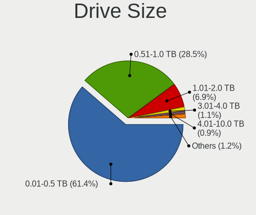
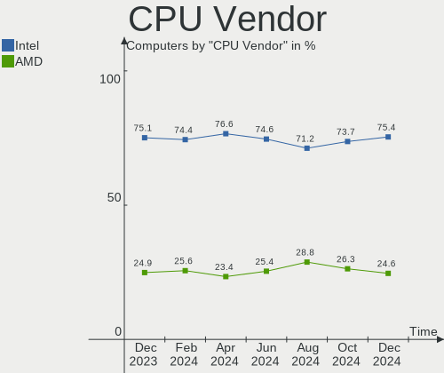
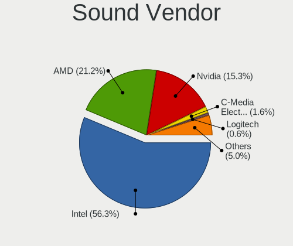

OpenMandriva - Hardware Trends
------------------------------

A project to identify most popular hardware characteristics and track their change
over time based on data collected by Linux users at https://Linux-Hardware.org.

Anyone can contribute to this report by the [hw-probe](https://github.com/linuxhw/hw-probe) tool:

    sudo -E hw-probe -all -upload

This is a report for all computer types. See also reports for [desktops](/Dist/OpenMandriva/Desktop/README.md) and [notebooks](/Dist/OpenMandriva/Notebook/README.md).

This report is for one last month. Overall report since the beginning of time: [TestCoverage](https://github.com/linuxhw/TestCoverage)

Period: Oct, 2022.

Contents
--------

* [ System ](#system)
  - [ OS                       ](#os)
  - [ OS Family                ](#os-family)
  - [ Kernel                   ](#kernel)
  - [ Kernel Family            ](#kernel-family)
  - [ Kernel Major Ver.        ](#kernel-major-ver)
  - [ Arch                     ](#arch)
  - [ DE                       ](#de)
  - [ Display Server           ](#display-server)
  - [ Display Manager          ](#display-manager)
  - [ OS Lang                  ](#os-lang)
  - [ Boot Mode                ](#boot-mode)
  - [ Filesystem               ](#filesystem)
  - [ Part. scheme             ](#part-scheme)
  - [ Dual Boot with Linux/BSD ](#dual-boot-with-linuxbsd)
  - [ Dual Boot (Win)          ](#dual-boot-win)

* [ Board ](#board)
  - [ Vendor                   ](#vendor)
  - [ Model                    ](#model)
  - [ Model Family             ](#model-family)
  - [ MFG Year                 ](#mfg-year)
  - [ Form Factor              ](#form-factor)
  - [ Secure Boot              ](#secure-boot)
  - [ Coreboot                 ](#coreboot)
  - [ RAM Size                 ](#ram-size)
  - [ RAM Used                 ](#ram-used)
  - [ Total Drives             ](#total-drives)
  - [ Has CD-ROM               ](#has-cd-rom)
  - [ Has Ethernet             ](#has-ethernet)
  - [ Has WiFi                 ](#has-wifi)
  - [ Has Bluetooth            ](#has-bluetooth)

* [ Location ](#location)
  - [ Country                  ](#country)
  - [ City                     ](#city)

* [ Drives ](#drives)
  - [ Drive Vendor             ](#drive-vendor)
  - [ Drive Model              ](#drive-model)
  - [ HDD Vendor               ](#hdd-vendor)
  - [ SSD Vendor               ](#ssd-vendor)
  - [ Drive Kind               ](#drive-kind)
  - [ Drive Connector          ](#drive-connector)
  - [ Drive Size               ](#drive-size)
  - [ Space Total              ](#space-total)
  - [ Space Used               ](#space-used)
  - [ Malfunc. Drives          ](#malfunc-drives)
  - [ Malfunc. Drive Vendor    ](#malfunc-drive-vendor)
  - [ Malfunc. HDD Vendor      ](#malfunc-hdd-vendor)
  - [ Malfunc. Drive Kind      ](#malfunc-drive-kind)
  - [ Failed Drives            ](#failed-drives)
  - [ Failed Drive Vendor      ](#failed-drive-vendor)
  - [ Drive Status             ](#drive-status)

* [ Storage controller ](#storage-controller)
  - [ Storage Vendor           ](#storage-vendor)
  - [ Storage Model            ](#storage-model)
  - [ Storage Kind             ](#storage-kind)

* [ Processor ](#processor)
  - [ CPU Vendor               ](#cpu-vendor)
  - [ CPU Model                ](#cpu-model)
  - [ CPU Model Family         ](#cpu-model-family)
  - [ CPU Cores                ](#cpu-cores)
  - [ CPU Sockets              ](#cpu-sockets)
  - [ CPU Threads              ](#cpu-threads)
  - [ CPU Op-Modes             ](#cpu-op-modes)
  - [ CPU Microcode            ](#cpu-microcode)
  - [ CPU Microarch            ](#cpu-microarch)

* [ Graphics ](#graphics)
  - [ GPU Vendor               ](#gpu-vendor)
  - [ GPU Model                ](#gpu-model)
  - [ GPU Combo                ](#gpu-combo)
  - [ GPU Driver               ](#gpu-driver)
  - [ GPU Memory               ](#gpu-memory)

* [ Monitor ](#monitor)
  - [ Monitor Vendor           ](#monitor-vendor)
  - [ Monitor Model            ](#monitor-model)
  - [ Monitor Resolution       ](#monitor-resolution)
  - [ Monitor Diagonal         ](#monitor-diagonal)
  - [ Monitor Width            ](#monitor-width)
  - [ Aspect Ratio             ](#aspect-ratio)
  - [ Monitor Area             ](#monitor-area)
  - [ Pixel Density            ](#pixel-density)
  - [ Multiple Monitors        ](#multiple-monitors)

* [ Network ](#network)
  - [ Net Controller Vendor    ](#net-controller-vendor)
  - [ Net Controller Model     ](#net-controller-model)
  - [ Wireless Vendor          ](#wireless-vendor)
  - [ Wireless Model           ](#wireless-model)
  - [ Ethernet Vendor          ](#ethernet-vendor)
  - [ Ethernet Model           ](#ethernet-model)
  - [ Net Controller Kind      ](#net-controller-kind)
  - [ Used Controller          ](#used-controller)
  - [ NICs                     ](#nics)
  - [ IPv6                     ](#ipv6)

* [ Bluetooth ](#bluetooth)
  - [ Bluetooth Vendor         ](#bluetooth-vendor)
  - [ Bluetooth Model          ](#bluetooth-model)

* [ Sound ](#sound)
  - [ Sound Vendor             ](#sound-vendor)
  - [ Sound Model              ](#sound-model)

* [ Memory ](#memory)
  - [ Memory Vendor            ](#memory-vendor)
  - [ Memory Model             ](#memory-model)
  - [ Memory Kind              ](#memory-kind)
  - [ Memory Form Factor       ](#memory-form-factor)
  - [ Memory Size              ](#memory-size)
  - [ Memory Speed             ](#memory-speed)

* [ Printers & scanners ](#printers--scanners)
  - [ Printer Vendor           ](#printer-vendor)
  - [ Printer Model            ](#printer-model)
  - [ Scanner Vendor           ](#scanner-vendor)
  - [ Scanner Model            ](#scanner-model)

* [ Camera ](#camera)
  - [ Camera Vendor            ](#camera-vendor)
  - [ Camera Model             ](#camera-model)

* [ Security ](#security)
  - [ Fingerprint Vendor       ](#fingerprint-vendor)
  - [ Fingerprint Model        ](#fingerprint-model)
  - [ Chipcard Vendor          ](#chipcard-vendor)
  - [ Chipcard Model           ](#chipcard-model)

* [ Unsupported ](#unsupported)
  - [ Unsupported Devices      ](#unsupported-devices)
  - [ Unsupported Device Types ](#unsupported-device-types)

System
------

OS
--

Installed operating systems

| Name              | Computers | Percent |
|-------------------|-----------|---------|
| OpenMandriva 4.3  | 228       | 64.77%  |
| OpenMandriva 4.50 | 89        | 25.28%  |
| OpenMandriva 4.2  | 18        | 5.11%   |
| OpenMandriva 4.90 | 17        | 4.83%   |

OS Family
---------

OS without a version

| Name         | Computers | Percent |
|--------------|-----------|---------|
| OpenMandriva | 352       | 100%    |

Kernel
------

Version of the Linux kernel

| Version                      | Computers | Percent |
|------------------------------|-----------|---------|
| 5.16.7-desktop-1omv4003      | 216       | 61.36%  |
| 5.19.5-desktop-1omv4090      | 51        | 14.49%  |
| 5.19.12-desktop-2omv4090     | 24        | 6.82%   |
| 5.10.14-desktop-1omv4002     | 18        | 5.11%   |
| 5.18.12-desktop-3omv4090     | 13        | 3.69%   |
| 5.16.13-desktop-1omv4003     | 12        | 3.41%   |
| 5.19.11-desktop-2omv4090     | 7         | 1.99%   |
| 6.0.2-desktop-1omv4050       | 3         | 0.85%   |
| 6.0.2-desktop-1omv4090       | 1         | 0.28%   |
| 6.0.0-desktop-gcc-1omv4050   | 1         | 0.28%   |
| 6.0.0-desktop-1omv4090       | 1         | 0.28%   |
| 6.0.0-desktop-1omv4050       | 1         | 0.28%   |
| 5.19.8-desktop-2omv4090      | 1         | 0.28%   |
| 5.19.12-desktop-gcc-2omv4090 | 1         | 0.28%   |
| 5.19.11-desktop-1omv4090     | 1         | 0.28%   |
| 5.14.7-desktop-1omv4050      | 1         | 0.28%   |

Kernel Family
-------------

Linux kernel without a distro release

| Version | Computers | Percent |
|---------|-----------|---------|
| 5.16.7  | 216       | 61.36%  |
| 5.19.5  | 51        | 14.49%  |
| 5.19.12 | 25        | 7.1%    |
| 5.10.14 | 18        | 5.11%   |
| 5.18.12 | 13        | 3.69%   |
| 5.16.13 | 12        | 3.41%   |
| 5.19.11 | 8         | 2.27%   |
| 6.0.2   | 4         | 1.14%   |
| 6.0.0   | 3         | 0.85%   |
| 5.19.8  | 1         | 0.28%   |
| 5.14.7  | 1         | 0.28%   |

Kernel Major Ver.
-----------------

Linux kernel major version

| Version | Computers | Percent |
|---------|-----------|---------|
| 5.16    | 228       | 64.77%  |
| 5.19    | 85        | 24.15%  |
| 5.10    | 18        | 5.11%   |
| 5.18    | 13        | 3.69%   |
| 6.0     | 7         | 1.99%   |
| 5.14    | 1         | 0.28%   |

Arch
----

OS architecture (x86_64, i586, etc.)

| Name   | Computers | Percent |
|--------|-----------|---------|
| x86_64 | 352       | 100%    |

DE
--

Desktop Environment

| Name    | Computers | Percent |
|---------|-----------|---------|
| KDE5    | 346       | 98.3%   |
| GNOME   | 4         | 1.14%   |
| LXQt    | 1         | 0.28%   |
| Unknown | 1         | 0.28%   |

Display Server
--------------

X11 or Wayland

| Name    | Computers | Percent |
|---------|-----------|---------|
| X11     | 348       | 98.86%  |
| Wayland | 4         | 1.14%   |

Display Manager
---------------

SDDM, LightDM, etc.

| Name    | Computers | Percent |
|---------|-----------|---------|
| SDDM    | 347       | 98.58%  |
| GDM     | 4         | 1.14%   |
| LightDM | 1         | 0.28%   |

OS Lang
-------

Language

| Lang  | Computers | Percent |
|-------|-----------|---------|
| en_US | 207       | 58.81%  |
| fr_FR | 21        | 5.97%   |
| pt_BR | 16        | 4.55%   |
| de_DE | 16        | 4.55%   |
| ru_RU | 12        | 3.41%   |
| es_ES | 10        | 2.84%   |
| pl_PL | 9         | 2.56%   |
| de_AT | 8         | 2.27%   |
| it_IT | 7         | 1.99%   |
| en_GB | 7         | 1.99%   |
| cs_CZ | 6         | 1.7%    |
| es_MX | 5         | 1.42%   |
| fr_CA | 4         | 1.14%   |
| tr_TR | 3         | 0.85%   |
| pt_PT | 3         | 0.85%   |
| es_AR | 3         | 0.85%   |
| hu_HU | 2         | 0.57%   |
| es_PE | 2         | 0.57%   |
| en_CA | 2         | 0.57%   |
| en_AU | 2         | 0.57%   |
| de_CH | 2         | 0.57%   |
| es_UY | 1         | 0.28%   |
| es_CO | 1         | 0.28%   |
| es_CL | 1         | 0.28%   |
| de_IT | 1         | 0.28%   |
| da_DK | 1         | 0.28%   |

Boot Mode
---------

EFI or BIOS

| Mode | Computers | Percent |
|------|-----------|---------|
| BIOS | 181       | 51.42%  |
| EFI  | 171       | 48.58%  |

Filesystem
----------

Type of filesystem

| Type    | Computers | Percent |
|---------|-----------|---------|
| Overlay | 278       | 78.98%  |
| Ext4    | 65        | 18.47%  |
| F2fs    | 4         | 1.14%   |
| Btrfs   | 3         | 0.85%   |
| Xfs     | 1         | 0.28%   |
| Ext2    | 1         | 0.28%   |

Part. scheme
------------

Scheme of partitioning

| Type    | Computers | Percent |
|---------|-----------|---------|
| GPT     | 226       | 64.2%   |
| MBR     | 125       | 35.51%  |
| Unknown | 1         | 0.28%   |

Dual Boot with Linux/BSD
------------------------

Hosting more than one Linux/BSD

| Dual boot | Computers | Percent |
|-----------|-----------|---------|
| Yes       | 184       | 52.27%  |
| No        | 168       | 47.73%  |

Dual Boot (Win)
---------------

Hosting Linux and Windows

| Dual boot | Computers | Percent |
|-----------|-----------|---------|
| No        | 177       | 50.28%  |
| Yes       | 175       | 49.72%  |

Board
-----

Vendor
------

Motherboard manufacturer

| Name                | Computers | Percent |
|---------------------|-----------|---------|
| ASUSTek Computer    | 67        | 19.03%  |
| Dell                | 58        | 16.48%  |
| Lenovo              | 44        | 12.5%   |
| Hewlett-Packard     | 40        | 11.36%  |
| Gigabyte Technology | 33        | 9.38%   |
| Acer                | 23        | 6.53%   |
| MSI                 | 17        | 4.83%   |
| ASRock              | 16        | 4.55%   |
| Intel               | 6         | 1.7%    |
| Toshiba             | 5         | 1.42%   |
| Apple               | 5         | 1.42%   |
| Fujitsu             | 4         | 1.14%   |
| Sony                | 3         | 0.85%   |
| Samsung Electronics | 3         | 0.85%   |
| Pegatron            | 2         | 0.57%   |
| Packard Bell        | 2         | 0.57%   |
| Medion              | 2         | 0.57%   |
| Itautec             | 2         | 0.57%   |
| Chuwi               | 2         | 0.57%   |
| ZOTAC               | 1         | 0.28%   |
| Wortmann AG         | 1         | 0.28%   |
| Valve               | 1         | 0.28%   |
| Teclast             | 1         | 0.28%   |
| Star Labs           | 1         | 0.28%   |
| SLIMBOOK            | 1         | 0.28%   |
| Prestigio           | 1         | 0.28%   |
| Positivo            | 1         | 0.28%   |
| Philco              | 1         | 0.28%   |
| Panasonic           | 1         | 0.28%   |
| Microboard          | 1         | 0.28%   |
| LG Electronics      | 1         | 0.28%   |
| Foxconn             | 1         | 0.28%   |
| Compaq              | 1         | 0.28%   |
| Biostar             | 1         | 0.28%   |
| AZW                 | 1         | 0.28%   |
| AMD                 | 1         | 0.28%   |
| Unknown             | 1         | 0.28%   |

Model
-----

Motherboard model

| Name                                               | Computers | Percent |
|----------------------------------------------------|-----------|---------|
| Lenovo IdeaPad 1 14ADA05 82GW                      | 5         | 1.42%   |
| Dell Inspiron 3451                                 | 4         | 1.14%   |
| Gigabyte G41MT-S2PT                                | 3         | 0.85%   |
| Dell XPS 15 9530                                   | 3         | 0.85%   |
| Dell OptiPlex 7020                                 | 3         | 0.85%   |
| Dell OptiPlex 7010                                 | 3         | 0.85%   |
| ASUS UX31E                                         | 3         | 0.85%   |
| ASUS PRIME B450M-A II                              | 3         | 0.85%   |
| MSI MS-7C37                                        | 2         | 0.57%   |
| Lenovo IdeaPad S145-15AST 81N3                     | 2         | 0.57%   |
| Lenovo IdeaPad 3 15ADA05 81W1                      | 2         | 0.57%   |
| HP ProDesk 600 G2 SFF                              | 2         | 0.57%   |
| HP Compaq 8000 Elite USDT PC                       | 2         | 0.57%   |
| Gigabyte B450 I AORUS PRO WIFI                     | 2         | 0.57%   |
| Gigabyte 970A-DS3P                                 | 2         | 0.57%   |
| Dell Studio 1737                                   | 2         | 0.57%   |
| Dell Latitude E6420                                | 2         | 0.57%   |
| Dell Latitude E6400                                | 2         | 0.57%   |
| ASUS UX303UB                                       | 2         | 0.57%   |
| ASUS UX303LAB                                      | 2         | 0.57%   |
| ASUS PRIME H410M-A                                 | 2         | 0.57%   |
| ASUS M5A87                                         | 2         | 0.57%   |
| ASRock G41C-GS R2.0                                | 2         | 0.57%   |
| Apple iMac12,1                                     | 2         | 0.57%   |
| Acer Aspire E5-573G                                | 2         | 0.57%   |
| Unknown                                            | 2         | 0.57%   |
| ZOTAC ZBOX-QCM7T3000/EN072080S/EN072070S/EN052060C | 1         | 0.28%   |
| Wortmann AG 1220676_1470204                        | 1         | 0.28%   |
| Valve Jupiter                                      | 1         | 0.28%   |
| Toshiba Satellite R830                             | 1         | 0.28%   |
| Toshiba Satellite L45-B                            | 1         | 0.28%   |
| Toshiba Satellite C855                             | 1         | 0.28%   |
| Toshiba Satellite C650D                            | 1         | 0.28%   |
| Toshiba dynabook T653/46JR                         | 1         | 0.28%   |
| Teclast F7 Plus                                    | 1         | 0.28%   |
| Star Labs StarLite                                 | 1         | 0.28%   |
| Sony VPCYB3V1E                                     | 1         | 0.28%   |
| Sony VPCEB1S1R                                     | 1         | 0.28%   |
| Sony SVE1513B1EW                                   | 1         | 0.28%   |
| SLIMBOOK PROX-AMD5                                 | 1         | 0.28%   |

Model Family
------------

Motherboard model prefix

| Name                  | Computers | Percent |
|-----------------------|-----------|---------|
| Lenovo IdeaPad        | 18        | 5.11%   |
| Dell Latitude         | 18        | 5.11%   |
| Acer Aspire           | 18        | 5.11%   |
| Dell OptiPlex         | 14        | 3.98%   |
| Dell Inspiron         | 12        | 3.41%   |
| Lenovo ThinkPad       | 11        | 3.13%   |
| ASUS PRIME            | 10        | 2.84%   |
| Lenovo ThinkCentre    | 8         | 2.27%   |
| HP Pavilion           | 7         | 1.99%   |
| HP ProDesk            | 6         | 1.7%    |
| HP Compaq             | 6         | 1.7%    |
| HP Laptop             | 5         | 1.42%   |
| ASUS ROG              | 5         | 1.42%   |
| Toshiba Satellite     | 4         | 1.14%   |
| Dell XPS              | 4         | 1.14%   |
| Dell Precision        | 4         | 1.14%   |
| ASUS M5A78L-M         | 4         | 1.14%   |
| HP ProBook            | 3         | 0.85%   |
| Gigabyte G41MT-S2PT   | 3         | 0.85%   |
| Gigabyte B450         | 3         | 0.85%   |
| Dell Studio           | 3         | 0.85%   |
| ASUS UX31E            | 3         | 0.85%   |
| ASRock G41C-GS        | 3         | 0.85%   |
| Packard Bell EasyNote | 2         | 0.57%   |
| MSI MS-7C37           | 2         | 0.57%   |
| Itautec Infoway       | 2         | 0.57%   |
| HP t620               | 2         | 0.57%   |
| HP EliteDesk          | 2         | 0.57%   |
| Gigabyte 970A-DS3P    | 2         | 0.57%   |
| Fujitsu LIFEBOOK      | 2         | 0.57%   |
| Fujitsu ESPRIMO       | 2         | 0.57%   |
| Dell Vostro           | 2         | 0.57%   |
| ASUS VivoBook         | 2         | 0.57%   |
| ASUS UX303UB          | 2         | 0.57%   |
| ASUS UX303LAB         | 2         | 0.57%   |
| ASUS TUF              | 2         | 0.57%   |
| ASUS MINIPC           | 2         | 0.57%   |
| ASUS M5A87            | 2         | 0.57%   |
| ASUS ASUS             | 2         | 0.57%   |
| Apple iMac12          | 2         | 0.57%   |

MFG Year
--------

Motherboard manufacture year

| Year | Computers | Percent |
|------|-----------|---------|
| 2011 | 41        | 11.65%  |
| 2012 | 33        | 9.38%   |
| 2020 | 30        | 8.52%   |
| 2014 | 29        | 8.24%   |
| 2013 | 28        | 7.95%   |
| 2009 | 25        | 7.1%    |
| 2018 | 23        | 6.53%   |
| 2021 | 21        | 5.97%   |
| 2019 | 21        | 5.97%   |
| 2015 | 20        | 5.68%   |
| 2008 | 20        | 5.68%   |
| 2016 | 16        | 4.55%   |
| 2017 | 13        | 3.69%   |
| 2010 | 13        | 3.69%   |
| 2007 | 10        | 2.84%   |
| 2022 | 7         | 1.99%   |
| 2006 | 2         | 0.57%   |

Form Factor
-----------

Physical design of the computer

| Name        | Computers | Percent |
|-------------|-----------|---------|
| Desktop     | 170       | 48.3%   |
| Notebook    | 166       | 47.16%  |
| Mini pc     | 7         | 1.99%   |
| Convertible | 4         | 1.14%   |
| All in one  | 3         | 0.85%   |
| Tablet      | 1         | 0.28%   |
| Server      | 1         | 0.28%   |

Secure Boot
-----------

Enabled or disabled

| State    | Computers | Percent |
|----------|-----------|---------|
| Disabled | 352       | 100%    |

Coreboot
--------

Have coreboot on board

| Used | Computers | Percent |
|------|-----------|---------|
| No   | 351       | 99.72%  |
| Yes  | 1         | 0.28%   |

RAM Size
--------

Total RAM memory

| Size in GB      | Computers | Percent |
|-----------------|-----------|---------|
| 3.01-4.0        | 106       | 30.11%  |
| 4.01-8.0        | 84        | 23.86%  |
| 8.01-16.0       | 66        | 18.75%  |
| 16.01-24.0      | 52        | 14.77%  |
| 32.01-64.0      | 19        | 5.4%    |
| 64.01-256.0     | 8         | 2.27%   |
| 1.01-2.0        | 7         | 1.99%   |
| 2.01-3.0        | 5         | 1.42%   |
| 24.01-32.0      | 4         | 1.14%   |
| More than 256.0 | 1         | 0.28%   |

RAM Used
--------

Used RAM memory

| Used GB  | Computers | Percent |
|----------|-----------|---------|
| 1.01-2.0 | 249       | 70.74%  |
| 0.51-1.0 | 59        | 16.76%  |
| 2.01-3.0 | 34        | 9.66%   |
| 3.01-4.0 | 6         | 1.7%    |
| 4.01-8.0 | 2         | 0.57%   |
| 0.01-0.5 | 2         | 0.57%   |

Total Drives
------------

Number of drives on board

| Drives | Computers | Percent |
|--------|-----------|---------|
| 1      | 200       | 56.82%  |
| 2      | 94        | 26.7%   |
| 3      | 33        | 9.38%   |
| 4      | 15        | 4.26%   |
| 5      | 4         | 1.14%   |
| 6      | 3         | 0.85%   |
| 0      | 3         | 0.85%   |

Has CD-ROM
----------

Has CD-ROM on board

| Presented | Computers | Percent |
|-----------|-----------|---------|
| Yes       | 186       | 52.84%  |
| No        | 166       | 47.16%  |

Has Ethernet
------------

Has Ethernet on board

| Presented | Computers | Percent |
|-----------|-----------|---------|
| Yes       | 323       | 91.76%  |
| No        | 29        | 8.24%   |

Has WiFi
--------

Has WiFi module

| Presented | Computers | Percent |
|-----------|-----------|---------|
| Yes       | 242       | 68.75%  |
| No        | 110       | 31.25%  |

Has Bluetooth
-------------

Has Bluetooth module

| Presented | Computers | Percent |
|-----------|-----------|---------|
| No        | 187       | 53.13%  |
| Yes       | 165       | 46.88%  |

Location
--------

Country
-------

Geographic location (country)

| Country             | Computers | Percent |
|---------------------|-----------|---------|
| USA                 | 42        | 11.93%  |
| France              | 30        | 8.52%   |
| Germany             | 26        | 7.39%   |
| Brazil              | 26        | 7.39%   |
| Russia              | 23        | 6.53%   |
| Poland              | 17        | 4.83%   |
| Spain               | 15        | 4.26%   |
| Italy               | 13        | 3.69%   |
| Austria             | 13        | 3.69%   |
| UK                  | 11        | 3.13%   |
| Mexico              | 10        | 2.84%   |
| Canada              | 10        | 2.84%   |
| India               | 8         | 2.27%   |
| Romania             | 7         | 1.99%   |
| Portugal            | 7         | 1.99%   |
| Japan               | 7         | 1.99%   |
| Czechia             | 7         | 1.99%   |
| Switzerland         | 6         | 1.7%    |
| Australia           | 6         | 1.7%    |
| Netherlands         | 5         | 1.42%   |
| Turkey              | 4         | 1.14%   |
| Argentina           | 4         | 1.14%   |
| Saudi Arabia        | 3         | 0.85%   |
| Peru                | 3         | 0.85%   |
| Indonesia           | 3         | 0.85%   |
| Hungary             | 3         | 0.85%   |
| Uruguay             | 2         | 0.57%   |
| Thailand            | 2         | 0.57%   |
| Sweden              | 2         | 0.57%   |
| Slovakia            | 2         | 0.57%   |
| Norway              | 2         | 0.57%   |
| Jamaica             | 2         | 0.57%   |
| Greenland           | 2         | 0.57%   |
| Croatia             | 2         | 0.57%   |
| Chile               | 2         | 0.57%   |
| Bulgaria            | 2         | 0.57%   |
| Venezuela           | 1         | 0.28%   |
| Ukraine             | 1         | 0.28%   |
| Trinidad and Tobago | 1         | 0.28%   |
| Taiwan              | 1         | 0.28%   |

City
----

Geographic location (city)

| City                 | Computers | Percent |
|----------------------|-----------|---------|
| Vienna               | 5         | 1.42%   |
| Moscow               | 5         | 1.42%   |
| Cascais              | 5         | 1.42%   |
| Somerset             | 4         | 1.14%   |
| Vélizy-Villacoublay | 3         | 0.85%   |
| Sydney               | 3         | 0.85%   |
| St Petersburg        | 3         | 0.85%   |
| Sao Paulo            | 3         | 0.85%   |
| Saarlouis            | 3         | 0.85%   |
| Prague               | 3         | 0.85%   |
| Mexico City          | 3         | 0.85%   |
| Mexicali             | 3         | 0.85%   |
| Lincoln              | 3         | 0.85%   |
| Limoges              | 3         | 0.85%   |
| Krakow               | 3         | 0.85%   |
| Jeddah               | 3         | 0.85%   |
| Cluj-Napoca          | 3         | 0.85%   |
| Bad Tatzmannsdorf    | 3         | 0.85%   |
| Zurich               | 2         | 0.57%   |
| Yokohama             | 2         | 0.57%   |
| Warsaw               | 2         | 0.57%   |
| Walnut               | 2         | 0.57%   |
| Vladivostok          | 2         | 0.57%   |
| Umhausen             | 2         | 0.57%   |
| Turin                | 2         | 0.57%   |
| Torrejón de Ardoz   | 2         | 0.57%   |
| Stockholm            | 2         | 0.57%   |
| Schagen              | 2         | 0.57%   |
| Saint-Nazaire        | 2         | 0.57%   |
| Roszke               | 2         | 0.57%   |
| Pamplona             | 2         | 0.57%   |
| Oklahoma City        | 2         | 0.57%   |
| Munich               | 2         | 0.57%   |
| Montego Bay          | 2         | 0.57%   |
| Mirassol             | 2         | 0.57%   |
| Mérida              | 2         | 0.57%   |
| Madison              | 2         | 0.57%   |
| Lima                 | 2         | 0.57%   |
| Lille                | 2         | 0.57%   |
| Kingston upon Thames | 2         | 0.57%   |

Drives
------

Drive Vendor
------------

Hard drive vendors

| Vendor              | Computers | Drives | Percent |
|---------------------|-----------|--------|---------|
| Seagate             | 93        | 100    | 18.06%  |
| WDC                 | 91        | 104    | 17.67%  |
| Samsung Electronics | 55        | 72     | 10.68%  |
| Kingston            | 40        | 42     | 7.77%   |
| Crucial             | 28        | 31     | 5.44%   |
| Toshiba             | 26        | 31     | 5.05%   |
| Hitachi             | 25        | 26     | 4.85%   |
| Unknown             | 21        | 21     | 4.08%   |
| SanDisk             | 20        | 21     | 3.88%   |
| A-DATA Technology   | 12        | 12     | 2.33%   |
| Intel               | 8         | 8      | 1.55%   |
| HGST                | 7         | 9      | 1.36%   |
| China               | 7         | 7      | 1.36%   |
| Intenso             | 6         | 6      | 1.17%   |
| Transcend           | 4         | 5      | 0.78%   |
| SK hynix            | 4         | 4      | 0.78%   |
| Micron Technology   | 3         | 3      | 0.58%   |
| Maxtor              | 3         | 3      | 0.58%   |
| JMicron Technology  | 3         | 3      | 0.58%   |
| Gigabyte Technology | 3         | 3      | 0.58%   |
| Verbatim            | 2         | 2      | 0.39%   |
| SPCC                | 2         | 2      | 0.39%   |
| SABRENT             | 2         | 2      | 0.39%   |
| PNY                 | 2         | 2      | 0.39%   |
| Phison              | 2         | 2      | 0.39%   |
| OCZ                 | 2         | 2      | 0.39%   |
| Netac               | 2         | 2      | 0.39%   |
| LITEON              | 2         | 2      | 0.39%   |
| KIOXIA-EXCERIA      | 2         | 2      | 0.39%   |
| KIOXIA              | 2         | 2      | 0.39%   |
| KingSpec            | 2         | 2      | 0.39%   |
| ASMT                | 2         | 2      | 0.39%   |
| Apacer              | 2         | 2      | 0.39%   |
| Unknown             | 2         | 2      | 0.39%   |
| XrayDisk            | 1         | 1      | 0.19%   |
| XPG                 | 1         | 3      | 0.19%   |
| UMIS                | 1         | 1      | 0.19%   |
| Team                | 1         | 1      | 0.19%   |
| SUNEAST             | 1         | 1      | 0.19%   |
| Star                | 1         | 1      | 0.19%   |

Drive Model
-----------

Hard drive models

| Model                               | Computers | Percent |
|-------------------------------------|-----------|---------|
| Kingston SA400S37240G 240GB SSD     | 9         | 1.64%   |
| Seagate ST500DM002-1BD142 500GB     | 8         | 1.46%   |
| WDC WD10EZEX-08WN4A0 1TB            | 6         | 1.09%   |
| Kingston SA400S37480G 480GB SSD     | 6         | 1.09%   |
| Unknown MMC64G  64GB                | 5         | 0.91%   |
| Seagate ST500LT012-1DG142 500GB     | 5         | 0.91%   |
| Seagate ST1000LM035-1RK172 1TB      | 5         | 0.91%   |
| Crucial CT500MX500SSD1 500GB        | 5         | 0.91%   |
| Seagate ST31000528AS 1TB            | 4         | 0.73%   |
| Seagate ST2000DM008-2FR102 2TB      | 4         | 0.73%   |
| Seagate ST2000DM001-1CH164 2TB      | 4         | 0.73%   |
| Samsung SSD 860 EVO 500GB           | 4         | 0.73%   |
| Samsung SSD 860 EVO 250GB           | 4         | 0.73%   |
| Samsung SSD 860 EVO 1TB             | 4         | 0.73%   |
| A-DATA SU650 120GB SSD              | 4         | 0.73%   |
| WDC WD5000AAKX-60U6AA0 500GB        | 3         | 0.55%   |
| WDC WD1600BEVT-22ZCT0 160GB         | 3         | 0.55%   |
| Unknown SD/MMC/MS PRO 1TB           | 3         | 0.55%   |
| Toshiba DT01ACA200 2TB              | 3         | 0.55%   |
| Seagate ST500LM012 HN-M500MBB 500GB | 3         | 0.55%   |
| Seagate ST1000DM010-2EP102 1TB      | 3         | 0.55%   |
| Seagate Expansion 2TB               | 3         | 0.55%   |
| SanDisk SSD U100 256GB              | 3         | 0.55%   |
| Samsung SSD 980 PRO 1TB             | 3         | 0.55%   |
| Samsung SSD 850 PRO 256GB           | 3         | 0.55%   |
| Kingston SV300S37A120G 120GB SSD    | 3         | 0.55%   |
| Kingston SUV500MS480G 480GB SSD     | 3         | 0.55%   |
| Hitachi HTS725032A7E630 320GB       | 3         | 0.55%   |
| Crucial CT480BX500SSD1 480GB        | 3         | 0.55%   |
| Crucial CT240BX500SSD1 240GB        | 3         | 0.55%   |
| Crucial CT1000P1SSD8 1TB            | 3         | 0.55%   |
| Crucial CT1000MX500SSD1 1TB         | 3         | 0.55%   |
| WDC WDS100T2B0B-00YS70 1TB SSD      | 2         | 0.36%   |
| WDC WD800BD-22MRA1 80GB             | 2         | 0.36%   |
| WDC WD5000LPVX-22V0TT0 500GB        | 2         | 0.36%   |
| WDC WD5000AAKX-75U6AA0 500GB        | 2         | 0.36%   |
| WDC WD3200AAJS-00L7A0 320GB         | 2         | 0.36%   |
| Unknown SU08G  8GB                  | 2         | 0.36%   |
| Toshiba TR200 240GB SSD             | 2         | 0.36%   |
| Toshiba THNSNH128GBST SSD           | 2         | 0.36%   |

HDD Vendor
----------

Hard disk drive vendors

| Vendor              | Computers | Drives | Percent |
|---------------------|-----------|--------|---------|
| Seagate             | 92        | 99     | 37.55%  |
| WDC                 | 77        | 86     | 31.43%  |
| Hitachi             | 25        | 26     | 10.2%   |
| Toshiba             | 20        | 25     | 8.16%   |
| Samsung Electronics | 12        | 15     | 4.9%    |
| HGST                | 7         | 9      | 2.86%   |
| Unknown             | 3         | 3      | 1.22%   |
| SABRENT             | 2         | 2      | 0.82%   |
| Maxtor              | 2         | 2      | 0.82%   |
| Intenso             | 2         | 2      | 0.82%   |
| Initio              | 1         | 1      | 0.41%   |
| Fujitsu             | 1         | 1      | 0.41%   |
| China               | 1         | 1      | 0.41%   |

SSD Vendor
----------

Solid state drive vendors

| Vendor              | Computers | Drives | Percent |
|---------------------|-----------|--------|---------|
| Kingston            | 31        | 31     | 17.42%  |
| Samsung Electronics | 27        | 31     | 15.17%  |
| Crucial             | 21        | 23     | 11.8%   |
| SanDisk             | 17        | 18     | 9.55%   |
| A-DATA Technology   | 11        | 11     | 6.18%   |
| WDC                 | 6         | 8      | 3.37%   |
| China               | 6         | 6      | 3.37%   |
| Toshiba             | 5         | 5      | 2.81%   |
| Intenso             | 4         | 4      | 2.25%   |
| Transcend           | 3         | 3      | 1.69%   |
| Intel               | 3         | 3      | 1.69%   |
| Verbatim            | 2         | 2      | 1.12%   |
| Unknown             | 2         | 2      | 1.12%   |
| SK hynix            | 2         | 2      | 1.12%   |
| OCZ                 | 2         | 2      | 1.12%   |
| Netac               | 2         | 2      | 1.12%   |
| LITEON              | 2         | 2      | 1.12%   |
| KIOXIA-EXCERIA      | 2         | 2      | 1.12%   |
| KingSpec            | 2         | 2      | 1.12%   |
| Gigabyte Technology | 2         | 2      | 1.12%   |
| ASMT                | 2         | 2      | 1.12%   |
| Apacer              | 2         | 2      | 1.12%   |
| Unknown             | 2         | 2      | 1.12%   |
| XrayDisk            | 1         | 1      | 0.56%   |
| Team                | 1         | 1      | 0.56%   |
| SUNEAST             | 1         | 1      | 0.56%   |
| Star                | 1         | 1      | 0.56%   |
| SPCC                | 1         | 1      | 0.56%   |
| PNY                 | 1         | 1      | 0.56%   |
| NGFF                | 1         | 1      | 0.56%   |
| Micron Technology   | 1         | 1      | 0.56%   |
| Maxtor              | 1         | 1      | 0.56%   |
| LITEONIT            | 1         | 1      | 0.56%   |
| Leven               | 1         | 1      | 0.56%   |
| JMicron Technology  | 1         | 1      | 0.56%   |
| JIESHUO             | 1         | 1      | 0.56%   |
| HS-SSD-E100N        | 1         | 1      | 0.56%   |
| Hewlett-Packard     | 1         | 1      | 0.56%   |
| GOODRAM             | 1         | 1      | 0.56%   |
| EXBOM               | 1         | 1      | 0.56%   |

Drive Kind
----------

HDD or SSD

| Kind    | Computers | Drives | Percent |
|---------|-----------|--------|---------|
| HDD     | 207       | 272    | 46.31%  |
| SSD     | 154       | 187    | 34.45%  |
| NVMe    | 63        | 88     | 14.09%  |
| MMC     | 17        | 17     | 3.8%    |
| Unknown | 6         | 6      | 1.34%   |

Drive Connector
---------------

SATA, SAS, NVMe, etc.

| Type | Computers | Drives | Percent |
|------|-----------|--------|---------|
| SATA | 306       | 441    | 75.18%  |
| NVMe | 61        | 86     | 14.99%  |
| SAS  | 23        | 26     | 5.65%   |
| MMC  | 17        | 17     | 4.18%   |

Drive Size
----------

Size of hard drive

| Size in TB | Computers | Drives | Percent |
|------------|-----------|--------|---------|
| 0.01-0.5   | 245       | 305    | 65.86%  |
| 0.51-1.0   | 91        | 108    | 24.46%  |
| 1.01-2.0   | 28        | 35     | 7.53%   |
| 3.01-4.0   | 4         | 4      | 1.08%   |
| 4.01-10.0  | 3         | 5      | 0.81%   |
| 2.01-3.0   | 1         | 2      | 0.27%   |

Space Total
-----------

Amount of disk space available on the file system

| Size in GB | Computers | Percent |
|------------|-----------|---------|
| 1-20       | 186       | 52.84%  |
| 101-250    | 59        | 16.76%  |
| Unknown    | 33        | 9.38%   |
| 251-500    | 25        | 7.1%    |
| 51-100     | 21        | 5.97%   |
| 501-1000   | 13        | 3.69%   |
| 21-50      | 8         | 2.27%   |
| 1001-2000  | 6         | 1.7%    |
| 2001-3000  | 1         | 0.28%   |

Space Used
----------

Amount of used disk space

| Used GB  | Computers | Percent |
|----------|-----------|---------|
| 1-20     | 295       | 83.81%  |
| Unknown  | 33        | 9.38%   |
| 21-50    | 8         | 2.27%   |
| 51-100   | 7         | 1.99%   |
| 501-1000 | 4         | 1.14%   |
| 101-250  | 3         | 0.85%   |
| 251-500  | 2         | 0.57%   |

Malfunc. Drives
---------------

Drive models with a malfunction

| Model                               | Computers | Drives | Percent |
|-------------------------------------|-----------|--------|---------|
| SanDisk SSD U100 256GB              | 3         | 3      | 3.03%   |
| Hitachi HTS725032A7E630 320GB       | 3         | 3      | 3.03%   |
| WDC WD5000AAKX-75U6AA0 500GB        | 2         | 2      | 2.02%   |
| Seagate ST2000DM001-1CH164 2TB      | 2         | 2      | 2.02%   |
| Seagate ST1000LM014-1EJ164 1TB      | 2         | 2      | 2.02%   |
| Seagate ST1000DM003-1CH162 1TB      | 2         | 2      | 2.02%   |
| Hitachi HTS543232A7A384 320GB       | 2         | 2      | 2.02%   |
| HGST HTS545050A7E680 500GB          | 2         | 2      | 2.02%   |
| WDC WD800BD-22MRA1 80GB             | 1         | 1      | 1.01%   |
| WDC WD7500BPKT-22PK4T0 752GB        | 1         | 1      | 1.01%   |
| WDC WD5000LPCX-24VHAT0 500GB        | 1         | 1      | 1.01%   |
| WDC WD5000BPVT-08HXZT3 500GB        | 1         | 1      | 1.01%   |
| WDC WD5000AAKX-60U6AA0 500GB        | 1         | 1      | 1.01%   |
| WDC WD5000AAKX-001CA0 500GB         | 1         | 1      | 1.01%   |
| WDC WD5000AAKS-00YGA0 500GB         | 1         | 1      | 1.01%   |
| WDC WD3200LPVX-75V0TT0 320GB        | 1         | 1      | 1.01%   |
| WDC WD3200AAJS-00L7A0 320GB         | 1         | 1      | 1.01%   |
| WDC WD2500BEVS-60UST0 250GB         | 1         | 1      | 1.01%   |
| WDC WD2500AAKX-001CA0 250GB         | 1         | 1      | 1.01%   |
| WDC WD1600BEVT-22ZCT0 160GB         | 1         | 1      | 1.01%   |
| WDC WD15EARS-00Z5B1 1TB             | 1         | 1      | 1.01%   |
| WDC WD10SPZX-24Z10 1TB              | 1         | 1      | 1.01%   |
| WDC WD10PURZ-85U8XY0 1TB            | 1         | 1      | 1.01%   |
| WDC WD10JPVX-00JC3T0 1TB            | 1         | 1      | 1.01%   |
| WDC WD10EZEX-07M2NA0 1TB            | 1         | 1      | 1.01%   |
| WDC WD10EARX-00N0YB0 1TB            | 1         | 1      | 1.01%   |
| WDC WD10EARS-00MVWB0 1TB            | 1         | 1      | 1.01%   |
| WDC WD Blue SA510 2.5 500GB SSD     | 1         | 1      | 1.01%   |
| Toshiba MQ01ABD075 752GB            | 1         | 1      | 1.01%   |
| Toshiba MK6475GSX 640GB             | 1         | 1      | 1.01%   |
| Toshiba MK5065GSXN 500GB            | 1         | 1      | 1.01%   |
| Toshiba MK3275GSX 320GB             | 1         | 1      | 1.01%   |
| Toshiba DT01ACA100 1TB              | 1         | 1      | 1.01%   |
| Seagate ST9750420AS 752GB           | 1         | 1      | 1.01%   |
| Seagate ST9500420AS 500GB           | 1         | 1      | 1.01%   |
| Seagate ST9500325AS 500GB           | 1         | 1      | 1.01%   |
| Seagate ST9320423AS 320GB           | 1         | 1      | 1.01%   |
| Seagate ST9250410AS 250GB           | 1         | 1      | 1.01%   |
| Seagate ST9160310AS 160GB           | 1         | 1      | 1.01%   |
| Seagate ST500LM012 HN-M500MBB 500GB | 1         | 1      | 1.01%   |

Malfunc. Drive Vendor
---------------------

Vendors of faulty drives

| Vendor              | Computers | Drives | Percent |
|---------------------|-----------|--------|---------|
| Seagate             | 28        | 28     | 28.28%  |
| WDC                 | 22        | 22     | 22.22%  |
| Hitachi             | 16        | 16     | 16.16%  |
| SanDisk             | 6         | 6      | 6.06%   |
| Toshiba             | 5         | 5      | 5.05%   |
| Samsung Electronics | 3         | 3      | 3.03%   |
| HGST                | 3         | 3      | 3.03%   |
| A-DATA Technology   | 3         | 3      | 3.03%   |
| Maxtor              | 2         | 2      | 2.02%   |
| Crucial             | 2         | 2      | 2.02%   |
| China               | 2         | 2      | 2.02%   |
| OCZ                 | 1         | 1      | 1.01%   |
| LITEON              | 1         | 1      | 1.01%   |
| Kingston            | 1         | 1      | 1.01%   |
| JMicron Technology  | 1         | 1      | 1.01%   |
| Initio              | 1         | 1      | 1.01%   |
| Corsair             | 1         | 1      | 1.01%   |
| ASMT                | 1         | 1      | 1.01%   |

Malfunc. HDD Vendor
-------------------

Vendors of faulty HDD drives

| Vendor              | Computers | Drives | Percent |
|---------------------|-----------|--------|---------|
| Seagate             | 28        | 28     | 35.44%  |
| WDC                 | 21        | 21     | 26.58%  |
| Hitachi             | 16        | 16     | 20.25%  |
| Toshiba             | 5         | 5      | 6.33%   |
| Samsung Electronics | 3         | 3      | 3.8%    |
| HGST                | 3         | 3      | 3.8%    |
| Maxtor              | 2         | 2      | 2.53%   |
| Initio              | 1         | 1      | 1.27%   |

Malfunc. Drive Kind
-------------------

Kinds of faulty drives

| Kind    | Computers | Drives | Percent |
|---------|-----------|--------|---------|
| HDD     | 70        | 79     | 77.78%  |
| SSD     | 19        | 19     | 21.11%  |
| Unknown | 1         | 1      | 1.11%   |

Failed Drives
-------------

Failed drive models

Zero info for selected period =(

Failed Drive Vendor
-------------------

Failed drive vendors

Zero info for selected period =(

Drive Status
------------

Number of failed and malfunc. drives

| Status   | Computers | Drives | Percent |
|----------|-----------|--------|---------|
| Works    | 284       | 430    | 69.1%   |
| Malfunc  | 89        | 99     | 21.65%  |
| Detected | 38        | 41     | 9.25%   |

Storage controller
------------------

Storage Vendor
--------------

Storage controller vendors

| Vendor                         | Computers | Percent |
|--------------------------------|-----------|---------|
| Intel                          | 249       | 58.87%  |
| AMD                            | 77        | 18.2%   |
| Samsung Electronics            | 19        | 4.49%   |
| SanDisk                        | 10        | 2.36%   |
| Kingston Technology Company    | 10        | 2.36%   |
| JMicron Technology             | 10        | 2.36%   |
| Nvidia                         | 7         | 1.65%   |
| Phison Electronics             | 6         | 1.42%   |
| Micron/Crucial Technology      | 6         | 1.42%   |
| ASMedia Technology             | 6         | 1.42%   |
| Marvell Technology Group       | 5         | 1.18%   |
| Micron Technology              | 3         | 0.71%   |
| VIA Technologies               | 2         | 0.47%   |
| SK hynix                       | 2         | 0.47%   |
| KIOXIA                         | 2         | 0.47%   |
| Union Memory (Shenzhen)        | 1         | 0.24%   |
| Toshiba America Info Systems   | 1         | 0.24%   |
| Solid State Storage Technology | 1         | 0.24%   |
| Silicon Motion                 | 1         | 0.24%   |
| Seagate Technology             | 1         | 0.24%   |
| Realtek Semiconductor          | 1         | 0.24%   |
| Apple                          | 1         | 0.24%   |
| ADATA Technology               | 1         | 0.24%   |
| Adaptec                        | 1         | 0.24%   |

Storage Model
-------------

Storage controller models

| Model                                                                                   | Computers | Percent |
|-----------------------------------------------------------------------------------------|-----------|---------|
| AMD FCH SATA Controller [AHCI mode]                                                     | 37        | 7.23%   |
| Intel Sunrise Point-LP SATA Controller [AHCI mode]                                      | 17        | 3.32%   |
| Intel 8 Series/C220 Series Chipset Family 6-port SATA Controller 1 [AHCI mode]          | 16        | 3.13%   |
| Intel 82801 Mobile SATA Controller [RAID mode]                                          | 15        | 2.93%   |
| Intel NM10/ICH7 Family SATA Controller [IDE mode]                                       | 14        | 2.73%   |
| Intel 7 Series Chipset Family 6-port SATA Controller [AHCI mode]                        | 14        | 2.73%   |
| Intel 6 Series/C200 Series Chipset Family 6 port Desktop SATA AHCI Controller           | 13        | 2.54%   |
| AMD SB7x0/SB8x0/SB9x0 IDE Controller                                                    | 13        | 2.54%   |
| Intel 82801IBM/IEM (ICH9M/ICH9M-E) 4 port SATA Controller [AHCI mode]                   | 12        | 2.34%   |
| Intel 82801G (ICH7 Family) IDE Controller                                               | 12        | 2.34%   |
| Intel 8 Series SATA Controller 1 [AHCI mode]                                            | 12        | 2.34%   |
| AMD SB7x0/SB8x0/SB9x0 SATA Controller [AHCI mode]                                       | 12        | 2.34%   |
| AMD 400 Series Chipset SATA Controller                                                  | 10        | 1.95%   |
| Samsung NVMe SSD Controller PM9A1/PM9A3/980PRO                                          | 9         | 1.76%   |
| Intel Q170/Q150/B150/H170/H110/Z170/CM236 Chipset SATA Controller [AHCI Mode]           | 9         | 1.76%   |
| Intel 7 Series/C210 Series Chipset Family 6-port SATA Controller [AHCI mode]            | 9         | 1.76%   |
| AMD SB7x0/SB8x0/SB9x0 SATA Controller [IDE mode]                                        | 9         | 1.76%   |
| JMicron JMB363 SATA/IDE Controller                                                      | 8         | 1.56%   |
| Intel Atom Processor E3800 Series SATA AHCI Controller                                  | 8         | 1.56%   |
| Intel 6 Series/C200 Series Chipset Family 6 port Mobile SATA AHCI Controller            | 8         | 1.56%   |
| Samsung NVMe SSD Controller SM981/PM981/PM983                                           | 7         | 1.37%   |
| Intel Celeron/Pentium Silver Processor SATA Controller                                  | 7         | 1.37%   |
| Intel Wildcat Point-LP SATA Controller [AHCI Mode]                                      | 6         | 1.17%   |
| Intel 6 Series/C200 Series Chipset Family Desktop SATA Controller (IDE mode, ports 4-5) | 6         | 1.17%   |
| ASMedia ASM1062 Serial ATA Controller                                                   | 6         | 1.17%   |
| AMD FCH SATA Controller [IDE mode]                                                      | 6         | 1.17%   |
| AMD FCH IDE Controller                                                                  | 6         | 1.17%   |
| Samsung NVMe SSD Controller 980                                                         | 5         | 0.98%   |
| Intel 6 Series/C200 Series Chipset Family Desktop SATA Controller (IDE mode, ports 0-3) | 5         | 0.98%   |
| Intel 500 Series Chipset Family SATA AHCI Controller                                    | 5         | 0.98%   |
| Intel 5 Series/3400 Series Chipset 4 port SATA AHCI Controller                          | 5         | 0.98%   |
| Intel 4 Series Chipset PT IDER Controller                                               | 5         | 0.98%   |
| Intel 200 Series PCH SATA controller [AHCI mode]                                        | 5         | 0.98%   |
| AMD 500 Series Chipset SATA Controller                                                  | 5         | 0.98%   |
| Intel 82801JI (ICH10 Family) SATA AHCI Controller                                       | 4         | 0.78%   |
| Intel 82801JD/DO (ICH10 Family) SATA AHCI Controller                                    | 4         | 0.78%   |
| Intel 82801HM/HEM (ICH8M/ICH8M-E) SATA Controller [AHCI mode]                           | 4         | 0.78%   |
| Intel 82801HM/HEM (ICH8M/ICH8M-E) IDE Controller                                        | 4         | 0.78%   |
| Intel 5 Series/3400 Series Chipset 6 port SATA AHCI Controller                          | 4         | 0.78%   |
| Intel 400 Series Chipset Family SATA AHCI Controller                                    | 4         | 0.78%   |

Storage Kind
------------

Kind of storage controller (IDE, SATA, NVMe, SAS, ...)

| Kind | Computers | Percent |
|------|-----------|---------|
| SATA | 273       | 62.47%  |
| IDE  | 81        | 18.54%  |
| NVMe | 60        | 13.73%  |
| RAID | 21        | 4.81%   |
| SAS  | 1         | 0.23%   |
| SCSI | 1         | 0.23%   |

Processor
---------

CPU Vendor
----------

Processor vendors

| Vendor | Computers | Percent |
|--------|-----------|---------|
| Intel  | 256       | 72.73%  |
| AMD    | 96        | 27.27%  |

CPU Model
---------

Processor models

| Model                                        | Computers | Percent |
|----------------------------------------------|-----------|---------|
| Intel Core i5-5200U CPU @ 2.20GHz            | 5         | 1.42%   |
| Intel Core i3-2100 CPU @ 3.10GHz             | 5         | 1.42%   |
| AMD 3020e with Radeon Graphics               | 5         | 1.42%   |
| Intel Core i5-2520M CPU @ 2.50GHz            | 4         | 1.14%   |
| Intel Core 2 Duo CPU E8400 @ 3.00GHz         | 4         | 1.14%   |
| Intel Celeron CPU N2840 @ 2.16GHz            | 4         | 1.14%   |
| Intel Core i7-8550U CPU @ 1.80GHz            | 3         | 0.85%   |
| Intel Core i7-7500U CPU @ 2.70GHz            | 3         | 0.85%   |
| Intel Core i7-6500U CPU @ 2.50GHz            | 3         | 0.85%   |
| Intel Core i7-4790 CPU @ 3.60GHz             | 3         | 0.85%   |
| Intel Core i7-4712HQ CPU @ 2.30GHz           | 3         | 0.85%   |
| Intel Core i7-2677M CPU @ 1.80GHz            | 3         | 0.85%   |
| Intel Core i5-4300U CPU @ 1.90GHz            | 3         | 0.85%   |
| Intel Core i5-4210U CPU @ 1.70GHz            | 3         | 0.85%   |
| Intel Core i5-3210M CPU @ 2.50GHz            | 3         | 0.85%   |
| Intel Core i5-10600K CPU @ 4.10GHz           | 3         | 0.85%   |
| Intel Core i3-4005U CPU @ 1.70GHz            | 3         | 0.85%   |
| Intel Core 2 Quad CPU Q6600 @ 2.40GHz        | 3         | 0.85%   |
| AMD Phenom II X4 965 Processor               | 3         | 0.85%   |
| AMD E-450 APU with Radeon HD Graphics        | 3         | 0.85%   |
| AMD A6-9225 RADEON R4, 5 COMPUTE CORES 2C+3G | 3         | 0.85%   |
| Intel Pentium Silver N5030 CPU @ 1.10GHz     | 2         | 0.57%   |
| Intel Pentium Dual-Core CPU T4300 @ 2.10GHz  | 2         | 0.57%   |
| Intel Core i7-6820HQ CPU @ 2.70GHz           | 2         | 0.57%   |
| Intel Core i7-3770 CPU @ 3.40GHz             | 2         | 0.57%   |
| Intel Core i7-2600 CPU @ 3.40GHz             | 2         | 0.57%   |
| Intel Core i5-7200U CPU @ 2.50GHz            | 2         | 0.57%   |
| Intel Core i5-6500 CPU @ 3.20GHz             | 2         | 0.57%   |
| Intel Core i5-6400 CPU @ 2.70GHz             | 2         | 0.57%   |
| Intel Core i5-6300U CPU @ 2.40GHz            | 2         | 0.57%   |
| Intel Core i5-6200U CPU @ 2.30GHz            | 2         | 0.57%   |
| Intel Core i5-4590 CPU @ 3.30GHz             | 2         | 0.57%   |
| Intel Core i5-4460 CPU @ 3.20GHz             | 2         | 0.57%   |
| Intel Core i5-3470 CPU @ 3.20GHz             | 2         | 0.57%   |
| Intel Core i5-3230M CPU @ 2.60GHz            | 2         | 0.57%   |
| Intel Core i5-2450M CPU @ 2.50GHz            | 2         | 0.57%   |
| Intel Core i5-2400S CPU @ 2.50GHz            | 2         | 0.57%   |
| Intel Core i3-3240 CPU @ 3.40GHz             | 2         | 0.57%   |
| Intel Core i3-3220 CPU @ 3.30GHz             | 2         | 0.57%   |
| Intel Core i3-3120M CPU @ 2.50GHz            | 2         | 0.57%   |

CPU Model Family
----------------

Processor model prefix

| Model                   | Computers | Percent |
|-------------------------|-----------|---------|
| Intel Core i5           | 78        | 22.16%  |
| Intel Core i7           | 41        | 11.65%  |
| Intel Core i3           | 34        | 9.66%   |
| Intel Core 2 Duo        | 27        | 7.67%   |
| Intel Celeron           | 23        | 6.53%   |
| AMD Ryzen 7             | 16        | 4.55%   |
| Other                   | 15        | 4.26%   |
| AMD Ryzen 5             | 13        | 3.69%   |
| Intel Core 2 Quad       | 12        | 3.41%   |
| Intel Pentium           | 9         | 2.56%   |
| AMD FX                  | 9         | 2.56%   |
| Intel Pentium Dual-Core | 7         | 1.99%   |
| AMD Ryzen 3             | 6         | 1.7%    |
| Intel Xeon              | 5         | 1.42%   |
| AMD E                   | 5         | 1.42%   |
| AMD A4                  | 5         | 1.42%   |
| Intel Pentium Silver    | 4         | 1.14%   |
| AMD Phenom II X4        | 4         | 1.14%   |
| AMD A6                  | 4         | 1.14%   |
| AMD A10                 | 4         | 1.14%   |
| AMD A8                  | 3         | 0.85%   |
| Intel Core 2            | 2         | 0.57%   |
| AMD Sempron             | 2         | 0.57%   |
| AMD Ryzen Threadripper  | 2         | 0.57%   |
| AMD Ryzen 9             | 2         | 0.57%   |
| AMD Phenom              | 2         | 0.57%   |
| AMD GX                  | 2         | 0.57%   |
| AMD Athlon II X2        | 2         | 0.57%   |
| AMD Athlon 64 X2        | 2         | 0.57%   |
| Intel Pentium Gold      | 1         | 0.28%   |
| Intel Pentium Dual      | 1         | 0.28%   |
| Intel Pentium D         | 1         | 0.28%   |
| Intel Genuine           | 1         | 0.28%   |
| Intel Core i9           | 1         | 0.28%   |
| AMD V120                | 1         | 0.28%   |
| AMD Turion 64 X2 Mobile | 1         | 0.28%   |
| AMD E2                  | 1         | 0.28%   |
| AMD C-60                | 1         | 0.28%   |
| AMD Athlon X2           | 1         | 0.28%   |
| AMD Athlon II X4        | 1         | 0.28%   |

CPU Cores
---------

Number of processor cores

| Number | Computers | Percent |
|--------|-----------|---------|
| 2      | 183       | 51.99%  |
| 4      | 105       | 29.83%  |
| 6      | 23        | 6.53%   |
| 8      | 22        | 6.25%   |
| 1      | 9         | 2.56%   |
| 16     | 3         | 0.85%   |
| 3      | 2         | 0.57%   |
| 32     | 1         | 0.28%   |
| 24     | 1         | 0.28%   |
| 14     | 1         | 0.28%   |
| 12     | 1         | 0.28%   |
| 10     | 1         | 0.28%   |

CPU Sockets
-----------

Number of sockets

| Number | Computers | Percent |
|--------|-----------|---------|
| 1      | 350       | 99.43%  |
| 2      | 2         | 0.57%   |

CPU Threads
-----------

Threads per core (Hyper-Threading)

| Number | Computers | Percent |
|--------|-----------|---------|
| 2      | 185       | 52.56%  |
| 1      | 166       | 47.16%  |
| 4      | 1         | 0.28%   |

CPU Op-Modes
------------

CPU Operation Modes (32-bit, 64-bit)

| Op mode        | Computers | Percent |
|----------------|-----------|---------|
| 32-bit, 64-bit | 352       | 100%    |

CPU Microcode
-------------

Microcode number

| Number     | Computers | Percent |
|------------|-----------|---------|
| 0x206a7    | 31        | 8.81%   |
| 0x1067a    | 28        | 7.95%   |
| 0x306a9    | 26        | 7.39%   |
| 0x306c3    | 24        | 6.82%   |
| 0x40651    | 13        | 3.69%   |
| Unknown    | 13        | 3.69%   |
| 0x406e3    | 10        | 2.84%   |
| 0x506e3    | 9         | 2.56%   |
| 0x30678    | 8         | 2.27%   |
| 0x08701021 | 8         | 2.27%   |
| 0xa0655    | 7         | 1.99%   |
| 0x806ea    | 7         | 1.99%   |
| 0x6fb      | 7         | 1.99%   |
| 0x20655    | 7         | 1.99%   |
| 0x906ea    | 6         | 1.7%    |
| 0x6fd      | 6         | 1.7%    |
| 0x306d4    | 6         | 1.7%    |
| 0x06001119 | 6         | 1.7%    |
| 0x806e9    | 5         | 1.42%   |
| 0x706a1    | 5         | 1.42%   |
| 0x08200103 | 5         | 1.42%   |
| 0x08108109 | 5         | 1.42%   |
| 0x010000c8 | 5         | 1.42%   |
| 0x106e5    | 4         | 1.14%   |
| 0x08600106 | 4         | 1.14%   |
| 0x06006705 | 4         | 1.14%   |
| 0x06000822 | 4         | 1.14%   |
| 0x906e9    | 3         | 0.85%   |
| 0x906c0    | 3         | 0.85%   |
| 0x806ec    | 3         | 0.85%   |
| 0x806c1    | 3         | 0.85%   |
| 0x706a8    | 3         | 0.85%   |
| 0x10676    | 3         | 0.85%   |
| 0x0a50000d | 3         | 0.85%   |
| 0x0800820d | 3         | 0.85%   |
| 0x0600081c | 3         | 0.85%   |
| 0x05000101 | 3         | 0.85%   |
| 0x03000027 | 3         | 0.85%   |
| 0xa0671    | 2         | 0.57%   |
| 0xa0653    | 2         | 0.57%   |

CPU Microarch
-------------

Microarchitecture

| Name             | Computers | Percent |
|------------------|-----------|---------|
| Haswell          | 39        | 11.08%  |
| Penryn           | 35        | 9.94%   |
| SandyBridge      | 32        | 9.09%   |
| IvyBridge        | 26        | 7.39%   |
| KabyLake         | 25        | 7.1%    |
| Skylake          | 20        | 5.68%   |
| Core             | 17        | 4.83%   |
| Zen 2            | 15        | 4.26%   |
| Piledriver       | 14        | 3.98%   |
| K10              | 11        | 3.13%   |
| Zen 3            | 10        | 2.84%   |
| Westmere         | 10        | 2.84%   |
| CometLake        | 10        | 2.84%   |
| Zen+             | 9         | 2.56%   |
| Zen              | 9         | 2.56%   |
| Silvermont       | 9         | 2.56%   |
| Goldmont plus    | 8         | 2.27%   |
| Broadwell        | 6         | 1.7%    |
| Bobcat           | 6         | 1.7%    |
| Unknown          | 5         | 1.42%   |
| Nehalem          | 4         | 1.14%   |
| K10 Llano        | 4         | 1.14%   |
| Excavator        | 4         | 1.14%   |
| Tremont          | 3         | 0.85%   |
| TigerLake        | 3         | 0.85%   |
| K8 Hammer        | 3         | 0.85%   |
| Jaguar           | 3         | 0.85%   |
| Alderlake Hybrid | 3         | 0.85%   |
| Steamroller      | 2         | 0.57%   |
| Puma             | 2         | 0.57%   |
| Icelake          | 2         | 0.57%   |
| NetBurst         | 1         | 0.28%   |
| K8 & K10 hybrid  | 1         | 0.28%   |
| Goldmont         | 1         | 0.28%   |

Graphics
--------

GPU Vendor
----------

Vendors of graphics cards

| Vendor | Computers | Percent |
|--------|-----------|---------|
| Intel  | 182       | 46.91%  |
| AMD    | 108       | 27.84%  |
| Nvidia | 98        | 25.26%  |

GPU Model
---------

Graphics card models

| Model                                                                       | Computers | Percent |
|-----------------------------------------------------------------------------|-----------|---------|
| Intel 2nd Generation Core Processor Family Integrated Graphics Controller   | 26        | 6.5%    |
| Intel Haswell-ULT Integrated Graphics Controller                            | 14        | 3.5%    |
| Intel 3rd Gen Core processor Graphics Controller                            | 13        | 3.25%   |
| Intel Xeon E3-1200 v3/4th Gen Core Processor Integrated Graphics Controller | 10        | 2.5%    |
| AMD Picasso/Raven 2 [Radeon Vega Series / Radeon Vega Mobile Series]        | 10        | 2.5%    |
| Intel Skylake GT2 [HD Graphics 520]                                         | 8         | 2%      |
| Intel HD Graphics 530                                                       | 8         | 2%      |
| Intel Atom Processor Z36xxx/Z37xxx Series Graphics & Display                | 8         | 2%      |
| Intel Xeon E3-1200 v2/3rd Gen Core processor Graphics Controller            | 7         | 1.75%   |
| Intel Mobile 4 Series Chipset Integrated Graphics Controller                | 7         | 1.75%   |
| Intel 4th Gen Core Processor Integrated Graphics Controller                 | 7         | 1.75%   |
| Intel HD Graphics 620                                                       | 6         | 1.5%    |
| Intel HD Graphics 5500                                                      | 6         | 1.5%    |
| Intel Core Processor Integrated Graphics Controller                         | 6         | 1.5%    |
| Intel 4 Series Chipset Integrated Graphics Controller                       | 6         | 1.5%    |
| AMD Renoir                                                                  | 6         | 1.5%    |
| Nvidia GP107 [GeForce GTX 1050 Ti]                                          | 5         | 1.25%   |
| Intel GeminiLake [UHD Graphics 600]                                         | 5         | 1.25%   |
| AMD Navi 10 [Radeon RX 5600 OEM/5600 XT / 5700/5700 XT]                     | 5         | 1.25%   |
| AMD Cezanne                                                                 | 5         | 1.25%   |
| Nvidia GK208B [GeForce GT 730]                                              | 4         | 1%      |
| Nvidia GK208B [GeForce GT 710]                                              | 4         | 1%      |
| Intel UHD Graphics 620                                                      | 4         | 1%      |
| Intel Mobile GM965/GL960 Integrated Graphics Controller (secondary)         | 4         | 1%      |
| Intel Mobile GM965/GL960 Integrated Graphics Controller (primary)           | 4         | 1%      |
| Intel CometLake-S GT2 [UHD Graphics 630]                                    | 4         | 1%      |
| AMD Stoney [Radeon R2/R3/R4/R5 Graphics]                                    | 4         | 1%      |
| Nvidia GK107M [GeForce GT 750M]                                             | 3         | 0.75%   |
| Intel JasperLake [UHD Graphics]                                             | 3         | 0.75%   |
| Intel GeminiLake [UHD Graphics 605]                                         | 3         | 0.75%   |
| Intel 4th Generation Core Processor Family Integrated Graphics Controller   | 3         | 0.75%   |
| AMD Wrestler [Radeon HD 6320]                                               | 3         | 0.75%   |
| AMD Raven Ridge [Radeon Vega Series / Radeon Vega Mobile Series]            | 3         | 0.75%   |
| AMD Cape Verde XT [Radeon HD 7770/8760 / R7 250X]                           | 3         | 0.75%   |
| Nvidia GT218 [GeForce 210]                                                  | 2         | 0.5%    |
| Nvidia GT216M [GeForce GT 230M]                                             | 2         | 0.5%    |
| Nvidia GP108 [GeForce GT 1030]                                              | 2         | 0.5%    |
| Nvidia GP104 [GeForce GTX 1070]                                             | 2         | 0.5%    |
| Nvidia GM108M [GeForce 940M]                                                | 2         | 0.5%    |
| Nvidia GM108M [GeForce 940MX]                                               | 2         | 0.5%    |

GPU Combo
---------

Combinations of graphics cards

| Name           | Computers | Percent |
|----------------|-----------|---------|
| 1 x Intel      | 140       | 39.77%  |
| 1 x AMD        | 96        | 27.27%  |
| 1 x Nvidia     | 68        | 19.32%  |
| Intel + Nvidia | 26        | 7.39%   |
| 2 x Intel      | 8         | 2.27%   |
| Intel + AMD    | 5         | 1.42%   |
| 2 x AMD        | 4         | 1.14%   |
| 2 x Nvidia     | 2         | 0.57%   |
| AMD + Nvidia   | 2         | 0.57%   |
| 3 x AMD        | 1         | 0.28%   |

GPU Driver
----------

Free vs proprietary

| Driver  | Computers | Percent |
|---------|-----------|---------|
| Free    | 348       | 98.86%  |
| Unknown | 4         | 1.14%   |

GPU Memory
----------

Total video memory

| Size in GB | Computers | Percent |
|------------|-----------|---------|
| Unknown    | 156       | 44.32%  |
| 0.01-0.5   | 65        | 18.47%  |
| 1.01-2.0   | 48        | 13.64%  |
| 0.51-1.0   | 41        | 11.65%  |
| 7.01-8.0   | 19        | 5.4%    |
| 3.01-4.0   | 13        | 3.69%   |
| 5.01-6.0   | 4         | 1.14%   |
| 8.01-16.0  | 4         | 1.14%   |
| 2.01-3.0   | 2         | 0.57%   |

Monitor
-------

Monitor Vendor
--------------

Monitor vendors

| Vendor                  | Computers | Percent |
|-------------------------|-----------|---------|
| Samsung Electronics     | 64        | 17.83%  |
| AU Optronics            | 43        | 11.98%  |
| LG Display              | 28        | 7.8%    |
| Chimei Innolux          | 27        | 7.52%   |
| BOE                     | 22        | 6.13%   |
| Goldstar                | 21        | 5.85%   |
| Acer                    | 18        | 5.01%   |
| Dell                    | 15        | 4.18%   |
| Hewlett-Packard         | 14        | 3.9%    |
| Philips                 | 12        | 3.34%   |
| Ancor Communications    | 8         | 2.23%   |
| Chi Mei Optoelectronics | 7         | 1.95%   |
| BenQ                    | 7         | 1.95%   |
| AOC                     | 6         | 1.67%   |
| Sharp                   | 4         | 1.11%   |
| LG Philips              | 4         | 1.11%   |
| Lenovo                  | 4         | 1.11%   |
| Eizo                    | 4         | 1.11%   |
| ASUSTek Computer        | 4         | 1.11%   |
| Apple                   | 4         | 1.11%   |
| TCL                     | 3         | 0.84%   |
| Sony                    | 3         | 0.84%   |
| Medion                  | 3         | 0.84%   |
| GRM                     | 3         | 0.84%   |
| CPT                     | 3         | 0.84%   |
| Panasonic               | 2         | 0.56%   |
| NEC Computers           | 2         | 0.56%   |
| MStar                   | 2         | 0.56%   |
| ___                     | 1         | 0.28%   |
| Xiaomi                  | 1         | 0.28%   |
| ViewSonic               | 1         | 0.28%   |
| Valve                   | 1         | 0.28%   |
| Toshiba                 | 1         | 0.28%   |
| RGT                     | 1         | 0.28%   |
| Packard Bell            | 1         | 0.28%   |
| MSI                     | 1         | 0.28%   |
| MiTAC                   | 1         | 0.28%   |
| Insignia                | 1         | 0.28%   |
| InnoLux Display         | 1         | 0.28%   |
| InfoVision              | 1         | 0.28%   |

Monitor Model
-------------

Monitor models

| Model                                                                 | Computers | Percent |
|-----------------------------------------------------------------------|-----------|---------|
| Chimei Innolux LCD Monitor CMN15F5 1920x1080 344x193mm 15.5-inch      | 5         | 1.38%   |
| AU Optronics LCD Monitor AUO723C 1366x768 309x173mm 13.9-inch         | 5         | 1.38%   |
| BOE LCD Monitor BOE0629 1366x768 309x173mm 13.9-inch                  | 4         | 1.1%    |
| Sharp LCD Monitor SHP13F8 3200x1800 346x194mm 15.6-inch               | 3         | 0.83%   |
| Samsung Electronics S24C450 SAM09CA 1920x1080 531x299mm 24.0-inch     | 3         | 0.83%   |
| Samsung Electronics LCD Monitor SEC5441 1366x768 344x194mm 15.5-inch  | 3         | 0.83%   |
| LG Display LCD Monitor LGD0456 1366x768 344x194mm 15.5-inch           | 3         | 0.83%   |
| GRM GM2600 GRM5BC6 1920x1200 550x344mm 25.5-inch                      | 3         | 0.83%   |
| Goldstar IPS FULLHD GSM5AB8 1920x1080 480x270mm 21.7-inch             | 3         | 0.83%   |
| CPT LCD Monitor COR17DB 1600x900 293x164mm 13.2-inch                  | 3         | 0.83%   |
| Chimei Innolux LCD Monitor CMN15DB 1366x768 344x193mm 15.5-inch       | 3         | 0.83%   |
| TCL L23D2200F TCL2304 1920x1080 510x287mm 23.0-inch                   | 2         | 0.55%   |
| Samsung Electronics U32J59x SAM0F35 3840x2160 700x390mm 31.5-inch     | 2         | 0.55%   |
| Samsung Electronics SyncMaster SAM0304 1680x1050 494x320mm 23.2-inch  | 2         | 0.55%   |
| Samsung Electronics SyncMaster SAM027F 1680x1050 474x296mm 22.0-inch  | 2         | 0.55%   |
| Samsung Electronics SME1920N SAM06A3 1366x768 410x230mm 18.5-inch     | 2         | 0.55%   |
| Samsung Electronics LCD Monitor SDC5441 1366x768 309x174mm 14.0-inch  | 2         | 0.55%   |
| Samsung Electronics LCD Monitor SDC394A 3200x1800 293x165mm 13.2-inch | 2         | 0.55%   |
| Samsung Electronics LCD Monitor SAM0F13 3840x2160 890x500mm 40.2-inch | 2         | 0.55%   |
| Samsung Electronics LCD Monitor SAM07D0 1360x768 700x390mm 31.5-inch  | 2         | 0.55%   |
| Samsung Electronics C49HG9x SAM0E5E 3840x1080 1196x336mm 48.9-inch    | 2         | 0.55%   |
| Philips PHL 328E9Q PHLC180 1920x1080 698x393mm 31.5-inch              | 2         | 0.55%   |
| Panasonic TH-37P**8 MEIA03A 1600x1200 820x460mm 37.0-inch             | 2         | 0.55%   |
| MStar Demo MST0030 1920x1080 708x398mm 32.0-inch                      | 2         | 0.55%   |
| Medion MD 20889 MED3689 1920x1080 509x286mm 23.0-inch                 | 2         | 0.55%   |
| Hewlett-Packard V223 HWP334A 1920x1080 520x290mm 23.4-inch            | 2         | 0.55%   |
| Hewlett-Packard 23xi HWP3033 1920x1080 509x286mm 23.0-inch            | 2         | 0.55%   |
| Goldstar 27EA63 GSM598B 1920x1080 600x340mm 27.2-inch                 | 2         | 0.55%   |
| Eizo EV3285 ENC2979 3840x2160 698x393mm 31.5-inch                     | 2         | 0.55%   |
| Chimei Innolux LCD Monitor CMN15CA 1366x768 344x193mm 15.5-inch       | 2         | 0.55%   |
| Chimei Innolux LCD Monitor CMN1362 1366x768 293x164mm 13.2-inch       | 2         | 0.55%   |
| AU Optronics LCD Monitor AUO70EC 1366x768 344x193mm 15.5-inch         | 2         | 0.55%   |
| AU Optronics LCD Monitor AUO61ED 1920x1080 344x194mm 15.5-inch        | 2         | 0.55%   |
| AU Optronics LCD Monitor AUO22EC 1366x768 344x193mm 15.5-inch         | 2         | 0.55%   |
| AU Optronics LCD Monitor AUO10EC 1366x768 344x193mm 15.5-inch         | 2         | 0.55%   |
| Apple iMac APPA00C 1920x1080 475x267mm 21.5-inch                      | 2         | 0.55%   |
| AOC 2270W AOC2270 1920x1080 477x268mm 21.5-inch                       | 2         | 0.55%   |
| Ancor Communications VW195 ACI19AB 1440x900 408x255mm 18.9-inch       | 2         | 0.55%   |
| Ancor Communications BE24A ACI24AB 1920x1200 518x324mm 24.1-inch      | 2         | 0.55%   |
| ___ LCD TV ___9000 1360x768                                           | 1         | 0.28%   |

Monitor Resolution
------------------

Monitor screen resolution

| Resolution         | Computers | Percent |
|--------------------|-----------|---------|
| 1920x1080 (FHD)    | 121       | 34.47%  |
| 1366x768 (WXGA)    | 99        | 28.21%  |
| 3840x2160 (4K)     | 23        | 6.55%   |
| 1600x900 (HD+)     | 20        | 5.7%    |
| 1440x900 (WXGA+)   | 13        | 3.7%    |
| 1680x1050 (WSXGA+) | 12        | 3.42%   |
| 1280x1024 (SXGA)   | 12        | 3.42%   |
| 1360x768           | 10        | 2.85%   |
| 2560x1440 (QHD)    | 8         | 2.28%   |
| 1280x800 (WXGA)    | 7         | 1.99%   |
| 3440x1440          | 5         | 1.42%   |
| 3200x1800 (QHD+)   | 5         | 1.42%   |
| 1920x1200 (WUXGA)  | 4         | 1.14%   |
| 1600x1200          | 3         | 0.85%   |
| 3840x1080          | 2         | 0.57%   |
| 2880x1800          | 2         | 0.57%   |
| 800x1280           | 1         | 0.28%   |
| 3840x2400          | 1         | 0.28%   |
| 1920x540           | 1         | 0.28%   |
| 1680x945           | 1         | 0.28%   |
| 1280x720 (HD)      | 1         | 0.28%   |

Monitor Diagonal
----------------

Diagonal size in inches

| Inches  | Computers | Percent |
|---------|-----------|---------|
| 15      | 85        | 23.74%  |
| 21      | 30        | 8.38%   |
| 13      | 29        | 8.1%    |
| 23      | 27        | 7.54%   |
| 14      | 27        | 7.54%   |
| 27      | 21        | 5.87%   |
| 17      | 20        | 5.59%   |
| 24      | 18        | 5.03%   |
| 31      | 16        | 4.47%   |
| 18      | 14        | 3.91%   |
| 20      | 10        | 2.79%   |
| 19      | 10        | 2.79%   |
| 22      | 8         | 2.23%   |
| 34      | 4         | 1.12%   |
| 25      | 4         | 1.12%   |
| 12      | 4         | 1.12%   |
| 11      | 4         | 1.12%   |
| 52      | 3         | 0.84%   |
| 49      | 3         | 0.84%   |
| Unknown | 3         | 0.84%   |
| 84      | 2         | 0.56%   |
| 72      | 2         | 0.56%   |
| 48      | 2         | 0.56%   |
| 37      | 2         | 0.56%   |
| 32      | 2         | 0.56%   |
| 46      | 1         | 0.28%   |
| 43      | 1         | 0.28%   |
| 42      | 1         | 0.28%   |
| 35      | 1         | 0.28%   |
| 26      | 1         | 0.28%   |
| 16      | 1         | 0.28%   |
| 10      | 1         | 0.28%   |
| 7       | 1         | 0.28%   |

Monitor Width
-------------

Physical width

| Width in mm | Computers | Percent |
|-------------|-----------|---------|
| 301-350     | 131       | 37.32%  |
| 401-500     | 70        | 19.94%  |
| 501-600     | 59        | 16.81%  |
| 351-400     | 22        | 6.27%   |
| 201-300     | 22        | 6.27%   |
| 601-700     | 19        | 5.41%   |
| 1001-1500   | 9         | 2.56%   |
| 701-800     | 6         | 1.71%   |
| 1501-2000   | 4         | 1.14%   |
| 801-900     | 3         | 0.85%   |
| Unknown     | 3         | 0.85%   |
| 901-1000    | 2         | 0.57%   |
| 1-100       | 1         | 0.28%   |

Aspect Ratio
------------

Proportional relationship between the width and the height

| Ratio | Computers | Percent |
|-------|-----------|---------|
| 16/9  | 276       | 81.18%  |
| 16/10 | 39        | 11.47%  |
| 5/4   | 12        | 3.53%   |
| 21/9  | 5         | 1.47%   |
| 3/2   | 3         | 0.88%   |
| 32/9  | 2         | 0.59%   |
| 4/3   | 1         | 0.29%   |
| 1.96  | 1         | 0.29%   |
| 0.67  | 1         | 0.29%   |

Monitor Area
------------

Area in inch²

| Area in inch² | Computers | Percent |
|----------------|-----------|---------|
| 101-110        | 83        | 23.31%  |
| 201-250        | 66        | 18.54%  |
| 81-90          | 43        | 12.08%  |
| 151-200        | 30        | 8.43%   |
| 351-500        | 23        | 6.46%   |
| 301-350        | 22        | 6.18%   |
| 141-150        | 21        | 5.9%    |
| 71-80          | 13        | 3.65%   |
| 251-300        | 10        | 2.81%   |
| More than 1000 | 9         | 2.53%   |
| 121-130        | 9         | 2.53%   |
| 501-1000       | 8         | 2.25%   |
| 61-70          | 4         | 1.12%   |
| 51-60          | 4         | 1.12%   |
| 131-140        | 4         | 1.12%   |
| Unknown        | 3         | 0.84%   |
| 41-50          | 1         | 0.28%   |
| 1-40           | 1         | 0.28%   |
| 111-120        | 1         | 0.28%   |
| 91-100         | 1         | 0.28%   |

Pixel Density
-------------

Pixels per inch

| Density       | Computers | Percent |
|---------------|-----------|---------|
| 51-100        | 133       | 38.11%  |
| 101-120       | 126       | 36.1%   |
| 121-160       | 57        | 16.33%  |
| 1-50          | 15        | 4.3%    |
| 161-240       | 8         | 2.29%   |
| More than 240 | 7         | 2.01%   |
| Unknown       | 3         | 0.86%   |

Multiple Monitors
-----------------

Total monitors connected

| Total | Computers | Percent |
|-------|-----------|---------|
| 1     | 315       | 89.49%  |
| 2     | 33        | 9.38%   |
| 0     | 3         | 0.85%   |
| 3     | 1         | 0.28%   |

Network
-------

Net Controller Vendor
---------------------

Controller vendors

| Vendor                          | Computers | Percent |
|---------------------------------|-----------|---------|
| Realtek Semiconductor           | 187       | 35.48%  |
| Intel                           | 146       | 27.7%   |
| Qualcomm Atheros                | 80        | 15.18%  |
| Broadcom                        | 30        | 5.69%   |
| TP-Link                         | 8         | 1.52%   |
| Ralink Technology               | 8         | 1.52%   |
| Nvidia                          | 7         | 1.33%   |
| Marvell Technology Group        | 7         | 1.33%   |
| Huawei Technologies             | 7         | 1.33%   |
| Broadcom Limited                | 6         | 1.14%   |
| Ralink                          | 5         | 0.95%   |
| Samsung Electronics             | 4         | 0.76%   |
| Linksys                         | 3         | 0.57%   |
| NetGear                         | 2         | 0.38%   |
| MediaTek                        | 2         | 0.38%   |
| JMicron Technology              | 2         | 0.38%   |
| Dell                            | 2         | 0.38%   |
| D-Link                          | 2         | 0.38%   |
| ASIX Electronics                | 2         | 0.38%   |
| Aquantia                        | 2         | 0.38%   |
| Xiaomi                          | 1         | 0.19%   |
| vivo                            | 1         | 0.19%   |
| VIA Technologies                | 1         | 0.19%   |
| U.S. Robotics                   | 1         | 0.19%   |
| TRENDnet                        | 1         | 0.19%   |
| Qualcomm Atheros Communications | 1         | 0.19%   |
| Qualcomm                        | 1         | 0.19%   |
| Qcom                            | 1         | 0.19%   |
| PLANEX                          | 1         | 0.19%   |
| Philips (or NXP)                | 1         | 0.19%   |
| InterBiometrics                 | 1         | 0.19%   |
| Hewlett-Packard                 | 1         | 0.19%   |
| DisplayLink                     | 1         | 0.19%   |
| D-Link System                   | 1         | 0.19%   |
| Belkin Components               | 1         | 0.19%   |

Net Controller Model
--------------------

Controller models

| Model                                                                   | Computers | Percent |
|-------------------------------------------------------------------------|-----------|---------|
| Realtek RTL8111/8168/8411 PCI Express Gigabit Ethernet Controller       | 132       | 21.89%  |
| Realtek RTL810xE PCI Express Fast Ethernet controller                   | 18        | 2.99%   |
| Intel 82579LM Gigabit Network Connection (Lewisville)                   | 15        | 2.49%   |
| Qualcomm Atheros QCA9565 / AR9565 Wireless Network Adapter              | 13        | 2.16%   |
| Qualcomm Atheros AR9485 Wireless Network Adapter                        | 12        | 1.99%   |
| Qualcomm Atheros QCA6174 802.11ac Wireless Network Adapter              | 10        | 1.66%   |
| Intel Wireless 7265                                                     | 9         | 1.49%   |
| Intel Wi-Fi 6 AX200                                                     | 9         | 1.49%   |
| Intel I211 Gigabit Network Connection                                   | 9         | 1.49%   |
| Realtek RTL8188CE 802.11b/g/n WiFi Adapter                              | 8         | 1.33%   |
| Qualcomm Atheros AR9285 Wireless Network Adapter (PCI-Express)          | 8         | 1.33%   |
| Intel Ethernet Connection I217-LM                                       | 8         | 1.33%   |
| Realtek RTL8821CE 802.11ac PCIe Wireless Network Adapter                | 7         | 1.16%   |
| Realtek RTL8153 Gigabit Ethernet Adapter                                | 7         | 1.16%   |
| Qualcomm Atheros QCA9377 802.11ac Wireless Network Adapter              | 7         | 1.16%   |
| TP-Link UE300 10/100/1000 LAN (ethernet mode) [Realtek RTL8153]         | 6         | 1%      |
| Intel Wireless 8265 / 8275                                              | 6         | 1%      |
| Intel Wireless 7260                                                     | 6         | 1%      |
| Intel WiFi Link 5100                                                    | 6         | 1%      |
| Realtek RTL8822CE 802.11ac PCIe Wireless Network Adapter                | 5         | 0.83%   |
| Realtek RTL8125 2.5GbE Controller                                       | 5         | 0.83%   |
| Intel Wireless 8260                                                     | 5         | 0.83%   |
| Intel Ethernet Connection I218-LM                                       | 5         | 0.83%   |
| Intel 82567LM-3 Gigabit Network Connection                              | 5         | 0.83%   |
| Samsung Galaxy series, misc. (tethering mode)                           | 4         | 0.66%   |
| Realtek RTL8188EUS 802.11n Wireless Network Adapter                     | 4         | 0.66%   |
| Realtek RTL8152 Fast Ethernet Adapter                                   | 4         | 0.66%   |
| Ralink MT7601U Wireless Adapter                                         | 4         | 0.66%   |
| Qualcomm Atheros AR93xx Wireless Network Adapter                        | 4         | 0.66%   |
| Qualcomm Atheros AR8162 Fast Ethernet                                   | 4         | 0.66%   |
| Intel Wireless-AC 9260                                                  | 4         | 0.66%   |
| Intel Wireless 3165                                                     | 4         | 0.66%   |
| Intel Ethernet Connection (14) I219-V                                   | 4         | 0.66%   |
| Huawei E353/E3131                                                       | 4         | 0.66%   |
| Broadcom NetLink BCM5784M Gigabit Ethernet PCIe                         | 4         | 0.66%   |
| Realtek RTL8723BE PCIe Wireless Network Adapter                         | 3         | 0.5%    |
| Realtek RTL8192CU 802.11n WLAN Adapter                                  | 3         | 0.5%    |
| Realtek RTL8188EE Wireless Network Adapter                              | 3         | 0.5%    |
| Qualcomm Atheros AR8131 Gigabit Ethernet                                | 3         | 0.5%    |
| Qualcomm Atheros AR242x / AR542x Wireless Network Adapter (PCI-Express) | 3         | 0.5%    |

Wireless Vendor
---------------

Wireless vendors

| Vendor                          | Computers | Percent |
|---------------------------------|-----------|---------|
| Intel                           | 91        | 36.4%   |
| Qualcomm Atheros                | 66        | 26.4%   |
| Realtek Semiconductor           | 44        | 17.6%   |
| Broadcom                        | 17        | 6.8%    |
| Ralink Technology               | 8         | 3.2%    |
| Ralink                          | 5         | 2%      |
| Linksys                         | 3         | 1.2%    |
| TP-Link                         | 2         | 0.8%    |
| NetGear                         | 2         | 0.8%    |
| MediaTek                        | 2         | 0.8%    |
| Dell                            | 2         | 0.8%    |
| TRENDnet                        | 1         | 0.4%    |
| Qualcomm Atheros Communications | 1         | 0.4%    |
| Qcom                            | 1         | 0.4%    |
| PLANEX                          | 1         | 0.4%    |
| Philips (or NXP)                | 1         | 0.4%    |
| D-Link System                   | 1         | 0.4%    |
| D-Link                          | 1         | 0.4%    |
| Belkin Components               | 1         | 0.4%    |

Wireless Model
--------------

Wireless models

| Model                                                                   | Computers | Percent |
|-------------------------------------------------------------------------|-----------|---------|
| Qualcomm Atheros QCA9565 / AR9565 Wireless Network Adapter              | 13        | 5.2%    |
| Qualcomm Atheros AR9485 Wireless Network Adapter                        | 12        | 4.8%    |
| Qualcomm Atheros QCA6174 802.11ac Wireless Network Adapter              | 10        | 4%      |
| Intel Wireless 7265                                                     | 9         | 3.6%    |
| Intel Wi-Fi 6 AX200                                                     | 9         | 3.6%    |
| Realtek RTL8188CE 802.11b/g/n WiFi Adapter                              | 8         | 3.2%    |
| Qualcomm Atheros AR9285 Wireless Network Adapter (PCI-Express)          | 8         | 3.2%    |
| Realtek RTL8821CE 802.11ac PCIe Wireless Network Adapter                | 7         | 2.8%    |
| Qualcomm Atheros QCA9377 802.11ac Wireless Network Adapter              | 7         | 2.8%    |
| Intel Wireless 8265 / 8275                                              | 6         | 2.4%    |
| Intel Wireless 7260                                                     | 6         | 2.4%    |
| Intel WiFi Link 5100                                                    | 6         | 2.4%    |
| Realtek RTL8822CE 802.11ac PCIe Wireless Network Adapter                | 5         | 2%      |
| Intel Wireless 8260                                                     | 5         | 2%      |
| Realtek RTL8188EUS 802.11n Wireless Network Adapter                     | 4         | 1.6%    |
| Ralink MT7601U Wireless Adapter                                         | 4         | 1.6%    |
| Qualcomm Atheros AR93xx Wireless Network Adapter                        | 4         | 1.6%    |
| Intel Wireless-AC 9260                                                  | 4         | 1.6%    |
| Intel Wireless 3165                                                     | 4         | 1.6%    |
| Realtek RTL8723BE PCIe Wireless Network Adapter                         | 3         | 1.2%    |
| Realtek RTL8192CU 802.11n WLAN Adapter                                  | 3         | 1.2%    |
| Realtek RTL8188EE Wireless Network Adapter                              | 3         | 1.2%    |
| Qualcomm Atheros AR242x / AR542x Wireless Network Adapter (PCI-Express) | 3         | 1.2%    |
| Intel Wireless 3160                                                     | 3         | 1.2%    |
| Intel Wi-Fi 6 AX201                                                     | 3         | 1.2%    |
| Intel PRO/Wireless 3945ABG [Golan] Network Connection                   | 3         | 1.2%    |
| Intel Gemini Lake PCH CNVi WiFi                                         | 3         | 1.2%    |
| Intel Centrino Advanced-N 6205 [Taylor Peak]                            | 3         | 1.2%    |
| Broadcom BCM4350 802.11ac Wireless Network Adapter                      | 3         | 1.2%    |
| Broadcom BCM43228 802.11a/b/g/n                                         | 3         | 1.2%    |
| Broadcom BCM4313 802.11bgn Wireless Network Adapter                     | 3         | 1.2%    |
| Realtek RTL8821AE 802.11ac PCIe Wireless Network Adapter                | 2         | 0.8%    |
| Realtek 802.11n WLAN Adapter                                            | 2         | 0.8%    |
| Ralink RT5370 Wireless Adapter                                          | 2         | 0.8%    |
| Qualcomm Atheros AR928X Wireless Network Adapter (PCI-Express)          | 2         | 0.8%    |
| Qualcomm Atheros AR9287 Wireless Network Adapter (PCI-Express)          | 2         | 0.8%    |
| Qualcomm Atheros AR5212/5213/2414 Wireless Network Adapter              | 2         | 0.8%    |
| Linksys AE1000 v1 802.11n [Ralink RT3572]                               | 2         | 0.8%    |
| Intel Wi-Fi 6 AX210/AX211/AX411 160MHz                                  | 2         | 0.8%    |
| Intel Wi-Fi 6 AX201 160MHz                                              | 2         | 0.8%    |

Ethernet Vendor
---------------

Ethernet vendors

| Vendor                   | Computers | Percent |
|--------------------------|-----------|---------|
| Realtek Semiconductor    | 166       | 48.82%  |
| Intel                    | 88        | 25.88%  |
| Qualcomm Atheros         | 23        | 6.76%   |
| Broadcom                 | 15        | 4.41%   |
| Nvidia                   | 7         | 2.06%   |
| Marvell Technology Group | 7         | 2.06%   |
| TP-Link                  | 6         | 1.76%   |
| Huawei Technologies      | 6         | 1.76%   |
| Broadcom Limited         | 6         | 1.76%   |
| Samsung Electronics      | 4         | 1.18%   |
| JMicron Technology       | 2         | 0.59%   |
| ASIX Electronics         | 2         | 0.59%   |
| Aquantia                 | 2         | 0.59%   |
| Xiaomi                   | 1         | 0.29%   |
| vivo                     | 1         | 0.29%   |
| VIA Technologies         | 1         | 0.29%   |
| Qualcomm                 | 1         | 0.29%   |
| DisplayLink              | 1         | 0.29%   |
| D-Link                   | 1         | 0.29%   |

Ethernet Model
--------------

Ethernet models

| Model                                                             | Computers | Percent |
|-------------------------------------------------------------------|-----------|---------|
| Realtek RTL8111/8168/8411 PCI Express Gigabit Ethernet Controller | 132       | 37.82%  |
| Realtek RTL810xE PCI Express Fast Ethernet controller             | 18        | 5.16%   |
| Intel 82579LM Gigabit Network Connection (Lewisville)             | 15        | 4.3%    |
| Intel I211 Gigabit Network Connection                             | 9         | 2.58%   |
| Intel Ethernet Connection I217-LM                                 | 8         | 2.29%   |
| Realtek RTL8153 Gigabit Ethernet Adapter                          | 7         | 2.01%   |
| TP-Link UE300 10/100/1000 LAN (ethernet mode) [Realtek RTL8153]   | 6         | 1.72%   |
| Realtek RTL8125 2.5GbE Controller                                 | 5         | 1.43%   |
| Intel Ethernet Connection I218-LM                                 | 5         | 1.43%   |
| Intel 82567LM-3 Gigabit Network Connection                        | 5         | 1.43%   |
| Samsung Galaxy series, misc. (tethering mode)                     | 4         | 1.15%   |
| Realtek RTL8152 Fast Ethernet Adapter                             | 4         | 1.15%   |
| Qualcomm Atheros AR8162 Fast Ethernet                             | 4         | 1.15%   |
| Intel Ethernet Connection (14) I219-V                             | 4         | 1.15%   |
| Huawei E353/E3131                                                 | 4         | 1.15%   |
| Broadcom NetLink BCM5784M Gigabit Ethernet PCIe                   | 4         | 1.15%   |
| Qualcomm Atheros AR8131 Gigabit Ethernet                          | 3         | 0.86%   |
| Nvidia MCP77 Ethernet                                             | 3         | 0.86%   |
| Intel Ethernet Connection I219-V                                  | 3         | 0.86%   |
| Intel Ethernet Connection I217-V                                  | 3         | 0.86%   |
| Intel Ethernet Connection (6) I219-V                              | 3         | 0.86%   |
| Intel Ethernet Connection (5) I219-LM                             | 3         | 0.86%   |
| Intel Ethernet Connection (2) I219-V                              | 3         | 0.86%   |
| Intel 82579V Gigabit Network Connection                           | 3         | 0.86%   |
| Intel 82574L Gigabit Network Connection                           | 3         | 0.86%   |
| Intel 82567LM Gigabit Network Connection                          | 3         | 0.86%   |
| Realtek RTL-8110SC/8169SC Gigabit Ethernet                        | 2         | 0.57%   |
| Qualcomm Atheros QCA8171 Gigabit Ethernet                         | 2         | 0.57%   |
| Qualcomm Atheros AR8152 v2.0 Fast Ethernet                        | 2         | 0.57%   |
| Qualcomm Atheros AR8152 v1.1 Fast Ethernet                        | 2         | 0.57%   |
| Qualcomm Atheros AR8151 v2.0 Gigabit Ethernet                     | 2         | 0.57%   |
| Qualcomm Atheros AR8121/AR8113/AR8114 Gigabit or Fast Ethernet    | 2         | 0.57%   |
| Nvidia MCP79 Ethernet                                             | 2         | 0.57%   |
| Nvidia MCP61 Ethernet                                             | 2         | 0.57%   |
| Marvell Group 88E8040 PCI-E Fast Ethernet Controller              | 2         | 0.57%   |
| Intel Ethernet Connection (2) I219-LM                             | 2         | 0.57%   |
| Huawei LYA-L09                                                    | 2         | 0.57%   |
| Broadcom NetXtreme BCM57765 Gigabit Ethernet PCIe                 | 2         | 0.57%   |
| Xiaomi Mi/Redmi series (RNDIS)                                    | 1         | 0.29%   |
| vivo 1808                                                         | 1         | 0.29%   |

Net Controller Kind
-------------------

Ethernet, WiFi or modem

| Kind     | Computers | Percent |
|----------|-----------|---------|
| Ethernet | 323       | 56.77%  |
| WiFi     | 242       | 42.53%  |
| Modem    | 4         | 0.7%    |

Used Controller
---------------

Currently used network controller

| Kind     | Computers | Percent |
|----------|-----------|---------|
| Ethernet | 189       | 55.26%  |
| WiFi     | 153       | 44.74%  |

NICs
----

Total network controllers on board

| Total | Computers | Percent |
|-------|-----------|---------|
| 2     | 170       | 48.3%   |
| 1     | 170       | 48.3%   |
| 3     | 7         | 1.99%   |
| 0     | 5         | 1.42%   |

IPv6
----

IPv6 vs IPv4

| Used | Computers | Percent |
|------|-----------|---------|
| No   | 247       | 70.17%  |
| Yes  | 105       | 29.83%  |

Bluetooth
---------

Bluetooth Vendor
----------------

Controller vendors

| Vendor                          | Computers | Percent |
|---------------------------------|-----------|---------|
| Intel                           | 67        | 40.36%  |
| Qualcomm Atheros Communications | 19        | 11.45%  |
| Realtek Semiconductor           | 13        | 7.83%   |
| Broadcom                        | 13        | 7.83%   |
| Cambridge Silicon Radio         | 12        | 7.23%   |
| Lite-On Technology              | 10        | 6.02%   |
| IMC Networks                    | 7         | 4.22%   |
| Dell                            | 6         | 3.61%   |
| Hewlett-Packard                 | 5         | 3.01%   |
| Foxconn / Hon Hai               | 3         | 1.81%   |
| ASUSTek Computer                | 3         | 1.81%   |
| Apple                           | 3         | 1.81%   |
| Unknown                         | 1         | 0.6%    |
| Toshiba                         | 1         | 0.6%    |
| SINO WEALTH                     | 1         | 0.6%    |
| MediaTek                        | 1         | 0.6%    |
| Askey Computer                  | 1         | 0.6%    |

Bluetooth Model
---------------

Controller models

| Model                                               | Computers | Percent |
|-----------------------------------------------------|-----------|---------|
| Intel Bluetooth wireless interface                  | 33        | 19.88%  |
| Cambridge Silicon Radio Bluetooth Dongle (HCI mode) | 12        | 7.23%   |
| Realtek Bluetooth Radio                             | 9         | 5.42%   |
| Intel Bluetooth 9460/9560 Jefferson Peak (JfP)      | 9         | 5.42%   |
| Intel AX200 Bluetooth                               | 9         | 5.42%   |
| Qualcomm Atheros QCA61x4 Bluetooth 4.0              | 8         | 4.82%   |
| Qualcomm Atheros  Bluetooth Device                  | 4         | 2.41%   |
| Qualcomm Atheros AR3011 Bluetooth                   | 4         | 2.41%   |
| Lite-On Qualcomm Atheros QCA9377 Bluetooth          | 4         | 2.41%   |
| Intel AX201 Bluetooth                               | 4         | 2.41%   |
| IMC Networks Bluetooth Radio                        | 4         | 2.41%   |
| Intel Wireless-AC 9260 Bluetooth Adapter            | 3         | 1.81%   |
| Intel Centrino Bluetooth Wireless Transceiver       | 3         | 1.81%   |
| HP Broadcom 2070 Bluetooth Combo                    | 3         | 1.81%   |
| Dell DW375 Bluetooth Module                         | 3         | 1.81%   |
| Broadcom BCM2045A0                                  | 3         | 1.81%   |
| Apple Built-in Bluetooth 2.0+EDR HCI                | 3         | 1.81%   |
| Realtek RTL8723B Bluetooth                          | 2         | 1.2%    |
| Realtek  Bluetooth 4.2 Adapter                      | 2         | 1.2%    |
| Qualcomm Atheros AR3012 Bluetooth 4.0               | 2         | 1.2%    |
| Lite-On Qualcomm Atheros Bluetooth                  | 2         | 1.2%    |
| Lite-On Bluetooth Device                            | 2         | 1.2%    |
| Intel Bluetooth Device                              | 2         | 1.2%    |
| Intel AX210 Bluetooth                               | 2         | 1.2%    |
| HP Bluetooth 2.0 Interface [Broadcom BCM2045]       | 2         | 1.2%    |
| Dell BCM20702A0 Bluetooth Module                    | 2         | 1.2%    |
| Broadcom HP Portable SoftSailing                    | 2         | 1.2%    |
| Broadcom BCM2045B (BDC-2.1)                         | 2         | 1.2%    |
| Unknown Bluetooth Device                            | 1         | 0.6%    |
| Toshiba Bluetooth Device                            | 1         | 0.6%    |
| SINO WEALTH RK Bluetooth Keyboar                    | 1         | 0.6%    |
| Qualcomm Atheros AR9462 Bluetooth                   | 1         | 0.6%    |
| MediaTek Wireless_Device                            | 1         | 0.6%    |
| Lite-On Bluetooth Radio                             | 1         | 0.6%    |
| Lite-On Atheros Bluetooth                           | 1         | 0.6%    |
| Intel Wireless-AC 3168 Bluetooth                    | 1         | 0.6%    |
| Intel Centrino Advanced-N 6230 Bluetooth adapter    | 1         | 0.6%    |
| IMC Networks Wireless_Device                        | 1         | 0.6%    |
| IMC Networks Bluetooth Device                       | 1         | 0.6%    |
| IMC Networks Atheros AR3012 Bluetooth 4.0 Adapter   | 1         | 0.6%    |

Sound
-----

Sound Vendor
------------

Sound card vendors

| Vendor                               | Computers | Percent |
|--------------------------------------|-----------|---------|
| Intel                                | 251       | 52.73%  |
| AMD                                  | 120       | 25.21%  |
| Nvidia                               | 71        | 14.92%  |
| C-Media Electronics                  | 10        | 2.1%    |
| Creative Labs                        | 4         | 0.84%   |
| Thesycon Systemsoftware & Consulting | 2         | 0.42%   |
| Realtek Semiconductor                | 2         | 0.42%   |
| Logitech                             | 2         | 0.42%   |
| Kingston Technology                  | 2         | 0.42%   |
| ASUSTek Computer                     | 2         | 0.42%   |
| VIA Technologies                     | 1         | 0.21%   |
| Tenx Technology                      | 1         | 0.21%   |
| RODE Microphones                     | 1         | 0.21%   |
| M-Audio                              | 1         | 0.21%   |
| KTMicro                              | 1         | 0.21%   |
| Hua Xing                             | 1         | 0.21%   |
| Hewlett-Packard                      | 1         | 0.21%   |
| Giga-Byte Technology                 | 1         | 0.21%   |
| Focusrite-Novation                   | 1         | 0.21%   |
| Dell                                 | 1         | 0.21%   |

Sound Model
-----------

Sound card models

| Model                                                                      | Computers | Percent |
|----------------------------------------------------------------------------|-----------|---------|
| Intel 7 Series/C216 Chipset Family High Definition Audio Controller        | 29        | 5.02%   |
| Intel 6 Series/C200 Series Chipset Family High Definition Audio Controller | 28        | 4.84%   |
| AMD Family 17h/19h HD Audio Controller                                     | 26        | 4.5%    |
| Intel 8 Series/C220 Series Chipset High Definition Audio Controller        | 22        | 3.81%   |
| AMD SBx00 Azalia (Intel HDA)                                               | 21        | 3.63%   |
| Intel Sunrise Point-LP HD Audio                                            | 20        | 3.46%   |
| Intel Xeon E3-1200 v3/4th Gen Core Processor HD Audio Controller           | 18        | 3.11%   |
| Intel 82801I (ICH9 Family) HD Audio Controller                             | 17        | 2.94%   |
| AMD FCH Azalia Controller                                                  | 17        | 2.94%   |
| Intel NM10/ICH7 Family High Definition Audio Controller                    | 14        | 2.42%   |
| Intel Haswell-ULT HD Audio Controller                                      | 14        | 2.42%   |
| Intel 8 Series HD Audio Controller                                         | 14        | 2.42%   |
| AMD Starship/Matisse HD Audio Controller                                   | 13        | 2.25%   |
| AMD Renoir Radeon High Definition Audio Controller                         | 13        | 2.25%   |
| AMD Raven/Raven2/Fenghuang HDMI/DP Audio Controller                        | 13        | 2.25%   |
| Intel 5 Series/3400 Series Chipset High Definition Audio                   | 12        | 2.08%   |
| Nvidia GK208 HDMI/DP Audio Controller                                      | 11        | 1.9%    |
| Intel 82801H (ICH8 Family) HD Audio Controller                             | 9         | 1.56%   |
| Intel 100 Series/C230 Series Chipset Family HD Audio Controller            | 9         | 1.56%   |
| Intel Celeron/Pentium Silver Processor High Definition Audio               | 8         | 1.38%   |
| Intel Atom Processor Z36xxx/Z37xxx Series High Definition Audio Controller | 8         | 1.38%   |
| AMD Oland/Hainan/Cape Verde/Pitcairn HDMI Audio [Radeon HD 7000 Series]    | 8         | 1.38%   |
| Nvidia GP107GL High Definition Audio Controller                            | 7         | 1.21%   |
| Intel Wildcat Point-LP High Definition Audio Controller                    | 6         | 1.04%   |
| Intel Broadwell-U Audio Controller                                         | 6         | 1.04%   |
| Intel 82801JI (ICH10 Family) HD Audio Controller                           | 6         | 1.04%   |
| AMD Navi 21/23 HDMI/DP Audio Controller                                    | 6         | 1.04%   |
| Nvidia GF108 High Definition Audio Controller                              | 5         | 0.87%   |
| Nvidia GA104 High Definition Audio Controller                              | 5         | 0.87%   |
| Intel 82801JD/DO (ICH10 Family) HD Audio Controller                        | 5         | 0.87%   |
| Intel 200 Series PCH HD Audio                                              | 5         | 0.87%   |
| AMD Trinity HDMI Audio Controller                                          | 5         | 0.87%   |
| AMD RV710/730 HDMI Audio [Radeon HD 4000 series]                           | 5         | 0.87%   |
| AMD Navi 10 HDMI Audio                                                     | 5         | 0.87%   |
| Intel Tiger Lake-H HD Audio Controller                                     | 4         | 0.69%   |
| Intel Comet Lake PCH-V cAVS                                                | 4         | 0.69%   |
| Intel Cannon Point-LP High Definition Audio Controller                     | 4         | 0.69%   |
| Intel Cannon Lake PCH cAVS                                                 | 4         | 0.69%   |
| AMD Wrestler HDMI Audio                                                    | 4         | 0.69%   |
| AMD High Definition Audio Controller                                       | 4         | 0.69%   |

Memory
------

Memory Vendor
-------------

Memory module vendors

| Vendor              | Computers | Percent |
|---------------------|-----------|---------|
| Samsung Electronics | 73        | 17.26%  |
| Unknown             | 62        | 14.66%  |
| Kingston            | 54        | 12.77%  |
| SK hynix            | 51        | 12.06%  |
| Micron Technology   | 34        | 8.04%   |
| Crucial             | 28        | 6.62%   |
| Corsair             | 24        | 5.67%   |
| Ramaxel Technology  | 11        | 2.6%    |
| G.Skill             | 10        | 2.36%   |
| Elpida              | 10        | 2.36%   |
| A-DATA Technology   | 10        | 2.36%   |
| Unknown             | 8         | 1.89%   |
| Smart               | 7         | 1.65%   |
| Nanya Technology    | 7         | 1.65%   |
| Team                | 5         | 1.18%   |
| Unknown (ABCD)      | 4         | 0.95%   |
| Transcend           | 3         | 0.71%   |
| Patriot             | 2         | 0.47%   |
| GOODRAM             | 2         | 0.47%   |
| Wilk                | 1         | 0.24%   |
| Unknown (0x0DD5)    | 1         | 0.24%   |
| Unknown (0x0C26)    | 1         | 0.24%   |
| Toshiba             | 1         | 0.24%   |
| Timetec             | 1         | 0.24%   |
| Teikon              | 1         | 0.24%   |
| Silicon Power       | 1         | 0.24%   |
| Sesame              | 1         | 0.24%   |
| Ramos Technology    | 1         | 0.24%   |
| HT Micron           | 1         | 0.24%   |
| High Bridge         | 1         | 0.24%   |
| GeIL                | 1         | 0.24%   |
| Essencore Limited   | 1         | 0.24%   |
| CSX                 | 1         | 0.24%   |
| ASint Technology    | 1         | 0.24%   |
| Apacer              | 1         | 0.24%   |
| AMD                 | 1         | 0.24%   |
| 48spaces            | 1         | 0.24%   |

Memory Model
------------

Memory module models

| Model                                                            | Computers | Percent |
|------------------------------------------------------------------|-----------|---------|
| SK hynix RAM HMT451S6BFR8A-PB 4GB SODIMM DDR3 1600MT/s           | 8         | 1.74%   |
| Samsung RAM M471B5173DB0-YK0 4GB SODIMM DDR3 1600MT/s            | 8         | 1.74%   |
| Unknown                                                          | 8         | 1.74%   |
| Samsung RAM M471B5173EB0-YK0 4GB SODIMM DDR3 1600MT/s            | 6         | 1.31%   |
| Unknown RAM Module 2GB DIMM SDRAM                                | 5         | 1.09%   |
| SK hynix RAM HMT41GS6AFR8A-PB 8GB SODIMM DDR3 1600MT/s           | 5         | 1.09%   |
| Samsung RAM M471A5244CB0-CWE 4GB Row Of Chips DDR4 3200MT/s      | 5         | 1.09%   |
| Samsung RAM M471A5244CB0-CTD 4GB SODIMM DDR4 3266MT/s            | 5         | 1.09%   |
| Unknown RAM Module 2GB SODIMM DDR2 667MT/s                       | 4         | 0.87%   |
| Unknown (ABCD) RAM 123456789012345678 2GB SODIMM LPDDR4 2400MT/s | 4         | 0.87%   |
| SK hynix RAM HYMP125S64CP8-S6 2GB SODIMM DDR2 800MT/s            | 4         | 0.87%   |
| SK hynix RAM HMT41GS6BFR8A-PB 8GB SODIMM DDR3 1600MT/s           | 4         | 0.87%   |
| Samsung RAM M471B5773CHS-CH9 2GB SODIMM DDR3 4199MT/s            | 4         | 0.87%   |
| Samsung RAM M471B5173BH0-YK0 4GB SODIMM DDR3 1600MT/s            | 4         | 0.87%   |
| Unknown RAM Module 4GB DIMM DDR3 1600MT/s                        | 3         | 0.65%   |
| Unknown RAM Module 4GB DIMM 1333MT/s                             | 3         | 0.65%   |
| Unknown RAM Module 2GB DIMM 400MT/s                              | 3         | 0.65%   |
| Unknown RAM Module 1GB DIMM SDRAM                                | 3         | 0.65%   |
| Unknown RAM Module 1GB DIMM DDR2 667MT/s                         | 3         | 0.65%   |
| Samsung RAM M471B5273DH0-CH9 4GB SODIMM DDR3 1334MT/s            | 3         | 0.65%   |
| Samsung RAM M471B5173QH0-YK0 4GB SODIMM DDR3 1600MT/s            | 3         | 0.65%   |
| Kingston RAM 9905734-059.A00G 16GB DIMM DDR4 2666MT/s            | 3         | 0.65%   |
| Elpida RAM Module 2GB SODIMM DDR3 1333MT/s                       | 3         | 0.65%   |
| Elpida RAM EBJ41UF8BCS0-DJ-F 4GB SODIMM DDR3 1334MT/s            | 3         | 0.65%   |
| Unknown RAM Module 8GB SODIMM DDR3 1600MT/s                      | 2         | 0.44%   |
| Unknown RAM Module 4GB SODIMM DDR3 1600MT/s                      | 2         | 0.44%   |
| Unknown RAM Module 4GB DIMM SDRAM                                | 2         | 0.44%   |
| Unknown RAM Module 4GB DIMM 400MT/s                              | 2         | 0.44%   |
| Unknown RAM Module 2GB DIMM DDR2 667MT/s                         | 2         | 0.44%   |
| Unknown RAM Module 2GB DIMM 800MT/s                              | 2         | 0.44%   |
| Unknown RAM Module 2GB DIMM 1333MT/s                             | 2         | 0.44%   |
| Unknown RAM Module 1GB SODIMM DDR2 667MT/s                       | 2         | 0.44%   |
| Unknown RAM Module 1GB DIMM DDR2 800MT/s                         | 2         | 0.44%   |
| SK hynix RAM HMT351S6EFR8A-PB 4GB SODIMM DDR3 1600MT/s           | 2         | 0.44%   |
| SK hynix RAM HMT351S6CFR8C-PB 4GB SODIMM DDR3 1600MT/s           | 2         | 0.44%   |
| SK hynix RAM HMT351S6CFR8C-H9 4GB SODIMM DDR3 1334MT/s           | 2         | 0.44%   |
| SK hynix RAM HMA81GS6AFR8N-UH 8GB SODIMM DDR4 2667MT/s           | 2         | 0.44%   |
| Samsung RAM M471B5273CH0-CK0 4GB SODIMM DDR3 1600MT/s            | 2         | 0.44%   |
| Samsung RAM M471A1K43CB1-CRC 8GB SODIMM DDR4 2667MT/s            | 2         | 0.44%   |
| Samsung RAM M378B5773DH0-CH9 2GB DIMM DDR3 1333MT/s              | 2         | 0.44%   |

Memory Kind
-----------

Memory module kinds

| Kind    | Computers | Percent |
|---------|-----------|---------|
| DDR3    | 160       | 44.69%  |
| DDR4    | 112       | 31.28%  |
| DDR2    | 32        | 8.94%   |
| SDRAM   | 24        | 6.7%    |
| Unknown | 17        | 4.75%   |
| LPDDR4  | 5         | 1.4%    |
| DDR     | 4         | 1.12%   |
| LPDDR3  | 2         | 0.56%   |
| LPDDR5  | 1         | 0.28%   |
| DDR5    | 1         | 0.28%   |

Memory Form Factor
------------------

Physical design of the memory module

| Name         | Computers | Percent |
|--------------|-----------|---------|
| SODIMM       | 180       | 50.99%  |
| DIMM         | 161       | 45.61%  |
| Row Of Chips | 11        | 3.12%   |
| Chip         | 1         | 0.28%   |

Memory Size
-----------

Memory module size

| Size  | Computers | Percent |
|-------|-----------|---------|
| 4096  | 156       | 39.49%  |
| 8192  | 101       | 25.57%  |
| 2048  | 82        | 20.76%  |
| 16384 | 32        | 8.1%    |
| 1024  | 17        | 4.3%    |
| 32768 | 6         | 1.52%   |
| 512   | 1         | 0.25%   |

Memory Speed
------------

Memory module speed

| Speed   | Computers | Percent |
|---------|-----------|---------|
| 1600    | 106       | 26.9%   |
| 1333    | 42        | 10.66%  |
| 3200    | 32        | 8.12%   |
| 2667    | 26        | 6.6%    |
| 2400    | 22        | 5.58%   |
| 2133    | 20        | 5.08%   |
| 1334    | 16        | 4.06%   |
| 800     | 16        | 4.06%   |
| 667     | 15        | 3.81%   |
| Unknown | 10        | 2.54%   |
| 3600    | 8         | 2.03%   |
| 1067    | 8         | 2.03%   |
| 975     | 7         | 1.78%   |
| 4199    | 6         | 1.52%   |
| 400     | 6         | 1.52%   |
| 3266    | 5         | 1.27%   |
| 2048    | 5         | 1.27%   |
| 1066    | 5         | 1.27%   |
| 2933    | 4         | 1.02%   |
| 2666    | 4         | 1.02%   |
| 3400    | 3         | 0.76%   |
| 1800    | 3         | 0.76%   |
| 2800    | 2         | 0.51%   |
| 1867    | 2         | 0.51%   |
| 1866    | 2         | 0.51%   |
| 49926   | 1         | 0.25%   |
| 8400    | 1         | 0.25%   |
| 6400    | 1         | 0.25%   |
| 5200    | 1         | 0.25%   |
| 4267    | 1         | 0.25%   |
| 4266    | 1         | 0.25%   |
| 4000    | 1         | 0.25%   |
| 3800    | 1         | 0.25%   |
| 3733    | 1         | 0.25%   |
| 3466    | 1         | 0.25%   |
| 3100    | 1         | 0.25%   |
| 3000    | 1         | 0.25%   |
| 2866    | 1         | 0.25%   |
| 2200    | 1         | 0.25%   |
| 2000    | 1         | 0.25%   |

Printers & scanners
-------------------

Printer Vendor
--------------

Printer device vendors

| Vendor                | Computers | Percent |
|-----------------------|-----------|---------|
| Hewlett-Packard       | 5         | 33.33%  |
| Brother Industries    | 4         | 26.67%  |
| Canon                 | 3         | 20%     |
| Samsung Electronics   | 1         | 6.67%   |
| Prolific Technology   | 1         | 6.67%   |
| Lexmark International | 1         | 6.67%   |

Printer Model
-------------

Printer device models

| Model                               | Computers | Percent |
|-------------------------------------|-----------|---------|
| Samsung CLP-325 Color Laser Printer | 1         | 6.67%   |
| Prolific PL2305 Parallel Port       | 1         | 6.67%   |
| Lexmark International MS431dn       | 1         | 6.67%   |
| HP OfficeJet Pro 7720 series        | 1         | 6.67%   |
| HP DeskJet 5820 series              | 1         | 6.67%   |
| HP DeskJet 4100 series              | 1         | 6.67%   |
| HP DeskJet 2700 series              | 1         | 6.67%   |
| HP DeskJet 1110 series              | 1         | 6.67%   |
| Canon MF642C/643C/644C              | 1         | 6.67%   |
| Canon MF3010                        | 1         | 6.67%   |
| Canon G2010 series                  | 1         | 6.67%   |
| Brother MFC-J1010DW                 | 1         | 6.67%   |
| Brother HL-L3230CDW series          | 1         | 6.67%   |
| Brother DCP-T310                    | 1         | 6.67%   |
| Brother DCP-8085DN                  | 1         | 6.67%   |

Scanner Vendor
--------------

Scanner device vendors

| Vendor          | Computers | Percent |
|-----------------|-----------|---------|
| Seiko Epson     | 1         | 50%     |
| Hewlett-Packard | 1         | 50%     |

Scanner Model
-------------

Scanner device models

| Model                                       | Computers | Percent |
|---------------------------------------------|-----------|---------|
| Seiko Epson GT-X820 [Perfection V600 Photo] | 1         | 50%     |
| HP ScanJet 4500C/5550C                      | 1         | 50%     |

Camera
------

Camera Vendor
-------------

Camera device vendors

| Vendor                                 | Computers | Percent |
|----------------------------------------|-----------|---------|
| Chicony Electronics                    | 34        | 21.94%  |
| Realtek Semiconductor                  | 20        | 12.9%   |
| Suyin                                  | 15        | 9.68%   |
| IMC Networks                           | 14        | 9.03%   |
| Microdia                               | 13        | 8.39%   |
| Sunplus Innovation Technology          | 10        | 6.45%   |
| Acer                                   | 9         | 5.81%   |
| Syntek                                 | 3         | 1.94%   |
| Ricoh                                  | 3         | 1.94%   |
| Logitech                               | 3         | 1.94%   |
| Apple                                  | 3         | 1.94%   |
| Silicon Motion                         | 2         | 1.29%   |
| Samsung Electronics                    | 2         | 1.29%   |
| Quanta                                 | 2         | 1.29%   |
| Lite-On Technology                     | 2         | 1.29%   |
| KYE Systems (Mouse Systems)            | 2         | 1.29%   |
| Cheng Uei Precision Industry (Foxlink) | 2         | 1.29%   |
| Alcor Micro                            | 2         | 1.29%   |
| Z-Star Microelectronics                | 1         | 0.65%   |
| Unknown                                | 1         | 0.65%   |
| Razer USA                              | 1         | 0.65%   |
| Primax Electronics                     | 1         | 0.65%   |
| OmniVision Technologies                | 1         | 0.65%   |
| Microsoft                              | 1         | 0.65%   |
| Luxvisions Innotech Limited            | 1         | 0.65%   |
| Importek                               | 1         | 0.65%   |
| Genesys Logic                          | 1         | 0.65%   |
| Generalplus Technology                 | 1         | 0.65%   |
| CVT Electronics.Co.                    | 1         | 0.65%   |
| Aveo Technology                        | 1         | 0.65%   |
| ANYKA                                  | 1         | 0.65%   |
| ALi                                    | 1         | 0.65%   |

Camera Model
------------

Camera device models

| Model                                                       | Computers | Percent |
|-------------------------------------------------------------|-----------|---------|
| Chicony Integrated Camera                                   | 8         | 5.1%    |
| Realtek Integrated_Webcam_HD                                | 6         | 3.82%   |
| Realtek EasyCamera                                          | 5         | 3.18%   |
| Suyin Integrated_Webcam_HD                                  | 4         | 2.55%   |
| Suyin Asus Integrated Webcam                                | 4         | 2.55%   |
| Microdia Integrated Webcam                                  | 4         | 2.55%   |
| IMC Networks USB2.0 VGA UVC WebCam                          | 4         | 2.55%   |
| Suyin Acer/HP Integrated Webcam [CN0314]                    | 3         | 1.91%   |
| IMC Networks USB2.0 HD UVC WebCam                           | 3         | 1.91%   |
| Chicony USB 2.0 Camera                                      | 3         | 1.91%   |
| Chicony HD Webcam                                           | 3         | 1.91%   |
| Sunplus Laptop_Integrated_Webcam_FHD                        | 2         | 1.27%   |
| Sunplus Integrated_Webcam_HD                                | 2         | 1.27%   |
| Sunplus HD WebCam                                           | 2         | 1.27%   |
| Samsung Galaxy series, misc. (MTP mode)                     | 2         | 1.27%   |
| Ricoh Integrated Webcam                                     | 2         | 1.27%   |
| Realtek Integrated_Webcam_5M                                | 2         | 1.27%   |
| Microdia Integrated_Webcam_HD                               | 2         | 1.27%   |
| Lite-On Integrated Camera                                   | 2         | 1.27%   |
| KYE Systems (Mouse Systems) iSlim 321R                      | 2         | 1.27%   |
| IMC Networks Integrated Camera                              | 2         | 1.27%   |
| Chicony Lenovo Integrated Camera (0.3MP)                    | 2         | 1.27%   |
| Chicony HP TrueVision HD Camera                             | 2         | 1.27%   |
| Chicony HD User Facing                                      | 2         | 1.27%   |
| Apple FaceTime HD Camera (Built-in)                         | 2         | 1.27%   |
| Alcor Micro USB 2.0 WebCamera                               | 2         | 1.27%   |
| Acer Integrated Camera                                      | 2         | 1.27%   |
| Z-Star USB2.0 Camera                                        | 1         | 0.64%   |
| Unknown ATIV VGA CAMERA                                     | 1         | 0.64%   |
| Syntek Web Cam - Asus F3SA, F9J, F9S                        | 1         | 0.64%   |
| Syntek Lenovo EasyCamera                                    | 1         | 0.64%   |
| Syntek Integrated Camera                                    | 1         | 0.64%   |
| Suyin WebCam                                                | 1         | 0.64%   |
| Suyin HP Truevision HD                                      | 1         | 0.64%   |
| Suyin 1.3M WebCam (notebook emachines E730, Acer sub-brand) | 1         | 0.64%   |
| Suyin 1.3M HD WebCam                                        | 1         | 0.64%   |
| Sunplus Laptop_Integrated_Webcam_HD                         | 1         | 0.64%   |
| Sunplus Laptop Integrated Webcam HD                         | 1         | 0.64%   |
| Sunplus HP TrueVision HD Camera                             | 1         | 0.64%   |
| Sunplus Full HD webcam                                      | 1         | 0.64%   |

Security
--------

Fingerprint Vendor
------------------

Fingerprint sensor vendors

| Vendor           | Computers | Percent |
|------------------|-----------|---------|
| Validity Sensors | 6         | 37.5%   |
| Upek             | 5         | 31.25%  |
| AuthenTec        | 4         | 25%     |
| Synaptics        | 1         | 6.25%   |

Fingerprint Model
-----------------

Fingerprint sensor models

| Model                                                  | Computers | Percent |
|--------------------------------------------------------|-----------|---------|
| Upek Biometric Touchchip/Touchstrip Fingerprint Sensor | 5         | 31.25%  |
| AuthenTec AES2501 Fingerprint Sensor                   | 2         | 12.5%   |
| Validity Sensors VFS495 Fingerprint Reader             | 1         | 6.25%   |
| Validity Sensors VFS491                                | 1         | 6.25%   |
| Validity Sensors VFS301 Fingerprint Reader             | 1         | 6.25%   |
| Validity Sensors VFS 5011 fingerprint sensor           | 1         | 6.25%   |
| Validity Sensors Synaptics WBDI                        | 1         | 6.25%   |
| Validity Sensors Swipe Fingerprint Sensor              | 1         | 6.25%   |
| Synaptics Prometheus MIS Touch Fingerprint Reader      | 1         | 6.25%   |
| AuthenTec AES2810                                      | 1         | 6.25%   |
| AuthenTec AES1600                                      | 1         | 6.25%   |

Chipcard Vendor
---------------

Chipcard module vendors

| Vendor      | Computers | Percent |
|-------------|-----------|---------|
| Broadcom    | 10        | 83.33%  |
| Lenovo      | 1         | 8.33%   |
| Alcor Micro | 1         | 8.33%   |

Chipcard Model
--------------

Chipcard module models

| Model                                                                        | Computers | Percent |
|------------------------------------------------------------------------------|-----------|---------|
| Broadcom BCM5880 Secure Applications Processor with fingerprint swipe sensor | 4         | 33.33%  |
| Broadcom BCM5880 Secure Applications Processor                               | 4         | 33.33%  |
| Lenovo Integrated Smart Card Reader                                          | 1         | 8.33%   |
| Broadcom BCM5880 Secure Applications Processor with fingerprint touch sensor | 1         | 8.33%   |
| Broadcom 5880                                                                | 1         | 8.33%   |
| Alcor Micro AU9540 Smartcard Reader                                          | 1         | 8.33%   |

Unsupported
-----------

Unsupported Devices
-------------------

Total unsupported devices on board

| Total | Computers | Percent |
|-------|-----------|---------|
| 0     | 297       | 84.38%  |
| 1     | 47        | 13.35%  |
| 2     | 7         | 1.99%   |
| 4     | 1         | 0.28%   |

Unsupported Device Types
------------------------

Types of unsupported devices

| Type                  | Computers | Percent |
|-----------------------|-----------|---------|
| Fingerprint reader    | 16        | 25.81%  |
| Chipcard              | 12        | 19.35%  |
| Graphics card         | 11        | 17.74%  |
| Net/wireless          | 7         | 11.29%  |
| Multimedia controller | 4         | 6.45%   |
| Camera                | 4         | 6.45%   |
| Unassigned class      | 2         | 3.23%   |
| Storage               | 2         | 3.23%   |
| Sound                 | 1         | 1.61%   |
| Network               | 1         | 1.61%   |
| Modem                 | 1         | 1.61%   |
| Bluetooth             | 1         | 1.61%   |

