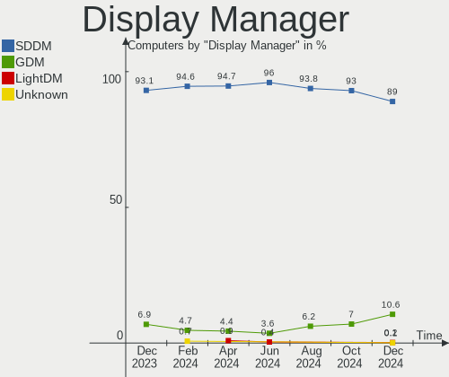
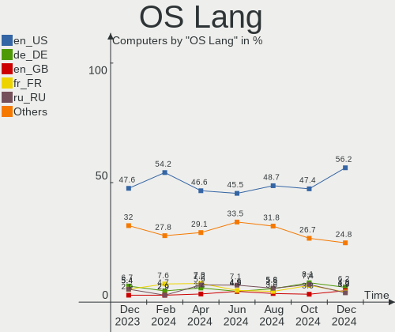
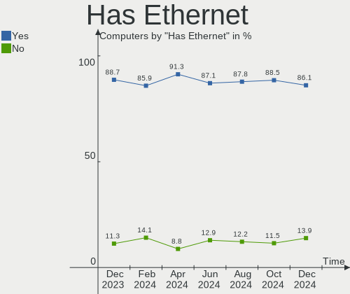
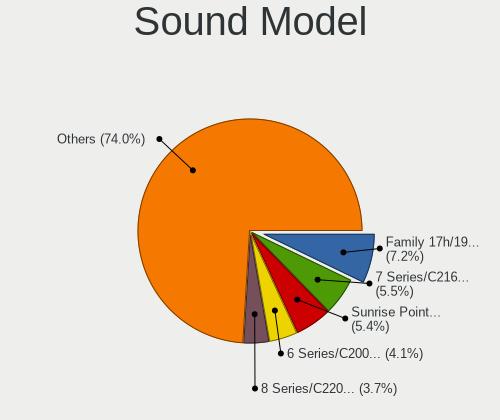
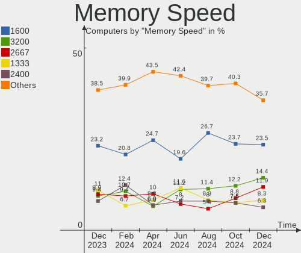
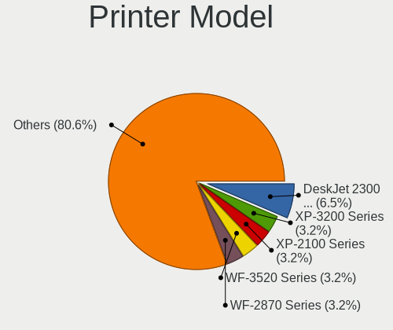

OpenMandriva Hardware Trends
----------------------------

A project to identify most popular hardware characteristics and track their change
over time based on data collected by OpenMandriva users at https://Linux-Hardware.org.

Anyone can contribute to this report by the [hw-probe](https://github.com/linuxhw/hw-probe) tool:

    sudo -E hw-probe -all -upload

This is a report for all computer types. See also reports for [desktops](/Dist/OpenMandriva/Desktop/README.md) and [notebooks](/Dist/OpenMandriva/Notebook/README.md).

Full-feature report is available here: https://linux-hardware.org/?view=trends

Period: Jan, 2022.

Contents
--------

* [ System ](#system)
  - [ OS                       ](#os)
  - [ OS Family                ](#os-family)
  - [ Kernel                   ](#kernel)
  - [ Kernel Family            ](#kernel-family)
  - [ Kernel Major Ver.        ](#kernel-major-ver)
  - [ Arch                     ](#arch)
  - [ DE                       ](#de)
  - [ Display Server           ](#display-server)
  - [ Display Manager          ](#display-manager)
  - [ OS Lang                  ](#os-lang)
  - [ Boot Mode                ](#boot-mode)
  - [ Filesystem               ](#filesystem)
  - [ Part. scheme             ](#part-scheme)
  - [ Dual Boot with Linux/BSD ](#dual-boot-with-linuxbsd)
  - [ Dual Boot (Win)          ](#dual-boot-win)

* [ Board ](#board)
  - [ Vendor                   ](#vendor)
  - [ Model                    ](#model)
  - [ Model Family             ](#model-family)
  - [ MFG Year                 ](#mfg-year)
  - [ Form Factor              ](#form-factor)
  - [ Secure Boot              ](#secure-boot)
  - [ Coreboot                 ](#coreboot)
  - [ RAM Size                 ](#ram-size)
  - [ RAM Used                 ](#ram-used)
  - [ Total Drives             ](#total-drives)
  - [ Has CD-ROM               ](#has-cd-rom)
  - [ Has Ethernet             ](#has-ethernet)
  - [ Has WiFi                 ](#has-wifi)
  - [ Has Bluetooth            ](#has-bluetooth)

* [ Location ](#location)
  - [ Country                  ](#country)
  - [ City                     ](#city)

* [ Drives ](#drives)
  - [ Drive Vendor             ](#drive-vendor)
  - [ Drive Model              ](#drive-model)
  - [ HDD Vendor               ](#hdd-vendor)
  - [ SSD Vendor               ](#ssd-vendor)
  - [ Drive Kind               ](#drive-kind)
  - [ Drive Connector          ](#drive-connector)
  - [ Drive Size               ](#drive-size)
  - [ Space Total              ](#space-total)
  - [ Space Used               ](#space-used)
  - [ Malfunc. Drives          ](#malfunc-drives)
  - [ Malfunc. Drive Vendor    ](#malfunc-drive-vendor)
  - [ Malfunc. HDD Vendor      ](#malfunc-hdd-vendor)
  - [ Malfunc. Drive Kind      ](#malfunc-drive-kind)
  - [ Failed Drives            ](#failed-drives)
  - [ Failed Drive Vendor      ](#failed-drive-vendor)
  - [ Drive Status             ](#drive-status)

* [ Storage controller ](#storage-controller)
  - [ Storage Vendor           ](#storage-vendor)
  - [ Storage Model            ](#storage-model)
  - [ Storage Kind             ](#storage-kind)

* [ Processor ](#processor)
  - [ CPU Vendor               ](#cpu-vendor)
  - [ CPU Model                ](#cpu-model)
  - [ CPU Model Family         ](#cpu-model-family)
  - [ CPU Cores                ](#cpu-cores)
  - [ CPU Sockets              ](#cpu-sockets)
  - [ CPU Threads              ](#cpu-threads)
  - [ CPU Op-Modes             ](#cpu-op-modes)
  - [ CPU Microcode            ](#cpu-microcode)
  - [ CPU Microarch            ](#cpu-microarch)

* [ Graphics ](#graphics)
  - [ GPU Vendor               ](#gpu-vendor)
  - [ GPU Model                ](#gpu-model)
  - [ GPU Combo                ](#gpu-combo)
  - [ GPU Driver               ](#gpu-driver)
  - [ GPU Memory               ](#gpu-memory)

* [ Monitor ](#monitor)
  - [ Monitor Vendor           ](#monitor-vendor)
  - [ Monitor Model            ](#monitor-model)
  - [ Monitor Resolution       ](#monitor-resolution)
  - [ Monitor Diagonal         ](#monitor-diagonal)
  - [ Monitor Width            ](#monitor-width)
  - [ Aspect Ratio             ](#aspect-ratio)
  - [ Monitor Area             ](#monitor-area)
  - [ Pixel Density            ](#pixel-density)
  - [ Multiple Monitors        ](#multiple-monitors)

* [ Network ](#network)
  - [ Net Controller Vendor    ](#net-controller-vendor)
  - [ Net Controller Model     ](#net-controller-model)
  - [ Wireless Vendor          ](#wireless-vendor)
  - [ Wireless Model           ](#wireless-model)
  - [ Ethernet Vendor          ](#ethernet-vendor)
  - [ Ethernet Model           ](#ethernet-model)
  - [ Net Controller Kind      ](#net-controller-kind)
  - [ Used Controller          ](#used-controller)
  - [ NICs                     ](#nics)
  - [ IPv6                     ](#ipv6)

* [ Bluetooth ](#bluetooth)
  - [ Bluetooth Vendor         ](#bluetooth-vendor)
  - [ Bluetooth Model          ](#bluetooth-model)

* [ Sound ](#sound)
  - [ Sound Vendor             ](#sound-vendor)
  - [ Sound Model              ](#sound-model)

* [ Memory ](#memory)
  - [ Memory Vendor            ](#memory-vendor)
  - [ Memory Model             ](#memory-model)
  - [ Memory Kind              ](#memory-kind)
  - [ Memory Form Factor       ](#memory-form-factor)
  - [ Memory Size              ](#memory-size)
  - [ Memory Speed             ](#memory-speed)

* [ Printers & scanners ](#printers--scanners)
  - [ Printer Vendor           ](#printer-vendor)
  - [ Printer Model            ](#printer-model)
  - [ Scanner Vendor           ](#scanner-vendor)
  - [ Scanner Model            ](#scanner-model)

* [ Camera ](#camera)
  - [ Camera Vendor            ](#camera-vendor)
  - [ Camera Model             ](#camera-model)

* [ Security ](#security)
  - [ Fingerprint Vendor       ](#fingerprint-vendor)
  - [ Fingerprint Model        ](#fingerprint-model)
  - [ Chipcard Vendor          ](#chipcard-vendor)
  - [ Chipcard Model           ](#chipcard-model)

* [ Unsupported ](#unsupported)
  - [ Unsupported Devices      ](#unsupported-devices)
  - [ Unsupported Device Types ](#unsupported-device-types)

System
------

OS
--

Installed operating systems

| Name              | Computers | Percent |
|-------------------|-----------|---------|
| OpenMandriva 4.2  | 182       | 80.89%  |
| OpenMandriva 4.50 | 43        | 19.11%  |

OS Family
---------

OS without a version

| Name         | Computers | Percent |
|--------------|-----------|---------|
| OpenMandriva | 225       | 100%    |

Kernel
------

Version of the Linux kernel

| Version                  | Computers | Percent |
|--------------------------|-----------|---------|
| 5.10.14-desktop-1omv4002 | 168       | 74.67%  |
| 5.12.4-desktop-1omv4050  | 20        | 8.89%   |
| 5.14.7-desktop-1omv4050  | 14        | 6.22%   |
| 5.11.12-desktop-1omv4002 | 14        | 6.22%   |
| 5.14.14-desktop-1omv4050 | 5         | 2.22%   |
| 5.16.3-desktop-2omv4050  | 1         | 0.44%   |
| 5.16.2-desktop-2omv4050  | 1         | 0.44%   |
| 5.16.0-desktop-1omv4050  | 1         | 0.44%   |
| 5.15.13-desktop-1omv4050 | 1         | 0.44%   |

Kernel Family
-------------

Linux kernel without a distro release

| Version | Computers | Percent |
|---------|-----------|---------|
| 5.10.14 | 168       | 74.67%  |
| 5.12.4  | 20        | 8.89%   |
| 5.14.7  | 14        | 6.22%   |
| 5.11.12 | 14        | 6.22%   |
| 5.14.14 | 5         | 2.22%   |
| 5.16.3  | 1         | 0.44%   |
| 5.16.2  | 1         | 0.44%   |
| 5.16.0  | 1         | 0.44%   |
| 5.15.13 | 1         | 0.44%   |

Kernel Major Ver.
-----------------

Linux kernel major version

| Version | Computers | Percent |
|---------|-----------|---------|
| 5.10    | 168       | 74.67%  |
| 5.12    | 20        | 8.89%   |
| 5.14    | 19        | 8.44%   |
| 5.11    | 14        | 6.22%   |
| 5.16    | 3         | 1.33%   |
| 5.15    | 1         | 0.44%   |

Arch
----

OS architecture (x86_64, i586, etc.)

| Name   | Computers | Percent |
|--------|-----------|---------|
| x86_64 | 225       | 100%    |

DE
--

Desktop Environment

| Name | Computers | Percent |
|------|-----------|---------|
| KDE5 | 225       | 100%    |

Display Server
--------------

X11 or Wayland

| Name | Computers | Percent |
|------|-----------|---------|
| X11  | 224       | 99.56%  |
| Tty  | 1         | 0.44%   |

Display Manager
---------------

SDDM, LightDM, etc.

| Name | Computers | Percent |
|------|-----------|---------|
| SDDM | 225       | 100%    |

OS Lang
-------

Language

| Lang  | Computers | Percent |
|-------|-----------|---------|
| en_US | 107       | 47.56%  |
| ru_RU | 19        | 8.44%   |
| pl_PL | 19        | 8.44%   |
| de_DE | 17        | 7.56%   |
| it_IT | 12        | 5.33%   |
| fr_FR | 10        | 4.44%   |
| cs_CZ | 7         | 3.11%   |
| en_GB | 5         | 2.22%   |
| fr_CA | 4         | 1.78%   |
| es_ES | 4         | 1.78%   |
| en_AU | 4         | 1.78%   |
| es_MX | 3         | 1.33%   |
| pt_BR | 2         | 0.89%   |
| hu_HU | 2         | 0.89%   |
| tr_TR | 1         | 0.44%   |
| ro_RO | 1         | 0.44%   |
| pt_PT | 1         | 0.44%   |
| es_DO | 1         | 0.44%   |
| es_CR | 1         | 0.44%   |
| es_CO | 1         | 0.44%   |
| en_NG | 1         | 0.44%   |
| de_CH | 1         | 0.44%   |
| de_AT | 1         | 0.44%   |
| da_DK | 1         | 0.44%   |

Boot Mode
---------

EFI or BIOS

| Mode | Computers | Percent |
|------|-----------|---------|
| BIOS | 134       | 59.56%  |
| EFI  | 91        | 40.44%  |

Filesystem
----------

Type of filesystem

| Type    | Computers | Percent |
|---------|-----------|---------|
| Overlay | 168       | 74.67%  |
| Ext4    | 54        | 24%     |
| Ext2    | 3         | 1.33%   |

Part. scheme
------------

Scheme of partitioning

| Type | Computers | Percent |
|------|-----------|---------|
| GPT  | 126       | 56%     |
| MBR  | 99        | 44%     |

Dual Boot with Linux/BSD
------------------------

Hosting more than one Linux/BSD

| Dual boot | Computers | Percent |
|-----------|-----------|---------|
| No        | 113       | 50.22%  |
| Yes       | 112       | 49.78%  |

Dual Boot (Win)
---------------

Hosting Linux and Windows

| Dual boot | Computers | Percent |
|-----------|-----------|---------|
| No        | 123       | 54.67%  |
| Yes       | 102       | 45.33%  |

Board
-----

Vendor
------

Motherboard manufacturer

| Name                | Computers | Percent |
|---------------------|-----------|---------|
| ASUSTek Computer    | 41        | 18.22%  |
| Dell                | 28        | 12.44%  |
| Lenovo              | 25        | 11.11%  |
| Hewlett-Packard     | 21        | 9.33%   |
| Acer                | 18        | 8%      |
| Gigabyte Technology | 15        | 6.67%   |
| MSI                 | 14        | 6.22%   |
| Toshiba             | 10        | 4.44%   |
| ASRock              | 9         | 4%      |
| Sony                | 6         | 2.67%   |
| Samsung Electronics | 4         | 1.78%   |
| Apple               | 4         | 1.78%   |
| Pegatron            | 2         | 0.89%   |
| Medion              | 2         | 0.89%   |
| Fujitsu Siemens     | 2         | 0.89%   |
| Framework           | 2         | 0.89%   |
| Foxconn             | 2         | 0.89%   |
| eMachines           | 2         | 0.89%   |
| Wortmann AG         | 1         | 0.44%   |
| UMAX                | 1         | 0.44%   |
| Timi                | 1         | 0.44%   |
| Teclast             | 1         | 0.44%   |
| System76            | 1         | 0.44%   |
| Seco                | 1         | 0.44%   |
| Positivo            | 1         | 0.44%   |
| Philco              | 1         | 0.44%   |
| Packard Bell        | 1         | 0.44%   |
| Notebook            | 1         | 0.44%   |
| MACHINIST           | 1         | 0.44%   |
| Inventec            | 1         | 0.44%   |
| Intel               | 1         | 0.44%   |
| IBM                 | 1         | 0.44%   |
| Gateway             | 1         | 0.44%   |
| eii                 | 1         | 0.44%   |
| Chuwi               | 1         | 0.44%   |
| Alienware           | 1         | 0.44%   |

Model
-----

Motherboard model

| Name                                   | Computers | Percent |
|----------------------------------------|-----------|---------|
| Dell Inspiron 3451                     | 6         | 2.67%   |
| ASUS UX31E                             | 6         | 2.67%   |
| Toshiba Satellite A300                 | 4         | 1.78%   |
| ASUS All Series                        | 3         | 1.33%   |
| Sony VGN-FZ31Z                         | 2         | 0.89%   |
| Framework Laptop                       | 2         | 0.89%   |
| Dell Vostro 1000                       | 2         | 0.89%   |
| Dell OptiPlex 9020                     | 2         | 0.89%   |
| ASUS TUF GAMING X570-PLUS              | 2         | 0.89%   |
| ASUS M5A78L-M/USB3                     | 2         | 0.89%   |
| Wortmann AG TERRA_PC                   | 1         | 0.44%   |
| UMAX MediaBook 14                      | 1         | 0.44%   |
| Toshiba Satellite Pro P200             | 1         | 0.44%   |
| Toshiba Satellite L45-B                | 1         | 0.44%   |
| Toshiba Satellite C650                 | 1         | 0.44%   |
| Toshiba Satellite C55D-B               | 1         | 0.44%   |
| Toshiba Satellite A305                 | 1         | 0.44%   |
| Toshiba PORTEGE Z30-A                  | 1         | 0.44%   |
| Timi TM1801                            | 1         | 0.44%   |
| Teclast F15S                           | 1         | 0.44%   |
| System76 Galago Pro                    | 1         | 0.44%   |
| Sony VPCEH1S1E                         | 1         | 0.44%   |
| Sony VPCEB18FD                         | 1         | 0.44%   |
| Sony VPCEA25FX                         | 1         | 0.44%   |
| Sony VGN-NW2SRF_S                      | 1         | 0.44%   |
| Seco C40                               | 1         | 0.44%   |
| Samsung RV420/RV520/RV720/E3530/S3530  | 1         | 0.44%   |
| Samsung R540/R580/R780/SA41/E452/E852  | 1         | 0.44%   |
| Samsung R410P                          | 1         | 0.44%   |
| Samsung N100SP                         | 1         | 0.44%   |
| Positivo Mobile                        | 1         | 0.44%   |
| Philco 14I                             | 1         | 0.44%   |
| Pegatron p7-1110                       | 1         | 0.44%   |
| Pegatron IPM31G                        | 1         | 0.44%   |
| Packard Bell EasyNote TJ65             | 1         | 0.44%   |
| Notebook PCx0Dx                        | 1         | 0.44%   |
| MSI p6626it-m                          | 1         | 0.44%   |
| MSI MS-B09611                          | 1         | 0.44%   |
| MSI MS-7C51                            | 1         | 0.44%   |
| MSI MS-7C37                            | 1         | 0.44%   |
| MSI MS-7B86                            | 1         | 0.44%   |
| MSI MS-7A15                            | 1         | 0.44%   |
| MSI MS-7891                            | 1         | 0.44%   |
| MSI MS-7693                            | 1         | 0.44%   |
| MSI MS-7680                            | 1         | 0.44%   |
| MSI MS-7641                            | 1         | 0.44%   |
| MSI MS-7593                            | 1         | 0.44%   |
| MSI MS-7576                            | 1         | 0.44%   |
| MSI GF63 Thin 9RCX                     | 1         | 0.44%   |
| MSI B250 Gaming Nightblade 3 (MS-B910) | 1         | 0.44%   |
| Medion MS-7713                         | 1         | 0.44%   |
| Medion E2292                           | 1         | 0.44%   |
| MACHINIST B75 PRO V1.0                 | 1         | 0.44%   |
| Lenovo Yoga 500-15IBD 80N6             | 1         | 0.44%   |
| Lenovo V330-15IKB 81AX                 | 1         | 0.44%   |
| Lenovo V15 G2 ITL 82KB                 | 1         | 0.44%   |
| Lenovo V14-IGL 82C2                    | 1         | 0.44%   |
| Lenovo V14-ADA 82C6                    | 1         | 0.44%   |
| Lenovo ThinkPad X250 20CLA21MJP        | 1         | 0.44%   |
| Lenovo ThinkPad T520 4242NS9           | 1         | 0.44%   |

Model Family
------------

Motherboard model prefix

| Name                  | Computers | Percent |
|-----------------------|-----------|---------|
| Acer Aspire           | 14        | 6.22%   |
| Toshiba Satellite     | 9         | 4%      |
| Lenovo ThinkPad       | 9         | 4%      |
| Dell Inspiron         | 9         | 4%      |
| Dell OptiPlex         | 8         | 3.56%   |
| HP Laptop             | 7         | 3.11%   |
| Lenovo IdeaPad        | 6         | 2.67%   |
| ASUS UX31E            | 6         | 2.67%   |
| Dell Latitude         | 5         | 2.22%   |
| HP ProBook            | 3         | 1.33%   |
| ASUS All              | 3         | 1.33%   |
| Sony VGN-FZ31Z        | 2         | 0.89%   |
| HP Pavilion           | 2         | 0.89%   |
| HP Compaq             | 2         | 0.89%   |
| Gigabyte B450M        | 2         | 0.89%   |
| Framework Laptop      | 2         | 0.89%   |
| Dell XPS              | 2         | 0.89%   |
| Dell Vostro           | 2         | 0.89%   |
| ASUS TUF              | 2         | 0.89%   |
| ASUS PRIME            | 2         | 0.89%   |
| ASUS P5G41T-M         | 2         | 0.89%   |
| ASUS M5A78L-M         | 2         | 0.89%   |
| Acer Extensa          | 2         | 0.89%   |
| Wortmann AG TERRA     | 1         | 0.44%   |
| UMAX MediaBook        | 1         | 0.44%   |
| Toshiba PORTEGE       | 1         | 0.44%   |
| Timi TM1801           | 1         | 0.44%   |
| Teclast F15S          | 1         | 0.44%   |
| System76 Galago       | 1         | 0.44%   |
| Sony VPCEH1S1E        | 1         | 0.44%   |
| Sony VPCEB18FD        | 1         | 0.44%   |
| Sony VPCEA25FX        | 1         | 0.44%   |
| Sony VGN-NW2SRF       | 1         | 0.44%   |
| Seco C40              | 1         | 0.44%   |
| Samsung RV420         | 1         | 0.44%   |
| Samsung R540          | 1         | 0.44%   |
| Samsung R410P         | 1         | 0.44%   |
| Samsung N100SP        | 1         | 0.44%   |
| Positivo Mobile       | 1         | 0.44%   |
| Philco 14I            | 1         | 0.44%   |
| Pegatron p7-1110      | 1         | 0.44%   |
| Pegatron IPM31G       | 1         | 0.44%   |
| Packard Bell EasyNote | 1         | 0.44%   |
| Notebook PCx0Dx       | 1         | 0.44%   |
| MSI p6626it-m         | 1         | 0.44%   |
| MSI MS-B09611         | 1         | 0.44%   |
| MSI MS-7C51           | 1         | 0.44%   |
| MSI MS-7C37           | 1         | 0.44%   |
| MSI MS-7B86           | 1         | 0.44%   |
| MSI MS-7A15           | 1         | 0.44%   |
| MSI MS-7891           | 1         | 0.44%   |
| MSI MS-7693           | 1         | 0.44%   |
| MSI MS-7680           | 1         | 0.44%   |
| MSI MS-7641           | 1         | 0.44%   |
| MSI MS-7593           | 1         | 0.44%   |
| MSI MS-7576           | 1         | 0.44%   |
| MSI GF63              | 1         | 0.44%   |
| MSI B250              | 1         | 0.44%   |
| Medion MS-7713        | 1         | 0.44%   |
| Medion E2292          | 1         | 0.44%   |

MFG Year
--------

Motherboard manufacture year

| Year | Computers | Percent |
|------|-----------|---------|
| 2011 | 25        | 11.11%  |
| 2010 | 22        | 9.78%   |
| 2012 | 21        | 9.33%   |
| 2014 | 18        | 8%      |
| 2015 | 16        | 7.11%   |
| 2019 | 14        | 6.22%   |
| 2008 | 14        | 6.22%   |
| 2018 | 13        | 5.78%   |
| 2016 | 13        | 5.78%   |
| 2009 | 13        | 5.78%   |
| 2020 | 12        | 5.33%   |
| 2013 | 12        | 5.33%   |
| 2007 | 11        | 4.89%   |
| 2021 | 10        | 4.44%   |
| 2017 | 6         | 2.67%   |
| 2006 | 4         | 1.78%   |
| 2004 | 1         | 0.44%   |

Form Factor
-----------

Physical design of the computer

| Name        | Computers | Percent |
|-------------|-----------|---------|
| Notebook    | 125       | 55.56%  |
| Desktop     | 92        | 40.89%  |
| All in one  | 3         | 1.33%   |
| Mini pc     | 2         | 0.89%   |
| Tablet      | 1         | 0.44%   |
| Convertible | 1         | 0.44%   |
| Server      | 1         | 0.44%   |

Secure Boot
-----------

Enabled or disabled

| State    | Computers | Percent |
|----------|-----------|---------|
| Disabled | 225       | 100%    |

Coreboot
--------

Have coreboot on board

| Used | Computers | Percent |
|------|-----------|---------|
| No   | 223       | 99.11%  |
| Yes  | 2         | 0.89%   |

RAM Size
--------

Total RAM memory

| Size in GB  | Computers | Percent |
|-------------|-----------|---------|
| 3.01-4.0    | 85        | 37.78%  |
| 4.01-8.0    | 47        | 20.89%  |
| 16.01-24.0  | 34        | 15.11%  |
| 8.01-16.0   | 34        | 15.11%  |
| 1.01-2.0    | 12        | 5.33%   |
| 32.01-64.0  | 6         | 2.67%   |
| 2.01-3.0    | 3         | 1.33%   |
| 0.51-1.0    | 2         | 0.89%   |
| 24.01-32.0  | 1         | 0.44%   |
| 64.01-256.0 | 1         | 0.44%   |

RAM Used
--------

Used RAM memory

| Used GB  | Computers | Percent |
|----------|-----------|---------|
| 1.01-2.0 | 171       | 76%     |
| 0.51-1.0 | 36        | 16%     |
| 2.01-3.0 | 11        | 4.89%   |
| 0.01-0.5 | 5         | 2.22%   |
| 3.01-4.0 | 2         | 0.89%   |

Total Drives
------------

Number of drives on board

| Drives | Computers | Percent |
|--------|-----------|---------|
| 1      | 139       | 61.78%  |
| 2      | 59        | 26.22%  |
| 3      | 15        | 6.67%   |
| 0      | 6         | 2.67%   |
| 4      | 4         | 1.78%   |
| 8      | 2         | 0.89%   |

Has CD-ROM
----------

Has CD-ROM on board

| Presented | Computers | Percent |
|-----------|-----------|---------|
| Yes       | 131       | 58.22%  |
| No        | 94        | 41.78%  |

Has Ethernet
------------

Has Ethernet on board

| Presented | Computers | Percent |
|-----------|-----------|---------|
| Yes       | 205       | 91.11%  |
| No        | 20        | 8.89%   |

Has WiFi
--------

Has WiFi module

| Presented | Computers | Percent |
|-----------|-----------|---------|
| Yes       | 163       | 72.44%  |
| No        | 62        | 27.56%  |

Has Bluetooth
-------------

Has Bluetooth module

| Presented | Computers | Percent |
|-----------|-----------|---------|
| No        | 115       | 51.11%  |
| Yes       | 110       | 48.89%  |

Location
--------

Country
-------

Geographic location (country)

| Country               | Computers | Percent |
|-----------------------|-----------|---------|
| USA                   | 35        | 15.56%  |
| Russia                | 26        | 11.56%  |
| Poland                | 25        | 11.11%  |
| Germany               | 20        | 8.89%   |
| France                | 16        | 7.11%   |
| Italy                 | 13        | 5.78%   |
| Romania               | 8         | 3.56%   |
| Czechia               | 8         | 3.56%   |
| Brazil                | 7         | 3.11%   |
| Canada                | 6         | 2.67%   |
| UK                    | 5         | 2.22%   |
| Spain                 | 5         | 2.22%   |
| Portugal              | 5         | 2.22%   |
| Australia             | 5         | 2.22%   |
| Sweden                | 4         | 1.78%   |
| Netherlands           | 4         | 1.78%   |
| Mexico                | 3         | 1.33%   |
| Bulgaria              | 3         | 1.33%   |
| Austria               | 3         | 1.33%   |
| Ukraine               | 2         | 0.89%   |
| Switzerland           | 2         | 0.89%   |
| Kenya                 | 2         | 0.89%   |
| Japan                 | 2         | 0.89%   |
| Hungary               | 2         | 0.89%   |
| Finland               | 2         | 0.89%   |
| Turkey                | 1         | 0.44%   |
| Slovakia              | 1         | 0.44%   |
| Palestinian Territory | 1         | 0.44%   |
| Norway                | 1         | 0.44%   |
| Nigeria               | 1         | 0.44%   |
| Kazakhstan            | 1         | 0.44%   |
| Indonesia             | 1         | 0.44%   |
| Dominican Republic    | 1         | 0.44%   |
| Denmark               | 1         | 0.44%   |
| Costa Rica            | 1         | 0.44%   |
| Colombia              | 1         | 0.44%   |
| Chile                 | 1         | 0.44%   |

City
----

Geographic location (city)

| City           | Computers | Percent |
|----------------|-----------|---------|
| Moscow         | 7         | 3.11%   |
| Prague         | 6         | 2.67%   |
| Krakow         | 6         | 2.67%   |
| Vienna         | 3         | 1.33%   |
| Milan          | 3         | 1.33%   |
| Hanover        | 3         | 1.33%   |
| Berlin         | 3         | 1.33%   |
| Uppsala        | 2         | 0.89%   |
| Timi?™oara     | 2         | 0.89%   |
| St Petersburg  | 2         | 0.89%   |
| Someren        | 2         | 0.89%   |
| Sofia          | 2         | 0.89%   |
| Saint-Fons     | 2         | 0.89%   |
| Rome           | 2         | 0.89%   |
| Poznan         | 2         | 0.89%   |
| Porto Velho    | 2         | 0.89%   |
| Niort          | 2         | 0.89%   |
| New York       | 2         | 0.89%   |
| Nairobi        | 2         | 0.89%   |
| Melbourne      | 2         | 0.89%   |
| Khimki         | 2         | 0.89%   |
| Jaworzno       | 2         | 0.89%   |
| Funchal        | 2         | 0.89%   |
| Ceggia         | 2         | 0.89%   |
| Bucharest      | 2         | 0.89%   |
| Zurich         | 1         | 0.44%   |
| Zl?­n          | 1         | 0.44%   |
| Yekaterinburg  | 1         | 0.44%   |
| Xonacatlan     | 1         | 0.44%   |
| Wroclaw        | 1         | 0.44%   |
| Woodbridge     | 1         | 0.44%   |
| Witney         | 1         | 0.44%   |
| Waechtersbach  | 1         | 0.44%   |
| Wa?‚brzych     | 1         | 0.44%   |
| Vimercate      | 1         | 0.44%   |
| Vaxjo          | 1         | 0.44%   |
| Vancouver      | 1         | 0.44%   |
| Valencia       | 1         | 0.44%   |
| Ulan-Ude       | 1         | 0.44%   |
| Ukrainka       | 1         | 0.44%   |
| Uithuizen      | 1         | 0.44%   |
| Tyumen         | 1         | 0.44%   |
| Tychy          | 1         | 0.44%   |
| Tver           | 1         | 0.44%   |
| Tula           | 1         | 0.44%   |
| Torrance       | 1         | 0.44%   |
| Tomah          | 1         | 0.44%   |
| Telluride      | 1         | 0.44%   |
| Tarpon Springs | 1         | 0.44%   |
| Tarnobrzeg     | 1         | 0.44%   |
| Szczecin       | 1         | 0.44%   |
| Sydney         | 1         | 0.44%   |
| Stoke-on-Trent | 1         | 0.44%   |
| Stavropol      | 1         | 0.44%   |
| Staszow        | 1         | 0.44%   |
| Spokane        | 1         | 0.44%   |
| Simferopol     | 1         | 0.44%   |
| Seattle        | 1         | 0.44%   |
| Santiago       | 1         | 0.44%   |
| Sanford        | 1         | 0.44%   |

Drives
------

Drive Vendor
------------

Hard drive vendors

| Vendor              | Computers | Drives | Percent |
|---------------------|-----------|--------|---------|
| WDC                 | 62        | 73     | 20.74%  |
| Seagate             | 49        | 61     | 16.39%  |
| Samsung Electronics | 36        | 40     | 12.04%  |
| Toshiba             | 21        | 22     | 7.02%   |
| Kingston            | 19        | 21     | 6.35%   |
| Unknown             | 15        | 16     | 5.02%   |
| SanDisk             | 15        | 15     | 5.02%   |
| Hitachi             | 11        | 11     | 3.68%   |
| Crucial             | 8         | 8      | 2.68%   |
| A-DATA Technology   | 7         | 7      | 2.34%   |
| Intel               | 5         | 6      | 1.67%   |
| GOODRAM             | 5         | 7      | 1.67%   |
| SK Hynix            | 3         | 3      | 1%      |
| PNY                 | 3         | 3      | 1%      |
| Micron Technology   | 3         | 3      | 1%      |
| HGST                | 3         | 3      | 1%      |
| UMIS                | 2         | 2      | 0.67%   |
| SPCC                | 2         | 2      | 0.67%   |
| PLEXTOR             | 2         | 2      | 0.67%   |
| MAXTOR              | 2         | 2      | 0.67%   |
| China               | 2         | 2      | 0.67%   |
| Apacer              | 2         | 2      | 0.67%   |
| Transcend           | 1         | 1      | 0.33%   |
| Team                | 1         | 1      | 0.33%   |
| TCSUNBOW            | 1         | 1      | 0.33%   |
| Smartbuy            | 1         | 1      | 0.33%   |
| Reeinno             | 1         | 1      | 0.33%   |
| PUSKILL             | 1         | 1      | 0.33%   |
| Phison              | 1         | 2      | 0.33%   |
| Patriot             | 1         | 1      | 0.33%   |
| MyDigitalSSD        | 1         | 1      | 0.33%   |
| Mushkin             | 1         | 1      | 0.33%   |
| LITEON              | 1         | 1      | 0.33%   |
| Lenovo              | 1         | 1      | 0.33%   |
| KIOXIA-EXCERIA      | 1         | 1      | 0.33%   |
| IBM/Hitachi         | 1         | 1      | 0.33%   |
| Hewlett-Packard     | 1         | 1      | 0.33%   |
| HEORIADY            | 1         | 1      | 0.33%   |
| FOXLINE             | 1         | 1      | 0.33%   |
| EMTEC               | 1         | 1      | 0.33%   |
| Corsair             | 1         | 1      | 0.33%   |
| ASMT                | 1         | 1      | 0.33%   |
| Apple               | 1         | 1      | 0.33%   |
| Unknown             | 1         | 1      | 0.33%   |

Drive Model
-----------

Hard drive models

| Model                                | Computers | Percent |
|--------------------------------------|-----------|---------|
| Seagate ST500LT012-1DG142 500GB      | 9         | 2.76%   |
| SanDisk SSD U100 256GB               | 6         | 1.84%   |
| Kingston SA400S37240G 240GB SSD      | 5         | 1.53%   |
| Seagate ST1000LM035-1RK172 1TB       | 4         | 1.23%   |
| Unknown SD/MMC/MS PRO 128GB          | 3         | 0.92%   |
| Toshiba DT01ACA200 2TB               | 3         | 0.92%   |
| Samsung SSD 870 EVO 500GB            | 3         | 0.92%   |
| Samsung SSD 860 EVO 500GB            | 3         | 0.92%   |
| Kingston SV300S37A120G 120GB SSD     | 3         | 0.92%   |
| A-DATA SSD S510 120GB                | 3         | 0.92%   |
| WDC WDS240G2G0C-00AJM0 240GB         | 2         | 0.61%   |
| WDC WD800JD-75MSA3 80GB              | 2         | 0.61%   |
| WDC WD5000LPVX-22V0TT0 500GB         | 2         | 0.61%   |
| WDC WD3200AAKS-75L9A0 320GB          | 2         | 0.61%   |
| WDC WD2500BEVS-22UST0 250GB          | 2         | 0.61%   |
| WDC WD20EZRX-00D8PB0 2TB             | 2         | 0.61%   |
| WDC WD10EZEX-08WN4A0 1TB             | 2         | 0.61%   |
| WDC WD10EADS-65L5B1 1TB              | 2         | 0.61%   |
| WDC WD1003FZEX-00K3CA0 1TB           | 2         | 0.61%   |
| WDC PC SN530 SDBPNPZ-256G-1006 256GB | 2         | 0.61%   |
| Unknown USB DISK 3.2 1TB             | 2         | 0.61%   |
| Toshiba MQ01ABF050 500GB             | 2         | 0.61%   |
| Toshiba MQ01ABF032 320GB             | 2         | 0.61%   |
| Toshiba MQ01ABD100 1TB               | 2         | 0.61%   |
| Seagate ST500DM002-1BD142 500GB      | 2         | 0.61%   |
| Seagate ST3500418AS 500GB            | 2         | 0.61%   |
| Seagate ST3320620AS 320GB            | 2         | 0.61%   |
| Seagate ST320LT020-9YG142 320GB      | 2         | 0.61%   |
| Seagate ST1000LM024 HN-M101MBB 1TB   | 2         | 0.61%   |
| Seagate ST1000DM003-1CH162 1TB       | 2         | 0.61%   |
| Samsung SSD 970 EVO Plus 500GB       | 2         | 0.61%   |
| Samsung MZALQ256HAJD-000L2 256GB     | 2         | 0.61%   |
| PNY CS900 120GB SSD                  | 2         | 0.61%   |
| Kingston SUV400S37120G 120GB SSD     | 2         | 0.61%   |
| Kingston SHFS37A120G 120GB SSD       | 2         | 0.61%   |
| Kingston SA400S37120G 120GB SSD      | 2         | 0.61%   |
| Crucial CT250MX500SSD1 250GB         | 2         | 0.61%   |
| Crucial CT240BX500SSD1 240GB         | 2         | 0.61%   |
| WDC WDS500G2B0C-00PXH0 500GB         | 1         | 0.31%   |
| WDC WDS500G1X0E-00AFY0 500GB         | 1         | 0.31%   |
| WDC WDS480G2G0A-00JH30 480GB SSD     | 1         | 0.31%   |
| WDC WDS240G2G0B-00EPW0 240GB SSD     | 1         | 0.31%   |
| WDC WDS240G2G0A-00JH30 240GB SSD     | 1         | 0.31%   |
| WDC WDS200T1X0E-00AFY0 2TB           | 1         | 0.31%   |
| WDC WDBNCE0010PNC 1TB SSD            | 1         | 0.31%   |
| WDC WD7500BPKX-75HPJT0 752GB         | 1         | 0.31%   |
| WDC WD60PURX-64WY0Y1 6TB             | 1         | 0.31%   |
| WDC WD5000LPZX-60Z10T0 500GB         | 1         | 0.31%   |
| WDC WD5000LPLX-75ZNTT0 500GB         | 1         | 0.31%   |
| WDC WD5000LPLX-08ZNTT0 500GB         | 1         | 0.31%   |
| WDC WD5000LPCX-24C6HT0 500GB         | 1         | 0.31%   |
| WDC WD5000BPVT-22HXZT1 500GB         | 1         | 0.31%   |
| WDC WD5000BPVT-00HXZT1 500GB         | 1         | 0.31%   |
| WDC WD5000AAKX-75U6AA0 500GB         | 1         | 0.31%   |
| WDC WD5000AAKX-22ERMA0 500GB         | 1         | 0.31%   |
| WDC WD5000AAKX-00ERMA0 500GB         | 1         | 0.31%   |
| WDC WD5000AAKX-001CA0 500GB          | 1         | 0.31%   |
| WDC WD5000AAKS-07YGA0 500GB          | 1         | 0.31%   |
| WDC WD4005FZBX-00K5WB0 4TB           | 1         | 0.31%   |
| WDC WD3200BEVT-60A23T0 320GB         | 1         | 0.31%   |

HDD Vendor
----------

Hard disk drive vendors

| Vendor              | Computers | Drives | Percent |
|---------------------|-----------|--------|---------|
| WDC                 | 49        | 59     | 33.79%  |
| Seagate             | 48        | 60     | 33.1%   |
| Toshiba             | 19        | 20     | 13.1%   |
| Hitachi             | 11        | 11     | 7.59%   |
| Samsung Electronics | 9         | 9      | 6.21%   |
| Unknown             | 3         | 3      | 2.07%   |
| HGST                | 3         | 3      | 2.07%   |
| MAXTOR              | 2         | 2      | 1.38%   |
| IBM/Hitachi         | 1         | 1      | 0.69%   |

SSD Vendor
----------

Solid state drive vendors

| Vendor              | Computers | Drives | Percent |
|---------------------|-----------|--------|---------|
| Kingston            | 19        | 20     | 17.43%  |
| Samsung Electronics | 17        | 19     | 15.6%   |
| SanDisk             | 13        | 13     | 11.93%  |
| Crucial             | 8         | 8      | 7.34%   |
| A-DATA Technology   | 6         | 6      | 5.5%    |
| WDC                 | 5         | 5      | 4.59%   |
| GOODRAM             | 5         | 7      | 4.59%   |
| PNY                 | 3         | 3      | 2.75%   |
| Micron Technology   | 3         | 3      | 2.75%   |
| Toshiba             | 2         | 2      | 1.83%   |
| SPCC                | 2         | 2      | 1.83%   |
| PLEXTOR             | 2         | 2      | 1.83%   |
| Intel               | 2         | 3      | 1.83%   |
| China               | 2         | 2      | 1.83%   |
| Apacer              | 2         | 2      | 1.83%   |
| Transcend           | 1         | 1      | 0.92%   |
| Team                | 1         | 1      | 0.92%   |
| TCSUNBOW            | 1         | 1      | 0.92%   |
| Smartbuy            | 1         | 1      | 0.92%   |
| Reeinno             | 1         | 1      | 0.92%   |
| PUSKILL             | 1         | 1      | 0.92%   |
| Patriot             | 1         | 1      | 0.92%   |
| MyDigitalSSD        | 1         | 1      | 0.92%   |
| Mushkin             | 1         | 1      | 0.92%   |
| LITEON              | 1         | 1      | 0.92%   |
| KIOXIA-EXCERIA      | 1         | 1      | 0.92%   |
| Hewlett-Packard     | 1         | 1      | 0.92%   |
| HEORIADY            | 1         | 1      | 0.92%   |
| FOXLINE             | 1         | 1      | 0.92%   |
| Corsair             | 1         | 1      | 0.92%   |
| ASMT                | 1         | 1      | 0.92%   |
| Apple               | 1         | 1      | 0.92%   |
| Unknown             | 1         | 1      | 0.92%   |

Drive Kind
----------

HDD or SSD

| Kind    | Computers | Drives | Percent |
|---------|-----------|--------|---------|
| HDD     | 123       | 168    | 45.39%  |
| SSD     | 102       | 115    | 37.64%  |
| NVMe    | 31        | 35     | 11.44%  |
| MMC     | 12        | 13     | 4.43%   |
| Unknown | 3         | 3      | 1.11%   |

Drive Connector
---------------

SATA, SAS, NVMe, etc.

| Type | Computers | Drives | Percent |
|------|-----------|--------|---------|
| SATA | 194       | 277    | 79.18%  |
| NVMe | 31        | 35     | 12.65%  |
| MMC  | 12        | 13     | 4.9%    |
| SAS  | 8         | 9      | 3.27%   |

Drive Size
----------

Size of hard drive

| Size in TB | Computers | Drives | Percent |
|------------|-----------|--------|---------|
| 0.01-0.5   | 162       | 205    | 69.53%  |
| 0.51-1.0   | 54        | 59     | 23.18%  |
| 1.01-2.0   | 12        | 12     | 5.15%   |
| 3.01-4.0   | 3         | 5      | 1.29%   |
| 2.01-3.0   | 1         | 1      | 0.43%   |
| 4.01-10.0  | 1         | 1      | 0.43%   |

Space Total
-----------

Amount of disk space available on the file system

| Size in GB | Computers | Percent |
|------------|-----------|---------|
| 1-20       | 112       | 49.78%  |
| 101-250    | 39        | 17.33%  |
| Unknown    | 32        | 14.22%  |
| 251-500    | 19        | 8.44%   |
| 21-50      | 9         | 4%      |
| 501-1000   | 6         | 2.67%   |
| 51-100     | 6         | 2.67%   |
| 2001-3000  | 1         | 0.44%   |
| 1001-2000  | 1         | 0.44%   |

Space Used
----------

Amount of used disk space

| Used GB  | Computers | Percent |
|----------|-----------|---------|
| 1-20     | 177       | 78.67%  |
| Unknown  | 32        | 14.22%  |
| 21-50    | 11        | 4.89%   |
| 101-250  | 2         | 0.89%   |
| 501-1000 | 2         | 0.89%   |
| 251-500  | 1         | 0.44%   |

Malfunc. Drives
---------------

Drive models with a malfunction

| Model                                | Computers | Drives | Percent |
|--------------------------------------|-----------|--------|---------|
| SanDisk SSD U100 256GB               | 6         | 6      | 9.68%   |
| Seagate ST500LT012-1DG142 500GB      | 2         | 2      | 3.23%   |
| Kingston SV300S37A120G 120GB SSD     | 2         | 2      | 3.23%   |
| WDC WD5000BPVT-22HXZT1 500GB         | 1         | 1      | 1.61%   |
| WDC WD5000BPVT-00HXZT1 500GB         | 1         | 1      | 1.61%   |
| WDC WD5000AAKX-001CA0 500GB          | 1         | 1      | 1.61%   |
| WDC WD5000AAKS-07YGA0 500GB          | 1         | 1      | 1.61%   |
| WDC WD3200BEVT-60A23T0 320GB         | 1         | 1      | 1.61%   |
| WDC WD3200BEVT-22ZCT0 320GB          | 1         | 1      | 1.61%   |
| WDC WD30EFRX-68EUZN0 3TB             | 1         | 1      | 1.61%   |
| WDC WD2500BEKT-75PVMT1 250GB         | 1         | 1      | 1.61%   |
| WDC WD1600AAJS-60B4A0 160GB          | 1         | 1      | 1.61%   |
| WDC WD1600AAJS-00L7A0 160GB          | 1         | 1      | 1.61%   |
| WDC WD10EZRZ-00HTKB0 1TB             | 1         | 1      | 1.61%   |
| WDC WD10EZEX-60M2NA0 1TB             | 1         | 1      | 1.61%   |
| WDC WD10EZEX-00RKKA0 1TB             | 1         | 1      | 1.61%   |
| Toshiba MQ04ABF100 1TB               | 1         | 1      | 1.61%   |
| Toshiba MK3265GSX 320GB              | 1         | 1      | 1.61%   |
| Toshiba MK3252GSX 320GB              | 1         | 1      | 1.61%   |
| Toshiba MK2546GSX 250GB              | 1         | 1      | 1.61%   |
| Toshiba DT01ACA100 1TB               | 1         | 1      | 1.61%   |
| Seagate ST9320325AS 320GB            | 1         | 1      | 1.61%   |
| Seagate ST9250315AS 250GB            | 1         | 1      | 1.61%   |
| Seagate ST9160821A 137GB             | 1         | 1      | 1.61%   |
| Seagate ST500DM002-1BD142 500GB      | 1         | 1      | 1.61%   |
| Seagate ST3500418AS 500GB            | 1         | 1      | 1.61%   |
| Seagate ST3400820AS 400GB            | 1         | 1      | 1.61%   |
| Seagate ST340014A 40GB               | 1         | 1      | 1.61%   |
| Seagate ST3360320AS 360GB            | 1         | 1      | 1.61%   |
| Seagate ST320LT020-9YG142 320GB      | 1         | 1      | 1.61%   |
| Seagate ST320LT012-9WS14C 320GB      | 1         | 1      | 1.61%   |
| Seagate ST31000528AS 1TB             | 1         | 1      | 1.61%   |
| Seagate ST1000LM024 HN-M101MBB 1TB   | 1         | 1      | 1.61%   |
| Samsung Electronics SSD 970 EVO 1TB  | 1         | 1      | 1.61%   |
| Samsung Electronics SSD 860 QVO 2TB  | 1         | 1      | 1.61%   |
| Samsung Electronics HN-M750MBB 752GB | 1         | 1      | 1.61%   |
| Samsung Electronics HM641JI 640GB    | 1         | 1      | 1.61%   |
| Samsung Electronics HD320KJ 320GB    | 1         | 1      | 1.61%   |
| MAXTOR STM3160815AS 160GB            | 1         | 1      | 1.61%   |
| MAXTOR 6L160M0 164GB                 | 1         | 1      | 1.61%   |
| Kingston SUV400S37240G 240GB SSD     | 1         | 1      | 1.61%   |
| Kingston SNV425S264GB SSD            | 1         | 1      | 1.61%   |
| Kingston SMS100S264G 64GB SSD        | 1         | 1      | 1.61%   |
| Kingston SHFS37A120G 120GB SSD       | 1         | 1      | 1.61%   |
| Intel SSDPEKKW128G7 128GB            | 1         | 1      | 1.61%   |
| Intel SSDMAEMC080G2L 80GB            | 1         | 1      | 1.61%   |
| Hitachi HTS545050B9A300 500GB        | 1         | 1      | 1.61%   |
| Hitachi HTS545025B9A300 250GB        | 1         | 1      | 1.61%   |
| Hitachi HTS543232A7A384 320GB        | 1         | 1      | 1.61%   |
| Hitachi HTS542516K9SA00 160GB        | 1         | 1      | 1.61%   |
| Hitachi HDS721680PLA380 80GB         | 1         | 1      | 1.61%   |
| Hitachi HDS5C1010CLA382 1TB          | 1         | 1      | 1.61%   |
| HGST HTS545050A7E680 500GB           | 1         | 1      | 1.61%   |
| HGST HTS541075A9E680 752GB           | 1         | 1      | 1.61%   |
| A-DATA Technology SP920SS 128GB SSD  | 1         | 1      | 1.61%   |

Malfunc. Drive Vendor
---------------------

Vendors of faulty drives

| Vendor              | Computers | Drives | Percent |
|---------------------|-----------|--------|---------|
| WDC                 | 12        | 13     | 20.69%  |
| Seagate             | 12        | 14     | 20.69%  |
| SanDisk             | 6         | 6      | 10.34%  |
| Kingston            | 6         | 6      | 10.34%  |
| Hitachi             | 6         | 6      | 10.34%  |
| Samsung Electronics | 5         | 5      | 8.62%   |
| Toshiba             | 4         | 5      | 6.9%    |
| MAXTOR              | 2         | 2      | 3.45%   |
| Intel               | 2         | 2      | 3.45%   |
| HGST                | 2         | 2      | 3.45%   |
| A-DATA Technology   | 1         | 1      | 1.72%   |

Malfunc. HDD Vendor
-------------------

Vendors of faulty HDD drives

| Vendor              | Computers | Drives | Percent |
|---------------------|-----------|--------|---------|
| WDC                 | 12        | 13     | 29.27%  |
| Seagate             | 12        | 14     | 29.27%  |
| Hitachi             | 6         | 6      | 14.63%  |
| Toshiba             | 4         | 5      | 9.76%   |
| Samsung Electronics | 3         | 3      | 7.32%   |
| MAXTOR              | 2         | 2      | 4.88%   |
| HGST                | 2         | 2      | 4.88%   |

Malfunc. Drive Kind
-------------------

Kinds of faulty drives

| Kind | Computers | Drives | Percent |
|------|-----------|--------|---------|
| HDD  | 37        | 45     | 68.52%  |
| SSD  | 15        | 15     | 27.78%  |
| NVMe | 2         | 2      | 3.7%    |

Failed Drives
-------------

Failed drive models

| Model                        | Computers | Drives | Percent |
|------------------------------|-----------|--------|---------|
| WDC WD5000LPLX-75ZNTT0 500GB | 1         | 1      | 50%     |
| Seagate STM3250318AS 250GB   | 1         | 1      | 50%     |

Failed Drive Vendor
-------------------

Failed drive vendors

| Vendor  | Computers | Drives | Percent |
|---------|-----------|--------|---------|
| WDC     | 1         | 1      | 50%     |
| Seagate | 1         | 1      | 50%     |

Drive Status
------------

Number of failed and malfunc. drives

| Status   | Computers | Drives | Percent |
|----------|-----------|--------|---------|
| Works    | 176       | 241    | 68.48%  |
| Malfunc  | 53        | 62     | 20.62%  |
| Detected | 26        | 29     | 10.12%  |
| Failed   | 2         | 2      | 0.78%   |

Storage controller
------------------

Storage Vendor
--------------

Storage controller vendors

| Vendor                      | Computers | Percent |
|-----------------------------|-----------|---------|
| Intel                       | 146       | 56.81%  |
| AMD                         | 57        | 22.18%  |
| Samsung Electronics         | 11        | 4.28%   |
| Nvidia                      | 11        | 4.28%   |
| Sandisk                     | 9         | 3.5%    |
| ASMedia Technology          | 5         | 1.95%   |
| JMicron Technology          | 4         | 1.56%   |
| SK Hynix                    | 3         | 1.17%   |
| Union Memory (Shenzhen)     | 2         | 0.78%   |
| Marvell Technology Group    | 2         | 0.78%   |
| Silicon Image               | 1         | 0.39%   |
| Seagate Technology          | 1         | 0.39%   |
| Lenovo                      | 1         | 0.39%   |
| Kingston Technology Company | 1         | 0.39%   |
| Broadcom / LSI              | 1         | 0.39%   |
| ADATA Technology            | 1         | 0.39%   |
| Adaptec                     | 1         | 0.39%   |

Storage Model
-------------

Storage controller models

| Model                                                                                   | Computers | Percent |
|-----------------------------------------------------------------------------------------|-----------|---------|
| AMD FCH SATA Controller [AHCI mode]                                                     | 33        | 10.41%  |
| Intel 6 Series/C200 Series Chipset Family 6 port Mobile SATA AHCI Controller            | 15        | 4.73%   |
| Intel 82801IBM/IEM (ICH9M/ICH9M-E) 4 port SATA Controller [AHCI mode]                   | 12        | 3.79%   |
| AMD SB7x0/SB8x0/SB9x0 SATA Controller [AHCI mode]                                       | 11        | 3.47%   |
| AMD SB7x0/SB8x0/SB9x0 IDE Controller                                                    | 11        | 3.47%   |
| Intel 82801HM/HEM (ICH8M/ICH8M-E) IDE Controller                                        | 9         | 2.84%   |
| Intel Sunrise Point-LP SATA Controller [AHCI mode]                                      | 8         | 2.52%   |
| Intel NM10/ICH7 Family SATA Controller [IDE mode]                                       | 8         | 2.52%   |
| Intel 82801G (ICH7 Family) IDE Controller                                               | 8         | 2.52%   |
| Intel 5 Series/3400 Series Chipset 4 port SATA AHCI Controller                          | 8         | 2.52%   |
| Intel Atom Processor E3800 Series SATA AHCI Controller                                  | 7         | 2.21%   |
| AMD SB7x0/SB8x0/SB9x0 SATA Controller [IDE mode]                                        | 7         | 2.21%   |
| Intel 82801HM/HEM (ICH8M/ICH8M-E) SATA Controller [AHCI mode]                           | 6         | 1.89%   |
| Intel 8 Series/C220 Series Chipset Family 6-port SATA Controller 1 [AHCI mode]          | 6         | 1.89%   |
| Intel 8 Series SATA Controller 1 [AHCI mode]                                            | 6         | 1.89%   |
| Intel 7 Series Chipset Family 6-port SATA Controller [AHCI mode]                        | 6         | 1.89%   |
| AMD 400 Series Chipset SATA Controller                                                  | 6         | 1.89%   |
| Samsung NVMe SSD Controller SM981/PM981/PM983                                           | 5         | 1.58%   |
| Samsung NVMe SSD Controller 980                                                         | 5         | 1.58%   |
| Intel Q170/Q150/B150/H170/H110/Z170/CM236 Chipset SATA Controller [AHCI Mode]           | 5         | 1.58%   |
| Intel 7 Series/C210 Series Chipset Family 6-port SATA Controller [AHCI mode]            | 5         | 1.58%   |
| Nvidia MCP61 SATA Controller                                                            | 4         | 1.26%   |
| Nvidia MCP61 IDE                                                                        | 4         | 1.26%   |
| Intel Wildcat Point-LP SATA Controller [AHCI Mode]                                      | 4         | 1.26%   |
| Intel Celeron/Pentium Silver Processor SATA Controller                                  | 4         | 1.26%   |
| Intel Celeron N3350/Pentium N4200/Atom E3900 Series SATA AHCI Controller                | 4         | 1.26%   |
| ASMedia ASM1062 Serial ATA Controller                                                   | 4         | 1.26%   |
| Sandisk WD Blue SN550 NVMe SSD                                                          | 3         | 0.95%   |
| Sandisk Non-Volatile memory controller                                                  | 3         | 0.95%   |
| Intel SATA Controller [RAID mode]                                                       | 3         | 0.95%   |
| Intel 82801HM/HEM (ICH8M/ICH8M-E) SATA Controller [IDE mode]                            | 3         | 0.95%   |
| Intel 7 Series Chipset Family 4-port SATA Controller [IDE mode]                         | 3         | 0.95%   |
| Intel 7 Series Chipset Family 2-port SATA Controller [IDE mode]                         | 3         | 0.95%   |
| Intel 6 Series/C200 Series Chipset Family Desktop SATA Controller (IDE mode, ports 4-5) | 3         | 0.95%   |
| Intel 6 Series/C200 Series Chipset Family Desktop SATA Controller (IDE mode, ports 0-3) | 3         | 0.95%   |
| Intel 6 Series/C200 Series Chipset Family 6 port Desktop SATA AHCI Controller           | 3         | 0.95%   |
| Intel 5 Series/3400 Series Chipset 6 port SATA AHCI Controller                          | 3         | 0.95%   |
| Union Memory (Shenzhen) Non-Volatile memory controller                                  | 2         | 0.63%   |
| Sandisk WD PC SN810 / Black SN850 NVMe SSD                                              | 2         | 0.63%   |
| Nvidia MCP51 Serial ATA Controller                                                      | 2         | 0.63%   |
| JMicron JMB363 SATA/IDE Controller                                                      | 2         | 0.63%   |
| Intel Comet Lake SATA AHCI Controller                                                   | 2         | 0.63%   |
| Intel Cannon Lake Mobile PCH SATA AHCI Controller                                       | 2         | 0.63%   |
| Intel 9 Series Chipset Family SATA Controller [AHCI Mode]                               | 2         | 0.63%   |
| Intel 82801I (ICH9 Family) 2 port SATA Controller [IDE mode]                            | 2         | 0.63%   |
| Intel 400 Series Chipset Family SATA AHCI Controller                                    | 2         | 0.63%   |
| Intel 4 Series Chipset PT IDER Controller                                               | 2         | 0.63%   |
| Intel 200 Series PCH SATA controller [AHCI mode]                                        | 2         | 0.63%   |
| AMD SB600 Non-Raid-5 SATA                                                               | 2         | 0.63%   |
| AMD SB600 IDE                                                                           | 2         | 0.63%   |
| SK Hynix Non-Volatile memory controller                                                 | 1         | 0.32%   |
| SK Hynix BC511                                                                          | 1         | 0.32%   |
| SK Hynix BC501 NVMe Solid State Drive                                                   | 1         | 0.32%   |
| Silicon Image SiI 3132 Serial ATA Raid II Controller                                    | 1         | 0.32%   |
| Seagate Non-Volatile memory controller                                                  | 1         | 0.32%   |
| Sandisk WD Black SN750 / PC SN730 NVMe SSD                                              | 1         | 0.32%   |
| Samsung Electronics SATA controller                                                     | 1         | 0.32%   |
| Nvidia nForce3 IDE                                                                      | 1         | 0.32%   |
| Nvidia MCP79 AHCI Controller                                                            | 1         | 0.32%   |
| Nvidia MCP78S [GeForce 8200] IDE                                                        | 1         | 0.32%   |

Storage Kind
------------

Kind of storage controller (IDE, SATA, NVMe, SAS, ...)

| Kind | Computers | Percent |
|------|-----------|---------|
| SATA | 177       | 64.84%  |
| IDE  | 56        | 20.51%  |
| NVMe | 30        | 10.99%  |
| RAID | 9         | 3.3%    |
| SCSI | 1         | 0.37%   |

Processor
---------

CPU Vendor
----------

Processor vendors

| Vendor | Computers | Percent |
|--------|-----------|---------|
| Intel  | 155       | 68.89%  |
| AMD    | 70        | 31.11%  |

CPU Model
---------

Processor models

| Model                                        | Computers | Percent |
|----------------------------------------------|-----------|---------|
| Intel Celeron CPU N2840 @ 2.16GHz            | 7         | 3.11%   |
| Intel Core i7-2677M CPU @ 1.80GHz            | 6         | 2.67%   |
| Intel Core i5-6200U CPU @ 2.30GHz            | 3         | 1.33%   |
| Intel Core i5-3210M CPU @ 2.50GHz            | 3         | 1.33%   |
| Intel Core i5 CPU M 520 @ 2.40GHz            | 3         | 1.33%   |
| Intel Core i3-2310M CPU @ 2.10GHz            | 3         | 1.33%   |
| Intel Core 2 Duo CPU T9550 @ 2.66GHz         | 3         | 1.33%   |
| Intel Pentium Dual-Core CPU T4300 @ 2.10GHz  | 2         | 0.89%   |
| Intel Pentium Dual-Core CPU E5400 @ 2.70GHz  | 2         | 0.89%   |
| Intel Core i7-4790K CPU @ 4.00GHz            | 2         | 0.89%   |
| Intel Core i5-3470 CPU @ 3.20GHz             | 2         | 0.89%   |
| Intel Core i5-2500 CPU @ 3.30GHz             | 2         | 0.89%   |
| Intel Core i3-5005U CPU @ 2.00GHz            | 2         | 0.89%   |
| Intel Core i3-4005U CPU @ 1.70GHz            | 2         | 0.89%   |
| Intel Core 2 Duo CPU T8300 @ 2.40GHz         | 2         | 0.89%   |
| Intel Core 2 Duo CPU T6400 @ 2.00GHz         | 2         | 0.89%   |
| Intel Celeron CPU N3350 @ 1.10GHz            | 2         | 0.89%   |
| Intel 11th Gen Core i5-1135G7 @ 2.40GHz      | 2         | 0.89%   |
| AMD Ryzen 5 4500U with Radeon Graphics       | 2         | 0.89%   |
| AMD Phenom II X6 1055T Processor             | 2         | 0.89%   |
| AMD Phenom II X6 1035T Processor             | 2         | 0.89%   |
| AMD Mobile Sempron Processor 3600+           | 2         | 0.89%   |
| AMD FX-8320 Eight-Core Processor             | 2         | 0.89%   |
| AMD Athlon II X4 640 Processor               | 2         | 0.89%   |
| AMD Athlon 64 X2 Dual Core Processor 4400+   | 2         | 0.89%   |
| AMD Athlon 64 Processor 3500+                | 2         | 0.89%   |
| AMD A4-9125 RADEON R3, 4 COMPUTE CORES 2C+2G | 2         | 0.89%   |
| Intel Xeon CPU X5450 @ 3.00GHz               | 1         | 0.44%   |
| Intel Pentium Silver N5000 CPU @ 1.10GHz     | 1         | 0.44%   |
| Intel Pentium Dual-Core CPU E5500 @ 2.80GHz  | 1         | 0.44%   |
| Intel Pentium Dual-Core CPU E5200 @ 2.50GHz  | 1         | 0.44%   |
| Intel Pentium Dual CPU T3400 @ 2.16GHz       | 1         | 0.44%   |
| Intel Pentium Dual CPU T3200 @ 2.00GHz       | 1         | 0.44%   |
| Intel Pentium CPU N4200 @ 1.10GHz            | 1         | 0.44%   |
| Intel Pentium CPU G850 @ 2.90GHz             | 1         | 0.44%   |
| Intel Pentium CPU G620 @ 2.60GHz             | 1         | 0.44%   |
| Intel Pentium CPU G4400 @ 3.30GHz            | 1         | 0.44%   |
| Intel Pentium CPU 5405U @ 2.30GHz            | 1         | 0.44%   |
| Intel Pentium 3805U @ 1.90GHz                | 1         | 0.44%   |
| Intel Genuine CPU 2140 @ 1.60GHz             | 1         | 0.44%   |
| Intel Core i9-8950HK CPU @ 2.90GHz           | 1         | 0.44%   |
| Intel Core i7-9750H CPU @ 2.60GHz            | 1         | 0.44%   |
| Intel Core i7-8750H CPU @ 2.20GHz            | 1         | 0.44%   |
| Intel Core i7-8700 CPU @ 3.20GHz             | 1         | 0.44%   |
| Intel Core i7-7700 CPU @ 3.60GHz             | 1         | 0.44%   |
| Intel Core i7-7500U CPU @ 2.70GHz            | 1         | 0.44%   |
| Intel Core i7-6700HQ CPU @ 2.60GHz           | 1         | 0.44%   |
| Intel Core i7-6700 CPU @ 3.40GHz             | 1         | 0.44%   |
| Intel Core i7-6600U CPU @ 2.60GHz            | 1         | 0.44%   |
| Intel Core i7-4800MQ CPU @ 2.70GHz           | 1         | 0.44%   |
| Intel Core i7-4770 CPU @ 3.40GHz             | 1         | 0.44%   |
| Intel Core i7-4600U CPU @ 2.10GHz            | 1         | 0.44%   |
| Intel Core i7-3770K CPU @ 3.50GHz            | 1         | 0.44%   |
| Intel Core i7-3770 CPU @ 3.40GHz             | 1         | 0.44%   |
| Intel Core i7-3632QM CPU @ 2.20GHz           | 1         | 0.44%   |
| Intel Core i7-3520M CPU @ 2.90GHz            | 1         | 0.44%   |
| Intel Core i7-2640M CPU @ 2.80GHz            | 1         | 0.44%   |
| Intel Core i7-10870H CPU @ 2.20GHz           | 1         | 0.44%   |
| Intel Core i7-10510U CPU @ 1.80GHz           | 1         | 0.44%   |
| Intel Core i7 CPU Q 720 @ 1.60GHz            | 1         | 0.44%   |

CPU Model Family
----------------

Processor model prefix

| Model                   | Computers | Percent |
|-------------------------|-----------|---------|
| Intel Core i5           | 36        | 16%     |
| Intel Core i7           | 29        | 12.89%  |
| Intel Celeron           | 22        | 9.78%   |
| Intel Core i3           | 18        | 8%      |
| Intel Core 2 Duo        | 18        | 8%      |
| AMD Ryzen 5             | 8         | 3.56%   |
| Intel Pentium Dual-Core | 6         | 2.67%   |
| Intel Pentium           | 6         | 2.67%   |
| AMD A8                  | 6         | 2.67%   |
| Other                   | 5         | 2.22%   |
| AMD Athlon              | 5         | 2.22%   |
| AMD A6                  | 5         | 2.22%   |
| Intel Atom              | 4         | 1.78%   |
| AMD Ryzen 3             | 4         | 1.78%   |
| AMD Phenom II X6        | 4         | 1.78%   |
| AMD FX                  | 4         | 1.78%   |
| Intel Core 2 Quad       | 3         | 1.33%   |
| AMD Athlon 64 X2        | 3         | 1.33%   |
| AMD Athlon 64           | 3         | 1.33%   |
| AMD A4                  | 3         | 1.33%   |
| Intel Pentium Dual      | 2         | 0.89%   |
| AMD Ryzen 9             | 2         | 0.89%   |
| AMD Ryzen 7             | 2         | 0.89%   |
| AMD Phenom II X4        | 2         | 0.89%   |
| AMD Phenom              | 2         | 0.89%   |
| AMD Mobile Sempron      | 2         | 0.89%   |
| AMD E1                  | 2         | 0.89%   |
| AMD E                   | 2         | 0.89%   |
| AMD Athlon II X4        | 2         | 0.89%   |
| Intel Xeon              | 1         | 0.44%   |
| Intel Pentium Silver    | 1         | 0.44%   |
| Intel Genuine           | 1         | 0.44%   |
| Intel Core i9           | 1         | 0.44%   |
| Intel Core 2 Extreme    | 1         | 0.44%   |
| Intel Core 2            | 1         | 0.44%   |
| Intel Celeron Dual-Core | 1         | 0.44%   |
| AMD Ryzen Embedded      | 1         | 0.44%   |
| AMD Ryzen 5 PRO         | 1         | 0.44%   |
| AMD Phenom II X3        | 1         | 0.44%   |
| AMD GX                  | 1         | 0.44%   |
| AMD C-70                | 1         | 0.44%   |
| AMD Athlon II X2        | 1         | 0.44%   |
| AMD Athlon II           | 1         | 0.44%   |
| AMD Athlon Dual Core    | 1         | 0.44%   |

CPU Cores
---------

Number of processor cores

| Number | Computers | Percent |
|--------|-----------|---------|
| 2      | 127       | 56.44%  |
| 4      | 66        | 29.33%  |
| 6      | 15        | 6.67%   |
| 1      | 10        | 4.44%   |
| 8      | 3         | 1.33%   |
| 12     | 2         | 0.89%   |
| 3      | 2         | 0.89%   |

CPU Sockets
-----------

Number of sockets

| Number | Computers | Percent |
|--------|-----------|---------|
| 1      | 224       | 99.56%  |
| 2      | 1         | 0.44%   |

CPU Threads
-----------

Threads per core (Hyper-Threading)

| Number | Computers | Percent |
|--------|-----------|---------|
| 1      | 122       | 54.22%  |
| 2      | 103       | 45.78%  |

CPU Op-Modes
------------

CPU Operation Modes (32-bit, 64-bit)

| Op mode        | Computers | Percent |
|----------------|-----------|---------|
| 32-bit, 64-bit | 225       | 100%    |

CPU Microcode
-------------

Microcode number

| Number     | Computers | Percent |
|------------|-----------|---------|
| 0x206a7    | 23        | 10.22%  |
| 0x1067a    | 18        | 8%      |
| 0x306a9    | 14        | 6.22%   |
| Unknown    | 11        | 4.89%   |
| 0x306c3    | 9         | 4%      |
| 0x30678    | 7         | 3.11%   |
| 0x6fd      | 6         | 2.67%   |
| 0x40651    | 6         | 2.67%   |
| 0x506e3    | 5         | 2.22%   |
| 0x406e3    | 5         | 2.22%   |
| 0x306d4    | 5         | 2.22%   |
| 0x10676    | 5         | 2.22%   |
| 0x010000c8 | 5         | 2.22%   |
| 0x906ea    | 4         | 1.78%   |
| 0x806ec    | 4         | 1.78%   |
| 0x806c1    | 4         | 1.78%   |
| 0x506c9    | 4         | 1.78%   |
| 0x20655    | 4         | 1.78%   |
| 0x20652    | 4         | 1.78%   |
| 0x08701021 | 4         | 1.78%   |
| 0x08108109 | 4         | 1.78%   |
| 0x06006705 | 4         | 1.78%   |
| 0x06001119 | 4         | 1.78%   |
| 0x706a1    | 3         | 1.33%   |
| 0x6fb      | 3         | 1.33%   |
| 0x406c4    | 3         | 1.33%   |
| 0x106e5    | 3         | 1.33%   |
| 0x010000bf | 3         | 1.33%   |
| 0xa0653    | 2         | 0.89%   |
| 0x906e9    | 2         | 0.89%   |
| 0x806e9    | 2         | 0.89%   |
| 0x6f2      | 2         | 0.89%   |
| 0x08600106 | 2         | 0.89%   |
| 0x08200103 | 2         | 0.89%   |
| 0x07030105 | 2         | 0.89%   |
| 0x0700010b | 2         | 0.89%   |
| 0x05000101 | 2         | 0.89%   |
| 0x010000b6 | 2         | 0.89%   |
| 0x01000095 | 2         | 0.89%   |
| 0xa0652    | 1         | 0.44%   |
| 0x906ed    | 1         | 0.44%   |
| 0x806ea    | 1         | 0.44%   |
| 0x706a8    | 1         | 0.44%   |
| 0x6fa      | 1         | 0.44%   |
| 0x30661    | 1         | 0.44%   |
| 0x106ca    | 1         | 0.44%   |
| 0x106a5    | 1         | 0.44%   |
| 0x0a50000c | 1         | 0.44%   |
| 0x08600103 | 1         | 0.44%   |
| 0x08101016 | 1         | 0.44%   |
| 0x0810100b | 1         | 0.44%   |
| 0x08101007 | 1         | 0.44%   |
| 0x08001138 | 1         | 0.44%   |
| 0x08001136 | 1         | 0.44%   |
| 0x07030104 | 1         | 0.44%   |
| 0x0700010f | 1         | 0.44%   |
| 0x0600611a | 1         | 0.44%   |
| 0x06003106 | 1         | 0.44%   |
| 0x06001116 | 1         | 0.44%   |
| 0x06000852 | 1         | 0.44%   |

CPU Microarch
-------------

Microarchitecture

| Name          | Computers | Percent |
|---------------|-----------|---------|
| SandyBridge   | 23        | 10.22%  |
| Penryn        | 23        | 10.22%  |
| Haswell       | 15        | 6.67%   |
| KabyLake      | 14        | 6.22%   |
| K10           | 14        | 6.22%   |
| IvyBridge     | 14        | 6.22%   |
| Core          | 12        | 5.33%   |
| Skylake       | 10        | 4.44%   |
| Silvermont    | 10        | 4.44%   |
| K8 Hammer     | 9         | 4%      |
| Zen 2         | 8         | 3.56%   |
| Westmere      | 8         | 3.56%   |
| Zen           | 7         | 3.11%   |
| Piledriver    | 7         | 3.11%   |
| Excavator     | 5         | 2.22%   |
| Broadwell     | 5         | 2.22%   |
| Zen+          | 4         | 1.78%   |
| TigerLake     | 4         | 1.78%   |
| Nehalem       | 4         | 1.78%   |
| Goldmont plus | 4         | 1.78%   |
| Goldmont      | 4         | 1.78%   |
| Bobcat        | 4         | 1.78%   |
| Puma          | 3         | 1.33%   |
| Jaguar        | 3         | 1.33%   |
| CometLake     | 3         | 1.33%   |
| Zen 3         | 2         | 0.89%   |
| Bulldozer     | 2         | 0.89%   |
| Bonnell       | 2         | 0.89%   |
| Steamroller   | 1         | 0.44%   |
| K10 Llano     | 1         | 0.44%   |

Graphics
--------

GPU Vendor
----------

Vendors of graphics cards

| Vendor | Computers | Percent |
|--------|-----------|---------|
| Intel  | 112       | 46.67%  |
| AMD    | 74        | 30.83%  |
| Nvidia | 54        | 22.5%   |

GPU Model
---------

Graphics card models

| Model                                                                                    | Computers | Percent |
|------------------------------------------------------------------------------------------|-----------|---------|
| Intel 2nd Generation Core Processor Family Integrated Graphics Controller                | 20        | 8.23%   |
| Intel 3rd Gen Core processor Graphics Controller                                         | 8         | 3.29%   |
| Intel Atom Processor Z36xxx/Z37xxx Series Graphics & Display                             | 7         | 2.88%   |
| Intel Mobile 4 Series Chipset Integrated Graphics Controller                             | 6         | 2.47%   |
| Intel Haswell-ULT Integrated Graphics Controller                                         | 6         | 2.47%   |
| AMD Picasso/Raven 2 [Radeon Vega Series / Radeon Vega Mobile Series]                     | 6         | 2.47%   |
| Intel Xeon E3-1200 v3/4th Gen Core Processor Integrated Graphics Controller              | 5         | 2.06%   |
| Intel Skylake GT2 [HD Graphics 520]                                                      | 5         | 2.06%   |
| Intel Core Processor Integrated Graphics Controller                                      | 5         | 2.06%   |
| Intel HD Graphics 530                                                                    | 4         | 1.65%   |
| AMD Stoney [Radeon R2/R3/R4/R5 Graphics]                                                 | 4         | 1.65%   |
| AMD RV620/M82 [Mobility Radeon HD 3450/3470]                                             | 4         | 1.65%   |
| AMD Renoir                                                                               | 4         | 1.65%   |
| AMD Ellesmere [Radeon RX 470/480/570/570X/580/580X/590]                                  | 4         | 1.65%   |
| Nvidia GT218 [GeForce 210]                                                               | 3         | 1.23%   |
| Nvidia GK208B [GeForce GT 710]                                                           | 3         | 1.23%   |
| Nvidia GK106 [GeForce GTX 650 Ti]                                                        | 3         | 1.23%   |
| Intel TigerLake-LP GT2 [Iris Xe Graphics]                                                | 3         | 1.23%   |
| Intel HD Graphics 5500                                                                   | 3         | 1.23%   |
| Intel HD Graphics 500                                                                    | 3         | 1.23%   |
| Intel GeminiLake [UHD Graphics 600]                                                      | 3         | 1.23%   |
| Intel CoffeeLake-H GT2 [UHD Graphics 630]                                                | 3         | 1.23%   |
| Intel Atom/Celeron/Pentium Processor x5-E8000/J3xxx/N3xxx Integrated Graphics Controller | 3         | 1.23%   |
| Intel 4 Series Chipset Integrated Graphics Controller                                    | 3         | 1.23%   |
| Nvidia GP107 [GeForce GTX 1050 Ti]                                                       | 2         | 0.82%   |
| Nvidia GM107 [GeForce GTX 750 Ti]                                                        | 2         | 0.82%   |
| Nvidia GF119 [GeForce GT 610]                                                            | 2         | 0.82%   |
| Nvidia G86M [GeForce 8600M GS]                                                           | 2         | 0.82%   |
| Intel Xeon E3-1200 v2/3rd Gen Core processor Graphics Controller                         | 2         | 0.82%   |
| Intel HD Graphics 620                                                                    | 2         | 0.82%   |
| Intel CometLake-U GT2 [UHD Graphics]                                                     | 2         | 0.82%   |
| AMD Topaz XT [Radeon R7 M260/M265 / M340/M360 / M440/M445 / 530/535 / 620/625 Mobile]    | 2         | 0.82%   |
| AMD RV730 XT [Radeon HD 4670]                                                            | 2         | 0.82%   |
| AMD RV710/M92 [Mobility Radeon HD 4530/4570/545v]                                        | 2         | 0.82%   |
| AMD RS880 [Radeon HD 4250]                                                               | 2         | 0.82%   |
| AMD RS482/RS485 [Radeon Xpress 1100/1150]                                                | 2         | 0.82%   |
| AMD Richland [Radeon HD 8570D]                                                           | 2         | 0.82%   |
| AMD Redwood XT [Radeon HD 5670/5690/5730]                                                | 2         | 0.82%   |
| AMD Redwood PRO [Radeon HD 5550/5570/5630/6510/6610/7570]                                | 2         | 0.82%   |
| AMD Raven Ridge [Radeon Vega Series / Radeon Vega Mobile Series]                         | 2         | 0.82%   |
| AMD Park [Mobility Radeon HD 5430/5450/5470]                                             | 2         | 0.82%   |
| AMD Mullins [Radeon R4/R5 Graphics]                                                      | 2         | 0.82%   |
| AMD Kabini [Radeon HD 8400 / R3 Series]                                                  | 2         | 0.82%   |
| Nvidia TU117M                                                                            | 1         | 0.41%   |
| Nvidia TU117 [GeForce GTX 1650]                                                          | 1         | 0.41%   |
| Nvidia TU116 [GeForce GTX 1660 SUPER]                                                    | 1         | 0.41%   |
| Nvidia TU116 [GeForce GTX 1650]                                                          | 1         | 0.41%   |
| Nvidia TU106M [GeForce RTX 2070 Mobile]                                                  | 1         | 0.41%   |
| Nvidia NV36M [GeForce FX Go5700]                                                         | 1         | 0.41%   |
| Nvidia GT218 [ION]                                                                       | 1         | 0.41%   |
| Nvidia GT216M [GeForce GT 240M]                                                          | 1         | 0.41%   |
| Nvidia GT216 [GeForce GT 220]                                                            | 1         | 0.41%   |
| Nvidia GT200 [GeForce GTX 260]                                                           | 1         | 0.41%   |
| Nvidia GP108M [GeForce MX330]                                                            | 1         | 0.41%   |
| Nvidia GP108 [GeForce GT 1030]                                                           | 1         | 0.41%   |
| Nvidia GP107M [GeForce GTX 1050 Ti Max-Q]                                                | 1         | 0.41%   |
| Nvidia GP106M [GeForce GTX 1060 Mobile]                                                  | 1         | 0.41%   |
| Nvidia GP106 [GeForce GTX 1060 6GB]                                                      | 1         | 0.41%   |
| Nvidia GM206 [GeForce GTX 960]                                                           | 1         | 0.41%   |
| Nvidia GM108M [GeForce 840M]                                                             | 1         | 0.41%   |

GPU Combo
---------

Combinations of graphics cards

| Name           | Computers | Percent |
|----------------|-----------|---------|
| 1 x Intel      | 98        | 43.56%  |
| 1 x AMD        | 67        | 29.78%  |
| 1 x Nvidia     | 43        | 19.11%  |
| Intel + Nvidia | 10        | 4.44%   |
| Intel + AMD    | 4         | 1.78%   |
| 2 x AMD        | 2         | 0.89%   |
| AMD + Nvidia   | 1         | 0.44%   |

GPU Driver
----------

Free vs proprietary

| Driver      | Computers | Percent |
|-------------|-----------|---------|
| Free        | 220       | 97.78%  |
| Unknown     | 3         | 1.33%   |
| Proprietary | 2         | 0.89%   |

GPU Memory
----------

Total video memory

| Size in GB | Computers | Percent |
|------------|-----------|---------|
| Unknown    | 103       | 45.78%  |
| 0.01-0.5   | 54        | 24%     |
| 0.51-1.0   | 30        | 13.33%  |
| 1.01-2.0   | 21        | 9.33%   |
| 3.01-4.0   | 9         | 4%      |
| 7.01-8.0   | 5         | 2.22%   |
| 5.01-6.0   | 3         | 1.33%   |

Monitor
-------

Monitor Vendor
--------------

Monitor vendors

| Vendor                  | Computers | Percent |
|-------------------------|-----------|---------|
| Samsung Electronics     | 43        | 19.28%  |
| AU Optronics            | 25        | 11.21%  |
| Chimei Innolux          | 19        | 8.52%   |
| LG Display              | 16        | 7.17%   |
| BOE                     | 15        | 6.73%   |
| Goldstar                | 13        | 5.83%   |
| Acer                    | 11        | 4.93%   |
| Hewlett-Packard         | 7         | 3.14%   |
| Dell                    | 7         | 3.14%   |
| BenQ                    | 7         | 3.14%   |
| CPT                     | 6         | 2.69%   |
| AOC                     | 6         | 2.69%   |
| Ancor Communications    | 6         | 2.69%   |
| LG Philips              | 5         | 2.24%   |
| Philips                 | 4         | 1.79%   |
| PANDA                   | 4         | 1.79%   |
| Chi Mei Optoelectronics | 4         | 1.79%   |
| Lenovo                  | 3         | 1.35%   |
| IBM                     | 3         | 1.35%   |
| Apple                   | 3         | 1.35%   |
| Vizio                   | 2         | 0.9%    |
| Eizo                    | 2         | 0.9%    |
| ViewSonic               | 1         | 0.45%   |
| Sony                    | 1         | 0.45%   |
| Sceptre Tech            | 1         | 0.45%   |
| Panasonic               | 1         | 0.45%   |
| Packard Bell            | 1         | 0.45%   |
| Onkyo                   | 1         | 0.45%   |
| KTC                     | 1         | 0.45%   |
| InfoVision              | 1         | 0.45%   |
| Iiyama                  | 1         | 0.45%   |
| Daewoo                  | 1         | 0.45%   |
| Compal                  | 1         | 0.45%   |
| ASUSTek Computer        | 1         | 0.45%   |

Monitor Model
-------------

Monitor models

| Model                                                                 | Computers | Percent |
|-----------------------------------------------------------------------|-----------|---------|
| CPT LCD Monitor COR17DB 1600x900 293x164mm 13.2-inch                  | 6         | 2.68%   |
| BOE LCD Monitor BOE0629 1366x768 309x173mm 13.9-inch                  | 6         | 2.68%   |
| LG Philips LP154WX4-TLC8 LPL0120 1280x800 331x207mm 15.4-inch         | 4         | 1.79%   |
| Samsung Electronics LCD Monitor SEC3358 1280x800 331x207mm 15.4-inch  | 3         | 1.34%   |
| Samsung Electronics C27F390 SAM0D32 1920x1080 598x336mm 27.0-inch     | 3         | 1.34%   |
| AU Optronics LCD Monitor AUO38ED 1920x1080 344x193mm 15.5-inch        | 3         | 1.34%   |
| Samsung Electronics LCD Monitor SAM0902 1920x1080 890x500mm 40.2-inch | 2         | 0.89%   |
| LG Display LCD Monitor LGD0468 1366x768 344x194mm 15.5-inch           | 2         | 0.89%   |
| LG Display LCD Monitor LGD033A 1366x768 344x194mm 15.5-inch           | 2         | 0.89%   |
| Chimei Innolux LCD Monitor CMN15DB 1366x768 344x193mm 15.5-inch       | 2         | 0.89%   |
| Chimei Innolux LCD Monitor CMN14D6 1366x768 309x173mm 13.9-inch       | 2         | 0.89%   |
| BOE LCD Monitor BOE095F 2256x1504 285x190mm 13.5-inch                 | 2         | 0.89%   |
| BOE LCD Monitor BOE0675 1366x768 344x194mm 15.5-inch                  | 2         | 0.89%   |
| AU Optronics LCD Monitor AUO219E 1600x900 382x214mm 17.2-inch         | 2         | 0.89%   |
| AOC 2270W AOC2270 1920x1080 477x268mm 21.5-inch                       | 2         | 0.89%   |
| Vizio E60-E3 VIZ1018 3840x2160 1330x748mm 60.1-inch                   | 1         | 0.45%   |
| Vizio D24f-G1 VIZ1027 1920x1080 527x296mm 23.8-inch                   | 1         | 0.45%   |
| ViewSonic VX2252 Series VSCDC2E 1920x1080 477x268mm 21.5-inch         | 1         | 0.45%   |
| Sony Nvidia Defaul SNY05FA 1366x768 290x170mm 13.2-inch               | 1         | 0.45%   |
| Sceptre Tech Sceptre C27 SPT0AD7 1920x1080 598x336mm 27.0-inch        | 1         | 0.45%   |
| Samsung Electronics T22D390 SAM0B69 1920x1080 477x268mm 21.5-inch     | 1         | 0.45%   |
| Samsung Electronics SyncMaster SAM05CD 1920x1080                      | 1         | 0.45%   |
| Samsung Electronics SyncMaster SAM0572 1280x1024 376x301mm 19.0-inch  | 1         | 0.45%   |
| Samsung Electronics SyncMaster SAM04DE 1920x1080 477x268mm 21.5-inch  | 1         | 0.45%   |
| Samsung Electronics SyncMaster SAM0471 1360x768 344x194mm 15.5-inch   | 1         | 0.45%   |
| Samsung Electronics SyncMaster SAM037B 1680x1050 474x296mm 22.0-inch  | 1         | 0.45%   |
| Samsung Electronics SyncMaster SAM034F 1440x900 428x255mm 19.6-inch   | 1         | 0.45%   |
| Samsung Electronics SyncMaster SAM030D 1680x1050 474x296mm 22.0-inch  | 1         | 0.45%   |
| Samsung Electronics SyncMaster SAM027F 1680x1050 474x296mm 22.0-inch  | 1         | 0.45%   |
| Samsung Electronics SyncMaster SAM0216 1280x1024 338x270mm 17.0-inch  | 1         | 0.45%   |
| Samsung Electronics SyncMaster SAM01E1 1280x1024 376x301mm 19.0-inch  | 1         | 0.45%   |
| Samsung Electronics SyncMaster SAM011E 1280x1024 338x270mm 17.0-inch  | 1         | 0.45%   |
| Samsung Electronics SyncMaster SAM010C 1280x1024 338x270mm 17.0-inch  | 1         | 0.45%   |
| Samsung Electronics SMS24A350H SAM07D6 1920x1080 531x299mm 24.0-inch  | 1         | 0.45%   |
| Samsung Electronics S22D390 SAM0B63 1920x1080 477x268mm 21.5-inch     | 1         | 0.45%   |
| Samsung Electronics S22D300 SAM0B3B 1920x1080 477x268mm 21.5-inch     | 1         | 0.45%   |
| Samsung Electronics LCD Monitor SEC5541 1366x768 344x193mm 15.5-inch  | 1         | 0.45%   |
| Samsung Electronics LCD Monitor SEC5441 1366x768 344x194mm 15.5-inch  | 1         | 0.45%   |
| Samsung Electronics LCD Monitor SEC4542 1366x768 309x174mm 14.0-inch  | 1         | 0.45%   |
| Samsung Electronics LCD Monitor SEC4442 1280x800 303x190mm 14.1-inch  | 1         | 0.45%   |
| Samsung Electronics LCD Monitor SEC4151 1366x768 344x194mm 15.5-inch  | 1         | 0.45%   |
| Samsung Electronics LCD Monitor SEC4141 1366x768 344x193mm 15.5-inch  | 1         | 0.45%   |
| Samsung Electronics LCD Monitor SEC3741 1366x768 309x174mm 14.0-inch  | 1         | 0.45%   |
| Samsung Electronics LCD Monitor SEC3642 1366x768 309x174mm 14.0-inch  | 1         | 0.45%   |
| Samsung Electronics LCD Monitor SEC345A 1366x768 309x174mm 14.0-inch  | 1         | 0.45%   |
| Samsung Electronics LCD Monitor SEC3448 1920x1200 367x230mm 17.1-inch | 1         | 0.45%   |
| Samsung Electronics LCD Monitor SEC324A 1366x768 344x194mm 15.5-inch  | 1         | 0.45%   |
| Samsung Electronics LCD Monitor SEC3245 1366x768 344x194mm 15.5-inch  | 1         | 0.45%   |
| Samsung Electronics LCD Monitor SEC3152 1366x768 344x194mm 15.5-inch  | 1         | 0.45%   |
| Samsung Electronics LCD Monitor SEC3046 1366x768 344x193mm 15.5-inch  | 1         | 0.45%   |
| Samsung Electronics LCD Monitor SDC3852 1366x768 344x194mm 15.5-inch  | 1         | 0.45%   |
| Samsung Electronics LCD Monitor SAM0503 1920x1080                     | 1         | 0.45%   |
| Samsung Electronics C32F39M SAM100B 1920x1080 698x393mm 31.5-inch     | 1         | 0.45%   |
| Samsung Electronics C32F391 SAM0D34 1920x1080 700x390mm 31.5-inch     | 1         | 0.45%   |
| Samsung Electronics C27H71x SAM0DD2 2560x1440 597x336mm 27.0-inch     | 1         | 0.45%   |
| Philips PHL 242V8 PHLC219 1920x1080 527x296mm 23.8-inch               | 1         | 0.45%   |
| Philips LCD Monitor PHLC0B1 1920x1080 480x270mm 21.7-inch             | 1         | 0.45%   |
| Philips 248XLFH PHLC095 1920x1080 521x293mm 23.5-inch                 | 1         | 0.45%   |
| Philips 170C PHLC011 1280x1024 338x270mm 17.0-inch                    | 1         | 0.45%   |
| PANDA LM156LF9L01 NCP0028 1920x1080 344x194mm 15.5-inch               | 1         | 0.45%   |

Monitor Resolution
------------------

Monitor screen resolution

| Resolution         | Computers | Percent |
|--------------------|-----------|---------|
| 1920x1080 (FHD)    | 86        | 38.74%  |
| 1366x768 (WXGA)    | 63        | 28.38%  |
| 1280x1024 (SXGA)   | 13        | 5.86%   |
| 1600x900 (HD+)     | 12        | 5.41%   |
| 1280x800 (WXGA)    | 11        | 4.95%   |
| 1680x1050 (WSXGA+) | 8         | 3.6%    |
| 3840x2160 (4K)     | 7         | 3.15%   |
| 1440x900 (WXGA+)   | 5         | 2.25%   |
| 1024x768 (XGA)     | 4         | 1.8%    |
| 1920x1200 (WUXGA)  | 3         | 1.35%   |
| 2560x1440 (QHD)    | 2         | 0.9%    |
| 2256x1504          | 2         | 0.9%    |
| 3840x1080          | 1         | 0.45%   |
| 2560x1600          | 1         | 0.45%   |
| 2560x1080          | 1         | 0.45%   |
| 2048x1152          | 1         | 0.45%   |
| 1600x1200          | 1         | 0.45%   |
| 1360x768           | 1         | 0.45%   |

Monitor Diagonal
----------------

Diagonal size in inches

| Inches  | Computers | Percent |
|---------|-----------|---------|
| 15      | 67        | 29.91%  |
| 13      | 27        | 12.05%  |
| 21      | 23        | 10.27%  |
| 24      | 15        | 6.7%    |
| 14      | 14        | 6.25%   |
| 17      | 13        | 5.8%    |
| 27      | 12        | 5.36%   |
| 19      | 10        | 4.46%   |
| 23      | 9         | 4.02%   |
| 22      | 6         | 2.68%   |
| 31      | 4         | 1.79%   |
| 18      | 4         | 1.79%   |
| 54      | 3         | 1.34%   |
| 12      | 3         | 1.34%   |
| 11      | 3         | 1.34%   |
| 20      | 2         | 0.89%   |
| Unknown | 2         | 0.89%   |
| 84      | 1         | 0.45%   |
| 74      | 1         | 0.45%   |
| 72      | 1         | 0.45%   |
| 49      | 1         | 0.45%   |
| 48      | 1         | 0.45%   |
| 34      | 1         | 0.45%   |
| 25      | 1         | 0.45%   |

Monitor Width
-------------

Physical width

| Width in mm | Computers | Percent |
|-------------|-----------|---------|
| 301-350     | 101       | 45.29%  |
| 501-600     | 37        | 16.59%  |
| 401-500     | 37        | 16.59%  |
| 201-300     | 19        | 8.52%   |
| 351-400     | 14        | 6.28%   |
| 1001-1500   | 5         | 2.24%   |
| 601-700     | 4         | 1.79%   |
| 1501-2000   | 3         | 1.35%   |
| Unknown     | 2         | 0.9%    |
| 701-800     | 1         | 0.45%   |

Aspect Ratio
------------

Proportional relationship between the width and the height

| Ratio | Computers | Percent |
|-------|-----------|---------|
| 16/9  | 169       | 76.47%  |
| 16/10 | 30        | 13.57%  |
| 5/4   | 13        | 5.88%   |
| 4/3   | 5         | 2.26%   |
| 3/2   | 2         | 0.9%    |
| 32/9  | 1         | 0.45%   |
| 21/9  | 1         | 0.45%   |

Monitor Area
------------

Area in inch²

| Area in inch² | Computers | Percent |
|----------------|-----------|---------|
| 101-110        | 66        | 29.86%  |
| 201-250        | 39        | 17.65%  |
| 81-90          | 31        | 14.03%  |
| 151-200        | 20        | 9.05%   |
| 301-350        | 12        | 5.43%   |
| 141-150        | 10        | 4.52%   |
| 71-80          | 9         | 4.07%   |
| More than 1000 | 7         | 3.17%   |
| 351-500        | 5         | 2.26%   |
| 251-300        | 5         | 2.26%   |
| 121-130        | 5         | 2.26%   |
| 61-70          | 3         | 1.36%   |
| 51-60          | 3         | 1.36%   |
| Unknown        | 2         | 0.9%    |
| 131-140        | 1         | 0.45%   |
| 111-120        | 1         | 0.45%   |
| 501-1000       | 1         | 0.45%   |
| 91-100         | 1         | 0.45%   |

Pixel Density
-------------

Pixels per inch

| Density       | Computers | Percent |
|---------------|-----------|---------|
| 101-120       | 85        | 38.99%  |
| 51-100        | 83        | 38.07%  |
| 121-160       | 36        | 16.51%  |
| 1-50          | 5         | 2.29%   |
| 161-240       | 5         | 2.29%   |
| More than 240 | 2         | 0.92%   |
| Unknown       | 2         | 0.92%   |

Multiple Monitors
-----------------

Total monitors connected

| Total | Computers | Percent |
|-------|-----------|---------|
| 1     | 209       | 92.89%  |
| 2     | 14        | 6.22%   |
| 0     | 2         | 0.89%   |

Network
-------

Net Controller Vendor
---------------------

Controller vendors

| Vendor                          | Computers | Percent |
|---------------------------------|-----------|---------|
| Realtek Semiconductor           | 127       | 36.39%  |
| Intel                           | 71        | 20.34%  |
| Qualcomm Atheros                | 59        | 16.91%  |
| Broadcom                        | 22        | 6.3%    |
| Marvell Technology Group        | 11        | 3.15%   |
| Nvidia                          | 9         | 2.58%   |
| Ralink                          | 6         | 1.72%   |
| Huawei Technologies             | 6         | 1.72%   |
| Samsung Electronics             | 5         | 1.43%   |
| Broadcom Limited                | 5         | 1.43%   |
| Ralink Technology               | 4         | 1.15%   |
| 3Com                            | 4         | 1.15%   |
| TP-Link                         | 2         | 0.57%   |
| Qualcomm Atheros Communications | 2         | 0.57%   |
| MediaTek                        | 2         | 0.57%   |
| JMicron Technology              | 2         | 0.57%   |
| Xiaomi                          | 1         | 0.29%   |
| Qualcomm                        | 1         | 0.29%   |
| OPPO Electronics                | 1         | 0.29%   |
| IMC Networks                    | 1         | 0.29%   |
| DisplayLink                     | 1         | 0.29%   |
| D-Link System                   | 1         | 0.29%   |
| D-Link                          | 1         | 0.29%   |
| Belkin Components               | 1         | 0.29%   |
| ASUSTek Computer                | 1         | 0.29%   |
| ASIX Electronics                | 1         | 0.29%   |
| Archos                          | 1         | 0.29%   |
| Aquantia                        | 1         | 0.29%   |

Net Controller Model
--------------------

Controller models

| Model                                                                          | Computers | Percent |
|--------------------------------------------------------------------------------|-----------|---------|
| Realtek RTL8111/8168/8411 PCI Express Gigabit Ethernet Controller              | 94        | 24.35%  |
| Realtek RTL810xE PCI Express Fast Ethernet controller                          | 18        | 4.66%   |
| Qualcomm Atheros QCA9565 / AR9565 Wireless Network Adapter                     | 13        | 3.37%   |
| Qualcomm Atheros AR9285 Wireless Network Adapter (PCI-Express)                 | 10        | 2.59%   |
| Qualcomm Atheros AR9485 Wireless Network Adapter                               | 9         | 2.33%   |
| Intel 82579LM Gigabit Network Connection (Lewisville)                          | 7         | 1.81%   |
| Intel PRO/Wireless 4965 AG or AGN [Kedron] Network Connection                  | 6         | 1.55%   |
| Huawei E353/E3131                                                              | 6         | 1.55%   |
| Samsung Galaxy series, misc. (tethering mode)                                  | 5         | 1.3%    |
| Realtek RTL8723BE PCIe Wireless Network Adapter                                | 5         | 1.3%    |
| Qualcomm Atheros AR9462 Wireless Network Adapter                               | 5         | 1.3%    |
| Realtek RTL8821CE 802.11ac PCIe Wireless Network Adapter                       | 4         | 1.04%   |
| Realtek RTL8188CE 802.11b/g/n WiFi Adapter                                     | 4         | 1.04%   |
| Ralink MT7601U Wireless Adapter                                                | 4         | 1.04%   |
| Qualcomm Atheros QCA9377 802.11ac Wireless Network Adapter                     | 4         | 1.04%   |
| Qualcomm Atheros AR928X Wireless Network Adapter (PCI-Express)                 | 4         | 1.04%   |
| Qualcomm Atheros AR242x / AR542x Wireless Network Adapter (PCI-Express)        | 4         | 1.04%   |
| Intel WiFi Link 5100                                                           | 4         | 1.04%   |
| Intel Ethernet Connection I217-LM                                              | 4         | 1.04%   |
| Intel Dual Band Wireless-AC 3168NGW [Stone Peak]                               | 4         | 1.04%   |
| Intel Centrino Advanced-N 6205 [Taylor Peak]                                   | 4         | 1.04%   |
| Realtek RTL8822CE 802.11ac PCIe Wireless Network Adapter                       | 3         | 0.78%   |
| Realtek RTL8723DE Wireless Network Adapter                                     | 3         | 0.78%   |
| Realtek RTL8723BU 802.11b/g/n WLAN Adapter                                     | 3         | 0.78%   |
| Nvidia MCP61 Ethernet                                                          | 3         | 0.78%   |
| Intel Wireless 8260                                                            | 3         | 0.78%   |
| Intel Wireless 7265                                                            | 3         | 0.78%   |
| Intel Wi-Fi 6 AX210/AX211/AX411 160MHz                                         | 3         | 0.78%   |
| Intel Wi-Fi 6 AX200                                                            | 3         | 0.78%   |
| Intel Ethernet Connection (2) I219-V                                           | 3         | 0.78%   |
| Intel Cannon Lake PCH CNVi WiFi                                                | 3         | 0.78%   |
| Broadcom NetLink BCM57780 Gigabit Ethernet PCIe                                | 3         | 0.78%   |
| Realtek RTL8187 Wireless Adapter                                               | 2         | 0.52%   |
| Realtek RTL8153 Gigabit Ethernet Adapter                                       | 2         | 0.52%   |
| Qualcomm Atheros Killer E220x Gigabit Ethernet Controller                      | 2         | 0.52%   |
| Qualcomm Atheros AR9271 802.11n                                                | 2         | 0.52%   |
| Qualcomm Atheros AR8151 v2.0 Gigabit Ethernet                                  | 2         | 0.52%   |
| Marvell Group Yukon Optima 88E8059 [PCIe Gigabit Ethernet Controller with AVB] | 2         | 0.52%   |
| Marvell Group 88E8056 PCI-E Gigabit Ethernet Controller                        | 2         | 0.52%   |
| Marvell Group 88E8040 PCI-E Fast Ethernet Controller                           | 2         | 0.52%   |
| Marvell Group 88E8036 PCI-E Fast Ethernet Controller                           | 2         | 0.52%   |
| JMicron JMC250 PCI Express Gigabit Ethernet Controller                         | 2         | 0.52%   |
| Intel Wireless-AC 9260                                                         | 2         | 0.52%   |
| Intel Wireless 7260                                                            | 2         | 0.52%   |
| Intel Wireless 3160                                                            | 2         | 0.52%   |
| Intel Wi-Fi 6 AX201                                                            | 2         | 0.52%   |
| Intel Gemini Lake PCH CNVi WiFi                                                | 2         | 0.52%   |
| Intel Ethernet Connection I219-V                                               | 2         | 0.52%   |
| Intel Comet Lake PCH-LP CNVi WiFi                                              | 2         | 0.52%   |
| Intel Centrino Wireless-N 100                                                  | 2         | 0.52%   |
| Intel Centrino Advanced-N 6200                                                 | 2         | 0.52%   |
| Broadcom NetLink BCM5784M Gigabit Ethernet PCIe                                | 2         | 0.52%   |
| Broadcom NetLink BCM57785 Gigabit Ethernet PCIe                                | 2         | 0.52%   |
| Broadcom Limited BCM4401-B0 100Base-TX                                         | 2         | 0.52%   |
| Broadcom BCM4313 802.11bgn Wireless Network Adapter                            | 2         | 0.52%   |
| Broadcom BCM4312 802.11b/g LP-PHY                                              | 2         | 0.52%   |
| 3Com 3c905C-TX/TX-M [Tornado]                                                  | 2         | 0.52%   |
| Xiaomi Mi/Redmi series (RNDIS)                                                 | 1         | 0.26%   |
| TP-Link Archer T2U PLUS [RTL8821AU]                                            | 1         | 0.26%   |
| TP-Link 802.11ac WLAN Adapter                                                  | 1         | 0.26%   |

Wireless Vendor
---------------

Wireless vendors

| Vendor                          | Computers | Percent |
|---------------------------------|-----------|---------|
| Intel                           | 56        | 33.73%  |
| Qualcomm Atheros                | 51        | 30.72%  |
| Realtek Semiconductor           | 30        | 18.07%  |
| Broadcom                        | 9         | 5.42%   |
| Ralink                          | 6         | 3.61%   |
| Ralink Technology               | 4         | 2.41%   |
| TP-Link                         | 2         | 1.2%    |
| Qualcomm Atheros Communications | 2         | 1.2%    |
| MEDIATEK                        | 1         | 0.6%    |
| IMC Networks                    | 1         | 0.6%    |
| D-Link System                   | 1         | 0.6%    |
| D-Link                          | 1         | 0.6%    |
| Belkin Components               | 1         | 0.6%    |
| ASUSTek Computer                | 1         | 0.6%    |

Wireless Model
--------------

Wireless models

| Model                                                                   | Computers | Percent |
|-------------------------------------------------------------------------|-----------|---------|
| Qualcomm Atheros QCA9565 / AR9565 Wireless Network Adapter              | 13        | 7.83%   |
| Qualcomm Atheros AR9285 Wireless Network Adapter (PCI-Express)          | 10        | 6.02%   |
| Qualcomm Atheros AR9485 Wireless Network Adapter                        | 9         | 5.42%   |
| Intel PRO/Wireless 4965 AG or AGN [Kedron] Network Connection           | 6         | 3.61%   |
| Realtek RTL8723BE PCIe Wireless Network Adapter                         | 5         | 3.01%   |
| Qualcomm Atheros AR9462 Wireless Network Adapter                        | 5         | 3.01%   |
| Realtek RTL8821CE 802.11ac PCIe Wireless Network Adapter                | 4         | 2.41%   |
| Realtek RTL8188CE 802.11b/g/n WiFi Adapter                              | 4         | 2.41%   |
| Ralink MT7601U Wireless Adapter                                         | 4         | 2.41%   |
| Qualcomm Atheros QCA9377 802.11ac Wireless Network Adapter              | 4         | 2.41%   |
| Qualcomm Atheros AR928X Wireless Network Adapter (PCI-Express)          | 4         | 2.41%   |
| Qualcomm Atheros AR242x / AR542x Wireless Network Adapter (PCI-Express) | 4         | 2.41%   |
| Intel WiFi Link 5100                                                    | 4         | 2.41%   |
| Intel Dual Band Wireless-AC 3168NGW [Stone Peak]                        | 4         | 2.41%   |
| Intel Centrino Advanced-N 6205 [Taylor Peak]                            | 4         | 2.41%   |
| Realtek RTL8822CE 802.11ac PCIe Wireless Network Adapter                | 3         | 1.81%   |
| Realtek RTL8723DE Wireless Network Adapter                              | 3         | 1.81%   |
| Realtek RTL8723BU 802.11b/g/n WLAN Adapter                              | 3         | 1.81%   |
| Intel Wireless 8260                                                     | 3         | 1.81%   |
| Intel Wireless 7265                                                     | 3         | 1.81%   |
| Intel Wi-Fi 6 AX210/AX211/AX411 160MHz                                  | 3         | 1.81%   |
| Intel Wi-Fi 6 AX200                                                     | 3         | 1.81%   |
| Intel Cannon Lake PCH CNVi WiFi                                         | 3         | 1.81%   |
| Realtek RTL8187 Wireless Adapter                                        | 2         | 1.2%    |
| Qualcomm Atheros AR9271 802.11n                                         | 2         | 1.2%    |
| Intel Wireless-AC 9260                                                  | 2         | 1.2%    |
| Intel Wireless 7260                                                     | 2         | 1.2%    |
| Intel Wireless 3160                                                     | 2         | 1.2%    |
| Intel Wi-Fi 6 AX201                                                     | 2         | 1.2%    |
| Intel Gemini Lake PCH CNVi WiFi                                         | 2         | 1.2%    |
| Intel Comet Lake PCH-LP CNVi WiFi                                       | 2         | 1.2%    |
| Intel Centrino Wireless-N 100                                           | 2         | 1.2%    |
| Intel Centrino Advanced-N 6200                                          | 2         | 1.2%    |
| Broadcom BCM4313 802.11bgn Wireless Network Adapter                     | 2         | 1.2%    |
| Broadcom BCM4312 802.11b/g LP-PHY                                       | 2         | 1.2%    |
| TP-Link Archer T2U PLUS [RTL8821AU]                                     | 1         | 0.6%    |
| TP-Link 802.11ac WLAN Adapter                                           | 1         | 0.6%    |
| Realtek RTL8852AE 802.11ax PCIe Wireless Network Adapter                | 1         | 0.6%    |
| Realtek RTL8821AE 802.11ac PCIe Wireless Network Adapter                | 1         | 0.6%    |
| Realtek RTL8192EE PCIe Wireless Network Adapter                         | 1         | 0.6%    |
| Realtek RTL8192CE PCIe Wireless Network Adapter                         | 1         | 0.6%    |
| Realtek RTL8191SU 802.11n WLAN Adapter                                  | 1         | 0.6%    |
| Realtek RTL8188EUS 802.11n Wireless Network Adapter                     | 1         | 0.6%    |
| Ralink RT5390 Wireless 802.11n 1T/1R PCIe                               | 1         | 0.6%    |
| Ralink RT3290 Wireless 802.11n 1T/1R PCIe                               | 1         | 0.6%    |
| Ralink RT3090 Wireless 802.11n 1T/1R PCIe                               | 1         | 0.6%    |
| Ralink RT3062 Wireless 802.11n 2T/2R                                    | 1         | 0.6%    |
| Ralink RT2790 Wireless 802.11n 1T/2R PCIe                               | 1         | 0.6%    |
| Ralink RT2600 802.11 MIMO                                               | 1         | 0.6%    |
| Qualcomm Atheros QCA6174 802.11ac Wireless Network Adapter              | 1         | 0.6%    |
| Qualcomm Atheros AR93xx Wireless Network Adapter                        | 1         | 0.6%    |
| MEDIATEK MT7630e 802.11bgn Wireless Network Adapter                     | 1         | 0.6%    |
| Intel Wireless 3165                                                     | 1         | 0.6%    |
| Intel WiMAX/WiFi Link 5150                                              | 1         | 0.6%    |
| Intel PRO/Wireless 3945ABG [Golan] Network Connection                   | 1         | 0.6%    |
| Intel Dual Band Wireless-AC 3165 Plus Bluetooth                         | 1         | 0.6%    |
| Intel Centrino Advanced-N 6235                                          | 1         | 0.6%    |
| Intel Centrino Advanced-N 6230 [Rainbow Peak]                           | 1         | 0.6%    |
| Intel Cannon Point-LP CNVi [Wireless-AC]                                | 1         | 0.6%    |
| IMC Networks Mediao 802.11n WLAN [Realtek RTL8191SU]                    | 1         | 0.6%    |

Ethernet Vendor
---------------

Ethernet vendors

| Vendor                   | Computers | Percent |
|--------------------------|-----------|---------|
| Realtek Semiconductor    | 114       | 52.78%  |
| Intel                    | 28        | 12.96%  |
| Broadcom                 | 14        | 6.48%   |
| Qualcomm Atheros         | 11        | 5.09%   |
| Marvell Technology Group | 11        | 5.09%   |
| Nvidia                   | 8         | 3.7%    |
| Huawei Technologies      | 6         | 2.78%   |
| Samsung Electronics      | 5         | 2.31%   |
| Broadcom Limited         | 5         | 2.31%   |
| 3Com                     | 4         | 1.85%   |
| JMicron Technology       | 2         | 0.93%   |
| Xiaomi                   | 1         | 0.46%   |
| Qualcomm                 | 1         | 0.46%   |
| OPPO Electronics         | 1         | 0.46%   |
| MediaTek                 | 1         | 0.46%   |
| DisplayLink              | 1         | 0.46%   |
| ASIX Electronics         | 1         | 0.46%   |
| Archos                   | 1         | 0.46%   |
| Aquantia                 | 1         | 0.46%   |

Ethernet Model
--------------

Ethernet models

| Model                                                                          | Computers | Percent |
|--------------------------------------------------------------------------------|-----------|---------|
| Realtek RTL8111/8168/8411 PCI Express Gigabit Ethernet Controller              | 94        | 42.92%  |
| Realtek RTL810xE PCI Express Fast Ethernet controller                          | 18        | 8.22%   |
| Intel 82579LM Gigabit Network Connection (Lewisville)                          | 7         | 3.2%    |
| Huawei E353/E3131                                                              | 6         | 2.74%   |
| Samsung Galaxy series, misc. (tethering mode)                                  | 5         | 2.28%   |
| Intel Ethernet Connection I217-LM                                              | 4         | 1.83%   |
| Nvidia MCP61 Ethernet                                                          | 3         | 1.37%   |
| Intel Ethernet Connection (2) I219-V                                           | 3         | 1.37%   |
| Broadcom NetLink BCM57780 Gigabit Ethernet PCIe                                | 3         | 1.37%   |
| Realtek RTL8153 Gigabit Ethernet Adapter                                       | 2         | 0.91%   |
| Qualcomm Atheros Killer E220x Gigabit Ethernet Controller                      | 2         | 0.91%   |
| Qualcomm Atheros AR8151 v2.0 Gigabit Ethernet                                  | 2         | 0.91%   |
| Marvell Group Yukon Optima 88E8059 [PCIe Gigabit Ethernet Controller with AVB] | 2         | 0.91%   |
| Marvell Group 88E8056 PCI-E Gigabit Ethernet Controller                        | 2         | 0.91%   |
| Marvell Group 88E8040 PCI-E Fast Ethernet Controller                           | 2         | 0.91%   |
| Marvell Group 88E8036 PCI-E Fast Ethernet Controller                           | 2         | 0.91%   |
| JMicron JMC250 PCI Express Gigabit Ethernet Controller                         | 2         | 0.91%   |
| Intel Ethernet Connection I219-V                                               | 2         | 0.91%   |
| Broadcom NetLink BCM5784M Gigabit Ethernet PCIe                                | 2         | 0.91%   |
| Broadcom NetLink BCM57785 Gigabit Ethernet PCIe                                | 2         | 0.91%   |
| Broadcom Limited BCM4401-B0 100Base-TX                                         | 2         | 0.91%   |
| 3Com 3c905C-TX/TX-M [Tornado]                                                  | 2         | 0.91%   |
| Xiaomi Mi/Redmi series (RNDIS)                                                 | 1         | 0.46%   |
| Realtek RTL8169 PCI Gigabit Ethernet Controller                                | 1         | 0.46%   |
| Realtek RTL8125 2.5GbE Controller                                              | 1         | 0.46%   |
| Realtek RTL-8100/8101L/8139 PCI Fast Ethernet Adapter                          | 1         | 0.46%   |
| Qualcomm U673C                                                                 | 1         | 0.46%   |
| Qualcomm Atheros Killer E2500 Gigabit Ethernet Controller                      | 1         | 0.46%   |
| Qualcomm Atheros Attansic L2 Fast Ethernet                                     | 1         | 0.46%   |
| Qualcomm Atheros Attansic L1 Gigabit Ethernet                                  | 1         | 0.46%   |
| Qualcomm Atheros AR8161 Gigabit Ethernet                                       | 1         | 0.46%   |
| Qualcomm Atheros AR8152 v1.1 Fast Ethernet                                     | 1         | 0.46%   |
| Qualcomm Atheros AR8132 Fast Ethernet                                          | 1         | 0.46%   |
| Qualcomm Atheros AR8121/AR8113/AR8114 Gigabit or Fast Ethernet                 | 1         | 0.46%   |
| OPPO RMX3381                                                                   | 1         | 0.46%   |
| Nvidia MCP79 Ethernet                                                          | 1         | 0.46%   |
| Nvidia MCP77 Ethernet                                                          | 1         | 0.46%   |
| Nvidia MCP55 Ethernet                                                          | 1         | 0.46%   |
| Nvidia MCP51 Ethernet Controller                                               | 1         | 0.46%   |
| Nvidia CK804 Ethernet Controller                                               | 1         | 0.46%   |
| MediaTek Infinix HOT 10T                                                       | 1         | 0.46%   |
| Marvell Group 88E8058 PCI-E Gigabit Ethernet Controller                        | 1         | 0.46%   |
| Marvell Group 88E8057 PCI-E Gigabit Ethernet Controller                        | 1         | 0.46%   |
| Marvell Group 88E8055 PCI-E Gigabit Ethernet Controller                        | 1         | 0.46%   |
| Intel WiMAX Connection 2400m                                                   | 1         | 0.46%   |
| Intel I210 Gigabit Network Connection                                          | 1         | 0.46%   |
| Intel Ethernet Controller I225-V                                               | 1         | 0.46%   |
| Intel Ethernet Connection I219-LM                                              | 1         | 0.46%   |
| Intel Ethernet Connection I218-LM                                              | 1         | 0.46%   |
| Intel Ethernet Connection (3) I218-LM                                          | 1         | 0.46%   |
| Intel 82579V Gigabit Network Connection                                        | 1         | 0.46%   |
| Intel 82577LC Gigabit Network Connection                                       | 1         | 0.46%   |
| Intel 82576 Gigabit Network Connection                                         | 1         | 0.46%   |
| Intel 82567LM-3 Gigabit Network Connection                                     | 1         | 0.46%   |
| Intel 82567LF-3 Gigabit Network Connection                                     | 1         | 0.46%   |
| Intel 82541PI Gigabit Ethernet Controller                                      | 1         | 0.46%   |
| DisplayLink LAPDOCK                                                            | 1         | 0.46%   |
| Broadcom NetXtreme II BCM5708 Gigabit Ethernet                                 | 1         | 0.46%   |
| Broadcom NetXtreme BCM5788 Gigabit Ethernet                                    | 1         | 0.46%   |
| Broadcom NetXtreme BCM57766 Gigabit Ethernet PCIe                              | 1         | 0.46%   |

Net Controller Kind
-------------------

Ethernet, WiFi or modem

| Kind     | Computers | Percent |
|----------|-----------|---------|
| Ethernet | 206       | 55.68%  |
| WiFi     | 163       | 44.05%  |
| Modem    | 1         | 0.27%   |

Used Controller
---------------

Currently used network controller

| Kind     | Computers | Percent |
|----------|-----------|---------|
| Ethernet | 124       | 55.11%  |
| WiFi     | 101       | 44.89%  |

NICs
----

Total network controllers on board

| Total | Computers | Percent |
|-------|-----------|---------|
| 2     | 123       | 54.67%  |
| 1     | 95        | 42.22%  |
| 0     | 4         | 1.78%   |
| 3     | 3         | 1.33%   |

IPv6
----

IPv6 vs IPv4

| Used | Computers | Percent |
|------|-----------|---------|
| No   | 167       | 74.22%  |
| Yes  | 58        | 25.78%  |

Bluetooth
---------

Bluetooth Vendor
----------------

Controller vendors

| Vendor                          | Computers | Percent |
|---------------------------------|-----------|---------|
| Intel                           | 35        | 31.82%  |
| Qualcomm Atheros Communications | 17        | 15.45%  |
| Realtek Semiconductor           | 15        | 13.64%  |
| Broadcom                        | 10        | 9.09%   |
| Cambridge Silicon Radio         | 8         | 7.27%   |
| Foxconn / Hon Hai               | 6         | 5.45%   |
| Lite-On Technology              | 4         | 3.64%   |
| Toshiba                         | 3         | 2.73%   |
| IMC Networks                    | 3         | 2.73%   |
| Apple                           | 3         | 2.73%   |
| Unknown                         | 1         | 0.91%   |
| Ralink                          | 1         | 0.91%   |
| Primax Electronics              | 1         | 0.91%   |
| Dell                            | 1         | 0.91%   |
| Chicony Electronics             | 1         | 0.91%   |
| ASUSTek Computer                | 1         | 0.91%   |

Bluetooth Model
---------------

Controller models

| Model                                                                               | Computers | Percent |
|-------------------------------------------------------------------------------------|-----------|---------|
| Intel Bluetooth Device                                                              | 14        | 12.73%  |
| Qualcomm Atheros  Bluetooth Device                                                  | 9         | 8.18%   |
| Realtek Bluetooth Radio                                                             | 8         | 7.27%   |
| Intel Bluetooth 9460/9560 Jefferson Peak (JfP)                                      | 8         | 7.27%   |
| Cambridge Silicon Radio Bluetooth Dongle (HCI mode)                                 | 8         | 7.27%   |
| Realtek  Bluetooth 4.2 Adapter                                                      | 4         | 3.64%   |
| Intel Wireless-AC 3168 Bluetooth                                                    | 4         | 3.64%   |
| Qualcomm Atheros AR3011 Bluetooth                                                   | 3         | 2.73%   |
| Intel Bluetooth wireless interface                                                  | 3         | 2.73%   |
| Broadcom BCM20702A0 Bluetooth 4.0                                                   | 3         | 2.73%   |
| Toshiba Bluetooth Device                                                            | 2         | 1.82%   |
| Realtek RTL8723B Bluetooth                                                          | 2         | 1.82%   |
| Qualcomm Atheros AR9462 Bluetooth                                                   | 2         | 1.82%   |
| Qualcomm Atheros AR3012 Bluetooth 4.0                                               | 2         | 1.82%   |
| Lite-On Qualcomm Atheros QCA9377 Bluetooth                                          | 2         | 1.82%   |
| Intel Wireless-AC 9260 Bluetooth Adapter                                            | 2         | 1.82%   |
| Intel AX210 Bluetooth                                                               | 2         | 1.82%   |
| IMC Networks Atheros AR3012 Bluetooth 4.0 Adapter                                   | 2         | 1.82%   |
| Foxconn / Hon Hai Foxconn T77H114 BCM2070 [Single-Chip Bluetooth 2.1 + EDR Adapter] | 2         | 1.82%   |
| Foxconn / Hon Hai Bluetooth Device                                                  | 2         | 1.82%   |
| Broadcom BCM2070 Bluetooth Device                                                   | 2         | 1.82%   |
| Broadcom BCM2045 Bluetooth                                                          | 2         | 1.82%   |
| Apple Bluetooth Host Controller                                                     | 2         | 1.82%   |
| Unknown Bluetooth Device                                                            | 1         | 0.91%   |
| Toshiba Integrated Bluetooth (Taiyo Yuden)                                          | 1         | 0.91%   |
| Realtek RTL8821A Bluetooth                                                          | 1         | 0.91%   |
| Ralink RT3290 Bluetooth                                                             | 1         | 0.91%   |
| Qualcomm Atheros QCA61x4 Bluetooth 4.0                                              | 1         | 0.91%   |
| Primax Rocketfish RF-FLBTAD Bluetooth Adapter                                       | 1         | 0.91%   |
| Lite-On Bluetooth Device                                                            | 1         | 0.91%   |
| Lite-On Atheros AR3012 Bluetooth                                                    | 1         | 0.91%   |
| Intel Centrino Bluetooth Wireless Transceiver                                       | 1         | 0.91%   |
| Intel Centrino Advanced-N 6230 Bluetooth adapter                                    | 1         | 0.91%   |
| IMC Networks Bluetooth Device                                                       | 1         | 0.91%   |
| Foxconn / Hon Hai BT                                                                | 1         | 0.91%   |
| Foxconn / Hon Hai Broadcom Bluetooth 2.1 Device                                     | 1         | 0.91%   |
| Dell BCM20702A0 Bluetooth Module                                                    | 1         | 0.91%   |
| Chicony Bluetooth (RTL8723BE)                                                       | 1         | 0.91%   |
| Broadcom HP Portable SoftSailing                                                    | 1         | 0.91%   |
| Broadcom BCM20702 Bluetooth 4.0 [ThinkPad]                                          | 1         | 0.91%   |
| Broadcom BCM2045B (BDC-2.1)                                                         | 1         | 0.91%   |
| ASUS Broadcom BCM20702A0 Bluetooth                                                  | 1         | 0.91%   |
| Apple Bluetooth HCI MacBookPro (HID mode)                                           | 1         | 0.91%   |

Sound
-----

Sound Vendor
------------

Sound card vendors

| Vendor              | Computers | Percent |
|---------------------|-----------|---------|
| Intel               | 149       | 52.1%   |
| AMD                 | 74        | 25.87%  |
| Nvidia              | 44        | 15.38%  |
| C-Media Electronics | 5         | 1.75%   |
| Logitech            | 3         | 1.05%   |
| Creative Labs       | 3         | 1.05%   |
| Yamaha              | 1         | 0.35%   |
| Texas Instruments   | 1         | 0.35%   |
| QinHeng Electronics | 1         | 0.35%   |
| Kingston Technology | 1         | 0.35%   |
| JMTek               | 1         | 0.35%   |
| Focusrite-Novation  | 1         | 0.35%   |
| Dell                | 1         | 0.35%   |
| Afatech             | 1         | 0.35%   |

Sound Model
-----------

Sound card models

| Model                                                                                             | Computers | Percent |
|---------------------------------------------------------------------------------------------------|-----------|---------|
| Intel 6 Series/C200 Series Chipset Family High Definition Audio Controller                        | 21        | 5.95%   |
| AMD SBx00 Azalia (Intel HDA)                                                                      | 20        | 5.67%   |
| Intel 7 Series/C216 Chipset Family High Definition Audio Controller                               | 16        | 4.53%   |
| AMD FCH Azalia Controller                                                                         | 14        | 3.97%   |
| AMD Family 17h (Models 10h-1fh) HD Audio Controller                                               | 14        | 3.97%   |
| Intel 82801I (ICH9 Family) HD Audio Controller                                                    | 13        | 3.68%   |
| Intel 5 Series/3400 Series Chipset High Definition Audio                                          | 10        | 2.83%   |
| Intel NM10/ICH7 Family High Definition Audio Controller                                           | 9         | 2.55%   |
| Intel 82801H (ICH8 Family) HD Audio Controller                                                    | 9         | 2.55%   |
| Intel Sunrise Point-LP HD Audio                                                                   | 8         | 2.27%   |
| AMD Raven/Raven2/Fenghuang HDMI/DP Audio Controller                                               | 8         | 2.27%   |
| Intel Xeon E3-1200 v3/4th Gen Core Processor HD Audio Controller                                  | 7         | 1.98%   |
| Intel Atom Processor Z36xxx/Z37xxx Series High Definition Audio Controller                        | 7         | 1.98%   |
| Intel 8 Series/C220 Series Chipset High Definition Audio Controller                               | 7         | 1.98%   |
| AMD Kabini HDMI/DP Audio                                                                          | 7         | 1.98%   |
| Intel 8 Series HD Audio Controller                                                                | 6         | 1.7%    |
| Intel 100 Series/C230 Series Chipset Family HD Audio Controller                                   | 6         | 1.7%    |
| Nvidia GF119 HDMI Audio Controller                                                                | 5         | 1.42%   |
| Intel Wildcat Point-LP High Definition Audio Controller                                           | 5         | 1.42%   |
| Intel Haswell-ULT HD Audio Controller                                                             | 5         | 1.42%   |
| Intel Broadwell-U Audio Controller                                                                | 5         | 1.42%   |
| AMD Trinity HDMI Audio Controller                                                                 | 5         | 1.42%   |
| AMD Starship/Matisse HD Audio Controller                                                          | 5         | 1.42%   |
| AMD Redwood HDMI Audio [Radeon HD 5000 Series]                                                    | 5         | 1.42%   |
| AMD Family 15h (Models 60h-6fh) Audio Controller                                                  | 5         | 1.42%   |
| Nvidia MCP61 High Definition Audio                                                                | 4         | 1.13%   |
| Nvidia High Definition Audio Controller                                                           | 4         | 1.13%   |
| Nvidia GK208 HDMI/DP Audio Controller                                                             | 4         | 1.13%   |
| Intel Tiger Lake-LP Smart Sound Technology Audio Controller                                       | 4         | 1.13%   |
| Intel Celeron/Pentium Silver Processor High Definition Audio                                      | 4         | 1.13%   |
| Intel Celeron N3350/Pentium N4200/Atom E3900 Series Audio Cluster                                 | 4         | 1.13%   |
| Intel Cannon Lake PCH cAVS                                                                        | 4         | 1.13%   |
| AMD Wrestler HDMI Audio                                                                           | 4         | 1.13%   |
| AMD RV710/730 HDMI Audio [Radeon HD 4000 series]                                                  | 4         | 1.13%   |
| AMD Renoir Radeon High Definition Audio Controller                                                | 4         | 1.13%   |
| AMD High Definition Audio Controller                                                              | 4         | 1.13%   |
| AMD Ellesmere HDMI Audio [Radeon RX 470/480 / 570/580/590]                                        | 4         | 1.13%   |
| Nvidia GK106 HDMI Audio Controller                                                                | 3         | 0.85%   |
| AMD RS880 HDMI Audio [Radeon HD 4200 Series]                                                      | 3         | 0.85%   |
| AMD Cedar HDMI Audio [Radeon HD 5400/6300/7300 Series]                                            | 3         | 0.85%   |
| Nvidia TU116 High Definition Audio Controller                                                     | 2         | 0.57%   |
| Nvidia TU107 GeForce GTX 1650 High Definition Audio Controller                                    | 2         | 0.57%   |
| Nvidia MCP51 High Definition Audio                                                                | 2         | 0.57%   |
| Nvidia GT216 HDMI Audio Controller                                                                | 2         | 0.57%   |
| Nvidia GP107GL High Definition Audio Controller                                                   | 2         | 0.57%   |
| Nvidia GP106 High Definition Audio Controller                                                     | 2         | 0.57%   |
| Nvidia GM107 High Definition Audio Controller [GeForce 940MX]                                     | 2         | 0.57%   |
| Nvidia GF108 High Definition Audio Controller                                                     | 2         | 0.57%   |
| Intel Comet Lake PCH-LP cAVS                                                                      | 2         | 0.57%   |
| Intel Cannon Point-LP High Definition Audio Controller                                            | 2         | 0.57%   |
| Intel Atom/Celeron/Pentium Processor x5-E8000/J3xxx/N3xxx Series High Definition Audio Controller | 2         | 0.57%   |
| Intel 9 Series Chipset Family HD Audio Controller                                                 | 2         | 0.57%   |
| Intel 82801JD/DO (ICH10 Family) HD Audio Controller                                               | 2         | 0.57%   |
| Intel 200 Series PCH HD Audio                                                                     | 2         | 0.57%   |
| C-Media Electronics Audio Adapter (Unitek Y-247A)                                                 | 2         | 0.57%   |
| AMD RV610 HDMI Audio [Radeon HD 2350 PRO / 2400 PRO/XT / HD 3410]                                 | 2         | 0.57%   |
| AMD Family 17h (Models 00h-0fh) HD Audio Controller                                               | 2         | 0.57%   |
| Yamaha MG-XU                                                                                      | 1         | 0.28%   |
| Texas Instruments PCM2912A Audio Codec                                                            | 1         | 0.28%   |
| QinHeng Electronics CH345 MIDI adapter                                                            | 1         | 0.28%   |

Memory
------

Memory Vendor
-------------

Memory module vendors

| Vendor              | Computers | Percent |
|---------------------|-----------|---------|
| Samsung Electronics | 55        | 20.37%  |
| Unknown             | 43        | 15.93%  |
| SK Hynix            | 32        | 11.85%  |
| Kingston            | 24        | 8.89%   |
| Elpida              | 17        | 6.3%    |
| Micron Technology   | 14        | 5.19%   |
| Crucial             | 14        | 5.19%   |
| Corsair             | 11        | 4.07%   |
| Unknown             | 8         | 2.96%   |
| Ramaxel Technology  | 7         | 2.59%   |
| G.Skill             | 7         | 2.59%   |
| A-DATA Technology   | 5         | 1.85%   |
| Unknown (ABCD)      | 4         | 1.48%   |
| Patriot             | 3         | 1.11%   |
| GOODRAM             | 3         | 1.11%   |
| ASint Technology    | 3         | 1.11%   |
| Smart               | 2         | 0.74%   |
| Nanya Technology    | 2         | 0.74%   |
| Apacer              | 2         | 0.74%   |
| AMD                 | 2         | 0.74%   |
| Unknown (AB)        | 1         | 0.37%   |
| Unknown (8AF1)      | 1         | 0.37%   |
| Team                | 1         | 0.37%   |
| Silicon Power       | 1         | 0.37%   |
| Qumo                | 1         | 0.37%   |
| Qimonda             | 1         | 0.37%   |
| PLEXHD              | 1         | 0.37%   |
| Neo Forza           | 1         | 0.37%   |
| Kingmax             | 1         | 0.37%   |
| Hyundai lnc         | 1         | 0.37%   |
| GIGA-BYTE           | 1         | 0.37%   |
| GeIL                | 1         | 0.37%   |

Memory Model
------------

Memory module models

| Model                                                                     | Computers | Percent |
|---------------------------------------------------------------------------|-----------|---------|
| Unknown                                                                   | 8         | 2.79%   |
| Elpida RAM Module 2GB SODIMM DDR3 1333MT/s                                | 7         | 2.44%   |
| Samsung RAM M471B5173BH0-YK0 4GB SODIMM DDR3 1600MT/s                     | 6         | 2.09%   |
| Unknown RAM Module 2GB SODIMM DDR2 667MT/s                                | 3         | 1.05%   |
| Unknown RAM Module 2GB SODIMM DDR2                                        | 3         | 1.05%   |
| Unknown RAM Module 2GB DIMM 1333MT/s                                      | 3         | 1.05%   |
| Unknown RAM Module 1GB DIMM 667MT/s                                       | 3         | 1.05%   |
| Unknown (ABCD) RAM 123456789012345678 4GB SODIMM LPDDR3 2400MT/s          | 3         | 1.05%   |
| SK Hynix RAM 565656565656565656565656565656565656 2GB SODIMM DDR2 800MT/s | 3         | 1.05%   |
| Samsung RAM M471A5244CB0-CWE 4GB SODIMM DDR4 3200MT/s                     | 3         | 1.05%   |
| Samsung RAM M471A5244CB0-CTD 4GB SODIMM DDR4 3266MT/s                     | 3         | 1.05%   |
| ELPIDA RAM 8F8F8F8F8F8F8F8F8F8F8F8F8F8F8F8F8F8F 2GB SODIMM DDR2 800MT/s   | 3         | 1.05%   |
| Unknown RAM Module 4GB DIMM DDR3 1333MT/s                                 | 2         | 0.7%    |
| Unknown RAM Module 2GB SODIMM DRAM                                        | 2         | 0.7%    |
| Unknown RAM Module 2GB SODIMM DDR3                                        | 2         | 0.7%    |
| Unknown RAM Module 2GB DIMM SDRAM                                         | 2         | 0.7%    |
| Unknown RAM Module 2GB DIMM DDR2 667MT/s                                  | 2         | 0.7%    |
| Unknown RAM Module 1GB DIMM DDR2 266MT/s                                  | 2         | 0.7%    |
| SK Hynix RAM HMT425S6AFR6A-PB 2GB SODIMM DDR3 1600MT/s                    | 2         | 0.7%    |
| Samsung RAM Module 2GB DIMM DDR2 667MT/s                                  | 2         | 0.7%    |
| Samsung RAM M471B5773DH0-CH9 2GB SODIMM DDR3 1600MT/s                     | 2         | 0.7%    |
| Samsung RAM M471B1G73DB0-YK0 8GB SODIMM DDR3 1600MT/s                     | 2         | 0.7%    |
| Samsung RAM M471A5244CB0-CRC 4096MB SODIMM DDR4 2667MT/s                  | 2         | 0.7%    |
| Samsung RAM M378B5273DH0-CH9 4GB DIMM DDR3 2133MT/s                       | 2         | 0.7%    |
| Elpida RAM EBJ40UG8EFU0-GN-F 4GB SODIMM DDR3 1600MT/s                     | 2         | 0.7%    |
| Crucial RAM CT102464BF160B.M16 8192MB SODIMM DDR3 1600MT/s                | 2         | 0.7%    |
| Crucial RAM CT102464BF160B.C16 8GB SODIMM DDR3 1600MT/s                   | 2         | 0.7%    |
| Corsair RAM CMK16GX4M2A2666C16 8GB DIMM DDR4 3200MT/s                     | 2         | 0.7%    |
| Unknown RAM Module 8GB SODIMM DDR4 2133MT/s                               | 1         | 0.35%   |
| Unknown RAM Module 8GB SODIMM DDR3 1600MT/s                               | 1         | 0.35%   |
| Unknown RAM Module 8GB SODIMM DDR3 1333MT/s                               | 1         | 0.35%   |
| Unknown RAM Module 8GB SODIMM DDR3                                        | 1         | 0.35%   |
| Unknown RAM Module 8GB DIMM DDR3 1600MT/s                                 | 1         | 0.35%   |
| Unknown RAM Module 8GB DIMM 1600MT/s                                      | 1         | 0.35%   |
| Unknown RAM Module 4GB SODIMM DDR3 1600MT/s                               | 1         | 0.35%   |
| Unknown RAM Module 4GB SODIMM DDR3 1333MT/s                               | 1         | 0.35%   |
| Unknown RAM Module 4GB SODIMM DDR3                                        | 1         | 0.35%   |
| Unknown RAM Module 4GB DIMM DDR3 1600MT/s                                 | 1         | 0.35%   |
| Unknown RAM Module 4GB DIMM 1333MT/s                                      | 1         | 0.35%   |
| Unknown RAM Module 4GB DIMM                                               | 1         | 0.35%   |
| Unknown RAM Module 2GB SODIMM DDR3 1333MT/s                               | 1         | 0.35%   |
| Unknown RAM Module 2GB SODIMM DDR3 1066MT/s                               | 1         | 0.35%   |
| Unknown RAM Module 2GB SODIMM DDR                                         | 1         | 0.35%   |
| Unknown RAM Module 2GB DIMM DDR3 1066MT/s                                 | 1         | 0.35%   |
| Unknown RAM Module 2GB DIMM DDR2 800MT/s                                  | 1         | 0.35%   |
| Unknown RAM Module 2GB DIMM DDR 667MT/s                                   | 1         | 0.35%   |
| Unknown RAM Module 2GB DIMM 667MT/s                                       | 1         | 0.35%   |
| Unknown RAM Module 1GB SODIMM DRAM                                        | 1         | 0.35%   |
| Unknown RAM Module 1GB SODIMM DDR2 667MT/s                                | 1         | 0.35%   |
| Unknown RAM Module 16GB SODIMM DDR4 2400MT/s                              | 1         | 0.35%   |
| Unknown (ABCD) RAM 123456789012345678 4GB DIMM LPDDR4 2400MT/s            | 1         | 0.35%   |
| Unknown (AB) RAM Module 2GB SODIMM LPDDR4 1600MT/s                        | 1         | 0.35%   |
| Unknown (8AF1) RAM Module 8GB DIMM DDR3                                   | 1         | 0.35%   |
| Team RAM TEAMGROUP-SD4-3200 16GB SODIMM DDR4 3200MT/s                     | 1         | 0.35%   |
| Smart RAM SMS4WEC8C1K0446FCG 8GB SODIMM DDR4 3200MT/s                     | 1         | 0.35%   |
| Smart RAM SH564128FH8NZPHSCG 4GB SODIMM DDR3 1334MT/s                     | 1         | 0.35%   |
| SK Hynix RAM Module 2GB SODIMM DDR3 1333MT/s                              | 1         | 0.35%   |
| SK Hynix RAM Module 1GB DIMM DDR3 1066MT/s                                | 1         | 0.35%   |
| SK Hynix RAM HYMP125U64CP8-S6 2GB DIMM DDR2 400MT/s                       | 1         | 0.35%   |
| SK Hynix RAM HYMP125S64CP8-S6 2GB SODIMM DDR 975MT/s                      | 1         | 0.35%   |

Memory Kind
-----------

Memory module kinds

| Kind    | Computers | Percent |
|---------|-----------|---------|
| DDR3    | 112       | 49.12%  |
| DDR4    | 54        | 23.68%  |
| DDR2    | 31        | 13.6%   |
| SDRAM   | 10        | 4.39%   |
| Unknown | 10        | 4.39%   |
| LPDDR4  | 4         | 1.75%   |
| DRAM    | 4         | 1.75%   |
| DDR     | 2         | 0.88%   |
| LPDDR3  | 1         | 0.44%   |

Memory Form Factor
------------------

Physical design of the memory module

| Name         | Computers | Percent |
|--------------|-----------|---------|
| SODIMM       | 127       | 56.7%   |
| DIMM         | 92        | 41.07%  |
| Row Of Chips | 5         | 2.23%   |

Memory Size
-----------

Memory module size

| Size  | Computers | Percent |
|-------|-----------|---------|
| 4096  | 85        | 34.55%  |
| 2048  | 74        | 30.08%  |
| 8192  | 54        | 21.95%  |
| 1024  | 18        | 7.32%   |
| 16384 | 10        | 4.07%   |
| 32768 | 3         | 1.22%   |
| 512   | 1         | 0.41%   |
| 64    | 1         | 0.41%   |

Memory Speed
------------

Memory module speed

| Speed   | Computers | Percent |
|---------|-----------|---------|
| 1600    | 66        | 26.09%  |
| 1333    | 41        | 16.21%  |
| 3200    | 20        | 7.91%   |
| 2667    | 19        | 7.51%   |
| 667     | 18        | 7.11%   |
| Unknown | 15        | 5.93%   |
| 2400    | 12        | 4.74%   |
| 800     | 11        | 4.35%   |
| 2133    | 8         | 3.16%   |
| 1334    | 8         | 3.16%   |
| 3266    | 4         | 1.58%   |
| 1800    | 3         | 1.19%   |
| 1067    | 3         | 1.19%   |
| 4199    | 2         | 0.79%   |
| 2666    | 2         | 0.79%   |
| 2048    | 2         | 0.79%   |
| 1867    | 2         | 0.79%   |
| 1066    | 2         | 0.79%   |
| 266     | 2         | 0.79%   |
| 6400    | 1         | 0.4%    |
| 3600    | 1         | 0.4%    |
| 3533    | 1         | 0.4%    |
| 3466    | 1         | 0.4%    |
| 3400    | 1         | 0.4%    |
| 1872    | 1         | 0.4%    |
| 1866    | 1         | 0.4%    |
| 1639    | 1         | 0.4%    |
| 1400    | 1         | 0.4%    |
| 975     | 1         | 0.4%    |
| 933     | 1         | 0.4%    |
| 400     | 1         | 0.4%    |
| 133     | 1         | 0.4%    |

Printers & scanners
-------------------

Printer Vendor
--------------

Printer device vendors

| Vendor             | Computers | Percent |
|--------------------|-----------|---------|
| Seiko Epson        | 3         | 37.5%   |
| Brother Industries | 2         | 25%     |
| Xerox              | 1         | 12.5%   |
| Hewlett-Packard    | 1         | 12.5%   |
| Canon              | 1         | 12.5%   |

Printer Model
-------------

Printer device models

| Model                             | Computers | Percent |
|-----------------------------------|-----------|---------|
| Xerox Phaser 6000B                | 1         | 12.5%   |
| Seiko Epson XP-243 245 247 Series | 1         | 12.5%   |
| Seiko Epson XP-235 Series         | 1         | 12.5%   |
| Seiko Epson WF-2510 Series        | 1         | 12.5%   |
| HP Printing Support               | 1         | 12.5%   |
| Canon iP7200 series               | 1         | 12.5%   |
| Brother HL-L2390DW                | 1         | 12.5%   |
| Brother HL-2030 Laser Printer     | 1         | 12.5%   |

Scanner Vendor
--------------

Scanner device vendors

| Vendor      | Computers | Percent |
|-------------|-----------|---------|
| Canon       | 2         | 66.67%  |
| Seiko Epson | 1         | 33.33%  |

Scanner Model
-------------

Scanner device models

| Model                   | Computers | Percent |
|-------------------------|-----------|---------|
| Seiko Epson Scanner     | 1         | 33.33%  |
| Canon CanoScan LiDE 120 | 1         | 33.33%  |
| Canon CanoScan LiDE 110 | 1         | 33.33%  |

Camera
------

Camera Vendor
-------------

Camera device vendors

| Vendor                                 | Computers | Percent |
|----------------------------------------|-----------|---------|
| Chicony Electronics                    | 24        | 20.87%  |
| Suyin                                  | 15        | 13.04%  |
| Acer                                   | 10        | 8.7%    |
| IMC Networks                           | 8         | 6.96%   |
| Microdia                               | 7         | 6.09%   |
| Alcor Micro                            | 6         | 5.22%   |
| Syntek                                 | 5         | 4.35%   |
| Realtek Semiconductor                  | 5         | 4.35%   |
| Quanta                                 | 5         | 4.35%   |
| Logitech                               | 5         | 4.35%   |
| Sunplus Innovation Technology          | 4         | 3.48%   |
| Silicon Motion                         | 3         | 2.61%   |
| Apple                                  | 3         | 2.61%   |
| Ricoh                                  | 2         | 1.74%   |
| Pixart Imaging                         | 2         | 1.74%   |
| OmniVision Technologies                | 2         | 1.74%   |
| Cheng Uei Precision Industry (Foxlink) | 2         | 1.74%   |
| Primax Electronics                     | 1         | 0.87%   |
| Luxvisions Innotech Limited            | 1         | 0.87%   |
| Lite-On Technology                     | 1         | 0.87%   |
| Importek                               | 1         | 0.87%   |
| Genesys Logic                          | 1         | 0.87%   |
| DigiTech                               | 1         | 0.87%   |
| Creative Technology                    | 1         | 0.87%   |

Camera Model
------------

Camera device models

| Model                                               | Computers | Percent |
|-----------------------------------------------------|-----------|---------|
| Suyin Integrated_Webcam_HD                          | 6         | 5.22%   |
| Acer Integrated Camera                              | 4         | 3.48%   |
| Suyin Acer/HP Integrated Webcam [CN0314]            | 3         | 2.61%   |
| Quanta HP Webcam                                    | 3         | 2.61%   |
| Chicony HD Webcam                                   | 3         | 2.61%   |
| Alcor Micro USB 2.0 Web Camera                      | 3         | 2.61%   |
| Syntek Integrated Camera                            | 2         | 1.74%   |
| Silicon Motion WebCam SC-0311139N                   | 2         | 1.74%   |
| Ricoh Visual Communication Camera VGP-VCC8 [R5U870] | 2         | 1.74%   |
| Realtek Laptop Camera                               | 2         | 1.74%   |
| Realtek Integrated_Webcam_HD                        | 2         | 1.74%   |
| Pixart Imaging GE 1.3 MP MiniCam Pro                | 2         | 1.74%   |
| OmniVision OV2640 Webcam                            | 2         | 1.74%   |
| Microdia Webcam                                     | 2         | 1.74%   |
| Microdia Laptop_Integrated_Webcam_HD                | 2         | 1.74%   |
| Microdia Integrated Webcam                          | 2         | 1.74%   |
| Logitech Webcam C310                                | 2         | 1.74%   |
| IMC Networks Lenovo EasyCamera                      | 2         | 1.74%   |
| IMC Networks Integrated Camera                      | 2         | 1.74%   |
| Chicony VGA Webcam                                  | 2         | 1.74%   |
| Chicony TOSHIBA Web Camera - HD                     | 2         | 1.74%   |
| Chicony Integrated Camera                           | 2         | 1.74%   |
| Chicony Acer CrystalEye Webcam                      | 2         | 1.74%   |
| Apple Built-in iSight                               | 2         | 1.74%   |
| Acer Lenovo EasyCamera                              | 2         | 1.74%   |
| Acer BisonCam,NB Pro                                | 2         | 1.74%   |
| Syntek USB2.0 UVC PC Camera                         | 1         | 0.87%   |
| Syntek Lenovo EasyCamera                            | 1         | 0.87%   |
| Syntek EasyCamera                                   | 1         | 0.87%   |
| Suyin Sony Visual Communication Camera              | 1         | 0.87%   |
| Suyin Integrated Webcam                             | 1         | 0.87%   |
| Suyin HP Webcam-101                                 | 1         | 0.87%   |
| Suyin HD WebCam                                     | 1         | 0.87%   |
| Suyin HD Video WebCam                               | 1         | 0.87%   |
| Suyin 1.3M HD WebCam                                | 1         | 0.87%   |
| Sunplus USB2.0 Camera                               | 1         | 0.87%   |
| Sunplus Laptop_Integrated_Webcam_1.3M               | 1         | 0.87%   |
| Sunplus HP HD Webcam [Fixed]                        | 1         | 0.87%   |
| Sunplus HD WebCam                                   | 1         | 0.87%   |
| Silicon Motion 300k Pixel Camera                    | 1         | 0.87%   |
| Realtek USB2.0 VGA UVC WebCam                       | 1         | 0.87%   |
| Quanta VGA WebCam                                   | 1         | 0.87%   |
| Quanta HP TrueVision HD Camera                      | 1         | 0.87%   |
| Primax HP HD Webcam [Fixed]                         | 1         | 0.87%   |
| Microdia HP Integrated Webcam                       | 1         | 0.87%   |
| Luxvisions Innotech Limited HP TrueVision HD Camera | 1         | 0.87%   |
| Logitech Webcam C300                                | 1         | 0.87%   |
| Logitech Webcam C270                                | 1         | 0.87%   |
| Logitech HD Pro Webcam C920                         | 1         | 0.87%   |
| Lite-On Integrated Camera                           | 1         | 0.87%   |
| Importek Laptop Integrated Webcam                   | 1         | 0.87%   |
| IMC Networks USB2.0 UVC VGA WebCam                  | 1         | 0.87%   |
| IMC Networks USB2.0 UVC 2M WebCam                   | 1         | 0.87%   |
| IMC Networks TOSHIBA Web Camera - HD                | 1         | 0.87%   |
| IMC Networks HP TrueVision HD Camera                | 1         | 0.87%   |
| Genesys Logic Camera                                | 1         | 0.87%   |
| DigiTech USB 2.0 PC Camera                          | 1         | 0.87%   |
| Creative Live! Cam Sync HD [VF0770]                 | 1         | 0.87%   |
| Chicony XiaoMi USB 2.0 Webcam                       | 1         | 0.87%   |
| Chicony USB2.0 HD UVC WebCam                        | 1         | 0.87%   |

Security
--------

Fingerprint Vendor
------------------

Fingerprint sensor vendors

| Vendor                     | Computers | Percent |
|----------------------------|-----------|---------|
| Validity Sensors           | 7         | 43.75%  |
| Synaptics                  | 3         | 18.75%  |
| Shenzhen Goodix Technology | 2         | 12.5%   |
| LighTuning Technology      | 2         | 12.5%   |
| STMicroelectronics         | 1         | 6.25%   |
| Elan Microelectronics      | 1         | 6.25%   |

Fingerprint Model
-----------------

Fingerprint sensor models

| Model                                             | Computers | Percent |
|---------------------------------------------------|-----------|---------|
| Validity Sensors VFS5011 Fingerprint Reader       | 2         | 12.5%   |
| Shenzhen Goodix  FingerPrint Device               | 2         | 12.5%   |
| Validity Sensors VFS491                           | 1         | 6.25%   |
| Validity Sensors VFS471 Fingerprint Reader        | 1         | 6.25%   |
| Validity Sensors VFS Fingerprint sensor           | 1         | 6.25%   |
| Validity Sensors VFS 5011 fingerprint sensor      | 1         | 6.25%   |
| Validity Sensors Fingerprint scanner              | 1         | 6.25%   |
| Synaptics  WBDI                                   | 1         | 6.25%   |
| Synaptics Prometheus MIS Touch Fingerprint Reader | 1         | 6.25%   |
| STMicroelectronics Fingerprint Reader             | 1         | 6.25%   |
| LighTuning Fingerprint Reader                     | 1         | 6.25%   |
| LighTuning ES603 Swipe Fingerprint Sensor         | 1         | 6.25%   |
| Elan ELAN:Fingerprint                             | 1         | 6.25%   |
| Unknown                                           | 1         | 6.25%   |

Chipcard Vendor
---------------

Chipcard module vendors

| Vendor      | Computers | Percent |
|-------------|-----------|---------|
| Alcor Micro | 2         | 50%     |
| O2 Micro    | 1         | 25%     |
| Lenovo      | 1         | 25%     |

Chipcard Model
--------------

Chipcard module models

| Model                                | Computers | Percent |
|--------------------------------------|-----------|---------|
| Alcor Micro AU9540 Smartcard Reader  | 2         | 50%     |
| O2 Micro OZ776 CCID Smartcard Reader | 1         | 25%     |
| Lenovo Integrated Smart Card Reader  | 1         | 25%     |

Unsupported
-----------

Unsupported Devices
-------------------

Total unsupported devices on board

| Total | Computers | Percent |
|-------|-----------|---------|
| 0     | 197       | 87.56%  |
| 1     | 24        | 10.67%  |
| 2     | 4         | 1.78%   |

Unsupported Device Types
------------------------

Types of unsupported devices

| Type                  | Computers | Percent |
|-----------------------|-----------|---------|
| Fingerprint reader    | 16        | 50%     |
| Graphics card         | 4         | 12.5%   |
| Chipcard              | 4         | 12.5%   |
| Net/wireless          | 3         | 9.38%   |
| Multimedia controller | 2         | 6.25%   |
| Bluetooth             | 2         | 6.25%   |
| Unassigned class      | 1         | 3.13%   |

