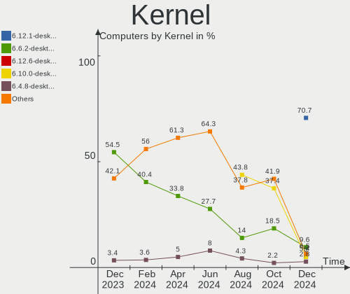
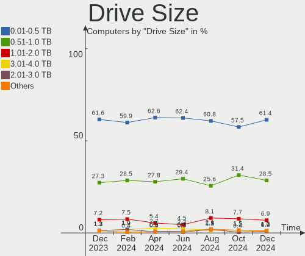
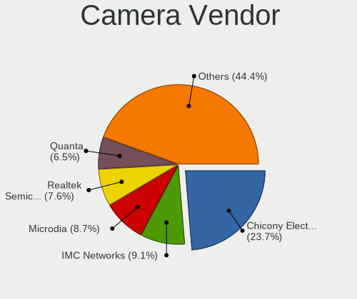

OpenMandriva - Hardware Trends
------------------------------

A project to identify most popular hardware characteristics and track their change
over time based on data collected by Linux users at https://Linux-Hardware.org.

Anyone can contribute to this report by the [hw-probe](https://github.com/linuxhw/hw-probe) tool:

    sudo -E hw-probe -all -upload

This is a report for all computer types. See also reports for [desktops](/Dist/OpenMandriva/Desktop/README.md) and [notebooks](/Dist/OpenMandriva/Notebook/README.md).

This report is for one last month. Overall report since the beginning of time: [TestDays](https://github.com/linuxhw/TestDays)

Period: Dec, 2024.

Contents
--------

* [ System ](#system)
  - [ OS                       ](#os)
  - [ OS Family                ](#os-family)
  - [ Kernel                   ](#kernel)
  - [ Kernel Family            ](#kernel-family)
  - [ Kernel Major Ver.        ](#kernel-major-ver)
  - [ Arch                     ](#arch)
  - [ DE                       ](#de)
  - [ Display Server           ](#display-server)
  - [ Display Manager          ](#display-manager)
  - [ OS Lang                  ](#os-lang)
  - [ Boot Mode                ](#boot-mode)
  - [ Filesystem               ](#filesystem)
  - [ Part. scheme             ](#part-scheme)
  - [ Dual Boot with Linux/BSD ](#dual-boot-with-linuxbsd)
  - [ Dual Boot (Win)          ](#dual-boot-win)

* [ Board ](#board)
  - [ Vendor                   ](#vendor)
  - [ Model                    ](#model)
  - [ Model Family             ](#model-family)
  - [ MFG Year                 ](#mfg-year)
  - [ Form Factor              ](#form-factor)
  - [ Secure Boot              ](#secure-boot)
  - [ Coreboot                 ](#coreboot)
  - [ RAM Size                 ](#ram-size)
  - [ RAM Used                 ](#ram-used)
  - [ Total Drives             ](#total-drives)
  - [ Has CD-ROM               ](#has-cd-rom)
  - [ Has Ethernet             ](#has-ethernet)
  - [ Has WiFi                 ](#has-wifi)
  - [ Has Bluetooth            ](#has-bluetooth)

* [ Location ](#location)
  - [ Country                  ](#country)
  - [ City                     ](#city)

* [ Drives ](#drives)
  - [ Drive Vendor             ](#drive-vendor)
  - [ Drive Model              ](#drive-model)
  - [ HDD Vendor               ](#hdd-vendor)
  - [ SSD Vendor               ](#ssd-vendor)
  - [ Drive Kind               ](#drive-kind)
  - [ Drive Connector          ](#drive-connector)
  - [ Drive Size               ](#drive-size)
  - [ Space Total              ](#space-total)
  - [ Space Used               ](#space-used)
  - [ Malfunc. Drives          ](#malfunc-drives)
  - [ Malfunc. Drive Vendor    ](#malfunc-drive-vendor)
  - [ Malfunc. HDD Vendor      ](#malfunc-hdd-vendor)
  - [ Malfunc. Drive Kind      ](#malfunc-drive-kind)
  - [ Failed Drives            ](#failed-drives)
  - [ Failed Drive Vendor      ](#failed-drive-vendor)
  - [ Drive Status             ](#drive-status)

* [ Storage controller ](#storage-controller)
  - [ Storage Vendor           ](#storage-vendor)
  - [ Storage Model            ](#storage-model)
  - [ Storage Kind             ](#storage-kind)

* [ Processor ](#processor)
  - [ CPU Vendor               ](#cpu-vendor)
  - [ CPU Model                ](#cpu-model)
  - [ CPU Model Family         ](#cpu-model-family)
  - [ CPU Cores                ](#cpu-cores)
  - [ CPU Sockets              ](#cpu-sockets)
  - [ CPU Threads              ](#cpu-threads)
  - [ CPU Op-Modes             ](#cpu-op-modes)
  - [ CPU Microcode            ](#cpu-microcode)
  - [ CPU Microarch            ](#cpu-microarch)

* [ Graphics ](#graphics)
  - [ GPU Vendor               ](#gpu-vendor)
  - [ GPU Model                ](#gpu-model)
  - [ GPU Combo                ](#gpu-combo)
  - [ GPU Driver               ](#gpu-driver)
  - [ GPU Memory               ](#gpu-memory)

* [ Monitor ](#monitor)
  - [ Monitor Vendor           ](#monitor-vendor)
  - [ Monitor Model            ](#monitor-model)
  - [ Monitor Resolution       ](#monitor-resolution)
  - [ Monitor Diagonal         ](#monitor-diagonal)
  - [ Monitor Width            ](#monitor-width)
  - [ Aspect Ratio             ](#aspect-ratio)
  - [ Monitor Area             ](#monitor-area)
  - [ Pixel Density            ](#pixel-density)
  - [ Multiple Monitors        ](#multiple-monitors)

* [ Network ](#network)
  - [ Net Controller Vendor    ](#net-controller-vendor)
  - [ Net Controller Model     ](#net-controller-model)
  - [ Wireless Vendor          ](#wireless-vendor)
  - [ Wireless Model           ](#wireless-model)
  - [ Ethernet Vendor          ](#ethernet-vendor)
  - [ Ethernet Model           ](#ethernet-model)
  - [ Net Controller Kind      ](#net-controller-kind)
  - [ Used Controller          ](#used-controller)
  - [ NICs                     ](#nics)
  - [ IPv6                     ](#ipv6)

* [ Bluetooth ](#bluetooth)
  - [ Bluetooth Vendor         ](#bluetooth-vendor)
  - [ Bluetooth Model          ](#bluetooth-model)

* [ Sound ](#sound)
  - [ Sound Vendor             ](#sound-vendor)
  - [ Sound Model              ](#sound-model)

* [ Memory ](#memory)
  - [ Memory Vendor            ](#memory-vendor)
  - [ Memory Model             ](#memory-model)
  - [ Memory Kind              ](#memory-kind)
  - [ Memory Form Factor       ](#memory-form-factor)
  - [ Memory Size              ](#memory-size)
  - [ Memory Speed             ](#memory-speed)

* [ Printers & scanners ](#printers--scanners)
  - [ Printer Vendor           ](#printer-vendor)
  - [ Printer Model            ](#printer-model)
  - [ Scanner Vendor           ](#scanner-vendor)
  - [ Scanner Model            ](#scanner-model)

* [ Camera ](#camera)
  - [ Camera Vendor            ](#camera-vendor)
  - [ Camera Model             ](#camera-model)

* [ Security ](#security)
  - [ Fingerprint Vendor       ](#fingerprint-vendor)
  - [ Fingerprint Model        ](#fingerprint-model)
  - [ Chipcard Vendor          ](#chipcard-vendor)
  - [ Chipcard Model           ](#chipcard-model)

* [ Unsupported ](#unsupported)
  - [ Unsupported Devices      ](#unsupported-devices)
  - [ Unsupported Device Types ](#unsupported-device-types)

System
------

OS
--

Installed operating systems

| Name               | Computers | Percent |
|--------------------|-----------|---------|
| OpenMandriva 24.12 | 757       | 76.77%  |
| OpenMandriva 5.0   | 93        | 9.43%   |
| OpenMandriva 24.07 | 51        | 5.17%   |
| OpenMandriva 23.08 | 45        | 4.56%   |
| OpenMandriva 4.3   | 8         | 0.81%   |
| OpenMandriva 24.90 | 7         | 0.71%   |
| OpenMandriva 23.03 | 5         | 0.51%   |
| OpenMandriva 4.2   | 4         | 0.41%   |
| OpenMandriva 23.01 | 4         | 0.41%   |
| OpenMandriva 24.09 | 3         | 0.3%    |
| OpenMandriva 23.09 | 2         | 0.2%    |
| OpenMandriva 4.50  | 1         | 0.1%    |
| OpenMandriva 24.11 | 1         | 0.1%    |
| OpenMandriva 24.08 | 1         | 0.1%    |
| OpenMandriva 24.04 | 1         | 0.1%    |
| OpenMandriva 24.03 | 1         | 0.1%    |
| OpenMandriva 24.01 | 1         | 0.1%    |
| OpenMandriva 23.11 | 1         | 0.1%    |

OS Family
---------

OS without a version

| Name         | Computers | Percent |
|--------------|-----------|---------|
| OpenMandriva | 986       | 100%    |

Kernel
------

Version of the Linux kernel

| Version                       | Computers | Percent |
|-------------------------------|-----------|---------|
| 6.12.1-desktop-1omv2490       | 697       | 70.69%  |
| 6.6.2-desktop-1omv2390        | 95        | 9.63%   |
| 6.12.6-desktop-1omv2490       | 53        | 5.38%   |
| 6.10.0-desktop-1omv2490       | 49        | 4.97%   |
| 6.4.8-desktop-2omv2390        | 28        | 2.84%   |
| 6.4.11-desktop-1omv2390       | 19        | 1.93%   |
| 5.16.7-desktop-1omv4003       | 8         | 0.81%   |
| 6.2.6-desktop-1omv2390        | 5         | 0.51%   |
| 6.13.0-desktop-0.rc1.1omv2490 | 5         | 0.51%   |
| 6.1.1-desktop-1omv2290        | 4         | 0.41%   |
| 5.10.14-desktop-1omv4002      | 4         | 0.41%   |
| 6.9.7-desktop-1omv2490        | 2         | 0.2%    |
| 6.11.5-desktop-1omv2490       | 2         | 0.2%    |
| 6.11.0-desktop-2omv2490       | 2         | 0.2%    |
| 6.10.1-desktop-1omv2490       | 2         | 0.2%    |
| 6.8.7-desktop-gcc-1omv2490    | 1         | 0.1%    |
| 6.8.7-desktop-1omv2490        | 1         | 0.1%    |
| 6.5.5-desktop-1omv2390        | 1         | 0.1%    |
| 6.5.3-desktop-1omv2390        | 1         | 0.1%    |
| 6.13.0-desktop-0.rc4.1omv2490 | 1         | 0.1%    |
| 6.12.7-desktop-1omv2490       | 1         | 0.1%    |
| 6.12.0-desktop-1omv2490       | 1         | 0.1%    |
| 6.11.6-desktop-1omv2490       | 1         | 0.1%    |
| 6.11.3-desktop-1omv2490       | 1         | 0.1%    |
| 6.11.10-amd64                 | 1         | 0.1%    |
| 5.19.5-desktop-1omv4090       | 1         | 0.1%    |

Kernel Family
-------------

Linux kernel without a distro release

| Version | Computers | Percent |
|---------|-----------|---------|
| 6.12.1  | 697       | 70.69%  |
| 6.6.2   | 95        | 9.63%   |
| 6.12.6  | 53        | 5.38%   |
| 6.10.0  | 49        | 4.97%   |
| 6.4.8   | 28        | 2.84%   |
| 6.4.11  | 19        | 1.93%   |
| 5.16.7  | 8         | 0.81%   |
| 6.13.0  | 6         | 0.61%   |
| 6.2.6   | 5         | 0.51%   |
| 6.1.1   | 4         | 0.41%   |
| 5.10.14 | 4         | 0.41%   |
| 6.9.7   | 2         | 0.2%    |
| 6.8.7   | 2         | 0.2%    |
| 6.11.5  | 2         | 0.2%    |
| 6.11.0  | 2         | 0.2%    |
| 6.10.1  | 2         | 0.2%    |
| 6.5.5   | 1         | 0.1%    |
| 6.5.3   | 1         | 0.1%    |
| 6.12.7  | 1         | 0.1%    |
| 6.12.0  | 1         | 0.1%    |
| 6.11.6  | 1         | 0.1%    |
| 6.11.3  | 1         | 0.1%    |
| 6.11.10 | 1         | 0.1%    |
| 5.19.5  | 1         | 0.1%    |

Kernel Major Ver.
-----------------

Linux kernel major version

| Version | Computers | Percent |
|---------|-----------|---------|
| 6.12    | 752       | 76.27%  |
| 6.6     | 95        | 9.63%   |
| 6.10    | 51        | 5.17%   |
| 6.4     | 47        | 4.77%   |
| 5.16    | 8         | 0.81%   |
| 6.11    | 7         | 0.71%   |
| 6.13    | 6         | 0.61%   |
| 6.2     | 5         | 0.51%   |
| 6.1     | 4         | 0.41%   |
| 5.10    | 4         | 0.41%   |
| 6.9     | 2         | 0.2%    |
| 6.8     | 2         | 0.2%    |
| 6.5     | 2         | 0.2%    |
| 5.19    | 1         | 0.1%    |

Arch
----

OS architecture (x86_64, i586, etc.)

| Name   | Computers | Percent |
|--------|-----------|---------|
| x86_64 | 986       | 100%    |

DE
--

Desktop Environment

| Name     | Computers | Percent |
|----------|-----------|---------|
| Unknown  | 680       | 68.97%  |
| KDE5     | 149       | 15.11%  |
| LXQt     | 106       | 10.75%  |
| GNOME    | 43        | 4.36%   |
| XFCE     | 2         | 0.2%    |
| MATE     | 2         | 0.2%    |
| Budgie   | 2         | 0.2%    |
| LXDE     | 1         | 0.1%    |
| Cinnamon | 1         | 0.1%    |

Display Server
--------------

X11 or Wayland

| Name    | Computers | Percent |
|---------|-----------|---------|
| Wayland | 519       | 52.64%  |
| X11     | 464       | 47.06%  |
| Unknown | 3         | 0.3%    |

Display Manager
---------------

SDDM, LightDM, etc.

| Name    | Computers | Percent |
|---------|-----------|---------|
| SDDM    | 878       | 89.05%  |
| GDM     | 105       | 10.65%  |
| LightDM | 2         | 0.2%    |
| Unknown | 1         | 0.1%    |

OS Lang
-------

Language

| Lang  | Computers | Percent |
|-------|-----------|---------|
| en_US | 554       | 56.19%  |
| de_DE | 61        | 6.19%   |
| en_GB | 47        | 4.77%   |
| fr_FR | 41        | 4.16%   |
| ru_RU | 38        | 3.85%   |
| pl_PL | 37        | 3.75%   |
| it_IT | 37        | 3.75%   |
| pt_BR | 26        | 2.64%   |
| es_ES | 22        | 2.23%   |
| cs_CZ | 17        | 1.72%   |
| en_AU | 15        | 1.52%   |
| en_CA | 14        | 1.42%   |
| es_AR | 8         | 0.81%   |
| de_AT | 8         | 0.81%   |
| tr_TR | 6         | 0.61%   |
| es_MX | 6         | 0.61%   |
| nl_NL | 5         | 0.51%   |
| en_IN | 5         | 0.51%   |
| en_SG | 4         | 0.41%   |
| hu_HU | 3         | 0.3%    |
| fr_BE | 3         | 0.3%    |
| en_ZA | 3         | 0.3%    |
| en_NZ | 3         | 0.3%    |
| da_DK | 3         | 0.3%    |
| ro_RO | 2         | 0.2%    |
| nl_BE | 2         | 0.2%    |
| de_CH | 2         | 0.2%    |
| ru_UA | 1         | 0.1%    |
| pt_PT | 1         | 0.1%    |
| fr_CA | 1         | 0.1%    |
| es_VE | 1         | 0.1%    |
| es_UY | 1         | 0.1%    |
| es_PE | 1         | 0.1%    |
| es_GT | 1         | 0.1%    |
| es_CO | 1         | 0.1%    |
| es_CL | 1         | 0.1%    |
| en_NG | 1         | 0.1%    |
| en_IL | 1         | 0.1%    |
| de_IT | 1         | 0.1%    |
| ca_ES | 1         | 0.1%    |

Boot Mode
---------

EFI or BIOS

| Mode | Computers | Percent |
|------|-----------|---------|
| EFI  | 647       | 65.62%  |
| BIOS | 339       | 34.38%  |

Filesystem
----------

Type of filesystem

| Type    | Computers | Percent |
|---------|-----------|---------|
| Overlay | 556       | 56.39%  |
| Ext4    | 379       | 38.44%  |
| Btrfs   | 43        | 4.36%   |
| Xfs     | 4         | 0.41%   |
| F2fs    | 4         | 0.41%   |

Part. scheme
------------

Scheme of partitioning

| Type | Computers | Percent |
|------|-----------|---------|
| GPT  | 829       | 84.08%  |
| MBR  | 157       | 15.92%  |

Dual Boot with Linux/BSD
------------------------

Hosting more than one Linux/BSD

| Dual boot | Computers | Percent |
|-----------|-----------|---------|
| Yes       | 502       | 50.91%  |
| No        | 484       | 49.09%  |

Dual Boot (Win)
---------------

Hosting Linux and Windows

| Dual boot | Computers | Percent |
|-----------|-----------|---------|
| No        | 576       | 58.42%  |
| Yes       | 410       | 41.58%  |

Board
-----

Vendor
------

Motherboard manufacturer

| Name                                 | Computers | Percent |
|--------------------------------------|-----------|---------|
| ASUSTek Computer                     | 157       | 15.92%  |
| Hewlett-Packard                      | 154       | 15.62%  |
| Dell                                 | 141       | 14.3%   |
| Lenovo                               | 130       | 13.18%  |
| Acer                                 | 63        | 6.39%   |
| Gigabyte Technology                  | 60        | 6.09%   |
| MSI                                  | 48        | 4.87%   |
| ASRock                               | 39        | 3.96%   |
| Toshiba                              | 21        | 2.13%   |
| Intel                                | 17        | 1.72%   |
| Apple                                | 16        | 1.62%   |
| Unknown                              | 16        | 1.62%   |
| AZW                                  | 13        | 1.32%   |
| Fujitsu                              | 10        | 1.01%   |
| Google                               | 9         | 0.91%   |
| Samsung Electronics                  | 6         | 0.61%   |
| Notebook                             | 5         | 0.51%   |
| Medion                               | 5         | 0.51%   |
| AMI                                  | 4         | 0.41%   |
| Sony                                 | 3         | 0.3%    |
| Shenzhen Meigao Electronic Equipment | 3         | 0.3%    |
| Pegatron                             | 3         | 0.3%    |
| HUAWEI                               | 3         | 0.3%    |
| GEEKOM                               | 3         | 0.3%    |
| Foxconn                              | 3         | 0.3%    |
| Chuwi                                | 3         | 0.3%    |
| Biostar                              | 3         | 0.3%    |
| TUXEDO                               | 2         | 0.2%    |
| Positivo                             | 2         | 0.2%    |
| NEC Computers                        | 2         | 0.2%    |
| LG Electronics                       | 2         | 0.2%    |
| Gateway                              | 2         | 0.2%    |
| Fujitsu Siemens                      | 2         | 0.2%    |
| Framework                            | 2         | 0.2%    |
| AMD                                  | 2         | 0.2%    |
| Alienware                            | 2         | 0.2%    |
| Wistron                              | 1         | 0.1%    |
| Trigkey                              | 1         | 0.1%    |
| SZMZ                                 | 1         | 0.1%    |
| STGAUBRON                            | 1         | 0.1%    |

Model
-----

Motherboard model

| Name                          | Computers | Percent |
|-------------------------------|-----------|---------|
| Unknown                       | 19        | 1.93%   |
| HP Notebook                   | 9         | 0.91%   |
| Dell OptiPlex 9020            | 6         | 0.61%   |
| AZW SER                       | 6         | 0.61%   |
| ASUS All Series               | 6         | 0.61%   |
| Dell Latitude E6430           | 5         | 0.51%   |
| ASUS TUF Gaming B550M-PLUS    | 4         | 0.41%   |
| AMI Intel                     | 4         | 0.41%   |
| Lenovo IdeaPad 3 15ITL6 82H8  | 3         | 0.3%    |
| HP Pavilion dv6               | 3         | 0.3%    |
| HP EliteDesk 800 G2 SFF       | 3         | 0.3%    |
| HP EliteBook 840 G3           | 3         | 0.3%    |
| Gigabyte B450M DS3H V2        | 3         | 0.3%    |
| Dell OptiPlex 780             | 3         | 0.3%    |
| Dell OptiPlex 7010            | 3         | 0.3%    |
| Dell Latitude E7440           | 3         | 0.3%    |
| Dell Latitude E6500           | 3         | 0.3%    |
| Dell Latitude 7490            | 3         | 0.3%    |
| Dell Latitude 5490            | 3         | 0.3%    |
| Dell Inspiron 5570            | 3         | 0.3%    |
| AZW MINI S                    | 3         | 0.3%    |
| ASUS X550CC                   | 3         | 0.3%    |
| ASUS PRIME B450M-A            | 3         | 0.3%    |
| ASUS PRIME A320M-K            | 3         | 0.3%    |
| Apple MacBookPro9,2           | 3         | 0.3%    |
| Acer Aspire A515-51G          | 3         | 0.3%    |
| Toshiba Satellite L855        | 2         | 0.2%    |
| Toshiba Satellite L755        | 2         | 0.2%    |
| MSI MS-7C02                   | 2         | 0.2%    |
| MSI MS-7917                   | 2         | 0.2%    |
| MSI MS-7680                   | 2         | 0.2%    |
| Lenovo IdeaPad 1 15ALC7 82R4  | 2         | 0.2%    |
| Intel H61                     | 2         | 0.2%    |
| HP Z440 Workstation           | 2         | 0.2%    |
| HP t630 Thin Client           | 2         | 0.2%    |
| HP ProDesk 600 G2 SFF         | 2         | 0.2%    |
| HP ProDesk 600 G1 TWR         | 2         | 0.2%    |
| HP ProBook 630 G8 Notebook PC | 2         | 0.2%    |
| HP Pavilion dv5               | 2         | 0.2%    |
| HP Laptop 14-bs0xx            | 2         | 0.2%    |

Model Family
------------

Motherboard model prefix

| Name               | Computers | Percent |
|--------------------|-----------|---------|
| Lenovo ThinkPad    | 44        | 4.46%   |
| Dell Latitude      | 43        | 4.36%   |
| Acer Aspire        | 43        | 4.36%   |
| Dell Inspiron      | 38        | 3.85%   |
| Dell OptiPlex      | 33        | 3.35%   |
| Lenovo IdeaPad     | 25        | 2.54%   |
| ASUS PRIME         | 24        | 2.43%   |
| HP Laptop          | 23        | 2.33%   |
| HP Pavilion        | 22        | 2.23%   |
| HP EliteBook       | 21        | 2.13%   |
| Toshiba Satellite  | 20        | 2.03%   |
| Unknown            | 19        | 1.93%   |
| Lenovo ThinkCentre | 18        | 1.83%   |
| HP ProBook         | 13        | 1.32%   |
| HP Compaq          | 12        | 1.22%   |
| ASUS VivoBook      | 12        | 1.22%   |
| Dell Precision     | 10        | 1.01%   |
| Lenovo Yoga        | 9         | 0.91%   |
| HP Notebook        | 9         | 0.91%   |
| Dell XPS           | 9         | 0.91%   |
| ASUS ROG           | 9         | 0.91%   |
| HP EliteDesk       | 8         | 0.81%   |
| Fujitsu LIFEBOOK   | 7         | 0.71%   |
| ASUS ASUS          | 7         | 0.71%   |
| HP ProDesk         | 6         | 0.61%   |
| HP ENVY            | 6         | 0.61%   |
| AZW SER            | 6         | 0.61%   |
| ASUS P8Z77-V       | 6         | 0.61%   |
| ASUS All           | 6         | 0.61%   |
| Gigabyte B450M     | 5         | 0.51%   |
| ASUS TUF           | 5         | 0.51%   |
| Gigabyte A520M     | 4         | 0.41%   |
| AMI Intel          | 4         | 0.41%   |
| Acer Swift         | 4         | 0.41%   |
| Acer Predator      | 4         | 0.41%   |
| Acer Nitro         | 4         | 0.41%   |
| Notebook W65       | 3         | 0.3%    |
| MSI Modern         | 3         | 0.3%    |
| Lenovo Legion      | 3         | 0.3%    |
| HP Victus          | 3         | 0.3%    |

MFG Year
--------

Motherboard manufacture year

| Year | Computers | Percent |
|------|-----------|---------|
| 2012 | 86        | 8.72%   |
| 2017 | 75        | 7.61%   |
| 2013 | 71        | 7.2%    |
| 2018 | 69        | 7%      |
| 2020 | 67        | 6.8%    |
| 2011 | 66        | 6.69%   |
| 2021 | 62        | 6.29%   |
| 2023 | 58        | 5.88%   |
| 2019 | 58        | 5.88%   |
| 2015 | 53        | 5.38%   |
| 2014 | 53        | 5.38%   |
| 2022 | 52        | 5.27%   |
| 2016 | 50        | 5.07%   |
| 2010 | 41        | 4.16%   |
| 2024 | 36        | 3.65%   |
| 2008 | 36        | 3.65%   |
| 2009 | 33        | 3.35%   |
| 2007 | 15        | 1.52%   |
| 2006 | 3         | 0.3%    |
| 2005 | 2         | 0.2%    |

Form Factor
-----------

Physical design of the computer

| Name        | Computers | Percent |
|-------------|-----------|---------|
| Notebook    | 511       | 51.83%  |
| Desktop     | 409       | 41.48%  |
| Mini pc     | 32        | 3.25%   |
| Convertible | 19        | 1.93%   |
| All in one  | 12        | 1.22%   |
| Tablet      | 2         | 0.2%    |
| Server      | 1         | 0.1%    |

Secure Boot
-----------

Enabled or disabled

| State    | Computers | Percent |
|----------|-----------|---------|
| Disabled | 986       | 100%    |

Coreboot
--------

Have coreboot on board

| Used | Computers | Percent |
|------|-----------|---------|
| No   | 977       | 99.09%  |
| Yes  | 9         | 0.91%   |

RAM Size
--------

Total RAM memory

| Size in GB  | Computers | Percent |
|-------------|-----------|---------|
| 4.01-8.0    | 243       | 24.65%  |
| 16.01-24.0  | 226       | 22.92%  |
| 8.01-16.0   | 182       | 18.46%  |
| 3.01-4.0    | 173       | 17.55%  |
| 32.01-64.0  | 85        | 8.62%   |
| 24.01-32.0  | 32        | 3.25%   |
| 64.01-256.0 | 23        | 2.33%   |
| 1.01-2.0    | 16        | 1.62%   |
| 2.01-3.0    | 5         | 0.51%   |
| 0.51-1.0    | 1         | 0.1%    |

RAM Used
--------

Used RAM memory

| Used GB  | Computers | Percent |
|----------|-----------|---------|
| 1.01-2.0 | 541       | 54.87%  |
| 2.01-3.0 | 276       | 27.99%  |
| 0.51-1.0 | 79        | 8.01%   |
| 3.01-4.0 | 54        | 5.48%   |
| 4.01-8.0 | 28        | 2.84%   |
| 0.01-0.5 | 8         | 0.81%   |

Total Drives
------------

Number of drives on board

| Drives | Computers | Percent |
|--------|-----------|---------|
| 1      | 600       | 60.85%  |
| 2      | 236       | 23.94%  |
| 3      | 73        | 7.4%    |
| 4      | 42        | 4.26%   |
| 0      | 19        | 1.93%   |
| 5      | 7         | 0.71%   |
| 6      | 4         | 0.41%   |
| 7      | 2         | 0.2%    |
| 10     | 1         | 0.1%    |
| 9      | 1         | 0.1%    |
| 8      | 1         | 0.1%    |

Has CD-ROM
----------

Has CD-ROM on board

| Presented | Computers | Percent |
|-----------|-----------|---------|
| No        | 588       | 59.63%  |
| Yes       | 398       | 40.37%  |

Has Ethernet
------------

Has Ethernet on board

| Presented | Computers | Percent |
|-----------|-----------|---------|
| Yes       | 849       | 86.11%  |
| No        | 137       | 13.89%  |

Has WiFi
--------

Has WiFi module

| Presented | Computers | Percent |
|-----------|-----------|---------|
| Yes       | 733       | 74.34%  |
| No        | 253       | 25.66%  |

Has Bluetooth
-------------

Has Bluetooth module

| Presented | Computers | Percent |
|-----------|-----------|---------|
| Yes       | 597       | 60.55%  |
| No        | 389       | 39.45%  |

Location
--------

Country
-------

Geographic location (country)

| Country         | Computers | Percent |
|-----------------|-----------|---------|
| USA             | 190       | 19.27%  |
| Germany         | 90        | 9.13%   |
| Russia          | 58        | 5.88%   |
| France          | 53        | 5.38%   |
| Poland          | 52        | 5.27%   |
| Italy           | 52        | 5.27%   |
| UK              | 43        | 4.36%   |
| Spain           | 43        | 4.36%   |
| Brazil          | 41        | 4.16%   |
| Canada          | 36        | 3.65%   |
| Australia       | 28        | 2.84%   |
| India           | 21        | 2.13%   |
| Czechia         | 20        | 2.03%   |
| Netherlands     | 16        | 1.62%   |
| Mexico          | 12        | 1.22%   |
| Indonesia       | 12        | 1.22%   |
| Greece          | 12        | 1.22%   |
| Romania         | 11        | 1.12%   |
| Japan           | 11        | 1.12%   |
| Turkey          | 10        | 1.01%   |
| Malaysia        | 10        | 1.01%   |
| Austria         | 9         | 0.91%   |
| Argentina       | 9         | 0.91%   |
| Singapore       | 8         | 0.81%   |
| Hungary         | 7         | 0.71%   |
| New Zealand     | 6         | 0.61%   |
| Belgium         | 6         | 0.61%   |
| Slovakia        | 5         | 0.51%   |
| Finland         | 5         | 0.51%   |
| Ukraine         | 4         | 0.41%   |
| Sweden          | 4         | 0.41%   |
| South Africa    | 4         | 0.41%   |
| Peru            | 4         | 0.41%   |
| Morocco         | 4         | 0.41%   |
| Israel          | 4         | 0.41%   |
| The Netherlands | 3         | 0.3%    |
| Switzerland     | 3         | 0.3%    |
| Serbia          | 3         | 0.3%    |
| Portugal        | 3         | 0.3%    |
| Lithuania       | 3         | 0.3%    |

City
----

Geographic location (city)

| City          | Computers | Percent |
|---------------|-----------|---------|
| Moscow        | 11        | 1.12%   |
| Sydney        | 9         | 0.91%   |
| Singapore     | 8         | 0.81%   |
| Berlin        | 8         | 0.81%   |
| Melbourne     | 7         | 0.71%   |
| Warsaw        | 6         | 0.61%   |
| Vienna        | 6         | 0.61%   |
| Rome          | 6         | 0.61%   |
| Paris         | 6         | 0.61%   |
| Milan         | 6         | 0.61%   |
| Istanbul      | 6         | 0.61%   |
| Athens        | 6         | 0.61%   |
| Wroclaw       | 5         | 0.51%   |
| Thessaloniki  | 5         | 0.51%   |
| St Petersburg | 5         | 0.51%   |
| Prague        | 5         | 0.51%   |
| Poznan        | 5         | 0.51%   |
| Madrid        | 5         | 0.51%   |
| Krakow        | 5         | 0.51%   |
| Toronto       | 4         | 0.41%   |
| Topeka        | 4         | 0.41%   |
| Tokyo         | 4         | 0.41%   |
| The Bronx     | 4         | 0.41%   |
| Tacoma        | 4         | 0.41%   |
| Osnabrück    | 4         | 0.41%   |
| Munich        | 4         | 0.41%   |
| Milano        | 4         | 0.41%   |
| Lima          | 4         | 0.41%   |
| Hanover       | 4         | 0.41%   |
| Flushing      | 4         | 0.41%   |
| Chicago       | 4         | 0.41%   |
| Brisbane      | 4         | 0.41%   |
| Bengaluru     | 4         | 0.41%   |
| Yekaterinburg | 3         | 0.3%    |
| Rostov-on-Don | 3         | 0.3%    |
| Reading       | 3         | 0.3%    |
| Pflugerville  | 3         | 0.3%    |
| Novosibirsk   | 3         | 0.3%    |
| Kota Kinabalu | 3         | 0.3%    |
| Katy          | 3         | 0.3%    |

Drives
------

Drive Vendor
------------

Hard drive vendors

| Vendor                       | Computers | Drives | Percent |
|------------------------------|-----------|--------|---------|
| Seagate                      | 173       | 197    | 12.3%   |
| WDC                          | 171       | 201    | 12.16%  |
| Samsung Electronics          | 170       | 189    | 12.09%  |
| Sandisk                      | 91        | 98     | 6.47%   |
| Kingston                     | 83        | 93     | 5.9%    |
| Toshiba                      | 75        | 77     | 5.33%   |
| Crucial                      | 63        | 69     | 4.48%   |
| Unknown                      | 48        | 59     | 3.41%   |
| China                        | 35        | 36     | 2.49%   |
| Intel                        | 34        | 36     | 2.42%   |
| Hitachi                      | 26        | 26     | 1.85%   |
| SK hynix                     | 25        | 26     | 1.78%   |
| Micron Technology            | 22        | 22     | 1.56%   |
| A-DATA Technology            | 19        | 20     | 1.35%   |
| PNY                          | 18        | 19     | 1.28%   |
| Micron/Crucial Technology    | 16        | 16     | 1.14%   |
| Kingston Technology Company  | 16        | 16     | 1.14%   |
| MAXIO Technology (Hangzhou)  | 15        | 17     | 1.07%   |
| HGST                         | 15        | 16     | 1.07%   |
| KIOXIA                       | 14        | 14     | 1%      |
| Phison Electronics           | 13        | 15     | 0.92%   |
| SPCC                         | 12        | 12     | 0.85%   |
| GOODRAM                      | 12        | 13     | 0.85%   |
| Silicon Motion               | 11        | 11     | 0.78%   |
| Patriot                      | 11        | 11     | 0.78%   |
| ADATA Technology             | 11        | 11     | 0.78%   |
| Intenso                      | 8         | 8      | 0.57%   |
| Apple                        | 8         | 8      | 0.57%   |
| Unknown                      | 8         | 8      | 0.57%   |
| Team                         | 7         | 7      | 0.5%    |
| KingSpec                     | 7         | 7      | 0.5%    |
| Fanxiang                     | 7         | 7      | 0.5%    |
| Transcend                    | 6         | 6      | 0.43%   |
| Shenzhen Longsys Electronics | 6         | 6      | 0.43%   |
| Realtek Semiconductor        | 6         | 6      | 0.43%   |
| Plextor                      | 6         | 6      | 0.43%   |
| JMicron Technology           | 6         | 6      | 0.43%   |
| Apacer                       | 6         | 6      | 0.43%   |
| Netac                        | 5         | 5      | 0.36%   |
| Maxtor                       | 5         | 5      | 0.36%   |

Drive Model
-----------

Hard drive models

| Model                                                 | Computers | Percent |
|-------------------------------------------------------|-----------|---------|
| Samsung NVMe SSD Controller SM981/PM981/PM983 512GB   | 18        | 1.2%    |
| Kingston SA400S37240G 240GB SSD                       | 17        | 1.13%   |
| Seagate ST500DM002-1BD142 500GB                       | 16        | 1.07%   |
| Unknown MMC Card  64GB                                | 13        | 0.87%   |
| Sandisk WD Blue SN550 NVMe SSD 256GB                  | 13        | 0.87%   |
| Micron/Crucial P2 NVMe PCIe SSD 500GB                 | 12        | 0.8%    |
| MAXIO (Hangzhou) NVMe SSD Controller MAP1202 512GB    | 12        | 0.8%    |
| Crucial CT500MX500SSD1 500GB                          | 12        | 0.8%    |
| Toshiba MQ01ABD100 1TB                                | 10        | 0.67%   |
| Silicon Motion SM2263EN/SM2263XT SSD Controller 256GB | 10        | 0.67%   |
| Seagate ST2000DM008-2FR102 2TB                        | 9         | 0.6%    |
| Kingston SNV2S500G 500GB                              | 9         | 0.6%    |
| Kingston SA400S37480G 480GB SSD                       | 9         | 0.6%    |
| Crucial CT240BX500SSD1 240GB                          | 9         | 0.6%    |
| Crucial CT1000BX500SSD1 1TB                           | 9         | 0.6%    |
| Unknown SD/MMC/MS PRO 128GB                           | 8         | 0.53%   |
| Seagate ST1000DM010-2EP102 1TB                        | 8         | 0.53%   |
| Samsung SSD 850 EVO 250GB                             | 8         | 0.53%   |
| Samsung NVMe SSD Controller SM961/PM961/SM963 256GB   | 8         | 0.53%   |
| Samsung NVMe SSD Controller PM9A1/PM9A3/980PRO 512GB  | 8         | 0.53%   |
| Unknown                                               | 8         | 0.53%   |
| WDC WD10EZEX-08WN4A0 1TB                              | 7         | 0.47%   |
| Unknown MMC Card  128GB                               | 7         | 0.47%   |
| Seagate ST1000LM035-1RK172 1TB                        | 7         | 0.47%   |
| Samsung SSD 860 EVO 500GB                             | 7         | 0.47%   |
| Kingston Company SNV2S1000G 1TB                       | 7         | 0.47%   |
| Intel SSD 660P Series 1024GB                          | 7         | 0.47%   |
| Toshiba MQ01ABF050 500GB                              | 6         | 0.4%    |
| Samsung SSD 860 EVO 250GB                             | 6         | 0.4%    |
| Kingston SA400S37120G 120GB SSD                       | 6         | 0.4%    |
| China SSD 1TB                                         | 6         | 0.4%    |
| WDC WD10SPZX-21Z10T0 1TB                              | 5         | 0.33%   |
| WDC WD10EZEX-08M2NA0 1TB                              | 5         | 0.33%   |
| WDC WD10EZEX-00BBHA0 1TB                              | 5         | 0.33%   |
| Toshiba MQ04ABF100 1TB                                | 5         | 0.33%   |
| Seagate ST9500420AS 500GB                             | 5         | 0.33%   |
| Seagate ST500LT012-1DG142 500GB                       | 5         | 0.33%   |
| Seagate ST3250318AS 250GB                             | 5         | 0.33%   |
| Seagate ST2000DM008-2UB102 2TB                        | 5         | 0.33%   |
| Seagate ST1000LM024 HN-M101MBB 1TB                    | 5         | 0.33%   |

HDD Vendor
----------

Hard disk drive vendors

| Vendor              | Computers | Drives | Percent |
|---------------------|-----------|--------|---------|
| Seagate             | 169       | 192    | 36.34%  |
| WDC                 | 150       | 176    | 32.26%  |
| Toshiba             | 60        | 62     | 12.9%   |
| Hitachi             | 26        | 26     | 5.59%   |
| Samsung Electronics | 18        | 18     | 3.87%   |
| HGST                | 15        | 16     | 3.23%   |
| Unknown             | 8         | 8      | 1.72%   |
| Maxtor              | 5         | 5      | 1.08%   |
| Apple               | 5         | 5      | 1.08%   |
| Fujitsu             | 4         | 4      | 0.86%   |
| JMicron Technology  | 3         | 3      | 0.65%   |
| Hewlett-Packard     | 1         | 1      | 0.22%   |
| ASMT                | 1         | 1      | 0.22%   |

SSD Vendor
----------

Solid state drive vendors

| Vendor              | Computers | Drives | Percent |
|---------------------|-----------|--------|---------|
| Samsung Electronics | 85        | 96     | 15.4%   |
| Crucial             | 61        | 67     | 11.05%  |
| Kingston            | 60        | 67     | 10.87%  |
| SanDisk             | 35        | 37     | 6.34%   |
| China               | 35        | 36     | 6.34%   |
| WDC                 | 24        | 24     | 4.35%   |
| PNY                 | 18        | 19     | 3.26%   |
| A-DATA Technology   | 16        | 16     | 2.9%    |
| SPCC                | 12        | 12     | 2.17%   |
| Intel               | 12        | 12     | 2.17%   |
| GOODRAM             | 12        | 13     | 2.17%   |
| Patriot             | 10        | 10     | 1.81%   |
| SK hynix            | 8         | 8      | 1.45%   |
| Micron Technology   | 8         | 8      | 1.45%   |
| Intenso             | 8         | 8      | 1.45%   |
| Unknown             | 8         | 8      | 1.45%   |
| Toshiba             | 7         | 7      | 1.27%   |
| KingSpec            | 7         | 7      | 1.27%   |
| Team                | 6         | 6      | 1.09%   |
| Plextor             | 6         | 6      | 1.09%   |
| Fanxiang            | 6         | 6      | 1.09%   |
| Apacer              | 6         | 6      | 1.09%   |
| Transcend           | 5         | 5      | 0.91%   |
| LITEON              | 5         | 5      | 0.91%   |
| Lexar               | 5         | 5      | 0.91%   |
| KIOXIA-EXCERIA      | 5         | 5      | 0.91%   |
| Emtec               | 5         | 5      | 0.91%   |
| Verbatim            | 4         | 4      | 0.72%   |
| OCZ                 | 4         | 4      | 0.72%   |
| Netac               | 4         | 4      | 0.72%   |
| Mushkin             | 3         | 3      | 0.54%   |
| Apple               | 3         | 3      | 0.54%   |
| WALRAM              | 2         | 2      | 0.36%   |
| V-GeN               | 2         | 2      | 0.36%   |
| SSSTC               | 2         | 2      | 0.36%   |
| Seagate             | 2         | 2      | 0.36%   |
| NGFF                | 2         | 2      | 0.36%   |
| HS-SSD-C100         | 2         | 2      | 0.36%   |
| FORESEE             | 2         | 2      | 0.36%   |
| EAGET               | 2         | 2      | 0.36%   |

Drive Kind
----------

HDD or SSD

| Kind    | Computers | Drives | Percent |
|---------|-----------|--------|---------|
| SSD     | 488       | 582    | 38.82%  |
| HDD     | 399       | 517    | 31.74%  |
| NVMe    | 324       | 372    | 25.78%  |
| MMC     | 32        | 35     | 2.55%   |
| Unknown | 14        | 21     | 1.11%   |

Drive Connector
---------------

SATA, SAS, NVMe, etc.

| Type | Computers | Drives | Percent |
|------|-----------|--------|---------|
| SATA | 735       | 1077   | 65.22%  |
| NVMe | 324       | 371    | 28.75%  |
| SAS  | 36        | 44     | 3.19%   |
| MMC  | 32        | 35     | 2.84%   |

Drive Size
----------

Size of hard drive

| Size in TB | Computers | Drives | Percent |
|------------|-----------|--------|---------|
| 0.01-0.5   | 553       | 697    | 61.38%  |
| 0.51-1.0   | 257       | 292    | 28.52%  |
| 1.01-2.0   | 62        | 72     | 6.88%   |
| 3.01-4.0   | 10        | 13     | 1.11%   |
| 2.01-3.0   | 8         | 12     | 0.89%   |
| 4.01-10.0  | 8         | 10     | 0.89%   |
| 10.01-20.0 | 3         | 3      | 0.33%   |

Space Total
-----------

Amount of disk space available on the file system

| Size in GB     | Computers | Percent |
|----------------|-----------|---------|
| 1-20           | 394       | 39.96%  |
| 101-250        | 197       | 19.98%  |
| 251-500        | 118       | 11.97%  |
| 501-1000       | 77        | 7.81%   |
| 51-100         | 51        | 5.17%   |
| Unknown        | 44        | 4.46%   |
| 21-50          | 34        | 3.45%   |
| 1001-2000      | 34        | 3.45%   |
| More than 3000 | 23        | 2.33%   |
| 2001-3000      | 14        | 1.42%   |

Space Used
----------

Amount of used disk space

| Used GB        | Computers | Percent |
|----------------|-----------|---------|
| 1-20           | 759       | 76.98%  |
| 21-50          | 55        | 5.58%   |
| Unknown        | 44        | 4.46%   |
| 101-250        | 32        | 3.25%   |
| 51-100         | 30        | 3.04%   |
| 0              | 27        | 2.74%   |
| 251-500        | 19        | 1.93%   |
| 501-1000       | 13        | 1.32%   |
| More than 3000 | 3         | 0.3%    |
| 1001-2000      | 3         | 0.3%    |
| 2001-3000      | 1         | 0.1%    |

Malfunc. Drives
---------------

Drive models with a malfunction

| Model                               | Computers | Drives | Percent |
|-------------------------------------|-----------|--------|---------|
| Seagate ST500DM002-1BD142 500GB     | 9         | 10     | 3.81%   |
| WDC WD10EZEX-60ZF5A0 1TB            | 3         | 3      | 1.27%   |
| Toshiba MQ01ABF050 500GB            | 3         | 3      | 1.27%   |
| Toshiba MQ01ABD100 1TB              | 3         | 3      | 1.27%   |
| Seagate ST500LT012-9WS142 500GB     | 3         | 3      | 1.27%   |
| Seagate ST3250318AS 250GB           | 3         | 3      | 1.27%   |
| Seagate ST1000DM003-1ER162 1TB      | 3         | 3      | 1.27%   |
| SanDisk SSD PLUS 480GB              | 3         | 3      | 1.27%   |
| Hitachi HTS545050A7E380 500GB       | 3         | 3      | 1.27%   |
| HGST HTS545050A7E680 500GB          | 3         | 3      | 1.27%   |
| WDC WDS240G2G0A-00JH30 240GB SSD    | 2         | 2      | 0.85%   |
| WDC WD10EZEX-60M2NA0 1TB            | 2         | 2      | 0.85%   |
| Toshiba MQ01ABD075 752GB            | 2         | 2      | 0.85%   |
| Seagate ST9500420AS 500GB           | 2         | 2      | 0.85%   |
| Seagate ST9500325AS 500GB           | 2         | 2      | 0.85%   |
| Seagate ST9320325AS 320GB           | 2         | 3      | 0.85%   |
| Seagate ST500LT012-1DG142 500GB     | 2         | 2      | 0.85%   |
| Seagate ST500LM021-1KJ152 500GB     | 2         | 2      | 0.85%   |
| Seagate ST3320620AS 320GB           | 2         | 2      | 0.85%   |
| Seagate ST320LT020-9YG142 320GB     | 2         | 2      | 0.85%   |
| Seagate ST2000DM001-1CH164 2TB      | 2         | 2      | 0.85%   |
| Seagate ST1000LM049-2GH172 1TB      | 2         | 2      | 0.85%   |
| Seagate ST1000LM035-1RK172 1TB      | 2         | 2      | 0.85%   |
| Seagate ST1000DM003-1CH162 1TB      | 2         | 2      | 0.85%   |
| Samsung Electronics SSD 870 EVO 1TB | 2         | 2      | 0.85%   |
| Samsung Electronics HD502HJ 500GB   | 2         | 2      | 0.85%   |
| Samsung Electronics HD161GJ 160GB   | 2         | 2      | 0.85%   |
| Hitachi HDS721050CLA362 500GB       | 2         | 2      | 0.85%   |
| HGST HTS725050A7E630 500GB          | 2         | 2      | 0.85%   |
| Crucial CT2000MX500SSD1 2TB         | 2         | 2      | 0.85%   |
| XPG GAMMIX S70 1TB                  | 1         | 1      | 0.42%   |
| WDC WDS120G2G0A-00JH30 120GB SSD    | 1         | 1      | 0.42%   |
| WDC WD800JD-08LSA0 80GB             | 1         | 1      | 0.42%   |
| WDC WD800JB-00JJC0 80GB             | 1         | 1      | 0.42%   |
| WDC WD800JB-00CRA1 80GB             | 1         | 1      | 0.42%   |
| WDC WD7500BPVT-00HXZT3 752GB        | 1         | 1      | 0.42%   |
| WDC WD7500AARS-00Y5B1 752GB         | 1         | 1      | 0.42%   |
| WDC WD7500AADS-00M2B0 752GB         | 1         | 1      | 0.42%   |
| WDC WD6400BEVT-22A0RT0 640GB        | 1         | 1      | 0.42%   |
| WDC WD6400AARS-00Y5B1 640GB         | 1         | 1      | 0.42%   |

Malfunc. Drive Vendor
---------------------

Vendors of faulty drives

| Vendor                   | Computers | Drives | Percent |
|--------------------------|-----------|--------|---------|
| Seagate                  | 65        | 72     | 28.02%  |
| WDC                      | 55        | 57     | 23.71%  |
| Toshiba                  | 19        | 19     | 8.19%   |
| Samsung Electronics      | 16        | 16     | 6.9%    |
| Hitachi                  | 15        | 15     | 6.47%   |
| HGST                     | 8         | 8      | 3.45%   |
| Crucial                  | 7         | 7      | 3.02%   |
| A-DATA Technology        | 5         | 5      | 2.16%   |
| SanDisk                  | 4         | 4      | 1.72%   |
| Maxtor                   | 4         | 4      | 1.72%   |
| Kingston                 | 4         | 4      | 1.72%   |
| SK hynix                 | 3         | 3      | 1.29%   |
| Fujitsu                  | 3         | 3      | 1.29%   |
| SSSTC                    | 2         | 2      | 0.86%   |
| Micron Technology        | 2         | 2      | 0.86%   |
| Intel                    | 2         | 2      | 0.86%   |
| China                    | 2         | 2      | 0.86%   |
| XPG                      | 1         | 1      | 0.43%   |
| V-GeN                    | 1         | 1      | 0.43%   |
| Transcend                | 1         | 1      | 0.43%   |
| Realtek Semiconductor    | 1         | 1      | 0.43%   |
| PNY                      | 1         | 1      | 0.43%   |
| OCZ                      | 1         | 1      | 0.43%   |
| Netac                    | 1         | 1      | 0.43%   |
| Mushkin                  | 1         | 1      | 0.43%   |
| Lexar                    | 1         | 1      | 0.43%   |
| KingSpec                 | 1         | 1      | 0.43%   |
| Intenso                  | 1         | 1      | 0.43%   |
| Fordisk                  | 1         | 1      | 0.43%   |
| Emtec                    | 1         | 1      | 0.43%   |
| Dogfish                  | 1         | 1      | 0.43%   |
| Biwin Storage Technology | 1         | 1      | 0.43%   |
| Apple                    | 1         | 1      | 0.43%   |

Malfunc. HDD Vendor
-------------------

Vendors of faulty HDD drives

| Vendor              | Computers | Drives | Percent |
|---------------------|-----------|--------|---------|
| Seagate             | 65        | 72     | 37.36%  |
| WDC                 | 51        | 53     | 29.31%  |
| Toshiba             | 18        | 18     | 10.34%  |
| Hitachi             | 15        | 15     | 8.62%   |
| Samsung Electronics | 9         | 9      | 5.17%   |
| HGST                | 8         | 8      | 4.6%    |
| Maxtor              | 4         | 4      | 2.3%    |
| Fujitsu             | 3         | 3      | 1.72%   |
| Apple               | 1         | 1      | 0.57%   |

Malfunc. Drive Kind
-------------------

Kinds of faulty drives

| Kind | Computers | Drives | Percent |
|------|-----------|--------|---------|
| HDD  | 163       | 183    | 73.76%  |
| SSD  | 53        | 53     | 23.98%  |
| NVMe | 5         | 5      | 2.26%   |

Failed Drives
-------------

Failed drive models

| Model                        | Computers | Drives | Percent |
|------------------------------|-----------|--------|---------|
| WDC WD5000BPVT-22HXZT1 500GB | 1         | 1      | 20%     |
| WDC WD20EARS-00S8B1 2TB      | 1         | 1      | 20%     |
| WDC WD20EARS-00MVWB0 2TB     | 1         | 1      | 20%     |
| WDC WD1600BEVT-75ZCT1 160GB  | 1         | 1      | 20%     |
| Toshiba DT01ACA050 500GB     | 1         | 1      | 20%     |

Failed Drive Vendor
-------------------

Failed drive vendors

| Vendor  | Computers | Drives | Percent |
|---------|-----------|--------|---------|
| WDC     | 4         | 4      | 80%     |
| Toshiba | 1         | 1      | 20%     |

Drive Status
------------

Number of failed and malfunc. drives

| Status   | Computers | Drives | Percent |
|----------|-----------|--------|---------|
| Works    | 812       | 1195   | 73.55%  |
| Malfunc  | 214       | 241    | 19.38%  |
| Detected | 73        | 86     | 6.61%   |
| Failed   | 5         | 5      | 0.45%   |

Storage controller
------------------

Storage Vendor
--------------

Storage controller vendors

| Vendor                                  | Computers | Percent |
|-----------------------------------------|-----------|---------|
| Intel                                   | 680       | 54.36%  |
| AMD                                     | 187       | 14.95%  |
| Samsung Electronics                     | 71        | 5.68%   |
| SanDisk                                 | 56        | 4.48%   |
| Kingston Technology Company             | 42        | 3.36%   |
| Phison Electronics                      | 18        | 1.44%   |
| ASMedia Technology                      | 18        | 1.44%   |
| SK hynix                                | 17        | 1.36%   |
| MAXIO Technology (Hangzhou)             | 17        | 1.36%   |
| Micron/Crucial Technology               | 16        | 1.28%   |
| Micron Technology                       | 16        | 1.28%   |
| Silicon Motion                          | 14        | 1.12%   |
| JMicron Technology                      | 14        | 1.12%   |
| ADATA Technology                        | 13        | 1.04%   |
| KIOXIA                                  | 12        | 0.96%   |
| Nvidia                                  | 11        | 0.88%   |
| Toshiba America Info Systems            | 10        | 0.8%    |
| Marvell Technology Group                | 8         | 0.64%   |
| Realtek Semiconductor                   | 7         | 0.56%   |
| Shenzhen Longsys Electronics            | 6         | 0.48%   |
| Solid State Storage Technology          | 4         | 0.32%   |
| Seagate Technology                      | 3         | 0.24%   |
| Solidigm                                | 2         | 0.16%   |
| Unknown                                 | 2         | 0.16%   |
| VIA Technologies                        | 1         | 0.08%   |
| Union Memory (Shenzhen)                 | 1         | 0.08%   |
| TenaFe                                  | 1         | 0.08%   |
| Shenzhen Unionmemory Information System | 1         | 0.08%   |
| Lite-On Technology                      | 1         | 0.08%   |
| INNOGRIT                                | 1         | 0.08%   |
| Biwin Storage Technology                | 1         | 0.08%   |

Storage Model
-------------

Storage controller models

| Model                                                                          | Computers | Percent |
|--------------------------------------------------------------------------------|-----------|---------|
| AMD FCH SATA Controller [AHCI mode]                                            | 111       | 7.84%   |
| Intel Sunrise Point-LP SATA Controller [AHCI mode]                             | 62        | 4.38%   |
| Intel 7 Series Chipset Family 6-port SATA Controller [AHCI mode]               | 50        | 3.53%   |
| Intel 8 Series/C220 Series Chipset Family 6-port SATA Controller 1 [AHCI mode] | 49        | 3.46%   |
| Intel 82801 Mobile SATA Controller [RAID mode]                                 | 36        | 2.54%   |
| Intel Volume Management Device NVMe RAID Controller                            | 30        | 2.12%   |
| Intel 6 Series/C200 Series Chipset Family 6 port Desktop SATA AHCI Controller  | 30        | 2.12%   |
| Intel Q170/Q150/B150/H170/H110/Z170/CM236 Chipset SATA Controller [AHCI Mode]  | 29        | 2.05%   |
| Intel 7 Series/C210 Series Chipset Family 6-port SATA Controller [AHCI mode]   | 28        | 1.98%   |
| AMD 400 Series Chipset SATA Controller                                         | 25        | 1.77%   |
| Intel 6 Series/C200 Series Chipset Family 6 port Mobile SATA AHCI Controller   | 23        | 1.63%   |
| AMD 500 Series Chipset SATA Controller                                         | 23        | 1.63%   |
| Samsung NVMe SSD Controller SM981/PM981/PM983                                  | 21        | 1.48%   |
| AMD SB7x0/SB8x0/SB9x0 IDE Controller                                           | 21        | 1.48%   |
| Intel 82801IBM/IEM (ICH9M/ICH9M-E) 4 port SATA Controller [AHCI mode]          | 20        | 1.41%   |
| Samsung NVMe SSD Controller 980 (DRAM-less)                                    | 19        | 1.34%   |
| AMD SB7x0/SB8x0/SB9x0 SATA Controller [AHCI mode]                              | 19        | 1.34%   |
| Intel NM10/ICH7 Family SATA Controller [IDE mode]                              | 18        | 1.27%   |
| Intel 8 Series SATA Controller 1 [AHCI mode]                                   | 18        | 1.27%   |
| Intel 5 Series/3400 Series Chipset 4 port SATA AHCI Controller                 | 17        | 1.2%    |
| Intel Wildcat Point-LP SATA Controller [AHCI Mode]                             | 16        | 1.13%   |
| Intel Cannon Lake PCH SATA AHCI Controller                                     | 16        | 1.13%   |
| Intel Tiger Lake-LP SATA Controller                                            | 15        | 1.06%   |
| ASMedia ASM1061/ASM1062 Serial ATA Controller                                  | 15        | 1.06%   |
| MAXIO (Hangzhou) NVMe SSD Controller MAP1202 (DRAM-less)                       | 14        | 0.99%   |
| Intel 82801G (ICH7 Family) IDE Controller                                      | 14        | 0.99%   |
| Intel 200 Series PCH SATA controller [AHCI mode]                               | 14        | 0.99%   |
| SanDisk Ultra 3D / WD PC SN530, IX SN530, Blue SN550 NVMe SSD (DRAM-less)      | 13        | 0.92%   |
| Intel SATA Controller [RAID mode]                                              | 13        | 0.92%   |
| Intel Celeron/Pentium Silver Processor SATA Controller                         | 13        | 0.92%   |
| Silicon Motion SM2263EN/SM2263XT (DRAM-less) NVMe SSD Controllers              | 12        | 0.85%   |
| SanDisk WD Black SN770 / PC SN740 256GB / PC SN560 (DRAM-less) NVMe SSD        | 12        | 0.85%   |
| Micron/Crucial P2 [Nick P2] / P3 / P3 Plus NVMe PCIe SSD (DRAM-less)           | 12        | 0.85%   |
| AMD SB7x0/SB8x0/SB9x0 SATA Controller [IDE mode]                               | 12        | 0.85%   |
| Intel Atom Processor E3800 Series SATA AHCI Controller                         | 11        | 0.78%   |
| Intel 500 Series Chipset Family SATA AHCI Controller                           | 11        | 0.78%   |
| Intel Alder Lake-S PCH SATA Controller [AHCI Mode]                             | 10        | 0.71%   |
| Intel 82801HM/HEM (ICH8M/ICH8M-E) IDE Controller                               | 10        | 0.71%   |
| Samsung NVMe SSD Controller PM9B1 (DRAM-less)                                  | 9         | 0.64%   |
| Samsung NVMe SSD Controller PM9A1/PM9A3/980PRO                                 | 9         | 0.64%   |

Storage Kind
------------

Kind of storage controller (IDE, SATA, NVMe, SAS, ...)

| Kind | Computers | Percent |
|------|-----------|---------|
| SATA | 748       | 59.22%  |
| NVMe | 324       | 25.65%  |
| IDE  | 105       | 8.31%   |
| RAID | 84        | 6.65%   |
| SAS  | 2         | 0.16%   |

Processor
---------

CPU Vendor
----------

Processor vendors

| Vendor | Computers | Percent |
|--------|-----------|---------|
| Intel  | 743       | 75.35%  |
| AMD    | 243       | 24.65%  |

CPU Model
---------

Processor models

| Model                                       | Computers | Percent |
|---------------------------------------------|-----------|---------|
| Intel Core i7-7500U CPU @ 2.70GHz           | 10        | 1.01%   |
| Intel Core i5-7200U CPU @ 2.50GHz           | 10        | 1.01%   |
| Intel 11th Gen Core i5-1135G7 @ 2.40GHz     | 10        | 1.01%   |
| Intel N100                                  | 9         | 0.91%   |
| Intel Core i7-3770 CPU @ 3.40GHz            | 8         | 0.81%   |
| Intel Core i3-3110M CPU @ 2.40GHz           | 8         | 0.81%   |
| Intel Celeron CPU N3060 @ 1.60GHz           | 8         | 0.81%   |
| AMD Ryzen 5 5500U with Radeon Graphics      | 8         | 0.81%   |
| Intel Core i5-8250U CPU @ 1.60GHz           | 7         | 0.71%   |
| Intel Core i7-6500U CPU @ 2.50GHz           | 6         | 0.61%   |
| Intel Core i5-6300U CPU @ 2.40GHz           | 6         | 0.61%   |
| Intel Core i5-4570 CPU @ 3.20GHz            | 6         | 0.61%   |
| Intel Core i5-3210M CPU @ 2.50GHz           | 6         | 0.61%   |
| Intel 11th Gen Core i7-1165G7 @ 2.80GHz     | 6         | 0.61%   |
| AMD Ryzen 5 5600G with Radeon Graphics      | 6         | 0.61%   |
| Intel Core Ultra 7 155H                     | 5         | 0.51%   |
| Intel Core i7-8550U CPU @ 1.80GHz           | 5         | 0.51%   |
| Intel Core i7-6600U CPU @ 2.60GHz           | 5         | 0.51%   |
| Intel Core i7-4790 CPU @ 3.60GHz            | 5         | 0.51%   |
| Intel Core i7-2600 CPU @ 3.40GHz            | 5         | 0.51%   |
| Intel Core i5-8400 CPU @ 2.80GHz            | 5         | 0.51%   |
| Intel Core i5-8365U CPU @ 1.60GHz           | 5         | 0.51%   |
| Intel Core i5-8350U CPU @ 1.70GHz           | 5         | 0.51%   |
| Intel Core i5-8265U CPU @ 1.60GHz           | 5         | 0.51%   |
| Intel Core i5-6500 CPU @ 3.20GHz            | 5         | 0.51%   |
| Intel Core i5-6200U CPU @ 2.30GHz           | 5         | 0.51%   |
| Intel Core i5-4200M CPU @ 2.50GHz           | 5         | 0.51%   |
| Intel Core i5-3470 CPU @ 3.20GHz            | 5         | 0.51%   |
| Intel Core i5-3320M CPU @ 2.60GHz           | 5         | 0.51%   |
| Intel Core i5-2450M CPU @ 2.50GHz           | 5         | 0.51%   |
| Intel Core i3-6100U CPU @ 2.30GHz           | 5         | 0.51%   |
| Intel Core i3-3220 CPU @ 3.30GHz            | 5         | 0.51%   |
| Intel Core i3-3217U CPU @ 1.80GHz           | 5         | 0.51%   |
| Intel Core 2 Duo CPU E8400 @ 3.00GHz        | 5         | 0.51%   |
| AMD Ryzen 5 3600 6-Core Processor           | 5         | 0.51%   |
| Intel Pentium Dual-Core CPU T4500 @ 2.30GHz | 4         | 0.41%   |
| Intel N95                                   | 4         | 0.41%   |
| Intel Core i7-8750H CPU @ 2.20GHz           | 4         | 0.41%   |
| Intel Core i7-3520M CPU @ 2.90GHz           | 4         | 0.41%   |
| Intel Core i5-2520M CPU @ 2.50GHz           | 4         | 0.41%   |

CPU Model Family
----------------

Processor model prefix

| Model                   | Computers | Percent |
|-------------------------|-----------|---------|
| Intel Core i5           | 210       | 21.3%   |
| Intel Core i7           | 141       | 14.3%   |
| Other                   | 96        | 9.74%   |
| Intel Core i3           | 90        | 9.13%   |
| AMD Ryzen 5             | 69        | 7%      |
| Intel Celeron           | 61        | 6.19%   |
| AMD Ryzen 7             | 42        | 4.26%   |
| Intel Pentium           | 35        | 3.55%   |
| Intel Core 2 Duo        | 35        | 3.55%   |
| Intel Xeon              | 24        | 2.43%   |
| Intel Pentium Dual-Core | 14        | 1.42%   |
| AMD Ryzen 3             | 13        | 1.32%   |
| AMD Ryzen 9             | 10        | 1.01%   |
| AMD FX                  | 10        | 1.01%   |
| AMD A6                  | 10        | 1.01%   |
| AMD A10                 | 10        | 1.01%   |
| AMD A4                  | 9         | 0.91%   |
| Intel Core 2 Quad       | 7         | 0.71%   |
| Intel Core              | 7         | 0.71%   |
| AMD Athlon II X2        | 6         | 0.61%   |
| Intel Atom              | 5         | 0.51%   |
| AMD Athlon 64 X2        | 5         | 0.51%   |
| AMD A8                  | 5         | 0.51%   |
| Intel Pentium Silver    | 4         | 0.41%   |
| Intel Pentium Gold      | 4         | 0.41%   |
| AMD E                   | 4         | 0.41%   |
| Intel Pentium Dual      | 3         | 0.3%    |
| Intel Genuine           | 3         | 0.3%    |
| AMD Ryzen 7 PRO         | 3         | 0.3%    |
| AMD Ryzen 5 PRO         | 3         | 0.3%    |
| AMD Ryzen 3 PRO         | 3         | 0.3%    |
| AMD Phenom II X6        | 3         | 0.3%    |
| AMD Phenom II X4        | 3         | 0.3%    |
| AMD Embedded            | 3         | 0.3%    |
| AMD E2                  | 3         | 0.3%    |
| AMD Athlon              | 3         | 0.3%    |
| Intel Pentium D         | 2         | 0.2%    |
| Intel Core M            | 2         | 0.2%    |
| Intel Core i9           | 2         | 0.2%    |
| Intel Core 2            | 2         | 0.2%    |

CPU Cores
---------

Number of processor cores

| Number | Computers | Percent |
|--------|-----------|---------|
| 2      | 414       | 41.99%  |
| 4      | 341       | 34.58%  |
| 6      | 112       | 11.36%  |
| 8      | 67        | 6.8%    |
| 10     | 12        | 1.22%   |
| 16     | 10        | 1.01%   |
| 12     | 10        | 1.01%   |
| 14     | 6         | 0.61%   |
| 1      | 5         | 0.51%   |
| 24     | 3         | 0.3%    |
| 3      | 3         | 0.3%    |
| 28     | 1         | 0.1%    |
| 20     | 1         | 0.1%    |
| 5      | 1         | 0.1%    |

CPU Sockets
-----------

Number of sockets

| Number | Computers | Percent |
|--------|-----------|---------|
| 1      | 975       | 98.88%  |
| 2      | 11        | 1.12%   |

CPU Threads
-----------

Threads per core (Hyper-Threading)

| Number | Computers | Percent |
|--------|-----------|---------|
| 2      | 613       | 62.17%  |
| 1      | 373       | 37.83%  |

CPU Op-Modes
------------

CPU Operation Modes (32-bit, 64-bit)

| Op mode        | Computers | Percent |
|----------------|-----------|---------|
| 32-bit, 64-bit | 986       | 100%    |

CPU Microcode
-------------

Microcode number

| Number     | Computers | Percent |
|------------|-----------|---------|
| Unknown    | 934       | 94.73%  |
| 0x306a9    | 4         | 0.41%   |
| 0x306c3    | 3         | 0.3%    |
| 0x08608103 | 3         | 0.3%    |
| 0x08600106 | 3         | 0.3%    |
| 0x08101016 | 3         | 0.3%    |
| 0x206a7    | 2         | 0.2%    |
| 0x1067a    | 2         | 0.2%    |
| 0x0a50000f | 2         | 0.2%    |
| 0x08108109 | 2         | 0.2%    |
| 0x0800820d | 2         | 0.2%    |
| 0x06003106 | 2         | 0.2%    |
| 0x06001119 | 2         | 0.2%    |
| 0x010000b6 | 2         | 0.2%    |
| 0x506e3    | 1         | 0.1%    |
| 0x406f1    | 1         | 0.1%    |
| 0x0a705205 | 1         | 0.1%    |
| 0x0a601206 | 1         | 0.1%    |
| 0x0a50000c | 1         | 0.1%    |
| 0x0a404102 | 1         | 0.1%    |
| 0x0a20102b | 1         | 0.1%    |
| 0x08701030 | 1         | 0.1%    |
| 0x08701021 | 1         | 0.1%    |
| 0x08600109 | 1         | 0.1%    |
| 0x0810810d | 1         | 0.1%    |
| 0x0810100b | 1         | 0.1%    |
| 0x06006705 | 1         | 0.1%    |
| 0x06006704 | 1         | 0.1%    |
| 0x0600611a | 1         | 0.1%    |
| 0x06003104 | 1         | 0.1%    |
| 0x06000822 | 1         | 0.1%    |
| 0x03000027 | 1         | 0.1%    |
| 0x010000c8 | 1         | 0.1%    |
| 0x01000095 | 1         | 0.1%    |

CPU Microarch
-------------

Microarchitecture

| Name              | Computers | Percent |
|-------------------|-----------|---------|
| KabyLake          | 129       | 13.08%  |
| IvyBridge         | 90        | 9.13%   |
| Haswell           | 89        | 9.03%   |
| SandyBridge       | 68        | 6.9%    |
| Skylake           | 63        | 6.39%   |
| Penryn            | 52        | 5.27%   |
| Zen 3             | 40        | 4.06%   |
| Alderlake Hybrid  | 38        | 3.85%   |
| Unknown           | 38        | 3.85%   |
| TigerLake         | 30        | 3.04%   |
| Zen 2             | 28        | 2.84%   |
| Silvermont        | 27        | 2.74%   |
| Westmere          | 25        | 2.54%   |
| Zen+              | 23        | 2.33%   |
| Broadwell         | 23        | 2.33%   |
| K10               | 20        | 2.03%   |
| Zen               | 19        | 1.93%   |
| IceLake           | 19        | 1.93%   |
| Excavator         | 19        | 1.93%   |
| Piledriver        | 16        | 1.62%   |
| Core              | 16        | 1.62%   |
| Goldmont plus     | 15        | 1.52%   |
| CometLake         | 15        | 1.52%   |
| Gracemont         | 13        | 1.32%   |
| Puma              | 10        | 1.01%   |
| Nehalem           | 8         | 0.81%   |
| K8 Hammer         | 8         | 0.81%   |
| Steamroller       | 7         | 0.71%   |
| Jaguar            | 6         | 0.61%   |
| Goldmont          | 6         | 0.61%   |
| Bobcat            | 6         | 0.61%   |
| Tremont           | 5         | 0.51%   |
| Meteorlake Hybrid | 5         | 0.51%   |
| NetBurst          | 3         | 0.3%    |
| K10 Llano         | 2         | 0.2%    |
| Bonnell           | 2         | 0.2%    |
| Lunarlake Hybrid  | 1         | 0.1%    |
| K8 & K10 hybrid   | 1         | 0.1%    |
| Bulldozer         | 1         | 0.1%    |

Graphics
--------

GPU Vendor
----------

Vendors of graphics cards

| Vendor                     | Computers | Percent |
|----------------------------|-----------|---------|
| Intel                      | 595       | 53.27%  |
| AMD                        | 263       | 23.55%  |
| Nvidia                     | 256       | 22.92%  |
| Red Hat                    | 1         | 0.09%   |
| Matrox Electronics Systems | 1         | 0.09%   |
| ASPEED Technology          | 1         | 0.09%   |

GPU Model
---------

Graphics card models

| Model                                                                                    | Computers | Percent |
|------------------------------------------------------------------------------------------|-----------|---------|
| Intel 2nd Generation Core Processor Family Integrated Graphics Controller                | 57        | 5.04%   |
| Intel 3rd Gen Core processor Graphics Controller                                         | 51        | 4.51%   |
| Intel Skylake GT2 [HD Graphics 520]                                                      | 31        | 2.74%   |
| Intel HD Graphics 620                                                                    | 27        | 2.39%   |
| Intel Xeon E3-1200 v3/4th Gen Core Processor Integrated Graphics Controller              | 25        | 2.21%   |
| Intel TigerLake-LP GT2 [Iris Xe Graphics]                                                | 22        | 1.94%   |
| Intel UHD Graphics 620                                                                   | 21        | 1.86%   |
| Intel Haswell-ULT Integrated Graphics Controller                                         | 21        | 1.86%   |
| Intel HD Graphics 530                                                                    | 19        | 1.68%   |
| AMD Cezanne [Radeon Vega Series / Radeon Vega Mobile Series]                             | 18        | 1.59%   |
| Intel CoffeeLake-S GT2 [UHD Graphics 630]                                                | 16        | 1.41%   |
| Intel Xeon E3-1200 v2/3rd Gen Core processor Graphics Controller                         | 15        | 1.33%   |
| Intel Mobile 4 Series Chipset Integrated Graphics Controller                             | 15        | 1.33%   |
| Intel Core Processor Integrated Graphics Controller                                      | 15        | 1.33%   |
| AMD Raven Ridge [Radeon Vega Series / Radeon Vega Mobile Series]                         | 15        | 1.33%   |
| AMD Picasso/Raven 2 [Radeon Vega Series / Radeon Vega Mobile Series]                     | 15        | 1.33%   |
| Intel Atom/Celeron/Pentium Processor x5-E8000/J3xxx/N3xxx Integrated Graphics Controller | 14        | 1.24%   |
| Intel WhiskeyLake-U GT2 [UHD Graphics 620]                                               | 13        | 1.15%   |
| Intel GeminiLake [UHD Graphics 600]                                                      | 13        | 1.15%   |
| Intel Atom Processor Z36xxx/Z37xxx Series Graphics & Display                             | 13        | 1.15%   |
| Intel Alder Lake-N [UHD Graphics]                                                        | 13        | 1.15%   |
| Intel HD Graphics 5500                                                                   | 12        | 1.06%   |
| Intel 4th Gen Core Processor Integrated Graphics Controller                              | 12        | 1.06%   |
| Intel 4 Series Chipset Integrated Graphics Controller                                    | 12        | 1.06%   |
| AMD Stoney [Radeon R2/R3/R4/R5 Graphics]                                                 | 12        | 1.06%   |
| Intel HD Graphics 630                                                                    | 11        | 0.97%   |
| AMD Lucienne                                                                             | 11        | 0.97%   |
| AMD Ellesmere [Radeon RX 470/480/570/570X/580/580X/590]                                  | 11        | 0.97%   |
| AMD Renoir [Radeon Vega Series / Radeon Vega Mobile Series]                              | 10        | 0.88%   |
| Nvidia GK208B [GeForce GT 710]                                                           | 9         | 0.8%    |
| Intel CometLake-U GT2 [UHD Graphics]                                                     | 9         | 0.8%    |
| Intel CoffeeLake-H GT2 [UHD Graphics 630]                                                | 9         | 0.8%    |
| Intel Tiger Lake-LP GT2 [UHD Graphics G4]                                                | 8         | 0.71%   |
| AMD Mullins [Radeon R4/R5 Graphics]                                                      | 8         | 0.71%   |
| Nvidia GT218 [GeForce 210]                                                               | 7         | 0.62%   |
| Nvidia GP107 [GeForce GTX 1050 Ti]                                                       | 7         | 0.62%   |
| AMD Wani [Radeon R5/R6/R7 Graphics]                                                      | 7         | 0.62%   |
| Nvidia GP108 [GeForce GT 1030]                                                           | 6         | 0.53%   |
| Nvidia GF117M [GeForce 610M/710M/810M/820M / GT 620M/625M/630M/720M]                     | 6         | 0.53%   |
| Intel TigerLake-H GT1 [UHD Graphics]                                                     | 6         | 0.53%   |

GPU Combo
---------

Combinations of graphics cards

| Name           | Computers | Percent |
|----------------|-----------|---------|
| 1 x Intel      | 455       | 46.15%  |
| 1 x AMD        | 215       | 21.81%  |
| 1 x Nvidia     | 146       | 14.81%  |
| Intel + Nvidia | 95        | 9.63%   |
| 2 x Intel      | 25        | 2.54%   |
| Intel + AMD    | 20        | 2.03%   |
| AMD + Nvidia   | 14        | 1.42%   |
| 2 x AMD        | 13        | 1.32%   |
| 1 x Red Hat    | 1         | 0.1%    |
| 1 x Matrox     | 1         | 0.1%    |
| AMD + ASPEED   | 1         | 0.1%    |

GPU Driver
----------

Free vs proprietary

| Driver      | Computers | Percent |
|-------------|-----------|---------|
| Free        | 899       | 91.18%  |
| Unknown     | 78        | 7.91%   |
| Proprietary | 9         | 0.91%   |

GPU Memory
----------

Total video memory

| Size in GB | Computers | Percent |
|------------|-----------|---------|
| Unknown    | 676       | 68.56%  |
| 0.01-0.5   | 110       | 11.16%  |
| 1.01-2.0   | 66        | 6.69%   |
| 0.51-1.0   | 61        | 6.19%   |
| 7.01-8.0   | 28        | 2.84%   |
| 3.01-4.0   | 23        | 2.33%   |
| 8.01-16.0  | 8         | 0.81%   |
| 5.01-6.0   | 7         | 0.71%   |
| 2.01-3.0   | 6         | 0.61%   |
| 16.01-24.0 | 1         | 0.1%    |

Monitor
-------

Monitor Vendor
--------------

Monitor vendors

| Vendor                  | Computers | Percent |
|-------------------------|-----------|---------|
| Samsung Electronics     | 128       | 12.86%  |
| AU Optronics            | 118       | 11.86%  |
| BOE                     | 98        | 9.85%   |
| LG Display              | 91        | 9.15%   |
| Chimei Innolux          | 89        | 8.94%   |
| Dell                    | 62        | 6.23%   |
| Goldstar                | 46        | 4.62%   |
| Hewlett-Packard         | 42        | 4.22%   |
| Philips                 | 28        | 2.81%   |
| Acer                    | 28        | 2.81%   |
| AOC                     | 24        | 2.41%   |
| Ancor Communications    | 21        | 2.11%   |
| BenQ                    | 20        | 2.01%   |
| Chi Mei Optoelectronics | 13        | 1.31%   |
| Sharp                   | 12        | 1.21%   |
| Lenovo                  | 12        | 1.21%   |
| ViewSonic               | 11        | 1.11%   |
| ASUSTek Computer        | 10        | 1.01%   |
| Apple                   | 10        | 1.01%   |
| InfoVision              | 8         | 0.8%    |
| PANDA                   | 7         | 0.7%    |
| Iiyama                  | 7         | 0.7%    |
| HKC                     | 7         | 0.7%    |
| MSI                     | 6         | 0.6%    |
| Sony                    | 5         | 0.5%    |
| Sceptre Tech            | 5         | 0.5%    |
| Panasonic               | 4         | 0.4%    |
| Eizo                    | 4         | 0.4%    |
| Unknown (XXX)           | 3         | 0.3%    |
| Toshiba                 | 3         | 0.3%    |
| Hitachi                 | 3         | 0.3%    |
| HannStar                | 3         | 0.3%    |
| Fujitsu Siemens         | 3         | 0.3%    |
| ___                     | 2         | 0.2%    |
| Unknown                 | 2         | 0.2%    |
| SAC                     | 2         | 0.2%    |
| S2-Tek                  | 2         | 0.2%    |
| NEC Computers           | 2         | 0.2%    |
| Mi                      | 2         | 0.2%    |
| LG Philips              | 2         | 0.2%    |

Monitor Model
-------------

Monitor models

| Model                                                                    | Computers | Percent |
|--------------------------------------------------------------------------|-----------|---------|
| Chimei Innolux LCD Monitor CMN15F5 1920x1080 344x193mm 15.5-inch         | 8         | 0.8%    |
| AU Optronics LCD Monitor AUO26EC 1366x768 344x193mm 15.5-inch            | 8         | 0.8%    |
| Samsung Electronics C27F390 SAM0D32 1920x1080 600x340mm 27.2-inch        | 5         | 0.5%    |
| Chimei Innolux LCD Monitor CMN14D4 1920x1080 309x173mm 13.9-inch         | 5         | 0.5%    |
| AU Optronics LCD Monitor AUO235C 1366x768 256x144mm 11.6-inch            | 5         | 0.5%    |
| Samsung Electronics LCD Monitor SEC544B 1600x900 382x215mm 17.3-inch     | 4         | 0.4%    |
| Goldstar HDR 4K GSM7706 3840x2160 600x340mm 27.2-inch                    | 4         | 0.4%    |
| Chimei Innolux LCD Monitor CMN15E7 1920x1080 344x193mm 15.5-inch         | 4         | 0.4%    |
| Chimei Innolux LCD Monitor CMN1482 1600x900 309x174mm 14.0-inch          | 4         | 0.4%    |
| Samsung Electronics LCD Monitor SEC5441 1280x800 286x179mm 13.3-inch     | 3         | 0.3%    |
| LG Display LP156WH2-TLAA LGD0230 1366x768 344x194mm 15.5-inch            | 3         | 0.3%    |
| LG Display LCD Monitor LGD033E 1366x768 309x174mm 14.0-inch              | 3         | 0.3%    |
| Chimei Innolux LCD Monitor CMN15CA 1366x768 344x193mm 15.5-inch          | 3         | 0.3%    |
| Chimei Innolux LCD Monitor CMN14D6 1366x768 309x173mm 13.9-inch          | 3         | 0.3%    |
| Chimei Innolux LCD Monitor CMN14C3 1366x768 309x173mm 13.9-inch          | 3         | 0.3%    |
| Chimei Innolux LCD Monitor CMN1132 1366x768 256x144mm 11.6-inch          | 3         | 0.3%    |
| Chi Mei Optoelectronics LCD Monitor CMO15A7 1366x768 344x193mm 15.5-inch | 3         | 0.3%    |
| BOE LCD Monitor BOE06A9 1920x1080 344x193mm 15.5-inch                    | 3         | 0.3%    |
| BOE LCD Monitor BOE06A4 1366x768 344x194mm 15.5-inch                     | 3         | 0.3%    |
| BOE LCD Monitor BOE0675 1366x768 344x194mm 15.5-inch                     | 3         | 0.3%    |
| BOE LCD Monitor BOE0615 1366x768 309x173mm 13.9-inch                     | 3         | 0.3%    |
| BenQ GW2780 BNQ78E6 1920x1080 598x336mm 27.0-inch                        | 3         | 0.3%    |
| AU Optronics LCD Monitor AUO70EC 1366x768 344x193mm 15.5-inch            | 3         | 0.3%    |
| AU Optronics LCD Monitor AUO38ED 1920x1080 344x193mm 15.5-inch           | 3         | 0.3%    |
| AU Optronics LCD Monitor AUO22EC 1366x768 344x193mm 15.5-inch            | 3         | 0.3%    |
| AOC Q27G2WG4 AOC2702 2560x1440 597x336mm 27.0-inch                       | 3         | 0.3%    |
| AOC 24B1W1 AOC2401 1920x1080 527x296mm 23.8-inch                         | 3         | 0.3%    |
| Unknown (XXX) Beyond TV XXX2851 3840x2160 1210x680mm 54.6-inch           | 2         | 0.2%    |
| Sceptre Tech F22 SPT08CB 1920x1080 480x270mm 21.7-inch                   | 2         | 0.2%    |
| Samsung Electronics S24R35x SAM100E 1920x1080 521x293mm 23.5-inch        | 2         | 0.2%    |
| Samsung Electronics S24F350 SAM0D20 1920x1080 521x293mm 23.5-inch        | 2         | 0.2%    |
| Samsung Electronics S24D330 SAM0D92 1920x1080 531x299mm 24.0-inch        | 2         | 0.2%    |
| Samsung Electronics S22B350 SAM08D4 1920x1080 477x268mm 21.5-inch        | 2         | 0.2%    |
| Samsung Electronics LCD Monitor SEC5442 1440x900 331x207mm 15.4-inch     | 2         | 0.2%    |
| Samsung Electronics LCD Monitor SEC3150 1366x768 344x193mm 15.5-inch     | 2         | 0.2%    |
| Samsung Electronics C32F391 SAM0D34 1920x1080 698x393mm 31.5-inch        | 2         | 0.2%    |
| Samsung Electronics C24F390 SAM0D2C 1920x1080 521x293mm 23.5-inch        | 2         | 0.2%    |
| S2-Tek TV STK531A 1920x1080 930x530mm 42.1-inch                          | 2         | 0.2%    |
| Philips 196VL PHLC07F 1366x768 409x230mm 18.5-inch                       | 2         | 0.2%    |
| LG Display LCD Monitor LGD06FF 1920x1080 344x194mm 15.5-inch             | 2         | 0.2%    |

Monitor Resolution
------------------

Monitor screen resolution

| Resolution         | Computers | Percent |
|--------------------|-----------|---------|
| 1920x1080 (FHD)    | 446       | 45.6%   |
| 1366x768 (WXGA)    | 216       | 22.09%  |
| 3840x2160 (4K)     | 57        | 5.83%   |
| 1600x900 (HD+)     | 50        | 5.11%   |
| 2560x1440 (QHD)    | 42        | 4.29%   |
| 1920x1200 (WUXGA)  | 25        | 2.56%   |
| 1440x900 (WXGA+)   | 25        | 2.56%   |
| 1680x1050 (WSXGA+) | 21        | 2.15%   |
| 1280x1024 (SXGA)   | 19        | 1.94%   |
| 1280x800 (WXGA)    | 14        | 1.43%   |
| 3440x1440          | 9         | 0.92%   |
| 2560x1600          | 8         | 0.82%   |
| 1920x540           | 7         | 0.72%   |
| 2880x1800          | 6         | 0.61%   |
| 2560x1080          | 6         | 0.61%   |
| 1360x768           | 4         | 0.41%   |
| 1280x720 (HD)      | 3         | 0.31%   |
| 1024x768 (XGA)     | 3         | 0.31%   |
| 3840x2400          | 2         | 0.2%    |
| 2880x1620          | 2         | 0.2%    |
| 2256x1504          | 2         | 0.2%    |
| 2240x1400          | 2         | 0.2%    |
| 1024x600           | 2         | 0.2%    |
| 3840x1600          | 1         | 0.1%    |
| 2288x1287          | 1         | 0.1%    |
| 2048x1152          | 1         | 0.1%    |
| 1800x1200          | 1         | 0.1%    |
| 1600x1200          | 1         | 0.1%    |
| 1360x765           | 1         | 0.1%    |
| 1152x864           | 1         | 0.1%    |

Monitor Diagonal
----------------

Diagonal size in inches

| Inches  | Computers | Percent |
|---------|-----------|---------|
| 15      | 231       | 23.19%  |
| 13      | 100       | 10.04%  |
| 27      | 86        | 8.63%   |
| 14      | 82        | 8.23%   |
| 24      | 70        | 7.03%   |
| 21      | 61        | 6.12%   |
| 23      | 60        | 6.02%   |
| 17      | 57        | 5.72%   |
| 31      | 34        | 3.41%   |
| 19      | 26        | 2.61%   |
| 11      | 21        | 2.11%   |
| 20      | 18        | 1.81%   |
| 18      | 18        | 1.81%   |
| 34      | 15        | 1.51%   |
| 12      | 15        | 1.51%   |
| 22      | 14        | 1.41%   |
| 32      | 11        | 1.1%    |
| 16      | 11        | 1.1%    |
| 54      | 8         | 0.8%    |
| 40      | 7         | 0.7%    |
| 26      | 7         | 0.7%    |
| 84      | 6         | 0.6%    |
| Unknown | 6         | 0.6%    |
| 25      | 5         | 0.5%    |
| 72      | 4         | 0.4%    |
| 52      | 3         | 0.3%    |
| 10      | 3         | 0.3%    |
| 48      | 2         | 0.2%    |
| 42      | 2         | 0.2%    |
| 37      | 2         | 0.2%    |
| 86      | 1         | 0.1%    |
| 64      | 1         | 0.1%    |
| 57      | 1         | 0.1%    |
| 55      | 1         | 0.1%    |
| 49      | 1         | 0.1%    |
| 46      | 1         | 0.1%    |
| 39      | 1         | 0.1%    |
| 33      | 1         | 0.1%    |
| 30      | 1         | 0.1%    |
| 29      | 1         | 0.1%    |

Monitor Width
-------------

Physical width

| Width in mm | Computers | Percent |
|-------------|-----------|---------|
| 301-350     | 384       | 38.71%  |
| 501-600     | 217       | 21.88%  |
| 401-500     | 127       | 12.8%   |
| 201-300     | 82        | 8.27%   |
| 351-400     | 64        | 6.45%   |
| 601-700     | 43        | 4.33%   |
| 701-800     | 29        | 2.92%   |
| 1001-1500   | 18        | 1.81%   |
| 801-900     | 10        | 1.01%   |
| 1501-2000   | 10        | 1.01%   |
| Unknown     | 6         | 0.6%    |
| 901-1000    | 2         | 0.2%    |

Aspect Ratio
------------

Proportional relationship between the width and the height

| Ratio | Computers | Percent |
|-------|-----------|---------|
| 16/9  | 793       | 82.52%  |
| 16/10 | 110       | 11.45%  |
| 5/4   | 20        | 2.08%   |
| 21/9  | 18        | 1.87%   |
| 4/3   | 9         | 0.94%   |
| 3/2   | 4         | 0.42%   |
| 1.96  | 2         | 0.21%   |
| 0.56  | 2         | 0.21%   |
| 6/5   | 1         | 0.1%    |
| 32/9  | 1         | 0.1%    |
| 2.00  | 1         | 0.1%    |

Monitor Area
------------

Area in inch²

| Area in inch² | Computers | Percent |
|----------------|-----------|---------|
| 101-110        | 231       | 23.19%  |
| 201-250        | 165       | 16.57%  |
| 81-90          | 146       | 14.66%  |
| 301-350        | 92        | 9.24%   |
| 151-200        | 65        | 6.53%   |
| 351-500        | 63        | 6.33%   |
| 121-130        | 38        | 3.82%   |
| 71-80          | 35        | 3.51%   |
| 251-300        | 30        | 3.01%   |
| More than 1000 | 26        | 2.61%   |
| 141-150        | 26        | 2.61%   |
| 51-60          | 21        | 2.11%   |
| 61-70          | 15        | 1.51%   |
| 501-1000       | 15        | 1.51%   |
| 111-120        | 11        | 1.1%    |
| 131-140        | 8         | 0.8%    |
| Unknown        | 6         | 0.6%    |
| 41-50          | 3         | 0.3%    |

Pixel Density
-------------

Pixels per inch

| Density       | Computers | Percent |
|---------------|-----------|---------|
| 51-100        | 356       | 36.07%  |
| 101-120       | 294       | 29.79%  |
| 121-160       | 229       | 23.2%   |
| 161-240       | 66        | 6.69%   |
| 1-50          | 26        | 2.63%   |
| More than 240 | 10        | 1.01%   |
| Unknown       | 6         | 0.61%   |

Multiple Monitors
-----------------

Total monitors connected

| Total | Computers | Percent |
|-------|-----------|---------|
| 1     | 894       | 90.67%  |
| 2     | 67        | 6.8%    |
| 0     | 25        | 2.54%   |

Network
-------

Net Controller Vendor
---------------------

Controller vendors

| Vendor                                 | Computers | Percent |
|----------------------------------------|-----------|---------|
| Realtek Semiconductor                  | 561       | 40.22%  |
| Intel                                  | 459       | 32.9%   |
| Qualcomm Atheros                       | 158       | 11.33%  |
| Broadcom                               | 59        | 4.23%   |
| MediaTek                               | 35        | 2.51%   |
| Ralink Technology                      | 17        | 1.22%   |
| TP-Link                                | 15        | 1.08%   |
| Broadcom Limited                       | 11        | 0.79%   |
| Nvidia                                 | 9         | 0.65%   |
| Marvell Technology Group               | 9         | 0.65%   |
| Ralink                                 | 6         | 0.43%   |
| Qualcomm Atheros Communications        | 5         | 0.36%   |
| Dell                                   | 5         | 0.36%   |
| D-Link System                          | 4         | 0.29%   |
| Sierra Wireless                        | 3         | 0.22%   |
| Qualcomm                               | 3         | 0.22%   |
| JMicron Technology                     | 3         | 0.22%   |
| D-Link                                 | 3         | 0.22%   |
| Motorola PCS                           | 2         | 0.14%   |
| Lenovo                                 | 2         | 0.14%   |
| Huawei Technologies                    | 2         | 0.14%   |
| Ericsson Business Mobile Networks      | 2         | 0.14%   |
| ZyDAS                                  | 1         | 0.07%   |
| Xiaomi                                 | 1         | 0.07%   |
| VIA Technologies                       | 1         | 0.07%   |
| T & A Mobile Phones                    | 1         | 0.07%   |
| Suzhou Motorcomm Electronic Technology | 1         | 0.07%   |
| Signia                                 | 1         | 0.07%   |
| Samsung Electronics                    | 1         | 0.07%   |
| Qualcomm Technologies                  | 1         | 0.07%   |
| Philips Speech Processing              | 1         | 0.07%   |
| NetGear                                | 1         | 0.07%   |
| Microsoft                              | 1         | 0.07%   |
| Mercucys                               | 1         | 0.07%   |
| Linksys                                | 1         | 0.07%   |
| Hewlett-Packard                        | 1         | 0.07%   |
| Belkin Components                      | 1         | 0.07%   |
| AVM                                    | 1         | 0.07%   |
| Attansic Technology                    | 1         | 0.07%   |
| ASUSTek Computer                       | 1         | 0.07%   |

Net Controller Model
--------------------

Controller models

| Model                                                                  | Computers | Percent |
|------------------------------------------------------------------------|-----------|---------|
| Realtek RTL8111/8168/8211/8411 PCI Express Gigabit Ethernet Controller | 375       | 22.55%  |
| Realtek RTL810xE PCI Express Fast Ethernet controller                  | 68        | 4.09%   |
| Realtek RTL8821CE 802.11ac PCIe Wireless Network Adapter               | 41        | 2.47%   |
| Intel 82579LM Gigabit Network Connection (Lewisville)                  | 37        | 2.22%   |
| Realtek RTL8125 2.5GbE Controller                                      | 30        | 1.8%    |
| Intel Wireless 8265 / 8275                                             | 30        | 1.8%    |
| Intel Wi-Fi 6 AX200                                                    | 30        | 1.8%    |
| Qualcomm Atheros AR9485 Wireless Network Adapter                       | 29        | 1.74%   |
| Intel Ethernet Connection I217-LM                                      | 28        | 1.68%   |
| Qualcomm Atheros AR9285 Wireless Network Adapter (PCI-Express)         | 26        | 1.56%   |
| Qualcomm Atheros QCA9377 802.11ac Wireless Network Adapter             | 23        | 1.38%   |
| Intel Wireless 8260                                                    | 23        | 1.38%   |
| Intel Wireless 7265                                                    | 22        | 1.32%   |
| Intel Wireless 7260                                                    | 22        | 1.32%   |
| Intel Wireless 3165                                                    | 21        | 1.26%   |
| Realtek RTL8153 Gigabit Ethernet Adapter                               | 19        | 1.14%   |
| Intel Centrino Advanced-N 6205 [Taylor Peak]                           | 19        | 1.14%   |
| Intel Wi-Fi 6 AX201                                                    | 18        | 1.08%   |
| Qualcomm Atheros QCA9565 / AR9565 Wireless Network Adapter             | 17        | 1.02%   |
| Realtek RTL8822CE 802.11ac PCIe Wireless Network Adapter               | 16        | 0.96%   |
| Qualcomm Atheros AR8151 v2.0 Gigabit Ethernet                          | 14        | 0.84%   |
| MediaTek MT7922 802.11ax PCI Express Wireless Network Adapter          | 14        | 0.84%   |
| Realtek RTL8852BE PCIe 802.11ax Wireless Network Controller            | 13        | 0.78%   |
| Realtek RTL8188EUS 802.11n Wireless Network Adapter                    | 13        | 0.78%   |
| Intel Ethernet Connection I219-LM                                      | 13        | 0.78%   |
| Intel Ethernet Connection (2) I219-LM                                  | 13        | 0.78%   |
| Intel Dual Band Wireless-AC 3168NGW [Stone Peak]                       | 13        | 0.78%   |
| Ralink MT7601U Wireless Adapter                                        | 12        | 0.72%   |
| Intel Wi-Fi 6E(802.11ax) AX210/AX1675* 2x2 [Typhoon Peak]              | 12        | 0.72%   |
| Intel Ethernet Controller I225-V                                       | 12        | 0.72%   |
| Intel Ethernet Connection (4) I219-LM                                  | 12        | 0.72%   |
| Intel Ethernet Connection (2) I219-V                                   | 11        | 0.66%   |
| Broadcom BCM4313 802.11bgn Wireless Network Adapter                    | 11        | 0.66%   |
| Realtek RTL8723BE PCIe Wireless Network Adapter                        | 10        | 0.6%    |
| Qualcomm Atheros QCA6174 802.11ac Wireless Network Adapter             | 10        | 0.6%    |
| MediaTek MT7921 802.11ax PCI Express Wireless Network Adapter          | 10        | 0.6%    |
| Realtek RTL8188EE Wireless Network Adapter                             | 9         | 0.54%   |
| Realtek RTL8188CE 802.11b/g/n WiFi Adapter                             | 9         | 0.54%   |
| Qualcomm Atheros AR9462 Wireless Network Adapter                       | 9         | 0.54%   |
| Intel I211 Gigabit Network Connection                                  | 9         | 0.54%   |

Wireless Vendor
---------------

Wireless vendors

| Vendor                          | Computers | Percent |
|---------------------------------|-----------|---------|
| Intel                           | 325       | 42.71%  |
| Realtek Semiconductor           | 161       | 21.16%  |
| Qualcomm Atheros                | 132       | 17.35%  |
| Broadcom                        | 38        | 4.99%   |
| MediaTek                        | 34        | 4.47%   |
| Ralink Technology               | 17        | 2.23%   |
| TP-Link                         | 14        | 1.84%   |
| Ralink                          | 6         | 0.79%   |
| Qualcomm Atheros Communications | 5         | 0.66%   |
| Broadcom Limited                | 5         | 0.66%   |
| D-Link System                   | 4         | 0.53%   |
| Sierra Wireless                 | 3         | 0.39%   |
| Dell                            | 3         | 0.39%   |
| D-Link                          | 3         | 0.39%   |
| Qualcomm                        | 2         | 0.26%   |
| ZyDAS                           | 1         | 0.13%   |
| Qualcomm Technologies           | 1         | 0.13%   |
| NetGear                         | 1         | 0.13%   |
| Microsoft                       | 1         | 0.13%   |
| Mercucys                        | 1         | 0.13%   |
| Linksys                         | 1         | 0.13%   |
| Belkin Components               | 1         | 0.13%   |
| AVM                             | 1         | 0.13%   |
| ASUSTek Computer                | 1         | 0.13%   |

Wireless Model
--------------

Wireless models

| Model                                                          | Computers | Percent |
|----------------------------------------------------------------|-----------|---------|
| Realtek RTL8821CE 802.11ac PCIe Wireless Network Adapter       | 41        | 5.36%   |
| Intel Wireless 8265 / 8275                                     | 30        | 3.92%   |
| Intel Wi-Fi 6 AX200                                            | 30        | 3.92%   |
| Qualcomm Atheros AR9485 Wireless Network Adapter               | 29        | 3.79%   |
| Qualcomm Atheros AR9285 Wireless Network Adapter (PCI-Express) | 26        | 3.4%    |
| Qualcomm Atheros QCA9377 802.11ac Wireless Network Adapter     | 23        | 3.01%   |
| Intel Wireless 8260                                            | 23        | 3.01%   |
| Intel Wireless 7265                                            | 22        | 2.88%   |
| Intel Wireless 7260                                            | 22        | 2.88%   |
| Intel Wireless 3165                                            | 21        | 2.75%   |
| Intel Centrino Advanced-N 6205 [Taylor Peak]                   | 19        | 2.48%   |
| Intel Wi-Fi 6 AX201                                            | 18        | 2.35%   |
| Qualcomm Atheros QCA9565 / AR9565 Wireless Network Adapter     | 17        | 2.22%   |
| Realtek RTL8822CE 802.11ac PCIe Wireless Network Adapter       | 16        | 2.09%   |
| Realtek RTL8188EUS 802.11n Wireless Network Adapter            | 13        | 1.7%    |
| MediaTek MT7922 802.11ax PCI Express Wireless Network Adapter  | 13        | 1.7%    |
| Intel Dual Band Wireless-AC 3168NGW [Stone Peak]               | 13        | 1.7%    |
| Realtek RTL8852BE PCIe 802.11ax Wireless Network Controller    | 12        | 1.57%   |
| Ralink MT7601U Wireless Adapter                                | 12        | 1.57%   |
| Intel Wi-Fi 6E(802.11ax) AX210/AX1675* 2x2 [Typhoon Peak]      | 12        | 1.57%   |
| Broadcom BCM4313 802.11bgn Wireless Network Adapter            | 11        | 1.44%   |
| Realtek RTL8723BE PCIe Wireless Network Adapter                | 10        | 1.31%   |
| Qualcomm Atheros QCA6174 802.11ac Wireless Network Adapter     | 10        | 1.31%   |
| MediaTek MT7921 802.11ax PCI Express Wireless Network Adapter  | 10        | 1.31%   |
| Realtek RTL8188EE Wireless Network Adapter                     | 9         | 1.18%   |
| Realtek RTL8188CE 802.11b/g/n WiFi Adapter                     | 9         | 1.18%   |
| Qualcomm Atheros AR9462 Wireless Network Adapter               | 9         | 1.18%   |
| Realtek RTL8723DE Wireless Network Adapter                     | 8         | 1.05%   |
| Realtek 802.11ac NIC                                           | 8         | 1.05%   |
| MediaTek MT7921K (RZ608) Wi-Fi 6E 80MHz                        | 8         | 1.05%   |
| Intel Comet Lake PCH-LP CNVi WiFi                              | 8         | 1.05%   |
| Intel Cannon Point-LP CNVi [Wireless-AC]                       | 8         | 1.05%   |
| Intel Cannon Lake PCH CNVi WiFi                                | 8         | 1.05%   |
| Intel Raptor Lake PCH CNVi WiFi                                | 7         | 0.92%   |
| Intel PRO/Wireless 5100 AGN [Shiloh] Network Connection        | 7         | 0.92%   |
| Intel Centrino Wireless-N 2230                                 | 7         | 0.92%   |
| Realtek RTL8821AE 802.11ac PCIe Wireless Network Adapter       | 6         | 0.78%   |
| Intel Centrino Advanced-N 6200                                 | 6         | 0.78%   |
| Broadcom BCM43228 802.11a/b/g/n                                | 6         | 0.78%   |
| Intel Wireless 3160                                            | 5         | 0.65%   |

Ethernet Vendor
---------------

Ethernet vendors

| Vendor                                 | Computers | Percent |
|----------------------------------------|-----------|---------|
| Realtek Semiconductor                  | 503       | 57.35%  |
| Intel                                  | 252       | 28.73%  |
| Qualcomm Atheros                       | 45        | 5.13%   |
| Broadcom                               | 29        | 3.31%   |
| Nvidia                                 | 9         | 1.03%   |
| Marvell Technology Group               | 9         | 1.03%   |
| Broadcom Limited                       | 6         | 0.68%   |
| JMicron Technology                     | 3         | 0.34%   |
| TP-Link                                | 2         | 0.23%   |
| Motorola PCS                           | 2         | 0.23%   |
| Lenovo                                 | 2         | 0.23%   |
| Huawei Technologies                    | 2         | 0.23%   |
| Xiaomi                                 | 1         | 0.11%   |
| VIA Technologies                       | 1         | 0.11%   |
| T & A Mobile Phones                    | 1         | 0.11%   |
| Suzhou Motorcomm Electronic Technology | 1         | 0.11%   |
| Samsung Electronics                    | 1         | 0.11%   |
| Qualcomm                               | 1         | 0.11%   |
| MediaTek                               | 1         | 0.11%   |
| Hewlett-Packard                        | 1         | 0.11%   |
| Attansic Technology                    | 1         | 0.11%   |
| ASIX Electronics                       | 1         | 0.11%   |
| Aquantia                               | 1         | 0.11%   |
| ADMtek                                 | 1         | 0.11%   |
| 3Com                                   | 1         | 0.11%   |

Ethernet Model
--------------

Ethernet models

| Model                                                                  | Computers | Percent |
|------------------------------------------------------------------------|-----------|---------|
| Realtek RTL8111/8168/8211/8411 PCI Express Gigabit Ethernet Controller | 375       | 42.04%  |
| Realtek RTL810xE PCI Express Fast Ethernet controller                  | 68        | 7.62%   |
| Intel 82579LM Gigabit Network Connection (Lewisville)                  | 37        | 4.15%   |
| Realtek RTL8125 2.5GbE Controller                                      | 30        | 3.36%   |
| Intel Ethernet Connection I217-LM                                      | 28        | 3.14%   |
| Realtek RTL8153 Gigabit Ethernet Adapter                               | 19        | 2.13%   |
| Qualcomm Atheros AR8151 v2.0 Gigabit Ethernet                          | 14        | 1.57%   |
| Intel Ethernet Connection I219-LM                                      | 13        | 1.46%   |
| Intel Ethernet Connection (2) I219-LM                                  | 13        | 1.46%   |
| Intel Ethernet Controller I225-V                                       | 12        | 1.35%   |
| Intel Ethernet Connection (4) I219-LM                                  | 12        | 1.35%   |
| Intel Ethernet Connection (2) I219-V                                   | 11        | 1.23%   |
| Intel I211 Gigabit Network Connection                                  | 9         | 1.01%   |
| Intel 82579V Gigabit Network Connection                                | 8         | 0.9%    |
| Intel 82567LM Gigabit Network Connection                               | 8         | 0.9%    |
| Qualcomm Atheros AR8161 Gigabit Ethernet                               | 7         | 0.78%   |
| Intel Ethernet Connection (7) I219-LM                                  | 7         | 0.78%   |
| Intel CNVi: Wi-Fi                                                      | 7         | 0.78%   |
| Intel 82567LM-3 Gigabit Network Connection                             | 7         | 0.78%   |
| Intel Ethernet Connection (4) I219-V                                   | 6         | 0.67%   |
| Intel Ethernet Connection (3) I218-LM                                  | 6         | 0.67%   |
| Realtek RTL8152 Fast Ethernet Adapter                                  | 5         | 0.56%   |
| Qualcomm Atheros AR8131 Gigabit Ethernet                               | 5         | 0.56%   |
| Intel Ethernet Connection I219-V                                       | 5         | 0.56%   |
| Intel Ethernet Connection (7) I219-V                                   | 5         | 0.56%   |
| Broadcom NetXtreme BCM57765 Gigabit Ethernet PCIe                      | 5         | 0.56%   |
| Broadcom NetLink BCM57785 Gigabit Ethernet PCIe                        | 5         | 0.56%   |
| Qualcomm Atheros AR8162 Fast Ethernet                                  | 4         | 0.45%   |
| Nvidia MCP61 Ethernet                                                  | 4         | 0.45%   |
| Intel Ethernet Connection I218-LM                                      | 4         | 0.45%   |
| Intel Ethernet Connection I217-V                                       | 4         | 0.45%   |
| Intel Ethernet Connection (6) I219-LM                                  | 4         | 0.45%   |
| Broadcom NetXtreme BCM5761 Gigabit Ethernet PCIe                       | 4         | 0.45%   |
| Realtek RTL8169 PCI Gigabit Ethernet Controller                        | 3         | 0.34%   |
| Realtek RTL-8100/8101L/8139 PCI Fast Ethernet Adapter                  | 3         | 0.34%   |
| Realtek Killer E2600 GbE Controller                                    | 3         | 0.34%   |
| Qualcomm Atheros AR8152 v2.0 Fast Ethernet                             | 3         | 0.34%   |
| JMicron JMC250 PCI Express Gigabit Ethernet Controller                 | 3         | 0.34%   |
| Intel Ethernet Connection (6) I219-V                                   | 3         | 0.34%   |
| Intel Ethernet Connection (5) I219-LM                                  | 3         | 0.34%   |

Net Controller Kind
-------------------

Ethernet, WiFi or modem

| Kind     | Computers | Percent |
|----------|-----------|---------|
| Ethernet | 849       | 53.46%  |
| WiFi     | 733       | 46.16%  |
| Modem    | 5         | 0.31%   |
| Unknown  | 1         | 0.06%   |

Used Controller
---------------

Currently used network controller

| Kind     | Computers | Percent |
|----------|-----------|---------|
| WiFi     | 520       | 53.5%   |
| Ethernet | 452       | 46.5%   |

NICs
----

Total network controllers on board

| Total | Computers | Percent |
|-------|-----------|---------|
| 2     | 522       | 52.94%  |
| 1     | 435       | 44.12%  |
| 3     | 19        | 1.93%   |
| 0     | 7         | 0.71%   |
| 4     | 3         | 0.3%    |

IPv6
----

IPv6 vs IPv4

| Used | Computers | Percent |
|------|-----------|---------|
| No   | 639       | 64.81%  |
| Yes  | 347       | 35.19%  |

Bluetooth
---------

Bluetooth Vendor
----------------

Controller vendors

| Vendor                          | Computers | Percent |
|---------------------------------|-----------|---------|
| Intel                           | 273       | 45.35%  |
| Realtek Semiconductor           | 89        | 14.78%  |
| Qualcomm Atheros Communications | 36        | 5.98%   |
| IMC Networks                    | 32        | 5.32%   |
| Broadcom                        | 31        | 5.15%   |
| Lite-On Technology              | 23        | 3.82%   |
| Cambridge Silicon Radio         | 18        | 2.99%   |
| Foxconn / Hon Hai               | 17        | 2.82%   |
| MediaTek                        | 15        | 2.49%   |
| Apple                           | 15        | 2.49%   |
| Dell                            | 12        | 1.99%   |
| ASUSTek Computer                | 11        | 1.83%   |
| Hewlett-Packard                 | 8         | 1.33%   |
| Toshiba                         | 5         | 0.83%   |
| TP-Link                         | 3         | 0.5%    |
| Realtek                         | 3         | 0.5%    |
| Fujitsu                         | 2         | 0.33%   |
| Foxconn International           | 2         | 0.33%   |
| USI                             | 1         | 0.17%   |
| Ralink Technology               | 1         | 0.17%   |
| Ralink                          | 1         | 0.17%   |
| Integrated System Solution      | 1         | 0.17%   |
| Chicony Electronics             | 1         | 0.17%   |
| Actions                         | 1         | 0.17%   |
| Unknown                         | 1         | 0.17%   |

Bluetooth Model
---------------

Controller models

| Model                                               | Computers | Percent |
|-----------------------------------------------------|-----------|---------|
| Intel Bluetooth wireless interface                  | 123       | 20.4%   |
| Realtek Bluetooth Radio                             | 54        | 8.96%   |
| Intel AX201 Bluetooth                               | 35        | 5.8%    |
| Intel AX200 Bluetooth                               | 29        | 4.81%   |
| Intel Bluetooth 9460/9560 Jefferson Peak (JfP)      | 28        | 4.64%   |
| Realtek  Bluetooth 4.2 Adapter                      | 20        | 3.32%   |
| Intel AX211 Bluetooth                               | 19        | 3.15%   |
| Cambridge Silicon Radio Bluetooth Dongle (HCI mode) | 18        | 2.99%   |
| Qualcomm Atheros  Bluetooth Device                  | 17        | 2.82%   |
| MediaTek Wireless_Device                            | 15        | 2.49%   |
| IMC Networks Bluetooth Radio                        | 14        | 2.32%   |
| Lite-On Qualcomm Atheros QCA9377 Bluetooth          | 13        | 2.16%   |
| Intel Wireless-AC 3168 Bluetooth                    | 13        | 2.16%   |
| Intel Centrino Bluetooth Wireless Transceiver       | 10        | 1.66%   |
| Qualcomm Atheros AR3011 Bluetooth                   | 9         | 1.49%   |
| Intel AX210 Bluetooth                               | 9         | 1.49%   |
| IMC Networks Wireless_Device                        | 9         | 1.49%   |
| Dell BCM20702A0 Bluetooth Module                    | 7         | 1.16%   |
| Apple Bluetooth USB Host Controller                 | 6         | 1%      |
| IMC Networks Bluetooth Device                       | 5         | 0.83%   |
| Foxconn / Hon Hai Bluetooth Device                  | 5         | 0.83%   |
| Broadcom BCM20702A0 Bluetooth 4.0                   | 5         | 0.83%   |
| Broadcom BCM20702 Bluetooth 4.0 [ThinkPad]          | 5         | 0.83%   |
| Realtek Bluetooth 5.3 Radio                         | 4         | 0.66%   |
| Realtek 802.11ac WLAN Adapter                       | 4         | 0.66%   |
| Intel Wireless-AC 9260 Bluetooth Adapter            | 4         | 0.66%   |
| HP Broadcom 2070 Bluetooth Combo                    | 4         | 0.66%   |
| HP Bluetooth 2.0 Interface [Broadcom BCM2045]       | 4         | 0.66%   |
| Broadcom HP Portable Bumble Bee                     | 4         | 0.66%   |
| Broadcom BCM2045B (BDC-2.1)                         | 4         | 0.66%   |
| Apple Built-in Bluetooth 2.0+EDR HCI                | 4         | 0.66%   |
| TP-Link TP-Link Bluetooth USB Adapter               | 3         | 0.5%    |
| Realtek RTL8821A Bluetooth                          | 3         | 0.5%    |
| Realtek RTL8723B Bluetooth                          | 3         | 0.5%    |
| Realtek Bluetooth Radio                             | 3         | 0.5%    |
| Qualcomm Atheros QCA61x4 Bluetooth 4.0              | 3         | 0.5%    |
| Qualcomm Atheros AR9462 Bluetooth                   | 3         | 0.5%    |
| Lite-On Wireless_Device                             | 3         | 0.5%    |
| Lite-On Bluetooth Device                            | 3         | 0.5%    |
| IMC Networks Atheros AR3012 Bluetooth 4.0 Adapter   | 3         | 0.5%    |

Sound
-----

Sound Vendor
------------

Sound card vendors

| Vendor                                       | Computers | Percent |
|----------------------------------------------|-----------|---------|
| Intel                                        | 734       | 56.29%  |
| AMD                                          | 276       | 21.17%  |
| Nvidia                                       | 200       | 15.34%  |
| C-Media Electronics                          | 21        | 1.61%   |
| Logitech                                     | 8         | 0.61%   |
| Zoran Co. Personal Media Division (Nogatech) | 7         | 0.54%   |
| Creative Labs                                | 5         | 0.38%   |
| Texas Instruments                            | 4         | 0.31%   |
| JMTek                                        | 4         | 0.31%   |
| Hewlett-Packard                              | 4         | 0.31%   |
| Lenovo                                       | 3         | 0.23%   |
| GN Netcom                                    | 3         | 0.23%   |
| Generalplus Technology                       | 3         | 0.23%   |
| Focusrite-Novation                           | 3         | 0.23%   |
| Thesycon Systemsoftware & Consulting         | 2         | 0.15%   |
| Tenx Technology                              | 2         | 0.15%   |
| SteelSeries ApS                              | 2         | 0.15%   |
| Micro Star International                     | 2         | 0.15%   |
| KTMicro                                      | 2         | 0.15%   |
| Jieli Technology                             | 2         | 0.15%   |
| Creative Technology                          | 2         | 0.15%   |
| Walmart                                      | 1         | 0.08%   |
| VirTouch                                     | 1         | 0.08%   |
| VIA Technologies                             | 1         | 0.08%   |
| Sony                                         | 1         | 0.08%   |
| RTHQ-01                                      | 1         | 0.08%   |
| Roland                                       | 1         | 0.08%   |
| Razer USA                                    | 1         | 0.08%   |
| Plantronics                                  | 1         | 0.08%   |
| Kingston Technology                          | 1         | 0.08%   |
| Huawei Technologies                          | 1         | 0.08%   |
| GYROCOM C&C                                  | 1         | 0.08%   |
| EGO SYStems                                  | 1         | 0.08%   |
| DSEA A/S                                     | 1         | 0.08%   |
| Corsair                                      | 1         | 0.08%   |
| ASUSTek Computer                             | 1         | 0.08%   |

Sound Model
-----------

Sound card models

| Model                                                                                             | Computers | Percent |
|---------------------------------------------------------------------------------------------------|-----------|---------|
| AMD Family 17h/19h/1ah HD Audio Controller                                                        | 114       | 7.17%   |
| Intel 7 Series/C216 Chipset Family High Definition Audio Controller                               | 88        | 5.53%   |
| Intel Sunrise Point-LP HD Audio                                                                   | 86        | 5.41%   |
| Intel 6 Series/C200 Series Chipset Family High Definition Audio Controller                        | 66        | 4.15%   |
| Intel 8 Series/C220 Series Chipset High Definition Audio Controller                               | 59        | 3.71%   |
| AMD Renoir Radeon High Definition Audio Controller                                                | 53        | 3.33%   |
| Intel Xeon E3-1200 v3/4th Gen Core Processor HD Audio Controller                                  | 40        | 2.51%   |
| AMD SBx00 Azalia (Intel HDA)                                                                      | 34        | 2.14%   |
| Intel 100 Series/C230 Series Chipset Family HD Audio Controller                                   | 33        | 2.07%   |
| AMD FCH Azalia Controller                                                                         | 33        | 2.07%   |
| Intel Tiger Lake-LP Smart Sound Technology Audio Controller                                       | 30        | 1.89%   |
| Intel 82801I (ICH9 Family) HD Audio Controller                                                    | 29        | 1.82%   |
| Intel 5 Series/3400 Series Chipset High Definition Audio                                          | 29        | 1.82%   |
| AMD Raven/Raven2/Fenghuang HDMI/DP Audio Controller                                               | 29        | 1.82%   |
| Intel Cannon Lake PCH cAVS                                                                        | 27        | 1.7%    |
| AMD Rembrandt Radeon High Definition Audio Controller                                             | 25        | 1.57%   |
| Intel Haswell-ULT HD Audio Controller                                                             | 22        | 1.38%   |
| Intel 8 Series HD Audio Controller                                                                | 22        | 1.38%   |
| AMD Starship/Matisse HD Audio Controller                                                          | 22        | 1.38%   |
| AMD Kabini HDMI/DP Audio                                                                          | 22        | 1.38%   |
| Intel NM10/ICH7 Family High Definition Audio Controller                                           | 19        | 1.19%   |
| Nvidia GF108 High Definition Audio Controller                                                     | 18        | 1.13%   |
| AMD Family 15h (Models 60h-6fh) Audio Controller                                                  | 18        | 1.13%   |
| Intel Cannon Point-LP High Definition Audio Controller                                            | 17        | 1.07%   |
| Intel Wildcat Point-LP High Definition Audio Controller                                           | 16        | 1.01%   |
| Intel Broadwell-U Audio Controller                                                                | 16        | 1.01%   |
| Nvidia GP107GL High Definition Audio Controller                                                   | 15        | 0.94%   |
| Nvidia GK208 HDMI/DP Audio Controller                                                             | 15        | 0.94%   |
| Intel Celeron/Pentium Silver Processor High Definition Audio                                      | 15        | 0.94%   |
| Intel 200 Series PCH HD Audio                                                                     | 15        | 0.94%   |
| Nvidia High Definition Audio Controller                                                           | 14        | 0.88%   |
| Intel Tiger Lake-H HD Audio Controller                                                            | 13        | 0.82%   |
| Intel Atom Processor Z36xxx/Z37xxx Series High Definition Audio Controller                        | 13        | 0.82%   |
| Intel Alder Lake-N PCH High Definition Audio Controller                                           | 13        | 0.82%   |
| Intel 82801H (ICH8 Family) HD Audio Controller                                                    | 13        | 0.82%   |
| AMD High Definition Audio Controller                                                              | 12        | 0.75%   |
| AMD Ellesmere HDMI Audio [Radeon RX 470/480 / 570/580/590]                                        | 12        | 0.75%   |
| Nvidia TU107 GeForce GTX 1650 High Definition Audio Controller                                    | 11        | 0.69%   |
| Intel Atom/Celeron/Pentium Processor x5-E8000/J3xxx/N3xxx Series High Definition Audio Controller | 11        | 0.69%   |
| Intel Alder Lake-S HD Audio Controller                                                            | 11        | 0.69%   |

Memory
------

Memory Vendor
-------------

Memory module vendors

| Vendor                                           | Computers | Percent |
|--------------------------------------------------|-----------|---------|
| Samsung Electronics                              | 223       | 18.98%  |
| SK hynix                                         | 212       | 18.04%  |
| Kingston                                         | 141       | 12%     |
| Micron Technology                                | 111       | 9.45%   |
| Unknown                                          | 98        | 8.34%   |
| Crucial                                          | 71        | 6.04%   |
| Corsair                                          | 45        | 3.83%   |
| G.Skill                                          | 42        | 3.57%   |
| Unknown                                          | 28        | 2.38%   |
| A-DATA Technology                                | 26        | 2.21%   |
| Elpida                                           | 21        | 1.79%   |
| Nanya Technology                                 | 19        | 1.62%   |
| Ramaxel Technology                               | 17        | 1.45%   |
| Patriot                                          | 11        | 0.94%   |
| Unknown (ABCD)                                   | 10        | 0.85%   |
| Team                                             | 9         | 0.77%   |
| Smart                                            | 9         | 0.77%   |
| Timetec                                          | 8         | 0.68%   |
| Transcend                                        | 6         | 0.51%   |
| PNY                                              | 4         | 0.34%   |
| Lexar                                            | 4         | 0.34%   |
| Wodposit                                         | 3         | 0.26%   |
| Teikon                                           | 3         | 0.26%   |
| GOODRAM                                          | 3         | 0.26%   |
| Unknown (0x0E9D)                                 | 2         | 0.17%   |
| Unifosa                                          | 2         | 0.17%   |
| Lexar Co Limited                                 | 2         | 0.17%   |
| Golden Empire                                    | 2         | 0.17%   |
| GeIL                                             | 2         | 0.17%   |
| CSX                                              | 2         | 0.17%   |
| Atermiter                                        | 2         | 0.17%   |
| Apacer                                           | 2         | 0.17%   |
| V-GeN                                            | 1         | 0.09%   |
| Unknown (8A6B)                                   | 1         | 0.09%   |
| Unknown (268C)                                   | 1         | 0.09%   |
| Unknown (0x5846)                                 | 1         | 0.09%   |
| Unknown (0x48594D503132355336344350382D59352020) | 1         | 0.09%   |
| Unknown (0x48594D503131325336344350362D59352020) | 1         | 0.09%   |
| Unknown (0x0080)                                 | 1         | 0.09%   |
| Unknown (00000000802C)                           | 1         | 0.09%   |

Memory Model
------------

Memory module models

| Model                                                            | Computers | Percent |
|------------------------------------------------------------------|-----------|---------|
| Unknown                                                          | 28        | 2.21%   |
| SK hynix RAM HMA81GS6AFR8N-UH 8GB SODIMM DDR4 2667MT/s           | 14        | 1.1%    |
| Samsung RAM M471B5173DB0-YK0 4GB SODIMM DDR3 1600MT/s            | 12        | 0.95%   |
| SK hynix RAM HMT451S6BFR8A-PB 4096MB SODIMM DDR3 1600MT/s        | 11        | 0.87%   |
| Samsung RAM M471A5244CB0-CWE 4096MB SODIMM DDR4 3200MT/s         | 10        | 0.79%   |
| Samsung RAM M471B5273DH0-CH9 4GB SODIMM DDR3 1334MT/s            | 9         | 0.71%   |
| Samsung RAM M471A5244CB0-CTD 4GB SODIMM DDR4 3266MT/s            | 8         | 0.63%   |
| Unknown RAM Module 2GB DIMM SDRAM                                | 7         | 0.55%   |
| Unknown RAM Module 2GB DIMM 800MT/s                              | 7         | 0.55%   |
| SK hynix RAM HMT41GS6BFR8A-PB 8GB SODIMM DDR3 1600MT/s           | 7         | 0.55%   |
| SK hynix RAM HMT351S6CFR8C-PB 4GB SODIMM DDR3 1600MT/s           | 7         | 0.55%   |
| Samsung RAM M471B5173EB0-YK0 4GB SODIMM DDR3 1600MT/s            | 7         | 0.55%   |
| Unknown RAM Module 4GB DIMM 1333MT/s                             | 6         | 0.47%   |
| SK hynix RAM HMT351S6EFR8A-PB 4GB SODIMM DDR3 1600MT/s           | 6         | 0.47%   |
| Samsung RAM M471B5173QH0-YK0 4GB SODIMM DDR3 1600MT/s            | 6         | 0.47%   |
| Samsung RAM M471A1K43DB1-CWE 8GB SODIMM DDR4 3200MT/s            | 6         | 0.47%   |
| Micron RAM 4ATF51264HZ-2G6E1 4GB SODIMM DDR4 2667MT/s            | 6         | 0.47%   |
| Kingston RAM KHX1600C9D3/4GX 4GB DIMM DDR3 1800MT/s              | 6         | 0.47%   |
| Unknown (ABCD) RAM 123456789012345678 2GB SODIMM LPDDR3 2400MT/s | 5         | 0.39%   |
| Unknown (ABCD) RAM 123456789012345678 2GB DIMM DDR3 2400MT/s     | 5         | 0.39%   |
| Samsung RAM M471B1G73QH0-YK0 8GB SODIMM DDR3 1600MT/s            | 5         | 0.39%   |
| Samsung RAM M471A5244CB0-CRC 4GB SODIMM DDR4 2667MT/s            | 5         | 0.39%   |
| Samsung RAM M4 70T5663EH3-CF7 2GB SODIMM DDR2 975MT/s            | 5         | 0.39%   |
| Nanya RAM NT2GC64B88B0NS-CG 2GB SODIMM DDR3 1334MT/s             | 5         | 0.39%   |
| Micron RAM 4ATF51264HZ-2G3B1 4GB SODIMM DDR4 3200MT/s            | 5         | 0.39%   |
| Micron RAM 16KTF51264HZ-1G6M1 4GB SODIMM DDR3 1600MT/s           | 5         | 0.39%   |
| Corsair RAM CMK32GX4M2E3200C16 16GB DIMM DDR4 3534MT/s           | 5         | 0.39%   |
| Unknown RAM Module 8GB SODIMM DDR3 1600MT/s                      | 4         | 0.32%   |
| Unknown RAM Module 8GB SODIMM DDR3 1333MT/s                      | 4         | 0.32%   |
| Unknown RAM Module 4GB DIMM DDR3 1333MT/s                        | 4         | 0.32%   |
| Unknown RAM Module 2GB SODIMM DDR2 667MT/s                       | 4         | 0.32%   |
| SK hynix RAM Module 2GB SODIMM DDR3 1600MT/s                     | 4         | 0.32%   |
| SK hynix RAM HMT451S6BFR8A-PB 4GB SODIMM DDR3 1600MT/s           | 4         | 0.32%   |
| SK hynix RAM HMT425S6AFR6A-PB 2GB SODIMM DDR3 3200MT/s           | 4         | 0.32%   |
| SK hynix RAM HMAA1GS6CJR6N-XN 8GB SODIMM DDR4 3200MT/s           | 4         | 0.32%   |
| Samsung RAM M471A1K43BB1-CRC 8GB SODIMM DDR4 2667MT/s            | 4         | 0.32%   |
| Samsung RAM M471A1G44AB0-CWE 8GB SODIMM DDR4 3200MT/s            | 4         | 0.32%   |
| Kingston RAM KF3200C16D4/8GX 8GB DIMM DDR4 3600MT/s              | 4         | 0.32%   |
| Kingston RAM 99U5471-012.A00LF 4GB DIMM DDR3 1333MT/s            | 4         | 0.32%   |
| Corsair RAM CMK16GX4M2B3200C16 8GB DIMM DDR4 3600MT/s            | 4         | 0.32%   |

Memory Kind
-----------

Memory module kinds

| Kind    | Computers | Percent |
|---------|-----------|---------|
| DDR4    | 413       | 41.51%  |
| DDR3    | 379       | 38.09%  |
| DDR2    | 38        | 3.82%   |
| SDRAM   | 36        | 3.62%   |
| Unknown | 32        | 3.22%   |
| DDR5    | 30        | 3.02%   |
| LPDDR4  | 23        | 2.31%   |
| LPDDR5  | 21        | 2.11%   |
| LPDDR3  | 16        | 1.61%   |
| DDR     | 6         | 0.6%    |
| RAM     | 1         | 0.1%    |

Memory Form Factor
------------------

Physical design of the memory module

| Name         | Computers | Percent |
|--------------|-----------|---------|
| SODIMM       | 554       | 56.19%  |
| DIMM         | 367       | 37.22%  |
| Row Of Chips | 57        | 5.78%   |
| Unknown      | 5         | 0.51%   |
| Chip         | 3         | 0.3%    |

Memory Size
-----------

Memory module size

| Size  | Computers | Percent |
|-------|-----------|---------|
| 8192  | 399       | 36.34%  |
| 4096  | 323       | 29.42%  |
| 16384 | 160       | 14.57%  |
| 2048  | 153       | 13.93%  |
| 32768 | 32        | 2.91%   |
| 1024  | 27        | 2.46%   |
| 3072  | 3         | 0.27%   |
| 512   | 1         | 0.09%   |

Memory Speed
------------

Memory module speed

| Speed   | Computers | Percent |
|---------|-----------|---------|
| 1600    | 259       | 23.48%  |
| 3200    | 159       | 14.42%  |
| 2667    | 131       | 11.88%  |
| 1333    | 91        | 8.25%   |
| 2400    | 69        | 6.26%   |
| 2133    | 48        | 4.35%   |
| 1334    | 36        | 3.26%   |
| 800     | 35        | 3.17%   |
| 3600    | 23        | 2.09%   |
| 667     | 23        | 2.09%   |
| 1867    | 15        | 1.36%   |
| Unknown | 15        | 1.36%   |
| 6400    | 14        | 1.27%   |
| 5600    | 14        | 1.27%   |
| 1067    | 13        | 1.18%   |
| 2048    | 12        | 1.09%   |
| 3266    | 10        | 0.91%   |
| 4267    | 9         | 0.82%   |
| 1866    | 9         | 0.82%   |
| 4800    | 8         | 0.73%   |
| 3733    | 8         | 0.73%   |
| 1066    | 7         | 0.63%   |
| 6000    | 6         | 0.54%   |
| 2666    | 6         | 0.54%   |
| 3800    | 5         | 0.45%   |
| 3534    | 5         | 0.45%   |
| 3000    | 5         | 0.45%   |
| 1800    | 5         | 0.45%   |
| 4000    | 4         | 0.36%   |
| 2933    | 4         | 0.36%   |
| 1639    | 4         | 0.36%   |
| 8533    | 3         | 0.27%   |
| 4199    | 3         | 0.27%   |
| 3466    | 3         | 0.27%   |
| 3400    | 3         | 0.27%   |
| 975     | 3         | 0.27%   |
| 400     | 3         | 0.27%   |
| 333     | 3         | 0.27%   |
| 7500    | 2         | 0.18%   |
| 5500    | 2         | 0.18%   |

Printers & scanners
-------------------

Printer Vendor
--------------

Printer device vendors

| Vendor                | Computers | Percent |
|-----------------------|-----------|---------|
| Hewlett-Packard       | 9         | 30%     |
| Brother Industries    | 7         | 23.33%  |
| Seiko Epson           | 6         | 20%     |
| Canon                 | 5         | 16.67%  |
| Samsung Electronics   | 1         | 3.33%   |
| Lexmark International | 1         | 3.33%   |
| Kyocera               | 1         | 3.33%   |

Printer Model
-------------

Printer device models

| Model                               | Computers | Percent |
|-------------------------------------|-----------|---------|
| HP DeskJet 2300 series              | 2         | 6.45%   |
| Seiko Epson XP-3200 Series          | 1         | 3.23%   |
| Seiko Epson XP-2100 Series          | 1         | 3.23%   |
| Seiko Epson WF-3520 Series          | 1         | 3.23%   |
| Seiko Epson WF-2870 Series          | 1         | 3.23%   |
| Seiko Epson L6270 Series            | 1         | 3.23%   |
| Seiko Epson L3150 Series            | 1         | 3.23%   |
| Samsung CLP-325 Color Laser Printer | 1         | 3.23%   |
| Lexmark International Z35 Printer   | 1         | 3.23%   |
| Kyocera FS-1116MFP                  | 1         | 3.23%   |
| HP LaserJet P1006                   | 1         | 3.23%   |
| HP LaserJet P1005                   | 1         | 3.23%   |
| HP ENVY Inspire 7900 series         | 1         | 3.23%   |
| HP ENVY 4500 series                 | 1         | 3.23%   |
| HP DeskJet 3700 series              | 1         | 3.23%   |
| HP DeskJet 3630 series              | 1         | 3.23%   |
| HP DeskJet 2130 series              | 1         | 3.23%   |
| Canon TS6400 series                 | 1         | 3.23%   |
| Canon TR4700 series                 | 1         | 3.23%   |
| Canon TR4500 series                 | 1         | 3.23%   |
| Canon MF240 Series UFRII LT         | 1         | 3.23%   |
| Canon LBP6000                       | 1         | 3.23%   |
| Brother MFC-J4335DW                 | 1         | 3.23%   |
| Brother MFC-J430W                   | 1         | 3.23%   |
| Brother MFC-J1010DW                 | 1         | 3.23%   |
| Brother HL-2270DW Laser Printer     | 1         | 3.23%   |
| Brother HL-2030 Laser Printer       | 1         | 3.23%   |
| Brother DCP-T820DW                  | 1         | 3.23%   |
| Brother DCP-J152W                   | 1         | 3.23%   |
| Brother DCP-7030                    | 1         | 3.23%   |

Scanner Vendor
--------------

Scanner device vendors

| Vendor          | Computers | Percent |
|-----------------|-----------|---------|
| Canon           | 3         | 75%     |
| Hewlett-Packard | 1         | 25%     |

Scanner Model
-------------

Scanner device models

| Model                   | Computers | Percent |
|-------------------------|-----------|---------|
| HP ScanJet 3400cse      | 1         | 25%     |
| Canon CanoScan LiDE 210 | 1         | 25%     |
| Canon CanoScan LiDE 110 | 1         | 25%     |
| Canon CanoScan 4200F    | 1         | 25%     |

Camera
------

Camera Vendor
-------------

Camera device vendors

| Vendor                                 | Computers | Percent |
|----------------------------------------|-----------|---------|
| Chicony Electronics                    | 128       | 23.7%   |
| IMC Networks                           | 49        | 9.07%   |
| Microdia                               | 47        | 8.7%    |
| Realtek Semiconductor                  | 41        | 7.59%   |
| Quanta                                 | 35        | 6.48%   |
| Cheng Uei Precision Industry (Foxlink) | 26        | 4.81%   |
| Sunplus Innovation Technology          | 24        | 4.44%   |
| Bison Electronics                      | 24        | 4.44%   |
| Logitech                               | 21        | 3.89%   |
| Suyin                                  | 17        | 3.15%   |
| Syntek                                 | 14        | 2.59%   |
| Lite-On Technology                     | 14        | 2.59%   |
| Luxvisions Innotech Limited            | 10        | 1.85%   |
| Apple                                  | 10        | 1.85%   |
| Importek                               | 9         | 1.67%   |
| Sonix Technology                       | 8         | 1.48%   |
| Alcor Micro                            | 7         | 1.3%    |
| Microsoft                              | 5         | 0.93%   |
| Silicon Motion                         | 4         | 0.74%   |
| Samsung Electronics                    | 3         | 0.56%   |
| Primax Electronics                     | 3         | 0.56%   |
| Lenovo                                 | 3         | 0.56%   |
| DigiTech                               | 3         | 0.56%   |
| Unknown                                | 2         | 0.37%   |
| SunplusIT                              | 2         | 0.37%   |
| Razer USA                              | 2         | 0.37%   |
| OmniVision Technologies                | 2         | 0.37%   |
| Generalplus Technology                 | 2         | 0.37%   |
| Acer                                   | 2         | 0.37%   |
| Z-Star Microelectronics                | 1         | 0.19%   |
| Trust                                  | 1         | 0.19%   |
| Tobii Technology AB                    | 1         | 0.19%   |
| Sunplus Technology                     | 1         | 0.19%   |
| Sony                                   | 1         | 0.19%   |
| SiGma Micro                            | 1         | 0.19%   |
| Shinetech                              | 1         | 0.19%   |
| Shenzhen Kingcome Optoelectronic       | 1         | 0.19%   |
| SHENZHEN AONI ELECTRONIC               | 1         | 0.19%   |
| Ricoh                                  | 1         | 0.19%   |
| Pixart Imaging                         | 1         | 0.19%   |

Camera Model
------------

Camera device models

| Model                                                          | Computers | Percent |
|----------------------------------------------------------------|-----------|---------|
| Chicony Integrated Camera                                      | 22        | 4.06%   |
| Microdia Integrated_Webcam_HD                                  | 18        | 3.32%   |
| Realtek Integrated_Webcam_HD                                   | 15        | 2.77%   |
| IMC Networks Integrated Camera                                 | 13        | 2.4%    |
| Chicony HD WebCam                                              | 11        | 2.03%   |
| Syntek Integrated Camera                                       | 10        | 1.85%   |
| Microdia Integrated Webcam                                     | 9         | 1.66%   |
| Logitech Webcam C270                                           | 8         | 1.48%   |
| Sunplus Integrated_Webcam_HD                                   | 7         | 1.29%   |
| IMC Networks USB2.0 HD UVC WebCam                              | 7         | 1.29%   |
| Chicony HP TrueVision HD Camera                                | 7         | 1.29%   |
| Chicony FJ Camera                                              | 7         | 1.29%   |
| Sunplus HD WebCam                                              | 6         | 1.11%   |
| Quanta VGA WebCam                                              | 6         | 1.11%   |
| Sonix USB2.0 HD UVC WebCam                                     | 5         | 0.92%   |
| Quanta HP HD Camera                                            | 5         | 0.92%   |
| Quanta HD User Facing                                          | 5         | 0.92%   |
| Microdia USB 2.0 Camera                                        | 5         | 0.92%   |
| Microdia Integrated Webcam HD                                  | 5         | 0.92%   |
| Importek TOSHIBA Web Camera - HD                               | 5         | 0.92%   |
| IMC Networks USB2.0 VGA UVC WebCam                             | 5         | 0.92%   |
| IMC Networks USB2.0 UVC HD Webcam                              | 5         | 0.92%   |
| Chicony USB2.0 HD UVC WebCam                                   | 5         | 0.92%   |
| Chicony HP TrueVision HD                                       | 5         | 0.92%   |
| Cheng Uei Precision Industry (Foxlink) HP TrueVision HD        | 5         | 0.92%   |
| Bison Integrated Camera                                        | 5         | 0.92%   |
| Realtek Lenovo EasyCamera                                      | 4         | 0.74%   |
| Quanta HD Webcam                                               | 4         | 0.74%   |
| Quanta ACER HD User Facing                                     | 4         | 0.74%   |
| Lite-On Integrated Camera                                      | 4         | 0.74%   |
| Lite-On HP HD Camera                                           | 4         | 0.74%   |
| IMC Networks UVC VGA Webcam                                    | 4         | 0.74%   |
| Chicony USB2.0 VGA UVC WebCam                                  | 4         | 0.74%   |
| Chicony Integrated HD WebCam                                   | 4         | 0.74%   |
| Cheng Uei Precision Industry (Foxlink) HP TrueVision HD Camera | 4         | 0.74%   |
| Bison Lenovo EasyCamera                                        | 4         | 0.74%   |
| Suyin Asus Integrated Webcam                                   | 3         | 0.55%   |
| Sonix USB2.0 FHD UVC WebCam                                    | 3         | 0.55%   |
| Realtek HP Truevision HD                                       | 3         | 0.55%   |
| Quanta HP Webcam                                               | 3         | 0.55%   |

Security
--------

Fingerprint Vendor
------------------

Fingerprint sensor vendors

| Vendor                             | Computers | Percent |
|------------------------------------|-----------|---------|
| Validity Sensors                   | 29        | 36.25%  |
| Synaptics                          | 20        | 25%     |
| Shenzhen Goodix Technology         | 10        | 12.5%   |
| Elan Microelectronics              | 7         | 8.75%   |
| AuthenTec                          | 7         | 8.75%   |
| LighTuning Technology              | 4         | 5%      |
| Upek                               | 2         | 2.5%    |
| Realtek USB2.0 Finger Print Bridge | 1         | 1.25%   |

Fingerprint Model
-----------------

Fingerprint sensor models

| Model                                                                      | Computers | Percent |
|----------------------------------------------------------------------------|-----------|---------|
| Validity Sensors VFS495 Fingerprint Reader                                 | 9         | 11.25%  |
| Shenzhen Goodix  Fingerprint Device                                        | 7         | 8.75%   |
| Validity Sensors VFS 5011 fingerprint sensor                               | 4         | 5%      |
| Validity Sensors Synaptics WBDI                                            | 4         | 5%      |
| Synaptics Prometheus MIS Touch Fingerprint Reader                          | 4         | 5%      |
| Elan ELAN:ARM-M4                                                           | 4         | 5%      |
| AuthenTec AES2810                                                          | 4         | 5%      |
| Validity Sensors Synaptics VFS7552 Touch Fingerprint Sensor with PurePrint | 3         | 3.75%   |
| Validity Sensors Fingerprint scanner                                       | 3         | 3.75%   |
| Synaptics  WBDI                                                            | 3         | 3.75%   |
| Synaptics Metallica MIS Touch Fingerprint Reader                           | 3         | 3.75%   |
| Synaptics FS7604 Touch Fingerprint Sensor with PurePrint                   | 3         | 3.75%   |
| Synaptics Fingerprint reader [HP G6]                                       | 3         | 3.75%   |
| Validity Sensors VFS5011 Fingerprint Reader                                | 2         | 2.5%    |
| Validity Sensors VFS471 Fingerprint Reader                                 | 2         | 2.5%    |
| Upek Biometric Touchchip/Touchstrip Fingerprint Sensor                     | 2         | 2.5%    |
| Synaptics WBDI                                                             | 2         | 2.5%    |
| Shenzhen Goodix Fingerprint Reader                                         | 2         | 2.5%    |
| LighTuning EgisTec Touch Fingerprint Sensor                                | 2         | 2.5%    |
| Elan ELAN:Fingerprint                                                      | 2         | 2.5%    |
| Validity Sensors VFS451 Fingerprint Reader                                 | 1         | 1.25%   |
| Validity Sensors VFS301 Fingerprint Reader                                 | 1         | 1.25%   |
| Synaptics UWP WBDI                                                         | 1         | 1.25%   |
| Synaptics Prometheus Fingerprint Reader                                    | 1         | 1.25%   |
| Shenzhen Goodix FingerPrint                                                | 1         | 1.25%   |
| Realtek USB2.0 Finger Print Bridge FocalTech Fingerprint Device            | 1         | 1.25%   |
| LighTuning Fingerprint Reader                                              | 1         | 1.25%   |
| LighTuning ES603 Swipe Fingerprint Sensor                                  | 1         | 1.25%   |
| Elan WBF Fingerprint Sensor                                                | 1         | 1.25%   |
| AuthenTec Fingerprint Sensor                                               | 1         | 1.25%   |
| AuthenTec AES2501 Fingerprint Sensor                                       | 1         | 1.25%   |
| AuthenTec AES1600                                                          | 1         | 1.25%   |

Chipcard Vendor
---------------

Chipcard module vendors

| Vendor                | Computers | Percent |
|-----------------------|-----------|---------|
| Broadcom              | 29        | 56.86%  |
| O2 Micro              | 7         | 13.73%  |
| Alcor Micro           | 7         | 13.73%  |
| Upek                  | 4         | 7.84%   |
| Lenovo                | 2         | 3.92%   |
| SCM Microsystems      | 1         | 1.96%   |
| Gemalto (was Gemplus) | 1         | 1.96%   |

Chipcard Model
--------------

Chipcard module models

| Model                                                                        | Computers | Percent |
|------------------------------------------------------------------------------|-----------|---------|
| Broadcom BCM5880 Secure Applications Processor                               | 11        | 21.57%  |
| Broadcom 5880                                                                | 9         | 17.65%  |
| O2 Micro OZ776 CCID Smartcard Reader                                         | 7         | 13.73%  |
| Alcor Micro AU9540 Smartcard Reader                                          | 7         | 13.73%  |
| Broadcom 58200                                                               | 5         | 9.8%    |
| Upek TouchChip Fingerprint Coprocessor (WBF advanced mode)                   | 4         | 7.84%   |
| Broadcom BCM5880 Secure Applications Processor with fingerprint swipe sensor | 4         | 7.84%   |
| Lenovo Integrated Smart Card Reader                                          | 2         | 3.92%   |
| SCM Microsystems SCR3340 - ExpressCard54 Smart Card Reader                   | 1         | 1.96%   |
| Gemalto (was Gemplus) GemPC433-Swap                                          | 1         | 1.96%   |

Unsupported
-----------

Unsupported Devices
-------------------

Total unsupported devices on board

| Total | Computers | Percent |
|-------|-----------|---------|
| 0     | 793       | 80.43%  |
| 1     | 166       | 16.84%  |
| 2     | 21        | 2.13%   |
| 3     | 6         | 0.61%   |

Unsupported Device Types
------------------------

Types of unsupported devices

| Type                     | Computers | Percent |
|--------------------------|-----------|---------|
| Fingerprint reader       | 80        | 35.87%  |
| Chipcard                 | 51        | 22.87%  |
| Graphics card            | 50        | 22.42%  |
| Net/wireless             | 12        | 5.38%   |
| Communication controller | 8         | 3.59%   |
| Unassigned class         | 7         | 3.14%   |
| Multimedia controller    | 5         | 2.24%   |
| Storage                  | 3         | 1.35%   |
| Camera                   | 3         | 1.35%   |
| Card reader              | 2         | 0.9%    |
| Net/ethernet             | 1         | 0.45%   |
| Bluetooth                | 1         | 0.45%   |

