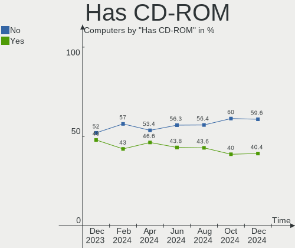
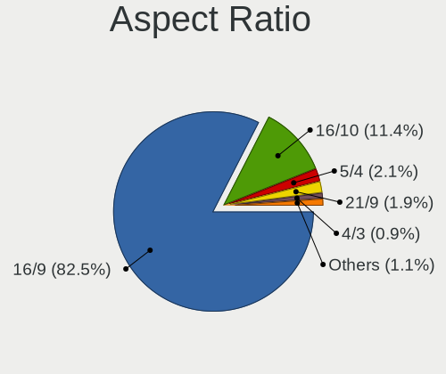
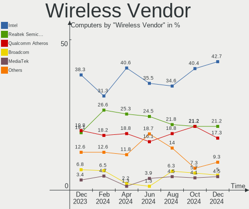
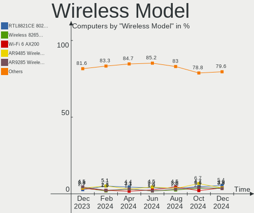
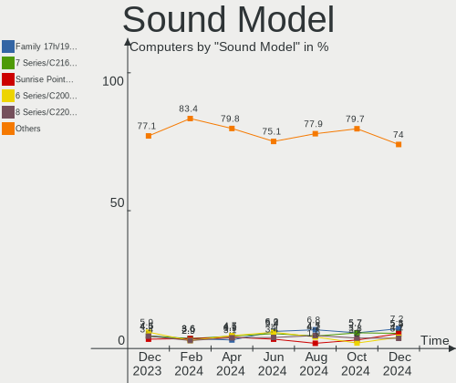

OpenMandriva - Hardware Trends
------------------------------

A project to identify most popular hardware characteristics and track their change
over time based on data collected by Linux users at https://Linux-Hardware.org.

Anyone can contribute to this report by the [hw-probe](https://github.com/linuxhw/hw-probe) tool:

    sudo -E hw-probe -all -upload

This is a report for all computer types. See also reports for [desktops](/Dist/OpenMandriva/Desktop/README.md) and [notebooks](/Dist/OpenMandriva/Notebook/README.md).

This report is for one last month. Overall report since the beginning of time: [TestDays](https://github.com/linuxhw/TestDays)

Period: Sep, 2023.

Contents
--------

* [ System ](#system)
  - [ OS                       ](#os)
  - [ OS Family                ](#os-family)
  - [ Kernel                   ](#kernel)
  - [ Kernel Family            ](#kernel-family)
  - [ Kernel Major Ver.        ](#kernel-major-ver)
  - [ Arch                     ](#arch)
  - [ DE                       ](#de)
  - [ Display Server           ](#display-server)
  - [ Display Manager          ](#display-manager)
  - [ OS Lang                  ](#os-lang)
  - [ Boot Mode                ](#boot-mode)
  - [ Filesystem               ](#filesystem)
  - [ Part. scheme             ](#part-scheme)
  - [ Dual Boot with Linux/BSD ](#dual-boot-with-linuxbsd)
  - [ Dual Boot (Win)          ](#dual-boot-win)

* [ Board ](#board)
  - [ Vendor                   ](#vendor)
  - [ Model                    ](#model)
  - [ Model Family             ](#model-family)
  - [ MFG Year                 ](#mfg-year)
  - [ Form Factor              ](#form-factor)
  - [ Secure Boot              ](#secure-boot)
  - [ Coreboot                 ](#coreboot)
  - [ RAM Size                 ](#ram-size)
  - [ RAM Used                 ](#ram-used)
  - [ Total Drives             ](#total-drives)
  - [ Has CD-ROM               ](#has-cd-rom)
  - [ Has Ethernet             ](#has-ethernet)
  - [ Has WiFi                 ](#has-wifi)
  - [ Has Bluetooth            ](#has-bluetooth)

* [ Location ](#location)
  - [ Country                  ](#country)
  - [ City                     ](#city)

* [ Drives ](#drives)
  - [ Drive Vendor             ](#drive-vendor)
  - [ Drive Model              ](#drive-model)
  - [ HDD Vendor               ](#hdd-vendor)
  - [ SSD Vendor               ](#ssd-vendor)
  - [ Drive Kind               ](#drive-kind)
  - [ Drive Connector          ](#drive-connector)
  - [ Drive Size               ](#drive-size)
  - [ Space Total              ](#space-total)
  - [ Space Used               ](#space-used)
  - [ Malfunc. Drives          ](#malfunc-drives)
  - [ Malfunc. Drive Vendor    ](#malfunc-drive-vendor)
  - [ Malfunc. HDD Vendor      ](#malfunc-hdd-vendor)
  - [ Malfunc. Drive Kind      ](#malfunc-drive-kind)
  - [ Failed Drives            ](#failed-drives)
  - [ Failed Drive Vendor      ](#failed-drive-vendor)
  - [ Drive Status             ](#drive-status)

* [ Storage controller ](#storage-controller)
  - [ Storage Vendor           ](#storage-vendor)
  - [ Storage Model            ](#storage-model)
  - [ Storage Kind             ](#storage-kind)

* [ Processor ](#processor)
  - [ CPU Vendor               ](#cpu-vendor)
  - [ CPU Model                ](#cpu-model)
  - [ CPU Model Family         ](#cpu-model-family)
  - [ CPU Cores                ](#cpu-cores)
  - [ CPU Sockets              ](#cpu-sockets)
  - [ CPU Threads              ](#cpu-threads)
  - [ CPU Op-Modes             ](#cpu-op-modes)
  - [ CPU Microcode            ](#cpu-microcode)
  - [ CPU Microarch            ](#cpu-microarch)

* [ Graphics ](#graphics)
  - [ GPU Vendor               ](#gpu-vendor)
  - [ GPU Model                ](#gpu-model)
  - [ GPU Combo                ](#gpu-combo)
  - [ GPU Driver               ](#gpu-driver)
  - [ GPU Memory               ](#gpu-memory)

* [ Monitor ](#monitor)
  - [ Monitor Vendor           ](#monitor-vendor)
  - [ Monitor Model            ](#monitor-model)
  - [ Monitor Resolution       ](#monitor-resolution)
  - [ Monitor Diagonal         ](#monitor-diagonal)
  - [ Monitor Width            ](#monitor-width)
  - [ Aspect Ratio             ](#aspect-ratio)
  - [ Monitor Area             ](#monitor-area)
  - [ Pixel Density            ](#pixel-density)
  - [ Multiple Monitors        ](#multiple-monitors)

* [ Network ](#network)
  - [ Net Controller Vendor    ](#net-controller-vendor)
  - [ Net Controller Model     ](#net-controller-model)
  - [ Wireless Vendor          ](#wireless-vendor)
  - [ Wireless Model           ](#wireless-model)
  - [ Ethernet Vendor          ](#ethernet-vendor)
  - [ Ethernet Model           ](#ethernet-model)
  - [ Net Controller Kind      ](#net-controller-kind)
  - [ Used Controller          ](#used-controller)
  - [ NICs                     ](#nics)
  - [ IPv6                     ](#ipv6)

* [ Bluetooth ](#bluetooth)
  - [ Bluetooth Vendor         ](#bluetooth-vendor)
  - [ Bluetooth Model          ](#bluetooth-model)

* [ Sound ](#sound)
  - [ Sound Vendor             ](#sound-vendor)
  - [ Sound Model              ](#sound-model)

* [ Memory ](#memory)
  - [ Memory Vendor            ](#memory-vendor)
  - [ Memory Model             ](#memory-model)
  - [ Memory Kind              ](#memory-kind)
  - [ Memory Form Factor       ](#memory-form-factor)
  - [ Memory Size              ](#memory-size)
  - [ Memory Speed             ](#memory-speed)

* [ Printers & scanners ](#printers--scanners)
  - [ Printer Vendor           ](#printer-vendor)
  - [ Printer Model            ](#printer-model)
  - [ Scanner Vendor           ](#scanner-vendor)
  - [ Scanner Model            ](#scanner-model)

* [ Camera ](#camera)
  - [ Camera Vendor            ](#camera-vendor)
  - [ Camera Model             ](#camera-model)

* [ Security ](#security)
  - [ Fingerprint Vendor       ](#fingerprint-vendor)
  - [ Fingerprint Model        ](#fingerprint-model)
  - [ Chipcard Vendor          ](#chipcard-vendor)
  - [ Chipcard Model           ](#chipcard-model)

* [ Unsupported ](#unsupported)
  - [ Unsupported Devices      ](#unsupported-devices)
  - [ Unsupported Device Types ](#unsupported-device-types)

System
------

OS
--

Installed operating systems

| Name               | Computers | Percent |
|--------------------|-----------|---------|
| OpenMandriva 23.08 | 408       | 55.43%  |
| OpenMandriva 23.09 | 185       | 25.14%  |
| OpenMandriva 4.3   | 46        | 6.25%   |
| OpenMandriva 23.03 | 40        | 5.43%   |
| OpenMandriva 23.01 | 21        | 2.85%   |
| OpenMandriva 23.90 | 17        | 2.31%   |
| OpenMandriva 4.2   | 15        | 2.04%   |
| OpenMandriva 23.06 | 3         | 0.41%   |
| OpenMandriva 4.50  | 1         | 0.14%   |

OS Family
---------

OS without a version

| Name         | Computers | Percent |
|--------------|-----------|---------|
| OpenMandriva | 736       | 100%    |

Kernel
------

Version of the Linux kernel

| Version                      | Computers | Percent |
|------------------------------|-----------|---------|
| 6.4.11-desktop-1omv2390      | 359       | 48.78%  |
| 6.5.0-desktop-1omv2390       | 69        | 9.38%   |
| 6.5.3-desktop-1omv2390       | 56        | 7.61%   |
| 6.4.8-desktop-2omv2390       | 50        | 6.79%   |
| 6.2.6-desktop-1omv2390       | 38        | 5.16%   |
| 6.5.1-desktop-1omv2390       | 31        | 4.21%   |
| 5.16.7-desktop-1omv4003      | 28        | 3.8%    |
| 6.5.2-desktop-1omv2390       | 26        | 3.53%   |
| 6.1.1-desktop-1omv2290       | 22        | 2.99%   |
| 5.16.13-desktop-1omv4003     | 17        | 2.31%   |
| 6.5.5-desktop-1omv2390       | 15        | 2.04%   |
| 5.10.14-desktop-1omv4002     | 15        | 2.04%   |
| 6.3.5-desktop-3omv2390       | 4         | 0.54%   |
| 6.6.0-desktop-0.rc3.1omv2390 | 1         | 0.14%   |
| 6.5.0-desktop-2.0omv4.9mjn   | 1         | 0.14%   |
| 6.2.1-desktop-1omv2390       | 1         | 0.14%   |
| 6.1.4-desktop-1omv2301       | 1         | 0.14%   |
| 5.19.5-desktop-1omv4090      | 1         | 0.14%   |
| 5.17.1-desktop-2omv4050      | 1         | 0.14%   |

Kernel Family
-------------

Linux kernel without a distro release

| Version | Computers | Percent |
|---------|-----------|---------|
| 6.4.11  | 359       | 48.78%  |
| 6.5.0   | 70        | 9.51%   |
| 6.5.3   | 56        | 7.61%   |
| 6.4.8   | 50        | 6.79%   |
| 6.2.6   | 38        | 5.16%   |
| 6.5.1   | 31        | 4.21%   |
| 5.16.7  | 28        | 3.8%    |
| 6.5.2   | 26        | 3.53%   |
| 6.1.1   | 22        | 2.99%   |
| 5.16.13 | 17        | 2.31%   |
| 6.5.5   | 15        | 2.04%   |
| 5.10.14 | 15        | 2.04%   |
| 6.3.5   | 4         | 0.54%   |
| 6.6.0   | 1         | 0.14%   |
| 6.2.1   | 1         | 0.14%   |
| 6.1.4   | 1         | 0.14%   |
| 5.19.5  | 1         | 0.14%   |
| 5.17.1  | 1         | 0.14%   |

Kernel Major Ver.
-----------------

Linux kernel major version

| Version | Computers | Percent |
|---------|-----------|---------|
| 6.4     | 409       | 55.57%  |
| 6.5     | 198       | 26.9%   |
| 5.16    | 45        | 6.11%   |
| 6.2     | 39        | 5.3%    |
| 6.1     | 23        | 3.13%   |
| 5.10    | 15        | 2.04%   |
| 6.3     | 4         | 0.54%   |
| 6.6     | 1         | 0.14%   |
| 5.19    | 1         | 0.14%   |
| 5.17    | 1         | 0.14%   |

Arch
----

OS architecture (x86_64, i586, etc.)

| Name   | Computers | Percent |
|--------|-----------|---------|
| x86_64 | 736       | 100%    |

DE
--

Desktop Environment

| Name     | Computers | Percent |
|----------|-----------|---------|
| KDE5     | 591       | 80.3%   |
| GNOME    | 65        | 8.83%   |
| LXQt     | 60        | 8.15%   |
| Unknown  | 12        | 1.63%   |
| Budgie   | 5         | 0.68%   |
| Cinnamon | 3         | 0.41%   |

Display Server
--------------

X11 or Wayland

| Name    | Computers | Percent |
|---------|-----------|---------|
| Wayland | 592       | 80.43%  |
| X11     | 144       | 19.57%  |

Display Manager
---------------

SDDM, LightDM, etc.

| Name    | Computers | Percent |
|---------|-----------|---------|
| SDDM    | 665       | 90.35%  |
| GDM     | 65        | 8.83%   |
| LightDM | 5         | 0.68%   |
| Unknown | 1         | 0.14%   |

OS Lang
-------

Language

| Lang       | Computers | Percent |
|------------|-----------|---------|
| en_US      | 356       | 48.37%  |
| de_DE      | 57        | 7.74%   |
| fr_FR      | 48        | 6.52%   |
| pt_BR      | 46        | 6.25%   |
| ru_RU      | 42        | 5.71%   |
| en_GB      | 26        | 3.53%   |
| it_IT      | 25        | 3.4%    |
| pl_PL      | 16        | 2.17%   |
| es_ES      | 13        | 1.77%   |
| es_MX      | 12        | 1.63%   |
| en_CA      | 11        | 1.49%   |
| nl_NL      | 7         | 0.95%   |
| hu_HU      | 6         | 0.82%   |
| es_AR      | 5         | 0.68%   |
| en_AU      | 5         | 0.68%   |
| ro_RO      | 4         | 0.54%   |
| pt_PT      | 4         | 0.54%   |
| es_CO      | 4         | 0.54%   |
| en_IN      | 4         | 0.54%   |
| de_AT      | 4         | 0.54%   |
| cs_CZ      | 4         | 0.54%   |
| tr_TR      | 3         | 0.41%   |
| nl_BE      | 3         | 0.41%   |
| es_CL      | 3         | 0.41%   |
| de_CH      | 3         | 0.41%   |
| da_DK      | 3         | 0.41%   |
| UTF-8      | 2         | 0.27%   |
| ja_JP      | 2         | 0.27%   |
| es_VE      | 2         | 0.27%   |
| es_PE      | 2         | 0.27%   |
| en_SG      | 2         | 0.27%   |
| ca_ES      | 2         | 0.27%   |
| uk_UA      | 1         | 0.14%   |
| ja_JP.UTF8 | 1         | 0.14%   |
| fr_CA      | 1         | 0.14%   |
| es_UY      | 1         | 0.14%   |
| es_NI      | 1         | 0.14%   |
| en_ZA      | 1         | 0.14%   |
| en_NZ      | 1         | 0.14%   |
| en_NG      | 1         | 0.14%   |

Boot Mode
---------

EFI or BIOS

| Mode | Computers | Percent |
|------|-----------|---------|
| EFI  | 429       | 58.29%  |
| BIOS | 307       | 41.71%  |

Filesystem
----------

Type of filesystem

| Type     | Computers | Percent |
|----------|-----------|---------|
| Ext4     | 394       | 53.53%  |
| Overlay  | 292       | 39.67%  |
| Btrfs    | 35        | 4.76%   |
| F2fs     | 7         | 0.95%   |
| Xfs      | 5         | 0.68%   |
| Reiserfs | 1         | 0.14%   |
| Jfs      | 1         | 0.14%   |
| Ext2     | 1         | 0.14%   |

Part. scheme
------------

Scheme of partitioning

| Type    | Computers | Percent |
|---------|-----------|---------|
| GPT     | 575       | 78.13%  |
| MBR     | 159       | 21.6%   |
| Unknown | 2         | 0.27%   |

Dual Boot with Linux/BSD
------------------------

Hosting more than one Linux/BSD

| Dual boot | Computers | Percent |
|-----------|-----------|---------|
| No        | 412       | 55.98%  |
| Yes       | 324       | 44.02%  |

Dual Boot (Win)
---------------

Hosting Linux and Windows

| Dual boot | Computers | Percent |
|-----------|-----------|---------|
| No        | 421       | 57.2%   |
| Yes       | 315       | 42.8%   |

Board
-----

Vendor
------

Motherboard manufacturer

| Name                                 | Computers | Percent |
|--------------------------------------|-----------|---------|
| ASUSTek Computer                     | 122       | 16.58%  |
| Lenovo                               | 93        | 12.64%  |
| Hewlett-Packard                      | 89        | 12.09%  |
| Dell                                 | 70        | 9.51%   |
| Gigabyte Technology                  | 58        | 7.88%   |
| Acer                                 | 51        | 6.93%   |
| MSI                                  | 42        | 5.71%   |
| ASRock                               | 39        | 5.3%    |
| Intel                                | 27        | 3.67%   |
| Toshiba                              | 12        | 1.63%   |
| Apple                                | 12        | 1.63%   |
| Fujitsu                              | 11        | 1.49%   |
| Samsung Electronics                  | 9         | 1.22%   |
| Foxconn                              | 8         | 1.09%   |
| Pegatron                             | 7         | 0.95%   |
| AZW                                  | 6         | 0.82%   |
| Medion                               | 5         | 0.68%   |
| Biostar                              | 5         | 0.68%   |
| Unknown                              | 5         | 0.68%   |
| LG Electronics                       | 4         | 0.54%   |
| Chuwi                                | 4         | 0.54%   |
| Sony                                 | 3         | 0.41%   |
| Positivo                             | 3         | 0.41%   |
| Packard Bell                         | 3         | 0.41%   |
| Google                               | 3         | 0.41%   |
| BESSTAR Tech                         | 3         | 0.41%   |
| ALLDOCUBE                            | 3         | 0.41%   |
| WesternDigital                       | 2         | 0.27%   |
| Semp Toshiba                         | 2         | 0.27%   |
| NEC Computers                        | 2         | 0.27%   |
| HUAWEI                               | 2         | 0.27%   |
| Compaq                               | 2         | 0.27%   |
| ZOTAC                                | 1         | 0.14%   |
| VIT                                  | 1         | 0.14%   |
| UMAX                                 | 1         | 0.14%   |
| SLIMBOOK                             | 1         | 0.14%   |
| SKIKK                                | 1         | 0.14%   |
| Shuttle                              | 1         | 0.14%   |
| Shenzhen Meigao Electronic Equipment | 1         | 0.14%   |
| Schenker                             | 1         | 0.14%   |

Model
-----

Motherboard model

| Name                               | Computers | Percent |
|------------------------------------|-----------|---------|
| Unknown                            | 6         | 0.82%   |
| HP Notebook                        | 5         | 0.68%   |
| Intel H81                          | 4         | 0.54%   |
| Intel H61                          | 4         | 0.54%   |
| HP Laptop 15s-eq2xxx               | 3         | 0.41%   |
| HP ElitePad 1000 G2                | 3         | 0.41%   |
| Gigabyte B450 AORUS M              | 3         | 0.41%   |
| Dell OptiPlex 7010                 | 3         | 0.41%   |
| ASUS UL80VT                        | 3         | 0.41%   |
| ASUS All Series                    | 3         | 0.41%   |
| WesternDigital WDBNFA0000NBK-00    | 2         | 0.27%   |
| Semp Toshiba STI                   | 2         | 0.27%   |
| MSI MS-7D25                        | 2         | 0.27%   |
| MSI MS-7B89                        | 2         | 0.27%   |
| MSI MS-7B23                        | 2         | 0.27%   |
| MSI MS-7A38                        | 2         | 0.27%   |
| MSI MS-7817                        | 2         | 0.27%   |
| MSI MS-7740                        | 2         | 0.27%   |
| Lenovo V15-IGL 82C3                | 2         | 0.27%   |
| Lenovo V15-ADA 82C7                | 2         | 0.27%   |
| Lenovo ThinkCentre M93p 10A6A122LS | 2         | 0.27%   |
| HP Pavilion g6                     | 2         | 0.27%   |
| HP Laptop 17-bs0xx                 | 2         | 0.27%   |
| HP 1000                            | 2         | 0.27%   |
| Gigabyte H61M-S1                   | 2         | 0.27%   |
| Gigabyte GA-MA770T-UD3             | 2         | 0.27%   |
| Gigabyte B85M-D3H                  | 2         | 0.27%   |
| Gigabyte B75M-D3H                  | 2         | 0.27%   |
| Dell Precision T1700               | 2         | 0.27%   |
| Dell OptiPlex 9020                 | 2         | 0.27%   |
| Dell OptiPlex 3020                 | 2         | 0.27%   |
| Dell Latitude E7440                | 2         | 0.27%   |
| Dell Latitude E6410                | 2         | 0.27%   |
| Dell Latitude E6400                | 2         | 0.27%   |
| Dell Latitude 5480                 | 2         | 0.27%   |
| Dell Inspiron 3847                 | 2         | 0.27%   |
| Dell Inspiron 3542                 | 2         | 0.27%   |
| Chuwi GemiBook XPro                | 2         | 0.27%   |
| AZW MINI S                         | 2         | 0.27%   |
| AZW GTR                            | 2         | 0.27%   |

Model Family
------------

Motherboard model prefix

| Name               | Computers | Percent |
|--------------------|-----------|---------|
| Lenovo ThinkPad    | 37        | 5.03%   |
| Acer Aspire        | 31        | 4.21%   |
| ASUS PRIME         | 22        | 2.99%   |
| Dell Inspiron      | 18        | 2.45%   |
| Dell OptiPlex      | 17        | 2.31%   |
| Lenovo ThinkCentre | 16        | 2.17%   |
| Lenovo IdeaPad     | 15        | 2.04%   |
| Dell Latitude      | 15        | 2.04%   |
| ASUS VivoBook      | 15        | 2.04%   |
| HP EliteBook       | 14        | 1.9%    |
| HP Laptop          | 12        | 1.63%   |
| HP Compaq          | 12        | 1.63%   |
| Toshiba Satellite  | 10        | 1.36%   |
| ASUS TUF           | 10        | 1.36%   |
| HP Pavilion        | 9         | 1.22%   |
| Acer Nitro         | 7         | 0.95%   |
| HP EliteDesk       | 6         | 0.82%   |
| Fujitsu ESPRIMO    | 6         | 0.82%   |
| Dell Vostro        | 6         | 0.82%   |
| ASUS ROG           | 6         | 0.82%   |
| Unknown            | 6         | 0.82%   |
| Intel H81          | 5         | 0.68%   |
| HP ProBook         | 5         | 0.68%   |
| HP Notebook        | 5         | 0.68%   |
| Gigabyte B450      | 5         | 0.68%   |
| Dell Precision     | 5         | 0.68%   |
| Intel H61          | 4         | 0.54%   |
| ASUS M5A78L-M      | 4         | 0.54%   |
| Acer Veriton       | 4         | 0.54%   |
| Lenovo Yoga        | 3         | 0.41%   |
| HP ProDesk         | 3         | 0.41%   |
| HP ElitePad        | 3         | 0.41%   |
| Gigabyte X570      | 3         | 0.41%   |
| Gigabyte B450M     | 3         | 0.41%   |
| Fujitsu LIFEBOOK   | 3         | 0.41%   |
| Dell XPS           | 3         | 0.41%   |
| ASUS UL80VT        | 3         | 0.41%   |
| ASUS ASUS          | 3         | 0.41%   |
| ASUS All           | 3         | 0.41%   |
| Apple MacBookPro11 | 3         | 0.41%   |

MFG Year
--------

Motherboard manufacture year

| Year | Computers | Percent |
|------|-----------|---------|
| 2012 | 67        | 9.1%    |
| 2018 | 65        | 8.83%   |
| 2021 | 60        | 8.15%   |
| 2020 | 58        | 7.88%   |
| 2014 | 58        | 7.88%   |
| 2017 | 53        | 7.2%    |
| 2011 | 53        | 7.2%    |
| 2013 | 47        | 6.39%   |
| 2019 | 44        | 5.98%   |
| 2010 | 40        | 5.43%   |
| 2016 | 36        | 4.89%   |
| 2009 | 35        | 4.76%   |
| 2022 | 32        | 4.35%   |
| 2008 | 27        | 3.67%   |
| 2015 | 23        | 3.13%   |
| 2023 | 19        | 2.58%   |
| 2007 | 13        | 1.77%   |
| 2006 | 6         | 0.82%   |

Form Factor
-----------

Physical design of the computer

| Name        | Computers | Percent |
|-------------|-----------|---------|
| Desktop     | 371       | 50.41%  |
| Notebook    | 323       | 43.89%  |
| Mini pc     | 19        | 2.58%   |
| Convertible | 11        | 1.49%   |
| All in one  | 7         | 0.95%   |
| Tablet      | 4         | 0.54%   |
| Server      | 1         | 0.14%   |

Secure Boot
-----------

Enabled or disabled

| State    | Computers | Percent |
|----------|-----------|---------|
| Disabled | 736       | 100%    |

Coreboot
--------

Have coreboot on board

| Used | Computers | Percent |
|------|-----------|---------|
| No   | 732       | 99.46%  |
| Yes  | 4         | 0.54%   |

RAM Size
--------

Total RAM memory

| Size in GB  | Computers | Percent |
|-------------|-----------|---------|
| 4.01-8.0    | 225       | 30.57%  |
| 3.01-4.0    | 142       | 19.29%  |
| 8.01-16.0   | 136       | 18.48%  |
| 16.01-24.0  | 131       | 17.8%   |
| 32.01-64.0  | 50        | 6.79%   |
| 64.01-256.0 | 15        | 2.04%   |
| 2.01-3.0    | 14        | 1.9%    |
| 24.01-32.0  | 13        | 1.77%   |
| 1.01-2.0    | 10        | 1.36%   |

RAM Used
--------

Used RAM memory

| Used GB   | Computers | Percent |
|-----------|-----------|---------|
| 1.01-2.0  | 445       | 60.46%  |
| 2.01-3.0  | 175       | 23.78%  |
| 0.51-1.0  | 75        | 10.19%  |
| 3.01-4.0  | 25        | 3.4%    |
| 4.01-8.0  | 11        | 1.49%   |
| 0.01-0.5  | 4         | 0.54%   |
| 8.01-16.0 | 1         | 0.14%   |

Total Drives
------------

Number of drives on board

| Drives | Computers | Percent |
|--------|-----------|---------|
| 1      | 432       | 58.7%   |
| 2      | 161       | 21.88%  |
| 3      | 67        | 9.1%    |
| 4      | 32        | 4.35%   |
| 5      | 18        | 2.45%   |
| 0      | 14        | 1.9%    |
| 6      | 8         | 1.09%   |
| 10     | 2         | 0.27%   |
| 8      | 1         | 0.14%   |
| 7      | 1         | 0.14%   |

Has CD-ROM
----------

Has CD-ROM on board

| Presented | Computers | Percent |
|-----------|-----------|---------|
| No        | 414       | 56.25%  |
| Yes       | 322       | 43.75%  |

Has Ethernet
------------

Has Ethernet on board

| Presented | Computers | Percent |
|-----------|-----------|---------|
| Yes       | 658       | 89.4%   |
| No        | 78        | 10.6%   |

Has WiFi
--------

Has WiFi module

| Presented | Computers | Percent |
|-----------|-----------|---------|
| Yes       | 505       | 68.61%  |
| No        | 231       | 31.39%  |

Has Bluetooth
-------------

Has Bluetooth module

| Presented | Computers | Percent |
|-----------|-----------|---------|
| Yes       | 377       | 51.22%  |
| No        | 359       | 48.78%  |

Location
--------

Country
-------

Geographic location (country)

| Country      | Computers | Percent |
|--------------|-----------|---------|
| USA          | 88        | 11.96%  |
| Germany      | 76        | 10.33%  |
| Brazil       | 70        | 9.51%   |
| Russia       | 51        | 6.93%   |
| France       | 49        | 6.66%   |
| Italy        | 34        | 4.62%   |
| Spain        | 26        | 3.53%   |
| Poland       | 25        | 3.4%    |
| Canada       | 25        | 3.4%    |
| UK           | 22        | 2.99%   |
| Mexico       | 16        | 2.17%   |
| Japan        | 16        | 2.17%   |
| Netherlands  | 15        | 2.04%   |
| Australia    | 12        | 1.63%   |
| Indonesia    | 11        | 1.49%   |
| Romania      | 10        | 1.36%   |
| India        | 10        | 1.36%   |
| Hungary      | 10        | 1.36%   |
| Belgium      | 9         | 1.22%   |
| Finland      | 8         | 1.09%   |
| Bulgaria     | 8         | 1.09%   |
| Thailand     | 7         | 0.95%   |
| Austria      | 7         | 0.95%   |
| Turkey       | 6         | 0.82%   |
| Malaysia     | 6         | 0.82%   |
| Argentina    | 6         | 0.82%   |
| Portugal     | 5         | 0.68%   |
| Czechia      | 5         | 0.68%   |
| Algeria      | 5         | 0.68%   |
| Switzerland  | 4         | 0.54%   |
| Sweden       | 4         | 0.54%   |
| South Africa | 4         | 0.54%   |
| Slovakia     | 4         | 0.54%   |
| Serbia       | 4         | 0.54%   |
| Peru         | 4         | 0.54%   |
| Norway       | 4         | 0.54%   |
| Greece       | 4         | 0.54%   |
| Denmark      | 4         | 0.54%   |
| Colombia     | 4         | 0.54%   |
| China        | 4         | 0.54%   |

City
----

Geographic location (city)

| City            | Computers | Percent |
|-----------------|-----------|---------|
| Sao Paulo       | 8         | 1.09%   |
| Moscow          | 8         | 1.09%   |
| Milan           | 7         | 0.95%   |
| Sydney          | 5         | 0.68%   |
| Melbourne       | 5         | 0.68%   |
| Barcelona       | 5         | 0.68%   |
| St Petersburg   | 4         | 0.54%   |
| Sofia           | 4         | 0.54%   |
| Paris           | 4         | 0.54%   |
| Miura           | 4         | 0.54%   |
| Marília        | 4         | 0.54%   |
| Hamburg         | 4         | 0.54%   |
| Curitiba        | 4         | 0.54%   |
| Budapest        | 4         | 0.54%   |
| Berlin          | 4         | 0.54%   |
| Yekaterinburg   | 3         | 0.41%   |
| Wegberg         | 3         | 0.41%   |
| Rio de Janeiro  | 3         | 0.41%   |
| Porto Alegre    | 3         | 0.41%   |
| Montreal        | 3         | 0.41%   |
| Milano          | 3         | 0.41%   |
| León           | 3         | 0.41%   |
| Katowice        | 3         | 0.41%   |
| Helsinki        | 3         | 0.41%   |
| Graz            | 3         | 0.41%   |
| Darmstadt       | 3         | 0.41%   |
| Cuxhaven        | 3         | 0.41%   |
| Cedar Park      | 3         | 0.41%   |
| Burlington      | 3         | 0.41%   |
| Bucharest       | 3         | 0.41%   |
| Bordeaux        | 3         | 0.41%   |
| Bengaluru       | 3         | 0.41%   |
| Zaragoza        | 2         | 0.27%   |
| Warsaw          | 2         | 0.27%   |
| Volzhsky        | 2         | 0.27%   |
| Villa Ballester | 2         | 0.27%   |
| Vienna          | 2         | 0.27%   |
| Vantaa          | 2         | 0.27%   |
| Tyumen          | 2         | 0.27%   |
| The Hague       | 2         | 0.27%   |

Drives
------

Drive Vendor
------------

Hard drive vendors

| Vendor                      | Computers | Drives | Percent |
|-----------------------------|-----------|--------|---------|
| WDC                         | 154       | 186    | 14.09%  |
| Seagate                     | 135       | 164    | 12.35%  |
| Samsung Electronics         | 134       | 154    | 12.26%  |
| Kingston                    | 76        | 81     | 6.95%   |
| Toshiba                     | 66        | 74     | 6.04%   |
| Crucial                     | 60        | 66     | 5.49%   |
| SanDisk                     | 41        | 46     | 3.75%   |
| Unknown                     | 35        | 42     | 3.2%    |
| Hitachi                     | 31        | 31     | 2.84%   |
| China                       | 28        | 28     | 2.56%   |
| HGST                        | 23        | 28     | 2.1%    |
| A-DATA Technology           | 22        | 24     | 2.01%   |
| Intel                       | 19        | 20     | 1.74%   |
| SK hynix                    | 18        | 19     | 1.65%   |
| SPCC                        | 14        | 15     | 1.28%   |
| Micron Technology           | 13        | 13     | 1.19%   |
| Patriot                     | 11        | 11     | 1.01%   |
| Unknown                     | 11        | 12     | 1.01%   |
| PNY                         | 10        | 11     | 0.91%   |
| Intenso                     | 9         | 11     | 0.82%   |
| Lexar                       | 8         | 8      | 0.73%   |
| Team                        | 7         | 7      | 0.64%   |
| Netac                       | 7         | 7      | 0.64%   |
| Maxtor                      | 7         | 7      | 0.64%   |
| Silicon Motion              | 6         | 6      | 0.55%   |
| LITEON                      | 6         | 6      | 0.55%   |
| Kingston Technology Company | 6         | 6      | 0.55%   |
| Apple                       | 6         | 6      | 0.55%   |
| Transcend                   | 5         | 5      | 0.46%   |
| KIOXIA                      | 5         | 5      | 0.46%   |
| JMicron Technology          | 5         | 5      | 0.46%   |
| SSSTC                       | 4         | 4      | 0.37%   |
| Phison                      | 4         | 5      | 0.37%   |
| OCZ                         | 4         | 4      | 0.37%   |
| GOODRAM                     | 4         | 4      | 0.37%   |
| Fanxiang                    | 4         | 4      | 0.37%   |
| AirDisk                     | 4         | 4      | 0.37%   |
| XPG                         | 3         | 3      | 0.27%   |
| Verbatim                    | 3         | 3      | 0.27%   |
| Vaseky                      | 3         | 3      | 0.27%   |

Drive Model
-----------

Hard drive models

| Model                              | Computers | Percent |
|------------------------------------|-----------|---------|
| Kingston SA400S37240G 240GB SSD    | 20        | 1.69%   |
| Kingston SA400S37480G 480GB SSD    | 13        | 1.1%    |
| Seagate ST1000DM010-2EP102 1TB     | 12        | 1.01%   |
| Seagate ST500DM002-1BD142 500GB    | 11        | 0.93%   |
| Crucial CT500MX500SSD1 500GB       | 11        | 0.93%   |
| Crucial CT240BX500SSD1 240GB       | 11        | 0.93%   |
| Unknown                            | 11        | 0.93%   |
| Toshiba DT01ACA050 500GB           | 8         | 0.68%   |
| Samsung SSD 850 EVO 250GB          | 8         | 0.68%   |
| Toshiba HDWD110 1TB                | 7         | 0.59%   |
| Seagate ST3500418AS 500GB          | 7         | 0.59%   |
| Kingston SV300S37A120G 120GB SSD   | 7         | 0.59%   |
| Unknown SD/MMC/MS PRO 128GB        | 6         | 0.51%   |
| Toshiba DT01ACA100 1TB             | 6         | 0.51%   |
| Seagate ST9500325AS 500GB          | 6         | 0.51%   |
| Seagate ST2000DM008-2FR102 2TB     | 6         | 0.51%   |
| Unknown SD/MMC 2GB                 | 5         | 0.42%   |
| Unknown M.S./M.S.Pro/HG 16GB       | 5         | 0.42%   |
| Seagate ST2000DM001-1CH164 2TB     | 5         | 0.42%   |
| SanDisk NVMe SSD Drive 1TB         | 5         | 0.42%   |
| Samsung SSD 870 QVO 1TB            | 5         | 0.42%   |
| Crucial CT1000MX500SSD1 1TB        | 5         | 0.42%   |
| A-DATA SU650 240GB SSD             | 5         | 0.42%   |
| WDC WDS100T2B0A-00SM50 1TB SSD     | 4         | 0.34%   |
| Seagate ST31000528AS 1TB           | 4         | 0.34%   |
| Seagate ST1000LM024 HN-M101MBB 1TB | 4         | 0.34%   |
| Seagate ST1000DM003-1ER162 1TB     | 4         | 0.34%   |
| Seagate ST1000DM003-1CH162 1TB     | 4         | 0.34%   |
| Seagate Expansion 1TB              | 4         | 0.34%   |
| SanDisk SSD PLUS 240GB             | 4         | 0.34%   |
| SanDisk SDSSDA120G 120GB           | 4         | 0.34%   |
| SanDisk NVMe SSD Drive 500GB       | 4         | 0.34%   |
| Samsung SSD 970 EVO Plus 1TB       | 4         | 0.34%   |
| Samsung SSD 870 EVO 1TB            | 4         | 0.34%   |
| Samsung SSD 840 EVO 250GB          | 4         | 0.34%   |
| Kingston Company SNV2S1000G 1TB    | 4         | 0.34%   |
| JMicron Generic 240GB              | 4         | 0.34%   |
| HGST HTS545050A7E680 500GB         | 4         | 0.34%   |
| Crucial CT480BX500SSD1 480GB       | 4         | 0.34%   |
| Crucial CT1000BX500SSD1 1TB        | 4         | 0.34%   |

HDD Vendor
----------

Hard disk drive vendors

| Vendor              | Computers | Drives | Percent |
|---------------------|-----------|--------|---------|
| Seagate             | 134       | 161    | 32.37%  |
| WDC                 | 123       | 151    | 29.71%  |
| Toshiba             | 55        | 62     | 13.29%  |
| Hitachi             | 31        | 31     | 7.49%   |
| Samsung Electronics | 23        | 24     | 5.56%   |
| HGST                | 23        | 28     | 5.56%   |
| Maxtor              | 7         | 7      | 1.69%   |
| Unknown             | 6         | 6      | 1.45%   |
| SSK                 | 2         | 2      | 0.48%   |
| SABRENT             | 2         | 3      | 0.48%   |
| Apple               | 2         | 2      | 0.48%   |
| USB3.0              | 1         | 1      | 0.24%   |
| Intenso             | 1         | 1      | 0.24%   |
| Initio              | 1         | 1      | 0.24%   |
| Hewlett-Packard     | 1         | 1      | 0.24%   |
| Fujitsu             | 1         | 1      | 0.24%   |
| External            | 1         | 1      | 0.24%   |

SSD Vendor
----------

Solid state drive vendors

| Vendor              | Computers | Drives | Percent |
|---------------------|-----------|--------|---------|
| Samsung Electronics | 67        | 75     | 15.4%   |
| Kingston            | 61        | 64     | 14.02%  |
| Crucial             | 47        | 49     | 10.8%   |
| SanDisk             | 29        | 33     | 6.67%   |
| China               | 28        | 28     | 6.44%   |
| WDC                 | 18        | 19     | 4.14%   |
| A-DATA Technology   | 16        | 17     | 3.68%   |
| SPCC                | 13        | 13     | 2.99%   |
| PNY                 | 10        | 11     | 2.3%    |
| Patriot             | 9         | 9      | 2.07%   |
| Intenso             | 8         | 10     | 1.84%   |
| Team                | 6         | 6      | 1.38%   |
| Intel               | 6         | 6      | 1.38%   |
| Transcend           | 5         | 5      | 1.15%   |
| Toshiba             | 5         | 5      | 1.15%   |
| SK hynix            | 5         | 6      | 1.15%   |
| LITEON              | 5         | 5      | 1.15%   |
| OCZ                 | 4         | 4      | 0.92%   |
| Netac               | 4         | 4      | 0.92%   |
| Micron Technology   | 4         | 4      | 0.92%   |
| Lexar               | 4         | 4      | 0.92%   |
| JMicron Technology  | 4         | 4      | 0.92%   |
| GOODRAM             | 4         | 4      | 0.92%   |
| Unknown             | 4         | 4      | 0.92%   |
| Verbatim            | 3         | 3      | 0.69%   |
| Vaseky              | 3         | 3      | 0.69%   |
| KingSpec            | 3         | 4      | 0.69%   |
| KingDian            | 3         | 3      | 0.69%   |
| HS-SSD-C100         | 3         | 3      | 0.69%   |
| Fanxiang            | 3         | 3      | 0.69%   |
| Apple               | 3         | 3      | 0.69%   |
| Apacer              | 3         | 3      | 0.69%   |
| AirDisk             | 3         | 3      | 0.69%   |
| TO Exter            | 2         | 2      | 0.46%   |
| LITEONIT            | 2         | 2      | 0.46%   |
| KingFast            | 2         | 2      | 0.46%   |
| Hised               | 2         | 2      | 0.46%   |
| Emtec               | 2         | 2      | 0.46%   |
| ZHITAI              | 1         | 1      | 0.23%   |
| WDC WDS5            | 1         | 1      | 0.23%   |

Drive Kind
----------

HDD or SSD

| Kind    | Computers | Drives | Percent |
|---------|-----------|--------|---------|
| SSD     | 369       | 459    | 38.44%  |
| HDD     | 349       | 483    | 36.35%  |
| NVMe    | 199       | 229    | 20.73%  |
| MMC     | 28        | 31     | 2.92%   |
| Unknown | 15        | 20     | 1.56%   |

Drive Connector
---------------

SATA, SAS, NVMe, etc.

| Type | Computers | Drives | Percent |
|------|-----------|--------|---------|
| SATA | 583       | 892    | 66.86%  |
| NVMe | 198       | 228    | 22.71%  |
| SAS  | 63        | 71     | 7.22%   |
| MMC  | 28        | 31     | 3.21%   |

Drive Size
----------

Size of hard drive

| Size in TB | Computers | Drives | Percent |
|------------|-----------|--------|---------|
| 0.01-0.5   | 452       | 582    | 61.25%  |
| 0.51-1.0   | 200       | 249    | 27.1%   |
| 1.01-2.0   | 50        | 60     | 6.78%   |
| 3.01-4.0   | 15        | 19     | 2.03%   |
| 2.01-3.0   | 9         | 10     | 1.22%   |
| 4.01-10.0  | 8         | 18     | 1.08%   |
| 10.01-20.0 | 4         | 4      | 0.54%   |

Space Total
-----------

Amount of disk space available on the file system

| Size in GB     | Computers | Percent |
|----------------|-----------|---------|
| 1-20           | 209       | 28.4%   |
| 101-250        | 159       | 21.6%   |
| 251-500        | 113       | 15.35%  |
| 51-100         | 72        | 9.78%   |
| 501-1000       | 65        | 8.83%   |
| 21-50          | 39        | 5.3%    |
| Unknown        | 36        | 4.89%   |
| 1001-2000      | 23        | 3.13%   |
| More than 3000 | 13        | 1.77%   |
| 2001-3000      | 7         | 0.95%   |

Space Used
----------

Amount of used disk space

| Used GB        | Computers | Percent |
|----------------|-----------|---------|
| 1-20           | 557       | 75.68%  |
| 21-50          | 51        | 6.93%   |
| Unknown        | 36        | 4.89%   |
| 51-100         | 30        | 4.08%   |
| 101-250        | 25        | 3.4%    |
| 251-500        | 17        | 2.31%   |
| 501-1000       | 10        | 1.36%   |
| 1001-2000      | 6         | 0.82%   |
| More than 3000 | 4         | 0.54%   |

Malfunc. Drives
---------------

Drive models with a malfunction

| Model                             | Computers | Drives | Percent |
|-----------------------------------|-----------|--------|---------|
| Seagate ST500DM002-1BD142 500GB   | 5         | 5      | 2.6%    |
| Kingston SV300S37A120G 120GB SSD  | 5         | 5      | 2.6%    |
| Seagate ST9500325AS 500GB         | 4         | 4      | 2.08%   |
| Seagate ST1000DM010-2EP102 1TB    | 4         | 5      | 2.08%   |
| WDC WD10EARS-00Y5B1 1TB           | 3         | 3      | 1.56%   |
| Maxtor STM3160215AS 160GB         | 3         | 3      | 1.56%   |
| HGST HTS545050A7E680 500GB        | 3         | 3      | 1.56%   |
| WDC WD10EZEX-75M2NA0 1TB          | 2         | 2      | 1.04%   |
| Toshiba DT01ACA100 1TB            | 2         | 2      | 1.04%   |
| Seagate ST500LT012-9WS142 500GB   | 2         | 2      | 1.04%   |
| Seagate ST500LT012-1DG142 500GB   | 2         | 2      | 1.04%   |
| Seagate ST3500418AS 500GB         | 2         | 2      | 1.04%   |
| Seagate ST3500312CS 500GB         | 2         | 2      | 1.04%   |
| Seagate ST31000528AS 1TB          | 2         | 2      | 1.04%   |
| Seagate ST2000LM007-1R8174 2TB    | 2         | 2      | 1.04%   |
| Seagate ST2000DL003-9VT166 2TB    | 2         | 2      | 1.04%   |
| SanDisk SSD PLUS 240GB            | 2         | 2      | 1.04%   |
| Samsung Electronics HD320KJ 320GB | 2         | 3      | 1.04%   |
| Samsung Electronics HD103SJ 1TB   | 2         | 2      | 1.04%   |
| Hitachi HDS721050CLA660 500GB     | 2         | 2      | 1.04%   |
| HGST HTS725050A7E630 500GB        | 2         | 2      | 1.04%   |
| HGST HTS721010A9E630 1TB          | 2         | 4      | 1.04%   |
| China SSD 240GB                   | 2         | 2      | 1.04%   |
| XPG GAMMIX S5 256GB               | 1         | 1      | 0.52%   |
| WDC WDS500G2B0A-00SM50 500GB SSD  | 1         | 1      | 0.52%   |
| WDC WDS240G2G0A-00JH30 240GB SSD  | 1         | 1      | 0.52%   |
| WDC WDS100T2B0A-00SM50 1TB SSD    | 1         | 1      | 0.52%   |
| WDC WD7500AADS-00M2B0 752GB       | 1         | 1      | 0.52%   |
| WDC WD6400AAKS-22A7B2 640GB       | 1         | 1      | 0.52%   |
| WDC WD6400AAKS-22A7B0 640GB       | 1         | 1      | 0.52%   |
| WDC WD5000LPCX-60VHAT1 500GB      | 1         | 1      | 0.52%   |
| WDC WD5000BPVT-24HXZT3 500GB      | 1         | 1      | 0.52%   |
| WDC WD5000AZLX-60K2TA1 500GB      | 1         | 1      | 0.52%   |
| WDC WD5000AZLX-22JKKA0 500GB      | 1         | 1      | 0.52%   |
| WDC WD5000AVDS-63U7B1 500GB       | 1         | 1      | 0.52%   |
| WDC WD5000AVCS-632DY1 500GB       | 1         | 1      | 0.52%   |
| WDC WD5000AAKX-75U6AA0 500GB      | 1         | 1      | 0.52%   |
| WDC WD5000AAKX-08U6AA0 500GB      | 1         | 1      | 0.52%   |
| WDC WD5000AAKX-00ERMA0 500GB      | 1         | 1      | 0.52%   |
| WDC WD5000AAKX-003CA0 500GB       | 1         | 1      | 0.52%   |

Malfunc. Drive Vendor
---------------------

Vendors of faulty drives

| Vendor              | Computers | Drives | Percent |
|---------------------|-----------|--------|---------|
| Seagate             | 43        | 45     | 22.75%  |
| WDC                 | 39        | 43     | 20.63%  |
| Samsung Electronics | 17        | 18     | 8.99%   |
| Hitachi             | 17        | 17     | 8.99%   |
| Toshiba             | 14        | 14     | 7.41%   |
| HGST                | 10        | 12     | 5.29%   |
| Maxtor              | 6         | 6      | 3.17%   |
| Kingston            | 6         | 6      | 3.17%   |
| SanDisk             | 5         | 5      | 2.65%   |
| SK hynix            | 4         | 4      | 2.12%   |
| China               | 4         | 4      | 2.12%   |
| A-DATA Technology   | 4         | 4      | 2.12%   |
| SPCC                | 3         | 3      | 1.59%   |
| Intel               | 3         | 3      | 1.59%   |
| Micron Technology   | 2         | 2      | 1.06%   |
| Crucial             | 2         | 2      | 1.06%   |
| XPG                 | 1         | 1      | 0.53%   |
| SSSTC               | 1         | 1      | 0.53%   |
| Reeinno             | 1         | 1      | 0.53%   |
| PNY                 | 1         | 1      | 0.53%   |
| OCZ-AGIL            | 1         | 1      | 0.53%   |
| Netac               | 1         | 1      | 0.53%   |
| KingDian            | 1         | 1      | 0.53%   |
| INNOVATION IT       | 1         | 1      | 0.53%   |
| Hewlett-Packard     | 1         | 1      | 0.53%   |
| EX276687RUS         | 1         | 1      | 0.53%   |

Malfunc. HDD Vendor
-------------------

Vendors of faulty HDD drives

| Vendor              | Computers | Drives | Percent |
|---------------------|-----------|--------|---------|
| Seagate             | 43        | 45     | 30.71%  |
| WDC                 | 35        | 39     | 25%     |
| Hitachi             | 17        | 17     | 12.14%  |
| Toshiba             | 14        | 14     | 10%     |
| Samsung Electronics | 14        | 15     | 10%     |
| HGST                | 10        | 12     | 7.14%   |
| Maxtor              | 6         | 6      | 4.29%   |
| Hewlett-Packard     | 1         | 1      | 0.71%   |

Malfunc. Drive Kind
-------------------

Kinds of faulty drives

| Kind | Computers | Drives | Percent |
|------|-----------|--------|---------|
| HDD  | 127       | 149    | 72.99%  |
| SSD  | 43        | 45     | 24.71%  |
| NVMe | 4         | 4      | 2.3%    |

Failed Drives
-------------

Failed drive models

| Model                         | Computers | Drives | Percent |
|-------------------------------|-----------|--------|---------|
| WDC WD10EZEX-00BN5A0 1TB      | 1         | 1      | 33.33%  |
| Toshiba MK1234GSX 120GB       | 1         | 1      | 33.33%  |
| Hitachi HTS543232A7A384 320GB | 1         | 1      | 33.33%  |

Failed Drive Vendor
-------------------

Failed drive vendors

| Vendor  | Computers | Drives | Percent |
|---------|-----------|--------|---------|
| WDC     | 1         | 1      | 33.33%  |
| Toshiba | 1         | 1      | 33.33%  |
| Hitachi | 1         | 1      | 33.33%  |

Drive Status
------------

Number of failed and malfunc. drives

| Status   | Computers | Drives | Percent |
|----------|-----------|--------|---------|
| Works    | 591       | 909    | 68.64%  |
| Malfunc  | 169       | 198    | 19.63%  |
| Detected | 98        | 112    | 11.38%  |
| Failed   | 3         | 3      | 0.35%   |

Storage controller
------------------

Storage Vendor
--------------

Storage controller vendors

| Vendor                         | Computers | Percent |
|--------------------------------|-----------|---------|
| Intel                          | 508       | 54.33%  |
| AMD                            | 170       | 18.18%  |
| Samsung Electronics            | 56        | 5.99%   |
| SanDisk                        | 26        | 2.78%   |
| Kingston Technology Company    | 22        | 2.35%   |
| ASMedia Technology             | 16        | 1.71%   |
| Phison Electronics             | 15        | 1.6%    |
| Micron/Crucial Technology      | 15        | 1.6%    |
| Silicon Motion                 | 12        | 1.28%   |
| Nvidia                         | 12        | 1.28%   |
| JMicron Technology             | 12        | 1.28%   |
| SK hynix                       | 11        | 1.18%   |
| Micron Technology              | 10        | 1.07%   |
| MAXIO Technology (Hangzhou)    | 8         | 0.86%   |
| Marvell Technology Group       | 7         | 0.75%   |
| Toshiba America Info Systems   | 6         | 0.64%   |
| KIOXIA                         | 6         | 0.64%   |
| ADATA Technology               | 5         | 0.53%   |
| Realtek Semiconductor          | 4         | 0.43%   |
| Solid State Storage Technology | 3         | 0.32%   |
| VIA Technologies               | 2         | 0.21%   |
| Shenzhen Longsys Electronics   | 2         | 0.21%   |
| Netac Technology               | 2         | 0.21%   |
| Solidigm                       | 1         | 0.11%   |
| Seagate Technology             | 1         | 0.11%   |
| Lite-On Technology             | 1         | 0.11%   |
| INNOGRIT                       | 1         | 0.11%   |
| Broadcom / LSI                 | 1         | 0.11%   |

Storage Model
-------------

Storage controller models

| Model                                                                                   | Computers | Percent |
|-----------------------------------------------------------------------------------------|-----------|---------|
| AMD FCH SATA Controller [AHCI mode]                                                     | 109       | 10.1%   |
| Intel 8 Series/C220 Series Chipset Family 6-port SATA Controller 1 [AHCI mode]          | 41        | 3.8%    |
| Intel Sunrise Point-LP SATA Controller [AHCI mode]                                      | 33        | 3.06%   |
| Samsung NVMe SSD Controller SM981/PM981/PM983                                           | 29        | 2.69%   |
| Intel 7 Series Chipset Family 6-port SATA Controller [AHCI mode]                        | 28        | 2.59%   |
| AMD 400 Series Chipset SATA Controller                                                  | 27        | 2.5%    |
| Intel 8 Series SATA Controller 1 [AHCI mode]                                            | 24        | 2.22%   |
| Intel Q170/Q150/B150/H170/H110/Z170/CM236 Chipset SATA Controller [AHCI Mode]           | 23        | 2.13%   |
| Intel NM10/ICH7 Family SATA Controller [IDE mode]                                       | 23        | 2.13%   |
| Intel 82801 Mobile SATA Controller [RAID mode]                                          | 22        | 2.04%   |
| Intel 6 Series/C200 Series Chipset Family 6 port Desktop SATA AHCI Controller           | 20        | 1.85%   |
| Intel 6 Series/C200 Series Chipset Family 6 port Mobile SATA AHCI Controller            | 19        | 1.76%   |
| AMD 500 Series Chipset SATA Controller                                                  | 19        | 1.76%   |
| Intel Celeron/Pentium Silver Processor SATA Controller                                  | 17        | 1.58%   |
| Intel 82801IBM/IEM (ICH9M/ICH9M-E) 4 port SATA Controller [AHCI mode]                   | 16        | 1.48%   |
| Intel 7 Series/C210 Series Chipset Family 6-port SATA Controller [AHCI mode]            | 16        | 1.48%   |
| Intel SATA Controller [RAID mode]                                                       | 15        | 1.39%   |
| Intel 82801G (ICH7 Family) IDE Controller                                               | 15        | 1.39%   |
| Intel 200 Series PCH SATA controller [AHCI mode]                                        | 15        | 1.39%   |
| AMD SB7x0/SB8x0/SB9x0 SATA Controller [AHCI mode]                                       | 15        | 1.39%   |
| AMD SB7x0/SB8x0/SB9x0 IDE Controller                                                    | 15        | 1.39%   |
| Samsung NVMe SSD Controller 980                                                         | 14        | 1.3%    |
| Intel Wildcat Point-LP SATA Controller [AHCI Mode]                                      | 14        | 1.3%    |
| Intel Cannon Lake PCH SATA AHCI Controller                                              | 14        | 1.3%    |
| Intel 5 Series/3400 Series Chipset 4 port SATA AHCI Controller                          | 13        | 1.2%    |
| ASMedia ASM1062 Serial ATA Controller                                                   | 13        | 1.2%    |
| Intel 6 Series/C200 Series Chipset Family Desktop SATA Controller (IDE mode, ports 4-5) | 11        | 1.02%   |
| Intel 6 Series/C200 Series Chipset Family Desktop SATA Controller (IDE mode, ports 0-3) | 11        | 1.02%   |
| Silicon Motion SM2263EN/SM2263XT (DRAM-less) NVMe SSD Controllers                       | 10        | 0.93%   |
| AMD SB7x0/SB8x0/SB9x0 SATA Controller [IDE mode]                                        | 10        | 0.93%   |
| Micron/Crucial P2 [Nick P2] / P3 / P3 Plus NVMe PCIe SSD (DRAM-less)                    | 9         | 0.83%   |
| Kingston Company Company Non-Volatile memory controller                                 | 9         | 0.83%   |
| Intel Volume Management Device NVMe RAID Controller                                     | 9         | 0.83%   |
| Intel 500 Series Chipset Family SATA AHCI Controller                                    | 9         | 0.83%   |
| Intel 5 Series/3400 Series Chipset 6 port SATA AHCI Controller                          | 9         | 0.83%   |
| Intel Tiger Lake-LP SATA Controller                                                     | 8         | 0.74%   |
| SanDisk WD Blue SN550 NVMe SSD                                                          | 7         | 0.65%   |
| MAXIO (Hangzhou) NVMe SSD Controller MAP1202                                            | 7         | 0.65%   |
| Intel Alder Lake-S PCH SATA Controller [AHCI Mode]                                      | 7         | 0.65%   |
| AMD FCH SATA Controller D                                                               | 7         | 0.65%   |

Storage Kind
------------

Kind of storage controller (IDE, SATA, NVMe, SAS, ...)

| Kind | Computers | Percent |
|------|-----------|---------|
| SATA | 579       | 61.86%  |
| NVMe | 198       | 21.15%  |
| IDE  | 107       | 11.43%  |
| RAID | 51        | 5.45%   |
| SAS  | 1         | 0.11%   |

Processor
---------

CPU Vendor
----------

Processor vendors

| Vendor | Computers | Percent |
|--------|-----------|---------|
| Intel  | 540       | 73.37%  |
| AMD    | 196       | 26.63%  |

CPU Model
---------

Processor models

| Model                                       | Computers | Percent |
|---------------------------------------------|-----------|---------|
| Intel Core i5-3470 CPU @ 3.20GHz            | 9         | 1.22%   |
| Intel 11th Gen Core i5-1135G7 @ 2.40GHz     | 8         | 1.09%   |
| Intel Core i7-6500U CPU @ 2.50GHz           | 7         | 0.95%   |
| Intel Core i5-3210M CPU @ 2.50GHz           | 7         | 0.95%   |
| Intel Celeron N4020 CPU @ 1.10GHz           | 7         | 0.95%   |
| AMD Ryzen 5 2600 Six-Core Processor         | 7         | 0.95%   |
| Intel Core i7-6700 CPU @ 3.40GHz            | 6         | 0.82%   |
| Intel Core i7-2600 CPU @ 3.40GHz            | 6         | 0.82%   |
| Intel Core i5-4570 CPU @ 3.20GHz            | 6         | 0.82%   |
| Intel Core i5-4300U CPU @ 1.90GHz           | 6         | 0.82%   |
| AMD Ryzen 7 3700X 8-Core Processor          | 6         | 0.82%   |
| AMD Ryzen 5 5600G with Radeon Graphics      | 6         | 0.82%   |
| Intel Core i5-7400 CPU @ 3.00GHz            | 5         | 0.68%   |
| Intel Core i5-7200U CPU @ 2.50GHz           | 5         | 0.68%   |
| Intel Core i5-4210U CPU @ 1.70GHz           | 5         | 0.68%   |
| Intel Core i5-3230M CPU @ 2.60GHz           | 5         | 0.68%   |
| Intel Core i3-4150 CPU @ 3.50GHz            | 5         | 0.68%   |
| Intel Core i3-4005U CPU @ 1.70GHz           | 5         | 0.68%   |
| Intel Celeron N4120 CPU @ 1.10GHz           | 5         | 0.68%   |
| AMD Ryzen 5 5500U with Radeon Graphics      | 5         | 0.68%   |
| Intel Pentium Dual-Core CPU T4500 @ 2.30GHz | 4         | 0.54%   |
| Intel N100                                  | 4         | 0.54%   |
| Intel Core i5-5200U CPU @ 2.20GHz           | 4         | 0.54%   |
| Intel Core i5-2450M CPU @ 2.50GHz           | 4         | 0.54%   |
| Intel Core i5-10210U CPU @ 1.60GHz          | 4         | 0.54%   |
| Intel Core i5 CPU M 430 @ 2.27GHz           | 4         | 0.54%   |
| Intel Core i3-6006U CPU @ 2.00GHz           | 4         | 0.54%   |
| Intel Core i3-5005U CPU @ 2.00GHz           | 4         | 0.54%   |
| Intel Core i3-1005G1 CPU @ 1.20GHz          | 4         | 0.54%   |
| Intel Core 2 Duo CPU E8400 @ 3.00GHz        | 4         | 0.54%   |
| Intel Core 2 Duo CPU E7500 @ 2.93GHz        | 4         | 0.54%   |
| Intel Core 2 Duo CPU E7400 @ 2.80GHz        | 4         | 0.54%   |
| Intel 11th Gen Core i3-1115G4 @ 3.00GHz     | 4         | 0.54%   |
| AMD Ryzen 7 5700U with Radeon Graphics      | 4         | 0.54%   |
| AMD Ryzen 7 5700G with Radeon Graphics      | 4         | 0.54%   |
| AMD Ryzen 5 5600X 6-Core Processor          | 4         | 0.54%   |
| AMD Ryzen 5 5600 6-Core Processor           | 4         | 0.54%   |
| AMD Ryzen 5 3600 6-Core Processor           | 4         | 0.54%   |
| Intel Pentium Gold G5400 CPU @ 3.70GHz      | 3         | 0.41%   |
| Intel Pentium Dual-Core CPU T4400 @ 2.20GHz | 3         | 0.41%   |

CPU Model Family
----------------

Processor model prefix

| Model                   | Computers | Percent |
|-------------------------|-----------|---------|
| Intel Core i5           | 174       | 23.64%  |
| Intel Core i7           | 93        | 12.64%  |
| Intel Core i3           | 68        | 9.24%   |
| Intel Celeron           | 50        | 6.79%   |
| AMD Ryzen 5             | 50        | 6.79%   |
| Other                   | 46        | 6.25%   |
| AMD Ryzen 7             | 36        | 4.89%   |
| Intel Core 2 Duo        | 26        | 3.53%   |
| Intel Pentium           | 19        | 2.58%   |
| Intel Pentium Dual-Core | 16        | 2.17%   |
| AMD Ryzen 3             | 12        | 1.63%   |
| AMD FX                  | 11        | 1.49%   |
| Intel Xeon              | 10        | 1.36%   |
| Intel Atom              | 10        | 1.36%   |
| Intel Core 2 Quad       | 9         | 1.22%   |
| AMD A8                  | 9         | 1.22%   |
| AMD Ryzen 9             | 8         | 1.09%   |
| Intel Pentium Dual      | 7         | 0.95%   |
| AMD A4                  | 7         | 0.95%   |
| AMD A6                  | 6         | 0.82%   |
| Intel Pentium Gold      | 5         | 0.68%   |
| AMD Athlon 64 X2        | 5         | 0.68%   |
| AMD Ryzen 5 PRO         | 4         | 0.54%   |
| AMD Phenom II X4        | 4         | 0.54%   |
| AMD Athlon II X2        | 4         | 0.54%   |
| AMD A10                 | 4         | 0.54%   |
| Intel Genuine           | 3         | 0.41%   |
| AMD Sempron             | 3         | 0.41%   |
| AMD Ryzen 7 PRO         | 3         | 0.41%   |
| AMD E                   | 3         | 0.41%   |
| AMD Athlon              | 3         | 0.41%   |
| Intel Pentium Silver    | 2         | 0.27%   |
| Intel Core m3           | 2         | 0.27%   |
| Intel Core 2            | 2         | 0.27%   |
| AMD E1                  | 2         | 0.27%   |
| AMD C-60                | 2         | 0.27%   |
| AMD Athlon II X4        | 2         | 0.27%   |
| Intel Xeon Gold         | 1         | 0.14%   |
| Intel Pentium D         | 1         | 0.14%   |
| Intel Core i9           | 1         | 0.14%   |

CPU Cores
---------

Number of processor cores

| Number | Computers | Percent |
|--------|-----------|---------|
| 2      | 339       | 46.06%  |
| 4      | 242       | 32.88%  |
| 6      | 75        | 10.19%  |
| 8      | 49        | 6.66%   |
| 1      | 15        | 2.04%   |
| 12     | 8         | 1.09%   |
| 10     | 3         | 0.41%   |
| 14     | 2         | 0.27%   |
| 3      | 2         | 0.27%   |
| 24     | 1         | 0.14%   |

CPU Sockets
-----------

Number of sockets

| Number | Computers | Percent |
|--------|-----------|---------|
| 1      | 734       | 99.73%  |
| 2      | 2         | 0.27%   |

CPU Threads
-----------

Threads per core (Hyper-Threading)

| Number | Computers | Percent |
|--------|-----------|---------|
| 2      | 450       | 61.14%  |
| 1      | 285       | 38.72%  |
| 12     | 1         | 0.14%   |

CPU Op-Modes
------------

CPU Operation Modes (32-bit, 64-bit)

| Op mode        | Computers | Percent |
|----------------|-----------|---------|
| 32-bit, 64-bit | 736       | 100%    |

CPU Microcode
-------------

Microcode number

| Number     | Computers | Percent |
|------------|-----------|---------|
| Unknown    | 488       | 66.3%   |
| 0x0a50000d | 12        | 1.63%   |
| 0x08108109 | 11        | 1.49%   |
| 0x0a20120a | 10        | 1.36%   |
| 0x010000c8 | 10        | 1.36%   |
| 0x08608103 | 9         | 1.22%   |
| 0x08701030 | 8         | 1.09%   |
| 0x08701021 | 8         | 1.09%   |
| 0x0800820d | 8         | 1.09%   |
| 0x306c3    | 7         | 0.95%   |
| 0x0a50000c | 7         | 0.95%   |
| 0x06003106 | 7         | 0.95%   |
| 0x0600611a | 6         | 0.82%   |
| 0x40651    | 5         | 0.68%   |
| 0x306a9    | 5         | 0.68%   |
| 0x206a7    | 5         | 0.68%   |
| 0x1067a    | 5         | 0.68%   |
| 0x0810100b | 5         | 0.68%   |
| 0x06006705 | 5         | 0.68%   |
| 0x0600081c | 5         | 0.68%   |
| 0x6fd      | 4         | 0.54%   |
| 0x20655    | 4         | 0.54%   |
| 0x08200103 | 4         | 0.54%   |
| 0x06001119 | 4         | 0.54%   |
| 0x03000027 | 4         | 0.54%   |
| 0x406c4    | 3         | 0.41%   |
| 0x0a601203 | 3         | 0.41%   |
| 0x0a404102 | 3         | 0.41%   |
| 0x0a201016 | 3         | 0.41%   |
| 0x08600104 | 3         | 0.41%   |
| 0x08101016 | 3         | 0.41%   |
| 0x08001138 | 3         | 0.41%   |
| 0x906e9    | 2         | 0.27%   |
| 0x806ea    | 2         | 0.27%   |
| 0x706a8    | 2         | 0.27%   |
| 0x506e3    | 2         | 0.27%   |
| 0x406e3    | 2         | 0.27%   |
| 0x306d4    | 2         | 0.27%   |
| 0x10676    | 2         | 0.27%   |
| 0x0a201025 | 2         | 0.27%   |

CPU Microarch
-------------

Microarchitecture

| Name             | Computers | Percent |
|------------------|-----------|---------|
| Haswell          | 83        | 11.28%  |
| KabyLake         | 76        | 10.33%  |
| SandyBridge      | 54        | 7.34%   |
| IvyBridge        | 54        | 7.34%   |
| Penryn           | 50        | 6.79%   |
| Skylake          | 44        | 5.98%   |
| Zen 3            | 36        | 4.89%   |
| Zen+             | 24        | 3.26%   |
| Zen 2            | 24        | 3.26%   |
| Westmere         | 23        | 3.13%   |
| Unknown          | 21        | 2.85%   |
| Goldmont plus    | 20        | 2.72%   |
| Zen              | 19        | 2.58%   |
| Silvermont       | 18        | 2.45%   |
| Core             | 17        | 2.31%   |
| K10              | 16        | 2.17%   |
| Broadwell        | 16        | 2.17%   |
| TigerLake        | 15        | 2.04%   |
| CometLake        | 15        | 2.04%   |
| Piledriver       | 14        | 1.9%    |
| Excavator        | 14        | 1.9%    |
| Alderlake Hybrid | 12        | 1.63%   |
| Nehalem          | 9         | 1.22%   |
| Icelake          | 9         | 1.22%   |
| Steamroller      | 8         | 1.09%   |
| K8 Hammer        | 7         | 0.95%   |
| K10 Llano        | 6         | 0.82%   |
| Bonnell          | 6         | 0.82%   |
| Tremont          | 5         | 0.68%   |
| Gracemont        | 5         | 0.68%   |
| Bobcat           | 5         | 0.68%   |
| Jaguar           | 4         | 0.54%   |
| Goldmont         | 3         | 0.41%   |
| NetBurst         | 2         | 0.27%   |
| Puma             | 1         | 0.14%   |
| K8 & K10 hybrid  | 1         | 0.14%   |

Graphics
--------

GPU Vendor
----------

Vendors of graphics cards

| Vendor            | Computers | Percent |
|-------------------|-----------|---------|
| Intel             | 414       | 50.3%   |
| AMD               | 208       | 25.27%  |
| Nvidia            | 199       | 24.18%  |
| ATI Technologies  | 1         | 0.12%   |
| ASPEED Technology | 1         | 0.12%   |

GPU Model
---------

Graphics card models

| Model                                                                                    | Computers | Percent |
|------------------------------------------------------------------------------------------|-----------|---------|
| Intel 2nd Generation Core Processor Family Integrated Graphics Controller                | 41        | 4.92%   |
| Intel Haswell-ULT Integrated Graphics Controller                                         | 26        | 3.12%   |
| Intel 3rd Gen Core processor Graphics Controller                                         | 25        | 3%      |
| Intel GeminiLake [UHD Graphics 600]                                                      | 18        | 2.16%   |
| Intel Skylake GT2 [HD Graphics 520]                                                      | 17        | 2.04%   |
| AMD Picasso/Raven 2 [Radeon Vega Series / Radeon Vega Mobile Series]                     | 17        | 2.04%   |
| Intel Mobile 4 Series Chipset Integrated Graphics Controller                             | 16        | 1.92%   |
| AMD Cezanne [Radeon Vega Series / Radeon Vega Mobile Series]                             | 15        | 1.8%    |
| Intel Xeon E3-1200 v3/4th Gen Core Processor Integrated Graphics Controller              | 14        | 1.68%   |
| Intel Xeon E3-1200 v2/3rd Gen Core processor Graphics Controller                         | 14        | 1.68%   |
| Intel HD Graphics 530                                                                    | 14        | 1.68%   |
| AMD Ellesmere [Radeon RX 470/480/570/570X/580/580X/590]                                  | 14        | 1.68%   |
| Intel HD Graphics 5500                                                                   | 13        | 1.56%   |
| Intel Core Processor Integrated Graphics Controller                                      | 13        | 1.56%   |
| Nvidia GK208B [GeForce GT 710]                                                           | 12        | 1.44%   |
| Intel HD Graphics 630                                                                    | 12        | 1.44%   |
| Intel HD Graphics 620                                                                    | 12        | 1.44%   |
| Intel 4th Gen Core Processor Integrated Graphics Controller                              | 11        | 1.32%   |
| Intel TigerLake-LP GT2 [Iris Xe Graphics]                                                | 10        | 1.2%    |
| Intel CoffeeLake-S GT2 [UHD Graphics 630]                                                | 10        | 1.2%    |
| AMD Lucienne                                                                             | 10        | 1.2%    |
| Intel Atom/Celeron/Pentium Processor x5-E8000/J3xxx/N3xxx Integrated Graphics Controller | 9         | 1.08%   |
| Intel Atom Processor Z36xxx/Z37xxx Series Graphics & Display                             | 9         | 1.08%   |
| Intel 4th Generation Core Processor Family Integrated Graphics Controller                | 9         | 1.08%   |
| AMD Raven Ridge [Radeon Vega Series / Radeon Vega Mobile Series]                         | 9         | 1.08%   |
| Intel 4 Series Chipset Integrated Graphics Controller                                    | 8         | 0.96%   |
| AMD Renoir                                                                               | 8         | 0.96%   |
| Nvidia GP107 [GeForce GTX 1050 Ti]                                                       | 7         | 0.84%   |
| Nvidia GM107 [GeForce GTX 750 Ti]                                                        | 7         | 0.84%   |
| Intel UHD Graphics 620                                                                   | 7         | 0.84%   |
| AMD Stoney [Radeon R2/R3/R4/R5 Graphics]                                                 | 7         | 0.84%   |
| AMD Navi 22 [Radeon RX 6700/6700 XT/6750 XT / 6800M/6850M XT]                            | 7         | 0.84%   |
| Nvidia GP108 [GeForce GT 1030]                                                           | 6         | 0.72%   |
| Nvidia GF117M [GeForce 610M/710M/810M/820M / GT 620M/625M/630M/720M]                     | 6         | 0.72%   |
| Intel 82G33/G31 Express Integrated Graphics Controller                                   | 6         | 0.72%   |
| AMD Kaveri [Radeon R7 Graphics]                                                          | 6         | 0.72%   |
| Nvidia TU117 [GeForce GTX 1650]                                                          | 5         | 0.6%    |
| Nvidia GT218 [GeForce 210]                                                               | 5         | 0.6%    |
| Intel Iris Plus Graphics G1 (Ice Lake)                                                   | 5         | 0.6%    |
| Intel CometLake-U GT2 [UHD Graphics]                                                     | 5         | 0.6%    |

GPU Combo
---------

Combinations of graphics cards

| Name            | Computers | Percent |
|-----------------|-----------|---------|
| 1 x Intel       | 311       | 42.26%  |
| 1 x AMD         | 178       | 24.18%  |
| 1 x Nvidia      | 128       | 17.39%  |
| Intel + Nvidia  | 61        | 8.29%   |
| 2 x Intel       | 26        | 3.53%   |
| Intel + AMD     | 15        | 2.04%   |
| AMD + Nvidia    | 9         | 1.22%   |
| 2 x AMD         | 7         | 0.95%   |
| Nvidia + ASPEED | 1         | 0.14%   |

GPU Driver
----------

Free vs proprietary

| Driver      | Computers | Percent |
|-------------|-----------|---------|
| Free        | 717       | 97.42%  |
| Unknown     | 12        | 1.63%   |
| Proprietary | 7         | 0.95%   |

GPU Memory
----------

Total video memory

| Size in GB | Computers | Percent |
|------------|-----------|---------|
| Unknown    | 353       | 47.96%  |
| 0.01-0.5   | 103       | 13.99%  |
| 1.01-2.0   | 101       | 13.72%  |
| 0.51-1.0   | 69        | 9.38%   |
| 3.01-4.0   | 40        | 5.43%   |
| 7.01-8.0   | 33        | 4.48%   |
| 5.01-6.0   | 18        | 2.45%   |
| 8.01-16.0  | 12        | 1.63%   |
| 2.01-3.0   | 5         | 0.68%   |
| 4.01-5.0   | 1         | 0.14%   |
| 16.01-24.0 | 1         | 0.14%   |

Monitor
-------

Monitor Vendor
--------------

Monitor vendors

| Vendor                  | Computers | Percent |
|-------------------------|-----------|---------|
| Samsung Electronics     | 102       | 13.75%  |
| AU Optronics            | 81        | 10.92%  |
| LG Display              | 63        | 8.49%   |
| Chimei Innolux          | 55        | 7.41%   |
| BOE                     | 52        | 7.01%   |
| Goldstar                | 46        | 6.2%    |
| Dell                    | 37        | 4.99%   |
| Acer                    | 33        | 4.45%   |
| Hewlett-Packard         | 25        | 3.37%   |
| AOC                     | 20        | 2.7%    |
| Philips                 | 19        | 2.56%   |
| Ancor Communications    | 18        | 2.43%   |
| Iiyama                  | 14        | 1.89%   |
| Lenovo                  | 12        | 1.62%   |
| ViewSonic               | 11        | 1.48%   |
| BenQ                    | 11        | 1.48%   |
| Chi Mei Optoelectronics | 10        | 1.35%   |
| Apple                   | 10        | 1.35%   |
| PANDA                   | 8         | 1.08%   |
| Sony                    | 7         | 0.94%   |
| ASUSTek Computer        | 7         | 0.94%   |
| NEC Computers           | 6         | 0.81%   |
| MSI                     | 6         | 0.81%   |
| InfoVision              | 6         | 0.81%   |
| Eizo                    | 6         | 0.81%   |
| Panasonic               | 5         | 0.67%   |
| Fujitsu Siemens         | 5         | 0.67%   |
| Unknown                 | 4         | 0.54%   |
| LG Philips              | 4         | 0.54%   |
| Sharp                   | 3         | 0.4%    |
| Sceptre Tech            | 3         | 0.4%    |
| Gigabyte Technology     | 3         | 0.4%    |
| Sun                     | 2         | 0.27%   |
| RTK                     | 2         | 0.27%   |
| OEM                     | 2         | 0.27%   |
| InnoLux Display         | 2         | 0.27%   |
| Hitachi                 | 2         | 0.27%   |
| eMachines               | 2         | 0.27%   |
| CVT                     | 2         | 0.27%   |
| ___                     | 1         | 0.13%   |

Monitor Model
-------------

Monitor models

| Model                                                                 | Computers | Percent |
|-----------------------------------------------------------------------|-----------|---------|
| LG Display LCD Monitor LGD02DC 1366x768 344x194mm 15.5-inch           | 4         | 0.54%   |
| BOE LCD Monitor BOE0687 1920x1080 344x193mm 15.5-inch                 | 4         | 0.54%   |
| Samsung Electronics S24F350 SAM0D20 1920x1080 521x293mm 23.5-inch     | 3         | 0.4%    |
| Samsung Electronics LCD Monitor SEC5441 1366x768 344x194mm 15.5-inch  | 3         | 0.4%    |
| Philips PHL 241P4 PHL08D5 1920x1080 531x299mm 24.0-inch               | 3         | 0.4%    |
| LG Display LCD Monitor LGD0456 1366x768 344x194mm 15.5-inch           | 3         | 0.4%    |
| Chimei Innolux LCD Monitor CMN15F5 1920x1080 344x193mm 15.5-inch      | 3         | 0.4%    |
| Chimei Innolux LCD Monitor CMN15E6 1366x768 344x193mm 15.5-inch       | 3         | 0.4%    |
| Chimei Innolux LCD Monitor CMN1521 1920x1080 344x193mm 15.5-inch      | 3         | 0.4%    |
| Chimei Innolux LCD Monitor CMN14D6 1366x768 309x173mm 13.9-inch       | 3         | 0.4%    |
| BOE LCD Monitor BOE088B 1920x1280 222x148mm 10.5-inch                 | 3         | 0.4%    |
| AU Optronics LCD Monitor AUO70EC 1366x768 340x190mm 15.3-inch         | 3         | 0.4%    |
| AU Optronics LCD Monitor AUO38ED 1920x1080 344x193mm 15.5-inch        | 3         | 0.4%    |
| AU Optronics LCD Monitor AUO303E 1600x900 309x174mm 14.0-inch         | 3         | 0.4%    |
| AU Optronics LCD Monitor AUO26EC 1366x768 344x193mm 15.5-inch         | 3         | 0.4%    |
| AU Optronics LCD Monitor AUO22EC 1366x768 344x193mm 15.5-inch         | 3         | 0.4%    |
| AU Optronics LCD Monitor AUO213C 1366x768 309x174mm 14.0-inch         | 3         | 0.4%    |
| AU Optronics LCD Monitor AUO1AD8 1920x1200 216x136mm 10.0-inch        | 3         | 0.4%    |
| AOC 2460G4 AOC2460 1920x1080 531x299mm 24.0-inch                      | 3         | 0.4%    |
| Acer V193HQ ACR00F9 1366x768 410x230mm 18.5-inch                      | 3         | 0.4%    |
| Unknown LCD Monitor FFFF 2288x1287 2550x2550mm 142.0-inch             | 2         | 0.27%   |
| Sun SCEI MONITOR SCE0301 1920x1080 522x294mm 23.6-inch                | 2         | 0.27%   |
| Sony SDM-E96D SNYB500 1280x1024 376x301mm 19.0-inch                   | 2         | 0.27%   |
| Sceptre Tech Sceptre F24 SPT09AB 1920x1080 530x290mm 23.8-inch        | 2         | 0.27%   |
| Samsung Electronics SyncMaster SAM02B6 1920x1200 518x324mm 24.1-inch  | 2         | 0.27%   |
| Samsung Electronics LCD Monitor SEC345A 1366x768 309x174mm 14.0-inch  | 2         | 0.27%   |
| Samsung Electronics LCD Monitor SEC3150 1366x768 344x193mm 15.5-inch  | 2         | 0.27%   |
| Samsung Electronics LCD Monitor SDC5441 1366x768 309x174mm 14.0-inch  | 2         | 0.27%   |
| Samsung Electronics LCD Monitor SDC4161 1920x1080 344x194mm 15.5-inch | 2         | 0.27%   |
| Samsung Electronics LCD Monitor SAM0B30 1920x1080 480x270mm 21.7-inch | 2         | 0.27%   |
| Samsung Electronics C32F391 SAM0D34 1920x1080 698x393mm 31.5-inch     | 2         | 0.27%   |
| Samsung Electronics C24F390 SAM0D2C 1920x1080 521x293mm 23.5-inch     | 2         | 0.27%   |
| PANDA LCD Monitor NCP004D 1920x1080 344x194mm 15.5-inch               | 2         | 0.27%   |
| Panasonic TV MEIC135 1920x1080 698x392mm 31.5-inch                    | 2         | 0.27%   |
| Panasonic TV MEIA296 3840x2160 698x392mm 31.5-inch                    | 2         | 0.27%   |
| OEM 22_LCD_TV OEM3700 1920x540                                        | 2         | 0.27%   |
| LG Display LCD Monitor LGD046F 1920x1080 345x194mm 15.6-inch          | 2         | 0.27%   |
| LG Display LCD Monitor LGD0385 1366x768 309x174mm 14.0-inch           | 2         | 0.27%   |
| LG Display LCD Monitor LGD033E 1366x768 309x174mm 14.0-inch           | 2         | 0.27%   |
| LG Display LCD Monitor LGD02F2 1366x768 344x194mm 15.5-inch           | 2         | 0.27%   |

Monitor Resolution
------------------

Monitor screen resolution

| Resolution         | Computers | Percent |
|--------------------|-----------|---------|
| 1920x1080 (FHD)    | 335       | 45.7%   |
| 1366x768 (WXGA)    | 166       | 22.65%  |
| 3840x2160 (4K)     | 36        | 4.91%   |
| 1600x900 (HD+)     | 32        | 4.37%   |
| 1440x900 (WXGA+)   | 25        | 3.41%   |
| 1280x1024 (SXGA)   | 25        | 3.41%   |
| 2560x1440 (QHD)    | 19        | 2.59%   |
| 1920x1200 (WUXGA)  | 19        | 2.59%   |
| 1680x1050 (WSXGA+) | 15        | 2.05%   |
| 1360x768           | 8         | 1.09%   |
| 1600x1200          | 7         | 0.95%   |
| 1280x800 (WXGA)    | 7         | 0.95%   |
| 1920x540           | 6         | 0.82%   |
| 2880x1800          | 5         | 0.68%   |
| 3440x1440          | 4         | 0.55%   |
| 1024x768 (XGA)     | 4         | 0.55%   |
| 2560x1600          | 3         | 0.41%   |
| 2288x1287          | 3         | 0.41%   |
| 1920x1280          | 3         | 0.41%   |
| 3840x1600          | 2         | 0.27%   |
| 2560x1080          | 2         | 0.27%   |
| 1280x720 (HD)      | 2         | 0.27%   |
| 1024x600           | 2         | 0.27%   |
| 3200x1800 (QHD+)   | 1         | 0.14%   |
| 2160x1440          | 1         | 0.14%   |
| 1280x960           | 1         | 0.14%   |

Monitor Diagonal
----------------

Diagonal size in inches

| Inches  | Computers | Percent |
|---------|-----------|---------|
| 15      | 150       | 20.24%  |
| 23      | 72        | 9.72%   |
| 14      | 65        | 8.77%   |
| 24      | 62        | 8.37%   |
| 13      | 58        | 7.83%   |
| 27      | 54        | 7.29%   |
| 21      | 47        | 6.34%   |
| 17      | 46        | 6.21%   |
| 18      | 22        | 2.97%   |
| 19      | 20        | 2.7%    |
| 20      | 18        | 2.43%   |
| 31      | 14        | 1.89%   |
| 22      | 12        | 1.62%   |
| 12      | 11        | 1.48%   |
| Unknown | 11        | 1.48%   |
| 11      | 9         | 1.21%   |
| 10      | 9         | 1.21%   |
| 84      | 8         | 1.08%   |
| 72      | 7         | 0.94%   |
| 16      | 6         | 0.81%   |
| 32      | 5         | 0.67%   |
| 37      | 4         | 0.54%   |
| 34      | 4         | 0.54%   |
| 28      | 4         | 0.54%   |
| 26      | 3         | 0.4%    |
| 25      | 3         | 0.4%    |
| 142     | 2         | 0.27%   |
| 57      | 2         | 0.27%   |
| 54      | 2         | 0.27%   |
| 48      | 2         | 0.27%   |
| 42      | 2         | 0.27%   |
| 65      | 1         | 0.13%   |
| 58      | 1         | 0.13%   |
| 55      | 1         | 0.13%   |
| 52      | 1         | 0.13%   |
| 43      | 1         | 0.13%   |
| 39      | 1         | 0.13%   |
| 36      | 1         | 0.13%   |

Monitor Width
-------------

Physical width

| Width in mm    | Computers | Percent |
|----------------|-----------|---------|
| 301-350        | 262       | 35.55%  |
| 501-600        | 185       | 25.1%   |
| 401-500        | 107       | 14.52%  |
| 201-300        | 54        | 7.33%   |
| 351-400        | 50        | 6.78%   |
| 601-700        | 23        | 3.12%   |
| 1501-2000      | 15        | 2.04%   |
| Unknown        | 11        | 1.49%   |
| 701-800        | 10        | 1.36%   |
| 1001-1500      | 10        | 1.36%   |
| 801-900        | 5         | 0.68%   |
| 901-1000       | 3         | 0.41%   |
| More than 2000 | 2         | 0.27%   |

Aspect Ratio
------------

Proportional relationship between the width and the height

| Ratio   | Computers | Percent |
|---------|-----------|---------|
| 16/9    | 574       | 80.39%  |
| 16/10   | 83        | 11.62%  |
| 5/4     | 25        | 3.5%    |
| 4/3     | 13        | 1.82%   |
| 21/9    | 8         | 1.12%   |
| 3/2     | 5         | 0.7%    |
| 1.00    | 2         | 0.28%   |
| Unknown | 2         | 0.28%   |
| 6/5     | 1         | 0.14%   |
| 32/9    | 1         | 0.14%   |

Monitor Area
------------

Area in inch²

| Area in inch² | Computers | Percent |
|----------------|-----------|---------|
| 201-250        | 157       | 21.22%  |
| 101-110        | 147       | 19.86%  |
| 81-90          | 101       | 13.65%  |
| 301-350        | 56        | 7.57%   |
| 151-200        | 53        | 7.16%   |
| 251-300        | 31        | 4.19%   |
| 141-150        | 30        | 4.05%   |
| More than 1000 | 27        | 3.65%   |
| 121-130        | 26        | 3.51%   |
| 351-500        | 25        | 3.38%   |
| 71-80          | 23        | 3.11%   |
| 51-60          | 12        | 1.62%   |
| 131-140        | 11        | 1.49%   |
| Unknown        | 11        | 1.49%   |
| 61-70          | 10        | 1.35%   |
| 501-1000       | 8         | 1.08%   |
| 41-50          | 6         | 0.81%   |
| 111-120        | 4         | 0.54%   |
| 91-100         | 2         | 0.27%   |

Pixel Density
-------------

Pixels per inch

| Density       | Computers | Percent |
|---------------|-----------|---------|
| 51-100        | 305       | 41.95%  |
| 101-120       | 208       | 28.61%  |
| 121-160       | 147       | 20.22%  |
| 161-240       | 35        | 4.81%   |
| 1-50          | 18        | 2.48%   |
| Unknown       | 11        | 1.51%   |
| More than 240 | 3         | 0.41%   |

Multiple Monitors
-----------------

Total monitors connected

| Total | Computers | Percent |
|-------|-----------|---------|
| 1     | 663       | 90.08%  |
| 2     | 55        | 7.47%   |
| 0     | 16        | 2.17%   |
| 3     | 2         | 0.27%   |

Network
-------

Net Controller Vendor
---------------------

Controller vendors

| Vendor                            | Computers | Percent |
|-----------------------------------|-----------|---------|
| Realtek Semiconductor             | 433       | 41.24%  |
| Intel                             | 313       | 29.81%  |
| Qualcomm Atheros                  | 126       | 12%     |
| Broadcom                          | 48        | 4.57%   |
| MediaTek                          | 17        | 1.62%   |
| Nvidia                            | 12        | 1.14%   |
| Broadcom Limited                  | 11        | 1.05%   |
| TP-Link                           | 8         | 0.76%   |
| Ralink Technology                 | 8         | 0.76%   |
| Ralink                            | 8         | 0.76%   |
| D-Link                            | 8         | 0.76%   |
| Sierra Wireless                   | 7         | 0.67%   |
| Qualcomm Atheros Communications   | 6         | 0.57%   |
| NetGear                           | 6         | 0.57%   |
| JMicron Technology                | 5         | 0.48%   |
| Samsung Electronics               | 4         | 0.38%   |
| Marvell Technology Group          | 4         | 0.38%   |
| ZTE WCDMA Technologies MSM        | 3         | 0.29%   |
| Microchip Technology              | 3         | 0.29%   |
| ICS Advent                        | 2         | 0.19%   |
| Ericsson Business Mobile Networks | 2         | 0.19%   |
| D-Link System                     | 2         | 0.19%   |
| Tenda                             | 1         | 0.1%    |
| Qualcomm                          | 1         | 0.1%    |
| OPPO Electronics                  | 1         | 0.1%    |
| Microsoft                         | 1         | 0.1%    |
| Linksys                           | 1         | 0.1%    |
| Huawei Technologies               | 1         | 0.1%    |
| Hewlett-Packard                   | 1         | 0.1%    |
| CyberTAN Technology               | 1         | 0.1%    |
| BUFFALO                           | 1         | 0.1%    |
| ASUSTek Computer                  | 1         | 0.1%    |
| ASIX Electronics                  | 1         | 0.1%    |
| Apple                             | 1         | 0.1%    |
| Allwinner Technology              | 1         | 0.1%    |
| 3Com                              | 1         | 0.1%    |

Net Controller Model
--------------------

Controller models

| Model                                                             | Computers | Percent |
|-------------------------------------------------------------------|-----------|---------|
| Realtek RTL8111/8168/8411 PCI Express Gigabit Ethernet Controller | 291       | 23.91%  |
| Realtek RTL810xE PCI Express Fast Ethernet controller             | 56        | 4.6%    |
| Intel 82579LM Gigabit Network Connection (Lewisville)             | 30        | 2.47%   |
| Realtek RTL8821CE 802.11ac PCIe Wireless Network Adapter          | 22        | 1.81%   |
| Qualcomm Atheros QCA9565 / AR9565 Wireless Network Adapter        | 22        | 1.81%   |
| Intel Wi-Fi 6 AX200                                               | 21        | 1.73%   |
| Realtek RTL8125 2.5GbE Controller                                 | 18        | 1.48%   |
| Intel Wireless 7260                                               | 18        | 1.48%   |
| Qualcomm Atheros QCA9377 802.11ac Wireless Network Adapter        | 17        | 1.4%    |
| Realtek RTL8822CE 802.11ac PCIe Wireless Network Adapter          | 16        | 1.31%   |
| Qualcomm Atheros AR9285 Wireless Network Adapter (PCI-Express)    | 15        | 1.23%   |
| Intel Wireless 8265 / 8275                                        | 15        | 1.23%   |
| Intel Wireless 7265                                               | 14        | 1.15%   |
| Intel Ethernet Controller I225-V                                  | 14        | 1.15%   |
| Intel Ethernet Connection I217-LM                                 | 14        | 1.15%   |
| Intel Wi-Fi 6 AX201                                               | 12        | 0.99%   |
| Qualcomm Atheros AR9485 Wireless Network Adapter                  | 11        | 0.9%    |
| Intel Wireless 3165                                               | 11        | 0.9%    |
| Intel Wi-Fi 6 AX210/AX211/AX411 160MHz                            | 11        | 0.9%    |
| Intel 82579V Gigabit Network Connection                           | 11        | 0.9%    |
| Realtek RTL8188CE 802.11b/g/n WiFi Adapter                        | 10        | 0.82%   |
| Realtek RTL8188EUS 802.11n Wireless Network Adapter               | 9         | 0.74%   |
| Intel I211 Gigabit Network Connection                             | 9         | 0.74%   |
| Intel Ethernet Connection I218-LM                                 | 9         | 0.74%   |
| Intel Ethernet Connection (7) I219-V                              | 9         | 0.74%   |
| Intel Centrino Advanced-N 6205 [Taylor Peak]                      | 9         | 0.74%   |
| Qualcomm Atheros AR8131 Gigabit Ethernet                          | 8         | 0.66%   |
| Intel Wireless-AC 9260                                            | 8         | 0.66%   |
| Intel 82567LM-3 Gigabit Network Connection                        | 8         | 0.66%   |
| Qualcomm Atheros QCA6174 802.11ac Wireless Network Adapter        | 7         | 0.58%   |
| Qualcomm Atheros AR8151 v2.0 Gigabit Ethernet                     | 7         | 0.58%   |
| Intel Wireless 8260                                               | 7         | 0.58%   |
| Intel Wireless 3160                                               | 7         | 0.58%   |
| Intel Cannon Lake PCH CNVi WiFi                                   | 7         | 0.58%   |
| Realtek 802.11ac NIC                                              | 6         | 0.49%   |
| Qualcomm Atheros AR9287 Wireless Network Adapter (PCI-Express)    | 6         | 0.49%   |
| Qualcomm Atheros AR8152 v2.0 Fast Ethernet                        | 6         | 0.49%   |
| Nvidia MCP61 Ethernet                                             | 6         | 0.49%   |
| MediaTek MT7921K (RZ608) Wi-Fi 6E 80MHz                           | 6         | 0.49%   |
| Intel Ethernet Connection I217-V                                  | 6         | 0.49%   |

Wireless Vendor
---------------

Wireless vendors

| Vendor                          | Computers | Percent |
|---------------------------------|-----------|---------|
| Intel                           | 212       | 40.38%  |
| Realtek Semiconductor           | 110       | 20.95%  |
| Qualcomm Atheros                | 93        | 17.71%  |
| Broadcom                        | 29        | 5.52%   |
| MediaTek                        | 15        | 2.86%   |
| TP-Link                         | 8         | 1.52%   |
| Ralink Technology               | 8         | 1.52%   |
| Ralink                          | 8         | 1.52%   |
| D-Link                          | 8         | 1.52%   |
| Sierra Wireless                 | 7         | 1.33%   |
| Qualcomm Atheros Communications | 6         | 1.14%   |
| NetGear                         | 6         | 1.14%   |
| Broadcom Limited                | 6         | 1.14%   |
| D-Link System                   | 2         | 0.38%   |
| Tenda                           | 1         | 0.19%   |
| Qualcomm                        | 1         | 0.19%   |
| Microsoft                       | 1         | 0.19%   |
| Linksys                         | 1         | 0.19%   |
| CyberTAN Technology             | 1         | 0.19%   |
| BUFFALO                         | 1         | 0.19%   |
| ASUSTek Computer                | 1         | 0.19%   |

Wireless Model
--------------

Wireless models

| Model                                                          | Computers | Percent |
|----------------------------------------------------------------|-----------|---------|
| Realtek RTL8821CE 802.11ac PCIe Wireless Network Adapter       | 22        | 4.18%   |
| Qualcomm Atheros QCA9565 / AR9565 Wireless Network Adapter     | 22        | 4.18%   |
| Intel Wi-Fi 6 AX200                                            | 21        | 3.99%   |
| Intel Wireless 7260                                            | 18        | 3.42%   |
| Qualcomm Atheros QCA9377 802.11ac Wireless Network Adapter     | 17        | 3.23%   |
| Realtek RTL8822CE 802.11ac PCIe Wireless Network Adapter       | 16        | 3.04%   |
| Qualcomm Atheros AR9285 Wireless Network Adapter (PCI-Express) | 15        | 2.85%   |
| Intel Wireless 8265 / 8275                                     | 15        | 2.85%   |
| Intel Wireless 7265                                            | 14        | 2.66%   |
| Intel Wi-Fi 6 AX201                                            | 12        | 2.28%   |
| Qualcomm Atheros AR9485 Wireless Network Adapter               | 11        | 2.09%   |
| Intel Wireless 3165                                            | 11        | 2.09%   |
| Intel Wi-Fi 6 AX210/AX211/AX411 160MHz                         | 11        | 2.09%   |
| Realtek RTL8188CE 802.11b/g/n WiFi Adapter                     | 10        | 1.9%    |
| Realtek RTL8188EUS 802.11n Wireless Network Adapter            | 9         | 1.71%   |
| Intel Centrino Advanced-N 6205 [Taylor Peak]                   | 9         | 1.71%   |
| Intel Wireless-AC 9260                                         | 8         | 1.52%   |
| Qualcomm Atheros QCA6174 802.11ac Wireless Network Adapter     | 7         | 1.33%   |
| Intel Wireless 8260                                            | 7         | 1.33%   |
| Intel Wireless 3160                                            | 7         | 1.33%   |
| Intel Cannon Lake PCH CNVi WiFi                                | 7         | 1.33%   |
| Realtek 802.11ac NIC                                           | 6         | 1.14%   |
| Qualcomm Atheros AR9287 Wireless Network Adapter (PCI-Express) | 6         | 1.14%   |
| MediaTek MT7921K (RZ608) Wi-Fi 6E 80MHz                        | 6         | 1.14%   |
| Intel Dual Band Wireless-AC 3168NGW [Stone Peak]               | 6         | 1.14%   |
| Broadcom BCM4313 802.11bgn Wireless Network Adapter            | 6         | 1.14%   |
| Realtek RTL8723BE PCIe Wireless Network Adapter                | 5         | 0.95%   |
| Realtek RTL8188EE Wireless Network Adapter                     | 5         | 0.95%   |
| Realtek 802.11n WLAN Adapter                                   | 5         | 0.95%   |
| MediaTek MT7921 802.11ax PCI Express Wireless Network Adapter  | 5         | 0.95%   |
| Intel Ice Lake-LP PCH CNVi WiFi                                | 5         | 0.95%   |
| Intel Gemini Lake PCH CNVi WiFi                                | 5         | 0.95%   |
| Intel Centrino Wireless-N 2230                                 | 5         | 0.95%   |
| Broadcom BCM43142 802.11b/g/n                                  | 5         | 0.95%   |
| Realtek RTL8723DE Wireless Network Adapter                     | 4         | 0.76%   |
| Realtek RTL8192EE PCIe Wireless Network Adapter                | 4         | 0.76%   |
| Ralink RT5370 Wireless Adapter                                 | 4         | 0.76%   |
| Ralink MT7601U Wireless Adapter                                | 4         | 0.76%   |
| Qualcomm Atheros AR928X Wireless Network Adapter (PCI-Express) | 4         | 0.76%   |
| Intel PRO/Wireless 5100 AGN [Shiloh] Network Connection        | 4         | 0.76%   |

Ethernet Vendor
---------------

Ethernet vendors

| Vendor                     | Computers | Percent |
|----------------------------|-----------|---------|
| Realtek Semiconductor      | 375       | 55.47%  |
| Intel                      | 184       | 27.22%  |
| Qualcomm Atheros           | 46        | 6.8%    |
| Broadcom                   | 25        | 3.7%    |
| Nvidia                     | 12        | 1.78%   |
| JMicron Technology         | 5         | 0.74%   |
| Broadcom Limited           | 5         | 0.74%   |
| Samsung Electronics        | 4         | 0.59%   |
| Marvell Technology Group   | 4         | 0.59%   |
| ZTE WCDMA Technologies MSM | 3         | 0.44%   |
| Microchip Technology       | 3         | 0.44%   |
| MediaTek                   | 2         | 0.3%    |
| ICS Advent                 | 2         | 0.3%    |
| OPPO Electronics           | 1         | 0.15%   |
| Huawei Technologies        | 1         | 0.15%   |
| Hewlett-Packard            | 1         | 0.15%   |
| ASIX Electronics           | 1         | 0.15%   |
| Apple                      | 1         | 0.15%   |
| 3Com                       | 1         | 0.15%   |

Ethernet Model
--------------

Ethernet models

| Model                                                             | Computers | Percent |
|-------------------------------------------------------------------|-----------|---------|
| Realtek RTL8111/8168/8411 PCI Express Gigabit Ethernet Controller | 291       | 42.3%   |
| Realtek RTL810xE PCI Express Fast Ethernet controller             | 56        | 8.14%   |
| Intel 82579LM Gigabit Network Connection (Lewisville)             | 30        | 4.36%   |
| Realtek RTL8125 2.5GbE Controller                                 | 18        | 2.62%   |
| Intel Ethernet Controller I225-V                                  | 14        | 2.03%   |
| Intel Ethernet Connection I217-LM                                 | 14        | 2.03%   |
| Intel 82579V Gigabit Network Connection                           | 11        | 1.6%    |
| Intel I211 Gigabit Network Connection                             | 9         | 1.31%   |
| Intel Ethernet Connection I218-LM                                 | 9         | 1.31%   |
| Intel Ethernet Connection (7) I219-V                              | 9         | 1.31%   |
| Qualcomm Atheros AR8131 Gigabit Ethernet                          | 8         | 1.16%   |
| Intel 82567LM-3 Gigabit Network Connection                        | 8         | 1.16%   |
| Qualcomm Atheros AR8151 v2.0 Gigabit Ethernet                     | 7         | 1.02%   |
| Qualcomm Atheros AR8152 v2.0 Fast Ethernet                        | 6         | 0.87%   |
| Nvidia MCP61 Ethernet                                             | 6         | 0.87%   |
| Intel Ethernet Connection I217-V                                  | 6         | 0.87%   |
| Intel 82567LM Gigabit Network Connection                          | 6         | 0.87%   |
| Realtek RTL-8100/8101L/8139 PCI Fast Ethernet Adapter             | 5         | 0.73%   |
| Intel Ethernet Connection (4) I219-LM                             | 5         | 0.73%   |
| Intel Ethernet Connection (2) I219-LM                             | 5         | 0.73%   |
| Intel 82577LM Gigabit Network Connection                          | 5         | 0.73%   |
| Samsung Galaxy series, misc. (tethering mode)                     | 4         | 0.58%   |
| Realtek Killer E2600 Gigabit Ethernet Controller                  | 4         | 0.58%   |
| Qualcomm Atheros Killer E220x Gigabit Ethernet Controller         | 4         | 0.58%   |
| Intel I210 Gigabit Network Connection                             | 4         | 0.58%   |
| Intel Ethernet Connection I219-LM                                 | 4         | 0.58%   |
| Intel Ethernet Connection (5) I219-LM                             | 4         | 0.58%   |
| Intel Ethernet Connection (2) I219-V                              | 4         | 0.58%   |
| Broadcom NetLink BCM57780 Gigabit Ethernet PCIe                   | 4         | 0.58%   |
| Realtek RTL8153 Gigabit Ethernet Adapter                          | 3         | 0.44%   |
| Qualcomm Atheros Attansic L1 Gigabit Ethernet                     | 3         | 0.44%   |
| Qualcomm Atheros AR8162 Fast Ethernet                             | 3         | 0.44%   |
| Qualcomm Atheros AR8161 Gigabit Ethernet                          | 3         | 0.44%   |
| Qualcomm Atheros AR8152 v1.1 Fast Ethernet                        | 3         | 0.44%   |
| Microchip SMSC9512/9514 Fast Ethernet Adapter                     | 3         | 0.44%   |
| JMicron JMC250 PCI Express Gigabit Ethernet Controller            | 3         | 0.44%   |
| Intel Ethernet Connection (3) I218-V                              | 3         | 0.44%   |
| Intel Ethernet Connection (3) I218-LM                             | 3         | 0.44%   |
| Intel 82578DM Gigabit Network Connection                          | 3         | 0.44%   |
| Broadcom NetXtreme BCM57766 Gigabit Ethernet PCIe                 | 3         | 0.44%   |

Net Controller Kind
-------------------

Ethernet, WiFi or modem

| Kind     | Computers | Percent |
|----------|-----------|---------|
| Ethernet | 657       | 56.39%  |
| WiFi     | 505       | 43.35%  |
| Modem    | 2         | 0.17%   |
| Unknown  | 1         | 0.09%   |

Used Controller
---------------

Currently used network controller

| Kind     | Computers | Percent |
|----------|-----------|---------|
| Ethernet | 397       | 54.99%  |
| WiFi     | 325       | 45.01%  |

NICs
----

Total network controllers on board

| Total | Computers | Percent |
|-------|-----------|---------|
| 2     | 369       | 50.14%  |
| 1     | 340       | 46.2%   |
| 3     | 15        | 2.04%   |
| 0     | 11        | 1.49%   |
| 4     | 1         | 0.14%   |

IPv6
----

IPv6 vs IPv4

| Used | Computers | Percent |
|------|-----------|---------|
| No   | 478       | 64.95%  |
| Yes  | 258       | 35.05%  |

Bluetooth
---------

Bluetooth Vendor
----------------

Controller vendors

| Vendor                          | Computers | Percent |
|---------------------------------|-----------|---------|
| Intel                           | 174       | 46.03%  |
| Realtek Semiconductor           | 48        | 12.7%   |
| Qualcomm Atheros Communications | 29        | 7.67%   |
| Cambridge Silicon Radio         | 21        | 5.56%   |
| IMC Networks                    | 19        | 5.03%   |
| Lite-On Technology              | 17        | 4.5%    |
| Broadcom                        | 15        | 3.97%   |
| Foxconn / Hon Hai               | 11        | 2.91%   |
| Apple                           | 11        | 2.91%   |
| MediaTek                        | 8         | 2.12%   |
| ASUSTek Computer                | 5         | 1.32%   |
| Toshiba                         | 4         | 1.06%   |
| Foxconn International           | 3         | 0.79%   |
| Dynex                           | 2         | 0.53%   |
| Dell                            | 2         | 0.53%   |
| USI                             | 1         | 0.26%   |
| TP-Link                         | 1         | 0.26%   |
| Smart Modular Technologies      | 1         | 0.26%   |
| Realtek                         | 1         | 0.26%   |
| Ralink                          | 1         | 0.26%   |
| Integrated System Solution      | 1         | 0.26%   |
| Hewlett-Packard                 | 1         | 0.26%   |
| Edimax Technology               | 1         | 0.26%   |
| Unknown                         | 1         | 0.26%   |

Bluetooth Model
---------------

Controller models

| Model                                                                               | Computers | Percent |
|-------------------------------------------------------------------------------------|-----------|---------|
| Intel Bluetooth wireless interface                                                  | 71        | 18.78%  |
| Realtek Bluetooth Radio                                                             | 38        | 10.05%  |
| Intel Bluetooth 9460/9560 Jefferson Peak (JfP)                                      | 23        | 6.08%   |
| Cambridge Silicon Radio Bluetooth Dongle (HCI mode)                                 | 21        | 5.56%   |
| Intel AX200 Bluetooth                                                               | 19        | 5.03%   |
| Intel AX201 Bluetooth                                                               | 18        | 4.76%   |
| Qualcomm Atheros  Bluetooth Device                                                  | 11        | 2.91%   |
| Intel AX210 Bluetooth                                                               | 10        | 2.65%   |
| IMC Networks Bluetooth Radio                                                        | 10        | 2.65%   |
| Realtek  Bluetooth 4.2 Adapter                                                      | 9         | 2.38%   |
| Intel Wireless-AC 9260 Bluetooth Adapter                                            | 9         | 2.38%   |
| MediaTek Wireless_Device                                                            | 8         | 2.12%   |
| Intel Centrino Bluetooth Wireless Transceiver                                       | 8         | 2.12%   |
| Qualcomm Atheros AR9462 Bluetooth                                                   | 7         | 1.85%   |
| Intel Wireless-AC 3168 Bluetooth                                                    | 6         | 1.59%   |
| Intel Bluetooth Device                                                              | 6         | 1.59%   |
| Apple Bluetooth Host Controller                                                     | 6         | 1.59%   |
| Lite-On Qualcomm Atheros QCA9377 Bluetooth                                          | 5         | 1.32%   |
| Lite-On Bluetooth Device                                                            | 5         | 1.32%   |
| Lite-On Atheros AR3012 Bluetooth                                                    | 5         | 1.32%   |
| Intel Centrino Advanced-N 6230 Bluetooth adapter                                    | 4         | 1.06%   |
| IMC Networks Wireless_Device                                                        | 4         | 1.06%   |
| Broadcom BCM2045B (BDC-2.1)                                                         | 4         | 1.06%   |
| Qualcomm Atheros QCA61x4 Bluetooth 4.0                                              | 3         | 0.79%   |
| Qualcomm Atheros AR3012 Bluetooth 4.0                                               | 3         | 0.79%   |
| Qualcomm Atheros AR3011 Bluetooth                                                   | 3         | 0.79%   |
| IMC Networks Bluetooth Device                                                       | 3         | 0.79%   |
| Foxconn International BCM43142A0 Bluetooth module                                   | 3         | 0.79%   |
| Foxconn / Hon Hai Bluetooth Device                                                  | 3         | 0.79%   |
| ASUS Bluetooth Radio                                                                | 3         | 0.79%   |
| Apple Bluetooth USB Host Controller                                                 | 3         | 0.79%   |
| Toshiba Bluetooth Device                                                            | 2         | 0.53%   |
| Foxconn / Hon Hai Foxconn T77H114 BCM2070 [Single-Chip Bluetooth 2.1 + EDR Adapter] | 2         | 0.53%   |
| Foxconn / Hon Hai Broadcom Bluetooth 2.1 Device                                     | 2         | 0.53%   |
| Foxconn / Hon Hai BCM20702A0                                                        | 2         | 0.53%   |
| Dynex Bluetooth 4.0 Adapter [Broadcom, 1.12, BCM20702A0]                            | 2         | 0.53%   |
| Broadcom HP Portable SoftSailing                                                    | 2         | 0.53%   |
| Broadcom BCM43142A0 Bluetooth 4.0                                                   | 2         | 0.53%   |
| ASUS Broadcom BCM20702A0 Bluetooth                                                  | 2         | 0.53%   |
| Apple Built-in Bluetooth 2.0+EDR HCI                                                | 2         | 0.53%   |

Sound
-----

Sound Vendor
------------

Sound card vendors

| Vendor                                       | Computers | Percent |
|----------------------------------------------|-----------|---------|
| Intel                                        | 525       | 53.63%  |
| AMD                                          | 226       | 23.08%  |
| Nvidia                                       | 160       | 16.34%  |
| C-Media Electronics                          | 17        | 1.74%   |
| Creative Labs                                | 5         | 0.51%   |
| Logitech                                     | 4         | 0.41%   |
| Generalplus Technology                       | 4         | 0.41%   |
| Ensoniq                                      | 3         | 0.31%   |
| Creative Technology                          | 3         | 0.31%   |
| Texas Instruments                            | 2         | 0.2%    |
| Razer USA                                    | 2         | 0.2%    |
| Kingston Technology                          | 2         | 0.2%    |
| JMTek                                        | 2         | 0.2%    |
| Corsair                                      | 2         | 0.2%    |
| ASUSTek Computer                             | 2         | 0.2%    |
| Zoran Co. Personal Media Division (Nogatech) | 1         | 0.1%    |
| Yamaha                                       | 1         | 0.1%    |
| VIA Technologies                             | 1         | 0.1%    |
| Universal Audio                              | 1         | 0.1%    |
| Thesycon Systemsoftware & Consulting         | 1         | 0.1%    |
| Plantronics                                  | 1         | 0.1%    |
| Microsoft                                    | 1         | 0.1%    |
| Micro Star International                     | 1         | 0.1%    |
| KTMicro                                      | 1         | 0.1%    |
| KORG                                         | 1         | 0.1%    |
| HECATE G4 TE GAMING HEADSET                  | 1         | 0.1%    |
| GYROCOM C&C                                  | 1         | 0.1%    |
| Focusrite-Novation                           | 1         | 0.1%    |
| FiiO Electronics Technology                  | 1         | 0.1%    |
| fifine Microphone                            | 1         | 0.1%    |
| Elite Silicon                                | 1         | 0.1%    |
| Blue Microphones                             | 1         | 0.1%    |
| ATI Technologies                             | 1         | 0.1%    |
| Arturia                                      | 1         | 0.1%    |
| Apple                                        | 1         | 0.1%    |

Sound Model
-----------

Sound card models

| Model                                                                                             | Computers | Percent |
|---------------------------------------------------------------------------------------------------|-----------|---------|
| AMD Family 17h/19h HD Audio Controller                                                            | 71        | 5.91%   |
| Intel 6 Series/C200 Series Chipset Family High Definition Audio Controller                        | 52        | 4.33%   |
| Intel 7 Series/C216 Chipset Family High Definition Audio Controller                               | 48        | 4%      |
| Intel 8 Series/C220 Series Chipset High Definition Audio Controller                               | 46        | 3.83%   |
| Intel Sunrise Point-LP HD Audio                                                                   | 45        | 3.75%   |
| AMD Renoir Radeon High Definition Audio Controller                                                | 37        | 3.08%   |
| Intel Xeon E3-1200 v3/4th Gen Core Processor HD Audio Controller                                  | 33        | 2.75%   |
| AMD Starship/Matisse HD Audio Controller                                                          | 32        | 2.66%   |
| Intel 5 Series/3400 Series Chipset High Definition Audio                                          | 29        | 2.41%   |
| Intel NM10/ICH7 Family High Definition Audio Controller                                           | 28        | 2.33%   |
| AMD SBx00 Azalia (Intel HDA)                                                                      | 28        | 2.33%   |
| Intel 82801I (ICH9 Family) HD Audio Controller                                                    | 27        | 2.25%   |
| Intel 8 Series HD Audio Controller                                                                | 27        | 2.25%   |
| Intel Haswell-ULT HD Audio Controller                                                             | 26        | 2.16%   |
| AMD Raven/Raven2/Fenghuang HDMI/DP Audio Controller                                               | 25        | 2.08%   |
| AMD FCH Azalia Controller                                                                         | 25        | 2.08%   |
| Intel 100 Series/C230 Series Chipset Family HD Audio Controller                                   | 23        | 1.92%   |
| Intel Cannon Lake PCH cAVS                                                                        | 22        | 1.83%   |
| Intel Celeron/Pentium Silver Processor High Definition Audio                                      | 20        | 1.67%   |
| Nvidia GK208 HDMI/DP Audio Controller                                                             | 18        | 1.5%    |
| Nvidia High Definition Audio Controller                                                           | 16        | 1.33%   |
| Intel Wildcat Point-LP High Definition Audio Controller                                           | 16        | 1.33%   |
| Intel Broadwell-U Audio Controller                                                                | 16        | 1.33%   |
| AMD Family 17h (Models 00h-0fh) HD Audio Controller                                               | 16        | 1.33%   |
| Intel Tiger Lake-LP Smart Sound Technology Audio Controller                                       | 15        | 1.25%   |
| Intel 200 Series PCH HD Audio                                                                     | 15        | 1.25%   |
| AMD Navi 21/23 HDMI/DP Audio Controller                                                           | 15        | 1.25%   |
| Nvidia GF108 High Definition Audio Controller                                                     | 14        | 1.17%   |
| AMD Ellesmere HDMI Audio [Radeon RX 470/480 / 570/580/590]                                        | 14        | 1.17%   |
| AMD Family 15h (Models 60h-6fh) Audio Controller                                                  | 13        | 1.08%   |
| Nvidia GP107GL High Definition Audio Controller                                                   | 12        | 1%      |
| Nvidia GM107 High Definition Audio Controller [GeForce 940MX]                                     | 11        | 0.92%   |
| Nvidia TU116 High Definition Audio Controller                                                     | 10        | 0.83%   |
| Nvidia TU107 GeForce GTX 1650 High Definition Audio Controller                                    | 10        | 0.83%   |
| AMD Kabini HDMI/DP Audio                                                                          | 10        | 0.83%   |
| Nvidia GP106 High Definition Audio Controller                                                     | 8         | 0.67%   |
| Intel Atom/Celeron/Pentium Processor x5-E8000/J3xxx/N3xxx Series High Definition Audio Controller | 8         | 0.67%   |
| Intel Alder Lake-S HD Audio Controller                                                            | 8         | 0.67%   |
| Intel 82801JD/DO (ICH10 Family) HD Audio Controller                                               | 8         | 0.67%   |
| Intel 82801H (ICH8 Family) HD Audio Controller                                                    | 7         | 0.58%   |

Memory
------

Memory Vendor
-------------

Memory module vendors

| Vendor                       | Computers | Percent |
|------------------------------|-----------|---------|
| Samsung Electronics          | 163       | 18.98%  |
| SK hynix                     | 132       | 15.37%  |
| Kingston                     | 119       | 13.85%  |
| Unknown                      | 88        | 10.24%  |
| Micron Technology            | 72        | 8.38%   |
| Crucial                      | 47        | 5.47%   |
| Corsair                      | 37        | 4.31%   |
| G.Skill                      | 24        | 2.79%   |
| Unknown                      | 17        | 1.98%   |
| Elpida                       | 16        | 1.86%   |
| Ramaxel Technology           | 15        | 1.75%   |
| A-DATA Technology            | 12        | 1.4%    |
| Nanya Technology             | 10        | 1.16%   |
| Unknown (ABCD)               | 9         | 1.05%   |
| Smart                        | 9         | 1.05%   |
| Patriot                      | 9         | 1.05%   |
| Team                         | 7         | 0.81%   |
| Transcend                    | 6         | 0.7%    |
| Teikon                       | 6         | 0.7%    |
| Apacer                       | 6         | 0.7%    |
| PNY                          | 3         | 0.35%   |
| GOODRAM                      | 3         | 0.35%   |
| AMD                          | 3         | 0.35%   |
| V-GeN                        | 2         | 0.23%   |
| Unknown (0x0E9D)             | 2         | 0.23%   |
| Silicon Power                | 2         | 0.23%   |
| Patriot Memory (PDP Systems) | 2         | 0.23%   |
| Lexar                        | 2         | 0.23%   |
| Kllisre                      | 2         | 0.23%   |
| High Bridge                  | 2         | 0.23%   |
| ASint Technology             | 2         | 0.23%   |
| 4ea5                         | 2         | 0.23%   |
| 48spaces                     | 2         | 0.23%   |
| Wodposit                     | 1         | 0.12%   |
| Walton Chaintech             | 1         | 0.12%   |
| Unknown (F785)               | 1         | 0.12%   |
| Unknown (8AF1)               | 1         | 0.12%   |
| Unknown (0x7FFF)             | 1         | 0.12%   |
| Unknown (00000000802C)       | 1         | 0.12%   |
| Toshiba                      | 1         | 0.12%   |

Memory Model
------------

Memory module models

| Model                                                            | Computers | Percent |
|------------------------------------------------------------------|-----------|---------|
| Unknown                                                          | 17        | 1.82%   |
| SK hynix RAM HMT451S6BFR8A-PB 4GB SODIMM DDR3 1600MT/s           | 9         | 0.97%   |
| Samsung RAM M471A1K43EB1-CWE 8GB SODIMM DDR4 3200MT/s            | 8         | 0.86%   |
| Micron RAM 8JTF51264AZ-1G6E1 4GB DIMM DDR3 1600MT/s              | 8         | 0.86%   |
| Unknown (ABCD) RAM 123456789012345678 1GB SODIMM LPDDR4 2400MT/s | 7         | 0.75%   |
| Samsung RAM M471B5273DH0-CH9 4GB SODIMM DDR3 1334MT/s            | 7         | 0.75%   |
| Samsung RAM M471B5173EB0-YK0 4GB SODIMM DDR3 1600MT/s            | 7         | 0.75%   |
| Samsung RAM M471B5173QH0-YK0 4GB SODIMM DDR3 1600MT/s            | 6         | 0.64%   |
| Samsung RAM M471A5244CB0-CRC 4GB SODIMM DDR4 2667MT/s            | 6         | 0.64%   |
| Crucial RAM CT102464BA160B.C16 8GB DIMM DDR3 1600MT/s            | 6         | 0.64%   |
| Unknown RAM Module 2GB DIMM DDR2 800MT/s                         | 5         | 0.54%   |
| SK hynix RAM HMT41GS6BFR8A-PB 8GB SODIMM DDR3 1600MT/s           | 5         | 0.54%   |
| Samsung RAM M471B5273CH0-CH9 4GB SODIMM DDR3 1334MT/s            | 5         | 0.54%   |
| Samsung RAM M471B5173DB0-YK0 4GB SODIMM DDR3 1600MT/s            | 5         | 0.54%   |
| Samsung RAM M471B1G73QH0-YK0 8GB SODIMM DDR3 1867MT/s            | 5         | 0.54%   |
| Samsung RAM M471A5244CB0-CTD 4GB SODIMM DDR4 3266MT/s            | 5         | 0.54%   |
| Samsung RAM M378B5273DH0-CH9 4GB DIMM DDR3 2133MT/s              | 5         | 0.54%   |
| Samsung RAM M378B5173DB0-CK0 4GB DIMM DDR3 1600MT/s              | 5         | 0.54%   |
| Unknown RAM Module 4GB DIMM 1333MT/s                             | 4         | 0.43%   |
| Unknown RAM Module 2GB SODIMM DDR2 667MT/s                       | 4         | 0.43%   |
| Unknown RAM Module 2GB SODIMM 800MT/s                            | 4         | 0.43%   |
| Unknown RAM Module 2GB DIMM DDR2 667MT/s                         | 4         | 0.43%   |
| Unknown RAM Module 2GB DIMM 800MT/s                              | 4         | 0.43%   |
| SK hynix RAM HMT451S6AFR8A-PB 4GB SODIMM DDR3 1600MT/s           | 4         | 0.43%   |
| SK hynix RAM HMT351S6CFR8C-PB 4GB SODIMM DDR3 1600MT/s           | 4         | 0.43%   |
| SK hynix RAM HMA851S6AFR6N-UH 4GB SODIMM DDR4 2667MT/s           | 4         | 0.43%   |
| Samsung RAM M471B1G73DB0-YK0 8GB SODIMM DDR3 1600MT/s            | 4         | 0.43%   |
| Samsung RAM M471A5244CB0-CWE 4GB SODIMM DDR4 3200MT/s            | 4         | 0.43%   |
| Samsung RAM M471A5244CB0-CWE 4GB Row Of Chips DDR4 3200MT/s      | 4         | 0.43%   |
| Samsung RAM M471A1K43CB1-CRC 8GB SODIMM DDR4 2667MT/s            | 4         | 0.43%   |
| Samsung RAM M471A1G44AB0-CWE 8GB SODIMM DDR4 3200MT/s            | 4         | 0.43%   |
| Micron RAM 4ATF51264HZ-3G2J1 4GB SODIMM DDR4 3200MT/s            | 4         | 0.43%   |
| Corsair RAM CMK16GX4M2B3200C16 8GB DIMM DDR4 3600MT/s            | 4         | 0.43%   |
| Unknown RAM Module 4GB SODIMM 1066MT/s                           | 3         | 0.32%   |
| Unknown RAM Module 2GB DIMM DDR2                                 | 3         | 0.32%   |
| Unknown RAM Module 2GB DIMM 667MT/s                              | 3         | 0.32%   |
| Unknown RAM Module 1GB DIMM 667MT/s                              | 3         | 0.32%   |
| SK hynix RAM Module 8GB SODIMM DDR4 2133MT/s                     | 3         | 0.32%   |
| SK hynix RAM Module 4GB SODIMM DDR3 1600MT/s                     | 3         | 0.32%   |
| SK hynix RAM Module 2GB SODIMM DDR3 1066MT/s                     | 3         | 0.32%   |

Memory Kind
-----------

Memory module kinds

| Kind    | Computers | Percent |
|---------|-----------|---------|
| DDR3    | 297       | 40.14%  |
| DDR4    | 291       | 39.32%  |
| DDR2    | 41        | 5.54%   |
| Unknown | 36        | 4.86%   |
| SDRAM   | 25        | 3.38%   |
| LPDDR4  | 22        | 2.97%   |
| DDR5    | 11        | 1.49%   |
| LPDDR3  | 8         | 1.08%   |
| DDR     | 4         | 0.54%   |
| LPDDR5  | 3         | 0.41%   |
| DRAM    | 2         | 0.27%   |

Memory Form Factor
------------------

Physical design of the memory module

| Name         | Computers | Percent |
|--------------|-----------|---------|
| SODIMM       | 366       | 50.21%  |
| DIMM         | 331       | 45.4%   |
| Row Of Chips | 24        | 3.29%   |
| Chip         | 4         | 0.55%   |
| Unknown      | 3         | 0.41%   |
| RIMM         | 1         | 0.14%   |

Memory Size
-----------

Memory module size

| Size  | Computers | Percent |
|-------|-----------|---------|
| 8192  | 289       | 35.55%  |
| 4096  | 264       | 32.47%  |
| 2048  | 136       | 16.73%  |
| 16384 | 80        | 9.84%   |
| 1024  | 29        | 3.57%   |
| 32768 | 15        | 1.85%   |

Memory Speed
------------

Memory module speed

| Speed   | Computers | Percent |
|---------|-----------|---------|
| 1600    | 182       | 22.58%  |
| 3200    | 84        | 10.42%  |
| 2667    | 76        | 9.43%   |
| 2400    | 63        | 7.82%   |
| 1333    | 60        | 7.44%   |
| 2133    | 36        | 4.47%   |
| 1334    | 31        | 3.85%   |
| 3600    | 28        | 3.47%   |
| 800     | 28        | 3.47%   |
| 667     | 27        | 3.35%   |
| 1066    | 16        | 1.99%   |
| 1067    | 14        | 1.74%   |
| 1867    | 11        | 1.36%   |
| Unknown | 11        | 1.36%   |
| 3000    | 10        | 1.24%   |
| 4800    | 9         | 1.12%   |
| 2800    | 7         | 0.87%   |
| 2666    | 7         | 0.87%   |
| 3266    | 6         | 0.74%   |
| 1866    | 6         | 0.74%   |
| 1800    | 6         | 0.74%   |
| 400     | 6         | 0.74%   |
| 4199    | 5         | 0.62%   |
| 3800    | 5         | 0.62%   |
| 2933    | 5         | 0.62%   |
| 8400    | 4         | 0.5%    |
| 3400    | 4         | 0.5%    |
| 2048    | 4         | 0.5%    |
| 6400    | 3         | 0.37%   |
| 4267    | 3         | 0.37%   |
| 4266    | 3         | 0.37%   |
| 3733    | 3         | 0.37%   |
| 3466    | 3         | 0.37%   |
| 2465    | 3         | 0.37%   |
| 2000    | 3         | 0.37%   |
| 975     | 3         | 0.37%   |
| 533     | 3         | 0.37%   |
| 5354    | 2         | 0.25%   |
| 3933    | 2         | 0.25%   |
| 3534    | 2         | 0.25%   |

Printers & scanners
-------------------

Printer Vendor
--------------

Printer device vendors

| Vendor                | Computers | Percent |
|-----------------------|-----------|---------|
| Hewlett-Packard       | 12        | 60%     |
| Seiko Epson           | 2         | 10%     |
| Canon                 | 2         | 10%     |
| Brother Industries    | 2         | 10%     |
| Samsung Electronics   | 1         | 5%      |
| Lexmark International | 1         | 5%      |

Printer Model
-------------

Printer device models

| Model                                | Computers | Percent |
|--------------------------------------|-----------|---------|
| HP DeskJet 2600 series               | 3         | 15%     |
| Seiko Epson L120 Series              | 1         | 5%      |
| Seiko Epson ET-2850 Series           | 1         | 5%      |
| Samsung ML-1640 Series Laser Printer | 1         | 5%      |
| Lexmark International MS510dn        | 1         | 5%      |
| HP OfficeJet 3830 series             | 1         | 5%      |
| HP LaserJet M14-M17                  | 1         | 5%      |
| HP LaserJet 1020                     | 1         | 5%      |
| HP LaserJet 1015                     | 1         | 5%      |
| HP ENVY 5000 series                  | 1         | 5%      |
| HP ENVY 4520 series                  | 1         | 5%      |
| HP DeskJet Plus 6400 series          | 1         | 5%      |
| HP DeskJet 990c                      | 1         | 5%      |
| HP Deskjet 3540 series               | 1         | 5%      |
| Canon LBP2900                        | 1         | 5%      |
| Canon G4010 series                   | 1         | 5%      |
| Brother HL-1440 Laser Printer        | 1         | 5%      |
| Brother DCP-1610W                    | 1         | 5%      |

Scanner Vendor
--------------

Scanner device vendors

| Vendor          | Computers | Percent |
|-----------------|-----------|---------|
| Canon           | 6         | 85.71%  |
| Hewlett-Packard | 1         | 14.29%  |

Scanner Model
-------------

Scanner device models

| Model                              | Computers | Percent |
|------------------------------------|-----------|---------|
| Canon CanoScan LIDE 25             | 2         | 28.57%  |
| HP ScanJet 2400c                   | 1         | 14.29%  |
| Canon CanoScan N670U/N676U/LiDE 20 | 1         | 14.29%  |
| Canon CanoScan LiDE 600F           | 1         | 14.29%  |
| Canon CanoScan LiDE 220            | 1         | 14.29%  |
| Canon CanoScan LiDE 110            | 1         | 14.29%  |

Camera
------

Camera Vendor
-------------

Camera device vendors

| Vendor                                 | Computers | Percent |
|----------------------------------------|-----------|---------|
| Chicony Electronics                    | 82        | 23.84%  |
| Realtek Semiconductor                  | 32        | 9.3%    |
| Microdia                               | 25        | 7.27%   |
| IMC Networks                           | 24        | 6.98%   |
| Bison Electronics                      | 22        | 6.4%    |
| Quanta                                 | 19        | 5.52%   |
| Suyin                                  | 13        | 3.78%   |
| Sunplus Innovation Technology          | 11        | 3.2%    |
| Acer                                   | 10        | 2.91%   |
| Logitech                               | 9         | 2.62%   |
| Lite-On Technology                     | 9         | 2.62%   |
| Cheng Uei Precision Industry (Foxlink) | 8         | 2.33%   |
| Alcor Micro                            | 8         | 2.33%   |
| Luxvisions Innotech Limited            | 7         | 2.03%   |
| Apple                                  | 7         | 2.03%   |
| Syntek                                 | 6         | 1.74%   |
| Silicon Motion                         | 4         | 1.16%   |
| Lenovo                                 | 4         | 1.16%   |
| Unknown                                | 3         | 0.87%   |
| Sonix Technology                       | 3         | 0.87%   |
| Microsoft                              | 3         | 0.87%   |
| Importek                               | 3         | 0.87%   |
| ALi                                    | 3         | 0.87%   |
| Z-Star Microelectronics                | 2         | 0.58%   |
| WaveRider Communications               | 2         | 0.58%   |
| Tripath Technology                     | 2         | 0.58%   |
| Sony Electronics                       | 2         | 0.58%   |
| Samsung Electronics                    | 2         | 0.58%   |
| Ricoh                                  | 2         | 0.58%   |
| Generalplus Technology                 | 2         | 0.58%   |
| GEMBIRD                                | 2         | 0.58%   |
| SunplusIT                              | 1         | 0.29%   |
| Sunplus Technology                     | 1         | 0.29%   |
| Shenzhen Kingcome Optoelectronic       | 1         | 0.29%   |
| Pyle                                   | 1         | 0.29%   |
| Primax Electronics                     | 1         | 0.29%   |
| Pixart Imaging                         | 1         | 0.29%   |
| KYE Systems (Mouse Systems)            | 1         | 0.29%   |
| Hewlett-Packard                        | 1         | 0.29%   |
| Genesys Logic                          | 1         | 0.29%   |

Camera Model
------------

Camera device models

| Model                                               | Computers | Percent |
|-----------------------------------------------------|-----------|---------|
| Chicony Integrated Camera                           | 15        | 4.35%   |
| Realtek Integrated_Webcam_HD                        | 9         | 2.61%   |
| IMC Networks USB2.0 HD UVC WebCam                   | 9         | 2.61%   |
| Bison Integrated Camera                             | 8         | 2.32%   |
| Chicony HD WebCam                                   | 7         | 2.03%   |
| IMC Networks USB2.0 VGA UVC WebCam                  | 6         | 1.74%   |
| Sunplus Integrated_Webcam_HD                        | 5         | 1.45%   |
| Quanta HD User Facing                               | 5         | 1.45%   |
| Microdia USB 2.0 Camera                             | 5         | 1.45%   |
| Syntek Integrated Camera                            | 4         | 1.16%   |
| Suyin Acer/HP Integrated Webcam [CN0314]            | 4         | 1.16%   |
| Silicon Motion Web Camera                           | 4         | 1.16%   |
| Realtek HD WebCam                                   | 4         | 1.16%   |
| Microdia Integrated_Webcam_HD                       | 4         | 1.16%   |
| Chicony HD User Facing                              | 4         | 1.16%   |
| Bison Lenovo Integrated Webcam                      | 4         | 1.16%   |
| Apple FaceTime HD Camera (Built-in)                 | 4         | 1.16%   |
| Suyin HP TrueVision HD                              | 3         | 0.87%   |
| Realtek USB Camera                                  | 3         | 0.87%   |
| Realtek HP Truevision HD                            | 3         | 0.87%   |
| Quanta VGA WebCam                                   | 3         | 0.87%   |
| Quanta HP Webcam                                    | 3         | 0.87%   |
| Microdia Webcam Vitade AF                           | 3         | 0.87%   |
| Luxvisions Innotech Limited HP TrueVision HD Camera | 3         | 0.87%   |
| Lite-On Integrated Camera                           | 3         | 0.87%   |
| Lite-On HP HD Camera                                | 3         | 0.87%   |
| IMC Networks Integrated Camera                      | 3         | 0.87%   |
| Chicony VGA WebCam                                  | 3         | 0.87%   |
| Chicony UVC 1.00 device HD UVC WebCam               | 3         | 0.87%   |
| Chicony Lenovo EasyCamera                           | 3         | 0.87%   |
| Chicony HP TrueVision HD Camera                     | 3         | 0.87%   |
| Chicony FJ Camera                                   | 3         | 0.87%   |
| Chicony Asus Integrated 0.3M UVC Webcam             | 3         | 0.87%   |
| Bison Lenovo EasyCamera                             | 3         | 0.87%   |
| ALi Gateway Webcam                                  | 3         | 0.87%   |
| Acer Integrated Camera                              | 3         | 0.87%   |
| Acer EasyCamera                                     | 3         | 0.87%   |
| WaveRider USB Live camera                           | 2         | 0.58%   |
| Unknown ATIV VGA CAMERA                             | 2         | 0.58%   |
| Tripath PC Camera                                   | 2         | 0.58%   |

Security
--------

Fingerprint Vendor
------------------

Fingerprint sensor vendors

| Vendor                             | Computers | Percent |
|------------------------------------|-----------|---------|
| Validity Sensors                   | 27        | 47.37%  |
| AuthenTec                          | 6         | 10.53%  |
| Synaptics                          | 5         | 8.77%   |
| Shenzhen Goodix Technology         | 5         | 8.77%   |
| Upek                               | 4         | 7.02%   |
| LighTuning Technology              | 4         | 7.02%   |
| Elan Microelectronics              | 4         | 7.02%   |
| Realtek USB2.0 Finger Print Bridge | 1         | 1.75%   |
| Focal-systems.Corp                 | 1         | 1.75%   |

Fingerprint Model
-----------------

Fingerprint sensor models

| Model                                                                      | Computers | Percent |
|----------------------------------------------------------------------------|-----------|---------|
| Validity Sensors VFS 5011 fingerprint sensor                               | 9         | 15.79%  |
| Validity Sensors VFS5011 Fingerprint Reader                                | 4         | 7.02%   |
| Validity Sensors Synaptics WBDI                                            | 4         | 7.02%   |
| Upek Biometric Touchchip/Touchstrip Fingerprint Sensor                     | 4         | 7.02%   |
| Validity Sensors VFS495 Fingerprint Reader                                 | 3         | 5.26%   |
| Shenzhen Goodix Fingerprint Reader                                         | 3         | 5.26%   |
| AuthenTec AES2810                                                          | 3         | 5.26%   |
| Validity Sensors Fingerprint scanner                                       | 2         | 3.51%   |
| Synaptics Metallica MIS Touch Fingerprint Reader                           | 2         | 3.51%   |
| Shenzhen Goodix  FingerPrint Device                                        | 2         | 3.51%   |
| LighTuning Fingerprint Sensor                                              | 2         | 3.51%   |
| Elan ELAN:Fingerprint                                                      | 2         | 3.51%   |
| AuthenTec Fingerprint Sensor                                               | 2         | 3.51%   |
| Validity Sensors VFS7500 Touch Fingerprint Sensor                          | 1         | 1.75%   |
| Validity Sensors VFS491                                                    | 1         | 1.75%   |
| Validity Sensors VFS451 Fingerprint Reader                                 | 1         | 1.75%   |
| Validity Sensors Synaptics VFS7552 Touch Fingerprint Sensor with PurePrint | 1         | 1.75%   |
| Validity Sensors Synaptics VFS7552 Touch Fingerprint Sensor                | 1         | 1.75%   |
| Synaptics WBDI                                                             | 1         | 1.75%   |
| Synaptics  WBDI                                                            | 1         | 1.75%   |
| Synaptics FS7604 Touch Fingerprint Sensor with PurePrint                   | 1         | 1.75%   |
| Realtek USB2.0 Finger Print Bridge FocalTech Fingerprint Device            | 1         | 1.75%   |
| LighTuning Fingerprint Reader                                              | 1         | 1.75%   |
| LighTuning EgisTec Touch Fingerprint Sensor                                | 1         | 1.75%   |
| Focal-systems.Corp FT9201Fingerprint.                                      | 1         | 1.75%   |
| Elan WBF Fingerprint Sensor                                                | 1         | 1.75%   |
| Elan ELAN:ARM-M4                                                           | 1         | 1.75%   |
| AuthenTec AES1600                                                          | 1         | 1.75%   |

Chipcard Vendor
---------------

Chipcard module vendors

| Vendor                | Computers | Percent |
|-----------------------|-----------|---------|
| Broadcom              | 10        | 43.48%  |
| Alcor Micro           | 5         | 21.74%  |
| O2 Micro              | 3         | 13.04%  |
| Yubico.com            | 2         | 8.7%    |
| Upek                  | 1         | 4.35%   |
| SCM Microsystems      | 1         | 4.35%   |
| Advanced Card Systems | 1         | 4.35%   |

Chipcard Model
--------------

Chipcard module models

| Model                                                                        | Computers | Percent |
|------------------------------------------------------------------------------|-----------|---------|
| Broadcom BCM5880 Secure Applications Processor                               | 5         | 21.74%  |
| Alcor Micro AU9540 Smartcard Reader                                          | 5         | 21.74%  |
| O2 Micro OZ776 CCID Smartcard Reader                                         | 3         | 13.04%  |
| Broadcom 5880                                                                | 3         | 13.04%  |
| Yubico.com Yubikey 4/5 U2F+CCID                                              | 2         | 8.7%    |
| Broadcom BCM5880 Secure Applications Processor with fingerprint swipe sensor | 2         | 8.7%    |
| Upek TouchChip Fingerprint Coprocessor (WBF advanced mode)                   | 1         | 4.35%   |
| SCM Microsystems SCR331-LC1 / SCR3310 SmartCard Reader                       | 1         | 4.35%   |
| Advanced Card Systems ACR38 SmartCard Reader                                 | 1         | 4.35%   |

Unsupported
-----------

Unsupported Devices
-------------------

Total unsupported devices on board

| Total | Computers | Percent |
|-------|-----------|---------|
| 0     | 589       | 80.03%  |
| 1     | 129       | 17.53%  |
| 2     | 16        | 2.17%   |
| 3     | 2         | 0.27%   |

Unsupported Device Types
------------------------

Types of unsupported devices

| Type                     | Computers | Percent |
|--------------------------|-----------|---------|
| Fingerprint reader       | 57        | 34.76%  |
| Graphics card            | 49        | 29.88%  |
| Chipcard                 | 21        | 12.8%   |
| Multimedia controller    | 10        | 6.1%    |
| Net/wireless             | 9         | 5.49%   |
| Unassigned class         | 5         | 3.05%   |
| Communication controller | 4         | 2.44%   |
| Card reader              | 2         | 1.22%   |
| Camera                   | 2         | 1.22%   |
| Bluetooth                | 2         | 1.22%   |
| Network                  | 1         | 0.61%   |
| Net/ethernet             | 1         | 0.61%   |
| Dvb card                 | 1         | 0.61%   |

