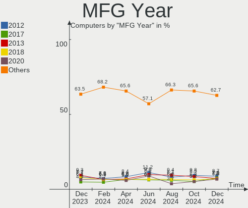
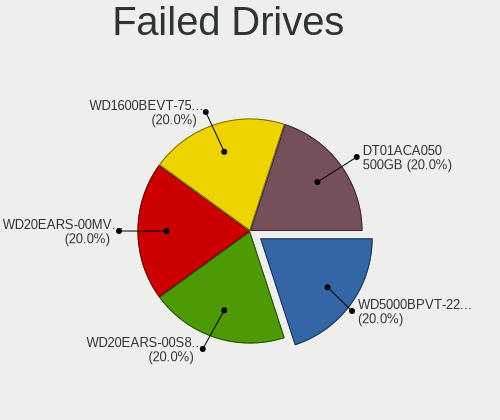
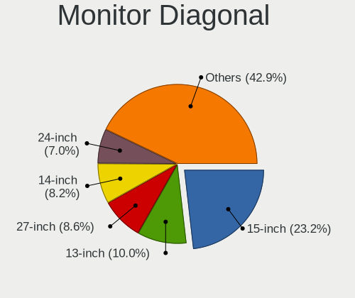
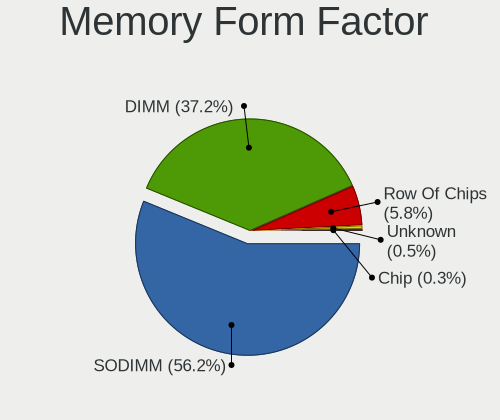
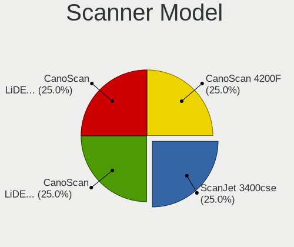

OpenMandriva - Hardware Trends
------------------------------

A project to identify most popular hardware characteristics and track their change
over time based on data collected by Linux users at https://Linux-Hardware.org.

Anyone can contribute to this report by the [hw-probe](https://github.com/linuxhw/hw-probe) tool:

    sudo -E hw-probe -all -upload

This is a report for all computer types. See also reports for [desktops](/Dist/OpenMandriva/Desktop/README.md) and [notebooks](/Dist/OpenMandriva/Notebook/README.md).

This report is for one last month. Overall report since the beginning of time: [TestCoverage](https://github.com/linuxhw/TestCoverage)

Period: Jun, 2022.

Contents
--------

* [ System ](#system)
  - [ OS                       ](#os)
  - [ OS Family                ](#os-family)
  - [ Kernel                   ](#kernel)
  - [ Kernel Family            ](#kernel-family)
  - [ Kernel Major Ver.        ](#kernel-major-ver)
  - [ Arch                     ](#arch)
  - [ DE                       ](#de)
  - [ Display Server           ](#display-server)
  - [ Display Manager          ](#display-manager)
  - [ OS Lang                  ](#os-lang)
  - [ Boot Mode                ](#boot-mode)
  - [ Filesystem               ](#filesystem)
  - [ Part. scheme             ](#part-scheme)
  - [ Dual Boot with Linux/BSD ](#dual-boot-with-linuxbsd)
  - [ Dual Boot (Win)          ](#dual-boot-win)

* [ Board ](#board)
  - [ Vendor                   ](#vendor)
  - [ Model                    ](#model)
  - [ Model Family             ](#model-family)
  - [ MFG Year                 ](#mfg-year)
  - [ Form Factor              ](#form-factor)
  - [ Secure Boot              ](#secure-boot)
  - [ Coreboot                 ](#coreboot)
  - [ RAM Size                 ](#ram-size)
  - [ RAM Used                 ](#ram-used)
  - [ Total Drives             ](#total-drives)
  - [ Has CD-ROM               ](#has-cd-rom)
  - [ Has Ethernet             ](#has-ethernet)
  - [ Has WiFi                 ](#has-wifi)
  - [ Has Bluetooth            ](#has-bluetooth)

* [ Location ](#location)
  - [ Country                  ](#country)
  - [ City                     ](#city)

* [ Drives ](#drives)
  - [ Drive Vendor             ](#drive-vendor)
  - [ Drive Model              ](#drive-model)
  - [ HDD Vendor               ](#hdd-vendor)
  - [ SSD Vendor               ](#ssd-vendor)
  - [ Drive Kind               ](#drive-kind)
  - [ Drive Connector          ](#drive-connector)
  - [ Drive Size               ](#drive-size)
  - [ Space Total              ](#space-total)
  - [ Space Used               ](#space-used)
  - [ Malfunc. Drives          ](#malfunc-drives)
  - [ Malfunc. Drive Vendor    ](#malfunc-drive-vendor)
  - [ Malfunc. HDD Vendor      ](#malfunc-hdd-vendor)
  - [ Malfunc. Drive Kind      ](#malfunc-drive-kind)
  - [ Failed Drives            ](#failed-drives)
  - [ Failed Drive Vendor      ](#failed-drive-vendor)
  - [ Drive Status             ](#drive-status)

* [ Storage controller ](#storage-controller)
  - [ Storage Vendor           ](#storage-vendor)
  - [ Storage Model            ](#storage-model)
  - [ Storage Kind             ](#storage-kind)

* [ Processor ](#processor)
  - [ CPU Vendor               ](#cpu-vendor)
  - [ CPU Model                ](#cpu-model)
  - [ CPU Model Family         ](#cpu-model-family)
  - [ CPU Cores                ](#cpu-cores)
  - [ CPU Sockets              ](#cpu-sockets)
  - [ CPU Threads              ](#cpu-threads)
  - [ CPU Op-Modes             ](#cpu-op-modes)
  - [ CPU Microcode            ](#cpu-microcode)
  - [ CPU Microarch            ](#cpu-microarch)

* [ Graphics ](#graphics)
  - [ GPU Vendor               ](#gpu-vendor)
  - [ GPU Model                ](#gpu-model)
  - [ GPU Combo                ](#gpu-combo)
  - [ GPU Driver               ](#gpu-driver)
  - [ GPU Memory               ](#gpu-memory)

* [ Monitor ](#monitor)
  - [ Monitor Vendor           ](#monitor-vendor)
  - [ Monitor Model            ](#monitor-model)
  - [ Monitor Resolution       ](#monitor-resolution)
  - [ Monitor Diagonal         ](#monitor-diagonal)
  - [ Monitor Width            ](#monitor-width)
  - [ Aspect Ratio             ](#aspect-ratio)
  - [ Monitor Area             ](#monitor-area)
  - [ Pixel Density            ](#pixel-density)
  - [ Multiple Monitors        ](#multiple-monitors)

* [ Network ](#network)
  - [ Net Controller Vendor    ](#net-controller-vendor)
  - [ Net Controller Model     ](#net-controller-model)
  - [ Wireless Vendor          ](#wireless-vendor)
  - [ Wireless Model           ](#wireless-model)
  - [ Ethernet Vendor          ](#ethernet-vendor)
  - [ Ethernet Model           ](#ethernet-model)
  - [ Net Controller Kind      ](#net-controller-kind)
  - [ Used Controller          ](#used-controller)
  - [ NICs                     ](#nics)
  - [ IPv6                     ](#ipv6)

* [ Bluetooth ](#bluetooth)
  - [ Bluetooth Vendor         ](#bluetooth-vendor)
  - [ Bluetooth Model          ](#bluetooth-model)

* [ Sound ](#sound)
  - [ Sound Vendor             ](#sound-vendor)
  - [ Sound Model              ](#sound-model)

* [ Memory ](#memory)
  - [ Memory Vendor            ](#memory-vendor)
  - [ Memory Model             ](#memory-model)
  - [ Memory Kind              ](#memory-kind)
  - [ Memory Form Factor       ](#memory-form-factor)
  - [ Memory Size              ](#memory-size)
  - [ Memory Speed             ](#memory-speed)

* [ Printers & scanners ](#printers--scanners)
  - [ Printer Vendor           ](#printer-vendor)
  - [ Printer Model            ](#printer-model)
  - [ Scanner Vendor           ](#scanner-vendor)
  - [ Scanner Model            ](#scanner-model)

* [ Camera ](#camera)
  - [ Camera Vendor            ](#camera-vendor)
  - [ Camera Model             ](#camera-model)

* [ Security ](#security)
  - [ Fingerprint Vendor       ](#fingerprint-vendor)
  - [ Fingerprint Model        ](#fingerprint-model)
  - [ Chipcard Vendor          ](#chipcard-vendor)
  - [ Chipcard Model           ](#chipcard-model)

* [ Unsupported ](#unsupported)
  - [ Unsupported Devices      ](#unsupported-devices)
  - [ Unsupported Device Types ](#unsupported-device-types)

System
------

OS
--

Installed operating systems

| Name              | Computers | Percent |
|-------------------|-----------|---------|
| OpenMandriva 4.3  | 264       | 89.49%  |
| OpenMandriva 4.2  | 25        | 8.47%   |
| OpenMandriva 4.50 | 4         | 1.36%   |
| OpenMandriva 4.90 | 2         | 0.68%   |

OS Family
---------

OS without a version

| Name         | Computers | Percent |
|--------------|-----------|---------|
| OpenMandriva | 295       | 100%    |

Kernel
------

Version of the Linux kernel

| Version                       | Computers | Percent |
|-------------------------------|-----------|---------|
| 5.16.7-desktop-1omv4003       | 243       | 82.37%  |
| 5.10.14-desktop-1omv4002      | 23        | 7.8%    |
| 5.16.13-desktop-1omv4003      | 17        | 5.76%   |
| 5.17.1-desktop-2omv4050       | 3         | 1.02%   |
| 5.14.7-desktop-1omv4050       | 3         | 1.02%   |
| 5.11.12-desktop-1omv4002      | 2         | 0.68%   |
| 5.18.1-server-1omv4090        | 1         | 0.34%   |
| 5.17.1-desktop-clang-2omv4050 | 1         | 0.34%   |
| 5.14.14-desktop-1omv4050      | 1         | 0.34%   |
| 5.12.4-desktop-1omv4050       | 1         | 0.34%   |

Kernel Family
-------------

Linux kernel without a distro release

| Version | Computers | Percent |
|---------|-----------|---------|
| 5.16.7  | 243       | 82.37%  |
| 5.10.14 | 23        | 7.8%    |
| 5.16.13 | 17        | 5.76%   |
| 5.17.1  | 4         | 1.36%   |
| 5.14.7  | 3         | 1.02%   |
| 5.11.12 | 2         | 0.68%   |
| 5.18.1  | 1         | 0.34%   |
| 5.14.14 | 1         | 0.34%   |
| 5.12.4  | 1         | 0.34%   |

Kernel Major Ver.
-----------------

Linux kernel major version

| Version | Computers | Percent |
|---------|-----------|---------|
| 5.16    | 260       | 88.14%  |
| 5.10    | 23        | 7.8%    |
| 5.17    | 4         | 1.36%   |
| 5.14    | 4         | 1.36%   |
| 5.11    | 2         | 0.68%   |
| 5.18    | 1         | 0.34%   |
| 5.12    | 1         | 0.34%   |

Arch
----

OS architecture (x86_64, i586, etc.)

| Name   | Computers | Percent |
|--------|-----------|---------|
| x86_64 | 295       | 100%    |

DE
--

Desktop Environment

| Name    | Computers | Percent |
|---------|-----------|---------|
| KDE5    | 292       | 98.98%  |
| LXQt    | 2         | 0.68%   |
| Unknown | 1         | 0.34%   |

Display Server
--------------

X11 or Wayland

| Name    | Computers | Percent |
|---------|-----------|---------|
| X11     | 292       | 98.98%  |
| Wayland | 3         | 1.02%   |

Display Manager
---------------

SDDM, LightDM, etc.

| Name | Computers | Percent |
|------|-----------|---------|
| SDDM | 295       | 100%    |

OS Lang
-------

Language

| Lang  | Computers | Percent |
|-------|-----------|---------|
| en_US | 172       | 58.31%  |
| de_DE | 19        | 6.44%   |
| ru_RU | 17        | 5.76%   |
| pl_PL | 17        | 5.76%   |
| fr_FR | 16        | 5.42%   |
| pt_BR | 9         | 3.05%   |
| en_CA | 8         | 2.71%   |
| it_IT | 6         | 2.03%   |
| cs_CZ | 5         | 1.69%   |
| es_CO | 4         | 1.36%   |
| en_GB | 4         | 1.36%   |
| uk_UA | 2         | 0.68%   |
| fr_CA | 2         | 0.68%   |
| fr_BE | 2         | 0.68%   |
| es_ES | 2         | 0.68%   |
| da_DK | 2         | 0.68%   |
| tr_TR | 1         | 0.34%   |
| ru_UA | 1         | 0.34%   |
| nl_NL | 1         | 0.34%   |
| es_VE | 1         | 0.34%   |
| es_MX | 1         | 0.34%   |
| es_AR | 1         | 0.34%   |
| en_IL | 1         | 0.34%   |
| en_AU | 1         | 0.34%   |

Boot Mode
---------

EFI or BIOS

| Mode | Computers | Percent |
|------|-----------|---------|
| EFI  | 153       | 51.86%  |
| BIOS | 142       | 48.14%  |

Filesystem
----------

Type of filesystem

| Type    | Computers | Percent |
|---------|-----------|---------|
| Overlay | 230       | 77.97%  |
| Ext4    | 65        | 22.03%  |

Part. scheme
------------

Scheme of partitioning

| Type    | Computers | Percent |
|---------|-----------|---------|
| GPT     | 190       | 64.41%  |
| MBR     | 104       | 35.25%  |
| Unknown | 1         | 0.34%   |

Dual Boot with Linux/BSD
------------------------

Hosting more than one Linux/BSD

| Dual boot | Computers | Percent |
|-----------|-----------|---------|
| Yes       | 152       | 51.53%  |
| No        | 143       | 48.47%  |

Dual Boot (Win)
---------------

Hosting Linux and Windows

| Dual boot | Computers | Percent |
|-----------|-----------|---------|
| Yes       | 160       | 54.24%  |
| No        | 135       | 45.76%  |

Board
-----

Vendor
------

Motherboard manufacturer

| Name                | Computers | Percent |
|---------------------|-----------|---------|
| ASUSTek Computer    | 59        | 20%     |
| Dell                | 50        | 16.95%  |
| Hewlett-Packard     | 39        | 13.22%  |
| Gigabyte Technology | 25        | 8.47%   |
| Acer                | 24        | 8.14%   |
| Lenovo              | 18        | 6.1%    |
| MSI                 | 17        | 5.76%   |
| ASRock              | 13        | 4.41%   |
| Intel               | 7         | 2.37%   |
| Sony                | 4         | 1.36%   |
| Medion              | 3         | 1.02%   |
| LG Electronics      | 3         | 1.02%   |
| Fujitsu             | 3         | 1.02%   |
| Foxconn             | 3         | 1.02%   |
| Unknown             | 3         | 1.02%   |
| TUXEDO              | 2         | 0.68%   |
| Toshiba             | 2         | 0.68%   |
| Shuttle             | 2         | 0.68%   |
| MACHINIST           | 2         | 0.68%   |
| Apple               | 2         | 0.68%   |
| Samsung Electronics | 1         | 0.34%   |
| Packard Bell        | 1         | 0.34%   |
| OEM                 | 1         | 0.34%   |
| langchao            | 1         | 0.34%   |
| HYPA                | 1         | 0.34%   |
| HUAWEI              | 1         | 0.34%   |
| Fujitsu Siemens     | 1         | 0.34%   |
| eMachines           | 1         | 0.34%   |
| ECS                 | 1         | 0.34%   |
| DNS                 | 1         | 0.34%   |
| Biostar             | 1         | 0.34%   |
| AZW                 | 1         | 0.34%   |
| AMI                 | 1         | 0.34%   |
| Alienware           | 1         | 0.34%   |

Model
-----

Motherboard model

| Name                                                             | Computers | Percent |
|------------------------------------------------------------------|-----------|---------|
| ASUS SABERTOOTH Z77                                              | 10        | 3.39%   |
| Dell Inspiron 3451                                               | 6         | 2.03%   |
| Dell Latitude 3120                                               | 5         | 1.69%   |
| Unknown                                                          | 5         | 1.69%   |
| HP Laptop 14-fq0xxx                                              | 4         | 1.36%   |
| LG 15Z970-E.BH71P1                                               | 3         | 1.02%   |
| Dell Precision M6800                                             | 3         | 1.02%   |
| ASUS UX31E                                                       | 3         | 1.02%   |
| MSI MS-7360                                                      | 2         | 0.68%   |
| HP Pavilion dv6                                                  | 2         | 0.68%   |
| Dell OptiPlex 7010                                               | 2         | 0.68%   |
| Dell Latitude 3420                                               | 2         | 0.68%   |
| Dell Latitude 3310                                               | 2         | 0.68%   |
| Dell Latitude 3300                                               | 2         | 0.68%   |
| Dell Latitude 3190 2-in-1                                        | 2         | 0.68%   |
| ASUS ROG STRIX B550-I GAMING                                     | 2         | 0.68%   |
| ASUS PRIME A320M-K                                               | 2         | 0.68%   |
| ASUS M5A97 PLUS                                                  | 2         | 0.68%   |
| Acer Aspire A315-32                                              | 2         | 0.68%   |
| Acer AO722                                                       | 2         | 0.68%   |
| Toshiba Satellite C855-2CF                                       | 1         | 0.34%   |
| Toshiba Satellite C660D                                          | 1         | 0.34%   |
| Sony VPCSB4AFX                                                   | 1         | 0.34%   |
| Sony VGN-Z71JB                                                   | 1         | 0.34%   |
| Sony VGN-NW310F                                                  | 1         | 0.34%   |
| Sony VGN-FZ31Z                                                   | 1         | 0.34%   |
| Shuttle DS47D                                                    | 1         | 0.34%   |
| Shuttle DL10J                                                    | 1         | 0.34%   |
| Samsung 355V4C/356V4C/3445VC/3545VC                              | 1         | 0.34%   |
| Packard Bell IMEDIA D4001 FR                                     | 1         | 0.34%   |
| OEM H110                                                         | 1         | 0.34%   |
| MSI MS-7C95                                                      | 1         | 0.34%   |
| MSI MS-7C91                                                      | 1         | 0.34%   |
| MSI MS-7C52                                                      | 1         | 0.34%   |
| MSI MS-7C37                                                      | 1         | 0.34%   |
| MSI MS-7C09                                                      | 1         | 0.34%   |
| MSI MS-7A36                                                      | 1         | 0.34%   |
| MSI MS-7984                                                      | 1         | 0.34%   |
| MSI MS-7817                                                      | 1         | 0.34%   |
| MSI MS-7786                                                      | 1         | 0.34%   |
| MSI MS-7758                                                      | 1         | 0.34%   |
| MSI MS-7721                                                      | 1         | 0.34%   |
| MSI MS-7636                                                      | 1         | 0.34%   |
| MSI MS-7612                                                      | 1         | 0.34%   |
| MSI MS-7599                                                      | 1         | 0.34%   |
| MSI MS-7255                                                      | 1         | 0.34%   |
| Medion E7220                                                     | 1         | 0.34%   |
| Medion E2292                                                     | 1         | 0.34%   |
| Medion Akoya P5372 H/B728                                        | 1         | 0.34%   |
| MACHINIST X99-RS9 V2.0                                           | 1         | 0.34%   |
| MACHINIST X79 (INTEL Xeon E5/Corei7 DMI2 - C600/C200 Cipset V309 | 1         | 0.34%   |
| Lenovo Z40-75 80DW                                               | 1         | 0.34%   |
| Lenovo Yoga 2 11 20332                                           | 1         | 0.34%   |
| Lenovo V530S-07ICB 10TX00AVMG                                    | 1         | 0.34%   |
| Lenovo ThinkPad X1 Carbon 3rd 20BSCTO1WW                         | 1         | 0.34%   |
| Lenovo ThinkPad T60 2007FUG                                      | 1         | 0.34%   |
| Lenovo ThinkPad T460s 20FAS76R00                                 | 1         | 0.34%   |
| Lenovo ThinkPad T400 2767AL9                                     | 1         | 0.34%   |
| Lenovo ThinkPad S2 3rd Gen 20L1A001CD                            | 1         | 0.34%   |
| Lenovo ThinkCentre M73 10AXS2WY00                                | 1         | 0.34%   |

Model Family
------------

Motherboard model prefix

| Name                | Computers | Percent |
|---------------------|-----------|---------|
| Dell Latitude       | 27        | 9.15%   |
| Acer Aspire         | 15        | 5.08%   |
| Dell Inspiron       | 11        | 3.73%   |
| ASUS SABERTOOTH     | 11        | 3.73%   |
| HP Pavilion         | 10        | 3.39%   |
| HP Laptop           | 8         | 2.71%   |
| ASUS PRIME          | 8         | 2.71%   |
| ASUS ROG            | 7         | 2.37%   |
| Lenovo IdeaPad      | 6         | 2.03%   |
| Lenovo ThinkPad     | 5         | 1.69%   |
| Dell OptiPlex       | 5         | 1.69%   |
| Unknown             | 5         | 1.69%   |
| HP ProBook          | 4         | 1.36%   |
| HP Compaq           | 4         | 1.36%   |
| Dell Precision      | 4         | 1.36%   |
| LG 15Z970-E.BH71P1  | 3         | 1.02%   |
| Dell Vostro         | 3         | 1.02%   |
| ASUS UX31E          | 3         | 1.02%   |
| ASUS TUF            | 3         | 1.02%   |
| Toshiba Satellite   | 2         | 0.68%   |
| MSI MS-7360         | 2         | 0.68%   |
| Lenovo ThinkCentre  | 2         | 0.68%   |
| HP Spectre          | 2         | 0.68%   |
| HP Slim             | 2         | 0.68%   |
| HP ProDesk          | 2         | 0.68%   |
| HP EliteDesk        | 2         | 0.68%   |
| HP EliteBook        | 2         | 0.68%   |
| Gigabyte X570S      | 2         | 0.68%   |
| ASUS M5A97          | 2         | 0.68%   |
| Acer Swift          | 2         | 0.68%   |
| Acer Extensa        | 2         | 0.68%   |
| Acer AO722          | 2         | 0.68%   |
| Sony VPCSB4AFX      | 1         | 0.34%   |
| Sony VGN-Z71JB      | 1         | 0.34%   |
| Sony VGN-NW310F     | 1         | 0.34%   |
| Sony VGN-FZ31Z      | 1         | 0.34%   |
| Shuttle DS47D       | 1         | 0.34%   |
| Shuttle DL10J       | 1         | 0.34%   |
| Samsung 355V4C      | 1         | 0.34%   |
| Packard Bell IMEDIA | 1         | 0.34%   |
| OEM H110            | 1         | 0.34%   |
| MSI MS-7C95         | 1         | 0.34%   |
| MSI MS-7C91         | 1         | 0.34%   |
| MSI MS-7C52         | 1         | 0.34%   |
| MSI MS-7C37         | 1         | 0.34%   |
| MSI MS-7C09         | 1         | 0.34%   |
| MSI MS-7A36         | 1         | 0.34%   |
| MSI MS-7984         | 1         | 0.34%   |
| MSI MS-7817         | 1         | 0.34%   |
| MSI MS-7786         | 1         | 0.34%   |
| MSI MS-7758         | 1         | 0.34%   |
| MSI MS-7721         | 1         | 0.34%   |
| MSI MS-7636         | 1         | 0.34%   |
| MSI MS-7612         | 1         | 0.34%   |
| MSI MS-7599         | 1         | 0.34%   |
| MSI MS-7255         | 1         | 0.34%   |
| Medion E7220        | 1         | 0.34%   |
| Medion E2292        | 1         | 0.34%   |
| Medion Akoya        | 1         | 0.34%   |
| MACHINIST X99-RS9   | 1         | 0.34%   |

MFG Year
--------

Motherboard manufacture year

| Year | Computers | Percent |
|------|-----------|---------|
| 2019 | 29        | 9.83%   |
| 2013 | 27        | 9.15%   |
| 2012 | 26        | 8.81%   |
| 2021 | 25        | 8.47%   |
| 2014 | 24        | 8.14%   |
| 2011 | 24        | 8.14%   |
| 2020 | 22        | 7.46%   |
| 2017 | 19        | 6.44%   |
| 2010 | 19        | 6.44%   |
| 2018 | 15        | 5.08%   |
| 2015 | 14        | 4.75%   |
| 2009 | 13        | 4.41%   |
| 2016 | 12        | 4.07%   |
| 2008 | 9         | 3.05%   |
| 2007 | 8         | 2.71%   |
| 2006 | 6         | 2.03%   |
| 2022 | 3         | 1.02%   |

Form Factor
-----------

Physical design of the computer

| Name        | Computers | Percent |
|-------------|-----------|---------|
| Desktop     | 146       | 49.49%  |
| Notebook    | 134       | 45.42%  |
| Convertible | 10        | 3.39%   |
| All in one  | 3         | 1.02%   |
| Mini pc     | 2         | 0.68%   |

Secure Boot
-----------

Enabled or disabled

| State    | Computers | Percent |
|----------|-----------|---------|
| Disabled | 295       | 100%    |

Coreboot
--------

Have coreboot on board

| Used | Computers | Percent |
|------|-----------|---------|
| No   | 295       | 100%    |

RAM Size
--------

Total RAM memory

| Size in GB  | Computers | Percent |
|-------------|-----------|---------|
| 4.01-8.0    | 80        | 27.12%  |
| 3.01-4.0    | 80        | 27.12%  |
| 8.01-16.0   | 48        | 16.27%  |
| 32.01-64.0  | 32        | 10.85%  |
| 16.01-24.0  | 32        | 10.85%  |
| 1.01-2.0    | 11        | 3.73%   |
| 24.01-32.0  | 6         | 2.03%   |
| 2.01-3.0    | 3         | 1.02%   |
| 64.01-256.0 | 3         | 1.02%   |

RAM Used
--------

Used RAM memory

| Used GB   | Computers | Percent |
|-----------|-----------|---------|
| 1.01-2.0  | 212       | 71.86%  |
| 0.51-1.0  | 50        | 16.95%  |
| 2.01-3.0  | 26        | 8.81%   |
| 0.01-0.5  | 4         | 1.36%   |
| 3.01-4.0  | 2         | 0.68%   |
| 8.01-16.0 | 1         | 0.34%   |

Total Drives
------------

Number of drives on board

| Drives | Computers | Percent |
|--------|-----------|---------|
| 1      | 176       | 59.66%  |
| 2      | 60        | 20.34%  |
| 3      | 24        | 8.14%   |
| 4      | 13        | 4.41%   |
| 0      | 8         | 2.71%   |
| 5      | 7         | 2.37%   |
| 7      | 4         | 1.36%   |
| 6      | 2         | 0.68%   |
| 12     | 1         | 0.34%   |

Has CD-ROM
----------

Has CD-ROM on board

| Presented | Computers | Percent |
|-----------|-----------|---------|
| No        | 154       | 52.2%   |
| Yes       | 141       | 47.8%   |

Has Ethernet
------------

Has Ethernet on board

| Presented | Computers | Percent |
|-----------|-----------|---------|
| Yes       | 265       | 89.83%  |
| No        | 30        | 10.17%  |

Has WiFi
--------

Has WiFi module

| Presented | Computers | Percent |
|-----------|-----------|---------|
| Yes       | 208       | 70.51%  |
| No        | 87        | 29.49%  |

Has Bluetooth
-------------

Has Bluetooth module

| Presented | Computers | Percent |
|-----------|-----------|---------|
| No        | 151       | 51.19%  |
| Yes       | 144       | 48.81%  |

Location
--------

Country
-------

Geographic location (country)

| Country               | Computers | Percent |
|-----------------------|-----------|---------|
| USA                   | 31        | 10.51%  |
| Poland                | 28        | 9.49%   |
| Germany               | 26        | 8.81%   |
| France                | 26        | 8.81%   |
| Netherlands           | 20        | 6.78%   |
| Russia                | 17        | 5.76%   |
| Brazil                | 17        | 5.76%   |
| Canada                | 10        | 3.39%   |
| Italy                 | 9         | 3.05%   |
| UK                    | 7         | 2.37%   |
| Sweden                | 6         | 2.03%   |
| Mexico                | 6         | 2.03%   |
| Indonesia             | 6         | 2.03%   |
| Czechia               | 6         | 2.03%   |
| Colombia              | 6         | 2.03%   |
| Australia             | 6         | 2.03%   |
| India                 | 5         | 1.69%   |
| Turkey                | 4         | 1.36%   |
| Greece                | 4         | 1.36%   |
| Egypt                 | 4         | 1.36%   |
| Ukraine               | 3         | 1.02%   |
| Japan                 | 3         | 1.02%   |
| Denmark               | 3         | 1.02%   |
| Uruguay               | 2         | 0.68%   |
| Spain                 | 2         | 0.68%   |
| Portugal              | 2         | 0.68%   |
| Peru                  | 2         | 0.68%   |
| China                 | 2         | 0.68%   |
| Bulgaria              | 2         | 0.68%   |
| Benin                 | 2         | 0.68%   |
| Belgium               | 2         | 0.68%   |
| Belarus               | 2         | 0.68%   |
| Venezuela             | 1         | 0.34%   |
| Thailand              | 1         | 0.34%   |
| Tanzania              | 1         | 0.34%   |
| Switzerland           | 1         | 0.34%   |
| South Africa          | 1         | 0.34%   |
| Slovakia              | 1         | 0.34%   |
| Serbia                | 1         | 0.34%   |
| Saint Lucia           | 1         | 0.34%   |
| Philippines           | 1         | 0.34%   |
| Paraguay              | 1         | 0.34%   |
| Palestinian Territory | 1         | 0.34%   |
| Pakistan              | 1         | 0.34%   |
| Norway                | 1         | 0.34%   |
| Martinique            | 1         | 0.34%   |
| Malaysia              | 1         | 0.34%   |
| Latvia                | 1         | 0.34%   |
| Israel                | 1         | 0.34%   |
| Hungary               | 1         | 0.34%   |
| Estonia               | 1         | 0.34%   |
| Ecuador               | 1         | 0.34%   |
| Croatia               | 1         | 0.34%   |
| Bahamas               | 1         | 0.34%   |
| Azerbaijan            | 1         | 0.34%   |
| Argentina             | 1         | 0.34%   |

City
----

Geographic location (city)

| City                 | Computers | Percent |
|----------------------|-----------|---------|
| Schagen              | 16        | 5.42%   |
| Strzyzow             | 10        | 3.39%   |
| Moscow               | 6         | 2.03%   |
| Krakow               | 6         | 2.03%   |
| Vancouver            | 3         | 1.02%   |
| Thessaloniki         | 3         | 1.02%   |
| Teresopolis          | 3         | 1.02%   |
| Skierniewice         | 3         | 1.02%   |
| Sao Paulo            | 3         | 1.02%   |
| Prague               | 3         | 1.02%   |
| Paris                | 3         | 1.02%   |
| Munich               | 3         | 1.02%   |
| East Stroudsburg     | 3         | 1.02%   |
| Bogotá              | 3         | 1.02%   |
| Warsaw               | 2         | 0.68%   |
| Sydney               | 2         | 0.68%   |
| Slagelse             | 2         | 0.68%   |
| Sevastopol           | 2         | 0.68%   |
| Sao José dos Campos | 2         | 0.68%   |
| Örebro              | 2         | 0.68%   |
| Montreal             | 2         | 0.68%   |
| Mexico City          | 2         | 0.68%   |
| Lima                 | 2         | 0.68%   |
| Krasnodar            | 2         | 0.68%   |
| Jakarta              | 2         | 0.68%   |
| Hamburg              | 2         | 0.68%   |
| Dortmund             | 2         | 0.68%   |
| Cotonou              | 2         | 0.68%   |
| Ciudad Obregón      | 2         | 0.68%   |
| Chicago              | 2         | 0.68%   |
| Cherbourg-Octeville  | 2         | 0.68%   |
| Cairo                | 2         | 0.68%   |
| Bengaluru            | 2         | 0.68%   |
| Beijing              | 2         | 0.68%   |
| Zwijndrecht          | 1         | 0.34%   |
| Zgierz               | 1         | 0.34%   |
| Zagreb               | 1         | 0.34%   |
| Yessentukskaya       | 1         | 0.34%   |
| Włocławek          | 1         | 0.34%   |
| Wolverhampton        | 1         | 0.34%   |
| Wettringen           | 1         | 0.34%   |
| Werkendam            | 1         | 0.34%   |
| Weimar               | 1         | 0.34%   |
| Vysoke Myto          | 1         | 0.34%   |
| Victoria             | 1         | 0.34%   |
| Velke Mezirici       | 1         | 0.34%   |
| Vaxjo                | 1         | 0.34%   |
| Varna                | 1         | 0.34%   |
| Valderrobres         | 1         | 0.34%   |
| Uppsala              | 1         | 0.34%   |
| Tulsa                | 1         | 0.34%   |
| Tulancingo           | 1         | 0.34%   |
| Trois-Rivières      | 1         | 0.34%   |
| Tholey               | 1         | 0.34%   |
| Tel Aviv             | 1         | 0.34%   |
| Taroona              | 1         | 0.34%   |
| Surzur               | 1         | 0.34%   |
| Surabaya             | 1         | 0.34%   |
| Stirling             | 1         | 0.34%   |
| Stavropol            | 1         | 0.34%   |

Drives
------

Drive Vendor
------------

Hard drive vendors

| Vendor              | Computers | Drives | Percent |
|---------------------|-----------|--------|---------|
| Samsung Electronics | 75        | 79     | 17.77%  |
| Seagate             | 73        | 99     | 17.3%   |
| WDC                 | 66        | 82     | 15.64%  |
| Toshiba             | 27        | 29     | 6.4%    |
| SanDisk             | 20        | 22     | 4.74%   |
| Crucial             | 20        | 26     | 4.74%   |
| Hitachi             | 19        | 20     | 4.5%    |
| Kingston            | 15        | 17     | 3.55%   |
| Unknown             | 10        | 12     | 2.37%   |
| SK hynix            | 9         | 9      | 2.13%   |
| Goodram             | 7         | 7      | 1.66%   |
| A-DATA Technology   | 7         | 8      | 1.66%   |
| LITEON              | 5         | 5      | 1.18%   |
| ASMT                | 5         | 6      | 1.18%   |
| China               | 4         | 4      | 0.95%   |
| SSSTC               | 3         | 3      | 0.71%   |
| OCZ                 | 3         | 3      | 0.71%   |
| KIOXIA              | 3         | 3      | 0.71%   |
| Gigabyte Technology | 3         | 3      | 0.71%   |
| Corsair             | 3         | 3      | 0.71%   |
| Apacer              | 3         | 3      | 0.71%   |
| Transcend           | 2         | 2      | 0.47%   |
| SPCC                | 2         | 2      | 0.47%   |
| Silicon Motion      | 2         | 2      | 0.47%   |
| PNY                 | 2         | 2      | 0.47%   |
| Patriot             | 2         | 3      | 0.47%   |
| Netac               | 2         | 2      | 0.47%   |
| Maxtor              | 2         | 2      | 0.47%   |
| LaCie               | 2         | 3      | 0.47%   |
| JMicron Technology  | 2         | 3      | 0.47%   |
| HGST                | 2         | 3      | 0.47%   |
| Unknown             | 2         | 2      | 0.47%   |
| XPG                 | 1         | 1      | 0.24%   |
| Verbatim            | 1         | 1      | 0.24%   |
| V-GeN               | 1         | 1      | 0.24%   |
| USB3.0              | 1         | 1      | 0.24%   |
| Team                | 1         | 1      | 0.24%   |
| TCSUNBOW            | 1         | 1      | 0.24%   |
| Micron Technology   | 1         | 1      | 0.24%   |
| Magnetic Data       | 1         | 1      | 0.24%   |
| LITEONIT            | 1         | 1      | 0.24%   |
| Leven               | 1         | 1      | 0.24%   |
| Kston               | 1         | 1      | 0.24%   |
| KingDian            | 1         | 1      | 0.24%   |
| Intenso             | 1         | 1      | 0.24%   |
| Inateck             | 1         | 1      | 0.24%   |
| IBM/Hitachi         | 1         | 1      | 0.24%   |
| Hewlett-Packard     | 1         | 1      | 0.24%   |
| GLOWAY              | 1         | 1      | 0.24%   |
| Fujitsu             | 1         | 1      | 0.24%   |
| Faspeed             | 1         | 1      | 0.24%   |
| EMTEC               | 1         | 1      | 0.24%   |

Drive Model
-----------

Hard drive models

| Model                               | Computers | Percent |
|-------------------------------------|-----------|---------|
| Seagate ST500LT012-1DG142 500GB     | 9         | 1.9%    |
| Seagate ST2000DM008-2FR102 2TB      | 7         | 1.48%   |
| Samsung SSD 850 EVO 250GB           | 6         | 1.27%   |
| Toshiba DT01ACA050 500GB            | 5         | 1.06%   |
| Seagate ST1000DM010-2EP102 1TB      | 5         | 1.06%   |
| Samsung SSD 850 EVO 500GB           | 5         | 1.06%   |
| Crucial CT500MX500SSD1 500GB        | 5         | 1.06%   |
| Unknown DA4064  64GB                | 4         | 0.85%   |
| Seagate ST1000DM003-1ER162 1TB      | 4         | 0.85%   |
| Samsung SSD 860 EVO 500GB           | 4         | 0.85%   |
| Kingston SV300S37A120G 120GB SSD    | 4         | 0.85%   |
| ASMT 2135 120GB SSD                 | 4         | 0.85%   |
| WDC WD3200AAJS-00L7A0 320GB         | 3         | 0.63%   |
| Toshiba MQ01ABD100 1TB              | 3         | 0.63%   |
| Toshiba MK3265GSX 320GB             | 3         | 0.63%   |
| Seagate ST92505610AS 250GB          | 3         | 0.63%   |
| Seagate ST500DM002-1BD142 500GB     | 3         | 0.63%   |
| Seagate ST2000LM015-2E8174 2TB      | 3         | 0.63%   |
| Seagate ST2000LM007-1R8174 2TB      | 3         | 0.63%   |
| Seagate ST1000DM003-1CH162 1TB      | 3         | 0.63%   |
| SanDisk SSD U100 256GB              | 3         | 0.63%   |
| Samsung SSD 860 EVO 250GB           | 3         | 0.63%   |
| Samsung SSD 840 EVO 250GB           | 3         | 0.63%   |
| LITEON CV1-8B128 128GB SSD          | 3         | 0.63%   |
| Kingston SA400S37240G 240GB SSD     | 3         | 0.63%   |
| Goodram SSD 120GB                   | 3         | 0.63%   |
| Crucial M4-CT256M4SSD3 256GB        | 3         | 0.63%   |
| Crucial CT1000MX500SSD1 1TB         | 3         | 0.63%   |
| Apacer AS350 240GB SSD              | 3         | 0.63%   |
| WDC WDS240G2G0A-00JH30 240GB SSD    | 2         | 0.42%   |
| WDC WDS100T1X0E-00AFY0 1TB          | 2         | 0.42%   |
| WDC WD30EZRX-00D8PB0 3TB            | 2         | 0.42%   |
| WDC WD10EZRZ-00HTKB0 1TB            | 2         | 0.42%   |
| WDC WD10EZRX-00A8LB0 1TB            | 2         | 0.42%   |
| WDC WD10EZEX-00BBHA0 1TB            | 2         | 0.42%   |
| Transcend TS120GMTS420S 120GB SSD   | 2         | 0.42%   |
| SSSTC CL1-3D128-Q11 NVMe 128GB      | 2         | 0.42%   |
| SK hynix SC311 SATA 128GB SSD       | 2         | 0.42%   |
| SK hynix BC711 NVMe 128GB           | 2         | 0.42%   |
| Seagate ST500LM012 HN-M500MBB 500GB | 2         | 0.42%   |
| Seagate ST4000DM004-2CV104 4TB      | 2         | 0.42%   |
| Seagate ST1000LM024 HN-M101MBB 1TB  | 2         | 0.42%   |
| Seagate ST1000DM003-1SB102 1TB      | 2         | 0.42%   |
| Seagate BUP Slim 2TB                | 2         | 0.42%   |
| Seagate Basic 4TB                   | 2         | 0.42%   |
| SanDisk SSD PLUS 120GB              | 2         | 0.42%   |
| SanDisk SDSSDA120G 120GB            | 2         | 0.42%   |
| SanDisk SD9SN8W-128G-1006 128GB SSD | 2         | 0.42%   |
| SanDisk NVMe SSD Drive 500GB        | 2         | 0.42%   |
| Samsung SSD 970 EVO Plus 500GB      | 2         | 0.42%   |
| Samsung SSD 970 EVO 500GB           | 2         | 0.42%   |
| Samsung SSD 870 EVO 1TB             | 2         | 0.42%   |
| Samsung SSD 860 EVO M.2 2TB         | 2         | 0.42%   |
| Samsung PM991a NVMe 128GB           | 2         | 0.42%   |
| Samsung MZVLQ512HALU-000H1 512GB    | 2         | 0.42%   |
| Samsung HD502HI 500GB               | 2         | 0.42%   |
| Samsung HD501LJ 500GB               | 2         | 0.42%   |
| Samsung HD204UI 2TB                 | 2         | 0.42%   |
| Samsung HD103SJ 1TB                 | 2         | 0.42%   |
| OCZ VERTEX4 128GB SSD               | 2         | 0.42%   |

HDD Vendor
----------

Hard disk drive vendors

| Vendor              | Computers | Drives | Percent |
|---------------------|-----------|--------|---------|
| Seagate             | 73        | 95     | 37.06%  |
| WDC                 | 55        | 68     | 27.92%  |
| Toshiba             | 25        | 26     | 12.69%  |
| Hitachi             | 19        | 20     | 9.64%   |
| Samsung Electronics | 13        | 14     | 6.6%    |
| Maxtor              | 2         | 2      | 1.02%   |
| JMicron Technology  | 2         | 3      | 1.02%   |
| HGST                | 2         | 3      | 1.02%   |
| Unknown             | 1         | 1      | 0.51%   |
| Magnetic Data       | 1         | 1      | 0.51%   |
| Inateck             | 1         | 1      | 0.51%   |
| IBM/Hitachi         | 1         | 1      | 0.51%   |
| Fujitsu             | 1         | 1      | 0.51%   |
| ASMT                | 1         | 2      | 0.51%   |

SSD Vendor
----------

Solid state drive vendors

| Vendor              | Computers | Drives | Percent |
|---------------------|-----------|--------|---------|
| Samsung Electronics | 45        | 45     | 27.95%  |
| Crucial             | 18        | 22     | 11.18%  |
| SanDisk             | 17        | 18     | 10.56%  |
| Kingston            | 13        | 14     | 8.07%   |
| WDC                 | 6         | 6      | 3.73%   |
| Goodram             | 6         | 6      | 3.73%   |
| LITEON              | 5         | 5      | 3.11%   |
| A-DATA Technology   | 5         | 5      | 3.11%   |
| China               | 4         | 4      | 2.48%   |
| ASMT                | 4         | 4      | 2.48%   |
| SK hynix            | 3         | 3      | 1.86%   |
| OCZ                 | 3         | 3      | 1.86%   |
| Apacer              | 3         | 3      | 1.86%   |
| Transcend           | 2         | 2      | 1.24%   |
| SPCC                | 2         | 2      | 1.24%   |
| PNY                 | 2         | 2      | 1.24%   |
| Patriot             | 2         | 3      | 1.24%   |
| Gigabyte Technology | 2         | 2      | 1.24%   |
| Verbatim            | 1         | 1      | 0.62%   |
| V-GeN               | 1         | 1      | 0.62%   |
| USB3.0              | 1         | 1      | 0.62%   |
| Toshiba             | 1         | 1      | 0.62%   |
| Team                | 1         | 1      | 0.62%   |
| TCSUNBOW            | 1         | 1      | 0.62%   |
| SSSTC               | 1         | 1      | 0.62%   |
| Netac               | 1         | 1      | 0.62%   |
| Micron Technology   | 1         | 1      | 0.62%   |
| LITEONIT            | 1         | 1      | 0.62%   |
| Leven               | 1         | 1      | 0.62%   |
| Kston               | 1         | 1      | 0.62%   |
| KingDian            | 1         | 1      | 0.62%   |
| Intenso             | 1         | 1      | 0.62%   |
| GLOWAY              | 1         | 1      | 0.62%   |
| Faspeed             | 1         | 1      | 0.62%   |
| EMTEC               | 1         | 1      | 0.62%   |
| Corsair             | 1         | 1      | 0.62%   |
| Unknown             | 1         | 1      | 0.62%   |

Drive Kind
----------

HDD or SSD

| Kind    | Computers | Drives | Percent |
|---------|-----------|--------|---------|
| HDD     | 163       | 238    | 44.17%  |
| SSD     | 133       | 168    | 36.04%  |
| NVMe    | 59        | 65     | 15.99%  |
| MMC     | 8         | 8      | 2.17%   |
| Unknown | 6         | 10     | 1.63%   |

Drive Connector
---------------

SATA, SAS, NVMe, etc.

| Type | Computers | Drives | Percent |
|------|-----------|--------|---------|
| SATA | 241       | 385    | 73.7%   |
| NVMe | 59        | 65     | 18.04%  |
| SAS  | 19        | 31     | 5.81%   |
| MMC  | 8         | 8      | 2.45%   |

Drive Size
----------

Size of hard drive

| Size in TB | Computers | Drives | Percent |
|------------|-----------|--------|---------|
| 0.01-0.5   | 193       | 254    | 62.46%  |
| 0.51-1.0   | 69        | 84     | 22.33%  |
| 1.01-2.0   | 27        | 36     | 8.74%   |
| 3.01-4.0   | 7         | 14     | 2.27%   |
| 2.01-3.0   | 7         | 10     | 2.27%   |
| 4.01-10.0  | 5         | 7      | 1.62%   |
| 10.01-20.0 | 1         | 1      | 0.32%   |

Space Total
-----------

Amount of disk space available on the file system

| Size in GB     | Computers | Percent |
|----------------|-----------|---------|
| 1-20           | 165       | 55.93%  |
| 101-250        | 43        | 14.58%  |
| Unknown        | 28        | 9.49%   |
| 251-500        | 15        | 5.08%   |
| 21-50          | 13        | 4.41%   |
| 501-1000       | 13        | 4.41%   |
| 51-100         | 12        | 4.07%   |
| 1001-2000      | 5         | 1.69%   |
| More than 3000 | 1         | 0.34%   |

Space Used
----------

Amount of used disk space

| Used GB  | Computers | Percent |
|----------|-----------|---------|
| 1-20     | 239       | 81.02%  |
| Unknown  | 28        | 9.49%   |
| 51-100   | 10        | 3.39%   |
| 21-50    | 7         | 2.37%   |
| 251-500  | 5         | 1.69%   |
| 101-250  | 3         | 1.02%   |
| 501-1000 | 3         | 1.02%   |

Malfunc. Drives
---------------

Drive models with a malfunction

| Model                                   | Computers | Drives | Percent |
|-----------------------------------------|-----------|--------|---------|
| Seagate ST92505610AS 250GB              | 3         | 3      | 3.33%   |
| SanDisk SSD U100 256GB                  | 3         | 3      | 3.33%   |
| Goodram SSD 120GB                       | 3         | 3      | 3.33%   |
| Crucial M4-CT256M4SSD3 256GB            | 3         | 3      | 3.33%   |
| WDC WD3200AAJS-00L7A0 320GB             | 2         | 2      | 2.22%   |
| Toshiba MK3265GSX 320GB                 | 2         | 2      | 2.22%   |
| Seagate ST500DM002-1BD142 500GB         | 2         | 2      | 2.22%   |
| SanDisk SD9SN8W-128G-1006 128GB SSD     | 2         | 2      | 2.22%   |
| Samsung Electronics HD502HI 500GB       | 2         | 2      | 2.22%   |
| OCZ VERTEX4 128GB SSD                   | 2         | 2      | 2.22%   |
| WDC WD5000BPVT-80HXZT3 500GB            | 1         | 1      | 1.11%   |
| WDC WD5000AZLX-60K2TA1 500GB            | 1         | 1      | 1.11%   |
| WDC WD5000AAKX-07U6AA0 500GB            | 1         | 1      | 1.11%   |
| WDC WD40EZRX-00SPEB0 4TB                | 1         | 1      | 1.11%   |
| WDC WD3201ABYS-01B9A0 320GB             | 1         | 1      | 1.11%   |
| WDC WD3200BEVT-60A23T0 320GB            | 1         | 1      | 1.11%   |
| WDC WD3200BEKT-60V5T1 320GB             | 1         | 1      | 1.11%   |
| WDC WD3200AAKS-00B3A0 320GB             | 1         | 1      | 1.11%   |
| WDC WD20EARS-00MVWB0 2TB                | 1         | 1      | 1.11%   |
| WDC WD1600BEVT-60ZCT0 160GB             | 1         | 1      | 1.11%   |
| WDC WD1600AAJS-00L7A0 160GB             | 1         | 1      | 1.11%   |
| WDC WD15EARS-00MVWB0 1TB                | 1         | 1      | 1.11%   |
| WDC WD10SPZX-24Z10T0 1TB                | 1         | 1      | 1.11%   |
| WDC WD10EZRX-00A8LB0 1TB                | 1         | 1      | 1.11%   |
| WDC WD10EZEX-75M2NA0 1TB                | 1         | 1      | 1.11%   |
| WDC WD10EZEX-08WN4A0 1TB                | 1         | 1      | 1.11%   |
| WDC WD10EZEX-00RKKA0 1TB                | 1         | 1      | 1.11%   |
| WDC WD10EALX-009BA0 1TB                 | 1         | 1      | 1.11%   |
| WDC WD10EALS-002BA0 1TB                 | 1         | 1      | 1.11%   |
| WDC WD10EADS-00M2B0 1TB                 | 1         | 1      | 1.11%   |
| Toshiba MQ01ABD050 500GB                | 1         | 1      | 1.11%   |
| Toshiba MK5059GSXP 500GB                | 1         | 1      | 1.11%   |
| Toshiba MK3259GSXP 320GB                | 1         | 1      | 1.11%   |
| Toshiba MK1255GSX H 120GB               | 1         | 1      | 1.11%   |
| Toshiba KSG60ZMV256G M.2 2280 256GB SSD | 1         | 1      | 1.11%   |
| TCSUNBOW X3 120GB SSD                   | 1         | 1      | 1.11%   |
| Seagate ST9750420AS 752GB               | 1         | 1      | 1.11%   |
| Seagate ST9500325AS 500GB               | 1         | 1      | 1.11%   |
| Seagate ST9320320AS 320GB               | 1         | 1      | 1.11%   |
| Seagate ST9250410AS 250GB               | 1         | 1      | 1.11%   |
| Seagate ST9250315AS 250GB               | 1         | 1      | 1.11%   |
| Seagate ST500LT012-9WS142 500GB         | 1         | 1      | 1.11%   |
| Seagate ST3500841A 500GB                | 1         | 1      | 1.11%   |
| Seagate ST3320820AS 320GB               | 1         | 1      | 1.11%   |
| Seagate ST3250820SCE 250GB              | 1         | 1      | 1.11%   |
| Seagate ST250DM000-1BD141 250GB         | 1         | 1      | 1.11%   |
| Seagate ST1000DM003-9YN162 1TB          | 1         | 1      | 1.11%   |
| Seagate ST1000DM003-1SB102 1TB          | 1         | 1      | 1.11%   |
| SanDisk SDSSDXP240G 240GB               | 1         | 1      | 1.11%   |
| Samsung Electronics SSD 870 EVO 1TB     | 1         | 1      | 1.11%   |
| Samsung Electronics SP2504C 250GB       | 1         | 1      | 1.11%   |
| Samsung Electronics HD501LJ 500GB       | 1         | 1      | 1.11%   |
| Samsung Electronics HD322HJ 320GB       | 1         | 1      | 1.11%   |
| Samsung Electronics HD161HJ 160GB       | 1         | 1      | 1.11%   |
| Patriot Burst Elite 240GB SSD           | 1         | 1      | 1.11%   |
| Maxtor STM3320613AS 320GB               | 1         | 1      | 1.11%   |
| LITEONIT LCM-128M3S 2.5 7mm 128GB SSD   | 1         | 1      | 1.11%   |
| Kingston SUV400S37240G 240GB SSD        | 1         | 1      | 1.11%   |
| Kingston SHFS37A120G 120GB SSD          | 1         | 1      | 1.11%   |
| IBM/Hitachi IC35L060AVV207-0 64GB       | 1         | 1      | 1.11%   |

Malfunc. Drive Vendor
---------------------

Vendors of faulty drives

| Vendor              | Computers | Drives | Percent |
|---------------------|-----------|--------|---------|
| WDC                 | 20        | 22     | 22.73%  |
| Seagate             | 17        | 17     | 19.32%  |
| Hitachi             | 9         | 9      | 10.23%  |
| Toshiba             | 7         | 7      | 7.95%   |
| Samsung Electronics | 7         | 7      | 7.95%   |
| SanDisk             | 6         | 6      | 6.82%   |
| Crucial             | 4         | 4      | 4.55%   |
| Goodram             | 3         | 3      | 3.41%   |
| OCZ                 | 2         | 2      | 2.27%   |
| Kingston            | 2         | 2      | 2.27%   |
| China               | 2         | 2      | 2.27%   |
| TCSUNBOW            | 1         | 1      | 1.14%   |
| Patriot             | 1         | 1      | 1.14%   |
| Maxtor              | 1         | 1      | 1.14%   |
| LITEONIT            | 1         | 1      | 1.14%   |
| IBM/Hitachi         | 1         | 1      | 1.14%   |
| HGST                | 1         | 1      | 1.14%   |
| Fujitsu             | 1         | 1      | 1.14%   |
| ASMT                | 1         | 1      | 1.14%   |
| A-DATA Technology   | 1         | 1      | 1.14%   |

Malfunc. HDD Vendor
-------------------

Vendors of faulty HDD drives

| Vendor              | Computers | Drives | Percent |
|---------------------|-----------|--------|---------|
| WDC                 | 20        | 22     | 32.26%  |
| Seagate             | 17        | 17     | 27.42%  |
| Hitachi             | 9         | 9      | 14.52%  |
| Toshiba             | 6         | 6      | 9.68%   |
| Samsung Electronics | 6         | 6      | 9.68%   |
| Maxtor              | 1         | 1      | 1.61%   |
| IBM/Hitachi         | 1         | 1      | 1.61%   |
| HGST                | 1         | 1      | 1.61%   |
| Fujitsu             | 1         | 1      | 1.61%   |

Malfunc. Drive Kind
-------------------

Kinds of faulty drives

| Kind | Computers | Drives | Percent |
|------|-----------|--------|---------|
| HDD  | 58        | 64     | 69.05%  |
| SSD  | 26        | 26     | 30.95%  |

Failed Drives
-------------

Failed drive models

| Model                           | Computers | Drives | Percent |
|---------------------------------|-----------|--------|---------|
| Samsung Electronics HD103SJ 1TB | 1         | 1      | 100%    |

Failed Drive Vendor
-------------------

Failed drive vendors

| Vendor              | Computers | Drives | Percent |
|---------------------|-----------|--------|---------|
| Samsung Electronics | 1         | 1      | 100%    |

Drive Status
------------

Number of failed and malfunc. drives

| Status   | Computers | Drives | Percent |
|----------|-----------|--------|---------|
| Works    | 230       | 360    | 67.25%  |
| Malfunc  | 83        | 90     | 24.27%  |
| Detected | 28        | 38     | 8.19%   |
| Failed   | 1         | 1      | 0.29%   |

Storage controller
------------------

Storage Vendor
--------------

Storage controller vendors

| Vendor                         | Computers | Percent |
|--------------------------------|-----------|---------|
| Intel                          | 195       | 52.14%  |
| AMD                            | 72        | 19.25%  |
| Samsung Electronics            | 19        | 5.08%   |
| JMicron Technology             | 14        | 3.74%   |
| ASMedia Technology             | 14        | 3.74%   |
| SanDisk                        | 11        | 2.94%   |
| Marvell Technology Group       | 9         | 2.41%   |
| SK hynix                       | 6         | 1.6%    |
| Silicon Motion                 | 5         | 1.34%   |
| Nvidia                         | 5         | 1.34%   |
| Micron/Crucial Technology      | 4         | 1.07%   |
| Phison Electronics             | 3         | 0.8%    |
| KIOXIA                         | 3         | 0.8%    |
| Kingston Technology Company    | 3         | 0.8%    |
| VIA Technologies               | 2         | 0.53%   |
| Solid State Storage Technology | 2         | 0.53%   |
| ADATA Technology               | 2         | 0.53%   |
| Toshiba America Info Systems   | 1         | 0.27%   |
| Seagate Technology             | 1         | 0.27%   |
| MAXIO Technology (Hangzhou)    | 1         | 0.27%   |
| Integrated Technology Express  | 1         | 0.27%   |
| Broadcom / LSI                 | 1         | 0.27%   |

Storage Model
-------------

Storage controller models

| Model                                                                                   | Computers | Percent |
|-----------------------------------------------------------------------------------------|-----------|---------|
| AMD FCH SATA Controller [AHCI mode]                                                     | 40        | 9.17%   |
| Intel 8 Series/C220 Series Chipset Family 6-port SATA Controller 1 [AHCI mode]          | 19        | 4.36%   |
| AMD SB7x0/SB8x0/SB9x0 SATA Controller [AHCI mode]                                       | 18        | 4.13%   |
| Intel Sunrise Point-LP SATA Controller [AHCI mode]                                      | 14        | 3.21%   |
| Intel 7 Series/C210 Series Chipset Family 6-port SATA Controller [AHCI mode]            | 14        | 3.21%   |
| ASMedia ASM1062 Serial ATA Controller                                                   | 14        | 3.21%   |
| JMicron JMB363 SATA/IDE Controller                                                      | 13        | 2.98%   |
| Intel Atom Processor E3800 Series SATA AHCI Controller                                  | 13        | 2.98%   |
| Intel 82801IBM/IEM (ICH9M/ICH9M-E) 4 port SATA Controller [AHCI mode]                   | 10        | 2.29%   |
| Intel 6 Series/C200 Series Chipset Family 6 port Mobile SATA AHCI Controller            | 10        | 2.29%   |
| AMD 500 Series Chipset SATA Controller                                                  | 10        | 2.29%   |
| Intel Q170/Q150/B150/H170/H110/Z170/CM236 Chipset SATA Controller [AHCI Mode]           | 9         | 2.06%   |
| Intel Celeron/Pentium Silver Processor SATA Controller                                  | 9         | 2.06%   |
| AMD SB7x0/SB8x0/SB9x0 IDE Controller                                                    | 9         | 2.06%   |
| Intel NM10/ICH7 Family SATA Controller [IDE mode]                                       | 8         | 1.83%   |
| Intel 7 Series Chipset Family 6-port SATA Controller [AHCI mode]                        | 8         | 1.83%   |
| Samsung NVMe SSD Controller SM981/PM981/PM983                                           | 7         | 1.61%   |
| Samsung NVMe SSD Controller 980                                                         | 7         | 1.61%   |
| Intel SATA Controller [RAID mode]                                                       | 6         | 1.38%   |
| AMD FCH SATA Controller D                                                               | 6         | 1.38%   |
| Intel Tiger Lake-LP SATA Controller [AHCI mode]                                         | 5         | 1.15%   |
| Intel 82801HM/HEM (ICH8M/ICH8M-E) IDE Controller                                        | 5         | 1.15%   |
| Intel 82801G (ICH7 Family) IDE Controller                                               | 5         | 1.15%   |
| Intel 82801 Mobile SATA Controller [RAID mode]                                          | 5         | 1.15%   |
| Intel 5 Series/3400 Series Chipset 6 port SATA AHCI Controller                          | 5         | 1.15%   |
| AMD 400 Series Chipset SATA Controller                                                  | 5         | 1.15%   |
| SK hynix Gold P31 SSD                                                                   | 4         | 0.92%   |
| Intel Wildcat Point-LP SATA Controller [AHCI Mode]                                      | 4         | 0.92%   |
| Intel Cannon Lake PCH SATA AHCI Controller                                              | 4         | 0.92%   |
| Intel 82801HM/HEM (ICH8M/ICH8M-E) SATA Controller [AHCI mode]                           | 4         | 0.92%   |
| Intel 6 Series/C200 Series Chipset Family 6 port Desktop SATA AHCI Controller           | 4         | 0.92%   |
| Intel 200 Series PCH SATA controller [AHCI mode]                                        | 4         | 0.92%   |
| AMD FCH IDE Controller                                                                  | 4         | 0.92%   |
| Silicon Motion SM2263EN/SM2263XT SSD Controller                                         | 3         | 0.69%   |
| SanDisk WD Blue SN570 NVMe SSD                                                          | 3         | 0.69%   |
| Samsung NVMe SSD Controller SM961/PM961/SM963                                           | 3         | 0.69%   |
| KIOXIA Non-Volatile memory controller                                                   | 3         | 0.69%   |
| Intel Volume Management Device NVMe RAID Controller                                     | 3         | 0.69%   |
| Intel 6 Series/C200 Series Chipset Family Desktop SATA Controller (IDE mode, ports 4-5) | 3         | 0.69%   |
| Intel 6 Series/C200 Series Chipset Family Desktop SATA Controller (IDE mode, ports 0-3) | 3         | 0.69%   |
| Intel 4 Series Chipset PT IDER Controller                                               | 3         | 0.69%   |
| Solid State Storage Non-Volatile memory controller                                      | 2         | 0.46%   |
| SK hynix BC501 NVMe Solid State Drive                                                   | 2         | 0.46%   |
| Silicon Motion SM2262/SM2262EN SSD Controller                                           | 2         | 0.46%   |
| SanDisk WD PC SN810 / Black SN850 NVMe SSD                                              | 2         | 0.46%   |
| SanDisk WD Black SN750 / PC SN730 NVMe SSD                                              | 2         | 0.46%   |
| Phison E16 PCIe4 NVMe Controller                                                        | 2         | 0.46%   |
| Nvidia MCP78S [GeForce 8200] IDE                                                        | 2         | 0.46%   |
| Micron/Crucial Non-Volatile memory controller                                           | 2         | 0.46%   |
| Marvell Group 88SE9172 SATA 6Gb/s Controller                                            | 2         | 0.46%   |
| Marvell Group 88SE6111/6121 SATA II / PATA Controller                                   | 2         | 0.46%   |
| Marvell Group 88SE6101/6102 single-port PATA133 interface                               | 2         | 0.46%   |
| Intel Celeron N3350/Pentium N4200/Atom E3900 Series SATA AHCI Controller                | 2         | 0.46%   |
| Intel Cannon Lake Mobile PCH SATA AHCI Controller                                       | 2         | 0.46%   |
| Intel 82801JI (ICH10 Family) 4 port SATA IDE Controller #1                              | 2         | 0.46%   |
| Intel 82801JI (ICH10 Family) 2 port SATA IDE Controller #2                              | 2         | 0.46%   |
| Intel 82801JD/DO (ICH10 Family) SATA AHCI Controller                                    | 2         | 0.46%   |
| Intel 82801IB (ICH9) 2 port SATA Controller [IDE mode]                                  | 2         | 0.46%   |
| Intel 82801I (ICH9 Family) 2 port SATA Controller [IDE mode]                            | 2         | 0.46%   |
| Intel 8 Series SATA Controller 1 [AHCI mode]                                            | 2         | 0.46%   |

Storage Kind
------------

Kind of storage controller (IDE, SATA, NVMe, SAS, ...)

| Kind | Computers | Percent |
|------|-----------|---------|
| SATA | 231       | 61.93%  |
| IDE  | 67        | 17.96%  |
| NVMe | 58        | 15.55%  |
| RAID | 16        | 4.29%   |
| SAS  | 1         | 0.27%   |

Processor
---------

CPU Vendor
----------

Processor vendors

| Vendor | Computers | Percent |
|--------|-----------|---------|
| Intel  | 209       | 70.85%  |
| AMD    | 86        | 29.15%  |

CPU Model
---------

Processor models

| Model                                           | Computers | Percent |
|-------------------------------------------------|-----------|---------|
| Intel Core i5-3570K CPU @ 3.40GHz               | 11        | 3.73%   |
| Intel Celeron CPU N2840 @ 2.16GHz               | 7         | 2.37%   |
| Intel Pentium Silver N6000 @ 1.10GHz            | 5         | 1.69%   |
| Intel Core i5-7200U CPU @ 2.50GHz               | 5         | 1.69%   |
| Intel Core i5-5300U CPU @ 2.30GHz               | 5         | 1.69%   |
| Intel Pentium Silver N5000 CPU @ 1.10GHz        | 4         | 1.36%   |
| Intel Core 2 Duo CPU E8400 @ 3.00GHz            | 4         | 1.36%   |
| AMD Ryzen 5 3600 6-Core Processor               | 4         | 1.36%   |
| AMD Ryzen 3 2200G with Radeon Vega Graphics     | 4         | 1.36%   |
| AMD 3020e with Radeon Graphics                  | 4         | 1.36%   |
| Intel Core i7-9750H CPU @ 2.60GHz               | 3         | 1.02%   |
| Intel Core i7-4900MQ CPU @ 2.80GHz              | 3         | 1.02%   |
| Intel Core i7-2677M CPU @ 1.80GHz               | 3         | 1.02%   |
| Intel Core i5-8250U CPU @ 1.60GHz               | 3         | 1.02%   |
| Intel Core i3-7100 CPU @ 3.90GHz                | 3         | 1.02%   |
| Intel Core i3-7020U CPU @ 2.30GHz               | 3         | 1.02%   |
| Intel Celeron CPU N2930 @ 1.83GHz               | 3         | 1.02%   |
| Intel 11th Gen Core i3-1115G4 @ 3.00GHz         | 3         | 1.02%   |
| AMD Ryzen 5 1600 Six-Core Processor             | 3         | 1.02%   |
| AMD Phenom II X4 955 Processor                  | 3         | 1.02%   |
| AMD FX-8350 Eight-Core Processor                | 3         | 1.02%   |
| AMD FX-6300 Six-Core Processor                  | 3         | 1.02%   |
| Intel Pentium Dual-Core CPU T4400 @ 2.20GHz     | 2         | 0.68%   |
| Intel Pentium Dual-Core CPU T4300 @ 2.10GHz     | 2         | 0.68%   |
| Intel Core i7-7700HQ CPU @ 2.80GHz              | 2         | 0.68%   |
| Intel Core i7-6700K CPU @ 4.00GHz               | 2         | 0.68%   |
| Intel Core i7-4770 CPU @ 3.40GHz                | 2         | 0.68%   |
| Intel Core i5-7400 CPU @ 3.00GHz                | 2         | 0.68%   |
| Intel Core i5-3330 CPU @ 3.00GHz                | 2         | 0.68%   |
| Intel Core i5-2450M CPU @ 2.50GHz               | 2         | 0.68%   |
| Intel Core i5-10400 CPU @ 2.90GHz               | 2         | 0.68%   |
| Intel Core i3-9100 CPU @ 3.60GHz                | 2         | 0.68%   |
| Intel Core i3-4160 CPU @ 3.60GHz                | 2         | 0.68%   |
| Intel Core i3-4150T CPU @ 3.00GHz               | 2         | 0.68%   |
| Intel Core i3-4130 CPU @ 3.40GHz                | 2         | 0.68%   |
| Intel Core i3-2330M CPU @ 2.20GHz               | 2         | 0.68%   |
| Intel Core i3-2120 CPU @ 3.30GHz                | 2         | 0.68%   |
| Intel Core 2 Quad CPU Q9550 @ 2.83GHz           | 2         | 0.68%   |
| Intel Core 2 Quad CPU Q6600 @ 2.40GHz           | 2         | 0.68%   |
| Intel Core 2 Duo CPU E7400 @ 2.80GHz            | 2         | 0.68%   |
| Intel Core 2 CPU 6300 @ 1.86GHz                 | 2         | 0.68%   |
| Intel Celeron CPU 1000M @ 1.80GHz               | 2         | 0.68%   |
| Intel 11th Gen Core i5-1135G7 @ 2.40GHz         | 2         | 0.68%   |
| AMD Ryzen 9 5900X 12-Core Processor             | 2         | 0.68%   |
| AMD Ryzen 7 3700X 8-Core Processor              | 2         | 0.68%   |
| AMD Ryzen 5 4500U with Radeon Graphics          | 2         | 0.68%   |
| AMD Ryzen 3 3250U with Radeon Graphics          | 2         | 0.68%   |
| AMD E-450 APU with Radeon HD Graphics           | 2         | 0.68%   |
| AMD C-60 APU with Radeon HD Graphics            | 2         | 0.68%   |
| AMD A10-9620P RADEON R5, 10 COMPUTE CORES 4C+6G | 2         | 0.68%   |
| Intel Xeon CPU X5690 @ 3.47GHz                  | 1         | 0.34%   |
| Intel Xeon CPU X3480 @ 3.07GHz                  | 1         | 0.34%   |
| Intel Xeon CPU E5-2620 v3 @ 2.40GHz             | 1         | 0.34%   |
| Intel Xeon CPU E5-2420 0 @ 1.90GHz              | 1         | 0.34%   |
| Intel Pentium Silver N5030 CPU @ 1.10GHz        | 1         | 0.34%   |
| Intel Pentium Gold G5400 CPU @ 3.70GHz          | 1         | 0.34%   |
| Intel Pentium Dual-Core CPU T4200 @ 2.00GHz     | 1         | 0.34%   |
| Intel Pentium Dual-Core CPU E6600 @ 3.06GHz     | 1         | 0.34%   |
| Intel Pentium Dual-Core CPU E5500 @ 2.80GHz     | 1         | 0.34%   |
| Intel Pentium Dual CPU T3400 @ 2.16GHz          | 1         | 0.34%   |

CPU Model Family
----------------

Processor model prefix

| Model                   | Computers | Percent |
|-------------------------|-----------|---------|
| Intel Core i5           | 56        | 18.98%  |
| Intel Core i3           | 32        | 10.85%  |
| Intel Core i7           | 29        | 9.83%   |
| Intel Celeron           | 26        | 8.81%   |
| Intel Core 2 Duo        | 15        | 5.08%   |
| AMD Ryzen 5             | 15        | 5.08%   |
| Other                   | 13        | 4.41%   |
| Intel Pentium Silver    | 10        | 3.39%   |
| AMD Ryzen 7             | 8         | 2.71%   |
| AMD Ryzen 3             | 8         | 2.71%   |
| AMD FX                  | 8         | 2.71%   |
| AMD A10                 | 8         | 2.71%   |
| Intel Pentium Dual-Core | 7         | 2.37%   |
| Intel Pentium           | 6         | 2.03%   |
| Intel Xeon              | 4         | 1.36%   |
| Intel Core 2 Quad       | 4         | 1.36%   |
| AMD Phenom II X4        | 4         | 1.36%   |
| AMD A4                  | 4         | 1.36%   |
| Intel Pentium Dual      | 3         | 1.02%   |
| Intel Core 2            | 3         | 1.02%   |
| Intel Atom              | 3         | 1.02%   |
| AMD Ryzen 9             | 3         | 1.02%   |
| AMD Ryzen 5 PRO         | 2         | 0.68%   |
| AMD E                   | 2         | 0.68%   |
| AMD C-60                | 2         | 0.68%   |
| AMD Athlon              | 2         | 0.68%   |
| AMD A8                  | 2         | 0.68%   |
| Intel Pentium Gold      | 1         | 0.34%   |
| Intel Core m5           | 1         | 0.34%   |
| Intel Core i9           | 1         | 0.34%   |
| Intel Celeron Dual-Core | 1         | 0.34%   |
| AMD Turion II           | 1         | 0.34%   |
| AMD Ryzen Threadripper  | 1         | 0.34%   |
| AMD Phenom II X6        | 1         | 0.34%   |
| AMD Phenom II X2        | 1         | 0.34%   |
| AMD E2                  | 1         | 0.34%   |
| AMD E1                  | 1         | 0.34%   |
| AMD Athlon II X4        | 1         | 0.34%   |
| AMD Athlon II X2        | 1         | 0.34%   |
| AMD Athlon II           | 1         | 0.34%   |
| AMD Athlon 64 X2        | 1         | 0.34%   |
| AMD A6                  | 1         | 0.34%   |
| AMD A12                 | 1         | 0.34%   |

CPU Cores
---------

Number of processor cores

| Number | Computers | Percent |
|--------|-----------|---------|
| 2      | 148       | 50.17%  |
| 4      | 98        | 33.22%  |
| 6      | 29        | 9.83%   |
| 8      | 8         | 2.71%   |
| 3      | 5         | 1.69%   |
| 12     | 3         | 1.02%   |
| 1      | 3         | 1.02%   |
| 16     | 1         | 0.34%   |

CPU Sockets
-----------

Number of sockets

| Number | Computers | Percent |
|--------|-----------|---------|
| 1      | 295       | 100%    |

CPU Threads
-----------

Threads per core (Hyper-Threading)

| Number | Computers | Percent |
|--------|-----------|---------|
| 2      | 158       | 53.56%  |
| 1      | 137       | 46.44%  |

CPU Op-Modes
------------

CPU Operation Modes (32-bit, 64-bit)

| Op mode        | Computers | Percent |
|----------------|-----------|---------|
| 32-bit, 64-bit | 295       | 100%    |

CPU Microcode
-------------

Microcode number

| Number     | Computers | Percent |
|------------|-----------|---------|
| 0x306a9    | 23        | 7.8%    |
| 0x306c3    | 22        | 7.46%   |
| 0x206a7    | 21        | 7.12%   |
| 0x1067a    | 18        | 6.1%    |
| 0x30678    | 13        | 4.41%   |
| 0x806e9    | 9         | 3.05%   |
| 0x906e9    | 7         | 2.37%   |
| 0x706a1    | 7         | 2.37%   |
| 0x08108109 | 7         | 2.37%   |
| 0x906c0    | 6         | 2.03%   |
| 0x806c1    | 6         | 2.03%   |
| 0x506e3    | 6         | 2.03%   |
| 0x306d4    | 6         | 2.03%   |
| 0x08701021 | 6         | 2.03%   |
| 0x06001119 | 6         | 2.03%   |
| 0x906ea    | 5         | 1.69%   |
| 0x010000c8 | 5         | 1.69%   |
| 0xa0653    | 4         | 1.36%   |
| 0x806ea    | 4         | 1.36%   |
| 0x20655    | 4         | 1.36%   |
| 0x10676    | 4         | 1.36%   |
| 0x0a50000c | 4         | 1.36%   |
| 0x08200103 | 4         | 1.36%   |
| 0x06000822 | 4         | 1.36%   |
| 0x906eb    | 3         | 1.02%   |
| 0x6fd      | 3         | 1.02%   |
| 0x6fb      | 3         | 1.02%   |
| 0x406e3    | 3         | 1.02%   |
| 0x0a201016 | 3         | 1.02%   |
| 0x0800820d | 3         | 1.02%   |
| 0x0600611a | 3         | 1.02%   |
| 0x06003106 | 3         | 1.02%   |
| 0x010000b6 | 3         | 1.02%   |
| Unknown    | 3         | 1.02%   |
| 0x906ed    | 2         | 0.68%   |
| 0x806ec    | 2         | 0.68%   |
| 0x706a8    | 2         | 0.68%   |
| 0x6f6      | 2         | 0.68%   |
| 0x506c9    | 2         | 0.68%   |
| 0x40651    | 2         | 0.68%   |
| 0x20652    | 2         | 0.68%   |
| 0x106e5    | 2         | 0.68%   |
| 0x106ca    | 2         | 0.68%   |
| 0x0a20120a | 2         | 0.68%   |
| 0x08600106 | 2         | 0.68%   |
| 0x08101016 | 2         | 0.68%   |
| 0x08001129 | 2         | 0.68%   |
| 0x07030105 | 2         | 0.68%   |
| 0x05000119 | 2         | 0.68%   |
| 0x03000027 | 2         | 0.68%   |
| 0x00000000 | 2         | 0.68%   |
| 0xa0652    | 1         | 0.34%   |
| 0x90675    | 1         | 0.34%   |
| 0x706e5    | 1         | 0.34%   |
| 0x6fa      | 1         | 0.34%   |
| 0x6f2      | 1         | 0.34%   |
| 0x406c4    | 1         | 0.34%   |
| 0x306f2    | 1         | 0.34%   |
| 0x30661    | 1         | 0.34%   |
| 0x206d7    | 1         | 0.34%   |

CPU Microarch
-------------

Microarchitecture

| Name             | Computers | Percent |
|------------------|-----------|---------|
| KabyLake         | 32        | 10.85%  |
| Haswell          | 25        | 8.47%   |
| IvyBridge        | 24        | 8.14%   |
| Penryn           | 23        | 7.8%    |
| SandyBridge      | 22        | 7.46%   |
| Silvermont       | 14        | 4.75%   |
| Piledriver       | 13        | 4.41%   |
| Zen              | 12        | 4.07%   |
| Zen+             | 11        | 3.73%   |
| Zen 2            | 10        | 3.39%   |
| Skylake          | 10        | 3.39%   |
| K10              | 10        | 3.39%   |
| Core             | 10        | 3.39%   |
| Zen 3            | 9         | 3.05%   |
| Goldmont plus    | 9         | 3.05%   |
| Westmere         | 7         | 2.37%   |
| Tremont          | 6         | 2.03%   |
| TigerLake        | 6         | 2.03%   |
| Broadwell        | 6         | 2.03%   |
| Excavator        | 5         | 1.69%   |
| CometLake        | 5         | 1.69%   |
| Steamroller      | 4         | 1.36%   |
| Bobcat           | 4         | 1.36%   |
| Puma             | 3         | 1.02%   |
| Nehalem          | 3         | 1.02%   |
| Bonnell          | 3         | 1.02%   |
| K10 Llano        | 2         | 0.68%   |
| Goldmont         | 2         | 0.68%   |
| K8 Hammer        | 1         | 0.34%   |
| IceLake          | 1         | 0.34%   |
| Bulldozer        | 1         | 0.34%   |
| Alderlake Hybrid | 1         | 0.34%   |
| Unknown          | 1         | 0.34%   |

Graphics
--------

GPU Vendor
----------

Vendors of graphics cards

| Vendor | Computers | Percent |
|--------|-----------|---------|
| Intel  | 144       | 45.43%  |
| AMD    | 90        | 28.39%  |
| Nvidia | 83        | 26.18%  |

GPU Model
---------

Graphics card models

| Model                                                                       | Computers | Percent |
|-----------------------------------------------------------------------------|-----------|---------|
| Intel 2nd Generation Core Processor Family Integrated Graphics Controller   | 16        | 4.85%   |
| Intel Atom Processor Z36xxx/Z37xxx Series Graphics & Display                | 13        | 3.94%   |
| AMD Picasso/Raven 2 [Radeon Vega Series / Radeon Vega Mobile Series]        | 12        | 3.64%   |
| Nvidia GK208B [GeForce GT 710]                                              | 8         | 2.42%   |
| Intel Mobile 4 Series Chipset Integrated Graphics Controller                | 8         | 2.42%   |
| Intel HD Graphics 620                                                       | 7         | 2.12%   |
| Nvidia GP108 [GeForce GT 1030]                                              | 6         | 1.82%   |
| Intel JasperLake [UHD Graphics]                                             | 6         | 1.82%   |
| Intel HD Graphics 5500                                                      | 6         | 1.82%   |
| Intel 3rd Gen Core processor Graphics Controller                            | 6         | 1.82%   |
| Intel Xeon E3-1200 v3/4th Gen Core Processor Integrated Graphics Controller | 5         | 1.52%   |
| Intel GeminiLake [UHD Graphics 605]                                         | 5         | 1.52%   |
| Intel 4th Generation Core Processor Family Integrated Graphics Controller   | 5         | 1.52%   |
| Intel Xeon E3-1200 v2/3rd Gen Core processor Graphics Controller            | 4         | 1.21%   |
| Intel HD Graphics 630                                                       | 4         | 1.21%   |
| Intel GeminiLake [UHD Graphics 600]                                         | 4         | 1.21%   |
| Intel 4 Series Chipset Integrated Graphics Controller                       | 4         | 1.21%   |
| AMD Wani [Radeon R5/R6/R7 Graphics]                                         | 4         | 1.21%   |
| AMD Raven Ridge [Radeon Vega Series / Radeon Vega Mobile Series]            | 4         | 1.21%   |
| AMD Ellesmere [Radeon RX 470/480/570/570X/580/580X/590]                     | 4         | 1.21%   |
| AMD Cape Verde XT [Radeon HD 7770/8760 / R7 250X]                           | 4         | 1.21%   |
| Nvidia GP107 [GeForce GTX 1050]                                             | 3         | 0.91%   |
| Nvidia GK104GLM [Quadro K3100M]                                             | 3         | 0.91%   |
| Nvidia GF119 [GeForce GT 610]                                               | 3         | 0.91%   |
| Intel UHD Graphics 620                                                      | 3         | 0.91%   |
| Intel TigerLake-LP GT2 [Iris Xe Graphics]                                   | 3         | 0.91%   |
| Intel Tiger Lake UHD Graphics                                               | 3         | 0.91%   |
| Intel Skylake GT2 [HD Graphics 520]                                         | 3         | 0.91%   |
| Intel HD Graphics 530                                                       | 3         | 0.91%   |
| Intel CoffeeLake-S GT2 [UHD Graphics 630]                                   | 3         | 0.91%   |
| Intel CoffeeLake-H GT2 [UHD Graphics 630]                                   | 3         | 0.91%   |
| Intel 4th Gen Core Processor Integrated Graphics Controller                 | 3         | 0.91%   |
| AMD Renoir                                                                  | 3         | 0.91%   |
| AMD Oland PRO [Radeon R7 240/340 / Radeon 520]                              | 3         | 0.91%   |
| AMD Navi 10 [Radeon RX 5600 OEM/5600 XT / 5700/5700 XT]                     | 3         | 0.91%   |
| AMD Caicos PRO [Radeon HD 7450]                                             | 3         | 0.91%   |
| Nvidia TU106M [GeForce RTX 2070 Mobile]                                     | 2         | 0.61%   |
| Nvidia TU106 [GeForce RTX 2060 Rev. A]                                      | 2         | 0.61%   |
| Nvidia GT215 [GeForce GT 240]                                               | 2         | 0.61%   |
| Nvidia GP106 [GeForce GTX 1060 3GB]                                         | 2         | 0.61%   |
| Nvidia GM206 [GeForce GTX 960]                                              | 2         | 0.61%   |
| Nvidia GF116 [GeForce GTX 550 Ti]                                           | 2         | 0.61%   |
| Nvidia GF108M [GeForce GT 540M]                                             | 2         | 0.61%   |
| Intel Mobile GM965/GL960 Integrated Graphics Controller (secondary)         | 2         | 0.61%   |
| Intel Mobile GM965/GL960 Integrated Graphics Controller (primary)           | 2         | 0.61%   |
| Intel Kaby Lake-U GT2f HD 620 Graphics Controller                           | 2         | 0.61%   |
| Intel Haswell-ULT Integrated Graphics Controller                            | 2         | 0.61%   |
| Intel Core Processor Integrated Graphics Controller                         | 2         | 0.61%   |
| Intel CometLake-S GT2 [UHD Graphics 630]                                    | 2         | 0.61%   |
| Intel CoffeeLake-S GT1 [UHD Graphics 610]                                   | 2         | 0.61%   |
| AMD Wrestler [Radeon HD 6320]                                               | 2         | 0.61%   |
| AMD Wrestler [Radeon HD 6290]                                               | 2         | 0.61%   |
| AMD Seymour [Radeon HD 6400M/7400M Series]                                  | 2         | 0.61%   |
| AMD RV620/M82 [Mobility Radeon HD 3450/3470]                                | 2         | 0.61%   |
| AMD RS880M [Mobility Radeon HD 4225/4250]                                   | 2         | 0.61%   |
| AMD Pitcairn PRO [Radeon HD 7850 / R7 265 / R9 270 1024SP]                  | 2         | 0.61%   |
| AMD Navi 14 [Radeon RX 5500/5500M / Pro 5500M]                              | 2         | 0.61%   |
| AMD Mullins [Radeon R2 Graphics]                                            | 2         | 0.61%   |
| AMD Kaveri [Radeon R7 Graphics]                                             | 2         | 0.61%   |
| AMD Cezanne                                                                 | 2         | 0.61%   |

GPU Combo
---------

Combinations of graphics cards

| Name           | Computers | Percent |
|----------------|-----------|---------|
| 1 x Intel      | 122       | 41.36%  |
| 1 x AMD        | 76        | 25.76%  |
| 1 x Nvidia     | 67        | 22.71%  |
| Intel + Nvidia | 15        | 5.08%   |
| 2 x AMD        | 10        | 3.39%   |
| Intel + AMD    | 4         | 1.36%   |
| 2 x Nvidia     | 1         | 0.34%   |

GPU Driver
----------

Free vs proprietary

| Driver  | Computers | Percent |
|---------|-----------|---------|
| Free    | 281       | 95.25%  |
| Unknown | 14        | 4.75%   |

GPU Memory
----------

Total video memory

| Size in GB | Computers | Percent |
|------------|-----------|---------|
| Unknown    | 137       | 46.44%  |
| 0.01-0.5   | 43        | 14.58%  |
| 1.01-2.0   | 41        | 13.9%   |
| 0.51-1.0   | 41        | 13.9%   |
| 7.01-8.0   | 13        | 4.41%   |
| 3.01-4.0   | 11        | 3.73%   |
| 5.01-6.0   | 6         | 2.03%   |
| 2.01-3.0   | 2         | 0.68%   |
| 8.01-16.0  | 1         | 0.34%   |

Monitor
-------

Monitor Vendor
--------------

Monitor vendors

| Vendor                  | Computers | Percent |
|-------------------------|-----------|---------|
| Samsung Electronics     | 40        | 14.04%  |
| AU Optronics            | 36        | 12.63%  |
| BOE                     | 26        | 9.12%   |
| Philips                 | 22        | 7.72%   |
| Chimei Innolux          | 17        | 5.96%   |
| LG Display              | 16        | 5.61%   |
| Acer                    | 16        | 5.61%   |
| Dell                    | 12        | 4.21%   |
| BenQ                    | 10        | 3.51%   |
| Hewlett-Packard         | 9         | 3.16%   |
| Goldstar                | 9         | 3.16%   |
| ViewSonic               | 6         | 2.11%   |
| Chi Mei Optoelectronics | 6         | 2.11%   |
| Lenovo                  | 5         | 1.75%   |
| AOC                     | 5         | 1.75%   |
| Sony                    | 4         | 1.4%    |
| CPT                     | 4         | 1.4%    |
| Medion                  | 3         | 1.05%   |
| Apple                   | 3         | 1.05%   |
| MSI                     | 2         | 0.7%    |
| LG Philips              | 2         | 0.7%    |
| HannStar                | 2         | 0.7%    |
| Gateway                 | 2         | 0.7%    |
| Fujitsu Siemens         | 2         | 0.7%    |
| Eizo                    | 2         | 0.7%    |
| ASUSTek Computer        | 2         | 0.7%    |
| Ancor Communications    | 2         | 0.7%    |
| ___                     | 1         | 0.35%   |
| Vizio                   | 1         | 0.35%   |
| VIE                     | 1         | 0.35%   |
| Unknown                 | 1         | 0.35%   |
| Toshiba                 | 1         | 0.35%   |
| SKG                     | 1         | 0.35%   |
| Sharp                   | 1         | 0.35%   |
| RS                      | 1         | 0.35%   |
| Planar                  | 1         | 0.35%   |
| PANDA                   | 1         | 0.35%   |
| Packard Bell            | 1         | 0.35%   |
| NEC Computers           | 1         | 0.35%   |
| Mi                      | 1         | 0.35%   |
| Medion Akoya            | 1         | 0.35%   |
| JCH                     | 1         | 0.35%   |
| Insignia                | 1         | 0.35%   |
| InfoVision              | 1         | 0.35%   |
| Iiyama                  | 1         | 0.35%   |
| Hitachi                 | 1         | 0.35%   |
| CHR                     | 1         | 0.35%   |

Monitor Model
-------------

Monitor models

| Model                                                                    | Computers | Percent |
|--------------------------------------------------------------------------|-----------|---------|
| Philips 273PQPY PHLC096 1920x1080 597x336mm 27.0-inch                    | 9         | 3.14%   |
| BOE LCD Monitor BOE0629 1366x768 309x173mm 13.9-inch                     | 6         | 2.09%   |
| BOE LCD Monitor BOE093D 1366x768 256x144mm 11.6-inch                     | 4         | 1.39%   |
| AU Optronics LCD Monitor AUO733C 1366x768 309x173mm 13.9-inch            | 4         | 1.39%   |
| LG Display LCD Monitor LGD04EB 1920x1080 344x194mm 15.5-inch             | 3         | 1.05%   |
| LG Display LCD Monitor LGD02DA 1920x1080 382x215mm 17.3-inch             | 3         | 1.05%   |
| Dell P2219H DELA115 1920x1080 476x267mm 21.5-inch                        | 3         | 1.05%   |
| CPT LCD Monitor COR17DB 1600x900 293x164mm 13.2-inch                     | 3         | 1.05%   |
| Chi Mei Optoelectronics LCD Monitor CMO15A7 1366x768 344x193mm 15.5-inch | 3         | 1.05%   |
| BenQ G2220HD BNQ7821 1920x1080 477x268mm 21.5-inch                       | 3         | 1.05%   |
| AU Optronics LCD Monitor AUO405C 1366x768 256x144mm 11.6-inch            | 3         | 1.05%   |
| AU Optronics LCD Monitor AUO202D 1920x1080 293x165mm 13.2-inch           | 3         | 1.05%   |
| Samsung Electronics LCD Monitor SEC5441 1366x768 344x194mm 15.5-inch     | 2         | 0.7%    |
| Samsung Electronics LCD Monitor SEC3651 1366x768 344x194mm 15.5-inch     | 2         | 0.7%    |
| Samsung Electronics LCD Monitor SDC4C48 1920x1080 344x194mm 15.5-inch    | 2         | 0.7%    |
| Philips PHL 243V5 PHLC0D1 1920x1080 521x293mm 23.5-inch                  | 2         | 0.7%    |
| Philips PHL 241E1 PHLC207 1920x1080 527x296mm 23.8-inch                  | 2         | 0.7%    |
| Philips PHL 233V5 PHLC0D0 1920x1080 509x286mm 23.0-inch                  | 2         | 0.7%    |
| MSI Optix MAG27C MSI1462 1920x1080 598x336mm 27.0-inch                   | 2         | 0.7%    |
| Eizo EV3285 ENC2979 3840x2160 698x393mm 31.5-inch                        | 2         | 0.7%    |
| Chimei Innolux LCD Monitor CMN1602 1920x1080 355x199mm 16.0-inch         | 2         | 0.7%    |
| Chimei Innolux LCD Monitor CMN14E7 1920x1080 309x173mm 13.9-inch         | 2         | 0.7%    |
| BOE LCD Monitor BOE0672 1366x768 344x194mm 15.5-inch                     | 2         | 0.7%    |
| AU Optronics LCD Monitor AUO403D 1920x1080 309x174mm 14.0-inch           | 2         | 0.7%    |
| AU Optronics LCD Monitor AUO38ED 1920x1080 344x193mm 15.5-inch           | 2         | 0.7%    |
| ___ LCD TV ___0101 1360x768                                              | 1         | 0.35%   |
| Vizio VW32L HDTV40A VIZ0035 1280x720 700x390mm 31.5-inch                 | 1         | 0.35%   |
| ViewSonic VX3276-QHD VSCE635 2560x1440 698x393mm 31.5-inch               | 1         | 0.35%   |
| ViewSonic VG2239 Series VSCC42B 1920x1080 477x268mm 21.5-inch            | 1         | 0.35%   |
| ViewSonic VE710b VSCF618 1280x1024 338x270mm 17.0-inch                   | 1         | 0.35%   |
| ViewSonic VA2719-2K VSC6B34 2560x1440 597x336mm 27.0-inch                | 1         | 0.35%   |
| ViewSonic VA2448 SERIES VSC3828 1920x1080 521x293mm 23.5-inch            | 1         | 0.35%   |
| ViewSonic VA1938 Series VSC0626 1366x768 410x230mm 18.5-inch             | 1         | 0.35%   |
| VIE A/G1956 VIE1850 1366x768 414x257mm 19.2-inch                         | 1         | 0.35%   |
| Unknown LCD TV 0101 1920x1080 1600x900mm 72.3-inch                       | 1         | 0.35%   |
| Toshiba LCD-MONITOR LCDE980 1440x900 408x255mm 18.9-inch                 | 1         | 0.35%   |
| Sony TV SNYEE01 1920x1080                                                | 1         | 0.35%   |
| Sony TV SNYEB01 1360x768                                                 | 1         | 0.35%   |
| Sony TV SNY2C02 1920x1080 1018x573mm 46.0-inch                           | 1         | 0.35%   |
| Sony TV SNY2601 1360x768 710x400mm 32.1-inch                             | 1         | 0.35%   |
| SKG 32'TV SKG3200 1360x768 698x392mm 31.5-inch                           | 1         | 0.35%   |
| Sharp HDMI SHP1022 1920x1080 820x460mm 37.0-inch                         | 1         | 0.35%   |
| Samsung Electronics SyncMaster SAM0322 1440x900 428x255mm 19.6-inch      | 1         | 0.35%   |
| Samsung Electronics SyncMaster SAM030F 1680x1050 474x296mm 22.0-inch     | 1         | 0.35%   |
| Samsung Electronics SyncMaster SAM010C 1280x1024 338x270mm 17.0-inch     | 1         | 0.35%   |
| Samsung Electronics SyncMaster SAM0017 1024x768 304x228mm 15.0-inch      | 1         | 0.35%   |
| Samsung Electronics SMS19A100 SAM0867 1366x768 410x230mm 18.5-inch       | 1         | 0.35%   |
| Samsung Electronics SMB2330H SAM064B 1920x1080                           | 1         | 0.35%   |
| Samsung Electronics SM2333T SAM0737 1920x1080 510x290mm 23.1-inch        | 1         | 0.35%   |
| Samsung Electronics S32F351 SAM0D24 1920x1080 698x393mm 31.5-inch        | 1         | 0.35%   |
| Samsung Electronics S27E450 SAM0CA6 1920x1080 598x336mm 27.0-inch        | 1         | 0.35%   |
| Samsung Electronics S27D360 SAM0B27 1920x1080 598x336mm 27.0-inch        | 1         | 0.35%   |
| Samsung Electronics S24E450 SAM0C81 1920x1080 531x299mm 24.0-inch        | 1         | 0.35%   |
| Samsung Electronics S24D390 SAM0B65 1920x1080 521x293mm 23.5-inch        | 1         | 0.35%   |
| Samsung Electronics S24D300 SAM0B45 1920x1080 521x293mm 23.5-inch        | 1         | 0.35%   |
| Samsung Electronics S24C450 SAM09CF 1920x1200 518x324mm 24.1-inch        | 1         | 0.35%   |
| Samsung Electronics S24C300 SAM0A28 1920x1080 531x299mm 24.0-inch        | 1         | 0.35%   |
| Samsung Electronics S23C550 SAM0A42 1920x1080 510x287mm 23.0-inch        | 1         | 0.35%   |
| Samsung Electronics S22E390 SAM0C18 1920x1080 477x268mm 21.5-inch        | 1         | 0.35%   |
| Samsung Electronics S22B150 SAM08A3 1920x1080 477x268mm 21.5-inch        | 1         | 0.35%   |

Monitor Resolution
------------------

Monitor screen resolution

| Resolution         | Computers | Percent |
|--------------------|-----------|---------|
| 1920x1080 (FHD)    | 119       | 42.81%  |
| 1366x768 (WXGA)    | 80        | 28.78%  |
| 2560x1440 (QHD)    | 13        | 4.68%   |
| 3840x2160 (4K)     | 12        | 4.32%   |
| 1600x900 (HD+)     | 11        | 3.96%   |
| 1440x900 (WXGA+)   | 8         | 2.88%   |
| 1280x1024 (SXGA)   | 7         | 2.52%   |
| 1920x1200 (WUXGA)  | 5         | 1.8%    |
| 1680x1050 (WSXGA+) | 4         | 1.44%   |
| 1360x768           | 4         | 1.44%   |
| 1280x800 (WXGA)    | 4         | 1.44%   |
| 3440x1440          | 3         | 1.08%   |
| 2560x1080          | 1         | 0.36%   |
| 2160x1440          | 1         | 0.36%   |
| 2048x1152          | 1         | 0.36%   |
| 1920x1280          | 1         | 0.36%   |
| 1680x945           | 1         | 0.36%   |
| 1400x1050          | 1         | 0.36%   |
| 1024x768 (XGA)     | 1         | 0.36%   |
| 1024x600           | 1         | 0.36%   |

Monitor Diagonal
----------------

Diagonal size in inches

| Inches  | Computers | Percent |
|---------|-----------|---------|
| 15      | 56        | 19.72%  |
| 13      | 34        | 11.97%  |
| 27      | 32        | 11.27%  |
| 21      | 24        | 8.45%   |
| 23      | 21        | 7.39%   |
| 24      | 16        | 5.63%   |
| 18      | 14        | 4.93%   |
| 11      | 14        | 4.93%   |
| 17      | 13        | 4.58%   |
| 31      | 11        | 3.87%   |
| 19      | 10        | 3.52%   |
| 14      | 8         | 2.82%   |
| 72      | 3         | 1.06%   |
| 34      | 3         | 1.06%   |
| 22      | 3         | 1.06%   |
| 20      | 3         | 1.06%   |
| 12      | 3         | 1.06%   |
| 32      | 2         | 0.7%    |
| 16      | 2         | 0.7%    |
| 84      | 1         | 0.35%   |
| 55      | 1         | 0.35%   |
| 54      | 1         | 0.35%   |
| 37      | 1         | 0.35%   |
| 36      | 1         | 0.35%   |
| 35      | 1         | 0.35%   |
| 33      | 1         | 0.35%   |
| 29      | 1         | 0.35%   |
| 26      | 1         | 0.35%   |
| 25      | 1         | 0.35%   |
| 10      | 1         | 0.35%   |
| Unknown | 1         | 0.35%   |

Monitor Width
-------------

Physical width

| Width in mm | Computers | Percent |
|-------------|-----------|---------|
| 301-350     | 87        | 30.63%  |
| 501-600     | 69        | 24.3%   |
| 401-500     | 51        | 17.96%  |
| 201-300     | 30        | 10.56%  |
| 351-400     | 17        | 5.99%   |
| 601-700     | 14        | 4.93%   |
| 701-800     | 7         | 2.46%   |
| 1501-2000   | 4         | 1.41%   |
| 801-900     | 2         | 0.7%    |
| 1001-1500   | 2         | 0.7%    |
| Unknown     | 1         | 0.35%   |

Aspect Ratio
------------

Proportional relationship between the width and the height

| Ratio | Computers | Percent |
|-------|-----------|---------|
| 16/9  | 232       | 85.29%  |
| 16/10 | 24        | 8.82%   |
| 5/4   | 7         | 2.57%   |
| 21/9  | 4         | 1.47%   |
| 3/2   | 3         | 1.1%    |
| 4/3   | 2         | 0.74%   |

Monitor Area
------------

Area in inch²

| Area in inch² | Computers | Percent |
|----------------|-----------|---------|
| 101-110        | 58        | 20.42%  |
| 201-250        | 56        | 19.72%  |
| 301-350        | 33        | 11.62%  |
| 81-90          | 31        | 10.92%  |
| 151-200        | 21        | 7.39%   |
| 351-500        | 18        | 6.34%   |
| 51-60          | 14        | 4.93%   |
| 141-150        | 14        | 4.93%   |
| 71-80          | 10        | 3.52%   |
| 121-130        | 9         | 3.17%   |
| More than 1000 | 6         | 2.11%   |
| 251-300        | 6         | 2.11%   |
| 61-70          | 3         | 1.06%   |
| 501-1000       | 2         | 0.7%    |
| 41-50          | 1         | 0.35%   |
| 91-100         | 1         | 0.35%   |
| Unknown        | 1         | 0.35%   |

Pixel Density
-------------

Pixels per inch

| Density       | Computers | Percent |
|---------------|-----------|---------|
| 51-100        | 107       | 38.63%  |
| 101-120       | 91        | 32.85%  |
| 121-160       | 58        | 20.94%  |
| 161-240       | 10        | 3.61%   |
| 1-50          | 8         | 2.89%   |
| More than 240 | 2         | 0.72%   |
| Unknown       | 1         | 0.36%   |

Multiple Monitors
-----------------

Total monitors connected

| Total | Computers | Percent |
|-------|-----------|---------|
| 1     | 268       | 90.85%  |
| 2     | 22        | 7.46%   |
| 0     | 5         | 1.69%   |

Network
-------

Net Controller Vendor
---------------------

Controller vendors

| Vendor                          | Computers | Percent |
|---------------------------------|-----------|---------|
| Realtek Semiconductor           | 171       | 38.51%  |
| Intel                           | 119       | 26.8%   |
| Qualcomm Atheros                | 70        | 15.77%  |
| Broadcom                        | 19        | 4.28%   |
| Huawei Technologies             | 9         | 2.03%   |
| Ralink Technology               | 8         | 1.8%    |
| Nvidia                          | 5         | 1.13%   |
| Ralink                          | 4         | 0.9%    |
| Marvell Technology Group        | 4         | 0.9%    |
| TP-Link                         | 3         | 0.68%   |
| Samsung Electronics             | 3         | 0.68%   |
| Google                          | 3         | 0.68%   |
| D-Link System                   | 3         | 0.68%   |
| D-Link                          | 3         | 0.68%   |
| Broadcom Limited                | 3         | 0.68%   |
| VIA Technologies                | 2         | 0.45%   |
| Qualcomm Atheros Communications | 2         | 0.45%   |
| Dell                            | 2         | 0.45%   |
| Aquantia                        | 2         | 0.45%   |
| ZTE WCDMA Technologies MSM      | 1         | 0.23%   |
| Wilocity                        | 1         | 0.23%   |
| NetGear                         | 1         | 0.23%   |
| Motorola PCS                    | 1         | 0.23%   |
| MediaTek                        | 1         | 0.23%   |
| Guillemot                       | 1         | 0.23%   |
| Chu Yuen Enterprise             | 1         | 0.23%   |
| ASUSTek Computer                | 1         | 0.23%   |
| 3Com                            | 1         | 0.23%   |

Net Controller Model
--------------------

Controller models

| Model                                                                | Computers | Percent |
|----------------------------------------------------------------------|-----------|---------|
| Realtek RTL8111/8168/8411 PCI Express Gigabit Ethernet Controller    | 125       | 24.65%  |
| Realtek RTL810xE PCI Express Fast Ethernet controller                | 18        | 3.55%   |
| Intel Wi-Fi 6 AX200                                                  | 13        | 2.56%   |
| Intel 82579V Gigabit Network Connection                              | 12        | 2.37%   |
| Qualcomm Atheros QCA9565 / AR9565 Wireless Network Adapter           | 11        | 2.17%   |
| Intel Wireless 7265                                                  | 11        | 2.17%   |
| Qualcomm Atheros AR93xx Wireless Network Adapter                     | 10        | 1.97%   |
| Qualcomm Atheros AR9285 Wireless Network Adapter (PCI-Express)       | 10        | 1.97%   |
| Intel Wireless 8265 / 8275                                           | 10        | 1.97%   |
| Realtek RTL8821CE 802.11ac PCIe Wireless Network Adapter             | 9         | 1.78%   |
| Qualcomm Atheros AR9485 Wireless Network Adapter                     | 8         | 1.58%   |
| Huawei E353/E3131                                                    | 8         | 1.58%   |
| Realtek RTL8822CE 802.11ac PCIe Wireless Network Adapter             | 7         | 1.38%   |
| Qualcomm Atheros QCA6174 802.11ac Wireless Network Adapter           | 7         | 1.38%   |
| Realtek RTL8125 2.5GbE Controller                                    | 6         | 1.18%   |
| Intel I211 Gigabit Network Connection                                | 6         | 1.18%   |
| Intel Ethernet Connection (2) I219-V                                 | 6         | 1.18%   |
| Realtek RTL8188CE 802.11b/g/n WiFi Adapter                           | 5         | 0.99%   |
| Qualcomm Atheros QCA9377 802.11ac Wireless Network Adapter           | 5         | 0.99%   |
| Intel Wireless 8260                                                  | 5         | 0.99%   |
| Intel Wi-Fi 6 AX201 160MHz                                           | 5         | 0.99%   |
| Intel Ethernet Connection I217-LM                                    | 5         | 0.99%   |
| Intel Dual Band Wireless-AC 3168NGW [Stone Peak]                     | 5         | 0.99%   |
| Realtek RTL88x2bu [AC1200 Techkey]                                   | 4         | 0.79%   |
| Qualcomm Atheros AR8131 Gigabit Ethernet                             | 4         | 0.79%   |
| Intel Wi-Fi 6 AX201                                                  | 4         | 0.79%   |
| Intel Ethernet Connection I217-V                                     | 4         | 0.79%   |
| Intel Ethernet Connection (3) I218-LM                                | 4         | 0.79%   |
| Intel 82579LM Gigabit Network Connection (Lewisville)                | 4         | 0.79%   |
| Samsung Galaxy series, misc. (tethering mode)                        | 3         | 0.59%   |
| Realtek RTL8723BE PCIe Wireless Network Adapter                      | 3         | 0.59%   |
| Realtek RTL8192CU 802.11n WLAN Adapter                               | 3         | 0.59%   |
| Ralink MT7601U Wireless Adapter                                      | 3         | 0.59%   |
| Intel Wireless 7260                                                  | 3         | 0.59%   |
| Intel Ethernet Controller I225-V                                     | 3         | 0.59%   |
| Intel Centrino Wireless-N 1000 [Condor Peak]                         | 3         | 0.59%   |
| Intel 82567LM-3 Gigabit Network Connection                           | 3         | 0.59%   |
| Google Pixel 6                                                       | 3         | 0.59%   |
| Broadcom NetXtreme BCM5761 Gigabit Ethernet PCIe                     | 3         | 0.59%   |
| Broadcom BCM43224 802.11a/b/g/n                                      | 3         | 0.59%   |
| Broadcom BCM4313 802.11bgn Wireless Network Adapter                  | 3         | 0.59%   |
| Realtek RTL8822BE 802.11a/b/g/n/ac WiFi adapter                      | 2         | 0.39%   |
| Realtek RTL8188EUS 802.11n Wireless Network Adapter                  | 2         | 0.39%   |
| Realtek RTL8153 Gigabit Ethernet Adapter                             | 2         | 0.39%   |
| Realtek RTL8152 Fast Ethernet Adapter                                | 2         | 0.39%   |
| Qualcomm Atheros AR928X Wireless Network Adapter (PCI-Express)       | 2         | 0.39%   |
| Qualcomm Atheros AR8152 v2.0 Fast Ethernet                           | 2         | 0.39%   |
| Qualcomm Atheros AR8132 Fast Ethernet                                | 2         | 0.39%   |
| Qualcomm Atheros AR8121/AR8113/AR8114 Gigabit or Fast Ethernet       | 2         | 0.39%   |
| Qualcomm Atheros AR5212/5213/2414 Wireless Network Adapter           | 2         | 0.39%   |
| Nvidia MCP77 Ethernet                                                | 2         | 0.39%   |
| Intel PRO/Wireless 5100 AGN [Shiloh] Network Connection              | 2         | 0.39%   |
| Intel PRO/Wireless 3945ABG [Golan] Network Connection                | 2         | 0.39%   |
| Intel Centrino Advanced-N 6205 [Taylor Peak]                         | 2         | 0.39%   |
| Intel Cannon Point-LP CNVi [Wireless-AC]                             | 2         | 0.39%   |
| Intel 82567LM Gigabit Network Connection                             | 2         | 0.39%   |
| D-Link DWA-131 Wireless N Nano Adapter (Rev. E1) [Realtek RTL8192EU] | 2         | 0.39%   |
| Broadcom NetLink BCM5787M Gigabit Ethernet PCI Express               | 2         | 0.39%   |
| Broadcom NetLink BCM57785 Gigabit Ethernet PCIe                      | 2         | 0.39%   |
| Aquantia AQC107 NBase-T/IEEE 802.3bz Ethernet Controller [AQtion]    | 2         | 0.39%   |

Wireless Vendor
---------------

Wireless vendors

| Vendor                          | Computers | Percent |
|---------------------------------|-----------|---------|
| Intel                           | 76        | 34.08%  |
| Qualcomm Atheros                | 61        | 27.35%  |
| Realtek Semiconductor           | 43        | 19.28%  |
| Broadcom                        | 12        | 5.38%   |
| Ralink Technology               | 8         | 3.59%   |
| Ralink                          | 4         | 1.79%   |
| TP-Link                         | 3         | 1.35%   |
| D-Link                          | 3         | 1.35%   |
| Qualcomm Atheros Communications | 2         | 0.9%    |
| Dell                            | 2         | 0.9%    |
| Broadcom Limited                | 2         | 0.9%    |
| Wilocity                        | 1         | 0.45%   |
| NetGear                         | 1         | 0.45%   |
| MediaTek                        | 1         | 0.45%   |
| Guillemot                       | 1         | 0.45%   |
| D-Link System                   | 1         | 0.45%   |
| Chu Yuen Enterprise             | 1         | 0.45%   |
| ASUSTek Computer                | 1         | 0.45%   |

Wireless Model
--------------

Wireless models

| Model                                                                         | Computers | Percent |
|-------------------------------------------------------------------------------|-----------|---------|
| Intel Wi-Fi 6 AX200                                                           | 13        | 5.78%   |
| Qualcomm Atheros QCA9565 / AR9565 Wireless Network Adapter                    | 11        | 4.89%   |
| Intel Wireless 7265                                                           | 11        | 4.89%   |
| Qualcomm Atheros AR93xx Wireless Network Adapter                              | 10        | 4.44%   |
| Qualcomm Atheros AR9285 Wireless Network Adapter (PCI-Express)                | 10        | 4.44%   |
| Intel Wireless 8265 / 8275                                                    | 10        | 4.44%   |
| Realtek RTL8821CE 802.11ac PCIe Wireless Network Adapter                      | 9         | 4%      |
| Qualcomm Atheros AR9485 Wireless Network Adapter                              | 8         | 3.56%   |
| Realtek RTL8822CE 802.11ac PCIe Wireless Network Adapter                      | 7         | 3.11%   |
| Qualcomm Atheros QCA6174 802.11ac Wireless Network Adapter                    | 7         | 3.11%   |
| Realtek RTL8188CE 802.11b/g/n WiFi Adapter                                    | 5         | 2.22%   |
| Qualcomm Atheros QCA9377 802.11ac Wireless Network Adapter                    | 5         | 2.22%   |
| Intel Wireless 8260                                                           | 5         | 2.22%   |
| Intel Wi-Fi 6 AX201 160MHz                                                    | 5         | 2.22%   |
| Intel Dual Band Wireless-AC 3168NGW [Stone Peak]                              | 5         | 2.22%   |
| Realtek RTL88x2bu [AC1200 Techkey]                                            | 4         | 1.78%   |
| Intel Wi-Fi 6 AX201                                                           | 4         | 1.78%   |
| Realtek RTL8723BE PCIe Wireless Network Adapter                               | 3         | 1.33%   |
| Realtek RTL8192CU 802.11n WLAN Adapter                                        | 3         | 1.33%   |
| Ralink MT7601U Wireless Adapter                                               | 3         | 1.33%   |
| Intel Wireless 7260                                                           | 3         | 1.33%   |
| Intel Centrino Wireless-N 1000 [Condor Peak]                                  | 3         | 1.33%   |
| Broadcom BCM43224 802.11a/b/g/n                                               | 3         | 1.33%   |
| Broadcom BCM4313 802.11bgn Wireless Network Adapter                           | 3         | 1.33%   |
| Realtek RTL8822BE 802.11a/b/g/n/ac WiFi adapter                               | 2         | 0.89%   |
| Realtek RTL8188EUS 802.11n Wireless Network Adapter                           | 2         | 0.89%   |
| Qualcomm Atheros AR928X Wireless Network Adapter (PCI-Express)                | 2         | 0.89%   |
| Qualcomm Atheros AR5212/5213/2414 Wireless Network Adapter                    | 2         | 0.89%   |
| Intel PRO/Wireless 5100 AGN [Shiloh] Network Connection                       | 2         | 0.89%   |
| Intel PRO/Wireless 3945ABG [Golan] Network Connection                         | 2         | 0.89%   |
| Intel Centrino Advanced-N 6205 [Taylor Peak]                                  | 2         | 0.89%   |
| Intel Cannon Point-LP CNVi [Wireless-AC]                                      | 2         | 0.89%   |
| D-Link DWA-131 Wireless N Nano Adapter (Rev. E1) [Realtek RTL8192EU]          | 2         | 0.89%   |
| Wilocity Wil6200 802.11ad Wireless Network Adapter                            | 1         | 0.44%   |
| TP-Link TL-WN823N v2/v3 [Realtek RTL8192EU]                                   | 1         | 0.44%   |
| TP-Link TL-WN722N v2/v3 [Realtek RTL8188EUS]                                  | 1         | 0.44%   |
| TP-Link Archer T2U PLUS [RTL8821AU]                                           | 1         | 0.44%   |
| Realtek RTL8821AE 802.11ac PCIe Wireless Network Adapter                      | 1         | 0.44%   |
| Realtek RTL8723DE Wireless Network Adapter                                    | 1         | 0.44%   |
| Realtek RTL8723BU 802.11b/g/n WLAN Adapter                                    | 1         | 0.44%   |
| Realtek RTL8723AE PCIe Wireless Network Adapter                               | 1         | 0.44%   |
| Realtek RTL8192EE PCIe Wireless Network Adapter                               | 1         | 0.44%   |
| Realtek RTL8192CE PCIe Wireless Network Adapter                               | 1         | 0.44%   |
| Realtek RTL8188EE Wireless Network Adapter                                    | 1         | 0.44%   |
| Realtek RTL8188CUS 802.11n WLAN Adapter                                       | 1         | 0.44%   |
| Realtek RTL8187B Wireless 802.11g 54Mbps Network Adapter                      | 1         | 0.44%   |
| Ralink RT5572 Wireless Adapter                                                | 1         | 0.44%   |
| Ralink RT3072 Wireless Adapter                                                | 1         | 0.44%   |
| Ralink RT2501/RT2573 Wireless Adapter                                         | 1         | 0.44%   |
| Ralink RT2070 Wireless Adapter                                                | 1         | 0.44%   |
| Ralink MT7610U ("Archer T2U" 2.4G+5G WLAN Adapter                             | 1         | 0.44%   |
| Ralink RT5390R 802.11bgn PCIe Wireless Network Adapter                        | 1         | 0.44%   |
| Ralink RT5360 Wireless 802.11n 1T/1R                                          | 1         | 0.44%   |
| Ralink RT3290 Wireless 802.11n 1T/1R PCIe                                     | 1         | 0.44%   |
| Ralink RT2760 Wireless 802.11n 1T/2R                                          | 1         | 0.44%   |
| Qualcomm Atheros QCA6164 802.11ac Wireless Network Adapter                    | 1         | 0.44%   |
| Qualcomm Atheros TP-Link TL-WN322G v3 / TL-WN422G v2 802.11g [Atheros AR9271] | 1         | 0.44%   |
| Qualcomm Atheros AR9271 802.11n                                               | 1         | 0.44%   |
| Qualcomm Atheros AR9462 Wireless Network Adapter                              | 1         | 0.44%   |
| Qualcomm Atheros AR9287 Wireless Network Adapter (PCI-Express)                | 1         | 0.44%   |

Ethernet Vendor
---------------

Ethernet vendors

| Vendor                     | Computers | Percent |
|----------------------------|-----------|---------|
| Realtek Semiconductor      | 154       | 55.4%   |
| Intel                      | 65        | 23.38%  |
| Qualcomm Atheros           | 15        | 5.4%    |
| Broadcom                   | 10        | 3.6%    |
| Huawei Technologies        | 9         | 3.24%   |
| Nvidia                     | 5         | 1.8%    |
| Marvell Technology Group   | 4         | 1.44%   |
| Samsung Electronics        | 3         | 1.08%   |
| Google                     | 3         | 1.08%   |
| VIA Technologies           | 2         | 0.72%   |
| D-Link System              | 2         | 0.72%   |
| Aquantia                   | 2         | 0.72%   |
| ZTE WCDMA Technologies MSM | 1         | 0.36%   |
| Motorola PCS               | 1         | 0.36%   |
| Broadcom Limited           | 1         | 0.36%   |
| 3Com                       | 1         | 0.36%   |

Ethernet Model
--------------

Ethernet models

| Model                                                             | Computers | Percent |
|-------------------------------------------------------------------|-----------|---------|
| Realtek RTL8111/8168/8411 PCI Express Gigabit Ethernet Controller | 125       | 44.33%  |
| Realtek RTL810xE PCI Express Fast Ethernet controller             | 18        | 6.38%   |
| Intel 82579V Gigabit Network Connection                           | 12        | 4.26%   |
| Huawei E353/E3131                                                 | 8         | 2.84%   |
| Realtek RTL8125 2.5GbE Controller                                 | 6         | 2.13%   |
| Intel I211 Gigabit Network Connection                             | 6         | 2.13%   |
| Intel Ethernet Connection (2) I219-V                              | 6         | 2.13%   |
| Intel Ethernet Connection I217-LM                                 | 5         | 1.77%   |
| Qualcomm Atheros AR8131 Gigabit Ethernet                          | 4         | 1.42%   |
| Intel Ethernet Connection I217-V                                  | 4         | 1.42%   |
| Intel Ethernet Connection (3) I218-LM                             | 4         | 1.42%   |
| Intel 82579LM Gigabit Network Connection (Lewisville)             | 4         | 1.42%   |
| Samsung Galaxy series, misc. (tethering mode)                     | 3         | 1.06%   |
| Intel Ethernet Controller I225-V                                  | 3         | 1.06%   |
| Intel 82567LM-3 Gigabit Network Connection                        | 3         | 1.06%   |
| Google Pixel 6                                                    | 3         | 1.06%   |
| Broadcom NetXtreme BCM5761 Gigabit Ethernet PCIe                  | 3         | 1.06%   |
| Realtek RTL8153 Gigabit Ethernet Adapter                          | 2         | 0.71%   |
| Realtek RTL8152 Fast Ethernet Adapter                             | 2         | 0.71%   |
| Qualcomm Atheros AR8152 v2.0 Fast Ethernet                        | 2         | 0.71%   |
| Qualcomm Atheros AR8132 Fast Ethernet                             | 2         | 0.71%   |
| Qualcomm Atheros AR8121/AR8113/AR8114 Gigabit or Fast Ethernet    | 2         | 0.71%   |
| Nvidia MCP77 Ethernet                                             | 2         | 0.71%   |
| Intel 82567LM Gigabit Network Connection                          | 2         | 0.71%   |
| Broadcom NetLink BCM5787M Gigabit Ethernet PCI Express            | 2         | 0.71%   |
| Broadcom NetLink BCM57785 Gigabit Ethernet PCIe                   | 2         | 0.71%   |
| Aquantia AQC107 NBase-T/IEEE 802.3bz Ethernet Controller [AQtion] | 2         | 0.71%   |
| ZTE WCDMA MSM SCSI CD-ROM 2.31                                    | 1         | 0.35%   |
| VIA VT6120/VT6121/VT6122 Gigabit Ethernet Adapter                 | 1         | 0.35%   |
| VIA VT6102/VT6103 [Rhine-II]                                      | 1         | 0.35%   |
| Realtek RTL8169 PCI Gigabit Ethernet Controller                   | 1         | 0.35%   |
| Realtek RTL-8110SC/8169SC Gigabit Ethernet                        | 1         | 0.35%   |
| Realtek RTL-8100/8101L/8139 PCI Fast Ethernet Adapter             | 1         | 0.35%   |
| Qualcomm Atheros Killer E2500 Gigabit Ethernet Controller         | 1         | 0.35%   |
| Qualcomm Atheros Killer E220x Gigabit Ethernet Controller         | 1         | 0.35%   |
| Qualcomm Atheros Attansic L2 Fast Ethernet                        | 1         | 0.35%   |
| Qualcomm Atheros AR8151 v2.0 Gigabit Ethernet                     | 1         | 0.35%   |
| Qualcomm Atheros AR8151 v1.0 Gigabit Ethernet                     | 1         | 0.35%   |
| Nvidia MCP73 Ethernet                                             | 1         | 0.35%   |
| Nvidia MCP61 Ethernet                                             | 1         | 0.35%   |
| Nvidia MCP51 Ethernet Controller                                  | 1         | 0.35%   |
| Motorola PCS moto g stylus                                        | 1         | 0.35%   |
| Marvell Group 88E8071 PCI-E Gigabit Ethernet Controller           | 1         | 0.35%   |
| Marvell Group 88E8057 PCI-E Gigabit Ethernet Controller           | 1         | 0.35%   |
| Marvell Group 88E8040 PCI-E Fast Ethernet Controller              | 1         | 0.35%   |
| Marvell Group 88E8036 PCI-E Fast Ethernet Controller              | 1         | 0.35%   |
| Intel WiMAX Connection 2400m                                      | 1         | 0.35%   |
| Intel Ethernet Connection I219-LM                                 | 1         | 0.35%   |
| Intel Ethernet Connection I218-LM                                 | 1         | 0.35%   |
| Intel Ethernet Connection (7) I219-V                              | 1         | 0.35%   |
| Intel Ethernet Connection (6) I219-V                              | 1         | 0.35%   |
| Intel Ethernet Connection (4) I219-V                              | 1         | 0.35%   |
| Intel Ethernet Connection (4) I219-LM                             | 1         | 0.35%   |
| Intel Ethernet Connection (3) I218-V                              | 1         | 0.35%   |
| Intel Ethernet Connection (2) I219-LM                             | 1         | 0.35%   |
| Intel Ethernet Connection (2) I218-V                              | 1         | 0.35%   |
| Intel Ethernet Connection (11) I219-V                             | 1         | 0.35%   |
| Intel 82577LM Gigabit Network Connection                          | 1         | 0.35%   |
| Intel 82574L Gigabit Network Connection                           | 1         | 0.35%   |
| Intel 82573L Gigabit Ethernet Controller                          | 1         | 0.35%   |

Net Controller Kind
-------------------

Ethernet, WiFi or modem

| Kind     | Computers | Percent |
|----------|-----------|---------|
| Ethernet | 265       | 56.03%  |
| WiFi     | 208       | 43.97%  |

Used Controller
---------------

Currently used network controller

| Kind     | Computers | Percent |
|----------|-----------|---------|
| Ethernet | 168       | 58.54%  |
| WiFi     | 119       | 41.46%  |

NICs
----

Total network controllers on board

| Total | Computers | Percent |
|-------|-----------|---------|
| 2     | 147       | 49.83%  |
| 1     | 141       | 47.8%   |
| 3     | 5         | 1.69%   |
| 4     | 1         | 0.34%   |
| 0     | 1         | 0.34%   |

IPv6
----

IPv6 vs IPv4

| Used | Computers | Percent |
|------|-----------|---------|
| No   | 209       | 70.85%  |
| Yes  | 86        | 29.15%  |

Bluetooth
---------

Bluetooth Vendor
----------------

Controller vendors

| Vendor                          | Computers | Percent |
|---------------------------------|-----------|---------|
| Intel                           | 59        | 39.86%  |
| Realtek Semiconductor           | 22        | 14.86%  |
| Qualcomm Atheros Communications | 17        | 11.49%  |
| Cambridge Silicon Radio         | 12        | 8.11%   |
| Lite-On Technology              | 10        | 6.76%   |
| Broadcom                        | 6         | 4.05%   |
| ASUSTek Computer                | 4         | 2.7%    |
| IMC Networks                    | 3         | 2.03%   |
| Foxconn / Hon Hai               | 3         | 2.03%   |
| Apple                           | 3         | 2.03%   |
| Toshiba                         | 1         | 0.68%   |
| Realtek                         | 1         | 0.68%   |
| Ralink                          | 1         | 0.68%   |
| Hewlett-Packard                 | 1         | 0.68%   |
| Fujitsu                         | 1         | 0.68%   |
| Foxconn International           | 1         | 0.68%   |
| Dell                            | 1         | 0.68%   |
| Alps Electric                   | 1         | 0.68%   |
| Unknown                         | 1         | 0.68%   |

Bluetooth Model
---------------

Controller models

| Model                                               | Computers | Percent |
|-----------------------------------------------------|-----------|---------|
| Intel Bluetooth wireless interface                  | 27        | 18.24%  |
| Realtek Bluetooth Radio                             | 16        | 10.81%  |
| Cambridge Silicon Radio Bluetooth Dongle (HCI mode) | 12        | 8.11%   |
| Intel AX200 Bluetooth                               | 10        | 6.76%   |
| Intel Bluetooth Device                              | 9         | 6.08%   |
| Qualcomm Atheros  Bluetooth Device                  | 8         | 5.41%   |
| Realtek  Bluetooth 4.2 Adapter                      | 6         | 4.05%   |
| Intel Wireless-AC 3168 Bluetooth                    | 5         | 3.38%   |
| Intel Bluetooth 9460/9560 Jefferson Peak (JfP)      | 5         | 3.38%   |
| Lite-On Qualcomm Atheros QCA9377 Bluetooth          | 4         | 2.7%    |
| Lite-On Bluetooth Device                            | 4         | 2.7%    |
| Qualcomm Atheros QCA61x4 Bluetooth 4.0              | 3         | 2.03%   |
| Qualcomm Atheros AR3011 Bluetooth                   | 3         | 2.03%   |
| Qualcomm Atheros AR3012 Bluetooth 4.0               | 2         | 1.35%   |
| Lite-On Atheros AR3012 Bluetooth                    | 2         | 1.35%   |
| Intel Centrino Advanced-N 6230 Bluetooth adapter    | 2         | 1.35%   |
| IMC Networks Atheros AR3012 Bluetooth 4.0 Adapter   | 2         | 1.35%   |
| Apple Bluetooth USB Host Controller                 | 2         | 1.35%   |
| Toshiba RT Bluetooth Radio                          | 1         | 0.68%   |
| Realtek Bluetooth Radio                             | 1         | 0.68%   |
| Ralink RT3290 Bluetooth                             | 1         | 0.68%   |
| Qualcomm Atheros AR9462 Bluetooth                   | 1         | 0.68%   |
| Intel Wireless-AC 9260 Bluetooth Adapter            | 1         | 0.68%   |
| IMC Networks Bluetooth Radio                        | 1         | 0.68%   |
| HP Broadcom 2070 Bluetooth Combo                    | 1         | 0.68%   |
| Fujitsu Bluetooth Device                            | 1         | 0.68%   |
| Foxconn International BCM43142A0 Bluetooth module   | 1         | 0.68%   |
| Foxconn / Hon Hai Wireless_Device                   | 1         | 0.68%   |
| Foxconn / Hon Hai Broadcom Bluetooth 2.1 Device     | 1         | 0.68%   |
| Foxconn / Hon Hai Bluetooth USB Host Controller     | 1         | 0.68%   |
| Dell BCM20702A0 Bluetooth Module                    | 1         | 0.68%   |
| Broadcom HP Portable SoftSailing                    | 1         | 0.68%   |
| Broadcom HP Portable Bumble Bee                     | 1         | 0.68%   |
| Broadcom BCM92046DG-CL1ROM Bluetooth 2.1 Adapter    | 1         | 0.68%   |
| Broadcom BCM20702A0 Bluetooth 4.0                   | 1         | 0.68%   |
| Broadcom BCM2070 Bluetooth 2.1 + EDR                | 1         | 0.68%   |
| Broadcom BCM2045B (BDC-2.1) [Bluetooth Controller]  | 1         | 0.68%   |
| ASUS BT-253 Bluetooth Adapter                       | 1         | 0.68%   |
| ASUS Bluetooth Radio                                | 1         | 0.68%   |
| ASUS Bluetooth Device                               | 1         | 0.68%   |
| ASUS ASUS USB-BT500                                 | 1         | 0.68%   |
| Apple Bluetooth Host Controller                     | 1         | 0.68%   |
| Alps Electric BCM2046 Bluetooth Device              | 1         | 0.68%   |
| Unknown                                             | 1         | 0.68%   |

Sound
-----

Sound Vendor
------------

Sound card vendors

| Vendor                                       | Computers | Percent |
|----------------------------------------------|-----------|---------|
| Intel                                        | 206       | 50.74%  |
| AMD                                          | 103       | 25.37%  |
| Nvidia                                       | 73        | 17.98%  |
| Creative Labs                                | 4         | 0.99%   |
| Generalplus Technology                       | 3         | 0.74%   |
| Logitech                                     | 2         | 0.49%   |
| JMTek                                        | 2         | 0.49%   |
| C-Media Electronics                          | 2         | 0.49%   |
| Zoran Co. Personal Media Division (Nogatech) | 1         | 0.25%   |
| Yamaha                                       | 1         | 0.25%   |
| Sony                                         | 1         | 0.25%   |
| Samsung Electronics                          | 1         | 0.25%   |
| Samson Technologies                          | 1         | 0.25%   |
| Razer USA                                    | 1         | 0.25%   |
| Plantronics                                  | 1         | 0.25%   |
| MCS                                          | 1         | 0.25%   |
| GN Netcom                                    | 1         | 0.25%   |
| Creative Technology                          | 1         | 0.25%   |
| Unknown                                      | 1         | 0.25%   |

Sound Model
-----------

Sound card models

| Model                                                                             | Computers | Percent |
|-----------------------------------------------------------------------------------|-----------|---------|
| Intel 7 Series/C216 Chipset Family High Definition Audio Controller               | 27        | 5.56%   |
| AMD Family 17h/19h HD Audio Controller                                            | 24        | 4.94%   |
| Intel 8 Series/C220 Series Chipset High Definition Audio Controller               | 22        | 4.53%   |
| Intel 6 Series/C200 Series Chipset Family High Definition Audio Controller        | 19        | 3.91%   |
| AMD SBx00 Azalia (Intel HDA)                                                      | 19        | 3.91%   |
| Intel Sunrise Point-LP HD Audio                                                   | 17        | 3.5%    |
| AMD Raven/Raven2/Fenghuang HDMI/DP Audio Controller                               | 16        | 3.29%   |
| Intel 82801I (ICH9 Family) HD Audio Controller                                    | 14        | 2.88%   |
| AMD FCH Azalia Controller                                                         | 14        | 2.88%   |
| Intel Atom Processor Z36xxx/Z37xxx Series High Definition Audio Controller        | 13        | 2.67%   |
| AMD Oland/Hainan/Cape Verde/Pitcairn HDMI Audio [Radeon HD 7000 Series]           | 12        | 2.47%   |
| Intel Xeon E3-1200 v3/4th Gen Core Processor HD Audio Controller                  | 11        | 2.26%   |
| AMD Starship/Matisse HD Audio Controller                                          | 11        | 2.26%   |
| Nvidia GK208 HDMI/DP Audio Controller                                             | 10        | 2.06%   |
| Intel NM10/ICH7 Family High Definition Audio Controller                           | 9         | 1.85%   |
| Intel Celeron/Pentium Silver Processor High Definition Audio                      | 9         | 1.85%   |
| Intel Cannon Lake PCH cAVS                                                        | 8         | 1.65%   |
| Intel 5 Series/3400 Series Chipset High Definition Audio                          | 8         | 1.65%   |
| Intel 100 Series/C230 Series Chipset Family HD Audio Controller                   | 8         | 1.65%   |
| Nvidia GF119 HDMI Audio Controller                                                | 7         | 1.44%   |
| AMD Renoir Radeon High Definition Audio Controller                                | 7         | 1.44%   |
| AMD Kabini HDMI/DP Audio                                                          | 7         | 1.44%   |
| AMD Family 17h (Models 00h-0fh) HD Audio Controller                               | 7         | 1.44%   |
| Nvidia High Definition Audio Controller                                           | 6         | 1.23%   |
| Nvidia GP108 High Definition Audio Controller                                     | 6         | 1.23%   |
| Intel Wildcat Point-LP High Definition Audio Controller                           | 6         | 1.23%   |
| Intel Tiger Lake-LP Smart Sound Technology Audio Controller                       | 6         | 1.23%   |
| Intel Jasper Lake HD Audio                                                        | 6         | 1.23%   |
| Intel Broadwell-U Audio Controller                                                | 6         | 1.23%   |
| Intel 82801H (ICH8 Family) HD Audio Controller                                    | 6         | 1.23%   |
| Nvidia TU106 High Definition Audio Controller                                     | 5         | 1.03%   |
| Nvidia GF108 High Definition Audio Controller                                     | 5         | 1.03%   |
| AMD Trinity HDMI Audio Controller                                                 | 5         | 1.03%   |
| AMD Navi 10 HDMI Audio                                                            | 5         | 1.03%   |
| AMD Family 15h (Models 60h-6fh) Audio Controller                                  | 5         | 1.03%   |
| Nvidia GP107GL High Definition Audio Controller                                   | 4         | 0.82%   |
| Nvidia GP106 High Definition Audio Controller                                     | 4         | 0.82%   |
| Intel 82801JI (ICH10 Family) HD Audio Controller                                  | 4         | 0.82%   |
| Intel 200 Series PCH HD Audio                                                     | 4         | 0.82%   |
| AMD Ellesmere HDMI Audio [Radeon RX 470/480 / 570/580/590]                        | 4         | 0.82%   |
| Nvidia GK104 HDMI Audio Controller                                                | 3         | 0.62%   |
| Intel Comet Lake PCH cAVS                                                         | 3         | 0.62%   |
| Intel 82801JD/DO (ICH10 Family) HD Audio Controller                               | 3         | 0.62%   |
| Generalplus Technology USB Audio Device                                           | 3         | 0.62%   |
| AMD Wrestler HDMI Audio                                                           | 3         | 0.62%   |
| AMD RV710/730 HDMI Audio [Radeon HD 4000 series]                                  | 3         | 0.62%   |
| AMD Kaveri HDMI/DP Audio Controller                                               | 3         | 0.62%   |
| AMD Cedar HDMI Audio [Radeon HD 5400/6300/7300 Series]                            | 3         | 0.62%   |
| AMD Caicos HDMI Audio [Radeon HD 6450 / 7450/8450/8490 OEM / R5 230/235/235X OEM] | 3         | 0.62%   |
| AMD Baffin HDMI/DP Audio [Radeon RX 550 640SP / RX 560/560X]                      | 3         | 0.62%   |
| Nvidia MCP72XE/MCP72P/MCP78U/MCP78S High Definition Audio                         | 2         | 0.41%   |
| Nvidia GT216 HDMI Audio Controller                                                | 2         | 0.41%   |
| Nvidia GM206 High Definition Audio Controller                                     | 2         | 0.41%   |
| Nvidia GK106 HDMI Audio Controller                                                | 2         | 0.41%   |
| Nvidia GF116 High Definition Audio Controller                                     | 2         | 0.41%   |
| Nvidia GA104 High Definition Audio Controller                                     | 2         | 0.41%   |
| Nvidia Audio device                                                               | 2         | 0.41%   |
| JMTek USB PnP Audio Device                                                        | 2         | 0.41%   |
| Intel Haswell-ULT HD Audio Controller                                             | 2         | 0.41%   |
| Intel CM238 HD Audio Controller                                                   | 2         | 0.41%   |

Memory
------

Memory Vendor
-------------

Memory module vendors

| Vendor                     | Computers | Percent |
|----------------------------|-----------|---------|
| Samsung Electronics        | 63        | 18.48%  |
| SK hynix                   | 53        | 15.54%  |
| Unknown                    | 46        | 13.49%  |
| Kingston                   | 44        | 12.9%   |
| Micron Technology          | 23        | 6.74%   |
| Crucial                    | 17        | 4.99%   |
| Corsair                    | 16        | 4.69%   |
| G.Skill                    | 12        | 3.52%   |
| A-DATA Technology          | 9         | 2.64%   |
| Smart                      | 8         | 2.35%   |
| Elpida                     | 8         | 2.35%   |
| Patriot                    | 5         | 1.47%   |
| Transcend                  | 4         | 1.17%   |
| Nanya Technology           | 4         | 1.17%   |
| Goodram                    | 4         | 1.17%   |
| Unknown                    | 4         | 1.17%   |
| Unknown (ABCD)             | 3         | 0.88%   |
| Unifosa                    | 2         | 0.59%   |
| Team                       | 2         | 0.59%   |
| Silicon Power              | 2         | 0.59%   |
| Wilk Elektronik            | 1         | 0.29%   |
| Unknown (0xAD0A)           | 1         | 0.29%   |
| Unknown (0x0C26)           | 1         | 0.29%   |
| Unknown (094A)             | 1         | 0.29%   |
| Texas_Instrument           | 1         | 0.29%   |
| Teikon                     | 1         | 0.29%   |
| Kingmax                    | 1         | 0.29%   |
| High Bridge                | 1         | 0.29%   |
| GeIL                       | 1         | 0.29%   |
| CSX                        | 1         | 0.29%   |
| Apacer                     | 1         | 0.29%   |
| Anucell Technology Holding | 1         | 0.29%   |

Memory Model
------------

Memory module models

| Model                                                               | Computers | Percent |
|---------------------------------------------------------------------|-----------|---------|
| Kingston RAM 9905403-559.A00LF 8GB DIMM DDR3 1600MT/s               | 11        | 2.95%   |
| Samsung RAM M471B5173BH0-YK0 4GB SODIMM DDR3 1600MT/s               | 7         | 1.88%   |
| Samsung RAM M471B5173QH0-YK0 4GB SODIMM DDR3 1600MT/s               | 6         | 1.61%   |
| Unknown RAM Module 2GB SODIMM DDR2 667MT/s                          | 5         | 1.34%   |
| SK hynix RAM HMT451S6AFR8A-PB 4GB SODIMM DDR3 1600MT/s              | 5         | 1.34%   |
| SK hynix RAM HCNNNBKMMLXR-NEE 4GB Row Of Chips LPDDR4 4267MT/s      | 5         | 1.34%   |
| SK hynix RAM HMT451S6BFR8A-PB 4096MB SODIMM DDR3 1600MT/s           | 4         | 1.07%   |
| Samsung RAM M471B1G73DB0-YK0 8GB SODIMM DDR3 1600MT/s               | 4         | 1.07%   |
| Samsung RAM M471A5244CB0-CWE 4GB SODIMM DDR4 3200MT/s               | 4         | 1.07%   |
| Samsung RAM M471A5244CB0-CTD 4GB SODIMM DDR4 3266MT/s               | 4         | 1.07%   |
| Unknown                                                             | 4         | 1.07%   |
| Unknown (ABCD) RAM 123456789012345678 2048MB SODIMM LPDDR4 2400MT/s | 3         | 0.8%    |
| Smart RAM SF4641G8CKHIWDFSEG 8GB SODIMM DDR4 2133MT/s               | 3         | 0.8%    |
| SK hynix RAM Module 4GB SODIMM DDR4 2400MT/s                        | 3         | 0.8%    |
| SK hynix RAM HMT451S6BFR8A-PB 4GB SODIMM DDR3 1600MT/s              | 3         | 0.8%    |
| SK hynix RAM HMA81GS6AFR8N-UH 8GB SODIMM DDR4 2667MT/s              | 3         | 0.8%    |
| SK hynix RAM 0000000000-00000 8GB SODIMM DDR4 2400MT/s              | 3         | 0.8%    |
| Samsung RAM M471B5273DH0-CH9 4GB SODIMM DDR3 1334MT/s               | 3         | 0.8%    |
| Samsung RAM M471A4G43MB1-CTD 32GB SODIMM DDR4 2667MT/s              | 3         | 0.8%    |
| Samsung RAM M378B5173QH0-CK0 4096MB DIMM DDR3 1866MT/s              | 3         | 0.8%    |
| Kingston RAM KHX2400C15/8G 8GB DIMM DDR4 2933MT/s                   | 3         | 0.8%    |
| Elpida RAM Module 2GB SODIMM DDR3 1333MT/s                          | 3         | 0.8%    |
| Unknown RAM Module 8GB DIMM 1600MT/s                                | 2         | 0.54%   |
| Unknown RAM Module 4GB DIMM DDR3 1333MT/s                           | 2         | 0.54%   |
| Unknown RAM Module 4GB DIMM 400MT/s                                 | 2         | 0.54%   |
| Unknown RAM Module 4GB DIMM 1333MT/s                                | 2         | 0.54%   |
| Unknown RAM Module 2GB SODIMM DDR2                                  | 2         | 0.54%   |
| Unknown RAM Module 2GB SODIMM 800MT/s                               | 2         | 0.54%   |
| Unknown RAM Module 2GB DIMM SDRAM                                   | 2         | 0.54%   |
| Unknown RAM Module 2GB DIMM DDR3 1333MT/s                           | 2         | 0.54%   |
| Unknown RAM Module 2GB DIMM 800MT/s                                 | 2         | 0.54%   |
| Unknown RAM Module 2GB DIMM 400MT/s                                 | 2         | 0.54%   |
| Unknown RAM Module 1GB SODIMM DDR2 667MT/s                          | 2         | 0.54%   |
| Unknown RAM Module 1GB DIMM SDRAM                                   | 2         | 0.54%   |
| SK hynix RAM HMT351S6CFR8C-PB 4GB SODIMM DDR3 1600MT/s              | 2         | 0.54%   |
| SK hynix RAM HMT351S6CFR8C-H9 4GB SODIMM DDR3 1333MT/s              | 2         | 0.54%   |
| SK hynix RAM HMT351S6BFR8C-H9 4GB SODIMM DDR3 1333MT/s              | 2         | 0.54%   |
| SK hynix RAM HMAA1GS6CJR6N-XN 8GB SODIMM DDR4 3200MT/s              | 2         | 0.54%   |
| SK hynix RAM HMA851S6CJR6N-VK 4GB SODIMM DDR4 2667MT/s              | 2         | 0.54%   |
| SK hynix RAM HMA851S6AFR6N-UH 4GB SODIMM DDR4 2667MT/s              | 2         | 0.54%   |
| SK hynix RAM HMA81GS6JJR8N-VK 8GB SODIMM DDR4 2667MT/s              | 2         | 0.54%   |
| Samsung RAM M471B5673FH0-CH9 2GB SODIMM DDR3 1334MT/s               | 2         | 0.54%   |
| Samsung RAM M471B5173EB0-YK0 4GB SODIMM DDR3 1600MT/s               | 2         | 0.54%   |
| Samsung RAM M471B5173DB0-YK0 4GB SODIMM DDR3 1600MT/s               | 2         | 0.54%   |
| Samsung RAM M471A2K43CB1-CRC 16GB SODIMM DDR4 2667MT/s              | 2         | 0.54%   |
| Samsung RAM M378B5173DB0-CK0 4GB DIMM DDR3 1600MT/s                 | 2         | 0.54%   |
| Samsung RAM M378A5244CB0-CTD 4GB DIMM DDR4 3334MT/s                 | 2         | 0.54%   |
| Nanya RAM NT2GC64B88G0NS-CG 2GB SODIMM DDR3 1600MT/s                | 2         | 0.54%   |
| Micron RAM 8JTF51264AZ-1G6E1 4GB DIMM DDR3 1600MT/s                 | 2         | 0.54%   |
| Micron RAM 4ATF1G64HZ-3G2E2 8GB SODIMM DDR4 3200MT/s                | 2         | 0.54%   |
| Kingston RAM KHX1600C10D3/8G 8GB DIMM DDR3 1600MT/s                 | 2         | 0.54%   |
| Kingston RAM 99U5474-028.A00LF 4GB DIMM DDR3 1600MT/s               | 2         | 0.54%   |
| G.Skill RAM F4-3200C16-8GIS 8192MB DIMM DDR4 3200MT/s               | 2         | 0.54%   |
| G.Skill RAM F4-3200C16-16GIS 16GB DIMM DDR4 3600MT/s                | 2         | 0.54%   |
| Corsair RAM CMK4GX4M1A2400C14 4GB DIMM DDR4 3007MT/s                | 2         | 0.54%   |
| Corsair RAM CMK32GX4M2B3200C16 16GB DIMM DDR4 3400MT/s              | 2         | 0.54%   |
| A-DATA RAM Module 4GB DIMM DDR3 1333MT/s                            | 2         | 0.54%   |
| Wilk Elektronik RAM IRP3600D4V64L18S/8G 8GB DIMM DDR4 3600MT/s      | 1         | 0.27%   |
| Unknown RAM Module 8GB SODIMM DDR4 2667MT/s                         | 1         | 0.27%   |
| Unknown RAM Module 8GB DIMM DDR4 2667MT/s                           | 1         | 0.27%   |

Memory Kind
-----------

Memory module kinds

| Kind    | Computers | Percent |
|---------|-----------|---------|
| DDR3    | 132       | 43.85%  |
| DDR4    | 107       | 35.55%  |
| DDR2    | 20        | 6.64%   |
| Unknown | 18        | 5.98%   |
| SDRAM   | 10        | 3.32%   |
| LPDDR4  | 10        | 3.32%   |
| DDR     | 2         | 0.66%   |
| LPDDR3  | 1         | 0.33%   |
| DRAM    | 1         | 0.33%   |

Memory Form Factor
------------------

Physical design of the memory module

| Name         | Computers | Percent |
|--------------|-----------|---------|
| SODIMM       | 148       | 50%     |
| DIMM         | 139       | 46.96%  |
| Row Of Chips | 7         | 2.36%   |
| Chip         | 2         | 0.68%   |

Memory Size
-----------

Memory module size

| Size  | Computers | Percent |
|-------|-----------|---------|
| 4096  | 125       | 37.99%  |
| 8192  | 102       | 31%     |
| 2048  | 65        | 19.76%  |
| 16384 | 20        | 6.08%   |
| 1024  | 12        | 3.65%   |
| 32768 | 5         | 1.52%   |

Memory Speed
------------

Memory module speed

| Speed   | Computers | Percent |
|---------|-----------|---------|
| 1600    | 83        | 25.3%   |
| 1333    | 38        | 11.59%  |
| 2667    | 32        | 9.76%   |
| 3200    | 23        | 7.01%   |
| 2400    | 22        | 6.71%   |
| 1334    | 13        | 3.96%   |
| 800     | 12        | 3.66%   |
| 2133    | 11        | 3.35%   |
| 667     | 11        | 3.35%   |
| Unknown | 11        | 3.35%   |
| 3600    | 10        | 3.05%   |
| 1866    | 7         | 2.13%   |
| 4267    | 5         | 1.52%   |
| 3266    | 5         | 1.52%   |
| 1867    | 5         | 1.52%   |
| 3400    | 3         | 0.91%   |
| 3007    | 3         | 0.91%   |
| 2933    | 3         | 0.91%   |
| 1066    | 3         | 0.91%   |
| 400     | 3         | 0.91%   |
| 4199    | 2         | 0.61%   |
| 3334    | 2         | 0.61%   |
| 2666    | 2         | 0.61%   |
| 1800    | 2         | 0.61%   |
| 1067    | 2         | 0.61%   |
| 975     | 2         | 0.61%   |
| 4800    | 1         | 0.3%    |
| 3733    | 1         | 0.3%    |
| 3666    | 1         | 0.3%    |
| 3533    | 1         | 0.3%    |
| 3500    | 1         | 0.3%    |
| 3466    | 1         | 0.3%    |
| 3000    | 1         | 0.3%    |
| 2800    | 1         | 0.3%    |
| 2747    | 1         | 0.3%    |
| 2176    | 1         | 0.3%    |
| 1639    | 1         | 0.3%    |
| 533     | 1         | 0.3%    |
| 333     | 1         | 0.3%    |

Printers & scanners
-------------------

Printer Vendor
--------------

Printer device vendors

| Vendor             | Computers | Percent |
|--------------------|-----------|---------|
| Hewlett-Packard    | 5         | 55.56%  |
| Brother Industries | 4         | 44.44%  |

Printer Model
-------------

Printer device models

| Model                    | Computers | Percent |
|--------------------------|-----------|---------|
| Brother DCP-7055W        | 3         | 33.33%  |
| HP PSC 1400              | 1         | 11.11%  |
| HP OfficeJet 8010 series | 1         | 11.11%  |
| HP LaserJet 1010         | 1         | 11.11%  |
| HP DeskJet 4670 series   | 1         | 11.11%  |
| HP Deskjet 1050 J410     | 1         | 11.11%  |
| Brother DCP-T510W        | 1         | 11.11%  |

Scanner Vendor
--------------

Scanner device vendors

| Vendor          | Computers | Percent |
|-----------------|-----------|---------|
| Hewlett-Packard | 1         | 100%    |

Scanner Model
-------------

Scanner device models

| Model            | Computers | Percent |
|------------------|-----------|---------|
| HP ScanJet 2400c | 1         | 100%    |

Camera
------

Camera Vendor
-------------

Camera device vendors

| Vendor                                 | Computers | Percent |
|----------------------------------------|-----------|---------|
| Microdia                               | 18        | 12.5%   |
| Chicony Electronics                    | 18        | 12.5%   |
| Realtek Semiconductor                  | 14        | 9.72%   |
| Suyin                                  | 13        | 9.03%   |
| Sunplus Innovation Technology          | 13        | 9.03%   |
| Quanta                                 | 8         | 5.56%   |
| Cheng Uei Precision Industry (Foxlink) | 8         | 5.56%   |
| IMC Networks                           | 7         | 4.86%   |
| Syntek                                 | 6         | 4.17%   |
| Logitech                               | 6         | 4.17%   |
| Lite-On Technology                     | 6         | 4.17%   |
| Silicon Motion                         | 4         | 2.78%   |
| Ricoh                                  | 3         | 2.08%   |
| Z-Star Microelectronics                | 2         | 1.39%   |
| Unknown                                | 2         | 1.39%   |
| Generalplus Technology                 | 2         | 1.39%   |
| Apple                                  | 2         | 1.39%   |
| ALi                                    | 2         | 1.39%   |
| Alcor Micro                            | 2         | 1.39%   |
| Acer                                   | 2         | 1.39%   |
| SunplusIT                              | 1         | 0.69%   |
| Samsung Electronics                    | 1         | 0.69%   |
| Primax Electronics                     | 1         | 0.69%   |
| Lenovo                                 | 1         | 0.69%   |
| Jieli Technology                       | 1         | 0.69%   |
| Intel                                  | 1         | 0.69%   |

Camera Model
------------

Camera device models

| Model                                                       | Computers | Percent |
|-------------------------------------------------------------|-----------|---------|
| Microdia Integrated_Webcam_HD                               | 10        | 6.76%   |
| Sunplus Integrated_Webcam_HD                                | 9         | 6.08%   |
| Suyin Integrated_Webcam_HD                                  | 6         | 4.05%   |
| Realtek Integrated_Webcam_HD                                | 4         | 2.7%    |
| IMC Networks HP TrueVision HD Camera                        | 4         | 2.7%    |
| Chicony HD WebCam                                           | 4         | 2.7%    |
| Syntek Integrated Camera                                    | 3         | 2.03%   |
| Silicon Motion LG HD WebCam                                 | 3         | 2.03%   |
| Realtek Integrated_Webcam_5M                                | 3         | 2.03%   |
| Microdia Integrated_Webcam_5M                               | 3         | 2.03%   |
| Unknown HD camera                                           | 2         | 1.35%   |
| Suyin Acer/HP Integrated Webcam [CN0314]                    | 2         | 1.35%   |
| Ricoh Sony Vaio Integrated Webcam                           | 2         | 1.35%   |
| Realtek Integrated Webcam HD                                | 2         | 1.35%   |
| Quanta HP TrueVision HD Camera                              | 2         | 1.35%   |
| Logitech Webcam C270                                        | 2         | 1.35%   |
| Lite-On Integrated Camera                                   | 2         | 1.35%   |
| Lite-On HP HD Webcam                                        | 2         | 1.35%   |
| Generalplus GENERAL WEBCAM                                  | 2         | 1.35%   |
| Chicony USB2.0 VGA UVC WebCam                               | 2         | 1.35%   |
| Chicony USB2.0 HD UVC WebCam                                | 2         | 1.35%   |
| Chicony Integrated HP HD Webcam                             | 2         | 1.35%   |
| Z-Star Venus USB2.0 Camera                                  | 1         | 0.68%   |
| Z-Star A4 TECH USB2.0 PC Camera J                           | 1         | 0.68%   |
| Syntek USB Camera Device                                    | 1         | 0.68%   |
| Syntek Lenovo EasyCamera                                    | 1         | 0.68%   |
| Syntek EasyCamera                                           | 1         | 0.68%   |
| Suyin UVC 1.3MPixel WebCam                                  | 1         | 0.68%   |
| Suyin Integrated Webcam                                     | 1         | 0.68%   |
| Suyin HP Webcam                                             | 1         | 0.68%   |
| Suyin HP TrueVision HD Integrated Webcam                    | 1         | 0.68%   |
| Suyin 1.3M WebCam (notebook emachines E730, Acer sub-brand) | 1         | 0.68%   |
| SunplusIT USB 2.0 Camera                                    | 1         | 0.68%   |
| Sunplus Lenovo EasyCamera                                   | 1         | 0.68%   |
| Sunplus Laptop Integrated Webcam HD                         | 1         | 0.68%   |
| Sunplus HD WebCam                                           | 1         | 0.68%   |
| Sunplus HD User Facing                                      | 1         | 0.68%   |
| Silicon Motion 300k Pixel Camera                            | 1         | 0.68%   |
| Samsung Galaxy series, misc. (MTP mode)                     | 1         | 0.68%   |
| Ricoh Visual Communication Camera VGP-VCC8 [R5U870]         | 1         | 0.68%   |
| Realtek VGA WebCam                                          | 1         | 0.68%   |
| Realtek MTD Camera                                          | 1         | 0.68%   |
| Realtek Lenovo easy camera                                  | 1         | 0.68%   |
| Realtek HP Wide Vision HD Camera                            | 1         | 0.68%   |
| Realtek HP "Truevision HD" laptop camera                    | 1         | 0.68%   |
| Realtek Acer 640 x 480 laptop camera                        | 1         | 0.68%   |
| Quanta VGA WebCam                                           | 1         | 0.68%   |
| Quanta HP Wide Vision HD Camera                             | 1         | 0.68%   |
| Quanta HP Wide Vision FHD Camera                            | 1         | 0.68%   |
| Quanta HP Webcam                                            | 1         | 0.68%   |
| Quanta HD Webcam                                            | 1         | 0.68%   |
| Quanta HD User Facing                                       | 1         | 0.68%   |
| Primax webcam                                               | 1         | 0.68%   |
| Microdia WebCam SC-13HDL12639P                              | 1         | 0.68%   |
| Microdia USB 2.0 Camera                                     | 1         | 0.68%   |
| Microdia Sonix USB 2.0 Camera                               | 1         | 0.68%   |
| Microdia Laptop_Integrated_Webcam_E4HD                      | 1         | 0.68%   |
| Microdia Laptop_Integrated_Webcam_2M                        | 1         | 0.68%   |
| Microdia Integrated_Webcam_1.3M                             | 1         | 0.68%   |
| Microdia Integrated Webcam                                  | 1         | 0.68%   |

Security
--------

Fingerprint Vendor
------------------

Fingerprint sensor vendors

| Vendor                     | Computers | Percent |
|----------------------------|-----------|---------|
| Validity Sensors           | 7         | 41.18%  |
| Upek                       | 3         | 17.65%  |
| Synaptics                  | 3         | 17.65%  |
| STMicroelectronics         | 1         | 5.88%   |
| Shenzhen Goodix Technology | 1         | 5.88%   |
| LighTuning Technology      | 1         | 5.88%   |
| AuthenTec                  | 1         | 5.88%   |

Fingerprint Model
-----------------

Fingerprint sensor models

| Model                                                  | Computers | Percent |
|--------------------------------------------------------|-----------|---------|
| Upek Biometric Touchchip/Touchstrip Fingerprint Sensor | 3         | 17.65%  |
| Unknown                                                | 3         | 17.65%  |
| Validity Sensors VFS495 Fingerprint Reader             | 2         | 11.76%  |
| Validity Sensors VFS491                                | 1         | 5.88%   |
| Validity Sensors VFS301 Fingerprint Reader             | 1         | 5.88%   |
| Validity Sensors VFS300 Fingerprint Reader             | 1         | 5.88%   |
| Validity Sensors VFS 5011 fingerprint sensor           | 1         | 5.88%   |
| Validity Sensors Swipe Fingerprint Sensor              | 1         | 5.88%   |
| STMicroelectronics Fingerprint Reader                  | 1         | 5.88%   |
| Shenzhen Goodix Fingerprint Reader                     | 1         | 5.88%   |
| LighTuning EgisTec Touch Fingerprint Sensor            | 1         | 5.88%   |
| AuthenTec AES2810                                      | 1         | 5.88%   |

Chipcard Vendor
---------------

Chipcard module vendors

| Vendor   | Computers | Percent |
|----------|-----------|---------|
| Broadcom | 5         | 62.5%   |
| O2 Micro | 2         | 25%     |
| BIT4ID   | 1         | 12.5%   |

Chipcard Model
--------------

Chipcard module models

| Model                                                                        | Computers | Percent |
|------------------------------------------------------------------------------|-----------|---------|
| O2 Micro OZ776 CCID Smartcard Reader                                         | 2         | 25%     |
| Broadcom BCM5880 Secure Applications Processor with fingerprint swipe sensor | 2         | 25%     |
| Broadcom BCM5880 Secure Applications Processor                               | 2         | 25%     |
| Broadcom 5880                                                                | 1         | 12.5%   |
| BIT4ID miniLector EVO                                                        | 1         | 12.5%   |

Unsupported
-----------

Unsupported Devices
-------------------

Total unsupported devices on board

| Total | Computers | Percent |
|-------|-----------|---------|
| 0     | 240       | 81.36%  |
| 1     | 50        | 16.95%  |
| 2     | 4         | 1.36%   |
| 6     | 1         | 0.34%   |

Unsupported Device Types
------------------------

Types of unsupported devices

| Type                     | Computers | Percent |
|--------------------------|-----------|---------|
| Graphics card            | 17        | 27.42%  |
| Fingerprint reader       | 17        | 27.42%  |
| Chipcard                 | 8         | 12.9%   |
| Net/wireless             | 7         | 11.29%  |
| Multimedia controller    | 6         | 9.68%   |
| Bluetooth                | 3         | 4.84%   |
| Sound                    | 1         | 1.61%   |
| Network                  | 1         | 1.61%   |
| Communication controller | 1         | 1.61%   |
| Camera                   | 1         | 1.61%   |

