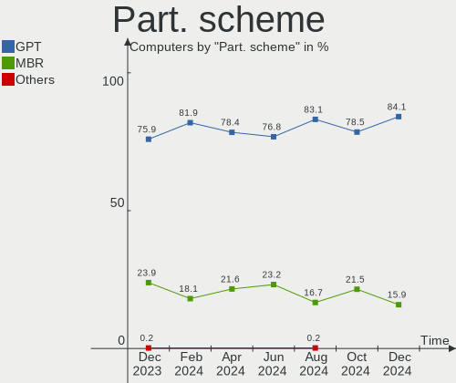
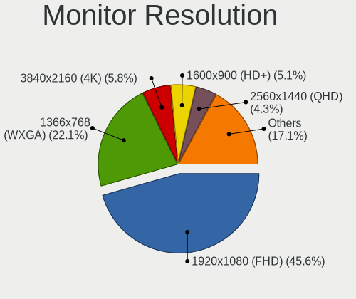
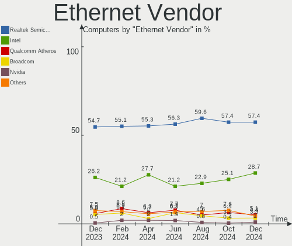
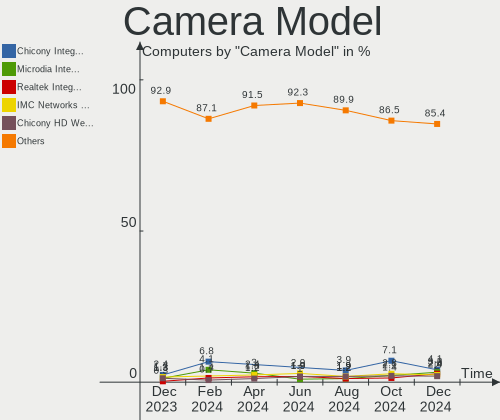

OpenMandriva - Hardware Trends
------------------------------

A project to identify most popular hardware characteristics and track their change
over time based on data collected by Linux users at https://Linux-Hardware.org.

Anyone can contribute to this report by the [hw-probe](https://github.com/linuxhw/hw-probe) tool:

    sudo -E hw-probe -all -upload

This is a report for all computer types. See also reports for [desktops](/Dist/OpenMandriva/Desktop/README.md) and [notebooks](/Dist/OpenMandriva/Notebook/README.md).

This report is for one last month. Overall report since the beginning of time: [TestDays](https://github.com/linuxhw/TestDays)

Period: Apr, 2024.

Contents
--------

* [ System ](#system)
  - [ OS                       ](#os)
  - [ OS Family                ](#os-family)
  - [ Kernel                   ](#kernel)
  - [ Kernel Family            ](#kernel-family)
  - [ Kernel Major Ver.        ](#kernel-major-ver)
  - [ Arch                     ](#arch)
  - [ DE                       ](#de)
  - [ Display Server           ](#display-server)
  - [ Display Manager          ](#display-manager)
  - [ OS Lang                  ](#os-lang)
  - [ Boot Mode                ](#boot-mode)
  - [ Filesystem               ](#filesystem)
  - [ Part. scheme             ](#part-scheme)
  - [ Dual Boot with Linux/BSD ](#dual-boot-with-linuxbsd)
  - [ Dual Boot (Win)          ](#dual-boot-win)

* [ Board ](#board)
  - [ Vendor                   ](#vendor)
  - [ Model                    ](#model)
  - [ Model Family             ](#model-family)
  - [ MFG Year                 ](#mfg-year)
  - [ Form Factor              ](#form-factor)
  - [ Secure Boot              ](#secure-boot)
  - [ Coreboot                 ](#coreboot)
  - [ RAM Size                 ](#ram-size)
  - [ RAM Used                 ](#ram-used)
  - [ Total Drives             ](#total-drives)
  - [ Has CD-ROM               ](#has-cd-rom)
  - [ Has Ethernet             ](#has-ethernet)
  - [ Has WiFi                 ](#has-wifi)
  - [ Has Bluetooth            ](#has-bluetooth)

* [ Location ](#location)
  - [ Country                  ](#country)
  - [ City                     ](#city)

* [ Drives ](#drives)
  - [ Drive Vendor             ](#drive-vendor)
  - [ Drive Model              ](#drive-model)
  - [ HDD Vendor               ](#hdd-vendor)
  - [ SSD Vendor               ](#ssd-vendor)
  - [ Drive Kind               ](#drive-kind)
  - [ Drive Connector          ](#drive-connector)
  - [ Drive Size               ](#drive-size)
  - [ Space Total              ](#space-total)
  - [ Space Used               ](#space-used)
  - [ Malfunc. Drives          ](#malfunc-drives)
  - [ Malfunc. Drive Vendor    ](#malfunc-drive-vendor)
  - [ Malfunc. HDD Vendor      ](#malfunc-hdd-vendor)
  - [ Malfunc. Drive Kind      ](#malfunc-drive-kind)
  - [ Failed Drives            ](#failed-drives)
  - [ Failed Drive Vendor      ](#failed-drive-vendor)
  - [ Drive Status             ](#drive-status)

* [ Storage controller ](#storage-controller)
  - [ Storage Vendor           ](#storage-vendor)
  - [ Storage Model            ](#storage-model)
  - [ Storage Kind             ](#storage-kind)

* [ Processor ](#processor)
  - [ CPU Vendor               ](#cpu-vendor)
  - [ CPU Model                ](#cpu-model)
  - [ CPU Model Family         ](#cpu-model-family)
  - [ CPU Cores                ](#cpu-cores)
  - [ CPU Sockets              ](#cpu-sockets)
  - [ CPU Threads              ](#cpu-threads)
  - [ CPU Op-Modes             ](#cpu-op-modes)
  - [ CPU Microcode            ](#cpu-microcode)
  - [ CPU Microarch            ](#cpu-microarch)

* [ Graphics ](#graphics)
  - [ GPU Vendor               ](#gpu-vendor)
  - [ GPU Model                ](#gpu-model)
  - [ GPU Combo                ](#gpu-combo)
  - [ GPU Driver               ](#gpu-driver)
  - [ GPU Memory               ](#gpu-memory)

* [ Monitor ](#monitor)
  - [ Monitor Vendor           ](#monitor-vendor)
  - [ Monitor Model            ](#monitor-model)
  - [ Monitor Resolution       ](#monitor-resolution)
  - [ Monitor Diagonal         ](#monitor-diagonal)
  - [ Monitor Width            ](#monitor-width)
  - [ Aspect Ratio             ](#aspect-ratio)
  - [ Monitor Area             ](#monitor-area)
  - [ Pixel Density            ](#pixel-density)
  - [ Multiple Monitors        ](#multiple-monitors)

* [ Network ](#network)
  - [ Net Controller Vendor    ](#net-controller-vendor)
  - [ Net Controller Model     ](#net-controller-model)
  - [ Wireless Vendor          ](#wireless-vendor)
  - [ Wireless Model           ](#wireless-model)
  - [ Ethernet Vendor          ](#ethernet-vendor)
  - [ Ethernet Model           ](#ethernet-model)
  - [ Net Controller Kind      ](#net-controller-kind)
  - [ Used Controller          ](#used-controller)
  - [ NICs                     ](#nics)
  - [ IPv6                     ](#ipv6)

* [ Bluetooth ](#bluetooth)
  - [ Bluetooth Vendor         ](#bluetooth-vendor)
  - [ Bluetooth Model          ](#bluetooth-model)

* [ Sound ](#sound)
  - [ Sound Vendor             ](#sound-vendor)
  - [ Sound Model              ](#sound-model)

* [ Memory ](#memory)
  - [ Memory Vendor            ](#memory-vendor)
  - [ Memory Model             ](#memory-model)
  - [ Memory Kind              ](#memory-kind)
  - [ Memory Form Factor       ](#memory-form-factor)
  - [ Memory Size              ](#memory-size)
  - [ Memory Speed             ](#memory-speed)

* [ Printers & scanners ](#printers--scanners)
  - [ Printer Vendor           ](#printer-vendor)
  - [ Printer Model            ](#printer-model)
  - [ Scanner Vendor           ](#scanner-vendor)
  - [ Scanner Model            ](#scanner-model)

* [ Camera ](#camera)
  - [ Camera Vendor            ](#camera-vendor)
  - [ Camera Model             ](#camera-model)

* [ Security ](#security)
  - [ Fingerprint Vendor       ](#fingerprint-vendor)
  - [ Fingerprint Model        ](#fingerprint-model)
  - [ Chipcard Vendor          ](#chipcard-vendor)
  - [ Chipcard Model           ](#chipcard-model)

* [ Unsupported ](#unsupported)
  - [ Unsupported Devices      ](#unsupported-devices)
  - [ Unsupported Device Types ](#unsupported-device-types)

System
------

OS
--

Installed operating systems

| Name               | Computers | Percent |
|--------------------|-----------|---------|
| OpenMandriva 23.08 | 147       | 45.94%  |
| OpenMandriva 5.0   | 88        | 27.5%   |
| OpenMandriva 24.03 | 15        | 4.69%   |
| OpenMandriva 24.01 | 15        | 4.69%   |
| OpenMandriva 4.3   | 12        | 3.75%   |
| OpenMandriva 4.2   | 10        | 3.13%   |
| OpenMandriva 24.90 | 8         | 2.5%    |
| OpenMandriva 23.03 | 7         | 2.19%   |
| OpenMandriva 23.11 | 6         | 1.88%   |
| OpenMandriva 23.01 | 6         | 1.88%   |
| OpenMandriva 4.50  | 2         | 0.63%   |
| OpenMandriva 23.06 | 2         | 0.63%   |
| OpenMandriva 24.04 | 1         | 0.31%   |
| OpenMandriva 23.10 | 1         | 0.31%   |

OS Family
---------

OS without a version

| Name         | Computers | Percent |
|--------------|-----------|---------|
| OpenMandriva | 320       | 100%    |

Kernel
------

Version of the Linux kernel

| Version                      | Computers | Percent |
|------------------------------|-----------|---------|
| 6.4.11-desktop-1omv2390      | 131       | 40.94%  |
| 6.6.2-desktop-1omv2390       | 108       | 33.75%  |
| 6.4.8-desktop-2omv2390       | 16        | 5%      |
| 6.8.1-desktop-3omv2490       | 11        | 3.44%   |
| 5.16.7-desktop-1omv4003      | 11        | 3.44%   |
| 5.10.14-desktop-1omv4002     | 9         | 2.81%   |
| 6.8.7-desktop-1omv2490       | 7         | 2.19%   |
| 6.2.6-desktop-1omv2390       | 7         | 2.19%   |
| 6.1.1-desktop-1omv2290       | 6         | 1.88%   |
| 6.8.4-desktop-4omv2490       | 2         | 0.63%   |
| 6.5.5-desktop-1omv2390       | 2         | 0.63%   |
| 6.3.5-desktop-3omv2390       | 2         | 0.63%   |
| 5.19.12-desktop-2omv4090     | 2         | 0.63%   |
| 6.9.0-desktop-0.rc2.1omv2490 | 1         | 0.31%   |
| 6.8.8-desktop-1omv2490       | 1         | 0.31%   |
| 6.8.1-desktop-gcc-4omv2490   | 1         | 0.31%   |
| 6.7.0-desktop-0.rc2.1omv2390 | 1         | 0.31%   |
| 6.5.3-desktop-1omv2390       | 1         | 0.31%   |
| 5.11.12-desktop-1omv4002     | 1         | 0.31%   |

Kernel Family
-------------

Linux kernel without a distro release

| Version | Computers | Percent |
|---------|-----------|---------|
| 6.4.11  | 131       | 40.94%  |
| 6.6.2   | 108       | 33.75%  |
| 6.4.8   | 16        | 5%      |
| 6.8.1   | 12        | 3.75%   |
| 5.16.7  | 11        | 3.44%   |
| 5.10.14 | 9         | 2.81%   |
| 6.8.7   | 7         | 2.19%   |
| 6.2.6   | 7         | 2.19%   |
| 6.1.1   | 6         | 1.88%   |
| 6.8.4   | 2         | 0.63%   |
| 6.5.5   | 2         | 0.63%   |
| 6.3.5   | 2         | 0.63%   |
| 5.19.12 | 2         | 0.63%   |
| 6.9.0   | 1         | 0.31%   |
| 6.8.8   | 1         | 0.31%   |
| 6.7.0   | 1         | 0.31%   |
| 6.5.3   | 1         | 0.31%   |
| 5.11.12 | 1         | 0.31%   |

Kernel Major Ver.
-----------------

Linux kernel major version

| Version | Computers | Percent |
|---------|-----------|---------|
| 6.4     | 147       | 45.94%  |
| 6.6     | 108       | 33.75%  |
| 6.8     | 22        | 6.88%   |
| 5.16    | 11        | 3.44%   |
| 5.10    | 9         | 2.81%   |
| 6.2     | 7         | 2.19%   |
| 6.1     | 6         | 1.88%   |
| 6.5     | 3         | 0.94%   |
| 6.3     | 2         | 0.63%   |
| 5.19    | 2         | 0.63%   |
| 6.9     | 1         | 0.31%   |
| 6.7     | 1         | 0.31%   |
| 5.11    | 1         | 0.31%   |

Arch
----

OS architecture (x86_64, i586, etc.)

| Name   | Computers | Percent |
|--------|-----------|---------|
| x86_64 | 320       | 100%    |

DE
--

Desktop Environment

| Name     | Computers | Percent |
|----------|-----------|---------|
| KDE5     | 273       | 85.31%  |
| LXQt     | 26        | 8.13%   |
| GNOME    | 14        | 4.38%   |
| Unknown  | 5         | 1.56%   |
| XFCE     | 1         | 0.31%   |
| Cinnamon | 1         | 0.31%   |

Display Server
--------------

X11 or Wayland

| Name    | Computers | Percent |
|---------|-----------|---------|
| Wayland | 277       | 86.56%  |
| X11     | 43        | 13.44%  |

Display Manager
---------------

SDDM, LightDM, etc.

| Name    | Computers | Percent |
|---------|-----------|---------|
| SDDM    | 303       | 94.69%  |
| GDM     | 14        | 4.38%   |
| LightDM | 3         | 0.94%   |

OS Lang
-------

Language

| Lang  | Computers | Percent |
|-------|-----------|---------|
| en_US | 149       | 46.56%  |
| fr_FR | 25        | 7.81%   |
| ru_RU | 23        | 7.19%   |
| de_DE | 19        | 5.94%   |
| it_IT | 17        | 5.31%   |
| pt_BR | 14        | 4.38%   |
| pl_PL | 11        | 3.44%   |
| en_GB | 11        | 3.44%   |
| es_ES | 6         | 1.88%   |
| en_CA | 4         | 1.25%   |
| tr_TR | 3         | 0.94%   |
| pt_PT | 3         | 0.94%   |
| es_MX | 3         | 0.94%   |
| de_AT | 3         | 0.94%   |
| ja_JP | 2         | 0.63%   |
| hu_HU | 2         | 0.63%   |
| fr_CA | 2         | 0.63%   |
| fr_BE | 2         | 0.63%   |
| es_VE | 2         | 0.63%   |
| es_CL | 2         | 0.63%   |
| en_SG | 2         | 0.63%   |
| en_IN | 2         | 0.63%   |
| en_AU | 2         | 0.63%   |
| de_CH | 2         | 0.63%   |
| cs_CZ | 2         | 0.63%   |
| nl_NL | 1         | 0.31%   |
| hr_HR | 1         | 0.31%   |
| es_PE | 1         | 0.31%   |
| es_NI | 1         | 0.31%   |
| es_BO | 1         | 0.31%   |
| es_AR | 1         | 0.31%   |
| en_NZ | 1         | 0.31%   |

Boot Mode
---------

EFI or BIOS

| Mode | Computers | Percent |
|------|-----------|---------|
| EFI  | 174       | 54.38%  |
| BIOS | 146       | 45.63%  |

Filesystem
----------

Type of filesystem

| Type     | Computers | Percent |
|----------|-----------|---------|
| Ext4     | 167       | 52.19%  |
| Overlay  | 128       | 40%     |
| Btrfs    | 13        | 4.06%   |
| Xfs      | 7         | 2.19%   |
| F2fs     | 2         | 0.63%   |
| Ext3     | 2         | 0.63%   |
| Bcachefs | 1         | 0.31%   |

Part. scheme
------------

Scheme of partitioning

| Type | Computers | Percent |
|------|-----------|---------|
| GPT  | 251       | 78.44%  |
| MBR  | 69        | 21.56%  |

Dual Boot with Linux/BSD
------------------------

Hosting more than one Linux/BSD

| Dual boot | Computers | Percent |
|-----------|-----------|---------|
| No        | 175       | 54.69%  |
| Yes       | 145       | 45.31%  |

Dual Boot (Win)
---------------

Hosting Linux and Windows

| Dual boot | Computers | Percent |
|-----------|-----------|---------|
| No        | 191       | 59.69%  |
| Yes       | 129       | 40.31%  |

Board
-----

Vendor
------

Motherboard manufacturer

| Name                                 | Computers | Percent |
|--------------------------------------|-----------|---------|
| ASUSTek Computer                     | 61        | 19.06%  |
| Lenovo                               | 43        | 13.44%  |
| Hewlett-Packard                      | 40        | 12.5%   |
| Dell                                 | 38        | 11.88%  |
| MSI                                  | 21        | 6.56%   |
| Gigabyte Technology                  | 21        | 6.56%   |
| ASRock                               | 19        | 5.94%   |
| Acer                                 | 17        | 5.31%   |
| Intel                                | 5         | 1.56%   |
| Fujitsu                              | 5         | 1.56%   |
| Toshiba                              | 4         | 1.25%   |
| Biostar                              | 4         | 1.25%   |
| Samsung Electronics                  | 3         | 0.94%   |
| Packard Bell                         | 3         | 0.94%   |
| Unknown                              | 3         | 0.94%   |
| Sony                                 | 2         | 0.63%   |
| Positivo                             | 2         | 0.63%   |
| Notebook                             | 2         | 0.63%   |
| MAXSUN                               | 2         | 0.63%   |
| Foxconn                              | 2         | 0.63%   |
| Apple                                | 2         | 0.63%   |
| TUXEDO                               | 1         | 0.31%   |
| Shuttle                              | 1         | 0.31%   |
| Shenzhen Meigao Electronic Equipment | 1         | 0.31%   |
| Quanta                               | 1         | 0.31%   |
| Philco                               | 1         | 0.31%   |
| Pegatron                             | 1         | 0.31%   |
| Medion                               | 1         | 0.31%   |
| MACHINIST                            | 1         | 0.31%   |
| Login Informatica                    | 1         | 0.31%   |
| Info Quest Technologies              | 1         | 0.31%   |
| HUAWEI                               | 1         | 0.31%   |
| Google                               | 1         | 0.31%   |
| GEEKOM                               | 1         | 0.31%   |
| Fujitsu Siemens                      | 1         | 0.31%   |
| EVGA                                 | 1         | 0.31%   |
| ECS                                  | 1         | 0.31%   |
| Dynabook                             | 1         | 0.31%   |
| Daten Tecnologia                     | 1         | 0.31%   |
| Core Innovations                     | 1         | 0.31%   |

Model
-----

Motherboard model

| Name                                                                                     | Computers | Percent |
|------------------------------------------------------------------------------------------|-----------|---------|
| ASUS All Series                                                                          | 4         | 1.25%   |
| Unknown                                                                                  | 4         | 1.25%   |
| Lenovo IdeaPad Slim 1-14AST-05 81VS                                                      | 3         | 0.94%   |
| MSI MS-7D46                                                                              | 2         | 0.63%   |
| Lenovo IdeaPad 1 14IGL7 82V6                                                             | 2         | 0.63%   |
| HP EliteBook 840 G2                                                                      | 2         | 0.63%   |
| Gigabyte Z390 UD                                                                         | 2         | 0.63%   |
| Dell OptiPlex 790                                                                        | 2         | 0.63%   |
| Biostar H310MHP                                                                          | 2         | 0.63%   |
| ASUS TUF Gaming B550-PLUS                                                                | 2         | 0.63%   |
| ASRock G31M-S                                                                            | 2         | 0.63%   |
| TUXEDO InfinityBook S 14 v5                                                              | 1         | 0.31%   |
| Toshiba Satellite U500                                                                   | 1         | 0.31%   |
| Toshiba Satellite S855D                                                                  | 1         | 0.31%   |
| Toshiba Satellite C50-A                                                                  | 1         | 0.31%   |
| Toshiba Satellite A205                                                                   | 1         | 0.31%   |
| Sony VPCEH30EB                                                                           | 1         | 0.31%   |
| Sony SVE1111M1EW                                                                         | 1         | 0.31%   |
| Shuttle X50V6                                                                            | 1         | 0.31%   |
| Shenzhen Meigao Electronic Equipment UM690                                               | 1         | 0.31%   |
| Samsung 370E4K                                                                           | 1         | 0.31%   |
| Samsung 355V4C/355V4X/355V5C/355V5X/356V4C/356V4X/356V5C/356V5X/3445VC/3445VX/3545VC/354 | 1         | 0.31%   |
| Samsung 300E4A/300E5A/300E7A/3430EA/3530EA                                               | 1         | 0.31%   |
| Quanta R480-L.BA31P1                                                                     | 1         | 0.31%   |
| Positivo S14BW01                                                                         | 1         | 0.31%   |
| Positivo POS-PIG41BA                                                                     | 1         | 0.31%   |
| Philco 14H                                                                               | 1         | 0.31%   |
| Pegatron WC954AA-ABF CQ5325FR                                                            | 1         | 0.31%   |
| Packard Bell ISTART 2025                                                                 | 1         | 0.31%   |
| Packard Bell IMEDIA S2185                                                                | 1         | 0.31%   |
| Packard Bell EasyNote TJ66                                                               | 1         | 0.31%   |
| Notebook W54BL                                                                           | 1         | 0.31%   |
| Notebook NJx0PU                                                                          | 1         | 0.31%   |
| MSI Raider GE78HX SmartTP 13VG                                                           | 1         | 0.31%   |
| MSI Prestige 14Evo B13M                                                                  | 1         | 0.31%   |
| MSI MS-7E01                                                                              | 1         | 0.31%   |
| MSI MS-7D36                                                                              | 1         | 0.31%   |
| MSI MS-7D09                                                                              | 1         | 0.31%   |
| MSI MS-7C37                                                                              | 1         | 0.31%   |
| MSI MS-7B29                                                                              | 1         | 0.31%   |

Model Family
------------

Motherboard model prefix

| Name                                       | Computers | Percent |
|--------------------------------------------|-----------|---------|
| Lenovo ThinkPad                            | 15        | 4.69%   |
| Lenovo IdeaPad                             | 14        | 4.38%   |
| ASUS PRIME                                 | 12        | 3.75%   |
| Acer Aspire                                | 12        | 3.75%   |
| Dell Latitude                              | 11        | 3.44%   |
| Dell OptiPlex                              | 10        | 3.13%   |
| Dell Inspiron                              | 10        | 3.13%   |
| HP EliteBook                               | 7         | 2.19%   |
| HP Compaq                                  | 7         | 2.19%   |
| Toshiba Satellite                          | 4         | 1.25%   |
| Lenovo ThinkCentre                         | 4         | 1.25%   |
| ASUS All                                   | 4         | 1.25%   |
| Unknown                                    | 4         | 1.25%   |
| HP Pavilion                                | 3         | 0.94%   |
| HP Laptop                                  | 3         | 0.94%   |
| HP 250                                     | 3         | 0.94%   |
| Dell Vostro                                | 3         | 0.94%   |
| ASUS VivoBook                              | 3         | 0.94%   |
| ASUS TUF                                   | 3         | 0.94%   |
| ASUS ROG                                   | 3         | 0.94%   |
| MSI MS-7D46                                | 2         | 0.63%   |
| MAXSUN MS-Terminator                       | 2         | 0.63%   |
| Lenovo Yoga                                | 2         | 0.63%   |
| HP ZBook                                   | 2         | 0.63%   |
| HP ProDesk                                 | 2         | 0.63%   |
| HP EliteDesk                               | 2         | 0.63%   |
| HP 240                                     | 2         | 0.63%   |
| Gigabyte Z390                              | 2         | 0.63%   |
| Dell Studio                                | 2         | 0.63%   |
| Biostar H310MHP                            | 2         | 0.63%   |
| ASRock X570                                | 2         | 0.63%   |
| ASRock G31M-S                              | 2         | 0.63%   |
| ASRock B450                                | 2         | 0.63%   |
| TUXEDO InfinityBook                        | 1         | 0.31%   |
| Sony VPCEH30EB                             | 1         | 0.31%   |
| Sony SVE1111M1EW                           | 1         | 0.31%   |
| Shuttle X50V6                              | 1         | 0.31%   |
| Shenzhen Meigao Electronic Equipment UM690 | 1         | 0.31%   |
| Samsung 370E4K                             | 1         | 0.31%   |
| Samsung 355V4C                             | 1         | 0.31%   |

MFG Year
--------

Motherboard manufacture year

| Year | Computers | Percent |
|------|-----------|---------|
| 2012 | 27        | 8.44%   |
| 2015 | 26        | 8.13%   |
| 2011 | 25        | 7.81%   |
| 2013 | 22        | 6.88%   |
| 2018 | 21        | 6.56%   |
| 2017 | 21        | 6.56%   |
| 2022 | 20        | 6.25%   |
| 2014 | 20        | 6.25%   |
| 2020 | 19        | 5.94%   |
| 2019 | 18        | 5.63%   |
| 2021 | 17        | 5.31%   |
| 2016 | 16        | 5%      |
| 2008 | 16        | 5%      |
| 2010 | 15        | 4.69%   |
| 2023 | 12        | 3.75%   |
| 2009 | 12        | 3.75%   |
| 2007 | 5         | 1.56%   |
| 2006 | 5         | 1.56%   |
| 2024 | 2         | 0.63%   |
| 2005 | 1         | 0.31%   |

Form Factor
-----------

Physical design of the computer

| Name        | Computers | Percent |
|-------------|-----------|---------|
| Desktop     | 157       | 49.06%  |
| Notebook    | 148       | 46.25%  |
| All in one  | 7         | 2.19%   |
| Convertible | 4         | 1.25%   |
| Tablet      | 2         | 0.63%   |
| Other       | 1         | 0.31%   |
| Server      | 1         | 0.31%   |

Secure Boot
-----------

Enabled or disabled

| State    | Computers | Percent |
|----------|-----------|---------|
| Disabled | 320       | 100%    |

Coreboot
--------

Have coreboot on board

| Used | Computers | Percent |
|------|-----------|---------|
| No   | 319       | 99.69%  |
| Yes  | 1         | 0.31%   |

RAM Size
--------

Total RAM memory

| Size in GB      | Computers | Percent |
|-----------------|-----------|---------|
| 4.01-8.0        | 82        | 25.63%  |
| 3.01-4.0        | 75        | 23.44%  |
| 16.01-24.0      | 56        | 17.5%   |
| 8.01-16.0       | 53        | 16.56%  |
| 32.01-64.0      | 29        | 9.06%   |
| 2.01-3.0        | 7         | 2.19%   |
| 1.01-2.0        | 6         | 1.88%   |
| 64.01-256.0     | 5         | 1.56%   |
| 24.01-32.0      | 4         | 1.25%   |
| 0.51-1.0        | 2         | 0.63%   |
| More than 256.0 | 1         | 0.31%   |

RAM Used
--------

Used RAM memory

| Used GB   | Computers | Percent |
|-----------|-----------|---------|
| 1.01-2.0  | 209       | 65.31%  |
| 2.01-3.0  | 62        | 19.38%  |
| 0.51-1.0  | 33        | 10.31%  |
| 3.01-4.0  | 8         | 2.5%    |
| 0.01-0.5  | 5         | 1.56%   |
| 4.01-8.0  | 2         | 0.63%   |
| 8.01-16.0 | 1         | 0.31%   |

Total Drives
------------

Number of drives on board

| Drives | Computers | Percent |
|--------|-----------|---------|
| 1      | 192       | 60%     |
| 2      | 72        | 22.5%   |
| 3      | 25        | 7.81%   |
| 4      | 10        | 3.13%   |
| 5      | 9         | 2.81%   |
| 0      | 7         | 2.19%   |
| 7      | 2         | 0.63%   |
| 6      | 2         | 0.63%   |
| 12     | 1         | 0.31%   |

Has CD-ROM
----------

Has CD-ROM on board

| Presented | Computers | Percent |
|-----------|-----------|---------|
| No        | 172       | 53.75%  |
| Yes       | 148       | 46.25%  |

Has Ethernet
------------

Has Ethernet on board

| Presented | Computers | Percent |
|-----------|-----------|---------|
| Yes       | 290       | 90.63%  |
| No        | 30        | 9.38%   |

Has WiFi
--------

Has WiFi module

| Presented | Computers | Percent |
|-----------|-----------|---------|
| Yes       | 224       | 70%     |
| No        | 96        | 30%     |

Has Bluetooth
-------------

Has Bluetooth module

| Presented | Computers | Percent |
|-----------|-----------|---------|
| No        | 161       | 50.31%  |
| Yes       | 159       | 49.69%  |

Location
--------

Country
-------

Geographic location (country)

| Country     | Computers | Percent |
|-------------|-----------|---------|
| USA         | 47        | 14.69%  |
| France      | 31        | 9.69%   |
| Russia      | 28        | 8.75%   |
| Germany     | 28        | 8.75%   |
| Brazil      | 25        | 7.81%   |
| Italy       | 18        | 5.63%   |
| Poland      | 13        | 4.06%   |
| UK          | 11        | 3.44%   |
| Canada      | 11        | 3.44%   |
| Spain       | 7         | 2.19%   |
| Mexico      | 6         | 1.88%   |
| Japan       | 6         | 1.88%   |
| Turkey      | 5         | 1.56%   |
| Austria     | 5         | 1.56%   |
| India       | 4         | 1.25%   |
| Greece      | 4         | 1.25%   |
| Argentina   | 4         | 1.25%   |
| Sweden      | 3         | 0.94%   |
| Slovakia    | 3         | 0.94%   |
| Portugal    | 3         | 0.94%   |
| Finland     | 3         | 0.94%   |
| Czechia     | 3         | 0.94%   |
| China       | 3         | 0.94%   |
| Chile       | 3         | 0.94%   |
| Venezuela   | 2         | 0.63%   |
| Uruguay     | 2         | 0.63%   |
| Switzerland | 2         | 0.63%   |
| South Korea | 2         | 0.63%   |
| Singapore   | 2         | 0.63%   |
| Nigeria     | 2         | 0.63%   |
| New Zealand | 2         | 0.63%   |
| Kazakhstan  | 2         | 0.63%   |
| Iran        | 2         | 0.63%   |
| Hungary     | 2         | 0.63%   |
| Cyprus      | 2         | 0.63%   |
| Bulgaria    | 2         | 0.63%   |
| Belgium     | 2         | 0.63%   |
| Australia   | 2         | 0.63%   |
| Vietnam     | 1         | 0.31%   |
| Ukraine     | 1         | 0.31%   |

City
----

Geographic location (city)

| City               | Computers | Percent |
|--------------------|-----------|---------|
| Moscow             | 7         | 2.19%   |
| Berlin             | 5         | 1.56%   |
| Rio de Janeiro     | 4         | 1.25%   |
| Montreal           | 4         | 1.25%   |
| Los Angeles        | 4         | 1.25%   |
| Sao Goncalo        | 3         | 0.94%   |
| Munich             | 3         | 0.94%   |
| Warsaw             | 2         | 0.63%   |
| Turin              | 2         | 0.63%   |
| Trnava             | 2         | 0.63%   |
| Topeka             | 2         | 0.63%   |
| Singapore          | 2         | 0.63%   |
| Sao Paulo          | 2         | 0.63%   |
| Sao Joao de Meriti | 2         | 0.63%   |
| Rome               | 2         | 0.63%   |
| Rennes             | 2         | 0.63%   |
| Prague             | 2         | 0.63%   |
| Poznan             | 2         | 0.63%   |
| Paris              | 2         | 0.63%   |
| Pachuca            | 2         | 0.63%   |
| Nîmes             | 2         | 0.63%   |
| Montevideo         | 2         | 0.63%   |
| Milan              | 2         | 0.63%   |
| Marseille          | 2         | 0.63%   |
| Limassol           | 2         | 0.63%   |
| Johnson City       | 2         | 0.63%   |
| Istanbul           | 2         | 0.63%   |
| Hamburg            | 2         | 0.63%   |
| Gothenburg         | 2         | 0.63%   |
| Gondomar           | 2         | 0.63%   |
| Dudley             | 2         | 0.63%   |
| Dortmund           | 2         | 0.63%   |
| Ciudad Obregón    | 2         | 0.63%   |
| Beverly Hills      | 2         | 0.63%   |
| Bergamo            | 2         | 0.63%   |
| Bengaluru          | 2         | 0.63%   |
| Almaty             | 2         | 0.63%   |
| Zuidwolde          | 1         | 0.31%   |
| Zhengzhou          | 1         | 0.31%   |
| Zalău             | 1         | 0.31%   |

Drives
------

Drive Vendor
------------

Hard drive vendors

| Vendor              | Computers | Drives | Percent |
|---------------------|-----------|--------|---------|
| WDC                 | 81        | 96     | 17.16%  |
| Seagate             | 66        | 72     | 13.98%  |
| Samsung Electronics | 59        | 77     | 12.5%   |
| Kingston            | 37        | 41     | 7.84%   |
| SanDisk             | 31        | 35     | 6.57%   |
| Toshiba             | 26        | 27     | 5.51%   |
| Unknown             | 12        | 12     | 2.54%   |
| Crucial             | 12        | 16     | 2.54%   |
| Hitachi             | 11        | 12     | 2.33%   |
| SK hynix            | 9         | 9      | 1.91%   |
| China               | 9         | 9      | 1.91%   |
| Micron Technology   | 8         | 8      | 1.69%   |
| Intel               | 8         | 8      | 1.69%   |
| HGST                | 7         | 7      | 1.48%   |
| Unknown             | 7         | 7      | 1.48%   |
| Patriot             | 5         | 5      | 1.06%   |
| Maxtor              | 5         | 5      | 1.06%   |
| JMicron Technology  | 5         | 5      | 1.06%   |
| A-DATA Technology   | 5         | 5      | 1.06%   |
| Lexar               | 4         | 4      | 0.85%   |
| KingSpec            | 4         | 4      | 0.85%   |
| Intenso             | 4         | 5      | 0.85%   |
| Team                | 3         | 4      | 0.64%   |
| SPCC                | 3         | 3      | 0.64%   |
| Silicon Motion      | 3         | 3      | 0.64%   |
| AMD                 | 3         | 3      | 0.64%   |
| Verbatim            | 2         | 5      | 0.42%   |
| OCZ                 | 2         | 2      | 0.42%   |
| KIOXIA              | 2         | 2      | 0.42%   |
| XPG                 | 1         | 1      | 0.21%   |
| WD Blue             | 1         | 1      | 0.21%   |
| UMIS                | 1         | 1      | 0.21%   |
| Teclast             | 1         | 1      | 0.21%   |
| TAMMUZ              | 1         | 1      | 0.21%   |
| SSSTC               | 1         | 1      | 0.21%   |
| SSK                 | 1         | 2      | 0.21%   |
| SBe                 | 1         | 1      | 0.21%   |
| Realtek             | 1         | 1      | 0.21%   |
| QUANXING            | 1         | 1      | 0.21%   |
| Phison Electronics  | 1         | 1      | 0.21%   |

Drive Model
-----------

Hard drive models

| Model                              | Computers | Percent |
|------------------------------------|-----------|---------|
| Kingston SA400S37240G 240GB SSD    | 8         | 1.56%   |
| Unknown                            | 7         | 1.36%   |
| SanDisk NVMe SSD Drive 1TB         | 6         | 1.17%   |
| Unknown SD/MMC/MS PRO 128GB        | 5         | 0.97%   |
| Samsung SSD 980 500GB              | 5         | 0.97%   |
| Kingston SA400S37480G 480GB SSD    | 5         | 0.97%   |
| Kingston SA400S37120G 120GB SSD    | 5         | 0.97%   |
| Crucial CT500MX500SSD1 500GB       | 5         | 0.97%   |
| WDC WD10EZEX-08WN4A0 1TB           | 4         | 0.78%   |
| Seagate ST500DM002-1BD142 500GB    | 4         | 0.78%   |
| Seagate ST1000LM035-1RK172 1TB     | 4         | 0.78%   |
| SanDisk 3.2 Gen 1 250GB SSD        | 4         | 0.78%   |
| JMicron Generic 320GB              | 4         | 0.78%   |
| Toshiba DT01ACA100 1TB             | 3         | 0.58%   |
| Toshiba DT01ACA050 500GB           | 3         | 0.58%   |
| Seagate ST500LT012-1DG142 500GB    | 3         | 0.58%   |
| Seagate ST500DM009-2F110A 500GB    | 3         | 0.58%   |
| Seagate ST3500413AS 500GB          | 3         | 0.58%   |
| Seagate ST3160318AS 160GB          | 3         | 0.58%   |
| Seagate ST1000LM024 HN-M101MBB 1TB | 3         | 0.58%   |
| Seagate ST1000DM003-1CH162 1TB     | 3         | 0.58%   |
| SanDisk SSD PLUS 240GB             | 3         | 0.58%   |
| SanDisk SSD PLUS 1000GB            | 3         | 0.58%   |
| SanDisk NVMe SSD Drive 2TB         | 3         | 0.58%   |
| Samsung SSD 970 EVO Plus 2TB       | 3         | 0.58%   |
| Samsung SSD 860 EVO 500GB          | 3         | 0.58%   |
| Samsung SSD 860 EVO 250GB          | 3         | 0.58%   |
| Kingston SUV400S37120G 120GB SSD   | 3         | 0.58%   |
| HGST HTS721010A9E630 1TB           | 3         | 0.58%   |
| China SSD 128GB                    | 3         | 0.58%   |
| WDC WDBNCE0010PNC 1TB SSD          | 2         | 0.39%   |
| WDC WD5000AAKX-75U6AA0 500GB       | 2         | 0.39%   |
| WDC WD2003FZEX-00SRLA0 2TB         | 2         | 0.39%   |
| WDC WD1600BEVS-00VAT0 160GB        | 2         | 0.39%   |
| WDC WD1600AAJS-60B4A0 160GB        | 2         | 0.39%   |
| WDC WD10SPZX-24Z10 1TB             | 2         | 0.39%   |
| WDC WD10JPVX-22JC3T0 1TB           | 2         | 0.39%   |
| WDC WD10EZEX-08M2NA0 1TB           | 2         | 0.39%   |
| WDC WD Blue SA510 2.5 1000GB SSD   | 2         | 0.39%   |
| Unknown MMC64G  64GB               | 2         | 0.39%   |

HDD Vendor
----------

Hard disk drive vendors

| Vendor              | Computers | Drives | Percent |
|---------------------|-----------|--------|---------|
| WDC                 | 70        | 81     | 34.15%  |
| Seagate             | 66        | 72     | 32.2%   |
| Toshiba             | 24        | 25     | 11.71%  |
| Samsung Electronics | 12        | 13     | 5.85%   |
| Hitachi             | 10        | 11     | 4.88%   |
| HGST                | 7         | 7      | 3.41%   |
| Unknown             | 5         | 5      | 2.44%   |
| Maxtor              | 5         | 5      | 2.44%   |
| JMicron Technology  | 4         | 4      | 1.95%   |
| SSK                 | 1         | 1      | 0.49%   |
| Initio              | 1         | 1      | 0.49%   |

SSD Vendor
----------

Solid state drive vendors

| Vendor              | Computers | Drives | Percent |
|---------------------|-----------|--------|---------|
| Samsung Electronics | 31        | 38     | 18.02%  |
| Kingston            | 27        | 29     | 15.7%   |
| SanDisk             | 18        | 19     | 10.47%  |
| Crucial             | 10        | 12     | 5.81%   |
| WDC                 | 9         | 10     | 5.23%   |
| China               | 9         | 9      | 5.23%   |
| Intel               | 6         | 6      | 3.49%   |
| Micron Technology   | 5         | 5      | 2.91%   |
| Patriot             | 4         | 4      | 2.33%   |
| KingSpec            | 4         | 4      | 2.33%   |
| A-DATA Technology   | 4         | 4      | 2.33%   |
| Unknown             | 4         | 4      | 2.33%   |
| Intenso             | 3         | 4      | 1.74%   |
| AMD                 | 3         | 3      | 1.74%   |
| Verbatim            | 2         | 5      | 1.16%   |
| Toshiba             | 2         | 2      | 1.16%   |
| Team                | 2         | 2      | 1.16%   |
| SPCC                | 2         | 2      | 1.16%   |
| OCZ                 | 2         | 2      | 1.16%   |
| Teclast             | 1         | 1      | 0.58%   |
| TAMMUZ              | 1         | 1      | 0.58%   |
| SBe                 | 1         | 1      | 0.58%   |
| QUANXING            | 1         | 1      | 0.58%   |
| NT-128              | 1         | 1      | 0.58%   |
| Netac               | 1         | 1      | 0.58%   |
| LITEON              | 1         | 1      | 0.58%   |
| Lexar               | 1         | 1      | 0.58%   |
| Leven               | 1         | 1      | 0.58%   |
| KINGCOMP            | 1         | 1      | 0.58%   |
| Innodisk            | 1         | 1      | 0.58%   |
| HS-SSD-E100N        | 1         | 1      | 0.58%   |
| HS-SSD-E100         | 1         | 1      | 0.58%   |
| Hitachi             | 1         | 1      | 0.58%   |
| Hikvision           | 1         | 1      | 0.58%   |
| GOODRAM             | 1         | 1      | 0.58%   |
| Gigabyte Technology | 1         | 1      | 0.58%   |
| Emtec               | 1         | 1      | 0.58%   |
| Dahua               | 1         | 1      | 0.58%   |
| Biostar             | 1         | 1      | 0.58%   |
| Azerty              | 1         | 1      | 0.58%   |

Drive Kind
----------

HDD or SSD

| Kind    | Computers | Drives | Percent |
|---------|-----------|--------|---------|
| HDD     | 175       | 225    | 42.48%  |
| SSD     | 146       | 189    | 35.44%  |
| NVMe    | 74        | 100    | 17.96%  |
| MMC     | 12        | 12     | 2.91%   |
| Unknown | 5         | 5      | 1.21%   |

Drive Connector
---------------

SATA, SAS, NVMe, etc.

| Type | Computers | Drives | Percent |
|------|-----------|--------|---------|
| SATA | 262       | 391    | 70.43%  |
| NVMe | 74        | 97     | 19.89%  |
| SAS  | 24        | 31     | 6.45%   |
| MMC  | 12        | 12     | 3.23%   |

Drive Size
----------

Size of hard drive

| Size in TB | Computers | Drives | Percent |
|------------|-----------|--------|---------|
| 0.01-0.5   | 208       | 271    | 62.84%  |
| 0.51-1.0   | 89        | 106    | 26.89%  |
| 1.01-2.0   | 20        | 22     | 6.04%   |
| 3.01-4.0   | 9         | 10     | 2.72%   |
| 2.01-3.0   | 2         | 2      | 0.6%    |
| 4.01-10.0  | 2         | 2      | 0.6%    |
| 10.01-20.0 | 1         | 1      | 0.3%    |

Space Total
-----------

Amount of disk space available on the file system

| Size in GB     | Computers | Percent |
|----------------|-----------|---------|
| 1-20           | 80        | 25%     |
| 101-250        | 75        | 23.44%  |
| 251-500        | 55        | 17.19%  |
| 501-1000       | 30        | 9.38%   |
| 51-100         | 21        | 6.56%   |
| 21-50          | 20        | 6.25%   |
| Unknown        | 20        | 6.25%   |
| 1001-2000      | 12        | 3.75%   |
| 2001-3000      | 6         | 1.88%   |
| More than 3000 | 1         | 0.31%   |

Space Used
----------

Amount of used disk space

| Used GB   | Computers | Percent |
|-----------|-----------|---------|
| 1-20      | 231       | 72.19%  |
| Unknown   | 20        | 6.25%   |
| 101-250   | 19        | 5.94%   |
| 21-50     | 18        | 5.63%   |
| 51-100    | 13        | 4.06%   |
| 251-500   | 9         | 2.81%   |
| 0         | 5         | 1.56%   |
| 501-1000  | 4         | 1.25%   |
| 2001-3000 | 1         | 0.31%   |

Malfunc. Drives
---------------

Drive models with a malfunction

| Model                                 | Computers | Drives | Percent |
|---------------------------------------|-----------|--------|---------|
| WDC WD1600BEVS-00VAT0 160GB           | 2         | 2      | 2.22%   |
| WDC WD10SPZX-24Z10 1TB                | 2         | 2      | 2.22%   |
| Seagate ST3500312CS 500GB             | 2         | 2      | 2.22%   |
| Seagate ST3160318AS 160GB             | 2         | 2      | 2.22%   |
| Seagate ST1000LM035-1RK172 1TB        | 2         | 2      | 2.22%   |
| SanDisk SSD PLUS 240GB                | 2         | 2      | 2.22%   |
| Samsung Electronics SSD 970 EVO 500GB | 2         | 2      | 2.22%   |
| Hitachi HTS545050A7E380 500GB         | 2         | 2      | 2.22%   |
| WDC WD6400AAKS-22A7B2 640GB           | 1         | 1      | 1.11%   |
| WDC WD5000LPLX-08ZNTT0 500GB          | 1         | 1      | 1.11%   |
| WDC WD5000LPCX-24C6HT0 500GB          | 1         | 1      | 1.11%   |
| WDC WD5000BEVT-75A0RT0 500GB          | 1         | 1      | 1.11%   |
| WDC WD5000AAKX-75U6AA0 500GB          | 1         | 1      | 1.11%   |
| WDC WD5000AAKX-603CA0 500GB           | 1         | 1      | 1.11%   |
| WDC WD5000AAKX-001CA0 500GB           | 1         | 1      | 1.11%   |
| WDC WD3200BEVT-26A23T0 320GB          | 1         | 1      | 1.11%   |
| WDC WD3200BEVT-22A23T0 320GB          | 1         | 1      | 1.11%   |
| WDC WD3200AAKS-00L9A0 320GB           | 1         | 1      | 1.11%   |
| WDC WD3200AAJS-60M0A1 320GB           | 1         | 1      | 1.11%   |
| WDC WD2500JS-60NCB1 250GB             | 1         | 1      | 1.11%   |
| WDC WD2500AAJS-60Z0A0 250GB           | 1         | 1      | 1.11%   |
| WDC WD1600JS-55NCB1 160GB             | 1         | 1      | 1.11%   |
| WDC WD1600BEVT-22ZCT0 160GB           | 1         | 1      | 1.11%   |
| WDC WD1600AAJS-75M0A0 160GB           | 1         | 1      | 1.11%   |
| WDC WD1600AAJS-60B4A0 160GB           | 1         | 1      | 1.11%   |
| WDC WD10PURX-64E5EY0 1TB              | 1         | 1      | 1.11%   |
| WDC WD10EZRX-22A3KB0 1TB              | 1         | 1      | 1.11%   |
| WDC WD10EZEX-08M2NA0 1TB              | 1         | 1      | 1.11%   |
| WDC WD10EARS-00Y5B1 1TB               | 1         | 1      | 1.11%   |
| Toshiba MQ01ABF050 500GB              | 1         | 1      | 1.11%   |
| Toshiba MQ01ABD100 1TB                | 1         | 1      | 1.11%   |
| Toshiba MK3265GSX 320GB               | 1         | 1      | 1.11%   |
| Toshiba MK3263GSX 320GB               | 1         | 1      | 1.11%   |
| Toshiba MK2565GSXN 250GB              | 1         | 1      | 1.11%   |
| Toshiba MK1665GSX 160GB               | 1         | 1      | 1.11%   |
| Toshiba HDWD110 1TB                   | 1         | 1      | 1.11%   |
| Toshiba DT01ACA100 1TB                | 1         | 1      | 1.11%   |
| Toshiba DT01ACA050 500GB              | 1         | 1      | 1.11%   |
| Seagate ST980811AS 80GB               | 1         | 1      | 1.11%   |
| Seagate ST9500325AS 500GB             | 1         | 1      | 1.11%   |

Malfunc. Drive Vendor
---------------------

Vendors of faulty drives

| Vendor              | Computers | Drives | Percent |
|---------------------|-----------|--------|---------|
| WDC                 | 25        | 25     | 28.41%  |
| Seagate             | 18        | 20     | 20.45%  |
| Samsung Electronics | 12        | 13     | 13.64%  |
| Toshiba             | 9         | 9      | 10.23%  |
| Hitachi             | 7         | 7      | 7.95%   |
| Maxtor              | 3         | 3      | 3.41%   |
| SanDisk             | 2         | 2      | 2.27%   |
| OCZ                 | 2         | 2      | 2.27%   |
| Micron Technology   | 2         | 2      | 2.27%   |
| Intel               | 2         | 2      | 2.27%   |
| Kingston            | 1         | 1      | 1.14%   |
| KingSpec            | 1         | 1      | 1.14%   |
| KINGCOMP            | 1         | 1      | 1.14%   |
| HGST                | 1         | 1      | 1.14%   |
| Crucial             | 1         | 1      | 1.14%   |
| China               | 1         | 1      | 1.14%   |

Malfunc. HDD Vendor
-------------------

Vendors of faulty HDD drives

| Vendor              | Computers | Drives | Percent |
|---------------------|-----------|--------|---------|
| WDC                 | 25        | 25     | 35.71%  |
| Seagate             | 18        | 20     | 25.71%  |
| Toshiba             | 9         | 9      | 12.86%  |
| Samsung Electronics | 7         | 7      | 10%     |
| Hitachi             | 7         | 7      | 10%     |
| Maxtor              | 3         | 3      | 4.29%   |
| HGST                | 1         | 1      | 1.43%   |

Malfunc. Drive Kind
-------------------

Kinds of faulty drives

| Kind | Computers | Drives | Percent |
|------|-----------|--------|---------|
| HDD  | 67        | 72     | 77.91%  |
| SSD  | 17        | 17     | 19.77%  |
| NVMe | 2         | 2      | 2.33%   |

Failed Drives
-------------

Failed drive models

Zero info for selected period =(

Failed Drive Vendor
-------------------

Failed drive vendors

Zero info for selected period =(

Drive Status
------------

Number of failed and malfunc. drives

| Status   | Computers | Drives | Percent |
|----------|-----------|--------|---------|
| Works    | 245       | 386    | 65.51%  |
| Malfunc  | 84        | 91     | 22.46%  |
| Detected | 45        | 54     | 12.03%  |

Storage controller
------------------

Storage Vendor
--------------

Storage controller vendors

| Vendor                         | Computers | Percent |
|--------------------------------|-----------|---------|
| Intel                          | 229       | 56.97%  |
| AMD                            | 63        | 15.67%  |
| Samsung Electronics            | 22        | 5.47%   |
| SanDisk                        | 15        | 3.73%   |
| Kingston Technology Company    | 10        | 2.49%   |
| ASMedia Technology             | 9         | 2.24%   |
| SK hynix                       | 8         | 1.99%   |
| Silicon Motion                 | 6         | 1.49%   |
| Phison Electronics             | 6         | 1.49%   |
| Nvidia                         | 6         | 1.49%   |
| Micron Technology              | 5         | 1.24%   |
| JMicron Technology             | 5         | 1.24%   |
| Marvell Technology Group       | 3         | 0.75%   |
| Shenzhen Longsys Electronics   | 2         | 0.5%    |
| Micron/Crucial Technology      | 2         | 0.5%    |
| MAXIO Technology (Hangzhou)    | 2         | 0.5%    |
| KIOXIA                         | 2         | 0.5%    |
| VIA Technologies               | 1         | 0.25%   |
| Union Memory (Shenzhen)        | 1         | 0.25%   |
| Toshiba America Info Systems   | 1         | 0.25%   |
| Solid State Storage Technology | 1         | 0.25%   |
| Realtek Semiconductor          | 1         | 0.25%   |
| Artop Electronic               | 1         | 0.25%   |
| ADATA Technology               | 1         | 0.25%   |

Storage Model
-------------

Storage controller models

| Model                                                                          | Computers | Percent |
|--------------------------------------------------------------------------------|-----------|---------|
| AMD FCH SATA Controller [AHCI mode]                                            | 34        | 7.33%   |
| Intel Sunrise Point-LP SATA Controller [AHCI mode]                             | 18        | 3.88%   |
| Intel 8 Series/C220 Series Chipset Family 6-port SATA Controller 1 [AHCI mode] | 18        | 3.88%   |
| Intel 6 Series/C200 Series Chipset Family 6 port Mobile SATA AHCI Controller   | 13        | 2.8%    |
| Intel 82801G (ICH7 Family) IDE Controller                                      | 11        | 2.37%   |
| Intel 82801 Mobile SATA Controller [RAID mode]                                 | 11        | 2.37%   |
| Intel Q170/Q150/B150/H170/H110/Z170/CM236 Chipset SATA Controller [AHCI Mode]  | 10        | 2.16%   |
| Intel Wildcat Point-LP SATA Controller [AHCI Mode]                             | 9         | 1.94%   |
| Intel NM10/ICH7 Family SATA Controller [IDE mode]                              | 9         | 1.94%   |
| Intel 82801IBM/IEM (ICH9M/ICH9M-E) 4 port SATA Controller [AHCI mode]          | 9         | 1.94%   |
| Intel 7 Series Chipset Family 6-port SATA Controller [AHCI mode]               | 9         | 1.94%   |
| AMD SB7x0/SB8x0/SB9x0 SATA Controller [AHCI mode]                              | 9         | 1.94%   |
| AMD SB7x0/SB8x0/SB9x0 IDE Controller                                           | 9         | 1.94%   |
| Samsung NVMe SSD Controller SM981/PM981/PM983                                  | 8         | 1.72%   |
| Intel SATA Controller [RAID mode]                                              | 8         | 1.72%   |
| Intel 7 Series/C210 Series Chipset Family 6-port SATA Controller [AHCI mode]   | 8         | 1.72%   |
| Intel 6 Series/C200 Series Chipset Family 6 port Desktop SATA AHCI Controller  | 8         | 1.72%   |
| Samsung NVMe SSD Controller 980 (DRAM-less)                                    | 7         | 1.51%   |
| Intel Celeron N3350/Pentium N4200/Atom E3900 Series SATA AHCI Controller       | 7         | 1.51%   |
| ASMedia ASM1061/ASM1062 Serial ATA Controller                                  | 7         | 1.51%   |
| AMD SB7x0/SB8x0/SB9x0 SATA Controller [IDE mode]                               | 6         | 1.29%   |
| AMD 500 Series Chipset SATA Controller                                         | 6         | 1.29%   |
| Silicon Motion SM2263EN/SM2263XT (DRAM-less) NVMe SSD Controllers              | 5         | 1.08%   |
| Intel Cannon Lake PCH SATA AHCI Controller                                     | 5         | 1.08%   |
| Intel 500 Series Chipset Family SATA AHCI Controller                           | 5         | 1.08%   |
| AMD 400 Series Chipset SATA Controller                                         | 5         | 1.08%   |
| SanDisk WD Black SN770 / PC SN740 256GB / PC SN560 (DRAM-less) NVMe SSD        | 4         | 0.86%   |
| Intel Volume Management Device NVMe RAID Controller                            | 4         | 0.86%   |
| Intel Celeron/Pentium Silver Processor SATA Controller                         | 4         | 0.86%   |
| Intel Atom Processor E3800 Series SATA AHCI Controller                         | 4         | 0.86%   |
| Intel Alder Lake-S PCH SATA Controller [AHCI Mode]                             | 4         | 0.86%   |
| Intel 9 Series Chipset Family SATA Controller [AHCI Mode]                      | 4         | 0.86%   |
| Intel 82801HM/HEM (ICH8M/ICH8M-E) SATA Controller [AHCI mode]                  | 4         | 0.86%   |
| Intel 82801HM/HEM (ICH8M/ICH8M-E) IDE Controller                               | 4         | 0.86%   |
| Intel 200 Series PCH SATA controller [AHCI mode]                               | 4         | 0.86%   |
| AMD FCH SATA Controller [IDE mode]                                             | 4         | 0.86%   |
| AMD FCH IDE Controller                                                         | 4         | 0.86%   |
| SK hynix BC501 NVMe Solid State Drive                                          | 3         | 0.65%   |
| Samsung NVMe SSD Controller SM961/PM961/SM963                                  | 3         | 0.65%   |
| Phison PS5013-E13 PCIe3 NVMe Controller (DRAM-less)                            | 3         | 0.65%   |

Storage Kind
------------

Kind of storage controller (IDE, SATA, NVMe, SAS, ...)

| Kind | Computers | Percent |
|------|-----------|---------|
| SATA | 248       | 62.31%  |
| NVMe | 72        | 18.09%  |
| IDE  | 51        | 12.81%  |
| RAID | 26        | 6.53%   |
| SCSI | 1         | 0.25%   |

Processor
---------

CPU Vendor
----------

Processor vendors

| Vendor | Computers | Percent |
|--------|-----------|---------|
| Intel  | 245       | 76.56%  |
| AMD    | 75        | 23.44%  |

CPU Model
---------

Processor models

| Model                                         | Computers | Percent |
|-----------------------------------------------|-----------|---------|
| Intel Core i5-3470 CPU @ 3.20GHz              | 5         | 1.56%   |
| Intel Core i5-5200U CPU @ 2.20GHz             | 4         | 1.25%   |
| Intel Core 2 Duo CPU P8400 @ 2.26GHz          | 4         | 1.25%   |
| Intel Celeron CPU N3350 @ 1.10GHz             | 4         | 1.25%   |
| Intel Core i5-6300U CPU @ 2.40GHz             | 3         | 0.94%   |
| Intel Core i5-6200U CPU @ 2.30GHz             | 3         | 0.94%   |
| Intel Core i5-3230M CPU @ 2.60GHz             | 3         | 0.94%   |
| Intel Core i5-1035G1 CPU @ 1.00GHz            | 3         | 0.94%   |
| Intel Core i3-1005G1 CPU @ 1.20GHz            | 3         | 0.94%   |
| Intel Core 2 Duo CPU E8400 @ 3.00GHz          | 3         | 0.94%   |
| AMD A9-9420e RADEON R5, 5 COMPUTE CORES 2C+3G | 3         | 0.94%   |
| AMD A8-7600 Radeon R7, 10 Compute Cores 4C+6G | 3         | 0.94%   |
| Intel Pentium Dual-Core CPU T4400 @ 2.20GHz   | 2         | 0.63%   |
| Intel Pentium Dual-Core CPU E5700 @ 3.00GHz   | 2         | 0.63%   |
| Intel Pentium Dual-Core CPU E5300 @ 2.60GHz   | 2         | 0.63%   |
| Intel Pentium CPU N4200 @ 1.10GHz             | 2         | 0.63%   |
| Intel Core i7-8650U CPU @ 1.90GHz             | 2         | 0.63%   |
| Intel Core i7-8565U CPU @ 1.80GHz             | 2         | 0.63%   |
| Intel Core i7-7700HQ CPU @ 2.80GHz            | 2         | 0.63%   |
| Intel Core i7-6700 CPU @ 3.40GHz              | 2         | 0.63%   |
| Intel Core i7-3770 CPU @ 3.40GHz              | 2         | 0.63%   |
| Intel Core i7-2600 CPU @ 3.40GHz              | 2         | 0.63%   |
| Intel Core i5-9400 CPU @ 2.90GHz              | 2         | 0.63%   |
| Intel Core i5-8250U CPU @ 1.60GHz             | 2         | 0.63%   |
| Intel Core i5-7600 CPU @ 3.50GHz              | 2         | 0.63%   |
| Intel Core i5-7200U CPU @ 2.50GHz             | 2         | 0.63%   |
| Intel Core i5-4690K CPU @ 3.50GHz             | 2         | 0.63%   |
| Intel Core i5-4590 CPU @ 3.30GHz              | 2         | 0.63%   |
| Intel Core i5-4440 CPU @ 3.10GHz              | 2         | 0.63%   |
| Intel Core i5-3570 CPU @ 3.40GHz              | 2         | 0.63%   |
| Intel Core i5-3427U CPU @ 1.80GHz             | 2         | 0.63%   |
| Intel Core i5-2500 CPU @ 3.30GHz              | 2         | 0.63%   |
| Intel Core i5-2450M CPU @ 2.50GHz             | 2         | 0.63%   |
| Intel Core i5-2430M CPU @ 2.40GHz             | 2         | 0.63%   |
| Intel Core i5-2400 CPU @ 3.10GHz              | 2         | 0.63%   |
| Intel Core i5 CPU M 560 @ 2.67GHz             | 2         | 0.63%   |
| Intel Core i3-6100U CPU @ 2.30GHz             | 2         | 0.63%   |
| Intel Core i3-6100 CPU @ 3.70GHz              | 2         | 0.63%   |
| Intel Core i3-6006U CPU @ 2.00GHz             | 2         | 0.63%   |
| Intel Core i3-4170 CPU @ 3.70GHz              | 2         | 0.63%   |

CPU Model Family
----------------

Processor model prefix

| Model                   | Computers | Percent |
|-------------------------|-----------|---------|
| Intel Core i5           | 74        | 23.13%  |
| Intel Core i7           | 39        | 12.19%  |
| Intel Celeron           | 30        | 9.38%   |
| Other                   | 28        | 8.75%   |
| Intel Core i3           | 28        | 8.75%   |
| AMD Ryzen 5             | 15        | 4.69%   |
| Intel Core 2 Duo        | 13        | 4.06%   |
| Intel Pentium Dual-Core | 10        | 3.13%   |
| AMD Ryzen 7             | 9         | 2.81%   |
| Intel Pentium           | 8         | 2.5%    |
| AMD A8                  | 6         | 1.88%   |
| Intel Core 2 Quad       | 4         | 1.25%   |
| AMD Ryzen 9             | 4         | 1.25%   |
| AMD FX                  | 4         | 1.25%   |
| AMD A10                 | 4         | 1.25%   |
| Intel Xeon              | 3         | 0.94%   |
| Intel Pentium Dual      | 3         | 0.94%   |
| Intel Core 2            | 3         | 0.94%   |
| AMD A6                  | 3         | 0.94%   |
| Intel Pentium Gold      | 2         | 0.63%   |
| Intel Atom              | 2         | 0.63%   |
| AMD Phenom II X4        | 2         | 0.63%   |
| AMD Phenom II X2        | 2         | 0.63%   |
| AMD E2                  | 2         | 0.63%   |
| AMD E1                  | 2         | 0.63%   |
| AMD Athlon II X2        | 2         | 0.63%   |
| AMD Athlon 64 X2        | 2         | 0.63%   |
| AMD A4                  | 2         | 0.63%   |
| Intel Genuine           | 1         | 0.31%   |
| Intel Core i9           | 1         | 0.31%   |
| AMD Sempron             | 1         | 0.31%   |
| AMD Ryzen 5 PRO         | 1         | 0.31%   |
| AMD Ryzen 3             | 1         | 0.31%   |
| AMD Phenom II X6        | 1         | 0.31%   |
| AMD Phenom II           | 1         | 0.31%   |
| AMD GX                  | 1         | 0.31%   |
| AMD E                   | 1         | 0.31%   |
| AMD C-70                | 1         | 0.31%   |
| AMD C-60                | 1         | 0.31%   |
| AMD Athlon X2           | 1         | 0.31%   |

CPU Cores
---------

Number of processor cores

| Number | Computers | Percent |
|--------|-----------|---------|
| 2      | 162       | 50.63%  |
| 4      | 96        | 30%     |
| 6      | 25        | 7.81%   |
| 8      | 18        | 5.63%   |
| 1      | 6         | 1.88%   |
| 14     | 4         | 1.25%   |
| 12     | 3         | 0.94%   |
| 16     | 2         | 0.63%   |
| 3      | 2         | 0.63%   |
| 24     | 1         | 0.31%   |
| 10     | 1         | 0.31%   |

CPU Sockets
-----------

Number of sockets

| Number | Computers | Percent |
|--------|-----------|---------|
| 1      | 320       | 100%    |

CPU Threads
-----------

Threads per core (Hyper-Threading)

| Number | Computers | Percent |
|--------|-----------|---------|
| 2      | 183       | 57.19%  |
| 1      | 136       | 42.5%   |
| 8      | 1         | 0.31%   |

CPU Op-Modes
------------

CPU Operation Modes (32-bit, 64-bit)

| Op mode        | Computers | Percent |
|----------------|-----------|---------|
| 32-bit, 64-bit | 320       | 100%    |

CPU Microcode
-------------

Microcode number

| Number     | Computers | Percent |
|------------|-----------|---------|
| Unknown    | 232       | 72.5%   |
| 0x06003106 | 6         | 1.88%   |
| 0x06006705 | 5         | 1.56%   |
| 0x206a7    | 4         | 1.25%   |
| 0x1067a    | 4         | 1.25%   |
| 0x08108109 | 4         | 1.25%   |
| 0x06001119 | 4         | 1.25%   |
| 0x0500010d | 4         | 1.25%   |
| 0x010000c8 | 4         | 1.25%   |
| 0x0a50000d | 3         | 0.94%   |
| 0x0a20120a | 3         | 0.94%   |
| 0x08701021 | 3         | 0.94%   |
| 0x0700010b | 3         | 0.94%   |
| 0x506c9    | 2         | 0.63%   |
| 0x0a50000f | 2         | 0.63%   |
| 0x0a404102 | 2         | 0.63%   |
| 0x06000822 | 2         | 0.63%   |
| 0x010000bf | 2         | 0.63%   |
| 0x906ed    | 1         | 0.31%   |
| 0x906a4    | 1         | 0.31%   |
| 0x806e9    | 1         | 0.31%   |
| 0x6fd      | 1         | 0.31%   |
| 0x6f6      | 1         | 0.31%   |
| 0x6f2      | 1         | 0.31%   |
| 0x506e3    | 1         | 0.31%   |
| 0x406e3    | 1         | 0.31%   |
| 0x406c4    | 1         | 0.31%   |
| 0x306f2    | 1         | 0.31%   |
| 0x306a9    | 1         | 0.31%   |
| 0x30661    | 1         | 0.31%   |
| 0x0a601206 | 1         | 0.31%   |
| 0x0a404105 | 1         | 0.31%   |
| 0x0a201205 | 1         | 0.31%   |
| 0x0a201016 | 1         | 0.31%   |
| 0x08608103 | 1         | 0.31%   |
| 0x08600106 | 1         | 0.31%   |
| 0x08001138 | 1         | 0.31%   |
| 0x08001129 | 1         | 0.31%   |
| 0x0600611a | 1         | 0.31%   |
| 0x06001116 | 1         | 0.31%   |

CPU Microarch
-------------

Microarchitecture

| Name             | Computers | Percent |
|------------------|-----------|---------|
| KabyLake         | 33        | 10.31%  |
| Penryn           | 27        | 8.44%   |
| Haswell          | 27        | 8.44%   |
| IvyBridge        | 25        | 7.81%   |
| Skylake          | 24        | 7.5%    |
| SandyBridge      | 24        | 7.5%    |
| Alderlake Hybrid | 13        | 4.06%   |
| Icelake          | 12        | 3.75%   |
| Zen 3            | 11        | 3.44%   |
| Broadwell        | 11        | 3.44%   |
| K10              | 9         | 2.81%   |
| Core             | 9         | 2.81%   |
| Silvermont       | 8         | 2.5%    |
| Piledriver       | 8         | 2.5%    |
| Goldmont         | 7         | 2.19%   |
| Steamroller      | 6         | 1.88%   |
| Excavator        | 6         | 1.88%   |
| Bobcat           | 6         | 1.88%   |
| Unknown          | 6         | 1.88%   |
| Zen+             | 5         | 1.56%   |
| Zen 2            | 5         | 1.56%   |
| Westmere         | 5         | 1.56%   |
| CometLake        | 5         | 1.56%   |
| Zen              | 4         | 1.25%   |
| K8 Hammer        | 4         | 1.25%   |
| Goldmont plus    | 4         | 1.25%   |
| TigerLake        | 3         | 0.94%   |
| Jaguar           | 3         | 0.94%   |
| Nehalem          | 2         | 0.63%   |
| Gracemont        | 2         | 0.63%   |
| Bonnell          | 2         | 0.63%   |
| Tremont          | 1         | 0.31%   |
| K8 & K10 hybrid  | 1         | 0.31%   |
| K10 Llano        | 1         | 0.31%   |
| Bulldozer        | 1         | 0.31%   |

Graphics
--------

GPU Vendor
----------

Vendors of graphics cards

| Vendor | Computers | Percent |
|--------|-----------|---------|
| Intel  | 190       | 53.52%  |
| AMD    | 87        | 24.51%  |
| Nvidia | 78        | 21.97%  |

GPU Model
---------

Graphics card models

| Model                                                                                    | Computers | Percent |
|------------------------------------------------------------------------------------------|-----------|---------|
| Intel 2nd Generation Core Processor Family Integrated Graphics Controller                | 22        | 5.98%   |
| Intel 3rd Gen Core processor Graphics Controller                                         | 12        | 3.26%   |
| Intel Skylake GT2 [HD Graphics 520]                                                      | 11        | 2.99%   |
| Intel Xeon E3-1200 v3/4th Gen Core Processor Integrated Graphics Controller              | 9         | 2.45%   |
| Intel Mobile 4 Series Chipset Integrated Graphics Controller                             | 7         | 1.9%    |
| Intel 4 Series Chipset Integrated Graphics Controller                                    | 7         | 1.9%    |
| Nvidia GK208B [GeForce GT 730]                                                           | 6         | 1.63%   |
| Intel Iris Plus Graphics G1 (Ice Lake)                                                   | 6         | 1.63%   |
| Intel HD Graphics 630                                                                    | 6         | 1.63%   |
| Intel HD Graphics 530                                                                    | 6         | 1.63%   |
| Intel 4th Generation Core Processor Family Integrated Graphics Controller                | 6         | 1.63%   |
| Nvidia GF119 [GeForce GT 610]                                                            | 5         | 1.36%   |
| Intel UHD Graphics 620                                                                   | 5         | 1.36%   |
| Intel HD Graphics 5500                                                                   | 5         | 1.36%   |
| Intel HD Graphics 500                                                                    | 5         | 1.36%   |
| Intel Core Processor Integrated Graphics Controller                                      | 5         | 1.36%   |
| Intel Atom Processor Z36xxx/Z37xxx Series Graphics & Display                             | 5         | 1.36%   |
| AMD Stoney [Radeon R2/R3/R4/R5 Graphics]                                                 | 5         | 1.36%   |
| AMD Kaveri [Radeon R7 Graphics]                                                          | 5         | 1.36%   |
| AMD Ellesmere [Radeon RX 470/480/570/570X/580/580X/590]                                  | 5         | 1.36%   |
| Nvidia TU117 [GeForce GTX 1650]                                                          | 4         | 1.09%   |
| Intel Mobile GM965/GL960 Integrated Graphics Controller (secondary)                      | 4         | 1.09%   |
| Intel Mobile GM965/GL960 Integrated Graphics Controller (primary)                        | 4         | 1.09%   |
| Intel GeminiLake [UHD Graphics 600]                                                      | 4         | 1.09%   |
| AMD Picasso/Raven 2 [Radeon Vega Series / Radeon Vega Mobile Series]                     | 4         | 1.09%   |
| Nvidia GK208BM [GeForce 920M]                                                            | 3         | 0.82%   |
| Nvidia GK208B [GeForce GT 710]                                                           | 3         | 0.82%   |
| Intel WhiskeyLake-U GT2 [UHD Graphics 620]                                               | 3         | 0.82%   |
| Intel HD Graphics 620                                                                    | 3         | 0.82%   |
| Intel HD Graphics                                                                        | 3         | 0.82%   |
| Intel Haswell-ULT Integrated Graphics Controller                                         | 3         | 0.82%   |
| Intel CometLake-U GT2 [UHD Graphics]                                                     | 3         | 0.82%   |
| Intel Atom/Celeron/Pentium Processor x5-E8000/J3xxx/N3xxx Integrated Graphics Controller | 3         | 0.82%   |
| AMD Sun XT [Radeon HD 8670A/8670M/8690M / R5 M330 / M430 / Radeon 520 Mobile]            | 3         | 0.82%   |
| AMD Rembrandt [Radeon 680M]                                                              | 3         | 0.82%   |
| AMD Navi 24 [Radeon RX 6400/6500 XT/6500M]                                               | 3         | 0.82%   |
| AMD Navi 23 [Radeon RX 6600/6600 XT/6600M]                                               | 3         | 0.82%   |
| AMD Cezanne [Radeon Vega Series / Radeon Vega Mobile Series]                             | 3         | 0.82%   |
| AMD Cedar [Radeon HD 5000/6000/7350/8350 Series]                                         | 3         | 0.82%   |
| AMD Barcelo                                                                              | 3         | 0.82%   |

GPU Combo
---------

Combinations of graphics cards

| Name           | Computers | Percent |
|----------------|-----------|---------|
| 1 x Intel      | 141       | 44.06%  |
| 1 x AMD        | 72        | 22.5%   |
| 1 x Nvidia     | 49        | 15.31%  |
| Intel + Nvidia | 26        | 8.13%   |
| 2 x Intel      | 16        | 5%      |
| 2 x AMD        | 7         | 2.19%   |
| Intel + AMD    | 6         | 1.88%   |
| AMD + Nvidia   | 2         | 0.63%   |
| 2 x Nvidia     | 1         | 0.31%   |

GPU Driver
----------

Free vs proprietary

| Driver      | Computers | Percent |
|-------------|-----------|---------|
| Free        | 315       | 98.44%  |
| Unknown     | 3         | 0.94%   |
| Proprietary | 2         | 0.63%   |

GPU Memory
----------

Total video memory

| Size in GB | Computers | Percent |
|------------|-----------|---------|
| Unknown    | 162       | 50.63%  |
| 1.01-2.0   | 41        | 12.81%  |
| 0.01-0.5   | 36        | 11.25%  |
| 0.51-1.0   | 33        | 10.31%  |
| 3.01-4.0   | 22        | 6.88%   |
| 7.01-8.0   | 14        | 4.38%   |
| 8.01-16.0  | 6         | 1.88%   |
| 5.01-6.0   | 2         | 0.63%   |
| 2.01-3.0   | 2         | 0.63%   |
| 4.01-5.0   | 1         | 0.31%   |
| 16.01-24.0 | 1         | 0.31%   |

Monitor
-------

Monitor Vendor
--------------

Monitor vendors

| Vendor                  | Computers | Percent |
|-------------------------|-----------|---------|
| Samsung Electronics     | 42        | 12.77%  |
| AU Optronics            | 35        | 10.64%  |
| LG Display              | 30        | 9.12%   |
| Chimei Innolux          | 27        | 8.21%   |
| BOE                     | 26        | 7.9%    |
| Goldstar                | 20        | 6.08%   |
| Dell                    | 15        | 4.56%   |
| Hewlett-Packard         | 14        | 4.26%   |
| Acer                    | 13        | 3.95%   |
| AOC                     | 10        | 3.04%   |
| Lenovo                  | 9         | 2.74%   |
| Chi Mei Optoelectronics | 8         | 2.43%   |
| Ancor Communications    | 8         | 2.43%   |
| Philips                 | 6         | 1.82%   |
| ViewSonic               | 5         | 1.52%   |
| BenQ                    | 4         | 1.22%   |
| Toshiba                 | 3         | 0.91%   |
| Panasonic               | 3         | 0.91%   |
| LG Philips              | 3         | 0.91%   |
| Iiyama                  | 3         | 0.91%   |
| HKC                     | 3         | 0.91%   |
| Unknown (XXX)           | 2         | 0.61%   |
| Sony                    | 2         | 0.61%   |
| SANYO                   | 2         | 0.61%   |
| Packard Bell            | 2         | 0.61%   |
| InfoVision              | 2         | 0.61%   |
| ASUSTek Computer        | 2         | 0.61%   |
| Apple                   | 2         | 0.61%   |
| ___                     | 1         | 0.3%    |
| XGM                     | 1         | 0.3%    |
| WST                     | 1         | 0.3%    |
| Vestel Elektronik       | 1         | 0.3%    |
| Unknown                 | 1         | 0.3%    |
| TCL                     | 1         | 0.3%    |
| TAL                     | 1         | 0.3%    |
| STA                     | 1         | 0.3%    |
| SKY                     | 1         | 0.3%    |
| Sharp                   | 1         | 0.3%    |
| RGT                     | 1         | 0.3%    |
| Quanta Display          | 1         | 0.3%    |

Monitor Model
-------------

Monitor models

| Model                                                                    | Computers | Percent |
|--------------------------------------------------------------------------|-----------|---------|
| Samsung Electronics LCD Monitor SEC5441 1366x768 344x194mm 15.5-inch     | 4         | 1.21%   |
| LG Display LCD Monitor LGD02DC 1366x768 344x194mm 15.5-inch              | 3         | 0.91%   |
| Chi Mei Optoelectronics LCD Monitor CMO15A7 1366x768 344x193mm 15.5-inch | 3         | 0.91%   |
| AU Optronics LCD Monitor AUO203D 1920x1080 309x174mm 14.0-inch           | 3         | 0.91%   |
| Samsung Electronics LF27T35 SAM707F 1920x1080 598x337mm 27.0-inch        | 2         | 0.6%    |
| Samsung Electronics C32F391 SAM0D34 1920x1080 698x393mm 31.5-inch        | 2         | 0.6%    |
| Samsung Electronics C27F390 SAM0D32 1920x1080 598x336mm 27.0-inch        | 2         | 0.6%    |
| Packard Bell Maestro236D PKB036E 1920x1080 509x286mm 23.0-inch           | 2         | 0.6%    |
| Lenovo L27e-30 LEN66BE 1920x1080 597x336mm 27.0-inch                     | 2         | 0.6%    |
| Goldstar HD GSM5ACB 1366x768 410x230mm 18.5-inch                         | 2         | 0.6%    |
| Dell G2722HS DEL427F 1920x1080 597x336mm 27.0-inch                       | 2         | 0.6%    |
| Chimei Innolux LCD Monitor CMN15E7 1920x1080 344x193mm 15.5-inch         | 2         | 0.6%    |
| Chimei Innolux LCD Monitor CMN14D6 1366x768 309x173mm 13.9-inch          | 2         | 0.6%    |
| AU Optronics LCD Monitor AUO343C 1366x768 309x173mm 13.9-inch            | 2         | 0.6%    |
| AU Optronics LCD Monitor AUO226D 1920x1080 276x155mm 12.5-inch           | 2         | 0.6%    |
| AU Optronics LCD Monitor AUO139E 1600x900 382x214mm 17.2-inch            | 2         | 0.6%    |
| AOC 27G2G3 AOC2702 1920x1080 598x336mm 27.0-inch                         | 2         | 0.6%    |
| ___ LCDTV16 ___3393 1920x1080                                            | 1         | 0.3%    |
| XGM XGIMI TV XGM8130 3840x2160 708x398mm 32.0-inch                       | 1         | 0.3%    |
| WST LCD Monitor WST1400 1920x1080 310x170mm 13.9-inch                    | 1         | 0.3%    |
| ViewSonic VX2240w VSC6B20 1680x1050 495x291mm 22.6-inch                  | 1         | 0.3%    |
| ViewSonic VA703-3Series VSC631E 1280x1024 338x270mm 17.0-inch            | 1         | 0.3%    |
| ViewSonic VA2232 Series VSC8224 1680x1050 474x296mm 22.0-inch            | 1         | 0.3%    |
| ViewSonic VA2231 Series VSCBB25 1920x1080 477x268mm 21.5-inch            | 1         | 0.3%    |
| ViewSonic VA2216w-2 VSC2920 1680x1050 495x291mm 22.6-inch                | 1         | 0.3%    |
| Vestel Elektronik 22W_LCD_TV VES3700 1920x540                            | 1         | 0.3%    |
| Unknown LCDTV16 3393 1920x1080 1600x900mm 72.3-inch                      | 1         | 0.3%    |
| Unknown (XXX) Beyond TV XXX9221 1920x1080 1209x680mm 54.6-inch           | 1         | 0.3%    |
| Unknown (XXX) Beyond TV XXX2851 3840x2160 1209x680mm 54.6-inch           | 1         | 0.3%    |
| Toshiba TV TSB0108 1360x768 698x393mm 31.5-inch                          | 1         | 0.3%    |
| Toshiba TMDISPLAY LCD0825 1280x800 287x180mm 13.3-inch                   | 1         | 0.3%    |
| Toshiba LCD Monitor LCD2207 1280x800 287x180mm 13.3-inch                 | 1         | 0.3%    |
| TCL Beyond TV TCL9653 3840x2160 1209x680mm 54.6-inch                     | 1         | 0.3%    |
| TAL Monitor TAL1701 1280x1024 340x270mm 17.1-inch                        | 1         | 0.3%    |
| STA SEMP LEDTV STA0030 1920x1080 708x398mm 32.0-inch                     | 1         | 0.3%    |
| Sony TV SNYAA01 1360x768                                                 | 1         | 0.3%    |
| Sony TV *00 SNYAA04 3840x2160 1218x685mm 55.0-inch                       | 1         | 0.3%    |
| SKY TV MONITOR SKY0030 1920x1080 1430x800mm 64.5-inch                    | 1         | 0.3%    |
| Sharp LCD Monitor SHP14E0 1920x1280 259x173mm 12.3-inch                  | 1         | 0.3%    |
| SANYO LCD SAN1206 1360x768                                               | 1         | 0.3%    |

Monitor Resolution
------------------

Monitor screen resolution

| Resolution         | Computers | Percent |
|--------------------|-----------|---------|
| 1920x1080 (FHD)    | 132       | 41.51%  |
| 1366x768 (WXGA)    | 78        | 24.53%  |
| 3840x2160 (4K)     | 18        | 5.66%   |
| 1600x900 (HD+)     | 14        | 4.4%    |
| 2560x1440 (QHD)    | 12        | 3.77%   |
| 1920x1200 (WUXGA)  | 12        | 3.77%   |
| 1280x1024 (SXGA)   | 11        | 3.46%   |
| 1680x1050 (WSXGA+) | 9         | 2.83%   |
| 1440x900 (WXGA+)   | 9         | 2.83%   |
| 1280x800 (WXGA)    | 7         | 2.2%    |
| 1920x540           | 3         | 0.94%   |
| 1024x768 (XGA)     | 3         | 0.94%   |
| 2560x1600          | 2         | 0.63%   |
| 1280x960           | 2         | 0.63%   |
| 2880x1800          | 1         | 0.31%   |
| 1920x1280          | 1         | 0.31%   |
| 1600x1200          | 1         | 0.31%   |
| 1360x768           | 1         | 0.31%   |
| 1360x765           | 1         | 0.31%   |
| 1024x600           | 1         | 0.31%   |

Monitor Diagonal
----------------

Diagonal size in inches

| Inches  | Computers | Percent |
|---------|-----------|---------|
| 15      | 70        | 21.34%  |
| 14      | 28        | 8.54%   |
| 27      | 26        | 7.93%   |
| 13      | 26        | 7.93%   |
| 24      | 25        | 7.62%   |
| 21      | 23        | 7.01%   |
| 23      | 21        | 6.4%    |
| 17      | 20        | 6.1%    |
| 19      | 16        | 4.88%   |
| 18      | 10        | 3.05%   |
| 31      | 8         | 2.44%   |
| 54      | 6         | 1.83%   |
| 12      | 6         | 1.83%   |
| Unknown | 6         | 1.83%   |
| 22      | 5         | 1.52%   |
| 20      | 5         | 1.52%   |
| 16      | 5         | 1.52%   |
| 11      | 4         | 1.22%   |
| 84      | 3         | 0.91%   |
| 72      | 2         | 0.61%   |
| 65      | 2         | 0.61%   |
| 40      | 2         | 0.61%   |
| 32      | 2         | 0.61%   |
| 26      | 2         | 0.61%   |
| 64      | 1         | 0.3%    |
| 59      | 1         | 0.3%    |
| 39      | 1         | 0.3%    |
| 37      | 1         | 0.3%    |
| 10      | 1         | 0.3%    |

Monitor Width
-------------

Physical width

| Width in mm | Computers | Percent |
|-------------|-----------|---------|
| 301-350     | 124       | 38.15%  |
| 501-600     | 69        | 21.23%  |
| 401-500     | 53        | 16.31%  |
| 351-400     | 25        | 7.69%   |
| 201-300     | 18        | 5.54%   |
| 1001-1500   | 10        | 3.08%   |
| 601-700     | 9         | 2.77%   |
| Unknown     | 6         | 1.85%   |
| 1501-2000   | 5         | 1.54%   |
| 801-900     | 4         | 1.23%   |
| 701-800     | 2         | 0.62%   |

Aspect Ratio
------------

Proportional relationship between the width and the height

| Ratio   | Computers | Percent |
|---------|-----------|---------|
| 16/9    | 248       | 78.98%  |
| 16/10   | 45        | 14.33%  |
| 5/4     | 13        | 4.14%   |
| 4/3     | 4         | 1.27%   |
| 3/2     | 2         | 0.64%   |
| 32/9    | 1         | 0.32%   |
| Unknown | 1         | 0.32%   |

Monitor Area
------------

Area in inch²

| Area in inch² | Computers | Percent |
|----------------|-----------|---------|
| 101-110        | 70        | 21.41%  |
| 201-250        | 53        | 16.21%  |
| 81-90          | 47        | 14.37%  |
| 301-350        | 28        | 8.56%   |
| 151-200        | 27        | 8.26%   |
| 141-150        | 17        | 5.2%    |
| More than 1000 | 15        | 4.59%   |
| 251-300        | 14        | 4.28%   |
| 121-130        | 12        | 3.67%   |
| 351-500        | 10        | 3.06%   |
| 71-80          | 6         | 1.83%   |
| 61-70          | 6         | 1.83%   |
| Unknown        | 6         | 1.83%   |
| 111-120        | 5         | 1.53%   |
| 51-60          | 4         | 1.22%   |
| 501-1000       | 4         | 1.22%   |
| 41-50          | 1         | 0.31%   |
| 131-140        | 1         | 0.31%   |
| 91-100         | 1         | 0.31%   |

Pixel Density
-------------

Pixels per inch

| Density | Computers | Percent |
|---------|-----------|---------|
| 51-100  | 133       | 41.3%   |
| 101-120 | 96        | 29.81%  |
| 121-160 | 63        | 19.57%  |
| 161-240 | 14        | 4.35%   |
| 1-50    | 10        | 3.11%   |
| Unknown | 6         | 1.86%   |

Multiple Monitors
-----------------

Total monitors connected

| Total | Computers | Percent |
|-------|-----------|---------|
| 1     | 290       | 90.63%  |
| 2     | 25        | 7.81%   |
| 0     | 4         | 1.25%   |
| 3     | 1         | 0.31%   |

Network
-------

Net Controller Vendor
---------------------

Controller vendors

| Vendor                   | Computers | Percent |
|--------------------------|-----------|---------|
| Realtek Semiconductor    | 192       | 42.29%  |
| Intel                    | 136       | 29.96%  |
| Qualcomm Atheros         | 58        | 12.78%  |
| Broadcom                 | 13        | 2.86%   |
| TP-Link                  | 7         | 1.54%   |
| Ralink Technology        | 7         | 1.54%   |
| MediaTek                 | 7         | 1.54%   |
| Nvidia                   | 6         | 1.32%   |
| ASIX Electronics         | 5         | 1.1%    |
| Broadcom Limited         | 4         | 0.88%   |
| Ralink                   | 2         | 0.44%   |
| FIBOCOM                  | 2         | 0.44%   |
| ZyXEL Communications     | 1         | 0.22%   |
| ZyDAS                    | 1         | 0.22%   |
| Xiaomi                   | 1         | 0.22%   |
| Smart Link               | 1         | 0.22%   |
| Sierra Wireless          | 1         | 0.22%   |
| NetGear                  | 1         | 0.22%   |
| Mercucys                 | 1         | 0.22%   |
| Mellanox Technologies    | 1         | 0.22%   |
| Marvell Technology Group | 1         | 0.22%   |
| JMicron Technology       | 1         | 0.22%   |
| Huawei Technologies      | 1         | 0.22%   |
| Hewlett-Packard          | 1         | 0.22%   |
| Dell                     | 1         | 0.22%   |
| D-Link                   | 1         | 0.22%   |
| ASUSTek Computer         | 1         | 0.22%   |

Net Controller Model
--------------------

Controller models

| Model                                                                   | Computers | Percent |
|-------------------------------------------------------------------------|-----------|---------|
| Realtek RTL8111/8168/8211/8411 PCI Express Gigabit Ethernet Controller  | 130       | 24.44%  |
| Realtek RTL810xE PCI Express Fast Ethernet controller                   | 21        | 3.95%   |
| Intel 82579LM Gigabit Network Connection (Lewisville)                   | 18        | 3.38%   |
| Realtek RTL8821CE 802.11ac PCIe Wireless Network Adapter                | 10        | 1.88%   |
| Qualcomm Atheros QCA9377 802.11ac Wireless Network Adapter              | 9         | 1.69%   |
| Intel Wireless 8260                                                     | 9         | 1.69%   |
| Intel Wireless 3165                                                     | 8         | 1.5%    |
| Intel Dual Band Wireless-AC 3168NGW [Stone Peak]                        | 8         | 1.5%    |
| Realtek RTL8723BE PCIe Wireless Network Adapter                         | 7         | 1.32%   |
| Qualcomm Atheros QCA9565 / AR9565 Wireless Network Adapter              | 7         | 1.32%   |
| Qualcomm Atheros AR9485 Wireless Network Adapter                        | 7         | 1.32%   |
| Qualcomm Atheros AR9285 Wireless Network Adapter (PCI-Express)          | 7         | 1.32%   |
| Intel Wireless 8265 / 8275                                              | 7         | 1.32%   |
| Realtek RTL8125 2.5GbE Controller                                       | 6         | 1.13%   |
| Intel Ethernet Connection (2) I219-LM                                   | 6         | 1.13%   |
| Realtek RTL8852BE PCIe 802.11ax Wireless Network Controller             | 5         | 0.94%   |
| Qualcomm Atheros AR242x / AR542x Wireless Network Adapter (PCI-Express) | 5         | 0.94%   |
| Intel WiFi Link 5100                                                    | 5         | 0.94%   |
| Intel Wi-Fi 6E(802.11ax) AX210/AX1675* 2x2 [Typhoon Peak]               | 5         | 0.94%   |
| Intel Centrino Advanced-N 6205 [Taylor Peak]                            | 5         | 0.94%   |
| MediaTek MT7922 802.11ax PCI Express Wireless Network Adapter           | 4         | 0.75%   |
| Intel Wireless 7260                                                     | 4         | 0.75%   |
| Intel Wi-Fi 6 AX200                                                     | 4         | 0.75%   |
| Intel I211 Gigabit Network Connection                                   | 4         | 0.75%   |
| Intel Ethernet Controller I225-V                                        | 4         | 0.75%   |
| Intel Ethernet Connection (4) I219-LM                                   | 4         | 0.75%   |
| Intel Ethernet Connection (2) I218-V                                    | 4         | 0.75%   |
| ASIX AX88179 Gigabit Ethernet                                           | 4         | 0.75%   |
| Realtek RTL8822CE 802.11ac PCIe Wireless Network Adapter                | 3         | 0.56%   |
| Realtek RTL8723AE PCIe Wireless Network Adapter                         | 3         | 0.56%   |
| Realtek RTL8192EE PCIe Wireless Network Adapter                         | 3         | 0.56%   |
| Realtek RTL8188FTV 802.11b/g/n 1T1R 2.4G WLAN Adapter                   | 3         | 0.56%   |
| Realtek RTL8188EUS 802.11n Wireless Network Adapter                     | 3         | 0.56%   |
| Realtek RTL8188CE 802.11b/g/n WiFi Adapter                              | 3         | 0.56%   |
| Ralink MT7601U Wireless Adapter                                         | 3         | 0.56%   |
| Qualcomm Atheros QCA8171 Gigabit Ethernet                               | 3         | 0.56%   |
| Qualcomm Atheros AR928X Wireless Network Adapter (PCI-Express)          | 3         | 0.56%   |
| Qualcomm Atheros AR9287 Wireless Network Adapter (PCI-Express)          | 3         | 0.56%   |
| Qualcomm Atheros AR8151 v2.0 Gigabit Ethernet                           | 3         | 0.56%   |
| Qualcomm Atheros AR8121/AR8113/AR8114 Gigabit or Fast Ethernet          | 3         | 0.56%   |

Wireless Vendor
---------------

Wireless vendors

| Vendor                | Computers | Percent |
|-----------------------|-----------|---------|
| Intel                 | 93        | 39.91%  |
| Realtek Semiconductor | 58        | 24.89%  |
| Qualcomm Atheros      | 43        | 18.45%  |
| TP-Link               | 7         | 3%      |
| Ralink Technology     | 7         | 3%      |
| MediaTek              | 7         | 3%      |
| Broadcom              | 5         | 2.15%   |
| Ralink                | 2         | 0.86%   |
| FIBOCOM               | 2         | 0.86%   |
| ZyXEL Communications  | 1         | 0.43%   |
| ZyDAS                 | 1         | 0.43%   |
| Sierra Wireless       | 1         | 0.43%   |
| NetGear               | 1         | 0.43%   |
| Mercucys              | 1         | 0.43%   |
| Dell                  | 1         | 0.43%   |
| D-Link                | 1         | 0.43%   |
| Broadcom Limited      | 1         | 0.43%   |
| ASUSTek Computer      | 1         | 0.43%   |

Wireless Model
--------------

Wireless models

| Model                                                                   | Computers | Percent |
|-------------------------------------------------------------------------|-----------|---------|
| Realtek RTL8821CE 802.11ac PCIe Wireless Network Adapter                | 10        | 4.29%   |
| Qualcomm Atheros QCA9377 802.11ac Wireless Network Adapter              | 9         | 3.86%   |
| Intel Wireless 8260                                                     | 9         | 3.86%   |
| Intel Wireless 3165                                                     | 8         | 3.43%   |
| Intel Dual Band Wireless-AC 3168NGW [Stone Peak]                        | 8         | 3.43%   |
| Realtek RTL8723BE PCIe Wireless Network Adapter                         | 7         | 3%      |
| Qualcomm Atheros QCA9565 / AR9565 Wireless Network Adapter              | 7         | 3%      |
| Qualcomm Atheros AR9485 Wireless Network Adapter                        | 7         | 3%      |
| Qualcomm Atheros AR9285 Wireless Network Adapter (PCI-Express)          | 7         | 3%      |
| Intel Wireless 8265 / 8275                                              | 7         | 3%      |
| Realtek RTL8852BE PCIe 802.11ax Wireless Network Controller             | 5         | 2.15%   |
| Qualcomm Atheros AR242x / AR542x Wireless Network Adapter (PCI-Express) | 5         | 2.15%   |
| Intel WiFi Link 5100                                                    | 5         | 2.15%   |
| Intel Wi-Fi 6E(802.11ax) AX210/AX1675* 2x2 [Typhoon Peak]               | 5         | 2.15%   |
| Intel Centrino Advanced-N 6205 [Taylor Peak]                            | 5         | 2.15%   |
| MediaTek MT7922 802.11ax PCI Express Wireless Network Adapter           | 4         | 1.72%   |
| Intel Wireless 7260                                                     | 4         | 1.72%   |
| Intel Wi-Fi 6 AX200                                                     | 4         | 1.72%   |
| Realtek RTL8822CE 802.11ac PCIe Wireless Network Adapter                | 3         | 1.29%   |
| Realtek RTL8723AE PCIe Wireless Network Adapter                         | 3         | 1.29%   |
| Realtek RTL8192EE PCIe Wireless Network Adapter                         | 3         | 1.29%   |
| Realtek RTL8188FTV 802.11b/g/n 1T1R 2.4G WLAN Adapter                   | 3         | 1.29%   |
| Realtek RTL8188EUS 802.11n Wireless Network Adapter                     | 3         | 1.29%   |
| Realtek RTL8188CE 802.11b/g/n WiFi Adapter                              | 3         | 1.29%   |
| Ralink MT7601U Wireless Adapter                                         | 3         | 1.29%   |
| Qualcomm Atheros AR928X Wireless Network Adapter (PCI-Express)          | 3         | 1.29%   |
| Qualcomm Atheros AR9287 Wireless Network Adapter (PCI-Express)          | 3         | 1.29%   |
| Intel Wireless 7265                                                     | 3         | 1.29%   |
| Intel Wireless 3160                                                     | 3         | 1.29%   |
| Intel Raptor Lake-S PCH CNVi WiFi                                       | 3         | 1.29%   |
| Intel Ice Lake-LP PCH CNVi WiFi                                         | 3         | 1.29%   |
| Intel Centrino Ultimate-N 6300                                          | 3         | 1.29%   |
| Intel Centrino Advanced-N 6235                                          | 3         | 1.29%   |
| Intel Alder Lake-P PCH CNVi WiFi                                        | 3         | 1.29%   |
| Broadcom BCM4313 802.11bgn Wireless Network Adapter                     | 3         | 1.29%   |
| TP-Link TL-WN823N v2/v3 [Realtek RTL8192EU]                             | 2         | 0.86%   |
| TP-Link TL-WN722N v2/v3 [Realtek RTL8188EUS]                            | 2         | 0.86%   |
| Realtek RTL88x2bu [AC1200 Techkey]                                      | 2         | 0.86%   |
| Realtek RTL8822BE 802.11a/b/g/n/ac WiFi adapter                         | 2         | 0.86%   |
| Realtek RTL8192CE PCIe Wireless Network Adapter                         | 2         | 0.86%   |

Ethernet Vendor
---------------

Ethernet vendors

| Vendor                   | Computers | Percent |
|--------------------------|-----------|---------|
| Realtek Semiconductor    | 166       | 56.08%  |
| Intel                    | 83        | 28.04%  |
| Qualcomm Atheros         | 19        | 6.42%   |
| Broadcom                 | 9         | 3.04%   |
| Nvidia                   | 6         | 2.03%   |
| ASIX Electronics         | 5         | 1.69%   |
| Broadcom Limited         | 3         | 1.01%   |
| Xiaomi                   | 1         | 0.34%   |
| Mellanox Technologies    | 1         | 0.34%   |
| Marvell Technology Group | 1         | 0.34%   |
| JMicron Technology       | 1         | 0.34%   |
| Hewlett-Packard          | 1         | 0.34%   |

Ethernet Model
--------------

Ethernet models

| Model                                                                  | Computers | Percent |
|------------------------------------------------------------------------|-----------|---------|
| Realtek RTL8111/8168/8211/8411 PCI Express Gigabit Ethernet Controller | 130       | 43.77%  |
| Realtek RTL810xE PCI Express Fast Ethernet controller                  | 21        | 7.07%   |
| Intel 82579LM Gigabit Network Connection (Lewisville)                  | 18        | 6.06%   |
| Realtek RTL8125 2.5GbE Controller                                      | 6         | 2.02%   |
| Intel Ethernet Connection (2) I219-LM                                  | 6         | 2.02%   |
| Intel I211 Gigabit Network Connection                                  | 4         | 1.35%   |
| Intel Ethernet Controller I225-V                                       | 4         | 1.35%   |
| Intel Ethernet Connection (4) I219-LM                                  | 4         | 1.35%   |
| Intel Ethernet Connection (2) I218-V                                   | 4         | 1.35%   |
| ASIX AX88179 Gigabit Ethernet                                          | 4         | 1.35%   |
| Qualcomm Atheros QCA8171 Gigabit Ethernet                              | 3         | 1.01%   |
| Qualcomm Atheros AR8151 v2.0 Gigabit Ethernet                          | 3         | 1.01%   |
| Qualcomm Atheros AR8121/AR8113/AR8114 Gigabit or Fast Ethernet         | 3         | 1.01%   |
| Intel Ethernet Connection I219-LM                                      | 3         | 1.01%   |
| Intel Ethernet Connection (3) I218-LM                                  | 3         | 1.01%   |
| Intel Ethernet Connection (2) I219-V                                   | 3         | 1.01%   |
| Intel 82567LM Gigabit Network Connection                               | 3         | 1.01%   |
| Realtek RTL8169 PCI Gigabit Ethernet Controller                        | 2         | 0.67%   |
| Realtek RTL8153 Gigabit Ethernet Adapter                               | 2         | 0.67%   |
| Realtek RTL-8100/8101L/8139 PCI Fast Ethernet Adapter                  | 2         | 0.67%   |
| Qualcomm Atheros AR8162 Fast Ethernet                                  | 2         | 0.67%   |
| Qualcomm Atheros AR8161 Gigabit Ethernet                               | 2         | 0.67%   |
| Qualcomm Atheros AR8132 Fast Ethernet                                  | 2         | 0.67%   |
| Nvidia MCP61 Ethernet                                                  | 2         | 0.67%   |
| Intel Ethernet Connection I219-V                                       | 2         | 0.67%   |
| Intel Ethernet Connection I217-LM                                      | 2         | 0.67%   |
| Intel Ethernet Connection (5) I219-LM                                  | 2         | 0.67%   |
| Intel Ethernet Connection (17) I219-V                                  | 2         | 0.67%   |
| Intel Ethernet Connection (14) I219-V                                  | 2         | 0.67%   |
| Intel Ethernet Connection (11) I219-V                                  | 2         | 0.67%   |
| Intel 82577LM Gigabit Network Connection                               | 2         | 0.67%   |
| Intel 82567LM-3 Gigabit Network Connection                             | 2         | 0.67%   |
| Broadcom NetXtreme BCM57766 Gigabit Ethernet PCIe                      | 2         | 0.67%   |
| Broadcom NetLink BCM5784M Gigabit Ethernet PCIe                        | 2         | 0.67%   |
| Xiaomi Mi/Redmi series (RNDIS)                                         | 1         | 0.34%   |
| Realtek RTL8111/8168/8411 PCI Express Gigabit Ethernet Controller      | 1         | 0.34%   |
| Realtek Killer E3000 2.5GbE Controller                                 | 1         | 0.34%   |
| Realtek Killer E2600 GbE Controller                                    | 1         | 0.34%   |
| Qualcomm Atheros Killer E2400 Gigabit Ethernet Controller              | 1         | 0.34%   |
| Qualcomm Atheros Killer E220x Gigabit Ethernet Controller              | 1         | 0.34%   |

Net Controller Kind
-------------------

Ethernet, WiFi or modem

| Kind     | Computers | Percent |
|----------|-----------|---------|
| Ethernet | 290       | 56.2%   |
| WiFi     | 224       | 43.41%  |
| Modem    | 2         | 0.39%   |

Used Controller
---------------

Currently used network controller

| Kind     | Computers | Percent |
|----------|-----------|---------|
| WiFi     | 164       | 50.62%  |
| Ethernet | 160       | 49.38%  |

NICs
----

Total network controllers on board

| Total | Computers | Percent |
|-------|-----------|---------|
| 2     | 162       | 50.63%  |
| 1     | 153       | 47.81%  |
| 3     | 3         | 0.94%   |
| 0     | 2         | 0.63%   |

IPv6
----

IPv6 vs IPv4

| Used | Computers | Percent |
|------|-----------|---------|
| No   | 202       | 63.13%  |
| Yes  | 118       | 36.88%  |

Bluetooth
---------

Bluetooth Vendor
----------------

Controller vendors

| Vendor                          | Computers | Percent |
|---------------------------------|-----------|---------|
| Intel                           | 68        | 41.98%  |
| Realtek Semiconductor           | 27        | 16.67%  |
| Qualcomm Atheros Communications | 11        | 6.79%   |
| Foxconn / Hon Hai               | 10        | 6.17%   |
| Cambridge Silicon Radio         | 10        | 6.17%   |
| Broadcom                        | 9         | 5.56%   |
| IMC Networks                    | 6         | 3.7%    |
| Lite-On Technology              | 5         | 3.09%   |
| Dell                            | 2         | 1.23%   |
| ASUSTek Computer                | 2         | 1.23%   |
| Apple                           | 2         | 1.23%   |
| Toshiba                         | 1         | 0.62%   |
| Taiyo Yuden                     | 1         | 0.62%   |
| SiW                             | 1         | 0.62%   |
| Realtek                         | 1         | 0.62%   |
| Qcom                            | 1         | 0.62%   |
| MediaTek                        | 1         | 0.62%   |
| Hewlett-Packard                 | 1         | 0.62%   |
| Chicony Electronics             | 1         | 0.62%   |
| Actions                         | 1         | 0.62%   |
| Unknown                         | 1         | 0.62%   |

Bluetooth Model
---------------

Controller models

| Model                                               | Computers | Percent |
|-----------------------------------------------------|-----------|---------|
| Intel Bluetooth wireless interface                  | 16        | 9.88%   |
| Intel Bluetooth Device                              | 15        | 9.26%   |
| Realtek Bluetooth Radio                             | 13        | 8.02%   |
| Cambridge Silicon Radio Bluetooth Dongle (HCI mode) | 10        | 6.17%   |
| Intel Wireless-AC 3168 Bluetooth                    | 8         | 4.94%   |
| Intel AX201 Bluetooth                               | 8         | 4.94%   |
| Realtek  Bluetooth 4.2 Adapter                      | 6         | 3.7%    |
| Qualcomm Atheros  Bluetooth Device                  | 6         | 3.7%    |
| Intel Centrino Bluetooth Wireless Transceiver       | 5         | 3.09%   |
| Intel Bluetooth 9460/9560 Jefferson Peak (JfP)      | 4         | 2.47%   |
| Intel AX211 Bluetooth                               | 4         | 2.47%   |
| Intel AX210 Bluetooth                               | 4         | 2.47%   |
| Intel AX200 Bluetooth                               | 4         | 2.47%   |
| Foxconn / Hon Hai Wireless_Device                   | 4         | 2.47%   |
| Realtek RTL8723B Bluetooth                          | 3         | 1.85%   |
| IMC Networks Bluetooth Device                       | 3         | 1.85%   |
| Realtek RTL8723A Bluetooth                          | 2         | 1.23%   |
| Qualcomm Atheros AR3012 Bluetooth 4.0               | 2         | 1.23%   |
| Qualcomm Atheros AR3011 Bluetooth                   | 2         | 1.23%   |
| Lite-On Qualcomm Atheros QCA9377 Bluetooth          | 2         | 1.23%   |
| Lite-On Atheros AR3012 Bluetooth                    | 2         | 1.23%   |
| Broadcom BCM2070 Bluetooth 2.1 + EDR                | 2         | 1.23%   |
| Broadcom BCM2045B (BDC-2.1)                         | 2         | 1.23%   |
| ASUS ASUS USB-BT500                                 | 2         | 1.23%   |
| Apple Bluetooth USB Host Controller                 | 2         | 1.23%   |
| Toshiba Bluetooth Device                            | 1         | 0.62%   |
| Taiyo Yuden Bluetooth Device (V2.0+EDR)             | 1         | 0.62%   |
| SiW SiW                                             | 1         | 0.62%   |
| Realtek RTL8822BE Bluetooth 4.2 Adapter             | 1         | 0.62%   |
| Realtek Bluetooth 5.3 Radio                         | 1         | 0.62%   |
| Realtek 802.11ac WLAN Adapter                       | 1         | 0.62%   |
| Realtek Bluetooth Radio                             | 1         | 0.62%   |
| Qualcomm Atheros AR9462 Bluetooth                   | 1         | 0.62%   |
| Qcom Broadcom Bluetooth USB                         | 1         | 0.62%   |
| MediaTek Wireless_Device                            | 1         | 0.62%   |
| Lite-On Broadcom BCM43142A0 Bluetooth Device        | 1         | 0.62%   |
| IMC Networks Bluetooth Radio                        | 1         | 0.62%   |
| IMC Networks Bluetooth                              | 1         | 0.62%   |
| IMC Networks Atheros AR3012 Bluetooth 4.0 Adapter   | 1         | 0.62%   |
| HP Bluetooth 2.0 Interface [Broadcom BCM2045]       | 1         | 0.62%   |

Sound
-----

Sound Vendor
------------

Sound card vendors

| Vendor                                       | Computers | Percent |
|----------------------------------------------|-----------|---------|
| Intel                                        | 236       | 55.79%  |
| AMD                                          | 90        | 21.28%  |
| Nvidia                                       | 64        | 15.13%  |
| Creative Labs                                | 9         | 2.13%   |
| C-Media Electronics                          | 8         | 1.89%   |
| Generalplus Technology                       | 3         | 0.71%   |
| Creative Technology                          | 2         | 0.47%   |
| ASUSTek Computer                             | 2         | 0.47%   |
| Zoran Co. Personal Media Division (Nogatech) | 1         | 0.24%   |
| Tenx Technology                              | 1         | 0.24%   |
| Realtek Semiconductor                        | 1         | 0.24%   |
| RATOC System                                 | 1         | 0.24%   |
| Microsoft                                    | 1         | 0.24%   |
| Kingston Technology                          | 1         | 0.24%   |
| JMTek                                        | 1         | 0.24%   |
| BR25                                         | 1         | 0.24%   |
| Audio-Technica                               | 1         | 0.24%   |

Sound Model
-----------

Sound card models

| Model                                                                      | Computers | Percent |
|----------------------------------------------------------------------------|-----------|---------|
| Intel 6 Series/C200 Series Chipset Family High Definition Audio Controller | 24        | 4.66%   |
| Intel 7 Series/C216 Chipset Family High Definition Audio Controller        | 23        | 4.47%   |
| Intel Sunrise Point-LP HD Audio                                            | 21        | 4.08%   |
| Intel 8 Series/C220 Series Chipset High Definition Audio Controller        | 20        | 3.88%   |
| AMD FCH Azalia Controller                                                  | 19        | 3.69%   |
| Intel Xeon E3-1200 v3/4th Gen Core Processor HD Audio Controller           | 16        | 3.11%   |
| AMD Family 17h/19h HD Audio Controller                                     | 16        | 3.11%   |
| AMD SBx00 Azalia (Intel HDA)                                               | 15        | 2.91%   |
| Nvidia GK208 HDMI/DP Audio Controller                                      | 13        | 2.52%   |
| Intel NM10/ICH7 Family High Definition Audio Controller                    | 13        | 2.52%   |
| Intel 100 Series/C230 Series Chipset Family HD Audio Controller            | 13        | 2.52%   |
| Intel Broadwell-U Audio Controller                                         | 11        | 2.14%   |
| Intel 82801I (ICH9 Family) HD Audio Controller                             | 11        | 2.14%   |
| Nvidia GF108 High Definition Audio Controller                              | 9         | 1.75%   |
| Intel Wildcat Point-LP High Definition Audio Controller                    | 9         | 1.75%   |
| AMD Navi 21/23 HDMI/DP Audio Controller                                    | 9         | 1.75%   |
| Intel 200 Series PCH HD Audio                                              | 8         | 1.55%   |
| AMD Starship/Matisse HD Audio Controller                                   | 8         | 1.55%   |
| AMD Renoir Radeon High Definition Audio Controller                         | 8         | 1.55%   |
| Intel Celeron N3350/Pentium N4200/Atom E3900 Series Audio Cluster          | 7         | 1.36%   |
| Intel Cannon Lake PCH cAVS                                                 | 6         | 1.17%   |
| Intel 82801H (ICH8 Family) HD Audio Controller                             | 6         | 1.17%   |
| Intel 5 Series/3400 Series Chipset High Definition Audio                   | 6         | 1.17%   |
| AMD Kaveri HDMI/DP Audio Controller                                        | 6         | 1.17%   |
| AMD Family 15h (Models 60h-6fh) Audio Controller                           | 6         | 1.17%   |
| Nvidia GF119 HDMI Audio Controller                                         | 5         | 0.97%   |
| Intel Ice Lake-LP Smart Sound Technology Audio Controller                  | 5         | 0.97%   |
| Intel Atom Processor Z36xxx/Z37xxx Series High Definition Audio Controller | 5         | 0.97%   |
| AMD Wrestler HDMI Audio                                                    | 5         | 0.97%   |
| AMD Raven/Raven2/Fenghuang HDMI/DP Audio Controller                        | 5         | 0.97%   |
| AMD High Definition Audio Controller                                       | 5         | 0.97%   |
| AMD Ellesmere HDMI Audio [Radeon RX 470/480 / 570/580/590]                 | 5         | 0.97%   |
| Nvidia TU107 GeForce GTX 1650 High Definition Audio Controller             | 4         | 0.78%   |
| Nvidia GP106 High Definition Audio Controller                              | 4         | 0.78%   |
| Nvidia GM107 High Definition Audio Controller [GeForce 940MX]              | 4         | 0.78%   |
| Nvidia GK107 HDMI Audio Controller                                         | 4         | 0.78%   |
| Nvidia GA106 High Definition Audio Controller                              | 4         | 0.78%   |
| Intel Tiger Lake-H HD Audio Controller                                     | 4         | 0.78%   |
| Intel Raptor Lake High Definition Audio Controller                         | 4         | 0.78%   |
| Intel Celeron/Pentium Silver Processor High Definition Audio               | 4         | 0.78%   |

Memory
------

Memory Vendor
-------------

Memory module vendors

| Vendor                                  | Computers | Percent |
|-----------------------------------------|-----------|---------|
| Samsung Electronics                     | 62        | 16.36%  |
| Kingston                                | 57        | 15.04%  |
| SK hynix                                | 55        | 14.51%  |
| Unknown                                 | 45        | 11.87%  |
| Micron Technology                       | 31        | 8.18%   |
| Crucial                                 | 20        | 5.28%   |
| Corsair                                 | 18        | 4.75%   |
| Nanya Technology                        | 9         | 2.37%   |
| Unknown                                 | 9         | 2.37%   |
| G.Skill                                 | 8         | 2.11%   |
| A-DATA Technology                       | 8         | 2.11%   |
| Smart                                   | 7         | 1.85%   |
| Elpida                                  | 6         | 1.58%   |
| Unknown (ABCD)                          | 4         | 1.06%   |
| Team                                    | 4         | 1.06%   |
| Ramaxel Technology                      | 4         | 1.06%   |
| GOODRAM                                 | 3         | 0.79%   |
| PNY                                     | 2         | 0.53%   |
| Multilaser                              | 2         | 0.53%   |
| V-GeN                                   | 1         | 0.26%   |
| Unknown (0x7FFF)                        | 1         | 0.26%   |
| Unknown (0000000080CE)                  | 1         | 0.26%   |
| Unifosa                                 | 1         | 0.26%   |
| Transcend                               | 1         | 0.26%   |
| Timetec                                 | 1         | 0.26%   |
| Silicon Power Computer & Communications | 1         | 0.26%   |
| SHARETRONIC                             | 1         | 0.26%   |
| RZX                                     | 1         | 0.26%   |
| Ramos Technology                        | 1         | 0.26%   |
| Qimonda                                 | 1         | 0.26%   |
| PLEXHD                                  | 1         | 0.26%   |
| Patriot Memory (PDP Systems)            | 1         | 0.26%   |
| Patriot                                 | 1         | 0.26%   |
| Neo Forza                               | 1         | 0.26%   |
| KingTiger                               | 1         | 0.26%   |
| Goldkey                                 | 1         | 0.26%   |
| Golden Empire                           | 1         | 0.26%   |
| GLOWAY                                  | 1         | 0.26%   |
| GeIL                                    | 1         | 0.26%   |
| CSX                                     | 1         | 0.26%   |

Memory Model
------------

Memory module models

| Model                                                            | Computers | Percent |
|------------------------------------------------------------------|-----------|---------|
| Unknown                                                          | 9         | 2.2%    |
| Unknown RAM Module 2GB DIMM SDRAM                                | 5         | 1.22%   |
| SK hynix RAM HMA81GS6AFR8N-UH 8GB SODIMM DDR4 2667MT/s           | 5         | 1.22%   |
| Unknown RAM Module 8GB DIMM DDR3 1600MT/s                        | 4         | 0.98%   |
| Samsung RAM M471B5173DB0-YK0 4GB SODIMM DDR3 1600MT/s            | 4         | 0.98%   |
| Samsung RAM M471A5244CB0-CTD 4GB SODIMM DDR4 3266MT/s            | 4         | 0.98%   |
| Unknown RAM Module 2GB DIMM DDR2 667MT/s                         | 3         | 0.73%   |
| Unknown (ABCD) RAM 123456789012345678 2GB SODIMM LPDDR4 2400MT/s | 3         | 0.73%   |
| SK hynix RAM HMT351S6CFR8C-PB 4GB SODIMM DDR3 1600MT/s           | 3         | 0.73%   |
| SK hynix RAM HMA851S6CJR6N-VK 4GB Row Of Chips DDR4 1866MT/s     | 3         | 0.73%   |
| Samsung RAM M471B5173EB0-YK0 4GB SODIMM DDR3 1600MT/s            | 3         | 0.73%   |
| Corsair RAM CMZ8GX3M2A1600C9 4GB DIMM DDR3 1800MT/s              | 3         | 0.73%   |
| Unknown RAM Module 4GB SODIMM DDR3                               | 2         | 0.49%   |
| Unknown RAM Module 4GB DIMM 1600MT/s                             | 2         | 0.49%   |
| Unknown RAM Module 2GB SODIMM DDR2 667MT/s                       | 2         | 0.49%   |
| Unknown RAM Module 2GB DIMM 1333MT/s                             | 2         | 0.49%   |
| Unknown RAM Module 1GB SODIMM DDR2 533MT/s                       | 2         | 0.49%   |
| Team RAM TEAMGROUP-UD4-3600 16GB DIMM DDR4 3733MT/s              | 2         | 0.49%   |
| Team RAM TEAMGROUP-UD4-3200 16GB DIMM DDR4 3733MT/s              | 2         | 0.49%   |
| Smart RAM SF564128CJ8NWMNSEG 4GB SODIMM DDR3 1600MT/s            | 2         | 0.49%   |
| SK hynix RAM Module 8GB SODIMM DDR4 2133MT/s                     | 2         | 0.49%   |
| SK hynix RAM HMT451S6BFR8A-PB 4GB SODIMM DDR3 1600MT/s           | 2         | 0.49%   |
| SK hynix RAM HMT351S6EFR8C-PB 4096MB SODIMM DDR3 1600MT/s        | 2         | 0.49%   |
| SK hynix RAM HMT351S6BFR8C-H9 4GB SODIMM DDR3 1333MT/s           | 2         | 0.49%   |
| SK hynix RAM HMA41GS6AFR8N-TF 8GB SODIMM DDR4 2667MT/s           | 2         | 0.49%   |
| Samsung RAM Module 4GB Row Of Chips DDR4 2400MT/s                | 2         | 0.49%   |
| Samsung RAM Module 2GB DIMM DDR3 1333MT/s                        | 2         | 0.49%   |
| Samsung RAM M471B5273DH0-CH9 4GB SODIMM DDR3 1334MT/s            | 2         | 0.49%   |
| Samsung RAM M471A1K43EB1-CWE 8GB SODIMM DDR4 3200MT/s            | 2         | 0.49%   |
| Samsung RAM M471A1K43CB1-CRC 8GB SODIMM DDR4 2667MT/s            | 2         | 0.49%   |
| Samsung RAM M471A1K43BB0-CPB 8GB SODIMM DDR4 2133MT/s            | 2         | 0.49%   |
| Samsung RAM M471A1G44BB0-CWE 8GB SODIMM DDR4 3200MT/s            | 2         | 0.49%   |
| Samsung RAM M4 70T5663RZ3-CF7 2GB SODIMM DDR2 975MT/s            | 2         | 0.49%   |
| Samsung RAM M378B5673FH0-CH9 2GB DIMM DDR3 1600MT/s              | 2         | 0.49%   |
| Samsung RAM M378B5273CH0-CH9 4GB DIMM DDR3 1867MT/s              | 2         | 0.49%   |
| Ramaxel RAM RMSA3260ME78HAF-2666 8GB SODIMM DDR4 2667MT/s        | 2         | 0.49%   |
| Micron RAM 8KTF51264HZ-1G9P1 4GB SODIMM DDR3 1867MT/s            | 2         | 0.49%   |
| Micron RAM 8JTF51264AZ-1G6E1 4GB DIMM DDR3 1600MT/s              | 2         | 0.49%   |
| Micron RAM 16JTF51264AZ-1G4M1 4096MB DIMM DDR3 1333MT/s          | 2         | 0.49%   |
| Kingston RAM KHX3200C16D4/8GX 8GB DIMM DDR4 3733MT/s             | 2         | 0.49%   |

Memory Kind
-----------

Memory module kinds

| Kind    | Computers | Percent |
|---------|-----------|---------|
| DDR3    | 135       | 41.93%  |
| DDR4    | 117       | 36.34%  |
| DDR2    | 23        | 7.14%   |
| SDRAM   | 14        | 4.35%   |
| Unknown | 12        | 3.73%   |
| LPDDR4  | 7         | 2.17%   |
| DDR5    | 6         | 1.86%   |
| LPDDR5  | 3         | 0.93%   |
| LPDDR3  | 2         | 0.62%   |
| DDR     | 2         | 0.62%   |
| DRAM    | 1         | 0.31%   |

Memory Form Factor
------------------

Physical design of the memory module

| Name         | Computers | Percent |
|--------------|-----------|---------|
| SODIMM       | 150       | 47.62%  |
| DIMM         | 148       | 46.98%  |
| Row Of Chips | 16        | 5.08%   |
| RIMM         | 1         | 0.32%   |

Memory Size
-----------

Memory module size

| Size  | Computers | Percent |
|-------|-----------|---------|
| 4096  | 122       | 33.7%   |
| 8192  | 120       | 33.15%  |
| 2048  | 57        | 15.75%  |
| 16384 | 30        | 8.29%   |
| 1024  | 19        | 5.25%   |
| 32768 | 11        | 3.04%   |
| 512   | 2         | 0.55%   |
| 24576 | 1         | 0.28%   |

Memory Speed
------------

Memory module speed

| Speed   | Computers | Percent |
|---------|-----------|---------|
| 1600    | 90        | 24.93%  |
| 2667    | 34        | 9.42%   |
| 1333    | 30        | 8.31%   |
| 3200    | 25        | 6.93%   |
| 2400    | 25        | 6.93%   |
| 2133    | 16        | 4.43%   |
| 1334    | 12        | 3.32%   |
| 800     | 12        | 3.32%   |
| 667     | 12        | 3.32%   |
| Unknown | 11        | 3.05%   |
| 1867    | 9         | 2.49%   |
| 3733    | 7         | 1.94%   |
| 3600    | 6         | 1.66%   |
| 1866    | 6         | 1.66%   |
| 1067    | 6         | 1.66%   |
| 1066    | 6         | 1.66%   |
| 3266    | 4         | 1.11%   |
| 1800    | 4         | 1.11%   |
| 533     | 4         | 1.11%   |
| 6400    | 3         | 0.83%   |
| 4000    | 3         | 0.83%   |
| 5600    | 2         | 0.55%   |
| 4800    | 2         | 0.55%   |
| 4199    | 2         | 0.55%   |
| 3800    | 2         | 0.55%   |
| 3666    | 2         | 0.55%   |
| 3400    | 2         | 0.55%   |
| 3000    | 2         | 0.55%   |
| 975     | 2         | 0.55%   |
| 400     | 2         | 0.55%   |
| 49926   | 1         | 0.28%   |
| 5800    | 1         | 0.28%   |
| 4267    | 1         | 0.28%   |
| 4266    | 1         | 0.28%   |
| 3866    | 1         | 0.28%   |
| 3534    | 1         | 0.28%   |
| 3533    | 1         | 0.28%   |
| 3466    | 1         | 0.28%   |
| 3100    | 1         | 0.28%   |
| 3066    | 1         | 0.28%   |

Printers & scanners
-------------------

Printer Vendor
--------------

Printer device vendors

| Vendor              | Computers | Percent |
|---------------------|-----------|---------|
| Hewlett-Packard     | 6         | 42.86%  |
| Canon               | 4         | 28.57%  |
| Samsung Electronics | 2         | 14.29%  |
| Xerox               | 1         | 7.14%   |
| Seiko Epson         | 1         | 7.14%   |

Printer Model
-------------

Printer device models

| Model                        | Computers | Percent |
|------------------------------|-----------|---------|
| Xerox Phaser 3260            | 1         | 7.14%   |
| Seiko Epson ET-2710 Series   | 1         | 7.14%   |
| Samsung ML-1660 Series       | 1         | 7.14%   |
| Samsung C460 Series          | 1         | 7.14%   |
| HP Printing Support          | 1         | 7.14%   |
| HP PhotoSmart 7150           | 1         | 7.14%   |
| HP Laser 107w                | 1         | 7.14%   |
| HP DeskJet 6940 series       | 1         | 7.14%   |
| HP DeskJet 2700 series       | 1         | 7.14%   |
| HP DeskJet 2600 series       | 1         | 7.14%   |
| Canon PRO-100 series         | 1         | 7.14%   |
| Canon MF110/910 Series       | 1         | 7.14%   |
| Canon iP4900 series          | 1         | 7.14%   |
| Canon imageRUNNER1133 series | 1         | 7.14%   |

Scanner Vendor
--------------

Scanner device vendors

| Vendor      | Computers | Percent |
|-------------|-----------|---------|
| Seiko Epson | 1         | 100%    |

Scanner Model
-------------

Scanner device models

| Model                                             | Computers | Percent |
|---------------------------------------------------|-----------|---------|
| Seiko Epson GT-F650 [GT-S600/Perfection V10/V100] | 1         | 100%    |

Camera
------

Camera Vendor
-------------

Camera device vendors

| Vendor                                 | Computers | Percent |
|----------------------------------------|-----------|---------|
| Chicony Electronics                    | 41        | 25%     |
| IMC Networks                           | 19        | 11.59%  |
| Realtek Semiconductor                  | 17        | 10.37%  |
| Microdia                               | 15        | 9.15%   |
| Bison Electronics                      | 10        | 6.1%    |
| Logitech                               | 9         | 5.49%   |
| Cheng Uei Precision Industry (Foxlink) | 7         | 4.27%   |
| Syntek                                 | 5         | 3.05%   |
| Sunplus Innovation Technology          | 4         | 2.44%   |
| Quanta                                 | 4         | 2.44%   |
| Lite-On Technology                     | 4         | 2.44%   |
| Suyin                                  | 3         | 1.83%   |
| Luxvisions Innotech Limited            | 3         | 1.83%   |
| icSpring                               | 3         | 1.83%   |
| Silicon Motion                         | 2         | 1.22%   |
| Apple                                  | 2         | 1.22%   |
| Acer                                   | 2         | 1.22%   |
| Sunplus IT                             | 1         | 0.61%   |
| Ricoh                                  | 1         | 0.61%   |
| Primax Electronics                     | 1         | 0.61%   |
| lihappe8                               | 1         | 0.61%   |
| LG Electronics                         | 1         | 0.61%   |
| KYE Systems (Mouse Systems)            | 1         | 0.61%   |
| Jieli Technology                       | 1         | 0.61%   |
| Importek                               | 1         | 0.61%   |
| Guillemot                              | 1         | 0.61%   |
| Generalplus Technology                 | 1         | 0.61%   |
| GEMBIRD                                | 1         | 0.61%   |
| eMeet                                  | 1         | 0.61%   |
| ALi                                    | 1         | 0.61%   |
| Alcor Micro                            | 1         | 0.61%   |

Camera Model
------------

Camera device models

| Model                                                                      | Computers | Percent |
|----------------------------------------------------------------------------|-----------|---------|
| Chicony integrated camera                                                  | 11        | 6.67%   |
| IMC Networks USB2.0 HD UVC WebCam                                          | 6         | 3.64%   |
| Microdia Integrated_Webcam_HD                                              | 5         | 3.03%   |
| IMC Networks Integrated Camera                                             | 4         | 2.42%   |
| Realtek USB Camera                                                         | 3         | 1.82%   |
| Realtek Integrated_Webcam_HD                                               | 3         | 1.82%   |
| Realtek EasyCamera                                                         | 3         | 1.82%   |
| Quanta VGA Webcam                                                          | 3         | 1.82%   |
| Luxvisions Innotech Limited HP TrueVision HD Camera                        | 3         | 1.82%   |
| Logitech Webcam C270                                                       | 3         | 1.82%   |
| icSpring camera                                                            | 3         | 1.82%   |
| Syntek Lenovo EasyCamera                                                   | 2         | 1.21%   |
| Syntek Integrated Camera                                                   | 2         | 1.21%   |
| Lite-On HP HD Camera                                                       | 2         | 1.21%   |
| IMC Networks UVC VGA Webcam                                                | 2         | 1.21%   |
| Chicony VGA WebCam                                                         | 2         | 1.21%   |
| Chicony HP HD Webcam [Fixed]                                               | 2         | 1.21%   |
| Chicony HP HD Camera                                                       | 2         | 1.21%   |
| Chicony HD WebCam                                                          | 2         | 1.21%   |
| Chicony CNFA078                                                            | 2         | 1.21%   |
| Cheng Uei Precision Industry (Foxlink) HP Wide Vision HD Integrated Webcam | 2         | 1.21%   |
| Bison Integrated Camera                                                    | 2         | 1.21%   |
| Apple FaceTime HD Camera (Built-in)                                        | 2         | 1.21%   |
| Syntek USB 2.0 UVC PC Camera                                               | 1         | 0.61%   |
| Suyin TOSHIBA Web Camera - HD                                              | 1         | 0.61%   |
| Suyin Acer/HP Integrated Webcam [CN0314]                                   | 1         | 0.61%   |
| Suyin 1.3M HD WebCam                                                       | 1         | 0.61%   |
| Sunplus IT 1080P Webcam                                                    | 1         | 0.61%   |
| Sunplus Laptop Integrated Webcam HD                                        | 1         | 0.61%   |
| Sunplus Integrated_Webcam_HD                                               | 1         | 0.61%   |
| Sunplus Full HD webcam                                                     | 1         | 0.61%   |
| Sunplus Dell E5570 integrated webcam                                       | 1         | 0.61%   |
| Silicon Motion WebCam SC-0311139N                                          | 1         | 0.61%   |
| Silicon Motion ATIV VGA Camera                                             | 1         | 0.61%   |
| Ricoh Integrated Webcam                                                    | 1         | 0.61%   |
| Realtek Lenovo EasyCamera                                                  | 1         | 0.61%   |
| Realtek Laptop_Integrated_Webcam_HD                                        | 1         | 0.61%   |
| Realtek Integrated_Webcam_FHD                                              | 1         | 0.61%   |
| Realtek Integrated_Webcam_8M                                               | 1         | 0.61%   |
| Realtek Integrated_Webcam_5M                                               | 1         | 0.61%   |

Security
--------

Fingerprint Vendor
------------------

Fingerprint sensor vendors

| Vendor                     | Computers | Percent |
|----------------------------|-----------|---------|
| Validity Sensors           | 7         | 33.33%  |
| Upek                       | 4         | 19.05%  |
| AuthenTec                  | 4         | 19.05%  |
| Synaptics                  | 3         | 14.29%  |
| Shenzhen Goodix Technology | 2         | 9.52%   |
| LighTuning Technology      | 1         | 4.76%   |

Fingerprint Model
-----------------

Fingerprint sensor models

| Model                                                  | Computers | Percent |
|--------------------------------------------------------|-----------|---------|
| Upek Biometric Touchchip/Touchstrip Fingerprint Sensor | 4         | 19.05%  |
| Validity Sensors VFS495 Fingerprint Reader             | 3         | 14.29%  |
| Validity Sensors VFS491                                | 2         | 9.52%   |
| AuthenTec AES2810                                      | 2         | 9.52%   |
| Validity Sensors VFS5011 Fingerprint Reader            | 1         | 4.76%   |
| Validity Sensors Fingerprint scanner                   | 1         | 4.76%   |
| Synaptics WBDI                                         | 1         | 4.76%   |
| Synaptics  WBDI                                        | 1         | 4.76%   |
| Synaptics Metallica MIS Touch Fingerprint Reader       | 1         | 4.76%   |
| Shenzhen Goodix  Fingerprint Device                    | 1         | 4.76%   |
| Shenzhen Goodix Fingerprint Reader                     | 1         | 4.76%   |
| LighTuning ES603 Swipe Fingerprint Sensor              | 1         | 4.76%   |
| AuthenTec Fingerprint Sensor                           | 1         | 4.76%   |
| AuthenTec AES1600                                      | 1         | 4.76%   |

Chipcard Vendor
---------------

Chipcard module vendors

| Vendor                | Computers | Percent |
|-----------------------|-----------|---------|
| Broadcom              | 6         | 50%     |
| Upek                  | 1         | 8.33%   |
| SCM Microsystems      | 1         | 8.33%   |
| O2 Micro              | 1         | 8.33%   |
| Lenovo                | 1         | 8.33%   |
| Gemalto (was Gemplus) | 1         | 8.33%   |
| Alcor Micro           | 1         | 8.33%   |

Chipcard Model
--------------

Chipcard module models

| Model                                                      | Computers | Percent |
|------------------------------------------------------------|-----------|---------|
| Broadcom BCM5880 Secure Applications Processor             | 4         | 33.33%  |
| Broadcom 5880                                              | 2         | 16.67%  |
| Upek TouchChip Fingerprint Coprocessor (WBF advanced mode) | 1         | 8.33%   |
| SCM Microsystems Identiv SmartOS Reader                    | 1         | 8.33%   |
| O2 Micro OZ776 CCID Smartcard Reader                       | 1         | 8.33%   |
| Lenovo Integrated Smart Card Reader                        | 1         | 8.33%   |
| Gemalto (was Gemplus) GemPC Twin SmartCard Reader          | 1         | 8.33%   |
| Alcor Micro AU9540 Smartcard Reader                        | 1         | 8.33%   |

Unsupported
-----------

Unsupported Devices
-------------------

Total unsupported devices on board

| Total | Computers | Percent |
|-------|-----------|---------|
| 0     | 259       | 80.94%  |
| 1     | 55        | 17.19%  |
| 2     | 6         | 1.88%   |

Unsupported Device Types
------------------------

Types of unsupported devices

| Type                     | Computers | Percent |
|--------------------------|-----------|---------|
| Graphics card            | 21        | 31.82%  |
| Fingerprint reader       | 21        | 31.82%  |
| Chipcard                 | 12        | 18.18%  |
| Multimedia controller    | 4         | 6.06%   |
| Net/wireless             | 2         | 3.03%   |
| Communication controller | 2         | 3.03%   |
| Unassigned class         | 1         | 1.52%   |
| Storage                  | 1         | 1.52%   |
| Camera                   | 1         | 1.52%   |
| Bluetooth                | 1         | 1.52%   |

