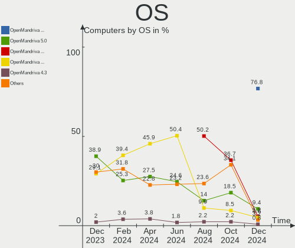
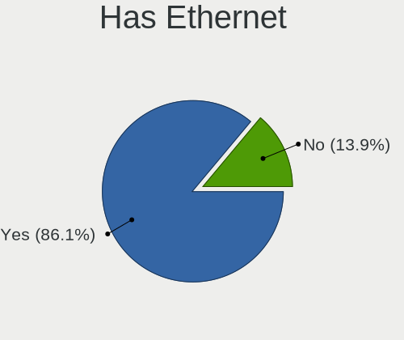
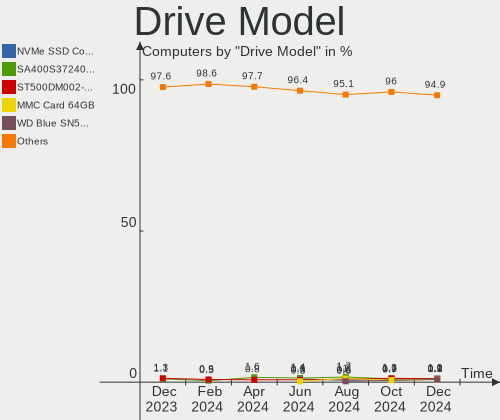
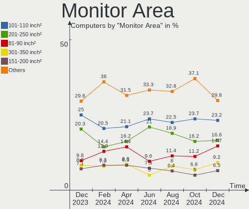

OpenMandriva Hardware Trends
----------------------------

A project to identify most popular hardware characteristics and track their change
over time based on data collected by OpenMandriva users at https://Linux-Hardware.org.

Anyone can contribute to this report by the [hw-probe](https://github.com/linuxhw/hw-probe) tool:

    sudo -E hw-probe -all -upload

This is a report for all computer types. See also reports for [desktops](/Dist/OpenMandriva/Desktop/README.md) and [notebooks](/Dist/OpenMandriva/Notebook/README.md).

Full-feature report is available here: https://linux-hardware.org/?view=trends

Period: Sep, 2021.

Contents
--------

* [ System ](#system)
  - [ OS                       ](#os)
  - [ OS Family                ](#os-family)
  - [ Kernel                   ](#kernel)
  - [ Kernel Family            ](#kernel-family)
  - [ Kernel Major Ver.        ](#kernel-major-ver)
  - [ Arch                     ](#arch)
  - [ DE                       ](#de)
  - [ Display Server           ](#display-server)
  - [ Display Manager          ](#display-manager)
  - [ OS Lang                  ](#os-lang)
  - [ Boot Mode                ](#boot-mode)
  - [ Filesystem               ](#filesystem)
  - [ Part. scheme             ](#part-scheme)
  - [ Dual Boot with Linux/BSD ](#dual-boot-with-linuxbsd)
  - [ Dual Boot (Win)          ](#dual-boot-win)

* [ Board ](#board)
  - [ Vendor                   ](#vendor)
  - [ Model                    ](#model)
  - [ Model Family             ](#model-family)
  - [ MFG Year                 ](#mfg-year)
  - [ Form Factor              ](#form-factor)
  - [ Secure Boot              ](#secure-boot)
  - [ Coreboot                 ](#coreboot)
  - [ RAM Size                 ](#ram-size)
  - [ RAM Used                 ](#ram-used)
  - [ Total Drives             ](#total-drives)
  - [ Has CD-ROM               ](#has-cd-rom)
  - [ Has Ethernet             ](#has-ethernet)
  - [ Has WiFi                 ](#has-wifi)
  - [ Has Bluetooth            ](#has-bluetooth)

* [ Location ](#location)
  - [ Country                  ](#country)
  - [ City                     ](#city)

* [ Drives ](#drives)
  - [ Drive Vendor             ](#drive-vendor)
  - [ Drive Model              ](#drive-model)
  - [ HDD Vendor               ](#hdd-vendor)
  - [ SSD Vendor               ](#ssd-vendor)
  - [ Drive Kind               ](#drive-kind)
  - [ Drive Connector          ](#drive-connector)
  - [ Drive Size               ](#drive-size)
  - [ Space Total              ](#space-total)
  - [ Space Used               ](#space-used)
  - [ Malfunc. Drives          ](#malfunc-drives)
  - [ Malfunc. Drive Vendor    ](#malfunc-drive-vendor)
  - [ Malfunc. HDD Vendor      ](#malfunc-hdd-vendor)
  - [ Malfunc. Drive Kind      ](#malfunc-drive-kind)
  - [ Failed Drives            ](#failed-drives)
  - [ Failed Drive Vendor      ](#failed-drive-vendor)
  - [ Drive Status             ](#drive-status)

* [ Storage controller ](#storage-controller)
  - [ Storage Vendor           ](#storage-vendor)
  - [ Storage Model            ](#storage-model)
  - [ Storage Kind             ](#storage-kind)

* [ Processor ](#processor)
  - [ CPU Vendor               ](#cpu-vendor)
  - [ CPU Model                ](#cpu-model)
  - [ CPU Model Family         ](#cpu-model-family)
  - [ CPU Cores                ](#cpu-cores)
  - [ CPU Sockets              ](#cpu-sockets)
  - [ CPU Threads              ](#cpu-threads)
  - [ CPU Op-Modes             ](#cpu-op-modes)
  - [ CPU Microcode            ](#cpu-microcode)
  - [ CPU Microarch            ](#cpu-microarch)

* [ Graphics ](#graphics)
  - [ GPU Vendor               ](#gpu-vendor)
  - [ GPU Model                ](#gpu-model)
  - [ GPU Combo                ](#gpu-combo)
  - [ GPU Driver               ](#gpu-driver)
  - [ GPU Memory               ](#gpu-memory)

* [ Monitor ](#monitor)
  - [ Monitor Vendor           ](#monitor-vendor)
  - [ Monitor Model            ](#monitor-model)
  - [ Monitor Resolution       ](#monitor-resolution)
  - [ Monitor Diagonal         ](#monitor-diagonal)
  - [ Monitor Width            ](#monitor-width)
  - [ Aspect Ratio             ](#aspect-ratio)
  - [ Monitor Area             ](#monitor-area)
  - [ Pixel Density            ](#pixel-density)
  - [ Multiple Monitors        ](#multiple-monitors)

* [ Network ](#network)
  - [ Net Controller Vendor    ](#net-controller-vendor)
  - [ Net Controller Model     ](#net-controller-model)
  - [ Wireless Vendor          ](#wireless-vendor)
  - [ Wireless Model           ](#wireless-model)
  - [ Ethernet Vendor          ](#ethernet-vendor)
  - [ Ethernet Model           ](#ethernet-model)
  - [ Net Controller Kind      ](#net-controller-kind)
  - [ Used Controller          ](#used-controller)
  - [ NICs                     ](#nics)
  - [ IPv6                     ](#ipv6)

* [ Bluetooth ](#bluetooth)
  - [ Bluetooth Vendor         ](#bluetooth-vendor)
  - [ Bluetooth Model          ](#bluetooth-model)

* [ Sound ](#sound)
  - [ Sound Vendor             ](#sound-vendor)
  - [ Sound Model              ](#sound-model)

* [ Memory ](#memory)
  - [ Memory Vendor            ](#memory-vendor)
  - [ Memory Model             ](#memory-model)
  - [ Memory Kind              ](#memory-kind)
  - [ Memory Form Factor       ](#memory-form-factor)
  - [ Memory Size              ](#memory-size)
  - [ Memory Speed             ](#memory-speed)

* [ Printers & scanners ](#printers--scanners)
  - [ Printer Vendor           ](#printer-vendor)
  - [ Printer Model            ](#printer-model)
  - [ Scanner Vendor           ](#scanner-vendor)
  - [ Scanner Model            ](#scanner-model)

* [ Camera ](#camera)
  - [ Camera Vendor            ](#camera-vendor)
  - [ Camera Model             ](#camera-model)

* [ Security ](#security)
  - [ Fingerprint Vendor       ](#fingerprint-vendor)
  - [ Fingerprint Model        ](#fingerprint-model)
  - [ Chipcard Vendor          ](#chipcard-vendor)
  - [ Chipcard Model           ](#chipcard-model)

* [ Unsupported ](#unsupported)
  - [ Unsupported Devices      ](#unsupported-devices)
  - [ Unsupported Device Types ](#unsupported-device-types)

System
------

OS
--

Installed operating systems

| Name              | Computers | Percent |
|-------------------|-----------|---------|
| OpenMandriva 4.2  | 215       | 90.34%  |
| OpenMandriva 4.50 | 23        | 9.66%   |

OS Family
---------

OS without a version

| Name         | Computers | Percent |
|--------------|-----------|---------|
| OpenMandriva | 238       | 100%    |

Kernel
------

Version of the Linux kernel

| Version                  | Computers | Percent |
|--------------------------|-----------|---------|
| 5.10.14-desktop-1omv4002 | 206       | 86.55%  |
| 5.12.4-desktop-1omv4050  | 19        | 7.98%   |
| 5.11.12-desktop-1omv4002 | 9         | 3.78%   |
| 5.12.7-desktop-1omv4003  | 3         | 1.26%   |
| 5.14.2-desktop-1omv4050  | 1         | 0.42%   |

Kernel Family
-------------

Linux kernel without a distro release

| Version | Computers | Percent |
|---------|-----------|---------|
| 5.10.14 | 206       | 86.55%  |
| 5.12.4  | 19        | 7.98%   |
| 5.11.12 | 9         | 3.78%   |
| 5.12.7  | 3         | 1.26%   |
| 5.14.2  | 1         | 0.42%   |

Kernel Major Ver.
-----------------

Linux kernel major version

| Version | Computers | Percent |
|---------|-----------|---------|
| 5.10    | 206       | 86.55%  |
| 5.12    | 22        | 9.24%   |
| 5.11    | 9         | 3.78%   |
| 5.14    | 1         | 0.42%   |

Arch
----

OS architecture (x86_64, i586, etc.)

| Name   | Computers | Percent |
|--------|-----------|---------|
| x86_64 | 238       | 100%    |

DE
--

Desktop Environment

| Name | Computers | Percent |
|------|-----------|---------|
| KDE5 | 238       | 100%    |

Display Server
--------------

X11 or Wayland

| Name    | Computers | Percent |
|---------|-----------|---------|
| X11     | 234       | 98.32%  |
| Wayland | 4         | 1.68%   |

Display Manager
---------------

SDDM, LightDM, etc.

| Name | Computers | Percent |
|------|-----------|---------|
| SDDM | 238       | 100%    |

OS Lang
-------

Language

| Lang  | Computers | Percent |
|-------|-----------|---------|
| en_US | 107       | 44.96%  |
| fr_FR | 21        | 8.82%   |
| cs_CZ | 15        | 6.3%    |
| de_DE | 13        | 5.46%   |
| ru_RU | 12        | 5.04%   |
| pl_PL | 12        | 5.04%   |
| pt_BR | 10        | 4.2%    |
| es_ES | 10        | 4.2%    |
| en_GB | 8         | 3.36%   |
| it_IT | 6         | 2.52%   |
| fr_BE | 5         | 2.1%    |
| en_AU | 3         | 1.26%   |
| de_AT | 3         | 1.26%   |
| fr_CA | 2         | 0.84%   |
| es_MX | 2         | 0.84%   |
| ru_UA | 1         | 0.42%   |
| nl_NL | 1         | 0.42%   |
| nl_BE | 1         | 0.42%   |
| hu_HU | 1         | 0.42%   |
| es_SV | 1         | 0.42%   |
| es_EC | 1         | 0.42%   |
| es_CR | 1         | 0.42%   |
| es_AR | 1         | 0.42%   |
| da_DK | 1         | 0.42%   |

Boot Mode
---------

EFI or BIOS

| Mode | Computers | Percent |
|------|-----------|---------|
| BIOS | 166       | 69.75%  |
| EFI  | 72        | 30.25%  |

Filesystem
----------

Type of filesystem

| Type    | Computers | Percent |
|---------|-----------|---------|
| Overlay | 188       | 78.99%  |
| Ext4    | 49        | 20.59%  |
| Ext2    | 1         | 0.42%   |

Part. scheme
------------

Scheme of partitioning

| Type    | Computers | Percent |
|---------|-----------|---------|
| GPT     | 119       | 50%     |
| MBR     | 118       | 49.58%  |
| Unknown | 1         | 0.42%   |

Dual Boot with Linux/BSD
------------------------

Hosting more than one Linux/BSD

| Dual boot | Computers | Percent |
|-----------|-----------|---------|
| Yes       | 119       | 50%     |
| No        | 119       | 50%     |

Dual Boot (Win)
---------------

Hosting Linux and Windows

| Dual boot | Computers | Percent |
|-----------|-----------|---------|
| No        | 128       | 53.78%  |
| Yes       | 110       | 46.22%  |

Board
-----

Vendor
------

Motherboard manufacturer

| Name                | Computers | Percent |
|---------------------|-----------|---------|
| ASUSTek Computer    | 63        | 26.47%  |
| Lenovo              | 25        | 10.5%   |
| Dell                | 24        | 10.08%  |
| Hewlett-Packard     | 22        | 9.24%   |
| Gigabyte Technology | 22        | 9.24%   |
| Acer                | 17        | 7.14%   |
| ASRock              | 13        | 5.46%   |
| MSI                 | 10        | 4.2%    |
| Toshiba             | 7         | 2.94%   |
| Sony                | 5         | 2.1%    |
| Samsung Electronics | 4         | 1.68%   |
| Positivo            | 3         | 1.26%   |
| Intel               | 3         | 1.26%   |
| Medion              | 2         | 0.84%   |
| Fujitsu Siemens     | 2         | 0.84%   |
| ECS                 | 2         | 0.84%   |
| Chuwi               | 2         | 0.84%   |
| Apple               | 2         | 0.84%   |
| Supermicro          | 1         | 0.42%   |
| Shuttle             | 1         | 0.42%   |
| Packard Bell        | 1         | 0.42%   |
| OEM                 | 1         | 0.42%   |
| Microsoft           | 1         | 0.42%   |
| JW Technology       | 1         | 0.42%   |
| IBM                 | 1         | 0.42%   |
| Fujitsu             | 1         | 0.42%   |
| AWOW                | 1         | 0.42%   |
| AMI                 | 1         | 0.42%   |

Model
-----

Motherboard model

| Name                                   | Computers | Percent |
|----------------------------------------|-----------|---------|
| ASUS UX31E                             | 14        | 5.88%   |
| ASUS All Series                        | 6         | 2.52%   |
| Sony VGN-FZ31Z                         | 3         | 1.26%   |
| ASUS TP401NA                           | 3         | 1.26%   |
| MSI MS-7A15                            | 2         | 0.84%   |
| Gigabyte B75M-D3H                      | 2         | 0.84%   |
| Dell OptiPlex 9020                     | 2         | 0.84%   |
| Dell OptiPlex 780                      | 2         | 0.84%   |
| ASUS P5QL PRO                          | 2         | 0.84%   |
| Toshiba TECRA M9                       | 1         | 0.42%   |
| Toshiba Satellite P870                 | 1         | 0.42%   |
| Toshiba Satellite P845                 | 1         | 0.42%   |
| Toshiba Satellite P750                 | 1         | 0.42%   |
| Toshiba Satellite C850D-11R            | 1         | 0.42%   |
| Toshiba Satellite A200                 | 1         | 0.42%   |
| Toshiba dynabook R73/A                 | 1         | 0.42%   |
| Supermicro X7DB8                       | 1         | 0.42%   |
| Sony VPCF23S1E                         | 1         | 0.42%   |
| Sony VGN-FZ21M                         | 1         | 0.42%   |
| Shuttle XS35V3                         | 1         | 0.42%   |
| Samsung RV415                          | 1         | 0.42%   |
| Samsung RF510/RF410/RF710              | 1         | 0.42%   |
| Samsung R428/P428/R478                 | 1         | 0.42%   |
| Samsung 550XCJ/550XCR                  | 1         | 0.42%   |
| Positivo SW6H                          | 1         | 0.42%   |
| Positivo POS-EIH61CE                   | 1         | 0.42%   |
| Positivo MOBILE                        | 1         | 0.42%   |
| Packard Bell EasyNote LM85             | 1         | 0.42%   |
| MSI MS-7C84                            | 1         | 0.42%   |
| MSI MS-7B84                            | 1         | 0.42%   |
| MSI MS-7721                            | 1         | 0.42%   |
| MSI MS-7695                            | 1         | 0.42%   |
| MSI MS-7577                            | 1         | 0.42%   |
| MSI MS-7255                            | 1         | 0.42%   |
| MSI GS65 Stealth Thin 8RF              | 1         | 0.42%   |
| MSI GE72 2QD                           | 1         | 0.42%   |
| Microsoft Surface Pro 4                | 1         | 0.42%   |
| Medion P66089                          | 1         | 0.42%   |
| Medion E2292                           | 1         | 0.42%   |
| Lenovo Z50-70 20354                    | 1         | 0.42%   |
| Lenovo ThinkPad X380 Yoga 20LJS3JB00   | 1         | 0.42%   |
| Lenovo ThinkPad X230 2306A44           | 1         | 0.42%   |
| Lenovo ThinkPad X130e 06222EU          | 1         | 0.42%   |
| Lenovo ThinkPad T61 7661BM5            | 1         | 0.42%   |
| Lenovo ThinkPad T61 7659AB7            | 1         | 0.42%   |
| Lenovo ThinkPad T530 2429B14           | 1         | 0.42%   |
| Lenovo ThinkPad T420 4236A22           | 1         | 0.42%   |
| Lenovo ThinkPad T400 2767C44           | 1         | 0.42%   |
| Lenovo ThinkPad P50 20EQS3BT2E         | 1         | 0.42%   |
| Lenovo ThinkPad E495 20NECTO1WW        | 1         | 0.42%   |
| Lenovo ThinkCentre XXXX 8813AA2        | 1         | 0.42%   |
| Lenovo ThinkCentre M83 10AM0007US      | 1         | 0.42%   |
| Lenovo ThinkCentre M82 2742DB3         | 1         | 0.42%   |
| Lenovo N23 80UR                        | 1         | 0.42%   |
| Lenovo IdeaPad G485 QAWGE              | 1         | 0.42%   |
| Lenovo IdeaPad 520-15IKB 80YL          | 1         | 0.42%   |
| Lenovo IdeaPad 510-15ISK 80SR          | 1         | 0.42%   |
| Lenovo IdeaPad 120S-11IAP 81A4         | 1         | 0.42%   |
| Lenovo IdeaCentre 3 07ADA05 90MV007VGE | 1         | 0.42%   |
| Lenovo H50-50 90B70040AL               | 1         | 0.42%   |

Model Family
------------

Motherboard model prefix

| Name                  | Computers | Percent |
|-----------------------|-----------|---------|
| ASUS UX31E            | 14        | 5.88%   |
| Lenovo ThinkPad       | 10        | 4.2%    |
| Acer Aspire           | 10        | 4.2%    |
| Dell Latitude         | 8         | 3.36%   |
| Dell Inspiron         | 8         | 3.36%   |
| Dell OptiPlex         | 7         | 2.94%   |
| ASUS All              | 6         | 2.52%   |
| Toshiba Satellite     | 5         | 2.1%    |
| HP EliteBook          | 5         | 2.1%    |
| HP Compaq             | 5         | 2.1%    |
| Lenovo IdeaPad        | 4         | 1.68%   |
| Sony VGN-FZ31Z        | 3         | 1.26%   |
| Lenovo ThinkCentre    | 3         | 1.26%   |
| ASUS TP401NA          | 3         | 1.26%   |
| MSI MS-7A15           | 2         | 0.84%   |
| HP Pavilion           | 2         | 0.84%   |
| Gigabyte B75M-D3H     | 2         | 0.84%   |
| ASUS VivoBook         | 2         | 0.84%   |
| ASUS ROG              | 2         | 0.84%   |
| ASUS P5QL             | 2         | 0.84%   |
| ASUS M5A97            | 2         | 0.84%   |
| ASUS M5A78L-M         | 2         | 0.84%   |
| Acer Veriton          | 2         | 0.84%   |
| Acer TravelMate       | 2         | 0.84%   |
| Toshiba TECRA         | 1         | 0.42%   |
| Toshiba dynabook      | 1         | 0.42%   |
| Supermicro X7DB8      | 1         | 0.42%   |
| Sony VPCF23S1E        | 1         | 0.42%   |
| Sony VGN-FZ21M        | 1         | 0.42%   |
| Shuttle XS35V3        | 1         | 0.42%   |
| Samsung RV415         | 1         | 0.42%   |
| Samsung RF510         | 1         | 0.42%   |
| Samsung R428          | 1         | 0.42%   |
| Samsung 550XCJ        | 1         | 0.42%   |
| Positivo SW6H         | 1         | 0.42%   |
| Positivo POS-EIH61CE  | 1         | 0.42%   |
| Positivo MOBILE       | 1         | 0.42%   |
| Packard Bell EasyNote | 1         | 0.42%   |
| MSI MS-7C84           | 1         | 0.42%   |
| MSI MS-7B84           | 1         | 0.42%   |
| MSI MS-7721           | 1         | 0.42%   |
| MSI MS-7695           | 1         | 0.42%   |
| MSI MS-7577           | 1         | 0.42%   |
| MSI MS-7255           | 1         | 0.42%   |
| MSI GS65              | 1         | 0.42%   |
| MSI GE72              | 1         | 0.42%   |
| Microsoft Surface     | 1         | 0.42%   |
| Medion P66089         | 1         | 0.42%   |
| Medion E2292          | 1         | 0.42%   |
| Lenovo Z50-70         | 1         | 0.42%   |
| Lenovo N23            | 1         | 0.42%   |
| Lenovo IdeaCentre     | 1         | 0.42%   |
| Lenovo H50-50         | 1         | 0.42%   |
| Lenovo G510           | 1         | 0.42%   |
| Lenovo G500           | 1         | 0.42%   |
| Lenovo C20-00         | 1         | 0.42%   |
| Lenovo B570           | 1         | 0.42%   |
| JW JW-A61PM-D3        | 1         | 0.42%   |
| Intel DH61WW          | 1         | 0.42%   |
| Intel DG41RQ          | 1         | 0.42%   |

MFG Year
--------

Motherboard manufacture year

| Year | Computers | Percent |
|------|-----------|---------|
| 2012 | 40        | 16.81%  |
| 2013 | 25        | 10.5%   |
| 2019 | 21        | 8.82%   |
| 2015 | 19        | 7.98%   |
| 2020 | 16        | 6.72%   |
| 2010 | 14        | 5.88%   |
| 2021 | 13        | 5.46%   |
| 2016 | 13        | 5.46%   |
| 2011 | 13        | 5.46%   |
| 2008 | 13        | 5.46%   |
| 2018 | 12        | 5.04%   |
| 2014 | 12        | 5.04%   |
| 2007 | 9         | 3.78%   |
| 2009 | 8         | 3.36%   |
| 2017 | 4         | 1.68%   |
| 2006 | 4         | 1.68%   |
| 2005 | 2         | 0.84%   |

Form Factor
-----------

Physical design of the computer

| Name        | Computers | Percent |
|-------------|-----------|---------|
| Desktop     | 113       | 47.48%  |
| Notebook    | 110       | 46.22%  |
| Convertible | 8         | 3.36%   |
| All in one  | 3         | 1.26%   |
| Tablet      | 2         | 0.84%   |
| Mini pc     | 2         | 0.84%   |

Secure Boot
-----------

Enabled or disabled

| State    | Computers | Percent |
|----------|-----------|---------|
| Disabled | 238       | 100%    |

Coreboot
--------

Have coreboot on board

| Used | Computers | Percent |
|------|-----------|---------|
| No   | 238       | 100%    |

RAM Size
--------

Total RAM memory

| Size in GB  | Computers | Percent |
|-------------|-----------|---------|
| 3.01-4.0    | 90        | 37.82%  |
| 4.01-8.0    | 55        | 23.11%  |
| 8.01-16.0   | 42        | 17.65%  |
| 16.01-24.0  | 24        | 10.08%  |
| 1.01-2.0    | 14        | 5.88%   |
| 32.01-64.0  | 5         | 2.1%    |
| 2.01-3.0    | 5         | 2.1%    |
| 24.01-32.0  | 1         | 0.42%   |
| 64.01-256.0 | 1         | 0.42%   |
| 0.51-1.0    | 1         | 0.42%   |

RAM Used
--------

Used RAM memory

| Used GB   | Computers | Percent |
|-----------|-----------|---------|
| 1.01-2.0  | 179       | 75.21%  |
| 0.51-1.0  | 38        | 15.97%  |
| 0.01-0.5  | 10        | 4.2%    |
| 2.01-3.0  | 9         | 3.78%   |
| 3.01-4.0  | 1         | 0.42%   |
| 8.01-16.0 | 1         | 0.42%   |

Total Drives
------------

Number of drives on board

| Drives | Computers | Percent |
|--------|-----------|---------|
| 1      | 160       | 67.23%  |
| 2      | 51        | 21.43%  |
| 3      | 11        | 4.62%   |
| 4      | 8         | 3.36%   |
| 0      | 4         | 1.68%   |
| 5      | 2         | 0.84%   |
| 7      | 1         | 0.42%   |
| 6      | 1         | 0.42%   |

Has CD-ROM
----------

Has CD-ROM on board

| Presented | Computers | Percent |
|-----------|-----------|---------|
| Yes       | 146       | 61.34%  |
| No        | 92        | 38.66%  |

Has Ethernet
------------

Has Ethernet on board

| Presented | Computers | Percent |
|-----------|-----------|---------|
| Yes       | 223       | 93.7%   |
| No        | 15        | 6.3%    |

Has WiFi
--------

Has WiFi module

| Presented | Computers | Percent |
|-----------|-----------|---------|
| Yes       | 161       | 67.65%  |
| No        | 77        | 32.35%  |

Has Bluetooth
-------------

Has Bluetooth module

| Presented | Computers | Percent |
|-----------|-----------|---------|
| No        | 147       | 61.76%  |
| Yes       | 91        | 38.24%  |

Location
--------

Country
-------

Geographic location (country)

| Country      | Computers | Percent |
|--------------|-----------|---------|
| France       | 24        | 10.08%  |
| Germany      | 21        | 8.82%   |
| Russia       | 18        | 7.56%   |
| Czechia      | 18        | 7.56%   |
| Poland       | 14        | 5.88%   |
| USA          | 13        | 5.46%   |
| Brazil       | 13        | 5.46%   |
| Spain        | 11        | 4.62%   |
| Italy        | 11        | 4.62%   |
| UK           | 9         | 3.78%   |
| Canada       | 9         | 3.78%   |
| Mexico       | 8         | 3.36%   |
| Belgium      | 7         | 2.94%   |
| Portugal     | 5         | 2.1%    |
| Romania      | 4         | 1.68%   |
| Austria      | 4         | 1.68%   |
| Indonesia    | 3         | 1.26%   |
| India        | 3         | 1.26%   |
| Australia    | 3         | 1.26%   |
| Ukraine      | 2         | 0.84%   |
| Tunisia      | 2         | 0.84%   |
| Serbia       | 2         | 0.84%   |
| Saudi Arabia | 2         | 0.84%   |
| New Zealand  | 2         | 0.84%   |
| Netherlands  | 2         | 0.84%   |
| Japan        | 2         | 0.84%   |
| Hungary      | 2         | 0.84%   |
| Greece       | 2         | 0.84%   |
| Finland      | 2         | 0.84%   |
| Algeria      | 2         | 0.84%   |
| Thailand     | 1         | 0.42%   |
| Taiwan       | 1         | 0.42%   |
| Switzerland  | 1         | 0.42%   |
| Philippines  | 1         | 0.42%   |
| Peru         | 1         | 0.42%   |
| Norway       | 1         | 0.42%   |
| Morocco      | 1         | 0.42%   |
| Malaysia     | 1         | 0.42%   |
| Madagascar   | 1         | 0.42%   |
| Jamaica      | 1         | 0.42%   |
| Israel       | 1         | 0.42%   |
| Ireland      | 1         | 0.42%   |
| El Salvador  | 1         | 0.42%   |
| Denmark      | 1         | 0.42%   |
| Croatia      | 1         | 0.42%   |
| Costa Rica   | 1         | 0.42%   |
| China        | 1         | 0.42%   |
| Argentina    | 1         | 0.42%   |

City
----

Geographic location (city)

| City                   | Computers | Percent |
|------------------------|-----------|---------|
| Prague                 | 15        | 6.3%    |
| Limoges                | 4         | 1.68%   |
| Funchal                | 4         | 1.68%   |
| Wuppertal              | 3         | 1.26%   |
| Warsaw                 | 3         | 1.26%   |
| Vienna                 | 3         | 1.26%   |
| Rome                   | 3         | 1.26%   |
| Mexico City            | 3         | 1.26%   |
| D??sseldorf            | 3         | 1.26%   |
| Voiron                 | 2         | 0.84%   |
| Thessaloniki           | 2         | 0.84%   |
| Ploie??ti              | 2         | 0.84%   |
| Oaxaca City            | 2         | 0.84%   |
| Montreal               | 2         | 0.84%   |
| Madrid                 | 2         | 0.84%   |
| Limeira                | 2         | 0.84%   |
| Kyiv                   | 2         | 0.84%   |
| Krakow                 | 2         | 0.84%   |
| Kazan?ˆ™               | 2         | 0.84%   |
| Jeddah                 | 2         | 0.84%   |
| Helsinki               | 2         | 0.84%   |
| Granada                | 2         | 0.84%   |
| Bristol                | 2         | 0.84%   |
| Belgrade               | 2         | 0.84%   |
| Barcelona              | 2         | 0.84%   |
| Auckland               | 2         | 0.84%   |
| Zl?­n                  | 1         | 0.42%   |
| Zheleznogorsk          | 1         | 0.42%   |
| Zdunska Wola           | 1         | 0.42%   |
| Yekaterinburg          | 1         | 0.42%   |
| Wschowa                | 1         | 0.42%   |
| Worcester              | 1         | 0.42%   |
| Willingboro            | 1         | 0.42%   |
| Wiesbaden              | 1         | 0.42%   |
| Wakefield              | 1         | 0.42%   |
| Vijayawada             | 1         | 0.42%   |
| Vidnoye                | 1         | 0.42%   |
| Viborg                 | 1         | 0.42%   |
| Verona                 | 1         | 0.42%   |
| Uccle                  | 1         | 0.42%   |
| Tunis                  | 1         | 0.42%   |
| Toulouse               | 1         | 0.42%   |
| Toronto                | 1         | 0.42%   |
| Thornleigh             | 1         | 0.42%   |
| Teplice                | 1         | 0.42%   |
| Telford                | 1         | 0.42%   |
| Sydney                 | 1         | 0.42%   |
| Stralsund              | 1         | 0.42%   |
| Stavropol              | 1         | 0.42%   |
| St. John's             | 1         | 0.42%   |
| Soustons               | 1         | 0.42%   |
| Sheridan               | 1         | 0.42%   |
| Shah Alam              | 1         | 0.42%   |
| Severodvinsk           | 1         | 0.42%   |
| Serdobsk               | 1         | 0.42%   |
| Schoten                | 1         | 0.42%   |
| Schenefeld             | 1         | 0.42%   |
| S??o Paulo             | 1         | 0.42%   |
| S??o Bernardo do Campo | 1         | 0.42%   |
| Savona                 | 1         | 0.42%   |

Drives
------

Drive Vendor
------------

Hard drive vendors

| Vendor              | Computers | Drives  | Percent |
|---------------------|-----------|---------|---------|
| Seagate             | 66        | 70      | 21.36%  |
| WDC                 | 51        | 64      | 16.5%   |
| Samsung Electronics | 30        | 37      | 9.71%   |
| Toshiba             | 23        | 25      | 7.44%   |
| SanDisk             | 22        | 23      | 7.12%   |
| Kingston            | 16        | 16      | 5.18%   |
| Hitachi             | 16        | 18      | 5.18%   |
| Unknown             | 13        | 14      | 4.21%   |
| Crucial             | 9         | 10      | 2.91%   |
| A-DATA Technology   | 7         | 7       | 2.27%   |
| HGST                | 5         | 5       | 1.62%   |
| JMicron             | 4         | 4       | 1.29%   |
| Intenso             | 4         | 6       | 1.29%   |
| Intel               | 4         | 5       | 1.29%   |
| SK Hynix            | 3         | 3       | 0.97%   |
| PNY                 | 3         | 3       | 0.97%   |
| Micron Technology   | 3         | 3       | 0.97%   |
| GOODRAM             | 3         | 3       | 0.97%   |
| Netac               | 2         | 2       | 0.65%   |
| Hewlett-Packard     | 2         | 2       | 0.65%   |
| Fujitsu             | 2         | 2       | 0.65%   |
| ZTE                 | 1         | 1       | 0.32%   |
| WDC WDS             | 1         | 1       | 0.32%   |
| WD MediaMax         | 1         | 1       | 0.32%   |
| Transcend           | 1         | 1       | 0.32%   |
| Team                | 1         | 1       | 0.32%   |
| SPCC                | 1         | 1       | 0.32%   |
| Silicon Motion      | 1         | 1       | 0.32%   |
| Phison              | 1         | 1       | 0.32%   |
| Mass                | 1         | Unknown | 0.32%   |
| LITEON              | 1         | 1       | 0.32%   |
| KingSpec            | 1         | 1       | 0.32%   |
| INDMEM              | 1         | 1       | 0.32%   |
| IBM/Hitachi         | 1         | 1       | 0.32%   |
| HS-SSD-C100         | 1         | 1       | 0.32%   |
| Hikvision           | 1         | 1       | 0.32%   |
| Gigabyte Technology | 1         | 1       | 0.32%   |
| External            | 1         | 1       | 0.32%   |
| Corsair             | 1         | 1       | 0.32%   |
| China               | 1         | 1       | 0.32%   |
| Biostar             | 1         | 1       | 0.32%   |
| Apple               | 1         | 2       | 0.32%   |

Drive Model
-----------

Hard drive models

| Model                               | Computers | Percent |
|-------------------------------------|-----------|---------|
| SanDisk SSD U100 256GB              | 14        | 4.12%   |
| Toshiba DT01ACA100 1TB              | 7         | 2.06%   |
| WDC WD10EZEX-08WN4A0 1TB            | 5         | 1.47%   |
| Seagate ST500LM012 HN-M500MBB 500GB | 4         | 1.18%   |
| Seagate ST500DM002-1BD142 500GB     | 4         | 1.18%   |
| Seagate ST1000LM024 HN-M101MBB 1TB  | 4         | 1.18%   |
| Kingston SV300S37A120G 120GB SSD    | 4         | 1.18%   |
| HGST HTS721010A9E630 1TB            | 4         | 1.18%   |
| Unknown HDG8a4  128GB               | 3         | 0.88%   |
| Toshiba DT01ACA050 500GB            | 3         | 0.88%   |
| Seagate ST9500325AS 500GB           | 3         | 0.88%   |
| Seagate ST500LT012-1DG142 500GB     | 3         | 0.88%   |
| Seagate ST1000DM010-2EP102 1TB      | 3         | 0.88%   |
| Samsung SSD 850 EVO 500GB           | 3         | 0.88%   |
| Kingston SA400S37240G 240GB SSD     | 3         | 0.88%   |
| JMicron Generic 500GB               | 3         | 0.88%   |
| WDC WDS120G2G0A-00JH30 120GB SSD    | 2         | 0.59%   |
| WDC WDS100T2B0A-00SM50 1TB SSD      | 2         | 0.59%   |
| WDC WD3200AAKS-00L9A0 320GB         | 2         | 0.59%   |
| WDC WD20EFRX-68EUZN0 2TB            | 2         | 0.59%   |
| WDC WD20EARS-00MVWB0 2TB            | 2         | 0.59%   |
| WDC WD1200BEVS-22UST0 120GB         | 2         | 0.59%   |
| WDC WD10PURZ-85U8XY0 1TB            | 2         | 0.59%   |
| WDC WD10JPVX-22JC3T0 1TB            | 2         | 0.59%   |
| WDC WD10JPCX-24UE4T0 1TB            | 2         | 0.59%   |
| WDC WD10EZEX-00WN4A0 1TB            | 2         | 0.59%   |
| WDC WD10EZEX-00BN5A0 1TB            | 2         | 0.59%   |
| Toshiba MQ01ABF050 500GB            | 2         | 0.59%   |
| Seagate ST750LM022 HN-M750MBB 752GB | 2         | 0.59%   |
| Seagate ST3320820AS 320GB           | 2         | 0.59%   |
| Seagate ST3160815AS 160GB           | 2         | 0.59%   |
| Seagate ST3160318AS 160GB           | 2         | 0.59%   |
| Seagate ST3120022A 120GB            | 2         | 0.59%   |
| Seagate ST2000DM008-2FR102 2TB      | 2         | 0.59%   |
| Seagate ST2000DL003-9VT166 2TB      | 2         | 0.59%   |
| Seagate ST1000DM003-1ER162 1TB      | 2         | 0.59%   |
| Samsung SSD 970 EVO 500GB           | 2         | 0.59%   |
| Samsung HD502HJ 500GB               | 2         | 0.59%   |
| Samsung HD161HJ 160GB               | 2         | 0.59%   |
| PNY CS900 120GB SSD                 | 2         | 0.59%   |
| Kingston SA400S37120G 120GB SSD     | 2         | 0.59%   |
| Intenso SSD 256GB                   | 2         | 0.59%   |
| Crucial CT480BX500SSD1 480GB        | 2         | 0.59%   |
| Crucial CT240M500SSD1 240GB         | 2         | 0.59%   |
| Crucial CT1000MX500SSD1 1TB         | 2         | 0.59%   |
| A-DATA SU630 240GB SSD              | 2         | 0.59%   |
| ZTE MMC Storage 8GB                 | 1         | 0.29%   |
| WDC WDS500G2B0B-00YS70 500GB SSD    | 1         | 0.29%   |
| WDC WDS500G2B0A-00SM50 500GB SSD    | 1         | 0.29%   |
| WDC WDS120G2G0B-00EPW0 120GB SSD    | 1         | 0.29%   |
| WDC WDS100T1X0E-00AFY0 1TB          | 1         | 0.29%   |
| WDC WDS 500G2B0B-00YS70 500GB SSD   | 1         | 0.29%   |
| WDC WDBNCE5000PNC 500GB SSD         | 1         | 0.29%   |
| WDC WD80EZZX-11CSGA0 8TB            | 1         | 0.29%   |
| WDC WD6400AAKS-00A7B0 640GB         | 1         | 0.29%   |
| WDC WD50EZRZ-00RWYB1 5TB            | 1         | 0.29%   |
| WDC WD5000LPCX-60VHAT0 500GB        | 1         | 0.29%   |
| WDC WD5000BEVT-22A0RT0 500GB        | 1         | 0.29%   |
| WDC WD5000AAKX-75U6AA0 500GB        | 1         | 0.29%   |
| WDC WD5000AAKX-003CA0 500GB         | 1         | 0.29%   |

HDD Vendor
----------

Hard disk drive vendors

| Vendor              | Computers | Drives | Percent |
|---------------------|-----------|--------|---------|
| Seagate             | 65        | 69     | 38.24%  |
| WDC                 | 48        | 54     | 28.24%  |
| Toshiba             | 21        | 23     | 12.35%  |
| Hitachi             | 16        | 18     | 9.41%   |
| Samsung Electronics | 9         | 12     | 5.29%   |
| HGST                | 5         | 5      | 2.94%   |
| Fujitsu             | 2         | 2      | 1.18%   |
| WD MediaMax         | 1         | 1      | 0.59%   |
| Unknown             | 1         | 1      | 0.59%   |
| IBM/Hitachi         | 1         | 1      | 0.59%   |
| Apple               | 1         | 1      | 0.59%   |

SSD Vendor
----------

Solid state drive vendors

| Vendor              | Computers | Drives | Percent |
|---------------------|-----------|--------|---------|
| SanDisk             | 22        | 23     | 20.37%  |
| Kingston            | 15        | 15     | 13.89%  |
| Samsung Electronics | 12        | 13     | 11.11%  |
| WDC                 | 8         | 9      | 7.41%   |
| Crucial             | 8         | 9      | 7.41%   |
| A-DATA Technology   | 6         | 6      | 5.56%   |
| Intenso             | 4         | 6      | 3.7%    |
| SK Hynix            | 3         | 3      | 2.78%   |
| PNY                 | 3         | 3      | 2.78%   |
| GOODRAM             | 3         | 3      | 2.78%   |
| Toshiba             | 2         | 2      | 1.85%   |
| Netac               | 2         | 2      | 1.85%   |
| Micron Technology   | 2         | 2      | 1.85%   |
| Hewlett-Packard     | 2         | 2      | 1.85%   |
| WDC WDS             | 1         | 1      | 0.93%   |
| Unknown             | 1         | 1      | 0.93%   |
| Transcend           | 1         | 1      | 0.93%   |
| Team                | 1         | 1      | 0.93%   |
| SPCC                | 1         | 1      | 0.93%   |
| Seagate             | 1         | 1      | 0.93%   |
| LITEON              | 1         | 1      | 0.93%   |
| KingSpec            | 1         | 1      | 0.93%   |
| Intel               | 1         | 1      | 0.93%   |
| INDMEM              | 1         | 1      | 0.93%   |
| HS-SSD-C100         | 1         | 1      | 0.93%   |
| Hikvision           | 1         | 1      | 0.93%   |
| Gigabyte Technology | 1         | 1      | 0.93%   |
| China               | 1         | 1      | 0.93%   |
| Biostar             | 1         | 1      | 0.93%   |
| Apple               | 1         | 1      | 0.93%   |

Drive Kind
----------

HDD or SSD

| Kind    | Computers | Drives | Percent |
|---------|-----------|--------|---------|
| HDD     | 147       | 187    | 51.76%  |
| SSD     | 97        | 114    | 34.15%  |
| NVMe    | 26        | 28     | 9.15%   |
| MMC     | 11        | 12     | 3.87%   |
| Unknown | 3         | 2      | 1.06%   |

Drive Connector
---------------

SATA, SAS, NVMe, etc.

| Type | Computers | Drives | Percent |
|------|-----------|--------|---------|
| SATA | 216       | 294    | 82.13%  |
| NVMe | 22        | 24     | 8.37%   |
| SAS  | 14        | 13     | 5.32%   |
| MMC  | 11        | 12     | 4.18%   |

Drive Size
----------

Size of hard drive

| Size in TB | Computers | Drives | Percent |
|------------|-----------|--------|---------|
| 0.01-0.5   | 166       | 203    | 66.94%  |
| 0.51-1.0   | 60        | 71     | 24.19%  |
| 1.01-2.0   | 13        | 18     | 5.24%   |
| 2.01-3.0   | 3         | 3      | 1.21%   |
| 4.01-10.0  | 3         | 3      | 1.21%   |
| 10.01-20.0 | 2         | 2      | 0.81%   |
| 3.01-4.0   | 1         | 1      | 0.4%    |

Space Total
-----------

Amount of disk space available on the file system

| Size in GB     | Computers | Percent |
|----------------|-----------|---------|
| 1-20           | 113       | 47.48%  |
| Unknown        | 44        | 18.49%  |
| 101-250        | 32        | 13.45%  |
| 251-500        | 16        | 6.72%   |
| 21-50          | 11        | 4.62%   |
| 51-100         | 11        | 4.62%   |
| 501-1000       | 7         | 2.94%   |
| More than 3000 | 2         | 0.84%   |
| 1001-2000      | 2         | 0.84%   |

Space Used
----------

Amount of used disk space

| Used GB        | Computers | Percent |
|----------------|-----------|---------|
| 1-20           | 180       | 75.63%  |
| Unknown        | 44        | 18.49%  |
| 21-50          | 4         | 1.68%   |
| 101-250        | 3         | 1.26%   |
| More than 3000 | 2         | 0.84%   |
| 501-1000       | 2         | 0.84%   |
| 51-100         | 2         | 0.84%   |
| 251-500        | 1         | 0.42%   |

Malfunc. Drives
---------------

Drive models with a malfunction

| Model                                       | Computers | Drives | Percent |
|---------------------------------------------|-----------|--------|---------|
| SanDisk SSD U100 256GB                      | 14        | 14     | 15.22%  |
| Kingston SV300S37A120G 120GB SSD            | 3         | 3      | 3.26%   |
| WDC WD10JPCX-24UE4T0 1TB                    | 2         | 2      | 2.17%   |
| Seagate ST9500325AS 500GB                   | 2         | 2      | 2.17%   |
| Seagate ST500LT012-1DG142 500GB             | 2         | 2      | 2.17%   |
| Seagate ST2000DL003-9VT166 2TB              | 2         | 3      | 2.17%   |
| Seagate ST1000LM024 HN-M101MBB 1TB          | 2         | 2      | 2.17%   |
| Samsung Electronics HD502HJ 500GB           | 2         | 2      | 2.17%   |
| Crucial CT240M500SSD1 240GB                 | 2         | 2      | 2.17%   |
| WDC WDS120G2G0A-00JH30 120GB SSD            | 1         | 1      | 1.09%   |
| WDC WD6400AAKS-00A7B0 640GB                 | 1         | 1      | 1.09%   |
| WDC WD5000LPCX-60VHAT0 500GB                | 1         | 1      | 1.09%   |
| WDC WD5000AAKX-75U6AA0 500GB                | 1         | 1      | 1.09%   |
| WDC WD5000AAKX-003CA0 500GB                 | 1         | 1      | 1.09%   |
| WDC WD5000AAKX-001CA0 500GB                 | 1         | 1      | 1.09%   |
| WDC WD5000AAKS-00V1A0 500GB                 | 1         | 1      | 1.09%   |
| WDC WD50 00BEVT-11ZAT0 500GB                | 1         | 1      | 1.09%   |
| WDC WD3200BPVT-75ZEST0 320GB                | 1         | 1      | 1.09%   |
| WDC WD3200AAKS-00L9A0 320GB                 | 1         | 1      | 1.09%   |
| WDC WD30EFRX-68EUZN0 3TB                    | 1         | 1      | 1.09%   |
| WDC WD1600BEVT-22ZCT0 160GB                 | 1         | 1      | 1.09%   |
| WDC WD15EARX-00PASB0 1TB                    | 1         | 1      | 1.09%   |
| WDC WD10JPVX-22JC3T0 1TB                    | 1         | 1      | 1.09%   |
| WDC WD10EZEX-08WN4A0 1TB                    | 1         | 1      | 1.09%   |
| WDC WD10EZEX-08M2NA0 1TB                    | 1         | 1      | 1.09%   |
| Toshiba MQ01ABF050 500GB                    | 1         | 1      | 1.09%   |
| Toshiba MK7575GSX 752GB                     | 1         | 1      | 1.09%   |
| Toshiba MK2556GSY 250GB                     | 1         | 1      | 1.09%   |
| Toshiba MK1656GSY 160GB                     | 1         | 1      | 1.09%   |
| Toshiba MK1214GAH 120GB                     | 1         | 1      | 1.09%   |
| Toshiba DT01ACA100 1TB                      | 1         | 1      | 1.09%   |
| Seagate STM3250318AS 250GB                  | 1         | 1      | 1.09%   |
| Seagate ST9750423AS 752GB                   | 1         | 1      | 1.09%   |
| Seagate ST9250827AS 250GB                   | 1         | 1      | 1.09%   |
| Seagate ST750LM022 HN-M750MBB 752GB         | 1         | 1      | 1.09%   |
| Seagate ST500LM012 HN-M500MBB 500GB         | 1         | 1      | 1.09%   |
| Seagate ST500LM000-SSHD-8GB                 | 1         | 1      | 1.09%   |
| Seagate ST500LM000-1EJ162 500GB             | 1         | 1      | 1.09%   |
| Seagate ST500DM002-1BD142 500GB             | 1         | 1      | 1.09%   |
| Seagate ST500DM002-1BC142 500GB             | 1         | 1      | 1.09%   |
| Seagate ST380815AS 80GB                     | 1         | 1      | 1.09%   |
| Seagate ST3500320AS 500GB                   | 1         | 1      | 1.09%   |
| Seagate ST3320820AS 320GB                   | 1         | 1      | 1.09%   |
| Seagate ST3320413CS 320GB                   | 1         | 1      | 1.09%   |
| Seagate ST3250820AS 250GB                   | 1         | 1      | 1.09%   |
| Seagate ST3250310CS 250GB                   | 1         | 1      | 1.09%   |
| Seagate ST3160815AS 160GB                   | 1         | 1      | 1.09%   |
| Seagate ST3120022A 120GB                    | 1         | 1      | 1.09%   |
| Seagate ST31000520AS 1TB                    | 1         | 1      | 1.09%   |
| Seagate ST31000333AS 1TB                    | 1         | 1      | 1.09%   |
| Seagate ST2000LM007-1R8174 2TB              | 1         | 1      | 1.09%   |
| Seagate ST2000DM008-2FR102 2TB              | 1         | 1      | 1.09%   |
| Seagate ST1000DM010-2EP102 1TB              | 1         | 1      | 1.09%   |
| Samsung Electronics SSD PM810 2.5 7mm 256GB | 1         | 1      | 1.09%   |
| Samsung Electronics SP1213C 120GB           | 1         | 1      | 1.09%   |
| Samsung Electronics HD753LJ 752GB           | 1         | 2      | 1.09%   |
| Samsung Electronics HD251HJ 250GB           | 1         | 1      | 1.09%   |
| Samsung Electronics HD161HJ 160GB           | 1         | 1      | 1.09%   |
| Netac SSD 320GB                             | 1         | 1      | 1.09%   |
| Netac SSD 128GB                             | 1         | 1      | 1.09%   |

Malfunc. Drive Vendor
---------------------

Vendors of faulty drives

| Vendor              | Computers | Drives | Percent |
|---------------------|-----------|--------|---------|
| Seagate             | 29        | 31     | 32.58%  |
| WDC                 | 17        | 18     | 19.1%   |
| SanDisk             | 14        | 14     | 15.73%  |
| Toshiba             | 6         | 6      | 6.74%   |
| Samsung Electronics | 6         | 8      | 6.74%   |
| Kingston            | 5         | 5      | 5.62%   |
| Hitachi             | 4         | 4      | 4.49%   |
| Netac               | 2         | 2      | 2.25%   |
| HGST                | 2         | 2      | 2.25%   |
| Crucial             | 2         | 2      | 2.25%   |
| IBM/Hitachi         | 1         | 1      | 1.12%   |
| A-DATA Technology   | 1         | 1      | 1.12%   |

Malfunc. HDD Vendor
-------------------

Vendors of faulty HDD drives

| Vendor              | Computers | Drives | Percent |
|---------------------|-----------|--------|---------|
| Seagate             | 29        | 31     | 46.03%  |
| WDC                 | 16        | 17     | 25.4%   |
| Toshiba             | 6         | 6      | 9.52%   |
| Samsung Electronics | 5         | 7      | 7.94%   |
| Hitachi             | 4         | 4      | 6.35%   |
| HGST                | 2         | 2      | 3.17%   |
| IBM/Hitachi         | 1         | 1      | 1.59%   |

Malfunc. Drive Kind
-------------------

Kinds of faulty drives

| Kind | Computers | Drives | Percent |
|------|-----------|--------|---------|
| HDD  | 62        | 68     | 70.45%  |
| SSD  | 26        | 26     | 29.55%  |

Failed Drives
-------------

Failed drive models

| Model                     | Computers | Drives | Percent |
|---------------------------|-----------|--------|---------|
| Seagate ST3250318AS 250GB | 1         | 1      | 100%    |

Failed Drive Vendor
-------------------

Failed drive vendors

| Vendor  | Computers | Drives | Percent |
|---------|-----------|--------|---------|
| Seagate | 1         | 1      | 100%    |

Drive Status
------------

Number of failed and malfunc. drives

| Status   | Computers | Drives | Percent |
|----------|-----------|--------|---------|
| Works    | 142       | 202    | 52.99%  |
| Malfunc  | 87        | 94     | 32.46%  |
| Detected | 38        | 46     | 14.18%  |
| Failed   | 1         | 1      | 0.37%   |

Storage controller
------------------

Storage Vendor
--------------

Storage controller vendors

| Vendor                           | Computers | Percent |
|----------------------------------|-----------|---------|
| Intel                            | 177       | 66.29%  |
| AMD                              | 52        | 19.48%  |
| Samsung Electronics              | 12        | 4.49%   |
| Nvidia                           | 4         | 1.5%    |
| Marvell Technology Group         | 4         | 1.5%    |
| JMicron Technology               | 3         | 1.12%   |
| ASMedia Technology               | 3         | 1.12%   |
| VIA Technologies                 | 2         | 0.75%   |
| Phison Electronics               | 2         | 0.75%   |
| Silicon Motion                   | 1         | 0.37%   |
| Silicon Integrated Systems [SiS] | 1         | 0.37%   |
| Sandisk                          | 1         | 0.37%   |
| Realtek Semiconductor            | 1         | 0.37%   |
| Micron/Crucial Technology        | 1         | 0.37%   |
| Micron Technology                | 1         | 0.37%   |
| LSI Logic / Symbios Logic        | 1         | 0.37%   |
| Kingston Technology Company      | 1         | 0.37%   |

Storage Model
-------------

Storage controller models

| Model                                                                                   | Computers | Percent |
|-----------------------------------------------------------------------------------------|-----------|---------|
| Intel 6 Series/C200 Series Chipset Family 6 port Mobile SATA AHCI Controller            | 26        | 7.81%   |
| AMD FCH SATA Controller [AHCI mode]                                                     | 26        | 7.81%   |
| Intel 8 Series/C220 Series Chipset Family 6-port SATA Controller 1 [AHCI mode]          | 14        | 4.2%    |
| Intel 82801 Mobile SATA Controller [RAID mode]                                          | 12        | 3.6%    |
| AMD SB7x0/SB8x0/SB9x0 SATA Controller [AHCI mode]                                       | 12        | 3.6%    |
| AMD SB7x0/SB8x0/SB9x0 SATA Controller [IDE mode]                                        | 11        | 3.3%    |
| AMD SB7x0/SB8x0/SB9x0 IDE Controller                                                    | 11        | 3.3%    |
| Intel NM10/ICH7 Family SATA Controller [IDE mode]                                       | 10        | 3%      |
| Intel 82801HM/HEM (ICH8M/ICH8M-E) IDE Controller                                        | 10        | 3%      |
| Intel Q170/Q150/B150/H170/H110/Z170/CM236 Chipset SATA Controller [AHCI Mode]           | 9         | 2.7%    |
| Intel 7 Series Chipset Family 6-port SATA Controller [AHCI mode]                        | 8         | 2.4%    |
| Intel Sunrise Point-LP SATA Controller [AHCI mode]                                      | 7         | 2.1%    |
| Intel 82801HM/HEM (ICH8M/ICH8M-E) SATA Controller [AHCI mode]                           | 7         | 2.1%    |
| Intel 82801G (ICH7 Family) IDE Controller                                               | 7         | 2.1%    |
| Samsung NVMe SSD Controller SM981/PM981/PM983                                           | 6         | 1.8%    |
| Intel Celeron/Pentium Silver Processor SATA Controller                                  | 6         | 1.8%    |
| Intel Celeron N3350/Pentium N4200/Atom E3900 Series SATA AHCI Controller                | 5         | 1.5%    |
| Intel 82801IBM/IEM (ICH9M/ICH9M-E) 4 port SATA Controller [AHCI mode]                   | 5         | 1.5%    |
| Intel SATA Controller [RAID mode]                                                       | 4         | 1.2%    |
| Intel Atom/Celeron/Pentium Processor x5-E8000/J3xxx/N3xxx Series SATA Controller        | 4         | 1.2%    |
| Intel 6 Series/C200 Series Chipset Family 6 port Desktop SATA AHCI Controller           | 4         | 1.2%    |
| Intel 5 Series/3400 Series Chipset 4 port SATA AHCI Controller                          | 4         | 1.2%    |
| Nvidia MCP61 SATA Controller                                                            | 3         | 0.9%    |
| Nvidia MCP61 IDE                                                                        | 3         | 0.9%    |
| Intel Wildcat Point-LP SATA Controller [AHCI Mode]                                      | 3         | 0.9%    |
| Intel 82801I (ICH9 Family) 2 port SATA Controller [IDE mode]                            | 3         | 0.9%    |
| Intel 82801HM/HEM (ICH8M/ICH8M-E) SATA Controller [IDE mode]                            | 3         | 0.9%    |
| Intel 8 Series SATA Controller 1 [AHCI mode]                                            | 3         | 0.9%    |
| Intel 7 Series/C210 Series Chipset Family 6-port SATA Controller [AHCI mode]            | 3         | 0.9%    |
| ASMedia ASM1062 Serial ATA Controller                                                   | 3         | 0.9%    |
| AMD FCH IDE Controller                                                                  | 3         | 0.9%    |
| AMD 400 Series Chipset SATA Controller                                                  | 3         | 0.9%    |
| AMD 300 Series Chipset SATA Controller                                                  | 3         | 0.9%    |
| Samsung NVMe SSD Controller SM951/PM951                                                 | 2         | 0.6%    |
| Samsung NVMe SSD Controller 980                                                         | 2         | 0.6%    |
| Phison E12 NVMe Controller                                                              | 2         | 0.6%    |
| JMicron JMB363 SATA/IDE Controller                                                      | 2         | 0.6%    |
| Intel Volume Management Device NVMe RAID Controller                                     | 2         | 0.6%    |
| Intel Mobile 4 Series Chipset PT IDER Controller                                        | 2         | 0.6%    |
| Intel Comet Lake SATA AHCI Controller                                                   | 2         | 0.6%    |
| Intel C600/X79 series chipset 6-Port SATA AHCI Controller                               | 2         | 0.6%    |
| Intel 82801JI (ICH10 Family) SATA AHCI Controller                                       | 2         | 0.6%    |
| Intel 82801JD/DO (ICH10 Family) SATA AHCI Controller                                    | 2         | 0.6%    |
| Intel 82801IR/IO/IH (ICH9R/DO/DH) 4 port SATA Controller [IDE mode]                     | 2         | 0.6%    |
| Intel 82801FB/FW (ICH6/ICH6W) SATA Controller                                           | 2         | 0.6%    |
| Intel 82801FB/FBM/FR/FW/FRW (ICH6 Family) IDE Controller                                | 2         | 0.6%    |
| Intel 7 Series/C210 Series Chipset Family 4-port SATA Controller [IDE mode]             | 2         | 0.6%    |
| Intel 7 Series/C210 Series Chipset Family 2-port SATA Controller [IDE mode]             | 2         | 0.6%    |
| Intel 6 Series/C200 Series Chipset Family Desktop SATA Controller (IDE mode, ports 4-5) | 2         | 0.6%    |
| Intel 6 Series/C200 Series Chipset Family Desktop SATA Controller (IDE mode, ports 0-3) | 2         | 0.6%    |
| Intel 5 Series/3400 Series Chipset 6 port SATA AHCI Controller                          | 2         | 0.6%    |
| Intel 4 Series Chipset PT IDER Controller                                               | 2         | 0.6%    |
| AMD FCH SATA Controller [IDE mode]                                                      | 2         | 0.6%    |
| VIA VT82C586A/B/VT82C686/A/B/VT823x/A/C PIPC Bus Master IDE                             | 1         | 0.3%    |
| VIA VT8237A SATA 2-Port Controller                                                      | 1         | 0.3%    |
| VIA VT6415 PATA IDE Host Controller                                                     | 1         | 0.3%    |
| Silicon Motion SM2263EN/SM2263XT SSD Controller                                         | 1         | 0.3%    |
| Silicon Integrated Systems [SiS] SATA Controller / IDE mode                             | 1         | 0.3%    |
| Silicon Integrated Systems [SiS] 5513 IDE Controller                                    | 1         | 0.3%    |
| Sandisk WD Black SN850                                                                  | 1         | 0.3%    |

Storage Kind
------------

Kind of storage controller (IDE, SATA, NVMe, SAS, ...)

| Kind | Computers | Percent |
|------|-----------|---------|
| SATA | 175       | 61.62%  |
| IDE  | 65        | 22.89%  |
| NVMe | 22        | 7.75%   |
| RAID | 21        | 7.39%   |
| SCSI | 1         | 0.35%   |

Processor
---------

CPU Vendor
----------

Processor vendors

| Vendor | Computers | Percent |
|--------|-----------|---------|
| Intel  | 182       | 76.47%  |
| AMD    | 56        | 23.53%  |

CPU Model
---------

Processor models

| Model                                       | Computers | Percent |
|---------------------------------------------|-----------|---------|
| Intel Core i7-2677M CPU @ 1.80GHz           | 14        | 5.88%   |
| Intel Pentium Dual CPU E2220 @ 2.40GHz      | 3         | 1.26%   |
| Intel Pentium CPU N4200 @ 1.10GHz           | 3         | 1.26%   |
| Intel Core i5-6300U CPU @ 2.40GHz           | 3         | 1.26%   |
| Intel Core 2 Quad CPU Q9550 @ 2.83GHz       | 3         | 1.26%   |
| Intel Core 2 Duo CPU T8300 @ 2.40GHz        | 3         | 1.26%   |
| AMD FX-4300 Quad-Core Processor             | 3         | 1.26%   |
| AMD E-450 APU with Radeon HD Graphics       | 3         | 1.26%   |
| Intel Pentium CPU G4400 @ 3.30GHz           | 2         | 0.84%   |
| Intel Pentium CPU G3220 @ 3.00GHz           | 2         | 0.84%   |
| Intel Core i7-6500U CPU @ 2.50GHz           | 2         | 0.84%   |
| Intel Core i7-2720QM CPU @ 2.20GHz          | 2         | 0.84%   |
| Intel Core i7-2600 CPU @ 3.40GHz            | 2         | 0.84%   |
| Intel Core i5-7200U CPU @ 2.50GHz           | 2         | 0.84%   |
| Intel Core i5-4570 CPU @ 3.20GHz            | 2         | 0.84%   |
| Intel Core i5-3320M CPU @ 2.60GHz           | 2         | 0.84%   |
| Intel Core i5-2410M CPU @ 2.30GHz           | 2         | 0.84%   |
| Intel Core i5-2400 CPU @ 3.10GHz            | 2         | 0.84%   |
| Intel Core i3-5005U CPU @ 2.00GHz           | 2         | 0.84%   |
| Intel Core i3-4170 CPU @ 3.70GHz            | 2         | 0.84%   |
| Intel Core i3-3217U CPU @ 1.80GHz           | 2         | 0.84%   |
| Intel Core i3-2330M CPU @ 2.20GHz           | 2         | 0.84%   |
| Intel Core i3-2310M CPU @ 2.10GHz           | 2         | 0.84%   |
| Intel Core 2 Duo CPU T7500 @ 2.20GHz        | 2         | 0.84%   |
| Intel Core 2 Duo CPU T7300 @ 2.00GHz        | 2         | 0.84%   |
| Intel Core 2 Duo CPU P8700 @ 2.53GHz        | 2         | 0.84%   |
| Intel Core 2 Duo CPU P8600 @ 2.40GHz        | 2         | 0.84%   |
| Intel Core 2 Duo CPU E7500 @ 2.93GHz        | 2         | 0.84%   |
| Intel Core 2 Duo CPU E7300 @ 2.66GHz        | 2         | 0.84%   |
| Intel Core 2 Duo CPU E6550 @ 2.33GHz        | 2         | 0.84%   |
| Intel Core 2 CPU 6300 @ 1.86GHz             | 2         | 0.84%   |
| AMD E-300 APU with Radeon HD Graphics       | 2         | 0.84%   |
| AMD A10-5800K APU with Radeon HD Graphics   | 2         | 0.84%   |
| Intel Xeon MV CPU 3.20GHz                   | 1         | 0.42%   |
| Intel Xeon CPU X3430 @ 2.40GHz              | 1         | 0.42%   |
| Intel Xeon CPU E5-2680 0 @ 2.70GHz          | 1         | 0.42%   |
| Intel Pentium Silver N5000 CPU @ 1.10GHz    | 1         | 0.42%   |
| Intel Pentium Dual-Core CPU E5700 @ 3.00GHz | 1         | 0.42%   |
| Intel Pentium Dual CPU T3200 @ 2.00GHz      | 1         | 0.42%   |
| Intel Pentium Dual CPU T2390 @ 1.86GHz      | 1         | 0.42%   |
| Intel Pentium Dual CPU E2140 @ 1.60GHz      | 1         | 0.42%   |
| Intel Pentium CPU P6100 @ 2.00GHz           | 1         | 0.42%   |
| Intel Pentium CPU N3710 @ 1.60GHz           | 1         | 0.42%   |
| Intel Pentium CPU N3700 @ 1.60GHz           | 1         | 0.42%   |
| Intel Pentium CPU G620 @ 2.60GHz            | 1         | 0.42%   |
| Intel Pentium CPU G3450 @ 3.40GHz           | 1         | 0.42%   |
| Intel Pentium CPU G3250 @ 3.20GHz           | 1         | 0.42%   |
| Intel Pentium CPU G2030 @ 3.00GHz           | 1         | 0.42%   |
| Intel Pentium CPU B970 @ 2.30GHz            | 1         | 0.42%   |
| Intel Pentium 4 CPU 3.00GHz                 | 1         | 0.42%   |
| Intel Core i7-9700K CPU @ 3.60GHz           | 1         | 0.42%   |
| Intel Core i7-8850H CPU @ 2.60GHz           | 1         | 0.42%   |
| Intel Core i7-8750H CPU @ 2.20GHz           | 1         | 0.42%   |
| Intel Core i7-8650U CPU @ 1.90GHz           | 1         | 0.42%   |
| Intel Core i7-8565U CPU @ 1.80GHz           | 1         | 0.42%   |
| Intel Core i7-7700 CPU @ 3.60GHz            | 1         | 0.42%   |
| Intel Core i7-6820HQ CPU @ 2.70GHz          | 1         | 0.42%   |
| Intel Core i7-6700K CPU @ 4.00GHz           | 1         | 0.42%   |
| Intel Core i7-5820K CPU @ 3.30GHz           | 1         | 0.42%   |
| Intel Core i7-5700HQ CPU @ 2.70GHz          | 1         | 0.42%   |

CPU Model Family
----------------

Processor model prefix

| Model                   | Computers | Percent |
|-------------------------|-----------|---------|
| Intel Core i5           | 41        | 17.23%  |
| Intel Core i7           | 38        | 15.97%  |
| Intel Core 2 Duo        | 25        | 10.5%   |
| Intel Core i3           | 23        | 9.66%   |
| Intel Pentium           | 15        | 6.3%    |
| Intel Celeron           | 13        | 5.46%   |
| AMD FX                  | 10        | 4.2%    |
| Intel Pentium Dual      | 6         | 2.52%   |
| Intel Core 2 Quad       | 6         | 2.52%   |
| AMD E                   | 5         | 2.1%    |
| AMD A8                  | 5         | 2.1%    |
| AMD A4                  | 5         | 2.1%    |
| Intel Core 2            | 4         | 1.68%   |
| AMD Ryzen 5             | 4         | 1.68%   |
| Other                   | 3         | 1.26%   |
| Intel Xeon              | 3         | 1.26%   |
| AMD Ryzen 3             | 3         | 1.26%   |
| AMD Athlon II X2        | 3         | 1.26%   |
| AMD A10                 | 3         | 1.26%   |
| Intel Atom              | 2         | 0.84%   |
| AMD Ryzen 7             | 2         | 0.84%   |
| Intel Pentium Silver    | 1         | 0.42%   |
| Intel Pentium Dual-Core | 1         | 0.42%   |
| Intel Pentium 4         | 1         | 0.42%   |
| Intel Celeron Dual-Core | 1         | 0.42%   |
| AMD Turion 64 Mobile    | 1         | 0.42%   |
| AMD Sempron             | 1         | 0.42%   |
| AMD Ryzen Threadripper  | 1         | 0.42%   |
| AMD Ryzen 9             | 1         | 0.42%   |
| AMD Phenom II X6        | 1         | 0.42%   |
| AMD Phenom II X4        | 1         | 0.42%   |
| AMD Phenom              | 1         | 0.42%   |
| AMD E1                  | 1         | 0.42%   |
| AMD C-70                | 1         | 0.42%   |
| AMD Athlon II X4        | 1         | 0.42%   |
| AMD Athlon II X3        | 1         | 0.42%   |
| AMD Athlon II Dual-Core | 1         | 0.42%   |
| AMD Athlon Dual Core    | 1         | 0.42%   |
| AMD Athlon 64 X2        | 1         | 0.42%   |
| AMD Athlon              | 1         | 0.42%   |

CPU Cores
---------

Number of processor cores

| Number | Computers | Percent |
|--------|-----------|---------|
| 2      | 145       | 60.92%  |
| 4      | 70        | 29.41%  |
| 6      | 8         | 3.36%   |
| 1      | 7         | 2.94%   |
| 8      | 4         | 1.68%   |
| 3      | 2         | 0.84%   |
| 16     | 1         | 0.42%   |
| 12     | 1         | 0.42%   |

CPU Sockets
-----------

Number of sockets

| Number | Computers | Percent |
|--------|-----------|---------|
| 1      | 237       | 99.58%  |
| 2      | 1         | 0.42%   |

CPU Threads
-----------

Threads per core (Hyper-Threading)

| Number | Computers | Percent |
|--------|-----------|---------|
| 1      | 120       | 50.42%  |
| 2      | 118       | 49.58%  |

CPU Op-Modes
------------

CPU Operation Modes (32-bit, 64-bit)

| Op mode        | Computers | Percent |
|----------------|-----------|---------|
| 32-bit, 64-bit | 238       | 100%    |

CPU Microcode
-------------

Microcode number

| Number     | Computers | Percent |
|------------|-----------|---------|
| 0x206a7    | 35        | 14.71%  |
| 0x306c3    | 17        | 7.14%   |
| 0x306a9    | 13        | 5.46%   |
| 0x1067a    | 13        | 5.46%   |
| 0x6fd      | 12        | 5.04%   |
| 0x406e3    | 8         | 3.36%   |
| 0x506e3    | 7         | 2.94%   |
| 0x06001119 | 6         | 2.52%   |
| Unknown    | 6         | 2.52%   |
| 0x6fb      | 5         | 2.1%    |
| 0x506c9    | 5         | 2.1%    |
| 0x20655    | 5         | 2.1%    |
| 0x10676    | 5         | 2.1%    |
| 0x906ea    | 4         | 1.68%   |
| 0x40651    | 4         | 1.68%   |
| 0x06000822 | 4         | 1.68%   |
| 0x03000027 | 4         | 1.68%   |
| 0x906e9    | 3         | 1.26%   |
| 0x806e9    | 3         | 1.26%   |
| 0x706a8    | 3         | 1.26%   |
| 0x706a1    | 3         | 1.26%   |
| 0x6f6      | 3         | 1.26%   |
| 0x406c4    | 3         | 1.26%   |
| 0x306d4    | 3         | 1.26%   |
| 0x05000119 | 3         | 1.26%   |
| 0x010000c8 | 3         | 1.26%   |
| 0xa0653    | 2         | 0.84%   |
| 0x806c1    | 2         | 0.84%   |
| 0x6fa      | 2         | 0.84%   |
| 0x20652    | 2         | 0.84%   |
| 0x10677    | 2         | 0.84%   |
| 0x08701021 | 2         | 0.84%   |
| 0x08101016 | 2         | 0.84%   |
| 0x0600081c | 2         | 0.84%   |
| 0x05000101 | 2         | 0.84%   |
| 0xf64      | 1         | 0.42%   |
| 0xf43      | 1         | 0.42%   |
| 0xf41      | 1         | 0.42%   |
| 0xa0660    | 1         | 0.42%   |
| 0x906ec    | 1         | 0.42%   |
| 0x806eb    | 1         | 0.42%   |
| 0x806ea    | 1         | 0.42%   |
| 0x706e5    | 1         | 0.42%   |
| 0x6f2      | 1         | 0.42%   |
| 0x406c3    | 1         | 0.42%   |
| 0x40671    | 1         | 0.42%   |
| 0x306f2    | 1         | 0.42%   |
| 0x306e4    | 1         | 0.42%   |
| 0x30678    | 1         | 0.42%   |
| 0x30661    | 1         | 0.42%   |
| 0x206d7    | 1         | 0.42%   |
| 0x106e5    | 1         | 0.42%   |
| 0x10661    | 1         | 0.42%   |
| 0x08701013 | 1         | 0.42%   |
| 0x08600106 | 1         | 0.42%   |
| 0x08108109 | 1         | 0.42%   |
| 0x08108102 | 1         | 0.42%   |
| 0x0800820d | 1         | 0.42%   |
| 0x08008206 | 1         | 0.42%   |
| 0x08001137 | 1         | 0.42%   |

CPU Microarch
-------------

Microarchitecture

| Name          | Computers | Percent |
|---------------|-----------|---------|
| SandyBridge   | 36        | 15.13%  |
| Core          | 24        | 10.08%  |
| Haswell       | 22        | 9.24%   |
| Penryn        | 20        | 8.4%    |
| Skylake       | 15        | 6.3%    |
| IvyBridge     | 14        | 5.88%   |
| Piledriver    | 13        | 5.46%   |
| KabyLake      | 13        | 5.46%   |
| K10           | 10        | 4.2%    |
| Westmere      | 7         | 2.94%   |
| Bobcat        | 7         | 2.94%   |
| Goldmont plus | 6         | 2.52%   |
| Silvermont    | 5         | 2.1%    |
| Goldmont      | 5         | 2.1%    |
| Zen+          | 4         | 1.68%   |
| Zen 2         | 4         | 1.68%   |
| K10 Llano     | 4         | 1.68%   |
| Broadwell     | 4         | 1.68%   |
| Zen           | 3         | 1.26%   |
| NetBurst      | 3         | 1.26%   |
| K8 Hammer     | 3         | 1.26%   |
| CometLake     | 3         | 1.26%   |
| TigerLake     | 2         | 0.84%   |
| Jaguar        | 2         | 0.84%   |
| Excavator     | 2         | 0.84%   |
| Bulldozer     | 2         | 0.84%   |
| Steamroller   | 1         | 0.42%   |
| Puma          | 1         | 0.42%   |
| Nehalem       | 1         | 0.42%   |
| IceLake       | 1         | 0.42%   |
| Bonnell       | 1         | 0.42%   |

Graphics
--------

GPU Vendor
----------

Vendors of graphics cards

| Vendor                           | Computers | Percent |
|----------------------------------|-----------|---------|
| Intel                            | 132       | 51.76%  |
| Nvidia                           | 63        | 24.71%  |
| AMD                              | 58        | 22.75%  |
| Silicon Integrated Systems [SiS] | 1         | 0.39%   |
| Matrox Electronics Systems       | 1         | 0.39%   |

GPU Model
---------

Graphics card models

| Model                                                                                    | Computers | Percent |
|------------------------------------------------------------------------------------------|-----------|---------|
| Intel 2nd Generation Core Processor Family Integrated Graphics Controller                | 31        | 11.7%   |
| Intel 3rd Gen Core processor Graphics Controller                                         | 9         | 3.4%    |
| Intel Xeon E3-1200 v3/4th Gen Core Processor Integrated Graphics Controller              | 8         | 3.02%   |
| Nvidia GT218 [GeForce 210]                                                               | 7         | 2.64%   |
| Intel Skylake GT2 [HD Graphics 520]                                                      | 7         | 2.64%   |
| Intel Mobile GM965/GL960 Integrated Graphics Controller (secondary)                      | 6         | 2.26%   |
| Intel Mobile GM965/GL960 Integrated Graphics Controller (primary)                        | 6         | 2.26%   |
| Intel GeminiLake [UHD Graphics 600]                                                      | 5         | 1.89%   |
| Intel Mobile 4 Series Chipset Integrated Graphics Controller                             | 4         | 1.51%   |
| Intel HD Graphics 530                                                                    | 4         | 1.51%   |
| Intel Haswell-ULT Integrated Graphics Controller                                         | 4         | 1.51%   |
| Intel Celeron N3350/Pentium N4200/Atom E3900 Series Integrated Graphics Controller       | 4         | 1.51%   |
| Intel Atom/Celeron/Pentium Processor x5-E8000/J3xxx/N3xxx Integrated Graphics Controller | 4         | 1.51%   |
| Intel 4th Generation Core Processor Family Integrated Graphics Controller                | 4         | 1.51%   |
| Intel 4 Series Chipset Integrated Graphics Controller                                    | 4         | 1.51%   |
| Nvidia GF119 [GeForce GT 610]                                                            | 3         | 1.13%   |
| Nvidia GF108M [GeForce GT 540M]                                                          | 3         | 1.13%   |
| Nvidia G86M [GeForce 8600M GS]                                                           | 3         | 1.13%   |
| Intel Xeon E3-1200 v2/3rd Gen Core processor Graphics Controller                         | 3         | 1.13%   |
| Intel HD Graphics 5500                                                                   | 3         | 1.13%   |
| Intel Core Processor Integrated Graphics Controller                                      | 3         | 1.13%   |
| Intel CoffeeLake-H GT2 [UHD Graphics 630]                                                | 3         | 1.13%   |
| AMD Wrestler [Radeon HD 6320]                                                            | 3         | 1.13%   |
| AMD Navi 10 [Radeon RX 5600 OEM/5600 XT / 5700/5700 XT]                                  | 3         | 1.13%   |
| AMD Cedar [Radeon HD 5000/6000/7350/8350 Series]                                         | 3         | 1.13%   |
| AMD Baffin [Radeon RX 550 640SP / RX 560/560X]                                           | 3         | 1.13%   |
| Nvidia GP107 [GeForce GTX 1050 Ti]                                                       | 2         | 0.75%   |
| Nvidia GM108M [GeForce 940MX]                                                            | 2         | 0.75%   |
| Nvidia GK208BM [GeForce 920M]                                                            | 2         | 0.75%   |
| Nvidia GK208B [GeForce GT 710]                                                           | 2         | 0.75%   |
| Nvidia GF116 [GeForce GTX 550 Ti]                                                        | 2         | 0.75%   |
| Nvidia GF108 [GeForce GT 630]                                                            | 2         | 0.75%   |
| Nvidia G96C [GeForce 9500 GT]                                                            | 2         | 0.75%   |
| Nvidia G94 [GeForce 9600 GT]                                                             | 2         | 0.75%   |
| Intel TigerLake-LP GT2 [Iris Xe Graphics]                                                | 2         | 0.75%   |
| Intel HD Graphics 630                                                                    | 2         | 0.75%   |
| Intel HD Graphics 620                                                                    | 2         | 0.75%   |
| Intel HD Graphics 510                                                                    | 2         | 0.75%   |
| Intel CometLake-S GT2 [UHD Graphics 630]                                                 | 2         | 0.75%   |
| AMD Wrestler [Radeon HD 6310]                                                            | 2         | 0.75%   |
| AMD Sumo [Radeon HD 6550D]                                                               | 2         | 0.75%   |
| AMD Raven Ridge [Radeon Vega Series / Radeon Vega Mobile Series]                         | 2         | 0.75%   |
| AMD Picasso                                                                              | 2         | 0.75%   |
| AMD Lexa PRO [Radeon 540/540X/550/550X / RX 540X/550/550X]                               | 2         | 0.75%   |
| AMD Ellesmere [Radeon RX 470/480/570/570X/580/580X/590]                                  | 2         | 0.75%   |
| AMD Bonaire [FirePro W5100]                                                              | 2         | 0.75%   |
| Silicon Integrated Systems [SiS] 771/671 PCIE VGA Display Adapter                        | 1         | 0.38%   |
| Nvidia TU117 [GeForce GTX 1650]                                                          | 1         | 0.38%   |
| Nvidia TU104 [GeForce RTX 2080 Rev. A]                                                   | 1         | 0.38%   |
| Nvidia GT218M [NVS 3100M]                                                                | 1         | 0.38%   |
| Nvidia GT216M [NVS 5100M]                                                                | 1         | 0.38%   |
| Nvidia GT216M [GeForce GT 330M]                                                          | 1         | 0.38%   |
| Nvidia GT216 [GeForce GT 220]                                                            | 1         | 0.38%   |
| Nvidia GT216 [GeForce 315]                                                               | 1         | 0.38%   |
| Nvidia GP107M [GeForce GTX 1050 Mobile]                                                  | 1         | 0.38%   |
| Nvidia GP107 [GeForce GTX 1050]                                                          | 1         | 0.38%   |
| Nvidia GP104M [GeForce GTX 1070 Mobile]                                                  | 1         | 0.38%   |
| Nvidia GM107M [GeForce GTX 960M]                                                         | 1         | 0.38%   |
| Nvidia GM107GLM [Quadro M2000M]                                                          | 1         | 0.38%   |
| Nvidia GK208B [GeForce GT 730]                                                           | 1         | 0.38%   |

GPU Combo
---------

Combinations of graphics cards

| Name           | Computers | Percent |
|----------------|-----------|---------|
| 1 x Intel      | 116       | 48.74%  |
| 1 x Nvidia     | 50        | 21.01%  |
| 1 x AMD        | 50        | 21.01%  |
| Intel + Nvidia | 12        | 5.04%   |
| 2 x AMD        | 4         | 1.68%   |
| Intel + AMD    | 3         | 1.26%   |
| 1 x SiS        | 1         | 0.42%   |
| 1 x Matrox     | 1         | 0.42%   |
| AMD + Nvidia   | 1         | 0.42%   |

GPU Driver
----------

Free vs proprietary

| Driver  | Computers | Percent |
|---------|-----------|---------|
| Free    | 233       | 97.9%   |
| Unknown | 5         | 2.1%    |

GPU Memory
----------

Total video memory

| Size in GB | Computers | Percent |
|------------|-----------|---------|
| Unknown    | 122       | 51.26%  |
| 0.01-0.5   | 43        | 18.07%  |
| 1.01-2.0   | 26        | 10.92%  |
| 0.51-1.0   | 25        | 10.5%   |
| 3.01-4.0   | 13        | 5.46%   |
| 7.01-8.0   | 6         | 2.52%   |
| 2.01-3.0   | 2         | 0.84%   |
| 16.01-24.0 | 1         | 0.42%   |

Monitor
-------

Monitor Vendor
--------------

Monitor vendors

| Vendor                  | Computers | Percent |
|-------------------------|-----------|---------|
| Samsung Electronics     | 39        | 17.65%  |
| AU Optronics            | 21        | 9.5%    |
| LG Display              | 19        | 8.6%    |
| CPT                     | 15        | 6.79%   |
| BOE                     | 15        | 6.79%   |
| Chimei Innolux          | 14        | 6.33%   |
| Goldstar                | 12        | 5.43%   |
| Dell                    | 8         | 3.62%   |
| Philips                 | 7         | 3.17%   |
| Hewlett-Packard         | 7         | 3.17%   |
| Acer                    | 7         | 3.17%   |
| Lenovo                  | 6         | 2.71%   |
| BenQ                    | 6         | 2.71%   |
| AOC                     | 5         | 2.26%   |
| Medion                  | 4         | 1.81%   |
| Ancor Communications    | 4         | 1.81%   |
| Toshiba                 | 3         | 1.36%   |
| LG Philips              | 3         | 1.36%   |
| Iiyama                  | 3         | 1.36%   |
| Chi Mei Optoelectronics | 3         | 1.36%   |
| Sony                    | 2         | 0.9%    |
| Yakumo                  | 1         | 0.45%   |
| Vizio                   | 1         | 0.45%   |
| ViewSonic               | 1         | 0.45%   |
| Sharp                   | 1         | 0.45%   |
| RTK                     | 1         | 0.45%   |
| Positivo                | 1         | 0.45%   |
| PANDA                   | 1         | 0.45%   |
| Panasonic               | 1         | 0.45%   |
| NEX                     | 1         | 0.45%   |
| MSI                     | 1         | 0.45%   |
| InnoLux Display         | 1         | 0.45%   |
| InfoVision              | 1         | 0.45%   |
| Hitachi                 | 1         | 0.45%   |
| HB@                     | 1         | 0.45%   |
| HannStar                | 1         | 0.45%   |
| Fujitsu Siemens         | 1         | 0.45%   |
| Arnos Instruments       | 1         | 0.45%   |
| Apple                   | 1         | 0.45%   |

Monitor Model
-------------

Monitor models

| Model                                                                  | Computers | Percent |
|------------------------------------------------------------------------|-----------|---------|
| CPT LCD Monitor COR17DB 1600x900 293x164mm 13.2-inch                   | 14        | 6.33%   |
| Samsung Electronics SyncMaster SAM00AA 1280x1024 376x301mm 19.0-inch   | 3         | 1.36%   |
| LG Display LCD Monitor LGD02DC 1366x768 344x194mm 15.5-inch            | 3         | 1.36%   |
| BOE LCD Monitor BOE06F3 1920x1080 309x173mm 13.9-inch                  | 3         | 1.36%   |
| Samsung Electronics SMB1930N SAM0632 1366x768 410x230mm 18.5-inch      | 2         | 0.9%    |
| Philips 221V PHL0888 1920x1080 480x270mm 21.7-inch                     | 2         | 0.9%    |
| Lenovo LCD Monitor LEN4033 1440x900 304x190mm 14.1-inch                | 2         | 0.9%    |
| Lenovo L2251p Wide LEN0A0C 1680x1050 474x296mm 22.0-inch               | 2         | 0.9%    |
| Goldstar IPS FULLHD GSM5AB6 1920x1080 480x270mm 21.7-inch              | 2         | 0.9%    |
| Goldstar FULL HD GSM5B54 1920x1080 480x270mm 21.7-inch                 | 2         | 0.9%    |
| Dell 2009W DEL4041 1680x1050 430x270mm 20.0-inch                       | 2         | 0.9%    |
| Chimei Innolux LCD Monitor CMN15CA 1366x768 340x190mm 15.3-inch        | 2         | 0.9%    |
| BenQ BL2581T BNQ8031 1920x1200 535x339mm 24.9-inch                     | 2         | 0.9%    |
| AOC F19 AOC1900 1366x768 410x230mm 18.5-inch                           | 2         | 0.9%    |
| Ancor Communications ASUS VS247 ACI249A 1920x1080 521x293mm 23.5-inch  | 2         | 0.9%    |
| Yakumo 17XJ YAK01B2 1280x1024 338x270mm 17.0-inch                      | 1         | 0.45%   |
| Vizio M320NV VIZ0070 1920x1080 700x390mm 31.5-inch                     | 1         | 0.45%   |
| ViewSonic VX2718-2KPC VSCB73A 2560x1440 598x336mm 27.0-inch            | 1         | 0.45%   |
| Toshiba TV TSB010B 1920x1080 1600x900mm 72.3-inch                      | 1         | 0.45%   |
| Toshiba TV TSB0108 1920x1080 890x500mm 40.2-inch                       | 1         | 0.45%   |
| Toshiba LCD Monitor LCD58EF 1280x800 261x163mm 12.1-inch               | 1         | 0.45%   |
| Sony TV SNYB800 1280x768 690x390mm 31.2-inch                           | 1         | 0.45%   |
| Sony TV *00 SNY7306 3840x2160 1218x685mm 55.0-inch                     | 1         | 0.45%   |
| Sharp HDMI SHP1022 1920x1080 820x460mm 37.0-inch                       | 1         | 0.45%   |
| Samsung Electronics U28H75x SAM0E00 3840x2160 607x345mm 27.5-inch      | 1         | 0.45%   |
| Samsung Electronics T27B300 SAM0933 1920x1080 598x336mm 27.0-inch      | 1         | 0.45%   |
| Samsung Electronics SyncMaster SAM059A 1920x1080 477x268mm 21.5-inch   | 1         | 0.45%   |
| Samsung Electronics SyncMaster SAM0522 1600x900 443x249mm 20.0-inch    | 1         | 0.45%   |
| Samsung Electronics SyncMaster SAM03E0 1440x900 410x257mm 19.1-inch    | 1         | 0.45%   |
| Samsung Electronics SyncMaster SAM0380 1680x1050 459x296mm 21.5-inch   | 1         | 0.45%   |
| Samsung Electronics SyncMaster SAM0284 1280x1024 338x270mm 17.0-inch   | 1         | 0.45%   |
| Samsung Electronics SyncMaster SAM027D 1680x1050 433x271mm 20.1-inch   | 1         | 0.45%   |
| Samsung Electronics SyncMaster SAM01E1 1280x1024 376x301mm 19.0-inch   | 1         | 0.45%   |
| Samsung Electronics SyncMaster SAM0168 1280x1024 338x270mm 17.0-inch   | 1         | 0.45%   |
| Samsung Electronics SME1920 SAM06B7 1366x768 410x230mm 18.5-inch       | 1         | 0.45%   |
| Samsung Electronics SMB2270HD SAM070C 1920x1080 476x268mm 21.5-inch    | 1         | 0.45%   |
| Samsung Electronics SM2333T SAM0736 1920x1080 510x290mm 23.1-inch      | 1         | 0.45%   |
| Samsung Electronics SA300/SA350 SAM078B 1600x900 443x249mm 20.0-inch   | 1         | 0.45%   |
| Samsung Electronics S22D300 SAM0B3F 1920x1080 477x268mm 21.5-inch      | 1         | 0.45%   |
| Samsung Electronics S19C450 SAM09BE 1280x1024 376x301mm 19.0-inch      | 1         | 0.45%   |
| Samsung Electronics S19B220 SAM097D 1440x900 408x255mm 18.9-inch       | 1         | 0.45%   |
| Samsung Electronics LCD Monitor SEC544B 1600x900 382x214mm 17.2-inch   | 1         | 0.45%   |
| Samsung Electronics LCD Monitor SEC5441 1366x768 344x194mm 15.5-inch   | 1         | 0.45%   |
| Samsung Electronics LCD Monitor SEC4D42 1280x800 303x190mm 14.1-inch   | 1         | 0.45%   |
| Samsung Electronics LCD Monitor SEC4542 1280x800 303x190mm 14.1-inch   | 1         | 0.45%   |
| Samsung Electronics LCD Monitor SEC4149 1366x768 292x174mm 13.4-inch   | 1         | 0.45%   |
| Samsung Electronics LCD Monitor SEC3945 1280x800 331x207mm 15.4-inch   | 1         | 0.45%   |
| Samsung Electronics LCD Monitor SEC3143 1366x768 256x144mm 11.6-inch   | 1         | 0.45%   |
| Samsung Electronics LCD Monitor SEC304A 1920x1080 367x230mm 17.1-inch  | 1         | 0.45%   |
| Samsung Electronics LCD Monitor SEC3047 1366x768 277x156mm 12.5-inch   | 1         | 0.45%   |
| Samsung Electronics LCD Monitor SDC4C51 1366x768 344x194mm 15.5-inch   | 1         | 0.45%   |
| Samsung Electronics LCD Monitor SDC4752 1366x768 340x190mm 15.3-inch   | 1         | 0.45%   |
| Samsung Electronics LCD Monitor SDC3853 2736x1824 260x173mm 12.3-inch  | 1         | 0.45%   |
| Samsung Electronics LCD Monitor SAM7106 1920x1080 600x340mm 27.2-inch  | 1         | 0.45%   |
| Samsung Electronics LCD Monitor SAM0B5C 1920x1080 1212x682mm 54.8-inch | 1         | 0.45%   |
| Samsung Electronics LCD Monitor SAM0900 1920x1080 700x390mm 31.5-inch  | 1         | 0.45%   |
| Samsung Electronics C24F390 SAM0D2C 1920x1080 520x290mm 23.4-inch      | 1         | 0.45%   |
| Samsung Electronics C22F390 SAM0D28 1920x1080 477x268mm 21.5-inch      | 1         | 0.45%   |
| RTK LCD Monitor RTK1234 1920x1080 476x267mm 21.5-inch                  | 1         | 0.45%   |
| Positivo SMILE563 NON1503 1360x768 344x194mm 15.5-inch                 | 1         | 0.45%   |

Monitor Resolution
------------------

Monitor screen resolution

| Resolution         | Computers | Percent |
|--------------------|-----------|---------|
| 1920x1080 (FHD)    | 63        | 28.9%   |
| 1366x768 (WXGA)    | 59        | 27.06%  |
| 1600x900 (HD+)     | 25        | 11.47%  |
| 1280x1024 (SXGA)   | 17        | 7.8%    |
| 1680x1050 (WSXGA+) | 12        | 5.5%    |
| 1440x900 (WXGA+)   | 11        | 5.05%   |
| 1280x800 (WXGA)    | 9         | 4.13%   |
| 3840x2160 (4K)     | 7         | 3.21%   |
| 2560x1440 (QHD)    | 4         | 1.83%   |
| 1920x540           | 2         | 0.92%   |
| 1360x768           | 2         | 0.92%   |
| 1024x768 (XGA)     | 2         | 0.92%   |
| 2736x1824          | 1         | 0.46%   |
| 2560x1080          | 1         | 0.46%   |
| 2160x1440          | 1         | 0.46%   |
| 1920x1200 (WUXGA)  | 1         | 0.46%   |
| 1280x768           | 1         | 0.46%   |

Monitor Diagonal
----------------

Diagonal size in inches

| Inches | Computers | Percent |
|--------|-----------|---------|
| 15     | 49        | 22.27%  |
| 13     | 29        | 13.18%  |
| 17     | 18        | 8.18%   |
| 21     | 17        | 7.73%   |
| 14     | 17        | 7.73%   |
| 18     | 13        | 5.91%   |
| 23     | 12        | 5.45%   |
| 19     | 11        | 5%      |
| 20     | 9         | 4.09%   |
| 27     | 8         | 3.64%   |
| 22     | 6         | 2.73%   |
| 12     | 6         | 2.73%   |
| 24     | 5         | 2.27%   |
| 31     | 3         | 1.36%   |
| 11     | 3         | 1.36%   |
| 84     | 2         | 0.91%   |
| 72     | 2         | 0.91%   |
| 54     | 2         | 0.91%   |
| 32     | 2         | 0.91%   |
| 55     | 1         | 0.45%   |
| 42     | 1         | 0.45%   |
| 37     | 1         | 0.45%   |
| 34     | 1         | 0.45%   |
| 26     | 1         | 0.45%   |
| 16     | 1         | 0.45%   |

Monitor Width
-------------

Physical width

| Width in mm | Computers | Percent |
|-------------|-----------|---------|
| 301-350     | 82        | 37.96%  |
| 401-500     | 47        | 21.76%  |
| 201-300     | 30        | 13.89%  |
| 501-600     | 24        | 11.11%  |
| 351-400     | 17        | 7.87%   |
| 601-700     | 4         | 1.85%   |
| 1501-2000   | 4         | 1.85%   |
| 701-800     | 3         | 1.39%   |
| 1001-1500   | 3         | 1.39%   |
| 801-900     | 1         | 0.46%   |
| 901-1000    | 1         | 0.46%   |

Aspect Ratio
------------

Proportional relationship between the width and the height

| Ratio | Computers | Percent |
|-------|-----------|---------|
| 16/9  | 155       | 72.77%  |
| 16/10 | 35        | 16.43%  |
| 5/4   | 17        | 7.98%   |
| 4/3   | 3         | 1.41%   |
| 3/2   | 2         | 0.94%   |
| 21/9  | 1         | 0.47%   |

Monitor Area
------------

Area in inch²

| Area in inch² | Computers | Percent |
|----------------|-----------|---------|
| 101-110        | 49        | 22.37%  |
| 201-250        | 32        | 14.61%  |
| 151-200        | 28        | 12.79%  |
| 81-90          | 25        | 11.42%  |
| 71-80          | 22        | 10.05%  |
| 141-150        | 19        | 8.68%   |
| 301-350        | 9         | 4.11%   |
| More than 1000 | 7         | 3.2%    |
| 121-130        | 7         | 3.2%    |
| 351-500        | 6         | 2.74%   |
| 61-70          | 5         | 2.28%   |
| 51-60          | 3         | 1.37%   |
| 251-300        | 3         | 1.37%   |
| 501-1000       | 2         | 0.91%   |
| 131-140        | 1         | 0.46%   |
| 111-120        | 1         | 0.46%   |

Pixel Density
-------------

Pixels per inch

| Density       | Computers | Percent |
|---------------|-----------|---------|
| 51-100        | 87        | 40.28%  |
| 101-120       | 69        | 31.94%  |
| 121-160       | 46        | 21.3%   |
| 161-240       | 8         | 3.7%    |
| 1-50          | 5         | 2.31%   |
| More than 240 | 1         | 0.46%   |

Multiple Monitors
-----------------

Total monitors connected

| Total | Computers | Percent |
|-------|-----------|---------|
| 1     | 223       | 93.7%   |
| 2     | 11        | 4.62%   |
| 0     | 4         | 1.68%   |

Network
-------

Net Controller Vendor
---------------------

Controller vendors

| Vendor                           | Computers | Percent |
|----------------------------------|-----------|---------|
| Realtek Semiconductor            | 117       | 31.97%  |
| Intel                            | 88        | 24.04%  |
| Qualcomm Atheros                 | 75        | 20.49%  |
| Samsung Electronics              | 16        | 4.37%   |
| Broadcom                         | 15        | 4.1%    |
| Marvell Technology Group         | 9         | 2.46%   |
| Broadcom Limited                 | 4         | 1.09%   |
| Ralink Technology                | 3         | 0.82%   |
| Nvidia                           | 3         | 0.82%   |
| Dell                             | 3         | 0.82%   |
| VIA Technologies                 | 2         | 0.55%   |
| TP-Link                          | 2         | 0.55%   |
| Ralink                           | 2         | 0.55%   |
| Microsoft                        | 2         | 0.55%   |
| Hewlett-Packard                  | 2         | 0.55%   |
| D-Link                           | 2         | 0.55%   |
| ASUSTek Computer                 | 2         | 0.55%   |
| ZyDAS                            | 1         | 0.27%   |
| Xiaomi                           | 1         | 0.27%   |
| Wilocity                         | 1         | 0.27%   |
| U.S. Robotics                    | 1         | 0.27%   |
| Silicon Integrated Systems [SiS] | 1         | 0.27%   |
| Qualcomm Atheros Communications  | 1         | 0.27%   |
| Qualcomm                         | 1         | 0.27%   |
| OPPO                             | 1         | 0.27%   |
| Linksys                          | 1         | 0.27%   |
| JMicron Technology               | 1         | 0.27%   |
| IMC Networks                     | 1         | 0.27%   |
| IBM                              | 1         | 0.27%   |
| Huawei Technologies              | 1         | 0.27%   |
| Fitbit                           | 1         | 0.27%   |
| Fibocom                          | 1         | 0.27%   |
| D-Link System                    | 1         | 0.27%   |
| Aquantia                         | 1         | 0.27%   |
| AMD                              | 1         | 0.27%   |
| Allwinner Technology             | 1         | 0.27%   |

Net Controller Model
--------------------

Controller models

| Model                                                                   | Computers | Percent |
|-------------------------------------------------------------------------|-----------|---------|
| Realtek RTL8111/8168/8411 PCI Express Gigabit Ethernet Controller       | 88        | 21.15%  |
| Qualcomm Atheros AR9485 Wireless Network Adapter                        | 20        | 4.81%   |
| Samsung Galaxy series, misc. (tethering mode)                           | 16        | 3.85%   |
| Realtek RTL810xE PCI Express Fast Ethernet controller                   | 13        | 3.13%   |
| Intel 82579LM Gigabit Network Connection (Lewisville)                   | 9         | 2.16%   |
| Qualcomm Atheros QCA9565 / AR9565 Wireless Network Adapter              | 8         | 1.92%   |
| Qualcomm Atheros QCA9377 802.11ac Wireless Network Adapter              | 8         | 1.92%   |
| Intel PRO/Wireless 4965 AG or AGN [Kedron] Network Connection           | 8         | 1.92%   |
| Qualcomm Atheros AR9285 Wireless Network Adapter (PCI-Express)          | 7         | 1.68%   |
| Qualcomm Atheros AR8151 v2.0 Gigabit Ethernet                           | 7         | 1.68%   |
| Qualcomm Atheros AR8152 v2.0 Fast Ethernet                              | 5         | 1.2%    |
| Intel Cannon Lake PCH CNVi WiFi                                         | 5         | 1.2%    |
| Realtek RTL8821CE 802.11ac PCIe Wireless Network Adapter                | 4         | 0.96%   |
| Realtek RTL8188CE 802.11b/g/n WiFi Adapter                              | 4         | 0.96%   |
| Realtek RTL8153 Gigabit Ethernet Adapter                                | 4         | 0.96%   |
| Realtek RTL-8100/8101L/8139 PCI Fast Ethernet Adapter                   | 4         | 0.96%   |
| Qualcomm Atheros AR8121/AR8113/AR8114 Gigabit or Fast Ethernet          | 4         | 0.96%   |
| Marvell Group 88E8036 PCI-E Fast Ethernet Controller                    | 4         | 0.96%   |
| Intel Wireless 7265                                                     | 4         | 0.96%   |
| Intel Wi-Fi 6 AX200                                                     | 4         | 0.96%   |
| Intel 82567LM-3 Gigabit Network Connection                              | 4         | 0.96%   |
| Intel 82567LM Gigabit Network Connection                                | 4         | 0.96%   |
| Intel 82566MM Gigabit Network Connection                                | 4         | 0.96%   |
| Qualcomm Atheros QCA6174 802.11ac Wireless Network Adapter              | 3         | 0.72%   |
| Qualcomm Atheros AR8161 Gigabit Ethernet                                | 3         | 0.72%   |
| Intel WiFi Link 5100                                                    | 3         | 0.72%   |
| Intel PRO/Wireless 3945ABG [Golan] Network Connection                   | 3         | 0.72%   |
| Intel I211 Gigabit Network Connection                                   | 3         | 0.72%   |
| Intel Gemini Lake PCH CNVi WiFi                                         | 3         | 0.72%   |
| Intel Ethernet Connection I217-LM                                       | 3         | 0.72%   |
| Intel Ethernet Connection (2) I219-V                                    | 3         | 0.72%   |
| Intel Centrino Advanced-N 6205 [Taylor Peak]                            | 3         | 0.72%   |
| Intel Centrino Advanced-N 6200                                          | 3         | 0.72%   |
| Intel 82579V Gigabit Network Connection                                 | 3         | 0.72%   |
| Broadcom BCM4313 802.11bgn Wireless Network Adapter                     | 3         | 0.72%   |
| Realtek RTL8822CE 802.11ac PCIe Wireless Network Adapter                | 2         | 0.48%   |
| Realtek RTL8822BE 802.11a/b/g/n/ac WiFi adapter                         | 2         | 0.48%   |
| Realtek RTL8188EUS 802.11n Wireless Network Adapter                     | 2         | 0.48%   |
| Realtek RTL8188EE Wireless Network Adapter                              | 2         | 0.48%   |
| Realtek RTL8169 PCI Gigabit Ethernet Controller                         | 2         | 0.48%   |
| Ralink MT7601U Wireless Adapter                                         | 2         | 0.48%   |
| Qualcomm Atheros QCA8171 Gigabit Ethernet                               | 2         | 0.48%   |
| Qualcomm Atheros Killer E220x Gigabit Ethernet Controller               | 2         | 0.48%   |
| Qualcomm Atheros AR242x / AR542x Wireless Network Adapter (PCI-Express) | 2         | 0.48%   |
| Nvidia MCP61 Ethernet                                                   | 2         | 0.48%   |
| Intel Wireless-AC 9260                                                  | 2         | 0.48%   |
| Intel Wireless 8265 / 8275                                              | 2         | 0.48%   |
| Intel Wireless 8260                                                     | 2         | 0.48%   |
| Intel Wireless 7260                                                     | 2         | 0.48%   |
| Intel Wireless 3165                                                     | 2         | 0.48%   |
| Intel Wireless 3160                                                     | 2         | 0.48%   |
| Intel Ultimate N WiFi Link 5300                                         | 2         | 0.48%   |
| Intel Ethernet Connection I218-LM                                       | 2         | 0.48%   |
| Intel Ethernet Connection (4) I219-LM                                   | 2         | 0.48%   |
| Intel Centrino Wireless-N 1000 [Condor Peak]                            | 2         | 0.48%   |
| Intel 82577LM Gigabit Network Connection                                | 2         | 0.48%   |
| Broadcom NetLink BCM5787M Gigabit Ethernet PCI Express                  | 2         | 0.48%   |
| Broadcom BCM43142 802.11b/g/n                                           | 2         | 0.48%   |
| ZyDAS ZD1211B 802.11g                                                   | 1         | 0.24%   |
| Xiaomi Mi/Redmi series (RNDIS)                                          | 1         | 0.24%   |

Wireless Vendor
---------------

Wireless vendors

| Vendor                          | Computers | Percent |
|---------------------------------|-----------|---------|
| Intel                           | 63        | 37.5%   |
| Qualcomm Atheros                | 52        | 30.95%  |
| Realtek Semiconductor           | 23        | 13.69%  |
| Broadcom                        | 10        | 5.95%   |
| Ralink Technology               | 3         | 1.79%   |
| Ralink                          | 2         | 1.19%   |
| D-Link                          | 2         | 1.19%   |
| Broadcom Limited                | 2         | 1.19%   |
| ASUSTek Computer                | 2         | 1.19%   |
| ZyDAS                           | 1         | 0.6%    |
| Wilocity                        | 1         | 0.6%    |
| TP-Link                         | 1         | 0.6%    |
| Qualcomm Atheros Communications | 1         | 0.6%    |
| Microsoft                       | 1         | 0.6%    |
| Marvell Technology Group        | 1         | 0.6%    |
| IMC Networks                    | 1         | 0.6%    |
| Fibocom                         | 1         | 0.6%    |
| Dell                            | 1         | 0.6%    |

Wireless Model
--------------

Wireless models

| Model                                                                         | Computers | Percent |
|-------------------------------------------------------------------------------|-----------|---------|
| Qualcomm Atheros AR9485 Wireless Network Adapter                              | 20        | 11.9%   |
| Qualcomm Atheros QCA9565 / AR9565 Wireless Network Adapter                    | 8         | 4.76%   |
| Qualcomm Atheros QCA9377 802.11ac Wireless Network Adapter                    | 8         | 4.76%   |
| Intel PRO/Wireless 4965 AG or AGN [Kedron] Network Connection                 | 8         | 4.76%   |
| Qualcomm Atheros AR9285 Wireless Network Adapter (PCI-Express)                | 7         | 4.17%   |
| Intel Cannon Lake PCH CNVi WiFi                                               | 5         | 2.98%   |
| Realtek RTL8821CE 802.11ac PCIe Wireless Network Adapter                      | 4         | 2.38%   |
| Realtek RTL8188CE 802.11b/g/n WiFi Adapter                                    | 4         | 2.38%   |
| Intel Wireless 7265                                                           | 4         | 2.38%   |
| Intel Wi-Fi 6 AX200                                                           | 4         | 2.38%   |
| Qualcomm Atheros QCA6174 802.11ac Wireless Network Adapter                    | 3         | 1.79%   |
| Intel WiFi Link 5100                                                          | 3         | 1.79%   |
| Intel PRO/Wireless 3945ABG [Golan] Network Connection                         | 3         | 1.79%   |
| Intel Gemini Lake PCH CNVi WiFi                                               | 3         | 1.79%   |
| Intel Centrino Advanced-N 6205 [Taylor Peak]                                  | 3         | 1.79%   |
| Intel Centrino Advanced-N 6200                                                | 3         | 1.79%   |
| Broadcom BCM4313 802.11bgn Wireless Network Adapter                           | 3         | 1.79%   |
| Realtek RTL8822CE 802.11ac PCIe Wireless Network Adapter                      | 2         | 1.19%   |
| Realtek RTL8822BE 802.11a/b/g/n/ac WiFi adapter                               | 2         | 1.19%   |
| Realtek RTL8188EUS 802.11n Wireless Network Adapter                           | 2         | 1.19%   |
| Realtek RTL8188EE Wireless Network Adapter                                    | 2         | 1.19%   |
| Ralink MT7601U Wireless Adapter                                               | 2         | 1.19%   |
| Qualcomm Atheros AR242x / AR542x Wireless Network Adapter (PCI-Express)       | 2         | 1.19%   |
| Intel Wireless-AC 9260                                                        | 2         | 1.19%   |
| Intel Wireless 8265 / 8275                                                    | 2         | 1.19%   |
| Intel Wireless 8260                                                           | 2         | 1.19%   |
| Intel Wireless 7260                                                           | 2         | 1.19%   |
| Intel Wireless 3165                                                           | 2         | 1.19%   |
| Intel Wireless 3160                                                           | 2         | 1.19%   |
| Intel Ultimate N WiFi Link 5300                                               | 2         | 1.19%   |
| Intel Centrino Wireless-N 1000 [Condor Peak]                                  | 2         | 1.19%   |
| Broadcom BCM43142 802.11b/g/n                                                 | 2         | 1.19%   |
| ZyDAS ZD1211B 802.11g                                                         | 1         | 0.6%    |
| Wilocity Wil6200 802.11ad Wireless Network Adapter                            | 1         | 0.6%    |
| TP-Link TL-WN823N v2/v3 [Realtek RTL8192EU]                                   | 1         | 0.6%    |
| Realtek RTL8821AE 802.11ac PCIe Wireless Network Adapter                      | 1         | 0.6%    |
| Realtek RTL8812AE 802.11ac PCIe Wireless Network Adapter                      | 1         | 0.6%    |
| Realtek RTL8811AU 802.11a/b/g/n/ac WLAN Adapter                               | 1         | 0.6%    |
| Realtek RTL8723BU 802.11b/g/n WLAN Adapter                                    | 1         | 0.6%    |
| Realtek RTL8188CUS 802.11n WLAN Adapter                                       | 1         | 0.6%    |
| Realtek RTL-8185 IEEE 802.11a/b/g Wireless LAN Controller                     | 1         | 0.6%    |
| Realtek 802.11ac NIC                                                          | 1         | 0.6%    |
| Ralink MT7610U ("Archer T2U" 2.4G+5G WLAN Adapter                             | 1         | 0.6%    |
| Ralink RT5390 Wireless 802.11n 1T/1R PCIe                                     | 1         | 0.6%    |
| Ralink RT2561/RT61 802.11g PCI                                                | 1         | 0.6%    |
| Qualcomm Atheros TP-Link TL-WN821N v2 / TL-WN822N v1 802.11n [Atheros AR9170] | 1         | 0.6%    |
| Qualcomm Atheros AR9462 Wireless Network Adapter                              | 1         | 0.6%    |
| Qualcomm Atheros AR9287 Wireless Network Adapter (PCI-Express)                | 1         | 0.6%    |
| Qualcomm Atheros AR922X Wireless Network Adapter                              | 1         | 0.6%    |
| Qualcomm Atheros AR9227 Wireless Network Adapter                              | 1         | 0.6%    |
| Microsoft Xbox 360 Wireless Adapter                                           | 1         | 0.6%    |
| Marvell Group 88W8897 [AVASTAR] 802.11ac Wireless                             | 1         | 0.6%    |
| Intel Wi-Fi 6 AX201                                                           | 1         | 0.6%    |
| Intel PRO/Wireless 5100 AGN [Shiloh] Network Connection                       | 1         | 0.6%    |
| Intel Dual Band Wireless-AC 3168NGW [Stone Peak]                              | 1         | 0.6%    |
| Intel Dual Band Wireless-AC 3165 Plus Bluetooth                               | 1         | 0.6%    |
| Intel Comet Lake PCH-LP CNVi WiFi                                             | 1         | 0.6%    |
| Intel Centrino Wireless-N 2230                                                | 1         | 0.6%    |
| Intel Centrino Wireless-N 2200                                                | 1         | 0.6%    |
| Intel Centrino Wireless-N 135                                                 | 1         | 0.6%    |

Ethernet Vendor
---------------

Ethernet vendors

| Vendor                           | Computers | Percent |
|----------------------------------|-----------|---------|
| Realtek Semiconductor            | 110       | 46.61%  |
| Intel                            | 50        | 21.19%  |
| Qualcomm Atheros                 | 27        | 11.44%  |
| Samsung Electronics              | 16        | 6.78%   |
| Marvell Technology Group         | 8         | 3.39%   |
| Broadcom                         | 6         | 2.54%   |
| Nvidia                           | 3         | 1.27%   |
| VIA Technologies                 | 2         | 0.85%   |
| Broadcom Limited                 | 2         | 0.85%   |
| Xiaomi                           | 1         | 0.42%   |
| TP-Link                          | 1         | 0.42%   |
| Silicon Integrated Systems [SiS] | 1         | 0.42%   |
| Qualcomm                         | 1         | 0.42%   |
| OPPO                             | 1         | 0.42%   |
| Microsoft                        | 1         | 0.42%   |
| Linksys                          | 1         | 0.42%   |
| JMicron Technology               | 1         | 0.42%   |
| IBM                              | 1         | 0.42%   |
| D-Link System                    | 1         | 0.42%   |
| Aquantia                         | 1         | 0.42%   |
| Allwinner Technology             | 1         | 0.42%   |

Ethernet Model
--------------

Ethernet models

| Model                                                                          | Computers | Percent |
|--------------------------------------------------------------------------------|-----------|---------|
| Realtek RTL8111/8168/8411 PCI Express Gigabit Ethernet Controller              | 88        | 36.67%  |
| Samsung Galaxy series, misc. (tethering mode)                                  | 16        | 6.67%   |
| Realtek RTL810xE PCI Express Fast Ethernet controller                          | 13        | 5.42%   |
| Intel 82579LM Gigabit Network Connection (Lewisville)                          | 9         | 3.75%   |
| Qualcomm Atheros AR8151 v2.0 Gigabit Ethernet                                  | 7         | 2.92%   |
| Qualcomm Atheros AR8152 v2.0 Fast Ethernet                                     | 5         | 2.08%   |
| Realtek RTL8153 Gigabit Ethernet Adapter                                       | 4         | 1.67%   |
| Realtek RTL-8100/8101L/8139 PCI Fast Ethernet Adapter                          | 4         | 1.67%   |
| Qualcomm Atheros AR8121/AR8113/AR8114 Gigabit or Fast Ethernet                 | 4         | 1.67%   |
| Marvell Group 88E8036 PCI-E Fast Ethernet Controller                           | 4         | 1.67%   |
| Intel 82567LM-3 Gigabit Network Connection                                     | 4         | 1.67%   |
| Intel 82567LM Gigabit Network Connection                                       | 4         | 1.67%   |
| Intel 82566MM Gigabit Network Connection                                       | 4         | 1.67%   |
| Qualcomm Atheros AR8161 Gigabit Ethernet                                       | 3         | 1.25%   |
| Intel I211 Gigabit Network Connection                                          | 3         | 1.25%   |
| Intel Ethernet Connection I217-LM                                              | 3         | 1.25%   |
| Intel Ethernet Connection (2) I219-V                                           | 3         | 1.25%   |
| Intel 82579V Gigabit Network Connection                                        | 3         | 1.25%   |
| Realtek RTL8169 PCI Gigabit Ethernet Controller                                | 2         | 0.83%   |
| Qualcomm Atheros QCA8171 Gigabit Ethernet                                      | 2         | 0.83%   |
| Qualcomm Atheros Killer E220x Gigabit Ethernet Controller                      | 2         | 0.83%   |
| Nvidia MCP61 Ethernet                                                          | 2         | 0.83%   |
| Intel Ethernet Connection I218-LM                                              | 2         | 0.83%   |
| Intel Ethernet Connection (4) I219-LM                                          | 2         | 0.83%   |
| Intel 82577LM Gigabit Network Connection                                       | 2         | 0.83%   |
| Broadcom NetLink BCM5787M Gigabit Ethernet PCI Express                         | 2         | 0.83%   |
| Xiaomi Mi/Redmi series (RNDIS)                                                 | 1         | 0.42%   |
| VIA VT6105/VT6106S [Rhine-III]                                                 | 1         | 0.42%   |
| VIA VT6102/VT6103 [Rhine-II]                                                   | 1         | 0.42%   |
| TP-Link UE300 10/100/1000 LAN (ethernet mode) [Realtek RTL8153]                | 1         | 0.42%   |
| Silicon Integrated Systems [SiS] 191 Gigabit Ethernet Adapter                  | 1         | 0.42%   |
| Realtek RTL8125 2.5GbE Controller                                              | 1         | 0.42%   |
| Qualcomm SM8250-APOLLO _SN:B760817D                                            | 1         | 0.42%   |
| Qualcomm Atheros QCA8172 Fast Ethernet                                         | 1         | 0.42%   |
| Qualcomm Atheros Killer E2500 Gigabit Ethernet Controller                      | 1         | 0.42%   |
| Qualcomm Atheros Attansic L1 Gigabit Ethernet                                  | 1         | 0.42%   |
| Qualcomm Atheros AR8162 Fast Ethernet                                          | 1         | 0.42%   |
| OPPO SDM665-IDP _SN:6A6C23F9                                                   | 1         | 0.42%   |
| Nvidia MCP73 Ethernet                                                          | 1         | 0.42%   |
| Microsoft RTL8153 GigE [Surface Ethernet Adapter]                              | 1         | 0.42%   |
| Marvell Group Yukon Optima 88E8059 [PCIe Gigabit Ethernet Controller with AVB] | 1         | 0.42%   |
| Marvell Group 88E8071 PCI-E Gigabit Ethernet Controller                        | 1         | 0.42%   |
| Marvell Group 88E8056 PCI-E Gigabit Ethernet Controller                        | 1         | 0.42%   |
| Marvell Group 88E8040 PCI-E Fast Ethernet Controller                           | 1         | 0.42%   |
| Marvell Group 88E8001 Gigabit Ethernet Controller                              | 1         | 0.42%   |
| Linksys Gigabit Ethernet Adapter                                               | 1         | 0.42%   |
| JMicron JMC250 PCI Express Gigabit Ethernet Controller                         | 1         | 0.42%   |
| Intel NM10/ICH7 Family LAN Controller                                          | 1         | 0.42%   |
| Intel Ethernet Connection I219-V                                               | 1         | 0.42%   |
| Intel Ethernet Connection I217-V                                               | 1         | 0.42%   |
| Intel Ethernet Connection (7) I219-LM                                          | 1         | 0.42%   |
| Intel Ethernet Connection (2) I219-LM                                          | 1         | 0.42%   |
| Intel Ethernet Connection (2) I218-V                                           | 1         | 0.42%   |
| Intel 82574L Gigabit Network Connection                                        | 1         | 0.42%   |
| Intel 82566DM-2 Gigabit Network Connection                                     | 1         | 0.42%   |
| Intel 82566DM Gigabit Network Connection                                       | 1         | 0.42%   |
| Intel 82562V-2 10/100 Network Connection                                       | 1         | 0.42%   |
| Intel 82541GI Gigabit Ethernet Controller                                      | 1         | 0.42%   |
| Intel 80003ES2LAN Gigabit Ethernet Controller (Copper)                         | 1         | 0.42%   |
| IBM RNDIS/Ethernet Gadget                                                      | 1         | 0.42%   |

Net Controller Kind
-------------------

Ethernet, WiFi or modem

| Kind     | Computers | Percent |
|----------|-----------|---------|
| Ethernet | 223       | 56.89%  |
| WiFi     | 161       | 41.07%  |
| Modem    | 8         | 2.04%   |

Used Controller
---------------

Currently used network controller

| Kind     | Computers | Percent |
|----------|-----------|---------|
| Ethernet | 144       | 62.88%  |
| WiFi     | 85        | 37.12%  |

NICs
----

Total network controllers on board

| Total | Computers | Percent |
|-------|-----------|---------|
| 2     | 121       | 50.84%  |
| 1     | 112       | 47.06%  |
| 3     | 2         | 0.84%   |
| 0     | 2         | 0.84%   |
| 4     | 1         | 0.42%   |

IPv6
----

IPv6 vs IPv4

| Used | Computers | Percent |
|------|-----------|---------|
| No   | 177       | 74.37%  |
| Yes  | 61        | 25.63%  |

Bluetooth
---------

Bluetooth Vendor
----------------

Controller vendors

| Vendor                          | Computers | Percent |
|---------------------------------|-----------|---------|
| Intel                           | 32        | 34.04%  |
| Qualcomm Atheros Communications | 12        | 12.77%  |
| IMC Networks                    | 9         | 9.57%   |
| Broadcom                        | 8         | 8.51%   |
| Realtek Semiconductor           | 6         | 6.38%   |
| Cambridge Silicon Radio         | 6         | 6.38%   |
| Hewlett-Packard                 | 4         | 4.26%   |
| ASUSTek Computer                | 4         | 4.26%   |
| Lite-On Technology              | 3         | 3.19%   |
| Foxconn / Hon Hai               | 3         | 3.19%   |
| Toshiba                         | 2         | 2.13%   |
| Apple                           | 2         | 2.13%   |
| Realtek                         | 1         | 1.06%   |
| Marvell Semiconductor           | 1         | 1.06%   |
| Dell                            | 1         | 1.06%   |

Bluetooth Model
---------------

Controller models

| Model                                                 | Computers | Percent |
|-------------------------------------------------------|-----------|---------|
| Intel Bluetooth 9460/9560 Jefferson Peak (JfP)        | 10        | 10.64%  |
| Intel Bluetooth Device                                | 8         | 8.51%   |
| Intel Bluetooth wireless interface                    | 7         | 7.45%   |
| IMC Networks Bluetooth Device                         | 6         | 6.38%   |
| Cambridge Silicon Radio Bluetooth Dongle (HCI mode)   | 6         | 6.38%   |
| Realtek Bluetooth Radio                               | 5         | 5.32%   |
| Qualcomm Atheros  Bluetooth Device                    | 5         | 5.32%   |
| Intel AX200 Bluetooth                                 | 4         | 4.26%   |
| Qualcomm Atheros AR3011 Bluetooth                     | 3         | 3.19%   |
| HP Broadcom 2070 Bluetooth Combo                      | 3         | 3.19%   |
| Toshiba Integrated Bluetooth HCI                      | 2         | 2.13%   |
| Qualcomm Atheros AR3012 Bluetooth 4.0                 | 2         | 2.13%   |
| Intel Centrino Bluetooth Wireless Transceiver         | 2         | 2.13%   |
| Broadcom BCM2045B (BDC-2) [Bluetooth Controller]      | 2         | 2.13%   |
| Apple Bluetooth Host Controller                       | 2         | 2.13%   |
| Realtek  Bluetooth 4.2 Adapter                        | 1         | 1.06%   |
| Realtek Bluetooth Radio                               | 1         | 1.06%   |
| Qualcomm Atheros QCA61x4 Bluetooth 4.0                | 1         | 1.06%   |
| Qualcomm Atheros AR9462 Bluetooth                     | 1         | 1.06%   |
| Marvell Bluetooth and Wireless LAN Composite          | 1         | 1.06%   |
| Lite-On Qualcomm Atheros QCA9377 Bluetooth            | 1         | 1.06%   |
| Lite-On Qualcomm Atheros Bluetooth                    | 1         | 1.06%   |
| Lite-On Atheros AR3012 Bluetooth                      | 1         | 1.06%   |
| Intel AX201 Bluetooth                                 | 1         | 1.06%   |
| IMC Networks Bluetooth Radio                          | 1         | 1.06%   |
| IMC Networks BCM20702A0                               | 1         | 1.06%   |
| IMC Networks Atheros AR3012 Bluetooth 4.0 Adapter     | 1         | 1.06%   |
| HP Bluetooth 2.0 Interface [Broadcom BCM2045]         | 1         | 1.06%   |
| Foxconn / Hon Hai Broadcom Bluetooth 2.1 Device       | 1         | 1.06%   |
| Foxconn / Hon Hai Bluetooth Device                    | 1         | 1.06%   |
| Foxconn / Hon Hai BCM43142A0 broadcom bluetooth       | 1         | 1.06%   |
| Dell DW375 Bluetooth Module                           | 1         | 1.06%   |
| Broadcom HP Portable SoftSailing                      | 1         | 1.06%   |
| Broadcom BCM20702 Bluetooth 4.0 [ThinkPad]            | 1         | 1.06%   |
| Broadcom BCM2070 Bluetooth 2.1 + EDR                  | 1         | 1.06%   |
| Broadcom BCM2045B (BDC-2.1) [Bluetooth Controller]    | 1         | 1.06%   |
| Broadcom BCM2045B (BDC-2.1)                           | 1         | 1.06%   |
| Broadcom BCM2045 Bluetooth                            | 1         | 1.06%   |
| ASUS Qualcomm Bluetooth 4.1                           | 1         | 1.06%   |
| ASUS BT-183 Bluetooth 2.0+EDR adapter                 | 1         | 1.06%   |
| ASUS Broadcom BCM20702 Single-Chip Bluetooth 4.0 + LE | 1         | 1.06%   |
| ASUS Bluetooth Device                                 | 1         | 1.06%   |

Sound
-----

Sound Vendor
------------

Sound card vendors

| Vendor                                          | Computers | Percent |
|-------------------------------------------------|-----------|---------|
| Intel                                           | 175       | 58.53%  |
| AMD                                             | 63        | 21.07%  |
| Nvidia                                          | 46        | 15.38%  |
| Creative Labs                                   | 6         | 2.01%   |
| C-Media Electronics                             | 3         | 1%      |
| VIA Technologies                                | 1         | 0.33%   |
| Tenx Technology                                 | 1         | 0.33%   |
| Silicon Integrated Systems [SiS]                | 1         | 0.33%   |
| Logitech                                        | 1         | 0.33%   |
| Licensed by Sony Computer Entertainment America | 1         | 0.33%   |
| Hua Xing                                        | 1         | 0.33%   |

Sound Model
-----------

Sound card models

| Model                                                                                             | Computers | Percent |
|---------------------------------------------------------------------------------------------------|-----------|---------|
| Intel 6 Series/C200 Series Chipset Family High Definition Audio Controller                        | 33        | 9.24%   |
| AMD SBx00 Azalia (Intel HDA)                                                                      | 21        | 5.88%   |
| Intel 8 Series/C220 Series Chipset High Definition Audio Controller                               | 16        | 4.48%   |
| AMD FCH Azalia Controller                                                                         | 16        | 4.48%   |
| Intel 7 Series/C216 Chipset Family High Definition Audio Controller                               | 15        | 4.2%    |
| Intel NM10/ICH7 Family High Definition Audio Controller                                           | 13        | 3.64%   |
| Intel Sunrise Point-LP HD Audio                                                                   | 12        | 3.36%   |
| Intel 82801H (ICH8 Family) HD Audio Controller                                                    | 12        | 3.36%   |
| Intel Xeon E3-1200 v3/4th Gen Core Processor HD Audio Controller                                  | 10        | 2.8%    |
| Intel 82801I (ICH9 Family) HD Audio Controller                                                    | 10        | 2.8%    |
| Intel 100 Series/C230 Series Chipset Family HD Audio Controller                                   | 9         | 2.52%   |
| Nvidia High Definition Audio Controller                                                           | 8         | 2.24%   |
| Intel 5 Series/3400 Series Chipset High Definition Audio                                          | 7         | 1.96%   |
| Nvidia GF119 HDMI Audio Controller                                                                | 6         | 1.68%   |
| Nvidia GF108 High Definition Audio Controller                                                     | 6         | 1.68%   |
| Intel Celeron/Pentium Silver Processor High Definition Audio                                      | 6         | 1.68%   |
| AMD Wrestler HDMI Audio                                                                           | 6         | 1.68%   |
| Nvidia GK208 HDMI/DP Audio Controller                                                             | 5         | 1.4%    |
| Intel Celeron N3350/Pentium N4200/Atom E3900 Series Audio Cluster                                 | 5         | 1.4%    |
| AMD Family 17h (Models 10h-1fh) HD Audio Controller                                               | 5         | 1.4%    |
| AMD Baffin HDMI/DP Audio [Radeon RX 550 640SP / RX 560/560X]                                      | 5         | 1.4%    |
| Nvidia GT216 HDMI Audio Controller                                                                | 4         | 1.12%   |
| Nvidia GP107GL High Definition Audio Controller                                                   | 4         | 1.12%   |
| Intel Haswell-ULT HD Audio Controller                                                             | 4         | 1.12%   |
| Intel Cannon Lake PCH cAVS                                                                        | 4         | 1.12%   |
| Intel Broadwell-U Audio Controller                                                                | 4         | 1.12%   |
| Intel Atom/Celeron/Pentium Processor x5-E8000/J3xxx/N3xxx Series High Definition Audio Controller | 4         | 1.12%   |
| Intel 82801JD/DO (ICH10 Family) HD Audio Controller                                               | 4         | 1.12%   |
| Intel 8 Series HD Audio Controller                                                                | 4         | 1.12%   |
| AMD Raven/Raven2/Fenghuang HDMI/DP Audio Controller                                               | 4         | 1.12%   |
| AMD Kabini HDMI/DP Audio                                                                          | 4         | 1.12%   |
| AMD Cedar HDMI Audio [Radeon HD 5400/6300/7300 Series]                                            | 4         | 1.12%   |
| Nvidia MCP61 High Definition Audio                                                                | 3         | 0.84%   |
| Intel Wildcat Point-LP High Definition Audio Controller                                           | 3         | 0.84%   |
| Intel 82801JI (ICH10 Family) HD Audio Controller                                                  | 3         | 0.84%   |
| Creative Labs Sound Core3D [Sound Blaster Recon3D / Z-Series]                                     | 3         | 0.84%   |
| AMD Trinity HDMI Audio Controller                                                                 | 3         | 0.84%   |
| AMD Starship/Matisse HD Audio Controller                                                          | 3         | 0.84%   |
| AMD Navi 10 HDMI Audio                                                                            | 3         | 0.84%   |
| AMD Family 17h (Models 00h-0fh) HD Audio Controller                                               | 3         | 0.84%   |
| Nvidia GK107 HDMI Audio Controller                                                                | 2         | 0.56%   |
| Nvidia GF116 High Definition Audio Controller                                                     | 2         | 0.56%   |
| Intel Tiger Lake-LP Smart Sound Technology Audio Controller                                       | 2         | 0.56%   |
| Intel 82801FB/FBM/FR/FW/FRW (ICH6 Family) High Definition Audio Controller                        | 2         | 0.56%   |
| AMD Tobago HDMI Audio [Radeon R7 360 / R9 360 OEM]                                                | 2         | 0.56%   |
| AMD Redwood HDMI Audio [Radeon HD 5000 Series]                                                    | 2         | 0.56%   |
| AMD Oland/Hainan/Cape Verde/Pitcairn HDMI Audio [Radeon HD 7000 Series]                           | 2         | 0.56%   |
| AMD Family 15h (Models 60h-6fh) Audio Controller                                                  | 2         | 0.56%   |
| AMD Ellesmere HDMI Audio [Radeon RX 470/480 / 570/580/590]                                        | 2         | 0.56%   |
| AMD Caicos HDMI Audio [Radeon HD 6450 / 7450/8450/8490 OEM / R5 230/235/235X OEM]                 | 2         | 0.56%   |
| AMD BeaverCreek HDMI Audio [Radeon HD 6500D and 6400G-6600G series]                               | 2         | 0.56%   |
| VIA Technologies VX900/VT8xxx High Definition Audio Controller                                    | 1         | 0.28%   |
| Tenx Technology USB AUDIO                                                                         | 1         | 0.28%   |
| Silicon Integrated Systems [SiS] Azalia Audio Controller                                          | 1         | 0.28%   |
| Nvidia TU107 GeForce GTX 1650 High Definition Audio Controller                                    | 1         | 0.28%   |
| Nvidia TU104 HD Audio Controller                                                                  | 1         | 0.28%   |
| Nvidia MCP73 High Definition Audio                                                                | 1         | 0.28%   |
| Nvidia GP104 High Definition Audio Controller                                                     | 1         | 0.28%   |
| Nvidia GM107 High Definition Audio Controller [GeForce 940MX]                                     | 1         | 0.28%   |
| Nvidia GK106 HDMI Audio Controller                                                                | 1         | 0.28%   |

Memory
------

Memory Vendor
-------------

Memory module vendors

| Vendor              | Computers | Percent |
|---------------------|-----------|---------|
| Unknown             | 55        | 19.57%  |
| SK Hynix            | 42        | 14.95%  |
| Kingston            | 40        | 14.23%  |
| Samsung Electronics | 38        | 13.52%  |
| Elpida              | 22        | 7.83%   |
| Micron Technology   | 20        | 7.12%   |
| Corsair             | 11        | 3.91%   |
| Crucial             | 10        | 3.56%   |
| G.Skill             | 7         | 2.49%   |
| Smart               | 5         | 1.78%   |
| Nanya Technology    | 5         | 1.78%   |
| Patriot             | 4         | 1.42%   |
| Unknown (ABCD)      | 3         | 1.07%   |
| Kingmax             | 3         | 1.07%   |
| Unknown             | 3         | 1.07%   |
| Ramaxel Technology  | 2         | 0.71%   |
| TwinMOS             | 1         | 0.36%   |
| Transcend           | 1         | 0.36%   |
| Team                | 1         | 0.36%   |
| TakeMS              | 1         | 0.36%   |
| Qimonda             | 1         | 0.36%   |
| High Bridge         | 1         | 0.36%   |
| Foxline             | 1         | 0.36%   |
| AXIOM               | 1         | 0.36%   |
| ASint Technology    | 1         | 0.36%   |
| A-DATA Technology   | 1         | 0.36%   |
| A Force             | 1         | 0.36%   |

Memory Model
------------

Memory module models

| Model                                                            | Computers | Percent |
|------------------------------------------------------------------|-----------|---------|
| Elpida RAM Module 2GB SODIMM DDR3 1333MT/s                       | 14        | 4.61%   |
| Unknown RAM Module 2GB SODIMM DDR2                               | 4         | 1.32%   |
| Unknown RAM Module 2GB DIMM 1333MT/s                             | 4         | 1.32%   |
| Samsung RAM M471B5273CH0-CH9 4096MB SODIMM DDR3 1334MT/s         | 4         | 1.32%   |
| Samsung RAM M471B5173QH0-YK0 4GB SODIMM DDR3 1600MT/s            | 4         | 1.32%   |
| Unknown RAM Module 4GB SODIMM DDR3 1866MT/s                      | 3         | 0.99%   |
| Unknown RAM Module 4GB DIMM DDR3 1333MT/s                        | 3         | 0.99%   |
| Unknown RAM Module 2GB DIMM DDR2 800MT/s                         | 3         | 0.99%   |
| SK Hynix RAM HMT451S6BFR8A-PB 4GB SODIMM DDR3 1600MT/s           | 3         | 0.99%   |
| SK Hynix RAM HMA851S6AFR6N-UH 4GB SODIMM DDR4 2667MT/s           | 3         | 0.99%   |
| Samsung RAM M471B5173EB0-YK0 4GB SODIMM DDR3 1600MT/s            | 3         | 0.99%   |
| Unknown                                                          | 3         | 0.99%   |
| Unknown RAM Module 8GB DIMM DDR3 1600MT/s                        | 2         | 0.66%   |
| Unknown RAM Module 512MB DIMM 66MT/s                             | 2         | 0.66%   |
| Unknown RAM Module 4GB DIMM DDR3 1600MT/s                        | 2         | 0.66%   |
| Unknown RAM Module 4GB DIMM 1600MT/s                             | 2         | 0.66%   |
| Unknown RAM Module 2GB SODIMM DDR2 667MT/s                       | 2         | 0.66%   |
| Unknown RAM Module 1GB DIMM SDRAM                                | 2         | 0.66%   |
| Unknown RAM Module 1GB DIMM DDR2 800MT/s                         | 2         | 0.66%   |
| Unknown RAM Module 1GB DIMM 66MT/s                               | 2         | 0.66%   |
| Unknown (ABCD) RAM 123456789012345678 3GB SODIMM LPDDR4 2400MT/s | 2         | 0.66%   |
| SK Hynix RAM HYMP125S64CP8-S6 2GB SODIMM DDR2 975MT/s            | 2         | 0.66%   |
| SK Hynix RAM HMT451U6AFR8C-PB 4096MB DIMM DDR3 1600MT/s          | 2         | 0.66%   |
| SK Hynix RAM HMT451S6AFR8A-PB 4096MB SODIMM DDR3 1600MT/s        | 2         | 0.66%   |
| SK Hynix RAM HMT351U6CFR8C-PB 4096MB DIMM DDR3 1800MT/s          | 2         | 0.66%   |
| SK Hynix RAM HMA41GS6AFR8N-TF 8GB SODIMM DDR4 2667MT/s           | 2         | 0.66%   |
| Samsung RAM M471B5773DH0-CH9 2048MB SODIMM DDR3 1600MT/s         | 2         | 0.66%   |
| Samsung RAM M378B5673FH0-CH9 2048MB DIMM DDR3 1600MT/s           | 2         | 0.66%   |
| Micron RAM 8HTF12864AZ-800H1 1GB DIMM DDR2 800MT/s               | 2         | 0.66%   |
| Kingston RAM KTW149-ELD 1GB DIMM DDR3 1067MT/s                   | 2         | 0.66%   |
| Kingston RAM KHX1600C10D3/8G 8192MB DIMM DDR3 1867MT/s           | 2         | 0.66%   |
| Kingston RAM KHX1600C10D3/4G 4096MB DIMM DDR3 1866MT/s           | 2         | 0.66%   |
| Kingston RAM 99U5474-028.A00LF 4096MB DIMM 1600MT/s              | 2         | 0.66%   |
| G.Skill RAM F4-3200C16-8GVKB 8192MB DIMM DDR4 3200MT/s           | 2         | 0.66%   |
| Elpida RAM EBJ40UG8BBU0-GN-F 4096MB SODIMM DDR3 1600MT/s         | 2         | 0.66%   |
| Crucial RAM CT51264BA160BJ.C8F 4096MB DIMM DDR3 1600MT/s         | 2         | 0.66%   |
| Unknown SODIMM 4GB SODIMM DDR2 800MT/s                           | 1         | 0.33%   |
| Unknown SODIMM 2GB SODIMM DDR2 533MT/s                           | 1         | 0.33%   |
| Unknown SODIMM 1GB SODIMM DDR2 667MT/s                           | 1         | 0.33%   |
| Unknown RAM V02L3L84GB52852816 4096MB DIMM DDR3 1333MT/s         | 1         | 0.33%   |
| Unknown RAM Module 8GB DIMM DDR3 1333MT/s                        | 1         | 0.33%   |
| Unknown RAM Module 8GB DIMM 1600MT/s                             | 1         | 0.33%   |
| Unknown RAM Module 8GB DIMM 1333MT/s                             | 1         | 0.33%   |
| Unknown RAM Module 512MB DIMM SDRAM                              | 1         | 0.33%   |
| Unknown RAM Module 4GB SODIMM DDR3                               | 1         | 0.33%   |
| Unknown RAM Module 4GB DIMM SDRAM                                | 1         | 0.33%   |
| Unknown RAM Module 4GB DIMM 800MT/s                              | 1         | 0.33%   |
| Unknown RAM Module 4GB DIMM 1066MT/s                             | 1         | 0.33%   |
| Unknown RAM Module 32MB DIMM DDR2 533MT/s                        | 1         | 0.33%   |
| Unknown RAM Module 2GB SODIMM LPDDR4 2133MT/s                    | 1         | 0.33%   |
| Unknown RAM Module 2GB SODIMM DRAM                               | 1         | 0.33%   |
| Unknown RAM Module 2GB DIMM SDRAM                                | 1         | 0.33%   |
| Unknown RAM Module 2GB DIMM DDR3 1333MT/s                        | 1         | 0.33%   |
| Unknown RAM Module 2GB DIMM DDR2 667MT/s                         | 1         | 0.33%   |
| Unknown RAM Module 2GB DIMM DDR2 333MT/s                         | 1         | 0.33%   |
| Unknown RAM Module 2GB DIMM DDR 667MT/s                          | 1         | 0.33%   |
| Unknown RAM Module 2GB DIMM DDR 1333MT/s                         | 1         | 0.33%   |
| Unknown RAM Module 2GB DIMM 800MT/s                              | 1         | 0.33%   |
| Unknown RAM Module 2GB DIMM 1066MT/s                             | 1         | 0.33%   |
| Unknown RAM Module 1GB SODIMM SDRAM                              | 1         | 0.33%   |

Memory Kind
-----------

Memory module kinds

| Kind    | Computers | Percent |
|---------|-----------|---------|
| DDR3    | 124       | 51.03%  |
| DDR4    | 41        | 16.87%  |
| DDR2    | 30        | 12.35%  |
| Unknown | 18        | 7.41%   |
| SDRAM   | 13        | 5.35%   |
| LPDDR4  | 10        | 4.12%   |
| DDR     | 3         | 1.23%   |
| LPDDR3  | 2         | 0.82%   |
| DRAM    | 2         | 0.82%   |

Memory Form Factor
------------------

Physical design of the memory module

| Name         | Computers | Percent |
|--------------|-----------|---------|
| SODIMM       | 123       | 52.56%  |
| DIMM         | 108       | 46.15%  |
| Row Of Chips | 2         | 0.85%   |
| Unknown      | 1         | 0.43%   |

Memory Size
-----------

Memory module size

| Size  | Computers | Percent |
|-------|-----------|---------|
| 4096  | 101       | 37.69%  |
| 2048  | 81        | 30.22%  |
| 8192  | 51        | 19.03%  |
| 1024  | 25        | 9.33%   |
| 16384 | 5         | 1.87%   |
| 512   | 4         | 1.49%   |
| 32    | 1         | 0.37%   |

Memory Speed
------------

Memory module speed

| Speed   | Computers | Percent |
|---------|-----------|---------|
| 1600    | 70        | 26.42%  |
| 1333    | 48        | 18.11%  |
| 2667    | 20        | 7.55%   |
| 800     | 17        | 6.42%   |
| 2400    | 15        | 5.66%   |
| Unknown | 13        | 4.91%   |
| 1334    | 12        | 4.53%   |
| 667     | 12        | 4.53%   |
| 3200    | 7         | 2.64%   |
| 2133    | 7         | 2.64%   |
| 1067    | 7         | 2.64%   |
| 1866    | 6         | 2.26%   |
| 1867    | 4         | 1.51%   |
| 533     | 4         | 1.51%   |
| 1066    | 3         | 1.13%   |
| 49926   | 2         | 0.75%   |
| 3600    | 2         | 0.75%   |
| 2048    | 2         | 0.75%   |
| 1800    | 2         | 0.75%   |
| 975     | 2         | 0.75%   |
| 66      | 2         | 0.75%   |
| 4267    | 1         | 0.38%   |
| 3666    | 1         | 0.38%   |
| 3466    | 1         | 0.38%   |
| 3334    | 1         | 0.38%   |
| 2800    | 1         | 0.38%   |
| 1639    | 1         | 0.38%   |
| 1258    | 1         | 0.38%   |
| 333     | 1         | 0.38%   |

Printers & scanners
-------------------

Printer Vendor
--------------

Printer device vendors

| Vendor              | Computers | Percent |
|---------------------|-----------|---------|
| Hewlett-Packard     | 5         | 83.33%  |
| QinHeng Electronics | 1         | 16.67%  |

Printer Model
-------------

Printer device models

| Model                   | Computers | Percent |
|-------------------------|-----------|---------|
| QinHeng CH340S          | 1         | 16.67%  |
| HP LaserJet 1022        | 1         | 16.67%  |
| HP Deskjet F4500 series | 1         | 16.67%  |
| HP DeskJet 840c         | 1         | 16.67%  |
| HP DeskJet 2600 series  | 1         | 16.67%  |
| HP Deskjet 1050 J410    | 1         | 16.67%  |

Scanner Vendor
--------------

Scanner device vendors

Zero info for selected period =(

Scanner Model
-------------

Scanner device models

Zero info for selected period =(

Camera
------

Camera Vendor
-------------

Camera device vendors

| Vendor                                 | Computers | Percent |
|----------------------------------------|-----------|---------|
| Chicony Electronics                    | 23        | 22.77%  |
| IMC Networks                           | 10        | 9.9%    |
| Realtek Semiconductor                  | 9         | 8.91%   |
| Microdia                               | 9         | 8.91%   |
| Logitech                               | 5         | 4.95%   |
| Acer                                   | 5         | 4.95%   |
| Syntek                                 | 4         | 3.96%   |
| Suyin                                  | 4         | 3.96%   |
| Sunplus Innovation Technology          | 4         | 3.96%   |
| Ricoh                                  | 4         | 3.96%   |
| Lite-On Technology                     | 4         | 3.96%   |
| Silicon Motion                         | 3         | 2.97%   |
| Z-Star Microelectronics                | 2         | 1.98%   |
| Quanta                                 | 2         | 1.98%   |
| Importek                               | 2         | 1.98%   |
| Cheng Uei Precision Industry (Foxlink) | 2         | 1.98%   |
| Mimaki Engineering                     | 1         | 0.99%   |
| Microsoft                              | 1         | 0.99%   |
| Lenovo                                 | 1         | 0.99%   |
| GEMBIRD                                | 1         | 0.99%   |
| Arkmicro Technologies                  | 1         | 0.99%   |
| ARC International                      | 1         | 0.99%   |
| Apple                                  | 1         | 0.99%   |
| ALi                                    | 1         | 0.99%   |
| Alcor Micro                            | 1         | 0.99%   |

Camera Model
------------

Camera device models

| Model                                               | Computers | Percent |
|-----------------------------------------------------|-----------|---------|
| IMC Networks USB2.0 VGA UVC WebCam                  | 4         | 3.96%   |
| Ricoh Visual Communication Camera VGP-VCC8 [R5U870] | 3         | 2.97%   |
| IMC Networks UVC VGA Webcam                         | 3         | 2.97%   |
| Syntek EasyCamera                                   | 2         | 1.98%   |
| Sunplus HD WebCam                                   | 2         | 1.98%   |
| Realtek USB Camera                                  | 2         | 1.98%   |
| Realtek Integrated_Webcam_HD                        | 2         | 1.98%   |
| Logitech Webcam C270                                | 2         | 1.98%   |
| Chicony USB 2.0 Camera                              | 2         | 1.98%   |
| Chicony Lenovo EasyCamera                           | 2         | 1.98%   |
| Acer Lenovo Integrated Webcam                       | 2         | 1.98%   |
| Z-Star Webcam                                       | 1         | 0.99%   |
| Z-Star A4 TECH USB2.0 PC Camera E                   | 1         | 0.99%   |
| Syntek LENOVO LBG 720P CAM                          | 1         | 0.99%   |
| Syntek Lenovo EasyCamera                            | 1         | 0.99%   |
| Suyin WebCam                                        | 1         | 0.99%   |
| Suyin USB Webcam                                    | 1         | 0.99%   |
| Suyin HP TrueVision HD                              | 1         | 0.99%   |
| Suyin Acer CrystalEye Webcam                        | 1         | 0.99%   |
| Sunplus Integrated_Webcam_HD                        | 1         | 0.99%   |
| Sunplus FHD Camera Microphone                       | 1         | 0.99%   |
| Silicon Motion WebCam SCB-1100N                     | 1         | 0.99%   |
| Silicon Motion WebCam SCB-0370N                     | 1         | 0.99%   |
| Silicon Motion Web Camera                           | 1         | 0.99%   |
| Ricoh USB2.0 Camera                                 | 1         | 0.99%   |
| Realtek VGA WebCam                                  | 1         | 0.99%   |
| Realtek USB2.0 HD UVC WebCam                        | 1         | 0.99%   |
| Realtek Integrated Webcam_HD                        | 1         | 0.99%   |
| Realtek HP Truevision HD                            | 1         | 0.99%   |
| Realtek HD WebCam                                   | 1         | 0.99%   |
| Quanta HP Webcam                                    | 1         | 0.99%   |
| Quanta HP TrueVision HD Camera                      | 1         | 0.99%   |
| Mimaki Engineering HD WEB CAMERA                    | 1         | 0.99%   |
| Microsoft LifeCam HD-5000                           | 1         | 0.99%   |
| Microdia Webcam Vitade AF                           | 1         | 0.99%   |
| Microdia USB Live camera                            | 1         | 0.99%   |
| Microdia USB 2.0 Camera                             | 1         | 0.99%   |
| Microdia PC Microscope camera                       | 1         | 0.99%   |
| Microdia Laptop_Integrated_Webcam_HD                | 1         | 0.99%   |
| Microdia Integrated_Webcam_HD                       | 1         | 0.99%   |
| Microdia Integrated Webcam                          | 1         | 0.99%   |
| Microdia HP Webcam                                  | 1         | 0.99%   |
| Microdia Camera                                     | 1         | 0.99%   |
| Logitech Webcam C310                                | 1         | 0.99%   |
| Logitech Webcam C300                                | 1         | 0.99%   |
| Logitech HD Pro Webcam C920                         | 1         | 0.99%   |
| Lite-On TOSHIBA Web Camera - HD                     | 1         | 0.99%   |
| Lite-On HP Wide Vision HD Camera                    | 1         | 0.99%   |
| Lite-On HP HD Webcam                                | 1         | 0.99%   |
| Lite-On HP HD Camera                                | 1         | 0.99%   |
| Lenovo Integrated Webcam                            | 1         | 0.99%   |
| Importek TOSHIBA Web Camera - HD                    | 1         | 0.99%   |
| Importek HP Webcam                                  | 1         | 0.99%   |
| IMC Networks USB2.0 UVC HD Webcam                   | 1         | 0.99%   |
| IMC Networks USB2.0 HD UVC WebCam                   | 1         | 0.99%   |
| IMC Networks Integrated Camera                      | 1         | 0.99%   |
| GEMBIRD USB2.0 PC CAMERA                            | 1         | 0.99%   |
| Chicony WebCam                                      | 1         | 0.99%   |
| Chicony VGA Webcam                                  | 1         | 0.99%   |
| Chicony USB2.0 VGA UVC WebCam                       | 1         | 0.99%   |

Security
--------

Fingerprint Vendor
------------------

Fingerprint sensor vendors

| Vendor                | Computers | Percent |
|-----------------------|-----------|---------|
| Validity Sensors      | 8         | 50%     |
| AuthenTec             | 3         | 18.75%  |
| Synaptics             | 2         | 12.5%   |
| STMicroelectronics    | 2         | 12.5%   |
| LighTuning Technology | 1         | 6.25%   |

Fingerprint Model
-----------------

Fingerprint sensor models

| Model                                             | Computers | Percent |
|---------------------------------------------------|-----------|---------|
| STMicroelectronics Fingerprint Reader             | 2         | 12.5%   |
| AuthenTec AES2810                                 | 2         | 12.5%   |
| Validity Sensors VFS7500 Touch Fingerprint Sensor | 1         | 6.25%   |
| Validity Sensors VFS495 Fingerprint Reader        | 1         | 6.25%   |
| Validity Sensors VFS491                           | 1         | 6.25%   |
| Validity Sensors VFS471 Fingerprint Reader        | 1         | 6.25%   |
| Validity Sensors VFS451 Fingerprint Reader        | 1         | 6.25%   |
| Validity Sensors VFS301 Fingerprint Reader        | 1         | 6.25%   |
| Validity Sensors VFS101 Fingerprint Reader        | 1         | 6.25%   |
| Validity Sensors Synaptics WBDI                   | 1         | 6.25%   |
| Synaptics  WBDI                                   | 1         | 6.25%   |
| LighTuning ES603 Swipe Fingerprint Sensor         | 1         | 6.25%   |
| AuthenTec AES2501 Fingerprint Sensor              | 1         | 6.25%   |
| Unknown                                           | 1         | 6.25%   |

Chipcard Vendor
---------------

Chipcard module vendors

| Vendor   | Computers | Percent |
|----------|-----------|---------|
| Broadcom | 4         | 66.67%  |
| Upek     | 1         | 16.67%  |
| OmniKey  | 1         | 16.67%  |

Chipcard Model
--------------

Chipcard module models

| Model                                                      | Computers | Percent |
|------------------------------------------------------------|-----------|---------|
| Broadcom BCM5880 Secure Applications Processor             | 4         | 66.67%  |
| Upek TouchChip Fingerprint Coprocessor (WBF advanced mode) | 1         | 16.67%  |
| OmniKey CardMan 3021 / 3121                                | 1         | 16.67%  |

Unsupported
-----------

Unsupported Devices
-------------------

Total unsupported devices on board

| Total | Computers | Percent |
|-------|-----------|---------|
| 0     | 203       | 85.29%  |
| 1     | 33        | 13.87%  |
| 2     | 2         | 0.84%   |

Unsupported Device Types
------------------------

Types of unsupported devices

| Type                  | Computers | Percent |
|-----------------------|-----------|---------|
| Fingerprint reader    | 16        | 43.24%  |
| Graphics card         | 6         | 16.22%  |
| Chipcard              | 6         | 16.22%  |
| Net/wireless          | 4         | 10.81%  |
| Unassigned class      | 1         | 2.7%    |
| Storage               | 1         | 2.7%    |
| Sound                 | 1         | 2.7%    |
| Multimedia controller | 1         | 2.7%    |
| Modem                 | 1         | 2.7%    |

