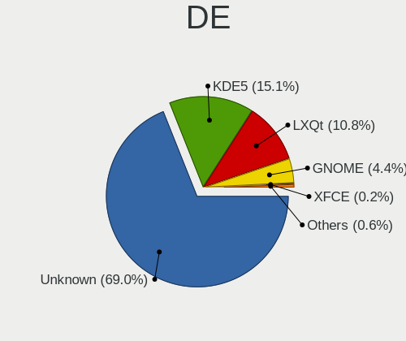
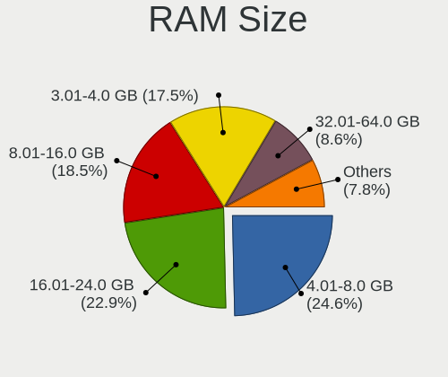
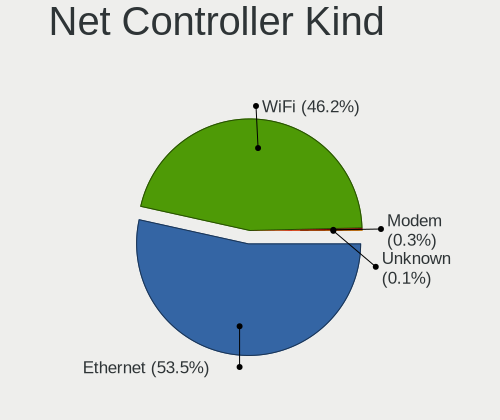

OpenMandriva Hardware Trends
----------------------------

A project to identify most popular hardware characteristics and track their change
over time based on data collected by OpenMandriva users at https://Linux-Hardware.org.

Anyone can contribute to this report by the [hw-probe](https://github.com/linuxhw/hw-probe) tool:

    sudo -E hw-probe -all -upload

This is a report for all computer types. See also reports for [desktops](/Dist/OpenMandriva/Desktop/README.md) and [notebooks](/Dist/OpenMandriva/Notebook/README.md).

Full-feature report is available here: https://linux-hardware.org/?view=trends

Period: Feb, 2022.

Contents
--------

* [ System ](#system)
  - [ OS                       ](#os)
  - [ OS Family                ](#os-family)
  - [ Kernel                   ](#kernel)
  - [ Kernel Family            ](#kernel-family)
  - [ Kernel Major Ver.        ](#kernel-major-ver)
  - [ Arch                     ](#arch)
  - [ DE                       ](#de)
  - [ Display Server           ](#display-server)
  - [ Display Manager          ](#display-manager)
  - [ OS Lang                  ](#os-lang)
  - [ Boot Mode                ](#boot-mode)
  - [ Filesystem               ](#filesystem)
  - [ Part. scheme             ](#part-scheme)
  - [ Dual Boot with Linux/BSD ](#dual-boot-with-linuxbsd)
  - [ Dual Boot (Win)          ](#dual-boot-win)

* [ Board ](#board)
  - [ Vendor                   ](#vendor)
  - [ Model                    ](#model)
  - [ Model Family             ](#model-family)
  - [ MFG Year                 ](#mfg-year)
  - [ Form Factor              ](#form-factor)
  - [ Secure Boot              ](#secure-boot)
  - [ Coreboot                 ](#coreboot)
  - [ RAM Size                 ](#ram-size)
  - [ RAM Used                 ](#ram-used)
  - [ Total Drives             ](#total-drives)
  - [ Has CD-ROM               ](#has-cd-rom)
  - [ Has Ethernet             ](#has-ethernet)
  - [ Has WiFi                 ](#has-wifi)
  - [ Has Bluetooth            ](#has-bluetooth)

* [ Location ](#location)
  - [ Country                  ](#country)
  - [ City                     ](#city)

* [ Drives ](#drives)
  - [ Drive Vendor             ](#drive-vendor)
  - [ Drive Model              ](#drive-model)
  - [ HDD Vendor               ](#hdd-vendor)
  - [ SSD Vendor               ](#ssd-vendor)
  - [ Drive Kind               ](#drive-kind)
  - [ Drive Connector          ](#drive-connector)
  - [ Drive Size               ](#drive-size)
  - [ Space Total              ](#space-total)
  - [ Space Used               ](#space-used)
  - [ Malfunc. Drives          ](#malfunc-drives)
  - [ Malfunc. Drive Vendor    ](#malfunc-drive-vendor)
  - [ Malfunc. HDD Vendor      ](#malfunc-hdd-vendor)
  - [ Malfunc. Drive Kind      ](#malfunc-drive-kind)
  - [ Failed Drives            ](#failed-drives)
  - [ Failed Drive Vendor      ](#failed-drive-vendor)
  - [ Drive Status             ](#drive-status)

* [ Storage controller ](#storage-controller)
  - [ Storage Vendor           ](#storage-vendor)
  - [ Storage Model            ](#storage-model)
  - [ Storage Kind             ](#storage-kind)

* [ Processor ](#processor)
  - [ CPU Vendor               ](#cpu-vendor)
  - [ CPU Model                ](#cpu-model)
  - [ CPU Model Family         ](#cpu-model-family)
  - [ CPU Cores                ](#cpu-cores)
  - [ CPU Sockets              ](#cpu-sockets)
  - [ CPU Threads              ](#cpu-threads)
  - [ CPU Op-Modes             ](#cpu-op-modes)
  - [ CPU Microcode            ](#cpu-microcode)
  - [ CPU Microarch            ](#cpu-microarch)

* [ Graphics ](#graphics)
  - [ GPU Vendor               ](#gpu-vendor)
  - [ GPU Model                ](#gpu-model)
  - [ GPU Combo                ](#gpu-combo)
  - [ GPU Driver               ](#gpu-driver)
  - [ GPU Memory               ](#gpu-memory)

* [ Monitor ](#monitor)
  - [ Monitor Vendor           ](#monitor-vendor)
  - [ Monitor Model            ](#monitor-model)
  - [ Monitor Resolution       ](#monitor-resolution)
  - [ Monitor Diagonal         ](#monitor-diagonal)
  - [ Monitor Width            ](#monitor-width)
  - [ Aspect Ratio             ](#aspect-ratio)
  - [ Monitor Area             ](#monitor-area)
  - [ Pixel Density            ](#pixel-density)
  - [ Multiple Monitors        ](#multiple-monitors)

* [ Network ](#network)
  - [ Net Controller Vendor    ](#net-controller-vendor)
  - [ Net Controller Model     ](#net-controller-model)
  - [ Wireless Vendor          ](#wireless-vendor)
  - [ Wireless Model           ](#wireless-model)
  - [ Ethernet Vendor          ](#ethernet-vendor)
  - [ Ethernet Model           ](#ethernet-model)
  - [ Net Controller Kind      ](#net-controller-kind)
  - [ Used Controller          ](#used-controller)
  - [ NICs                     ](#nics)
  - [ IPv6                     ](#ipv6)

* [ Bluetooth ](#bluetooth)
  - [ Bluetooth Vendor         ](#bluetooth-vendor)
  - [ Bluetooth Model          ](#bluetooth-model)

* [ Sound ](#sound)
  - [ Sound Vendor             ](#sound-vendor)
  - [ Sound Model              ](#sound-model)

* [ Memory ](#memory)
  - [ Memory Vendor            ](#memory-vendor)
  - [ Memory Model             ](#memory-model)
  - [ Memory Kind              ](#memory-kind)
  - [ Memory Form Factor       ](#memory-form-factor)
  - [ Memory Size              ](#memory-size)
  - [ Memory Speed             ](#memory-speed)

* [ Printers & scanners ](#printers--scanners)
  - [ Printer Vendor           ](#printer-vendor)
  - [ Printer Model            ](#printer-model)
  - [ Scanner Vendor           ](#scanner-vendor)
  - [ Scanner Model            ](#scanner-model)

* [ Camera ](#camera)
  - [ Camera Vendor            ](#camera-vendor)
  - [ Camera Model             ](#camera-model)

* [ Security ](#security)
  - [ Fingerprint Vendor       ](#fingerprint-vendor)
  - [ Fingerprint Model        ](#fingerprint-model)
  - [ Chipcard Vendor          ](#chipcard-vendor)
  - [ Chipcard Model           ](#chipcard-model)

* [ Unsupported ](#unsupported)
  - [ Unsupported Devices      ](#unsupported-devices)
  - [ Unsupported Device Types ](#unsupported-device-types)

System
------

OS
--

Installed operating systems

| Name              | Computers | Percent |
|-------------------|-----------|---------|
| OpenMandriva 4.3  | 1308      | 90.21%  |
| OpenMandriva 4.2  | 112       | 7.72%   |
| OpenMandriva 4.50 | 30        | 2.07%   |

OS Family
---------

OS without a version

| Name         | Computers | Percent |
|--------------|-----------|---------|
| OpenMandriva | 1450      | 100%    |

Kernel
------

Version of the Linux kernel

| Version                       | Computers | Percent |
|-------------------------------|-----------|---------|
| 5.16.7-desktop-1omv4003       | 1305      | 90%     |
| 5.10.14-desktop-1omv4002      | 102       | 7.03%   |
| 5.12.4-desktop-1omv4050       | 11        | 0.76%   |
| 5.11.12-desktop-1omv4002      | 11        | 0.76%   |
| 5.14.7-desktop-1omv4050       | 10        | 0.69%   |
| 5.16.5-desktop-2omv4003       | 2         | 0.14%   |
| 5.14.14-desktop-1omv4050      | 2         | 0.14%   |
| 5.16.9-desktop-1omv4050       | 1         | 0.07%   |
| 5.16.7-desktop-clang-1omv4003 | 1         | 0.07%   |
| 5.16.7-desktop-2omv4050       | 1         | 0.07%   |
| 5.16.5-desktop-1omv4050       | 1         | 0.07%   |
| 5.16.3-desktop-2omv4050       | 1         | 0.07%   |
| 5.16.0-desktop-1omv4050       | 1         | 0.07%   |
| 5.15.11-desktop-1omv4050      | 1         | 0.07%   |

Kernel Family
-------------

Linux kernel without a distro release

| Version | Computers | Percent |
|---------|-----------|---------|
| 5.16.7  | 1307      | 90.14%  |
| 5.10.14 | 102       | 7.03%   |
| 5.12.4  | 11        | 0.76%   |
| 5.11.12 | 11        | 0.76%   |
| 5.14.7  | 10        | 0.69%   |
| 5.16.5  | 3         | 0.21%   |
| 5.14.14 | 2         | 0.14%   |
| 5.16.9  | 1         | 0.07%   |
| 5.16.3  | 1         | 0.07%   |
| 5.16.0  | 1         | 0.07%   |
| 5.15.11 | 1         | 0.07%   |

Kernel Major Ver.
-----------------

Linux kernel major version

| Version | Computers | Percent |
|---------|-----------|---------|
| 5.16    | 1313      | 90.55%  |
| 5.10    | 102       | 7.03%   |
| 5.14    | 12        | 0.83%   |
| 5.12    | 11        | 0.76%   |
| 5.11    | 11        | 0.76%   |
| 5.15    | 1         | 0.07%   |

Arch
----

OS architecture (x86_64, i586, etc.)

| Name   | Computers | Percent |
|--------|-----------|---------|
| x86_64 | 1450      | 100%    |

DE
--

Desktop Environment

| Name    | Computers | Percent |
|---------|-----------|---------|
| KDE5    | 1448      | 99.86%  |
| GNOME   | 1         | 0.07%   |
| Unknown | 1         | 0.07%   |

Display Server
--------------

X11 or Wayland

| Name    | Computers | Percent |
|---------|-----------|---------|
| X11     | 1444      | 99.59%  |
| Wayland | 6         | 0.41%   |

Display Manager
---------------

SDDM, LightDM, etc.

| Name | Computers | Percent |
|------|-----------|---------|
| SDDM | 1450      | 100%    |

OS Lang
-------

Language

| Lang  | Computers | Percent |
|-------|-----------|---------|
| en_US | 783       | 54%     |
| de_DE | 207       | 14.28%  |
| fr_FR | 63        | 4.34%   |
| ru_RU | 62        | 4.28%   |
| it_IT | 46        | 3.17%   |
| pt_BR | 42        | 2.9%    |
| pl_PL | 39        | 2.69%   |
| en_GB | 36        | 2.48%   |
| es_ES | 26        | 1.79%   |
| de_AT | 23        | 1.59%   |
| cs_CZ | 13        | 0.9%    |
| es_MX | 10        | 0.69%   |
| es_AR | 9         | 0.62%   |
| hu_HU | 8         | 0.55%   |
| de_CH | 8         | 0.55%   |
| nl_NL | 7         | 0.48%   |
| en_AU | 6         | 0.41%   |
| ru_UA | 5         | 0.34%   |
| pt_PT | 5         | 0.34%   |
| tr_TR | 4         | 0.28%   |
| nl_BE | 4         | 0.28%   |
| es_CO | 4         | 0.28%   |
| da_DK | 4         | 0.28%   |
| fr_CA | 3         | 0.21%   |
| en_CA | 3         | 0.21%   |
| fr_BE | 2         | 0.14%   |
| es_PY | 2         | 0.14%   |
| es_CR | 2         | 0.14%   |
| es_CL | 2         | 0.14%   |
| es_BO | 2         | 0.14%   |
| en_ZA | 2         | 0.14%   |
| en_IN | 2         | 0.14%   |
| ar_SA | 2         | 0.14%   |
| uk_UA | 1         | 0.07%   |
| ro_RO | 1         | 0.07%   |
| nb_NO | 1         | 0.07%   |
| fr_CH | 1         | 0.07%   |
| es_VE | 1         | 0.07%   |
| es_PR | 1         | 0.07%   |
| es_PE | 1         | 0.07%   |
| en_SG | 1         | 0.07%   |
| en_IL | 1         | 0.07%   |
| en_IE | 1         | 0.07%   |
| en_HK | 1         | 0.07%   |
| ar_TN | 1         | 0.07%   |
| ar_EG | 1         | 0.07%   |
| ar_DZ | 1         | 0.07%   |

Boot Mode
---------

EFI or BIOS

| Mode | Computers | Percent |
|------|-----------|---------|
| EFI  | 748       | 51.59%  |
| BIOS | 702       | 48.41%  |

Filesystem
----------

Type of filesystem

| Type     | Computers | Percent |
|----------|-----------|---------|
| Overlay  | 1226      | 84.55%  |
| Ext4     | 219       | 15.1%   |
| Xfs      | 2         | 0.14%   |
| Reiserfs | 1         | 0.07%   |
| Jfs      | 1         | 0.07%   |
| Btrfs    | 1         | 0.07%   |

Part. scheme
------------

Scheme of partitioning

| Type    | Computers | Percent |
|---------|-----------|---------|
| GPT     | 951       | 65.59%  |
| MBR     | 490       | 33.79%  |
| Unknown | 9         | 0.62%   |

Dual Boot with Linux/BSD
------------------------

Hosting more than one Linux/BSD

| Dual boot | Computers | Percent |
|-----------|-----------|---------|
| Yes       | 823       | 56.76%  |
| No        | 627       | 43.24%  |

Dual Boot (Win)
---------------

Hosting Linux and Windows

| Dual boot | Computers | Percent |
|-----------|-----------|---------|
| No        | 747       | 51.52%  |
| Yes       | 703       | 48.48%  |

Board
-----

Vendor
------

Motherboard manufacturer

| Name                                      | Computers | Percent |
|-------------------------------------------|-----------|---------|
| ASUSTek Computer                          | 239       | 16.48%  |
| Hewlett-Packard                           | 188       | 12.97%  |
| Lenovo                                    | 176       | 12.14%  |
| Dell                                      | 145       | 10%     |
| Gigabyte Technology                       | 135       | 9.31%   |
| MSI                                       | 114       | 7.86%   |
| Acer                                      | 91        | 6.28%   |
| ASRock                                    | 70        | 4.83%   |
| Toshiba                                   | 38        | 2.62%   |
| Intel                                     | 29        | 2%      |
| Fujitsu                                   | 23        | 1.59%   |
| Sony                                      | 17        | 1.17%   |
| Apple                                     | 17        | 1.17%   |
| Samsung Electronics                       | 14        | 0.97%   |
| Medion                                    | 12        | 0.83%   |
| Biostar                                   | 10        | 0.69%   |
| Packard Bell                              | 8         | 0.55%   |
| Foxconn                                   | 7         | 0.48%   |
| TUXEDO                                    | 6         | 0.41%   |
| BESSTAR Tech                              | 6         | 0.41%   |
| Positivo                                  | 5         | 0.34%   |
| Pegatron                                  | 5         | 0.34%   |
| HUAWEI                                    | 5         | 0.34%   |
| ECS                                       | 5         | 0.34%   |
| Alienware                                 | 5         | 0.34%   |
| Unknown                                   | 5         | 0.34%   |
| Gateway                                   | 4         | 0.28%   |
| Clevo                                     | 4         | 0.28%   |
| AZW                                       | 4         | 0.28%   |
| Shuttle                                   | 3         | 0.21%   |
| Fujitsu Siemens                           | 3         | 0.21%   |
| Supermicro                                | 2         | 0.14%   |
| Positivo Bahia - VAIO                     | 2         | 0.14%   |
| Philco                                    | 2         | 0.14%   |
| PC Specialist                             | 2         | 0.14%   |
| Notebook                                  | 2         | 0.14%   |
| Inventec                                  | 2         | 0.14%   |
| Huanan                                    | 2         | 0.14%   |
| eMachines                                 | 2         | 0.14%   |
| Compaq                                    | 2         | 0.14%   |
| Chuwi                                     | 2         | 0.14%   |
| ZOTAC                                     | 1         | 0.07%   |
| Wortmann AG                               | 1         | 0.07%   |
| UMAX                                      | 1         | 0.07%   |
| TYAN Computer                             | 1         | 0.07%   |
| TrekStor                                  | 1         | 0.07%   |
| Teclast                                   | 1         | 0.07%   |
| Talal Abu-Ghazaleh for Technology TAGTECH | 1         | 0.07%   |
| SLIMBOOK                                  | 1         | 0.07%   |
| Schenker                                  | 1         | 0.07%   |
| Radio Victoria Fueguina                   | 1         | 0.07%   |
| Quanta                                    | 1         | 0.07%   |
| PROLINE                                   | 1         | 0.07%   |
| PCWare                                    | 1         | 0.07%   |
| NEC Computers                             | 1         | 0.07%   |
| MouseComputer                             | 1         | 0.07%   |
| Morshow                                   | 1         | 0.07%   |
| Microsoft                                 | 1         | 0.07%   |
| MCJ                                       | 1         | 0.07%   |
| LincPlus                                  | 1         | 0.07%   |

Model
-----

Motherboard model

| Name                                       | Computers | Percent |
|--------------------------------------------|-----------|---------|
| ASUS All Series                            | 16        | 1.1%    |
| Gigabyte H410M H V3                        | 10        | 0.69%   |
| ASUS UX31E                                 | 8         | 0.55%   |
| HP Notebook                                | 7         | 0.48%   |
| Dell OptiPlex 7010                         | 7         | 0.48%   |
| Dell OptiPlex 780                          | 6         | 0.41%   |
| Unknown                                    | 6         | 0.41%   |
| MSI MS-7C91                                | 5         | 0.34%   |
| HP Compaq Pro 6300 SFF                     | 5         | 0.34%   |
| Dell OptiPlex 9020                         | 5         | 0.34%   |
| Dell OptiPlex 790                          | 5         | 0.34%   |
| MSI MS-7C84                                | 4         | 0.28%   |
| MSI MS-7C02                                | 4         | 0.28%   |
| MSI MS-7B79                                | 4         | 0.28%   |
| MSI MS-7A38                                | 4         | 0.28%   |
| MSI MS-7693                                | 4         | 0.28%   |
| Lenovo IdeaPad S340-14API 81NB             | 4         | 0.28%   |
| HP Pavilion g6                             | 4         | 0.28%   |
| ASUS TUF GAMING B550M-PLUS                 | 4         | 0.28%   |
| ASUS SABERTOOTH Z77                        | 4         | 0.28%   |
| Sony VGN-FZ31Z                             | 3         | 0.21%   |
| MSI MS-7C56                                | 3         | 0.21%   |
| MSI MS-7C37                                | 3         | 0.21%   |
| HUAWEI NBLK-WAX9X                          | 3         | 0.21%   |
| HP Pavilion dv6                            | 3         | 0.21%   |
| HP Laptop 17-ak0xx                         | 3         | 0.21%   |
| HP EliteDesk 800 G1 USDT                   | 3         | 0.21%   |
| Gigabyte Z390 AORUS PRO WIFI               | 3         | 0.21%   |
| Gigabyte B450M DS3H                        | 3         | 0.21%   |
| Gigabyte 970A-DS3P                         | 3         | 0.21%   |
| Dell Precision T3610                       | 3         | 0.21%   |
| Dell OptiPlex 755                          | 3         | 0.21%   |
| Dell Latitude E5410                        | 3         | 0.21%   |
| Dell Latitude D630                         | 3         | 0.21%   |
| ASUS PRIME X570-P                          | 3         | 0.21%   |
| ASUS PRIME B450M-A                         | 3         | 0.21%   |
| ASUS PRIME A320M-K                         | 3         | 0.21%   |
| Acer Swift SF114-34                        | 3         | 0.21%   |
| Acer Aspire A515-51G                       | 3         | 0.21%   |
| TUXEDO Aura 15 Gen1                        | 2         | 0.14%   |
| Toshiba Satellite Pro R50-C                | 2         | 0.14%   |
| Toshiba Satellite P200                     | 2         | 0.14%   |
| Toshiba Satellite L755                     | 2         | 0.14%   |
| Samsung 300E4A/300E5A/300E7A/3430EA/3530EA | 2         | 0.14%   |
| Positivo Bahia - VAIO VJFE42F11X-XXXXXX    | 2         | 0.14%   |
| Philco 10D                                 | 2         | 0.14%   |
| MSI MS-7C51                                | 2         | 0.14%   |
| MSI MS-7B98                                | 2         | 0.14%   |
| MSI MS-7B84                                | 2         | 0.14%   |
| MSI MS-7A36                                | 2         | 0.14%   |
| MSI MS-7974                                | 2         | 0.14%   |
| MSI MS-7788                                | 2         | 0.14%   |
| MSI MS-7758                                | 2         | 0.14%   |
| MSI MS-7721                                | 2         | 0.14%   |
| MSI MS-7529                                | 2         | 0.14%   |
| MSI MS-7345                                | 2         | 0.14%   |
| Lenovo IdeaPad Z580                        | 2         | 0.14%   |
| Lenovo IdeaPad Y700-17ISK 80Q0             | 2         | 0.14%   |
| Lenovo IdeaPad S145-15API 81UT             | 2         | 0.14%   |
| Lenovo IdeaPad 5 15ALC05 82LN              | 2         | 0.14%   |

Model Family
------------

Motherboard model prefix

| Name                   | Computers | Percent |
|------------------------|-----------|---------|
| Acer Aspire            | 64        | 4.41%   |
| Lenovo ThinkPad        | 62        | 4.28%   |
| Dell Latitude          | 47        | 3.24%   |
| Lenovo IdeaPad         | 45        | 3.1%    |
| Dell OptiPlex          | 42        | 2.9%    |
| HP Pavilion            | 38        | 2.62%   |
| HP Compaq              | 36        | 2.48%   |
| Toshiba Satellite      | 35        | 2.41%   |
| Dell Inspiron          | 25        | 1.72%   |
| ASUS PRIME             | 24        | 1.66%   |
| ASUS All               | 16        | 1.1%    |
| Lenovo ThinkCentre     | 15        | 1.03%   |
| HP Laptop              | 15        | 1.03%   |
| ASUS VivoBook          | 15        | 1.03%   |
| ASUS TUF               | 15        | 1.03%   |
| ASUS ROG               | 14        | 0.97%   |
| HP ProBook             | 13        | 0.9%    |
| Gigabyte H410M         | 11        | 0.76%   |
| Fujitsu ESPRIMO        | 11        | 0.76%   |
| HP ProDesk             | 10        | 0.69%   |
| HP EliteDesk           | 10        | 0.69%   |
| HP EliteBook           | 10        | 0.69%   |
| Fujitsu LIFEBOOK       | 9         | 0.62%   |
| Dell Precision         | 9         | 0.62%   |
| Acer Swift             | 9         | 0.62%   |
| ASUS UX31E             | 8         | 0.55%   |
| Lenovo Yoga            | 7         | 0.48%   |
| HP Notebook            | 7         | 0.48%   |
| ASUS M5A78L-M          | 7         | 0.48%   |
| Lenovo IdeaCentre      | 6         | 0.41%   |
| Gigabyte Z390          | 6         | 0.41%   |
| Gigabyte B450M         | 6         | 0.41%   |
| Dell XPS               | 6         | 0.41%   |
| Dell Vostro            | 6         | 0.41%   |
| Unknown                | 6         | 0.41%   |
| Packard Bell EasyNote  | 5         | 0.34%   |
| MSI MS-7C91            | 5         | 0.34%   |
| ASUS SABERTOOTH        | 5         | 0.34%   |
| Acer Extensa           | 5         | 0.34%   |
| MSI MS-7C84            | 4         | 0.28%   |
| MSI MS-7C02            | 4         | 0.28%   |
| MSI MS-7B79            | 4         | 0.28%   |
| MSI MS-7A38            | 4         | 0.28%   |
| MSI MS-7693            | 4         | 0.28%   |
| HP OMEN                | 4         | 0.28%   |
| HP ENVY                | 4         | 0.28%   |
| Gigabyte X570          | 4         | 0.28%   |
| Gigabyte GA-78LMT-USB3 | 4         | 0.28%   |
| Dell System            | 4         | 0.28%   |
| ASRock B450            | 4         | 0.28%   |
| Sony VGN-FZ31Z         | 3         | 0.21%   |
| MSI MS-7C56            | 3         | 0.21%   |
| MSI MS-7C37            | 3         | 0.21%   |
| Medion Akoya           | 3         | 0.21%   |
| Lenovo Legion          | 3         | 0.21%   |
| HUAWEI NBLK-WAX9X      | 3         | 0.21%   |
| HP Stream              | 3         | 0.21%   |
| HP 250                 | 3         | 0.21%   |
| Gigabyte H310M         | 3         | 0.21%   |
| Gigabyte B450          | 3         | 0.21%   |

MFG Year
--------

Motherboard manufacture year

| Year | Computers | Percent |
|------|-----------|---------|
| 2012 | 157       | 10.83%  |
| 2013 | 129       | 8.9%    |
| 2011 | 127       | 8.76%   |
| 2020 | 118       | 8.14%   |
| 2018 | 110       | 7.59%   |
| 2019 | 109       | 7.52%   |
| 2014 | 105       | 7.24%   |
| 2010 | 93        | 6.41%   |
| 2021 | 89        | 6.14%   |
| 2017 | 82        | 5.66%   |
| 2015 | 74        | 5.1%    |
| 2009 | 72        | 4.97%   |
| 2016 | 67        | 4.62%   |
| 2008 | 58        | 4%      |
| 2007 | 50        | 3.45%   |
| 2006 | 8         | 0.55%   |
| 2022 | 1         | 0.07%   |
| 2005 | 1         | 0.07%   |

Form Factor
-----------

Physical design of the computer

| Name        | Computers | Percent |
|-------------|-----------|---------|
| Desktop     | 721       | 49.72%  |
| Notebook    | 653       | 45.03%  |
| Mini pc     | 27        | 1.86%   |
| All in one  | 24        | 1.66%   |
| Convertible | 17        | 1.17%   |
| Server      | 5         | 0.34%   |
| Tablet      | 3         | 0.21%   |

Secure Boot
-----------

Enabled or disabled

| State    | Computers | Percent |
|----------|-----------|---------|
| Disabled | 1450      | 100%    |

Coreboot
--------

Have coreboot on board

| Used | Computers | Percent |
|------|-----------|---------|
| No   | 1450      | 100%    |

RAM Size
--------

Total RAM memory

| Size in GB      | Computers | Percent |
|-----------------|-----------|---------|
| 4.01-8.0        | 394       | 27.17%  |
| 3.01-4.0        | 332       | 22.9%   |
| 8.01-16.0       | 272       | 18.76%  |
| 16.01-24.0      | 262       | 18.07%  |
| 32.01-64.0      | 98        | 6.76%   |
| 1.01-2.0        | 39        | 2.69%   |
| 24.01-32.0      | 22        | 1.52%   |
| 64.01-256.0     | 15        | 1.03%   |
| 2.01-3.0        | 14        | 0.97%   |
| More than 256.0 | 2         | 0.14%   |

RAM Used
--------

Used RAM memory

| Used GB    | Computers | Percent |
|------------|-----------|---------|
| 1.01-2.0   | 1101      | 75.93%  |
| 0.51-1.0   | 215       | 14.83%  |
| 2.01-3.0   | 101       | 6.97%   |
| 0.01-0.5   | 15        | 1.03%   |
| 3.01-4.0   | 7         | 0.48%   |
| 4.01-8.0   | 5         | 0.34%   |
| 8.01-16.0  | 5         | 0.34%   |
| 16.01-24.0 | 1         | 0.07%   |

Total Drives
------------

Number of drives on board

| Drives | Computers | Percent |
|--------|-----------|---------|
| 1      | 790       | 54.48%  |
| 2      | 383       | 26.41%  |
| 3      | 127       | 8.76%   |
| 4      | 69        | 4.76%   |
| 0      | 26        | 1.79%   |
| 5      | 25        | 1.72%   |
| 6      | 13        | 0.9%    |
| 8      | 5         | 0.34%   |
| 7      | 5         | 0.34%   |
| 9      | 3         | 0.21%   |
| 12     | 2         | 0.14%   |
| 15     | 1         | 0.07%   |
| 10     | 1         | 0.07%   |

Has CD-ROM
----------

Has CD-ROM on board

| Presented | Computers | Percent |
|-----------|-----------|---------|
| Yes       | 749       | 51.66%  |
| No        | 701       | 48.34%  |

Has Ethernet
------------

Has Ethernet on board

| Presented | Computers | Percent |
|-----------|-----------|---------|
| Yes       | 1337      | 92.21%  |
| No        | 113       | 7.79%   |

Has WiFi
--------

Has WiFi module

| Presented | Computers | Percent |
|-----------|-----------|---------|
| Yes       | 968       | 66.76%  |
| No        | 482       | 33.24%  |

Has Bluetooth
-------------

Has Bluetooth module

| Presented | Computers | Percent |
|-----------|-----------|---------|
| No        | 736       | 50.76%  |
| Yes       | 714       | 49.24%  |

Location
--------

Country
-------

Geographic location (country)

| Country                | Computers | Percent |
|------------------------|-----------|---------|
| Germany                | 278       | 19.17%  |
| USA                    | 190       | 13.1%   |
| France                 | 83        | 5.72%   |
| Poland                 | 75        | 5.17%   |
| Russia                 | 69        | 4.76%   |
| Brazil                 | 66        | 4.55%   |
| Italy                  | 64        | 4.41%   |
| Canada                 | 45        | 3.1%    |
| UK                     | 42        | 2.9%    |
| Spain                  | 40        | 2.76%   |
| Australia              | 31        | 2.14%   |
| Austria                | 30        | 2.07%   |
| Ukraine                | 26        | 1.79%   |
| India                  | 22        | 1.52%   |
| Czechia                | 20        | 1.38%   |
| Portugal               | 19        | 1.31%   |
| Netherlands            | 19        | 1.31%   |
| Mexico                 | 19        | 1.31%   |
| Japan                  | 19        | 1.31%   |
| Switzerland            | 15        | 1.03%   |
| Indonesia              | 14        | 0.97%   |
| Turkey                 | 13        | 0.9%    |
| Hungary                | 12        | 0.83%   |
| Slovakia               | 11        | 0.76%   |
| Romania                | 11        | 0.76%   |
| Belgium                | 11        | 0.76%   |
| Sweden                 | 10        | 0.69%   |
| Argentina              | 10        | 0.69%   |
| Serbia                 | 9         | 0.62%   |
| China                  | 9         | 0.62%   |
| Israel                 | 8         | 0.55%   |
| Colombia               | 8         | 0.55%   |
| Greece                 | 7         | 0.48%   |
| Finland                | 7         | 0.48%   |
| Croatia                | 7         | 0.48%   |
| Bulgaria               | 7         | 0.48%   |
| South Africa           | 6         | 0.41%   |
| Denmark                | 6         | 0.41%   |
| Bosnia and Herzegovina | 5         | 0.34%   |
| Algeria                | 5         | 0.34%   |
| Venezuela              | 4         | 0.28%   |
| Thailand               | 4         | 0.28%   |
| Taiwan                 | 4         | 0.28%   |
| Saudi Arabia           | 4         | 0.28%   |
| Pakistan               | 4         | 0.28%   |
| New Zealand            | 4         | 0.28%   |
| Uruguay                | 3         | 0.21%   |
| Singapore              | 3         | 0.21%   |
| Paraguay               | 3         | 0.21%   |
| Norway                 | 3         | 0.21%   |
| Morocco                | 3         | 0.21%   |
| Egypt                  | 3         | 0.21%   |
| Costa Rica             | 3         | 0.21%   |
| Chile                  | 3         | 0.21%   |
| Belarus                | 3         | 0.21%   |
| UAE                    | 2         | 0.14%   |
| Tunisia                | 2         | 0.14%   |
| Trinidad and Tobago    | 2         | 0.14%   |
| Tanzania               | 2         | 0.14%   |
| Slovenia               | 2         | 0.14%   |

City
----

Geographic location (city)

| City                   | Computers | Percent |
|------------------------|-----------|---------|
| Berlin                 | 24        | 1.66%   |
| Vienna                 | 14        | 0.97%   |
| São Paulo           | 14        | 0.97%   |
| Paris                  | 14        | 0.97%   |
| Moscow                 | 13        | 0.9%    |
| Warsaw                 | 12        | 0.83%   |
| Istanbul               | 9         | 0.62%   |
| Milan                  | 8         | 0.55%   |
| Kyiv                   | 8         | 0.55%   |
| Krakow                 | 8         | 0.55%   |
| Gonikoppal             | 8         | 0.55%   |
| Brisbane               | 8         | 0.55%   |
| Rome                   | 7         | 0.48%   |
| Nuremberg              | 7         | 0.48%   |
| Munich                 | 7         | 0.48%   |
| Hamburg                | 7         | 0.48%   |
| Belgrade               | 7         | 0.48%   |
| Yekaterinburg          | 6         | 0.41%   |
| St Petersburg          | 6         | 0.41%   |
| Salach                 | 6         | 0.41%   |
| Prague                 | 6         | 0.41%   |
| Jakarta                | 6         | 0.41%   |
| Zagreb                 | 5         | 0.34%   |
| Tel Aviv               | 5         | 0.34%   |
| Sydney                 | 5         | 0.34%   |
| Mexico City            | 5         | 0.34%   |
| Melbourne              | 5         | 0.34%   |
| Wroclaw                | 4         | 0.28%   |
| Regina                 | 4         | 0.28%   |
| Padova                 | 4         | 0.28%   |
| Novosibirsk            | 4         | 0.28%   |
| Memphis                | 4         | 0.28%   |
| Medellín            | 4         | 0.28%   |
| Madrid                 | 4         | 0.28%   |
| Lexington              | 4         | 0.28%   |
| Kiel                   | 4         | 0.28%   |
| Jeddah                 | 4         | 0.28%   |
| Gorzów Wielkopolski | 4         | 0.28%   |
| Faro                   | 4         | 0.28%   |
| Dortmund               | 4         | 0.28%   |
| Chemnitz               | 4         | 0.28%   |
| Bremen                 | 4         | 0.28%   |
| Barcelona              | 4         | 0.28%   |
| Wiesbaden              | 3         | 0.21%   |
| Werdau                 | 3         | 0.21%   |
| Waren                  | 3         | 0.21%   |
| Volgograd              | 3         | 0.21%   |
| Strzyzow               | 3         | 0.21%   |
| Singapore              | 3         | 0.21%   |
| Seattle                | 3         | 0.21%   |
| Santa Cruz de Tenerife | 3         | 0.21%   |
| Sangerhausen           | 3         | 0.21%   |
| San José            | 3         | 0.21%   |
| San Francisco          | 3         | 0.21%   |
| Samara                 | 3         | 0.21%   |
| Rio de Janeiro         | 3         | 0.21%   |
| Richmond Hill          | 3         | 0.21%   |
| Regensburg             | 3         | 0.21%   |
| Phoenix                | 3         | 0.21%   |
| Orlando                | 3         | 0.21%   |

Drives
------

Drive Vendor
------------

Hard drive vendors

| Vendor              | Computers | Drives | Percent |
|---------------------|-----------|--------|---------|
| WDC                 | 367       | 451    | 16.55%  |
| Seagate             | 310       | 363    | 13.98%  |
| Samsung Electronics | 308       | 374    | 13.89%  |
| Toshiba             | 171       | 175    | 7.71%   |
| Kingston            | 133       | 144    | 6%      |
| Crucial             | 132       | 146    | 5.95%   |
| SanDisk             | 99        | 111    | 4.46%   |
| Hitachi             | 64        | 65     | 2.89%   |
| A-DATA Technology   | 59        | 65     | 2.66%   |
| Unknown             | 50        | 56     | 2.25%   |
| HGST                | 40        | 47     | 1.8%    |
| SK Hynix            | 31        | 34     | 1.4%    |
| Intel               | 25        | 25     | 1.13%   |
| Micron Technology   | 24        | 24     | 1.08%   |
| Intenso             | 20        | 21     | 0.9%    |
| China               | 18        | 20     | 0.81%   |
| Unknown             | 17        | 17     | 0.77%   |
| SPCC                | 16        | 19     | 0.72%   |
| Patriot             | 15        | 15     | 0.68%   |
| LITEON              | 15        | 15     | 0.68%   |
| PNY                 | 14        | 22     | 0.63%   |
| JMicron             | 14        | 14     | 0.63%   |
| GOODRAM             | 13        | 13     | 0.59%   |
| Transcend           | 12        | 13     | 0.54%   |
| OCZ                 | 12        | 12     | 0.54%   |
| Corsair             | 12        | 13     | 0.54%   |
| ASMT                | 12        | 13     | 0.54%   |
| Phison              | 11        | 12     | 0.5%    |
| Apple               | 11        | 11     | 0.5%    |
| Silicon Motion      | 10        | 11     | 0.45%   |
| Fujitsu             | 10        | 10     | 0.45%   |
| Gigabyte Technology | 9         | 9      | 0.41%   |
| Apacer              | 9         | 9      | 0.41%   |
| MAXTOR              | 8         | 9      | 0.36%   |
| KingSpec            | 8         | 8      | 0.36%   |
| LITEONIT            | 7         | 7      | 0.32%   |
| Hewlett-Packard     | 7         | 10     | 0.32%   |
| Team                | 6         | 6      | 0.27%   |
| Netac               | 6         | 7      | 0.27%   |
| SABRENT             | 5         | 6      | 0.23%   |
| XPG                 | 4         | 4      | 0.18%   |
| SSSTC               | 4         | 4      | 0.18%   |
| PLEXTOR             | 4         | 4      | 0.18%   |
| KIOXIA-EXCERIA      | 4         | 4      | 0.18%   |
| KingFast            | 4         | 4      | 0.18%   |
| WD MediaMax         | 3         | 4      | 0.14%   |
| UMIS                | 3         | 3      | 0.14%   |
| TO Exter            | 3         | 3      | 0.14%   |
| Leven               | 3         | 3      | 0.14%   |
| KIOXIA              | 3         | 3      | 0.14%   |
| KingDian            | 3         | 3      | 0.14%   |
| ZHITAI              | 2         | 2      | 0.09%   |
| TCSUNBOW            | 2         | 2      | 0.09%   |
| Smartbuy            | 2         | 2      | 0.09%   |
| Realtek             | 2         | 2      | 0.09%   |
| Phison Electronics  | 2         | 2      | 0.09%   |
| Lexar               | 2         | 2      | 0.09%   |
| INNOVATION IT       | 2         | 2      | 0.09%   |
| External            | 2         | 2      | 0.09%   |
| Colorful            | 2         | 2      | 0.09%   |

Drive Model
-----------

Hard drive models

| Model                              | Computers | Percent |
|------------------------------------|-----------|---------|
| Kingston SA400S37240G 240GB SSD    | 26        | 1.06%   |
| Samsung SSD 860 EVO 500GB          | 25        | 1.02%   |
| Samsung SSD 850 EVO 250GB          | 22        | 0.9%    |
| Seagate ST500DM002-1BD142 500GB    | 21        | 0.86%   |
| Crucial CT240BX500SSD1 240GB       | 21        | 0.86%   |
| Seagate ST1000DM010-2EP102 1TB     | 20        | 0.82%   |
| Kingston SA400S37480G 480GB SSD    | 20        | 0.82%   |
| Seagate ST1000LM024 HN-M101MBB 1TB | 19        | 0.78%   |
| Crucial CT500MX500SSD1 500GB       | 19        | 0.78%   |
| Samsung SSD 860 EVO 250GB          | 18        | 0.74%   |
| Kingston SA400S37120G 120GB SSD    | 17        | 0.69%   |
| Unknown                            | 17        | 0.69%   |
| Toshiba MQ01ABF050 500GB           | 15        | 0.61%   |
| WDC WDS240G2G0A-00JH30 240GB SSD   | 14        | 0.57%   |
| WDC WD10EZEX-08WN4A0 1TB           | 14        | 0.57%   |
| Crucial CT1000MX500SSD1 1TB        | 14        | 0.57%   |
| Toshiba MQ04ABF100 1TB             | 13        | 0.53%   |
| Toshiba HDWD110 1TB                | 12        | 0.49%   |
| Toshiba DT01ACA100 1TB             | 12        | 0.49%   |
| Toshiba DT01ACA050 500GB           | 12        | 0.49%   |
| Seagate ST2000DM008-2FR102 2TB     | 12        | 0.49%   |
| Unknown SD/MMC/MS PRO 64GB         | 11        | 0.45%   |
| Seagate ST1000DM003-1ER162 1TB     | 11        | 0.45%   |
| Toshiba MQ01ABD100 1TB             | 10        | 0.41%   |
| SanDisk SSD PLUS 480GB             | 10        | 0.41%   |
| SanDisk SSD PLUS 240GB             | 10        | 0.41%   |
| SanDisk SDSSDA240G 240GB           | 10        | 0.41%   |
| Samsung SSD 850 EVO 500GB          | 10        | 0.41%   |
| Kingston SV300S37A120G 120GB SSD   | 10        | 0.41%   |
| Hitachi HTS543232A7A384 320GB      | 10        | 0.41%   |
| WDC WDS500G2B0A-00SM50 500GB SSD   | 9         | 0.37%   |
| Seagate ST1000LM035-1RK172 1TB     | 9         | 0.37%   |
| Samsung SSD 970 EVO Plus 500GB     | 9         | 0.37%   |
| Crucial CT480BX500SSD1 480GB       | 9         | 0.37%   |
| A-DATA SX8200PNP 512GB             | 9         | 0.37%   |
| Seagate ST500LT012-1DG142 500GB    | 8         | 0.33%   |
| Seagate ST2000DM001-1ER164 2TB     | 8         | 0.33%   |
| SanDisk SSD U100 256GB             | 8         | 0.33%   |
| Samsung SSD 860 QVO 1TB            | 8         | 0.33%   |
| JMicron Generic 2TB                | 8         | 0.33%   |
| A-DATA SU750 256GB SSD             | 8         | 0.33%   |
| WDC WD5000LPVX-22V0TT0 500GB       | 7         | 0.29%   |
| Seagate ST9500325AS 500GB          | 7         | 0.29%   |
| Seagate ST3500418AS 500GB          | 7         | 0.29%   |
| SanDisk SSD PLUS 1000GB            | 7         | 0.29%   |
| Samsung SSD 970 EVO Plus 1TB       | 7         | 0.29%   |
| Samsung SSD 870 QVO 1TB            | 7         | 0.29%   |
| HGST HTS721010A9E630 1TB           | 7         | 0.29%   |
| Crucial CT250MX500SSD1 250GB       | 7         | 0.29%   |
| Crucial CT1000P1SSD8 1TB           | 7         | 0.29%   |
| WDC WDS500G2B0C-00PXH0 500GB       | 6         | 0.25%   |
| Toshiba DT01ACA200 2TB             | 6         | 0.25%   |
| Seagate ST2000DM006-2DM164 2TB     | 6         | 0.25%   |
| Seagate ST1000DM003-1CH162 1TB     | 6         | 0.25%   |
| SanDisk SDSSDA120G 120GB           | 6         | 0.25%   |
| Samsung SSD 870 EVO 500GB          | 6         | 0.25%   |
| Samsung SSD 850 EVO 1TB            | 6         | 0.25%   |
| HGST HTS545050A7E680 500GB         | 6         | 0.25%   |
| HGST HTS545050A7E380 500GB         | 6         | 0.25%   |
| HGST HTS541010A9E680 1TB           | 6         | 0.25%   |

HDD Vendor
----------

Hard disk drive vendors

| Vendor              | Computers | Drives | Percent |
|---------------------|-----------|--------|---------|
| Seagate             | 305       | 355    | 31.44%  |
| WDC                 | 295       | 355    | 30.41%  |
| Toshiba             | 149       | 153    | 15.36%  |
| Hitachi             | 64        | 65     | 6.6%    |
| Samsung Electronics | 58        | 64     | 5.98%   |
| HGST                | 40        | 47     | 4.12%   |
| Unknown             | 12        | 12     | 1.24%   |
| Fujitsu             | 10        | 10     | 1.03%   |
| MAXTOR              | 8         | 9      | 0.82%   |
| Apple               | 7         | 7      | 0.72%   |
| ASMT                | 5         | 6      | 0.52%   |
| WD MediaMax         | 3         | 4      | 0.31%   |
| SABRENT             | 3         | 4      | 0.31%   |
| JMicron             | 2         | 2      | 0.21%   |
| USB3.0              | 1         | 1      | 0.1%    |
| QUANTUM             | 1         | 1      | 0.1%    |
| Magnetic Data       | 1         | 1      | 0.1%    |
| Intenso             | 1         | 1      | 0.1%    |
| IBM/Hitachi         | 1         | 1      | 0.1%    |
| HGST HTS            | 1         | 1      | 0.1%    |
| Config              | 1         | 1      | 0.1%    |
| China               | 1         | 1      | 0.1%    |
| ASMedia             | 1         | 1      | 0.1%    |

SSD Vendor
----------

Solid state drive vendors

| Vendor              | Computers | Drives | Percent |
|---------------------|-----------|--------|---------|
| Samsung Electronics | 189       | 210    | 20.63%  |
| Crucial             | 115       | 124    | 12.55%  |
| Kingston            | 109       | 117    | 11.9%   |
| SanDisk             | 93        | 104    | 10.15%  |
| WDC                 | 53        | 57     | 5.79%   |
| A-DATA Technology   | 42        | 43     | 4.59%   |
| Micron Technology   | 19        | 19     | 2.07%   |
| Intenso             | 18        | 19     | 1.97%   |
| China               | 17        | 19     | 1.86%   |
| Toshiba             | 16        | 16     | 1.75%   |
| LITEON              | 14        | 14     | 1.53%   |
| Patriot             | 13        | 13     | 1.42%   |
| Intel               | 13        | 13     | 1.42%   |
| SK Hynix            | 12        | 12     | 1.31%   |
| PNY                 | 12        | 18     | 1.31%   |
| OCZ                 | 12        | 12     | 1.31%   |
| GOODRAM             | 12        | 12     | 1.31%   |
| Transcend           | 11        | 12     | 1.2%    |
| SPCC                | 11        | 13     | 1.2%    |
| Apacer              | 9         | 9      | 0.98%   |
| Unknown             | 9         | 9      | 0.98%   |
| KingSpec            | 8         | 8      | 0.87%   |
| LITEONIT            | 7         | 7      | 0.76%   |
| Team                | 6         | 6      | 0.66%   |
| Netac               | 6         | 7      | 0.66%   |
| Corsair             | 6         | 6      | 0.66%   |
| Hewlett-Packard     | 5         | 7      | 0.55%   |
| Gigabyte Technology | 5         | 5      | 0.55%   |
| KingFast            | 4         | 4      | 0.44%   |
| ASMT                | 4         | 4      | 0.44%   |
| Apple               | 4         | 4      | 0.44%   |
| TO Exter            | 3         | 3      | 0.33%   |
| Leven               | 3         | 3      | 0.33%   |
| KIOXIA-EXCERIA      | 3         | 3      | 0.33%   |
| KingDian            | 3         | 3      | 0.33%   |
| Unknown             | 2         | 2      | 0.22%   |
| TCSUNBOW            | 2         | 2      | 0.22%   |
| Seagate             | 2         | 2      | 0.22%   |
| PLEXTOR             | 2         | 2      | 0.22%   |
| Lexar               | 2         | 2      | 0.22%   |
| INNOVATION IT       | 2         | 2      | 0.22%   |
| Colorful            | 2         | 2      | 0.22%   |
| ZHITAI              | 1         | 1      | 0.11%   |
| XrayDisk            | 1         | 1      | 0.11%   |
| WDC WDS2            | 1         | 1      | 0.11%   |
| V-GeN               | 1         | 1      | 0.11%   |
| Smartbuy            | 1         | 1      | 0.11%   |
| RX7                 | 1         | 1      | 0.11%   |
| QUMO                | 1         | 1      | 0.11%   |
| ORTIAL              | 1         | 1      | 0.11%   |
| OCZ-AGIL            | 1         | 1      | 0.11%   |
| NGFF                | 1         | 1      | 0.11%   |
| Mushkin             | 1         | 1      | 0.11%   |
| MARSHAL             | 1         | 1      | 0.11%   |
| Kingmax             | 1         | 1      | 0.11%   |
| Kingchuxing         | 1         | 1      | 0.11%   |
| kimtigo             | 1         | 1      | 0.11%   |
| InnoDisk            | 1         | 1      | 0.11%   |
| imation             | 1         | 1      | 0.11%   |
| HP Phison           | 1         | 1      | 0.11%   |

Drive Kind
----------

HDD or SSD

| Kind    | Computers | Drives | Percent |
|---------|-----------|--------|---------|
| HDD     | 812       | 1102   | 42.07%  |
| SSD     | 763       | 985    | 39.53%  |
| NVMe    | 289       | 348    | 14.97%  |
| MMC     | 44        | 48     | 2.28%   |
| Unknown | 22        | 28     | 1.14%   |

Drive Connector
---------------

SATA, SAS, NVMe, etc.

| Type | Computers | Drives | Percent |
|------|-----------|--------|---------|
| SATA | 1283      | 2003   | 74.99%  |
| NVMe | 279       | 335    | 16.31%  |
| SAS  | 105       | 125    | 6.14%   |
| MMC  | 44        | 48     | 2.57%   |

Drive Size
----------

Size of hard drive

| Size in TB | Computers | Drives | Percent |
|------------|-----------|--------|---------|
| 0.01-0.5   | 1014      | 1322   | 61.57%  |
| 0.51-1.0   | 444       | 542    | 26.96%  |
| 1.01-2.0   | 114       | 132    | 6.92%   |
| 3.01-4.0   | 25        | 35     | 1.52%   |
| 2.01-3.0   | 23        | 24     | 1.4%    |
| 4.01-10.0  | 22        | 27     | 1.34%   |
| 10.01-20.0 | 5         | 5      | 0.3%    |

Space Total
-----------

Amount of disk space available on the file system

| Size in GB     | Computers | Percent |
|----------------|-----------|---------|
| 1-20           | 843       | 58.14%  |
| 101-250        | 196       | 13.52%  |
| Unknown        | 115       | 7.93%   |
| 251-500        | 105       | 7.24%   |
| 501-1000       | 65        | 4.48%   |
| 51-100         | 54        | 3.72%   |
| 21-50          | 46        | 3.17%   |
| 1001-2000      | 19        | 1.31%   |
| More than 3000 | 4         | 0.28%   |
| 2001-3000      | 3         | 0.21%   |

Space Used
----------

Amount of used disk space

| Used GB        | Computers | Percent |
|----------------|-----------|---------|
| 1-20           | 1238      | 85.38%  |
| Unknown        | 115       | 7.93%   |
| 101-250        | 34        | 2.34%   |
| 51-100         | 22        | 1.52%   |
| 21-50          | 19        | 1.31%   |
| 251-500        | 10        | 0.69%   |
| 501-1000       | 6         | 0.41%   |
| 1001-2000      | 3         | 0.21%   |
| More than 3000 | 2         | 0.14%   |
| 2001-3000      | 1         | 0.07%   |

Malfunc. Drives
---------------

Drive models with a malfunction

| Model                                   | Computers | Drives | Percent |
|-----------------------------------------|-----------|--------|---------|
| Seagate ST500DM002-1BD142 500GB         | 9         | 9      | 2.28%   |
| Seagate ST1000LM024 HN-M101MBB 1TB      | 9         | 9      | 2.28%   |
| SanDisk SSD U100 256GB                  | 8         | 8      | 2.03%   |
| Hitachi HTS543232A7A384 320GB           | 7         | 7      | 1.78%   |
| Toshiba MQ01ABF050 500GB                | 6         | 6      | 1.52%   |
| WDC WDS240G2G0A-00JH30 240GB SSD        | 5         | 5      | 1.27%   |
| Seagate ST9500325AS 500GB               | 4         | 4      | 1.02%   |
| Seagate ST9320325AS 320GB               | 4         | 4      | 1.02%   |
| Seagate ST1000DM010-2EP102 1TB          | 4         | 4      | 1.02%   |
| Kingston SV300S37A120G 120GB SSD        | 4         | 4      | 1.02%   |
| HGST HTS721010A9E630 1TB                | 4         | 5      | 1.02%   |
| HGST HTS541010A9E680 1TB                | 4         | 4      | 1.02%   |
| WDC WD5000AADS-00S9B0 500GB             | 3         | 3      | 0.76%   |
| WDC WD10EZEX-08WN4A0 1TB                | 3         | 3      | 0.76%   |
| WDC WD10EALX-009BA0 1TB                 | 3         | 3      | 0.76%   |
| Toshiba MQ01ABD100 1TB                  | 3         | 3      | 0.76%   |
| Toshiba DT01ACA100 1TB                  | 3         | 3      | 0.76%   |
| Toshiba DT01ACA050 500GB                | 3         | 3      | 0.76%   |
| Seagate ST500LT012-1DG142 500GB         | 3         | 3      | 0.76%   |
| Seagate ST380013AS 80GB                 | 3         | 3      | 0.76%   |
| Seagate ST3320418AS 320GB               | 3         | 3      | 0.76%   |
| Seagate ST250DM000-1BD141 250GB         | 3         | 3      | 0.76%   |
| Seagate ST1000DM003-9YN162 1TB          | 3         | 3      | 0.76%   |
| Hitachi HDS721050CLA362 500GB           | 3         | 3      | 0.76%   |
| HGST HTS725050A7E630 500GB              | 3         | 3      | 0.76%   |
| HGST HTS545050A7E380 500GB              | 3         | 3      | 0.76%   |
| Crucial CT240M500SSD1 240GB             | 3         | 3      | 0.76%   |
| ASMT 2135 120GB SSD                     | 3         | 3      | 0.76%   |
| WDC WD30EZRX-00MMMB0 3TB                | 2         | 2      | 0.51%   |
| WDC WD20EZRZ-00Z5HB0 2TB                | 2         | 2      | 0.51%   |
| WDC WD10EZEX-00RKKA0 1TB                | 2         | 2      | 0.51%   |
| Toshiba MQ01ABD075 752GB                | 2         | 2      | 0.51%   |
| Toshiba MQ01ABD050 500GB                | 2         | 2      | 0.51%   |
| Toshiba MK2035GSS 200GB                 | 2         | 2      | 0.51%   |
| Toshiba MK1246GSX 120GB                 | 2         | 2      | 0.51%   |
| Toshiba KSG60ZMV256G M.2 2280 256GB SSD | 2         | 2      | 0.51%   |
| Seagate ST9320423AS 320GB               | 2         | 2      | 0.51%   |
| Seagate ST9250827AS 250GB               | 2         | 2      | 0.51%   |
| Seagate ST500LM021-1KJ152 500GB         | 2         | 2      | 0.51%   |
| Seagate ST3500418AS 500GB               | 2         | 2      | 0.51%   |
| Seagate ST33000651AS 3TB                | 2         | 2      | 0.51%   |
| Seagate ST2000DM006-2DM164 2TB          | 2         | 3      | 0.51%   |
| Seagate ST1000LM035-1RK172 1TB          | 2         | 2      | 0.51%   |
| SanDisk SSD PLUS 480GB                  | 2         | 2      | 0.51%   |
| SanDisk SSD PLUS 240GB                  | 2         | 2      | 0.51%   |
| Samsung Electronics HM321HI 320GB       | 2         | 2      | 0.51%   |
| Samsung Electronics HM250HI 250GB       | 2         | 2      | 0.51%   |
| Samsung Electronics HD753LJ 752GB       | 2         | 2      | 0.51%   |
| Samsung Electronics HD322HJ 320GB       | 2         | 2      | 0.51%   |
| Samsung Electronics HD161GJ 160GB       | 2         | 2      | 0.51%   |
| Samsung Electronics HD154UI 1TB         | 2         | 2      | 0.51%   |
| Kingston SA400S37240G 240GB SSD         | 2         | 2      | 0.51%   |
| Hitachi HTS543232L9A300 320GB           | 2         | 2      | 0.51%   |
| Hitachi HTS543216L9A300 160GB           | 2         | 2      | 0.51%   |
| Hitachi HTS542516K9SA00 160GB           | 2         | 2      | 0.51%   |
| HGST HTS545050A7E680 500GB              | 2         | 2      | 0.51%   |
| HGST HTS541075A9E680 752GB              | 2         | 2      | 0.51%   |
| WDC WDS480G2G0A-00JH30 480GB SSD        | 1         | 2      | 0.25%   |
| WDC WDS2 40G2G0A-00JH 240GB SSD         | 1         | 1      | 0.25%   |
| WDC WDS120G2G0A-00JH30 120GB SSD        | 1         | 1      | 0.25%   |

Malfunc. Drive Vendor
---------------------

Vendors of faulty drives

| Vendor              | Computers | Drives | Percent |
|---------------------|-----------|--------|---------|
| Seagate             | 100       | 105    | 26.11%  |
| WDC                 | 84        | 92     | 21.93%  |
| Toshiba             | 43        | 43     | 11.23%  |
| Samsung Electronics | 35        | 36     | 9.14%   |
| Hitachi             | 31        | 31     | 8.09%   |
| HGST                | 19        | 20     | 4.96%   |
| SanDisk             | 15        | 15     | 3.92%   |
| Kingston            | 8         | 8      | 2.09%   |
| A-DATA Technology   | 7         | 7      | 1.83%   |
| Crucial             | 6         | 6      | 1.57%   |
| Fujitsu             | 5         | 5      | 1.31%   |
| MAXTOR              | 3         | 3      | 0.78%   |
| Intel               | 3         | 3      | 0.78%   |
| ASMT                | 3         | 3      | 0.78%   |
| Transcend           | 2         | 2      | 0.52%   |
| SPCC                | 2         | 2      | 0.52%   |
| Micron Technology   | 2         | 2      | 0.52%   |
| LITEON              | 2         | 2      | 0.52%   |
| Apple               | 2         | 2      | 0.52%   |
| WDC WDS2            | 1         | 1      | 0.26%   |
| TO Exter            | 1         | 1      | 0.26%   |
| SK Hynix            | 1         | 1      | 0.26%   |
| Kingmax             | 1         | 1      | 0.26%   |
| KingDian            | 1         | 1      | 0.26%   |
| INNOVATION IT       | 1         | 1      | 0.26%   |
| IBM/Hitachi         | 1         | 1      | 0.26%   |
| HP Phison           | 1         | 1      | 0.26%   |
| DREVO               | 1         | 1      | 0.26%   |
| Corsair             | 1         | 1      | 0.26%   |
| Unknown             | 1         | 1      | 0.26%   |

Malfunc. HDD Vendor
-------------------

Vendors of faulty HDD drives

| Vendor              | Computers | Drives | Percent |
|---------------------|-----------|--------|---------|
| Seagate             | 100       | 105    | 32.57%  |
| WDC                 | 77        | 83     | 25.08%  |
| Toshiba             | 41        | 41     | 13.36%  |
| Hitachi             | 31        | 31     | 10.1%   |
| Samsung Electronics | 28        | 28     | 9.12%   |
| HGST                | 19        | 20     | 6.19%   |
| Fujitsu             | 5         | 5      | 1.63%   |
| MAXTOR              | 3         | 3      | 0.98%   |
| Apple               | 2         | 2      | 0.65%   |
| IBM/Hitachi         | 1         | 1      | 0.33%   |

Malfunc. Drive Kind
-------------------

Kinds of faulty drives

| Kind | Computers | Drives | Percent |
|------|-----------|--------|---------|
| HDD  | 286       | 319    | 78.79%  |
| SSD  | 72        | 74     | 19.83%  |
| NVMe | 5         | 5      | 1.38%   |

Failed Drives
-------------

Failed drive models

| Model                               | Computers | Drives | Percent |
|-------------------------------------|-----------|--------|---------|
| WDC WD3200AAJS-60Z0A0 320GB         | 1         | 1      | 6.67%   |
| WDC WD2500BEVT-60ZCT1 250GB         | 1         | 1      | 6.67%   |
| WDC WD10EALX-759BA1 1TB             | 1         | 1      | 6.67%   |
| Toshiba MK3265GSXN 320GB            | 1         | 1      | 6.67%   |
| Toshiba MK3256GSY 320GB             | 1         | 1      | 6.67%   |
| Seagate STM31000528AS 1TB           | 1         | 1      | 6.67%   |
| Seagate ST500LM012 HN-M500MBB 500GB | 1         | 1      | 6.67%   |
| Seagate ST3160215A 160GB            | 1         | 1      | 6.67%   |
| Samsung Electronics SSD 980 500GB   | 1         | 1      | 6.67%   |
| Samsung Electronics HM160HI 160GB   | 1         | 1      | 6.67%   |
| Samsung Electronics HD502IJ 500GB   | 1         | 1      | 6.67%   |
| Samsung Electronics HD103SJ 1TB     | 1         | 1      | 6.67%   |
| Hitachi HTS725050A7E630 500GB       | 1         | 1      | 6.67%   |
| GOODRAM SSDPR-PX500-256-80 256GB    | 1         | 1      | 6.67%   |
| Apple HDD HTS545050A7E362 500GB     | 1         | 1      | 6.67%   |

Failed Drive Vendor
-------------------

Failed drive vendors

| Vendor              | Computers | Drives | Percent |
|---------------------|-----------|--------|---------|
| Samsung Electronics | 4         | 4      | 26.67%  |
| WDC                 | 3         | 3      | 20%     |
| Seagate             | 3         | 3      | 20%     |
| Toshiba             | 2         | 2      | 13.33%  |
| Hitachi             | 1         | 1      | 6.67%   |
| GOODRAM             | 1         | 1      | 6.67%   |
| Apple               | 1         | 1      | 6.67%   |

Drive Status
------------

Number of failed and malfunc. drives

| Status   | Computers | Drives | Percent |
|----------|-----------|--------|---------|
| Works    | 1183      | 1938   | 70.25%  |
| Malfunc  | 352       | 398    | 20.9%   |
| Detected | 135       | 160    | 8.02%   |
| Failed   | 14        | 15     | 0.83%   |

Storage controller
------------------

Storage Vendor
--------------

Storage controller vendors

| Vendor                           | Computers | Percent |
|----------------------------------|-----------|---------|
| Intel                            | 1025      | 57.29%  |
| AMD                              | 347       | 19.4%   |
| Samsung Electronics              | 92        | 5.14%   |
| Sandisk                          | 39        | 2.18%   |
| Phison Electronics               | 30        | 1.68%   |
| ASMedia Technology               | 29        | 1.62%   |
| Kingston Technology Company      | 26        | 1.45%   |
| Nvidia                           | 25        | 1.4%    |
| Marvell Technology Group         | 24        | 1.34%   |
| Silicon Motion                   | 19        | 1.06%   |
| Micron/Crucial Technology        | 18        | 1.01%   |
| JMicron Technology               | 18        | 1.01%   |
| SK Hynix                         | 17        | 0.95%   |
| ADATA Technology                 | 14        | 0.78%   |
| Micron Technology                | 9         | 0.5%    |
| VIA Technologies                 | 8         | 0.45%   |
| Realtek Semiconductor            | 8         | 0.45%   |
| Toshiba America Info Systems     | 5         | 0.28%   |
| Seagate Technology               | 5         | 0.28%   |
| Solid State Storage Technology   | 4         | 0.22%   |
| KIOXIA                           | 4         | 0.22%   |
| Broadcom / LSI                   | 4         | 0.22%   |
| Union Memory (Shenzhen)          | 3         | 0.17%   |
| Lite-On Technology               | 3         | 0.17%   |
| Integrated Technology Express    | 3         | 0.17%   |
| Silicon Integrated Systems [SiS] | 2         | 0.11%   |
| Silicon Image                    | 2         | 0.11%   |
| Yangtze Memory Technologies      | 1         | 0.06%   |
| Unknown                          | 1         | 0.06%   |
| Shenzhen Longsys Electronics     | 1         | 0.06%   |
| OCZ Technology Group             | 1         | 0.06%   |
| LSI Logic / Symbios Logic        | 1         | 0.06%   |
| Biwin Storage Technology         | 1         | 0.06%   |

Storage Model
-------------

Storage controller models

| Model                                                                                   | Computers | Percent |
|-----------------------------------------------------------------------------------------|-----------|---------|
| AMD FCH SATA Controller [AHCI mode]                                                     | 212       | 10.06%  |
| Intel 8 Series/C220 Series Chipset Family 6-port SATA Controller 1 [AHCI mode]          | 92        | 4.37%   |
| Intel 7 Series Chipset Family 6-port SATA Controller [AHCI mode]                        | 75        | 3.56%   |
| Intel Sunrise Point-LP SATA Controller [AHCI mode]                                      | 58        | 2.75%   |
| AMD SB7x0/SB8x0/SB9x0 SATA Controller [AHCI mode]                                       | 57        | 2.71%   |
| Samsung NVMe SSD Controller SM981/PM981/PM983                                           | 54        | 2.56%   |
| Intel 6 Series/C200 Series Chipset Family 6 port Mobile SATA AHCI Controller            | 50        | 2.37%   |
| AMD SB7x0/SB8x0/SB9x0 IDE Controller                                                    | 47        | 2.23%   |
| AMD 400 Series Chipset SATA Controller                                                  | 47        | 2.23%   |
| Intel 82801IBM/IEM (ICH9M/ICH9M-E) 4 port SATA Controller [AHCI mode]                   | 44        | 2.09%   |
| Intel 7 Series/C210 Series Chipset Family 6-port SATA Controller [AHCI mode]            | 42        | 1.99%   |
| Intel 6 Series/C200 Series Chipset Family 6 port Desktop SATA AHCI Controller           | 35        | 1.66%   |
| Intel Q170/Q150/B150/H170/H110/Z170/CM236 Chipset SATA Controller [AHCI Mode]           | 34        | 1.61%   |
| Intel 82801 Mobile SATA Controller [RAID mode]                                          | 34        | 1.61%   |
| Intel 5 Series/3400 Series Chipset 4 port SATA AHCI Controller                          | 31        | 1.47%   |
| Intel 5 Series/3400 Series Chipset 6 port SATA AHCI Controller                          | 30        | 1.42%   |
| Intel 82801HM/HEM (ICH8M/ICH8M-E) IDE Controller                                        | 29        | 1.38%   |
| Intel 200 Series PCH SATA controller [AHCI mode]                                        | 29        | 1.38%   |
| Intel SATA Controller [RAID mode]                                                       | 28        | 1.33%   |
| Intel Cannon Lake PCH SATA AHCI Controller                                              | 28        | 1.33%   |
| Intel Celeron/Pentium Silver Processor SATA Controller                                  | 27        | 1.28%   |
| Intel 8 Series SATA Controller 1 [AHCI mode]                                            | 27        | 1.28%   |
| AMD Starship/Matisse Chipset SATA Controller [AHCI mode]                                | 27        | 1.28%   |
| Intel Atom Processor E3800 Series SATA AHCI Controller                                  | 25        | 1.19%   |
| ASMedia ASM1062 Serial ATA Controller                                                   | 25        | 1.19%   |
| Intel Wildcat Point-LP SATA Controller [AHCI Mode]                                      | 24        | 1.14%   |
| AMD SB7x0/SB8x0/SB9x0 SATA Controller [IDE mode]                                        | 24        | 1.14%   |
| Intel NM10/ICH7 Family SATA Controller [IDE mode]                                       | 23        | 1.09%   |
| Intel 6 Series/C200 Series Chipset Family Desktop SATA Controller (IDE mode, ports 4-5) | 22        | 1.04%   |
| Intel 6 Series/C200 Series Chipset Family Desktop SATA Controller (IDE mode, ports 0-3) | 22        | 1.04%   |
| Intel 500 Series Chipset Family SATA AHCI Controller                                    | 22        | 1.04%   |
| Phison E12 NVMe Controller                                                              | 20        | 0.95%   |
| Intel 82801HM/HEM (ICH8M/ICH8M-E) SATA Controller [AHCI mode]                           | 20        | 0.95%   |
| AMD FCH SATA Controller D                                                               | 18        | 0.85%   |
| Samsung NVMe SSD Controller 980                                                         | 17        | 0.81%   |
| Intel Atom/Celeron/Pentium Processor x5-E8000/J3xxx/N3xxx Series SATA Controller        | 17        | 0.81%   |
| Silicon Motion SM2263EN/SM2263XT SSD Controller                                         | 16        | 0.76%   |
| Nvidia MCP61 SATA Controller                                                            | 15        | 0.71%   |
| Intel Comet Lake SATA AHCI Controller                                                   | 15        | 0.71%   |
| Intel 82801G (ICH7 Family) IDE Controller                                               | 14        | 0.66%   |
| Sandisk WD Blue SN550 NVMe SSD                                                          | 13        | 0.62%   |
| Nvidia MCP61 IDE                                                                        | 13        | 0.62%   |
| Intel 4 Series Chipset PT IDER Controller                                               | 13        | 0.62%   |
| Samsung NVMe SSD Controller PM9A1/PM9A3/980PRO                                          | 12        | 0.57%   |
| Intel HM170/QM170 Chipset SATA Controller [AHCI Mode]                                   | 12        | 0.57%   |
| Intel 82801JI (ICH10 Family) 4 port SATA IDE Controller #1                              | 12        | 0.57%   |
| Intel 82801JI (ICH10 Family) 2 port SATA IDE Controller #2                              | 12        | 0.57%   |
| Intel 5 Series/3400 Series Chipset 4 port SATA IDE Controller                           | 12        | 0.57%   |
| Sandisk WD Black SN750 / PC SN730 NVMe SSD                                              | 11        | 0.52%   |
| Kingston Company A2000 NVMe SSD                                                         | 11        | 0.52%   |
| Intel Cannon Point-LP SATA Controller [AHCI Mode]                                       | 11        | 0.52%   |
| Intel 82801I (ICH9 Family) 2 port SATA Controller [IDE mode]                            | 11        | 0.52%   |
| Intel 400 Series Chipset Family SATA AHCI Controller                                    | 11        | 0.52%   |
| ADATA XPG SX8200 Pro PCIe Gen3x4 M.2 2280 Solid State Drive                             | 11        | 0.52%   |
| Samsung NVMe SSD Controller SM961/PM961/SM963                                           | 10        | 0.47%   |
| JMicron JMB363 SATA/IDE Controller                                                      | 10        | 0.47%   |
| Intel SSD 660P Series                                                                   | 10        | 0.47%   |
| Intel 82801HM/HEM (ICH8M/ICH8M-E) SATA Controller [IDE mode]                            | 10        | 0.47%   |
| Intel 5 Series/3400 Series Chipset 2 port SATA IDE Controller                           | 10        | 0.47%   |
| AMD FCH IDE Controller                                                                  | 10        | 0.47%   |

Storage Kind
------------

Kind of storage controller (IDE, SATA, NVMe, SAS, ...)

| Kind | Computers | Percent |
|------|-----------|---------|
| SATA | 1178      | 65.55%  |
| NVMe | 278       | 15.47%  |
| IDE  | 257       | 14.3%   |
| RAID | 79        | 4.4%    |
| SAS  | 4         | 0.22%   |
| SCSI | 1         | 0.06%   |

Processor
---------

CPU Vendor
----------

Processor vendors

| Vendor | Computers | Percent |
|--------|-----------|---------|
| Intel  | 1057      | 72.9%   |
| AMD    | 393       | 27.1%   |

CPU Model
---------

Processor models

| Model                                         | Computers | Percent |
|-----------------------------------------------|-----------|---------|
| Intel Core i5-10400 CPU @ 2.90GHz             | 16        | 1.1%    |
| Intel Core i5-3470 CPU @ 3.20GHz              | 14        | 0.97%   |
| Intel Core i5-3320M CPU @ 2.60GHz             | 14        | 0.97%   |
| AMD Ryzen 7 3700X 8-Core Processor            | 12        | 0.83%   |
| AMD Ryzen 5 3500U with Radeon Vega Mobile Gfx | 12        | 0.83%   |
| Intel Core i5-8250U CPU @ 1.60GHz             | 11        | 0.76%   |
| Intel Core i5-2400 CPU @ 3.10GHz              | 11        | 0.76%   |
| AMD Ryzen 5 3600 6-Core Processor             | 11        | 0.76%   |
| Intel Core i5-5200U CPU @ 2.20GHz             | 10        | 0.69%   |
| Intel Core i5-4570 CPU @ 3.20GHz              | 10        | 0.69%   |
| Intel Core 2 Duo CPU E8400 @ 3.00GHz          | 10        | 0.69%   |
| AMD Ryzen 5 5600X 6-Core Processor            | 10        | 0.69%   |
| Intel Core i7-3770 CPU @ 3.40GHz              | 9         | 0.62%   |
| Intel Core i7-8700 CPU @ 3.20GHz              | 8         | 0.55%   |
| Intel Core i7-2677M CPU @ 1.80GHz             | 8         | 0.55%   |
| Intel Core i5-6300U CPU @ 2.40GHz             | 8         | 0.55%   |
| Intel Core i5-6200U CPU @ 2.30GHz             | 8         | 0.55%   |
| Intel Core i5 CPU 650 @ 3.20GHz               | 8         | 0.55%   |
| Intel Celeron N4020 CPU @ 1.10GHz             | 8         | 0.55%   |
| Intel Celeron CPU N3060 @ 1.60GHz             | 8         | 0.55%   |
| Intel Core i7-2600 CPU @ 3.40GHz              | 7         | 0.48%   |
| Intel Core i5-8265U CPU @ 1.60GHz             | 7         | 0.48%   |
| Intel Core i5-7400 CPU @ 3.00GHz              | 7         | 0.48%   |
| Intel Core i5-6500 CPU @ 3.20GHz              | 7         | 0.48%   |
| Intel Core i5-4590 CPU @ 3.30GHz              | 7         | 0.48%   |
| Intel Core i5-4300U CPU @ 1.90GHz             | 7         | 0.48%   |
| Intel Core i5-3210M CPU @ 2.50GHz             | 7         | 0.48%   |
| AMD Ryzen 5 3400G with Radeon Vega Graphics   | 7         | 0.48%   |
| AMD Ryzen 3 3200G with Radeon Vega Graphics   | 7         | 0.48%   |
| AMD FX-6300 Six-Core Processor                | 7         | 0.48%   |
| Intel Core i7-7500U CPU @ 2.70GHz             | 6         | 0.41%   |
| Intel Core i7-6700HQ CPU @ 2.60GHz            | 6         | 0.41%   |
| Intel Core i7-4790 CPU @ 3.60GHz              | 6         | 0.41%   |
| Intel Core i5-7200U CPU @ 2.50GHz             | 6         | 0.41%   |
| Intel Core i5-4460 CPU @ 3.20GHz              | 6         | 0.41%   |
| Intel Core i5-3570K CPU @ 3.40GHz             | 6         | 0.41%   |
| Intel Core i5-3230M CPU @ 2.60GHz             | 6         | 0.41%   |
| Intel Core i5-2410M CPU @ 2.30GHz             | 6         | 0.41%   |
| Intel Core i5 CPU M 520 @ 2.40GHz             | 6         | 0.41%   |
| Intel Core i3-3220 CPU @ 3.30GHz              | 6         | 0.41%   |
| Intel Core i3-2350M CPU @ 2.30GHz             | 6         | 0.41%   |
| Intel Core i3 CPU M 370 @ 2.40GHz             | 6         | 0.41%   |
| Intel Celeron N4000 CPU @ 1.10GHz             | 6         | 0.41%   |
| Intel Celeron CPU N2840 @ 2.16GHz             | 6         | 0.41%   |
| AMD Ryzen 7 5700U with Radeon Graphics        | 6         | 0.41%   |
| AMD Ryzen 5 5600G with Radeon Graphics        | 6         | 0.41%   |
| AMD Ryzen 5 1600 Six-Core Processor           | 6         | 0.41%   |
| AMD FX-8350 Eight-Core Processor              | 6         | 0.41%   |
| Intel Core i7-7700HQ CPU @ 2.80GHz            | 5         | 0.34%   |
| Intel Core i7-6700 CPU @ 3.40GHz              | 5         | 0.34%   |
| Intel Core i5-8400 CPU @ 2.80GHz              | 5         | 0.34%   |
| Intel Core i5-5300U CPU @ 2.30GHz             | 5         | 0.34%   |
| Intel Core i5-2520M CPU @ 2.50GHz             | 5         | 0.34%   |
| Intel Core i5-2500K CPU @ 3.30GHz             | 5         | 0.34%   |
| Intel Core i5-2450M CPU @ 2.50GHz             | 5         | 0.34%   |
| Intel Core i5-2430M CPU @ 2.40GHz             | 5         | 0.34%   |
| Intel Core i5 CPU M 560 @ 2.67GHz             | 5         | 0.34%   |
| Intel Core i5 CPU M 480 @ 2.67GHz             | 5         | 0.34%   |
| Intel Core i3-5005U CPU @ 2.00GHz             | 5         | 0.34%   |
| Intel Core i3-4160 CPU @ 3.60GHz              | 5         | 0.34%   |

CPU Model Family
----------------

Processor model prefix

| Model                   | Computers | Percent |
|-------------------------|-----------|---------|
| Intel Core i5           | 359       | 24.76%  |
| Intel Core i7           | 164       | 11.31%  |
| Intel Core i3           | 141       | 9.72%   |
| Intel Celeron           | 114       | 7.86%   |
| AMD Ryzen 5             | 86        | 5.93%   |
| Intel Core 2 Duo        | 76        | 5.24%   |
| AMD Ryzen 7             | 57        | 3.93%   |
| Intel Pentium           | 54        | 3.72%   |
| AMD FX                  | 36        | 2.48%   |
| Intel Xeon              | 29        | 2%      |
| Other                   | 27        | 1.86%   |
| Intel Core 2 Quad       | 25        | 1.72%   |
| AMD Ryzen 3             | 23        | 1.59%   |
| AMD A8                  | 22        | 1.52%   |
| Intel Pentium Dual-Core | 19        | 1.31%   |
| AMD A4                  | 17        | 1.17%   |
| AMD A6                  | 16        | 1.1%    |
| AMD Athlon II X2        | 13        | 0.9%    |
| AMD Athlon              | 12        | 0.83%   |
| Intel Pentium Dual      | 10        | 0.69%   |
| AMD Ryzen 9             | 10        | 0.69%   |
| AMD Phenom II X4        | 9         | 0.62%   |
| AMD E1                  | 9         | 0.62%   |
| AMD E                   | 9         | 0.62%   |
| AMD Athlon 64 X2        | 9         | 0.62%   |
| Intel Core i9           | 8         | 0.55%   |
| Intel Core 2            | 8         | 0.55%   |
| AMD A10                 | 8         | 0.55%   |
| Intel Atom              | 7         | 0.48%   |
| Intel Pentium Silver    | 6         | 0.41%   |
| Intel Genuine           | 6         | 0.41%   |
| AMD Athlon X4           | 6         | 0.41%   |
| AMD Ryzen 5 PRO         | 5         | 0.34%   |
| AMD Athlon II X3        | 5         | 0.34%   |
| AMD Phenom II X6        | 4         | 0.28%   |
| AMD Phenom II X2        | 4         | 0.28%   |
| AMD E2                  | 4         | 0.28%   |
| Intel Pentium 4         | 3         | 0.21%   |
| Intel Pentium D         | 2         | 0.14%   |
| AMD Sempron             | 2         | 0.14%   |
| AMD Ryzen 7 PRO         | 2         | 0.14%   |
| AMD Ryzen 3 PRO         | 2         | 0.14%   |
| AMD GX                  | 2         | 0.14%   |
| Intel Pentium Gold      | 1         | 0.07%   |
| Intel Core m3           | 1         | 0.07%   |
| Intel Core M            | 1         | 0.07%   |
| Intel Core 2 Extreme    | 1         | 0.07%   |
| Intel Celeron Dual-Core | 1         | 0.07%   |
| AMD Turion II           | 1         | 0.07%   |
| AMD Ryzen Threadripper  | 1         | 0.07%   |
| AMD Ryzen Embedded      | 1         | 0.07%   |
| AMD Phenom II           | 1         | 0.07%   |
| AMD Phenom              | 1         | 0.07%   |
| AMD G                   | 1         | 0.07%   |
| AMD Dual Core Opteron   | 1         | 0.07%   |
| AMD C-70                | 1         | 0.07%   |
| AMD C-60                | 1         | 0.07%   |
| AMD Athlon Neo X2       | 1         | 0.07%   |
| AMD Athlon II X4        | 1         | 0.07%   |
| AMD Athlon II           | 1         | 0.07%   |

CPU Cores
---------

Number of processor cores

| Number | Computers | Percent |
|--------|-----------|---------|
| 2      | 704       | 48.55%  |
| 4      | 465       | 32.07%  |
| 6      | 143       | 9.86%   |
| 8      | 72        | 4.97%   |
| 1      | 29        | 2%      |
| 3      | 17        | 1.17%   |
| 16     | 8         | 0.55%   |
| 12     | 7         | 0.48%   |
| 10     | 4         | 0.28%   |
| 14     | 1         | 0.07%   |

CPU Sockets
-----------

Number of sockets

| Number | Computers | Percent |
|--------|-----------|---------|
| 1      | 1444      | 99.59%  |
| 2      | 6         | 0.41%   |

CPU Threads
-----------

Threads per core (Hyper-Threading)

| Number | Computers | Percent |
|--------|-----------|---------|
| 2      | 812       | 56%     |
| 1      | 635       | 43.79%  |
| 8      | 2         | 0.14%   |
| 4      | 1         | 0.07%   |

CPU Op-Modes
------------

CPU Operation Modes (32-bit, 64-bit)

| Op mode        | Computers | Percent |
|----------------|-----------|---------|
| 32-bit, 64-bit | 1449      | 99.93%  |
| Unknown        | 1         | 0.07%   |

CPU Microcode
-------------

Microcode number

| Number     | Computers | Percent |
|------------|-----------|---------|
| 0x306a9    | 124       | 8.55%   |
| 0x206a7    | 120       | 8.28%   |
| 0x306c3    | 104       | 7.17%   |
| 0x1067a    | 82        | 5.66%   |
| 0x20655    | 43        | 2.97%   |
| 0x506e3    | 39        | 2.69%   |
| 0x906ea    | 36        | 2.48%   |
| Unknown    | 36        | 2.48%   |
| 0x08701021 | 31        | 2.14%   |
| 0x08108109 | 30        | 2.07%   |
| 0x40651    | 29        | 2%      |
| 0x306d4    | 28        | 1.93%   |
| 0x6fd      | 27        | 1.86%   |
| 0x406e3    | 27        | 1.86%   |
| 0x806ea    | 26        | 1.79%   |
| 0x906e9    | 24        | 1.66%   |
| 0x30678    | 23        | 1.59%   |
| 0x10676    | 22        | 1.52%   |
| 0x20652    | 20        | 1.38%   |
| 0x806e9    | 19        | 1.31%   |
| 0x010000c8 | 18        | 1.24%   |
| 0xa0655    | 17        | 1.17%   |
| 0x0a50000c | 17        | 1.17%   |
| 0xa0653    | 15        | 1.03%   |
| 0x706a1    | 15        | 1.03%   |
| 0x406c4    | 15        | 1.03%   |
| 0x08600106 | 15        | 1.03%   |
| 0x806ec    | 14        | 0.97%   |
| 0x706a8    | 14        | 0.97%   |
| 0x0800820d | 14        | 0.97%   |
| 0x06001119 | 14        | 0.97%   |
| 0x06006705 | 13        | 0.9%    |
| 0x6fb      | 12        | 0.83%   |
| 0x106e5    | 12        | 0.83%   |
| 0x0a201016 | 11        | 0.76%   |
| 0x08108102 | 11        | 0.76%   |
| 0x06000822 | 11        | 0.76%   |
| 0x806c1    | 9         | 0.62%   |
| 0x706e5    | 9         | 0.62%   |
| 0x506c9    | 9         | 0.62%   |
| 0x07030105 | 9         | 0.62%   |
| 0x0700010b | 9         | 0.62%   |
| 0x906ec    | 7         | 0.48%   |
| 0x906eb    | 7         | 0.48%   |
| 0x906c0    | 7         | 0.48%   |
| 0x0810100b | 7         | 0.48%   |
| 0x08001138 | 7         | 0.48%   |
| 0x0500010d | 7         | 0.48%   |
| 0xa0671    | 6         | 0.41%   |
| 0xa0652    | 6         | 0.41%   |
| 0x806eb    | 6         | 0.41%   |
| 0x6f6      | 6         | 0.41%   |
| 0x406c3    | 6         | 0.41%   |
| 0x306e4    | 6         | 0.41%   |
| 0x0a201009 | 6         | 0.41%   |
| 0x08608103 | 6         | 0.41%   |
| 0x08101016 | 6         | 0.41%   |
| 0x0600611a | 6         | 0.41%   |
| 0x06000817 | 6         | 0.41%   |
| 0x03000027 | 6         | 0.41%   |

CPU Microarch
-------------

Microarchitecture

| Name             | Computers | Percent |
|------------------|-----------|---------|
| KabyLake         | 147       | 10.14%  |
| Haswell          | 139       | 9.59%   |
| IvyBridge        | 131       | 9.03%   |
| SandyBridge      | 126       | 8.69%   |
| Penryn           | 106       | 7.31%   |
| Skylake          | 71        | 4.9%    |
| Westmere         | 67        | 4.62%   |
| Zen 2            | 59        | 4.07%   |
| Zen+             | 58        | 4%      |
| Core             | 51        | 3.52%   |
| Silvermont       | 48        | 3.31%   |
| Piledriver       | 44        | 3.03%   |
| K10              | 44        | 3.03%   |
| CometLake        | 40        | 2.76%   |
| Zen 3            | 39        | 2.69%   |
| Goldmont plus    | 29        | 2%      |
| Broadwell        | 29        | 2%      |
| Zen              | 28        | 1.93%   |
| Excavator        | 25        | 1.72%   |
| Nehalem          | 16        | 1.1%    |
| Bobcat           | 16        | 1.1%    |
| K8 Hammer        | 15        | 1.03%   |
| Icelake          | 15        | 1.03%   |
| Puma             | 14        | 0.97%   |
| Jaguar           | 14        | 0.97%   |
| TigerLake        | 12        | 0.83%   |
| Bulldozer        | 11        | 0.76%   |
| Unknown          | 11        | 0.76%   |
| Goldmont         | 9         | 0.62%   |
| Steamroller      | 8         | 0.55%   |
| K10 Llano        | 8         | 0.55%   |
| Tremont          | 7         | 0.48%   |
| NetBurst         | 7         | 0.48%   |
| Bonnell          | 4         | 0.28%   |
| Alderlake Hybrid | 2         | 0.14%   |

Graphics
--------

GPU Vendor
----------

Vendors of graphics cards

| Vendor                           | Computers | Percent |
|----------------------------------|-----------|---------|
| Intel                            | 764       | 47.66%  |
| Nvidia                           | 418       | 26.08%  |
| AMD                              | 417       | 26.01%  |
| Matrox Electronics Systems       | 2         | 0.12%   |
| Silicon Integrated Systems [SiS] | 1         | 0.06%   |
| ATI Technologies                 | 1         | 0.06%   |

GPU Model
---------

Graphics card models

| Model                                                                                    | Computers | Percent |
|------------------------------------------------------------------------------------------|-----------|---------|
| Intel 2nd Generation Core Processor Family Integrated Graphics Controller                | 86        | 5.23%   |
| Intel 3rd Gen Core processor Graphics Controller                                         | 65        | 3.95%   |
| Intel Xeon E3-1200 v3/4th Gen Core Processor Integrated Graphics Controller              | 49        | 2.98%   |
| Intel Core Processor Integrated Graphics Controller                                      | 42        | 2.55%   |
| AMD Picasso/Raven 2 [Radeon Vega Series / Radeon Vega Mobile Series]                     | 41        | 2.49%   |
| AMD Ellesmere [Radeon RX 470/480/570/570X/580/580X/590]                                  | 34        | 2.07%   |
| Intel Mobile 4 Series Chipset Integrated Graphics Controller                             | 32        | 1.95%   |
| Intel Haswell-ULT Integrated Graphics Controller                                         | 29        | 1.76%   |
| Intel Skylake GT2 [HD Graphics 520]                                                      | 28        | 1.7%    |
| Intel GeminiLake [UHD Graphics 600]                                                      | 28        | 1.7%    |
| Intel Atom Processor Z36xxx/Z37xxx Series Graphics & Display                             | 26        | 1.58%   |
| Intel 4 Series Chipset Integrated Graphics Controller                                    | 25        | 1.52%   |
| Intel Xeon E3-1200 v2/3rd Gen Core processor Graphics Controller                         | 24        | 1.46%   |
| Intel HD Graphics 5500                                                                   | 24        | 1.46%   |
| Intel HD Graphics 530                                                                    | 24        | 1.46%   |
| Intel CometLake-S GT2 [UHD Graphics 630]                                                 | 21        | 1.28%   |
| Intel Atom/Celeron/Pentium Processor x5-E8000/J3xxx/N3xxx Integrated Graphics Controller | 21        | 1.28%   |
| AMD Renoir                                                                               | 21        | 1.28%   |
| AMD Cezanne                                                                              | 21        | 1.28%   |
| Intel UHD Graphics 620                                                                   | 19        | 1.16%   |
| Intel HD Graphics 620                                                                    | 19        | 1.16%   |
| Intel Mobile GM965/GL960 Integrated Graphics Controller (secondary)                      | 18        | 1.09%   |
| Intel Mobile GM965/GL960 Integrated Graphics Controller (primary)                        | 18        | 1.09%   |
| Intel CoffeeLake-S GT2 [UHD Graphics 630]                                                | 18        | 1.09%   |
| Intel 4th Gen Core Processor Integrated Graphics Controller                              | 17        | 1.03%   |
| Nvidia GK208B [GeForce GT 710]                                                           | 16        | 0.97%   |
| Nvidia GP107 [GeForce GTX 1050 Ti]                                                       | 15        | 0.91%   |
| Nvidia GK208B [GeForce GT 730]                                                           | 15        | 0.91%   |
| Intel 4th Generation Core Processor Family Integrated Graphics Controller                | 15        | 0.91%   |
| AMD Stoney [Radeon R2/R3/R4/R5 Graphics]                                                 | 15        | 0.91%   |
| Intel HD Graphics 630                                                                    | 14        | 0.85%   |
| Nvidia GP108 [GeForce GT 1030]                                                           | 13        | 0.79%   |
| AMD Raven Ridge [Radeon Vega Series / Radeon Vega Mobile Series]                         | 13        | 0.79%   |
| Intel WhiskeyLake-U GT2 [UHD Graphics 620]                                               | 11        | 0.67%   |
| Intel TigerLake-LP GT2 [Iris Xe Graphics]                                                | 11        | 0.67%   |
| AMD Mullins [Radeon R4/R5 Graphics]                                                      | 11        | 0.67%   |
| Nvidia TU117 [GeForce GTX 1650]                                                          | 10        | 0.61%   |
| Nvidia GP107 [GeForce GTX 1050]                                                          | 10        | 0.61%   |
| AMD Lucienne                                                                             | 10        | 0.61%   |
| AMD Baffin [Radeon RX 460/560D / Pro 450/455/460/555/555X/560/560X]                      | 10        | 0.61%   |
| Nvidia GM107 [GeForce GTX 750 Ti]                                                        | 9         | 0.55%   |
| Intel HD Graphics 500                                                                    | 9         | 0.55%   |
| Intel CometLake-U GT2 [UHD Graphics]                                                     | 9         | 0.55%   |
| Intel CoffeeLake-H GT2 [UHD Graphics 630]                                                | 9         | 0.55%   |
| AMD Sun XT [Radeon HD 8670A/8670M/8690M / R5 M330 / M430 / Radeon 520 Mobile]            | 9         | 0.55%   |
| AMD Cedar [Radeon HD 5000/6000/7350/8350 Series]                                         | 9         | 0.55%   |
| Nvidia TU116 [GeForce GTX 1660 SUPER]                                                    | 8         | 0.49%   |
| Nvidia GF117M [GeForce 610M/710M/810M/820M / GT 620M/625M/630M/720M]                     | 8         | 0.49%   |
| AMD Lexa PRO [Radeon 540/540X/550/550X / RX 540X/550/550X]                               | 8         | 0.49%   |
| Nvidia GT218 [GeForce 210]                                                               | 7         | 0.43%   |
| Intel JasperLake [UHD Graphics]                                                          | 7         | 0.43%   |
| Intel IvyBridge GT2 [HD Graphics 4000]                                                   | 7         | 0.43%   |
| Nvidia GP107M [GeForce GTX 1050 Mobile]                                                  | 6         | 0.36%   |
| Nvidia GP106 [GeForce GTX 1060 3GB]                                                      | 6         | 0.36%   |
| Nvidia GK106 [GeForce GTX 650 Ti]                                                        | 6         | 0.36%   |
| Nvidia GF119 [GeForce GT 610]                                                            | 6         | 0.36%   |
| Nvidia GF108M [GeForce GT 525M]                                                          | 6         | 0.36%   |
| Intel Iris Plus Graphics G1 (Ice Lake)                                                   | 6         | 0.36%   |
| Intel CometLake-H GT2 [UHD Graphics]                                                     | 6         | 0.36%   |
| AMD RS780L [Radeon 3000]                                                                 | 6         | 0.36%   |

GPU Combo
---------

Combinations of graphics cards

| Name                    | Computers | Percent |
|-------------------------|-----------|---------|
| 1 x Intel               | 624       | 43.03%  |
| 1 x AMD                 | 359       | 24.76%  |
| 1 x Nvidia              | 305       | 21.03%  |
| Intel + Nvidia          | 98        | 6.76%   |
| Intel + AMD             | 29        | 2%      |
| 2 x AMD                 | 20        | 1.38%   |
| AMD + Nvidia            | 10        | 0.69%   |
| 2 x Nvidia              | 2         | 0.14%   |
| 2 x Nvidia + 1 x Matrox | 1         | 0.07%   |
| 1 x SiS                 | 1         | 0.07%   |
| Nvidia + Matrox         | 1         | 0.07%   |

GPU Driver
----------

Free vs proprietary

| Driver      | Computers | Percent |
|-------------|-----------|---------|
| Free        | 1423      | 98.14%  |
| Unknown     | 26        | 1.79%   |
| Proprietary | 1         | 0.07%   |

GPU Memory
----------

Total video memory

| Size in GB | Computers | Percent |
|------------|-----------|---------|
| Unknown    | 665       | 45.86%  |
| 0.01-0.5   | 214       | 14.76%  |
| 1.01-2.0   | 199       | 13.72%  |
| 0.51-1.0   | 176       | 12.14%  |
| 3.01-4.0   | 83        | 5.72%   |
| 7.01-8.0   | 62        | 4.28%   |
| 5.01-6.0   | 29        | 2%      |
| 2.01-3.0   | 15        | 1.03%   |
| 8.01-16.0  | 7         | 0.48%   |

Monitor
-------

Monitor Vendor
--------------

Monitor vendors

| Vendor                  | Computers | Percent |
|-------------------------|-----------|---------|
| Samsung Electronics     | 209       | 14.28%  |
| LG Display              | 137       | 9.36%   |
| AU Optronics            | 136       | 9.29%   |
| Chimei Innolux          | 104       | 7.1%    |
| Goldstar                | 97        | 6.63%   |
| Hewlett-Packard         | 79        | 5.4%    |
| BOE                     | 79        | 5.4%    |
| Dell                    | 77        | 5.26%   |
| Philips                 | 53        | 3.62%   |
| Acer                    | 52        | 3.55%   |
| AOC                     | 45        | 3.07%   |
| BenQ                    | 39        | 2.66%   |
| Chi Mei Optoelectronics | 34        | 2.32%   |
| Lenovo                  | 33        | 2.25%   |
| Ancor Communications    | 32        | 2.19%   |
| ViewSonic               | 20        | 1.37%   |
| Iiyama                  | 16        | 1.09%   |
| ASUSTek Computer        | 15        | 1.02%   |
| Eizo                    | 14        | 0.96%   |
| Apple                   | 13        | 0.89%   |
| Sony                    | 12        | 0.82%   |
| PANDA                   | 11        | 0.75%   |
| CPT                     | 11        | 0.75%   |
| LG Philips              | 10        | 0.68%   |
| Fujitsu Siemens         | 9         | 0.61%   |
| Sharp                   | 8         | 0.55%   |
| InfoVision              | 7         | 0.48%   |
| Unknown                 | 6         | 0.41%   |
| HannStar                | 6         | 0.41%   |
| Toshiba                 | 5         | 0.34%   |
| NEC Computers           | 5         | 0.34%   |
| Hitachi                 | 5         | 0.34%   |
| ___                     | 4         | 0.27%   |
| Vestel Elektronik       | 4         | 0.27%   |
| TCL                     | 4         | 0.27%   |
| Sceptre Tech            | 4         | 0.27%   |
| CSO                     | 4         | 0.27%   |
| Vizio                   | 3         | 0.2%    |
| MiTAC                   | 3         | 0.2%    |
| Medion                  | 3         | 0.2%    |
| IOD                     | 3         | 0.2%    |
| Gigabyte Technology     | 3         | 0.2%    |
| CHD                     | 3         | 0.2%    |
| Xiaomi                  | 2         | 0.14%   |
| Panasonic               | 2         | 0.14%   |
| OEM                     | 2         | 0.14%   |
| MSI                     | 2         | 0.14%   |
| KTC                     | 2         | 0.14%   |
| HUAWEI                  | 2         | 0.14%   |
| GDH                     | 2         | 0.14%   |
| CTV                     | 2         | 0.14%   |
| AVX                     | 2         | 0.14%   |
| WST                     | 1         | 0.07%   |
| VOR                     | 1         | 0.07%   |
| VIE                     | 1         | 0.07%   |
| Unknown (XXX)           | 1         | 0.07%   |
| Unknown (DDD)           | 1         | 0.07%   |
| Targa Visionary         | 1         | 0.07%   |
| Sunplus                 | 1         | 0.07%   |
| Sun                     | 1         | 0.07%   |

Monitor Model
-------------

Monitor models

| Model                                                                    | Computers | Percent |
|--------------------------------------------------------------------------|-----------|---------|
| Chimei Innolux LCD Monitor CMN15F5 1920x1080 344x193mm 15.5-inch         | 9         | 0.61%   |
| Chimei Innolux LCD Monitor CMN15DB 1366x768 344x193mm 15.5-inch          | 9         | 0.61%   |
| Dell D1918H DEL2005 1366x768 410x230mm 18.5-inch                         | 8         | 0.54%   |
| CPT LCD Monitor COR17DB 1600x900 293x164mm 13.2-inch                     | 8         | 0.54%   |
| LG Display LCD Monitor LGD02DC 1366x768 344x194mm 15.5-inch              | 7         | 0.47%   |
| Goldstar ULTRAWIDE GSM59F1 2560x1080 673x284mm 28.8-inch                 | 7         | 0.47%   |
| Chi Mei Optoelectronics LCD Monitor CMO15A7 1366x768 344x193mm 15.5-inch | 7         | 0.47%   |
| LG Display LCD Monitor LGD033A 1366x768 344x194mm 15.5-inch              | 6         | 0.41%   |
| Chimei Innolux LCD Monitor CMN15CA 1366x768 344x193mm 15.5-inch          | 6         | 0.41%   |
| BOE LCD Monitor BOE0812 1920x1080 344x194mm 15.5-inch                    | 6         | 0.41%   |
| AU Optronics LCD Monitor AUO22EC 1366x768 344x193mm 15.5-inch            | 6         | 0.41%   |
| Ancor Communications ASUS VS247 ACI249A 1920x1080 521x293mm 23.5-inch    | 6         | 0.41%   |
| Samsung Electronics C27F390 SAM0D32 1920x1080 598x336mm 27.0-inch        | 5         | 0.34%   |
| Chimei Innolux LCD Monitor CMN14D4 1920x1080 309x173mm 13.9-inch         | 5         | 0.34%   |
| Ancor Communications VS278 ACI27A1 1920x1080 598x336mm 27.0-inch         | 5         | 0.34%   |
| ___ LCDTV16 ___0101 1360x768                                             | 4         | 0.27%   |
| Vestel Elektronik 50UHD_LCD_TV VES3700 3840x2160 1100x620mm 49.7-inch    | 4         | 0.27%   |
| Samsung Electronics C24F390 SAM0D2C 1920x1080 521x293mm 23.5-inch        | 4         | 0.27%   |
| Philips PHL 243V7 PHLC155 1920x1080 527x296mm 23.8-inch                  | 4         | 0.27%   |
| LG Display LCD Monitor LGD0395 1366x768 344x194mm 15.5-inch              | 4         | 0.27%   |
| Hewlett-Packard 27es HWP3326 1920x1080 598x336mm 27.0-inch               | 4         | 0.27%   |
| Hewlett-Packard 24f HPN3545 1920x1080 527x296mm 23.8-inch                | 4         | 0.27%   |
| Goldstar Ultra HD GSM5B08 3840x2160 600x340mm 27.2-inch                  | 4         | 0.27%   |
| Chimei Innolux LCD Monitor CMN14D6 1366x768 309x173mm 13.9-inch          | 4         | 0.27%   |
| BOE LCD Monitor BOE06A4 1366x768 344x194mm 15.5-inch                     | 4         | 0.27%   |
| AU Optronics LCD Monitor AUO71EC 1366x768 344x193mm 15.5-inch            | 4         | 0.27%   |
| AU Optronics LCD Monitor AUO26EC 1366x768 344x193mm 15.5-inch            | 4         | 0.27%   |
| AU Optronics LCD Monitor AUO213E 1600x900 309x174mm 14.0-inch            | 4         | 0.27%   |
| AU Optronics LCD Monitor AUO203D 1920x1080 309x174mm 14.0-inch           | 4         | 0.27%   |
| AU Optronics LCD Monitor AUO183C 1366x768 309x173mm 13.9-inch            | 4         | 0.27%   |
| AU Optronics LCD Monitor AUO106C 1366x768 277x156mm 12.5-inch            | 4         | 0.27%   |
| AOC 27B2 AOC2702 1920x1080 598x336mm 27.0-inch                           | 4         | 0.27%   |
| Samsung Electronics U28E590 SAM0C4C 3840x2160 608x345mm 27.5-inch        | 3         | 0.2%    |
| Samsung Electronics LCD Monitor SEC4251 1366x768 344x194mm 15.5-inch     | 3         | 0.2%    |
| Samsung Electronics LCD Monitor SDC4347 1366x768 344x193mm 15.5-inch     | 3         | 0.2%    |
| Samsung Electronics LCD Monitor SAM0C39 1920x1080 885x498mm 40.0-inch    | 3         | 0.2%    |
| Philips PHL 223V5 PHLC0CF 1920x1080 480x270mm 21.7-inch                  | 3         | 0.2%    |
| Philips 226V4 PHLC0B1 1920x1080 477x268mm 21.5-inch                      | 3         | 0.2%    |
| PANDA LC116LF3L03 NCP000A 1920x1080 256x144mm 11.6-inch                  | 3         | 0.2%    |
| LG Display LCD Monitor LGD04E8 1920x1080 382x215mm 17.3-inch             | 3         | 0.2%    |
| LG Display LCD Monitor LGD046F 1920x1080 344x194mm 15.5-inch             | 3         | 0.2%    |
| LG Display LCD Monitor LGD0469 1920x1080 382x215mm 17.3-inch             | 3         | 0.2%    |
| LG Display LCD Monitor LGD039F 1366x768 345x194mm 15.6-inch              | 3         | 0.2%    |
| LG Display LCD Monitor LGD02F2 1366x768 344x194mm 15.5-inch              | 3         | 0.2%    |
| LG Display LCD Monitor LGD0289 1600x900 382x215mm 17.3-inch              | 3         | 0.2%    |
| Lenovo LEN LT2452pwC LEN1144 1920x1200 518x324mm 24.1-inch               | 3         | 0.2%    |
| Hewlett-Packard LA2205 HWP2848 1680x1050 473x296mm 22.0-inch             | 3         | 0.2%    |
| Goldstar LG FULL HD GSM5B55 1920x1080 480x270mm 21.7-inch                | 3         | 0.2%    |
| Goldstar HDR 4K GSM7707 3840x2160 600x340mm 27.2-inch                    | 3         | 0.2%    |
| Eizo FS2333 ENC2344 1920x1080 510x287mm 23.0-inch                        | 3         | 0.2%    |
| Chimei Innolux LCD Monitor CMN15C9 1366x768 344x193mm 15.5-inch          | 3         | 0.2%    |
| Chimei Innolux LCD Monitor CMN15C5 1366x768 344x193mm 15.5-inch          | 3         | 0.2%    |
| Chimei Innolux LCD Monitor CMN15BF 1366x768 344x194mm 15.5-inch          | 3         | 0.2%    |
| Chimei Innolux LCD Monitor CMN15BE 1366x768 344x194mm 15.5-inch          | 3         | 0.2%    |
| Chimei Innolux LCD Monitor CMN15AB 1366x768 344x193mm 15.5-inch          | 3         | 0.2%    |
| Chimei Innolux LCD Monitor CMN14D5 1920x1080 309x173mm 13.9-inch         | 3         | 0.2%    |
| Chi Mei Optoelectronics LCD Monitor CMO15A3 1366x768 344x193mm 15.5-inch | 3         | 0.2%    |
| Chi Mei Optoelectronics LCD Monitor CMO1592 1366x768 344x193mm 15.5-inch | 3         | 0.2%    |
| BOE LCD Monitor BOE07F6 1920x1080 309x174mm 14.0-inch                    | 3         | 0.2%    |
| BenQ GW2283 BNQ78E9 1920x1080 476x268mm 21.5-inch                        | 3         | 0.2%    |

Monitor Resolution
------------------

Monitor screen resolution

| Resolution         | Computers | Percent |
|--------------------|-----------|---------|
| 1920x1080 (FHD)    | 615       | 42.5%   |
| 1366x768 (WXGA)    | 333       | 23.01%  |
| 3840x2160 (4K)     | 91        | 6.29%   |
| 1600x900 (HD+)     | 87        | 6.01%   |
| 2560x1440 (QHD)    | 55        | 3.8%    |
| 1280x1024 (SXGA)   | 52        | 3.59%   |
| 1680x1050 (WSXGA+) | 41        | 2.83%   |
| 1440x900 (WXGA+)   | 41        | 2.83%   |
| 1280x800 (WXGA)    | 36        | 2.49%   |
| 1920x1200 (WUXGA)  | 28        | 1.94%   |
| 3440x1440          | 13        | 0.9%    |
| 2560x1080          | 12        | 0.83%   |
| 1360x768           | 7         | 0.48%   |
| 2560x1600          | 6         | 0.41%   |
| 1920x540           | 6         | 0.41%   |
| 2160x1440          | 4         | 0.28%   |
| 1280x720 (HD)      | 3         | 0.21%   |
| 1024x768 (XGA)     | 3         | 0.21%   |
| 2880x1800          | 2         | 0.14%   |
| 2288x1287          | 2         | 0.14%   |
| 2048x1152          | 2         | 0.14%   |
| 1280x960           | 2         | 0.14%   |
| 3840x1080          | 1         | 0.07%   |
| 2736x1824          | 1         | 0.07%   |
| 2256x1504          | 1         | 0.07%   |
| 1680x945           | 1         | 0.07%   |
| 1280x768           | 1         | 0.07%   |
| 1024x600           | 1         | 0.07%   |

Monitor Diagonal
----------------

Diagonal size in inches

| Inches  | Computers | Percent |
|---------|-----------|---------|
| 15      | 332       | 22.52%  |
| 27      | 135       | 9.16%   |
| 23      | 133       | 9.02%   |
| 21      | 122       | 8.28%   |
| 13      | 105       | 7.12%   |
| 17      | 97        | 6.58%   |
| 24      | 95        | 6.45%   |
| 14      | 68        | 4.61%   |
| 19      | 60        | 4.07%   |
| 31      | 45        | 3.05%   |
| 18      | 37        | 2.51%   |
| 12      | 29        | 1.97%   |
| 22      | 28        | 1.9%    |
| 11      | 25        | 1.7%    |
| 34      | 24        | 1.63%   |
| 20      | 24        | 1.63%   |
| 84      | 16        | 1.09%   |
| 32      | 14        | 0.95%   |
| Unknown | 12        | 0.81%   |
| 72      | 8         | 0.54%   |
| 65      | 8         | 0.54%   |
| 40      | 7         | 0.47%   |
| 26      | 7         | 0.47%   |
| 54      | 6         | 0.41%   |
| 28      | 4         | 0.27%   |
| 25      | 4         | 0.27%   |
| 16      | 4         | 0.27%   |
| 47      | 3         | 0.2%    |
| 10      | 3         | 0.2%    |
| 142     | 2         | 0.14%   |
| 48      | 2         | 0.14%   |
| 46      | 2         | 0.14%   |
| 42      | 2         | 0.14%   |
| 33      | 2         | 0.14%   |
| 74      | 1         | 0.07%   |
| 57      | 1         | 0.07%   |
| 55      | 1         | 0.07%   |
| 52      | 1         | 0.07%   |
| 50      | 1         | 0.07%   |
| 43      | 1         | 0.07%   |
| 39      | 1         | 0.07%   |
| 36      | 1         | 0.07%   |
| 29      | 1         | 0.07%   |

Monitor Width
-------------

Physical width

| Width in mm    | Computers | Percent |
|----------------|-----------|---------|
| 301-350        | 482       | 33.01%  |
| 501-600        | 351       | 24.04%  |
| 401-500        | 242       | 16.58%  |
| 351-400        | 110       | 7.53%   |
| 201-300        | 100       | 6.85%   |
| 601-700        | 61        | 4.18%   |
| 701-800        | 39        | 2.67%   |
| 1501-2000      | 25        | 1.71%   |
| 1001-1500      | 25        | 1.71%   |
| Unknown        | 12        | 0.82%   |
| 801-900        | 8         | 0.55%   |
| 901-1000       | 3         | 0.21%   |
| More than 2000 | 2         | 0.14%   |

Aspect Ratio
------------

Proportional relationship between the width and the height

| Ratio | Computers | Percent |
|-------|-----------|---------|
| 16/9  | 1151      | 81.81%  |
| 16/10 | 158       | 11.23%  |
| 5/4   | 51        | 3.62%   |
| 21/9  | 23        | 1.63%   |
| 3/2   | 11        | 0.78%   |
| 4/3   | 8         | 0.57%   |
| 32/9  | 2         | 0.14%   |
| 1.00  | 2         | 0.14%   |
| 6/5   | 1         | 0.07%   |

Monitor Area
------------

Area in inch²

| Area in inch² | Computers | Percent |
|----------------|-----------|---------|
| 101-110        | 328       | 22.42%  |
| 201-250        | 305       | 20.85%  |
| 301-350        | 140       | 9.57%   |
| 81-90          | 135       | 9.23%   |
| 151-200        | 122       | 8.34%   |
| 351-500        | 86        | 5.88%   |
| 121-130        | 63        | 4.31%   |
| 141-150        | 55        | 3.76%   |
| More than 1000 | 46        | 3.14%   |
| 71-80          | 40        | 2.73%   |
| 251-300        | 38        | 2.6%    |
| 61-70          | 27        | 1.85%   |
| 51-60          | 25        | 1.71%   |
| 501-1000       | 19        | 1.3%    |
| Unknown        | 12        | 0.82%   |
| 131-140        | 11        | 0.75%   |
| 111-120        | 6         | 0.41%   |
| 41-50          | 3         | 0.21%   |
| 91-100         | 2         | 0.14%   |

Pixel Density
-------------

Pixels per inch

| Density       | Computers | Percent |
|---------------|-----------|---------|
| 51-100        | 606       | 42%     |
| 101-120       | 452       | 31.32%  |
| 121-160       | 278       | 19.27%  |
| 161-240       | 53        | 3.67%   |
| 1-50          | 37        | 2.56%   |
| Unknown       | 12        | 0.83%   |
| More than 240 | 5         | 0.35%   |

Multiple Monitors
-----------------

Total monitors connected

| Total | Computers | Percent |
|-------|-----------|---------|
| 1     | 1324      | 91.31%  |
| 2     | 105       | 7.24%   |
| 0     | 15        | 1.03%   |
| 3     | 6         | 0.41%   |

Network
-------

Net Controller Vendor
---------------------

Controller vendors

| Vendor                                | Computers | Percent |
|---------------------------------------|-----------|---------|
| Realtek Semiconductor                 | 866       | 41.53%  |
| Intel                                 | 602       | 28.87%  |
| Qualcomm Atheros                      | 264       | 12.66%  |
| Broadcom                              | 96        | 4.6%    |
| Ralink Technology                     | 30        | 1.44%   |
| Ralink                                | 29        | 1.39%   |
| Marvell Technology Group              | 27        | 1.29%   |
| Nvidia                                | 21        | 1.01%   |
| Broadcom Limited                      | 13        | 0.62%   |
| TP-Link                               | 12        | 0.58%   |
| Samsung Electronics                   | 12        | 0.58%   |
| MEDIATEK                              | 11        | 0.53%   |
| JMicron Technology                    | 10        | 0.48%   |
| Huawei Technologies                   | 9         | 0.43%   |
| Ericsson Business Mobile Networks     | 9         | 0.43%   |
| ASIX Electronics                      | 7         | 0.34%   |
| Qualcomm Atheros Communications       | 6         | 0.29%   |
| D-Link System                         | 5         | 0.24%   |
| Sierra Wireless                       | 4         | 0.19%   |
| Microsoft                             | 4         | 0.19%   |
| ASUSTek Computer                      | 4         | 0.19%   |
| NetGear                               | 3         | 0.14%   |
| Motorola PCS                          | 3         | 0.14%   |
| IMC Networks                          | 3         | 0.14%   |
| Belkin Components                     | 3         | 0.14%   |
| AVM                                   | 3         | 0.14%   |
| Xiaomi                                | 2         | 0.1%    |
| VIA Technologies                      | 2         | 0.1%    |
| Silicon Integrated Systems [SiS]      | 2         | 0.1%    |
| Linksys                               | 2         | 0.1%    |
| Hewlett-Packard                       | 2         | 0.1%    |
| Edimax Technology                     | 2         | 0.1%    |
| Dell                                  | 2         | 0.1%    |
| D-Link                                | 2         | 0.1%    |
| Aquantia                              | 2         | 0.1%    |
| ZTE WCDMA Technologies MSM            | 1         | 0.05%   |
| U-Blox                                | 1         | 0.05%   |
| Sundance Technology Inc / IC Plus     | 1         | 0.05%   |
| Spreadtrum Communications             | 1         | 0.05%   |
| Qualcomm                              | 1         | 0.05%   |
| OPPO Electronics                      | 1         | 0.05%   |
| Netchip Technology                    | 1         | 0.05%   |
| Logitec                               | 1         | 0.05%   |
| Lenovo                                | 1         | 0.05%   |
| Chu Yuen Enterprise                   | 1         | 0.05%   |
| 802.11g Adapter [Linksys WUSB54GC v3] | 1         | 0.05%   |

Net Controller Model
--------------------

Controller models

| Model                                                                   | Computers | Percent |
|-------------------------------------------------------------------------|-----------|---------|
| Realtek RTL8111/8168/8411 PCI Express Gigabit Ethernet Controller       | 643       | 26.44%  |
| Realtek RTL810xE PCI Express Fast Ethernet controller                   | 101       | 4.15%   |
| Intel 82579LM Gigabit Network Connection (Lewisville)                   | 69        | 2.84%   |
| Intel Wi-Fi 6 AX200                                                     | 47        | 1.93%   |
| Qualcomm Atheros AR9285 Wireless Network Adapter (PCI-Express)          | 41        | 1.69%   |
| Qualcomm Atheros QCA9565 / AR9565 Wireless Network Adapter              | 40        | 1.64%   |
| Qualcomm Atheros AR9485 Wireless Network Adapter                        | 35        | 1.44%   |
| Qualcomm Atheros QCA9377 802.11ac Wireless Network Adapter              | 34        | 1.4%    |
| Realtek RTL8821CE 802.11ac PCIe Wireless Network Adapter                | 31        | 1.27%   |
| Intel Ethernet Connection I217-LM                                       | 29        | 1.19%   |
| Realtek RTL8125 2.5GbE Controller                                       | 28        | 1.15%   |
| Intel Wireless 7260                                                     | 27        | 1.11%   |
| Intel I211 Gigabit Network Connection                                   | 27        | 1.11%   |
| Realtek RTL8188CE 802.11b/g/n WiFi Adapter                              | 23        | 0.95%   |
| Intel Wireless 7265                                                     | 22        | 0.9%    |
| Intel Ethernet Connection (2) I219-V                                    | 22        | 0.9%    |
| Intel Dual Band Wireless-AC 3168NGW [Stone Peak]                        | 22        | 0.9%    |
| Intel Wireless 8260                                                     | 21        | 0.86%   |
| Intel Centrino Advanced-N 6205 [Taylor Peak]                            | 20        | 0.82%   |
| Broadcom BCM4313 802.11bgn Wireless Network Adapter                     | 20        | 0.82%   |
| Intel Wireless 3165                                                     | 19        | 0.78%   |
| Intel Wireless 3160                                                     | 19        | 0.78%   |
| Realtek RTL8153 Gigabit Ethernet Adapter                                | 18        | 0.74%   |
| Qualcomm Atheros QCA6174 802.11ac Wireless Network Adapter              | 18        | 0.74%   |
| Qualcomm Atheros AR8151 v2.0 Gigabit Ethernet                           | 16        | 0.66%   |
| Intel Ethernet Connection (7) I219-V                                    | 16        | 0.66%   |
| Realtek RTL8822CE 802.11ac PCIe Wireless Network Adapter                | 15        | 0.62%   |
| Realtek RTL8723BE PCIe Wireless Network Adapter                         | 15        | 0.62%   |
| Intel Wireless 8265 / 8275                                              | 14        | 0.58%   |
| Intel 82579V Gigabit Network Connection                                 | 14        | 0.58%   |
| Intel 82567LM-3 Gigabit Network Connection                              | 14        | 0.58%   |
| Realtek RTL8188EUS 802.11n Wireless Network Adapter                     | 13        | 0.53%   |
| Nvidia MCP61 Ethernet                                                   | 13        | 0.53%   |
| Realtek RTL8188EE Wireless Network Adapter                              | 12        | 0.49%   |
| Intel Wireless-AC 9260                                                  | 12        | 0.49%   |
| Intel PRO/Wireless 4965 AG or AGN [Kedron] Network Connection           | 12        | 0.49%   |
| Intel Centrino Ultimate-N 6300                                          | 12        | 0.49%   |
| Intel Cannon Lake PCH CNVi WiFi                                         | 12        | 0.49%   |
| Samsung Galaxy series, misc. (tethering mode)                           | 11        | 0.45%   |
| Realtek RTL8821AE 802.11ac PCIe Wireless Network Adapter                | 11        | 0.45%   |
| Realtek RTL8723DE Wireless Network Adapter                              | 11        | 0.45%   |
| Qualcomm Atheros AR242x / AR542x Wireless Network Adapter (PCI-Express) | 11        | 0.45%   |
| Intel Ethernet Controller I225-V                                        | 11        | 0.45%   |
| Intel 82577LM Gigabit Network Connection                                | 11        | 0.45%   |
| Realtek RTL-8100/8101L/8139 PCI Fast Ethernet Adapter                   | 10        | 0.41%   |
| Intel Wi-Fi 6 AX210/AX211/AX411 160MHz                                  | 10        | 0.41%   |
| Intel Ethernet Connection I218-LM                                       | 10        | 0.41%   |
| Intel Ethernet Connection I217-V                                        | 10        | 0.41%   |
| Intel Centrino Advanced-N 6200                                          | 10        | 0.41%   |
| Qualcomm Atheros AR8152 v2.0 Fast Ethernet                              | 9         | 0.37%   |
| JMicron JMC250 PCI Express Gigabit Ethernet Controller                  | 9         | 0.37%   |
| Intel WiFi Link 5100                                                    | 9         | 0.37%   |
| Intel Wi-Fi 6 AX201                                                     | 9         | 0.37%   |
| Intel Ethernet Connection (2) I219-LM                                   | 9         | 0.37%   |
| Intel Dual Band Wireless-AC 3165 Plus Bluetooth                         | 9         | 0.37%   |
| Intel Centrino Wireless-N 2230                                          | 9         | 0.37%   |
| Ralink RT2870/RT3070 Wireless Adapter                                   | 8         | 0.33%   |
| Ralink RT3290 Wireless 802.11n 1T/1R PCIe                               | 8         | 0.33%   |
| Ralink RT3090 Wireless 802.11n 1T/1R PCIe                               | 8         | 0.33%   |
| Qualcomm Atheros QCA8172 Fast Ethernet                                  | 8         | 0.33%   |

Wireless Vendor
---------------

Wireless vendors

| Vendor                                | Computers | Percent |
|---------------------------------------|-----------|---------|
| Intel                                 | 399       | 39.98%  |
| Qualcomm Atheros                      | 209       | 20.94%  |
| Realtek Semiconductor                 | 202       | 20.24%  |
| Broadcom                              | 57        | 5.71%   |
| Ralink Technology                     | 30        | 3.01%   |
| Ralink                                | 29        | 2.91%   |
| TP-Link                               | 11        | 1.1%    |
| MediaTek                              | 10        | 1%      |
| Qualcomm Atheros Communications       | 6         | 0.6%    |
| Broadcom Limited                      | 6         | 0.6%    |
| Sierra Wireless                       | 4         | 0.4%    |
| Microsoft                             | 4         | 0.4%    |
| ASUSTek Computer                      | 4         | 0.4%    |
| IMC Networks                          | 3         | 0.3%    |
| D-Link System                         | 3         | 0.3%    |
| Belkin Components                     | 3         | 0.3%    |
| AVM                                   | 3         | 0.3%    |
| NetGear                               | 2         | 0.2%    |
| Linksys                               | 2         | 0.2%    |
| Edimax Technology                     | 2         | 0.2%    |
| Dell                                  | 2         | 0.2%    |
| D-Link                                | 2         | 0.2%    |
| Marvell Technology Group              | 1         | 0.1%    |
| Logitec                               | 1         | 0.1%    |
| Hewlett-Packard                       | 1         | 0.1%    |
| Chu Yuen Enterprise                   | 1         | 0.1%    |
| 802.11g Adapter [Linksys WUSB54GC v3] | 1         | 0.1%    |

Wireless Model
--------------

Wireless models

| Model                                                                   | Computers | Percent |
|-------------------------------------------------------------------------|-----------|---------|
| Intel Wi-Fi 6 AX200                                                     | 47        | 4.69%   |
| Qualcomm Atheros AR9285 Wireless Network Adapter (PCI-Express)          | 41        | 4.09%   |
| Qualcomm Atheros QCA9565 / AR9565 Wireless Network Adapter              | 40        | 3.99%   |
| Qualcomm Atheros AR9485 Wireless Network Adapter                        | 35        | 3.49%   |
| Qualcomm Atheros QCA9377 802.11ac Wireless Network Adapter              | 34        | 3.39%   |
| Realtek RTL8821CE 802.11ac PCIe Wireless Network Adapter                | 31        | 3.09%   |
| Intel Wireless 7260                                                     | 27        | 2.69%   |
| Realtek RTL8188CE 802.11b/g/n WiFi Adapter                              | 23        | 2.3%    |
| Intel Wireless 7265                                                     | 22        | 2.2%    |
| Intel Dual Band Wireless-AC 3168NGW [Stone Peak]                        | 22        | 2.2%    |
| Intel Wireless 8260                                                     | 21        | 2.1%    |
| Intel Centrino Advanced-N 6205 [Taylor Peak]                            | 20        | 2%      |
| Broadcom BCM4313 802.11bgn Wireless Network Adapter                     | 20        | 2%      |
| Intel Wireless 3165                                                     | 19        | 1.9%    |
| Intel Wireless 3160                                                     | 19        | 1.9%    |
| Qualcomm Atheros QCA6174 802.11ac Wireless Network Adapter              | 18        | 1.8%    |
| Realtek RTL8822CE 802.11ac PCIe Wireless Network Adapter                | 15        | 1.5%    |
| Realtek RTL8723BE PCIe Wireless Network Adapter                         | 15        | 1.5%    |
| Intel Wireless 8265 / 8275                                              | 14        | 1.4%    |
| Realtek RTL8188EUS 802.11n Wireless Network Adapter                     | 13        | 1.3%    |
| Realtek RTL8188EE Wireless Network Adapter                              | 12        | 1.2%    |
| Intel Wireless-AC 9260                                                  | 12        | 1.2%    |
| Intel PRO/Wireless 4965 AG or AGN [Kedron] Network Connection           | 12        | 1.2%    |
| Intel Centrino Ultimate-N 6300                                          | 12        | 1.2%    |
| Intel Cannon Lake PCH CNVi WiFi                                         | 12        | 1.2%    |
| Realtek RTL8821AE 802.11ac PCIe Wireless Network Adapter                | 11        | 1.1%    |
| Realtek RTL8723DE Wireless Network Adapter                              | 11        | 1.1%    |
| Qualcomm Atheros AR242x / AR542x Wireless Network Adapter (PCI-Express) | 11        | 1.1%    |
| Intel Wi-Fi 6 AX210/AX211/AX411 160MHz                                  | 10        | 1%      |
| Intel Centrino Advanced-N 6200                                          | 10        | 1%      |
| Intel WiFi Link 5100                                                    | 9         | 0.9%    |
| Intel Wi-Fi 6 AX201                                                     | 9         | 0.9%    |
| Intel Dual Band Wireless-AC 3165 Plus Bluetooth                         | 9         | 0.9%    |
| Intel Centrino Wireless-N 2230                                          | 9         | 0.9%    |
| Ralink RT2870/RT3070 Wireless Adapter                                   | 8         | 0.8%    |
| Ralink RT3290 Wireless 802.11n 1T/1R PCIe                               | 8         | 0.8%    |
| Ralink RT3090 Wireless 802.11n 1T/1R PCIe                               | 8         | 0.8%    |
| Qualcomm Atheros AR9462 Wireless Network Adapter                        | 8         | 0.8%    |
| Intel PRO/Wireless 3945ABG [Golan] Network Connection                   | 8         | 0.8%    |
| Intel Comet Lake PCH-LP CNVi WiFi                                       | 8         | 0.8%    |
| Intel Centrino Wireless-N 1000 [Condor Peak]                            | 8         | 0.8%    |
| Intel Cannon Point-LP CNVi [Wireless-AC]                                | 8         | 0.8%    |
| TP-Link TL-WN722N v2/v3 [Realtek RTL8188EUS]                            | 7         | 0.7%    |
| Realtek RTL8192EE PCIe Wireless Network Adapter                         | 7         | 0.7%    |
| Ralink MT7601U Wireless Adapter                                         | 7         | 0.7%    |
| Qualcomm Atheros AR93xx Wireless Network Adapter                        | 7         | 0.7%    |
| Intel Comet Lake PCH CNVi WiFi                                          | 7         | 0.7%    |
| Realtek RTL8822BE 802.11a/b/g/n/ac WiFi adapter                         | 6         | 0.6%    |
| Realtek RTL8192CE PCIe Wireless Network Adapter                         | 6         | 0.6%    |
| Qualcomm Atheros AR928X Wireless Network Adapter (PCI-Express)          | 6         | 0.6%    |
| Intel PRO/Wireless 5100 AGN [Shiloh] Network Connection                 | 6         | 0.6%    |
| Intel Gemini Lake PCH CNVi WiFi                                         | 6         | 0.6%    |
| Intel Centrino Advanced-N 6235                                          | 6         | 0.6%    |
| Broadcom BCM43142 802.11b/g/n                                           | 6         | 0.6%    |
| Realtek RTL88x2bu [AC1200 Techkey]                                      | 5         | 0.5%    |
| Realtek RTL8852AE 802.11ax PCIe Wireless Network Adapter                | 5         | 0.5%    |
| Realtek RTL8723BU 802.11b/g/n WLAN Adapter                              | 5         | 0.5%    |
| Realtek RTL8723AE PCIe Wireless Network Adapter                         | 5         | 0.5%    |
| Realtek RTL8192CU 802.11n WLAN Adapter                                  | 5         | 0.5%    |
| Realtek RTL8191SEvB Wireless LAN Controller                             | 5         | 0.5%    |

Ethernet Vendor
---------------

Ethernet vendors

| Vendor                            | Computers | Percent |
|-----------------------------------|-----------|---------|
| Realtek Semiconductor             | 789       | 56.68%  |
| Intel                             | 349       | 25.07%  |
| Qualcomm Atheros                  | 87        | 6.25%   |
| Broadcom                          | 52        | 3.74%   |
| Marvell Technology Group          | 26        | 1.87%   |
| Nvidia                            | 21        | 1.51%   |
| Samsung Electronics               | 12        | 0.86%   |
| JMicron Technology                | 10        | 0.72%   |
| Huawei Technologies               | 8         | 0.57%   |
| Broadcom Limited                  | 8         | 0.57%   |
| ASIX Electronics                  | 7         | 0.5%    |
| Motorola PCS                      | 3         | 0.22%   |
| Xiaomi                            | 2         | 0.14%   |
| VIA Technologies                  | 2         | 0.14%   |
| Silicon Integrated Systems [SiS]  | 2         | 0.14%   |
| D-Link System                     | 2         | 0.14%   |
| Aquantia                          | 2         | 0.14%   |
| TP-Link                           | 1         | 0.07%   |
| Sundance Technology Inc / IC Plus | 1         | 0.07%   |
| Spreadtrum Communications         | 1         | 0.07%   |
| Qualcomm                          | 1         | 0.07%   |
| OPPO Electronics                  | 1         | 0.07%   |
| NetGear                           | 1         | 0.07%   |
| Netchip Technology                | 1         | 0.07%   |
| MediaTek                          | 1         | 0.07%   |
| Lenovo                            | 1         | 0.07%   |
| Hewlett-Packard                   | 1         | 0.07%   |

Ethernet Model
--------------

Ethernet models

| Model                                                                          | Computers | Percent |
|--------------------------------------------------------------------------------|-----------|---------|
| Realtek RTL8111/8168/8411 PCI Express Gigabit Ethernet Controller              | 643       | 45.35%  |
| Realtek RTL810xE PCI Express Fast Ethernet controller                          | 101       | 7.12%   |
| Intel 82579LM Gigabit Network Connection (Lewisville)                          | 69        | 4.87%   |
| Intel Ethernet Connection I217-LM                                              | 29        | 2.05%   |
| Realtek RTL8125 2.5GbE Controller                                              | 28        | 1.97%   |
| Intel I211 Gigabit Network Connection                                          | 27        | 1.9%    |
| Intel Ethernet Connection (2) I219-V                                           | 22        | 1.55%   |
| Realtek RTL8153 Gigabit Ethernet Adapter                                       | 18        | 1.27%   |
| Qualcomm Atheros AR8151 v2.0 Gigabit Ethernet                                  | 16        | 1.13%   |
| Intel Ethernet Connection (7) I219-V                                           | 16        | 1.13%   |
| Intel 82579V Gigabit Network Connection                                        | 14        | 0.99%   |
| Intel 82567LM-3 Gigabit Network Connection                                     | 14        | 0.99%   |
| Nvidia MCP61 Ethernet                                                          | 13        | 0.92%   |
| Samsung Galaxy series, misc. (tethering mode)                                  | 11        | 0.78%   |
| Intel Ethernet Controller I225-V                                               | 11        | 0.78%   |
| Intel 82577LM Gigabit Network Connection                                       | 11        | 0.78%   |
| Realtek RTL-8100/8101L/8139 PCI Fast Ethernet Adapter                          | 10        | 0.71%   |
| Intel Ethernet Connection I218-LM                                              | 10        | 0.71%   |
| Intel Ethernet Connection I217-V                                               | 10        | 0.71%   |
| Qualcomm Atheros AR8152 v2.0 Fast Ethernet                                     | 9         | 0.63%   |
| JMicron JMC250 PCI Express Gigabit Ethernet Controller                         | 9         | 0.63%   |
| Intel Ethernet Connection (2) I219-LM                                          | 9         | 0.63%   |
| Qualcomm Atheros QCA8172 Fast Ethernet                                         | 8         | 0.56%   |
| Qualcomm Atheros AR8162 Fast Ethernet                                          | 8         | 0.56%   |
| Intel Ethernet Connection I219-LM                                              | 8         | 0.56%   |
| Marvell Group Yukon Optima 88E8059 [PCIe Gigabit Ethernet Controller with AVB] | 7         | 0.49%   |
| Intel 82578DM Gigabit Network Connection                                       | 7         | 0.49%   |
| Huawei E353/E3131                                                              | 7         | 0.49%   |
| Qualcomm Atheros AR8161 Gigabit Ethernet                                       | 6         | 0.42%   |
| Qualcomm Atheros AR8131 Gigabit Ethernet                                       | 6         | 0.42%   |
| Intel Ethernet Connection (3) I218-LM                                          | 6         | 0.42%   |
| Intel 82566MM Gigabit Network Connection                                       | 6         | 0.42%   |
| Broadcom NetXtreme BCM57766 Gigabit Ethernet PCIe                              | 6         | 0.42%   |
| Broadcom NetXtreme BCM5764M Gigabit Ethernet PCIe                              | 6         | 0.42%   |
| ASIX AX88179 Gigabit Ethernet                                                  | 6         | 0.42%   |
| Qualcomm Atheros QCA8171 Gigabit Ethernet                                      | 5         | 0.35%   |
| Intel Ethernet Connection I219-V                                               | 5         | 0.35%   |
| Intel Ethernet Connection (4) I219-LM                                          | 5         | 0.35%   |
| Intel 82567LM Gigabit Network Connection                                       | 5         | 0.35%   |
| Broadcom NetXtreme BCM5761 Gigabit Ethernet PCIe                               | 5         | 0.35%   |
| Broadcom NetLink BCM57785 Gigabit Ethernet PCIe                                | 5         | 0.35%   |
| Qualcomm Atheros Killer E2500 Gigabit Ethernet Controller                      | 4         | 0.28%   |
| Qualcomm Atheros AR8152 v1.1 Fast Ethernet                                     | 4         | 0.28%   |
| Qualcomm Atheros AR8151 v1.0 Gigabit Ethernet                                  | 4         | 0.28%   |
| Qualcomm Atheros AR8132 Fast Ethernet                                          | 4         | 0.28%   |
| Qualcomm Atheros AR8121/AR8113/AR8114 Gigabit or Fast Ethernet                 | 4         | 0.28%   |
| Intel I210 Gigabit Network Connection                                          | 4         | 0.28%   |
| Intel Ethernet Connection (6) I219-V                                           | 4         | 0.28%   |
| Intel Ethernet Connection (4) I219-V                                           | 4         | 0.28%   |
| Intel Ethernet Connection (2) I218-V                                           | 4         | 0.28%   |
| Intel Ethernet Connection (11) I219-LM                                         | 4         | 0.28%   |
| Intel Ethernet Connection (10) I219-V                                          | 4         | 0.28%   |
| Intel 82578DC Gigabit Network Connection                                       | 4         | 0.28%   |
| Broadcom NetLink BCM57780 Gigabit Ethernet PCIe                                | 4         | 0.28%   |
| Qualcomm Atheros Attansic L1 Gigabit Ethernet                                  | 3         | 0.21%   |
| Nvidia MCP79 Ethernet                                                          | 3         | 0.21%   |
| Motorola PCS motorola edge                                                     | 3         | 0.21%   |
| Marvell Group 88E8058 PCI-E Gigabit Ethernet Controller                        | 3         | 0.21%   |
| Marvell Group 88E8055 PCI-E Gigabit Ethernet Controller                        | 3         | 0.21%   |
| Marvell Group 88E8036 PCI-E Fast Ethernet Controller                           | 3         | 0.21%   |

Net Controller Kind
-------------------

Ethernet, WiFi or modem

| Kind     | Computers | Percent |
|----------|-----------|---------|
| Ethernet | 1337      | 57.68%  |
| WiFi     | 969       | 41.8%   |
| Modem    | 12        | 0.52%   |

Used Controller
---------------

Currently used network controller

| Kind     | Computers | Percent |
|----------|-----------|---------|
| Ethernet | 834       | 57.68%  |
| WiFi     | 612       | 42.32%  |

NICs
----

Total network controllers on board

| Total | Computers | Percent |
|-------|-----------|---------|
| 2     | 746       | 51.45%  |
| 1     | 666       | 45.93%  |
| 3     | 26        | 1.79%   |
| 0     | 9         | 0.62%   |
| 4     | 2         | 0.14%   |
| 5     | 1         | 0.07%   |

IPv6
----

IPv6 vs IPv4

| Used | Computers | Percent |
|------|-----------|---------|
| No   | 979       | 67.52%  |
| Yes  | 471       | 32.48%  |

Bluetooth
---------

Bluetooth Vendor
----------------

Controller vendors

| Vendor                          | Computers | Percent |
|---------------------------------|-----------|---------|
| Intel                           | 294       | 41.06%  |
| Realtek Semiconductor           | 73        | 10.2%   |
| Cambridge Silicon Radio         | 52        | 7.26%   |
| Qualcomm Atheros Communications | 49        | 6.84%   |
| Broadcom                        | 48        | 6.7%    |
| Lite-On Technology              | 36        | 5.03%   |
| IMC Networks                    | 35        | 4.89%   |
| Foxconn / Hon Hai               | 22        | 3.07%   |
| Apple                           | 16        | 2.23%   |
| Toshiba                         | 12        | 1.68%   |
| Dell                            | 12        | 1.68%   |
| Qualcomm Atheros                | 11        | 1.54%   |
| ASUSTek Computer                | 11        | 1.54%   |
| Ralink                          | 8         | 1.12%   |
| Hewlett-Packard                 | 8         | 1.12%   |
| Realtek                         | 5         | 0.7%    |
| Ralink Technology               | 3         | 0.42%   |
| Edimax Technology               | 3         | 0.42%   |
| MediaTek                        | 2         | 0.28%   |
| Chicony Electronics             | 2         | 0.28%   |
| Alps Electric                   | 2         | 0.28%   |
| Unknown                         | 2         | 0.28%   |
| TP-Link                         | 1         | 0.14%   |
| Primax Electronics              | 1         | 0.14%   |
| Micro Star International        | 1         | 0.14%   |
| Marvell Semiconductor           | 1         | 0.14%   |
| Integrated System Solution      | 1         | 0.14%   |
| Fujitsu                         | 1         | 0.14%   |
| Foxconn International           | 1         | 0.14%   |
| D-Link System                   | 1         | 0.14%   |
| Belkin Components               | 1         | 0.14%   |
| Askey Computer                  | 1         | 0.14%   |

Bluetooth Model
---------------

Controller models

| Model                                                                               | Computers | Percent |
|-------------------------------------------------------------------------------------|-----------|---------|
| Intel Bluetooth wireless interface                                                  | 91        | 12.71%  |
| Intel Bluetooth Device                                                              | 83        | 11.59%  |
| Cambridge Silicon Radio Bluetooth Dongle (HCI mode)                                 | 52        | 7.26%   |
| Realtek Bluetooth Radio                                                             | 49        | 6.84%   |
| Intel AX200 Bluetooth                                                               | 48        | 6.7%    |
| Qualcomm Atheros  Bluetooth Device                                                  | 28        | 3.91%   |
| Intel AX201 Bluetooth                                                               | 25        | 3.49%   |
| Lite-On Bluetooth Device                                                            | 21        | 2.93%   |
| Intel Wireless-AC 3168 Bluetooth                                                    | 21        | 2.93%   |
| Realtek  Bluetooth 4.2 Adapter                                                      | 20        | 2.79%   |
| Intel Centrino Bluetooth Wireless Transceiver                                       | 15        | 2.09%   |
| IMC Networks Bluetooth Radio                                                        | 15        | 2.09%   |
| Qualcomm Atheros AR3011 Bluetooth                                                   | 13        | 1.82%   |
| Broadcom BCM20702 Bluetooth 4.0 [ThinkPad]                                          | 12        | 1.68%   |
| Qualcomm Atheros AR3012 Bluetooth 4.0                                               | 11        | 1.54%   |
| Intel Wireless-AC 9260 Bluetooth Adapter                                            | 11        | 1.54%   |
| IMC Networks Bluetooth Device                                                       | 11        | 1.54%   |
| Lite-On Atheros AR3012 Bluetooth                                                    | 10        | 1.4%    |
| Ralink RT3290 Bluetooth                                                             | 8         | 1.12%   |
| IMC Networks Atheros AR3012 Bluetooth 4.0 Adapter                                   | 7         | 0.98%   |
| Broadcom BCM20702A0 Bluetooth 4.0                                                   | 7         | 0.98%   |
| Broadcom BCM2045B (BDC-2.1)                                                         | 7         | 0.98%   |
| Foxconn / Hon Hai Bluetooth Device                                                  | 6         | 0.84%   |
| Apple Bluetooth Host Controller                                                     | 6         | 0.84%   |
| Realtek Bluetooth Radio                                                             | 5         | 0.7%    |
| HP Broadcom 2070 Bluetooth Combo                                                    | 5         | 0.7%    |
| Foxconn / Hon Hai Foxconn T77H114 BCM2070 [Single-Chip Bluetooth 2.1 + EDR Adapter] | 5         | 0.7%    |
| Apple Bluetooth USB Host Controller                                                 | 5         | 0.7%    |
| Toshiba Bluetooth Device                                                            | 4         | 0.56%   |
| Qualcomm Atheros AR9462 Bluetooth                                                   | 4         | 0.56%   |
| Dell DW375 Bluetooth Module                                                         | 4         | 0.56%   |
| Dell BCM20702A0                                                                     | 4         | 0.56%   |
| ASUS Broadcom BCM20702A0 Bluetooth                                                  | 4         | 0.56%   |
| Toshiba RT Bluetooth Radio                                                          | 3         | 0.42%   |
| Realtek RTL8821A Bluetooth                                                          | 3         | 0.42%   |
| Qualcomm Atheros Bluetooth USB Host Controller                                      | 3         | 0.42%   |
| Lite-On Wireless_Device                                                             | 3         | 0.42%   |
| HP Bluetooth 2.0 Interface [Broadcom BCM2045]                                       | 3         | 0.42%   |
| Edimax Bluetooth Adapter                                                            | 3         | 0.42%   |
| Broadcom BCM2070 Bluetooth 2.1 + EDR                                                | 3         | 0.42%   |
| Broadcom BCM2045 Bluetooth                                                          | 3         | 0.42%   |
| Toshiba Atheros AR3012 Bluetooth                                                    | 2         | 0.28%   |
| Ralink Motorola BC4 Bluetooth 3.0+HS Adapter                                        | 2         | 0.28%   |
| MediaTek Wireless_Device                                                            | 2         | 0.28%   |
| Foxconn / Hon Hai BT                                                                | 2         | 0.28%   |
| Foxconn / Hon Hai Broadcom Bluetooth 2.1 Device                                     | 2         | 0.28%   |
| Foxconn / Hon Hai Broadcom BCM20702 Bluetooth                                       | 2         | 0.28%   |
| Foxconn / Hon Hai BCM20702A0                                                        | 2         | 0.28%   |
| Dell Wireless 360 Bluetooth                                                         | 2         | 0.28%   |
| Chicony Bluetooth (RTL8723BE)                                                       | 2         | 0.28%   |
| Broadcom HP Portable Valentine                                                      | 2         | 0.28%   |
| Broadcom HP Portable Bumble Bee                                                     | 2         | 0.28%   |
| Broadcom BCM2045B (BDC-2.1) [Bluetooth Controller]                                  | 2         | 0.28%   |
| Broadcom BCM2045B (BDC-2) [Bluetooth Controller]                                    | 2         | 0.28%   |
| ASUS BT-183 Bluetooth 2.0+EDR adapter                                               | 2         | 0.28%   |
| ASUS Bluetooth Adapter                                                              | 2         | 0.28%   |
| ASUS ASUS USB-BT500                                                                 | 2         | 0.28%   |
| Apple Built-in Bluetooth 2.0+EDR HCI                                                | 2         | 0.28%   |
| Apple Bluetooth HCI MacBookPro (HID mode)                                           | 2         | 0.28%   |
| Alps Electric BCM2046 Bluetooth Device                                              | 2         | 0.28%   |

Sound
-----

Sound Vendor
------------

Sound card vendors

| Vendor                            | Computers | Percent |
|-----------------------------------|-----------|---------|
| Intel                             | 1031      | 52.07%  |
| AMD                               | 469       | 23.69%  |
| Nvidia                            | 339       | 17.12%  |
| C-Media Electronics               | 25        | 1.26%   |
| Creative Labs                     | 18        | 0.91%   |
| Logitech                          | 15        | 0.76%   |
| Texas Instruments                 | 9         | 0.45%   |
| JMTek                             | 9         | 0.45%   |
| ASUSTek Computer                  | 7         | 0.35%   |
| Creative Technology               | 5         | 0.25%   |
| GN Netcom                         | 3         | 0.15%   |
| Generalplus Technology            | 3         | 0.15%   |
| Blue Microphones                  | 3         | 0.15%   |
| XMOS                              | 2         | 0.1%    |
| VIA Technologies                  | 2         | 0.1%    |
| Trust                             | 2         | 0.1%    |
| Tenx Technology                   | 2         | 0.1%    |
| Silicon Integrated Systems [SiS]  | 2         | 0.1%    |
| Realtek Semiconductor             | 2         | 0.1%    |
| Lenovo                            | 2         | 0.1%    |
| GYROCOM C&C                       | 2         | 0.1%    |
| ESS Technology                    | 2         | 0.1%    |
| Xilinx                            | 1         | 0.05%   |
| USB MICROPHONE                    | 1         | 0.05%   |
| Turtle Beach                      | 1         | 0.05%   |
| SteelSeries ApS                   | 1         | 0.05%   |
| Sony                              | 1         | 0.05%   |
| Silicon Labs                      | 1         | 0.05%   |
| SAVITECH                          | 1         | 0.05%   |
| Roland                            | 1         | 0.05%   |
| RODE Microphones                  | 1         | 0.05%   |
| ROCCAT                            | 1         | 0.05%   |
| Razer USA                         | 1         | 0.05%   |
| QinHeng Electronics               | 1         | 0.05%   |
| PreSonus Audio Electronics        | 1         | 0.05%   |
| Plantronics                       | 1         | 0.05%   |
| No brand                          | 1         | 0.05%   |
| Medeli Electronics                | 1         | 0.05%   |
| M-Audio                           | 1         | 0.05%   |
| Focusrite-Novation                | 1         | 0.05%   |
| FiiO Electronics Technology       | 1         | 0.05%   |
| Elitegroup Computer Systems (ECS) | 1         | 0.05%   |
| Corsair                           | 1         | 0.05%   |
| Conexant Systems                  | 1         | 0.05%   |
| Best Buy                          | 1         | 0.05%   |
| Audient                           | 1         | 0.05%   |
| ATI Technologies                  | 1         | 0.05%   |
| Apple                             | 1         | 0.05%   |

Sound Model
-----------

Sound card models

| Model                                                                                             | Computers | Percent |
|---------------------------------------------------------------------------------------------------|-----------|---------|
| Intel 7 Series/C216 Chipset Family High Definition Audio Controller                               | 132       | 5.52%   |
| Intel 6 Series/C200 Series Chipset Family High Definition Audio Controller                        | 113       | 4.72%   |
| AMD Family 17h/19h HD Audio Controller                                                            | 109       | 4.56%   |
| Intel 8 Series/C220 Series Chipset High Definition Audio Controller                               | 95        | 3.97%   |
| AMD SBx00 Azalia (Intel HDA)                                                                      | 83        | 3.47%   |
| Intel Xeon E3-1200 v3/4th Gen Core Processor HD Audio Controller                                  | 77        | 3.22%   |
| Intel 5 Series/3400 Series Chipset High Definition Audio                                          | 74        | 3.09%   |
| Intel Sunrise Point-LP HD Audio                                                                   | 70        | 2.93%   |
| AMD FCH Azalia Controller                                                                         | 70        | 2.93%   |
| Intel 82801I (ICH9 Family) HD Audio Controller                                                    | 64        | 2.68%   |
| AMD Raven/Raven2/Fenghuang HDMI/DP Audio Controller                                               | 52        | 2.17%   |
| AMD Starship/Matisse HD Audio Controller                                                          | 50        | 2.09%   |
| AMD Renoir Radeon High Definition Audio Controller                                                | 46        | 1.92%   |
| Intel 100 Series/C230 Series Chipset Family HD Audio Controller                                   | 44        | 1.84%   |
| Nvidia GK208 HDMI/DP Audio Controller                                                             | 40        | 1.67%   |
| Intel Cannon Lake PCH cAVS                                                                        | 39        | 1.63%   |
| AMD Ellesmere HDMI Audio [Radeon RX 470/480 / 570/580/590]                                        | 35        | 1.46%   |
| Intel 82801H (ICH8 Family) HD Audio Controller                                                    | 33        | 1.38%   |
| Nvidia GF108 High Definition Audio Controller                                                     | 32        | 1.34%   |
| AMD Kabini HDMI/DP Audio                                                                          | 32        | 1.34%   |
| Nvidia GP107GL High Definition Audio Controller                                                   | 31        | 1.3%    |
| Intel 200 Series PCH HD Audio                                                                     | 31        | 1.3%    |
| AMD Family 17h (Models 00h-0fh) HD Audio Controller                                               | 30        | 1.25%   |
| Intel Wildcat Point-LP High Definition Audio Controller                                           | 29        | 1.21%   |
| Intel NM10/ICH7 Family High Definition Audio Controller                                           | 29        | 1.21%   |
| Intel Haswell-ULT HD Audio Controller                                                             | 29        | 1.21%   |
| Intel Broadwell-U Audio Controller                                                                | 29        | 1.21%   |
| Intel 8 Series HD Audio Controller                                                                | 29        | 1.21%   |
| Intel Celeron/Pentium Silver Processor High Definition Audio                                      | 28        | 1.17%   |
| Intel Atom Processor Z36xxx/Z37xxx Series High Definition Audio Controller                        | 27        | 1.13%   |
| Intel 82801JI (ICH10 Family) HD Audio Controller                                                  | 24        | 1%      |
| AMD Family 15h (Models 60h-6fh) Audio Controller                                                  | 24        | 1%      |
| Nvidia GM107 High Definition Audio Controller [GeForce 940MX]                                     | 23        | 0.96%   |
| AMD Baffin HDMI/DP Audio [Radeon RX 550 640SP / RX 560/560X]                                      | 23        | 0.96%   |
| Nvidia High Definition Audio Controller                                                           | 20        | 0.84%   |
| Nvidia GF119 HDMI Audio Controller                                                                | 20        | 0.84%   |
| Nvidia TU107 GeForce GTX 1650 High Definition Audio Controller                                    | 18        | 0.75%   |
| Intel Atom/Celeron/Pentium Processor x5-E8000/J3xxx/N3xxx Series High Definition Audio Controller | 18        | 0.75%   |
| AMD Cedar HDMI Audio [Radeon HD 5400/6300/7300 Series]                                            | 17        | 0.71%   |
| Nvidia GP106 High Definition Audio Controller                                                     | 16        | 0.67%   |
| Intel Cannon Point-LP High Definition Audio Controller                                            | 16        | 0.67%   |
| AMD Oland/Hainan/Cape Verde/Pitcairn HDMI Audio [Radeon HD 7000 Series]                           | 16        | 0.67%   |
| Nvidia MCP61 High Definition Audio                                                                | 15        | 0.63%   |
| Intel Audio device                                                                                | 15        | 0.63%   |
| AMD Wrestler HDMI Audio                                                                           | 15        | 0.63%   |
| AMD Trinity HDMI Audio Controller                                                                 | 15        | 0.63%   |
| AMD High Definition Audio Controller                                                              | 15        | 0.63%   |
| Nvidia TU116 High Definition Audio Controller                                                     | 14        | 0.59%   |
| Intel 82801JD/DO (ICH10 Family) HD Audio Controller                                               | 14        | 0.59%   |
| Nvidia GP108 High Definition Audio Controller                                                     | 13        | 0.54%   |
| Intel Comet Lake PCH cAVS                                                                         | 13        | 0.54%   |
| AMD Turks HDMI Audio [Radeon HD 6500/6600 / 6700M Series]                                         | 13        | 0.54%   |
| AMD RV710/730 HDMI Audio [Radeon HD 4000 series]                                                  | 13        | 0.54%   |
| Nvidia TU106 High Definition Audio Controller                                                     | 12        | 0.5%    |
| Nvidia GT216 HDMI Audio Controller                                                                | 12        | 0.5%    |
| Intel Tiger Lake-LP Smart Sound Technology Audio Controller                                       | 12        | 0.5%    |
| Intel Comet Lake PCH-LP cAVS                                                                      | 11        | 0.46%   |
| Nvidia GK106 HDMI Audio Controller                                                                | 10        | 0.42%   |
| Intel C600/X79 series chipset High Definition Audio Controller                                    | 10        | 0.42%   |
| Nvidia GK107 HDMI Audio Controller                                                                | 9         | 0.38%   |

Memory
------

Memory Vendor
-------------

Memory module vendors

| Vendor                                           | Computers | Percent |
|--------------------------------------------------|-----------|---------|
| Samsung Electronics                              | 320       | 18.51%  |
| Kingston                                         | 250       | 14.46%  |
| SK Hynix                                         | 238       | 13.77%  |
| Unknown                                          | 200       | 11.57%  |
| Micron Technology                                | 124       | 7.17%   |
| Crucial                                          | 100       | 5.78%   |
| Corsair                                          | 92        | 5.32%   |
| G.Skill                                          | 76        | 4.4%    |
| A-DATA Technology                                | 44        | 2.54%   |
| Ramaxel Technology                               | 38        | 2.2%    |
| Elpida                                           | 36        | 2.08%   |
| Unknown                                          | 22        | 1.27%   |
| Nanya Technology                                 | 20        | 1.16%   |
| Patriot                                          | 17        | 0.98%   |
| Smart                                            | 16        | 0.93%   |
| Unknown (ABCD)                                   | 15        | 0.87%   |
| Team                                             | 12        | 0.69%   |
| GOODRAM                                          | 11        | 0.64%   |
| AMD                                              | 7         | 0.4%    |
| Transcend                                        | 5         | 0.29%   |
| ASint Technology                                 | 5         | 0.29%   |
| Unifosa                                          | 3         | 0.17%   |
| Teikon                                           | 3         | 0.17%   |
| SMART Brazil                                     | 3         | 0.17%   |
| Silicon Power                                    | 3         | 0.17%   |
| Qimonda                                          | 3         | 0.17%   |
| PNY                                              | 3         | 0.17%   |
| Avant                                            | 3         | 0.17%   |
| atermiter                                        | 3         | 0.17%   |
| Unknown (2C0B)                                   | 2         | 0.12%   |
| Toshiba                                          | 2         | 0.12%   |
| OM Nanotech                                      | 2         | 0.12%   |
| OCZ                                              | 2         | 0.12%   |
| Netlist                                          | 2         | 0.12%   |
| Kllisre                                          | 2         | 0.12%   |
| Klevv                                            | 2         | 0.12%   |
| Kingmax                                          | 2         | 0.12%   |
| Goldkey                                          | 2         | 0.12%   |
| GeIL                                             | 2         | 0.12%   |
| CSX                                              | 2         | 0.12%   |
| Apacer                                           | 2         | 0.12%   |
| ZIFEI                                            | 1         | 0.06%   |
| V-Color                                          | 1         | 0.06%   |
| Unknown (AB)                                     | 1         | 0.06%   |
| Unknown (0x505344323247363637325300000000000000) | 1         | 0.06%   |
| Unknown (0x4D342037305432383634515A332D43453620) | 1         | 0.06%   |
| Unknown (0B45)                                   | 1         | 0.06%   |
| Unknown (09C7)                                   | 1         | 0.06%   |
| Unknown (08AE)                                   | 1         | 0.06%   |
| Unigen                                           | 1         | 0.06%   |
| TIMETEC                                          | 1         | 0.06%   |
| Thermaltake                                      | 1         | 0.06%   |
| TakeMS                                           | 1         | 0.06%   |
| SUPER KINGSTEK                                   | 1         | 0.06%   |
| Sesame                                           | 1         | 0.06%   |
| SanMax                                           | 1         | 0.06%   |
| RZX                                              | 1         | 0.06%   |
| Pioneer                                          | 1         | 0.06%   |
| Patriot Memory                                   | 1         | 0.06%   |
| Panram                                           | 1         | 0.06%   |

Memory Model
------------

Memory module models

| Model                                                            | Computers | Percent |
|------------------------------------------------------------------|-----------|---------|
| Unknown                                                          | 22        | 1.18%   |
| Samsung RAM M471B5273DH0-CH9 4GB SODIMM DDR3 1334MT/s            | 16        | 0.86%   |
| Samsung RAM M471B5173EB0-YK0 4GB SODIMM DDR3 1600MT/s            | 16        | 0.86%   |
| SK Hynix RAM HMT351S6CFR8C-PB 4GB SODIMM DDR3 1600MT/s           | 15        | 0.8%    |
| Samsung RAM M471B5173QH0-YK0 4096MB SODIMM DDR3 1600MT/s         | 14        | 0.75%   |
| Unknown RAM Module 2GB SODIMM DDR2 667MT/s                       | 13        | 0.7%    |
| SK Hynix RAM HMT451S6BFR8A-PB 4096MB SODIMM DDR3 1600MT/s        | 13        | 0.7%    |
| Samsung RAM M471B5173DB0-YK0 4GB SODIMM DDR3 1600MT/s            | 12        | 0.64%   |
| Samsung RAM M471B5273CH0-CH9 4GB SODIMM DDR3 1334MT/s            | 11        | 0.59%   |
| Samsung RAM M471A5244CB0-CTD 4096MB SODIMM DDR4 3266MT/s         | 11        | 0.59%   |
| Unknown RAM Module 2GB SODIMM DDR2                               | 10        | 0.54%   |
| SK Hynix RAM HMA81GS6AFR8N-UH 8192MB SODIMM DDR4 2667MT/s        | 10        | 0.54%   |
| Unknown RAM Module 4GB DIMM 1333MT/s                             | 9         | 0.48%   |
| Unknown (ABCD) RAM 123456789012345678 2GB SODIMM LPDDR4 2400MT/s | 9         | 0.48%   |
| Kingston RAM KHX1600C10D3/8G 8GB DIMM DDR3 1867MT/s              | 9         | 0.48%   |
| Unknown RAM Module 2GB DIMM SDRAM                                | 8         | 0.43%   |
| Unknown RAM Module 2GB DIMM DDR2 800MT/s                         | 8         | 0.43%   |
| Unknown RAM Module 2GB DIMM 800MT/s                              | 8         | 0.43%   |
| Unknown RAM Module 2GB DIMM 1333MT/s                             | 8         | 0.43%   |
| SK Hynix RAM HMT451U6AFR8C-PB 4GB DIMM DDR3 1600MT/s             | 8         | 0.43%   |
| SK Hynix RAM HMT41GS6BFR8A-PB 8192MB SODIMM DDR3 1600MT/s        | 8         | 0.43%   |
| Samsung RAM M471A5244CB0-CRC 4096MB SODIMM DDR4 2667MT/s         | 8         | 0.43%   |
| Samsung RAM M378B5173QH0-CK0 4GB DIMM DDR3 1866MT/s              | 8         | 0.43%   |
| Micron RAM 4ATF51264HZ-2G6E1 4GB SODIMM DDR4 2667MT/s            | 8         | 0.43%   |
| Elpida RAM Module 2GB SODIMM DDR3 1333MT/s                       | 8         | 0.43%   |
| Corsair RAM CMK16GX4M2B3200C16 8192MB DIMM DDR4 3600MT/s         | 8         | 0.43%   |
| SK Hynix RAM HMT351S6BFR8C-H9 4GB SODIMM DDR3 1333MT/s           | 7         | 0.37%   |
| Samsung RAM M471B5673FH0-CF8 2GB SODIMM DDR3 1067MT/s            | 7         | 0.37%   |
| Samsung RAM M471B5273DH0-CK0 4GB SODIMM DDR3 1600MT/s            | 7         | 0.37%   |
| Samsung RAM M471A1K43DB1-CTD 8GB SODIMM DDR4 2667MT/s            | 7         | 0.37%   |
| Samsung RAM M471A1K43CB1-CRC 8192MB SODIMM DDR4 2667MT/s         | 7         | 0.37%   |
| Unknown RAM Module 4GB SODIMM DDR3 1333MT/s                      | 6         | 0.32%   |
| Unknown (ABCD) RAM 123456789012345678 4GB DIMM DDR4 2400MT/s     | 6         | 0.32%   |
| Samsung RAM M471B5773CHS-CH9 2GB SODIMM DDR3 4199MT/s            | 6         | 0.32%   |
| Samsung RAM M471A1G44AB0-CWE 8GB SODIMM DDR4 3200MT/s            | 6         | 0.32%   |
| Samsung RAM M378B5673FH0-CH9 2GB DIMM 1600MT/s                   | 6         | 0.32%   |
| Samsung RAM M378B5273DH0-CH9 4096MB DIMM DDR3 2133MT/s           | 6         | 0.32%   |
| Micron RAM 8KTF51264HZ-1G6N1 4GB SODIMM DDR3 1600MT/s            | 6         | 0.32%   |
| Micron RAM 4ATF51264HZ-2G3B1 4GB SODIMM DDR4 2400MT/s            | 6         | 0.32%   |
| Kingston RAM 99U5471-054.A00LF 8GB DIMM DDR3 1600MT/s            | 6         | 0.32%   |
| G.Skill RAM F4-3200C16-8GVKB 8GB DIMM DDR4 2933MT/s              | 6         | 0.32%   |
| Crucial RAM CT102464BF160B.M16 8GB SODIMM DDR3 1600MT/s          | 6         | 0.32%   |
| Corsair RAM CMK16GX4M2A2666C16 8GB DIMM DDR4 3200MT/s            | 6         | 0.32%   |
| Unknown RAM Module 4GB SODIMM DDR3                               | 5         | 0.27%   |
| Unknown RAM Module 4GB DIMM DDR3 1333MT/s                        | 5         | 0.27%   |
| Unknown RAM Module 2GB DIMM DDR3 1333MT/s                        | 5         | 0.27%   |
| SK Hynix RAM HMT451U6BFR8C-PB 4GB DIMM DDR3 1600MT/s             | 5         | 0.27%   |
| SK Hynix RAM HMT451S6AFR8A-PB 4GB SODIMM DDR3 1600MT/s           | 5         | 0.27%   |
| SK Hynix RAM HMT351U6CFR8C-PB 4GB DIMM DDR3 1800MT/s             | 5         | 0.27%   |
| SK Hynix RAM HMA851S6CJR6N-VK 4GB SODIMM DDR4 2667MT/s           | 5         | 0.27%   |
| SK Hynix RAM HMA851S6AFR6N-UH 4GB SODIMM DDR4 2667MT/s           | 5         | 0.27%   |
| Samsung RAM M471B5773DH0-CH9 2GB SODIMM DDR3 1600MT/s            | 5         | 0.27%   |
| Samsung RAM M471B5273CH0-CK0 4GB SODIMM DDR3 1600MT/s            | 5         | 0.27%   |
| Samsung RAM M471A2K43CB1-CTD 16GB SODIMM DDR4 2667MT/s           | 5         | 0.27%   |
| Samsung RAM M471A1K43DB1-CWE 8GB SODIMM DDR4 3200MT/s            | 5         | 0.27%   |
| Samsung RAM M471A1G43DB0-CPB 8GB SODIMM DDR4 2400MT/s            | 5         | 0.27%   |
| Ramaxel RAM RMT3170ME68F9F1600 4096MB SODIMM DDR3 1600MT/s       | 5         | 0.27%   |
| Micron RAM Module 8GB DIMM DDR4 2666MT/s                         | 5         | 0.27%   |
| Micron RAM 8JTF51264AZ-1G6E1 4GB DIMM DDR3 1600MT/s              | 5         | 0.27%   |
| Kingston RAM KHX2666C16/8G 8GB DIMM DDR4 3200MT/s                | 5         | 0.27%   |

Memory Kind
-----------

Memory module kinds

| Kind    | Computers | Percent |
|---------|-----------|---------|
| DDR3    | 689       | 47.13%  |
| DDR4    | 496       | 33.93%  |
| DDR2    | 109       | 7.46%   |
| SDRAM   | 58        | 3.97%   |
| Unknown | 56        | 3.83%   |
| LPDDR4  | 32        | 2.19%   |
| LPDDR3  | 10        | 0.68%   |
| DDR     | 10        | 0.68%   |
| DRAM    | 2         | 0.14%   |

Memory Form Factor
------------------

Physical design of the memory module

| Name         | Computers | Percent |
|--------------|-----------|---------|
| SODIMM       | 719       | 49.86%  |
| DIMM         | 686       | 47.57%  |
| Row Of Chips | 31        | 2.15%   |
| Chip         | 4         | 0.28%   |
| RIMM         | 1         | 0.07%   |
| Unknown      | 1         | 0.07%   |

Memory Size
-----------

Memory module size

| Size  | Computers | Percent |
|-------|-----------|---------|
| 4096  | 578       | 35.83%  |
| 8192  | 505       | 31.31%  |
| 2048  | 326       | 20.21%  |
| 16384 | 113       | 7.01%   |
| 1024  | 68        | 4.22%   |
| 32768 | 20        | 1.24%   |
| 512   | 3         | 0.19%   |

Memory Speed
------------

Memory module speed

| Speed   | Computers | Percent |
|---------|-----------|---------|
| 1600    | 428       | 26.52%  |
| 1333    | 190       | 11.77%  |
| 2667    | 164       | 10.16%  |
| 2400    | 117       | 7.25%   |
| 3200    | 111       | 6.88%   |
| 800     | 63        | 3.9%    |
| 1334    | 61        | 3.78%   |
| 667     | 56        | 3.47%   |
| 2133    | 52        | 3.22%   |
| Unknown | 43        | 2.66%   |
| 3600    | 40        | 2.48%   |
| 1867    | 32        | 1.98%   |
| 1067    | 29        | 1.8%    |
| 2666    | 25        | 1.55%   |
| 1866    | 23        | 1.43%   |
| 2933    | 14        | 0.87%   |
| 2048    | 13        | 0.81%   |
| 1066    | 13        | 0.81%   |
| 3266    | 12        | 0.74%   |
| 3000    | 12        | 0.74%   |
| 4199    | 11        | 0.68%   |
| 1800    | 9         | 0.56%   |
| 4267    | 8         | 0.5%    |
| 3466    | 7         | 0.43%   |
| 533     | 7         | 0.43%   |
| 975     | 6         | 0.37%   |
| 400     | 6         | 0.37%   |
| 3733    | 5         | 0.31%   |
| 1639    | 5         | 0.31%   |
| 1400    | 5         | 0.31%   |
| 3533    | 4         | 0.25%   |
| 2465    | 4         | 0.25%   |
| 333     | 4         | 0.25%   |
| 49926   | 3         | 0.19%   |
| 4266    | 3         | 0.19%   |
| 2800    | 3         | 0.19%   |
| 8400    | 2         | 0.12%   |
| 3800    | 2         | 0.12%   |
| 3666    | 2         | 0.12%   |
| 3067    | 2         | 0.12%   |
| 2733    | 2         | 0.12%   |
| 2000    | 2         | 0.12%   |
| 4800    | 1         | 0.06%   |
| 4000    | 1         | 0.06%   |
| 3151    | 1         | 0.06%   |
| 3100    | 1         | 0.06%   |
| 3066    | 1         | 0.06%   |
| 3001    | 1         | 0.06%   |
| 2747    | 1         | 0.06%   |
| 2267    | 1         | 0.06%   |
| 2134    | 1         | 0.06%   |
| 1950    | 1         | 0.06%   |
| 1648    | 1         | 0.06%   |
| 1200    | 1         | 0.06%   |
| 880     | 1         | 0.06%   |
| 666     | 1         | 0.06%   |

Printers & scanners
-------------------

Printer Vendor
--------------

Printer device vendors

| Vendor                | Computers | Percent |
|-----------------------|-----------|---------|
| Hewlett-Packard       | 24        | 44.44%  |
| Brother Industries    | 11        | 20.37%  |
| Canon                 | 7         | 12.96%  |
| Samsung Electronics   | 5         | 9.26%   |
| Seiko Epson           | 4         | 7.41%   |
| Xerox                 | 2         | 3.7%    |
| Lexmark International | 1         | 1.85%   |

Printer Model
-------------

Printer device models

| Model                                | Computers | Percent |
|--------------------------------------|-----------|---------|
| Seiko Epson ET-4760 Series           | 2         | 3.7%    |
| HP LaserJet 1200                     | 2         | 3.7%    |
| HP Ink Tank Wireless 410 series      | 2         | 3.7%    |
| HP ENVY 4520 series                  | 2         | 3.7%    |
| Brother MFC-J470DW                   | 2         | 3.7%    |
| Xerox Phaser 6510                    | 1         | 1.85%   |
| Xerox Phaser 6010N                   | 1         | 1.85%   |
| Seiko Epson XP-2100 Series           | 1         | 1.85%   |
| Seiko Epson ET-3750 Series           | 1         | 1.85%   |
| Samsung SCX-3400 Series              | 1         | 1.85%   |
| Samsung ML-2850 Series               | 1         | 1.85%   |
| Samsung ML-1640 Series Laser Printer | 1         | 1.85%   |
| Samsung M267x 287x Series            | 1         | 1.85%   |
| Samsung M2070 Series                 | 1         | 1.85%   |
| Lexmark International CX410de        | 1         | 1.85%   |
| HP Officejet Pro 8100                | 1         | 1.85%   |
| HP OfficeJet 4300                    | 1         | 1.85%   |
| HP LaserJet P2055 series             | 1         | 1.85%   |
| HP LaserJet M14-M17                  | 1         | 1.85%   |
| HP LaserJet 1022                     | 1         | 1.85%   |
| HP LaserJet 1018                     | 1         | 1.85%   |
| HP LaserJet 1000                     | 1         | 1.85%   |
| HP ENVY Pro 6400 series              | 1         | 1.85%   |
| HP ENVY Photo 7800 series            | 1         | 1.85%   |
| HP ENVY 6400 series                  | 1         | 1.85%   |
| HP ENVY 4500 series                  | 1         | 1.85%   |
| HP DeskJet D1360                     | 1         | 1.85%   |
| HP DeskJet 916C                      | 1         | 1.85%   |
| HP DeskJet 5550                      | 1         | 1.85%   |
| HP DeskJet 3630 series               | 1         | 1.85%   |
| HP DeskJet 2700 series               | 1         | 1.85%   |
| HP DeskJet 2130 series               | 1         | 1.85%   |
| HP Color LaserJet CP1215             | 1         | 1.85%   |
| Canon PIXMA MX720 Series             | 1         | 1.85%   |
| Canon PIXMA MP280                    | 1         | 1.85%   |
| Canon PIXMA MG3200 Series            | 1         | 1.85%   |
| Canon L100/L150/L170                 | 1         | 1.85%   |
| Canon iP7200 series                  | 1         | 1.85%   |
| Canon iP2700 series                  | 1         | 1.85%   |
| Canon G3000 series                   | 1         | 1.85%   |
| Brother MFC-L2710DW series           | 1         | 1.85%   |
| Brother MFC-L2710DN series           | 1         | 1.85%   |
| Brother MFC-8510DN                   | 1         | 1.85%   |
| Brother HL-L3290CDW                  | 1         | 1.85%   |
| Brother HL-L2390DW                   | 1         | 1.85%   |
| Brother HL-L2370DW series            | 1         | 1.85%   |
| Brother HL-2030 Laser Printer        | 1         | 1.85%   |
| Brother HL-1430 Laser Printer        | 1         | 1.85%   |
| Brother DCP-J140W                    | 1         | 1.85%   |

Scanner Vendor
--------------

Scanner device vendors

| Vendor         | Computers | Percent |
|----------------|-----------|---------|
| Canon          | 3         | 50%     |
| Seiko Epson    | 2         | 33.33%  |
| Mustek Systems | 1         | 16.67%  |

Scanner Model
-------------

Scanner device models

| Model                                                    | Computers | Percent |
|----------------------------------------------------------|-----------|---------|
| Canon CanoScan LiDE 100                                  | 2         | 33.33%  |
| Seiko Epson GT-F500/GT-F550 [Perfection 2480/2580 PHOTO] | 1         | 16.67%  |
| Seiko Epson GT-9300UF [Perfection 2400 PHOTO]            | 1         | 16.67%  |
| Mustek Systems SNAPSCAN e22                              | 1         | 16.67%  |
| Canon CanoScan 5200F                                     | 1         | 16.67%  |

Camera
------

Camera Vendor
-------------

Camera device vendors

| Vendor                                 | Computers | Percent |
|----------------------------------------|-----------|---------|
| Chicony Electronics                    | 164       | 23.36%  |
| Realtek Semiconductor                  | 55        | 7.83%   |
| Acer                                   | 55        | 7.83%   |
| Microdia                               | 51        | 7.26%   |
| IMC Networks                           | 49        | 6.98%   |
| Logitech                               | 46        | 6.55%   |
| Suyin                                  | 32        | 4.56%   |
| Quanta                                 | 28        | 3.99%   |
| Syntek                                 | 27        | 3.85%   |
| Sunplus Innovation Technology          | 26        | 3.7%    |
| Cheng Uei Precision Industry (Foxlink) | 23        | 3.28%   |
| Lite-On Technology                     | 22        | 3.13%   |
| Silicon Motion                         | 14        | 1.99%   |
| Ricoh                                  | 12        | 1.71%   |
| Apple                                  | 12        | 1.71%   |
| Alcor Micro                            | 10        | 1.42%   |
| Z-Star Microelectronics                | 7         | 1%      |
| Importek                               | 7         | 1%      |
| Lenovo                                 | 6         | 0.85%   |
| Microsoft                              | 4         | 0.57%   |
| Hewlett-Packard                        | 3         | 0.43%   |
| GEMBIRD                                | 3         | 0.43%   |
| Cubeternet                             | 3         | 0.43%   |
| Aveo Technology                        | 3         | 0.43%   |
| ALi                                    | 3         | 0.43%   |
| Trust                                  | 2         | 0.28%   |
| Sunplus Technology                     | 2         | 0.28%   |
| Sonix Technology                       | 2         | 0.28%   |
| Samsung Electronics                    | 2         | 0.28%   |
| Primax Electronics                     | 2         | 0.28%   |
| LG Electronics                         | 2         | 0.28%   |
| Creative Technology                    | 2         | 0.28%   |
| WCM_USB                                | 1         | 0.14%   |
| WaveRider Communications               | 1         | 0.14%   |
| Unknown                                | 1         | 0.14%   |
| Tobii Technology AB                    | 1         | 0.14%   |
| SHENZHEN AONI ELECTRONIC               | 1         | 0.14%   |
| Razer USA                              | 1         | 0.14%   |
| Pixart Imaging                         | 1         | 0.14%   |
| OmniVision Technologies                | 1         | 0.14%   |
| Novatek Microelectronics               | 1         | 0.14%   |
| Nebraska Furniture Mart                | 1         | 0.14%   |
| Luxvisions Innotech Limited            | 1         | 0.14%   |
| KYE Systems (Mouse Systems)            | 1         | 0.14%   |
| Jieli Technology                       | 1         | 0.14%   |
| Huawei Technologies                    | 1         | 0.14%   |
| HD 2MP WEBCAM                          | 1         | 0.14%   |
| Genesys Logic                          | 1         | 0.14%   |
| Generalplus Technology                 | 1         | 0.14%   |
| eMeet-200611                           | 1         | 0.14%   |
| DJKANA1BIF866I                         | 1         | 0.14%   |
| DigiTech                               | 1         | 0.14%   |
| CZUR Technology                        | 1         | 0.14%   |
| AVerMedia Technologies                 | 1         | 0.14%   |
| Anker                                  | 1         | 0.14%   |

Camera Model
------------

Camera device models

| Model                                               | Computers | Percent |
|-----------------------------------------------------|-----------|---------|
| Chicony HD WebCam                                   | 20        | 2.84%   |
| Chicony Integrated Camera                           | 19        | 2.7%    |
| IMC Networks USB2.0 VGA UVC WebCam                  | 12        | 1.7%    |
| Acer Integrated Camera                              | 11        | 1.56%   |
| Syntek Integrated Camera                            | 10        | 1.42%   |
| Logitech Webcam C270                                | 10        | 1.42%   |
| Realtek USB Camera                                  | 9         | 1.28%   |
| Realtek Lenovo EasyCamera                           | 9         | 1.28%   |
| Microdia Integrated_Webcam_HD                       | 9         | 1.28%   |
| IMC Networks Integrated Camera                      | 9         | 1.28%   |
| Chicony FJ Camera                                   | 9         | 1.28%   |
| Realtek USB2.0 HD UVC WebCam                        | 8         | 1.13%   |
| Lite-On Integrated Camera                           | 8         | 1.13%   |
| IMC Networks USB2.0 HD UVC WebCam                   | 8         | 1.13%   |
| Chicony TOSHIBA Web Camera - HD                     | 8         | 1.13%   |
| Syntek Lenovo EasyCamera                            | 7         | 0.99%   |
| Quanta HD User Facing                               | 7         | 0.99%   |
| Microdia Integrated Webcam                          | 7         | 0.99%   |
| Chicony VGA WebCam                                  | 7         | 0.99%   |
| Chicony USB2.0 VGA UVC WebCam                       | 7         | 0.99%   |
| Chicony USB 2.0 Camera                              | 7         | 0.99%   |
| Chicony EasyCamera                                  | 7         | 0.99%   |
| Syntek EasyCamera                                   | 6         | 0.85%   |
| Suyin HP Truevision HD                              | 6         | 0.85%   |
| Sunplus HD WebCam                                   | 6         | 0.85%   |
| Realtek Integrated_Webcam_HD                        | 6         | 0.85%   |
| Microdia USB 2.0 Camera                             | 6         | 0.85%   |
| Chicony HP TrueVision HD                            | 6         | 0.85%   |
| Chicony HD User Facing                              | 6         | 0.85%   |
| Acer Lenovo EasyCamera                              | 6         | 0.85%   |
| Acer BisonCam, NB Pro                               | 6         | 0.85%   |
| Suyin Acer/HP Integrated Webcam [CN0314]            | 5         | 0.71%   |
| Quanta HD Webcam                                    | 5         | 0.71%   |
| Microdia HP Webcam                                  | 5         | 0.71%   |
| Microdia Dell Integrated HD Webcam                  | 5         | 0.71%   |
| Logitech Webcam C170                                | 5         | 0.71%   |
| Logitech HD Pro Webcam C920                         | 5         | 0.71%   |
| Lite-On HP Wide Vision HD Camera                    | 5         | 0.71%   |
| IMC Networks ov9734_azurewave_camera                | 5         | 0.71%   |
| Chicony USB2.0 HD UVC WebCam                        | 5         | 0.71%   |
| Chicony Lenovo EasyCamera                           | 5         | 0.71%   |
| Apple Built-in iSight                               | 5         | 0.71%   |
| Sunplus Integrated_Webcam_HD                        | 4         | 0.57%   |
| Quanta HP TrueVision HD Camera                      | 4         | 0.57%   |
| Logitech HD Webcam C525                             | 4         | 0.57%   |
| Lite-On HP HD Webcam                                | 4         | 0.57%   |
| Importek TOSHIBA Web Camera - HD                    | 4         | 0.57%   |
| Chicony CNF9055 Toshiba Webcam                      | 4         | 0.57%   |
| Apple FaceTime HD Camera (Built-in)                 | 4         | 0.57%   |
| Alcor Micro USB 2.0 Camera                          | 4         | 0.57%   |
| Acer Lenovo Integrated Webcam                       | 4         | 0.57%   |
| Suyin Integrated_Webcam_HD                          | 3         | 0.43%   |
| Suyin HP Webcam                                     | 3         | 0.43%   |
| Suyin HD WebCam                                     | 3         | 0.43%   |
| Sunplus Asus Webcam                                 | 3         | 0.43%   |
| Ricoh Visual Communication Camera VGP-VCC8 [R5U870] | 3         | 0.43%   |
| Realtek USB2.0 VGA UVC WebCam                       | 3         | 0.43%   |
| Realtek HP Webcam                                   | 3         | 0.43%   |
| Quanta HP Webcam                                    | 3         | 0.43%   |
| Microsoft LifeCam HD-3000                           | 3         | 0.43%   |

Security
--------

Fingerprint Vendor
------------------

Fingerprint sensor vendors

| Vendor                     | Computers | Percent |
|----------------------------|-----------|---------|
| Validity Sensors           | 26        | 37.68%  |
| AuthenTec                  | 12        | 17.39%  |
| Shenzhen Goodix Technology | 8         | 11.59%  |
| LighTuning Technology      | 6         | 8.7%    |
| Upek                       | 5         | 7.25%   |
| Synaptics                  | 5         | 7.25%   |
| Elan Microelectronics      | 5         | 7.25%   |
| STMicroelectronics         | 2         | 2.9%    |

Fingerprint Model
-----------------

Fingerprint sensor models

| Model                                                  | Computers | Percent |
|--------------------------------------------------------|-----------|---------|
| Validity Sensors VFS495 Fingerprint Reader             | 7         | 10.14%  |
| Shenzhen Goodix  Fingerprint Device                    | 6         | 8.7%    |
| Validity Sensors VFS7500 Touch Fingerprint Sensor      | 5         | 7.25%   |
| Elan ELAN:Fingerprint                                  | 5         | 7.25%   |
| Validity Sensors Swipe Fingerprint Sensor              | 4         | 5.8%    |
| Upek Biometric Touchchip/Touchstrip Fingerprint Sensor | 4         | 5.8%    |
| LighTuning EgisTec Touch Fingerprint Sensor            | 4         | 5.8%    |
| AuthenTec AES2810                                      | 4         | 5.8%    |
| AuthenTec AES2501 Fingerprint Sensor                   | 4         | 5.8%    |
| Validity Sensors VFS451 Fingerprint Reader             | 2         | 2.9%    |
| Validity Sensors VFS301 Fingerprint Reader             | 2         | 2.9%    |
| Validity Sensors VFS101 Fingerprint Reader             | 2         | 2.9%    |
| Validity Sensors Synaptics WBDI                        | 2         | 2.9%    |
| Synaptics Prometheus MIS Touch Fingerprint Reader      | 2         | 2.9%    |
| STMicroelectronics Fingerprint Reader                  | 2         | 2.9%    |
| Shenzhen Goodix Fingerprint Reader                     | 2         | 2.9%    |
| AuthenTec AES1600                                      | 2         | 2.9%    |
| Validity Sensors VFS5011 Fingerprint Reader            | 1         | 1.45%   |
| Validity Sensors VFS 5011 fingerprint sensor           | 1         | 1.45%   |
| Upek TCS5B Fingerprint sensor                          | 1         | 1.45%   |
| Synaptics WBDI Device                                  | 1         | 1.45%   |
| Synaptics  WBDI                                        | 1         | 1.45%   |
| Synaptics Metallica MOH Touch Fingerprint Reader       | 1         | 1.45%   |
| LighTuning Fingerprint Sensor                          | 1         | 1.45%   |
| LighTuning ES603 Swipe Fingerprint Sensor              | 1         | 1.45%   |
| AuthenTec Fingerprint Sensor                           | 1         | 1.45%   |
| AuthenTec AES2550 Fingerprint Sensor                   | 1         | 1.45%   |

Chipcard Vendor
---------------

Chipcard module vendors

| Vendor                | Computers | Percent |
|-----------------------|-----------|---------|
| Broadcom              | 22        | 44.9%   |
| Alcor Micro           | 9         | 18.37%  |
| O2 Micro              | 5         | 10.2%   |
| Upek                  | 4         | 8.16%   |
| Lenovo                | 4         | 8.16%   |
| SCM Microsystems      | 2         | 4.08%   |
| Gemalto (was Gemplus) | 2         | 4.08%   |
| Realtek Semiconductor | 1         | 2.04%   |

Chipcard Model
--------------

Chipcard module models

| Model                                                                        | Computers | Percent |
|------------------------------------------------------------------------------|-----------|---------|
| Broadcom BCM5880 Secure Applications Processor                               | 9         | 18.37%  |
| Alcor Micro AU9540 Smartcard Reader                                          | 9         | 18.37%  |
| Broadcom BCM5880 Secure Applications Processor with fingerprint swipe sensor | 7         | 14.29%  |
| Upek TouchChip Fingerprint Coprocessor (WBF advanced mode)                   | 4         | 8.16%   |
| O2 Micro OZ776 CCID Smartcard Reader                                         | 4         | 8.16%   |
| Lenovo Integrated Smart Card Reader                                          | 4         | 8.16%   |
| Broadcom 5880                                                                | 4         | 8.16%   |
| SCM Microsystems SCR3340 - ExpressCard54 Smart Card Reader                   | 2         | 4.08%   |
| Gemalto (was Gemplus) GemPC Twin SmartCard Reader                            | 2         | 4.08%   |
| Broadcom 58200                                                               | 2         | 4.08%   |
| Realtek Semiconductor Smart Card Reader Interface                            | 1         | 2.04%   |
| O2 Micro Oz776 SmartCard Reader                                              | 1         | 2.04%   |

Unsupported
-----------

Unsupported Devices
-------------------

Total unsupported devices on board

| Total | Computers | Percent |
|-------|-----------|---------|
| 0     | 1250      | 86.21%  |
| 1     | 178       | 12.28%  |
| 2     | 19        | 1.31%   |
| 3     | 3         | 0.21%   |

Unsupported Device Types
------------------------

Types of unsupported devices

| Type                     | Computers | Percent |
|--------------------------|-----------|---------|
| Fingerprint reader       | 69        | 31.08%  |
| Chipcard                 | 48        | 21.62%  |
| Graphics card            | 33        | 14.86%  |
| Net/wireless             | 22        | 9.91%   |
| Bluetooth                | 19        | 8.56%   |
| Storage                  | 8         | 3.6%    |
| Multimedia controller    | 8         | 3.6%    |
| Camera                   | 7         | 3.15%   |
| Unassigned class         | 3         | 1.35%   |
| Communication controller | 3         | 1.35%   |
| Network                  | 1         | 0.45%   |
| Card reader              | 1         | 0.45%   |

