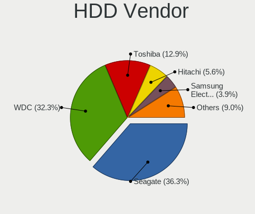
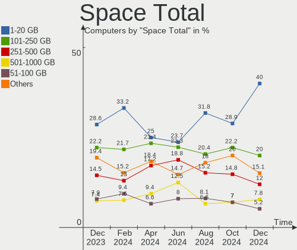
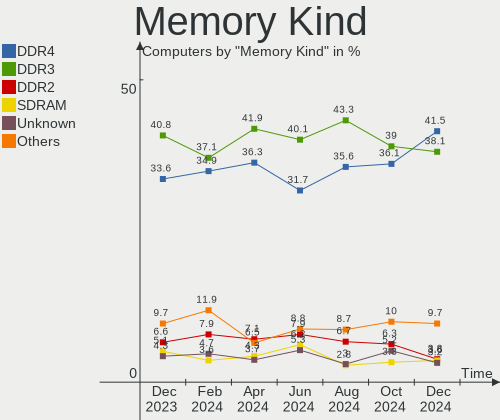
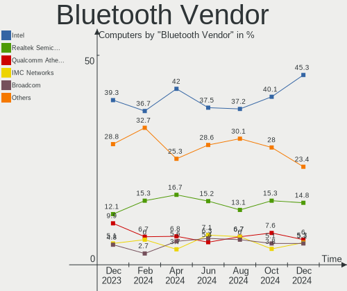

OpenMandriva Hardware Trends
----------------------------

A project to identify most popular hardware characteristics and track their change
over time based on data collected by OpenMandriva users at https://Linux-Hardware.org.

Anyone can contribute to the study by uploading probes of their computers by
the [hw-probe](https://github.com/linuxhw/hw-probe) tool:

    sudo -E hw-probe -all -upload

This is a report for all computer types. See also reports for [desktops](/Dist/OpenMandriva/Desktop/README.md) and [notebooks](/Dist/OpenMandriva/Notebook/README.md).

Full-feature report is available here: https://linux-hardware.org/?view=trends

Period: Apr, 2021.

Contents
--------

- [ OS                       ](#os)
- [ OS Family                ](#os-family)
- [ Kernel                   ](#kernel)
- [ Kernel Family            ](#kernel-family)
- [ Kernel Major Ver.        ](#kernel-major-ver)
- [ Arch                     ](#arch)
- [ DE                       ](#de)
- [ Display Server           ](#display-server)
- [ Display Manager          ](#display-manager)
- [ OS Lang                  ](#os-lang)
- [ Boot Mode                ](#boot-mode)
- [ Filesystem               ](#filesystem)
- [ Part. scheme             ](#part-scheme)
- [ Dual Boot with Linux/BSD ](#dual-boot-with-linux/bsd)
- [ Dual Boot (Win)          ](#dual-boot-win)
- [ Country                  ](#country)
- [ City                     ](#city)
- [ Vendor                   ](#vendor)
- [ Model                    ](#model)
- [ Model Family             ](#model-family)
- [ MFG Year                 ](#mfg-year)
- [ Form Factor              ](#form-factor)
- [ Secure Boot              ](#secure-boot)
- [ Coreboot                 ](#coreboot)
- [ RAM Size                 ](#ram-size)
- [ RAM Used                 ](#ram-used)
- [ Has CD-ROM               ](#has-cd-rom)
- [ Total Drives             ](#total-drives)
- [ Has Ethernet             ](#has-ethernet)
- [ Has WiFi                 ](#has-wifi)
- [ Has Bluetooth            ](#has-bluetooth)
- [ Drive Vendor             ](#drive-vendor)
- [ Drive Model              ](#drive-model)
- [ HDD Vendor               ](#hdd-vendor)
- [ SSD Vendor               ](#ssd-vendor)
- [ Drive Kind               ](#drive-kind)
- [ Drive Connector          ](#drive-connector)
- [ Drive Size               ](#drive-size)
- [ Space Total              ](#space-total)
- [ Space Used               ](#space-used)
- [ Malfunc. Drives          ](#malfunc-drives)
- [ Malfunc. Drive Vendor    ](#malfunc-drive-vendor)
- [ Malfunc. HDD Vendor      ](#malfunc-hdd-vendor)
- [ Malfunc. Drive Kind      ](#malfunc-drive-kind)
- [ Failed Drives            ](#failed-drives)
- [ Failed Drive Vendor      ](#failed-drive-vendor)
- [ Drive Status             ](#drive-status)
- [ Storage Vendor           ](#storage-vendor)
- [ Storage Model            ](#storage-model)
- [ Storage Kind             ](#storage-kind)
- [ CPU Vendor               ](#cpu-vendor)
- [ CPU Model                ](#cpu-model)
- [ CPU Model Family         ](#cpu-model-family)
- [ CPU Cores                ](#cpu-cores)
- [ CPU Sockets              ](#cpu-sockets)
- [ CPU Threads              ](#cpu-threads)
- [ CPU Op-Modes             ](#cpu-op-modes)
- [ CPU Microcode            ](#cpu-microcode)
- [ CPU Microarch            ](#cpu-microarch)
- [ GPU Vendor               ](#gpu-vendor)
- [ GPU Model                ](#gpu-model)
- [ GPU Combo                ](#gpu-combo)
- [ GPU Driver               ](#gpu-driver)
- [ GPU Memory               ](#gpu-memory)
- [ Monitor Vendor           ](#monitor-vendor)
- [ Monitor Model            ](#monitor-model)
- [ Monitor Resolution       ](#monitor-resolution)
- [ Monitor Diagonal         ](#monitor-diagonal)
- [ Monitor Width            ](#monitor-width)
- [ Aspect Ratio             ](#aspect-ratio)
- [ Monitor Area             ](#monitor-area)
- [ Pixel Density            ](#pixel-density)
- [ Multiple Monitors        ](#multiple-monitors)
- [ Net Controller Vendor    ](#net-controller-vendor)
- [ Net Controller Model     ](#net-controller-model)
- [ Wireless Vendor          ](#wireless-vendor)
- [ Wireless Model           ](#wireless-model)
- [ Ethernet Vendor          ](#ethernet-vendor)
- [ Ethernet Model           ](#ethernet-model)
- [ Net Controller Kind      ](#net-controller-kind)
- [ Used Controller          ](#used-controller)
- [ NICs                     ](#nics)
- [ IPv6                     ](#ipv6)
- [ Memory Vendor            ](#memory-vendor)
- [ Memory Model             ](#memory-model)
- [ Memory Kind              ](#memory-kind)
- [ Memory Form Factor       ](#memory-form-factor)
- [ Memory Size              ](#memory-size)
- [ Memory Speed             ](#memory-speed)
- [ Sound Vendor             ](#sound-vendor)
- [ Sound Model              ](#sound-model)
- [ Camera Vendor            ](#camera-vendor)
- [ Camera Model             ](#camera-model)
- [ Fingerprint Vendor       ](#fingerprint-vendor)
- [ Fingerprint Model        ](#fingerprint-model)
- [ Chipcard Vendor          ](#chipcard-vendor)
- [ Chipcard Model           ](#chipcard-model)
- [ Printer Vendor           ](#printer-vendor)
- [ Printer Model            ](#printer-model)
- [ Scanner Vendor           ](#scanner-vendor)
- [ Scanner Model            ](#scanner-model)
- [ Bluetooth Vendor         ](#bluetooth-vendor)
- [ Bluetooth Model          ](#bluetooth-model)
- [ Unsupported Devices      ](#unsupported-devices)
- [ Unsupported Device Types ](#unsupported-device-types)

OS
--

Installed operating systems

| Name              | Computers | Percent |
|-------------------|-----------|---------|
| OpenMandriva 4.2  | 373       | 98.16%  |
| OpenMandriva 4.50 | 6         | 1.58%   |
| OpenMandriva 4.1  | 1         | 0.26%   |

OS Family
---------

OS without a version

| Name         | Computers | Percent |
|--------------|-----------|---------|
| OpenMandriva | 380       | 100%    |

Kernel
------

Version of the Linux kernel

| Version                        | Computers | Percent |
|--------------------------------|-----------|---------|
| 5.10.14-desktop-1omv4002       | 362       | 95.26%  |
| 5.11.12-desktop-1omv4002       | 7         | 1.84%   |
| 5.11.0-desktop-clang-1omv4002  | 4         | 1.05%   |
| 5.11.13-desktop-clang-1omv4050 | 2         | 0.53%   |
| 5.11.11-desktop-clang-1omv4050 | 2         | 0.53%   |
| 5.5.0-desktop-1omv4001         | 1         | 0.26%   |
| 5.11.14-desktop-clang-1omv4050 | 1         | 0.26%   |
| 5.11.11-server-1omv4050        | 1         | 0.26%   |

Kernel Family
-------------

Linux kernel without a distro release

| Version | Computers | Percent |
|---------|-----------|---------|
| 5.10.14 | 362       | 95.26%  |
| 5.11.12 | 7         | 1.84%   |
| 5.11.0  | 4         | 1.05%   |
| 5.11.11 | 3         | 0.79%   |
| 5.11.13 | 2         | 0.53%   |
| 5.5.0   | 1         | 0.26%   |
| 5.11.14 | 1         | 0.26%   |

Kernel Major Ver.
-----------------

Linux kernel major version

| Version | Computers | Percent |
|---------|-----------|---------|
| 5.10    | 362       | 95.26%  |
| 5.11    | 17        | 4.47%   |
| 5.5     | 1         | 0.26%   |

Arch
----

OS architecture (x86_64, i586, etc.)

| Name    | Computers | Percent |
|---------|-----------|---------|
| x86_64  | 379       | 99.74%  |
| aarch64 | 1         | 0.26%   |

DE
--

Desktop Environment

| Name | Computers | Percent |
|------|-----------|---------|
| KDE5 | 380       | 100%    |

Display Server
--------------

X11 or Wayland

| Name | Computers | Percent |
|------|-----------|---------|
| X11  | 380       | 100%    |

Display Manager
---------------

SDDM, LightDM, etc.

| Name | Computers | Percent |
|------|-----------|---------|
| SDDM | 380       | 100%    |

OS Lang
-------

Language

| Lang  | Computers | Percent |
|-------|-----------|---------|
| en_US | 198       | 52.11%  |
| de_DE | 26        | 6.84%   |
| pl_PL | 25        | 6.58%   |
| fr_FR | 25        | 6.58%   |
| ru_RU | 15        | 3.95%   |
| pt_BR | 12        | 3.16%   |
| it_IT | 11        | 2.89%   |
| es_ES | 10        | 2.63%   |
| en_GB | 10        | 2.63%   |
| cs_CZ | 9         | 2.37%   |
| hu_HU | 7         | 1.84%   |
| fr_CA | 3         | 0.79%   |
| es_AR | 3         | 0.79%   |
| en_IN | 3         | 0.79%   |
| en_AU | 3         | 0.79%   |
| de_AT | 3         | 0.79%   |
| uk_UA | 2         | 0.53%   |
| es_VE | 2         | 0.53%   |
| es_MX | 2         | 0.53%   |
| en_NZ | 2         | 0.53%   |
| ru_UA | 1         | 0.26%   |
| pt_PT | 1         | 0.26%   |
| nl_NL | 1         | 0.26%   |
| nl_BE | 1         | 0.26%   |
| es_SV | 1         | 0.26%   |
| es_CL | 1         | 0.26%   |
| en_ZA | 1         | 0.26%   |
| de_LI | 1         | 0.26%   |
| da_DK | 1         | 0.26%   |

Boot Mode
---------

EFI or BIOS

| Mode | Computers | Percent |
|------|-----------|---------|
| BIOS | 233       | 61.32%  |
| EFI  | 147       | 38.68%  |

Filesystem
----------

Type of filesystem

| Type    | Computers | Percent |
|---------|-----------|---------|
| Overlay | 298       | 78.42%  |
| Ext4    | 74        | 19.47%  |
| Btrfs   | 5         | 1.32%   |
| F2fs    | 2         | 0.53%   |
| Xfs     | 1         | 0.26%   |

Part. scheme
------------

Scheme of partitioning

| Type    | Computers | Percent |
|---------|-----------|---------|
| GPT     | 206       | 54.21%  |
| MBR     | 173       | 45.53%  |
| Unknown | 1         | 0.26%   |

Dual Boot with Linux/BSD
------------------------

Hosting more than one Linux/BSD

| Dual boot | Computers | Percent |
|-----------|-----------|---------|
| Yes       | 195       | 51.32%  |
| No        | 185       | 48.68%  |

Dual Boot (Win)
---------------

Hosting Linux and Windows

| Dual boot | Computers | Percent |
|-----------|-----------|---------|
| No        | 203       | 53.42%  |
| Yes       | 177       | 46.58%  |

Country
-------

Geographic location (country)

| Country             | Computers | Percent |
|---------------------|-----------|---------|
| Germany             | 42        | 11.05%  |
| USA                 | 38        | 10%     |
| Poland              | 38        | 10%     |
| Russia              | 33        | 8.68%   |
| France              | 28        | 7.37%   |
| Italy               | 23        | 6.05%   |
| Brazil              | 22        | 5.79%   |
| UK                  | 18        | 4.74%   |
| Spain               | 15        | 3.95%   |
| Czechia             | 10        | 2.63%   |
| Ukraine             | 8         | 2.11%   |
| India               | 8         | 2.11%   |
| Hungary             | 8         | 2.11%   |
| Canada              | 8         | 2.11%   |
| Netherlands         | 6         | 1.58%   |
| Austria             | 5         | 1.32%   |
| Australia           | 5         | 1.32%   |
| Mexico              | 4         | 1.05%   |
| Japan               | 4         | 1.05%   |
| Argentina           | 4         | 1.05%   |
| Bulgaria            | 3         | 0.79%   |
| Belgium             | 3         | 0.79%   |
| Vietnam             | 2         | 0.53%   |
| Venezuela           | 2         | 0.53%   |
| South Africa        | 2         | 0.53%   |
| Portugal            | 2         | 0.53%   |
| New Zealand         | 2         | 0.53%   |
| Malaysia            | 2         | 0.53%   |
| Jamaica             | 2         | 0.53%   |
| Iran                | 2         | 0.53%   |
| Indonesia           | 2         | 0.53%   |
| Greece              | 2         | 0.53%   |
| Denmark             | 2         | 0.53%   |
| Cyprus              | 2         | 0.53%   |
| Chile               | 2         | 0.53%   |
| Algeria             | 2         | 0.53%   |
| Turkey              | 1         | 0.26%   |
| Trinidad and Tobago | 1         | 0.26%   |
| Sweden              | 1         | 0.26%   |
| Slovakia            | 1         | 0.26%   |
| Singapore           | 1         | 0.26%   |
| Serbia              | 1         | 0.26%   |
| Romania             | 1         | 0.26%   |
| Qatar               | 1         | 0.26%   |
| Pakistan            | 1         | 0.26%   |
| Norway              | 1         | 0.26%   |
| Lithuania           | 1         | 0.26%   |
| Guadeloupe          | 1         | 0.26%   |
| Finland             | 1         | 0.26%   |
| Estonia             | 1         | 0.26%   |
| Egypt               | 1         | 0.26%   |
| Croatia             | 1         | 0.26%   |
| Colombia            | 1         | 0.26%   |
| China               | 1         | 0.26%   |
| Belarus             | 1         | 0.26%   |

City
----

Geographic location (city)

| City              | Computers | Percent |
|-------------------|-----------|---------|
| Warsaw            | 8         | 2.11%   |
| St Petersburg     | 6         | 1.58%   |
| Wroclaw           | 4         | 1.05%   |
| Rome              | 4         | 1.05%   |
| Moscow            | 4         | 1.05%   |
| Krasnodar         | 4         | 1.05%   |
| São Paulo        | 3         | 0.79%   |
| Sankt Pölten     | 3         | 0.79%   |
| Milford           | 3         | 0.79%   |
| Milan             | 3         | 0.79%   |
| Madrid            | 3         | 0.79%   |
| London            | 3         | 0.79%   |
| Kyiv              | 3         | 0.79%   |
| Krakow            | 3         | 0.79%   |
| Kharkiv           | 3         | 0.79%   |
| Budapest          | 3         | 0.79%   |
| Bengaluru         | 3         | 0.79%   |
| Česká Lípa     | 2         | 0.53%   |
| Tehran            | 2         | 0.53%   |
| Stuttgart         | 2         | 0.53%   |
| Sofia             | 2         | 0.53%   |
| Slough            | 2         | 0.53%   |
| Saratov           | 2         | 0.53%   |
| Sankt Augustin    | 2         | 0.53%   |
| Rzeszów          | 2         | 0.53%   |
| Ruda Śląska     | 2         | 0.53%   |
| Puławy           | 2         | 0.53%   |
| Prague            | 2         | 0.53%   |
| Portsmouth        | 2         | 0.53%   |
| Paris             | 2         | 0.53%   |
| Murcia            | 2         | 0.53%   |
| Munich            | 2         | 0.53%   |
| Mansfield         | 2         | 0.53%   |
| Machhagan         | 2         | 0.53%   |
| Lyubertsy         | 2         | 0.53%   |
| Lyon              | 2         | 0.53%   |
| Lucea             | 2         | 0.53%   |
| Lublin            | 2         | 0.53%   |
| Les Andelys       | 2         | 0.53%   |
| Kazan’          | 2         | 0.53%   |
| Ituiutaba         | 2         | 0.53%   |
| Gdansk            | 2         | 0.53%   |
| Frankfurt am Main | 2         | 0.53%   |
| Chemnitz          | 2         | 0.53%   |
| Carpentras        | 2         | 0.53%   |
| Berlin            | 2         | 0.53%   |
| Šiauliai         | 1         | 0.26%   |
| Zhukovskiy        | 1         | 0.26%   |
| Zaragoza          | 1         | 0.26%   |
| Zadni Treban      | 1         | 0.26%   |
| Zabrze            | 1         | 0.26%   |
| Yuzhnyy           | 1         | 0.26%   |
| Xanthi            | 1         | 0.26%   |
| Winzeln           | 1         | 0.26%   |
| Windsor           | 1         | 0.26%   |
| Winchester        | 1         | 0.26%   |
| Wellington        | 1         | 0.26%   |
| Wallers           | 1         | 0.26%   |
| Wakefield         | 1         | 0.26%   |
| Vladimir          | 1         | 0.26%   |

Vendor
------

Motherboard manufacturer

| Name                | Computers | Percent |
|---------------------|-----------|---------|
| ASUSTek Computer    | 61        | 16.05%  |
| Dell                | 50        | 13.16%  |
| Hewlett-Packard     | 44        | 11.58%  |
| Gigabyte Technology | 39        | 10.26%  |
| Lenovo              | 38        | 10%     |
| Acer                | 31        | 8.16%   |
| MSI                 | 23        | 6.05%   |
| ASRock              | 15        | 3.95%   |
| Intel               | 10        | 2.63%   |
| Toshiba             | 9         | 2.37%   |
| Samsung Electronics | 9         | 2.37%   |
| Fujitsu             | 8         | 2.11%   |
| Pegatron            | 6         | 1.58%   |
| Apple               | 5         | 1.32%   |
| Sony                | 4         | 1.05%   |
| Supermicro          | 2         | 0.53%   |
| Positivo            | 2         | 0.53%   |
| Packard Bell        | 2         | 0.53%   |
| Notebook            | 2         | 0.53%   |
| Medion              | 2         | 0.53%   |
| Unknown             | 2         | 0.53%   |
| ZOTAC               | 1         | 0.26%   |
| TEKNOSERVICE        | 1         | 0.26%   |
| Shuttle             | 1         | 0.26%   |
| Semp Toshiba        | 1         | 0.26%   |
| Pyramid             | 1         | 0.26%   |
| Pine Microsystems   | 1         | 0.26%   |
| Microsoft           | 1         | 0.26%   |
| IBM                 | 1         | 0.26%   |
| HASEE Computer      | 1         | 0.26%   |
| Getac               | 1         | 0.26%   |
| Gateway             | 1         | 0.26%   |
| Fujitsu Siemens     | 1         | 0.26%   |
| Datto               | 1         | 0.26%   |
| Biostar             | 1         | 0.26%   |
| BESSTAR Tech        | 1         | 0.26%   |
| AMD                 | 1         | 0.26%   |

Model
-----

Motherboard model

| Name                                        | Computers | Percent |
|---------------------------------------------|-----------|---------|
| ASUS All Series                             | 5         | 1.32%   |
| MSI MS-7817                                 | 4         | 1.05%   |
| Gigabyte A320M-S2H                          | 4         | 1.05%   |
| HP Compaq Pro 6300 SFF                      | 3         | 0.79%   |
| Unknown                                     | 3         | 0.79%   |
| Samsung 550P5C/550P7C                       | 2         | 0.53%   |
| Samsung 300E4A/300E5A/300E7A/3430EA/3530EA  | 2         | 0.53%   |
| Lenovo IdeaPad S145-15AST 81N3              | 2         | 0.53%   |
| HP Presario CQ57                            | 2         | 0.53%   |
| HP Pavilion 15                              | 2         | 0.53%   |
| Gigabyte GA-990XA-UD3                       | 2         | 0.53%   |
| Gigabyte B450M DS3H                         | 2         | 0.53%   |
| Fujitsu LIFEBOOK A555                       | 2         | 0.53%   |
| Dell OptiPlex 780                           | 2         | 0.53%   |
| Dell OptiPlex 755                           | 2         | 0.53%   |
| Dell OptiPlex 7010                          | 2         | 0.53%   |
| Dell Latitude E5440                         | 2         | 0.53%   |
| Dell Latitude E5420                         | 2         | 0.53%   |
| Dell Latitude D630                          | 2         | 0.53%   |
| Dell Inspiron N5110                         | 2         | 0.53%   |
| ASUS P5Q                                    | 2         | 0.53%   |
| ZOTAC AMD HUDSON-M1                         | 1         | 0.26%   |
| Toshiba Satellite U400                      | 1         | 0.26%   |
| Toshiba Satellite P755                      | 1         | 0.26%   |
| Toshiba Satellite L500D                     | 1         | 0.26%   |
| Toshiba Satellite L500                      | 1         | 0.26%   |
| Toshiba Satellite C850D-13F                 | 1         | 0.26%   |
| Toshiba Satellite C850D-119                 | 1         | 0.26%   |
| Toshiba Satellite C55-A-1T6                 | 1         | 0.26%   |
| Toshiba Satellite C50-B                     | 1         | 0.26%   |
| Toshiba dynabook CX/48F                     | 1         | 0.26%   |
| TEKNOSERVICE NJ5x_NJ7xLU                    | 1         | 0.26%   |
| Supermicro X9SRE/X9SRE-3F/X9SRi/X9SRi-3F    | 1         | 0.26%   |
| Supermicro X8SIE                            | 1         | 0.26%   |
| Sony VPCCA3C5E                              | 1         | 0.26%   |
| Sony VGN-CR343N_B                           | 1         | 0.26%   |
| Sony VGN-AR61M                              | 1         | 0.26%   |
| Sony SVT15112CXS                            | 1         | 0.26%   |
| Shuttle DS67U                               | 1         | 0.26%   |
| Semp Toshiba STI                            | 1         | 0.26%   |
| Samsung RV411/RV511/E3511/S3511/RV711/E3411 | 1         | 0.26%   |
| Samsung RF511/RF411/RF711                   | 1         | 0.26%   |
| Samsung RC530/RC730                         | 1         | 0.26%   |
| Samsung 355V4C/356V4C/3445VC/3545VC         | 1         | 0.26%   |
| Samsung 300E4C/300E5C/300E7C                | 1         | 0.26%   |
| Pyramid Control Unit DAU G5                 | 1         | 0.26%   |
| Positivo OMNI H3-01768                      | 1         | 0.26%   |
| Positivo C14CR21                            | 1         | 0.26%   |
| Pine Microsystems Pine64 RockPro64 v2.1     | 1         | 0.26%   |
| Pegatron WE301AA-ABF p6215fr                | 1         | 0.26%   |
| Pegatron p6715fr                            | 1         | 0.26%   |
| Pegatron KQ437AA-ABA IQ506                  | 1         | 0.26%   |
| Pegatron HPE-480t                           | 1         | 0.26%   |
| Pegatron Compaq dx2400 Microtower PC        | 1         | 0.26%   |
| Pegatron APX85-GS                           | 1         | 0.26%   |
| Packard Bell ixtreme M5740                  | 1         | 0.26%   |
| Packard Bell EasyNote TS11HR                | 1         | 0.26%   |
| Notebook N7x0WU                             | 1         | 0.26%   |
| Notebook N750BU                             | 1         | 0.26%   |
| MSI MS-7C79                                 | 1         | 0.26%   |

Model Family
------------

Motherboard model prefix

| Name                     | Computers | Percent |
|--------------------------|-----------|---------|
| Acer Aspire              | 27        | 7.11%   |
| Dell Inspiron            | 17        | 4.47%   |
| Lenovo ThinkPad          | 15        | 3.95%   |
| Dell Latitude            | 13        | 3.42%   |
| HP Pavilion              | 10        | 2.63%   |
| Dell OptiPlex            | 10        | 2.63%   |
| Toshiba Satellite        | 8         | 2.11%   |
| Lenovo IdeaPad           | 8         | 2.11%   |
| HP Compaq                | 7         | 1.84%   |
| ASUS PRIME               | 6         | 1.58%   |
| HP ProBook               | 5         | 1.32%   |
| Fujitsu ESPRIMO          | 5         | 1.32%   |
| ASUS All                 | 5         | 1.32%   |
| MSI MS-7817              | 4         | 1.05%   |
| Lenovo ThinkCentre       | 4         | 1.05%   |
| HP Laptop                | 4         | 1.05%   |
| Gigabyte A320M-S2H       | 4         | 1.05%   |
| ASUS VivoBook            | 4         | 1.05%   |
| ASUS TUF                 | 4         | 1.05%   |
| Lenovo IdeaCentre        | 3         | 0.79%   |
| HP EliteBook             | 3         | 0.79%   |
| Fujitsu LIFEBOOK         | 3         | 0.79%   |
| Dell Precision           | 3         | 0.79%   |
| ASUS ROG                 | 3         | 0.79%   |
| ASUS P8P67               | 3         | 0.79%   |
| ASUS P5Q                 | 3         | 0.79%   |
| Unknown                  | 3         | 0.79%   |
| Samsung 550P5C           | 2         | 0.53%   |
| Samsung 300E4A           | 2         | 0.53%   |
| HP Presario              | 2         | 0.53%   |
| HP 250                   | 2         | 0.53%   |
| Gigabyte GA-990XA-UD3    | 2         | 0.53%   |
| Gigabyte GA-78LMT-USB3   | 2         | 0.53%   |
| Gigabyte B450M           | 2         | 0.53%   |
| Dell XPS                 | 2         | 0.53%   |
| Dell Vostro              | 2         | 0.53%   |
| ASUS M5A78L-M            | 2         | 0.53%   |
| ZOTAC AMD                | 1         | 0.26%   |
| Toshiba dynabook         | 1         | 0.26%   |
| TEKNOSERVICE NJ5x        | 1         | 0.26%   |
| Supermicro X9SRE         | 1         | 0.26%   |
| Supermicro X8SIE         | 1         | 0.26%   |
| Sony VPCCA3C5E           | 1         | 0.26%   |
| Sony VGN-CR343N          | 1         | 0.26%   |
| Sony VGN-AR61M           | 1         | 0.26%   |
| Sony SVT15112CXS         | 1         | 0.26%   |
| Shuttle DS67U            | 1         | 0.26%   |
| Semp Toshiba STI         | 1         | 0.26%   |
| Samsung RV411            | 1         | 0.26%   |
| Samsung RF511            | 1         | 0.26%   |
| Samsung RC530            | 1         | 0.26%   |
| Samsung 355V4C           | 1         | 0.26%   |
| Samsung 300E4C           | 1         | 0.26%   |
| Pyramid Control          | 1         | 0.26%   |
| Positivo OMNI            | 1         | 0.26%   |
| Positivo C14CR21         | 1         | 0.26%   |
| Pine Microsystems Pine64 | 1         | 0.26%   |
| Pegatron WE301AA-ABF     | 1         | 0.26%   |
| Pegatron p6715fr         | 1         | 0.26%   |
| Pegatron KQ437AA-ABA     | 1         | 0.26%   |

MFG Year
--------

Motherboard manufacture year

| Year    | Computers | Percent |
|---------|-----------|---------|
| 2012    | 47        | 12.37%  |
| 2019    | 41        | 10.79%  |
| 2020    | 38        | 10%     |
| 2014    | 32        | 8.42%   |
| 2011    | 29        | 7.63%   |
| 2018    | 28        | 7.37%   |
| 2013    | 26        | 6.84%   |
| 2009    | 26        | 6.84%   |
| 2010    | 24        | 6.32%   |
| 2015    | 19        | 5%      |
| 2016    | 17        | 4.47%   |
| 2008    | 16        | 4.21%   |
| 2017    | 14        | 3.68%   |
| 2021    | 10        | 2.63%   |
| 2007    | 9         | 2.37%   |
| 2006    | 2         | 0.53%   |
| 2005    | 1         | 0.26%   |
| Unknown | 1         | 0.26%   |

Form Factor
-----------

Physical design of the computer

| Name           | Computers | Percent |
|----------------|-----------|---------|
| Desktop        | 188       | 49.47%  |
| Notebook       | 175       | 46.05%  |
| Mini pc        | 6         | 1.58%   |
| All in one     | 6         | 1.58%   |
| Convertible    | 2         | 0.53%   |
| System on chip | 1         | 0.26%   |
| Tablet         | 1         | 0.26%   |
| Server         | 1         | 0.26%   |

Secure Boot
-----------

Enabled or disabled

| State    | Computers | Percent |
|----------|-----------|---------|
| Disabled | 380       | 100%    |

Coreboot
--------

Have coreboot on board

| Used | Computers | Percent |
|------|-----------|---------|
| No   | 380       | 100%    |

RAM Size
--------

Total RAM memory

| Size in GB  | Computers | Percent |
|-------------|-----------|---------|
| 3.01-4.0    | 115       | 30.26%  |
| 4.01-8.0    | 90        | 23.68%  |
| 8.01-16.0   | 84        | 22.11%  |
| 16.01-24.0  | 53        | 13.95%  |
| 1.01-2.0    | 19        | 5%      |
| 32.01-64.0  | 10        | 2.63%   |
| 2.01-3.0    | 7         | 1.84%   |
| 24.01-32.0  | 1         | 0.26%   |
| 64.01-256.0 | 1         | 0.26%   |

RAM Used
--------

Used RAM memory

| Used GB  | Computers | Percent |
|----------|-----------|---------|
| 1.01-2.0 | 284       | 74.74%  |
| 0.51-1.0 | 55        | 14.47%  |
| 2.01-3.0 | 31        | 8.16%   |
| 0.01-0.5 | 8         | 2.11%   |
| 3.01-4.0 | 2         | 0.53%   |

Has CD-ROM
----------

Has CD-ROM on board

| Presented | Computers | Percent |
|-----------|-----------|---------|
| Yes       | 237       | 62.37%  |
| No        | 143       | 37.63%  |

Total Drives
------------

Number of drives on board

| Drives | Computers | Percent |
|--------|-----------|---------|
| 1      | 227       | 59.74%  |
| 2      | 92        | 24.21%  |
| 3      | 36        | 9.47%   |
| 0      | 7         | 1.84%   |
| 5      | 6         | 1.58%   |
| 4      | 6         | 1.58%   |
| 6      | 5         | 1.32%   |
| 8      | 1         | 0.26%   |

Has Ethernet
------------

Has Ethernet on board

| Presented | Computers | Percent |
|-----------|-----------|---------|
| Yes       | 357       | 93.95%  |
| No        | 23        | 6.05%   |

Has WiFi
--------

Has WiFi module

| Presented | Computers | Percent |
|-----------|-----------|---------|
| Yes       | 259       | 68.16%  |
| No        | 121       | 31.84%  |

Has Bluetooth
-------------

Has Bluetooth module

| Presented | Computers | Percent |
|-----------|-----------|---------|
| No        | 206       | 54.21%  |
| Yes       | 174       | 45.79%  |

Drive Vendor
------------

Hard drive vendors

| Vendor              | Computers | Drives | Percent |
|---------------------|-----------|--------|---------|
| WDC                 | 118       | 140    | 22.06%  |
| Seagate             | 105       | 120    | 19.63%  |
| Samsung Electronics | 61        | 71     | 11.4%   |
| Toshiba             | 38        | 42     | 7.1%    |
| Kingston            | 31        | 31     | 5.79%   |
| Crucial             | 19        | 20     | 3.55%   |
| Hitachi             | 18        | 18     | 3.36%   |
| A-DATA Technology   | 13        | 14     | 2.43%   |
| SanDisk             | 12        | 12     | 2.24%   |
| HGST                | 10        | 10     | 1.87%   |
| GOODRAM             | 9         | 9      | 1.68%   |
| Unknown             | 8         | 9      | 1.5%    |
| PNY                 | 7         | 7      | 1.31%   |
| Fujitsu             | 6         | 6      | 1.12%   |
| SK Hynix            | 5         | 5      | 0.93%   |
| Phison              | 5         | 5      | 0.93%   |
| Micron Technology   | 5         | 5      | 0.93%   |
| Maxtor              | 5         | 5      | 0.93%   |
| China               | 5         | 6      | 0.93%   |
| Patriot             | 4         | 4      | 0.75%   |
| Intel               | 4         | 4      | 0.75%   |
| Apacer              | 4         | 4      | 0.75%   |
| XPG                 | 3         | 4      | 0.56%   |
| Phison Electronics  | 3         | 4      | 0.56%   |
| Intenso             | 3         | 3      | 0.56%   |
| Transcend           | 2         | 2      | 0.37%   |
| Team                | 2         | 2      | 0.37%   |
| SPCC                | 2         | 2      | 0.37%   |
| Smartbuy            | 2         | 2      | 0.37%   |
| Sabrent             | 2         | 4      | 0.37%   |
| OCZ                 | 2         | 2      | 0.37%   |
| KingSpec            | 2         | 2      | 0.37%   |
| JMicron             | 2         | 2      | 0.37%   |
| Corsair             | 2         | 2      | 0.37%   |
| Apple               | 2         | 3      | 0.37%   |
| XrayDisk            | 1         | 1      | 0.19%   |
| Verbatim            | 1         | 1      | 0.19%   |
| USB                 | 1         | 1      | 0.19%   |
| Realtek             | 1         | 1      | 0.19%   |
| PNY CS90            | 1         | 1      | 0.19%   |
| PLEXTOR             | 1         | 1      | 0.19%   |
| Netac               | 1         | 1      | 0.19%   |
| LITEONIT            | 1         | 1      | 0.19%   |
| KingFast            | 1         | 1      | 0.19%   |
| Hikvision           | 1         | 1      | 0.19%   |
| Hewlett-Packard     | 1         | 1      | 0.19%   |
| Colorful            | 1         | 1      | 0.19%   |
| ASMT                | 1         | 1      | 0.19%   |
| AMD                 | 1         | 1      | 0.19%   |

Drive Model
-----------

Hard drive models

| Model                              | Computers | Percent |
|------------------------------------|-----------|---------|
| Seagate ST500DM002-1BD142 500GB    | 8         | 1.39%   |
| Kingston SA400S37240G 240GB SSD    | 8         | 1.39%   |
| Toshiba MQ01ABF050 500GB           | 7         | 1.21%   |
| Seagate ST1000DM010-2EP102 1TB     | 6         | 1.04%   |
| WDC WDS500G2B0A-00SM50 500GB SSD   | 5         | 0.87%   |
| WDC WD20EZRZ-00Z5HB0 2TB           | 5         | 0.87%   |
| Seagate ST2000DM008-2FR102 2TB     | 5         | 0.87%   |
| WDC WD10EZEX-22MFCA0 1TB           | 4         | 0.69%   |
| Toshiba DT01ACA100 1TB             | 4         | 0.69%   |
| Seagate ST9500325AS 500GB          | 4         | 0.69%   |
| Seagate ST500LT012-1DG142 500GB    | 4         | 0.69%   |
| Samsung SSD 860 EVO 500GB          | 4         | 0.69%   |
| Samsung HD103SI 1TB                | 4         | 0.69%   |
| WDC WDS240G2G0A-00JH30 240GB SSD   | 3         | 0.52%   |
| WDC WD6400AAKS-22A7B2 640GB        | 3         | 0.52%   |
| WDC WD10JPVX-22JC3T0 1TB           | 3         | 0.52%   |
| WDC WD10EZEX-21WN4A0 1TB           | 3         | 0.52%   |
| WDC WD10EZEX-08WN4A0 1TB           | 3         | 0.52%   |
| WDC WD10EZEX-00MFCA0 1TB           | 3         | 0.52%   |
| Toshiba DT01ACA050 500GB           | 3         | 0.52%   |
| Seagate ST3500418AS 500GB          | 3         | 0.52%   |
| Seagate ST3500414CS 500GB          | 3         | 0.52%   |
| Seagate ST3160815AS 160GB          | 3         | 0.52%   |
| Seagate ST31500341AS 1TB           | 3         | 0.52%   |
| Seagate ST1000LM024 HN-M101MBB 1TB | 3         | 0.52%   |
| Samsung SSD 970 EVO Plus 250GB     | 3         | 0.52%   |
| Samsung SSD 970 EVO 1TB            | 3         | 0.52%   |
| Samsung SSD 840 EVO 250GB          | 3         | 0.52%   |
| Samsung SSD 840 EVO 120GB          | 3         | 0.52%   |
| Samsung HM641JI 640GB              | 3         | 0.52%   |
| Phison PCIe SSD 1TB                | 3         | 0.52%   |
| Kingston SV300S37A120G 120GB SSD   | 3         | 0.52%   |
| Kingston SA400S37120G 120GB SSD    | 3         | 0.52%   |
| HGST HTS545050A7E680 500GB         | 3         | 0.52%   |
| Crucial CT500MX500SSD1 500GB       | 3         | 0.52%   |
| Crucial CT480BX500SSD1 480GB       | 3         | 0.52%   |
| A-DATA SU630 240GB SSD             | 3         | 0.52%   |
| XPG GAMMIX S11 Pro 2TB             | 2         | 0.35%   |
| WDC WDS500G1B0A-00H9H0 500GB SSD   | 2         | 0.35%   |
| WDC WDS100T2B0A-00SM50 1TB SSD     | 2         | 0.35%   |
| WDC WD5000LPVX-75V0TT0 500GB       | 2         | 0.35%   |
| WDC WD5000LPCX-24VHAT0 500GB       | 2         | 0.35%   |
| WDC WD5000AAKX-75U6AA0 500GB       | 2         | 0.35%   |
| WDC WD5000AAKX-60U6AA0 500GB       | 2         | 0.35%   |
| WDC WD5000AAKX-003CA0 500GB        | 2         | 0.35%   |
| WDC WD10SPZX-60Z10T0 1TB           | 2         | 0.35%   |
| WDC WD10SPZX-21Z10T0 1TB           | 2         | 0.35%   |
| WDC WD1003FZEX-00MK2A0 1TB         | 2         | 0.35%   |
| Unknown SD/MMC/MS PRO 32GB         | 2         | 0.35%   |
| Toshiba MQ04ABF100 1TB             | 2         | 0.35%   |
| Toshiba MQ01ACF032 320GB           | 2         | 0.35%   |
| Toshiba MQ01ABD100 1TB             | 2         | 0.35%   |
| Seagate ST500VT000-1DK142 500GB    | 2         | 0.35%   |
| Seagate ST500LT012-9WS142 500GB    | 2         | 0.35%   |
| Seagate ST500LM000-1EJ162 500GB    | 2         | 0.35%   |
| Seagate ST4000DM004-2CV104 4TB     | 2         | 0.35%   |
| Seagate ST3250318AS 250GB          | 2         | 0.35%   |
| Seagate ST3250312AS 250GB          | 2         | 0.35%   |
| Seagate ST3250310AS 250GB          | 2         | 0.35%   |
| Seagate ST31000528AS 1TB           | 2         | 0.35%   |

HDD Vendor
----------

Hard disk drive vendors

| Vendor              | Computers | Drives | Percent |
|---------------------|-----------|--------|---------|
| Seagate             | 103       | 117    | 34.11%  |
| WDC                 | 101       | 120    | 33.44%  |
| Toshiba             | 35        | 38     | 11.59%  |
| Samsung Electronics | 19        | 20     | 6.29%   |
| Hitachi             | 18        | 18     | 5.96%   |
| HGST                | 10        | 10     | 3.31%   |
| Fujitsu             | 6         | 6      | 1.99%   |
| Maxtor              | 5         | 5      | 1.66%   |
| Sabrent             | 2         | 3      | 0.66%   |
| China               | 1         | 1      | 0.33%   |
| ASMT                | 1         | 1      | 0.33%   |
| Apple               | 1         | 1      | 0.33%   |

SSD Vendor
----------

Solid state drive vendors

| Vendor              | Computers | Drives | Percent |
|---------------------|-----------|--------|---------|
| Samsung Electronics | 33        | 37     | 17.65%  |
| Kingston            | 26        | 26     | 13.9%   |
| Crucial             | 18        | 19     | 9.63%   |
| WDC                 | 14        | 15     | 7.49%   |
| SanDisk             | 12        | 12     | 6.42%   |
| A-DATA Technology   | 12        | 13     | 6.42%   |
| GOODRAM             | 9         | 9      | 4.81%   |
| PNY                 | 7         | 7      | 3.74%   |
| Toshiba             | 4         | 4      | 2.14%   |
| Patriot             | 4         | 4      | 2.14%   |
| Micron Technology   | 4         | 4      | 2.14%   |
| China               | 4         | 5      | 2.14%   |
| Unknown             | 3         | 3      | 1.6%    |
| SK Hynix            | 3         | 3      | 1.6%    |
| Intel               | 3         | 3      | 1.6%    |
| Apacer              | 3         | 3      | 1.6%    |
| Transcend           | 2         | 2      | 1.07%   |
| Team                | 2         | 2      | 1.07%   |
| Smartbuy            | 2         | 2      | 1.07%   |
| OCZ                 | 2         | 2      | 1.07%   |
| KingSpec            | 2         | 2      | 1.07%   |
| JMicron             | 2         | 2      | 1.07%   |
| Intenso             | 2         | 2      | 1.07%   |
| XrayDisk            | 1         | 1      | 0.53%   |
| XPG                 | 1         | 1      | 0.53%   |
| Verbatim            | 1         | 1      | 0.53%   |
| SPCC                | 1         | 1      | 0.53%   |
| SABRENT             | 1         | 1      | 0.53%   |
| PNY CS90            | 1         | 1      | 0.53%   |
| Netac               | 1         | 1      | 0.53%   |
| LITEONIT            | 1         | 1      | 0.53%   |
| KingFast            | 1         | 1      | 0.53%   |
| Hikvision           | 1         | 1      | 0.53%   |
| Hewlett-Packard     | 1         | 1      | 0.53%   |
| Corsair             | 1         | 1      | 0.53%   |
| Colorful            | 1         | 1      | 0.53%   |
| AMD                 | 1         | 1      | 0.53%   |

Drive Kind
----------

HDD or SSD

| Kind    | Computers | Drives | Percent |
|---------|-----------|--------|---------|
| HDD     | 257       | 340    | 54.56%  |
| SSD     | 164       | 195    | 34.82%  |
| NVMe    | 42        | 51     | 8.92%   |
| Unknown | 6         | 7      | 1.27%   |
| MMC     | 2         | 2      | 0.42%   |

Drive Connector
---------------

SATA, SAS, NVMe, etc.

| Type | Computers | Drives | Percent |
|------|-----------|--------|---------|
| SATA | 351       | 521    | 85.4%   |
| NVMe | 42        | 50     | 10.22%  |
| SAS  | 16        | 22     | 3.89%   |
| MMC  | 2         | 2      | 0.49%   |

Drive Size
----------

Size of hard drive

| Size in TB | Computers | Drives | Percent |
|------------|-----------|--------|---------|
| 0.01-0.5   | 292       | 358    | 66.51%  |
| 0.51-1.0   | 106       | 129    | 24.15%  |
| 1.01-2.0   | 28        | 32     | 6.38%   |
| 3.01-4.0   | 6         | 8      | 1.37%   |
| 4.01-10.0  | 4         | 5      | 0.91%   |
| 2.01-3.0   | 3         | 3      | 0.68%   |

Space Total
-----------

Amount of disk space available on the file system

| Size in GB     | Computers | Percent |
|----------------|-----------|---------|
| 1-20           | 190       | 50%     |
| Unknown        | 50        | 13.16%  |
| 101-250        | 48        | 12.63%  |
| 251-500        | 42        | 11.05%  |
| 501-1000       | 19        | 5%      |
| 21-50          | 12        | 3.16%   |
| 51-100         | 12        | 3.16%   |
| 1001-2000      | 6         | 1.58%   |
| More than 3000 | 1         | 0.26%   |

Space Used
----------

Amount of used disk space

| Used GB   | Computers | Percent |
|-----------|-----------|---------|
| 1-20      | 300       | 78.95%  |
| Unknown   | 50        | 13.16%  |
| 101-250   | 9         | 2.37%   |
| 251-500   | 7         | 1.84%   |
| 51-100    | 5         | 1.32%   |
| 21-50     | 4         | 1.05%   |
| 501-1000  | 4         | 1.05%   |
| 1001-2000 | 1         | 0.26%   |

Malfunc. Drives
---------------

Drive models with a malfunction

| Model                             | Computers | Drives | Percent |
|-----------------------------------|-----------|--------|---------|
| Seagate ST9500325AS 500GB         | 4         | 4      | 3.25%   |
| WDC WD6400AAKS-22A7B2 640GB       | 3         | 3      | 2.44%   |
| Seagate ST500DM002-1BD142 500GB   | 3         | 3      | 2.44%   |
| WDC WD5000AAKX-75U6AA0 500GB      | 2         | 2      | 1.63%   |
| WDC WD5000AAKX-003CA0 500GB       | 2         | 2      | 1.63%   |
| WDC WD10EZEX-00MFCA0 1TB          | 2         | 2      | 1.63%   |
| Seagate ST500LT012-9WS142 500GB   | 2         | 2      | 1.63%   |
| Seagate ST31500341AS 1TB          | 2         | 2      | 1.63%   |
| Seagate ST1000DX001-1CM162 1TB    | 2         | 2      | 1.63%   |
| Samsung Electronics HM641JI 640GB | 2         | 2      | 1.63%   |
| Samsung Electronics HD322GJ 320GB | 2         | 2      | 1.63%   |
| Samsung Electronics HD103SI 1TB   | 2         | 2      | 1.63%   |
| Hitachi HDT722516DLA380 164GB     | 2         | 2      | 1.63%   |
| WDC WDS500G1B0A-00H9H0 500GB SSD  | 1         | 1      | 0.81%   |
| WDC WDS240G2G0A-00JH30 240GB SSD  | 1         | 1      | 0.81%   |
| WDC WDS100T2B0A-00SM50 1TB SSD    | 1         | 1      | 0.81%   |
| WDC WD800JB-00JJC0 80GB           | 1         | 1      | 0.81%   |
| WDC WD5000LPVX-75V0TT0 500GB      | 1         | 1      | 0.81%   |
| WDC WD5000AAKX-08U6AA0 500GB      | 1         | 1      | 0.81%   |
| WDC WD5000AAKX-001CA0 500GB       | 1         | 2      | 0.81%   |
| WDC WD5000AAKS-00V6A0 500GB       | 1         | 1      | 0.81%   |
| WDC WD5000AAKS-00D2B0 500GB       | 1         | 1      | 0.81%   |
| WDC WD5000AADS-56S9B1 500GB       | 1         | 1      | 0.81%   |
| WDC WD40EFRX-68N32N0 4TB          | 1         | 1      | 0.81%   |
| WDC WD4000AAKS-00TMA0 400GB       | 1         | 1      | 0.81%   |
| WDC WD3200LPVX-08V0TT5 320GB      | 1         | 1      | 0.81%   |
| WDC WD3200JB-00KFA0 320GB         | 1         | 1      | 0.81%   |
| WDC WD3200BEVT-80A0RT0 320GB      | 1         | 1      | 0.81%   |
| WDC WD3200BEVT-60A23T0 320GB      | 1         | 1      | 0.81%   |
| WDC WD3200BEKT-60F3T1 320GB       | 1         | 1      | 0.81%   |
| WDC WD3200AAKS-61L9A0 320GB       | 1         | 1      | 0.81%   |
| WDC WD3200AAKS-00SBA0 320GB       | 1         | 1      | 0.81%   |
| WDC WD30EZRX-00DC0B0 3TB          | 1         | 1      | 0.81%   |
| WDC WD2500KS-00MJB0 250GB         | 1         | 1      | 0.81%   |
| WDC WD2500AAKX-083CA1 250GB       | 1         | 1      | 0.81%   |
| WDC WD20EZRZ-00Z5HB0 2TB          | 1         | 1      | 0.81%   |
| WDC WD20EARX-00PASB0 2TB          | 1         | 1      | 0.81%   |
| WDC WD20EARS-60MVWB0 2TB          | 1         | 1      | 0.81%   |
| WDC WD2002FAEX-007BA0 2TB         | 1         | 1      | 0.81%   |
| WDC WD1600AAJB-56WRA0 160GB       | 1         | 1      | 0.81%   |
| WDC WD10EARX-00N0YB0 1TB          | 1         | 1      | 0.81%   |
| WDC WD10EARS-00MVWB0 1TB          | 1         | 1      | 0.81%   |
| WDC WD10EALX-009BA0 1TB           | 1         | 1      | 0.81%   |
| WDC WD10EADS-22M2B0 1TB           | 1         | 1      | 0.81%   |
| WDC WD10EADS-00L5B1 1TB           | 1         | 1      | 0.81%   |
| WDC WD10EACS-00D6B0 1TB           | 1         | 1      | 0.81%   |
| Unknown Bamba-240GB SSD           | 1         | 1      | 0.81%   |
| Toshiba MQ01ACF032 320GB          | 1         | 1      | 0.81%   |
| Toshiba MQ01ABF050 500GB          | 1         | 1      | 0.81%   |
| Toshiba MQ01ABD050 500GB          | 1         | 1      | 0.81%   |
| Toshiba MK8046GSX 80GB            | 1         | 1      | 0.81%   |
| Toshiba MK7559GSXP 752GB          | 1         | 1      | 0.81%   |
| Toshiba MK5065GSX 500GB           | 1         | 1      | 0.81%   |
| Toshiba MK3259GSXP 320GB          | 1         | 1      | 0.81%   |
| Toshiba MK2575GSX 250GB           | 1         | 1      | 0.81%   |
| Toshiba MK1633GSG 160GB           | 1         | 1      | 0.81%   |
| Toshiba DT01ACA100 1TB            | 1         | 1      | 0.81%   |
| SK Hynix SC308 SATA 512GB SSD     | 1         | 1      | 0.81%   |
| Seagate ST500DM002-1SB10A 500GB   | 1         | 1      | 0.81%   |
| Seagate ST4000DM004-2CV104 4TB    | 1         | 1      | 0.81%   |

Malfunc. Drive Vendor
---------------------

Vendors of faulty drives

| Vendor              | Computers | Drives | Percent |
|---------------------|-----------|--------|---------|
| WDC                 | 39        | 43     | 32.77%  |
| Seagate             | 33        | 34     | 27.73%  |
| Toshiba             | 10        | 10     | 8.4%    |
| Samsung Electronics | 9         | 10     | 7.56%   |
| Hitachi             | 9         | 9      | 7.56%   |
| China               | 3         | 3      | 2.52%   |
| OCZ                 | 2         | 2      | 1.68%   |
| Maxtor              | 2         | 2      | 1.68%   |
| HGST                | 2         | 2      | 1.68%   |
| Fujitsu             | 2         | 2      | 1.68%   |
| Crucial             | 2         | 2      | 1.68%   |
| Unknown             | 1         | 1      | 0.84%   |
| SK Hynix            | 1         | 1      | 0.84%   |
| SanDisk             | 1         | 1      | 0.84%   |
| Colorful            | 1         | 1      | 0.84%   |
| ASMT                | 1         | 1      | 0.84%   |
| Apple               | 1         | 1      | 0.84%   |

Malfunc. HDD Vendor
-------------------

Vendors of faulty HDD drives

| Vendor              | Computers | Drives | Percent |
|---------------------|-----------|--------|---------|
| WDC                 | 36        | 40     | 34.29%  |
| Seagate             | 33        | 34     | 31.43%  |
| Toshiba             | 10        | 10     | 9.52%   |
| Hitachi             | 9         | 9      | 8.57%   |
| Samsung Electronics | 8         | 9      | 7.62%   |
| Maxtor              | 2         | 2      | 1.9%    |
| HGST                | 2         | 2      | 1.9%    |
| Fujitsu             | 2         | 2      | 1.9%    |
| China               | 1         | 1      | 0.95%   |
| ASMT                | 1         | 1      | 0.95%   |
| Apple               | 1         | 1      | 0.95%   |

Malfunc. Drive Kind
-------------------

Kinds of faulty drives

| Kind | Computers | Drives | Percent |
|------|-----------|--------|---------|
| HDD  | 93        | 111    | 86.92%  |
| SSD  | 14        | 14     | 13.08%  |

Failed Drives
-------------

Failed drive models

| Model                            | Computers | Drives | Percent |
|----------------------------------|-----------|--------|---------|
| WDC WD5000M22K-24Z1LT0-SSHD-16GB | 1         | 1      | 50%     |
| Hitachi HDS721010CLA332 1TB      | 1         | 1      | 50%     |

Failed Drive Vendor
-------------------

Failed drive vendors

| Vendor  | Computers | Drives | Percent |
|---------|-----------|--------|---------|
| WDC     | 1         | 1      | 50%     |
| Hitachi | 1         | 1      | 50%     |

Drive Status
------------

Number of failed and malfunc. drives

| Status   | Computers | Drives | Percent |
|----------|-----------|--------|---------|
| Works    | 293       | 424    | 67.98%  |
| Malfunc  | 104       | 125    | 24.13%  |
| Detected | 32        | 44     | 7.42%   |
| Failed   | 2         | 2      | 0.46%   |

Storage Vendor
--------------

Storage controller vendors

| Vendor                           | Computers | Percent |
|----------------------------------|-----------|---------|
| Intel                            | 271       | 60.76%  |
| AMD                              | 91        | 20.4%   |
| Samsung Electronics              | 14        | 3.14%   |
| JMicron Technology               | 13        | 2.91%   |
| Marvell Technology Group         | 11        | 2.47%   |
| Phison Electronics               | 9         | 2.02%   |
| Nvidia                           | 9         | 2.02%   |
| Sandisk                          | 5         | 1.12%   |
| Kingston Technology Company      | 5         | 1.12%   |
| ASMedia Technology               | 4         | 0.9%    |
| VIA Technologies                 | 2         | 0.45%   |
| SK Hynix                         | 2         | 0.45%   |
| ADATA Technology                 | 2         | 0.45%   |
| Silicon Motion                   | 1         | 0.22%   |
| Silicon Integrated Systems [SiS] | 1         | 0.22%   |
| Seagate Technology               | 1         | 0.22%   |
| Micron/Crucial Technology        | 1         | 0.22%   |
| Micron Technology                | 1         | 0.22%   |
| Lite-On Technology               | 1         | 0.22%   |
| Apple                            | 1         | 0.22%   |
| Adaptec                          | 1         | 0.22%   |

Storage Model
-------------

Storage controller models

| Model                                                                                   | Computers | Percent |
|-----------------------------------------------------------------------------------------|-----------|---------|
| AMD FCH SATA Controller [AHCI mode]                                                     | 59        | 10.63%  |
| Intel 6 Series/C200 Series Chipset Family 6 port Mobile SATA AHCI Controller            | 23        | 4.14%   |
| Intel 7 Series Chipset Family 6-port SATA Controller [AHCI mode]                        | 22        | 3.96%   |
| Intel 8 Series/C220 Series Chipset Family 6-port SATA Controller 1 [AHCI mode]          | 19        | 3.42%   |
| AMD SB7x0/SB8x0/SB9x0 IDE Controller                                                    | 17        | 3.06%   |
| Intel Sunrise Point-LP SATA Controller [AHCI mode]                                      | 16        | 2.88%   |
| AMD SB7x0/SB8x0/SB9x0 SATA Controller [AHCI mode]                                       | 15        | 2.7%    |
| Intel 7 Series/C210 Series Chipset Family 6-port SATA Controller [AHCI mode]            | 12        | 2.16%   |
| AMD SB7x0/SB8x0/SB9x0 SATA Controller [IDE mode]                                        | 12        | 2.16%   |
| Samsung NVMe SSD Controller SM981/PM981/PM983                                           | 11        | 1.98%   |
| Intel NM10/ICH7 Family SATA Controller [IDE mode]                                       | 11        | 1.98%   |
| Intel 6 Series/C200 Series Chipset Family 6 port Desktop SATA AHCI Controller           | 11        | 1.98%   |
| Intel 82801IBM/IEM (ICH9M/ICH9M-E) 4 port SATA Controller [AHCI mode]                   | 10        | 1.8%    |
| Intel 82801HM/HEM (ICH8M/ICH8M-E) IDE Controller                                        | 10        | 1.8%    |
| Intel 82801G (ICH7 Family) IDE Controller                                               | 10        | 1.8%    |
| Intel Wildcat Point-LP SATA Controller [AHCI Mode]                                      | 9         | 1.62%   |
| Intel 82801HM/HEM (ICH8M/ICH8M-E) SATA Controller [AHCI mode]                           | 9         | 1.62%   |
| AMD 400 Series Chipset SATA Controller                                                  | 9         | 1.62%   |
| Intel SATA Controller [RAID mode]                                                       | 8         | 1.44%   |
| JMicron JMB363 SATA/IDE Controller                                                      | 7         | 1.26%   |
| Intel Q170/Q150/B150/H170/H110/Z170/CM236 Chipset SATA Controller [AHCI Mode]           | 7         | 1.26%   |
| Intel 8 Series SATA Controller 1 [AHCI mode]                                            | 7         | 1.26%   |
| Intel 5 Series/3400 Series Chipset 6 port SATA AHCI Controller                          | 7         | 1.26%   |
| Intel 5 Series/3400 Series Chipset 4 port SATA IDE Controller                           | 7         | 1.26%   |
| Intel 5 Series/3400 Series Chipset 4 port SATA AHCI Controller                          | 7         | 1.26%   |
| Intel 5 Series/3400 Series Chipset 2 port SATA IDE Controller                           | 7         | 1.26%   |
| AMD FCH SATA Controller D                                                               | 7         | 1.26%   |
| AMD 300 Series Chipset SATA Controller                                                  | 6         | 1.08%   |
| Phison E12 NVMe Controller                                                              | 5         | 0.9%    |
| Marvell Group 88SE6111/6121 SATA II / PATA Controller                                   | 5         | 0.9%    |
| Intel Comet Lake SATA AHCI Controller                                                   | 5         | 0.9%    |
| Intel Atom/Celeron/Pentium Processor x5-E8000/J3xxx/N3xxx Series SATA Controller        | 5         | 0.9%    |
| Intel 82801JI (ICH10 Family) SATA AHCI Controller                                       | 5         | 0.9%    |
| Intel 82801 Mobile SATA Controller [RAID mode]                                          | 5         | 0.9%    |
| AMD FCH IDE Controller                                                                  | 5         | 0.9%    |
| Phison PS5013 E13 NVMe Controller                                                       | 4         | 0.72%   |
| Intel Celeron/Pentium Silver Processor SATA Controller                                  | 4         | 0.72%   |
| Intel Atom Processor E3800 Series SATA AHCI Controller                                  | 4         | 0.72%   |
| Intel 82801JI (ICH10 Family) 4 port SATA IDE Controller #1                              | 4         | 0.72%   |
| Intel 82801JI (ICH10 Family) 2 port SATA IDE Controller #2                              | 4         | 0.72%   |
| Intel 82801I (ICH9 Family) 2 port SATA Controller [IDE mode]                            | 4         | 0.72%   |
| Intel 82801HM/HEM (ICH8M/ICH8M-E) SATA Controller [IDE mode]                            | 4         | 0.72%   |
| Intel 6 Series/C200 Series Chipset Family Desktop SATA Controller (IDE mode, ports 4-5) | 4         | 0.72%   |
| Intel 6 Series/C200 Series Chipset Family Desktop SATA Controller (IDE mode, ports 0-3) | 4         | 0.72%   |
| Intel 4 Series Chipset PT IDER Controller                                               | 4         | 0.72%   |
| ASMedia ASM1062 Serial ATA Controller                                                   | 4         | 0.72%   |
| Marvell Group 88SE9172 SATA 6Gb/s Controller                                            | 3         | 0.54%   |
| JMicron JMB368 IDE controller                                                           | 3         | 0.54%   |
| JMicron JMB362 SATA Controller                                                          | 3         | 0.54%   |
| Intel Ice Lake-LP SATA Controller [AHCI mode]                                           | 3         | 0.54%   |
| Intel 9 Series Chipset Family SATA Controller [AHCI Mode]                               | 3         | 0.54%   |
| Intel 82Q35 Express PT IDER Controller                                                  | 3         | 0.54%   |
| Intel 82801IR/IO/IH (ICH9R/DO/DH) 4 port SATA Controller [IDE mode]                     | 3         | 0.54%   |
| Intel 82801HR/HO/HH (ICH8R/DO/DH) 2 port SATA Controller [IDE mode]                     | 3         | 0.54%   |
| Intel 82801H (ICH8 Family) 4 port SATA Controller [IDE mode]                            | 3         | 0.54%   |
| Intel 7 Series/C210 Series Chipset Family 4-port SATA Controller [IDE mode]             | 3         | 0.54%   |
| Intel 7 Series/C210 Series Chipset Family 2-port SATA Controller [IDE mode]             | 3         | 0.54%   |
| Intel 200 Series PCH SATA controller [AHCI mode]                                        | 3         | 0.54%   |
| Sandisk WD Blue SN550 NVMe SSD                                                          | 2         | 0.36%   |
| Sandisk WD Blue SN500 / PC SN520 NVMe SSD                                               | 2         | 0.36%   |

Storage Kind
------------

Kind of storage controller (IDE, SATA, NVMe, SAS, ...)

| Kind | Computers | Percent |
|------|-----------|---------|
| SATA | 304       | 65.94%  |
| IDE  | 98        | 21.26%  |
| NVMe | 42        | 9.11%   |
| RAID | 16        | 3.47%   |
| SAS  | 1         | 0.22%   |

CPU Vendor
----------

Processor vendors

| Vendor | Computers | Percent |
|--------|-----------|---------|
| Intel  | 280       | 73.68%  |
| AMD    | 99        | 26.05%  |
| ARM    | 1         | 0.26%   |

CPU Model
---------

Processor models

| Model                                        | Computers | Percent |
|----------------------------------------------|-----------|---------|
| Intel Core 2 Duo CPU E8400 @ 3.00GHz         | 7         | 1.84%   |
| Intel Core i5-2520M CPU @ 2.50GHz            | 5         | 1.32%   |
| Intel Core i3-5005U CPU @ 2.00GHz            | 5         | 1.32%   |
| AMD Ryzen 5 1600 Six-Core Processor          | 5         | 1.32%   |
| Intel Core i5-5200U CPU @ 2.20GHz            | 4         | 1.05%   |
| Intel Core i5-3320M CPU @ 2.60GHz            | 4         | 1.05%   |
| Intel Core i5-2430M CPU @ 2.40GHz            | 4         | 1.05%   |
| Intel Core i3-3220 CPU @ 3.30GHz             | 4         | 1.05%   |
| Intel Core i3-2350M CPU @ 2.30GHz            | 4         | 1.05%   |
| AMD Ryzen 5 3400G with Radeon Vega Graphics  | 4         | 1.05%   |
| Intel Core i7-7500U CPU @ 2.70GHz            | 3         | 0.79%   |
| Intel Core i7-2600 CPU @ 3.40GHz             | 3         | 0.79%   |
| Intel Core i5-7200U CPU @ 2.50GHz            | 3         | 0.79%   |
| Intel Core i5-4440 CPU @ 3.10GHz             | 3         | 0.79%   |
| Intel Core i5-4300U CPU @ 1.90GHz            | 3         | 0.79%   |
| Intel Core i5-3470 CPU @ 3.20GHz             | 3         | 0.79%   |
| Intel Core i5-3210M CPU @ 2.50GHz            | 3         | 0.79%   |
| Intel Core i5-2410M CPU @ 2.30GHz            | 3         | 0.79%   |
| Intel Core i5-1035G1 CPU @ 1.00GHz           | 3         | 0.79%   |
| Intel Core i3-2100 CPU @ 3.10GHz             | 3         | 0.79%   |
| Intel Core 2 Quad CPU Q6600 @ 2.40GHz        | 3         | 0.79%   |
| Intel Core 2 CPU 6400 @ 2.13GHz              | 3         | 0.79%   |
| Intel Celeron N4000 CPU @ 1.10GHz            | 3         | 0.79%   |
| AMD FX-4300 Quad-Core Processor              | 3         | 0.79%   |
| AMD A9-9425 RADEON R5, 5 COMPUTE CORES 2C+3G | 3         | 0.79%   |
| AMD A6-9225 RADEON R4, 5 COMPUTE CORES 2C+3G | 3         | 0.79%   |
| Intel Pentium Dual-Core CPU T4200 @ 2.00GHz  | 2         | 0.53%   |
| Intel Pentium Dual-Core CPU E5700 @ 3.00GHz  | 2         | 0.53%   |
| Intel Pentium Dual CPU E2140 @ 1.60GHz       | 2         | 0.53%   |
| Intel Pentium CPU N3700 @ 1.60GHz            | 2         | 0.53%   |
| Intel Pentium CPU G4400 @ 3.30GHz            | 2         | 0.53%   |
| Intel Core i7-4790 CPU @ 3.60GHz             | 2         | 0.53%   |
| Intel Core i7-4700MQ CPU @ 2.40GHz           | 2         | 0.53%   |
| Intel Core i7-3610QE CPU @ 2.30GHz           | 2         | 0.53%   |
| Intel Core i7-2670QM CPU @ 2.20GHz           | 2         | 0.53%   |
| Intel Core i5-8250U CPU @ 1.60GHz            | 2         | 0.53%   |
| Intel Core i5-6500 CPU @ 3.20GHz             | 2         | 0.53%   |
| Intel Core i5-4590 CPU @ 3.30GHz             | 2         | 0.53%   |
| Intel Core i5-4210U CPU @ 1.70GHz            | 2         | 0.53%   |
| Intel Core i5-2500K CPU @ 3.30GHz            | 2         | 0.53%   |
| Intel Core i5-2400 CPU @ 3.10GHz             | 2         | 0.53%   |
| Intel Core i5-10400 CPU @ 2.90GHz            | 2         | 0.53%   |
| Intel Core i5 CPU 750 @ 2.67GHz              | 2         | 0.53%   |
| Intel Core i3-7100U CPU @ 2.40GHz            | 2         | 0.53%   |
| Intel Core i3-7020U CPU @ 2.30GHz            | 2         | 0.53%   |
| Intel Core i3-4150 CPU @ 3.50GHz             | 2         | 0.53%   |
| Intel Core i3-3217U CPU @ 1.80GHz            | 2         | 0.53%   |
| Intel Core i3-10110U CPU @ 2.10GHz           | 2         | 0.53%   |
| Intel Core i3 CPU M 380 @ 2.53GHz            | 2         | 0.53%   |
| Intel Core i3 CPU M 350 @ 2.27GHz            | 2         | 0.53%   |
| Intel Core i3 CPU 540 @ 3.07GHz              | 2         | 0.53%   |
| Intel Core 2 Quad CPU Q9400 @ 2.66GHz        | 2         | 0.53%   |
| Intel Core 2 Duo CPU T8100 @ 2.10GHz         | 2         | 0.53%   |
| Intel Core 2 Duo CPU T7300 @ 2.00GHz         | 2         | 0.53%   |
| Intel Core 2 Duo CPU E7500 @ 2.93GHz         | 2         | 0.53%   |
| Intel Celeron CPU N3060 @ 1.60GHz            | 2         | 0.53%   |
| Intel Celeron CPU N2830 @ 2.16GHz            | 2         | 0.53%   |
| AMD Ryzen 7 4800H with Radeon Graphics       | 2         | 0.53%   |
| AMD Ryzen 7 3700X 8-Core Processor           | 2         | 0.53%   |
| AMD Ryzen 5 2600 Six-Core Processor          | 2         | 0.53%   |

CPU Model Family
----------------

Processor model prefix

| Model                          | Computers | Percent |
|--------------------------------|-----------|---------|
| Intel Core i5                  | 81        | 21.32%  |
| Intel Core i3                  | 49        | 12.89%  |
| Intel Core i7                  | 40        | 10.53%  |
| Intel Core 2 Duo               | 34        | 8.95%   |
| Intel Celeron                  | 20        | 5.26%   |
| AMD Ryzen 5                    | 19        | 5%      |
| Intel Pentium                  | 17        | 4.47%   |
| AMD FX                         | 11        | 2.89%   |
| Intel Pentium Dual-Core        | 9         | 2.37%   |
| AMD Ryzen 7                    | 9         | 2.37%   |
| Intel Core 2 Quad              | 7         | 1.84%   |
| AMD Ryzen 3                    | 7         | 1.84%   |
| Intel Xeon                     | 6         | 1.58%   |
| Intel Core 2                   | 6         | 1.58%   |
| Other                          | 5         | 1.32%   |
| Intel Pentium Dual             | 5         | 1.32%   |
| AMD Athlon II X2               | 5         | 1.32%   |
| AMD A8                         | 5         | 1.32%   |
| AMD A6                         | 5         | 1.32%   |
| AMD E1                         | 4         | 1.05%   |
| AMD E                          | 4         | 1.05%   |
| AMD Athlon II X4               | 4         | 1.05%   |
| AMD A10                        | 4         | 1.05%   |
| AMD Ryzen 9                    | 2         | 0.53%   |
| AMD Phenom II X4               | 2         | 0.53%   |
| AMD Athlon 64 X2               | 2         | 0.53%   |
| AMD A4                         | 2         | 0.53%   |
| Intel Pentium Silver           | 1         | 0.26%   |
| Intel Pentium 4                | 1         | 0.26%   |
| Intel Genuine                  | 1         | 0.26%   |
| Intel Core m7                  | 1         | 0.26%   |
| Intel Core m3                  | 1         | 0.26%   |
| Intel Atom                     | 1         | 0.26%   |
| AMD Turion X2 Dual-Core Mobile | 1         | 0.26%   |
| AMD Turion II Dual-Core        | 1         | 0.26%   |
| AMD Ryzen 5 PRO                | 1         | 0.26%   |
| AMD Phenom                     | 1         | 0.26%   |
| AMD GX                         | 1         | 0.26%   |
| AMD E2                         | 1         | 0.26%   |
| AMD Athlon X2                  | 1         | 0.26%   |
| AMD Athlon II X3               | 1         | 0.26%   |
| AMD Athlon 64                  | 1         | 0.26%   |
| AMD Athlon                     | 1         | 0.26%   |

CPU Cores
---------

Number of processor cores

| Number | Computers | Percent |
|--------|-----------|---------|
| 2      | 227       | 59.74%  |
| 4      | 109       | 28.68%  |
| 6      | 21        | 5.53%   |
| 8      | 10        | 2.63%   |
| 1      | 9         | 2.37%   |
| 3      | 3         | 0.79%   |
| 12     | 1         | 0.26%   |

CPU Sockets
-----------

Number of sockets

| Number | Computers | Percent |
|--------|-----------|---------|
| 1      | 378       | 99.47%  |
| 2      | 2         | 0.53%   |

CPU Threads
-----------

Threads per core (Hyper-Threading)

| Number | Computers | Percent |
|--------|-----------|---------|
| 2      | 209       | 55%     |
| 1      | 171       | 45%     |

CPU Op-Modes
------------

CPU Operation Modes (32-bit, 64-bit)

| Op mode        | Computers | Percent |
|----------------|-----------|---------|
| 32-bit, 64-bit | 380       | 100%    |

CPU Microcode
-------------

Microcode number

| Number     | Computers | Percent |
|------------|-----------|---------|
| 0x206a7    | 41        | 10.79%  |
| 0x306a9    | 36        | 9.47%   |
| 0x1067a    | 24        | 6.32%   |
| 0x306c3    | 23        | 6.05%   |
| Unknown    | 17        | 4.47%   |
| 0x6fd      | 14        | 3.68%   |
| 0x40651    | 10        | 2.63%   |
| 0x306d4    | 10        | 2.63%   |
| 0x20655    | 10        | 2.63%   |
| 0x806e9    | 9         | 2.37%   |
| 0x506e3    | 8         | 2.11%   |
| 0x6fb      | 7         | 1.84%   |
| 0x10676    | 7         | 1.84%   |
| 0x08108109 | 7         | 1.84%   |
| 0x406e3    | 5         | 1.32%   |
| 0x20652    | 5         | 1.32%   |
| 0x106e5    | 5         | 1.32%   |
| 0x0800820d | 5         | 1.32%   |
| 0x06001119 | 5         | 1.32%   |
| 0x906ea    | 4         | 1.05%   |
| 0x806ec    | 4         | 1.05%   |
| 0x706e5    | 4         | 1.05%   |
| 0x706a1    | 4         | 1.05%   |
| 0x406c3    | 4         | 1.05%   |
| 0x30678    | 4         | 1.05%   |
| 0x08701021 | 4         | 1.05%   |
| 0x0810100b | 4         | 1.05%   |
| 0x06006705 | 4         | 1.05%   |
| 0x06000822 | 4         | 1.05%   |
| 0xa0653    | 3         | 0.79%   |
| 0x906e9    | 3         | 0.79%   |
| 0x806ea    | 3         | 0.79%   |
| 0x6f6      | 3         | 0.79%   |
| 0x6f2      | 3         | 0.79%   |
| 0x08101016 | 3         | 0.79%   |
| 0x010000c8 | 3         | 0.79%   |
| 0x906eb    | 2         | 0.53%   |
| 0x6fa      | 2         | 0.53%   |
| 0x406c4    | 2         | 0.53%   |
| 0x206d7    | 2         | 0.53%   |
| 0x10677    | 2         | 0.53%   |
| 0x0a201009 | 2         | 0.53%   |
| 0x08600106 | 2         | 0.53%   |
| 0x08108102 | 2         | 0.53%   |
| 0x08001138 | 2         | 0.53%   |
| 0x08001137 | 2         | 0.53%   |
| 0x07030105 | 2         | 0.53%   |
| 0x07000106 | 2         | 0.53%   |
| 0x06006704 | 2         | 0.53%   |
| 0x06003106 | 2         | 0.53%   |
| 0x06001116 | 2         | 0.53%   |
| 0x0600081c | 2         | 0.53%   |
| 0x06000629 | 2         | 0.53%   |
| 0x0500010d | 2         | 0.53%   |
| 0x05000028 | 2         | 0.53%   |
| 0xf64      | 1         | 0.26%   |
| 0xa0660    | 1         | 0.26%   |
| 0xa0655    | 1         | 0.26%   |
| 0xa0652    | 1         | 0.26%   |
| 0x906ed    | 1         | 0.26%   |

CPU Microarch
-------------

Microarchitecture

| Name            | Computers | Percent |
|-----------------|-----------|---------|
| SandyBridge     | 43        | 11.32%  |
| IvyBridge       | 37        | 9.74%   |
| Penryn          | 33        | 8.68%   |
| Haswell         | 33        | 8.68%   |
| Core            | 29        | 7.63%   |
| KabyLake        | 28        | 7.37%   |
| Westmere        | 17        | 4.47%   |
| Piledriver      | 16        | 4.21%   |
| Zen+            | 15        | 3.95%   |
| K10             | 14        | 3.68%   |
| Zen             | 13        | 3.42%   |
| Skylake         | 13        | 3.42%   |
| Silvermont      | 11        | 2.89%   |
| Broadwell       | 10        | 2.63%   |
| Zen 2           | 9         | 2.37%   |
| Excavator       | 8         | 2.11%   |
| Nehalem         | 7         | 1.84%   |
| CometLake       | 6         | 1.58%   |
| Bobcat          | 6         | 1.58%   |
| IceLake         | 4         | 1.05%   |
| Goldmont plus   | 4         | 1.05%   |
| Steamroller     | 3         | 0.79%   |
| Puma            | 3         | 0.79%   |
| K8 Hammer       | 3         | 0.79%   |
| Bulldozer       | 3         | 0.79%   |
| Zen 3           | 2         | 0.53%   |
| K8 & K10 hybrid | 2         | 0.53%   |
| Jaguar          | 2         | 0.53%   |
| Goldmont        | 2         | 0.53%   |
| Bonnell         | 2         | 0.53%   |
| NetBurst        | 1         | 0.26%   |
| Unknown         | 1         | 0.26%   |

GPU Vendor
----------

Vendors of graphics cards

| Vendor                     | Computers | Percent |
|----------------------------|-----------|---------|
| Intel                      | 198       | 47.14%  |
| Nvidia                     | 111       | 26.43%  |
| AMD                        | 109       | 25.95%  |
| Matrox Electronics Systems | 2         | 0.48%   |

GPU Model
---------

Graphics card models

| Model                                                                                    | Computers | Percent |
|------------------------------------------------------------------------------------------|-----------|---------|
| Intel 2nd Generation Core Processor Family Integrated Graphics Controller                | 31        | 7.09%   |
| Intel 3rd Gen Core processor Graphics Controller                                         | 21        | 4.81%   |
| Nvidia GK208B [GeForce GT 710]                                                           | 14        | 3.2%    |
| Intel Xeon E3-1200 v3/4th Gen Core Processor Integrated Graphics Controller              | 12        | 2.75%   |
| Intel Core Processor Integrated Graphics Controller                                      | 11        | 2.52%   |
| Intel Mobile 4 Series Chipset Integrated Graphics Controller                             | 10        | 2.29%   |
| Intel HD Graphics 620                                                                    | 10        | 2.29%   |
| Intel HD Graphics 5500                                                                   | 10        | 2.29%   |
| Intel Haswell-ULT Integrated Graphics Controller                                         | 10        | 2.29%   |
| Intel Xeon E3-1200 v2/3rd Gen Core processor Graphics Controller                         | 9         | 2.06%   |
| Intel 4 Series Chipset Integrated Graphics Controller                                    | 8         | 1.83%   |
| AMD Raven Ridge [Radeon Vega Series / Radeon Vega Mobile Series]                         | 8         | 1.83%   |
| Intel Mobile GM965/GL960 Integrated Graphics Controller (secondary)                      | 7         | 1.6%    |
| Intel Mobile GM965/GL960 Integrated Graphics Controller (primary)                        | 7         | 1.6%    |
| AMD Picasso                                                                              | 7         | 1.6%    |
| Intel Atom/Celeron/Pentium Processor x5-E8000/J3xxx/N3xxx Integrated Graphics Controller | 6         | 1.37%   |
| AMD Stoney [Radeon R2/R3/R4/R5 Graphics]                                                 | 6         | 1.37%   |
| Intel Atom Processor Z36xxx/Z37xxx Series Graphics & Display                             | 5         | 1.14%   |
| AMD Renoir                                                                               | 5         | 1.14%   |
| Intel Iris Plus Graphics G1 (Ice Lake)                                                   | 4         | 0.92%   |
| Nvidia TU116M [GeForce GTX 1660 Ti Mobile]                                               | 3         | 0.69%   |
| Nvidia GP106 [GeForce GTX 1060 3GB]                                                      | 3         | 0.69%   |
| Nvidia GM107 [GeForce GTX 750 Ti]                                                        | 3         | 0.69%   |
| Nvidia GF119 [GeForce GT 610]                                                            | 3         | 0.69%   |
| Nvidia GF108M [GeForce GT 540M]                                                          | 3         | 0.69%   |
| Nvidia G94 [GeForce 9600 GT]                                                             | 3         | 0.69%   |
| Intel UHD Graphics 620                                                                   | 3         | 0.69%   |
| Intel GeminiLake [UHD Graphics 600]                                                      | 3         | 0.69%   |
| Intel CometLake-U GT2 [UHD Graphics]                                                     | 3         | 0.69%   |
| Intel CometLake-S GT2 [UHD Graphics 630]                                                 | 3         | 0.69%   |
| Intel 4th Gen Core Processor Integrated Graphics Controller                              | 3         | 0.69%   |
| AMD Wrestler [Radeon HD 6310]                                                            | 3         | 0.69%   |
| AMD Turks PRO [Radeon HD 6570/7570/8550 / R5 230]                                        | 3         | 0.69%   |
| AMD Tobago PRO [Radeon R7 360 / R9 360 OEM]                                              | 3         | 0.69%   |
| AMD RS780L [Radeon 3000]                                                                 | 3         | 0.69%   |
| AMD Navi 10 [Radeon RX 5600 OEM/5600 XT / 5700/5700 XT]                                  | 3         | 0.69%   |
| AMD Juniper XT [Radeon HD 5770]                                                          | 3         | 0.69%   |
| AMD Ellesmere [Radeon RX 470/480/570/570X/580/580X/590]                                  | 3         | 0.69%   |
| AMD Cedar [Radeon HD 5000/6000/7350/8350 Series]                                         | 3         | 0.69%   |
| Nvidia GT218 [GeForce 8400 GS Rev. 3]                                                    | 2         | 0.46%   |
| Nvidia GT218 [GeForce 405]                                                               | 2         | 0.46%   |
| Nvidia GP107 [GeForce GTX 1050]                                                          | 2         | 0.46%   |
| Nvidia GP107 [GeForce GTX 1050 Ti]                                                       | 2         | 0.46%   |
| Nvidia GM206 [GeForce GTX 960]                                                           | 2         | 0.46%   |
| Nvidia GM108M [GeForce 840M]                                                             | 2         | 0.46%   |
| Nvidia GK107M [GeForce GT 750M]                                                          | 2         | 0.46%   |
| Nvidia GK107M [GeForce GT 650M]                                                          | 2         | 0.46%   |
| Nvidia GK107 [GeForce GTX 650]                                                           | 2         | 0.46%   |
| Nvidia GK107 [GeForce GT 640]                                                            | 2         | 0.46%   |
| Nvidia GK104 [GeForce GTX 670]                                                           | 2         | 0.46%   |
| Nvidia GF119M [GeForce GT 520MX]                                                         | 2         | 0.46%   |
| Nvidia GF117M [GeForce 610M/710M/810M/820M / GT 620M/625M/630M/720M]                     | 2         | 0.46%   |
| Nvidia GF108M [GeForce GT 525M]                                                          | 2         | 0.46%   |
| Nvidia GF108 [GeForce GT 620]                                                            | 2         | 0.46%   |
| Nvidia G92 [GeForce 9800 GT]                                                             | 2         | 0.46%   |
| Matrox Electronics Systems MGA G200eW WPCM450                                            | 2         | 0.46%   |
| Intel Skylake GT2 [HD Graphics 520]                                                      | 2         | 0.46%   |
| Intel HD Graphics 630                                                                    | 2         | 0.46%   |
| Intel HD Graphics 510                                                                    | 2         | 0.46%   |
| Intel HD Graphics 500                                                                    | 2         | 0.46%   |

GPU Combo
---------

Combinations of graphics cards

| Name            | Computers | Percent |
|-----------------|-----------|---------|
| 1 x Intel       | 162       | 42.63%  |
| 1 x AMD         | 90        | 23.68%  |
| 1 x Nvidia      | 76        | 20%     |
| Intel + Nvidia  | 29        | 7.63%   |
| 2 x AMD         | 9         | 2.37%   |
| Intel + AMD     | 6         | 1.58%   |
| AMD + Nvidia    | 4         | 1.05%   |
| Other           | 1         | 0.26%   |
| 2 x Nvidia      | 1         | 0.26%   |
| Nvidia + Matrox | 1         | 0.26%   |
| 1 x Matrox      | 1         | 0.26%   |

GPU Driver
----------

Free vs proprietary

| Driver  | Computers | Percent |
|---------|-----------|---------|
| Free    | 372       | 97.89%  |
| Unknown | 8         | 2.11%   |

GPU Memory
----------

Total video memory

| Size in GB | Computers | Percent |
|------------|-----------|---------|
| Unknown    | 171       | 45%     |
| 0.51-1.0   | 61        | 16.05%  |
| 1.01-2.0   | 60        | 15.79%  |
| 0.01-0.5   | 56        | 14.74%  |
| 3.01-4.0   | 18        | 4.74%   |
| 7.01-8.0   | 5         | 1.32%   |
| 5.01-6.0   | 5         | 1.32%   |
| 2.01-3.0   | 4         | 1.05%   |

Monitor Vendor
--------------

Monitor vendors

| Vendor                  | Computers | Percent |
|-------------------------|-----------|---------|
| Samsung Electronics     | 69        | 17.6%   |
| AU Optronics            | 42        | 10.71%  |
| LG Display              | 36        | 9.18%   |
| Goldstar                | 26        | 6.63%   |
| Hewlett-Packard         | 20        | 5.1%    |
| BOE                     | 20        | 5.1%    |
| Chimei Innolux          | 19        | 4.85%   |
| BenQ                    | 19        | 4.85%   |
| Acer                    | 17        | 4.34%   |
| Chi Mei Optoelectronics | 12        | 3.06%   |
| AOC                     | 11        | 2.81%   |
| Lenovo                  | 10        | 2.55%   |
| Dell                    | 10        | 2.55%   |
| Philips                 | 7         | 1.79%   |
| Ancor Communications    | 7         | 1.79%   |
| Iiyama                  | 6         | 1.53%   |
| Sharp                   | 5         | 1.28%   |
| NEC Computers           | 5         | 1.28%   |
| Apple                   | 5         | 1.28%   |
| HannStar                | 4         | 1.02%   |
| Fujitsu Siemens         | 4         | 1.02%   |
| ViewSonic               | 3         | 0.77%   |
| Eizo                    | 3         | 0.77%   |
| Vizio                   | 2         | 0.51%   |
| Sony                    | 2         | 0.51%   |
| Panasonic               | 2         | 0.51%   |
| ___                     | 1         | 0.26%   |
| Vestel Elektronik       | 1         | 0.26%   |
| Unknown (XXX)           | 1         | 0.26%   |
| Unknown (CEA)           | 1         | 0.26%   |
| Unknown                 | 1         | 0.26%   |
| Toshiba                 | 1         | 0.26%   |
| SNC                     | 1         | 0.26%   |
| SKY                     | 1         | 0.26%   |
| Sceptre Tech            | 1         | 0.26%   |
| RIS                     | 1         | 0.26%   |
| Quanta Display          | 1         | 0.26%   |
| Packard Bell            | 1         | 0.26%   |
| ONN                     | 1         | 0.26%   |
| NXP                     | 1         | 0.26%   |
| LED                     | 1         | 0.26%   |
| KTC                     | 1         | 0.26%   |
| Insignia                | 1         | 0.26%   |
| Grundig                 | 1         | 0.26%   |
| GDH                     | 1         | 0.26%   |
| CPT                     | 1         | 0.26%   |
| CGC                     | 1         | 0.26%   |
| CDR                     | 1         | 0.26%   |
| Belinea                 | 1         | 0.26%   |
| BBK                     | 1         | 0.26%   |
| ASUSTek Computer        | 1         | 0.26%   |
| Arnos Instruments       | 1         | 0.26%   |

Monitor Model
-------------

Monitor models

| Model                                                                                 | Computers | Percent |
|---------------------------------------------------------------------------------------|-----------|---------|
| AU Optronics LCD Monitor AUO61ED 1920x1080 340x190mm 15.3-inch                        | 5         | 1.27%   |
| Samsung Electronics LCD Monitor SEC5441 1366x768 344x194mm 15.5-inch                  | 4         | 1.02%   |
| LG Display LCD Monitor LGD02DC 1366x768 344x194mm 15.5-inch                           | 4         | 1.02%   |
| Chi Mei Optoelectronics LCD Monitor CMO1592 1366x768 344x193mm 15.5-inch              | 4         | 1.02%   |
| Samsung Electronics LCD Monitor SEC324C 1366x768 353x198mm 15.9-inch                  | 3         | 0.76%   |
| LG Display LCD Monitor LGD033A 1366x768 340x190mm 15.3-inch                           | 3         | 0.76%   |
| Goldstar FULL HD GSM5B55 1920x1080 480x270mm 21.7-inch                                | 3         | 0.76%   |
| AU Optronics LCD Monitor AUO71EC 1366x768 340x190mm 15.3-inch                         | 3         | 0.76%   |
| AU Optronics LCD Monitor AUO26EC 1366x768 344x193mm 15.5-inch                         | 3         | 0.76%   |
| Samsung Electronics SA300/SA350 SAM07D1 1920x1080 477x268mm 21.5-inch                 | 2         | 0.51%   |
| Samsung Electronics S24F350 SAM0D21 1680x1050 520x290mm 23.4-inch                     | 2         | 0.51%   |
| Samsung Electronics LCD Monitor SEC324A 1366x768 344x194mm 15.5-inch                  | 2         | 0.51%   |
| Samsung Electronics LCD Monitor SEC3157 1280x800 300x190mm 14.0-inch                  | 2         | 0.51%   |
| Samsung Electronics C32F391 SAM0D35 1920x1080 698x393mm 31.5-inch                     | 2         | 0.51%   |
| NEC Computers E222W NEC6777 1680x1050 474x296mm 22.0-inch                             | 2         | 0.51%   |
| LG Display LCD Monitor LGD0395 1366x768 344x194mm 15.5-inch                           | 2         | 0.51%   |
| LG Display LCD Monitor LGD027A 1600x900 380x210mm 17.1-inch                           | 2         | 0.51%   |
| Lenovo LCD Monitor LEN4031 1280x800 303x190mm 14.1-inch                               | 2         | 0.51%   |
| Hewlett-Packard w2007 HWP26A6 1680x1050 433x271mm 20.1-inch                           | 2         | 0.51%   |
| Hewlett-Packard LA2306 HWP294B 1920x1080 510x290mm 23.1-inch                          | 2         | 0.51%   |
| Hewlett-Packard LA2306 HWP2949 1920x1080 509x286mm 23.0-inch                          | 2         | 0.51%   |
| HannStar HH251 HSD2211 1920x1080 543x305mm 24.5-inch                                  | 2         | 0.51%   |
| Chimei Innolux LCD Monitor CMN15DB 1366x768 344x193mm 15.5-inch                       | 2         | 0.51%   |
| Chimei Innolux LCD Monitor CMN15BD 1366x768 344x194mm 15.5-inch                       | 2         | 0.51%   |
| Chi Mei Optoelectronics LCD Monitor CMO15A3 1366x768 344x193mm 15.5-inch              | 2         | 0.51%   |
| BOE LCD Monitor BOE06A5 1366x768 344x194mm 15.5-inch                                  | 2         | 0.51%   |
| BOE LCD Monitor BOE0671 1366x768 344x194mm 15.5-inch                                  | 2         | 0.51%   |
| AU Optronics LCD Monitor AUO70EC 1366x768 340x190mm 15.3-inch                         | 2         | 0.51%   |
| AU Optronics LCD Monitor AUO6287 1440x900 367x229mm 17.0-inch                         | 2         | 0.51%   |
| AU Optronics LCD Monitor AUO20EC 1366x768 344x193mm 15.5-inch                         | 2         | 0.51%   |
| AOC 2770 AOC2770 1920x1080 598x336mm 27.0-inch                                        | 2         | 0.51%   |
| AOC 2270W AOC2270 1920x1080 477x268mm 21.5-inch                                       | 2         | 0.51%   |
| Acer S230HL ACR0280 1920x1080 509x286mm 23.0-inch                                     | 2         | 0.51%   |
| ___ Monitor ranges (GTF): 48-62Hz V, 14-68kHz H, max dotclock 150MHz ___9000 1440x900 | 1         | 0.25%   |
| Vizio D32h-F0 VIZ1028 1366x768 698x392mm 31.5-inch                                    | 1         | 0.25%   |
| Vizio D32f-F1 VIZ1027 1920x1080 698x392mm 31.5-inch                                   | 1         | 0.25%   |
| ViewSonic VX3276-FHD VSCE735 1920x1080 698x393mm 31.5-inch                            | 1         | 0.25%   |
| ViewSonic VX2260WM VSCFC21 1920x1080 477x268mm 21.5-inch                              | 1         | 0.25%   |
| ViewSonic N1930w VSC6721 1024x768 410x256mm 19.0-inch                                 | 1         | 0.25%   |
| Vestel Elektronik 50UHD_LCD_TV VES3700 3840x2160 1872x1053mm 84.6-inch                | 1         | 0.25%   |
| Unknown LCD TV 9000 1360x768 1600x900mm 72.3-inch                                     | 1         | 0.25%   |
| Unknown (XXX) MS82PV XXX001A 1360x768 330x210mm 15.4-inch                             | 1         | 0.25%   |
| Unknown (CEA) AIO PC CEA4000 1920x1080 480x270mm 21.7-inch                            | 1         | 0.25%   |
| Toshiba TV TSB0108 1920x1080 890x500mm 40.2-inch                                      | 1         | 0.25%   |
| Sony TV SNYEE01 1920x1080 1600x900mm 72.3-inch                                        | 1         | 0.25%   |
| Sony TV SNYA401 1920x1080 1600x900mm 72.3-inch                                        | 1         | 0.25%   |
| SNC SKP_E5-24 SNC2360 1920x1080 521x293mm 23.5-inch                                   | 1         | 0.25%   |
| SKY TV-monitor SKY1302 1920x1080 885x498mm 40.0-inch                                  | 1         | 0.25%   |
| Sharp LQ140M1JW46 SHP14F1 1920x1080 309x174mm 14.0-inch                               | 1         | 0.25%   |
| Sharp LCD Monitor SHP14D7 1920x1200 366x229mm 17.0-inch                               | 1         | 0.25%   |
| Sharp LCD Monitor SHP143D 3840x2160 276x156mm 12.5-inch                               | 1         | 0.25%   |
| Sharp LC-46LE540U SHP4654 1920x1080 1018x573mm 46.0-inch                              | 1         | 0.25%   |
| Sharp LC-40LE433U SHP1366 1920x1080 890x500mm 40.2-inch                               | 1         | 0.25%   |
| Sceptre Tech H32 SPT0CB8 1920x1080 575x323mm 26.0-inch                                | 1         | 0.25%   |
| Samsung Electronics V32F390 SAM0D5A 1920x1080 698x393mm 31.5-inch                     | 1         | 0.25%   |
| Samsung Electronics U32J59x SAM0F52 3840x2160 697x392mm 31.5-inch                     | 1         | 0.25%   |
| Samsung Electronics U32H85x SAM0E3B 3840x2160 700x390mm 31.5-inch                     | 1         | 0.25%   |
| Samsung Electronics T27D390 SAM0B71 1920x1080 598x336mm 27.0-inch                     | 1         | 0.25%   |
| Samsung Electronics T24D390 SAM0B6E 1920x1080 520x290mm 23.4-inch                     | 1         | 0.25%   |
| Samsung Electronics SyncMaster SAM0610 1920x1080                                      | 1         | 0.25%   |

Monitor Resolution
------------------

Monitor screen resolution

| Resolution         | Computers | Percent |
|--------------------|-----------|---------|
| 1920x1080 (FHD)    | 150       | 39.27%  |
| 1366x768 (WXGA)    | 96        | 25.13%  |
| 1280x1024 (SXGA)   | 25        | 6.54%   |
| 1680x1050 (WSXGA+) | 23        | 6.02%   |
| 1600x900 (HD+)     | 22        | 5.76%   |
| 1440x900 (WXGA+)   | 16        | 4.19%   |
| 3840x2160 (4K)     | 13        | 3.4%    |
| 1280x800 (WXGA)    | 11        | 2.88%   |
| 2560x1440 (QHD)    | 6         | 1.57%   |
| 1920x1200 (WUXGA)  | 5         | 1.31%   |
| 1360x768           | 3         | 0.79%   |
| 1600x1200          | 2         | 0.52%   |
| 3200x1800 (QHD+)   | 1         | 0.26%   |
| 2736x1824          | 1         | 0.26%   |
| 2560x1600          | 1         | 0.26%   |
| 2304x1440          | 1         | 0.26%   |
| 1920x540           | 1         | 0.26%   |
| 1680x945           | 1         | 0.26%   |
| 1400x1050          | 1         | 0.26%   |
| 1280x720 (HD)      | 1         | 0.26%   |
| 1024x768 (XGA)     | 1         | 0.26%   |
| 1024x600           | 1         | 0.26%   |

Monitor Diagonal
----------------

Diagonal size in inches

| Inches  | Computers | Percent |
|---------|-----------|---------|
| 15      | 101       | 25.83%  |
| 23      | 37        | 9.46%   |
| 21      | 34        | 8.7%    |
| 17      | 31        | 7.93%   |
| 14      | 24        | 6.14%   |
| 19      | 23        | 5.88%   |
| 24      | 19        | 4.86%   |
| 31      | 15        | 3.84%   |
| 27      | 15        | 3.84%   |
| 22      | 15        | 3.84%   |
| 13      | 15        | 3.84%   |
| 18      | 13        | 3.32%   |
| 20      | 10        | 2.56%   |
| 12      | 7         | 1.79%   |
| 72      | 6         | 1.53%   |
| 11      | 4         | 1.02%   |
| Unknown | 4         | 1.02%   |
| 40      | 3         | 0.77%   |
| 84      | 2         | 0.51%   |
| 32      | 2         | 0.51%   |
| 29      | 2         | 0.51%   |
| 25      | 2         | 0.51%   |
| 54      | 1         | 0.26%   |
| 49      | 1         | 0.26%   |
| 47      | 1         | 0.26%   |
| 46      | 1         | 0.26%   |
| 26      | 1         | 0.26%   |
| 16      | 1         | 0.26%   |
| 10      | 1         | 0.26%   |

Monitor Width
-------------

Physical width

| Width in mm | Computers | Percent |
|-------------|-----------|---------|
| 301-350     | 140       | 36.08%  |
| 401-500     | 85        | 21.91%  |
| 501-600     | 67        | 17.27%  |
| 351-400     | 38        | 9.79%   |
| 601-700     | 19        | 4.9%    |
| 201-300     | 18        | 4.64%   |
| 1501-2000   | 8         | 2.06%   |
| 1001-1500   | 4         | 1.03%   |
| Unknown     | 4         | 1.03%   |
| 801-900     | 3         | 0.77%   |
| 701-800     | 2         | 0.52%   |

Aspect Ratio
------------

Proportional relationship between the width and the height

| Ratio | Computers | Percent |
|-------|-----------|---------|
| 16/9  | 285       | 76.41%  |
| 16/10 | 54        | 14.48%  |
| 5/4   | 27        | 7.24%   |
| 3/2   | 5         | 1.34%   |
| 4/3   | 2         | 0.54%   |

Monitor Area
------------

Area in inch²

| Area in inch² | Computers | Percent |
|----------------|-----------|---------|
| 101-110        | 101       | 26.1%   |
| 201-250        | 78        | 20.16%  |
| 151-200        | 52        | 13.44%  |
| 81-90          | 34        | 8.79%   |
| 141-150        | 26        | 6.72%   |
| 351-500        | 19        | 4.91%   |
| 301-350        | 15        | 3.88%   |
| 121-130        | 13        | 3.36%   |
| More than 1000 | 10        | 2.58%   |
| 251-300        | 9         | 2.33%   |
| 61-70          | 6         | 1.55%   |
| 71-80          | 5         | 1.29%   |
| 501-1000       | 5         | 1.29%   |
| 51-60          | 4         | 1.03%   |
| Unknown        | 4         | 1.03%   |
| 131-140        | 3         | 0.78%   |
| 41-50          | 1         | 0.26%   |
| 111-120        | 1         | 0.26%   |
| 91-100         | 1         | 0.26%   |

Pixel Density
-------------

Pixels per inch

| Density       | Computers | Percent |
|---------------|-----------|---------|
| 51-100        | 175       | 46.42%  |
| 101-120       | 122       | 32.36%  |
| 121-160       | 55        | 14.59%  |
| 1-50          | 13        | 3.45%   |
| 161-240       | 6         | 1.59%   |
| Unknown       | 4         | 1.06%   |
| More than 240 | 2         | 0.53%   |

Multiple Monitors
-----------------

Total monitors connected

| Total | Computers | Percent |
|-------|-----------|---------|
| 1     | 352       | 92.63%  |
| 2     | 24        | 6.32%   |
| 0     | 2         | 0.53%   |
| 6     | 1         | 0.26%   |
| 3     | 1         | 0.26%   |

Net Controller Vendor
---------------------

Controller vendors

| Vendor                            | Computers | Percent |
|-----------------------------------|-----------|---------|
| Realtek Semiconductor             | 226       | 40.5%   |
| Intel                             | 139       | 24.91%  |
| Qualcomm Atheros                  | 78        | 13.98%  |
| Broadcom                          | 38        | 6.81%   |
| Ralink                            | 12        | 2.15%   |
| Marvell Technology Group          | 9         | 1.61%   |
| Broadcom Limited                  | 9         | 1.61%   |
| Nvidia                            | 7         | 1.25%   |
| TP-Link                           | 5         | 0.9%    |
| Qualcomm Atheros Communications   | 3         | 0.54%   |
| Ericsson Business Mobile Networks | 3         | 0.54%   |
| Dell                              | 3         | 0.54%   |
| Samsung Electronics               | 2         | 0.36%   |
| MediaTek                          | 2         | 0.36%   |
| D-Link System                     | 2         | 0.36%   |
| VIA Technologies                  | 1         | 0.18%   |
| Sitecom Europe                    | 1         | 0.18%   |
| Silicon Integrated Systems [SiS]  | 1         | 0.18%   |
| Sierra Wireless                   | 1         | 0.18%   |
| Ralink Technology                 | 1         | 0.18%   |
| PEAK-System Technik               | 1         | 0.18%   |
| NetGear                           | 1         | 0.18%   |
| Motorola PCS                      | 1         | 0.18%   |
| Microsoft                         | 1         | 0.18%   |
| Linksys                           | 1         | 0.18%   |
| JMicron Technology                | 1         | 0.18%   |
| IBM                               | 1         | 0.18%   |
| Guillemot                         | 1         | 0.18%   |
| D-Link                            | 1         | 0.18%   |
| Broadcom Inc. and subsidiaries    | 1         | 0.18%   |
| Belkin Components                 | 1         | 0.18%   |
| ASIX Electronics                  | 1         | 0.18%   |
| Aquantia                          | 1         | 0.18%   |
| Afatech                           | 1         | 0.18%   |
| 3Com                              | 1         | 0.18%   |

Net Controller Model
--------------------

Controller models

| Model                                                                   | Computers | Percent |
|-------------------------------------------------------------------------|-----------|---------|
| Realtek RTL8111/8168/8411 PCI Express Gigabit Ethernet Controller       | 169       | 25.92%  |
| Realtek RTL810xE PCI Express Fast Ethernet controller                   | 38        | 5.83%   |
| Intel 82579LM Gigabit Network Connection (Lewisville)                   | 21        | 3.22%   |
| Qualcomm Atheros QCA9565 / AR9565 Wireless Network Adapter              | 13        | 1.99%   |
| Qualcomm Atheros QCA9377 802.11ac Wireless Network Adapter              | 13        | 1.99%   |
| Qualcomm Atheros AR9485 Wireless Network Adapter                        | 13        | 1.99%   |
| Realtek RTL8723BE PCIe Wireless Network Adapter                         | 10        | 1.53%   |
| Intel Wireless 7265                                                     | 9         | 1.38%   |
| Intel Centrino Advanced-N 6205 [Taylor Peak]                            | 9         | 1.38%   |
| Intel Wi-Fi 6 AX200                                                     | 8         | 1.23%   |
| Realtek RTL8821CE 802.11ac PCIe Wireless Network Adapter                | 7         | 1.07%   |
| Realtek RTL8188CE 802.11b/g/n WiFi Adapter                              | 7         | 1.07%   |
| Intel PRO/Wireless 3945ABG [Golan] Network Connection                   | 7         | 1.07%   |
| Qualcomm Atheros AR8151 v2.0 Gigabit Ethernet                           | 6         | 0.92%   |
| Qualcomm Atheros AR8121/AR8113/AR8114 Gigabit or Fast Ethernet          | 6         | 0.92%   |
| Intel Wireless 7260                                                     | 6         | 0.92%   |
| Intel Ethernet Connection (2) I219-V                                    | 6         | 0.92%   |
| Broadcom BCM4313 802.11bgn Wireless Network Adapter                     | 6         | 0.92%   |
| Intel I211 Gigabit Network Connection                                   | 5         | 0.77%   |
| Qualcomm Atheros QCA8171 Gigabit Ethernet                               | 4         | 0.61%   |
| Qualcomm Atheros Killer E220x Gigabit Ethernet Controller               | 4         | 0.61%   |
| Qualcomm Atheros AR928X Wireless Network Adapter (PCI-Express)          | 4         | 0.61%   |
| Intel Wireless 3165                                                     | 4         | 0.61%   |
| Intel Ethernet Connection I218-LM                                       | 4         | 0.61%   |
| Intel Dual Band Wireless-AC 3168NGW [Stone Peak]                        | 4         | 0.61%   |
| Intel Comet Lake PCH-LP CNVi WiFi                                       | 4         | 0.61%   |
| Broadcom NetXtreme BCM5761 Gigabit Ethernet PCIe                        | 4         | 0.61%   |
| Realtek RTL8822CE 802.11ac PCIe Wireless Network Adapter                | 3         | 0.46%   |
| Realtek RTL8723AE PCIe Wireless Network Adapter                         | 3         | 0.46%   |
| Realtek RTL8188EUS 802.11n Wireless Network Adapter                     | 3         | 0.46%   |
| Realtek RTL8153 Gigabit Ethernet Adapter                                | 3         | 0.46%   |
| Realtek RTL-8100/8101L/8139 PCI Fast Ethernet Adapter                   | 3         | 0.46%   |
| Qualcomm Atheros AR9271 802.11n                                         | 3         | 0.46%   |
| Qualcomm Atheros AR9227 Wireless Network Adapter                        | 3         | 0.46%   |
| Qualcomm Atheros AR8152 v2.0 Fast Ethernet                              | 3         | 0.46%   |
| Qualcomm Atheros AR242x / AR542x Wireless Network Adapter (PCI-Express) | 3         | 0.46%   |
| Marvell Group 88E8071 PCI-E Gigabit Ethernet Controller                 | 3         | 0.46%   |
| Intel Wireless-AC 9260                                                  | 3         | 0.46%   |
| Intel Wireless 8260                                                     | 3         | 0.46%   |
| Intel PRO/Wireless 5100 AGN [Shiloh] Network Connection                 | 3         | 0.46%   |
| Intel Killer Wi-Fi 6 AX1650i 160MHz Wireless Network Adapter (201NGW)   | 3         | 0.46%   |
| Intel Ethernet Connection (10) I219-V                                   | 3         | 0.46%   |
| Intel Centrino Wireless-N 1030 [Rainbow Peak]                           | 3         | 0.46%   |
| Intel Centrino Advanced-N 6200                                          | 3         | 0.46%   |
| Intel 82577LM Gigabit Network Connection                                | 3         | 0.46%   |
| Intel 82574L Gigabit Network Connection                                 | 3         | 0.46%   |
| Intel 82567LM-3 Gigabit Network Connection                              | 3         | 0.46%   |
| Broadcom NetXtreme BCM57786 Gigabit Ethernet PCIe                       | 3         | 0.46%   |
| Broadcom NetLink BCM5787M Gigabit Ethernet PCI Express                  | 3         | 0.46%   |
| TP-Link TL-WN722N v2                                                    | 2         | 0.31%   |
| Samsung Galaxy series, misc. (tethering mode)                           | 2         | 0.31%   |
| Realtek RTL8822BE 802.11a/b/g/n/ac WiFi adapter                         | 2         | 0.31%   |
| Realtek RTL8821AE 802.11ac PCIe Wireless Network Adapter                | 2         | 0.31%   |
| Realtek RTL8192EE PCIe Wireless Network Adapter                         | 2         | 0.31%   |
| Realtek RTL8192CU 802.11n WLAN Adapter                                  | 2         | 0.31%   |
| Realtek RTL8192CE PCIe Wireless Network Adapter                         | 2         | 0.31%   |
| Realtek RTL8188EE Wireless Network Adapter                              | 2         | 0.31%   |
| Realtek RTL8187B Wireless Adapter                                       | 2         | 0.31%   |
| Realtek RTL8125 2.5GbE Controller                                       | 2         | 0.31%   |
| Ralink RT3290 Wireless 802.11n 1T/1R PCIe                               | 2         | 0.31%   |

Wireless Vendor
---------------

Wireless vendors

| Vendor                          | Computers | Percent |
|---------------------------------|-----------|---------|
| Intel                           | 96        | 36.09%  |
| Qualcomm Atheros                | 57        | 21.43%  |
| Realtek Semiconductor           | 54        | 20.3%   |
| Broadcom                        | 21        | 7.89%   |
| Ralink                          | 12        | 4.51%   |
| TP-Link                         | 5         | 1.88%   |
| Broadcom Limited                | 5         | 1.88%   |
| Qualcomm Atheros Communications | 3         | 1.13%   |
| Dell                            | 2         | 0.75%   |
| Sitecom Europe                  | 1         | 0.38%   |
| Sierra Wireless                 | 1         | 0.38%   |
| Ralink Technology               | 1         | 0.38%   |
| NetGear                         | 1         | 0.38%   |
| Microsoft                       | 1         | 0.38%   |
| MediaTek                        | 1         | 0.38%   |
| Linksys                         | 1         | 0.38%   |
| Guillemot                       | 1         | 0.38%   |
| D-Link System                   | 1         | 0.38%   |
| D-Link                          | 1         | 0.38%   |
| Belkin Components               | 1         | 0.38%   |

Wireless Model
--------------

Wireless models

| Model                                                                          | Computers | Percent |
|--------------------------------------------------------------------------------|-----------|---------|
| Qualcomm Atheros QCA9565 / AR9565 Wireless Network Adapter                     | 13        | 4.81%   |
| Qualcomm Atheros QCA9377 802.11ac Wireless Network Adapter                     | 13        | 4.81%   |
| Qualcomm Atheros AR9485 Wireless Network Adapter                               | 13        | 4.81%   |
| Realtek RTL8723BE PCIe Wireless Network Adapter                                | 10        | 3.7%    |
| Intel Wireless 7265                                                            | 9         | 3.33%   |
| Intel Centrino Advanced-N 6205 [Taylor Peak]                                   | 9         | 3.33%   |
| Intel Wi-Fi 6 AX200                                                            | 8         | 2.96%   |
| Realtek RTL8821CE 802.11ac PCIe Wireless Network Adapter                       | 7         | 2.59%   |
| Realtek RTL8188CE 802.11b/g/n WiFi Adapter                                     | 7         | 2.59%   |
| Intel PRO/Wireless 3945ABG [Golan] Network Connection                          | 7         | 2.59%   |
| Intel Wireless 7260                                                            | 6         | 2.22%   |
| Broadcom BCM4313 802.11bgn Wireless Network Adapter                            | 6         | 2.22%   |
| Qualcomm Atheros AR928X Wireless Network Adapter (PCI-Express)                 | 4         | 1.48%   |
| Intel Wireless 3165                                                            | 4         | 1.48%   |
| Intel Dual Band Wireless-AC 3168NGW [Stone Peak]                               | 4         | 1.48%   |
| Intel Comet Lake PCH-LP CNVi WiFi                                              | 4         | 1.48%   |
| Realtek RTL8822CE 802.11ac PCIe Wireless Network Adapter                       | 3         | 1.11%   |
| Realtek RTL8723AE PCIe Wireless Network Adapter                                | 3         | 1.11%   |
| Realtek RTL8188EUS 802.11n Wireless Network Adapter                            | 3         | 1.11%   |
| Qualcomm Atheros AR9271 802.11n                                                | 3         | 1.11%   |
| Qualcomm Atheros AR9227 Wireless Network Adapter                               | 3         | 1.11%   |
| Qualcomm Atheros AR242x / AR542x Wireless Network Adapter (PCI-Express)        | 3         | 1.11%   |
| Intel Wireless-AC 9260                                                         | 3         | 1.11%   |
| Intel Wireless 8260                                                            | 3         | 1.11%   |
| Intel PRO/Wireless 5100 AGN [Shiloh] Network Connection                        | 3         | 1.11%   |
| Intel Killer Wi-Fi 6 AX1650i 160MHz Wireless Network Adapter (201NGW)          | 3         | 1.11%   |
| Intel Centrino Wireless-N 1030 [Rainbow Peak]                                  | 3         | 1.11%   |
| Intel Centrino Advanced-N 6200                                                 | 3         | 1.11%   |
| TP-Link TL-WN722N v2                                                           | 2         | 0.74%   |
| Realtek RTL8822BE 802.11a/b/g/n/ac WiFi adapter                                | 2         | 0.74%   |
| Realtek RTL8821AE 802.11ac PCIe Wireless Network Adapter                       | 2         | 0.74%   |
| Realtek RTL8192EE PCIe Wireless Network Adapter                                | 2         | 0.74%   |
| Realtek RTL8192CU 802.11n WLAN Adapter                                         | 2         | 0.74%   |
| Realtek RTL8192CE PCIe Wireless Network Adapter                                | 2         | 0.74%   |
| Realtek RTL8188EE Wireless Network Adapter                                     | 2         | 0.74%   |
| Realtek RTL8187B Wireless Adapter                                              | 2         | 0.74%   |
| Ralink RT3290 Wireless 802.11n 1T/1R PCIe                                      | 2         | 0.74%   |
| Ralink RT3090 Wireless 802.11n 1T/1R PCIe                                      | 2         | 0.74%   |
| Ralink RT2790 Wireless 802.11n 1T/2R PCIe                                      | 2         | 0.74%   |
| Qualcomm Atheros AR9285 Wireless Network Adapter (PCI-Express)                 | 2         | 0.74%   |
| Qualcomm Atheros AR5413/AR5414 Wireless Network Adapter [AR5006X(S) 802.11abg] | 2         | 0.74%   |
| Intel Wireless-AC 9560 [Jefferson Peak]                                        | 2         | 0.74%   |
| Intel Wireless 8265 / 8275                                                     | 2         | 0.74%   |
| Intel Wireless 3160                                                            | 2         | 0.74%   |
| Intel PRO/Wireless 4965 AG or AGN [Kedron] Network Connection                  | 2         | 0.74%   |
| Intel Dual Band Wireless-AC 3165 Plus Bluetooth                                | 2         | 0.74%   |
| Intel Comet Lake PCH CNVi WiFi                                                 | 2         | 0.74%   |
| Intel Centrino Wireless-N 2230                                                 | 2         | 0.74%   |
| Intel Centrino Wireless-N 100                                                  | 2         | 0.74%   |
| Intel Centrino Ultimate-N 6300                                                 | 2         | 0.74%   |
| Intel Centrino Advanced-N 6235                                                 | 2         | 0.74%   |
| Intel AC 1550i Wireless                                                        | 2         | 0.74%   |
| Broadcom Limited BCM4313 802.11bgn Wireless Network Adapter                    | 2         | 0.74%   |
| Broadcom BCM43225 802.11b/g/n                                                  | 2         | 0.74%   |
| Broadcom BCM43224 802.11a/b/g/n                                                | 2         | 0.74%   |
| Broadcom BCM4321 802.11a/b/g/n                                                 | 2         | 0.74%   |
| Broadcom BCM43142 802.11b/g/n                                                  | 2         | 0.74%   |
| Broadcom BCM4312 802.11b/g LP-PHY                                              | 2         | 0.74%   |
| Broadcom BCM4311 802.11b/g WLAN                                                | 2         | 0.74%   |
| TP-Link TL-WN823N v2/v3 [Realtek RTL8192EU]                                    | 1         | 0.37%   |

Ethernet Vendor
---------------

Ethernet vendors

| Vendor                           | Computers | Percent |
|----------------------------------|-----------|---------|
| Realtek Semiconductor            | 212       | 57.92%  |
| Intel                            | 73        | 19.95%  |
| Qualcomm Atheros                 | 29        | 7.92%   |
| Broadcom                         | 20        | 5.46%   |
| Marvell Technology Group         | 9         | 2.46%   |
| Nvidia                           | 7         | 1.91%   |
| Broadcom Limited                 | 4         | 1.09%   |
| Samsung Electronics              | 2         | 0.55%   |
| VIA Technologies                 | 1         | 0.27%   |
| TP-Link                          | 1         | 0.27%   |
| Silicon Integrated Systems [SiS] | 1         | 0.27%   |
| MediaTek                         | 1         | 0.27%   |
| JMicron Technology               | 1         | 0.27%   |
| D-Link System                    | 1         | 0.27%   |
| Broadcom Inc. and subsidiaries   | 1         | 0.27%   |
| ASIX Electronics                 | 1         | 0.27%   |
| Aquantia                         | 1         | 0.27%   |
| 3Com                             | 1         | 0.27%   |

Ethernet Model
--------------

Ethernet models

| Model                                                             | Computers | Percent |
|-------------------------------------------------------------------|-----------|---------|
| Realtek RTL8111/8168/8411 PCI Express Gigabit Ethernet Controller | 169       | 45.19%  |
| Realtek RTL810xE PCI Express Fast Ethernet controller             | 38        | 10.16%  |
| Intel 82579LM Gigabit Network Connection (Lewisville)             | 21        | 5.61%   |
| Qualcomm Atheros AR8151 v2.0 Gigabit Ethernet                     | 6         | 1.6%    |
| Qualcomm Atheros AR8121/AR8113/AR8114 Gigabit or Fast Ethernet    | 6         | 1.6%    |
| Intel Ethernet Connection (2) I219-V                              | 6         | 1.6%    |
| Intel I211 Gigabit Network Connection                             | 5         | 1.34%   |
| Qualcomm Atheros QCA8171 Gigabit Ethernet                         | 4         | 1.07%   |
| Qualcomm Atheros Killer E220x Gigabit Ethernet Controller         | 4         | 1.07%   |
| Intel Ethernet Connection I218-LM                                 | 4         | 1.07%   |
| Broadcom NetXtreme BCM5761 Gigabit Ethernet PCIe                  | 4         | 1.07%   |
| Realtek RTL8153 Gigabit Ethernet Adapter                          | 3         | 0.8%    |
| Realtek RTL-8100/8101L/8139 PCI Fast Ethernet Adapter             | 3         | 0.8%    |
| Qualcomm Atheros AR8152 v2.0 Fast Ethernet                        | 3         | 0.8%    |
| Marvell Group 88E8071 PCI-E Gigabit Ethernet Controller           | 3         | 0.8%    |
| Intel Ethernet Connection (10) I219-V                             | 3         | 0.8%    |
| Intel 82577LM Gigabit Network Connection                          | 3         | 0.8%    |
| Intel 82574L Gigabit Network Connection                           | 3         | 0.8%    |
| Intel 82567LM-3 Gigabit Network Connection                        | 3         | 0.8%    |
| Broadcom NetXtreme BCM57786 Gigabit Ethernet PCIe                 | 3         | 0.8%    |
| Broadcom NetLink BCM5787M Gigabit Ethernet PCI Express            | 3         | 0.8%    |
| Samsung Galaxy series, misc. (tethering mode)                     | 2         | 0.53%   |
| Realtek RTL8125 2.5GbE Controller                                 | 2         | 0.53%   |
| Qualcomm Atheros AR8161 Gigabit Ethernet                          | 2         | 0.53%   |
| Marvell Group 88E8058 PCI-E Gigabit Ethernet Controller           | 2         | 0.53%   |
| Marvell Group 88E8040T PCI-E Fast Ethernet Controller             | 2         | 0.53%   |
| Intel Ethernet Connection I219-LM                                 | 2         | 0.53%   |
| Intel Ethernet Connection I217-V                                  | 2         | 0.53%   |
| Intel Ethernet Connection I217-LM                                 | 2         | 0.53%   |
| Intel Ethernet Connection (3) I218-LM                             | 2         | 0.53%   |
| Intel 82579V Gigabit Network Connection                           | 2         | 0.53%   |
| Intel 82578DC Gigabit Network Connection                          | 2         | 0.53%   |
| Intel 82567LM Gigabit Network Connection                          | 2         | 0.53%   |
| Intel 82567LF-3 Gigabit Network Connection                        | 2         | 0.53%   |
| Intel 82566DM-2 Gigabit Network Connection                        | 2         | 0.53%   |
| Broadcom NetXtreme BCM5755M Gigabit Ethernet PCI Express          | 2         | 0.53%   |
| Broadcom NetLink BCM57780 Gigabit Ethernet PCIe                   | 2         | 0.53%   |
| Broadcom Limited NetXtreme BCM5761 Gigabit Ethernet PCIe          | 2         | 0.53%   |
| Broadcom Limited NetLink BCM5787M Gigabit Ethernet PCI Express    | 2         | 0.53%   |
| VIA VT6102/VT6103 [Rhine-II]                                      | 1         | 0.27%   |
| TP-Link UE300 10/100/1000 LAN (ethernet mode) [Realtek RTL8153]   | 1         | 0.27%   |
| Silicon Integrated Systems [SiS] 191 Gigabit Ethernet Adapter     | 1         | 0.27%   |
| Realtek RTL8169 PCI Gigabit Ethernet Controller                   | 1         | 0.27%   |
| Qualcomm Atheros QCA8172 Fast Ethernet                            | 1         | 0.27%   |
| Qualcomm Atheros Attansic L1 Gigabit Ethernet                     | 1         | 0.27%   |
| Qualcomm Atheros AR8132 Fast Ethernet                             | 1         | 0.27%   |
| Qualcomm Atheros AR8131 Gigabit Ethernet                          | 1         | 0.27%   |
| Nvidia MCP89 Ethernet                                             | 1         | 0.27%   |
| Nvidia MCP79 Ethernet                                             | 1         | 0.27%   |
| Nvidia MCP77 Ethernet                                             | 1         | 0.27%   |
| Nvidia MCP65 Ethernet                                             | 1         | 0.27%   |
| Nvidia MCP61 Ethernet                                             | 1         | 0.27%   |
| Nvidia MCP55 Ethernet                                             | 1         | 0.27%   |
| Nvidia CK804 Ethernet Controller                                  | 1         | 0.27%   |
| MediaTek GS100                                                    | 1         | 0.27%   |
| Marvell Group 88E8072 PCI-E Gigabit Ethernet Controller           | 1         | 0.27%   |
| Marvell Group 88E8055 PCI-E Gigabit Ethernet Controller           | 1         | 0.27%   |
| JMicron JMC250 PCI Express Gigabit Ethernet Controller            | 1         | 0.27%   |
| Intel I350 Gigabit Network Connection                             | 1         | 0.27%   |
| Intel Ethernet Connection I218-V                                  | 1         | 0.27%   |

Net Controller Kind
-------------------

Ethernet, WiFi or modem

| Kind     | Computers | Percent |
|----------|-----------|---------|
| Ethernet | 357       | 57.21%  |
| WiFi     | 259       | 41.51%  |
| Modem    | 4         | 0.64%   |
| Unknown  | 4         | 0.64%   |

Used Controller
---------------

Currently used network controller

| Kind     | Computers | Percent |
|----------|-----------|---------|
| Ethernet | 210       | 56.3%   |
| WiFi     | 163       | 43.7%   |

NICs
----

Total network controllers on board

| Total | Computers | Percent |
|-------|-----------|---------|
| 2     | 215       | 56.58%  |
| 1     | 154       | 40.53%  |
| 3     | 7         | 1.84%   |
| 0     | 2         | 0.53%   |
| 7     | 1         | 0.26%   |
| 4     | 1         | 0.26%   |

IPv6
----

IPv6 vs IPv4

| Used | Computers | Percent |
|------|-----------|---------|
| No   | 292       | 76.84%  |
| Yes  | 88        | 23.16%  |

Memory Vendor
-------------

Memory module vendors

| Vendor                  | Computers | Percent |
|-------------------------|-----------|---------|
| Samsung Electronics     | 92        | 20.96%  |
| Unknown                 | 79        | 18%     |
| Kingston                | 67        | 15.26%  |
| SK Hynix                | 64        | 14.58%  |
| Micron Technology       | 23        | 5.24%   |
| Crucial                 | 22        | 5.01%   |
| Corsair                 | 17        | 3.87%   |
| Elpida                  | 10        | 2.28%   |
| Nanya Technology        | 9         | 2.05%   |
| G.Skill                 | 9         | 2.05%   |
| A-DATA Technology       | 9         | 2.05%   |
| Transcend               | 4         | 0.91%   |
| GOODRAM                 | 4         | 0.91%   |
| Apacer                  | 4         | 0.91%   |
| Toshiba                 | 3         | 0.68%   |
| Team                    | 3         | 0.68%   |
| Ramaxel Technology      | 2         | 0.46%   |
| Unknown (0B89)          | 1         | 0.23%   |
| Unknown (000000000CE80) | 1         | 0.23%   |
| Unifosa                 | 1         | 0.23%   |
| Thermaltake             | 1         | 0.23%   |
| Smart                   | 1         | 0.23%   |
| Silicon Power           | 1         | 0.23%   |
| SHARETRONIC             | 1         | 0.23%   |
| Qimonda                 | 1         | 0.23%   |
| PLEXHD                  | 1         | 0.23%   |
| MCI Computer            | 1         | 0.23%   |
| Kreton                  | 1         | 0.23%   |
| Kingmax                 | 1         | 0.23%   |
| Hitachi                 | 1         | 0.23%   |
| High Bridge             | 1         | 0.23%   |
| ATP                     | 1         | 0.23%   |
| AMI                     | 1         | 0.23%   |
| AMD                     | 1         | 0.23%   |
| Aeneon                  | 1         | 0.23%   |

Memory Model
------------

Memory module models

| Model                                                     | Computers | Percent |
|-----------------------------------------------------------|-----------|---------|
| Samsung RAM M471B5273DH0-CH9 4GB SODIMM DDR3 1334MT/s     | 8         | 1.68%   |
| Samsung RAM M471B5273CH0-CH9 4GB SODIMM DDR3 1334MT/s     | 8         | 1.68%   |
| Unknown RAM Module 4GB DIMM DDR3 1333MT/s                 | 5         | 1.05%   |
| Unknown RAM Module 2GB DIMM 1333MT/s                      | 5         | 1.05%   |
| SK Hynix RAM HMT451S6BFR8A-PB 4096MB SODIMM DDR3 1600MT/s | 5         | 1.05%   |
| SK Hynix RAM HMT41GS6BFR8A-PB 8GB SODIMM DDR3 1600MT/s    | 5         | 1.05%   |
| Samsung RAM M471B5173EB0-YK0 4GB SODIMM DDR3 1600MT/s     | 5         | 1.05%   |
| Samsung RAM M471B5173DB0-YK0 4GB SODIMM DDR3 1600MT/s     | 4         | 0.84%   |
| Unknown SODIMM 1GB SODIMM DDR2 667MT/s                    | 3         | 0.63%   |
| Unknown RAM Module 4GB DIMM 1600MT/s                      | 3         | 0.63%   |
| Unknown RAM Module 4GB DIMM 1333MT/s                      | 3         | 0.63%   |
| Unknown RAM Module 2GB SODIMM DDR2                        | 3         | 0.63%   |
| Unknown RAM Module 2GB DIMM DDR2 800MT/s                  | 3         | 0.63%   |
| Unknown RAM Module 2GB DIMM DDR2                          | 3         | 0.63%   |
| Unknown RAM Module 2GB DIMM 800MT/s                       | 3         | 0.63%   |
| Unknown RAM Module 1GB SODIMM DDR2                        | 3         | 0.63%   |
| Unknown RAM Module 1GB DIMM SDRAM                         | 3         | 0.63%   |
| Unknown RAM Module 1GB DIMM 800MT/s                       | 3         | 0.63%   |
| SK Hynix RAM HMA851S6AFR6N-UH 4GB SODIMM DDR4 2667MT/s    | 3         | 0.63%   |
| Samsung RAM M471B5673FH0-CH9 2GB SODIMM DDR3 1334MT/s     | 3         | 0.63%   |
| Samsung RAM M471B5173QH0-YK0 4096MB SODIMM DDR3 1600MT/s  | 3         | 0.63%   |
| Samsung RAM M471A5244CB0-CTD 4GB SODIMM DDR4 2667MT/s     | 3         | 0.63%   |
| Samsung RAM M378A1K43CB2-CTD 8GB DIMM DDR4 3200MT/s       | 3         | 0.63%   |
| Kingston RAM 99U5474-028.A00LF 4GB DIMM DDR3 1600MT/s     | 3         | 0.63%   |
| Kingston RAM 99U5428-018.A00LF 8GB SODIMM DDR3 1600MT/s   | 3         | 0.63%   |
| Unknown SODIMM 2GB SODIMM DDR2 667MT/s                    | 2         | 0.42%   |
| Unknown RAM Module 4GB DIMM SDRAM                         | 2         | 0.42%   |
| Unknown RAM Module 4GB DIMM 1066MT/s                      | 2         | 0.42%   |
| Unknown RAM Module 2GB DIMM SDRAM                         | 2         | 0.42%   |
| Unknown RAM Module 2GB DIMM DDR2 400MT/s                  | 2         | 0.42%   |
| Unknown RAM Module 2GB DIMM DDR 667MT/s                   | 2         | 0.42%   |
| Unknown RAM Module 2GB DIMM 1066MT/s                      | 2         | 0.42%   |
| Unknown RAM Module 1GB DIMM DDR2 667MT/s                  | 2         | 0.42%   |
| SK Hynix RAM HMT451S6AFR8C-PB 4GB SODIMM DDR3 1600MT/s    | 2         | 0.42%   |
| SK Hynix RAM HMT351U6CFR8C-H9 4096MB DIMM DDR3 1600MT/s   | 2         | 0.42%   |
| SK Hynix RAM HMT351S6EFR8A-PB 4GB SODIMM DDR3 1600MT/s    | 2         | 0.42%   |
| SK Hynix RAM HMT351S6CFR8C-H9 4GB SODIMM DDR3 1334MT/s    | 2         | 0.42%   |
| SK Hynix RAM HMT351S6BFR8C-H9 4GB SODIMM DDR3 1333MT/s    | 2         | 0.42%   |
| SK Hynix RAM HMA851S6JJR6N-VK 4GB SODIMM DDR4 2667MT/s    | 2         | 0.42%   |
| SK Hynix RAM HMA851S6AFR6N-UH 4GB SODIMM DDR4 2400MT/s    | 2         | 0.42%   |
| SK Hynix RAM HMA81GS6AFR8N-UH 8GB SODIMM DDR4 2400MT/s    | 2         | 0.42%   |
| Samsung RAM Module 2GB DIMM DDR3 1333MT/s                 | 2         | 0.42%   |
| Samsung RAM M471B5273DM0-CH9 4GB SODIMM DDR3 1334MT/s     | 2         | 0.42%   |
| Samsung RAM M471B5273DH0-CK0 4GB SODIMM DDR3 1600MT/s     | 2         | 0.42%   |
| Samsung RAM M471A1K43DB1-CWE 8192MB SODIMM DDR4 3200MT/s  | 2         | 0.42%   |
| Samsung RAM M4 70T2953EZ3-CE6 1GB SODIMM DDR 667MT/s      | 2         | 0.42%   |
| Samsung RAM M393B5673FH0-CH9 2GB DIMM DDR3 1333MT/s       | 2         | 0.42%   |
| Samsung RAM M378B5673FH0-CH9 2048MB DIMM DDR3 1600MT/s    | 2         | 0.42%   |
| Samsung RAM M378B5273CH0-CK0 4GB DIMM DDR3 2000MT/s       | 2         | 0.42%   |
| Nanya RAM NT2GC64B88B0NS-CG 2GB SODIMM DDR3 1334MT/s      | 2         | 0.42%   |
| Micron RAM 8HTF12864HDY-667E1 1GB SODIMM DDR2 667MT/s     | 2         | 0.42%   |
| Micron RAM 4ATF51264HZ-2G3B1 4GB SODIMM DDR4 2400MT/s     | 2         | 0.42%   |
| Micron RAM 16KTF51264HZ-1G6M1 4GB SODIMM DDR3 1600MT/s    | 2         | 0.42%   |
| Kingston RAM KHX1866C10D3/8G 8GB DIMM DDR3 2133MT/s       | 2         | 0.42%   |
| Kingston RAM KHX1866C10D3/4G 4096MB DIMM DDR3 1866MT/s    | 2         | 0.42%   |
| Kingston RAM KHX1600C9D3/4GX 4096MB DIMM DDR3 2400MT/s    | 2         | 0.42%   |
| Kingston RAM KHX1600C10D3/4G 4GB DIMM DDR3 1866MT/s       | 2         | 0.42%   |
| Kingston RAM HP16D3LS1KBG/4G 4GB SODIMM DDR3 1600MT/s     | 2         | 0.42%   |
| Kingston RAM ACR16D3LS1NGG/2G 2GB SODIMM DDR3 1600MT/s    | 2         | 0.42%   |
| Elpida RAM EBJ41UF8BCS0-DJ-F 4GB SODIMM DDR3 1334MT/s     | 2         | 0.42%   |

Memory Kind
-----------

Memory module kinds

| Kind    | Computers | Percent |
|---------|-----------|---------|
| DDR3    | 191       | 50.53%  |
| DDR4    | 89        | 23.54%  |
| DDR2    | 38        | 10.05%  |
| Unknown | 27        | 7.14%   |
| SDRAM   | 17        | 4.5%    |
| LPDDR4  | 6         | 1.59%   |
| DDR     | 6         | 1.59%   |
| LPDDR3  | 4         | 1.06%   |

Memory Form Factor
------------------

Physical design of the memory module

| Name         | Computers | Percent |
|--------------|-----------|---------|
| SODIMM       | 185       | 49.87%  |
| DIMM         | 182       | 49.06%  |
| Row Of Chips | 4         | 1.08%   |

Memory Size
-----------

Memory module size

| Size  | Computers | Percent |
|-------|-----------|---------|
| 4096  | 172       | 41.05%  |
| 2048  | 101       | 24.11%  |
| 8192  | 91        | 21.72%  |
| 1024  | 37        | 8.83%   |
| 16384 | 16        | 3.82%   |
| 32768 | 1         | 0.24%   |
| 512   | 1         | 0.24%   |

Memory Speed
------------

Memory module speed

| Speed   | Computers | Percent |
|---------|-----------|---------|
| 1600    | 106       | 25.48%  |
| 1333    | 57        | 13.7%   |
| 1334    | 31        | 7.45%   |
| 2400    | 30        | 7.21%   |
| 667     | 26        | 6.25%   |
| 2667    | 24        | 5.77%   |
| 800     | 19        | 4.57%   |
| Unknown | 19        | 4.57%   |
| 2133    | 17        | 4.09%   |
| 3200    | 16        | 3.85%   |
| 1067    | 9         | 2.16%   |
| 1066    | 8         | 1.92%   |
| 3000    | 5         | 1.2%    |
| 2933    | 5         | 1.2%    |
| 2666    | 5         | 1.2%    |
| 3600    | 4         | 0.96%   |
| 2048    | 4         | 0.96%   |
| 400     | 4         | 0.96%   |
| 1867    | 3         | 0.72%   |
| 1866    | 3         | 0.72%   |
| 4199    | 2         | 0.48%   |
| 2000    | 2         | 0.48%   |
| 975     | 2         | 0.48%   |
| 41632   | 1         | 0.24%   |
| 4267    | 1         | 0.24%   |
| 3733    | 1         | 0.24%   |
| 3533    | 1         | 0.24%   |
| 3334    | 1         | 0.24%   |
| 3266    | 1         | 0.24%   |
| 3100    | 1         | 0.24%   |
| 2800    | 1         | 0.24%   |
| 2733    | 1         | 0.24%   |
| 2200    | 1         | 0.24%   |
| 1800    | 1         | 0.24%   |
| 1648    | 1         | 0.24%   |
| 1639    | 1         | 0.24%   |
| 200     | 1         | 0.24%   |
| 66      | 1         | 0.24%   |

Sound Vendor
------------

Sound card vendors

| Vendor                                          | Computers | Percent |
|-------------------------------------------------|-----------|---------|
| Intel                                           | 270       | 54.66%  |
| AMD                                             | 113       | 22.87%  |
| Nvidia                                          | 83        | 16.8%   |
| Creative Labs                                   | 8         | 1.62%   |
| C-Media Electronics                             | 5         | 1.01%   |
| Logitech                                        | 3         | 0.61%   |
| VIA Technologies                                | 1         | 0.2%    |
| SteelSeries ApS                                 | 1         | 0.2%    |
| Silicon Integrated Systems [SiS]                | 1         | 0.2%    |
| Samson Technologies                             | 1         | 0.2%    |
| Razer USA                                       | 1         | 0.2%    |
| Medeli Electronics                              | 1         | 0.2%    |
| Licensed by Sony Computer Entertainment America | 1         | 0.2%    |
| KORG                                            | 1         | 0.2%    |
| JMTek                                           | 1         | 0.2%    |
| Bose                                            | 1         | 0.2%    |
| Blue Microphones                                | 1         | 0.2%    |
| ASUSTek Computer                                | 1         | 0.2%    |

Sound Model
-----------

Sound card models

| Model                                                                                             | Computers | Percent |
|---------------------------------------------------------------------------------------------------|-----------|---------|
| Intel 7 Series/C216 Chipset Family High Definition Audio Controller                               | 38        | 6.37%   |
| Intel 6 Series/C200 Series Chipset Family High Definition Audio Controller                        | 38        | 6.37%   |
| AMD SBx00 Azalia (Intel HDA)                                                                      | 26        | 4.36%   |
| AMD Family 17h (Models 10h-1fh) HD Audio Controller                                               | 22        | 3.69%   |
| Intel 8 Series/C220 Series Chipset High Definition Audio Controller                               | 20        | 3.35%   |
| Intel 5 Series/3400 Series Chipset High Definition Audio                                          | 20        | 3.35%   |
| Intel Sunrise Point-LP HD Audio                                                                   | 19        | 3.18%   |
| AMD FCH Azalia Controller                                                                         | 18        | 3.02%   |
| Nvidia GK208 HDMI/DP Audio Controller                                                             | 16        | 2.68%   |
| Intel Xeon E3-1200 v3/4th Gen Core Processor HD Audio Controller                                  | 16        | 2.68%   |
| Intel 82801I (ICH9 Family) HD Audio Controller                                                    | 16        | 2.68%   |
| Intel 82801H (ICH8 Family) HD Audio Controller                                                    | 16        | 2.68%   |
| Intel NM10/ICH7 Family High Definition Audio Controller                                           | 14        | 2.35%   |
| AMD Raven/Raven2/Fenghuang HDMI/DP Audio Controller                                               | 14        | 2.35%   |
| Nvidia GF108 High Definition Audio Controller                                                     | 12        | 2.01%   |
| Intel Wildcat Point-LP High Definition Audio Controller                                           | 10        | 1.68%   |
| Intel Haswell-ULT HD Audio Controller                                                             | 10        | 1.68%   |
| Intel Broadwell-U Audio Controller                                                                | 10        | 1.68%   |
| Intel 82801JI (ICH10 Family) HD Audio Controller                                                  | 10        | 1.68%   |
| Intel 8 Series HD Audio Controller                                                                | 10        | 1.68%   |
| AMD Family 17h (Models 00h-0fh) HD Audio Controller                                               | 10        | 1.68%   |
| Intel 100 Series/C230 Series Chipset Family HD Audio Controller                                   | 8         | 1.34%   |
| AMD Family 15h (Models 60h-6fh) Audio Controller                                                  | 8         | 1.34%   |
| AMD Kabini HDMI/DP Audio                                                                          | 7         | 1.17%   |
| Nvidia GF119 HDMI Audio Controller                                                                | 6         | 1.01%   |
| Intel Atom/Celeron/Pentium Processor x5-E8000/J3xxx/N3xxx Series High Definition Audio Controller | 6         | 1.01%   |
| AMD Starship/Matisse HD Audio Controller                                                          | 6         | 1.01%   |
| AMD High Definition Audio Controller                                                              | 6         | 1.01%   |
| Nvidia High Definition Audio Controller                                                           | 5         | 0.84%   |
| Nvidia GP107GL High Definition Audio Controller                                                   | 5         | 0.84%   |
| Nvidia GM107 High Definition Audio Controller [GeForce 940MX]                                     | 5         | 0.84%   |
| Intel Atom Processor Z36xxx/Z37xxx Series High Definition Audio Controller                        | 5         | 0.84%   |
| Intel 82801JD/DO (ICH10 Family) HD Audio Controller                                               | 5         | 0.84%   |
| AMD Wrestler HDMI Audio                                                                           | 5         | 0.84%   |
| AMD Trinity HDMI Audio Controller                                                                 | 5         | 0.84%   |
| AMD Oland/Hainan/Cape Verde/Pitcairn HDMI Audio [Radeon HD 7000 Series]                           | 5         | 0.84%   |
| Nvidia TU116 High Definition Audio Controller                                                     | 4         | 0.67%   |
| Nvidia GK107 HDMI Audio Controller                                                                | 4         | 0.67%   |
| Intel Ice Lake-LP Smart Sound Technology Audio Controller                                         | 4         | 0.67%   |
| Intel Comet Lake PCH-LP cAVS                                                                      | 4         | 0.67%   |
| Intel Comet Lake PCH cAVS                                                                         | 4         | 0.67%   |
| Intel Celeron/Pentium Silver Processor High Definition Audio                                      | 4         | 0.67%   |
| Intel Cannon Lake PCH cAVS                                                                        | 4         | 0.67%   |
| Intel 200 Series PCH HD Audio                                                                     | 4         | 0.67%   |
| AMD Turks HDMI Audio [Radeon HD 6500/6600 / 6700M Series]                                         | 4         | 0.67%   |
| AMD Renoir Radeon High Definition Audio Controller                                                | 4         | 0.67%   |
| AMD Navi 10 HDMI Audio                                                                            | 4         | 0.67%   |
| AMD Cedar HDMI Audio [Radeon HD 5400/6300/7300 Series]                                            | 4         | 0.67%   |
| Nvidia GP106 High Definition Audio Controller                                                     | 3         | 0.5%    |
| Nvidia GP104 High Definition Audio Controller                                                     | 3         | 0.5%    |
| Intel 9 Series Chipset Family HD Audio Controller                                                 | 3         | 0.5%    |
| Creative Labs CA0108/CA10300 [Sound Blaster Audigy Series]                                        | 3         | 0.5%    |
| AMD Tobago HDMI Audio [Radeon R7 360 / R9 360 OEM]                                                | 3         | 0.5%    |
| AMD RV710/730 HDMI Audio [Radeon HD 4000 series]                                                  | 3         | 0.5%    |
| AMD Kaveri HDMI/DP Audio Controller                                                               | 3         | 0.5%    |
| AMD Juniper HDMI Audio [Radeon HD 5700 Series]                                                    | 3         | 0.5%    |
| AMD Ellesmere HDMI Audio [Radeon RX 470/480 / 570/580/590]                                        | 3         | 0.5%    |
| AMD Caicos HDMI Audio [Radeon HD 6450 / 7450/8450/8490 OEM / R5 230/235/235X OEM]                 | 3         | 0.5%    |
| Nvidia TU107 GeForce GTX 1650 High Definition Audio Controller                                    | 2         | 0.34%   |
| Nvidia MCP72XE/MCP72P/MCP78U/MCP78S High Definition Audio                                         | 2         | 0.34%   |

Camera Vendor
-------------

Camera device vendors

| Vendor                                 | Computers | Percent |
|----------------------------------------|-----------|---------|
| Chicony Electronics                    | 42        | 24.14%  |
| Sunplus Innovation Technology          | 16        | 9.2%    |
| Microdia                               | 13        | 7.47%   |
| Realtek Semiconductor                  | 11        | 6.32%   |
| IMC Networks                           | 11        | 6.32%   |
| Acer                                   | 11        | 6.32%   |
| Silicon Motion                         | 9         | 5.17%   |
| Quanta                                 | 8         | 4.6%    |
| Suyin                                  | 7         | 4.02%   |
| Cheng Uei Precision Industry (Foxlink) | 6         | 3.45%   |
| Syntek                                 | 5         | 2.87%   |
| Ricoh                                  | 5         | 2.87%   |
| Logitech                               | 5         | 2.87%   |
| Microsoft                              | 3         | 1.72%   |
| Lite-On Technology                     | 3         | 1.72%   |
| Apple                                  | 3         | 1.72%   |
| ALi                                    | 3         | 1.72%   |
| Alcor Micro                            | 2         | 1.15%   |
| Z-Star Microelectronics                | 1         | 0.57%   |
| WCM_USB                                | 1         | 0.57%   |
| Primax Electronics                     | 1         | 0.57%   |
| Lenovo                                 | 1         | 0.57%   |
| KYE Systems (Mouse Systems)            | 1         | 0.57%   |
| Importek                               | 1         | 0.57%   |
| Genesys Logic                          | 1         | 0.57%   |
| Creative Technology                    | 1         | 0.57%   |
| Aveo Technology                        | 1         | 0.57%   |
| ARC International                      | 1         | 0.57%   |
| A4Tech                                 | 1         | 0.57%   |

Camera Model
------------

Camera device models

| Model                                               | Computers | Percent |
|-----------------------------------------------------|-----------|---------|
| Sunplus Integrated_Webcam_HD                        | 4         | 2.3%    |
| Realtek Integrated_Webcam_HD                        | 4         | 2.3%    |
| Microdia Integrated_Webcam_HD                       | 4         | 2.3%    |
| Chicony TOSHIBA Web Camera - HD                     | 4         | 2.3%    |
| Chicony HD WebCam                                   | 4         | 2.3%    |
| Suyin Acer/HP Integrated Webcam [CN0314]            | 3         | 1.72%   |
| Sunplus HD WebCam                                   | 3         | 1.72%   |
| Silicon Motion WebCam SC-13HDL11939N                | 3         | 1.72%   |
| Quanta VGA WebCam                                   | 3         | 1.72%   |
| IMC Networks USB2.0 VGA UVC WebCam                  | 3         | 1.72%   |
| IMC Networks USB2.0 HD UVC WebCam                   | 3         | 1.72%   |
| IMC Networks Integrated Camera                      | 3         | 1.72%   |
| Chicony USB2.0 Camera                               | 3         | 1.72%   |
| Apple Built-in iSight                               | 3         | 1.72%   |
| Acer Lenovo EasyCamera                              | 3         | 1.72%   |
| Sunplus Dell HD Webcam                              | 2         | 1.15%   |
| Sunplus Aukey-PC-LM1E Camera                        | 2         | 1.15%   |
| Silicon Motion WebCam SCB-1100N                     | 2         | 1.15%   |
| Silicon Motion WebCam SC-0311139N                   | 2         | 1.15%   |
| Ricoh USB2.0 Camera                                 | 2         | 1.15%   |
| Realtek Integrated Webcam                           | 2         | 1.15%   |
| Quanta HP Webcam                                    | 2         | 1.15%   |
| Quanta HP TrueVision HD Camera                      | 2         | 1.15%   |
| Microdia Laptop_Integrated_Webcam_HD                | 2         | 1.15%   |
| Logitech Webcam C270                                | 2         | 1.15%   |
| Chicony WebCam                                      | 2         | 1.15%   |
| Chicony USB 2.0 Camera                              | 2         | 1.15%   |
| Chicony Integrated Camera                           | 2         | 1.15%   |
| Chicony HP Truevision HD camera                     | 2         | 1.15%   |
| Chicony HP Truevision HD                            | 2         | 1.15%   |
| Chicony FJ Camera                                   | 2         | 1.15%   |
| Cheng Uei Precision Industry (Foxlink) Webcam       | 2         | 1.15%   |
| ALi Gateway Webcam                                  | 2         | 1.15%   |
| Acer Integrated Camera                              | 2         | 1.15%   |
| Z-Star Venus USB2.0 Camera                          | 1         | 0.57%   |
| WCM_USB WEB CAM                                     | 1         | 0.57%   |
| Syntek USB Video Device                             | 1         | 0.57%   |
| Syntek Lenovo EasyCamera                            | 1         | 0.57%   |
| Syntek Laptop_Integrated_Webcam_1.3M                | 1         | 0.57%   |
| Syntek Integrated Camera                            | 1         | 0.57%   |
| Syntek EasyCamera                                   | 1         | 0.57%   |
| Suyin WebCam                                        | 1         | 0.57%   |
| Suyin HP Webcam                                     | 1         | 0.57%   |
| Suyin HD WebCam                                     | 1         | 0.57%   |
| Suyin Acer CrystalEye Webcam                        | 1         | 0.57%   |
| Sunplus Lenovo EasyCamera                           | 1         | 0.57%   |
| Sunplus Laptop_Integrated_Webcam_HD                 | 1         | 0.57%   |
| Sunplus Laptop Integrated Webcam FHD                | 1         | 0.57%   |
| Sunplus HP TrueVision HD Camera                     | 1         | 0.57%   |
| Sunplus Asus Webcam                                 | 1         | 0.57%   |
| Silicon Motion WebCam SCB-0385N                     | 1         | 0.57%   |
| Silicon Motion HP Webcam                            | 1         | 0.57%   |
| Ricoh Visual Communication Camera VGP-VCC6 [R5U870] | 1         | 0.57%   |
| Ricoh Laptop_Integrated_Webcam_FHD                  | 1         | 0.57%   |
| Ricoh HD Webcam                                     | 1         | 0.57%   |
| Realtek Lenovo EasyCamera                           | 1         | 0.57%   |
| Realtek Laptop_Integrated_Webcam_HD                 | 1         | 0.57%   |
| Realtek HP Wide Vision HD Camera                    | 1         | 0.57%   |
| Realtek HP Truevision HD                            | 1         | 0.57%   |
| Realtek Acer 640 x 480 laptop camera                | 1         | 0.57%   |

Fingerprint Vendor
------------------

Fingerprint sensor vendors

| Vendor                     | Computers | Percent |
|----------------------------|-----------|---------|
| Validity Sensors           | 7         | 31.82%  |
| AuthenTec                  | 4         | 18.18%  |
| Upek                       | 3         | 13.64%  |
| STMicroelectronics         | 3         | 13.64%  |
| Shenzhen Goodix Technology | 2         | 9.09%   |
| Elan Microelectronics      | 2         | 9.09%   |
| Synaptics                  | 1         | 4.55%   |

Fingerprint Model
-----------------

Fingerprint sensor models

| Model                                                     | Computers | Percent |
|-----------------------------------------------------------|-----------|---------|
| Validity Sensors VFS451 Fingerprint Reader                | 3         | 13.64%  |
| Upek Biometric Touchchip/Touchstrip Fingerprint Sensor    | 3         | 13.64%  |
| STMicroelectronics Fingerprint Reader                     | 3         | 13.64%  |
| Validity Sensors VFS495 Fingerprint Reader                | 2         | 9.09%   |
| Validity Sensors VFS 5011 fingerprint sensor              | 2         | 9.09%   |
| Elan ELAN:Fingerprint                                     | 2         | 9.09%   |
| AuthenTec AES2810                                         | 2         | 9.09%   |
| Synaptics  FS7604 Touch Fingerprint Sensor with PurePrint | 1         | 4.55%   |
| Shenzhen Goodix  FingerPrint Device                       | 1         | 4.55%   |
| Shenzhen Goodix FingerPrint                               | 1         | 4.55%   |
| AuthenTec AES2501 Fingerprint Sensor                      | 1         | 4.55%   |
| AuthenTec AES1600                                         | 1         | 4.55%   |

Chipcard Vendor
---------------

Chipcard module vendors

| Vendor      | Computers | Percent |
|-------------|-----------|---------|
| Broadcom    | 3         | 33.33%  |
| O2 Micro    | 2         | 22.22%  |
| Lenovo      | 2         | 22.22%  |
| Upek        | 1         | 11.11%  |
| Alcor Micro | 1         | 11.11%  |

Chipcard Model
--------------

Chipcard module models

| Model                                                      | Computers | Percent |
|------------------------------------------------------------|-----------|---------|
| Broadcom BCM5880 Secure Applications Processor             | 3         | 33.33%  |
| O2 Micro OZ776 CCID Smartcard Reader                       | 2         | 22.22%  |
| Lenovo Integrated Smart Card Reader                        | 2         | 22.22%  |
| Upek TouchChip Fingerprint Coprocessor (WBF advanced mode) | 1         | 11.11%  |
| Alcor Micro AU9540 Smartcard Reader                        | 1         | 11.11%  |

Printer Vendor
--------------

Printer device vendors

| Vendor              | Computers | Percent |
|---------------------|-----------|---------|
| Hewlett-Packard     | 6         | 75%     |
| Samsung Electronics | 1         | 12.5%   |
| Ricoh               | 1         | 12.5%   |

Printer Model
-------------

Printer device models

| Model                                | Computers | Percent |
|--------------------------------------|-----------|---------|
| Samsung ML-1640 Series Laser Printer | 1         | 12.5%   |
| Ricoh Printing Support               | 1         | 12.5%   |
| HP Smart Tank Plus 650 series        | 1         | 12.5%   |
| HP Officejet 4620 series             | 1         | 12.5%   |
| HP LaserJet 2300d                    | 1         | 12.5%   |
| HP ENVY 4510 series                  | 1         | 12.5%   |
| HP DeskJet F4200 series              | 1         | 12.5%   |
| HP DeskJet 2700 series               | 1         | 12.5%   |

Scanner Vendor
--------------

Scanner device vendors

| Vendor      | Computers | Percent |
|-------------|-----------|---------|
| Canon       | 3         | 75%     |
| Seiko Epson | 1         | 25%     |

Scanner Model
-------------

Scanner device models

| Model                                                   | Computers | Percent |
|---------------------------------------------------------|-----------|---------|
| Canon CanoScan LiDE 210                                 | 2         | 50%     |
| Seiko Epson GT-F730 [GT-S630/Perfection V33/V330 Photo] | 1         | 25%     |
| Canon CanoScan LiDE 200                                 | 1         | 25%     |

Bluetooth Vendor
----------------

Controller vendors

| Vendor                          | Computers | Percent |
|---------------------------------|-----------|---------|
| Intel                           | 62        | 35.63%  |
| Realtek Semiconductor           | 18        | 10.34%  |
| Qualcomm Atheros Communications | 15        | 8.62%   |
| Cambridge Silicon Radio         | 15        | 8.62%   |
| Broadcom                        | 15        | 8.62%   |
| Lite-On Technology              | 11        | 6.32%   |
| IMC Networks                    | 7         | 4.02%   |
| Dell                            | 7         | 4.02%   |
| Foxconn / Hon Hai               | 5         | 2.87%   |
| ASUSTek Computer                | 5         | 2.87%   |
| Toshiba                         | 4         | 2.3%    |
| Hewlett-Packard                 | 4         | 2.3%    |
| Apple                           | 4         | 2.3%    |
| Ralink                          | 2         | 1.15%   |

Bluetooth Model
---------------

Controller models

| Model                                               | Computers | Percent |
|-----------------------------------------------------|-----------|---------|
| Intel Bluetooth Device                              | 32        | 18.39%  |
| Cambridge Silicon Radio Bluetooth Dongle (HCI mode) | 15        | 8.62%   |
| Intel Bluetooth wireless interface                  | 13        | 7.47%   |
| Realtek Bluetooth Radio                             | 10        | 5.75%   |
| Qualcomm Atheros  Bluetooth Device                  | 9         | 5.17%   |
| Lite-On Qualcomm Atheros QCA9377 Bluetooth          | 5         | 2.87%   |
| Intel Centrino Advanced-N 6230 Bluetooth adapter    | 5         | 2.87%   |
| Intel Bluetooth 9460/9560 Jefferson Peak (JfP)      | 5         | 2.87%   |
| Dell DW375 Bluetooth Module                         | 5         | 2.87%   |
| Realtek RTL8723B Bluetooth                          | 4         | 2.3%    |
| Realtek  Bluetooth 4.2 Adapter                      | 4         | 2.3%    |
| Qualcomm Atheros AR3012 Bluetooth 4.0               | 4         | 2.3%    |
| Lite-On Atheros AR3012 Bluetooth                    | 4         | 2.3%    |
| Intel Wireless-AC 3168 Bluetooth                    | 4         | 2.3%    |
| Intel Wireless-AC 9260 Bluetooth Adapter            | 3         | 1.72%   |
| IMC Networks Bluetooth Radio                        | 3         | 1.72%   |
| HP Bluetooth 2.0 Interface [Broadcom BCM2045]       | 3         | 1.72%   |
| Foxconn / Hon Hai Bluetooth Device                  | 3         | 1.72%   |
| Broadcom BCM2070 Bluetooth 2.1 + EDR                | 3         | 1.72%   |
| Toshiba Bluetooth Device                            | 2         | 1.15%   |
| Ralink RT3290 Bluetooth                             | 2         | 1.15%   |
| IMC Networks Bluetooth Device                       | 2         | 1.15%   |
| IMC Networks Bluetooth                              | 2         | 1.15%   |
| Dell Wireless 360 Bluetooth                         | 2         | 1.15%   |
| Broadcom BCM20702A0 Bluetooth 4.0                   | 2         | 1.15%   |
| Broadcom BCM20702 Bluetooth 4.0 [ThinkPad]          | 2         | 1.15%   |
| Broadcom BCM2070 Bluetooth Device                   | 2         | 1.15%   |
| ASUS Bluetooth Adapter                              | 2         | 1.15%   |
| Toshiba RT Bluetooth Radio                          | 1         | 0.57%   |
| Toshiba Integrated Bluetooth (Taiyo Yuden)          | 1         | 0.57%   |
| Qualcomm Atheros Bluetooth USB Host Controller      | 1         | 0.57%   |
| Qualcomm Atheros AR3011 Bluetooth                   | 1         | 0.57%   |
| Lite-On Bluetooth Radio                             | 1         | 0.57%   |
| Lite-On Bluetooth Device                            | 1         | 0.57%   |
| HP Broadcom 2070 Bluetooth Combo                    | 1         | 0.57%   |
| Foxconn / Hon Hai Bluetooth USB Host Controller     | 1         | 0.57%   |
| Foxconn / Hon Hai BCM20702A0                        | 1         | 0.57%   |
| Broadcom HP Portable SoftSailing                    | 1         | 0.57%   |
| Broadcom BCM43142A0 Bluetooth Device                | 1         | 0.57%   |
| Broadcom BCM2045B (BDC-2.1) [Bluetooth Controller]  | 1         | 0.57%   |
| Broadcom BCM2045B (BDC-2.1)                         | 1         | 0.57%   |
| Broadcom BCM2045B (BDC-2) [Bluetooth Controller]    | 1         | 0.57%   |
| Broadcom BCM2045 Bluetooth                          | 1         | 0.57%   |
| ASUS Qualcomm Bluetooth 4.1                         | 1         | 0.57%   |
| ASUS Broadcom BCM20702A0 Bluetooth                  | 1         | 0.57%   |
| ASUS Bluetooth Radio                                | 1         | 0.57%   |
| Apple Bluetooth USB Host Controller                 | 1         | 0.57%   |
| Apple Bluetooth Host Controller                     | 1         | 0.57%   |
| Apple Bluetooth HCI MacBookPro (HID mode)           | 1         | 0.57%   |
| Apple Bluetooth HCI                                 | 1         | 0.57%   |

Unsupported Devices
-------------------

Total unsupported devices on board

| Total | Computers | Percent |
|-------|-----------|---------|
| 0     | 328       | 86.32%  |
| 1     | 43        | 11.32%  |
| 2     | 9         | 2.37%   |

Unsupported Device Types
------------------------

Types of unsupported devices

| Type                     | Computers | Percent |
|--------------------------|-----------|---------|
| Fingerprint reader       | 22        | 36.67%  |
| Storage                  | 8         | 13.33%  |
| Graphics card            | 8         | 13.33%  |
| Chipcard                 | 8         | 13.33%  |
| Net/wireless             | 7         | 11.67%  |
| Multimedia controller    | 2         | 3.33%   |
| Communication controller | 2         | 3.33%   |
| Bluetooth                | 2         | 3.33%   |
| Network                  | 1         | 1.67%   |

