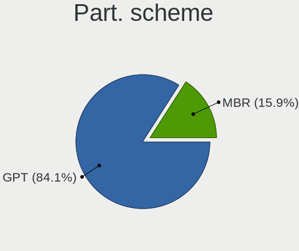
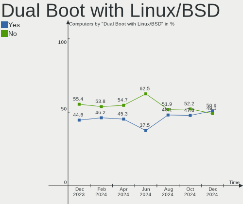
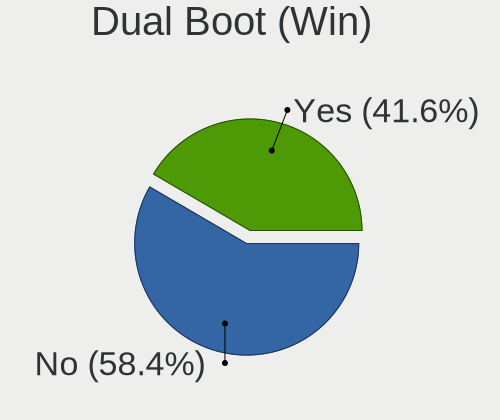
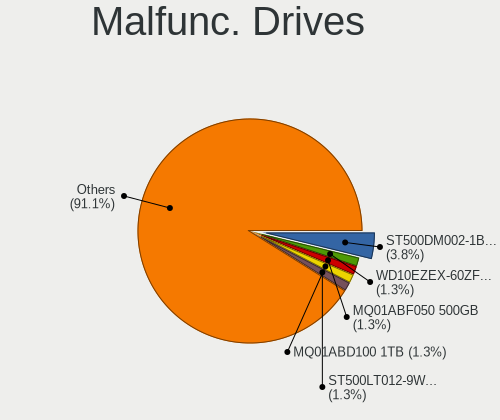

OpenMandriva Hardware Trends
----------------------------

A project to identify most popular hardware characteristics and track their change
over time based on data collected by OpenMandriva users at https://Linux-Hardware.org.

Anyone can contribute to this report by the [hw-probe](https://github.com/linuxhw/hw-probe) tool:

    sudo -E hw-probe -all -upload

This is a report for all computer types. See also reports for [desktops](/Dist/OpenMandriva/Desktop/README.md) and [notebooks](/Dist/OpenMandriva/Notebook/README.md).

Full-feature report is available here: https://linux-hardware.org/?view=trends

Period: Mar, 2022.

Contents
--------

* [ System ](#system)
  - [ OS                       ](#os)
  - [ OS Family                ](#os-family)
  - [ Kernel                   ](#kernel)
  - [ Kernel Family            ](#kernel-family)
  - [ Kernel Major Ver.        ](#kernel-major-ver)
  - [ Arch                     ](#arch)
  - [ DE                       ](#de)
  - [ Display Server           ](#display-server)
  - [ Display Manager          ](#display-manager)
  - [ OS Lang                  ](#os-lang)
  - [ Boot Mode                ](#boot-mode)
  - [ Filesystem               ](#filesystem)
  - [ Part. scheme             ](#part-scheme)
  - [ Dual Boot with Linux/BSD ](#dual-boot-with-linuxbsd)
  - [ Dual Boot (Win)          ](#dual-boot-win)

* [ Board ](#board)
  - [ Vendor                   ](#vendor)
  - [ Model                    ](#model)
  - [ Model Family             ](#model-family)
  - [ MFG Year                 ](#mfg-year)
  - [ Form Factor              ](#form-factor)
  - [ Secure Boot              ](#secure-boot)
  - [ Coreboot                 ](#coreboot)
  - [ RAM Size                 ](#ram-size)
  - [ RAM Used                 ](#ram-used)
  - [ Total Drives             ](#total-drives)
  - [ Has CD-ROM               ](#has-cd-rom)
  - [ Has Ethernet             ](#has-ethernet)
  - [ Has WiFi                 ](#has-wifi)
  - [ Has Bluetooth            ](#has-bluetooth)

* [ Location ](#location)
  - [ Country                  ](#country)
  - [ City                     ](#city)

* [ Drives ](#drives)
  - [ Drive Vendor             ](#drive-vendor)
  - [ Drive Model              ](#drive-model)
  - [ HDD Vendor               ](#hdd-vendor)
  - [ SSD Vendor               ](#ssd-vendor)
  - [ Drive Kind               ](#drive-kind)
  - [ Drive Connector          ](#drive-connector)
  - [ Drive Size               ](#drive-size)
  - [ Space Total              ](#space-total)
  - [ Space Used               ](#space-used)
  - [ Malfunc. Drives          ](#malfunc-drives)
  - [ Malfunc. Drive Vendor    ](#malfunc-drive-vendor)
  - [ Malfunc. HDD Vendor      ](#malfunc-hdd-vendor)
  - [ Malfunc. Drive Kind      ](#malfunc-drive-kind)
  - [ Failed Drives            ](#failed-drives)
  - [ Failed Drive Vendor      ](#failed-drive-vendor)
  - [ Drive Status             ](#drive-status)

* [ Storage controller ](#storage-controller)
  - [ Storage Vendor           ](#storage-vendor)
  - [ Storage Model            ](#storage-model)
  - [ Storage Kind             ](#storage-kind)

* [ Processor ](#processor)
  - [ CPU Vendor               ](#cpu-vendor)
  - [ CPU Model                ](#cpu-model)
  - [ CPU Model Family         ](#cpu-model-family)
  - [ CPU Cores                ](#cpu-cores)
  - [ CPU Sockets              ](#cpu-sockets)
  - [ CPU Threads              ](#cpu-threads)
  - [ CPU Op-Modes             ](#cpu-op-modes)
  - [ CPU Microcode            ](#cpu-microcode)
  - [ CPU Microarch            ](#cpu-microarch)

* [ Graphics ](#graphics)
  - [ GPU Vendor               ](#gpu-vendor)
  - [ GPU Model                ](#gpu-model)
  - [ GPU Combo                ](#gpu-combo)
  - [ GPU Driver               ](#gpu-driver)
  - [ GPU Memory               ](#gpu-memory)

* [ Monitor ](#monitor)
  - [ Monitor Vendor           ](#monitor-vendor)
  - [ Monitor Model            ](#monitor-model)
  - [ Monitor Resolution       ](#monitor-resolution)
  - [ Monitor Diagonal         ](#monitor-diagonal)
  - [ Monitor Width            ](#monitor-width)
  - [ Aspect Ratio             ](#aspect-ratio)
  - [ Monitor Area             ](#monitor-area)
  - [ Pixel Density            ](#pixel-density)
  - [ Multiple Monitors        ](#multiple-monitors)

* [ Network ](#network)
  - [ Net Controller Vendor    ](#net-controller-vendor)
  - [ Net Controller Model     ](#net-controller-model)
  - [ Wireless Vendor          ](#wireless-vendor)
  - [ Wireless Model           ](#wireless-model)
  - [ Ethernet Vendor          ](#ethernet-vendor)
  - [ Ethernet Model           ](#ethernet-model)
  - [ Net Controller Kind      ](#net-controller-kind)
  - [ Used Controller          ](#used-controller)
  - [ NICs                     ](#nics)
  - [ IPv6                     ](#ipv6)

* [ Bluetooth ](#bluetooth)
  - [ Bluetooth Vendor         ](#bluetooth-vendor)
  - [ Bluetooth Model          ](#bluetooth-model)

* [ Sound ](#sound)
  - [ Sound Vendor             ](#sound-vendor)
  - [ Sound Model              ](#sound-model)

* [ Memory ](#memory)
  - [ Memory Vendor            ](#memory-vendor)
  - [ Memory Model             ](#memory-model)
  - [ Memory Kind              ](#memory-kind)
  - [ Memory Form Factor       ](#memory-form-factor)
  - [ Memory Size              ](#memory-size)
  - [ Memory Speed             ](#memory-speed)

* [ Printers & scanners ](#printers--scanners)
  - [ Printer Vendor           ](#printer-vendor)
  - [ Printer Model            ](#printer-model)
  - [ Scanner Vendor           ](#scanner-vendor)
  - [ Scanner Model            ](#scanner-model)

* [ Camera ](#camera)
  - [ Camera Vendor            ](#camera-vendor)
  - [ Camera Model             ](#camera-model)

* [ Security ](#security)
  - [ Fingerprint Vendor       ](#fingerprint-vendor)
  - [ Fingerprint Model        ](#fingerprint-model)
  - [ Chipcard Vendor          ](#chipcard-vendor)
  - [ Chipcard Model           ](#chipcard-model)

* [ Unsupported ](#unsupported)
  - [ Unsupported Devices      ](#unsupported-devices)
  - [ Unsupported Device Types ](#unsupported-device-types)

System
------

OS
--

Installed operating systems

| Name              | Computers | Percent |
|-------------------|-----------|---------|
| OpenMandriva 4.3  | 396       | 89.8%   |
| OpenMandriva 4.2  | 30        | 6.8%    |
| OpenMandriva 4.50 | 14        | 3.17%   |
| OpenMandriva 4.90 | 1         | 0.23%   |

OS Family
---------

OS without a version

| Name         | Computers | Percent |
|--------------|-----------|---------|
| OpenMandriva | 441       | 100%    |

Kernel
------

Version of the Linux kernel

| Version                  | Computers | Percent |
|--------------------------|-----------|---------|
| 5.16.7-desktop-1omv4003  | 387       | 87.76%  |
| 5.10.14-desktop-1omv4002 | 28        | 6.35%   |
| 5.14.7-desktop-1omv4050  | 12        | 2.72%   |
| 5.16.13-desktop-1omv4003 | 5         | 1.13%   |
| 5.16.9-desktop-1omv4003  | 2         | 0.45%   |
| 5.16.3-desktop-2omv4050  | 2         | 0.45%   |
| 5.11.12-desktop-1omv4002 | 2         | 0.45%   |
| 5.16.5-desktop-2omv4003  | 1         | 0.23%   |
| 5.16.13-desktop-1omv4050 | 1         | 0.23%   |
| 5.14.14-desktop-1omv4050 | 1         | 0.23%   |

Kernel Family
-------------

Linux kernel without a distro release

| Version | Computers | Percent |
|---------|-----------|---------|
| 5.16.7  | 387       | 87.76%  |
| 5.10.14 | 28        | 6.35%   |
| 5.14.7  | 12        | 2.72%   |
| 5.16.13 | 6         | 1.36%   |
| 5.16.9  | 2         | 0.45%   |
| 5.16.3  | 2         | 0.45%   |
| 5.11.12 | 2         | 0.45%   |
| 5.16.5  | 1         | 0.23%   |
| 5.14.14 | 1         | 0.23%   |

Kernel Major Ver.
-----------------

Linux kernel major version

| Version | Computers | Percent |
|---------|-----------|---------|
| 5.16    | 398       | 90.25%  |
| 5.10    | 28        | 6.35%   |
| 5.14    | 13        | 2.95%   |
| 5.11    | 2         | 0.45%   |

Arch
----

OS architecture (x86_64, i586, etc.)

| Name   | Computers | Percent |
|--------|-----------|---------|
| x86_64 | 441       | 100%    |

DE
--

Desktop Environment

| Name | Computers | Percent |
|------|-----------|---------|
| KDE5 | 441       | 100%    |

Display Server
--------------

X11 or Wayland

| Name    | Computers | Percent |
|---------|-----------|---------|
| X11     | 438       | 99.32%  |
| Wayland | 3         | 0.68%   |

Display Manager
---------------

SDDM, LightDM, etc.

| Name | Computers | Percent |
|------|-----------|---------|
| SDDM | 441       | 100%    |

OS Lang
-------

Language

| Lang  | Computers | Percent |
|-------|-----------|---------|
| en_US | 237       | 53.74%  |
| de_DE | 27        | 6.12%   |
| fr_FR | 22        | 4.99%   |
| ru_RU | 18        | 4.08%   |
| pl_PL | 17        | 3.85%   |
| pt_BR | 16        | 3.63%   |
| cs_CZ | 16        | 3.63%   |
| en_IN | 15        | 3.4%    |
| es_AR | 11        | 2.49%   |
| it_IT | 9         | 2.04%   |
| es_ES | 9         | 2.04%   |
| es_MX | 6         | 1.36%   |
| es_CO | 4         | 0.91%   |
| en_GB | 4         | 0.91%   |
| nl_NL | 3         | 0.68%   |
| nl_BE | 3         | 0.68%   |
| nb_NO | 3         | 0.68%   |
| es_VE | 3         | 0.68%   |
| de_AT | 3         | 0.68%   |
| tr_TR | 2         | 0.45%   |
| fr_CA | 2         | 0.45%   |
| es_SV | 2         | 0.45%   |
| es_EC | 2         | 0.45%   |
| tr_CY | 1         | 0.23%   |
| ru_UA | 1         | 0.23%   |
| hu_HU | 1         | 0.23%   |
| es_PE | 1         | 0.23%   |
| es_CR | 1         | 0.23%   |
| en_CA | 1         | 0.23%   |
| de_CH | 1         | 0.23%   |

Boot Mode
---------

EFI or BIOS

| Mode | Computers | Percent |
|------|-----------|---------|
| BIOS | 230       | 52.15%  |
| EFI  | 211       | 47.85%  |

Filesystem
----------

Type of filesystem

| Type    | Computers | Percent |
|---------|-----------|---------|
| Overlay | 345       | 78.23%  |
| Ext4    | 95        | 21.54%  |
| Btrfs   | 1         | 0.23%   |

Part. scheme
------------

Scheme of partitioning

| Type    | Computers | Percent |
|---------|-----------|---------|
| GPT     | 297       | 67.35%  |
| MBR     | 143       | 32.43%  |
| Unknown | 1         | 0.23%   |

Dual Boot with Linux/BSD
------------------------

Hosting more than one Linux/BSD

| Dual boot | Computers | Percent |
|-----------|-----------|---------|
| No        | 264       | 59.86%  |
| Yes       | 177       | 40.14%  |

Dual Boot (Win)
---------------

Hosting Linux and Windows

| Dual boot | Computers | Percent |
|-----------|-----------|---------|
| Yes       | 225       | 51.02%  |
| No        | 216       | 48.98%  |

Board
-----

Vendor
------

Motherboard manufacturer

| Name                  | Computers | Percent |
|-----------------------|-----------|---------|
| ASUSTek Computer      | 82        | 18.59%  |
| Dell                  | 66        | 14.97%  |
| Lenovo                | 52        | 11.79%  |
| Gigabyte Technology   | 51        | 11.56%  |
| Hewlett-Packard       | 45        | 10.2%   |
| Acer                  | 23        | 5.22%   |
| MSI                   | 18        | 4.08%   |
| Toshiba               | 13        | 2.95%   |
| ASRock                | 12        | 2.72%   |
| Intel                 | 11        | 2.49%   |
| Apple                 | 8         | 1.81%   |
| Biostar               | 7         | 1.59%   |
| Fujitsu               | 6         | 1.36%   |
| Sony                  | 5         | 1.13%   |
| Pegatron              | 5         | 1.13%   |
| Samsung Electronics   | 4         | 0.91%   |
| Medion                | 4         | 0.91%   |
| Packard Bell          | 3         | 0.68%   |
| Fujitsu Siemens       | 3         | 0.68%   |
| Positivo              | 2         | 0.45%   |
| Philco                | 2         | 0.45%   |
| Foxconn               | 2         | 0.45%   |
| VIT                   | 1         | 0.23%   |
| Supermicro            | 1         | 0.23%   |
| Positivo Bahia - VAIO | 1         | 0.23%   |
| Panasonic             | 1         | 0.23%   |
| ONDA                  | 1         | 0.23%   |
| MouseComputer         | 1         | 0.23%   |
| Login Informatica     | 1         | 0.23%   |
| Koloe                 | 1         | 0.23%   |
| IP3 Tech              | 1         | 0.23%   |
| Infinix               | 1         | 0.23%   |
| HUAWEI                | 1         | 0.23%   |
| eMachines             | 1         | 0.23%   |
| ECS                   | 1         | 0.23%   |
| Coradir               | 1         | 0.23%   |
| Alienware             | 1         | 0.23%   |
| ABIT                  | 1         | 0.23%   |
| Unknown               | 1         | 0.23%   |

Model
-----

Motherboard model

| Name                                              | Computers | Percent |
|---------------------------------------------------|-----------|---------|
| Gigabyte H410M H V3                               | 15        | 3.4%    |
| ASUS UX31E                                        | 13        | 2.95%   |
| Dell Latitude 3120                                | 12        | 2.72%   |
| ASUS All Series                                   | 6         | 1.36%   |
| ASUS M2R-FVM                                      | 4         | 0.91%   |
| Unknown                                           | 4         | 0.91%   |
| MSI GE72VR 6RF                                    | 3         | 0.68%   |
| Dell XPS 13 9360                                  | 3         | 0.68%   |
| Dell Latitude 3190 2-in-1                         | 3         | 0.68%   |
| Dell Latitude 3189                                | 3         | 0.68%   |
| Sony VGN-FZ31Z                                    | 2         | 0.45%   |
| MSI MS-7721                                       | 2         | 0.45%   |
| Lenovo ThinkStation P340 Tiny 30DFS05W00          | 2         | 0.45%   |
| HP Pavilion dv6                                   | 2         | 0.45%   |
| HP Pavilion dv5                                   | 2         | 0.45%   |
| Gigabyte GA-78LMT-USB3 R2                         | 2         | 0.45%   |
| Gigabyte B660 GAMING X DDR4                       | 2         | 0.45%   |
| Dell OptiPlex XE                                  | 2         | 0.45%   |
| Dell OptiPlex 380                                 | 2         | 0.45%   |
| Dell Latitude 3390 2-in-1                         | 2         | 0.45%   |
| Dell Latitude 3310                                | 2         | 0.45%   |
| VIT P2402                                         | 1         | 0.23%   |
| Toshiba TECRA M11                                 | 1         | 0.23%   |
| Toshiba Satellite U400                            | 1         | 0.23%   |
| Toshiba Satellite Pro S500                        | 1         | 0.23%   |
| Toshiba Satellite Pro P200                        | 1         | 0.23%   |
| Toshiba Satellite Pro C660                        | 1         | 0.23%   |
| Toshiba Satellite L450D                           | 1         | 0.23%   |
| Toshiba Satellite L350D                           | 1         | 0.23%   |
| Toshiba Satellite C855-2G8                        | 1         | 0.23%   |
| Toshiba Satellite C70                             | 1         | 0.23%   |
| Toshiba Satellite C55D-A                          | 1         | 0.23%   |
| Toshiba QOSMIO X770                               | 1         | 0.23%   |
| Toshiba PORTEGE R935                              | 1         | 0.23%   |
| Toshiba PORTEGE R835                              | 1         | 0.23%   |
| Supermicro PCplus T600-C246                       | 1         | 0.23%   |
| Sony VPCEB4E1E                                    | 1         | 0.23%   |
| Sony VGN-Z690N                                    | 1         | 0.23%   |
| Sony SVE1711G1RB                                  | 1         | 0.23%   |
| Samsung RV420/RV520/RV720/E3530/S3530/E3420/E3520 | 1         | 0.23%   |
| Samsung 950XCJ/951XCJ/950XCR                      | 1         | 0.23%   |
| Samsung 530U3BI/530U4BI/530U4BH                   | 1         | 0.23%   |
| Samsung 300E4A/300E5A/300E7A/3430EA/3530EA        | 1         | 0.23%   |
| Positivo Z100                                     | 1         | 0.23%   |
| Positivo Mobile                                   | 1         | 0.23%   |
| Positivo Bahia - VAIO VJFE52F11X-XXXXXX           | 1         | 0.23%   |
| Philco 14I                                        | 1         | 0.23%   |
| Philco 10D                                        | 1         | 0.23%   |
| Pegatron SM 3322                                  | 1         | 0.23%   |
| Pegatron p6-2003es                                | 1         | 0.23%   |
| Pegatron KN278AA-ABM a6430la                      | 1         | 0.23%   |
| Pegatron IPMSB-GS                                 | 1         | 0.23%   |
| Pegatron IPM41-D3                                 | 1         | 0.23%   |
| Panasonic CF-30KTPA9NP                            | 1         | 0.23%   |
| Packard Bell EasyNote TK11BZ                      | 1         | 0.23%   |
| Packard Bell EasyNote ENTG71BM                    | 1         | 0.23%   |
| Packard Bell DOT S                                | 1         | 0.23%   |
| ONDA A68V+                                        | 1         | 0.23%   |
| MSI Z1-7641                                       | 1         | 0.23%   |
| MSI p6730br                                       | 1         | 0.23%   |

Model Family
------------

Motherboard model prefix

| Name                                    | Computers | Percent |
|-----------------------------------------|-----------|---------|
| Dell Latitude                           | 35        | 7.94%   |
| Lenovo ThinkPad                         | 18        | 4.08%   |
| Acer Aspire                             | 17        | 3.85%   |
| Gigabyte H410M                          | 15        | 3.4%    |
| HP Pavilion                             | 14        | 3.17%   |
| ASUS UX31E                              | 13        | 2.95%   |
| Dell Inspiron                           | 11        | 2.49%   |
| ASUS PRIME                              | 11        | 2.49%   |
| Toshiba Satellite                       | 9         | 2.04%   |
| Dell OptiPlex                           | 8         | 1.81%   |
| Dell XPS                                | 7         | 1.59%   |
| Lenovo ThinkCentre                      | 6         | 1.36%   |
| ASUS All                                | 6         | 1.36%   |
| Lenovo IdeaPad                          | 5         | 1.13%   |
| Lenovo IdeaCentre                       | 5         | 1.13%   |
| HP Laptop                               | 5         | 1.13%   |
| ASUS VivoBook                           | 4         | 0.91%   |
| ASUS M2R-FVM                            | 4         | 0.91%   |
| Unknown                                 | 4         | 0.91%   |
| MSI GE72VR                              | 3         | 0.68%   |
| Lenovo ThinkStation                     | 3         | 0.68%   |
| HP EliteBook                            | 3         | 0.68%   |
| HP Compaq                               | 3         | 0.68%   |
| Fujitsu LIFEBOOK                        | 3         | 0.68%   |
| ASUS TUF                                | 3         | 0.68%   |
| ASUS SABERTOOTH                         | 3         | 0.68%   |
| ASUS P8H61-M                            | 3         | 0.68%   |
| ASUS M5A78L-M                           | 3         | 0.68%   |
| Toshiba PORTEGE                         | 2         | 0.45%   |
| Sony VGN-FZ31Z                          | 2         | 0.45%   |
| Packard Bell EasyNote                   | 2         | 0.45%   |
| MSI MS-7721                             | 2         | 0.45%   |
| Lenovo Legion                           | 2         | 0.45%   |
| Lenovo IdeaPadFlex                      | 2         | 0.45%   |
| Intel H61                               | 2         | 0.45%   |
| Intel DH61WW                            | 2         | 0.45%   |
| HP ProBook                              | 2         | 0.45%   |
| HP ENVY                                 | 2         | 0.45%   |
| Gigabyte X570                           | 2         | 0.45%   |
| Gigabyte GA-78LMT-USB3                  | 2         | 0.45%   |
| Gigabyte B660                           | 2         | 0.45%   |
| Gigabyte B560M                          | 2         | 0.45%   |
| Dell Precision                          | 2         | 0.45%   |
| Acer Predator                           | 2         | 0.45%   |
| Acer Extensa                            | 2         | 0.45%   |
| VIT P2402                               | 1         | 0.23%   |
| Toshiba TECRA                           | 1         | 0.23%   |
| Toshiba QOSMIO                          | 1         | 0.23%   |
| Supermicro PCplus                       | 1         | 0.23%   |
| Sony VPCEB4E1E                          | 1         | 0.23%   |
| Sony VGN-Z690N                          | 1         | 0.23%   |
| Sony SVE1711G1RB                        | 1         | 0.23%   |
| Samsung RV420                           | 1         | 0.23%   |
| Samsung 950XCJ                          | 1         | 0.23%   |
| Samsung 530U3BI                         | 1         | 0.23%   |
| Samsung 300E4A                          | 1         | 0.23%   |
| Positivo Z100                           | 1         | 0.23%   |
| Positivo Mobile                         | 1         | 0.23%   |
| Positivo Bahia - VAIO VJFE52F11X-XXXXXX | 1         | 0.23%   |
| Philco 14I                              | 1         | 0.23%   |

MFG Year
--------

Motherboard manufacture year

| Year | Computers | Percent |
|------|-----------|---------|
| 2021 | 58        | 13.15%  |
| 2011 | 52        | 11.79%  |
| 2012 | 39        | 8.84%   |
| 2014 | 34        | 7.71%   |
| 2020 | 31        | 7.03%   |
| 2010 | 30        | 6.8%    |
| 2013 | 28        | 6.35%   |
| 2018 | 26        | 5.9%    |
| 2016 | 26        | 5.9%    |
| 2008 | 23        | 5.22%   |
| 2019 | 19        | 4.31%   |
| 2015 | 18        | 4.08%   |
| 2009 | 17        | 3.85%   |
| 2007 | 16        | 3.63%   |
| 2017 | 13        | 2.95%   |
| 2006 | 9         | 2.04%   |
| 2022 | 1         | 0.23%   |
| 2005 | 1         | 0.23%   |

Form Factor
-----------

Physical design of the computer

| Name        | Computers | Percent |
|-------------|-----------|---------|
| Notebook    | 218       | 49.43%  |
| Desktop     | 188       | 42.63%  |
| Convertible | 21        | 4.76%   |
| All in one  | 8         | 1.81%   |
| Mini pc     | 5         | 1.13%   |
| Server      | 1         | 0.23%   |

Secure Boot
-----------

Enabled or disabled

| State    | Computers | Percent |
|----------|-----------|---------|
| Disabled | 441       | 100%    |

Coreboot
--------

Have coreboot on board

| Used | Computers | Percent |
|------|-----------|---------|
| No   | 441       | 100%    |

RAM Size
--------

Total RAM memory

| Size in GB      | Computers | Percent |
|-----------------|-----------|---------|
| 4.01-8.0        | 144       | 32.65%  |
| 3.01-4.0        | 114       | 25.85%  |
| 16.01-24.0      | 60        | 13.61%  |
| 8.01-16.0       | 60        | 13.61%  |
| 32.01-64.0      | 21        | 4.76%   |
| 1.01-2.0        | 19        | 4.31%   |
| 2.01-3.0        | 8         | 1.81%   |
| 24.01-32.0      | 6         | 1.36%   |
| 64.01-256.0     | 4         | 0.91%   |
| 0.51-1.0        | 4         | 0.91%   |
| More than 256.0 | 1         | 0.23%   |

RAM Used
--------

Used RAM memory

| Used GB  | Computers | Percent |
|----------|-----------|---------|
| 1.01-2.0 | 318       | 72.11%  |
| 0.51-1.0 | 72        | 16.33%  |
| 2.01-3.0 | 33        | 7.48%   |
| 0.01-0.5 | 12        | 2.72%   |
| 4.01-8.0 | 3         | 0.68%   |
| 3.01-4.0 | 3         | 0.68%   |

Total Drives
------------

Number of drives on board

| Drives | Computers | Percent |
|--------|-----------|---------|
| 1      | 280       | 63.49%  |
| 2      | 109       | 24.72%  |
| 3      | 23        | 5.22%   |
| 4      | 13        | 2.95%   |
| 0      | 9         | 2.04%   |
| 5      | 4         | 0.91%   |
| 9      | 1         | 0.23%   |
| 7      | 1         | 0.23%   |
| 6      | 1         | 0.23%   |

Has CD-ROM
----------

Has CD-ROM on board

| Presented | Computers | Percent |
|-----------|-----------|---------|
| No        | 231       | 52.38%  |
| Yes       | 210       | 47.62%  |

Has Ethernet
------------

Has Ethernet on board

| Presented | Computers | Percent |
|-----------|-----------|---------|
| Yes       | 384       | 87.07%  |
| No        | 57        | 12.93%  |

Has WiFi
--------

Has WiFi module

| Presented | Computers | Percent |
|-----------|-----------|---------|
| Yes       | 310       | 70.29%  |
| No        | 131       | 29.71%  |

Has Bluetooth
-------------

Has Bluetooth module

| Presented | Computers | Percent |
|-----------|-----------|---------|
| Yes       | 221       | 50.11%  |
| No        | 220       | 49.89%  |

Location
--------

Country
-------

Geographic location (country)

| Country     | Computers | Percent |
|-------------|-----------|---------|
| Germany     | 45        | 10.2%   |
| USA         | 43        | 9.75%   |
| France      | 33        | 7.48%   |
| Netherlands | 32        | 7.26%   |
| Poland      | 29        | 6.58%   |
| Brazil      | 28        | 6.35%   |
| Russia      | 23        | 5.22%   |
| India       | 18        | 4.08%   |
| Czechia     | 17        | 3.85%   |
| Spain       | 14        | 3.17%   |
| Italy       | 13        | 2.95%   |
| Argentina   | 13        | 2.95%   |
| Indonesia   | 12        | 2.72%   |
| Mexico      | 7         | 1.59%   |
| Canada      | 7         | 1.59%   |
| Australia   | 6         | 1.36%   |
| UK          | 5         | 1.13%   |
| Serbia      | 5         | 1.13%   |
| Norway      | 5         | 1.13%   |
| Colombia    | 5         | 1.13%   |
| Turkey      | 4         | 0.91%   |
| Portugal    | 4         | 0.91%   |
| Japan       | 4         | 0.91%   |
| Bulgaria    | 4         | 0.91%   |
| Austria     | 4         | 0.91%   |
| Venezuela   | 3         | 0.68%   |
| Switzerland | 3         | 0.68%   |
| Sweden      | 3         | 0.68%   |
| Finland     | 3         | 0.68%   |
| Ecuador     | 3         | 0.68%   |
| Belgium     | 3         | 0.68%   |
| Uzbekistan  | 2         | 0.45%   |
| Slovenia    | 2         | 0.45%   |
| Malaysia    | 2         | 0.45%   |
| Hungary     | 2         | 0.45%   |
| Greece      | 2         | 0.45%   |
| El Salvador | 2         | 0.45%   |
| Egypt       | 2         | 0.45%   |
| Costa Rica  | 2         | 0.45%   |
| China       | 2         | 0.45%   |
| Bolivia     | 2         | 0.45%   |
| Belarus     | 2         | 0.45%   |
| Uruguay     | 1         | 0.23%   |
| Ukraine     | 1         | 0.23%   |
| Thailand    | 1         | 0.23%   |
| Taiwan      | 1         | 0.23%   |
| Puerto Rico | 1         | 0.23%   |
| Philippines | 1         | 0.23%   |
| Peru        | 1         | 0.23%   |
| New Zealand | 1         | 0.23%   |
| Martinique  | 1         | 0.23%   |
| Libya       | 1         | 0.23%   |
| Kenya       | 1         | 0.23%   |
| Israel      | 1         | 0.23%   |
| Ireland     | 1         | 0.23%   |
| Hong Kong   | 1         | 0.23%   |
| Honduras    | 1         | 0.23%   |
| Guatemala   | 1         | 0.23%   |
| Georgia     | 1         | 0.23%   |
| Estonia     | 1         | 0.23%   |

City
----

Geographic location (city)

| City           | Computers | Percent |
|----------------|-----------|---------|
| Schagen        | 23        | 5.22%   |
| Gonikoppal     | 14        | 3.17%   |
| Prague         | 12        | 2.72%   |
| Wroclaw        | 4         | 0.91%   |
| Warsaw         | 4         | 0.91%   |
| Kristiansand   | 4         | 0.91%   |
| Krakow         | 4         | 0.91%   |
| Buenos Aires   | 4         | 0.91%   |
| Barcelona      | 4         | 0.91%   |
| Okazaki        | 3         | 0.68%   |
| Niterói       | 3         | 0.68%   |
| Niš           | 3         | 0.68%   |
| Munich         | 3         | 0.68%   |
| Milan          | 3         | 0.68%   |
| Hamburg        | 3         | 0.68%   |
| Bogor          | 3         | 0.68%   |
| Bergambacht    | 3         | 0.68%   |
| Vienna         | 2         | 0.45%   |
| Turnhout       | 2         | 0.45%   |
| Toowong        | 2         | 0.45%   |
| Surabaya       | 2         | 0.45%   |
| St Petersburg  | 2         | 0.45%   |
| Sangerhausen   | 2         | 0.45%   |
| San Marcos     | 2         | 0.45%   |
| Rochester      | 2         | 0.45%   |
| Ribeirao Pires | 2         | 0.45%   |
| Queens         | 2         | 0.45%   |
| Pennsville     | 2         | 0.45%   |
| Paris          | 2         | 0.45%   |
| Moscow         | 2         | 0.45%   |
| Mexico City    | 2         | 0.45%   |
| Marseille      | 2         | 0.45%   |
| Lexington      | 2         | 0.45%   |
| Ivanteyevka    | 2         | 0.45%   |
| Istanbul       | 2         | 0.45%   |
| Helsinki       | 2         | 0.45%   |
| Gdansk         | 2         | 0.45%   |
| Funchal        | 2         | 0.45%   |
| Córdoba       | 2         | 0.45%   |
| Ciapus         | 2         | 0.45%   |
| Cesky Brod     | 2         | 0.45%   |
| California     | 2         | 0.45%   |
| Bucaramanga    | 2         | 0.45%   |
| Bristol        | 2         | 0.45%   |
| Benken         | 2         | 0.45%   |
| Barranquilla   | 2         | 0.45%   |
| Athens         | 2         | 0.45%   |
| Łomża        | 1         | 0.23%   |
| Zaporizhzhya   | 1         | 0.23%   |
| Zanica         | 1         | 0.23%   |
| York           | 1         | 0.23%   |
| Yogyakarta     | 1         | 0.23%   |
| Yambol         | 1         | 0.23%   |
| Wuppertal      | 1         | 0.23%   |
| Williamsport   | 1         | 0.23%   |
| Wigan          | 1         | 0.23%   |
| Whitestown     | 1         | 0.23%   |
| Wettringen     | 1         | 0.23%   |
| Westlake       | 1         | 0.23%   |
| Wesel          | 1         | 0.23%   |

Drives
------

Drive Vendor
------------

Hard drive vendors

| Vendor              | Computers | Drives | Percent |
|---------------------|-----------|--------|---------|
| WDC                 | 90        | 102    | 15.41%  |
| Seagate             | 86        | 96     | 14.73%  |
| Samsung Electronics | 86        | 108    | 14.73%  |
| Toshiba             | 41        | 47     | 7.02%   |
| SanDisk             | 35        | 37     | 5.99%   |
| Hitachi             | 28        | 30     | 4.79%   |
| Kingston            | 27        | 27     | 4.62%   |
| A-DATA Technology   | 25        | 25     | 4.28%   |
| SK Hynix            | 19        | 20     | 3.25%   |
| Crucial             | 16        | 18     | 2.74%   |
| HGST                | 15        | 15     | 2.57%   |
| Unknown             | 8         | 8      | 1.37%   |
| GOODRAM             | 6         | 7      | 1.03%   |
| KIOXIA              | 5         | 5      | 0.86%   |
| Intel               | 5         | 6      | 0.86%   |
| Apple               | 5         | 5      | 0.86%   |
| Apacer              | 5         | 5      | 0.86%   |
| Micron Technology   | 4         | 4      | 0.68%   |
| MAXTOR              | 4         | 4      | 0.68%   |
| China               | 4         | 4      | 0.68%   |
| ASMT                | 4         | 4      | 0.68%   |
| Unknown             | 4         | 4      | 0.68%   |
| PNY                 | 3         | 3      | 0.51%   |
| Phison              | 3         | 3      | 0.51%   |
| Netac               | 3         | 3      | 0.51%   |
| LITEON              | 3         | 3      | 0.51%   |
| Gigabyte Technology | 3         | 3      | 0.51%   |
| Fujitsu             | 3         | 3      | 0.51%   |
| XPG                 | 2         | 2      | 0.34%   |
| Patriot             | 2         | 2      | 0.34%   |
| KingDian            | 2         | 2      | 0.34%   |
| JMicron             | 2         | 2      | 0.34%   |
| Zheino              | 1         | 1      | 0.17%   |
| WDC WDBA            | 1         | 1      | 0.17%   |
| Verbatim            | 1         | 1      | 0.17%   |
| Vaseky              | 1         | 1      | 0.17%   |
| USB3.1              | 1         | 1      | 0.17%   |
| Transcend           | 1         | 1      | 0.17%   |
| Team                | 1         | 1      | 0.17%   |
| TCSUNBOW            | 1         | 1      | 0.17%   |
| SSSTC               | 1         | 1      | 0.17%   |
| SPCC M.2            | 1         | 1      | 0.17%   |
| SABRENT             | 1         | 1      | 0.17%   |
| RSH-339             | 1         | 1      | 0.17%   |
| PLEXTOR             | 1         | 1      | 0.17%   |
| Phison Electronics  | 1         | 1      | 0.17%   |
| ORTIAL              | 1         | 1      | 0.17%   |
| OCZ                 | 1         | 1      | 0.17%   |
| MidasForce          | 1         | 1      | 0.17%   |
| LS600               | 1         | 1      | 0.17%   |
| LITEONIT            | 1         | 1      | 0.17%   |
| Lenovo              | 1         | 1      | 0.17%   |
| KingSpec            | 1         | 1      | 0.17%   |
| KingFast            | 1         | 1      | 0.17%   |
| Intenso             | 1         | 1      | 0.17%   |
| INNOVATION IT       | 1         | 1      | 0.17%   |
| INDMEM              | 1         | 1      | 0.17%   |
| IBM/Hitachi         | 1         | 1      | 0.17%   |
| HS-SSD-E100N        | 1         | 1      | 0.17%   |
| HPE                 | 1         | 1      | 0.17%   |

Drive Model
-----------

Hard drive models

| Model                                 | Computers | Percent |
|---------------------------------------|-----------|---------|
| A-DATA SU750 256GB SSD                | 14        | 2.22%   |
| SanDisk SSD U100 256GB                | 13        | 2.06%   |
| Kingston SA400S37240G 240GB SSD       | 9         | 1.43%   |
| Toshiba DT01ACA100 1TB                | 6         | 0.95%   |
| Seagate ST500DM002-1BD142 500GB       | 6         | 0.95%   |
| Samsung SSD 860 EVO 500GB             | 6         | 0.95%   |
| Samsung PM991a NVMe 128GB             | 6         | 0.95%   |
| Kingston SA400S37120G 120GB SSD       | 6         | 0.95%   |
| HGST HTS721010A9E630 1TB              | 6         | 0.95%   |
| SK Hynix BC711 NVMe 128GB             | 5         | 0.79%   |
| Seagate ST500LT012-1DG142 500GB       | 5         | 0.79%   |
| Seagate ST1000DM010-2EP102 1TB        | 5         | 0.79%   |
| WDC WDS240G2G0A-00JH30 240GB SSD      | 4         | 0.63%   |
| WDC WD10EZEX-08WN4A0 1TB              | 4         | 0.63%   |
| Toshiba MQ01ABF050 500GB              | 4         | 0.63%   |
| Seagate ST3500413AS 500GB             | 4         | 0.63%   |
| Seagate ST2000DM001-1ER164 2TB        | 4         | 0.63%   |
| Seagate ST1000LM035-1RK172 1TB        | 4         | 0.63%   |
| Seagate ST1000LM024 HN-M101MBB 1TB    | 4         | 0.63%   |
| Samsung SSD 860 EVO 250GB             | 4         | 0.63%   |
| Unknown                               | 4         | 0.63%   |
| WDC WD5000LPVX-22V0TT0 500GB          | 3         | 0.48%   |
| Toshiba MQ04ABF100 1TB                | 3         | 0.48%   |
| SK Hynix HFS256G39MND-3510A 256GB SSD | 3         | 0.48%   |
| Seagate ST9500325AS 500GB             | 3         | 0.48%   |
| Seagate ST500LM012 HN-M500MBB 500GB   | 3         | 0.48%   |
| SanDisk SSD PLUS 240GB                | 3         | 0.48%   |
| Samsung SSD 970 EVO Plus 2TB          | 3         | 0.48%   |
| Samsung SSD 860 QVO 1TB               | 3         | 0.48%   |
| Samsung SSD 850 EVO 250GB             | 3         | 0.48%   |
| Samsung SSD 840 EVO 120GB             | 3         | 0.48%   |
| Samsung HD502HJ 500GB                 | 3         | 0.48%   |
| Samsung HD322HJ 320GB                 | 3         | 0.48%   |
| Samsung HD160JJ 160GB                 | 3         | 0.48%   |
| Samsung HD103SJ 1TB                   | 3         | 0.48%   |
| Crucial CT240BX500SSD1 240GB          | 3         | 0.48%   |
| Apple HDD HTS541010A9E662 1TB         | 3         | 0.48%   |
| A-DATA SU650 120GB SSD                | 3         | 0.48%   |
| WDC WDS480G2G0A-00JH30 480GB SSD      | 2         | 0.32%   |
| WDC WDS240G2G0B-00EPW0 240GB SSD      | 2         | 0.32%   |
| WDC WD5000LPCX-24C6HT0 500GB          | 2         | 0.32%   |
| WDC WD5000AAKX-75U6AA0 500GB          | 2         | 0.32%   |
| WDC WD2500BEVT-22ZCT0 250GB           | 2         | 0.32%   |
| WDC WD20EZRZ-00Z5HB0 2TB              | 2         | 0.32%   |
| WDC WD10EARS-00Y5B1 1TB               | 2         | 0.32%   |
| WDC PC SN730 SDBQNTY-1T00-1001 1TB    | 2         | 0.32%   |
| Toshiba MQ01ABD050 500GB              | 2         | 0.32%   |
| Toshiba MK5075GSX 500GB               | 2         | 0.32%   |
| Toshiba MK3252GSX 320GB               | 2         | 0.32%   |
| Toshiba KXG50ZNV512G NVMe 512GB       | 2         | 0.32%   |
| Toshiba HDWD130 3TB                   | 2         | 0.32%   |
| Toshiba HDWD110 1TB                   | 2         | 0.32%   |
| Toshiba DT01ACA050 500GB              | 2         | 0.32%   |
| SK Hynix SC311 SATA 128GB SSD         | 2         | 0.32%   |
| Seagate ST9320325AS 320GB             | 2         | 0.32%   |
| Seagate ST750LM022 HN-M750MBB 752GB   | 2         | 0.32%   |
| Seagate ST3500418AS 500GB             | 2         | 0.32%   |
| Seagate ST320LT012-1DG14C 320GB       | 2         | 0.32%   |
| Seagate ST3160815AS 160GB             | 2         | 0.32%   |
| Seagate ST31000528AS 1TB              | 2         | 0.32%   |

HDD Vendor
----------

Hard disk drive vendors

| Vendor              | Computers | Drives | Percent |
|---------------------|-----------|--------|---------|
| Seagate             | 84        | 94     | 31.11%  |
| WDC                 | 68        | 78     | 25.19%  |
| Toshiba             | 37        | 43     | 13.7%   |
| Hitachi             | 28        | 30     | 10.37%  |
| Samsung Electronics | 20        | 23     | 7.41%   |
| HGST                | 15        | 15     | 5.56%   |
| MAXTOR              | 4         | 4      | 1.48%   |
| Apple               | 4         | 4      | 1.48%   |
| Fujitsu             | 3         | 3      | 1.11%   |
| Unknown             | 1         | 1      | 0.37%   |
| SABRENT             | 1         | 1      | 0.37%   |
| RSH-339             | 1         | 1      | 0.37%   |
| IBM/Hitachi         | 1         | 1      | 0.37%   |
| HPE                 | 1         | 1      | 0.37%   |
| Hewlett-Packard     | 1         | 1      | 0.37%   |
| ASMedia             | 1         | 1      | 0.37%   |

SSD Vendor
----------

Solid state drive vendors

| Vendor              | Computers | Drives | Percent |
|---------------------|-----------|--------|---------|
| Samsung Electronics | 43        | 50     | 19.82%  |
| SanDisk             | 31        | 32     | 14.29%  |
| Kingston            | 24        | 24     | 11.06%  |
| A-DATA Technology   | 22        | 22     | 10.14%  |
| WDC                 | 14        | 14     | 6.45%   |
| Crucial             | 12        | 13     | 5.53%   |
| SK Hynix            | 6         | 7      | 2.76%   |
| GOODRAM             | 6         | 6      | 2.76%   |
| Micron Technology   | 4         | 4      | 1.84%   |
| China               | 4         | 4      | 1.84%   |
| ASMT                | 4         | 4      | 1.84%   |
| Unknown             | 4         | 4      | 1.84%   |
| PNY                 | 3         | 3      | 1.38%   |
| Netac               | 3         | 3      | 1.38%   |
| Gigabyte Technology | 3         | 3      | 1.38%   |
| Apacer              | 3         | 3      | 1.38%   |
| Toshiba             | 2         | 2      | 0.92%   |
| LITEON              | 2         | 2      | 0.92%   |
| KingDian            | 2         | 2      | 0.92%   |
| Zheino              | 1         | 1      | 0.46%   |
| WDC WDBA            | 1         | 1      | 0.46%   |
| Vaseky              | 1         | 1      | 0.46%   |
| Transcend           | 1         | 1      | 0.46%   |
| Team                | 1         | 1      | 0.46%   |
| TCSUNBOW            | 1         | 1      | 0.46%   |
| SPCC M.2            | 1         | 1      | 0.46%   |
| PLEXTOR             | 1         | 1      | 0.46%   |
| Patriot             | 1         | 1      | 0.46%   |
| ORTIAL              | 1         | 1      | 0.46%   |
| OCZ                 | 1         | 1      | 0.46%   |
| MidasForce          | 1         | 1      | 0.46%   |
| LS600               | 1         | 1      | 0.46%   |
| LITEONIT            | 1         | 1      | 0.46%   |
| KingSpec            | 1         | 1      | 0.46%   |
| KingFast            | 1         | 1      | 0.46%   |
| JMicron             | 1         | 1      | 0.46%   |
| Intenso             | 1         | 1      | 0.46%   |
| Intel               | 1         | 1      | 0.46%   |
| INNOVATION IT       | 1         | 1      | 0.46%   |
| HS-SSD-E100N        | 1         | 1      | 0.46%   |
| Hikvision           | 1         | 1      | 0.46%   |
| GOLDEN              | 1         | 1      | 0.46%   |
| DOGFISH             | 1         | 1      | 0.46%   |
| AMD                 | 1         | 1      | 0.46%   |

Drive Kind
----------

HDD or SSD

| Kind    | Computers | Drives | Percent |
|---------|-----------|--------|---------|
| HDD     | 235       | 301    | 43.68%  |
| SSD     | 202       | 227    | 37.55%  |
| NVMe    | 87        | 101    | 16.17%  |
| MMC     | 8         | 8      | 1.49%   |
| Unknown | 6         | 6      | 1.12%   |

Drive Connector
---------------

SATA, SAS, NVMe, etc.

| Type | Computers | Drives | Percent |
|------|-----------|--------|---------|
| SATA | 371       | 507    | 75.41%  |
| NVMe | 87        | 101    | 17.68%  |
| SAS  | 26        | 27     | 5.28%   |
| MMC  | 8         | 8      | 1.63%   |

Drive Size
----------

Size of hard drive

| Size in TB | Computers | Drives | Percent |
|------------|-----------|--------|---------|
| 0.01-0.5   | 293       | 356    | 65.26%  |
| 0.51-1.0   | 110       | 119    | 24.5%   |
| 1.01-2.0   | 27        | 30     | 6.01%   |
| 3.01-4.0   | 7         | 8      | 1.56%   |
| 2.01-3.0   | 7         | 8      | 1.56%   |
| 4.01-10.0  | 5         | 7      | 1.11%   |

Space Total
-----------

Amount of disk space available on the file system

| Size in GB     | Computers | Percent |
|----------------|-----------|---------|
| 1-20           | 226       | 51.25%  |
| 101-250        | 67        | 15.19%  |
| 251-500        | 43        | 9.75%   |
| Unknown        | 38        | 8.62%   |
| 21-50          | 24        | 5.44%   |
| 501-1000       | 19        | 4.31%   |
| 51-100         | 14        | 3.17%   |
| 1001-2000      | 7         | 1.59%   |
| More than 3000 | 2         | 0.45%   |
| 2001-3000      | 1         | 0.23%   |

Space Used
----------

Amount of used disk space

| Used GB   | Computers | Percent |
|-----------|-----------|---------|
| 1-20      | 365       | 82.77%  |
| Unknown   | 38        | 8.62%   |
| 21-50     | 12        | 2.72%   |
| 251-500   | 7         | 1.59%   |
| 101-250   | 6         | 1.36%   |
| 51-100    | 6         | 1.36%   |
| 501-1000  | 5         | 1.13%   |
| 1001-2000 | 2         | 0.45%   |

Malfunc. Drives
---------------

Drive models with a malfunction

| Model                                 | Computers | Drives | Percent |
|---------------------------------------|-----------|--------|---------|
| SanDisk SSD U100 256GB                | 13        | 13     | 8.67%   |
| Seagate ST9500325AS 500GB             | 3         | 3      | 2%      |
| WDC WD5000LPVX-22V0TT0 500GB          | 2         | 2      | 1.33%   |
| Toshiba MQ01ABF050 500GB              | 2         | 2      | 1.33%   |
| Toshiba MK3252GSX 320GB               | 2         | 2      | 1.33%   |
| Seagate ST9320325AS 320GB             | 2         | 2      | 1.33%   |
| Seagate ST750LM022 HN-M750MBB 752GB   | 2         | 2      | 1.33%   |
| Seagate ST500LT012-1DG142 500GB       | 2         | 2      | 1.33%   |
| Seagate ST500DM002-1BD142 500GB       | 2         | 2      | 1.33%   |
| Seagate ST3500418AS 500GB             | 2         | 2      | 1.33%   |
| Seagate ST1000LM024 HN-M101MBB 1TB    | 2         | 2      | 1.33%   |
| Samsung Electronics HM160HI 160GB     | 2         | 2      | 1.33%   |
| Samsung Electronics HD502HJ 500GB     | 2         | 2      | 1.33%   |
| Samsung Electronics HD322HJ 320GB     | 2         | 2      | 1.33%   |
| Samsung Electronics HD160JJ 160GB     | 2         | 2      | 1.33%   |
| Kingston SV300S37A120G 120GB SSD      | 2         | 2      | 1.33%   |
| HGST HTS545050A7E680 500GB            | 2         | 2      | 1.33%   |
| WDC WDS240G2G0A-00JH30 240GB SSD      | 1         | 1      | 0.67%   |
| WDC WD800BD-08MRA1 80GB               | 1         | 1      | 0.67%   |
| WDC WD800AAJS-00PSA0 80GB             | 1         | 1      | 0.67%   |
| WDC WD600BB-00DKA0 64GB               | 1         | 1      | 0.67%   |
| WDC WD5000LPCX-24C6HT0 500GB          | 1         | 1      | 0.67%   |
| WDC WD5000BEVT-22A0RT0 500GB          | 1         | 1      | 0.67%   |
| WDC WD5000BEKT-75KA9T0 500GB          | 1         | 1      | 0.67%   |
| WDC WD5000BEKT-60KA9T0 500GB          | 1         | 1      | 0.67%   |
| WDC WD5000AAKX-603CA0 500GB           | 1         | 1      | 0.67%   |
| WDC WD5000AAKX-22ERMA0 500GB          | 1         | 1      | 0.67%   |
| WDC WD5000AAKX-08ERMA0 500GB          | 1         | 1      | 0.67%   |
| WDC WD5000AAJS-00YFA0 500GB           | 1         | 1      | 0.67%   |
| WDC WD3200BPVT-80ZEST0 320GB          | 1         | 1      | 0.67%   |
| WDC WD3200BPVT-24JJ5T0 320GB          | 1         | 1      | 0.67%   |
| WDC WD3200BEVT-22A23T0 320GB          | 1         | 1      | 0.67%   |
| WDC WD3200AAKS-75L9A0 320GB           | 1         | 1      | 0.67%   |
| WDC WD3200AAKS-61L9A0 320GB           | 1         | 1      | 0.67%   |
| WDC WD3200AAJS-08L7A0 320GB           | 1         | 1      | 0.67%   |
| WDC WD3200A 320GB                     | 1         | 1      | 0.67%   |
| WDC WD30EFRX-68AX9N0 3TB              | 1         | 1      | 0.67%   |
| WDC WD2500BEVT-22ZCT0 250GB           | 1         | 1      | 0.67%   |
| WDC WD2500AVJS-63B6A0 250GB           | 1         | 1      | 0.67%   |
| WDC WD20EZRZ-00Z5HB0 2TB              | 1         | 1      | 0.67%   |
| WDC WD20EFRX-68EUZN0 2TB              | 1         | 2      | 0.67%   |
| WDC WD1600BEVT-22ZCT0 160GB           | 1         | 1      | 0.67%   |
| WDC WD1600AAJS-08WAA0 160GB           | 1         | 1      | 0.67%   |
| WDC WD10JPVX-22JC3T0 1TB              | 1         | 1      | 0.67%   |
| WDC WD10EARS-00Y5B1 1TB               | 1         | 1      | 0.67%   |
| WDC WD1001FALS-00J7B1 1TB             | 1         | 1      | 0.67%   |
| Vaseky V800/60G 64GB SSD              | 1         | 1      | 0.67%   |
| Toshiba MQ04ABF100 1TB                | 1         | 1      | 0.67%   |
| Toshiba MQ01ABD050 500GB              | 1         | 1      | 0.67%   |
| Toshiba MK6461GSY 640GB               | 1         | 1      | 0.67%   |
| Toshiba MK5075GSX 500GB               | 1         | 1      | 0.67%   |
| SK Hynix HFS128G39TND-N210A 128GB SSD | 1         | 2      | 0.67%   |
| Seagate STM3500418AS 500GB            | 1         | 1      | 0.67%   |
| Seagate ST95005620AS 500GB            | 1         | 1      | 0.67%   |
| Seagate ST94019A 40GB                 | 1         | 1      | 0.67%   |
| Seagate ST9320320AS 320GB             | 1         | 1      | 0.67%   |
| Seagate ST9250414ASG 250GB            | 1         | 1      | 0.67%   |
| Seagate ST500LM021-1KJ152 500GB       | 1         | 1      | 0.67%   |
| Seagate ST500LM012 HN-M500MBB 500GB   | 1         | 1      | 0.67%   |
| Seagate ST3500413AS 500GB             | 1         | 1      | 0.67%   |

Malfunc. Drive Vendor
---------------------

Vendors of faulty drives

| Vendor              | Computers | Drives | Percent |
|---------------------|-----------|--------|---------|
| Seagate             | 34        | 35     | 23.29%  |
| WDC                 | 29        | 32     | 19.86%  |
| Samsung Electronics | 17        | 18     | 11.64%  |
| SanDisk             | 16        | 16     | 10.96%  |
| Hitachi             | 14        | 14     | 9.59%   |
| Toshiba             | 8         | 8      | 5.48%   |
| HGST                | 6         | 6      | 4.11%   |
| Kingston            | 4         | 4      | 2.74%   |
| MAXTOR              | 3         | 3      | 2.05%   |
| Fujitsu             | 3         | 3      | 2.05%   |
| Crucial             | 3         | 3      | 2.05%   |
| Vaseky              | 1         | 1      | 0.68%   |
| SK Hynix            | 1         | 2      | 0.68%   |
| RSH-339             | 1         | 1      | 0.68%   |
| Micron Technology   | 1         | 1      | 0.68%   |
| Intel               | 1         | 1      | 0.68%   |
| IBM/Hitachi         | 1         | 1      | 0.68%   |
| HPE                 | 1         | 1      | 0.68%   |
| DOGFISH             | 1         | 1      | 0.68%   |
| ASMedia             | 1         | 1      | 0.68%   |

Malfunc. HDD Vendor
-------------------

Vendors of faulty HDD drives

| Vendor              | Computers | Drives | Percent |
|---------------------|-----------|--------|---------|
| Seagate             | 34        | 35     | 30.09%  |
| WDC                 | 28        | 31     | 24.78%  |
| Hitachi             | 14        | 14     | 12.39%  |
| Samsung Electronics | 13        | 14     | 11.5%   |
| Toshiba             | 8         | 8      | 7.08%   |
| HGST                | 6         | 6      | 5.31%   |
| MAXTOR              | 3         | 3      | 2.65%   |
| Fujitsu             | 3         | 3      | 2.65%   |
| RSH-339             | 1         | 1      | 0.88%   |
| IBM/Hitachi         | 1         | 1      | 0.88%   |
| HPE                 | 1         | 1      | 0.88%   |
| ASMedia             | 1         | 1      | 0.88%   |

Malfunc. Drive Kind
-------------------

Kinds of faulty drives

| Kind | Computers | Drives | Percent |
|------|-----------|--------|---------|
| HDD  | 102       | 118    | 75.56%  |
| SSD  | 32        | 33     | 23.7%   |
| NVMe | 1         | 1      | 0.74%   |

Failed Drives
-------------

Failed drive models

| Model                           | Computers | Drives | Percent |
|---------------------------------|-----------|--------|---------|
| Apple HDD HTS541010A9E662 1TB   | 3         | 3      | 60%     |
| Samsung Electronics HD103SJ 1TB | 1         | 1      | 20%     |
| Hitachi HDS721010DLE630 1TB     | 1         | 1      | 20%     |

Failed Drive Vendor
-------------------

Failed drive vendors

| Vendor              | Computers | Drives | Percent |
|---------------------|-----------|--------|---------|
| Apple               | 3         | 3      | 60%     |
| Samsung Electronics | 1         | 1      | 20%     |
| Hitachi             | 1         | 1      | 20%     |

Drive Status
------------

Number of failed and malfunc. drives

| Status   | Computers | Drives | Percent |
|----------|-----------|--------|---------|
| Works    | 324       | 454    | 65.59%  |
| Malfunc  | 134       | 152    | 27.13%  |
| Detected | 31        | 32     | 6.28%   |
| Failed   | 5         | 5      | 1.01%   |

Storage controller
------------------

Storage Vendor
--------------

Storage controller vendors

| Vendor                         | Computers | Percent |
|--------------------------------|-----------|---------|
| Intel                          | 315       | 60.58%  |
| AMD                            | 86        | 16.54%  |
| Samsung Electronics            | 32        | 6.15%   |
| SK Hynix                       | 13        | 2.5%    |
| Sandisk                        | 13        | 2.5%    |
| Phison Electronics             | 10        | 1.92%   |
| JMicron Technology             | 10        | 1.92%   |
| Nvidia                         | 7         | 1.35%   |
| ASMedia Technology             | 5         | 0.96%   |
| Toshiba America Info Systems   | 4         | 0.77%   |
| Micron/Crucial Technology      | 4         | 0.77%   |
| Marvell Technology Group       | 4         | 0.77%   |
| ADATA Technology               | 4         | 0.77%   |
| KIOXIA                         | 3         | 0.58%   |
| Kingston Technology Company    | 3         | 0.58%   |
| VIA Technologies               | 1         | 0.19%   |
| Solid State Storage Technology | 1         | 0.19%   |
| Silicon Image                  | 1         | 0.19%   |
| Seagate Technology             | 1         | 0.19%   |
| Realtek Semiconductor          | 1         | 0.19%   |
| Lite-On Technology             | 1         | 0.19%   |
| Integrated Technology Express  | 1         | 0.19%   |

Storage Model
-------------

Storage controller models

| Model                                                                                   | Computers | Percent |
|-----------------------------------------------------------------------------------------|-----------|---------|
| AMD FCH SATA Controller [AHCI mode]                                                     | 41        | 6.7%    |
| Intel 6 Series/C200 Series Chipset Family 6 port Mobile SATA AHCI Controller            | 27        | 4.41%   |
| Intel 7 Series Chipset Family 6-port SATA Controller [AHCI mode]                        | 24        | 3.92%   |
| Intel NM10/ICH7 Family SATA Controller [IDE mode]                                       | 21        | 3.43%   |
| Intel 8 Series/C220 Series Chipset Family 6-port SATA Controller 1 [AHCI mode]          | 21        | 3.43%   |
| Intel 500 Series Chipset Family SATA AHCI Controller                                    | 20        | 3.27%   |
| AMD SB7x0/SB8x0/SB9x0 SATA Controller [AHCI mode]                                       | 19        | 3.1%    |
| AMD SB7x0/SB8x0/SB9x0 IDE Controller                                                    | 16        | 2.61%   |
| Intel 82801IBM/IEM (ICH9M/ICH9M-E) 4 port SATA Controller [AHCI mode]                   | 14        | 2.29%   |
| Intel 82801HM/HEM (ICH8M/ICH8M-E) IDE Controller                                        | 14        | 2.29%   |
| Intel 6 Series/C200 Series Chipset Family 6 port Desktop SATA AHCI Controller           | 14        | 2.29%   |
| Intel 82801 Mobile SATA Controller [RAID mode]                                          | 13        | 2.12%   |
| Samsung NVMe SSD Controller SM981/PM981/PM983                                           | 12        | 1.96%   |
| Samsung NVMe SSD Controller 980                                                         | 12        | 1.96%   |
| Intel Sunrise Point-LP SATA Controller [AHCI mode]                                      | 12        | 1.96%   |
| Intel 82801G (ICH7 Family) IDE Controller                                               | 12        | 1.96%   |
| Intel Wildcat Point-LP SATA Controller [AHCI Mode]                                      | 11        | 1.8%    |
| Intel 82801HM/HEM (ICH8M/ICH8M-E) SATA Controller [AHCI mode]                           | 10        | 1.63%   |
| Intel Cannon Lake PCH SATA AHCI Controller                                              | 9         | 1.47%   |
| Intel 5 Series/3400 Series Chipset 4 port SATA AHCI Controller                          | 9         | 1.47%   |
| Intel SATA Controller [RAID mode]                                                       | 8         | 1.31%   |
| Intel Celeron/Pentium Silver Processor SATA Controller                                  | 8         | 1.31%   |
| SK Hynix Gold P31 SSD                                                                   | 7         | 1.14%   |
| AMD SB600 Non-Raid-5 SATA                                                               | 7         | 1.14%   |
| AMD SB600 IDE                                                                           | 7         | 1.14%   |
| AMD FCH IDE Controller                                                                  | 7         | 1.14%   |
| AMD 400 Series Chipset SATA Controller                                                  | 7         | 1.14%   |
| JMicron JMB363 SATA/IDE Controller                                                      | 6         | 0.98%   |
| Intel HM170/QM170 Chipset SATA Controller [AHCI Mode]                                   | 6         | 0.98%   |
| Intel 200 Series PCH SATA controller [AHCI mode]                                        | 6         | 0.98%   |
| Intel Q170/Q150/B150/H170/H110/Z170/CM236 Chipset SATA Controller [AHCI Mode]           | 5         | 0.82%   |
| Intel Ice Lake-LP SATA Controller [AHCI mode]                                           | 5         | 0.82%   |
| Intel Atom Processor E3800 Series SATA AHCI Controller                                  | 5         | 0.82%   |
| Intel 6 Series/C200 Series Chipset Family Desktop SATA Controller (IDE mode, ports 4-5) | 5         | 0.82%   |
| Intel 6 Series/C200 Series Chipset Family Desktop SATA Controller (IDE mode, ports 0-3) | 5         | 0.82%   |
| ASMedia ASM1062 Serial ATA Controller                                                   | 5         | 0.82%   |
| AMD SB7x0/SB8x0/SB9x0 SATA Controller [IDE mode]                                        | 5         | 0.82%   |
| AMD 500 Series Chipset SATA Controller                                                  | 5         | 0.82%   |
| Sandisk WD Blue SN550 NVMe SSD                                                          | 4         | 0.65%   |
| Sandisk WD Black SN750 / PC SN730 NVMe SSD                                              | 4         | 0.65%   |
| Samsung NVMe SSD Controller SM961/PM961/SM963                                           | 4         | 0.65%   |
| Samsung NVMe SSD Controller PM9A1/PM9A3/980PRO                                          | 4         | 0.65%   |
| Phison PS5013 E13 NVMe Controller                                                       | 4         | 0.65%   |
| Intel Comet Lake SATA AHCI Controller                                                   | 4         | 0.65%   |
| Intel Celeron N3350/Pentium N4200/Atom E3900 Series SATA AHCI Controller                | 4         | 0.65%   |
| Intel Alder Lake-S PCH SATA Controller [AHCI Mode]                                      | 4         | 0.65%   |
| Intel 82801JI (ICH10 Family) 4 port SATA IDE Controller #1                              | 4         | 0.65%   |
| Intel 82801JI (ICH10 Family) 2 port SATA IDE Controller #2                              | 4         | 0.65%   |
| Intel 82801HM/HEM (ICH8M/ICH8M-E) SATA Controller [IDE mode]                            | 4         | 0.65%   |
| Intel 8 Series SATA Controller 1 [AHCI mode]                                            | 4         | 0.65%   |
| Intel 7 Series/C210 Series Chipset Family 6-port SATA Controller [AHCI mode]            | 4         | 0.65%   |
| AMD FCH SATA Controller [IDE mode]                                                      | 4         | 0.65%   |
| SK Hynix BC501 NVMe Solid State Drive                                                   | 3         | 0.49%   |
| Sandisk WD Black 2018/SN750 / PC SN720 NVMe SSD                                         | 3         | 0.49%   |
| KIOXIA Non-Volatile memory controller                                                   | 3         | 0.49%   |
| Kingston Company Company Non-Volatile memory controller                                 | 3         | 0.49%   |
| Intel Cannon Lake Mobile PCH SATA AHCI Controller                                       | 3         | 0.49%   |
| Intel Atom/Celeron/Pentium Processor x5-E8000/J3xxx/N3xxx Series SATA Controller        | 3         | 0.49%   |
| Intel 82801H (ICH8 Family) 4 port SATA Controller [IDE mode]                            | 3         | 0.49%   |
| Intel 5 Series/3400 Series Chipset 6 port SATA AHCI Controller                          | 3         | 0.49%   |

Storage Kind
------------

Kind of storage controller (IDE, SATA, NVMe, SAS, ...)

| Kind | Computers | Percent |
|------|-----------|---------|
| SATA | 337       | 62.06%  |
| IDE  | 94        | 17.31%  |
| NVMe | 87        | 16.02%  |
| RAID | 25        | 4.6%    |

Processor
---------

CPU Vendor
----------

Processor vendors

| Vendor | Computers | Percent |
|--------|-----------|---------|
| Intel  | 344       | 78%     |
| AMD    | 97        | 22%     |

CPU Model
---------

Processor models

| Model                                       | Computers | Percent |
|---------------------------------------------|-----------|---------|
| Intel Core i5-10400 CPU @ 2.90GHz           | 16        | 3.63%   |
| Intel Pentium Silver N6000 @ 1.10GHz        | 13        | 2.95%   |
| Intel Core i7-2677M CPU @ 1.80GHz           | 13        | 2.95%   |
| Intel Core i7-6700HQ CPU @ 2.60GHz          | 6         | 1.36%   |
| Intel Core i5-3320M CPU @ 2.60GHz           | 6         | 1.36%   |
| Intel Core i5-5200U CPU @ 2.20GHz           | 5         | 1.13%   |
| Intel Core i5-1035G1 CPU @ 1.00GHz          | 5         | 1.13%   |
| AMD E1-6010 APU with AMD Radeon R2 Graphics | 4         | 0.91%   |
| AMD Athlon 64 X2 Dual Core Processor 5400+  | 4         | 0.91%   |
| Intel Pentium CPU N4200 @ 1.10GHz           | 3         | 0.68%   |
| Intel Core i7-4790 CPU @ 3.60GHz            | 3         | 0.68%   |
| Intel Core i5-8300H CPU @ 2.30GHz           | 3         | 0.68%   |
| Intel Core i5-6300U CPU @ 2.40GHz           | 3         | 0.68%   |
| Intel Core i3-3220 CPU @ 3.30GHz            | 3         | 0.68%   |
| Intel Core i3-3120M CPU @ 2.50GHz           | 3         | 0.68%   |
| Intel Core i3-2310M CPU @ 2.10GHz           | 3         | 0.68%   |
| Intel Core i3-2120 CPU @ 3.30GHz            | 3         | 0.68%   |
| Intel Core i3 CPU M 380 @ 2.53GHz           | 3         | 0.68%   |
| Intel Atom CPU N2600 @ 1.60GHz              | 3         | 0.68%   |
| AMD Ryzen 5 3600 6-Core Processor           | 3         | 0.68%   |
| AMD FX-8350 Eight-Core Processor            | 3         | 0.68%   |
| AMD FX-4300 Quad-Core Processor             | 3         | 0.68%   |
| Intel Pentium Silver N5030 CPU @ 1.10GHz    | 2         | 0.45%   |
| Intel Pentium Silver N5000 CPU @ 1.10GHz    | 2         | 0.45%   |
| Intel Pentium Dual-Core CPU E5800 @ 3.20GHz | 2         | 0.45%   |
| Intel Pentium Dual-Core CPU E5400 @ 2.70GHz | 2         | 0.45%   |
| Intel Pentium CPU N3700 @ 1.60GHz           | 2         | 0.45%   |
| Intel Pentium CPU G3220 @ 3.00GHz           | 2         | 0.45%   |
| Intel Core i9-10900T CPU @ 1.90GHz          | 2         | 0.45%   |
| Intel Core i7-7560U CPU @ 2.40GHz           | 2         | 0.45%   |
| Intel Core i7-6500U CPU @ 2.50GHz           | 2         | 0.45%   |
| Intel Core i7-5500U CPU @ 2.40GHz           | 2         | 0.45%   |
| Intel Core i7-3630QM CPU @ 2.40GHz          | 2         | 0.45%   |
| Intel Core i7-2620M CPU @ 2.70GHz           | 2         | 0.45%   |
| Intel Core i7-10510U CPU @ 1.80GHz          | 2         | 0.45%   |
| Intel Core i5-8500T CPU @ 2.10GHz           | 2         | 0.45%   |
| Intel Core i5-8265U CPU @ 1.60GHz           | 2         | 0.45%   |
| Intel Core i5-8250U CPU @ 1.60GHz           | 2         | 0.45%   |
| Intel Core i5-6200U CPU @ 2.30GHz           | 2         | 0.45%   |
| Intel Core i5-5300U CPU @ 2.30GHz           | 2         | 0.45%   |
| Intel Core i5-4570 CPU @ 3.20GHz            | 2         | 0.45%   |
| Intel Core i5-4440 CPU @ 3.10GHz            | 2         | 0.45%   |
| Intel Core i5-4210U CPU @ 1.70GHz           | 2         | 0.45%   |
| Intel Core i5-3470 CPU @ 3.20GHz            | 2         | 0.45%   |
| Intel Core i5-3230M CPU @ 2.60GHz           | 2         | 0.45%   |
| Intel Core i5-3210M CPU @ 2.50GHz           | 2         | 0.45%   |
| Intel Core i5-2467M CPU @ 1.60GHz           | 2         | 0.45%   |
| Intel Core i5 CPU M 480 @ 2.67GHz           | 2         | 0.45%   |
| Intel Core i5 CPU 760 @ 2.80GHz             | 2         | 0.45%   |
| Intel Core i5 CPU 750 @ 2.67GHz             | 2         | 0.45%   |
| Intel Core i3-9100F CPU @ 3.60GHz           | 2         | 0.45%   |
| Intel Core i3-7130U CPU @ 2.70GHz           | 2         | 0.45%   |
| Intel Core i3-7020U CPU @ 2.30GHz           | 2         | 0.45%   |
| Intel Core i3-5005U CPU @ 2.00GHz           | 2         | 0.45%   |
| Intel Core i3-4150 CPU @ 3.50GHz            | 2         | 0.45%   |
| Intel Core i3-4030U CPU @ 1.90GHz           | 2         | 0.45%   |
| Intel Core i3-3240T CPU @ 2.90GHz           | 2         | 0.45%   |
| Intel Core i3-2370M CPU @ 2.40GHz           | 2         | 0.45%   |
| Intel Core i3-1005G1 CPU @ 1.20GHz          | 2         | 0.45%   |
| Intel Core i3 CPU 550 @ 3.20GHz             | 2         | 0.45%   |

CPU Model Family
----------------

Processor model prefix

| Model                   | Computers | Percent |
|-------------------------|-----------|---------|
| Intel Core i5           | 91        | 20.63%  |
| Intel Core i7           | 63        | 14.29%  |
| Intel Core i3           | 49        | 11.11%  |
| Intel Core 2 Duo        | 32        | 7.26%   |
| Intel Celeron           | 23        | 5.22%   |
| Intel Pentium           | 20        | 4.54%   |
| Intel Pentium Silver    | 17        | 3.85%   |
| Other                   | 13        | 2.95%   |
| AMD Ryzen 5             | 11        | 2.49%   |
| Intel Pentium Dual-Core | 10        | 2.27%   |
| AMD Ryzen 7             | 9         | 2.04%   |
| AMD FX                  | 7         | 1.59%   |
| AMD A6                  | 7         | 1.59%   |
| Intel Atom              | 6         | 1.36%   |
| AMD A10                 | 6         | 1.36%   |
| Intel Core 2 Quad       | 5         | 1.13%   |
| AMD E1                  | 5         | 1.13%   |
| AMD Athlon 64 X2        | 5         | 1.13%   |
| Intel Xeon              | 4         | 0.91%   |
| Intel Core i9           | 4         | 0.91%   |
| AMD Athlon II X2        | 4         | 0.91%   |
| AMD A8                  | 4         | 0.91%   |
| Intel Core 2            | 3         | 0.68%   |
| AMD Sempron             | 3         | 0.68%   |
| AMD E2                  | 3         | 0.68%   |
| AMD A4                  | 3         | 0.68%   |
| Intel Pentium Dual      | 2         | 0.45%   |
| AMD Ryzen 9             | 2         | 0.45%   |
| AMD Ryzen 7 PRO         | 2         | 0.45%   |
| AMD Ryzen 3 PRO         | 2         | 0.45%   |
| AMD Ryzen 3             | 2         | 0.45%   |
| AMD Phenom II           | 2         | 0.45%   |
| AMD E                   | 2         | 0.45%   |
| AMD C-60                | 2         | 0.45%   |
| AMD Athlon II X4        | 2         | 0.45%   |
| AMD Athlon II           | 2         | 0.45%   |
| AMD Athlon              | 2         | 0.45%   |
| Intel Pentium Gold      | 1         | 0.23%   |
| Intel Genuine           | 1         | 0.23%   |
| Intel Core m5           | 1         | 0.23%   |
| Intel Core M            | 1         | 0.23%   |
| AMD Turion 64 Mobile    | 1         | 0.23%   |
| AMD Ryzen 5 PRO         | 1         | 0.23%   |
| AMD Phenom II X6        | 1         | 0.23%   |
| AMD Phenom II X4        | 1         | 0.23%   |
| AMD Phenom              | 1         | 0.23%   |
| AMD Athlon X2           | 1         | 0.23%   |
| AMD Athlon II X3        | 1         | 0.23%   |
| AMD Athlon 64           | 1         | 0.23%   |

CPU Cores
---------

Number of processor cores

| Number | Computers | Percent |
|--------|-----------|---------|
| 2      | 236       | 53.51%  |
| 4      | 130       | 29.48%  |
| 6      | 39        | 8.84%   |
| 1      | 14        | 3.17%   |
| 8      | 13        | 2.95%   |
| 14     | 2         | 0.45%   |
| 12     | 2         | 0.45%   |
| 10     | 2         | 0.45%   |
| 3      | 2         | 0.45%   |
| 16     | 1         | 0.23%   |

CPU Sockets
-----------

Number of sockets

| Number | Computers | Percent |
|--------|-----------|---------|
| 1      | 441       | 100%    |

CPU Threads
-----------

Threads per core (Hyper-Threading)

| Number | Computers | Percent |
|--------|-----------|---------|
| 2      | 245       | 55.56%  |
| 1      | 194       | 43.99%  |
| 8      | 2         | 0.45%   |

CPU Op-Modes
------------

CPU Operation Modes (32-bit, 64-bit)

| Op mode        | Computers | Percent |
|----------------|-----------|---------|
| 32-bit, 64-bit | 441       | 100%    |

CPU Microcode
-------------

Microcode number

| Number     | Computers | Percent |
|------------|-----------|---------|
| 0x206a7    | 43        | 9.75%   |
| 0x306a9    | 36        | 8.16%   |
| 0x1067a    | 32        | 7.26%   |
| 0x306c3    | 23        | 5.22%   |
| 0xa0655    | 19        | 4.31%   |
| 0x906c0    | 13        | 2.95%   |
| 0x906ea    | 12        | 2.72%   |
| 0x306d4    | 12        | 2.72%   |
| 0x20655    | 12        | 2.72%   |
| Unknown    | 11        | 2.49%   |
| 0x6fd      | 9         | 2.04%   |
| 0x506e3    | 9         | 2.04%   |
| 0x406e3    | 9         | 2.04%   |
| 0x806e9    | 8         | 1.81%   |
| 0x706e5    | 8         | 1.81%   |
| 0x06001119 | 7         | 1.59%   |
| 0x906e9    | 6         | 1.36%   |
| 0x10676    | 6         | 1.36%   |
| 0xa0671    | 5         | 1.13%   |
| 0x806ec    | 5         | 1.13%   |
| 0x706a1    | 5         | 1.13%   |
| 0x6fb      | 5         | 1.13%   |
| 0x30678    | 5         | 1.13%   |
| 0x106e5    | 5         | 1.13%   |
| 0x08701021 | 5         | 1.13%   |
| 0x806ea    | 4         | 0.91%   |
| 0x506c9    | 4         | 0.91%   |
| 0x40651    | 4         | 0.91%   |
| 0x30661    | 4         | 0.91%   |
| 0x10661    | 4         | 0.91%   |
| 0x08108109 | 4         | 0.91%   |
| 0x07030104 | 4         | 0.91%   |
| 0x0700010b | 4         | 0.91%   |
| 0x0500010d | 4         | 0.91%   |
| 0x03000027 | 4         | 0.91%   |
| 0x010000c8 | 4         | 0.91%   |
| 0x706a8    | 3         | 0.68%   |
| 0x406c4    | 3         | 0.68%   |
| 0x0a50000c | 3         | 0.68%   |
| 0x08608103 | 3         | 0.68%   |
| 0x08600106 | 3         | 0.68%   |
| 0x08101016 | 3         | 0.68%   |
| 0x06003106 | 3         | 0.68%   |
| 0x0600081c | 3         | 0.68%   |
| 0x010000b6 | 3         | 0.68%   |
| 0xa0653    | 2         | 0.45%   |
| 0x906ec    | 2         | 0.45%   |
| 0x90675    | 2         | 0.45%   |
| 0x90672    | 2         | 0.45%   |
| 0x806c1    | 2         | 0.45%   |
| 0x6fa      | 2         | 0.45%   |
| 0x6f2      | 2         | 0.45%   |
| 0x406c3    | 2         | 0.45%   |
| 0x106a5    | 2         | 0.45%   |
| 0x08108102 | 2         | 0.45%   |
| 0x0800820d | 2         | 0.45%   |
| 0x07030105 | 2         | 0.45%   |
| 0x06006704 | 2         | 0.45%   |
| 0x06000822 | 2         | 0.45%   |
| 0x05000101 | 2         | 0.45%   |

CPU Microarch
-------------

Microarchitecture

| Name             | Computers | Percent |
|------------------|-----------|---------|
| SandyBridge      | 43        | 9.75%   |
| KabyLake         | 40        | 9.07%   |
| Penryn           | 38        | 8.62%   |
| IvyBridge        | 37        | 8.39%   |
| Haswell          | 28        | 6.35%   |
| Core             | 23        | 5.22%   |
| CometLake        | 22        | 4.99%   |
| Skylake          | 20        | 4.54%   |
| Piledriver       | 15        | 3.4%    |
| K10              | 14        | 3.17%   |
| Tremont          | 13        | 2.95%   |
| IceLake          | 13        | 2.95%   |
| Broadwell        | 13        | 2.95%   |
| Westmere         | 12        | 2.72%   |
| Silvermont       | 11        | 2.49%   |
| Zen 2            | 10        | 2.27%   |
| Zen+             | 8         | 1.81%   |
| Nehalem          | 8         | 1.81%   |
| Goldmont plus    | 8         | 1.81%   |
| Puma             | 7         | 1.59%   |
| K8 Hammer        | 7         | 1.59%   |
| Zen              | 6         | 1.36%   |
| Bobcat           | 6         | 1.36%   |
| Bonnell          | 5         | 1.13%   |
| Zen 3            | 4         | 0.91%   |
| K10 Llano        | 4         | 0.91%   |
| Jaguar           | 4         | 0.91%   |
| Goldmont         | 4         | 0.91%   |
| Excavator        | 4         | 0.91%   |
| Alderlake Hybrid | 4         | 0.91%   |
| Steamroller      | 3         | 0.68%   |
| Unknown          | 3         | 0.68%   |
| TigerLake        | 2         | 0.45%   |
| K8 & K10 hybrid  | 2         | 0.45%   |

Graphics
--------

GPU Vendor
----------

Vendors of graphics cards

| Vendor | Computers | Percent |
|--------|-----------|---------|
| Intel  | 269       | 55.24%  |
| Nvidia | 113       | 23.2%   |
| AMD    | 105       | 21.56%  |

GPU Model
---------

Graphics card models

| Model                                                                                    | Computers | Percent |
|------------------------------------------------------------------------------------------|-----------|---------|
| Intel 2nd Generation Core Processor Family Integrated Graphics Controller                | 38        | 7.51%   |
| Intel 3rd Gen Core processor Graphics Controller                                         | 23        | 4.55%   |
| Intel CometLake-S GT2 [UHD Graphics 630]                                                 | 18        | 3.56%   |
| Intel JasperLake [UHD Graphics]                                                          | 13        | 2.57%   |
| Intel Xeon E3-1200 v3/4th Gen Core Processor Integrated Graphics Controller              | 11        | 2.17%   |
| Intel HD Graphics 5500                                                                   | 11        | 2.17%   |
| Intel Core Processor Integrated Graphics Controller                                      | 11        | 2.17%   |
| Intel Mobile GM965/GL960 Integrated Graphics Controller (secondary)                      | 10        | 1.98%   |
| Intel Mobile GM965/GL960 Integrated Graphics Controller (primary)                        | 10        | 1.98%   |
| Intel Mobile 4 Series Chipset Integrated Graphics Controller                             | 10        | 1.98%   |
| Intel Xeon E3-1200 v2/3rd Gen Core processor Graphics Controller                         | 9         | 1.78%   |
| Intel Skylake GT2 [HD Graphics 520]                                                      | 8         | 1.58%   |
| Intel HD Graphics 530                                                                    | 8         | 1.58%   |
| Intel Iris Plus Graphics G1 (Ice Lake)                                                   | 7         | 1.38%   |
| Nvidia GT218 [GeForce 210]                                                               | 6         | 1.19%   |
| Nvidia GF108 [GeForce GT 630]                                                            | 6         | 1.19%   |
| Intel Atom Processor Z36xxx/Z37xxx Series Graphics & Display                             | 6         | 1.19%   |
| AMD Picasso/Raven 2 [Radeon Vega Series / Radeon Vega Mobile Series]                     | 6         | 1.19%   |
| Nvidia GK208B [GeForce GT 710]                                                           | 5         | 0.99%   |
| Intel CoffeeLake-S GT2 [UHD Graphics 630]                                                | 5         | 0.99%   |
| Intel Atom/Celeron/Pentium Processor x5-E8000/J3xxx/N3xxx Integrated Graphics Controller | 5         | 0.99%   |
| Intel UHD Graphics 620                                                                   | 4         | 0.79%   |
| Intel HD Graphics 620                                                                    | 4         | 0.79%   |
| Intel Haswell-ULT Integrated Graphics Controller                                         | 4         | 0.79%   |
| Intel GeminiLake [UHD Graphics 605]                                                      | 4         | 0.79%   |
| Intel GeminiLake [UHD Graphics 600]                                                      | 4         | 0.79%   |
| Intel CoffeeLake-H GT2 [UHD Graphics 630]                                                | 4         | 0.79%   |
| Intel Atom Processor D2xxx/N2xxx Integrated Graphics Controller                          | 4         | 0.79%   |
| Intel 82G33/G31 Express Integrated Graphics Controller                                   | 4         | 0.79%   |
| Intel 4th Gen Core Processor Integrated Graphics Controller                              | 4         | 0.79%   |
| Intel 4 Series Chipset Integrated Graphics Controller                                    | 4         | 0.79%   |
| AMD RS880M [Mobility Radeon HD 4225/4250]                                                | 4         | 0.79%   |
| AMD Renoir                                                                               | 4         | 0.79%   |
| AMD Mullins [Radeon R2 Graphics]                                                         | 4         | 0.79%   |
| AMD Ellesmere [Radeon RX 470/480/570/570X/580/580X/590]                                  | 4         | 0.79%   |
| Nvidia GP107 [GeForce GTX 1050 Ti]                                                       | 3         | 0.59%   |
| Nvidia GP106M [GeForce GTX 1060 Mobile]                                                  | 3         | 0.59%   |
| Nvidia GK208B [GeForce GT 730]                                                           | 3         | 0.59%   |
| Intel WhiskeyLake-U GT2 [UHD Graphics 620]                                               | 3         | 0.59%   |
| Intel VGA compatible controller                                                          | 3         | 0.59%   |
| Intel HD Graphics 630                                                                    | 3         | 0.59%   |
| Intel CometLake-U GT2 [UHD Graphics]                                                     | 3         | 0.59%   |
| Intel Celeron N3350/Pentium N4200/Atom E3900 Series Integrated Graphics Controller       | 3         | 0.59%   |
| AMD Sun XT [Radeon HD 8670A/8670M/8690M / R5 M330 / M430 / Radeon 520 Mobile]            | 3         | 0.59%   |
| AMD Raven Ridge [Radeon Vega Series / Radeon Vega Mobile Series]                         | 3         | 0.59%   |
| AMD Lucienne                                                                             | 3         | 0.59%   |
| AMD Kabini [Radeon HD 8280 / R3 Series]                                                  | 3         | 0.59%   |
| AMD Cezanne                                                                              | 3         | 0.59%   |
| Nvidia TU117M [GeForce GTX 1650 Mobile / Max-Q]                                          | 2         | 0.4%    |
| Nvidia MCP89 [GeForce 320M]                                                              | 2         | 0.4%    |
| Nvidia GP108M [GeForce MX330]                                                            | 2         | 0.4%    |
| Nvidia GP108 [GeForce GT 1030]                                                           | 2         | 0.4%    |
| Nvidia GP107M [GeForce GTX 1050 Mobile]                                                  | 2         | 0.4%    |
| Nvidia GP107GL [Quadro P1000]                                                            | 2         | 0.4%    |
| Nvidia GP104 [GeForce GTX 1080]                                                          | 2         | 0.4%    |
| Nvidia GM206 [GeForce GTX 960]                                                           | 2         | 0.4%    |
| Nvidia GM107M [GeForce GTX 950M]                                                         | 2         | 0.4%    |
| Nvidia GK107GLM [Quadro K1100M]                                                          | 2         | 0.4%    |
| Nvidia GF117M [GeForce 610M/710M/810M/820M / GT 620M/625M/630M/720M]                     | 2         | 0.4%    |
| Nvidia GF108 [GeForce GT 440]                                                            | 2         | 0.4%    |

GPU Combo
---------

Combinations of graphics cards

| Name           | Computers | Percent |
|----------------|-----------|---------|
| 1 x Intel      | 226       | 51.25%  |
| 1 x AMD        | 89        | 20.18%  |
| 1 x Nvidia     | 75        | 17.01%  |
| Intel + Nvidia | 33        | 7.48%   |
| 2 x AMD        | 7         | 1.59%   |
| Intel + AMD    | 6         | 1.36%   |
| AMD + Nvidia   | 3         | 0.68%   |
| 2 x Nvidia     | 2         | 0.45%   |

GPU Driver
----------

Free vs proprietary

| Driver  | Computers | Percent |
|---------|-----------|---------|
| Free    | 434       | 98.41%  |
| Unknown | 7         | 1.59%   |

GPU Memory
----------

Total video memory

| Size in GB | Computers | Percent |
|------------|-----------|---------|
| Unknown    | 234       | 53.06%  |
| 0.01-0.5   | 70        | 15.87%  |
| 1.01-2.0   | 50        | 11.34%  |
| 0.51-1.0   | 45        | 10.2%   |
| 3.01-4.0   | 19        | 4.31%   |
| 7.01-8.0   | 9         | 2.04%   |
| 5.01-6.0   | 8         | 1.81%   |
| 2.01-3.0   | 3         | 0.68%   |
| 8.01-16.0  | 2         | 0.45%   |
| 16.01-24.0 | 1         | 0.23%   |

Monitor
-------

Monitor Vendor
--------------

Monitor vendors

| Vendor                  | Computers | Percent |
|-------------------------|-----------|---------|
| Samsung Electronics     | 49        | 10.79%  |
| AU Optronics            | 46        | 10.13%  |
| LG Display              | 43        | 9.47%   |
| BOE                     | 36        | 7.93%   |
| Dell                    | 35        | 7.71%   |
| Goldstar                | 33        | 7.27%   |
| Chimei Innolux          | 28        | 6.17%   |
| AOC                     | 18        | 3.96%   |
| Hewlett-Packard         | 17        | 3.74%   |
| Acer                    | 17        | 3.74%   |
| Eizo                    | 15        | 3.3%    |
| CPT                     | 15        | 3.3%    |
| Philips                 | 9         | 1.98%   |
| BenQ                    | 8         | 1.76%   |
| Sharp                   | 7         | 1.54%   |
| Apple                   | 7         | 1.54%   |
| Lenovo                  | 6         | 1.32%   |
| Ancor Communications    | 6         | 1.32%   |
| Chi Mei Optoelectronics | 5         | 1.1%    |
| NEC Computers           | 4         | 0.88%   |
| InfoVision              | 4         | 0.88%   |
| Iiyama                  | 4         | 0.88%   |
| LG Philips              | 3         | 0.66%   |
| CVT                     | 3         | 0.66%   |
| Vizio                   | 2         | 0.44%   |
| ViewSonic               | 2         | 0.44%   |
| Orion                   | 2         | 0.44%   |
| MStar                   | 2         | 0.44%   |
| Mitsubishi              | 2         | 0.44%   |
| LLL                     | 2         | 0.44%   |
| HannStar                | 2         | 0.44%   |
| ZLS                     | 1         | 0.22%   |
| Vestel Elektronik       | 1         | 0.22%   |
| Toshiba                 | 1         | 0.22%   |
| Sony                    | 1         | 0.22%   |
| RIS                     | 1         | 0.22%   |
| Q@L                     | 1         | 0.22%   |
| PANDA                   | 1         | 0.22%   |
| Panasonic               | 1         | 0.22%   |
| Packard Bell            | 1         | 0.22%   |
| L                       | 1         | 0.22%   |
| KDC                     | 1         | 0.22%   |
| JDI                     | 1         | 0.22%   |
| Insignia                | 1         | 0.22%   |
| InnoLux Display         | 1         | 0.22%   |
| HKC                     | 1         | 0.22%   |
| Grundig                 | 1         | 0.22%   |
| GDH                     | 1         | 0.22%   |
| Gateway                 | 1         | 0.22%   |
| Denver                  | 1         | 0.22%   |
| CSO                     | 1         | 0.22%   |
| CHD                     | 1         | 0.22%   |
| Arnos Instruments       | 1         | 0.22%   |

Monitor Model
-------------

Monitor models

| Model                                                                 | Computers | Percent |
|-----------------------------------------------------------------------|-----------|---------|
| Dell D1918H DEL2005 1366x768 410x230mm 18.5-inch                      | 14        | 3.06%   |
| Eizo EV3285 ENC2979 3840x2160 698x393mm 31.5-inch                     | 13        | 2.84%   |
| CPT LCD Monitor COR17DB 1600x900 293x164mm 13.2-inch                  | 13        | 2.84%   |
| BOE LCD Monitor BOE093D 1366x768 256x144mm 11.6-inch                  | 7         | 1.53%   |
| LG Display LCD Monitor LGD02DC 1366x768 344x194mm 15.5-inch           | 5         | 1.09%   |
| AU Optronics LCD Monitor AUO7E91 1366x768 256x144mm 11.6-inch         | 5         | 1.09%   |
| Samsung Electronics SyncMaster SAM0255 1680x1050 474x296mm 22.0-inch  | 4         | 0.88%   |
| LG Display LCD Monitor LGD02D8 1366x768 277x156mm 12.5-inch           | 3         | 0.66%   |
| Chimei Innolux LCD Monitor CMN1747 1920x1080 381x214mm 17.2-inch      | 3         | 0.66%   |
| Chimei Innolux LCD Monitor CMN1362 1366x768 293x164mm 13.2-inch       | 3         | 0.66%   |
| BOE LCD Monitor BOE06E4 1366x768 256x144mm 11.6-inch                  | 3         | 0.66%   |
| BOE LCD Monitor BOE0687 1920x1080 344x193mm 15.5-inch                 | 3         | 0.66%   |
| AOC 24P1W1 AOC2401 1920x1080 527x296mm 23.8-inch                      | 3         | 0.66%   |
| Vizio E60-E3 VIZ1018 3840x2160 1330x748mm 60.1-inch                   | 2         | 0.44%   |
| Sharp LCD Monitor SHP144A 3200x1800 294x165mm 13.3-inch               | 2         | 0.44%   |
| Sharp LCD Monitor SHP1449 1920x1080 294x165mm 13.3-inch               | 2         | 0.44%   |
| Samsung Electronics LCD Monitor SEC3152 1366x768 344x194mm 15.5-inch  | 2         | 0.44%   |
| Samsung Electronics LCD Monitor SDC5441 1366x768 344x194mm 15.5-inch  | 2         | 0.44%   |
| Samsung Electronics C27F390 SAM0D32 1920x1080 598x336mm 27.0-inch     | 2         | 0.44%   |
| Philips PHL 273V7 PHLC156 1920x1080 598x336mm 27.0-inch               | 2         | 0.44%   |
| MStar Demo MST0030 1920x540 1150x650mm 52.0-inch                      | 2         | 0.44%   |
| Mitsubishi RDT194S MEL4685 1280x1024 376x301mm 19.0-inch              | 2         | 0.44%   |
| LLL Monitor LLL0001 1366x768                                          | 2         | 0.44%   |
| LG Display LCD Monitor LGD03A3 1366x768 277x156mm 12.5-inch           | 2         | 0.44%   |
| LG Display LCD Monitor LGD0293 1366x768 321x181mm 14.5-inch           | 2         | 0.44%   |
| InfoVision LCD Monitor IVO03F4 1024x600 223x125mm 10.1-inch           | 2         | 0.44%   |
| Goldstar LX20D GSM4E4F 1600x1200 408x306mm 20.1-inch                  | 2         | 0.44%   |
| Goldstar FULL HD GSM5B55 1920x1080 480x270mm 21.7-inch                | 2         | 0.44%   |
| CVT PHILCO CVT0001 1360x768                                           | 2         | 0.44%   |
| Chimei Innolux LCD Monitor CMN15F5 1920x1080 344x193mm 15.5-inch      | 2         | 0.44%   |
| Chimei Innolux LCD Monitor CMN1499 1366x768 309x174mm 14.0-inch       | 2         | 0.44%   |
| BOE LCD Monitor BOE0744 1366x768 256x144mm 11.6-inch                  | 2         | 0.44%   |
| BOE LCD Monitor BOE0718 1920x1080 309x173mm 13.9-inch                 | 2         | 0.44%   |
| BOE LCD Monitor BOE06A7 1920x1080 294x165mm 13.3-inch                 | 2         | 0.44%   |
| BenQ GW2270 BNQ78DB 1920x1080 476x268mm 21.5-inch                     | 2         | 0.44%   |
| AU Optronics LCD Monitor AUO21ED 1920x1080 344x194mm 15.5-inch        | 2         | 0.44%   |
| AU Optronics LCD Monitor AUO206C 1366x768 277x156mm 12.5-inch         | 2         | 0.44%   |
| AU Optronics LCD Monitor AUO202D 1920x1080 293x165mm 13.2-inch        | 2         | 0.44%   |
| AU Optronics LCD Monitor AUO139E 1600x900 382x214mm 17.2-inch         | 2         | 0.44%   |
| AU Optronics LCD Monitor AUO109D 1920x1080 381x214mm 17.2-inch        | 2         | 0.44%   |
| AU Optronics LCD Monitor AUO106C 1366x768 277x156mm 12.5-inch         | 2         | 0.44%   |
| ZLS VMD-1951 ZLS1950 1600x900                                         | 1         | 0.22%   |
| ViewSonic VX2718-2KPC VSCB73A 2560x1440 598x336mm 27.0-inch           | 1         | 0.22%   |
| ViewSonic VX2478 Series VSCE032 2560x1440 526x296mm 23.8-inch         | 1         | 0.22%   |
| Vestel Elektronik 22W_LCD_TV VES3700 1920x540                         | 1         | 0.22%   |
| Toshiba LCD Monitor LCD58E1 1280x800 261x163mm 12.1-inch              | 1         | 0.22%   |
| Sony TV SNY0801 1360x768                                              | 1         | 0.22%   |
| Sharp LCD Monitor SHP14F7 1920x1200 288x180mm 13.4-inch               | 1         | 0.22%   |
| Sharp LCD Monitor SHP146A 1920x1080 294x165mm 13.3-inch               | 1         | 0.22%   |
| Sharp HDMI SHP101E 1920x540                                           | 1         | 0.22%   |
| Samsung Electronics U28D590 SAM0B81 3840x2160 608x345mm 27.5-inch     | 1         | 0.22%   |
| Samsung Electronics T24D391 SAM0B73 1920x1080 521x293mm 23.5-inch     | 1         | 0.22%   |
| Samsung Electronics SyncMaster SAM059A 1920x1080 477x268mm 21.5-inch  | 1         | 0.22%   |
| Samsung Electronics SyncMaster SAM0599 1600x900 443x249mm 20.0-inch   | 1         | 0.22%   |
| Samsung Electronics SyncMaster SAM049C 1920x1080 477x268mm 21.5-inch  | 1         | 0.22%   |
| Samsung Electronics SyncMaster SAM03F5 1920x1200                      | 1         | 0.22%   |
| Samsung Electronics SyncMaster SAM0013 1280x1024 376x301mm 19.0-inch  | 1         | 0.22%   |
| Samsung Electronics SMS19A100 SAM0867 1366x768 410x230mm 18.5-inch    | 1         | 0.22%   |
| Samsung Electronics SMBX2431 SAM0771 1920x1080 531x299mm 24.0-inch    | 1         | 0.22%   |
| Samsung Electronics SA300/SA350 SAM0793 1920x1080 531x299mm 24.0-inch | 1         | 0.22%   |

Monitor Resolution
------------------

Monitor screen resolution

| Resolution         | Computers | Percent |
|--------------------|-----------|---------|
| 1920x1080 (FHD)    | 147       | 33.03%  |
| 1366x768 (WXGA)    | 127       | 28.54%  |
| 1600x900 (HD+)     | 32        | 7.19%   |
| 3840x2160 (4K)     | 26        | 5.84%   |
| 1280x1024 (SXGA)   | 23        | 5.17%   |
| 2560x1440 (QHD)    | 15        | 3.37%   |
| 1680x1050 (WSXGA+) | 15        | 3.37%   |
| 1280x800 (WXGA)    | 13        | 2.92%   |
| 1920x1200 (WUXGA)  | 12        | 2.7%    |
| 1440x900 (WXGA+)   | 10        | 2.25%   |
| 1600x1200          | 4         | 0.9%    |
| 1360x768           | 4         | 0.9%    |
| 3200x1800 (QHD+)   | 3         | 0.67%   |
| 2560x1080          | 3         | 0.67%   |
| 1920x540           | 2         | 0.45%   |
| 1024x768 (XGA)     | 2         | 0.45%   |
| 3440x1440          | 1         | 0.22%   |
| 3000x2000          | 1         | 0.22%   |
| 2880x1800          | 1         | 0.22%   |
| 1920x1280          | 1         | 0.22%   |
| 1680x945           | 1         | 0.22%   |
| 1280x720 (HD)      | 1         | 0.22%   |
| 1024x600           | 1         | 0.22%   |

Monitor Diagonal
----------------

Diagonal size in inches

| Inches  | Computers | Percent |
|---------|-----------|---------|
| 15      | 82        | 18.18%  |
| 13      | 53        | 11.75%  |
| 17      | 33        | 7.32%   |
| 27      | 27        | 5.99%   |
| 18      | 27        | 5.99%   |
| 21      | 26        | 5.76%   |
| 24      | 25        | 5.54%   |
| 14      | 24        | 5.32%   |
| 23      | 23        | 5.1%    |
| 19      | 22        | 4.88%   |
| 11      | 22        | 4.88%   |
| 31      | 19        | 4.21%   |
| 12      | 14        | 3.1%    |
| 22      | 13        | 2.88%   |
| 20      | 8         | 1.77%   |
| 34      | 5         | 1.11%   |
| 39      | 4         | 0.89%   |
| Unknown | 3         | 0.67%   |
| 84      | 2         | 0.44%   |
| 74      | 2         | 0.44%   |
| 72      | 2         | 0.44%   |
| 65      | 2         | 0.44%   |
| 54      | 2         | 0.44%   |
| 52      | 2         | 0.44%   |
| 10      | 2         | 0.44%   |
| 48      | 1         | 0.22%   |
| 47      | 1         | 0.22%   |
| 40      | 1         | 0.22%   |
| 37      | 1         | 0.22%   |
| 32      | 1         | 0.22%   |
| 26      | 1         | 0.22%   |
| 25      | 1         | 0.22%   |

Monitor Width
-------------

Physical width

| Width in mm | Computers | Percent |
|-------------|-----------|---------|
| 301-350     | 126       | 28%     |
| 401-500     | 78        | 17.33%  |
| 201-300     | 75        | 16.67%  |
| 501-600     | 73        | 16.22%  |
| 351-400     | 47        | 10.44%  |
| 601-700     | 22        | 4.89%   |
| 1001-1500   | 8         | 1.78%   |
| 801-900     | 6         | 1.33%   |
| 701-800     | 6         | 1.33%   |
| 1501-2000   | 6         | 1.33%   |
| Unknown     | 3         | 0.67%   |

Aspect Ratio
------------

Proportional relationship between the width and the height

| Ratio | Computers | Percent |
|-------|-----------|---------|
| 16/9  | 336       | 79.25%  |
| 16/10 | 52        | 12.26%  |
| 5/4   | 22        | 5.19%   |
| 4/3   | 6         | 1.42%   |
| 21/9  | 4         | 0.94%   |
| 3/2   | 3         | 0.71%   |
| 6/5   | 1         | 0.24%   |

Monitor Area
------------

Area in inch²

| Area in inch² | Computers | Percent |
|----------------|-----------|---------|
| 101-110        | 82        | 18.18%  |
| 201-250        | 71        | 15.74%  |
| 81-90          | 43        | 9.53%   |
| 151-200        | 37        | 8.2%    |
| 71-80          | 34        | 7.54%   |
| 141-150        | 31        | 6.87%   |
| 301-350        | 28        | 6.21%   |
| 351-500        | 24        | 5.32%   |
| 51-60          | 22        | 4.88%   |
| 121-130        | 21        | 4.66%   |
| 61-70          | 14        | 3.1%    |
| More than 1000 | 13        | 2.88%   |
| 251-300        | 12        | 2.66%   |
| 501-1000       | 8         | 1.77%   |
| 131-140        | 6         | 1.33%   |
| Unknown        | 3         | 0.67%   |
| 41-50          | 2         | 0.44%   |

Pixel Density
-------------

Pixels per inch

| Density       | Computers | Percent |
|---------------|-----------|---------|
| 51-100        | 169       | 39.21%  |
| 101-120       | 121       | 28.07%  |
| 121-160       | 105       | 24.36%  |
| 161-240       | 15        | 3.48%   |
| 1-50          | 12        | 2.78%   |
| More than 240 | 6         | 1.39%   |
| Unknown       | 3         | 0.7%    |

Multiple Monitors
-----------------

Total monitors connected

| Total | Computers | Percent |
|-------|-----------|---------|
| 1     | 399       | 90.48%  |
| 2     | 40        | 9.07%   |
| 4     | 1         | 0.23%   |
| 0     | 1         | 0.23%   |

Network
-------

Net Controller Vendor
---------------------

Controller vendors

| Vendor                                | Computers | Percent |
|---------------------------------------|-----------|---------|
| Realtek Semiconductor                 | 246       | 38.2%   |
| Intel                                 | 176       | 27.33%  |
| Qualcomm Atheros                      | 94        | 14.6%   |
| Broadcom                              | 34        | 5.28%   |
| Samsung Electronics                   | 15        | 2.33%   |
| Ralink                                | 12        | 1.86%   |
| Marvell Technology Group              | 9         | 1.4%    |
| Ralink Technology                     | 8         | 1.24%   |
| Broadcom Limited                      | 7         | 1.09%   |
| TP-Link                               | 4         | 0.62%   |
| Nvidia                                | 4         | 0.62%   |
| NetGear                               | 4         | 0.62%   |
| Motorola PCS                          | 4         | 0.62%   |
| MEDIATEK                              | 3         | 0.47%   |
| D-Link                                | 3         | 0.47%   |
| Qualcomm Atheros Communications       | 2         | 0.31%   |
| JMicron Technology                    | 2         | 0.31%   |
| Huawei Technologies                   | 2         | 0.31%   |
| Hewlett-Packard                       | 2         | 0.31%   |
| Ericsson Business Mobile Networks     | 2         | 0.31%   |
| DisplayLink                           | 2         | 0.31%   |
| Aquantia                              | 2         | 0.31%   |
| Xiaomi                                | 1         | 0.16%   |
| Dell                                  | 1         | 0.16%   |
| D-Link System                         | 1         | 0.16%   |
| ASUSTek Computer                      | 1         | 0.16%   |
| ASIX Electronics                      | 1         | 0.16%   |
| AMD                                   | 1         | 0.16%   |
| 802.11g Adapter [Linksys WUSB54GC v3] | 1         | 0.16%   |

Net Controller Model
--------------------

Controller models

| Model                                                                   | Computers | Percent |
|-------------------------------------------------------------------------|-----------|---------|
| Realtek RTL8111/8168/8411 PCI Express Gigabit Ethernet Controller       | 171       | 23.11%  |
| Realtek RTL810xE PCI Express Fast Ethernet controller                   | 35        | 4.73%   |
| Qualcomm Atheros AR9485 Wireless Network Adapter                        | 30        | 4.05%   |
| Intel 82579LM Gigabit Network Connection (Lewisville)                   | 16        | 2.16%   |
| Samsung Galaxy series, misc. (tethering mode)                           | 15        | 2.03%   |
| Intel Wireless 7265                                                     | 15        | 2.03%   |
| Intel Wi-Fi 6 AX201 160MHz                                              | 13        | 1.76%   |
| Qualcomm Atheros QCA9377 802.11ac Wireless Network Adapter              | 10        | 1.35%   |
| Realtek RTL8153 Gigabit Ethernet Adapter                                | 9         | 1.22%   |
| Qualcomm Atheros QCA9565 / AR9565 Wireless Network Adapter              | 9         | 1.22%   |
| Intel Wireless 8265 / 8275                                              | 9         | 1.22%   |
| Realtek RTL8821CE 802.11ac PCIe Wireless Network Adapter                | 8         | 1.08%   |
| Intel Centrino Advanced-N 6205 [Taylor Peak]                            | 8         | 1.08%   |
| Realtek RTL8188CE 802.11b/g/n WiFi Adapter                              | 7         | 0.95%   |
| Intel Ethernet Connection I217-LM                                       | 7         | 0.95%   |
| Broadcom NetLink BCM57780 Gigabit Ethernet PCIe                         | 7         | 0.95%   |
| Broadcom BCM4313 802.11bgn Wireless Network Adapter                     | 7         | 0.95%   |
| Ralink MT7601U Wireless Adapter                                         | 6         | 0.81%   |
| Qualcomm Atheros QCA6174 802.11ac Wireless Network Adapter              | 6         | 0.81%   |
| Intel Wireless 8260                                                     | 6         | 0.81%   |
| Intel Wireless 3165                                                     | 6         | 0.81%   |
| Intel Wi-Fi 6 AX200                                                     | 6         | 0.81%   |
| Intel Centrino Wireless-N 2230                                          | 6         | 0.81%   |
| Intel 82579V Gigabit Network Connection                                 | 6         | 0.81%   |
| Realtek RTL8822CE 802.11ac PCIe Wireless Network Adapter                | 5         | 0.68%   |
| Realtek RTL8723BE PCIe Wireless Network Adapter                         | 5         | 0.68%   |
| Realtek RTL8125 2.5GbE Controller                                       | 5         | 0.68%   |
| Qualcomm Atheros AR9287 Wireless Network Adapter (PCI-Express)          | 5         | 0.68%   |
| Qualcomm Atheros AR9285 Wireless Network Adapter (PCI-Express)          | 5         | 0.68%   |
| Intel Wireless 7260                                                     | 5         | 0.68%   |
| Intel WiFi Link 5100                                                    | 5         | 0.68%   |
| Intel I211 Gigabit Network Connection                                   | 5         | 0.68%   |
| Realtek RTL-8100/8101L/8139 PCI Fast Ethernet Adapter                   | 4         | 0.54%   |
| Ralink RT3290 Wireless 802.11n 1T/1R PCIe                               | 4         | 0.54%   |
| Ralink RT3090 Wireless 802.11n 1T/1R PCIe                               | 4         | 0.54%   |
| Qualcomm Atheros Killer E2400 Gigabit Ethernet Controller               | 4         | 0.54%   |
| Qualcomm Atheros AR8151 v2.0 Gigabit Ethernet                           | 4         | 0.54%   |
| NetGear A6100 AC600 DB Wireless Adapter [Realtek RTL8811AU]             | 4         | 0.54%   |
| Motorola PCS moto g power (2021)                                        | 4         | 0.54%   |
| Intel Wireless-AC 9260                                                  | 4         | 0.54%   |
| Intel PRO/Wireless 4965 AG or AGN [Kedron] Network Connection           | 4         | 0.54%   |
| Intel Ethernet Controller I225-V                                        | 4         | 0.54%   |
| Intel Comet Lake PCH CNVi WiFi                                          | 4         | 0.54%   |
| Intel 82567LM Gigabit Network Connection                                | 4         | 0.54%   |
| Realtek RTL8188EUS 802.11n Wireless Network Adapter                     | 3         | 0.41%   |
| Qualcomm Atheros AR8121/AR8113/AR8114 Gigabit or Fast Ethernet          | 3         | 0.41%   |
| Qualcomm Atheros AR242x / AR542x Wireless Network Adapter (PCI-Express) | 3         | 0.41%   |
| Marvell Group 88E8056 PCI-E Gigabit Ethernet Controller                 | 3         | 0.41%   |
| Intel Wireless 3160                                                     | 3         | 0.41%   |
| Intel Ice Lake-LP PCH CNVi WiFi                                         | 3         | 0.41%   |
| Intel Ethernet Connection I219-LM                                       | 3         | 0.41%   |
| Intel Ethernet Connection (7) I219-LM                                   | 3         | 0.41%   |
| Intel Ethernet Connection (3) I218-LM                                   | 3         | 0.41%   |
| Intel Ethernet Connection (11) I219-LM                                  | 3         | 0.41%   |
| Intel Dual Band Wireless-AC 3165 Plus Bluetooth                         | 3         | 0.41%   |
| Intel Comet Lake PCH-LP CNVi WiFi                                       | 3         | 0.41%   |
| Intel Cannon Point-LP CNVi [Wireless-AC]                                | 3         | 0.41%   |
| Intel Cannon Lake PCH CNVi WiFi                                         | 3         | 0.41%   |
| Broadcom NetXtreme BCM57765 Gigabit Ethernet PCIe                       | 3         | 0.41%   |
| Broadcom Limited BCM4312 802.11b/g LP-PHY                               | 3         | 0.41%   |

Wireless Vendor
---------------

Wireless vendors

| Vendor                                | Computers | Percent |
|---------------------------------------|-----------|---------|
| Intel                                 | 130       | 40.25%  |
| Qualcomm Atheros                      | 78        | 24.15%  |
| Realtek Semiconductor                 | 49        | 15.17%  |
| Broadcom                              | 22        | 6.81%   |
| Ralink                                | 12        | 3.72%   |
| Ralink Technology                     | 8         | 2.48%   |
| Broadcom Limited                      | 5         | 1.55%   |
| TP-Link                               | 4         | 1.24%   |
| NetGear                               | 4         | 1.24%   |
| MediaTek                              | 3         | 0.93%   |
| Qualcomm Atheros Communications       | 2         | 0.62%   |
| D-Link                                | 2         | 0.62%   |
| Hewlett-Packard                       | 1         | 0.31%   |
| Dell                                  | 1         | 0.31%   |
| ASUSTek Computer                      | 1         | 0.31%   |
| 802.11g Adapter [Linksys WUSB54GC v3] | 1         | 0.31%   |

Wireless Model
--------------

Wireless models

| Model                                                                   | Computers | Percent |
|-------------------------------------------------------------------------|-----------|---------|
| Qualcomm Atheros AR9485 Wireless Network Adapter                        | 30        | 9.29%   |
| Intel Wireless 7265                                                     | 15        | 4.64%   |
| Intel Wi-Fi 6 AX201 160MHz                                              | 13        | 4.02%   |
| Qualcomm Atheros QCA9377 802.11ac Wireless Network Adapter              | 10        | 3.1%    |
| Qualcomm Atheros QCA9565 / AR9565 Wireless Network Adapter              | 9         | 2.79%   |
| Intel Wireless 8265 / 8275                                              | 9         | 2.79%   |
| Realtek RTL8821CE 802.11ac PCIe Wireless Network Adapter                | 8         | 2.48%   |
| Intel Centrino Advanced-N 6205 [Taylor Peak]                            | 8         | 2.48%   |
| Realtek RTL8188CE 802.11b/g/n WiFi Adapter                              | 7         | 2.17%   |
| Broadcom BCM4313 802.11bgn Wireless Network Adapter                     | 7         | 2.17%   |
| Ralink MT7601U Wireless Adapter                                         | 6         | 1.86%   |
| Qualcomm Atheros QCA6174 802.11ac Wireless Network Adapter              | 6         | 1.86%   |
| Intel Wireless 8260                                                     | 6         | 1.86%   |
| Intel Wireless 3165                                                     | 6         | 1.86%   |
| Intel Wi-Fi 6 AX200                                                     | 6         | 1.86%   |
| Intel Centrino Wireless-N 2230                                          | 6         | 1.86%   |
| Realtek RTL8822CE 802.11ac PCIe Wireless Network Adapter                | 5         | 1.55%   |
| Realtek RTL8723BE PCIe Wireless Network Adapter                         | 5         | 1.55%   |
| Qualcomm Atheros AR9287 Wireless Network Adapter (PCI-Express)          | 5         | 1.55%   |
| Qualcomm Atheros AR9285 Wireless Network Adapter (PCI-Express)          | 5         | 1.55%   |
| Intel Wireless 7260                                                     | 5         | 1.55%   |
| Intel WiFi Link 5100                                                    | 5         | 1.55%   |
| Ralink RT3290 Wireless 802.11n 1T/1R PCIe                               | 4         | 1.24%   |
| Ralink RT3090 Wireless 802.11n 1T/1R PCIe                               | 4         | 1.24%   |
| NetGear A6100 AC600 DB Wireless Adapter [Realtek RTL8811AU]             | 4         | 1.24%   |
| Intel Wireless-AC 9260                                                  | 4         | 1.24%   |
| Intel PRO/Wireless 4965 AG or AGN [Kedron] Network Connection           | 4         | 1.24%   |
| Intel Comet Lake PCH CNVi WiFi                                          | 4         | 1.24%   |
| Realtek RTL8188EUS 802.11n Wireless Network Adapter                     | 3         | 0.93%   |
| Qualcomm Atheros AR242x / AR542x Wireless Network Adapter (PCI-Express) | 3         | 0.93%   |
| Intel Wireless 3160                                                     | 3         | 0.93%   |
| Intel Ice Lake-LP PCH CNVi WiFi                                         | 3         | 0.93%   |
| Intel Dual Band Wireless-AC 3165 Plus Bluetooth                         | 3         | 0.93%   |
| Intel Comet Lake PCH-LP CNVi WiFi                                       | 3         | 0.93%   |
| Intel Cannon Point-LP CNVi [Wireless-AC]                                | 3         | 0.93%   |
| Intel Cannon Lake PCH CNVi WiFi                                         | 3         | 0.93%   |
| Broadcom Limited BCM4312 802.11b/g LP-PHY                               | 3         | 0.93%   |
| Broadcom BCM4331 802.11a/b/g/n                                          | 3         | 0.93%   |
| Broadcom BCM4322 802.11a/b/g/n Wireless LAN Controller                  | 3         | 0.93%   |
| TP-Link TL-WN821N v5/v6 [RTL8192EU]                                     | 2         | 0.62%   |
| Realtek RTL8723DE Wireless Network Adapter                              | 2         | 0.62%   |
| Realtek RTL8723BU 802.11b/g/n WLAN Adapter                              | 2         | 0.62%   |
| Realtek RTL8723AE PCIe Wireless Network Adapter                         | 2         | 0.62%   |
| Realtek RTL8192EE PCIe Wireless Network Adapter                         | 2         | 0.62%   |
| Realtek RTL8188EE Wireless Network Adapter                              | 2         | 0.62%   |
| Ralink RT5390 Wireless 802.11n 1T/1R PCIe                               | 2         | 0.62%   |
| Qualcomm Atheros AR9271 802.11n                                         | 2         | 0.62%   |
| Qualcomm Atheros AR9462 Wireless Network Adapter                        | 2         | 0.62%   |
| Qualcomm Atheros AR93xx Wireless Network Adapter                        | 2         | 0.62%   |
| Qualcomm Atheros AR5212/5213/2414 Wireless Network Adapter              | 2         | 0.62%   |
| MEDIATEK MT7921 802.11ax PCI Express Wireless Network Adapter           | 2         | 0.62%   |
| Intel Wi-Fi 6 AX201                                                     | 2         | 0.62%   |
| Intel Ultimate N WiFi Link 5300                                         | 2         | 0.62%   |
| Intel PRO/Wireless 3945ABG [Golan] Network Connection                   | 2         | 0.62%   |
| Intel Dual Band Wireless-AC 3168NGW [Stone Peak]                        | 2         | 0.62%   |
| Intel Centrino Wireless-N 1030 [Rainbow Peak]                           | 2         | 0.62%   |
| Intel Centrino Wireless-N 1000 [Condor Peak]                            | 2         | 0.62%   |
| Intel Centrino Ultimate-N 6300                                          | 2         | 0.62%   |
| Intel Centrino Advanced-N + WiMAX 6250 [Kilmer Peak]                    | 2         | 0.62%   |
| Broadcom BCM4312 802.11b/g LP-PHY                                       | 2         | 0.62%   |

Ethernet Vendor
---------------

Ethernet vendors

| Vendor                   | Computers | Percent |
|--------------------------|-----------|---------|
| Realtek Semiconductor    | 228       | 56.72%  |
| Intel                    | 87        | 21.64%  |
| Qualcomm Atheros         | 26        | 6.47%   |
| Broadcom                 | 19        | 4.73%   |
| Samsung Electronics      | 15        | 3.73%   |
| Marvell Technology Group | 9         | 2.24%   |
| Nvidia                   | 4         | 1%      |
| JMicron Technology       | 2         | 0.5%    |
| DisplayLink              | 2         | 0.5%    |
| Broadcom Limited         | 2         | 0.5%    |
| Aquantia                 | 2         | 0.5%    |
| Xiaomi                   | 1         | 0.25%   |
| Huawei Technologies      | 1         | 0.25%   |
| Hewlett-Packard          | 1         | 0.25%   |
| D-Link System            | 1         | 0.25%   |
| D-Link                   | 1         | 0.25%   |
| ASIX Electronics         | 1         | 0.25%   |

Ethernet Model
--------------

Ethernet models

| Model                                                             | Computers | Percent |
|-------------------------------------------------------------------|-----------|---------|
| Realtek RTL8111/8168/8411 PCI Express Gigabit Ethernet Controller | 171       | 41.81%  |
| Realtek RTL810xE PCI Express Fast Ethernet controller             | 35        | 8.56%   |
| Intel 82579LM Gigabit Network Connection (Lewisville)             | 16        | 3.91%   |
| Samsung Galaxy series, misc. (tethering mode)                     | 15        | 3.67%   |
| Realtek RTL8153 Gigabit Ethernet Adapter                          | 9         | 2.2%    |
| Intel Ethernet Connection I217-LM                                 | 7         | 1.71%   |
| Broadcom NetLink BCM57780 Gigabit Ethernet PCIe                   | 7         | 1.71%   |
| Intel 82579V Gigabit Network Connection                           | 6         | 1.47%   |
| Realtek RTL8125 2.5GbE Controller                                 | 5         | 1.22%   |
| Intel I211 Gigabit Network Connection                             | 5         | 1.22%   |
| Realtek RTL-8100/8101L/8139 PCI Fast Ethernet Adapter             | 4         | 0.98%   |
| Qualcomm Atheros Killer E2400 Gigabit Ethernet Controller         | 4         | 0.98%   |
| Qualcomm Atheros AR8151 v2.0 Gigabit Ethernet                     | 4         | 0.98%   |
| Intel Ethernet Controller I225-V                                  | 4         | 0.98%   |
| Intel 82567LM Gigabit Network Connection                          | 4         | 0.98%   |
| Qualcomm Atheros AR8121/AR8113/AR8114 Gigabit or Fast Ethernet    | 3         | 0.73%   |
| Marvell Group 88E8056 PCI-E Gigabit Ethernet Controller           | 3         | 0.73%   |
| Intel Ethernet Connection I219-LM                                 | 3         | 0.73%   |
| Intel Ethernet Connection (7) I219-LM                             | 3         | 0.73%   |
| Intel Ethernet Connection (3) I218-LM                             | 3         | 0.73%   |
| Intel Ethernet Connection (11) I219-LM                            | 3         | 0.73%   |
| Broadcom NetXtreme BCM57765 Gigabit Ethernet PCIe                 | 3         | 0.73%   |
| Realtek RTL-8110SC/8169SC Gigabit Ethernet                        | 2         | 0.49%   |
| Realtek Killer E2600 Gigabit Ethernet Controller                  | 2         | 0.49%   |
| Qualcomm Atheros AR8161 Gigabit Ethernet                          | 2         | 0.49%   |
| Qualcomm Atheros AR8152 v2.0 Fast Ethernet                        | 2         | 0.49%   |
| Qualcomm Atheros AR8132 Fast Ethernet                             | 2         | 0.49%   |
| Nvidia MCP79 Ethernet                                             | 2         | 0.49%   |
| Marvell Group 88E8040 PCI-E Fast Ethernet Controller              | 2         | 0.49%   |
| Marvell Group 88E8036 PCI-E Fast Ethernet Controller              | 2         | 0.49%   |
| JMicron JMC250 PCI Express Gigabit Ethernet Controller            | 2         | 0.49%   |
| Intel WiMAX Connection 2400m                                      | 2         | 0.49%   |
| Intel Ethernet Connection I218-LM                                 | 2         | 0.49%   |
| Intel Ethernet Connection (7) I219-V                              | 2         | 0.49%   |
| Intel Ethernet Connection (2) I219-V                              | 2         | 0.49%   |
| Intel Ethernet Connection (2) I218-LM                             | 2         | 0.49%   |
| Intel 82578DC Gigabit Network Connection                          | 2         | 0.49%   |
| Intel 82577LC Gigabit Network Connection                          | 2         | 0.49%   |
| Intel 82567V-2 Gigabit Network Connection                         | 2         | 0.49%   |
| Intel 82566MM Gigabit Network Connection                          | 2         | 0.49%   |
| Intel 82566DM Gigabit Network Connection                          | 2         | 0.49%   |
| DisplayLink USB3.0 dock                                           | 2         | 0.49%   |
| Broadcom NetXtreme BCM57766 Gigabit Ethernet PCIe                 | 2         | 0.49%   |
| Broadcom NetXtreme BCM5761 Gigabit Ethernet PCIe                  | 2         | 0.49%   |
| Broadcom NetLink BCM5906M Fast Ethernet PCI Express               | 2         | 0.49%   |
| Broadcom NetLink BCM5787M Gigabit Ethernet PCI Express            | 2         | 0.49%   |
| Xiaomi Mi/Redmi series (RNDIS)                                    | 1         | 0.24%   |
| Realtek USB 10/100 LAN                                            | 1         | 0.24%   |
| Realtek RTL8169 PCI Gigabit Ethernet Controller                   | 1         | 0.24%   |
| Qualcomm Atheros QCA8172 Fast Ethernet                            | 1         | 0.24%   |
| Qualcomm Atheros QCA8171 Gigabit Ethernet                         | 1         | 0.24%   |
| Qualcomm Atheros Killer E2500 Gigabit Ethernet Controller         | 1         | 0.24%   |
| Qualcomm Atheros Attansic L2 Fast Ethernet                        | 1         | 0.24%   |
| Qualcomm Atheros Attansic L1 Gigabit Ethernet                     | 1         | 0.24%   |
| Qualcomm Atheros AR8162 Fast Ethernet                             | 1         | 0.24%   |
| Qualcomm Atheros AR8152 v1.1 Fast Ethernet                        | 1         | 0.24%   |
| Qualcomm Atheros AR8151 v1.0 Gigabit Ethernet                     | 1         | 0.24%   |
| Qualcomm Atheros AR8131 Gigabit Ethernet                          | 1         | 0.24%   |
| Nvidia MCP61 Ethernet                                             | 1         | 0.24%   |
| Nvidia CK804 Ethernet Controller                                  | 1         | 0.24%   |

Net Controller Kind
-------------------

Ethernet, WiFi or modem

| Kind     | Computers | Percent |
|----------|-----------|---------|
| Ethernet | 384       | 54.62%  |
| WiFi     | 311       | 44.24%  |
| Modem    | 4         | 0.57%   |
| Unknown  | 4         | 0.57%   |

Used Controller
---------------

Currently used network controller

| Kind     | Computers | Percent |
|----------|-----------|---------|
| Ethernet | 238       | 54.59%  |
| WiFi     | 198       | 45.41%  |

NICs
----

Total network controllers on board

| Total | Computers | Percent |
|-------|-----------|---------|
| 2     | 224       | 50.79%  |
| 1     | 205       | 46.49%  |
| 0     | 8         | 1.81%   |
| 3     | 4         | 0.91%   |

IPv6
----

IPv6 vs IPv4

| Used | Computers | Percent |
|------|-----------|---------|
| No   | 333       | 75.51%  |
| Yes  | 108       | 24.49%  |

Bluetooth
---------

Bluetooth Vendor
----------------

Controller vendors

| Vendor                          | Computers | Percent |
|---------------------------------|-----------|---------|
| Intel                           | 99        | 44.2%   |
| Qualcomm Atheros Communications | 21        | 9.38%   |
| Cambridge Silicon Radio         | 20        | 8.93%   |
| Realtek Semiconductor           | 16        | 7.14%   |
| Broadcom                        | 14        | 6.25%   |
| IMC Networks                    | 13        | 5.8%    |
| Apple                           | 8         | 3.57%   |
| Foxconn / Hon Hai               | 7         | 3.13%   |
| Toshiba                         | 5         | 2.23%   |
| Ralink                          | 4         | 1.79%   |
| Dell                            | 4         | 1.79%   |
| Lite-On Technology              | 3         | 1.34%   |
| ASUSTek Computer                | 2         | 0.89%   |
| Alps Electric                   | 2         | 0.89%   |
| Taiyo Yuden                     | 1         | 0.45%   |
| Ralink Technology               | 1         | 0.45%   |
| Hewlett-Packard                 | 1         | 0.45%   |
| Fujitsu                         | 1         | 0.45%   |
| Dynex                           | 1         | 0.45%   |
| Belkin Components               | 1         | 0.45%   |

Bluetooth Model
---------------

Controller models

| Model                                                                               | Computers | Percent |
|-------------------------------------------------------------------------------------|-----------|---------|
| Intel Bluetooth wireless interface                                                  | 42        | 18.75%  |
| Intel AX201 Bluetooth                                                               | 21        | 9.38%   |
| Cambridge Silicon Radio Bluetooth Dongle (HCI mode)                                 | 20        | 8.93%   |
| Qualcomm Atheros  Bluetooth Device                                                  | 12        | 5.36%   |
| Intel Bluetooth 9460/9560 Jefferson Peak (JfP)                                      | 12        | 5.36%   |
| Realtek Bluetooth Radio                                                             | 11        | 4.91%   |
| Intel Centrino Bluetooth Wireless Transceiver                                       | 7         | 3.13%   |
| Intel AX200 Bluetooth                                                               | 6         | 2.68%   |
| IMC Networks Atheros AR3012 Bluetooth 4.0 Adapter                                   | 5         | 2.23%   |
| Realtek  Bluetooth 4.2 Adapter                                                      | 4         | 1.79%   |
| Ralink RT3290 Bluetooth                                                             | 4         | 1.79%   |
| Qualcomm Atheros AR3012 Bluetooth 4.0                                               | 4         | 1.79%   |
| Intel Centrino Advanced-N 6230 Bluetooth adapter                                    | 4         | 1.79%   |
| Intel Bluetooth Device                                                              | 4         | 1.79%   |
| IMC Networks Bluetooth Radio                                                        | 4         | 1.79%   |
| Apple Bluetooth USB Host Controller                                                 | 4         | 1.79%   |
| Qualcomm Atheros QCA61x4 Bluetooth 4.0                                              | 3         | 1.34%   |
| IMC Networks Bluetooth Device                                                       | 3         | 1.34%   |
| Broadcom BCM20702 Bluetooth 4.0 [ThinkPad]                                          | 3         | 1.34%   |
| Toshiba Integrated Bluetooth HCI                                                    | 2         | 0.89%   |
| Intel Wireless-AC 3168 Bluetooth                                                    | 2         | 0.89%   |
| Foxconn / Hon Hai Wireless_Device                                                   | 2         | 0.89%   |
| Foxconn / Hon Hai Bluetooth Device                                                  | 2         | 0.89%   |
| Dell DW375 Bluetooth Module                                                         | 2         | 0.89%   |
| Broadcom BCM2070 Bluetooth 2.1 + EDR                                                | 2         | 0.89%   |
| Broadcom BCM2045B (BDC-2.1)                                                         | 2         | 0.89%   |
| Broadcom BCM2045B (BDC-2) [Bluetooth Controller]                                    | 2         | 0.89%   |
| Apple Built-in Bluetooth 2.0+EDR HCI                                                | 2         | 0.89%   |
| Apple Bluetooth Host Controller                                                     | 2         | 0.89%   |
| Toshiba RT Bluetooth Radio                                                          | 1         | 0.45%   |
| Toshiba Integrated Bluetooth (Taiyo Yuden)                                          | 1         | 0.45%   |
| Toshiba Bluetooth Radio                                                             | 1         | 0.45%   |
| Taiyo Yuden Bluetooth Device (V2.1+EDR)                                             | 1         | 0.45%   |
| Realtek RTL8822BE Bluetooth 4.2 Adapter                                             | 1         | 0.45%   |
| Ralink Motorola BC4 Bluetooth 3.0+HS Adapter                                        | 1         | 0.45%   |
| Qualcomm Atheros Bluetooth USB Host Controller                                      | 1         | 0.45%   |
| Qualcomm Atheros AR9462 Bluetooth                                                   | 1         | 0.45%   |
| Lite-On Bluetooth USB Host Controller                                               | 1         | 0.45%   |
| Lite-On Bluetooth Device                                                            | 1         | 0.45%   |
| Lite-On Atheros AR3012 Bluetooth                                                    | 1         | 0.45%   |
| Intel AX210 Bluetooth                                                               | 1         | 0.45%   |
| IMC Networks Bluetooth                                                              | 1         | 0.45%   |
| HP Broadcom 2070 Bluetooth Combo                                                    | 1         | 0.45%   |
| Fujitsu Bluetooth Device                                                            | 1         | 0.45%   |
| Foxconn / Hon Hai Foxconn T77H114 BCM2070 [Single-Chip Bluetooth 2.1 + EDR Adapter] | 1         | 0.45%   |
| Foxconn / Hon Hai Bluetooth USB Host Controller                                     | 1         | 0.45%   |
| Foxconn / Hon Hai BCM20702A0                                                        | 1         | 0.45%   |
| Dynex BCM20702A0                                                                    | 1         | 0.45%   |
| Dell Wireless 360 Bluetooth                                                         | 1         | 0.45%   |
| Dell Broadcom BCM20702A0 Bluetooth                                                  | 1         | 0.45%   |
| Broadcom USB-500                                                                    | 1         | 0.45%   |
| Broadcom Bluetooth 2.1 Device                                                       | 1         | 0.45%   |
| Broadcom BCM43142 Bluetooth 4.0                                                     | 1         | 0.45%   |
| Broadcom BCM2045A0                                                                  | 1         | 0.45%   |
| Broadcom BCM2045 Bluetooth                                                          | 1         | 0.45%   |
| Belkin Components F8T065BF Mini Bluetooth 4.0 Adapter                               | 1         | 0.45%   |
| ASUS BT-253 Bluetooth Adapter                                                       | 1         | 0.45%   |
| ASUS Bluetooth Radio                                                                | 1         | 0.45%   |
| Alps Electric UGTZ4 Bluetooth                                                       | 1         | 0.45%   |
| Alps Electric BCM2046 Bluetooth Device                                              | 1         | 0.45%   |

Sound
-----

Sound Vendor
------------

Sound card vendors

| Vendor                                        | Computers | Percent |
|-----------------------------------------------|-----------|---------|
| Intel                                         | 337       | 59.23%  |
| AMD                                           | 121       | 21.27%  |
| Nvidia                                        | 83        | 14.59%  |
| C-Media Electronics                           | 7         | 1.23%   |
| Creative Labs                                 | 4         | 0.7%    |
| Texas Instruments                             | 2         | 0.35%   |
| Logitech                                      | 2         | 0.35%   |
| JMTek                                         | 2         | 0.35%   |
| Creative Technology                           | 2         | 0.35%   |
| Thesycon Systemsoftware & Consulting          | 1         | 0.18%   |
| Samson Technologies                           | 1         | 0.18%   |
| Realtek Semiconductor                         | 1         | 0.18%   |
| Native Instruments                            | 1         | 0.18%   |
| Logic3 / SpectraVideo                         | 1         | 0.18%   |
| Generalplus Technology                        | 1         | 0.18%   |
| Focusrite-Novation                            | 1         | 0.18%   |
| Beijing Chushifengmang Technology Development | 1         | 0.18%   |
| Apple                                         | 1         | 0.18%   |

Sound Model
-----------

Sound card models

| Model                                                                                             | Computers | Percent |
|---------------------------------------------------------------------------------------------------|-----------|---------|
| Intel 6 Series/C200 Series Chipset Family High Definition Audio Controller                        | 48        | 7.24%   |
| Intel 7 Series/C216 Chipset Family High Definition Audio Controller                               | 31        | 4.68%   |
| AMD SBx00 Azalia (Intel HDA)                                                                      | 30        | 4.52%   |
| AMD FCH Azalia Controller                                                                         | 27        | 4.07%   |
| Intel NM10/ICH7 Family High Definition Audio Controller                                           | 23        | 3.47%   |
| AMD Family 17h/19h HD Audio Controller                                                            | 22        | 3.32%   |
| Intel Sunrise Point-LP HD Audio                                                                   | 21        | 3.17%   |
| Intel 8 Series/C220 Series Chipset High Definition Audio Controller                               | 21        | 3.17%   |
| Intel Audio device                                                                                | 19        | 2.87%   |
| Intel 82801H (ICH8 Family) HD Audio Controller                                                    | 17        | 2.56%   |
| Intel 5 Series/3400 Series Chipset High Definition Audio                                          | 17        | 2.56%   |
| Intel Xeon E3-1200 v3/4th Gen Core Processor HD Audio Controller                                  | 16        | 2.41%   |
| Intel 82801I (ICH9 Family) HD Audio Controller                                                    | 16        | 2.41%   |
| Intel Jasper Lake HD Audio                                                                        | 13        | 1.96%   |
| Intel Cannon Lake PCH cAVS                                                                        | 13        | 1.96%   |
| AMD Kabini HDMI/DP Audio                                                                          | 13        | 1.96%   |
| Nvidia GF108 High Definition Audio Controller                                                     | 12        | 1.81%   |
| Intel Wildcat Point-LP High Definition Audio Controller                                           | 12        | 1.81%   |
| Intel Broadwell-U Audio Controller                                                                | 12        | 1.81%   |
| Intel 100 Series/C230 Series Chipset Family HD Audio Controller                                   | 12        | 1.81%   |
| Nvidia GK208 HDMI/DP Audio Controller                                                             | 10        | 1.51%   |
| AMD Renoir Radeon High Definition Audio Controller                                                | 9         | 1.36%   |
| Intel Ice Lake-LP Smart Sound Technology Audio Controller                                         | 8         | 1.21%   |
| Intel Celeron/Pentium Silver Processor High Definition Audio                                      | 8         | 1.21%   |
| Nvidia High Definition Audio Controller                                                           | 7         | 1.06%   |
| Nvidia GP107GL High Definition Audio Controller                                                   | 7         | 1.06%   |
| Intel 200 Series PCH HD Audio                                                                     | 7         | 1.06%   |
| AMD Raven/Raven2/Fenghuang HDMI/DP Audio Controller                                               | 7         | 1.06%   |
| Intel Atom Processor Z36xxx/Z37xxx Series High Definition Audio Controller                        | 6         | 0.9%    |
| Intel 82801JI (ICH10 Family) HD Audio Controller                                                  | 6         | 0.9%    |
| AMD Wrestler HDMI Audio                                                                           | 6         | 0.9%    |
| AMD Starship/Matisse HD Audio Controller                                                          | 6         | 0.9%    |
| AMD Oland/Hainan/Cape Verde/Pitcairn HDMI Audio [Radeon HD 7000 Series]                           | 6         | 0.9%    |
| AMD Trinity HDMI Audio Controller                                                                 | 5         | 0.75%   |
| Nvidia TU116 High Definition Audio Controller                                                     | 4         | 0.6%    |
| Nvidia GP106 High Definition Audio Controller                                                     | 4         | 0.6%    |
| Nvidia GP104 High Definition Audio Controller                                                     | 4         | 0.6%    |
| Nvidia GM107 High Definition Audio Controller [GeForce 940MX]                                     | 4         | 0.6%    |
| Intel Tiger Lake-H HD Audio Controller                                                            | 4         | 0.6%    |
| Intel Haswell-ULT HD Audio Controller                                                             | 4         | 0.6%    |
| Intel Celeron N3350/Pentium N4200/Atom E3900 Series Audio Cluster                                 | 4         | 0.6%    |
| Intel Atom/Celeron/Pentium Processor x5-E8000/J3xxx/N3xxx Series High Definition Audio Controller | 4         | 0.6%    |
| Intel Alder Lake-S HD Audio Controller                                                            | 4         | 0.6%    |
| Intel 8 Series HD Audio Controller                                                                | 4         | 0.6%    |
| Creative Labs EMU10k2/CA0100/CA0102/CA10200 [Sound Blaster Audigy Series]                         | 4         | 0.6%    |
| AMD Family 15h (Models 60h-6fh) Audio Controller                                                  | 4         | 0.6%    |
| AMD Ellesmere HDMI Audio [Radeon RX 470/480 / 570/580/590]                                        | 4         | 0.6%    |
| AMD Cedar HDMI Audio [Radeon HD 5400/6300/7300 Series]                                            | 4         | 0.6%    |
| Nvidia GT216 HDMI Audio Controller                                                                | 3         | 0.45%   |
| Nvidia GK107 HDMI Audio Controller                                                                | 3         | 0.45%   |
| Nvidia GK104 HDMI Audio Controller                                                                | 3         | 0.45%   |
| Intel Comet Lake PCH-LP cAVS                                                                      | 3         | 0.45%   |
| Intel Comet Lake PCH cAVS                                                                         | 3         | 0.45%   |
| Intel Cannon Point-LP High Definition Audio Controller                                            | 3         | 0.45%   |
| C-Media Electronics CMI8738/CMI8768 PCI Audio                                                     | 3         | 0.45%   |
| AMD Turks HDMI Audio [Radeon HD 6500/6600 / 6700M Series]                                         | 3         | 0.45%   |
| AMD RV710/730 HDMI Audio [Radeon HD 4000 series]                                                  | 3         | 0.45%   |
| AMD Navi 21/23 HDMI/DP Audio Controller                                                           | 3         | 0.45%   |
| AMD Navi 10 HDMI Audio                                                                            | 3         | 0.45%   |
| AMD Kaveri HDMI/DP Audio Controller                                                               | 3         | 0.45%   |

Memory
------

Memory Vendor
-------------

Memory module vendors

| Vendor                       | Computers | Percent |
|------------------------------|-----------|---------|
| Samsung Electronics          | 93        | 17.75%  |
| SK Hynix                     | 87        | 16.6%   |
| Unknown                      | 83        | 15.84%  |
| Kingston                     | 56        | 10.69%  |
| Micron Technology            | 52        | 9.92%   |
| Elpida                       | 22        | 4.2%    |
| Crucial                      | 21        | 4.01%   |
| Corsair                      | 15        | 2.86%   |
| A-DATA Technology            | 11        | 2.1%    |
| G.Skill                      | 9         | 1.72%   |
| Unknown                      | 9         | 1.72%   |
| Nanya Technology             | 7         | 1.34%   |
| Ramaxel Technology           | 6         | 1.15%   |
| Patriot                      | 6         | 1.15%   |
| Unknown (ABCD)               | 3         | 0.57%   |
| Team                         | 3         | 0.57%   |
| Smart                        | 3         | 0.57%   |
| GOODRAM                      | 3         | 0.57%   |
| Toshiba                      | 2         | 0.38%   |
| Teikon                       | 2         | 0.38%   |
| Super Talent                 | 2         | 0.38%   |
| Qimonda                      | 2         | 0.38%   |
| OM Nanotech                  | 2         | 0.38%   |
| Goldkey                      | 2         | 0.38%   |
| GeIL                         | 2         | 0.38%   |
| Avant                        | 2         | 0.38%   |
| Apacer                       | 2         | 0.38%   |
| Wilk Elektronik              | 1         | 0.19%   |
| Unknown (0x7F7FB5FFFFFFFFFF) | 1         | 0.19%   |
| Unknown (0x198)              | 1         | 0.19%   |
| Unknown (081A)               | 1         | 0.19%   |
| Unifosa                      | 1         | 0.19%   |
| TIMETEC                      | 1         | 0.19%   |
| SMART Brazil                 | 1         | 0.19%   |
| Silicon Power                | 1         | 0.19%   |
| Ramos Technology             | 1         | 0.19%   |
| Novatech                     | 1         | 0.19%   |
| Multilaser                   | 1         | 0.19%   |
| Mitsubishi                   | 1         | 0.19%   |
| Magnum Tech                  | 1         | 0.19%   |
| High Bridge                  | 1         | 0.19%   |
| Golden Empire                | 1         | 0.19%   |
| ASint Technology             | 1         | 0.19%   |
| 48spaces                     | 1         | 0.19%   |

Memory Model
------------

Memory module models

| Model                                                               | Computers | Percent |
|---------------------------------------------------------------------|-----------|---------|
| Elpida RAM Module 2GB SODIMM DDR3 1333MT/s                          | 13        | 2.25%   |
| Micron RAM Module 8GB DIMM DDR4 2666MT/s                            | 12        | 2.08%   |
| SK Hynix RAM HCNNNBKMMLXR-NEE 4GB Row Of Chips LPDDR4 4267MT/s      | 11        | 1.91%   |
| Samsung RAM M471B5173DB0-YK0 4GB SODIMM DDR3 1600MT/s               | 9         | 1.56%   |
| Unknown                                                             | 9         | 1.56%   |
| Samsung RAM M471B5273DH0-CH9 4096MB SODIMM DDR3 1334MT/s            | 8         | 1.39%   |
| Unknown RAM Module 2GB DIMM DDR2 667MT/s                            | 6         | 1.04%   |
| SK Hynix RAM HMT451S6BFR8A-PB 4GB SODIMM DDR3 1600MT/s              | 6         | 1.04%   |
| SK Hynix RAM HMT351S6CFR8C-PB 4GB SODIMM DDR3 1600MT/s              | 6         | 1.04%   |
| SK Hynix RAM HMA81GS6AFR8N-UH 8GB SODIMM DDR4 2667MT/s              | 6         | 1.04%   |
| Samsung RAM M471B5173QH0-YK0 4096MB SODIMM DDR3 1600MT/s            | 6         | 1.04%   |
| Unknown RAM Module 2GB DIMM DDR2 800MT/s                            | 5         | 0.87%   |
| Unknown RAM Module 4GB DIMM 1333MT/s                                | 4         | 0.69%   |
| Unknown RAM Module 2GB SODIMM DDR2 667MT/s                          | 4         | 0.69%   |
| Unknown RAM Module 2GB DIMM DDR3 1333MT/s                           | 4         | 0.69%   |
| Unknown RAM Module 1GB SODIMM DDR2 667MT/s                          | 4         | 0.69%   |
| Unknown RAM Module 1GB DIMM DDR2 667MT/s                            | 4         | 0.69%   |
| Samsung RAM M471B5273CH0-CH9 4096MB SODIMM DDR3 1334MT/s            | 4         | 0.69%   |
| Samsung RAM M471A1K43CB1-CTD 8192MB SODIMM DDR4 2667MT/s            | 4         | 0.69%   |
| Samsung RAM M378B5173DB0-CK0 4GB DIMM DDR3 1600MT/s                 | 4         | 0.69%   |
| Crucial RAM CT102464BF160B.C16 8GB SODIMM DDR3 1600MT/s             | 4         | 0.69%   |
| Unknown RAM Module 2GB SODIMM DDR2 800MT/s                          | 3         | 0.52%   |
| Unknown RAM Module 2GB SODIMM DDR2                                  | 3         | 0.52%   |
| Unknown RAM Module 2GB DIMM SDRAM                                   | 3         | 0.52%   |
| Unknown RAM Module 2GB DIMM 1333MT/s                                | 3         | 0.52%   |
| Unknown RAM Module 1GB SODIMM DDR2 533MT/s                          | 3         | 0.52%   |
| SK Hynix RAM HYMP125S64CP8-S6 2GB SODIMM DDR 975MT/s                | 3         | 0.52%   |
| SK Hynix RAM HMA851S6DJR6N-XN 4GB SODIMM DDR4 3200MT/s              | 3         | 0.52%   |
| SK Hynix RAM HMA81GS6CJR8N-VK 8192MB SODIMM DDR4 2667MT/s           | 3         | 0.52%   |
| Samsung RAM M471B5773DH0-CH9 2GB SODIMM DDR3 1600MT/s               | 3         | 0.52%   |
| Samsung RAM M471B5773CHS-CH9 2GB SODIMM DDR3 4199MT/s               | 3         | 0.52%   |
| Samsung RAM M471B5273DH0-CK0 4GB SODIMM DDR3 1600MT/s               | 3         | 0.52%   |
| Samsung RAM M471B5273CH0-CK0 4GB SODIMM DDR3 1600MT/s               | 3         | 0.52%   |
| Samsung RAM M471B5173EB0-YK0 4GB SODIMM DDR3 1600MT/s               | 3         | 0.52%   |
| Samsung RAM M471B1G73EB0-YK0 8GB SODIMM DDR3 1600MT/s               | 3         | 0.52%   |
| Samsung RAM M471A1K43CB1-CRC 8GB SODIMM DDR4 2667MT/s               | 3         | 0.52%   |
| Micron RAM MT52L1G32D4PG-093 8GB Row Of Chips LPDDR3 2133MT/s       | 3         | 0.52%   |
| Micron RAM 4ATF51264HZ-3G2J1 4096MB SODIMM DDR4 3200MT/s            | 3         | 0.52%   |
| Micron RAM 4ATF51264HZ-2G6E1 4GB SODIMM DDR4 2667MT/s               | 3         | 0.52%   |
| Micron RAM 4ATF51264HZ-2G3B1 4GB SODIMM DDR4 2400MT/s               | 3         | 0.52%   |
| Kingston RAM MSI24D4S7S8MB-8 8GB SODIMM DDR4 2400MT/s               | 3         | 0.52%   |
| G.Skill RAM F4-3200C16-8GVKB 8GB DIMM DDR4 3200MT/s                 | 3         | 0.52%   |
| Unknown RAM Module 8GB DIMM DDR3 1333MT/s                           | 2         | 0.35%   |
| Unknown RAM Module 4GB DIMM SDRAM                                   | 2         | 0.35%   |
| Unknown RAM Module 4GB DIMM DDR3 1600MT/s                           | 2         | 0.35%   |
| Unknown RAM Module 4GB DIMM 400MT/s                                 | 2         | 0.35%   |
| Unknown RAM Module 2GB SODIMM DDR2 533MT/s                          | 2         | 0.35%   |
| Unknown RAM Module 2GB DIMM 800MT/s                                 | 2         | 0.35%   |
| Unknown RAM Module 16GB SODIMM DDR4 2400MT/s                        | 2         | 0.35%   |
| Unknown (ABCD) RAM 123456789012345678 2048MB SODIMM LPDDR4 2400MT/s | 2         | 0.35%   |
| Toshiba RAM 8HTF12864HDY-800G1 2GB SODIMM 1066MT/s                  | 2         | 0.35%   |
| Toshiba RAM 64T128020EDL2.5C2 2GB SODIMM 1066MT/s                   | 2         | 0.35%   |
| Super Talent RAM SUPERTALENT02 4GB DIMM DDR3 1600MT/s               | 2         | 0.35%   |
| SK Hynix RAM Module 4GB SODIMM DDR3 1600MT/s                        | 2         | 0.35%   |
| SK Hynix RAM HMT425S6AFR6A-PB 2GB SODIMM DDR3 1600MT/s              | 2         | 0.35%   |
| SK Hynix RAM HMT351S6EFR8C-PB 4GB SODIMM DDR3 1600MT/s              | 2         | 0.35%   |
| SK Hynix RAM HMT351S6BFR8C-H9 4GB SODIMM DDR3 1334MT/s              | 2         | 0.35%   |
| SK Hynix RAM HMT351S6BFR8C-H9 4GB SODIMM DDR3 1333MT/s              | 2         | 0.35%   |
| SK Hynix RAM HMA81GS6JJR8N-VK 8GB SODIMM DDR4 2667MT/s              | 2         | 0.35%   |
| SK Hynix RAM 0000000000-00000 8GB SODIMM DDR4 2400MT/s              | 2         | 0.35%   |

Memory Kind
-----------

Memory module kinds

| Kind    | Computers | Percent |
|---------|-----------|---------|
| DDR3    | 198       | 44.8%   |
| DDR4    | 130       | 29.41%  |
| DDR2    | 49        | 11.09%  |
| Unknown | 23        | 5.2%    |
| LPDDR4  | 17        | 3.85%   |
| SDRAM   | 14        | 3.17%   |
| LPDDR3  | 8         | 1.81%   |
| DDR     | 2         | 0.45%   |
| DRAM    | 1         | 0.23%   |

Memory Form Factor
------------------

Physical design of the memory module

| Name         | Computers | Percent |
|--------------|-----------|---------|
| SODIMM       | 231       | 52.38%  |
| DIMM         | 184       | 41.72%  |
| Row Of Chips | 23        | 5.22%   |
| FB-DIMM      | 1         | 0.23%   |
| Chip         | 1         | 0.23%   |
| Unknown      | 1         | 0.23%   |

Memory Size
-----------

Memory module size

| Size  | Computers | Percent |
|-------|-----------|---------|
| 4096  | 168       | 33.8%   |
| 8192  | 145       | 29.18%  |
| 2048  | 112       | 22.54%  |
| 1024  | 35        | 7.04%   |
| 16384 | 28        | 5.63%   |
| 32768 | 6         | 1.21%   |
| 512   | 3         | 0.6%    |

Memory Speed
------------

Memory module speed

| Speed   | Computers | Percent |
|---------|-----------|---------|
| 1600    | 123       | 25.1%   |
| 1333    | 61        | 12.45%  |
| 2667    | 44        | 8.98%   |
| 2400    | 32        | 6.53%   |
| 3200    | 31        | 6.33%   |
| 667     | 26        | 5.31%   |
| 1334    | 20        | 4.08%   |
| 2666    | 18        | 3.67%   |
| 800     | 15        | 3.06%   |
| Unknown | 14        | 2.86%   |
| 4267    | 13        | 2.65%   |
| 533     | 11        | 2.24%   |
| 2133    | 10        | 2.04%   |
| 1066    | 10        | 2.04%   |
| 1067    | 9         | 1.84%   |
| 3600    | 8         | 1.63%   |
| 1866    | 8         | 1.63%   |
| 1867    | 7         | 1.43%   |
| 4199    | 4         | 0.82%   |
| 975     | 4         | 0.82%   |
| 3466    | 3         | 0.61%   |
| 400     | 3         | 0.61%   |
| 3266    | 2         | 0.41%   |
| 3000    | 2         | 0.41%   |
| 2933    | 2         | 0.41%   |
| 2048    | 2         | 0.41%   |
| 4800    | 1         | 0.2%    |
| 4266    | 1         | 0.2%    |
| 3533    | 1         | 0.2%    |
| 2800    | 1         | 0.2%    |
| 2465    | 1         | 0.2%    |
| 2000    | 1         | 0.2%    |
| 1800    | 1         | 0.2%    |
| 333     | 1         | 0.2%    |

Printers & scanners
-------------------

Printer Vendor
--------------

Printer device vendors

| Vendor                | Computers | Percent |
|-----------------------|-----------|---------|
| Hewlett-Packard       | 3         | 37.5%   |
| Samsung Electronics   | 2         | 25%     |
| Seiko Epson           | 1         | 12.5%   |
| Lexmark International | 1         | 12.5%   |
| Brother Industries    | 1         | 12.5%   |

Printer Model
-------------

Printer device models

| Model                                        | Computers | Percent |
|----------------------------------------------|-----------|---------|
| Seiko Epson ME 320/330 Series [Stylus SX125] | 1         | 12.5%   |
| Samsung SCX-3400 Series                      | 1         | 12.5%   |
| Samsung M2020 Series                         | 1         | 12.5%   |
| Lexmark International X364dn                 | 1         | 12.5%   |
| HP ENVY 4500 series                          | 1         | 12.5%   |
| HP Deskjet D1500 series                      | 1         | 12.5%   |
| HP DeskJet 3700 series                       | 1         | 12.5%   |
| Brother MFC-J6530DW                          | 1         | 12.5%   |

Scanner Vendor
--------------

Scanner device vendors

Zero info for selected period =(

Scanner Model
-------------

Scanner device models

Zero info for selected period =(

Camera
------

Camera Vendor
-------------

Camera device vendors

| Vendor                                 | Computers | Percent |
|----------------------------------------|-----------|---------|
| Chicony Electronics                    | 56        | 23.05%  |
| Realtek Semiconductor                  | 28        | 11.52%  |
| Microdia                               | 27        | 11.11%  |
| Sunplus Innovation Technology          | 20        | 8.23%   |
| Acer                                   | 11        | 4.53%   |
| Suyin                                  | 10        | 4.12%   |
| IMC Networks                           | 10        | 4.12%   |
| Logitech                               | 9         | 3.7%    |
| Cheng Uei Precision Industry (Foxlink) | 9         | 3.7%    |
| Syntek                                 | 7         | 2.88%   |
| Apple                                  | 6         | 2.47%   |
| Ricoh                                  | 5         | 2.06%   |
| Quanta                                 | 4         | 1.65%   |
| Luxvisions Innotech Limited            | 4         | 1.65%   |
| Lite-On Technology                     | 4         | 1.65%   |
| Importek                               | 4         | 1.65%   |
| ALi                                    | 3         | 1.23%   |
| Alcor Micro                            | 3         | 1.23%   |
| Silicon Motion                         | 2         | 0.82%   |
| Microsoft                              | 2         | 0.82%   |
| Z-Star Microelectronics                | 1         | 0.41%   |
| Unknown                                | 1         | 0.41%   |
| Trust                                  | 1         | 0.41%   |
| Sunplus Technology                     | 1         | 0.41%   |
| Samsung Electronics                    | 1         | 0.41%   |
| Primax Electronics                     | 1         | 0.41%   |
| Pixart Imaging                         | 1         | 0.41%   |
| OmniVision Technologies                | 1         | 0.41%   |
| Nebraska Furniture Mart                | 1         | 0.41%   |
| MacroSilicon                           | 1         | 0.41%   |
| KYE Systems (Mouse Systems)            | 1         | 0.41%   |
| HHT                                    | 1         | 0.41%   |
| Hewlett-Packard                        | 1         | 0.41%   |
| Genesys Logic                          | 1         | 0.41%   |
| Generalplus Technology                 | 1         | 0.41%   |
| GEMBIRD                                | 1         | 0.41%   |
| EC2U200                                | 1         | 0.41%   |
| Cubeternet                             | 1         | 0.41%   |
| ARC International                      | 1         | 0.41%   |

Camera Model
------------

Camera device models

| Model                                               | Computers | Percent |
|-----------------------------------------------------|-----------|---------|
| Sunplus Integrated_Webcam_HD                        | 12        | 4.84%   |
| Realtek Integrated_Webcam_5M                        | 12        | 4.84%   |
| Microdia Integrated_Webcam_HD                       | 12        | 4.84%   |
| Realtek Integrated_Webcam_HD                        | 7         | 2.82%   |
| Chicony Integrated Camera                           | 7         | 2.82%   |
| Chicony HD Webcam                                   | 7         | 2.82%   |
| Syntek Integrated Camera                            | 5         | 2.02%   |
| Luxvisions Innotech Limited HP TrueVision HD Camera | 4         | 1.61%   |
| IMC Networks USB2.0 HD UVC WebCam                   | 4         | 1.61%   |
| Chicony USB 2.0 Camera                              | 4         | 1.61%   |
| Acer Lenovo EasyCamera                              | 4         | 1.61%   |
| Realtek USB Camera                                  | 3         | 1.21%   |
| Microdia USB 2.0 Camera                             | 3         | 1.21%   |
| Microdia Integrated_Webcam_5M                       | 3         | 1.21%   |
| Microdia Integrated Webcam HD                       | 3         | 1.21%   |
| Microdia Integrated Webcam                          | 3         | 1.21%   |
| IMC Networks Integrated Camera                      | 3         | 1.21%   |
| Chicony Lenovo EasyCamera                           | 3         | 1.21%   |
| Chicony FJ Camera                                   | 3         | 1.21%   |
| Cheng Uei Precision Industry (Foxlink) Webcam       | 3         | 1.21%   |
| Acer Integrated Camera                              | 3         | 1.21%   |
| Suyin HP Truevision HD                              | 2         | 0.81%   |
| Suyin Asus Integrated Webcam                        | 2         | 0.81%   |
| Suyin Acer/HP Integrated Webcam [CN0314]            | 2         | 0.81%   |
| Suyin Acer CrystalEye Webcam                        | 2         | 0.81%   |
| Suyin 1.3M HD WebCam                                | 2         | 0.81%   |
| Sunplus Laptop_Integrated_Webcam_HD                 | 2         | 0.81%   |
| Sunplus Asus Webcam                                 | 2         | 0.81%   |
| Ricoh Visual Communication Camera VGP-VCC8 [R5U870] | 2         | 0.81%   |
| Ricoh Integrated Webcam                             | 2         | 0.81%   |
| Logitech HD Webcam C615                             | 2         | 0.81%   |
| Logitech C922 Pro Stream Webcam                     | 2         | 0.81%   |
| Lite-On Integrated Camera                           | 2         | 0.81%   |
| Importek HP Webcam                                  | 2         | 0.81%   |
| Chicony WebCam                                      | 2         | 0.81%   |
| Chicony USB2.0 UVC WebCam                           | 2         | 0.81%   |
| Chicony TOSHIBA Web Camera - HD                     | 2         | 0.81%   |
| Chicony Lenovo Integrated Camera (0.3MP)            | 2         | 0.81%   |
| Chicony Fujitsu Integrated Camera                   | 2         | 0.81%   |
| Chicony CNFA078                                     | 2         | 0.81%   |
| Chicony Camera                                      | 2         | 0.81%   |
| Apple FaceTime HD Camera (Built-in)                 | 2         | 0.81%   |
| Apple Built-in iSight                               | 2         | 0.81%   |
| ALi Gateway Webcam                                  | 2         | 0.81%   |
| Alcor Micro USB 2.0 Camera                          | 2         | 0.81%   |
| Z-Star WebCam SC-03FFL11739P                        | 1         | 0.4%    |
| Unknown 720p HD Camera                              | 1         | 0.4%    |
| Trust WB-6250X Webcam                               | 1         | 0.4%    |
| Syntek Sonix 1.3MPixel USB 2.0 Camera               | 1         | 0.4%    |
| Syntek EasyCamera                                   | 1         | 0.4%    |
| Sunplus 1.3M HD WebCam                              | 1         | 0.4%    |
| Sunplus TOSHIBA Web Camera - HD                     | 1         | 0.4%    |
| Sunplus MTD Camera                                  | 1         | 0.4%    |
| Sunplus Integrated Webcam                           | 1         | 0.4%    |
| Sunplus HD WebCam                                   | 1         | 0.4%    |
| Silicon Motion WebCam SCB-0385N                     | 1         | 0.4%    |
| Silicon Motion WebCam SC-13HDL11431N                | 1         | 0.4%    |
| Samsung Galaxy series, misc. (MTP mode)             | 1         | 0.4%    |
| Ricoh Sony Vaio Integrated Webcam                   | 1         | 0.4%    |
| Realtek USB2.0 VGA UVC WebCam                       | 1         | 0.4%    |

Security
--------

Fingerprint Vendor
------------------

Fingerprint sensor vendors

| Vendor                     | Computers | Percent |
|----------------------------|-----------|---------|
| Validity Sensors           | 6         | 28.57%  |
| Synaptics                  | 4         | 19.05%  |
| Upek                       | 2         | 9.52%   |
| STMicroelectronics         | 2         | 9.52%   |
| LighTuning Technology      | 2         | 9.52%   |
| Elan Microelectronics      | 2         | 9.52%   |
| Shenzhen Goodix Technology | 1         | 4.76%   |
| Samsung Electronics        | 1         | 4.76%   |
| AuthenTec                  | 1         | 4.76%   |

Fingerprint Model
-----------------

Fingerprint sensor models

| Model                                                      | Computers | Percent |
|------------------------------------------------------------|-----------|---------|
| Validity Sensors VFS 5011 fingerprint sensor               | 2         | 9.52%   |
| Upek Biometric Touchchip/Touchstrip Fingerprint Sensor     | 2         | 9.52%   |
| STMicroelectronics Fingerprint Reader                      | 2         | 9.52%   |
| Validity Sensors VFS491                                    | 1         | 4.76%   |
| Validity Sensors VFS301 Fingerprint Reader                 | 1         | 4.76%   |
| Validity Sensors Swipe Fingerprint Sensor                  | 1         | 4.76%   |
| Validity Sensors Fingerprint scanner                       | 1         | 4.76%   |
| Synaptics  VFS7552 Touch Fingerprint Sensor with PurePrint | 1         | 4.76%   |
| Synaptics  FS7604 Touch Fingerprint Sensor with PurePrint  | 1         | 4.76%   |
| Synaptics Prometheus MIS Touch Fingerprint Reader          | 1         | 4.76%   |
| Synaptics Metallica MIS Touch Fingerprint Reader           | 1         | 4.76%   |
| Shenzhen Goodix  FingerPrint Device                        | 1         | 4.76%   |
| Samsung Fingerprint Sensor Device - 730B                   | 1         | 4.76%   |
| LighTuning Fingerprint Reader                              | 1         | 4.76%   |
| LighTuning EgisTec Touch Fingerprint Sensor                | 1         | 4.76%   |
| Elan ELAN:Fingerprint                                      | 1         | 4.76%   |
| Elan ELAN:ARM-M4                                           | 1         | 4.76%   |
| AuthenTec Fingerprint Sensor                               | 1         | 4.76%   |

Chipcard Vendor
---------------

Chipcard module vendors

| Vendor           | Computers | Percent |
|------------------|-----------|---------|
| Broadcom         | 7         | 43.75%  |
| O2 Micro         | 3         | 18.75%  |
| Alcor Micro      | 3         | 18.75%  |
| Upek             | 2         | 12.5%   |
| SCM Microsystems | 1         | 6.25%   |

Chipcard Model
--------------

Chipcard module models

| Model                                                                        | Computers | Percent |
|------------------------------------------------------------------------------|-----------|---------|
| O2 Micro OZ776 CCID Smartcard Reader                                         | 3         | 18.75%  |
| Broadcom BCM5880 Secure Applications Processor                               | 3         | 18.75%  |
| Alcor Micro AU9540 Smartcard Reader                                          | 3         | 18.75%  |
| Upek TouchChip Fingerprint Coprocessor (WBF advanced mode)                   | 2         | 12.5%   |
| Broadcom BCM5880 Secure Applications Processor with fingerprint swipe sensor | 2         | 12.5%   |
| SCM Microsystems CLOUD 2700 F Smart Card Reader                              | 1         | 6.25%   |
| Broadcom 5880                                                                | 1         | 6.25%   |
| Broadcom 58200                                                               | 1         | 6.25%   |

Unsupported
-----------

Unsupported Devices
-------------------

Total unsupported devices on board

| Total | Computers | Percent |
|-------|-----------|---------|
| 0     | 361       | 81.86%  |
| 1     | 67        | 15.19%  |
| 2     | 12        | 2.72%   |
| 3     | 1         | 0.23%   |

Unsupported Device Types
------------------------

Types of unsupported devices

| Type                     | Computers | Percent |
|--------------------------|-----------|---------|
| Fingerprint reader       | 21        | 22.34%  |
| Multimedia controller    | 16        | 17.02%  |
| Chipcard                 | 16        | 17.02%  |
| Graphics card            | 12        | 12.77%  |
| Net/wireless             | 9         | 9.57%   |
| Bluetooth                | 6         | 6.38%   |
| Storage                  | 4         | 4.26%   |
| Wireless                 | 3         | 3.19%   |
| Unassigned class         | 2         | 2.13%   |
| Camera                   | 2         | 2.13%   |
| Storage/raid             | 1         | 1.06%   |
| Sound                    | 1         | 1.06%   |
| Communication controller | 1         | 1.06%   |

